# Driving Theory Questions

## Theme 1.1. Danger Teaching

### 1.1.01 Chapter Basic Forms Of Traffic Behavior

#### Question 1.1.01-001

**Points:** 4 Points

**What should you understand by defensive driving?**

**Options:**
- A. Not insisting on your rights
- B. Allowing for other people's mistakes
- C. Stopping as a precaution at every crossroads

**Correct Answer(s):**
- A. Not insisting on your rights
- B. Allowing for other people's mistakes

**Explanation:**
Defensive driving means that, on the one hand, you do not insist on your right of way in road traffic and, on the other hand, you also take into account potential mistakes made by other road users. Therefore, you do not have to drive over-cautiously - this could in turn pose a danger of its own and impede the flow of traffic. Driving defensively means preparing yourself as well as possible for dangers emanating from yourself or from outside and thus averting them in good time. You can achieve this, for example, by braking early enough to avoid a rear-end collision in front of traffic lights. Generally driving slower protects you against drivers who misjudge a traffic light phase in the heat of the moment or confuse left and right.

---

#### Question 1.1.01-002

**Points:** 4 Points

**What can be the causes of rear-end collisions?**

**Options:**
- A. Unexpectedly heavy braking
- B. Inattentiveness
- C. Driving too close behind the vehicle in front

**Correct Answer(s):**
- A. Unexpectedly heavy braking
- B. Inattentiveness
- C. Driving too close behind the vehicle in front

**Explanation:**
There are several possible scenarios that lead to rear-end collisions. If someone brakes too suddenly and unexpectedly, a collision can occur. Tailgating is also a common cause of rear-end collisions, especially if the driver behind is distracted and unfocused. A sufficiently large safety distance can help to avoid such risks.

---

#### Question 1.1.01-003

**Points:** 2 Points

**Which of these is a good example of "anticipatory driving"?**

**Options:**
- A. I respond as soon as possible to probable changes in the road traffic situation
- B. I attempt to identify the intentions of other road users, as soon as possible
- C. I limit my observation of road traffic as much as possible on the vehicle travelling directly in front of me

**Correct Answer(s):**
- A. I respond as soon as possible to probable changes in the road traffic situation
- B. I attempt to identify the intentions of other road users, as soon as possible

**Explanation:**
Driving with foresight is essential when it comes to road safety. You should always keep an eye on cars directly in front of you so that you can react immediately if necessary. The same applies to all road users in your vicinity.

---

#### Question 1.1.01-004

**Points:** 3 Points

**You are to drive a motor vehicle with which you are unfamiliar. Why do you have to be particularly careful to begin with?**

**Options:**
- A. - of the arrangement and the function of the controls
- B. - of its braking characteristics
- C. - of its manoeuvrability

**Correct Answer(s):**
- A. - of the arrangement and the function of the controls
- B. - of its braking characteristics
- C. - of its manoeuvrability

**Explanation:**
Every driver is accustomed to the driving behaviour and characteristics of his or her motor vehicle. Every vehicle has different handling characteristics due to its particular centre of gravity, dimensions and weight. Even the clutch, cornering behaviour and braking distance of the same models can differ. The driver must familiarise himself carefully with these characteristics, as well as with the controls of the instruments.

---

#### Question 1.1.01-101

**Points:** 3 Points

**You are driving in a built-up area behind a vehicle with number plates that are not local. What could happen?**

**Options:**
- A. - could brake unexpectedly
- B. - may switch on the direction indicators too late before turning
- C. - could stop unexpectedly to ask the way

**Correct Answer(s):**
- A. - could brake unexpectedly
- B. - may switch on the direction indicators too late before turning
- C. - could stop unexpectedly to ask the way

**Explanation:**
If you identify a non-local road user from the number plate, you must expect unexpected manoeuvres due to their lack of knowledge of the area. For example, the driver in question could stop in an open lane to ask a passer-by for directions. It is also possible that the non-local driver may be late in recognising the correct route and therefore brake or signal late before bends, junctions and exits.

---

#### Question 1.1.01-102

**Points:** 3 Points

**What can cause unnecessary obstructions?**

**Options:**
- A. Stalling the engine in dense traffic
- B. Vehicles proceeding too slowly for no good reason
- C. Motor vehicles breaking down because they have run out of fuel

**Correct Answer(s):**
- A. Stalling the engine in dense traffic
- B. Vehicles proceeding too slowly for no good reason
- C. Motor vehicles breaking down because they have run out of fuel

**Explanation:**
One avoidable obstruction to road traffic is stalling the engine. This is especially a beginner's mistake, which in the worst case can result in a rear-end collision. However, this can be easily remedied by appropriate practice on secluded roads. In addition, according to road traffic regulations, every vehicle must be refuelled in good time to prevent stalling. Finally, it is also part of your duty as a motorist to drive at an appropriate speed, i.e. never drive so slowly for no reason that you could obstruct traffic and provoke an accident.

---

#### Question 1.1.01-103

**Points:** 3 Points

**Why must you not drive extra slowly for no good reason?**

**Options:**
- A. Because it obstructs the flow of traffic
- B. Because it increases the danger of rear-end collisions
- C. Because it encourages vehicle drivers behind to overtake dangerously

**Correct Answer(s):**
- A. Because it obstructs the flow of traffic
- B. Because it increases the danger of rear-end collisions
- C. Because it encourages vehicle drivers behind to overtake dangerously

**Explanation:**
Road traffic regulations prohibit unnecessary slow driving, as it impedes the flow of traffic and greatly increases the risk of accidents: it tempts following road users to make risky overtaking manoeuvres at blind spots. In addition, the risk of rear-end collisions increases drastically due to the resulting speed differences.

---

#### Question 1.1.01-104

**Points:** 4 Points

**What can present a danger?**

**Options:**
- A. Worn tyres
- B. Headlights set too high
- C. Vehicle in a spectacular colour

**Correct Answer(s):**
- A. Worn tyres
- B. Headlights set too high

**Explanation:**
Safety risks include incorrectly adjusted headlamps. If they are set too low, they create poor visibility for the driver. Lights that are set too high can lead to extreme glare from oncoming traffic and cause serious accidents. The tread depth of the tires is an important safety factor. Worn tires have a much longer braking distance on wet roads. The legally prescribed tread depth of 1.6 millimeters is not sufficient in terms of safety. At this tread depth, the risk of aquaplaning is already very high. With aquaplaning, the vehicle slips uncontrollably.

---

#### Question 1.1.01-107

**Points:** 4 Points

**How can you tell that you are getting tired while you are driving?**

**Options:**
- A. Heavy eyelids
- B. Frequent yawning
- C. Quicker reaction time

**Correct Answer(s):**
- A. Heavy eyelids
- B. Frequent yawning

**Explanation:**
Fatigue leads to prolonged reaction times as well as reduced attention while driving. Its signs include excessive yawning. You can also recognise sleep deprivation by the fact that you find it increasingly difficult to keep your eyes open.

---

#### Question 1.1.01-108

**Points:** 4 Points

**What can happen if you ignore signs of tiredness?**

**Options:**
- A. Microsleep
- B. Lack of concentration
- C. Driving mistakes

**Correct Answer(s):**
- A. Microsleep
- B. Lack of concentration
- C. Driving mistakes

**Explanation:**
You should never ignore the first signs of tiredness, such as dwindling concentration, because you may be overcome by microsleep as a result. This in turn often leads to serious, sometimes even life-threatening driving errors.

---

#### Question 1.1.01-109

**Points:** 4 Points

**What should you do if you start feeling tired while driving?**

**Options:**
- A. Take a break straightaway
- B. Get out of the car and move around in the fresh air
- C. Listen to stimulating music

**Correct Answer(s):**
- A. Take a break straightaway
- B. Get out of the car and move around in the fresh air

**Explanation:**
Since tiredness can lead to dangerous situations during car journeys, you should plan sufficient breaks for longer journeys. During this recovery phase, a walk in the fresh air is recommended to get your circulation going again.

---

#### Question 1.1.01-110

**Points:** 4 Points

**How does tiredness affect your driving?**

**Options:**
- A. Decreases alertness
- B. Limits awareness
- C. Delays reactions

**Correct Answer(s):**
- A. Decreases alertness
- B. Limits awareness
- C. Delays reactions

**Explanation:**
Fatigue at the wheel increases the risk of accidents for the following reasons: concentration and attention noticeably decreases; perception is limited, reaction is significantly delayed.

---

#### Question 1.1.01-111

**Points:** 4 Points

**How could a dangerous situation arise?**

**Options:**
- A. Through vehicles at a standstill
- B. Through failure to maintain suitable speed
- C. By having lights turned on during day

**Correct Answer(s):**
- A. Through vehicles at a standstill
- B. Through failure to maintain suitable speed

**Explanation:**
A major cause of danger in road traffic is driving too fast. This is especially true for beginners, who then easily lose control of their vehicle. Other road users are often not prepared for an unexpectedly high speed. But driving too slowly can also be a hazard, as risky overtaking manoeuvres and rear-end collisions become more frequent in this case. In addition, stationary vehicles can become a dangerous obstacle. To be seen better by other drivers, it helps to switch on your vehicle's lights even during the day.

---

#### Question 1.1.01-112

**Points:** 4 Points

**What could cause the vehicle to leave the road?**

**Options:**
- A. Distraction
- B. Inattention
- C. Tiredness

**Correct Answer(s):**
- A. Distraction
- B. Inattention
- C. Tiredness

**Explanation:**
Drivers often drift off the road due to inattention or lack of concentration. Distractions, such as talking on a mobile phone, can also lead to such driving errors. A third cause of leaving the road is fatigue combined with microsleep.

---

#### Question 1.1.01-113

**Points:** 4 Points

**What is a frequent cause of serious accidents?**

**Options:**
- A. Failure to pay attention to other road traffic
- B. Driving too close to the vehicle in front
- C. Failure to adjust speed accordingly

**Correct Answer(s):**
- A. Failure to pay attention to other road traffic
- B. Driving too close to the vehicle in front
- C. Failure to adjust speed accordingly

**Explanation:**
Serious accidents often result: from risky overtaking manoeuvres and rear-end collisions due to unnecessary slow driving, from fatigue and delayed reactions, and from children acting unpredictably and rashly.

---

### 1.1.02 Chapter Behavior Towards Pedestrians

#### Question 1.1.02-004

**Points:** 4 Points

**What should you reckon with when approaching children?**

**Options:**
- A. Rash behaviour on the part of the children
- B. Fast and correct reactions of the children
- C. Proper road conduct of the children

**Correct Answer(s):**
- A. Rash behaviour on the part of the children

**Explanation:**
Children can always behave ill-considered and are therefore exempt from the principle of trust towards other road users. Thus, when children approach you, you must reduce your speed to be ready to brake.

---

#### Question 1.1.02-005

**Points:** 5 Points

**What conduct must you expect of children at zebra crossings?**

**Options:**
- A. They will run onto the zebra crossing without paying attention to traffic
- B. They will turn around on the zebra crossing for no apparent reason and run back
- C. They will wait at the curb because they always correctly judge the speed and distance of approaching vehicles

**Correct Answer(s):**
- A. They will run onto the zebra crossing without paying attention to traffic
- B. They will turn around on the zebra crossing for no apparent reason and run back

**Explanation:**
Children generally do not have the necessary training to always behave according to the rules in road traffic. Therefore, it is quite conceivable that they do not know the meaning of a zebra crossing and enter the road despite approaching vehicles or suddenly run back after crossing.

---

#### Question 1.1.02-009-B

**Points:** 5 Points

**What must you do?**

**Options:**
- A. Brake heavily immediately and remain ready to brake
- B. Continue at the same speed because the children will certainly stop
- C. Proceed at the same speed so as not to obstruct the traffic following behind

**Correct Answer(s):**
- A. Brake heavily immediately and remain ready to brake

**Explanation:**
If a child suddenly runs across the road without paying attention to the traffic, you should immediately slow down and continue driving ready to brake. Also, make sure that other children follow. It is essential to stay at walking pace to be able to stop completely if necessary.

---

#### Question 1.1.02-022

**Points:** 4 Points

**What do you have to reckon with when children are waiting at traffic lights?**

**Options:**
- A. - will already start running when the traffic lights in my driving direction change from green to amber
- B. - will also start running when the light is red because they cannot wait since it's taking them too long
- C. - will push each other onto the roadway

**Correct Answer(s):**
- A. - will already start running when the traffic lights in my driving direction change from green to amber
- B. - will also start running when the light is red because they cannot wait since it's taking them too long
- C. - will push each other onto the roadway

**Explanation:**
Due to a lack of life experience as well as insufficient education, children do not always behave according to the rules in road traffic and, for example, get into the lane during a scuffle. Furthermore, you must expect children to suddenly run across the road, even if the traffic lights are still red or the lights of the cross-traffic are just changing.

---

#### Question 1.1.02-023

**Points:** 4 Points

**A group of children are cycling on a cycle path that ends. What do you have to reckon with?**

**Options:**
- A. - will move onto the roadway without paying attention
- B. - will move too far onto the roadway
- C. - will get off their bicycles and wait until the roadway is clear

**Correct Answer(s):**
- A. - will move onto the roadway without paying attention
- B. - will move too far onto the roadway

**Explanation:**
Children in particular, who are generally not overly familiar with traffic rules, tend to make unpredictable manoeuvres. Therefore, especially at the end of a cycle path, you should be aware that the young road users could drive onto the road without warning. Furthermore, it often happens that children ride in groups next to each other and thus partially swerve into your lane.

---

#### Question 1.1.02-024-B

**Points:** 4 Points

**Which statements are correct?**

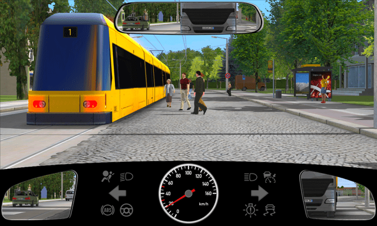

**Options:**
- A. You may pass on the right-hand side at walking speed provided that passengers are not obstructed and you are sure no-one is endangered
- B. If no-one is obstructed or endangered, you may pass on the right-hand side at a speed faster than walking speed
- C. Passengers must allow moving traffic to pass before boarding

**Correct Answer(s):**
- A. You may pass on the right-hand side at walking speed provided that passengers are not obstructed and you are sure no-one is endangered

**Explanation:**
If you do not obstruct or endanger the passengers getting on or off the tram, you may pass the stopping tram slowly at walking speed. It is important to note that passengers have absolute priority in this situation and do not have to let moving traffic pass. If necessary, you as the vehicle driver must stop and wait.

---

#### Question 1.1.02-026-B

**Points:** 4 Points

**What must you heed in this situation?**

**Options:**
- A. - not overtake the bus while it is still moving
- B. - pass the stationary bus at walking speed provided you are sure that passengers are not endangered
- C. - overtake the bus while it is still moving

**Correct Answer(s):**
- A. - not overtake the bus while it is still moving
- B. - pass the stationary bus at walking speed provided you are sure that passengers are not endangered

**Explanation:**
If a public bus or school bus has its hazard lights on and is still moving, you must not overtake it. If the bus has come to a halt at the stop, you may pass at walking pace and at an appropriate distance. This is necessary in order not to endanger the passengers getting on and off the bus. If you are travelling in the opposite lane, you must also slow down or stop to ensure the safety of the passengers.

---

#### Question 1.1.02-027

**Points:** 4 Points

**What do you have to reckon with when elderly persons using walking frames cross the road?**

**Options:**
- A. They may stop on the road
- B. They may turn round and go back
- C. They will cross the road slowly

**Correct Answer(s):**
- A. They may stop on the road
- B. They may turn round and go back
- C. They will cross the road slowly

**Explanation:**
When elderly people with walking aids cross the road, you have a higher duty of care. The principle of trust is suspended. You must expect these people to stop suddenly or turn around unexpectedly. Older people also take a comparatively long time to cross the road.

---

#### Question 1.1.02-028

**Points:** 4 Points

**A person in a wheelchair is travelling along the road although there is a pavement on the right. What do you do?**

**Options:**
- A. I follow behind the wheelchair until I can overtake it
- B. I overtake it, leaving plenty of room on the side because the wheelchair may swing out
- C. I honk the horn to indicate that the person is not behaving correctly

**Correct Answer(s):**
- A. I follow behind the wheelchair until I can overtake it
- B. I overtake it, leaving plenty of room on the side because the wheelchair may swing out

**Explanation:**
Disabled and elderly people sometimes do not behave in a roadworthy manner due to physical limitations. Therefore, please be especially careful and be sure to show consideration. Expect the wheelchair user to suddenly and unexpectedly swerve and drive even further into the lane. In such situations, it is not permitted to use the horn or drive around the person at high speed.

---

#### Question 1.1.02-029

**Points:** 4 Points

**Having crossed the road, a person in a wheelchair cannot get up the curb and onto the pavement. What do you do?**

**Options:**
- A. I stop and switch on the hazard warning lights
- B. I get out of the car and help the person in the wheelchair
- C. I honk the horn and drive around the person

**Correct Answer(s):**
- A. I stop and switch on the hazard warning lights
- B. I get out of the car and help the person in the wheelchair

**Explanation:**
You should help the person. To do this, you may stop and switch on the hazard warning lights to warn other road users of possible dangers. It is not permitted to honk your horn and drive around the person in this situation. This would frighten and unsettle the wheelchair user.

---

#### Question 1.1.02-032

**Points:** 4 Points

**Who has a severe visual handicap?**

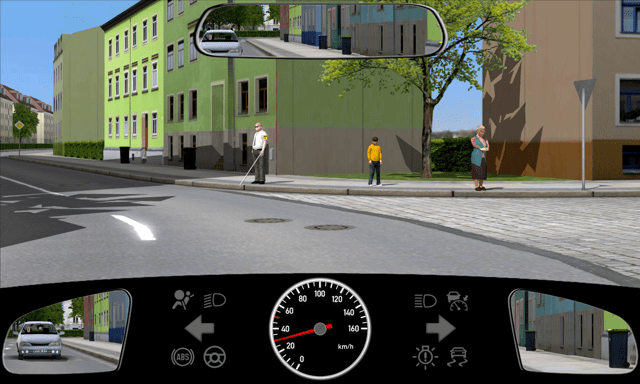

**Options:**
- A. The man
- B. The child
- C. The woman

**Correct Answer(s):**
- A. The man

**Explanation:**
You must expect a severe visual impairment in the case of persons with the following markings: If a person is wearing a yellow armband with three black dots and/or a white blind person's cane extended diagonally.

---

#### Question 1.1.02-036

**Points:** 4 Points

**What do you do?**

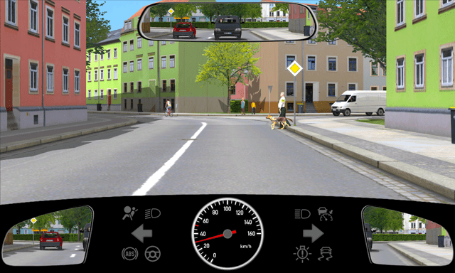

**Options:**
- A. Stop
- B. Let the man cross the road
- C. Make eye contact with the man

**Correct Answer(s):**
- A. Stop
- B. Let the man cross the road

**Explanation:**
Visually impaired pedestrians often wear an armband and have a guide dog with a white driving harness with them. It is not possible to make eye contact with a visually impaired road user. Therefore, you are obliged to show special consideration here. You must stop to allow the pedestrian to cross the road safely.

---

#### Question 1.1.02-037

**Points:** 3 Points

**What must you be aware of?**

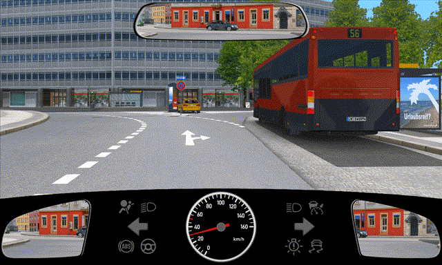

**Options:**
- A. Pedestrians crossing the road in front of the bus
- B. People crossing the road from left to right to get to the bus
- C. The bus will reverse suddenly

**Correct Answer(s):**
- A. Pedestrians crossing the road in front of the bus
- B. People crossing the road from left to right to get to the bus

**Explanation:**
Where buses or trams wait at stops, you must always assume that people will suddenly step onto the road. Some passengers run quickly across the street to reach the bus. When passengers get off the bus, they often enter the lane surprisingly without paying attention to the traffic. Because the reversing light is not lit, you as the driver behind you can be sure that the bus will leave the bus stop driving forwards.

---

#### Question 1.1.02-038-M

**Points:** 4 Points

**What risks must you be aware of?**

**Options:**
- A. - proceed onto the road
- B. - continue on the cycle path
- C. - stop moving

**Correct Answer(s):**
- A. - proceed onto the road

**Explanation:**
Cyclists do not always behave in a way that is appropriate for traffic. Here, even if the child has previously looked to your left, he or she could ride onto the roadway. To avoid a dangerous situation, you should therefore reduce your speed and be ready to brake.

---

#### Question 1.1.02-039-M

**Points:** 4 Points

**How do you behave?**

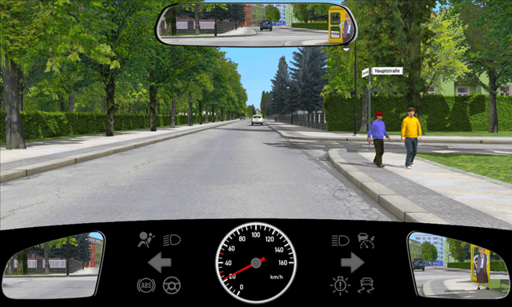

**Options:**
- A. watch out for children
- B. be ready to brake
- C. continue driving at the same speed

**Correct Answer(s):**
- A. watch out for children
- B. be ready to brake

**Explanation:**
Reduce speed and watch the two children very closely. Be careful and ready to brake. Stop if the children's behaviour makes this necessary.

---

#### Question 1.1.02-040-M

**Points:** 5 Points

**What must you be aware of?**

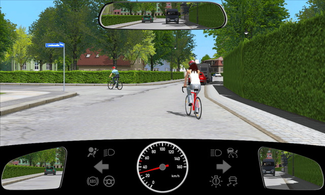

**Options:**
- A. - turn to the left
- B. - go to the other side of the road
- C. - not impede me as I proceed

**Correct Answer(s):**
- A. - turn to the left
- B. - go to the other side of the road

**Explanation:**
It is always possible that cyclists do not behave in a way that is appropriate for the traffic. A cyclist could turn left or change sides of the road without indicating this with a hand signal. If there are two cyclists, it is possible that the second will also follow the first without hand signals. Therefore, you should be ready to brake even if the cyclists continue straight ahead.

---

#### Question 1.1.02-041-M

**Points:** 5 Points

**What risks must you be aware of?**

**Options:**
- A. the children will not get off the road in time
- B. some children will turn around again
- C. all children will wait on the pavement

**Correct Answer(s):**
- A. the children will not get off the road in time
- B. some children will turn around again

**Explanation:**
If a ball is lying on the road, it can be assumed that a child will come and fetch it. For you as a driver, this means: stop immediately so that the child can fetch the ball safely. With children, you have to expect that they will behave in a way that is contrary to traffic regulations and that they will not be able to assess dangers correctly.

---

#### Question 1.1.02-042-M

**Points:** 5 Points

**How should you behave?**

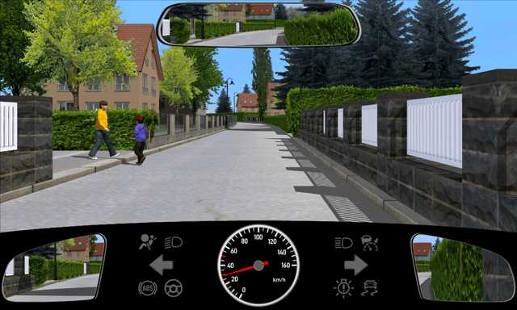

**Options:**
- A. slow to walking pace
- B. remain ready to brake
- C. continue driving at same speed

**Correct Answer(s):**
- A. slow to walking pace
- B. remain ready to brake

**Explanation:**
The rule here is: reduce speed immediately, be ready to brake and drive slowly past the situation. It can be assumed that children who are playing are not paying attention to the traffic and are not behaving in a way that is appropriate for the traffic.

---

#### Question 1.1.02-043-M

**Points:** 5 Points

**How must you behave?**

**Options:**
- A. slow to walking pace immediately
- B. remain ready to brake
- C. drive past at the same speed

**Correct Answer(s):**
- A. slow to walking pace immediately
- B. remain ready to brake

**Explanation:**
Most likely, a child will come running into the road after the ball without paying attention to the traffic. Immediately slow your vehicle down to walking speed. Be especially alert and ready to brake!

---

#### Question 1.1.02-046-M

**Points:** 4 Points

**In this situation, which vehicles may drive past, at walking speed only, while ensuring there is no danger to any passengers?**

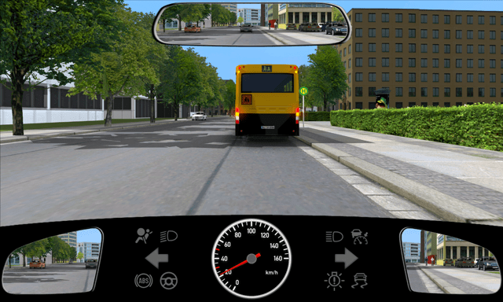

**Options:**
- A. - are travelling in the same direction
- B. - are oncoming

**Correct Answer(s):**
- A. - are travelling in the same direction
- B. - are oncoming

**Explanation:**
When the hazard warning lights of a bus are switched on at a bus stop, all vehicles in both directions must pass the bus at walking speed. There shall be no danger to or obstruction of passengers boarding or alighting the bus.

---

#### Question 1.1.02-048-M

**Points:** 5 Points

**What should you do now?**

**Options:**
- A. I slow down to walking pace
- B. I remain ready to brake
- C. I overtake [the cyclist]

**Correct Answer(s):**
- A. I slow down to walking pace
- B. I remain ready to brake

**Explanation:**
Since there are children both on the left and right on the street, you should brake to walking pace and remain ready to brake.

---

#### Question 1.1.02-049

**Points:** 4 Points

**What should you do in this situation?**

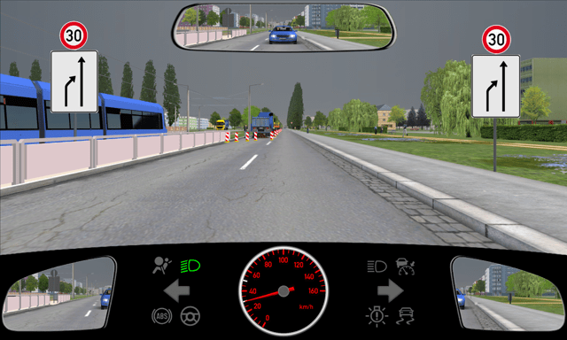

[Video: videos/1_1_02-049.mp4](videos/1_1_02-049.mp4)

**Options:**
- A. I perform an emergency braking manoeuvre
- B. I sound my horn and continue driving
- C. I accelerate

**Correct Answer(s):**
- A. I perform an emergency braking manoeuvre

**Explanation:**
Immediately perform emergency braking to prevent a collision with the cyclist coming from the left. Continuing to ride would be dangerous in the situation, even though the traffic lights are green in your direction.

---

#### Question 1.1.02-050-M

**Points:** 5 Points

**Why must you drive slowly here and be ready to brake?**

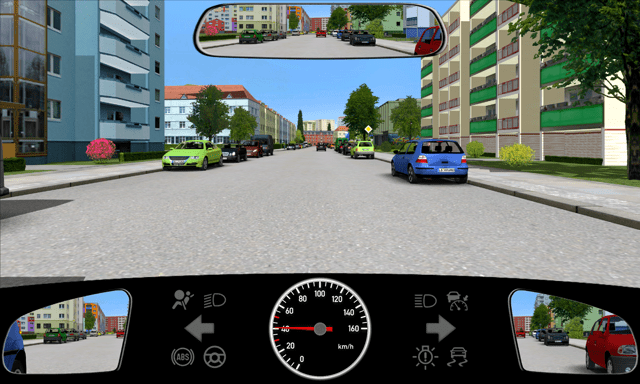

[Video: videos/1_1_02-050-M.mp4](videos/1_1_02-050-M.mp4)

**Options:**
- A. Because the traffic situation is confusing
- B. Because there is a child on the carriageway
- C. Because [the white van] is moving off

**Correct Answer(s):**
- A. Because the traffic situation is confusing
- B. Because there is a child on the carriageway

**Explanation:**
The child behind the van on the left runs towards the roadway. You cannot see whether it will stop. Therefore, be especially attentive and careful in this unclear traffic situation. Drive slowly and be ready to brake.

---

#### Question 1.1.02-051-M

**Points:** 4 Points

**What is the correct course of action in this situation?**

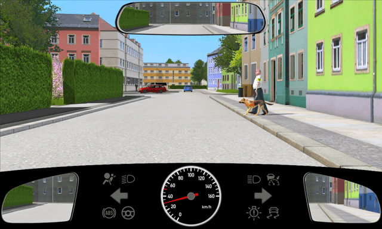

**Options:**
- A. I stop and allow the person to cross the road
- B. I drive to the left past the person, leaving sufficient clearance space
- C. I flash my headlights to signal to the person that I am giving way

**Correct Answer(s):**
- A. I stop and allow the person to cross the road

**Explanation:**
The man is wearing a yellow armband and has a guide dog with him. He is blind or visually impaired and cannot see the traffic situation. Special care must be taken for blind people. Therefore, you must let him cross the road in front of you.

---

#### Question 1.1.02-052

**Points:** 4 Points

**Why must you anticipate that children might behave unpredictably in road traffic situations?**

**Options:**
- A. - are easily distracted
- B. - are frequently unable to fully grasp the road traffic situation
- C. - are frequently unable to correctly detect the direction from which a sound is coming

**Correct Answer(s):**
- A. - are easily distracted
- B. - are frequently unable to fully grasp the road traffic situation
- C. - are frequently unable to correctly detect the direction from which a sound is coming

**Explanation:**
Children often behave unpredictably, which is why other road users always have to count on the unexpected. Due to external stimuli in the environment, small children are constantly distracted from the road and traffic. They continuously let their eyes hike in the area and get stuck with interesting events or objects. The noise perception also only develops in the course of life and is only available to a limited extent in children. That is why children can usually not assign the many noises in road traffic to a certain direction and it is more difficult for them to assess them purely acoustically from which direction a vehicle approaches.
In addition to the perception of the direction, the perception of distances, speeds and braking distance in childhood is not yet fully pronounced. Therefore, children can often only overlook the traffic situation incompletely.

---

#### Question 1.1.02-107

**Points:** 4 Points

**A child is walking on the pavement with a dog on a lead. Can this cause a dangerous situation?**

**Options:**
- A. Yes, if the dog suddenly runs onto the roadway and pulls the child along behind
- B. Yes, if the dog tears away and the child runs after the dog
- C. No, because dogs are afraid of traffic

**Correct Answer(s):**
- A. Yes, if the dog suddenly runs onto the roadway and pulls the child along behind
- B. Yes, if the dog tears away and the child runs after the dog

**Explanation:**
Dangerous situations can arise here. The dog could break loose, and the child could run after him. It would also be conceivable that the dog would run onto the road, and the child would pull along. They should, therefore, drive slowly and be ready to brake.

---

#### Question 1.1.02-108-B

**Points:** 4 Points

**What must you heed in this situation?**

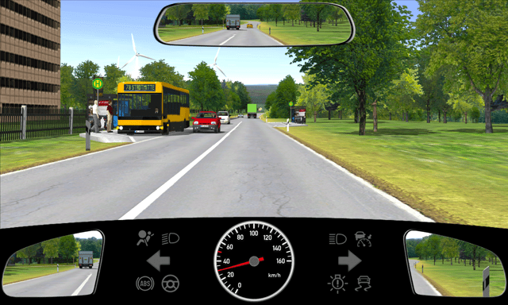

**Options:**
- A. - pass at walking speed only
- B. - pass only if you are sure that passengers are not endangered
- C. - not pass under any circumstances

**Correct Answer(s):**
- A. - pass at walking speed only
- B. - pass only if you are sure that passengers are not endangered

**Explanation:**
When public transport and school buses are at a stop and their hazard warning lights are switched on, the following applies: Vehicles may only pass them at walking speed and at a sufficient distance. This applies to oncoming traffic as well as to vehicles travelling in the same direction as the bus. Any danger to passengers must be ruled out by you as the driver of the vehicle.

---

#### Question 1.1.02-109-B

**Points:** 4 Points

**Which statements are correct in this situation?**

**Options:**
- A. Cars coming from the opposite direction may pass the bus provided that they do so with care
- B. You may pass the bus provided that you do so with care
- C. As you are coming from the opposite direction, you do not need to worry about the bus

**Correct Answer(s):**
- A. Cars coming from the opposite direction may pass the bus provided that they do so with care
- B. You may pass the bus provided that you do so with care

**Explanation:**
Vehicles coming from both directions may only pass public buses, school buses and trams stopped at bus stops with caution. As the bus has not switched on its hazard warning lights, you do not have to slow your vehicle down to walking speed. Be especially attentive in the situation!

---

#### Question 1.1.02-110-B

**Points:** 4 Points

**Which statements are correct in this situation?**

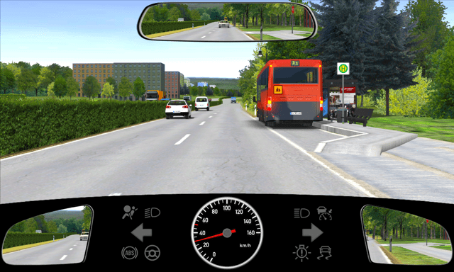

**Options:**
- A. The bus may be passed in either lane but no faster than at walking speed
- B. Vehicles in both lanes must stop if passengers would otherwise be endangered
- C. The vehicles in the left lane may pass the bus without paying any special attention

**Correct Answer(s):**
- A. The bus may be passed in either lane but no faster than at walking speed
- B. Vehicles in both lanes must stop if passengers would otherwise be endangered

**Explanation:**
If a bus is at a stop and its hazard warning lights are switched on, you as the driver may only pass the bus at walking speed on the same carriageway. Keep a sufficient distance. If necessary, you must stop and wait. The reason for this is the safety of bus passengers, which must always be ensured. This also applies to road users travelling in oncoming traffic on the same carriageway.

---

#### Question 1.1.02-112

**Points:** 5 Points

**In a residential area a ball rolls out in front of your vehicle. How must you react?**

**Options:**
- A. Brake
- B. Continue driving
- C. Avoid hitting it

**Correct Answer(s):**
- A. Brake

**Explanation:**
If a ball rolls in front of your vehicle in a residential area, you must expect a child to suddenly run into the road. You must therefore brake and be ready to stop, as the principle of trust does not apply in this case.

---

#### Question 1.1.02-113

**Points:** 5 Points

**You are approaching children playing on the pavement. How must you behave?**

**Options:**
- A. Slow down and be ready to brake
- B. Continue driving as before so as not to impede the traffic behind you
- C. Sound your horn and continue driving

**Correct Answer(s):**
- A. Slow down and be ready to brake

**Explanation:**
Children playing on the pavement could unexpectedly run onto the roadway. The principle of trust is therefore suspended. You must reduce speed and be ready to brake.

---

#### Question 1.1.02-114

**Points:** 4 Points

**What should you anticipate in this situation?**

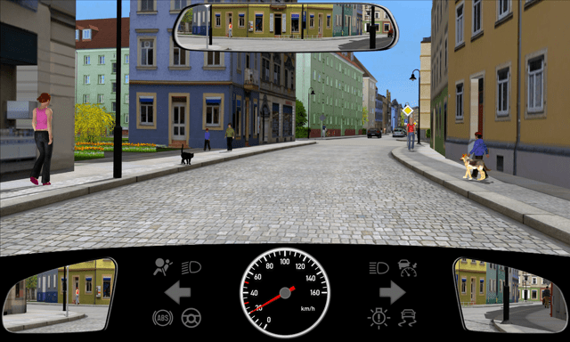

**Options:**
- A. - will run onto the carriageway, pulling the child behind it
- B. - will break free and the child will run after it
- C. - will be kept securely under control by the child

**Correct Answer(s):**
- A. - will run onto the carriageway, pulling the child behind it
- B. - will break free and the child will run after it

**Explanation:**
In this situation, you should be prepared for the danger of the dog running into the lane and dragging the child behind it, and of the dog breaking loose and the child running after it.

---

#### Question 1.1.02-115

**Points:** 5 Points

**In this situation, do you have to proceed slowly and be ready to brake?**

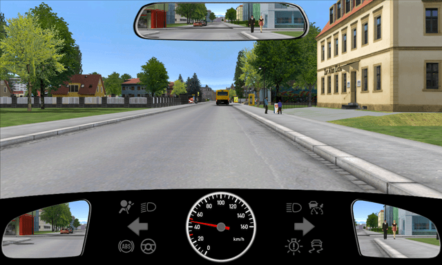

[Video: videos/1_1_02-115.mp4](videos/1_1_02-115.mp4)

**Options:**
- A. Yes, because passengers could cross the road from in front of the bus
- B. Yes, because pedestrians not alighting from the bus could cross the road
- C. Yes, because the bus will begin moving immediately

**Correct Answer(s):**
- A. Yes, because passengers could cross the road from in front of the bus
- B. Yes, because pedestrians not alighting from the bus could cross the road

**Explanation:**
As the bus is at the stop and flashing on the right, you should only drive past it very carefully. In addition, there is a person standing directly in front of the bus and thus in your immediate vicinity. You must also expect passengers to get off the bus. Other people may approach the bus from the other side of the road and want to get on. You should therefore slow down in any case so that you can brake immediately if necessary.

---

#### Question 1.1.02-116

**Points:** 4 Points

**The tram has just become stationary at the stop. What is the right course of action?**

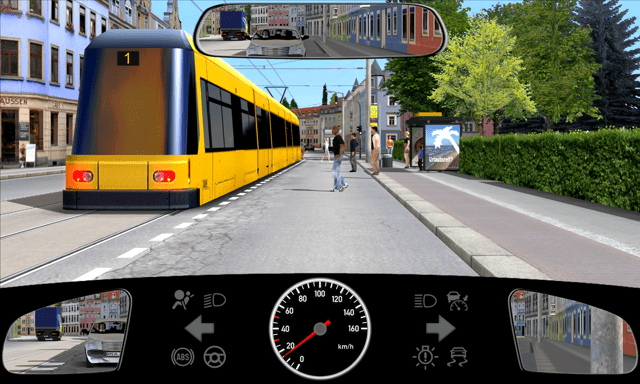

**Options:**
- A. - may not be endangered
- B. - may not be impeded
- C. - may be warned using the horn

**Correct Answer(s):**
- A. - may not be endangered
- B. - may not be impeded

**Explanation:**
You may carefully pass a stopping tram at walking speed - but only if this does not endanger or obstruct any passengers.

---

#### Question 1.1.02-117

**Points:** 5 Points

**Why must you pause here?**

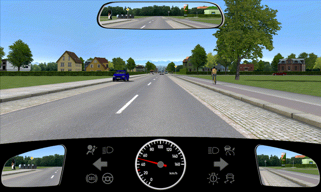

[Video: videos/1_1_02-117.mp4](videos/1_1_02-117.mp4)

**Options:**
- A. - the child
- B. - the motorbike
- C. - the off-road vehicle

**Correct Answer(s):**
- A. - the child

**Explanation:**
It's not clear what the child will do. It would be possible for the child to run onto the road without paying attention to the traffic. Therefore, you must carefully pass through: You should drive very slowly and be ready to brake.

---

#### Question 1.1.02-119

**Points:** 5 Points

**What should you do?**

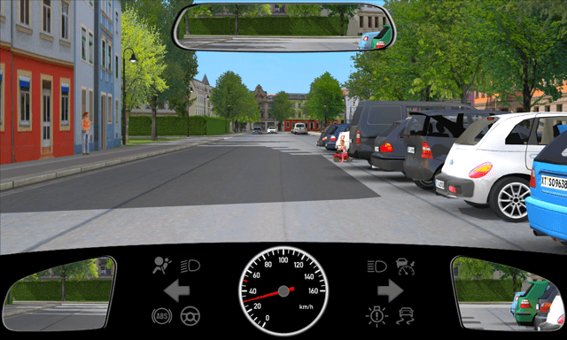

**Options:**
- A. Slow to walking pace
- B. Remain ready to brake
- C. Continue driving as before

**Correct Answer(s):**
- A. Slow to walking pace
- B. Remain ready to brake

**Explanation:**
Special caution is always required towards children in road traffic. In this situation, you must expect that the small child will continue to drive onto the road behind the van. Slow down to walking speed and remain alert and ready to brake at all times. Stop if necessary if you are not sure how the child will behave. It would be grossly negligent to just honk your horn and drive on.

---

#### Question 1.1.02-120-M

**Points:** 4 Points

**What should you do?**

**Options:**
- A. Brake early, to clearly indicate to the pedestrians that I am allowing them to cross
- B. Continue driving, even if the pedestrians stop briefly
- C. Arc around the pedestrians, to avoid impeding the following traffic

**Correct Answer(s):**
- A. Brake early, to clearly indicate to the pedestrians that I am allowing them to cross

**Explanation:**
Pedestrians always have absolute priority at pedestrian crossings. Therefore, brake your vehicle in good time and in a clearly visible manner. This way, pedestrians can easily see that you are fulfilling your obligation to wait and that they can enter the roadway. Even if the pedestrians are still standing at the roadside, it would be absolutely forbidden to simply drive on.

---

#### Question 1.1.02-121-M

**Points:** 4 Points

**What should you do?**

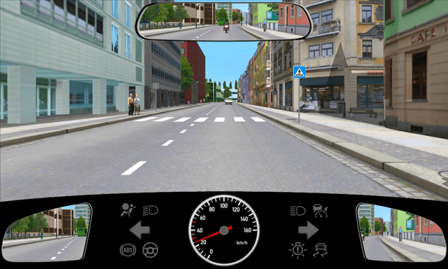

**Options:**
- A. Wait to allow pedestrians to cross the road
- B. Continue driving, because there is sufficient time before the pedestrians have reached my side of the road
- C. Continue driving, because there are pedestrians on the left side of the road only

**Correct Answer(s):**
- A. Wait to allow pedestrians to cross the road

**Explanation:**
When pedestrians wait at a zebra crossing to cross the road, they have priority. This also applies if they are on the left-hand side of the road. You should therefore brake in good time. Pedestrians must be able to see that you are complying with your obligation to stop. Even if the pedestrians stop first and wait, you must give them the right of way in a clearly visible manner.

---

#### Question 1.1.02-122

**Points:** 4 Points

**What actions should you anticipate at such stops?**

**Options:**
- A. Pedestrians will step off the tram-stop island unheedingly
- B. Pedestrians will run across the road to the tram-stop island
- C. Pedestrians will wait until the road is clear

**Correct Answer(s):**
- A. Pedestrians will step off the tram-stop island unheedingly
- B. Pedestrians will run across the road to the tram-stop island

**Explanation:**
Pedestrians are required to wait at such traffic islands. You are therefore allowed to pass the tram even if the tram doors are still open. But because people often behave carelessly when getting on and off the tram, dangerous situations arise time and again. For example, without paying attention to the traffic, passengers simply run across the carriageway to reach the tram.

---

#### Question 1.1.02-123-M

**Points:** 4 Points

**You want to turn right. What must you be prepared for?**

**Options:**
- A. The truck will stop
- B. [The pedestrian] could let the truck pass by and then cross the road in front of me
- C. After the truck has taken the turn, pedestrians could approach from the opposite side of the road

**Correct Answer(s):**
- A. The truck will stop
- B. [The pedestrian] could let the truck pass by and then cross the road in front of me
- C. After the truck has taken the turn, pedestrians could approach from the opposite side of the road

**Explanation:**
If you want to turn right, road users travelling in a straight line here have priority. These may be pedestrians or cyclists who want to cross the road. If a truck turns right in front of you, it is also possible that a pedestrian will let it pass. In that case, the lorry would block your view of the other side of the road and thus of the road users travelling from there.

---

#### Question 1.1.02-124-M

**Points:** 4 Points

**What must you be prepared for?**

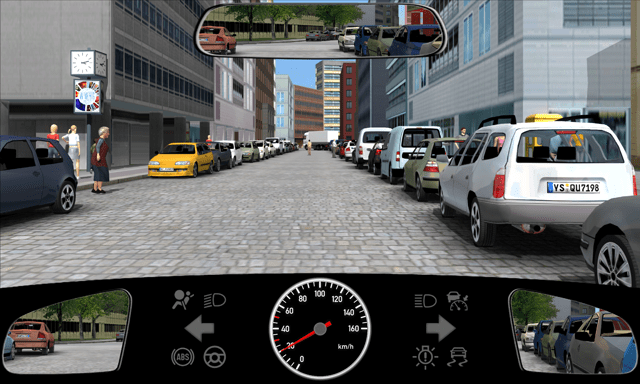

**Options:**
- A. For persons crossing
- B. For visual obstructions
- C. For vehicle doors opening

**Correct Answer(s):**
- A. For persons crossing
- B. For visual obstructions
- C. For vehicle doors opening

**Explanation:**
Where there are many parked cars, you should always drive carefully and considerately. On the one hand, your view is obstructed by the parked vehicles. Secondly, you must always be aware that car doors may be carelessly opened. Other road users may also want to cross the lane between the parked cars.

---

#### Question 1.1.02-125-M

**Points:** 4 Points

**What should you anticipate?**

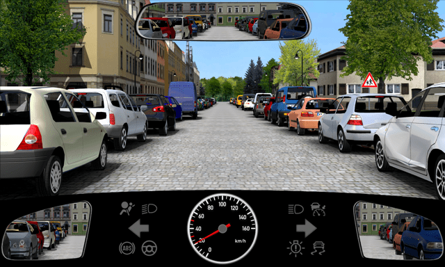

**Options:**
- A. That adults could walk onto the road
- B. That children could appear between the vehicles
- C. That it could be necessary to brake heavily

**Correct Answer(s):**
- A. That adults could walk onto the road
- B. That children could appear between the vehicles
- C. That it could be necessary to brake heavily

**Explanation:**
The "Children" danger sign on the right makes it clear that increased attention and a special degree of caution are necessary at this point. In addition to children, adults can of course also suddenly step onto the roadway between parked vehicles here, requiring heavy braking.

---

#### Question 1.1.02-126

**Points:** 4 Points

**Why are older pedestrians at more risk than younger ones from road traffic?**

**Options:**
- A. They frequently have poorer sight and hearing
- B. They frequently react more slowly and are less mobile
- C. They frequently misjudge the speed of vehicles

**Correct Answer(s):**
- A. They frequently have poorer sight and hearing
- B. They frequently react more slowly and are less mobile
- C. They frequently misjudge the speed of vehicles

**Explanation:**
Older road users see less well, hear less well, react more slowly and misjudge the speed of vehicles. Be prepared for these people to recognise dangers too late and react too late or not at all.

---

#### Question 1.1.02-127

**Points:** 4 Points

**What must you be aware of in residential areas with low traffic volumes?**

**Options:**
- A. That children playing run onto the road
- B. That cyclists are inattentive
- C. That all adults obey the road traffic regulations

**Correct Answer(s):**
- A. That children playing run onto the road
- B. That cyclists are inattentive

**Explanation:**
In residential areas, low traffic levels often give children and adults a feeling of high safety. Some road users are thoughtless here, which often leads to inappropriate traffic behaviour. In such areas, always expect children playing, inattentive cyclists and pedestrians suddenly entering the road. Drive particularly carefully and attentively, as children in particular are unable to properly assess the dangers of road traffic.

---

#### Question 1.1.02-128

**Points:** 4 Points

**What actions should you anticipate from persons at the pedestrian crossing?**

**Options:**
- A. They will look neither left nor right
- B. They will unexpectedly walk onto the road
- C. Sometimes they turn back half-way across

**Correct Answer(s):**
- A. They will look neither left nor right
- B. They will unexpectedly walk onto the road
- C. Sometimes they turn back half-way across

**Explanation:**
Zebra crossings have a protective function for pedestrians. They give them priority over other road users. Some pedestrians thoughtlessly trust this protection and cross the roadway without paying attention to the traffic. At zebra crossings, be aware that pedestrians and especially elderly or vulnerable people may enter the roadway without looking left and right. It is also possible that pedestrians will turn halfway around when the traffic lights turn red.

---

#### Question 1.1.02-129

**Points:** 4 Points

**A pedestrian with a white stick wants to cross the road in front of you. What should you do?**

**Options:**
- A. - reduce speed and stop if necessary
- B. - give a warning signal
- C. - continue driving at the same speed

**Correct Answer(s):**
- A. - reduce speed and stop if necessary

**Explanation:**
The white cane shows you that this road user is blind or at least severely visually impaired. The stick is also the sign that the person is allowed to participate in road traffic without an escort. You must always treat blind and visually impaired people with increased consideration. Reduce your speed and stop if necessary. Do not honk: you would frighten and unsettle the person.

---

#### Question 1.1.02-130-M

**Points:** 4 Points

**What should you anticipate?**

**Options:**
- A. That pedestrians will walk onto the road in front of me
- B. That children will suddenly appear between the vehicles
- C. That pedestrians will wait until I have driven past

**Correct Answer(s):**
- A. That pedestrians will walk onto the road in front of me
- B. That children will suddenly appear between the vehicles

**Explanation:**
The "Children" danger sign on the right warns you to take extra care. With many parked vehicles, however, you must always assume that people will step onto the carriageway unexpectedly. Of course, in addition to children, adults can also fail to behave in a roadworthy manner and suddenly appear between the vehicles.

---

#### Question 1.1.02-131

**Points:** 3 Points

**What should you anticipate?**

**Options:**
- A. That pedestrians will suddenly walk onto the road
- B. That doors of vehicles will be opened
- C. That vehicles will begin moving

**Correct Answer(s):**
- A. That pedestrians will suddenly walk onto the road
- B. That doors of vehicles will be opened
- C. That vehicles will begin moving

**Explanation:**
In a traffic situation with several parked vehicles and different road users, the parked vehicles impair your visibility. Pedestrians can be expected to emerge between cars to cross the road. It is also possible for people to get out of vehicles or for vehicles to drive off without paying attention to the current traffic situation.

---

#### Question 1.1.02-132

**Points:** 4 Points

**What is your assessment of this situation?**

**Options:**
- A. The female pedestrian may walk unheedingly onto the road
- B. The pedestrian with the moped may change direction suddenly
- C. I can continue driving at the same speed

**Correct Answer(s):**
- A. The female pedestrian may walk unheedingly onto the road
- B. The pedestrian with the moped may change direction suddenly

**Explanation:**
You should only pass the waiting pedestrian at the side of the road with an appropriate safe distance and very carefully. The same applies to a moped rider who is properly pushing his moped on the right-hand side of the road. If necessary, you can also change to the left lane.

---

#### Question 1.1.02-133

**Points:** 4 Points

**A person at the side of the road is wearing a yellow armband with three black spots. What does this armband indicate?**

**Options:**
- A. The wearer is disabled
- B. I am obliged to behave in a particular way towards this person
- C. This person belongs to a particular profession

**Correct Answer(s):**
- A. The wearer is disabled
- B. I am obliged to behave in a particular way towards this person

**Explanation:**
If you see a person at the side of the road wearing a yellow armband with three black dots, this means for you: the principle of trust has been suspended. You now have an increased duty of care. This is because the armband indicates a physical limitation in the form of a severe visual impairment. If visually impaired persons wear this armband and/or a white stick, they are allowed to move in traffic without an escort.

---

#### Question 1.1.02-134-M

**Points:** 5 Points

**Why do you have to reduce your speed here?**

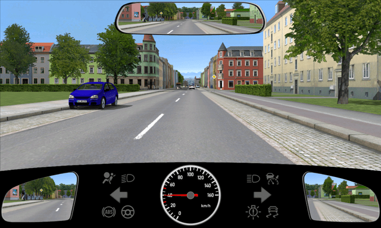

[Video: videos/1_1_02-134-M.mp4](videos/1_1_02-134-M.mp4)

**Options:**
- A. - child
- B. - motorbike
- C. - [SUV]

**Correct Answer(s):**
- A. - child

**Explanation:**
If a van is parked in front of a house and a child runs out of the house, the child may run into the road directly in front of the van. Children rarely pay attention to traffic. Therefore, you should be able to brake immediately in an emergency. To do this, you should reduce your driving speed.

---

#### Question 1.1.02-135

**Points:** 4 Points

**What should you anticipate when pedestrians are crossing the road?**

**Options:**
- A. - be inattentive
- B. - come to a sudden stop
- C. - turn back, after half-way

**Correct Answer(s):**
- A. - be inattentive
- B. - come to a sudden stop
- C. - turn back, after half-way

**Explanation:**
When a pedestrian crosses the roadway, it is not certain that he will continue this action to the opposite side of the road. It is also quite possible that he will stop, turn around or continue with a delay.

---

#### Question 1.1.02-136-M

**Points:** 5 Points

**Why must you drive slowly now, and be ready to brake?**

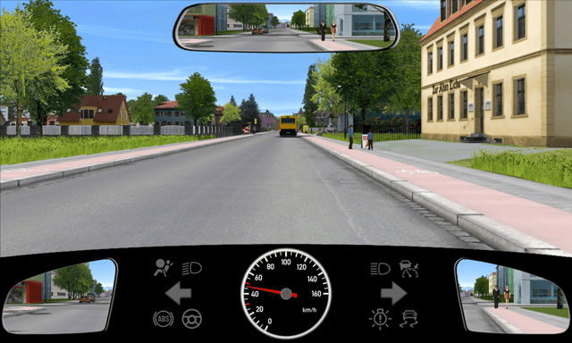

[Video: videos/1_1_02-136-M.mp4](videos/1_1_02-136-M.mp4)

**Options:**
- A. Because of the pedestrian
- B. Because the bus is moving off
- C. Because [of the cyclist]

**Correct Answer(s):**
- A. Because of the pedestrian

**Explanation:**
You must drive slowly and be ready to brake because passengers can cross the road in front of the bus.

---

#### Question 1.1.02-137-M

**Points:** 5 Points

**Why are you required to brake here?**

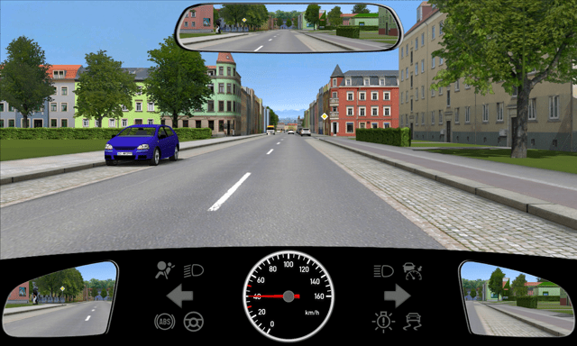

[Video: videos/1_1_02-137-M.mp4](videos/1_1_02-137-M.mp4)

**Options:**
- A. - child
- B. - cyclist
- C. - [green] vehicle

**Correct Answer(s):**
- A. - child

**Explanation:**
A child is behind the parked vehicle and will probably cross the road in the next moment.

---

#### Question 1.1.02-138-M

**Points:** 4 Points

**What is the right course of action now?**

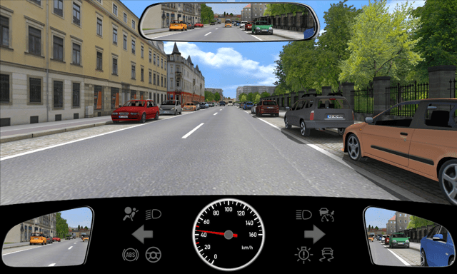

[Video: videos/1_1_02-138-M.mp4](videos/1_1_02-138-M.mp4)

**Options:**
- A. I reduce my speed
- B. Ich ready myself for an emergency braking manoeuvre
- C. I continue driving as before

**Correct Answer(s):**
- A. I reduce my speed
- B. Ich ready myself for an emergency braking manoeuvre

**Explanation:**
Since the dog, most likely, will run onto the street from the left, you have to reduce your speed and prepare for a braking for danger.

---

#### Question 1.1.02-201-M

**Points:** 4 Points

**Why are you required to stop here?**

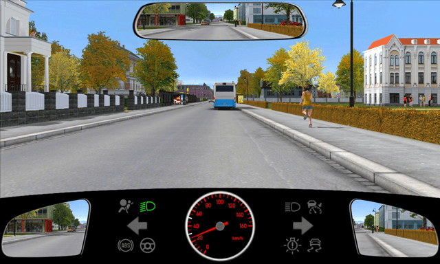

[Video: videos/1_1_02-201-M.mp4](videos/1_1_02-201-M.mp4)

**Options:**
- A. Because [a pedestrian] wants to cross the road from the left
- B. Because a pedestrian wants to cross the road from the right
- C. Because [a cyclist] wants to cross the road from the left

**Correct Answer(s):**
- A. Because [a pedestrian] wants to cross the road from the left
- B. Because a pedestrian wants to cross the road from the right

**Explanation:**
You should stop here because there are 2 pedestrians in front of the bus and they want to cross the road. One from the right and one from the left.

---

#### Question 1.1.02-202-M

**Points:** 5 Points

**Why are you required to brake now?**

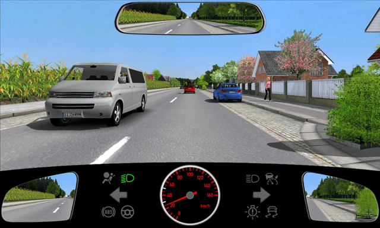

[Video: videos/1_1_02-202-M.mp4](videos/1_1_02-202-M.mp4)

**Options:**
- A. Because of the child
- B. Because of the [green] car
- C. Because of [the cyclist]

**Correct Answer(s):**
- A. Because of the child

**Explanation:**
The child could run onto the roadway at any moment. Brake to avoid an accident.

---

### 1.1.03 Chapter Road And Weather Conditions

#### Question 1.1.03-001

**Points:** 3 Points

**Where must you particularly reckon with dirt on the roadway and therefore danger of skidding?**

**Options:**
- A. Near construction sites
- B. At junctions with farm tracks
- C. At innercity crossroads

**Correct Answer(s):**
- A. Near construction sites
- B. At junctions with farm tracks

**Explanation:**
At junctions of dirt roads and at construction sites, the roadway is likely to be heavily soiled with soil, clay and dirt. Vehicles coming from there bring the dirt onto the road with the tread grooves of their tyres. In wet conditions, this means an increased risk of slipping.

---

#### Question 1.1.03-002

**Points:** 4 Points

**Why must the safe distance maintained be much greater on a wet roadway than on a dry roadway?**

**Options:**
- A. The contact between the tyres and the roadway deteriorates
- B. Wheel-spray can impair visibility
- C. Braking distances are greater

**Correct Answer(s):**
- A. The contact between the tyres and the roadway deteriorates
- B. Wheel-spray can impair visibility
- C. Braking distances are greater

**Explanation:**
On wet roads, the adhesion between the tyre and the road is poorer due to the water film. As a result, the braking distance is considerably longer. In addition, the spray from the car in front worsens visibility. The same applies to rainy weather.

---

#### Question 1.1.03-003

**Points:** 4 Points

**Where must you especially reckon with ice on the roadway?**

**Options:**
- A. On bridges
- B. On stretches of road running through forest
- C. On frequently used stretches of road

**Correct Answer(s):**
- A. On bridges
- B. On stretches of road running through forest

**Explanation:**
You must expect increased icing on the road in the following areas: in damp, shady and windy locations that favour the formation of ice on the road. These include, above all, forest locations and bridges. In forests, the cold lasts longer than in open fields. Because of the shade, moisture takes longer to evaporate here. On bridges, roadways store less heat than on the ground. Bridge roadways are therefore colder and ice up faster. The moisture of the surrounding water and the increased wind due to the unprotected location also promote icing.

---

#### Question 1.1.03-004

**Points:** 4 Points

**What are the special conditions when driving along tree-lined avenues in the cold season?**

**Options:**
- A. Wet leaves as well as white frost, black ice and snowy surfaces are particularly dangerous above all on cambered roadways
- B. White frost and black ice occur more frequently and more unexpectedly on cobbled roadways than on other roadways
- C. Tree-lined avenues are particularly safe in winter because the treetops protect the road from snow

**Correct Answer(s):**
- A. Wet leaves as well as white frost, black ice and snowy surfaces are particularly dangerous above all on cambered roadways
- B. White frost and black ice occur more frequently and more unexpectedly on cobbled roadways than on other roadways

**Explanation:**
The particularities of driving along avenues in the cold season result from the basic characteristics of an avenue: it is characterised by uniform rows of trees running parallel to the roadway on the right and left. The foliage of the trees creates shade on the roadway. This keeps moisture longer, which favours icing in cold weather. If the leaves fall on the roadway, it also significantly increases the risk of the vehicle slipping.

---

#### Question 1.1.03-005

**Points:** 4 Points

**There is oil on the road. What should you do now?**

**Options:**
- A. I notify the fire brigade
- B. I avoid heavy braking and abrupt steering movements
- C. I swerve onto the left-hand side of the road

**Correct Answer(s):**
- A. I notify the fire brigade
- B. I avoid heavy braking and abrupt steering movements

**Explanation:**
If there is oil on the road, avoid jerky steering and heavy braking; there is a risk of slipping. Provided other road users are not endangered, you can move to the left lane. Notify the fire brigade so that the oil can be bound.

---

#### Question 1.1.03-006-M

**Points:** 3 Points

**What must you be prepared for here?**

**Options:**
- A. A vehicle coming from the right
- B. An extended braking distance
- C. A narrowed carriageway

**Correct Answer(s):**
- A. A vehicle coming from the right
- B. An extended braking distance
- C. A narrowed carriageway

**Explanation:**
Due to the weather and the corresponding conditions on the road, you have to be prepared for an extended braking distance, for a vehicle coming from the right (right before left) and for a narrowed lane.

---

#### Question 1.1.03-007-M

**Points:** 4 Points

**You are driving following a heavy rain shower. What should you be aware of in this situation?**

**Options:**
- A. I should maintain a large safety distance between me and the vehicle ahead
- B. It is difficult for me to detect uneven areas on the road surface
- C. Splash water might impair my vision

**Correct Answer(s):**
- A. I should maintain a large safety distance between me and the vehicle ahead
- B. It is difficult for me to detect uneven areas on the road surface
- C. Splash water might impair my vision

**Explanation:**
When it rains, your view worsens. Therefore, you should enlarge your safety distance to the vehicle in front, as your braking distance is extended. Spray water can be whirled up from the vehicle in front by a wet road. This means that bumps are difficult to recognize.

---

#### Question 1.1.03-102-B

**Points:** 4 Points

**Why does driving on this stretch of road require greater alertness on the part of the motorist?**

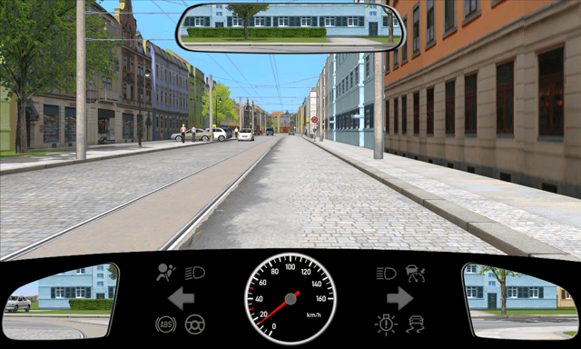

**Options:**
- A. The road surface is uneven and road grip varies
- B. A tram might come from the opposite direction
- C. Driving on the tracks is dangerous

**Correct Answer(s):**
- A. The road surface is uneven and road grip varies
- B. A tram might come from the opposite direction
- C. Driving on the tracks is dangerous

**Explanation:**
A tram may come towards you on the tracks, in which case the lane becomes much narrower for you. Tram tracks are also dangerous, especially when wet, because they become slippery. In addition, as there are also cobblestones, the road surface is uneven and has varying degrees of grip. This can increase the braking distance.

---

#### Question 1.1.03-104

**Points:** 4 Points

**The road is icy for a short distance. What should you avoid here, if possible?**

**Options:**
- A. Accelerating
- B. Braking
- C. Steering wheel movements

**Correct Answer(s):**
- A. Accelerating
- B. Braking
- C. Steering wheel movements

**Explanation:**
On icy roads, your tyres do not grip as well as usual. Therefore, you should avoid dangerous situations, i.e. neither brake nor accelerate abruptly. You should also refrain from sudden steering movements. This could cause your vehicle to skid. Only brake and steer away from the icy surface.

---

#### Question 1.1.03-105

**Points:** 4 Points

**While driving, how can you safely check whether the road is icy?**

**Options:**
- A. By carefully applying the brakes at very low speed
- B. By jerking the steering wheel to the left and right
- C. By rapid acceleration

**Correct Answer(s):**
- A. By carefully applying the brakes at very low speed

**Explanation:**
Test the condition of the road by braking carefully at low speed. Be sure to pay attention to the traffic behind you. Avoid jerking the steering or accelerating sharply. This could cause your vehicle to swerve and become uncontrollable.

---

#### Question 1.1.03-108-B

**Points:** 3 Points

**Why must you drive with particular caution here?**

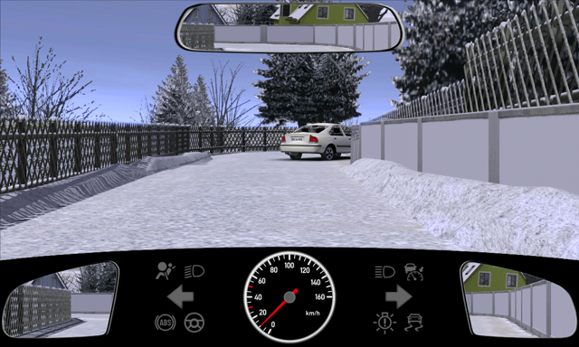

**Options:**
- A. Because the roadway is slippery
- B. Because the view is obscured by the bend
- C. Because the roadway is made narrower by the wrongly parked car

**Correct Answer(s):**
- A. Because the roadway is slippery
- B. Because the view is obscured by the bend
- C. Because the roadway is made narrower by the wrongly parked car

**Explanation:**
Snow makes the road slippery. There is a curve in front of you that is difficult to see and a car is parked there. You will have to pull out into the oncoming lane to drive around it. Therefore, drive extra carefully to be able to react at any time. In addition, your vehicle needs suitable tyres for good grip.

---

#### Question 1.1.03-109

**Points:** 3 Points

**Where must you be prepared to encounter sudden fog?**

**Options:**
- A. Near rivers
- B. In marshy areas
- C. Near lakes

**Correct Answer(s):**
- A. Near rivers
- B. In marshy areas
- C. Near lakes

**Explanation:**
Humidity at low temperatures favours the formation of fog. Therefore, fog is more likely to occur around lakes, watercourses and rivers as well as moorland areas.

---

#### Question 1.1.03-110

**Points:** 4 Points

**What do you do if visibility is drastically reduced by fog?**

**Options:**
- A. Adapt your speed in time to visibility conditions
- B. Increase the distance from the vehicle in front
- C. Drive up close to the vehicle in front so you can use its rear lights as an orientation point

**Correct Answer(s):**
- A. Adapt your speed in time to visibility conditions
- B. Increase the distance from the vehicle in front

**Explanation:**
Adjust your speed and driving style to the visibility conditions. Make sure that you can stop within sight. If necessary, increase the safety distance to the vehicle in front. Fog with a visibility of 50 metres, for example, means that you may drive at a maximum of 50 km/h.

---

#### Question 1.1.03-112-M

**Points:** 4 Points

**What is the right course of action here?**

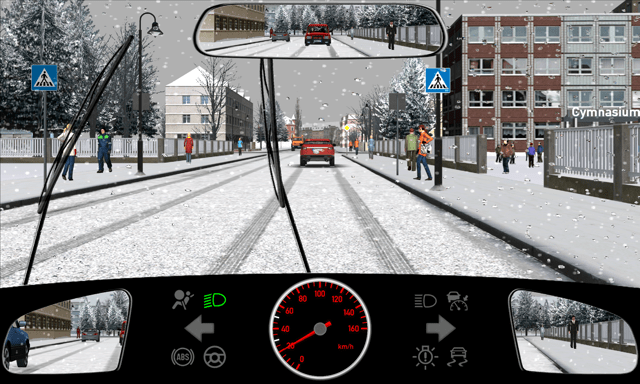

**Options:**
- A. I brake carefully
- B. I allow [the pedestrian] on the right to cross the road
- C. I carefully continue driving, because there are no markings visible on the road

**Correct Answer(s):**
- A. I brake carefully
- B. I allow [the pedestrian] on the right to cross the road

**Explanation:**
Even if the lane marking is not visible, the traffic signs show the presence of the pedestrian crossing. Brake carefully to prevent your vehicle from skidding.

---

#### Question 1.1.03-114-M

**Points:** 4 Points

**Why do you have to pay particular attention here?**

**Options:**
- A. Because it is not clear which direction the road will take
- B. Because the road surface is uneven
- C. Because oncoming traffic could cut the corner

**Correct Answer(s):**
- A. Because it is not clear which direction the road will take
- B. Because the road surface is uneven
- C. Because oncoming traffic could cut the corner

**Explanation:**
There is a long curve in front of you, the end of which you cannot see. A fast-moving vehicle could come towards you from there and cut your lane. The road surface is also uneven and does not have an even surface. So anticipate insufficient grip and drive at an adapted speed.

---

#### Question 1.1.03-115

**Points:** 4 Points

**You want to exit the motorway; to which must you pay particularly close attention?**

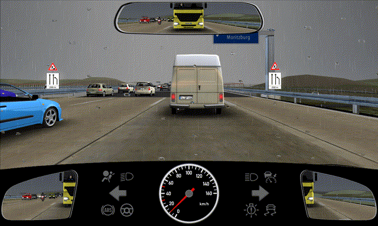

[Video: videos/1_1_03-115.mp4](videos/1_1_03-115.mp4)

**Options:**
- A. The red motorbike
- B. The yellow truck
- C. The white van

**Correct Answer(s):**
- A. The red motorbike

**Explanation:**
In the video you see a red motorcycle on the deceleration lane. Later it is no longer visible, because it is located in the blind spot on the right side of you. Now if you also swing out on the deceleration lane, you'll cut the motorcyclist - a dangerous situation for him. Make sure that the rider passes right by you before changing lanes.

---

#### Question 1.1.03-116

**Points:** 4 Points

**Why might taking the right turn be dangerous here?**

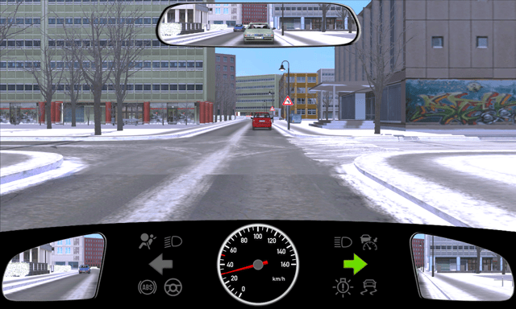

**Options:**
- A. Because I might possibly not be able to stop in time, if pedestrians are crossing the side street
- B. Because vehicles emerging from the side street could start to skid
- C. Because my vehicle might start to skid if I take the turn too fast

**Correct Answer(s):**
- A. Because I might possibly not be able to stop in time, if pedestrians are crossing the side street
- B. Because vehicles emerging from the side street could start to skid
- C. Because my vehicle might start to skid if I take the turn too fast

**Explanation:**
The winter weather makes the road slippery and increases the braking distance at the intersection. Your car or oncoming vehicles could skid or slide away uncontrollably. Therefore, reduce your speed in good time and do not brake abruptly. The road on the right is still full of snow and therefore even slicker. Watch out for pedestrians when turning. They always have priority when you turn.

---

#### Question 1.1.03-117

**Points:** 4 Points

**You are driving on this road which is not inside a built-up area. What should you prepare yourself for?**

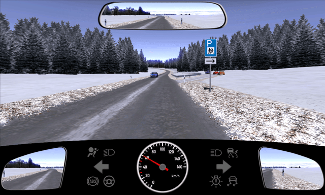

**Options:**
- A. Pedestrians using the road
- B. The road is narrow
- C. Pedestrians walking only off the road

**Correct Answer(s):**
- A. Pedestrians using the road
- B. The road is narrow

**Explanation:**
On the right you will see the sign for a car park. Expect pedestrians walking away from or towards their parked cars. As the pavements are impassable due to the masses of snow, evasive pedestrians could use the roadway. The weather causes slippery conditions and increases your braking distance. Drive slowly.

---

#### Question 1.1.03-118

**Points:** 5 Points

**What must you be aware of?**

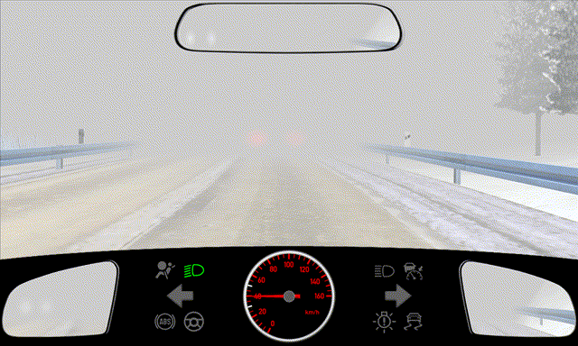

[Video: videos/1_1_03-118.mp4](videos/1_1_03-118.mp4)

**Options:**
- A. - turn on the rear fog lights
- B. - drive at 50 km/h maximum
- C. - drive at 80 km/h maximum

**Correct Answer(s):**
- A. - turn on the rear fog lights
- B. - drive at 50 km/h maximum

**Explanation:**
The fog is so dense here that you cannot see farther than 50 meters. With such a limited view, obstacles and dangerous situations cannot be detected in time when you're driving at high speed. Therefore, you must reduce your speed to a maximum of 50 km/h and drive very carefully. Turn on the rear fog-lamp of your vehicle.

---

#### Question 1.1.03-119-M

**Points:** 4 Points

**Why is it necessary to maintain a larger safety distance to the vehicle ahead?**

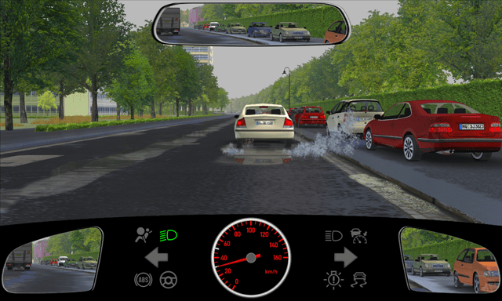

**Options:**
- A. Because spray water could otherwise impede visibility
- B. Because the braking distance is longer than on a dry road
- C. Because uneven areas of the road will otherwise be detected later

**Correct Answer(s):**
- A. Because spray water could otherwise impede visibility
- B. Because the braking distance is longer than on a dry road
- C. Because uneven areas of the road will otherwise be detected later

**Explanation:**
There is a risk of aquaplaning on wet roads. The braking distance is longer than on dry surfaces. The vehicle in front creates a spray of dirty water that reduces your visibility. Also, you cannot see larger puddles of water in advance. To be able to react well to dangerous situations, keep a greater distance from the vehicle in front and adjust your speed.

---

#### Question 1.1.03-120

**Points:** 3 Points

**What is the correct course of action in this situation?**

**Options:**
- A. I reduce my speed
- B. I avoid jerky steering movements
- C. I brake hard while in the bend

**Correct Answer(s):**
- A. I reduce my speed
- B. I avoid jerky steering movements

**Explanation:**
Drive carefully, slowly and avoid abrupt steering or braking, because slippery snow or ice can occur at any time.

---

#### Question 1.1.03-121

**Points:** 4 Points

**While driving, it suddenly begins to rain heavily. What should you do?**

**Options:**
- A. I reduce my speed
- B. I avoid strong acceleration
- C. I reduce the safety distance to the vehicle ahead

**Correct Answer(s):**
- A. I reduce my speed
- B. I avoid strong acceleration

**Explanation:**
Extra care should be taken when driving in heavy rain. This includes adjusting speed, increasing the safe distance and avoiding heavy acceleration, which creates a risk of slipping.

---

### 1.1.04 Chapter Darkness And Poor Visibility

#### Question 1.1.04-001

**Points:** 4 Points

**You turn from a brightly lit road into an unlit road. What do you have to bear in mind?**

**Options:**
- A. Eyes adapt only slowly to darkness
- B. Obstructions are harder to make out than before
- C. Your eyes have already adapted to the darkness when you turned off

**Correct Answer(s):**
- A. Eyes adapt only slowly to darkness
- B. Obstructions are harder to make out than before

**Explanation:**
Pupils are contracted in brightness and wide open in darkness. Immediately after turning from a bright road into a dark road, you will therefore find it even more difficult to see obstacles that are already difficult to see in the dark. Depending on your age, your eyes need more or less time to adjust to changing light conditions.

---

#### Question 1.1.04-103-B

**Points:** 4 Points

**What must you do in this situation when you are dazzled?**

**Options:**
- A. Look to the right-hand edge of the roadway
- B. If necessary, reduce your speed
- C. Accelerate to get out of the beam of light more quickly

**Correct Answer(s):**
- A. Look to the right-hand edge of the roadway
- B. If necessary, reduce your speed

**Explanation:**
If you are dazzled by a high beam or incorrectly adjusted headlights, do not look into the cone of light but to the right edge of the road. As a precaution, reduce your speed so that you can still brake in time for pedestrians or cyclists.

---

#### Question 1.1.04-107

**Points:** 4 Points

**What must you be aware of here?**

**Options:**
- A. That your vehicle will not be seen in time
- B. That you only detect oncoming vehicles after it is too late
- C. That the traffic lights are hardly distinct from the coloured signs

**Correct Answer(s):**
- A. That your vehicle will not be seen in time
- B. That you only detect oncoming vehicles after it is too late
- C. That the traffic lights are hardly distinct from the coloured signs

**Explanation:**
The numerous neon signs distract from traffic and in particular from traffic lights. Due to the distraction other road users might see you too late and you might not see them in time as well. Hazardous situations can arise. Other road users might behave incorrectly because they do not recognize the traffic signs or recognize them when it's too late. Drive carefully and at an appropriate speed.

---

#### Question 1.1.04-108

**Points:** 4 Points

**Why might driving along this road become dangerous?**

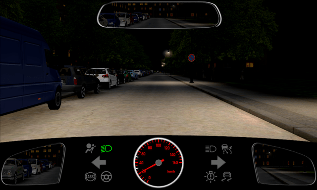

**Options:**
- A. Because persons on the road can be easily overlooked
- B. Because poorly lit vehicles can be difficult to detect
- C. Because oncoming vehicles will only be detected very late

**Correct Answer(s):**
- A. Because persons on the road can be easily overlooked
- B. Because poorly lit vehicles can be difficult to detect

**Explanation:**
If you are on a lighted roadway with dark sections, you must pay particular attention to pedestrians who might cross the road. Parked vehicles in the aforementioned dark sections are also often not seen in time. Therefore, drive slowly and carefully. Oncoming vehicles, on the other hand, are usually easy to spot.

---

#### Question 1.1.04-109

**Points:** 4 Points

**Why is it possible that vehicle drivers do not take notice of the "Give way" sign?**

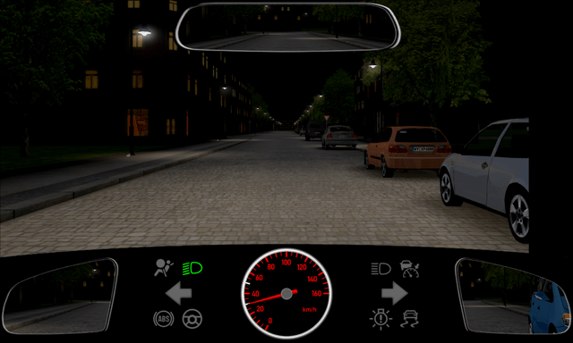

**Options:**
- A. The continuous lighting gives rise to the assumption of having the right of way at the junction
- B. The layout of the road creates the impression of a priority road
- C. Parked vehicles partially conceal the intersection

**Correct Answer(s):**
- A. The continuous lighting gives rise to the assumption of having the right of way at the junction
- B. The layout of the road creates the impression of a priority road
- C. Parked vehicles partially conceal the intersection

**Explanation:**
Even if the better lighting leads you to believe that you have priority over the less well-lit crossroads, you must observe the right of way. This is indicated by the corresponding sign at the intersection. This also doesn't change with the vehicles parked in the crossing area. That's why all three answers are correct.

---

#### Question 1.1.04-110

**Points:** 4 Points

**What must you watch out for when you drive into an underground car park?**

**Options:**
- A. My eyes need to adjust to the change in lighting conditions
- B. Pedestrians frequently walk on vehicle lanes
- C. My tyres could get damaged by narrow entrances and exits

**Correct Answer(s):**
- A. My eyes need to adjust to the change in lighting conditions
- B. Pedestrians frequently walk on vehicle lanes
- C. My tyres could get damaged by narrow entrances and exits

**Explanation:**
When entering an underground car park, drivers are bothered by the change from daylight to moderate lighting in the interior. The pupils do not respond quickly enough to the lighting condition changes and therefore might not be able to detect obstacles or people in time. In addition, the entrances and exits are narrow and confusing. Drive slowly, with low beam and always ready for braking in an underground car park.

---

#### Question 1.1.04-111

**Points:** 3 Points

**What should you do in this kind of visibility?**

**Options:**
- A. I reduce my speed
- B. I keep towards the right-hand edge of the carriageway
- C. I switch on my main beam lights

**Correct Answer(s):**
- A. I reduce my speed
- B. I keep towards the right-hand edge of the carriageway

**Explanation:**
In poor visibility conditions, you must first reduce your speed. If you are blinded by an oncoming vehicle, you should look to the right-hand side of the road so that you do not leave the road. You must not switch on your high beams here.

---

### 1.1.05 Chapter Speed

#### Question 1.1.05-001

**Points:** 4 Points

**Where does driving fast often lead to accidents?**

**Options:**
- A. At crossroads and junctions
- B. At pedestrian crossings
- C. On bends

**Correct Answer(s):**
- A. At crossroads and junctions
- B. At pedestrian crossings
- C. On bends

**Explanation:**
Excessive speed is one of the main causes of accidents. The faster you drive, the longer your braking distance and the less time you have to react to other road users. At too high a speed, you can be carried out of the bend by centrifugal force. On slippery and wet roads, you lose traction and control of the car at high speed.

---

#### Question 1.1.05-002

**Points:** 4 Points

**Where is fast driving particularly dangerous?**

**Options:**
- A. At blind corners
- B. At road narrowings
- C. At level crossings

**Correct Answer(s):**
- A. At blind corners
- B. At road narrowings
- C. At level crossings

**Explanation:**
In blind bends, fast driving is particularly dangerous because suddenly appearing obstacles are seen too late. High speed can also be dangerous at road narrowings, as there is not always enough braking distance available. Also, do not underestimate the risk of skidding due to uneven road surfaces at level crossings.

---

#### Question 1.1.05-003

**Points:** 4 Points

**How do you take tight bends?**

**Options:**
- A. Reduce speed before reaching the bend
- B. Only accelerate again when the road straightens out
- C. Reduce speed only when you reach the centre of the bend

**Correct Answer(s):**
- A. Reduce speed before reaching the bend
- B. Only accelerate again when the road straightens out

**Explanation:**
You should reduce your speed before entering a tight bend and only accelerate again when entering the straight, if visibility permits. Be aware that abrupt braking in a bend can cause your vehicle to skid.

---

#### Question 1.1.05-103

**Points:** 5 Points

**What must you be aware of?**

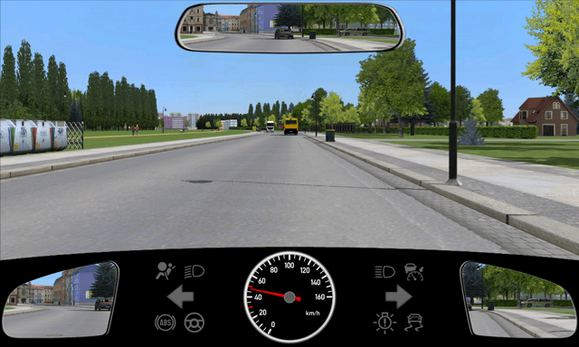

[Video: videos/1_1_05-103.mp4](videos/1_1_05-103.mp4)

**Options:**
- A. Pedestrians could cross the road
- B. I may drive past the bus at walking speed
- C. I may not drive past the bus

**Correct Answer(s):**
- A. Pedestrians could cross the road
- B. I may drive past the bus at walking speed

**Explanation:**
You may only pass a bus at a bus stop with its hazard lights on at walking speed and with increased attention. Passengers may step out into the road in front of the bus or rush to catch it. They often do not pay attention to the traffic.

---

#### Question 1.1.05-105

**Points:** 5 Points

**What do you have to be aware of in this situation?**

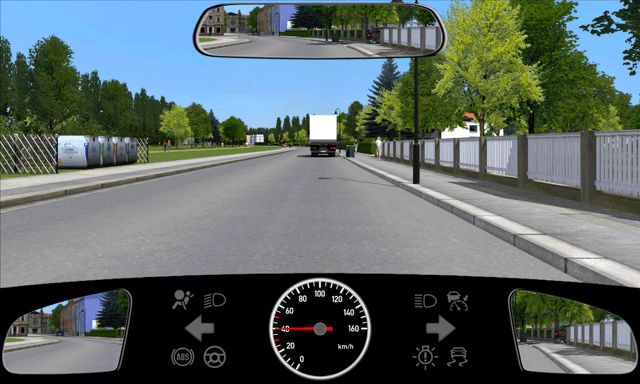

[Video: videos/1_1_05-105.mp4](videos/1_1_05-105.mp4)

**Options:**
- A. I look out for people who could walk onto the road
- B. I may only pass the bus at walking speed
- C. I may not drive past the bus

**Correct Answer(s):**
- A. I look out for people who could walk onto the road
- B. I may only pass the bus at walking speed

**Explanation:**
If a bus stops at a bus stop, you must always approach carefully. You have to stop behind the bus and you are only allowed to go past it at walking pace when you are sure you're not endangering anyone. The set hazard warning lights show: The stop is dangerous. This way, school buses warn from children who are getting off. They could suddenly come out in front of the bus and cross the lane or run to the bus to catch it.

---

#### Question 1.1.05-107-M

**Points:** 4 Points

**What must you be aware of here?**

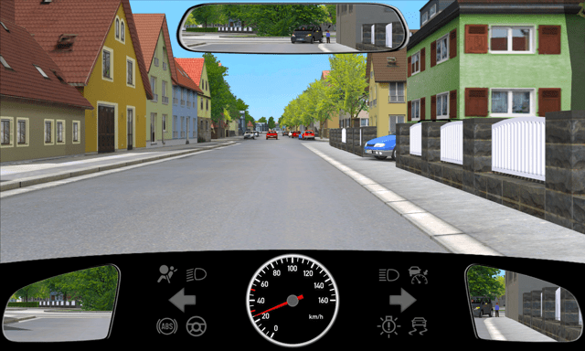

**Options:**
- A. Of vehicles speeding
- B. That junctions will not be noticed
- C. That children may run onto the road

**Correct Answer(s):**
- A. Of vehicles speeding
- B. That junctions will not be noticed
- C. That children may run onto the road

**Explanation:**
They are crossing a residential area. The road is wide and tempts them to drive fast. But be careful: playing children can suddenly jump onto the road. If you drive too fast, you will not be able to react and brake in time. You may also overlook crossroads or junctions. In residential areas, "right before left" often applies: you must give way to vehicles coming from the right.

---

### 1.1.06 Chapter Overtaking

#### Question 1.1.06-002

**Points:** 5 Points

**Is it irresponsible to overtake a truck and trailer a short distance before a crossroads?**

**Options:**
- A. Yes, because the truck and trailer can obscure the view of important traffic signs
- B. Yes, because the truck and trailer can obscure the view of the crossing traffic
- C. No, because trucks and trailers mostly drive at low speed

**Correct Answer(s):**
- A. Yes, because the truck and trailer can obscure the view of important traffic signs
- B. Yes, because the truck and trailer can obscure the view of the crossing traffic

**Explanation:**
Under no circumstances should you start an overtaking manoeuvre just before a crossing. There is an increased risk of accidents. This applies especially to overtaking trucks. You may not be able to see cross-traffic or traffic signs.

---

#### Question 1.1.06-005-M

**Points:** 5 Points

**Why are you not allowed to overtake now?**

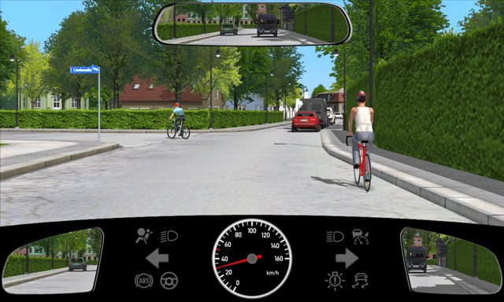

**Options:**
- A. Because [the cyclist] could turn off to the left
- B. Because I am not able to see possible oncoming traffic in good enough time
- C. Because of the very poor condition of the left-side road surface

**Correct Answer(s):**
- A. Because [the cyclist] could turn off to the left
- B. Because I am not able to see possible oncoming traffic in good enough time

**Explanation:**
You are not allowed to overtake because the cyclist could turn and the oncoming traffic is not detected in time.

---

#### Question 1.1.06-103

**Points:** 5 Points

**What mistakes make overtaking dangerous even on clear and straight roads?**

**Options:**
- A. The distance of an oncoming vehicle is overestimated
- B. You underestimate your overtaking distance
- C. You overestimate your overtaking distance

**Correct Answer(s):**
- A. The distance of an oncoming vehicle is overestimated
- B. You underestimate your overtaking distance

**Explanation:**
Overtaking maneuvers are dangerous even on straight and open roads. This is especially true if oncoming traffic approaches you. The speed of oncoming vehicles is difficult to assess. Often the duration of the overtaking maneuver is underestimated. If you take too long, dangerous situations for you and for others can arise. Before you start overtaking another vehicle, make sure that the opposite lane is clear and you can finish the overtaking maneuver quickly. Otherwise you wait.

---

#### Question 1.1.06-104

**Points:** 5 Points

**When are you in danger when overtaking?**

**Options:**
- A. - suddenly accelerates
- B. - swerves out to overtake
- C. - reduces his speed considerably

**Correct Answer(s):**
- A. - suddenly accelerates
- B. - swerves out to overtake

**Explanation:**
If you notice that the vehicle behind you wants to overtake you, do not increase your own speed under any circumstances. This prolongs the overtaking manoeuvre and can lead to dangerous situations. Before you start to overtake, make sure that the vehicle behind you is not about to overtake you. Otherwise they will have to brake heavily.

---

#### Question 1.1.06-105

**Points:** 5 Points

**In which cases must you abandon overtaking?**

**Options:**
- A. When the road user being overtaken suddenly accelerates
- B. When there is danger from unexpected oncoming traffic
- C. When the road user being overtaken considerably reduces his speed

**Correct Answer(s):**
- A. When the road user being overtaken suddenly accelerates
- B. When there is danger from unexpected oncoming traffic

**Explanation:**
Sudden oncoming traffic requires that an overtaking manoeuvre be stopped immediately. The same applies if the vehicle to be overtaken accelerates. This means that you can no longer estimate the overtaking distance and endanger oncoming traffic if you continue. If the vehicle being overtaken reduces its speed, there is no danger.

---

#### Question 1.1.06-106

**Points:** 4 Points

**When is overtaking forbidden?**

**Options:**
- A. If you are unable to drive considerably faster than the road user being overtaken
- B. If you do not have a clear view of the road ahead
- C. If the traffic situation is not clear

**Correct Answer(s):**
- A. If you are unable to drive considerably faster than the road user being overtaken
- B. If you do not have a clear view of the road ahead
- C. If the traffic situation is not clear

**Explanation:**
If you encounter an unclear traffic situation, overtaking is prohibited. This applies in particular:
- On bends
- On unclear stretches of road
- Immediately before and at junctions where the right of way is unclear
- When the traffic situation is unclear
- If you cannot judge exactly what the vehicle in front is doing.
- If it would take you too long to overtake because your vehicle is not fast enough.
Before overtaking, make sure that you do not endanger other road users and oncoming traffic.

---

#### Question 1.1.06-111

**Points:** 5 Points

**Why can it be dangerous to overtake even on clearly visible, straight roads?**

**Options:**
- A. - oncoming traffic is travelling faster than first thought
- B. - the overtaking distance is longer than first thought
- C. - oncoming traffic is travelling slower than first thought

**Correct Answer(s):**
- A. - oncoming traffic is travelling faster than first thought
- B. - the overtaking distance is longer than first thought

**Explanation:**
On a straight stretch of road, you may be able to see oncoming traffic from a distance, but often underestimate their speed. If an overtaking manoeuvre takes too long, dangerous situations can arise. If there is oncoming traffic, it is better to wait until the road is clear before overtaking.

---

#### Question 1.1.06-113

**Points:** 5 Points

**What should you do in this situation?**

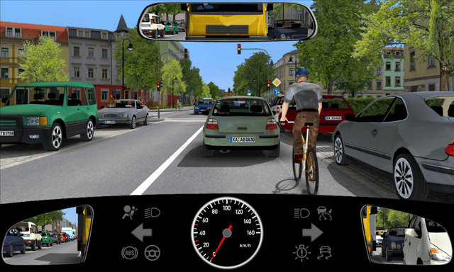

[Video: videos/1_1_06-113.mp4](videos/1_1_06-113.mp4)

**Options:**
- A. I remain behind the cyclist
- B. I overtake the cyclist
- C. I sound my horn, so that the cyclist makes way

**Correct Answer(s):**
- A. I remain behind the cyclist

**Explanation:**
You must not overtake the cyclist: you must not cross the continuous centre line under any circumstances, not even partially. Likewise, you must not use a horn here.

---

#### Question 1.1.06-114

**Points:** 5 Points

**What should you do?**

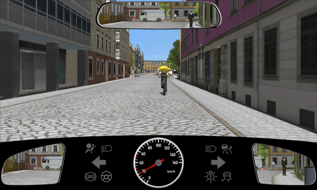

[Video: videos/1_1_06-114.mp4](videos/1_1_06-114.mp4)

**Options:**
- A. I abort the overtaking manoeuvre
- B. I perform the overtaking manoeuvre quickly
- C. I perform the overtaking manoeuvre cautiously

**Correct Answer(s):**
- A. I abort the overtaking manoeuvre

**Explanation:**
You just want to start overtaking the cyclist, when the blue car suddenly drives out of its parking space. Apparently, he has not noticed the cyclist yet. It might happen that the cyclist now moves to the left, without looking back. Immediately stop the overtaking maneuver to avoid endangering the cyclist.

---

#### Question 1.1.06-121-M

**Points:** 4 Points

**What must you anticipate in this situation?**

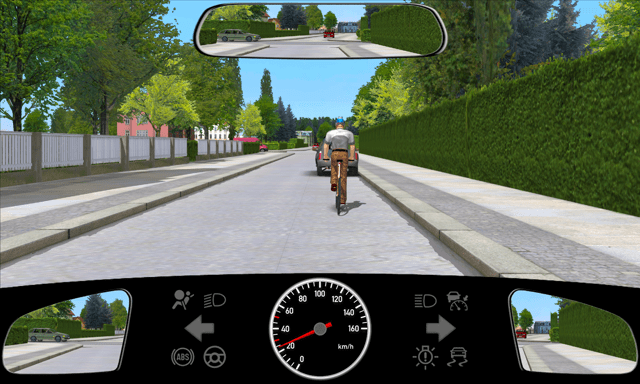

**Options:**
- A. The cyclist will drive past to the left of the parked car
- B. Oncoming traffic
- C. The cyclist will dismount to allow me to pass

**Correct Answer(s):**
- A. The cyclist will drive past to the left of the parked car
- B. Oncoming traffic

**Explanation:**
Your lane is blocked by a stopped vehicle. You must swerve into the oncoming lane to get around it. Pay particular attention to oncoming traffic. The cyclist in front of you will also go around the obstacle and may not indicate this by hand signals.

---

#### Question 1.1.06-122

**Points:** 4 Points

**What should you anticipate, if you want to overtake?**

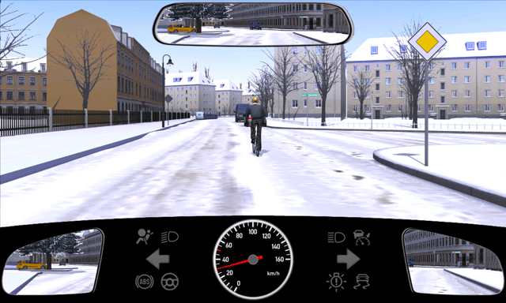

**Options:**
- A. With the unsafe riding manner of the cyclist
- B. With an extended stopping distance
- C. With the risk of skidding

**Correct Answer(s):**
- A. With the unsafe riding manner of the cyclist
- B. With an extended stopping distance
- C. With the risk of skidding

**Explanation:**
On snow-covered roads, the braking and stopping distance is longer and there is also an increased risk of slipping. Cyclists in particular have difficulty riding safely. Their risk of falling is significantly increased. Keep a greater distance from the cyclist, also because his stopping distance is very long.

---

#### Question 1.1.06-123

**Points:** 4 Points

**You want to overtake. What should you prepare yourself for?**

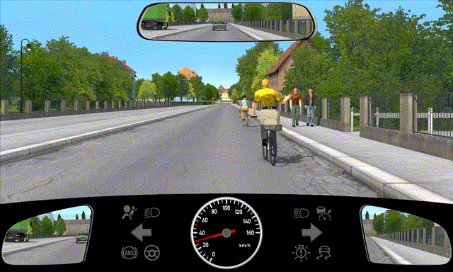

**Options:**
- A. The cyclist will come to a sudden stop right in front of me
- B. The cyclist farther in front will swerve to the left
- C. Oncoming traffic will appear suddenly

**Correct Answer(s):**
- A. The cyclist will come to a sudden stop right in front of me
- B. The cyclist farther in front will swerve to the left

**Explanation:**
A cyclist might shake as one-handed driving and the heavy load on the rack make his bike unstable. If the front cyclist turns around, it will likely make him swing to the left and take up more space than usual. You should only drive past the cyclists with a safe distance of at least two meters.

---

#### Question 1.1.06-124

**Points:** 5 Points

**You want to overtake cyclists on a narrow road. The width of the road means that the maximum possible space between them and the car is 50 cm. What should you do?**

**Options:**
- A. I refrain from overtaking
- B. I give a short warning signal before overtaking
- C. I overtake at a moderate speed

**Correct Answer(s):**
- A. I refrain from overtaking

**Explanation:**
To avoid danger, as a vehicle driver you must always keep a sufficient safety distance of at least 1.50 metres when overtaking cyclists. If it is not possible to pass the cyclist at such a distance, you must not overtake him under any circumstances.

---

#### Question 1.1.06-125

**Points:** 5 Points

**You want to overtake cyclists. What should be noted when selecting the distance between the cyclists and the car?**

**Options:**
- A. How the cyclists are acting
- B. The speed of my vehicle
- C. 1.0 m between the cyclist and the car is always sufficient

**Correct Answer(s):**
- A. How the cyclists are acting
- B. The speed of my vehicle

**Explanation:**
If you want to overtake a cyclist, you must consider the following with regard to the lateral distance: The side distance must be at least 1.5 m, more if the cyclist's behaviour is conspicuous. The reasons for this are possible oscillating movements of the cyclist, but also the possible suction effect of your vehicle at higher speed. Honking as well as overtaking at a lower lateral distance are considered gross negligence.

---

#### Question 1.1.06-127-M

**Points:** 4 Points

**What is the right course of action?**

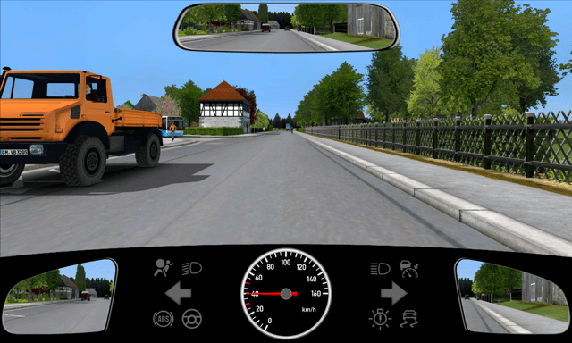

[Video: videos/1_1_06-127-M.mp4](videos/1_1_06-127-M.mp4)

**Options:**
- A. - after the bend
- B. - before drawing level with the [truck]
- C. - between [truck] and bend

**Correct Answer(s):**
- A. - after the bend

**Explanation:**
The cyclist will overtake the lorry and pull out to do so. It is too dangerous to overtake him before the bend, as you may not yet be able to see oncoming vehicles. Only overtake the cyclist after the bend. As a general rule, you may only overtake if you can see that there is no danger to or obstruction of oncoming traffic during the entire overtaking process.

---

#### Question 1.1.06-128

**Points:** 4 Points

**In which situation is overtaking prohibited?**

**Options:**
- A. - cannot complete the overtaking manoeuvre before the start of a no-overtaking section
- B. - cannot complete the overtaking manoeuvre before a hill crest
- C. - am unable to maintain the necessary space to the side

**Correct Answer(s):**
- A. - cannot complete the overtaking manoeuvre before the start of a no-overtaking section
- B. - cannot complete the overtaking manoeuvre before a hill crest
- C. - am unable to maintain the necessary space to the side

**Explanation:**
Overtaking is prohibited here, because in these situations you greatly increase the risk of an accident as the person overtaking.

---

#### Question 1.1.06-129-M

**Points:** 4 Points

**You want to overtake. What should you be prepared for now?**

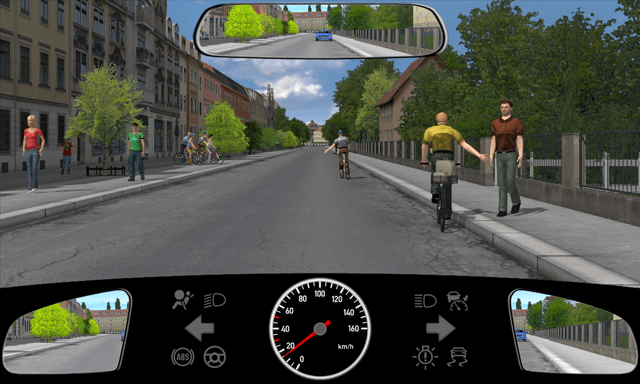

**Options:**
- A. [The cyclist] directly in front of me, stops on the roadway
- B. [The] [cyclist] in the distance pulls out to the left
- C. [The blue car] overtakes me

**Correct Answer(s):**
- A. [The cyclist] directly in front of me, stops on the roadway
- B. [The] [cyclist] in the distance pulls out to the left

**Explanation:**
The cyclist directly in front of you wants to cross onto the pedestrian path, in order to cross the kerb the cyclist will most likely stop first. The distant cyclist shows by his hand gesture that he wants to move into the left turn lane.

---

#### Question 1.1.06-130

**Points:** 5 Points

**Why can it be dangerous to overtake on an unobscured, straight road?**

**Options:**
- A. - estimate the distance away of an oncoming vehicle as being too great
- B. - estimate the speed of an oncoming vehicle as being too low
- C. - estimate my overtaking distance to be shorter than it is

**Correct Answer(s):**
- A. - estimate the distance away of an oncoming vehicle as being too great
- B. - estimate the speed of an oncoming vehicle as being too low
- C. - estimate my overtaking distance to be shorter than it is

**Explanation:**
If you misjudge the speed and distance of an oncoming vehicle, your overtaking distance is longer than expected. This can cause accidents.

---

#### Question 1.1.06-131-M

**Points:** 5 Points

**What is the right course of action now?**

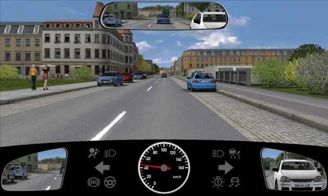

[Video: videos/1_1_06-131-M.mp4](videos/1_1_06-131-M.mp4)

**Options:**
- A. I reduce my speed
- B. I move to the right, onto the parking strip
- C. I maintain my current speed

**Correct Answer(s):**
- A. I reduce my speed

**Explanation:**
The vehicle overtaking you has estimated its overtaking path too short. You should reduce your speed so that the overtaking person can re-enter earlier and that the risk of an accident is reduced.

---

#### Question 1.1.06-201-M

**Points:** 4 Points

**Why may you not overtake in this situation?**

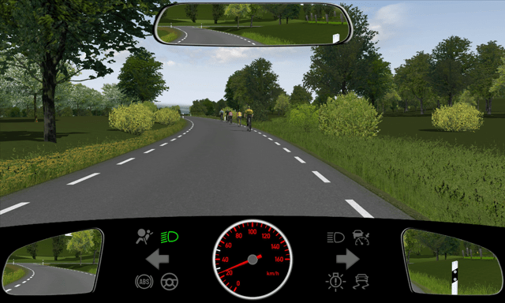

[Video: videos/1_1_06-201-M.mp4](videos/1_1_06-201-M.mp4)

**Options:**
- A. Because the overtaking distance is obscured
- B. Because I am travelling only a little faster than the cyclists
- C. Because there is a no-overtaking sign

**Correct Answer(s):**
- A. Because the overtaking distance is obscured
- B. Because I am travelling only a little faster than the cyclists

**Explanation:**
The overtaking lane is not visible due to the cyclists and the course of the road. If you cannot see the overtaking lane, you must not overtake. As you cannot go much faster than the cyclists, the overtaking lane becomes much longer and therefore more dangerous.

---

#### Question 1.1.06-202-M

**Points:** 4 Points

**Why are you not allowed to overtake now?**

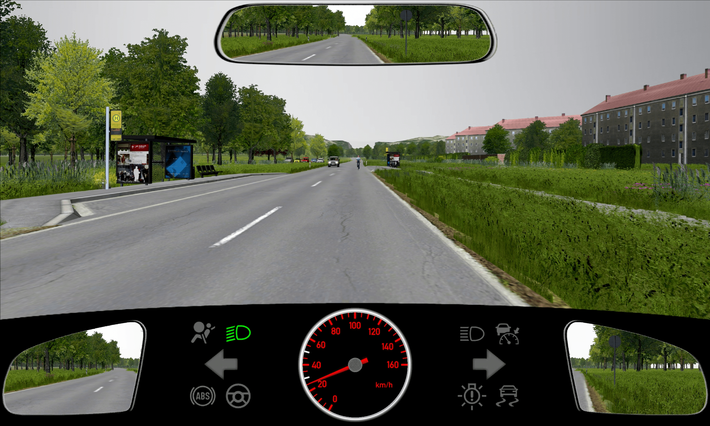

[Video: videos/1_1_06-202-M.mp4](videos/1_1_06-202-M.mp4)

**Options:**
- A. Because [the cyclist] could turn off to the left
- B. Because it will impede oncoming traffic
- C. Because there is a no-overtaking sign

**Correct Answer(s):**
- A. Because [the cyclist] could turn off to the left

**Explanation:**
The cyclist swings to the left and looks over his shoulder. He will probably turn left. Reduce your speed to give the cyclist enough space and ensure that he does not feel pressurised. In this way, you will also avoid endangering the cyclist in the event of an abrupt braking manoeuvre and possible rear-end collisions due to a lack of distance.

---

### 1.1.07 Chapter Special Traffic Situations

#### Question 1.1.07-001

**Points:** 3 Points

**What must you be prepared for when a truck in front of you wishes to turn right into a narrow street?**

**Options:**
- A. - reduce speed drastically
- B. - swing out to the left before turning
- C. - move well over to the right

**Correct Answer(s):**
- A. - reduce speed drastically
- B. - swing out to the left before turning

**Explanation:**
Keep a large distance from the lorry and under no circumstances overtake on the right-hand side, even if you would have the opportunity to do so as a two-wheeler driver. The road train must first reduce its speed considerably to turn. For reasons of space, the truck driver may then have to steer the towing vehicle far to the left so that the trailer or semi-trailer does not roll over the kerb when turning.

---

#### Question 1.1.07-002

**Points:** 3 Points

**What do you have to particularly remember at crossroads and junctions in a built-up area?**

**Options:**
- A. Intersecting roads may have priority even though they are narrow and less well developed
- B. A better developed road always has priority
- C. The rule "right before left" applies without exception at all crossroads and junctions

**Correct Answer(s):**
- A. Intersecting roads may have priority even though they are narrow and less well developed

**Explanation:**
By driving on a wide and well-developed road, you don't automatically have the right of way. The rule "right before left" does not apply always and everywhere. Instead, signs or traffic lights regulate who has priority. Therefore, pay attention to the signposted right-of-way regulation or the traffic lights at each individual intersection and junction.

---

#### Question 1.1.07-005-B

**Points:** 3 Points

**What must you be prepared for?**

**Options:**
- A. The appearance of a vehicle from the right
- B. A longer braking distance on account of the wet, leaf-covered road
- C. A vehicle coming from the right will give way despite having priority

**Correct Answer(s):**
- A. The appearance of a vehicle from the right
- B. A longer braking distance on account of the wet, leaf-covered road

**Explanation:**
The wet leaves on the road significantly increase the braking distance of your vehicle. Adjust your speed accordingly. Also keep in mind that due to the non-existent priority traffic signs, the "Left yields to right" rule applies. You would have to give priority to a vehicle coming from the right, even if the driver is slow and hesitant to approach the intersection due to the weather.

---

#### Question 1.1.07-006-B

**Points:** 3 Points

**Why must you be particularly careful here?**

**Options:**
- A. Because there is an increased danger of skidding when braking
- B. Because a vehicle could come from the right
- C. Because the car coming from the left has priority

**Correct Answer(s):**
- A. Because there is an increased danger of skidding when braking
- B. Because a vehicle could come from the right

**Explanation:**
The wet leaves on the road result in a longer braking distance and a high risk of slipping. Therefore, reduce your speed and drive carefully before reaching the intersection. A vehicle could be coming from the right and you should give it the right of way. Since there are no signs at the intersection that give you the right of way, the rule here is "right before left".

---

#### Question 1.1.07-008

**Points:** 3 Points

**You want to pull out of a row of parked vehicles into the stream of moving traffic. Behind you is a parked truck and trailer. How do you assess this situation?**

**Options:**
- A. Because of your restricted view, you cannot see approaching vehicles until they are very close
- B. Because of their restricted view, vehicles approaching from behind cannot see your vehicle until very late
- C. It is safe to pull out here because you are protected by the truck and trailer behind you

**Correct Answer(s):**
- A. Because of your restricted view, you cannot see approaching vehicles until they are very close
- B. Because of their restricted view, vehicles approaching from behind cannot see your vehicle until very late

**Explanation:**
Because of the truck, you can hardly see the traffic behind you. It also obscures the view of the flowing traffic on your vehicle. You must therefore be particularly careful and slowly feel your way on the road. You may need to go back to avoid hazards.

---

#### Question 1.1.07-009

**Points:** 5 Points

**You are approaching a school. Children are leaving the school grounds. What must you reckon with?**

**Options:**
- A. - rush onto the road without thinking
- B. - ride their bicycles onto the road without paying attention
- C. - always conduct themselves properly on the road

**Correct Answer(s):**
- A. - rush onto the road without thinking
- B. - ride their bicycles onto the road without paying attention

**Explanation:**
In the vicinity of schools, you must always be prepared for children crossing the road abruptly. Children are not yet able to assess themselves and other road users very well and often react impulsively and in a way that is not appropriate for traffic. As a car driver, you must adapt your driving style accordingly in order to exclude any danger to children. In addition to driving at a low speed, you must be particularly attentive and ready to brake at all times.

---

#### Question 1.1.07-010

**Points:** 4 Points

**What do hazard warning lights draw your attention to?**

**Options:**
- A. To vehicles which have broken down
- B. To school buses with children boarding or alighting
- C. To a traffic congestion

**Correct Answer(s):**
- A. To vehicles which have broken down
- B. To school buses with children boarding or alighting
- C. To a traffic congestion

**Explanation:**
The use of the hazard warning lights is subject to strict rules. You may only switch on the hazard warning lights to secure your broken-down vehicle or to indicate a traffic jam or a school bus. A school bus with its hazard warning lights on may only be overtaken at walking speed.

---

#### Question 1.1.07-011

**Points:** 4 Points

**A big combine harvester in front of you wishes to turn right. What is correct?**

**Options:**
- A. - will swing far out to the left when turning
- B. - will slow down drastically before turning
- C. - cannot swing out due to rear-wheel steering

**Correct Answer(s):**
- A. - will swing far out to the left when turning
- B. - will slow down drastically before turning

**Explanation:**
The combine harvester needs to gain amplitude to turn because the turn is very narrow. To do this, it will greatly reduce his speed. Keep your distance and also drive slowly and be prepared to brake. Especially for cyclists: Never overtake on the right!

---

#### Question 1.1.07-013

**Points:** 4 Points

**You are driving behind a farm vehicle with a trailer carrying a high load. What must you reckon with?**

**Options:**
- A. Particularly when braking or turning, parts of the load can fall off
- B. The indicators may be concealed, making it difficult to see when the combination of vehicles wishes to turn off
- C. The braking distance of the combination of vehicles is particularly short because of its load

**Correct Answer(s):**
- A. Particularly when braking or turning, parts of the load can fall off
- B. The indicators may be concealed, making it difficult to see when the combination of vehicles wishes to turn off

**Explanation:**
If you are riding behind an agricultural vehicle with a heavily loaded trailer, you must expect the following: Part of the load could fall onto the roadway when turning or braking. The indicator could be dirty or covered by the load. The braking distance of the vehicle is increased by the weight of the load.

---

#### Question 1.1.07-014-M

**Points:** 3 Points

**What should you anticipate?**

**Options:**
- A. Pedestrians crossing the road
- B. A vehicle driving past the bus
- C. That I will have to stop at the junction

**Correct Answer(s):**
- A. Pedestrians crossing the road
- B. A vehicle driving past the bus
- C. That I will have to stop at the junction

**Explanation:**
You must expect to have to stop before the intersection when turning. For one thing, the view of the bus coming from the right is obstructed. In addition, other vehicles could pass it. In addition, pedestrians may also want to cross the road. You must always show special consideration for them.

---

#### Question 1.1.07-015-M

**Points:** 4 Points

**What should you do in this situation?**

**Options:**
- A. Reduce speed
- B. Be ready to brake
- C. Continue driving as before

**Correct Answer(s):**
- A. Reduce speed
- B. Be ready to brake

**Explanation:**
The driver of the vehicle coming out of the exit cannot see the cross traffic. He would have to be directed into the traffic. He could drive further ahead and prevent you from continuing your journey. You should reduce your speed, be ready to brake, even stop if necessary.

---

#### Question 1.1.07-016

**Points:** 5 Points

**Why do you have to wait before turning right?**

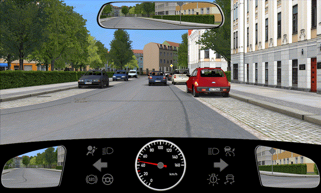

[Video: videos/1_1_07-016.mp4](videos/1_1_07-016.mp4)

**Options:**
- A. - the pedestrian
- B. - the cyclist
- C. - the van

**Correct Answer(s):**
- A. - the pedestrian
- B. - the cyclist

**Explanation:**
If you want to turn right, you will need to let all the vehicles drive past that meet you. This also applies to bicycles that go into the same direction as you. Likewise, you must give priority to pedestrians who want to cross the road in front of you.

---

#### Question 1.1.07-017

**Points:** 5 Points

**What should you anticipate in this situation?**

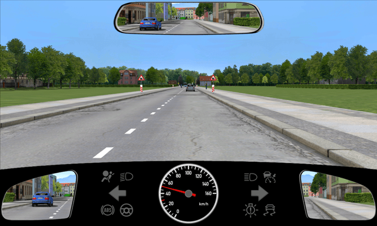

[Video: videos/1_1_07-017.mp4](videos/1_1_07-017.mp4)

**Options:**
- A. - pull out and cross the centre of the road
- B. - brake and not cross the centre of the road
- C. - overtake without crossing the centre of the road

**Correct Answer(s):**
- A. - pull out and cross the centre of the road

**Explanation:**
Because the oncoming vehicle is being slowed down by a bicycle, you should expect the vehicle to overtake the bicycle. If this happens, the vehicle could cross into your lane. In the event that the driver does not brake, you should keep as far to the right on the road as possible. Also, be prepared to brake so that you can react to any situation as quickly as possible.

---

#### Question 1.1.07-019-M

**Points:** 4 Points

**You want to turn right at the junction. What is the right thing to do?**

**Options:**
- A. I change lanes as early as possible
- B. I may not impede cyclists in the cycle lane
- C. I may only cross over the cycle lane at walking speed

**Correct Answer(s):**
- A. I change lanes as early as possible
- B. I may not impede cyclists in the cycle lane

**Explanation:**
There is a protective lane for cyclists between your lane and the turning lane. It is part of the carriageway and is separated by a broken line.
You may only use the protective lane to change lanes, swerve or turn. If you use it, you are not allowed to obstruct cyclists or come to a standstill in the protective lane. You should therefore change lanes as early as possible.

---

#### Question 1.1.07-020-M

**Points:** 4 Points

**When could a dangerous situation arise here?**

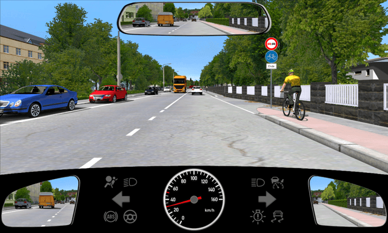

**Options:**
- A. If I continue driving at the same speed
- B. If [the cyclist] changes to my lane
- C. If [the cyclist] stops at the end of the cycle path

**Correct Answer(s):**
- A. If I continue driving at the same speed
- B. If [the cyclist] changes to my lane

**Explanation:**
You can see that the cycle path ends immediately in front of you. The cyclist would have to stop and wait until she can safely merge into the flowing traffic. However, rather than stopping, expect her to swing into the lane in front of you.

---

#### Question 1.1.07-021

**Points:** 5 Points

**What must you watch out for when turning right here?**

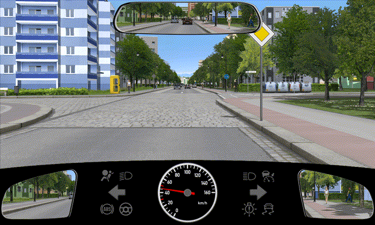

[Video: videos/1_1_07-021.mp4](videos/1_1_07-021.mp4)

**Options:**
- A. For the cyclist
- B. For oncoming traffic
- C. For the motorbike

**Correct Answer(s):**
- A. For the cyclist

**Explanation:**
Before you can turn right, you have to let the cyclist on the bike path to your right pass by. Cyclists have priority when they drive in your direction. Cyclists in oncoming traffic have no priority. Nevertheless, watch out for them to avoid danger.

---

#### Question 1.1.07-022

**Points:** 3 Points

**What should you do?**

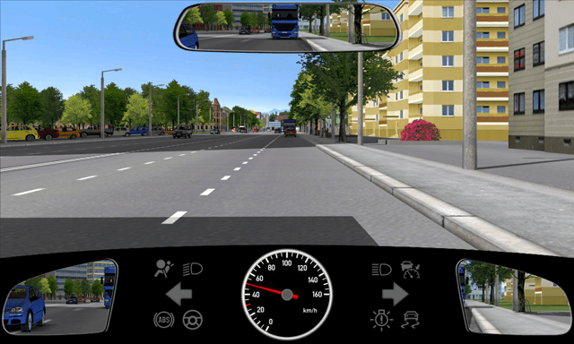

[Video: videos/1_1_07-022.mp4](videos/1_1_07-022.mp4)

**Options:**
- A. I stop
- B. I drive carefully past to the right of the truck
- C. I move into the middle lane now

**Correct Answer(s):**
- A. I stop

**Explanation:**
Since there is a car in the blind spot to the left of you and on the other side a truck wants to turn right into the construction site, you should stop. Do not drive on the middle lane. Wait for the truck to clear the road. Then you can continue.

---

#### Question 1.1.07-023

**Points:** 3 Points

**What should you note about electric bicycles (e-bikes) participating in road traffic?**

**Options:**
- A. - be deceptively fast
- B. - look very similar to conventional bicycles
- C. - be easily recognised due to their engine noise

**Correct Answer(s):**
- A. - be deceptively fast
- B. - look very similar to conventional bicycles

**Explanation:**
E-bikes are just as quiet as classic bikes and are therefore often perceived late. However, they often achieve significantly higher speeds than bicycles without an engine. This is underestimated by many road users, so dangerous situations can occur surprisingly. In general, expect cyclists to gain speed and perform speedy maneuvers.

---

#### Question 1.1.07-025-M

**Points:** 4 Points

**What is the right course of action now?**

**Options:**
- A. I get ready to brake
- B. I watch [the cyclist] closely
- C. I manoeuvre over to the left side of the road

**Correct Answer(s):**
- A. I get ready to brake
- B. I watch [the cyclist] closely

**Explanation:**
You should be ready to brake and watch the cyclist carefully, because the cyclist can suddenly ride onto the road.

---

#### Question 1.1.07-101

**Points:** 4 Points

**You wish to overtake a farm tractor with a mounted implement extending beyond its back. What must you remember?**

**Options:**
- A. The mounted implement can swing out when the tractor turns off
- B. The rear lights may be heavily soiled or concealed, making direction signals difficult or impossible to see when they are on
- C. Farm tractors can always be overtaken safely due to their low speed

**Correct Answer(s):**
- A. The mounted implement can swing out when the tractor turns off
- B. The rear lights may be heavily soiled or concealed, making direction signals difficult or impossible to see when they are on

**Explanation:**
You should always refrain from an overtaking maneuver when the tractor wants to turn. The reason for this is that the tractor has a large turning circle and is likely to veer, blocking the road. Also keep in mind that the turn signals of such a vehicle are not always visible and that they could be covered by dirt due to the agricultural use.

---

#### Question 1.1.07-103-M

**Points:** 3 Points

**What must you anticipate on the other side of this crest in the road?**

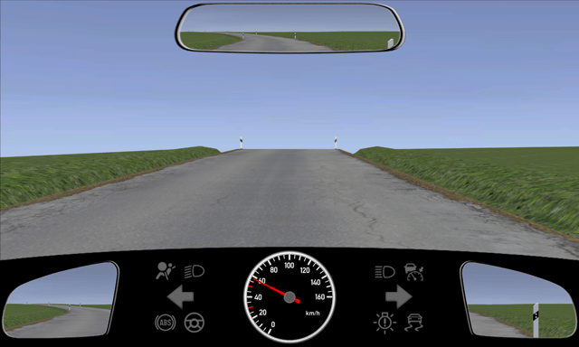

**Options:**
- A. A vehicle may be stationary there
- B. There may be an oncoming vehicle on my side of the road
- C. There may be a slow moving vehicle on my side of the road

**Correct Answer(s):**
- A. A vehicle may be stationary there
- B. There may be an oncoming vehicle on my side of the road
- C. There may be a slow moving vehicle on my side of the road

**Explanation:**
Due to the height of the crest, it is not possible to see what is behind it. Expect to encounter obstacles there, such as broken-down or slow-moving motor vehicles. Also be prepared for oncoming trucks sharing your lane. To be able to react to such dangers in time, you should reduce your speed accordingly.

---

#### Question 1.1.07-105-B

**Points:** 4 Points

**What do you do?**

**Options:**
- A. Brake and move to the right
- B. Proceed without taking action so that the truck is forced to pull back over to the right

**Correct Answer(s):**
- A. Brake and move to the right

**Explanation:**
When a truck overtakes a cyclist crossing the continuous line, you must never try to push the truck back onto its lane. Brake instead and go far enough to the right.

---

#### Question 1.1.07-107-B

**Points:** 3 Points

**What must you be prepared for in this situation?**

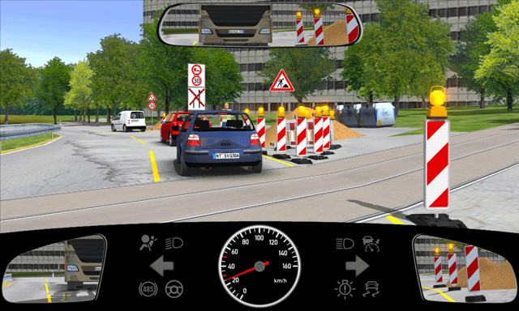

**Options:**
- A. An uneven and dirty roadway
- B. Workers and construction equipment on the roadway
- C. Police regulating traffic

**Correct Answer(s):**
- A. An uneven and dirty roadway
- B. Workers and construction equipment on the roadway

**Explanation:**
In the area of ​​a construction site you have to drive carefully and reduce the speed. For one, the road can be dirty. But it there can also be workers, construction equipment or construction vehicles on the road and obstruct the traffic.

---

#### Question 1.1.07-109-B

**Points:** 3 Points

**What must you be prepared for in this situation?**

**Options:**
- A. - braking distance will be longer
- B. - bus moves off immediately
- C. - bus driver allows you to pass

**Correct Answer(s):**
- A. - braking distance will be longer
- B. - bus moves off immediately

**Explanation:**
Due to the weather and the slush you have to expect a slippery road surface and a longer braking distance. The bus has priority over you and shows you by indicating that he wants to start driving. Carefully reduce the speed to allow it to veer. Under no circumstances may you overtake him.

---

#### Question 1.1.07-111

**Points:** 4 Points

**You are waiting at a traffic light and want to turn right. What should you remember?**

**Options:**
- A. - make sure there is no road user beside you on the right intending to go straight on
- B. - simply glance in the mirror to check that there is no cyclist behind you
- C. - concentrate fully on the turning manoeuvre because any cyclist has to wait anyway

**Correct Answer(s):**
- A. - make sure there is no road user beside you on the right intending to go straight on

**Explanation:**
If other road users are next to you, you must give priority to them if you wish to drive straight ahead. So, also pay attention to people on bike and pedestrian paths. It is not enough to just keep track of the road through the rear-view mirror. In addition, you have to control your surroundings with a look back over your shoulder to be able to perceive those road users who are hidden in the blind spot of the mirror.

---

#### Question 1.1.07-113

**Points:** 3 Points

**You are driving on a new road through a woodland area. What must you reckon with?**

**Options:**
- A. Wild animals unexpectedly crossing the roadway
- B. An obstruction caused by an accident involving a wild animal
- C. There is no reason to expect accidents involving wild animals on new roads

**Correct Answer(s):**
- A. Wild animals unexpectedly crossing the roadway
- B. An obstruction caused by an accident involving a wild animal

**Explanation:**
When roads are newly constructed in forested areas, they often pass through the natural habitat of various wild animals. Therefore, it is possible that their habitual paths cross your roadway. For this reason, you must expect wildlife crossings and obstacles due to frequent wildlife accidents on forest roads.

---

#### Question 1.1.07-114

**Points:** 3 Points

**Several deer run across the road in front of your vehicle. What must you reckon with?**

**Options:**
- A. There could be stragglers following the herd
- B. The herd may come back and cross the road again
- C. There is no reason to expect any more animals

**Correct Answer(s):**
- A. There could be stragglers following the herd
- B. The herd may come back and cross the road again

**Explanation:**
If several deer flee across the road in front of your vehicle, you have to expect the following: several animals could follow. The entire herd could also turn in the opposite direction and switch to the other side of the roadway again.

---

#### Question 1.1.07-117

**Points:** 3 Points

**At which time of the day do you have to reckon with increased wild animals crossing?**

**Options:**
- A. At dusk
- B. At dawn
- C. At noon

**Correct Answer(s):**
- A. At dusk
- B. At dawn

**Explanation:**
Expect more deer crossings during the morning and evening twilight. This transitional period between day and night is characterized by diffuse light conditions.

---

#### Question 1.1.07-118

**Points:** 4 Points

**Which dangers must you reckon with above all in rural areas?**

**Options:**
- A. Soiled roadways
- B. Slow farm vehicles
- C. Excessively wide farm vehicles

**Correct Answer(s):**
- A. Soiled roadways
- B. Slow farm vehicles
- C. Excessively wide farm vehicles

**Explanation:**
Where farming is practised, tractors and other agricultural vehicles travel at slow speeds and/or over width. Often the roadway is also dirty with soil or manure.

---

#### Question 1.1.07-119

**Points:** 4 Points

**A farm tractor is approaching you at dawn with its headlights switched on. What must you reckon with?**

**Options:**
- A. The tractor can carry large work equipment which is difficult to see
- B. Despite the headlights being switched on, it is not always possible to discern the width of the tractor
- C. 2 wide trailers can be attached to the tractor

**Correct Answer(s):**
- A. The tractor can carry large work equipment which is difficult to see
- B. Despite the headlights being switched on, it is not always possible to discern the width of the tractor
- C. 2 wide trailers can be attached to the tractor

**Explanation:**
In agricultural vehicles, the lights are sometimes broken. They can also be covered up by dirt or tarpaulins. The width of the vehicles is not easy to assess. In addition, these vehicles can have up to two trailers.

---

#### Question 1.1.07-120

**Points:** 4 Points

**What must you observe when you enter a tunnel?**

**Options:**
- A. Drive with dipped headlights also during the day even in well lit tunnels
- B. Take off your sunglasses
- C. Switch fog headlamps on

**Correct Answer(s):**
- A. Drive with dipped headlights also during the day even in well lit tunnels
- B. Take off your sunglasses

**Explanation:**
Before entering a tunnel, you must note the following: there is a light obligation in a tunnel. Therefore, turn on the dipped beam to see and be seen better. If you have sunglasses, take them off. You must not switch on the fog lamp in the tunnel.

---

#### Question 1.1.07-121

**Points:** 4 Points

**What must you do in case of a traffic jam in a tunnel?**

**Options:**
- A. Switch hazard warning lights on
- B. When traffic comes to a standstill, keep a safety distance of approximately 5 m to the car ahead
- C. Secure and leave vehicle immediately

**Correct Answer(s):**
- A. Switch hazard warning lights on
- B. When traffic comes to a standstill, keep a safety distance of approximately 5 m to the car ahead

**Explanation:**
If there is a traffic jam in a tunnel, stop and turn off the engine. By keeping a safe distance of about five metres, you reduce the risk of poisoning, preserve a manoeuvring option and allow rescue vehicles to pass. Switch on the hazard warning lights to warn following drivers. Only leave your vehicle after an appropriate loudspeaker announcement.

---

#### Question 1.1.07-122

**Points:** 4 Points

**What can impair your attention when driving through a tunnel?**

**Options:**
- A. Reflections of light from oncoming traffic
- B. Length of the tunnel
- C. Good road markings

**Correct Answer(s):**
- A. Reflections of light from oncoming traffic
- B. Length of the tunnel

**Explanation:**
When passing through a tunnel, the following factors may interfere with your attention: the lack of visual stimulus and the monotony of speed, as well as the lights of oncoming traffic. In this case, an orientation on the right side of the road is helpful; avoid looking directly into the light of oncoming traffic.

---

#### Question 1.1.07-123

**Points:** 4 Points

**What must you observe particularly when driving through a tunnel?**

**Options:**
- A. You may be distracted by very loud noise
- B. Signs for safety installations such as emergency exits and emergency telephones
- C. You may be distracted by light effects

**Correct Answer(s):**
- A. You may be distracted by very loud noise
- B. Signs for safety installations such as emergency exits and emergency telephones
- C. You may be distracted by light effects

**Explanation:**
Driving noises in a tunnel are considerably louder due to the reverberation of the tunnel walls. You can also hear the noise of the ventilation system. This has an irritating effect on you as a driver. Your eyes first have to get used to the different visibility conditions. The increased light reflections from oncoming traffic make things more difficult. The emergency signage is also distracting.

---

#### Question 1.1.07-125

**Points:** 4 Points

**Which basic code of conduct must you observe in a tunnel?**

**Options:**
- A. Drive with dipped headlights also by day even in a well lit tunnel
- B. Do not make a U-turn
- C. Follow instructions and information from the tunnel personnel

**Correct Answer(s):**
- A. Drive with dipped headlights also by day even in a well lit tunnel
- B. Do not make a U-turn
- C. Follow instructions and information from the tunnel personnel

**Explanation:**
The following rules of conduct are mandatory in all tunnels: on the entire route no U-turns are allowed. Regardless of the lighting situation, the dim light must always be switched on. The instructions of the tunnel staff must always be followed. Personal protection antecedes the protection of vehicles and their security.

---

#### Question 1.1.07-132

**Points:** 5 Points

**Why are you required to stop here?**

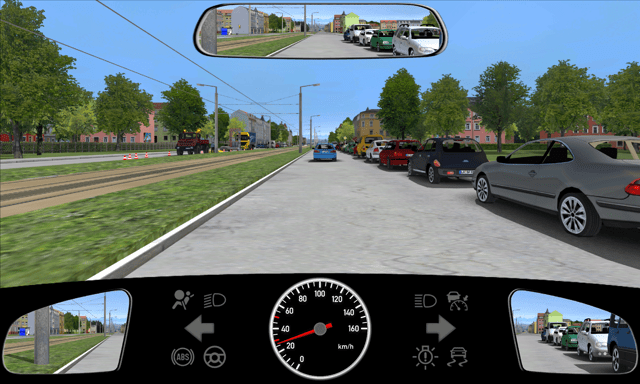

[Video: videos/1_1_07-132.mp4](videos/1_1_07-132.mp4)

**Options:**
- A. - the van
- B. - the pedestrian
- C. - the cyclist

**Correct Answer(s):**
- A. - the van
- B. - the pedestrian

**Explanation:**
You want to turn left. A van approaching from the opposite lane also wants to turn into this road. The vehicle has priority. Likewise, you must pay attention to pedestrians who want to cross this street.

---

#### Question 1.1.07-136

**Points:** 5 Points

**What should you do now?**

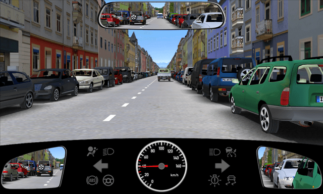

[Video: videos/1_1_07-136.mp4](videos/1_1_07-136.mp4)

**Options:**
- A. Slow down and be ready to brake
- B. Continue driving as before
- C. Swerve to the left

**Correct Answer(s):**
- A. Slow down and be ready to brake

**Explanation:**
The white reversing lights of the vehicle that turned in front of you indicate that it would probably turn back to its original lane in reverse. Since you cannot tell if you have been noticed by the driver, you should reduce your driving speed and be ready to brake. Refrain from an evasive maneuver due to oncoming traffic.

---

#### Question 1.1.07-137

**Points:** 4 Points

**You want to turn right. What should you do?**

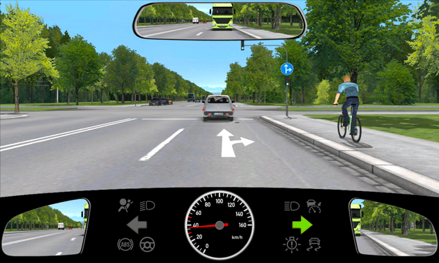

**Options:**
- A. Allow the cyclist to pass through the junction
- B. Check way is clear by glancing over your shoulder
- C. Take the turn ahead of the cyclist

**Correct Answer(s):**
- A. Allow the cyclist to pass through the junction
- B. Check way is clear by glancing over your shoulder

**Explanation:**
Before you can turn, you have to check in the rear-view mirror if the road is clear. It is also advisable to look over your shoulder: this is the only way to be aware of dangerous situations located in the blind spot of the mirror. Keep in mind that other road users - cyclists or pedestrians - whose way you cross, always have priority.

---

#### Question 1.1.07-138

**Points:** 4 Points

**What should you anticipate?**

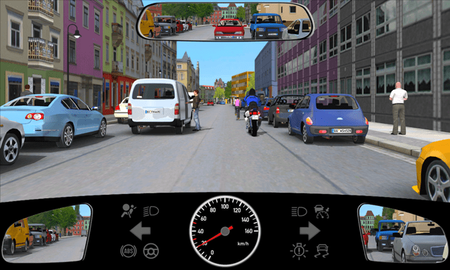

**Options:**
- A. The motorbike could swerve to the left
- B. The person beside the van could encroach further onto the road
- C. Pedestrians could cross the road in front of the van

**Correct Answer(s):**
- A. The motorbike could swerve to the left
- B. The person beside the van could encroach further onto the road
- C. Pedestrians could cross the road in front of the van

**Explanation:**
The other road users can react to this situation with all the different scenarios described. All are equally dangerous. Therefore, extreme caution and slow driving is required.

---

#### Question 1.1.07-139

**Points:** 3 Points

**Ahead of the motorbike a car is seeking to reverse on the road. What should you anticipate?**

**Options:**
- A. That the car continues to reverse
- B. That the motorbike will suddenly brake
- C. That my braking distance will be longer than normal

**Correct Answer(s):**
- A. That the car continues to reverse
- B. That the motorbike will suddenly brake
- C. That my braking distance will be longer than normal

**Explanation:**
Car drivers often underestimate the speed of approaching motorcyclists; the same happens to the driver here while he's pulling out of a parking space. The action alternatives of the motorcyclist - braking or dodging - are both dangerous for him on a snow-slicked road surface. He could fall. Also consider the longer braking distance in this weather.

---

#### Question 1.1.07-140

**Points:** 3 Points

**You are driving quickly along a main road and some distance ahead you see a deer close to the carriageway. What should you do?**

**Options:**
- A. - reduce speed
- B. - be ready to brake
- C. - perform an emergency braking manoeuvre

**Correct Answer(s):**
- A. - reduce speed
- B. - be ready to brake

**Explanation:**
If the deer is not yet on the road, you should under no circumstances perform emergency braking. This would unnecessarily endanger other road users and force them to unpredictable reactions. Nevertheless, you should reduce the speed of your vehicle and keep it ready to brake: the animal could run without warning on the road.

---

#### Question 1.1.07-141

**Points:** 4 Points

**Why are you particularly at risk, if you are riding a two-wheeler?**

**Options:**
- A. Because I can be easily overlooked
- B. Because my speed can be underestimated
- C. Because I am at greater risk of injury in the event of an accident

**Correct Answer(s):**
- A. Because I can be easily overlooked
- B. Because my speed can be underestimated
- C. Because I am at greater risk of injury in the event of an accident

**Explanation:**
Especially in restrictive visibility conditions such as fog and darkness, the small silhouette of the two-wheeled driver leads to the fact that he is recognized late or not at all. In addition, the small design makes it difficult to estimate its speed. In the event of a collision, two-wheelers generally offer less protection than most other motor vehicles.

---

#### Question 1.1.07-142

**Points:** 3 Points

**Driving on a very busy road with several lanes, you have manoeuvred yourself into the lane for taking a left turn. Now instead of turning left, you want to turn right. What should you do?**

**Options:**
- A. I turn left
- B. I reverse with my hazard lights turned on
- C. Driving a wide curve, I turn right

**Correct Answer(s):**
- A. I turn left

**Explanation:**
A lane change or turning right could endanger other road users due to the heavy traffic. You must therefore turn left and take a small detour. Watch out for lane markings that prohibit you from changing lanes.

---

#### Question 1.1.07-143

**Points:** 4 Points

**There is a tunnel on my route. What should I know?**

**Options:**
- A. I should know how I park and leave my vehicle if I am unable to continue driving
- B. I should know how escape routes are indicated in tunnels
- C. I can be sure that help will arrive promptly in the event of emergencies

**Correct Answer(s):**
- A. I should know how I park and leave my vehicle if I am unable to continue driving
- B. I should know how escape routes are indicated in tunnels

**Explanation:**
If there is a tunnel on your route, you should know the appropriate traffic signs and behavioral measures in the event of a breakdown or an accident: in this case, alert the tunnel monitoring center and follow the next escape route. First, turn off the engine of your vehicle and leave the ignition key in the lock for rescue operations.

---

#### Question 1.1.07-144

**Points:** 4 Points

**While driving through a tunnel, you notice a fire in your vehicle. You are not able to exit the tunnel. What should you do?**

**Options:**
- A. - turn on the hazard warning system
- B. - switch off the engine
- C. - leave the key in the ignition

**Correct Answer(s):**
- A. - turn on the hazard warning system
- B. - switch off the engine
- C. - leave the key in the ignition

**Explanation:**
If a fire in your vehicle prevents you from leaving a tunnel: Park the vehicle unlocked with the engine switched off and the ignition key remaining in the lock. Alarm the tunnel monitoring center. Take the next escape route on foot.

---

#### Question 1.1.07-145

**Points:** 4 Points

**While driving in a tunnel you were forced to bring your vehicle to a halt due to a fire. What should you do now?**

**Options:**
- A. I trigger the fire alarm at the emergency call point
- B. I extinguish the fire as best I can
- C. I lock my vehicle

**Correct Answer(s):**
- A. I trigger the fire alarm at the emergency call point
- B. I extinguish the fire as best I can

**Explanation:**
If you have to park your vehicle in a tunnel due to a fire, you should: stop the engine, leave the key in the ignition switch and quickly trigger the fire alarm at the emergency call station. Leave the tunnel as fast as possible on the next escape route.

---

#### Question 1.1.07-146

**Points:** 5 Points

**What should you anticipate?**

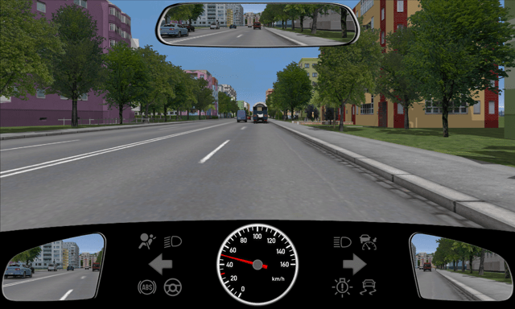

[Video: videos/1_1_07-146.mp4](videos/1_1_07-146.mp4)

**Options:**
- A. - will swing outwards even more
- B. - will come to a sudden stop
- C. - will remain stationary in the right-hand lane

**Correct Answer(s):**
- A. - will swing outwards even more
- B. - will come to a sudden stop

**Explanation:**
You see that the truck wants to turn in front of you. The vehicle obscures the view of the traffic, so you need to adjust your speed. The truck probably swings out to take the curve. He might stop abruptly to let pedestrians or other road users pass.

---

#### Question 1.1.07-147

**Points:** 4 Points

**What must you watch out for now?**

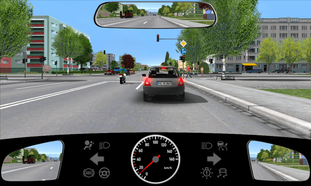

[Video: videos/1_1_07-147.mp4](videos/1_1_07-147.mp4)

**Options:**
- A. For the vehicle on the road ahead
- B. For the bicycle
- C. For the motorbike

**Correct Answer(s):**
- A. For the vehicle on the road ahead
- B. For the bicycle

**Explanation:**
You want to turn right, so does the car driver in front of you. The pedestrian traffic light of the cross street into which you want to turn shows green, and the pedestrian has priority. It is possible that your car in front will pull up and stop soon after to let the pedestrian pass. On the right you can also see a cyclist. The cyclist could drive past your vehicle on the right and circle your turning vehicle on the left. Avoid this danger.

---

#### Question 1.1.07-148

**Points:** 5 Points

**Why are you required to stop here?**

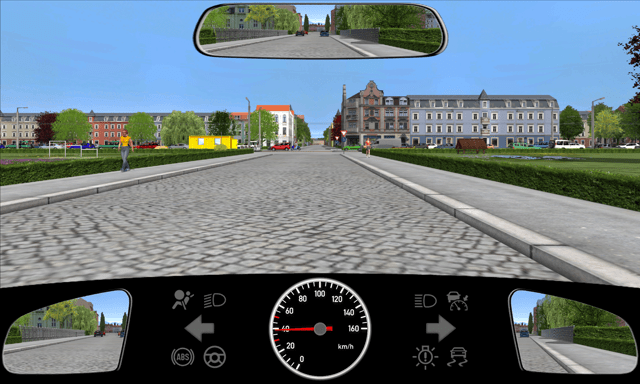

[Video: videos/1_1_07-148.mp4](videos/1_1_07-148.mp4)

**Options:**
- A. Because of the cyclist
- B. Because of the green car
- C. Because of the pedestrian

**Correct Answer(s):**
- A. Because of the cyclist

**Explanation:**
The cyclist must be given priority because she is on the right-of-way. Wait until the cyclist has passed the vehicles and driven through.

---

#### Question 1.1.07-149

**Points:** 5 Points

**Why are you required to stop here?**

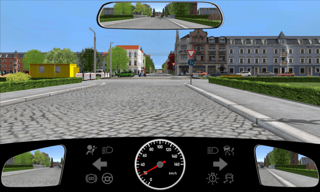

[Video: videos/1_1_07-149.mp4](videos/1_1_07-149.mp4)

**Options:**
- A. Because of the red car
- B. Because of the cyclist
- C. Because of the pedestrian

**Correct Answer(s):**
- A. Because of the red car

**Explanation:**
The traffic on the main road is jammed. The red car drives around the parked vehicles to turn left. You have to wait and let this car pass as it has priority.

---

#### Question 1.1.07-150

**Points:** 3 Points

**What is the right course of action now?**

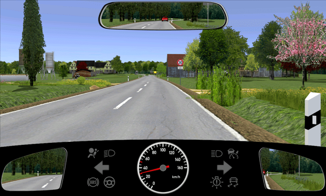

[Video: videos/1_1_07-150.mp4](videos/1_1_07-150.mp4)

**Options:**
- A. I keep a tight hold of the steering wheel and keep it pointed straight ahead
- B. I swerve to the left
- C. I swerve to the right

**Correct Answer(s):**
- A. I keep a tight hold of the steering wheel and keep it pointed straight ahead

**Explanation:**
When an animal walks on the road from the right, an evasive maneuver is a natural reflex. However, this can have far more fatal consequences than keeping the track. An evasive maneuver to the right may lead into the roadside ditch, one to the left may lead to a collision with oncoming traffic. It's safest to continue straight ahead.

---

#### Question 1.1.07-151

**Points:** 3 Points

**What should you do now?**

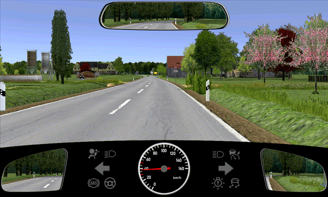

[Video: videos/1_1_07-151.mp4](videos/1_1_07-151.mp4)

**Options:**
- A. I perform an emergency braking manoeuvre
- B. I sound my horn
- C. I swerve to the left

**Correct Answer(s):**
- A. I perform an emergency braking manoeuvre
- B. I sound my horn

**Explanation:**
You can see that the animal is about to run on the road. Horns may help stop it. In addition, you should initiate emergency braking to reduce a potential collision. Do not dodge! This rather leads to accidents with personal injury than a collision with an animal.

---

#### Question 1.1.07-152-M

**Points:** 5 Points

**What must you look out for when the traffic lights turn green?**

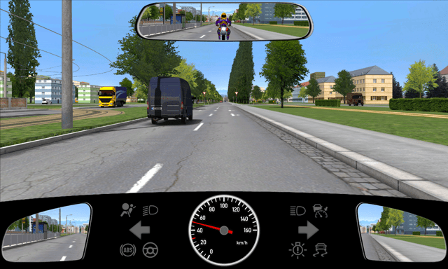

[Video: videos/1_1_07-152-M.mp4](videos/1_1_07-152-M.mp4)

**Options:**
- A. For [the pedestrian]
- B. For the motorbike
- C. For oncoming traffic

**Correct Answer(s):**
- A. For [the pedestrian]
- B. For the motorbike

**Explanation:**
While you wait at the red light, a motorcyclist pushes past the waiting vehicles. When the traffic light switches to green you should pay attention to the motorcyclist and let him pass before he initiates a risky overtaking maneuver. But you should also let the pedestrian cross the road, which is still on the road despite it being green.

---

#### Question 1.1.07-153-M

**Points:** 3 Points

**What must you be prepared for in this situation?**

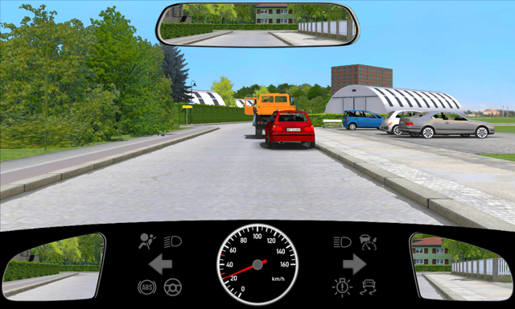

**Options:**
- A. That oncoming traffic will appear
- B. That the truck driver will jump down onto the carriageway
- C. That traffic signs are concealed behind the truck

**Correct Answer(s):**
- A. That oncoming traffic will appear
- B. That the truck driver will jump down onto the carriageway
- C. That traffic signs are concealed behind the truck

**Explanation:**
The truck blocks your view. You can therefore recognize neither the oncoming traffic nor traffic signs behind the truck. Approach the vehicle at low speed. Look for oncoming traffic (they have priority) and keep your distance to the open driver's door when driving around. The driver of the truck could suddenly get out and jump onto the road.

---

#### Question 1.1.07-154

**Points:** 4 Points

**What should you do when driving through a tunnel?**

**Options:**
- A. In a tunnel with oncoming traffic, I position myself towards the right-hand edge of the roadway
- B. I memorise the safety features such as emergency exits and emergency telephones
- C. I drive with a reduced distance to the vehicle ahead, so that I can use its tail lights as a guide

**Correct Answer(s):**
- A. In a tunnel with oncoming traffic, I position myself towards the right-hand edge of the roadway
- B. I memorise the safety features such as emergency exits and emergency telephones

**Explanation:**
When driving through a tunnel, proceed as follows: Make sure to pay attention to the safety distance and orient yourself on the right-hand side of the road in order to avoid glare from oncoming traffic. Get an overview of safety devices so you know where the nearest emergency exit and emergency telephone are located.

---

#### Question 1.1.07-155-M

**Points:** 4 Points

**What must you watch out for now?**

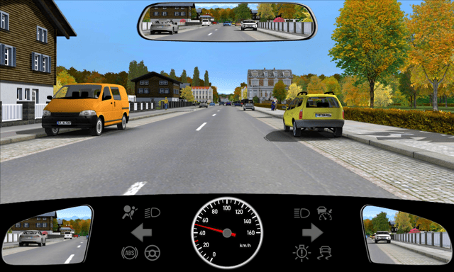

[Video: videos/1_1_07-155-M.mp4](videos/1_1_07-155-M.mp4)

**Options:**
- A. For [the cyclist] on the left
- B. For [the cyclist] on the right
- C. For [the green car]

**Correct Answer(s):**
- A. For [the cyclist] on the left
- B. For [the cyclist] on the right

**Explanation:**
You intend to turn left. Two cyclists move in the same direction. You must pay particular attention to these, as they could also turn into the street without notice.

---

#### Question 1.1.07-156-M

**Points:** 3 Points

**What should you do now?**

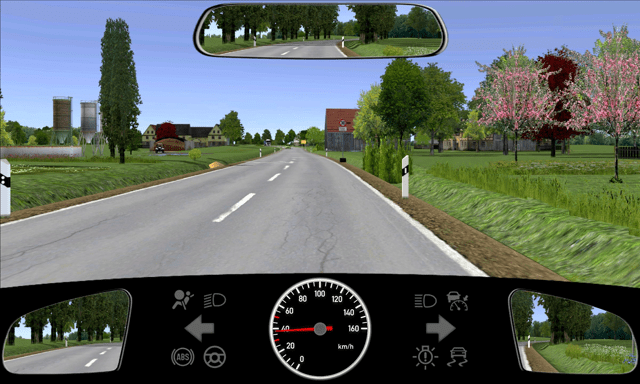

[Video: videos/1_1_07-156-M.mp4](videos/1_1_07-156-M.mp4)

**Options:**
- A. I perform an emergency braking manoeuvre
- B. I hold the steering wheel straight and firmly
- C. I steer to the left

**Correct Answer(s):**
- A. I perform an emergency braking manoeuvre
- B. I hold the steering wheel straight and firmly

**Explanation:**
Since the dog (from the right) seems to be walking into the street, please perform emergency braking and keep the steering wheel straight and steady.

---

#### Question 1.1.07-157-M

**Points:** 4 Points

**For what should your prepare yourself in this situation?**

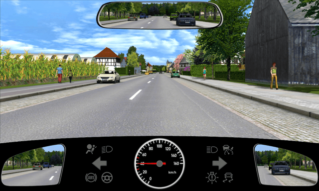

[Video: videos/1_1_07-157-M.mp4](videos/1_1_07-157-M.mp4)

**Options:**
- A. As it begins moving, the bus will swing out onto my side of the road
- B. People will cross the road at the rear of the bus
- C. The quad suddenly starts to move

**Correct Answer(s):**
- A. As it begins moving, the bus will swing out onto my side of the road
- B. People will cross the road at the rear of the bus

**Explanation:**
Please be prepared for people behind the bus to enter the lane and for the bus to swerve and briefly enter your lane.

---

#### Question 1.1.07-158

**Points:** 4 Points

**What kind of behaviour must you anticipate from cyclists?**

**Options:**
- A. - one-way roads in both directions
- B. - the wrong side of cycle paths
- C. - no lights when it is dark

**Correct Answer(s):**
- A. - one-way roads in both directions
- B. - the wrong side of cycle paths
- C. - no lights when it is dark

**Explanation:**
All 3 answers are correct. Cyclists use one-way streets in both directions, they may not have lights in the dark or they may ride on the wrong side of cycle paths.

---

#### Question 1.1.07-159-M

**Points:** 4 Points

**What must you be prepared for here?**

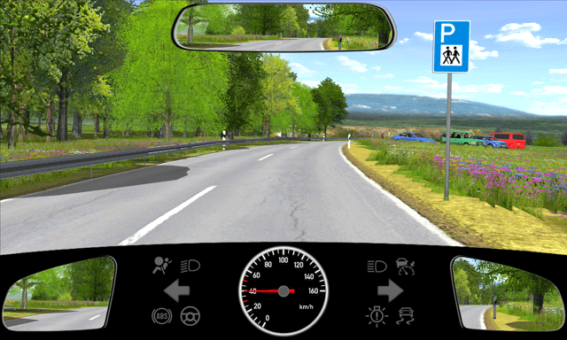

**Options:**
- A. People walking on the road
- B. Oncoming vehicles turning left
- C. Vehicles turning onto the road

**Correct Answer(s):**
- A. People walking on the road
- B. Oncoming vehicles turning left
- C. Vehicles turning onto the road

**Explanation:**
The traffic sign indicates a rambler parking area, which means that people can walk across the roadway and vehicles can drive off or onto the parking area at any time.

---

#### Question 1.1.07-160-M

**Points:** 5 Points

**Why are you required to stop now?**

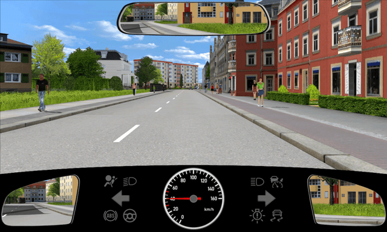

[Video: videos/1_1_07-160-M.mp4](videos/1_1_07-160-M.mp4)

**Options:**
- A. Because of [the cyclist]
- B. Because the traffic situation is confusing
- C. Because of the [yellow] truck

**Correct Answer(s):**
- A. Because of [the cyclist]
- B. Because the traffic situation is confusing

**Explanation:**
As you do not have a full view of the traffic situation and must give the cyclist the right of way, you must stop and carefully feel your way in.

---

#### Question 1.1.07-161-M

**Points:** 5 Points

**You want to continue driving straight ahead. What is the correct course of action in this situation?**

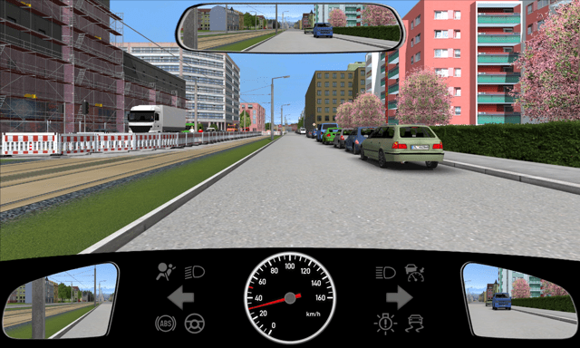

[Video: videos/1_1_07-161-M.mp4](videos/1_1_07-161-M.mp4)

**Options:**
- A. I allow the [red] vehicle to turn
- B. I allow the electric scooter to cross the road
- C. I am the first to cross over the junction

**Correct Answer(s):**
- A. I allow the [red] vehicle to turn
- B. I allow the electric scooter to cross the road

**Explanation:**
You are coming from a priority road first. As there are no other traffic signs, right is before left. The red car is driving on your right and therefore has the right of way. 
The electric scooter does not have right of way, so to avoid an accident you should let it cross anyway.

---

#### Question 1.1.07-162-M

**Points:** 3 Points

**I want to re-join the road. What is the correct assessment of this situation?**

**Options:**
- A. - drivers only see me late
- B. - I only see vehicles late
- C. - drivers give my priority in re-joining the road

**Correct Answer(s):**
- A. - drivers only see me late
- B. - I only see vehicles late

**Explanation:**
As the vehicle parked behind you is very large, you will only see vehicles coming from behind at a late stage and you yourself will only be recognised by other drivers at a late stage.

---

#### Question 1.1.07-163

**Points:** 3 Points

**Why is it dangerous to carry on driving past this accident scene?**

**Options:**
- A. Because secondary accidents can occur
- B. Because pedestrians can be overlooked
- C. Because the traffic movement situation is unclear

**Correct Answer(s):**
- A. Because secondary accidents can occur
- B. Because pedestrians can be overlooked
- C. Because the traffic movement situation is unclear

**Explanation:**
The traffic situation is unclear, sudden braking manoeuvres by gawpers and pedestrians crossing the road must be expected.

---

#### Question 1.1.07-164-M

**Points:** 5 Points

**What must you watch out for when turning right here?**

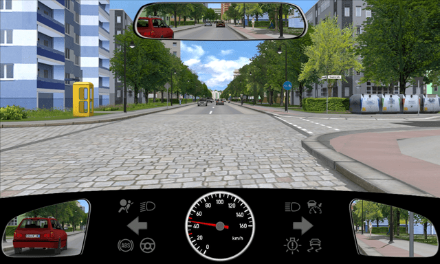

[Video: videos/1_1_07-164-M.mp4](videos/1_1_07-164-M.mp4)

**Options:**
- A. [For the cyclist]
- B. For oncoming traffic
- C. For the motorbike

**Correct Answer(s):**
- A. [For the cyclist]

**Explanation:**
The cyclist has the right of way. When turning right, you must always pay attention to whether pedestrians or cyclists are approaching. They are allowed to cross the street in front of you. Use the rearview mirror and also look over your shoulder to be able to see the blind spot.

---

#### Question 1.1.07-165-M

**Points:** 5 Points

**What is the right course of action now?**

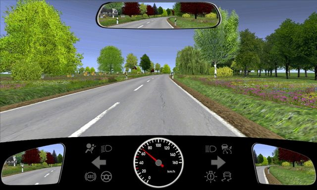

[Video: videos/1_1_07-165-M.mp4](videos/1_1_07-165-M.mp4)

**Options:**
- A. I perform an emergency stop
- B. I pass quickly through the junction
- C. I brake slightly

**Correct Answer(s):**
- A. I perform an emergency stop

**Explanation:**
The scooter does not seem to see you coming and takes the right of way. To avoid an accident, you must immediately perform emergency braking.

---

#### Question 1.1.07-166-M

**Points:** 4 Points

**What must you anticipate in this situation?**

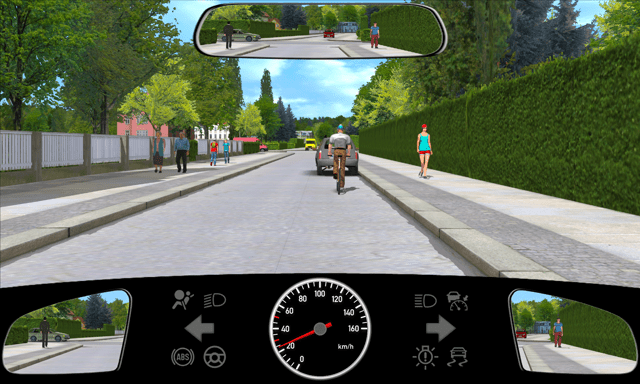

**Options:**
- A. [The cyclist] will pull out to the left
- B. Oncoming traffic
- C. [The cyclist] will dismount to allow me to pass

**Correct Answer(s):**
- A. [The cyclist] will pull out to the left
- B. Oncoming traffic

**Explanation:**
Since the obstacle is on your side, you must wait in this case. In addition, the cyclist will overtake the parked car and therefore swerve to the left.

---

#### Question 1.1.07-167

**Points:** 4 Points

**You are driving through a tunnel. What special aspect applies here?**

**Options:**
- A. - I can be distracted by loud vehicle noise
- B. - the safety devices, like emergency exits and emergency telephones are signposted
- C. - I can be distracted by lighting effects

**Correct Answer(s):**
- A. - I can be distracted by loud vehicle noise
- B. - the safety devices, like emergency exits and emergency telephones are signposted
- C. - I can be distracted by lighting effects

**Explanation:**
In a tunnel, the emergency exits and SOS emergency telephones are clearly signposted and illuminated. In an emergency, you should use the facilities. You can easily be distracted by the different lighting, the lights of other road users and the much louder noises in the tunnel.

---

#### Question 1.1.07-168-M

**Points:** 4 Points

**What is the right course of action now?**

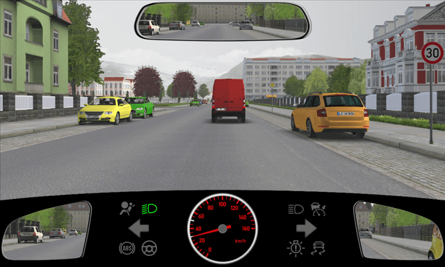

[Video: videos/1_1_07-168-M.mp4](videos/1_1_07-168-M.mp4)

**Options:**
- A. I brake
- B. I swerve out to the left
- C. I accelerate because I have priority

**Correct Answer(s):**
- A. I brake

**Explanation:**
The vehicle that is still parked wants to enter the road and has obviously overlooked you. You should slow down to avoid an accident.

---

#### Question 1.1.07-169-M

**Points:** 4 Points

**What should you anticipate now?**

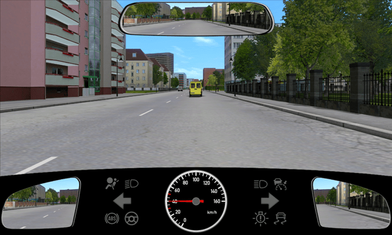

[Video: videos/1_1_07-169-M.mp4](videos/1_1_07-169-M.mp4)

**Options:**
- A. The driver of the [yellow] vehicle opens the driver-side door
- B. The [blue] truck pulls out to the left
- C. [The cyclist] pulls out to the left

**Correct Answer(s):**
- A. The driver of the [yellow] vehicle opens the driver-side door
- B. The [blue] truck pulls out to the left
- C. [The cyclist] pulls out to the left

**Explanation:**
The [yellow] vehicle will stop, so you must be ready for the driver to open the door. The cyclist will probably move to the left to overtake the yellow vehicle. You must also expect the truck to drive off.

---

#### Question 1.1.07-170

**Points:** 4 Points

**You are driving on a section of road where a traffic jam has been reported. What is the right course of action?**

**Options:**
- A. I continue to follow the traffic reports
- B. I take particular care when driving around bends and on the approach to summits
- C. I apply the emergency brake assist to safely stop before the tail end of the traffic jam

**Correct Answer(s):**
- A. I continue to follow the traffic reports
- B. I take particular care when driving around bends and on the approach to summits

**Explanation:**
You should be extra attentive on curves and before hilltops, because the traffic situation is difficult to see. You should also continue to follow the traffic reports.

---

#### Question 1.1.07-171

**Points:** 4 Points

**Why are you required to stop now?**

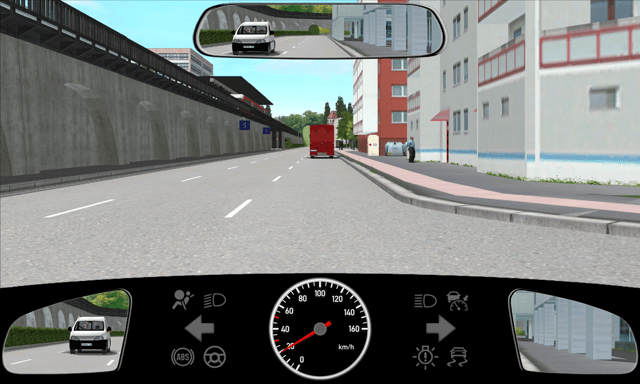

[Video: videos/1_1_07-171.mp4](videos/1_1_07-171.mp4)

**Options:**
- A. Because of the cyclist
- B. Because of the pedestrians
- C. Because of the truck

**Correct Answer(s):**
- A. Because of the cyclist

**Explanation:**
The "Give way" sign in combination with the additional bicycle sign shows you that you must pay attention to possible cyclists and give them the right of way. Therefore, you must now stop and let the cyclist pass.

---

#### Question 1.1.07-172-M

**Points:** 4 Points

**What is the correct course of action in this situation?**

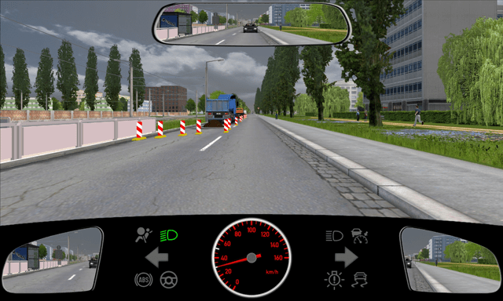

[Video: videos/1_1_07-172-M.mp4](videos/1_1_07-172-M.mp4)

**Options:**
- A. I perform an emergency braking manoeuvre
- B. I continue driving, ready to brake
- C. I accelerate

**Correct Answer(s):**
- A. I perform an emergency braking manoeuvre

**Explanation:**
If a cyclist suddenly comes from the left, you must do an emergency stop.

---

#### Question 1.1.07-173

**Points:** 3 Points

**While driving, a deer crosses the road in front of your vehicle. What should you be aware of?**

**Options:**
- A. Other animals might follow the deer
- B. The deer might stop in the middle of the road
- C. I can scare off the deer by turning on my main beam lights

**Correct Answer(s):**
- A. Other animals might follow the deer
- B. The deer might stop in the middle of the road

**Explanation:**
A deer is very unpredictable, maybe it runs back into the forest, maybe it will stop in the middle of the street. You should therefore reduce your speed and follow what is happening, as other animals can also step on the road.

---

#### Question 1.1.07-174-M

**Points:** 3 Points

**What is the right course of action?**

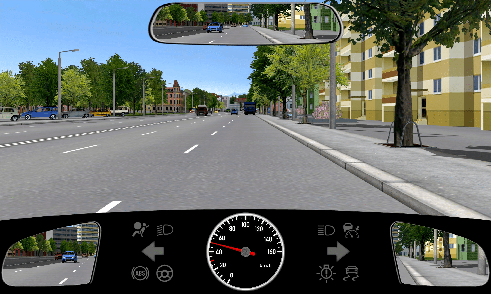

[Video: videos/1_1_07-174-M.mp4](videos/1_1_07-174-M.mp4)

**Options:**
- A. I continue braking
- B. I remain waiting in my lane for now
- C. I steer to the left now

**Correct Answer(s):**
- A. I continue braking
- B. I remain waiting in my lane for now

**Explanation:**
As the lorry in front of you is parking in reverse, you must continue to slow down. You can only change lanes when the lane to your left is free. Stay in your lane for the time being and continue braking.

---

#### Question 1.1.07-175-M

**Points:** 4 Points

**What should you anticipate in this situation?**

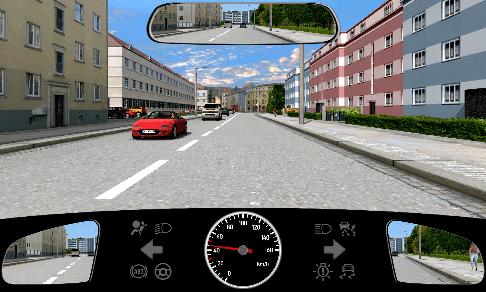

[Video: videos/1_1_07-175-M.mp4](videos/1_1_07-175-M.mp4)

**Options:**
- A. That [the yellow car] will turn left
- B. That I will have to yield my right of way
- C. That [the pedestrian] will cross the road

**Correct Answer(s):**
- A. That [the yellow car] will turn left
- B. That I will have to yield my right of way

**Explanation:**
You are driving on a turning priority road. Anyone leaving a priority road must give way to vehicles following the priority road.
The yellow car flashes and turns left. Although it does not have right of way, at its high speed it will not be able to stop without coming into your lane. You should therefore brake and give up your right of way to avoid a collision. The obligation to avoid accidents takes precedence over all right of way rules.

---

#### Question 1.1.07-176-M

**Points:** 4 Points

**What is the right behaviour now?**

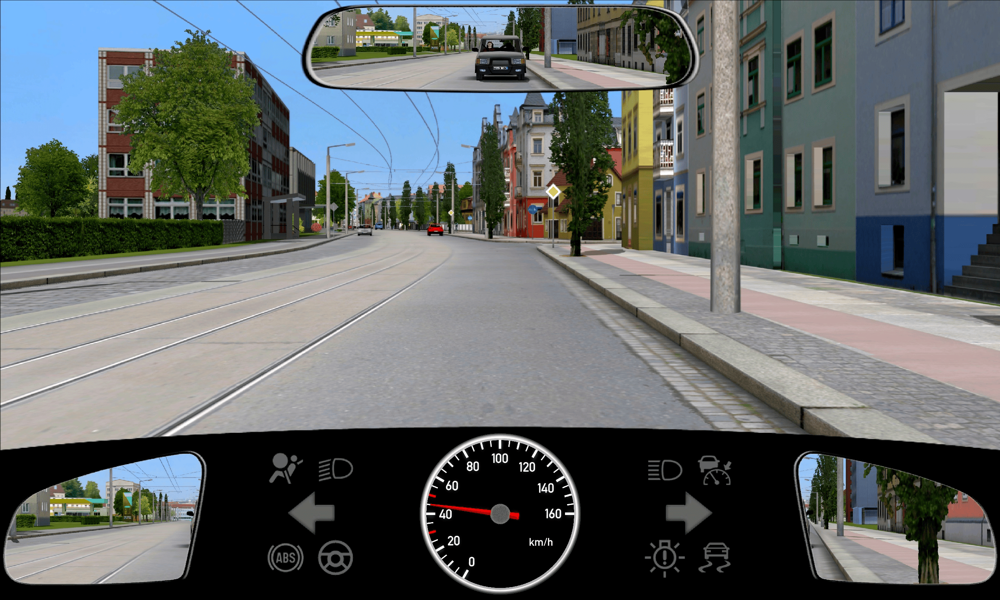

[Video: videos/1_1_07-176-M.mp4](videos/1_1_07-176-M.mp4)

**Options:**
- A. I brake
- B. I swerve to the left
- C. I continue to drive steadily

**Correct Answer(s):**
- A. I brake

**Explanation:**
In the left side mirror you can see that a car behind you is about to overtake. At the same time, the person on the bike on the right in front of you could move onto the road. A truck is also coming towards you on the opposite lane. All three factors lead to a narrow roadway and thus increase the risk of accidents.
In this situation you have to brake to avoid a collision with the overtaking car and the cyclist.

---

#### Question 1.1.07-201-M

**Points:** 4 Points

**What is the right course of action in this situation?**

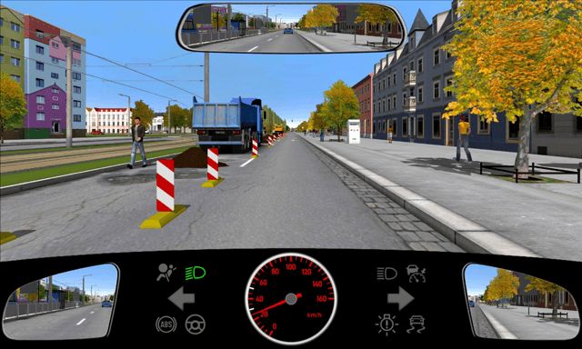

[Video: videos/1_1_07-201-M.mp4](videos/1_1_07-201-M.mp4)

**Options:**
- A. I brake very sharply
- B. I sound my horn and continue driving
- C. I steer to the right

**Correct Answer(s):**
- A. I brake very sharply

**Explanation:**
The cyclist from the left does not seem to slow down, so brake sharply.

---

#### Question 1.1.07-202-M

**Points:** 4 Points

**Why must you brake now?**

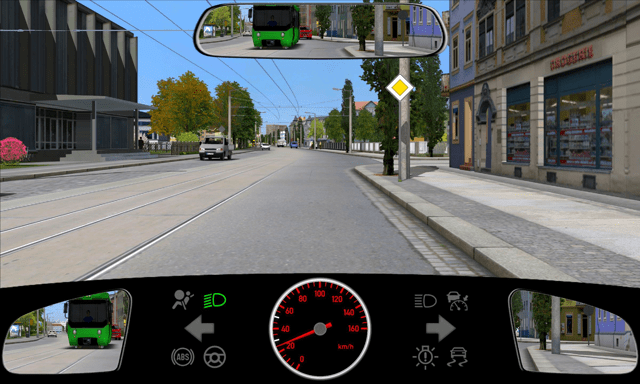

[Video: videos/1_1_07-202-M.mp4](videos/1_1_07-202-M.mp4)

**Options:**
- A. Because of [the cyclist]
- B. Because of [the red vehicle]
- C. Because of the bus stop

**Correct Answer(s):**
- A. Because of [the cyclist]

**Explanation:**
Because the cyclist wants to be in your lane, brake because of the cyclist.

---

#### Question 1.1.07-203-M

**Points:** 4 Points

**What must you watch out for now?**

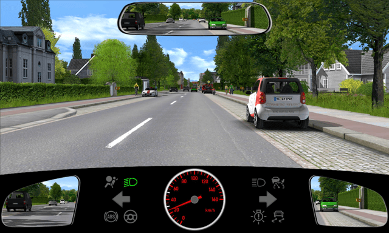

[Video: videos/1_1_07-203-M.mp4](videos/1_1_07-203-M.mp4)

**Options:**
- A. For [the cyclist] on the left
- B. For [the cyclist] on the right
- C. For the [blue] car

**Correct Answer(s):**
- A. For [the cyclist] on the left
- B. For [the cyclist] on the right

**Explanation:**
The cyclist on the right is riding on the roadway. There is a cyclist on the left whom we must let go first as a result of our turning procedure.

---

#### Question 1.1.07-204-M

**Points:** 4 Points

**What should you anticipate in this situation?**

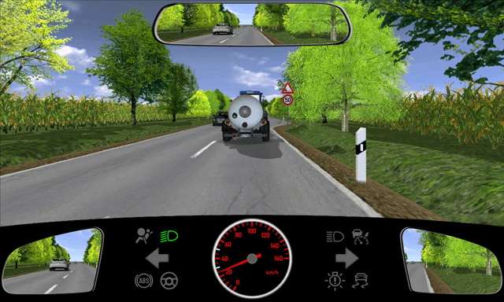

[Video: videos/1_1_07-204-M.mp4](videos/1_1_07-204-M.mp4)

**Options:**
- A. The driver of the [yellow] car fails to see me
- B. There are loose chippings on the roadway
- C. The tractor in front of me, will turn right

**Correct Answer(s):**
- A. The driver of the [yellow] car fails to see me
- B. There are loose chippings on the roadway

**Explanation:**
As you are driving behind a large vehicle, it can quickly happen that you are overlooked by oncoming traffic. The danger sign warns of rolling gravel on the road.

---

#### Question 1.1.07-205-M

**Points:** 5 Points

**You are driving outside of a built-up area. What is the correct course of action in this situation?**

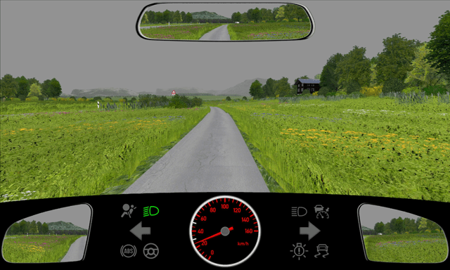

[Video: videos/1_1_07-205-M.mp4](videos/1_1_07-205-M.mp4)

**Options:**
- A. I only continue driving once I have reassured myself that the road is clear
- B. I do not have to reassure myself that the road is clear, because [the cyclist] is moving
- C. I may no longer continue using the cycle path

**Correct Answer(s):**
- A. I only continue driving once I have reassured myself that the road is clear

**Explanation:**
This is not a protected cycle path. You may therefore continue to use the cycle path.
When entering another road, you must make sure that the road is clear. There is a "Give way" sign here. This means that the cyclists on the other side of the road have the right of way and you must wait. You should check for yourself that the road is clear.
You must still make sure that the road is clear for crossing.

---

#### Question 1.1.07-206-M

**Points:** 4 Points

**Why should you be ready to brake now?**

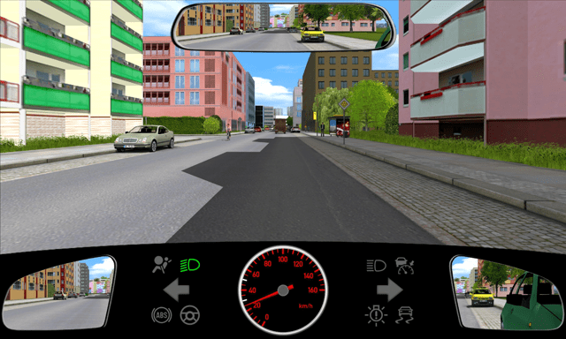

[Video: videos/1_1_07-206-M.mp4](videos/1_1_07-206-M.mp4)

**Options:**
- A. Because the driver of the brown vehicle could exit the vehicle
- B. Because [the pedestrian] could walk out onto the road
- C. Because the bus could move across onto my lane

**Correct Answer(s):**
- A. Because the driver of the brown vehicle could exit the vehicle

**Explanation:**
The brown vehicle has just stopped, there is a high risk that a person will get out hastily and carelessly in the next moment. Therefore, you must be ready to brake.

---

#### Question 1.1.07-207-M

**Points:** 4 Points

**What is the right thing to do in this situation?**

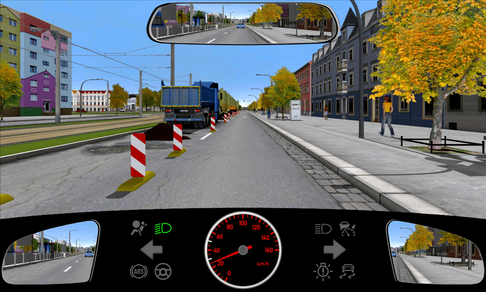

[Video: videos/1_1_07-207-M.mp4](videos/1_1_07-207-M.mp4)

**Options:**
- A. I perform an emergency braking manoeuvre
- B. I continue driving, ready to brake
- C. I move towards the right

**Correct Answer(s):**
- A. I perform an emergency braking manoeuvre

**Explanation:**
The cyclist is obviously crossing the road without paying attention to the traffic situation and without braking. Use emergency braking to avoid a collision.

---

### 1.1.09 Chapter Alcohol Drugs Medication

#### Question 1.1.09-001

**Points:** 4 Points

**A motorist has had too much alcohol to drink and therefore must not drive. How is it not possible for him to recover his ability to drive in a short time?**

**Options:**
- A. - sleeping for half an hour
- B. - drinking two cups of strong coffee
- C. - going for a walk for half an hour

**Correct Answer(s):**
- A. - sleeping for half an hour
- B. - drinking two cups of strong coffee
- C. - going for a walk for half an hour

**Explanation:**
After heavy consumption of alcohol, there's no quick way to restore your ability to drive. Neither sleeping nor walking is enough. The alcohol concentration in the blood also does not change by drinking strong coffee. The body breaks down only about 0.1 permille alcohol per hour.

---

#### Question 1.1.09-003

**Points:** 4 Points

**Which substances can impair fitness to drive in a similar way to alcohol?**

**Options:**
- A. Certain medicines and intoxicants
- B. A cup of coffee
- C. A cup of tea

**Correct Answer(s):**
- A. Certain medicines and intoxicants

**Explanation:**
Drugs, in particular, change perceptions and impair the ability to respond quickly and appropriately. Because of this, drug use of any kind make you unfit to drive. Even some medicines can impair your driving abilities. If you are prescribed medication by the doctor, pay attention to the instructions in the instruction leaflet.

---

#### Question 1.1.09-004

**Points:** 4 Points

**What can impair fitness to drive?**

**Options:**
- A. Fatigue
- B. Alcohol and other intoxicants
- C. Certain medicines

**Correct Answer(s):**
- A. Fatigue
- B. Alcohol and other intoxicants
- C. Certain medicines

**Explanation:**
Anything that negatively affects the sense organs can reduce the ability to drive. In addition to drugs, this includes medications, so you should read the package leaflet before taking them. At a blood alcohol level of 0.3 permille, you are already unfit to drive. Fatigue is one of the most common causes of accidents. Here your attention and concentration cease, and this can lead to so-called microsleep.

---

#### Question 1.1.09-006

**Points:** 4 Points

**In general, how long does it take before an alcohol level of 1.0 per mille (100 mg/100 ml) is cleared from the blood stream?**

**Options:**
- A. 10 hours
- B. 5 hours
- C. 1 hour

**Correct Answer(s):**
- A. 10 hours

**Explanation:**
The rule of thumb is: 0.1 permille is being broken down per hour. After 10 hours, 1.0 permille are completely degraded.

---

#### Question 1.1.09-007

**Points:** 4 Points

**What can increase the intoxicating effect of alcohol?**

**Options:**
- A. Sleeping pills, pain killers or sedatives
- B. Drinking on an "empty" stomach
- C. Downing alcoholic drinks in one

**Correct Answer(s):**
- A. Sleeping pills, pain killers or sedatives
- B. Drinking on an "empty" stomach
- C. Downing alcoholic drinks in one

**Explanation:**
The effect of alcohol is enhanced by medication. Especially large amounts of alcohol in combination with sleeping pills, painkillers or tranquilizers can be life-threatening. If you drink alcohol on an empty stomach or consume a large amount of alcohol in a short period of time, the alcohol enters your blood immediately: you are suddenly dead drunk.

---

#### Question 1.1.09-008

**Points:** 4 Points

**What can be the effects of even small quantities of alcohol?**

**Options:**
- A. Delayed reactions
- B. Reckless driving
- C. Impairment of hearing and vision

**Correct Answer(s):**
- A. Delayed reactions
- B. Reckless driving
- C. Impairment of hearing and vision

**Explanation:**
Even small amounts of alcohol affect your central nervous system and worsen your perception: your hearing and vision, your ability to react and perform, your sense of balance. Your willingness to take risks increases, dangers are no longer recognized by you. You think you are roadworthy, even if that is not true.

---

#### Question 1.1.09-009

**Points:** 4 Points

**What effects can drugs have?**

**Options:**
- A. Intoxication
- B. Dependence, addiction
- C. Prolonged improvement in physical and mental capabilities

**Correct Answer(s):**
- A. Intoxication
- B. Dependence, addiction

**Explanation:**
Drug substances affect the central nervous system and distort sensory perception. Although you will feel more efficient under the influence of drugs, your real performance will be reduced and makes you unable to drive. Compared to other intoxicants, drugs are more addictive.

---

#### Question 1.1.09-010

**Points:** 4 Points

**Which drugs can make a person temporarily unfit to drive even when consumed on a single occasion?**

**Options:**
- A. Hashish, marijuana
- B. Heroin, cocaine, amphetamines
- C. LSD

**Correct Answer(s):**
- A. Hashish, marijuana
- B. Heroin, cocaine, amphetamines
- C. LSD

**Explanation:**
The use of drugs even in small quantities leads to temporary inability to drive. Unlike alcohol, there are no limits for drugs. Driving under the influence of drugs can mean the loss of your driver's license.

---

#### Question 1.1.09-014

**Points:** 4 Points

**When is a drug-dependent person fit to drive a motor vehicle again?**

**Options:**
- A. After he/she can be shown to have stopped taking drugs for at least one year and is not likely to have a relapse
- B. If he/she has not taken drugs for one month
- C. If he/she has not taken drugs for six months

**Correct Answer(s):**
- A. After he/she can be shown to have stopped taking drugs for at least one year and is not likely to have a relapse

**Explanation:**
Anyone who was caught driving under the influence of drugs had to hand in his driver's license. If he is a drug addict, the person must live drug-free for a full year before he can get back his driving license. Proof of this is given by the Appraisal Body (Ger. Begutachterstelle für Fahreignung (BfF)) in form of a report.

---

#### Question 1.1.09-015

**Points:** 4 Points

**How is the intoxicating substance in hashish broken down by the body?**

**Options:**
- A. Unevenly over an indeterminate period
- B. Evenly, 0.1 per mille per hour
- C. Evenly, 0.1 gram per hour

**Correct Answer(s):**
- A. Unevenly over an indeterminate period

**Explanation:**
Drugs such as hashish are not broken down evenly in the body - in contrast to alcohol, for example. Therefore, one cannot make a reliable prediction in this regard.

---

#### Question 1.1.09-017

**Points:** 4 Points

**What are the consequences for a person driving a motor vehicle under the influence of drugs (e.g. hashish, heroin, cocaine)?**

**Options:**
- A. Confiscation of driving licence or driving ban
- B. Fine and/or imprisonment
- C. Compulsory medical/psychological examination

**Correct Answer(s):**
- A. Confiscation of driving licence or driving ban
- B. Fine and/or imprisonment
- C. Compulsory medical/psychological examination

**Explanation:**
Driving a vehicle under the influence of drugs such as hashish, cocaine or heroin may result in: withdrawal of the license, a fine and/or imprisonment. Imprisonment may amount to up to five years if other persons were endangered. In order to get your driving license back, you have to undergo a medical-psychological assessment (MPA).

---

#### Question 1.1.09-018

**Points:** 4 Points

**What are the possible effects of hashish consumption?**

**Options:**
- A. Intoxication with dangerous hallucination and reduced reaction capability
- B. Intoxication with confusion and depression
- C. Improved judgement of time

**Correct Answer(s):**
- A. Intoxication with dangerous hallucination and reduced reaction capability
- B. Intoxication with confusion and depression

**Explanation:**
The consumption of hashish leads to states of intoxication in which the feeling for time and space is lost. Attention is lowered, the perception of the environment is clearly obscured. There may be sensory illusions and states of confusion, as well as hallucinations.

---

#### Question 1.1.09-019

**Points:** 4 Points

**What are the possible effects of hashish consumption?**

**Options:**
- A. Diminished awareness of danger
- B. Increased likelihood of mistakes in assimilating information
- C. Misjudgement of speed and distance

**Correct Answer(s):**
- A. Diminished awareness of danger
- B. Increased likelihood of mistakes in assimilating information
- C. Misjudgement of speed and distance

**Explanation:**
The use of hashish puts the user in a state of intoxication in which the ability to assess risks is lost. The feeling for time and place is lost and hallucinations as well as misperceptions can be the result. Distances and speeds can no longer be estimated correctly. The willingness to take risks as well as the tendency to misjudgments are increasing rapidly.

---

#### Question 1.1.09-021

**Points:** 4 Points

**Who is not allowed to drink alcohol when driving motor vehicles?**

**Options:**
- A. All drivers under 21
- B. All drivers during their probation period
- C. All drivers

**Correct Answer(s):**
- A. All drivers under 21
- B. All drivers during their probation period

**Explanation:**
During the probation period or before the age of 21, a limit of 0.0 permille applies to you before each journey and while driving a motor vehicle: an absolute alcohol ban.

---

#### Question 1.1.09-022

**Points:** 4 Points

**Are drivers during their probation period allowed to be under the influence of alcohol when driving motor vehicles?**

**Options:**
- A. No, definitely not
- B. Yes, up to a blood alcohol level of 50 milligrams if they have not committed any alcohol related traffic violation
- C. Yes, up to a blood alcohol level of 30 milligrams if they have not committed any alcohol related traffic violation

**Correct Answer(s):**
- A. No, definitely not

**Explanation:**
During the probationary period you must not drink any alcohol if you want to drive a motor vehicle. In general, you should stick to 0.0 permille when participating in traffic.

---

#### Question 1.1.09-024

**Points:** 4 Points

**Why can fitness to drive be impaired even by just a small quantity of alcohol?**

**Options:**
- A. Because this reduces the field of vision
- B. Because this diminishes spatial vision
- C. Because this reduces the reaction time

**Correct Answer(s):**
- A. Because this reduces the field of vision
- B. Because this diminishes spatial vision

**Explanation:**
Even small amounts of alcohol have a negative effect on vision, responsiveness and perception. The willingness for hasty actions increases and the estimation of distances as well as attention declines.

---

#### Question 1.1.09-025

**Points:** 4 Points

**How can the consumption of cannabis products affect driving performance?**

**Options:**
- A. The awareness of other traffic decreases
- B. Concentration on driving decreases
- C. The glare sensitivity decreases

**Correct Answer(s):**
- A. The awareness of other traffic decreases
- B. Concentration on driving decreases

**Explanation:**
The consumption of cannabis products is counterproductive to the ability to drive. Regardless of individually different manner of reactions and behaviors after consumption, the ability to focus on traffic generally decreases while the sensitivity to glare increases.

---

#### Question 1.1.09-026

**Points:** 4 Points

**Why is consuming drugs even just once, dangerous for driving on public roads?**

**Options:**
- A. - can result in my unfitness to drive
- B. - can result in an intoxication state lasting for several hours
- C. - can cause faulty perceptions

**Correct Answer(s):**
- A. - can result in my unfitness to drive
- B. - can result in an intoxication state lasting for several hours
- C. - can cause faulty perceptions

**Explanation:**
Drugs usually cause perceptual disorders. Even the one-time use of drugs can lead to a high lasting several hours. You as a consumer would be unfit to drive.

---

#### Question 1.1.09-027

**Points:** 4 Points

**How long does cannabis and its degradation products remain detectable in urine?**

**Options:**
- A. For some weeks
- B. Several days at most
- C. Only for a few hours

**Correct Answer(s):**
- A. For some weeks

**Explanation:**
Cannabis and its breakdown products are traceable in your urine for a period between ten days and three months after consumption. The exact amount of time depends on the consumption frequency and the accuracy of the test.

---

#### Question 1.1.09-028

**Points:** 4 Points

**Why is an individual unfit to drive after consuming the drug crystal meth?**

**Options:**
- A. Because of the possibility of experiencing hallucinations
- B. Because it is possible to over-estimate personal capabilities
- C. Because of the possible sudden onset of fatigue

**Correct Answer(s):**
- A. Because of the possibility of experiencing hallucinations
- B. Because it is possible to over-estimate personal capabilities
- C. Because of the possible sudden onset of fatigue

**Explanation:**
"Crystal Meth" has a negative effect on the driving ability for the following reasons: The drug causes delusions. It caters the overestimation of one's own performance and sudden exhaustion. Even the consumption of small amounts makes you unfit for driving.

---

#### Question 1.1.09-029

**Points:** 4 Points

**How can your fitness to drive be quickly restored following the excessive consumption of alcohol?**

**Options:**
- A. Nothing can achieve this
- B. By drinking two cups of coffee
- C. By doing 15 minutes of sport

**Correct Answer(s):**
- A. Nothing can achieve this

**Explanation:**
As alcohol degrades very slowly in the body, nothing can restore your driving ability in the short term.

---

#### Question 1.1.09-030

**Points:** 4 Points

**What can affect ability to drive in a similar way to alcohol?**

**Options:**
- A. Medications
- B. Drugs
- C. Soft drinks

**Correct Answer(s):**
- A. Medications
- B. Drugs

**Explanation:**
Alcohol, drugs and medication have a negative effect on our reaction time, inhibition and motor skills.

---

#### Question 1.1.09-031

**Points:** 4 Points

**How can the consumption of cannabis products affect the driver?**

**Options:**
- A. It reduces the awareness of other traffic
- B. It reduces the ability to concentrate on driving
- C. It reduces sensitivity to glare

**Correct Answer(s):**
- A. It reduces the awareness of other traffic
- B. It reduces the ability to concentrate on driving

**Explanation:**
After cannabis use, your perception is clouded and your ability to concentrate decreases.

---

#### Question 1.1.09-032

**Points:** 4 Points

**What effects can result from taking drugs?**

**Options:**
- A. Impairment of concentration
- B. Increased readiness to take risks
- C. A miscalculation of speeds

**Correct Answer(s):**
- A. Impairment of concentration
- B. Increased readiness to take risks
- C. A miscalculation of speeds

**Explanation:**
Drugs lead to noise. This also changes the perception of a person. These intoxicating states can cause various impairments, such as the impairment of the concentration and an incorrect assessment of the speed.
Furthermore, there may be an increase in the risk of risk, since it is very common to misjudge critical situations or your own driving ability.

---

#### Question 1.1.09-033

**Points:** 4 Points

**Consuming what substance before or while driving, can make you unfit to drive?**

**Options:**
- A. Cocaine
- B. Alcohol
- C. Hashish

**Correct Answer(s):**
- A. Cocaine
- B. Alcohol
- C. Hashish

**Explanation:**
For all drugs and substances listed here, consumption will lead to driving inability.
Drugs and alcohol at the wheel lead to a significant risk to road traffic because they significantly restrict attention and concentration. In addition, taking alcohol and drugs can have numerous physical and psychological effects, as can the misjudgments of critical situations or the overestimation of one's own driving ability.

---

### 1.1.10 Chapter Health Risks

#### Question 1.1.10-001

**Points:** 3 Points

**When ambient temperatures are high, this negatively affects driver concentration during long journeys and accident numbers rise. Which of the following is it advisable to do, so that you remain alert and can drive safely, even during high summer?**

**Options:**
- A. I plan for regular breaks
- B. I drink enough
- C. I try to perform my trips around noon

**Correct Answer(s):**
- A. I plan for regular breaks
- B. I drink enough

**Explanation:**
When temperatures are high, make sure you drink enough water and take regular breaks to exercise.

---

#### Question 1.1.10-002

**Points:** 3 Points

**You should refrain from driving any vehicle if you are experiencing what physical symptoms?**

**Options:**
- A. Nausea
- B. Dizziness
- C. Fever

**Correct Answer(s):**
- A. Nausea
- B. Dizziness
- C. Fever

**Explanation:**
If you feel ill, you should take a break or let other people drive to ensure the safety of all road users.
Dizziness, nausea and fever affect your concentration and your ability to drive, so wait until you feel better to avoid endangering yourself and other road users.

---

## Theme 1.2. Behaviour In Traffic

### 1.2.01 Chapter Basic Rules About Behaviour In Road Traffic

#### Question 1.2.01-001

**Points:** 4 Points

**Participation in road traffic requires caution at all times and consideration towards other road users. What does this mean for you?**

**Options:**
- A. - reckon with improper conduct on the part of others
- B. - drive with foresight
- C. - insist on your right of priority at all times

**Correct Answer(s):**
- A. - reckon with improper conduct on the part of others
- B. - drive with foresight

**Explanation:**
Always count on the mistakes of others as well as your own. Stick to an anticipatory driving style at all times and do not insist on your right of way in any case. This would violate the principles of traffic regulations and endanger other road users.

---

#### Question 1.2.01-003

**Points:** 4 Points

**To which road users must you show particular care?**

**Options:**
- A. To persons with obvious disabilities
- B. To children
- C. To taxi drivers

**Correct Answer(s):**
- A. To persons with obvious disabilities
- B. To children

**Explanation:**
You must be particularly careful towards the following road users: all those who are not or are no longer able to cope with the demands of road traffic. This means that the principle of trust is abolished, due diligence towards children, elderly and/or frail people, disabled or drunk cyclists is up to you.

---

### 1.2.02 Chapter Road Use

#### Question 1.2.02-101-B

**Points:** 3 Points

**When may you use the right-hand hard shoulder?**

**Options:**
- A. For stopping and parking
- B. For driving a slow-moving vehicle
- C. For overtaking

**Correct Answer(s):**
- A. For stopping and parking
- B. For driving a slow-moving vehicle

**Explanation:**
The right side strip may be used in the following cases: 1. for holding and parking, 2. for slow moving vehicles such as mopeds or agricultural tractors and machinery. These should use the right side strip to avoid traffic obstructions and traffic jams. The side strip must be attached and have a sufficient width. It is forbidden in any case to use the side strip for overtaking.

---

#### Question 1.2.02-104-M

**Points:** 4 Points

**You have manoeuvred into the left lane by mistake, but would like to take a right turn. What is the right course of action?**

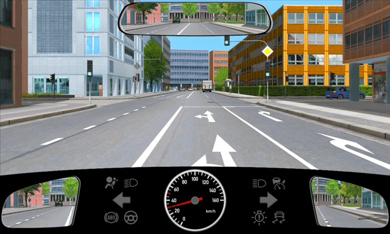

**Options:**
- A. I continue driving straight ahead or turn left
- B. I move carefully into the right-hand lane
- C. I drive straight ahead and turn right at the intersection

**Correct Answer(s):**
- A. I continue driving straight ahead or turn left

**Explanation:**
With a solid line as a road edge marking, you must under no circumstances turn right. Rather, you must stay in your lane and continue straight or turn left.

---

#### Question 1.2.02-106

**Points:** 3 Points

**When driving on main roads, which vehicles must use the hard shoulders where possible?**

**Options:**
- A. Slow-moving agricultural tractors and machinery
- B. Mopeds
- C. Small-engine motorcycles

**Correct Answer(s):**
- A. Slow-moving agricultural tractors and machinery
- B. Mopeds

**Explanation:**
Slow-moving vehicles such as tractors, mopeds must use the hard shoulder. Other vehicles that go faster than 45km/h need to remain on the road

---

#### Question 1.2.02-107

**Points:** 3 Points

**What should you do in this situation?**

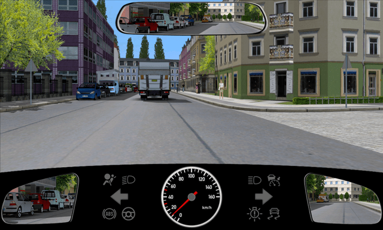

[Video: videos/1_2_02-107.mp4](videos/1_2_02-107.mp4)

**Options:**
- A. - into the gap to allow the oncoming vehicle to drive past
- B. - onwards, because the oncoming vehicle has to reverse
- C. - backwards, because the oncoming vehicle has right of way

**Correct Answer(s):**
- A. - into the gap to allow the oncoming vehicle to drive past

**Explanation:**
In a street where vehicles park on both sides, the range of movement is limited. With only one lane, vehicles are equally important in both directions. Nevertheless, you should drive into a gap here to let an oncoming vehicle pass.

---

#### Question 1.2.02-108

**Points:** 3 Points

**A horse-drawn carriage is coming towards you. What should you do?**

**Options:**
- A. - Avoid making noise
- B. - drive as far to the right as possible
- C. - switch on parking light

**Correct Answer(s):**
- A. - Avoid making noise
- B. - drive as far to the right as possible

**Explanation:**
Drive as far to the right as possible when you encounter a horse-drawn carriage. Do not honk and do not drive at high motor speed. The animals could be sensitive to noise and be frightened. It might happen that they break out and run on your side of the road.

---

#### Question 1.2.02-109

**Points:** 2 Points

**What is correct in this situation?**

**Options:**
- A. - the "right-before-left" right-of-way rule applies
- B. - I have right of way
- C. - a traffic-calming zone ends

**Correct Answer(s):**
- A. - the "right-before-left" right-of-way rule applies

**Explanation:**
At the traffic sign "Intersection or junction with right-of-way", you must follow the right-of-way rule "right before left". This applies to the nearest intersection.

---

#### Question 1.2.02-110

**Points:** 2 Points

**What do you have to watch out for, when crossing a priority road?**

**Options:**
- A. - the width of the priority road
- B. - the speed and the distance of the cross traffic
- C. - the weather conditions

**Correct Answer(s):**
- A. - the width of the priority road
- B. - the speed and the distance of the cross traffic
- C. - the weather conditions

**Explanation:**
When crossing a priority road, you must keep in mind: 1. the width of the priority road, 2. the distance and speed of oncoming traffic, 3. the weather conditions. These are all the influences that are important for crossing the priority road. The weather influences the condition of the road and the visibility. Along with the road width, it determines how long you need to cross the priority road. By estimating the distance and the speed of oncoming traffic you can assess how much time you have available.

---

#### Question 1.2.02-111

**Points:** 3 Points

**You want to use an autobahn. To allow you to do so, what type-specific maximum speed must be entered in Part I of the registration certificate or in the operating licence?**

**Options:**

**Correct Answer(s):**
- 60 

**Explanation:**
According to the German Road Traffic Regulations (Straßenverkehrsordnung - StVO), motorways may only be used by vehicles with a maximum design speed of more than 60 km / h.

---

#### Question 1.2.02-201

**Points:** 4 Points

**You are driving in a built-up area on a cycle path on which mopeds are permitted. What should you anticipate?**

**Options:**
- A. - the doors of parked vehicles will be suddenly opened
- B. - vehicles turning into another street may not be able to see me
- C. - pedestrians will walk on the cycle path

**Correct Answer(s):**
- A. - the doors of parked vehicles will be suddenly opened
- B. - vehicles turning into another street may not be able to see me
- C. - pedestrians will walk on the cycle path

**Explanation:**
If you ride on a bike path in town, you should expect everything. Doors of parked cars can be opened suddenly, turning vehicles can overlook you and pedestrians can use the bike path.

---

### 1.2.03 Chapter Speed

#### Question 1.2.03-001

**Points:** 4 Points

**Which factors lengthen your braking distance?**

**Options:**
- A. Towing a trailer not fitted with brakes
- B. A wet or slippery roadway
- C. Driving down slopes

**Correct Answer(s):**
- A. Towing a trailer not fitted with brakes
- B. A wet or slippery roadway
- C. Driving down slopes

**Explanation:**
The braking distance of a vehicle is extended: 1. on a steep hill, 2. on a wet or slippery road surface, 3. if the vehicle has to carry an additional load. The reasons for the extended braking distances are: On a steep hill, acceleration force is caused by gravity. On wet or slippery roads, the static friction between tires and road surface is reduced. Additional load increases the mass that needs to come to a stop.

---

#### Question 1.2.03-002

**Points:** 3 Points

**What does the braking distance depend on?**

**Options:**
- A. - tyres
- B. - braking system
- C. - road surface

**Correct Answer(s):**
- A. - tyres
- B. - braking system
- C. - road surface

**Explanation:**
The braking distance of your vehicle depends on the tires, the brake system and the condition of the road. Braking forces are generated powerfully and quickly by a functioning brake system and are optimally transmitted to the roadway only if there is sufficient tread. The static friction of the tires depends on the road condition.

---

#### Question 1.2.03-101

**Points:** 3 Points

**What is the permissible top speed generally in built-up areas?**

**Options:**

**Correct Answer(s):**
- 50 

**Explanation:**
50 km/h is the legally prescribed maximum speed limit within cities.
If this speed is exceeded, you will no longer be able to process information in time to react.

---

#### Question 1.2.03-102

**Points:** 4 Points

**You double the speed at which you are travelling. How does this affect the braking distance?**

**Options:**

**Correct Answer(s):**
- 4 

**Explanation:**
It also depends on your speed: At twice the speed, the braking distance will be four times as long - from 9m at 30 km/h to 36m at 60 km/h.

---

#### Question 1.2.03-103

**Points:** 4 Points

**What must you take into consideration when selecting your speed?**

**Options:**
- A. Visibility and weather conditions
- B. The condition of the road and traffic conditions
- C. Personal driving ability

**Correct Answer(s):**
- A. Visibility and weather conditions
- B. The condition of the road and traffic conditions
- C. Personal driving ability

**Explanation:**
You are only allowed to drive your vehicle at maximum legal speed. The actual permissible speed is usually lower. It depends on the visibility and weather conditions, the road conditions, the current traffic conditions and your personal driving skills.

---

#### Question 1.2.03-104

**Points:** 2 Points

**By which rule of thumb can you determine from the speed the distance in metres a motor vehicle travels in one second?**

**Options:**
- A. {Speed in km/h}/{10} x 3
- B. {Speed in km/h}/{10} x 5
- C. {Speed in km/h}/{10} x {Speed in km/h}/{10}

**Correct Answer(s):**
- A. {Speed in km/h}/{10} x 3

**Explanation:**
With the following rule of thumb and the help of speed, you can calculate the distance in meters that a vehicle travels in a second: Divide the speed by ten and multiply the result by three. If you drive your vehicle at 100 km/h, you can travel 30 meters in one second.

---

#### Question 1.2.03-105

**Points:** 2 Points

**By which rule of thumb can you determine the braking distance in metres from speed when braking normally?**

**Options:**
- A. {Speed in km/h}/{10} x {Speed in km/h}/{10}
- B. {Speed in km/h}/{10} x 5
- C. {Speed in km/h}/{10} x 3

**Correct Answer(s):**
- A. {Speed in km/h}/{10} x {Speed in km/h}/{10}

**Explanation:**
The braking distance is the distance you travel from the start of braking until your vehicle stands. It can be calculated from a simple rule of thumb during normal braking: the speed traveled divided by ten times the speed traveled divided by ten.

---

#### Question 1.2.03-106

**Points:** 4 Points

**You are travelling at 30 km/h. According to the rule of thumb, the braking distance is 9 metres when braking normally. How long is the braking distance under the same conditions when travelling at 60 km/h?**

**Options:**
- A. 36 m
- B. 27 m
- C. 18 m

**Correct Answer(s):**
- A. 36 m

**Explanation:**
If you double your speed to 60 km/h, the braking distance will quadruple. Just proceed from the braking distance for 30 km/h and accordingly calculate 9 m times 4 = 36 m.

---

#### Question 1.2.03-107

**Points:** 4 Points

**You are driving on a wide road on which oncoming traffic can pass by you, unobstructed. Within what distance must you be able to stop in any event?**

**Options:**
- A. - the distance readily visible to me
- B. - half the distance readily visible to me
- C. - twice the distance readily visible to me

**Correct Answer(s):**
- A. - the distance readily visible to me

**Explanation:**
You must be able to stop within the distance you can see in case obstacles such as animals or people suddenly enter the carriageway.

---

### 1.2.04 Chapter Distance

#### Question 1.2.04-101

**Points:** 5 Points

**What does the distance to be maintained from the vehicle ahead depend on?**

**Options:**
- A. Visibility conditions
- B. Speed
- C. State of the road surface

**Correct Answer(s):**
- A. Visibility conditions
- B. Speed
- C. State of the road surface

**Explanation:**
The distance to the vehicle in front depends on the speed as well as the visibility and road conditions. As a rule of thumb, you should keep at least a distance of half of your speed in meters. In poor visibility or road conditions, the distance should be increased.

---

#### Question 1.2.04-102

**Points:** 5 Points

**What is the right course of action?**

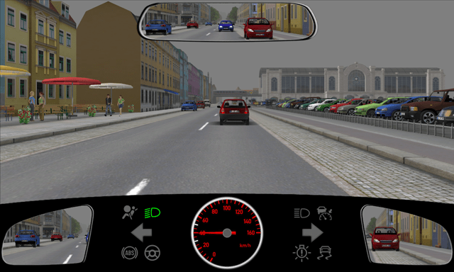

[Video: videos/1_2_04-102.mp4](videos/1_2_04-102.mp4)

**Options:**
- A. I brake
- B. I increase my distance to the vehicle in front moving into my lane
- C. I maintain my speed

**Correct Answer(s):**
- A. I brake
- B. I increase my distance to the vehicle in front moving into my lane

**Explanation:**
If a driver in front of you suddenly intervenes and reduces the safety distance between him and your vehicle, you must brake until the distance is guaranteed again.

---

#### Question 1.2.04-103

**Points:** 5 Points

**What is the right course of action?**

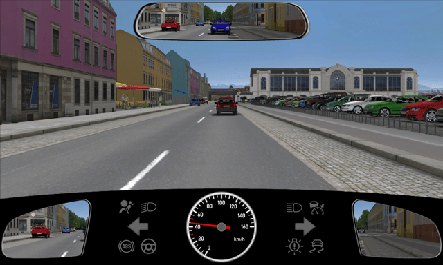

[Video: videos/1_2_04-103.mp4](videos/1_2_04-103.mp4)

**Options:**
- A. I reduce my speed
- B. I maintain my speed
- C. I accelerate

**Correct Answer(s):**
- A. I reduce my speed

**Explanation:**
If you are overtaken by a car, you must not increase your pace. On the contrary, you should slow down to let the overtaking car recoil as fast as possible.

---

#### Question 1.2.04-104

**Points:** 3 Points

**What benefit can be obtained by maintaining an adequate distance between you and the vehicle ahead?**

**Options:**
- A. It aids far-sighted driving
- B. It helps reduce the risk of accidents
- C. It restricts visibility

**Correct Answer(s):**
- A. It aids far-sighted driving
- B. It helps reduce the risk of accidents

**Explanation:**
You should always maintain a sufficiently large safety distance to the car in front of you. Through anticipatory driving, you maintain optimal visibility and reduce the risk of accidents.

---

### 1.2.05 Chapter Overtaking

#### Question 1.2.05-003

**Points:** 4 Points

**When driving outside of a built-up area, you want to overtake cyclists or pedestrians. What is the minimum space to the side that you must maintain?**

**Options:**

**Correct Answer(s):**
- 2 

**Explanation:**
Outside built-up areas, the minimum distance to be maintained for pedestrians, cyclists and personal transporters is 2 metres.

---

#### Question 1.2.05-004

**Points:** 4 Points

**Driving within a built-up area, you want to overtake a cyclist. What is the minimum space to the side that you must maintain?**

**Options:**

**Correct Answer(s):**
- 1,5 

**Explanation:**
When overtaking, you must keep a sufficient distance to the side so as not to endanger other road users. In built-up areas, the minimum distance for pedestrians, cyclists and personal transporters is 1.5 metres.

---

#### Question 1.2.05-005

**Points:** 4 Points

**Driving within a built-up area, you want to overtake an electric scooter. What is the minimum space to the side that you must maintain?**

**Options:**

**Correct Answer(s):**
- 1,5 

**Explanation:**
When overtaking, you must keep a sufficient distance to the side so as not to endanger other road users. In built-up areas, the minimum distance for pedestrians, cyclists and personal transporters is 1.5 metres.

---

#### Question 1.2.05-101

**Points:** 4 Points

**Where is overtaking prohibited?**

**Options:**
- A. When the traffic situation is not clear
- B. Where oncoming traffic could be obstructed
- C. In all one-way streets

**Correct Answer(s):**
- A. When the traffic situation is not clear
- B. Where oncoming traffic could be obstructed

**Explanation:**
Overtaking is prohibited in the following cases: 1. in the event of an unclear traffic situation; 2. in the event of violation of traffic regulations. In one-way streets, however, there is no general rule of no overtaking. Before you start the overtaking process, look back in the mirror and over your shoulder to make sure you are not hindering or jeopardizing other road users.

---

#### Question 1.2.05-103

**Points:** 4 Points

**What is the correct procedure for pulling out to overtake?**

**Options:**
- A. There is no danger to the traffic behind
- B. Oncoming traffic is not endangered
- C. The vehicle in front indicates right

**Correct Answer(s):**
- A. There is no danger to the traffic behind
- B. Oncoming traffic is not endangered

**Explanation:**
For pulling out when overtaking the following rules apply: You need to convince yourself with a look in the mirror and a glance over the shoulder that your overtaking maneuver will neither jeopardize nor hinder subsequent traffic. Only then you are allowed to indicate and pull out. During the overtaking process you must take care not to hinder oncoming traffic. If the driver in front of you is flashing to the right, you should not be tempted to overtake.

---

#### Question 1.2.05-104

**Points:** 3 Points

**What must you do to end an overtaking manoeuvre?**

**Options:**
- A. Move over to the right as soon as possible without inconveniencing the vehicle you have overtaken
- B. Signal your intention to draw in clearly and in good time
- C. Move over to the right-hand side of the roadway right in front of the vehicle you have overtaken

**Correct Answer(s):**
- A. Move over to the right as soon as possible without inconveniencing the vehicle you have overtaken
- B. Signal your intention to draw in clearly and in good time

**Explanation:**
As an overtaking driver, you must merge right as soon as possible. However, do not go back into the lane as long as you're still too close to the driver you just overtook, as you may obstruct or even endanger him. Use the turn signal in good time before starting to pull out and merging back into the lane again.

---

#### Question 1.2.05-105

**Points:** 4 Points

**What are the regulations governing speed when overtaking?**

**Options:**
- A. The speed of the overtaking vehicle must be appreciably higher
- B. The permissible top speed must not be exceeded
- C. The person being overtaken must not increase his speed

**Correct Answer(s):**
- A. The speed of the overtaking vehicle must be appreciably higher
- B. The permissible top speed must not be exceeded
- C. The person being overtaken must not increase his speed

**Explanation:**
You may only overtake a vehicle in front of you if you are significantly (at least 20 km/h) faster. Also, when overtaking: Do not exceed the maximum speed limit. The one who is being overtaken must not increase its initial speed during the maneuver.

---

#### Question 1.2.05-106

**Points:** 4 Points

**What must you do when you are being overtaken?**

**Options:**
- A. If possible, drive on the far right
- B. Not increase your speed
- C. Increase your speed

**Correct Answer(s):**
- A. If possible, drive on the far right
- B. Not increase your speed

**Explanation:**
Drive as far to the right as possible so as not to jeopardize the oncoming traffic and overtaking vehicle. During the entire overtaking process, you, as the one who is being overtaken, must not increase the speed, as otherwise safe overtaking would not be possible.

---

#### Question 1.2.05-107

**Points:** 3 Points

**On which side must you overtake a tram which is travelling in the middle of the roadway (not a one-way street)?**

**Options:**
- A. On the right
- B. On the left
- C. On the left only if other vehicles are blocking the roadway on the right

**Correct Answer(s):**
- A. On the right

**Explanation:**
Trams must in general be overtaken on the right. If vehicles are parked here, you have to drive behind the tram. If the rails are too far to the right, trams may also be overtaken on the left.

---

#### Question 1.2.05-108

**Points:** 3 Points

**When may a tram be overtaken on the left?**

**Options:**
- A. In one-way streets
- B. When the rails run too far to the right
- C. When the roadway (not a one-way street) to the right of the tram is blocked by other vehicles

**Correct Answer(s):**
- A. In one-way streets
- B. When the rails run too far to the right

**Explanation:**
Rail vehicles such as trams may basically only be overtaken on the right. For once, you can overtake on the left when the rails are too far to the right or when the rail vehicle is traveling in a one-way street. The right-hand traffic obstructing vehicles are not a sufficient reason to overtake rail vehicles on the left.

---

#### Question 1.2.05-109

**Points:** 4 Points

**Which vehicles may be overtaken only by maintaining a specially great lateral distance?**

**Options:**
- A. Bicycles
- B. Motorcycles
- C. Trams

**Correct Answer(s):**
- A. Bicycles
- B. Motorcycles

**Explanation:**
When overtaking you must always keep sufficient distance to the road users next to you. This must be particularly large with motorcycle and bicycle riders. Single lane vehicles are more unstable and can sway. The lateral minimum distance to two-wheeled vehicles is 1.5 meters.

---

#### Question 1.2.05-110

**Points:** 3 Points

**When must you signal?**

**Options:**
- A. Before pulling out to overtake or to pass
- B. Before pulling in again after overtaking
- C. When proceeding straight ahead as you leave a priority road which bends sharply

**Correct Answer(s):**
- A. Before pulling out to overtake or to pass
- B. Before pulling in again after overtaking

**Explanation:**
Whenever you want to make a lane change or turn, you need to indicate. This also applies when following a turning priority road, but not when you leave the priority road straight ahead. Even if the direction indicator is set: always make sure that you do not endanger anyone when pulling out or going back into a lane.

---

#### Question 1.2.05-115

**Points:** 4 Points

**Where is it forbidden to overtake?**

**Options:**
- A. At pedestrian crossings
- B. At points in the road where visibility is poor
- C. At special bus lanes

**Correct Answer(s):**
- A. At pedestrian crossings
- B. At points in the road where visibility is poor

**Explanation:**
When overtaking, you must exclude dangerous situations for other road users. It is generally forbidden to overtake on pedestrian crossings and on roads that are difficult to observe. You might see oncoming vehicles too late. You may overtake the bus on the bus lane.

---

#### Question 1.2.05-116

**Points:** 4 Points

**You are driving a slow-moving vehicle on a main road. How can you facilitate faster-moving vehicles in overtaking?**

**Options:**
- A. - onto the hard shoulder
- B. - onto the parking area
- C. - into a lay-by

**Correct Answer(s):**
- A. - onto the hard shoulder
- B. - onto the parking area
- C. - into a lay-by

**Explanation:**
To allow faster vehicles to overtake you on a country road, you can dodge on a suitable side stripe, a lay by or in a rest stop. It is also possible to slow down or even stop at a suitable location.

---

#### Question 1.2.05-117

**Points:** 4 Points

**When overtaking, what do you have to observe regarding spacing?**

**Options:**
- A. Maintain an adequate space to the side, particularly between the vehicle and persons
- B. To maintain an adequate space to the side between the vehicle and other road users
- C. To maintain a greater side spacing towards multi-lane vehicles than towards single-lane vehicles

**Correct Answer(s):**
- A. Maintain an adequate space to the side, particularly between the vehicle and persons
- B. To maintain an adequate space to the side between the vehicle and other road users

**Explanation:**
When overtaking, you must ensure that you have sufficient lateral distance to other road users: at least 1 meter to cars, trucks, buses, trams. For pedestrians and cyclists, the minimum distance is 1.5 meters. When we go back into lane you must not cut in on the driver you just overtook. (Check: Is he visible in the rearview mirror?)

---

#### Question 1.2.05-119

**Points:** 3 Points

**How can you tell if a horse-drawn carriage wants to change direction?**

**Options:**
- A. The driver extends his arm
- B. A traffic paddle is displayed
- C. A flashing indicator

**Correct Answer(s):**
- A. The driver extends his arm
- B. A traffic paddle is displayed
- C. A flashing indicator

**Explanation:**
When a horse-drawn carriage wants to change its driving direction, it can be recognized by one of the following signs: The horse-drawn carriage indicates; the coachman beckons with his arm or with a signaling disk.

---

#### Question 1.2.05-120

**Points:** 4 Points

**You want to overtake a horse-drawn carriage on a rural road. What should you do?**

**Options:**
- A. - as little noise as possible
- B. - the most space to the side as possible
- C. - a high engine speed

**Correct Answer(s):**
- A. - as little noise as possible
- B. - the most space to the side as possible

**Explanation:**
Drive past the horses at an appropriate speed and with as much distance as possible. The animals may be frightened by sudden and loud noises such as a car horn or high engine speed, and may bolt. Therefore, avoid noise and proximity.

---

#### Question 1.2.05-121

**Points:** 4 Points

**You want to overtake a horse-drawn carriage on a rural road. What should you do?**

**Options:**
- A. I maintain the most space to the side possible
- B. I pay attention to the driver's hand signals
- C. I overtake with a high engine speed

**Correct Answer(s):**
- A. I maintain the most space to the side possible
- B. I pay attention to the driver's hand signals

**Explanation:**
If you want to overtake a horse-drawn carriage on a country road, you must do the following: Avoid unnecessary noise such as honking or driving at high engine speeds so as not to scare the horses. Pay attention to the hand gestures of the coachman, as he can assess the behavior of his horses. Keep a safe distance.

---

#### Question 1.2.05-122

**Points:** 4 Points

**You are driving a slow-moving vehicle on a rural road. A line of vehicles is forming behind you. What should you do?**

**Options:**
- A. I allow the vehicles behind me to overtake
- B. I come to a stop at a suitable place, if this is the only way the vehicles behind me can overtake
- C. I switch on my hazard lights and drive as far to the right as possible

**Correct Answer(s):**
- A. I allow the vehicles behind me to overtake
- B. I come to a stop at a suitable place, if this is the only way the vehicles behind me can overtake

**Explanation:**
A long queue behind a slow-moving vehicle leads to dangerous overtaking maneuvers. To make overtaking easier for the vehicles jamming behind you, reduce your speed. If the queue still does not disappear, you may need to stop on a side strip. This does not apply to highways! You must not use the hazard lights.

---

#### Question 1.2.05-123

**Points:** 4 Points

**You want to overtake a horse-drawn carriage on a rural road. What is the right course of action?**

**Options:**
- A. I look for hand signals from the driver indicating he wants to turn off
- B. I maintain a sufficient amount of distance when pulling in again
- C. I maintain the smallest possible side clearance

**Correct Answer(s):**
- A. I look for hand signals from the driver indicating he wants to turn off
- B. I maintain a sufficient amount of distance when pulling in again

**Explanation:**
When overtaking a carriage, you must pay attention to hand signals from the coachman, who may give you separate instructions. Carriages should always be overtaken at a safe distance so as not to frighten the horse.

---

#### Question 1.2.05-124

**Points:** 4 Points

**What amount of side clearance must you maintain when overtaking pedestrians and cyclists?**

**Options:**
- A. - maintain a minimum side clearance of 1.5 m within a built-up area
- B. - maintain a minimum side clearance of 2.0 m outside of a built-up area
- C. - maintain a minimum side clearance of 1.0 m within a built-up area

**Correct Answer(s):**
- A. - maintain a minimum side clearance of 1.5 m within a built-up area
- B. - maintain a minimum side clearance of 2.0 m outside of a built-up area

**Explanation:**
To protect cyclists and pedestrians, you must keep a distance of at least 1.5 metres to the side in built-up areas and at least 2 metres outside built-up areas.

---

#### Question 1.2.05-125-M

**Points:** 4 Points

**What must you note when overtaking the cyclists in this situation?**

**Options:**
- A. The incline causes the cyclists to sway
- B. I must overtake with at least 1.5 m of side clearance
- C. I must overtake with at least 1.0 m of side clearance

**Correct Answer(s):**
- A. The incline causes the cyclists to sway
- B. I must overtake with at least 1.5 m of side clearance

**Explanation:**
When overtaking in built-up areas, you must maintain a distance of at least 1.5 metres to the side of the cyclist. 
Due to the commuting of cyclists, a larger minimum distance is recommended.

---

#### Question 1.2.05-126-M

**Points:** 5 Points

**What is the correct course of action in this situation?**

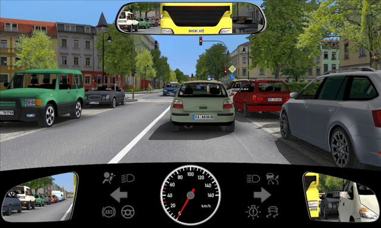

[Video: videos/1_2_05-126-M.mp4](videos/1_2_05-126-M.mp4)

**Options:**
- A. I remain behind [the cyclist]
- B. I overtake [the cyclist] with a sufficient amount of side clearance
- C. I have to allow [the pedestrian] to cross the road

**Correct Answer(s):**
- A. I remain behind [the cyclist]

**Explanation:**
The driving lane line is solid. Therefore, overtaking is forbidden here.

---

### 1.2.06 Chapter Passing

#### Question 1.2.06-001

**Points:** 3 Points

**Which vehicle must wait when half the roadway is closed because of roadworks?**

**Options:**
- A. The vehicle on the side of the roadway where the roadworks are
- B. The vehicle on the unobstructed side of the roadway
- C. Always the smaller vehicle

**Correct Answer(s):**
- A. The vehicle on the side of the roadway where the roadworks are

**Explanation:**
If you want to drive past a parked car or a barrier on your side of the street, you must give priority to oncoming traffic, no matter how large the vehicle.

---

#### Question 1.2.06-002-B

**Points:** 3 Points

**Who must wait?**

**Options:**
- A. I must wait
- B. The oncoming vehicle must wait

**Correct Answer(s):**
- A. I must wait

**Explanation:**
If you want to drive past a parked car or a barrier on the left side of the road, you must give priority to vehicles that meet you.

---

#### Question 1.2.06-004

**Points:** 5 Points

**Why should you drive especially slowly here?**

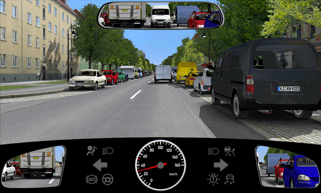

[Video: videos/1_2_06-004.mp4](videos/1_2_06-004.mp4)

**Options:**
- A. - the truck is narrowing the lane
- B. - people are proceeding onto the road
- C. - I am approaching a traffic light junction

**Correct Answer(s):**
- A. - the truck is narrowing the lane
- B. - people are proceeding onto the road

**Explanation:**
In front of you, a standing truck narrows the road. The view of traffic is limited. In front of the truck, pedestrians cross the street, which you may perceive too late, as their view is also blocked. Therefore, avoid the obstacle very slowly and carefully.

---

#### Question 1.2.06-005

**Points:** 5 Points

**What is the right course of action?**

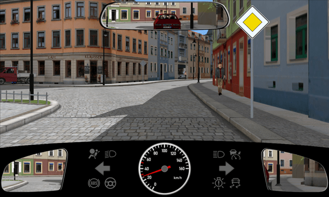

[Video: videos/1_2_06-005.mp4](videos/1_2_06-005.mp4)

**Options:**
- A. Wait, because otherwise there would not be enough space between the cyclist and the car
- B. Continue driving at a moderate speed, because there is very little space between the cyclist and the car
- C. Continue driving as before, because there is sufficient space between the cyclist and the car

**Correct Answer(s):**
- A. Wait, because otherwise there would not be enough space between the cyclist and the car

**Explanation:**
You want to drive around the vehicles parked on the right side of the road. But that is only possible when the oncoming cyclist has passed you by. Otherwise you would not be able to maintain the necessary lateral distance and therefore have to wait.

---

#### Question 1.2.06-006

**Points:** 5 Points

**What should you do now?**

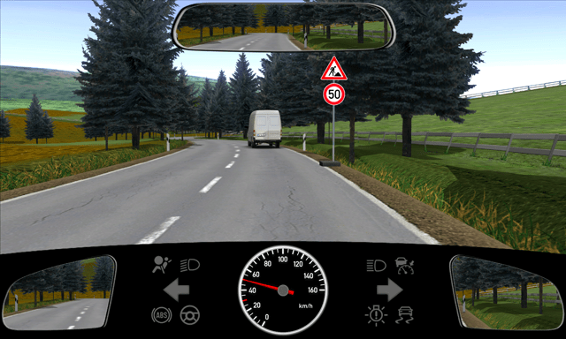

[Video: videos/1_2_06-006.mp4](videos/1_2_06-006.mp4)

**Options:**
- A. - if it is clear that there is no oncoming traffic
- B. - so as not to impede the way of possible oncoming traffic
- C. - because any possible oncoming traffic must already be waiting

**Correct Answer(s):**
- A. - if it is clear that there is no oncoming traffic

**Explanation:**
Your visibility is limited by the van and you cannot tell if vehicles are coming towards you. Before driving on, make sure that there is no oncoming traffic approaching. You have to wait, because the construction site is on your lane.

---

#### Question 1.2.06-101-M

**Points:** 5 Points

**What is the correct course of action in this situation?**

**Options:**
- A. I wait until the oncoming road user has driven past me
- B. I take priority before the oncoming road user
- C. The oncoming road user and I agree on who takes priority

**Correct Answer(s):**
- A. I wait until the oncoming road user has driven past me

**Explanation:**
You wait until the oncoming motorcyclist has passed, as the obstacle is on your half of the lane.

---

### 1.2.07 Chapter Use Of Lanes By Motor Vehicles

#### Question 1.2.07-001

**Points:** 4 Points

**What must you remember when you want to change lanes?**

**Options:**
- A. You must signal your intention to change lanes in time
- B. You must pay attention to the traffic following behind
- C. You must always brake heavily before changing lanes

**Correct Answer(s):**
- A. You must signal your intention to change lanes in time
- B. You must pay attention to the traffic following behind

**Explanation:**
Turn the turn signal on and make sure that you do not endanger other road users before you start to change lanes. Do not brake abruptly. If there are vehicles on the roadway that you want to change to, you have to wait for a sufficiently large gap in the traffic.

---

#### Question 1.2.07-103

**Points:** 3 Points

**On a road with several lanes in one direction, one of the lanes ends ahead. You are driving on the lane which is coming to an end. What should you do?**

**Options:**
- A. Only move over just before the road starts to narrow by following the zipper feed-in method
- B. Move into the through lane immediately after you see the first sign indicating that the road will narrow
- C. Always be the first to move over into the through lane

**Correct Answer(s):**
- A. Only move over just before the road starts to narrow by following the zipper feed-in method

**Explanation:**
If there is an obstacle on a road or if a multi-lane road narrows, then zip merging applies to all vehicles traveling in the same direction. Drive to the end of your lane. Do not change lanes earlier to prevent tailback. Wait here until a vehicle on the adjacent lane lets you enter.

---

#### Question 1.2.07-104

**Points:** 4 Points

**What do you do in a tunnel with oncoming traffic?**

**Options:**
- A. Do not drive over the lane boundary markings
- B. Do not make a U-turn
- C. Drive over the lane boundary markings when overtaking

**Correct Answer(s):**
- A. Do not drive over the lane boundary markings
- B. Do not make a U-turn

**Explanation:**
In a tunnel with oncoming traffic, you must behave as follows: Orient yourself on the right side of the road and avoid looking directly into the light of oncoming traffic. You must not drive over or turn on the road edge marking. If necessary, increase the safety distance, drive anticipatory and pay attention to restriction on overtaking.

---

#### Question 1.2.07-105-M

**Points:** 4 Points

**What is the correct course of action in this situation?**

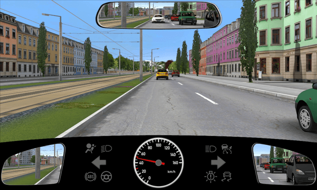

[Video: videos/1_2_07-105-M.mp4](videos/1_2_07-105-M.mp4)

**Options:**
- A. I move over to the right-hand lane after around 200 m
- B. I may overtake the vehicles driving in the right-hand lane
- C. I move into the right-hand lane now

**Correct Answer(s):**
- A. I move over to the right-hand lane after around 200 m
- B. I may overtake the vehicles driving in the right-hand lane

**Explanation:**
You drive as close as possible to the barrier and only change to the right-hand lane after about 200 m. You may overtake all vehicles in the right-hand lane.

---

#### Question 1.2.07-112

**Points:** 3 Points

**In what situations is the alternate merging procedure to be used?**

**Options:**
- A. When lanes come to an end
- B. If lanes are not continuously free to traffic due to an obstacle
- C. Where merging lanes join

**Correct Answer(s):**
- A. When lanes come to an end
- B. If lanes are not continuously free to traffic due to an obstacle

**Explanation:**
If the road narrows or if there is an obstacle on it so that a lane ends, zipper merging applies. It does not apply to acceleration lanes of slip roads. Here you have to wait.

---

#### Question 1.2.07-113

**Points:** 3 Points

**A lane terminates on a road with several lanes heading in the same direction. What should you do when driving on the through-lane?**

**Options:**
- A. - allow traffic on the terminating lane to merge in accordance with the alternate merging procedure
- B. - drive past the vehicles on the terminating lane
- C. - make eye-contact and then decide according to the situation

**Correct Answer(s):**
- A. - allow traffic on the terminating lane to merge in accordance with the alternate merging procedure

**Explanation:**
You must allow the driver, who is prevented from continuing to drive on the terminating lane, to safely change to the adjacent lane. It is mandatory that the vehicles of the ending lane and the vehicles on the continuous lane alternately merge into the lane immediately before the beginning of the lane narrowing. This is called zipper merging.

---

#### Question 1.2.07-115

**Points:** 4 Points

**You want to continue driving straight ahead. What should you do?**

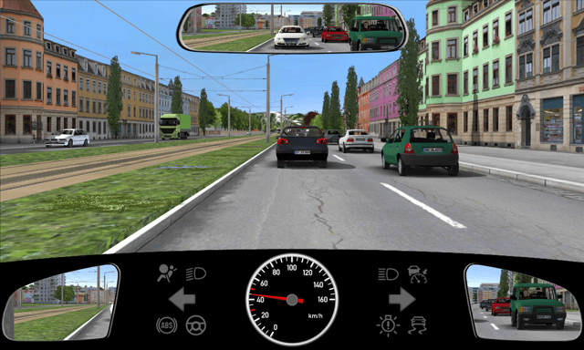

[Video: videos/1_2_07-115.mp4](videos/1_2_07-115.mp4)

**Options:**
- A. I change lanes just before the narrowing of the road
- B. I move into the right-hand lane now

**Correct Answer(s):**
- A. I change lanes just before the narrowing of the road

**Explanation:**
If a lane ends, vehicles should only merge into the lane right before the beginning of the constriction. This should be done alternately: Each vehicle from the continuing lane lets a vehicle from the ending lane go into the lane. This is called zipper merging. Practically, vehicles often go into the lane themselves too early out of fear of not being let in, thus narrowing the lane earlier than necessary.

---

#### Question 1.2.07-116

**Points:** 4 Points

**You want to turn right at the junction. What should you do?**

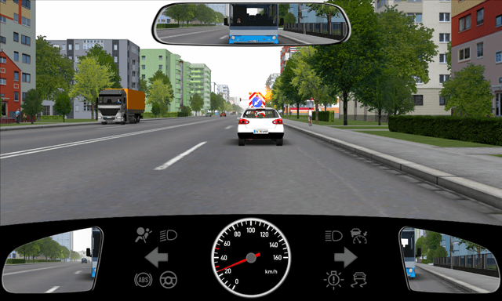

[Video: videos/1_2_07-116.mp4](videos/1_2_07-116.mp4)

**Options:**
- A. I refrain from turning right, and remain in my lane
- B. I steer clearly to the right, in order to create a space in the right-hand lane
- C. I wait until all the vehicles have passed by, and then I move into the right-hand lane

**Correct Answer(s):**
- A. I refrain from turning right, and remain in my lane

**Explanation:**
You would have to switch to the right lane, that is blocked by the waiting vehicles. Thus, you would hinder other road users on their lane while waiting. Therefore, you better avoid turning here.

---

### 1.2.09 Chapter Turning Turning And Reversing

#### Question 1.2.09-006

**Points:** 4 Points

**You want to turn left. When must you check for traffic behind?**

**Options:**
- A. Before getting into lane and again immediately before turning
- B. Only once before turning

**Correct Answer(s):**
- A. Before getting into lane and again immediately before turning

**Explanation:**
If you want to turn left, you must indicate this in a first step by pressing the direction-indictor control in order to make it clear for the follow-up traffic. Both before merge into the lane and immediately before the turn, you should make sure that the follow-up traffic has registered your intention by looking into the rearview mirror and looking over the shoulder.

---

#### Question 1.2.09-009

**Points:** 3 Points

**Two vehicles are approaching each other. Both want to turn left. What must they do as a rule?**

**Options:**
- A. They turn in front of each other
- B. They pass each other in a wide arc and turn behind each other

**Correct Answer(s):**
- A. They turn in front of each other

**Explanation:**
Oncoming vehicles, each of which want to turn left from their direction of travel, have to turn in front of each other. This traffic situation is called tangent turns. This is the required rule. There are exceptional situations at narrow intersections or intersections with safety islands, which allow a turn in a wider arc.

---

#### Question 1.2.09-010

**Points:** 3 Points

**Two vehicles are approaching each other. Both want to turn left. In which cases are you not allowed to turn left in front of each other?**

**Options:**
- A. When you notice that the approaching vehicle wanting to turn left wishes to turn behind your vehicle
- B. When this is forbidden by lane markings
- C. When the approaching vehicle wanting to turn left stops just before the middle of the crossroads

**Correct Answer(s):**
- A. When you notice that the approaching vehicle wanting to turn left wishes to turn behind your vehicle
- B. When this is forbidden by lane markings

**Explanation:**
As a rule, you have to turn left before the oncoming vehicle (tangent turning). However, drive in a wide arc behind the other vehicle if this is prescribed by lane markings on the lane. If the driving style of the other vehicle driver indicates that he wants to turn behind you, you also have to do without a turn in front of each other.

---

#### Question 1.2.09-012-M

**Points:** 5 Points

**What is the right course of action?**

**Options:**
- A. I have to allow [the yellow vehicle] to pass through
- B. I may make the turn before the [yellow vehicle]

**Correct Answer(s):**
- A. I have to allow [the yellow vehicle] to pass through

**Explanation:**
If you want to turn left, you have to give the oncoming vehicles right of way. The oncoming vehicles have right of way, even cyclists.

---

#### Question 1.2.09-013-M

**Points:** 4 Points

**What driving line should you maintain up to the left turn?**

**Options:**
- A. The right
- B. The left

**Correct Answer(s):**
- A. The right

**Explanation:**
Left-turning drivers get themselves up to the middle of the roadway. The vehicle must not protrude into the lane of oncoming traffic and thereby hinder the flow of traffic. In one-way streets driving on the left lane side is allowed.

---

#### Question 1.2.09-016

**Points:** 4 Points

**You want to turn left. When must you pay attention to the traffic following behind you?**

**Options:**
- A. Before selecting the appropriate lane
- B. Before taking the turn
- C. After taking the turn

**Correct Answer(s):**
- A. Before selecting the appropriate lane
- B. Before taking the turn

**Explanation:**
When turning left, you should be aware of following traffic before turning and before merging.

---

#### Question 1.2.09-017

**Points:** 3 Points

**Two vehicles approach one another at an intersection. Both vehicles want to turn left. In what exceptional case do they have to turn one after the other?**

**Options:**
- A. If the road traffic situation demands it
- B. If the layout of the intersection demands it
- C. If the vehicles are crossing over an equal priority intersection

**Correct Answer(s):**
- A. If the road traffic situation demands it
- B. If the layout of the intersection demands it

**Explanation:**
Always turn in front of each other. If the traffic situation or the design of the intersection, e.g. lane markings, requires it, you must turn one behind the other.

---

#### Question 1.2.09-018

**Points:** 3 Points

**Two vehicles approach one another at an intersection. Both vehicles want to turn left. What must both drivers do in the normal case?**

**Options:**
- A. - turn in front of one another
- B. - turn behind one another
- C. - communicate with one another to agree the mode of turning

**Correct Answer(s):**
- A. - turn in front of one another

**Explanation:**
If two left-turning vehicles come towards each other, they turn in front of each other (tangentially).

---

#### Question 1.2.09-019-M

**Points:** 4 Points

**You want to turn left. What driving line should you maintain?**

**Options:**
- A. The right driving line
- B. The left driving line
- C. Both driving lines are possible

**Correct Answer(s):**
- A. The right driving line

**Explanation:**
Use the right-hand driving line. The left-hand driving line is intended for oncoming traffic.

---

#### Question 1.2.09-020-M

**Points:** 5 Points

**To which road user must you give way here?**

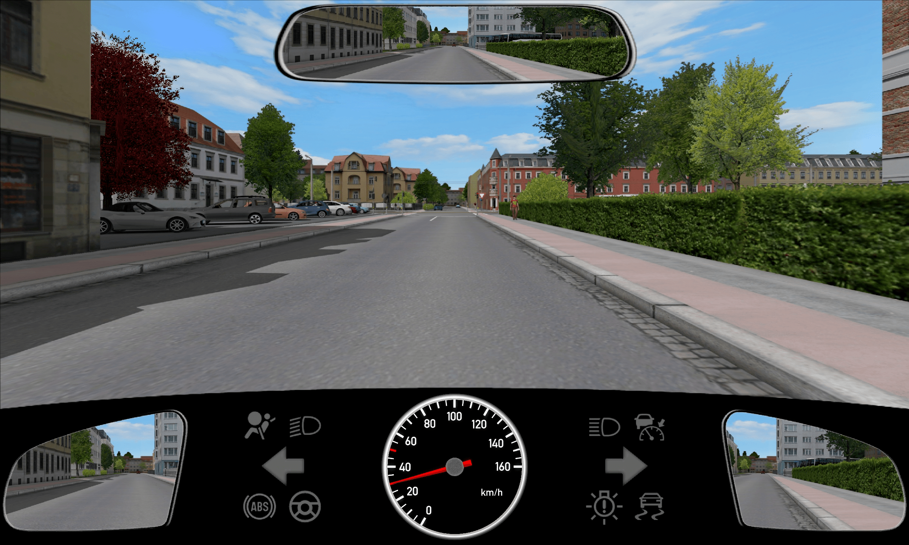

[Video: videos/1_2_09-020-M.mp4](videos/1_2_09-020-M.mp4)

**Options:**
- A. [The pedestrian]
- B. [The cyclist]
- C. The bus

**Correct Answer(s):**
- A. [The pedestrian]
- B. [The cyclist]

**Explanation:**
When turning, you must give priority to oncoming traffic and cross traffic - in this case cyclists and pedestrians.
Although your traffic lights are green, you must wait until the pedestrian has crossed the road. Pedestrians have priority over turning vehicles.

---

#### Question 1.2.09-021-M

**Points:** 4 Points

**You want to leave the roundabout at this exit. What is the right thing to do?**

**Options:**
- A. I must allow [the pedestrian] to cross the road
- B. I must allow [the cyclist] to cross the road
- C. I have priority over the road users crossing the road

**Correct Answer(s):**
- A. I must allow [the pedestrian] to cross the road
- B. I must allow [the cyclist] to cross the road

**Explanation:**
When leaving the roundabout, crossing walkers and cyclists have priority.
You must therefore allow cyclists and walkers to cross the carriageway.

---

#### Question 1.2.09-022-M

**Points:** 4 Points

**You want to turn right here. What is correct?**

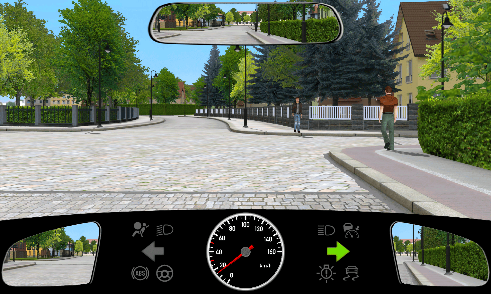

**Options:**
- A. I have to let both [pedestrians] cross the road
- B. I only have to let [the oncoming pedestrian] cross the road
- C. I have right of way over both [pedestrians]

**Correct Answer(s):**
- A. I have to let both [pedestrians] cross the road

**Explanation:**
You must let both pedestrians cross the road. They do not change their direction of movement and therefore have priority over you.

---

#### Question 1.2.09-101

**Points:** 4 Points

**What can give rise to particularly dangerous situations where several lanes turn off?**

**Options:**
- A. Driving too fast
- B. Changing lanes while performing the turn
- C. Keeping exactly to your lane

**Correct Answer(s):**
- A. Driving too fast
- B. Changing lanes while performing the turn

**Explanation:**
Drive at moderate speed into multi-lane turns. At too fast a pace you could get out of your lane and get into the lane of parallel driving vehicles. Avoid a lane change within this turning situation. There is a risk that a vehicle is directly behind you in your blind spot.

---

#### Question 1.2.09-103-B

**Points:** 3 Points

**All three vehicles want to turn left. Which is in the correct lane?**

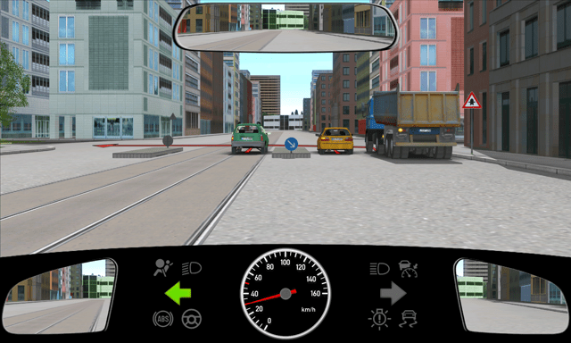

**Options:**
- A. The yellow car
- B. The truck
- C. The green car

**Correct Answer(s):**
- A. The yellow car

**Explanation:**
Only the yellow car merged into the lane correctly. He passed right, as it says on the road sign on the safety island, in order to then get in proper lane as left as possible to prepare his turn to the left. The green car is completely wrong on the rails; In this situation, the truck may only drive straight ahead or turn right.

---

#### Question 1.2.09-104-B

**Points:** 3 Points

**After turning left, you want to turn immediately right. How should you position your vehicle?**

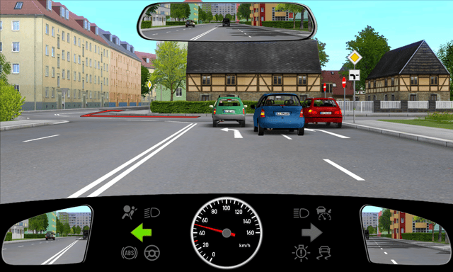

**Options:**
- A. - the red car
- B. - the green car
- C. - the blue car

**Correct Answer(s):**
- A. - the red car

**Explanation:**
If you want to turn right again immediately after turning left, you get in proper lane on the right, if there are two lanes for turning left. Otherwise, keep as far to the right as possible. This is the only way you can turn right after a left turn without hindering other road users.

---

#### Question 1.2.09-107-B

**Points:** 3 Points

**Who must signal a change of direction here?**

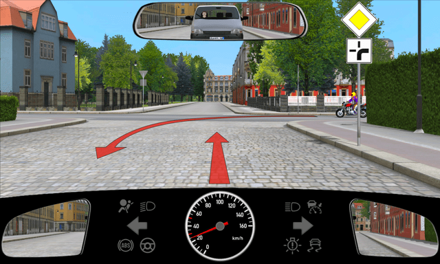

**Options:**
- A. The motorcycle
- B. I myself
- C. No one

**Correct Answer(s):**
- A. The motorcycle

**Explanation:**
The change of direction must indicate who changes it. This is true regardless of the importance of the road. So, the motorcyclist who follows the course of the turning priority road has to indicate. You continue straight ahead and do not indicate.

---

#### Question 1.2.09-109

**Points:** 3 Points

**You are on a roundabout. What should you remember?**

**Options:**
- A. You can only drive over a central island if this is unavoidable because of your vehicle's size
- B. You are not allowed to stop on the roadway in a roundabout
- C. You must indicate to leave the roundabout

**Correct Answer(s):**
- A. You can only drive over a central island if this is unavoidable because of your vehicle's size
- B. You are not allowed to stop on the roadway in a roundabout
- C. You must indicate to leave the roundabout

**Explanation:**
In a roundabout you may only stop if this is unavoidable due to traffic, for example due to a traffic jam. Indicate when leaving the roundabout. You can only drive over paved or asphalted central islands if it is unavoidable due to the size of the vehicle. Always give priority to cyclists traveling on your right side and remaining in the roundabout.

---

#### Question 1.2.09-111

**Points:** 4 Points

**In what situation is it especially dangerous to perform a turn?**

**Options:**
- A. Before the crest of a hill
- B. Before bends in the road
- C. In foggy conditions

**Correct Answer(s):**
- A. Before the crest of a hill
- B. Before bends in the road
- C. In foggy conditions

**Explanation:**
When turning in poor visibility (fog), dangerous situations can arise. The same applies when turning in curves and before crests.

---

#### Question 1.2.09-112-M

**Points:** 3 Points

**Who is required to indicate?**

**Options:**
- A. Me
- B. [The blue truck]
- C. [The red car]

**Correct Answer(s):**
- A. Me
- B. [The blue truck]

**Explanation:**
Changing the direction of travel must always be indicated by pressing the indicator. If you stay on a turning priority road you should also indicate that. Therefore, the blue truck must indicate. You, who's turning left, must also indicate.

---

#### Question 1.2.09-113-M

**Points:** 3 Points

**Who is required to indicate a change of driving direction here?**

**Options:**
- A. Me
- B. [The red car]
- C. [The motorbike]

**Correct Answer(s):**
- A. Me
- B. [The red car]
- C. [The motorbike]

**Explanation:**
The change of the direction of travel must always be indicated early enough. All three drivers intend to turn. Therefore, all three vehicles must indicate.

---

#### Question 1.2.09-116-M

**Points:** 3 Points

**Who is required to indicate a change of driving direction here?**

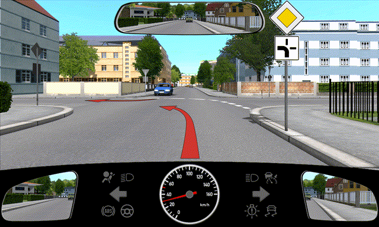

**Options:**
- A. Me
- B. The oncoming [car]

**Correct Answer(s):**
- A. Me
- B. The oncoming [car]

**Explanation:**
The intention to change the direction of travel must be announced at an early stage by indicating. You follow the turning priority road; this change of direction needs to be indicated.

---

#### Question 1.2.09-117

**Points:** 4 Points

**When do have you to indicate a change in direction?**

**Options:**
- A. Before turning into a junction or a property lot
- B. If I want to continue following a priority road that changes direction
- C. If I want to continue straight on, thereby leaving a priority road that changes direction

**Correct Answer(s):**
- A. Before turning into a junction or a property lot
- B. If I want to continue following a priority road that changes direction

**Explanation:**
If you want to turn into a T-junction or a property, you have to indicate. The same applies if you follow a turning priority road - here, too, the change of the direction of travel must be indicated.

---

#### Question 1.2.09-119

**Points:** 4 Points

**Why are you required to stop now?**

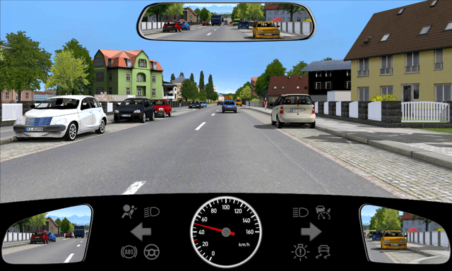

[Video: videos/1_2_09-119.mp4](videos/1_2_09-119.mp4)

**Options:**
- A. - cyclist
- B. - green vehicle
- C. - red vehicle

**Correct Answer(s):**
- A. - cyclist
- B. - green vehicle

**Explanation:**
Drivers who turn need to wait for vehicles from the opposite direction, even for cyclists. The red car has to wait until the green car and the cyclist are gone.

---

#### Question 1.2.09-120

**Points:** 4 Points

**You want to turn left. In what sequence do you prepare to take the left turn?**

**Options:**
- A. Observe traffic behind you, indicate the direction of turn, enter the lane
- B. Indicate the direction of turn, enter the lane, observe traffic behind you
- C. Enter the lane, indicate the direction of turn, observe traffic behind you

**Correct Answer(s):**
- A. Observe traffic behind you, indicate the direction of turn, enter the lane

**Explanation:**
If you want to turn left, prepare the turn in the following order: 1. look, 2. indicate, 3. arrange. Looking means that you are observing follow-up traffic in the mirror and over your shoulder. Then press the indicator to the left side. Only if you can rule out danger for other road users, you may merge left in order to turn.

---

#### Question 1.2.09-121

**Points:** 5 Points

**What is the right course of action?**

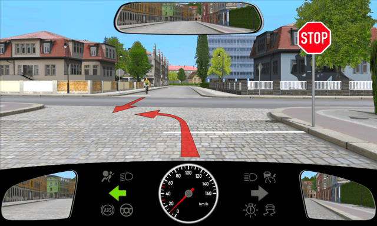

**Options:**
- A. I have to wait at the stop line
- B. I have to allow the cyclist to pass through
- C. I may make the turn in front of the cyclist

**Correct Answer(s):**
- A. I have to wait at the stop line
- B. I have to allow the cyclist to pass through

**Explanation:**
In front of the traffic sign "Stop! Give way!", colloquially also called stop sign, you must always stop. Mostly there is a stop line. The wheels must be stationary for at least a short amount of time. The cross traffic has right of way - then the cyclists on the opposite side. As a driver turning left, you have to grant him the right of way.

---

#### Question 1.2.09-122

**Points:** 4 Points

**How should you behave?**

**Options:**
- A. Give way to both cyclists
- B. Only give way to the cyclist travelling in the same direction
- C. Sound your horn and take the turn before the two cyclists

**Correct Answer(s):**
- A. Give way to both cyclists

**Explanation:**
Turning drivers generally have to wait for oncoming vehicles. These include cyclists. Cyclists who drive in their own direction on or next to the lane you also need to let pass.

---

#### Question 1.2.09-123

**Points:** 4 Points

**You want to turn left. To whom must you give priority?**

**Options:**
- A. Oncoming cyclists
- B. Oncoming vehicles
- C. Pedestrians seeking to cross the road into which I am turning

**Correct Answer(s):**
- A. Oncoming cyclists
- B. Oncoming vehicles
- C. Pedestrians seeking to cross the road into which I am turning

**Explanation:**
The oncoming traffic when turning left, has always right of way. This also applies to cyclists; they are granted priority. If pedestrians cross the street you want to turn into, the pedestrians have priority too.

---

#### Question 1.2.09-124

**Points:** 3 Points

**You want to turn left. What difficulties could arise here?**

**Options:**
- A. Visibility restrictions caused by oncoming vehicles
- B. Misunderstandings with oncoming traffic turning left
- C. Traffic turning left can come dangerously close

**Correct Answer(s):**
- A. Visibility restrictions caused by oncoming vehicles
- B. Misunderstandings with oncoming traffic turning left
- C. Traffic turning left can come dangerously close

**Explanation:**
When turning left, vehicles approaching each other have to turn in front of each other (tangent turning). This can lead to poor visibility of the straight-ahead traffic. Especially left-turning trucks can lead to massive obstructions and make it safer to turn in a wide arc (turning behind each other). There may be misunderstandings between drivers when one wants to turn behind and the other in front.

---

#### Question 1.2.09-125

**Points:** 4 Points

**Why are you required to stop now?**

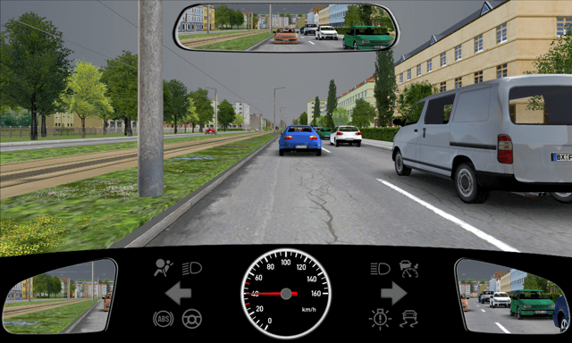

[Video: videos/1_2_09-125.mp4](videos/1_2_09-125.mp4)

**Options:**
- A. Because of the tram
- B. Because of the cyclist
- C. Because of the white car

**Correct Answer(s):**
- A. Because of the tram

**Explanation:**
You are on a priority road and therefore you're allowed to drive before the white car coming from the right. However, as a driver who wants to turn, you have a subordinate position to traffic driving straight-ahead, in this case the tram. You have to stop.

---

#### Question 1.2.09-126

**Points:** 4 Points

**What is the right course of action here?**

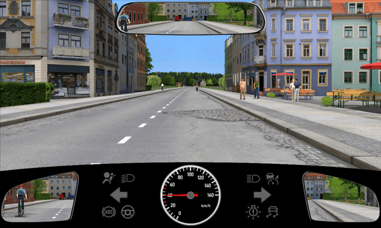

[Video: videos/1_2_09-126.mp4](videos/1_2_09-126.mp4)

**Options:**
- A. - not overtake the moped before the rail crossing
- B. - overtake the moped, while allowing sufficient space to the side
- C. - overtake the moped before the rail crossing once the cyclist is out of the way

**Correct Answer(s):**
- A. - not overtake the moped before the rail crossing

**Explanation:**
You must not overtake the moped before the level crossing. In general, no vehicles may be overtaken at level crossings from signs 151, 156 to the rails.

---

#### Question 1.2.09-127

**Points:** 5 Points

**Why are you required to brake now?**

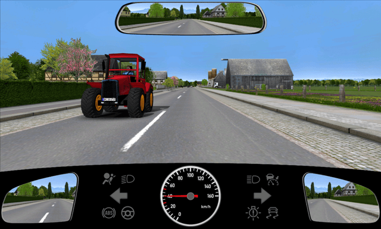

[Video: videos/1_2_09-127.mp4](videos/1_2_09-127.mp4)

**Options:**
- A. Because of the motorbike
- B. Because of the van
- C. Because of the cyclist

**Correct Answer(s):**
- A. Because of the motorbike

**Explanation:**
The motorcyclist comes from the left at high speed. He probably did not see you because of the oncoming vehicle. Although you have the right of way, you have to slow down, as otherwise an accident will occur.

---

#### Question 1.2.09-128-M

**Points:** 5 Points

**Why do you have to wait before turning right?**

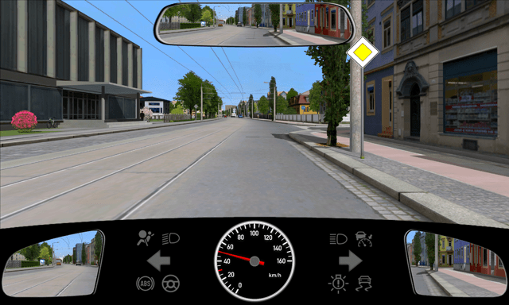

[Video: videos/1_2_09-128-M.mp4](videos/1_2_09-128-M.mp4)

**Options:**
- A. Because of [the pedestrian]
- B. Because of [the cyclist]
- C. Because of [the black car]

**Correct Answer(s):**
- A. Because of [the pedestrian]
- B. Because of [the cyclist]

**Explanation:**
If you want to turn, you must give priority to road users traveling straight ahead. In this case, you have lower priority to the pedestrian and the cyclist and must allow them a safe crossing.

---

#### Question 1.2.09-129

**Points:** 3 Points

**What must you be aware of here?**

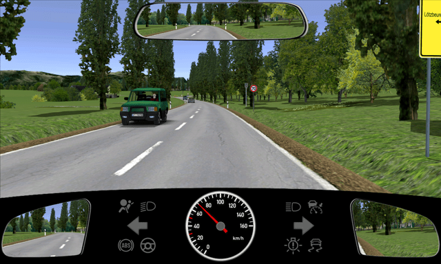

[Video: videos/1_2_09-129.mp4](videos/1_2_09-129.mp4)

**Options:**
- A. - continue to brake
- B. - give the car right of way
- C. - indicate when entering the roundabout

**Correct Answer(s):**
- A. - continue to brake
- B. - give the car right of way

**Explanation:**
Since the blue car is already in the roundabout, you have to slow down. Only when leaving the roundabout, you must indicate.

---

#### Question 1.2.09-130-M

**Points:** 3 Points

**You want to turn left. What driving line should you maintain?**

**Options:**
- A. The left-hand one
- B. The central one
- C. The right-hand one

**Correct Answer(s):**
- A. The left-hand one

**Explanation:**
Since you are on a one-way street, you don't need to fear oncoming traffic. Indicate in time. Then merge left and stay on the left lane until you reach the turn.

---

#### Question 1.2.09-131-M

**Points:** 4 Points

**[The cyclist] wants to continue straight ahead. What is the right course of action here?**

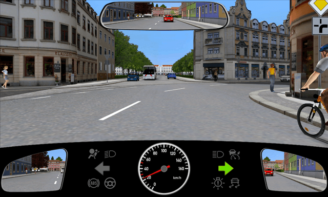

**Options:**
- A. I remain behind [the cyclist]
- B. I overtake [the cyclist]

**Correct Answer(s):**
- A. I remain behind [the cyclist]

**Explanation:**
Vehicles that want to turn need to let bicycles pass that drive in their direction on or next to the road, before turning. It does not matter if their wheels are motorized or not.

---

#### Question 1.2.09-132-M

**Points:** 5 Points

**Why must you wait before taking a turn in this situation?**

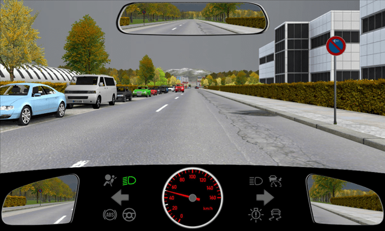

[Video: videos/1_2_09-132-M.mp4](videos/1_2_09-132-M.mp4)

**Options:**
- A. Because of the motorbike
- B. Because of the truck
- C. Because of [the pedestrian]

**Correct Answer(s):**
- A. Because of the motorbike
- B. Because of the truck

**Explanation:**
Because of the truck and the motorcycle. Here you have to pay attention to the turning rules. Wait for the vehicles to complete the maneuver and then continue turning.

---

#### Question 1.2.09-133-M

**Points:** 3 Points

**Who has to indicate in this situation?**

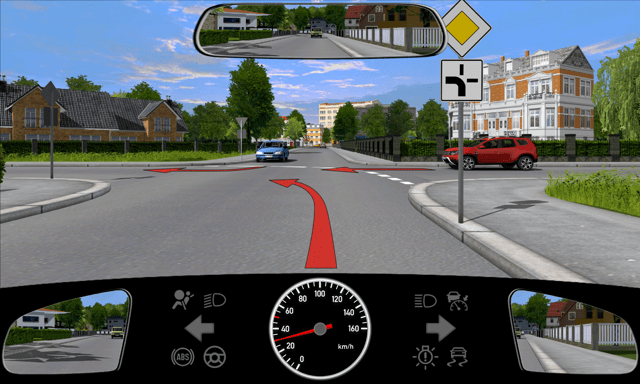

**Options:**
- A. Me
- B. [The blue car]
- C. [The red car]

**Correct Answer(s):**
- A. Me
- B. [The blue car]

**Explanation:**
You and the blue car are changing direction for this reason you must indicate the change of direction.

---

#### Question 1.2.09-134-M

**Points:** 4 Points

**What is the right course of action now?**

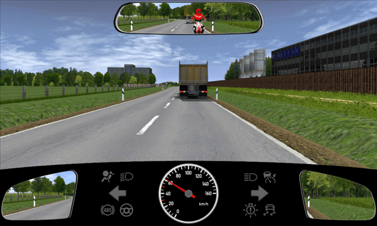

[Video: videos/1_2_09-134-M.mp4](videos/1_2_09-134-M.mp4)

**Options:**
- A. I brake
- B. I continue on the right-hand lane for now
- C. I move without delay into the left-hand lane

**Correct Answer(s):**
- A. I brake
- B. I continue on the right-hand lane for now

**Explanation:**
The motorbike behind you has already changed to the left lane and will overtake you on the left. In order to merge into the left-turning lane in time, you must slow down.

---

#### Question 1.2.09-135-M

**Points:** 5 Points

**Why are you not allowed to take the turn now?**

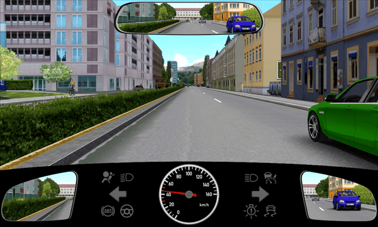

[Video: videos/1_2_09-135-M.mp4](videos/1_2_09-135-M.mp4)

**Options:**
- A. - [yellow] car
- B. - [red] vehicle
- C. - [green] car

**Correct Answer(s):**
- A. - [yellow] car

**Explanation:**
At an intersection, drivers going straight ahead have the right of way. You must wait to turn until the yellow car has crossed the intersection.

---

#### Question 1.2.09-136-M

**Points:** 5 Points

**What must you anticipate in this situation?**

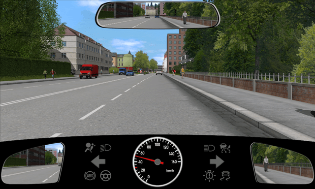

[Video: videos/1_2_09-136-M.mp4](videos/1_2_09-136-M.mp4)

**Options:**
- A. [The blue car] will drive straight onwards
- B. The [red] bus will begin to move immediately
- C. [The pedestrian] will wait

**Correct Answer(s):**
- A. [The blue car] will drive straight onwards

**Explanation:**
The blue car drives past the stopping bus and may want to continue straight on, even though it is in the turning lane. Since you turn left, he has right of way.

---

#### Question 1.2.09-137-M

**Points:** 5 Points

**Why are you required to stop now?**

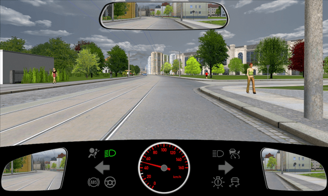

[Video: videos/1_2_09-137-M.mp4](videos/1_2_09-137-M.mp4)

**Options:**
- A. Because of the electric scooter
- B. Because of the pedestrians
- C. Because of the tram

**Correct Answer(s):**
- A. Because of the electric scooter

**Explanation:**
There is an electric scooter in the blind spot, so you must stop to avoid endangering it.

---

#### Question 1.2.09-138-M

**Points:** 4 Points

**What is the right course of action now?**

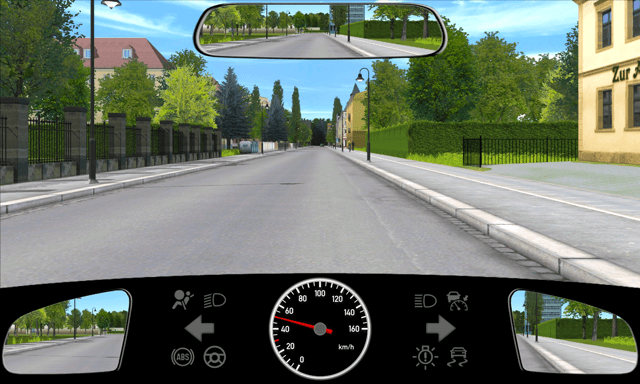

[Video: videos/1_2_09-138-M.mp4](videos/1_2_09-138-M.mp4)

**Options:**
- A. I allow [the cyclist] to pass through
- B. I glance over my right shoulder
- C. I take the turn ahead of the electric scooter

**Correct Answer(s):**
- A. I allow [the cyclist] to pass through
- B. I glance over my right shoulder

**Explanation:**
The straight ahead traffic always has priority, whether the cyclist is riding on the road or on a cycle path. To make sure that no other cyclist is approaching, you must look over your shoulder to the right.

---

#### Question 1.2.09-201-M

**Points:** 4 Points

**Why are you required to stop now?**

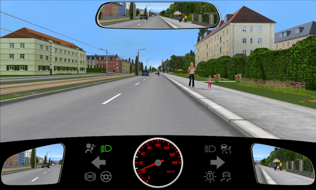

[Video: videos/1_2_09-201-M.mp4](videos/1_2_09-201-M.mp4)

**Options:**
- A. Because of the tram
- B. Because of [the cyclist]
- C. Because of the [yellow] car

**Correct Answer(s):**
- A. Because of the tram

**Explanation:**
Because you want to turn left, you should wait for the tram before turning.

---

#### Question 1.2.09-202-M

**Points:** 5 Points

**In this situation, why do you have to wait before turning right?**

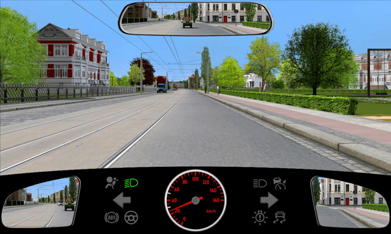

[Video: videos/1_2_09-202-M.mp4](videos/1_2_09-202-M.mp4)

**Options:**
- A. Because of [the pedestrian]
- B. Because of the [cyclist]
- C. Because of the [blue car]

**Correct Answer(s):**
- A. Because of [the pedestrian]
- B. Because of the [cyclist]

**Explanation:**
When turning, you must give priority to longitudinal traffic, for this reason you must wait for pedestrians and cyclists to pass.

---

#### Question 1.2.09-203-M

**Points:** 4 Points

**Why can you not turn off the road here?**

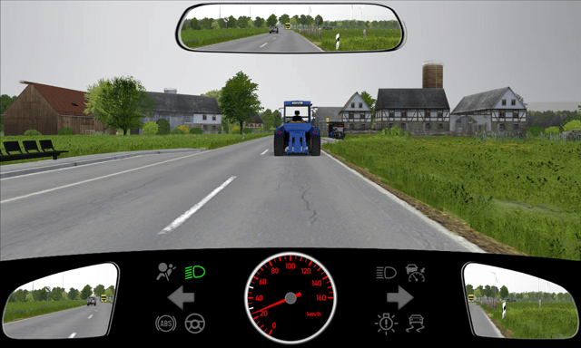

[Video: videos/1_2_09-203-M.mp4](videos/1_2_09-203-M.mp4)

**Options:**
- A. - [red] car
- B. - [yellow] truck
- C. - [blue] tractor

**Correct Answer(s):**
- A. - [red] car

**Explanation:**
The red car is still overtaking you and is travelling at a much higher speed than you. Wait for the red car to pass.

---

#### Question 1.2.09-204-M

**Points:** 5 Points

**In this situation, why do you have to wait before turning left?**

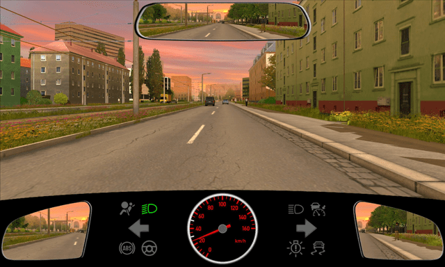

[Video: videos/1_2_09-204-M.mp4](videos/1_2_09-204-M.mp4)

**Options:**
- A. Because of the tram
- B. Because of the [red car]
- C. Because of the [yellow vehicle]

**Correct Answer(s):**
- A. Because of the tram

**Explanation:**
You are changing the direction of travel, so you must give the tram priority.

---

#### Question 1.2.09-205-M

**Points:** 4 Points

**In this situation, why do you have to wait before turning left?**

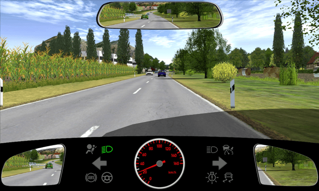

[Video: videos/1_2_09-205-M.mp4](videos/1_2_09-205-M.mp4)

**Options:**
- A. Because of the motorbike
- B. Because of the [red] car
- C. Because of the [cyclist]

**Correct Answer(s):**
- A. Because of the motorbike

**Explanation:**
A motorbike is driving behind a red car; due to your change of direction, you must give the motorcyclist priority.

---

#### Question 1.2.09-206-M

**Points:** 5 Points

**Why are you required to wait now?**

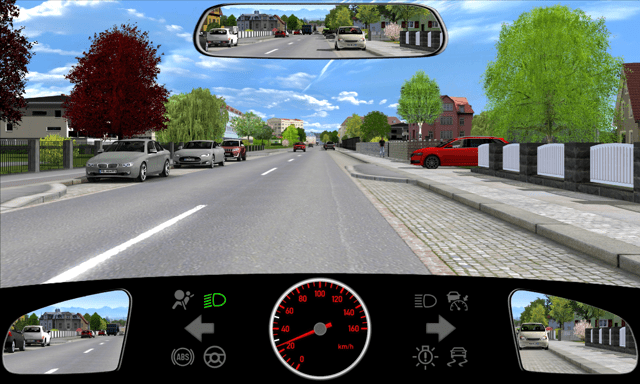

[Video: videos/1_2_09-206-M.mp4](videos/1_2_09-206-M.mp4)

**Options:**
- A. - cyclist
- B. - [blue] vehicle
- C. - [yellow] car

**Correct Answer(s):**
- A. - cyclist
- B. - [blue] vehicle

**Explanation:**
The blue car and the cyclist are both going straight ahead, so they have the right of way, even if the cyclist is riding on the pavement.

---

### 1.2.10 Chapter Entering And Starting

#### Question 1.2.10-005

**Points:** 4 Points

**You want to turn out of a road with a sunken kerbstone into another road. A car is coming from the left. What applies here?**

**Options:**
- A. Whoever turns into a road over a sunken kerbstone must wait
- B. The rule "right before left"
- C. The sunken kerbstone is of no relevance for the obligation to wait

**Correct Answer(s):**
- A. Whoever turns into a road over a sunken kerbstone must wait

**Explanation:**
When there are drop kerbs (as it happens often in residential areas), the rule "Left yields to right" does not apply. Here you have to wait until you can drive onto the lane without endangering other road users. These have priority over you.

---

#### Question 1.2.10-006-M

**Points:** 3 Points

**You want to leave the [petrol station]. What is correct?**

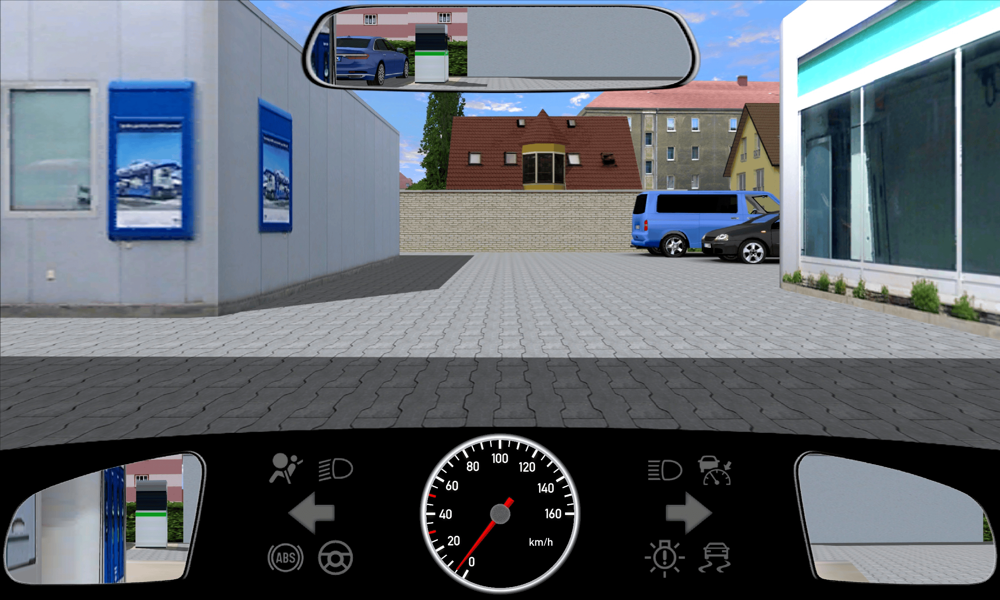

[Video: videos/1_2_10-006-M.mp4](videos/1_2_10-006-M.mp4)

**Options:**
- A. I have to give priority to pedestrians crossing the road
- B. I can drive in both directions
- C. I have right of way over vehicles coming from the left

**Correct Answer(s):**
- A. I have to give priority to pedestrians crossing the road

**Explanation:**
The blue traffic sign with the white arrow means “right direction of travel”. Here you can only turn right. Also make sure that if you want to turn onto a street from private property, you must give way to other road users such as pedestrians and vehicles.

---

#### Question 1.2.10-101

**Points:** 4 Points

**What must you do when leaving the edge of the roadway?**

**Options:**
- A. Check for traffic from behind
- B. Switch on your direction indicator
- C. A look into the rear-view mirror is sufficient

**Correct Answer(s):**
- A. Check for traffic from behind
- B. Switch on your direction indicator

**Explanation:**
Anyone who wants to go from the edge of the lane into the moving traffic must make this clear by indicating. With one look in the rear-view mirror as well as over the shoulder one can merge into the lane - considering your lower priority to the moving traffic.

---

#### Question 1.2.10-104

**Points:** 4 Points

**You want to leave a traffic-calming zone and begin driving along a road. What should you do?**

**Options:**
- A. - allow pedestrians on the footpath to walk past
- B. - indicate the direction of movement prior to taking the turn
- C. - observe the "right before left" rule

**Correct Answer(s):**
- A. - allow pedestrians on the footpath to walk past
- B. - indicate the direction of movement prior to taking the turn

**Explanation:**
If you enter another street from a traffic-calmed area, you will be required to way and have to give priority to other road users. The rule "left yields to right" does not apply here! Indicate before turning and pay particular attention to cyclists and pedestrians.

---

#### Question 1.2.10-105

**Points:** 4 Points

**You want to leave a traffic-calming zone and begin driving along a road. Cyclists are approaching from the left. Who is required to wait?**

**Options:**
- A. I have to wait
- B. The cyclists have to wait
- C. Everyone is required to stop and then agree among one another who should proceed first

**Correct Answer(s):**
- A. I have to wait

**Explanation:**
When entering a street from a traffic-calmed area, the "left yields to right" rule is canceled. You have to wait for pedestrians, cyclists and participants of the moving traffic.

---

#### Question 1.2.10-106

**Points:** 4 Points

**You want to leave a property lot and turn right into a road. Cyclists are approaching from the left. Who is required to wait?**

**Options:**
- A. I have to wait
- B. The cyclists have to wait
- C. Everyone is required to stop and then agree among one another who should proceed first

**Correct Answer(s):**
- A. I have to wait

**Explanation:**
As a matter of principle, you have to wait at property exits and give priority to all other road users. This also applies to pedestrians on the sidewalk and cyclists. Be especially careful here.

---

#### Question 1.2.10-107

**Points:** 4 Points

**You want to leave a property lot and turn into a road while passing over a footpath. What must you look out for?**

**Options:**
- A. Pedestrians on the footpath may not be endangered
- B. You should be directed by another person if necessary
- C. First take note of the flowing traffic on the road

**Correct Answer(s):**
- A. Pedestrians on the footpath may not be endangered
- B. You should be directed by another person if necessary

**Explanation:**
To turn from a property over the sidewalk onto the road, you have to note: You have to wait for pedestrians on the sidewalk, cyclists on bike paths and participants in the moving traffic. You must not endanger other road users. In case of doubt, somebody must lead you into traffic.

---

#### Question 1.2.10-108

**Points:** 4 Points

**You want to exit the property lot. What is the right thing to do?**

**Options:**
- A. I have to wait until the pedestrians have crossed over the exit
- B. I may drive on if the pedestrians waive their right of way
- C. I sound my horn briefly so that the pedestrians will allow me to exit

**Correct Answer(s):**
- A. I have to wait until the pedestrians have crossed over the exit
- B. I may drive on if the pedestrians waive their right of way

**Explanation:**
If you would like to drive out of a property exit, you have to wait for all other road users. These include both pedestrians and cyclists. If a road user renounces his or her priority, you may drive - provided that you do not endanger anyone.

---

#### Question 1.2.10-109

**Points:** 2 Points

**You want to exit a parking space and move into the moving traffic. What should you do?**

**Options:**
- A. I may not endanger the moving traffic
- B. I have to indicate before moving off
- C. I have to take note of the traffic behind me

**Correct Answer(s):**
- A. I may not endanger the moving traffic
- B. I have to indicate before moving off
- C. I have to take note of the traffic behind me

**Explanation:**
When you park out, you must not endanger other road users. Indicate that you want to drive onto the road. Look in the rear and side mirrors and make sure that no cyclist is in your blind spot by looking over your shoulder.

---

### 1.2.11 Chapter Special Traffic Situations

#### Question 1.2.11-003

**Points:** 4 Points

**Which are the areas you must not drive into when there is traffic congestion?**

**Options:**
- A. Crossroads
- B. Level crossings
- C. Driveways

**Correct Answer(s):**
- A. Crossroads
- B. Level crossings

**Explanation:**
In the case of stagnant traffic, the following areas must be kept free for example for emergency vehicles: intersections, level crossings and cross-walks. For residential exits, this rule does not apply. If you notice that someone wants to drive off his property onto the road, you should give the driver the opportunity to enter the road.

---

#### Question 1.2.11-004

**Points:** 4 Points

**Which are the areas you must not drive into when there is traffic congestion?**

**Options:**
- A. Junctions
- B. Pedestrian crossings
- C. 'Bus stops with "zig-zag lines"'

**Correct Answer(s):**
- A. Junctions
- B. Pedestrian crossings

**Explanation:**
If traffic slows down, you may only enter intersections if you can leave them quickly. Otherwise you have to wait. Also, junctions of cross streets, cross-walks and level crossings are to be kept free. However, this does not apply to bus stops.

---

#### Question 1.2.11-005-B

**Points:** 4 Points

**What do you do?**

**Options:**
- A. Reduce speed and, if necessary, stop
- B. Proceed, pulling over onto the pavement
- C. Speed up and proceed since the oncoming traffic must wait

**Correct Answer(s):**
- A. Reduce speed and, if necessary, stop

**Explanation:**
Due to the traffic sign you have to wait here. The red arrow in your direction indicates that priority is given to oncoming vehicles. In no case may you drive onto the sidewalk. This is reserved solely for pedestrians.

---

#### Question 1.2.11-006

**Points:** 4 Points

**During traffic congestion, what parts of the road infrastructure must be kept clear?**

**Options:**
- A. Traffic confluences
- B. Pedestrian crossings
- C. Bus stops

**Correct Answer(s):**
- A. Traffic confluences
- B. Pedestrian crossings

**Explanation:**
The pedestrian crossing (“zebra crossing”) is intended to enable pedestrians to cross the road safely and without danger. For this reason, you must leave pedestrian crossings free under all circumstances. If you drive into a junction (or crossing) in slow-moving traffic, there is a risk that you will block oncoming cross traffic or that oncoming traffic turning left will have to wait unnecessarily long. The junction or crossing would thus become even more clogged and traffic would be obstructed more than necessary.

---

#### Question 1.2.11-007-M

**Points:** 4 Points

**You want to continue driving straight ahead. What is correct in this situation?**

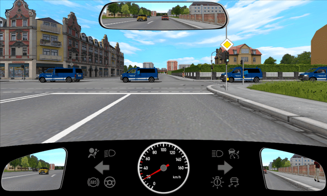

**Options:**
- A. I allow the convoy to pass through
- B. I wait at the stop line
- C. I cross over the junction

**Correct Answer(s):**
- A. I allow the convoy to pass through
- B. I wait at the stop line

**Explanation:**
A group of pedestrians, cyclists or motor vehicles, which is traveling together in road traffic, is called a closed association. Closed associations must be clearly marked and must not be interrupted.
So you have to wait until all vehicles drove past you and as long as you have to wait at the stop line.

---

#### Question 1.2.11-103-M

**Points:** 4 Points

**You want to continue driving straight ahead. What is the right course of action?**

**Options:**
- A. I remain waiting in my lane
- B. I move to the right if there is sufficient space in the traffic
- C. I overtake the vehicle alongside me and switch lanes

**Correct Answer(s):**
- A. I remain waiting in my lane
- B. I move to the right if there is sufficient space in the traffic

**Explanation:**
The car ahead blocks you in your lane. Nevertheless, you should not overtake on the right before the intersection, as this would be too dangerous. Keep your distance, reduce the speed and stop if necessary. Continue straight ahead when the free lane is free and the traffic light turns green. You can only change on the right lane if there is a sufficiently large traffic gap.

---

#### Question 1.2.11-104

**Points:** 5 Points

**What should you do?**

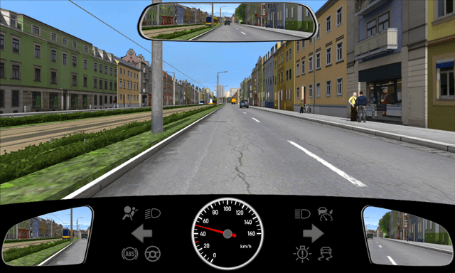

[Video: videos/1_2_11-104.mp4](videos/1_2_11-104.mp4)

**Options:**
- A. Stop before the left turn and keep the central divide clear
- B. Turn smoothly, so as not to impede following traffic
- C. Come to a stop in the central divide, where the other car is stopped

**Correct Answer(s):**
- A. Stop before the left turn and keep the central divide clear

**Explanation:**
If tram rails lead through the left turn lane and you want to turn left when the tram approaches, it is important to wait with sufficient distance in front of the tram rails. When the tram passed, you can turn left.

---

#### Question 1.2.11-105

**Points:** 5 Points

**What is the right course of action?**

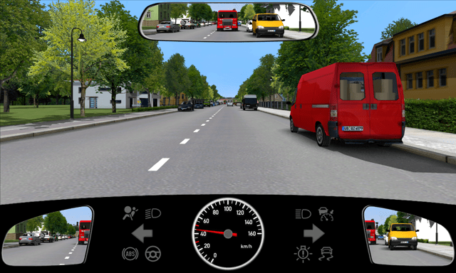

[Video: videos/1_2_11-105.mp4](videos/1_2_11-105.mp4)

**Options:**
- A. Slow down
- B. Accelerate
- C. Swerve to the left

**Correct Answer(s):**
- A. Slow down

**Explanation:**
If a cyclist who moves to the left drives in front of you, you must not overtake him if the road is narrowed at this point and there is oncoming traffic. A safety distance of 1.5 to 2 meters could not be maintained here.

---

#### Question 1.2.11-107

**Points:** 2 Points

**What is the right course of action?**

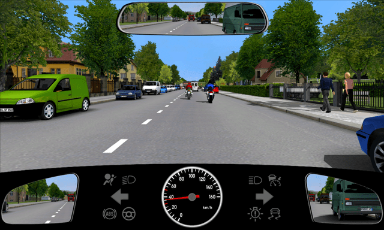

[Video: videos/1_2_11-107.mp4](videos/1_2_11-107.mp4)

**Options:**
- A. Slow down
- B. Accelerate
- C. Swerve to the left

**Correct Answer(s):**
- A. Slow down

**Explanation:**
On your side the road narrows. The cyclist will therefore move to the left. Because of oncoming traffic, you cannot overtake him with the required safety distance of 1.5 to 2 meters. That's why you have to wait and stay behind him.

---

#### Question 1.2.11-108

**Points:** 4 Points

**In which situations are you not allowed to enter a junction even though the traffic light is green?**

**Options:**
- A. If I would have to stop in the middle of the junction because the traffic is backing up
- B. If asked to stop by a police officer
- C. If the sign "Stop. Give way" is displayed at the junction

**Correct Answer(s):**
- A. If I would have to stop in the middle of the junction because the traffic is backing up
- B. If asked to stop by a police officer

**Explanation:**
In the following cases, you must not enter a crossroad, even though the traffic light shows "green": with slow-moving traffic, as crossings, for example, must remain free for emergency vehicles. Secondly, when police officers regulate traffic and give instructions that deviate from the meanings of the colors of the traffic lights. In general, a green traffic light tells you that you are allowed to drive and overrules other traffic signs that regulate the right of way. Policeman orders have the highest rank and override traffic lights.

---

#### Question 1.2.11-109

**Points:** 4 Points

**In what instances may you not enter a junction, even though you have right of way?**

**Options:**
- A. - would have to wait in the junction because the traffic in my direction is backing up
- B. - would impede a vehicle with flashing blue lights and siren
- C. - want to turn left and would have to wait in the junction because of oncoming traffic

**Correct Answer(s):**
- A. - would have to wait in the junction because the traffic in my direction is backing up
- B. - would impede a vehicle with flashing blue lights and siren

**Explanation:**
If the traffic slows down, you may enter a crossroad with a green traffic light or right of way only if you can leave it quickly without blocking it. This is particularly important in order to keep the intersection free for police, fire and ambulance emergency vehicles. If you hear a siren, you have to drive carefully to the crossroad and may only continue if you hinder no emergency vehicle. When turning left, you must slowly enter the intersection and wait there until you can drive freely without oncoming traffic.

---

#### Question 1.2.11-110-M

**Points:** 5 Points

**Why must you slow down here and be ready to brake?**

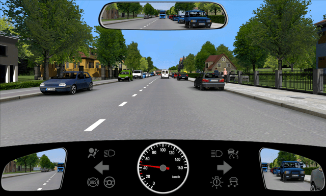

[Video: videos/1_2_11-110-M.mp4](videos/1_2_11-110-M.mp4)

**Options:**
- A. - cyclist
- B. - [green] vehicle
- C. - pedestrian

**Correct Answer(s):**
- A. - cyclist

**Explanation:**
You don't have to slow down because of pedestrians. He is far enough away from the constriction. The red vehicle is standing and is therefore no reason to slow down as well. However, reduce the speed because of the cyclist. He could change lanes without a hand signal and bring about a dangerous situation.

---

#### Question 1.2.11-111

**Points:** 4 Points

**Why do you have to continue to brake?**

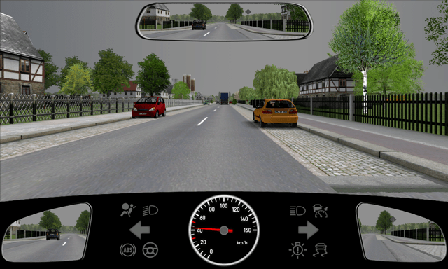

[Video: videos/1_2_11-111.mp4](videos/1_2_11-111.mp4)

**Options:**
- A. - refuse truck
- B. - blue truck
- C. - cyclist

**Correct Answer(s):**
- A. - refuse truck
- B. - blue truck

**Explanation:**
A garbage truck comes towards the blue truck and forces him to stop. Since the garbage truck could swing out and get on your lane as it turns, you'll need to wait for the vehicle to be properly merged. The cyclist is no reason for braking.

---

#### Question 1.2.11-112

**Points:** 4 Points

**You want to drive straight ahead. What should you do?**

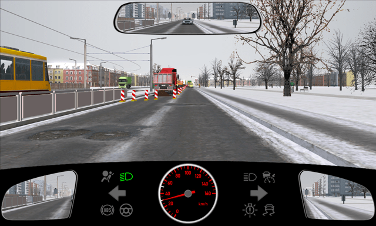

[Video: videos/1_2_11-112.mp4](videos/1_2_11-112.mp4)

**Options:**
- A. - at the stop line
- B. - between the yellow and the blue vehicle
- C. - directly behind the yellow vehicle

**Correct Answer(s):**
- A. - at the stop line

**Explanation:**
In case of halting traffic, you are not allowed to block any intersection or T-junction despite the green traffic light or right of way. You may need to wait at the stop line and cannot close up until the front vehicles are far enough away.

---

#### Question 1.2.11-113-M

**Points:** 3 Points

**When may you begin driving?**

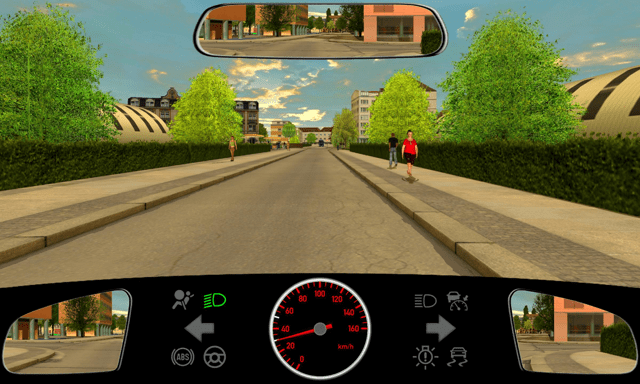

[Video: videos/1_2_11-113-M.mp4](videos/1_2_11-113-M.mp4)

**Options:**
- A. Once the truck driver has made a hand signal clearly yielding his right of way
- B. If I do not endanger or significantly impede the cross traffic
- C. Immediately because the truck driver is urging me to do so

**Correct Answer(s):**
- A. Once the truck driver has made a hand signal clearly yielding his right of way
- B. If I do not endanger or significantly impede the cross traffic

**Explanation:**
The truck was signaled by flasher that he waives his right of way. Therefore, is after the truck driver has clearly waived with hands on his priority right and if you do not endangering the cross traffic or not substantially behinderst.

---

#### Question 1.2.11-114-M

**Points:** 3 Points

**When may you take the turn?**

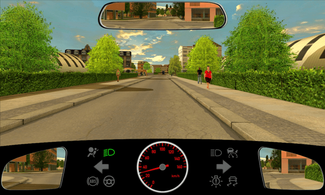

[Video: videos/1_2_11-114-M.mp4](videos/1_2_11-114-M.mp4)

**Options:**
- A. Only once the truck driver has used a hand signal to clearly indicate he is foregoing his right of way
- B. Only if I do not endanger or significantly impede the cross traffic
- C. Immediately, because the truck driver is prompting me to do that

**Correct Answer(s):**
- A. Only once the truck driver has used a hand signal to clearly indicate he is foregoing his right of way
- B. Only if I do not endanger or significantly impede the cross traffic

**Explanation:**
As you want to turn left, oncoming traffic has priority. Only when the lorry driver gives up his right of way with a clear hand signal can you pass with due regard for oncoming traffic. Flashing your lights is not sufficient here.

---

#### Question 1.2.11-201-M

**Points:** 4 Points

**You want to drive straight ahead. What should you do if the [red] truck immediately drives off on “green”?**

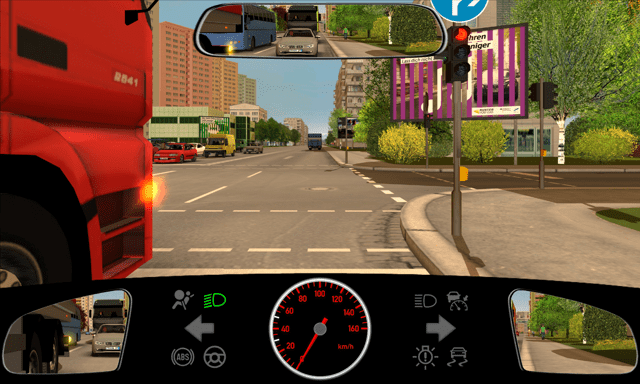

**Options:**
- A. I wait and allow the truck to move off
- B. I give a warning signal if necessary
- C. I also drive off immediately

**Correct Answer(s):**
- A. I wait and allow the truck to move off
- B. I give a warning signal if necessary

**Explanation:**
You should wait here and let the truck move off, giving warning signs if necessary as it appears to be turning right. (Turn signal right)

---

#### Question 1.2.11-202-M

**Points:** 4 Points

**You want to drive straight ahead. Where should you position yourself in this situation?**

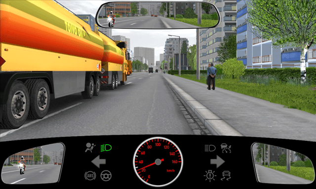

[Video: videos/1_2_11-202-M.mp4](videos/1_2_11-202-M.mp4)

**Options:**
- A. On the right behind the truck
- B. On the left behind the truck
- C. Directly behind the motorbike

**Correct Answer(s):**
- A. On the right behind the truck

**Explanation:**
The truck swerves to turn right, wait until the turn is completed. Then you can drive straight ahead.

---

### 1.2.12 Chapter Stopping And Parking

#### Question 1.2.12-001

**Points:** 3 Points

**Where is stopping prohibited?**

**Options:**
- A. On level crossings
- B. On narrow sections of the road and at blind spots
- C. Immediately behind pedestrian crossings

**Correct Answer(s):**
- A. On level crossings
- B. On narrow sections of the road and at blind spots

**Explanation:**
A "stop" is when a vehicle stops for less than 3 minutes for reasons unrelated to traffic without the driver getting out of the vehicle. If the driver stops for a longer time and/or leaves his vehicle, this is called parking. However, drivers are not allowed to stop everywhere so as not to endanger other road users.
Exceptions are:
- Non-stop zones
- Transitions through levels as there is a risk of collision with the train
- Narrow and incomprehensible places with a clearance width of less than 3 m
blind turns
- Hilltops
- Pedestrian crossings and the area in front of them (distance not less than 5 m), but not the area behind them.

---

#### Question 1.2.12-002

**Points:** 3 Points

**Where is parking prohibited?**

**Options:**
- A. At the edge of the roadway if this would prevent others from using designated parking areas
- B. On priority roads outside built-up areas
- C. On priority roads within built-up areas

**Correct Answer(s):**
- A. At the edge of the roadway if this would prevent others from using designated parking areas
- B. On priority roads outside built-up areas

**Explanation:**
As soon as you stop or leave your vehicle for more than three minutes without any traffic-related reason, this is called parking. This is not allowed everywhere. You may not park in areas with stopping restrictions or parking prohibition - nor where you impede or obstruct other road users. Parking restrictions also apply to priority roads outside built-up areas. Use side strips or parking bays.

---

#### Question 1.2.12-103

**Points:** 3 Points

**Where is stopping prohibited?**

**Options:**
- A. On the roadway, if there is a sufficiently wide hard shoulder on the right
- B. Between lane dividers when direction arrows are marked on the roadway
- C. At taxi ranks

**Correct Answer(s):**
- A. On the roadway, if there is a sufficiently wide hard shoulder on the right
- B. Between lane dividers when direction arrows are marked on the roadway
- C. At taxi ranks

**Explanation:**
You may only stop where you do not endanger other road users. This is the case, for example, if there is a hard shoulder separated from the carriageway by a continuous white line. 
You are not allowed to stop
- on marked lanes that are used for getting into the right of way
- on the carriageway if there is a hard shoulder
- at bus stops or other public transport stops
- at taxi ranks, so as not to block the access of taxis
- on motorways or motorways, not even on the hard shoulder.
Watch out for two-wheelers!

---

#### Question 1.2.12-104

**Points:** 3 Points

**Where is stopping prohibited?**

**Options:**
- A. On pedestrian crossings and up to 5 m before pedestrian crossings
- B. Immediately behind pedestrian crossings
- C. Over manholes and other road covers

**Correct Answer(s):**
- A. On pedestrian crossings and up to 5 m before pedestrian crossings

**Explanation:**
On and up to five meters in front of a pedestrian crossing, you must not stop because you obstruct the clear view of other drivers on pedestrians. These could then be recognized too late. After a pedestrian crossing you may stop. Waiting is allowed on manhole covers, but not parking.

---

#### Question 1.2.12-105

**Points:** 3 Points

**Where is parking prohibited?**

**Options:**
- A. At the edge of the roadway if this would prevent others from using designated parking areas
- B. Before sunken kerbstones
- C. Immediately behind pedestrian crossings

**Correct Answer(s):**
- A. At the edge of the roadway if this would prevent others from using designated parking areas
- B. Before sunken kerbstones

**Explanation:**
You are not allowed to park at the edge of the road, where you block marked parking areas and thus hinder other road users. Parking is also prohibited in front of lowered curbs, which are for example located in front of driveways. Lowered curbs should allow wheelchair users to cross the road. Safe and therefore allowed is parking after a pedestrian crossing.

---

#### Question 1.2.12-106

**Points:** 3 Points

**Where are you allowed to park on the left in the direction of travel?**

**Options:**
- A. In one-way streets
- B. Where there are rails on the right-hand side
- C. Where parking is prohibited on the right

**Correct Answer(s):**
- A. In one-way streets
- B. Where there are rails on the right-hand side

**Explanation:**
You may only park in the direction of travel on the right-hand side of the road. This also applies if all parking spaces are on the left side. You may have to turn if allowed. The only exception are one-way streets, as they are only used in one direction of travel. If there are rails on the right, you must also park on the left, but always observe parking restrictions.

---

#### Question 1.2.12-107

**Points:** 3 Points

**Who is parked?**

**Options:**
- A. Anyone who stops for more than 3 minutes
- B. Anyone who leaves his vehicle
- C. Anyone who waits longer than 3 minutes at a closed level crossing barrier

**Correct Answer(s):**
- A. Anyone who stops for more than 3 minutes
- B. Anyone who leaves his vehicle

**Explanation:**
If the car driver deliberately stops the vehicle and stays there for more than three minutes or leaves the stopped vehicle, this is considered parking. The stopping and waiting in front of a gate is not considered parking, no matter how long it takes, because the break is due to traffic.

---

#### Question 1.2.12-108

**Points:** 3 Points

**What is the minimum distance you must leave clear when stopping or parking in front of a pedestrian crossing?**

**Options:**

**Correct Answer(s):**
- 5 

**Explanation:**
On a pedestrian crossing and up to 5 m in front no stopping or parking is allowed. So, you can freely view the pedestrian crossing as a car driver and passers-by have a good overview of the traffic.

---

#### Question 1.2.12-109

**Points:** 2 Points

**Up to what distances before and behind crossroads and junctions is parking prohibited?**

**Options:**

**Correct Answer(s):**
- 5 

**Explanation:**
Parking is prohibited in areas that could endanger others.
A distance of 5 meters before and after a crossing or junction is required to garantee a sufficient visibility of the traffic.

---

#### Question 1.2.12-110

**Points:** 2 Points

**What is the minimum distance you must leave clear when parking outside a built-up area before a St. Andrew's Cross?**

**Options:**

**Correct Answer(s):**
- 50 

**Explanation:**
At a railroad crossing with a St. Andrew's Cross sign, the view of the level crossing must not be obstructed with a distance of 50m to have enough space for waiting vehicles.

---

#### Question 1.2.12-111

**Points:** 2 Points

**You want to park in front of a St. Andrew's Cross in a built-up area. What is the minimum distance you must leave clear?**

**Options:**

**Correct Answer(s):**
- 5 

**Explanation:**
At a railroad crossing with St. Andrew's Cross, the rail vehicle has priority.
To avoid obscuring the view of the railway line, a safety distance of 5 meters must be maintained.

---

#### Question 1.2.12-112

**Points:** 2 Points

**Up to what distance is it prohibited to park before or after a bus or tram stop sign?**

**Options:**

**Correct Answer(s):**
- 15 

**Explanation:**
It is not allowed to park 15 meters before and after the stop sign to allow public transports to approach, stop and leave without encumbrance.

---

#### Question 1.2.12-113

**Points:** 2 Points

**What is the maximum length of time you are allowed to stop at a bus stop provided you do not present an obstruction to buses?**

**Options:**

**Correct Answer(s):**
- 3 

**Explanation:**
The stopping time is limited to a maximum of 3 minutes. If a vehicle is stopped for more than 3 minutes, the vehicle is considered as parked. Thus it is only alowed to stop for 3 minutes

---

#### Question 1.2.12-118

**Points:** 2 Points

**Which vehicles are allowed to stop in the second row alongside other vehicles?**

**Options:**
- A. Taxis, to let passengers board or alight, traffic conditions permitting
- B. Any vehicle, provided the hazard warning lights are switched on

**Correct Answer(s):**
- A. Taxis, to let passengers board or alight, traffic conditions permitting

**Explanation:**
Even with the hazard lights on, waiting in the second row is only permitted for taxis. They count to public transport. Exceptions are tolerated if you let an old or handicapped person get off or on.

---

#### Question 1.2.12-120-M

**Points:** 3 Points

**Who has stopped wrongly?**

**Options:**
- A. [The dark-coloured car]
- B. [The light-coloured car]
- C. [Both cars]

**Correct Answer(s):**
- A. [The dark-coloured car]

**Explanation:**
On the hard shoulder, the right vehicle is allowed to wait. However, it's not permitted to wait on the left of the solid line. The left vehicle stops illegally.

---

#### Question 1.2.12-121-M

**Points:** 2 Points

**Who is wrongly parked?**

**Options:**
- A. The [white] car
- B. The [dark-coloured] car
- C. Neither of the two cars

**Correct Answer(s):**
- A. The [white] car

**Explanation:**
The zigzagged line shortens or extends a waiting or parking ban. As far as there is no border marking on the road, a parking ban of up to 15 meters in front of and behind the stop sign applies. In this situation, the white car parked incorrectly because it stands on the marking. The dark car, however, parks properly.

---

#### Question 1.2.12-122

**Points:** 3 Points

**When are you not allowed to park on the right-hand lane?**

**Options:**
- A. If there is an adequately paved hard shoulder to the right of the road lane
- B. If there are rails integrated into the road lane
- C. If there is a suitable parking lane to the right of the road lane

**Correct Answer(s):**
- A. If there is an adequately paved hard shoulder to the right of the road lane
- B. If there are rails integrated into the road lane
- C. If there is a suitable parking lane to the right of the road lane

**Explanation:**
In general, parking is prohibited if it could endanger other road users. Visual disability is also included. Therefore, parking is not allowed in all three situations.

---

#### Question 1.2.12-123-M

**Points:** 3 Points

**What must you be aware of here?**

**Options:**
- A. It is not permitted to stop to the left of the boundary line of the carriageway
- B. Slower moving vehicles must use the hard shoulder if possible
- C. Driving across the boundary line of the carriageway is prohibited at all times

**Correct Answer(s):**
- A. It is not permitted to stop to the left of the boundary line of the carriageway
- B. Slower moving vehicles must use the hard shoulder if possible

**Explanation:**
Never wait on the left of the lane mark. You would impede or even endanger subsequent vehicles. The side strip is designed for parking, waiting and slow vehicles. As a slow-moving driver you must use such a sufficiently wide and well-fastened strip for driving. In this case, you may drive over the thick solid line with your vehicle representing an official lane boundary.

---

#### Question 1.2.12-124

**Points:** 2 Points

**What vehicles may be parked alongside other parked cars on the roadway?**

**Options:**
- A. All taxis when passengers get in or out
- B. All vehicles when they are being loaded or unloaded
- C. All vehicles when they have their hazard lights switched on

**Correct Answer(s):**
- A. All taxis when passengers get in or out

**Explanation:**
In exceptional cases, taxis are only allowed to stop in the second row when passengers are getting on or off.

---

#### Question 1.2.12-125

**Points:** 3 Points

**Where is it forbidden to stop?**

**Options:**
- A. On merging and demerging lanes
- B. On lanes marked with direction arrows
- C. In front of entrances to and exits from property lots

**Correct Answer(s):**
- A. On merging and demerging lanes
- B. On lanes marked with direction arrows

**Explanation:**
You are not allowed to wait on acceleration or on deceleration lanes. Also, on lanes with directional arrows you must not stop. This does not apply to driveways in front of properties.

---

#### Question 1.2.12-126-M

**Points:** 3 Points

**Who has stopped incorrectly?**

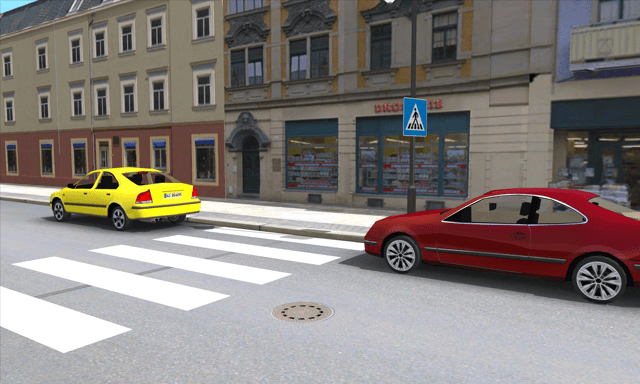

**Options:**
- A. The [red car]
- B. The [yellow car]
- C. Both cars

**Correct Answer(s):**
- A. The [red car]

**Explanation:**
On pedestrian crossings and five meters before, waiting is prohibited. The aim of this provision is to ensure a clear view of approaching vehicles and pedestrians who are willing to cross in this traffic situation.

---

#### Question 1.2.12-128-M

**Points:** 3 Points

**Where may you park here?**

**Options:**
- A. - on the left and right-hand hard shoulders
- B. - on the left-hand hard shoulder only
- C. - on the right-hand hard shoulder only

**Correct Answer(s):**
- A. - on the left and right-hand hard shoulders

**Explanation:**
In one-way streets you're only allowed to drive in one direction. If you have a side strip on the left and right, you may park both left and right.

---

#### Question 1.2.12-129

**Points:** 3 Points

**A cycle path runs alongside your carriageway on the right. How many metres before and after an intersection are you prohibited from parking?**

**Options:**

**Correct Answer(s):**
- 8 

**Explanation:**
Parking is prohibited here up to 8 metres in front of a junction and intersection.

---

#### Question 1.2.12-130

**Points:** 3 Points

**A cycle path runs alongside your carriageway on the right. How many metres are you prohibited from parking before and after a T-junction?**

**Options:**

**Correct Answer(s):**
- 8 

**Explanation:**
Parking is prohibited here up to 8 metres in front of a junction and intersection.

---

#### Question 1.2.12-131

**Points:** 3 Points

**You are looking for somewhere to park on the right edge of the street. There is no cycle path to the right of your lane. How many metres before and after a junction are you not allowed to park?**

**Options:**

**Correct Answer(s):**
- 5 

**Explanation:**
In order not to limit the view, you are not allowed to park 5 meters before and after an intersection.

---

#### Question 1.2.12-132

**Points:** 3 Points

**Where is it forbidden to stop?**

**Options:**
- A. In front of fire service access roads
- B. On any one-way road
- C. In non-parking zones

**Correct Answer(s):**
- A. In front of fire service access roads

**Explanation:**
Stopping occurs when a vehicle is stopped for less than 3 minutes for non-traffic reasons while the driver does not leave the vehicle. If the driver stops longer and/or leaves his vehicle, this is referred to as parking. You are not allowed to stop everywhere, for example so as not to endanger other road users. Fire brigade access roads and no-stopping zones, among other things, are excluded; a distinction is made here between parking and stopping. This does not apply to all one-way streets.

---

#### Question 1.2.12-133

**Points:** 3 Points

**You are looking for a place to park on the right edge of the carriageway. A cycle path runs alongside to the right of the carriageway. How many metres before a junction or an intersection are you prohibited from parking?**

**Options:**

**Correct Answer(s):**
- 8 

**Explanation:**
To avoid obstructing visibility, you are not allowed to park 8 meters in front of and behind a junction or intersection.

---

### 1.2.16 Chapter Warning Signs

#### Question 1.2.16-001

**Points:** 4 Points

**What must you reckon with when you see a hazard warning light flash?**

**Options:**
- A. - a school bus with children alighting
- B. - a car being towed
- C. - a truck broken down

**Correct Answer(s):**
- A. - a school bus with children alighting
- B. - a car being towed
- C. - a truck broken down

**Explanation:**
A driver must exercise special caution when perceiving a hazard light. Drivers of a car can use this for a variety of reasons. One example are regular buses that want to allow children to get in and out. Also, when a vehicle is towed, both the towed car and the towing vehicle will turn on their hazard light. A breakdown is also indicated by pressing the warning light and coming to a stop as soon as possible on the edge of the road.

---

#### Question 1.2.16-002

**Points:** 4 Points

**What should you do if you see a vehicle with its hazard lights on?**

**Options:**
- A. I reduce my speed
- B. I ready myself for hazards occurring suddenly
- C. I continue driving just as before

**Correct Answer(s):**
- A. I reduce my speed
- B. I ready myself for hazards occurring suddenly

**Explanation:**
If the hazard warning lights are switched on, there can be many reasons and causes. To be on the safe side, you should reduce your speed and drive past the vehicle with extra attention.

---

#### Question 1.2.16-101

**Points:** 2 Points

**For which purposes is a horn allowed to be used outside built-up areas?**

**Options:**
- A. As a warning signal
- B. As an overtaking signal
- C. As a calling signal

**Correct Answer(s):**
- A. As a warning signal
- B. As an overtaking signal

**Explanation:**
You may announce your intention to overtake by horns or by flash light. You may also use a horn or flash light to warn other road uses and alert them of hazards. The operation of the horn as a call sign, without a specific danger situation, is not allowed.

---

#### Question 1.2.16-102

**Points:** 2 Points

**For which purposes is a horn allowed to be used in built-up areas?**

**Options:**
- A. As a warning signal
- B. As an overtaking signal
- C. As a calling signal

**Correct Answer(s):**
- A. As a warning signal

**Explanation:**
In built-up areas, the horn may only be used by the driver as a warning signal in the event of a dangerous situation. As it would be an unnecessary noise nuisance, the use of the horn for greeting purposes or to indicate that you want to overtake, is inadmissible in built-up areas. Only outside of built-up areas, you may use the horn or flash light to announce an overtaking process.

---

#### Question 1.2.16-103

**Points:** 4 Points

**What do you do in case of a breakdown in a tunnel?**

**Options:**
- A. Switch on the hazard warning lights
- B. If possible, park the vehicle in an emergency bay
- C. Let the engine run by way of precaution

**Correct Answer(s):**
- A. Switch on the hazard warning lights
- B. If possible, park the vehicle in an emergency bay

**Explanation:**
In the tunnel, the alternatives for subsequent traffic are low. Therefore, if possible, stop in one of the marked emergency bays in the event of a breakdown. Switch on the hazard light on your car and switch off the engine due to the high risk of poisoning by exhaust gases in the tunnel.

---

#### Question 1.2.16-104

**Points:** 4 Points

**You are driving in a tunnel and approach the end of a traffic jam. What do you do?**

**Options:**
- A. Switch on the hazard warning lights
- B. Make a U-turn and leave the tunnel
- C. At the end of the traffic jam, switch off the engine and leave the vehicle

**Correct Answer(s):**
- A. Switch on the hazard warning lights

**Explanation:**
If you recognize a traffic jam in front of you, it is important to immediately press the hazard light to warn the drivers behind you of the coming situation. This way, they can react better to the situation. During traffic jams, the car driver should stop the engine but not leave the car. Turning in the tunnel is not allowed.

---

### 1.2.17 Chapter Lighting

#### Question 1.2.17-001

**Points:** 3 Points

**What must you remember concerning the lighting equipment of your vehicle?**

**Options:**
- A. It must be correctly installed
- B. It must be clean
- C. It must be in operating condition

**Correct Answer(s):**
- A. It must be correctly installed
- B. It must be clean
- C. It must be in operating condition

**Explanation:**
The car driver must properly install the lighting equipment on the vehicle. In addition to full functionality, the lighting must also be clean, so that other drivers see you in bad weather or in a tunnel.

---

#### Question 1.2.17-101

**Points:** 3 Points

**What can cause even dipped headlights to dazzle oncoming traffic?**

**Options:**
- A. Headlights set too high
- B. Incorrectly inserted bulbs
- C. An overloaded vehicle

**Correct Answer(s):**
- A. Headlights set too high
- B. Incorrectly inserted bulbs
- C. An overloaded vehicle

**Explanation:**
Head lamps set too high, wrongly installed bulbs, or loading a car the wrong way can dazzle oncoming traffic as well as the car driver driving in front. Back-heavy loads change the radius of the light cone of the low beam; he goes upwards and leads to dangerous glares. You should know the headlamp beam height control on your car.

---

#### Question 1.2.17-102

**Points:** 3 Points

**How is it possible to prevent oncoming traffic being dazzled by the dipped headlights?**

**Options:**
- A. The headlight range can be adjusted depending on the load carried by the vehicle
- B. Only permissible light bulbs may be used in each of the headlights
- C. The headlight setting should be checked after every repair

**Correct Answer(s):**
- A. The headlight range can be adjusted depending on the load carried by the vehicle
- B. Only permissible light bulbs may be used in each of the headlights
- C. The headlight setting should be checked after every repair

**Explanation:**
In order not to dazzle oncoming traffic, you should pay attention to how your low beam is adjusted and that it is adjusted after repairs to the headlights or after new installations. If you have to change the bulbs, only use approved bulbs.

---

### 1.2.19 Chapter Level Crossings

#### Question 1.2.19-001

**Points:** 3 Points

**A railway employee is waving a white-red-white flag at a level crossing. What does this mean?**

**Options:**
- A. You must wait in front of the level crossing
- B. You may cross the rails carefully
- C. The flag is only meant for the train driver

**Correct Answer(s):**
- A. You must wait in front of the level crossing

**Explanation:**
If a railroad employee waves a white-red-white flag in front of a railroad crossing, you must wait at a safe distance before the crossing. Waving the flag means that the railroad crossing is blocked until the train has passed and the railroad employee stops the blockage.

---

#### Question 1.2.19-002

**Points:** 3 Points

**When must you wait at a level crossing?**

**Options:**
- A. When a flashing red light comes on
- B. When the barriers are being lowered
- C. When a railway employee is waving a white-red-white flag

**Correct Answer(s):**
- A. When a flashing red light comes on
- B. When the barriers are being lowered
- C. When a railway employee is waving a white-red-white flag

**Explanation:**
All road users are required to stop and wait immediately before a level crossing in the following situations: when the signal system's red flashing light comes on, when the barriers start to lower, when the barriers are closed, when a staff member waves a white-red-white flag , You must wait until the blockage is released again.

---

#### Question 1.2.19-003

**Points:** 3 Points

**You are approaching a level crossing with half barriers and flashing lights. The red light is flashing but the barrier is still open. What do you do?**

**Options:**
- A. Wait in front of the St. Andrew's Cross
- B. Proceed as long as the half barrier is open
- C. If no rail vehicle is in sight, cross the level crossing

**Correct Answer(s):**
- A. Wait in front of the St. Andrew's Cross

**Explanation:**
When the red flashing light of a barrier system lights up before rail traffic, all road users must stop in front of the diagonal cross. Driving on is strictly prohibited even if the half barrier is still open. The barriers have fast closing times and can jam vehicles. Rail vehicles are approaching at high speeds and have a very long braking distance of several hundred meters. Therefore, they cannot react situationally to obstacles.

---

#### Question 1.2.19-004

**Points:** 3 Points

**A railway employee is waving a red lamp at a level crossing. What does this mean?**

**Options:**
- A. You must wait in front of the level crossing
- B. You may cross the rails carefully
- C. The red lamp is of no significance for you

**Correct Answer(s):**
- A. You must wait in front of the level crossing

**Explanation:**
All car drivers and other road users must wait at a safe distance before the crossing if a member of the railway staff secures a low-traffic level crossing with a red light. Waving the red light means that the tracks are inaccessible and trains have priority.

---

#### Question 1.2.19-005

**Points:** 3 Points

**You are approaching a level crossing where the barriers are open. What do you do?**

**Options:**
- A. Approach at moderate speed, look along the railway line
- B. Wait in front of the level crossing if you would have to wait on it because of traffic congestion
- C. Proceed at the same speed as road traffic always has precedence in such cases

**Correct Answer(s):**
- A. Approach at moderate speed, look along the railway line
- B. Wait in front of the level crossing if you would have to wait on it because of traffic congestion

**Explanation:**
Nevertheless, as you approach a railroad crossing with the barriers open, you must reduce speed and be aware of the track. The car driver should make sure that the transition is possible without danger and that no rail vehicle is approaching. When you see that a traffic jam could occur, it is necessary to keep a distance so that no car will end up standing on the rails. Rail transport always has priority.

---

#### Question 1.2.19-008

**Points:** 3 Points

**At the entrance to an industrial estate, there is a St. Andrew's Cross with the supplementary sign "Industrial estate, rail vehicles have precedence". What must you remember?**

**Options:**
- A. Approach level crossings at moderate speed only
- B. Rail vehicles have precedence at all level crossings
- C. Motor vehicles have precedence at level crossings without St. Andrew's Cross

**Correct Answer(s):**
- A. Approach level crossings at moderate speed only
- B. Rail vehicles have precedence at all level crossings

**Explanation:**
Even if there are no barriers and no diagonal crosses at the level crossings in the entire industrial area, motor vehicle drivers must give priority to all rail vehicles. Always expect a train to come, observe the railway lines accurately and approach the tracks only with moderate speed.

---

#### Question 1.2.19-009

**Points:** 4 Points

**These level crossing barriers have not moved for some time now. What is the right course of action?**

**Options:**
- A. I do not cross the level crossing
- B. I report the fault to the police
- C. I cross the level crossing taking extra care

**Correct Answer(s):**
- A. I do not cross the level crossing
- B. I report the fault to the police

**Explanation:**
Apparently there is a fault with the railway barrier. It is therefore not safe to use the railway crossing. Do not cross the railway crossing under any circumstances; if a train is approaching, there is an acute danger to your life and there is also a risk that you will not be able to get through under the barriers and get stuck.
Inform the police about the fault at the railway crossing so that the problem can be fixed.

---

#### Question 1.2.19-101

**Points:** 3 Points

**You are driving along a forest track and approach a level crossing without St. Andrew's Cross. What do you do?**

**Options:**
- A. Proceed at moderate speed and check to see if a rail vehicle is approaching
- B. Listen out in case a rail vehicle signals its approach by whistling or ringing a bell
- C. Proceed without taking any special precautions since rail vehicles are required to wait here

**Correct Answer(s):**
- A. Proceed at moderate speed and check to see if a rail vehicle is approaching
- B. Listen out in case a rail vehicle signals its approach by whistling or ringing a bell

**Explanation:**
Even without the diagonal cross, a car driver must always give priority to a rail vehicle on field and forest paths. Approach the railroad crossing at moderate speed and listen for a train approaching. Observe the track and stop, if necessary, to let the rail vehicle pass.

---

#### Question 1.2.19-102

**Points:** 3 Points

**What do you do at a level crossing when the barriers are closed?**

**Options:**
- A. Wait before the St. Andrew's Cross without obstructing junctions
- B. If possible, switch on the side lights when it is dark
- C. Use the road area and wait directly in front of the barrier

**Correct Answer(s):**
- A. Wait before the St. Andrew's Cross without obstructing junctions
- B. If possible, switch on the side lights when it is dark

**Explanation:**
At a level crossing with closed gates, all car drivers have to wait in front of the diagonal cross. If there is no traffic sign, a safe distance to the rails must be observed. Be careful not to block intersections or T-junctions when waiting. In the dark, lighting must be switched on, parking light is sufficient.

---

#### Question 1.2.19-104

**Points:** 3 Points

**When are you allowed to cross a level crossing with flashing lights but no barriers after a train has passed?**

**Options:**
- A. When the flashing red light goes out
- B. Immediately after the train has passed, even if the flashing red light is still on
- C. As soon as the oncoming traffic sets off, even if the flashing red light is still on

**Correct Answer(s):**
- A. When the flashing red light goes out

**Explanation:**
You may only cross the level crossing after the red flashing light turns off, as another train could follow. Do not be fooled by oncoming traffic to drive on if the car driver waiting on the opposite site already starts driving too early after the train has passed through.

---

#### Question 1.2.19-105

**Points:** 3 Points

**You are approaching a level crossing with barriers. Where must you wait if you would have to stop on the rails in case of traffic congestion?**

**Options:**
- A. In front of the St. Andrew's Cross
- B. Just before the rails
- C. Level with the barrier

**Correct Answer(s):**
- A. In front of the St. Andrew's Cross

**Explanation:**
If you are unable to pass the railroad crossing quickly due to slow traffic, then stop in front of the diagonal cross. Waiting directly in front of the rails or at the level of the barriers is prohibited, because at these positions you may be hit by the dynamic pressure of the train, by the train itself or trapped by the barriers.

---

#### Question 1.2.19-106-B

**Points:** 3 Points

**What do you do here?**

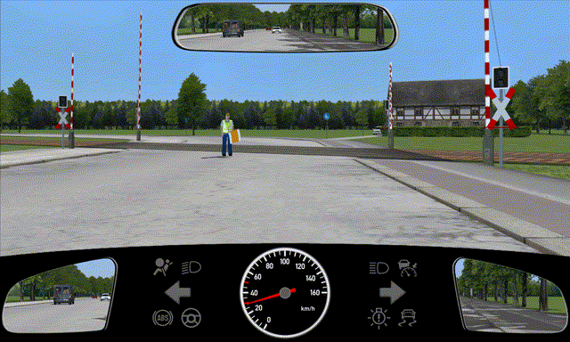

**Options:**
- A. Approach at moderate speed and wait
- B. Proceed as the roadway is only blocked for oncoming traffic

**Correct Answer(s):**
- A. Approach at moderate speed and wait

**Explanation:**
All car drivers and other road users must wait at a safe distance if railway staff guards a low-traffic level crossing with a white-red-white flag. Under no circumstances should you cross the tracks here, as the transition is blocked by the swinging of the flag and trains have priority.

---

#### Question 1.2.19-107

**Points:** 3 Points

**The barrier of a level crossing inside a built-up area is closed. Where must you wait?**

**Options:**
- A. In front of the St. Andrew's Cross
- B. Before the last beacon
- C. Before the first beacon

**Correct Answer(s):**
- A. In front of the St. Andrew's Cross

**Explanation:**
Trucks and vehicles with trailers (vehicles over 7.5 t permissible total mass) are only required to wait outside of built-up areas behind the level crossing (80 m) ahead marker. Inside a built-up area they have to wait in front of the diagonal crosses.

---

#### Question 1.2.19-109

**Points:** 3 Points

**What does this traffic sign mean?**

**Options:**
- A. Indication of existing overhead electrical wires
- B. Rail traffic always has priority
- C. You must always wait when a rail vehicle is approaching

**Correct Answer(s):**
- A. Indication of existing overhead electrical wires
- B. Rail traffic always has priority
- C. You must always wait when a rail vehicle is approaching

**Explanation:**
The diagonal crosses indicate that rail transport has priority here. As a car driver you need to wait when a rail vehicle is approaching. A lightning bolt in the diagonal cross is an indication of an electrical overhead line, which is important for special transports with a big height.

---

#### Question 1.2.19-110

**Points:** 3 Points

**A light signal with no level crossing sign is positioned before a level crossing, and in front of a junction with a road to the right. The red light is illuminated. Where must you wait?**

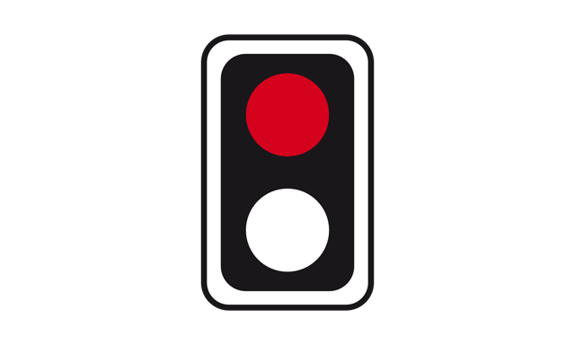

**Options:**
- A. At the stop line
- B. In front of the light signal, if there is no stop line
- C. I can drive up to the level crossing after watching out for other traffic

**Correct Answer(s):**
- A. At the stop line
- B. In front of the light signal, if there is no stop line

**Explanation:**
In the event of a red light, the car driver must stop in any case. In order not to block the traffic from the road going to the right, the red light is located several meters from the actual railroad crossing. Wait at the stop line or at the light sign if no line is available.

---

#### Question 1.2.19-111

**Points:** 3 Points

**What must you do in this situation?**

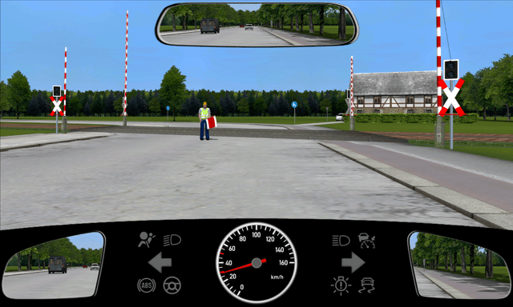

**Options:**
- A. - stop in front of the level crossing
- B. - drive on past to the left of the flagman
- C. - drive on past to the right of the flagman

**Correct Answer(s):**
- A. - stop in front of the level crossing

**Explanation:**
The railway employee secures the level crossing and therefore you should stop before the St. Andrew's cross.

---

#### Question 1.2.19-112

**Points:** 3 Points

**Who is required to stop at a level crossing with a red flashing light in the form of an arrow point to the right?**

**Options:**
- A. Traffic turning right
- B. Traffic moving straight ahead
- C. Traffic turning left

**Correct Answer(s):**
- A. Traffic turning right

**Explanation:**
A diagonal cross with a red flashing light in the form of an arrow to the right can be found behind an intersection or T-junction after a railroad crossing. The right arrow indicates that the car drivers who turn right must wait.

---

#### Question 1.2.19-113

**Points:** 4 Points

**What does this traffic sign combination indicate?**

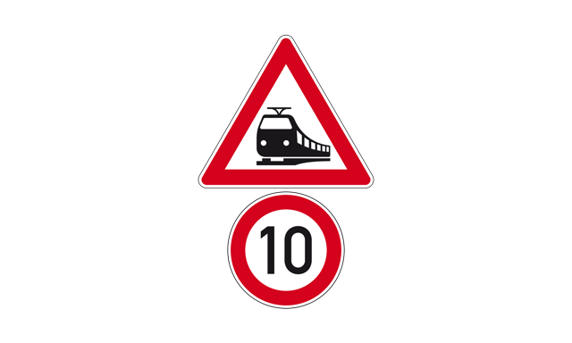

**Options:**
- A. - which I may approach at a maximum speed of 10 km/h
- B. - which I may cross at a maximum speed of 10 km/h
- C. - over which rail traffic may pass at a maximum speed of 10 km/h

**Correct Answer(s):**
- A. - which I may approach at a maximum speed of 10 km/h
- B. - which I may cross at a maximum speed of 10 km/h

**Explanation:**
The traffic sign combination shows you a level crossing. The car driver may approach the level crossing only at 10 km/h and cross it at that speed.

---

#### Question 1.2.19-114

**Points:** 4 Points

**What is the right course of action now?**

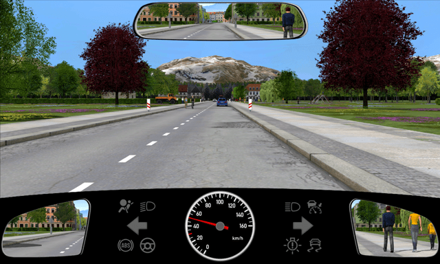

[Video: videos/1_2_19-114.mp4](videos/1_2_19-114.mp4)

**Options:**
- A. I wait in front of the level crossing
- B. I carefully cross the tracks
- C. I wait at the tracks

**Correct Answer(s):**
- A. I wait in front of the level crossing

**Explanation:**
If there is a risk that you might come to a stop on the rails due to a traffic jam situation or stagnant traffic, stop in front of the diagonal cross and wait until you can safely and quickly cross the level crossing. Fatal accidents occur when a car standing on the rails cannot avoid the approaching train.

---

#### Question 1.2.19-115

**Points:** 3 Points

**You are approaching a rail crossing. The barrier begins to lower. What should you do?**

**Options:**
- A. I wait in front of the level crossing
- B. I continue driving if there is no train in sight
- C. I switch on my hazard lights

**Correct Answer(s):**
- A. I wait in front of the level crossing

**Explanation:**
When a driver approaches a gate that lowers, he/she must wait in front of the level crossing. This also applies if no rail vehicle is yet to be seen. Switching on the hazard light is not required.

---

#### Question 1.2.19-116

**Points:** 3 Points

**Where do you have to anticipate encountering rail crossings with no technical safeguards?**

**Options:**
- A. On less-frequently used roads
- B. In industrial zones and port areas
- C. On dirt tracks and forest tracks

**Correct Answer(s):**
- A. On less-frequently used roads
- B. In industrial zones and port areas
- C. On dirt tracks and forest tracks

**Explanation:**
In industrial and port areas, on field and forest paths, as well as on roads with little traffic, you should expect a railway crossing without a barrier or traffic light (technically unprotected).

---

#### Question 1.2.19-117

**Points:** 3 Points

**You want to cross a level crossing with the barriers open. What is correct?**

**Options:**
- A. I have to approach the level crossing at a moderate speed
- B. I expect there to be bumps in the road when crossing the level crossing
- C. I am only allowed to cross the tracks at walking speed

**Correct Answer(s):**
- A. I have to approach the level crossing at a moderate speed
- B. I expect there to be bumps in the road when crossing the level crossing

**Explanation:**
Even when the barriers are open, you must always approach level crossings with caution and at a moderate speed. This gives you enough time to react to possible bumps and dangerous situations. Moderate speed in this context does not mean walking speed, because you can also drive faster than walking speed. In this way you can prevent possible dangerous situations with approaching trains or lowering barriers.

---

#### Question 1.2.19-118-M

**Points:** 3 Points

**What should you do now?**

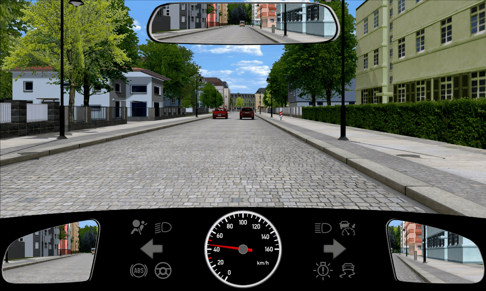

[Video: videos/1_2_19-118-M.mp4](videos/1_2_19-118-M.mp4)

**Options:**
- A. - stop before the cross
- B. - cross the level crossing quickly
- C. - drive through an open barrier

**Correct Answer(s):**
- A. - stop before the cross

**Explanation:**
Level crossings may not be crossed when the flashing lights above the St. Andrew's Cross are on or the barriers are lowered.

---

### 1.2.20 Chapter Public Transport And School Buses

#### Question 1.2.20-001

**Points:** 5 Points

**At a tramstop, passengers are getting on and off a tram onto the roadway. What do you do if you want to drive past on the right?**

**Options:**
- A. Wait if passengers can be endangered or inconvenienced
- B. Drive cautiously at walking speed past if this is possible without endangering or inconveniencing passengers
- C. Give a clear warning signal and proceed

**Correct Answer(s):**
- A. Wait if passengers can be endangered or inconvenienced
- B. Drive cautiously at walking speed past if this is possible without endangering or inconveniencing passengers

**Explanation:**
Tram passengers who get off the tram at one stop and walk to the sidewalk or walk from the sidewalk to the tram have absolute priority over vehicle traffic. You as a car driver have to wait. Only when an obstruction or threat to passengers is ruled out, you may pass by the tram carefully at walking pace.

---

#### Question 1.2.20-003

**Points:** 5 Points

**What do you do when a bus has stopped at a bus stop with its hazard warning lights switched on?**

**Options:**
- A. Drive past at walking speed only and, if necessary, stop
- B. Drive past at a sufficient distance in order to exclude endangering pedestrians
- C. Wait if passengers could be inconvenienced

**Correct Answer(s):**
- A. Drive past at walking speed only and, if necessary, stop
- B. Drive past at a sufficient distance in order to exclude endangering pedestrians
- C. Wait if passengers could be inconvenienced

**Explanation:**
A bus that stops at a stop with the hazard light on may only be passed at walking pace. Walking speed also applies to oncoming traffic. Drive past the bus at a distance that preempts any danger or obstruction to passengers. Wait, if necessary. A sufficient distance improves the visibility to see pedestrians stepping forward.

---

#### Question 1.2.20-004

**Points:** 3 Points

**Which vehicles must you allow to set off from marked bus stops?**

**Options:**
- A. Regular buses
- B. School buses
- C. Taxis

**Correct Answer(s):**
- A. Regular buses
- B. School buses

**Explanation:**
You have to give priority to public and school buses that want to drive away from marked stops, as long as they announce their intention of departure, for example, by indicating. Exceptions are taxis, as these are not bound to fixed stops and timetables.

---

#### Question 1.2.20-005

**Points:** 4 Points

**A regular bus in the oncoming traffic has stopped at a bus stop on the same roadway with hazard warning lights switched on. What do you do?**

**Options:**
- A. Slow down to walking speed
- B. Only proceed at walking speed if passengers want to cross the roadway
- C. Proceed at the same speed since the bus has stopped on the other side of the roadway

**Correct Answer(s):**
- A. Slow down to walking speed

**Explanation:**
Even if the bus is on the side of oncoming traffic, you are obliged to drive past the bus at walking pace as soon as it stops with the hazard light on. This is also the case when no pedestrians want to cross the street. Likewise, a sufficiently large safety distance must be maintained in order not to endanger persons entering or leaving. The car driver must guarantee all pedestrians safe crossing of the road and, if necessary, wait for them.

---

#### Question 1.2.20-101

**Points:** 4 Points

**You are approaching a regular bus which has stopped in the opposite direction at a bus stop on your roadway and its hazard warning lights are switched on. What must you expect?**

**Options:**
- A. Passengers will cross the roadway in order to catch the bus
- B. Passengers leaving the bus will suddenly cross the roadway
- C. Passengers will cross the roadway only after the hazard warning lights of the bus are switched off

**Correct Answer(s):**
- A. Passengers will cross the roadway in order to catch the bus
- B. Passengers leaving the bus will suddenly cross the roadway

**Explanation:**
It is to be expected that passers-by carelessly and without paying any attention to traffic will cross the street because they still want to reach the bus. Likewise, it can be expected with people exiting the bus who walk on the road in front of or behind the bus.

---

#### Question 1.2.20-102

**Points:** 5 Points

**What is the right course of action now?**

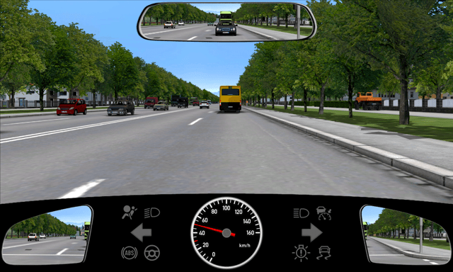

[Video: videos/1_2_20-102.mp4](videos/1_2_20-102.mp4)

**Options:**
- A. I remain behind the bus for the moment
- B. I overtake the bus at a moderate speed
- C. I switch lane without overtaking immediately

**Correct Answer(s):**
- A. I remain behind the bus for the moment

**Explanation:**
You have to slow down and stay behind the bus first. As long as the bus is driving with the hazard lights on, you must not overtake the it. You also can not change the lane because to the left of you is a vehicle that is just overtaking you.

---

#### Question 1.2.20-103

**Points:** 4 Points

**You would like to drive past a local transport bus, which has come to a stop at a bus stop. What must you be aware of?**

**Options:**
- A. - drive past maintaining sufficient space to the side
- B. - drive past carefully
- C. - watch out for oncoming traffic

**Correct Answer(s):**
- A. - drive past maintaining sufficient space to the side
- B. - drive past carefully
- C. - watch out for oncoming traffic

**Explanation:**
It is allowed to drive past a public bus that stops at a bus stop. When passing by, you will usually get into the traffic lane of oncoming traffic. Therefore, pay particular attention to oncoming traffic. It is still wrong to drive as close to the bus as possible though. Because this way you might endanger pedestrians. It is not necessary to drive at walking speed, but drive very carefully.

---

#### Question 1.2.20-104

**Points:** 4 Points

**You are approaching a local transport bus, which has come to a stop at a bus stop. What must you watch out for when driving past it?**

**Options:**
- A. That there is sufficient space to the side
- B. My speed
- C. For pedestrians on the road

**Correct Answer(s):**
- A. That there is sufficient space to the side
- B. My speed
- C. For pedestrians on the road

**Explanation:**
You may drive past a public bus, a tram or a designated school bus only with caution and sufficient lateral distance when the vehicle is waiting at a stop. The same rule applies if the bus is standing in oncoming traffic. Careless people may be on the road, and you, as a car driver, must pay particular attention to this.

---

#### Question 1.2.20-105

**Points:** 4 Points

**What must you be prepared for?**

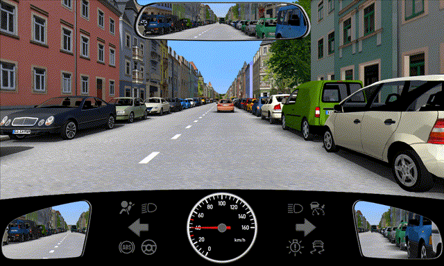

[Video: videos/1_2_20-105.mp4](videos/1_2_20-105.mp4)

**Options:**
- A. Oncoming vehicles will move onto my side of the road
- B. As it begins moving, the bus will swing onto my side of the road
- C. Passengers walking in front of the bus onto the road

**Correct Answer(s):**
- A. Oncoming vehicles will move onto my side of the road
- B. As it begins moving, the bus will swing onto my side of the road

**Explanation:**
The omnibus standing opposite of you will start driving. Thereby he could swing on your side of the road. Even vehicles behind the omnibus could come on your side of the road, while trying to overtake. Brake as a car driver, keep to the right and stop if necessary.

---

#### Question 1.2.20-106

**Points:** 2 Points

**All vehicles have been waiting at the junction for a few seconds. What should you do in this situation?**

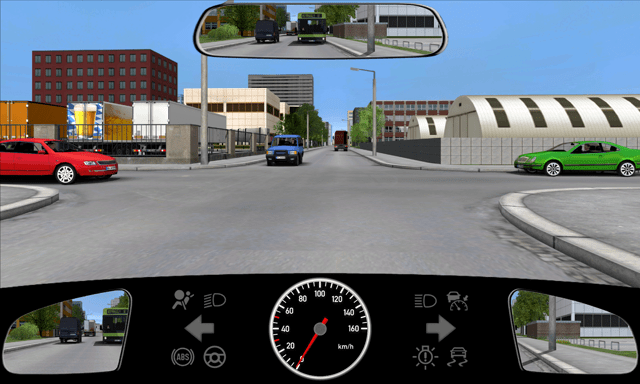

**Options:**
- A. I use clear hand signals to forego my right of way
- B. I am the first to drive to the centre of the junction, where I stop
- C. I am the first to pass through the junction

**Correct Answer(s):**
- A. I use clear hand signals to forego my right of way

**Explanation:**
Here, the traffic rule "left yields to right" applies and every driver must give priority to the vehicle on the right. In order for the situation to dissolve, a car driver must refrain from his/her right of way. By clearly recognizable hand signals you should give up your right of way, so that all vehicles can continue.

---

#### Question 1.2.20-107-M

**Points:** 3 Points

**What is the right course of action in this situation?**

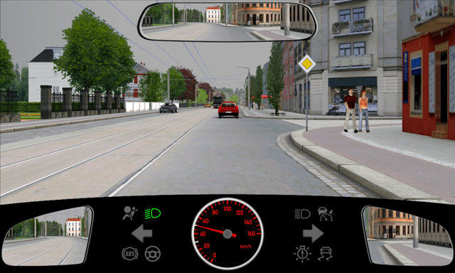

[Video: videos/1_2_20-107-M.mp4](videos/1_2_20-107-M.mp4)

**Options:**
- A. I remain behind the tram
- B. I drive past the tram on the right-side
- C. I overtake the tram on the left

**Correct Answer(s):**
- A. I remain behind the tram

**Explanation:**
As a car driver, you are obliged to respect public transport and its passengers. In this situation where the tram stops and there are people at the bus stop who have to cross the road to get in, the following applies: stop behind the tram and wait for all passengers to get in or out.

---

#### Question 1.2.20-108-M

**Points:** 4 Points

**What is the correct course of action in this situation?**

**Options:**
- A. I maintain my speed
- B. I drive with an increased level of alertness
- C. I slow down to walking speed now

**Correct Answer(s):**
- A. I maintain my speed
- B. I drive with an increased level of alertness

**Explanation:**
Passengers can step onto the road, you should increase your attention. But you can keep up your speed.

---

#### Question 1.2.20-109-M

**Points:** 5 Points

**What do you have to be aware of in this situation?**

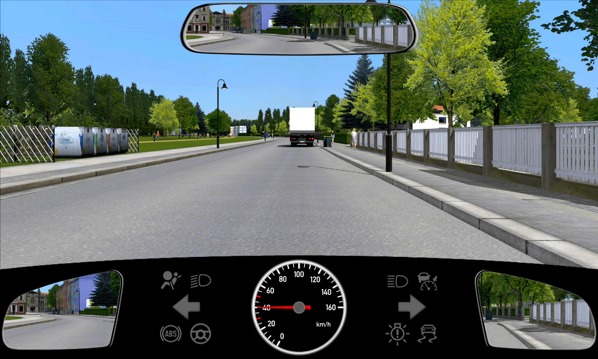

[Video: videos/1_2_20-109-M.mp4](videos/1_2_20-109-M.mp4)

**Options:**
- A. Pedestrians could cross the road
- B. I may drive past the bus at walking speed
- C. I may not drive past the bus

**Correct Answer(s):**
- A. Pedestrians could cross the road
- B. I may drive past the bus at walking speed

**Explanation:**
If the bus is at the bus stop and has its warning lights on, you are only allowed to drive past it at walking speed. This is because people getting off the bus could cross the road at the bus stop. Someone could also run across the road to catch the bus.
Therefore, watch out for people, slow down and stop if necessary.

---

#### Question 1.2.20-110-M

**Points:** 4 Points

**What is the right thing to do in this situation?**

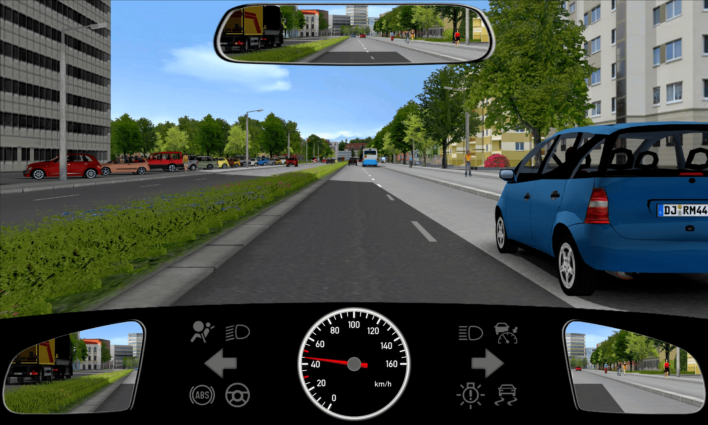

[Video: videos/1_2_20-110-M.mp4](videos/1_2_20-110-M.mp4)

**Options:**
- A. I am only allowed to pass the bus at walking speed
- B. The [blue] car must stop
- C. I am allowed to continue at the same speed

**Correct Answer(s):**
- A. I am only allowed to pass the bus at walking speed

**Explanation:**
When buses move in traffic with their hazard lights on, other vehicles must always be particularly considerate. If the bus is approaching a stop with the hazard lights on, it may not be overtaken. However, if the bus is at a stop, you can drive past at walking pace.

---

#### Question 1.2.20-111-M

**Points:** 5 Points

**What do you need to consider in this situation?**

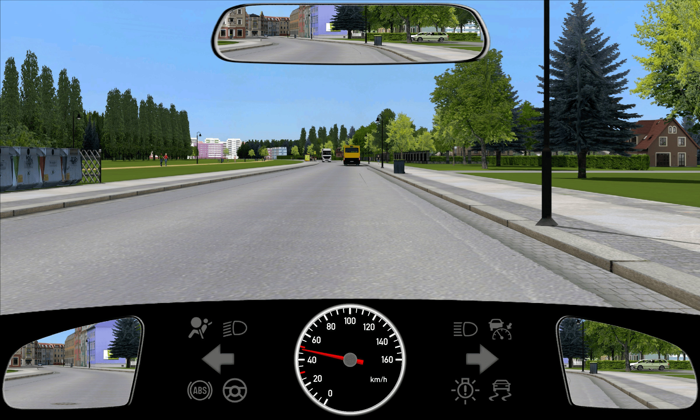

[Video: videos/1_2_20-111-M.mp4](videos/1_2_20-111-M.mp4)

**Options:**
- A. People might cross the road
- B. I am only allowed to pass the stationary bus at walking speed
- C. I must not pass a stationary bus

**Correct Answer(s):**
- A. People might cross the road
- B. I am only allowed to pass the stationary bus at walking speed

**Explanation:**
Buses at stops may be overtaken at walking speed if they are stationary and have their hazard lights on. However, it is always important to be particularly considerate when driving past buses in order to be able to react in a timely manner to dangerous situations, such as people suddenly stepping onto the road.

---

#### Question 1.2.20-201-M

**Points:** 3 Points

**What is the right course of action in this situation?**

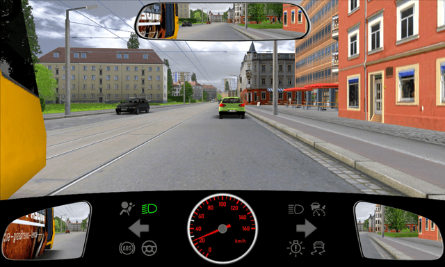

[Video: videos/1_2_20-201-M.mp4](videos/1_2_20-201-M.mp4)

**Options:**
- A. I remain behind the tram
- B. I drive past the tram on the right-side
- C. I overtake the tram on the left

**Correct Answer(s):**
- A. I remain behind the tram

**Explanation:**
You must not obstruct or endanger passengers. Therefore, stay behind the tram until you can drive on without endangering the passengers.

---

### 1.2.22 Chapter Load

#### Question 1.2.22-101

**Points:** 2 Points

**What is the maximum distance a load may project backwards beyond the rear reflectors without a projection marker being necessary?**

**Options:**

**Correct Answer(s):**
- 1 

**Explanation:**
The lighting or the brake light signals the end of the vehicle. With this, you estimating the correct safety distance. If a protruding object of the vehicle in front of you is visually marked, it protrudes at least one meter. You should take this into account in your assessment of the necessary safety distance and increase it accordingly.

---

#### Question 1.2.22-102

**Points:** 3 Points

**How must a load projecting more than 1 m beyond the rear reflectors of the vehicle be marked in darkness?**

**Options:**
- A. By a red light and red rear reflector
- B. By an orange warning plate
- C. By switching the fog tail lamp on

**Correct Answer(s):**
- A. By a red light and red rear reflector

**Explanation:**
If you carry cargo that protrudes more than 1 m from the end of the vehicle, it must be marked accordingly by a red light and a red reflector. Thus, the end of the load is made visible to the traffic behind you and a correspondingly high safety distance can be maintained. An orange warning sign shows the transport of dangerous goods subject to marking. The rear fog lamp does not improve the visibility and must not be used.

---

#### Question 1.2.22-104

**Points:** 4 Points

**What can be the effect of an overload of only 20%?**

**Options:**
- A. The brakes may be overstrained
- B. Steering may become worse
- C. There may be too much strain on the load-bearing parts of the vehicle

**Correct Answer(s):**
- A. The brakes may be overstrained
- B. Steering may become worse
- C. There may be too much strain on the load-bearing parts of the vehicle

**Explanation:**
The entire vehicle design, the drivability and the center of gravity of a car are matched and tested by the manufacturer to a certain maximum permissible load limit. Exceeding the maximum limit can affect the driving behavior of the vehicle negatively. In addition, you risk permanent damage, such as warping and breaking load-bearing parts on your car.

---

#### Question 1.2.22-106

**Points:** 3 Points

**What is the significance of orange warning plates on a vehicle?**

**Options:**
- A. - dangerous goods
- B. - cattle
- C. - easily perishable food

**Correct Answer(s):**
- A. - dangerous goods

**Explanation:**
An orange warning sign indicates vehicles that are loaded with dangerous goods as so-called hazardous materials transportation. Other car drivers should be warned this way. In the event of a traffic accident, the orange warning sign serves as a clue to the emergency services.

---

#### Question 1.2.22-107

**Points:** 3 Points

**What must you be aware of if you want to transport a load?**

**Options:**
- A. - may not interfere with me
- B. - may not slide even when I brake
- C. - may never project over the front of the vehicle

**Correct Answer(s):**
- A. - may not interfere with me
- B. - may not slide even when I brake

**Explanation:**
The load must be carefully secured so that it can't fall down. The car driver may not be handicapped by the load, not even in his/her visibility. The permissible dimensions and weight limits must be observed. At the front, the load may protrude only above a height of 2.5 m by a maximum of 50 cm. This regulation reduces the risk of injury in the event of a rear-end collision.

---

#### Question 1.2.22-108

**Points:** 3 Points

**From what height it is permitted for loads to project up to 50 cm in front of your vehicle?**

**Options:**
- A. 2.50 m
- B. 2.00 m
- C. 3.00 m

**Correct Answer(s):**
- A. 2.50 m

**Explanation:**
If your vehicle has a height of up to 2.5 m, the cargo may protrude forwards by 50 cm. This cargo projection up to 50 cm is also permitted on trains and must never be exceeded in order to minimize the risk of injury in rear-end collisions.

---

#### Question 1.2.22-109

**Points:** 3 Points

**What do you have to make sure of regarding the load on your vehicle?**

**Options:**
- A. My vehicle may not exceed the gross axle weight rating
- B. I have to use suitable equipment to prevent the load from shifting
- C. My vehicle may exceed the gross vehicle weight rating by a maximum of 5%

**Correct Answer(s):**
- A. My vehicle may not exceed the gross axle weight rating
- B. I have to use suitable equipment to prevent the load from shifting

**Explanation:**
When loading your vehicle, you must not exceed the permissible axial loads. You must secure the cargo in accordance with the recognized rules of engineering

---

### 1.2.23 Chapter Other Duties Of The Driver

#### Question 1.2.23-001

**Points:** 2 Points

**Who is responsible for the roadworthiness of a licensed vehicle?**

**Options:**
- A. The driver
- B. The owner
- C. The motor liability insurance company

**Correct Answer(s):**
- A. The driver
- B. The owner

**Explanation:**
Responsible for the roadworthy condition of a vehicle are both the owner of the vehicle as well as the driver. The driver has to check the operational reliability as well as roadworthiness of the vehicle before driving. The owner has to make sure that this actually happens. This also applies to the TÜV examination. The liability insurance is not responsible.

---

#### Question 1.2.23-002

**Points:** 3 Points

**What must you do when you are travelling and you notice that your vehicle is no longer roadworthy?**

**Options:**
- A. Take the vehicle out of the traffic as quickly as possible
- B. Continue only when the damage has been repaired
- C. Proceed to the next authorised dealer

**Correct Answer(s):**
- A. Take the vehicle out of the traffic as quickly as possible
- B. Continue only when the damage has been repaired

**Explanation:**
If a vehicle is not roadworthy, the driver must remove it from traffic as soon as possible. Note that driving to the nearest workshop is also prohibited. Only after the damage has been repaired, you may continue driving.

---

#### Question 1.2.23-003

**Points:** 4 Points

**Which defects of a vehicle can result in a danger for road traffic?**

**Options:**
- A. Worn tyres
- B. Defective rear lamps
- C. Insufficient braking effect

**Correct Answer(s):**
- A. Worn tyres
- B. Defective rear lamps
- C. Insufficient braking effect

**Explanation:**
Worn tires have a negative effect on the grip and could lead the car to skidding. Defective tail lamps make the car less visible to the surrounding traffic. Insufficient braking action can lead to a prolonged braking distance therefore lead to higher risk of accidents, especially for rear-end collisions. All three defects lead to a threat to traffic safety.

---

#### Question 1.2.23-006

**Points:** 3 Points

**You want to make a telephone call while driving a vehicle. What must you be aware of?**

**Options:**
- A. I may be distracted by the call
- B. I may be distracted through operating the telephone
- C. Telephoning using a hands-free unit does not distract me

**Correct Answer(s):**
- A. I may be distracted by the call
- B. I may be distracted through operating the telephone

**Explanation:**
Being on the phone or operating a telephone while driving distracts the driver. Even if you're using a hands-free kit, you'll need to keep in mind that some of your senses are distracted and you cannot focus entirely on driving.

---

#### Question 1.2.23-007

**Points:** 3 Points

**You want to make a telephone call while driving. What must you be aware of?**

**Options:**
- A. I need to have a hands-free unit
- B. I may use the telephone without a hands-free unit, if the vehicle is parked in a suitable place, and the engine is fully switched off
- C. I may use the telephone without a hands-free, if the vehicle is moving at walking pace

**Correct Answer(s):**
- A. I need to have a hands-free unit
- B. I may use the telephone without a hands-free unit, if the vehicle is parked in a suitable place, and the engine is fully switched off

**Explanation:**
While driving, you're only allowed to use the speaker phone. If you do not have a hands-free kit, you must drive to a suitable location and stop the engine completely. Only then you are allowed to use your mobile phone. To use your phone while driving without hands-free equipment is a serious offense, a so-called A-offense, with high penalties.

---

#### Question 1.2.23-008

**Points:** 3 Points

**You want to use a motor vehicle on public roads. What must you observe?**

**Options:**
- A. The motor vehicle must be roadworthy
- B. The motor vehicle must be covered by liability insurance
- C. I must be the vehicle owner

**Correct Answer(s):**
- A. The motor vehicle must be roadworthy
- B. The motor vehicle must be covered by liability insurance

**Explanation:**
You may only use a vehicle on public roads if it is roadworthy and if there is liability insurance for the vehicle.

---

### 1.2.26 Chapter Behaviour At Pedestrian Crossings And Towards Pedestrians

#### Question 1.2.26-005

**Points:** 4 Points

**What applies immediately before and on zebra crossings?**

**Options:**
- A. - overtake
- B. - stop
- C. - park

**Correct Answer(s):**
- A. - overtake
- B. - stop
- C. - park

**Explanation:**
There is a strict ban on passing in front of and on cross-walks. That is, so that you as a car driver always have a good view of the cross-walk and potential passers-by. Parking and stopping up to five meters in front of and on the pedestrian crossing is prohibited. Generally, you have to approach a cross-walk carefully.

---

#### Question 1.2.26-007

**Points:** 4 Points

**What is the right course of action?**

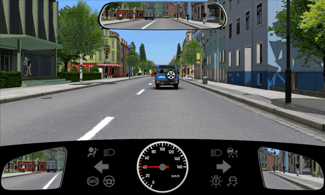

[Video: videos/1_2_26-007.mp4](videos/1_2_26-007.mp4)

**Options:**
- A. I stop because a man wants to cross the pedestrian crossing
- B. I continue driving slowly, because there is no indication that any pedestrian wants to cross the pedestrian crossing
- C. I stop because a child behind the van is going to walk onto the road

**Correct Answer(s):**
- A. I stop because a man wants to cross the pedestrian crossing

**Explanation:**
At a pedestrian crossing you have to allow the pedestrians to cross the road. The pedestrian from the right comes running fast and could run into the street. Drive at moderate speed and stop if necessary.

---

#### Question 1.2.26-008-M

**Points:** 4 Points

**What is correct in this situation?**

**Options:**
- A. - not overtake [the cyclist]
- B. - overtake [the cyclist], because there is no oncoming traffic visible
- C. - only overtake [the cyclist] at a moderate speed

**Correct Answer(s):**
- A. - not overtake [the cyclist]

**Explanation:**
You are at a pedestrian crossing. In this situation, you must not overtake the cyclist before and at a pedestrian crossing.

---

#### Question 1.2.26-009-M

**Points:** 4 Points

**What must you anticipate with traffic islands like this?**

**Options:**
- A. Pedestrians thinking that they have the right of way over the road traffic
- B. Cyclists crossing the road without paying attention to the traffic
- C. Pedestrians always respect the right of way for vehicles

**Correct Answer(s):**
- A. Pedestrians thinking that they have the right of way over the road traffic
- B. Cyclists crossing the road without paying attention to the traffic

**Explanation:**
Often cyclists and pedestrians think they have priority. Therefore, drive carefully..

---

#### Question 1.2.26-010-M

**Points:** 4 Points

**What is the correct course of action in this situation?**

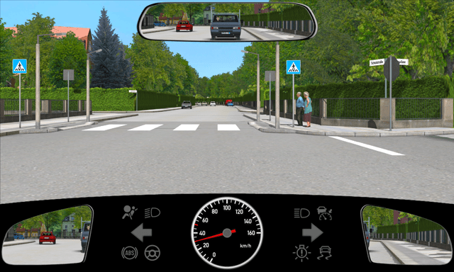

**Options:**
- A. I watch the [pedestrians] closely
- B. I reduce my speed and prepare to stop if necessary
- C. I continue driving at the same speed

**Correct Answer(s):**
- A. I watch the [pedestrians] closely
- B. I reduce my speed and prepare to stop if necessary

**Explanation:**
Pedestrians always have priority at the pedestrian crossing. So you must be aware of pedestrians and be prepared to slow down and stop.

---

#### Question 1.2.26-108

**Points:** 4 Points

**The traffic light is green. You want to turn right. How do you respond to pedestrians wishing to cross the road into which you want to turn?**

**Options:**
- A. Allow the pedestrians to cross the road
- B. Make the turn quickly before the pedestrians
- C. Warn the pedestrians by sounding the horn

**Correct Answer(s):**
- A. Allow the pedestrians to cross the road

**Explanation:**
If the driver wants to turn right and the traffic light signals "green", he must stop when pedestrians cross the road, regardless of how many there are. If the cross-traffic’s traffic light shows "red", pedestrian lights in the side street are mostly "green". Even without the presence of a traffic light the pedestrian must be given the advantage and the driver must stop and wait in this case. Even cyclists who drive straight ahead at the right of the driver or approach the right-turning driver, have priority and must be allowed through.

---

#### Question 1.2.26-109

**Points:** 4 Points

**How do you respond to pedestrians wishing to cross the road into which you want to turn?**

**Options:**
- A. Allow the pedestrians to cross the road
- B. Make the turn quickly before the pedestrians
- C. Only wait if the pedestrians are using a marked crossing

**Correct Answer(s):**
- A. Allow the pedestrians to cross the road

**Explanation:**
If a car driver wants to turn into a street that is crossed by pedestrians, or pedestrians want to cross it, the driver has to give precedence to the pedestrians and has to stop. Therefore, fast driving is wrong. It does not matter if the cross-walk is marked or not.

---

#### Question 1.2.26-110-M

**Points:** 4 Points

**What is the right course of action?**

**Options:**
- A. Wait, because the two pedestrians have priority
- B. Continue driving, because the two pedestrians have to give way to me
- C. Proceed in front of the oncoming pedestrian, because he is required to wait

**Correct Answer(s):**
- A. Wait, because the two pedestrians have priority

**Explanation:**
The car has to wait until the pedestrians have crossed the street. If you want to turn into a road that is being crossed by pedestrians, the pedestrians have priority over the car. You as a car driver have to show consideration and need to stop.

---

#### Question 1.2.26-111

**Points:** 5 Points

**In which instances do you have to approach a pedestrian crossing with particular care?**

**Options:**
- A. If pedestrians want to cross the road
- B. If the view of the pedestrian crossing is restricted
- C. If another vehicle is already waiting at the pedestrian crossing

**Correct Answer(s):**
- A. If pedestrians want to cross the road
- B. If the view of the pedestrian crossing is restricted
- C. If another vehicle is already waiting at the pedestrian crossing

**Explanation:**
Generally, motorists have to approach a pedestrian crossing cautiously. Particular caution is advised when people want to cross the road or the view of the pedestrian crossing is limited, for example by an already waiting vehicle in front of the pedestrian crossing. Under no circumstances should you overtake this vehicle.

---

#### Question 1.2.26-112

**Points:** 4 Points

**A pedestrian crossing is covered in snow; only the sign "Pedestrian crossing" is visible. A pedestrian wants to cross the road. What is the right thing to do?**

**Options:**
- A. Brake carefully
- B. Allow the pedestrian to cross
- C. Continue driving carefully, because no road markings are visible

**Correct Answer(s):**
- A. Brake carefully
- B. Allow the pedestrian to cross

**Explanation:**
The sign makes it clear that there is a pedestrian crossing. As a car driver, you must behave just like you do on a visible pedestrian crossing, when the road is covered in snow. Approach the cross-walk particularly careful, brake and stop if necessary.

---

#### Question 1.2.26-113

**Points:** 5 Points

**A pedestrian wants to cross the road via the pedestrian crossing. What should you do?**

**Options:**
- A. I get ready to stop
- B. I refrain from overtaking
- C. I overtake the waiting vehicles taking extra care

**Correct Answer(s):**
- A. I get ready to stop
- B. I refrain from overtaking

**Explanation:**
Approach the pedestrian crossing at moderate speed and signal that you are compliant. If there is eye contact with the pedestrian, emphasize this with gestures. If lowering the speed is not sufficient to enable the pedestrian to cross the route, you have to stop. Before and on pedestrian crossings, no other vehicle may be overtaken.

---

#### Question 1.2.26-114

**Points:** 5 Points

**What should you do in this situation?**

**Options:**
- A. I allow the pedestrian to cross the road
- B. I wait this side of the pedestrian crossing until the blue vehicle has made the turn
- C. I pull up directly behind the blue vehicle

**Correct Answer(s):**
- A. I allow the pedestrian to cross the road
- B. I wait this side of the pedestrian crossing until the blue vehicle has made the turn

**Explanation:**
If at a pedestrian crossing a pedestrian clearly wants to cross the road, you must approach and wait at a moderate pace. When traffic is halting, you must not stop on a pedestrian crossing. In such a case, you must also keep T-junctions and intersections clear.

---

#### Question 1.2.26-115

**Points:** 4 Points

**Why is it particularly important to adopt a defensive driving style when approaching pedestrian crossings?**

**Options:**
- A. In order that pedestrians are not unduly alarmed
- B. In order to avoid rear-end collisions
- C. In order that vehicles following behind can overtake more easily

**Correct Answer(s):**
- A. In order that pedestrians are not unduly alarmed
- B. In order to avoid rear-end collisions

**Explanation:**
Approaching this area defensively and braking slowly shows pedestrians that you are complying with your duty of waiting. This allows pedestrians to safely cross the road. In addition, you avoid rear-end collisions by stopping in a timely manner.

---

#### Question 1.2.26-116

**Points:** 5 Points

**You are driving in the left-hand lane of a two-lane one-way street. About 30 m in front of you, a truck comes to a stop in the right-hand lane before a pedestrian crossing. What should you do?**

**Options:**
- A. I approach at a moderate speed
- B. I give a warning signal and drive past the truck
- C. I continue driving swiftly

**Correct Answer(s):**
- A. I approach at a moderate speed

**Explanation:**
In no case may a vehicle be overtaken before and on pedestrian crossings. The truck blocks the view of the pedestrian crossing. He may let pedestrians cross the street. Even if he is waiting in a different lane, he must not be overtaken. Drive at moderate speed to the pedestrian crossing, ready to stop.

---

#### Question 1.2.26-117

**Points:** 4 Points

**A cyclist wishes - without dismounting - to cross the road at a pedestrian crossing. What should you do?**

**Options:**
- A. I allow the cyclist to cross the road
- B. I sound my horn and continue driving without giving way to the cyclist
- C. I only brake just short of the pedestrian crossing

**Correct Answer(s):**
- A. I allow the cyclist to cross the road

**Explanation:**
The cyclist acts contrary to road traffic regulations. He has to dismount before crossing the pedestrian crossing. However, as a car driver who approaches the pedestrian crossing cautiously and at a moderate pace, you will not run him over. That too would be contrary to road traffic regulations. You stop for the cyclist on the pedestrian crossing, if necessary, and let him/her pass.

---

#### Question 1.2.26-118

**Points:** 4 Points

**In front of you is a pedestrian crossing, beyond which the traffic in your lane is backed up. What should you do?**

**Options:**
- A. Come to a stop before the pedestrian crossing to allow people to cross
- B. Wait on the pedestrian crossing if there is no-one in sight
- C. Wait on the pedestrian crossing to shorten the traffic jam

**Correct Answer(s):**
- A. Come to a stop before the pedestrian crossing to allow people to cross

**Explanation:**
When traffic is halting, you must not stop on a pedestrian crossing. Here, the same rule of intersections and T-junctions applies, which must also be kept clear.

---

#### Question 1.2.26-119-M

**Points:** 4 Points

**What is the right course of action?**

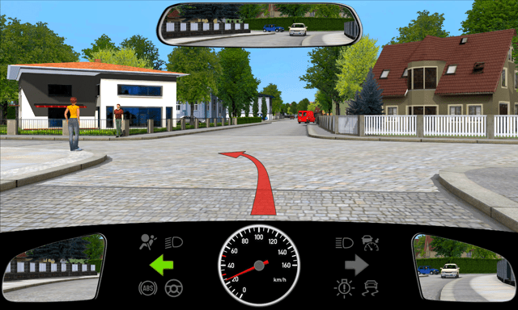

**Options:**
- A. I wait, because the two pedestrians have priority
- B. I continue driving, because the two pedestrians have to wait
- C. I take the turn before [the oncoming pedestrian], because only [this one] is required to wait

**Correct Answer(s):**
- A. I wait, because the two pedestrians have priority

**Explanation:**
If you want to turn and you encounter pedestrians who want to cross the road, you should pay attention to them. You must stop and wait with the turn.

---

### 1.2.34 Chapter Accident

#### Question 1.2.34-002

**Points:** 3 Points

**You have damaged a parked vehicle. Though you have waited for a reasonable length of time, the injured party has not appeared. What must you do?**

**Options:**
- A. Leave your name and address on the damaged vehicle and immediately report the accident to the police
- B. You may leave the scene of the accident without taking further action
- C. It is sufficient to give your name and address to a witness who was not involved

**Correct Answer(s):**
- A. Leave your name and address on the damaged vehicle and immediately report the accident to the police

**Explanation:**
After leaving the personal data on the damaged vehicle, you must inform a nearby police station about the incident. This can also be done by phone. Default is considered as a hit and run and is a criminal offense that may cost more than the driving license. The often-quoted reasonable waiting time on the damaged vehicle is relative and not a legally specified time. Direct contact can only facilitate the transaction.

---

#### Question 1.2.34-004

**Points:** 4 Points

**What is the right course of action now?**

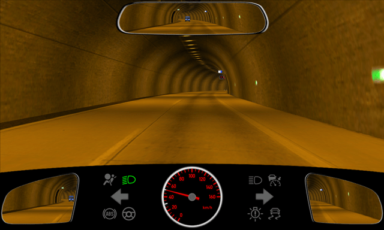

[Video: videos/1_2_34-004.mp4](videos/1_2_34-004.mp4)

**Options:**
- A. - leave the ignition key or transponder behind when leaving the vehicle
- B. - exit the tunnel via the emergency exit
- C. - wait in the vehicle for the scene of the accident to be cleared

**Correct Answer(s):**
- A. - leave the ignition key or transponder behind when leaving the vehicle
- B. - exit the tunnel via the emergency exit

**Explanation:**
If there has been an accident in the tunnel and if at least one car burns and there's smoke, you have to stop and leave your car. You can leave the tunnel via the emergency exit and follow the emergency lights. If none exist, you have to feel your way along the tunnel wall. Since the fire department may need to move your car away, the ignition key or transponder should be left in the car.

---

#### Question 1.2.34-005

**Points:** 4 Points

**Under what emergency numbers can you call the police and the emergency services in Germany?**

**Options:**
- A. 110
- B. 112
- C. 115

**Correct Answer(s):**
- A. 110
- B. 112

**Explanation:**
In Germany emergency numbers for the police are 110 as well as 112 for the accident ambulance and the fire department. The numbers also work if your mobile phone has no more credit.

---

#### Question 1.2.34-006

**Points:** 3 Points

**You are involved in an accident. What document must you present to the other person involved in the accident, if requested?**

**Options:**
- A. My driving licence
- B. The registration certificate Part I or the operating permit
- C. The liability insurance contract

**Correct Answer(s):**
- A. My driving licence
- B. The registration certificate Part I or the operating permit

**Explanation:**
In the event of a traffic accident, all parties involved must show the following documents upon request: driver's license and certificate of registration part 1 (registration certificate) or the operating license. You must also provide information about the liability insurance to the best of your knowledge.

---

#### Question 1.2.34-007

**Points:** 4 Points

**You are the first to arrive at the scene of the accident where there are injured people. You secure the scene of the accident and have gained an overview of the situation. What else do you have to do?**

**Options:**
- A. - deliver first aid to the injured
- B. - notify the emergency services
- C. - document the accident

**Correct Answer(s):**
- A. - deliver first aid to the injured
- B. - notify the emergency services

**Explanation:**
Before you take care of the injured, you must alert the ambulance service, after which you are obliged to provide first aid to the injured.

---

#### Question 1.2.34-008

**Points:** 3 Points

**You are involved in an accident in a carpark. The vehicle damage is minor. Everyone involved agrees that the police do not need to be informed. What would be helpful now for the claims process?**

**Options:**
- A. Photographing the scene of the accident from a number of angles
- B. Exchanging the necessary details with those involved
- C. Describing the cause of the accident in the accident report

**Correct Answer(s):**
- A. Photographing the scene of the accident from a number of angles
- B. Exchanging the necessary details with those involved
- C. Describing the cause of the accident in the accident report

**Explanation:**
You should exchange the most important information with the other party involved in the accident in order to be able to get in touch. You should also mutually record the course of the accident. Document the damage with photos. This enables the insurance company to better assess and evaluate the damage.

---

#### Question 1.2.34-009

**Points:** 3 Points

**Your vehicle has damaged someone else’s parked vehicle. Despite waiting a reasonable period of time, the owner of the damaged car fails to appear. What is the right course of action now?**

**Options:**
- A. - leave my name and address at the scene of the accident
- B. - report the accident to the police
- C. - give my name and address to a witness not involved in the accident

**Correct Answer(s):**
- A. - leave my name and address at the scene of the accident
- B. - report the accident to the police

**Explanation:**
StVO § 34 6. a) - 7. allows you to leave the scene of an accident after a reasonable waiting period if you have left your name and address at the scene of the accident and reported the accident to the police.

---

#### Question 1.2.34-010

**Points:** 4 Points

**You are involved in an accident with another vehicle to which the following orange-coloured sign is attached. You see a liquid leaking from the vehicle. What is the right course of action?**

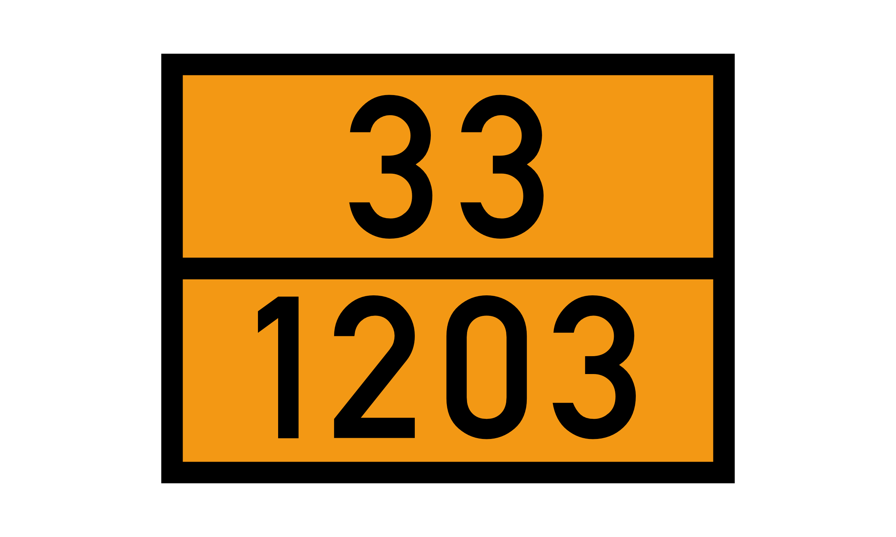

**Options:**
- A. I provide the number of the orange-coloured sign when making the emergency call
- B. I avoid walking in the area into which the liquid has leaked
- C. I attempt to block the leak in the vehicle

**Correct Answer(s):**
- A. I provide the number of the orange-coloured sign when making the emergency call
- B. I avoid walking in the area into which the liquid has leaked

**Explanation:**
Vehicles with orange warning signs are transporting dangerous goods.

In the event of an accident involving a hazardous goods transport, you must state the numbers on the orange-coloured sign when making an emergency call. This way, the emergency call centre knows which substances the vehicle is transporting and can send the appropriate special forces. You should avoid contact with the leaking liquids and keep your distance if possible.

---

#### Question 1.2.34-011

**Points:** 3 Points

**Under what emergency telephone number can you call the emergency services anywhere in Europe?**

**Options:**

**Correct Answer(s):**
- 112 

**Explanation:**
You can reach the emergency call centre free of charge anywhere in Europe by dialling 112. This will take you directly to the emergency services, police and fire brigade

---

#### Question 1.2.34-102

**Points:** 4 Points

**You are the first person to arrive at the scene of an accident with injured persons. In which order do you proceed?**

**Options:**
- A. Make the scene of the accident safe - give first aid - call the rescue service
- B. Give first aid - call the rescue service - make the scene of the accident safe
- C. Call the rescue service - make the scene of the accident safe - give first aid

**Correct Answer(s):**
- A. Make the scene of the accident safe - give first aid - call the rescue service

**Explanation:**
The correct order of the necessary action steps is: 1. Secure the accident site so that no following vehicles drive into the accident. 2. Provide first aid to the injured, 3. Alert the accident ambulance. If you are not traveling alone and have passengers, these three steps or some of them can be processed at the same time. For example, you provide first aid while a passenger informs the ambulance.

---

#### Question 1.2.34-103

**Points:** 4 Points

**You are the first person to arrive at the scene of an accident with injured persons. What should you do first as a rule?**

**Options:**
- A. Make the scene of the accident safe
- B. Drive to the next telephone box and call the rescue service
- C. Check the seriousness of the injuries

**Correct Answer(s):**
- A. Make the scene of the accident safe

**Explanation:**
If you are the first to reach an accident with an injured person, keep a cool head and first secure the accident scene as your first act. This allows you to actively prevent further accidents and protect the injured. Then look for the injured and administer first aid. Inform the ambulance.

---

#### Question 1.2.34-106

**Points:** 3 Points

**How can you get help on an autobahn?**

**Options:**
- A. From the autobahn service areas
- B. Use an emergency call box
- C. Dial 112 or 110

**Correct Answer(s):**
- A. From the autobahn service areas
- B. Use an emergency call box
- C. Dial 112 or 110

**Explanation:**
In the event of a breakdown or accident on the highway, you can call for help at the emergency telephone number and at 112 or 110. If your vehicle can still be brought to the nearest rest stop, you can also make your call for help there.

---

#### Question 1.2.34-109

**Points:** 4 Points

**You notice an accident in the tunnel. What do you have to do?**

**Options:**
- A. Switch on the hazard warning lights
- B. Inform emergency services via the SOS-telephone
- C. Do not leave your vehicle

**Correct Answer(s):**
- A. Switch on the hazard warning lights
- B. Inform emergency services via the SOS-telephone

**Explanation:**
In the event of an accident in a tunnel, the driver is obliged to immediately use the hazard light to warn the following traffic. Park the vehicle on the right-hand side of the lane or, if possible, in a passenger bay and step out carefully to inspect the scene of the accident and do the emergency call. Secure the accident scene and provide first aid. Also pay attention to your own protection, emergency exits and emergency telephones.

---

#### Question 1.2.34-110

**Points:** 3 Points

**You are involved in a traffic accident. What are you obliged to do?**

**Options:**
- A. - move promptly to the side of the roadway if damage is minor
- B. - inform the other persons involved that I was also involved in the accident
- C. - provide my name and address upon demand to those entitled to this information

**Correct Answer(s):**
- A. - move promptly to the side of the roadway if damage is minor
- B. - inform the other persons involved that I was also involved in the accident
- C. - provide my name and address upon demand to those entitled to this information

**Explanation:**
If the damage is minor, the one who caused the accident must immediately move to the side in order to avoid traffic congestion and other hazards. He also has a duty to inform other parties that he was involved in the accident. If he doesn't do that, it will be prosecuted as a hit and run. This entails a previous conviction and the withdrawal of the driver's license. He must give his name and address to authorized persons. These are just some of the duties of an accident perpetrator.

---

#### Question 1.2.34-111

**Points:** 4 Points

**You have an accident on a rural road. How do you secure the scene of the accident site?**

**Options:**
- A. I turn on my hazard lights immediately
- B. I set up the warning triangle in a well-visible position about 100 m from the scene of the accident
- C. If necessary, I warn other vehicles, by using hand signals for example

**Correct Answer(s):**
- A. I turn on my hazard lights immediately
- B. I set up the warning triangle in a well-visible position about 100 m from the scene of the accident
- C. If necessary, I warn other vehicles, by using hand signals for example

**Explanation:**
Switching on the hazard light is the first measure, but insufficient to protect the scene of the accident. The breakdown triangle should be set up outside of towns about 100 meters before the accident. If necessary, the following road users need to be warned by hand signals, as long as no persons, including their own, are endangered.

---

#### Question 1.2.34-112

**Points:** 3 Points

**How can you tell the shortest way to the next emergency telephone on federal motorways?**

**Options:**
- A. - black arrows on the delineators
- B. - direction markings on the guardrails
- C. - ground markings on the hard shoulder

**Correct Answer(s):**
- A. - black arrows on the delineators

**Explanation:**
You can recognize the shortest route to the nearest emergency call post using the black arrows (direction triangles) on the reflector post. They point the way on federal motorways.

---

#### Question 1.2.34-113

**Points:** 4 Points

**What are you obliged to do, if you are involved in a road traffic accident?**

**Options:**
- A. - stop and determine the consequences of the accident
- B. - secure the scene of the accident
- C. - provide aid if anyone has been injured

**Correct Answer(s):**
- A. - stop and determine the consequences of the accident
- B. - secure the scene of the accident
- C. - provide aid if anyone has been injured

**Explanation:**
After an accident, the car driver and all other participants must stop and inform themselves about the consequences of the accident. Immediately take care of securing the scene of the accident to avoid further damage. Then administer first aid to injured people.

---

#### Question 1.2.34-114

**Points:** 3 Points

**A vehicle driver has slightly damaged another vehicle, and unlawfully leaves the scene. What consequence could this have?**

**Options:**
- A. A fine or imprisonment
- B. A withdrawal of the driving licence or a driving ban
- C. An order to undergo a medical/psychological examination

**Correct Answer(s):**
- A. A fine or imprisonment
- B. A withdrawal of the driving licence or a driving ban
- C. An order to undergo a medical/psychological examination

**Explanation:**
If you leave the scene of an accident on the road, you commit a hit-and-run. According to the Criminal Code, committing a hit-and-run can be punished with a fine or imprisonment for up to three years.
A hit-and-run can result in points in Flensburg, a driving ban of a maximum of three months and the withdrawal of the driver's license. It is also always possible to order a medical-psychological examination in the event of a significant violation.

---

### 1.2.36 Chapter Signs And Instructions From Police Officers

#### Question 1.2.36-001

**Points:** 4 Points

**A police officer is regulating the traffic at a crossroads even though the traffic lights are in operation. What applies?**

**Options:**
- A. The police officer's signals
- B. The traffic light signals
- C. The traffic signs governing priority

**Correct Answer(s):**
- A. The police officer's signals

**Explanation:**
Road traffic regulations have a defined ranking, which you must observe. Thus, a police officer is superior to everything else. Followed by traffic lights, which in turn are above the traffic signs. If there are no traffic signs, traffic lights or police, the rule "left yields to right" applies.

---

#### Question 1.2.36-002

**Points:** 4 Points

**A police officer is regulating the traffic at a crossroads where there are also traffic signs governing priority. What applies?**

**Options:**
- A. The police officer's signals
- B. The traffic signs governing priority
- C. 'The rule "right before left"'

**Correct Answer(s):**
- A. The police officer's signals

**Explanation:**
The instructions of the policeman have the highest priority. You have to obey, no matter what the signs say. The following order of priority of the traffic regulation applies: The police officer has the highest authority. Traffic lights are superior to traffic signs. Traffic signs are superior to the basic rule "left yields to right".

---

#### Question 1.2.36-003

**Points:** 4 Points

**How important are instructions from police officers?**

**Options:**
- A. They must be obeyed
- B. They must be obeyed only if they tally with the traffic signs installed
- C. They release you from your own duty to take care

**Correct Answer(s):**
- A. They must be obeyed

**Explanation:**
The driver must always follow the signs and instructions of police officers. Other arrangements and rules, such as traffic lights or traffic signs, are put last. However, the road user must not neglect due diligence.

---

#### Question 1.2.36-004-B

**Points:** 4 Points

**What is correct?**

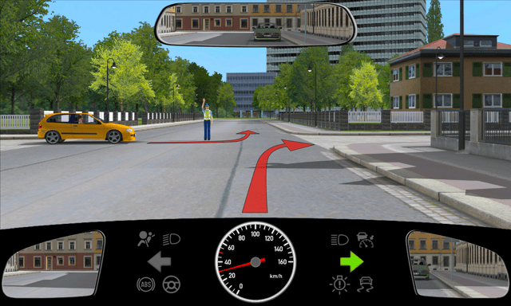

**Options:**
- A. The yellow car must leave the crossroads
- B. I must get ready to proceed
- C. I can turn now

**Correct Answer(s):**
- A. The yellow car must leave the crossroads
- B. I must get ready to proceed

**Explanation:**
The police officer gives the traffic instructions by his body position and with specific arm movements. A raised arm means: The drivers waiting at the intersection are not allowed to continue driving, previously locked drivers should prepare for the onward journey. For this, the policeman spreads his arms from the body or puts them on the body, depending on the instructions. If the police officer stands with his chest to the driver, the driver must stop. If the police officer stands sideways and the driver sees his profile, the driver may continue driving at a moderate speed.

---

#### Question 1.2.36-005-B

**Points:** 4 Points

**What is correct?**

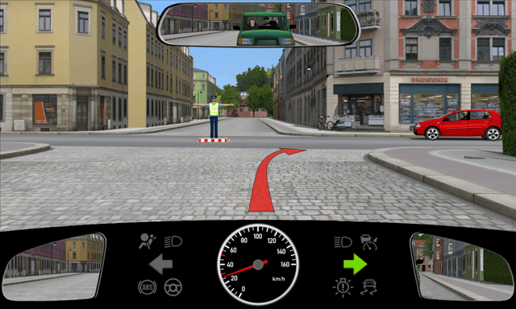

**Options:**
- A. Wait at the crossroads
- B. Turn without stopping

**Correct Answer(s):**
- A. Wait at the crossroads

**Explanation:**
The police officer regulates traffic by the help of body gestures. A transversely outstretched arm to the engine means you have to stop at the intersection. If the officer stands with his chest looking towards you, your direction of travel is locked. With two outstretched arms or arms pressed to the body, he can release the direction of travel. If the policeman is standing sideways towards you and you can see his profile, you are allowed to drive slowly. If his arm is stretched upwards, you have to stop and if the traffic is closed, you may continue driving soon. Vehicles in an intersection must leave.

---

#### Question 1.2.36-006-B

**Points:** 4 Points

**What is correct?**

**Options:**
- A. Cross the crossroads at a brisk pace
- B. Wait at the crossroads for further instructions from the police officer

**Correct Answer(s):**
- A. Cross the crossroads at a brisk pace

**Explanation:**
The car driver, who sees the policeman from the side, can cross the intersection. He/she can drive through the intersection without stopping because the policeman has cleared the direction of travel for him/her. It is not necessary for the policeman to spread his arms.

---

#### Question 1.2.36-007

**Points:** 3 Points

**In your rear-view mirror, you see the words "STOP POLIZEI" (Stop Police) in red illuminated letters on the roof of a police car immediately behind your car. Who does this apply to?**

**Options:**
- A. To you only
- B. To all following vehicles
- C. To all vehicles on the road

**Correct Answer(s):**
- A. To you only

**Explanation:**
Since the request is displayed to the front and you are directly front of the police car, the request is addressed to you. You are required by law to follow the instructions from police officers.

---

#### Question 1.2.36-008

**Points:** 3 Points

**The words "BITTE FOLGEN" (PLEASE FOLLOW) are illuminated on a police car immediately preceding your car. What does this mean?**

**Options:**
- A. Only you must follow the police car
- B. All cars driving in the same direction must follow the police car
- C. Only heavy goods transports must follow the police car

**Correct Answer(s):**
- A. Only you must follow the police car

**Explanation:**
Policemen are allowed to stop car drivers to carry out traffic checks and to check their ability to drive. The request to stop can be made through the PLEASE FOLLOW sign on the police vehicle in front of you. By law, you must comply with this directive.

---

#### Question 1.2.36-011

**Points:** 3 Points

**You are overtaken by a police vehicle, which pulls in immediately in front of you. The words "BITTE FOLGEN" (PLEASE FOLLOW) appear illuminated in red on the roof. What should you do?**

**Options:**
- A. - follow the police vehicle
- B. - stop if the police vehicle stops
- C. - allow the engine to continue running once I have stopped

**Correct Answer(s):**
- A. - follow the police vehicle
- B. - stop if the police vehicle stops

**Explanation:**
The signal "PLEASE FOLLOW" always applies to the driver directly behind the police car. So, you have to follow the instructions of the police, drive after the officers and stop behind the police car as soon as it stops.

---

#### Question 1.2.36-012

**Points:** 3 Points

**You are overtaken by a police vehicle, which pulls in immediately in front of you. The words "BITTE FOLGEN" (PLEASE FOLLOW) appear illuminated in red on the roof. To whom does this apply?**

**Options:**
- A. To me
- B. To all vehicles in my lane
- C. For police and rescue vehicles following behind

**Correct Answer(s):**
- A. To me

**Explanation:**
The signal "PLEASE FOLLOW" on a police car applies to the vehicle immediately behind the police, in this case for you. The police may stop you for traffic control. Follow the police vehicle and stop when it stops.

---

#### Question 1.2.36-013

**Points:** 3 Points

**A police signalling disc is displayed towards you from a vehicle driving in front of you. What does this mean?**

**Options:**
- A. I have to follow the vehicle until it stops
- B. I may not overtake the vehicle
- C. I have to turn in the direction indicated

**Correct Answer(s):**
- A. I have to follow the vehicle until it stops
- B. I may not overtake the vehicle

**Explanation:**
Basically, the driver who drives directly behind the police car has to follow the signal given by the police. If this is recognizable, the police signaling disc may also apply to drivers in front. You must not overtake the police car and you have to follow it.

---

#### Question 1.2.36-014-M

**Points:** 4 Points

**What is the right course of action now?**

**Options:**
- A. I cross over the junction carefully
- B. I wait outside of the junction for further instructions from the police officer
- C. I let [the blue vehicle] move first

**Correct Answer(s):**
- A. I cross over the junction carefully

**Explanation:**
The police officer is hierarchically first in the right-of-way. Basic rule "right before left", traffic signs and light signals have no effect at this moment. Nevertheless, be attentive because other road users could still behave incorrectly.

---

#### Question 1.2.36-015-M

**Points:** 4 Points

**Who has priority here?**

**Options:**
- A. The [red] car
- B. The motorbike
- C. Me

**Correct Answer(s):**
- A. The [red] car

**Explanation:**
The traffic is regulated by the police so that the red car is allowed to drive first.

---

#### Question 1.2.36-016-M

**Points:** 4 Points

**What is the right thing to do in this situation?**

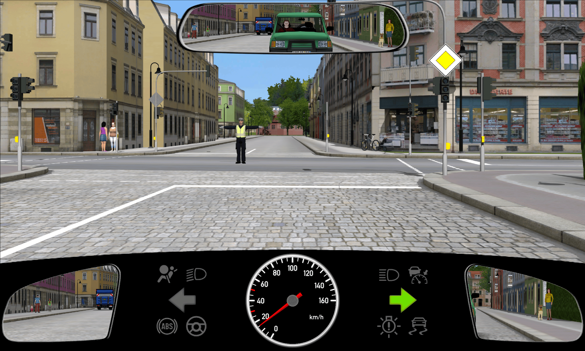

**Options:**
- A. - wait before the junction
- B. - without waiting, turn right
- C. - turn round

**Correct Answer(s):**
- A. - wait before the junction

**Explanation:**
If a traffic police officer is directing traffic, the instructions must be followed. 
In this situation, the traffic policeman stands in front of you, facing you and with his arms outstretched. This means that you have to wait at the intersection and vehicles from the right and left have the right of way.

---

#### Question 1.2.36-101-B

**Points:** 4 Points

**What applies here?**

**Options:**
- A. The crossroads may be crossed
- B. You must wait for further signals from the police officer before the crossroads may be entered
- C. Turning off is prohibited

**Correct Answer(s):**
- A. The crossroads may be crossed

**Explanation:**
The traffic policeman's gesture dictates the behavior in traffic. If the officer stands lengthways to your direction of travel and you can see his profile, you can continue and turn right. Right-turning drivers should cross the intersection quickly, as long as no pedestrian or cyclist approaches them. If you want to turn left, enter the intersection to ensure undisturbed traffic flow and wait for the policeman's instructions.

---

### 1.2.37 Chapter Variable And Steady Light Signals

#### Question 1.2.37-002-B

**Points:** 4 Points

**Which conduct is right?**

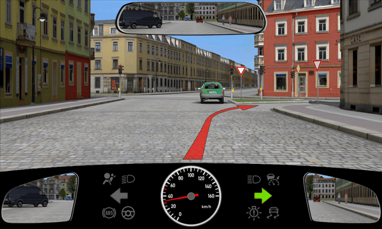

**Options:**
- A. The green car must wait
- B. I may turn observing the traffic signs
- C. I may only turn when the lights show "green"

**Correct Answer(s):**
- A. The green car must wait
- B. I may turn observing the traffic signs

**Explanation:**
The traffic light system regulates the right of way for the traffic moving straight ahead. The turning lane on the left does not have its own traffic light. When turning left, you must therefore enter the intersection area and wait until a gap in the oncoming straight traffic allows you to pass. On the lane previously branching off for right-turning drivers, the traffic sign applies instead of the traffic light. Note the cross traffic when turning.

---

#### Question 1.2.37-004-B

**Points:** 4 Points

**The traffic lights are on flashing amber. What is the correct procedure?**

**Options:**
- A. Approach with greater caution, giving way if necessary
- B. Wait until the lights change

**Correct Answer(s):**
- A. Approach with greater caution, giving way if necessary

**Explanation:**
The yellow flashing light indicates that the traffic light is out of order. Instead, the traffic signs are valid that regulate the right of way and you must give priority here. Without traffic signs, the rule "left yields to right" applies.

---

#### Question 1.2.37-007

**Points:** 4 Points

**What is permitted at these traffic lights with green arrow sign?**

**Options:**
- A. Turn right from the right lane after having stopped first, when there is no obstruction or danger to others
- B. Turn right without stopping
- C. Turn right only when the traffic lights are green

**Correct Answer(s):**
- A. Turn right from the right lane after having stopped first, when there is no obstruction or danger to others

**Explanation:**
The additional sign with green arrow on a black background allows you to turn right after stopping at the red traffic light. Despite the additional sign, the car driver has to make sure that the cross traffic is not endangered. This includes pedestrians and cyclists. Turning is permitted only on the right lane and may only be performed after stopping and ensuring that you can turn safely.

---

#### Question 1.2.37-009

**Points:** 4 Points

**At these traffic lights with a green arrow sign, where should a vehicle stop before turning right?**

**Options:**
- A. At the stop line
- B. Before the crossing or junction if there is no stop line
- C. There is no need to stop

**Correct Answer(s):**
- A. At the stop line
- B. Before the crossing or junction if there is no stop line

**Explanation:**
The car driver has to stop at the stop line. If none exists, then he has to stop in any case before the intersection or T-junction. If the traffic situation allows it, turning to the right is also possible when the traffic light is red. A right-turning driver should behave just as he does with a stop sign, when the traffic light is red. The right of way of the cross traffic must be considered and granted.

---

#### Question 1.2.37-010-M

**Points:** 4 Points

**How should you behave in this situation?**

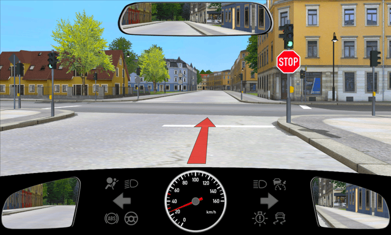

**Options:**
- A. Pass through the crossing without stopping
- B. Stop on the line of sight
- C. Stop on the stop line

**Correct Answer(s):**
- A. Pass through the crossing without stopping

**Explanation:**
The traffic light has priority over other traffic signs and lane markings. Cross the intersection without stopping, as long as the traffic light is green.

---

#### Question 1.2.37-011-M

**Points:** 4 Points

**Where must you wait?**

**Options:**
- A. At the stop line
- B. At the point where you can see along the intersecting road (sight line)
- C. Level with the traffic lights

**Correct Answer(s):**
- A. At the stop line

**Explanation:**
A traffic light in operation has priority over traffic signs, which regulate the right of way. Also, if there is a stop line, stop there and wait until you are allowed to continue.

---

#### Question 1.2.37-012-M

**Points:** 4 Points

**What is correct in this situation?**

**Options:**
- A. Traffic turning right may proceed
- B. Traffic continuing ahead may proceed
- C. Traffic turning left may proceed

**Correct Answer(s):**
- A. Traffic turning right may proceed

**Explanation:**
If a traffic light turns red, car drivers who want to drive straight ahead or to the left must stop and wait. If there is an additional traffic light with a glowing green arrow pointing to the right, it is allowed to continue driving and to turn right. A traffic light without additional traffic lights or arrows, however, is valid for all directions.

---

#### Question 1.2.37-013

**Points:** 5 Points

**What should you do?**

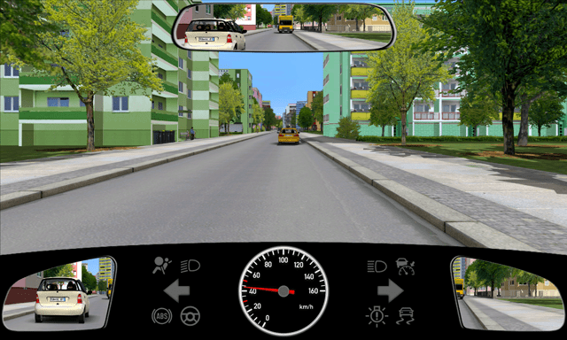

[Video: videos/1_2_37-013.mp4](videos/1_2_37-013.mp4)

**Options:**
- A. Continue driving
- B. Slow down

**Correct Answer(s):**
- A. Continue driving

**Explanation:**
The traffic light switches from green to yellow directly in front of you. Your speed is 45 km/h. So, you're too fast in order to slow down and stop in front of the traffic light. There is also a truck behind you, which could hit you while doing an abrupt braking maneuver. Drive on briskly.

---

#### Question 1.2.37-015

**Points:** 4 Points

**What is correct in this situation?**

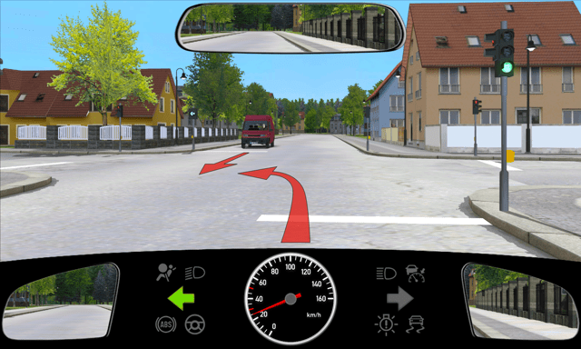

**Options:**
- A. I may turn unimpeded
- B. I must allow the oncoming traffic to pass through
- C. I have to wait in the centre of the junction

**Correct Answer(s):**
- A. I may turn unimpeded

**Explanation:**
Basically, when turning left, you as a car driver have to grant the oncoming traffic right of way. Since in this situation, the green arrow lights on the opposite street corner, you can assume that the traffic light for the oncoming traffic is red. So, you can turn.

---

#### Question 1.2.37-016

**Points:** 4 Points

**You want to turn right at these traffic lights with a green arrow sign. What is the right course of action?**

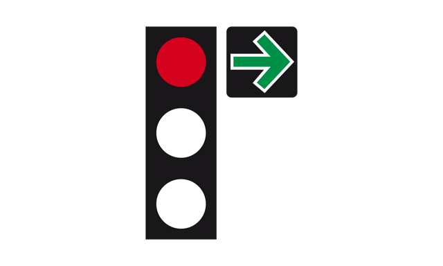

**Options:**
- A. I stop before the junction
- B. I have to ensure that other road users are not impeded
- C. I may turn right into any lane

**Correct Answer(s):**
- A. I stop before the junction
- B. I have to ensure that other road users are not impeded

**Explanation:**
Thanks to the green arrow sign, you can turn at this traffic light even when it's red. To do this, merge right and come to a brief stop in front of the traffic light. Afterwards, make sure that you do not obstruct or endanger other road users. Also note that cross traffic still has priority.

---

#### Question 1.2.37-017

**Points:** 5 Points

**What should you do?**

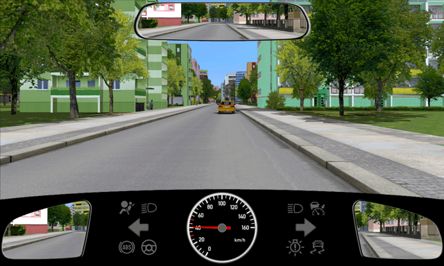

[Video: videos/1_2_37-017.mp4](videos/1_2_37-017.mp4)

**Options:**
- A. Slow down
- B. Continue driving

**Correct Answer(s):**
- A. Slow down

**Explanation:**
In front of you you see a traffic light changing from green to yellow. You drive at 40 km/h. Since you are still far enough from the traffic lights, you have to slow down.

---

#### Question 1.2.37-018

**Points:** 4 Points

**What is the right course of action now?**

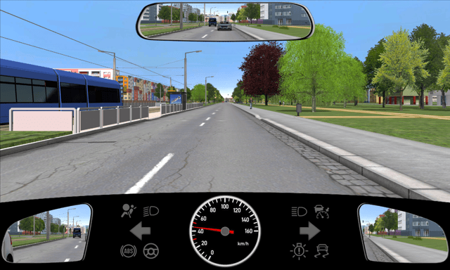

[Video: videos/1_2_37-018.mp4](videos/1_2_37-018.mp4)

**Options:**
- A. I allow any cross traffic the right of way
- B. I wait at the stop line for the next set of green lights
- C. I drive through the junction quickly, because "yellow" is displayed

**Correct Answer(s):**
- A. I allow any cross traffic the right of way

**Explanation:**
If the yellow traffic light flashes, the traffic light system is out of operation. Then the general right of way applies. You are not on a priority road; therefore, possible cross traffic has the right of way.

---

#### Question 1.2.37-019

**Points:** 2 Points

**Under what circumstances may you cross a junction during a red light?**

**Options:**
- A. To carefully afford space to an emergency vehicle with a blue flashing light and siren sounding
- B. If there is a police officer on the junction directing traffic
- C. Under no circumstances

**Correct Answer(s):**
- A. To carefully afford space to an emergency vehicle with a blue flashing light and siren sounding
- B. If there is a police officer on the junction directing traffic

**Explanation:**
You are allowed to run over a red traffic light at an intersection under the following circumstances: If you want to carefully give way to an emergency vehicle with a blue flashing light and an emergency horn or if a police officer is regulating the traffic at the intersection.

---

#### Question 1.2.37-020-M

**Points:** 4 Points

**You now want to turn right at these traffic lights with a green arrow sign. What is the right course of action?**

**Options:**
- A. I initially halt at the stop line
- B. I ensure that other road users are not impeded
- C. Without stopping, I take the turn at walking speed

**Correct Answer(s):**
- A. I initially halt at the stop line
- B. I ensure that other road users are not impeded

**Explanation:**
If there is a green arrow sign at a traffic light, you are allowed to cross a red light if you have stopped at the stop line first. You may turn if there is no risk of obstructing or endangering other road users.

---

#### Question 1.2.37-021

**Points:** 3 Points

**What is the rule at this traffic-light-controlled junction with additional signage?**

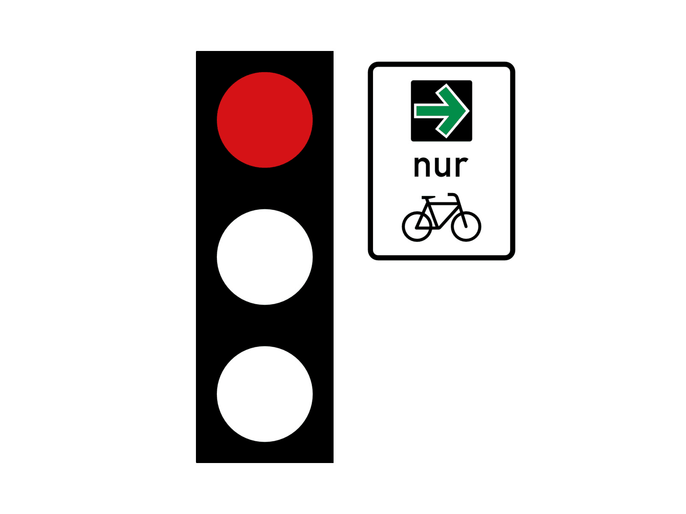

**Options:**
- A. - cyclists are permitted to turn right, even when the light is showing red
- B. - motor vehicles are permitted to turn right, even when the light is showing red
- C. - cyclists must turn right

**Correct Answer(s):**
- A. - cyclists are permitted to turn right, even when the light is showing red

**Explanation:**
On traffic lights with this additional sign, only cyclists, even at red, can turn to the right.

---

#### Question 1.2.37-022-M

**Points:** 3 Points

**The traffic lights facing you have already been “green” for some time now. What is the right course of action now?**

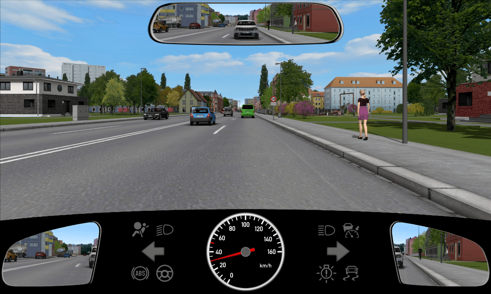

[Video: videos/1_2_37-022-M.mp4](videos/1_2_37-022-M.mp4)

**Options:**
- A. I continue driving, ready to brake because the traffic lights could change to “amber”
- B. I watch the traffic lights closely
- C. I accelerate to ensure that I can still safely pass through the junction while the traffic lights are “green”

**Correct Answer(s):**
- A. I continue driving, ready to brake because the traffic lights could change to “amber”
- B. I watch the traffic lights closely

**Explanation:**
As the traffic light has been green for some time, there is a high probability that it will change to yellow at any moment. Keep driving, ready to brake, because you will have to stop if it switches to yellow. You must not speed up, as a maximum of 30 km/h is permitted.

---

#### Question 1.2.37-101

**Points:** 4 Points

**You want to turn left and the lights are "green". On your left there is a tram wanting to proceed straight ahead. What is correct?**

**Options:**
- A. You must wait
- B. The tram must wait
- C. You must come to an agreement since there are no rules for this

**Correct Answer(s):**
- A. You must wait

**Explanation:**
Although you are allowed to drive, due to the green light, you have to grant the tram the right of way, as it continues straight ahead. You should therefore only enter the intersection halfway and let oncoming vehicles pass before turning left.

---

#### Question 1.2.37-102-B

**Points:** 4 Points

**You have taken the right lane by mistake although you want to turn left. How are you allowed to proceed?**

**Options:**
- A. Straight ahead
- B. To the right
- C. To the left when the traffic lights are "green"

**Correct Answer(s):**
- A. Straight ahead
- B. To the right

**Explanation:**
Due to the solid line, you must not change the lane here. Follow only the arrows on your lane. Turning left from this lane would be prohibited and would endanger or at least hinder other drivers.

---

#### Question 1.2.37-104

**Points:** 4 Points

**What is the right behaviour now?**

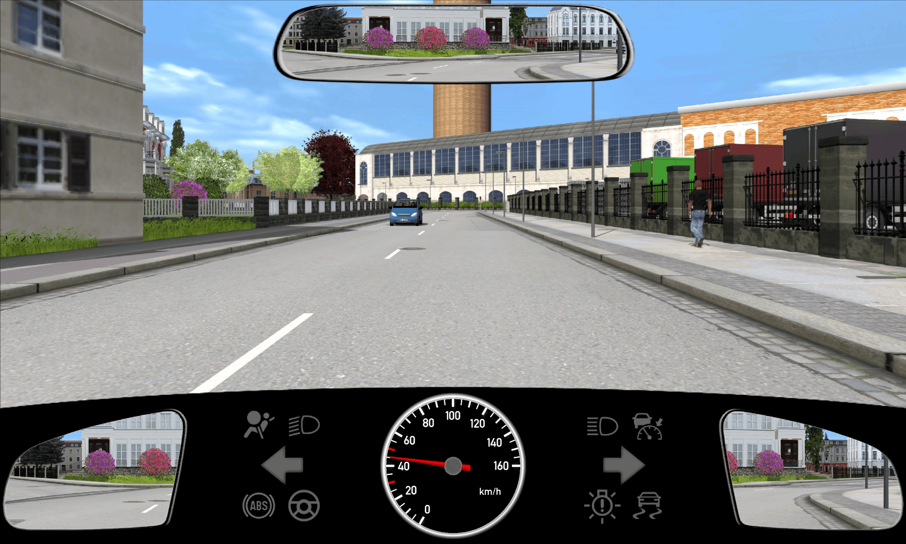

[Video: videos/1_2_37-104.mp4](videos/1_2_37-104.mp4)

**Options:**
- A. - off now
- B. - off only when the lorry drives on
- C. - off only when my light is green

**Correct Answer(s):**
- A. - off now

**Explanation:**
Since this situation is a two-phase traffic light, there is no green signal. After the red light is off, you can catch up with the truck. If there was no space left behind the truck to the exit on the right, you would have to wait at the traffic lights until there was enough space to stop.

---

#### Question 1.2.37-201-M

**Points:** 4 Points

**What is the right course of action now?**

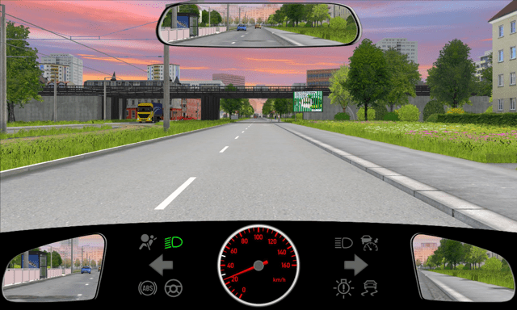

[Video: videos/1_2_37-201-M.mp4](videos/1_2_37-201-M.mp4)

**Options:**
- A. I allow any cross traffic the right of way
- B. I wait at the stop line for the next set of green lights
- C. I drive through the junction quickly, because "yellow" is displayed

**Correct Answer(s):**
- A. I allow any cross traffic the right of way

**Explanation:**
The traffic lights are out of order, therefore the right-of-way traffic signs apply. You must give way.

---

### 1.2.38 Chapter Blue Flashing Light And Yellow Flashing Light

#### Question 1.2.38-001

**Points:** 4 Points

**A vehicle with flashing blue light and siren is approaching. What do you do?**

**Options:**
- A. Clear the way for the vehicle
- B. Drive carefully onto the pavement if necessary
- C. At all events, brake hard and stop

**Correct Answer(s):**
- A. Clear the way for the vehicle
- B. Drive carefully onto the pavement if necessary

**Explanation:**
A blue flashing light and siren are used in emergency situations such as car accidents or house fires. For this reason, you have to clear a passage for the emergency vehicles as fast as you can. Therefore, slowly reduce your speed and drive to the right edge of the road. If necessary, drive on the sidewalk and stay there.

---

#### Question 1.2.38-002

**Points:** 4 Points

**You hear a siren. Which questions must you ask yourself?**

**Options:**
- A. Where is the emergency vehicle coming from?
- B. Could I obstruct the emergency vehicle?
- C. Is this vehicle allowed to use a siren at all?

**Correct Answer(s):**
- A. Where is the emergency vehicle coming from?
- B. Could I obstruct the emergency vehicle?

**Explanation:**
If you hear a siren, you should first determine which direction the emergency vehicle is coming from. Then you have to consider where you can go, without hindering the emergency vehicle from continuing and without endangering yourself.

---

#### Question 1.2.38-003

**Points:** 3 Points

**What can a flashing amber light on a vehicle be a warning for?**

**Options:**
- A. For dangers at roadworks or the scene of an accident
- B. For an exceptionally wide vehicle
- C. For a large transport proceeding at low speed

**Correct Answer(s):**
- A. For dangers at roadworks or the scene of an accident
- B. For an exceptionally wide vehicle
- C. For a large transport proceeding at low speed

**Explanation:**
A yellow flashing light warns against dangers that require particularly careful driving behavior. These hazards are work or accident sites or unusually slow, wide or long vehicles.

---

#### Question 1.2.38-101

**Points:** 3 Points

**What does it mean when the flashing blue light of a vehicle is switched on but not the siren?**

**Options:**
- A. Warning of an accident or other dangers
- B. Warning of fire-brigade in action
- C. A breakdown vehicle is on duty and on its way to its destination

**Correct Answer(s):**
- A. Warning of an accident or other dangers
- B. Warning of fire-brigade in action

**Explanation:**
A blue flashing light warns you of accidents or situations such as a fire run. Any driver should allow vehicles with blue flashing lights to pass through, as this may indicate an emergency, vehicle escort or a platoon.

---

#### Question 1.2.38-102

**Points:** 3 Points

**What can a flashing blue light (without siren) mean?**

**Options:**
- A. The vehicle is on duty. You should give way
- B. Advance warning of a closed convoy
- C. Without a siren, a flashing blue light does not mean anything

**Correct Answer(s):**
- A. The vehicle is on duty. You should give way
- B. Advance warning of a closed convoy

**Explanation:**
A blue flashing light without siren indicates to accidents or other emergencies - so you should allow free passage here as well. Blue light is also used during blue light driving. It can also be used to secure platoons.

---

#### Question 1.2.38-104

**Points:** 4 Points

**You are being followed by an ambulance with its blue lights flashing and siren sounding. What should you do?**

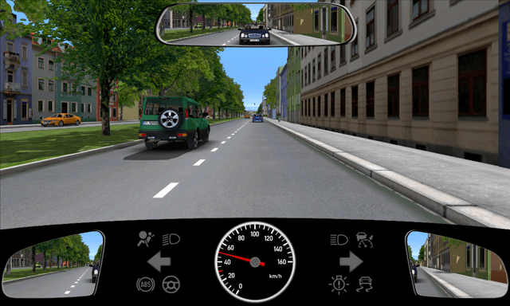

[Video: videos/1_2_38-104.mp4](videos/1_2_38-104.mp4)

**Options:**
- A. I move out of the way immediately without endangering others
- B. I prompt the driver of the vehicle beside me to make way
- C. I make way immediately once the traffic light has turned green

**Correct Answer(s):**
- A. I move out of the way immediately without endangering others

**Explanation:**
You are required to make space for the ambulance as soon as possible. Be careful not to endanger other road users. If possible, turn right if you are on a right lane; on the highway and multi-lane roads an alley must be formed.

---

## Theme 1.3. Priority

### 1.3.01 Chapter Priority

#### Question 1.3.01-001

**Points:** 5 Points

**At which places where there are no traffic signs regulating priority does the rule "right before left" apply?**

**Options:**
- A. At crossroads and junctions
- B. At driveways
- C. At the end of a traffic calmed area

**Correct Answer(s):**
- A. At crossroads and junctions

**Explanation:**
At intersections and T-junctions without a traffic-regulating traffic sign "left yields to right" applies. If a vehicle leaves a property or a restricted traffic area, all other road users, including pedestrians and children on the sidewalk, have priority.

---

#### Question 1.3.01-002

**Points:** 5 Points

**At which places where there are no traffic signs regulating priority does the rule "right before left" apply?**

**Options:**
- A. At crossroads and junctions
- B. At junctions with sunken kerbstone
- C. At junctions of farm tracks or forest tracks with other roads

**Correct Answer(s):**
- A. At crossroads and junctions

**Explanation:**
At intersections and T-junctions without priority signs, the vehicles coming from the right have priority. The same applies to roads that are equally ranked according to their signage. Lanes with drop kerb, drives as well as field and forest trails are an exception. If you are on one of these roads, you must give priority to other road users.

---

#### Question 1.3.01-003

**Points:** 5 Points

**You are approaching a crossroads where the priority situation is not clear to you straightaway. What do you do?**

**Options:**
- A. Wait, observe and come to an agreement with others, if necessary
- B. Proceed according to the rule "right before left"
- C. Always proceed when driving straight ahead

**Correct Answer(s):**
- A. Wait, observe and come to an agreement with others, if necessary

**Explanation:**
There are situations that are difficult to understand in terms of the right of way. If this happens to you wait and watch other car drivers. If the situation remains difficult, you can communicate with each other by clear hand signals. To simply continue straight ahead or act according to the rule "left yields to right" would be too risky and accident-prone.

---

#### Question 1.3.01-007-M

**Points:** 5 Points

**What is the right course of action?**

**Options:**
- A. I have to allow the cyclist to pass through
- B. I have to allow the [motorcyclist] to pass through
- C. I may make the turn before the cyclist

**Correct Answer(s):**
- A. I have to allow the cyclist to pass through
- B. I have to allow the [motorcyclist] to pass through

**Explanation:**
It is necessary to comply to the left yields to right rule. Grant the motorcyclist from the right the right of way before entering the intersection. Next, you as a left-turning driver, have to give priority to the oncoming cyclist. For the motorcyclist the cyclist comes from the right and thus has priority.

---

#### Question 1.3.01-013-M

**Points:** 5 Points

**What is the right course of action?**

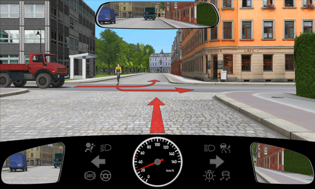

**Options:**
- A. I may be the first to pass through the junction
- B. I have to allow the [red truck] to turn
- C. I have to allow the [cyclist] to turn

**Correct Answer(s):**
- A. I may be the first to pass through the junction

**Explanation:**
Left yields to right applies in intersections and T-junctions without a traffic sign. Since no vehicle comes from the right, you may first cross the intersection. After that the truck drives and finally the cyclist.

---

#### Question 1.3.01-016-M

**Points:** 5 Points

**What is the right course of action?**

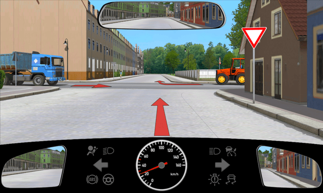

**Options:**
- A. I have to allow the [blue truck] to pass through
- B. I have to allow the [tractor] to turn
- C. The [blue truck] has to allow me to pass through

**Correct Answer(s):**
- A. I have to allow the [blue truck] to pass through
- B. I have to allow the [tractor] to turn

**Explanation:**
The traffic sign "Give way" regulates the right of way here. That means you have to wait and let both, the right and left vehicle, pass.

---

#### Question 1.3.01-017-M

**Points:** 5 Points

**What is the right course of action?**

**Options:**
- A. I have to allow the [motorcycle] to pass through
- B. I take priority before [the bus]
- C. I have to allow [the bus] to pass through

**Correct Answer(s):**
- A. I have to allow the [motorcycle] to pass through
- B. I take priority before [the bus]

**Explanation:**
Here the traffic sign "right of way at the next intersection or T-junction" applies. Since you want to turn left you will have to let the oncoming vehicle pass. You may then turn in front of the vehicle coming from the right.

---

#### Question 1.3.01-018-M

**Points:** 5 Points

**What is the right course of action?**

**Options:**
- A. I have to allow [the motorcycle] to pass through
- B. I take priority before the [bus]
- C. I have to allow the [bus] to pass through

**Correct Answer(s):**
- A. I have to allow [the motorcycle] to pass through
- B. I take priority before the [bus]

**Explanation:**
The traffic sign "Give way" suspends the left yields to right regulation. Thus, the motorcycle coming from the left has priority. You have to wait. Then the left-turning driver of the oncoming traffic must first let you cross the intersection before he can turn.

---

#### Question 1.3.01-021-M

**Points:** 5 Points

**What is the right course of action?**

**Options:**
- A. - only turn after the [motorcycle]
- B. - turn before the [yellow car]
- C. - be the first to make my turn

**Correct Answer(s):**
- A. - only turn after the [motorcycle]
- B. - turn before the [yellow car]

**Explanation:**
The traffic sign stands for a "priority road". You may therefore turn in front of the vehicle coming from the left. First, however, you must let the oncoming vehicle turn, because you have to wait as a left-turning driver.

---

#### Question 1.3.01-034-M

**Points:** 5 Points

**What is the right course of action here?**

**Options:**
- A. I allow [the yellow vehicle] to pass through
- B. I take the turn ahead of the [yellow vehicle]
- C. I take the turn ahead of the [red] car

**Correct Answer(s):**
- A. I allow [the yellow vehicle] to pass through

**Explanation:**
The right-of-way rule says that you have to let the yellow vehicle drive through.

---

#### Question 1.3.01-035-M

**Points:** 5 Points

**What is the right thing to do?**

**Options:**
- A. I give way to the [green car]
- B. I turn left before the [green car]
- C. I have to allow the [red car] to pass

**Correct Answer(s):**
- A. I give way to the [green car]

**Explanation:**
Since there are no signs at this intersection, which determine the priority of the drivers, the right of way "left yields to right" applies. For this reason, you need to let the car on your right pass first. Afterwards, the driver on the left has to give you the right of way.

---

#### Question 1.3.01-038-M

**Points:** 5 Points

**What is the right thing to do?**

**Options:**
- A. I have to give way to the motorcycle
- B. I have to give way to the [blue car]
- C. I may drive out before the [blue car]

**Correct Answer(s):**
- A. I have to give way to the motorcycle
- B. I have to give way to the [blue car]

**Explanation:**
According to the signage, the motorcyclist is on the priority road and is therefore allowed to drive first. Both the driver of the blue car and you are on a lane with the "Give way" sign. As this does not clear up the situation, "left yields to right" applies. For this reason, you have to let the other vehicle drive through.

---

#### Question 1.3.01-039-M

**Points:** 5 Points

**Who has priority here?**

**Options:**
- A. The electric scooter
- B. [The red truck]
- C. Me

**Correct Answer(s):**
- A. The electric scooter

**Explanation:**
The electric scooter follows the priority road and therefore has the right of way.

---

#### Question 1.3.01-040-M

**Points:** 5 Points

**What is the right course of action here?**

**Options:**
- A. The [green] car may proceed ahead of the [red] car
- B. I may proceed ahead of the [red] car
- C. I may proceed ahead of the [green] car

**Correct Answer(s):**
- A. The [green] car may proceed ahead of the [red] car

**Explanation:**
The green and red cars are on a turning main road. You are on the secondary road. The green car remains on the main road, which means that the green car is allowed to drive first, then the red car and you are allowed to drive last.

---

#### Question 1.3.01-041-M

**Points:** 5 Points

**What is the right course of action here?**

**Options:**
- A. I may proceed ahead of the [red car]
- B. [The yellow car] may proceed ahead of the [red car]
- C. I may proceed ahead of the [yellow car]

**Correct Answer(s):**
- A. I may proceed ahead of the [red car]
- B. [The yellow car] may proceed ahead of the [red car]

**Explanation:**
You and the yellow car are on a turning main road. The red car is on a secondary road. 
Because the yellow car remains on the main road, it is allowed to drive first. You may drive second and the red car can drive last.

---

#### Question 1.3.01-042-M

**Points:** 5 Points

**What is the right course of action?**

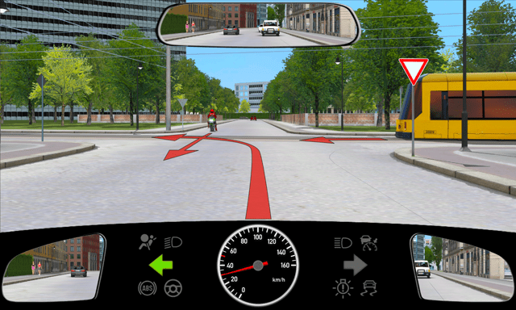

**Options:**
- A. I have to allow the tram to pass through
- B. I have to allow the [motorcycle] to pass through
- C. The tram must allow me to make the turn first

**Correct Answer(s):**
- A. I have to allow the tram to pass through
- B. I have to allow the [motorcycle] to pass through

**Explanation:**
The sign at the intersection indicates that you must give way. Since you want to turn left, you must let the tram as well as the oncoming motorbike pass and enter the intersection last.

---

#### Question 1.3.01-043-M

**Points:** 5 Points

**What is the right course of action here?**

**Options:**
- A. The motorbike may proceed ahead of the [yellow car]
- B. I may proceed ahead of the [yellow car]
- C. I may proceed ahead of the [motorbike]

**Correct Answer(s):**
- A. The motorbike may proceed ahead of the [yellow car]
- B. I may proceed ahead of the [yellow car]

**Explanation:**
The motorbike is on a turning main road and is allowed to turn in front of the yellow car and you.
According to the "right before left" rule at crossroads, you may drive in front of the yellow car.

---

#### Question 1.3.01-044-M

**Points:** 5 Points

**What is the right course of action here?**

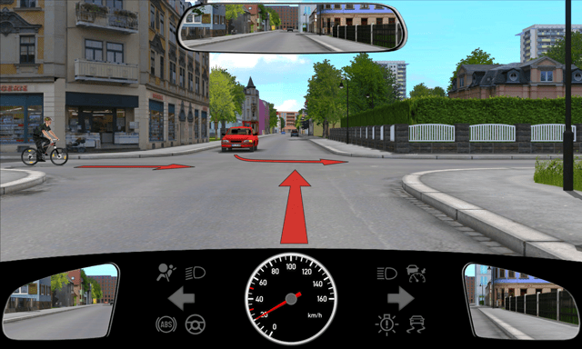

**Options:**
- A. I may be the first to proceed
- B. I have to allow [the red car] to turn
- C. I have to allow [the cyclist] to pass through

**Correct Answer(s):**
- A. I may be the first to proceed

**Explanation:**
At this intersection applies to the right before left. So you can drive first.
"Right before left" applies to intersections where the right of way is not regulated by signs, traffic lights or traffic police officers.

---

#### Question 1.3.01-045-M

**Points:** 5 Points

**What is the right course of action here?**

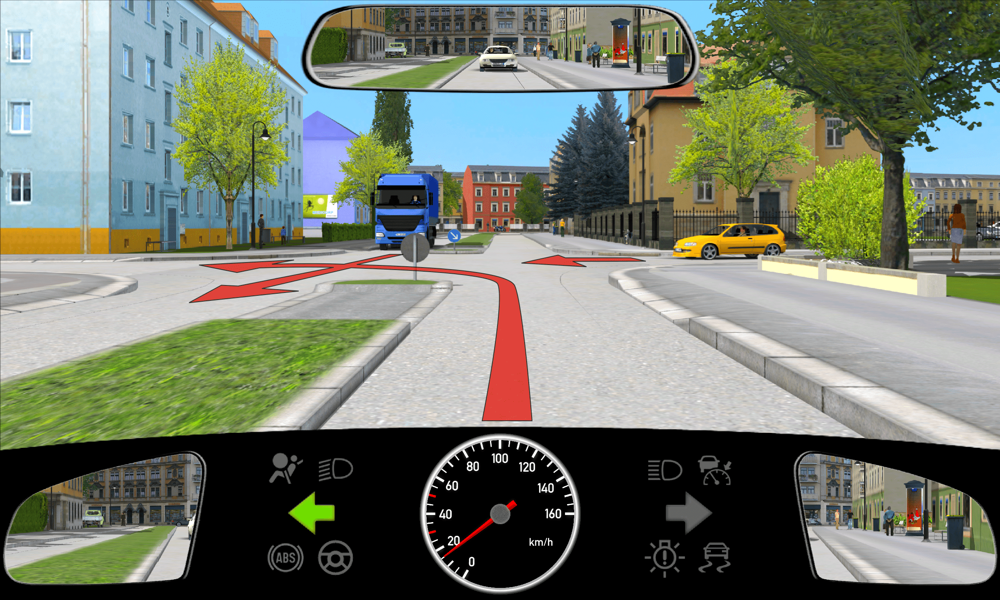

**Options:**
- A. I have to allow the [yellow car] to pass through
- B. I have to allow the [blue truck] to pass through
- C. I may proceed before the [yellow car]

**Correct Answer(s):**
- A. I have to allow the [yellow car] to pass through
- B. I have to allow the [blue truck] to pass through

**Explanation:**
At this junction, the right before left rule applies, which means that you must let the yellow vehicle pass.
You must also let the lorry through, as you want to turn left and the lorry wants to continue straight ahead in its lane.

---

#### Question 1.3.01-046-M

**Points:** 5 Points

**What is the right course of action?**

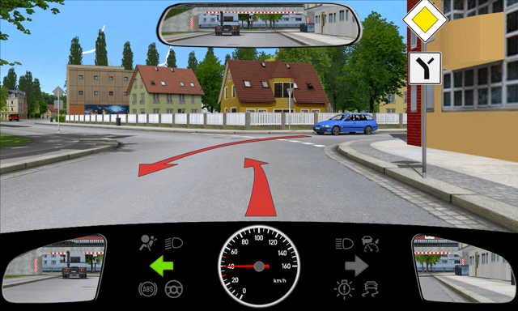

**Options:**
- A. I may drive through
- B. I have to allow [the blue car] to pass through

**Correct Answer(s):**
- A. I may drive through

**Explanation:**
You are on the turning priority road and follow its course. Therefore, you must drive first and the other vehicle must wait.

---

#### Question 1.3.01-047-M

**Points:** 5 Points

**What is the right course of action here?**

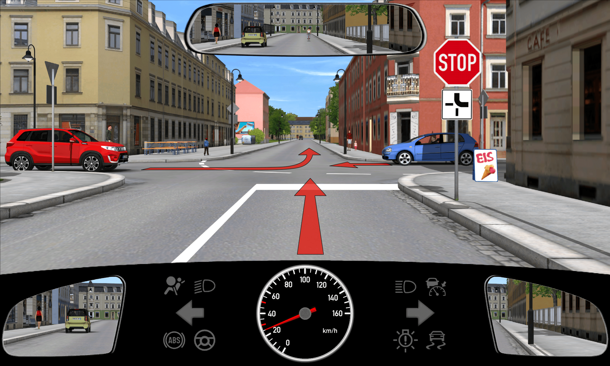

**Options:**
- A. - allow [the blue car] to pass through
- B. - stop on the stop line
- C. - allow [the red car] to pass through

**Correct Answer(s):**
- A. - allow [the blue car] to pass through
- B. - stop on the stop line

**Explanation:**
You are approaching a priority road that is about to turn. As you are coming from a side road, you must allow the blue car leaving the priority road to pass. You must also stop at a stop sign at the stop line before you are allowed to enter the junction.

---

#### Question 1.3.01-048-M

**Points:** 5 Points

**What is the right course of action?**

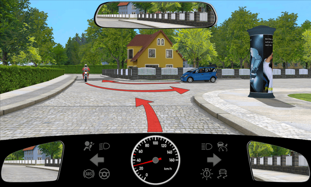

**Options:**
- A. I allow [the blue car] to turn
- B. I am the first to proceed
- C. I allow the motorcycle to turn before me

**Correct Answer(s):**
- A. I allow [the blue car] to turn

**Explanation:**
At an intersection, which has no traffic signs, "left yields to right" applies. If a car drives from the right wants to turn right, he is allowed to drive first and you have to wait. On the other hand, if a vehicle approaching you wants to turn left, you have the right of way, because if a driver wants to turn, must always give priority to oncoming traffic.

---

#### Question 1.3.01-049-M

**Points:** 5 Points

**What is the right course of action?**

**Options:**
- A. I may be the first to proceed
- B. I have to give way to the [red car]
- C. I have to give way to the tram

**Correct Answer(s):**
- A. I may be the first to proceed

**Explanation:**
The traffic sign indicates that you are on a priority road. The tram and the driver of the red car, on the other hand, must follow the sign "Give way" and wait. You drive first.

---

#### Question 1.3.01-050-M

**Points:** 5 Points

**What is the right course of action?**

**Options:**
- A. I may drive through
- B. I have to allow right of way to [the blue car]
- C. I have to allow right of way to [the green car]

**Correct Answer(s):**
- A. I may drive through

**Explanation:**
If you are traveling on a priority road, you are always allowed to drive first. A car that meets you and wants to turn left, however, has to wait. If a car driver wants to turn into your street from the right, he/she must also give you the right of way, since you are on a priority road.

---

#### Question 1.3.01-051-M

**Points:** 5 Points

**What is the correct conduct?**

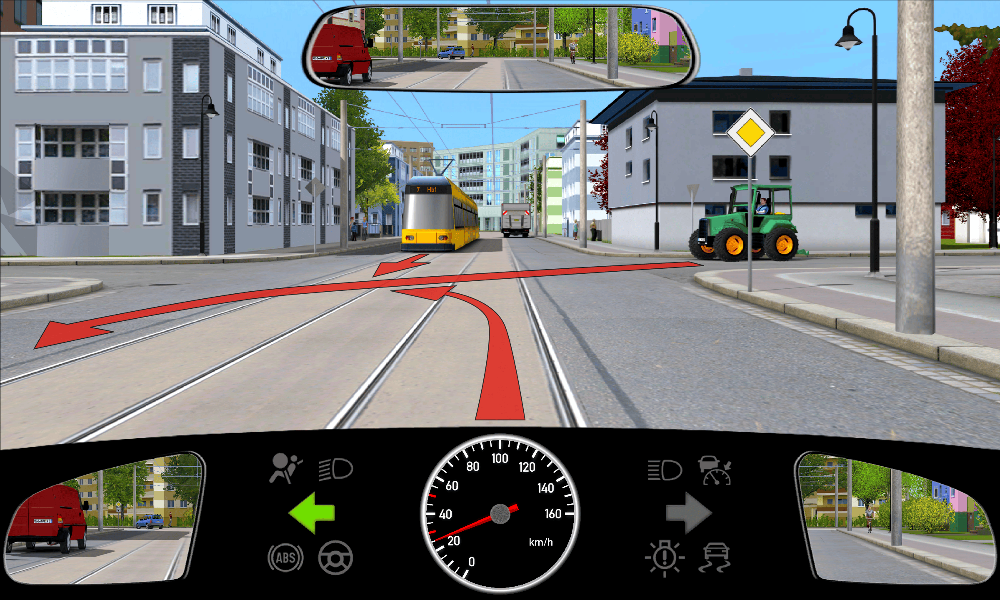

**Options:**
- A. I let the tram through
- B. I let [the tractor] turn
- C. I drive first

**Correct Answer(s):**
- A. I let the tram through

**Explanation:**
The following hierarchy applies on a priority road: In principle, vehicles on a priority road always have priority. However, when leaving a priority road, you must give priority to oncoming vehicles. However, vehicles that want to drive onto a priority road must give priority to other road users on the priority road.
This means you have to give priority to the tram because it is traveling on a priority road, does not change direction and you want to turn left.

---

#### Question 1.3.01-052

**Points:** 5 Points

**What is the right course of action?**

**Options:**
- A. I have to allow the cyclist to pass through
- B. I forgo my right of way so as to not block the junction
- C. I may turn left before the cyclist

**Correct Answer(s):**
- A. I have to allow the cyclist to pass through
- B. I forgo my right of way so as to not block the junction

**Explanation:**
Due to the rule "left yields to right" you would have priority over the green car. However, you must give priority to the oncoming cyclist whose lane you would be crossing. To ensure the traffic flow, it is therefore advisable to let the driver of the green car first enter the intersection.

---

#### Question 1.3.01-053

**Points:** 5 Points

**You want to turn right into a priority road. What must you look out for?**

**Options:**
- A. Vehicles coming from the left and from the right
- B. For cyclists and pedestrians alongside you to the right or behind you
- C. Only for vehicles coming from the left

**Correct Answer(s):**
- A. Vehicles coming from the left and from the right
- B. For cyclists and pedestrians alongside you to the right or behind you

**Explanation:**
If you turn right into a priority road, you must give priority to all road users. This applies both to vehicles that come from the right and those that pass from the left. In addition, be sure to take care of cyclists and pedestrians who are to your right or behind you.

---

#### Question 1.3.01-055-M

**Points:** 5 Points

**What is the right course of action?**

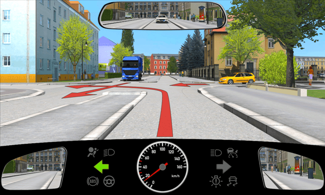

**Options:**
- A. - after the [blue truck]
- B. - after the [yellow car]
- C. - before the [yellow car]

**Correct Answer(s):**
- A. - after the [blue truck]
- B. - after the [yellow car]

**Explanation:**
Since the right of way at this intersection is not determined by appropriate signage, the principle "left yields to right" applies. Thus, you must give priority to the yellow car coming from the right. The blue truck also has priority over you, as you would cross the lane as a left-turning driver.

---

#### Question 1.3.01-056-M

**Points:** 5 Points

**What is the right course of action?**

**Options:**
- A. - before [the two cars]
- B. - after [the two cars]
- C. - after [the blue car]

**Correct Answer(s):**
- A. - before [the two cars]

**Explanation:**
At this intersection you have right of way. This is indicated by the traffic sign. That's why the vehicles have to wait from the right and left and let you drive first.

---

#### Question 1.3.01-057-M

**Points:** 5 Points

**What is the right course of action?**

**Options:**
- A. I have to allow [the red car] to pass through
- B. I may proceed before [the blue truck]
- C. I may only proceed after [the blue truck]

**Correct Answer(s):**
- A. I have to allow [the red car] to pass through
- B. I may proceed before [the blue truck]

**Explanation:**
If you want to turn left from a priority road and another car is driving next to you, which remains on the priority road, you must give priority to this car driver. A vehicle that is not on the priority road, on the other hand, has to wait.

---

#### Question 1.3.01-058-M

**Points:** 5 Points

**What is correct in this situation?**

**Options:**
- A. I have to allow [the motorbike] the right of way
- B. [The motorbike] has to wait
- C. I have to signal a left-turn

**Correct Answer(s):**
- A. I have to allow [the motorbike] the right of way

**Explanation:**
You are on a turning priority road, but you don't want to follow it to the right and instead continue straight ahead. From the right a motorcycle follows the course of the priority road. You have to wait and give priority to this vehicle.

---

#### Question 1.3.01-059-M

**Points:** 5 Points

**Who has priority?**

**Options:**
- A. Me
- B. [The red car]
- C. [The green tractor]

**Correct Answer(s):**
- A. Me

**Explanation:**
You follow a turning priority road. Therefore, you have priority over the driver of the car driving straight ahead. The driver of the tractor also has to wait because he/she leaves the priority road and the rule left yields to right applies to you.

---

#### Question 1.3.01-060-M

**Points:** 5 Points

**What is the right thing to do?**

**Options:**
- A. I have to indicate
- B. The [yellow] car has to wait
- C. I have to wait

**Correct Answer(s):**
- A. I have to indicate
- B. The [yellow] car has to wait

**Explanation:**
If no traffic signs have been erected to regulate the right of way, this is so-called circular traffic. Here, the basic rule of right before left applies. As you are turning into circular traffic, you must signal.

---

#### Question 1.3.01-101-M

**Points:** 5 Points

**Who is required to wait?**

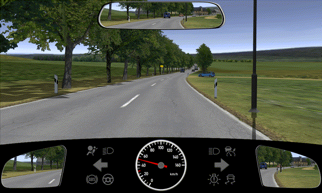

**Options:**
- A. [The car that] is exiting the dirt track
- B. I have to wait

**Correct Answer(s):**
- A. [The car that] is exiting the dirt track

**Explanation:**
If a vehicle wants to turn from a field or forest path into a road, the car driver in question must wait. The rule "left yields to right" does not apply here.

---

#### Question 1.3.01-103-M

**Points:** 5 Points

**What is the right course of action?**

**Options:**
- A. I have to wait
- B. [The motorbike] is obliged to wait

**Correct Answer(s):**
- A. I have to wait

**Explanation:**
Who comes from the right, has right of way at intersections and T-junctions. Because if there is no priority-controlling traffic sign, "left yields to right" applies. No matter the size and type of the vehicle.

---

#### Question 1.3.01-112

**Points:** 5 Points

**You want to turn left. Who is required to wait?**

**Options:**
- A. I have to wait
- B. The blue vehicle has to wait

**Correct Answer(s):**
- A. I have to wait

**Explanation:**
At intersections and T-junctions without a traffic-regulating traffic sign, the rule "left yields to right" applies. Field and forest paths, however, are subordinate traffic routes. If you want to turn from a field or forest path onto a road, you have to wait.

---

#### Question 1.3.01-113

**Points:** 5 Points

**What is the right course of action?**

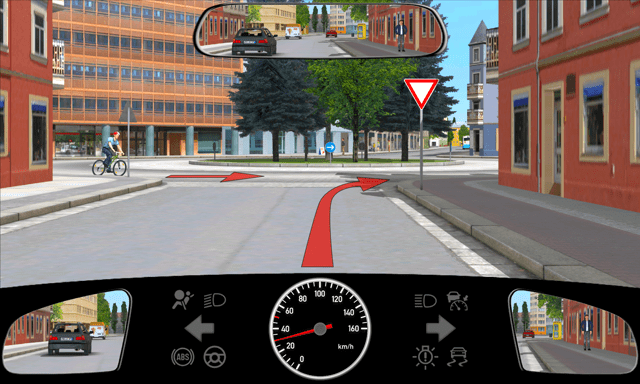

**Options:**
- A. I have to wait
- B. The cyclist has to wait

**Correct Answer(s):**
- A. I have to wait

**Explanation:**
If you want to turn into a roundabout, you will be asked to wait by the "Give way" traffic sign. The drivers driving in a circle have priority here.

---

#### Question 1.3.01-114-M

**Points:** 5 Points

**What is the right course of action?**

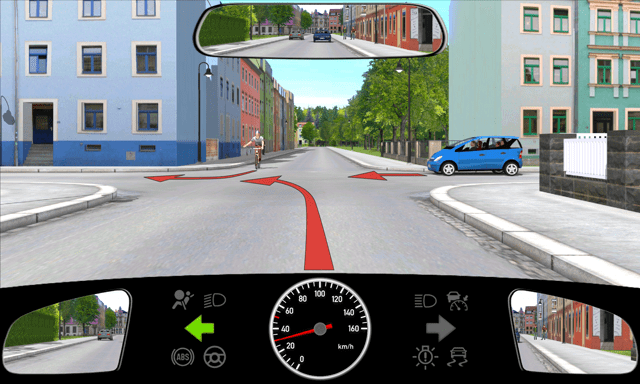

**Options:**
- A. I have to allow the cyclist to turn
- B. I have to allow [the blue car] to pass through
- C. [The blue car] has to allow me to turn

**Correct Answer(s):**
- A. I have to allow the cyclist to turn
- B. I have to allow [the blue car] to pass through

**Explanation:**
Here, "left yields to right" applies as well as the rules for left turns. The car coming from the right may drive first. Since you want to turn left, the oncoming cyclist has right of way.

---

#### Question 1.3.01-115

**Points:** 5 Points

**What is the right course of action?**

**Options:**
- A. I have to wait
- B. The cyclist has to wait
- C. I have to wait at the line of sight

**Correct Answer(s):**
- A. I have to wait

**Explanation:**
If a road user comes from the right, you must pay attention to the "left yields to right" rule and wait. This also applies if it is a cyclist.

---

#### Question 1.3.01-116

**Points:** 5 Points

**What is the right course of action?**

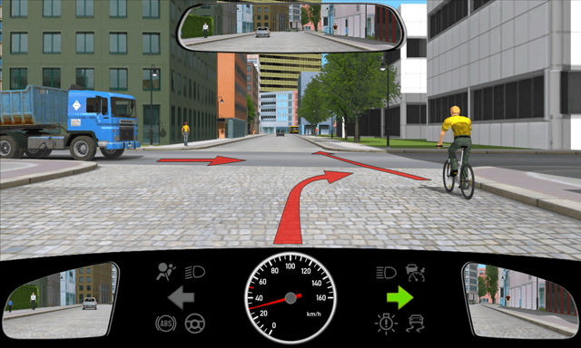

**Options:**
- A. I have to allow the cyclist to pass through
- B. I may make the turn in front of the cyclist
- C. The blue truck may proceed first

**Correct Answer(s):**
- A. I have to allow the cyclist to pass through

**Explanation:**
At this spot, the right of way is not regulated by traffic signs. Therefore, at this intersection left yields to right applies. Here the straight driving cyclist has priority over you as you want to turn. The truck coming from the left may drive last.

---

#### Question 1.3.01-117-M

**Points:** 5 Points

**What is the right course of action?**

**Options:**
- A. - give way to [the cyclist]
- B. - give way to the [bus]
- C. - stop on the stop line

**Correct Answer(s):**
- A. - give way to [the cyclist]
- B. - give way to the [bus]
- C. - stop on the stop line

**Explanation:**
A vehicle coming from the left is already on the priority road. Therefore, it is allowed to drive first. If you turn left, you will have to let oncoming vehicles drive past first. Due to the traffic sign, you have to stop at the stop line ("Give way") or stop completely and are not even allowed to trundle ("Stop sign").

---

#### Question 1.3.01-118-M

**Points:** 5 Points

**What is the right course of action?**

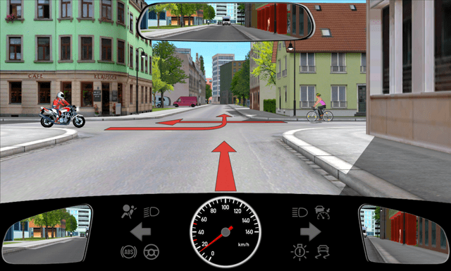

**Options:**
- A. I have to allow [the cyclist] to pass through
- B. I may proceed before the [motorcycle]
- C. [The cyclist] has to allow me to pass

**Correct Answer(s):**
- A. I have to allow [the cyclist] to pass through
- B. I may proceed before the [motorcycle]

**Explanation:**
Since the right of way here is not regulated by traffic signs, left yields to right applies. This means: you must stop and grant access to vehicles from the right. The bike coming from the left has to let you in.

---

#### Question 1.3.01-119

**Points:** 5 Points

**You would like to cross over a priority road. The view to both sides is very restricted due to parked vehicles. What should you do?**

**Options:**
- A. I carefully ease my way into the junction
- B. I quickly cross over the junction
- C. I sound my horn to warn crossing traffic

**Correct Answer(s):**
- A. I carefully ease my way into the junction

**Explanation:**
If visibility is limited you should only proceed with caution. Slowly get into the intersection until you can see the priority road. This is how you act responsibly.

---

#### Question 1.3.01-120-M

**Points:** 5 Points

**What is the right course of action?**

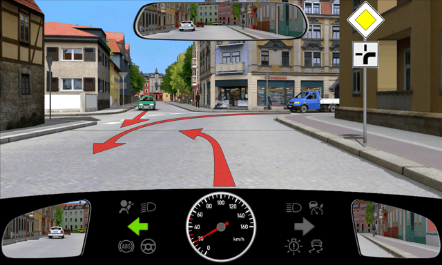

**Options:**
- A. I have to allow [the blue vehicle] to pass
- B. I may make the turn before [the green vehicle]
- C. I have to allow [the green vehicle] to pass through

**Correct Answer(s):**
- A. I have to allow [the blue vehicle] to pass
- B. I may make the turn before [the green vehicle]

**Explanation:**
If you are on a priority road and you want to turn left, you will have to let oncoming cars drive by. If a vehicle drives next to you, which contrary to you remains on the priority road, then this car driver has priority. However, if a vehicle from another street with the traffic sign "Give way" wishes to turn into your priority road, he/she may only drive last.

---

#### Question 1.3.01-121-M

**Points:** 5 Points

**What is the right course of action?**

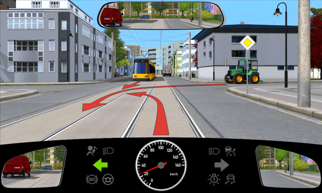

**Options:**
- A. I have to allow the tram to pass through
- B. I have to allow the tractor to pass through
- C. I may not stop and wait on the rails

**Correct Answer(s):**
- A. I have to allow the tram to pass through

**Explanation:**
You are on the priority road. The tractor must therefore wait and let you turn left first. However, you must first let the tram that continues straight ahead on the priority road pass, since straight-ahead traffic always takes precedence over traffic that wants to turn.

---

#### Question 1.3.01-122-M

**Points:** 5 Points

**What is the right course of action?**

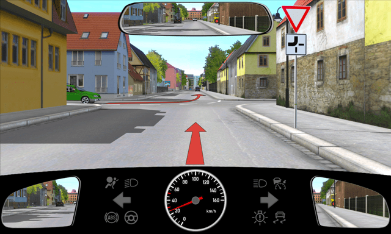

**Options:**
- A. I have to wait
- B. [The green car] has to wait

**Correct Answer(s):**
- A. I have to wait

**Explanation:**
If you are at an intersection and you see the "Give way" traffic sign, you must wait and let the car driver pass through on the priority road.

---

#### Question 1.3.01-123-M

**Points:** 5 Points

**What is the right course of action?**

**Options:**
- A. I have to wait
- B. [The yellow car] has to wait

**Correct Answer(s):**
- A. I have to wait

**Explanation:**
You and another road user are on a turning priority road. The other vehicle follows the course of the priority road, you want to leave. Therefore, you must let the other road user drive through first.

---

#### Question 1.3.01-124-M

**Points:** 5 Points

**What is the right course of action?**

**Options:**
- A. I have to wait
- B. I may pass through the junction before [the motorbike]

**Correct Answer(s):**
- A. I have to wait

**Explanation:**
You want to cross a turning priority road. Here you must give priority to all vehicles on the priority road and wait until the priority road is free for you to cross.

---

#### Question 1.3.01-125-M

**Points:** 5 Points

**What is the right course of action?**

**Options:**
- A. I have to allow right of way to the [red car]
- B. I have right of way ahead of the [blue car]
- C. I have to allow right of way to the [blue car]

**Correct Answer(s):**
- A. I have to allow right of way to the [red car]
- B. I have right of way ahead of the [blue car]

**Explanation:**
Without additional priority-regulating traffic signs or traffic lights, the general "left yields to right" rule applies. The car coming from the right must be given priority. You have priority over the car coming from the left.

---

#### Question 1.3.01-126-M

**Points:** 5 Points

**What is the right course of action?**

**Options:**
- A. I move first
- B. I have to allow [the yellow car] to pass through

**Correct Answer(s):**
- A. I move first

**Explanation:**
At the traffic sign "right of way at the next intersection or T-junction", you may drive first at the next intersection. A vehicle coming from the left must wait.

---

#### Question 1.3.01-127-M

**Points:** 5 Points

**In what sequence may each continue driving?**

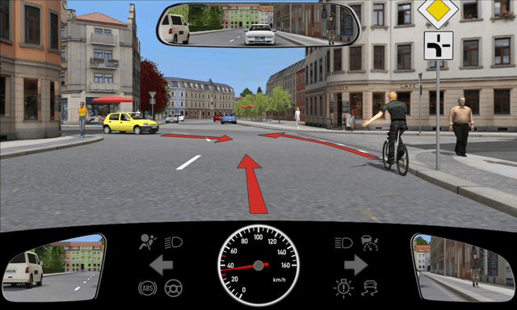

**Options:**
- A. [The cyclist], me, [the yellow car]
- B. [The cyclist], [the yellow car], me
- C. Me, [the cyclist], [the yellow car]

**Correct Answer(s):**
- A. [The cyclist], me, [the yellow car]

**Explanation:**
You are on a turning priority road and you want to leave straight ahead. The cyclist follows the course of the priority road and therefore has priority over you. The car from the left must grant you right of way according to the rule "left yields to right".

---

#### Question 1.3.01-128-M

**Points:** 5 Points

**Who can move first in this situation?**

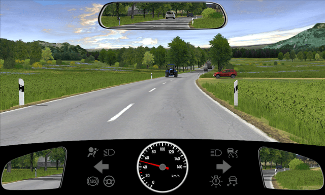

**Options:**
- A. Me
- B. The [red] car
- C. The [blue] tractor

**Correct Answer(s):**
- A. Me

**Explanation:**
The basic rule "right before left" does not apply to vehicles driving out of a field or forest path onto another road.

---

#### Question 1.3.01-129-M

**Points:** 5 Points

**What is the right course of action here?**

**Options:**
- A. I wait until [the cyclist] has completed the turn
- B. I take priority before [the cyclist]
- C. I warn [the cyclist] by sounding the horn

**Correct Answer(s):**
- A. I wait until [the cyclist] has completed the turn

**Explanation:**
At intersections and junctions, whoever is coming from the right has the right of way.

---

#### Question 1.3.01-130-M

**Points:** 5 Points

**Which is correct in this situation?**

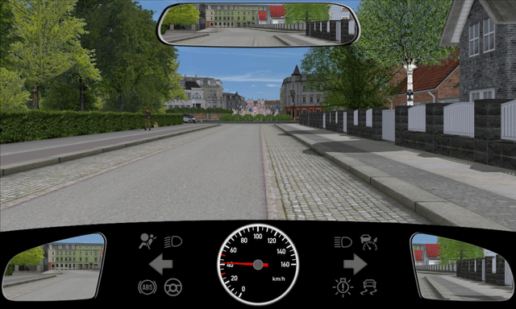

[Video: videos/1_3_01-130-M.mp4](videos/1_3_01-130-M.mp4)

**Options:**
- A. I have to wait
- B. [The blue car] has to wait
- C. I have to reach an understanding with the driver of the [blue car]

**Correct Answer(s):**
- A. I have to wait

**Explanation:**
You can see from the signs that this is not a roundabout. Therefore, right before left applies.

---

## Theme 1.4. Road Sign

### 1.4.40 Chapter Danger Sign

#### Question 1.4.40-001

**Points:** 4 Points

**What do you do when you see this traffic sign?**

**Options:**
- A. Reduce speed
- B. Be ready to brake
- C. Observe the traffic coming from the right only

**Correct Answer(s):**
- A. Reduce speed
- B. Be ready to brake

**Explanation:**
This traffic sign alerts you about an approaching, confusing intersection or T-junction. You should slow down your speed and be ready to brake, since the right road user has priority here. You should also pay close attention to the traffic on the left, since you have to expect that it will not fulfill its obligation to wait and possibly ignore your right of way. Adjust your speed so that you can see the traffic coming from the right and, if necessary, brake without any problems.

---

#### Question 1.4.40-002

**Points:** 3 Points

**What should you remember when you see this traffic sign?**

**Options:**
- A. Braking distance is greater on downhill slopes than on level ground
- B. The brakes may become less efficient with prolonged use
- C. The brakes become more efficient when no gear is selected

**Correct Answer(s):**
- A. Braking distance is greater on downhill slopes than on level ground
- B. The brakes may become less efficient with prolonged use

**Explanation:**
This traffic sign warns you of an incline of up to 10%. This means that you must be aware of the longer braking distance, which arises at this incline in contrast to a plane road. Since the brakes may become hot during extended braking and may lose function, it is important that the driver shifts to a lower gear to take advantage of the engine braking effect. Under no circumstances should you disengage.

---

#### Question 1.4.40-004

**Points:** 3 Points

**What do you do when you see this traffic sign?**

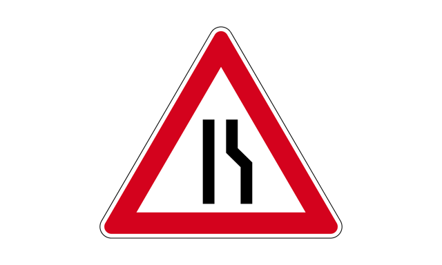

**Options:**
- A. Give precedence to oncoming traffic
- B. When there are two lanes in one direction, employ the zipper feed-in method
- C. Where there are two lanes in one direction and you are driving on the left lane, you take absolute precedence

**Correct Answer(s):**
- A. Give precedence to oncoming traffic
- B. When there are two lanes in one direction, employ the zipper feed-in method

**Explanation:**
Warning sign: It warns you of a narrowing of the lane in your direction of travel. If two lanes narrow to one, the zip merging takes effect. This means: there is no absolute priority; The driver of the narrowing lane must be able to merge seamlessly into the traffic.

---

#### Question 1.4.40-005

**Points:** 3 Points

**You see this traffic sign. What must you reckon with?**

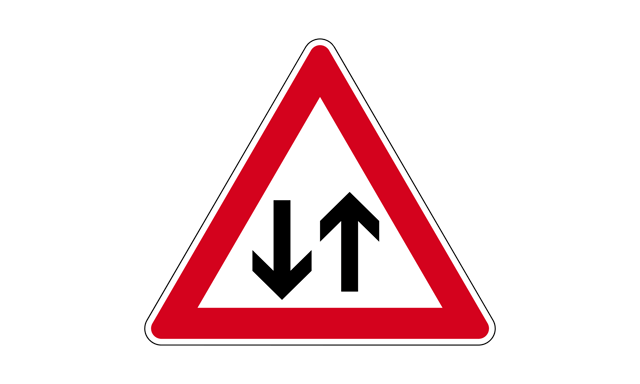

**Options:**
- A. Oncoming traffic
- B. Dazzle from oncoming traffic at night
- C. Oncoming traffic taking precedence

**Correct Answer(s):**
- A. Oncoming traffic
- B. Dazzle from oncoming traffic at night

**Explanation:**
If you see this traffic sign, you as a driver will have to expect on oncoming traffic and glare from headlights. It warns you where you would not normally expect oncoming traffic: when driving on one-way streets, along construction sites or at barriers of individual lanes on highways. For black arrows, no direction has priority.

---

#### Question 1.4.40-006

**Points:** 5 Points

**What does this traffic sign require of you?**

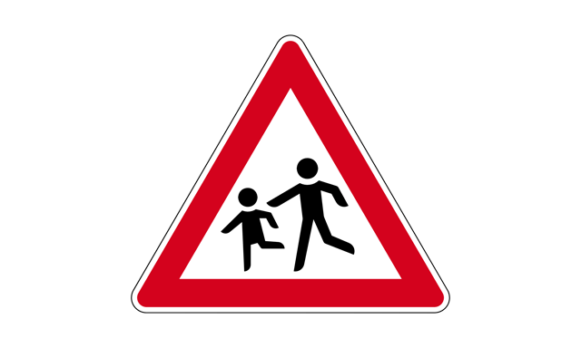

**Options:**
- A. Greatest alertness
- B. Readiness to brake
- C. Reduction in speed

**Correct Answer(s):**
- A. Greatest alertness
- B. Readiness to brake
- C. Reduction in speed

**Explanation:**
The sign will point you to a school, kindergarten or playground nearby. Here you have to drive with adapted speed and increased attention. Children could suddenly run onto the road without paying attention to the traffic. Always be ready to brake.

---

#### Question 1.4.40-008

**Points:** 3 Points

**What does this traffic sign combination indicate?**

**Options:**
- A. Danger in connection with horses
- B. That people on horseback have priority over motor vehicles
- C. No through-traffic because of a bridle-path

**Correct Answer(s):**
- A. Danger in connection with horses

**Explanation:**
The exclamation mark indicates danger ahead. The sign with a rider shows that you have to expect horses and riders on the road.

---

#### Question 1.4.40-009

**Points:** 3 Points

**What does this traffic sign combination indicate?**

**Options:**
- A. Danger in connection with horse and carriages
- B. That horse and carriages have priority over motor vehicles
- C. Horse and carriages are not allowed to pass through

**Correct Answer(s):**
- A. Danger in connection with horse and carriages

**Explanation:**
The exclamation mark stands for a general hazard warning. The exact nature of the hazard is shown by the additional sign: Here you must expect horse and cart on the road.

---

#### Question 1.4.40-010

**Points:** 3 Points

**What must you anticipate when you see this road sign?**

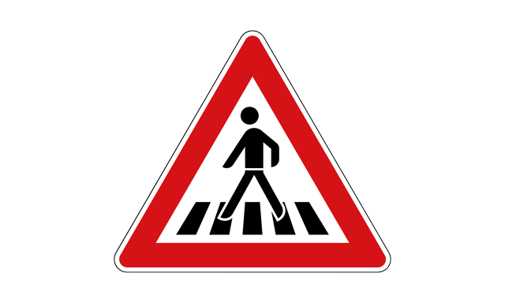

**Options:**
- A. A pedestrian crossing that is hard to see
- B. Pedestrians that might cross the road
- C. Pedestrians who may only cross the road from the right

**Correct Answer(s):**
- A. A pedestrian crossing that is hard to see
- B. Pedestrians that might cross the road

**Explanation:**
This is a danger sign warning you of a pedestrian crossing. The pedestrian crossing may be difficult to see. Pedestrians will use the pedestrian crossing to cross the roadway. Be especially alert.

---

#### Question 1.4.40-011

**Points:** 3 Points

**What must you do upon seeing this traffic sign?**

**Options:**
- A. - drive up to the pedestrian crossing at a moderate speed
- B. - be particularly attentive
- C. - be ready to brake

**Correct Answer(s):**
- A. - drive up to the pedestrian crossing at a moderate speed
- B. - be particularly attentive
- C. - be ready to brake

**Explanation:**
This danger sign indicates that there is a pedestrian crossing in the immediate vicinity. You must watch out for pedestrians and let them cross the road. You should approach at a moderate speed, stop under certain circumstances and never overtake at the crossing.

---

#### Question 1.4.40-012

**Points:** 3 Points

**What danger is indicated to you by this traffic sign?**

**Options:**
- A. Sidewind
- B. The risk that my vehicle may be shifted sideways
- C. Air traffic

**Correct Answer(s):**
- A. Sidewind
- B. The risk that my vehicle may be shifted sideways

**Explanation:**
This traffic sign warns of strong crosswinds and that your vehicle could be displaced sideways.

---

#### Question 1.4.40-013

**Points:** 3 Points

**You are driving on a road with one lane in each direction. Which roadsign indicates that you must always give way to oncoming traffic?**

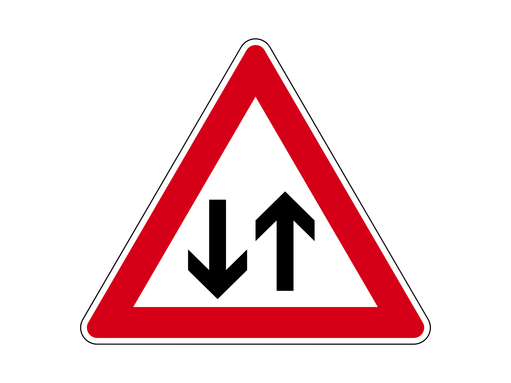

**Options:**
- A. 
- B. 
- C. 

**Correct Answer(s):**
- A. 
- B. 

**Explanation:**
The traffic sign “road narrowed on one side from the right” means that your lane will narrow significantly. Here you have to give way to oncoming traffic.

The traffic sign “Give priority to oncoming traffic” shows with the red arrow that you must give priority to oncoming traffic.

---

#### Question 1.4.40-101

**Points:** 2 Points

**You pass this traffic sign while driving outside a built-up area. How far off is the hazard to be expected?**

**Options:**
- A. Between 150 m and 250 m
- B. Between 50 m and 150 m
- C. Between 250 m and 350 m

**Correct Answer(s):**
- A. Between 150 m and 250 m

**Explanation:**
The sign warns of danger ahead. Expect the dangerous area outside of built-up areas at a distance of 150 - 250 m. Reduce your speed and drive with increased attention.

---

#### Question 1.4.40-103

**Points:** 3 Points

**What must you be prepared for when you pass these traffic signs?**

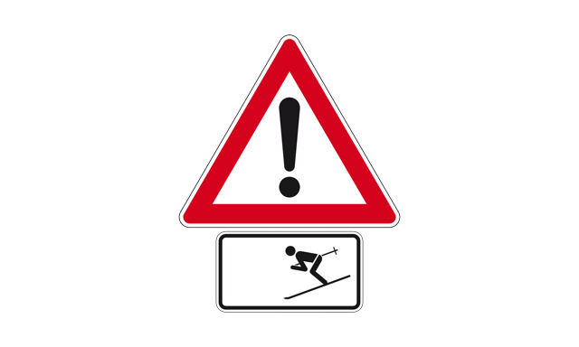

**Options:**
- A. - this road may be used for winter sports
- B. - there is packed snow or black ice on the roadway
- C. - only the pavements are used for winter sports

**Correct Answer(s):**
- A. - this road may be used for winter sports
- B. - there is packed snow or black ice on the roadway

**Explanation:**
You must be prepared for skiers and tobogganers crossing the road. This traffic sign informs you that on this road winter sports can be operated and no winter road clearance clears the snow. You need to expect increased danger of slipping due to the snow that sticks to the road.

---

#### Question 1.4.40-105

**Points:** 3 Points

**What do you do when you see this traffic sign?**

**Options:**
- A. Reduce your speed
- B. Drive as far as possible over on the right-hand side
- C. Accelerate strongly immediately after the right bend

**Correct Answer(s):**
- A. Reduce your speed
- B. Drive as far as possible over on the right-hand side

**Explanation:**
The sign warns you of a double bend. First expect a right turn, then a left turn. You could drive onto the oncoming lane. Adjust your speed and drive far to the right to avoid collision with oncoming traffic.

---

#### Question 1.4.40-106

**Points:** 2 Points

**What do you have to expect after these traffic signs?**

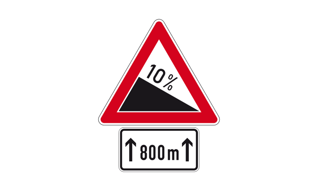

**Options:**
- A. A downhill slope 800 m in length
- B. An uphill slope 800 m in length
- C. The beginning of a downhill slope 800 m ahead

**Correct Answer(s):**
- A. A downhill slope 800 m in length

**Explanation:**
After this traffic sign, an incline of 10% starts. The additional sign informs about the length of the danger zone of 800 meters. The arrows to the right and left indicate that the incline starts from the sign. Without arrows it would mean that the incline begins at a distance of 800 meters.

---

#### Question 1.4.40-107

**Points:** 2 Points

**What do you do when you see this traffic sign?**

**Options:**
- A. Change down gear, if necessary
- B. Change to a higher gear in order to maintain your speed
- C. Brake so that your speed will not increase too much on the downhill slope

**Correct Answer(s):**
- A. Change down gear, if necessary

**Explanation:**
The traffic sign informs about a strong incline of 12%. Depending on the vehicle performance, it is necessary to shift down to a lower gear, so that you do not create a traffic obstruction and a danger to others due to driving too slowly. When you accelerate while going uphill and you don't get faster, you need to gear down.

---

#### Question 1.4.40-108

**Points:** 2 Points

**What should you do when you approach this traffic sign?**

**Options:**
- A. Reduce your speed
- B. Increase your speed
- C. Avoid the uneven patches by making sudden steering wheel movements

**Correct Answer(s):**
- A. Reduce your speed

**Explanation:**
The road in front of you is uneven and may have diagonal or longitudinal grooves. This sign warns against them. You cannot only get into a skid in damp and cold weather. Avoid fast steering movements.

---

#### Question 1.4.40-109

**Points:** 2 Points

**What dangers can arise if this traffic sign is ignored?**

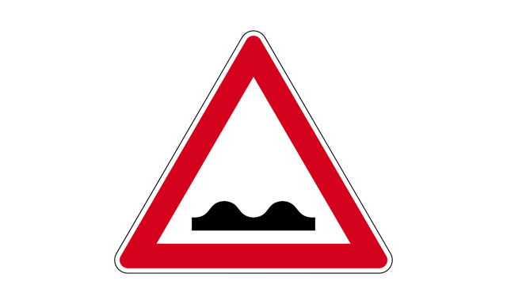

**Options:**
- A. The vehicle could go into a skid and endanger oncoming traffic
- B. The vehicle could suffer a broken axle or spring fracture
- C. The load could be damaged

**Correct Answer(s):**
- A. The vehicle could go into a skid and endanger oncoming traffic
- B. The vehicle could suffer a broken axle or spring fracture
- C. The load could be damaged

**Explanation:**
Due to inappropriate driving there is a risk of skidding on this section of the route with endangerment of oncoming traffic. The route is uneven with possible diagonal and longitudinal grooves. This means that your tires will have lower grip. You need to throttle your speed in order to be able to steer the vehicle safely.

---

#### Question 1.4.40-112

**Points:** 3 Points

**What does this traffic sign warn you of?**

**Options:**
- A. Danger of skidding when the roadway is dirty
- B. Danger of skidding when the roadway is wet
- C. Drivers under the influence of alcohol

**Correct Answer(s):**
- A. Danger of skidding when the roadway is dirty
- B. Danger of skidding when the roadway is wet

**Explanation:**
The road in front of you has an increased risk of skidding when it's wet or dirty. You should reduce your speed and not brake or steer abruptly.

---

#### Question 1.4.40-114

**Points:** 3 Points

**What do you do when you see this traffic sign?**

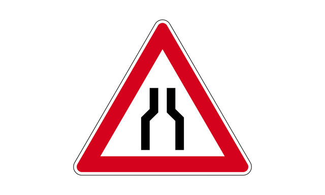

**Options:**
- A. Reduce your speed
- B. Refrain from overtaking
- C. Always stop before the road narrows

**Correct Answer(s):**
- A. Reduce your speed
- B. Refrain from overtaking

**Explanation:**
This is a warning sign and it warns drivers of an imminent narrowing of the road. You have to expect oncoming traffic and behave as follows: Reduce your speed and refrain from overtaking maneuvers. Stopping in front of the bottleneck is only required if an oncoming vehicle is already in the bottleneck. Instead of a specific priority, zip merging applies, according to which the drivers are merging into the lane.

---

#### Question 1.4.40-115

**Points:** 2 Points

**What must you reckon with when you see these traffic signs?**

**Options:**
- A. The roadway narrowing approximately 50 m ahead
- B. The roadway narrowing for 50 m
- C. A road widening 50 m ahead

**Correct Answer(s):**
- A. The roadway narrowing approximately 50 m ahead

**Explanation:**
Expect a narrowed lane 50 m ahead. Please drive slowly and ready for braking to the danger area to be able to react to traffic congestion.

---

#### Question 1.4.40-116

**Points:** 2 Points

**What must you reckon with when you see this traffic sign?**

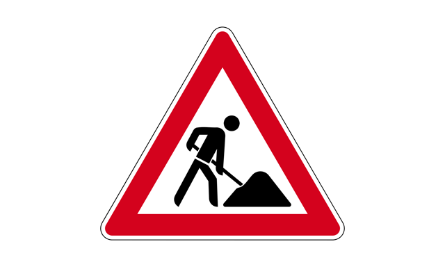

**Options:**
- A. Traffic from road construction vehicles
- B. Men at work on the roadway
- C. Construction materials on the roadway

**Correct Answer(s):**
- A. Traffic from road construction vehicles
- B. Men at work on the roadway
- C. Construction materials on the roadway

**Explanation:**
When there's a construction site it is to be expected that construction site vehicles and workers can come very close to flowing traffic. Also building materials and tools could be on the road. Even if the construction site is not operated at the moment, a soiled road is to be expected. There is a risk of slipping and skidding.

---

#### Question 1.4.40-118

**Points:** 3 Points

**What must you reckon with when you see this traffic sign?**

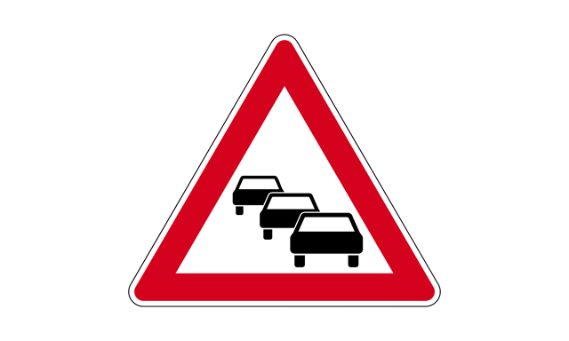

**Options:**
- A. Traffic congestion
- B. The vehicles driving in front may suddenly brake
- C. The roadway widens into three lanes

**Correct Answer(s):**
- A. Traffic congestion
- B. The vehicles driving in front may suddenly brake

**Explanation:**
This traffic sign warns against congestion on this section. Adjust your speed and the safety distance to the vehicle ahead according to the dangerous situation. The vehicle in front of you could suddenly brake. Also keep an eye on the traffic flow in front of the vehicle in front of you. You may drive a little offset within the lane.

---

#### Question 1.4.40-121

**Points:** 2 Points

**What does this traffic sign indicate?**

**Options:**
- A. Traffic lights
- B. A customs post
- C. A level crossing with flashing red light

**Correct Answer(s):**
- A. Traffic lights

**Explanation:**
Please pay attention to a badly recognizable light indicator like a traffic light. In the further course of the road a danger spot like an intersection or a construction site area might possibly follow.

---

#### Question 1.4.40-127

**Points:** 2 Points

**What do these traffic signs indicate?**

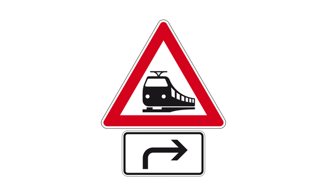

**Options:**
- A. A level crossing on the road turning right
- B. The direction from which a train could come
- C. A diversion avoiding the level crossing

**Correct Answer(s):**
- A. A level crossing on the road turning right

**Explanation:**
Pay attention to an unguarded level crossing, if you drive to the right at this point or turn. If you continue straight ahead, this sign has no meaning for you.

---

#### Question 1.4.40-130

**Points:** 2 Points

**What does this traffic sign indicate?**

**Options:**
- A. A level crossing approximately 160 m ahead
- B. A level crossing approximately 80 m ahead
- C. A level crossing approximately 240 m ahead

**Correct Answer(s):**
- A. A level crossing approximately 160 m ahead

**Explanation:**
The sign that warns you of a level crossing ahead informs you about a level crossing that is 160 meters away. Approach the danger zone cautiously and ready to brake in case a train crosses your path.

---

#### Question 1.4.40-131

**Points:** 2 Points

**What does this traffic sign indicate?**

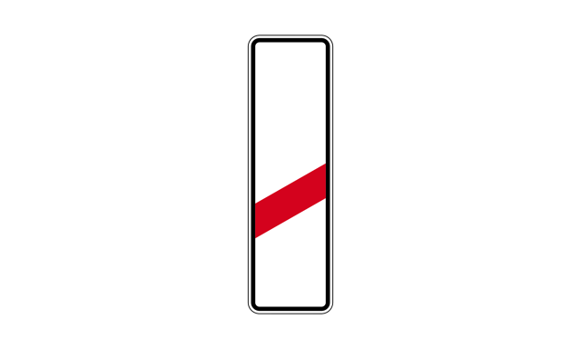

**Options:**
- A. A level crossing approximately 80 m ahead
- B. A level crossing approximately 160 m ahead
- C. A level crossing approximately 240 m ahead

**Correct Answer(s):**
- A. A level crossing approximately 80 m ahead

**Explanation:**
The traffic sign is a distance beacon. This traffic sign is always placed on both sides of the road. It belongs to the group of danger signs.
The traffic sign shown is a one-lane distance beacon. The single red stripe means that there is a level crossing 80 meters away.

---

#### Question 1.4.40-132

**Points:** 2 Points

**What does this traffic sign combination indicate?**

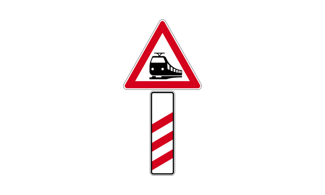

**Options:**
- A. - at a distance of approximately 240 m
- B. - at a distance of approximately 80 m
- C. - at a distance of approximately 160 m

**Correct Answer(s):**
- A. - at a distance of approximately 240 m

**Explanation:**
About 240 meters in front of you there is a railroad crossing. The level crossing ahead marker warns from this danger. Each line represents a distance of 80 m.

---

#### Question 1.4.40-133

**Points:** 3 Points

**What does this traffic sign combination indicate?**

**Options:**
- A. Icy conditions
- B. Snowy conditions
- C. Avalanches

**Correct Answer(s):**
- A. Icy conditions
- B. Snowy conditions

**Explanation:**
Pay attention to sudden snow or ice in this area. Individual road sections can be unexpectedly slippery. Adjust your speed to the prevailing weather conditions.

---

#### Question 1.4.40-134

**Points:** 3 Points

**What must you anticipate with this road sign combination?**

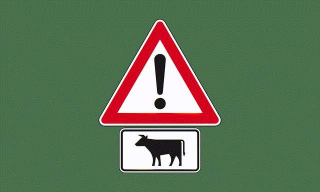

**Options:**
- A. A dirt covered roadway
- B. Farm livestock on the roadway
- C. Wild animals crossing

**Correct Answer(s):**
- A. A dirt covered roadway
- B. Farm livestock on the roadway

**Explanation:**
This combination of traffic signs indicates cattle drive, as the animals are polluting the road when passing it. For wild animals crossing there's another traffic sign.

---

#### Question 1.4.40-135

**Points:** 2 Points

**What do you have to be aware of when you see this traffic sign combination?**

**Options:**
- A. A rail crossing at a distance of 240 m
- B. No overtaking of vehicles permitted
- C. A rail crossing at a distance of 120 m

**Correct Answer(s):**
- A. A rail crossing at a distance of 240 m
- B. No overtaking of vehicles permitted

**Explanation:**
The traffic signs warn you of a railroad crossing 240 meters away. From the three-lined level crossing ahead marker to the danger zone including the intersection overtaking other motor vehicles is prohibited. An overtaking maneuver in this area could endanger you and other road users.

---

#### Question 1.4.40-136

**Points:** 2 Points

**What awaits you with this traffic sign combination?**

**Options:**
- A. A work site, commencing at a distance of approximately 100 m
- B. A work site, ending at a distance of approximately 100 m
- C. A work site that is approximately 100 m in length

**Correct Answer(s):**
- A. A work site, commencing at a distance of approximately 100 m

**Explanation:**
The traffic sign warns you of a construction site in a distance of 100 meters. Pay close attention to the danger zone and be ready to brake in case of traffic congestion.

---

#### Question 1.4.40-137

**Points:** 3 Points

**You pass by this traffic sign combination at an outside temperature of +3 °C. What should you do?**

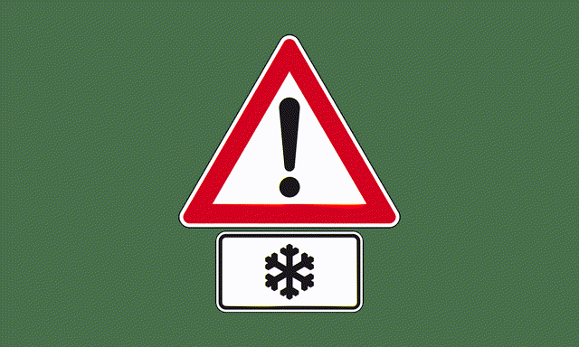

**Options:**
- A. I reduce my speed
- B. I continue driving as before, because there is nothing to indicate slippery ice
- C. I immediately reduce the distance between me and the vehicle in front

**Correct Answer(s):**
- A. I reduce my speed

**Explanation:**
The combination of these traffic signs warns of sudden ice formation on this section. This often happens on bridges. Snow and ice extend the braking distance. Therefore, reduce the speed and increase the distance to the vehicle in front of you.

---

#### Question 1.4.40-138

**Points:** 3 Points

**What should you avoid when you see this danger sign?**

**Options:**
- A. Accelerating heavily
- B. Sudden steering manoeuvres
- C. Driving close to the vehicle in front

**Correct Answer(s):**
- A. Accelerating heavily
- B. Sudden steering manoeuvres
- C. Driving close to the vehicle in front

**Explanation:**
The combination of these traffic signs warns of loose chippings or gravel on this section of the route. Stones and chippings can be whirled up. Therefore, avoid strong acceleration and heavy steering movements. Keep a safe distance from the vehicle in front of you.

---

#### Question 1.4.40-139

**Points:** 2 Points

**What does this traffic sign combination indicate?**

**Options:**
- A. A moveable bridge
- B. A ferry
- C. Drainage works

**Correct Answer(s):**
- A. A moveable bridge

**Explanation:**
In this combination, the traffic signs warn you of a moving bridge. Watch out for passing ships, for which the bridge can be tilted up or moved.

---

#### Question 1.4.40-140

**Points:** 2 Points

**What must you be aware of when you see this traffic sign combination?**

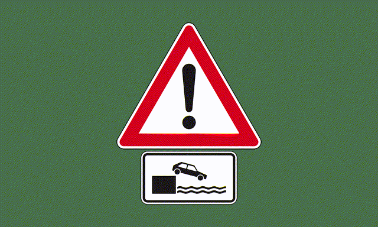

**Options:**
- A. The road leads to the bank of a waterway
- B. There is a risk of confusing the water surface and roadway in darkness or in poor visibility
- C. An entrance exit point must be kept clear for amphibian vehicles

**Correct Answer(s):**
- A. The road leads to the bank of a waterway
- B. There is a risk of confusing the water surface and roadway in darkness or in poor visibility

**Explanation:**
The combination of these traffic signs informs the car driver that the road leads to a shore. In poor visibility conditions such as fog or darkness, the water surface can be confused with a roadway.

---

#### Question 1.4.40-141

**Points:** 3 Points

**What must you be aware of when you see this traffic sign combination?**

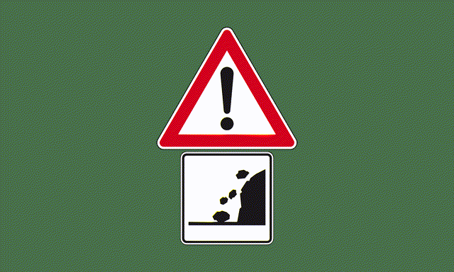

**Options:**
- A. Avoid stopping and parking
- B. Stones may be lying on the roadway
- C. Vehicles in front may break suddenly

**Correct Answer(s):**
- A. Avoid stopping and parking
- B. Stones may be lying on the roadway
- C. Vehicles in front may break suddenly

**Explanation:**
The combination of these traffic signs warns of falling or fallen rocks, meaning stones may fall on the road or are already on the road. It is to be expected that vehicles driving ahead will brake suddenly to avoid falling rocks. In your own interest, you should not stop or park in these areas.

---

#### Question 1.4.40-142

**Points:** 3 Points

**What does this traffic sign combination indicate?**

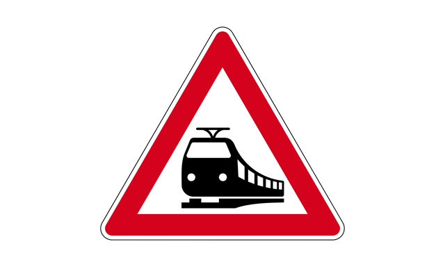

**Options:**
- A. A rail crossing
- B. A rail underpass
- C. A train station

**Correct Answer(s):**
- A. A rail crossing

**Explanation:**
This traffic sign indicates that you will shortly be crossing a railroad crossing. A train station or underpass does not have to be present.

---

#### Question 1.4.40-143

**Points:** 3 Points

**What must you anticipate with this road sign?**

**Options:**
- A. You are nearing a hard right-hand bend
- B. Oncoming traffic might cut the corner
- C. Vehicles in front of me might slow down sharply

**Correct Answer(s):**
- A. You are nearing a hard right-hand bend
- B. Oncoming traffic might cut the corner
- C. Vehicles in front of me might slow down sharply

**Explanation:**
This traffic sign warns of a sharp right turn. You should be aware that oncoming vehicles could cut the curve and reach into your lane. It is also to be expected that vehicles driving ahead will brake sharply.

---

#### Question 1.4.40-144

**Points:** 4 Points

**What must you anticipate with this road sign?**

**Options:**
- A. With cyclists who may cross the carriageway
- B. With an underpass for cyclists
- C. With a "cyclists prohibited" zone

**Correct Answer(s):**
- A. With cyclists who may cross the carriageway

**Explanation:**
This traffic sign warns that cyclists can cross the road and could get into your lane, for example when a bike path ends and leads to the road.

---

#### Question 1.4.40-145

**Points:** 2 Points

**What must you anticipate with this road sign combination?**

**Options:**
- A. Suddenly occurring noise from aeroplanes
- B. Other road users becoming distracted
- C. An entrance to or exit from an aerodrome

**Correct Answer(s):**
- A. Suddenly occurring noise from aeroplanes
- B. Other road users becoming distracted

**Explanation:**
This traffic sign informs about flying over the road. Sudden aircraft noise can scare a driver. Road users may be distracted by the aircraft and get distracted.

---

#### Question 1.4.40-146

**Points:** 3 Points

**What does this traffic sign combination indicate?**

**Options:**
- A. A pedestrian crossing
- B. An underpass for pedestrians
- C. An overpass for pedestrians

**Correct Answer(s):**
- A. A pedestrian crossing

**Explanation:**
This combination of road signs indicates a pedestrian crossing. At a pedestrian crossing, pedestrians have priority. The car driver has to allow them to cross the road.

---

#### Question 1.4.40-147

**Points:** 3 Points

**What does this traffic sign indicate?**

**Options:**
- A. Danger in connection with horses
- B. That people on horseback have priority over motor vehicles
- C. No through-traffic because of a bridle path

**Correct Answer(s):**
- A. Danger in connection with horses

**Explanation:**
This sign (triangular) indicates a danger zone in connection with horses.

---

#### Question 1.4.40-148

**Points:** 3 Points

**What does this traffic sign indicate?**

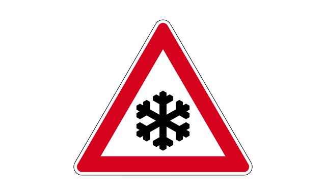

**Options:**
- A. Icy conditions
- B. Packed snow
- C. Avalanches

**Correct Answer(s):**
- A. Icy conditions
- B. Packed snow

**Explanation:**
This traffic sign indicates that it is slippery with snow and icy roads.

---

#### Question 1.4.40-149

**Points:** 3 Points

**What must you anticipate with this road sign?**

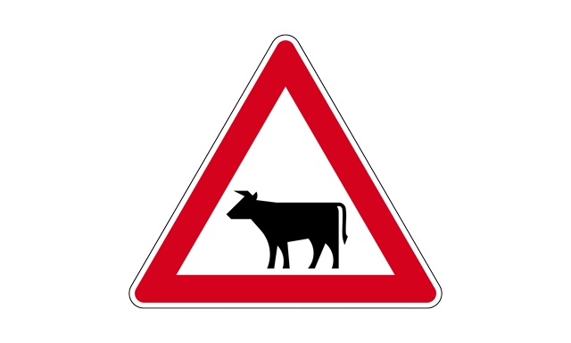

**Options:**
- A. A dirt-covered roadway
- B. Farm livestock on the roadway
- C. Wild animals crossing

**Correct Answer(s):**
- A. A dirt-covered roadway
- B. Farm livestock on the roadway

**Explanation:**
This sign indicates that the road is very dirty and that you must watch out for grazing animals on the road.

---

#### Question 1.4.40-150

**Points:** 3 Points

**How should you act at a point of danger indicated by this sign?**

**Options:**
- A. - avoid rapid acceleration
- B. - avoid sudden manoeuvres
- C. - maintain the greatest possible distance to the vehicle ahead

**Correct Answer(s):**
- A. - avoid rapid acceleration
- B. - avoid sudden manoeuvres
- C. - maintain the greatest possible distance to the vehicle ahead

**Explanation:**
You should keep as much distance as possible from the vehicle in front, avoid sudden steering movements and avoid strong acceleration as there is gravel and grit on this road.

---

#### Question 1.4.40-151

**Points:** 2 Points

**What does this traffic sign indicate?**

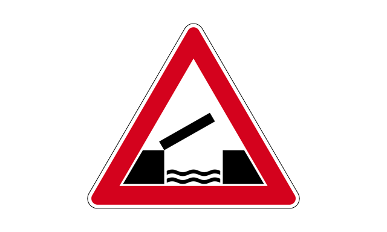

**Options:**
- A. A moveable bridge
- B. A ferry
- C. Drainage works

**Correct Answer(s):**
- A. A moveable bridge

**Explanation:**
This sign indicates a movable bridge.

---

#### Question 1.4.40-152

**Points:** 2 Points

**What must you be aware of when you see this road traffic sign?**

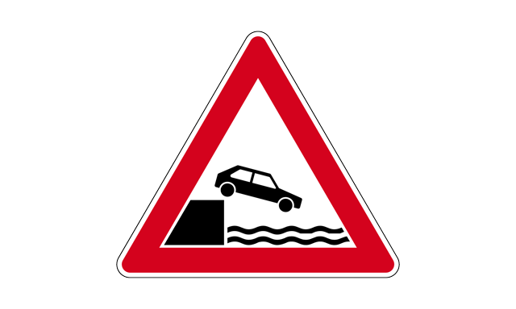

**Options:**
- A. The road leads to the bank of a waterway
- B. When it is dark or visibility is poor, areas of water are difficult to distinguish from the road
- C. The entrance and exit point must be kept clear for amphibious vehicles

**Correct Answer(s):**
- A. The road leads to the bank of a waterway
- B. When it is dark or visibility is poor, areas of water are difficult to distinguish from the road

**Explanation:**
The shape of the sign indicates caution and the picture on the sign indicates what to look out for. This road leads to a shore. Water surfaces are difficult to distinguish from the actual roadway in darkness or poor visibility.

---

#### Question 1.4.40-153

**Points:** 3 Points

**What must you be aware of when you see this road traffic sign?**

**Options:**
- A. Avoid stopping and parking
- B. Stones may be lying on the roadway
- C. Vehicles in front may brake suddenly

**Correct Answer(s):**
- A. Avoid stopping and parking
- B. Stones may be lying on the roadway
- C. Vehicles in front may brake suddenly

**Explanation:**
Please watch out for stones that might be lying on the roadway. Avoid stopping and parking. Vehicles in front may suddenly slow down due to falling stones.

---

#### Question 1.4.40-154

**Points:** 2 Points

**What must you anticipate with this road sign?**

**Options:**
- A. Sudden noise from aeroplanes
- B. Other road users may become distracted
- C. Vehicles that brake suddenly

**Correct Answer(s):**
- A. Sudden noise from aeroplanes
- B. Other road users may become distracted
- C. Vehicles that brake suddenly

**Explanation:**
This sign says that you should expect distractions from other road users, sudden aircraft noise and sudden braking vehicles. All answers are correct.

---

#### Question 1.4.40-155

**Points:** 3 Points

**What does this traffic sign indicate?**

**Options:**
- A. A pedestrian crossing
- B. An underpass for pedestrians
- C. An overpass for pedestrians

**Correct Answer(s):**
- A. A pedestrian crossing

**Explanation:**
This shield (Attention) indicates a pedestrian crossing.

---

#### Question 1.4.40-156

**Points:** 3 Points

**You are driving a motor vehicle with a manual gearbox. What must you consider when you see this road sign?**

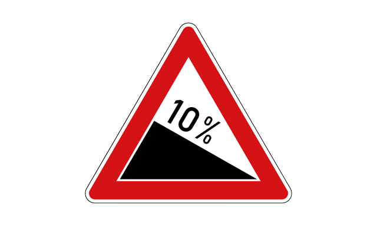

**Options:**
- A. The braking distance is longer
- B. Applying the brakes for a longer time will diminish the braking response
- C. The braking response will be better if no gear is engaged

**Correct Answer(s):**
- A. The braking distance is longer
- B. Applying the brakes for a longer time will diminish the braking response

**Explanation:**
In order not to exceed the speed on the slope, you may have to brake lightly throughout. If the brake heats up, the braking effect will diminish over time. Bear in mind that this also increases the braking distance. To avoid unnecessary strain on the brake, you can select lower gears to increase the engine braking effect.

---

#### Question 1.4.40-157

**Points:** 2 Points

**You are driving a motor vehicle with a manual gearbox. What is the correct thing to do when you see this traffic sign?**

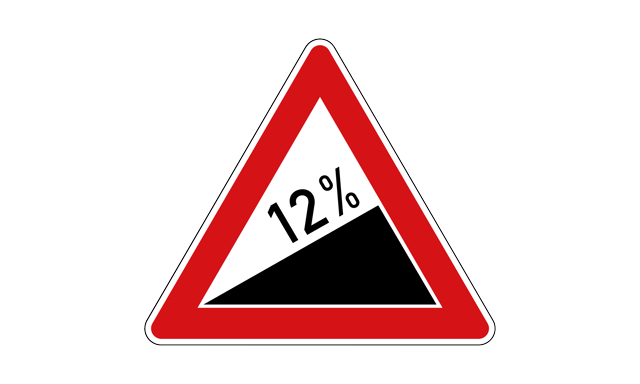

**Options:**
- A. I change down to a lower gear if necessary
- B. I always change up to a higher gear
- C. I drive down this descent carefully

**Correct Answer(s):**
- A. I change down to a lower gear if necessary

**Explanation:**
In order to maintain the speed on the incline, you may have to shift down a gear, as otherwise the torque may not be sufficient to propel the vehicle further at the low speed.

---

### 1.4.41 Chapter Regulatory Sign

#### Question 1.4.41-001

**Points:** 3 Points

**When must you wait at this traffic sign?**

**Options:**
- A. When a railway employee is waving a white-red-white flag
- B. When the level crossing cannot be crossed without having to stop on it
- C. When a rail vehicle is approaching

**Correct Answer(s):**
- A. When a railway employee is waving a white-red-white flag
- B. When the level crossing cannot be crossed without having to stop on it
- C. When a rail vehicle is approaching

**Explanation:**
The diagonal cross in front of a railroad crossing signals the right of way for rail traffic. When a rail vehicle approaches, you have to wait in front of the sign. The same applies if railway staff waves a white-red-white flag. If you are in danger of comingThe diagonal cross in front of a railroad crossing signals the right of way for rail traffic. When a rail vehicle approaches, you have to wait in front of the sign. The same applies if railway staff waves a white-red-white flag. If you are in danger of coming to a stop on the railroad crossing due to traffic jams, you must also wait in front of the diagonal cross until you can quickly cross the railroad crossing.
to a stop on the railroad crossing due to traffic jams, you must also wait in front of the diagonal cross until you can quickly cross the railroad crossing.

---

#### Question 1.4.41-004

**Points:** 2 Points

**What do you do when you see this traffic sign?**

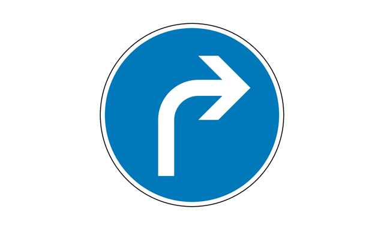

**Options:**
- A. You must indicate right
- B. You may only proceed to the right
- C. You may not turn right

**Correct Answer(s):**
- A. You must indicate right
- B. You may only proceed to the right

**Explanation:**
The traffic sign "Turn right here in front of the sign" only allows you to drive to the right. Even if there is only this one option, the change of the direction of travel needs to be indicated.

---

#### Question 1.4.41-005

**Points:** 2 Points

**What do you do when you see this traffic sign?**

**Options:**
- A. You must indicate left
- B. You may only proceed to the left
- C. You may not proceed to the left

**Correct Answer(s):**
- A. You must indicate left
- B. You may only proceed to the left

**Explanation:**
The traffic sign "Turn left here in front of the sign" only allows to continue the drive to the left. Although there is only this one option, the change of the direction of travel needs to be indicated.

---

#### Question 1.4.41-006

**Points:** 2 Points

**In which directions may you proceed?**

**Options:**
- A. Straight ahead
- B. To the right
- C. To the left

**Correct Answer(s):**
- A. Straight ahead
- B. To the right

**Explanation:**
The traffic sign "You must go straight or turn right" prohibits turning to the left. Allowed are only the other directions straight ahead and right. If you turn to the right, you must indicate the change of direction.

---

#### Question 1.4.41-007

**Points:** 2 Points

**What must you do when you see this traffic sign?**

**Options:**
- A. You must pass on the right of traffic islands
- B. You are obliged to turn right
- C. You may not turn left in front of this sign

**Correct Answer(s):**
- A. You must pass on the right of traffic islands

**Explanation:**
The traffic sign "Keep right of traffic" indicates that you have to drive past an obstacle on the right. These include traffic islands, construction sites or bus stops. If there is an intersection or T-junction before the marked point, you may turn right as well as left. If you swing out while driving around an obstacle, you have to indicate that.

---

#### Question 1.4.41-008

**Points:** 5 Points

**You are approaching a bus stop marked like this. What do you do if you see children there?**

**Options:**
- A. Reduce your speed and be ready to brake
- B. A reduction in speed is only necessary when a school bus is stopping there
- C. Speed must not be reduced when a bus stops at a stopping bay

**Correct Answer(s):**
- A. Reduce your speed and be ready to brake

**Explanation:**
This stop is a bus stop where school buses operate at the times indicated. If you approach this stop, you will have to expect children who suddenly run onto the road; the principle of trust does not apply in this case. If a school bus is in the passenger bay or on the street, you have to be able to brake as a car driver; You may only drive past at walking speed.

---

#### Question 1.4.41-010

**Points:** 4 Points

**What must you remember when you see this traffic sign?**

**Options:**
- A. You may not drive a motor vehicle in this pedestrian precinct
- B. You may drive a motor vehicle at walking speed in this pedestrian precinct
- C. Residents may drive motor vehicles in this pedestrian precinct

**Correct Answer(s):**
- A. You may not drive a motor vehicle in this pedestrian precinct

**Explanation:**
The traffic sign "pedestrian area" prohibits motor vehicles entering this area, even walking speed is prohibited. This also applies to residents. In shopping areas, additional signs often allow entry at certain times. That is not given here.

---

#### Question 1.4.41-012

**Points:** 2 Points

**Which vehicles are not allowed to drive here?**

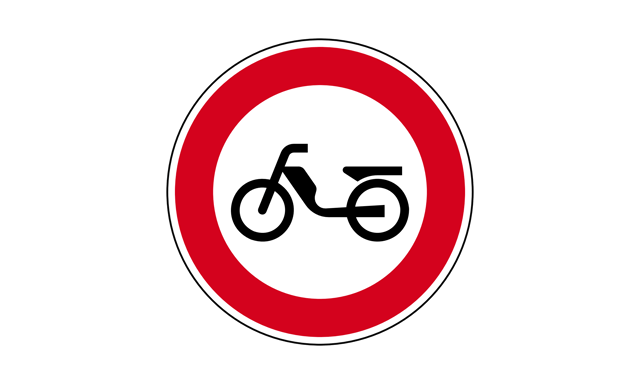

**Options:**
- A. Motorized bicycle
- B. Small motorcycles
- C. Light motorcycles

**Correct Answer(s):**
- A. Motorized bicycle

**Explanation:**
The traffic sign "No Motorbikes Permitted" only applies to mopeds. It does not apply to mopeds and light motorcycles. The low speed of motorbikes would hinder the flow of traffic on this road.

---

#### Question 1.4.41-013

**Points:** 3 Points

**What must you remember when you see this traffic sign?**

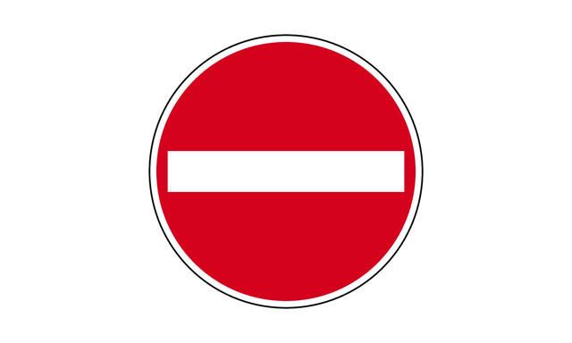

**Options:**
- A. Vehicles may come out of this road
- B. You may not enter this road
- C. You may enter this road

**Correct Answer(s):**
- A. Vehicles may come out of this road
- B. You may not enter this road

**Explanation:**
The traffic sign "Do not enter" forbids the entrance to the street or road without exception for all vehicles including bicycles. Bicycles may only enter if permitted by an additional sign. Vehicles come out of this lane. It always appears at the exit of a one-way street or the end of a motorway exit.

---

#### Question 1.4.41-014

**Points:** 3 Points

**What must you remember when you see this traffic sign?**

**Options:**
- A. You may not stop
- B. You may stop for loading and unloading
- C. You may stop to let passengers out

**Correct Answer(s):**
- A. You may not stop

**Explanation:**
The traffic sign "Absolutely no stopping" prohibits drivers to wait or stop, unless it is due to the traffic situation, such as a red traffic light or another compelling traffic situation. It's prohibited to let people enter or exit or to load/unload the vehicle.

---

#### Question 1.4.41-015

**Points:** 2 Points

**What is allowed at this traffic sign?**

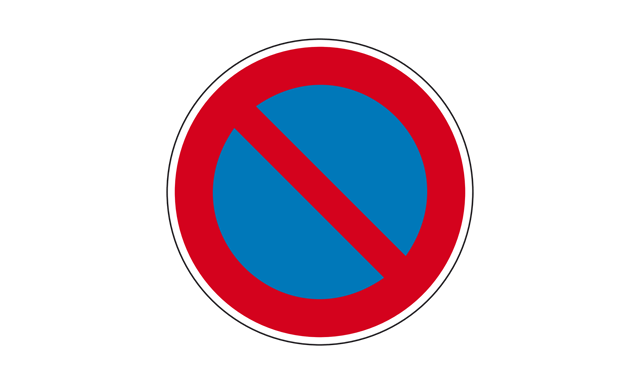

**Options:**
- A. Stopping for loading or unloading, for alighting or boarding vehicles
- B. Waiting up to 3 minutes
- C. Parking, provided a parking disc is used

**Correct Answer(s):**
- A. Stopping for loading or unloading, for alighting or boarding vehicles
- B. Waiting up to 3 minutes

**Explanation:**
The sign "No parking. Waiting is allowed." sign allows you to wait for up to three minutes. Situations of loading and unloading or getting in and out of the car may also take longer. The car driver must be in the immediate vicinity of the vehicle.

---

#### Question 1.4.41-016

**Points:** 2 Points

**What is permitted where you see these traffic signs?**

**Options:**
- A. Severely disabled persons with the appropriate numbered parking permit may park here
- B. Anyone is allowed to stop to pick up or drop passengers
- C. With a parking ticket from a parking-ticket machine (Parkscheinautomat), anyone is allowed to park here for an unlimited period

**Correct Answer(s):**
- A. Severely disabled persons with the appropriate numbered parking permit may park here
- B. Anyone is allowed to stop to pick up or drop passengers

**Explanation:**
The sign "No parking. Waiting is allowed." allows you to stop in order to let people get in and out, or to load and unload. The parking lot is reserved for a car driver with a disability card and a personalized parking card. Only these people have the right to park in this place and are allowed to let illegally parked vehicles be towed away.

---

#### Question 1.4.41-017

**Points:** 3 Points

**What is true in the case of this traffic sign combination?**

**Options:**
- A. - watching out for cyclists coming from the left and right
- B. - watching out for electric scooter traffic coming from the left and right
- C. - only watching out for motor vehicle traffic coming from the left and right on the priority road

**Correct Answer(s):**
- A. - watching out for cyclists coming from the left and right
- B. - watching out for electric scooter traffic coming from the left and right

**Explanation:**
The additional sign indicates that cycle traffic could be coming from the left and right. Therefore, even if you only want to turn right, pay attention to both directions. Electric scooters are becoming more common, they ride on the cycle path, so watch out for scooter riders as well.

---

#### Question 1.4.41-018

**Points:** 2 Points

**What vehicles may enter a cycle highway that has this sign?**

**Options:**
- A. All vehicles driven by residents
- B. All mopeds with a maximum design speed less than 25 km/h
- C. All cars, provided they travel at walking speed

**Correct Answer(s):**
- A. All vehicles driven by residents

**Explanation:**
Vehicular traffic other than cyclists is not allowed to use cycle lanes unless permitted by additional signs. The additional sign allows residents to enter the cycle lane.

---

#### Question 1.4.41-019

**Points:** 3 Points

**What is true in relation to yellow road markings?**

**Options:**
- A. - are only applied temporarily (at construction sites for example)
- B. - replace the validity of white road markings
- C. - only apply to construction site traffic

**Correct Answer(s):**
- A. - are only applied temporarily (at construction sites for example)
- B. - replace the validity of white road markings

**Explanation:**
Yellow lane markings are placed temporarily, e.g. to change the course of the lane due to a construction site. The white lane markings are replaced by the yellow ones.

---

#### Question 1.4.41-020-M

**Points:** 3 Points

**What is true in this situation?**

**Options:**
- A. - not drive on the restricted zone
- B. - use the restricted zone to make a turn
- C. - use the restricted zone if there is a traffic jam

**Correct Answer(s):**
- A. - not drive on the restricted zone

**Explanation:**
A restricted area may not be driven on as a matter of principle.

---

#### Question 1.4.41-021

**Points:** 2 Points

**What vehicles may enter a zone with this sign?**

**Options:**
- A. Bicycles
- B. Small electric vehicles
- C. Vehicles driven by residents

**Correct Answer(s):**
- A. Bicycles
- B. Small electric vehicles
- C. Vehicles driven by residents

**Explanation:**
The traffic sign shows a bicycle zone with the additional sign "Anleger frei". In bicycle zones, the rule of "right before left" applies. Cyclists, very small electric vehicles and other authorised vehicles are allowed to travel at a maximum speed of 30 km/h in bicycle zones. Cyclists and very small electric vehicles may ride side by side in bicycle zones. The additional sign also allows residents to ride in the bicycle zone.

---

#### Question 1.4.41-022

**Points:** 2 Points

**Within a built-up area, what should you note when driving on a road where this traffic sign combination is displayed?**

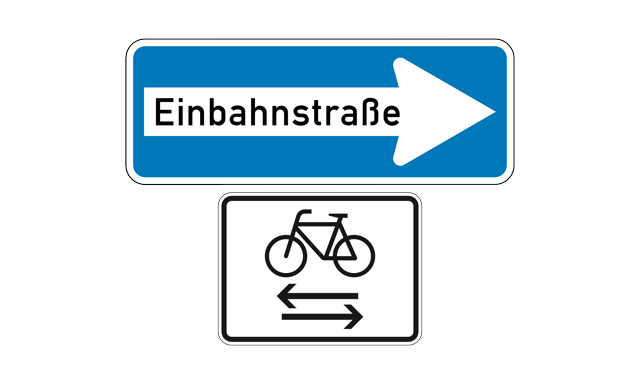

**Options:**
- A. Cyclists may move in my direction
- B. When overtaking cyclists, I have to maintain a minimum passing distance of 1.5 m
- C. Cyclists have to use the footpaths to the left and right of the roadway

**Correct Answer(s):**
- A. Cyclists may move in my direction
- B. When overtaking cyclists, I have to maintain a minimum passing distance of 1.5 m

**Explanation:**
The one-way street sign also applies to cyclists, but with this traffic sign combination they are allowed to ride in both directions. Please note, however, that when overtaking cyclists in built-up areas, a minimum lateral distance of 1.5 m must always be maintained.

---

#### Question 1.4.41-023

**Points:** 2 Points

**This traffic sign is displayed on the right-hand kerbside. What does it mean?**

**Options:**
- A. - not stop before it
- B. - not stop after it
- C. - park before it

**Correct Answer(s):**
- A. - not stop before it
- B. - not stop after it

**Explanation:**
The traffic sign indicates an absolute no-stopping zone in the area in front of and behind the traffic sign. The arrow pointing to the left indicates that you are not allowed to stop after the sign, the arrow pointing to the right indicates that you are not allowed to stop in front of the sign.

---

#### Question 1.4.41-024

**Points:** 2 Points

**This traffic sign is displayed on the right-hand kerbside. What does it indicate?**

**Options:**
- A. - the start of an absolute no-stopping zone
- B. - the end of an absolute no-stopping zone
- C. - the start of a limited prohibition of stopping zone

**Correct Answer(s):**
- A. - the start of an absolute no-stopping zone

**Explanation:**
The traffic sign signals the beginning of an absolute prohibition to stop from the traffic sign. The arrow pointing to the left shows that the prohibition of stopping begins from the sign.

---

#### Question 1.4.41-025

**Points:** 2 Points

**What do you have to be aware of when you see with this traffic sign?**

**Options:**
- A. - may not stop
- B. - may stop to quickly load my vehicle
- C. - may stop to allow passengers to exit my vehicle

**Correct Answer(s):**
- A. - may not stop

**Explanation:**
The traffic sign indicates an absolute no-stopping zone in this area. You are not allowed to stop there.

---

#### Question 1.4.41-026-M

**Points:** 3 Points

**What is the right thing in this situation?**

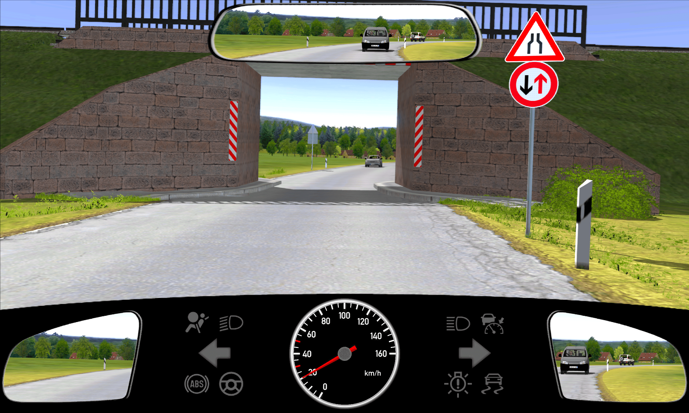

**Options:**
- A. - after the oncoming [car] has done so
- B. - before the oncoming [car] has done so
- C. - at walking speed only

**Correct Answer(s):**
- A. - after the oncoming [car] has done so

**Explanation:**
The sign indicates that you must give priority to oncoming traffic at the bottleneck. The vehicle coming towards you is already close to the bottleneck, so you must wait and may only drive after the car coming towards you.

---

#### Question 1.4.41-027

**Points:** 2 Points

**When may you stop here?**

**Options:**
- A. On Sundays
- B. On public holidays
- C. On Saturdays

**Correct Answer(s):**
- A. On Sundays
- B. On public holidays

**Explanation:**
The absolute stopping ban only applies on working days. You are allowed to stop here on Sundays and public holidays.

---

#### Question 1.4.41-028-M

**Points:** 4 Points

**What applies at this junction?**

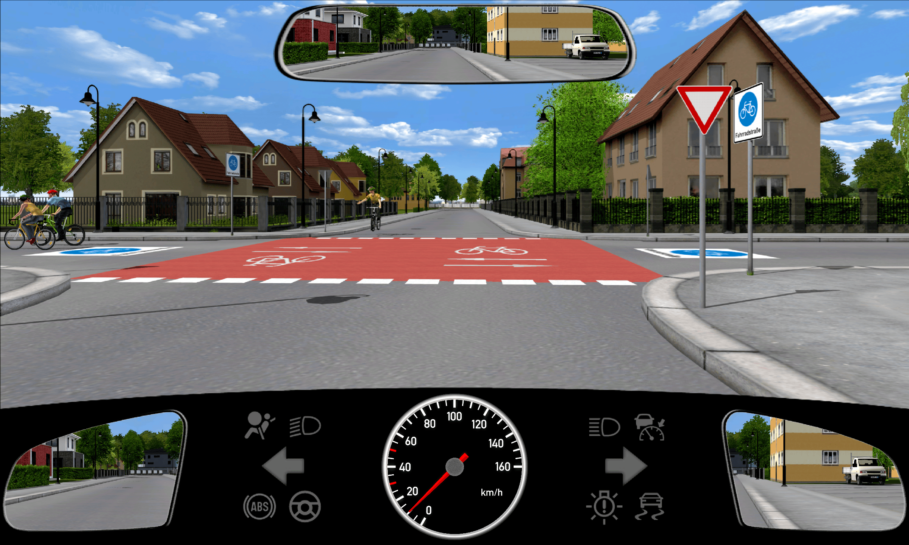

**Options:**
- A. - cross the junction
- B. - turn right
- C. - turn left

**Correct Answer(s):**
- A. - cross the junction

**Explanation:**
The blue traffic signs, with the white bicycle in the middle, indicate a bicycle street. This road may only be used by bicycles, unless otherwise expressly indicated by other traffic signs. In addition, the triangular traffic sign “Give way” indicates that cross traffic must be given priority.
You do not necessarily have to stop at the traffic sign “Give way” and you can cross the intersection carefully as there is no traffic visible from the right or left.

---

#### Question 1.4.41-029

**Points:** 3 Points

**What does this road sign indicate?**

**Options:**
- A. - not drive
- B. - drive at walking speed
- C. - drive as residents

**Correct Answer(s):**
- A. - not drive

**Explanation:**
Basically, the traffic sign “Prohibited all types of vehicles” means that vehicles are not allowed to drive on the road. However, motorcycles or bicycles may be pushed.

---

#### Question 1.4.41-030

**Points:** 3 Points

**You are driving on a one-way street with signposting. What is correct?**

**Options:**
- A. I have to get as far to the left as possible in order to turn left
- B. I may also park on the left-hand side of the road
- C. I may park against the direction of traffic

**Correct Answer(s):**
- A. I have to get as far to the left as possible in order to turn left
- B. I may also park on the left-hand side of the road

**Explanation:**
The direction of travel on a one-way street is always indicated by the white arrow on the traffic sign. If you are on your one-way street, you are allowed to park on the right or left side of the road in the direction of travel. 
In order not to obstruct the traffic behind you when turning left, you must move as far to the left as possible. This leaves enough space for vehicles that want to go straight or turn right.

---

#### Question 1.4.41-031

**Points:** 3 Points

**You are travelling on a main road. Which road sign ends your right of way?**

**Options:**
- A. 
- B. 
- C. 

**Correct Answer(s):**
- A. 
- B. 

**Explanation:**
The traffic sign “End of priority road” signals to you that the right of way regulation has been lifted and the priority road ends here. 

If you have previously been driving on a priority road, the traffic sign “Give way” tells you that this priority road now ends. You now have to give way to other road users.

---

#### Question 1.4.41-032

**Points:** 4 Points

**Which of the following rules of the road requires you to stop before turning right?**

**Options:**
- A. 
- B. 
- C. 

**Correct Answer(s):**
- A. 
- B. 

**Explanation:**
The “stop sign” shows you that you must always stop at the stop line or line of sight. 

The “green arrow” next to the red traffic light signals that you can turn right despite the red traffic light. But only after you have stopped at the stop or line of sight and made sure that you are not endangering anyone.

---

#### Question 1.4.41-033

**Points:** 3 Points

**Which road sign forbids you from entering the signposted area?**

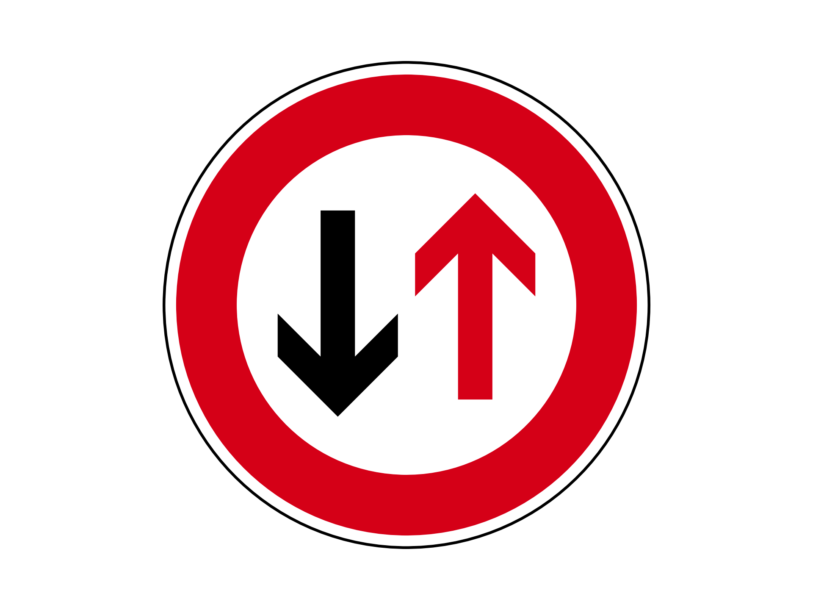

**Options:**
- A. 
- B. 
- C. 

**Correct Answer(s):**
- A. 
- B. 

**Explanation:**
You are not allowed to enter a street with this traffic sign because it indicates a pedestrian zone. This may only be used by pedestrians. 

The traffic sign means “Entry prohibited”. Driving into the signposted area is therefore prohibited.

---

#### Question 1.4.41-102

**Points:** 3 Points

**What do you do when you see this traffic sign?**

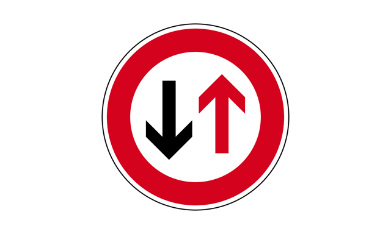

**Options:**
- A. You must give precedence to oncoming traffic
- B. You are not allowed to turn
- C. You take precedence over oncoming traffic

**Correct Answer(s):**
- A. You must give precedence to oncoming traffic

**Explanation:**
The road is too narrow for two lanes. The traffic sign regulates the right of way. The oncoming traffic is granted priority. If you are met by vehicles, you must stop early and allow oncoming traffic to pass.

---

#### Question 1.4.41-106

**Points:** 2 Points

**In which directions are you allowed to continue?**

**Options:**
- A. To the left
- B. To the right
- C. Straight ahead

**Correct Answer(s):**
- A. To the left
- B. To the right

**Explanation:**
The traffic sign "You" only allows turning to the right or left" only allows you to turn left or right. The desired direction of travel needs to be indicated. You are not allowed to drive straight ahead.

---

#### Question 1.4.41-109

**Points:** 5 Points

**A school bus is stopping on the roadway approximately 80 m in front of you. Can this be dangerous?**

**Options:**
- A. Yes, because children frequently run across the road to catch the bus
- B. Yes, because children do not always take the shortest route to cross the roadway
- C. No, because school crossing patrols regulate traffic at every school bus stop

**Correct Answer(s):**
- A. Yes, because children frequently run across the road to catch the bus
- B. Yes, because children do not always take the shortest route to cross the roadway

**Explanation:**
If a school bus stops in front of you on the road about 80 m away, you have to expect the following: Children could suddenly run on/off the road to reach the bus, for example, by the shortest route. This danger exists even if school crossing guards secure the traffic. You have to be ready to brake and you are only allowed to drive past the school bus at walking speed.

---

#### Question 1.4.41-114

**Points:** 3 Points

**Who is allowed to drive a motor vehicle on this road?**

**Options:**
- A. Persons delivering goods
- B. Shoppers
- C. Visitors

**Correct Answer(s):**
- A. Persons delivering goods

**Explanation:**
The street is a declared sidewalk, with the additional sign "delivery vehicles only". Therefore, this road may only be used by a distributor with a motor vehicle. The distributor must be able to prove that he has to deliver something in this street. He has to drive at walking speed, regardless of whether or not pedestrians pass the street. He has to take care of pedestrians.

---

#### Question 1.4.41-115

**Points:** 2 Points

**Which vehicles are allowed to use the special lane marked like this?**

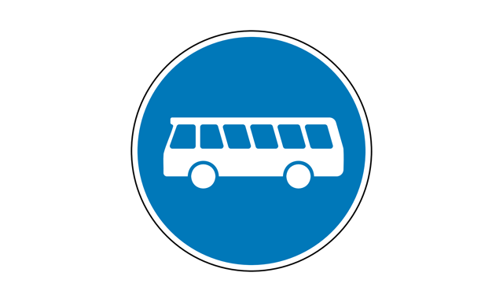

**Options:**
- A. Regular buses
- B. Trucks
- C. Cars

**Correct Answer(s):**
- A. Regular buses

**Explanation:**
The lane shown here is intended for public buses. Only they are allowed to use this lane. For all other drivers the use of this lane is prohibited.

---

#### Question 1.4.41-116

**Points:** 2 Points

**Who is allowed to enter a street sign-posted like this?**

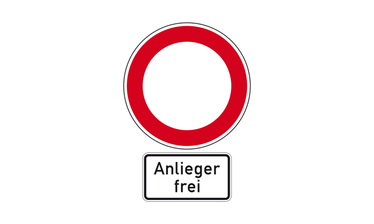

**Options:**
- A. Residents
- B. People visiting residents
- C. Through-traffic

**Correct Answer(s):**
- A. Residents
- B. People visiting residents

**Explanation:**
The additional sign indicates that drivers who have to go on errands in this street privately, or for business reasons may enter. Residents and visitors are customers of shops, patients of medical practices as well as people who live in this street and their visitors. Through traffic is prohibited in this street.

---

#### Question 1.4.41-118

**Points:** 2 Points

**Which vehicles are not allowed to use a road sign-posted like this?**

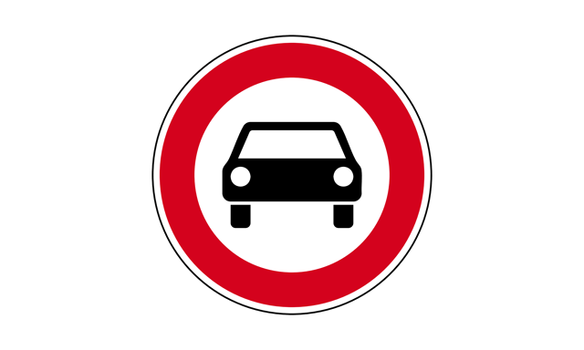

**Options:**
- A. Trucks
- B. Cars
- C. Motorcycles

**Correct Answer(s):**
- A. Trucks
- B. Cars

**Explanation:**
Cars, but also other multi-lane motor vehicles, may not drive on a road with this sign. These include cars, trucks and buses. The ban does not apply to motorcycles, including side cars, and non-motorized vehicles.

---

#### Question 1.4.41-119

**Points:** 2 Points

**Which vehicles are not allowed to use a road sign-posted like this?**

**Options:**
- A. Bicycles
- B. Motorcycles
- C. Cars

**Correct Answer(s):**
- A. Bicycles

**Explanation:**
This round road sign with the red border prohibits the passage for cyclists. It usually can be found on roads where you are allowed to drive fast and where a cyclist can get into dangerous situations due to his or her low speed. Motorized vehicles such as motorcycles and cars may continue here.

---

#### Question 1.4.41-120

**Points:** 2 Points

**Which vehicles are not allowed to use a road sign-posted like this?**

**Options:**
- A. Motorcycles
- B. Cars
- C. Trucks

**Correct Answer(s):**
- A. Motorcycles

**Explanation:**
A round traffic sign with a red border indicates a general traffic ban for vehicles. If the circle contains a symbol, the types of vehicles to which the traffic ban applies are specified more precisely. Here the road may not be used by motorcyclists.

---

#### Question 1.4.41-121

**Points:** 2 Points

**What do these traffic signs indicate?**

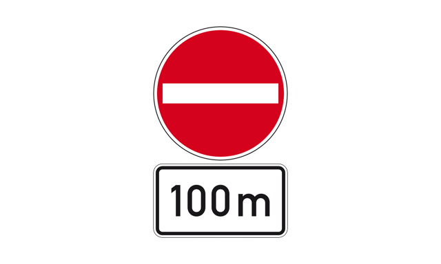

**Options:**
- A. No entry 100 m ahead
- B. A one-way street 100 m long
- C. A customs post 100 m ahead

**Correct Answer(s):**
- A. No entry 100 m ahead

**Explanation:**
The traffic sign "Do not enter" forbids car drivers to enter this road with vehicles of all kinds. The additional sign makes it clear that this prohibition applies only in 100 meters. It does not explicitly state for how long. Always expect that vehicles can come out of this road.

---

#### Question 1.4.41-124

**Points:** 3 Points

**What does this traffic sign indicate?**

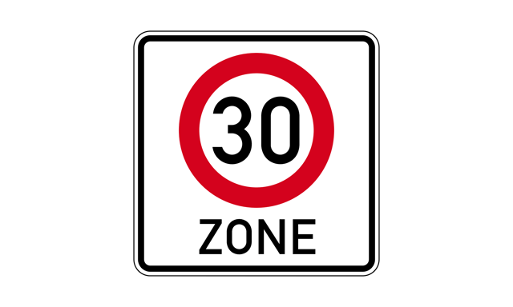

**Options:**
- A. - a permitted maximum speed of 30 km/h
- B. - an obligatory minimum speed of 30 km/h
- C. - a recommended speed of 30 km/h

**Correct Answer(s):**
- A. - a permitted maximum speed of 30 km/h

**Explanation:**
The traffic sign indicates the beginning of a zone with a maximum speed of 30 km/h. It is often set up in residential areas and only once at the beginning. You are not allowed to drive faster than 30 km / h in the entire area. This speed limit is canceled with the "End of the 30 km/h zone" sign.

---

#### Question 1.4.41-125

**Points:** 2 Points

**A traffic calmed commercial zone (verkehrsberuhigter Bereich) starts here. What must you do?**

**Options:**
- A. You must specifically watch out for busy pedestrian traffic
- B. You must pay attention to the allowed maximum parking time
- C. You must observe a minimum speed of 20 km/h

**Correct Answer(s):**
- A. You must specifically watch out for busy pedestrian traffic
- B. You must pay attention to the allowed maximum parking time

**Explanation:**
In a traffic calming zone with shops, road users are often distracted by the displays in the shop windows. You must therefore pay attention to rain and inattentive foot traffic. Your maximum speed is 20 km/h. This is a no parking, but waiting allowed zone and you're obliged to use your parking disc. To offer parking to many customers, the maximum parking time is two hours.

---

#### Question 1.4.41-126

**Points:** 2 Points

**What does this traffic sign indicate?**

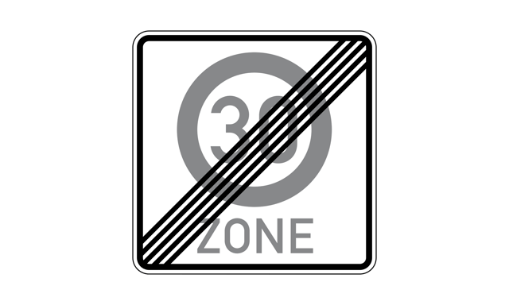

**Options:**
- A. - a permitted maximum speed of 30 km/h
- B. - an obligatory minimum speed of 30 km/h
- C. - a recommended speed of 30 km/h

**Correct Answer(s):**
- A. - a permitted maximum speed of 30 km/h

**Explanation:**
This traffic sign indicates the end of an area in which the permitted speed was set to 30 km/h and thus cancels the maximum speed of 30 km/h.

---

#### Question 1.4.41-127

**Points:** 3 Points

**Are you allowed to drive at a speed faster than 60 km/h here?**

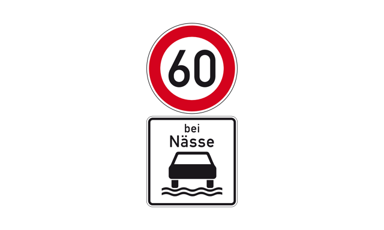

**Options:**
- A. Yes, if the roadway is dry
- B. Yes, if the roadway is wet

**Correct Answer(s):**
- A. Yes, if the roadway is dry

**Explanation:**
Due to the additional sign, the maximum permissible speed of 60 km/h applies only in wet conditions. Decrease the speed of your vehicle accordingly, if the entire roadway is covered with a thin film of water and therefore counts as wet. If the road is dry or only damp, you are also allowed to drive faster than 60 km/h as a car driver.

---

#### Question 1.4.41-128

**Points:** 3 Points

**What do you do when you see this traffic sign?**

**Options:**
- A. You must drive at least at a speed of 60 km/h, weather and traffic conditions permitting
- B. You may not use this road if you cannot or are not allowed to drive at least 60 km/h
- C. You are not allowed to drive faster than 60 km/h

**Correct Answer(s):**
- A. You must drive at least at a speed of 60 km/h, weather and traffic conditions permitting
- B. You may not use this road if you cannot or are not allowed to drive at least 60 km/h

**Explanation:**
This traffic sign dictates that you have to drive here at least at a speed of 60 km/h. Driving slower is only allowed if traffic safety requires it. A car driver may not use this road if he/she cannot or is not allowed to drive that fast due to the vehicle or its load or due to lack of personal abilities.

---

#### Question 1.4.41-129

**Points:** 3 Points

**Which vehicles are you allowed to overtake where you see this traffic sign?**

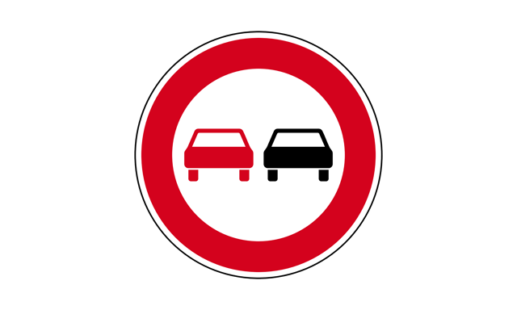

**Options:**
- A. Motorcycle without sidecar
- B. Motorcycle with sidecar
- C. Car

**Correct Answer(s):**
- A. Motorcycle without sidecar

**Explanation:**
The restriction on overtaking prohibits a car driver from overtaking multi-lane vehicles such as cars, trucks or tractors and motorcycles with side cars. Motorcycles without a side car and bicycles are allowed to be overtaken, as these are single-lane vehicles.

---

#### Question 1.4.41-130

**Points:** 3 Points

**What do these traffic signs indicate?**

**Options:**
- A. No overtaking for 3 km
- B. Start of a no-overtaking area 3 km ahead
- C. Roadway with two lanes in one direction for 3 km

**Correct Answer(s):**
- A. No overtaking for 3 km

**Explanation:**
This traffic sign signals a restriction on overtaking on multi-lane motor vehicles or motorcycles with side car. The black arrows with the km indication indicate that the restriction on overtaking applies for 3 km. The restriction on overtaking comes into force starting from the traffic sign.

---

#### Question 1.4.41-131

**Points:** 3 Points

**What do these traffic signs indicate?**

**Options:**
- A. Start of a no-overtaking area 200 m ahead
- B. No overtaking for 200 m
- C. End of a no-overtaking area 200 m ahead

**Correct Answer(s):**
- A. Start of a no-overtaking area 200 m ahead

**Explanation:**
With this traffic sign the car driver is prohibited to overtake multi-lane vehicles and motorcycles with side car. The additional sign prohibits overtaking in 200 meters. Since it contains no black arrows, it does not mean that you are not allowed to overtake in the next 200 meters.

---

#### Question 1.4.41-132

**Points:** 2 Points

**What does this traffic sign indicate?**

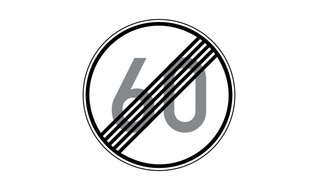

**Options:**
- A. End of speed restriction
- B. A prohibition to drive faster than 60 km/h
- C. Start of speed restriction

**Correct Answer(s):**
- A. End of speed restriction

**Explanation:**
This traffic sign indicates the end of the speed limit of 60 km/h. The car driver may drive at the usual speed again.

---

#### Question 1.4.41-133

**Points:** 2 Points

**Which prohibitions cease to apply when you see this sign?**

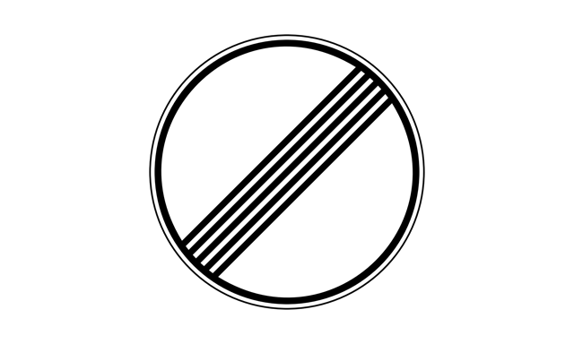

**Options:**
- A. No overtaking
- B. Speed restrictions
- C. No parking

**Correct Answer(s):**
- A. No overtaking
- B. Speed restrictions

**Explanation:**
This traffic sign cancels all road restrictions. For example, road restrictions include restrictions on overtaking and speed limits. Stopping restrictions such as a parking ban are not covered by road restrictions.

---

#### Question 1.4.41-134

**Points:** 3 Points

**What do these traffic signs indicate?**

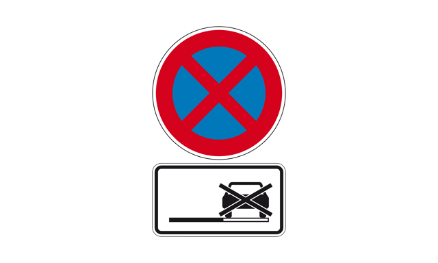

**Options:**
- A. - on the roadway and the hard shoulder
- B. - on the hard shoulder only
- C. - for trucks only

**Correct Answer(s):**
- A. - on the roadway and the hard shoulder

**Explanation:**
The traffic sign signals the car driver that it is forbidden to come to a stop on the road. The additional sign extends the stopping restriction and also prohibits stopping on the side strip for all vehicles, not just for trucks.

---

#### Question 1.4.41-135

**Points:** 2 Points

**What is allowed in the zone which starts here?**

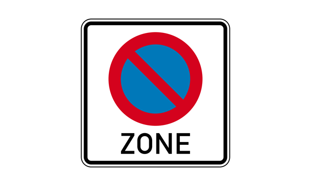

**Options:**
- A. Stopping for up to 3 minutes
- B. Stopping for loading or unloading as well as boarding or alighting
- C. Parking, provided a parking disc is used

**Correct Answer(s):**
- A. Stopping for up to 3 minutes
- B. Stopping for loading or unloading as well as boarding or alighting

**Explanation:**
With the traffic sign "No parking. Waiting is allowed.", there is a restricted stopping ban in an entire area without stopping signs being placed here in certain streets. As a car driver, you are allowed to wait up to three minutes throughout the entire zone. Situations of loading and unloading or getting in and out of the car may also take longer.

---

#### Question 1.4.41-136

**Points:** 2 Points

**What ends here?**

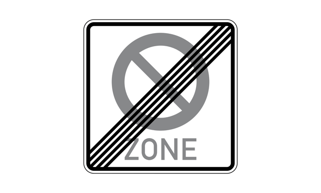

**Options:**
- A. A no-waiting area
- B. A no-stopping area
- C. All previous zonal prohibitions

**Correct Answer(s):**
- A. A no-waiting area

**Explanation:**
Here the no parking zone ends. Note that this traffic sign is often only on placed on the left side of the road and does not suspend the stopping restriction.

---

#### Question 1.4.41-140-B

**Points:** 3 Points

**When must you indicate?**

**Options:**
- A. When you leave the roundabout
- B. When you enter the roundabout

**Correct Answer(s):**
- A. When you leave the roundabout

**Explanation:**
If you enter the roundabout, you do not need to indicate this because the entrance to the circle is always to the right. On the other hand, if you leave the roundabout, you will need to indicate this to make it easier for other drivers to enter the circle.

---

#### Question 1.4.41-141

**Points:** 4 Points

**You are approaching this combination of traffic signs. What must you remember?**

**Options:**
- A. Vehicles in the roundabout have priority
- B. You must indicate to leave the roundabout
- C. You must indicate when entering the roundabout

**Correct Answer(s):**
- A. Vehicles in the roundabout have priority
- B. You must indicate to leave the roundabout

**Explanation:**
Vehicles driving in the roundabout have right of way. Indicating when entering the roundabout is not necessary, as a roundabout is always entered from the right. Therefore, the answer "Entering the roundabout must be indicated" is wrong. You only indicate when you leave a roundabout. This makes sense because this makes it easier for vehicles to enter the roundabout.

---

#### Question 1.4.41-142

**Points:** 3 Points

**What does this traffic sign mean?**

**Options:**
- A. Stopping on the roundabout is forbidden
- B. You must indicate when entering the roundabout
- C. You are only allowed to drive at walking speed

**Correct Answer(s):**
- A. Stopping on the roundabout is forbidden

**Explanation:**
You have to give priority to the vehicles driving in the roundabout. In the roundabout there is always an absolute stopping restriction. You only indicate when you leave a roundabout. This helps other cars to enter the roundabout. A general driving with walking speed in the roundabout is not required.

---

#### Question 1.4.41-143

**Points:** 4 Points

**What does this traffic sign mean?**

**Options:**
- A. You must give way to vehicles in the roundabout
- B. You must indicate when leaving the roundabout
- C. You must indicate when entering the roundabout

**Correct Answer(s):**
- A. You must give way to vehicles in the roundabout
- B. You must indicate when leaving the roundabout

**Explanation:**
The traffic signs indicate that the drivers in the roundabout have priority. They also show that you do not need to indicate when entering the roundabout, as motorists can only enter the circle to the right. As soon as you leave the roundabout, you will need to indicate that to make it easier for other road users to enter the roundabout.

---

#### Question 1.4.41-144

**Points:** 4 Points

**What must you do when you see this combination of traffic signs?**

**Options:**
- A. You must indicate right to leave the roundabout
- B. When entering the roundabout, you must give way
- C. You must enter to the left

**Correct Answer(s):**
- A. You must indicate right to leave the roundabout
- B. When entering the roundabout, you must give way

**Explanation:**
When driving in, you must give priority to the vehicles in that are already in the roundabout. The circle may only be entered through the right. You only indicate when leaving the roundabout. This regulation makes it easier for drivers to enter the roundabout. When recognizing the turn signal, they can decide whether they can already enter the circle with due regard for due diligence.

---

#### Question 1.4.41-145

**Points:** 2 Points

**What does this traffic sign indicate?**

**Options:**
- A. A mandatory cycle path
- B. A "cyclists prohibited" zone
- C. Cyclists crossing the carriageway

**Correct Answer(s):**
- A. A mandatory cycle path

**Explanation:**
This traffic sign identifies a cycle path that cyclists must use but is prohibited for other road users. Cyclists crossing the road have their own warning sign.

---

#### Question 1.4.41-146

**Points:** 3 Points

**What does this traffic sign combination indicate?**

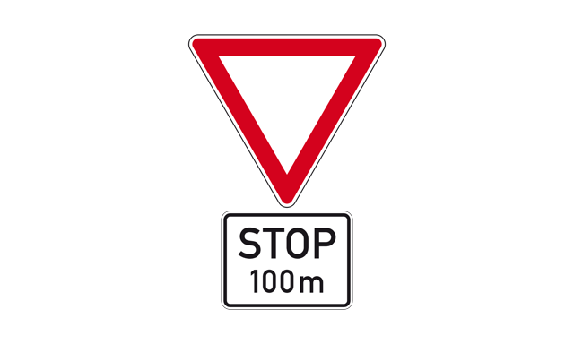

**Options:**
- A. - "Stop. Give way."
- B. - "Give way."
- C. - "Give way to oncoming traffic"

**Correct Answer(s):**
- A. - "Stop. Give way."

**Explanation:**
The traffic sign announces that after a hundred meters you will find a priority road where you will find the traffic sign "Give way". In any case, you must stop there at the stop line or line of sight.

---

#### Question 1.4.41-147

**Points:** 2 Points

**What does this traffic sign indicate?**

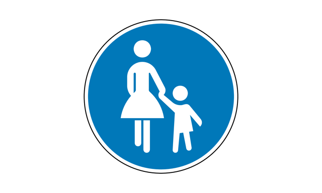

**Options:**
- A. A footpath
- B. A prohibition on cycles and mopeds
- C. The start of a traffic-calming zone

**Correct Answer(s):**
- A. A footpath
- B. A prohibition on cycles and mopeds

**Explanation:**
The traffic sign "Footway" marks paths which may be used exclusively by pedestrians and cyclists up to 10 years. Car drivers, cyclists and other road users may not be traveling on these routes. However, exceptions may be regulated by additional signs.

---

#### Question 1.4.41-148

**Points:** 3 Points

**What vehicles are permitted to use this road?**

**Options:**
- A. Cycles and motorcycles that are pushed
- B. Motor vehicles
- C. Electric-powered vehicles

**Correct Answer(s):**
- A. Cycles and motorcycles that are pushed

**Explanation:**
The traffic sign "No vehicles of any kind permitted" includes all vehicles. Only motor bicycles such as motorcycles and scooters and bicycles may be pushed here.

---

#### Question 1.4.41-149

**Points:** 3 Points

**How must you act when driving a vehicle during permitted delivery times?**

**Options:**
- A. I may only drive at walking speed
- B. I must keep a close look out for pedestrians
- C. If there are no pedestrians in my vicinity, I may drive faster than walking speed

**Correct Answer(s):**
- A. I may only drive at walking speed
- B. I must keep a close look out for pedestrians

**Explanation:**
Since the traffic sign "Footway" is combined here with the additional sign "Delivery vehicles only", a distributor may drive on a road that is marked this way. You have to drive at walking speed, regardless of whether pedestrians are visible or not. Pedestrians have priority, you should be especially considerate of them.

---

#### Question 1.4.41-150

**Points:** 2 Points

**What must you do upon seeing this traffic sign?**

**Options:**
- A. I may not perform a U-turn here
- B. I am in a cul-de-sac and have to turn around
- C. I may not turn left here

**Correct Answer(s):**
- A. I may not perform a U-turn here

**Explanation:**
This traffic sign indicates the prohibition to turn in order to drive in the opposite direction. Turning left, however, is allowed. This traffic sign does not only apply to dead ends.

---

#### Question 1.4.41-151

**Points:** 3 Points

**What does this traffic sign indicate?**

**Options:**
- A. I may not drive faster than 60 km/h
- B. There is absolutely no problem in driving at 60 km/h
- C. The recommended minimum speed is 60 km/h

**Correct Answer(s):**
- A. I may not drive faster than 60 km/h

**Explanation:**
Starting from these traffic signs a maximum of 60 km/h may be driven, regardless of the weather conditions. In bad weather conditions, the speed must be reduced further. However, the traffic sign does not say that 60 km/h must always be driven in order to stay safe. There is no traffic sign for a recommended minimum speed.

---

#### Question 1.4.41-152

**Points:** 2 Points

**What does this traffic sign indicate?**

**Options:**
- A. I may only drive straight ahead
- B. I have priority over oncoming traffic
- C. I am on a one-way road

**Correct Answer(s):**
- A. I may only drive straight ahead

**Explanation:**
This traffic sign means "You must go straight ahead". You can only drive straight ahead and are not allowed to turn. The one-way street sign has the same colors but is rectangular.

---

#### Question 1.4.41-153

**Points:** 4 Points

**What do you do upon seeing this traffic sign?**

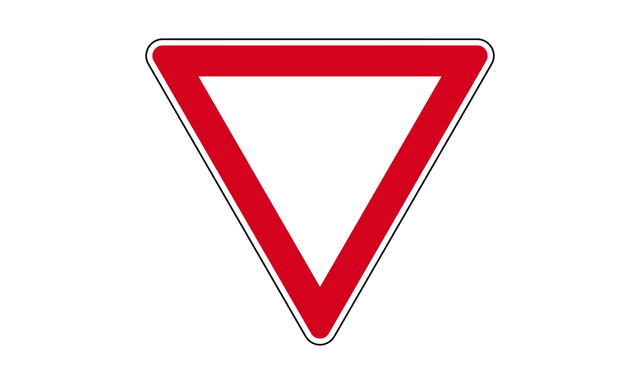

**Options:**
- A. I approach at a moderate speed ready to brake
- B. I allow the cross-wise moving traffic the right of way
- C. If I am turning right, I am not obliged to wait

**Correct Answer(s):**
- A. I approach at a moderate speed ready to brake
- B. I allow the cross-wise moving traffic the right of way

**Explanation:**
The traffic signal "Give way" signals that you are driving on a subordinate road and the cross traffic has priority. Drive slowly and stay ready to brake so that you do not miss a vehicle that is entitled to drive.

---

#### Question 1.4.41-154

**Points:** 2 Points

**What does this traffic sign indicate?**

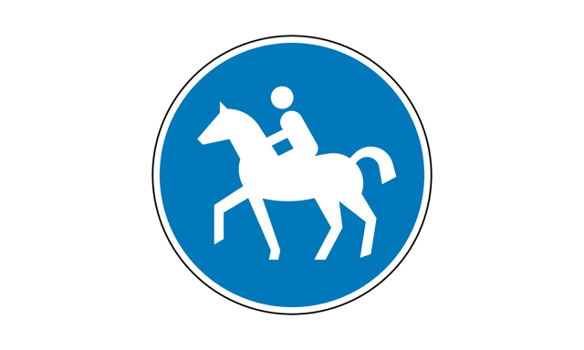

**Options:**
- A. A bridle-path, which riders are required to use
- B. A bridle-path, which may not be used by other road users
- C. A path, which may not be used by riders

**Correct Answer(s):**
- A. A bridle-path, which riders are required to use
- B. A bridle-path, which may not be used by other road users

**Explanation:**
This traffic sign shows you a riding path. Here riders move with their horses. Other road users are not allowed to use this path.

---

#### Question 1.4.41-155

**Points:** 4 Points

**What must you do upon seeing this traffic sign?**

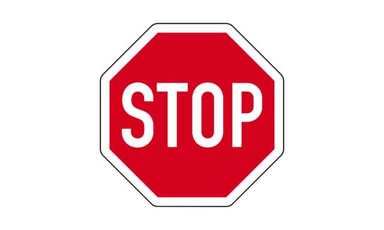

**Options:**
- A. - stop and give way
- B. - stop only if there is a stop line
- C. - stop only if there is cross-wise moving traffic

**Correct Answer(s):**
- A. - stop and give way

**Explanation:**
The sign "Stop! Yield to cross traffic" requires you to stop and thereby slow down the vehicle to a complete stop. It doesn't matter if there is a stop line or if cross traffic is coming.

---

#### Question 1.4.41-156

**Points:** 4 Points

**What do you have to do in this traffic situation?**

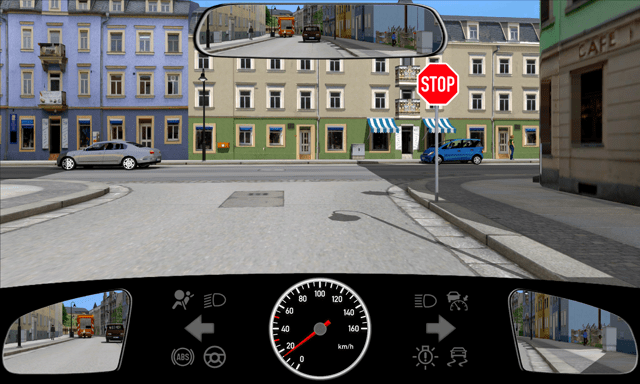

**Options:**
- A. - stop at the line of sight and give way
- B. - not stop, because there is no stop line
- C. - stop only if there is cross-wise moving traffic

**Correct Answer(s):**
- A. - stop at the line of sight and give way

**Explanation:**
At the traffic sign "Stop! Yield to cross traffic" you have to stop and give way. You always have to stop, even if there is no cross traffic. Since there is no stop line, stop at the line of sight. From the line of sight, you can see the street you want to enter.

---

#### Question 1.4.41-157

**Points:** 4 Points

**What do you have to do in this traffic situation?**

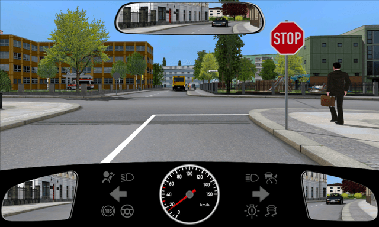

**Options:**
- A. - stop at the stop line and give way
- B. - stop only at the stop sign
- C. - stop only if there is cross-wise moving traffic

**Correct Answer(s):**
- A. - stop at the stop line and give way

**Explanation:**
The traffic sign "Stop! Yield to cross traffic!" requires that you stop and give way. Since there is a stop line, you must stop at the stop line. If there is no stop line, you must stop at the line of sight and your wheels have to stop completely. You always have to stop, even if there is no cross traffic.

---

#### Question 1.4.41-158

**Points:** 2 Points

**You are driving along a priority road. Which traffic sign ends your right of way?**

**Options:**
- A. 1
- B. 2
- C. 3

**Correct Answer(s):**
- A. 1

**Explanation:**
Example 1 means "Yield", you must give priority to other road users. Sign 2 grants you right of way at the next intersection. Sign 3 only warns of a danger zone.

---

#### Question 1.4.41-159

**Points:** 2 Points

**What do you have to be aware of with this traffic sign?**

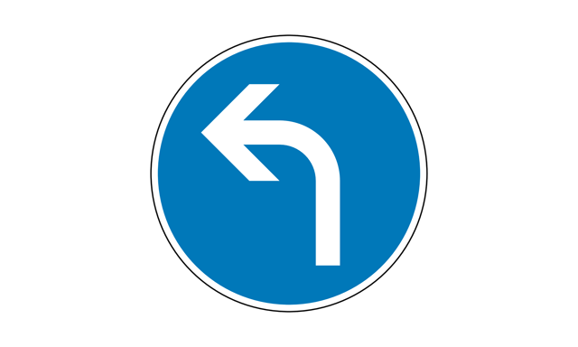

**Options:**
- A. I have to signal a left-turn
- B. I may only continue driving by taking a left turn
- C. I may not signal

**Correct Answer(s):**
- A. I have to signal a left-turn
- B. I may only continue driving by taking a left turn

**Explanation:**
This traffic sign regulates the direction of travel. You may only turn left here. The change of the direction of travel must be indicated.

---

#### Question 1.4.41-160

**Points:** 2 Points

**What applies with this traffic sign?**

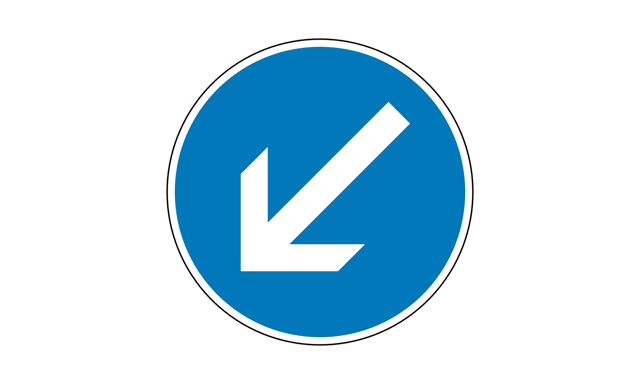

**Options:**
- A. I have to drive past obstructions on the left
- B. I am obliged to turn left
- C. I may not turn right before the sign

**Correct Answer(s):**
- A. I have to drive past obstructions on the left

**Explanation:**
This traffic sign prescribes from which side you have to circuit the obstacle. You can find the regulation sign at central, stop islands or construction sites. If you meet the sign at an intersection or T-junction, you may turn in the appropriate direction.

---

#### Question 1.4.41-161

**Points:** 2 Points

**What applies in the area 15 m in front of and behind this traffic sign?**

**Options:**
- A. - stop
- B. - not obstruct passengers boarding or alighting
- C. - park

**Correct Answer(s):**
- A. - stop
- B. - not obstruct passengers boarding or alighting

**Explanation:**
At the traffic sign you can see that there is a tram or bus stop here. 15 meters before and after the traffic sign, drivers are not allowed to park their vehicles. Unless public transport is impeded or passengers are endangered, waiting is allowed for up to three minutes.

---

#### Question 1.4.41-162

**Points:** 2 Points

**What applies with this traffic sign?**

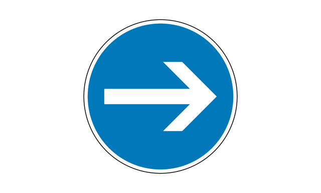

**Options:**
- A. I have to signal a right-turn
- B. I may only continue driving by taking a right turn
- C. I may also continue driving by taking a left turn

**Correct Answer(s):**
- A. I have to signal a right-turn
- B. I may only continue driving by taking a right turn

**Explanation:**
The given direction of travel is binding. The car driver must turn right before the traffic sign and indicate this process to other road users.

---

#### Question 1.4.41-163

**Points:** 2 Points

**What applies with this traffic sign?**

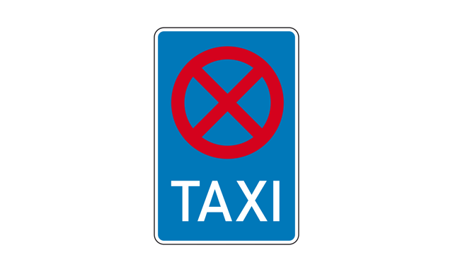

**Options:**
- A. I have to anticipate taxi moving off and coming to a stop
- B. I may stop
- C. I may park

**Correct Answer(s):**
- A. I have to anticipate taxi moving off and coming to a stop

**Explanation:**
The traffic sign indicates a taxi stand. There is basically a stopping restriction for all other vehicles. The car driver must always expect departing and arriving taxis and passengers in this area.

---

#### Question 1.4.41-164

**Points:** 2 Points

**What does this traffic sign combination indicate?**

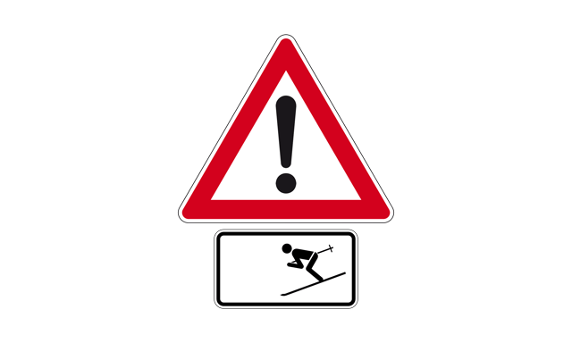

**Options:**
- A. - may be used by winter sports enthusiasts
- B. - may not be used by traffic in winter
- C. - may only be used with snow chains

**Correct Answer(s):**
- A. - may be used by winter sports enthusiasts

**Explanation:**
This sign means "Danger zone" and the additional sign stands for "Winter sports allowed". The combination indicates that winter sportspersons may use the road and road users must pay particular attention to it.

---

#### Question 1.4.41-165

**Points:** 4 Points

**What do you have to be aware of in this traffic situation?**

**Options:**
- A. - not cross the lane marking
- B. - cross the lane marking in order to overtake
- C. - cross the lane marking if oncoming traffic permits this

**Correct Answer(s):**
- A. - not cross the lane marking

**Explanation:**
You must not drive over the lane boundary (solid line) to the left, which is located at the middle of the lane. Driving on it is also prohibited.

---

#### Question 1.4.41-166

**Points:** 4 Points

**What must you be aware of on this priority road?**

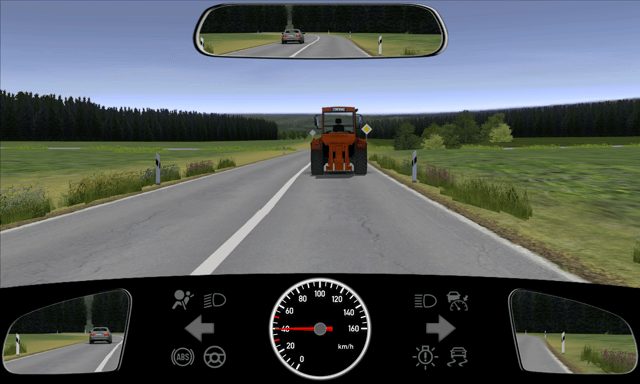

**Options:**
- A. Parking is prohibited
- B. You may not cross the lane marking
- C. Parking is permitted if there is a clear space of at least 3 m between a parked car and the lane marking

**Correct Answer(s):**
- A. Parking is prohibited
- B. You may not cross the lane marking

**Explanation:**
The solid line in the middle between the two lanes prohibits crossing or crossing this line. It also prohibits parking on priority roads outside of built-up areas.

---

#### Question 1.4.41-167

**Points:** 3 Points

**You want to overtake. What is the right thing to do?**

**Options:**
- A. - overtake
- B. - not overtake
- C. - only overtake, if I remain in the right-hand lane while doing so

**Correct Answer(s):**
- A. - overtake

**Explanation:**
You may overtake if other road users are not endangered. The one-sided lane boundary allows you to cross the two lines from the side where the broken line is located.

---

#### Question 1.4.41-168

**Points:** 2 Points

**As a resident, you want to drive into a cycle highway that has this sign. What must you be aware of when doing so?**

**Options:**
- A. Vehicles may not be driven faster than 30 km/h
- B. Cycles may travel alongside one another
- C. Cycle traffic may not be impeded

**Correct Answer(s):**
- A. Vehicles may not be driven faster than 30 km/h
- B. Cycles may travel alongside one another
- C. Cycle traffic may not be impeded

**Explanation:**
A maximum speed of 30 km/h applies to traffic. Cycling traffic must not be endangered or obstructed. If necessary, motor vehicle traffic must reduce speed further. Side-by-side cycling is permitted.

---

#### Question 1.4.41-169

**Points:** 2 Points

**Who may enter a street that has this sign?**

**Options:**
- A. All cyclists
- B. All persons visiting residents
- C. All moped riders

**Correct Answer(s):**
- A. All cyclists
- B. All persons visiting residents

**Explanation:**
Vehicular traffic other than cyclists may not use cycle lanes unless permitted by additional sign. The additional sign allows residents to enter the bicycle lane.

---

#### Question 1.4.41-170

**Points:** 3 Points

**This road traffic sign is displayed for your lane. What must you be aware of?**

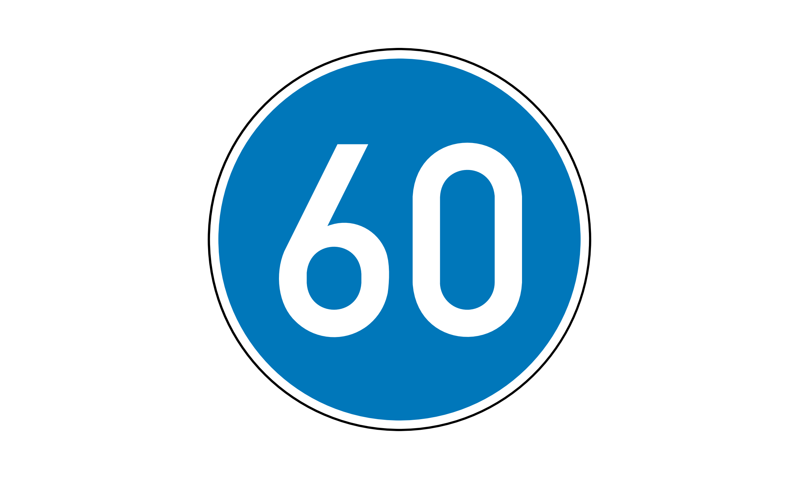

**Options:**
- A. I must drive at a minimum speed of 60 km/h, if permitted by the road and traffic conditions
- B. I may only use this lane if my vehicle can and is allowed to drive at a speed of least 60 km/h
- C. I may not drive faster than 60 km/h

**Correct Answer(s):**
- A. I must drive at a minimum speed of 60 km/h, if permitted by the road and traffic conditions
- B. I may only use this lane if my vehicle can and is allowed to drive at a speed of least 60 km/h

**Explanation:**
This traffic sign indicates the prescribed minimum speed. You must therefore drive at least 60 km/h, provided that the road and traffic conditions allow it.

---

#### Question 1.4.41-171

**Points:** 2 Points

**What is the maximum speed a vehicle may drive in a zone with this sign?**

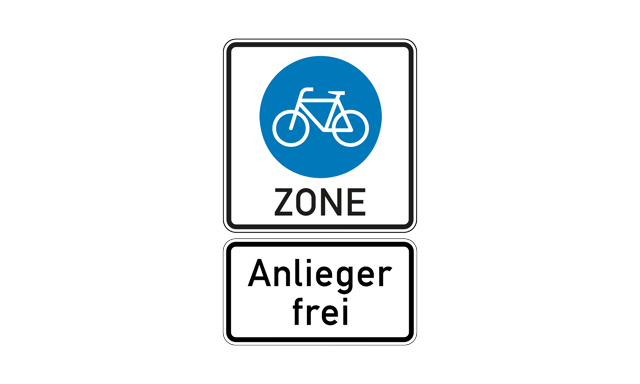

**Options:**

**Correct Answer(s):**
- 30 

**Explanation:**
Cyclists, light electric vehicles and other authorized vehicles may not drive more than 30 km/h in bicycle zones.

---

#### Question 1.4.41-172

**Points:** 3 Points

**What situation applies according to this traffic sign?**

**Options:**
- A. - applies between 10 pm and 6 am
- B. - applies between 6 am and 10 pm
- C. - does not apply to electric vehicles

**Correct Answer(s):**
- A. - applies between 10 pm and 6 am

**Explanation:**
The additional sign limits the speed limit between 10 pm and 6 am.

---

#### Question 1.4.41-173

**Points:** 2 Points

**What should you do when you see this road sign?**

**Options:**
- A. - indicate left
- B. - turn left before the traffic sign
- C. - turn left behind the traffic sign

**Correct Answer(s):**
- A. - indicate left
- B. - turn left before the traffic sign

**Explanation:**
The arrow on this traffic sign always shows the direction of travel. If it is a straight arrow, you have to turn in front of the sign. If it is a curved arrow, you must turn according to the sign. 
You have to flash to indicate the change in driving direction.

---

#### Question 1.4.41-174

**Points:** 3 Points

**Which road sign indicates that turning around is not allowed?**

**Options:**
- A. 
- B. 
- C. 

**Correct Answer(s):**
- A. 
- B. 
- C. 

**Explanation:**
All traffic signs show you that turning is prohibited.

The traffic sign tells you that a tunnel begins here. Turning is strictly prohibited in the tunnel.

The traffic sign “Turning Prohibited” shows you that turning is prohibited here.

This traffic sign tells you that you are on a highway. U-turns are strictly prohibited on the highway.

---

#### Question 1.4.41-175

**Points:** 3 Points

**From which road sign onwards may you not exceed a permissible maximum speed of 60 km/h?**

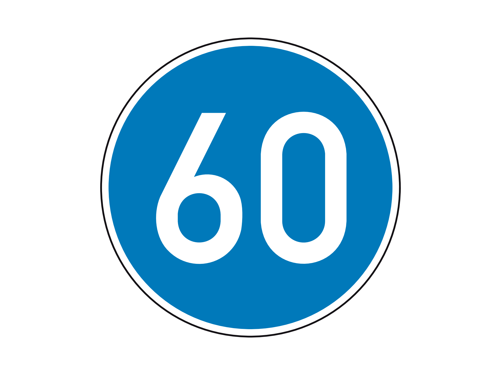

**Options:**
- A. 
- B. 
- C. 

**Correct Answer(s):**
- A. 

**Explanation:**
Traffic signs with a red border generally indicate a ban.
On a road with such a traffic sign you are not allowed to exceed the maximum permitted speed of 60 km/h.

---

### 1.4.42 Chapter Directional Sign

#### Question 1.4.42-001

**Points:** 3 Points

**What does this traffic sign indicate?**

**Options:**
- A. - only at the next crossroads or junction
- B. - at all crossroads and junctions on this road
- C. - as far as the urban limit

**Correct Answer(s):**
- A. - only at the next crossroads or junction

**Explanation:**
This traffic sign grants you priority in a specific place. Thus, the right of way for the driver is limited and has no general validity.

---

#### Question 1.4.42-005

**Points:** 2 Points

**What does this traffic sign indicate?**

**Options:**
- A. The start of an autobahn
- B. The end of an autobahn
- C. The start of a clearway for motor vehicles only

**Correct Answer(s):**
- A. The start of an autobahn

**Explanation:**
The traffic sign indicates that the motorway starts here. This also gives effect to all the rules that apply to this particular type of road.

---

#### Question 1.4.42-009-M

**Points:** 3 Points

**What do the white markings on the road mean in this situation?**

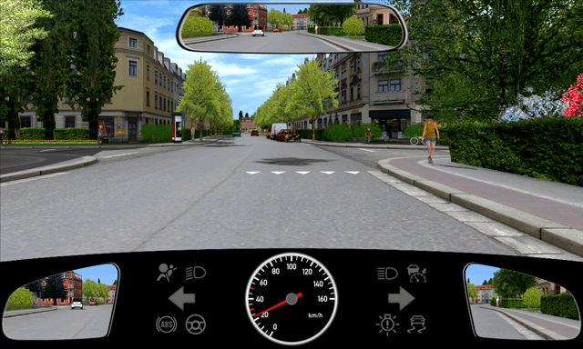

**Options:**
- A. - highlight a duty to give-way due to the right-before-left rule
- B. - indicate a traffic-calming zone
- C. - are a warning about the poor state of the road surface

**Correct Answer(s):**
- A. - highlight a duty to give-way due to the right-before-left rule

**Explanation:**
At intersections and junctions with “right before left” regulation, especially in confusing places, are also used by waiting lines. Wartelinia are often used that look as similar to many small way to go-along.

---

#### Question 1.4.42-010-M

**Points:** 4 Points

**What is the rule created by the road markings in this situation?**

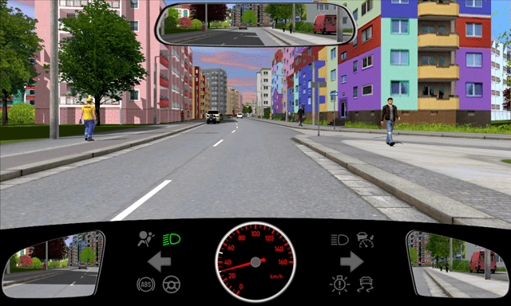

[Video: videos/1_4_42-010-M.mp4](videos/1_4_42-010-M.mp4)

**Options:**
- A. - approach the junction cautiously
- B. - give way to the [red vehicle]
- C. - come to a stop in front of the road markings

**Correct Answer(s):**
- A. - approach the junction cautiously

**Explanation:**
You have to nourish yourself this intersection carefully, as it applies right to the left.
At intersections and junctions with “right before left” regulation, especially in confusing places, are also used by waiting lines. Wartelinia are often used that look as similar to many small way to go-along.

---

#### Question 1.4.42-011

**Points:** 3 Points

**From which road sign onwards are you only allowed to drive at walking speed?**

**Options:**
- A. 
- B. 
- C. 

**Correct Answer(s):**
- A. 

**Explanation:**
In a traffic-calmed area, you may only drive your vehicle at walking speed, as you must expect pedestrians or children playing at any time.

---

#### Question 1.4.42-012

**Points:** 3 Points

**At which traffic sign at the next junction do you generally have right of way?**

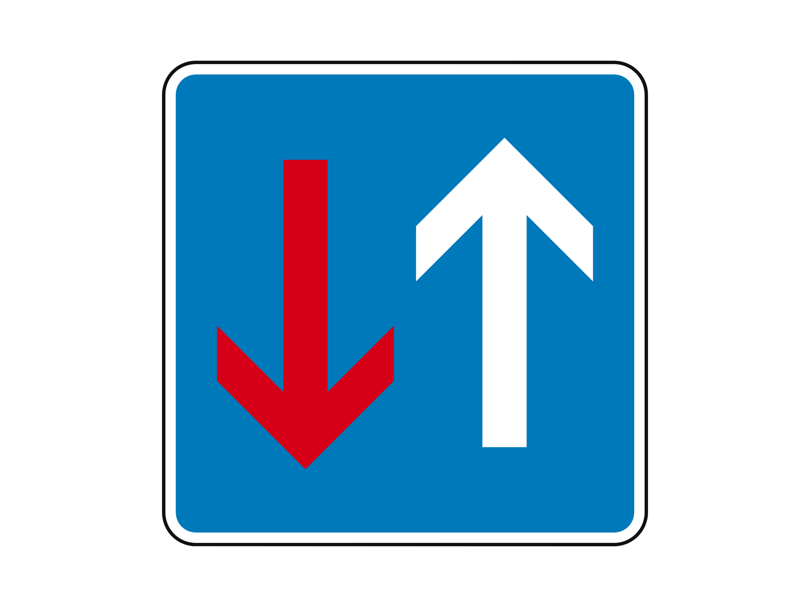

**Options:**
- A. 
- B. 
- C. 

**Correct Answer(s):**
- A. 

**Explanation:**
The traffic sign “One-time right of way” signals to you that you have the right of way at the next intersection or junction. However, this sign has no effect on the intersection after that.

---

#### Question 1.4.42-101

**Points:** 3 Points

**Which traffic sign gives right of way at the next crossroads?**

**Options:**
- A. Traffic sign 1
- B. Traffic sign 2
- C. Traffic sign 3

**Correct Answer(s):**
- A. Traffic sign 1

**Explanation:**
Only the first traffic sign gives you right of way at the next intersection. The second traffic sign, however, indicates the end of the priority road and traffic sign number three regulates the right of way at a bottleneck.

---

#### Question 1.4.42-102

**Points:** 3 Points

**Which traffic sign gives right of way?**

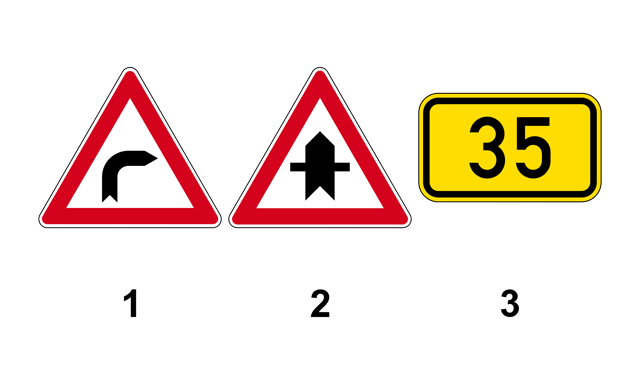

**Options:**
- A. Traffic sign 2
- B. Traffic sign 1
- C. Traffic sign 3

**Correct Answer(s):**
- A. Traffic sign 2

**Explanation:**
The correct traffic sign to observe the right of way is number two. Number one indicates that a dangerous turn is in front of the driver while number three indicates the number of a national highway.

---

#### Question 1.4.42-104

**Points:** 3 Points

**What is allowed on priority roads outside built-up areas?**

**Options:**
- A. Stopping on the right edge of the roadway
- B. Parking on the hard shoulder
- C. Parking on the roadway

**Correct Answer(s):**
- A. Stopping on the right edge of the roadway
- B. Parking on the hard shoulder

**Explanation:**
On priority roads outside of built-up areas, you may: 1. wait at the right side of the road; 2. park on a hard shoulder. On the other hand, parking on the road is prohibited. Parking vehicles constitute a hindrance and/or danger to flowing traffic, since vehicles are traveling much faster here than within the closed local area. Since a hard shoulder is not considered a lane, you may use it for parking. If there is a possibility to dodge on a hard shoulder, you should also use this for waiting shortly.

---

#### Question 1.4.42-106

**Points:** 3 Points

**What ends here?**

**Options:**
- A. A priority road
- B. A controlled parking zone
- C. All previous zonal prohibitions

**Correct Answer(s):**
- A. A priority road

**Explanation:**
This traffic sign announces the change of a priority rule. It marks the end of the previous priority route. The signs "Give way" and "Stop! Give way!" that you can find on intersections and T-junctions, have a similar meaning.

---

#### Question 1.4.42-107

**Points:** 3 Points

**What do you do when you see this traffic sign?**

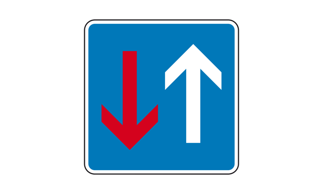

**Options:**
- A. You may only take precedence when the narrowing is clear
- B. You must be ready to stop despite taking precedence
- C. You must give precedence to the oncoming traffic

**Correct Answer(s):**
- A. You may only take precedence when the narrowing is clear
- B. You must be ready to stop despite taking precedence

**Explanation:**
The traffic sign gives you priority over oncoming traffic. The oncoming traffic is obliged to wait in front of the obstacle. Nevertheless, you must prepare for stopping when oncoming traffic is already in the bottleneck. You have to let those drivers drive out. You may proceed with right of way if the bottleneck is free.

---

#### Question 1.4.42-109

**Points:** 2 Points

**What do these traffic signs allow?**

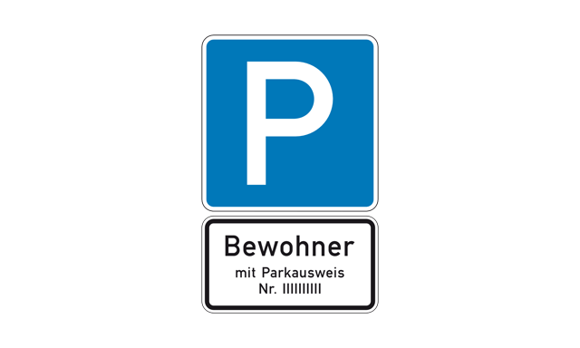

**Options:**
- A. Residents holding a parking licence with corresponding number may park here
- B. All residents may use any of these parking spaces
- C. Everybody may use this parking space as long as other parking spaces are still free

**Correct Answer(s):**
- A. Residents holding a parking licence with corresponding number may park here

**Explanation:**
This traffic sign indicates a parking lot that may only be used by residents with a correspondingly numbered parking pass. Other road users are not allowed to park there and have to switch to other parking places.

---

#### Question 1.4.42-110

**Points:** 2 Points

**Are you allowed to park here?**

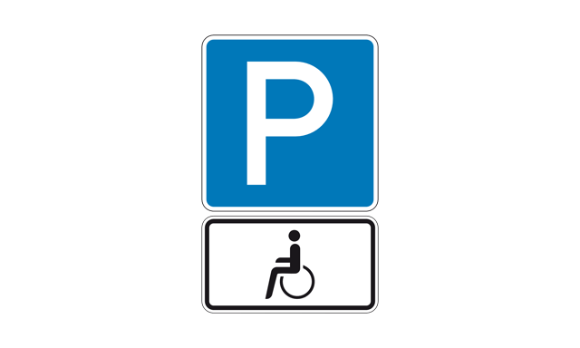

**Options:**
- A. Yes, as a seriously disabled person with an official parking permit
- B. Yes, as a person accompanying blind persons with an official parking permit
- C. Yes, briefly for shopping

**Correct Answer(s):**
- A. Yes, as a seriously disabled person with an official parking permit
- B. Yes, as a person accompanying blind persons with an official parking permit

**Explanation:**
There are special parking spaces for people with impaired mobility or the blind. An official parking permit identifies the vehicles of these persons or their escorts. Even short parking on these areas is forbidden to other drivers.

---

#### Question 1.4.42-111

**Points:** 2 Points

**What must you observe when parking here?**

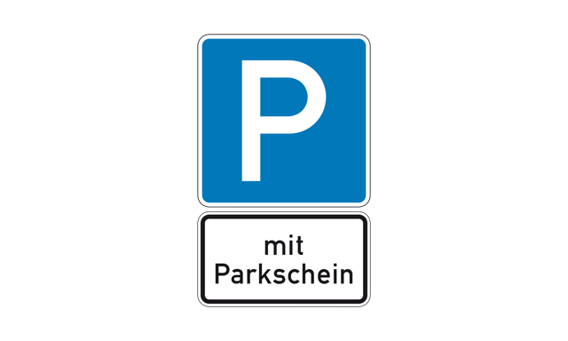

**Options:**
- A. The parking time indicated on the parking ticket may not be exceeded
- B. The parking ticket must be put in a place so it can be easily read when controlled
- C. Parking ticket and parking disc rank equal

**Correct Answer(s):**
- A. The parking time indicated on the parking ticket may not be exceeded
- B. The parking ticket must be put in a place so it can be easily read when controlled

**Explanation:**
In this parking lot you are only allowed to park with a valid ticket. Attach the parking ticket legibly behind the front or rear window of your car. Be sure not to exceed the parking time stated on the ticket. The parking disc does not replace the parking ticket: the parking disc is only valid if the parking meter is out of operation.

---

#### Question 1.4.42-112

**Points:** 2 Points

**Which vehicles are allowed to park here?**

**Options:**
- A. Vehicles with a permissible total mass of up to 2.8 t
- B. Motorcycles
- C. Vehicles with a permissible total mass of more than 3.5 t

**Correct Answer(s):**
- A. Vehicles with a permissible total mass of up to 2.8 t
- B. Motorcycles

**Explanation:**
The traffic sign regulates the parking situation for the road user. The sign allows parking partly on the sidewalk, the side strip and on the green verge for vehicles up to a total weight of 2.8 tons.

---

#### Question 1.4.42-116

**Points:** 3 Points

**What must a motor vehicle's maximum speed, determined by its construction, be at least if you want to use this road?**

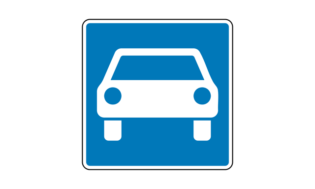

**Options:**
- A. 61 km/h
- B. 51 km/h
- C. 81 km/h

**Correct Answer(s):**
- A. 61 km/h

**Explanation:**
You must be able to achieve at least a maximum speed of 60 km/h on a motor road with your vehicle. The beginning of a motor road is always marked by a traffic sign.

---

#### Question 1.4.42-119

**Points:** 2 Points

**What does this traffic sign indicate?**

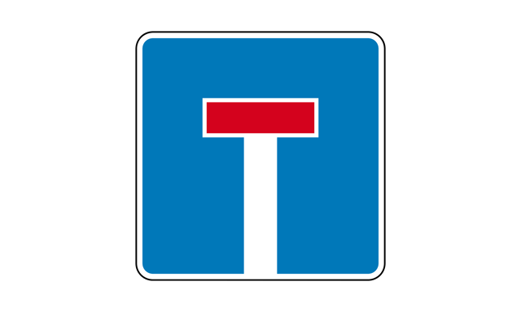

**Options:**
- A. A cul-de-sac
- B. An underpass
- C. A road closed to vehicle traffic

**Correct Answer(s):**
- A. A cul-de-sac

**Explanation:**
This is a dead end. You can drive normally in a dead end, but the road ends so you might have trouble to turn your car around to leave the street again.

---

#### Question 1.4.42-120

**Points:** 2 Points

**What does this traffic sign indicate?**

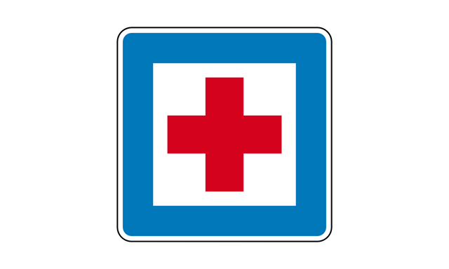

**Options:**
- A. A first aid station
- B. A crossroads
- C. A danger spot

**Correct Answer(s):**
- A. A first aid station

**Explanation:**
This traffic sign shows that a first aid station such as "Red Cross" or "Samaritan" is present at this point. However, it does not indicate any danger zone.

---

#### Question 1.4.42-125

**Points:** 2 Points

**What must you remember when you see this traffic sign?**

**Options:**
- A. Street lighting does not stay on all night
- B. Vehicles may be parked here all night without lights
- C. Vehicles may not be parked here

**Correct Answer(s):**
- A. Street lighting does not stay on all night

**Explanation:**
If you see this sign at lanterns, then you have to secure your vehicle with your parking light. Since these lanterns are not lit up all night, it's very unsafe to leave an unlit car here.

---

#### Question 1.4.42-126

**Points:** 2 Points

**What does this traffic sign indicate?**

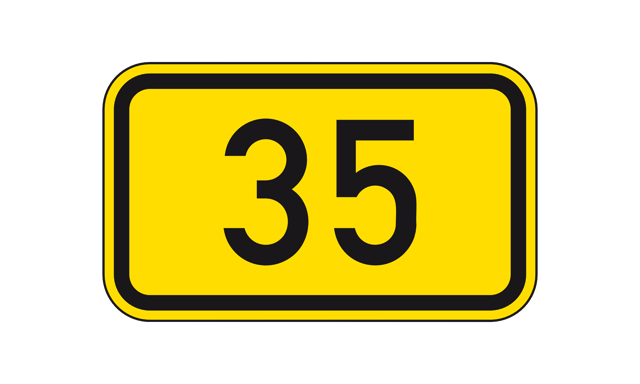

**Options:**
- A. A federal road (Bundesstraße)
- B. Vehicles may not drive faster than 35 km/h
- C. Vehicles must drive at least 35 km/h

**Correct Answer(s):**
- A. A federal road (Bundesstraße)

**Explanation:**
This traffic sign refers to a main road. The number stands for the number of the respective federal highway and not for example for a speed limit.

---

#### Question 1.4.42-128

**Points:** 2 Points

**What does this traffic sign indicate?**

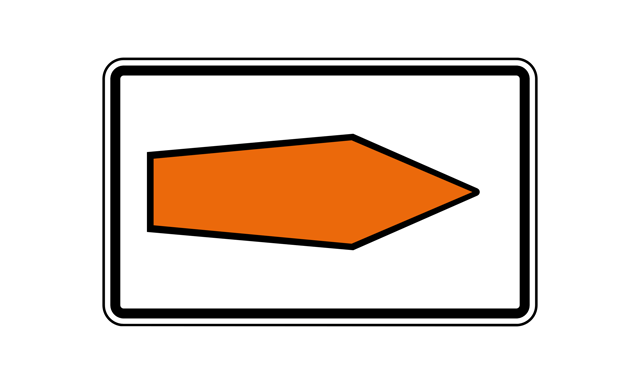

**Options:**
- A. An autobahn section which is normally not used very much
- B. The place where the autobahn must be exited
- C. An obligatory diversion for vehicles with dangerous goods

**Correct Answer(s):**
- A. An autobahn section which is normally not used very much

**Explanation:**
The diversion arrow points out to you as a car driver that you are on a traffic jam-prone section of the motorway and points out an alternative route. But you are not obliged to follow this.

---

#### Question 1.4.42-129

**Points:** 4 Points

**During daylight, you enter a lit tunnel marked like this. What do you do?**

**Options:**
- A. I switch on the dipped headlights
- B. I do not have to switch on the lights
- C. I switch on the side lights

**Correct Answer(s):**
- A. I switch on the dipped headlights

**Explanation:**
As the car driver, you must turn on the low beam. The daytime lights are not enough, because the light conditions in the tunnel cannot be compared to daylight. You are obliged to make your vehicle seen.

---

#### Question 1.4.42-130

**Points:** 4 Points

**What does this traffic sign indicate?**

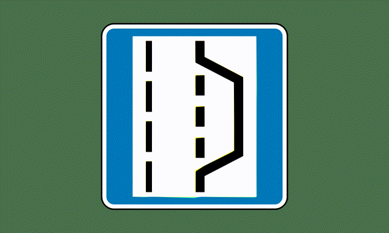

**Options:**
- A. There may be a vehicle in the next emergency bay
- B. In case of breakdown, you should stop in the emergency bay indicated
- C. You may stop here to have a break

**Correct Answer(s):**
- A. There may be a vehicle in the next emergency bay
- B. In case of breakdown, you should stop in the emergency bay indicated

**Explanation:**
This traffic sign shows you an emergency lay-by. There you can and should wait if you have a breakdown. It's possible that there's already a vehicle there. For breaks an emergency lay-by may not be used.

---

#### Question 1.4.42-131

**Points:** 4 Points

**What do you have to do when you see this traffic sign?**

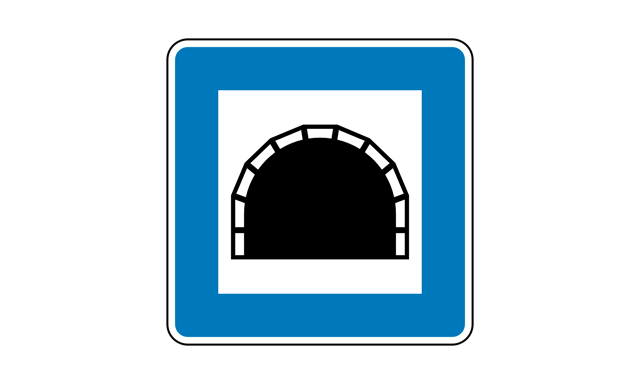

**Options:**
- A. Take off your sunglasses
- B. Switch on dipped headlights
- C. Switch on the hazard warning lights

**Correct Answer(s):**
- A. Take off your sunglasses
- B. Switch on dipped headlights

**Explanation:**
This traffic sign is located in front of the entrance to a tunnel. Turn on the low beam and remove sunglasses for unrestricted visibility.

---

#### Question 1.4.42-132

**Points:** 4 Points

**You drive into a brightly lit tunnel which is indicated like this. What do you do?**

**Options:**
- A. Drive with dipped headlights
- B. Drive without lights
- C. Drive with daytime running lights

**Correct Answer(s):**
- A. Drive with dipped headlights

**Explanation:**
Even a brightly lit tunnel cannot reach daylight conditions, so you need to drive in with low beam to make your vehicle recognizable. The daytime running light is simply not enough in this case.

---

#### Question 1.4.42-133

**Points:** 3 Points

**What does this traffic sign combination indicate?**

**Options:**
- A. - a traffic-calming zone
- B. - a pedestrian zone
- C. - a children's playground

**Correct Answer(s):**
- A. - a traffic-calming zone

**Explanation:**
The traffic sign points to the end of the traffic-calming zone. Now higher speed rules apply again. As a car driver, you have no right of way when you leave and must be careful when entering.

---

#### Question 1.4.42-134

**Points:** 3 Points

**What does this traffic road sign mean?**

**Options:**
- A. Priority road
- B. No parking on the carriageway outside of settlements
- C. Expressway

**Correct Answer(s):**
- A. Priority road
- B. No parking on the carriageway outside of settlements

**Explanation:**
You drive on a priority road. The traffic sign is repeated at each intersection or T-junction where you have priority. Outside built-up areas, parking on priority roads is prohibited. On these roads people drive relatively fast and parking vehicles would be a hindrance or a threat.

---

#### Question 1.4.42-135

**Points:** 2 Points

**What does this traffic sign indicate?**

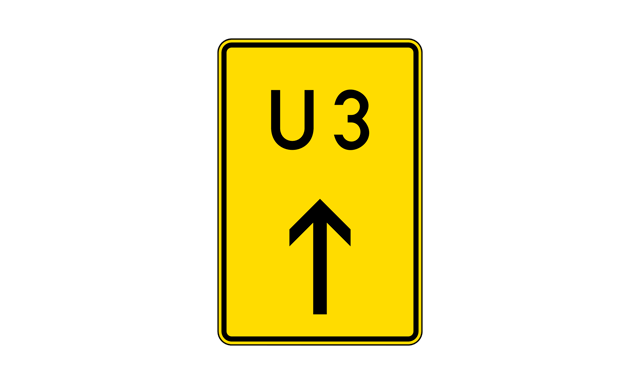

**Options:**
- A. A numbered diversion
- B. Tram line no. 3
- C. A numbered underground car park

**Correct Answer(s):**
- A. A numbered diversion

**Explanation:**
This traffic sign indicates a numbered detour. Since there are several detours, they are numbered. So, you know exactly where to drive.

---

#### Question 1.4.42-136

**Points:** 4 Points

**What do you have to be aware of when you see this traffic sign combination?**

**Options:**
- A. If I am following the priority road, I have to signal a left-turn
- B. If I continue driving straight ahead, I have to signal a right-turn
- C. The direction of traffic to the left is prescribed

**Correct Answer(s):**
- A. If I am following the priority road, I have to signal a left-turn

**Explanation:**
The priority road is turning due to the additional sign. It's a turning priority road. If you stay on the priority road, you will need to indicate that. You have to take care of pedestrians crossing the street, if necessary, you have to stop. The answer: "Driving to the left is mandatory" is wrong, since this traffic sign does not dictate a direction of travel.

---

#### Question 1.4.42-137

**Points:** 3 Points

**What is the correct action on roads with these types of protective cycle lanes?**

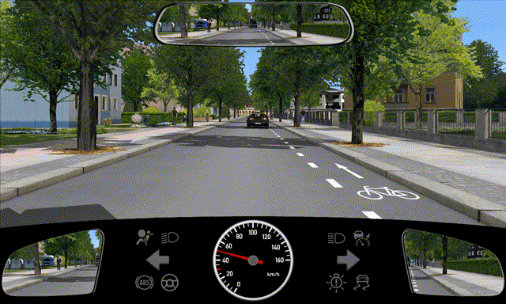

**Options:**
- A. - drive on the protective lanes when necessary, if there is no risk to cyclists
- B. - in no event drive on the protective lanes
- C. - use the protective lanes to assist parking

**Correct Answer(s):**
- A. - drive on the protective lanes when necessary, if there is no risk to cyclists

**Explanation:**
The directional sign indicates the safe area for cyclists. As the vehicle driver, you may only drive on the designated bicycle lane if a risk to cyclists is ruled out. Parking is strictly prohibited here.

---

#### Question 1.4.42-138

**Points:** 4 Points

**What must you do upon seeing this traffic sign?**

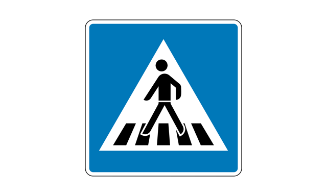

**Options:**
- A. I must approach at a moderate speed if it is clear that pedestrians want to cross the road
- B. I must allow the pedestrians to cross the road
- C. I may not remain stationary on the pedestrian crossing if the traffic backs up

**Correct Answer(s):**
- A. I must approach at a moderate speed if it is clear that pedestrians want to cross the road
- B. I must allow the pedestrians to cross the road
- C. I may not remain stationary on the pedestrian crossing if the traffic backs up

**Explanation:**
On pedestrian crossings pedestrians have precedence, so vehicles should always drive at moderate speed and be ready to brake at any time. There's a strict restriction on overtaking at pedestrian crossings and with halting traffic it is forbidden to come to a stop at the crossing.

---

#### Question 1.4.42-139

**Points:** 3 Points

**What must you be prepared for here?**

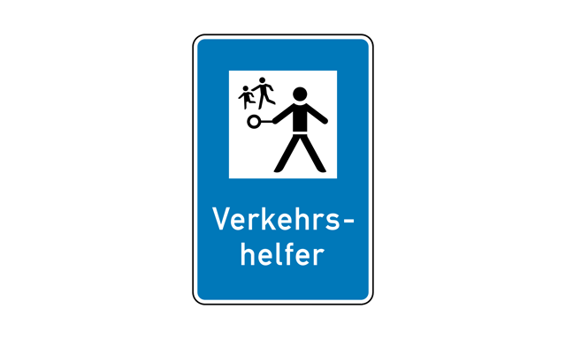

**Options:**
- A. That the flowing traffic will come to a stop
- B. That children will cross the road more frequently than usual
- C. That children will be playing on the road under supervision

**Correct Answer(s):**
- A. That the flowing traffic will come to a stop
- B. That children will cross the road more frequently than usual

**Explanation:**
The traffic sign 'crossing guard', formerly school crossing guards, means that traffic assistance regulates traffic. They are allowed to stop traffic to allow children to cross the road. You need to be prepared for the flow of traffic to stop and for children to walk on the road more often than usual.

---

#### Question 1.4.42-140

**Points:** 4 Points

**What applies according to this traffic sign?**

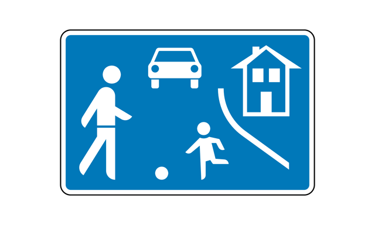

**Options:**
- A. I have to drive at walking speed
- B. I may not impede pedestrians
- C. I may only park on designated places

**Correct Answer(s):**
- A. I have to drive at walking speed
- B. I may not impede pedestrians
- C. I may only park on designated places

**Explanation:**
Within traffic calming zones you are allowed to travel at a maximum walking speed of 4 to 7 km/h, which means first gear, without giving gas. The street may be used completely by pedestrians. Children are allowed to play in the street. Be especially attentive and ready to brake. Pedestrians must not be impeded or endangered, you may have to wait. Since playing on the street is allowed here, you have to pay more attention to children. You are only allowed to park on marked areas.

---

#### Question 1.4.42-141

**Points:** 4 Points

**What does this traffic sign combination mean to you?**

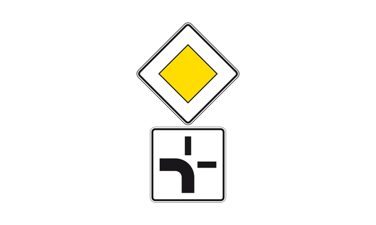

**Options:**
- A. I am on a priority road that bends left
- B. I am not permitted to turn right or drive straight ahead
- C. If I continue driving straight ahead, I have to allow right of way to vehicles arriving from the right

**Correct Answer(s):**
- A. I am on a priority road that bends left

**Explanation:**
The traffic sign indicates the course of the priority road. The additional sign indicates the bend to the left; if you follow this direction, you will still be on the priority road.

---

#### Question 1.4.42-142

**Points:** 2 Points

**What do you have to be aware of when you see this traffic sign?**

**Options:**
- A. Children may play across the entire road
- B. Motor vehicles have to drive at walking speed
- C. Pedestrians are entitled to use the entire breadth of the road

**Correct Answer(s):**
- A. Children may play across the entire road
- B. Motor vehicles have to drive at walking speed
- C. Pedestrians are entitled to use the entire breadth of the road

**Explanation:**
For this question, all three answers are correct. In a "traffic calming zone", pedestrians may use the entire width of the street, children can play on the street and you may only drive at walking speed.

---

#### Question 1.4.42-143

**Points:** 2 Points

**What does this traffic sign indicate?**

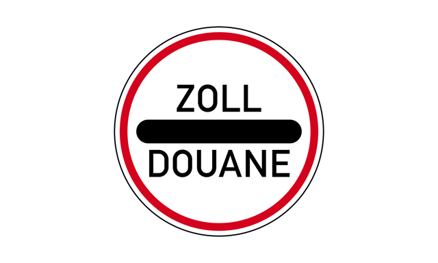

**Options:**
- A. A customs point
- B. A toll road
- C. A prohibition on through-traffic

**Correct Answer(s):**
- A. A customs point

**Explanation:**
When you see this traffic sign, you approach a customs office. This means that you may encounter a traffic jam and therefore have to reduce your speed. You may also be controlled, so have all the papers at hand. Follow the instructions of the customs officers.

---

#### Question 1.4.42-144

**Points:** 2 Points

**What is correct in this situation?**

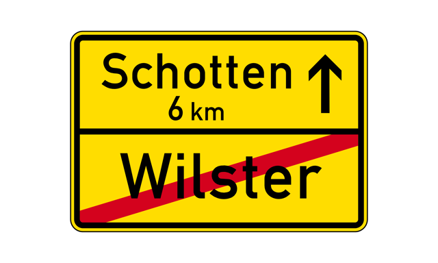

**Options:**
- A. - a built-up area ends
- B. - a built-up area starts
- C. - a deviation ends

**Correct Answer(s):**
- A. - a built-up area ends

**Explanation:**
The village sign indicates the end of a closed village in the lower part. The upper part indicates the next town. You are standing on the left side of the road.

---

#### Question 1.4.42-145

**Points:** 3 Points

**What do you have to observe in a traffic situation like this one?**

**Options:**
- A. - cross the centre line in order to pass by the obstruction
- B. - cross the centre line in order to overtake
- C. - not cross the centre line if this would endanger other traffic

**Correct Answer(s):**
- A. - cross the centre line in order to pass by the obstruction
- B. - cross the centre line in order to overtake
- C. - not cross the centre line if this would endanger other traffic

**Explanation:**
Guidelines have the task of separating the lanes. Therefore, you may only drive over them if you avoid obstacles or overtake vehicles. This is only allowed if no road user is endangered.

---

#### Question 1.4.42-146

**Points:** 4 Points

**What does this traffic sign indicate?**

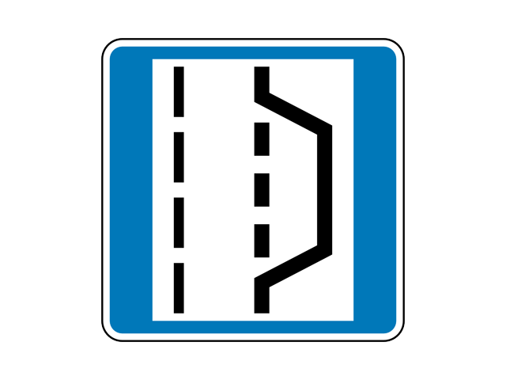

**Options:**
- A. An emergency stop and breakdown bay
- B. A temporary additional carriageway
- C. A stop for breaks and changing drivers

**Correct Answer(s):**
- A. An emergency stop and breakdown bay

**Explanation:**
If you are driving a vehicle, you may only stop in an emergency stop and breakdown bay in the event of an emergency or breakdown.

---

#### Question 1.4.42-147-M

**Points:** 3 Points

**You are driving on a road that has a protective lane for cyclists. How may you use the protective lane?**

**Options:**
- A. - drive on the protective lane when necessary
- B. - park on the protective lane
- C. - stop on the protective lane

**Correct Answer(s):**
- A. - drive on the protective lane when necessary

**Explanation:**
You may use the cycle lane if necessary, provided you do not endanger or obstruct cyclists.

---

### 1.4.43 Chapter Traffic Facilities

#### Question 1.4.43-101

**Points:** 3 Points

**What can red-white warning plates on vehicles indicate?**

**Options:**
- A. A trailer parked on the roadway within a built-up area
- B. A vehicle with excessive width
- C. A vehicle transporting dangerous goods

**Correct Answer(s):**
- A. A trailer parked on the roadway within a built-up area
- B. A vehicle with excessive width

**Explanation:**
Red and white warning signs point to vehicles with excess width (e.g., abnormal wide agricultural vehicles). Trailers parked inside a built-up area must either be illuminated or marked with reflective warning signs. So, warning signs do not refer to hazmat trucks.

---

## Theme 1.5. Environmental Protection

### 1.5.01 Chapter Environmental Protection

#### Question 1.5.01-001

**Points:** 3 Points

**What must you remember in the interests of environmental protection?**

**Options:**
- A. To avoid running the engine unnecessarily when you are stationary
- B. To avoid driving back and forth unnecessarily
- C. To drive with high revolutions per minute too often

**Correct Answer(s):**
- A. To avoid running the engine unnecessarily when you are stationary
- B. To avoid driving back and forth unnecessarily

**Explanation:**
In the interests of environmental protection, you as a car driver must pay attention to the following: 1. Avoid driving unnecessarily; 2. Operate the engine evenly at medium speed; 3. Shut off the engine during extended periods of idling - after about a minute. In general, running the engine at idle will result in faster engine wear and wastes energy. You should therefore warm the engine in medium speed range and possibly stay in this area. High engine speeds lead to increased fuel consumption and therefore pollute the environment.

---

#### Question 1.5.01-003

**Points:** 3 Points

**What must be regularly serviced to prevent high fuel consumption and excessive pollutant emission?**

**Options:**
- A. Engine air filter
- B. Carburettor or fuel-injection system
- C. Ignition system

**Correct Answer(s):**
- A. Engine air filter
- B. Carburettor or fuel-injection system
- C. Ignition system

**Explanation:**
The fuel consumption of a vehicle should be as low as possible. As a car driver, you should therefore regularly check and maintain all the components of your vehicle that are important for fuel consumption. These are, for example, the ignition and injection system and the engine air filter and the carburetor.

---

#### Question 1.5.01-004

**Points:** 3 Points

**What happens as a result of tyre pressures being well below the recommended levels?**

**Options:**
- A. Fuel consumption increases
- B. Tyre wear increases
- C. Pollutant emission decreases

**Correct Answer(s):**
- A. Fuel consumption increases
- B. Tyre wear increases

**Explanation:**
Too low air pressure in the tire as well leads to increased fuel consumption. The effort required to keep the tire running is significantly higher than when the tire pressure has been set correctly. This leads to higher wear on the tire, increased fuel consumption and harms the environment.

---

#### Question 1.5.01-005

**Points:** 3 Points

**When should you switch off the engine to save fuel and reduce pollution?**

**Options:**
- A. When you have to wait in a traffic jam for a long time
- B. When you have to wait at level crossings or building sites
- C. When you stop at a "STOP" sign

**Correct Answer(s):**
- A. When you have to wait in a traffic jam for a long time
- B. When you have to wait at level crossings or building sites

**Explanation:**
In order to avoid unnecessary consumption of gasoline, the engine should be switched off in certain situations. These include, for example, moments in traffic jams or in front of level crossings. Although there is an increased consumption during starting, it is compensated again starting from a downtime of one minute. You should not turn off the engine at a stop sign.

---

#### Question 1.5.01-006

**Points:** 4 Points

**Your vehicle loses oil. How much drinking water can be polluted by a single drop of oil?**

**Options:**
- A. 600 litres
- B. 50 litres
- C. 1 litre

**Correct Answer(s):**
- A. 600 litres

**Explanation:**
You should urgently avoid oil loss. Because even a single drop of oil can contaminate up to 600 liters of water and make it unfit for consumption.

---

#### Question 1.5.01-007

**Points:** 3 Points

**What must you remember when refuelling?**

**Options:**
- A. Do not breath in any fuel fumes
- B. Do not refuel when the tank is full and the nozzle has switched off
- C. Fill up to the brim if possible

**Correct Answer(s):**
- A. Do not breath in any fuel fumes
- B. Do not refuel when the tank is full and the nozzle has switched off

**Explanation:**
Inhaling fuel vapors is harmful to your health. Therefore, make sure that the dispenser is being used correctly and pay attention to any defects when refueling. When the tank is full, the automatic system should be switched off. This prevents the overflow of gasoline or diesel. In addition, some air must remain in the tank for the fuel to expand.

---

#### Question 1.5.01-008

**Points:** 3 Points

**The engine and exhaust system of a vehicle have been "souped up". What could be the effects?**

**Options:**
- A. Increased noise pollution
- B. Increased pollutant emission
- C. Considerable reduction in fuel consumption

**Correct Answer(s):**
- A. Increased noise pollution
- B. Increased pollutant emission

**Explanation:**
A souped-up engine and muffler provide increased noise pollution. In addition, the vehicle consumes more fuel. On top of that, exhaust emissions are increased and pollute the environment. In the worst case, the driver can expect a withdrawal of the operating license.

---

#### Question 1.5.01-009

**Points:** 3 Points

**How can you reduce the noise made by a car?**

**Options:**
- A. By driving at a low engine speed
- B. By using all-terrain tyres
- C. By removing the air filter

**Correct Answer(s):**
- A. By driving at a low engine speed

**Explanation:**
In the low-speed speed range, the engine runs quieter than in high-revving areas. Deep-tread tires and driving without air filters also cause noise pollution. A driving style predominantly in the low-speed range saves fuel, is environmentally friendly and quiet. The minimum speeds must, however, be met, otherwise the engine runs twitchy, is cogging and sputtering. The lower the speed at which the engine is still running without cogging, the lower the noise.

---

#### Question 1.5.01-010

**Points:** 3 Points

**Where can used oil, lubricants and car batteries be taken to be disposed of properly?**

**Options:**
- A. To recycling centres
- B. To car workshops
- C. In the household waste

**Correct Answer(s):**
- A. To recycling centres
- B. To car workshops

**Explanation:**
Waste oils, lubricants and vehicle batteries can be disposed of properly in the recycling center or via the car repair shop. Never should these substances be disposed of with household waste. It is special waste.

---

#### Question 1.5.01-011

**Points:** 3 Points

**How can you drive fuel-efficiently when travelling at a constant speed?**

**Options:**
- A. By using cruise control
- B. By driving at a low engine speed
- C. By driving at a high engine speed

**Correct Answer(s):**
- A. By using cruise control
- B. By driving at a low engine speed

**Explanation:**
At constant speed, you can save fuel with the following measures: 1. by driving evenly in the low speed range; 2. by using the cruise control. The low speed range is just above the minimum speed that the engine needs for its optimal performance. If you drive below that, the engine is cogging; if you drive over it the fuel consumption increases in the high-speed range due to the engine performance. With steady driving in the low-speed speed range, the engine runs smoothly and with low fuel consumption. Cruise control allows a uniform driving style and relieves the / the car driver.

---

#### Question 1.5.01-012

**Points:** 3 Points

**At which engine speed range will fuel consumption be lower?**

**Options:**
- A. At low engine speed
- B. At high engine speed

**Correct Answer(s):**
- A. At low engine speed

**Explanation:**
An engine consumes the least fuel in the speed range just above the minimum speed. This is the so-called low-speed speed range. When driving in the low-speed range, the speed should always be above the idle speed. An engine below the minimum speed runs twitchy, is cogging, sputtering or turns off. As a rule of thumb, the lower the speed at which the engine runs without cogging, the more fuel can be saved.

---

#### Question 1.5.01-013

**Points:** 3 Points

**You have to wait because of a closed rail-crossing barrier. How can you now help protect the environment and save fuel?**

**Options:**
- A. By switching off the engine
- B. By switching off the automatic start-stop
- C. By letting the engine idle

**Correct Answer(s):**
- A. By switching off the engine

**Explanation:**
When waiting in front of closed gates it is recommended to switch off the engine. On the one hand you save fuel and thus money, on the other hand, a switched-off engine is environmentally friendly. A pure gearshift to idle is not recommended, as even at idle the engine does not turn off and continues to use fuel.

---

#### Question 1.5.01-014

**Points:** 3 Points

**What measures help protect the environment?**

**Options:**
- A. - low-resistance tyres
- B. - low viscosity engine oil
- C. - air-conditioning systems

**Correct Answer(s):**
- A. - low-resistance tyres
- B. - low viscosity engine oil

**Explanation:**
Turning the air conditioning off saves fuel as well. Low rolling resistance tires are designed for lower rolling resistance and can save fuel. Low-friction oils are synthetic oils with improved flow behavior, the so-called viscosity. This lubricates the engine faster and better and reduces friction. This also leads to a noticeable saving of fuel. Only oils approved by the engine/vehicle manufacturer should be used to prevent engine damage.

---

#### Question 1.5.01-015

**Points:** 3 Points

**What should you do to protect the environment?**

**Options:**
- A. - a lot of smoke is coming from the exhaust, I should arrange for the motor vehicle to be checked
- B. - waiting for prolonged periods, I should switch off the engine
- C. - driving, I should use the upper engine speed range

**Correct Answer(s):**
- A. - a lot of smoke is coming from the exhaust, I should arrange for the motor vehicle to be checked
- B. - waiting for prolonged periods, I should switch off the engine

**Explanation:**
You should avoid driving at high speeds. If the vehicle develops smoke, have it checked and repaired in a workshop.

---

#### Question 1.5.01-016

**Points:** 3 Points

**What can regular vehicle maintenance help achieve?**

**Options:**
- A. Keeping fuel consumption low
- B. Keeping emission levels low
- C. Ensuring road safety

**Correct Answer(s):**
- A. Keeping fuel consumption low
- B. Keeping emission levels low
- C. Ensuring road safety

**Explanation:**
Regular vehicle maintenance helps to ensure road safety, low fuel consumption and low emissions.

---

#### Question 1.5.01-017

**Points:** 3 Points

**In which situations should you switch off the engine to save fuel and reduce environmental pollution?**

**Options:**
- A. - it is foreseeable that I will have to wait longer in a traffic jam
- B. - I have to wait at a gated level crossing
- C. - I have to stop at a “Stop” sign

**Correct Answer(s):**
- A. - it is foreseeable that I will have to wait longer in a traffic jam
- B. - I have to wait at a gated level crossing

**Explanation:**
You should turn off the engine before a gated railway crossing or if you are in a traffic jam, as you cannot accurately estimate the length of the waiting time. This way you can reduce your environmental impact and save fuel at the same time.

---

#### Question 1.5.01-102

**Points:** 3 Points

**What can cause unnecessary noise pollution when driving?**

**Options:**
- A. Unnecessarily fast acceleration
- B. A defective exhaust
- C. Driving at low revolutions per minute

**Correct Answer(s):**
- A. Unnecessarily fast acceleration
- B. A defective exhaust

**Explanation:**
If you drive at high speed or your muffler is defective, the noise level is increased. Low-speed driving also reduces fuel consumption. A defective muffler should be repaired in a workshop.

---

#### Question 1.5.01-103

**Points:** 3 Points

**How should you change gears in order to drive with particular consideration to the environment and fuel saving?**

**Options:**
- A. Change to a higher gear as early as possible
- B. Change to a lower gear as late as possible
- C. Change gears only when reaching the upper revolution limit

**Correct Answer(s):**
- A. Change to a higher gear as early as possible
- B. Change to a lower gear as late as possible

**Explanation:**
Changing gears environmentally friendly means to upshift early and shift down late. Do not drive the gears into the upper speeds, because this leads to the highest fuel consumption. You should start in first gear and then switch directly to second gear if possible. However, in some traffic situations, such as on the highway acceleration lane or while overtaking, it is necessary to drive with high speed. Of course you should do this in such a situation.

---

#### Question 1.5.01-104

**Points:** 3 Points

**What is important to avoid pollution and to save energy when driving?**

**Options:**
- A. Check the fuel consumption regularly
- B. Have the engine tuning checked regularly
- C. Wash the engine regularly, at least four times a year

**Correct Answer(s):**
- A. Check the fuel consumption regularly
- B. Have the engine tuning checked regularly

**Explanation:**
Low fuel consumption defines environmentally friendly and energy-saving driving. This requires the regular examination of consumption values ​​in order to optimize engine timing and to detect errors in good time.

---

#### Question 1.5.01-106

**Points:** 3 Points

**How is fuel wasted and the environment polluted?**

**Options:**
- A. By driving in a hectic manner
- B. By "playing with the accelerator" while waiting at traffic lights
- C. Using a high gear driving downhill

**Correct Answer(s):**
- A. By driving in a hectic manner
- B. By "playing with the accelerator" while waiting at traffic lights

**Explanation:**
If you drive hectically, switching constantly between braking and accelerating and "playing with the gas", your vehicle consumes too much unnecessary fuel. Especially when accelerating a lot of energy is needed. When driving downhill in high gear, vehicle drivers burden the brakes unnecessarily. However, this does not result in increased fuel consumption.

---

#### Question 1.5.01-108

**Points:** 3 Points

**What indicates excessive petrol consumption due to high wear or wrong tuning of the engine?**

**Options:**
- A. A lot of dark exhaust smoke
- B. Condensation water from the exhaust

**Correct Answer(s):**
- A. A lot of dark exhaust smoke

**Explanation:**
Dark smoke indicates increased fuel consumption. It may be causally related to a fault of the engine control. You should definitely visit a workshop. Condensation, which drips from the exhaust, or white water vapor in cold weather, however, are normal.

---

#### Question 1.5.01-109

**Points:** 3 Points

**What kind of driving results in high fuel consumption?**

**Options:**
- A. Fast starts and unnecessary acceleration
- B. Revving up all gears
- C. Driving at high speed

**Correct Answer(s):**
- A. Fast starts and unnecessary acceleration
- B. Revving up all gears
- C. Driving at high speed

**Explanation:**
High speeds require more power due to the increased air resistance. As a result, the fuel consumption increases. If the driver drives rapidly or accelerates unnecessarily, this driving style also leads to an increased consumption. The same applies if gears are driven at full speed.

---

#### Question 1.5.01-110

**Points:** 3 Points

**How do you drive with consideration to the environment?**

**Options:**
- A. Decelerate in good time and use the momentum of the car when the next traffic light is on red
- B. Avoid unnecessary acceleration and unnecessary braking
- C. Always accelerate to the maximum when the traffic light changes to green

**Correct Answer(s):**
- A. Decelerate in good time and use the momentum of the car when the next traffic light is on red
- B. Avoid unnecessary acceleration and unnecessary braking

**Explanation:**
Avoid constant acceleration and braking. Accelerating consumes unnecessary fuel and can be avoided, for example, in front of red lights by laying off the gas pedal. Maximum acceleration leads to high pollutant emissions and high noise as well as environmental pollution.

---

#### Question 1.5.01-112

**Points:** 3 Points

**How can you cover more kilometres on less fuel?**

**Options:**
- A. Accelerate in such a way that the highest possible gear is quickly reached
- B. Think ahead when driving in order to avoid unnecessary acceleration and braking
- C. By pushing all gears to the highest possible revolutions

**Correct Answer(s):**
- A. Accelerate in such a way that the highest possible gear is quickly reached
- B. Think ahead when driving in order to avoid unnecessary acceleration and braking

**Explanation:**
The least fuel is consumed in the low-speed range. Timely upshifting avoids high-speed, fuel-intensive driving. Anticipatory driving saves fuel, as you can lay off the gas pedal early and let the vehicle roll out with its existing momentum.

---

#### Question 1.5.01-114

**Points:** 3 Points

**What can help save fuel and reduce pollution?**

**Options:**
- A. Paying attention to the fuel consumption of a motor vehicle when buying it
- B. Contributing to a constant flow of traffic by thinking ahead and driving correspondingly
- C. Using public transport, a bicycle or walking, wherever possible

**Correct Answer(s):**
- A. Paying attention to the fuel consumption of a motor vehicle when buying it
- B. Contributing to a constant flow of traffic by thinking ahead and driving correspondingly
- C. Using public transport, a bicycle or walking, wherever possible

**Explanation:**
Before buying a car, the driver can check which model consumes little fuel. In addition, economical driving also contributes to savings.

---

#### Question 1.5.01-115

**Points:** 3 Points

**What can you do to help protect the environment?**

**Options:**
- A. - driving short distances
- B. - driving at flat-out speed
- C. - driving in crowded city centres

**Correct Answer(s):**
- A. - driving short distances
- B. - driving at flat-out speed
- C. - driving in crowded city centres

**Explanation:**
The best way to protect the environment is to drive less. All journeys that are not absolutely necessary should be avoided. Certain driving styles consume extra fuel: Short-distance driving, especially when the engine is still cold, stop-and-go traffic, for example in crowded inner cities and searching for a parking space. On top of that, in areas with heavy traffic, the risk of smog from the exhaust emissions of vehicles increases. Driving at full throttle will not only cause noise, but your fuel consumption will increase disproportionately. However, once you are only 20% below the maximum speed, you reduce your fuel consumption by about 40%. Carpooling is also good for the environment.

---

#### Question 1.5.01-116

**Points:** 3 Points

**How can you achieve efficient fuel consumption and low pollutant emissions?**

**Options:**
- A. By having the proper tyre pressure
- B. By maintaining an even driving style at low engine speeds
- C. By using the total capacity of every gear

**Correct Answer(s):**
- A. By having the proper tyre pressure
- B. By maintaining an even driving style at low engine speeds

**Explanation:**
Before you drive off, you should make sure that the correct tire pressure is set. All important information about this topic can be found in the operating instructions of your vehicle. If the tire internal pressure is too high or too low, there will be an increase in pollutant emissions. Even unbalanced driving can lead to high fuel consumption. Therefore, instead of accelerating to the upper rotational speed limit and only change gears then, you should shift up in the lower or middle rotational speed limit range. This means you consume less fuel and at the same time reduce the exhaust emissions of your car.

---

#### Question 1.5.01-117

**Points:** 3 Points

**Other road users draw your attention to the persistent thick smoke coming from your exhaust. What do you have to do?**

**Options:**
- A. Have the vehicle promptly checked
- B. Change down gears early
- C. Change up gears early

**Correct Answer(s):**
- A. Have the vehicle promptly checked

**Explanation:**
You should visit a workshop that checks the damage. Because the strong smoke is a sign that the engine or the fuel system has a defect. In addition, the escaping gases are harmful to the environment and the smoke can obstruct the view of other road users.

---

#### Question 1.5.01-118

**Points:** 3 Points

**Why is it beneficial to use low viscosity engine oil?**

**Options:**
- A. - generate less friction in the engine
- B. - reduce fuel consumption
- C. - can be disposed of as household waste

**Correct Answer(s):**
- A. - generate less friction in the engine
- B. - reduce fuel consumption

**Explanation:**
Low-friction oils are characterized by a better flow behavior. These are synthetic oils that reduce friction in the engine through their improved viscosity and optimize oiling. This saves fuel. When using low-friction oils, attention must be paid to the approval of the manufacturer of the engine or vehicle.

---

#### Question 1.5.01-119

**Points:** 3 Points

**What should you do after starting the vehicle?**

**Options:**
- A. - drive off as promptly as possible
- B. - drive at low engine speeds where possible
- C. - if possible, allow the engine of the stationary vehicle to warm up

**Correct Answer(s):**
- A. - drive off as promptly as possible
- B. - drive at low engine speeds where possible

**Explanation:**
After starting the car, you should drive off directly in the low-speed range. Warming up the engine while standing is prohibited and wastes fuel. In the low-speed range, the engine can be warmed up gently. Driving at high-revving directly is not good for the engine. Generally, the engine consumes more fuel at high speed. At too low speeds, the engine is cogging and sputtering. The consumption of an engine is the lowest just above the minimum speed.

---

#### Question 1.5.01-120

**Points:** 3 Points

**How can you save fuel?**

**Options:**
- A. - removing any non-essential roof boxes etc
- B. - driving in a foresighted manner
- C. - driving with winter tyres the whole year round

**Correct Answer(s):**
- A. - removing any non-essential roof boxes etc
- B. - driving in a foresighted manner

**Explanation:**
You can save fuel by: 1. driving smoothly and anticipatory while avoiding high engine speeds; 2. remove unused roof structures, as they increase fuel consumption with air resistance; 3. swap winter tires for summer tires in the warm season. Driving smoothly means avoiding unnecessary acceleration and deceleration. For example, by slowly rolling toward a red light, you can use the rest of the momentum to drive on if it is already green when you reach the traffic light. Only having to give gas, saves fuel compared to starting from standing completely still.

---

#### Question 1.5.01-121

**Points:** 3 Points

**How can you minimise tyre wear?**

**Options:**
- A. I refrain as much as possible from rapid acceleration
- B. I regularly check the tyre inflation pressure
- C. I use winter tyres all year round

**Correct Answer(s):**
- A. I refrain as much as possible from rapid acceleration
- B. I regularly check the tyre inflation pressure

**Explanation:**
Driving with winter tires in non-winter weather leads to increased tire wear. Strong acceleration is associated with increased abrasion. The tire pressure recommended by the vehicle manufacturer must be observed. Too little tire pressure increases the tire wear considerably. If the air pressure is too low, the tire will deform more with each rotation than with correct tire pressure. Thereby the fabric layers of the tires rub against each other. Heat can be generated that irreparably damages the tire.

---

#### Question 1.5.01-122

**Points:** 3 Points

**What vehicles are generally exempt from the ban on road traffic in "environmental zones"?**

**Options:**
- A. Agricultural and forestry tractors
- B. Ambulances on duty
- C. All motor vehicles belonging to the environmental zone inhabitants

**Correct Answer(s):**
- A. Agricultural and forestry tractors
- B. Ambulances on duty

**Explanation:**
A traffic ban for "environmental zones" does not apply to ambulances that are on duty. Also not affected are tractors from agriculture and forestry.

---

#### Question 1.5.01-123

**Points:** 3 Points

**When is it sensible to switch off a combustion engine?**

**Options:**
- A. During lengthy waits at rail crossings
- B. When loading and unloading the vehicle
- C. When stopping at intersections with a stop sign

**Correct Answer(s):**
- A. During lengthy waits at rail crossings
- B. When loading and unloading the vehicle

**Explanation:**
Longer waiting times before a closed level crossing as well as loading and unloading a vehicle justify turning of an internal combustion engine. This saves fuel and reduces noise. The waiting time at a stop sign is usually short and you can usually drive on quickly after letting cross traffic pass. Therefore, in this situation, the internal-combustion engine is not turned off.

---

#### Question 1.5.01-124

**Points:** 3 Points

**You are driving through city traffic in rush hour. What are the effects of stop-and-go driving?**

**Options:**
- A. - consumes more fuel
- B. - creates more exhaust gases
- C. - creates more nuisances for others

**Correct Answer(s):**
- A. - consumes more fuel
- B. - creates more exhaust gases
- C. - creates more nuisances for others

**Explanation:**
The fuel consumption in stop-and-go traffic is greater, because drivers have to brake and accelerate more often. This leads to more exhaust fumes and other road users may be disturbed.

---

#### Question 1.5.01-125

**Points:** 3 Points

**What is a pre-condition for environmentally-friendly and energy-saving driving?**

**Options:**
- A. Checking the tyre inflation pressure regularly
- B. Performing vehicle maintenance regularly
- C. Washing the engine regularly

**Correct Answer(s):**
- A. Checking the tyre inflation pressure regularly
- B. Performing vehicle maintenance regularly

**Explanation:**
Tyre pressure has a major impact on fuel consumption as it affects rolling resistance. Regular vehicle maintenance contributes to low fuel consumption and emissions.

---

#### Question 1.5.01-126

**Points:** 3 Points

**You are driving a motor vehicle with a manual gearbox. What style of driving results in higher fuel consumption within a built-up area?**

**Options:**
- A. Accelerating heavily
- B. Driving at high engine speed
- C. Driving in a high gear

**Correct Answer(s):**
- A. Accelerating heavily
- B. Driving at high engine speed

**Explanation:**
When accelerating hard, you consume more fuel than when accelerating normally. The higher the speed, the more fuel is consumed.

---

#### Question 1.5.01-127

**Points:** 3 Points

**You are driving a motor vehicle with a manual gearbox. How can you reduce the fuel consumption of your vehicle?**

**Options:**
- A. By switching early up to the next gear
- B. By employing an anticipatory driving style, to avoid frequent changes of speed
- C. By driving at a high engine speed

**Correct Answer(s):**
- A. By switching early up to the next gear
- B. By employing an anticipatory driving style, to avoid frequent changes of speed

**Explanation:**
The higher the engine speed, the more fuel is consumed. If you ride with foresight, you can avoid unnecessary acceleration and braking.

---

#### Question 1.5.01-128

**Points:** 3 Points

**How can you reduce the noise generated by your motor vehicle?**

**Options:**
- A. By driving at a low engine speed
- B. By using tyres that have a low rolling noise
- C. By removing the air filter insert

**Correct Answer(s):**
- A. By driving at a low engine speed
- B. By using tyres that have a low rolling noise

**Explanation:**
The higher the engine speed, the louder the engine will be. Tyres have differences in quality. When buying tyres, pay attention to the rolling noise.

---

#### Question 1.5.01-129

**Points:** 3 Points

**What should you do to help protect the environment?**

**Options:**
- A. - have the motor vehicle inspected if the exhaust is emitting an excessive amount of smoke
- B. - switch off the engine if waiting for longer periods
- C. - avoid unnecessary driving back and forth

**Correct Answer(s):**
- A. - have the motor vehicle inspected if the exhaust is emitting an excessive amount of smoke
- B. - switch off the engine if waiting for longer periods
- C. - avoid unnecessary driving back and forth

**Explanation:**
The engine also burns fuel when stationary, you should switch off the engine if you stop for a longer period of time. If there are atypical signs, such as smoke, you should have your vehicle checked.

---

#### Question 1.5.01-130

**Points:** 3 Points

**You are driving a motor vehicle with a manual gearbox. When driving, what can cause avoidable noise pollution?**

**Options:**
- A. Heavily accelerating unnecessarily
- B. Defective silencer
- C. Driving fast in low gears

**Correct Answer(s):**
- A. Heavily accelerating unnecessarily
- B. Defective silencer
- C. Driving fast in low gears

**Explanation:**
The higher the engine speed, the louder the engine. Tuned exhaust systems are usually louder than the standard exhaust system. You will consume more fuel when accelerating hard than when accelerating normally.

---

#### Question 1.5.01-131

**Points:** 3 Points

**You are driving a motor vehicle with a manual gearbox on a level carriageway. How should you change gears so as to drive in a particularly environmentally conscious and economical way?**

**Options:**
- A. Changing up gears as early as possible
- B. Changing down again as late as possible
- C. Drive until the upper engine speed range is reached in one gear, before changing up

**Correct Answer(s):**
- A. Changing up gears as early as possible
- B. Changing down again as late as possible

**Explanation:**
When accelerating, always try to keep the engine speed as low as possible. When coasting, shift gears as late as possible to take advantage of the engine braking effect and use the brakes as little as possible.

---

#### Question 1.5.01-132

**Points:** 3 Points

**You are driving a motor vehicle with a manual gearbox. What type of behaviour pollutes the environment?**

**Options:**
- A. An uneven driving style
- B. Frequently pressing the accelerator while waiting at traffic lights
- C. Driving downhill in a high gear

**Correct Answer(s):**
- A. An uneven driving style
- B. Frequently pressing the accelerator while waiting at traffic lights

**Explanation:**
Constant speed consumes less fuel than constant deceleration and acceleration. Unnecessary acceleration at red lights burns fuel unnecessarily.

---

#### Question 1.5.01-133

**Points:** 3 Points

**You are driving a motor vehicle with a manual gearbox. How can you achieve efficient fuel consumption?**

**Options:**
- A. By having the proper tyre inflation pressure
- B. By adopting an even driving style with low engine speeds
- C. When accelerating, changing the gears upwards as late as possible

**Correct Answer(s):**
- A. By having the proper tyre inflation pressure
- B. By adopting an even driving style with low engine speeds

**Explanation:**
At constant speed, less is consumed than when constantly decelerating and accelerating. Tyre pressure has a major impact on fuel consumption as it affects rolling resistance.

---

#### Question 1.5.01-134

**Points:** 3 Points

**What should you consider after starting your vehicle?**

**Options:**
- A. - drive off as promptly as possible
- B. - drive at low engine speeds
- C. - if possible, allow the engine of the stationary vehicle to warm up

**Correct Answer(s):**
- A. - drive off as promptly as possible
- B. - drive at low engine speeds

**Explanation:**
Unnecessary standing with the engine running unnecessarily pollutes the environment. Start the engine only when you want to drive off. The lower the engine speed, the less fuel is burnt.

---

## Theme 1.7. Technology

### 1.7.01 Chapter Driving Operation Driving Physics Driving Technique

#### Question 1.7.01-003

**Points:** 3 Points

**What influences the degree of centrifugal force on bends?**

**Options:**
- A. The radius of the bend
- B. Speed
- C. Headwind

**Correct Answer(s):**
- A. The radius of the bend
- B. Speed

**Explanation:**
The centrifugal force can throw your vehicle out of the curve. When doubling the speed, the centrifugal force quadruples. In addition, the curve radius influences this force as well. The tighter the curve, the more the centrifugal force increases. Therefore, you must brake early in tight corners.

---

#### Question 1.7.01-006

**Points:** 3 Points

**Wet conditions can impair the effectiveness of drum brakes. What should you do?**

**Options:**
- A. I carefully drive to dry the brakes
- B. I apply the brakes repeatedly while stationary
- C. I refill the brake fluid

**Correct Answer(s):**
- A. I carefully drive to dry the brakes

**Explanation:**
The drum brake can run dry. For that you as the car driver brake cautiously. The drum brake heats up and the water can evaporate. Of course, you brake only when the traffic flow allows it. A rear-end collision must be avoided at all costs. Keep an eye on the traffic behind you.

---

## Theme 1.8. Qualification And Ability Of Drivers

### 1.8.01 Chapter Qualification And Ability Of Drivers

#### Question 1.8.01-003

**Points:** 3 Points

**When will offences carrying two points be deleted from the Central Register of Road Traffic Offenders?**

**Options:**
- A. - 5 years
- B. - 3 years
- C. - 2 years

**Correct Answer(s):**
- A. - 5 years

**Explanation:**
Registered misdemeanors, which have been scored and entered in Register of Driver Fitness with two points, become statute-barred after five years. Serious violations are always punished with two points.

---

## Theme 2.1. Danger Teaching

### 2.1.01 Chapter Basic Forms Of Traffic Behaviour

#### Question 2.1.01-001

**Points:** 3 Points

**What can cause skidding on bends?**

**Options:**
- A. Faulty shock-absorbers
- B. Insufficient or uneven tyre pressure
- C. Load is too small

**Correct Answer(s):**
- A. Faulty shock-absorbers
- B. Insufficient or uneven tyre pressure

**Explanation:**
Defective shock absorbers can be the cause of a vehicle skidding or swinging off the curve when turning. The correct tire pressure specified by the manufacturer is important for a stable vehicle position in curves. It is tailored to the overall design of the vehicle. Too low or too different tire pressure reduces driving stability and increases the risk of skidding on turns. Too high a load has an influence on the driving stability. There is not too little loading.

---

#### Question 2.1.01-003

**Points:** 3 Points

**What can cause skidding on bends?**

**Options:**
- A. Heavy braking
- B. Driving fast on a wet roadway
- C. Slight acceleration when leaving the bend

**Correct Answer(s):**
- A. Heavy braking
- B. Driving fast on a wet roadway

**Explanation:**
In curves, the following factors can lead to skidding: 1. excessive speed; 2. wet or icy roads; 3. strong braking. In turns, much of the stiction forces are needed for the cornering forces that hold the vehicle in the lane. If you brake too much, the stiction is instead used largely for the transmission of the braking force. As a result, the cornering forces are too low to counteract the centrifugal force, the same applies to excessive speed. On wet roads, a film of water between the road surface and the tire reduces grip and promotes skidding.

---

#### Question 2.1.01-004

**Points:** 4 Points

**What can cause a dangerous situation?**

**Options:**
- A. Cutting corners
- B. Dipping your headlights too late
- C. Driving too far behind the vehicle in front

**Correct Answer(s):**
- A. Cutting corners
- B. Dipping your headlights too late

**Explanation:**
When cutting a corner, the vehicle in the curve is directed inward and the opposite lane is used as well in order to progress faster. This represents a serious threat to oncoming traffic and can lead to serious accidents. Dimming too late can also jeopardize oncoming drivers as they are dazzled and drive almost blindly.

---

#### Question 2.1.01-005-B

**Points:** 4 Points

**What do you do if the white car does not stop?**

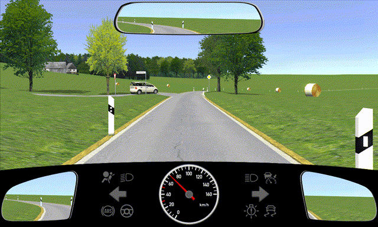

**Options:**
- A. Reduce speed, waive your priority
- B. Sound your horn and try to pass in front of the car

**Correct Answer(s):**
- A. Reduce speed, waive your priority

**Explanation:**
Even if you are in the right of way: Do not take risks in case of bad traffic behavior of other participants. Draw attention to the error with horn signal, but do not insist on your right and renounce your right of way. Lower your speed as well.

---

#### Question 2.1.01-006

**Points:** 4 Points

**What results in specific risks to motorcyclists?**

**Options:**
- A. Riding with the visor open
- B. Riding in heavy rain
- C. Changes in the road surfacing

**Correct Answer(s):**
- A. Riding with the visor open
- B. Riding in heavy rain
- C. Changes in the road surfacing

**Explanation:**
If you ride with the visor open, an insect can fly into it at any time. This can be very painful and distracting. If the road surface changes, there is a risk of falling down because the grip level is different. In heavy rain, motorbikes are more likely to aquaplane than cars.

---

#### Question 2.1.01-007-M

**Points:** 4 Points

**What should you do now?**

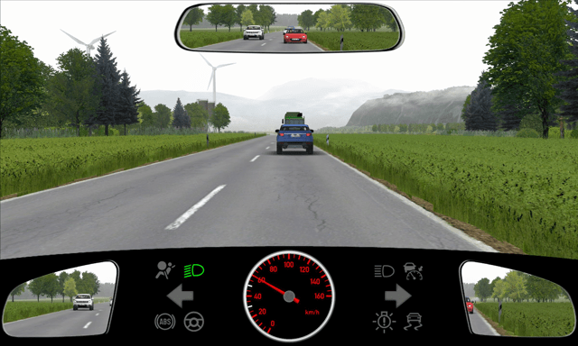

[Video: videos/2_1_01-007-M.mp4](videos/2_1_01-007-M.mp4)

**Options:**
- A. I reduce my speed so that the overtaking vehicle can pull in ahead of me
- B. I accelerate so that the overtaking vehicle can pull in behind me
- C. I maintain my speed because there is sufficient safety distance

**Correct Answer(s):**
- A. I reduce my speed so that the overtaking vehicle can pull in ahead of me

**Explanation:**
The overtaking vehicle will probably not be able to complete its overtaking manoeuvre as planned. To prevent an accident, you should let the overtaking vehicle get into the lane.

---

#### Question 2.1.01-008-M

**Points:** 4 Points

**Why should you allow the truck to change lane?**

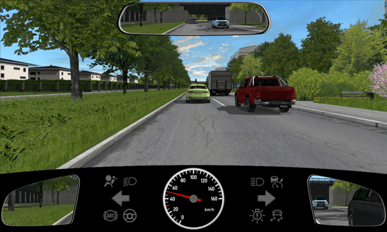

[Video: videos/2_1_01-008-M.mp4](videos/2_1_01-008-M.mp4)

**Options:**
- A. Because the driver of the truck may fail to see me
- B. Because I should show due consideration to the truck
- C. Because the alternate merging procedure applies here

**Correct Answer(s):**
- A. Because the driver of the truck may fail to see me
- B. Because I should show due consideration to the truck

**Explanation:**
If you are in the dead corner of the truck and the truck suddenly exhaust yourself, a dangerous situation can occur and you would have to slow down. Since there is enough space between the vehicle in front, you should take the truck into account and enable it to change lanes.

---

#### Question 2.1.01-009

**Points:** 3 Points

**As a motorcyclist , why is it important that you adopt an anticipatory driving style especially on very winding stretches of road?**

**Options:**
- A. Because the turning radius can reduce as the road continues
- B. Because otherwise I will not be able to see dirt on the roadway in time
- C. Because it means I am able to adjust myself in good time to the actions of oncoming traffic

**Correct Answer(s):**
- A. Because the turning radius can reduce as the road continues
- B. Because otherwise I will not be able to see dirt on the roadway in time
- C. Because it means I am able to adjust myself in good time to the actions of oncoming traffic

**Explanation:**
By riding with foresight, you can recognise the behaviour of oncoming traffic and potentially dangerous situations, such as dirt on the road or a change in cornering radius, in good time and adapt your riding behaviour accordingly.

---

#### Question 2.1.01-010

**Points:** 4 Points

**As a motorcyclist, you can easily go unnoticed by other vehicle drivers. How can you reduce this risk?**

**Options:**
- A. I avoid remaining for too long in the blind spot to the side of other vehicles
- B. I try to see the road situation from the perspective of other vehicle drivers
- C. Before taking a turn, I try to establish eye-contact with other drivers in my vicinity

**Correct Answer(s):**
- A. I avoid remaining for too long in the blind spot to the side of other vehicles
- B. I try to see the road situation from the perspective of other vehicle drivers
- C. Before taking a turn, I try to establish eye-contact with other drivers in my vicinity

**Explanation:**
Try to put yourself in the shoes of the drivers involved so that you can better understand what they might do next. This way, you may be able to recognise a potential hazard and react to it in good time.
If you are driving in a vehicle's side blind spot, the driver will not be able to see you. If possible, drive in such a way that you are not in the blind spot for an unnecessarily long time. You should also try to make eye contact with the drivers involved before turning to ensure that they can see you.

---

#### Question 2.1.01-101

**Points:** 4 Points

**What can cause a dangerous situation?**

**Options:**
- A. Brakes which engage heavily on one side
- B. Too much steering-wheel play
- C. Disturbed reception of traffic information on the radio

**Correct Answer(s):**
- A. Brakes which engage heavily on one side
- B. Too much steering-wheel play

**Explanation:**
If a foot brake has a strong one-sided effect, the vehicle may swing off laterally during braking. The car may skid and overturn. Therefore, unequal braking forces are extremely dangerous. Excessive steering can also lead to skidding at high speeds because you can no longer keep the lane properly. A disturbed traffic radio is not a technically dangerous defect.

---

#### Question 2.1.01-102

**Points:** 4 Points

**What are the effects of listening to loud music - especially with an extremely loud bass volume - in the car?**

**Options:**
- A. Blind people lose their orientation when they are near the car
- B. The driver’s attention is significantly impaired
- C. It makes it easier for blind people to recognise where the road is

**Correct Answer(s):**
- A. Blind people lose their orientation when they are near the car
- B. The driver’s attention is significantly impaired

**Explanation:**
Loud music in the car leads to two negative effects: The driver is distracted by the music and he cannot concentrate on the road. Deep basses in particular lead to strong uncertainty in blind road users. These can lose their orientation, especially with low-frequency music.

---

#### Question 2.1.01-103

**Points:** 4 Points

**What can create a hazard when driving?**

**Options:**
- A. A service brake that responds heavily on one side
- B. An excessive amount of play in the steering
- C. A faulty dipped headlight

**Correct Answer(s):**
- A. A service brake that responds heavily on one side
- B. An excessive amount of play in the steering
- C. A faulty dipped headlight

**Explanation:**
If the dipped headlights are not working, you will see poorly on the one hand and you will be seen worse on the other. If the service brake is too one-sided, the vehicle could swerve or have a longer braking distance. If there is too much play in the steering, the steering command will not be carried out.

---

### 2.1.02 Chapter Behaviour Towards Pedestrians

#### Question 2.1.02-002

**Points:** 4 Points

**You are driving on a narrow road. About 20 m ahead of you a child suddenly runs onto the roadway. When is a collision unavoidable despite emergency braking?**

**Options:**
- A. 50 km/h
- B. 30 km/h
- C. 20 km/h

**Correct Answer(s):**
- A. 50 km/h

**Explanation:**
For this question, you must first calculate the thinking distance and the hazard braking distance. At 50 km/h, the thinking distance is 50/10 x 3 = 15. So, there are 15 meters of thinking distance. The hazard braking distance is determined by the following calculation: [(50/10 x 50/10) / 2] = 12.5. 50 km/h is the right answer.

---

#### Question 2.1.02-003

**Points:** 4 Points

**Why do you have to brake?**

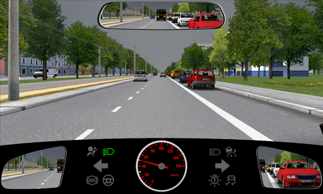

[Video: videos/2_1_02-003.mp4](videos/2_1_02-003.mp4)

**Options:**
- A. Because someone is walking onto the road
- B. Because passengers are exiting the tram
- C. Because the truck is switching into my lane

**Correct Answer(s):**
- A. Because someone is walking onto the road

**Explanation:**
You have to expect the person standing in front of the stationary truck to move to the left. Braking serves to protect the person.

---

#### Question 2.1.02-004

**Points:** 5 Points

**What is the right course of action now?**

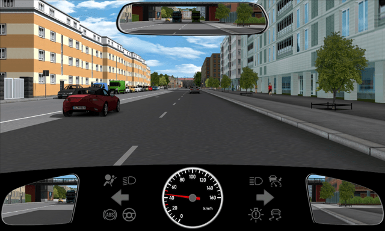

[Video: videos/2_1_02-004.mp4](videos/2_1_02-004.mp4)

**Options:**
- A. I stop
- B. I continue driving as before
- C. I accelerate

**Correct Answer(s):**
- A. I stop

**Explanation:**
When turning right, you must always be aware of pedestrians and cyclists approaching. They may cross the road in front of you.

---

#### Question 2.1.02-005-M

**Points:** 4 Points

**What must you anticipate in this situation?**

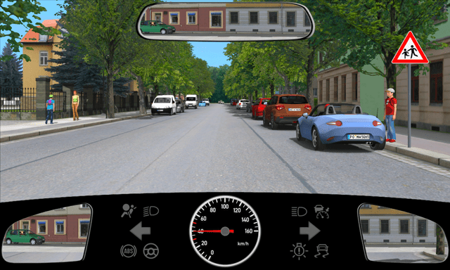

**Options:**
- A. Children walking out onto the road
- B. People exiting their vehicles via the side nearest the road
- C. There is a pedestrian crossing up ahead

**Correct Answer(s):**
- A. Children walking out onto the road
- B. People exiting their vehicles via the side nearest the road

**Explanation:**
The road sign signals increased caution against children who could walk across the road between the vehicles.
In addition, you have to expect that people get off to the side of the road.

---

#### Question 2.1.02-006-M

**Points:** 5 Points

**What is the right course of action now?**

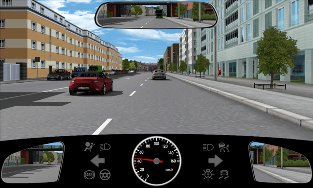

[Video: videos/2_1_02-006-M.mp4](videos/2_1_02-006-M.mp4)

**Options:**
- A. I stop
- B. I continue driving as before
- C. I accelerate

**Correct Answer(s):**
- A. I stop

**Explanation:**
Since a person wants to cross the intersection, you have to stop and have the person crossed the traffic light.

---

### 2.1.03 Chapter Road And Weather Conditions

#### Question 2.1.03-001

**Points:** 4 Points

**What must you reckon with when you are driving in the left-hand lane of an autobahn at high speed?**

**Options:**
- A. Motorists in front of you may suddenly pull out to overtake
- B. Even a slight, unexpected side wind can effect road stability
- C. If you have full beam switched on, vehicles travelling in front of you will not pull out to overtake

**Correct Answer(s):**
- A. Motorists in front of you may suddenly pull out to overtake
- B. Even a slight, unexpected side wind can effect road stability

**Explanation:**
At high speed, motorcycles are very sensitive to wind from the side. Small fast motorcycles are hard to see, other vehicles might therefore not see you.

---

#### Question 2.1.03-002

**Points:** 3 Points

**When is there a danger of a motorcycle veering sideways at high speed?**

**Options:**
- A. When you overtake a truck
- B. When driving under a bridge at high speed in a strong side wind
- C. When the braking effect is different on both sides of the front disc brake

**Correct Answer(s):**
- A. When you overtake a truck
- B. When driving under a bridge at high speed in a strong side wind

**Explanation:**
Sudden side wind increases the risk of a motorcycle to veer sideways. Sudden side wind can occur when exiting under a bridge, out of a tunnel, or when overtaking a truck.

---

#### Question 2.1.03-003

**Points:** 4 Points

**What must you reckon with when it starts raining after a longer period of dry weather?**

**Options:**
- A. A dangerous greasy film on the surface of the road
- B. Bad visibility through helmet visor or goggles
- C. Shorter braking distance

**Correct Answer(s):**
- A. A dangerous greasy film on the surface of the road
- B. Bad visibility through helmet visor or goggles

**Explanation:**
Rain clean up part of the dirt on the road. If the weather was dry for a long period of time, the road will accumulate a lot of dirt. With the addition of water, it will create a film on the road that will make the surface more slippery and increase the braking distance. You can also expect poor visibility on your helmet or goggles.

---

#### Question 2.1.03-004

**Points:** 4 Points

**You come unexpectedly upon a stretch of road with loose chippings. What do you do?**

**Options:**
- A. Avoid braking if possible
- B. Hold your course if possible
- C. Brake hard using the handbrake

**Correct Answer(s):**
- A. Avoid braking if possible
- B. Hold your course if possible

**Explanation:**
Coming soon...

---

#### Question 2.1.03-005

**Points:** 4 Points

**What can happen if you drive around a left-hand bend near the marked central line?**

**Options:**
- A. Because of the inclined position, the upper part of your body could be hit by oncoming traffic
- B. The motorcycle could catch the central line and slip from under you
- C. There is no danger as long as the tyres are new

**Correct Answer(s):**
- A. Because of the inclined position, the upper part of your body could be hit by oncoming traffic
- B. The motorcycle could catch the central line and slip from under you

**Explanation:**
When turning left, being near the central line is dangerous. Due to the inclination left, you could be hit by a vehicle going in the opposite direction. Road markings such as the central line are slippery, if your motorcycle run on it, it could slip resulting in a fall

---

#### Question 2.1.03-007

**Points:** 3 Points

**What are the dangers on wet cobblestones?**

**Options:**
- A. Increased tendency for the brakes to lock
- B. Increased danger of falling
- C. Spinning and skidding of the rear wheel when accelerating

**Correct Answer(s):**
- A. Increased tendency for the brakes to lock
- B. Increased danger of falling
- C. Spinning and skidding of the rear wheel when accelerating

**Explanation:**
Cobblestones are slippery and will therefore increase the risk of falling or tires to lose adhesion to the road and spin when accelerating as well as a tendency of breaks to lock

---

#### Question 2.1.03-009

**Points:** 3 Points

**What should you particularly remember when it is raining?**

**Options:**
- A. Visibility through goggles or helmet visor gets considerably worse
- B. Road surface damage is less noticeable when the road is wet
- C. Visibility is further reduced by water sprayed up by other vehicles

**Correct Answer(s):**
- A. Visibility through goggles or helmet visor gets considerably worse
- B. Road surface damage is less noticeable when the road is wet
- C. Visibility is further reduced by water sprayed up by other vehicles

**Explanation:**
Rain reduces visibility. The road surface is less visible when wet. The visibility can also be lowered by water particles coming from other vehicles. Your visor will also accumulate water droplets and further diminish your visibility.

---

#### Question 2.1.03-011

**Points:** 4 Points

**What should you remember when there are tramlines in your lane?**

**Options:**
- A. Tramlines should always be crossed at the widest angle possible
- B. There is always greater danger of falling on tramlines
- C. Tramlines should always be crossed at the narrowest angle possible

**Correct Answer(s):**
- A. Tramlines should always be crossed at the widest angle possible
- B. There is always greater danger of falling on tramlines

**Explanation:**
Tramlines are made of metal which is slippery. A motorcycle therefore has a higher risk of sliding and falling on them. When crossing you should try to be as perpendicular to them as possible to avoid slipping

---

#### Question 2.1.03-012

**Points:** 3 Points

**What can cause the danger of falling on bends?**

**Options:**
- A. Oil on the roadway
- B. Lane markings
- C. The outside edge of the bend is higher than the inside

**Correct Answer(s):**
- A. Oil on the roadway
- B. Lane markings

**Explanation:**
When turning on bends, slippery surfaces such as lane markings, oil on the road, dirt, manholes, sand or leaves can lead to a fall

---

#### Question 2.1.03-013

**Points:** 3 Points

**What can cause the danger of falling on bends?**

**Options:**
- A. Manhole covers on the roadway
- B. Leaves on the roadway
- C. Sand on the roadway

**Correct Answer(s):**
- A. Manhole covers on the roadway
- B. Leaves on the roadway
- C. Sand on the roadway

**Explanation:**
When turning on bends or braking, slippery surfaces such as lane markings, oil on the road, dirt, manholes, sand, dust, gravel, wet surfaces, cobblestones or leaves will increase the risk of falling

---

#### Question 2.1.03-014

**Points:** 3 Points

**When must you apply the brakes with particular care?**

**Options:**
- A. When travelling on cobblestones
- B. When it starts raining
- C. On a concrete roadway with good grip

**Correct Answer(s):**
- A. When travelling on cobblestones
- B. When it starts raining

**Explanation:**
Braking is less effective on slippery surfaces (wet road, cobblestones, dirt road) and needs to be applied with care

---

#### Question 2.1.03-015

**Points:** 5 Points

**What can cause in aquaplaning (sliding on wet roads) on wet road surfaces?**

**Options:**
- A. High speed
- B. Worn tyres
- C. Grooves in the roadway

**Correct Answer(s):**
- A. High speed
- B. Worn tyres
- C. Grooves in the roadway

**Explanation:**
Aquaplaning - also known as hydroplaning - occurs when the tread depth of the tires is too low to displace the accumulated amount of water or when the amount of water to be discharged is too large due to a high speed (from 60 km/h). In addition, wheel ruts in the road, in which water accumulates, favor this effect.

---

#### Question 2.1.03-017-B

**Points:** 4 Points

**Why could overtaking be dangerous here?**

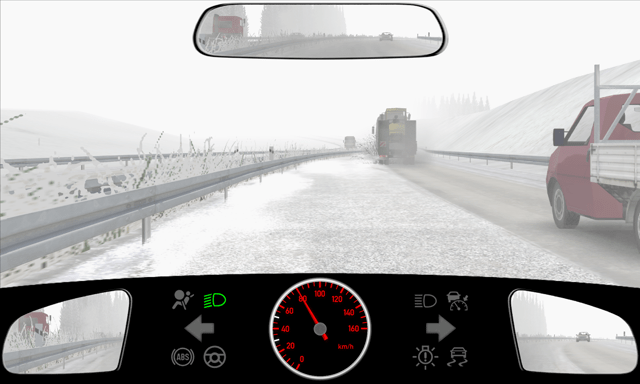

**Options:**
- A. There is still slush on the overtaking lane
- B. Slush could be thrown up and impair visibility
- C. Because beneath the slush there could also be ice on the road

**Correct Answer(s):**
- A. There is still slush on the overtaking lane
- B. Slush could be thrown up and impair visibility
- C. Because beneath the slush there could also be ice on the road

**Explanation:**
Overtaking in slush can lead to many dangers. Under the snow there could be a layer of ice that makes overtaking dangerous. In addition, you could hurl snow masses at other vehicles or to start swerving back and forth yourself.

---

#### Question 2.1.03-018

**Points:** 4 Points

**What must you do if your vehicle is caught by a strong side wind?**

**Options:**
- A. Steer against the wind
- B. Reduce speed
- C. Accelerate rapidly

**Correct Answer(s):**
- A. Steer against the wind
- B. Reduce speed

**Explanation:**
If your vehicle is hit by strong crosswinds, you should not accelerate, slow down instead and countersteer. The faster you drive, the less secure you can keep your vehicle on the road, since crosswinds can lead to skidding of the vehicle.

---

#### Question 2.1.03-020

**Points:** 4 Points

**When can strong side wind be particularly dangerous?**

**Options:**
- A. When overtaking trucks
- B. When driving across bridges
- C. When driving past firebreaks in forests

**Correct Answer(s):**
- A. When overtaking trucks
- B. When driving across bridges
- C. When driving past firebreaks in forests

**Explanation:**
Changing wind directions are dangerous when driving. Sudden gusts can catch your vehicle and push it aside. You have to countersteer strongly to keep your vehicle in the lane. If the wind changes direction, you have to react quickly and adjust your steering behavior. Strong crosswind is a danger especially on bridges and on level, undeveloped and unwooded terrain. If you overtake one or more trucks, you will have to expect changing pressure conditions when entering the slipstream of the truck and when leaving the truck. At forest aisles or when leaving wooded areas, a strong crosswind can also hit you abruptly.

---

#### Question 2.1.03-021-B

**Points:** 4 Points

**What must you reckon with here?**

**Options:**
- A. Your vehicle could be blown to the left by the strong side wind
- B. When overtaking, your vehicle is pulling to the right when you enter the slipstream of the truck
- C. The vehicle travelling in front of you can be blown to the right

**Correct Answer(s):**
- A. Your vehicle could be blown to the left by the strong side wind
- B. When overtaking, your vehicle is pulling to the right when you enter the slipstream of the truck

**Explanation:**
If you drive on the motorway in a strong crosswind from the right, the crosswind constantly pushes the car to the left. You have to countersteer to the right to stay in the lane. If you overtake a truck, expect that the pressure from the crosswind is gone immediately as you enter the slipstream of the truck. If you continue to countersteer, there is a risk that you drive against the truck. Since the crosswind comes from the right, the front vehicle could be pushed to the left.

---

#### Question 2.1.03-022-B

**Points:** 4 Points

**A strong side wind is blowing from the right. When are you particularly exposed to danger when overtaking?**

**Options:**
- A. When you enter the slipstream of the truck
- B. When you leave the slipstream of the truck
- C. When you change lane after overtaking

**Correct Answer(s):**
- A. When you enter the slipstream of the truck
- B. When you leave the slipstream of the truck

**Explanation:**
If there is strong crosswind from the right, you are particularly at risk as a car driver if you enter the slipstream of a truck as part of an overtaking maneuver. This danger arises from the fact that strong side wind from the right pushes your vehicle to the left, whereupon you automatically start countersteering. As you overtake a truck, you fall into its slipstream; the crosswind is instantly gone and you have to adjust the steering. As soon as you get out of the slipstream, the pressure starts again with the crosswind; So, you have to countersteer again.

---

#### Question 2.1.03-023

**Points:** 5 Points

**Why must you reduce your speed in heavy rain?**

**Options:**
- A. Because braking distance is increased
- B. Because visibility is reduced
- C. Because aquaplaning (sliding on wet roads) can occur

**Correct Answer(s):**
- A. Because braking distance is increased
- B. Because visibility is reduced
- C. Because aquaplaning (sliding on wet roads) can occur

**Explanation:**
Water on the windshield or visor breaks the light and worsens the view, whirling up water also obstructs the view. The braking distance is longer on wet roads because of lower grip. The profile of the tires drains the water. At high speed, the amount of water to be drained is too large, there is a risk of aquaplaning. In this case, there is no contact between the road and the tire. The vehicle cannot be controlled any longer.

---

#### Question 2.1.03-024-B

**Points:** 4 Points

**What adversely affects road safety here?**

**Options:**
- A. Poor visibility
- B. Reduced grip of the tyres on the wet roadway
- C. The dipped headlights of oncoming traffic

**Correct Answer(s):**
- A. Poor visibility
- B. Reduced grip of the tyres on the wet roadway

**Explanation:**
The rain and the whirled-up water create a haze that can significantly affect traffic safety. Assume that the grip of the tires is significantly lower due to the wet road surface than on dry roads and that this prolongs your braking distance. The low beam of oncoming traffic does not affect the traffic safety, as the car driver is not dazzled by it.

---

#### Question 2.1.03-025

**Points:** 3 Points

**What can be caused if the road surface suddenly becomes worse?**

**Options:**
- A. Danger of sliding and skidding
- B. Changes in tyre noise
- C. Longer reaction distance

**Correct Answer(s):**
- A. Danger of sliding and skidding
- B. Changes in tyre noise

**Explanation:**
As the road surface deteriorates, it always results in a change and deterioration of traction. As the wheels lose stiction, the vehicle is slipping and skidding faster. The tire noise also depends on the condition of the road surface and changes when, for example, the road turns from a paved road to a cobblestone track.

---

#### Question 2.1.03-027

**Points:** 4 Points

**What are the special conditions when driving along tree-lined avenues?**

**Options:**
- A. Bends are often very narrow and blind
- B. The narrow and often cambered roadway requires special caution when there is oncoming traffic
- C. The trees provide protection from the sides

**Correct Answer(s):**
- A. Bends are often very narrow and blind
- B. The narrow and often cambered roadway requires special caution when there is oncoming traffic

**Explanation:**
The road is usually very narrow. In addition, it is often heavily curved to drain rainwater. Therefore, special care should be taken with oncoming traffic. Curves are not clear due to the trees. You have to drive particularly careful because of the possible oncoming traffic in curves. Left turns are especially dangerous. The trees don't offer any protection to the driver, not even windbreak.

---

#### Question 2.1.03-028

**Points:** 5 Points

**What is the right course of action?**

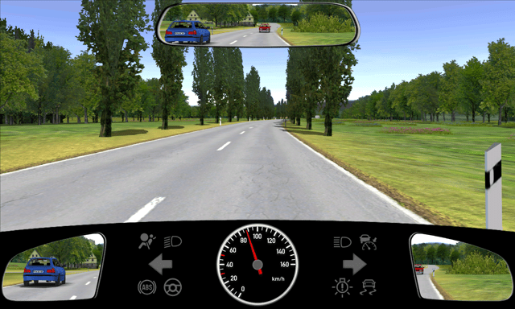

[Video: videos/2_1_03-028.mp4](videos/2_1_03-028.mp4)

**Options:**
- A. I brake
- B. I drive over to the right-side as far as possible
- C. I remain in the centre of my lane

**Correct Answer(s):**
- A. I brake
- B. I drive over to the right-side as far as possible

**Explanation:**
While overtaking a cyclist, the oncoming truck also partly gets on your lane. Brake and drive as far to the right as possible.

---

#### Question 2.1.03-029

**Points:** 3 Points

**Why should you brake now?**

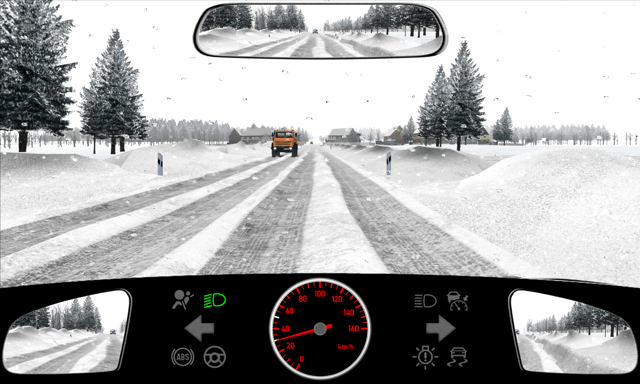

[Video: videos/2_1_03-029.mp4](videos/2_1_03-029.mp4)

**Options:**
- A. - green car
- B. - blue car
- C. - tractor

**Correct Answer(s):**
- A. - green car

**Explanation:**
Snow is a special danger for you as a car driver. Your lane is covered in snow. In addition, your view is restricted by a heap of snow. The upcoming green car does not respect the right of way. Therefore, you should brake early, because due to the slipperiness of the braking distance is extended. Probably the green car is also hampered by the snow pile.

---

#### Question 2.1.03-030

**Points:** 3 Points

**Why should you ready yourself to have to stop here?**

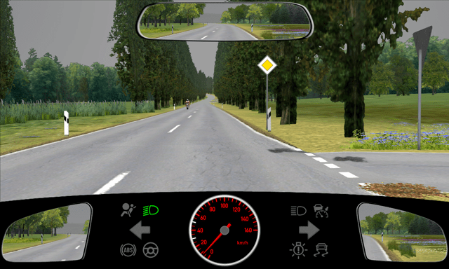

[Video: videos/2_1_03-030.mp4](videos/2_1_03-030.mp4)

**Options:**
- A. Because of the truck
- B. Because of the motorcyclist

**Correct Answer(s):**
- A. Because of the truck

**Explanation:**
The street looks very narrow. Expect that you have to stop when the truck approaches you. You should drive as far to the right as possible and prepare for a stop to avoid a collision.

---

#### Question 2.1.03-031-M

**Points:** 3 Points

**What should you be prepared here?**

**Options:**
- A. - extend the braking distance
- B. - negatively affect driving stability
- C. - reduce the braking distance

**Correct Answer(s):**
- A. - extend the braking distance
- B. - negatively affect driving stability

**Explanation:**
Dirt on the road can increase (not decrease) the braking distance and could make the road more slippery thus affecting the stability of your vehicles

---

#### Question 2.1.03-032

**Points:** 4 Points

**While driving, you unexpectedly come upon a straight section of road with loose chippings. What is the right course of action?**

**Options:**
- A. I slow down carefully
- B. I keep driving as straight as possible
- C. I use my parking brake to brake sharply

**Correct Answer(s):**
- A. I slow down carefully
- B. I keep driving as straight as possible

**Explanation:**
On the straight unexpected section with rolling gravel you should carefully reduce your speed for safety reasons and maintain your driving line as much as possible.

---

#### Question 2.1.03-033

**Points:** 4 Points

**What is the right course of action now?**

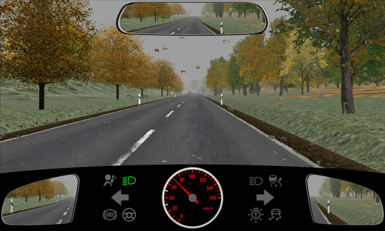

[Video: videos/2_1_03-033.mp4](videos/2_1_03-033.mp4)

**Options:**
- A. I reduce my speed
- B. I avoid abrupt manoeuvres
- C. I steer hard to the right

**Correct Answer(s):**
- A. I reduce my speed
- B. I avoid abrupt manoeuvres

**Explanation:**
Due to the bad weather conditions, you should reduce your speed and avoid jerky steering movements (see danger sign) as you could otherwise skid.

---

#### Question 2.1.03-034

**Points:** 4 Points

**What can be the effect of aquaplaning?**

**Options:**
- A. Reduced ability to steer the vehicle
- B. Reduced vehicle braking capability
- C. Increased tyre static friction

**Correct Answer(s):**
- A. Reduced ability to steer the vehicle
- B. Reduced vehicle braking capability

**Explanation:**
In the event of aquaplaning, your vehicle has no direct contact with the road surface, so the steering command and the braking command cannot be implemented.

---

#### Question 2.1.03-035

**Points:** 3 Points

**A strong side wind is blowing. When is there a risk that your motorcycle will be shifted sideways at high speed?**

**Options:**
- A. - overtake a truck
- B. - exit a tunnel passage
- C. - cross a bridge

**Correct Answer(s):**
- A. - overtake a truck
- B. - exit a tunnel passage
- C. - cross a bridge

**Explanation:**
Wind conditions change when overtaking a truck, when driving up a bridge and when leaving a tunnel. Be prepared for crosswinds.

---

#### Question 2.1.03-036

**Points:** 3 Points

**What is the correct course of action in this situation?**

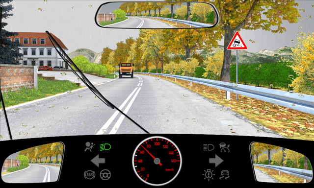

**Options:**
- A. I reduce my speed
- B. I avoid abrupt steering movements
- C. I brake hard

**Correct Answer(s):**
- A. I reduce my speed
- B. I avoid abrupt steering movements

**Explanation:**
The traffic sign indicates a risk of skidding and sliding. To avoid skidding, you should reduce your speed, especially when it is raining and leaves are falling on the road, as is the case here. Braking hard, accelerating hard or steering jerkily can cause the tyres to lose their grip and you could skid or slide.

---

#### Question 2.1.03-037

**Points:** 4 Points

**What should you be prepared for here?**

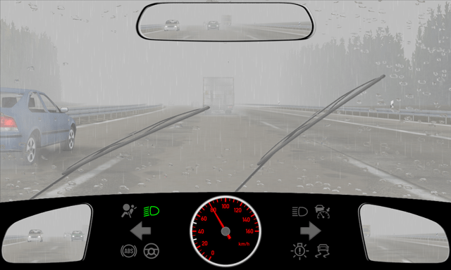

**Options:**
- A. For an extended braking distance
- B. For the poor visibility of my vehicle
- C. For increased tyre traction

**Correct Answer(s):**
- A. For an extended braking distance
- B. For the poor visibility of my vehicle

**Explanation:**
Because of the rain, you should be prepared for the fact that other vehicles will not be able to see your vehicle and that your braking distance will be longer due to the reduced grip.

---

#### Question 2.1.03-038

**Points:** 4 Points

**Where are you particularly at risk during an overtaking manoeuvre here?**

**Options:**
- A. When driving into the truck’s wind-sheltered area
- B. When driving out of the truck’s wind-sheltered area
- C. When changing lane after overtaking

**Correct Answer(s):**
- A. When driving into the truck’s wind-sheltered area
- B. When driving out of the truck’s wind-sheltered area

**Explanation:**
If there is a strong side wind from the right, you as a motorist are particularly at risk if, when driving off-road, you overtake in the slipstream of a truck. This hazard arises from the fact that strong cross winds from the right push your vehicle to the left, whereupon you automatically countersteer. As you overtake a truck, you slipstream into it; the crosswind is gone instantly and you have to adjust the steering. As soon as you pull out of the slipstream, the pressure starts up again with the crosswind; You have to countersteer again.

---

#### Question 2.1.03-039-M

**Points:** 4 Points

**What could happen if you pass through a bend close to the lane markings?**

**Options:**
- A. - be struck by oncoming traffic
- B. - lose control of my motorbike while attempting to avoid oncoming traffic
- C. - be able to see well around the bend

**Correct Answer(s):**
- A. - be struck by oncoming traffic
- B. - lose control of my motorbike while attempting to avoid oncoming traffic

**Explanation:**
Always make sure that you and your motorbike are not overhanging the centre line. If you take blind bends, you are unnecessarily endangering yourself and oncoming traffic. This is because you could be hit by oncoming traffic or lose control of your motorbike during evasive manoeuvres.

---

#### Question 2.1.03-040

**Points:** 3 Points

**What can increase the risk of a motorcycle fall while driving through road bends?**

**Options:**
- A. An oil spill on the carriageway
- B. A bump on the carriageway
- C. A carriageway inclines towards the inside of the bend

**Correct Answer(s):**
- A. An oil spill on the carriageway
- B. A bump on the carriageway

**Explanation:**
Oil on the road increases the risk of falling when cornering, as the tyres' grip is significantly reduced due to the slippery surface.
Unevenness in the road surface, such as bumps, reduces the grip of the tyres and therefore increases the risk of falling.

---

#### Question 2.1.03-041

**Points:** 3 Points

**How can you reduce the risk of falling when encountering wet road markings?**

**Options:**
- A. I avoid driving on the road markings as much as possible
- B. I take the short distance possible when driving across the road markings
- C. I brake as sharply as possible before encountering the road markings

**Correct Answer(s):**
- A. I avoid driving on the road markings as much as possible
- B. I take the short distance possible when driving across the road markings

**Explanation:**
As the road markings are slippery, especially when wet, you should avoid driving over them if possible. If it is not possible to drive around them, you should take the shortest route across them to minimise the risk of falling.
Due to the wetness, you should avoid accelerating or braking here to minimise the risk of falling.

---

#### Question 2.1.03-042

**Points:** 3 Points

**What should you anticipate when driving on wet cobblestones?**

**Options:**
- A. A high tendency for the wheels to lock during braking
- B. A rapid skidding of the rear wheel when accelerating
- C. An increased traction of the front wheel during steering

**Correct Answer(s):**
- A. A high tendency for the wheels to lock during braking
- B. A rapid skidding of the rear wheel when accelerating

**Explanation:**
An uneven and wet road surface and therefore less grip increases the risk of the rear wheel spinning or slipping when accelerating.
When braking on wet cobblestones, the tendency to lock up is increased, which can cause the rear wheel to slip sideways more quickly.
Locking tendency means that the front wheel is loaded more and the rear wheel is unloaded when braking.

---

#### Question 2.1.03-043

**Points:** 3 Points

**What should you take into account when you drive a motorcycle during low ambient temperatures?**

**Options:**
- A. The helmet visor is prone to misting up
- B. The handbrake lever cannot be safely operated with cold fingers
- C. Freezing improves the ability to concentrate

**Correct Answer(s):**
- A. The helmet visor is prone to misting up
- B. The handbrake lever cannot be safely operated with cold fingers

**Explanation:**
If the temperature of the outside air differs from the air temperature in the helmet, the helmet will mist up. This greatly impairs visibility. 
In addition, the handbrake lever is more difficult to operate with cold fingers.

---

#### Question 2.1.03-044-M

**Points:** 4 Points

**What must you anticipate in this situation?**

**Options:**
- A. My vehicle may be forced leftwards
- B. When driving into the wind-protected area alongside the truck, my vehicle may be forced rightwards
- C. The truck ahead of me may be forced rightwards

**Correct Answer(s):**
- A. My vehicle may be forced leftwards
- B. When driving into the wind-protected area alongside the truck, my vehicle may be forced rightwards

**Explanation:**
You can see from the windsock that a strong wind is blowing from the right. The strong wind could move your vehicle to the left. Be prepared to steer to the right.
In addition, when entering the slipstream of the truck, you must be prepared for your vehicle to be moved to the right because its large surface area will keep out the crosswind. Be prepared to steer to the left to avoid colliding with the truck.

---

#### Question 2.1.03-045-M

**Points:** 3 Points

**Heavy rain has caused large puddles to form on the road surface. What is the right course of action now?**

**Options:**
- A. - slowly to avoid create road spray
- B. - quickly to maintain the stability of my motorbike
- C. - with my feet elevated to prevent getting wet

**Correct Answer(s):**
- A. - slowly to avoid create road spray

**Explanation:**
You can easily lose control of your motorbike when riding through large puddles. Ride slowly and do not lift your feet to keep your motorbike stable and avoid splashing water.

---

#### Question 2.1.03-046

**Points:** 3 Points

**What should you anticipate while driving, when it starts to rain after a long dry period?**

**Options:**
- A. A particularly slippery road surface
- B. Poor visibility through my helmet visor
- C. A shorter braking distance

**Correct Answer(s):**
- A. A particularly slippery road surface
- B. Poor visibility through my helmet visor

**Explanation:**
Basically, you must always expect visibility through your helmet visor to be poorer in the rain and, if it is dry for a long time, a layer of dirt will remain on the road which can form a slippery film on the road surface when it rains, so you must expect the road to be particularly slippery.

---

#### Question 2.1.03-101

**Points:** 5 Points

**Where does aquaplaning (sliding on wet roads) occur particularly often?**

**Options:**
- A. In dips in the roadway
- B. Where there are grooves in the roadway
- C. At level crossings

**Correct Answer(s):**
- A. In dips in the roadway
- B. Where there are grooves in the roadway

**Explanation:**
If the speed is too high and/or there is more water than can be drained from the tire profiles, aquaplaning occurs. A water film prevents contact between tires and the road. The vehicle is no longer controllable. The risk of aquaplaning exists in particular in ruts and road subsidence. Level crossings usually have no increased risk for aquaplaning, since water can usually run well here.

---

#### Question 2.1.03-102

**Points:** 5 Points

**What does aquaplaning (sliding on wet roads) lead to?**

**Options:**
- A. The vehicle can no longer be steered and braked
- B. The vehicle can leave the road
- C. Steering becomes heavy

**Correct Answer(s):**
- A. The vehicle can no longer be steered and braked
- B. The vehicle can leave the road

**Explanation:**
Aquaplaning or hydroplaning can lead to neither being able to brake or steer. As a result, conscious driving of the vehicle is no longer possible. It can get into a skid. This effect is caused by a kind of water gore, which slides between the tire and the road.

---

#### Question 2.1.03-103

**Points:** 4 Points

**What must you reckon with when it starts raining after a long period of dry weather?**

**Options:**
- A. A dangerous greasy film on the surface of the road
- B. Bad visibility immediately upon switching the windscreen wipers on
- C. Shorter braking distance

**Correct Answer(s):**
- A. A dangerous greasy film on the surface of the road
- B. Bad visibility immediately upon switching the windscreen wipers on

**Explanation:**
If rain sets in after prolonged drought, a dangerous film of lubricant forms on the road, which is only washed away after a long period of rain. This film is more dangerous than rain alone. Brake very carefully. This lubricating film is also deposited on the windscreen. After turning on the windscreen wipers, it first worsens the view drastically. The braking distance is extended by the poorer traction.

---

#### Question 2.1.03-104

**Points:** 4 Points

**It starts raining. Why must you immediately increase the safe distance?**

**Options:**
- A. Because a greasy film may form which increases the braking distance
- B. Because visibility may become worse and the windscreen wipers do not immediately provide a clear field of vision
- C. Because the brakes react more quickly

**Correct Answer(s):**
- A. Because a greasy film may form which increases the braking distance
- B. Because visibility may become worse and the windscreen wipers do not immediately provide a clear field of vision

**Explanation:**
When it starts raining, you must immediately increase the safety distance for the following reasons: Under the influence of moisture, the dirt, dust and fine deposits from tire abrasion or pollen on the road turn into a dangerous film of grease. This reduces the traction and thereby extends the braking distance. This lubricating film also forms on the windscreen and on the brake drums. If you use the windscreen wipers, they will first worsen your view and smudge the window. On the brake drums, this lubricating film leads to a slower response of the brakes in wet conditions.

---

#### Question 2.1.03-105

**Points:** 4 Points

**You are driving in dense fog on a federal road (Bundesstraße) outside a built-up area. Are you allowed to drive in the middle of the road continuously straddling the broken white line?**

**Options:**
- A. No, because it could represent a danger to oncoming traffic
- B. Yes, if fog headlamps and rear fog lamps are switched on
- C. Yes, because it reduces the risk of running off the road

**Correct Answer(s):**
- A. No, because it could represent a danger to oncoming traffic

**Explanation:**
Driving on the center line is not allowed even in dense fog, especially as drivers can always collide with oncoming traffic due to reduced visibility. If there's fog, slow down and orient yourself on the right side of the road for a safe ride.

---

#### Question 2.1.03-106

**Points:** 4 Points

**What must you do on encountering sudden dense fog driving at daytime?**

**Options:**
- A. Adapt speed immediately to visibility conditions
- B. Switch on dipped headlights
- C. Only switch on parking lights

**Correct Answer(s):**
- A. Adapt speed immediately to visibility conditions
- B. Switch on dipped headlights

**Explanation:**
As a car driver you must turn on low beam during the day when there's fog, snowfall and other poor visibility. Because of the insufficient luminosity driving with parking light is not permitted. Adjust your speed to the visibility conditions and use the rear fog light when you can see less than 50 meters.

---

#### Question 2.1.03-107

**Points:** 3 Points

**How can you achieve sufficient visibility through the windscreen?**

**Options:**
- A. Switch on the windscreen wipers from time to time when it is foggy
- B. When there is slush, switch on the windscreen wipers already before slush is thrown onto your windscreen by other vehicles
- C. When the windscreen is steamed up, switch the ventilator off and keep the windows closed

**Correct Answer(s):**
- A. Switch on the windscreen wipers from time to time when it is foggy
- B. When there is slush, switch on the windscreen wipers already before slush is thrown onto your windscreen by other vehicles

**Explanation:**
Turn your windscreen wipers to interval switching, during fog in order to remove fine water droplets from the mist. Turn on your windscreen wipers before overtaking or being overtaken so that obstructions caused by slush or spray water are immediately removed. Avoid fogged windows with the correct ventilation setting: Set ventilation to outside air supply and not to circulating air. Open the windows a gap to let the moisture escape. Briefly switching on the air conditioning dehumidifies the air very quickly.

---

#### Question 2.1.03-109

**Points:** 4 Points

**You want to overtake on a narrow avenue not within a built-up area. What must you be aware of in particular?**

**Options:**
- A. Even cyclists frequently cannot be overtaken when there is oncoming traffic due to the narrow width of the roadway
- B. Misjudgements of distances and oncoming traffic frequently result in serious accidents
- C. Vehicles with high superstructures frequently move to avoid branches

**Correct Answer(s):**
- A. Even cyclists frequently cannot be overtaken when there is oncoming traffic due to the narrow width of the roadway
- B. Misjudgements of distances and oncoming traffic frequently result in serious accidents
- C. Vehicles with high superstructures frequently move to avoid branches

**Explanation:**
Due to the narrow width of the lanes, even cyclists cannot be overtaken with oncoming traffic. Often, the road is heavily curved to drain rainwater, that means when crossing the center line, the vehicle tilts to the other side. This load change reduces the driving stability. Due to the trees, curves can be confusing. Vehicles with tall bodies often need to travel in the center to avoid colliding with branches and could reach into your lane.

---

#### Question 2.1.03-110

**Points:** 4 Points

**What do you have to be aware of in this situation?**

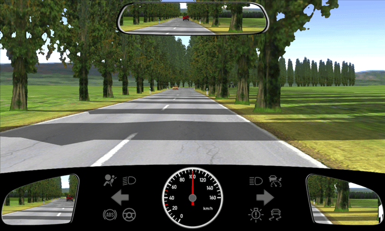

**Options:**
- A. The speed should be adjusted due to the visibility
- B. Judging distances is made more difficult because of the constant changing of light and shadows
- C. The constant changing of light and shadows makes it more difficult to detect other road users in good time

**Correct Answer(s):**
- A. The speed should be adjusted due to the visibility
- B. Judging distances is made more difficult because of the constant changing of light and shadows
- C. The constant changing of light and shadows makes it more difficult to detect other road users in good time

**Explanation:**
A sudden and strong change of lighting conditions, you must reduce your speed, because the human eye otherwise cannot react fast enough to the change of light. Other road users or obstacles are very difficult to perceive in dark areas.

---

#### Question 2.1.03-111

**Points:** 4 Points

**When overtaking several trucks, you are faced with this situation. What should you do now?**

**Options:**
- A. I abort the overtaking manoeuvre
- B. After pulling back into lane, I again establish an adequate safety distance
- C. I continue overtaking quickly and pull back into lane in front of the red truck

**Correct Answer(s):**
- A. I abort the overtaking manoeuvre
- B. After pulling back into lane, I again establish an adequate safety distance

**Explanation:**
The visibility is very poor due to the weather and the road is not sufficiently visible. In order not to endanger anyone, you should stop the overtaking process as quickly as possible and ensure that you are at a safe distance from the vehicle in front of you when you go back into lane.

---

#### Question 2.1.03-112

**Points:** 3 Points

**You are driving as part of a group of several motorcycles. What reduces the risk of accidents?**

**Options:**
- A. - maintain their position
- B. - assume smaller safety distances
- C. - drive alongside one another in the same lane

**Correct Answer(s):**
- A. - maintain their position

**Explanation:**
When driving together with a group of motorcycles, all should keep their distance behind each other and have enough distance to brake and stop

---

#### Question 2.1.03-113

**Points:** 4 Points

**When is there an increased risk of falling during steering and braking manoeuvres?**

**Options:**
- A. On wet cobblestone pavement
- B. On wet asphalt
- C. On carriageways with loose chippings

**Correct Answer(s):**
- A. On wet cobblestone pavement
- B. On wet asphalt
- C. On carriageways with loose chippings

**Explanation:**
When turning on bends or braking, slippery surfaces such as lane markings, oil on the road, dirt, manholes, sand, dust, gravel, wet surfaces, cobblestones or leaves will increase the risk of falling

---

#### Question 2.1.03-114

**Points:** 4 Points

**Wet road markings increase the risk of a fall. How can you reduce this danger of falling?**

**Options:**
- A. Cross road markings at the interstice points
- B. Do not accelerate or brake on markings
- C. Cross long markings at a sharp angle

**Correct Answer(s):**
- A. Cross road markings at the interstice points
- B. Do not accelerate or brake on markings

**Explanation:**
Wet markings similarly to tram tracks are slippery. You should cross them as perpendicularly as possible and try to no accelerate or brake on them.

---

#### Question 2.1.03-115

**Points:** 4 Points

**What is the right course of action?**

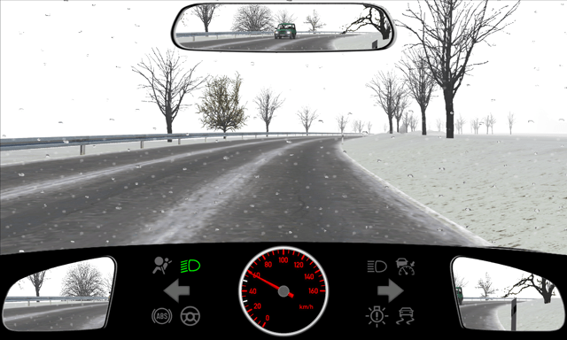

[Video: videos/2_1_03-115.mp4](videos/2_1_03-115.mp4)

**Options:**
- A. I continue slowing down
- B. I wait before the obstruction
- C. I switch to the left lane now

**Correct Answer(s):**
- A. I continue slowing down
- B. I wait before the obstruction

**Explanation:**
There are two lanes in your direction of travel. You drive on the right side of the two tracks. In oncoming traffic, a snow plow truck approaches. You see in the mirror that a vehicle in the left lane next to you wants to overtake. Snowdrifts hinder you while driving on the lane. You cannot turn left unless the overtaking is completed. Therefore, you must delay further and wait in front of the obstacle until you can dodge to the left.

---

#### Question 2.1.03-116-M

**Points:** 4 Points

**What should you do here?**

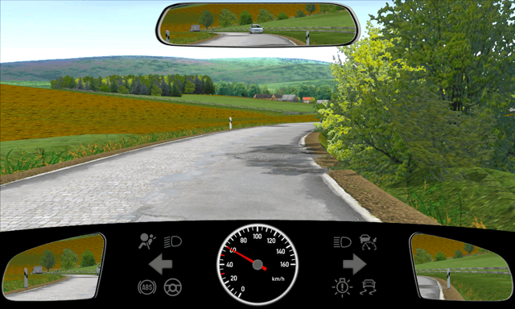

**Options:**
- A. - greatly reduce my speed
- B. - continue driving in my lane
- C. - drive to the left past the damaged road surface

**Correct Answer(s):**
- A. - greatly reduce my speed
- B. - continue driving in my lane

**Explanation:**
In the event of lane damage before a turn, you should reduce your speed considerably to avoid damaging the vehicle. Due to the confusion of the curve, you should not drive past the lane damage on the left, but continue on the right on your lane.

---

#### Question 2.1.03-117

**Points:** 5 Points

**You are driving on the autobahn. What is the correct thing to do in this situation?**

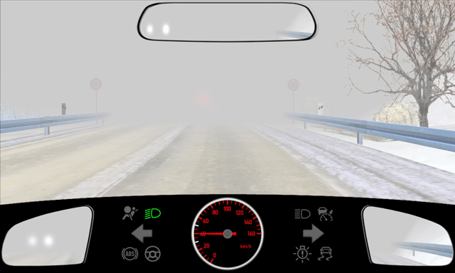

[Video: videos/2_1_03-117.mp4](videos/2_1_03-117.mp4)

**Options:**
- A. - turn on the rear fog lights
- B. - drive at 50 km/h maximum
- C. - drive at 80 km/h maximum

**Correct Answer(s):**
- A. - turn on the rear fog lights
- B. - drive at 50 km/h maximum

**Explanation:**
Due to the severely restricted view on the motorway, you can switch on your rear fog light and drive a maximum of 50 km / h.

---

#### Question 2.1.03-118

**Points:** 3 Points

**The electronic stability programme (ESP) display has flashed several times. What is the correct course of action in this situation?**

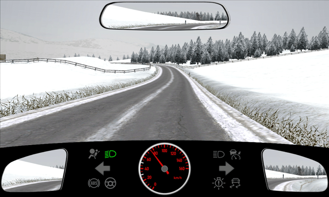

[Video: videos/2_1_03-118.mp4](videos/2_1_03-118.mp4)

**Options:**
- A. I reduce my speed, because it is too high
- B. I maintain my speed, because the ESP ensures I can continue driving safely
- C. I go to a garage, because the ESP display is indicating a fault

**Correct Answer(s):**
- A. I reduce my speed, because it is too high

**Explanation:**
The Electronic Stability Program (ESP) is always active. If the ESP light flashes, it shows you that it is actively intervening in the driving behaviour of the vehicle and stabilising it. Therefore, the speed should be reduced.
If the ESP symbol is permanently lit, it is inactive or defective and needs to be checked.

---

#### Question 2.1.03-119

**Points:** 3 Points

**While driving, you use your vehicle’s adaptive cruise control (ACC) system. What must you anticipate in these weather conditions?**

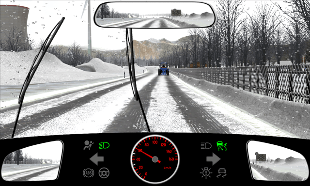

**Options:**
- A. The functionality of the ACC may be negatively affected
- B. I have to personally control my speed and distance
- C. The ACC stops the vehicle

**Correct Answer(s):**
- A. The functionality of the ACC may be negatively affected
- B. I have to personally control my speed and distance

**Explanation:**
The adaptive cruise control system (ASC) independently estimates the distance and speed of the vehicle in front.  This can be limited in bad weather, e.g. due to snow and dirt. Therefore, you must regulate the distance and speed yourself.

---

#### Question 2.1.03-120

**Points:** 4 Points

**You are driving along a narrow avenue. What must you be aware of?**

**Options:**
- A. - be able to stop within half of the distance visible to me
- B. - stop for oncoming traffic, if necessary
- C. - anticipate unevenness at the edge of the road caused by tree roots

**Correct Answer(s):**
- A. - be able to stop within half of the distance visible to me
- B. - stop for oncoming traffic, if necessary
- C. - anticipate unevenness at the edge of the road caused by tree roots

**Explanation:**
The narrow width of the road and its often curved shape due to tree roots force you to take extra care when cornering and when facing oncoming traffic. Choose your speed in such a way that the vehicle can be brought to a halt within half the visible distance. Example: With a visibility of approx. 40 metres, you should choose your speed so that you come to a stop within approx. 20 metres. In purely mathematical terms, the stopping distance at 30 km/h is 18 metres.

---

#### Question 2.1.03-121

**Points:** 3 Points

**The electronic stability control (ESC) display light has flashed several times. What is the correct course of action in this situation?**

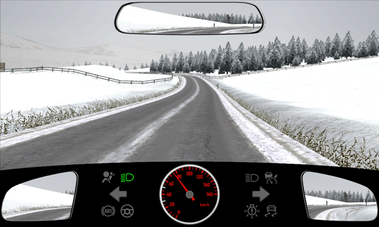

[Video: videos/2_1_03-121.mp4](videos/2_1_03-121.mp4)

**Options:**
- A. I reduce my speed, because it is too high
- B. I maintain my speed, because the ESC system ensures I can continue driving safely
- C. I go to a garage, because the ESC display is indicating a fault

**Correct Answer(s):**
- A. I reduce my speed, because it is too high

**Explanation:**
You have to reduce your speed. Due to the slippery road surface and the obviously too high speed in the curves for the road conditions, the wheels lose grip and the car could skid.

---

#### Question 2.1.03-122

**Points:** 4 Points

**What must you anticipate here?**

**Options:**
- A. Pedestrians on the carriageway
- B. A reduced amount of side clearance from oncoming traffic
- C. That you may be dazzled by the low-lying sun

**Correct Answer(s):**
- A. Pedestrians on the carriageway
- B. A reduced amount of side clearance from oncoming traffic

**Explanation:**
The snow on the right and left sides of the road may limit the lane. Therefore, you must expect that the distance to oncoming traffic is reduced.
In addition, you can see from the traffic sign that there is a parking area for walkers on the right-hand side. Therefore, you must expect that there are pedestrians on the roadway.

---

#### Question 2.1.03-123

**Points:** 4 Points

**While driving straight ahead, you lose control of your vehicle due to aquaplaning. What is the proper response now?**

**Options:**
- A. I gently take my foot off the accelerator
- B. I keep the steering wheel as straight as possible
- C. I brake firmly

**Correct Answer(s):**
- A. I gently take my foot off the accelerator
- B. I keep the steering wheel as straight as possible

**Explanation:**
During aquaplaning, you cannot turn or change the direction of your car. You should also not accelerate or brake. So just carefully take your foot off the gas pedal and try to keep the wheel straight until your wheels touch the road again.

---

#### Question 2.1.03-124

**Points:** 4 Points

**Why is it dangerous to overtake on this snow-covered carriageway?**

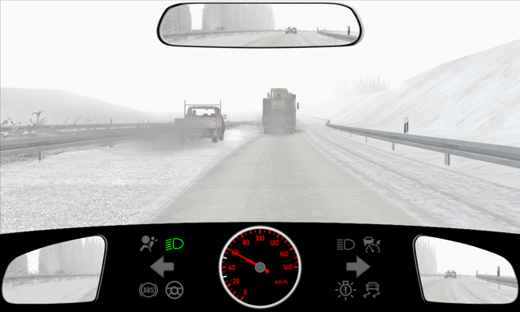

**Options:**
- A. Because my vehicle may skid
- B. Because parts of the carriageway may be iced over
- C. Because my vision may become even more negatively affected

**Correct Answer(s):**
- A. Because my vehicle may skid
- B. Because parts of the carriageway may be iced over
- C. Because my vision may become even more negatively affected

**Explanation:**
In the event of sneaky, icy road, the tires have less liability and can slip. You should avoid sudden braking through slow, forward -looking driving so as not to skid.
In addition, the in front can also be thrown on the left lane due to the clearing/ stray vehicle in front and your view also deteriorates.

---

### 2.1.04 Chapter Darkness And Poor Visibility

#### Question 2.1.04-001

**Points:** 4 Points

**While driving at night on a country road you see pedestrians on your side. What do you do if you are dazzled by an oncoming vehicle?**

**Options:**
- A. Reduce speed and, if necessary, stop
- B. Switch to high beam and proceed without reducing speed
- C. Accelerate in order to get out of the area of dazzle as quickly as possible

**Correct Answer(s):**
- A. Reduce speed and, if necessary, stop

**Explanation:**
If an oncoming vehicle dazzles you, be sure to reduce the speed so you can stop at any time in a potentially dangerous situation. If pedestrians are on or near the lane, you may even need to stop in such cases. Increasing your speed is not allowed.

---

#### Question 2.1.04-002

**Points:** 3 Points

**What must you do if wild animals suddenly appear in the full beam of your headlights?**

**Options:**
- A. Immediately dip your headlights
- B. Sound the horn and brake
- C. Proceed on full beam

**Correct Answer(s):**
- A. Immediately dip your headlights
- B. Sound the horn and brake

**Explanation:**
Hold the steering wheel tightly and brake. Dip the high beam, because it dazzles the game and therefore remains on the road. Honk to scare it away. Avoid trying to dodge at high speed. These maneuvers often end at a tree or in oncoming traffic. That's why the following rules apply when there's game on the road: slow down, dip the lights and honk to scare off the game.

---

#### Question 2.1.04-005

**Points:** 4 Points

**What do you have to be aware of in this situation?**

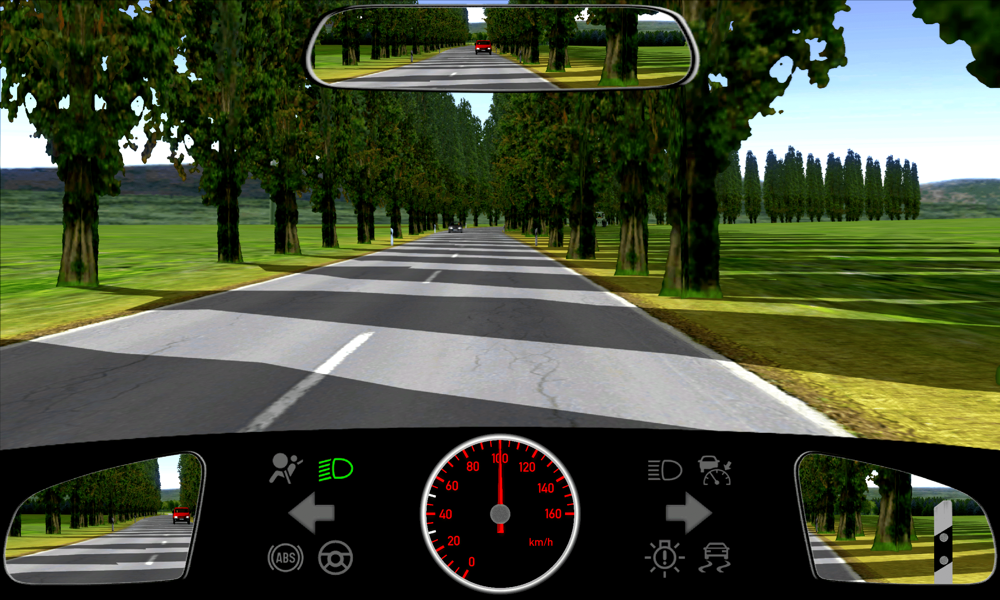

**Options:**
- A. - I have to drive with particular care
- B. - I may be poorly visible to other road users
- C. - I am more easily able to judge distances

**Correct Answer(s):**
- A. - I have to drive with particular care
- B. - I may be poorly visible to other road users

**Explanation:**
Due to the large number of trees and the constant change between light and shade, you have to drive particularly attentively, as it is much more difficult to recognise other road users.

---

#### Question 2.1.04-101

**Points:** 3 Points

**In the dark, an oncoming vehicle fails to dip its headlights. What can you do so that you can still see to a certain extent?**

**Options:**
- A. Avoid looking at the headlights of the approaching vehicle and direct your gaze towards the right-hand edge of the roadway
- B. Also switch on full beam
- C. Lower the sun visor

**Correct Answer(s):**
- A. Avoid looking at the headlights of the approaching vehicle and direct your gaze towards the right-hand edge of the roadway

**Explanation:**
If you are dazzled by the light from an oncoming vehicle, look to the right side of the road if possible. This reduces the dazzling effect and you can still stay the lane. It's prohibited to dazzle back by switching on the high beam. Folding down the sun shade is not an appropriate action as it will impair your vision too much.

---

#### Question 2.1.04-102

**Points:** 4 Points

**You are driving on a country road in darkness and rain and encounter oncoming vehicles with dipped headlights. What must you remember?**

**Options:**
- A. You can be dazzled by reflections on the wet road
- B. Your wet windscreen can result in your being dazzled
- C. You can avoid possible dazzle by switching on full beam

**Correct Answer(s):**
- A. You can be dazzled by reflections on the wet road
- B. Your wet windscreen can result in your being dazzled

**Explanation:**
You must not turn on the high beam in this situation, as this can strongly dazzle oncoming traffic. Especially on wet roads, the reflection of the light is greatly increased. Further interferences include drops of water and streaks on the windscreen, which scatter the light and cloud the view.

---

#### Question 2.1.04-103

**Points:** 4 Points

**What risks could arise if you drive with your main beam lights on?**

**Options:**
- A. Oncoming road users will be dazzled
- B. Wild animals on the road will be dazzled and will remain stationary in the light beam
- C. Stationary vehicles on my side of the road will not be detected until it is too late

**Correct Answer(s):**
- A. Oncoming road users will be dazzled
- B. Wild animals on the road will be dazzled and will remain stationary in the light beam

**Explanation:**
With high beam on, you can dazzle drivers in front of you and oncoming traffic, which may result in recognizing pedestrians and cyclists not at all or way too late. Game that is crossing the road can also be dazzled, which may lead to the animals remaining in the cone of light. With high beam you can recognize vehicles that broke down better.

---

#### Question 2.1.04-104

**Points:** 4 Points

**Driving at night-time on a rural road, you see persons on your side of the road. What do you do if you are dazzled by an oncoming vehicle?**

**Options:**
- A. - look towards the right-hand side of the road
- B. - stop if necessary
- C. - turn on my main beam lights

**Correct Answer(s):**
- A. - look towards the right-hand side of the road
- B. - stop if necessary

**Explanation:**
If you detect people on the side of the road at night as a car driver, you should slow down. Regular eye-contact with the roadside is ideal to avoid an accident. If you are also blinded, you can move to the right and stop.

---

#### Question 2.1.04-105

**Points:** 4 Points

**You are driving on an avenue, with a narrow carriageway. What must you be aware of?**

**Options:**
- A. I may only drive at a speed that allows me to stop within half of my range of vision
- B. Conflicts can arise with the oncoming traffic
- C. I have to anticipate unevenness at the edge of the carriageway caused by tree roots

**Correct Answer(s):**
- A. I may only drive at a speed that allows me to stop within half of my range of vision
- B. Conflicts can arise with the oncoming traffic
- C. I have to anticipate unevenness at the edge of the carriageway caused by tree roots

**Explanation:**
On narrow avenues you are only allowed to drive at a speed that allows you to stop within half the visibility if oncoming traffic approaches. There may be conflicts with oncoming traffic. You may have to slow down, brake and drive to the right or reverse until the road gets wider to allow oncoming traffic drive past you. The roadside of avenues can be particularly uneven because tree roots lift the pavement.

---

#### Question 2.1.04-106

**Points:** 3 Points

**What increases the risk of an accident?**

**Options:**
- A. - with the sun low in the sky out front
- B. - with a misted up windscreen
- C. - with iced over side windows

**Correct Answer(s):**
- A. - with the sun low in the sky out front
- B. - with a misted up windscreen
- C. - with iced over side windows

**Explanation:**
The risk of accidents is significantly increased if your windscreen and side windows are steamed up or iced over, as you can only see the traffic to a limited extent. Clear all windows before you set off.
You could also be dazzled if you drive towards the low sun. This could make you notice other road users later and increase the risk of an accident. Be extra focussed, wear sunglasses or roll down your sun visor.

---

### 2.1.05 Chapter Speed

#### Question 2.1.05-001

**Points:** 4 Points

**You have been driving at high speed for some time. What effects can this have?**

**Options:**
- A. You lose your feel for speed
- B. Your powers of concentration diminish
- C. The feel for the right speed on bends grows

**Correct Answer(s):**
- A. You lose your feel for speed
- B. Your powers of concentration diminish

**Explanation:**
You quickly get used to high speeds and you kind of enter a state of a rush. Especially at motorway exits, this can have a fatal impact, as your ability to concentrate and your reaction speed quickly decreases. So, look at the speedometer again and again!

---

#### Question 2.1.05-002

**Points:** 4 Points

**What can result from driving for a long time at high speed?**

**Options:**
- A. You lose your feel for speed
- B. You drive too close to vehicles in front
- C. Your reactions improve

**Correct Answer(s):**
- A. You lose your feel for speed
- B. You drive too close to vehicles in front

**Explanation:**
The senses have become accustomed to the fast pace and you start to underestimate certain situations. Therefore, drivers often drive at high speed into sharp turns on the freeway exit ramps. The fast and monotonous driving decreases the ability to concentrate and thus the readiness to react. Often the safety distance is neglected and drivers drive too close to the car in front.

---

#### Question 2.1.05-004

**Points:** 4 Points

**When is there a danger of underestimating your own speed?**

**Options:**
- A. When the road is wide and there are no trees, buildings, fences etc. at the edge of the road
- B. When you have already been driving at high speed for some time
- C. When the roadside features (trees, houses, fences) are constantly changing

**Correct Answer(s):**
- A. When the road is wide and there are no trees, buildings, fences etc. at the edge of the road
- B. When you have already been driving at high speed for some time

**Explanation:**
The danger of underestimating one's own driving speed comes into place when you made a long journey driving at high speed, for example on the highway. Even wide, clear roads quickly beguile you to drive at high speed. On the other hand, a changing roadside development has the opposite effect.

---

#### Question 2.1.05-005

**Points:** 4 Points

**What can lead to your dangerously underestimating your own speed?**

**Options:**
- A. Driving for a long time at high speed
- B. Driving on a good, wide road
- C. Loud engine and tyre noise

**Correct Answer(s):**
- A. Driving for a long time at high speed
- B. Driving on a good, wide road

**Explanation:**
Wide and clear roads without changing roadside development can lead to dangerous underestimation of one's own speed. But also, longer trips at higher speeds, such as on the highway, can lead to this effect. On the other hand, strong engine and tire noise let the driver perceive the speed more consciously.

---

#### Question 2.1.05-006

**Points:** 4 Points

**You are approaching a narrow left-hand bend at high speed. Why must you reduce speed already before entering the bend?**

**Options:**
- A. - otherwise you will be thrown out of the bend to the right
- B. - you will go into a skid if you do not brake until you are on the bend
- C. - otherwise you will be thrown out of the bend to the left

**Correct Answer(s):**
- A. - otherwise you will be thrown out of the bend to the right
- B. - you will go into a skid if you do not brake until you are on the bend

**Explanation:**
For you as the car driver there is a risk of skidding at increased speed. In the worst case, you could be thrown out of the bend and lose control of the vehicle. The centrifugal forces are too high at an increased speed. The tires can then no longer transfer the braking forces. That's why you should break early enough.

---

#### Question 2.1.05-007-B

**Points:** 4 Points

**What must you do?**

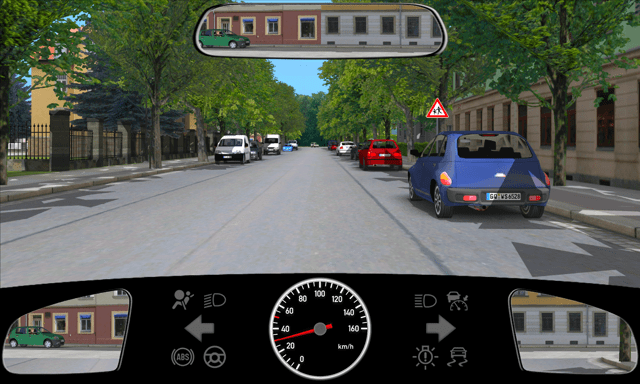

**Options:**
- A. Drive slowly because children might run out from between the parked vehicles at any time
- B. Drive slowly because a door on one of the vehicles could be opened on the roadway side
- C. Drive at the permitted maximum speed because there is no actual apparent danger

**Correct Answer(s):**
- A. Drive slowly because children might run out from between the parked vehicles at any time
- B. Drive slowly because a door on one of the vehicles could be opened on the roadway side

**Explanation:**
In this situation, you should stay below the speed limit. Children or other pedestrians could run onto the roadway between parked vehicles. In addition, you should expect that the doors of the parked vehicles could suddenly be opened to the side of the road.

---

#### Question 2.1.05-008

**Points:** 4 Points

**You are approaching a sharp left-hand bend at high speed. Why is it necessary to reduce your speed before you have actually reached the bend?**

**Options:**
- A. - could slide off to the right along the bend
- B. - could begin to skid
- C. - could slide off to the left along the bend

**Correct Answer(s):**
- A. - could slide off to the right along the bend
- B. - could begin to skid

**Explanation:**
Due to your high speed, the centrifugal force may cause your vehicle to skid out of the bend on the right. Therefore, you should reduce your speed before the bend.

---

#### Question 2.1.05-009

**Points:** 4 Points

**In what situation does a driver frequently underestimate their own speed?**

**Options:**
- A. On wide, well-finished roads
- B. After a long journey at high speed
- C. On narrow roads with uneven road surfaces

**Correct Answer(s):**
- A. On wide, well-finished roads
- B. After a long journey at high speed

**Explanation:**
When driving constantly at high speed, the ability to concentrate decreases. You get used to the speed. Also, wide roads with little peripheral development make you less aware of how fast you are actually going. The reaction time is prolonged.

---

#### Question 2.1.05-010

**Points:** 3 Points

**What should you anticipate when driving at high speed on the motorway?**

**Options:**
- A. Other road users underestimating my speed
- B. Cross winds can negatively affect my stability on the road
- C. I might not respond to hazards in good enough time

**Correct Answer(s):**
- A. Other road users underestimating my speed
- B. Cross winds can negatively affect my stability on the road
- C. I might not respond to hazards in good enough time

**Explanation:**
Other road users may underestimate your speed and suddenly pull out to overtake, for example. You may not be able to brake in time at high speed if a dangerous situation arises. If you see that danger is imminent, reduce your speed accordingly beforehand. 
In addition, at high speeds, even a slight crosswind can cause your vehicle to veer to the right or left.

---

#### Question 2.1.05-101

**Points:** 4 Points

**What is especially important when choosing the speed for driving along tree-lined avenues with narrow roadways?**

**Options:**
- A. To estimate the lateral distance to the trees and oncoming traffic simultaneously
- B. It may be necessary to stop within half the visible distance when a wide vehicle is coming from the opposite direction
- C. Rapidly changing light conditions make it easier to estimate lateral distances

**Correct Answer(s):**
- A. To estimate the lateral distance to the trees and oncoming traffic simultaneously
- B. It may be necessary to stop within half the visible distance when a wide vehicle is coming from the opposite direction

**Explanation:**
When driving on an avenue with narrow lane width, you must consider the following factors when choosing your speed: Due to the rows of trees on the side, the lighting conditions can change quickly. This makes it difficult for you to estimate the distances to the sides and oncoming traffic. You have to choose your speed so that you can stop halfway on the track, which you can overlook. This is particularly important because wide or tall vehicles often drive in the middle of avenues due to space requirements.

---

#### Question 2.1.05-102

**Points:** 4 Points

**Why are you required to slow down now?**

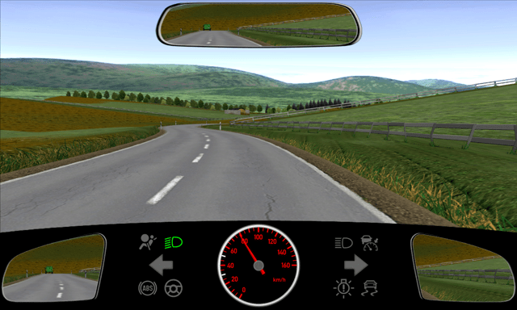

[Video: videos/2_1_05-102.mp4](videos/2_1_05-102.mp4)

**Options:**
- A. Because of the animal
- B. Because of the tractor
- C. Because of the course of the road

**Correct Answer(s):**
- A. Because of the animal

**Explanation:**
An animal runs on the road from the right. Since there is no vehicle behind you, you should delay, brake and drive to the right. This is the safest way to handle possible scenarios: the tractor could hit the animal and start skidding, the tractor could drive on your lane in an evasive maneuver, you could hit the animal and lose control of your vehicle.

---

#### Question 2.1.05-103

**Points:** 4 Points

**Where must you anticipate dangerous situations suddenly arising?**

**Options:**
- A. In forested areas
- B. After hilltops
- C. In front of schools

**Correct Answer(s):**
- A. In forested areas
- B. After hilltops
- C. In front of schools

**Explanation:**
You must be aware of sudden, dangerous situations when: 1. visibility is severely restricted; 2. Persons or animals could unexpectedly appear on the road. In the case of limited visibility, you may detect obstacles such as broken vehicles on the roadway too late. You have less time to react accordingly. In forest areas you have to expect wild animals crossing suddenly during dusk times; in residential areas you have to expect children playing on the street. Caution is also required in front of schools and at school bus stops.

---

#### Question 2.1.05-104-M

**Points:** 5 Points

**Why do you have to lower your speed here?**

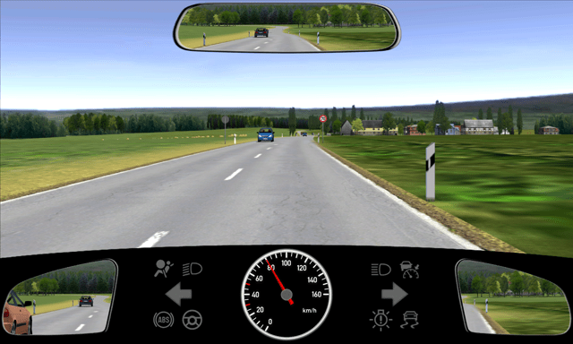

[Video: videos/2_1_05-104-M.mp4](videos/2_1_05-104-M.mp4)

**Options:**
- A. Because of the vehicle overtaking
- B. Because of the speed limit
- C. Because of the low volume of traffic

**Correct Answer(s):**
- A. Because of the vehicle overtaking

**Explanation:**
The vehicle overtaking in front of you dangerously carries an accident risk, as it can lead to a collision. In order to prevent participation and also to give the other vehicles space to evade, your own speed must be reduced.

---

#### Question 2.1.05-105-M

**Points:** 4 Points

**What should you anticipate in this situation?**

**Options:**
- A. Slow-moving vehicle on my side of the road
- B. Fast oncoming traffic cutting the corner
- C. Wild animals crossing the road

**Correct Answer(s):**
- A. Slow-moving vehicle on my side of the road
- B. Fast oncoming traffic cutting the corner
- C. Wild animals crossing the road

**Explanation:**
With a confusing right turn you have to expect different situations. Especially at dusk times, wild animals can switch sides right after the turn. But it can also happen that oncoming traffic cuts the curve and is recognized very late or that a vehicle is driving at a very low speed right after the curve.

---

#### Question 2.1.05-106-M

**Points:** 5 Points

**Why do you have to reduce your speed and keep as far to the right as possible here?**

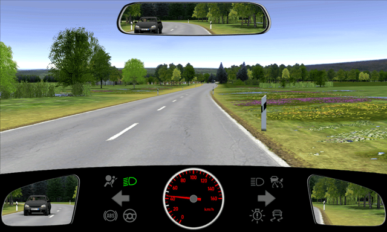

[Video: videos/2_1_05-106-M.mp4](videos/2_1_05-106-M.mp4)

**Options:**
- A. Because of the [red car]
- B. Because of the speed limit
- C. Because of the [blue truck]

**Correct Answer(s):**
- A. Because of the [red car]

**Explanation:**
In this situation, because of the yellow car coming in the opposite direction, you have to reduce your speed and keep as far to the right as possible

---

### 2.1.06 Chapter Overtaking

#### Question 2.1.06-002

**Points:** 5 Points

**Why can it be dangerous if you, as the last in a queue, immediately overtake as soon as the oncoming traffic is past?**

**Options:**
- A. Because you must reckon with others in the queue swinging out to overtake
- B. Because the distance needed to overtake might not be sufficient
- C. Because if you perhaps need to push back into the queue, this could lead to an accident

**Correct Answer(s):**
- A. Because you must reckon with others in the queue swinging out to overtake
- B. Because the distance needed to overtake might not be sufficient
- C. Because if you perhaps need to push back into the queue, this could lead to an accident

**Explanation:**
If a convoy has formed, drivers should basically overtake one after the other. The last of a convoy has the longest overtaking path and must also expect other vehicles starting to overtake in front of him.

---

#### Question 2.1.06-003-B

**Points:** 4 Points

**What must you remember if you want to overtake?**

**Options:**
- A. The van could start to overtake the vehicle travelling in front of it
- B. Oncoming traffic could appear
- C. As no oncoming traffic is in sight, you may overtake without hesitation

**Correct Answer(s):**
- A. The van could start to overtake the vehicle travelling in front of it
- B. Oncoming traffic could appear

**Explanation:**
In an overtaking maneuver you should make sure that the oncoming lane is free. Be sure that there are no bends or gates as well and you only overtake a car. Watch out for more road users, especially trucks.

---

#### Question 2.1.06-004-B

**Points:** 4 Points

**Are you allowed to overtake the black car on this autobahn on the right?**

**Options:**
- A. No, because there is no queue of vehicles in the left lane
- B. Yes, if you do not drive faster than 80 km/h
- C. Yes, because there is enough space to overtake

**Correct Answer(s):**
- A. No, because there is no queue of vehicles in the left lane

**Explanation:**
The black car may not be overtaken on the right in this example. On freeways and highways, you may only overtake on the right as an exception. This is the case, for example, when a vehicle queue has formed on the left.

---

#### Question 2.1.06-005-B

**Points:** 4 Points

**Both cars are travelling at about 30 km/h. Are you allowed to overtake both before the bend?**

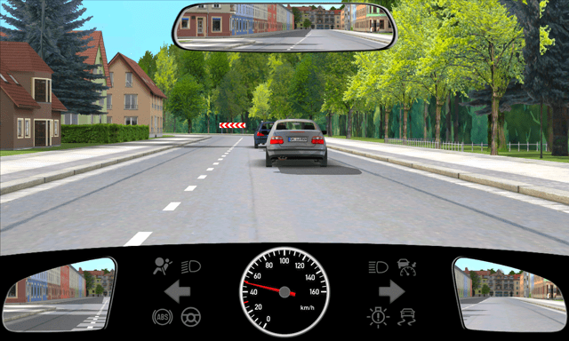

**Options:**
- A. - the distance you need to overtake would be too great
- B. - the light-coloured car could pull out to overtake
- C. - you are not allowed to cross the broken line

**Correct Answer(s):**
- A. - the distance you need to overtake would be too great
- B. - the light-coloured car could pull out to overtake

**Explanation:**
You may go over the broken line. An overtaking process would still be too dangerous here, because the manageable distance to overtake before the turn is too short. You also have to expect that the driver of the light car will start to overtake.

---

#### Question 2.1.06-006-B

**Points:** 5 Points

**The driver of the overtaking car has evidently made a miscalculation. What must you do?**

**Options:**
- A. Brake immediately and veer to the right
- B. Proceed as before

**Correct Answer(s):**
- A. Brake immediately and veer to the right

**Explanation:**
The car driver should reduce the speed. Otherwise an accident could occur. If this is not enough, you could additionally fall back on the grass verge on the right.

---

#### Question 2.1.06-007-M

**Points:** 3 Points

**You want to overtake. What is the right course of action now?**

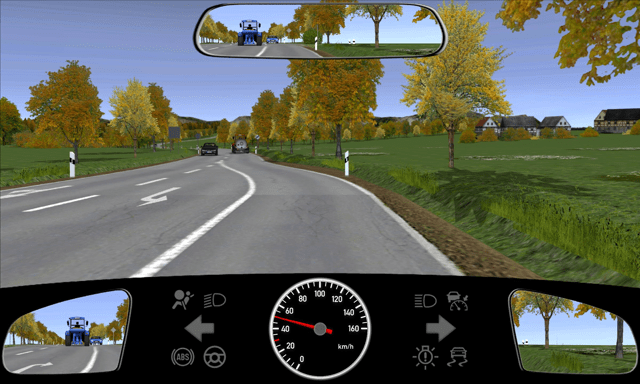

[Video: videos/2_1_06-007-M.mp4](videos/2_1_06-007-M.mp4)

**Options:**
- A. I refrain from overtaking
- B. I accelerate
- C. I maintain my speed

**Correct Answer(s):**
- A. I refrain from overtaking

**Explanation:**
As the vehicle behind you has already started the overtaking process, you should refrain from overtaking.

---

#### Question 2.1.06-008-M

**Points:** 4 Points

**You want to overtake. What should you do?**

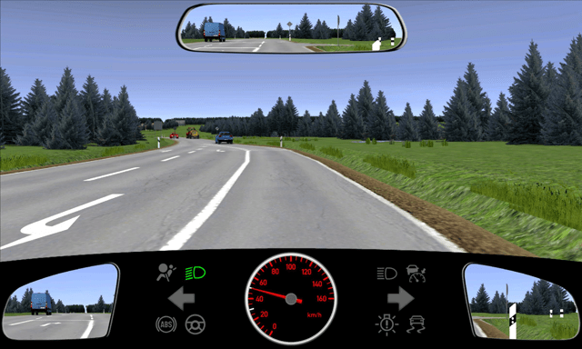

[Video: videos/2_1_06-008-M.mp4](videos/2_1_06-008-M.mp4)

**Options:**
- A. - only if I have a clear view over the necessary stretch of road
- B. - only if there is no oncoming vehicle
- C. - at the same time, as the [blue car]

**Correct Answer(s):**
- A. - only if I have a clear view over the necessary stretch of road
- B. - only if there is no oncoming vehicle

**Explanation:**
Here you can overtake if you can see over the required distance and if there is no oncoming vehicle (limited visibility).

---

#### Question 2.1.06-009

**Points:** 4 Points

**Why are you not allowed to overtake here?**

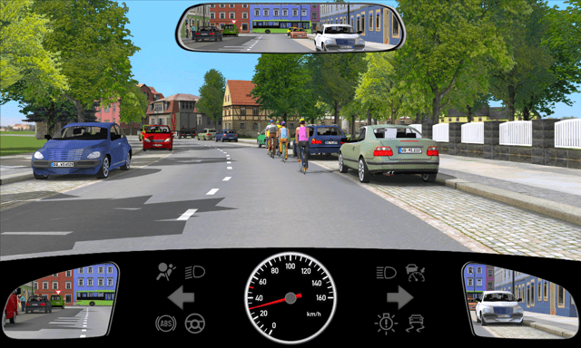

**Options:**
- A. Because the visible stretch is not sufficient
- B. Because I would not be able to maintain an adequate distance to the side in the event of oncoming traffic
- C. Because I am not permitted to cross the central line

**Correct Answer(s):**
- A. Because the visible stretch is not sufficient
- B. Because I would not be able to maintain an adequate distance to the side in the event of oncoming traffic

**Explanation:**
In general, you must not overtake if the entire overtaking distance is not visible or the side clearance to other road users cannot be met. Both negative factors are given in the present situation: The assessable track is too short for a safe overtaking maneuver. The minimum distance to the cyclists of 1.5 m cannot be met with oncoming traffic.

---

#### Question 2.1.06-010

**Points:** 5 Points

**You are being overtaken and the oncoming traffic is getting dangerously close. Despite this the other vehicle continues with the overtaking manoeuvre. What should you do?**

**Options:**
- A. - reduce my speed
- B. - maintain my speed
- C. - increase my speed

**Correct Answer(s):**
- A. - reduce my speed

**Explanation:**
You have to slow down and drive to the right, so that the overtaking vehicle driver can go back into lane on time. In no case should you increase the speed if you are overtaken.

---

#### Question 2.1.06-011

**Points:** 4 Points

**Why should you brake hard now?**

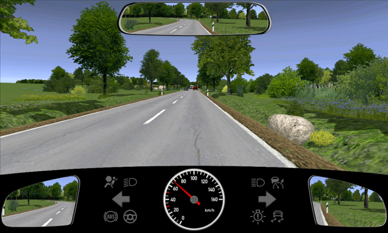

[Video: videos/2_1_06-011.mp4](videos/2_1_06-011.mp4)

**Options:**
- A. Because of the car
- B. Because of the truck
- C. Because of the tractor

**Correct Answer(s):**
- A. Because of the car

**Explanation:**
Since the blue passenger car will most likely get on your lane, you have to slow down immediately and keep to the right.

---

#### Question 2.1.06-012-M

**Points:** 5 Points

**What is the right course of action?**

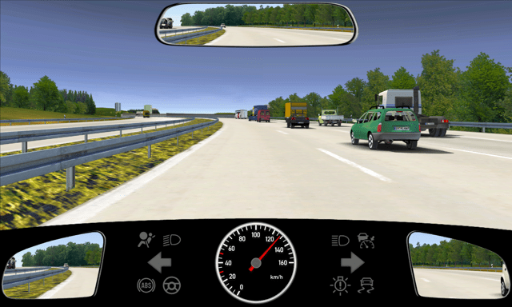

[Video: videos/2_1_06-012-M.mp4](videos/2_1_06-012-M.mp4)

**Options:**
- A. I overtake [the blue car] and then move into the middle lane
- B. I overtake [the red van] and then move into the middle lane
- C. I brake slightly to prompt the vehicle behind to keep its distance

**Correct Answer(s):**
- A. I overtake [the blue car] and then move into the middle lane

**Explanation:**
As the car driver, you do not have to dodge to the middle lane when another car pushes you from behind or uses the flash light. You should overtake the blue car and the red van as usual. To change safely to the middle lane, the overtaking process must be completed. Only then you can change.

---

#### Question 2.1.06-013

**Points:** 5 Points

**You want to overtake. What is the right course of action now?**

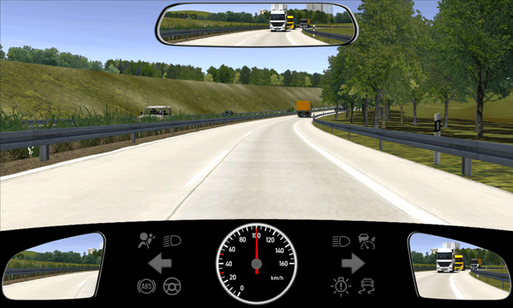

[Video: videos/2_1_06-013.mp4](videos/2_1_06-013.mp4)

**Options:**
- A. I cease the overtaking manoeuvre and remain behind the truck
- B. I accelerate and quickly continue the overtaking manoeuvre
- C. I maintain my speed and continue the overtaking manoeuvre

**Correct Answer(s):**
- A. I cease the overtaking manoeuvre and remain behind the truck

**Explanation:**
You already indicated and want to overtake the truck. In the rearview mirror you can see a red car approaching on the left lane at high speed. You need to stop the overtaking process immediately and stay behind the truck. If you continue, you force the red car to brake suddenly. He could drive against your car.

---

#### Question 2.1.06-014

**Points:** 5 Points

**What is the right course of action?**

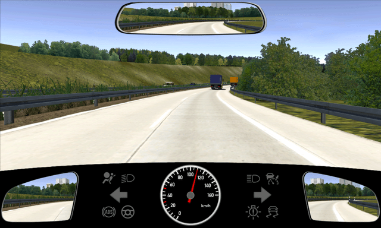

[Video: videos/2_1_06-014.mp4](videos/2_1_06-014.mp4)

**Options:**
- A. I quickly continue the overtaking manoeuvre
- B. I cease the overtaking manoeuvre, and pull back into the right-hand lane
- C. I brake, but continue the overtaking manoeuvre

**Correct Answer(s):**
- A. I quickly continue the overtaking manoeuvre

**Explanation:**
While overtaking a truck, you observe a fast approaching car in the rearview mirror. It is too late to complete the overtaking process. Accelerate and complete the overtaking process quickly but safely. Basically, subsequent vehicles do not have priority; even not on the freeway.

---

#### Question 2.1.06-015

**Points:** 5 Points

**What is the right course of action?**

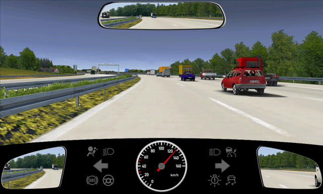

[Video: videos/2_1_06-015.mp4](videos/2_1_06-015.mp4)

**Options:**
- A. I overtake the van and then move into the middle lane
- B. I move immediately into the lane to the right
- C. I brake slightly to prompt the vehicle behind to keep its distance

**Correct Answer(s):**
- A. I overtake the van and then move into the middle lane

**Explanation:**
A driver drives dangerously close to you on the left-hand lane and signals his/her overtaking intent with his flash light. You should still overtake the transporter on the mid-lane and then get back into the lane in front of it to defuse the situation.

---

#### Question 2.1.06-016-M

**Points:** 5 Points

**What should you do now?**

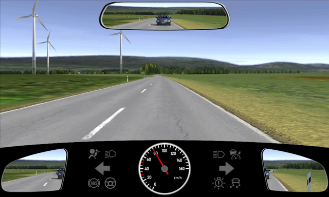

[Video: videos/2_1_06-016-M.mp4](videos/2_1_06-016-M.mp4)

**Options:**
- A. I slow down
- B. I drive as far to the right-side as possible
- C. I accelerate

**Correct Answer(s):**
- A. I slow down
- B. I drive as far to the right-side as possible

**Explanation:**
As a vehicle is approaching from the front and want to overtake a car behind you (red), you should slow down and extremely drive far right.

---

#### Question 2.1.06-017-M

**Points:** 3 Points

**Why must you slow down here?**

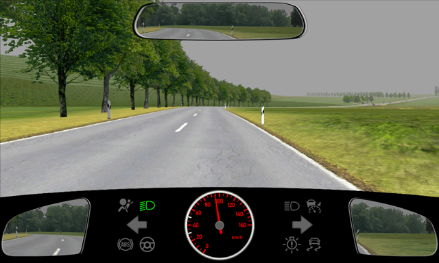

[Video: videos/2_1_06-017-M.mp4](videos/2_1_06-017-M.mp4)

**Options:**
- A. Because of the overtaking car
- B. Because the maximum permitted speed is 80 km/h
- C. Because of the tractor

**Correct Answer(s):**
- A. Because of the overtaking car

**Explanation:**
The oncoming car overtakes despite opposing traffic about 250 m in front of you. You have to reduce your speed and drive to the far right. So, you defuse the situation and give the overtaking car more time and space to complete the overtaking process. The tractor moves away from the intersection and poses no danger.

---

#### Question 2.1.06-018-M

**Points:** 5 Points

**What should you do now?**

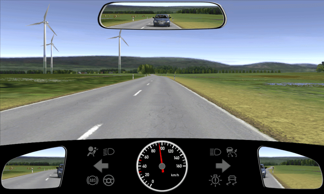

[Video: videos/2_1_06-018-M.mp4](videos/2_1_06-018-M.mp4)

**Options:**
- A. I slow down
- B. I drive as far to the right-side as possible
- C. I accelerate

**Correct Answer(s):**
- A. I slow down
- B. I drive as far to the right-side as possible

**Explanation:**
If a car overtakes you despite oncoming traffic, you should delay and try to drive to the right as far as possible. This gives the other vehicle enough space to safely complete the overtaking process.

---

#### Question 2.1.06-019-M

**Points:** 4 Points

**Why are you not allowed to overtake in this situation?**

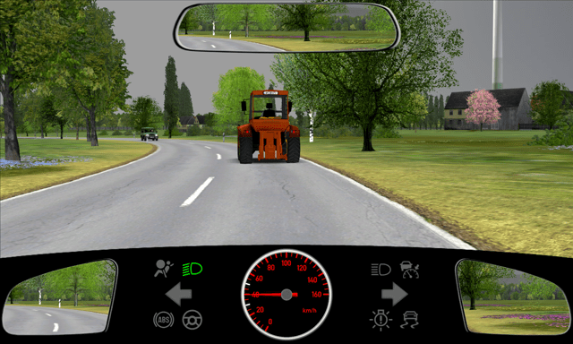

[Video: videos/2_1_06-019-M.mp4](videos/2_1_06-019-M.mp4)

**Options:**
- A. Because the motorbike wants to overtake me
- B. Because my overtaking distance is too long
- C. Because this is a no-overtaking zone

**Correct Answer(s):**
- A. Because the motorbike wants to overtake me
- B. Because my overtaking distance is too long

**Explanation:**
You are not allowed to overtake because of the motorbike coming at a fast speed behind you that will overtake you. Also the distance required to overtake is too long in this situation

---

#### Question 2.1.06-020-M

**Points:** 5 Points

**What should you do now?**

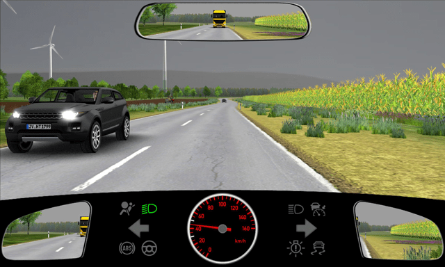

[Video: videos/2_1_06-020-M.mp4](videos/2_1_06-020-M.mp4)

**Options:**
- A. I slow down
- B. I drive as far to the right-side as possible
- C. I stop

**Correct Answer(s):**
- A. I slow down
- B. I drive as far to the right-side as possible

**Explanation:**
Given the truck that is overtaking you has incoming traffic, you should slow down and drive as far to the right as possible to allow him to overtake you

---

#### Question 2.1.06-021-M

**Points:** 4 Points

**You want to overtake. What is the right course of action now?**

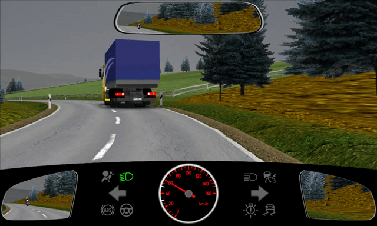

[Video: videos/2_1_06-021-M.mp4](videos/2_1_06-021-M.mp4)

**Options:**
- A. I refrain from overtaking the truck, because I do not have a clear view over the necessary stretch of road
- B. I follow the motorbike, because the truck is using its indicators to signal an opportunity to overtake
- C. I reduce my distance to the truck, to enable me to overtake more quickly

**Correct Answer(s):**
- A. I refrain from overtaking the truck, because I do not have a clear view over the necessary stretch of road

**Explanation:**
You should not overtake the truck, as you cannot see the distance required for this.

---

#### Question 2.1.06-022-M

**Points:** 4 Points

**Why must you abort your overtaking manoeuvre?**

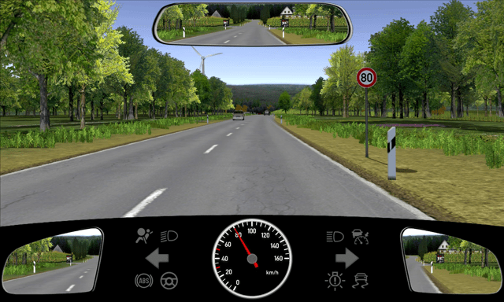

[Video: videos/2_1_06-022-M.mp4](videos/2_1_06-022-M.mp4)

**Options:**
- A. Because the tractor wants to turn left
- B. Because it could obstruct oncoming traffic
- C. Because a no-overtaking zone is visible ahead

**Correct Answer(s):**
- A. Because the tractor wants to turn left
- B. Because it could obstruct oncoming traffic

**Explanation:**
You should abort the overtaking maneuver because the tractor wants to turn left and because oncoming traffic may be obstructed.

---

#### Question 2.1.06-023-M

**Points:** 4 Points

**What is the right course of action now?**

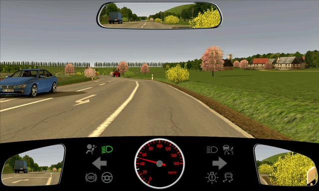

[Video: videos/2_1_06-023-M.mp4](videos/2_1_06-023-M.mp4)

**Options:**
- A. - do not overtake, because the tractor wants to pull out to the left
- B. - overtake carefully, because the tractor is demanding I do so
- C. - overtake immediately, because the overtaking distance is large enough

**Correct Answer(s):**
- A. - do not overtake, because the tractor wants to pull out to the left

**Explanation:**
You should not overtake because the tractor will swerve to the left (see indicator).

---

#### Question 2.1.06-024-M

**Points:** 4 Points

**You want to overtake. What is the right course of action here?**

**Options:**
- A. I do not overtake, because the [yellow] vehicle might want to overtake
- B. I do not overtake, because oncoming traffic could emerge
- C. I overtake, because no oncoming traffic is visible

**Correct Answer(s):**
- A. I do not overtake, because the [yellow] vehicle might want to overtake
- B. I do not overtake, because oncoming traffic could emerge

**Explanation:**
The correct behavior (proactive) here is not to overtake as the yellow vehicle could overtake and oncoming traffic could appear (restricted view).

---

#### Question 2.1.06-025-M

**Points:** 5 Points

**What is the right course of action now?**

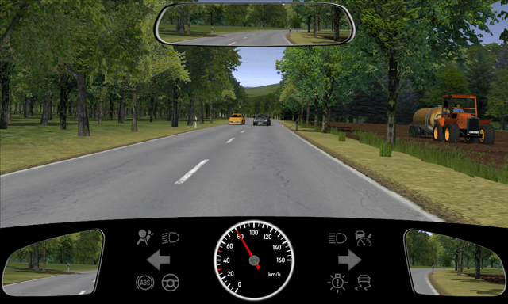

**Options:**
- A. I brake immediately
- B. I drive as far to the right as possible
- C. I continue driving as before

**Correct Answer(s):**
- A. I brake immediately
- B. I drive as far to the right as possible

**Explanation:**
As a vehicle is in your lane, you should slow down immediately and as far as possible turn right to avoid a collision.

---

#### Question 2.1.06-026-M

**Points:** 5 Points

**Why are you not allowed to overtake now?**

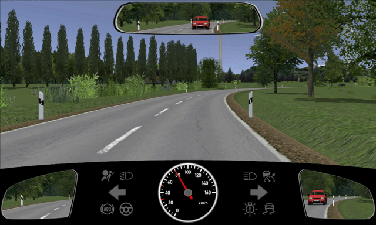

[Video: videos/2_1_06-026-M.mp4](videos/2_1_06-026-M.mp4)

**Options:**
- A. - motorbike
- B. - layout of the road
- C. - [red] car

**Correct Answer(s):**
- A. - motorbike
- B. - layout of the road

**Explanation:**
Because of the motorcycle (oncoming traffic) and the course of the road and the resulting poor visibility, you are not allowed to overtake the cyclist.

---

#### Question 2.1.06-027-M

**Points:** 4 Points

**Why are you not allowed to overtake here now?**

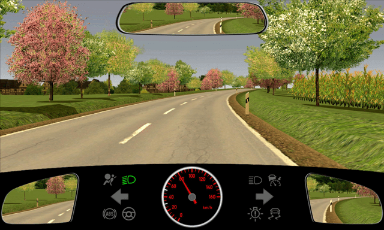

[Video: videos/2_1_06-027-M.mp4](videos/2_1_06-027-M.mp4)

**Options:**
- A. - motorbike
- B. - [red car]
- C. - signposted prohibition on overtaking

**Correct Answer(s):**
- A. - motorbike

**Explanation:**
At this moment, a motorcyclist passes the tractor. Wait until you can safely begin the overtaking manoeuvre.

---

#### Question 2.1.06-028-M

**Points:** 4 Points

**Why are you not allowed to overtake here?**

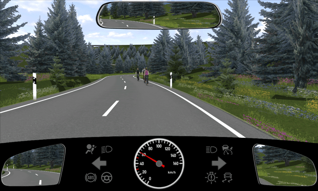

**Options:**
- A. - do not have an adequate view of the road ahead
- B. - cannot maintain an adequate passing distance from the cyclists if there is any oncoming traffic
- C. - may not cross over the central lane markings

**Correct Answer(s):**
- A. - do not have an adequate view of the road ahead
- B. - cannot maintain an adequate passing distance from the cyclists if there is any oncoming traffic

**Explanation:**
Due to the curve and the trees, you cannot see the rest of the road sufficiently. Out of town, you must keep a minimum distance of 2 metres to the side of cyclists. In the event of sudden oncoming traffic, you would not be able to maintain this distance when overtaking. Therefore, you must not overtake here.

---

#### Question 2.1.06-029-M

**Points:** 4 Points

**Why are you not allowed to overtake here?**

**Options:**
- A. Because the side clearance to the cyclists is too small
- B. Because I may endanger oncoming traffic
- C. Because I may not cross the centre line

**Correct Answer(s):**
- A. Because the side clearance to the cyclists is too small
- B. Because I may endanger oncoming traffic

**Explanation:**
The road is too small to allow enough side distance to cyclists and oncoming traffic at the same time.

---

#### Question 2.1.06-030

**Points:** 4 Points

**You want to overtake on a tree-lined avenue. What special aspect should you bear in mind?**

**Options:**
- A. Side clearances are frequently misjudged in this situation
- B. Vehicles with high superstructures frequently perform evasive manoeuvres to avoid branches in this situation
- C. Accidents involving trees are particularly frequent here

**Correct Answer(s):**
- A. Side clearances are frequently misjudged in this situation
- B. Vehicles with high superstructures frequently perform evasive manoeuvres to avoid branches in this situation
- C. Accidents involving trees are particularly frequent here

**Explanation:**
The avenue is framed by trees. Therefore, the change of light and shadow often leads to the incorrect estimation of distances. Likewise, it can often lead to trees falling and vehicles with high bodies trying to avoid branches.

---

#### Question 2.1.06-031-M

**Points:** 4 Points

**Why must you discontinue your overtaking manoeuvre here?**

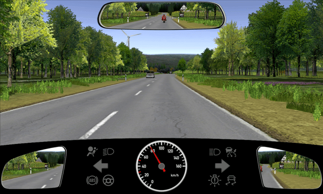

[Video: videos/2_1_06-031-M.mp4](videos/2_1_06-031-M.mp4)

**Options:**
- A. Because the tractor will turn off to the left
- B. Because the motorbike will overtake me
- C. Because I can see a no-overtaking sign

**Correct Answer(s):**
- A. Because the tractor will turn off to the left

**Explanation:**
The tractor starts to turn left. The tractor drives across the left lane of the road. If you overtake now, you would collide with the tractor.

---

#### Question 2.1.06-032

**Points:** 3 Points

**You are driving on a road with one lane for each direction. A convoy of motor vehicles is driving up ahead of you. Why should you refrain from overtaking in order to prevent a dangerous situation from occurring?**

**Options:**
- A. Because the overtaking distance is considerably larger than with single vehicles
- B. Because I should not break the convoy by pulling back into my lane early
- C. Because I cannot assess the road traffic situation ahead of the convoy

**Correct Answer(s):**
- A. Because the overtaking distance is considerably larger than with single vehicles
- B. Because I should not break the convoy by pulling back into my lane early
- C. Because I cannot assess the road traffic situation ahead of the convoy

**Explanation:**
A group of pedestrians, cyclists or motor vehicles, which is traveling together in road traffic, is called a closed association. Closed associations must be clearly marked and must not be interrupted.
Because a closed association consists of several vehicles, you cannot really understand the traffic situation. When overtaking a closed bandage, you should avoid premature inserting, which makes the overtaking path significantly longer.

---

#### Question 2.1.06-033-M

**Points:** 5 Points

**Why is it dangerous to overtake in this situation?**

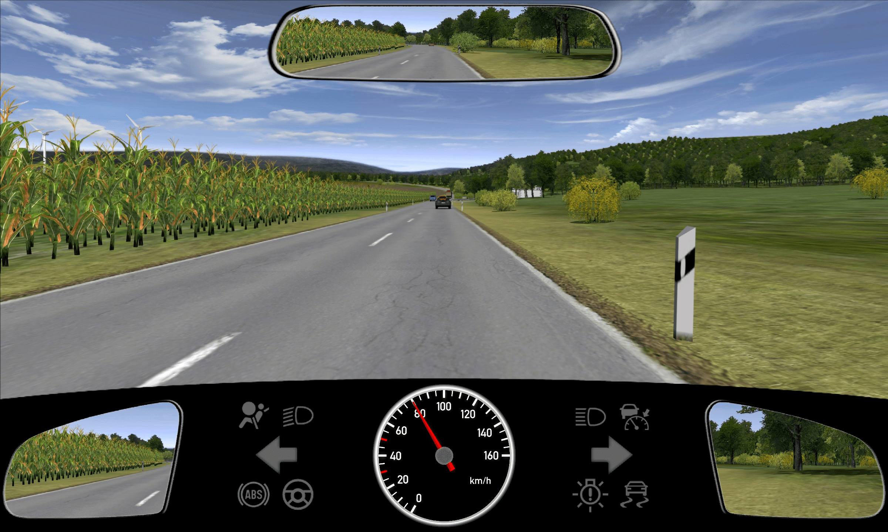

[Video: videos/2_1_06-033-M.mp4](videos/2_1_06-033-M.mp4)

**Options:**
- A. Because vehicles ahead may swerve out
- B. Because I cannot see far enough along the route necessary for overtaking
- C. Because there is not sufficient space to pull back in between the vehicles ahead

**Correct Answer(s):**
- A. Because vehicles ahead may swerve out
- B. Because I cannot see far enough along the route necessary for overtaking
- C. Because there is not sufficient space to pull back in between the vehicles ahead

**Explanation:**
You are driving in a convoy of several cars behind a lorry on a winding road with oncoming traffic. Ideally, the car behind the lorry overtakes first before the vehicles behind move up and start to overtake. 
On the left-hand bend, you cannot see the overtaking lane sufficiently. You will probably have to cancel the overtaking manoeuvre and pull in between two vehicles. There is a possibility that the distance between the vehicles in front is too small and that you will endanger yourself and other road users by pulling in.

---

#### Question 2.1.06-034-M

**Points:** 4 Points

**Why are you not permitted to overtake in this situation?**

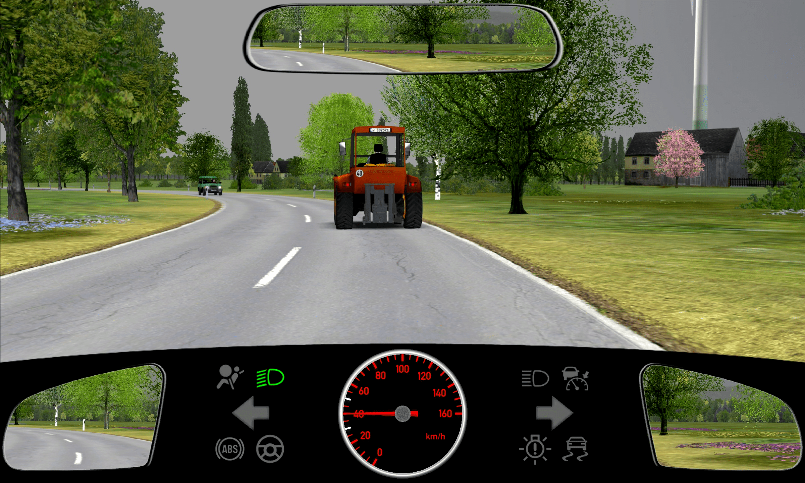

[Video: videos/2_1_06-034-M.mp4](videos/2_1_06-034-M.mp4)

**Options:**
- A. Because the motorbike might overtake me
- B. Because I do not have enough speed
- C. Because overtaking is prohibited here

**Correct Answer(s):**
- A. Because the motorbike might overtake me
- B. Because I do not have enough speed

**Explanation:**
You are not allowed to overtake in this situation because the tractor is travelling too fast for you to overtake it at your maximum speed of 50 km/h.
The motorbike is also approaching at high speed. It will probably overtake you as there is a long straight ahead and no oncoming traffic in sight.

---

#### Question 2.1.06-035-M

**Points:** 4 Points

**The vehicles ahead of you are driving at about 30 km/h. Why are you not permitted to overtake before the road bend?**

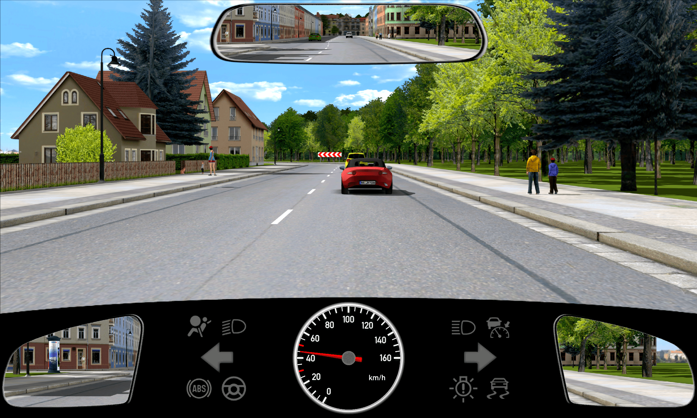

**Options:**
- A. Because my overtaking distance is too long
- B. Because the [red] car might pull out to overtake
- C. Because I am not permitted to cross the lane marking

**Correct Answer(s):**
- A. Because my overtaking distance is too long
- B. Because the [red] car might pull out to overtake

**Explanation:**
You are not allowed to overtake before the bend as your overtaking distance is too long to overtake both vehicles before the bend. There is also not enough distance between the two cars for you to pull in. In addition, the red car has the right of way to overtake in front of you; if you both start the overtaking manoeuvre, there is a danger for you and oncoming traffic. As the bend is not visible, you cannot know whether oncoming traffic is coming.

---

#### Question 2.1.06-103-M

**Points:** 4 Points

**Why do you have to switch to the right-hand lane?**

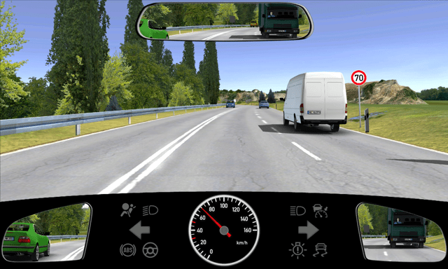

[Video: videos/2_1_06-103-M.mp4](videos/2_1_06-103-M.mp4)

**Options:**
- A. - [red] car
- B. - [blue] car
- C. - [yellow tractor]

**Correct Answer(s):**
- A. - [red] car

**Explanation:**
The traffic sign indicates a narrowing (end of a lane) in 200 metres. 
The lane is led into oncoming traffic through the narrowing, so you must be extra vigilant not to end up in oncoming traffic.

---

#### Question 2.1.06-104-M

**Points:** 4 Points

**What is the right course of action here?**

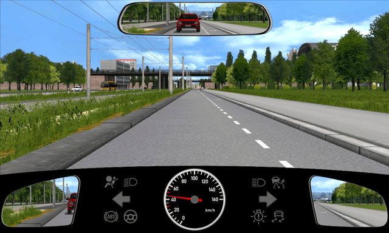

[Video: videos/2_1_06-104-M.mp4](videos/2_1_06-104-M.mp4)

**Options:**
- A. I do not overtake the [cyclists] for now
- B. I overtake the [cyclists]
- C. I sound my horn to prompt the [cyclists] to ride one behind the other

**Correct Answer(s):**
- A. I do not overtake the [cyclists] for now

**Explanation:**
You should not overtake for the time being, as you are driving side by side and you can't keep enough lateral distance.

---

#### Question 2.1.06-105

**Points:** 4 Points

**What is the right course of action now?**

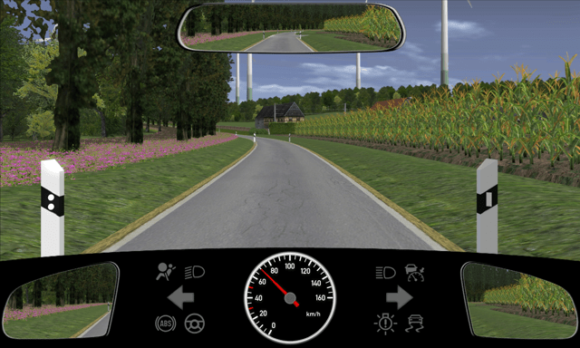

[Video: videos/2_1_06-105.mp4](videos/2_1_06-105.mp4)

**Options:**
- A. I slow down to walking speed
- B. I drive over to the right-side as far as possible
- C. I drive on past the pedestrian

**Correct Answer(s):**
- A. I slow down to walking speed
- B. I drive over to the right-side as far as possible

**Explanation:**
In such a situation, you must slow down to walking speed and keep to the right as much as possible. You should not drive past the pedestrians because the danger is too high.

---

#### Question 2.1.06-106-M

**Points:** 4 Points

**What is the right course of action now?**

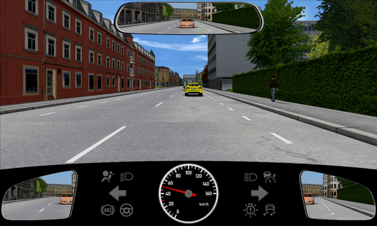

[Video: videos/2_1_06-106-M.mp4](videos/2_1_06-106-M.mp4)

**Options:**
- A. I reduce my speed
- B. I maintain my speed
- C. I overtake [the cyclist]

**Correct Answer(s):**
- A. I reduce my speed

**Explanation:**
You have to reduce your speed because the side distance to the cyclist cannot be kept.

---

#### Question 2.1.06-107-M

**Points:** 4 Points

**Why should you not overtake the moped rider in this situation?**

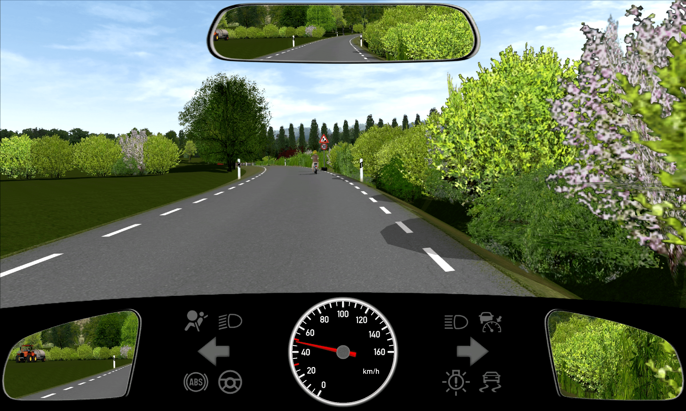

[Video: videos/2_1_06-107-M.mp4](videos/2_1_06-107-M.mp4)

**Options:**
- A. Because this might cause the moped rider to fall
- B. Because I am not allowed to drive significantly faster than the moped rider
- C. Because I am unable to maintain the requisite amount of side clearance

**Correct Answer(s):**
- A. Because this might cause the moped rider to fall
- B. Because I am not allowed to drive significantly faster than the moped rider
- C. Because I am unable to maintain the requisite amount of side clearance

**Explanation:**
In the roadworks area, the speed limit is 30 km/h and the road is narrowed. 
You are therefore not allowed to drive as fast as would be necessary to overtake the moped rider safely. 
Due to the narrowness of the road, you cannot keep the required distance to the side and the poor condition of the road could cause the moped rider to fall if you overtake him.

---

#### Question 2.1.06-201-M

**Points:** 4 Points

**What is the right course of action here?**

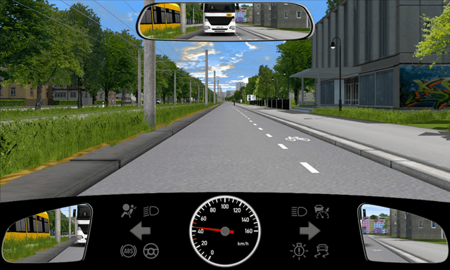

[Video: videos/2_1_06-201-M.mp4](videos/2_1_06-201-M.mp4)

**Options:**
- A. I do not overtake [the cyclist] for now
- B. I overtake [the cyclist]
- C. I sound my horn to urge [the cyclist] to keep right

**Correct Answer(s):**
- A. I do not overtake [the cyclist] for now

**Explanation:**
You cannot overtake the cyclist here because you cannot keep a sufficient distance to the side.

---

### 2.1.07 Chapter Special Traffic Situations

#### Question 2.1.07-002-B

**Points:** 3 Points

**What must you reckon with on this autobahn car park?**

**Options:**
- A. People suddenly stepping onto the roadway
- B. Danger of skidding when you brake
- C. Oncoming traffic

**Correct Answer(s):**
- A. People suddenly stepping onto the roadway
- B. Danger of skidding when you brake

**Explanation:**
The surface of this freeway parking lot consists of cobblestones that are not only uneven but also wet. Be prepared for the fact that the braking distance of your vehicle is extended by the lower traction. You do not have to expect oncoming vehicles. Careless pedestrians, however, can unexpectedly step onto the road at any time.

---

#### Question 2.1.07-004-B

**Points:** 3 Points

**What do you do if you want to drive straight on?**

**Options:**
- A. Brake so that the driver in front can change lanes
- B. 'Overtake the other vehicle in the left-hand lane since the traffic light is "green"'
- C. Sound your horn to indicate to the driver in front that he may not change lanes so close to the crossroads

**Correct Answer(s):**
- A. Brake so that the driver in front can change lanes

**Explanation:**
You behave correctly if you reduce the speed of your vehicle and allow the preceding vehicle to change lane. The left lane may only be used for the purpose of turning left. Since you want to drive straight in the example, you must not use the left lane.

---

#### Question 2.1.07-006-B

**Points:** 3 Points

**You are approaching the vehicles in this picture. What do you do?**

**Options:**
- A. Watch if the truck and trailer remain on the hard shoulder
- B. Allow the truck and trailer to enter the roadway when it indicates left
- C. When the truck and trailer are indicating left, flash your headlights and proceed at a brisk pace

**Correct Answer(s):**
- A. Watch if the truck and trailer remain on the hard shoulder
- B. Allow the truck and trailer to enter the roadway when it indicates left

**Explanation:**
Outside of built-up areas, slow vehicles such as tractors, trucks and mopeds often ride on the hard shoulder and can thus be overtaken more easily. If such a vehicle wants to turn left, or if it has to return to the main road for other reasons, you have to allow the driver to change his/her lane.

---

#### Question 2.1.07-007-M

**Points:** 3 Points

**What should you anticipate in this situation?**

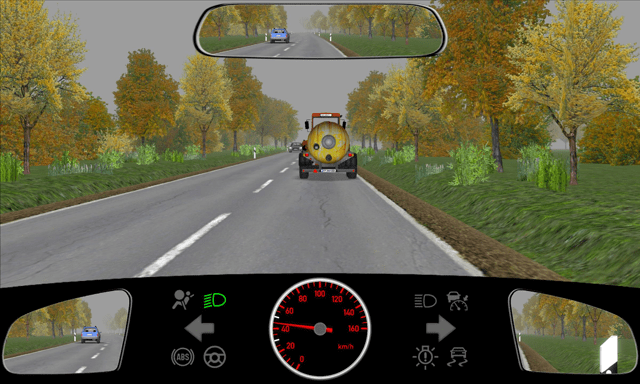

[Video: videos/2_1_07-007-M.mp4](videos/2_1_07-007-M.mp4)

**Options:**
- A. That the driver of the [yellow car] fails to see me
- B. That there are loose chippings on the carriageway
- C. That the vehicle ahead will turn right

**Correct Answer(s):**
- A. That the driver of the [yellow car] fails to see me
- B. That there are loose chippings on the carriageway

**Explanation:**
The sign at the beginning of the video indicates "Beware of rolling gravel", so you must be aware that there is rolling gravel on the road and the yellow vehicle could miss you because the tractor in front of you obscures the view for the yellow car and for you.

---

#### Question 2.1.07-008-M

**Points:** 4 Points

**[The white car] wants to turn left. What is the right course of action if [the car] fails to stop?**

**Options:**
- A. I reduce my speed
- B. I waive my right of way
- C. I sound my horn and continue driving as before

**Correct Answer(s):**
- A. I reduce my speed
- B. I waive my right of way

**Explanation:**
The white car wants to turn left and since you do not know whether it will stop (you have the right of way), it is better to give up your right of way and reduce your speed.

---

#### Question 2.1.07-009-M

**Points:** 4 Points

**Why must you brake now?**

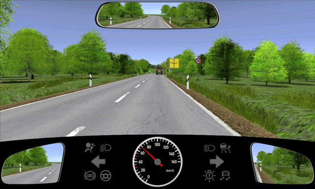

[Video: videos/2_1_07-009-M.mp4](videos/2_1_07-009-M.mp4)

**Options:**
- A. - [green vehicle]
- B. - motorbike
- C. - [yellow car]

**Correct Answer(s):**
- A. - [green vehicle]

**Explanation:**
You should brake because of the green vehicle, as it appears to be driving onto the road behind the tractor.

---

#### Question 2.1.07-010-M

**Points:** 3 Points

**What must you anticipate in this parking area?**

**Options:**
- A. Trucks that are incorrectly parked
- B. Vehicles emerging from parking spaces
- C. People on the roadway

**Correct Answer(s):**
- A. Trucks that are incorrectly parked
- B. Vehicles emerging from parking spaces
- C. People on the roadway

**Explanation:**
Vehicles can leave the parking space, watch out for vehicles leaving the parking space. People can walk on the roadway because you are taking a break. Truck drivers often park in car parking spaces.

---

#### Question 2.1.07-011-M

**Points:** 4 Points

**What is the right course of action now?**

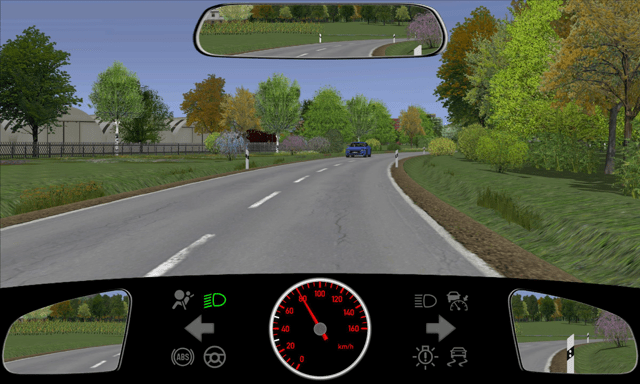

[Video: videos/2_1_07-011-M.mp4](videos/2_1_07-011-M.mp4)

**Options:**
- A. I drive as far to the right as possible
- B. I brake
- C. I change direction to the left

**Correct Answer(s):**
- A. I drive as far to the right as possible
- B. I brake

**Explanation:**
The car will probably overtake the cyclist. To be on the safe side, slow down and ride as far to the right as possible.

---

#### Question 2.1.07-012-M

**Points:** 4 Points

**Why should you be ready to brake in this situation?**

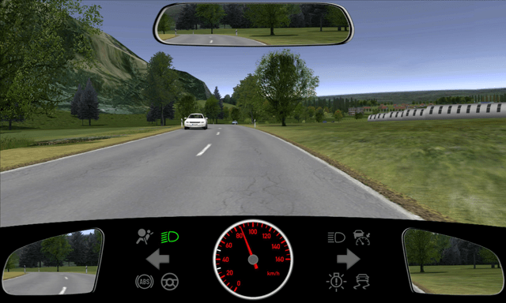

[Video: videos/2_1_07-012-M.mp4](videos/2_1_07-012-M.mp4)

**Options:**
- A. Because of the tractor
- B. Because of the motorbike
- C. Because of the speed limit

**Correct Answer(s):**
- A. Because of the tractor

**Explanation:**
The tractor driver could drive into your lane at any moment, so be ready to brake to defuse the situation in time.

---

#### Question 2.1.07-013

**Points:** 3 Points

**What must be observed when several motorcycles are travelling together in a group?**

**Options:**
- A. They should drive in a staggered formation when travelling on straight sections of road
- B. The driving style of the group should be based on that of the least experienced motorcyclist
- C. The group must remain together in every road traffic situation

**Correct Answer(s):**
- A. They should drive in a staggered formation when travelling on straight sections of road
- B. The driving style of the group should be based on that of the least experienced motorcyclist

**Explanation:**
Drive in a staggered manner to avoid rear-end collisions caused by sudden braking. Group rides are not easy; if one driver makes a mistake, all the others have to react.

---

#### Question 2.1.07-014-M

**Points:** 4 Points

**What should you anticipate in this situation?**

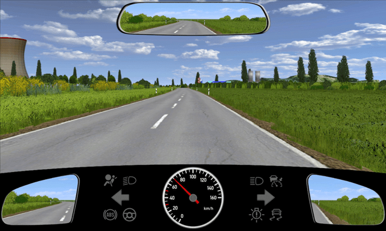

[Video: videos/2_1_07-014-M.mp4](videos/2_1_07-014-M.mp4)

**Options:**
- A. The driver of the [red] vehicle fails to see me
- B. The [green] truck performs a turn
- C. The tractor moves onto the road

**Correct Answer(s):**
- A. The driver of the [red] vehicle fails to see me

**Explanation:**
Because of the turning truck, the van could miss you. Be ready to brake.

---

#### Question 2.1.07-015-M

**Points:** 5 Points

**Why should you further reduce your speed here?**

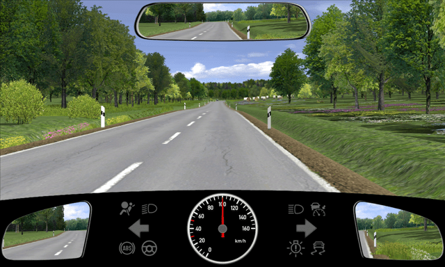

[Video: videos/2_1_07-015-M.mp4](videos/2_1_07-015-M.mp4)

**Options:**
- A. Because the [red] car could cross onto my lane
- B. Because other people may walk onto the road
- C. Because [the blue car] could continue moving

**Correct Answer(s):**
- A. Because the [red] car could cross onto my lane
- B. Because other people may walk onto the road

**Explanation:**
It's unlikely that the car in the left lane will continue as it appears to have broken down. Even if it did, it wouldn't affect you. However, since there is a person in the lane, extra caution is required here. It's also possible that other people get out of the vehicle and run onto the road. The stationary car may be hidden by the bush or no warning triangle was set up. The following car could therefore recognize too late that the vehicle has stopped in front of it. You should therefore drive with foresight and expect the car behind to swerve into your lane.

---

#### Question 2.1.07-016-M

**Points:** 4 Points

**What is the right course of action now?**

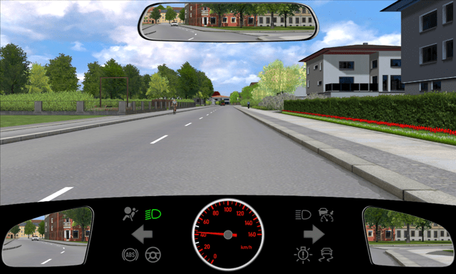

[Video: videos/2_1_07-016-M.mp4](videos/2_1_07-016-M.mp4)

**Options:**
- A. I reduce my speed
- B. I drive as far to the right as possible on my lane
- C. I drive as far to the left as possible on my lane

**Correct Answer(s):**
- A. I reduce my speed
- B. I drive as far to the right as possible on my lane

**Explanation:**
The stalled vehicle is blocking the other vehicle's lane and restricting your view. You should reduce your speed and drive as far to the right as possible in your driving.

---

#### Question 2.1.07-017

**Points:** 5 Points

**Why should you continue to slow down here?**

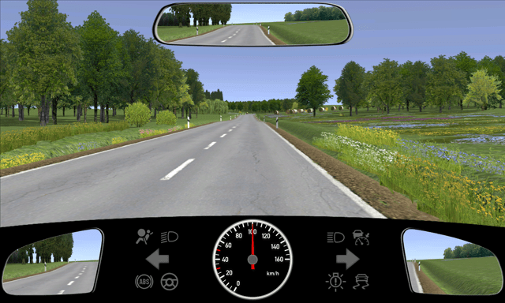

[Video: videos/2_1_07-017.mp4](videos/2_1_07-017.mp4)

**Options:**
- A. Because the red vehicle could cross onto my lane
- B. Because other people may walk onto the road
- C. Because otherwise my vehicle could leave the road

**Correct Answer(s):**
- A. Because the red vehicle could cross onto my lane
- B. Because other people may walk onto the road

**Explanation:**
On the left lane a car has broken down. There's a person standing in front of the vehicle. Other passengers could leave the car and enter the lane. The approaching vehicle in the opposite lane could dodge onto your lane to overtake the broken-down vehicle and drive past the obstacle. If you delay, the danger of the situation would be reduced

---

#### Question 2.1.07-018

**Points:** 4 Points

**What is the right course of action now?**

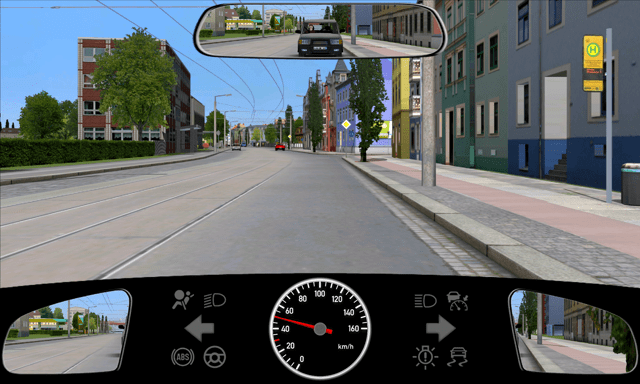

[Video: videos/2_1_07-018.mp4](videos/2_1_07-018.mp4)

**Options:**
- A. I continue braking
- B. I move into the left-hand lane
- C. I continue driving as before

**Correct Answer(s):**
- A. I continue braking

**Explanation:**
The cyclist cannot continue his journey due to the transporter on the bike path. He will dodge onto the road and get into your lane. You cannot switch to the left lane because there is a vehicle to the left behind you. Slow down to defuse this dangerous situation.

---

#### Question 2.1.07-019-M

**Points:** 5 Points

**What is the right course of action now?**

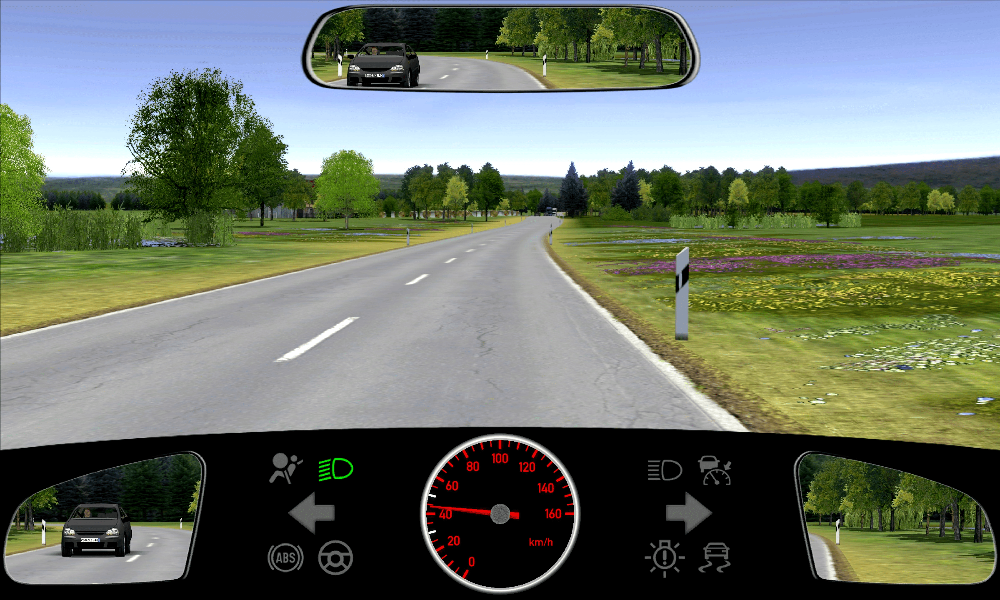

[Video: videos/2_1_07-019-M.mp4](videos/2_1_07-019-M.mp4)

**Options:**
- A. I reduce my speed
- B. I drive as far to the right-side as possible
- C. I indicate right

**Correct Answer(s):**
- A. I reduce my speed
- B. I drive as far to the right-side as possible

**Explanation:**
The motorcyclist is approaching you at high speed. He could overtake you even though the blue truck is already very close. Drive as far to the right as possible to increase the distance to the oncoming lane and reduce your speed so that the motorcyclist can complete the overtaking manoeuvre safely and in good time.

---

#### Question 2.1.07-020

**Points:** 4 Points

**What should you do now?**

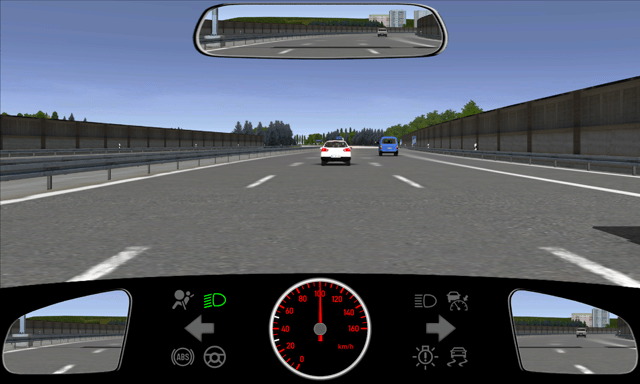

[Video: videos/2_1_07-020.mp4](videos/2_1_07-020.mp4)

**Options:**
- A. I continue driving as far to the right as possible
- B. I brake
- C. I move into the left-hand lane

**Correct Answer(s):**
- A. I continue driving as far to the right as possible
- B. I brake

**Explanation:**
The yellow car comes towards you as a wrong-way driver on the highway. Drive to the right as far as possible and brake. To warn other road users, turn on the hazard warning lights.

---

#### Question 2.1.07-021-M

**Points:** 4 Points

**What is the right course of action now?**

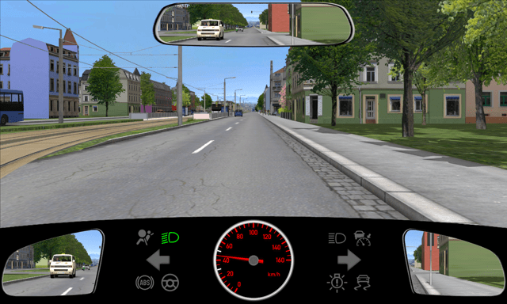

[Video: videos/2_1_07-021-M.mp4](videos/2_1_07-021-M.mp4)

**Options:**
- A. I stop behind the taxi
- B. I move into the left-hand lane
- C. I sound my horn repeatedly

**Correct Answer(s):**
- A. I stop behind the taxi

**Explanation:**
Given that you have traffic on the left line behind you, you should slow down and stop behind the taxi and wait for the traffic on the left to clear before overtaking the taxi

---

#### Question 2.1.07-022-M

**Points:** 3 Points

**What is the correct course of action in this situation?**

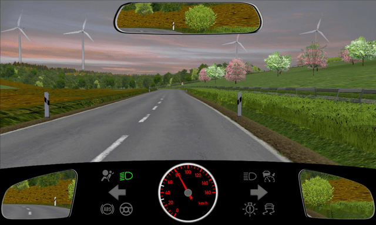

[Video: videos/2_1_07-022-M.mp4](videos/2_1_07-022-M.mp4)

**Options:**
- A. - reduce my speed further
- B. - be ready to brake
- C. - perform an emergency braking manoeuvre

**Correct Answer(s):**
- A. - reduce my speed further
- B. - be ready to brake

**Explanation:**
Animals on the road are unpredictable. You should continue to reduce your speed and monitor the situation carefully, and be ready to brake in case the animals run across the road.
Hazard braking could lead to a rear-end collision if the vehicle behind you cannot react quickly enough.

---

#### Question 2.1.07-023-M

**Points:** 4 Points

**Why should you reduce your speed now?**

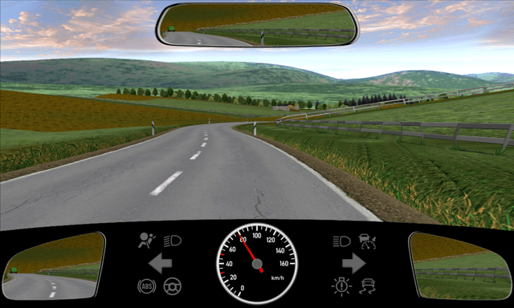

[Video: videos/2_1_07-023-M.mp4](videos/2_1_07-023-M.mp4)

**Options:**
- A. Because of the animal
- B. Because of the [red car]
- C. Because of the speed limit

**Correct Answer(s):**
- A. Because of the animal

**Explanation:**
Even if you keep to the speed limit of 60 km/h, an animal will run onto the road right in front of you. To avoid an accident, you have to reduce your speed. The oncoming car does not affect your driving style.

---

#### Question 2.1.07-024-M

**Points:** 3 Points

**What do you have to be aware of in this situation?**

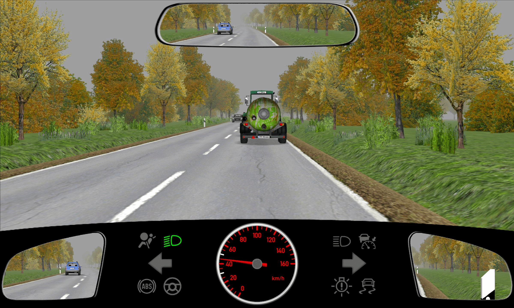

[Video: videos/2_1_07-024-M.mp4](videos/2_1_07-024-M.mp4)

**Options:**
- A. The driver of the [yellow car] may fail to see me
- B. The loose chippings on the carriageway mean there is an increased risk of crashing
- C. I have to allow right of way to the [red car]

**Correct Answer(s):**
- A. The driver of the [yellow car] may fail to see me
- B. The loose chippings on the carriageway mean there is an increased risk of crashing

**Explanation:**
The driver of the yellow car wants to turn left. He may overlook you behind the tractor. Expect this and be ready to brake.
You should also take care not to drive on the chippings, as chippings increase the risk of skidding on the carriageway.

---

#### Question 2.1.07-025-M

**Points:** 4 Points

**What is the right course of action now?**

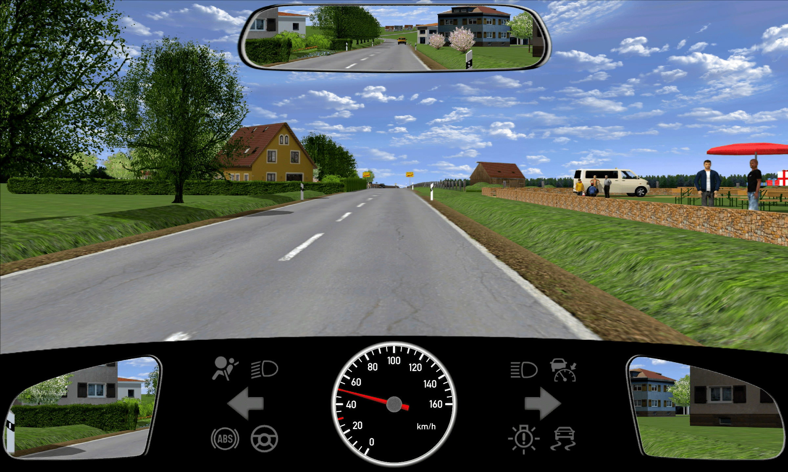

[Video: videos/2_1_07-025-M.mp4](videos/2_1_07-025-M.mp4)

**Options:**
- A. I brake sharply
- B. I yield my right of way
- C. I continue driving as before

**Correct Answer(s):**
- A. I brake sharply
- B. I yield my right of way

**Explanation:**
As the blue car will probably be travelling on the road without observing the right of way rules, you must slow down sharply and give up your right of way.

---

#### Question 2.1.07-026-M

**Points:** 3 Points

**What is the right course of action now?**

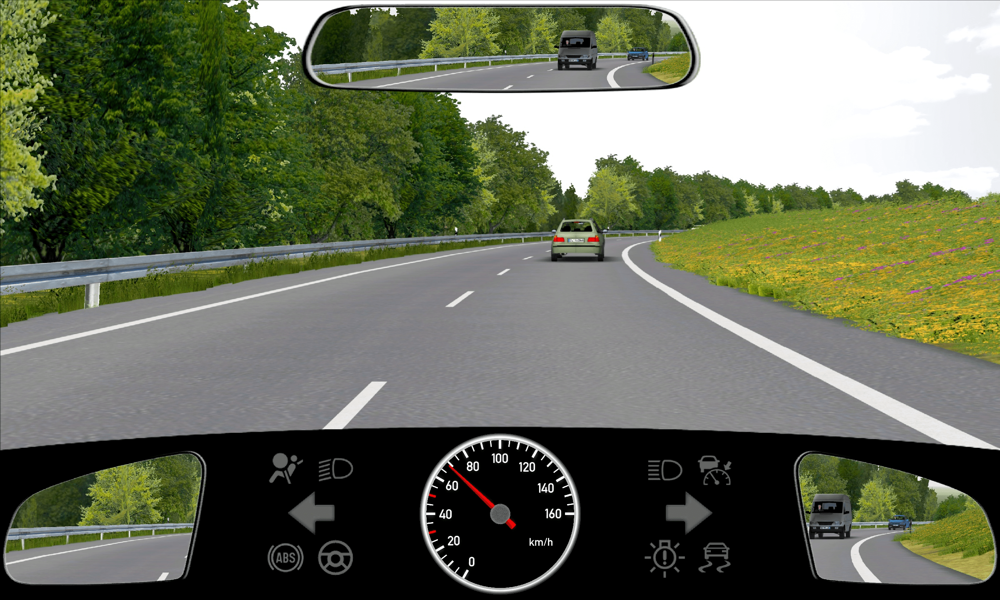

[Video: videos/2_1_07-026-M.mp4](videos/2_1_07-026-M.mp4)

**Options:**
- A. I reduce my speed further
- B. I allow the tractor to pull into the lane
- C. I move into the left-hand lane

**Correct Answer(s):**
- A. I reduce my speed further
- B. I allow the tractor to pull into the lane

**Explanation:**
The tractor is signalling by flashing its lights that it wants to move back into the lane. You should therefore reduce your speed and allow the tractor to merge into the lane.

---

#### Question 2.1.07-027-M

**Points:** 4 Points

**What is the right thing to do in this situation?**

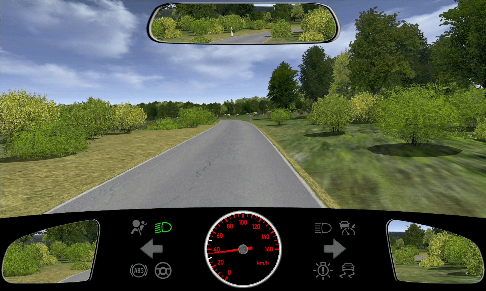

[Video: videos/2_1_07-027-M.mp4](videos/2_1_07-027-M.mp4)

**Options:**
- A. I must stop if necessary
- B. I have to steer to the right onto the field as a precaution
- C. I have priority over the tractor

**Correct Answer(s):**
- A. I must stop if necessary

**Explanation:**
On the narrow country road, it is possible that you and the tractor will not be able to pass each other easily. Be prepared to stop and let the tractor pass.

---

#### Question 2.1.07-028-M

**Points:** 4 Points

**What is the right course of action now?**

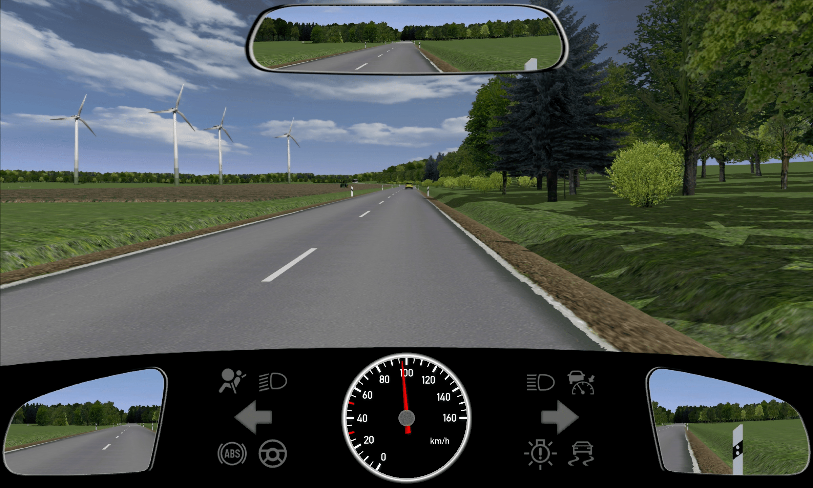

[Video: videos/2_1_07-028-M.mp4](videos/2_1_07-028-M.mp4)

**Options:**
- A. I increase my distance to the [car] ahead
- B. I continue driving with increased care
- C. I overtake [the car ahead] leaving a large side clearance

**Correct Answer(s):**
- A. I increase my distance to the [car] ahead
- B. I continue driving with increased care

**Explanation:**
The yellow car has an unusual driving style. It may be distracted or drunk.
The abrupt braking and steering manoeuvres of the car in front are dangerous. Pay attention to how he continues to drive, increase the distance and be ready to brake.

---

#### Question 2.1.07-029

**Points:** 4 Points

**What must you be aware of when driving along narrow avenues?**

**Options:**
- A. - it is frequently difficult for me to see into the road bends
- B. - I have to drive particularly defensively
- C. - I am protected against black ice

**Correct Answer(s):**
- A. - it is frequently difficult for me to see into the road bends
- B. - I have to drive particularly defensively

**Explanation:**
Visibility in avenues is more restricted than in open fields and therefore requires an adapted driving style.
On bends, your view of the carriageway may be restricted after the bend. You may therefore only see obstacles very late.

---

#### Question 2.1.07-030-M

**Points:** 4 Points

**What is the right behaviour now?**

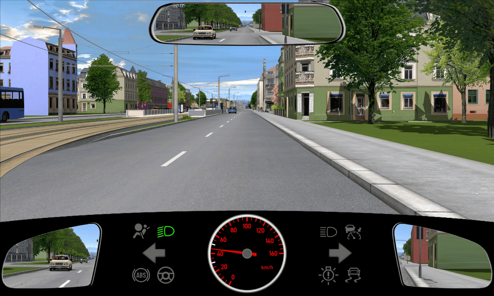

[Video: videos/2_1_07-030-M.mp4](videos/2_1_07-030-M.mp4)

**Options:**
- A. I stop behind the taxi
- B. I moving into the left-hand lane
- C. I carefully drive past the taxi on the right

**Correct Answer(s):**
- A. I stop behind the taxi

**Explanation:**
There is no other option for you in this situation other than to pull over behind the taxi. Because you are not allowed to pass to the right of the taxi as this is a sidewalk. Driving on a sidewalk is generally prohibited.
You also can't change to the left lane because there is a motorcycle next to you. If you change lane you risk a collision.

---

#### Question 2.1.07-031

**Points:** 3 Points

**You are taking part in a group tour with several motorbikes. What is the right behaviour?**

**Options:**
- A. I keep my position in the group
- B. I make sure I keep a safe distance from the motorbike in front
- C. I always ride as fast as the motorbike in front

**Correct Answer(s):**
- A. I keep my position in the group
- B. I make sure I keep a safe distance from the motorbike in front

**Explanation:**
Your position in the group should be decided before the group ride and should not change during the ride to avoid constant position changes. You should always pay attention to the necessary safety distance from the motorcycle in front of you.
This prevents potentially dangerous situations with other motorcycles or oncoming traffic and allows you to react in a timely manner to dangers or sudden changes in speed.

---

#### Question 2.1.07-101

**Points:** 3 Points

**What could cause a fast travelling motor vehicle suddenly to veer sideways on a dry straight road?**

**Options:**
- A. It is suddenly hit by a gust of strong side wind
- B. A burst tyre
- C. Sudden headwind

**Correct Answer(s):**
- A. It is suddenly hit by a gust of strong side wind
- B. A burst tyre

**Explanation:**
A vehicle on a straight, dry road can swing off sideways in the event of a strong crosswind or a burst tire. In this case, immediately lay off the gas pedal, countersteer and brake gently.

---

#### Question 2.1.07-102

**Points:** 3 Points

**What makes driving in a stream of vehicles easier?**

**Options:**
- A. Watching the queue through the windows of the vehicles travelling in front
- B. Driving in a slightly staggered position in your own lane
- C. Keeping your hazard warning lights switched on when driving

**Correct Answer(s):**
- A. Watching the queue through the windows of the vehicles travelling in front
- B. Driving in a slightly staggered position in your own lane

**Explanation:**
Slightly offset driving allows you to observe the vehicles in front. This allows you to see the traffic situation in front of you or through the windows of the driver in front and react faster to sudden events. Driving with hazard lights in a convoy is generally prohibited.

---

#### Question 2.1.07-105

**Points:** 3 Points

**What must you do after an accident with a game animal (for example a deer)?**

**Options:**
- A. Stop, switch on hazard warning lights and make the scene of the accident safe
- B. Inform the police or the nearest forestry office
- C. Proceed without stopping

**Correct Answer(s):**
- A. Stop, switch on hazard warning lights and make the scene of the accident safe
- B. Inform the police or the nearest forestry office

**Explanation:**
After a wildlife accident, you must stop, turn on your hazard lights and secure the scene of the accident. You also have to inform the police or the nearest forestry office about the accident. Under no circumstances should you touch the game with your bare hands due to the danger of rabies!

---

#### Question 2.1.07-106

**Points:** 4 Points

**One of your tyres bursts while you are travelling at high speed on an autobahn. What do you do?**

**Options:**
- A. Throttle down, if necessary, steer against and brake cautiously
- B. Stop, if possible, on the hard shoulder, switch on hazard warning lights and place the warning triangle
- C. Immediately apply the brakes fully and move over onto the hard shoulder

**Correct Answer(s):**
- A. Throttle down, if necessary, steer against and brake cautiously
- B. Stop, if possible, on the hard shoulder, switch on hazard warning lights and place the warning triangle

**Explanation:**
Avoid emergency braking on the freeway and instead steer and brake gently to stabilize your vehicle. If possible, bring your vehicle to a stop on the hard shoulder. Turn on your hazard lights and set up your warning triangle to warn subsequent vehicles.

---

#### Question 2.1.07-109

**Points:** 3 Points

**You increase your speed from 50 km/h to 100 km/h. How is the braking distance changed according to the rule of thumb?**

**Options:**
- A. It is quadrupled from 25 m to 100 m
- B. It is doubled from 15 m to 30 m
- C. It is halved from 50 m to 25 m

**Correct Answer(s):**
- A. It is quadrupled from 25 m to 100 m

**Explanation:**
According to the rule of thumb, the braking distance quadruples when the speed doubles. At 40 km/h, for example, it is 16 meters and at 80 km/h 64 meters.

---

#### Question 2.1.07-110

**Points:** 3 Points

**When leaving a built-up area, both you and the vehicle approximately 15 m ahead of you increase speed from 50 km/h to 100 km/h. How should you change the safety distance between you and the vehicle ahead?**

**Options:**
- A. - increase to at least 50 m
- B. - remain the same
- C. - increase to at least 25 m

**Correct Answer(s):**
- A. - increase to at least 50 m

**Explanation:**
Keep a safe distance from the vehicle in front of you outside of closed areas that is at least half the speed in meters. At 100 km/h, the safety distance should therefore be at least 50 meters.

---

#### Question 2.1.07-111

**Points:** 5 Points

**Why must you be ready to brake in this situation?**

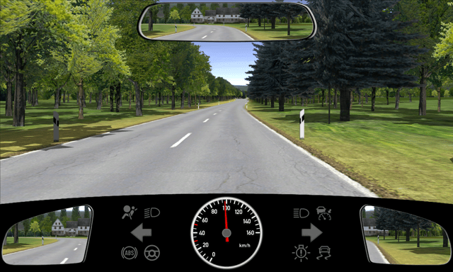

[Video: videos/2_1_07-111.mp4](videos/2_1_07-111.mp4)

**Options:**
- A. Because the other vehicle might continue moving
- B. Because the direction of the road ahead demands it
- C. Because a speed limit is visible

**Correct Answer(s):**
- A. Because the other vehicle might continue moving

**Explanation:**
You see that a vehicle wants to drive onto the road from the right. Since it comes from a field or forest path, you have right of way. Due to the forest cover the visibility for the vehicle driver may be limited. It is possible that he/she will continue despite having to wait. For this reason, you must be ready to brake until you clearly recognize that he/she is stopping.

---

#### Question 2.1.07-112

**Points:** 5 Points

**Why should you lower your speed now?**

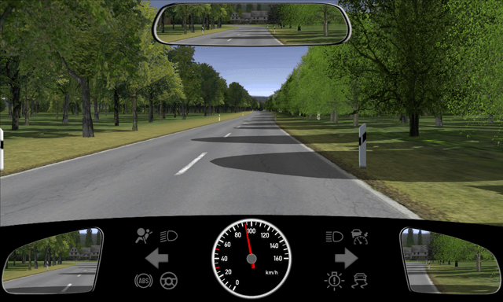

[Video: videos/2_1_07-112.mp4](videos/2_1_07-112.mp4)

**Options:**
- A. Because I am badly visible to other road users
- B. Because the direction of the road ahead demands it
- C. Because I have to give right of way

**Correct Answer(s):**
- A. Because I am badly visible to other road users

**Explanation:**
Basically, you have the right of way, because you are on a priority road. However, to avoid a dangerous situation, you should still reduce your speed and be ready to brake, as the car driver of the car coming from the right-hand side might recognize you too late or miss you altogether. Due to the trees on the roadside his/her view is clearly limited.

---

#### Question 2.1.07-113-M

**Points:** 5 Points

**What is the right course of action in this situation?**

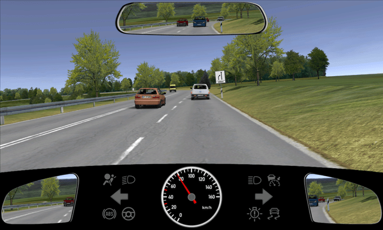

[Video: videos/2_1_07-113-M.mp4](videos/2_1_07-113-M.mp4)

**Options:**
- A. I slow down
- B. I accelerate
- C. I continue driving as before

**Correct Answer(s):**
- A. I slow down

**Explanation:**
In this situation, you need to reduce the speed and allow the car driver to go back into lane on the left. If a lane ends on a multi-lane road or if it is not possible for the drivers driving on the other lane to drive through the lane continuously, they must be able to change lanes using the zipper procedure.

---

#### Question 2.1.07-114-M

**Points:** 5 Points

**What should you anticipate in this situation?**

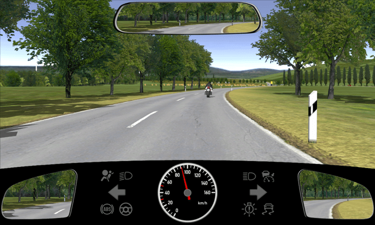

[Video: videos/2_1_07-114-M.mp4](videos/2_1_07-114-M.mp4)

**Options:**
- A. - motorcyclist will slow down
- B. - tractor will proceed onto the road
- C. - tractor will wait

**Correct Answer(s):**
- A. - motorcyclist will slow down
- B. - tractor will proceed onto the road

**Explanation:**
Although you are on the priority road, you must always expect dangerous situations to arise. For example, the tractor driver approaching your street at a junction could not fulfill his duty of waiting and force the vehicle in front of you to brake. By driving anticipatory you can help defuse potentially dangerous situations.

---

#### Question 2.1.07-115

**Points:** 5 Points

**What is the right course of action in this situation?**

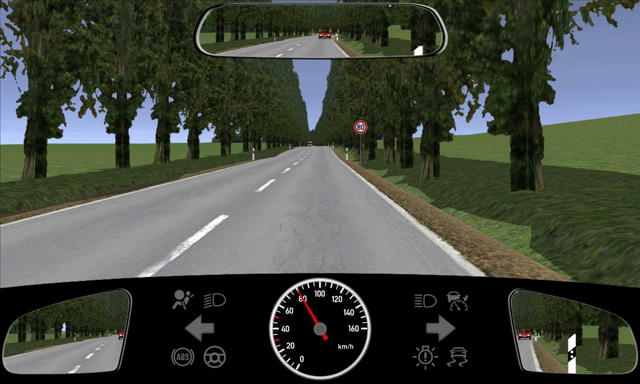

[Video: videos/2_1_07-115.mp4](videos/2_1_07-115.mp4)

**Options:**
- A. I maintain my speed and continue driving as before
- B. I accelerate in order to create a large enough safety distance
- C. I brake briefly in order that that the driver behind will reduce his speed

**Correct Answer(s):**
- A. I maintain my speed and continue driving as before

**Explanation:**
The maximum speed limit on this road is 80 km/h. You drive 80 km/h. The driver driving behind you harasses you to drive quicker; he/she comes dangerously close and falls below the required safety distance. Keep your speed. If you try to increase the safety margin by accelerating, the driver behind you will probably also accelerate. Braking, even briefly, endangers you and the car behind.

---

#### Question 2.1.07-116

**Points:** 5 Points

**What should you do?**

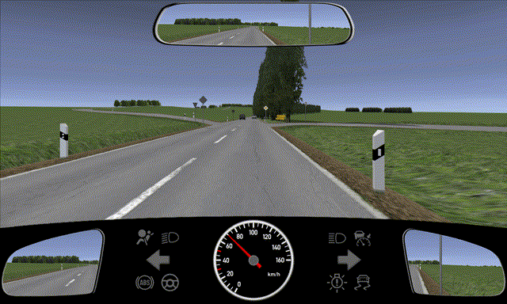

[Video: videos/2_1_07-116.mp4](videos/2_1_07-116.mp4)

**Options:**
- A. I brake sharply and immediately
- B. I take no evasive movement
- C. I swerve towards the left

**Correct Answer(s):**
- A. I brake sharply and immediately
- B. I take no evasive movement

**Explanation:**
If you suddenly have to brake immediately as much as possible, you stay on your lane and, if necessary, accept that you collide with the obstacle. Do not turn left because of oncoming traffic. Dodging to the right is out of the question as well, because you will get off the lane and possibly drive against one of the trees.

---

#### Question 2.1.07-117-M

**Points:** 3 Points

**What must you pay attention to when turning right?**

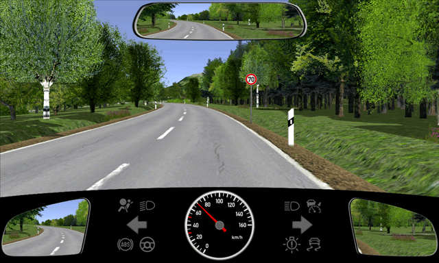

[Video: videos/2_1_07-117-M.mp4](videos/2_1_07-117-M.mp4)

**Options:**
- A. To the motorbike
- B. To vehicles coming from the left
- C. To [the tractor]

**Correct Answer(s):**
- A. To the motorbike
- B. To vehicles coming from the left

**Explanation:**
All drivers driving on the priority road must be given priority. The motorcycle is on the lane where you want to turn right. Before you turn right into the priority road, you have to wait and let the motorcycle pass.

---

#### Question 2.1.07-118-M

**Points:** 3 Points

**You want to remain on the priority road. What must you anticipate now?**

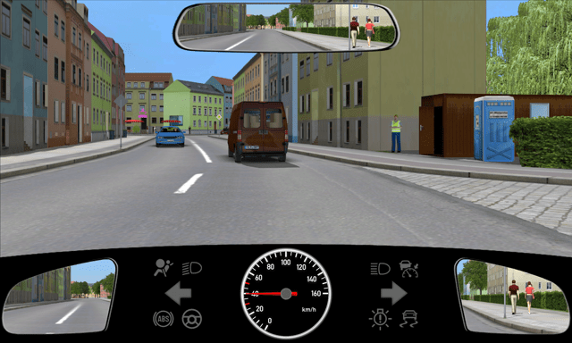

[Video: videos/2_1_07-118-M.mp4](videos/2_1_07-118-M.mp4)

**Options:**
- A. That the [red car] fails to see me
- B. That the children will cross the road
- C. That the van continues driving on the priority road

**Correct Answer(s):**
- A. That the [red car] fails to see me
- B. That the children will cross the road

**Explanation:**
In this situation, it is likely that the black car did not see you on your motorcycle. The children further down the road are likely to cross the road. The red van will not continue on the priority road and is turning right as indicated by his blinkers

---

#### Question 2.1.07-119

**Points:** 3 Points

**What should you do, if it is no longer possible to avoid a collision with wild animals?**

**Options:**
- A. I brake as hard as possible
- B. I maintain my direction of movement
- C. I always take an evasive movement

**Correct Answer(s):**
- A. I brake as hard as possible
- B. I maintain my direction of movement

**Explanation:**
If a collision with an animal is no longer avoidable, the direction of travel is to be maintained. Then brake hard and hold the steering wheel firmly. An evasive maneuver can injure other road users or increase the risk of greater damage than a controlled collision with the animal.

---

#### Question 2.1.07-120-M

**Points:** 4 Points

**The cruise control system of your motor vehicle is set to 130 km/h. What is the right course of action now?**

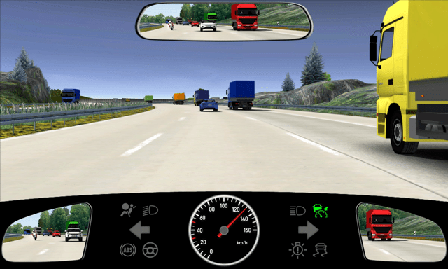

[Video: videos/2_1_07-120-M.mp4](videos/2_1_07-120-M.mp4)

**Options:**
- A. - restore the safety distance by braking
- B. - overtake the motorbike
- C. - move to the right-hand lane

**Correct Answer(s):**
- A. - restore the safety distance by braking

**Explanation:**
You must interrupt the cruise control by braking. The motorcyclist changes to your safety distance. You can restore it only by breaking. It is not possible to change to the right-hand lane, as otherwise you would get into the safety distance of the vehicles in succession. The speed limit prohibits to drive faster than 130 km/h.

---

#### Question 2.1.07-121-M

**Points:** 5 Points

**What must you do in this situation?**

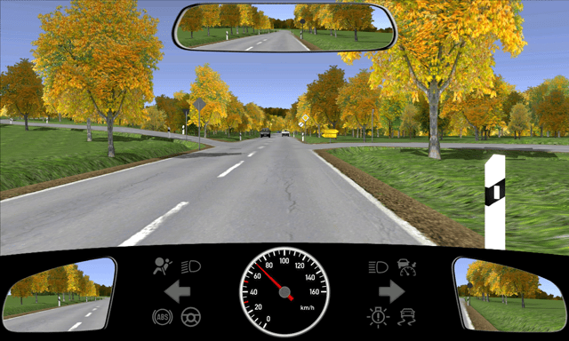

[Video: videos/2_1_07-121-M.mp4](videos/2_1_07-121-M.mp4)

**Options:**
- A. I immediately brake sharply
- B. I do not swerve
- C. I steer to the left

**Correct Answer(s):**
- A. I immediately brake sharply
- B. I do not swerve

**Explanation:**
In this situation, you should immediately brake hard but also not swerve.

---

#### Question 2.1.07-122

**Points:** 4 Points

**You are driving on a winding section of road popular with motorcyclists. What must you anticipate?**

**Options:**
- A. Motorcyclists encroaching into my lane due to their strongly tilted position when cornering
- B. Motorcyclists cutting corners
- C. Motorcyclists overtaking me in a risky manner

**Correct Answer(s):**
- A. Motorcyclists encroaching into my lane due to their strongly tilted position when cornering
- B. Motorcyclists cutting corners
- C. Motorcyclists overtaking me in a risky manner

**Explanation:**
On curvy roads, motorcyclists can cut their curves or protrude on your roadway in curves because of their strong inclinations. Even motorcyclists who drive in the same direction of travel can also take advantage of the curves and could tend to carry out risky overtaking maneuvers.

---

#### Question 2.1.07-123-M

**Points:** 4 Points

**What should you do now?**

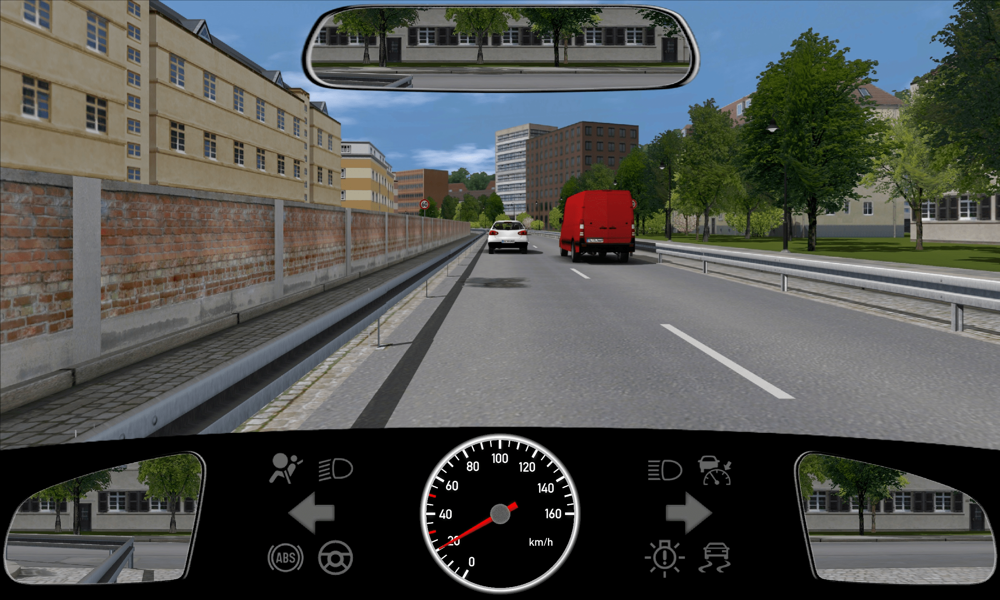

[Video: videos/2_1_07-123-M.mp4](videos/2_1_07-123-M.mp4)

**Options:**
- A. I reduce my speed
- B. I remain behind the [red] vehicle for now
- C. I drive quickly past the [red] vehicle

**Correct Answer(s):**
- A. I reduce my speed
- B. I remain behind the [red] vehicle for now

**Explanation:**
The driver of the red vehicle cuts the bend. Brake and stay behind the vehicle until you are sure that it will stay in its lane after the bend.

---

#### Question 2.1.07-124-M

**Points:** 3 Points

**What is the right behaviour now?**

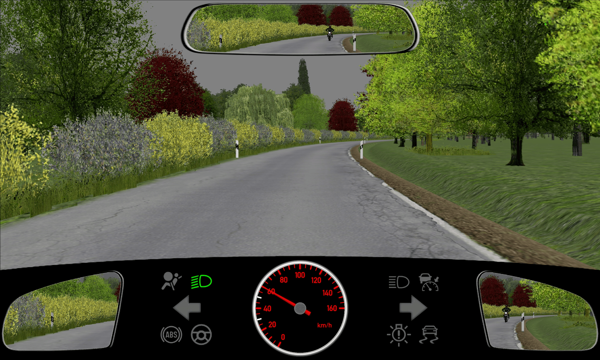

[Video: videos/2_1_07-124-M.mp4](videos/2_1_07-124-M.mp4)

**Options:**
- A. I reduce my speed
- B. I drive as far to the right as possible
- C. I signal to the motorcyclist that he can overtake me

**Correct Answer(s):**
- A. I reduce my speed
- B. I drive as far to the right as possible

**Explanation:**
On confusing roadways or when there is oncoming traffic on a narrow street, you should always pay close attention to other road users and adjust your speed. In this way, dangerous situations can be reduced in advance. 
You should also drive as far to the right as possible to avoid a collision with the oncoming truck. You can't see through the tree how far in the middle the oncoming truck is driving. You also create more space on the road if the motorcycle behind you tries to overtake and hasn't seen the truck yet.

---

#### Question 2.1.07-202

**Points:** 4 Points

**What should you do?**

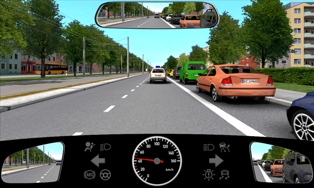

[Video: videos/2_1_07-202.mp4](videos/2_1_07-202.mp4)

**Options:**
- A. Reduce speed, be ready to brake
- B. Move to the left-hand lane
- C. Continue driving, flash lights to signal

**Correct Answer(s):**
- A. Reduce speed, be ready to brake

**Explanation:**
A car driving in front of you parks. You must reduce your speed and then change the lane to avoid the parked car when the motorcycle has passed you.

---

#### Question 2.1.07-203

**Points:** 4 Points

**What should you know about using the rear-view mirror?**

**Options:**
- A. I am unable to see vehicles and pedestrians in the blind spot
- B. Rear-view mirrors must be adjusted to the particular driver
- C. The interior mirror has no blind spot to the right-side

**Correct Answer(s):**
- A. I am unable to see vehicles and pedestrians in the blind spot
- B. Rear-view mirrors must be adjusted to the particular driver

**Explanation:**
Using the rear-view mirrors requires you to know the following: 1. Rear-view mirrors must be adjusted to the driver before starting to drive. 2. There are blind spots on all types of rear-view mirrors. These indicate areas hidden from view in which pedestrians, small vehicles or obstacles can be overlooked. By optimally adjusting the outer rearview mirror and the inner mirror, you keep the blind spot as low as possible.

---

#### Question 2.1.07-204

**Points:** 4 Points

**You are driving into a right-hand bend. A motorcyclist approaches you at high speed. What risks should you take into account?**

**Options:**
- A. - will intrude into my lane because of the heavily tilted position
- B. - will cut the corner and intrude into my lane
- C. - will brake in good time and avoid intruding into my lane

**Correct Answer(s):**
- A. - will intrude into my lane because of the heavily tilted position
- B. - will cut the corner and intrude into my lane

**Explanation:**
As you enter a right-hand turn, the oncoming motorcyclist makes a left turn. His upper body is tilted towards you. Bear in mind that the motorcyclist is almost as wide as a car while doing that. If the rider is riding too far at the center line to increase the radius of curvature and lower centrifugal forces, his upper body could be caught by your vehicle.

---

#### Question 2.1.07-205

**Points:** 4 Points

**On a narrow road you want to overtake cyclists on an incline. What should you do?**

**Options:**
- A. - maintain a large distance to the side
- B. - allow the oncoming traffic to pass before overtaking
- C. - drive carefully close past the cyclists

**Correct Answer(s):**
- A. - maintain a large distance to the side
- B. - allow the oncoming traffic to pass before overtaking

**Explanation:**
Cyclists tend to sway more on inclines. So, the required minimum distance to the cyclist of 1.5 m should therefore be increased. Oncoming traffic must be allowed to pass before overtaking. Do not drive close to the cyclists while passing them.

---

#### Question 2.1.07-206

**Points:** 3 Points

**You are driving on a rural road. A line of approximately 15 slow-moving vehicles is travelling in front of you. What should you do?**

**Options:**
- A. I remain behind the line of vehicles for the moment
- B. I flash my lights and sound my horn to urge vehicles ahead to overtake
- C. I overtake the line of vehicles as quickly as possible

**Correct Answer(s):**
- A. I remain behind the line of vehicles for the moment

**Explanation:**
In such a convoy, it is important to stay calm and to maintain the necessary safety distance. So-called queue, that is the overtaking of individual vehicles, brings no time gain and leads to a high accident risk.

---

#### Question 2.1.07-207

**Points:** 3 Points

**You stop to allow passengers to exit your vehicle on the right-side. A cycle path runs along there. What should you do?**

**Options:**
- A. I should make sure that no cyclists are approaching
- B. I should point out the cycle path to the persons exiting
- C. I should observe the traffic using my rear-view mirror only

**Correct Answer(s):**
- A. I should make sure that no cyclists are approaching
- B. I should point out the cycle path to the persons exiting

**Explanation:**
You as a car driver have a special duty of care. So, if you're stopping at a bike path with a co-driver, you should warn him/her about the cyclist before he/she gets off.

---

#### Question 2.1.07-208

**Points:** 3 Points

**You increase your speed from 50 km/h to 100 km/h. How does the reaction distance change in accordance with the rule of thumb?**

**Options:**
- A. It is doubled from 15 m to 30 m
- B. It is quadrupled from 25 m to 100 m
- C. It is halved from 50 m to 25 m

**Correct Answer(s):**
- A. It is doubled from 15 m to 30 m

**Explanation:**
If the car driver doubles the speed of the vehicle, the braking distance doubles from 15 to 30 meters.

---

#### Question 2.1.07-209

**Points:** 3 Points

**What can cause a faster-moving vehicle to suddenly swerve on a dry, straight road?**

**Options:**
- A. Gusts of wind
- B. A tyre blow-out
- C. Continuous head wind

**Correct Answer(s):**
- A. Gusts of wind
- B. A tyre blow-out

**Explanation:**
By gusts of wind and tire blow your vehicle can break out and distract you from your direction of travel.

---

#### Question 2.1.07-210-M

**Points:** 3 Points

**What should you anticipate?**

**Options:**
- A. A dangerous left-hand bend
- B. An obstacle situated around the corner
- C. Cross-wise moving traffic before the summit

**Correct Answer(s):**
- A. A dangerous left-hand bend
- B. An obstacle situated around the corner

**Explanation:**
The danger sign warns of a sharp left turn. The crest blocks the view forward on the road. The curve is not visible. You have to expect a broken-down vehicle or another obstacle. Because of the road, there can be no cross traffic in front of the crest.

---

#### Question 2.1.07-211-M

**Points:** 3 Points

**What is the right course of action now?**

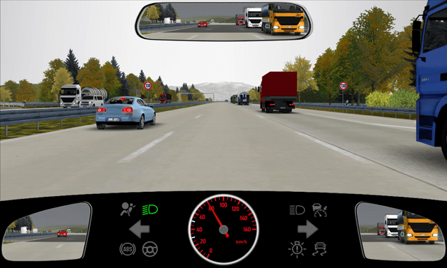

[Video: videos/2_1_07-211-M.mp4](videos/2_1_07-211-M.mp4)

**Options:**
- A. I stay in the middle lane
- B. I move into the left-hand lane
- C. I move into the right-hand lane

**Correct Answer(s):**
- A. I stay in the middle lane

**Explanation:**
As you can see in the rearview mirror, there is a vehicle behind you in the left lane. So stay in the middle lane and let the truck change lanes to overtake.

---

### 2.1.08 Chapter Motorway

#### Question 2.1.08-005-B

**Points:** 3 Points

**What must you reckon with here?**

**Options:**
- A. The vehicle in front changing lanes
- B. Denser traffic beyond the underpass
- C. The right-hand lane coming to an end

**Correct Answer(s):**
- A. The vehicle in front changing lanes
- B. Denser traffic beyond the underpass

**Explanation:**
The sign announces the end of the left lane. The traffic flow will condense from two lanes to a single lane. Halting traffic might occur. The vehicle in the left lane will change the lane. You have to allow the vehicles on the left side of the lane to change over to your lane according to the zip merging principle.

---

#### Question 2.1.08-006-B

**Points:** 3 Points

**What must you do here?**

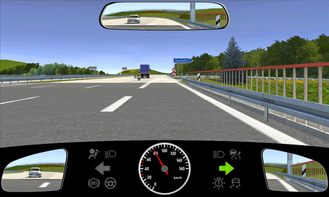

**Options:**
- A. Check your speed again and, if necessary, brake
- B. Brake only on the bend so as not to obstruct traffic following behind

**Correct Answer(s):**
- A. Check your speed again and, if necessary, brake

**Explanation:**
If the car driver drives at high speed on the highway for a long time, the senses get used to the fast pace. There is a risk of underestimating the pace. In particular, if you want to drive out, check your speed on the speedometer. Use the deceleration lane of the freeway to reduce your speed. Braking there doesn't hinder anybody. Then you can enter the sharp bend of the exit at a reasonable speed.

---

#### Question 2.1.08-008-B

**Points:** 4 Points

**A traffic jam is building up here. What is the correct procedure?**

**Options:**
- A. If possible, switch on hazard warning lights to warn vehicles following behind
- B. Drive as far as possible to the right in order to leave room for a channel on the left
- C. Drive as far as possible to the left in order to leave room for a channel on the right

**Correct Answer(s):**
- A. If possible, switch on hazard warning lights to warn vehicles following behind
- B. Drive as far as possible to the right in order to leave room for a channel on the left

**Explanation:**
If you drive towards a traffic jam, turn on your hazard lights to alert other road users. It is important to build a rescue lane for any approaching rescue vehicles. In this case, drive as far to the right as possible.

---

#### Question 2.1.08-010

**Points:** 4 Points

**What must you anticipate with inclines on motorways?**

**Options:**
- A. Slow-moving trucks on the right-hand lane
- B. Sudden overtaking manoeuvres by other road users
- C. Large differences in speed between vehicles

**Correct Answer(s):**
- A. Slow-moving trucks on the right-hand lane
- B. Sudden overtaking manoeuvres by other road users
- C. Large differences in speed between vehicles

**Explanation:**
When driving uphill on motorways, you should expect slow-moving trucks in the right lane, sudden overtaking manoeuvres by other road users and large speed differences between vehicles. All 3 answers are correct.

---

#### Question 2.1.08-011

**Points:** 4 Points

**What must you do?**

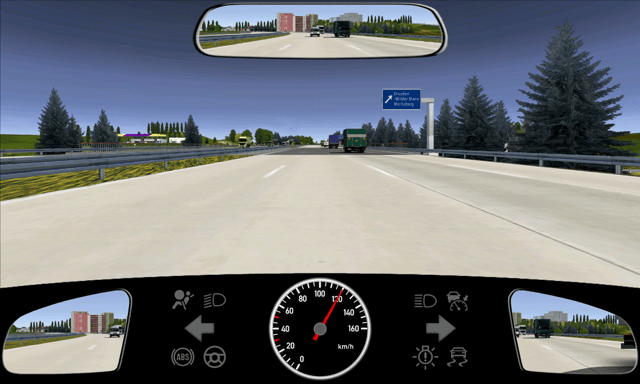

[Video: videos/2_1_08-011.mp4](videos/2_1_08-011.mp4)

**Options:**
- A. Slow down and stay in lane
- B. Move to the left-hand lane
- C. Maintain speed and stay in lane

**Correct Answer(s):**
- A. Slow down and stay in lane

**Explanation:**
Since you are currently being overtaken by a car on the left-hand side, you must maintain the lane and reduce the speed until the truck in front of you has completed its overtaking maneuver and changes to the right-hand lane.

---

#### Question 2.1.08-013

**Points:** 5 Points

**What must you be aware of when joining the motorway?**

**Options:**
- A. On the merging lane, I may drive faster than the through-driving traffic
- B. The through-driving traffic has priority
- C. The through-driving traffic on the right-hand lane must allow incoming traffic to merge

**Correct Answer(s):**
- A. On the merging lane, I may drive faster than the through-driving traffic
- B. The through-driving traffic has priority

**Explanation:**
On the freeway, the continuous traffic always has the right of way and does not have to allow entrance. On the acceleration lane the driver may drive faster than the rest of the vehicles.

---

#### Question 2.1.08-014

**Points:** 4 Points

**You are driving at the recommended speed on the motorway and want to leave it at the next exit. What should you do?**

**Options:**
- A. I cease overtaking manoeuvres in good time
- B. I significantly reduce my speed on the exit lane
- C. I significantly reduce my speed while still on the right-hand lane of the motorway

**Correct Answer(s):**
- A. I cease overtaking manoeuvres in good time
- B. I significantly reduce my speed on the exit lane

**Explanation:**
Finish overtaking in good time and get on the right lane. Before changing to the deceleration lane look around and indicate. On the deceleration lane, check your speed on the speedometer in order to assess it right. Only on the deceleration lane you should reduce the speed significantly, so as not to hinder subsequent traffic on the continuous lane.

---

#### Question 2.1.08-015

**Points:** 4 Points

**After a longer journey travelling at about 120 km/h, you want to exit the motorway. What must you be aware of when doing so?**

**Options:**
- A. I signal in good time and then brake while on the exit lane, so as not to impede the traffic behind me
- B. I check the speedometer to make sure I do not underestimate my speed
- C. I maintain my speed while on the exit lane, so as not to impede the traffic behind me

**Correct Answer(s):**
- A. I signal in good time and then brake while on the exit lane, so as not to impede the traffic behind me
- B. I check the speedometer to make sure I do not underestimate my speed

**Explanation:**
If you, as a car driver, leave the motorway at a speed of about 120 km/h, you must observe the following: 1. complete all overtaking maneuvers in good time; 2. merge right; 3. reduce the speed while checking it on the speedometer; 4. indicate. In order not to hinder the traffic on the continuous road, you should reduce the speed only when you change to the deceleration lane.

---

#### Question 2.1.08-016

**Points:** 4 Points

**What should you do now?**

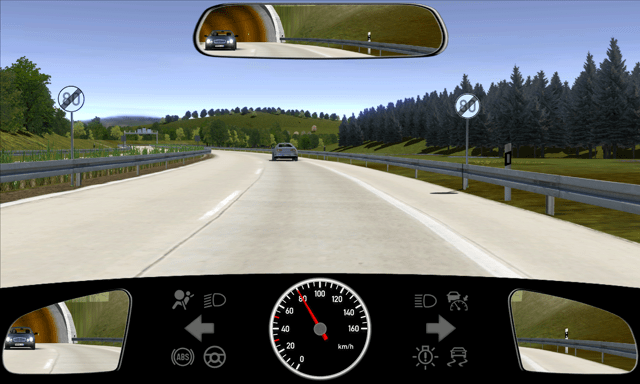

[Video: videos/2_1_08-016.mp4](videos/2_1_08-016.mp4)

**Options:**
- A. I slow my vehicle down
- B. I switch on my hazard lights
- C. I continue driving in the clear lane

**Correct Answer(s):**
- A. I slow my vehicle down
- B. I switch on my hazard lights

**Explanation:**
When approaching a jam end on the highway, you must reduce your speed and warn the road users behind you by switching on the hazard lights. A rescue lane is to be formed.

---

#### Question 2.1.08-017

**Points:** 4 Points

**What should you anticipate with this bend?**

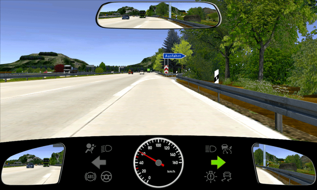

**Options:**
- A. With an obstacle situated around the corner
- B. That the bend will become tighter as it progresses
- C. With oncoming traffic on my lane

**Correct Answer(s):**
- A. With an obstacle situated around the corner
- B. That the bend will become tighter as it progresses

**Explanation:**
The course of the curve is not assessable. You always have to expect obstacles such as broken-down vehicles or traffic jams. Be prepared for a stop within sight. The curve may narrow in its course. Thereby you'll only notice in the curve that your speed is too high. It is important to reduce the speed on time.

---

#### Question 2.1.08-018

**Points:** 5 Points

**What is correct in this situation?**

**Options:**
- A. I have to reduce my speed
- B. The truck has right of way
- C. The truck has to wait

**Correct Answer(s):**
- A. I have to reduce my speed
- B. The truck has right of way

**Explanation:**
The curve is difficult to assess for the car driver. There may be other road users or even obstacles on the route. Therefore, it makes sense to slow down the pace even before the turn and mentally adjust to a possible danger situation. Because even for oncoming drivers this is a difficult spot and caution is required.

---

#### Question 2.1.08-019

**Points:** 4 Points

**Why do you have to slow here?**

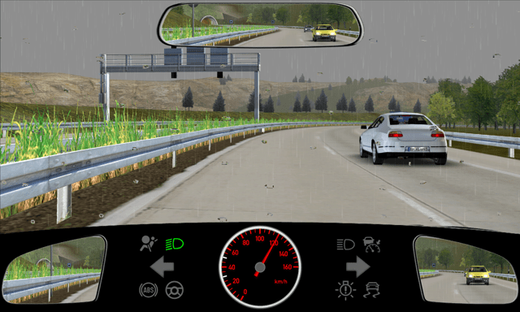

[Video: videos/2_1_08-019.mp4](videos/2_1_08-019.mp4)

**Options:**
- A. Because of the truck
- B. Because of the speed limit
- C. Because of the white car

**Correct Answer(s):**
- A. Because of the truck

**Explanation:**
The moveable road barrier with flashing arrow in the right-hand lane forces the truck driver to change to your lane on the left. That's why you have to delay now. The white car behind you is no danger.

---

#### Question 2.1.08-020

**Points:** 4 Points

**Why do you have to reduce your speed now?**

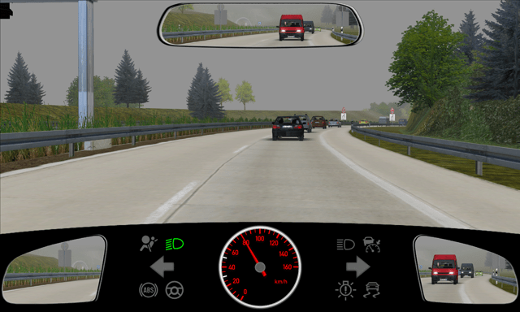

[Video: videos/2_1_08-020.mp4](videos/2_1_08-020.mp4)

**Options:**
- A. Because of the blue car
- B. Because of the speed limit
- C. Because of the red van

**Correct Answer(s):**
- A. Because of the blue car

**Explanation:**
In this situation, the blue car is likely to change to the right lane. You should therefore reduce your speed and keep a safe distance from it

---

#### Question 2.1.08-021

**Points:** 4 Points

**You are driving at least 20 km/h faster than the green truck. What should you do?**

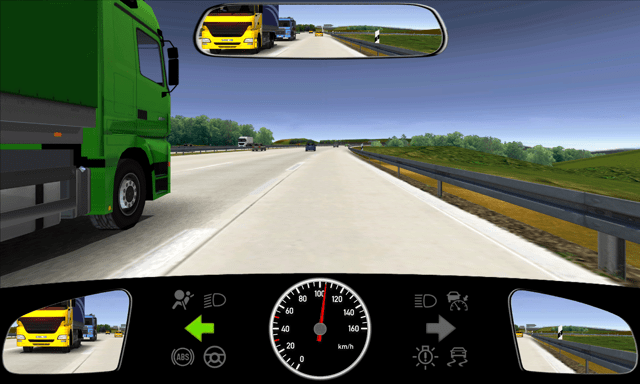

**Options:**
- A. I move onto the motorway ahead of the green truck
- B. I brake and move onto the motorway behind the green truck
- C. I stop at the end of the merging lane, and move onto the motorway behind the blue truck

**Correct Answer(s):**
- A. I move onto the motorway ahead of the green truck

**Explanation:**
You are on an acceleration lane to the freeway. On the acceleration lane it is permissible to drive faster than the vehicles on the continuous lane. Therefore, you can drive onto the highway at a faster pace in front of the green truck.

---

#### Question 2.1.08-022

**Points:** 4 Points

**You are approaching these vehicles. What should you do in this situation?**

**Options:**
- A. I remain on the middle lane but without overtaking the white car
- B. I remain on the middle lane and cautiously overtake the white car
- C. I move into the left-hand lane and flash my headlights until the person in front vacates the lane

**Correct Answer(s):**
- A. I remain on the middle lane but without overtaking the white car

**Explanation:**
The white car on the left lane must not be overtaken on the right. To go behind it on the left lane and to make him/her change with flash light is also prohibited. You have to slow down and drive on the middle lane just as fast as the car. Allow him/her as much distance as it takes in order for him/her to be able to change to the middle lane at any time.

---

#### Question 2.1.08-023

**Points:** 3 Points

**You are driving a truck. What is the right course of action now?**

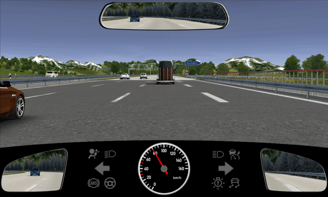

[Video: videos/2_1_08-023.mp4](videos/2_1_08-023.mp4)

**Options:**
- A. I increase the distance to the vehicle ahead
- B. I maintain my speed
- C. I overtake the truck in front of me

**Correct Answer(s):**
- A. I increase the distance to the vehicle ahead

**Explanation:**
Please magnify the distance to the vehicle ahead and therefore hold a required safety distance.

---

#### Question 2.1.08-024-M

**Points:** 3 Points

**What should you do now?**

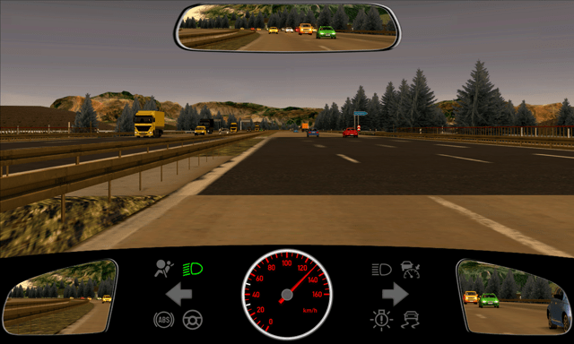

[Video: videos/2_1_08-024-M.mp4](videos/2_1_08-024-M.mp4)

**Options:**
- A. - do not switch lanes, because [the red car] is already moving across
- B. - move into the middle lane, because my overtaking manoeuvre is complete
- C. - switch lanes so that I do not obstruct [the yellow car]

**Correct Answer(s):**
- A. - do not switch lanes, because [the red car] is already moving across

**Explanation:**
Next to you is a red car that changes into the middle lane. Therefore, you cannot change the lane, otherwise you would endanger other road users.

---

#### Question 2.1.08-025

**Points:** 4 Points

**You want to join the motorway. What driving line should you follow?**

**Options:**

**Correct Answer(s):**
- 3 

**Explanation:**
While driving onto the freeway you should continue to follow the third driving line, so stay true to the lane and do not cut the boundary line.

---

#### Question 2.1.08-026-M

**Points:** 3 Points

**What should you be prepared for now?**

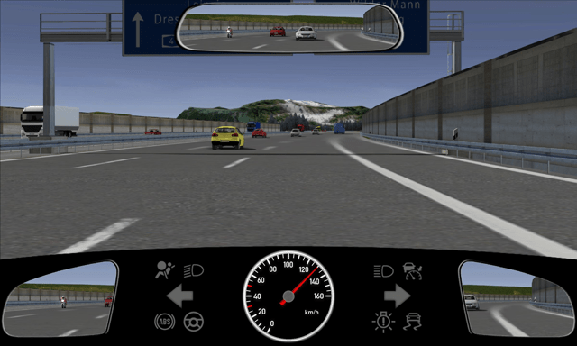

[Video: videos/2_1_08-026-M.mp4](videos/2_1_08-026-M.mp4)

**Options:**
- A. [The yellow car] exits the motorway
- B. The motorbike exits the motorway
- C. The [blue bus] in front of me brakes due to a traffic jam

**Correct Answer(s):**
- A. [The yellow car] exits the motorway

**Explanation:**
No traffic jam can be seen in this situation. Since the motorcycle is driving on the left, it will not leave the motorway. On the other hand, the car driving on your left flashes to the right. You can be prepared for the driver to leave the motorway.

---

#### Question 2.1.08-027-M

**Points:** 4 Points

**You want to exit the motorway. What is creating a dangerous situation here?**

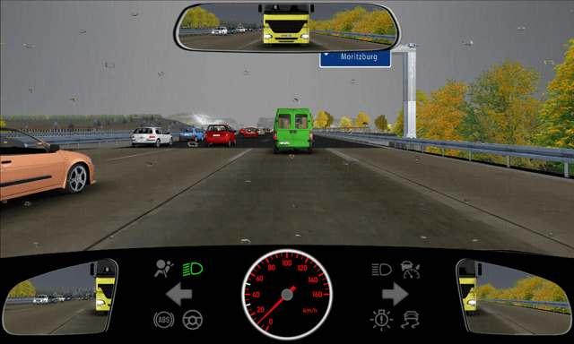

[Video: videos/2_1_08-027-M.mp4](videos/2_1_08-027-M.mp4)

**Options:**
- A. The motorbike
- B. [The yellow truck]
- C. [The green vehicle]

**Correct Answer(s):**
- A. The motorbike

**Explanation:**
The motorbike behind you (see right wing mirror) creates a dangerous situation for you. Take this into account when leaving the motorway.

---

#### Question 2.1.08-028-M

**Points:** 4 Points

**What is the right course of action now?**

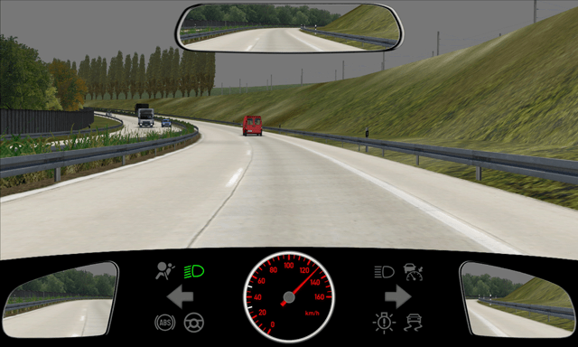

[Video: videos/2_1_08-028-M.mp4](videos/2_1_08-028-M.mp4)

**Options:**
- A. I reduce my speed
- B. I remain in the left-hand lane
- C. I continue driving as before

**Correct Answer(s):**
- A. I reduce my speed
- B. I remain in the left-hand lane

**Explanation:**
There is an object on the roadway in the right lane in front of the truck. Truck will avoid the object by using the left lane. You should therefore stay in the left lane. If you continue to drive unchanged, you could collide with the truck. You should therefore reduce your speed.

---

#### Question 2.1.08-029-M

**Points:** 4 Points

**Why must you reduce your speed now?**

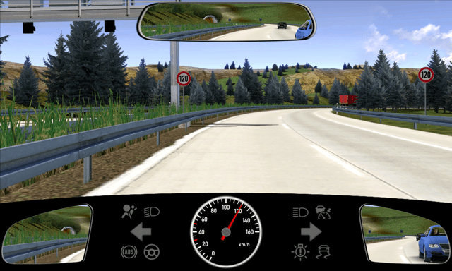

[Video: videos/2_1_08-029-M.mp4](videos/2_1_08-029-M.mp4)

**Options:**
- A. Because of the truck
- B. Because of the speed limit
- C. Because of the [blue] car

**Correct Answer(s):**
- A. Because of the truck

**Explanation:**
The right lane is blocked in front of the truck. He has to change to the left lane. To allow him to do this, you should reduce your speed. The car driving behind you is no reason for you to slow down. The maximum permissible speed here is 120 km/h. Keep this in mind.

---

#### Question 2.1.08-030-M

**Points:** 3 Points

**You want to leave the motorway. What is the right course of action?**

**Options:**
- A. I use the speedometer to check my speed at short intervals
- B. I reduce my speed now
- C. I reduce my speed only once I am at the turn

**Correct Answer(s):**
- A. I use the speedometer to check my speed at short intervals
- B. I reduce my speed now

**Explanation:**
As soon as you have entered the deceleration lane, you should brake. If you brake before entering the deceleration lane, you will unnecessarily interfere with traffic on the motorway. You should check your speedometer more often to make sure you are not entering the bend too fast. On motorways, there is a danger that you will get too used to the high speed and therefore enter an exit too fast. If you were to slow down at the turn, you would not be able to reduce your speed in time. In general, you should always brake before a bend and not only in the bend.

---

#### Question 2.1.08-031

**Points:** 3 Points

**When driving on motorways, why should you maintain the recommended speed of 130 km/h?**

**Options:**
- A. - can prevent accidents occurring
- B. - can reduce the severity of possible accidents
- C. - achieves an even flow of traffic

**Correct Answer(s):**
- A. - can prevent accidents occurring
- B. - can reduce the severity of possible accidents
- C. - achieves an even flow of traffic

**Explanation:**
The higher the speed, the longer the reaction distance, braking distance, etc. If all vehicles travel at a similar speed, the traffic flow becomes more even.

---

#### Question 2.1.08-032-M

**Points:** 4 Points

**What must you anticipate here?**

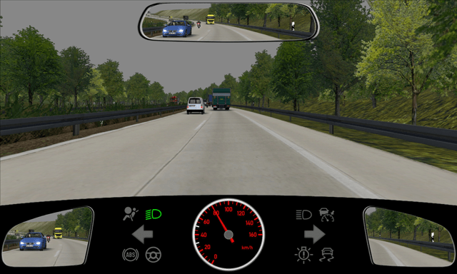

[Video: videos/2_1_08-032-M.mp4](videos/2_1_08-032-M.mp4)

**Options:**
- A. The driver of the [yellow truck] does not notice the start of the tailback in time
- B. The motorbike drives between the lines of vehicles
- C. [The blue car] pulls into my lane in front of me

**Correct Answer(s):**
- A. The driver of the [yellow truck] does not notice the start of the tailback in time
- B. The motorbike drives between the lines of vehicles

**Explanation:**
Due to the sudden traffic jam, the driver of the truck sees the end of the traffic jam too late. Due to the traffic jam, the motorcycle will try to go through the rows of vehicles.

---

#### Question 2.1.08-033-M

**Points:** 3 Points

**What should you anticipate when driving out the exit slip road?**

**Options:**
- A. A broken-down vehicle
- B. People on the carriageway
- C. A fallen load

**Correct Answer(s):**
- A. A broken-down vehicle
- B. People on the carriageway
- C. A fallen load

**Explanation:**
A warning triangle indicates a nearby obstacle, e.g. people, a defective vehicle or a fallen load, in the exit lane. Therefore, enter the exit at a very reduced speed.

---

#### Question 2.1.08-102

**Points:** 4 Points

**Why should you avoid overtaking alongside the roadworks site?**

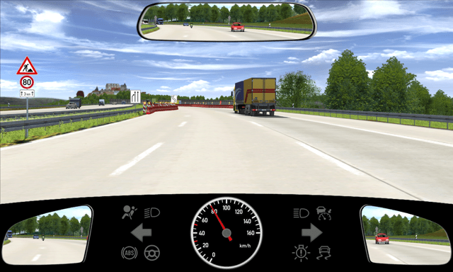

[Video: videos/2_1_08-102.mp4](videos/2_1_08-102.mp4)

**Options:**
- A. The time saved is frequently insignificant
- B. Vehicles in the right-hand lane may cross over the yellow road markings
- C. The risk of an accident increases significantly

**Correct Answer(s):**
- A. The time saved is frequently insignificant
- B. Vehicles in the right-hand lane may cross over the yellow road markings
- C. The risk of an accident increases significantly

**Explanation:**
When overtaking in the construction site area, the risk of accidents is significantly increased, because there is a risk that the vehicles that you want to overtake run over the yellow lane marking. The lanes are mostly narrower and the distractions on the edge of the road can lead to inattentiveness.
Overtaking in the construction site area often saves almost no time, since most drivers in the construction site area only drive the maximum speed.

---

#### Question 2.1.08-103

**Points:** 3 Points

**How can you reduce the risk of driving onto a motorway against the stipulated direction?**

**Options:**
- A. I deliberately look for traffic signs showing the right direction of travel at motorway slip roads
- B. I pay close attention to the signage when the traffic routing changes
- C. When encountering roadworks, I only follow the information provided by my navigation system

**Correct Answer(s):**
- A. I deliberately look for traffic signs showing the right direction of travel at motorway slip roads
- B. I pay close attention to the signage when the traffic routing changes

**Explanation:**
To avoid driving against the direction of travel on the motorway, you should always pay attention to the relevant traffic signs. It is very important to pay attention to the exact signs, especially when the traffic routing has changed.

---

### 2.1.09 Chapter Alcohol Drugs Medication

#### Question 2.1.09-201

**Points:** 4 Points

**What must you remember as bus driver on duty?**

**Options:**
- A. - not have any beverages containing alcohol while on duty and while on stand-by duty
- B. - not start to drive while under the effect of alcohol
- C. - have beverages containing alcohol while on duty, as long as a blood alcohol standard of 0.3 per mille is not exceeded

**Correct Answer(s):**
- A. - not have any beverages containing alcohol while on duty and while on stand-by duty
- B. - not start to drive while under the effect of alcohol

**Explanation:**
Coming soon...

---

#### Question 2.1.09-202

**Points:** 4 Points

**What must you remember as bus driver on duty?**

**Options:**
- A. You may not take any drugs or medicaments which impair your ability to drive while on duty or stand-by duty
- B. You may not start to drive when your ability to drive is impaired by drugs or medicaments
- C. You may take any drug for which no prescription is required, without having to fear that your ability to drive is impaired

**Correct Answer(s):**
- A. You may not take any drugs or medicaments which impair your ability to drive while on duty or stand-by duty
- B. You may not start to drive when your ability to drive is impaired by drugs or medicaments

**Explanation:**
Coming soon...

---

### 2.1.10 Chapter Fatigue Distraction

#### Question 2.1.10-001

**Points:** 4 Points

**What must you do if you notice signs of fatigue when driving on open stretches of road at night (heavy eyelids, feeling chilly, sudden frights etc.)?**

**Options:**
- A. Interrupt your journey for an adequate break
- B. Switch on the radio and proceed

**Correct Answer(s):**
- A. Interrupt your journey for an adequate break

**Explanation:**
You can only avoid signs of fatigue if you take sufficiently long breaks in time. Do not turn on the radio to stay awake, as there is a risk it will distract you further. If you already feel the first symptoms of fatigue, find a place where you can take a longer break as soon as possible.

---

#### Question 2.1.10-002

**Points:** 4 Points

**How can fatigue be prevented on a long journey?**

**Options:**
- A. By well-timed and sufficient stops for rests
- B. Gymnastic exercises during stops
- C. Drink coffee and make no stops

**Correct Answer(s):**
- A. By well-timed and sufficient stops for rests
- B. Gymnastic exercises during stops

**Explanation:**
Timely breaks prevent overfatigue. Gymnastic exercises during the break pep up the circulation and are good for the joints. Coffee has only a short-term mobilizing effect, which can then quickly turn into the opposite. That means you could fall asleep without warning.

---

#### Question 2.1.10-003

**Points:** 3 Points

**What is the potential risk when using driver assistance systems?**

**Options:**
- A. - have false expectations of the systems
- B. - pay too little attention to the traffic around him
- C. - neglect his own personal responsibility

**Correct Answer(s):**
- A. - have false expectations of the systems
- B. - pay too little attention to the traffic around him
- C. - neglect his own personal responsibility

**Explanation:**
The car driver may have too high expectations of the advanced driver-assistance system. This may result in the car driver neglecting his or her own responsibility and paying too little attention to the traffic. Even when using advanced driver-assistance systems, the responsibility for safe driving remains with the driver.

---

#### Question 2.1.10-004

**Points:** 3 Points

**What is the risk if you become distracted while using electronic devices when driving?**

**Options:**
- A. I may deviate from my lane
- B. I may fail to notice road traffic signs
- C. My stopping distance may be reduced

**Correct Answer(s):**
- A. I may deviate from my lane
- B. I may fail to notice road traffic signs

**Explanation:**
Using electronic devices while driving can cause you to miss traffic signs and wander off your lane (concentration distracted).

---

#### Question 2.1.10-005

**Points:** 4 Points

**What frequently causes younger drivers to have “disco accidents”?**

**Options:**
- A. - are over-tired
- B. - are physically exhausted
- C. - are not fit to drive

**Correct Answer(s):**
- A. - are over-tired
- B. - are physically exhausted
- C. - are not fit to drive

**Explanation:**
All three are correct. The so-called disco accidents are caused by overtiredness, by physical exhaustion and by being unfit to drive.

---

#### Question 2.1.10-006

**Points:** 4 Points

**What is the right thing to do if you sense signs of fatigue during a night-time journey?**

**Options:**
- A. I interrupt the journey to take an adequate break
- B. I allow a co-driver to drive, if possible
- C. I decide against taking a break, and fight the tiredness

**Correct Answer(s):**
- A. I interrupt the journey to take an adequate break
- B. I allow a co-driver to drive, if possible

**Explanation:**
As soon as you feel tired, you should take a break immediately. The risk of falling asleep increases with every second. If possible, you can let your passenger drive if they have the driving licence.

---

#### Question 2.1.10-101

**Points:** 4 Points

**What can diminish alertness in road traffic?**

**Options:**
- A. Strong emotions (e.g. delight, annoyance, impatience)
- B. Animated conversation
- C. Engrossing programs on the car radio

**Correct Answer(s):**
- A. Strong emotions (e.g. delight, annoyance, impatience)
- B. Animated conversation
- C. Engrossing programs on the car radio

**Explanation:**
All external stimuli such as joy, anger, interesting things on the radio and lively conversations can negatively affect the attention while driving, as they can be distracting.

---

#### Question 2.1.10-102

**Points:** 4 Points

**What strongly distracts you while you are driving?**

**Options:**
- A. Telephoning
- B. Lighting a cigarette
- C. Nagging children on the backseats

**Correct Answer(s):**
- A. Telephoning
- B. Lighting a cigarette
- C. Nagging children on the backseats

**Explanation:**
Telephoning while driving is only allowed via a hands-free system. Even then it is still a distraction. The lighting of a cigarette is considered a strong distraction, as it directs the view from the roadway to the cigarette. Whining children and passengers can be very distracting, if necessary, take a pause.

---

#### Question 2.1.10-103

**Points:** 3 Points

**When should you interrupt your journey?**

**Options:**
- A. - want to pick an item that has fallen down in my vehicle
- B. - notice that the concentration is decreasing
- C. - want to activate the cruise control system

**Correct Answer(s):**
- A. - want to pick an item that has fallen down in my vehicle
- B. - notice that the concentration is decreasing

**Explanation:**
Especially on longer trips, it can always happen that concentration subsides. If you notice that your concentration wanes noticeably, you should definitely take a break.
You should also stop if you want to cancel an object that has fallen into the vehicle. By searching and lifting an object, you can distract yourself very much. Therefore, you can endanger yourself and other road users.

---

### 2.1.11 Chapter Affective Emotional Behaviour In Road Traffic

#### Question 2.1.11-003

**Points:** 4 Points

**A slow driver prevents you from proceeding quickly. What is right?**

**Options:**
- A. You follow him until there is a possibility to overtake
- B. You flash your headlights to make him drive faster
- C. You close up to him in order to shorten the overtaking distance

**Correct Answer(s):**
- A. You follow him until there is a possibility to overtake

**Explanation:**
Never start a risky overtaking maneuver or force your frontman to speed up with your flash light. Keep the necessary safety distance and wait for a convenient opportunity for safe overtaking.

---

#### Question 2.1.11-007

**Points:** 4 Points

**What makes a good driver?**

**Options:**
- A. He treats others like partners, drives calmly and cooly and refrains from showing that he is superior
- B. He uses every possibility to overtake, give the slip to others and show his superiority even if his manner of driving involves risks
- C. He drives fast in order to show his abilities

**Correct Answer(s):**
- A. He treats others like partners, drives calmly and cooly and refrains from showing that he is superior

**Explanation:**
A good driver adheres to the traffic regulations and is characterized by a cooperative behavior in dealing with other road users. He/she refrains from risky driving styles and careless overtaking maneuvers. A good driver does not have to prove his/her skills to others.

---

#### Question 2.1.11-008

**Points:** 4 Points

**Travelling on a main road after a lengthy period of time of following behind, you are finally able to overtake a very slow-moving car. What should you do?**

**Options:**
- A. - I pull back in after an adequate distance in order not to impede the other driver
- B. - I brake briefly in order to call the attention of the other driver to his slow speed
- C. - I drive especially slowly in order to emphasise to the other driver the effects of his driving style

**Correct Answer(s):**
- A. - I pull back in after an adequate distance in order not to impede the other driver

**Explanation:**
You should stay calm in this situation and overtake with a sufficient safety distance without endangering other road users. Harassing others by tightly cutting them should be avoided. Otherwise an accident could occur.

---

#### Question 2.1.11-009-M

**Points:** 4 Points

**The vehicle ahead has prevented you from overtaking for some time now. What is the right course of action?**

**Options:**
- A. I wait until I am able to overtake
- B. I close the gap
- C. I sound my horn and flash my headlights persistently

**Correct Answer(s):**
- A. I wait until I am able to overtake

**Explanation:**
The car driver has to wait until overtaking is possible without danger and always maintain the necessary safety distance to the vehicle in front. Stay calm, because tailgating, turning the headlights on full beam for a long time or honking is considered coercion and will be punished with fines or even a withdrawal of your driving license.

---

#### Question 2.1.11-010

**Points:** 4 Points

**Right before you want to drive off, you got annoyed about something and have become very angry. What should you do?**

**Options:**
- A. I only drive off, once I have calmed down again
- B. I drive off, in order to distract myself from my anger
- C. I try to reach my destination quickly, so that I can calm down there

**Correct Answer(s):**
- A. I only drive off, once I have calmed down again

**Explanation:**
Getting into the car angrily can negatively affect your driving style. If you are angry, your driving style is also aggressive and limited. Therefore, only get into your vehicle when you're abreacted.

---

#### Question 2.1.11-011

**Points:** 3 Points

**You have just avoided a road traffic accident by performing an emergency braking manoeuvre. Your hands and knees are shaking. You are still far from your destination. What should you do?**

**Options:**
- A. - to the next stopping place, in order to calm myself down
- B. - to my destination, so that I can recover my composure

**Correct Answer(s):**
- A. - to the next stopping place, in order to calm myself down

**Explanation:**
You should calm down first. Because your restlessness can have a negative effect on your driving style. Find a place to stop and relax. Afterwards you may continue the journey.

---

#### Question 2.1.11-012

**Points:** 3 Points

**What should you be aware of when driving a car after a long day's work?**

**Options:**
- A. I drive with a lower level of concentration
- B. I will become tired more quickly
- C. I make fewer driving errors

**Correct Answer(s):**
- A. I drive with a lower level of concentration
- B. I will become tired more quickly

**Explanation:**
After a long day at work, you are usually not fully productive and get tired faster. That's why mistakes while driving can increase and your concentration decreases.

---

#### Question 2.1.11-013

**Points:** 4 Points

**How can you recognise a good driver?**

**Options:**
- A. - exhibits a calm and relaxed driving style
- B. - refrains from responding to provocations on the road
- C. - always informs other traffic participants of their driving errors

**Correct Answer(s):**
- A. - exhibits a calm and relaxed driving style
- B. - refrains from responding to provocations on the road

**Explanation:**
A good driver always takes care to act in partnership and also knows that people can make mistakes.

---

#### Question 2.1.11-014-M

**Points:** 4 Points

**The [red] car in front of you has been driving slowly for some time now. What is the correct course of action in this situation?**

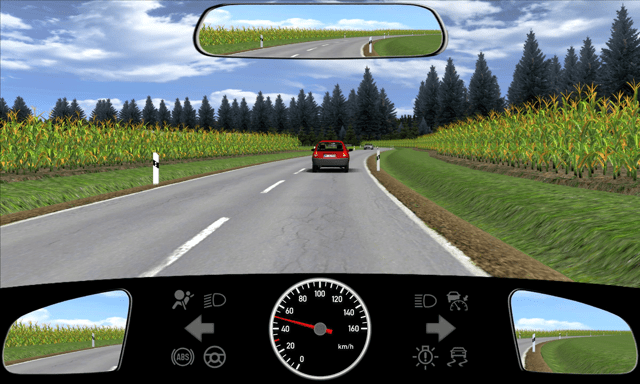

[Video: videos/2_1_11-014-M.mp4](videos/2_1_11-014-M.mp4)

**Options:**
- A. I maintain my speed
- B. I overtake, because the road is clear
- C. I close the distance and sound my horn

**Correct Answer(s):**
- A. I maintain my speed

**Explanation:**
You maintain your speed so as not to tailgate and keep the required safe distance. It is forbidden to tailgate, tailgate too closely or honk your horn in traffic.
The road is clear, but you can only see as far as the next bend. The visible distance is too short for an overtaking manoeuvre.

---

#### Question 2.1.11-015

**Points:** 4 Points

**What frequently causes young people to have “disco accidents”?**

**Options:**
- A. A lack of awareness of the road traffic
- B. A high readiness to take risks
- C. A defensive driving style

**Correct Answer(s):**
- A. A lack of awareness of the road traffic
- B. A high readiness to take risks

**Explanation:**
Young drivers in particular have less driving experience and a higher willingness to take risks through showing off. Dangerous situations are assessed more poorly and accidents occur more frequently.
A defensive driving style can prevent accidents.

---

#### Question 2.1.11-016

**Points:** 4 Points

**Why can driving under pressure of time be dangerous?**

**Options:**
- A. - risks are frequently underestimated
- B. - the driver frequently goes too fast
- C. - a defensive driving style is frequently adopted

**Correct Answer(s):**
- A. - risks are frequently underestimated
- B. - the driver frequently goes too fast

**Explanation:**
When you are under time pressure, you may underestimate dangers because your willingness to take risks increases and people often drive too fast. You should still drive defensively and stick to the speed limits to avoid endangering yourself and others.

---

#### Question 2.1.11-017

**Points:** 4 Points

**You are on a road outside of a built-up area, and a car in front of you is driving much slower than is permitted to and has the capacity to. What is the right course of action?**

**Options:**
- A. I adjust my speed to that of the car
- B. I overtake at a suitable place
- C. I flash my headlights, until the car begins to drive faster

**Correct Answer(s):**
- A. I adjust my speed to that of the car
- B. I overtake at a suitable place

**Explanation:**
Even if you don't like it, you must adapt your speed to that of the car and not get too close to it. Only overtake at a suitable place and not in front of it. Do not endanger yourself or others.

---

#### Question 2.1.11-018

**Points:** 3 Points

**Why is it not advisable to change lanes frequently?**

**Options:**
- A. Because this can increase the risk of driving errors
- B. Because the time gained by this is generally very small
- C. Because this can endanger other road users

**Correct Answer(s):**
- A. Because this can increase the risk of driving errors
- B. Because the time gained by this is generally very small
- C. Because this can endanger other road users

**Explanation:**
Every lane change requires certain activities: observing traffic, flashing, changing the lane yourself. In this case, other road users can be overlooked and endangered. Changing lanes often doesn't save you much time, but the more often you change lanes, the more likely you are to make mistakes.

---

#### Question 2.1.11-019

**Points:** 3 Points

**You have narrowly avoided a road traffic accident through emergency braking. Your hands and knees are shaking. What is the right course of action?**

**Options:**
- A. I take a break at the soonest possible opportunity, in order to calm myself
- B. Later, I ponder if I could have avoided the situation
- C. I continue driving in order to calm myself

**Correct Answer(s):**
- A. I take a break at the soonest possible opportunity, in order to calm myself
- B. Later, I ponder if I could have avoided the situation

**Explanation:**
Stop at the next opportunity and take a break until you have calmed down. Maybe you can get out, walk a few metres and take a deep breath. 
You should also go through the situation again in your head later, as you may realise what didn't go perfectly. That way you can adjust your driving behaviour in the future.

---

#### Question 2.1.11-020

**Points:** 3 Points

**While driving, you become very annoyed at the behaviour of another road user. What is the right course of action now?**

**Options:**
- A. I continue to concentrate on the road traffic
- B. I continue driving in such a way that my anger does not negatively affect road safety
- C. If necessary, I take a break to calm myself down

**Correct Answer(s):**
- A. I continue to concentrate on the road traffic
- B. I continue driving in such a way that my anger does not negatively affect road safety
- C. If necessary, I take a break to calm myself down

**Explanation:**
It is important that you are not distracted by the traffic if you are annoyed by the behaviour of other drivers, because road safety is paramount. Concentrate on the traffic and continue driving calmly; if you are emotionally agitated while driving, you could overlook dangers. If necessary, take a break and only continue driving when you have calmed down.

---

#### Question 2.1.11-111

**Points:** 4 Points

**Why does environment friendly driving in general have a beneficial effect on traffic safety?**

**Options:**
- A. Because drivers think ahead when travelling, so that possible dangers can be recognized in time and well avoided
- B. Because environment friendly driving avoids high speeds so that dangerous situations occur less frequently
- C. Because you can only drive slowly using alternative fuels

**Correct Answer(s):**
- A. Because drivers think ahead when travelling, so that possible dangers can be recognized in time and well avoided
- B. Because environment friendly driving avoids high speeds so that dangerous situations occur less frequently

**Explanation:**
Avoid high speeds and drive anticipatory. This not only has a positive effect on the environment. It also contributes to greater road safety.

---

#### Question 2.1.11-112

**Points:** 4 Points

**The queue you are driving in is overtaken in an inconsiderate manner by a car. Because of oncoming traffic the driver wants to join the queue in front of the car driving in front of you. This driver is annoyed and "closes the gap". What do you do?**

**Options:**
- A. You give in and let the jostling driver join the queue
- B. You also "close the gap" in order to teach the jostling driver a lesson
- C. Nothing, since you are not concerned

**Correct Answer(s):**
- A. You give in and let the jostling driver join the queue

**Explanation:**
In such a situation, by deliberately giving in, you should reduce the speed and giving the other road user space to go back into lane in order to reduce the risk of an accident. Remember that everyone can misjudge.

---

#### Question 2.1.11-113

**Points:** 4 Points

**A truck indicating to the right is driving in front of you. An impatient car driver is jostling you. What can you do?**

**Options:**
- A. I only overtake when I am completely certain that the traffic situation allows overtaking without danger
- B. I open up the distance to the truck to make overtaking easier for the jostling driver
- C. I overtake because I assume that the truck driver wishes to signal to me that overtaking is possible

**Correct Answer(s):**
- A. I only overtake when I am completely certain that the traffic situation allows overtaking without danger
- B. I open up the distance to the truck to make overtaking easier for the jostling driver

**Explanation:**
In this situation it is better to cut back and keep a safe distance. Maybe the truck driver would like to signal that the road is clear. However, it may also be that he/she intends to stop or turn right. Only overtake if there is no danger. Increase the distance to the truck so that the pushy driver can overtake.

---

#### Question 2.1.11-114

**Points:** 4 Points

**On a road not within a built-up area, a car is driving in front of you at a speed somewhat slower than that permitted. You are annoyed at the slower-moving car. What should you do?**

**Options:**
- A. I adjust my speed to that of the vehicle ahead
- B. I overtake at a suitable place
- C. I flash my headlights, until the car in front begins to drive faster

**Correct Answer(s):**
- A. I adjust my speed to that of the vehicle ahead
- B. I overtake at a suitable place

**Explanation:**
You should definitely wait for a safe situation to overtake. Harassing someone by tailgating or flash light, however, represents a threat or even coercion. You should refrain from doing so.

---

#### Question 2.1.11-115

**Points:** 4 Points

**What can frequently lead to road traffic accidents during night-time recreational drives at the weekend?**

**Options:**
- A. - little experience driving after dark
- B. - little experience with fully occupied vehicles
- C. - little knowledge of road traffic regulations

**Correct Answer(s):**
- A. - little experience driving after dark
- B. - little experience with fully occupied vehicles

**Explanation:**
Too little driving experience during the dark and a lack of knowledge about driving behavior in fully occupied vehicles often leads to accidents during nocturnal recreational rides on the weekend.

---

#### Question 2.1.11-116

**Points:** 4 Points

**You are under time pressure. What must you ensure?**

**Options:**
- A. - to exceed the speed
- B. - to drive through the traffic lights even when red
- C. - to reduce the safety

**Correct Answer(s):**
- A. - to exceed the speed
- B. - to drive through the traffic lights even when red
- C. - to reduce the safety

**Explanation:**
Even if you are under time pressure, you must follow the traffic rules. This also means that you comply with the speed limits. After all, excessive speed is THE main cause of accidents.

---

#### Question 2.1.11-117

**Points:** 4 Points

**Serious accidents frequently occur when young people drive cars during night-time recreational drives at weekends. What causes can be particularly relevant here?**

**Options:**
- A. Inappropriate speed
- B. High risk readiness
- C. Hesitant driving style

**Correct Answer(s):**
- A. Inappropriate speed
- B. High risk readiness

**Explanation:**
Unreasonable speed and willingness to take risks often lead to serious accidents among young people during weekend rides at night.

---

#### Question 2.1.11-118

**Points:** 4 Points

**After overtaking you, a car pulls back into lane without leaving sufficient space in front of you. What should you do?**

**Options:**
- A. I remain calm in order to avoid conflicts
- B. I brake in order to ensure that the safety distance is again established
- C. I flash my headlights in order to call attention to the impediment

**Correct Answer(s):**
- A. I remain calm in order to avoid conflicts
- B. I brake in order to ensure that the safety distance is again established

**Explanation:**
The car driver in the overtaking vehicle shows a misconduct that should not disturb you. Stay calm, do not honk and do not turn on the flash light. Decelerate slightly and restore the required safety distance between the vehicles.

---

#### Question 2.1.11-119

**Points:** 4 Points

**The risk of causing an accident when driving a vehicle is significantly higher for drivers aged between 18 and 24. What reasons are frequently relevant here?**

**Options:**
- A. Too little driving experience
- B. Over-estimation of own capabilities
- C. Higher levels of risk readiness

**Correct Answer(s):**
- A. Too little driving experience
- B. Over-estimation of own capabilities
- C. Higher levels of risk readiness

**Explanation:**
Young car drivers often have too little experience to be able to correctly assess road traffic risks. They often drive carelessly and riskily, overestimate their abilities and rely on the safety of the vehicles they control. By testing their car and their own driving skills, they sometimes get into unmanageable situations.

---

#### Question 2.1.11-120

**Points:** 4 Points

**While you are in a traffic jam, looking in your rear-view mirror you see a motorcyclist "snaking" past the stationary line of vehicles. What should you do?**

**Options:**
- A. I let him drive past
- B. I sound my horn and note his registration
- C. I take steps to ensure that he too must come to a stop

**Correct Answer(s):**
- A. I let him drive past

**Explanation:**
Under no circumstances should you act illegally just because another road user violates applicable rules. It is forbidden for you as a car driver to honk in this situation, to stop the motorcyclist or to let him pass.

---

#### Question 2.1.11-121

**Points:** 4 Points

**You are driving on a main road and a car following behind is "tailgating" you. How should you react?**

**Options:**
- A. I maintain my speed and keep to the right to enable the car following behind to overtake
- B. I increase my speed until the car following behind ceases "tailgating" me
- C. I reduce my speed until the car following behind ceases "tailgating" me

**Correct Answer(s):**
- A. I maintain my speed and keep to the right to enable the car following behind to overtake

**Explanation:**
When driving on a highway and being harassed by the car behind you, you should keep calm and control your speed at an appropriate pace. You should avoid slow driving so as not to hinder the flow of traffic. However, you should also not be tempted to drive faster. It's best to let the pushy driver pass at the next opportunity.

---

#### Question 2.1.11-122

**Points:** 4 Points

**You overtake on a motorway. Behind you a car approaches at high speed, with headlights and indicators flashing. What should you do?**

**Options:**
- A. I continue overtaking swiftly
- B. I pull over into the right-hand lane as soon as possible
- C. I gently decelerate

**Correct Answer(s):**
- A. I continue overtaking swiftly
- B. I pull over into the right-hand lane as soon as possible

**Explanation:**
The only thing you can do is to keep calm! Stay calm and do not try to score off the pushy driver. It is best to let him pass. If you have sufficient overtaking speed, you can still complete the overtaking process. As soon as the next opportunity arises, you should switch to the right lane and let the pushy driver pass.

---

#### Question 2.1.11-123

**Points:** 4 Points

**Five young friends are driving in a car to a recreational event. The mood is exuberant. To what risks can this give rise?**

**Options:**
- A. - be distracted from events on the road
- B. - be induced to drive in a risky manner
- C. - be induced to drive slowly

**Correct Answer(s):**
- A. - be distracted from events on the road
- B. - be induced to drive in a risky manner

**Explanation:**
For the car driver, there is a risk of getting carried away by the mood. He/She can be distracted by the others and overlook traffic hazards and make driving mistakes. It is recommended to set up rules of conduct for the passengers before starting the journey. So, the car driver is not a spoilsport or tempted in any way.

---

#### Question 2.1.11-124

**Points:** 4 Points

**While driving on the motorway you overtake several vehicles. A vehicle approaches you from behind with indicators and headlights flashing. What should you do?**

**Options:**
- A. I continue driving until I can again pull into the right-hand lane
- B. I turn on my hazard lights briefly to urge the vehicle behind to keep its distance
- C. I brake briefly to prompt the vehicle behind to keep its distance

**Correct Answer(s):**
- A. I continue driving until I can again pull into the right-hand lane

**Explanation:**
The dense, aggressive tailgating of the following vehicle endangers all road users. For this reason, you should try to change to the right-hand lane in compliance with the safety distance. Any braking maneuver would only worsen this dangerous situation. Switching on the hazard light is prohibited in this case.

---

#### Question 2.1.11-125

**Points:** 4 Points

**You want to overtake. Why should you not do so?**

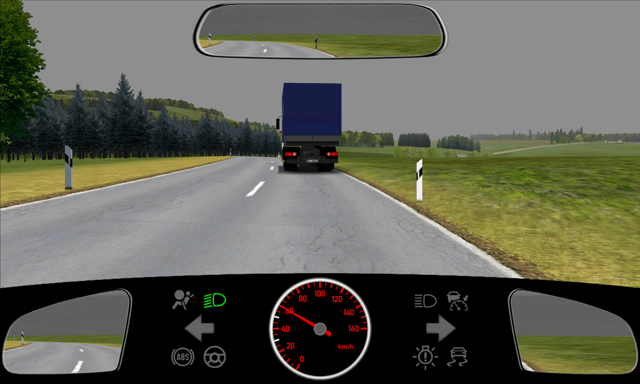

[Video: videos/2_1_11-125.mp4](videos/2_1_11-125.mp4)

**Options:**
- A. The oncoming traffic
- B. The bend in the road
- C. The state of the road surface

**Correct Answer(s):**
- A. The oncoming traffic
- B. The bend in the road

**Explanation:**
A car driver may only overtake if he/she can see that the opposite lane is free. In this situation, the oncoming traffic cannot be seen, so you must not overtake.

---

#### Question 2.1.11-126

**Points:** 4 Points

**You were in a bad mood prior to commencing your journey. What consequences should you avoid when driving?**

**Options:**
- A. Distraction
- B. Aggressiveness
- C. Caution

**Correct Answer(s):**
- A. Distraction
- B. Aggressiveness

**Explanation:**
Anything that could negatively affect your safe driving should be avoided. Besides distractions, this also includes aggressiveness. If you're upset, do not get behind the wheel immediately afterwards.

---

#### Question 2.1.11-127

**Points:** 3 Points

**Which is the stamp of a responsible driver?**

**Options:**
- A. He anticipates the mistakes of other road users
- B. He avoids driving when tired
- C. He is assertive towards other road traffic

**Correct Answer(s):**
- A. He anticipates the mistakes of other road users
- B. He avoids driving when tired

**Explanation:**
A responsible car driver expects mistakes from other road users and does not sit behind the wheel while he/she is very tired or cannot control his/her feelings. Furthermore, he/she does not always insist on his right and cannot be distracted.

---

#### Question 2.1.11-128

**Points:** 4 Points

**What emotions can influence driving behaviour?**

**Options:**
- A. Happiness and exuberance
- B. Worry and sorrow
- C. Anger and rage

**Correct Answer(s):**
- A. Happiness and exuberance
- B. Worry and sorrow
- C. Anger and rage

**Explanation:**
Strong emotions such as anger, fear and sadness as well as joy and exuberance usually influence the driving behavior. They distract the car driver from the road and often lead to risky, aggressive or over-cautious driving. Only when you're calm and balanced you should participate in traffic.

---

#### Question 2.1.11-129

**Points:** 4 Points

**What indications mean you should interrupt your journey?**

**Options:**
- A. Yawning frequently
- B. Difficulty keeping your eyes open
- C. Difficulties staying in lane

**Correct Answer(s):**
- A. Yawning frequently
- B. Difficulty keeping your eyes open
- C. Difficulties staying in lane

**Explanation:**
Brief microsleep often causes devastating accidents. If you have to yawn frequently, can barely keep your eyes open, or have trouble keeping your lane, you should stop your journey and take a rest.

---

#### Question 2.1.11-130

**Points:** 4 Points

**Your passenger wants to discuss something with you during the journey. What should you do?**

**Options:**
- A. - my driving
- B. - the discussion

**Correct Answer(s):**
- A. - my driving

**Explanation:**
You should not be distracted while driving. If your passenger wants to discuss with you, you should stop the journey.

---

#### Question 2.1.11-131

**Points:** 4 Points

**During the journey your passenger informs you that you are repeatedly tailgating. What should you do?**

**Options:**
- A. I take the passenger’s comments seriously
- B. I maintain a greater distance
- C. I ignore the passenger’s comments

**Correct Answer(s):**
- A. I take the passenger’s comments seriously
- B. I maintain a greater distance

**Explanation:**
You should take the safety advice of passengers seriously. Keep a larger distance. Within built-up areas, the distance to the vehicle in front should be at least three car lengths or approx. 15 m. Outside built-up areas, you should follow the "two-second rule of thumb".

---

#### Question 2.1.11-132

**Points:** 4 Points

**At a red light in a built-up area, another driver apparently wants to provoke you into a street race. What should you do?**

**Options:**
- A. I totally ignore this behaviour
- B. I accept the challenge, but without exceeding 50 km/h
- C. I get out and confront the driver

**Correct Answer(s):**
- A. I totally ignore this behaviour

**Explanation:**
Don't be provoked and stay calm. Since road races are strictly prohibited, you should not pay attention to this behavior.

---

#### Question 2.1.11-133

**Points:** 4 Points

**What frequently causes young people to have “disco accidents”?**

**Options:**
- A. A lack of experience driving after dark
- B. Little experience with fully occupied vehicles
- C. A distraction caused by passengers

**Correct Answer(s):**
- A. A lack of experience driving after dark
- B. Little experience with fully occupied vehicles
- C. A distraction caused by passengers

**Explanation:**
Young drivers in particular have less experience driving at night with crowded vehicles. In addition, the risk of accidents increases due to distracting passengers.

---

#### Question 2.1.11-201

**Points:** 4 Points

**At a red light in a built-up area, another driver apparently wants to provoke you into a street race. What should you do?**

**Options:**
- A. I totally ignore this behaviour
- B. I accept the challenge, but without exceeding 50 km/h
- C. I get out and confront the driver

**Correct Answer(s):**
- A. I totally ignore this behaviour

**Explanation:**
Racing will increase your risk of accidents and put people at risk. You should ignore such behaviors

---

## Theme 2.2. Behaviour In Traffic

### 2.2.02 Chapter Road Use

#### Question 2.2.02-001

**Points:** 3 Points

**You are driving on a road with one lane in each direction and want to turn left. Where should you position yourself?**

**Options:**
- A. - towards the centre of the roadway
- B. - on the right-hand edge of the roadway

**Correct Answer(s):**
- A. - towards the centre of the roadway

**Explanation:**
When turning left in this situation, go towards the center of the road (which is the left side of your lane)

---

#### Question 2.2.02-002

**Points:** 3 Points

**Are you allowed to use your motorized bicycle on the pavement?**

**Options:**
- A. Yes, if the motorized bicycle is cautiously pushed
- B. Yes, if the motorized bicycle is used as a bicycle
- C. Yes, also using the engine when traffic on the roadway is too dense

**Correct Answer(s):**
- A. Yes, if the motorized bicycle is cautiously pushed

**Explanation:**
Yes but only if you push it, you cannot ride on the pavement

---

#### Question 2.2.02-003

**Points:** 3 Points

**Several cars are waiting in the right-hand lane at a "red" traffic light. Are you allowed to pass the cars cautiously on the right?**

**Options:**
- A. Yes, provided there is adequate space on the roadway
- B. Yes, provided you use the pavement
- C. No, you must always wait behind the last car

**Correct Answer(s):**
- A. Yes, provided there is adequate space on the roadway

**Explanation:**
In this case you can behave similarly to a bicycle and can pass the car on the right if there is enough space

---

#### Question 2.2.02-006

**Points:** 3 Points

**You are driving on a road outside a built-up area with three lanes marked in each direction. Individual slower vehicles are travelling well spaced out in the right-hand lane. Which lane may you use continuously?**

**Options:**
- A. The middle lane
- B. The left-hand lane

**Correct Answer(s):**
- A. The middle lane

**Explanation:**
The left-hand lane may only be used by a car driver for the temporary overtaking of other vehicles. Continuous driving on the middle lane is permitted, however, if the road is located outside built-up areas and provided with a line marking. This also applies if only a few vehicles are on the right lane.

---

#### Question 2.2.02-007

**Points:** 4 Points

**What risks could arise if you drive in the right-hand lane alongside a truck?**

**Options:**
- A. - be overlooked by the driver of the truck
- B. - be overlooked by other road users
- C. - overlook other road users

**Correct Answer(s):**
- A. - be overlooked by the driver of the truck
- B. - be overlooked by other road users
- C. - overlook other road users

**Explanation:**
A truck will diminish both your visibility and other people on the road seeing you (including the driver of the truck)

---

#### Question 2.2.02-008

**Points:** 3 Points

**What applies to you at the next junction?**

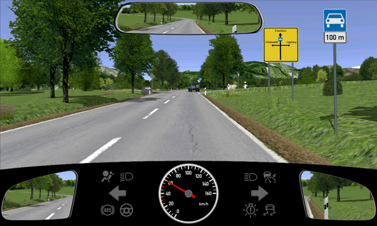

**Options:**
- A. - turn left
- B. - turn right
- C. - drive straight ahead

**Correct Answer(s):**
- A. - turn left
- B. - turn right

**Explanation:**
Coming soon...

---

#### Question 2.2.02-009-M

**Points:** 3 Points

**You would like to turn right. What is the right course of action now?**

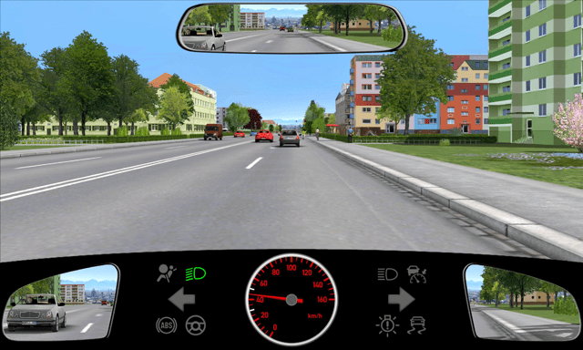

[Video: videos/2_2_02-009-M.mp4](videos/2_2_02-009-M.mp4)

**Options:**
- A. I remain behind the [blue car]
- B. I drive up to the stop line
- C. I drive up to the line of sight

**Correct Answer(s):**
- A. I remain behind the [blue car]

**Explanation:**
A motorcycle should behave similarly to a car and wait behind the blue car.

---

#### Question 2.2.02-010

**Points:** 3 Points

**What cycle paths may you use to drive your moped?**

**Options:**
- A. Cycle paths outside of a built-up area
- B. Cycle paths within a built-up area, if this is permitted by an additional sign
- C. Cycle paths within a built-up area, if there is too much traffic on the road

**Correct Answer(s):**
- A. Cycle paths outside of a built-up area
- B. Cycle paths within a built-up area, if this is permitted by an additional sign

**Explanation:**
You may ride your moped on cycle paths outside built-up areas and on cycle paths inside built-up areas if an additional sign permits this.

---

#### Question 2.2.02-101-M

**Points:** 3 Points

**What is the correct course of action on this one-way road?**

**Options:**
- A. I wait until the works enable me to drive past
- B. I turn around and drive back
- C. I reverse back up the road

**Correct Answer(s):**
- A. I wait until the works enable me to drive past

**Explanation:**
You only drive on when the work allows it. In a one-way street, you are only allowed to drive in one direction. You are not allowed to turn around or reverse. You are responsible for any accident that may occur.

---

#### Question 2.2.02-201

**Points:** 2 Points

**For which motor vehicles or combination vehicles designated or used for road haulage purposes, is it necessary to pay a user charge on federal highways?**

**Options:**
- A. For motor vehicles with a gross vehicle weight rating of at least 7.5 t
- B. For combination vehicles with a gross vehicle weight rating of at least 7.5 t
- C. For combination vehicles with a gross vehicle weight rating less than 7.5 t

**Correct Answer(s):**
- A. For motor vehicles with a gross vehicle weight rating of at least 7.5 t
- B. For combination vehicles with a gross vehicle weight rating of at least 7.5 t

**Explanation:**
For motor vehicles with a maximum authorized mass of at least 7.5 t and combinations of vehicles with a maximum authorized mass of at least 7.5 tons must be paid a usage fee (toll).

---

#### Question 2.2.02-202

**Points:** 2 Points

**What motor vehicles and combination vehicles are subject to a toll charge on motorways and federal highways?**

**Options:**
- A. - are used in road haulage operations
- B. - have a gross vehicle weight rating of at least 7.5 t
- C. - have at least 4 seats

**Correct Answer(s):**
- A. - are used in road haulage operations
- B. - have a gross vehicle weight rating of at least 7.5 t

**Explanation:**
Motor vehicles and vehicle combinations to a maximum authorized mass of at least 7.5 t have, are toll roads. The same applies to vehicles that are used for freight transport.

---

#### Question 2.2.02-203

**Points:** 3 Points

**You are transporting hazardous goods during winter. What should you do if road conditions deteriorate due to packed snow?**

**Options:**
- A. - ensure that no-one else is endangered
- B. - look for the next suitable place to stop and park, if necessary
- C. - always transport hazardous goods to the destination with no intermediate stops

**Correct Answer(s):**
- A. - ensure that no-one else is endangered
- B. - look for the next suitable place to stop and park, if necessary

**Explanation:**
In icy weather, you must take special care to avoid endangering others. If you reach a point where you can no longer guarantee that others will not be endangered, you should find a good place to park.

---

#### Question 2.2.02-302

**Points:** 3 Points

**You are driving an agricultural tractor at 30 km/h on a main road with a paved hard shoulder on the right. What is the right thing to do?**

**Options:**
- A. I have to drive on the hard shoulder when possible
- B. I may only use the hard shoulder for stopping
- C. I may only use the hard shoulder briefly to allow vehicles to overtake

**Correct Answer(s):**
- A. I have to drive on the hard shoulder when possible

**Explanation:**
In order to continue to ensure the flow of traffic, please go possible on the shoulder of your agricultural tractor.

---

#### Question 2.2.02-303

**Points:** 4 Points

**What risks could arise if you drive in the right-hand lane alongside a truck?**

**Options:**
- A. - be unseen
- B. - overlook other road users
- C. - get burned by the hot exhaust fumes from the truck

**Correct Answer(s):**
- A. - be unseen
- B. - overlook other road users

**Explanation:**
A truck will diminish both your visibility and other people on the road seeing you (including the driver of the truck)

---

### 2.2.03 Chapter Speed

#### Question 2.2.03-001

**Points:** 3 Points

**A large pool of water has formed on the roadway. What do you do?**

**Options:**
- A. Drive slowly, keeping your feet on the footrests
- B. Do not brake, drive through the pool with your legs raised
- C. Drive along the pavement

**Correct Answer(s):**
- A. Drive slowly, keeping your feet on the footrests

**Explanation:**
You should drive slowly on large pools of water as there is a risk of aquaplaning.

---

#### Question 2.2.03-002

**Points:** 3 Points

**What is the maximum speed a motorized bicycle (not a light motorized bicycle) may travel?**

**Options:**

**Correct Answer(s):**
- 25 

**Explanation:**
The maximum speed of a motorized bicycle is 25km/h and 20km/h for a light motorized bicycle

---

#### Question 2.2.03-005

**Points:** 4 Points

**You are driving in fog on the autobahn and have 50 m visibility. What is the maximum speed you may drive?**

**Options:**
- A. 50 km/h
- B. 70 km/h
- C. 90 km/h

**Correct Answer(s):**
- A. 50 km/h

**Explanation:**
If the visibility in fog is less than 50 meters, the driver must not drive faster than 50 km/h. This also applies when there's snowfall or heavy rain.

---

#### Question 2.2.03-006

**Points:** 3 Points

**You are travelling at 100 km/h, have a reaction time of 1 second, and brake normally. What is the stopping distance according to the rule of thumb?**

**Options:**

**Correct Answer(s):**
- 130 

**Explanation:**
The stopping distance during normal braking consists of the addition of reaction distance ((speed: 10) x 3) and braking distance (speed: 10) x (speed: 10). Stopping distance = reaction path + braking distance. At a speed of 100 km/h, the stopping distance is 130 meters. "

---

#### Question 2.2.03-007

**Points:** 2 Points

**You are travelling at 100 km/h and brake normally. What is the braking distance according to the rule of thumb?**

**Options:**

**Correct Answer(s):**
- 100 

**Explanation:**
Braking distance = (speed/10) x (speed/10)
That means at a speed of 100 km/h, the braking distance is 100 meters.

---

#### Question 2.2.03-008

**Points:** 2 Points

**You are travelling at 100 km/h and have a reaction time of 1 second. What is the reaction distance according to the rule of thumb?**

**Options:**

**Correct Answer(s):**
- 30 

**Explanation:**
Reaction path = (speed/10) x 3
That means at a speed of 100 km/h, the braking distance is 30 meters.

---

#### Question 2.2.03-009

**Points:** 3 Points

**You are travelling at 50 km/h, have a reaction time of 1 second, and brake normally. What is the stopping distance according to the rule of thumb?**

**Options:**

**Correct Answer(s):**
- 40 

**Explanation:**
The stopping distance during normal braking consists of the addition of reaction distance ((speed/10) x 3) and braking distance (speed/10) x (speed/10).
Stopping distance = reaction distance + braking distance.
That means at a speed of 50 km/h, the stopping distance is 40 meters.

---

#### Question 2.2.03-010

**Points:** 2 Points

**You are travelling at 50 km/h and brake normally. What is the braking distance according to the rule of thumb?**

**Options:**

**Correct Answer(s):**
- 25 

**Explanation:**
Braking distance = (speed/10) x (speed/10)
That means that at a speed of 50 km/h, the braking distance is 25 meters.

---

#### Question 2.2.03-011

**Points:** 2 Points

**You are travelling at 50 km/h and have a reaction time of 1 second. What is the reaction distance according to the rule of thumb?**

**Options:**

**Correct Answer(s):**
- 15 

**Explanation:**
Reaction distance = (speed/10) x 3
That means at a speed of 50 km/h, the braking distance is 15 meters.

---

#### Question 2.2.03-012

**Points:** 4 Points

**You are driving on a very narrow road and can see 50 m ahead. What must be your maximum stopping distance?**

**Options:**

**Correct Answer(s):**
- 25 

**Explanation:**
On a narrow street you have to stop within half the visibility, in this case 25m.

---

#### Question 2.2.03-015

**Points:** 4 Points

**What is the rule of thumb when calculating the braking distance for evasive braking on a dry, even and asphalted roadway?**

**Options:**
- A. ({Speed in km/h}/{10} x {Speed in km/h}/{10}) : 2
- B. ({Speed in km/h}/{10} x 5) : 2
- C. ({Speed in km/h}/{10} x 3) : 2

**Correct Answer(s):**
- A. ({Speed in km/h}/{10} x {Speed in km/h}/{10}) : 2

**Explanation:**
The rule of thumb for determining the stopping distance is: thinking distance (speed divided by 10 times 3) plus braking distance (speed divided by 10 times speed divided by 10). At 50 km/h, this is 50 divided by 10 times 3 equals 15 m thinking distance plus 50 divided by 10 times 50 divided by 10 equals 25 m braking distance. The stopping distance is 40 m. In case of emergency braking, this value is halved. That would be 20 m in this example.

---

#### Question 2.2.03-016

**Points:** 4 Points

**You are travelling at 40 km/h. The braking distance for evasive braking is approximately 8 metres. How long is the braking distance at 50 km/h given otherwise the same conditions?**

**Options:**
- A. 12.5 m
- B. 11.0 m
- C. 9.5 m

**Correct Answer(s):**
- A. 12.5 m

**Explanation:**
The normal braking distance of your car is determined by this rule of thumb: Speed ​​divided by 10 times speed divided by 10. To calculate the braking distance during emergency braking, the determined value is halved again (divided by 2). Here there means: 50/10 * 50/10 = 25, divided by 2 = 12.5 meters.

---

#### Question 2.2.03-017

**Points:** 3 Points

**What is the maximum speed you are allowed to drive a truck with a 4.0 t gross vehicle weight rating on roads outside of settlements?**

**Options:**

**Correct Answer(s):**
- 80 

**Explanation:**
When your truck of 4.0 t street legal. Total mass on roads outside built-up areas are for you 80 km / h right.

---

#### Question 2.2.03-018

**Points:** 3 Points

**What is the maximum speed you are allowed to drive a car with trailer on roads outside of built-up areas?**

**Options:**

**Correct Answer(s):**
- 80 

**Explanation:**
If a trailer is carried along with a passenger car, it may be driven outside of built-up areas at a maximum speed of 80 km/h.

---

#### Question 2.2.03-019

**Points:** 3 Points

**What is the maximum speed you are allowed to drive a truck with a 3.0 t gross vehicle weight rating with trailer on roads outside of settlements?**

**Options:**

**Correct Answer(s):**
- 80 

**Explanation:**
If a lorry with a maximum mass of 3.0 tonnes is driven by a trailer, it may be driven outside of built-up areas at a maximum speed of 80 km/h.

---

#### Question 2.2.03-020

**Points:** 3 Points

**What is the maximum speed you are allowed to drive a bus with luggage trailer on main roads?**

**Options:**

**Correct Answer(s):**
- 80 

**Explanation:**
Coming soon...

---

#### Question 2.2.03-021

**Points:** 3 Points

**What is the maximum speed you are allowed to drive a bus limited to 100 km/h on main roads?**

**Options:**

**Correct Answer(s):**
- 80 

**Explanation:**
Coming soon...

---

#### Question 2.2.03-022

**Points:** 3 Points

**What is the maximum speed you are allowed to drive a truck with a 7.5 t gross vehicle weight rating on main roads?**

**Options:**

**Correct Answer(s):**
- 60 

**Explanation:**
Your truck, which over 7.5 t gross. Total mass on a country road en route shall be a maximum of 60 km / h is allowed to drive.

---

#### Question 2.2.03-023

**Points:** 4 Points

**You are driving on a good quality road in good visibility conditions. Within what distance must you be able to stop?**

**Options:**
- A. - the stretch of road visible to me
- B. - half of the stretch of road visible to me
- C. - twice the stretch of road visible to me

**Correct Answer(s):**
- A. - the stretch of road visible to me

**Explanation:**
With good visibility on a developed road, you must be able to stop within the assessable distance. At night, the range of the low beam is considered assessable.

---

#### Question 2.2.03-024

**Points:** 4 Points

**You are driving in darkness on a well-constructed main road, using your dipped headlights. Within what distance must you be able to stop?**

**Options:**
- A. - dipped headlights
- B. - main beam lights
- C. - side lights

**Correct Answer(s):**
- A. - dipped headlights

**Explanation:**
You must be able to stop within the range of the low beam, as the parking light is so weak that it has no illumination visible to you. If you need the range of the high beam to stop, you risk a collision.

---

#### Question 2.2.03-025

**Points:** 3 Points

**You are driving in foggy conditions on the motorway. Your visibility range is less than 50 m. How fast are you allowed to drive?**

**Options:**

**Correct Answer(s):**
- 50 

**Explanation:**
You are only allowed to drive so fast that you can come to a stop within your field of vision. In a normal braking action at a speed of 50 km/h, the stopping distance is 40 meters. Therefore, you must not drive faster than 50 km/h here. 

Stopping distance = reaction distance + braking distance 
[(Speed in km/h : 10) x 3] + [(Speed in km/h : 10) x (Speed in km/h : 10)]

---

#### Question 2.2.03-026-M

**Points:** 3 Points

**What is the maximum speed you are allowed to drive after turning?**

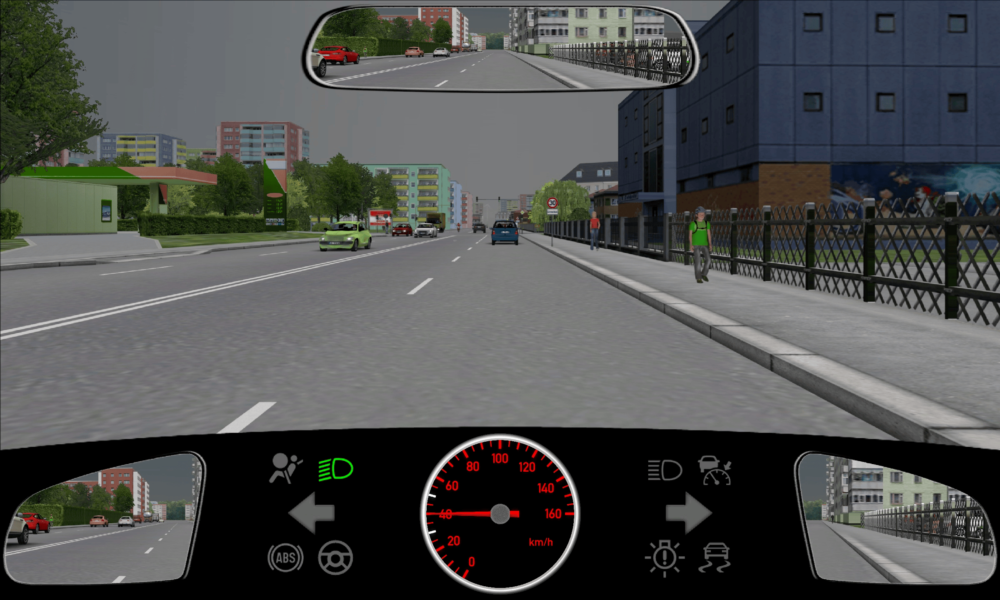

[Video: videos/2_2_03-026-M.mp4](videos/2_2_03-026-M.mp4)

**Options:**

**Correct Answer(s):**
- 50 

**Explanation:**
Unless otherwise indicated, the maximum speed in urban areas is 50 km/h. The 30 km/h of the previous priority road no longer applies here.

---

#### Question 2.2.03-101

**Points:** 3 Points

**What is the maximum speed a motor vehicle fitted with snow chains is allowed to travel?**

**Options:**

**Correct Answer(s):**
- 50 

**Explanation:**
With snow chains, the maximum speed is 50 km/h. If that speed is exceeded, the driving stability is impaired and the road gets damaged.

---

#### Question 2.2.03-104

**Points:** 3 Points

**What is the maximum speed you are allowed to drive a car on roads with one marked lane for each direction outside built-up areas?**

**Options:**

**Correct Answer(s):**
- 100 

**Explanation:**
For vehicles up to 3.5 tonnes of gross vehicle weight and without trailer, the maximum speed limit is 100 km/h.

---

#### Question 2.2.03-105

**Points:** 3 Points

**What is the maximum speed you are allowed to drive a truck with a permissible total mass of 3.0 t on roads with one marked lane for each direction outside built-up areas?**

**Options:**

**Correct Answer(s):**
- 100 

**Explanation:**
For vehicles up to 3.5 tonnes of gross vehicle weight and without trailer, the maximum speed limit is 100 km/h.

---

#### Question 2.2.03-106

**Points:** 3 Points

**What is the maximum speed a truck with a permissible total mass of 3.0 t and trailer may be driven on autobahns?**

**Options:**

**Correct Answer(s):**
- 80 

**Explanation:**
For vehicles up to 3.5 tonnes of gross vehicle weight and without trailer, the maximum speed limit is 80 km/h.

---

#### Question 2.2.03-107

**Points:** 3 Points

**What must you remember particularly when driving with winter tyres (M + S)?**

**Options:**
- A. The maximum permissible speed for these tyres may not be exceeded
- B. You may not drive faster than 80 km/h
- C. The maximum permissible speed for cars fitted with snow chains applies

**Correct Answer(s):**
- A. The maximum permissible speed for these tyres may not be exceeded

**Explanation:**
The car driver must comply with the maximum speed limit when driving with winter tires. The speed depends on the type of winter tires and may exceed 80 km/h.

---

#### Question 2.2.03-108

**Points:** 3 Points

**What is the maximum speed you may drive on a main road in a truck with a gross vehicle weight rating of 5.5 t and a trail with a gross vehicle weight rating of 2 t?**

**Options:**

**Correct Answer(s):**
- 60 

**Explanation:**
With your truck of 5.5 t permissible gross weight and a trailer 2 t you must on a highway highest 60 km / h drive.

---

#### Question 2.2.03-109

**Points:** 3 Points

**You are driving a combination vehicle. This consists of a motor vehicle with up to 3.5 t maximum authorised mass and a trailer without a 100 km/h approval. What is the maximum speed you can travel on the motorway?**

**Options:**

**Correct Answer(s):**
- 80 

**Explanation:**
The maximum speed for vehicle combinations up to 3.5 tonnes gross vehicle weight rating with trailer is 80 km/h outside built-up areas.

---

#### Question 2.2.03-110

**Points:** 3 Points

**You are driving a vehicle combination. It consists of a motor vehicle with a permissible maximum mass of up to 3.5 tonnes and a trailer that is authorised for speeds of up to 100 km/h. What is the maximum speed limit on a federal highway (not an expressway)?**

**Options:**

**Correct Answer(s):**
- 80 

**Explanation:**
The maximum permissible speed on federal roads is 80 km/h. You are only allowed to drive 100 km/h on motorways and designated motorways if your trailer has the necessary approval.

---

#### Question 2.2.03-202

**Points:** 3 Points

**What is the maximum speed you are allowed to drive a truck with a permissible total mass of 4.0 t on autobahns?**

**Options:**

**Correct Answer(s):**
- 80 

**Explanation:**
With your truck of 4.0 t permissible gross weight allowed to you on the highway more than 80 km / h drive.

---

#### Question 2.2.03-205

**Points:** 3 Points

**What is the maximum speed you are allowed to drive a bus in non-regular traffic outside built-up areas (not an autobahn or clearway for motor vehicles only)?**

**Options:**

**Correct Answer(s):**
- 80 

**Explanation:**
Coming soon...

---

#### Question 2.2.03-206

**Points:** 3 Points

**What is the maximum speed you are allowed to drive a "Tempo-100-Bus" with luggage trailer on autobahns?**

**Options:**

**Correct Answer(s):**
- 80 

**Explanation:**
Coming soon...

---

#### Question 2.2.03-208

**Points:** 3 Points

**What is the maximum speed you are allowed to drive a "Tempo-100-Bus" on autobahns?**

**Options:**

**Correct Answer(s):**
- 100 

**Explanation:**
Coming soon...

---

#### Question 2.2.03-209

**Points:** 3 Points

**What is the maximum speed you are allowed to drive a "Tempo-100-Bus" on clearways for motor vehicles only without marked lanes?**

**Options:**

**Correct Answer(s):**
- 80 

**Explanation:**
Coming soon...

---

#### Question 2.2.03-210

**Points:** 3 Points

**What is the maximum speed you are allowed to drive a bus outside built-up areas when there are not enough seats for all passengers?**

**Options:**

**Correct Answer(s):**
- 60 

**Explanation:**
Coming soon...

---

#### Question 2.2.03-301

**Points:** 3 Points

**What is the maximum speed you are allowed to drive a truck with a permissible total mass of 40 t on autobahns?**

**Options:**

**Correct Answer(s):**
- 80 

**Explanation:**
With your truck of 40 t you must go h on the highway 80 km /.

---

#### Question 2.2.03-303

**Points:** 4 Points

**You are driving with dipped headlights on a main road. Within what distance must you be able to stop?**

**Options:**
- A. - dipped headlights
- B. - main beam lights
- C. - side lights

**Correct Answer(s):**
- A. - dipped headlights

**Explanation:**
You are only allowed to drive so fast that you can stop within the assessable track. In this situation, this corresponds to the range of your low beam.

---

#### Question 2.2.03-304

**Points:** 3 Points

**What vehicles are subject to the recommended speed on motorways?**

**Options:**
- A. - cars
- B. - motorbikes
- C. - Trucks with a gross vehicle weight rating in excess of 3.5 t

**Correct Answer(s):**
- A. - cars
- B. - motorbikes

**Explanation:**
On motorways, all cars and vehicles up to a maximum gross vehicle weight of 3.5 t have to observe the freeway speed limit. Exceeding this speed limit is not recommended even in favorable traffic conditions.

---

#### Question 2.2.03-305

**Points:** 3 Points

**On what roads does the recommended speed of 130 km/h apply?**

**Options:**
- A. Motorways
- B. On vehicle roadways not inside a built-up area, with separate carriageways for each direction
- C. On vehicle roadways not inside a built-up area, with at least two marked lanes for each direction

**Correct Answer(s):**
- A. Motorways
- B. On vehicle roadways not inside a built-up area, with separate carriageways for each direction
- C. On vehicle roadways not inside a built-up area, with at least two marked lanes for each direction

**Explanation:**
On freeway and roads outside the city, whose lanes are structurally separated, an advisory speed limit of 130 km/h applies. However, you must keep enough distance to be able to stop any time.

---

### 2.2.04 Chapter Distance

#### Question 2.2.04-001

**Points:** 4 Points

**You are driving at 80 km/h behind a motor vehicle. What is the minimum safe distance you must observe?**

**Options:**
- A. A "distance of 2 seconds"
- B. A "distance of 1 second"
- C. A distance of 15 metres

**Correct Answer(s):**
- A. A "distance of 2 seconds"

**Explanation:**
When driving behind another vehicle, you need to maintain the so-called "two-second distance" to be able to stop in time. At a speed of 80 km/h, this corresponds to about 40 meters.

---

#### Question 2.2.04-002

**Points:** 4 Points

**You are driving in urban traffic on a dry roadway in a stream of traffic travelling at a speed of 50 km/h. What is the minimum safe distance you must keep from the vehicle in front?**

**Options:**
- A. 15 m or approximately 3 car lengths
- B. 10 m or approximately 2 car lengths
- C. 5 m or approximately 1 car length

**Correct Answer(s):**
- A. 15 m or approximately 3 car lengths

**Explanation:**
In urban areas, as well as in city traffic, shorter distances are justified according to jurisdiction than out of town. The general "two-second distance" may be reduced to one second with attentive driving and favorable road conditions. At 50 km/h, this is about 15 meters. That's about three car lengths.

---

#### Question 2.2.04-003

**Points:** 4 Points

**What is the minimum distance that should normally be maintained from the vehicle in front outside built-up areas?**

**Options:**
- A. 1/2 the speedometer reading in metres
- B. 1/5 the speedometer reading in metres

**Correct Answer(s):**
- A. 1/2 the speedometer reading in metres

**Explanation:**
Outside built-up areas, the distance to the vehicle in front must be at least half the mileage in meters, that means at 100 km/h the distance should be about 50 meters. Even the so-called 'two-second distance' was legally recognized.

---

#### Question 2.2.04-004

**Points:** 3 Points

**What is the minimum safety distance you should maintain from the vehicle ahead when driving at a speed of 100 km/h?**

**Options:**

**Correct Answer(s):**
- 50 

**Explanation:**
In order to be able to brake in time, you should keep the safety distance equal to the half of the speed in meters.

---

#### Question 2.2.04-005

**Points:** 4 Points

**When driving outside of a built-up area, what minimum safety distance should you maintain between you and the vehicle ahead?**

**Options:**
- A. One half of the speedometer reading in metres
- B. One third of the speedometer reading in metres
- C. One fifth of the speedometer reading in metres

**Correct Answer(s):**
- A. One half of the speedometer reading in metres

**Explanation:**
Outside of closed towns, the StVO prescribes a safety distance of 2 seconds. This then corresponds again to the "half speedometer" rule of thumb.
Attention: These rules only apply to dry roads. In the case of rain, snow and black ice, the safety distance should be at least twice as large.

---

#### Question 2.2.04-101

**Points:** 4 Points

**You are driving your car and caravan trailer (length of combination of vehicles exceeding 7 m) outside built-up areas on a road with only one marked lane in each direction. What must you remember?**

**Options:**
- A. As a rule, the distance from a car in front must be great enough to allow an overtaking car to pull in
- B. The distance from the car in front must not be greater than the length of your combination of vehicles in order to make best use of traffic space
- C. You may not drive faster than 60 km/h

**Correct Answer(s):**
- A. As a rule, the distance from a car in front must be great enough to allow an overtaking car to pull in

**Explanation:**
Trains which are longer than 7 meters must keep a distance from the vehicle in front outside of built-up areas which has to be at least half the speed in meters. For cars with trailers, a maximum speed of 80 km/h applies outside the city. That would correspond to a distance of 40 m. This way, overtaking vehicles can go back into lane.

---

#### Question 2.2.04-102

**Points:** 3 Points

**When must a car with trailer driving outside built-up areas on roads with only one lane for each direction keep a sufficient distance from the car in front so that an overtaking vehicle may pull in?**

**Options:**

**Correct Answer(s):**
- 7 

**Explanation:**
StVO § 4 Abs.2: "Motor vehicles subject to a special speed restriction and vehicules longer than 7 meters must keep a fixed distance from other vehicles in front of them so they can be overtaken by other passing vehicles. ..) "

---

#### Question 2.2.04-103

**Points:** 3 Points

**You are driving on the motorway in a truck with a gross vehicle weight rating above 3.5 t. Your speed is more than 50 km/h. Why do you have to maintain a minimum distance of 50 m to the vehicle ahead?**

**Options:**
- A. - am reducing the risk of a rear-end collision
- B. - then have more time to respond
- C. - will reach my destination quicker

**Correct Answer(s):**
- A. - am reducing the risk of a rear-end collision
- B. - then have more time to respond

**Explanation:**
If the road users strongly brakes in front of you, you have more time to react and can
thereby reducing the risk of a collision. The minimum distance is not used to be to do with the goal.

---

#### Question 2.2.04-104

**Points:** 3 Points

**Your are driving a coach at a speed in excess of 50 km/h on the motorway. Why do you have to maintain a minimum distance of 50 m to the vehicle ahead?**

**Options:**
- A. - am reducing the risk of a rear-end collision
- B. - then have more time to respond
- C. - will reach my destination quicker

**Correct Answer(s):**
- A. - am reducing the risk of a rear-end collision
- B. - then have more time to respond

**Explanation:**
Coming soon...

---

#### Question 2.2.04-105-M

**Points:** 4 Points

**You are driving a car with a caravan in tow. What is true regarding your distance to the vehicle ahead?**

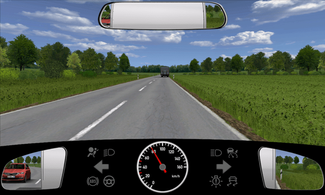

**Options:**
- A. - is appropriate because the overtaking vehicle can pull back into lane in front of me
- B. - to the overtaking vehicle must be re-established once it has pulled back into lane
- C. - is too large because it exceeds the length of my combination vehicle many times over

**Correct Answer(s):**
- A. - is appropriate because the overtaking vehicle can pull back into lane in front of me
- B. - to the overtaking vehicle must be re-established once it has pulled back into lane

**Explanation:**
As a rule, the distance to the vehicle in front must be large enough for the overtaking vehicle to be able to overtake. After the overtaking, the distance to the vehicle in front should be adjusted again, as the distance should not be bigger than your vehicle length.

---

#### Question 2.2.04-106

**Points:** 3 Points

**You are driving a heavily loaded car. Why should you maintain a greater safety distance to the vehicle ahead?**

**Options:**
- A. - the braking distance may be extended
- B. - the handling of the car may vary
- C. - my reaction time may become longer

**Correct Answer(s):**
- A. - the braking distance may be extended
- B. - the handling of the car may vary

**Explanation:**
The additional weight changes the driving characteristics of the car. The brakes are under more load. This can reduce the braking power, which increases the braking distance.

---

#### Question 2.2.04-107

**Points:** 3 Points

**From what length of a vehicle combination must you keep a sufficient distance from the vehicle in front outside the built-up area to allow an overtaking vehicle to file in?**

**Options:**

**Correct Answer(s):**
- 7 

**Explanation:**
If the length of the vehicle combination is more than 7 meters, you must keep a longer distance from the vehicle in front outside built-up areas. This gives overtaking vehicles the opportunity to pull in in front of you.

---

#### Question 2.2.04-204

**Points:** 4 Points

**You are driving a bus outside built-up areas on a road with only one lane for each direction. Which distance must you keep as a rule from a vehicle travelling in front?**

**Options:**
- A. The distance must be sufficient to allow an overtaking vehicle to pull in
- B. The distance must not be greater than 10 m in order to make best use of the traffic space

**Correct Answer(s):**
- A. The distance must be sufficient to allow an overtaking vehicle to pull in

**Explanation:**
Coming soon...

---

#### Question 2.2.04-205

**Points:** 3 Points

**You are driving at approximately 80 km/h on the autobahn. Which distance must you keep from the vehicle travelling in front?**

**Options:**

**Correct Answer(s):**
- 50 

**Explanation:**
Coming soon...

---

#### Question 2.2.04-207-M

**Points:** 4 Points

**What is true here regarding the distance between you and the vehicle ahead?**

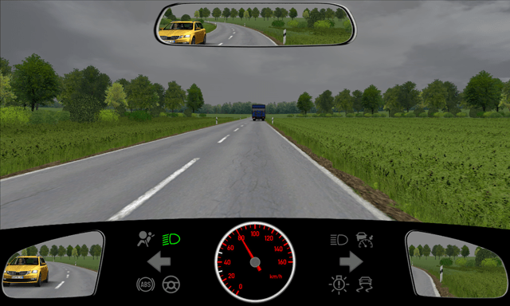

**Options:**
- A. - truck is reasonable because the [yellow] car could pull back into the lane in front of me
- B. - [yellow] car must be restored once it has pulled back into lane
- C. - truck to too large, because it exceeds the length of my bus multiple times over

**Correct Answer(s):**
- A. - truck is reasonable because the [yellow] car could pull back into the lane in front of me
- B. - [yellow] car must be restored once it has pulled back into lane

**Explanation:**
The distance is appropriate because the overtaking car can insert in front of you. As soon as the overtaking car is freezing in front of you, you have to make a sufficient distance from it.

---

#### Question 2.2.04-302

**Points:** 3 Points

**You are driving a vehicle with a gross vehicle weight rating of 7 t at 60 km/h outside of a built-up area. When do you have to maintain such a great distance, that an overtaking vehicle can pull back into lane?**

**Options:**
- A. If there is only one lane in my direction of travel
- B. If overtaking is prohibited
- C. If there is more than one lane in my direction of travel

**Correct Answer(s):**
- A. If there is only one lane in my direction of travel

**Explanation:**
If only one lane is available in your direction, you should keep a distance so great that an overtaking vehicle may cut.

---

#### Question 2.2.04-303

**Points:** 4 Points

**You are driving a truck (12 t gross vehicle weight rating) at 80 km/h on a motorway. What must you ensure?**

**Options:**
- A. - the distance between me and the vehicle ahead is at least 50 m
- B. - the speed of my vehicle does not increase
- C. - the distance between me and the vehicle ahead equal half the speedometer reading in metres

**Correct Answer(s):**
- A. - the distance between me and the vehicle ahead is at least 50 m
- B. - the speed of my vehicle does not increase

**Explanation:**
With your truck (12 t permissible total weight) should be at a speed on the highway at 80 km / h, the minimum distance is 50 m. Please make sure also that the rate does not increase your vehicle.

---

#### Question 2.2.04-304

**Points:** 3 Points

**A road outside of a built-up area has just one lane in the direction of travel. Which trucks have to maintain such a great distance between them and the vehicle ahead, that an overtaking vehicle can pull back into lane?**

**Options:**

**Correct Answer(s):**
- 3,5 

**Explanation:**
Trucks over 3.5 t permissible mass should have such a large distance from the preceding vehicle, an overtaking vehicle that can Reeve.

---

#### Question 2.2.04-305

**Points:** 3 Points

**You are driving on a motorway at 60 km/h in a truck with a 4 t gross vehicle weight rating. What distance must you maintain to the vehicle ahead?**

**Options:**

**Correct Answer(s):**
- 50 

**Explanation:**
At least 50 m you should adhere to when you pass a vehicle that is of 4 t maximum permissible weight on a highway at 60 km / h run.

---

#### Question 2.2.04-306

**Points:** 3 Points

**Which vehicles have to maintain such a great distance between them and the vehicle ahead when not inside a built-up area, that an overtaking vehicle can pull back into lane?**

**Options:**
- A. Trucks with a gross vehicle weight rating in excess of 3.5 t
- B. Combination vehicles longer than 7 m
- C. Trucks with a gross vehicle weight rating up to 3.5 t

**Correct Answer(s):**
- A. Trucks with a gross vehicle weight rating in excess of 3.5 t
- B. Combination vehicles longer than 7 m

**Explanation:**
Here we speak of the so-called Einscherabstand. This is true for trucks of over 3.5t maximum permissible weight and vehicle combinations which are more than 7 m. In a motor vehicle up to 3.5 tons, this is not necessary outside urban areas generally.

---

#### Question 2.2.04-307

**Points:** 4 Points

**You are driving in a combination vehicle outside of a built-up area on a road with only one lane in each direction. What distance must you usually maintain to the vehicle ahead?**

**Options:**
- A. - must be large enough that an overtaking vehicle can pull back into lane
- B. - may not be greater than 10 m, in order that the traffic space can be optimally used
- C. - must be large enough that at least two overtaking vehicles can pull back into lane

**Correct Answer(s):**
- A. - must be large enough that an overtaking vehicle can pull back into lane

**Explanation:**
Must be so great the distance that you should observe that an overtaking vehicle may Reeve.

---

### 2.2.05 Chapter Overtaking

#### Question 2.2.05-005

**Points:** 5 Points

**You are driving at 100 km/h on a road not inside a built-up area. In front of you a truck is travelling at 70 km/h. What is the minimum distance you must be from a crest in the road when commencing an overtaking manoeuvre?**

**Options:**
- A. 800 m
- B. 200 m
- C. 400 m

**Correct Answer(s):**
- A. 800 m

**Explanation:**
The rule of thumb for the overtaking path is calculated from the speeds, the overtaking time and the vehicle lengths. The formula is s = v1 / (v1−v2) * (l1+l2+sv+sh). V1/ (V1-V2)) times L. V1 =100 km/h, V2 = 70 km/h, L = 2 times 50 m safety distance plus the vehicle lengths. Truck 12.5 m plus car 4.5 m = 17 m. L = 117 m. 100 km/h divided by 30 km/h times 117 m = 389.9 m, that means 400 m overtaking path. In confusing areas this has to be doubled. You must be at least 800 meters from the crest of the road.

---

#### Question 2.2.05-006

**Points:** 4 Points

**Fog is limiting visibility to just about 50 m. What applies in this situation for vehicles with a gross vehicle weight rating over 7.5 t?**

**Options:**
- A. Overtaking is prohibited on roads outside of built-up areas
- B. The permissible maximum speed on all roads is 50 km/h
- C. Overtaking is permitted on motorways

**Correct Answer(s):**
- A. Overtaking is prohibited on roads outside of built-up areas
- B. The permissible maximum speed on all roads is 50 km/h

**Explanation:**
With limited view your maximum speed must not be higher than 50 h km / on all roads. Outside built overtaking is forbidden for you. Adapt your driving style to the conditions (fog).

---

#### Question 2.2.05-007

**Points:** 4 Points

**You are driving on a road not within a built-up area and want to overtake a car. Where is the very latest point at which the overtaking manoeuvre should be completed?**

**Options:**
- A. Before the start of a solid line (traffic lane boundary)
- B. Before a no-overtaking sign for vehicles of all types
- C. Before the start of a lane marking

**Correct Answer(s):**
- A. Before the start of a solid line (traffic lane boundary)
- B. Before a no-overtaking sign for vehicles of all types

**Explanation:**
You must finish the overtaking process at the latest before the restriction on overtaking. The restriction on overtaking is indicated by either a traffic sign or a solid line. While you are not allowed to drive over the solid line, you may drive over a broken line in order to overtake.

---

#### Question 2.2.05-010

**Points:** 4 Points

**For what reason do you have to switch to the right-hand lane now?**

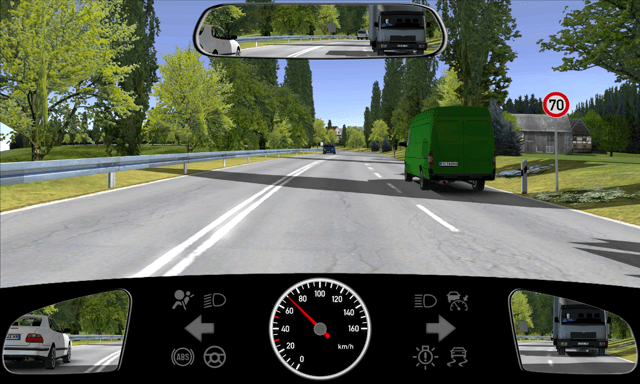

[Video: videos/2_2_05-010.mp4](videos/2_2_05-010.mp4)

**Options:**
- A. Because of the rule on using the right-hand lane unless overtaking etc
- B. Because of the red car
- C. Because of the tractor

**Correct Answer(s):**
- A. Because of the rule on using the right-hand lane unless overtaking etc
- B. Because of the red car

**Explanation:**
After you have overtaken the green van, you have to merge right again due to the obligation to drive on the right-hand side. But even the red car, which meets you on your lane, has to get back on the right lane again.

---

#### Question 2.2.05-011

**Points:** 5 Points

**What is the right thing to do in this situation?**

[Video: videos/2_2_05-011.mp4](videos/2_2_05-011.mp4)

**Options:**
- A. I cease the overtaking manoeuvre and move into the right-hand lane
- B. I accelerate and continue the overtaking manoeuvre
- C. I continue the overtaking manoeuvre at an unchanged speed

**Correct Answer(s):**
- A. I cease the overtaking manoeuvre and move into the right-hand lane

**Explanation:**
You may drive on the lane of the oncoming traffic if you intend to overtake. To overtake, you must increase your speed above the allowed 130 km/h, which is not permitted in this situation. You must cancel the overtaking procedure and get into the right lane.

---

#### Question 2.2.05-012

**Points:** 5 Points

**What must you be prepared for now?**

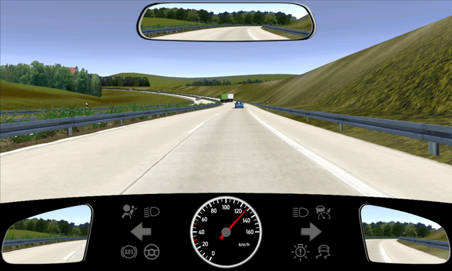

[Video: videos/2_2_05-012.mp4](videos/2_2_05-012.mp4)

**Options:**
- A. - blue car begins overtaking
- B. - overtaking manoeuvre of the green truck takes longer to complete
- C. - white truck accelerates

**Correct Answer(s):**
- A. - blue car begins overtaking
- B. - overtaking manoeuvre of the green truck takes longer to complete

**Explanation:**
You may have to be prepared for the fact that you cannot overtake now because the other road users are already involved in overtaking maneuvers. Do not act with precipitation just to complete the overtaking maneuver on the permissible route. A solid line represents a restriction on overtaking and is equivalent to the road sign "No overtaking".

---

#### Question 2.2.05-013

**Points:** 5 Points

**To whom must you pay particularly close attention in this situation?**

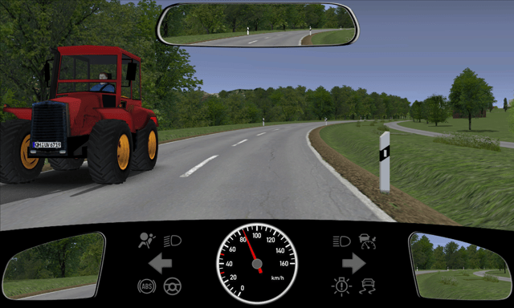

[Video: videos/2_2_05-013.mp4](videos/2_2_05-013.mp4)

**Options:**
- A. - cyclist
- B. - red car
- C. - white truck

**Correct Answer(s):**
- A. - cyclist

**Explanation:**
In this situation, as a car driver you have to pay attention to the cyclist who approaches you from the right. The cyclist could drive onto the road in front of the truck, causing a dangerous situation.

---

#### Question 2.2.05-014-M

**Points:** 4 Points

**Why do you have to slow down here?**

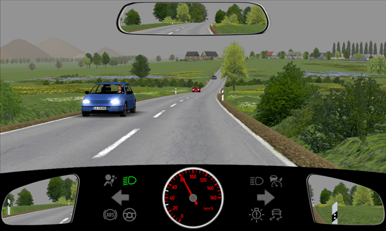

[Video: videos/2_2_05-014-M.mp4](videos/2_2_05-014-M.mp4)

**Options:**
- A. - motorbike
- B. - tractor
- C. - SUV

**Correct Answer(s):**
- A. - motorbike

**Explanation:**
The overtaking motorcyclist represents a danger to you. He will meet you in your lane during his overtaking process. You should delay and avoid a collision. The behavior of the other drivers is traffic compliant.

---

#### Question 2.2.05-015

**Points:** 4 Points

**You are driving a truck with a gross vehicle weight rating in excess of 3.5 t. What should you do now?**

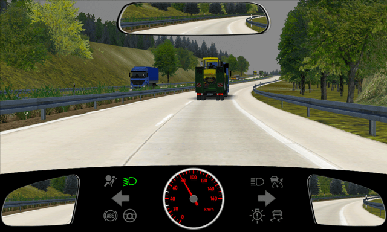

[Video: videos/2_2_05-015.mp4](videos/2_2_05-015.mp4)

**Options:**
- A. I refrain from overtaking
- B. I reduce my speed
- C. I accelerate

**Correct Answer(s):**
- A. I refrain from overtaking
- B. I reduce my speed

**Explanation:**
You should keep to the correct distance and not overtake and reduce the speed.

---

#### Question 2.2.05-016-M

**Points:** 3 Points

**You want to overtake. What should you do now?**

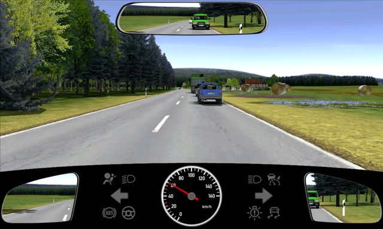

[Video: videos/2_2_05-016-M.mp4](videos/2_2_05-016-M.mp4)

**Options:**
- A. I do not overtake yet, because the [blue car] could overtake
- B. I follow right behind the [blue car] if it overtakes
- C. I overtake all the vehicles in one overtaking manoeuvre

**Correct Answer(s):**
- A. I do not overtake yet, because the [blue car] could overtake

**Explanation:**
You must wait with overtaking until the driver driving in front of you has finished overtaking. A solid line and the no overtaking sign indicate a restriction on overtaking. A broken line (guideline), however, means that overtaking is not prohibited.

---

#### Question 2.2.05-017

**Points:** 3 Points

**What is the right course of action now?**

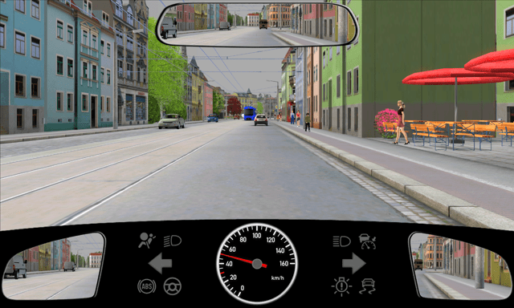

[Video: videos/2_2_05-017.mp4](videos/2_2_05-017.mp4)

**Options:**
- A. - do not overtake the tram
- B. - overtake the tram on the right
- C. - overtake the tram on the left

**Correct Answer(s):**
- A. - do not overtake the tram

**Explanation:**
Plan your overtaking maneuver in a way so that it is completed before the solid line begins. A solid line as well as the corresponding traffic sign indicate that you are not allowed to overtake here.

---

#### Question 2.2.05-018

**Points:** 4 Points

**You want to overtake a truck with a trailer. What must you be aware of when doing so?**

**Options:**
- A. The necessary overtaking distance is significantly increased due to the trailer
- B. The external bodywork of the truck-trailer combination may conceal vehicles ahead
- C. You may only pull out to overtake once you are directly behind the truck-trailer combination

**Correct Answer(s):**
- A. The necessary overtaking distance is significantly increased due to the trailer
- B. The external bodywork of the truck-trailer combination may conceal vehicles ahead

**Explanation:**
If you want to overtake a truck with a trailer, you should take into account the overtaking distance required because of the trailer (it is longer) and that the vehicle outline of the truck might obscure vehicles ahead.

---

#### Question 2.2.05-019

**Points:** 5 Points

**Why are you not permitted to now overtake the bus driving ahead of you?**

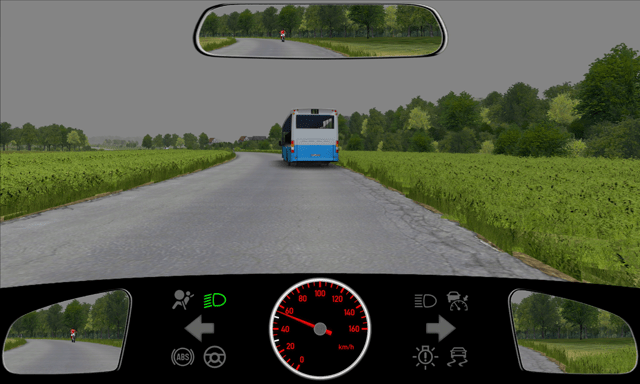

[Video: videos/2_2_05-019.mp4](videos/2_2_05-019.mp4)

**Options:**
- A. Because the hazard lights of the bus are switched on
- B. Because of the motorbike
- C. Because of the lack of road markings

**Correct Answer(s):**
- A. Because the hazard lights of the bus are switched on
- B. Because of the motorbike

**Explanation:**
The bus has turned on the warning lights and is still driving to the bus stop. In this case, it is not allowed to overtake the bus. In addition, the motorbike behind you has started to overtake.

---

#### Question 2.2.05-020-M

**Points:** 3 Points

**You want to overtake the vehicle driving up ahead of you. What is necessary to allow you to do so?**

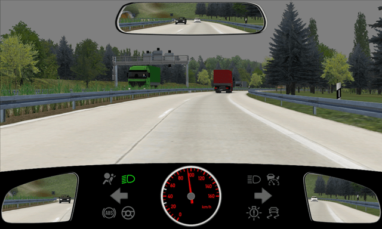

[Video: videos/2_2_05-020-M.mp4](videos/2_2_05-020-M.mp4)

**Options:**
- A. - considerably increase my speed
- B. - use my indicator to signal my intention to overtake
- C. - observe the traffic to the rear and side of me

**Correct Answer(s):**
- A. - considerably increase my speed
- B. - use my indicator to signal my intention to overtake
- C. - observe the traffic to the rear and side of me

**Explanation:**
Show other road users in good time that you will move onto the left or medium lane. Each overtaking must be displayed by flashing. After you have observed the rear and side traffic and could make sure that the left lane is free, the indicator must be pressed. Then you can change the lane and overtake the slower vehicle at a much increased speed.
Just make sure that you do not exceed the permissible maximum speed.

---

#### Question 2.2.05-021-M

**Points:** 4 Points

**What is the right course of action now?**

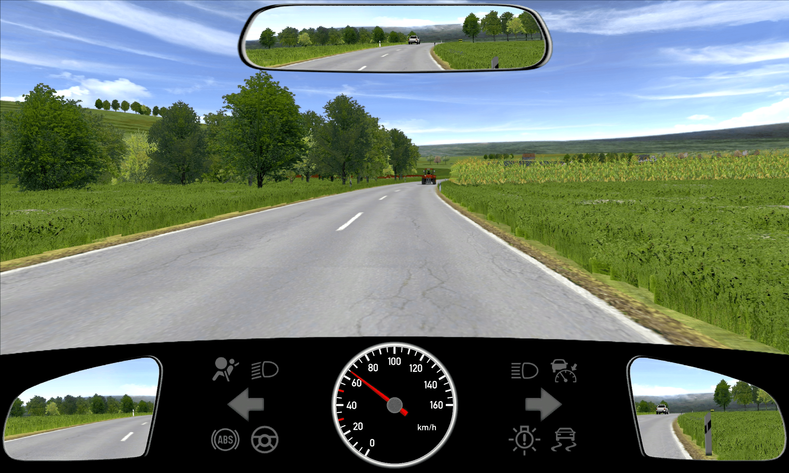

[Video: videos/2_2_05-021-M.mp4](videos/2_2_05-021-M.mp4)

**Options:**
- A. I remain behind the tractor
- B. I anticipate that the tractor may turn off the road
- C. I comply with the tractor driver’s indicator-based prompt to overtake

**Correct Answer(s):**
- A. I remain behind the tractor
- B. I anticipate that the tractor may turn off the road

**Explanation:**
The tractor seems to want to turn onto the dirt track on the right. Stay behind the tractor and wait until it has turned off. Overtaking it is dangerous because the implement installed at the rear could swerve.

---

#### Question 2.2.05-102-M

**Points:** 5 Points

**You want to overtake [the blue car]. What is the right course of action?**

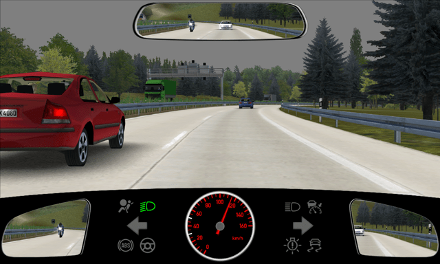

[Video: videos/2_2_05-102-M.mp4](videos/2_2_05-102-M.mp4)

**Options:**
- A. - overtake at a substantially higher speed
- B. - overtake while maintaining the speed driven
- C. - do not overtake, because a motorbike is in moving in the blind spot

**Correct Answer(s):**
- A. - overtake at a substantially higher speed

**Explanation:**
Wait for the bike to leave the blind spot. Note that the car driver who is overtaking has to drive at a higher speed than the driver who is being overtaken. Accelerate if necessary and finish your overtaking process before the restriction on overtaking takes effect, such as a solid line.

---

#### Question 2.2.05-103-M

**Points:** 4 Points

**What could make this situation become hazardous?**

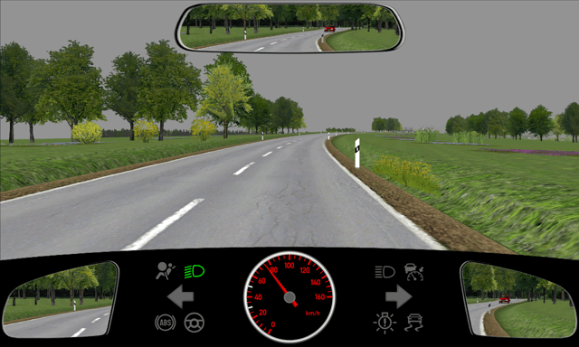

[Video: videos/2_2_05-103-M.mp4](videos/2_2_05-103-M.mp4)

**Options:**
- A. Oncoming traffic
- B. The [red car]
- C. The tractor

**Correct Answer(s):**
- A. Oncoming traffic
- B. The [red car]

**Explanation:**
The car driver approaching from behind tries to overtake you before the turn, although he/she cannot see the curve. If traffic is approaching in this situation, it can lead to dangerous evasive maneuvers by the oncoming traffic and the driver who is overtaking. The tractor next to the road is no danger.

---

#### Question 2.2.05-104

**Points:** 4 Points

**You are driving on the motorway in a motor vehicle with a gross vehicle weight rating in excess of 7.5 t. The heavy snowfall has reduced visibility to less than 50 m. What must you do?**

**Options:**
- A. I may not use the extreme left-hand lane
- B. I may not drive faster than 50 km/h
- C. I must leave the motorway at the next exit

**Correct Answer(s):**
- A. I may not use the extreme left-hand lane
- B. I may not drive faster than 50 km/h

**Explanation:**
With your vehicle that exceeds a maximum permissible gross weight of 7.5 t, you are not allowed on the leftmost lane driving, because this is there for overtaking for faster cars. You can not with your vehicle faster than 50 km / h drive. You can continue to drive on the highway even with snowfall.

---

#### Question 2.2.05-202

**Points:** 4 Points

**You are driving outside built-up areas. Visibility is reduced to just about 50 m due to heavy rain. What applies in this situation?**

**Options:**
- A. Overtaking is prohibited for motor vehicles with a permissible total mass exceeding 7.5 t
- B. The maximum permissible speed is 50 km/h
- C. The rear fog lamp must be switched on

**Correct Answer(s):**
- A. Overtaking is prohibited for motor vehicles with a permissible total mass exceeding 7.5 t
- B. The maximum permissible speed is 50 km/h

**Explanation:**
Here, too (50 m due to heavy rain) applies in reduced visibility is the speed limit 50 km / h. Motor vehicles above 7.5 t street legal. Total mass is prohibited overtaking. The rear fog light does not have to be switched on.

---

#### Question 2.2.05-401

**Points:** 3 Points

**You are driving an agricultural machine. A queue of cars has formed behind you. What is correct?**

**Options:**
- A. Reduce speed at an appropriate place or wait in order to let the cars following you overtake
- B. Switch on the hazard warning lights to show that overtaking is not possible
- C. Agricultural machines are not required to let faster vehicles overtake

**Correct Answer(s):**
- A. Reduce speed at an appropriate place or wait in order to let the cars following you overtake

**Explanation:**
Coming soon...

---

#### Question 2.2.05-402-M

**Points:** 3 Points

**What should you do now?**

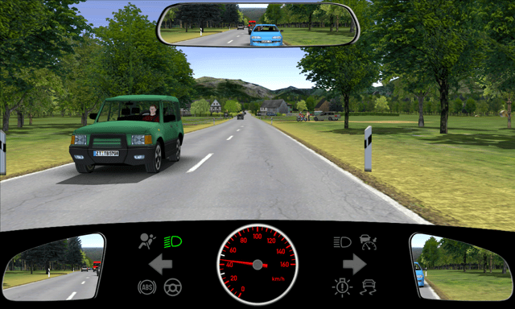

[Video: videos/2_2_05-402-M.mp4](videos/2_2_05-402-M.mp4)

**Options:**
- A. I pull into the bus stop on the right, and stop there
- B. I increase my speed
- C. I maintain my speed and continue driving

**Correct Answer(s):**
- A. I pull into the bus stop on the right, and stop there

**Explanation:**
In this situation, you should pull into the bus stop and let the car behind overtake you

---

### 2.2.06 Chapter Use Of Lanes By Motor Vehicles

#### Question 2.2.06-001

**Points:** 4 Points

**What is the right course of action now?**

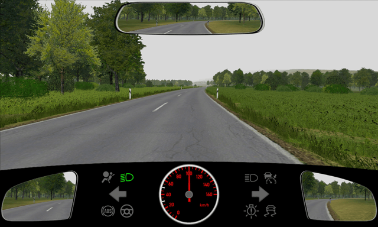

[Video: videos/2_2_06-001.mp4](videos/2_2_06-001.mp4)

**Options:**
- A. I stop and wait ahead of the constricted point until the oncoming car has passed through
- B. I pass through the constricted point by carefully driving between the oncoming car and the construction site barrier
- C. I signal to the driver of the oncoming car that he should drive closer to the edge of the roadway

**Correct Answer(s):**
- A. I stop and wait ahead of the constricted point until the oncoming car has passed through

**Explanation:**
The bottleneck is in your lane. Therefore, you must stop before the bottleneck and wait until the oncoming car has passed.

---

#### Question 2.2.06-101-M

**Points:** 5 Points

**What is the right course of action here?**

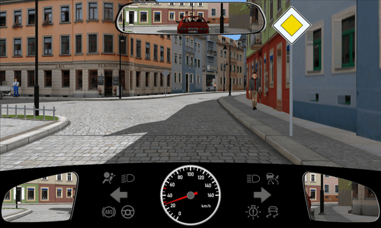

[Video: videos/2_2_06-101-M.mp4](videos/2_2_06-101-M.mp4)

**Options:**
- A. I slow down and wait
- B. I queue behind the vehicles already waiting on the right
- C. I continue driving at a reduced speed

**Correct Answer(s):**
- A. I slow down and wait

**Explanation:**
The distance to the bicycle is not enough. Stop and wait until the biker has passed the bottleneck. This is the only way to be sure that you do not endanger the biker.

---

### 2.2.07 Chapter Use Of Lanes By Motor Vehicles

#### Question 2.2.07-001

**Points:** 3 Points

**You are approaching a "red" traffic light. Several cars are waiting in all lanes. What do you do?**

**Options:**
- A. Wait in your lane behind the last car
- B. Pass the waiting cars on the right-hand side and proceed to the stop line
- C. Pass the waiting cars on the left-hand side and proceed to the stop line

**Correct Answer(s):**
- A. Wait in your lane behind the last car

**Explanation:**
You should always wait in line behind the last car in your lane and not try to pass over other cars by either side.

---

#### Question 2.2.07-002

**Points:** 3 Points

**Which motor vehicles may freely choose their lane inside built-up areas?**

**Options:**

**Correct Answer(s):**
- 3,5 

**Explanation:**
In Germany, the legal driving requirement applies. Vehicles up to 3.5 tons are excluded from the right-hand drive requirement within built-up areas and can freely choose their lane.

---

#### Question 2.2.07-004

**Points:** 3 Points

**What is the right course of action now?**

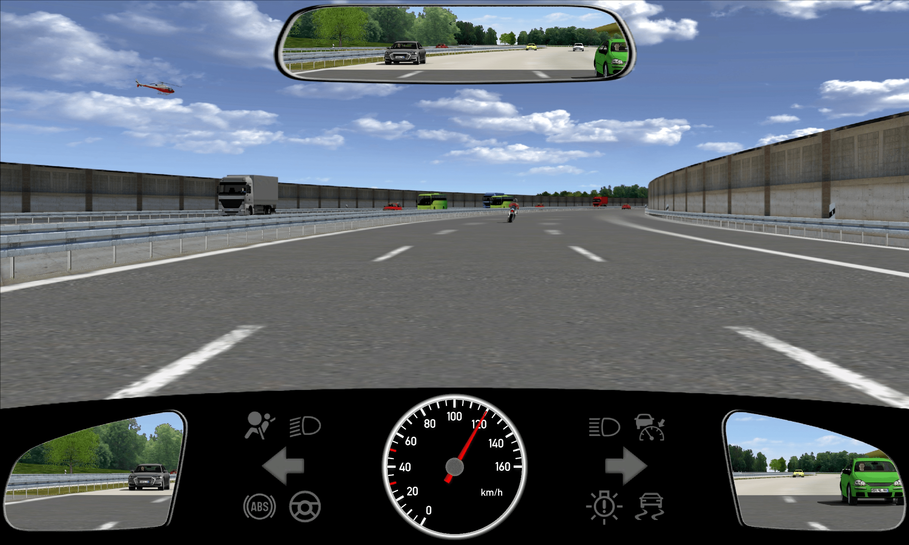

[Video: videos/2_2_07-004.mp4](videos/2_2_07-004.mp4)

**Options:**
- A. I move into the right-hand lane
- B. I stay in the centre lane
- C. I move into the left-hand lane

**Correct Answer(s):**
- A. I move into the right-hand lane

**Explanation:**
In Germany, you must drive on the right. As there is no vehicle in front of you that is travelling slower than you, you must move into the right lane. As soon as slower vehicles appear, you may move back into the centre or left lane to overtake them.

---

#### Question 2.2.07-005

**Points:** 5 Points

**How could a dangerous situation arise?**

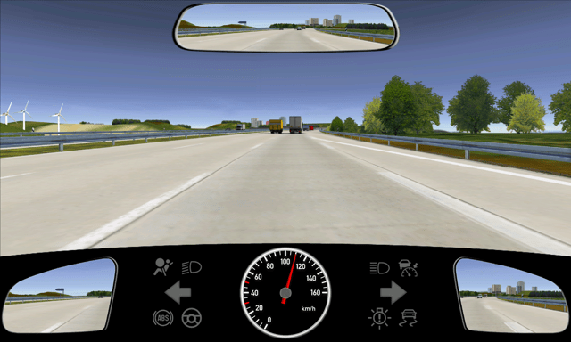

[Video: videos/2_2_07-005.mp4](videos/2_2_07-005.mp4)

**Options:**
- A. - yellow truck
- B. - green truck
- C. - the car up ahead

**Correct Answer(s):**
- A. - yellow truck

**Explanation:**
The fast driving style of the yellow truck suggests that he will overtake the blue truck in front of him as well. Their speed is faster than that of the trucks. You cannot dodge to the left as a car on the left lane is directly behind you. If the yellow truck swings out, you have to brake hard.

---

#### Question 2.2.07-006

**Points:** 4 Points

**What should you do now?**

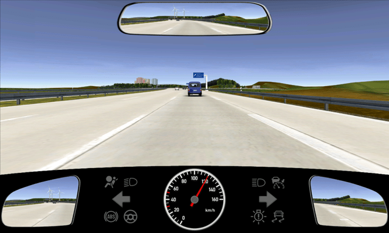

[Video: videos/2_2_07-006.mp4](videos/2_2_07-006.mp4)

**Options:**
- A. I let the blue car merge in front of me
- B. I accelerate
- C. I immediately change from the left lane to the central lane

**Correct Answer(s):**
- A. I let the blue car merge in front of me

**Explanation:**
Since the driver of the car on the right of the acceleration lane increases its speed, you should enable him/her to merge into traffic. Refrain from your right of way and reduce your own speed. You cannot change on the left lane as a vehicle approaches there.

---

#### Question 2.2.07-007

**Points:** 2 Points

**What should you do?**

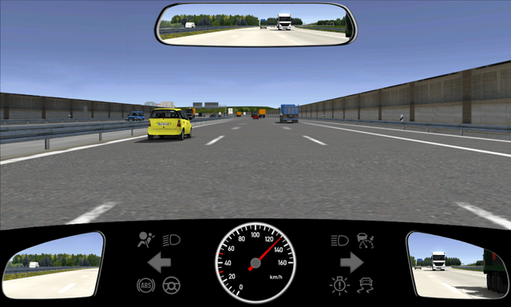

[Video: videos/2_2_07-007.mp4](videos/2_2_07-007.mp4)

**Options:**
- A. I stay in the middle lane and slow down
- B. I move to the right-hand lane and slow down
- C. I move into the left-hand lane and overtake the red car in front of me

**Correct Answer(s):**
- A. I stay in the middle lane and slow down

**Explanation:**
Stay on the middle lane and delay. The leading car will also delay soon to let the car on the left lane merge into traffic, because this lane ends. You cannot go to the left, changing to the right lane would be too dangerous as well.

---

#### Question 2.2.07-008

**Points:** 5 Points

**What is the right course of action?**

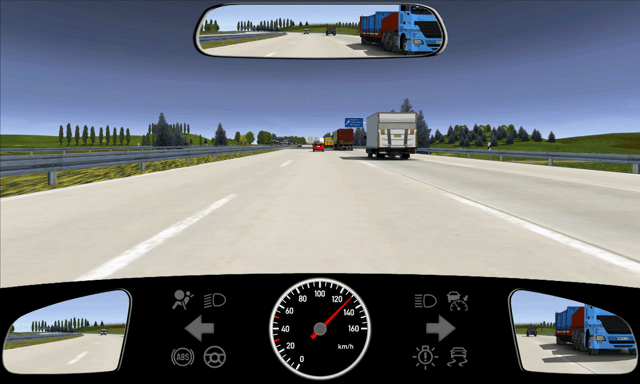

[Video: videos/2_2_07-008.mp4](videos/2_2_07-008.mp4)

**Options:**
- A. I reduce my speed
- B. I continue driving without changing speed
- C. I move into the right-hand lane

**Correct Answer(s):**
- A. I reduce my speed

**Explanation:**
You drive on the middle lane and in this situation you have to stay on the lane and reduce the speed. The driver on the left lane drives more slowly. You must not overtake him from the right. You cannot change to the right lane, there is a vehicle.

---

#### Question 2.2.07-009

**Points:** 5 Points

**What must you anticipate in this situation?**

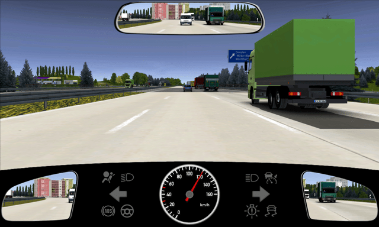

[Video: videos/2_2_07-009.mp4](videos/2_2_07-009.mp4)

**Options:**
- A. - grey car will move into the middle lane
- B. - yellow truck will pull out in front of me to overtake
- C. - grey car will remain in the right-hand lane

**Correct Answer(s):**
- A. - grey car will move into the middle lane

**Explanation:**
Since the vehicle drives very fast from the right onto the freeway, you have to expect that it will change to the middle lane. This impression is reinforced by the fact that trucks maintain their speed and distance.

---

#### Question 2.2.07-010

**Points:** 5 Points

**What is the right course of action?**

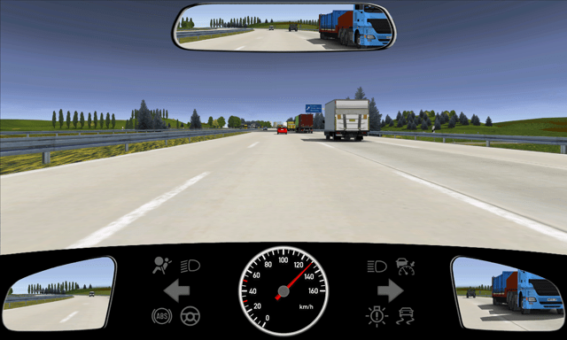

[Video: videos/2_2_07-010.mp4](videos/2_2_07-010.mp4)

**Options:**
- A. I reduce my speed and stay in the middle lane
- B. I maintain my speed and stay in the middle lane
- C. I maintain my speed and move into the right-hand lane

**Correct Answer(s):**
- A. I reduce my speed and stay in the middle lane

**Explanation:**
A car drives in front of you and from the right a car drives onto the main carriageway of the freeway. It is clear that the car driving on the left lane has a slower pace than you. Since it's only allowed to overtake on the left, you must delay and reduce your speed.

---

#### Question 2.2.07-011

**Points:** 3 Points

**You are driving on a road that has several marked lanes going in one direction. When should the alternate merging procedure be employed?**

**Options:**
- A. When a lane comes to an end
- B. If one lane is not continuously free to traffic due to an obstacle
- C. When a merging lane ends on the motorway

**Correct Answer(s):**
- A. When a lane comes to an end
- B. If one lane is not continuously free to traffic due to an obstacle

**Explanation:**
The zipper merge is to be used when a lane cannot be used any further. The exception is on the motorway.

---

#### Question 2.2.07-012-M

**Points:** 4 Points

**What is true about using the hard shoulder in this situation?**

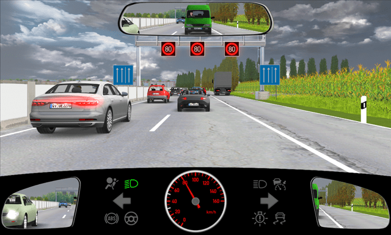

**Options:**
- A. - must be used like a right-hand lane
- B. - may only be used in a breakdown situation
- C. - may only be used by trucks

**Correct Answer(s):**
- A. - must be used like a right-hand lane

**Explanation:**
The traffic sign indicates that the hard shoulder is to be used like the right-hand lane.

---

#### Question 2.2.07-013-M

**Points:** 4 Points

**What is true in this situation about using the hard shoulder?**

**Options:**
- A. – may only be used in the case of a breakdown
- B. – may only be used by trucks
- C. – must be used in the same way as a right-hand lane

**Correct Answer(s):**
- A. – may only be used in the case of a breakdown

**Explanation:**
The hard shoulder may not be used regularly. You can only use it in case of a breakdown.

---

#### Question 2.2.07-014-M

**Points:** 4 Points

**What is the right behaviour now?**

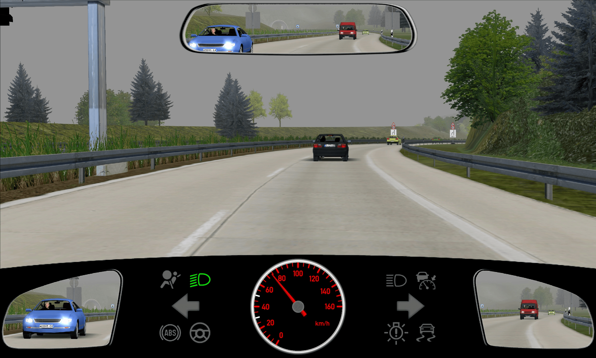

[Video: videos/2_2_07-014-M.mp4](videos/2_2_07-014-M.mp4)

**Options:**
- A. I reduce my speed
- B. I let the [blue] car in front of me move over
- C. I accelerate

**Correct Answer(s):**
- A. I reduce my speed
- B. I let the [blue] car in front of me move over

**Explanation:**
If one of the lanes ends on a multi-lane road, vehicles must be allowed to move to the adjacent lane. Here it is important to drive with foresight in order to be able to react to lane changes in a timely manner and to adjust your own speed if necessary.

---

#### Question 2.2.07-201-M

**Points:** 3 Points

**What applies to this road that is outside of a built-up area?**

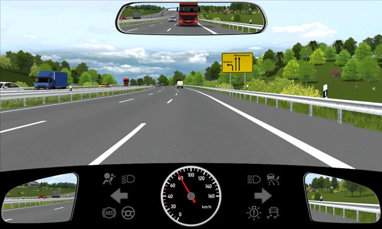

**Options:**
- A. - to perform a left turn
- B. - to overtake
- C. - if there is a traffic jam

**Correct Answer(s):**
- A. - to perform a left turn

**Explanation:**
This traffic sign draws you aware that you will have to choose a direction shortly. At the same time, you will receive an idea of ​​the intersection, especially the turning traces.
Therefore, you can only use the left lanes outside if you want to turn left.

---

### 2.2.09 Chapter Turning Turning And Reversing

#### Question 2.2.09-001

**Points:** 4 Points

**Where are U-turns prohibited?**

**Options:**
- A. On motorways
- B. On clearways for motor vehicles only
- C. On farm or forest tracks

**Correct Answer(s):**
- A. On motorways
- B. On clearways for motor vehicles only

**Explanation:**
You may not turn your vehicle on freeways or motorways. Reverse driving is strictly prohibited on both types of roads as well.

---

#### Question 2.2.09-002-M

**Points:** 5 Points

**Why do you have to wait before the left turn?**

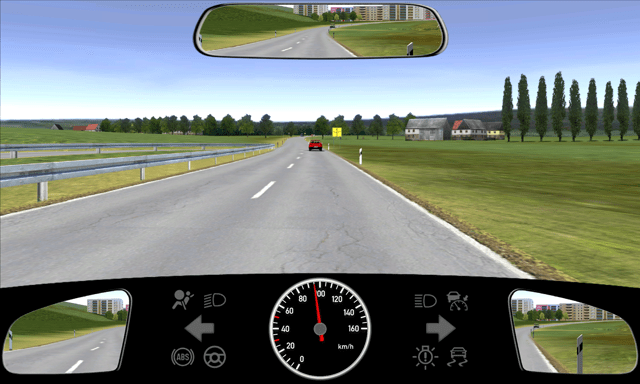

[Video: videos/2_2_09-002-M.mp4](videos/2_2_09-002-M.mp4)

**Options:**
- A. - motorbike
- B. - car
- C. - bicycle

**Correct Answer(s):**
- A. - motorbike

**Explanation:**
As a left-turning driver, you generally have to give priority to oncoming traffic. Cyclists also have this right of way. So, in this situation you have to let the motorcyclist pass before turning. He will pass the left-turning driver from the right and continue straight ahead.

---

#### Question 2.2.09-003-M

**Points:** 5 Points

**What is the right course of action?**

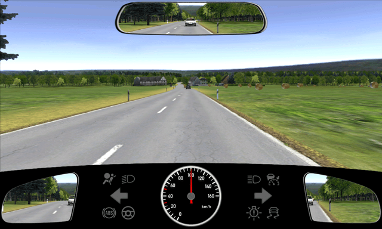

[Video: videos/2_2_09-003-M.mp4](videos/2_2_09-003-M.mp4)

**Options:**
- A. - once the [red] vehicle has overtaken me
- B. - now in order to make the carriageway clear
- C. - now so that following vehicles will not be confused by my slowing down

**Correct Answer(s):**
- A. - once the [red] vehicle has overtaken me

**Explanation:**
If you want to turn left and a car wants to overtake you from the left, you have to let it pass first. Only after the car has completed its overtaking maneuver, you may turn yourself.

---

#### Question 2.2.09-004-M

**Points:** 5 Points

**You want to turn left. What is the right course of action?**

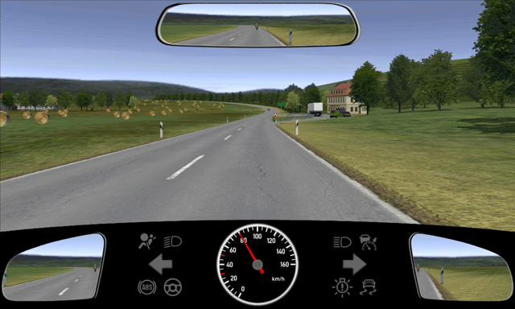

[Video: videos/2_2_09-004-M.mp4](videos/2_2_09-004-M.mp4)

**Options:**
- A. I stop at the farm track and wait
- B. I accelerate and swiftly take the turn
- C. I continue driving, because I cannot turn off the road here

**Correct Answer(s):**
- A. I stop at the farm track and wait

**Explanation:**
Since you are currently being overtaken, it is not possible to turn left. You must wait for the overtaking process to be finished before you can turn left.

---

#### Question 2.2.09-005-M

**Points:** 5 Points

**In this situation, why do you have to wait before the left turn?**

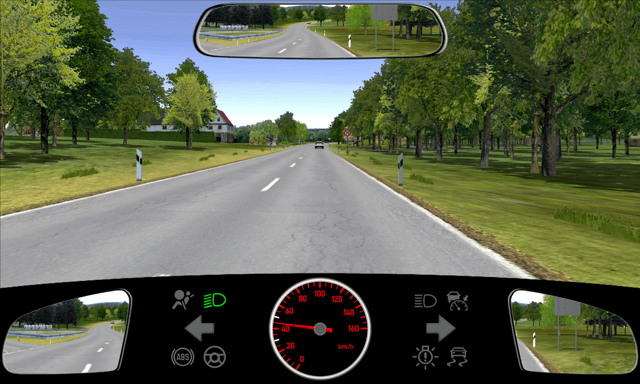

[Video: videos/2_2_09-005-M.mp4](videos/2_2_09-005-M.mp4)

**Options:**
- A. - motorbike
- B. - [red car]
- C. - [bicycle]

**Correct Answer(s):**
- A. - motorbike

**Explanation:**
In this situation, you need to wait for the motorbike behind the car to pass before turning left

---

#### Question 2.2.09-006-M

**Points:** 5 Points

**What is the right course of action in this situation?**

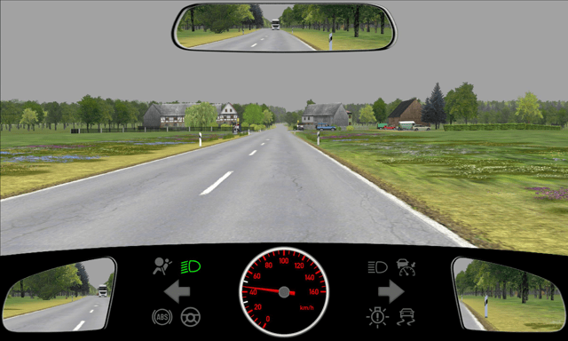

[Video: videos/2_2_09-006-M.mp4](videos/2_2_09-006-M.mp4)

**Options:**
- A. - after [the red car] has overtaken me
- B. - now, so as not to impede the truck behind me
- C. - now, so that my hesitation does not create any uncertainty in the minds of those behind me

**Correct Answer(s):**
- A. - after [the red car] has overtaken me

**Explanation:**
In this situation, you should first wait for the motorcycle to overtake you before turning left.

---

#### Question 2.2.09-007-M

**Points:** 5 Points

**Why are you not allowed to turn off the road now?**

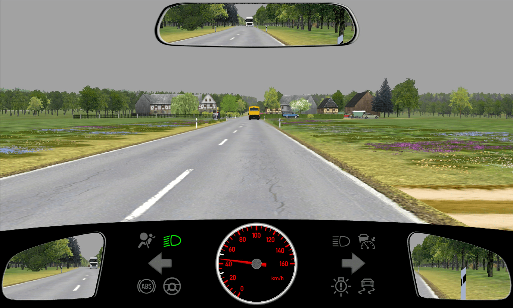

[Video: videos/2_2_09-007-M.mp4](videos/2_2_09-007-M.mp4)

**Options:**
- A. - [red car]
- B. - bus
- C. - oncoming traffic

**Correct Answer(s):**
- A. - [red car]

**Explanation:**
The red car is overtaking and is travelling to your left. To avoid a collision, do not turn off now under any circumstances. Check whether your indicators are dirty and therefore cannot be seen.

---

#### Question 2.2.09-008-M

**Points:** 3 Points

**You want to turn left at the next junction. What is the right course of action now?**

**Options:**
- A. I remain behind the stationary vehicles
- B. I indicate left
- C. I drive carefully to the left past the stationary vehicles

**Correct Answer(s):**
- A. I remain behind the stationary vehicles
- B. I indicate left

**Explanation:**
If you drive past the waiting vehicles, you could obstruct oncoming vehicles and, in the worst case, block the entire road.
Therefore, start to flash left now to signal to other road users that you want to turn into the road. Also, stay behind the waiting vehicles and only turn off when you reach the road.

---

#### Question 2.2.09-009-M

**Points:** 3 Points

**You want to turn left. Which line should you steer?**

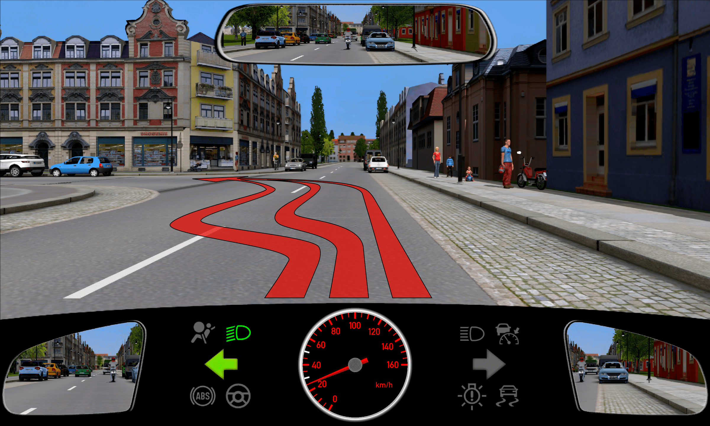

**Options:**
- A. The middle driving line
- B. The left driving line
- C. The right driving line

**Correct Answer(s):**
- A. The middle driving line

**Explanation:**
Keep to the centre line when turning left. This allows you to drive as far to the left as possible without driving in the opposite lane and the motorbike behind you can pass you on the right.

---

#### Question 2.2.09-010-M

**Points:** 3 Points

**You want to turn left. Which line should you follow?**

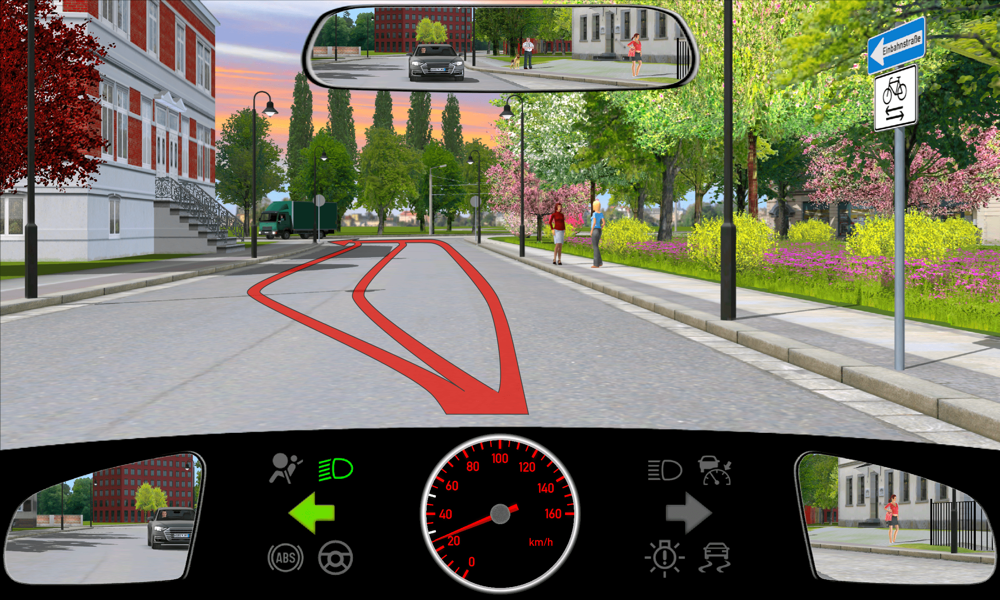

**Options:**
- A. The middle driving line
- B. The left driving line
- C. The right driving line

**Correct Answer(s):**
- A. The middle driving line

**Explanation:**
You should keep as far to the left as possible when turning left. However, you are riding in a one-way street where cycling is permitted in both directions. You are therefore not allowed to ride on the far left because cyclists may be coming towards you. Therefore, follow the centre line.

---

#### Question 2.2.09-011-M

**Points:** 3 Points

**You want to turn left. Which line should you follow?**

**Options:**
- A. The left driving line
- B. The middle driving line
- C. The right driving line

**Correct Answer(s):**
- A. The left driving line

**Explanation:**
If you want to turn left in a one-way street, you should keep as far to the left as possible, so follow the left lane.

---

#### Question 2.2.09-101

**Points:** 3 Points

**What is the right course of action when reversing?**

**Options:**
- A. - ensure the road area is safe by additionally looking all around me
- B. - drive slowly and attentively
- C. - make sure that no-one is located in my blind spot

**Correct Answer(s):**
- A. - ensure the road area is safe by additionally looking all around me
- B. - drive slowly and attentively
- C. - make sure that no-one is located in my blind spot

**Explanation:**
When reversing, look to the rear and additionally secure the traffic area by looking all around, drive attentively and slowly and, for safety reasons, make sure that there are no persons in the blind spot.

---

#### Question 2.2.09-201

**Points:** 3 Points

**You are driving a motor vehicle with a gross vehicle weight rating in excess of 3.5 t. At what speed do you have to turn right within a built-up area?**

**Options:**
- A. - walking speed
- B. - at 20 km/h maximum
- C. - at 30 km/h maximum

**Correct Answer(s):**
- A. - walking speed

**Explanation:**
Drive at walking speed to avoid danger and accidents.

---

#### Question 2.2.09-202

**Points:** 4 Points

**Your vehicle is equipped with a rear view camera. You want to reverse into a forecourt from a very busy road. What must you be aware at this time?**

**Options:**
- A. I should additionally arrange a look-out to help guide me in
- B. I must also observe the traffic directly
- C. I can rely solely on the rear view camera

**Correct Answer(s):**
- A. I should additionally arrange a look-out to help guide me in
- B. I must also observe the traffic directly

---

#### Question 2.2.09-203

**Points:** 3 Points

**What can reduce the risk of serious accidents when turning right within a built-up area?**

**Options:**
- A. By equipping vehicles with turn assist systems
- B. By driving at walking speed when turning right
- C. By taking rights turns quickly so as not to impede other road users

**Correct Answer(s):**
- A. By equipping vehicles with turn assist systems
- B. By driving at walking speed when turning right

---

#### Question 2.2.09-204

**Points:** 4 Points

**You want to reverse your vehicle out of a property lot onto a road. What must you do?**

**Options:**
- A. - arrange for someone to direct me, if necessary
- B. - allow pedestrians right of way
- C. - only use the rear view camera

**Correct Answer(s):**
- A. - arrange for someone to direct me, if necessary
- B. - allow pedestrians right of way

**Explanation:**
To drive backwards from a property to a road, it is not enough just to use the rear view camera. You should be instructed on the street if necessary and keep in mind that pedestrians have priority.

---

#### Question 2.2.09-205

**Points:** 4 Points

**When turning right, there is a risk of overlooking cyclists travelling straight ahead in the blind spot. How can you reduce this risk?**

**Options:**
- A. I monitor the traffic behind and to the side at short intervals
- B. I make sure the mirrors are adjusted correctly
- C. I make sure that accessories in the cab do not obstruct the view

**Correct Answer(s):**
- A. I monitor the traffic behind and to the side at short intervals
- B. I make sure the mirrors are adjusted correctly
- C. I make sure that accessories in the cab do not obstruct the view

**Explanation:**
When a bus or truck turns right, there is a risk of overlooking cyclists driving straight ahead in the blind spot. To minimize the risk, you should observe the following and side traffic at short intervals, make sure that your mirrors are adjusted correctly and ensure that no accessories are obstructing your view.
This way you can recognize cyclists in good time and avoid accidents.

---

#### Question 2.2.09-402

**Points:** 4 Points

**You have mounted a plough which extends far beyond the back of your tractor. What must you remember when you turn right?**

**Options:**
- A. Turn only when there is no danger for oncoming traffic caused by the plough moving over
- B. No-one can be endangered when turning if the plough is marked by warning panels

**Correct Answer(s):**
- A. Turn only when there is no danger for oncoming traffic caused by the plough moving over

**Explanation:**
Coming soon...

---

#### Question 2.2.09-403

**Points:** 4 Points

**You have mounted a plough which extends far beyond the back of your tractor. Who can be endangered when you turn right?**

**Options:**
- A. Vehicles travelling behind you wishing to overtake
- B. Vehicles in the lane on your left
- C. Vehicles parking on the right-hand side

**Correct Answer(s):**
- A. Vehicles travelling behind you wishing to overtake
- B. Vehicles in the lane on your left

**Explanation:**
Coming soon...

---

#### Question 2.2.09-405

**Points:** 4 Points

**To your tractor you have attached a hay turning machine that projects a long way to the back. Who could be endangered by this when you take a left turn?**

**Options:**
- A. Vehicles that have pulled in alongside me to my right
- B. Pedestrians on the right-hand side of the road
- C. Vehicles that have pulled in behind me

**Correct Answer(s):**
- A. Vehicles that have pulled in alongside me to my right
- B. Pedestrians on the right-hand side of the road

**Explanation:**
Coming soon...

---

#### Question 2.2.09-406

**Points:** 4 Points

**You are driving an agricultural tractor with two trailers and you want to take a right turn. What must you look out for?**

**Options:**
- A. Whether there are any cyclists alongside me to the right
- B. That during the turn the trailers will not endanger any pedestrians on the side of the road or on the footpath
- C. That I remember to switch on my hazard lights if I have to swing out far to the left when taking the turn

**Correct Answer(s):**
- A. Whether there are any cyclists alongside me to the right
- B. That during the turn the trailers will not endanger any pedestrians on the side of the road or on the footpath

**Explanation:**
Since the room increases your agricultural tractor with two trailers when turning to the right, please make sure that the supporters do not compromise when turning people on the edge of the road or on the sidewalk, and if there are right next to you cyclists that are hidden by the blind spot ,

---

#### Question 2.2.09-407

**Points:** 4 Points

**You are returning on a tractor from working in a field and want to turn onto a road. What should you observe in order to avoid dangerous situations?**

**Options:**
- A. Keep windscreen clean
- B. Avoid places where drivers with the right of way cannot be seen from an adequate distance
- C. Be directed onto the road if my vision is restricted

**Correct Answer(s):**
- A. Keep windscreen clean
- B. Avoid places where drivers with the right of way cannot be seen from an adequate distance
- C. Be directed onto the road if my vision is restricted

**Explanation:**
Coming soon...

---

### 2.2.12 Chapter Stopping And Parking

#### Question 2.2.12-001

**Points:** 3 Points

**Where is stopping prohibited?**

**Options:**
- A. Outside parking areas on autobahns and clearways for motor vehicles only
- B. Near or on sharp bends
- C. At bus stops

**Correct Answer(s):**
- A. Outside parking areas on autobahns and clearways for motor vehicles only
- B. Near or on sharp bends

**Explanation:**
In general, the road traffic act prohibits stopping at the traffic areas when stopping is dangerous for other road users or endangers public safety and order. This is especially true for holding on the lanes of the freeway or on a highway. The same goes for sharp and confusing curves.

---

#### Question 2.2.12-003

**Points:** 3 Points

**Where is parking prohibited?**

**Options:**
- A. On narrow roadways opposite driveway entrances and exits
- B. At taxi ranks
- C. Immediately behind pedestrian crossings

**Correct Answer(s):**
- A. On narrow roadways opposite driveway entrances and exits
- B. At taxi ranks

**Explanation:**
A parking ban in accordance with the road traffic act applies in all places where other road users can be obstructed or the public order and safety is no longer guaranteed by parked cars. For example, parking is prohibited at taxi stands, narrow lanes or entrances and exits in front of property as well as on and up to 5 m before pedestrian crossings.

---

#### Question 2.2.12-005

**Points:** 2 Points

**Who has priority at this parking space?**

**Options:**
- A. The white vehicle, because it has arrived at the parking space first
- B. No one, both drivers should agree
- C. Me, because I am parking by driving in forwards

**Correct Answer(s):**
- A. The white vehicle, because it has arrived at the parking space first

**Explanation:**
The vehicle that reaches the parking space first always has priority. Priority will also be given in the event that the vehicle drives past the parking space just in order to park backwards or perform other movements that are useful for parking in this gap. Priority is also maintained when the vehicle is waiting at the parking space.

---

#### Question 2.2.12-006

**Points:** 3 Points

**What do you have to consider when parking your motorbike?**

**Options:**
- A. - may not obstruct anyone
- B. - may not fall over
- C. - must be positioned on the sidewalk

**Correct Answer(s):**
- A. - may not obstruct anyone
- B. - may not fall over

**Explanation:**
The motorbike must not obstruct or endanger anyone. Make sure that the motorbike is parked safely and in a space-saving manner.

---

#### Question 2.2.12-007

**Points:** 3 Points

**When are you allowed to park your two-wheeler on the footpath?**

**Options:**
- A. When a traffic sign indicates this is permitted
- B. If the footpath is at least 2.0 m wide
- C. If there are no other options

**Correct Answer(s):**
- A. When a traffic sign indicates this is permitted

**Explanation:**
Basically, the lane is to be used for parking a vehicle. Motorbikes may be parked anywhere where car parking is permitted. In general, parking on sidewalks for motorcycles is not permitted unless a traffic sign permits it.

---

#### Question 2.2.12-008

**Points:** 3 Points

**What should you take into account when parking a two-wheeler?**

**Options:**
- A. I should not park the two-wheeler on soft underground
- B. I may park the two-wheeler on footpaths only if this is appropriately signed
- C. When parking the two-wheeler I am released from the duty to display a parking disc

**Correct Answer(s):**
- A. I should not park the two-wheeler on soft underground
- B. I may park the two-wheeler on footpaths only if this is appropriately signed

**Explanation:**
When you park your motorbike or scooter, the same rules and prohibitions apply to you as for car drivers. This means that you are not allowed to simply park your motorbike or scooter on the pavement. You must park your bike on the road, just like car owners. Parking on the pavement is also only permitted for motorbikes or scooters in marked parking spaces or if appropriate traffic signs permit this.
You should also always pay attention to the surface on which you park your motorbike; if the surface is too soft or too uneven, your motorbike can quickly fall over and cause other hazards.

---

#### Question 2.2.12-101-B

**Points:** 2 Points

**Both cars want to park here. Which car takes precedence?**

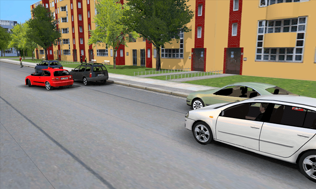

**Options:**
- A. The red car
- B. The white car

**Correct Answer(s):**
- A. The red car

**Explanation:**
In this case, the red car has right of way. He has reached the parking space first. Priority will also be given in the event that the vehicle drives past the parking space just in order to park backwards or perform other movements that are useful for parking in this gap.

---

#### Question 2.2.12-102

**Points:** 2 Points

**Up to which permissible total mass may motor vehicles be parked on specially designated footpaths?**

**Options:**

**Correct Answer(s):**
- 2,8 

**Explanation:**
Vehicles with a maximum permissible gross vehicle weight of up to 2.8 tonnes may be parked on specially marked sidewalks.

---

#### Question 2.2.12-104

**Points:** 3 Points

**What is the minimum distance a vehicle must leave clear in front of traffic lights if the traffic lights would be concealed by the vehicle?**

**Options:**

**Correct Answer(s):**
- 10 

**Explanation:**
A minimum distance of 10 meters must be maintained so that the view of light signals is not obscured.

---

#### Question 2.2.12-105

**Points:** 3 Points

**Where are you allowed to park a trailer with a permissible total mass exceeding 2 t in built-up areas regularly on sundays and public holidays and between 10 p.m. and 6 a.m.?**

**Options:**
- A. In industrial areas
- B. In wholly residential areas, on specially designated parking spaces
- C. In special areas reserved for recreation purposes, on sufficiently wide roads

**Correct Answer(s):**
- A. In industrial areas
- B. In wholly residential areas, on specially designated parking spaces

**Explanation:**
Parking a trailer with a maximum authorized mass of more than 2 t is permitted in commercial and residential areas with appropriately marked parking spaces. Within closed areas and in special areas for recreational purposes, regular parking is prohibited from 22:00 to 6:00 and on Sundays as well as on public holidays.

---

#### Question 2.2.12-106

**Points:** 3 Points

**What must you remember when parking a trailer without a truck?**

**Options:**
- A. - may not be parked for more than 2 weeks on public roads
- B. - may be parked for more than 2 weeks on specially designated parking spaces
- C. - may be parked for an unlimited period of time on adequate hard shoulders

**Correct Answer(s):**
- A. - may not be parked for more than 2 weeks on public roads
- B. - may be parked for more than 2 weeks on specially designated parking spaces

**Explanation:**
Please note that you may not leave your vehicle trailers on regular parking spaces for more than two weeks if they are not attached to a towing vehicle. Incidentally, the same also applies to hard shoulders. Accordingly marked parking lots are excluded from this regulation.

---

#### Question 2.2.12-107-M

**Points:** 2 Points

**You want to park on the right-hand edge of the road. What should you do in this situation?**

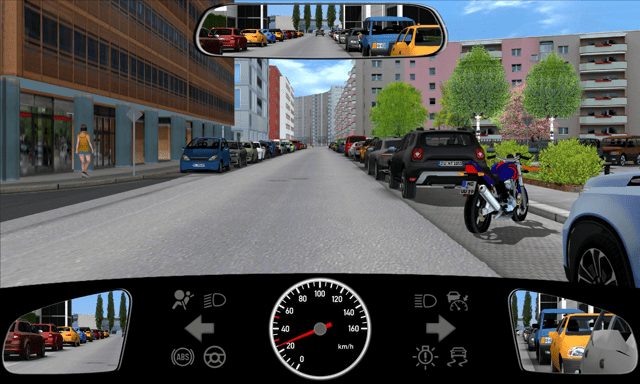

[Video: videos/2_2_12-107-M.mp4](videos/2_2_12-107-M.mp4)

**Options:**
- A. I forego the parking space, even though I have priority
- B. I park now, because I have priority

**Correct Answer(s):**
- A. I forego the parking space, even though I have priority

**Explanation:**
You signalled first and therefore have priority to the parking space. To avoid a conflict, you should still give up the parking space.

---

#### Question 2.2.12-108-M

**Points:** 3 Points

**You want to park on the right-hand edge of the road. Who has priority in this situation?**

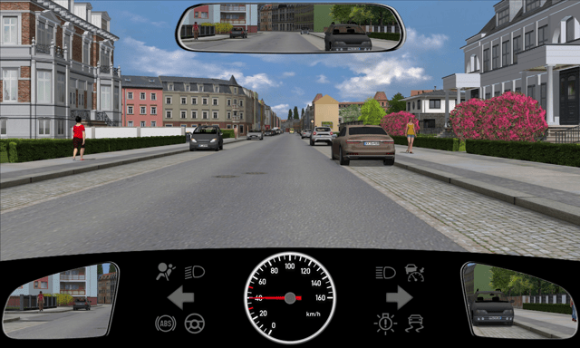

[Video: videos/2_2_12-108-M.mp4](videos/2_2_12-108-M.mp4)

**Options:**
- A. The [blue] car has priority
- B. I have priority
- C. No one has priority. We have to agree

**Correct Answer(s):**
- A. The [blue] car has priority

**Explanation:**
The car that stopped in front of you signaled first and therefore had priority in the parking lot. If you park now, there could be a collision.

---

#### Question 2.2.12-109-M

**Points:** 3 Points

**You want to reverse park on the right-hand side of the road. What is correct in this situation?**

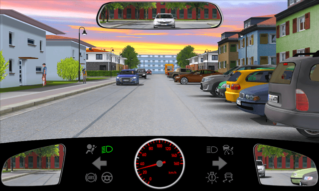

**Options:**
- A. I closely observe the oncoming traffic before manoeuvring into the space
- B. I anticipate that vehicles may exit their parking spaces
- C. I switch on my hazard lights

**Correct Answer(s):**
- A. I closely observe the oncoming traffic before manoeuvring into the space
- B. I anticipate that vehicles may exit their parking spaces

**Explanation:**
When parking, you always have to pay attention to the oncoming and subsequent traffic, as you could leave your lane when you steer and thereby endanger other road users.
Also make sure that no other vehicle wants to leave its parking space to avoid accidents.

---

#### Question 2.2.12-201

**Points:** 3 Points

**Where are you allowed to park motor vehicles with a permissible total mass exceeding 7.5 t in built-up areas regularly on sundays and public holidays and between 10 p.m. and 6 a.m.?**

**Options:**
- A. In health resorts and hospital areas, on specially designated parking spaces
- B. In industrial areas
- C. In wholly residential areas, on sufficiently wide roads

**Correct Answer(s):**
- A. In health resorts and hospital areas, on specially designated parking spaces
- B. In industrial areas

**Explanation:**
In a residential area you would at these times not to win a lot of friends. (Volume) Please parke in industrial areas or designated parking spaces in the spa and clinic areas.

---

#### Question 2.2.12-202

**Points:** 3 Points

**Where are you allowed to park regular buses in built-up areas regularly on sundays and public holidays and between 10 p.m. and 6 a.m.?**

**Options:**
- A. In industrial areas
- B. At any bus stop
- C. In wholly residential areas

**Correct Answer(s):**
- A. In industrial areas

**Explanation:**
Coming soon...

---

#### Question 2.2.12-203

**Points:** 3 Points

**Before which sign must you maintain a distance of at least 10 m, if it would otherwise be concealed by your vehicle?**

**Options:**
- A. Diagonal cross
- B. Stop. Give way.
- C. No stopping

**Correct Answer(s):**
- A. Diagonal cross
- B. Stop. Give way.

**Explanation:**
In front of signs such as the diagonal crosses, light signals or the sign "Stop! Yield to cross traffic", you at least have to keep a distance of 10 meters. This is especially necessary if they are going to be covered by your vehicle. For example, you are allowed to come to a stop in front of a stop sign. Behind it, however, stopping is prohibited.

---

#### Question 2.2.12-204

**Points:** 2 Points

**You want to park on the right-hand side edge of the carriageway. How big is the mandatory minimum distance between your vehicle and the solid lane boundary line?**

**Options:**

**Correct Answer(s):**
- 3 

**Explanation:**
If a minimum distance of 3 meters to the lane boundary line is observed when parking, the parked car will not present an obstacle.

---

### 2.2.13 Chapter Parking Time Monitoring Devices

#### Question 2.2.13-001

**Points:** 2 Points

**Where must you use a parking disc for parking?**

**Options:**
- A. At a defective parking meter
- B. Where stipulated by traffic signs
- C. In a no-waiting area

**Correct Answer(s):**
- A. At a defective parking meter
- B. Where stipulated by traffic signs

**Explanation:**
Wherever traffic signs dictate, the car driver must use a parking disc. It is also used when a defective parking meter makes the withdrawal of a valid parking ticket impossible. The use of a parking disc for a limited stopping restriction does not entitle you to park here for more than three minutes.

---

#### Question 2.2.13-002

**Points:** 2 Points

**The time on a parking meter has not yet run out. What do you do?**

**Options:**
- A. - use the time left on the meter without inserting more money
- B. - not use the time left on the meter
- C. - only use the time left on the meter when using a parking disc

**Correct Answer(s):**
- A. - use the time left on the meter without inserting more money

**Explanation:**
If a parking meter has not yet expired, you may use the rest of the parking time and leave your vehicle for free at the parking lot for the remaining time. You do not need a parking disc for this.

---

#### Question 2.2.13-003

**Points:** 2 Points

**At 10.40, you enter an area where parking is allowed for 2 hours when using a parking disc. What time must you set on the parking disc?**

**Options:**
- A. 11.00
- B. 12.40
- C. 13.00

**Correct Answer(s):**
- A. 11.00

**Explanation:**
The pointer of the disc should be adjusted to the stroke of half an hour following the time of parking. If you arrive at 10.40 hours, the pointer should be at 11.00. Thereby the parking duration does not matter.

---

#### Question 2.2.13-004

**Points:** 2 Points

**You want to park in a car park where there is a parking-ticket machine. What must you remember?**

**Options:**
- A. Place a valid parking ticket in your vehicle so it is easy to read from outside
- B. Do not exceed the parking time indicated on the parking ticket
- C. A parking ticket is never needed when using a parking disc

**Correct Answer(s):**
- A. Place a valid parking ticket in your vehicle so it is easy to read from outside
- B. Do not exceed the parking time indicated on the parking ticket

**Explanation:**
The car driver must put the valid parking ticket from in the vehicle so that it is visible from the outside. Avoid exceeding the parking time printed on the receipt, also referred to as a parking ticket. A parking disc as a replacement for a parking ticket is only valid if the parking meter is defective.

---

#### Question 2.2.13-101

**Points:** 2 Points

**When may you remain parked at a parking meter without activating it?**

**Options:**
- A. To allow people to get in and out of the vehicle
- B. To load and unload the vehicle
- C. To do some quick shopping

**Correct Answer(s):**
- A. To allow people to get in and out of the vehicle
- B. To load and unload the vehicle

**Explanation:**
After field work, the lighting and signaling device must be cleaned if necessary. The parking time doesn't need to be monitored while entering or exiting and loading or unloading. When driving slowly up to the priority road, the road must be sufficiently visible.

---

### 2.2.14 Chapter Duty Of Care

#### Question 2.2.14-001

**Points:** 2 Points

**How must you safeguard your motorcycle against unauthorized use?**

**Options:**
- A. By removing the ignition key
- B. By locking the steering
- C. By engaging top gear

**Correct Answer(s):**
- A. By removing the ignition key
- B. By locking the steering

**Explanation:**
To avoid other people to use your motorcycle, remove the ignition key and lock the steering.

---

#### Question 2.2.14-002

**Points:** 3 Points

**You want to park your motorcycle on its prop stand. What do you have to consider?**

**Options:**
- A. The surface under the prop stand must be firm
- B. You must extend the prop stand to the end position
- C. You should only park your motorcycle on an upward slope

**Correct Answer(s):**
- A. The surface under the prop stand must be firm
- B. You must extend the prop stand to the end position

**Explanation:**
To avoid your motorcycle to tip over, make sure the surface is firm and can support the weight of the motorcycle and that you swing the side stand all the way up to the stop.

---

#### Question 2.2.14-003

**Points:** 3 Points

**You want to park your motorcycle on its main stand. What do you have to consider?**

**Options:**
- A. The surface under the main stand must be firm
- B. You may only use the main stand to park your motorcycle for a short time

**Correct Answer(s):**
- A. The surface under the main stand must be firm

**Explanation:**
To avoid your motorcycle to tip over, make sure the surface is firm and can support the weight of the motorcycle. You can park your bike that way for a short or long time.

---

#### Question 2.2.14-004

**Points:** 3 Points

**Where should you not park a motorcycle (using main or side stand)?**

**Options:**
- A. On soft ground
- B. Where the parking surface is a steep downward slope
- C. On firm ground

**Correct Answer(s):**
- A. On soft ground
- B. Where the parking surface is a steep downward slope

**Explanation:**
To avoid your motorcycle to tip over, make sure the surface is firm and can support the weight of the motorcycle. Also make sure that the surface is not too steep downwards which would make the main or side stand unsafe and at risk of tipping over

---

#### Question 2.2.14-005

**Points:** 3 Points

**Which precautionary measures must you take when parking a motorcycle?**

**Options:**
- A. Park on firm ground
- B. Remove the ignition key
- C. Lock the handlebar

**Correct Answer(s):**
- A. Park on firm ground
- B. Remove the ignition key
- C. Lock the handlebar

**Explanation:**
You must make sure that no other people can use your motorcycle by removing the ignition key and locking in the handlebar/steering. Also make sure that the groud is firm to avoid the motorcycle to tip over.

---

#### Question 2.2.14-006

**Points:** 3 Points

**You want to park your motorcycle. What must you consider?**

**Options:**
- A. The parking surface must be firm
- B. You can lean the motorcycle against a lamppost if you put it into gear
- C. You must switch on the dipped headlight

**Correct Answer(s):**
- A. The parking surface must be firm

**Explanation:**
When parking, to avoid your motorcycle to tip over, make sure the surface is firm and can support the weight of the motorcycle.

---

#### Question 2.2.14-008

**Points:** 3 Points

**How do you secure your motorcycle against being used without permission?**

**Options:**
- A. - remove the ignition key
- B. - close the steering lock
- C. - disconnect the battery

**Correct Answer(s):**
- A. - remove the ignition key
- B. - close the steering lock

**Explanation:**
The steering lock prevents steering in the event of unauthorised access. The engine cannot be started by removing the ignition key.

---

#### Question 2.2.14-009

**Points:** 3 Points

**What must you be aware of when using a prop stand?**

**Options:**
- A. The gradient of the parking place
- B. The characteristics of the ground surface
- C. That the prop stand is completely folded away before driving off

**Correct Answer(s):**
- A. The gradient of the parking place
- B. The characteristics of the ground surface
- C. That the prop stand is completely folded away before driving off

**Explanation:**
If the side stand is not fully retracted, it can cause a fall when cornering. If the slope is too great, the motorbike can slide forward because the side stand folds in on its own. If the ground is too soft, the motorbike may sink until it falls.

---

#### Question 2.2.14-010

**Points:** 3 Points

**What should be noted when using the prop stand?**

**Options:**
- A. Where possible, the motorbike should not be parked on a slope
- B. The prop stand should be fully extended
- C. The prop stand switch can prevent you driving off with the prop stand extended

**Correct Answer(s):**
- A. Where possible, the motorbike should not be parked on a slope
- B. The prop stand should be fully extended
- C. The prop stand switch can prevent you driving off with the prop stand extended

**Explanation:**
If the side stand is still folded out and you engage a gear, the side stand switch will automatically switch off the engine. The side stand switch is a safety measure that prevents you from riding off with the side stand folded out.
The side stand is designed for parking a motorbike. Try to avoid slopes when parking. Always make sure that your motorbike is stable and that the side stand is fully extended to avoid danger and damage.

---

#### Question 2.2.14-101

**Points:** 3 Points

**How must you safeguard your vehicle against theft?**

**Options:**
- A. By removing the ignition key, engaging the steering wheel lock and closing the windows
- B. By locking the doors and boot
- C. By activating the differential lock

**Correct Answer(s):**
- A. By removing the ignition key, engaging the steering wheel lock and closing the windows
- B. By locking the doors and boot

**Explanation:**
To secure the car against theft, you must first close all the windows and doors. The ignition key must be removed in any case. Snap the steering wheel lock into place to additionally secure the car.

---

#### Question 2.2.14-102

**Points:** 3 Points

**What must you do when leaving your car?**

**Options:**
- A. Before opening the door, look out for traffic behind
- B. Secure the vehicle against rolling away
- C. Secure the vehicle against unauthorized use

**Correct Answer(s):**
- A. Before opening the door, look out for traffic behind
- B. Secure the vehicle against rolling away
- C. Secure the vehicle against unauthorized use

**Explanation:**
Before leaving the vehicle, you have to protect it against rolling away uncontrolled, for example on a downhill slope. Before exiting you have to make sure not to endanger other road users. This also applies to your passengers. Opening doors carelessly when getting out is a common cause of accidents. The vehicle must also be protected against unauthorized use.

---

#### Question 2.2.14-104

**Points:** 3 Points

**Your car is standing on the edge of the roadway. What should you do when getting into the car?**

**Options:**
- A. Let passengers get into the car, if possible, from the pavement
- B. Open the doors on the roadway side only when traffic permits
- C. The doors on the right-hand side can always be opened without danger

**Correct Answer(s):**
- A. Let passengers get into the car, if possible, from the pavement
- B. Open the doors on the roadway side only when traffic permits

**Explanation:**
When entering and exiting, you must take care not to endanger the other road users. The entry from the right - from the sidewalk - is safer, but not without any danger. Before you open the doors, make sure that the traffic situation permits that. Make sure that there are no pedestrians or cyclists on the sidewalk at this time.

---

#### Question 2.2.14-105

**Points:** 4 Points

**What is important when children are getting in and out of a car?**

**Options:**
- A. Let the children in or out, if possible, on the pavement side
- B. Let the children in or out on the roadway side only under supervision
- C. Children are not allowed to get in or out of a car on public roads

**Correct Answer(s):**
- A. Let the children in or out, if possible, on the pavement side
- B. Let the children in or out on the roadway side only under supervision

**Explanation:**
As a car driver, you should make sure that children get on and off directly on the sidewalk. If the situation does not allow this, they should only get in or out on the side of the road under the supervision of an adult. Children are seen worse and are unpredictable in their behavior.

---

#### Question 2.2.14-106

**Points:** 3 Points

**What should you call the attention of your passengers to before exiting?**

**Options:**
- A. - they should heed the traffic flowing on the left-side
- B. - they should heed the pedestrians walking on the right-side
- C. - cyclists are required to wait on cycle paths

**Correct Answer(s):**
- A. - they should heed the traffic flowing on the left-side
- B. - they should heed the pedestrians walking on the right-side

**Explanation:**
As a car driver you must take the necessary measures to avoid accidents or traffic disruptions when passengers leave the vehicle. Point that out to passengers when they get off on a bike path. Cyclists are not required to wait on bike paths. Anyone entering or leaving the car may not endanger other road users.

---

#### Question 2.2.14-107-M

**Points:** 4 Points

**Why may you not exit now?**

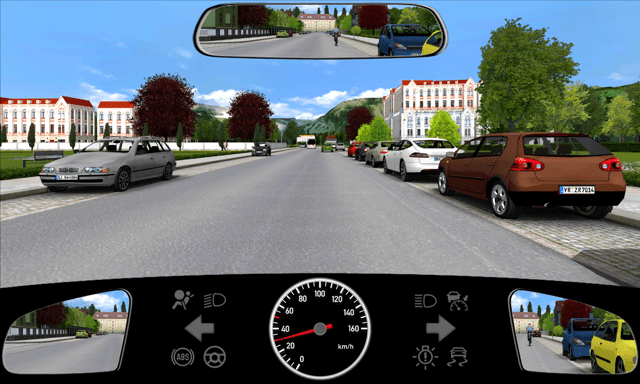

[Video: videos/2_2_14-107-M.mp4](videos/2_2_14-107-M.mp4)

**Options:**
- A. Because [of the cyclist]
- B. Because of the motorbike
- C. Because [of the pedestrian]

**Correct Answer(s):**
- A. Because [of the cyclist]

**Explanation:**
Anyone getting in or out of the car must behave in such a way as to avoid endangering other road users. An approaching cyclist can be seen in your left-hand side mirror, you must let him pass first.

---

#### Question 2.2.14-108-M

**Points:** 3 Points

**You have stopped in a parking strip and now want to exit your vehicle. What must you do in this situation?**

**Options:**
- A. - by looking in my left-hand exterior rear-view mirror before opening the door
- B. - by glancing over my left shoulder before opening the door
- C. - just by looking through the slightly opened door

**Correct Answer(s):**
- A. - by looking in my left-hand exterior rear-view mirror before opening the door
- B. - by glancing over my left shoulder before opening the door

**Explanation:**
Before you open the door and leave the vehicle, check in the left-hand mirror that no one is coming from behind. You must also look to your left to make sure that there are no other vehicles in your blind spot.

---

#### Question 2.2.14-109

**Points:** 3 Points

**When leaving your car, how do you secure it against unauthorised use?**

**Options:**
- A. I lock the doors
- B. I close the windows
- C. I activate the child-safety lock

**Correct Answer(s):**
- A. I lock the doors
- B. I close the windows

**Explanation:**
You have to make sure that no unauthorised persons use your car. Therefore, remove the key from the starter and make sure that all windows and doors are closed.

---

#### Question 2.2.14-110

**Points:** 4 Points

**You want to let a child out of your car. What should you be aware of when doing so?**

**Options:**
- A. - exit the car on the same side as the footpath
- B. - not have to cross over the carriageway
- C. - be warned of possible dangers when getting out of the car

**Correct Answer(s):**
- A. - exit the car on the same side as the footpath
- B. - not have to cross over the carriageway
- C. - be warned of possible dangers when getting out of the car

**Explanation:**
As a car driver, you should make sure that children get on and off directly on the pavement side. If the situation does not allow this, they should only get in or out of the vehicle on the carriageway side under supervision and with prior warning of possible dangers. Children are harder to see and their behaviour is unpredictable, so you should make sure that they no longer have to cross the road.

---

### 2.2.15 Chapter Immobilisation And Towing Of Vehicles

#### Question 2.2.15-001

**Points:** 3 Points

**What is allowed when your motorcycle has broken down with engine damage?**

**Options:**
- A. Loading the motorcycle on a vehicle and having it transported
- B. Pushing the motorcycle to the nearest garage
- C. Having the motorcycle towed

**Correct Answer(s):**
- A. Loading the motorcycle on a vehicle and having it transported
- B. Pushing the motorcycle to the nearest garage

**Explanation:**
You cannot tow a broken motorcycle, it will tip over and fall. Instead you should either push it or transport it.

---

#### Question 2.2.15-002

**Points:** 3 Points

**You are outside of a built-up area and have come to a stop due to a fault with your motorcycle. How should it be transported to the garage?**

**Options:**
- A. On a suitable trailer
- B. In a suitable van
- C. By using a suitable towrope

**Correct Answer(s):**
- A. On a suitable trailer
- B. In a suitable van

**Explanation:**
The operation of a vehicle that is no longer traffic -proof is a significant and, above all, incalculable danger for you and for other road users. Therefore, you have to pull your vehicle out of traffic in the shortest way. You can have your strength bike removed on a suitable trailer or van.
According to § 15a (4) StVO, motorcycles must not be towed with a tow rope.

---

#### Question 2.2.15-103

**Points:** 3 Points

**You want to tow another vehicle with your car. What must you know?**

**Options:**
- A. You must at least have a driving permit class B
- B. You must at least have a driving permit class BE

**Correct Answer(s):**
- A. You must at least have a driving permit class B

**Explanation:**
You need to know if it is a vehicle with a gearshift, automatic transmission or an electric car. An electric car cannot be towed, it must be loaded. A vehicle with an automatic transmission can only be towed for a few kilometers in level "N" without any damage.

---

#### Question 2.2.15-104

**Points:** 3 Points

**A car with servo brakes has broken down with engine damage. What is correct when towing the car away?**

**Options:**
- A. The car being towed can only achieve slight braking effect even when increased pressure is applied to the pedal
- B. If possible, use a tow-bar
- C. The action of the foot brake is not impaired by the engine not running

**Correct Answer(s):**
- A. The car being towed can only achieve slight braking effect even when increased pressure is applied to the pedal
- B. If possible, use a tow-bar

**Explanation:**
If possible, use a tow bar when towing a vehicle with a brake booster. Because a brake booster works only with the engine running. When the engine is off, only a weak braking effect can be achieved in this vehicle even with strong pressure on the foot brake.

---

#### Question 2.2.15-105

**Points:** 3 Points

**A car with power steering has broken down with engine damage and must be towed away. What is correct?**

**Options:**
- A. - is considerably heavier
- B. - is locked
- C. - is not impaired

**Correct Answer(s):**
- A. - is considerably heavier

**Explanation:**
The function of the power steering depends on the engine and only works when the engine is running. If the engine and the assistive function of the power steering fail, steering is considerably more difficult and you need more power. The steering is impaired in its function.

---

#### Question 2.2.15-106

**Points:** 4 Points

**At what distance must the warning triangle be placed when a car has broken down on a road with fast-moving traffic?**

**Options:**
- A. At a distance of around 100 m
- B. At a distance of around 50 m
- C. At a distance of around 10 m

**Correct Answer(s):**
- A. At a distance of around 100 m

**Explanation:**
If you are staying on a road with fast traffic with your vehicle, you must set up the warning triangle at a distance of approx. 100 m. Make the breakdown situation visible to other road users by switching on the hazard lights.

---

#### Question 2.2.15-107

**Points:** 4 Points

**At night, how must you secure a vehicle which has broken down at a place where it constitutes a danger to other traffic?**

**Options:**
- A. Immediately switch on the hazard warning lights
- B. Place a warning triangle at a sufficient distance
- C. Switch on the reversing lights

**Correct Answer(s):**
- A. Immediately switch on the hazard warning lights
- B. Place a warning triangle at a sufficient distance

**Explanation:**
If a vehicle has a breakdown on a multi-lane roadway at a location where it cannot be detected in time as an obstacle, you as a car driver must immediately turn on the hazard lights. Afterwards, a breakdown triangle should be placed clearly visible at a sufficient distance, in fast traffic about 100 m in front of the vehicle. You do not need to switch on the reversing light.

---

#### Question 2.2.15-108

**Points:** 4 Points

**When must you switch on the hazard warning lights?**

**Options:**
- A. When your vehicle has broken down at a place where it cannot readily be recognized as a stationary obstruction
- B. When double-parking
- C. For all loading or unloading

**Correct Answer(s):**
- A. When your vehicle has broken down at a place where it cannot readily be recognized as a stationary obstruction

**Explanation:**
If a car breaks down on a multi-lane roadway at a location where it cannot be recognized in time as an obstacle, the hazard light must be switched on immediately. Parking in the second row is generally prohibited. This does not change just by switching on the hazard lights. It is not allowed. When loading and unloading the hazard light must not be switched on.

---

#### Question 2.2.15-109

**Points:** 3 Points

**What must you remember when towing?**

**Options:**
- A. The distance between the vehicles must not exceed 5 m
- B. Tow-rope/tow-bar must be clearly marked
- C. Motorcycles may only be towed with a fixed connection

**Correct Answer(s):**
- A. The distance between the vehicles must not exceed 5 m
- B. Tow-rope/tow-bar must be clearly marked

**Explanation:**
When towing, the distance between the towing vehicle and the towed vehicle shall not exceed 5 meters. The tools used such as rod or rope are clearly marked. Motorcycles must not be towed but must be loaded.

---

#### Question 2.2.15-110

**Points:** 4 Points

**Your car suffers a flat tyre on the motorway. What should you do?**

**Options:**
- A. - turn on my hazard lights and park as far to the right as possible
- B. - place the warning triangle at a distance of about 100 m
- C. - continue driving to the next exit

**Correct Answer(s):**
- A. - turn on my hazard lights and park as far to the right as possible
- B. - place the warning triangle at a distance of about 100 m

**Explanation:**
If your vehicle breaks down on a multi-lane road due to a flat tire in a place where it cannot be detected in time as a stationary obstacle, immediately turn on the hazard lights. After that, a breakdown triangle is to be placed in a clearly visible position at a sufficient distance. In fast traffic, the distance between the vehicle and the breakdown triangle should be approx. 100 m.

---

#### Question 2.2.15-111

**Points:** 3 Points

**You car has a fault and can no longer be driven. What must you be aware of during towing?**

**Options:**
- A. - the force required to operate the brake pedal is significantly greater if the engine has failed
- B. - a towing bar should be used where possible
- C. - the rear fog lights should also be switched on to indicate the towing procedure

**Correct Answer(s):**
- A. - the force required to operate the brake pedal is significantly greater if the engine has failed
- B. - a towing bar should be used where possible

**Explanation:**
Keep in mind that without the engine working, the brake boosters of the engine brake will also fail. This means that the applied braking force is much higher than when the engine is running. If possible, always use a tow bar when towing. The towing bar prevents collision and braking forces can be transmitted.

---

#### Question 2.2.15-112

**Points:** 3 Points

**You car has a fault and can no longer be driven. What must you be aware of during towing?**

**Options:**
- A. - the hazard lights must be switched on on both vehicles
- B. - the towing cable should be kept as taut as possible
- C. - the motorway may only be used to shorten the journey to the next car garage

**Correct Answer(s):**
- A. - the hazard lights must be switched on on both vehicles
- B. - the towing cable should be kept as taut as possible

**Explanation:**
When towing, the towing vehicle and the towed vehicle must turn on the hazard lights. The tow rope should be kept as tight as possible. If the breakdown did not occur on the freeway, it is not allowed to drive onto the freeway during towing.

---

#### Question 2.2.15-113

**Points:** 4 Points

**You experience a breakdown outside of a built-up area. Your motor vehicle is located on the carriageway behind a bend in the road. What is the right course of action in this situation?**

**Options:**
- A. I have to turn on my hazard lights
- B. I must at least position a conspicuous warning sign behind the vehicle
- C. I should wear a high-visibility vest

**Correct Answer(s):**
- A. I have to turn on my hazard lights
- B. I must at least position a conspicuous warning sign behind the vehicle
- C. I should wear a high-visibility vest

**Explanation:**
To secure the area, the car driver must turn on the hazard lights and set up a sign behind the vehicle to warn other road users. In addition, you should wear a safety vest for improved visibility.

---

#### Question 2.2.15-114

**Points:** 3 Points

**Your car has an engine fault and must be towed away with a tow rope. What must you be aware of?**

**Options:**
- A. A malfunctioning car with assisted steering is difficult to steer
- B. When towing an electric vehicle, it is necessary to following the manufacturer’s guidelines
- C. Driving licence class BE is the minimum required in order to tow a car

**Correct Answer(s):**
- A. A malfunctioning car with assisted steering is difficult to steer
- B. When towing an electric vehicle, it is necessary to following the manufacturer’s guidelines

**Explanation:**
Observe the manufacturer's specifications when towing. The electronic aids fail, so be prepared for sluggish steering.

---

#### Question 2.2.15-115

**Points:** 4 Points

**You experience a breakdown outside of a built-up area. Your car is situated on the carriageway, behind a bend in the road. Which is correct in this situation?**

**Options:**
- A. I have to switch on my hazard lights
- B. I have to place at least one well-visible warning sign about 100 m behind the vehicle
- C. I should wear a hi-vis vest

**Correct Answer(s):**
- A. I have to switch on my hazard lights
- B. I have to place at least one well-visible warning sign about 100 m behind the vehicle
- C. I should wear a hi-vis vest

**Explanation:**
Before you leave the vehicle, you must switch on the hazard warning lights and put on a high-visibility waistcoat. This way, other road users can recognise you and react to you. Out of town, a warning triangle must be placed at a distance of 100 m from the vehicle.

---

#### Question 2.2.15-201

**Points:** 3 Points

**You have to change a tyre on the hard shoulder of the motorway. What safeguard is necessary?**

**Options:**
- A. I have to set up the warning triangle in a well-visible position at a distance of 100 m on the edge of the right-hand lane
- B. I have to set up the warning light at an adequate distance
- C. I should wear a high-visibility vest at all times

**Correct Answer(s):**
- A. I have to set up the warning triangle in a well-visible position at a distance of 100 m on the edge of the right-hand lane
- B. I have to set up the warning light at an adequate distance
- C. I should wear a high-visibility vest at all times

**Explanation:**
Since you is you on the highway, be driven on the very high speeds, you should change a tire, place the warning triangle in about 100 m distance clearly visible on the right edge of the roadway. All activities carry a warning vest and place a warning light at a sufficient distance.

---

### 2.2.16 Chapter Warning Signs

#### Question 2.2.16-001

**Points:** 2 Points

**Where is it permitted to flash headlights to indicate your intention to overtake?**

**Options:**
- A. In daylight outside built-up areas
- B. In darkness outside built-up areas
- C. In darkness in built-up areas

**Correct Answer(s):**
- A. In daylight outside built-up areas
- B. In darkness outside built-up areas

**Explanation:**
Outside built-up areas, you as a car driver may use the flashlight to signal your intention to overtake. This is allowed during the day and in the dark. Within built-up areas the flash light may not be used.

---

#### Question 2.2.16-101

**Points:** 4 Points

**When must you switch on the hazard lights on your vehicle?**

**Options:**
- A. - experiences a breakdown at a place where the view is obscured
- B. - is being towed
- C. - is briefly double-parked by me

**Correct Answer(s):**
- A. - experiences a breakdown at a place where the view is obscured
- B. - is being towed

**Explanation:**
If your car breaks down in a blind spot, you should warn other road users with your hazard warning lights. While your car is being towed away, you must switch on the hazard warning lights.

---

### 2.2.17 Chapter Lighting

#### Question 2.2.17-001

**Points:** 2 Points

**How can you tell whether the rear fog lamp is switched on?**

**Options:**
- A. By the amber indicator light
- B. By the blue indicator light
- C. By the red indicator light

**Correct Answer(s):**
- A. By the amber indicator light

**Explanation:**
A look at the dashboard is enough and the car driver immediately recognizes from the yellow warning light that the rear fog-lamp is in operation. According to the highway traffic act, the warning light must be in direct field of vision.

---

#### Question 2.2.17-002

**Points:** 3 Points

**Your motorcycle is fitted with a fog headlamp. What must you remember about lighting when it is foggy?**

**Options:**
- A. The fog headlamp may be used instead of dipped headlight
- B. The fog headlamp may be used with dipped headlight
- C. You may drive with parking lights only

**Correct Answer(s):**
- A. The fog headlamp may be used instead of dipped headlight
- B. The fog headlamp may be used with dipped headlight

**Explanation:**
When it is foggy, you are less visible to other people on the road. To increase your visibility you may use your headlamp instead or with dipped headlights

---

#### Question 2.2.17-004

**Points:** 3 Points

**It is dark and the main beam fails because the bulb filament has burnt out. What must you do?**

**Options:**
- A. Immediately switch to dipped headlight
- B. Replace the bulb as soon as possible
- C. Proceed slowly to the nearest garage using parking lights

**Correct Answer(s):**
- A. Immediately switch to dipped headlight
- B. Replace the bulb as soon as possible

**Explanation:**
You need to make sure that you are both visible to other people on the road and that you are yourself able to see the road. Make sure to replace the bulb as soon as possible in the meantime immediately switch on dipped headlights.

---

#### Question 2.2.17-005

**Points:** 3 Points

**Visibility is considerably reduced. When are you allowed to switch on fog headlamps?**

**Options:**
- A. In rain
- B. In falling snow
- C. In fog

**Correct Answer(s):**
- A. In rain
- B. In falling snow
- C. In fog

**Explanation:**
If the visibility during the day is badly affected by fog, snowfall or rain, then you, as a car driver, have to switch on to low beam. Only in weather conditions with strong visual impairment you may also turn on the fog lights.

---

#### Question 2.2.17-008

**Points:** 4 Points

**You are driving at night on an unlit road. There is a motor vehicle travelling a short distance in front of you. Which lights must you have on?**

**Options:**
- A. Dipped headlights
- B. Full beam
- C. Only side lights

**Correct Answer(s):**
- A. Dipped headlights

**Explanation:**
The car driver must turn on the low beam on his own vehicle in order not to blind vehicles driving in front of you nor oncoming traffic. Using high beam is out of the question, as it would dazzle the other driver.

---

#### Question 2.2.17-010

**Points:** 2 Points

**The rear lighting systems of your car are covered. What has to be done?**

**Options:**
- A. - must be attached in any case
- B. - need only be attached for journeys at dusk or during the hours of darkness
- C. - need only be attached on journeys longer than 5 km

**Correct Answer(s):**
- A. - must be attached in any case

**Explanation:**
You must always attach a light carrier with all the rear lights to your vehicle. Keep in mind that you as a car driver are responsible for the effectiveness of the lighting equipment. A kilometer limit does not exist in this situation.

---

#### Question 2.2.17-011

**Points:** 2 Points

**Depending on the motor vehicle, how can you tell if the main beam is switched on?**

**Options:**
- A. - position of the control switch
- B. - blue indicator light
- C. - green indicator light

**Correct Answer(s):**
- A. - position of the control switch
- B. - blue indicator light

**Explanation:**
The blue indicator with the headlight symbol indicates that the high beam is on. In addition, you can recognize the position of the switch by touching it whether the main beam is turned on or not. The green warning light does not represent high beam, but low beam.

---

#### Question 2.2.17-012

**Points:** 3 Points

**As a basic rule, what lights of a motor vehicle must be turned on when driving in darkness?**

**Options:**
- A. The dipped headlight
- B. Only the parking light
- C. The driving beam

**Correct Answer(s):**
- A. The dipped headlight

**Explanation:**
In Germany it is compulsory to switch on the dipped headlights in the dark. When the low beam is switched on, you see more and you are also seen better.

---

#### Question 2.2.17-013

**Points:** 2 Points

**How can you tell that your main beam lights are switched on?**

**Options:**
- A. - blue indicator lamp
- B. - green indicator lamp
- C. - red indicator lamp

**Correct Answer(s):**
- A. - blue indicator lamp

**Explanation:**
The blue control light indicates that the high beam is switched on.

---

#### Question 2.2.17-101

**Points:** 3 Points

**When are you allowed to use fog headlamps also during the day?**

**Options:**
- A. - by fog or falling snow
- B. - by rain
- C. - by ice on the windscreen

**Correct Answer(s):**
- A. - by fog or falling snow
- B. - by rain

**Explanation:**
In the event of heavy weather-related visibility restriction due to fog, snow or rain, fog lights may be switched on during the day. These strong weather-related restrictions of visibility usually only occur in autumn and winter months. You are generally not allowed to drive with ice on the windscreen. You need to remove it before starting your journey.

---

#### Question 2.2.17-102

**Points:** 3 Points

**When are you allowed to switch on rear fog lamps?**

**Options:**
- A. When fog reduces visibility to less than 50 m
- B. When fog reduces visibility to 100 m
- C. When visibility is reduced by heavy rain

**Correct Answer(s):**
- A. When fog reduces visibility to less than 50 m

**Explanation:**
The rear fog-lamps of your vehicle may only be used if the visibility is less than 50 m in heavy fog. Due to the high risk of glare, the lights can otherwise become a security risk for subsequent traffic.

---

#### Question 2.2.17-103

**Points:** 3 Points

**Where is it sufficient to use your parking lights while your car is parked on an unlit roadway?**

**Options:**
- A. In built-up areas
- B. Outside built-up areas
- C. On the hard shoulder of autobahns

**Correct Answer(s):**
- A. In built-up areas

**Explanation:**
Cars may only be parked on unlit roads with parking lights switched on within built-up areas. Because within built-up areas, people drive at lower speeds, so that the parked car can be detected in time. Outside built-up areas this is not permitted.

---

#### Question 2.2.17-104

**Points:** 3 Points

**When you are driving, how can you tell whether the headlights are switched on full beam?**

**Options:**
- A. By a blue indicator light
- B. By a red indicator light
- C. By a green indicator light

**Correct Answer(s):**
- A. By a blue indicator light

**Explanation:**
Usually there is a blue indicator light in the area of ​​the speedometer which indicates the function of the high beam. If this blue light is turned on, the main beam of your vehicle is switched on as well.

---

#### Question 2.2.17-105

**Points:** 3 Points

**Which dangers can arise from a manual light range adjustment being incorrectly set?**

**Options:**
- A. Oncoming traffic may be dazzled
- B. Visibility may be too low
- C. Headlamps may fail

**Correct Answer(s):**
- A. Oncoming traffic may be dazzled
- B. Visibility may be too low

**Explanation:**
The headlamp beam height control is there to adjust the orientation of the headlamps to the load of the vehicle. If set incorrectly, they are either set too low - the visibility is too low - or too high. If they are set too high, it blinds oncoming traffic. The head lamps themselves are therefore not enough.

---

#### Question 2.2.17-107

**Points:** 3 Points

**Are you allowed to drive only with side lights (parking lights) in darkness?**

**Options:**
- A. No
- B. Yes, if you are driving in a queue outside built-up areas
- C. Yes, if the roadway is sufficiently lit in built-up areas

**Correct Answer(s):**
- A. No

**Explanation:**
With marker lights alone, you are not allowed to ride as a car driver under any circumstances. A synonymous designation for marker light is parking light. The name says it all: Parking light is intended exclusively for stationary, possibly parked cars.

---

#### Question 2.2.17-109

**Points:** 4 Points

**When must you use dipped headlights also during the day?**

**Options:**
- A. - by fog or falling snow
- B. - by rain
- C. - by a misted windscreen

**Correct Answer(s):**
- A. - by fog or falling snow
- B. - by rain

**Explanation:**
If visibility is severely limited due to weather conditions - rain, fog, snowfall - you must use the prescribed lighting equipment, usually low beam, even during the daytime driving. This is necessary to be seen better by other road users and to help you see the others better.

---

#### Question 2.2.17-111

**Points:** 3 Points

**During twilight or the hours of darkness, when must you have your side lights switched on as a minimum requirement?**

**Options:**
- A. When the vehicle is parked on the hard shoulder outside built-up areas
- B. When driving on roads with adequate continuous lighting

**Correct Answer(s):**
- A. When the vehicle is parked on the hard shoulder outside built-up areas

**Explanation:**
At dusk and in the dark always drive with low beam. So, you are clearly visible and you can see well yourself. Vehicles are not allowed to only drive with parking light, because the luminosity of these lights, which are also known as the sidelights, is not sufficient.

---

#### Question 2.2.17-114

**Points:** 4 Points

**When do you have to switch on your dipped headlights?**

**Options:**
- A. During twilight
- B. When it is dark
- C. When driving through a tunnel

**Correct Answer(s):**
- A. During twilight
- B. When it is dark
- C. When driving through a tunnel

**Explanation:**
In poor visibility you must always turn on the low beam. This is always the case during dusk, in darkness or in weather-related poor visibility conditions such as rain, fog or snow. Even if you drive through a tunnel, you must always turn on the low beam.

---

#### Question 2.2.17-115

**Points:** 3 Points

**What can be the consequence of wrongly setting the headlamp levelling control?**

**Options:**
- A. The oncoming traffic may be dazzled by my dipped headlights
- B. My car's headlamp range may be too short
- C. The life-cycle of the light bulb for the headlights may be reduced

**Correct Answer(s):**
- A. The oncoming traffic may be dazzled by my dipped headlights
- B. My car's headlamp range may be too short

**Explanation:**
If the headlights are set too high, you will dazzle oncoming traffic. If the headlights are set too low, they will barely illuminate the road and you will not have sufficient visibility ahead.
If the headlights are set incorrectly, the lights may not turn off completely.

---

#### Question 2.2.17-116

**Points:** 3 Points

**What is the function of your vehicle’s high-beam assist during hours of darkness?**

**Options:**
- A. - dims the high beam in good time when there is oncoming traffic
- B. - activates the high beam when the ambient conditions are suitable
- C. - cleans the headlamp for the high beam

**Correct Answer(s):**
- A. - dims the high beam in good time when there is oncoming traffic
- B. - activates the high beam when the ambient conditions are suitable

**Explanation:**
The assistant switches the high beam on and off automatically so that other road users are not dazzled.
The high beam is only switched on automatically if the road is not sufficiently lit.

---

#### Question 2.2.17-117

**Points:** 3 Points

**In what situation might your high-beam assist be unable to dim your vehicle’s high beam in good time when encountering oncoming traffic?**

**Options:**
- A. When driving over a summit
- B. When driving around a bend in the road
- C. When dazzled by an oncoming vehicle

**Correct Answer(s):**
- A. When driving over a summit
- B. When driving around a bend in the road

**Explanation:**
When crossing a crest and driving through a bend, the high beam assist camera may not be able to recognise oncoming traffic in time. Switch off the high beam manually when you notice it so as not to dazzle oncoming traffic and endanger yourself.

---

#### Question 2.2.17-118

**Points:** 3 Points

**The automatic lighting system is activated on your car. What should you anticipate when driving in the lighting conditions shown?**

**Options:**
- A. The low beam does not turn on automatically
- B. I will only be seen very late by the road users behind me
- C. The automatic lighting system will switch on my fog lights

**Correct Answer(s):**
- A. The low beam does not turn on automatically
- B. I will only be seen very late by the road users behind me

**Explanation:**
The light and visibility conditions are poor due to the low sun and foggy air. However, the automatic light system does not recognise poor light conditions. Switch on the low beam manually so that following road users can see you better.

---

#### Question 2.2.17-202

**Points:** 3 Points

**Which vehicles must always be marked by their own lights or parking warning plates when parked on the roadway at dusk or in darkness in built-up areas?**

**Options:**
- A. Trucks and motor caravans with a permissible total mass exceeding 3.5 t
- B. Trailers
- C. Cars

**Correct Answer(s):**
- A. Trucks and motor caravans with a permissible total mass exceeding 3.5 t
- B. Trailers

**Explanation:**
Trucks and recreational vehicles above 3.5 t permissible gross weight and trailers can be parked in town on the road when you're recognizable with a parking warning board or its own light source. Cars do not need this light source.

---

#### Question 2.2.17-301

**Points:** 2 Points

**Which vehicles must be equipped with amber reflectors on their sides?**

**Options:**
- A. Tractors which are longer than 6 m including any mounted implements
- B. Trailers and attached working equipment
- C. All multiple-track motor vehicles

**Correct Answer(s):**
- A. Tractors which are longer than 6 m including any mounted implements
- B. Trailers and attached working equipment

**Explanation:**
To make the long side more visible, you should on tractors that run on attachment, which are longer than 6 m, attach a yellow reflector. The same applies for trailers have fixed the attached implements.

---

#### Question 2.2.17-401

**Points:** 3 Points

**You have finished working in the fields and want to drive home on public roads with your tractor. It is already dusk. What must you do?**

**Options:**
- A. Switch on the lights even though you can still see well
- B. Check lights and clean when necessary
- C. Switch on the work lights too so you can be seen more clearly

**Correct Answer(s):**
- A. Switch on the lights even though you can still see well
- B. Check lights and clean when necessary

**Explanation:**
Coming soon...

---

#### Question 2.2.17-402

**Points:** 4 Points

**You are driving with main beam lights on in darkness. When do you have to dip your headlights?**

**Options:**
- A. When a vehicle is oncoming
- B. When a vehicle is driving close in front
- C. If there are pedestrians in front moving in the same direction

**Correct Answer(s):**
- A. When a vehicle is oncoming
- B. When a vehicle is driving close in front

**Explanation:**
You must not dazzle the oncoming traffic with high beam. So, turn it off immediately if you realize that other vehicles are driving towards you. Pedestrians will not be dazzled by your high beam if they travel in the same direction as you.

---

#### Question 2.2.17-403

**Points:** 3 Points

**You are driving with main beam lights on in darkness. When do you have to dip your headlights?**

**Options:**
- A. If I am driving on a road with constant, adequate lighting
- B. If I am required to wait at a rail crossing and dazzling others
- C. If there are pedestrians moving in the same direction in front of me

**Correct Answer(s):**
- A. If I am driving on a road with constant, adequate lighting
- B. If I am required to wait at a rail crossing and dazzling others

**Explanation:**
When driving in the dark with high beam, you need to turn it off when approaching oncoming traffic. You are not allowed to drive with high beam on roads that have sufficient lighting throughout. The head lamps of waiting vehicles should not blind others. That's why you have to dip your lights at railroad crossings. If pedestrians precede in the same direction, they are not dazzled by the high beam.

---

#### Question 2.2.17-404

**Points:** 4 Points

**Why must you also drive with dipped headlight during the day when visibility is impaired by fog, rain or falling snow?**

**Options:**
- A. So that you will be more easily seen by other road users
- B. So that you can drive at a higher speed
- C. So that you can see traffic signs at greater distances

**Correct Answer(s):**
- A. So that you will be more easily seen by other road users

**Explanation:**
If visibility is poor during the day, due to weather conditions such as rain, fog or snow, you as the driver must switch on the low beam. The primary concern here is that your vehicle is better seen by other road users. The traffic signs are not better seen from a greater distance.

---

#### Question 2.2.17-405

**Points:** 3 Points

**When are you required to drive with dipped headlights or daytime running lights?**

**Options:**
- A. For every journey
- B. Only when driving in built-up areas
- C. Only when visibility is poor

**Correct Answer(s):**
- A. For every journey

**Explanation:**
For your safety and the safety of other people, you should be visible by always having either the dipped headlights or running lights on

---

#### Question 2.2.17-406

**Points:** 2 Points

**When must attachments have additional lighting systems?**

**Options:**
- A. - blocks the vehicle's lighting system
- B. - projects more than 40 cm laterally beyond the vehicle's front and rear position lamps
- C. - projects by more than 1 m beyond the vehicle's retro-reflectors

**Correct Answer(s):**
- A. - blocks the vehicle's lighting system
- B. - projects more than 40 cm laterally beyond the vehicle's front and rear position lamps
- C. - projects by more than 1 m beyond the vehicle's retro-reflectors

**Explanation:**
That need to cover the lighting equipment of your vehicle attachments are additionally with illuminated. The same applies to the stand out by more than one meter above the reflectors out. And when the implement laterally by more than 40 cm above the Begenzungs- or tail lights of the vehicle protruding.

---

### 2.2.18 Chapter Motorways And Motorways

#### Question 2.2.18-001

**Points:** 3 Points

**You are driving on the autobahn and there is a traffic jam. What is correct?**

**Options:**
- A. Drive up to the queue carefully, maintaining the required safety distance
- B. Proceed between the other vehicles
- C. Proceed on the hard shoulder

**Correct Answer(s):**
- A. Drive up to the queue carefully, maintaining the required safety distance

**Explanation:**
During a traffic jam, a motorcycle has to behave like a regular car. It cannot drive in between other vehicles or use the hard shoulder.

---

#### Question 2.2.18-002

**Points:** 4 Points

**What is allowed on autobahns?**

**Options:**
- A. Stopping on the hard shoulder in case of a breakdown
- B. Driving beside another vehicle in the same lane
- C. Leaving the autobahn on a farm track

**Correct Answer(s):**
- A. Stopping on the hard shoulder in case of a breakdown

**Explanation:**
On the freeway/autobahn, a motorcycle has to behave like a regular car. It can stop on the hard shoulder in case of breakdown. It cannot share a line with another vehicle and cannot leave on a farm track

---

#### Question 2.2.18-003

**Points:** 2 Points

**What is the recommended speed that applies to cars and motorcycles on autobahns?**

**Options:**

**Correct Answer(s):**
- 130 

**Explanation:**
On motorways cars and motorcycles have to keep an advisory speed limit of 130 km/h. In addition, driving on a freeway is only permitted to vehicles exceeding 60 km/h.

---

#### Question 2.2.18-006

**Points:** 4 Points

**You are driving in the left of two lanes and approaching a vehicle that has just started to overtake. What do you do?**

**Options:**
- A. Keep an adequate distance behind the vehicle in front
- B. Allow the vehicle in front to overtake
- C. Close up to the vehicle in front, sound your horn and flash your lights

**Correct Answer(s):**
- A. Keep an adequate distance behind the vehicle in front
- B. Allow the vehicle in front to overtake

**Explanation:**
You allow this vehicle to overtake by maintaining a safety distance. As the vehicle changes from the right, be prepared that its speed is lower than yours despite acceleration. Slow your pace down, if necessary. Never tailgate, honk or flash.

---

#### Question 2.2.18-007

**Points:** 3 Points

**You are driving on the autobahn in light traffic. How long are you allowed to stay in the left-hand lane?**

**Options:**
- A. As long as is necessary to overtake other vehicles
- B. As long as you are driving behind a vehicle which is overtaking in the left-hand lane
- C. All the time, provided no other vehicle wants to overtake you

**Correct Answer(s):**
- A. As long as is necessary to overtake other vehicles
- B. As long as you are driving behind a vehicle which is overtaking in the left-hand lane

**Explanation:**
The left lane may generally only be used for the purpose of overtaking. If the preceding vehicle overtakes, it can be assumed that the following car driver will also overtake. Therefore, it is allowed here to use the left lane. In all other cases, you have to drive on the right.

---

#### Question 2.2.18-009

**Points:** 4 Points

**What applies on clearways for motor vehicles only?**

**Options:**
- A. No U-turns
- B. Join the clearway only at crossroads and junctions
- C. In darkness, you may drive faster than the range of visibility allowed by dipped headlights

**Correct Answer(s):**
- A. No U-turns
- B. Join the clearway only at crossroads and junctions

**Explanation:**
You may only enter at intersections or T-junctions on motorways. Turning on motorways is prohibited. The regulations regarding speed differ from those that apply on the freeway. On highways you must not drive faster than the range of the low beam allows.

---

#### Question 2.2.18-010

**Points:** 3 Points

**What top speed must be entered in the vehicle documents to allow the vehicle's use on autobahns?**

**Options:**

**Correct Answer(s):**
- 60 

**Explanation:**
A highway or freeway was built for high-speed traffic. That's why only vehicles that can reach a speed of more than 60 km/h are allowed to drive here. If you’re not entirely sure if own vehicle can drive that fast, it is noted in the car documents.

---

#### Question 2.2.18-011

**Points:** 4 Points

**A traffic jam has formed on a three-lane autobahn. Where must the channel for emergency vehicles be formed?**

**Options:**
- A. Between the left-hand and the middle lanes
- B. Between the middle and right-hand lanes
- C. On the hard shoulder

**Correct Answer(s):**
- A. Between the left-hand and the middle lanes

**Explanation:**
When traffic stops on freeways or on roads outside of built-up areas with at least two lanes in one direction, vehicles must form a free lane for the passage of police and support vehicles. If a road has three lanes into one direction, then the middle is considered to be between the left and the middle lane.

---

#### Question 2.2.18-012

**Points:** 4 Points

**You are driving in a merging lane. What should you do?**

**Options:**
- A. Drive past to the right of slower-moving vehicles driving on the through-lane and merge in before them
- B. Accelerate appropriately, do not pull up if possible, merge while observing the right of way
- C. Always drive to the end of the merging lane, pull up there and then enter lane

**Correct Answer(s):**
- A. Drive past to the right of slower-moving vehicles driving on the through-lane and merge in before them
- B. Accelerate appropriately, do not pull up if possible, merge while observing the right of way

**Explanation:**
On an acceleration lane it is allowed to drive faster on the right than on the continuous lane. In order to merge, you as a car driver must accelerate adequately and observe the right of way and the safety distance.

---

#### Question 2.2.18-013

**Points:** 4 Points

**What must you do now?**

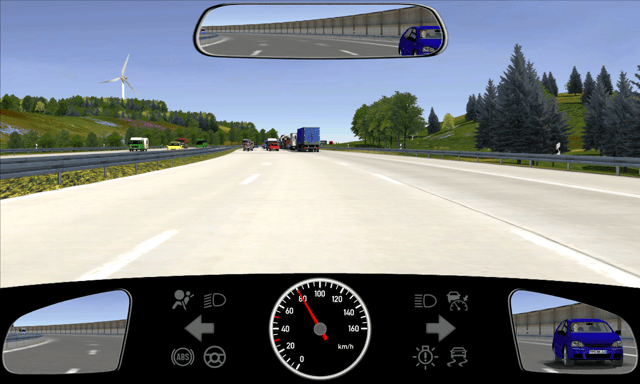

[Video: videos/2_2_18-013.mp4](videos/2_2_18-013.mp4)

**Options:**
- A. - as far to the right as possible
- B. - as far to the left as possible
- C. - in the centre

**Correct Answer(s):**
- A. - as far to the right as possible

**Explanation:**
You approach the end of a traffic jam on the freeway. Turn on the hazard light. Form an alley in the middle of the lane for the passage of police and helping vehicles: on roads with three lanes for one direction, form an alley between the left and middle lane. Therefore, you have to drive far to the right. This rule applies outside built-up areas and on freeways.

---

#### Question 2.2.18-014

**Points:** 4 Points

**What should you do?**

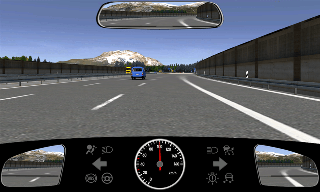

[Video: videos/2_2_18-014.mp4](videos/2_2_18-014.mp4)

**Options:**
- A. I continue driving
- B. I get in line on the hard shoulder
- C. I stop on my lane and wait for a gap

**Correct Answer(s):**
- A. I continue driving

**Explanation:**
They want to leave the freeway. You can see that traffic is stalling in your intended exit. Since you are not allowed to drive on the hard shoulder and wait on the lane, you behave correctly if you continue driving and use the next exit in order to exit the freeway.

---

#### Question 2.2.18-015-M

**Points:** 4 Points

**What must you do when a traffic jam forms on this road?**

**Options:**
- A. - drive as far to the left as possible
- B. - drive as far to the right as possible
- C. - continuing driving in the centre

**Correct Answer(s):**
- A. - drive as far to the left as possible

**Explanation:**
Any car driver must cooperate in forming an alley in the middle of the road for the passage of police and support vehicles in case of congestion on freeways and on out-of-town roads with more than one lane. Do not drive on the side strip, this is prohibited.

---

#### Question 2.2.18-016-M

**Points:** 4 Points

**What is the right course of action now?**

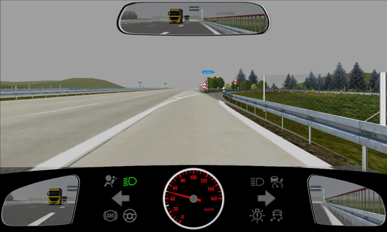

[Video: videos/2_2_18-016-M.mp4](videos/2_2_18-016-M.mp4)

**Options:**
- A. I warn the driver by sounding my horn and flashing my lights
- B. I drive over to the right-side as far as possible
- C. I notify the police

**Correct Answer(s):**
- A. I warn the driver by sounding my horn and flashing my lights
- B. I drive over to the right-side as far as possible
- C. I notify the police

**Explanation:**
You meet a wrong-way driver on the freeway exit. By driving as far to the right as possible, you can best counteract a collision with the wrong-way driver. Now other road users must be warned of this acute danger. For this reason, you must inform the police.

---

#### Question 2.2.18-017-M

**Points:** 3 Points

**What should you do now?**

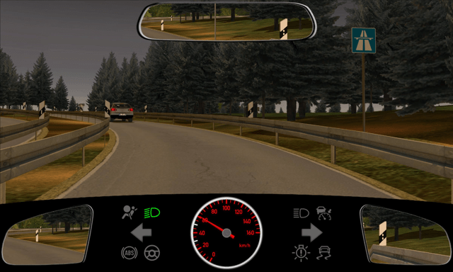

[Video: videos/2_2_18-017-M.mp4](videos/2_2_18-017-M.mp4)

**Options:**
- A. I accelerate and merge in front of the [truck]
- B. I slow down and merge between the [red car] and the [truck]
- C. I slow down and merge after the [yellow vehicle]

**Correct Answer(s):**
- A. I accelerate and merge in front of the [truck]

**Explanation:**
They have already passed the truck on the acceleration lane on the right-hand side of the freeway. If you continue to accelerate, you can drive onto the main lane before the end of the lane. You should do that.

---

#### Question 2.2.18-018-M

**Points:** 3 Points

**You want to exit the motorway. What is the right course of action in this situation?**

**Options:**
- A. I move into the left-hand lane
- B. I watch out for oncoming vehicles
- C. I continue by driving on the hard shoulder

**Correct Answer(s):**
- A. I move into the left-hand lane

**Explanation:**
You flash and leave the freeway at the exit. The route to the turn of the exit is used to decelerate. Drive quickly off the highway, then reduce your pace. Drive into the corner at a moderately reduced speed.

---

#### Question 2.2.18-019

**Points:** 4 Points

**What must you do if you find yourself in a traffic jam on motorways and on highways with two lanes travelling in the same direction?**

**Options:**
- A. - drive as far to the right as possible in the right-hand lane
- B. - drive as far to the left as possible in the left-hand lane
- C. - drive as far to the left as possible in the right-hand lane

**Correct Answer(s):**
- A. - drive as far to the right as possible in the right-hand lane
- B. - drive as far to the left as possible in the left-hand lane

**Explanation:**
If vehicles stand or drive at walking speed on freeways or on roads outside of built-up areas with at least two lanes for one direction, the following applies: You, as a car driver, must participate in forming a free lane between the leftmost and rightmost lane for the passage of police and support vehicles.

---

#### Question 2.2.18-020

**Points:** 3 Points

**You are approaching a traffic jam on the motorway. What is the right course of action?**

**Options:**
- A. I pull carefully up behind the last car in the traffic jam
- B. I drive carefully through the emergency corridor
- C. I continue driving carefully along the hard shoulder

**Correct Answer(s):**
- A. I pull carefully up behind the last car in the traffic jam

**Explanation:**
Warn following traffic by switching on the hazard warning lights and close up carefully.

---

#### Question 2.2.18-021-M

**Points:** 4 Points

**What is the right course of action now?**

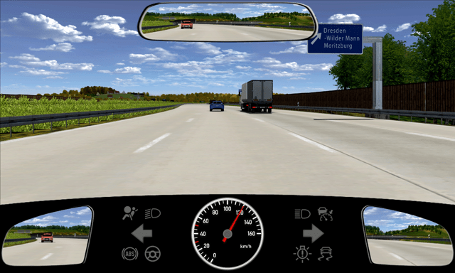

[Video: videos/2_2_18-021-M.mp4](videos/2_2_18-021-M.mp4)

**Options:**
- A. I stay in the middle lane
- B. I move into the left-hand lane
- C. I move into the right-hand lane

**Correct Answer(s):**
- A. I stay in the middle lane

**Explanation:**
You must stay in the middle lane because there are vehicles in the left and right lanes that you would obstruct.
In the right lane, a motorbike is coming onto the motorway from the slip road. In the left lane is the car that just overtook you.

---

#### Question 2.2.18-022

**Points:** 4 Points

**You want to leave the motorway at the next exit. What is the correct course of action in this situation?**

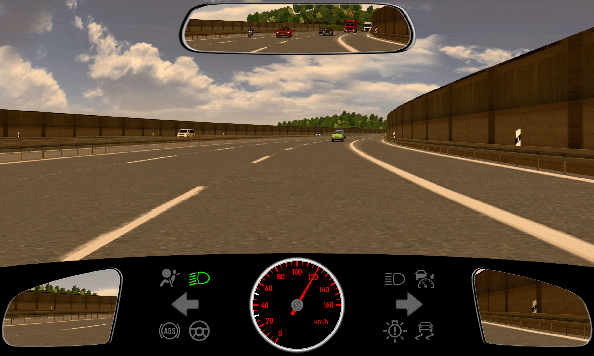

[Video: videos/2_2_18-022.mp4](videos/2_2_18-022.mp4)

**Options:**
- A. I observe the traffic behind me
- B. I turn on my right-side indicators now
- C. I begin now to smoothly brake down to 60 km/h

**Correct Answer(s):**
- A. I observe the traffic behind me
- B. I turn on my right-side indicators now

**Explanation:**
When leaving the motorway, you should set the indicator at least 300 m before the exit.
Always keep a close eye on the traffic behind you when driving on the motorway. Especially when exiting the motorway, make sure that nobody tries to overtake you on the right.

---

#### Question 2.2.18-023-M

**Points:** 4 Points

**What should you do now?**

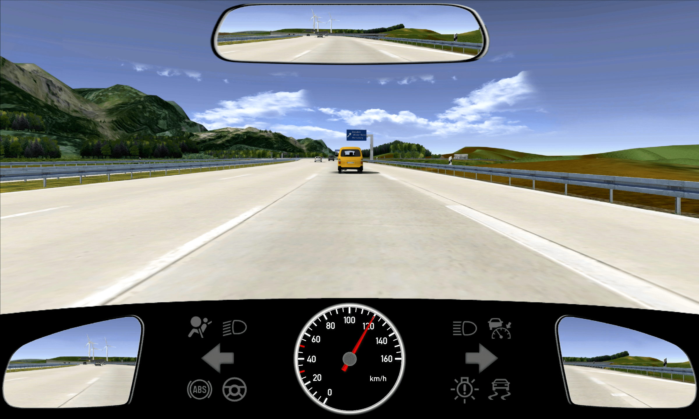

[Video: videos/2_2_18-023-M.mp4](videos/2_2_18-023-M.mp4)

**Options:**
- A. I reduce my speed
- B. I accelerate
- C. I move into the middle lane

**Correct Answer(s):**
- A. I reduce my speed

**Explanation:**
Reduce your speed and allow the blue car to join the motorway while keeping a safe distance.

---

#### Question 2.2.18-024-M

**Points:** 4 Points

**What can you expect now?**

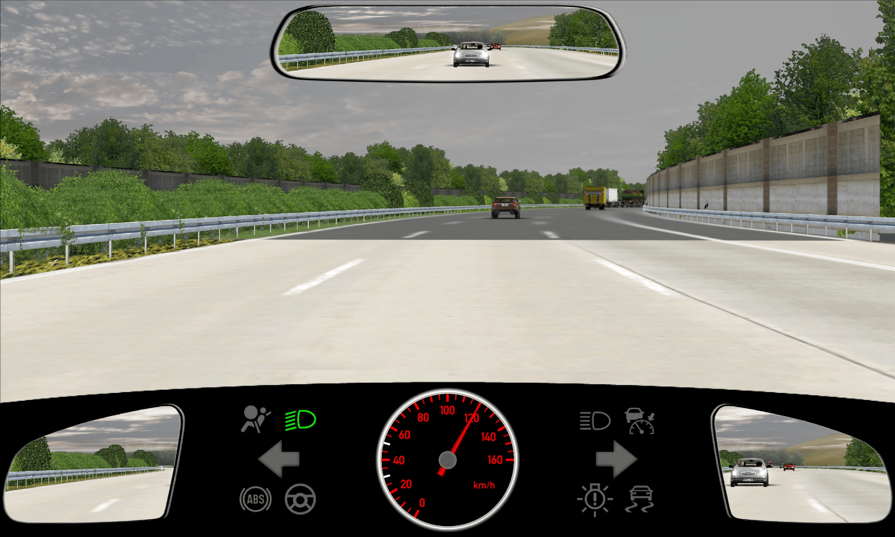

[Video: videos/2_2_18-024-M.mp4](videos/2_2_18-024-M.mp4)

**Options:**
- A. - brake
- B. - stay in the middle lane
- C. - accelerate

**Correct Answer(s):**
- A. - brake
- B. - stay in the middle lane

**Explanation:**
You should expect the truck in front of you to slow down because the other truck in the right lane is already slowing down and has its hazard lights on. You also have to expect that the truck will stay in the middle lane because it doesn't have enough space to get into the right lane. 
If a dangerous situation is identified on the motorway, the hazard warning lights may be switched on in order to warn all following vehicles in good time. Dangerous situations usually include accidents, traffic jams or slow traffic.

---

#### Question 2.2.18-101

**Points:** 3 Points

**Your vehicle has broken down on the autobahn. What must you remember when having it towed away?**

**Options:**
- A. You must leave the autobahn at the next exit
- B. During towing, both vehicles must have their hazard warning lights switched on
- C. You may continue along the autobahn to the exit nearest a suitable garage

**Correct Answer(s):**
- A. You must leave the autobahn at the next exit
- B. During towing, both vehicles must have their hazard warning lights switched on

**Explanation:**
When towing on the freeway, the towing vehicle and the towed vehicle must have their hazard lights switched on. It's only allowed to tow on the freeway until the next exit. Then, the freeway must be left.

---

#### Question 2.2.18-102

**Points:** 4 Points

**What applies on autobahns?**

**Options:**
- A. No stopping on the roadway and hard shoulder
- B. No reversing
- C. In darkness, under no circumstances drive faster than the range of visibility allowed by dipped headlights

**Correct Answer(s):**
- A. No stopping on the roadway and hard shoulder
- B. No reversing

**Explanation:**
On the freeway you are only allowed to drive forward and only in one given direction. Reversing, turning and stopping is strictly prohibited on the roadway as well as on the side strip.

---

#### Question 2.2.18-103

**Points:** 4 Points

**You are driving on the motorway and have missed the exit. What is the right course of action?**

**Options:**
- A. I continue driving and leave the motorway at one of the next exits
- B. I reverse back on the hard shoulder, because the exit is less than 100 m behind me
- C. I stop on the hard shoulder to plan my subsequent route

**Correct Answer(s):**
- A. I continue driving and leave the motorway at one of the next exits

**Explanation:**
Continue until the next exit and leave the freeway there. Now you can drive back to the missed exit on the other side of the freeway. You must not stop or drive backwards.

---

#### Question 2.2.18-104-M

**Points:** 4 Points

**How can lane changing assist help you in this situation without steering override?**

**Options:**
- A. - warns of a possible collision with a vehicle in the middle lane
- B. - performs a lane change independently
- C. - brakes the speed of my vehicle

**Correct Answer(s):**
- A. - warns of a possible collision with a vehicle in the middle lane

**Explanation:**
Lane Change Assist recognises the vehicle in the middle lane as a hazard and warns you not to change to that lane. To change lanes on your own would require steering intervention. Lane Change Assist does not interfere with your speed.

---

#### Question 2.2.18-105

**Points:** 3 Points

**What is prohibited when using motorways?**

**Options:**
- A. Stopping on the hard shoulder
- B. Reversing
- C. Performing U-turns

**Correct Answer(s):**
- A. Stopping on the hard shoulder
- B. Reversing
- C. Performing U-turns

**Explanation:**
According to the StVO § 18 motorways and motor drivers:
(7) Turning and reversing are prohibited.
(8) hold, also on the side stripes, is forbidden.

---

#### Question 2.2.18-207

**Points:** 2 Points

**What vehicles are subject to the toll on motorways and certain federal highways?**

**Options:**
- A. Motor vehicles with a gross vehicle weight rating of at least 7.5 t, intended exclusively for the carriage of goods by road
- B. Combination vehicles with a gross vehicle weight rating of at least 7.5 t, intended exclusively for the carriage of goods by road
- C. Buses with a gross vehicle weight rating of at least 7.5 t

**Correct Answer(s):**
- A. Motor vehicles with a gross vehicle weight rating of at least 7.5 t, intended exclusively for the carriage of goods by road
- B. Combination vehicles with a gross vehicle weight rating of at least 7.5 t, intended exclusively for the carriage of goods by road

**Explanation:**
is correct: motor vehicles with at least 7.5 t permissible total mass, which are intended solely for the carriage of goods. Combinations of vehicles with at least 7.5 t permissible total mass.

---

#### Question 2.2.18-208

**Points:** 3 Points

**Who can be held responsible if the toll charge is not paid?**

**Options:**
- A. The driver
- B. The holder
- C. The shipping agent

**Correct Answer(s):**
- A. The driver
- B. The holder

**Explanation:**
Not only the driver but also the holder are responsible. The shipper is not responsible.

---

#### Question 2.2.18-209

**Points:** 3 Points

**The gross vehicle weight rating of your towing vehicle amounts to 6.5 t; the gross vehicle weight rating of your trailer is 5.5 t. Is this combination vehicle liable to the toll if used on a motorway?**

**Options:**
- A. Yes, if the combination vehicle is intended exclusively for the carriage of goods by road
- B. Always, because the combination vehicle exceeds the gross combination weight rating of 7.5 t
- C. No, because the towing vehicle does not exceed the gross vehicle weight rating of 7.5 t

**Correct Answer(s):**
- A. Yes, if the combination vehicle is intended exclusively for the carriage of goods by road

**Explanation:**
If your tractor t a maximum authorized mass of 6.5 and your trailer has 5.5 t, you may distribute the highway only sail if you entrichtest the toll for your vehicle combination is intended exclusively for freight. These are Toll Roads.

---

#### Question 2.2.18-210

**Points:** 3 Points

**The gross vehicle weight rating of your truck amounts to 5.5 t; the gross vehicle weight rating of your trailer is 2.0 t. Is this combination vehicle liable to the toll if used for road haulage on a motorway?**

**Options:**
- A. Yes
- B. No

**Correct Answer(s):**
- A. Yes

**Explanation:**
Since your total mass of a total of 7.5 is your truck (freight) t, including trailer (vehicle combination) is payable on the highway a toll.

---

#### Question 2.2.18-211

**Points:** 2 Points

**A user charge must be paid on motorways for motor vehicles or combination vehicles intended or used exclusively for the carriage of goods by road. From what gross vehicle weight rating does this apply?**

**Options:**

**Correct Answer(s):**
- 7,5 

**Explanation:**
The toll is t from a maximum mass of 7.5 to be paid.

---

#### Question 2.2.18-212

**Points:** 2 Points

**Your truck has a gross vehicle weight rating of 6.5 t, and you would like to use it on the motorway for road haulage. What is true regarding the toll terminal registration?**

**Options:**
- A. - do not have to register
- B. - have to enter the number of axles
- C. - have to enter the pollutant class (emissions class)

**Correct Answer(s):**
- A. - do not have to register

**Explanation:**
Your trucks with a gross vehicle weight of 6.5 t for freight has no log-on to make, since the total mass is less than 7.5 t.

---

#### Question 2.2.18-213

**Points:** 2 Points

**Your truck is equipped with an on-board unit (OBU). What information must be reviewed, and adapted as necessary, prior to travelling on a toll route?**

**Options:**
- A. The number of axles
- B. The emissions class
- C. The gross vehicle weight rating

**Correct Answer(s):**
- A. The number of axles

**Explanation:**
Before you befährst a Toll route your OBU (toll collection device), you should enter the number of axles and adapt if necessary.

---

#### Question 2.2.18-214

**Points:** 3 Points

**You want to drive a toll-chargeable motor vehicle on the motorway. How can the requisite toll entry be performed?**

**Options:**
- A. - via the internet
- B. - at a toll terminal
- C. - using the on-board unit (OBU)

**Correct Answer(s):**
- A. - via the internet
- B. - at a toll terminal
- C. - using the on-board unit (OBU)

**Explanation:**
3 answers are right here. With a toll station terminal in the www and also by means of on-board unit, short (OBU) so manually and digitally.

---

#### Question 2.2.18-215

**Points:** 3 Points

**Why should you have the traffic information switched on, when driving on the motorway?**

**Options:**
- A. - gives warnings about motorists heading in the wrong direction
- B. - provides reports about traffic jams
- C. - is a prescribed requirement for travelling on the motorway

**Correct Answer(s):**
- A. - gives warnings about motorists heading in the wrong direction
- B. - provides reports about traffic jams

**Explanation:**
Drivers are not required to listen to traffic news, but traffic news are indispensable for a smooth journey. Traffic news inform about traffic jams, traffic accidents and construction sites. Warnings about wrong-way drivers have already prevented a lot of serious accidents.

---

#### Question 2.2.18-216

**Points:** 2 Points

**Who is responsible for enforcing the road toll?**

**Options:**
- A. The operator of the automatic control bridges
- B. The Federal Office for Goods Transport
- C. The Federal Central Tax Office

**Correct Answer(s):**
- A. The operator of the automatic control bridges
- B. The Federal Office for Goods Transport

**Explanation:**
The toll-control is carried out by the operator of the automatic control bridges and by the Federal Office for freight transport. Taxes have nothing to do with toll.

---

#### Question 2.2.18-217

**Points:** 2 Points

**Your truck is equipped with a toll collection device (OBU). What information must be checked and, if necessary, adjusted before driving along a toll section?**

**Options:**
- A. - gross vehicle weight rating
- B. - emissions class
- C. - number of axles

**Correct Answer(s):**
- A. - gross vehicle weight rating

**Explanation:**
The toll rates are based on the weight classes, so you must account are rolling the perm. Total weight and adjust if necessary.

---

#### Question 2.2.18-218

**Points:** 2 Points

**In which case are motor vehicles or combination vehicles used in road haulage, subject to a toll charge?**

**Options:**

**Correct Answer(s):**
- 7,5 

---

#### Question 2.2.18-219

**Points:** 2 Points

**What applies to the payment of tolls in commercial road haulage?**

**Options:**
- A. The driver can be held responsible for non-payment of the toll
- B. The vehicle owner can be held responsible for non-payment of the toll
- C. No toll has to be paid for empty runs

**Correct Answer(s):**
- A. The driver can be held responsible for non-payment of the toll
- B. The vehicle owner can be held responsible for non-payment of the toll

**Explanation:**
Both the driver and the owner of a vehicle are responsible for paying the toll properly. If no toll fee is paid, both people are considered to be debtors of the toll and can therefore be held accountable accordingly.

---

#### Question 2.2.18-220

**Points:** 2 Points

**A toll must be paid for motor vehicles or vehicle combinations used for commercial freight transport on motorways. From what technically permissible maximum laden mass does this apply?**

**Options:**

**Correct Answer(s):**
- 3,5 

**Explanation:**
Motor vehicles or vehicle combinations with a technically permissible total mass of more than 3.5 tonnes must pay a toll.

---

#### Question 2.2.18-301

**Points:** 2 Points

**Your truck is equipped with a toll collection device (OBU). What information must be checked and, if necessary, adjusted before driving along a toll section?**

**Options:**
- A. - number of axles
- B. - gross vehicle weight rating
- C. - emissions class

**Correct Answer(s):**
- A. - number of axles
- B. - gross vehicle weight rating

**Explanation:**
The toll rates are based on the weight classes, so you must account are rolling the perm. Total weight and adjust if necessary. For vehicles and vehicle combinations with a gross vehicle weight of over 18 tons in the declaration of weight class one step further must be done. The driver must here also specify the number of axles.

---

### 2.2.21 Chapter Passenger Transport

#### Question 2.2.21-001

**Points:** 3 Points

**What effects does a pillion passenger have on driving a motorcycle?**

**Options:**
- A. Driving off is more difficult because a motorcycle only becomes stable at higher speeds
- B. The motorcycle becomes more susceptible to side wind
- C. The motorcycle's braking behaviour can change

**Correct Answer(s):**
- A. Driving off is more difficult because a motorcycle only becomes stable at higher speeds
- B. The motorcycle becomes more susceptible to side wind
- C. The motorcycle's braking behaviour can change

**Explanation:**
Having a passenger sitting behind you will increase your weight which makes starting to drive and gaining speed more difficult, it will also increase your breaking distance to stop. Given that it creates more side surface, it increases your sensitivity to side winds

---

#### Question 2.2.21-002

**Points:** 3 Points

**You want to take a passenger on your motorcycle. What should you pay attention to before you drive off?**

**Options:**
- A. Your passenger has to wear a prescribed helmet
- B. Agree on the conduct during the journey
- C. Carefully and cautiously familiarize inexperienced passengers with riding on a motorbike

**Correct Answer(s):**
- A. Your passenger has to wear a prescribed helmet
- B. Agree on the conduct during the journey
- C. Carefully and cautiously familiarize inexperienced passengers with riding on a motorbike

**Explanation:**
When taking an inexperienced passenger with you, make sure that he wears a helmet, agrees on how to behave during the ride and gradually get used to the new environment

---

#### Question 2.2.21-003

**Points:** 3 Points

**What must you remember if you want to take a pillion passenger?**

**Options:**
- A. The motorcycle must be licensed to carry 2 persons
- B. There must be a safety helmet for the pillion passenger
- C. No safety helmet is required for the pillion passenger when driving in built-up areas

**Correct Answer(s):**
- A. The motorcycle must be licensed to carry 2 persons
- B. There must be a safety helmet for the pillion passenger

**Explanation:**
When taking another passenger ensure that he wears a helmet and that the motorcycle is licensed to have him on board

---

#### Question 2.2.21-004

**Points:** 3 Points

**What must you point out to your pillion passenger before setting off?**

**Options:**
- A. - must put his feet on the footrests
- B. - must wear a safety helmet
- C. - must always lean to the outside on bends

**Correct Answer(s):**
- A. - must put his feet on the footrests
- B. - must wear a safety helmet

**Explanation:**
Make sure that your passenger wears a helmet, keeps his feet on the footrests (otherwise it increases the risk of accident and injury). Your passenger does not have to lean to the outside of the bend to compensate when turning

---

#### Question 2.2.21-006

**Points:** 4 Points

**You want to take a five-year old child on your motorized bicycle. Which seats are permissible for this?**

**Options:**
- A. A special child's seat with footrests
- B. Luggage rack with a cushion
- C. Tank with attached padding

**Correct Answer(s):**
- A. A special child's seat with footrests

**Explanation:**
In order to carry a child as a passenger, you need a special child seat with footrests

---

#### Question 2.2.21-007

**Points:** 4 Points

**Why is it dangerous if passengers sitting in the rear do not wear their seatbelts?**

**Options:**
- A. - could result in injuries even at low speeds
- B. - could result in injuries to persons in the front seats
- C. - could propel these persons from the vehicle

**Correct Answer(s):**
- A. - could result in injuries even at low speeds
- B. - could result in injuries to persons in the front seats
- C. - could propel these persons from the vehicle

**Explanation:**
In the event of a collision, people on the rear seats can be thrown forward or sideways. If they are thrown forward, the front backrests do not provide adequate protection. As a result, the driver and co-driver are at risk. Even at low speeds, injuries can occur.

---

#### Question 2.2.21-008

**Points:** 3 Points

**To what should you pay attention if you want to take a passenger on the motorbike?**

**Options:**
- A. The passenger should also be wearing protective motorcycling clothing
- B. The chassis should be adjusted accordingly
- C. The tyre inflation pressure should be adjusted

**Correct Answer(s):**
- A. The passenger should also be wearing protective motorcycling clothing
- B. The chassis should be adjusted accordingly
- C. The tyre inflation pressure should be adjusted

**Explanation:**
When increasing the load on your motorcycle, make sure to increase the tire pressure, adjust the chassis/suspension. Your passenger should also wear a helmet and protective gear

---

#### Question 2.2.21-009

**Points:** 3 Points

**What must you be aware of if you want to take a pillion rider with you?**

**Options:**
- A. The motorbike must be licensed to carry 2 people
- B. The pillion rider must be capable of riding with you
- C. A child pillion rider over 7 years of age, must be able to use the existing footrests and hand grips

**Correct Answer(s):**
- A. The motorbike must be licensed to carry 2 people
- B. The pillion rider must be capable of riding with you
- C. A child pillion rider over 7 years of age, must be able to use the existing footrests and hand grips

**Explanation:**
The passenger(s) must be physically and mentally able to ride, and the motorbike must be adequately equipped.

---

#### Question 2.2.21-010

**Points:** 3 Points

**How does riding with a pillion rider affect the handling of a motorbike?**

**Options:**
- A. It is more difficult to keep the motorbike stable
- B. Its behaviour changes when braking
- C. There is a reduction in its sensitivity to side winds

**Correct Answer(s):**
- A. It is more difficult to keep the motorbike stable
- B. Its behaviour changes when braking

**Explanation:**
The pillion rider's own movement destabilises the motorbike. Riding with a passenger should be practised.

---

#### Question 2.2.21-011

**Points:** 3 Points

**You want to transport a pillion passenger and luggage on your motorbike. What must you be aware of?**

**Options:**
- A. The maximum authorised mass may not be exceeded
- B. Pieces of luggage must be securely fastened
- C. Lighting systems may not be obscured

**Correct Answer(s):**
- A. The maximum authorised mass may not be exceeded
- B. Pieces of luggage must be securely fastened
- C. Lighting systems may not be obscured

**Explanation:**
You must not exceed the permissible total weight for the motorbike. This is made up of the unladen weight and the maximum permitted load. To prevent luggage from flying around, it must be securely fastened. The lighting equipment must be visible at all times and must not be obscured by the loaded luggage.

---

#### Question 2.2.21-012

**Points:** 3 Points

**You want to transport a pillion passenger. What must you ensure before commencing your journey?**

**Options:**
- A. - that my pillion passenger is wearing a suitable helmet
- B. - I have instructed my pillion passenger on how to behave while we are driving on the road
- C. - the bike's technical adjustment settings for carrying a pillion passenger are used

**Correct Answer(s):**
- A. - that my pillion passenger is wearing a suitable helmet
- B. - I have instructed my pillion passenger on how to behave while we are driving on the road
- C. - the bike's technical adjustment settings for carrying a pillion passenger are used

**Explanation:**
In principle, when a pillion passenger is carried, the passenger seat, footrests and a holding device must be available on the motorbike. Both rider and pillion passenger must wear a suitable safety helmet while riding. To ensure a safe ride, you must instruct the pillion passenger on the correct behaviour before the ride.

---

#### Question 2.2.21-013

**Points:** 3 Points

**What should you anticipate if you want to take a pillion passenger with you?**

**Options:**
- A. The vehicle's handling will be different when cornering
- B. The overtaking distance may be longer
- C. The braking distance will be reduced

**Correct Answer(s):**
- A. The vehicle's handling will be different when cornering
- B. The overtaking distance may be longer

**Explanation:**
Be aware that the additional weight of the passenger will make your motorbike more slow and shift the centre of gravity backwards. You will therefore no longer be able to corner quite as dynamically as without a passenger.
You should also be aware that the additional weight can make your overtaking distance noticeably longer.

---

#### Question 2.2.21-014

**Points:** 3 Points

**What conditions must you fulfil to be allowed to carry a five-year-old child on your moped?**

**Options:**
- A. - be at least 16 years old
- B. - fit the moped with a special child seat
- C. - make sure that the child’s feet cannot get caught in the wheels

**Correct Answer(s):**
- A. - be at least 16 years old
- B. - fit the moped with a special child seat
- C. - make sure that the child’s feet cannot get caught in the wheels

**Explanation:**
It is required by law that you must be at least 16 years old if you want to take a child under 7 years old with you on the moped. 
Since the child is under 7 years old, you must be able to attach a special child seat to the moped. The child's height and body control are not yet sufficient to hold on to the moped safely and independently. You also need to make sure that the child's feet cannot get caught in the wheels. There are special protective devices for this, such as: B. Footrests.

---

#### Question 2.2.21-102

**Points:** 2 Points

**You are driving a truck with a trailer and wish to give someone a lift as a favour. Where are you allowed to carry such a passenger?**

**Options:**
- A. In the driver's cab
- B. On the floor of the truck
- C. On the floor of the trailer

**Correct Answer(s):**
- A. In the driver's cab

**Explanation:**
For safety reasons, you may only carry people inside the cab of a truck. Taking somebody with you on the load platform is not permitted. Only certain persons may exceptionally ride on the loading platform, if, for example, they are responsible for escorting the load.

---

#### Question 2.2.21-103

**Points:** 4 Points

**What must you ensure before setting off on a journey in your car?**

**Options:**
- A. That the passengers can put on the existing safety belts
- B. That you have an adequate view to the rear
- C. That no objects (e.g. first-aid kit, road atlas, camera) are lying loose on the rear parcel shelf

**Correct Answer(s):**
- A. That the passengers can put on the existing safety belts
- B. That you have an adequate view to the rear
- C. That no objects (e.g. first-aid kit, road atlas, camera) are lying loose on the rear parcel shelf

**Explanation:**
The car driver is responsible for the safety of the passengers and the cargo. He/she must take all necessary measures to prevent or minimize damage. The loading must be carried out in accordance with regulations and must be carefully secured.

---

#### Question 2.2.21-104

**Points:** 4 Points

**How are you allowed to transport a small child in your car?**

**Options:**
- A. In an approved child restraint with test mark
- B. On the lap of an adult
- C. In a baby carrycot on one of the back seats

**Correct Answer(s):**
- A. In an approved child restraint with test mark

**Explanation:**
Toddlers must be specially secured. This is only possible with an age-appropriate restraining device. This is to be mounted on the back seat. Infants are at risk to be suffocated by the airbag in the event of an impact. A baby seat is not secure enough.

---

#### Question 2.2.21-105

**Points:** 4 Points

**How are you allowed to transport a five-year-old child in your car?**

**Options:**
- A. In a suitable and approved child seat with test mark
- B. In a back seat with standard three-point safety belt
- C. On a back seat with waist belt fastened

**Correct Answer(s):**
- A. In a suitable and approved child seat with test mark

**Explanation:**
If you want to bring a five-year-old child with you in your car, you must use a child seat that has been tested and adapted to the size of the child. This is mandatory for all children under 12 years.

---

#### Question 2.2.21-106

**Points:** 4 Points

**How are you allowed to transport an eleven-year-old child of 140 cm (4'11") in your car?**

**Options:**
- A. On an approved raised seat with test mark and with three-point safety belt fastened
- B. With three-point safety belt fastened
- C. On a back seat with waist belt fastened

**Correct Answer(s):**
- A. On an approved raised seat with test mark and with three-point safety belt fastened

**Explanation:**
An eleven-year-old child that is 140 cm tall needs a children's seat or a booster seat. The child is to be fastened with the belt. Children under the age of twelve or under 150 cm tall must be carried. If the strap rests on the neck, there is a risk of strangulation.

---

#### Question 2.2.21-107

**Points:** 4 Points

**What should be borne in mind when using an approved child seat with test mark?**

**Options:**
- A. The child seat must be appropriate for the height and weight of the child
- B. The child seat must be capable of attachment to the seat of the vehicle for which it is intended
- C. Nothing apart from the test mark

**Correct Answer(s):**
- A. The child seat must be appropriate for the height and weight of the child
- B. The child seat must be capable of attachment to the seat of the vehicle for which it is intended

**Explanation:**
Child seats are made for different age groups. They are safety-tested for the specified weight and size groups. You should pay attention to this when using it. The child seat may only be used on those car seats for which it is suitable and approved.

---

#### Question 2.2.21-108

**Points:** 4 Points

**Why is it dangerous not to wear safety belts?**

**Options:**
- A. Because you cannot adequately protect yourself in case of an impact at a speed of about 20 km/h
- B. Because in case of an accident you can be projected out of the vehicle
- C. Because of the low speed there is no danger in urban traffic

**Correct Answer(s):**
- A. Because you cannot adequately protect yourself in case of an impact at a speed of about 20 km/h
- B. Because in case of an accident you can be projected out of the vehicle

**Explanation:**
In an accident, a person may be easily thrown out of the vehicle by the impact energy, or injured in the vehicle by a collision. Already at 20 km/h the impact energy is so high that injuries can occur.

---

#### Question 2.2.21-111

**Points:** 4 Points

**At which impact speed must you reckon with serious or deadly injuries when no safety belt is worn?**

**Options:**
- A. From 30 km/h onward
- B. From 50 km/h onward
- C. From 80 km/h onward

**Correct Answer(s):**
- A. From 30 km/h onward

**Explanation:**
Without a seat belt, serious injuries can occur in a collision just over 20 km/h. This also applies to rear-end collisions which are often wrongly considered harmless. That's why you should always fasten your seat belt, even on short distances.

---

#### Question 2.2.21-112

**Points:** 4 Points

**A car is equipped with two front air bags. On which seats must safety belts be worn?**

**Options:**
- A. On all seats
- B. Not on the front seats
- C. On the front seats only

**Correct Answer(s):**
- A. On all seats

**Explanation:**
The front airbags protect the car driver and the co-driver in the front seat in the event of a strong impact, for example a rear-end collision. However, they are not sufficient for comprehensive protection. All passengers must fasten their seat belts each time they drive.

---

#### Question 2.2.21-113

**Points:** 4 Points

**What does this warning sign mean?**

**Options:**
- A. - you are not allowed to install a child seat opposite to the direction in which the vehicle is travelling
- B. - you may only install a child seat facing the direction in which the vehicle is travelling
- C. - you must install the child seat as illustrated

**Correct Answer(s):**
- A. - you are not allowed to install a child seat opposite to the direction in which the vehicle is travelling
- B. - you may only install a child seat facing the direction in which the vehicle is travelling

**Explanation:**
The note warns against the wrong installation of the children's seat. If the children's seat is mounted so that the child sits in the opposite direction of travel, the child may be seriously injured in the event of a collision and the impact of the airbag. The children's seat must be installed in the direction of travel.

---

#### Question 2.2.21-114

**Points:** 4 Points

**You wish to take several small children home after a children's birthday party. What must you observe when using your car?**

**Options:**
- A. The children must be secured with the prescribed child restraints
- B. Child restraints need not be used within built-up areas
- C. It is sufficient to secure the children with the existing safety belts

**Correct Answer(s):**
- A. The children must be secured with the prescribed child restraints

**Explanation:**
If you want to bring several small children home with your car, you must ensure that your passengers are secured in all places with the legally required restraining devices.

---

#### Question 2.2.21-115

**Points:** 4 Points

**What must you observe if you wish to drive a vehicle with front passenger air bag?**

**Options:**
- A. You may not install a child restraint on the front passenger seat facing backwards
- B. You may install a child restraint on the front passenger seat facing forwards
- C. You may install a child restraint on the front passenger seat facing backwards

**Correct Answer(s):**
- A. You may not install a child restraint on the front passenger seat facing backwards
- B. You may install a child restraint on the front passenger seat facing forwards

**Explanation:**
The children's seat must be facing forward. If it is placed in the opposite direction, the children's seat must not be used as the airbag poses a risk to the child in the event of an accident.

---

#### Question 2.2.21-117

**Points:** 3 Points

**What is important to consider about headrests?**

**Options:**
- A. Adjust them to head height according to the operating manual
- B. They are optimally adjusted by the factory
- C. For the rear seats they replace the safety belts

**Correct Answer(s):**
- A. Adjust them to head height according to the operating manual

**Explanation:**
Head restraints must always be adjusted to suit the height of the occupants. Only then, can they best absorb the impact energy and protect the driver and other passengers in the event of a collision. However, the headrests do not serve as a substitute for safety belts.

---

#### Question 2.2.21-118

**Points:** 3 Points

**While you are driving, the airbag control light stays on constantly. What must you do?**

**Options:**
- A. Go to a garage workshop
- B. Take the vehicle off the road immediately
- C. Nothing because it is an indication for the garage workshop

**Correct Answer(s):**
- A. Go to a garage workshop

**Explanation:**
If the airbag control lamp is lit up, it signals a defect in the airbag system. An error of this sensory and electronic system can usually only be fixed in a car workshop. This should be done as soon as possible. For this reason, you as a car driver do not have to immediately pull the vehicle out of circulation.

---

#### Question 2.2.21-120

**Points:** 2 Points

**Are you allowed to transport persons on the loading platform of your truck?**

**Options:**
- A. Yes, if they must carry out necessary work
- B. Yes, if they have to accompany the load
- C. Yes, to secure the load

**Correct Answer(s):**
- A. Yes, if they must carry out necessary work

**Explanation:**
It is forbidden to carry persons on the load platform or in the shipping space of motor vehicles. A derogation applies, provided that these people have to do necessary work there. The ban also does not apply to the transport of construction site personnel within construction sites.

---

#### Question 2.2.21-121

**Points:** 4 Points

**How can you prevent a child from opening a door while the vehicle is moving?**

**Options:**
- A. - the child safety locks on the rear doors
- B. - the central locking system

**Correct Answer(s):**
- A. - the child safety locks on the rear doors

**Explanation:**
With the central locking, and child safety you can close all doors at the push of a button at the same time. This way you can prevent a child from opening the door while driving and thus being injured.

---

#### Question 2.2.21-122

**Points:** 4 Points

**You want to carry a child in your car. When must you use a child seat for this purpose?**

**Options:**
- A. If the child is younger than 12 years old and is under 150 cm in height
- B. If the child is older than 12 years old and is taller than 150 cm
- C. If the child is older than 12 years old and is under 150 cm in height

**Correct Answer(s):**
- A. If the child is younger than 12 years old and is under 150 cm in height

**Explanation:**
You need a child seat if the child is younger than 12 years and smaller than 150 cm. If you do not have it with you, you risk a fine.

---

#### Question 2.2.21-123

**Points:** 4 Points

**You want to drive with a baby in the passenger seat. What do you have to be aware of when using an infant carrier?**

**Options:**
- A. The infant carrier must be positioned reversed to the direction of travel
- B. If installed, the passenger airbag must be deactivated
- C. The baby must be strapped into the infant carrier

**Correct Answer(s):**
- A. The infant carrier must be positioned reversed to the direction of travel
- B. If installed, the passenger airbag must be deactivated
- C. The baby must be strapped into the infant carrier

**Explanation:**
The baby carrier must be placed against the direction of travel and the passenger airbag must be switched off to protect the baby. The muscles are not yet strong enough to absorb such a collision.

---

#### Question 2.2.21-124

**Points:** 3 Points

**What should be noted when using a seatbelt?**

**Options:**
- A. The seatbelt should not be twisted
- B. Once you have put it on, the seatbelt should be pulled tight
- C. A damaged seatbelt should be replaced

**Correct Answer(s):**
- A. The seatbelt should not be twisted
- B. Once you have put it on, the seatbelt should be pulled tight
- C. A damaged seatbelt should be replaced

**Explanation:**
The seat belt is the most important protective device of a vehicle occupant in the event of an accident. Therefore, when creating the seat belt, care must be taken that it is not twisted or damaged.
After putting on the belt, you should pull the belt once again to ensure that the seat belt sits properly.
If you determine damage to the seat belt, it must be repaired immediately.

---

#### Question 2.2.21-125

**Points:** 3 Points

**What inhibits the operation of a three-point seatbelt?**

**Options:**
- A. Wearing a thick winter coat
- B. Passing the belt under both arms
- C. Not fully locking the belt into the harness buckle

**Correct Answer(s):**
- A. Wearing a thick winter coat
- B. Passing the belt under both arms
- C. Not fully locking the belt into the harness buckle

**Explanation:**
In order to ensure the maximum protective effect of the seat belt, it must be really cried out into the belt lock and run over the shoulder and hip. Performing the belt under both arms can lead to injuries. Furthermore, the function of the seat belt can be impaired by wearing a thick winter jacket, since there is a lot of air between body and seat belt.

---

#### Question 2.2.21-126

**Points:** 3 Points

**What should you check before starting your journey?**

**Options:**
- A. - every passenger has put on their seatbelt
- B. - I can ensure that I can properly observe other road traffic
- C. - I have the registration certificate Part II with me

**Correct Answer(s):**
- A. - every passenger has put on their seatbelt
- B. - I can ensure that I can properly observe other road traffic

**Explanation:**
You should check some points before every start.
You should make sure that all mirrors are set correctly so that you can ensure sufficient traffic observation.
You should also make sure that all those traveling have created the seat belt, since the seat belt is the most important protective device in the event of an accident.
In the best case, you should keep the registration certificate Part II in a safe place and not carry it in the car. While you always have to carry the registration certificate part I (also called vehicle license) in the original in the car. The vehicle registration document documents the official approval for the participation of the vehicle in road traffic.

---

#### Question 2.2.21-127

**Points:** 3 Points

**What should be noted regarding the desired protective effect of airbags?**

**Options:**
- A. Airbags can only achieve their full effect if the vehicle’s passengers are in the right seating position
- B. The airbag deployment zone may not be encroached
- C. Airbags can replace car seatbelts when driving in town

**Correct Answer(s):**
- A. Airbags can only achieve their full effect if the vehicle’s passengers are in the right seating position
- B. The airbag deployment zone may not be encroached

**Explanation:**
The prerequisite for the protective effect of the airbag is that it can develop properly. While the airbag unfolds, it is important that no objects or obstacles hinder the development.
The desired protective effect of airbags is only guaranteed if the passengers are upright and sitting on the back with their backs.

---

#### Question 2.2.21-128

**Points:** 3 Points

**You want to transport a person in a vehicle, and that person must remain seated in a wheelchair during the drive. What must you be aware of?**

**Options:**
- A. The motor vehicle must be equipped with a wheelchair space
- B. The wheelchair must be secured using a wheelchair restraint system
- C. The person must be secured using a wheelchair-user restraint system

**Correct Answer(s):**
- A. The motor vehicle must be equipped with a wheelchair space
- B. The wheelchair must be secured using a wheelchair restraint system
- C. The person must be secured using a wheelchair-user restraint system

**Explanation:**
Some points should be considered for the safe transportation of a wheelchair. Special passenger and wheelchair retention systems are used for this. Furthermore, there should be a special wheelchair parking space, at which, for example, anchoring points on the vehicle are attached to ensure the wheelchair.

§ 21a StVO
(1) prescribed seat belts must be created while driving; This also applies to prescribed wheelchair retention systems and prescribed wheelchair user retention systems.

---

#### Question 2.2.21-201

**Points:** 2 Points

**You are driving a public transport bus. Where may you allow passengers to board and alight the bus?**

**Options:**
- A. At designated bus stops
- B. At red traffic lights
- C. At taxi ranks

**Correct Answer(s):**
- A. At designated bus stops

**Explanation:**
You are only allowed to let passengers get on and off the bus at the specified stops to be able to eliminate any danger.

---

#### Question 2.2.21-202

**Points:** 3 Points

**As the driver of a public transport bus, what should you do when approaching a bus stop?**

**Options:**
- A. I steadily reduce my speed
- B. I open the doors only after the bus has come to a stop
- C. I turn on my indicator in plenty of time

**Correct Answer(s):**
- A. I steadily reduce my speed
- B. I open the doors only after the bus has come to a stop
- C. I turn on my indicator in plenty of time

**Explanation:**
When nearing a bus stop, it is important to switch on the blinkers and reduce speed smoothly. Do not open the doors until the bus has come to a stop.

---

#### Question 2.2.21-301

**Points:** 3 Points

**You are driving a bus for the occasional carriage of passengers, and you are supposed to convey passengers and luggage. What must you observe?**

**Options:**
- A. Including the driver, it is only permitted to convey the maximum number of individuals as seats indicated in the registration certificate Part I
- B. The loading of luggage may not result in the gross axle weight rating and the gross vehicle weight rating becoming exceeded
- C. With duly stowed luggage, the gross vehicle weight rating may be exceeded by 10 %

**Correct Answer(s):**
- A. Including the driver, it is only permitted to convey the maximum number of individuals as seats indicated in the registration certificate Part I
- B. The loading of luggage may not result in the gross axle weight rating and the gross vehicle weight rating becoming exceeded

**Explanation:**
Coming soon...

---

#### Question 2.2.21-401

**Points:** 3 Points

**How are you allowed to transport persons on trailers used for agricultural purposes?**

**Options:**
- A. Sitting, if they are sitting on adequate seats
- B. Standing up, if this is required to accompany the load
- C. Standing up on empty trailers

**Correct Answer(s):**
- A. Sitting, if they are sitting on adequate seats
- B. Standing up, if this is required to accompany the load

**Explanation:**
Coming soon...

---

### 2.2.22 Chapter Load

#### Question 2.2.22-001

**Points:** 3 Points

**What safety adjustments may be necessary when loading a motorcycle?**

**Options:**
- A. Increase the tyre pressure
- B. Adjust the damping/suspension
- C. Increase the tank volume

**Correct Answer(s):**
- A. Increase the tyre pressure
- B. Adjust the damping/suspension

**Explanation:**
When increasing the load on your motorcycle, make sure to increase the tire pressure and adjust the chassis/suspension

---

#### Question 2.2.22-002

**Points:** 3 Points

**What should you especially consider when travelling with luggage?**

**Options:**
- A. The recommended top speed given in the vehicle manufacturer's operating manual
- B. The affect of the changed centre of gravity on road handling
- C. The increased susceptibility to side wind

**Correct Answer(s):**
- A. The recommended top speed given in the vehicle manufacturer's operating manual
- B. The affect of the changed centre of gravity on road handling
- C. The increased susceptibility to side wind

**Explanation:**
Adding luggage to your motorcycle will impact its behavior on the road. The additional weight will change the center of gravity of the motorcycle. It will increase the impact of side wind on the motorcycle. Make sure you do not exceed the maximum speed recommended by your manufacturer for driving with luggage.

---

#### Question 2.2.22-003

**Points:** 3 Points

**Where should you stow heavy luggage?**

**Options:**
- A. In the tank-top bag
- B. Stow equally on the left and right, and as deep as possible in the panniers
- C. In the handlebar bag

**Correct Answer(s):**
- A. In the tank-top bag
- B. Stow equally on the left and right, and as deep as possible in the panniers

**Explanation:**
You should place heavy luggage as close as possible to the center of gravity of your motorcycle to least impact its behavior. Make sure to place it either in the tank-top bag or equally distributed and deep in the panniers.

---

#### Question 2.2.22-004

**Points:** 3 Points

**How does incorrect loading affect driving stability?**

**Options:**
- A. To heavy tail-loading causes the motorcycle to shimmy and swing
- B. Unequally distributed loading can have a negative effect on driving stability when braking
- C. Has no effect

**Correct Answer(s):**
- A. To heavy tail-loading causes the motorcycle to shimmy and swing
- B. Unequally distributed loading can have a negative effect on driving stability when braking

**Explanation:**
Incorrectly loading your motorcycle will make your motorcycle less stable. It will make it less stable when braking and could make it vibrate or swing

---

#### Question 2.2.22-005

**Points:** 3 Points

**What must you be aware of when loading a truck with trailer (truck-trailer)?**

**Options:**
- A. The total length of the truck-trailer including load may not exceed 20.75 m
- B. The load must be distributed in such a way so as not to interfere with the operational safety of the truck-trailer
- C. Heavy goods should be positioned as high up as possible

**Correct Answer(s):**
- A. The total length of the truck-trailer including load may not exceed 20.75 m
- B. The load must be distributed in such a way so as not to interfere with the operational safety of the truck-trailer

**Explanation:**
The total length of the train (lorry with trailer) and its load must not 20.75 m passing and the charge is to be distributed so that the operational reliability of the train is not affected and you thus endangering any other participants of road traffic.

---

#### Question 2.2.22-006

**Points:** 3 Points

**What is the maximum permissible length of a truck with trailer, including load?**

**Options:**
- A. 20.75 m
- B. 18.00 m
- C. 24.25 m

**Correct Answer(s):**
- A. 20.75 m

**Explanation:**
The charge of the truck, including trailer must be 20.75 meters long at most.

---

#### Question 2.2.22-007

**Points:** 3 Points

**You are carrying an additionally attached piece of luggage on your motorbike. What should you take into account?**

**Options:**
- A. Any possible maximum speed recommendations made by the vehicle manufacturer
- B. Any change in the centre of gravity of the motorbike
- C. Any change in the motorbike’s susceptibility to side winds

**Correct Answer(s):**
- A. Any possible maximum speed recommendations made by the vehicle manufacturer
- B. Any change in the centre of gravity of the motorbike
- C. Any change in the motorbike’s susceptibility to side winds

**Explanation:**
Because of the luggage, your motorbike has a larger surface area to attack, so it is more susceptible to crosswinds. The extra weight also shifts the centre of gravity of your motorbike. You should therefore make sure that the luggage is evenly distributed and adjust your riding behaviour accordingly.
There may be recommendations from the vehicle manufacturer as to how you should adjust your speed to the load. You should follow these. You will find them in the owner's manual.

---

#### Question 2.2.22-008

**Points:** 3 Points

**How does an improperly stowed load affect the driving stability of a motorbike?**

**Options:**
- A. A heavy load placed on the rear causes the motorbike to wobble and sway at high speeds
- B. A load placed on one side only negatively affects the handling
- C. Light-weight luggage in the tank bag makes skidding more probable

**Correct Answer(s):**
- A. A heavy load placed on the rear causes the motorbike to wobble and sway at high speeds
- B. A load placed on one side only negatively affects the handling

**Explanation:**
Too heavy a load at the rear of the motorbike puts too little weight on the front tyres and steering. This makes it easier for the bike to wobble and oscillate. Differently loaded sides have a negative effect on stability and handling. The motorbike will lean more towards the heavier side when braking or cornering.
Light luggage in the tank bag does not affect the riding stability of the motorbike.

---

#### Question 2.2.22-009

**Points:** 3 Points

**What might be needed when a motorcycle is fully loaded?**

**Options:**
- A. An adjustment of the tyre inflation pressure
- B. An adjustment of the chassis
- C. An adjustment of the rear-view mirrors

**Correct Answer(s):**
- A. An adjustment of the tyre inflation pressure
- B. An adjustment of the chassis
- C. An adjustment of the rear-view mirrors

**Explanation:**
If the motorbike is fully loaded, the load exerts more pressure on the tyres. You should therefore check the tyre inflation pressure. The weight of the load could push the chassis down further and must therefore be readjusted. If the load extends beyond the motorbike, you should also readjust the rear view mirrors.

---

#### Question 2.2.22-010

**Points:** 3 Points

**Carrying a rucksack while cycling can affect the handling of your two-wheeler. What can the consequences be?**

**Options:**
- A. A greater susceptibility to side wind
- B. A displacement of the centre of gravity
- C. An improvement in the manoeuvrability

**Correct Answer(s):**
- A. A greater susceptibility to side wind
- B. A displacement of the centre of gravity

**Explanation:**
By carrying a backpack, you offer a larger surface for crosswinds to attack. Carrying a backpack also shifts your center of gravity upwards. This means you can't steer as quickly.

---

#### Question 2.2.22-101

**Points:** 2 Points

**What do white plates with a black "A" on a truck mean?**

**Options:**
- A. - is transporting waste materials
- B. - is transporting dangerous goods
- C. - is driven by a beginner

**Correct Answer(s):**
- A. - is transporting waste materials

**Explanation:**
A truck with white plates marked with a black "A" transports litter. The white plates with a black "A" must be clearly visible both at the front and at the back of the truck.

---

#### Question 2.2.22-102

**Points:** 3 Points

**What must you bear in mind if you want to carry luggage on the roof of your car?**

**Options:**
- A. The roadhandling characteristics are adversely affected
- B. The permissible total mass must not be exceeded
- C. The maximum roof load stipulated by the car manufacturer (owner's manual) must not be exceeded

**Correct Answer(s):**
- A. The roadhandling characteristics are adversely affected
- B. The permissible total mass must not be exceeded
- C. The maximum roof load stipulated by the car manufacturer (owner's manual) must not be exceeded

**Explanation:**
Luggage on the roof changes the center of gravity of your vehicle upwards. This has a significant influence on the driving characteristics of the car. The driving characteristics are worse, especially in curves. The vehicle is wind-prone. It must be ensured that the permissible roof load and total mass are not exceeded.

---

#### Question 2.2.22-103

**Points:** 3 Points

**What must you reckon with when transporting luggage on the roof of your car?**

**Options:**
- A. The vehicle inclines more on bends
- B. The vehicle's susceptibility to side wind is greater
- C. The vehicle's roadhandling is improved on account of the higher centre of gravity

**Correct Answer(s):**
- A. The vehicle inclines more on bends
- B. The vehicle's susceptibility to side wind is greater

**Explanation:**
The luggage on the roof changes the center of gravity of the vehicle - it is raised. This increases the danger of tipping over and the aerodynamic drag increases. As a result, your vehicle is more sensitive to crosswind and air pressure when a wheel or truck overtakes you. In curves the driving stability also deteriorates due to the higher center of gravity. Your vehicle will tilt more.

---

#### Question 2.2.22-104

**Points:** 3 Points

**What must you do when transporting bicycles on the roof of your car?**

**Options:**
- A. Safely attach holding device and bicycles
- B. Avoid driving at high speed
- C. Regularly check the fixing devices

**Correct Answer(s):**
- A. Safely attach holding device and bicycles
- B. Avoid driving at high speed
- C. Regularly check the fixing devices

**Explanation:**
Bicycles on the roof require special attention: think of safety regulations and careful attachment. Check the fastenings regularly during driving breaks. Loads on the roof change the center of gravity of the vehicle, they lift it. The driving quality deteriorates especially in curves. Avoid high speeds.

---

#### Question 2.2.22-105

**Points:** 3 Points

**What must you check when transporting bicycles on a rear-mounted support system?**

**Options:**
- A. Whether, according to the manufacturer's instructions, the system is adequate for the vehicle
- B. Whether system and bicycles are fixed safely
- C. Whether lighting equipment or number plate are covered

**Correct Answer(s):**
- A. Whether, according to the manufacturer's instructions, the system is adequate for the vehicle
- B. Whether system and bicycles are fixed safely
- C. Whether lighting equipment or number plate are covered

**Explanation:**
Check if the rear carry system is securely fastened. Likewise, the attachment of bicycles is to be checked. If illuminating devices or the license plate is obscured, technical equipment must be installed at the end of the vehicle system for adequate lighting and/or to attach the license plate number. Back-heavy loading changes the center of gravity of the vehicle. Check the distribution of the load.

---

#### Question 2.2.22-108

**Points:** 3 Points

**How must a load be marked in darkness or bad visibility when it extends laterally more than 40 cm beyond the side lights of the vehicle?**

**Options:**
- A. By a white light to the front
- B. By a red light to the back
- C. By switching on the hazard warning lights

**Correct Answer(s):**
- A. By a white light to the front
- B. By a red light to the back

**Explanation:**
In the dark or in poor visibility conditions, a cargo that laterally protrudes more than 40 cm beyond the marker lights of the vehicle must be marked with additional lights. These are to be attached laterally no more than 40 cm from the edge and no more than 1.5 m above the roadway. For the front, a white lamp is required, for the back you need to install a red light. The hazard lights must not be switched on by you as a car driver while driving.

---

#### Question 2.2.22-109

**Points:** 3 Points

**What is the maximum height allowed above the roadway for a red light marking a load extending to the back?**

**Options:**
- A. 1.50 m
- B. 2.00 m
- C. 2.50 m

**Correct Answer(s):**
- A. 1.50 m

**Explanation:**
The maximum height for attaching the lamp is 1.5 meters. This is to ensure that the marking is in the field of vision of other road users. If the red light is higher above the road, it could be overlooked.

---

#### Question 2.2.22-111

**Points:** 3 Points

**Up to what height is a load not allowed to project over the front of the vehicle?**

**Options:**

**Correct Answer(s):**
- 2,5 

**Explanation:**
The red lamp, which marks the rear projecting cargo, may be installed at a maximum height of 2.50 m. If it were higher, other road users might oversee it. To prevent a hazard, a maximum height of 2.50 m is set.

---

#### Question 2.2.22-112

**Points:** 3 Points

**Under what conditions is a load allowed to project over the front of a vehicle?**

**Options:**
- A. If the load does not project over more than 50 cm and is above a height of 2.50 m
- B. If the load is marked with a red light

**Correct Answer(s):**
- A. If the load does not project over more than 50 cm and is above a height of 2.50 m

**Explanation:**
If the cargo is fastened above a height of 2.50 m, it may protrude up to 50 cm from the front of the vehicle. This regulation is intended to reduce the danger and risk of injury from rear-end collisions with cargo. In general, cargo should always be carefully secured so that it can neither slip nor fall.

---

#### Question 2.2.22-113

**Points:** 4 Points

**During a break you find out that one of the lashing straps has torn. What do you do?**

**Options:**
- A. Continue your trip after the lashing strap has been replaced
- B. Continue your trip when the load is secured by other sufficient securing means
- C. Continue your trip because a slipping load will be caught by the side panels

**Correct Answer(s):**
- A. Continue your trip after the lashing strap has been replaced
- B. Continue your trip when the load is secured by other sufficient securing means

**Explanation:**
As a car driver, you must ensure that your cargo is properly secured throughout the journey. With a defective strap, you may only continue your journey if proper securing of the cargo is ensured by other securing devices. If this is not the case, you must not continue your journey.

---

#### Question 2.2.22-114

**Points:** 4 Points

**Do the requirements for properly securing of loads apply to all small transporters?**

**Options:**
- A. They apply to all small transporters
- B. They only apply to small transporters with open loading space
- C. They only apply to small transporters without separation wall to the loading space

**Correct Answer(s):**
- A. They apply to all small transporters

**Explanation:**
Without exception, the requirements for proper securing of the load apply to all vans. Back-heavy loading shifts the center of gravity of the vehicle to the back. As a result, the front wheel is no longer sufficiently burdened and the grip deteriorates. This promotes dangerous pendular movements.

---

#### Question 2.2.22-115

**Points:** 3 Points

**You want to drive a truck with a gross vehicle weight rating of 5.0 t and bearing an orange warning sign. What conditions must you fulfil?**

**Options:**
- A. - a valid ADR Certificate
- B. - a valid driving licence for carrying passengers
- C. - valid proof showing you have previously transported hazardous goods

**Correct Answer(s):**
- A. - a valid ADR Certificate

**Explanation:**
The requirement that you should fulfill: You need additional to the required driving license valid ADR certificate. This allows you to transport dangerous goods (orange warning sign).

---

#### Question 2.2.22-116

**Points:** 3 Points

**What do you have to observe when getting a load ready for safe road transportation?**

**Options:**
- A. The distribution of the load
- B. The fastening of the load
- C. The secure attachment of the load securing devices

**Correct Answer(s):**
- A. The distribution of the load
- B. The fastening of the load
- C. The secure attachment of the load securing devices

**Explanation:**
A distribution of the charge and the fixing of the selfsame and a backup of the device for securing the load you should be aware so that security is guaranteed. All three answers are correct.

---

#### Question 2.2.22-117

**Points:** 3 Points

**What should be noted when loading vehicles?**

**Options:**
- A. Loads that project beyond the retro-reflectors by more than 1 m, must be labelled
- B. Loads more than 2.50 m high may not project forwards by more than 50 cm
- C. It is not necessary to secure heavy loads

**Correct Answer(s):**
- A. Loads that project beyond the retro-reflectors by more than 1 m, must be labelled
- B. Loads more than 2.50 m high may not project forwards by more than 50 cm

**Explanation:**
Cargo may protrude above a height of 2.50 m forward up to 50 cm above the vehicle. If the load protrudes more than 1 m beyond the rear reflectors of the vehicle, the end must be visually marked. Cargo needs to be secured carefully. Back-heavy loading causes dangerous pendular movements when driving faster. For motorcycles, ensure that the load is evenly distributed on the sides.

---

#### Question 2.2.22-118

**Points:** 3 Points

**What must you ensure when transporting long steel pipes?**

**Options:**
- A. - be secured by suitable means
- B. - be labelled if the rear overhang exceeds 1 m
- C. - transported using vehicles with no front wall

**Correct Answer(s):**
- A. - be secured by suitable means
- B. - be labelled if the rear overhang exceeds 1 m

**Explanation:**
The steel pipes must be secured with appropriate means and are indicated at rear overhang of more than 1 m. If you notice this, you're on the safe side.

---

#### Question 2.2.22-119

**Points:** 3 Points

**How might an uneven load distribution affect the vehicle and the handling?**

**Options:**
- A. The gross axle weight rating could be exceeded
- B. The steering characteristics will be affected
- C. The fuel consumption will be reduced

**Correct Answer(s):**
- A. The gross axle weight rating could be exceeded
- B. The steering characteristics will be affected

**Explanation:**
An uneven load distribution of the load can cause the permissible axle loads can be exceeded and affect the steering. The fuel consumption is not critical.

---

#### Question 2.2.22-120

**Points:** 3 Points

**When is a centrifugal force exerted on the load of a truck?**

**Options:**
- A. When cornering
- B. When braking
- C. When driving straight ahead

**Correct Answer(s):**
- A. When cornering

**Explanation:**
The centrifugal force affects your truck when cornering. go straight brakes or have no circular motion and are therefore not decisive.

---

#### Question 2.2.22-121

**Points:** 3 Points

**What can an unsecured load cause when cornering?**

**Options:**
- A. - result in damage to the vehicle body
- B. - make it more likely that the vehicle could overturn
- C. - impair the handling

**Correct Answer(s):**
- A. - result in damage to the vehicle body
- B. - make it more likely that the vehicle could overturn
- C. - impair the handling

**Explanation:**
Unsecured load during cornering can result in damage to the vehicle body, facilitate overturning of the vehicle and cause a deterioration of the drivability.

---

#### Question 2.2.22-122

**Points:** 3 Points

**What must you be aware of, if you want to transport the load?**

**Options:**
- A. - must be secured
- B. - may not cause avoidable noise
- C. - may have individual bars projecting out to the side

**Correct Answer(s):**
- A. - must be secured
- B. - may not cause avoidable noise

**Explanation:**
When loading your vehicle, you as a car driver must make sure that the cargo is securely fastened. Badly recognizable objects as well as piles, bars or plates must not protrude laterally from the vehicle interior. The cargo must be stored in a way so that it does not cause any avoidable noise.

---

#### Question 2.2.22-123

**Points:** 3 Points

**You want to transport your holiday luggage on the roof of your fully occupied car. What must you observe?**

**Options:**
- A. The vehicle manufacturer's roof load specifications in the operating manual
- B. The gross vehicle weight rating of my car
- C. The roof load specifications contained in the registration certificate Part I

**Correct Answer(s):**
- A. The vehicle manufacturer's roof load specifications in the operating manual
- B. The gross vehicle weight rating of my car

**Explanation:**
Observe the permissible roof load specified by the vehicle manufacturer. This can be found in the operating instructions. In the certificate of registration part 1 the roof load is not noted. The permissible maximum mass of the vehicle must not be exceeded. Unevenly distributed load deteriorates driving stability during braking and in turns.

---

#### Question 2.2.22-124

**Points:** 3 Points

**You want to transport a load. What must you be aware of when doing so?**

**Options:**
- A. The load must not impede me while driving
- B. The vehicle's road safety may not be negatively affected
- C. The load may not shift or fall over during the journey

**Correct Answer(s):**
- A. The load must not impede me while driving
- B. The vehicle's road safety may not be negatively affected
- C. The load may not shift or fall over during the journey

**Explanation:**
When transporting cargo, you must make sure that you are not hindered by it while driving, that the road safety of the vehicle is not impaired and that the cargo cannot slip or fall over while driving.

---

#### Question 2.2.22-125

**Points:** 3 Points

**What load-securing equipment is to be used in the car?**

**Options:**
- A. Lashing straps
- B. Safety nets
- C. Chocks

**Correct Answer(s):**
- A. Lashing straps
- B. Safety nets

**Explanation:**
Load securing means for use in cars are tension belts and safety nets. Wheel chocks are not included.

---

#### Question 2.2.22-126

**Points:** 2 Points

**You want to transport a load on the roof of your car. How will this influence the handling of your car?**

**Options:**
- A. The braking distance will be extended
- B. The acceleration power will be reduced
- C. The susceptibility to cross-winds will be reduced

**Correct Answer(s):**
- A. The braking distance will be extended
- B. The acceleration power will be reduced

**Explanation:**
Your driving behaviour with a load on the roof will affect the braking distance (it will increase) and the acceleration capacity (e.g. when overtaking) will decrease.

---

#### Question 2.2.22-127

**Points:** 3 Points

**What can be used to secure loads carried in a car?**

**Options:**
- A. The luggage net
- B. The tensioning belt
- C. The anti-slip mat

**Correct Answer(s):**
- A. The luggage net
- B. The tensioning belt
- C. The anti-slip mat

**Explanation:**
The anti-slip mat prevents the load from sliding. The tensioning straps are for lashing down the load. The luggage net prevents cargo from flying around.

---

#### Question 2.2.22-128

**Points:** 3 Points

**What should you remember when loading luggage into a car luggage compartment?**

**Options:**
- A. - stow the warning triangle in an easily accessible place
- B. - place heavy luggage at the bottom
- C. - secure the luggage against slipping

**Correct Answer(s):**
- A. - stow the warning triangle in an easily accessible place
- B. - place heavy luggage at the bottom
- C. - secure the luggage against slipping

**Explanation:**
In the event of an accident or breakdown, the warning triangle should always be at hand so that the triangle can be set up as quickly as possible. The load should be secured to prevent it from sliding around when accelerating, braking or cornering hard. Heavy luggage should be stowed at the bottom so that it cannot fall down.

---

#### Question 2.2.22-129

**Points:** 2 Points

**How far may a labelled load protrude beyond the rear of your vehicle if your journey is more than 100 km?**

**Options:**

**Correct Answer(s):**
- 1,5 

**Explanation:**
For distances up to 100 Kilometers, the load is allowed to overhang up to 3 meters. For distances over 100 Kilometers, the load is allowed to overhang up to 1.50 meters to the rear.

---

#### Question 2.2.22-130

**Points:** 3 Points

**What should you anticipate when you transport a load on the roof of your car?**

**Options:**
- A. - tilt more to the side when cornering
- B. - respond more sensitively to sidewinds
- C. - have increased fuel consumption

**Correct Answer(s):**
- A. - tilt more to the side when cornering
- B. - respond more sensitively to sidewinds
- C. - have increased fuel consumption

**Explanation:**
The loading of the roof consumes significantly more fuel. The reason is that not the weight, but especially the headwind, affects consumption the most. Due to the additional loading of the roof, the side wind attacks an even larger area. This increases the side wind sensitivity. In addition, the focus of the vehicle shifts upwards. As a result, the vehicle tends to be aside in curves.

---

#### Question 2.2.22-131

**Points:** 3 Points

**You are transporting furniture in a van. While taking a break you notice that a lashing strap is damaged. Under what condition may you continue driving?**

**Options:**
- A. - have replaced the lashing strap
- B. - use other suitable load-securing equipment
- C. - continue driving at a maximum of 50 km/h

**Correct Answer(s):**
- A. - have replaced the lashing strap
- B. - use other suitable load-securing equipment

**Explanation:**
As a driver, you are obliged to ensure proper load securing. You can only continue the transport of the furniture if you have exchanged the damaged lashing strap for an undamaged lashing strap or another suitable charge backup.

According to the StVO, the following applies: "§ 22 (1) The charge, including devices for load securing and loading devices, must be stowed and secure so that even when braking or sudden evasive movement, they cannot slip, fall over, fall, fall or to generate avoidable noise . (…)

---

#### Question 2.2.22-132

**Points:** 3 Points

**What should you note regarding the trailer coupling, when transporting pedelecs on a rear-mounted carrier system?**

**Options:**
- A. - the rear-mounted carrier system must be suitably designed
- B. - the trailer coupling must have a suitable vertical load capacity
- C. - the car’s tyre inflation pressure must be adjusted appropriately

**Correct Answer(s):**
- A. - the rear-mounted carrier system must be suitably designed
- B. - the trailer coupling must have a suitable vertical load capacity
- C. - the car’s tyre inflation pressure must be adjusted appropriately

**Explanation:**
Before buying a bike rack for your pedelec for the trailer coupling, a few questions should be clarified. For example, is the support load of my trailer coupling sufficient at all and is the selected rear -bearing system designed for so much weight?
If both questions can be answered with yes and you have chosen a corresponding rear -bearing system, you have to adapt to the tire pressure about the additional loading.

---

#### Question 2.2.22-201

**Points:** 2 Points

**Which warning plate is correctly mounted?**

**Options:**
- A. The right one
- B. The left one

**Correct Answer(s):**
- A. The right one

**Explanation:**
As we need an A for (attention) the right warning sign is in place.

---

#### Question 2.2.22-203

**Points:** 3 Points

**How can you determine that a truck is overloaded?**

**Options:**
- A. By weighing the loaded vehicle
- B. From built-in axle weight measuring devices
- C. By doing a brake test with the loaded vehicle

**Correct Answer(s):**
- A. By weighing the loaded vehicle
- B. From built-in axle weight measuring devices

**Explanation:**
To determine an overload, you can weigh again your loaded vehicle or by built-axle load measuring devices.

---

#### Question 2.2.22-204

**Points:** 3 Points

**A truck for exchangeable load carriers (interchangeable containers) has a permissable total mass of 6,000 kg. The interchangeable container has an empty mass of 1,500 kg. Which mass are you allowed to stow in this interchangeable container?**

**Options:**
- A. 4,500 kg
- B. 6,000 kg
- C. 7,500 kg

**Correct Answer(s):**
- A. 4,500 kg

**Explanation:**
Empty weight (1500 kg) plus loading (4,500 kg) = payload (6000 kg) 4,500 kg is correct. In other words, payload (6000 kg) minus the empty weight (1500 kg) of the interchangeable container gives the load (4500 kg)

---

#### Question 2.2.22-208

**Points:** 3 Points

**What do you understand by form-fit secured load?**

**Options:**
- A. Positioning the load directly against front and side walls
- B. The load touches the load area limits and secured spacer blocks
- C. Packaging that is adapted to the shape of the loaded goods

**Correct Answer(s):**
- A. Positioning the load directly against front and side walls
- B. The load touches the load area limits and secured spacer blocks

**Explanation:**
Under a form-locking securing loads (zero) means the application of charge to loading limitations and secured spacers and the direct support cargo against frontal and side walls. The package has nothing to do.

---

#### Question 2.2.22-210

**Points:** 3 Points

**What do you understand by form-fit securing of the load?**

**Options:**
- A. The load is positioned directly at the front and side wall
- B. Free space between parts of the load must be filled with appropriate filling
- C. The free-standing load is lashed down to the loading area by appropriate lashing means

**Correct Answer(s):**
- A. The load is positioned directly at the front and side wall
- B. Free space between parts of the load must be filled with appropriate filling

**Explanation:**
The positive load securing means that free spaces are closed between the cargo items by means of suitable filler, and the load is located directly on the end and side wall.

---

#### Question 2.2.22-211

**Points:** 3 Points

**Who is responsible for the load being sufficiently secured?**

**Options:**
- A. All parties involved in the transport process
- B. Only the driver
- C. Only the loader

**Correct Answer(s):**
- A. All parties involved in the transport process

**Explanation:**
All the transport stakeholders are responsible for adequate cargo securing.

---

#### Question 2.2.22-214

**Points:** 3 Points

**Who is responsible for operating vehicles in regard to its load?**

**Options:**
- A. The driver
- B. The owner
- C. The registration authority

**Correct Answer(s):**
- A. The driver
- B. The owner

**Explanation:**
both the driver and the holder will be responsible for the operation of the vehicles.

---

#### Question 2.2.22-216

**Points:** 3 Points

**What do you have to consider when tipping bulk goods?**

**Options:**
- A. The vehicle must stand on sufficiently firm ground
- B. The relevant safety devices must be unlocked to allow the tipping bridge to be completely tilted
- C. The side walls should only be opened when the tipping bridge is in its tilted end position

**Correct Answer(s):**
- A. The vehicle must stand on sufficiently firm ground
- B. The relevant safety devices must be unlocked to allow the tipping bridge to be completely tilted

**Explanation:**
When dumping of materials, please make sure that the vehicle is on sufficiently solid ground, and protective must be released so that the dumping body can be fully tilted.

---

#### Question 2.2.22-217

**Points:** 3 Points

**Why is it necessary to observe the load distribution plan?**

**Options:**
- A. To prevent exceeding the axle loads
- B. To ensure steering capacity is maintained
- C. To make loading and unloading easier

**Correct Answer(s):**
- A. To prevent exceeding the axle loads
- B. To ensure steering capacity is maintained

**Explanation:**
In order to avoid exceeding the axle load, it is necessary to adhere to the load distribution plan. So you can also ensure the steering ability.

---

#### Question 2.2.22-218

**Points:** 3 Points

**What is the purpose of a load distribution plan?**

**Options:**
- A. To help with the road-worthy loading of the vehicle
- B. To avoid falling below the axle load limit of the vehicle
- C. To determine the unloading sequence for the vehicle

**Correct Answer(s):**
- A. To help with the road-worthy loading of the vehicle
- B. To avoid falling below the axle load limit of the vehicle

**Explanation:**
The load distribution plan shows how the vehicle must be loaded. If the distribution is uneven, the braking behaviour changes greatly.

---

#### Question 2.2.22-219

**Points:** 3 Points

**What could happen if your vehicle is not loaded according to the load distribution plan?**

**Options:**
- A. The tyres may become damaged
- B. The steering ability may be affected
- C. Its braking performance may be adversely affected

**Correct Answer(s):**
- A. The tyres may become damaged
- B. The steering ability may be affected
- C. Its braking performance may be adversely affected

**Explanation:**
The load distribution plan shows how the vehicle must be loaded. If the load is unevenly distributed, the braking behaviour will change considerably. Damage to tyres occurs and steering ability is also impaired.

---

#### Question 2.2.22-220

**Points:** 3 Points

**What specific information can you find in a load distribution plan?**

**Options:**
- A. Information about the centre of gravity of the load at the maximum allowable load limit
- B. Information about securing the load on the load platform
- C. Information about the maximum height of the load on the load platform

**Correct Answer(s):**
- A. Information about the centre of gravity of the load at the maximum allowable load limit

**Explanation:**
The load distribution plan gives information on the load centre of gravity with the maximum permissible load.

---

#### Question 2.2.22-221

**Points:** 3 Points

**Who is responsible for securing the load on the vehicle?**

**Options:**
- A. The driver
- B. The shipper
- C. The receiver

**Correct Answer(s):**
- A. The driver
- B. The shipper

---

#### Question 2.2.22-222

**Points:** 3 Points

**What can help with friction-locked load securing?**

**Options:**
- A. Lashing straps
- B. Anti-slip mats
- C. Lashing chains

**Correct Answer(s):**
- A. Lashing straps
- B. Anti-slip mats
- C. Lashing chains

**Explanation:**
In force-locking load securing, the transported goods are pressed onto the loading surface by means of lashing. This type of lashing is also known as tie-down lashing.
The load usually stands freely on the loading surface and is only secured by the increased force applied. In most cases, the frictional force between the loading surface and the load is increased.
The load is secured with the aid of load securing equipment such as lashing straps, lashing chains, anti-slip mats or cover nets and with the aid of attachment points on the loading surface.
This prevents the load from slipping.

---

#### Question 2.2.22-223

**Points:** 3 Points

**What should be taken into consideration when selecting load-securing lashing equipment?**

**Options:**
- A. The shape of the load
- B. The weight of the load
- C. The available lashing points

**Correct Answer(s):**
- A. The shape of the load
- B. The weight of the load
- C. The available lashing points

**Explanation:**
Among other things, the face and shape of the load are decisive for the selection of suitable and necessary lashing equipment. 
Equally important are the requirements of the vehicle, such as the permissible payload and the attachment points.

---

#### Question 2.2.22-224

**Points:** 3 Points

**You want to secure your load by lashing it down. What should you bear in mind?**

**Options:**
- A. - regularly check the tension of the lashing equipment
- B. - only secure dimensionally stable loads by lashing them down
- C. - choose the smallest possible lashing angle

**Correct Answer(s):**
- A. - regularly check the tension of the lashing equipment
- B. - only secure dimensionally stable loads by lashing them down

**Explanation:**
When lashing down, the load is pressed onto the loading area using lashing devices to increase the friction force and prevent slipping. It is important to check the tension of the lashing devices, as the necessary contact force and thus the required friction can only be achieved with sufficient tension. In addition, this method is only suitable for dimensionally stable loads; flexible goods can deform under the tension, which means that the pre-tensioning force is lost and load securing is no longer guaranteed.

---

#### Question 2.2.22-301

**Points:** 3 Points

**What is better for reasons of driving safety?**

**Options:**
- A. The truck is loaded and the trailer is empty
- B. The trailer is loaded and the truck is empty

**Correct Answer(s):**
- A. The truck is loaded and the trailer is empty

**Explanation:**
Since you could load (truck) in a truck with a trailer on the front part of the weight, it is better for the sake of driving safety when the trailer is empty.

---

#### Question 2.2.22-302

**Points:** 3 Points

**What must you remember when you wish to transport animals on a trailer?**

**Options:**
- A. The special regulations for the transport of animals
- B. The total permissible mass of the trailer must not be exceeded
- C. Animals may only be transported on trailers with air-brakes

**Correct Answer(s):**
- A. The special regulations for the transport of animals
- B. The total permissible mass of the trailer must not be exceeded

**Explanation:**
You have to make sure that the maximum authorized mass of the trailer is not exceeded and subject to special rules for the transport of animals in an animal transportation.

---

#### Question 2.2.22-303

**Points:** 3 Points

**When must attached working equipment be marked with red-white warning plates?**

**Options:**
- A. When it has parts presenting a danger to traffic
- B. When extending laterally more than 40 cm beyond the side lights or rear lights of the tractor
- C. When extending more than 1 m to the back beyond the rear lights of the tractor

**Correct Answer(s):**
- A. When it has parts presenting a danger to traffic
- B. When extending laterally more than 40 cm beyond the side lights or rear lights of the tractor
- C. When extending more than 1 m to the back beyond the rear lights of the tractor

**Explanation:**
A red and white warning board is then to mount when it protrudes rearward more than 1 m on the rear lamps of the tractor if it has traffic hazardous parts and also when it laterally by more than 40 cm beyond the boundary or rear lamps of the tractor protrudes. All three are correct.

---

#### Question 2.2.22-305

**Points:** 3 Points

**What duties do you have when driving a loaded vehicle?**

**Options:**
- A. I am responsible for ensuring that the load does not impair the road safety of the vehicle
- B. I must adjust my speed to the nature of the load
- C. With loads at risking of tipping, I have to arrange for someone to accompany the load on the loading area to ensure it is secure

**Correct Answer(s):**
- A. I am responsible for ensuring that the load does not impair the road safety of the vehicle
- B. I must adjust my speed to the nature of the load

**Explanation:**
If you lead a loaded vehicle, you are responsible for ensuring that the safety of the vehicle is not affected by the charge and you have to adjust your speed to the load conditions.

---

### 2.2.23 Chapter Other Duties Of The Driver

#### Question 2.2.23-001

**Points:** 3 Points

**What happens if you do not wear snug-fitting clothing?**

**Options:**
- A. At high speed, flapping clothing affects road safety
- B. Blown up clothing reduces your vision in the rear-view mirror
- C. Blown up clothing reduces air resistance

**Correct Answer(s):**
- A. At high speed, flapping clothing affects road safety
- B. Blown up clothing reduces your vision in the rear-view mirror

**Explanation:**
Clothes that are not loose and not snug-fitting will be flapping at high speed which reduces your stability. They could also reduce your rear-view vision. They, however, will not have any impact on air resistance.

---

#### Question 2.2.23-003

**Points:** 3 Points

**What must you do before setting off on a journey?**

**Options:**
- A. Check road safety and operational safety of the motorcycle
- B. Check helmet visor and snug-fitting clothing
- C. Check if panniers and top case are fixed correctly

**Correct Answer(s):**
- A. Check road safety and operational safety of the motorcycle
- B. Check helmet visor and snug-fitting clothing
- C. Check if panniers and top case are fixed correctly

**Explanation:**
All three are correct. Make sure that everything is fixed well on your motorcycle. Make sure that you wear adequate clothing, check your helmet visor. And finally, ensure the safety of the road and motorcycle.

---

#### Question 2.2.23-006

**Points:** 3 Points

**Why are motorcyclists required to wear an appropriate protective helmet?**

**Options:**
- A. To avoid head injuries as much as possible
- B. So it is easier to listen to the radio
- C. To reduce air resistance at higher speed

**Correct Answer(s):**
- A. To avoid head injuries as much as possible

**Explanation:**
A helmet is required to protect your head against injuries and potential death

---

#### Question 2.2.23-009

**Points:** 2 Points

**Which items are part of a motorcyclists safety equipment?**

**Options:**
- A. Appropriate jacket
- B. Appropriate trousers
- C. Gym shoes

**Correct Answer(s):**
- A. Appropriate jacket
- B. Appropriate trousers

**Explanation:**
An appropriate jacket, trousers and boots are part of the safety equipment that can protect you in case of accidents and injuries. Gym shoes are not protective equipment

---

#### Question 2.2.23-010

**Points:** 3 Points

**Why should you wear appropriate boots when riding a motorcycle?**

**Options:**
- A. You could suffer considerable foot injuries even if a motorbike just topples over whilst standing
- B. Undercooling due to weather factors can damage your health
- C. Because air resistance is reduced

**Correct Answer(s):**
- A. You could suffer considerable foot injuries even if a motorbike just topples over whilst standing
- B. Undercooling due to weather factors can damage your health

**Explanation:**
Boots do not reduce air resistance. Appropriate boots are a protective that will protect you from injury and undercooling

---

#### Question 2.2.23-014

**Points:** 2 Points

**Which motorcycle clothing increases optical perceptibility?**

**Options:**
- A. Clothing in bright colours
- B. Clothing in light colours
- C. Clothing in dark colours

**Correct Answer(s):**
- A. Clothing in bright colours
- B. Clothing in light colours

**Explanation:**
To increase your visibility, wear bright and light colours. Dark colours are less visible, especially at night.

---

#### Question 2.2.23-016

**Points:** 3 Points

**Why should you regularly apply the brakes with force at standstill?**

**Options:**
- A. - whether the mechanical transmission and connection components are in functioning order
- B. - whether a hydraulic braking system has no leaks
- C. - the deceleration of the brakes is adequate

**Correct Answer(s):**
- A. - whether the mechanical transmission and connection components are in functioning order
- B. - whether a hydraulic braking system has no leaks

**Explanation:**
When standing still, use your brakes to ensure that the system works correctly (both the braking transmission, connection and the breaks themselves)

---

#### Question 2.2.23-018

**Points:** 3 Points

**What are the effects of a badly scratched helmet visor?**

**Options:**
- A. The wearer is dazzled more intensely than usual
- B. Own vision is impaired
- C. In daylight, there are no negative effects

**Correct Answer(s):**
- A. The wearer is dazzled more intensely than usual
- B. Own vision is impaired

**Explanation:**
A badly scratched helmet visor will diminish your vision and will make light more intensely seen with the risk of dazzling

---

#### Question 2.2.23-019

**Points:** 3 Points

**What is correct for checking the brake light?**

**Options:**
- A. Apply hand brake and foot brake one after the other
- B. Apply hand brake and foot brake at the same time
- C. Apply the hand brake only

**Correct Answer(s):**
- A. Apply hand brake and foot brake one after the other

**Explanation:**
Make sure that the brake light works for the hand brake and foot break separately.

---

#### Question 2.2.23-020

**Points:** 3 Points

**Where are you allowed to store luggage on motorcycles?**

**Options:**
- A. In panniers or on the luggage rack
- B. In the tank-top bag
- C. Evenly distributed on the right and left of the handlebars

**Correct Answer(s):**
- A. In panniers or on the luggage rack
- B. In the tank-top bag

**Explanation:**
You can store luggage in the tank-top bag, panniers (equally distributed on the right and left), luggage rack, handlebars.

---

#### Question 2.2.23-021

**Points:** 4 Points

**How must you protect yourself from serious head injuries?**

**Options:**
- A. - an officially approved protective helmet
- B. - a steel helmet
- C. - a tested protective work helmet

**Correct Answer(s):**
- A. - an officially approved protective helmet

**Explanation:**
An officially approved protective helmet is required to protect your head against injuries

---

#### Question 2.2.23-026

**Points:** 3 Points

**What applies to the installation and use of rear-view mirrors on motorcycles?**

**Options:**
- A. They must be fixed and adjusted properly
- B. They must neither be cracked nor blind
- C. A mirror on the right replaces the look over your shoulder

**Correct Answer(s):**
- A. They must be fixed and adjusted properly
- B. They must neither be cracked nor blind

**Explanation:**
In order to be able to use your rearview mirror, you must ensure that they are well fixed, adjusted, and work (are not cracked, blind)

---

#### Question 2.2.23-027

**Points:** 3 Points

**What is required when the motor liability insurance of your vehicle has expired?**

**Options:**
- A. - may no longer be used in road traffic
- B. - must be submitted to the technical test centre

**Correct Answer(s):**
- A. - may no longer be used in road traffic

**Explanation:**
It is required to have an insurance for your vehicle, without one you are not allowed to drive it

---

#### Question 2.2.23-031

**Points:** 3 Points

**What can prevent you from hearing warning signals?**

**Options:**
- A. Having the radio on too loud
- B. Using headphones
- C. The exhaust being too loud

**Correct Answer(s):**
- A. Having the radio on too loud
- B. Using headphones
- C. The exhaust being too loud

**Explanation:**
Other sounds, such as a loud radio or a loud exhaust, can prevent car drivers from perceiving important warning signals. Also, the use of headphones usually limits the ability to hear. This often means that warning signals are ignored by drivers. Make sure that you can always hear warning signals.

---

#### Question 2.2.23-033

**Points:** 2 Points

**You have sold your vehicle which is still registered. The buyer has paid. What must you do?**

**Options:**
- A. Inform the registration centre immediately of the buyer's name and address
- B. Hand over the vehicle registration certificate (Fahrzeugschein) and vehicle registration book (Fahrzeugbrief) or permit for use (Betriebserlaubnis) to the buyer against receipt
- C. Remove the test stamp from the official registration plate

**Correct Answer(s):**
- A. Inform the registration centre immediately of the buyer's name and address
- B. Hand over the vehicle registration certificate (Fahrzeugschein) and vehicle registration book (Fahrzeugbrief) or permit for use (Betriebserlaubnis) to the buyer against receipt

**Explanation:**
If you have sold your licensed vehicle and received the payment, proceed as follows: 1. You hand over all vehicle documents to the new vehicle owner in exchange for a confirmation of receipt. 2. You report the name and address of the vehicle buyer to the admission office. This way, you protect yourself from unjustified claims that could be caused by traffic violations on the part of the new owner. 3. The inspection plate remains on the vehicle.

---

#### Question 2.2.23-034

**Points:** 2 Points

**What is important with regard to the official registration plates?**

**Options:**
- A. They must be securely attached at the appropriate places
- B. They must always be easily legible
- C. The rear registration plates must be lit up in darkness

**Correct Answer(s):**
- A. They must be securely attached at the appropriate places
- B. They must always be easily legible
- C. The rear registration plates must be lit up in darkness

**Explanation:**
For license numbers, it is important that they are placed in the required place. In addition, they must be easy to read and illuminated in the dark.

---

#### Question 2.2.23-035

**Points:** 3 Points

**What is required when your vehicle is no longer covered by motor liability insurance?**

**Options:**
- A. - may no longer be used in road traffic
- B. - must be de-registered at the registration centre
- C. - must be submitted to the registration centre

**Correct Answer(s):**
- A. - may no longer be used in road traffic
- B. - must be de-registered at the registration centre

**Explanation:**
Without a valid liability insurance, a car is not ready to drive and therefore may not participate in public transport. The liability insurance serves to regulate damage that you may be able to inflict on other vehicles. Irrespective of the financial circumstances of the injuring party, compensation for the injured party is thus guaranteed. If there is no liability insurance, the holder must deregister the car at the admission office. Failure to comply with this rule will result in a penalty.

---

#### Question 2.2.23-036

**Points:** 2 Points

**What are you allowed to change on the official registration plate?**

**Options:**
- A. Nothing
- B. Attach a protective foil for the lettering
- C. Attach coloured stickers

**Correct Answer(s):**
- A. Nothing

**Explanation:**
A license number is an official document, which may not be altered in any way. Therefore, do not attach any foils or stickers to your license plate.

---

#### Question 2.2.23-038

**Points:** 3 Points

**As a cyclist, what must you check before commencing your journey?**

**Options:**
- A. Condition of tyres
- B. Lighting
- C. First-aid material

**Correct Answer(s):**
- A. Condition of tyres
- B. Lighting

**Explanation:**
Before starting your trip, make sure that your lights and tires are in good condition and work properly.

---

#### Question 2.2.23-039

**Points:** 4 Points

**What do we mean by the term "blind spot"?**

**Options:**
- A. Areas around the vehicle not visible even with the vehicle's mirrors
- B. Areas in inner cities not accessible to vehicles due to the restrictions on visibility
- C. Areas of the roadway which cannot be driven over due to the wide turning circle of my vehicle

**Correct Answer(s):**
- A. Areas around the vehicle not visible even with the vehicle's mirrors

**Explanation:**
In blind spots you can not see other road users. Areas around the vehicle that can not be seen even with the vehicle mirrors, count as such. The other two answers are wrong.

---

#### Question 2.2.23-040

**Points:** 3 Points

**While you are driving a car you get a call on your mobile phone. What must you be aware of here, if you do not have a hands-free set?**

**Options:**
- A. The journey must be interrupted in order to use the telephone
- B. The engine must be switched off in order to use the telephone
- C. A mobile phone may not be used for more than 15 seconds while driving

**Correct Answer(s):**
- A. The journey must be interrupted in order to use the telephone
- B. The engine must be switched off in order to use the telephone

**Explanation:**
You must keep the cellphone ringing. Taking or holding the phone is generally prohibited for motorists and can lead to high fines. If necessary, stop at the nearest convenient location. First turn off the engine. Only now you are allowed to take your phone into your hands.

---

#### Question 2.2.23-042

**Points:** 4 Points

**What can be the consequence of your passenger (pillion passenger) on the motorbike not wearing conspicuous clothing?**

**Options:**
- A. - more difficult to recognise for the following traffic
- B. - more difficult to recognise for the traffic ahead
- C. - more difficult to recognise for oncoming traffic

**Correct Answer(s):**
- A. - more difficult to recognise for the following traffic

**Explanation:**
If your passenger does not wear highly visible clothes (conspicuous clothes), it will make you less visible for people driving behind you

---

#### Question 2.2.23-043

**Points:** 4 Points

**Why can motorcycles be overseen despite having their dipped headlights switched on?**

**Options:**
- A. Because they are narrower than cars
- B. Because if highly accelerated, motorcycles can approach extremely quickly
- C. Because the persons onboard sometimes drive wearing inconspicuous clothing

**Correct Answer(s):**
- A. Because they are narrower than cars
- B. Because if highly accelerated, motorcycles can approach extremely quickly
- C. Because the persons onboard sometimes drive wearing inconspicuous clothing

**Explanation:**
Motorcycles are easy to miss because they are small and even more so if they are fast and wear clothes that are hard to see

---

#### Question 2.2.23-044

**Points:** 3 Points

**What may be expected if you do not wear conspicuous protective motorcycle clothing when riding a motorbike?**

**Options:**
- A. I am more difficult to see
- B. I have an increased risk of having an accident
- C. I may anticipate no negative effects

**Correct Answer(s):**
- A. I am more difficult to see
- B. I have an increased risk of having an accident

**Explanation:**
If you do not wear highly visible clothes (conspicuous clothes), you will be less visible to other drivers, people on the road and will thus have a higher risk of accidents

---

#### Question 2.2.23-045

**Points:** 3 Points

**Why is it extremely advisable to wear protective motorcycle clothing during the journey?**

**Options:**
- A. Injuries may be reduced in the event of a fall
- B. Aquaplaning can be prevented during rainy conditions
- C. In the event of accidents, the motorbike will be protected from damage

**Correct Answer(s):**
- A. Injuries may be reduced in the event of a fall

**Explanation:**
Protective motorcycle clothes will protect you against injuries in case of an accident. It does not reduce aquaplaning nor protect the motorcycle.

---

#### Question 2.2.23-046

**Points:** 4 Points

**What statements apply to the term "blind spot"?**

**Options:**
- A. - is particularly dangerous for cyclists
- B. - is not visible even with mirrors
- C. - cannot be driven over due to the turning circle

**Correct Answer(s):**
- A. - is particularly dangerous for cyclists
- B. - is not visible even with mirrors

**Explanation:**
In the blind spot you can not see by means of mirrors. Especially for bikers, this is particularly dangerous. The navigability of the Tropic has nothing to do with it and is wrong.

---

#### Question 2.2.23-047

**Points:** 3 Points

**What lighting is permissible so that you can be seen as early as possible in road traffic during day-light?**

**Options:**
- A. Dipped headlights
- B. Daytime running lights
- C. Parking light

**Correct Answer(s):**
- A. Dipped headlights
- B. Daytime running lights

**Explanation:**
During the day in order to be visible you are permitted to use dipped headlights and daytime running lights

---

#### Question 2.2.23-048

**Points:** 4 Points

**You want to exit a parking space and drive onto the road. What must you watch out for in particular?**

**Options:**
- A. For children playing around the vehicle
- B. For moving traffic
- C. For my vehicle swinging out sharply

**Correct Answer(s):**
- A. For children playing around the vehicle
- B. For moving traffic
- C. For my vehicle swinging out sharply

**Explanation:**
You should also check on the vehicle especially to children playing. To the possible swiveling out of your vehicle and on the flow of traffic. All three are correct.

---

#### Question 2.2.23-049

**Points:** 3 Points

**Why is it risky to ride without protective motorcycle clothing?**

**Options:**
- A. - an increased risk of injury
- B. - less protection from weather conditions
- C. - less insurance cover available should a damage event occur

**Correct Answer(s):**
- A. - an increased risk of injury
- B. - less protection from weather conditions
- C. - less insurance cover available should a damage event occur

**Explanation:**
Wearing protective motorcycle clothing will decrease the risk of injury in case of accident and will also protect you against the weather. In case of an accident insurance cover will be reduce if you do not wear protective clothing

---

#### Question 2.2.23-050

**Points:** 3 Points

**Why should you wear protective motorcycle clothing with a high-visibility colouring?**

**Options:**
- A. Because it means others can see me better
- B. Because it reduces the risk of an accident
- C. Because it means I can still drive home if my lights fail

**Correct Answer(s):**
- A. Because it means others can see me better
- B. Because it reduces the risk of an accident

**Explanation:**
Wearing highly visible colours will make you easier to see and will thus reduce the risk of accidents

---

#### Question 2.2.23-051

**Points:** 3 Points

**As a motorcyclist what should you do to make yourself more visible to others during the daytime?**

**Options:**
- A. By wearing high-visibility protective motorcycle clothing
- B. By driving with dipped headlight or daytime running lights switched on
- C. By driving with the main beam light on

**Correct Answer(s):**
- A. By wearing high-visibility protective motorcycle clothing
- B. By driving with dipped headlight or daytime running lights switched on

**Explanation:**
In order to be more visible and reduce the risk of accidents during the daytime, you should wear highly visible protective clothes and use either the dipped headlights or daytime running lights

---

#### Question 2.2.23-052

**Points:** 4 Points

**You want to make a right turn within a built-up area. What risks could arise here?**

**Options:**
- A. - fail to see cyclists travelling straight ahead
- B. - fail to see pedestrians
- C. - endangering oncoming traffic by following an excessively wide turning circle

**Correct Answer(s):**
- A. - fail to see cyclists travelling straight ahead
- B. - fail to see pedestrians
- C. - endangering oncoming traffic by following an excessively wide turning circle

**Explanation:**
3 answers are correct. There is both a danger straight run cyclist to miss, as well as pedestrians and compromising by too wide arc oncoming traffic.

---

#### Question 2.2.23-053

**Points:** 2 Points

**As the vehicle owner, what change must you report to the relevant licensing authority?**

**Options:**
- A. - my home address
- B. - my name
- C. - my third-party insurance

**Correct Answer(s):**
- A. - my home address
- B. - my name

**Explanation:**
If you change your name or place of residence, you must notify the vehicle licensing authority. However, you do not have to report the change in your liability insurance.

---

#### Question 2.2.23-054

**Points:** 2 Points

**You are the new owner of a licensed vehicle. What do you have to do?**

**Options:**
- A. - notify the licensing authority of the change in ownership
- B. - present the licensing authority with proof of the existence of liability insurance for the vehicle
- C. - generally arrange for a vehicle roadworthiness test to be performed at the time of the change of ownership

**Correct Answer(s):**
- A. - notify the licensing authority of the change in ownership
- B. - present the licensing authority with proof of the existence of liability insurance for the vehicle

**Explanation:**
When replacing the owner, you do not need to carry out a general inspection. You must inform the vehicle licensing authority that the owner changed and provide them with a third-party liability insurance.

---

#### Question 2.2.23-055

**Points:** 3 Points

**You should regularly check your helmet visor. Why should you replace it if it is scratched?**

**Options:**
- A. Because I will otherwise be dazzled during hours of darkness
- B. Because my vision will otherwise be restricted
- C. Because my face should always be identifiable

**Correct Answer(s):**
- A. Because I will otherwise be dazzled during hours of darkness
- B. Because my vision will otherwise be restricted

**Explanation:**
A badly scratched helmet visor will diminish your vision and will make light more intensely seen with the risk of dazzling

---

#### Question 2.2.23-056

**Points:** 2 Points

**What should you anticipate if you fail to wear suitable protective motorbike clothing when riding a motorbike?**

**Options:**
- A. I am at greater risk of injury in the event of falling off the bike
- B. I am not as well protected from the effects of weather conditions
- C. I should anticipate that my insurance payments will be reduced in the event of an accident

**Correct Answer(s):**
- A. I am at greater risk of injury in the event of falling off the bike
- B. I am not as well protected from the effects of weather conditions
- C. I should anticipate that my insurance payments will be reduced in the event of an accident

**Explanation:**
Wearing protective motorcycle clothing will decrease the risk of injury in case of accident and will also protect you against the weather. In case of accident insurance cover will be reduced if you do not wear protective clothing

---

#### Question 2.2.23-057

**Points:** 3 Points

**You want to use a navigation device mounted on your motorcycle. What should you observe?**

**Options:**
- A. - enter the destination while the motorcycle is stationary
- B. - if possible, I should avoid operating the device while driving
- C. - use the voice output function integrated into the headset

**Correct Answer(s):**
- A. - enter the destination while the motorcycle is stationary
- B. - if possible, I should avoid operating the device while driving
- C. - use the voice output function integrated into the headset

**Explanation:**
In order to be able to concentrate fully on the journey, you should use your navigation system attached to the motorbike in a stationary position (enter destination), do not operate the device while driving if possible and use the voice output via a headset if available.

---

#### Question 2.2.23-058

**Points:** 2 Points

**What should be included as suitable protective clothing for a motorcyclist?**

**Options:**
- A. A closely fitting motorcycle jacket
- B. Back protector
- C. Low shoes

**Correct Answer(s):**
- A. A closely fitting motorcycle jacket
- B. Back protector

**Explanation:**
The motorbike protective clothing consists of shoes, gloves, jacket, trousers and helmet.

---

#### Question 2.2.23-059

**Points:** 2 Points

**Why should you wear suitable motorcycle boots when riding a motorcycle?**

**Options:**
- A. - serious foot injuries can occur if the motorcycle tips over while stationary
- B. - any accident insurance claims may be reduced
- C. - the operation of the vehicle can be restricted by weather conditions

**Correct Answer(s):**
- A. - serious foot injuries can occur if the motorcycle tips over while stationary
- B. - any accident insurance claims may be reduced
- C. - the operation of the vehicle can be restricted by weather conditions

**Explanation:**
Foot may be injured if tipped over. Vehicle operation may be limited in poor weather conditions. Insurance may refuse to pay in the event of an accident.

---

#### Question 2.2.23-060

**Points:** 3 Points

**Why should you replace a scratched helmet visor?**

**Options:**
- A. - restrict vision
- B. - increase glare
- C. - will cause the visor to become more misted up

**Correct Answer(s):**
- A. - restrict vision
- B. - increase glare

**Explanation:**
You are strongly dazzled by other light and visibility is also limited.

---

#### Question 2.2.23-061

**Points:** 4 Points

**What must you do to protect yourself against head injuries?**

**Options:**
- A. - an appropriate, good fitting motorcycle helmet
- B. - a well maintained motorcycle cap
- C. - an officially inspected work safety helmet

**Correct Answer(s):**
- A. - an appropriate, good fitting motorcycle helmet

**Explanation:**
The motorbike helmet protects you from head injuries, after an accident you must replace the helmet.

---

#### Question 2.2.23-062

**Points:** 3 Points

**How is it ensured that the rear-view mirror on the bike is working properly?**

**Options:**
- A. - must be correctly adjusted
- B. - may not be damaged
- C. - may not extend laterally beyond the handlebars

**Correct Answer(s):**
- A. - must be correctly adjusted
- B. - may not be damaged

**Explanation:**
The rear-view mirror on the two-wheeler must be properly adjusted to the rider - so that he or she can observe all essential traffic. A damaged rearview mirror is not considered to be in proper working order. The rear-view mirror on a motorbike may protrude sideways over the end of the handlebars to provide better coverage of the necessary areas.

---

#### Question 2.2.23-063

**Points:** 3 Points

**When driving, what can cause you to miss warning signals?**

**Options:**
- A. Listening to loud music
- B. Becoming distracting during a telephone call
- C. Driving at a low engine speed

**Correct Answer(s):**
- A. Listening to loud music
- B. Becoming distracting during a telephone call

**Explanation:**
Noise that is too loud, such as listening to music that is too loud, can drown out the warning signal and cause you to react to it too late.
Distractions caused by talking on the phone can also mean that you hear warning signals too late or not at all.

---

#### Question 2.2.23-064

**Points:** 3 Points

**What is the benefit of wearing an integral helmet when riding a motorcycle?**

**Options:**
- A. - injuries
- B. - insects
- C. - becoming wet

**Correct Answer(s):**
- A. - injuries
- B. - insects
- C. - becoming wet

**Explanation:**
A full-face helmet offers more protection than other helmet models, as full-face helmets are completely closed. The chin forms a whole with the helmet and cannot be pushed up, which means you are well protected against injuries. The complete face protection keeps wind, rain and insects away from your eyes. Your eyes are protected against wind and weather by the visor and your vision is not restricted by the weather.

---

#### Question 2.2.23-065

**Points:** 3 Points

**What should you check on your two-wheeler before moving off?**

**Options:**
- A. The proper functioning of the lights
- B. The proper functioning of the brakes
- C. The ignition timing setting

**Correct Answer(s):**
- A. The proper functioning of the lights
- B. The proper functioning of the brakes

**Explanation:**
You should check that the lights on your two-wheeler are working properly every time before you set off. It is also essential to check that the brakes are working before you set off.

---

#### Question 2.2.23-066

**Points:** 3 Points

**When riding a motorbike, what makes you more visible to other road users?**

**Options:**
- A. By wearing high-visibility clothing
- B. By wearing clothing with retro-reflective details during hours of darkness
- C. By driving with the main beam light on

**Correct Answer(s):**
- A. By wearing high-visibility clothing
- B. By wearing clothing with retro-reflective details during hours of darkness

**Explanation:**
If you wear eye-catching clothing, for example a motorbike jacket in bright colours or a jacket that reflects light, you will be more visible to other road users.

---

#### Question 2.2.23-067

**Points:** 2 Points

**What criterion do motorbike boots have to fulfil?**

**Options:**
- A. - have an anti-slip sole
- B. - extend over the ankle
- C. - are loose-fitting

**Correct Answer(s):**
- A. - have an anti-slip sole
- B. - extend over the ankle

**Explanation:**
Pay attention to the exact fit, the boots should fit snugly and reach over your ankles without restricting your freedom of movement.
You should also make sure that the boots have non-slip soles, which provide good grip on the footrests.

---

#### Question 2.2.23-068

**Points:** 2 Points

**What criterion do motorbike gloves have to fulfil?**

**Options:**
- A. - are close-fitting
- B. - provide a good grip
- C. - are made from abrasion-resistant material

**Correct Answer(s):**
- A. - are close-fitting
- B. - provide a good grip
- C. - are made from abrasion-resistant material

**Explanation:**
The motorbike gloves should fit snugly but not be too tight. Your fingers should be slightly bent without the fabric stretching.
The gloves should give you a good grip so that you can operate the brake and clutch levers without any problems.
Choose motorbike gloves made of abrasion-resistant materials such as leather or special textiles in order to be better protected against abrasions and burns in the event of a fall or accident.

---

#### Question 2.2.23-069

**Points:** 3 Points

**You are riding a moped with a maximum design speed of 25 km/h. How do you need to protect yourself from head injuries?**

**Options:**
- A. - must protect my head with a suitable and well-fitting motorcycle helmet
- B. - must protect my head with a suitable and well-fitting bicycle helmet
- C. - dot not have to protect my head when I’m travelling at walking speed

**Correct Answer(s):**
- A. - must protect my head with a suitable and well-fitting motorcycle helmet

**Explanation:**
Since the moped can travel over 20 km/h, you must wear a suitable motorcycle helmet to adequately protect your head at this speed in traffic.

---

#### Question 2.2.23-070

**Points:** 2 Points

**What should you bear in mind when buying a motorbike jacket and motorbike trousers?**

**Options:**
- A. The protectors must be in the right places
- B. I pay attention to safety standard labelling
- C. Protection class A offers the highest level of protection

**Correct Answer(s):**
- A. The protectors must be in the right places
- B. I pay attention to safety standard labelling

**Explanation:**
When purchasing motorcycle jackets and motorcycle pants, you should always pay attention to the safety standard markings so that you are adequately protected.
You should also make sure that the protectors sit exactly in the places they are intended for in order to protect you ideally in the event of a fall.

---

#### Question 2.2.23-101

**Points:** 3 Points

**What must be remembered with regard to vehicles with canvass covers?**

**Options:**
- A. The canvass covers must not obstruct the driver's rear view through the outside mirrors
- B. Unloaded trailers with high canvass cover superstructure are particularly sensitive to side wind
- C. When vehicles have canvass covers, a load must not be specially secured

**Correct Answer(s):**
- A. The canvass covers must not obstruct the driver's rear view through the outside mirrors
- B. Unloaded trailers with high canvass cover superstructure are particularly sensitive to side wind

**Explanation:**
For vehicles with tarpaulin you must take care that the view to the back is not impaired. Especially with unloaded trailers with high tarpaulins there is a risk of crosswind.

---

#### Question 2.2.23-103

**Points:** 3 Points

**What must you adjust when driving a vehicle which is not your own?**

**Options:**
- A. Seat, head rest, safety belt
- B. Inside mirror, outside mirrors
- C. Daily trip counter

**Correct Answer(s):**
- A. Seat, head rest, safety belt
- B. Inside mirror, outside mirrors

**Explanation:**
In order to drive safely with a vehicle that's not your own, you must adjust the driver-specific equipment such as seat, seatbelt, headrest and mirror according to your requirements. You can reset the trip meter, but you do not have to.

---

#### Question 2.2.23-104

**Points:** 3 Points

**How do you secure a car with a manual gearbox against rolling away on a downhill slope?**

**Options:**
- A. Apply the parking brake
- B. Engage first gear or reverse gear
- C. Put the gear lever in neutral position

**Correct Answer(s):**
- A. Apply the parking brake
- B. Engage first gear or reverse gear

**Explanation:**
You can prevent a car with a manual transmission from rolling away by engaging a small gear, such as first gear or reverse gear. Use the parking brake and do not place the gearstick in the neutral position.

---

#### Question 2.2.23-105

**Points:** 3 Points

**How do you secure a car with automatic transmission against rolling away on a downhill slope?**

**Options:**
- A. Apply the parking brake
- B. Put the selector lever in the "P" position
- C. Put the selector lever in the "N" position

**Correct Answer(s):**
- A. Apply the parking brake
- B. Put the selector lever in the "P" position

**Explanation:**
You can secure a car with automatic transmission against rolling away by activating the parking brake and additionally bringing the selector lever into the parking position 'P'. You may not select the position 'N', as this is the same as idling in a vehicle with manual transmission.

---

#### Question 2.2.23-106

**Points:** 3 Points

**What must you do when reversing?**

**Options:**
- A. Mainly look to the back; also check the traffic situation at the front and at the side
- B. Drive with particular attention and slowly
- C. Never drive without switching on the hazard warning lights

**Correct Answer(s):**
- A. Mainly look to the back; also check the traffic situation at the front and at the side
- B. Drive with particular attention and slowly

**Explanation:**
As a car driver, you are only allowed to drive backwards very slowly and with the utmost caution. When driving, look mainly to the back and in all other directions. You do not need to turn on the hazard warning light when reversing.

---

#### Question 2.2.23-107

**Points:** 3 Points

**What can interfere with your view?**

**Options:**
- A. The load
- B. Worn wiper blades (formation of streaks)
- C. Smeared windows

**Correct Answer(s):**
- A. The load
- B. Worn wiper blades (formation of streaks)
- C. Smeared windows

**Explanation:**
Your vision may be impaired if the windowpane becomes dirty, if streaks form due to worn windscreen wipers, or if cargo obstructs your view.

---

#### Question 2.2.23-113

**Points:** 3 Points

**A single axle caravan with overrun brake is parked on a downhill slope. How do you have to secure it to prevent it from rolling away?**

**Options:**
- A. Apply the parking brake
- B. Put wheel chocks in front of the wheels
- C. Put one wheel chock in front and one behind the same wheel

**Correct Answer(s):**
- A. Apply the parking brake
- B. Put wheel chocks in front of the wheels

**Explanation:**
In order to protect your caravan from rolling away, you must place the wheel chocks in front of the wheels and additionally secure the trailer with the parking brake.

---

#### Question 2.2.23-114

**Points:** 4 Points

**You want to reverse. What must you ensure?**

**Options:**
- A. I must allow myself to be directed by someone if necessary
- B. I have to be aware of the load projecting to the rear
- C. It is enough for me to use a rear-view reversing camera

**Correct Answer(s):**
- A. I must allow myself to be directed by someone if necessary
- B. I have to be aware of the load projecting to the rear

**Explanation:**
In order not to endanger others, you should be aware and let instruct you, if necessary, to the rear projecting load. Only the reversing camera is not enough.

---

#### Question 2.2.23-115

**Points:** 4 Points

**You have attached equipment to your tractor. What do you have to do if you want to drive on public roads?**

**Options:**
- A. - familiarise myself with the relevant instructions on the transport position of the equipment
- B. - effectively cover dangerous parts
- C. - drive with my hazard lights switched on

**Correct Answer(s):**
- A. - familiarise myself with the relevant instructions on the transport position of the equipment
- B. - effectively cover dangerous parts

**Explanation:**
You have to inform to the working implement mounting your tractor through the respective requirements for the transport position and dangerous parts effectively disguise so you do not endanger others. Warning light not one of them.

---

#### Question 2.2.23-116

**Points:** 4 Points

**You want to reverse your truck from a property lot onto a road. What must you do?**

**Options:**
- A. - have to allow myself to be directed by someone if necessary
- B. - have to watch out for approaching road users on the footpath
- C. - do not have to indicate

**Correct Answer(s):**
- A. - have to allow myself to be directed by someone if necessary
- B. - have to watch out for approaching road users on the footpath

**Explanation:**
You have to when reverse erfoderlichenfalls instruct allow to rule out a risk to other road users. Pre Coming participants on the sidewalk also included.

---

#### Question 2.2.23-117

**Points:** 3 Points

**Your vehicle is snowed under. What do you have to do before you drive off?**

**Options:**
- A. - remove ice and snow from the windows
- B. - remove ice and snow from the mirrors
- C. - remove ice and snow from the roof of the vehicle

**Correct Answer(s):**
- A. - remove ice and snow from the windows
- B. - remove ice and snow from the mirrors
- C. - remove ice and snow from the roof of the vehicle

**Explanation:**
Before you drive, you must remove the ice from your vehicle, so as not to endanger other road users. Check all windows and mirrors as well as the roof.

---

#### Question 2.2.23-118

**Points:** 3 Points

**Your vehicle is snowed under. What do you have to do before you drive off?**

**Options:**
- A. - remove ice and snow from the windows and mirrors
- B. - remove ice and snow from the lighting systems including during daytime
- C. - allow the engine to warm up

**Correct Answer(s):**
- A. - remove ice and snow from the windows and mirrors
- B. - remove ice and snow from the lighting systems including during daytime

**Explanation:**
As a car driver, you must make sure before every journey that a risk to other road users is excluded. Therefore, you must also clear all windows and mirrors as well as the roof of ice and snow during the day. The engine must not be used to warm the car up.

---

#### Question 2.2.23-119

**Points:** 4 Points

**What should be observed when positioning the head rests in your car?**

**Options:**
- A. The top of the head should be level with the upper edge of the head rest
- B. The spacing between the rear of the head and the head rests should be as small as possible
- C. The upper edge of the head rest should conjoin with the upper neck vertebra

**Correct Answer(s):**
- A. The top of the head should be level with the upper edge of the head rest
- B. The spacing between the rear of the head and the head rests should be as small as possible

**Explanation:**
With correctly adjusted headrests the car driver reduces the force on the cervical spine in case of sudden vehicle movements. This makes headrests a direct protection device for the protection of the vehicle occupants in accidents. The headrests that can be adjusted electrically or manually in height and inclination should be adjusted so that the crown height of the head coincides with the top edge of the headrest. In order for their protective function to be fully effective, you should tilt the headrest so that your back of the head is no more than a few centimeters away from it.

---

#### Question 2.2.23-120

**Points:** 3 Points

**When should you refrain from using the telephone even if you have a hands-free device?**

**Options:**
- A. When the telephone conversations are stressful
- B. In complicated traffic conditions
- C. If this would distract me

**Correct Answer(s):**
- A. When the telephone conversations are stressful
- B. In complicated traffic conditions
- C. If this would distract me

**Explanation:**
Despite the availability of a hands-free system, you are likely to become nervous and anxious during difficult conversations. You will pay more attention to the person you are talking to and concentrate less on the road. Distraction can cause you to miss something in traffic and not be able to react quickly enough. You should also avoid using your phone in difficult traffic situations.

---

#### Question 2.2.23-121

**Points:** 3 Points

**You want to use a smartphone mounted on your motor vehicle as a navigation device. What should you observe?**

**Options:**
- A. - enter the destination while the vehicle is stationary
- B. - if possible, I should avoid operating the device while driving
- C. - use the device's voice output function

**Correct Answer(s):**
- A. - enter the destination while the vehicle is stationary
- B. - if possible, I should avoid operating the device while driving
- C. - use the device's voice output function

**Explanation:**
To protect yourself, you should enter your destination in the stationary vehicle and, if possible, not operate the device while driving. Use the device's voice output. So you are not distracted and can concentrate on the traffic.

---

#### Question 2.2.23-122

**Points:** 3 Points

**You receive a telephone call while driving. What must you be aware of?**

**Options:**
- A. - the telephone in not held in my hand for this purpose
- B. - using the telephone only requires a momentary glance
- C. - the telephone is not used for longer than 7 seconds here

**Correct Answer(s):**
- A. - the telephone in not held in my hand for this purpose
- B. - using the telephone only requires a momentary glance

**Explanation:**
Phone use is prohibited if it distracts you too much from the traffic. This inevitably happens when picking up and looking at the display.

---

#### Question 2.2.23-123

**Points:** 4 Points

**You are planning a long journey with your motor vehicle. Before commencing the journey, what should you check on the vehicle to avoid endangering yourself and others?**

**Options:**
- A. The tyres
- B. The headlamp setting
- C. That the windscreen wipers are working properly

**Correct Answer(s):**
- A. The tyres
- B. The headlamp setting
- C. That the windscreen wipers are working properly

**Explanation:**
You should check your tyres at regular intervals, because wear, damage or incorrectly adjusted air pressure as well as insufficient tread depth represent a major safety risk.
A minimum tread depth of 1.6 mm applies. 
The headlights should also be checked for defects and their correct setting. For example, headlights that are set too high can dazzle oncoming traffic. 
A clear view should be ensured on every journey. This includes not only ensuring that the windscreen is free of dirt, but also that there is still sufficient windscreen washer fluid.

---

#### Question 2.2.23-124

**Points:** 2 Points

**What is the main function of the headrest in a car?**

**Options:**
- A. - enhances safety for the occupants
- B. - improves the seating position
- C. - replaces the seatbelt in the rear seats

**Correct Answer(s):**
- A. - enhances safety for the occupants

**Explanation:**
The head restraint reduces the force on the occupants' cervical spine during heavy braking or accidents.

---

#### Question 2.2.23-125

**Points:** 3 Points

**While driving, the inside of your vehicle’s windscreen begins to mist over. How can you counteract this?**

**Options:**
- A. By turning on the climate control system
- B. By directing the airflow onto the windscreen at full power
- C. By opening the window if the outdoor humidity level is high

**Correct Answer(s):**
- A. By turning on the climate control system
- B. By directing the airflow onto the windscreen at full power

**Explanation:**
By increasing the air circulation on the windscreen, you can prevent the windscreen from misting up. You can also switch on the air conditioning, which dries the air and helps to remove moisture from the windscreen.

---

#### Question 2.2.23-126

**Points:** 3 Points

**Your car is snowed in. What do you need to do before you start your journey?**

**Options:**
- A. - remove snow from number plate
- B. - remove snow from the vehicle’s roof
- C. - remove snow from the lighting equipment

**Correct Answer(s):**
- A. - remove snow from number plate
- B. - remove snow from the vehicle’s roof
- C. - remove snow from the lighting equipment

**Explanation:**
Before you drive off, you must remove the snow from the entire vehicle as it could fall while driving and endanger other road users. In addition, the snow could slide onto your windshield when you brake, blocking your visibility and making you completely unable to act. 
Also remove the snow from the lighting equipment so that other road users can see you in good time and you have adequate visibility even in dark lighting conditions. 
Also make sure that no snow covers your license plates. If the license plates are illegible, you risk an administrative offense and a fine.

---

#### Question 2.2.23-127

**Points:** 3 Points

**Which parts of your motor vehicle do you have to completely clear of snow and ice before driving off?**

**Options:**
- A. The windscreen
- B. The exterior mirrors
- C. The side windows

**Correct Answer(s):**
- A. The windscreen
- B. The exterior mirrors
- C. The side windows

**Explanation:**
Before you drive off, you must remove the snow from the entire vehicle as it could fall while driving and endanger other road users. In addition, the snow could slide onto your windshield when you brake, blocking your visibility and making you completely unable to act.

---

#### Question 2.2.23-128

**Points:** 3 Points

**You want to take a trip in winter weather conditions. What do you need to bear in mind?**

**Options:**
- A. - cause accidents when falling off
- B. - damage other vehicles when falling off
- C. - impair your own vision when falling off

**Correct Answer(s):**
- A. - cause accidents when falling off
- B. - damage other vehicles when falling off
- C. - impair your own vision when falling off

**Explanation:**
Before you drive off, you must remove the snow from the entire vehicle, as it could fall while you are driving, endangering other road users and, in the worst case, causing an accident. In addition, the snow could slide onto your windshield when you brake, blocking your visibility and making you completely unable to act.

---

#### Question 2.2.23-201

**Points:** 3 Points

**What must you do to prevent a two-axle truck from rolling down a steep slope?**

**Options:**
- A. Engage the parking brake
- B. Place a wheel chock under a rear wheel
- C. Apply the retarders

**Correct Answer(s):**
- A. Engage the parking brake
- B. Place a wheel chock under a rear wheel

**Explanation:**
Against rolling away in a steep slope, you should apply the parking brake and put a wheel chock of a rear wheel. The duration of a two-axle truck brake does not work on steep slopes.

---

#### Question 2.2.23-202

**Points:** 3 Points

**What must you do to prevent a two-axle bus from rolling down a slope?**

**Options:**
- A. Engage the parking brake
- B. Place a wheel chock under a rear wheel
- C. Engage the bus-stop brake

**Correct Answer(s):**
- A. Engage the parking brake
- B. Place a wheel chock under a rear wheel

**Explanation:**
Coming soon...

---

#### Question 2.2.23-212

**Points:** 4 Points

**How can you reduce the danger created by the blind spot?**

**Options:**
- A. By monitoring the traffic behind at short intervals
- B. By turning only when you are sure that no road users are beside the vehicle
- C. By turning quickly

**Correct Answer(s):**
- A. By monitoring the traffic behind at short intervals
- B. By turning only when you are sure that no road users are beside the vehicle

**Explanation:**
A reduction in the dead angle can be achieved by observing the traffic behind. If you abbiegst only when you are sure no other road users that is next to you, can so a reduction can be achieved. Brisk turn is not right.

---

#### Question 2.2.23-213

**Points:** 4 Points

**How do you secure the traffic area behind the vehicle when you reverse from a property piece of land into a street?**

**Options:**
- A. Ask someone to secure the road area behind your vehicle
- B. By switching on the hazard warning lights
- C. By sounding your horn several times

**Correct Answer(s):**
- A. Ask someone to secure the road area behind your vehicle

**Explanation:**
You can by a fuse items the traffic space. Horns or switching on the hazard warning lights are not included.

---

#### Question 2.2.23-214

**Points:** 3 Points

**What must you be aware of when loading your vehicle with loose bulk material?**

**Options:**
- A. - be covered, if it could be blown away along the journey
- B. - be loaded in such a way that it cannot fall over the tailgate along the journey
- C. - be transported as far back as possible on the loading surface

**Correct Answer(s):**
- A. - be covered, if it could be blown away along the journey
- B. - be loaded in such a way that it cannot fall over the tailgate along the journey

**Explanation:**
This will be covered during the loading of loose bulk material must, if it could be blown while driving down and loaded so that it can not fall over the side while driving.

---

#### Question 2.2.23-215

**Points:** 3 Points

**You want to de-ice the body of your vehicle. What equipment is suitable for this purpose?**

**Options:**
- A. A de-icing platform
- B. A de-icing gantry
- C. A de-icing ladder with safety belt and rear safety guard

**Correct Answer(s):**
- A. A de-icing platform
- B. A de-icing gantry
- C. A de-icing ladder with safety belt and rear safety guard

**Explanation:**
You can use all the third De-icing, Enteisungsbühne or a Enteisungsleiter with seat belt and back hoop.

---

#### Question 2.2.23-216

**Points:** 4 Points

**After stopping for a lengthy time, you wish to continue driving. What should you do?**

**Options:**
- A. I should check that there are no children under the vehicle
- B. I have to perform a visual inspection of the condition of the vehicle
- C. I have to check that the load is secure

**Correct Answer(s):**
- A. I should check that there are no children under the vehicle
- B. I have to perform a visual inspection of the condition of the vehicle
- C. I have to check that the load is secure

**Explanation:**
3 answers are correct. The top priority is road safety. Therefore, please, if there are children under the vehicle check. Make a visual inspection of the vehicle condition check and by securing the load.

---

#### Question 2.2.23-217

**Points:** 4 Points

**You have installed a front-mounted, forward-extending attachment to your motor vehicle. What must you be aware of?**

**Options:**
- A. - arrange for a suitable person to direct me in situations where my visibility is impaired
- B. - take the modified vehicle dimensions into account while driving
- C. - effectively cover the dangerous parts of the front-mounted attachment

**Correct Answer(s):**
- A. - arrange for a suitable person to direct me in situations where my visibility is impaired
- B. - take the modified vehicle dimensions into account while driving
- C. - effectively cover the dangerous parts of the front-mounted attachment

**Explanation:**
Because of your extensive forward front attachment you need to consider while driving the modified vehicle dimensions. can ward where visibility is restricted by an appropriate person and dangerous parts of the front mounted implement effective disguise. All three are correct.

---

#### Question 2.2.23-218

**Points:** 3 Points

**You want to continue your journey after taking a break at a service station. What should you check before recommencing your journey?**

**Options:**
- A. - there are no loose objects in my footwell
- B. - all doors are closed correctly
- C. - all passengers are seated

**Correct Answer(s):**
- A. - there are no loose objects in my footwell
- B. - all doors are closed correctly
- C. - all passengers are seated

**Explanation:**
After ending a break, you should make sure that there are no loose objects in the footwell. You should also point out and check that all passengers have sat on their seat. Also check that all doors are closed correctly.

---

#### Question 2.2.23-219

**Points:** 3 Points

**How can you clear the snow and ice from the structure of your vehicle?**

**Options:**
- A. By using a de-icing platform
- B. By using a deicing ladder with adequate fall protection
- C. By pressing against the tarpaulin structure from the inside with a suitable implement (e.g. a broom)

**Correct Answer(s):**
- A. By using a de-icing platform
- B. By using a deicing ladder with adequate fall protection
- C. By pressing against the tarpaulin structure from the inside with a suitable implement (e.g. a broom)

**Explanation:**
When de-icing the vehicle, it is essential to use suitable aids such as de-icing bridges or de-icing ladders with sufficient fall protection to minimize the risk of falls. 
Pressing against the tarpaulin structure from the inside with a suitable tool makes it possible to loosen ice and snow without having to climb onto the roof, which also reduces the risk of accidents.

---

#### Question 2.2.23-301

**Points:** 3 Points

**What must you remember in terms of lighting when you wish to attach a trailer?**

**Options:**
- A. The trailer must have its own side lights if it extends laterally more than 40 cm beyond the side lights of the truck tractor
- B. Truck tractor and trailer must have the same electric tension. Plug and socket must be properly connected
- C. The electric tension of the truck tractor and trailer may be different if the tension of the trailer is lower

**Correct Answer(s):**
- A. The trailer must have its own side lights if it extends laterally more than 40 cm beyond the side lights of the truck tractor
- B. Truck tractor and trailer must have the same electric tension. Plug and socket must be properly connected

**Explanation:**
Regarding the lighting, you should attached to a trailer, you should make sure that the voltage of tractor and trailer is the same and plug and socket must be properly connected. And extends the trailer sideways more than 40 cm above the running lights of the tractor addition, he must have his own position lamps.

---

#### Question 2.2.23-302

**Points:** 3 Points

**The tarpaulin of your trailer is frozen over. What could happen when you start a journey?**

**Options:**
- A. - serious damage to air lines and electric cables when braking
- B. - people to suffer life-threatening injuries
- C. - severely damage other vehicles

**Correct Answer(s):**
- A. - serious damage to air lines and electric cables when braking
- B. - people to suffer life-threatening injuries
- C. - severely damage other vehicles

**Explanation:**
When the tarp is iced up your trailer, it can happen that can be severely damaged by falling ice sheets during braking air and electrical lines on the car, people are critically injured and other vehicles will be significantly damaged. Please remove the ice from the tarpaulin.

---

#### Question 2.2.23-401

**Points:** 3 Points

**A two-axle trailer with overrun brakes and fifth-wheel steering is parked on a slope. How must it be secured against rolling?**

**Options:**
- A. By engaging the parking brake
- B. By placing a wheel chock under a rear wheel
- C. By supporting the forked draw-bar at the height of the coupling

**Correct Answer(s):**
- A. By engaging the parking brake
- B. By placing a wheel chock under a rear wheel

**Explanation:**
Coming soon...

---

#### Question 2.2.23-402

**Points:** 2 Points

**You have mounted twin tyres on your truck tractor. What must you remember?**

**Options:**
- A. Additional lights must be mounted on the outside in darkness if the tyres extend laterally more than 40 cm beyond the lights
- B. If the width of the truck tractor exceeds 2.75 m due to the twin tyres, the excessive width must be marked by warning plates
- C. The width of the truck tractor must not exceed 2.55 m, also with twin tyres

**Correct Answer(s):**
- A. Additional lights must be mounted on the outside in darkness if the tyres extend laterally more than 40 cm beyond the lights
- B. If the width of the truck tractor exceeds 2.75 m due to the twin tyres, the excessive width must be marked by warning plates

**Explanation:**
Coming soon...

---

#### Question 2.2.23-403

**Points:** 4 Points

**In what situations may I allow a cyclist to be pulled along?**

**Options:**
- A. - in no circumstances
- B. - if I drive no faster than walking speed
- C. - if I am driving on less-frequented roads

**Correct Answer(s):**
- A. - in no circumstances

**Explanation:**
Pulling along cyclists is dangerous for both you and the cyclist and is not allowed

---

#### Question 2.2.23-404

**Points:** 4 Points

**As a moped driver (not a light moped), what precautions must you take against head injuries?**

**Options:**
- A. - a suitable crash helmet
- B. - a certified helmet for cyclists
- C. - a certified construction site helmet

**Correct Answer(s):**
- A. - a suitable crash helmet

**Explanation:**
To protect your head against injury, an adequate helmet is required. A cyclist or construction helmet is not legal nor sufficient.

---

#### Question 2.2.23-406

**Points:** 3 Points

**Who is prohibited from using a mobile phone without a hands-free unit when driving?**

**Options:**
- A. - cars
- B. - trucks
- C. - motorcycles

**Correct Answer(s):**
- A. - cars
- B. - trucks
- C. - motorcycles

**Explanation:**
Car drivers are allowed to use mobile and car telephones while driving only with hands-free equipment. As soon as you need to pick up or hold the phone to make the call, it is forbidden to make a call while driving.

---

#### Question 2.2.23-407

**Points:** 4 Points

**You want to attach a device to your tractor. In what situations do you have to be particularly careful?**

**Options:**
- A. - laterally projects beyond the side of the vehicle
- B. - projects far to the rear of the vehicle
- C. - projects far to the front of the vehicle

**Correct Answer(s):**
- A. - laterally projects beyond the side of the vehicle
- B. - projects far to the rear of the vehicle
- C. - projects far to the front of the vehicle

**Explanation:**
Especially cautious you should be when the attachments through your vehicle far back. Or even far beyond stand forward and protrude sideways. Again, all three right.

---

#### Question 2.2.23-408

**Points:** 3 Points

**When riding a motorbike, how can you help other road users to see you better and as early as possible?**

**Options:**
- A. By wearing conspicuous clothing
- B. By wearing retro-reflective clothing after dark
- C. By driving with the main beam light on

**Correct Answer(s):**
- A. By wearing conspicuous clothing
- B. By wearing retro-reflective clothing after dark

**Explanation:**
Wearing highly visible clothes (conspicuous clothes) and retro-reflective clothes at night will increase your visibility to other people on the road. Wearing dark clothes with no retro-reflective clothes makes you hard to see on the road.

---

#### Question 2.2.23-409

**Points:** 2 Points

**What items form part of your protective clothing when riding a motorbike?**

**Options:**
- A. Suitable crash helmet
- B. Suitable gloves
- C. Suitable tank bag

**Correct Answer(s):**
- A. Suitable crash helmet
- B. Suitable gloves

**Explanation:**
Wearing highly visible clothes (conspicuous clothes) and retro-reflective clothes at night will increase your visibility to other people on the road. Wearing dark clothes with no retro-reflective clothes makes you hard to see on the road.

---

#### Question 2.2.23-410

**Points:** 2 Points

**What items increase safety when riding a motorbike?**

**Options:**
- A. Back protectors
- B. Special motorcycling clothing
- C. Top case

**Correct Answer(s):**
- A. Back protectors
- B. Special motorcycling clothing

**Explanation:**
Special motorcycle clothing (highly visible, retro-reflective gear at night for example) and a back protector will increase your safety and diminish the risk of injury

---

#### Question 2.2.23-411

**Points:** 3 Points

**You have fitted your motorbike with a tank bag and side panniers. What must you ensure?**

**Options:**
- A. The gross vehicle weight rating may not be exceeded
- B. The tyre inflation pressure should be adjusted to the larger loaded weight
- C. The rear wheel suspension should be adjusted to the larger load if necessary

**Correct Answer(s):**
- A. The gross vehicle weight rating may not be exceeded
- B. The tyre inflation pressure should be adjusted to the larger loaded weight
- C. The rear wheel suspension should be adjusted to the larger load if necessary

**Explanation:**
When loading your motorcycle with bags and panniers, make sure that you do not exceed the gross vehicle weight limit, that you adjust the rear wheel suspension as well as tire pressure due to additional weight

---

#### Question 2.2.23-412

**Points:** 4 Points

**You want to drive your agricultural tractor with attached accessory equipment. What must you be aware of before driving off?**

**Options:**
- A. The accessory equipment must be put into the transport position and secured there
- B. The maximum gross axle weight rating must be observed
- C. The pedals of the single-wheeled brakes must be disengaged

**Correct Answer(s):**
- A. The accessory equipment must be put into the transport position and secured there
- B. The maximum gross axle weight rating must be observed

**Explanation:**
Put the implements in transport position and secure them so that they do not pose a danger. Observe the maximum permissible axle loads.

---

#### Question 2.2.23-413

**Points:** 3 Points

**You are driving an agricultural tractor with a mounted implement. After finishing working in the field, you want to drive on to a public road. What must you check first?**

**Options:**
- A. The coupling device between the tractor and the mounted implement
- B. The transport position of the mounted implement for driving on roads
- C. The condition and proper functioning of the lighting systems

**Correct Answer(s):**
- A. The coupling device between the tractor and the mounted implement
- B. The transport position of the mounted implement for driving on roads
- C. The condition and proper functioning of the lighting systems

**Explanation:**
You must check the transport position of the implement for road travel, as well as the connection device between the tractor and the implement. Furthermore, check the condition and function of the lighting equipment.

---

#### Question 2.2.23-414

**Points:** 3 Points

**You are driving a tractor with an attachment. After working in a field, now you want to drive on a public road. What should you note first?**

**Options:**
- A. The foot pedals are locked for the single wheel brake
- B. The attachment is in its transport position
- C. The necessary warning panels are attached to indicate the vehicle width

**Correct Answer(s):**
- A. The foot pedals are locked for the single wheel brake
- B. The attachment is in its transport position
- C. The necessary warning panels are attached to indicate the vehicle width

**Explanation:**
Before driving a tractor with a mounted implement on a road, check that the implement is in the transport position. In addition, the pedals for the individual wheel brakes must be locked and the necessary warning signs must be attached to indicate the width of the vehicle.

---

### 2.2.26 Chapter Behaviour At Pedestrian Crossings And Towards Pedestrians

#### Question 2.2.26-102

**Points:** 4 Points

**You come to a stop unexpectedly on a pedestrian crossing. What do you do?**

**Options:**
- A. Move slightly forward or backward in order to clear the crossing as quickly as possible
- B. Move half onto the footpath in order to clear the crossing
- C. Reverse under no circumstances, even though the roadway is clear behind you

**Correct Answer(s):**
- A. Move slightly forward or backward in order to clear the crossing as quickly as possible

**Explanation:**
To avoid danger for pedestrians, pedestrian crossings must be kept clear. Therefore, you need to clear the crossing as soon as possible. Drive forwards or backwards as far as the traffic conditions allow. Pay attention to other road users. Do not drive on the sidewalk. This is intended exclusively for pedestrians.

---

### 2.2.29 Chapter Excessive Road Use

#### Question 2.2.29-001

**Points:** 4 Points

**What may result from taking part in illegal road races?**

**Options:**
- A. The occurrence of serious road traffic accidents
- B. The imposition of a term of imprisonment on the vehicle driver
- C. The confiscation of the vehicle driver's driving licence

**Correct Answer(s):**
- A. The occurrence of serious road traffic accidents
- B. The imposition of a term of imprisonment on the vehicle driver
- C. The confiscation of the vehicle driver's driving licence

**Explanation:**
Participation in illegal road races can lead to serious traffic accidents and can result in a custodial sentence for the driver and the revocation of the driver's licence.

---

#### Question 2.2.29-203

**Points:** 3 Points

**A 2.50 m wide motor vehicle is loaded with bulky goods projecting laterally more than 50 cm over the side and rear lights. What must be remembered when transporting the load?**

**Options:**
- A. The extra-wide load must be marked to the front and rear
- B. A special permit from the road traffic licensing authority must be carried
- C. If an amber rotating lamp is used, the load can be transported as a matter of course

**Correct Answer(s):**
- A. The extra-wide load must be marked to the front and rear
- B. A special permit from the road traffic licensing authority must be carried

**Explanation:**
If your load 50 cm extends laterally beyond the front and rear position lamps, please make sure to take the charge forward and backward marked and carry the special permission of the Road Safety Authority.

---

#### Question 2.2.29-204

**Points:** 3 Points

**A 3-metre wide construction machine is to be transported on public roads. Under which conditions may you perform the transport?**

**Options:**
- A. The load must be labelled
- B. The competent authority has issued a permit for the transport
- C. The load need not be labelled

**Correct Answer(s):**
- A. The load must be labelled
- B. The competent authority has issued a permit for the transport

**Explanation:**
With your 3-meter wide construction machine on public roads you must charge your mark and the competent authority must ask you a permit for the transport have been granted.

---

#### Question 2.2.29-205

**Points:** 3 Points

**A vehicle exceeds the legal limits for maximum masses and dimensions. What applies when wanting to drive this vehicle on public roads?**

**Options:**
- A. An supplementary permit is needed
- B. An escort vehicle may be prescribed
- C. The route of the vehicle can be freely selected

**Correct Answer(s):**
- A. An supplementary permit is needed
- B. An escort vehicle may be prescribed

**Explanation:**
With a special permit, you can with a support vehicle was which prescribed drive. It requires an additional permit. The route can not be freely selected.

---

### 2.2.30 Chapter Sunday Driving Ban

#### Question 2.2.30-101

**Points:** 3 Points

**Between what hours does the sunday and public holiday driving ban apply?**

**Options:**

**Correct Answer(s):**
- 0 

**Explanation:**
The driving ban, for trucks over 7.5t gross vehicle weight and for all trucks regardless of their gross vehicle weight, which carries a trailer, is valid on Sundays and public holidays from 0 to 22 o'clock.

---

#### Question 2.2.30-102

**Points:** 3 Points

**To which vehicles does the sunday and public holiday driving ban apply?**

**Options:**
- A. Trucks with a permissible total mass exceeding 7.5 t
- B. All trucks with trailers
- C. Truck tractors with trailers

**Correct Answer(s):**
- A. Trucks with a permissible total mass exceeding 7.5 t
- B. All trucks with trailers

**Explanation:**
Trucks over 7.5 tons and trucks with trailers may not be moved on public roads on Sundays and public holidays. However, trailers may be towed behind tractors.

---

#### Question 2.2.30-103

**Points:** 3 Points

**What motor vehicles engaged in the commercial or paid transport of goods, are prohibited from driving on Sundays and public holidays?**

**Options:**
- A. Trucks with a gross vehicle weight rating in excess of 7.5 t
- B. Trucks towing a trailer
- C. Cars towing a trailer

**Correct Answer(s):**
- A. Trucks with a gross vehicle weight rating in excess of 7.5 t
- B. Trucks towing a trailer

**Explanation:**
The driving ban on Sundays and public holidays applies to License C, i.e. trucks with trailers or trucks with a maximum permissible mass of more than 7.5 tonnes. Cars can still drive.

---

#### Question 2.2.30-201

**Points:** 2 Points

**The German summer holiday traffic regulations apply to which vehicles used in the transport of goods for hire or reward?**

**Options:**
- A. To trucks with a gross vehicle weight rating in excess of 7.5 t
- B. To trucks with a trailer
- C. To tractors

**Correct Answer(s):**
- A. To trucks with a gross vehicle weight rating in excess of 7.5 t
- B. To trucks with a trailer

**Explanation:**
The Holiday Travel Regulation applies to trucks for the commercial or paid transport of goods with a total permissible mass of more than 7.5 t and to trucks with trailers.

---

#### Question 2.2.30-202

**Points:** 2 Points

**When does the driving ban contained in the German summer holiday traffic regulations apply?**

**Options:**

**Correct Answer(s):**
- 7 

**Explanation:**
On all Saturdays in July and August from 7 to 20, you are subject to the driving ban from the Holiday Travel Ordinance. This is added to the Sunday driving ban.

---

#### Question 2.2.30-203

**Points:** 3 Points

**You are driving a truck with a gross vehicle weight rating of 18 t. During what hours does the driving ban on the transport of goods for hire or reward apply on Sundays and public holidays?**

**Options:**

**Correct Answer(s):**
- 0 

**Explanation:**
For the paid transport of goods or business trips, the driving ban applies to the trucks with a permissible total weight of 18 t between midnight and 10 p.m.

---

#### Question 2.2.30-204

**Points:** 2 Points

**You want to transport goods on a commercial basis or for payment. For which vehicles or vehicle combinations does the holiday travel regulation apply?**

**Options:**
- A. - a maximum permissible mass of over 7.5 t
- B. - a trailer
- C. - a maximum permissible mass of up to 7.5 t

**Correct Answer(s):**
- A. - a maximum permissible mass of over 7.5 t
- B. - a trailer

**Explanation:**
The holiday regulations apply to all trucks with a permissible total mass of over 7.5 tonnes and to trucks with trailers.

---

### 2.2.32 Chapter Traffic Obstructions

#### Question 2.2.32-101

**Points:** 3 Points

**You are entering a public road e.g. from a field or building site and considerably soil the road. Who is responsible for eliminating this traffic obstruction?**

**Options:**
- A. You, as you have caused it
- B. The competent road-building authority
- C. The persons living along this section of the road

**Correct Answer(s):**
- A. You, as you have caused it

**Explanation:**
If you significantly pollute a road due to leaving an unpaved area, then you, the polluter, must clean it.

---

#### Question 2.2.32-102

**Points:** 3 Points

**What must you do to avoid endangering others by equipment or load which has fallen off your vehicle?**

**Options:**
- A. - remove the parts yourself
- B. - secure the danger spot and immediately inform the road service or police
- C. - proceed and inform the nearest municipal office

**Correct Answer(s):**
- A. - remove the parts yourself
- B. - secure the danger spot and immediately inform the road service or police

**Explanation:**
You must immediately remove any objects from the roadway that have fallen down and endanger other road users. Secure the danger zone. If necessary, contact the police or road services.

---

#### Question 2.2.32-203

**Points:** 3 Points

**Your vehicle has left a considerable amount of dirt on the carriageway, causing a risk to road traffic. What do you have to do?**

**Options:**
- A. - clean up the dirt without delay
- B. - properly indicate the point of danger until the cleaning has taken place
- C. - do nothing if the point of danger is easily recognisable

**Correct Answer(s):**
- A. - clean up the dirt without delay
- B. - properly indicate the point of danger until the cleaning has taken place

**Explanation:**
The following road users will thank you if you eliminate immediately the pollution and the danger point to the elimination doing sufficiently marked. In an easy recognition of the danger spot doing nothing is wrong.

---

#### Question 2.2.32-204

**Points:** 3 Points

**What do you have to do when exiting a construction site in your vehicle?**

**Options:**
- A. - clean the tyres and the lighting systems
- B. - remove any stones jammed into between twin tyres
- C. - ensure that none of the load can fall off

**Correct Answer(s):**
- A. - clean the tyres and the lighting systems
- B. - remove any stones jammed into between twin tyres
- C. - ensure that none of the load can fall off

**Explanation:**
When leaving a construction site you should ensure that no charge can fall down and clean the tires and lighting equipment. Also remove jammed stones between the dual tires. All three answers are correct.

---

#### Question 2.2.32-205

**Points:** 3 Points

**How should you behave when you leave a construction site with your vehicle?**

**Options:**
- A. - clean the lighting equipment
- B. - remove stones stuck between the twin tyres
- C. - ensure that loaded bulk material is adequately covered

**Correct Answer(s):**
- A. - clean the lighting equipment
- B. - remove stones stuck between the twin tyres
- C. - ensure that loaded bulk material is adequately covered

**Explanation:**
When leaving a construction site, it is important to clean the lighting equipment to ensure that you are clearly visible to other road users and that road safety is not compromised. Removing stones trapped between the twin tires prevents them from being thrown out while driving, causing damage to other vehicles or causing accidents. In addition, loaded bulk material must be adequately covered to prevent material from falling onto the road while driving and thus posing a danger to following traffic. These measures serve to protect all road users and help prevent pollution and hazards in road traffic.

---

#### Question 2.2.32-401

**Points:** 3 Points

**What must you do to avoid soiling the roadway?**

**Options:**
- A. Remove loose earth from the tyres before leaving the field
- B. Clean working equipment before leaving the field
- C. When it rains, only use truck tractors with twin tyres

**Correct Answer(s):**
- A. Remove loose earth from the tyres before leaving the field
- B. Clean working equipment before leaving the field

**Explanation:**
Coming soon...

---

#### Question 2.2.32-402

**Points:** 3 Points

**When driving your agricultural vehicle, you could not avoid soiling the roadway. What must you do?**

**Options:**
- A. Take immediate measures to clean up the soiled area
- B. Adequately mark the dangerous spot until the soilage is removed
- C. Secure the dangerous spot by a warning triangle until the rain has washed the dirt away

**Correct Answer(s):**
- A. Take immediate measures to clean up the soiled area
- B. Adequately mark the dangerous spot until the soilage is removed

**Explanation:**
Coming soon...

---

#### Question 2.2.32-403

**Points:** 3 Points

**You have dirtied the public highway with your agricultural vehicle. This is endangering or impeding traffic. What do you have to do?**

**Options:**
- A. - remove such dirt without delay
- B. - adequately indicate the dirty area until the dirt can be removed
- C. - always notifiy the office of public order of such soiling

**Correct Answer(s):**
- A. - remove such dirt without delay
- B. - adequately indicate the dirty area until the dirt can be removed

**Explanation:**
Clean up the area and mark it visibly to eliminate a hazard.

---

### 2.2.34 Chapter Accident

#### Question 2.2.34-001-M

**Points:** 4 Points

**What is the right course of action in this situation?**

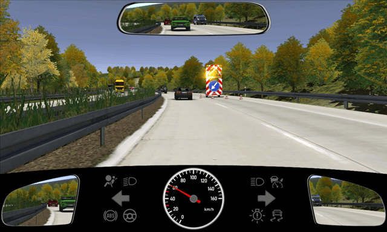

[Video: videos/2_2_34-001-M.mp4](videos/2_2_34-001-M.mp4)

**Options:**
- A. I continue driving as before
- B. I brake hard immediately
- C. I take a photograph of the scene of the accident

**Correct Answer(s):**
- A. I continue driving as before

**Explanation:**
It can be seen that the accident scene has already been adequately secured. For this reason, you should not brake sharply as this is unnecessary in this situation. A strong deceleration would only increase the risk of further accidents (especially rear-end collisions), since subsequent motorists do not expect a braking maneuver. While driving, photographing the accident is prohibited.

---

#### Question 2.2.34-002-M

**Points:** 4 Points

**What is the right course of action now?**

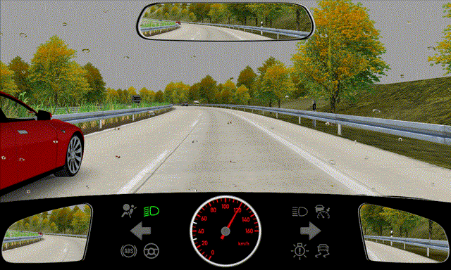

[Video: videos/2_2_34-002-M.mp4](videos/2_2_34-002-M.mp4)

**Options:**
- A. I reduce my speed
- B. I continue driving as far to the left as possible
- C. I continue driving as before

**Correct Answer(s):**
- A. I reduce my speed
- B. I continue driving as far to the left as possible

**Explanation:**
On the right lane there was an accident and you drive towards the still unsecured accident site. Since the situation is not completely clear to you, you must reduce your speed. Drive as far to the left as possible to keep enough distance to the right-hand vehicles.

---

#### Question 2.2.34-003-M

**Points:** 4 Points

**What is the right course of action now?**

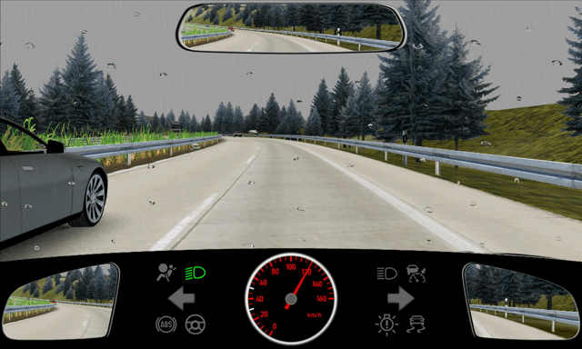

[Video: videos/2_2_34-003-M.mp4](videos/2_2_34-003-M.mp4)

**Options:**
- A. I reduce my speed further
- B. I drive as far to the left as possible
- C. I continue driving just as before

**Correct Answer(s):**
- A. I reduce my speed further
- B. I drive as far to the left as possible

**Explanation:**
In the event of an accident, you should always play it safe and increase the safe distance as well as reduce your speed in case someone runs into the lane.

---

#### Question 2.2.34-101

**Points:** 3 Points

**Your vehicle has collided with a wild animal. What is the right course of action here?**

**Options:**
- A. I secure the scene of the accident
- B. I notify the police
- C. I load the animal into my vehicle

**Correct Answer(s):**
- A. I secure the scene of the accident
- B. I notify the police

**Explanation:**
After a deer accident, you should switch on the hazard warning lights, put on a high-visibility waistcoat and set up a warning triangle to secure the accident site. You should notify the police, describe your accident and give your exact location.

---

#### Question 2.2.34-102

**Points:** 3 Points

**Why should you always carry the European accident report form with you on your journey?**

**Options:**
- A. - makes it easier to document the accident with foreign-speaking parties involved in the accident
- B. - enables the parties involved to independently document the accident
- C. - unambiguously clarifies the issue of liability at the scene of the accident

**Correct Answer(s):**
- A. - makes it easier to document the accident with foreign-speaking parties involved in the accident
- B. - enables the parties involved to independently document the accident

**Explanation:**
The European Accident Report should be carried at all times, because it makes it easier to record accidents with people involved in the accident who speak other languages, and it enables the accident to be recorded independently.

---

#### Question 2.2.34-103

**Points:** 2 Points

**How does an eCall system work in the event of a serious accident?**

**Options:**
- A. - the position of the motor vehicle
- B. - the time of the accident
- C. - the severity of the injuries of the persons in the motor vehicle

**Correct Answer(s):**
- A. - the position of the motor vehicle
- B. - the time of the accident

**Explanation:**
In the event of severe car accidents, for which, for example, airbags trigger, the ECALL system automatically sets a 112 emergency call. He transmits the accident clock time and the exact location.
Alternatively, vehicle occupants can also trigger an SOS signal manually-for example with a heart attack by the passenger.

---

#### Question 2.2.34-104

**Points:** 2 Points

**In what situation is the eCall system designed to be triggered manually?**

**Options:**
- A. If I am witness to a serious accident
- B. If a passenger suffers a medical emergency
- C. If my vehicle sustains a puncture

**Correct Answer(s):**
- A. If I am witness to a serious accident
- B. If a passenger suffers a medical emergency

**Explanation:**
The emergency call system can also be triggered manually in the event of an urgent medical problem, e.g. with a heart attack of the moving, passing or as a helping, in a serious accident.

---

#### Question 2.2.34-201

**Points:** 4 Points

**You have an accident on the autobahn with your truck. In which order do you proceed?**

**Options:**
- A. Stop immediately, ensure traffic safety, check the effects of the accident and help any injured persons
- B. Stop immediately, find witnesses, ensure traffic safety and help injured persons
- C. Stop, call the police, switch on your hazard warning lights and wait

**Correct Answer(s):**
- A. Stop immediately, ensure traffic safety, check the effects of the accident and help any injured persons

**Explanation:**
In an accident with your truck on a highway, you should immediately stop, secure traffic and make out about the accident and potential injuries to help.

---

#### Question 2.2.34-203

**Points:** 4 Points

**While you are travelling on the autobahn, your passengers tell you there is smoke in the bus. What must you do?**

**Options:**
- A. Stop immediately on the hard shoulder and secure the vehicle at a sufficient distance
- B. Direct your passengers to a location at a safe distance away from the bus and autobahn
- C. Drive on to the next petrol station to get help

**Correct Answer(s):**
- A. Stop immediately on the hard shoulder and secure the vehicle at a sufficient distance
- B. Direct your passengers to a location at a safe distance away from the bus and autobahn

**Explanation:**
Coming soon...

---

#### Question 2.2.34-204

**Points:** 4 Points

**Your bus overturns in an accident and you cannot open the doors. What must you do?**

**Options:**
- A. Tell the passengers to leave the bus through the emergency windows and emergency doors and to remain calm
- B. Ask uninjured passengers to help bring injured and frail persons and children out of the bus safely
- C. First wait for help

**Correct Answer(s):**
- A. Tell the passengers to leave the bus through the emergency windows and emergency doors and to remain calm
- B. Ask uninjured passengers to help bring injured and frail persons and children out of the bus safely

**Explanation:**
Coming soon...

---

#### Question 2.2.34-205

**Points:** 4 Points

**You are involved in a pile-up accident on the autobahn in fog. Your bus is wedged in by other vehicles. What must you do?**

**Options:**
- A. Take injured persons and passengers to a place at a safe distance from the bus and autobahn and give first aid
- B. Once you have evacuated the passengers to safety, return to the scene of the accident
- C. First, look for witnesses at the scene of the accident

**Correct Answer(s):**
- A. Take injured persons and passengers to a place at a safe distance from the bus and autobahn and give first aid
- B. Once you have evacuated the passengers to safety, return to the scene of the accident

**Explanation:**
Coming soon...

---

#### Question 2.2.34-206

**Points:** 4 Points

**You break down and have to stop on the right hand hard shoulder of an autobahn. What must you do?**

**Options:**
- A. Switch on your hazard warning lights and place warning signs (safety devices) at a sufficient distance behind the vehicle
- B. Ensure that your passengers remain at a safe distance away from the bus and autobahn
- C. Call for help unless you can repair the vehicle yourself

**Correct Answer(s):**
- A. Switch on your hazard warning lights and place warning signs (safety devices) at a sufficient distance behind the vehicle
- B. Ensure that your passengers remain at a safe distance away from the bus and autobahn
- C. Call for help unless you can repair the vehicle yourself

**Explanation:**
Coming soon...

---

#### Question 2.2.34-207

**Points:** 4 Points

**Who is a party involved in an accident?**

**Options:**
- A. A person whose conduct may have contributed to the accident
- B. A person who has caused the accident
- C. A person who is a witness to what happened

**Correct Answer(s):**
- A. A person whose conduct may have contributed to the accident
- B. A person who has caused the accident

**Explanation:**
A participant in a traffic accident can be a person whose conduct has contributed to the selfsame and a person who caused the accident.

---

#### Question 2.2.34-208

**Points:** 4 Points

**Does the person involved in an accident have to move his/her vehicle to the side?**

**Options:**
- A. Yes, in the case of minor damage
- B. Yes, in any case
- C. No, never

**Correct Answer(s):**
- A. Yes, in the case of minor damage

**Explanation:**
A participant in the accident should drive his vehicle aside if only minor damage. So that traffic can continue to flow.

---

#### Question 2.2.34-210

**Points:** 4 Points

**You are involved in a traffic accident. To ensure that passengers are not endangered, they must leave the bus. However, it is no longer possible to open the doors of your bus. What must you do now?**

**Options:**
- A. - calm the passengers
- B. - request that the passengers use the emergency exits in the event of an emergency
- C. - request the passengers to assist one another

**Correct Answer(s):**
- A. - calm the passengers
- B. - request that the passengers use the emergency exits in the event of an emergency
- C. - request the passengers to assist one another

**Explanation:**
If you are involved in a traffic accident and the doors do not open, you should first calm down the passengers.
Ask the passengers to leave the vehicle via the designated emergency outputs and ask the passengers to help each other.

---

#### Question 2.2.34-211

**Points:** 4 Points

**While driving your bus on the motorway you become involved in a road traffic accident. The passengers need to disembark from the bus. What is the right course of action?**

**Options:**
- A. I inform the passengers about the situation
- B. I have to issue clear instructions about how to leave the bus safely
- C. I have to remove my driver card from the tachograph

**Correct Answer(s):**
- A. I inform the passengers about the situation
- B. I have to issue clear instructions about how to leave the bus safely

**Explanation:**
The first thing you should do is reassure the passengers and inform them of the situation. Then give the passengers clear instructions, ask them to leave the vehicle via the designated emergency exits and ask them to help each other.

---

### 2.2.37 Chapter Variable And Steady Light Signals

#### Question 2.2.37-001-B

**Points:** 4 Points

**What do these signals indicate?**

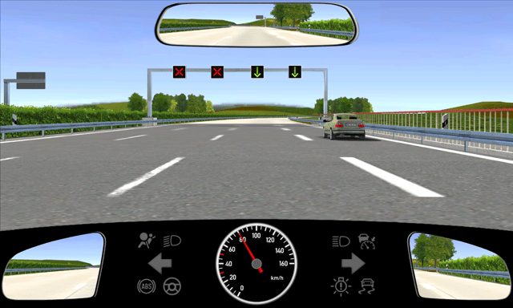

**Options:**
- A. The two lanes on the right are open to traffic
- B. You may not use the two lanes on the left
- C. You may use the two lanes on the left for overtaking only

**Correct Answer(s):**
- A. The two lanes on the right are open to traffic
- B. You may not use the two lanes on the left

**Explanation:**
These permanent lights can either enable or disable the lanes, depending on the traffic. They always relate directly to the lane over which they are mounted. A green sign indicates that you are allowed to drive on the lane, a red cross blocks it, a yellow sign with arrow means for you: lane change.

---

#### Question 2.2.37-002

**Points:** 4 Points

**You are travelling at a speed of approximately 40 km/h. The lights change from "green" to "amber" when you are 10 m away. What do you do?**

**Options:**
- A. Proceed
- B. Stop

**Correct Answer(s):**
- A. Proceed

**Explanation:**
At 40 km/h, the braking distance according to the rule of thumb is 28 meters. Even with emergency braking, a car driver can barely come to a halt 10 meters in front of a traffic light. To prevent a possible rear-end collision, you should therefore continue driving.

---

#### Question 2.2.37-003

**Points:** 4 Points

**You are travelling at a speed of approximately 40 km/h. The lights change from "green" to "amber" when you are 40 m away. What do you do?**

**Options:**
- A. Stop
- B. Proceed

**Correct Answer(s):**
- A. Stop

**Explanation:**
According to the rule of thumb, at a speed of 40 km/h your car comes to a stand after 28 meters. The only correct reaction is to stop.

---

#### Question 2.2.37-004

**Points:** 4 Points

**You are approaching a traffic light which has been "green" for some time. What do you do?**

**Options:**
- A. Watch the traffic light closely
- B. Approach but be ready to stop
- C. Accelerate even though the speed limit is exceeded

**Correct Answer(s):**
- A. Watch the traffic light closely
- B. Approach but be ready to stop

**Explanation:**
Since the traffic light has been green for a while, it can switch at any moment. Continue at the same speed, watching the traffic light carefully and be ready to stop. Once you have reached your decision point - distance to the traffic light, from which a normal stop is no longer possible - drive on, even if the traffic light switches.

---

#### Question 2.2.37-006

**Points:** 4 Points

**The traffic light has just changed to yellow. What is the right course of action if you are turning left?**

**Options:**
- A. - stop
- B. - turn

**Correct Answer(s):**
- A. - stop

**Explanation:**
The yellow traffic light indicates that you have to wait before the crossing. Since your distance to the stop line is far enough in this situation, you can safely stop.

---

#### Question 2.2.37-007

**Points:** 2 Points

**What is true of permanently illuminated signs?**

**Options:**
- A. Permanently illuminated signs either block lanes or open them up to traffic
- B. Vehicles may not stop at the side of carriageways with permanently illuminated signs
- C. Permanently illuminated signs apply to multi-track motor vehicles only

**Correct Answer(s):**
- A. Permanently illuminated signs either block lanes or open them up to traffic
- B. Vehicles may not stop at the side of carriageways with permanently illuminated signs

**Explanation:**
If there are crossed red diagonal beams, drivers on the lane must neither drive nor hold in front of them. A green arrow looking down means: You can drive on the lane. A yellow blinking, obliquely downward looking arrow, you must change the lane in the direction of the arrow.

---

#### Question 2.2.37-008

**Points:** 4 Points

**What do these permanently illuminated signs mean?**

**Options:**
- A. - 1 may continue driving on it
- B. - 2 must change to the right-side lane
- C. - 3 and lane 4 must stop

**Correct Answer(s):**
- A. - 1 may continue driving on it
- B. - 2 must change to the right-side lane

**Explanation:**
Continuous light signals above a lane inform you as a car driver whether this lane is passable or locked or if you need to leave it. Red crossed bars mean: The lane must not be used. A green arrow looking down means: You can drive on the lane. A yellow blinking, obliquely downward looking arrow, you must change the lane in the direction of the arrow.

---

### 2.2.38 Chapter Vehicles With Right Of Way

#### Question 2.2.38-101

**Points:** 4 Points

**A vehicle with flashing blue lights and siren sounding is approaching you from the rear. What is the right course of action now?**

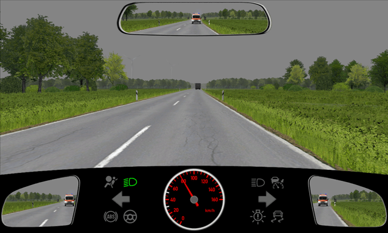

**Options:**
- A. I drive over to the right-side as far as possible
- B. I reduce my speed
- C. I stop immediately

**Correct Answer(s):**
- A. I drive over to the right-side as far as possible
- B. I reduce my speed

**Explanation:**
The vehicle must be given free access. Therefore, you must reduce your speed and drive as far as possible to the side of the road so that the vehicle with blue flashing lights can continue its way unhindered.

---

## Theme 2.4. Traffic Sign

### 2.4.40 Chapter Danger Sign

#### Question 2.4.40-002

**Points:** 4 Points

**What do you do when you see this traffic sign on an autobahn?**

**Options:**
- A. Increase your alertness and, as a matter of precaution, increase your distance to the vehicle in front
- B. In case of a traffic jam, brake and switch on hazard warning lights
- C. In case of a traffic jam, move over onto the hard shoulder and proceed

**Correct Answer(s):**
- A. Increase your alertness and, as a matter of precaution, increase your distance to the vehicle in front
- B. In case of a traffic jam, brake and switch on hazard warning lights

**Explanation:**
Caution of congestion: With this traffic sign you should reduce the speed of your car and increase the distance to the vehicle in front. Get a better picture of the situation by watching the traffic in front of the next vehicle and, if necessary, drive a bit offset in the lane. Turn on your hazard lights when driving towards the end of a traffic jam.

---

#### Question 2.4.40-003

**Points:** 3 Points

**What must you do when you see this traffic sign?**

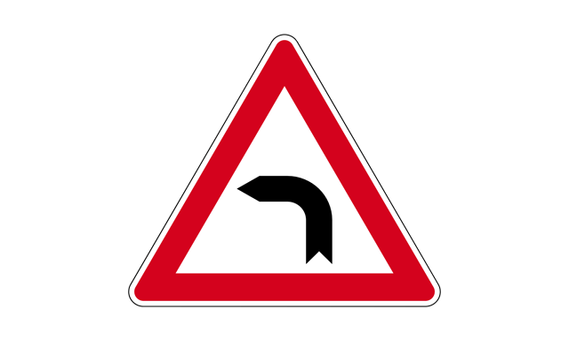

**Options:**
- A. Reduce speed before the bend
- B. Drive as far as possible over on the right-hand side
- C. Indicate left before the bend

**Correct Answer(s):**
- A. Reduce speed before the bend
- B. Drive as far as possible over on the right-hand side

**Explanation:**
The traffic sign announces a dangerous left turn. Decrease your speed to keep the centrifugal force small. Oncoming traffic could reach your lane due to its centrifugal force. Also, a vehicle could have broken down behind the curve. Drive as far as possible to the right. You follow the road, there's no turn. Therefore, you do not have to indicate.

---

#### Question 2.4.40-004

**Points:** 3 Points

**What do you do within this danger section?**

**Options:**
- A. Drive more slowly, watch out for wild animals
- B. Dip the headlights and brake when you see wild animals
- C. Do not avoid hitting wild animals if oncoming traffic would be endangered

**Correct Answer(s):**
- A. Drive more slowly, watch out for wild animals
- B. Dip the headlights and brake when you see wild animals
- C. Do not avoid hitting wild animals if oncoming traffic would be endangered

**Explanation:**
Attention wild animals crossing: This sign is set up on routes, where a lot of wild animal accidents happened already. As soon as you see this sign, you should reduce the speed and be ready to brake. Pay particular attention to the roadside. If you see an animal, you should brake and dim. If game suddenly jumps in front of you, you should make an emergency brake. Avoid dodging, because then you might get into the oncoming lane.

---

#### Question 2.4.40-005

**Points:** 3 Points

**What must you be prepared for upon seeing this traffic sign?**

**Options:**
- A. For side winds
- B. For counter-steering
- C. For aircraft overhead

**Correct Answer(s):**
- A. For side winds
- B. For counter-steering

**Explanation:**
This traffic sign indicates a section of the route with crosswinds. This is especially true for bridges and overpasses. If there's strong wind from the side you have to reduce your speed. You need to be prepared to hold on and countersteer to stay in the lane. The traffic sign has nothing to do with air traffic.

---

#### Question 2.4.40-006

**Points:** 3 Points

**What must you be prepared for upon seeing this traffic sign?**

**Options:**
- A. For an alteration in the responsiveness of the vehicle
- B. For the necessity for counter-steering
- C. For the necessity for adjusting speed

**Correct Answer(s):**
- A. For an alteration in the responsiveness of the vehicle
- B. For the necessity for counter-steering
- C. For the necessity for adjusting speed

**Explanation:**
If you encounter this traffic sign, you have to adjust to strong crosswinds. Most commonly, this traffic sign appears on road sections that are particularly exposed to the wind - for example, on bridges or overpasses. With strong crosswinds, the driver must countersteer in order to stay in the lane. You also need to adjust the speed of your car to the wind conditions.

---

#### Question 2.4.40-007

**Points:** 3 Points

**What should you anticipate when you see this road sign?**

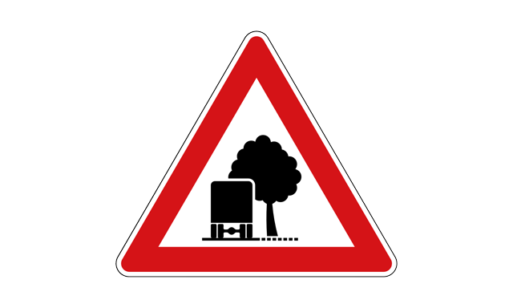

**Options:**
- A. Vehicles ahead that may swerve out suddenly to the left
- B. Vehicles ahead that may brake suddenly
- C. Tree branches lying on the roadway

**Correct Answer(s):**
- A. Vehicles ahead that may swerve out suddenly to the left
- B. Vehicles ahead that may brake suddenly
- C. Tree branches lying on the roadway

**Explanation:**
Because of trees, tall vehicles can brake suddenly and swerve. Tall vehicles can tear off branches as they pass, and these then lie on the roadway. Be especially attentive.

---

#### Question 2.4.40-201

**Points:** 3 Points

**What must you anticipate with this road sign?**

**Options:**
- A. Trees could protrude into my road area
- B. There could be branches lying on the roadway
- C. Vehicles could swerve suddenly

**Correct Answer(s):**
- A. Trees could protrude into my road area
- B. There could be branches lying on the roadway
- C. Vehicles could swerve suddenly

**Explanation:**
All 3 answers are correct. Trees may lie in the driveway, branches may lie in the road, and cars may suddenly give way.

---

### 2.4.41 Chapter Regulatory Sign

#### Question 2.4.41-001

**Points:** 3 Points

**What is correct from this traffic sign onwards?**

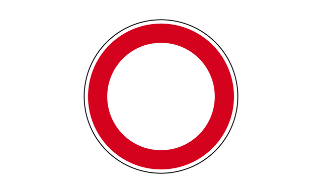

**Options:**
- A. You may push your motorized bicycle
- B. You may drive on slowly with your motorized bicycle
- C. You may proceed with your motorized bicycle when the engine is switched off

**Correct Answer(s):**
- A. You may push your motorized bicycle

**Explanation:**
This sign indicates that no vehicles can proceed, you therefore cannot ride your motorized bicycle but can still push it

---

#### Question 2.4.41-002

**Points:** 2 Points

**To what does the "12 t" refer on this traffic sign?**

**Options:**
- A. - of the vehicle including load
- B. - of the vehicle excluding load
- C. - of the load excluding the vehicle

**Correct Answer(s):**
- A. - of the vehicle including load

**Explanation:**
The total mass (12 t) refers to the vehicle including charge.

---

#### Question 2.4.41-003

**Points:** 3 Points

**On your 10 m-long vehicle, the load is projecting 60 cm over the vehicle’s rear edge. What applies to you when this traffic sign is displayed?**

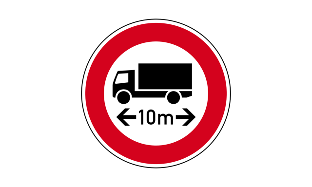

**Options:**
- A. - not drive into a street displaying this sign, because, taken together, the vehicle and load are longer than 10 m
- B. - drive into a street displaying this sign, if the load is specially marked
- C. - drive into a street displaying this sign, because the load does not have to be taken into consideration

**Correct Answer(s):**
- A. - not drive into a street displaying this sign, because, taken together, the vehicle and load are longer than 10 m

**Explanation:**
The length of your truck is described as 10.6 m. (10 m + 60 cm truck of the load) which dominates. That's why you must not enter this road as a whole, the length of your truck 10.6 m.

---

#### Question 2.4.41-004-M

**Points:** 3 Points

**You are driving on this motorway. What is the right course of action?**

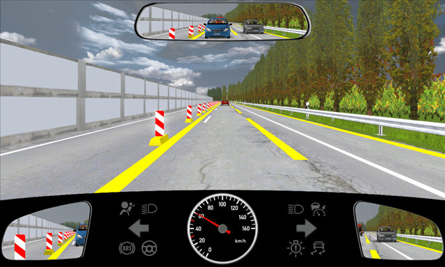

**Options:**
- A. I move into the right-hand lane
- B. I only use the left-hand lane if there is a breakdown
- C. I remain in my current lane

**Correct Answer(s):**
- A. I move into the right-hand lane

**Explanation:**
In principle, the right-hand driving rule applies on motorways. You are therefore obliged to drive in the right-hand lane unless you want to overtake. There is no one in front of you to overtake.
The left lane is closed. You may not use it under any circumstances. Not even if you have a breakdown.

---

#### Question 2.4.41-005-M

**Points:** 3 Points

**What is the right behaviour now?**

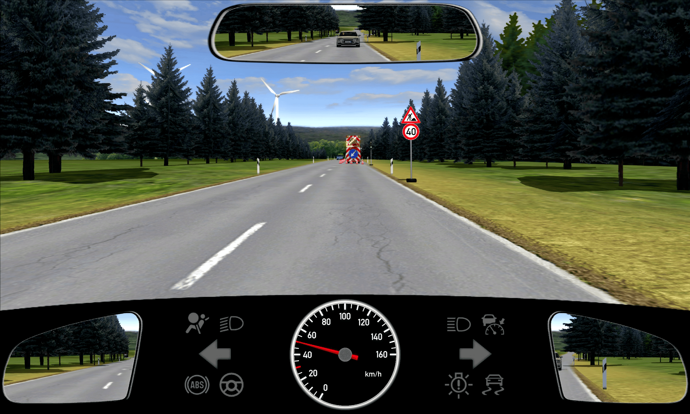

[Video: videos/2_4_41-005-M.mp4](videos/2_4_41-005-M.mp4)

**Options:**
- A. I accelerate
- B. I maintain my speed
- C. I only accelerate when the speed limit is removed by a road sign

**Correct Answer(s):**
- A. I accelerate

**Explanation:**
You are allowed to accelerate because you have passed the construction site with the speed limit, moved back into the correct lane and the road in front of you is clear.

---

#### Question 2.4.41-101

**Points:** 2 Points

**What must you remember when you see this traffic sign?**

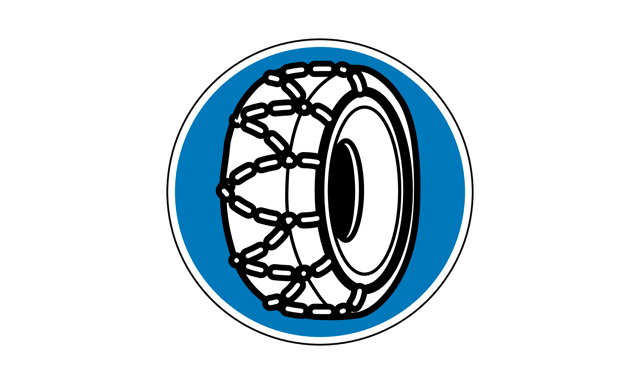

**Options:**
- A. Use snow-chains
- B. Maximum permissible speed 50 km/h
- C. Track-vehicles have priority

**Correct Answer(s):**
- A. Use snow-chains
- B. Maximum permissible speed 50 km/h

**Explanation:**
This traffic sign indicates that the following route can only be used with snow chains. Driving without snow chains is prohibited. The maximum speed with snow chains is 50 km/h. Pay attention to noises. If you hear something or if your car is twitchy you should stop and check the chains. This sign has nothing to do with track vehicles.

---

#### Question 2.4.41-102

**Points:** 2 Points

**Which traffic sign refers to the permissible total mass?**

**Options:**

**Correct Answer(s):**
- 2 

**Explanation:**
As a car driver you should note that this traffic sign can be read in two ways. On the one hand, t 'stands for tons and thus refers to the actual weight. However, the traffic sign may also refer to the permissible total weight if the 't' is additionally marked by a white symbol.

---

#### Question 2.4.41-103

**Points:** 2 Points

**Which traffic sign refers to the actual mass?**

**Options:**

**Correct Answer(s):**
- 1 

**Explanation:**
If the symbol 't' for tons is in the traffic sign, it refers to the actual weight. The actual weight is calculated from the empty weight of the vehicle plus the current load. The empty weight of the vehicle is noted in the vehicle documents. As a car driver, you are required to know the weight of your vehicle.

---

#### Question 2.4.41-104

**Points:** 2 Points

**Which vehicles are prohibited from using a road sign-posted like this?**

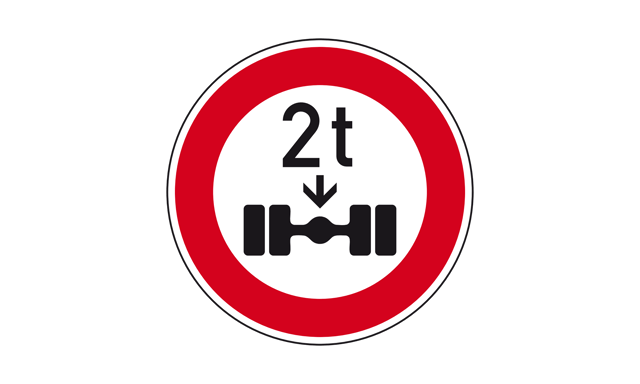

**Options:**
- A. - with an actual axle weight exceeding 2 t
- B. - with a permissible axle weight exceeding 2 t
- C. - with a permissible total weight not exceeding 2 t

**Correct Answer(s):**
- A. - with an actual axle weight exceeding 2 t

**Explanation:**
The traffic sign prohibits vehicles from traveling on the route that exceed the weight indicated on the traffic sign. The weight specification refers to the actual axle load. It must not be exceeded. The red round circle in the traffic sign always indicates a ban.

---

#### Question 2.4.41-105

**Points:** 2 Points

**What does this traffic sign indicate?**

**Options:**
- A. A prohibition for vehicles more than 2 m wide including load
- B. A roadway 2 m wide
- C. You must keep a lateral distance of at least 2 m from other vehicles

**Correct Answer(s):**
- A. A prohibition for vehicles more than 2 m wide including load

**Explanation:**
The traffic sign "Width Limit including load" indicates road constrictions and bottlenecks on the subsequent section of the road. The track is not passable for vehicles that are wider than indicated on the sign including their cargo. In this case, the permissible width is 2 m.

---

#### Question 2.4.41-106

**Points:** 3 Points

**Which vehicles can cause serious accidents when this traffic sign is ignored?**

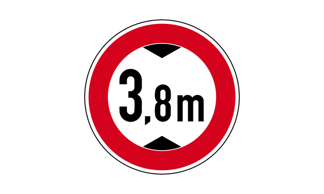

**Options:**
- A. Length 8 m, width 2.5 m, height 4 m
- B. Length 10 m, width 3.9 m, height 3 m
- C. Length 4 m, width 2.5 m, height 2.5 m

**Correct Answer(s):**
- A. Length 8 m, width 2.5 m, height 4 m

**Explanation:**
This traffic sign is aimed at trucks and warns of height-limited passages - in front of tunnels, bridge constructions or heavy current overhead wires of trams. The height limit is indicated by the black triangles, here it is 3.8 m. If a vehicle higher than 3.8 m ignores this sign, serious accidents may occur. The truck may get caught or stuck in the overhead wires or the underpass. Length and width are not relevant.

---

#### Question 2.4.41-107

**Points:** 2 Points

**With which vehicles are you not allowed to drive on a road sign-posted like this?**

**Options:**
- A. Car with caravan trailer, total length of the combination 11 m
- B. Tractor with trailer, total length of the combination 12 m
- C. Truck with a length of 9 m including load

**Correct Answer(s):**
- A. Car with caravan trailer, total length of the combination 11 m
- B. Tractor with trailer, total length of the combination 12 m

**Explanation:**
The red round circle in the traffic sign always indicates a ban. Vehicles whose actual length exceeds 10 m may not drive on this road. Even vehicles with trailers whose total length exceeds 10 m may not continue on this road. This indicates road conditions that are not passable with longer vehicles.

---

#### Question 2.4.41-108

**Points:** 3 Points

**What vehicles may you overtake when this traffic sign is displayed?**

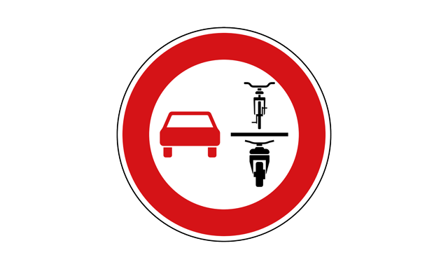

**Options:**
- A. No vehicles
- B. Single-track vehicles
- C. Multi-track vehicles

**Correct Answer(s):**
- A. No vehicles

**Explanation:**
You are not allowed to overtake, neither single nor multi-lane vehicles.

---

#### Question 2.4.41-109

**Points:** 2 Points

**What motor vehicles are subject to the no-overtaking rule indicated by this sign?**

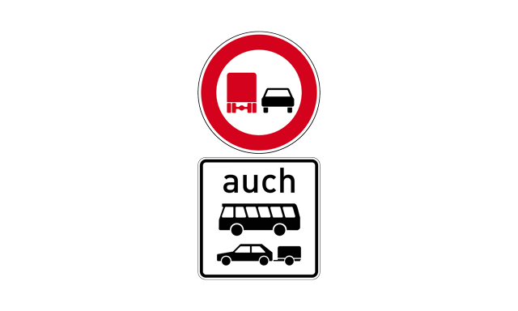

**Options:**
- A. Coaches or buses
- B. Single-track motor vehicles
- C. Cars without trailers

**Correct Answer(s):**
- A. Coaches or buses

**Explanation:**
This traffic sign prescribes a ban on overtaking for motor vehicles with a permissible total weight of more than 3.5 t. The additional sign also prescribes overtaking for buses and cars WITH trailers.

---

#### Question 2.4.41-201

**Points:** 2 Points

**Which vehicles are prohibited from using a road sign-posted like this?**

**Options:**
- A. Trucks with a permissible total mass exceeding 3.5 t
- B. Truck tractors
- C. Cars with trailers

**Correct Answer(s):**
- A. Trucks with a permissible total mass exceeding 3.5 t
- B. Truck tractors

**Explanation:**
The road marked on the sign you darst not drive when you are driving tractors or trucks t with a maximum mass of more than 3.5. Cars with trailers are allowed to drive here.

---

#### Question 2.4.41-202

**Points:** 2 Points

**Which vehicles must keep the minimum distance of 70 m here?**

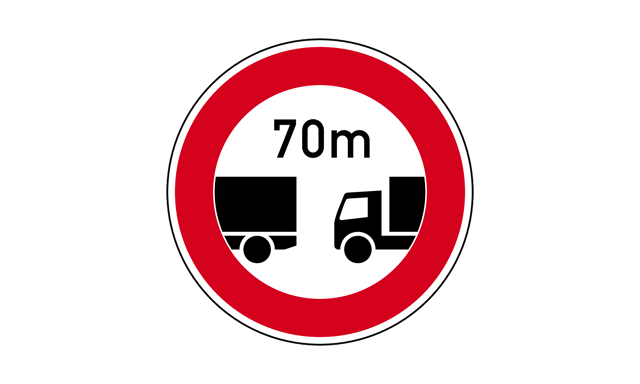

**Options:**
- A. Trucks with a permissible total mass exceeding 3.5 t
- B. Truck tractors
- C. Cars

**Correct Answer(s):**
- A. Trucks with a permissible total mass exceeding 3.5 t
- B. Truck tractors

**Explanation:**
Both tractors and trucks t with a maximum mass of more than 3.5. Map for these special rules. Cars are not included.

---

#### Question 2.4.41-203

**Points:** 3 Points

**Which vehicles are not allowed to overtake here?**

**Options:**
- A. Trucks and trucks with trailers with a permissible total mass exceeding 3.5 t
- B. Truck tractors
- C. Cars

**Correct Answer(s):**
- A. Trucks and trucks with trailers with a permissible total mass exceeding 3.5 t
- B. Truck tractors

**Explanation:**
Trucks and trucks with a gross vehicle mass exceeding 3.5 tonnes and tractors may not overtake at the sign.

---

#### Question 2.4.41-204

**Points:** 3 Points

**What does this traffic sign indicate?**

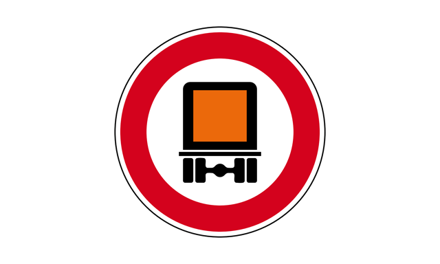

**Options:**
- A. Motor vehicles with mandatory markings carrying dangerous goods are prohibited
- B. Vehicles with an actual axle weight exceeding 3.5 t are prohibited
- C. Trucks and combinations of vehicles are prohibited

**Correct Answer(s):**
- A. Motor vehicles with mandatory markings carrying dangerous goods are prohibited

**Explanation:**
This traffic sign indicates a ban on labeling requirements vehicles carrying dangerous goods. All other permitted in this zone.

---

#### Question 2.4.41-205

**Points:** 2 Points

**You want to enter a road displaying this road sign. To what does the information "12 t" refer?**

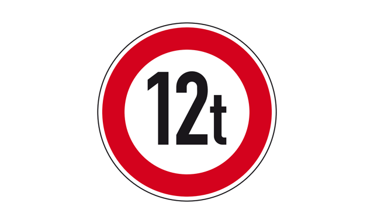

**Options:**
- A. - actual weight of the vehicle
- B. - gross vehicle weight rating of the vehicle
- C. - unladen weight of the vehicle

**Correct Answer(s):**
- A. - actual weight of the vehicle

**Explanation:**
This sign refers to the actual mass of the vehicle, including cargo. Please mind that.

---

#### Question 2.4.41-206

**Points:** 2 Points

**On this road traffic sign, to what does the information “12 t” refer?**

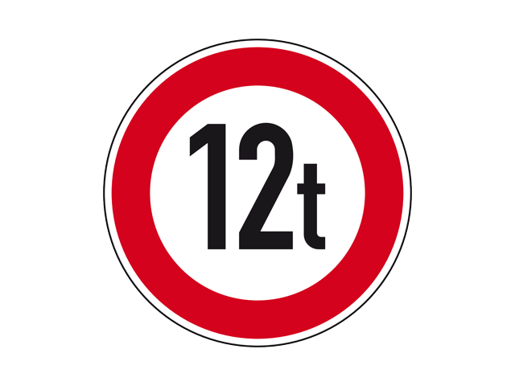

**Options:**
- A. - actual mass of the vehicle
- B. - maximum authorised mass of the vehicle
- C. - actual mass of the load

**Correct Answer(s):**
- A. - actual mass of the vehicle

---

#### Question 2.4.41-207

**Points:** 2 Points

**You are driving a road haulage combination vehicle with a maximum authorised mass of 30 t. When may you continue driving after seeing this road traffic sign?**

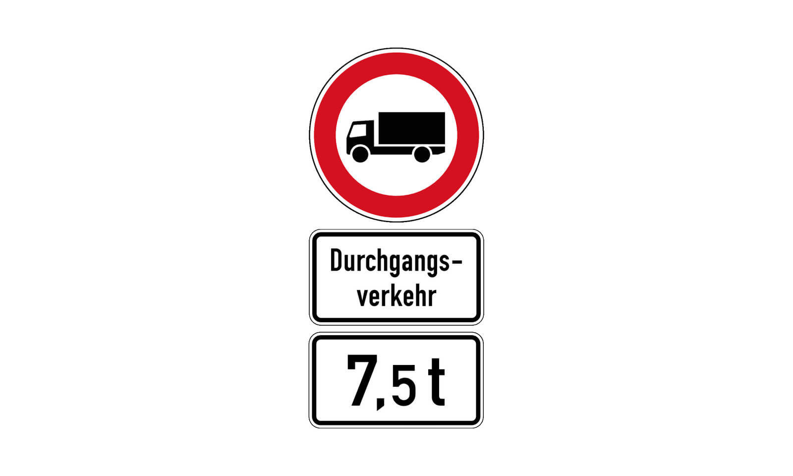

**Options:**
- A. - have to deliver the consignment to a local resident
- B. - am driving on a designated diversionary route
- C. - am able to comply with the driving and rest periods by doing so

**Correct Answer(s):**
- A. - have to deliver the consignment to a local resident
- B. - am driving on a designated diversionary route

**Explanation:**
You may only drive on this road if you have to deliver a load to a resident or if this is a designated diversion route.

---

#### Question 2.4.41-208

**Points:** 2 Points

**You are driving a vehicle combination comprising a motor vehicle and trailer, and you want to enter a road that has this signpost. What does the reference to “5.5 t” mean?**

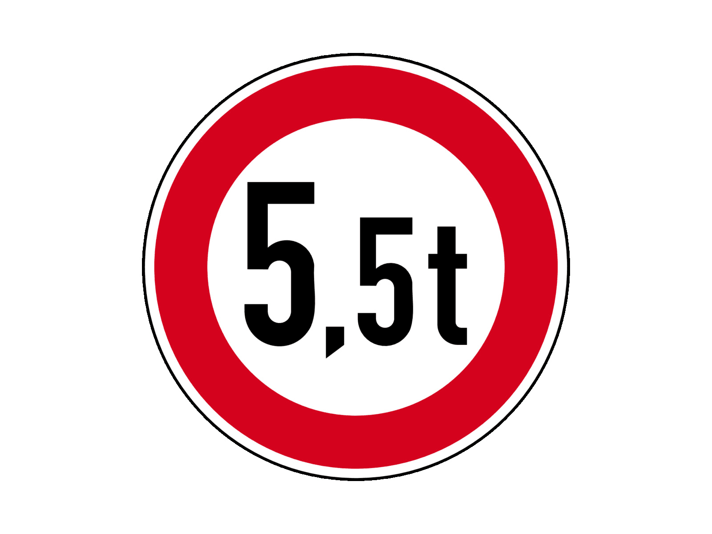

**Options:**
- A. - actual mass of each individual vehicle in the vehicle combination
- B. - actual total mass of the vehicle combination
- C. - maximum authorised mass of the towing vehicle

**Correct Answer(s):**
- A. - actual mass of each individual vehicle in the vehicle combination

**Explanation:**
The traffic sign refers to the actual mass of each individual vehicle, the vehicle combination, including charge.

---

#### Question 2.4.41-209

**Points:** 2 Points

**When you see this road sign, what is the situation in which you must keep a minimum distance of 70 metres from the vehicle in front?**

**Options:**
- A. - am driving a lorry with a permissible total weight of over 3.5 t behind another lorry with a permissible total weight of over 3.5 t
- B. - am driving a tractor unit behind a lorry with a permissible total weight of over 3.5 t
- C. - am driving a lorry with a permissible total weight of over 3.5 t behind a car with a trailer

**Correct Answer(s):**
- A. - am driving a lorry with a permissible total weight of over 3.5 t behind another lorry with a permissible total weight of over 3.5 t
- B. - am driving a tractor unit behind a lorry with a permissible total weight of over 3.5 t

**Explanation:**
As a driver of a truck with a maximum permissible mass of over 3.5 tonnes or as a driver of a tractor, I must keep a distance of at least 70 meters if there is a truck in front of me with a permissible maximum mass of over 3.5 tonnes.

---

#### Question 2.4.41-401

**Points:** 2 Points

**What motor vehicles are prohibited from driving on a road where this sign is displayed?**

**Options:**
- A. Tractors with a type-specific maximum speed of 25 km/h
- B. Motor vehicles with trailers with a maximum permissible speed of 25 km/h
- C. Tractors with a type-specific maximum speed in excess of 40 km/h

**Correct Answer(s):**
- A. Tractors with a type-specific maximum speed of 25 km/h
- B. Motor vehicles with trailers with a maximum permissible speed of 25 km/h

**Explanation:**
This road sign describes a driving ban for tractors with a design-related maximum speed up to 25 km / h, as well as for motor vehicles with a trailer with a permissible maximum speed up to 25 km / h. 
This does not apply to tractors with a maximum design speed of more than 40 km/h.

---

### 2.4.42 Chapter Directional Sign

#### Question 2.4.42-001

**Points:** 2 Points

**What does this traffic sign indicate?**

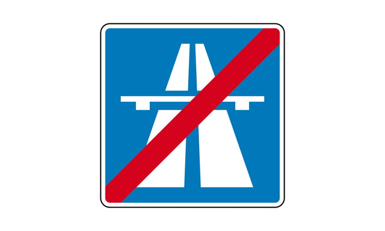

**Options:**
- A. The end of the autobahn
- B. The end of the clearway for motor vehicles only
- C. Temporary closure of the autobahn

**Correct Answer(s):**
- A. The end of the autobahn

**Explanation:**
This traffic sign is at the end of the motorway.

---

#### Question 2.4.42-002

**Points:** 2 Points

**What does this traffic sign indicate?**

**Options:**
- A. The end of the clearway for motor vehicles only
- B. The end of the autobahn
- C. Motor vehicles prohibited

**Correct Answer(s):**
- A. The end of the clearway for motor vehicles only

**Explanation:**
This traffic sign is placed at the end of a highway. It means: From here on the advisory speed limit no longer applies. It does not indicate a ban on motor vehicles.

---

#### Question 2.4.42-004

**Points:** 2 Points

**What do such traffic signs indicate?**

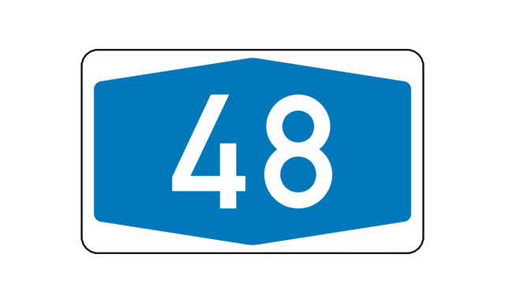

**Options:**
- A. The number of an autobahn
- B. The distance to the next petrol station
- C. The number of a European road

**Correct Answer(s):**
- A. The number of an autobahn

**Explanation:**
A white number on a blue background with a white outline indicates the number of the motorway you are currently on.

---

#### Question 2.4.42-005

**Points:** 2 Points

**What does the figure "26" indicate in this traffic sign?**

**Options:**
- A. Autobahn exit number 26
- B. The A 26
- C. The distance from the exit to Düsseldorf-Benrath

**Correct Answer(s):**
- A. Autobahn exit number 26

**Explanation:**
All motorway exits are numbered for better orientation. As a car driver, you can recognize the freeway exit ramp by the number 26. On road maps, in road atlases and in the common navigation devices, these numbers can also be found again.

---

#### Question 2.4.42-006

**Points:** 2 Points

**What does this traffic sign indicate?**

**Options:**
- A. A diversion for autobahn traffic when required
- B. An underground station
- C. Federal road (Bundesstrasse) 22

**Correct Answer(s):**
- A. A diversion for autobahn traffic when required

**Explanation:**
This traffic sign refers to a detour for freeway traffic. It is set up in the event of a traffic jam, for example. If the car driver follows the detour, he/she returns to the freeway.

---

#### Question 2.4.42-007

**Points:** 3 Points

**What applies from this traffic sign onwards?**

**Options:**
- A. Maximum permissible speed 50 km/h
- B. Free choice of marked driving lanes for motor vehicles with a permissible total mass up to 3.5 t
- C. Free choice of marked driving lanes for all motor vehicles

**Correct Answer(s):**
- A. Maximum permissible speed 50 km/h
- B. Free choice of marked driving lanes for motor vehicles with a permissible total mass up to 3.5 t

**Explanation:**
This traffic sign is subject to regulations that apply to traffic within built-up areas. This includes limiting the maximum speed to 50 km/h. Free choice of lanes applies only to vehicles up to 3.5 t permissible maximum mass. Vehicles with more than 3.5 t drive on the right.

---

#### Question 2.4.42-008-M

**Points:** 3 Points

**What applies when you see this traffic sign?**

**Options:**
- A. - choose whatever lane I wish for my direction of travel
- B. - drive more quickly in the right-hand lane than vehicles travelling in the left-hand lane
- C. - drive faster than 50 km/h because this is a multi-lane carriageway

**Correct Answer(s):**
- A. - choose whatever lane I wish for my direction of travel
- B. - drive more quickly in the right-hand lane than vehicles travelling in the left-hand lane

**Explanation:**
In towns, you are allowed to deviate from the requirement to drive on the right, i.e. you are free to choose your lane on multi-lane roads. On two-lane roads in towns, vehicles in the right lane may also drive faster than vehicles in the left lane, but you are still not allowed to drive faster than 50 km/h in towns.

---

#### Question 2.4.42-101

**Points:** 3 Points

**What applies from this traffic sign onwards?**

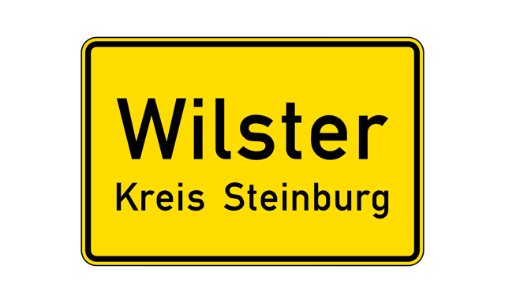

**Options:**
- A. You may not sound your horn to signal your intention to overtake
- B. Parking cars may be safely marked with parking light
- C. You may drive with parking light in the darkness

**Correct Answer(s):**
- A. You may not sound your horn to signal your intention to overtake
- B. Parking cars may be safely marked with parking light

**Explanation:**
Car drivers recognize from this traffic sign that the regulations for traffic within closed villages apply. You must not announce overtaking maneuvers by honking, as this is only allowed outside closed villages. In general, it is forbidden to drive with parking lights. Parking cars may be secured with the parking light.

---

#### Question 2.4.42-102

**Points:** 2 Points

**How are vehicles with a permissible total mass up to 2.8 t allowed to be parked here?**

**Options:**
- A. The car as shown in the picture
- B. The caravan as shown in the picture
- C. Small cars also diagonally to the driving direction

**Correct Answer(s):**
- A. The car as shown in the picture
- B. The caravan as shown in the picture

**Explanation:**
This traffic sign signals to the vehicle driver that vehicles up to 2.8 t of permissible total mass may only be parked in accordance with the illustration. However, smaller cars also have to comply with these regulations as well.

---

#### Question 2.4.42-103

**Points:** 2 Points

**What does this traffic sign indicate?**

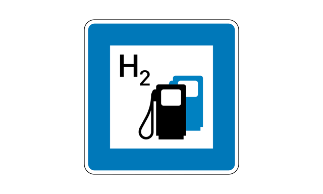

**Options:**
- A. - hydrogen filling station
- B. - natural gas fuel station
- C. - auto gas filling station

**Correct Answer(s):**
- A. - hydrogen filling station

**Explanation:**
The square traffic sign with a blue border indicates that there is a refuel possibility for hydrogen-powered vehicles in the immediate vicinity. These cars are still relatively expensive, but are considered the vehicles of the future.

---

#### Question 2.4.42-104

**Points:** 2 Points

**What does this traffic sign indicate?**

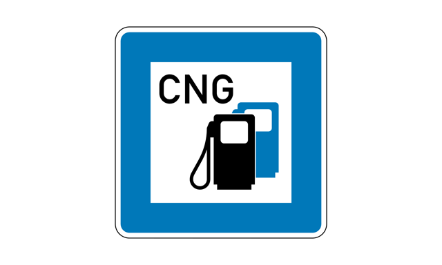

**Options:**
- A. - natural gas fuel station
- B. - hydrogen filling station
- C. - auto gas filling station

**Correct Answer(s):**
- A. - natural gas fuel station

**Explanation:**
This traffic sign points out a natural gas filling station where drivers can refuel their natural gas-powered vehicle. The abbreviation CNG stands for the term compressed natural gas.

---

#### Question 2.4.42-105

**Points:** 2 Points

**What does this traffic sign indicate?**

**Options:**
- A. - auto gas filling station
- B. - natural gas fuel station
- C. - hydrogen filling station

**Correct Answer(s):**
- A. - auto gas filling station

**Explanation:**
The inscription LPG on the square traffic sign is an abbreviation for Liquefied Petroleum Gas. This traffic sign signals to the car driver that there is an LPG station.

---

#### Question 2.4.42-106

**Points:** 2 Points

**What does this traffic sign indicate?**

**Options:**
- A. A charging station for electric vehicles
- B. A danger of explosion at a filling station through electric devices
- C. A facility for charging mobile telephones

**Correct Answer(s):**
- A. A charging station for electric vehicles

**Explanation:**
You will see a plug with cable on the sign. It shows you a nearby charging station for electric vehicles such as electric cars, e-bikes or electric scooters. There you can charge your powered vehicle.

---

#### Question 2.4.42-107

**Points:** 3 Points

**What does this traffic sign indicate?**

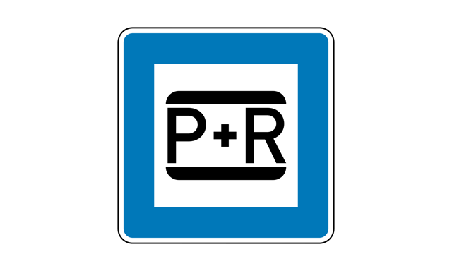

**Options:**
- A. A carpark with connections to public transport ("Park + Ride")
- B. A filling station with carwash ("Care + Clean")
- C. A car hire centre with repair workshop ("Breakdown service + Repair")

**Correct Answer(s):**
- A. A carpark with connections to public transport ("Park + Ride")

**Explanation:**
The traffic sign P + R on a blue background stands for "Park and Ride". It identifies a parking lot with public transport connection. The parking lot is continuous or temporary.

---

#### Question 2.4.42-108

**Points:** 3 Points

**You are driving a toll-chargeable truck and are approaching the displayed traffic sign. What should you do?**

**Options:**
- A. I check the on-board-unit (OBU), to see if the number of axles is set correctly
- B. I may continue driving without an on-board-unit (OBU), only if a toll was paid for using the route
- C. I pay the toll at the toll station upon leaving the toll route

**Correct Answer(s):**
- A. I check the on-board-unit (OBU), to see if the number of axles is set correctly
- B. I may continue driving without an on-board-unit (OBU), only if a toll was paid for using the route

**Explanation:**
You can only continue if the toll was paid for using the route and you should check whether it is correctly set the correct number of axles here without on-board unit (OBU). If not, ask me correctly.

---

#### Question 2.4.42-109-M

**Points:** 4 Points

**What is correct in this situation?**

**Options:**
- A. - allowed to drive on the advisory bike lane after I have ruled out any risk to cyclists by carefully observing the road traffic situation
- B. - allowed to drive on the advisory bike lane only until I am past the truck
- C. - not allowed to drive on the advisory bike lane

**Correct Answer(s):**
- A. - allowed to drive on the advisory bike lane after I have ruled out any risk to cyclists by carefully observing the road traffic situation
- B. - allowed to drive on the advisory bike lane only until I am past the truck

**Explanation:**
Driving a protective strip continuously is not permitted. Protective strips have a dashed mark and can be driven by car if necessary, especially to avoid oncoming traffic. But you can only do that if bicycle traffic is not endangered.

---

#### Question 2.4.42-110

**Points:** 2 Points

**Which document allows you to park here?**

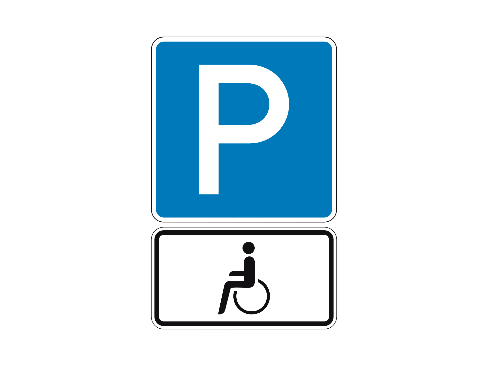

**Options:**
- A. My EU parking card for people with severe disabilities
- B. The EU parking card of a severely disabled person whom I am transporting
- C. My residential parking permit

**Correct Answer(s):**
- A. My EU parking card for people with severe disabilities
- B. The EU parking card of a severely disabled person whom I am transporting

**Explanation:**
You are allowed to park in the parking lot with this sign if you yourself have an EU parking permit for severely disabled people or if you are transporting a person with an EU parking permit for severely disabled people.

---

### 2.4.43 Chapter Traffic Facilities

#### Question 2.4.43-002

**Points:** 2 Points

**You need assistance on the autobahn. Which information does the arrow on the roadside marker give you?**

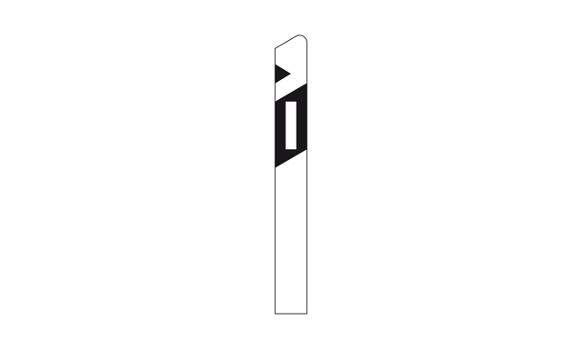

**Options:**
- A. Nearest emergency call telephone in the direction of the arrow
- B. Nearest car park in the direction of the arrow
- C. Next exit in the direction of the arrow

**Correct Answer(s):**
- A. Nearest emergency call telephone in the direction of the arrow

**Explanation:**
Arrows on the reflector posts on the edge of a freeway point towards the nearest emergency services pillar. If you need help, follow the arrows to reach an emergency pillar as quickly as possible.

---

## Theme 2.5. Environmental Protection

### 2.5.01 Chapter Environmental Protection

#### Question 2.5.01-001

**Points:** 3 Points

**What can you do to avoid unnecessary noise?**

**Options:**
- A. Avoid high engine revolutions
- B. Do not modify intake and exhaust systems
- C. Remove the fairings

**Correct Answer(s):**
- A. Avoid high engine revolutions
- B. Do not modify intake and exhaust systems

**Explanation:**
To avoid unnececessary noise, avoid making high revolutions with your engine and do not modify either the intake/exhaust system. Removing fairings do not impact noise.

---

#### Question 2.5.01-002

**Points:** 3 Points

**What can you do to avoid noise pollution?**

**Options:**
- A. Don't drive off with spinning wheels
- B. Avoid "power sound" through loudspeakers
- C. Push the vehicle on residential premises, if possible

**Correct Answer(s):**
- A. Don't drive off with spinning wheels
- B. Avoid "power sound" through loudspeakers
- C. Push the vehicle on residential premises, if possible

**Explanation:**
To avoid above normal level of noise called noise pollution, do all of the above.

---

#### Question 2.5.01-004

**Points:** 3 Points

**How can you save fuel?**

**Options:**
- A. Change to a higher gear earlier
- B. Change to a lower gear later
- C. By driving frequently at high revolutions

**Correct Answer(s):**
- A. Change to a higher gear earlier
- B. Change to a lower gear later

**Explanation:**
You as a car driver can save fuel when you are traveling with your vehicle at low speeds. You should shift as early as possible into a higher gear and switch back as late as possible to keep the engine speeds low.

---

#### Question 2.5.01-005

**Points:** 3 Points

**How can noise be avoided?**

**Options:**
- A. If possible, avoid strong acceleration
- B. By switching off the engine if you have to wait or stop for a longer period
- C. By driving at high revolutions

**Correct Answer(s):**
- A. If possible, avoid strong acceleration
- B. By switching off the engine if you have to wait or stop for a longer period

**Explanation:**
Noise is generally generated by the running engine of a car. Driving at high speeds and strong acceleration contributes to increased noise. Stop the engine if you wait or park your vehicle somewhere for a longer amount of time.

---

#### Question 2.5.01-006

**Points:** 3 Points

**How is avoidable noise caused?**

**Options:**
- A. By driving with a defective exhaust
- B. By "playing" with the accelerator when standing still
- C. By sounding your horn when in danger

**Correct Answer(s):**
- A. By driving with a defective exhaust
- B. By "playing" with the accelerator when standing still

**Explanation:**
Avoidable noise can be caused by driving with a defective exhaust system or by "playing" with the gas while standing. If a car driver honks because of a dangerous situation, this does not count as avoidable noise, but serves to avert danger.

---

#### Question 2.5.01-007

**Points:** 3 Points

**Why should you avoid driving off at a rapid pace?**

**Options:**
- A. Because the noise you cause annoys others
- B. Because of heavier tyre wear
- C. Because this is a great strain on the rear brake

**Correct Answer(s):**
- A. Because the noise you cause annoys others
- B. Because of heavier tyre wear

**Explanation:**
Making a racing start is an additional noise pollution for other road users. You as a car driver damage your vehicle as well as the tires due to high wear and abrasion with a racing start. The environment is additionally burdened. On the other hand, the rear-wheel brake is no longer and not any less loaded when starting.

---

#### Question 2.5.01-009

**Points:** 3 Points

**How can you avoid pollution of the environment and benefit your engine after a cold start?**

**Options:**
- A. Set off at low revolutions per minute without running the engine until it warms up
- B. Do not accelerate, let the engine warm up while the vehicle is stationary
- C. Accelerate several times when stationary so that a favourable operation temperature is quickly reached

**Correct Answer(s):**
- A. Set off at low revolutions per minute without running the engine until it warms up

**Explanation:**
If possible, do not allow your vehicle to warm up while you are stationary as this will damage the engine and the environment. If warming up is done at low engine speeds, you will help to protect both. The engine is only fully resilient after reaching the operating temperature (green area).

---

#### Question 2.5.01-010

**Points:** 4 Points

**Which vehicles are allowed to enter this environmental zone?**

**Options:**
- A. A car with a red emissions sticker
- B. A motorcycle
- C. A car which meets the requirements for a green sticker even if it does not have an emissions sticker

**Correct Answer(s):**
- A. A car with a red emissions sticker
- B. A motorcycle

**Explanation:**
Motor vehicle drivers are only allowed to drive their vehicles into an environmental zone if the vehicle has a valid sticker visibly attached to it, which at least corresponds to the qualifying plate (red, yellow, green). Motorcycles and vehicles with special rights are excluded from this regulation.

---

#### Question 2.5.01-011

**Points:** 3 Points

**What is caused by driving with winter tyres during the summer months?**

**Options:**
- A. - the fuel consumption
- B. - tyre wear
- C. - driving stability

**Correct Answer(s):**
- A. - the fuel consumption
- B. - tyre wear

**Explanation:**
Every car driver should know that winter tires are designed for use in cold and snowy streets. By using them in summer months, the driving stability decreases. Greater rubber abrasion and tire wear lead to increased fuel consumption.

---

#### Question 2.5.01-012

**Points:** 3 Points

**What motor vehicles may enter an environment zone that has this sign?**

**Options:**
- A. Motor vehicles with a green particulate emissions sticker
- B. Motorcycles
- C. Motor vehicles that meet the requirements for a green particulate emissions sticker, even if no such sticker is attached

**Correct Answer(s):**
- A. Motor vehicles with a green particulate emissions sticker
- B. Motorcycles

**Explanation:**
The additional sign shows which motor vehicles with which sticker may enter. Motorbikes may enter in any case.

---

#### Question 2.5.01-013

**Points:** 3 Points

**You want to wash your car. Where should you do this in the interests of environmental protection?**

**Options:**
- A. At a carwash
- B. In a carpark
- C. On an open road

**Correct Answer(s):**
- A. At a carwash

**Explanation:**
You should always wash your vehicle in a car wash. There, the wastewater is disposed of by the operators in an environmentally friendly manner. On the other hand, if you wash your vehicle on the road or in a parking lot, the water gets into the ground untreated.

---

#### Question 2.5.01-014

**Points:** 3 Points

**What increases the fuel consumption of your vehicle considerably?**

**Options:**
- A. - heated seats
- B. - the air-conditioning
- C. - the navigation device

**Correct Answer(s):**
- A. - heated seats
- B. - the air-conditioning

**Explanation:**
Turning on the seat heating or air conditioning of your vehicle consumes a lot of energy and increases the fuel consumption of your car significantly. Navigation devices require relatively little power compared to these devices.

---

#### Question 2.5.01-015

**Points:** 3 Points

**What can reduce the fuel consumption of a commercial vehicle?**

**Options:**
- A. Fitting air cowls to the vehicle
- B. The farsighted driving style of the driver
- C. The use of special tyres

**Correct Answer(s):**
- A. Fitting air cowls to the vehicle
- B. The farsighted driving style of the driver
- C. The use of special tyres

**Explanation:**
A reduction can cause all three answers. The use of louvers on the vehicle, the driver & predictive operation, even the use of special tires.

---

#### Question 2.5.01-016

**Points:** 3 Points

**What are the effects of driving at high speed in motor vehicles with combustion engines?**

**Options:**
- A. Fuel consumption increases
- B. The emission of harmful substances increases
- C. The noise level is reduced

**Correct Answer(s):**
- A. Fuel consumption increases
- B. The emission of harmful substances increases

**Explanation:**
Be aware that fast, high-speed driving results in high fuel consumption and high exhaust emissions. This also leads to more noise and to a not lower noise level.

---

#### Question 2.5.01-017

**Points:** 3 Points

**When riding a motorcycle, what can you do to avoid unnecessary noise?**

**Options:**
- A. By only using permissible exhaust systems
- B. By driving off at high speed
- C. By adopting an uneven driving style

**Correct Answer(s):**
- A. By only using permissible exhaust systems

**Explanation:**
Improper exhaust systems lead to higher noise pollution. 
Uneven driving, such as frequent braking and then accelerating hard again, leads to unnecessary noise.
High-speed starting leads to unnecessary noise.

---

#### Question 2.5.01-018

**Points:** 3 Points

**Why is an environmentally considerate driving style also beneficial for road safety?**

**Options:**
- A. - driving in a far-sighted manner
- B. - avoiding high speeds
- C. - that with alternative fuels it is only possible to drive slowly

**Correct Answer(s):**
- A. - driving in a far-sighted manner
- B. - avoiding high speeds

**Explanation:**
Alternative fuels can also be used to drive fast. However, you will be driving in an environmentally friendly way if you avoid high speeds, if you drive with foresight and thus avoid, for example, braking hard and starting again.

---

#### Question 2.5.01-102

**Points:** 3 Points

**What must you know about catalytic converters?**

**Options:**
- A. A catalytic converter can be damaged or destroyed when the car is towed to start
- B. A catalytic converter can be damaged when the engine starts after many unsuccessful attempts
- C. Unburned fuel in the catalytic converter cannot cause any damage when the engine starts

**Correct Answer(s):**
- A. A catalytic converter can be damaged or destroyed when the car is towed to start
- B. A catalytic converter can be damaged when the engine starts after many unsuccessful attempts

**Explanation:**
Vehicles with a catalytic converter should not be towed away. As a result, unburned fuel can flow into the catalytic converter and lead to damage or destruction of the catalyst. If the engine of the vehicle does not start even after several start attempts, the same consequences can occur.

---

#### Question 2.5.01-103

**Points:** 3 Points

**Tyre wear is a burden to the environment. What can extend tyre life?**

**Options:**
- A. Avoiding high speeds
- B. Observing the tyre pressure indicated in the owner's manual
- C. Using winter tyres (M+S) in the summer

**Correct Answer(s):**
- A. Avoiding high speeds
- B. Observing the tyre pressure indicated in the owner's manual

**Explanation:**
The wear of tires is the lowest when the tires are used as intended. Winter tires that are used in summer wear faster due to their material properties (rubber compound). Even with too little air pressure tires wear faster. Starting with high-speed and squealing tires wears tires due to increased abrasion.

---

#### Question 2.5.01-104

**Points:** 3 Points

**How can you save fuel when driving a motor vehicle with automatic transmission?**

**Options:**
- A. By not using the "kick down" facility, if possible
- B. When driving in town traffic, always keep the selector lever in the lowest gear
- C. By driving in gear "P", if possible

**Correct Answer(s):**
- A. By not using the "kick down" facility, if possible

**Explanation:**
Avoid the kick-down. The high-speed acceleration gear causes increased fuel consumption. For overtaking or merging on the freeway, however, it can be useful. With P, Parking, a vehicle with automatic transmission cannot be driven. Changing gears early to a higher gear also saves fuel.

---

#### Question 2.5.01-105

**Points:** 3 Points

**How can you keep the burden on the environment low?**

**Options:**
- A. By forming car pools
- B. By avoiding peak traffic periods
- C. By avoiding roads with frequent traffic jams

**Correct Answer(s):**
- A. By forming car pools
- B. By avoiding peak traffic periods
- C. By avoiding roads with frequent traffic jams

**Explanation:**
In order to relieve the environment, you should form carpools with others as a car driver. The environment is particularly burdened by the number of moving vehicles. In addition, you should avoid a concentrated accumulation of several vehicles such as traffic jams.

---

#### Question 2.5.01-106

**Points:** 3 Points

**What results in increased fuel consumption of your car?**

**Options:**
- A. A roof rack or ski rack
- B. Transporting unnecessary objects
- C. Excessive tyre pressure

**Correct Answer(s):**
- A. A roof rack or ski rack
- B. Transporting unnecessary objects

**Explanation:**
Increased fuel consumption can be expected if, for example, you install roof or ski racks or if you load your vehicle with unnecessary objects. Increased tire pressure, on the other hand, does not matter for fuel consumption, even if it should be avoided altogether.

---

#### Question 2.5.01-107

**Points:** 3 Points

**How can you save fuel?**

**Options:**
- A. By observing at least the tyre pressure indicated in the owner's manual
- B. By removing roof racks or ski racks
- C. Avoid driving in top gear

**Correct Answer(s):**
- A. By observing at least the tyre pressure indicated in the owner's manual
- B. By removing roof racks or ski racks

**Explanation:**
Additional load and additional attachments such as roof racks or ski holders increase fuel consumption: when not in use, remove them. You save fuel when driving low-speed: shift up the gear early. Turning off the air conditioning system saves fuel, as does maintaining tire pressure according to the manufacturer's specifications. Because too little tire pressure increases the rolling resistance.

---

#### Question 2.5.01-108

**Points:** 3 Points

**What should you avoid for reasons of environmental protection?**

**Options:**
- A. Letting the engine warm up when the vehicle is stationary
- B. Unnecessary trips
- C. Loud music with windows opened

**Correct Answer(s):**
- A. Letting the engine warm up when the vehicle is stationary
- B. Unnecessary trips
- C. Loud music with windows opened

**Explanation:**
After starting the engine, you as a car driver should start immediately in a low-speed driving style. Warming up the engine while stationary is not permitted. Driving at high speeds, extending gears and switching late, wastes fuel. Unnecessary driving causes avoidable exhaust emissions.

---

#### Question 2.5.01-109

**Points:** 3 Points

**Which conduct shows awareness of the environment?**

**Options:**
- A. Changing to public transport at collective parking areas ("P + R")
- B. The formation of car pools
- C. Switching off the engine in a traffic jam

**Correct Answer(s):**
- A. Changing to public transport at collective parking areas ("P + R")
- B. The formation of car pools
- C. Switching off the engine in a traffic jam

**Explanation:**
Avoid driving around aimlessly. Private transport pollutes the environment. Make carpools as often as you can. If possible, use public transport. If you are stuck in a traffic jam, do not run the engine unnecessarily, turn it off.

---

#### Question 2.5.01-111

**Points:** 3 Points

**How can you reduce noise?**

**Options:**
- A. By driving in 4th or 5th gear in built-up areas
- B. By driving at high engine revolutions
- C. By driving at high speed

**Correct Answer(s):**
- A. By driving in 4th or 5th gear in built-up areas

**Explanation:**
Driving in the high-speed range causes more noise than a low-speed driving style. In built-up areas you should drive in the highest possible gear, so that the engine causes the least possible noise. Avoid a high-speed start with squeaky tires.

---

#### Question 2.5.01-112

**Points:** 3 Points

**What does "power sound" in the car result in?**

**Options:**
- A. Signals from other traffic - in particular sirens - are not heard
- B. There is noise pollution for others even when the windows are closed
- C. Driving errors due to the driver being diverted

**Correct Answer(s):**
- A. Signals from other traffic - in particular sirens - are not heard
- B. There is noise pollution for others even when the windows are closed
- C. Driving errors due to the driver being diverted

**Explanation:**
"Power sound" in the car causes over-stimulation. This over-stimulation may distract the car driver so that he/she may miss important other signals. Bear in mind that other road users are also bothered by the noise.

---

#### Question 2.5.01-113

**Points:** 3 Points

**By which percentage does the fuel consumption (l/100 km) of a middle-class car driving at 160 km/h in general increase compared to driving at the recommended speed of 130 km/h?**

**Options:**
- A. By up to 35 %
- B. By up to 5 %
- C. By up to 10 %

**Correct Answer(s):**
- A. By up to 35 %

**Explanation:**
Compared to driving at the advisory speed limit of 130 km/h, the fuel consumption at a speed of 160 km/h usually increases very much. For example, the consumption of a mid-range car can rise by up to 35%.

---

#### Question 2.5.01-116

**Points:** 4 Points

**When are you allowed to enter an environmental zone?**

**Options:**
- A. When your vehicle has a corresponding emissions sticker
- B. When your vehicle enjoys special rights
- C. When you have a low-emission vehicle

**Correct Answer(s):**
- A. When your vehicle has a corresponding emissions sticker
- B. When your vehicle enjoys special rights

**Explanation:**
You may only drive into an environmental zone as a car driver if a valid badge is visibly attached to your vehicle that at least corresponds to the qualifying plate (red, yellow, green). Excluded from this rule are exclusively vehicles with special rights, for example historic motor vehicles.

---

#### Question 2.5.01-117

**Points:** 4 Points

**Where do you have to place the emissions sticker for identifying lowemission vehicles?**

**Options:**
- A. Clearly visible on the inside of the windscreen
- B. Clearly visible on the outside of the windscreen
- C. Clearly visible on the inside of the rear window

**Correct Answer(s):**
- A. Clearly visible on the inside of the windscreen

**Explanation:**
As a car driver, you must ensure that the carbon emission sticker is affixed to the inside of the windshield of your vehicle so that it clearly identifies your low-emission vehicle.

---

#### Question 2.5.01-118

**Points:** 4 Points

**If your car has a petrol engine but does not have an emissions sticker, are you allowed to enter an environmental zone which is sign-posted as follows?**

**Options:**
- A. No, because my car does not have an emissions sticker
- B. Yes, because I am driving a car with catalytic converter with lambda control
- C. Yes, because this prohibition only applies to diesel vehicles

**Correct Answer(s):**
- A. No, because my car does not have an emissions sticker

**Explanation:**
Without visibly attached carbon emission sticker, motor vehicle drivers are not allowed to drive into an environmental zone with a gasoline engine. The badge on the vehicle must be valid and correspond at least to the qualifying plate (red, yellow, green).

---

#### Question 2.5.01-119

**Points:** 3 Points

**Where can you stow your baggage so that you do not increase your fuel consumption unnecessarily?**

**Options:**
- A. In the boot
- B. Behind the front seats
- C. On the roof-rack

**Correct Answer(s):**
- A. In the boot
- B. Behind the front seats

**Explanation:**
If possible, you should only store the luggage in the trunk of your vehicle. The use of a roof rack to carry luggage results in greatly increased aerodynamic drag, often resulting in a significant increase in fuel consumption.

---

#### Question 2.5.01-120

**Points:** 3 Points

**Tyre wear negatively impacts the environment. How can you reduce this impact?**

**Options:**
- A. By employing an anticipatory driving style
- B. By regularly checking the tyre inflation pressure in accordance with the manufacturer's guidelines
- C. By using winter tyres in summer

**Correct Answer(s):**
- A. By employing an anticipatory driving style
- B. By regularly checking the tyre inflation pressure in accordance with the manufacturer's guidelines

**Explanation:**
To reduce tyre wear (i.e. the wear on the tyres), you can drive with foresight and significantly minimise the load by regularly checking the tyre pressure in accordance with the manufacturer's specifications. Less wear = less load.

---

#### Question 2.5.01-121

**Points:** 3 Points

**What can contribute to environmentally-friendly driving?**

**Options:**
- A. Attending a practical driving training session for a fuel-efficient driving style
- B. Using vehicles with an electric drive
- C. Forming car pools

**Correct Answer(s):**
- A. Attending a practical driving training session for a fuel-efficient driving style
- B. Using vehicles with an electric drive
- C. Forming car pools

**Explanation:**
If possible, carpool to reduce the number of vehicles on the road. Training can help you to adopt a fuel-efficient driving style. Electric vehicles do not emit any pollutants, so they are particularly environmentally friendly when driving.

---

#### Question 2.5.01-122

**Points:** 3 Points

**How can you save fuel if you drive a car with an automatic gearbox?**

**Options:**
- A. Do not press down hard on the accelerator when moving off
- B. Use the eco mode when driving
- C. Switch off the engine when driving down a gradient

**Correct Answer(s):**
- A. Do not press down hard on the accelerator when moving off
- B. Use the eco mode when driving

**Explanation:**
Unnecessary acceleration leads to high fuel consumption. Drive in eco mode if available. The car adapts its acceleration behaviour to reduce fuel consumption.

---

#### Question 2.5.01-123

**Points:** 3 Points

**What cars that are driven within designated environmental zones must display a particulate matter sticker?**

**Options:**
- A. - petrol engines
- B. - diesel engines
- C. - electric motors

**Correct Answer(s):**
- A. - petrol engines
- B. - diesel engines
- C. - electric motors

**Explanation:**
In principle, all cars in a designated environmental zone are subject to the obligation to display a fine dust sticker. Work machines, ambulances, etc. are exempt.

---

#### Question 2.5.01-124

**Points:** 3 Points

**What can result from listening to very loud music while driving a car?**

**Options:**
- A. The driver fails to detect signals from other traffic
- B. It causes a nuisance to other road users
- C. The driver’s responsiveness is enhanced

**Correct Answer(s):**
- A. The driver fails to detect signals from other traffic
- B. It causes a nuisance to other road users

**Explanation:**
Too loud music can cause warning signals and the like of other road users to be overheard. Too loud music can also annoy, disturb and thus endanger other road users.
The driver's ability to react deteriorates due to the loud music and the resulting reduced ability to concentrate.

---

#### Question 2.5.01-125

**Points:** 3 Points

**Air resistance affects the fuel consumption of a vehicle. What affects air resistance the most?**

**Options:**
- A. The speed travelled
- B. The number of passengers
- C. The profile depth of the tyres

**Correct Answer(s):**
- A. The speed travelled

**Explanation:**
The faster you drive, the greater the air resistance acting on your vehicle. Doubling your speed results in 4 times the air resistance. 
The tread depth of the tyres has a major effect on the rolling resistance of the tyres.
The number of passengers does not directly affect the air resistance.

---

#### Question 2.5.01-126

**Points:** 3 Points

**You have to wait because a rail-crossing barrier is lowered. How can you now help protect the environment at this point?**

**Options:**
- A. By using the automatic start-stop system
- B. By putting the vehicle in first gear
- C. By activating the parking brake

**Correct Answer(s):**
- A. By using the automatic start-stop system

**Explanation:**
By using the automatic start-stop system, the vehicle can be switched off while waiting and immediately switched on again with little effort. This minimises the emission of pollutants. Applying the handbrake has no effect on the vehicle's pollutant emissions.

---

#### Question 2.5.01-127

**Points:** 3 Points

**What increases the range of an electric vehicle?**

**Options:**
- A. Using a high energy recovery (recuperation) level
- B. Reducing the heater temperature
- C. Short, sharp acceleration

**Correct Answer(s):**
- A. Using a high energy recovery (recuperation) level
- B. Reducing the heater temperature

**Explanation:**
If you only brake slightly, the electric motor brakes and the kinetic energy is recovered. If you brake harder, you will be mechanically braked and the kinetic energy will not be recovered. Due to a high recuperation level, an electric car behaves like a combustion engine, so you may have to brake less strongly, i.e. mechanically. The heating in the electric car is fed directly from the battery and thus consumes energy that could also be used for driving.

---

#### Question 2.5.01-128

**Points:** 3 Points

**What is the benefit of recuperation in an electric vehicle?**

**Options:**
- A. - increases range
- B. - conserves the service brake system
- C. - means that energy can be recovered from the braking operation

**Correct Answer(s):**
- A. - increases range
- B. - conserves the service brake system
- C. - means that energy can be recovered from the braking operation

**Explanation:**
Recuperation means "recovery". Just as electrical energy was converted into kinetic energy, braking converts the kinetic energy back into electrical energy, which is then fed back into the battery. This increases the range of the electric vehicle.

---

#### Question 2.5.01-129

**Points:** 3 Points

**Your car is equipped with an automatic start-stop system. What is the environmental protection benefit from using this vehicle system?**

**Options:**
- A. - fuel consumption
- B. - noise pollution
- C. - tyre wear

**Correct Answer(s):**
- A. - fuel consumption
- B. - noise pollution

**Explanation:**
The automatic start-stop system automatically switches off the engine when you come to a standstill and restarts it as soon as you press one of the pedals. 
By switching off the engine, for example at traffic lights, the automatic start-stop system can reduce noise pollution and also save up to 15% fuel.

---

#### Question 2.5.01-130

**Points:** 3 Points

**You are driving a car with a plug-in hybrid drive system. How can you optimise fuel consumption?**

**Options:**
- A. I regularly charge the battery using the mains supply
- B. I use the electric drive through my driving style
- C. I only use the recuperation to charge the battery

**Correct Answer(s):**
- A. I regularly charge the battery using the mains supply
- B. I use the electric drive through my driving style

**Explanation:**
By driving proactively - with gentle acceleration and timely braking - you can reduce your vehicle's fuel consumption. The electric motor is often used in this driving style. 
You can also reduce fuel consumption by regularly charging the battery of your plug-in hybrid on the power grid or minimize it by driving purely electrically.

---

#### Question 2.5.01-202

**Points:** 3 Points

**How can you avoid unnecessary noise?**

**Options:**
- A. By replacing worn sideboard hinges or fastenings
- B. Through correct stowing or use of chains
- C. By greatly increasing the tyre pressure of an empty vehicle

**Correct Answer(s):**
- A. By replacing worn sideboard hinges or fastenings
- B. Through correct stowing or use of chains

**Explanation:**
Unnecessary noise you avoid by properly storing or use of the tension chains and by the renewing of knocked-out tailgate hinges or closures as they can rattle loudly.

---

#### Question 2.5.01-203

**Points:** 3 Points

**What can cause noise pollution?**

**Options:**
- A. Loose chains
- B. Loose or worn sideboard hinges
- C. Unsecured load

**Correct Answer(s):**
- A. Loose chains
- B. Loose or worn sideboard hinges
- C. Unsecured load

**Explanation:**
3 answers are correct. Loose or worn out tailgate hinges and unsecured load, but also loose tension chains.

---

#### Question 2.5.01-204

**Points:** 3 Points

**How can you avoid noise in built-up areas, in particular with empty vehicles?**

**Options:**
- A. By adapting your speed, particularly on a bad road surface
- B. By driving at high speed in a low gear
- C. By changing gear frequently with double-clutching

**Correct Answer(s):**
- A. By adapting your speed, particularly on a bad road surface

**Explanation:**
In town you can avoid particularly poor road with your empty vehicle noise by inappropriate speed.

---

#### Question 2.5.01-205

**Points:** 4 Points

**Which motor vehicles are allowed to use a road with this sign?**

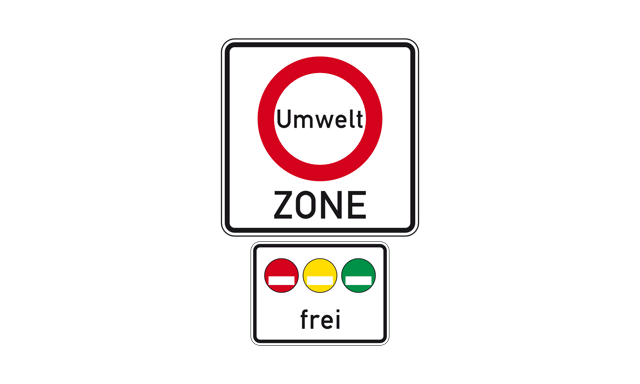

**Options:**
- A. Any lorry with a corresponding emissions sticker
- B. Any bus with a corresponding emissions sticker
- C. Any car

**Correct Answer(s):**
- A. Any lorry with a corresponding emissions sticker
- B. Any bus with a corresponding emissions sticker

**Explanation:**
This road leads in an environmental zone. All buses with a corresponding emissions sticker and all trucks with a corresponding sticker are allowed to drive here. Not all cars have this plaque, so are "all car" wrong.

---

#### Question 2.5.01-206

**Points:** 3 Points

**How can you avoid creating noise?**

**Options:**
- A. - filling empty compressed air tanks from a stationary facility, if possible
- B. - replacing worn-out side latches
- C. - allowing the engine to idle during longer waiting times

**Correct Answer(s):**
- A. - filling empty compressed air tanks from a stationary facility, if possible
- B. - replacing worn-out side latches

**Explanation:**
Noise you can prevent this by you as possible befüllst empty compressed air tanks from a stationary plant and if you exchange worn out lift closures.

---

#### Question 2.5.01-207

**Points:** 3 Points

**When planning your journeys, how can you make them environmentally-friendlier?**

**Options:**
- A. - combining several destinations into one single trip
- B. - forming car pools with other vehicle users
- C. - planning to use public transport instead of my own vehicle

**Correct Answer(s):**
- A. - combining several destinations into one single trip
- B. - forming car pools with other vehicle users
- C. - planning to use public transport instead of my own vehicle

**Explanation:**
For the sake of the environment, motorists should refrain from all trips that are not absolutely necessary. Therefore, plan your trips well and make carpools as often as possible to avoid unnecessary trips. Another positive contribution to active environmental protection is the use of public transport.

---

#### Question 2.5.01-208

**Points:** 3 Points

**How do you drive down a descending gradient safely?**

**Options:**
- A. - select a gear in which I am not required to brake a great deal
- B. - drive in neutral
- C. - switch the ignition off

**Correct Answer(s):**
- A. - select a gear in which I am not required to brake a great deal

**Explanation:**
On a down grade, use the engine brake by shifting down to a lower gear. This relieves the service brakes. Under no circumstances change to idle! Because idling puts the engine brake out of action, thus the service brakes could overheat. In addition, the brake booster cannot work when the ignition is switched off. This considerably lengthens the braking distance.

---

#### Question 2.5.01-209

**Points:** 3 Points

**What motor vehicles are permitted to enter an environment zone without a fine-particle badge?**

**Options:**
- A. All two and three-wheeled motor vehicles
- B. All agricultural and forestry tractors
- C. All motor vehicles with a catalytic converter

**Correct Answer(s):**
- A. All two and three-wheeled motor vehicles
- B. All agricultural and forestry tractors

**Explanation:**
All two- and three-wheeled motor vehicles and agricultural and forestry tractors may enter an environmental zone without the carbon emission sticker. They are exempt from the restrictions of the environmental zone. The installation of a catalytic converter does not exempt you as a car driver from the obligation to obtain an environmental badge.

---

#### Question 2.5.01-210

**Points:** 3 Points

**What manufacturer specifications will allow you to know if your motor vehicle is environmentally-friendly?**

**Options:**
- A. - about the fuel consumption
- B. - about the efficiency category
- C. - about the emissions class

**Correct Answer(s):**
- A. - about the fuel consumption
- B. - about the efficiency category
- C. - about the emissions class

**Explanation:**
The emission class provides information about the emission of pollutants. The emission classes defined by the standard and/or the law subdivide products that emit exhaust emissions or interference signals. In the automotive sector, moreover, the following applies: The lower the fuel consumption, the higher the efficiency class and thus the environmental friendliness of the vehicle.

---

#### Question 2.5.01-211

**Points:** 3 Points

**Why are short journeys performed with a cold engine especially damaging to the environment?**

**Options:**
- A. - more fuel is consumed
- B. - the level of material wear is higher
- C. - the vehicle's battery will be over-charged

**Correct Answer(s):**
- A. - more fuel is consumed
- B. - the level of material wear is higher

**Explanation:**
Short trips with a cold engine usually consume more fuel than driving with a motor in operating temperature. That's why they are particularly harmful to the environment. In addition, the friction is greater in short-distance driving with a cold engine. This leads to a higher material wear.

---

#### Question 2.5.01-212

**Points:** 3 Points

**What causes avoidable noise?**

**Options:**
- A. By sounding the horn as a greeting
- B. By firmly slamming doors shut
- C. By driving with a roof-rack

**Correct Answer(s):**
- A. By sounding the horn as a greeting
- B. By firmly slamming doors shut

**Explanation:**
All noise disturbances arising during normal operation of a vehicle are considered unavoidable. As a car driver, you should avoid any excess noise, for example, honking as a greeting or closing the doors very loudly. A roof rack will not cause you any avoidable noise.

---

#### Question 2.5.01-213

**Points:** 3 Points

**How does the eco-roll mode in commercial vehicles contribute to the reduction of fuel consumption?**

**Options:**
- A. - vehicle's kinetic energy is utilised to its maximum
- B. - engine braking effect is increased
- C. - vehicle's roll phase is reduced

**Correct Answer(s):**
- A. - vehicle's kinetic energy is utilised to its maximum

**Explanation:**
Because the kinetic energy of the vehicle is maximally utilized in eco-roll mode is the right answer. This has to do with the automatic neutral position of the transmission. The rolling phase will not be shortened and the engine braking effect is not increased.

---

## Theme 2.6. Rules On The Operation Of The Vehicles

### 2.6.01 Chapter Examination Of The Vehicles

#### Question 2.6.01-001

**Points:** 2 Points

**When must motorcycles be submitted for official inspection (Hauptuntersuchung)?**

**Options:**
- A. Every two years
- B. Every three years
- C. Every time they are re-registered

**Correct Answer(s):**
- A. Every two years

**Explanation:**
Similarly to cars, motorcycles should be inspected every two years

---

#### Question 2.6.01-003

**Points:** 2 Points

**How can you tell when you need to bring your vehicle in for its next vehicle roadworthiness test?**

**Options:**
- A. By looking at the inspection tag on the rear license plate
- B. By reading the entry made in the registration certificate Part I
- C. By reading the entry in the operating manual for my vehicle

**Correct Answer(s):**
- A. By looking at the inspection tag on the rear license plate
- B. By reading the entry made in the registration certificate Part I

**Explanation:**
The date for the next main inspection of your vehicle can be found in the certificate of registration part 1. In addition, the appointment is clearly visible on the inspection plate printed on your license plate.

---

#### Question 2.6.01-105

**Points:** 2 Points

**You have bought a second-hand car. The official inspection (Hauptuntersuchung) has just been carried out. When is it due for its next official inspection?**

**Options:**
- A. After two years
- B. After one year
- C. After three years

**Correct Answer(s):**
- A. After two years

**Explanation:**
If the main inspection of a used car has just happened, you must do the next general inspection after two years. Only for newly purchased cars, the deadline for the next general inspection is three years.

---

#### Question 2.6.01-106

**Points:** 2 Points

**You have left your registered caravan trailer for six months during the winter on a campground. What applies as far as the official inspection (Hauptuntersuchung) is concerned?**

**Options:**
- A. The date indicated on the test stamp must be observed
- B. The date indicated on the test stamp is extended by the time the caravan was stationary on the campground

**Correct Answer(s):**
- A. The date indicated on the test stamp must be observed

**Explanation:**
Even if you have parked your caravan on a campsite, you must meet the deadline for the general inspection. Technical defects, such as rust, can occur at any time and become a safety hazard if they're not repaired.

---

#### Question 2.6.01-108

**Points:** 2 Points

**You have purchased a 3-year-old car for your own personal use. The vehicle roadworthiness test certificate is new. What is the time limit until the next roadworthiness test must be performed?**

**Options:**

**Correct Answer(s):**
- 24 

**Explanation:**
The first general inspection of a passenger car takes place after three years, each subsequent general inspection takes place every 2 years.

---

#### Question 2.6.01-201

**Points:** 2 Points

**At what monthly interval must trucks with a permissible total mass exceeding 3.5 t be presented for official inspection (Hauptuntersuchung)?**

**Options:**

**Correct Answer(s):**
- 12 

**Explanation:**
You have your trucks with a gross vehicle mass exceeding 3,5 t bring every 12 months for the main study.

---

#### Question 2.6.01-203

**Points:** 2 Points

**At what monthly interval must buses be presented for official inspection (Hauptuntersuchung)?**

**Options:**

**Correct Answer(s):**
- 12 

**Explanation:**
Coming soon...

---

#### Question 2.6.01-205

**Points:** 2 Points

**You have been requested to present a truck with a gross vehicle weight rating of 18 t for its vehicle roadworthiness test. What vehicle documents do you need?**

**Options:**
- A. Registration certificate Part I (Motor Vehicle Registration)
- B. Inspection log book
- C. Registration certificate Part II (Motor Vehicle Title)

**Correct Answer(s):**
- A. Registration certificate Part I (Motor Vehicle Registration)
- B. Inspection log book

**Explanation:**
With your trucks with a maximum mass of 18 t you should use the log book and the registration certificate Part I (also called registration papers) have with you.

---

#### Question 2.6.01-206

**Points:** 2 Points

**You are requested to present a coach for its safety test. What vehicle documents do you need?**

**Options:**
- A. Registration certificate Part I (Motor Vehicle Registration)
- B. Inspection log book
- C. Registration certificate Part II (Motor Vehicle Title)

**Correct Answer(s):**
- A. Registration certificate Part I (Motor Vehicle Registration)
- B. Inspection log book

**Explanation:**
Coming soon...

---

#### Question 2.6.01-207

**Points:** 2 Points

**You have been requested to present a trailer with a gross vehicle weight rating of 18 t for its vehicle roadworthiness test. What vehicle documents do you need?**

**Options:**
- A. Registration certificate Part I (Motor Vehicle Registration)
- B. Inspection log book
- C. Registration certificate Part II (Motor Vehicle Title)

**Correct Answer(s):**
- A. Registration certificate Part I (Motor Vehicle Registration)
- B. Inspection log book

**Explanation:**
must be at the trailer with a maximum total weight of 18 t, which presented for general inspection, requires the registration certificate part I (registration certificate), and the log book.

---

#### Question 2.6.01-208

**Points:** 2 Points

**What is entered in the inspection log book?**

**Options:**
- A. - vehicle roadworthiness test
- B. - safety test
- C. - tachograph inspection

**Correct Answer(s):**
- A. - vehicle roadworthiness test
- B. - safety test

**Explanation:**
In the log book the date of the general inspection and safety check is entered.
The date of the Fahrteinschreibeüberprüfung not one of them.

---

#### Question 2.6.01-209

**Points:** 2 Points

**How can you tell when your vehicle needs to be brought in for its next safety inspection?**

**Options:**
- A. By looking at the safety inspection plate with the test sticker
- B. By reading the entry made in the registration certificate Part I
- C. By looking at the inspection tag on the license plate

**Correct Answer(s):**
- A. By looking at the safety inspection plate with the test sticker

**Explanation:**
When you are presented to a security check next time have to, you realize the SP sign with Mark. The other two answers are wrong.

---

#### Question 2.6.01-210

**Points:** 2 Points

**What is the mandatory time interval for performing the vehicle roadworthiness test for coaches and buses?**

**Options:**

**Correct Answer(s):**
- 12 

**Explanation:**
Buses and coaches drive a lot and transport people, which is why buses and coaches have to undergo a general inspection every 12 months.

---

### 2.6.02 Chapter Admission To Road Traffic Vehicle Documents Driving Licence

#### Question 2.6.02-002

**Points:** 2 Points

**What alterations can result in the permit for use (Betriebserlaubnis) being cancelled?**

**Options:**
- A. Fitting a sidecar
- B. Fitting tyres of a different size
- C. Fitting a rear fog lamp

**Correct Answer(s):**
- A. Fitting a sidecar
- B. Fitting tyres of a different size

**Explanation:**
Adding a sidecar or fitting tires of a different size impact the way your vehicle behave and will thus lead the cancelation of your permit for use. Fitting a rear fog lamp does not change the way your vehicle behave and thus is permitted.

---

#### Question 2.6.02-003

**Points:** 2 Points

**What alterations can result in the permit for use (Betriebserlaubnis) being cancelled?**

**Options:**
- A. Fitting an engine of different power
- B. Fitting fairings
- C. Fitting a radio

**Correct Answer(s):**
- A. Fitting an engine of different power
- B. Fitting fairings

**Explanation:**
Your vehicule's next roadworthiness test can be seen either in the Part I of the registration certificate or on the inspection tag that is on your rear license plate

---

#### Question 2.6.02-005

**Points:** 2 Points

**What alterations can result in the permit for use (Betriebserlaubnis) being cancelled?**

**Options:**
- A. Alterations to the gear ratio
- B. Alterations to the engine to increase power
- C. Fitting an electric starter

**Correct Answer(s):**
- A. Alterations to the gear ratio
- B. Alterations to the engine to increase power

**Explanation:**
Changing the gear ratio or the engine power impact the way your vehicle behave and will thus lead the cancelation of your permit for use

---

#### Question 2.6.02-007

**Points:** 3 Points

**You are holding a driving permit class A1. Which of the vehicles described are you allowed to drive?**

**Options:**
- A. Capacity: 120 cm³; power: 11 kW; maximum speed due to construction: 80 km/h
- B. Capacity: 100 cm³; power: 12 kW; maximum speed due to construction: 90 km/h
- C. Capacity: 150 cm³; power: 10 kW; maximum speed due to construction: 80 km/h

**Correct Answer(s):**
- A. Capacity: 120 cm³; power: 11 kW; maximum speed due to construction: 80 km/h

**Explanation:**
With a A1 driving permit you can ride a vehicle that has a 80km/h maximum speed, 120cm3 capacity and 11kW power

---

#### Question 2.6.02-010

**Points:** 3 Points

**What are the requirements when the motor liability insurance of your vehicle has expired?**

**Options:**
- A. - may no longer be used in road traffic
- B. - must be cancelled at the registration centre
- C. - must be presented for inspection at the technical test centre

**Correct Answer(s):**
- A. - may no longer be used in road traffic

**Explanation:**
It is required to have an insurance for your vehicle, without one you are not allowed to drive it

---

#### Question 2.6.02-011

**Points:** 3 Points

**When are you not allowed to drive a motorized bicycle on public roads?**

**Options:**
- A. When you have no motor vehicle liability insurance
- B. When the motorized bicycle is not roadworthy
- C. When no motor vehicle tax has been paid

**Correct Answer(s):**
- A. When you have no motor vehicle liability insurance
- B. When the motorized bicycle is not roadworthy

**Explanation:**
A motorized bicycle has to be insured to cover for third party damages in case of accidents and the vehicle needs to be roadworthy

---

#### Question 2.6.02-012

**Points:** 2 Points

**What is the minimum age for driving a motorized bicycle?**

**Options:**

**Correct Answer(s):**
- 15 

**Explanation:**
You must be at least 15 years old to drive a motorized bicycle

---

#### Question 2.6.02-013

**Points:** 3 Points

**What are the consequences when driving a motorized bicycle which can run faster than 25 km/h because it has been tuned?**

**Options:**
- A. Punishment for driving without a driving permit
- B. Fine and punishment because permit for use and insurance cover have lapsed
- C. There are no negative consequences as long as you do not drive faster than 25 km/h on this motorized bicycle

**Correct Answer(s):**
- A. Punishment for driving without a driving permit
- B. Fine and punishment because permit for use and insurance cover have lapsed

**Explanation:**
Tuning your motorized bicycle to go faster than 25km/h void your permit for use, insurance and you can be fined for driving without the right permit.

---

#### Question 2.6.02-014

**Points:** 3 Points

**What cancels the permit for use of a motorized bicycle?**

**Options:**
- A. "Clearing out" the silencer
- B. Modifying the gear ratio
- C. Fitting a second rear-view mirror

**Correct Answer(s):**
- A. "Clearing out" the silencer
- B. Modifying the gear ratio

**Explanation:**
Modifications that impact the behaviour of your motorcycle such as gear ratio, silencer, can result in the permit of use being canceled

---

#### Question 2.6.02-015

**Points:** 2 Points

**Which documents must you carry?**

**Options:**
- A. Permit for use (Betriebserlaubnis)
- B. Test certificate
- C. Evidence of insurance

**Correct Answer(s):**
- A. Permit for use (Betriebserlaubnis)
- B. Test certificate
- C. Evidence of insurance

**Explanation:**
When driving you must always carry proof of insurance, permit for use, test certificate in case it is controlled by the police

---

#### Question 2.6.02-016

**Points:** 2 Points

**You want to drive on public roads. Which insurance must you take out for your vehicle?**

**Options:**
- A. Motor vehicle liability insurance
- B. Complete vehicle insurance
- C. Legal expenses insurance

**Correct Answer(s):**
- A. Motor vehicle liability insurance

**Explanation:**
You are required by law to have a motor vehicle liability insurance to drive your vehicle which covers damanges done to third parties in case of accidents

---

#### Question 2.6.02-017

**Points:** 2 Points

**What proves that you have taken out a motor liability insurance for your vehicle?**

**Options:**
- A. Valid insurance number plate
- B. Evidence of insurance
- C. Permit for use (Betriebserlaubnis)

**Correct Answer(s):**
- A. Valid insurance number plate
- B. Evidence of insurance

**Explanation:**
You can provide an insurance certificate or have a valid insurance number plate

---

#### Question 2.6.02-018

**Points:** 2 Points

**What is the maximum validity of the insurance number plate?**

**Options:**
- A. 1 year
- B. 2 years
- C. The entire vehicle life

**Correct Answer(s):**
- A. 1 year

**Explanation:**
The insurance number plate is valid for a maximum of 1 year

---

#### Question 2.6.02-023

**Points:** 3 Points

**The insurance indicator on your two-wheeler is no longer valid. What are the consequences if you continue to drive it so?**

**Options:**
- A. I must reckon with a fine or imprisonment
- B. I will personally have to bear the costs of any accidental damage that occurs
- C. I may only drive at walking speed

**Correct Answer(s):**
- A. I must reckon with a fine or imprisonment
- B. I will personally have to bear the costs of any accidental damage that occurs

**Explanation:**
It is legally required to have an insurance to drive. Without one you are at risk of a fine or imprisonment. If you have an accident without an insurance, you will have to pay for any third party damage yourself

---

#### Question 2.6.02-024

**Points:** 2 Points

**What documents must you carry with you, if you want to drive a motorbike with an engine size larger than 200 cm³?**

**Options:**
- A. My driving licence
- B. The registration certificate Part I (Motor Vehicle Registration)
- C. The registration certificate Part II (Motor Vehicle Title)

**Correct Answer(s):**
- A. My driving licence
- B. The registration certificate Part I (Motor Vehicle Registration)

**Explanation:**
To drive you need to have your driver's license and the part I of your registration certificate to prove that both you and the motorcycle are authorised to drive

---

#### Question 2.6.02-025

**Points:** 2 Points

**What documents do you have to carry with you, if you want to drive a light motorcycle?**

**Options:**
- A. My driving licence
- B. The operating licence or the registration certificate Part I (Motor Vehicle Registration)
- C. The registration certificate Part II (Motor Vehicle Title)

**Correct Answer(s):**
- A. My driving licence
- B. The operating licence or the registration certificate Part I (Motor Vehicle Registration)

**Explanation:**
To drive you need to have your driver's license and the part I of your registration certificate to prove that both you and the motorcycle are authorised to drive

---

#### Question 2.6.02-026

**Points:** 2 Points

**What documents do you have to carry with you, if you want to drive a small-engined motorcycle?**

**Options:**
- A. My driving licence
- B. The operating licence or the Certificate of Conformity (COC document)
- C. The insurance certificate

**Correct Answer(s):**
- A. My driving licence
- B. The operating licence or the Certificate of Conformity (COC document)
- C. The insurance certificate

**Explanation:**
You are required to have all three documents, your driver's license, an insurance certificate and an operating license or certificate of conformity

---

#### Question 2.6.02-027

**Points:** 2 Points

**What documents do you have to carry with you, if you want to drive a compulsory registrable vehicle?**

**Options:**
- A. My driving licence
- B. The registration certificate Part I (Motor Vehicle Registration)
- C. The registration certificate Part II (Motor Vehicle Title)

**Correct Answer(s):**
- A. My driving licence
- B. The registration certificate Part I (Motor Vehicle Registration)

**Explanation:**
As a car driver, you must always have your driver's license and vehicle registration certificate (certificate of registration part 1) with you. The vehicle title (registration certificate part 2) should be kept safely at home. It serves as proof of ownership and is not needed while driving.

---

#### Question 2.6.02-028

**Points:** 2 Points

**Which of the following listed documents must you have with you, if you want to drive a passenger bus in occasional service within national boundaries?**

**Options:**
- A. The instrument of approval
- B. My driving licence
- C. The insurance certificate

**Correct Answer(s):**
- A. The instrument of approval
- B. My driving licence

**Explanation:**
Coming soon...

---

#### Question 2.6.02-030

**Points:** 3 Points

**A technical modification to your vehicle means that the operating licence is extinguished. What consequences should you anticipate if you nevertheless use the vehicle on public roads?**

**Options:**
- A. A public authority fine
- B. An entry into the Central Register of Road Traffic Offenders
- C. The loss of my insurance cover

**Correct Answer(s):**
- A. A public authority fine
- B. An entry into the Central Register of Road Traffic Offenders
- C. The loss of my insurance cover

**Explanation:**
If you use your vehicle on public roads despite the expired operating license, you will lose your insurance cover because the vehicle is no longer the one that was originally insured. Since there is an obligation to have insurance in Germany, driving without insurance is a misdemeanor. In the event of a police check, a fine will be imposed and you must expect an entry in the register of fitness to drive.

---

#### Question 2.6.02-031

**Points:** 2 Points

**What type of trailers used in agriculture and forestry do not have to have their own registration number?**

**Options:**
- A. - with a "25" speed limit sign attached to the rear
- B. - used to transport agricultural goods
- C. - that may travel in excess of 25 km/h

**Correct Answer(s):**
- A. - with a "25" speed limit sign attached to the rear

**Explanation:**
Coming soon...

---

#### Question 2.6.02-032

**Points:** 4 Points

**You want to transport hazardous goods, but have more than the permissible exempted allowance. What conditions must you fulfil in order to transport the goods?**

**Options:**
- A. - hold a driving licence for the relevant driving licence class
- B. - carry an ADR Certificate with me
- C. - be at least 25-years old

**Correct Answer(s):**
- A. - hold a driving licence for the relevant driving licence class
- B. - carry an ADR Certificate with me

**Explanation:**
Because you have exceeded the quantitative restrictions, you need to for your license, the required class possess and carry an ADR certificate (hazardous).

---

#### Question 2.6.02-034

**Points:** 3 Points

**What is the meaning of the numbers on a sign of this kind?**

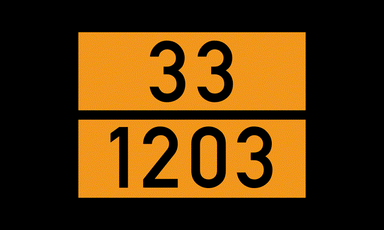

**Options:**
- A. - provide information about the transported hazardous goods
- B. - are specifications issued by the vehicle manufacturer
- C. - represent the maximum load capacity

**Correct Answer(s):**
- A. - provide information about the transported hazardous goods

**Explanation:**
These figures provide information about the transported hazardous goods. 33 is our 1203, the UN number is a risk number (highly flammable liquid) (flash point below 23 ° C) (also called material number) (gasoline or petrol)

---

#### Question 2.6.02-035

**Points:** 3 Points

**You would like to drive a truck with a gross vehicle weight rating of 8.0 t, which is carrying orange warning plates. Which of the following conditions do you have to fulfil?**

**Options:**
- A. - carry an ADR certificate with me
- B. - hold a Class C driving licence
- C. - have driven accident-free for at least 3 years

**Correct Answer(s):**
- A. - carry an ADR certificate with me
- B. - hold a Class C driving licence

**Explanation:**
With your truck with 8.0 t permissible gross weight, you must meet the following conditions: You have (hazardous materials certification) carry and possess a driving license class C an ADR certificate. Accident freedom has nothing to do.

---

#### Question 2.6.02-036

**Points:** 3 Points

**An inspection has been performed because of a technical modification made to your vehicle. What are you obliged to do?**

**Options:**
- A. - carry the inspection report or confirmation in my vehicle, and have the registration in certificate Part I corrected if necessary
- B. - forward the inspection report or confirmation to the vehicle manufacturer
- C. - stick the inspection report or confirmation into the designated place in the registration certificate Part II

**Correct Answer(s):**
- A. - carry the inspection report or confirmation in my vehicle, and have the registration in certificate Part I corrected if necessary

**Explanation:**
After the technical modification of a vehicle, an acceptance report is usually created during the assessment. However, an entry may also be made in part 1 of the certificate of registration. The protocol must be carried by the vehicle driver during each journey. On request, the protocol must be presented, for example, during a stop-and-search operation.

---

#### Question 2.6.02-037

**Points:** 3 Points

**The maximum design speed of a moped exceeds 25 km/h due to a prohibited technical modification. What are the consequences for me if I ride such a moped on public roads?**

**Options:**
- A. I am committing a criminal offence for driving without a licence
- B. I am committing an administrative offence because I have no authorisation to operate the moped
- C. None, provided I do not drive any faster than 25 km/h

**Correct Answer(s):**
- A. I am committing a criminal offence for driving without a licence
- B. I am committing an administrative offence because I have no authorisation to operate the moped

**Explanation:**
As soon as you change anything on your vehicle without a general operating permit or approval, the operating permit expires. Since riding a moped over 25 km/h is already class AM or higher, you are riding without a valid driving licence.

---

#### Question 2.6.02-038

**Points:** 3 Points

**An assessment is required following modifications to your vehicle. When must this be performed?**

**Options:**
- A. Promptly following the modification
- B. At the time of the next inspection
- C. When demanded by the registration authority

**Correct Answer(s):**
- A. Promptly following the modification

**Explanation:**
The assessment must be carried out immediately after the conversion.

---

#### Question 2.6.02-039

**Points:** 2 Points

**What technical modification to a motorbike will generally void the issued operating licence?**

**Options:**
- A. Any change to the gear ratio of the pinion and chain wheel
- B. Any change to the engine power
- C. Installing a tankbag

**Correct Answer(s):**
- A. Any change to the gear ratio of the pinion and chain wheel
- B. Any change to the engine power

**Explanation:**
The original gear ratio of the pinion and sprocket is part of the operating license granted. All changes that affect the drive of your vehicle must be registered. This means that the operating permit expires if you change the transmission ratio.

---

#### Question 2.6.02-040

**Points:** 2 Points

**What technical modifications to a two-wheeler could result in the withdrawal of the vehicle’s type approval?**

**Options:**
- A. Fitting customised handlebars
- B. Changing the wheel/tyre combination
- C. Installing an identical engine

**Correct Answer(s):**
- A. Fitting customised handlebars
- B. Changing the wheel/tyre combination

**Explanation:**
The operating licence expires if modifications are made to the vehicle that change the vehicle type, could cause a hazard or worsen the exhaust or noise values.
The operating licence of your two-wheeler may lose its validity if, for example, you install special handlebars or use a wheel/tyre combination that is not explicitly approved for your two-wheeler. Two-wheeler is approved.

---

#### Question 2.6.02-041

**Points:** 2 Points

**What is the latest date on which you must display the new proof of insurance on your two-wheeler in order to continue driving without any gap in your cover?**

**Options:**
- A. - 1st March
- B. - 1st January
- C. - 1st June

**Correct Answer(s):**
- A. - 1st March

**Explanation:**
From 1 March 2023, the new insurance licence plates will become invalid. In order to be allowed to continue riding without transition, take care of a new licence plate in good time.

---

#### Question 2.6.02-042

**Points:** 3 Points

**The validity of the insurance plate on your bike has expired. What are the consequences for its use on public roads?**

**Options:**
- A. - no longer ride the bike
- B. - push the bike on a pavement
- C. - park the bike in a car park

**Correct Answer(s):**
- A. - no longer ride the bike
- B. - push the bike on a pavement

**Explanation:**
It is forbidden to use a two-wheeler on public roads without a valid insurance license plate. The law requires compulsory insurance so that possible accident costs are covered. 
You are allowed to push your two-wheeler on a sidewalk without a valid insurance license plate, as this does not count as “driving”.

---

#### Question 2.6.02-101

**Points:** 3 Points

**The suspension of your motor vehicle has been lowered and an expert opinion must be obtained. When is this required?**

**Options:**
- A. Immediately after the alteration
- B. Together with the next official inspection (Hauptuntersuchung), at least 1 year after the alteration
- C. When requested by the vehicle licensing authority

**Correct Answer(s):**
- A. Immediately after the alteration

**Explanation:**
If you lower a car you need this change on the chassis to be officially accepted. Therefore, the assessment must be done immediately. You must always carry the report or confirmation with you and, if necessary, have this technical change registered in the certificate of registration part 1, the registration certificate.

---

#### Question 2.6.02-104

**Points:** 3 Points

**You are holding a driving permit class B. Your car has the following specifications: - empty mass 1900 kg - permissible total mass 2400 kg - permissible towed load 1500 kg Which trailer are you allowed to tow?**

**Options:**
- A. 1000 kg
- B. 1200 kg
- C. 1500 kg

**Correct Answer(s):**
- A. 1000 kg

**Explanation:**
Regardless of the information, a vehicle plus a trailer may only have a restricted total weight of 3,500 kg for a Class B driving license. When the car is fully loaded, the loaded trailer must not weigh more than 1,100 kg. Exception: The car has a maximum permissible mass of 3,500 kg and the trailer weighs less than 750 kg.

---

#### Question 2.6.02-201

**Points:** 3 Points

**You are holding a driving permit class C. Your truck has the following specifications: - empty mass 9000 kg - permissible total mass 18000 kg - permissible towed load 22000 kg Which trailer are you allowed to tow?**

**Options:**
- A. 750 kg
- B. 18000 kg
- C. 22000 kg

**Correct Answer(s):**
- A. 750 kg

**Explanation:**
The trailer has a maximum authorized mass of 750 kg must not be exceeded for Class C.

---

#### Question 2.6.02-202

**Points:** 3 Points

**You are holding a driving permit class C1. Your truck has the following specifications: - empty mass 3500 kg - permissible total mass 6200 kg - permissible towed load 9300 kg Which trailer are you allowed to tow?**

**Options:**
- A. 750 kg
- B. 3500 kg
- C. 6200 kg

**Correct Answer(s):**
- A. 750 kg

**Explanation:**
With these data your followers must not weigh over 750 kg more.

---

#### Question 2.6.02-203

**Points:** 3 Points

**You are holding a driving permit class D. Your bus has the following specifications: - empty mass 13000 kg - permissible total mass 18000 kg - permissible towed load 2000 kg Which trailer are you allowed to tow?**

**Options:**
- A. 750 kg
- B. 1000 kg
- C. 2000 kg

**Correct Answer(s):**
- A. 750 kg

**Explanation:**
Coming soon...

---

#### Question 2.6.02-204

**Points:** 2 Points

**What is the maximum period for which a driving licence class D or D1 is issued?**

**Options:**

**Correct Answer(s):**
- 5 

**Explanation:**
Coming soon...

---

#### Question 2.6.02-206

**Points:** 3 Points

**What can result in your qualification as a bus driver having to be reviewed?**

**Options:**
- A. - your knowledge and ability as a bus driver
- B. - your physical or mental qualification
- C. - your employer's reliability

**Correct Answer(s):**
- A. - your knowledge and ability as a bus driver
- B. - your physical or mental qualification

**Explanation:**
Coming soon...

---

#### Question 2.6.02-207

**Points:** 3 Points

**When does a driving permit class D or D1 lapse?**

**Options:**
- A. When validity has not been renewed in time
- B. When you have not driven a bus for more than 1 year
- C. When your employment as bus driver ends

**Correct Answer(s):**
- A. When validity has not been renewed in time

**Explanation:**
Coming soon...

---

#### Question 2.6.02-209

**Points:** 3 Points

**When is a bus driver not allowed to drive?**

**Options:**
- A. When he is suffering from a notifiable contagious disease
- B. When a member of his household is suffering from a notifiable contagious disease
- C. When he is seriously indisposed

**Correct Answer(s):**
- A. When he is suffering from a notifiable contagious disease
- B. When a member of his household is suffering from a notifiable contagious disease
- C. When he is seriously indisposed

**Explanation:**
Coming soon...

---

#### Question 2.6.02-210

**Points:** 3 Points

**All the seats on your bus are equipped with the prescribed safety belts. You are driving in non-regular traffic. What is correct?**

**Options:**
- A. You must wear your safety belt
- B. You must inform passengers that they have to wear safety belts
- C. Safety belts do not have to be worn inside built-up areas

**Correct Answer(s):**
- A. You must wear your safety belt
- B. You must inform passengers that they have to wear safety belts

**Explanation:**
Coming soon...

---

#### Question 2.6.02-215

**Points:** 3 Points

**Which document do you have to carry with you for a bus in cross-border traffic within the EU states?**

**Options:**
- A. A certified copy of the valid licence for commercial cross-border passenger traffic with coaches and buses
- B. An approved timetable
- C. A valid description of the location

**Correct Answer(s):**
- A. A certified copy of the valid licence for commercial cross-border passenger traffic with coaches and buses

**Explanation:**
Coming soon...

---

#### Question 2.6.02-225

**Points:** 3 Points

**What is regulated by the road haulage act?**

**Options:**
- A. Commercial goods transport
- B. Goods transport against payment
- C. Private goods transport

**Correct Answer(s):**
- A. Commercial goods transport
- B. Goods transport against payment

**Explanation:**
The road transport law regulates the paid transport of goods and the businesslike goods. Private freight transport is not included.

---

#### Question 2.6.02-227

**Points:** 2 Points

**You are performing a cross-border furniture removal operation. What transport document do you have to carry with you?**

**Options:**
- A. The CMR way bill
- B. The registration certificate Part II
- C. Proof of insurance

**Correct Answer(s):**
- A. The CMR way bill

**Explanation:**
You have to carry the CMR at an international furniture transport. CRM is a CMR Convention.

---

#### Question 2.6.02-228

**Points:** 2 Points

**You hold a certificate of approval in accordance with the passenger transportation law. When must this be carried during the occasional carriage of passengers?**

**Options:**
- A. - within Germany
- B. - outside of Germany within the EU
- C. - outside of the EU

**Correct Answer(s):**
- A. - within Germany
- B. - outside of Germany within the EU

**Explanation:**
Coming soon...

---

#### Question 2.6.02-229

**Points:** 2 Points

**You carry out a household dissolution in return for payment. For moving the furniture you use a motor vehicle with a gross vehicle weight rating of 4.5 t. Do you need a permit under the Road Haulage Act in order to transport the load?**

**Options:**
- A. Yes, because the motor vehicle has a gross vehicle weight rating in excess of 3.5 t
- B. No, because the actual purpose of the job is the household dissolution
- C. No, because small firms do not need a permit

**Correct Answer(s):**
- A. Yes, because the motor vehicle has a gross vehicle weight rating in excess of 3.5 t

**Explanation:**
Since your truck has a maximum authorized mass of 3.5 t, you need at a furniture transport with a total weight of 4.5 tons a permit for the road transport law.

---

#### Question 2.6.02-230

**Points:** 2 Points

**What should you note about the classes C, C1, D and D1 driving licence?**

**Options:**
- A. The driving licence is issued for a maximum limited period of 5 years
- B. The earliest that an application can be made to renew the driving licence is 6 months prior to expiry
- C. The end of the driving licence's validity period is indicated on the driving licence document

**Correct Answer(s):**
- A. The driving licence is issued for a maximum limited period of 5 years
- B. The earliest that an application can be made to renew the driving licence is 6 months prior to expiry
- C. The end of the driving licence's validity period is indicated on the driving licence document

**Explanation:**
All three answers are correct. The classes mentioned are all limited to a maximum of 5 years. The extension of the driving license can be applied for at the earliest 6 months before the expiry of the validity period (5 years) and the end of the validity period is noted on the driving license.

---

#### Question 2.6.02-231

**Points:** 4 Points

**You are to transport hazardous goods, but have more than the permissible exempted allowance. What proof must you carry with you to perform the transport?**

**Options:**
- A. A valid ADR training certificate
- B. A valid driving licence for the relevant vehicle class
- C. A valid record for the last hazardous goods transport

**Correct Answer(s):**
- A. A valid ADR training certificate
- B. A valid driving licence for the relevant vehicle class

---

#### Question 2.6.02-232

**Points:** 2 Points

**Where will you find information on the validity period of your licence to drive?**

**Options:**
- A. On your driving licence
- B. On your driver card
- C. On your driver qualification card

**Correct Answer(s):**
- A. On your driving licence

---

#### Question 2.6.02-233

**Points:** 3 Points

**What proof do you need to extend the period of validity of your driving licence?**

**Options:**
- A. - my aptitude
- B. - my vision
- C. - my first aid training

**Correct Answer(s):**
- A. - my aptitude
- B. - my vision

**Explanation:**
To extend the validity of your driving license, you will need a renewed proof of suitability and eyesight. First aid training does not have to be repeated.

---

#### Question 2.6.02-234

**Points:** 2 Points

**You are driving a lorry in commercial freight transport. What do you have to be able to prove on request?**

**Options:**
- A. The documentation for transport
- B. A valid professional driver qualification
- C. A valid cargo liability insurance policy

**Correct Answer(s):**
- A. The documentation for transport
- B. A valid professional driver qualification
- C. A valid cargo liability insurance policy

**Explanation:**
As a truck driver in commercial freight transport, you must have the following documents with you:
        1. Documentation for transport: According to Section 7 Paragraph 1 No. 3 of the Road Haulage Act (GüKG), a transport document must be carried that contains information about the goods being transported, the sender and the recipient.
        2. Valid professional driver qualification: According to the Professional Driver Qualification Act (BKrFQG), you must provide evidence of appropriate qualifications, for example by entering the key number “95” on your driving license.
        3. Valid liability insurance for damage to goods: According to Section 7a GüKG, proof of liability insurance for damage to goods is required to cover liability for transported goods.

Carrying these documents is required by law and serves to ensure orderly and safe road transport.

---

#### Question 2.6.02-235

**Points:** 2 Points

**When do you need an authorisation to transport goods in accordance with the Road Haulage Act?**

**Options:**
- A. - transport is carried out on a commercial basis
- B. - the transport distance is more than 100 km
- C. - a vehicle combination is used for transport

**Correct Answer(s):**
- A. - transport is carried out on a commercial basis

**Explanation:**
You only need this authorization for the transport of goods in commercial freight transport.

---

#### Question 2.6.02-301

**Points:** 2 Points

**When performing the occasional carriage of passengers, what document must you present for inspection by the competent persons upon demand?**

**Options:**
- A. The registration certificate Part I
- B. The approval for the occasional carriage of passengers
- C. The passenger accident insurance certificate

**Correct Answer(s):**
- A. The registration certificate Part I
- B. The approval for the occasional carriage of passengers

**Explanation:**
Coming soon...

---

#### Question 2.6.02-302

**Points:** 2 Points

**As a bus driver, you carry passengers by means of a regular international services operation. What documents do you have to carry with you?**

**Options:**
- A. The registration certificate Part I
- B. The permits needed for the country of destination
- C. The registration certificate Part II

**Correct Answer(s):**
- A. The registration certificate Part I
- B. The permits needed for the country of destination

**Explanation:**
Coming soon...

---

#### Question 2.6.02-403

**Points:** 2 Points

**Which requirements must be met so that a farm trailer is exempt from registration?**

**Options:**
- A. The trailer may only be towed by truck tractors or self-propelled working machines when not driving faster than 25 km/h
- B. The trailer may only be used for agriculture or forestry purposes
- C. The trailer must be submitted for an official test (Hauptuntersuchung) every 12 months

**Correct Answer(s):**
- A. The trailer may only be towed by truck tractors or self-propelled working machines when not driving faster than 25 km/h
- B. The trailer may only be used for agriculture or forestry purposes

**Explanation:**
Coming soon...

---

#### Question 2.6.02-406

**Points:** 3 Points

**What are the consequences of an invalid insurance indicator on using a vehicle on public roads?**

**Options:**
- A. - no longer be used
- B. - continue to be used, if the driver is prepared to personally pay for damage caused
- C. - continue to be used, if you do not drive faster than a cyclist

**Correct Answer(s):**
- A. - no longer be used

**Explanation:**
It is legally required to have an insurance to drive. Without one you are not allowed to drive and are at risk of a fine or imprisonment. If you have an accident without an insurance, you will have to pay for any third party damage yourself

---

#### Question 2.6.02-407

**Points:** 2 Points

**Which of the following listed documents must you have with you, if you want to drive a cross-border passenger bus within the EU?**

**Options:**
- A. The EU passenger waybill
- B. The personal log-book
- C. No particular documents

**Correct Answer(s):**
- A. The EU passenger waybill

**Explanation:**
Coming soon...

---

#### Question 2.6.02-408

**Points:** 2 Points

**How long is the validity period of an ADR Certificate detailing a driver's training for transporting hazardous goods?**

**Options:**
- A. 5 years
- B. 3 years
- C. Unlimited

**Correct Answer(s):**
- A. 5 years

**Explanation:**
The ADR certificate (the driver training for hazardous cargo) is valid for 5 years and must then be renewed.

---

#### Question 2.6.02-409

**Points:** 4 Points

**What duties do you have when driving a commercial freight transport vehicle?**

**Options:**
- A. - implement all the measures necessary to secure the load
- B. - carry with me an accompanying document detailing the transported cargo, the place of loading and unloading and the instructing party
- C. - create an accompanying document for the load

**Correct Answer(s):**
- A. - implement all the measures necessary to secure the load
- B. - carry with me an accompanying document detailing the transported cargo, the place of loading and unloading and the instructing party

**Explanation:**
Your duties in a commercial freight are to take all necessary measures for securing the load and carry an accompanying document in which the transported goods, loading and unloading and the client are given.

---

#### Question 2.6.02-410

**Points:** 3 Points

**What vehicles - including with trailer - may be driven by someone even before their 18th birthday if they hold a Class T driving licence?**

**Options:**
- A. 40 km/h
- B. 50 km/h
- C. 60 km/h

**Correct Answer(s):**
- A. 40 km/h

**Explanation:**
Coming soon...

---

#### Question 2.6.02-411

**Points:** 3 Points

**What vehicles - including with trailer - may be driven by someone after their 18th birthday if they hold a Class T driving licence?**

**Options:**
- A. 60 km/h
- B. 70 km/h
- C. 80 km/h

**Correct Answer(s):**
- A. 60 km/h

**Explanation:**
Coming soon...

---

#### Question 2.6.02-412

**Points:** 2 Points

**What modifications to the vehicle could result in the license to drive it being cancelled?**

**Options:**
- A. Installing a different type steering wheel
- B. Modifying the exhaust system
- C. Installing a replacement engine

**Correct Answer(s):**
- A. Installing a different type steering wheel
- B. Modifying the exhaust system

**Explanation:**
Changing the type of steering wheel or modifying the exhaust system impact the way your vehicle behave and will thus lead the cancelation of your permit for use. Replacing an engine by a similar one does not change the way your vehicle behave and thus is permitted.

---

#### Question 2.6.02-413

**Points:** 4 Points

**Which of the following regulations govern the road transport of hazardous goods?**

**Options:**
- A. German Regulations on the Transport of Dangerous Goods by Road, Rail and Inland Waterways ("GGVSEB")
- B. ADR
- C. German Civil Code ("BGB")

**Correct Answer(s):**
- A. German Regulations on the Transport of Dangerous Goods by Road, Rail and Inland Waterways ("GGVSEB")
- B. ADR

**Explanation:**
These regulations govern the transport and are included in the Dangerous Goods Ordinance (GGVSEB) and ADR (European Agreement concerning the International Carriage of Dangerous Goods by Road)

---

#### Question 2.6.02-414

**Points:** 2 Points

**What is the period of validity of the authorisation for occasional passenger services (national) with coaches or buses?**

**Options:**
- A. Maximum 10 years
- B. Maximum 5 years
- C. Maximum 2 years

**Correct Answer(s):**
- A. Maximum 10 years

**Explanation:**
Coming soon...

---

#### Question 2.6.02-416

**Points:** 2 Points

**What proofs may be necessary for cross-border road haulage services?**

**Options:**
- A. - ECMT permit
- B. - bilateral authorisation
- C. - Community licence

**Correct Answer(s):**
- A. - ECMT permit
- B. - bilateral authorisation
- C. - Community licence

**Explanation:**
3 answers are correct. As evidence for cross-border freight ECMT license, the bilateral authorization and the Community license shall apply.

---

### 2.6.03 Chapter Trailer Operation

#### Question 2.6.03-001

**Points:** 4 Points

**What is the correct response if, when reversing a combination vehicle the view to the rear is impeded?**

**Options:**
- A. If the line-of-sight is broken to the person directing, the vehicle must be stopped
- B. A person directing is only required when driving into a priority road
- C. A person directing is not needed when on a factory premises

**Correct Answer(s):**
- A. If the line-of-sight is broken to the person directing, the vehicle must be stopped

**Explanation:**
If you drive backwards with a vehicle combination and your view is restricted to the rear, you must make sure that you do not endanger other road users. You should therefore be advised into traffic. This also applies to factory premises.

---

#### Question 2.6.03-002

**Points:** 2 Points

**What is the period of validity of the authorisation for other occasional passenger services (national) with motor vehicles?**

**Options:**
- A. Maximum 5 years
- B. Maximum 10 years
- C. Maximum 2 years

**Correct Answer(s):**
- A. Maximum 5 years

**Explanation:**
Coming soon...

---

#### Question 2.6.03-101

**Points:** 2 Points

**What is the maximum number of trailers allowed to be towed by a class B truck?**

**Options:**

**Correct Answer(s):**
- 1 

**Explanation:**
Only one trailer may be carried behind motor vehicles (class B). However, none for passenger transport (bus trailer).

---

#### Question 2.6.03-102

**Points:** 3 Points

**You are driving on a road with potholes and your trailer starts "jumping". What must you do?**

**Options:**
- A. Reduce speed in order to avoid skidding
- B. Accelerate to keep the combination of vehicles straight
- C. Proceed at the same speed and avoid potholes

**Correct Answer(s):**
- A. Reduce speed in order to avoid skidding

**Explanation:**
You should not accelerate any further as this would cause the trailer to build up vibrations. Brake slightly instead. A reduced speed brings the trailer back under control.

---

#### Question 2.6.03-105

**Points:** 3 Points

**What must you remember when you want to use a trailer with overrun brakes behind your car?**

**Options:**
- A. The actual total mass of the trailer must not exceed the towed load permitted for the car
- B. The breakaway cable is connected to the towing vehicle
- C. The permissible maximum speed for this combination of vehicles is 60 km/h, including on autobahns

**Correct Answer(s):**
- A. The actual total mass of the trailer must not exceed the towed load permitted for the car
- B. The breakaway cable is connected to the towing vehicle

**Explanation:**
Make sure that the breakaway cable is properly fastened. It has the effect that, in case of detachment, the trailer brake will automatically tighten and bring the trailer to a halt. The overrun brake has nothing to do with the maximum permissible speed.

---

#### Question 2.6.03-106

**Points:** 3 Points

**What is designated as towed load?**

**Options:**
- A. The actual load being towed
- B. The permissible total mass of the trailer
- C. The useful load of the trailer

**Correct Answer(s):**
- A. The actual load being towed

**Explanation:**
Only the actually dragged load is called trailer load, in other words the weight of the trailer. The manufacturer sets this value for carrying a trailer.

---

#### Question 2.6.03-111

**Points:** 3 Points

**You want to pull a trailer. When do additional rear-view mirrors have be to attached to your motor vehicle?**

**Options:**
- A. If it is not possible to observe all relevant road traffic situations without additional rear-view mirrors
- B. If the load platform of the trailer exceeds a width of 1.5 m and a height of 1 m
- C. If you are pulling a caravan or a trailer used in agriculture and forestry

**Correct Answer(s):**
- A. If it is not possible to observe all relevant road traffic situations without additional rear-view mirrors

**Explanation:**
As a car driver you are responsible for a sufficient view of the vehicle. If visibility is compromised by a trailer and the prescribed mirrors are no longer sufficient, you will need to install additional mirrors.

---

#### Question 2.6.03-112

**Points:** 2 Points

**You want to tow a brake-equipped trailer. Where can you find details or guidelines on the permissible towable mass of your car?**

**Options:**
- A. In the registration certificate Part I of my car
- B. In the registration certificate Part I of my trailer
- C. In the insurance certificate

**Correct Answer(s):**
- A. In the registration certificate Part I of my car

**Explanation:**
The information on how much weight a towing vehicle can tow can be found in the registration certificate (part 1) and in the vehicle owner's manual.

---

#### Question 2.6.03-113

**Points:** 2 Points

**You want to couple a trailer to your car. Where will you find details about the maximum permissible vertical loading of your car?**

**Options:**
- A. - operating manual
- B. - registration certificate Part I
- C. - registration certificate Part II

**Correct Answer(s):**
- A. - operating manual
- B. - registration certificate Part I

**Explanation:**
Information about the permissible trailer load can be found in part 1 in the certificate of registration of the car towing vehicle and in its operating instructions.

---

#### Question 2.6.03-114

**Points:** 3 Points

**You want to pull a trailer. What must you be aware of?**

**Options:**
- A. - towable weight of the towing vehicle
- B. - vertical load of the hitch
- C. - load of the trailer

**Correct Answer(s):**
- A. - towable weight of the towing vehicle
- B. - vertical load of the hitch
- C. - load of the trailer

**Explanation:**
The manufacturer specifies how high the maximum drawbar load, the payload and the trailer load may be. If the values are not adhered to, it can have an effect on the driving behaviour and thus lead to an accident.

---

#### Question 2.6.03-115

**Points:** 3 Points

**You are driving with a trailer on a road with potholes. Your combination vehicle begins to swing up. What must you do now?**

**Options:**
- A. - reduce my speed to avoid skidding
- B. - accelerate to keep the combination vehicle in a straight line
- C. - counter-steer quickly to prevent skidding

**Correct Answer(s):**
- A. - reduce my speed to avoid skidding

**Explanation:**
By reducing the speed, you can prevent skidding.

---

#### Question 2.6.03-116

**Points:** 2 Points

**What number of trailers may be towed behind a car?**

**Options:**

**Correct Answer(s):**
- 1 

**Explanation:**
According to StVZO § 32 a Carrying trailers: Only one trailer may be carried behind vehicles, but not for passenger transport (bus trailer).

---

#### Question 2.6.03-117

**Points:** 2 Points

**You want to hitch a trailer with a maximum authorised mass over 750 kg to your car. What must you ensure in this situation?**

**Options:**
- A. That the handle of the ball coupling must be visually and mechanically checked
- B. The breakaway cable is properly fitted
- C. Following coupling, that the proper functioning of the trailer’s lighting system is checked

**Correct Answer(s):**
- A. That the handle of the ball coupling must be visually and mechanically checked
- B. The breakaway cable is properly fitted
- C. Following coupling, that the proper functioning of the trailer’s lighting system is checked

**Explanation:**
In order for the trailer to be properly connected, the clutch claw must completely enclose the ball head. If the fuse snaps in, it is guaranteed that the clutch claw cannot dissolve independently. Check this with hand and eye. In addition, trailers with a permissible total mass of over 750 kg must also be secured with a tear -off rope. Check before driving as to whether it is appropriate.
After you have checked all the connections, you must also check the lighting before starting drive.

---

#### Question 2.6.03-118

**Points:** 3 Points

**You are driving a car with a fully loaded trailer equipped with overrun braking. What special aspect should be noted here?**

**Options:**
- A. Longer downhill drives can cause the trailer brakes to overheat
- B. The overrun brake system is ineffective on a vehicle combination in an uphill stationary position
- C. The trailer’s parking brake must be activated before separating the vehicle combination

**Correct Answer(s):**
- A. Longer downhill drives can cause the trailer brakes to overheat
- B. The overrun brake system is ineffective on a vehicle combination in an uphill stationary position
- C. The trailer’s parking brake must be activated before separating the vehicle combination

**Explanation:**
So that the trailer does not roll away when you separate it from the towing vehicle, you should put on the pendant's parking brake. The trailer brake can overheat during longer downhill rides. In this case, you may have to take breaks when you leave.
The brake brake is only activated when the trailer on the towing vehicle. If you drive uphill, this may not be the case when braking, depending on how strong you brake.

---

#### Question 2.6.03-119

**Points:** 3 Points

**What should you note when driving a car after coupling a trailer caravan to it?**

**Options:**
- A. - the overtaking distance is extended
- B. - the acceleration capacity decreases
- C. - when taking a left or right turn, the necessary cornering radius is reduced

**Correct Answer(s):**
- A. - the overtaking distance is extended
- B. - the acceleration capacity decreases

**Explanation:**
When overtaking, your overtaking path is extended by the length of the residential trailer. Since your vehicle accelerates less than the weight of the residential trailer, the overtaking path is also extended.

---

#### Question 2.6.03-120

**Points:** 3 Points

**You hold a Class B driving licence. What trailer are you allowed to tow?**

**Options:**
- A. - up to 750 kg
- B. - over 750 kg, if the maximum authorised mass of the vehicle combination does not exceed 3,500 kg
- C. - of 3,500 kg

**Correct Answer(s):**
- A. - up to 750 kg
- B. - over 750 kg, if the maximum authorised mass of the vehicle combination does not exceed 3,500 kg

**Explanation:**
Drivers with a category B driving licence may carry a trailer with a maximum permissible mass of 750 kg. As long as the maximum authorised mass of the vehicle combination does not exceed 3,500 kg, the maximum authorised mass of your trailer may also be greater than 750 kg.

---

#### Question 2.6.03-121

**Points:** 3 Points

**What can affect the driving stability of a towed trailer?**

**Options:**
- A. A centre of gravity that is far back in the trailer
- B. Insufficient tyre pressure in the trailer tyres
- C. A leaking shock absorber

**Correct Answer(s):**
- A. A centre of gravity that is far back in the trailer
- B. Insufficient tyre pressure in the trailer tyres
- C. A leaking shock absorber

**Explanation:**
The load of a trailer should be distributed so that the center of gravity is as close as possible to the axle of the trailer. This ensures optimal driving stability and controllability of the trailer.
A load center of gravity that is far back can have a serious impact on the driving stability of your trailer. This can cause the trailer to sway more easily during sudden steering movements or at higher speeds, increasing the risk of an accident.
If the tire pressure on your trailer is too low, it can affect the driving stability of your trailer. On the one hand, low tire pressure leads to poorer road grip, which makes your trailer more uncontrollable when cornering. On the other hand, low tire pressure leads to increased tire wear, which increases the risk of tire damage while driving.
A shock absorber that is already leaking can also have a negative impact on the driving stability of your trailer. The leaking shock absorber on your trailer loses its damping properties, which can lead to unstable driving behavior and dangerous situations that are difficult to control.

---

#### Question 2.6.03-301

**Points:** 3 Points

**What is the maximum permissible weight of a trailer behind a truck of 10 t permissible total mass with continuous brake system?**

**Options:**
- A. 15 t
- B. 10 t
- C. 20 t

**Correct Answer(s):**
- A. 15 t

**Explanation:**
A trailer behind a truck with 10 tons maximum permissible weight with a continuous braking system must not exceed 15 tons weigh.

---

#### Question 2.6.03-302

**Points:** 3 Points

**Which masses (weights) must be applied in a ratio for the calculation of the maximum permissible towed load behind a truck (continuous brake system)?**

**Options:**
- A. Ratio of the permissible total mass of the truck to the actual mass of the trailer
- B. Ratio of the actual mass of the truck to the permissible total mass of the trailer
- C. Ratio of the permissible total mass of the truck to the permissible total mass of the trailer

**Correct Answer(s):**
- A. Ratio of the permissible total mass of the truck to the actual mass of the trailer

**Explanation:**
Here you have to calculate the maximum authorized mass of the truck to the actual mass of the trailer.

---

#### Question 2.6.03-303

**Points:** 3 Points

**What is the maximum permissible towed load behind a truck (continuous brake system)?**

**Options:**
- A. Not more than 1.5 times the permissible total mass of the truck
- B. Not more than the permissible total mass of the truck
- C. Not more than the empty mass of the truck

**Correct Answer(s):**
- A. Not more than 1.5 times the permissible total mass of the truck

**Explanation:**
The towable behind a truck must not be greater than 1.5 times the maximum mass of the truck to be.

---

#### Question 2.6.03-304

**Points:** 3 Points

**What is the maximum permissible towed load behind a truck with a permissible total mass of 15 t (continuous brake system)?**

**Options:**

**Correct Answer(s):**
- 22,5 

**Explanation:**
The trailer load must not weigh more than 22.5 t, when you drive a truck with a gross vehicle weight of 15 tonnes.

---

#### Question 2.6.03-306

**Points:** 3 Points

**What are the special features of semi-trailer trucks with short coupling systems?**

**Options:**
- A. The cornering characteristics of these units are different from conventional articulated trucks
- B. The coupling device is subject to a higher level of wear
- C. The useful loading area is bigger than that of an articulated truck with a conventional coupling device

**Correct Answer(s):**
- A. The cornering characteristics of these units are different from conventional articulated trucks
- B. The coupling device is subject to a higher level of wear
- C. The useful loading area is bigger than that of an articulated truck with a conventional coupling device

**Explanation:**
Here you have to consider all the special features. The cornering characteristics of these trains differ from conventional road trains. The connecting device is subject to greater wear and the useful loading area is greater than in a comparable articulated with conventional connecting means.

---

#### Question 2.6.03-307

**Points:** 3 Points

**You want to couple on a multiple-axle trailer. What must you ensure?**

**Options:**
- A. The trailer must be secured against rolling away
- B. No one may be allowed to remain between the motor vehicle and the trailer
- C. The brake lines must be connected just before docking

**Correct Answer(s):**
- A. The trailer must be secured against rolling away
- B. No one may be allowed to remain between the motor vehicle and the trailer

**Explanation:**
If you want to Hitch a multiaxial trailer, you need the trailer from rolling away and there must be no people between the motor vehicle and trailer.

---

#### Question 2.6.03-308

**Points:** 3 Points

**You want to tow a trailer. What must you note regarding the electric cable between the towing vehicle and the trailer?**

**Options:**
- A. The electric coupling devices may not be damaged
- B. The onboard voltage of the towing vehicle and trailer must match one another
- C. The proper functioning of the lighting systems of the combination vehicle must be checked prior to the journey

**Correct Answer(s):**
- A. The electric coupling devices may not be damaged
- B. The onboard voltage of the towing vehicle and trailer must match one another
- C. The proper functioning of the lighting systems of the combination vehicle must be checked prior to the journey

---

#### Question 2.6.03-401

**Points:** 3 Points

**What is the maximum number of trailers with overrun brakes and speed signs of 25 km/h you may tow with a truck tractor having a maximum speed of 32 km/h determined by its construction?**

**Options:**

**Correct Answer(s):**
- 2 

**Explanation:**
Coming soon...

---

#### Question 2.6.03-402

**Points:** 3 Points

**What is the maximum speed you may drive with a combination of vehicles which consists of a truck and two trailers with overrun brakes?**

**Options:**

**Correct Answer(s):**
- 25 

**Explanation:**
Coming soon...

---

#### Question 2.6.03-403

**Points:** 3 Points

**You wish to tow two trailers with overrun brakes, which are exempt from registration, with your agricultural truck tractor having a maximum speed of 32 km/h determined by its construction. What must you remember?**

**Options:**
- A. 'Every trailer must have a speed sign "25"'
- B. Every trailer must have an official registration plate
- C. The maximum permitted speed for this combination of vehicles is 32 km/h

**Correct Answer(s):**
- A. 'Every trailer must have a speed sign "25"'

**Explanation:**
Coming soon...

---

#### Question 2.6.03-404

**Points:** 3 Points

**What is the maximum number of trailers with overrun brakes, exempt from registration, you may tow with a truck tractor having a maximum speed of 32 km/h determined by its construction?**

**Options:**
- A. 'Two trailers, if equipped with speed signs "25"'
- B. One trailer, if the speed of 32 km/h is not exceeded
- C. Two trailers, if the speed of 32 km/h is not exceeded

**Correct Answer(s):**
- A. 'Two trailers, if equipped with speed signs "25"'

**Explanation:**
Coming soon...

---

#### Question 2.6.03-405

**Points:** 3 Points

**What is the maximum number of trailers with overrun brakes are you allowed to tow with a truck tractor when you intend to drive the truck/trailer combination at a speed of more than 25 km/h?**

**Options:**

**Correct Answer(s):**
- 1 

**Explanation:**
Coming soon...

---

#### Question 2.6.03-406

**Points:** 3 Points

**A single-axle trailer has an actual gross weight of 600 kg. What is the minimum possible vertical load?**

**Options:**
- A. 24 kg (= 4%)
- B. 60 kg (= 10%)
- C. 90 kg (= 15%)

**Correct Answer(s):**
- A. 24 kg (= 4%)

**Explanation:**
The bearing load is the mass that rests on the coupling device of the towing vehicle. To determine it, the car driver can place a piece of wood or a pipe underneath the coupling point of the trailer and place a bathroom scale underneath. The bearing load is displayed. The minimum load to be carried by the towing vehicle shall not be less than 4% of the trailer's total weight for trailers with a gross vehicle weight of not more than 3.5 tons. However, a minimum load of 25 kg is sufficient. In this example, the minimum support load is 24 kg. When loading the trailer, you, as a car driver, must be careful not to undercut or exceed the minimum and maximum permitted load. By shifting the load, you can influence the bearing load.

---

#### Question 2.6.03-408

**Points:** 3 Points

**You are driving an agricultural tractor with a maximum design speed of 40 km/h. You want to tow a type-approval-exempt trailer behind this tractor. What must you bear in mind here?**

**Options:**
- A. The maximum permissible speed for this combination vehicle is 25 km/h
- B. A “25” speed sign must be displayed on the trailer
- C. The trailer must have its own registered licence plate

**Correct Answer(s):**
- A. The maximum permissible speed for this combination vehicle is 25 km/h
- B. A “25” speed sign must be displayed on the trailer

**Explanation:**
To increase the transport capacity, two trailers can be driven behind one tractor. The maximum permitted speed must not exceed 25 km/h and the trailers must be marked with a speed sign "25".

---

#### Question 2.6.03-409

**Points:** 3 Points

**You are driving an agricultural tractor with a maximum design speed of 40 km/h. You are permitted to tow what maximum number of trailers that have a maximum permissible speed of 25 km/h?**

**Options:**

**Correct Answer(s):**
- 2 

**Explanation:**
To increase the transport capacity, two trailers can be driven behind one tractor. The maximum permitted speed must not exceed 25 km/h and the trailers must be marked with a speed sign "25".

---

### 2.6.04 Chapter Driving And Rest Periods

#### Question 2.6.04-202

**Points:** 3 Points

**What is the maximum number of hours you are allowed to drive a truck with a total permissible mass of 16 t within 2 weeks?**

**Options:**
- A. 90 hours
- B. 92 hours
- C. 96 hours

**Correct Answer(s):**
- A. 90 hours

**Explanation:**
A truck with a maximum mass of 16 t is allowed to draw just 90 hours over 2 weeks. The other two answers are wrong.

---

#### Question 2.6.04-203

**Points:** 4 Points

**You are driving a truck with a total permissible mass of 16 t. What is the required minimum rest period after 4 1/2 hours at the wheel before you proceed?**

**Options:**
- A. 45 minutes
- B. 30 minutes
- C. 15 minutes

**Correct Answer(s):**
- A. 45 minutes

**Explanation:**
Trucks with a total mass of 16 t have to make at least 45 minutes rest after 4 1/2 hours. This serves both to your, and others to protect road users. Please watch out for extensive periods.

---

#### Question 2.6.04-205

**Points:** 4 Points

**What is the maximum permissible time at the wheel per day when driving a truck with a permissible total mass of 16 t?**

**Options:**
- A. 9 hours, twice a week also 10 hours
- B. 9 hours, three times a week also 10 hours
- C. 10 hours every day

**Correct Answer(s):**
- A. 9 hours, twice a week also 10 hours

**Explanation:**
More than 56 hours a week you must not drive. Therefore, 9 hours twice a week and 10 hours right here.

---

#### Question 2.6.04-208

**Points:** 4 Points

**What is the minimum daily rest period (without any reduction) when you are driving alone?**

**Options:**
- A. 11 hours
- B. 10 hours
- C. 9 hours

**Correct Answer(s):**
- A. 11 hours

**Explanation:**
If you go alone, you have to 11 hours without reducing rest. Are you starting too early with Continue, you're not fit properly and can yourself and others at risk. Please do not rule moderating breaks (rest).

---

#### Question 2.6.04-211

**Points:** 3 Points

**What is the maximum number of hours you are allowed to spend at the wheel of a truck with a total permissible mass of 6 t within a period of 2 weeks?**

**Options:**
- A. 90 hours
- B. 92 hours
- C. 96 hours

**Correct Answer(s):**
- A. 90 hours

**Explanation:**
With your truck with a gross vehicle mass of 6 t you must steer within the highest two weeks 90 hours.

---

#### Question 2.6.04-212

**Points:** 4 Points

**You are driving a truck with a total permissible mass of 6 t. What is the required minimum rest period after 4 1/2 hours at the wheel before you proceed?**

**Options:**
- A. 45 minutes
- B. 30 minutes
- C. 15 minutes

**Correct Answer(s):**
- A. 45 minutes

**Explanation:**
With your truck with a gross vehicle mass of 6 t you need after 4 1/2 hours continuously before a 45-minute break to do.

---

#### Question 2.6.04-216

**Points:** 4 Points

**What is the maximum number of hours you are allowed to drive a bus without a break within the EU?**

**Options:**
- A. 4 1/2 hours
- B. 5 hours
- C. 5 1/2 hours

**Correct Answer(s):**
- A. 4 1/2 hours

**Explanation:**
Coming soon...

---

#### Question 2.6.04-217

**Points:** 4 Points

**What is the maximum time you are allowed to spend at the wheel per day?**

**Options:**
- A. 9 hours, twice a week also 10 hours
- B. 9 hours every day, three times a week also 10 hours
- C. 10 hours every day

**Correct Answer(s):**
- A. 9 hours, twice a week also 10 hours

**Explanation:**
Coming soon...

---

#### Question 2.6.04-218

**Points:** 4 Points

**What is the maximum number of hours you are allowed to spend at the wheel of a bus within the EU within a period of two weeks?**

**Options:**

**Correct Answer(s):**
- 90 

**Explanation:**
Coming soon...

---

#### Question 2.6.04-219

**Points:** 4 Points

**You are driving a bus in non-regular traffic within the EU. What is the required minimum break in the time spent at the wheel after 4 1/2 hours before you proceed?**

**Options:**
- A. 45 minutes
- B. 30 minutes
- C. 15 minutes

**Correct Answer(s):**
- A. 45 minutes

**Explanation:**
Coming soon...

---

#### Question 2.6.04-220

**Points:** 4 Points

**You are driving in non-regular traffic. What is the minimum daily rest period (without any reduction) when you are driving alone?**

**Options:**
- A. 11 hours
- B. 10 hours
- C. 9 hours

**Correct Answer(s):**
- A. 11 hours

**Explanation:**
Coming soon...

---

#### Question 2.6.04-223

**Points:** 4 Points

**You are driving a truck with a total permissible mass of 6 t. What are the required minimum breaks after a period at the wheel of 4 1/2 hours?**

**Options:**
- A. A break of 45 minutes
- B. A break of 30 minutes, if you have already had one break of 15 minutes
- C. A break of 15 minutes, if you have already had three breaks of 10 minutes each

**Correct Answer(s):**
- A. A break of 45 minutes
- B. A break of 30 minutes, if you have already had one break of 15 minutes

**Explanation:**
With your truck with a gross vehicle mass of 6 t you need after 4 1/2 hours continuously before a 45-minute break to do. Or a break of 30 minutes if you have already made a break of 15 minutes before.

---

#### Question 2.6.04-224

**Points:** 4 Points

**What constitutes a break from driving for a driver of a commercial freight transport truck with a gross vehicle weight rating of 6 t?**

**Options:**
- A. Breaks and rest periods
- B. A tyre change, which he carries out himself
- C. Assisting in loading or unloading

**Correct Answer(s):**
- A. Breaks and rest periods

**Explanation:**
For you as a driver of your truck with a maximum authorized mass of 6 tonnes in commercial freight, apply breaks and rest periods.

---

#### Question 2.6.04-225

**Points:** 4 Points

**You are driving a bus used in the occasional carriage of passengers. After 4 1/2 hours of continuous driving, for how long must the driving time be interrupted, before you can continue driving again?**

**Options:**

**Correct Answer(s):**
- 45 

---

#### Question 2.6.04-226

**Points:** 4 Points

**You are driving a truck with a maximum authorised mass of 6 t for commercial freight transport purposes. What is the latest time you must stop driving in order to take a break?**

**Options:**

**Correct Answer(s):**
- 4,5 

---

#### Question 2.6.04-227

**Points:** 4 Points

**You are driving a truck with a maximum authorised mass of more than 3.5 t for commercial transport purposes. What period of time is deemed to constitute a driving break for you?**

**Options:**
- A. - of the prescribed rest period
- B. - spent travelling as a passenger
- C. - spent loading and unloading the vehicle

**Correct Answer(s):**
- A. - of the prescribed rest period
- B. - spent travelling as a passenger

**Explanation:**
A break from driving is time that the driver spends recovering. During this time, the driver is not behind the steering wheel of the vehicle and does not carry out any driving activities. Work such as loading and unloading the vehicle is also forbidden during this time. 
Time spent by the driver in the passenger seat is also a break from driving.

---

#### Question 2.6.04-228

**Points:** 3 Points

**You are driving a vehicle in commercial freight or passenger transport. By when do you have to compensate for an abbreviated weekly rest period at the latest?**

**Options:**
- A. - third week following
- B. - fourth week following
- C. - second week following

**Correct Answer(s):**
- A. - third week following

**Explanation:**
As a driver in commercial freight or passenger transport, you must compensate for a shortened weekly rest period with an equivalent rest period by the end of the third week following the reduction at the latest. This compensation serves to compensate for the recovery deficits caused by the shortening and to ensure traffic safety.

---

#### Question 2.6.04-229

**Points:** 3 Points

**You are driving a vehicle in commercial freight or passenger transport. What is the minimum duration of a regular weekly rest period without any reduction?**

**Options:**

**Correct Answer(s):**
- 45 

**Explanation:**
The regulation requires drivers to have a regular rest period of at least 45 hours. It serves to increase road safety, protect the health of drivers and ensure a level playing field.

---

#### Question 2.6.04-230

**Points:** 3 Points

**Who is subject to driving and rest periods when transporting goods commercially?**

**Options:**

**Correct Answer(s):**
- 2,8 

**Explanation:**
The driving and rest times apply to drivers of vehicles over 2.8 tonnes; these regulations serve to protect drivers and general road safety.

---

#### Question 2.6.04-302

**Points:** 3 Points

**What is the maximum number of hours you are allowed to spend at the wheel of a truck and trailer with a total permissible mass of 24 t within 2 weeks?**

**Options:**
- A. 90 hours
- B. 92 hours
- C. 96 hours

**Correct Answer(s):**
- A. 90 hours

**Explanation:**
Within 2 weeks you are allowed a maximum of driving 90 hours if you steer a truck with a maximum mass of 24 t.

---

#### Question 2.6.04-305

**Points:** 4 Points

**What is the maximum number of hours a day you are allowed to drive a truck and trailer with a permissible total mass of 24 t?**

**Options:**
- A. 9 hours, twice a week also 10 hours
- B. 9 hours, three times a week also 10 hours
- C. 10 hours every day

**Correct Answer(s):**
- A. 9 hours, twice a week also 10 hours

**Explanation:**
The allowable daily driving period (24 t permissible total mass) is 9 hours, twice a week and 10 hours.

---

#### Question 2.6.04-307

**Points:** 4 Points

**You are driving a truck and trailer with a total permissible mass of 24 t. What is the required minimum rest period after 4 1/2 hours at the wheel before you proceed?**

**Options:**
- A. A break of 45 minutes
- B. A break of 30 minutes, if you have already had one break of 15 minutes
- C. A break of 15 minutes, if you have already had three breaks of 10 minutes each

**Correct Answer(s):**
- A. A break of 45 minutes
- B. A break of 30 minutes, if you have already had one break of 15 minutes

**Explanation:**
After 4 1/2 hours, you need a break of 45 minutes, make or break of 30 minutes if you have already made a break of 15 minutes before. Please avoid too many short breaks.

---

#### Question 2.6.04-310

**Points:** 4 Points

**If you are driving a truck with a gross vehicle weight rating of 16 t, you have to take a break after how many hours at the wheel?**

**Options:**
- A. After 4.5 hours
- B. After 5.0 hours
- C. After 5.5 hours

**Correct Answer(s):**
- A. After 4.5 hours

**Explanation:**
Rule of thumb: Always half the daily driving time. Since this is 9 hours, the answer is 4.5 hours right here.

---

#### Question 2.6.04-311

**Points:** 3 Points

**Who is subject to prescribed commercial freight transport driving and rest?**

**Options:**
- A. - of trucks or semi-trailer trucks with a gross vehicle weight rating in excess of 2.8 t (as a rule)
- B. - of vehicles with a gross vehicle weight rating up to 2.8 t
- C. - of vehicles - including trailer - with a combined gross vehicle weight rating up to 2.8 t

**Correct Answer(s):**
- A. - of trucks or semi-trailer trucks with a gross vehicle weight rating in excess of 2.8 t (as a rule)

**Explanation:**
For drivers carrying commercial goods are basically driving and rest periods for both trucks and trucks with a gross vehicle mass exceeding 2.8 tons.

---

#### Question 2.6.04-312

**Points:** 4 Points

**If you are driving a truck with a gross vehicle weight rating of 6 t, you have to take a break after how many hours at the wheel?**

**Options:**
- A. After 4.5 hours
- B. After 5.0 hours
- C. After 5.5 hours

**Correct Answer(s):**
- A. After 4.5 hours

**Explanation:**
For you in your truck with a gross vehicle weight of 6 tons, you need the ride after 4.5 hours for a break interrupt.

---

#### Question 2.6.04-313

**Points:** 4 Points

**If you are driving an articulated vehicle with a gross vehicle weight rating of 20 t, you have to take a break after how many hours at the wheel?**

**Options:**
- A. After 4.5 hours
- B. After 5.0 hours
- C. After 5.5 hours

**Correct Answer(s):**
- A. After 4.5 hours

**Explanation:**
With a total weight of 20 t of your saddle vehicle you need after 4.5 hours take a break.

---

#### Question 2.6.04-314

**Points:** 4 Points

**How many hours is the permissible daily driving time if you are driving a truck with a gross vehicle weight rating of 6 t for the commercial transport of goods?**

**Options:**
- A. 9 hours, with 10 hours also permitted twice a week
- B. 9 hours, with 10 hours also permitted three times a week
- C. 10 hours every day

**Correct Answer(s):**
- A. 9 hours, with 10 hours also permitted twice a week

**Explanation:**
The permitted daily driving time with your truck with a maximum authorized mass of 6 tonnes as commercial road transport, allowed to du 9 hours drive twice a week and 10 hours.

---

#### Question 2.6.04-315

**Points:** 4 Points

**What constitutes a break from driving for a driver of a commercial freight transport truck with a gross vehicle weight rating of 16 t?**

**Options:**
- A. Breaks and rest periods
- B. A tyre change, which he carries out himself
- C. Assisting in loading or unloading

**Correct Answer(s):**
- A. Breaks and rest periods

**Explanation:**
Breaks and rest periods are considered stop-over. While changing a wheel or help during loading and unloading are interruptions, but are not considered as breaks or rest periods.

---

#### Question 2.6.04-316

**Points:** 4 Points

**What constitutes a break from driving for a driver of a commercial freight transport truck with a gross vehicle weight rating of 24 t?**

**Options:**
- A. Breaks and rest periods
- B. A tyre change, which he carries out himself
- C. Assisting in loading or unloading

**Correct Answer(s):**
- A. Breaks and rest periods

**Explanation:**
With a total weight of 24 tonnes in commercial goods traffic you need to keep you on breaks and rest periods. In these you can recover you.

---

#### Question 2.6.04-317

**Points:** 4 Points

**You are driving a commercial freight transport truck with a gross vehicle weight rating in excess of 3.5 t. After a driving period of 4 1/2 hours, what is the minimum break you have to take before setting off again?**

**Options:**
- A. 45 minutes if I have not previously taken a break
- B. 30 minutes if I have previously already taken a break of 15 minutes
- C. 15 minutes if I have previously already taken three breaks of 10 minutes each

**Correct Answer(s):**
- A. 45 minutes if I have not previously taken a break
- B. 30 minutes if I have previously already taken a break of 15 minutes

**Explanation:**
The driving period interruption is your recovery. 45 minutes and if you advance or 30 minutes (with prior break of 15 minutes) are right.

---

#### Question 2.6.04-318

**Points:** 4 Points

**You are driving a semi-trailer truck with a gross vehicle weight rating of 24 t for commercial freight transport purposes. What is the minimum break you are required to take, if you have already been driving for an uninterrupted period of 4 1/2 hours?**

**Options:**

**Correct Answer(s):**
- 45 

**Explanation:**
After 4 1/2 hours of continuous driving, you need to take a break of 45 minutes.

---

#### Question 2.6.04-319

**Points:** 4 Points

**You are driving a combination vehicle with a maximum authorised combination mass of 24 t. What is the longest time before you must interrupt your driving time for a break?**

**Options:**

**Correct Answer(s):**
- 4,5 

---

### 2.6.05 Chapter Ec Monitoring Device

#### Question 2.6.05-216

**Points:** 3 Points

**What is the purpose of the driver’s card?**

**Options:**
- A. Proof of time at the wheel and rest periods
- B. Proof of toll
- C. Replacement for driving licence card

**Correct Answer(s):**
- A. Proof of time at the wheel and rest periods

**Explanation:**
With the driver card all activities of the trip will be stored. It serves as proof of driving and rest times.

---

#### Question 2.6.05-217

**Points:** 3 Points

**Which data can the police access on the control card?**

**Options:**
- A. All data recorded
- B. All data about the load
- C. All data recorded about the driver at the Federal Motor Vehicle Office

**Correct Answer(s):**
- A. All data recorded

**Explanation:**
The police with the control card access to all stored data. Within your driver card you can review your driving and rest times.

---

#### Question 2.6.05-219

**Points:** 3 Points

**When do you have to notify the loss of a driver’s card?**

**Options:**
- A. Immediately
- B. At the latest after 8 days
- C. At the latest after 14 days

**Correct Answer(s):**
- A. Immediately

**Explanation:**
The loss of the driver card must be reported immediately. Not tomorrow or the day after.

---

#### Question 2.6.05-220

**Points:** 3 Points

**When are controlling police officers allowed to withhold a driver’s card?**

**Options:**
- A. When a driver’s card was presented which belongs to another person
- B. When the driver was clearly driving too fast
- C. When time at the wheel was unduly extended

**Correct Answer(s):**
- A. When a driver’s card was presented which belongs to another person

**Explanation:**
If control officer a driver card to be presented with a different driver, you will forfeit them. The other two answers are wrong.

---

#### Question 2.6.05-221

**Points:** 2 Points

**What do you have to submit when applying for a driver’s card?**

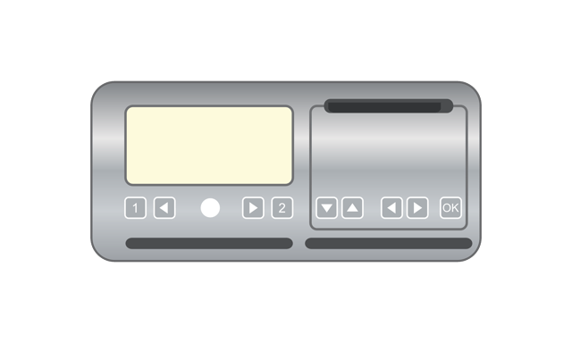

**Options:**
- A. Driving licence card
- B. Photo
- C. Confirmation from employer

**Correct Answer(s):**
- A. Driving licence card
- B. Photo

**Explanation:**
Both the driving license be presented as a photograph shall so your permission and your identity can be determined properly. The confirmation from the employer is not required.

---

#### Question 2.6.05-226

**Points:** 3 Points

**What does the tachograph record?**

**Options:**
- A. The driving period
- B. The speed travelled
- C. The fuel consumption

**Correct Answer(s):**
- A. The driving period
- B. The speed travelled

**Explanation:**
With the control device (tachograph), the driving time and the driving speed is recorded. This has traffic law reasons.

---

#### Question 2.6.05-227

**Points:** 2 Points

**How are loading times to be proven with this tachograph prior to departure?**

**Options:**
- A. By entering them into the tachograph
- B. By noting them on a separate sheet of paper
- C. By promptly notifying them to the employer

**Correct Answer(s):**
- A. By entering them into the tachograph

**Explanation:**
By entering into the tachograph (control device) you can demonstrate to the satisfaction all activities. So you can also detect the load times.

---

#### Question 2.6.05-228

**Points:** 3 Points

**What is the purpose of Slot 2 of this tachograph?**

**Options:**
- A. For inserting the "driver card" for the "second driver"
- B. To enable the police to read the tachograph data
- C. For storing a replacement card

**Correct Answer(s):**
- A. For inserting the "driver card" for the "second driver"

**Explanation:**
If a second driver mitfährt, the second slot to be used for the tachograph. This is also called the so-called multi-manning.

---

### 2.6.06 Chapter Dimensions Weights And Speed Limiters

#### Question 2.6.06-101

**Points:** 3 Points

**When operating a vehicle, what must you observe regarding the vehicle height?**

**Options:**
- A. - ascertain the actual height of the vehicle
- B. - ascertain the actual height of the load protruding beyond the external bodywork of the vehicle
- C. - observe the restraints applicable to the actual height

**Correct Answer(s):**
- A. - ascertain the actual height of the vehicle
- B. - ascertain the actual height of the load protruding beyond the external bodywork of the vehicle
- C. - observe the restraints applicable to the actual height

**Explanation:**
Before starting your journey, you should find out about the actual height of the vehicle, find out about the actual height of the load that protrudes beyond the outline of the vehicle and observe the prohibitions on the actual height (underpasses / bridges)

---

#### Question 2.6.06-102

**Points:** 3 Points

**What is the permissible payload?**

**Options:**
- A. The maximum permissible load
- B. The difference between the permissible gross mass and unladen mass
- C. The permissible gross mass

**Correct Answer(s):**
- A. The maximum permissible load
- B. The difference between the permissible gross mass and unladen mass

**Explanation:**
The permissible payload - i.e. the weight you can load - is unfortunately not to be found in the vehicle registration certificate. However, it can be found out by two other information: the empty weight and the permissible overall mass.

---

#### Question 2.6.06-103

**Points:** 2 Points

**What is the maximum permitted length of a car and trailer vehicle combination, without a protruding load?**

**Options:**

**Correct Answer(s):**
- 18 

**Explanation:**
Without a load, your car can be up to 18.00 m long.

---

#### Question 2.6.06-104

**Points:** 3 Points

**What applies to the operation of vehicles with regard to the height of the vehicle, including the height of the load?**

**Options:**
- A. - check the vehicle height in Part I of the registration certificate
- B. - determine the actual height of loads that extend above the top of the vehicle
- C. - comply with the legally permissible maximum height of 4.5 metres

**Correct Answer(s):**
- A. - check the vehicle height in Part I of the registration certificate
- B. - determine the actual height of loads that extend above the top of the vehicle

**Explanation:**
You must find out about your exact vehicle height in the registration restriction part 1, the so-called vehicle registration document. In this way, you prevent dangerous situations on road sections with limited height and violations of the permissible overall height. 
If the load extends beyond the outline of the vehicle, you will need to determine the actual height of your vehicle with the load in question. This way you can ensure that the permitted total height is not exceeded.

---

#### Question 2.6.06-201

**Points:** 3 Points

**What is the maximum length allowed for a combination of vehicles comprising a motor vehicle and a trailer including load?**

**Options:**
- A. 20.75 m
- B. 18 m
- C. 20 m

**Correct Answer(s):**
- A. 20.75 m

**Explanation:**
A train consisting of a motor vehicle and a trailer, including the charge may be a maximum of 20.75 m.

---

#### Question 2.6.06-202

**Points:** 2 Points

**When does the speed limiter have to be tested?**

**Options:**
- A. After any change of the effective circumference tyre size
- B. After any change of the fuel supply device
- C. After any change of the exhaust system

**Correct Answer(s):**
- A. After any change of the effective circumference tyre size
- B. After any change of the fuel supply device

**Explanation:**
The test of the overspeed is & prescribed fuel supply means after each change of after each change of the effective tire circumference.

---

#### Question 2.6.06-203

**Points:** 2 Points

**Who is allowed to issue a certificate on the testing of a speed limiter?**

**Options:**
- A. The vehicle manufacturer officially recognised to do so
- B. A workshop authorized to do so by an authority
- C. All garage workshops for commercial vehicles

**Correct Answer(s):**
- A. The vehicle manufacturer officially recognised to do so
- B. A workshop authorized to do so by an authority

**Explanation:**
A certificate of testing a speed limiter shall not issue the authorized by an authority for this workshop and this officially recognized vehicle manufacturers.

---

#### Question 2.6.06-204

**Points:** 3 Points

**You only have a Class B and D driving licence and want to pull a trailer behind your bus. What is the maximum permissible mass that the trailer is not allowed to exceed?**

**Options:**
- A. 750 kg
- B. 850 kg
- C. 1,000 kg

**Correct Answer(s):**
- A. 750 kg

**Explanation:**
Coming soon...

---

#### Question 2.6.06-205

**Points:** 3 Points

**What must you reckon with when all passengers carry luggage in a fully occupied coach?**

**Options:**
- A. There is a danger of exceeding the permissible total mass
- B. There is a danger of exceeding the permissible total axle weights
- C. It is always guaranteed that the permissible total mass is not exceeded

**Correct Answer(s):**
- A. There is a danger of exceeding the permissible total mass
- B. There is a danger of exceeding the permissible total axle weights

**Explanation:**
Coming soon...

---

#### Question 2.6.06-207

**Points:** 3 Points

**What must you consider when driving your bus through narrow passageways?**

**Options:**
- A. The outside rear-view mirrors project past the vehicle width given in the vehicle documents
- B. The body may sway where the roadway is uneven
- C. The outside rear-view mirrors are already taken into account in the stated vehicle width

**Correct Answer(s):**
- A. The outside rear-view mirrors project past the vehicle width given in the vehicle documents
- B. The body may sway where the roadway is uneven

**Explanation:**
Coming soon...

---

#### Question 2.6.06-208

**Points:** 3 Points

**You only have a Class B and D1 driving licence. Your bus has the following data: - empty mass 5,000 kg - permissible total mass 7,500 kg - permissible towed load 2,000 kg What is the permissible total mass of a trailer you are pulling?**

**Options:**
- A. 750 kg
- B. 1,500 kg
- C. 2,000 kg

**Correct Answer(s):**
- A. 750 kg

**Explanation:**
Coming soon...

---

#### Question 2.6.06-211

**Points:** 3 Points

**What must you be aware of when driving your lorry through narrow passageways?**

**Options:**
- A. The exterior rear-view mirrors are wider than the vehicle width indicated in the vehicle’s documents
- B. The vehicle body sways on uneven surfaces
- C. The exterior rear-view mirrors are taken into account in the vehicle width indicated

**Correct Answer(s):**
- A. The exterior rear-view mirrors are wider than the vehicle width indicated in the vehicle’s documents
- B. The vehicle body sways on uneven surfaces

**Explanation:**
You should make sure that the exterior mirrors protrude above the specified in the vehicle documents vehicle width with narrow passages (which may differ from the information in the papers) and the vehicle bodies with uneven road surfaces vary.

---

#### Question 2.6.06-213

**Points:** 3 Points

**When are you allowed to remain on the left-hand lane in this situation?**

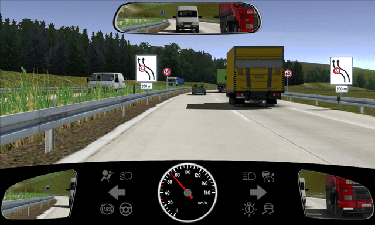

**Options:**
- A. - including the load actually has a maximum width of 2 m
- B. - is 2 m wide according to the registration certificate part I (Motor Vehicle Registration)

**Correct Answer(s):**
- A. - including the load actually has a maximum width of 2 m

**Explanation:**
The traffic sign indicates how wide your vehicle may be, including the outside mirror and the maximum load. Make sure that the exterior mirrors are included in the dimensions in your car documents.

---

#### Question 2.6.06-215

**Points:** 2 Points

**What vehicle documents contain information about the dimensions of your bus?**

**Options:**
- A. The registration certificate Part I (Motor Vehicle Registration)
- B. The inspection log book
- C. The registration certificate Part II (Motor Vehicle Title)

**Correct Answer(s):**
- A. The registration certificate Part I (Motor Vehicle Registration)

**Explanation:**
Coming soon...

---

#### Question 2.6.06-216

**Points:** 3 Points

**What do you have to be aware of in this situation?**

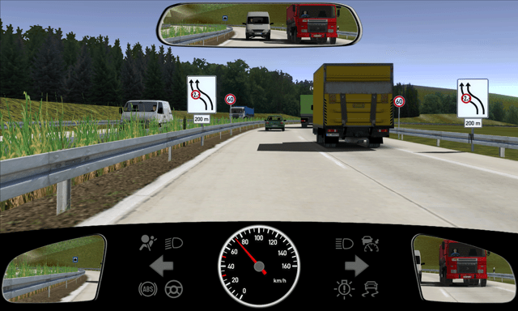

**Options:**
- A. In 200 m the width of the left-hand lane is going to narrow
- B. Including its exterior mirrors, my vehicle is wider than the width specified in the vehicle documents
- C. The left-hand lane is going to narrow for a distance of 200 m

**Correct Answer(s):**
- A. In 200 m the width of the left-hand lane is going to narrow
- B. Including its exterior mirrors, my vehicle is wider than the width specified in the vehicle documents

**Explanation:**
The upper traffic sign indicates that the roadway is narrowing to the width indicated on the traffic sign. The additional sign informs that the lane narrowing begins in about 200 meters. Exterior mirrors are to be added to the width specified in the vehicle documents. Inclinations on uneven roads may also require more width. Take these factors into consideration when you drive here.

---

#### Question 2.6.06-301

**Points:** 2 Points

**What is the maximum permissible length of a combination of a truck and one trailer if a load does not project backward?**

**Options:**
- A. 18.75 m
- B. 18.00 m
- C. 20.00 m

**Correct Answer(s):**
- A. 18.75 m

**Explanation:**
A train consisting of a truck and a trailer, without protruding the charge may be 18.75 m long at most.

---

#### Question 2.6.06-302

**Points:** 3 Points

**What is the maximum permissible total mass of an articulated motor vehicle (two-axle truck tractor, three-axle semitrailer, not combined traffic)?**

**Options:**
- A. 40 t
- B. 38 t
- C. 44 t

**Correct Answer(s):**
- A. 40 t

**Explanation:**
The maximum authorized mass in an articulated vehicle shall not exceed 40 t be difficult.

---

#### Question 2.6.06-303

**Points:** 3 Points

**What is the maximum permissible total mass of an articulated motor vehicle (three-axle truck tractor, three-axle semitrailer) in combined traffic with 40 feet ISO containers?**

**Options:**
- A. 44 t
- B. 40 t
- C. 38 t

**Correct Answer(s):**
- A. 44 t

**Explanation:**
The permitted total weight with an articulated vehicle which in 3 axes of the tractor and the trailer axles 3 has, at most 44 t may predominate.

---

#### Question 2.6.06-304

**Points:** 3 Points

**What total mass must a truck with trailer (two-axle truck, three-axle trailer, not combined traffic) not exceed?**

**Options:**
- A. 40 t
- B. 38 t
- C. 44 t

**Correct Answer(s):**
- A. 40 t

**Explanation:**
The total mass in a train (two-axle truck, three-axle trailer, no combined transport) must not exceed 40 weigh t.

---

#### Question 2.6.06-305

**Points:** 3 Points

**How can you check by calculation whether the combination of an articulated motor vehicle (semitrailer load = vertical load) exceeds the permissible total mass of the combination of vehicles?**

**Options:**
- A. Permissible total mass of the truck tractor plus permissible total mass of the semitrailer minus vertical load
- B. Permissible total mass of the truck tractor plus permissible total mass of the semitrailer
- C. Permissible total mass of the truck tractor plus useful load of the semitrailer

**Correct Answer(s):**
- A. Permissible total mass of the truck tractor plus permissible total mass of the semitrailer minus vertical load

**Explanation:**
You can mathematically that the maximum mass of the tractor plus determine the maximum authorized mass of the trailer and the result expected minus the Aufliegelast. So you can check whether the maximum permissible laden mass of the train is exceeded.

---

#### Question 2.6.06-306

**Points:** 3 Points

**You are combining a semitrailer motor vehicle with 5 axles (not combined traffic). The following vehicle data are known to you:
Permissible total mass (Truck tractor) = 25 t
Permissible total mass (Semitrailer) = 34 t
Semitrailer load/Vertical load (Truck tractor) = 16 t
Semitrailer load/Vertical load (Semitrailer) = 16 t**

**Options:**
- A. - is allowed if you carry at least 3 t less than the useful load
- B. - is allowed also if the semitrailer is fully loaded with 34 t
- C. - is under no circumstances allowed

**Correct Answer(s):**
- A. - is allowed if you carry at least 3 t less than the useful load

**Explanation:**
The operation of this combination is permitted if you t at least three renounce payload, because the total load is 43 tonnes. (34 + t 25 t - 16 t = 43 t).

---

#### Question 2.6.06-307

**Points:** 2 Points

**What is the maximum length allowed for a combination of vehicles comprising a lorry and two-axle trailer including load?**

**Options:**

**Correct Answer(s):**
- 20,75 

**Explanation:**
Your train consisting of a truck and two-axle, and its load may be more than 20,75 meters long.

---

#### Question 2.6.06-308

**Points:** 2 Points

**How do you determine the maximum authorised combination mass of a vehicle combination consisting of a towing vehicle with rigid drawbar trailer?**

**Options:**
- A. - maximum authorised mass of the trailer less the vertical load of the trailer, if this is greater than the permissible vertical load of the towing vehicle
- B. - maximum authorised mass of the trailer less the vertical load of the trailer, if this is less than the permissible vertical load of the towing vehicle
- C. - load capacity of the trailer less the vertical load of the trailer, if this is greater than the permissible vertical load of the towing vehicle

**Correct Answer(s):**
- A. - maximum authorised mass of the trailer less the vertical load of the trailer, if this is greater than the permissible vertical load of the towing vehicle

**Explanation:**
You calculate the total permissible towed mass using the following data:
Maximum authorised mass of the towing vehicle plus the maximum authorised mass of the trailer minus the drawbar load of the trailer, if this is greater than the maximum authorised drawbar load of the towing vehicle.

---

#### Question 2.6.06-401

**Points:** 3 Points

**What is the maximum permissible width of this truck tractor with mounted implement?**

**Options:**

**Correct Answer(s):**
- 3,0 

**Explanation:**
Coming soon...

---

#### Question 2.6.06-402

**Points:** 3 Points

**What is the maximum permissible dimension X for truck tractors?**

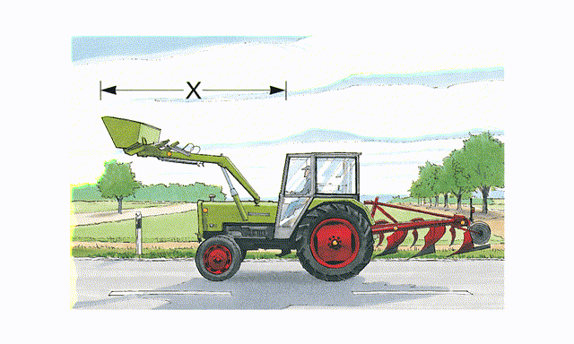

**Options:**
- A. 3.5 m
- B. 2.5 m
- C. 4.5 m

**Correct Answer(s):**
- A. 3.5 m

**Explanation:**
Coming soon...

---

#### Question 2.6.06-403

**Points:** 3 Points

**What is the maximum permissible dimension X for agricultural truck tractors?**

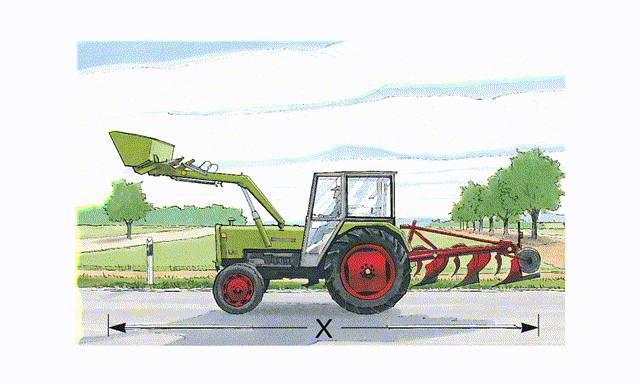

**Options:**
- A. 12 m
- B. 8 m
- C. 10 m

**Correct Answer(s):**
- A. 12 m

**Explanation:**
Coming soon...

---

#### Question 2.6.06-404

**Points:** 3 Points

**What is the maximum permissible length of the truck and trailer with load?**

**Options:**

**Correct Answer(s):**
- 20,75 

**Explanation:**
Coming soon...

---

#### Question 2.6.06-405

**Points:** 3 Points

**From which width onwards must truck tractors be equipped with these warning plates?**

**Options:**

**Correct Answer(s):**
- 2,75 

**Explanation:**
Coming soon...

---

#### Question 2.6.06-406

**Points:** 3 Points

**What is the maximum permissible length of dimension X?**

**Options:**

**Correct Answer(s):**
- 3 

**Explanation:**
Coming soon...

---

#### Question 2.6.06-407

**Points:** 3 Points

**The Road Haulage Act applies to commercial haulage vehicles or vehicle combinations in excess of what gross vehicle weight rating?**

**Options:**
- A. Over 3.5 t
- B. 2.8 t and over
- C. 3.0 t and over

**Correct Answer(s):**
- A. Over 3.5 t

**Explanation:**
From a maximum mass of 3.5 t for motor vehicles or vehicle combinations with businesslike transport of goods is the road transport law observed.

---

#### Question 2.6.06-408

**Points:** 2 Points

**The validity period of one of your driving licence classes has expired. What are the consequences of this?**

**Options:**
- A. The driving licence has ended for this class
- B. It is prohibited to drive motor vehicles in this class
- C. The driving licence for this class may only still be used for private journeys

**Correct Answer(s):**
- A. The driving licence has ended for this class
- B. It is prohibited to drive motor vehicles in this class

**Explanation:**
The consequences are the driving motor vehicles in this class is prohibited and the license of this class is extinguished. It must not be used for private trips.

---

### 2.6.07 Chapter Reading A Road Map And Route Planning

#### Question 2.6.07-001

**Points:** 2 Points

**What must you be aware of when using navigation systems and road maps?**

**Options:**
- A. The contents may become outdated just a short time after purchase
- B. Even up-to-date contents may differ from reality
- C. All navigation systems can update themselves automatically

**Correct Answer(s):**
- A. The contents may become outdated just a short time after purchase
- B. Even up-to-date contents may differ from reality

**Explanation:**
When using a navigation system, you should be aware that even current content can deviate from reality and content can become outdated shortly after purchase. There is no guarantee that the content is up to date despite automatic updating.

---

#### Question 2.6.07-101

**Points:** 2 Points

**What must you be aware of when route planning abroad?**

**Options:**
- A. - applicable conditions for inner city road use (a city toll for example)
- B. - labelling requirements for driving in environment zones
- C. - applicable speed limits

**Correct Answer(s):**
- A. - applicable conditions for inner city road use (a city toll for example)
- B. - labelling requirements for driving in environment zones
- C. - applicable speed limits

**Explanation:**
Before driving, find out which regulations apply abroad.

---

#### Question 2.6.07-204

**Points:** 2 Points

**What must you take into account when planning routes?**

**Options:**
- A. Possible traffic obstructions due to holiday traffic in different federal states
- B. Possible traffic obstructions due to building sites
- C. A route which is as interesting as possible

**Correct Answer(s):**
- A. Possible traffic obstructions due to holiday traffic in different federal states
- B. Possible traffic obstructions due to building sites

**Explanation:**
For your route planning please pay attention to possible traffic delays due to road works and possible traffic delays by holiday traffic in different provinces.

---

#### Question 2.6.07-206

**Points:** 2 Points

**Can information in road maps deviate from actual conditions?**

**Options:**
- A. Road maps can be outdated even before they are published
- B. Road maps are valid for 4 years and then have to be replaced
- C. Road maps issued by automobile clubs and petrol companies never deviate from actual conditions

**Correct Answer(s):**
- A. Road maps can be outdated even before they are published

**Explanation:**
Road maps may be shortly overhauled after the release and outdated. Eighth please as possible to the date.

---

#### Question 2.6.07-207

**Points:** 2 Points

**What does the scale 1:300,000 on a road map tell you?**

**Options:**
- A. 1 centimetre on the map corresponds to 3 kilometres
- B. 1 centimetre on the map corresponds to 300 kilometres
- C. 1 centimetre on the map corresponds to 30 kilometres

**Correct Answer(s):**
- A. 1 centimetre on the map corresponds to 3 kilometres

**Explanation:**
This standard says that 1 centimeter equals on the road map 3 kilometers.

---

#### Question 2.6.07-209

**Points:** 2 Points

**You are driving along the autobahn and want to go directly to Unterbach. Where do you leave the autobahn?**

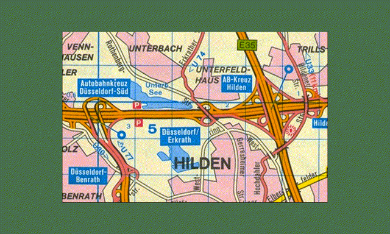

**Options:**
- A. At the Düsseldorf/Erkrath autobahn exit
- B. At the Düsseldorf-Süd autobahn intersection
- C. At the Hilden autobahn intersection

**Correct Answer(s):**
- A. At the Düsseldorf/Erkrath autobahn exit

**Explanation:**
If you want to Unterbach, you should exit onto the highway exit Dusseldorf / Erkrath.

---

#### Question 2.6.07-210

**Points:** 2 Points

**You want to drive your vehicle from Hamburg to Rome. Which map scale should you use for initial overall planning?**

**Options:**
- A. 1:500,000
- B. 1:50,000
- C. 1:10,000

**Correct Answer(s):**
- A. 1:500,000

**Explanation:**
When your trip from Hamburg to Rome you can with the scale of 1: 500,000 to carry out a first overall route planning.

---

#### Question 2.6.07-212

**Points:** 2 Points

**Which information is given by the key on a roadmap?**

**Options:**
- A. Explanation of the symbols and signs on the map
- B. Ruler to quickly establish distances
- C. Historical overview on the history of the map

**Correct Answer(s):**
- A. Explanation of the symbols and signs on the map
- B. Ruler to quickly establish distances

**Explanation:**
A legend of a road map provides you an explanation of the symbols and characters used in the card and a distance ruler for quick removal determination.

---

#### Question 2.6.07-213

**Points:** 3 Points

**Autobahn numbers have the following meanings:**

**Options:**
- A. North/South autobahns have uneven numbers
- B. Regional autobahns have three-digit numbers
- C. East/West autobahns have uneven numbers

**Correct Answer(s):**
- A. North/South autobahns have uneven numbers
- B. Regional autobahns have three-digit numbers

**Explanation:**
The numbering on motorways mean: Regional highways leading three-digit numbers, and north-south highways leading odd numbers.

---

#### Question 2.6.07-214

**Points:** 3 Points

**You want to drive your truck with a total permissible mass of more than 7.5 t on the autobahn from Hanover to Munich. Which average speed can you reckon with?**

**Options:**
- A. 70 km/h
- B. 80 km/h
- C. 40 km/h

**Correct Answer(s):**
- A. 70 km/h

**Explanation:**
With your trucks over 7.5 t permissible total mass on the highway from Hannover to Munich you should expect h with an average speed of 70 km /.

---

#### Question 2.6.07-216

**Points:** 4 Points

**You want to transport live animals over a large distance. What do you have to consider when planning the route?**

**Options:**
- A. Checks and maintenance of the load
- B. Stops for fuel and rests
- C. Animal protection regulations for transports

**Correct Answer(s):**
- A. Checks and maintenance of the load
- B. Stops for fuel and rests
- C. Animal protection regulations for transports

**Explanation:**
If you want to transport live animals over long distances, you should consider when planning the route Animal Transport Regulation, the charge control and charge maintenance and service stations and rest stops.

---

#### Question 2.6.07-217

**Points:** 3 Points

**You want to establish a route plan to drive from Frankfurt (Oder) to Kiel. You have to exchange loads at different intermediate stops. Which information is necessary to plan your route in terms of roads and time?**

**Options:**
- A. Starting point, destination, sequence of intermediate stops, scheduled loading times and travel interruptions
- B. Location, destination, intermediate stops, maximum speed
- C. Location, destination, driving speed

**Correct Answer(s):**
- A. Starting point, destination, sequence of intermediate stops, scheduled loading times and travel interruptions

**Explanation:**
In your directions from Frankfurt (Oder) to Kiel, with different intermediate stations, because of charge exchange, the following information should be provided: starting point, destination, order of the waypoints, planned charging periods and breaks.

---

#### Question 2.6.07-218

**Points:** 2 Points

**You are planning your trip using a road map with a scale of 1:200,000. 1 cm on the map corresponds to how many kilometres in reality?**

**Options:**
- A. 2 km
- B. 10 km
- C. 20 km

**Correct Answer(s):**
- A. 2 km

**Explanation:**
In your planning with a road map with a scale of 1: 200,000 corresponds to 1 cm 2 kilometers on the map.

---

#### Question 2.6.07-219

**Points:** 2 Points

**What must you be aware of when using a navigation system in the vehicle?**

**Options:**
- A. The information provided consists of recommendations
- B. The navigation device should not impede the driver's field of vision
- C. The navigation device should not lie around in the car unattached

**Correct Answer(s):**
- A. The information provided consists of recommendations
- B. The navigation device should not impede the driver's field of vision
- C. The navigation device should not lie around in the car unattached

**Explanation:**
When using a navigation system, please note that the information issued are recommendations, the navigation device should not interfere with your view and the navigation system should not be lying around unsecured in the car.

---

#### Question 2.6.07-220

**Points:** 3 Points

**What activities could pose a highly risky distraction while driving?**

**Options:**
- A. Entering an address in the sat-nav
- B. Writing a text message
- C. Using the telephone even through a hands-free unit

**Correct Answer(s):**
- A. Entering an address in the sat-nav
- B. Writing a text message
- C. Using the telephone even through a hands-free unit

**Explanation:**
All three activities distract the car driver from traffic during the journey. The car driver might not be able to recognize dangerous situation in time.

---

#### Question 2.6.07-221

**Points:** 2 Points

**Why do the driving and rest periods have to be taken into account in the route planning?**

**Options:**
- A. - ensures that the driver is able to observe the prescribed rest times
- B. - is intended to avoid impairments to the driving style
- C. - it reduces the length of the driving distance

**Correct Answer(s):**
- A. - ensures that the driver is able to observe the prescribed rest times
- B. - is intended to avoid impairments to the driving style

**Explanation:**
to be considered for route planning on driving and rest periods is important because it ensures that you can comply with the prescribed breaks and impairments of driving should be avoided.

---

#### Question 2.6.07-222

**Points:** 2 Points

**What should be taken into account with the route planning?**

**Options:**
- A. The driving and rest periods
- B. The public holidays of the specific federal states
- C. The legal provisions of the other country in the case of cross-border transport

**Correct Answer(s):**
- A. The driving and rest periods
- B. The public holidays of the specific federal states
- C. The legal provisions of the other country in the case of cross-border transport

**Explanation:**
You should take into account the driving and rest times for your route planning, the holidays of the individual states and also in cross-border traffic, the provisions of that other State.

---

#### Question 2.6.07-223

**Points:** 2 Points

**What must be observed when using an electronic navigation device?**

**Options:**
- A. The card should be updated at regular intervals
- B. The destination should be entered when the vehicle is stationary
- C. The instructions on the navigation device should be followed at all times

**Correct Answer(s):**
- A. The card should be updated at regular intervals
- B. The destination should be entered when the vehicle is stationary

**Explanation:**
please check if a map update was carried out at regular intervals and the goal should be entered when the vehicle is stationary.

---

#### Question 2.6.07-224

**Points:** 2 Points

**What should you factor in when planning your route?**

**Options:**
- A. The driving and rest periods
- B. The public holidays of the individual federal states
- C. The rules of other countries when undertaking cross-border journeys

**Correct Answer(s):**
- A. The driving and rest periods
- B. The public holidays of the individual federal states
- C. The rules of other countries when undertaking cross-border journeys

**Explanation:**
When planning the route, you should consider all 3 answers. The driving and rest times, the public holidays of the individual federal states and the provisions of the other state for cross-border traffic.

---

#### Question 2.6.07-225

**Points:** 2 Points

**What should you factor in when planning your route?**

**Options:**
- A. The driving and rest periods
- B. The rules of other countries when undertaking cross-border journeys
- C. The prohibition on driving on the public holidays of the individual federal states

**Correct Answer(s):**
- A. The driving and rest periods
- B. The rules of other countries when undertaking cross-border journeys

**Explanation:**
When planning your route, you should take into account the driving and rest times and the regulations of the other country in the case of cross-border traffic.

---

#### Question 2.6.07-226

**Points:** 2 Points

**What should be observed in relation to route planning?**

**Options:**
- A. The rules contained in the German summer holiday traffic regulations
- B. The regulations on driving and rest periods
- C. Possible obstructions of traffic caused by roadworks

**Correct Answer(s):**
- A. The rules contained in the German summer holiday traffic regulations
- B. The regulations on driving and rest periods
- C. Possible obstructions of traffic caused by roadworks

**Explanation:**
When planning your route, you should be aware of possible traffic obstructions due to road works, the holiday travel regulations and driving and rest times. All answers are correct.

---

#### Question 2.6.07-227

**Points:** 2 Points

**You are transporting general cargo. What should be noted in relation to route planning?**

**Options:**
- A. The sequence of the points for loading and unloading
- B. The time required for loading and unloading
- C. The application of the rules on driving and rest periods in conjunction with the German Working Time Act

**Correct Answer(s):**
- A. The sequence of the points for loading and unloading
- B. The time required for loading and unloading
- C. The application of the rules on driving and rest periods in conjunction with the German Working Time Act

**Explanation:**
When transporting general cargo, you should consider all 3 answers. The order of loading and unloading points, the time required for loading and unloading (save time), and the application of driving and rest times in connection with the Working Hours Act. (rest and recharge your batteries)

---

#### Question 2.6.07-228

**Points:** 2 Points

**What should you note when using your navigation system?**

**Options:**
- A. You must consider the vehicle dimensions on the proposed route
- B. Mounted mobile navigation systems may not impede the forward view
- C. The arrival time calculated at the start of the journey takes account of mandatory driving and rest periods

**Correct Answer(s):**
- A. You must consider the vehicle dimensions on the proposed route
- B. Mounted mobile navigation systems may not impede the forward view

---

#### Question 2.6.07-229

**Points:** 2 Points

**What must you note when driving in other European countries in winter?**

**Options:**
- A. - minimum tread depth of tyres
- B. - obligation to fit your vehicle with winter tyres
- C. - obligation to carry snow chains in your vehicle

**Correct Answer(s):**
- A. - minimum tread depth of tyres
- B. - obligation to fit your vehicle with winter tyres
- C. - obligation to carry snow chains in your vehicle

---

## Theme 2.7. Technology

### 2.7.01 Chapter Driving Operation Driving Physics Driving Technique

#### Question 2.7.01-008

**Points:** 4 Points

**Your motorcycle is fully loaded. How do you drive down a long mountain pass road?**

**Options:**
- A. Utilize the braking effect of the engine by changing to a lower gear
- B. Do not drive too fast between bends in order to avoid overheating the brakes
- C. Use the front wheel brake only

**Correct Answer(s):**
- A. Utilize the braking effect of the engine by changing to a lower gear
- B. Do not drive too fast between bends in order to avoid overheating the brakes

**Explanation:**
When driving down over a long period of time, your brakes are at risk to overheat. To avoid this, try to use the braking effect of the engine on a low gear and limit the acceleration/deceleration in between turns.

---

#### Question 2.7.01-009

**Points:** 3 Points

**When is there a danger of the motorcycle's front wheel lifting off the road?**

**Options:**
- A. On rapid acceleration in low gear
- B. If the clutch is suddenly released on starting off
- C. When the handbrake is pulled on hard

**Correct Answer(s):**
- A. On rapid acceleration in low gear
- B. If the clutch is suddenly released on starting off

**Explanation:**
Fast and sudden accelerations could lead to the front wheel lifting off the road. This could happen when accelerating on low gear or releasing the clutch suddenly when starting to drive

---

#### Question 2.7.01-014

**Points:** 3 Points

**You have changed the motorcycle. For the first time, you are driving a motorcycle with fairings. What is different?**

**Options:**
- A. As the wind pressure is reduced, there is a tendency to drive faster
- B. Sensitivity to side wind increases
- C. The danger of falling has decreased

**Correct Answer(s):**
- A. As the wind pressure is reduced, there is a tendency to drive faster
- B. Sensitivity to side wind increases

**Explanation:**
Fairings do not decrease the danger of falling. However, it increases the sensitivity to the side wind but diminishes the front wind which creates a tendency to drive faster

---

#### Question 2.7.01-018

**Points:** 3 Points

**What must you particularly remember when carrying side-mounted cases or bags?**

**Options:**
- A. To avoid an uneven distribution of weight
- B. Not to exceed the top speed recommended by the manufacturer of the motorcycle
- C. With a full load, apply the rear brakes only

**Correct Answer(s):**
- A. To avoid an uneven distribution of weight
- B. Not to exceed the top speed recommended by the manufacturer of the motorcycle

**Explanation:**
Adding luggage to your motorcycle will impact its behavior on the road. Make sure you do not exceed the maximum speed recommended by your manufacturer for driving with luggage and that you distribute weight evenly (on the right and left) to keep your motorcycle stable

---

#### Question 2.7.01-019

**Points:** 4 Points

**What happens if you engage too low a gear and quickly release the clutch when driving at high speed?**

**Options:**
- A. The rear wheel locks and can slip sideways
- B. A fall is often unavoidable
- C. The front wheel lifts off the ground

**Correct Answer(s):**
- A. The rear wheel locks and can slip sideways
- B. A fall is often unavoidable

**Explanation:**
If you engage a gear that is too low and release the clutch, your motorcycle will brutally decelerate and could cause you to fall or slip sideways

---

#### Question 2.7.01-020

**Points:** 3 Points

**What must you check on your motorcycle before you set off?**

**Options:**
- A. The adjustment of the rear-view mirrors
- B. Brake fluid level, lever travel
- C. Setting of the camshaft

**Correct Answer(s):**
- A. The adjustment of the rear-view mirrors
- B. Brake fluid level, lever travel

**Explanation:**
Before starting to drive, make sure that the rearview mirrors are correctly installed, adjusted and work properly (not broken, blind) and that the breaks work properly

---

#### Question 2.7.01-022

**Points:** 3 Points

**When do you have to increase tyre pressure?**

**Options:**
- A. When you have a passenger
- B. When driving on autobahns for longer periods of time at high speed
- C. When driving with heavy luggage

**Correct Answer(s):**
- A. When you have a passenger
- B. When driving on autobahns for longer periods of time at high speed
- C. When driving with heavy luggage

**Explanation:**
Tire pressure need to be increased if driving with more weight (additional passenger, heavy luggage) or when driving for long distances especially at high speed

---

#### Question 2.7.01-023

**Points:** 3 Points

**What must you remember when taking a passenger?**

**Options:**
- A. Driving characteristics change on bends, particularly when entering and leaving the bend
- B. Under the same conditions, overtaking requires a longer distance
- C. Under the same conditions, the braking distance is reduced

**Correct Answer(s):**
- A. Driving characteristics change on bends, particularly when entering and leaving the bend
- B. Under the same conditions, overtaking requires a longer distance

**Explanation:**
A passenger increases the weight on your motorcycle. This makes accelerating and thus overtaking longer. It increases the centrifugal force when turning and increases the braking distance.

---

#### Question 2.7.01-024

**Points:** 3 Points

**What must you do to be ready to brake?**

**Options:**
- A. Place your hand on the handbrake lever
- B. Position your foot over the brake pedal
- C. Change to a higher gear

**Correct Answer(s):**
- A. Place your hand on the handbrake lever
- B. Position your foot over the brake pedal

**Explanation:**
By placing your hand on the handbrakes and foot over the brake pedal you improve your reaction time to break

---

#### Question 2.7.01-025

**Points:** 3 Points

**Why does the rear wheel of a motorcycle tend to lock when braking rather than the front wheel?**

**Options:**
- A. - the load on the rear wheel is reduced
- B. - the rear wheel is still propelled
- C. - the load on the rear wheel increases

**Correct Answer(s):**
- A. - the load on the rear wheel is reduced

**Explanation:**
When breaking, more weight is applied on the front wheel and less on the back wheel which can lock the back wheel

---

#### Question 2.7.01-026

**Points:** 4 Points

**What is correct when driving round bends on downhill slopes?**

**Options:**
- A. Brake adequately before the bend so that no additional braking is needed on the bend
- B. Start taking the bend so that you do not get into the area of oncoming traffic even when you are leaning far over
- C. When you do not see any oncoming traffic, follow the ideal line and use the whole width of the roadway

**Correct Answer(s):**
- A. Brake adequately before the bend so that no additional braking is needed on the bend
- B. Start taking the bend so that you do not get into the area of oncoming traffic even when you are leaning far over

**Explanation:**
When going downhill you need to break more than on bends on flat areas. You should therefore break enough before the bend, you should also keep your distance from the demarcation line from the oncoming traffic in case you need to tilt your motorcycle more

---

#### Question 2.7.01-027

**Points:** 4 Points

**You are driving round a bend at a brisk pace which is tighter than you first thought. What do you do?**

**Options:**
- A. Throttle back, lean further over
- B. Do not brake sharply
- C. Make an immediate sharp steering movement

**Correct Answer(s):**
- A. Throttle back, lean further over
- B. Do not brake sharply

**Explanation:**
In this situation, making a sharp steering movement will be dangerous and could lead to a fall. You should decelerate gradually and lean further to turn more. If you brake sharply while turning, a torque force would tilt you from leaning to one side to a more upward position which will increase the radius of your turn

---

#### Question 2.7.01-028

**Points:** 3 Points

**What must you particularly remember when raising motorcycles onto their stands (centre stands)?**

**Options:**
- A. - must be hard and even
- B. - should not slope steeply downwards
- C. - must not slope upwards

**Correct Answer(s):**
- A. - must be hard and even
- B. - should not slope steeply downwards

**Explanation:**
To avoid the motorcycle to tip over or fall, you must ensure that the ground is firm, even and not too steep on a downward slope

---

#### Question 2.7.01-029

**Points:** 4 Points

**Why is the rule of having to adapt your driving to your visibility particularly important in bends?**

**Options:**
- A. Because bends can be tighter than expected
- B. Because dangerously soiled roadways may be recognized too late
- C. Because otherwise you lose too much momentum

**Correct Answer(s):**
- A. Because bends can be tighter than expected
- B. Because dangerously soiled roadways may be recognized too late

**Explanation:**
In a bend, there is limited visibility due to the curvature of the road. You should reduce your speed as unforeseen risk factors such as dirt on the road, obstacles or tighter bends could appear

---

#### Question 2.7.01-030

**Points:** 3 Points

**How can you counteract centrifugal force?**

**Options:**
- A. By leaning over
- B. By reducing speed
- C. By accelerating rapidly

**Correct Answer(s):**
- A. By leaning over
- B. By reducing speed

**Explanation:**
The centrifugal force can be either reduced by driving at a slower speed or be counteracted by leaning over more. Accelerating will do the opposite and increase the centrifugal force

---

#### Question 2.7.01-031

**Points:** 4 Points

**What can happen if a motorcycle is accelerated rapidly?**

**Options:**
- A. If turning left, the motorcycle could leave the roadway and endanger pedestrians on the pavement
- B. If turning right, the motorcycle can veer into the path of oncoming traffic
- C. If driving straight ahead, driving stability is increased in any case

**Correct Answer(s):**
- A. If turning left, the motorcycle could leave the roadway and endanger pedestrians on the pavement
- B. If turning right, the motorcycle can veer into the path of oncoming traffic

**Explanation:**
Accelerating while turning will increase the centrifugal force which will increase the radius of your turn. This could result in being directed in incoming traffic or on the pavement. In a straight line accelerating rapidly decrease stability

---

#### Question 2.7.01-032

**Points:** 3 Points

**What must be changed before driving with a heavy load?**

**Options:**
- A. Pre-tensioning of the springs
- B. Tyre pressure
- C. Chain tension

**Correct Answer(s):**
- A. Pre-tensioning of the springs
- B. Tyre pressure

**Explanation:**
When driving with heavy loads, make sure to increase the tire pressure and adjust the pre-tension in the suspension springs

---

#### Question 2.7.01-033

**Points:** 4 Points

**Which checks are particularly important before setting off?**

**Options:**
- A. Profile of the rear tyre
- B. Even load (front/rear, right/left)
- C. Condition of your visor

**Correct Answer(s):**
- A. Profile of the rear tyre
- B. Even load (front/rear, right/left)
- C. Condition of your visor

**Explanation:**
All three are important to check before starting to drive. Make sure your visor is in good condition and not damaged or scratched. If you carry weight, make sure it is evenly distributed to not impact your center of gravity and do not impact your stability. Also ensure that the rear tire is in good condition.

---

#### Question 2.7.01-034

**Points:** 3 Points

**In which cases should you apply the brakes only very carefully?**

**Options:**
- A. On roadways with loose chippings or sand
- B. On tram tracks, sewer covers and lane markings
- C. When driving for the first time with new tyres

**Correct Answer(s):**
- A. On roadways with loose chippings or sand
- B. On tram tracks, sewer covers and lane markings
- C. When driving for the first time with new tyres

**Explanation:**
You should break carefully on slippery surfaces such as wet roads, tram tracks, sewer covers, lane markings but also dirt roads, roads with sand, stones as well as when driving with new tires

---

#### Question 2.7.01-035

**Points:** 3 Points

**What is the normal braking procedure for motorcycles?**

**Options:**
- A. Applying both brakes
- B. Applying the rear brake only
- C. Applying the front brake only

**Correct Answer(s):**
- A. Applying both brakes

**Explanation:**
You should apply both brakes which will result in a shorter stopping distance than only applying one of the breaks

---

#### Question 2.7.01-036

**Points:** 3 Points

**Why must both brakes on a motorcycle always be in perfect working order?**

**Options:**
- A. To achieve the shortest possible braking distance
- B. To be able to brake if one of the brakes fails
- C. To safely park the motorcycle on a downhill slope

**Correct Answer(s):**
- A. To achieve the shortest possible braking distance
- B. To be able to brake if one of the brakes fails

**Explanation:**
Both brakes are required to function in case one of them suddenly fail, the other one can take over. Additionally using both brakes diminish the stopping distance compared to breaking with just one break

---

#### Question 2.7.01-037

**Points:** 3 Points

**Is there a difference in the tendency of the wheels to lock?**

**Options:**
- A. Yes, as a rule, the rear wheel locks first
- B. Yes, as a rule, the front wheel locks first
- C. No, as a rule, both wheels lock at the same time

**Correct Answer(s):**
- A. Yes, as a rule, the rear wheel locks first

**Explanation:**
When breaking, more weight is applied on the front wheel and less on the back wheel. For this reason, the back wheel tends to lock first

---

#### Question 2.7.01-038

**Points:** 3 Points

**Is there a difference in the braking action?**

**Options:**
- A. Yes, as a rule the front wheel brake has greater braking action
- B. Yes, as a rule the rear wheel brake has greater braking action
- C. No, as a rule, both brakes have the same braking action

**Correct Answer(s):**
- A. Yes, as a rule the front wheel brake has greater braking action

**Explanation:**
When breaking, more weight is applied on the front wheel and less on the back wheel thus the front brake provides more braking power

---

#### Question 2.7.01-039

**Points:** 4 Points

**You come unexpectedly upon a stretch of road with loose chippings. What do you do?**

**Options:**
- A. Reduce speed cautiously
- B. Avoid braking hard and leaning over
- C. Apply the front brake only

**Correct Answer(s):**
- A. Reduce speed cautiously
- B. Avoid braking hard and leaning over

**Explanation:**
Coming soon...

---

#### Question 2.7.01-040

**Points:** 3 Points

**Your vehicle was parked for a long time in the open in moist weather. What must you reckon with when applying the brakes for the first time?**

**Options:**
- A. The wheels have a dangerous tendency to lock
- B. Reduced braking action
- C. Reduced braking action of the engine

**Correct Answer(s):**
- A. The wheels have a dangerous tendency to lock
- B. Reduced braking action

**Explanation:**
When wet, brakes are less effective and the wheels will have a tendency to lock more. It has however no impact on braking of the engine on a lower gear.

---

#### Question 2.7.01-041

**Points:** 4 Points

**What can be the reason for a motorized bicycle skidding on bends?**

**Options:**
- A. Heavy braking
- B. Wet or icy road surface
- C. Sand or loose chippings

**Correct Answer(s):**
- A. Heavy braking
- B. Wet or icy road surface
- C. Sand or loose chippings

**Explanation:**
Skidding risk is increases because of slippery surfaces such as wet road, ice, sand, dirt, leaves, cobblestones, manholes. It can also be created due to heavy braking.

---

#### Question 2.7.01-042

**Points:** 4 Points

**When does the braking distance increase?**

**Options:**
- A. When driving down slopes
- B. When carrying heavy luggage
- C. When there is headwind

**Correct Answer(s):**
- A. When driving down slopes
- B. When carrying heavy luggage

**Explanation:**
The heavier the vehicle, the longer will be the braking distance. Downward slopes as well as slippery surfaces also increase the braking distance

---

#### Question 2.7.01-043

**Points:** 3 Points

**What particular characteristics of disc brakes must you remember when driving on a wet road surface?**

**Options:**
- A. As a rule, the effect of disc brakes starts later than on a dry road surface
- B. As a rule, the effect of disc brakes starts earlier than on a dry road surface

**Correct Answer(s):**
- A. As a rule, the effect of disc brakes starts later than on a dry road surface

**Explanation:**
As a car driver you have to take into account that when the street is wet the effect of the disc brakes usually takes effect much later than on a dry road.

---

#### Question 2.7.01-044

**Points:** 3 Points

**What increases the danger of "flying out" of a bend when driving at high speed?**

**Options:**
- A. Braking
- B. Accelerating
- C. Disengaging the clutch

**Correct Answer(s):**
- A. Braking
- B. Accelerating

**Explanation:**
Decelerating or accelerating your car will result in less steering effort. As a result, there is an increased danger of "flying out" of the curve at high speed. Uncouple to get more steering power.

---

#### Question 2.7.01-045

**Points:** 3 Points

**What must you take into consideration when checking tyre pressure?**

**Options:**
- A. Load/Number of passengers in the car
- B. Tyre temperature
- C. Material of the wheels (steel/aluminium)

**Correct Answer(s):**
- A. Load/Number of passengers in the car
- B. Tyre temperature

**Explanation:**
When checking tire pressure, you must also take into account the temperature and load of the vehicle. These can influence the tire pressure. By contrast, the material of the wheel rim doesn't matter.

---

#### Question 2.7.01-046

**Points:** 3 Points

**You drive round a bend once at 30 km/h and again at 60 km/h. How does the centrifugal force change?**

**Options:**
- A. - is four times as high
- B. - is twice as high
- C. - is the same

**Correct Answer(s):**
- A. - is four times as high

**Explanation:**
The centrifugal force quadruples when the speed is doubled, that is, when you take the curve at 60 km/h the second time.

---

#### Question 2.7.01-047

**Points:** 3 Points

**What increases the effect of centrifugal force on the vehicle when driving round bends?**

**Options:**
- A. Higher speed
- B. Smaller radius of a bend
- C. Higher tyre pressure

**Correct Answer(s):**
- A. Higher speed
- B. Smaller radius of a bend

**Explanation:**
The speed has an immediate effect on the level of centrifugal force. Your braking distance quadruples when you drive at twice the speed. The centrifugal force increases the smaller the curve radius. The tire pressure has no effect on the centrifugal force.

---

#### Question 2.7.01-048

**Points:** 3 Points

**You are driving a motorcycle with sidecar on the right. Which driving technique must you use on bends?**

**Options:**
- A. Moderate throttle on right-hand bends
- B. Release throttle and brake lightly on left-hand bends
- C. Always disengage the clutch on all bends

**Correct Answer(s):**
- A. Moderate throttle on right-hand bends
- B. Release throttle and brake lightly on left-hand bends

**Explanation:**
Driving with a sidecar increase your weight, you thus need to go slower when turning

---

#### Question 2.7.01-049

**Points:** 3 Points

**Where should a passenger on a motorcycle with sidecar sit to reduce the risk of tipping over on bends?**

**Options:**
- A. In the sidecar
- B. On the motorcycle
- C. The position of the occupants has no significance

**Correct Answer(s):**
- A. In the sidecar

**Explanation:**
In order to keep a motorcycle with a sidecar stable, the weight should be equaly distributed on each side of the center of gravity. The second passenger therefore should sit in the sidecar

---

#### Question 2.7.01-050

**Points:** 3 Points

**What can you do if the sidecar lifts off the ground on a right-hand bend when you are driving a motorcycle and sidecar (sidecar on the right)?**

**Options:**
- A. Release throttle, brake, shift your body weight to the right
- B. Reduce steering lock angle, trace a wider arc within the lane you are travelling
- C. Increase steering lock angle, accelerate

**Correct Answer(s):**
- A. Release throttle, brake, shift your body weight to the right
- B. Reduce steering lock angle, trace a wider arc within the lane you are travelling

**Explanation:**
When turning right, a torque force will push the sidecar up. To reduce this torque you can slow down, shift your body weight to the right and make a wider turn.

---

#### Question 2.7.01-051

**Points:** 3 Points

**What can happen to a motorcycle with a sidecar attached on the right when driving too fast round a right-hand bend?**

**Options:**
- A. The sidecar lifts off the ground and the combination tips over
- B. The motorcycle lifts off the ground and the combination tips over to the right

**Correct Answer(s):**
- A. The sidecar lifts off the ground and the combination tips over

**Explanation:**
When turning right, a torque force will push the sidecar up. At high speed the sidecar could be lifted-up, loose contact with the ground and tip over.

---

#### Question 2.7.01-052

**Points:** 3 Points

**So far, you have only driven solo motorcycles. You now change over to a combination (sidecar on the right, unbraked). How does driving differ?**

**Options:**
- A. When accelerating, the combination pulls to the right
- B. When driving on bends, you must steer instead of leaning over
- C. When braking, the combination pulls to the right

**Correct Answer(s):**
- A. When accelerating, the combination pulls to the right
- B. When driving on bends, you must steer instead of leaning over

**Explanation:**
As the sidecar is attached to your right, you cannot lean right and need to steer instead. When accelerating the sidecar tends to be pulled to the right. When breaking the sidecar will be pulled to the left

---

#### Question 2.7.01-053

**Points:** 3 Points

**So far, you have only driven solo motorcycles. You now change over to a combination (sidecar on the right, unbraked). What is different?**

**Options:**
- A. When braking, the combination pulls to the left
- B. The sidecar may lift off the ground on right-hand bends
- C. You must not drive with dipped headlights during daytime

**Correct Answer(s):**
- A. When braking, the combination pulls to the left
- B. The sidecar may lift off the ground on right-hand bends

**Explanation:**
As the sidecar is attached to your right, you cannot lean right and need to steer instead. When turning right, a torque force will push your sidecar up. At high speed the sidecar could be lifted-up, loose contact with the ground and tip over. When accelerating the sidecar tends to be pulled to the right. When breaking the sidecar will be pulled to the left

---

#### Question 2.7.01-054

**Points:** 3 Points

**What should you know about using the emergency operation of bus doors?**

**Options:**
- A. - should enable anyone on the bus to open the doors following accidents and breakdowns
- B. - if misused, can lead to the doors being opened when the bus is moving
- C. - can only be released by the driver

**Correct Answer(s):**
- A. - should enable anyone on the bus to open the doors following accidents and breakdowns
- B. - if misused, can lead to the doors being opened when the bus is moving

**Explanation:**
Coming soon...

---

#### Question 2.7.01-055

**Points:** 3 Points

**What can happen if you accelerate very rapidly when moving off on your motorbike?**

**Options:**
- A. The passenger can fall off
- B. The front lift can lift up from the road surface
- C. I can lose control over the motorbike

**Correct Answer(s):**
- A. The passenger can fall off
- B. The front lift can lift up from the road surface
- C. I can lose control over the motorbike

**Explanation:**
Fast and sudden accelerations could lead to the front wheel lifting off the road, passenger falling and losing control overt the motorcycle as there is less or no steering due to less or no contact between the front wheel and the road

---

#### Question 2.7.01-056

**Points:** 4 Points

**You are driving a local transport bus and want to drive away from a bus stop. What must you look out for?**

**Options:**
- A. - all doors are properly closed
- B. - no persons are directly in front of the bus
- C. - flowing traffic is not endangered

**Correct Answer(s):**
- A. - all doors are properly closed
- B. - no persons are directly in front of the bus
- C. - flowing traffic is not endangered

**Explanation:**
Coming soon...

---

#### Question 2.7.01-058

**Points:** 4 Points

**You are driving in the wet in a car with trailer on a narrow rural road and are approaching a clearly visible but tight left-hand bend. What should you do?**

**Options:**
- A. I reduce my speed before the bend
- B. I remain in the centre of the lane and only accelerate again once I am back on the straight
- C. I only brake once I have reached the apex of the bend

**Correct Answer(s):**
- A. I reduce my speed before the bend
- B. I remain in the centre of the lane and only accelerate again once I am back on the straight

**Explanation:**
Decrease your speed before the turn. Take the weather conditions into account. Keep in mind that the centrifugal force grows twice as fast as the speed. You should only accelerate again in the curve vertex.

---

#### Question 2.7.01-060

**Points:** 3 Points

**What do you have to pay attention to, when jacking up a motorbike on its centre stand?**

**Options:**
- A. - can tip over even when just slightly tilted
- B. - can be difficult to jack up when on a steep gradient
- C. - is best jacked up from a seated position

**Correct Answer(s):**
- A. - can tip over even when just slightly tilted
- B. - can be difficult to jack up when on a steep gradient

**Explanation:**
Setting a motorcycle on its centre stand requires more effort and can be difficult when on a steep slope. It is also sensitive to tipping over when tilted on the side

---

#### Question 2.7.01-061

**Points:** 4 Points

**What should you do if your motorbike starts to wobble?**

**Options:**
- A. - throttle back, disengage the clutch and brake carefully
- B. - change down gears and accelerate as quickly as possible
- C. - compensate wobbling by quickly counter-steering

**Correct Answer(s):**
- A. - throttle back, disengage the clutch and brake carefully

**Explanation:**
If your motorcycle starts to wobble, decelerate, disengage the clutch and brake. Do not accelerate as it might increase the wobble and lead to an accident. Also do not try to compensate it as it is dangerous and could also lead to an accident

---

#### Question 2.7.01-062

**Points:** 3 Points

**You are driving a motorbike equipped with an anti-lock braking system (ABS). How do you perform an emergency braking manoeuvre?**

**Options:**
- A. Effect the best-possible deceleration using hand and foot brake
- B. Do not press the foot brake lever, because the ABS only functions at the front
- C. Operate the hand and foot brake lever intermittently ("intermittent braking")

**Correct Answer(s):**
- A. Effect the best-possible deceleration using hand and foot brake

**Explanation:**
Breaking both foot and hand brake will result in the shortest stopping distance. ABS improves the stopping distance by un-blocking the wheels during strong brakes

---

#### Question 2.7.01-063

**Points:** 3 Points

**How can driver assistance systems be helpful?**

**Options:**
- A. In increasing road safety
- B. In assisting the driver
- C. To compensate for unfitness to drive

**Correct Answer(s):**
- A. In increasing road safety
- B. In assisting the driver

**Explanation:**
Driver assistance systems assist the car driver and increase traffic safety when the navigation device is programmed before driving. However, driver assistance systems can not compensate for an unfitness to drive.

---

#### Question 2.7.01-064

**Points:** 3 Points

**What must you be aware of, if you have to brake sharply while in a bend?**

**Options:**
- A. My motorcycle will become upright
- B. I have to steer more strongly in order to maintain my cornering line
- C. My cornering line decreases

**Correct Answer(s):**
- A. My motorcycle will become upright
- B. I have to steer more strongly in order to maintain my cornering line

**Explanation:**
If you have to brake sharply in a curve, make sure that your motorcycle straightens up (inertia force). You have to turn harder to maintain the curve line.

---

#### Question 2.7.01-065

**Points:** 4 Points

**What must you be aware of when driving a quad?**

**Options:**
- A. Wearing a suitable crash helmet is mandatory
- B. Quads are prone to tipping over when driving through tight bends
- C. The handling characteristics are similar to those of a car

**Correct Answer(s):**
- A. Wearing a suitable crash helmet is mandatory
- B. Quads are prone to tipping over when driving through tight bends

**Explanation:**
Reduce speed when turning, as quads tend to tip over due to their high centre of gravity.

---

#### Question 2.7.01-066

**Points:** 4 Points

**What should be observed when driving a quad?**

**Options:**
- A. Protective motorcycle clothing should be worn
- B. A warning triangle must be carried on the quad
- C. The necessary steering force can be significantly greater than with a car

**Correct Answer(s):**
- A. Protective motorcycle clothing should be worn
- B. A warning triangle must be carried on the quad
- C. The necessary steering force can be significantly greater than with a car

**Explanation:**
The quad has no steering assistance, so steering may be more difficult than driving a car.

---

#### Question 2.7.01-067

**Points:** 3 Points

**You are driving a motorbike with a manual gearbox. What do you have to do in order to be ready to brake?**

**Options:**
- A. I place my hand on the handbrake lever
- B. I place my foot over the brake pedal
- C. I change up to a higher gear

**Correct Answer(s):**
- A. I place my hand on the handbrake lever
- B. I place my foot over the brake pedal

**Explanation:**
Put your foot and hand already over the brake levers to initiate the braking process more quickly.

---

#### Question 2.7.01-068

**Points:** 3 Points

**You want to use a carrying case or pannier affixed to the side of your motorcycle. What must you be especially aware of?**

**Options:**
- A. An unequal distribution of weight should be avoided
- B. Heavier pieces of luggage should be stowed as close to the bottom as possible
- C. The gross vehicle weight rating of the motorcycle may not be exceeded

**Correct Answer(s):**
- A. An unequal distribution of weight should be avoided
- B. Heavier pieces of luggage should be stowed as close to the bottom as possible
- C. The gross vehicle weight rating of the motorcycle may not be exceeded

**Explanation:**
Make sure that the weight is evenly distributed to stabilise the driving behaviour. Stow heavy luggage as far down as possible to keep the centre of gravity as low as possible.

---

#### Question 2.7.01-069

**Points:** 3 Points

**Your motorbike is equipped with a traction control system (TCS). What is the system designed to do?**

**Options:**
- A. - prevents the rear wheel spinning when moving off
- B. - stabilises the motorbike during an emergency braking manoeuvre
- C. - prevents the front wheel from locking during braking

**Correct Answer(s):**
- A. - prevents the rear wheel spinning when moving off

**Explanation:**
Slippage" is the sudden increase in the speed of a drive wheel when it loses grip because you have accelerated too much. This triggers the anti-slip control, which prevents the wheel from spinning by braking.

---

#### Question 2.7.01-070

**Points:** 4 Points

**You are driving around a bend in the road, and the turning radius becomes smaller as the bend progresses. You had reckoned that the turning radius would be larger. How must you now react?**

**Options:**
- A. I increase my inclined position
- B. I reduce my speed
- C. I activate the emergency stop switch

**Correct Answer(s):**
- A. I increase my inclined position
- B. I reduce my speed

**Explanation:**
If you have estimated the cornering radius to be larger, you should reduce your speed; by reducing your speed, you can drive a smaller cornering radius. 
You can also increase the lean angle in the bend so that you can take tighter bends.

---

#### Question 2.7.01-071

**Points:** 3 Points

**What should you take into account when you have to brake unexpectedly sharply while driving around a road bend?**

**Options:**
- A. My motorcycle tends to drive straight ahead
- B. I should counter-steer gently
- C. The driving line of my motorcycle remains unchanged

**Correct Answer(s):**
- A. My motorcycle tends to drive straight ahead
- B. I should counter-steer gently

**Explanation:**
When you brake in a bend, your motorbike is lifted up by the force of inertia. You have to counteract this by counter-steering with feeling. Otherwise you will continue straight ahead and not make the bend.

---

#### Question 2.7.01-072

**Points:** 3 Points

**In bends with poor road conditions, what increases the risk of skidding?**

**Options:**
- A. Having a damaged chassis
- B. Having the wrong tyre inflation pressure
- C. Having a wrongly loaded cargo

**Correct Answer(s):**
- A. Having a damaged chassis
- B. Having the wrong tyre inflation pressure
- C. Having a wrongly loaded cargo

**Explanation:**
Ideally, all wheels should press on the road with the same force to ensure optimum grip and handling. If this is not the case, it can increase the risk of skidding in poor road conditions.
The suspension, for example, has the task of keeping all tyres on the road with the same force. If the suspension is damaged, it can no longer do this. The risk of skidding also increases if the tyre pressure is incorrect or if the vehicle is incorrectly or unevenly loaded.
This is because the tyres cannot apply the same force to the road and you lose grip more quickly.

---

#### Question 2.7.01-073

**Points:** 4 Points

**You are travelling along a winding road with a steep gradient. Your motorbike is fully loaded. What is the right course of action?**

**Options:**
- A. I drive in a low gear in order to use my engine’s braking action
- B. I avoid accelerating to high speeds between bends in the road
- C. I brake using the front-wheel brake only

**Correct Answer(s):**
- A. I drive in a low gear in order to use my engine’s braking action
- B. I avoid accelerating to high speeds between bends in the road

**Explanation:**
Avoid speeding up between bends, because speeding up would put even more strain on the brakes. Therefore, ride downhill without speeding up. 
Use the front and rear brakes evenly and try to use the braking effect of the motor to relieve the brakes. The higher the engine speed, the greater the braking effect.

---

#### Question 2.7.01-074

**Points:** 3 Points

**When is there a risk that the front wheel of the motorbike will lose contact with the carriageway?**

**Options:**
- A. - accelerate in a low gear
- B. - accelerate while carrying a pillion passenger
- C. - brake using the front-wheel brake

**Correct Answer(s):**
- A. - accelerate in a low gear
- B. - accelerate while carrying a pillion passenger

**Explanation:**
When speeding up, the weight shifts to the back. Extreme speeding in a low gear shifts the centre of gravity behind the rear axle and the front wheel lifts off.
A passenger also shifts the weight to the rear when speeding up. This weight shift relieves the front wheel and can cause it to lift off.

---

#### Question 2.7.01-075

**Points:** 3 Points

**What might happen if you shift to a low gear while travelling at a high speed?**

**Options:**
- A. The rear wheel may lock
- B. There is a high risk of crashing to the ground
- C. The front wheel may lift up from the road surface

**Correct Answer(s):**
- A. The rear wheel may lock
- B. There is a high risk of crashing to the ground

**Explanation:**
The sudden, rapid increase in engine speed when engaging the clutch creates a braking effect. The engine braking force can cause your rear wheel to lock up or slip and lose grip on the road. You could lose control of your motorbike and crash.

---

#### Question 2.7.01-076

**Points:** 4 Points

**How should you respond if your motorbike begins to wobble?**

**Options:**
- A. - immediately release the accelerator and slow down
- B. - avoid high speeds as I continue my journey
- C. - counter-steer right now

**Correct Answer(s):**
- A. - immediately release the accelerator and slow down
- B. - avoid high speeds as I continue my journey

**Explanation:**
By reducing the speed immediately, you can reduce swaying and increase driving stability. Swaying occurs at high speeds. So avoid driving very fast when continuing your journey.

---

#### Question 2.7.01-077

**Points:** 2 Points

**What is the purpose of an emergency stop switch on a motorbike?**

**Options:**
- A. - turns off the engine
- B. - turns off the lights
- C. - triggers the eCall system

**Correct Answer(s):**
- A. - turns off the engine

**Explanation:**
The emergency stop switch switches off the engine. You can use it to switch off the engine quickly in dangerous situations without having to turn the key.

---

#### Question 2.7.01-078

**Points:** 2 Points

**What applies to the effectiveness of the front and rear wheel brakes, especially at higher speeds?**

**Options:**
- A. - of the front brake is larger
- B. - of the rear wheel brake is larger
- C. - of the front and rear wheel brakes are equally powerful

**Correct Answer(s):**
- A. - of the front brake is larger

**Explanation:**
When braking, the weight shifts forward, which puts greater strain on the front wheel. That's why the front wheel brake is usually designed for higher braking effects in order to make the greater load easier to control.

---

#### Question 2.7.01-079

**Points:** 3 Points

**What can cause a motorcycle to oscillate at high speed?**

**Options:**
- A. - with unbalanced wheels
- B. - on uneven road surfaces
- C. - with heavy luggage at the rear

**Correct Answer(s):**
- A. - with unbalanced wheels
- B. - on uneven road surfaces
- C. - with heavy luggage at the rear

**Explanation:**
At high speeds on uneven roads or if the wheels are not balanced, your motorcycle tends to "sway" more quickly because the unevenness changes the road's position.
If you have a heavy load on the rear of your motorcycle, there will be less weight on the front wheel. At high speeds, your motorcycle may sway, making it harder for you to control your motorcycle.

---

#### Question 2.7.01-102

**Points:** 4 Points

**What changes when a caravan trailer is towed?**

**Options:**
- A. The distance for overtaking increases considerably
- B. Hasty movements of the steering wheel increase the danger of skidding
- C. The braking distance is reduced considerably

**Correct Answer(s):**
- A. The distance for overtaking increases considerably
- B. Hasty movements of the steering wheel increase the danger of skidding

**Explanation:**
If you drive with a caravan, not only does it increase the risk of skidding, the overtaking and braking distances will be longer as well. This is due to the additional load to be pulled and the pulling motion of the trailer.

---

#### Question 2.7.01-103

**Points:** 4 Points

**What changes in a car when towing a two-axle trailer?**

**Options:**
- A. More space is needed when turning and driving round bends
- B. Acceleration capacity is reduced
- C. Driving stability increases

**Correct Answer(s):**
- A. More space is needed when turning and driving round bends
- B. Acceleration capacity is reduced

**Explanation:**
The combination of car and trailer requires more space when driving on bends and when turning. Likewise, the mass changes the accelerating ability. It is decreasing significantly.

---

#### Question 2.7.01-104

**Points:** 4 Points

**You are in your car towing a trailer on a road with oncoming traffic and want to turn left. What must you particularly remember when you set off again?**

**Options:**
- A. Think about the length of your car and trailer combination
- B. Consider the reduced acceleration capacity
- C. Warn oncoming traffic by flashing your lights

**Correct Answer(s):**
- A. Think about the length of your car and trailer combination
- B. Consider the reduced acceleration capacity

**Explanation:**
With a trailer you have a lower accelerating ability, changed mass and a greater total length. This must be taken into consideration when you're starting your car again. Oncoming traffic must not be warned in this case by using the flash light.

---

#### Question 2.7.01-105

**Points:** 4 Points

**You are in your car towing a trailer which has no brakes and you approach a long steep downhill slope. What is correct?**

**Options:**
- A. Reduce speed, if necessary, engage low gear in time, be ready to brake
- B. Make allowance for the pushing effect of the trailer
- C. Relieve the car brakes by disengaging the clutch at frequent intervals

**Correct Answer(s):**
- A. Reduce speed, if necessary, engage low gear in time, be ready to brake
- B. Make allowance for the pushing effect of the trailer

**Explanation:**
Reduce your speed on time. Us a gear as low as possible. The thus activated engine brake supports the braking action of the pedal braking. By no means you should put your car in idling. This would make the vehicle faster.

---

#### Question 2.7.01-107

**Points:** 3 Points

**What must you check on a car with a caravan trailer before setting out on a journey?**

**Options:**
- A. Whether the lights of the trailer are working
- B. Whether the view through the rear-view mirrors is adequate
- C. Whether the passengers in the caravan trailer have put on their safety belts

**Correct Answer(s):**
- A. Whether the lights of the trailer are working
- B. Whether the view through the rear-view mirrors is adequate

**Explanation:**
Caravans restrict the view to the back. Therefore, you must check before the start of the journey, if the mirrors provide sufficient visibility to the back. You also need to make sure that the illuminating devices are working.

---

#### Question 2.7.01-108

**Points:** 3 Points

**You are in your car towing a fully loaded trailer which has no brakes. What is correct?**

**Options:**
- A. Braking distance increases
- B. Reaction distance increases
- C. Stopping distance reduces

**Correct Answer(s):**
- A. Braking distance increases

**Explanation:**
Note that a fully loaded trailer without its own brake extends the braking distance and thus the stopping distance by the respective trailer load. The thinking distance does not change in this case.

---

#### Question 2.7.01-109

**Points:** 3 Points

**You want to tow a singe-axle caravan trailer behind your car. What must you check?**

**Options:**
- A. If the permissible trailer load or the permissible coupling of the car are exceeded
- B. If additional rear-view mirrors must be mounted because of the width of the trailer
- C. If the trailer is licensed to transport passengers

**Correct Answer(s):**
- A. If the permissible trailer load or the permissible coupling of the car are exceeded
- B. If additional rear-view mirrors must be mounted because of the width of the trailer

**Explanation:**
The caravan reduces the view to the back. You as a car driver have to check whether the rear view through the existing mirrors is sufficient. You may need to attach extra mirrors to your car. Towing vehicle and trailer must always be coordinated.

---

#### Question 2.7.01-110

**Points:** 3 Points

**You want to set off in an automatic car (hydraulic converter). What must you know?**

**Options:**
- A. When selecting a gear, the car must, as a rule, be held by the service brakes
- B. The selector lever must only be moved when the engine has stopped
- C. The engine revolutions must be raised considerably so that the engine does not stall

**Correct Answer(s):**
- A. When selecting a gear, the car must, as a rule, be held by the service brakes

**Explanation:**
If you give a "go" with an engaged gear as a car driver in a vehicle with automatic transmission it will try to start driving. This can only be prevented by operating the service brake. The selector lever can and may be operated with the engine stationary and running.

---

#### Question 2.7.01-111

**Points:** 3 Points

**What must you remember with regard to tyre pressure?**

**Options:**
- A. To check the air pressure regularly, including that of the spare wheel
- B. To increase the pressure to the level stated in the vehicle manual when the vehicle is heavily loaded
- C. To reduce the air pressure before longer trips

**Correct Answer(s):**
- A. To check the air pressure regularly, including that of the spare wheel
- B. To increase the pressure to the level stated in the vehicle manual when the vehicle is heavily loaded

**Explanation:**
By regularly checking the air pressure of the tires, tire damage can be avoided, but fuel can also be saved. If you put your vehicle under a greater burden, you need to adjust the tire pressure.

---

#### Question 2.7.01-112

**Points:** 3 Points

**You had a tyre failure and must mount the emergency wheel. What is prohibited when you continue to drive?**

**Options:**
- A. Driving faster than 80 km/h
- B. Driving longer than necessary with the emergency wheel
- C. Taking passengers

**Correct Answer(s):**
- A. Driving faster than 80 km/h
- B. Driving longer than necessary with the emergency wheel

**Explanation:**
Emergency wheels have a different design than conventional wheels and are only allowed up to a speed of 80 km/h. They have worse operating characteristics. You should only drive with them as far as necessary. Taking other people with you is allowed.

---

#### Question 2.7.01-113

**Points:** 3 Points

**When driving, you notice that the car constantly pulls to the left. What could be the cause of this?**

**Options:**
- A. Too little air in the front left tyre
- B. Incorrect wheel adjustment at the front axle (track, wheel camber)
- C. The left rear tyre is extensively worn

**Correct Answer(s):**
- A. Too little air in the front left tyre
- B. Incorrect wheel adjustment at the front axle (track, wheel camber)

**Explanation:**
If your vehicle pulls to the left so that countersteering is required, too little air pressure in the left tire could be the cause or a different wheel setting. A badly worn tire usually does not have this effect.

---

#### Question 2.7.01-114

**Points:** 3 Points

**What does a front-wheel drive car tend to do if you accelerate too much on a bend?**

**Options:**
- A. The front end tends to turn out to the side
- B. The vehicle tends to oversteer
- C. The rear end tends to turn out to the side

**Correct Answer(s):**
- A. The front end tends to turn out to the side

**Explanation:**
As a car driver, you must always expect your vehicle with front-wheel drive to swing off in front if you over-accelerate on a turn. Your vehicle will more likely under than oversteer.

---

#### Question 2.7.01-115

**Points:** 3 Points

**What does a rear-wheel drive car tend to do if you accelerate too much on a bend?**

**Options:**
- A. The rear end tends to turn out to the side
- B. The front end tends to turn out to the side
- C. The car tends to understeer

**Correct Answer(s):**
- A. The rear end tends to turn out to the side

**Explanation:**
You should always expect your vehicle with rear wheel drive to swing off to the back if you over-accelerate on a turn. It is more likely to oversteer than understeer.

---

#### Question 2.7.01-118

**Points:** 3 Points

**What are the advantages of an anti-slip device (ASR)?**

**Options:**
- A. No wheelspin when setting off
- B. Reduced danger of sliding sideways when setting off on a slippery roadway
- C. No locking of the wheels when braking

**Correct Answer(s):**
- A. No wheelspin when setting off
- B. Reduced danger of sliding sideways when setting off on a slippery roadway

**Explanation:**
The traction control system (TCS) of a car prevents the wheels of the vehicle from spinning, especially when accelerating faster. Slipping away to the side when starting to drive on slippery roads is thereby largely prevented.

---

#### Question 2.7.01-120

**Points:** 4 Points

**You want to couple up a trailer with ball coupling. What is correct?**

**Options:**
- A. The claw of the coupling must fit securely around the ball. The locking device must engage
- B. The electrics must be connected
- C. The jack wheel must be set so that it can also run when driving

**Correct Answer(s):**
- A. The claw of the coupling must fit securely around the ball. The locking device must engage
- B. The electrics must be connected

**Explanation:**
In a trailer with ball clutch, the clutch dog must firmly enclose the spherical head. The fuse must engage. Make sure the electrical connection works. The support wheel must not run while driving. It must be locked in high position.

---

#### Question 2.7.01-121

**Points:** 4 Points

**What must you do after coupling up a single-axle trailer with overrun brakes?**

**Options:**
- A. Check that the brakes are working
- B. Raise the jack wheel, if fitted, to the highest setting
- C. Attach the brakeaway cable to the coupling of the motor vehicle

**Correct Answer(s):**
- A. Check that the brakes are working
- B. Raise the jack wheel, if fitted, to the highest setting
- C. Attach the brakeaway cable to the coupling of the motor vehicle

**Explanation:**
The breakaway cable must be hung on the coupling device of the towing vehicle. With an overrun brake, the trailer brakes automatically when the connection to the towing vehicle breaks off. The function of the brake must be checked. The support wheel must not run while driving, so it should be brought to the upper position.

---

#### Question 2.7.01-122

**Points:** 3 Points

**What must you bear in mind when loading a single-axle trailer?**

**Options:**
- A. - axle load
- B. - load on the coupling
- C. - total mass

**Correct Answer(s):**
- A. - axle load
- B. - load on the coupling
- C. - total mass

**Explanation:**
When loading a single-axle trailer, you must ensure to comply with the total mass and that your load does not exceed the permissible axial load and bearing load.

---

#### Question 2.7.01-123

**Points:** 3 Points

**You want to park your single-axle trailer (overrun brakes, 1000 kg permissible total mass) on a slope. What must you do?**

**Options:**
- A. Pull the parking brake
- B. Place wheel chocks under the wheels
- C. Engage the reverse lock

**Correct Answer(s):**
- A. Pull the parking brake
- B. Place wheel chocks under the wheels

**Explanation:**
You must always secure your trailer against possibly rolling away. To do this, you must use the parking brake and place the wheel chocks in front of the wheels. Usually such trailers have no reverse lockout.

---

#### Question 2.7.01-124

**Points:** 4 Points

**Which dangerous defects can have occurred on a trailer with overrun brakes which has been parked for some time?**

**Options:**
- A. The brakes may not work because of rust
- B. Cable connections can be defective
- C. Tyre pressure may have increased greatly due to exposure to the sun

**Correct Answer(s):**
- A. The brakes may not work because of rust
- B. Cable connections can be defective

**Explanation:**
If you leave a trailer standing somewhere for a long time, the weather can cause damage: electrical connections can be damaged, rust can form on the brakes. Sun exposure does not increase the tire pressure too much, so that no dangerous defects occur.

---

#### Question 2.7.01-125

**Points:** 3 Points

**What must you remember when loading a trailer?**

**Options:**
- A. - must be securely packed
- B. - must not project more than 1 m beyond the rear reflectors, unless specially marked
- C. - must not project more than 1 m beyond the front of the towing vehicle

**Correct Answer(s):**
- A. - must be securely packed
- B. - must not project more than 1 m beyond the rear reflectors, unless specially marked

**Explanation:**
Always pay attention to the proper securing of your cargo. In order not to endanger yourself and other road users, you must always have a clear view and full control over your vehicle. The cargo must be marked at the rear and may not protrude more than 50 cm at the front.

---

#### Question 2.7.01-126

**Points:** 3 Points

**Why should you not press the clutch and switch off the engine at the same time when driving down a long slope?**

**Options:**
- A. The steering of vehicles with servo-assisted steering immediately becomes unusually heavy
- B. Full braking power cannot be reached in vehicles with brake booster system despite great force being applied to the pedal
- C. The battery will be overcharged

**Correct Answer(s):**
- A. The steering of vehicles with servo-assisted steering immediately becomes unusually heavy
- B. Full braking power cannot be reached in vehicles with brake booster system despite great force being applied to the pedal

**Explanation:**
When the engine is off, the engine brake (brake booster) cannot work. Even power steering is not turned on then. To respond quickly and effectively to dangerous situations, you may need both.

---

#### Question 2.7.01-127

**Points:** 3 Points

**Why should you not apply the clutch when driving on a long, steep downhill slope?**

**Options:**
- A. Because the braking action of the engine will have no effect
- B. Because this causes unnecessary wear of the brakes
- C. Because in this case the brake servo unit will no longer function

**Correct Answer(s):**
- A. Because the braking action of the engine will have no effect
- B. Because this causes unnecessary wear of the brakes

**Explanation:**
If you step down the clutch, the engine brake will not work and you will have to use the service brake more. As a result, overheating and increased brake wear can occur.

---

#### Question 2.7.01-128

**Points:** 4 Points

**What is correct when coupling a full trailer?**

**Options:**
- A. - should be positioned in the driver's line of vision and guide him
- B. - warns of obstacles and road users not visible to the driver
- C. - hold the drawbar until it has locked into the hitch

**Correct Answer(s):**
- A. - should be positioned in the driver's line of vision and guide him
- B. - warns of obstacles and road users not visible to the driver

**Explanation:**
You should make sure that a suitable person in the viewing area is about you and instructor you and that this person obstacles and road users that you can not see, warns you of a Mehrachsanhängers when coupling.

---

#### Question 2.7.01-129

**Points:** 3 Points

**You are driving in a pair with a load. What should be noted when performing an emergency stop?**

**Options:**
- A. - have to apply more braking force
- B. - that the rear-wheel brakes may operate more powerfully
- C. - have to apply less braking force

**Correct Answer(s):**
- A. - have to apply more braking force
- B. - that the rear-wheel brakes may operate more powerfully

**Explanation:**
If you are driving with more weight, you should apply more braking force. Due to the additional weight, the rear wheel brakes will brake more as well

---

#### Question 2.7.01-130

**Points:** 4 Points

**You suddenly have to brake when cornering on a wet carriageway. What special aspects exist with a vehicle equipped with an anti-lock braking system (ABS)?**

**Options:**
- A. The steering capability is retained for longer
- B. The vehicle will always remain stable
- C. It is not possible for the vehicle to skid out of the bend

**Correct Answer(s):**
- A. The steering capability is retained for longer

**Explanation:**
On wet roads, the antilocking system prevents the wheels from locking and shortens the braking distance. In addition, the vehicle remains more steerable when braking. On gravel or snow, the braking distance can certainly be much longer.

---

#### Question 2.7.01-131

**Points:** 3 Points

**What is the effect of the cornering characteristics of a combination vehicle (car towing a caravan) when taking a turn?**

**Options:**
- A. - can jut out
- B. - can cut the corner
- C. - generally follows the track of the car

**Correct Answer(s):**
- A. - can jut out
- B. - can cut the corner

**Explanation:**
Despite careful driving, it is possible that the trailer cuts the curve or even swings out. The car driver must therefore proceed with caution in order to exclude hazards to others.

---

#### Question 2.7.01-132

**Points:** 3 Points

**You experience pendular movements on your motorbike. What could be the cause of these?**

**Options:**
- A. The load
- B. A wheel imbalance
- C. Driving at low revs

**Correct Answer(s):**
- A. The load
- B. A wheel imbalance

**Explanation:**
If your entire motorcycle swings to the front and back, this could be caused by heavy load or imbalance in the wheel

---

#### Question 2.7.01-133

**Points:** 2 Points

**What can restrict the functionality of a lane departure warning system?**

**Options:**
- A. A dirty road surface
- B. The absence of road markings
- C. The absence of guardrails

**Correct Answer(s):**
- A. A dirty road surface
- B. The absence of road markings

**Explanation:**
The function of the lane departure warning system may be limited if the system cannot properly pick up lane signals. This is, because the computer-controlled system works on the basis of different optical systems. There are no signals from the guardrails. Another name for the lane departure warning system is: Lane Keeping Assist (active lane departure warning system with steering assistance).

---

#### Question 2.7.01-134

**Points:** 3 Points

**What information should you obtain before undertaking a journey with a purely electric vehicle?**

**Options:**
- A. The locations at which I can charge the vehicle
- B. What I have to do following an accident
- C. Factors that influence the range

**Correct Answer(s):**
- A. The locations at which I can charge the vehicle
- B. What I have to do following an accident
- C. Factors that influence the range

**Explanation:**
The car driver should inform himself about the range of the electric vehicle before starting the journey. This differs significantly from the range of conventional vehicles and more frequent stops to recharge the batteries are necessary. You should also take into account that there is more technology in an electric vehicle. Although it is generally true that electric vehicles are just as safe as conventional cars. But in their bodies usually run cables that are designed for enormously high voltages.

---

#### Question 2.7.01-135

**Points:** 2 Points

**You are planning a longer journey with a purely electric vehicle. What should you be aware of?**

**Options:**
- A. The availability of electric charging stations
- B. The battery charging time
- C. The influence of external ambient temperatures on the range

**Correct Answer(s):**
- A. The availability of electric charging stations
- B. The battery charging time
- C. The influence of external ambient temperatures on the range

**Explanation:**
If you are planning a longer journey with a purely electric vehicle, you should consider that your car has a much lower range compared to conventional vehicles. In addition, the capacity of the batteries is influenced by the outside temperature.

---

#### Question 2.7.01-136

**Points:** 3 Points

**What should you be aware of when charging purely electric vehicles?**

**Options:**
- A. The charge time depends on the power supply
- B. Charging should only be performed with a charging cable approved by the manufacturer
- C. Charging is available at every filling station

**Correct Answer(s):**
- A. The charge time depends on the power supply
- B. Charging should only be performed with a charging cable approved by the manufacturer

**Explanation:**
When charging pure electric vehicles, you must be aware that they cannot be recharged at every gas station. Only use the charging cables approved by the manufacturer. Depending on the power connection, the charging time varies.

---

#### Question 2.7.01-137

**Points:** 3 Points

**How is a purely electric vehicle different from a vehicle with a combustion engine?**

**Options:**
- A. - have a lower engine noise
- B. - do not have any direct exhaust emissions
- C. - have a lower aerodynamic drag

**Correct Answer(s):**
- A. - have a lower engine noise
- B. - do not have any direct exhaust emissions

**Explanation:**
Pure electric vehicles are almost noiseless. These vehicles also have no direct exhaust emissions. The aerodynamic drag depends on the volume of the body and not on the type of drive.

---

#### Question 2.7.01-138

**Points:** 3 Points

**You are driving a purely electric vehicle in a residential area. What should you be aware of due to your lower engine noise?**

**Options:**
- A. Pedestrians will not notice me or will do so later than usual
- B. Cyclist travelling ahead will turn left, without looking behind them
- C. Vehicles following behind will tailgate me

**Correct Answer(s):**
- A. Pedestrians will not notice me or will do so later than usual
- B. Cyclist travelling ahead will turn left, without looking behind them

**Explanation:**
With a pure electric vehicle, you are almost noiseless on the road and you can acoustically be hardly perceived by other road users. Especially cyclists are at risk if they hear no engine noise. Without looking back, they often turn.

---

#### Question 2.7.01-139

**Points:** 4 Points

**You are driving a motor vehicle fitted with anti-lock braking system (ABS). How do you achieve the shortest possible braking distance?**

**Options:**
- A. - suddenly and with maximum force
- B. - carefully and then increasingly harder
- C. - multiple times at quick intervals and with maximum force

**Correct Answer(s):**
- A. - suddenly and with maximum force

**Explanation:**
If you drive a car with an automatic anti-lock braking system, you achieve the shortest braking distance by braking abruptly and with maximum pedal force. The ABS prevents the wheels from locking during braking.

---

#### Question 2.7.01-140

**Points:** 3 Points

**A lane assist system with corrective steer control can help you when driving. What should you be aware of?**

**Options:**
- A. - keep the vehicle in lane if the road markings are clear
- B. - not function if the road markings are poor
- C. - compensate for a lack of fitness to drive (e.g. tiredness)

**Correct Answer(s):**
- A. - keep the vehicle in lane if the road markings are clear
- B. - not function if the road markings are poor

**Explanation:**
A prerequisite for a perfect function of the lane departure warning system are good road markings. Keep in mind that technical driving assistants cannot compensate for inability to drive. As a car driver, you must be able to intervene into the driving experience at all times.

---

#### Question 2.7.01-141

**Points:** 4 Points

**You are driving at high speed into a bend. What could happen if you had to brake suddenly?**

**Options:**
- A. - could lose its grip on the road
- B. - could skid out of the bend
- C. - will constantly maintain its driving stability with the stability control

**Correct Answer(s):**
- A. - could lose its grip on the road
- B. - could skid out of the bend

**Explanation:**
If you drive fast into a tight curve, you lose road grip when you brake hard and slide out of the curve. (Centrifugal force)

---

#### Question 2.7.01-142

**Points:** 3 Points

**What can result in your motor vehicle skidding while driving round a bend?**

**Options:**
- A. Heavy oversteer
- B. Driving too fast
- C. Gently accelerating at the exit of the bend

**Correct Answer(s):**
- A. Heavy oversteer
- B. Driving too fast

**Explanation:**
If you turn sharply, your vehicle may start to skid on bends. This can also happen if you drive too fast. Adjust your speed when cornering.

---

#### Question 2.7.01-143

**Points:** 3 Points

**The lane keeping assist system warns you with acoustic, haptic or optical signals. What might be the cause of this?**

**Options:**
- A. My vehicle is getting close to the road markings at the side of the road
- B. My vehicle is undercutting the safety distance to the vehicle ahead
- C. Another vehicle is overtaking me with not enough side clearance

**Correct Answer(s):**
- A. My vehicle is getting close to the road markings at the side of the road

**Explanation:**
If you drift out of your lane, the lane departure warning system detects this by recognising that you are approaching the lane marking. The permissible total mass must not be exceeded.

---

#### Question 2.7.01-144

**Points:** 3 Points

**In what situation can the lane keep assist system with steering override help you?**

**Options:**
- A. - on motorways
- B. - on rural roads
- C. - in constricted roadworks sites with poor road markings

**Correct Answer(s):**
- A. - on motorways
- B. - on rural roads

**Explanation:**
On motorways and country roads, steering intervention by the lane departure warning system can be helpful, as the markings are clearly visible there.
Due to poor markings and narrow lanes in roadworks, steering intervention by the lane departure warning system is not possible as it will most likely not be detected correctly.

---

#### Question 2.7.01-145

**Points:** 3 Points

**With which driving task can the lane keep assist system with steering override help the driver?**

**Options:**
- A. When driving in a straight line
- B. When turning
- C. When overtaking

**Correct Answer(s):**
- A. When driving in a straight line

**Explanation:**
If the lane markings are good, Lane Keeping Assist with steering intervention can help you to keep the vehicle on the lane when driving straight ahead.
When turning, you cross lanes and markings; the lane departure warning system cannot intervene to support you here. When overtaking, you signal to the lane departure warning system by flashing that you are crossing the lane markings intentionally. Thus, it does not intervene during the overtaking process.

---

#### Question 2.7.01-146

**Points:** 3 Points

**What can negatively affect the functioning of the lane keep assist system?**

**Options:**
- A. The weather conditions
- B. The condition of the road markings
- C. Additional road markings within a roadworks site

**Correct Answer(s):**
- A. The weather conditions
- B. The condition of the road markings
- C. Additional road markings within a roadworks site

**Explanation:**
If the lane markings are in a poor condition, the lane keeping assistant cannot recognise where the lane to be maintained is. Due to additional lane markings in construction areas, it is not obvious which is the lane to be kept to.
Weather conditions can affect the sensors of the lane departure warning system. In addition, water or snow can distort the markings.

---

#### Question 2.7.01-147

**Points:** 3 Points

**Under what conditions will the lane keep assist system with steering override function optimally?**

**Options:**
- A. Where there are clear road markings
- B. Where there are patches of snow on the road surface
- C. Where there are additional roadworks markings

**Correct Answer(s):**
- A. Where there are clear road markings

**Explanation:**
The lane keeping assistant works best with clear lane markings. 
Poor or additional markings in roadworks will not allow the lane departure warning system to intervene, as it will most likely not be detected correctly.
Weather conditions can affect the sensors of the lane departure warning system. In addition, snow can distort the markings.

---

#### Question 2.7.01-148

**Points:** 3 Points

**What driver assistance system offers a high degree of road safety potential?**

**Options:**
- A. The brake assist
- B. The autonomous emergency brake
- C. The cruise control system

**Correct Answer(s):**
- A. The brake assist
- B. The autonomous emergency brake

**Explanation:**
The Autonomous Emergency Brake Assist constantly detects the traffic in front of the vehicle. If a hazard is imminent, the Emergency Brake Assist can carry out an emergency braking manoeuvre. 
Braking too late or too timidly are often causes of traffic accidents. Brake assistants usually react faster than humans and thus offer more safety.

---

#### Question 2.7.01-149

**Points:** 3 Points

**How can driver assistance systems help you?**

**Options:**
- A. - warn me of danger
- B. - help me perform driving tasks
- C. - intervene automatically in critical road traffic situations

**Correct Answer(s):**
- A. - warn me of danger
- B. - help me perform driving tasks
- C. - intervene automatically in critical road traffic situations

**Explanation:**
In critical traffic situations, driver assistance systems can react quickly and intervene automatically by steering or braking etc..
If danger is imminent, they can warn you with light, sound and haptic signals. Driver assistance systems can also help you with driving tasks, such as keeping in lane.

---

#### Question 2.7.01-150

**Points:** 3 Points

**What can result if you accelerate too hard when driving a front-wheel drive car through a road bend?**

**Options:**
- A. - The front of the car can swerve
- B. - Steerability can be reduced
- C. - The rear of the car can swerve

**Correct Answer(s):**
- A. - The front of the car can swerve
- B. - Steerability can be reduced

**Explanation:**
If you give a front-wheel drive car too much gas in a bend, it can swerve over the front axle. The front tyres lose their grip on the road and your vehicle can no longer be steered, but continues straight ahead and breaks away.

---

#### Question 2.7.01-151

**Points:** 3 Points

**Under what conditions can an active lane change assist system perform a lane change?**

**Options:**
- A. - has detected an adequately marked carriageway with multiple lanes
- B. - has not detected any vehicles in the relevant safety zone
- C. - has detected a sufficiently large gap in the oncoming traffic

**Correct Answer(s):**
- A. - has detected an adequately marked carriageway with multiple lanes
- B. - has not detected any vehicles in the relevant safety zone

**Explanation:**
The Active Lane Change Assistant only performs a lane change when it cannot detect any vehicle in the relevant safety zone. For an active lane change, the assistant must first detect a marked lane with several lanes.

---

#### Question 2.7.01-152

**Points:** 3 Points

**Your motor vehicle is equipped with an active lane keep assist system. What information can be indicated by the status display of this system?**

**Options:**
- A. - is activated
- B. - is deactivated
- C. - has a fault

**Correct Answer(s):**
- A. - is activated
- B. - is deactivated
- C. - has a fault

**Explanation:**
The system must be able to display when it is switched on, switched off or has a malfunction, as this is important for the driver.

---

#### Question 2.7.01-153

**Points:** 3 Points

**Your motor vehicle is equipped with a lane keep assist system. In what situation can this system help you?**

**Options:**
- A. - I depart from my lane unintentionally
- B. - the maximum permissible speed is exceeded
- C. - the vehicle is driving too quickly over ruts in the road

**Correct Answer(s):**
- A. - I depart from my lane unintentionally

**Explanation:**
Lane Keeping Assist helps you stay in lane. It warns you if you unintentionally leave the lane.

---

#### Question 2.7.01-154

**Points:** 3 Points

**You have the lane keep assist system activated in your motor vehicle. It emits a warning signal while you are driving. What could be the cause of this?**

**Options:**
- A. I forgot to switch on my indicator when changing lane
- B. I have unintentionally departed from my lane
- C. I undercut the minimum distance between me and the vehicle ahead

**Correct Answer(s):**
- A. I forgot to switch on my indicator when changing lane
- B. I have unintentionally departed from my lane

**Explanation:**
Lane Keeping Assist warns you if you unintentionally leave your lane. If you forget to indicate when changing lanes, Lane Keeping Assist recognizes this as unintentionally leaving your lane and warns you.

---

#### Question 2.7.01-155

**Points:** 3 Points

**You are using your motor vehicle’s lane keep assist system while driving. The system does not respond when you depart from the lane. What could be the cause of this?**

**Options:**
- A. Inadequate road illumination
- B. Heavy precipitation
- C. A lack of lane markings

**Correct Answer(s):**
- A. Inadequate road illumination
- B. Heavy precipitation
- C. A lack of lane markings

**Explanation:**
Due to missing lane markings, insufficient road illumination and heavy precipitation, the sensors of the lane departure warning system are impaired, which means that the lane is not reliably detected.

---

#### Question 2.7.01-156

**Points:** 3 Points

**Your motor vehicle is equipped with a lane change assist system without steering intervention. While driving, the warning light flashes on the left-hand exterior rear-view mirror. What is this warning light indicating?**

**Options:**
- A. Another vehicle is located within the monitored area
- B. You may not now perform a lane change to the left
- C. You can now perform a lane change to the left without any risk

**Correct Answer(s):**
- A. Another vehicle is located within the monitored area
- B. You may not now perform a lane change to the left

**Explanation:**
If there is a vehicle in the monitoring area, this is signaled by the warning lamp lighting up on the exterior mirror.

---

#### Question 2.7.01-157

**Points:** 3 Points

**While driving, you are using your motor vehicle’s active lane keep assist system. How can you manually override this driver assist system in the event that it intervenes?**

**Options:**
- A. By counter-steering
- B. By activating the indicator
- C. By accelerating

**Correct Answer(s):**
- A. By counter-steering
- B. By activating the indicator

**Explanation:**
Countersteering and activating the indicator overrides the intervention of Lane Keeping Assist.

---

#### Question 2.7.01-158

**Points:** 3 Points

**In which situation is it purposeful to use an active lane change assist system?**

**Options:**
- A. - motorways
- B. - motorway-like roads
- C. - roads without markings

**Correct Answer(s):**
- A. - motorways
- B. - motorway-like roads

**Explanation:**
On motorways or motorway-like roads, the lane markings are clearly visible and the lanes are usually straight. This is where Active Lane Change Assist comes in handy.

---

#### Question 2.7.01-159

**Points:** 3 Points

**You want to overtake and you have initiated a lane change using the active lane change assist system. What is correct?**

**Options:**
- A. The systems independently performs the lane change
- B. I have to monitor the lane change
- C. The system always maintains all safety distances independently

**Correct Answer(s):**
- A. The systems independently performs the lane change
- B. I have to monitor the lane change

**Explanation:**
The Active Lane Change Assistant can change lanes automatically after initiation. However, you must always monitor this, as e.g. safety distances are not always maintained automatically.

---

#### Question 2.7.01-160

**Points:** 3 Points

**Which driver assistance systems do you have to manually activate to assist you in specific situations?**

**Options:**
- A. The active park assist
- B. The adaptive cruise control (ACC)
- C. The emergency brake assist

**Correct Answer(s):**
- A. The active park assist
- B. The adaptive cruise control (ACC)

**Explanation:**
The active parking assistant and the adaptive cruise control system do not count as safety-relevant assistants. Therefore, you can activate them manually.

---

#### Question 2.7.01-161

**Points:** 3 Points

**You want to transport furniture in the van shown here (up to 3.5 t). Compared to driving a car, what do you have to be aware of?**

**Options:**
- A. - can roll over more easily when cornering
- B. - requires special attention regarding vertical clearances
- C. - is vulnerable to sidewinds

**Correct Answer(s):**
- A. - can roll over more easily when cornering
- B. - requires special attention regarding vertical clearances
- C. - is vulnerable to sidewinds

**Explanation:**
A van is much higher, longer and wider than a normal car. Therefore, you should always pay attention to the signage of the passage height. You should also make sure that you adjust your speed in curves, as vans could overturn more easily. In addition, the side wind attacks an even larger area, which significantly increases the risk of being pressed out of the lane.

---

#### Question 2.7.01-162

**Points:** 3 Points

**How does the active park assist help you when parking?**

**Options:**
- A. - detects sufficiently large parking spaces
- B. - detects all obstacles during the parking manoeuvre
- C. - checks if parking is permissible at a particular place

**Correct Answer(s):**
- A. - detects sufficiently large parking spaces

**Explanation:**
The active park assistant must be activated manually by you. After activating the assistant, the system supports you in finding a suitable parking space.

---

#### Question 2.7.01-163

**Points:** 3 Points

**Why might a turn assist system not always detect that a cyclist is present?**

**Options:**
- A. There is dirt on the sensor
- B. Parking cars conceal the cyclist
- C. The sensor is damaged

**Correct Answer(s):**
- A. There is dirt on the sensor
- B. Parking cars conceal the cyclist
- C. The sensor is damaged

**Explanation:**
A turning assistant can work incorrectly due to various circumstances. So it is possible that a cyclist or a pedestrian is not recognized by the system if there are obstacles between you and the cyclist. For example, such can be parked vehicles or trees on the side of the road. Likewise, the pollution or damage to the sensor can easily be the reason for an incorrect function.

---

#### Question 2.7.01-164

**Points:** 2 Points

**What must you note when using the active park assist?**

**Options:**
- A. - must be overridden if hazards exist
- B. - means I no longer have to pay attention to other road traffic
- C. - reliably detects all obstacles during the parking manoeuvre

**Correct Answer(s):**
- A. - must be overridden if hazards exist

**Explanation:**
After activating the active park assistant, the system supports you in finding and parking a suitable parking space. Nevertheless, you still have to observe the traffic and intervene manually when the dangers arise.

---

#### Question 2.7.01-165

**Points:** 3 Points

**You are driving an electric vehicle. When can recuperation inhibit the braking action?**

**Options:**
- A. - with a fully charged battery
- B. - at less than the battery’s operating temperature
- C. - in eco mode

**Correct Answer(s):**
- A. - with a fully charged battery
- B. - at less than the battery’s operating temperature

**Explanation:**
By recuperation, the engine of the electric vehicle works like a generator when braking. The braking therefore generates electricity and automatically loads the car battery. So if the battery of the electric vehicle is already fully charged, the vehicle cannot regain the energy and the braking effect through recuperation may not be available. Instead, the vehicle has to fall back on conventional brakes. The recuperation can also be reduced or deactivated if the battery is too cold. This can reduce the braking effect through recuperation.

---

#### Question 2.7.01-166

**Points:** 3 Points

**Your vehicle is equipped with a hill-start assist. What benefit does this assist system provide?**

**Options:**
- A. - prevent my vehicle from rolling backwards unintentionally
- B. - assume control of releasing the brakes
- C. - drive all wheels simultaneously

**Correct Answer(s):**
- A. - prevent my vehicle from rolling backwards unintentionally
- B. - assume control of releasing the brakes

**Explanation:**
The hill assist can make it easier for you to start off on a hill by releasing the brakes, thus preventing unintentional rolling back.

---

#### Question 2.7.01-167

**Points:** 3 Points

**What applies when using driver assistance systems for longitudinal and lateral control of your vehicle?**

**Options:**
- A. I need to know the system limits of the driver assistance system
- B. I must override the driver assistance system immediately in the event of a malfunction
- C. When I am tired, I can let the driver assistance system take care of longitudinal and lateral control

**Correct Answer(s):**
- A. I need to know the system limits of the driver assistance system
- B. I must override the driver assistance system immediately in the event of a malfunction

**Explanation:**
Before using the driver assistance system, you should understand the system's limitations. This way you know exactly which dangerous situations and malfunctions you need to pay more attention to. 
If you notice a driver assistance system malfunction, you should oversteer as quickly as possible. Through targeted oversteering, any errors in the driver assistance system during longitudinal and lateral guidance can be responded to manually. Oversteering can usually be triggered by gently pressing the accelerator and brake or by carefully counter-steering.

---

#### Question 2.7.01-202

**Points:** 4 Points

**What must you be prepared for when driving a partly loaded tank truck?**

**Options:**
- A. A great danger of tipping over when taking bends
- B. A great danger of skidding
- C. Heavy steering when driving down slopes

**Correct Answer(s):**
- A. A great danger of tipping over when taking bends
- B. A great danger of skidding

**Explanation:**
When a tank vehicle that you drive with partially loaded chambers, you need to adjust to increased risk of skidding and increased danger of tilting in curves.

---

#### Question 2.7.01-204

**Points:** 3 Points

**How can you avoid excessive wear of the service brakes on a long downhill slope?**

**Options:**
- A. Change gears down in time
- B. Apply the retarders
- C. Apply the parking brake

**Correct Answer(s):**
- A. Change gears down in time
- B. Apply the retarders

**Explanation:**
By timely switch back, you can conserve avoid heating the service brake. The use of the retarder is also helpful. The parking brake, however, is not right.

---

#### Question 2.7.01-205

**Points:** 4 Points

**You are driving downhill in a fully loaded bus and have underestimated the slope. Despite retarders being engaged, the speed increases appreciably. What must you do?**

**Options:**
- A. Engage the service brakes to be able to change down gear
- B. Release the retarders and regulate speed with the service brakes only

**Correct Answer(s):**
- A. Engage the service brakes to be able to change down gear

**Explanation:**
Coming soon...

---

#### Question 2.7.01-206

**Points:** 3 Points

**What must you remember when passengers are boarding and alighting?**

**Options:**
- A. You may only activate the enabling device of automatic doors after the bus has stopped
- B. You must watch all directly operated doors
- C. In the case of automatic doors, you may set off already when the indicator lamp for an open door is still lit

**Correct Answer(s):**
- A. You may only activate the enabling device of automatic doors after the bus has stopped
- B. You must watch all directly operated doors

**Explanation:**
Coming soon...

---

#### Question 2.7.01-207

**Points:** 3 Points

**What must you remember when the doors of your bus are operated independently?**

**Options:**
- A. You must regularly make sure that the squeeze protection is functioning
- B. For doors without squeeze protection, you must make sure that no passenger is squeezed in the doors
- C. In the case of doors with squeeze protection, you may set off already when the indicator lamp for an open door is still lit

**Correct Answer(s):**
- A. You must regularly make sure that the squeeze protection is functioning
- B. For doors without squeeze protection, you must make sure that no passenger is squeezed in the doors

**Explanation:**
Coming soon...

---

#### Question 2.7.01-208

**Points:** 2 Points

**What must you remember in regular traffic?**

**Options:**
- A. The destination and route signs must show the correct information
- B. The number of the bus line must be visible on the rear of the bus
- C. In darkness, destination and route signs are only allowed to be lit when stopping

**Correct Answer(s):**
- A. The destination and route signs must show the correct information
- B. The number of the bus line must be visible on the rear of the bus

**Explanation:**
Coming soon...

---

#### Question 2.7.01-209

**Points:** 2 Points

**On which journeys are you not allowed to transport persons who are standing up?**

**Options:**
- A. - in non-regular traffic
- B. - in tourist traffic to holiday destinations
- C. - in regular traffic

**Correct Answer(s):**
- A. - in non-regular traffic
- B. - in tourist traffic to holiday destinations

**Explanation:**
Coming soon...

---

#### Question 2.7.01-211

**Points:** 3 Points

**What must you provide for in winter?**

**Options:**
- A. The steps must be free of snow and ice
- B. The floor must remain slip-proof
- C. The side windows in the passenger area must not mist over

**Correct Answer(s):**
- A. The steps must be free of snow and ice
- B. The floor must remain slip-proof

**Explanation:**
Coming soon...

---

#### Question 2.7.01-212

**Points:** 3 Points

**What must you remember in the case of bus doors?**

**Options:**
- A. The door areas must remain free while driving
- B. You may only set off when all doors are completely closed
- C. You may open the doors in the summer while driving if the passengers so wish

**Correct Answer(s):**
- A. The door areas must remain free while driving
- B. You may only set off when all doors are completely closed

**Explanation:**
Coming soon...

---

#### Question 2.7.01-216

**Points:** 2 Points

**For what are you allowed to use the loudspeaker system when driving in regular traffic?**

**Options:**
- A. To transmit traffic information from the radio
- B. To give operational information
- C. To entertain the passengers

**Correct Answer(s):**
- A. To transmit traffic information from the radio
- B. To give operational information

**Explanation:**
Coming soon...

---

#### Question 2.7.01-217

**Points:** 2 Points

**What must you show passengers if requested in regular traffic?**

**Options:**
- A. Transport rates and transport conditions
- B. Timetable
- C. City map with road register

**Correct Answer(s):**
- A. Transport rates and transport conditions
- B. Timetable

**Explanation:**
Coming soon...

---

#### Question 2.7.01-218

**Points:** 3 Points

**When must you intervene as bus driver?**

**Options:**
- A. - improperly use safety devices (e.g. emergency door openers)
- B. - throw objects out of the bus
- C. - smoke in a regular bus

**Correct Answer(s):**
- A. - improperly use safety devices (e.g. emergency door openers)
- B. - throw objects out of the bus
- C. - smoke in a regular bus

**Explanation:**
Coming soon...

---

#### Question 2.7.01-219

**Points:** 3 Points

**When must you intervene as bus driver?**

**Options:**
- A. - annoy others by making noise
- B. - open doors without permission
- C. - drink refreshing beverages

**Correct Answer(s):**
- A. - annoy others by making noise
- B. - open doors without permission

**Explanation:**
Coming soon...

---

#### Question 2.7.01-220

**Points:** 3 Points

**Which persons may you refuse to transport?**

**Options:**
- A. Persons who would endanger safety and order of operation
- B. Persons who would endanger the safety of other passengers
- C. Persons accompanied by a dog

**Correct Answer(s):**
- A. Persons who would endanger safety and order of operation
- B. Persons who would endanger the safety of other passengers

**Explanation:**
Coming soon...

---

#### Question 2.7.01-221

**Points:** 3 Points

**What are you not allowed to carry on a bus?**

**Options:**
- A. Dangerous and malodorous materials
- B. Objects which can cause injuries to passengers
- C. Small animals in cages

**Correct Answer(s):**
- A. Dangerous and malodorous materials
- B. Objects which can cause injuries to passengers

**Explanation:**
Coming soon...

---

#### Question 2.7.01-222

**Points:** 3 Points

**What must you remember when transporting luggage in buses?**

**Options:**
- A. The luggage must be safely loaded
- B. Passages and doors must remain free
- C. Luggage may only be transported in specially marked luggage compartments

**Correct Answer(s):**
- A. The luggage must be safely loaded
- B. Passages and doors must remain free

**Explanation:**
Coming soon...

---

#### Question 2.7.01-223

**Points:** 2 Points

**What must you remember when transporting animals in buses?**

**Options:**
- A. They may not be transported on seats
- B. The animals may not inconvenience passengers
- C. Dogs may only be transported when wearing a muzzle

**Correct Answer(s):**
- A. They may not be transported on seats
- B. The animals may not inconvenience passengers

**Explanation:**
Coming soon...

---

#### Question 2.7.01-225

**Points:** 4 Points

**What must you reckon with at a bus stop when driving a school bus?**

**Options:**
- A. - may try to board the bus while the doors are closing
- B. - may still push into a fully loaded bus

**Correct Answer(s):**
- A. - may try to board the bus while the doors are closing
- B. - may still push into a fully loaded bus

**Explanation:**
Coming soon...

---

#### Question 2.7.01-226

**Points:** 3 Points

**When must a school bus be marked with orange school bus signs?**

**Options:**
- A. When school children are transported
- B. Before and after transporting school children

**Correct Answer(s):**
- A. When school children are transported

**Explanation:**
Coming soon...

---

#### Question 2.7.01-227

**Points:** 4 Points

**What must you do as driver of a school bus before leaving a bus stop?**

**Options:**
- A. Make sure that all doors are properly closed
- B. Make sure there is no child in front of the bus
- C. Switch off the hazard warning lights

**Correct Answer(s):**
- A. Make sure that all doors are properly closed
- B. Make sure there is no child in front of the bus
- C. Switch off the hazard warning lights

**Explanation:**
Coming soon...

---

#### Question 2.7.01-228

**Points:** 3 Points

**When must you intervene as driver of a school bus while you are driving?**

**Options:**
- A. - enter the marked off area
- B. - are standing on the seats
- C. - change places

**Correct Answer(s):**
- A. - enter the marked off area
- B. - are standing on the seats

**Explanation:**
Coming soon...

---

#### Question 2.7.01-229

**Points:** 4 Points

**What must you remember as driver of a regular bus or school bus when approaching bus stops?**

**Options:**
- A. - switch on the hazard warning lights when approaching certain bus stops
- B. - slow down in good time when approaching and avoid sudden braking
- C. - switch on the hazard warning lights when leaving all bus stops

**Correct Answer(s):**
- A. - switch on the hazard warning lights when approaching certain bus stops
- B. - slow down in good time when approaching and avoid sudden braking

**Explanation:**
Coming soon...

---

#### Question 2.7.01-231

**Points:** 4 Points

**As driver of a regular bus, you want to leave a bus stop. What is correct?**

**Options:**
- A. Only switch on the indicator just before setting off
- B. Do not force your way into the flow of traffic
- C. Switch on the hazard warning lights when joining the flow of traffic

**Correct Answer(s):**
- A. Only switch on the indicator just before setting off
- B. Do not force your way into the flow of traffic

**Explanation:**
Coming soon...

---

#### Question 2.7.01-232

**Points:** 3 Points

**What must you remember when you want to use the ramp or lift of a bus?**

**Options:**
- A. The ramp may only be moved in or out when the bus is standing
- B. The lift may only be operated when the bus is standing
- C. Ramps and lifts may also be moved in while the bus is setting off

**Correct Answer(s):**
- A. The ramp may only be moved in or out when the bus is standing
- B. The lift may only be operated when the bus is standing

**Explanation:**
Coming soon...

---

#### Question 2.7.01-236

**Points:** 3 Points

**You are driving a bus in non-regular traffic. Passengers ask you to take a break. What must you remember?**

**Options:**
- A. Choose a location to stop where passengers are not endangered when alighting
- B. Breaks may only be taken at locations which have public toilets

**Correct Answer(s):**
- A. Choose a location to stop where passengers are not endangered when alighting

**Explanation:**
Coming soon...

---

#### Question 2.7.01-238

**Points:** 4 Points

**A motor vehicle with air brakes has not been used for several days. When may you set off at the earliest (vehicle fully loaded)?**

**Options:**
- A. When the signals for the pressure warning device have stopped
- B. When the spring-loaded brake releases automatically
- C. When 3 bar reserve pressure is shown

**Correct Answer(s):**
- A. When the signals for the pressure warning device have stopped

**Explanation:**
If your vehicle was several days, you should make sure that the pressure warning device is no more signals. The compressed air system has most likely lost air pressure while standing.

---

#### Question 2.7.01-242

**Points:** 3 Points

**What must you do after changing a wheel?**

**Options:**
- A. Tighten the wheel nuts according to the manufacturer's instructions
- B. Tighten the wheel nuts again after driving a short distance
- C. Inform the garage workshop that the wheel has been changed

**Correct Answer(s):**
- A. Tighten the wheel nuts according to the manufacturer's instructions
- B. Tighten the wheel nuts again after driving a short distance

**Explanation:**
Wheel nuts always ask the manufacturer instructions to put on. Not too tight. tighten wheel nuts after a short drive is also correct. The workshop does not have to be informed.

---

#### Question 2.7.01-247

**Points:** 3 Points

**A vehicle with a full load has a damaged tyre on the lift axle. What can you do?**

**Options:**
- A. Change the tyre according to the instruction manual for this vehicle
- B. Call the truck breakdown service
- C. Raise the lift axle and continue your journey

**Correct Answer(s):**
- A. Change the tyre according to the instruction manual for this vehicle
- B. Call the truck breakdown service

**Explanation:**
In a puncture on the lifting axle you need to perform this vehicle and the truck breakdown service call to change a wheel according to the manual. to lift the axle and continue the journey is not right.

---

#### Question 2.7.01-250

**Points:** 2 Points

**What transport of goods is excluded from the Motor Carrier Act?**

**Options:**
- A. The commercial transport of goods in trucks whose permissible total mass including their trailers does not exceed 3.5 t
- B. The commercial transport of goods in trucks with a permissible total mass of up to 7.5 t
- C. The commercial transport of bulk goods

**Correct Answer(s):**
- A. The commercial transport of goods in trucks whose permissible total mass including their trailers does not exceed 3.5 t

**Explanation:**
In the road haulage law stipulates that industrial goods transport vehicles that do not exceed including trailers a permissible overall weight of 3.5 tonnes.

---

#### Question 2.7.01-251

**Points:** 2 Points

**For which vehicles in commercial goods traffic do you need a permit?**

**Options:**
- A. For vehicles with a permissible total mass of 8 t including trailers
- B. For vehicles with a permissible total mass of 4 t excluding trailers
- C. For vehicles with a permissible total mass of 3 t including trailers

**Correct Answer(s):**
- A. For vehicles with a permissible total mass of 8 t including trailers
- B. For vehicles with a permissible total mass of 4 t excluding trailers

**Explanation:**
Permission urkunden in commercial freight must then present if for vehicles with 8 t maximum permissible weight, including trailers drive want and also for vehicles with 4 t maximum permissible weight without a trailer.

---

#### Question 2.7.01-253

**Points:** 3 Points

**Your bus is equipped with a ramp operated by external power or lift operated by external power. What must you check regularly?**

**Options:**
- A. The safety devices (e.g. reversing device)
- B. The indicators and acoustic signal for the ramp
- C. Whether the ramp or lift function whilst the bus is moving

**Correct Answer(s):**
- A. The safety devices (e.g. reversing device)
- B. The indicators and acoustic signal for the ramp

**Explanation:**
Coming soon...

---

#### Question 2.7.01-254

**Points:** 3 Points

**Where are you not allowed to use retread tyres on 100 km/h buses?**

**Options:**
- A. On the front axle
- B. On all axles
- C. On the rear axle

**Correct Answer(s):**
- A. On the front axle

**Explanation:**
Coming soon...

---

#### Question 2.7.01-255

**Points:** 2 Points

**What must you be careful about, when putting on a wheel?**

**Options:**
- A. Tightening the wheel nuts with the prescribed torque
- B. The alternative tightening of the wheel nuts
- C. Checking the wheel nuts only after having driven 500 km

**Correct Answer(s):**
- A. Tightening the wheel nuts with the prescribed torque
- B. The alternative tightening of the wheel nuts

**Explanation:**
Please pay attention to tightening the wheel nuts to the specified torque and mutual tightening the wheel nuts. The length of the ride is not decisive.

---

#### Question 2.7.01-256

**Points:** 3 Points

**What must you be aware of when operating your motor vehicle in wintry conditions?**

**Options:**
- A. My vehicle must be fitted with winter tyres
- B. All entry/exit steps must be clear of snow and ice prior to use
- C. The vehicle must be filled with a sufficient amount of windscreen antifreeze

**Correct Answer(s):**
- A. My vehicle must be fitted with winter tyres
- B. All entry/exit steps must be clear of snow and ice prior to use
- C. The vehicle must be filled with a sufficient amount of windscreen antifreeze

**Explanation:**
To ensure safety, you must drive with winter tyres, have sufficient antifreeze and clear the steps of ice and snow.

---

#### Question 2.7.01-257

**Points:** 3 Points

**You are driving a motor vehicle with a manual gearbox. How do you conserve the service brake when driving down a long downward slope?**

**Options:**
- A. I drop down the gears in plenty of time
- B. I use the permanent brake
- C. I use the parking brake

**Correct Answer(s):**
- A. I drop down the gears in plenty of time
- B. I use the permanent brake

**Explanation:**
Shift down to increase the engine braking effect.

---

#### Question 2.7.01-258

**Points:** 4 Points

**Why might your turn assist system emit a warning?**

**Options:**
- A. A cyclist is located next to the right-side of my vehicle
- B. I have crossed over a traffic lane boundary line
- C. I am driving too fast while performing a turn

**Correct Answer(s):**
- A. A cyclist is located next to the right-side of my vehicle

**Explanation:**
A turn assistant checks the area to the right of the truck for bikers and walkers when turning right and warns the driver.

---

#### Question 2.7.01-259

**Points:** 3 Points

**Your motor vehicle is equipped with a turn assist system. What function does this perform during a turning manoeuvre?**

**Options:**
- A. - warns the driver of weaker road users on the passenger side
- B. - warns the driver of obstructions on the passenger side
- C. - can perform the complete turning manoeuvre

**Correct Answer(s):**
- A. - warns the driver of weaker road users on the passenger side

**Explanation:**
A turn assistant checks the area to the right of the truck for bikers and walkers when turning right and warns the driver.

---

#### Question 2.7.01-260

**Points:** 3 Points

**What can you expect if you take a truck with a heavy load and drive it around a tight bend?**

**Options:**
- A. The lorry can tip over if driven too fast
- B. Insufficiently secured cargo can slip
- C. The lorry handles better on bends

**Correct Answer(s):**
- A. The lorry can tip over if driven too fast
- B. Insufficiently secured cargo can slip

**Explanation:**
A heavily loaded truck can tip over when negotiating a tight curve, or inadequately secured cargo can slip because of centrifugal forces that are proportional to the mass of the vehicle and the cargo. These forces can destabilize the vehicle and cause it to tip over, especially if the center of gravity is high. Inadequately secured loads can slip due to these forces, further affecting the vehicle's balance and increasing the risk of accidents. Correct load securing is therefore essential to ensure the stability of the vehicle and increase road safety.

---

#### Question 2.7.01-301

**Points:** 4 Points

**Which facilities on a trailer are not operational when the electrical connections to the towing vehicle are interrupted or the cables are not connected?**

**Options:**
- A. The automatic anti-locking device (ABS)
- B. All lighting facilities
- C. The anti-slip device (ASR)

**Correct Answer(s):**
- A. The automatic anti-locking device (ABS)
- B. All lighting facilities

**Explanation:**
If the cables from the trailer are not operational because the electronic connection has been lost to the towing vehicle, the ABS is not working and lighting equipment will not work.

---

#### Question 2.7.01-305

**Points:** 2 Points

**What should you regularly check with a spare tyre carried in the vehicle?**

**Options:**
- A. That it is securely in place
- B. The tyre pressure
- C. The profile designation

**Correct Answer(s):**
- A. That it is securely in place
- B. The tyre pressure

**Explanation:**
When carried spare you should pay attention to the secure attachment and check the air pressure. Profile name is incorrect.

---

#### Question 2.7.01-306

**Points:** 4 Points

**You are driving a loaded truck on a road with gradients. Despite engaging the permanent brake, the speed increases markedly. What is the right course of action?**

**Options:**
- A. Continue braking using the service brake to allow you to change down gears
- B. Disengage the permanent brake and maintain speed using the service brake only
- C. Continue braking using the service brake to allow you to change up gears

**Correct Answer(s):**
- A. Continue braking using the service brake to allow you to change down gears

**Explanation:**
You should try to increase the engine braking effect of your truck for a downgrade by looking brakes on with the service brake to be able to switch back.

---

#### Question 2.7.01-307

**Points:** 3 Points

**What should be noted with a motorbike with a conventional anti-lock braking system (ABS) when braking in a bend?**

**Options:**
- A. You should nevertheless perform controlled braking when in a declined position
- B. The self-righting torque is dependent on the braking force
- C. The transmissible braking forces increase in the declined position

**Correct Answer(s):**
- A. You should nevertheless perform controlled braking when in a declined position
- B. The self-righting torque is dependent on the braking force

**Explanation:**
Even if your motorcycle has ABS, you should still use controlled braking as ABS is mostly made for strong braking in straight lines. In a bend, the stronger you break, the more torque you will feel which will tend to put your motorcycle from a tilted to a straight position.

---

#### Question 2.7.01-308

**Points:** 3 Points

**What can help the wobbling of a motorbike?**

**Options:**
- A. Driving at a higher speed
- B. One-sided weight loading
- C. Driving at a slower speed

**Correct Answer(s):**
- A. Driving at a higher speed
- B. One-sided weight loading

**Explanation:**
Wobbling increases at higher speed and if the weight is not well distributed such as more weight on the right or left side

---

#### Question 2.7.01-309

**Points:** 3 Points

**What can cause a motorbike to start wobbling?**

**Options:**
- A. Wrongly fitted fairings
- B. Unbalanced loading of side panniers
- C. Poor fuel quality

**Correct Answer(s):**
- A. Wrongly fitted fairings
- B. Unbalanced loading of side panniers

**Explanation:**
Wobbling can be due to unbalanced weights (more weight to the right or left side) or wrongly fitted fairings that cause more drag to one or the other side

---

#### Question 2.7.01-310

**Points:** 3 Points

**What is the effect of the cornering characteristics of a combination vehicle (motor vehicle towing a trailer) when taking a turn?**

**Options:**
- A. - can jut out
- B. - can cut the corner
- C. - generally follows the track of the towing vehicle

**Correct Answer(s):**
- A. - can jut out
- B. - can cut the corner

**Explanation:**
The cornering characteristics of a vehicle combination can swing when turning and you can cut the corner.

---

### 2.7.02 Chapter Fault Detection Localisation Of Faults

#### Question 2.7.02-001

**Points:** 4 Points

**You notice there is play on the handlebar bearing. What must you do?**

**Options:**
- A. Have the play eliminated
- B. Leave the play because it is easier to move the handlebar

**Correct Answer(s):**
- A. Have the play eliminated

**Explanation:**
Having a loose handlebar with some play is dangerous and make your motorcycle more difficult to control, make sure to not have any play to guarantee your safety

---

#### Question 2.7.02-002

**Points:** 4 Points

**When you move the handlebar, you notice that the handlebar bearing is catching in one place. What must you do?**

**Options:**
- A. Have the catching eliminated
- B. Increase the play of the handlebar bearing to improve track-holding

**Correct Answer(s):**
- A. Have the catching eliminated

**Explanation:**
Having catching in your handelbar bearing makes your motorcycle more difficult to control, make sure to not have any to garantee your safety

---

#### Question 2.7.02-003

**Points:** 3 Points

**What can play in the handlebar bearing cause?**

**Options:**
- A. It can have a negative influence on road behaviour
- B. Road behaviour is improved
- C. Track-holding is improved

**Correct Answer(s):**
- A. It can have a negative influence on road behaviour

**Explanation:**
Having a loose handlebar with some play is dangerous and make your motorcycle more difficult to control, make sure to not have any play to garantee your safety

---

#### Question 2.7.02-004

**Points:** 3 Points

**What effect can a defective steering shock absorber have on road behaviour?**

**Options:**
- A. A defective steering shock absorber can cause the steering wheel to shimmy
- B. Roadworthiness can deteriorate
- C. Roadworthiness only deteriorates at low speed

**Correct Answer(s):**
- A. A defective steering shock absorber can cause the steering wheel to shimmy
- B. Roadworthiness can deteriorate

**Explanation:**
A defective steering shock absorber can cause the steering wheel to vibrate/shimmy and decrease the stability and roadworthiness of your motorcycle

---

#### Question 2.7.02-005

**Points:** 3 Points

**What can decisively impair road behaviour?**

**Options:**
- A. Deflected handlebar bearing
- B. Defective steering shock absorber
- C. Play in the handlebar bearing

**Correct Answer(s):**
- A. Deflected handlebar bearing
- B. Defective steering shock absorber
- C. Play in the handlebar bearing

**Explanation:**
All three will worsen the steering of your motorcycle making it more difficult to control and drive safely

---

#### Question 2.7.02-006

**Points:** 4 Points

**You notice your motorcycle has poor track-holding. What can be the cause?**

**Options:**
- A. Too much play in the wheel bearings
- B. Deflected backfork

**Correct Answer(s):**
- A. Too much play in the wheel bearings
- B. Deflected backfork

**Explanation:**
Both play in the wheel bearings and deflected back fork can cause your motorcycle to not keep its course and make handling more difficult and less safe

---

#### Question 2.7.02-007

**Points:** 4 Points

**Your motorcycle no longer keeps the track. What can be defective?**

**Options:**
- A. Bent fork
- B. Bent frame
- C. Defective rear wheel brake

**Correct Answer(s):**
- A. Bent fork
- B. Bent frame

**Explanation:**
A bent fork or frame can make your motorcycle not aligned which will result in difficulty to keep your course

---

#### Question 2.7.02-008

**Points:** 4 Points

**When you throttle down without disengaging the clutch, your motorcycle no longer keeps to the track. What can be the cause of this?**

**Options:**
- A. Too much play of the fork bearing
- B. Too much play of the rear-wheel bearing
- C. Idle speed too high

**Correct Answer(s):**
- A. Too much play of the fork bearing
- B. Too much play of the rear-wheel bearing

**Explanation:**
Both play in the rear wheel bearing and fork bearing can cause your motorcycle to not keep its course and make handling more difficult and less safe

---

#### Question 2.7.02-010

**Points:** 4 Points

**You notice that the lever travel of the hydraulic front wheel brake on your motorcycle has become considerably longer. What must you do?**

**Options:**
- A. Have the front wheel brake repaired
- B. Only use the rear wheel brake until the next service
- C. Fill up the brake fluid immediately

**Correct Answer(s):**
- A. Have the front wheel brake repaired

**Explanation:**
It is a sign of a defective front wheel brake which needs to be repaired or replaced

---

#### Question 2.7.02-012

**Points:** 2 Points

**The mirror holder on your motorcycle is loose. What do you do?**

**Options:**
- A. Fix the mirror holder
- B. Remove the mirror

**Correct Answer(s):**
- A. Fix the mirror holder

**Explanation:**
You should never remove your mirror and need to fix them as they are required at all time to see the traffic behind you

---

#### Question 2.7.02-015

**Points:** 3 Points

**What can you check on your tyre?**

**Options:**
- A. Uniform wear of the profile
- B. Profile
- C. The age of the tyre

**Correct Answer(s):**
- A. Uniform wear of the profile
- B. Profile
- C. The age of the tyre

**Explanation:**
The driver can check on the tire whether the prescribed tread depth is present and whether the tread has a consistent wear. In addition, the age of the tire can be read off the so-called DOT number.

---

#### Question 2.7.02-016

**Points:** 3 Points

**When do you need to renew the brake pads?**

**Options:**
- A. If they have become oiled
- B. If they have reached the wear limit
- C. If they have got wet

**Correct Answer(s):**
- A. If they have become oiled
- B. If they have reached the wear limit

**Explanation:**
The car driver must replace the brake pads on the vehicle if they are heavily contaminated by oil. Replacement is also necessary and mandatory when reaching the wear limit.

---

#### Question 2.7.02-017

**Points:** 3 Points

**Just after driving off, you test the brakes. Why?**

**Options:**
- A. To check the effectiveness of the brakes
- B. To bleed the brake system quickly

**Correct Answer(s):**
- A. To check the effectiveness of the brakes

**Explanation:**
Immediately after the start of the journey you should check the effectiveness of the service brake with a brake test for your own safety. Unlike bleeding the brake system, you can do this yourself by pressing the brake comfortably.

---

#### Question 2.7.02-019

**Points:** 3 Points

**Why does the brake fluid have to be exchanged according to the instructions of the vehicle manufacturer?**

**Options:**
- A. To ensure the brake system continues to function even under higher stress
- B. To ensure the percentage of water in the brake fluid does not reach a level which is unacceptable
- C. To ensure the brake system does not leak

**Correct Answer(s):**
- A. To ensure the brake system continues to function even under higher stress
- B. To ensure the percentage of water in the brake fluid does not reach a level which is unacceptable

**Explanation:**
The brake fluid also draws water from the air, so the proportion of water in the brake fluid increases over time. Too much water will cause bubbles in the brake fluid. If air bubbles get into the brake line, the braking action can completely fail.

---

#### Question 2.7.02-020

**Points:** 3 Points

**In which cases is it imperative to test the brakes?**

**Options:**
- A. When you drive a different vehicle
- B. If a vehicle has not been used for a longer period
- C. Each time the engine oil is changed

**Correct Answer(s):**
- A. When you drive a different vehicle
- B. If a vehicle has not been used for a longer period

**Explanation:**
A brake test is always essential if a vehicle has not been moved for a long period of time or if you are taking over a vehicle from someone else. If an oil change has been made on a vehicle, this has no effect on the brake system.

---

#### Question 2.7.02-021

**Points:** 3 Points

**What do you have to check the tyres on your vehicle at regular intervals for?**

**Options:**
- A. For correct air pressure
- B. For sufficient profile
- C. For external damage

**Correct Answer(s):**
- A. For correct air pressure
- B. For sufficient profile
- C. For external damage

**Explanation:**
At regular intervals you should check the air pressure and tread depth of your vehicle tires. In addition, you should regularly check the tires on your vehicle for external damage.

---

#### Question 2.7.02-022

**Points:** 3 Points

**If tyre pressure is too high or too low, what can this cause?**

**Options:**
- A. Road behaviour can deteriorate
- B. Tyre wear can increase
- C. Reaction distance can be longer

**Correct Answer(s):**
- A. Road behaviour can deteriorate
- B. Tyre wear can increase

**Explanation:**
If the internal tire pressure is too high or too low, the driving behavior will deteriorate. In addition, the tire wear increases. If the tire pressure is too low, the tire heats up by flexing, while the "soft" tire is excessively compressed and relieved at the footprint. The consequences are an increased fuel consumption and a high rolling resistance, in addition, the driving stability decreases. If the tire pressure is too high, the tire may burst. It is important to check the tire pressure regularly and to take the information recommended by the manufacturer into account. The tire pressure has no influence on the thinking distance.

---

#### Question 2.7.02-023

**Points:** 2 Points

**You hit a tyre against a hard obstacle with force. What must you do?**

**Options:**
- A. Have the tyres and rim checked immediately
- B. Retighten the wheel bolts

**Correct Answer(s):**
- A. Have the tyres and rim checked immediately

**Explanation:**
Tire and wheel rim must be thoroughly checked before proceeding. Damage to the tire flanks is particularly critical. A deformed wheel rim can cause the tire to slip off the rim. A torn alloy wheel can also have dire consequences. The wheel bolts are not subjected to extraordinary strain, so they do not need to be tightened.

---

#### Question 2.7.02-024

**Points:** 3 Points

**What happens when you drive with a tyre pressure which is far too low?**

**Options:**
- A. Tyres heat up excessively
- B. Driving stability decreases
- C. Tyre wear decreases

**Correct Answer(s):**
- A. Tyres heat up excessively
- B. Driving stability decreases

**Explanation:**
If you drive with significantly too low tire pressure, the tire may overheat. The low air pressure decreases the driving stability, the vehicle "floats" on the road. A reduction in tire footprint due to concavity in the tread center increases tire wear. Too little tire pressure also increases fuel consumption.

---

#### Question 2.7.02-025

**Points:** 2 Points

**What can be the cause of a rear light not to work?**

**Options:**
- A. Bulb is defective
- B. Fuse has blown
- C. Starter is defective

**Correct Answer(s):**
- A. Bulb is defective
- B. Fuse has blown

**Explanation:**
If the taillight fails, you should first check the bulb. Even a defective fuse can cause a failure. The starter, however, does not matter because it is not related to the lighting system.

---

#### Question 2.7.02-026

**Points:** 2 Points

**The control light of your indicator is blinking considerably faster than usual. What can be the cause of this?**

**Options:**
- A. A bulb is defective
- B. The direction indicator switch is defective

**Correct Answer(s):**
- A. A bulb is defective

**Explanation:**
The flashing interval of the control lamp is shortened significantly if a bulb of the turn signal is defective. A fault with the flashing light switch cannot be the cause of the faster flashing.

---

#### Question 2.7.02-027

**Points:** 2 Points

**Why are you required to have a defective exhaust system repaired immediately?**

**Options:**
- A. Because of the noise pollution
- B. Because parts of the exhaust system can drop on the roadway
- C. Because the engine would overheat

**Correct Answer(s):**
- A. Because of the noise pollution
- B. Because parts of the exhaust system can drop on the roadway

**Explanation:**
You must repair a rusted exhaust system immediately, otherwise parts of the exhaust may fall onto the road. This poses a danger to the other road users. In addition, rusty exhaust parts create unnecessary noise. A rusted exhaust system has no effect on the temperature of the engine.

---

#### Question 2.7.02-028

**Points:** 3 Points

**The noise of the exhaust has suddenly become louder than usual. What do you do?**

**Options:**
- A. Check the exhaust system
- B. Nothing because nobody is endangered
- C. Renew the engine air filter

**Correct Answer(s):**
- A. Check the exhaust system

**Explanation:**
It is likely that the exhaust system is broken or rusted. A rusted exhaust system can endanger other road users if parts fall off. The exhaust must be checked and repaired. The air filter cannot be the cause of the loud exhaust sound.

---

#### Question 2.7.02-029

**Points:** 2 Points

**If the horn does not work, what can be the reason?**

**Options:**
- A. Blown fuse
- B. The horn's operating device is defective
- C. Defective starter

**Correct Answer(s):**
- A. Blown fuse
- B. The horn's operating device is defective

**Explanation:**
If the horn of your vehicle does not work, it may be due to a faulty fuse or a faulty switch. A malfunction on the starter has no effect on the function of the horn.

---

#### Question 2.7.02-030

**Points:** 3 Points

**When braking, you note that your vehicle pulls to the right. What should you do?**

**Options:**
- A. I go to a car workshop
- B. I do not need to fix the problem, as long as I can compensate by counter-steering
- C. I oil the brake pads

**Correct Answer(s):**
- A. I go to a car workshop

**Explanation:**
A defective brake system poses a significant risk, which can lead to accidents. The car driver must have the problem remedied in a specialist workshop.

---

#### Question 2.7.02-031

**Points:** 4 Points

**What can cause an excessively large brake cylinder stroke?**

**Options:**
- A. A defective automatic slack adjuster
- B. Worn mountings on the transmission system
- C. Excessively high reservoir pressure

**Correct Answer(s):**
- A. A defective automatic slack adjuster
- B. Worn mountings on the transmission system

**Explanation:**
One cause of an excessive brake cylinder stroke is a worn out bearing of the transmission devices and a failure of the automatic slack adjuster. Too high a reservoir pressure does not affect too much brake cylinder stroke.

---

#### Question 2.7.02-032

**Points:** 3 Points

**What is the permissible minimum tread depth of the main tread of all your vehicle's tyres?**

**Options:**

**Correct Answer(s):**
- 1,6 

**Explanation:**
Reifen von Krafträder und PKW müssen eine Profiltiefe von mindesten 1,6 mm aufweisen.

---

#### Question 2.7.02-033

**Points:** 2 Points

**The brake light of your vehicle is not working. What could be the cause of this?**

**Options:**
- A. The relevant fuse is defective
- B. The bulb is defective
- C. The fill level of the brake fluid is too low

**Correct Answer(s):**
- A. The relevant fuse is defective
- B. The bulb is defective

**Explanation:**
A functioning brake light is significant for the participation in traffic. If the car driver notices a fault on the vehicle, a direct replacement of the corresponding parts must take place. As a cause defective bulbs and broken fuses come into question.

---

#### Question 2.7.02-034

**Points:** 2 Points

**What must you do if the oil pressure warning light fails to switch off after starting the engine?**

**Options:**
- A. I shut down the engine immediately
- B. I check the engine oil level
- C. I continue driving until the next oil change

**Correct Answer(s):**
- A. I shut down the engine immediately
- B. I check the engine oil level

**Explanation:**
To avoid damage to the engine, stop the engine immediately and check the engine oil level.

---

#### Question 2.7.02-035

**Points:** 3 Points

**When it is necessary to check the braking system of your motorcycle immediately?**

**Options:**
- A. If the brake fluid level in the reservoir has dropped considerably
- B. If no pressure point is felt when pulling the brake lever
- C. If the brake control light illuminates while you are driving

**Correct Answer(s):**
- A. If the brake fluid level in the reservoir has dropped considerably
- B. If no pressure point is felt when pulling the brake lever
- C. If the brake control light illuminates while you are driving

**Explanation:**
The brake indicator light warns of a defective brake system; if it lights up while driving, you should have the vehicle checked immediately. If the brakes are applied on one side, the vehicle cannot keep to the lane. Have the brake system checked.

---

#### Question 2.7.02-036

**Points:** 3 Points

**How do you properly perform a visual check to ensure the brake lights are working?**

**Options:**
- A. - the hand and footbrake one after the other
- B. - the hand and footbrake simultaneously
- C. - either the handbrake or the footbrake

**Correct Answer(s):**
- A. - the hand and footbrake one after the other

**Explanation:**
To make sure that both the hand and foot brake lights are working, operate and check them one after the other. If you apply both brakes at the same time, you cannot be sure that both brakes activate the brake light

---

#### Question 2.7.02-037

**Points:** 2 Points

**One of your wheels has collided heavily against a kerb. What should you note?**

**Options:**
- A. The vehicle should be checked in a garage
- B. The handling of the vehicle could be negatively affected
- C. The tyre could have a slow puncture

**Correct Answer(s):**
- A. The vehicle should be checked in a garage
- B. The handling of the vehicle could be negatively affected
- C. The tyre could have a slow puncture

**Explanation:**
If you have hit a hard obstacle, you should immediately have the tyre and rim checked for possible damage to ensure safe driving.
If the wheel has been damaged in the collision, it could have a negative effect on the vehicle's handling. If the tyre is only slightly or not obviously damaged, it could still lose air gradually.

---

#### Question 2.7.02-038

**Points:** 2 Points

**The tail light of your vehicle is not working. What could be the cause of this?**

**Options:**
- A. The relevant fuse is faulty
- B. The bulb is defective
- C. The main beam light switch is faulty

**Correct Answer(s):**
- A. The relevant fuse is faulty
- B. The bulb is defective

**Explanation:**
A blown fuse or a defective bulb can be the cause of a tail light failure.

---

#### Question 2.7.02-039

**Points:** 3 Points

**How can you detect that a disc brake system has worn brake pads?**

**Options:**
- A. By the wear marks on the brake pad
- B. By a very low fill level in the brake fluid reservoir
- C. By an unusually large amount of looseness in the handbrake lever

**Correct Answer(s):**
- A. By the wear marks on the brake pad
- B. By a very low fill level in the brake fluid reservoir

**Explanation:**
The wear markings on the brake pad serve to check the wear state of the brake pads and to draw your attention to the fact that an exchange of the brake pads is required. Likewise, a low level in the brake fluid container can indicate high wear of the brake pad. Since a lot of brake fluid is directed into the brake cylinder when brake pads are worn.

---

#### Question 2.7.02-040

**Points:** 2 Points

**Your vehicle’s brake light is not working. What is the right course of action?**

**Options:**
- A. I arrange for a garage to repair the vehicle
- B. I attempt to determine the cause and repair the fault myself
- C. I arrange for the brake fluid to be changed

**Correct Answer(s):**
- A. I arrange for a garage to repair the vehicle
- B. I attempt to determine the cause and repair the fault myself

**Explanation:**
If the lamp is defective, the vehicle's brake light does not work, you should fix it immediately. If only the lamp is defective, you can exchange it yourself or have it replaced by a workshop.

---

#### Question 2.7.02-041

**Points:** 3 Points

**The exhaust noise has suddenly become unusually loud. What is the right thing to do?**

**Options:**
- A. I immediately check the exhaust system for a faulty mounting
- B. I ensure that any possible damage is promptly repaired
- C. I am allowed to exceed the exhaust noise limits until my next vehicle inspection

**Correct Answer(s):**
- A. I immediately check the exhaust system for a faulty mounting
- B. I ensure that any possible damage is promptly repaired

**Explanation:**
Check the exhaust immediately, e.g. if it is no longer sufficiently secured, this can cause damage to the exhaust, which can make the noise louder. So make sure that any defects are repaired before you continue riding.

---

#### Question 2.7.02-042

**Points:** 4 Points

**You discover a considerable amount of play on the steering head bearings of your motorbike. What is the right course of action?**

**Options:**
- A. - arrange for the steering head bearings to be properly repaired
- B. - have the quick-release axle of the front wheel properly tightened
- C. - have the handlebars properly tightened onto the clamps

**Correct Answer(s):**
- A. - arrange for the steering head bearings to be properly repaired

**Explanation:**
Significant play in the steering head bearing indicates that the bearing is broken. Have it repaired professionally before you continue riding.

---

#### Question 2.7.02-043

**Points:** 4 Points

**How can you detect a fault in the steering head bearings of your motorbike?**

**Options:**
- A. - the presence of click stop sounds
- B. - sluggishness in the movement
- C. - some play existing there

**Correct Answer(s):**
- A. - the presence of click stop sounds
- B. - sluggishness in the movement
- C. - some play existing there

**Explanation:**
The steering head bearing should move smoothly and without detent points or play.
If the handlebars are difficult to turn, for example, this may be due to the steering head bearing. A stiff handlebar makes the motorbike less controllable and must therefore be repaired immediately by a specialist.

---

#### Question 2.7.02-044

**Points:** 2 Points

**How can you detect your indicator is defective?**

**Options:**
- A. The indicator control lamp flashes faster than normal
- B. By performing a functionality test before moving off
- C. The control lamp for the indicator is permanently illuminated red

**Correct Answer(s):**
- A. The indicator control lamp flashes faster than normal
- B. By performing a functionality test before moving off

**Explanation:**
Before setting off, check the function of the indicator by operating the indicator lever and checking that it flashes.
If the indicator light flashes faster than usual while riding, an indicator may be faulty. Correct the fault immediately.

---

#### Question 2.7.02-045

**Points:** 3 Points

**You can see that the free travel of the lever of the hydraulic front-wheel brake has increased considerably. What do you have to do?**

**Options:**
- A. Have the components of the front-wheel brake inspected without delay
- B. Only use the rear-wheel brake until the next inspection
- C. Adjust the travel of the brake lever

**Correct Answer(s):**
- A. Have the components of the front-wheel brake inspected without delay

**Explanation:**
If the free distance on the brake lever of the hydraulic front brake has increased, the brake is probably defective. Have the front brake components checked and repaired immediately.

---

#### Question 2.7.02-046

**Points:** 2 Points

**The tracking characteristics of your motorbike have deteriorated. What might be the cause of this?**

**Options:**
- A. The chain tensioner was unevenly adjusted
- B. The bearings of the swingarm have become worn
- C. The engine idling speed is set too high

**Correct Answer(s):**
- A. The chain tensioner was unevenly adjusted
- B. The bearings of the swingarm have become worn

**Explanation:**
The rear swing arm is the movable suspension for the rear wheel. If the bearing of the rear swing arm is worn, the tracking behaviour deteriorates. Replace the bearing.
If the chain tensioners on your motorbike have been adjusted unevenly, the rear wheel may no longer be exactly in line with the front wheel and the tracking behaviour could deteriorate.

---

#### Question 2.7.02-047

**Points:** 3 Points

**In what road situation can a worn and therefore slippery coupling negatively affect road safety?**

**Options:**
- A. When overtaking on main roads
- B. While merging on the motorway
- C. When performing an emergency braking manoeuvre

**Correct Answer(s):**
- A. When overtaking on main roads
- B. While merging on the motorway

**Explanation:**
You can recognise a worn and slipping clutch by the fact that it no longer engages and you can no longer shift gears properly. This is particularly problematic if you have to accelerate quickly, e.g. when overtaking on country roads or merging onto the motorway. Have the clutch repaired by a workshop.

---

#### Question 2.7.02-048

**Points:** 2 Points

**You are on a lengthy journey and stop to refuel. What checks should you perform on your motorbike at this time?**

**Options:**
- A. - my tyres
- B. - my lights
- C. - the fastening of my luggage

**Correct Answer(s):**
- A. - my tyres
- B. - my lights
- C. - the fastening of my luggage

**Explanation:**
Before starting longer rides, you should check your lights and tyres. You should also check that your luggage is properly secured before starting off and at every stop.

---

#### Question 2.7.02-049

**Points:** 2 Points

**A display on your liquid-cooled vehicle indicates an excessively high engine temperature. What should you do now?**

**Options:**
- A. I stop at a suitable place as quickly as possible
- B. I drive on slowly at a high engine speed to improve the engine cooling
- C. I continue onwards in a low gear until I reach my next scheduled driving break

**Correct Answer(s):**
- A. I stop at a suitable place as quickly as possible

**Explanation:**
Stop as quickly as possible at a suitable location and switch off the engine to prevent engine damage due to overheating.

---

#### Question 2.7.02-050

**Points:** 2 Points

**A display on your liquid-cooled vehicle indicates that the temperature of your coolant is excessively high. What might be the cause of this?**

**Options:**
- A. The radiator is contaminated with dirt
- B. The radiator fan has stopped working
- C. There is a perforation in the radiator system

**Correct Answer(s):**
- A. The radiator is contaminated with dirt
- B. The radiator fan has stopped working
- C. There is a perforation in the radiator system

**Explanation:**
The reason for an excessively high coolant temperature can be sediment and dirt, as they reduce heat dissipation. 
Coolant can escape through leaks or defective seals. If you have less coolant, it heats up faster. Check your vehicle for visible leaks and have them repaired if necessary.
If the radiator fan is defective, the temperature will rise quickly. Check the radiator fan for blockages and have it replaced by a specialist if necessary.

---

#### Question 2.7.02-051

**Points:** 3 Points

**What can negatively affect your motorbike's stability on the road?**

**Options:**
- A. Loose steering head bearings
- B. A worn shock absorber
- C. A perforated exhaust system

**Correct Answer(s):**
- A. Loose steering head bearings
- B. A worn shock absorber

**Explanation:**
A worn steering head bearing leads to play in the steering. The riding stability of your motorbike could be worse, especially when cornering.
If your shock absorbers are worn out, they can no longer compensate for bumps in the road. The grip of the tyres on the road can be reduced and the riding stability of your motorbike deteriorates.

---

#### Question 2.7.02-052

**Points:** 2 Points

**Your motorbike is liquid-cooled. What should you be sure you do?**

**Options:**
- A. Regularly check the coolant level
- B. Regularly clean the outer surface of the cooler
- C. Top it up with coolant at every refuelling stop

**Correct Answer(s):**
- A. Regularly check the coolant level
- B. Regularly clean the outer surface of the cooler

**Explanation:**
You should check the coolant level regularly and refill if necessary to prevent the engine from overheating.
Blockages and dirt can impair the function of the radiator. Avoid this by keeping the outer surfaces clean.

---

#### Question 2.7.02-103

**Points:** 4 Points

**The steering wheel is harder to turn than usual. What can cause this?**

**Options:**
- A. Defective steering gear
- B. Servo-steering is not working
- C. Tyre pressure is too high

**Correct Answer(s):**
- A. Defective steering gear
- B. Servo-steering is not working

**Explanation:**
If the steering is stiff, a defect in the steering gear can be the cause. Also, the failure of power steering can cause the steering wheel to be moved more difficult than normal. You have a similar effect with too low tire pressure, but not too high.

---

#### Question 2.7.02-107

**Points:** 3 Points

**The brakes on your car are pulling strongly to one side. What effects can this have when you are braking?**

**Options:**
- A. Your car can veer to the side
- B. Longer braking distance
- C. Anti-lock braking system (ABS) fails

**Correct Answer(s):**
- A. Your car can veer to the side
- B. Longer braking distance

**Explanation:**
If the brake on the car has a strong one-sided effect, this has a significant negative effect on the drivability of the vehicle. The vehicle may break sideways into adjacent lanes or start skidding. The braking distance gets longer. The antilocking system remains functional.

---

#### Question 2.7.02-109

**Points:** 5 Points

**When you press on the brake pedal, it touches the floor. Only when you press on it several times does the pedal travel become shorter. What must you do?**

**Options:**
- A. Park the car immediately
- B. Have the brakes repaired
- C. It is sufficient to fill up the brake fluid

**Correct Answer(s):**
- A. Park the car immediately
- B. Have the brakes repaired

**Explanation:**
If the brake pedal can be pushed down to the floor of the vehicle and the pedal travel becomes shorter after repeatedly stepping on it, there is air in the brake system. This means that the brake has to be serviced and repaired immediately. It's not possible to continue your journey. Also, refilling the brake fluid does not solve the problem.

---

#### Question 2.7.02-112

**Points:** 4 Points

**The brake lights do not function. What do you do?**

**Options:**
- A. Repair them immediately
- B. Renew the brake fluid

**Correct Answer(s):**
- A. Repair them immediately

**Explanation:**
A defect in the brake lights must be rectified immediately in order not to endanger anyone on the road and to avoid accidents. Defective bulbs or broken fuses can be a cause for malfunctioning brake lights.

---

#### Question 2.7.02-113

**Points:** 2 Points

**How can you tell while driving that an indicator lamp is not working?**

**Options:**
- A. The indicator signal light will flash faster than usual
- B. You cannot detect a defective indicator lamp while driving

**Correct Answer(s):**
- A. The indicator signal light will flash faster than usual

**Explanation:**
A faulty indicator is noticeable because the indicator light in the instrument display flashes much faster than usual. As a driver, you are able to quickly identify the defect while driving.

---

#### Question 2.7.02-114

**Points:** 3 Points

**You are driving in the dark with dipped headlights. Oncoming traffic flash their headlights at you. What can this mean?**

**Options:**
- A. The headlamps on your vehicle are set incorrectly and are dazzling
- B. The light range adjustment is not adapted to your vehicle load
- C. Other drivers are telling you to turn on your main beam

**Correct Answer(s):**
- A. The headlamps on your vehicle are set incorrectly and are dazzling
- B. The light range adjustment is not adapted to your vehicle load

**Explanation:**
If the oncoming driver is turning the headlights up and dips them again this is a typical sign that you are dazzling oncoming traffic with your front lights. The reason for this are incorrectly set head lamps or setting the headlight range in a way that does not correspond to the load condition. Do not misunderstand turning the headlights up and dipping them again as an invitation to turn on the high beam of your car.

---

#### Question 2.7.02-115

**Points:** 2 Points

**The glass in your left outside mirror is broken. What do you do?**

**Options:**
- A. Renew the mirror glass
- B. Do not renew the mirror glass because you can still partly see to the rear

**Correct Answer(s):**
- A. Renew the mirror glass

**Explanation:**
On each vehicle, a left exterior mirror is mandatory. If the glass has cracked, you must replace the mirror immediately, even if all other mirrors are working properly. Only then can you continue your journey.

---

#### Question 2.7.02-117

**Points:** 2 Points

**The windscreen washer does not work. What can be the reason for this?**

**Options:**
- A. No water in the reservoir
- B. Defective fuse
- C. Blocked jets

**Correct Answer(s):**
- A. No water in the reservoir
- B. Defective fuse
- C. Blocked jets

**Explanation:**
If the windscreen washer does not work, it may be due to clogged nozzles or a defective fuse. However, it is also possible that there is no more water in the storing tank and therefore the windscreen washer does not work.

---

#### Question 2.7.02-118

**Points:** 2 Points

**Too little water is coming out of the windscreen washer jets. What can cause this?**

**Options:**
- A. Jets are partly blocked
- B. Defective washer pump
- C. Too much water in the reservoir

**Correct Answer(s):**
- A. Jets are partly blocked
- B. Defective washer pump

**Explanation:**
The windshield washer nozzles of your vehicle may be partially clogged if too little water comes out of them. The cause of the malfunctioning windscreen washer could also be a defect of the water pump. Too much water is not considered a cause of the error.

---

#### Question 2.7.02-119

**Points:** 2 Points

**The windscreen wipers do not wipe clean? What can be the reason for this?**

**Options:**
- A. The windscreen wiper blades are worn
- B. There is an oil film on the windscreen
- C. The windscreen heating is defective

**Correct Answer(s):**
- A. The windscreen wiper blades are worn
- B. There is an oil film on the windscreen

**Explanation:**
If the wipers do not wipe clean, this may be due to an oil film on the windscreen. Even worn windscreen wiper blades can affect the function of the windscreen wipers. A defect in the window heater, however, has no effect on it.

---

#### Question 2.7.02-120

**Points:** 2 Points

**The windscreen wipers on your car do not function. What can be the cause of this?**

**Options:**
- A. Blown fuse
- B. Windscreen wiper motor defective
- C. Too much water in the windscreen washer

**Correct Answer(s):**
- A. Blown fuse
- B. Windscreen wiper motor defective

**Explanation:**
If the windscreen wipers on your car do not work, it may be due to a faulty engine in the windscreen washer system. Even a blown fuse can be the cause. By contrast, too much water is not responsible for any failure.

---

#### Question 2.7.02-121

**Points:** 2 Points

**A safety belt lock does not close. What do you do?**

**Options:**
- A. Have the lock repaired
- B. Nothing because the seat is equipped with an airbag
- C. Drive at a low speed

**Correct Answer(s):**
- A. Have the lock repaired

**Explanation:**
If the lock of a seatbelt does not close properly, you must first take care of the repair or get a replacement. Without proper operation of the seat belts driving even at low speed is not allowed because intact seat belts are mandatory.

---

#### Question 2.7.02-122

**Points:** 2 Points

**A safety belt does not roll up automatically. What can be the reason for this?**

**Options:**
- A. Safety belt is twisted
- B. Automatic retractor is defective
- C. Seat adjustment is defective

**Correct Answer(s):**
- A. Safety belt is twisted
- B. Automatic retractor is defective

**Explanation:**
It sometimes happens that the belt is twisted and jammed in the guide provided when unbuckling. If this happens it is not possible for the strap to roll up anymore. In addition, the device may have a defect. It then has to be repaired or replaced.

---

#### Question 2.7.02-123

**Points:** 3 Points

**Your car’s steering wheel wobbles while you are driving. What can be the reason?**

**Options:**
- A. Wheels are unbalanced
- B. Shock absorbers are defective
- C. Wheel suspension-spring is damaged

**Correct Answer(s):**
- A. Wheels are unbalanced
- B. Shock absorbers are defective
- C. Wheel suspension-spring is damaged

**Explanation:**
If the steering wheel flutters while driving, defective shock absorbers may be the reason. They prevent vertical movements of the tires. Damage of the suspension can also be a possible cause. The same flutter effect is also caused by wheels with an imbalance.

---

#### Question 2.7.02-124

**Points:** 3 Points

**What can be the reason for a tyre on front axle wearing on one side more than the other?**

**Options:**
- A. Track alignment not in order
- B. Steering axle is bent

**Correct Answer(s):**
- A. Track alignment not in order
- B. Steering axle is bent

**Explanation:**
Basically, there are two causes for the different degrees of wear of the front tires: Either the wheel alignment is not correct or an axle guide is bent. You should immediately correct the wheel alignment or carry out a repair of the axle guide.

---

#### Question 2.7.02-125

**Points:** 3 Points

**What can cause excessive wear on tyres?**

**Options:**
- A. Damage to the wheel suspension-spring
- B. Incorrect tyre pressure
- C. Mounting a front spoiler

**Correct Answer(s):**
- A. Damage to the wheel suspension-spring
- B. Incorrect tyre pressure

**Explanation:**
Improper tire pressure and suspension damage are the most common causes of excessive tire wear. Tire pressure refers to too little air pressure. This increases the abrasion. The attachment of a front spoiler does not lead to tire damage.

---

#### Question 2.7.02-126

**Points:** 3 Points

**Whilst driving, your vehicle pulls to the right. What can be the reason for this?**

**Options:**
- A. Steering axle bent
- B. Wheel alignment not in order
- C. Loose steering shock absorber

**Correct Answer(s):**
- A. Steering axle bent
- B. Wheel alignment not in order

**Explanation:**
If your vehicle pulls to the right while driving, the wheel position may be responsible. But even a bent axle guide can be the cause. In contrast, the steering damper usually has no influence on the directional stability of your vehicle.

---

#### Question 2.7.02-127

**Points:** 2 Points

**What is the impact on your vehicle if you operate the steering wheel while stationary?**

**Options:**
- A. The tyre tread can be damaged
- B. A heavy strain is exerted on the front axle mechanism
- C. Steering is made easier

**Correct Answer(s):**
- A. The tyre tread can be damaged
- B. A heavy strain is exerted on the front axle mechanism

**Explanation:**
Attempting to steer your vehicle while standing requires much more effort than when it's rolling. This increased effort is transferred to the entire steering including the track rod. This is more stressed than when steering while driving.

---

#### Question 2.7.02-128

**Points:** 3 Points

**When should you arrange for the braking system of your car to be checked?**

**Options:**
- A. If the brake control light illuminates while driving
- B. If my car fails to stay in line when I brake
- C. If I performed an emergency braking manoeuvre with my car

**Correct Answer(s):**
- A. If the brake control light illuminates while driving
- B. If my car fails to stay in line when I brake

**Explanation:**
The brake control light warns of a defective brake system; if it lights up while driving, you should have the vehicle checked immediately. If the brakes are applied on one side, the vehicle cannot keep to the lane. Have the brake system checked.

---

#### Question 2.7.02-129

**Points:** 3 Points

**While driving, you notice that your car pulls heavily to the left when you brake. What is the right course of action?**

**Options:**
- A. - have my car inspected in a garage without delay
- B. - only continue driving at low speed
- C. - only use the handbrake from that time on

**Correct Answer(s):**
- A. - have my car inspected in a garage without delay
- B. - only continue driving at low speed

**Explanation:**
If your vehicle behaves in an unusual way, you should always go to a workshop immediately. This way you can prevent possible accidents. Since there is obviously something wrong with your brakes, you should avoid situations in which you have to brake hard or fully.
Braking with the handbrake can cause your car to drift out of its lane. You should never do this while driving.

---

#### Question 2.7.02-130

**Points:** 2 Points

**Your vehicle is much more difficult to steer than usual. What is the right course of action?**

**Options:**
- A. I arrange for my vehicle to be inspected by a garage without delay
- B. For the time being, I bear this steering behaviour in mind when continuing to drive
- C. I reduce the tyre inflation pressure on the front axle

**Correct Answer(s):**
- A. I arrange for my vehicle to be inspected by a garage without delay

**Explanation:**
If your vehicle behaves unusually, you should always go to a garage immediately.
Further journeys would entail too much risk. You would be putting yourself and other road users in danger.

---

#### Question 2.7.02-131

**Points:** 2 Points

**You note that the tyres on your vehicle's front axle are showing uneven amounts of wear. What should be checked?**

**Options:**
- A. The chassis settings
- B. The tyre inflation pressure
- C. The shock absorbers

**Correct Answer(s):**
- A. The chassis settings
- B. The tyre inflation pressure
- C. The shock absorbers

**Explanation:**
There are several reasons for unevenly worn tyres. You should check the tyre pressure. 
A defective shock absorber or also an incorrect suspension setting can lead to uneven wear. Both should be checked at a specialist garage.

---

#### Question 2.7.02-132

**Points:** 2 Points

**While driving, your vehicle pulls to the right. What is the right course of action?**

**Options:**
- A. I check the tyre inflation pressure and take the vehicle to a garage if necessary
- B. I simply note the steering behaviour when I continue driving
- C. I attempt to improve the handling by braking heavily

**Correct Answer(s):**
- A. I check the tyre inflation pressure and take the vehicle to a garage if necessary

**Explanation:**
If your vehicle pulls to the right while driving, this could indicate incorrect tyre pressure. Check it and drive to a workshop if necessary.
Braking hard will not improve handling. It will only lead to riskier driving and could endanger you and other road users.
If your vehicle behaves abnormally, you should always go to a workshop immediately.
Further driving would involve too much risk.

---

#### Question 2.7.02-133

**Points:** 2 Points

**When must you arrange for your car to be inspected by a garage?**

**Options:**
- A. - to the chassis
- B. - to the steering system
- C. - to the paintwork

**Correct Answer(s):**
- A. - to the chassis
- B. - to the steering system

**Explanation:**
If you notice any defects in your suspension or steering system, you should visit a workshop immediately. These could be very dangerous for you and others and have a negative effect on the driving behaviour and especially the safety of your car.

---

#### Question 2.7.02-134

**Points:** 2 Points

**The indicator light is flashing much faster than usual. What could be the cause of this?**

**Options:**
- A. A bulb is defective
- B. The fuse is faulty
- C. The hazard lights are switched on

**Correct Answer(s):**
- A. A bulb is defective

**Explanation:**
As an indication of a defective bulb, the indicator light flashes twice as fast. You can also see the faster flashing in the vehicle cockpit. This means that you can even see that an indicator has failed while driving.

---

#### Question 2.7.02-135

**Points:** 3 Points

**When should you arrange for your car to be inspected in a garage?**

**Options:**
- A. If there is a permanent noise when braking
- B. If the airbag indicator light does not switch off after the engine is started
- C. If you have to continuously counter-steer when driving in a straight line

**Correct Answer(s):**
- A. If there is a permanent noise when braking
- B. If the airbag indicator light does not switch off after the engine is started
- C. If you have to continuously counter-steer when driving in a straight line

**Explanation:**
You should have your car checked by a workshop if the airbag indicator light does not go out after a short time after starting the engine. This could indicate that something is wrong with the airbag or, for example, the seat belt system. A continuous noise when braking could indicate damage to the brake system.  Normally, your car will drive straight ahead without holding the steering wheel. If you have to counter-steer all the time to stay in lane, you should have it checked by a workshop.

---

#### Question 2.7.02-136

**Points:** 2 Points

**When accelerating, you notice that the steering wheel trembles. How should you do here?**

**Options:**
- A. - front wheels for damage
- B. - mounting of the front wheels
- C. - steering wheel mounting

**Correct Answer(s):**
- A. - front wheels for damage
- B. - mounting of the front wheels

**Explanation:**
If the steering wheel "flutters" under acceleration, you should take a closer look at the front wheels. You should first check the front wheels for damage and then check whether the front wheels are still properly attached.

---

#### Question 2.7.02-137

**Points:** 2 Points

**The front passenger seatbelt is defective. What must you do?**

**Options:**
- A. I have to arrange for the seatbelt to be replaced
- B. I may not use the seat any longer
- C. I have to adjust the seatbelt height adjuster

**Correct Answer(s):**
- A. I have to arrange for the seatbelt to be replaced
- B. I may not use the seat any longer

**Explanation:**
A defective seat belt must be professionally replaced. As long as the seat belt is defective, the seat may no longer be used, as the person in this seat is very endangered.

---

#### Question 2.7.02-138

**Points:** 3 Points

**You are driving within a built-up area during darkness. Oncoming drivers are flashing their headlights as a warning to you. What might this mean in this situation?**

**Options:**
- A. My vehicle is dazzling oncoming vehicles
- B. I have forgotten to switch on my dipped headlights
- C. I should turn on my main beam lights

**Correct Answer(s):**
- A. My vehicle is dazzling oncoming vehicles
- B. I have forgotten to switch on my dipped headlights

**Explanation:**
If there are an oncoming vehicles, then this can be because you have switched on your high beam and that they are dazzling. However, this can also be a memory for you, because you have forgotten, for example, to turn on the low beam.

---

#### Question 2.7.02-139

**Points:** 2 Points

**The indicator lamp of your car’s Electronic Stability Program (ESC) is continuously illuminated. What might this indicate?**

**Options:**
- A. - has been deactivated
- B. - is defective
- C. - is switched on

**Correct Answer(s):**
- A. - has been deactivated
- B. - is defective

**Explanation:**
A permanently shining ESP warning light in the car indicates a problem with the driving dynamics control of the vehicle-a deactivation of the driving assistance system also results in a permanently bright ESP control light in many cars.
If you have not deactivated or switched off with a permanently shining ESP warning lamp, you should go to a workshop promptly to have the functioning of the driving dynamic control checked.

---

#### Question 2.7.02-140

**Points:** 2 Points

**The seat belt for the front passenger in your car is faulty. What is the right behaviour?**

**Options:**
- A. I have the seat belt repaired
- B. I do not let anyone travel in the passenger seat
- C. I adjust the belt height adjuster

**Correct Answer(s):**
- A. I have the seat belt repaired
- B. I do not let anyone travel in the passenger seat

**Explanation:**
A seat with a defective seat belt may no longer be used. To do this, a defective seat belt must be professionally replaced or repaired to ensure the safety of the person in question.

---

#### Question 2.7.02-202

**Points:** 3 Points

**What can cause the filling time of an air brake system to be longer than normal?**

**Options:**
- A. Leaking air tanks or connectors
- B. Inadequate air compressor performance
- C. Too much water in the air tanks

**Correct Answer(s):**
- A. Leaking air tanks or connectors
- B. Inadequate air compressor performance

**Explanation:**
If the filling time of the air brake system longer than normal, please check the air tank or connections for leaks, or increase the capacity of the air compressor, because this is too low.

---

#### Question 2.7.02-203

**Points:** 4 Points

**The warning device of the brake system is activated when driving. What does this mean?**

**Options:**
- A. Reserve pressure is no longer adequate
- B. The brake system is probably defective
- C. A brake cylinder is leaking

**Correct Answer(s):**
- A. Reserve pressure is no longer adequate
- B. The brake system is probably defective

**Explanation:**
When the pressure warning device responsive while driving, it means that the brake system is probably faulty and should be repaired. The reservoir pressure is no longer sufficient and should be checked for pressure loss.

---

#### Question 2.7.02-204

**Points:** 3 Points

**What can cause the air compressor in a braking system with a multi-circuit safety valve to deliver compressed air continuously?**

**Options:**
- A. Piston wear in the air compressor has reached the stage where the cut-off pressure is no longer reached
- B. A compressed air circuit connected to the multi-circuit safety valve is leaking
- C. The multi-circuit safety valve is not switching off

**Correct Answer(s):**
- A. Piston wear in the air compressor has reached the stage where the cut-off pressure is no longer reached
- B. A compressed air circuit connected to the multi-circuit safety valve is leaking

**Explanation:**
If the air compressor promotes continuously compressed air is the cause, that a connected to the multi-circuit protection valve pneumatic circuit has become leaking and the air compressor piston wear has progressed so far that the switch-off is no longer achieved.

---

#### Question 2.7.02-205

**Points:** 3 Points

**What faults could be a possible cause of inadequate air compressor performance?**

**Options:**
- A. Slipping fan belt or soiled air filter
- B. Damaged air compressor
- C. Water in the reserve tanks

**Correct Answer(s):**
- A. Slipping fan belt or soiled air filter
- B. Damaged air compressor

**Explanation:**
For an insufficient capacity of the air compressor faulty air compressor are eligible and belt slip or the pollution of the air filter. Water in the reservoirs is not decisive.

---

#### Question 2.7.02-208

**Points:** 4 Points

**The compressed air system has failed in a vehicle fitted with an air-assisted hydraulic braking system. Can the vehicle still be braked by means of the service brake system?**

**Options:**
- A. Even pressing your foot down hard will produce only little braking effect, also if the vehicle is unloaded
- B. The entire service brake system becomes inoperative
- C. Yes, as the vacuum pump of the diesel engine replaces air assistance

**Correct Answer(s):**
- A. Even pressing your foot down hard will produce only little braking effect, also if the vehicle is unloaded

**Explanation:**
If the compressed air support is down at your vehicle with pressure air-assisted hydraulic braking system, you can achieve only a slight braking action despite large foot force even when the vehicle is unladen.

---

#### Question 2.7.02-209

**Points:** 4 Points

**While driving a motor vehicle with air brake system, the line to a wheel brake cylinder at the front axle breaks. How can you notice this damage?**

**Options:**
- A. You cannot notice this damage when driving without braking
- B. When braking, by the warning device or the double pressure gauge of the front brake circuit
- C. By the reduced braking action

**Correct Answer(s):**
- A. You cannot notice this damage when driving without braking
- B. When braking, by the warning device or the double pressure gauge of the front brake circuit
- C. By the reduced braking action

**Explanation:**
you can notice the damage to the lower braking effect. During braking, the double pressure gauge of front brake circuit or on the warning device. can you tell when you brake while driving the damage. All three answers are correct.

---

#### Question 2.7.02-210

**Points:** 4 Points

**While driving a motor vehicle with air brake system, a line on the reservoir of the front axle brake circuit breaks. How can you notice this damage?**

**Options:**
- A. By the double pressure gauge of the front axle brake circuit or by the warning device
- B. By the reduced braking action
- C. The spring-loaded brake is activated

**Correct Answer(s):**
- A. By the double pressure gauge of the front axle brake circuit or by the warning device
- B. By the reduced braking action

**Explanation:**
you can see the damage to the lower braking effect and the double pressure gauge of the brake circuit of the front axle or the warning device. The low braking effect is not right.

---

#### Question 2.7.02-211

**Points:** 3 Points

**What could be the effect of a strongly leaking air bellows have on road worthiness?**

**Options:**
- A. The vehicle tilts to one side
- B. The brake action is impaired by a incorrect control pressure of the automatic load-dependent braking force regulator (ALB)
- C. The brake line of the front brake circuit loses airpressure

**Correct Answer(s):**
- A. The vehicle tilts to one side
- B. The brake action is impaired by a incorrect control pressure of the automatic load-dependent braking force regulator (ALB)

**Explanation:**
A heavily leaky air spring bellows can affect the braking efficiency due to wrong control pressure of the ALB (automatic load-dependent brake force control). Your vehicle is to incline on one side. Please fix it immediately.

---

#### Question 2.7.02-212

**Points:** 3 Points

**When several spring leaves of a spring assembly snap, what are the effects on roadworthiness?**

**Options:**
- A. Directional stability of the vehicle is impaired
- B. The vehicle pulls when braking
- C. The automatic load-dependent braking force regulator (ALB) is set incorrectly

**Correct Answer(s):**
- A. Directional stability of the vehicle is impaired
- B. The vehicle pulls when braking
- C. The automatic load-dependent braking force regulator (ALB) is set incorrectly

**Explanation:**
All three are correct. The directional stability of the vehicle is compromised at break of the spring leaves. The vehicle breaks out during braking and the adjustment of the ALB (automatic load-dependent braking force control) is distorted.

---

#### Question 2.7.02-213

**Points:** 4 Points

**The brake line to a wheel brake cylinder of your motor vehicle is leaking heavily. How can you detect this issue?**

**Options:**
- A. From the noise generated by the escaping compressed air
- B. From the pressure warning indicator
- C. From the reduced braking action experienced while driving

**Correct Answer(s):**
- A. From the noise generated by the escaping compressed air
- B. From the pressure warning indicator
- C. From the reduced braking action experienced while driving

**Explanation:**
If your brake line is leaking at a wheel brake cylinder, you can tell both by the noise of escaping compressed air and by the pressure warning indicator. Low braking efficiency while driving is also a clear indication and should be repaired.

---

#### Question 2.7.02-214

**Points:** 3 Points

**What effect can damage to important axle suspension components have on road safety?**

**Options:**
- A. The handling can be negatively effected
- B. The vehicle may sustain additional damage
- C. The tyres can experience spotty wear

**Correct Answer(s):**
- A. The handling can be negatively effected
- B. The vehicle may sustain additional damage
- C. The tyres can experience spotty wear

**Explanation:**
If there is damage to essential components of the axle suspension, this can affect the driving behaviour, further damage can occur if it is not repaired immediately. The tyres may be washed out.

---

#### Question 2.7.02-215

**Points:** 2 Points

**What could be the possible cause of low air compressor output?**

**Options:**
- A. Excessive dirt in the intake air filter
- B. Defective air compressor
- C. Water in the reservoir tanks

**Correct Answer(s):**
- A. Excessive dirt in the intake air filter
- B. Defective air compressor

**Explanation:**
One of the reasons for the air compressor's delivery rate being too low can be contamination of the intake air filter and another a defective air compressor.

---

#### Question 2.7.02-216

**Points:** 2 Points

**What should you do if the engine temperature warning light illuminates while you are driving?**

**Options:**
- A. You should stop at a suitable place as soon as possible, and follow the guidelines of the manufacturer
- B. Continue driving slowly at a higher engine speed to improve cooling
- C. Continue driving in low gear to the next scheduled break of journey

**Correct Answer(s):**
- A. You should stop at a suitable place as soon as possible, and follow the guidelines of the manufacturer

**Explanation:**
Check the operating instructions for what to do now.

---

#### Question 2.7.02-302

**Points:** 3 Points

**In a two-line braking system, what is the effect of a rupture in the emergency line to the trailer?**

**Options:**
- A. - causes the trailer to brake
- B. - seals off the trailer air supply from the broken emergency line
- C. - activates automatic braking of the truck

**Correct Answer(s):**
- A. - causes the trailer to brake
- B. - seals off the trailer air supply from the broken emergency line

**Explanation:**
The trailer brake valve of a two-line braking system includes the trailer air supply to the interrupted supply line at a fraction (pressure drop), and initiates a braking of the trailer. It does not trigger automatic braking when towing.

---

#### Question 2.7.02-303

**Points:** 3 Points

**How can you tell whether the trailer brake valve is working (air tank filled) after the parking brake has been released?**

**Options:**
- A. When the emergency line (red hose coupler) is disconnected, the brake cylinder pistons of the trailer go into braking position
- B. When the emergency and service lines are coupled up, the brake cylinder pistons of the trailer go into braking position when the brake pedal is depressed
- C. When the service line (yellow hose coupler) is disconnected, the brake cylinder pistons of the trailer go into braking position without the brake pedal being depressed

**Correct Answer(s):**
- A. When the emergency line (red hose coupler) is disconnected, the brake cylinder pistons of the trailer go into braking position
- B. When the emergency and service lines are coupled up, the brake cylinder pistons of the trailer go into braking position when the brake pedal is depressed

**Explanation:**
Whether the trailer brake valve is working, you can tell by (red coupling head) go when disconnecting the supply line, the pistons of the brake cylinders of the trailer into the braking position and supply and brake lines coupled, the pistons of the brake cylinders go of the trailer, operating the brake pedal into the brake position ,

---

#### Question 2.7.02-304

**Points:** 3 Points

**What happens if one of the service brake circuits of a dual-circuit compressed air-braking system leaks when the vehicle is in motion?**

**Options:**
- A. The air supply will escape from the leaking circuit and the braking action can diminish considerably
- B. The four-way protection valve protects the intact circuits from pressure falling below the safety pressure
- C. The four-way protection valve supplies the leaking circuit with additional air to compensate for the pressure loss

**Correct Answer(s):**
- A. The air supply will escape from the leaking circuit and the braking action can diminish considerably
- B. The four-way protection valve protects the intact circuits from pressure falling below the safety pressure

**Explanation:**
If one of the service brake circuits 2 of a two-circuit air brake is leaky, the air pressure supply of the leaky circle has been removed and the braking action can significantly diminish. The four-circuit protection valve secures the intact circuits against the risk of pressure drop below the safety pressure.

---

#### Question 2.7.02-305

**Points:** 3 Points

**The electric connections to your towing vehicle are interrupted. What device on the trailer is therefore rendered inoperable?**

**Options:**
- A. The anti-lock braking system (ABS)
- B. The electronic braking system (EBS)
- C. The traction control system (TCS)

**Correct Answer(s):**
- A. The anti-lock braking system (ABS)
- B. The electronic braking system (EBS)

**Explanation:**
When the electronic connections are interrupted, work not yet ABV EBS.

---

#### Question 2.7.02-306

**Points:** 4 Points

**What device on the trailer will not function if the electrical connection to the towing vehicle is missing or interrupted?**

**Options:**
- A. The electronic braking system (EBS)
- B. The lighting system
- C. The traction control system (TCS)

**Correct Answer(s):**
- A. The electronic braking system (EBS)
- B. The lighting system

**Explanation:**
When the electronic connection to the trailer is disconnected, the electronic braking system (EBS) and the lighting are not working. Check the connection before driving.

---

### 2.7.03 Chapter Combustion Engine Fluids Fuel System Electrical System Ignition Power Transmission

#### Question 2.7.03-001

**Points:** 2 Points

**Your motorbike is fitted with a chain drive attached to the rear wheel. What should you regularly check the chain for?**

**Options:**
- A. The amount of slack
- B. Its lubrication
- C. The level of wear

**Correct Answer(s):**
- A. The amount of slack
- B. Its lubrication
- C. The level of wear

**Explanation:**
You can check a few things on your chain yourself to minimise wear and extend the service life of your chain.
Check the slack to make sure the chain is neither too loose or too tight and check the chain for elongated or bent links.
You should also check the lubrication of the chain regularly and re-lubricate it if necessary to minimise wear and extend the service life of the chain.

---

#### Question 2.7.03-002

**Points:** 2 Points

**Your motorbike is fitted with a chain drive attached to the rear wheel. What do you have to be aware of when tightening the chain?**

**Options:**
- A. The amount of slack must meet the manufacturer’s specifications
- B. The directional stability of the rear wheel must be secured
- C. The chain must be grease-free during tensioning

**Correct Answer(s):**
- A. The amount of slack must meet the manufacturer’s specifications
- B. The directional stability of the rear wheel must be secured

**Explanation:**
Follow the manufacturer's instructions for all work on your motorbike or have it carried out by specialists. 
When tensioning the chain, make sure that the rear wheel remains correctly aligned. This ensures greater directional stability and avoids unnecessary tyre wear.
The slack of the chain is important and must comply with the manufacturer's specifications.

---

#### Question 2.7.03-003

**Points:** 2 Points

**Your motorcycle is equipped with a belt drive to the rear wheel. What should you check regularly?**

**Options:**
- A. - the tension of the belt
- B. - the belt for damage
- C. - the lubrication of the belt

**Correct Answer(s):**
- A. - the tension of the belt
- B. - the belt for damage

**Explanation:**
On a belt-driven motorcycle, the belt must be inspected regularly for damage and you must also check the tension of the belt.
Cracks, frays and damaged teeth can cause serious damage to your motorcycle.
Likewise, too little tension on the belt on your motorcycle can lead to loss of performance and increased material wear.

---

#### Question 2.7.03-101

**Points:** 2 Points

**What may be the result of too little coolant in the engine?**

**Options:**
- A. - lead to engine damage
- B. - lead to overheating of the engine
- C. - lead to an increase of fuel consumption

**Correct Answer(s):**
- A. - lead to engine damage
- B. - lead to overheating of the engine

**Explanation:**
Too little coolant can lead to engine damage and should always be checked by you. Another consequence is the engine overheating. Make sure you have enough coolant.

---

#### Question 2.7.03-102

**Points:** 2 Points

**You are in a traffic jam, driving at walking speed. When is the least wear exerted on the clutch of your manual transmission vehicle?**

**Options:**
- A. - drive in a low gear without pressing the clutch if at all possible
- B. - repeatedly start and stop driving
- C. - drive slowly with the clutch slipped

**Correct Answer(s):**
- A. - drive in a low gear without pressing the clutch if at all possible

**Explanation:**
Engage the clutch fully to avoid unnecessary wear on the clutch. Choose a gear in which you can coast without using the clutch and accelerator.

---

#### Question 2.7.03-201

**Points:** 2 Points

**Why is a diesel engine also called an self-ignition engine?**

**Options:**
- A. Because the working stroke is started when the injected fuel ignites in contact with the compressed air
- B. Because the working stroke is started by the pressure sensitive fuel
- C. Because the working stroke is started by an ignition spark

**Correct Answer(s):**
- A. Because the working stroke is started when the injected fuel ignites in contact with the compressed air

**Explanation:**
Because diesel engines get along without spark plugs of the work cycle is started by the ignition of the injected fuel in the compressed air.

---

#### Question 2.7.03-203

**Points:** 2 Points

**What is the function of the camshaft in a diesel engine?**

**Options:**
- A. To control the valves in the engine
- B. To limit the engine speed
- C. To control the engine temperature

**Correct Answer(s):**
- A. To control the valves in the engine

**Explanation:**
The object of the camshaft in a diesel engine is to control the valves in the engine. Depending on the shape or height of the cams they remain open or close.

---

#### Question 2.7.03-205

**Points:** 2 Points

**What is the function of a coolant thermostat in an engine's cooling system?**

**Options:**
- A. To regulate the engine's operating temperature
- B. To show the engine's operating temperature
- C. To show coolant level in the radiator

**Correct Answer(s):**
- A. To regulate the engine's operating temperature

**Explanation:**
As the name suggests, the coolant thermostat regulates the engine operating temperature. The other two answers are not correct.

---

#### Question 2.7.03-206

**Points:** 2 Points

**What can cause damage to an engine's cooling system in winter?**

**Options:**
- A. Insufficient frost protection
- B. When the coolant is not exchanged at least twice a year
- C. No damage can be caused because closed systems do not need any servicing

**Correct Answer(s):**
- A. Insufficient frost protection

**Explanation:**
By insufficient antifreeze engine damage can occur. Please ensure that this is always filled.

---

#### Question 2.7.03-207

**Points:** 2 Points

**Which engine oil covers the largest range of temperatures?**

**Options:**
- A. SAE 10 W 40
- B. SAE 30
- C. SAE 10 W 30

**Correct Answer(s):**
- A. SAE 10 W 40

**Explanation:**
The smaller number (10) (light oil) in SAE 10 W 40 is the lowest temperature range of the oil, and the number beside the W (40) the greater viscosity for high temperatures.

---

#### Question 2.7.03-208

**Points:** 2 Points

**Your diesel engine does not start in winter. What can be the reason for this?**

**Options:**
- A. There is still some summer diesel fuel in the tank
- B. The spark plugs do not produce ignition sparks
- C. The ignition cables have got wet

**Correct Answer(s):**
- A. There is still some summer diesel fuel in the tank

**Explanation:**
If you still summer diesel in the tank, it may be that the engine in the winter does not start because flocculate at low temperatures and cause clogging the fuel filter.

---

#### Question 2.7.03-209

**Points:** 2 Points

**You are driving your vehicle at walking speed in a traffic jam. In which cases is the wear on the clutch lowest?**

**Options:**
- A. Driving in a low gear if possible without using the clutch
- B. Constant starting and stopping
- C. Driving slowly with a slipping clutch

**Correct Answer(s):**
- A. Driving in a low gear if possible without using the clutch

**Explanation:**
If you drive possible without the use of the clutch when driving in a low gear, the wear in a traffic jam, where you drive at a walking pace, the lowest.

---

#### Question 2.7.03-211

**Points:** 2 Points

**What is the function of a differential lock?**

**Options:**
- A. - improves the traction during slow off-road driving and on slippery road surfaces
- B. - distributes the drive torque evenly across the drive wheels
- C. - improves handling during cornering

**Correct Answer(s):**
- A. - improves the traction during slow off-road driving and on slippery road surfaces
- B. - distributes the drive torque evenly across the drive wheels

**Explanation:**
The differential lock distributes the drive torque evenly to the driving time, thereby preventing the compensation of the speed differences between the outer- and inner cam wheel. It improves traction considerably during slow off-road travel and slippery road surfaces.

---

#### Question 2.7.03-212

**Points:** 2 Points

**When it is helpful to activate the differential lock?**

**Options:**
- A. - have become bogged down and individual drive wheels are spinning
- B. - am slowly driving straight ahead on slippery road surfaces
- C. - am manoeuvring on dry road surfaces

**Correct Answer(s):**
- A. - have become bogged down and individual drive wheels are spinning
- B. - am slowly driving straight ahead on slippery road surfaces

**Explanation:**
The differential lock you should go straight on slippery roads during slow and if you're stuck up and rotate individual drive wheels. This should be helpful.

---

#### Question 2.7.03-213

**Points:** 2 Points

**When can I activate the differential lock so that this does not possibly damage the motor vehicle?**

**Options:**
- A. - is stationary
- B. - is driving at walking speed
- C. - is understeering while taking a bend

**Correct Answer(s):**
- A. - is stationary
- B. - is driving at walking speed

**Explanation:**
If your car is and you drive at a walking pace, you should have no damaging effect expected.

---

#### Question 2.7.03-214

**Points:** 2 Points

**What increases clutch wear in motor vehicles with a manual gearbox?**

**Options:**
- A. Starting in high gear
- B. Manoeuvring at high engine speed
- C. Starting in low gear

**Correct Answer(s):**
- A. Starting in high gear
- B. Manoeuvring at high engine speed

**Explanation:**
In the case of a manual gearbox, the clutch wear increases in motor vehicles that start in a high gear (e.g. 2nd gear) and maneuvering with increased engine speed.

---

#### Question 2.7.03-215

**Points:** 2 Points

**How can you preserve the clutch components of motor vehicles with a manual gearbox?**

**Options:**
- A. While waiting to move, I select the neutral gear and remove my foot from the clutch pedal
- B. I manoeuvre using a low engine speed
- C. I select a high gear when starting

**Correct Answer(s):**
- A. While waiting to move, I select the neutral gear and remove my foot from the clutch pedal
- B. I manoeuvre using a low engine speed

**Explanation:**
In order to protect the clutch components in motor vehicles with manual transmissions, put the vehicle in neutral while waiting, take your foot off the clutch pedal and maneuver at a low engine speed.

---

#### Question 2.7.03-216

**Points:** 2 Points

**What is the function of a differential lock (mechanically locked differential transmission)?**

**Options:**
- A. - improves traction for low-speed off-road driving and on slippery road surfaces
- B. - evenly distributes the torque to the driving wheels
- C. - improves handling during cornering

**Correct Answer(s):**
- A. - improves traction for low-speed off-road driving and on slippery road surfaces
- B. - evenly distributes the torque to the driving wheels

**Explanation:**
The differential lock improves traction when driving slowly off-road and on slippery roads because the drive torque is evenly distributed to the drive wheels.

---

### 2.7.04 Chapter Lubricants And Antifreeze

#### Question 2.7.04-001

**Points:** 2 Points

**What should I ensure when refilling with engine oil?**

**Options:**
- A. That I use engine oil that meets the vehicle manufacturer's specifications
- B. That I do not exceed the maximum fill level
- C. That I refill the engine oil while the engine is running

**Correct Answer(s):**
- A. That I use engine oil that meets the vehicle manufacturer's specifications
- B. That I do not exceed the maximum fill level

**Explanation:**
Engine oil may only be used according to the specifications of the manufacturer. You are only allowed to refill the right oil. Make sure that you do not exceed the maximum permissible fill level, otherwise damage to the motor may occur. Never fill engine oil while the engine is running.

---

#### Question 2.7.04-002

**Points:** 2 Points

**What is the function of engine oil in a combustion engine?**

**Options:**
- A. - wear protection
- B. - cooling
- C. - cleaning

**Correct Answer(s):**
- A. - wear protection
- B. - cooling
- C. - cleaning

**Explanation:**
Engine oil has different effects on an internal combustion engine. It is used for wear protection, cooling and cleaning. Make sure the engine oil level is sufficient.

---

#### Question 2.7.04-003

**Points:** 2 Points

**How can you check the engine oil level?**

**Options:**
- A. - sight-glass
- B. - oil dipstick
- C. - instant fuel consumption display

**Correct Answer(s):**
- A. - sight-glass
- B. - oil dipstick

**Explanation:**
There is a sight glass where you can read the oil level. Otherwise, you can read it via an oil dipstick.

---

#### Question 2.7.04-101

**Points:** 2 Points

**How can you check the engine oil level?**

**Options:**
- A. - driver information system
- B. - oil dipstick
- C. - instant fuel consumption display

**Correct Answer(s):**
- A. - driver information system
- B. - oil dipstick

**Explanation:**
Depending on the vehicle, the engine oil level can be checked in different ways. Modern vehicles can display the oil level in the infotainment system.

---

#### Question 2.7.04-201

**Points:** 2 Points

**Why does the coolant have to be checked for sufficient frost protection before winter begins?**

**Options:**
- A. So the coolant does not freeze
- B. So the cooling system is not damaged by frost
- C. So the vehicle's operating permit does not lapse

**Correct Answer(s):**
- A. So the coolant does not freeze
- B. So the cooling system is not damaged by frost

**Explanation:**
A freezing of the coolant (extends) to avoid you should adequately check the antifreeze. So you avoid even damage to the cooling system in case of frost. The operating license of the vehicle does not go out by it.

---

#### Question 2.7.04-203

**Points:** 2 Points

**What are the functions of anti-freeze in the coolant system?**

**Options:**
- A. Anti-freeze protects against corrosion
- B. Anti-freeze protects the cooling system against freezing
- C. Anti-freeze causes corrosion in the summer months

**Correct Answer(s):**
- A. Anti-freeze protects against corrosion
- B. Anti-freeze protects the cooling system against freezing

**Explanation:**
Antifreeze protect against corrosion (rust) and protect the cooling system from freezing. In the summer months, this is not the case.

---

#### Question 2.7.04-205

**Points:** 2 Points

**Why do diesel and petrol engines need engine oil?**

**Options:**
- A. So pistons and bearings do not seize up
- B. To reduce internal friction
- C. To lubricate the water pump

**Correct Answer(s):**
- A. So pistons and bearings do not seize up
- B. To reduce internal friction

**Explanation:**
Motor oil is needed in diesel and gasoline engines because it serves to reduce the internal friction and thus the piston and the bearing is not fixed run. The lubricating water pump is irrelevant.

---

#### Question 2.7.04-206

**Points:** 2 Points

**What are the requirements of lubricating oils for diesel engines?**

**Options:**
- A. They have to reduce wear
- B. They have to be heat resistant
- C. They have to be fluid during cold periods

**Correct Answer(s):**
- A. They have to reduce wear
- B. They have to be heat resistant
- C. They have to be fluid during cold periods

**Explanation:**
Lubricating oils of diesel engines are used for heat resistance, fluidity in cold weather and wear reduction.

---

### 2.7.05 Chapter Use And Maintenance Of Tyres

#### Question 2.7.05-001

**Points:** 2 Points

**What is the meaning of the date of manufacture "1217" specified on the tyre?**

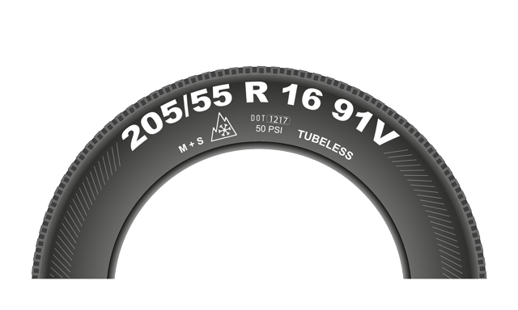

**Options:**
- A. - manufactured in 12th calendar week of the year 2017
- B. - manufactured in the 12th month (December) of the year 2017
- C. - manufactured on the 1/2/2017

**Correct Answer(s):**
- A. - manufactured in 12th calendar week of the year 2017

**Explanation:**
The date of manufacture indicated on the tire is made up of the manufacturing week and the year of manufacture. So "1217" means: 12th week in the year 2017.

---

#### Question 2.7.05-002

**Points:** 2 Points

**When should you check the tyre pressure?**

**Options:**
- A. Regularly when the tyres are cool
- B. Directly after a tyre change
- C. Directly after every journey

**Correct Answer(s):**
- A. Regularly when the tyres are cool
- B. Directly after a tyre change

**Explanation:**
You should check the tyre pressure regularly when the tyres are cold and immediately after each tyre change. It is not necessary to check after every journey.

---

#### Question 2.7.05-003

**Points:** 3 Points

**What is the minimum tread depth permissible for the tyres of your moped?**

**Options:**

**Correct Answer(s):**
- 1,0 

**Explanation:**
The tread depth of your moped must be 1 mm.

---

#### Question 2.7.05-004

**Points:** 3 Points

**What can be the consequences of having too much or too little air pressure in the tyres of the motorcycle?**

**Options:**
- A. The motorcycle’s handling will be poorer
- B. Tyre wear is increased
- C. The reaction distance is lengthened

**Correct Answer(s):**
- A. The motorcycle’s handling will be poorer
- B. Tyre wear is increased

**Explanation:**
The tyre closure increases due to greater friction. The tyre deforms and thus worsens the driving behaviour.

---

#### Question 2.7.05-005

**Points:** 3 Points

**Your tyre inflation pressure is clearly too low while you driving on public roads. What is the consequence of this?**

**Options:**
- A. There will be a considerable deterioration in the vehicle’s manoeuvrability
- B. The vehicle’s stability will be dangerously reduced when cornering
- C. The level of tyre wear will decrease greatly

**Correct Answer(s):**
- A. There will be a considerable deterioration in the vehicle’s manoeuvrability
- B. The vehicle’s stability will be dangerously reduced when cornering

**Explanation:**
A low tyre pressure results that a larger area of the tyre lies on the asphalt while driving. In addition, the tyre no longer has a round shape and can no longer roll cleanly. If the tyre pressure is significantly too low, the driving stability in curves decreases dangerously and the steering behaviour deteriorates.

---

#### Question 2.7.05-006

**Points:** 3 Points

**What must you check when regularly inspecting your vehicle’s tyres?**

**Options:**
- A. The air pressure
- B. The tread depth
- C. For external damage

**Correct Answer(s):**
- A. The air pressure
- B. The tread depth
- C. For external damage

**Explanation:**
You should check your tires at regular intervals. It is important that you control the external state of the tires, make sure that the tires have no external damage and that the legally required minimum profile depth of 1.6 mm is not undercut.
Especially in front of longer journeys or with a higher load, you should make sure to check the tire pressure beforehand.

---

#### Question 2.7.05-007

**Points:** 2 Points

**A tyre’s adhesion to the road surface depends on what?**

**Options:**
- A. On the tyre temperature
- B. On the road conditions
- C. On the weather conditions

**Correct Answer(s):**
- A. On the tyre temperature
- B. On the road conditions
- C. On the weather conditions

**Explanation:**
The liability of a tire on the road is heavily dependent on the road conditions and the weather conditions. It is best to liability a tire on a dry road. However, wetness, snow, ice, bumps or dirt can severely affect tire liability. The tire temperature also plays an important role in liability because it influences the properties of the rubber compound. Summer tires could become harder at low temperatures and reduce their liability, while winter tires could wear out faster at high temperatures.

---

#### Question 2.7.05-008

**Points:** 3 Points

**What can cause a gradual loss in tyre inflation pressure?**

**Options:**
- A. Driving on the motorway with a missing valve cap
- B. A foreign body in the tyre
- C. Accelerating quickly and frequently

**Correct Answer(s):**
- A. Driving on the motorway with a missing valve cap
- B. A foreign body in the tyre

**Explanation:**
Damage to the tire by e.g. a nail or similar foreign bodies can lead to the loss of tire filling pressure. By driving with high speeds on highways, the tire heats up and the tire pressure becomes higher. This can escape air creeping if the valve cap is missing.

---

#### Question 2.7.05-009

**Points:** 3 Points

**You are riding a motorbike with an engine size larger than 125 cm³. What is the legally prescribed minimum tread depth for all the tyres on your motorbike?**

**Options:**

**Correct Answer(s):**
- 1,6 

**Explanation:**
The legally regulated minimum profile depth for tyres is 1.6 mm.

---

#### Question 2.7.05-101

**Points:** 2 Points

**What should be noted when changing a tyre using a car jack?**

**Options:**
- A. The car jack may only be applied at the positioning points specified by the vehicle manufacturer
- B. The ground surface must always be stable and skid-resistant
- C. The car jack must always be placed at the mid-point of the vehicle's length

**Correct Answer(s):**
- A. The car jack may only be applied at the positioning points specified by the vehicle manufacturer
- B. The ground surface must always be stable and skid-resistant

**Explanation:**
To attach the jack, the vehicle driver must use the mounting points provided by the manufacturer. A safe surface with anti-slip properties is absolutely necessary for this.

---

#### Question 2.7.05-102

**Points:** 3 Points

**You have to remove a defective tyre. In what sequence should you proceed?**

**Options:**
- A. Secure the vehicle against rolling away, position the car jack, loosen the wheel nuts, jack up the vehicle, remove the wheel nuts
- B. Secure the vehicle against rolling away, position the car jack, jack up the vehicle, loosen the wheel nuts, remove the wheel nuts
- C. Position the car jack, secure the vehicle against rolling away, loosen the wheel nuts, jack up the vehicle, remove the wheel nuts

**Correct Answer(s):**
- A. Secure the vehicle against rolling away, position the car jack, loosen the wheel nuts, jack up the vehicle, remove the wheel nuts

**Explanation:**
Secure the vehicle against rolling away unintentionally. Put the jack on. Loosen the wheel nuts while the vehicle is still in contact with the ground. Lift with the help of the jack. Unscrew the wheel nuts.

---

#### Question 2.7.05-103

**Points:** 3 Points

**What does the red symbol on the tyre indicate?**

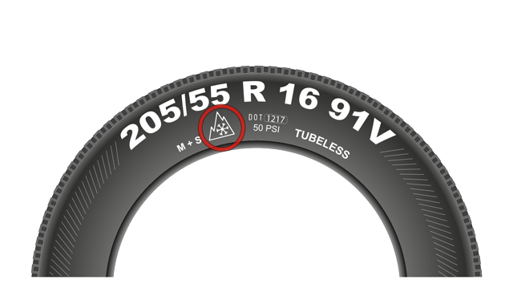

**Options:**
- A. - is suitable for wintry weather conditions
- B. - also assists driving performance in snowy conditions
- C. - may only be used in combination with snow chains

**Correct Answer(s):**
- A. - is suitable for wintry weather conditions
- B. - also assists driving performance in snowy conditions

**Explanation:**
The symbol means that this tyre is suitable for winter weather conditions and supports the driving characteristics even in snow. Snow chains are not required.

---

#### Question 2.7.05-104

**Points:** 3 Points

**To what must you pay particular attention when driving with winter tyres?**

**Options:**
- A. - not exceed the permissible maximum speed for these tyres
- B. - not exceed 80 km/h
- C. - only drive as fast as when I am using snow chains

**Correct Answer(s):**
- A. - not exceed the permissible maximum speed for these tyres

**Explanation:**
With winter tyres, you must ensure that you do not exceed the maximum permitted speed for the tyres. You can check this in the speed index.

---

#### Question 2.7.05-105

**Points:** 3 Points

**Your car is equipped with winter tyres. What is the meaning of the speed label "max. 190 km/h" on your dashboard?**

**Options:**
- A. - may not be exceeded
- B. - applies to wintry road conditions only
- C. - does not apply to dry road conditions

**Correct Answer(s):**
- A. - may not be exceeded

**Explanation:**
You must not exceed the maximum speed of 190 km / h on your winter tires.

---

#### Question 2.7.05-106

**Points:** 3 Points

**What should you remember when putting winter tyres on your car?**

**Options:**
- A. The tyre inflation pressure should be checked in accordance with the manufacturer's guidelines
- B. You should observe the permissible maximum driving speed for these tyres
- C. The air pressure should be 0.5 bar lower than the manufacturer's guidelines for summer tyres

**Correct Answer(s):**
- A. The tyre inflation pressure should be checked in accordance with the manufacturer's guidelines
- B. You should observe the permissible maximum driving speed for these tyres

**Explanation:**
After installing winter tires, you should check the tire pressure according to the manufacturer's specifications and take into account the maximum permissible speed of the tires. This must not be exceeded.

---

#### Question 2.7.05-107

**Points:** 3 Points

**This indicator lamp lights up. What could be the cause of this?**

**Options:**
- A. The inflation pressure is too low in one tyre
- B. A recently performed wheel change
- C. A loose wheel nut

**Correct Answer(s):**
- A. The inflation pressure is too low in one tyre
- B. A recently performed wheel change

**Explanation:**
The tyre pressure indicator light usually shows that the tyre pressure is too low, so check your tyre pressure.
However, a lot can also go wrong with the tyre pressure sensors if you have recently changed your tyres. First check whether you notice anything on the outside of the tyre. If the tyre is visually OK and the indicator light is still on, ask the garage.

---

#### Question 2.7.05-108

**Points:** 3 Points

**What is the legally prescribed minimum tread depth across the main profile of all the tyres on your car?**

**Options:**

**Correct Answer(s):**
- 1,6 

**Explanation:**
The legally regulated minimum profile depth for tyres is 1.6 mm. The main tread features are the grooves in the centre tread areas.

---

#### Question 2.7.05-203

**Points:** 4 Points

**What effect does incorrect tyre pressure have?**

**Options:**
- A. Impairs driving stability
- B. Increases tyre wear
- C. Extends reaction time

**Correct Answer(s):**
- A. Impairs driving stability
- B. Increases tyre wear

**Explanation:**
Incorrect tire pressure increases the possibility of deterioration of tires. Please pay attention to the correct pressure. The driving stability is impaired and endangers your safety and that of other road users.

---

#### Question 2.7.05-205

**Points:** 4 Points

**What is the effect when tyre pressure is too low?**

**Options:**
- A. The tyre overheats
- B. Driving stability is reduced
- C. Fuel consumption is increased

**Correct Answer(s):**
- A. The tyre overheats
- B. Driving stability is reduced
- C. Fuel consumption is increased

**Explanation:**
Since the air supporting the tire, so to speak, is likely to overheat in case of low tire pressure. Furthermore, significantly increases fuel consumption and reduces the stability of the ride.

---

#### Question 2.7.05-210

**Points:** 2 Points

**When should you have the tyre pressure checked?**

**Options:**
- A. At least once a week on cold tyres
- B. Immediately after each tyre change
- C. Immediately after each trip

**Correct Answer(s):**
- A. At least once a week on cold tyres
- B. Immediately after each tyre change

**Explanation:**
You should the tire pressure immediately after each change to be measured and at least weekly at the cold tire. After each trip is not right.

---

#### Question 2.7.05-211

**Points:** 2 Points

**What does the designation “TWI” (Tread Wear Indicator) mean?**

**Options:**
- A. Indication of tyre wear
- B. Indication of recut tyre profile
- C. Indication of tubeless tyre

**Correct Answer(s):**
- A. Indication of tyre wear

**Explanation:**
On the tire wear indicator (wear indicator or Tread Wear Indicator, TWI) shows whether a tire is worn, so the answer is: Display the right place for the wear of the tires.

---

#### Question 2.7.05-212

**Points:** 2 Points

**How do you recognise that tyres have been retreaded?**

**Options:**
- A. By the “RETREAD” indication on the side of the tyre
- B. There is no way to recognise this
- C. By the tyre profile

**Correct Answer(s):**
- A. By the “RETREAD” indication on the side of the tyre

**Explanation:**
A retread tire you acknowledge labeling RETREAD on the tire sidewall. It is also called Recap or remold.

---

#### Question 2.7.05-213

**Points:** 4 Points

**What must you observe when checking the spare wheel fixing?**

**Options:**
- A. Check safe fixing of the spare wheel
- B. Check double fixing of the spare wheel
- C. Check the function of the lifting device

**Correct Answer(s):**
- A. Check safe fixing of the spare wheel
- B. Check double fixing of the spare wheel
- C. Check the function of the lifting device

**Explanation:**
When checking the spare wheel attachment you have to respect all third The control of the secure mounting of the spare wheel. The control of the function of the lifting device and control of the double securing the spare wheel.

---

#### Question 2.7.05-214

**Points:** 2 Points

**When should you check that the designation on the tyre corresponds to the type of tyre allowed?**

**Options:**
- A. Each time you take over the vehicle
- B. After each tyre change
- C. Each time you drop-off the vehicle at a garage

**Correct Answer(s):**
- A. Each time you take over the vehicle
- B. After each tyre change

**Explanation:**
The designation on the tires to check for eligibility is required at each wheel change and at each acquisition of the vehicle. When handing in the workshop is not.

---

#### Question 2.7.05-215

**Points:** 4 Points

**Before beginning the journey, what do I have to check in connection with the tyres?**

**Options:**
- A. - for visible damage
- B. - for loss of pressure
- C. - to ensure they have a minimum profile of 1 mm

**Correct Answer(s):**
- A. - for visible damage
- B. - for loss of pressure

**Explanation:**
Before starting out on the tires checking visible damage and pressure loss is necessary.

---

#### Question 2.7.05-216

**Points:** 2 Points

**Where can you find information about the tyre pressure for your vehicle?**

**Options:**
- A. In the operating manual
- B. In the registration certificate Part I (Motor Vehicle Registration)
- C. In the shipping documents

**Correct Answer(s):**
- A. In the operating manual

**Explanation:**
The information on the tire pressure of your vehicle, check the operating instructions of the manufacturer. This may vary depending on the load.

---

#### Question 2.7.05-217

**Points:** 3 Points

**What are the possible consequences if the wheel nuts are not re-tightened following a tyre change?**

**Options:**
- A. The wheel may become damaged
- B. The wheel can become detached from the vehicle
- C. The tyre can become detached from the hub

**Correct Answer(s):**
- A. The wheel may become damaged
- B. The wheel can become detached from the vehicle

**Explanation:**
If the wheel fasteners are not tightened after a wheel change or this has been neglected due to negligence, the wheel may fall off the vehicle while driving due to vibration. This can cause a serious accident. The wheel cannot come off the rim.

---

#### Question 2.7.05-218

**Points:** 3 Points

**You have to change the front-right wheel of your biaxial motor vehicle. You apply a wheel chock to prevent the vehicle from accidentally rolling off. What must you be aware of when doing so?**

**Options:**
- A. - the motor vehicle on the most stable ground possible
- B. - a wheel on the rear axle
- C. - the undamaged wheel on the front axle

**Correct Answer(s):**
- A. - the motor vehicle on the most stable ground possible
- B. - a wheel on the rear axle

**Explanation:**
You should one wheel of the rear axle back up and the vehicle should be on a solid surface as possible.

---

#### Question 2.7.05-219

**Points:** 3 Points

**You have to change the front-right wheel of your triaxial motor vehicle on flat ground. What should you be aware of when doing so?**

**Options:**
- A. - two wheel chocks on one rear axle wheel
- B. - two wheel chocks on the undamaged wheel on the front axle
- C. - one wheel chock on each of the two wheels on the rear axle

**Correct Answer(s):**
- A. - two wheel chocks on one rear axle wheel

**Explanation:**
You should two chocks on one wheel of the rear ashes have backed up on a solid ground as possible.

---

#### Question 2.7.05-220

**Points:** 3 Points

**What does "L" refer to in the following tyre designation: 315/80 R 22.5 156/150 L?**

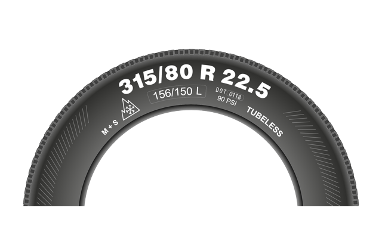

**Options:**
- A. - maximum permissible speed of the tyre
- B. - the load-bearing capacity of the tyre
- C. - the air pressure tolerance in the tyre

**Correct Answer(s):**
- A. - maximum permissible speed of the tyre

**Explanation:**
The L stands in this case for the maximum speed of the tire. The other two answers are wrong.

---

#### Question 2.7.05-221

**Points:** 3 Points

**What does "156/150" refer to in the following tyre designation: 315/80 R 22.5 156/150 L?**

**Options:**
- A. - the load index for single and twin tyres
- B. - the height-to-breadth ratio
- C. - the rolling circumference according to air pressure

**Correct Answer(s):**
- A. - the load index for single and twin tyres

**Explanation:**
The marking 156/150 represents the load index of the single and twin wheels. It has to do with either the air pressure or with the ratio of height to width.

---

#### Question 2.7.05-222

**Points:** 3 Points

**The tyre pressure monitoring system (TPMS) indicates to you that there is a pressure loss in one of the twin tyres. What should you do?**

**Options:**
- A. I stop at the nearest suitable place and perform a visual inspection
- B. I have the damage repaired at the time of the next vehicle inspection
- C. I can ignore the warning, because the other twin tyre is bearing the weight

**Correct Answer(s):**
- A. I stop at the nearest suitable place and perform a visual inspection

**Explanation:**
When the pressure drops in a dual tires you should at the nearest suitable place to stop and perform a Sichprüfung and possibly change the tire.

---

#### Question 2.7.05-223

**Points:** 3 Points

**What does the red symbol on the tyre indicate?**

**Options:**
- A. - is suitable for wintry weather conditions
- B. - also assists driving performance in snowy conditions
- C. - may only be used in combination with snow chains

**Correct Answer(s):**
- A. - is suitable for wintry weather conditions
- B. - also assists driving performance in snowy conditions

**Explanation:**
The symbol on this tyre means it is suitable for wintry weather conditions and supports the driving characteristics even in snow. Snow chains are not necessary.

---

#### Question 2.7.05-224

**Points:** 4 Points

**What should you check with the spare tyre stored in your vehicle?**

**Options:**
- A. Ensure that the spare tyre is safely secured in place
- B. The dual safeguards for the spare tyre
- C. The air pressure of the spare tyre

**Correct Answer(s):**
- A. Ensure that the spare tyre is safely secured in place
- B. The dual safeguards for the spare tyre
- C. The air pressure of the spare tyre

**Explanation:**
All of the answers are correct. You must check that the spare wheel is securely fastened, that it is secured twice, and that the air pressure of the spare wheel is maintained.

---

#### Question 2.7.05-225

**Points:** 2 Points

**Based on the tyre designation, when should you check the road-worthiness of your tyres?**

**Options:**
- A. Every time you take possession of a third-party vehicle
- B. With every tyre change
- C. Every time you take your vehicle to the workshop

**Correct Answer(s):**
- A. Every time you take possession of a third-party vehicle
- B. With every tyre change

**Explanation:**
You check the admissibility based on the tire designation every time you change a wheel and every time you take over a third-party vehicle.

---

#### Question 2.7.05-226

**Points:** 4 Points

**Before beginning your journey, what do you have to check in connection with the tyres?**

**Options:**
- A. - there is any damage
- B. - there is any loss of pressure
- C. - the main tread has a minimum tread depth of 1 mm

**Correct Answer(s):**
- A. - there is any damage
- B. - there is any loss of pressure

**Explanation:**
With a visual inspection you can check the tyres and see if there is any damage and repair it and if there is a loss of pressure (flat tyre) and then change/repair the tyre.

---

#### Question 2.7.05-227

**Points:** 3 Points

**You are driving a coach or bus. What must you note during wintry conditions?**

**Options:**
- A. - to its drive axle
- B. - to its front steering axles
- C. - to all its wheels

**Correct Answer(s):**
- A. - to its drive axle
- B. - to its front steering axles

---

#### Question 2.7.05-228

**Points:** 3 Points

**You are driving a motor vehicle with a maximum authorised mass of more than 3.5 t for transporting freight. What must you note during wintry conditions?**

**Options:**
- A. - to its drive axle
- B. - to its front steering axles
- C. - to all its wheels

**Correct Answer(s):**
- A. - to its drive axle
- B. - to its front steering axles

---

#### Question 2.7.05-229

**Points:** 2 Points

**What should you check regularly if your car has a spare wheel carried outside the body of the car?**

**Options:**
- A. The double safeguard
- B. The tyre pressure
- C. The rolling resistance

**Correct Answer(s):**
- A. The double safeguard
- B. The tyre pressure

**Explanation:**
If you carry a spare wheel outside the body, it is important to regularly check the double lock and the tire pressure. The double lock ensures that the spare wheel is securely attached while driving and does not come loose, which could lead to dangerous situations on the road. The tire pressure should be checked, as a spare wheel with insufficient air pressure is not ready for use in the event of a breakdown and therefore cannot fulfill its function as a reserve. Because the spare tire often remains unused, it can lose air pressure over time; Regular checks ensure that it can be used immediately if necessary.

---

### 2.7.06 Chapter Brake Systems And Cruise Control

#### Question 2.7.06-001

**Points:** 3 Points

**What is the benefit of having a motorbike with an anti-lock system (ALS)?**

**Options:**
- A. During emergency braking manoeuvres the risk of falling is reduced
- B. Driving faster does not increase the risk of having an accident
- C. Braking requires less effort

**Correct Answer(s):**
- A. During emergency braking manoeuvres the risk of falling is reduced

**Explanation:**
During emergency braking, the wheels tend to lock and you could fall. An adaptive cruise control system counteracts wheel lock-up by regulating the brake pressure and thus reduces the risk of falling.

---

#### Question 2.7.06-002

**Points:** 3 Points

**You are riding a motorbike equipped with an anti-lock braking system (ABS). What should you take into account if you have to brake while cornering?**

**Options:**
- A. I should brake in a controlled manner despite my declined position
- B. An activated ABS maintains manoeuvrability for longer
- C. The braking force automatically increases in the declined position

**Correct Answer(s):**
- A. I should brake in a controlled manner despite my declined position
- B. An activated ABS maintains manoeuvrability for longer

**Explanation:**
The automatic anti-lock brake helps to stabilise the braking process and prevent the wheels from locking.
Because the automatic anti-lock brake prevents the wheels from locking, you can also steer while braking.
Nevertheless, you should brake in a controlled manner when leaning, as the motorbike could slip sideways due to heavy braking.

---

#### Question 2.7.06-003

**Points:** 3 Points

**Your motorbike is equipped with a cornering optimised anti-lock braking system (ABS). What is the purpose of this assist system?**

**Options:**
- A. - enhances manoeuvrability during critical braking manoeuvres while cornering
- B. - reduces the righting moment of the motorbike when braking while cornering
- C. - increases the righting moment of the motorbike when braking while cornering

**Correct Answer(s):**
- A. - enhances manoeuvrability during critical braking manoeuvres while cornering
- B. - reduces the righting moment of the motorbike when braking while cornering

**Explanation:**
The automatic anti-lock brake prevents the wheels from locking when braking. This allows you to brake and steer at the same time when cornering. In contrast to the standard anti-lock brake, the lean angle-optimised anti-lock brake increases the steering ability by reducing the set-up torque, especially during critical braking manoeuvres in bends.

---

#### Question 2.7.06-101

**Points:** 4 Points

**What is the effect of an automatic anti-locking device (ABS)?**

**Options:**
- A. The vehicle is braked in the best possible way also on wet roadways
- B. Steering control is largely retained when braking
- C. Aquaplaning is prevented

**Correct Answer(s):**
- A. The vehicle is braked in the best possible way also on wet roadways
- B. Steering control is largely retained when braking

**Explanation:**
An antilocking system ensures that the wheels of a vehicle do not block even when the car driver performs an emergency stop. The car remains at least limitedly steerable and the braking distance does not change even on slippery roads. In aquaplaning, a water gore between the road surface and the tires is created mainly by high speeds. Floating of the vehicle is not prevented by the antilocking system.

---

#### Question 2.7.06-103

**Points:** 4 Points

**What are the advantages of an automatic anti-locking device (ABS)?**

**Options:**
- A. The wheels do not lock when braking
- B. Steering control is retained even when braking heavily
- C. Bends can be taken considerably faster

**Correct Answer(s):**
- A. The wheels do not lock when braking
- B. Steering control is retained even when braking heavily

**Explanation:**
The antilocking system has the advantage that it prevents locking of the wheels when braking on wet or dirty tracks. For this purpose, the brake pressure is regulated at short intervals. Normal driving characteristics are not affected by the ABS.

---

#### Question 2.7.06-104

**Points:** 4 Points

**What are the advantages of an automatic anti-locking device (ABS)?**

**Options:**
- A. It is possible to brake heavily and avoid an obstacle at the same time
- B. On setting off, wheelspin is prevented
- C. The danger of tipping over is reduced when braking on bends

**Correct Answer(s):**
- A. It is possible to brake heavily and avoid an obstacle at the same time

**Explanation:**
An anti-lock braking system is particularly useful for heavy braking on wet or dirty roads. It counteracts possible locking of the wheels by controlling the brake pressure at short intervals. This prevents the vehicle from breaking out of the lane. The antilocking system has no effect on driving in curves. Spinning of the wheels when starting can prevent the traction control system (TCS), not the antilocking system.

---

#### Question 2.7.06-105

**Points:** 3 Points

**When does the braking action of a trailer with overrun brakes start?**

**Options:**
- A. When the trailer runs up to the truck
- B. When the brake pedal in the truck is activated
- C. Before the braking action of the truck starts, so that the truck and trailer remain extended

**Correct Answer(s):**
- A. When the trailer runs up to the truck

**Explanation:**
When the trailer hangs on the towing vehicle, the braking effect occurs in a trailer with overrun brake. As the name implies, the trailer brake will not be released until the trailer reaches the towing vehicle.

---

#### Question 2.7.06-107

**Points:** 3 Points

**When is there a particularly high risk of a combination vehicle jack-knifing or skidding on a slippery road?**

**Options:**
- A. If the driver steers abruptly
- B. By applying maximum pressure on the service brake when driving around a bend
- C. By accelerating gradually

**Correct Answer(s):**
- A. If the driver steers abruptly
- B. By applying maximum pressure on the service brake when driving around a bend

**Explanation:**
In a vehicle combination, the danger is particularly great when steering is jerky and when braking when cornering with the service brake with maximum delay.

---

#### Question 2.7.06-108

**Points:** 4 Points

**When is there a particularly high risk of a semi-trailer truck with compressed-air brakes jack-knifing or skidding on a slippery road?**

**Options:**
- A. If the retarder is fully engaged when driving around a bend
- B. If the truck is braked harder than the trailer when driving around a bend
- C. If the load largely impinges on the drive shaft

**Correct Answer(s):**
- A. If the retarder is fully engaged when driving around a bend
- B. If the truck is braked harder than the trailer when driving around a bend

**Explanation:**
If the truck when cornering brake more than the trailer, the risk on a slippery surface is particularly large buckle or hurling. When the retarder (retarder) is fully actuated when cornering, it may / come to different braking forces effects.

---

#### Question 2.7.06-109

**Points:** 3 Points

**You are pulling a trailer with overrun brakes. What must you be aware of?**

**Options:**
- A. - can reverse
- B. - can forwards
- C. - hitch the trailer

**Correct Answer(s):**
- A. - can reverse

**Explanation:**
Coming soon...

---

#### Question 2.7.06-110

**Points:** 2 Points

**What could happen if the cruise control system (speed limiter) is switched off too late?**

**Options:**
- A. Tailgating
- B. Excessively high cornering speed
- C. Exceeding the permissible maximum speed

**Correct Answer(s):**
- A. Tailgating
- B. Excessively high cornering speed
- C. Exceeding the permissible maximum speed

**Explanation:**
The speed controller constantly keeps a set speed. So, when driving into road sections with speed limits, you may exceed the maximum speed. You can drive in corners at too fast a speed. The controller cannot correct the distance. If you turn off the device too late, you might get too close.

---

#### Question 2.7.06-111

**Points:** 3 Points

**With what can a cruise control system (speed limiter) assist you?**

**Options:**
- A. With maintaining a constant speed
- B. With maintaining an energy-saving driving style
- C. With maintaining the minimum distance to the vehicle ahead

**Correct Answer(s):**
- A. With maintaining a constant speed
- B. With maintaining an energy-saving driving style

**Explanation:**
Cruise control keeps your car at a constant speed, but does not control the distance to the vehicle in front of you. While you take your foot off the gas pedal and focus solely on the road, you save fuel at the same time.

---

#### Question 2.7.06-112

**Points:** 3 Points

**What should I be aware of when using an adaptive cruise control system?**

**Options:**
- A. I must remain constantly attentive even when using the system for a longer period
- B. The system can be affected by heavy rain or snow fall
- C. Activating the accelerator or brake pedal can always override the system

**Correct Answer(s):**
- A. I must remain constantly attentive even when using the system for a longer period
- B. The system can be affected by heavy rain or snow fall
- C. Activating the accelerator or brake pedal can always override the system

**Explanation:**
An adaptive speed control system evaluates the position and the speed of the vehicle in front of you. By doing so, it aligns the speed and distance of your vehicle, including appropriate adaptive engine control and brake interventions (in-phase control). Nevertheless, you as a car driver, should not be distracted. You can influence the system at any time. Because the system function can be affected by weather conditions.

---

#### Question 2.7.06-113

**Points:** 3 Points

**What function is performed by an adaptive cruise control system on a motor vehicle?**

**Options:**
- A. - independently accelerates the vehicle to a previously configured speed
- B. - brakes independently, when the vehicle ahead is moving slower
- C. - automatically maintains the prescribed safety distance

**Correct Answer(s):**
- A. - independently accelerates the vehicle to a previously configured speed
- B. - brakes independently, when the vehicle ahead is moving slower

**Explanation:**
An adaptive cruise control system, also known as adaptive cruise control, determines the position and the speed of the vehicle in front of you with a sensor and adjusts the speed and the distance of the subsequent vehicle. This is adaptively regulated with engine control and brake intervention (in-phase control). The system cannot recognize and set the prescribed safety distance.

---

#### Question 2.7.06-114

**Points:** 3 Points

**What benefits does the driver of a motor vehicle have by using a cruise control system?**

**Options:**
- A. - maintains a constant pre-set speed on a level carriageway
- B. - makes it easier for the driver to operate the vehicle
- C. - adjusts the speed to the traffic density

**Correct Answer(s):**
- A. - maintains a constant pre-set speed on a level carriageway
- B. - makes it easier for the driver to operate the vehicle

**Explanation:**
The cruise control maintains a steady vehicle speed on a level road and relieves you in operating the vehicle. The traffic density cannot be adjusted to the speed.

---

#### Question 2.7.06-115

**Points:** 3 Points

**In which situation is it helpful to use an adaptive cruise control system (ACC)?**

**Options:**
- A. - motorways
- B. - expressways
- C. - winding roads

**Correct Answer(s):**
- A. - motorways
- B. - expressways

**Explanation:**
Adaptive Cruise Control monitors the distance to the vehicle in front and adjusts your speed accordingly. When driving on motorways and highways, the use of an adaptive cruise control system is recommended.

---

#### Question 2.7.06-116

**Points:** 3 Points

**How can you manually override an activated cruise control system?**

**Options:**
- A. By braking
- B. By accelerating
- C. By steering

**Correct Answer(s):**
- A. By braking
- B. By accelerating

**Explanation:**
An active cruise control system is overridden by applying the brakes or accelerating. That means the vehicle is slower or faster than the speed set in the cruise control

---

#### Question 2.7.06-117

**Points:** 3 Points

**What is the purpose of an adaptive cruise control system (ACC) in motor vehicles?**

**Options:**
- A. - independently accelerates the vehicle until it reaches a previously set speed
- B. - independently slows the vehicle if it identifies a vehicle ahead travelling at a lower speed
- C. - always maintains the prescribed safety distance to the vehicle ahead

**Correct Answer(s):**
- A. - independently accelerates the vehicle until it reaches a previously set speed
- B. - independently slows the vehicle if it identifies a vehicle ahead travelling at a lower speed

**Explanation:**
The active cruise control system adjusts the vehicle to the speed you set, just like ordinary cruise control.
It also brakes when it detects vehicles ahead. It does not slow down if it cannot detect them, e.g. at night, in heavy rain, fog, etc.

---

#### Question 2.7.06-118-M

**Points:** 3 Points

**While driving, you use the adaptive cruise control (ACC). The speed is set to 100 km/h. What must you be prepared for before entering a bend in the road?**

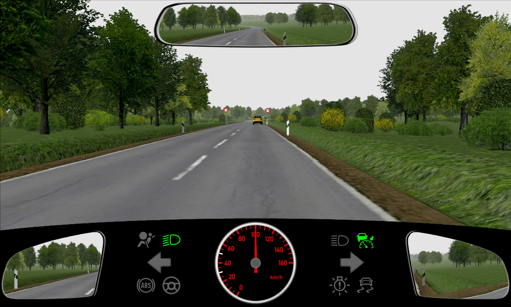

[Video: videos/2_7_06-118-M.mp4](videos/2_7_06-118-M.mp4)

**Options:**
- A. The ACC may cause my vehicle to accelerate
- B. I have to adjust my speed to the situation
- C. The ACC will prompt me to reduce my speed

**Correct Answer(s):**
- A. The ACC may cause my vehicle to accelerate
- B. I have to adjust my speed to the situation

**Explanation:**
The adaptive cruise control system automatically maintains the speed you have set while keeping the correct distance from vehicles in front. 
You have set the speed of the AGR to 100 km/h. Because the vehicle in front is now out of sight, the AGR will accelerate. Set a lower speed to safely negotiate the bend.

---

#### Question 2.7.06-119

**Points:** 3 Points

**What is the function of your vehicle’s emergency brake assist?**

**Options:**
- A. - issues warnings about the immediate risk of a rear-end collision
- B. - can reduce the risk of injury in the event of an unavoidable collision
- C. - brakes the speed of my vehicle if the event I accidentally overrun the traffic lane boundary

**Correct Answer(s):**
- A. - issues warnings about the immediate risk of a rear-end collision
- B. - can reduce the risk of injury in the event of an unavoidable collision

**Explanation:**
An emergency brake assist is a safety system for motor vehicles that warns you of a collision in critical situations. It also supports emergency braking if a collision is detected by increasing the brake pressure and thus reducing the collision speed.

---

#### Question 2.7.06-202

**Points:** 3 Points

**What happens when the retarders are engaged and the service brake is applied?**

**Options:**
- A. The wheels of the driven axle(s) brake more strongly
- B. The retarders are automatically switched off
- C. The front wheels do not brake

**Correct Answer(s):**
- A. The wheels of the driven axle(s) brake more strongly

**Explanation:**
When the service brake is applied with switched permanent brake, the following happens: The wheels of the driving axle (s) can be braked more sharply.

---

#### Question 2.7.06-203

**Points:** 2 Points

**What are the advantages of the speed control (cruise control) when driving a motor vehicle?**

**Options:**
- A. Fuel saving due to more uniform style of driving
- B. Ease of acceleration
- C. Precise compliance with speed restrictions

**Correct Answer(s):**
- A. Fuel saving due to more uniform style of driving
- B. Ease of acceleration
- C. Precise compliance with speed restrictions

**Explanation:**
Advantages in a cruise control are relief during acceleration, fuel economy through more consistent driving style and also precise adherence to speed limits.

---

#### Question 2.7.06-206

**Points:** 2 Points

**When should the speed control (cruise control) be used?**

**Options:**
- A. When traffic conditions allow you to drive at a constant speed
- B. Only on upward or downward slopes
- C. Only at high speeds

**Correct Answer(s):**
- A. When traffic conditions allow you to drive at a constant speed

**Explanation:**
Cruise control should be used if the traffic conditions permit a constant speed.

---

#### Question 2.7.06-208

**Points:** 3 Points

**What is understood by a braking system with an automatic load-dependent braking-force regulator (ALB)?**

**Options:**
- A. The braking force is automatically regulated according to the load on the axles
- B. When fully braking on a slippery roadway, locking of the wheels is automatically prevented
- C. On setting off, wheelspin is prevented

**Correct Answer(s):**
- A. The braking force is automatically regulated according to the load on the axles

**Explanation:**
Among ALB (automatically loads dependent braking force control), it is understood that the braking force is controlled automatically according to the load on the axles. This is very useful at different loads.

---

#### Question 2.7.06-209

**Points:** 3 Points

**The rear wheels of an unloaded vehicle equipped with an automatic load-dependent braking force regulator (ALB) lock each time the brakes are strongly applied. What can be the cause?**

**Options:**
- A. ALB is defect or wrongly adjusted
- B. Several spring leaves on the rear axle have broken
- C. Strong fading of the brakes

**Correct Answer(s):**
- A. ALB is defect or wrongly adjusted
- B. Several spring leaves on the rear axle have broken

**Explanation:**
The causes can defective or incorrectly set ALB be, or the breaking of several spring blades of the rear axle.

---

#### Question 2.7.06-210

**Points:** 4 Points

**How does the effect of automatic load-dependent braking-force regulators (ALB) and automatic anti-locking devices (ABS) differ?**

**Options:**
- A. An anti-locking device (ABS) prevents the wheels from locking irrespective of the weight and the condition of the roadway
- B. An automatic load-dependent braking-force regulator (ALB) automatically adjusts the braking force to the axle load
- C. An automatic load-dependent braking-force regulator (ALB) automatically adjusts the braking force to the condition of the roadway

**Correct Answer(s):**
- A. An anti-locking device (ABS) prevents the wheels from locking irrespective of the weight and the condition of the roadway
- B. An automatic load-dependent braking-force regulator (ALB) automatically adjusts the braking force to the axle load

**Explanation:**
When ABS brakes automatically preventing the wheels from locking. For ALB, the braking force of the axle load automatically adjusts. Automatically adjusting the braking force at the road condition is irrelevant.

---

#### Question 2.7.06-211

**Points:** 2 Points

**Which brakes are not subject to significant wear?**

**Options:**
- A. Exhaust brake
- B. Retarder (eddy current brake, hydrodynamic brake)
- C. Air brake system

**Correct Answer(s):**
- A. Exhaust brake
- B. Retarder (eddy current brake, hydrodynamic brake)

**Explanation:**
Without significant wear the retarder (eddy-current brake) working the lock.

---

#### Question 2.7.06-213

**Points:** 3 Points

**What produces the braking action in a spring-loaded brake cylinder?**

**Options:**
- A. The spring power
- B. The incoming compressed air
- C. The force applied by the driver

**Correct Answer(s):**
- A. The spring power

**Explanation:**
The spring-loaded brake is effected by the spring force. Here, the spring is vented.

---

#### Question 2.7.06-214

**Points:** 3 Points

**How does a spring-loaded brake system work?**

**Options:**
- A. When the handbrake valve is activated, the spring-loaded brake cylinder is purged of air. The spring power thus activates the brakes
- B. When the handbrake valve is activated, compressed air flows into the spring-loaded brake cylinder. The compressed air thus activates the brakes
- C. When the brake pedal is applied at standstill, compressed air flows into the spring-loaded brake cylinder. The compressed air thus activates the brakes

**Correct Answer(s):**
- A. When the handbrake valve is activated, the spring-loaded brake cylinder is purged of air. The spring power thus activates the brakes

**Explanation:**
When operating the hand brake valve, the spring-loaded brake cylinder is vented and thereby effects by the resilience of the braking. Because of the safety, the spring-loaded brake more without pressure.

---

#### Question 2.7.06-215

**Points:** 3 Points

**The spring-loaded brake has been applied on a truck which has broken down with engine failure. The air supply is exhausted. What effect does this have?**

**Options:**
- A. The spring-loaded brake does not react to activation of the handbrake valve
- B. To enable the vehicle to be towed away, the spring-loaded brake must be released by the emergency release device
- C. The spring-loads must be removed before the vehicle can be towed

**Correct Answer(s):**
- A. The spring-loaded brake does not react to activation of the handbrake valve
- B. To enable the vehicle to be towed away, the spring-loaded brake must be released by the emergency release device

**Explanation:**
If you want your vehicle towed, must be the spring-loaded brake is released with the auxiliary device. Another effect of the exhausted air pressure, the spring-loaded brake does not respond to press the hand brake valve. The spring-loaded brake must not be replaced in order to be towed.

---

#### Question 2.7.06-216

**Points:** 2 Points

**What kind of emergency release devices exist for spring-loaded brake cylinders?**

**Options:**
- A. Pneumatic
- B. Mechanical
- C. Automatic

**Correct Answer(s):**
- A. Pneumatic
- B. Mechanical

**Explanation:**
There are both mechanical and pneumatic auxiliary equipment for spring brake cylinders.

---

#### Question 2.7.06-217

**Points:** 3 Points

**You are driving a bus equipped with a bus-stop brake. When are you allowed to use the bus-stop brake?**

**Options:**
- A. When stopping at bus stops
- B. Instead of the parking brake, when parking the bus
- C. When braking on a steep downhill slope

**Correct Answer(s):**
- A. When stopping at bus stops

**Explanation:**
Coming soon...

---

#### Question 2.7.06-220

**Points:** 3 Points

**What must you remember with an air brake system with air-drier?**

**Options:**
- A. To check the water-drainage valves of the air tanks regularly to see whether the air-drier is working correctly
- B. To service the air-drier regularly
- C. To check the level of antifreeze in the air-drier regularly

**Correct Answer(s):**
- A. To check the water-drainage valves of the air tanks regularly to see whether the air-drier is working correctly
- B. To service the air-drier regularly

**Explanation:**
In a pneumatic brake system with air dryer you should make sure that it is regularly maintained. The drain valves of air tanks you should regularly check the air dryer is working properly. If not, please exchange this out. They do not last forever.

---

#### Question 2.7.06-222

**Points:** 3 Points

**When you depress the brake pedal completely, what fall in pressure in the air tank of a motor vehicle (cut-off pressure approx. 7 - 8 bar overpressure) gives no cause for concern?**

**Options:**
- A. 0.7 bar
- B. 1.2 bar
- C. 1.5 bar

**Correct Answer(s):**
- A. 0.7 bar

**Explanation:**
If you are the brake pedal fully durchtrittst (cut about 7 to 8 bar pressure) is a pressure drop of 0.7 bar harmless.

---

#### Question 2.7.06-223

**Points:** 3 Points

**What is the function of a multiple-circuit safety valve in an air brake system?**

**Options:**
- A. To seal off a leaking circuit from the other circuits
- B. To ensure the supply of compressed air to the intact circuits
- C. To protect all the circuits of the compressed air system from excessive pressure

**Correct Answer(s):**
- A. To seal off a leaking circuit from the other circuits
- B. To ensure the supply of compressed air to the intact circuits

**Explanation:**
A four-circuit protection valve in an air brake system, the air supply to the intact Keise safe and also has the task of concluding a leaky become county against the other circles.

---

#### Question 2.7.06-224

**Points:** 3 Points

**Which inspections and servicing measures are regularly required for an air compressor?**

**Options:**
- A. Inspection of the delivery line connection
- B. Cleaning of the intake filter and control of the fan belt
- C. Inspection of the revolution controller

**Correct Answer(s):**
- A. Inspection of the delivery line connection
- B. Cleaning of the intake filter and control of the fan belt

**Explanation:**
one of the regular inspection and maintenance of an air compressor: Cleaning the suction filter and control the V-belt and testing the connection of the pressure line. The control of the speed controller is not helpful.

---

#### Question 2.7.06-226

**Points:** 4 Points

**Why is a pressure drop of more than 0.7 bar in the air tank of a vehicle problematic when you fully depress the brake pedal (cut-off pressure approximately 7 - 8 bar)?**

**Options:**
- A. Because the air supply in the system drops too quickly when you brake again
- B. Because the wheels will lock when braking fully
- C. Because a vacuum is created in the brake system

**Correct Answer(s):**
- A. Because the air supply in the system drops too quickly when you brake again

**Explanation:**
If the pressure drop in the air tank to be higher than 0.7 bar, while the brake pedal fully durchtrittst (cut approximately 7 - 8 bar) this is problematic because the air supply drops in the system when further braking quickly.

---

#### Question 2.7.06-227

**Points:** 4 Points

**The braking force on the rear wheels of a vehicle with automatic load-dependent braking force regulator (ALB) fails. What can be the reason?**

**Options:**
- A. Incorrect ALB setting
- B. Driver has applied too much force
- C. Supply pressure in the brake system is too high

**Correct Answer(s):**
- A. Incorrect ALB setting

**Explanation:**
This is due to the faulty ALB setting. Please check so that you can safely and continue the braking force is working again on the rear wheels.

---

#### Question 2.7.06-228

**Points:** 2 Points

**Your motor vehicle is equipped with an electronic braking system (EBS). What happens in the event of a failure of the EBS?**

**Options:**
- A. The error in the system will be indicated by an indicator light
- B. The vehicle is braked with the assistance of the pneumatic redundancy pressure
- C. The vehicle can now only be braked using the parking brake

**Correct Answer(s):**
- A. The error in the system will be indicated by an indicator light
- B. The vehicle is braked with the assistance of the pneumatic redundancy pressure

**Explanation:**
In case of failure of the EBS (electronic brake system) the vehicle is braked by means of the pneumatic redundancy pressure. An indication you get when the error appears in the system by means of a warning light.

---

#### Question 2.7.06-229

**Points:** 2 Points

**Your motor vehicle is equipped with an electronic braking system (EBS). What does the EBS perform?**

**Options:**
- A. Optimum coordination of braking force between the individual wheel brakes
- B. Automatic monitoring of the braking system
- C. Automatic braking the event of obstructions on the carriageway

**Correct Answer(s):**
- A. Optimum coordination of braking force between the individual wheel brakes
- B. Automatic monitoring of the braking system

**Explanation:**
An EBS causes an optimal adjustment of the braking forces takes place between the individual wheel brakes. Automatic monitoring of the brake system is made by EBS.

---

#### Question 2.7.06-230

**Points:** 3 Points

**What happens if the service brake is activated while the permanent brake is switched on?**

**Options:**
- A. A stronger braking force is applied to the wheels of the drive axle(s)
- B. The permanent brake will be switched off automatically
- C. The wheels of the drive axle(s) will become locked

**Correct Answer(s):**
- A. A stronger braking force is applied to the wheels of the drive axle(s)

**Explanation:**
Applying the service brake when the permanent brake is on has the following effects: The wheels of the drive axles are braked more strongly and thus bring you to a standstill more quickly.

---

#### Question 2.7.06-231

**Points:** 3 Points

**You press the brake pedal of your motor vehicle fully down. What is the maximum safe decrease of pressure in the braking system if the air tanks are full?**

**Options:**
- A. 0.7 bar
- B. 1.2 bar
- C. 1.5 bar

**Correct Answer(s):**
- A. 0.7 bar

**Explanation:**
A maximum pressure drop of 0.7 bar is harmless when the air tank is completely filled.

---

#### Question 2.7.06-232

**Points:** 4 Points

**Why is a decrease of pressure of more than 0.7 bar problematic in the compressed air system of a motor vehicle, if you press the brake pedal fully down one time (cut-off pressure around 10 to 13 bar)?**

**Options:**
- A. Because the air supply decreases too quickly for additional braking manoeuvres
- B. Because the braking action of the motor vehicle will deteriorate
- C. Because a vacuum is created within the braking system

**Correct Answer(s):**
- A. Because the air supply decreases too quickly for additional braking manoeuvres
- B. Because the braking action of the motor vehicle will deteriorate

**Explanation:**
If the pressure in the compressed air system of your vehicle drops by more than 0.7 bar, the air supply for further braking will drop too quickly and the braking effect of your vehicle will deteriorate.

---

#### Question 2.7.06-233

**Points:** 3 Points

**What is the purpose of an automatic load-sensitive braking system (ALB)?**

**Options:**
- A. - adjusted to the actual vehicle mass
- B. - adjusted to the condition of the road surface
- C. - adjusted to the vehicle speed

**Correct Answer(s):**
- A. - adjusted to the actual vehicle mass

**Explanation:**
The braking force function with ALB is adjusted to the actual vehicle mass.

---

#### Question 2.7.06-234

**Points:** 2 Points

**Which brake system of a motor vehicle functions without any appreciable wear?**

**Options:**
- A. The engine brake
- B. The retarder
- C. The compressed air-braking system

**Correct Answer(s):**
- A. The engine brake
- B. The retarder

**Explanation:**
The engine brake and the retarder (electrodynamic permanent brake) work without significant wear.

---

#### Question 2.7.06-235

**Points:** 2 Points

**Your motor vehicle is equipped with an electronic braking system (EBS). What is the effect of the EBS?**

**Options:**
- A. The braking distance is reduced
- B. The braking stability is improved
- C. The wear characteristics of the brake pads are optimised

**Correct Answer(s):**
- A. The braking distance is reduced
- B. The braking stability is improved
- C. The wear characteristics of the brake pads are optimised

**Explanation:**
All answers are correct. The braking distance with EBS is shortened, braking stability improves and the wear behaviour of the brake pads is optimised.

---

#### Question 2.7.06-236

**Points:** 4 Points

**You are driving a laden motor vehicle equipped with a manual gearbox. On a steep descent your speed is steadily increasing even though the permanent brake is activated. What should you do?**

**Options:**
- A. I brake using the service brake and select a lower gear
- B. I brake using the service brake and select a higher gear
- C. I deactivate the permanent brake and solely use the service brake

**Correct Answer(s):**
- A. I brake using the service brake and select a lower gear

**Explanation:**
If your speed increases on a steep incline, brake with the service brake and shift into a lower gear in order to brake with the additional help of the engine brake.

---

#### Question 2.7.06-237

**Points:** 3 Points

**Your motor vehicle is equipped with an emergency brake assist. Which is correct?**

**Options:**
- A. - always be activated
- B. - only be activated in heavy traffic
- C. - never be activated on motorways

**Correct Answer(s):**
- A. - always be activated

**Explanation:**
If it is present, it should be activated. It is a great help during emergency braking.

---

#### Question 2.7.06-238

**Points:** 3 Points

**Your motor vehicle is equipped with an emergency brake assist. Which is correct?**

**Options:**
- A. - always be activated
- B. - only be activated in dangerous situations
- C. - only be activated with the onset of tiredness

**Correct Answer(s):**
- A. - always be activated

**Explanation:**
If it is present, it should be activated. It is a great help during emergency braking.

---

#### Question 2.7.06-239

**Points:** 2 Points

**Why should you use the permanent brake (retarder) of your motor vehicle?**

**Options:**
- A. - operates without wear
- B. - can relieve the service braking device
- C. - can brake the vehicle to a standstill

**Correct Answer(s):**
- A. - operates without wear
- B. - can relieve the service braking device

**Explanation:**
A continuous brake is a device that allows braking for a longer period of time and without wear, without reducing its braking power.

---

#### Question 2.7.06-240

**Points:** 2 Points

**What is the benefit of using adaptive cruise control (ACC) on motorways?**

**Options:**
- A. It reduces the probability of rear-end collisions
- B. The driver is assisted in maintaining the chosen distance
- C. It means that the safety distance cannot be undercut

**Correct Answer(s):**
- A. It reduces the probability of rear-end collisions
- B. The driver is assisted in maintaining the chosen distance

**Explanation:**
The driver assistance system ensures the correct safety distance to the vehicle in front.

---

#### Question 2.7.06-241

**Points:** 2 Points

**You are driving a motor vehicle with a manual gearbox. What is the logical thing to do so that the cruise control system can contribute to a fuel-efficient driving style?**

**Options:**
- A. Selecting the right gear
- B. Using the cruise control in stop-and-go traffic conditions
- C. Accelerating in good time at long inclines

**Correct Answer(s):**
- A. Selecting the right gear

**Explanation:**
The speed must be as low as possible.

---

#### Question 2.7.06-242

**Points:** 3 Points

**What can cause the emergency brake assist of a vehicle to deactivate automatically?**

**Options:**
- A. The functionality of the radar sensor is impeded due to snow
- B. Because the position of the sensors has shifted due to collision damage
- C. Because the adaptive cruise control (ACC) is switched on

**Correct Answer(s):**
- A. The functionality of the radar sensor is impeded due to snow
- B. Because the position of the sensors has shifted due to collision damage

---

#### Question 2.7.06-243

**Points:** 3 Points

**Your vehicle is equipped with an emergency brake assistant. What is correct?**

**Options:**
- A. - must be switched on at a speed of more than 30 km/h
- B. - may be switched off at high speed on the motorway
- C. - should only be switched on in dangerous situations

**Correct Answer(s):**
- A. - must be switched on at a speed of more than 30 km/h

**Explanation:**
As a truck driver, you are obliged to keep the emergency braking assistant activated at speeds above 30 km/h, as this system helps prevent rear-end collisions and thus increases road safety.

---

#### Question 2.7.06-303

**Points:** 3 Points

**What happens to a truck and trailer combination when the spring-loaded braking system of the truck is activated?**

**Options:**
- A. The truck is mechanically braked
- B. The trailer is normally braked pneumatically via its service brake system
- C. The trailer is mechanically braked

**Correct Answer(s):**
- A. The truck is mechanically braked
- B. The trailer is normally braked pneumatically via its service brake system

**Explanation:**
If you are the spring-brake your Zugafahrzeuges einlegst in your truck, (vent) is normally the trailer brakes with compressed air through its operating system (yellow) and the towing vehicle is braked mechanically.

---

#### Question 2.7.06-306

**Points:** 3 Points

**In which cases must you activate the release valve?**

**Options:**
- A. When the air tanks are full, the brake lines are not connected and the trailer has to be moved
- B. Before setting off, so that the air tanks of the trailer can be filled
- C. Before setting off, so that the parking brake of the trailer can be released

**Correct Answer(s):**
- A. When the air tanks are full, the brake lines are not connected and the trailer has to be moved

**Explanation:**
The release valve you need to press when the trailer with filled air tanks and disconnected brake lines should be ranked. It opens the service brake.

---

#### Question 2.7.06-307

**Points:** 3 Points

**What is the effect when the brake line (hose) between the truck (dual-circuit brake system) and trailer breaks on braking?**

**Options:**
- A. The four-circuit safety valve maintains safety pressure of the truck's brake system
- B. The emergency line is automatically vented, the trailer is braked
- C. The brake system of the trailer fails

**Correct Answer(s):**
- A. The four-circuit safety valve maintains safety pressure of the truck's brake system
- B. The emergency line is automatically vented, the trailer is braked

**Explanation:**
At a fraction of the braking line (hose) between the towing vehicle (two-circuit brake system) and the trailer during braking, the following happens: The supply line is automatically vented the trailer is braked and the four-circuit protection valve holds the fuse pressure for the operating system of the towing vehicle upright.

---

#### Question 2.7.06-308

**Points:** 4 Points

**The brake line to the front right-hand wheel ruptures on a truck which is fitted with an air-hydraulic dual-circuit braking system with pre-loaded cylinder and a pneumatic trailer-control valve. What effect does this have on the truck and trailer?**

**Options:**
- A. The service brake system of the trailer remains fully operative
- B. Only the rear wheels of the truck can be braked by means of the service brake systems
- C. The trailer is braked automatically at once

**Correct Answer(s):**
- A. The service brake system of the trailer remains fully operative
- B. Only the rear wheels of the truck can be braked by means of the service brake systems

**Explanation:**
The effects are as follows: For the trailer, the service brake is fully functional and the Zugfahzeug only the rear wheels can be braked with the service brake.

---

#### Question 2.7.06-309

**Points:** 4 Points

**What danger arises if the brake cylinder pistons of a trailer air brake system protrude to their limit stop on braking?**

**Options:**
- A. Complete brake failure
- B. Excessive braking
- C. The braking-force regulator no longer reacts

**Correct Answer(s):**
- A. Complete brake failure

**Explanation:**
The danger that exists when the pistons of the brake cylinders is to eject a compressed air-braked trailer to stop until that the braking action can fail completely.

---

#### Question 2.7.06-310

**Points:** 4 Points

**What can happen if a truck and trailer are continuously braked with the service brakes on a long downhill slope?**

**Options:**
- A. The wheel brakes heat up to such an extent that the braking action is dangerously reduced
- B. The air supply to the brake system is not supplemented
- C. The action of the retarder is reduced

**Correct Answer(s):**
- A. The wheel brakes heat up to such an extent that the braking action is dangerously reduced

**Explanation:**
After a long gap, the wheel brakes are heated so much that the braking effect wears off dangerous.

---

#### Question 2.7.06-311

**Points:** 4 Points

**You are driving downhill with fully loaded truck and trailer and have underestimated the slope. Despite retarders being engaged, the speed increases appreciably. What must you do?**

**Options:**
- A. Engage the service brakes to be able to change down gear
- B. Release the retarders and regulate speed with the service brakes only

**Correct Answer(s):**
- A. Engage the service brakes to be able to change down gear

**Explanation:**
You should with the service brake to slow down to be able to switch back if you have underestimated with a loaded truck a long slope.

---

#### Question 2.7.06-313

**Points:** 3 Points

**You park a trailer with compressed air-braking system for a short period. How can you disengage the service brake of the trailer?**

**Options:**
- A. By activating the release valve
- B. By venting the brake line
- C. By releasing the parking brake

**Correct Answer(s):**
- A. By activating the release valve

**Explanation:**
By pressing the release valve, you can release the service brake of the trailer. Now you can leave your Arnold Böcklin trailers with pneumatic brakes.

---

#### Question 2.7.06-314

**Points:** 4 Points

**Only the towing vehicle of a semi-trailer unit is equipped with an anti-lock braking system (ABS). What could the effect of this be when performing an emergency braking manoeuvre on a wet carriageway?**

**Options:**
- A. - extend the braking distance
- B. - cause the trailer to jack-knife
- C. - maintain the stability of the truck and trailer during braking

**Correct Answer(s):**
- A. - extend the braking distance
- B. - cause the trailer to jack-knife

**Explanation:**
During emergency braking in blocking the wheels of the trailer can break out and extend the braking distance because of the ABV (automatic blocking those) is regulated only by your tow vehicle.

---

#### Question 2.7.06-315

**Points:** 2 Points

**The connection between the electronic braking system (EBS) and the trailer is interrupted. What effect could this have on the trailer when braking?**

**Options:**
- A. The anti-lock braking system (ABS) can be deactivated
- B. The trailer is be braked with the assistance of the pneumatic redundancy pressure
- C. The brake lights no longer function

**Correct Answer(s):**
- A. The anti-lock braking system (ABS) can be deactivated
- B. The trailer is be braked with the assistance of the pneumatic redundancy pressure

**Explanation:**
When an interruption of the connection of the EBS electronic braking system) of the ABV (automatic blocking) can be switched off and the trailer is braked mithile the pneumatic Redundandzdruckes.

---

#### Question 2.7.06-316

**Points:** 3 Points

**Towing vehicle and trailer are equipped with an electronic braking system (EBS). How can you check the electronic connection to the trailer when the reservoirs are full?**

**Options:**
- A. Disconnect the yellow and red coupling heads, switch on the ignition, release the parking brake, apply the service brake
- B. Connect the yellow and red coupling heads, disconnect the EBS connection, apply the service brake, release the parking brake
- C. Disconnect the yellow and red coupling heads, establish the EBS connection, release the service brake, apply the parking brake

**Correct Answer(s):**
- A. Disconnect the yellow and red coupling heads, switch on the ignition, release the parking brake, apply the service brake

**Explanation:**
The electronic with filled reservoirs connection to the trailer you test by you separate the yellow and red coupling head, ignition powering up, releases the parking brake and betätigst the service brake.

---

#### Question 2.7.06-317

**Points:** 3 Points

**What will be the effect if the brake line hose with the yellow coupling head tears between the towing vehicle and trailer during braking?**

**Options:**
- A. The four-way protection valve will secure the safety pressure for the service brake system of the towing vehicle
- B. The supply line will be automatically vented and the trailer braked
- C. The service brake system of the trailer will fail

**Correct Answer(s):**
- A. The four-way protection valve will secure the safety pressure for the service brake system of the towing vehicle
- B. The supply line will be automatically vented and the trailer braked

**Explanation:**
If the brake hose (with yellow coupling head) between the towing vehicle and the trailer comes off, the four-circuit protection valve secures the backup pressure for the service brake system of the towing vehicle and the supply distribution is automatically vented and the trailer is braked.

---

#### Question 2.7.06-318

**Points:** 4 Points

**A piston belonging to the pneumatic brake cylinders of your trailer is extended to its maximum during braking. What danger can this present?**

**Options:**
- A. The braking action of the trailer is reduced
- B. The trailer overbrakes
- C. The functionality of the brake power regulator is negatively impacted

**Correct Answer(s):**
- A. The braking action of the trailer is reduced

**Explanation:**
The danger for you is that the braking effect of the trailer is reduced. There is no over-braking and the functionality is not affected.

---

#### Question 2.7.06-319

**Points:** 4 Points

**You are driving a towing vehicle equipped with a compressed air-braking system. The brake line to the front-right wheel severs. What impact does this have when towing a trailer?**

**Options:**
- A. The service brake of the trailer remains fully functional
- B. The brake power of the towing vehicle is limited
- C. The trailer will be automatically braked immediately

**Correct Answer(s):**
- A. The service brake of the trailer remains fully functional
- B. The brake power of the towing vehicle is limited

**Explanation:**
If the brake line on the right front wheel breaks, you can still brake with your trailer with the service brake in full function and the braking power of the towing vehicle is reduced, which affects the overall safety.

---

#### Question 2.7.06-320

**Points:** 3 Points

**You are driving a truck and trailer with a common compressed air-braking system. What is the function of the handbrake valve control setting here?**

**Options:**
- A. The towing vehicle is braked via the spring-loaded brakes
- B. The service brake of the trailer is released
- C. The service brake of the trailer is activated

**Correct Answer(s):**
- A. The towing vehicle is braked via the spring-loaded brakes
- B. The service brake of the trailer is released

**Explanation:**
The function of the control position of the handbrake valve (on your truck with a continuous air brake system) means that the towing vehicle is braked by the spring brake and the trailer's service brake is released.

---

#### Question 2.7.06-321

**Points:** 3 Points

**What is the effect on a truck-trailer combination when the parking brake in the towing vehicle is engaged (not in the test position)?**

**Options:**
- A. The towing vehicle will be mechanically braked
- B. At this point, the trailer will usually only be braked with compressed air through the service brake system
- C. The trailer will be mechanically braked

**Correct Answer(s):**
- A. The towing vehicle will be mechanically braked
- B. At this point, the trailer will usually only be braked with compressed air through the service brake system

---

#### Question 2.7.06-402

**Points:** 3 Points

**You want to drive an agricultural tractor with two trailers equipped with compressed-air brakes. What do you have to ensure you do with the manual brake power regulator on each of the trailers?**

**Options:**
- A. Adjust the regulator setting to the load on the trailer
- B. Adjust the regulator setting to the actual gross weight of the tractor
- C. Adjust the regulator setting to the gross weight rating of the tractor

**Correct Answer(s):**
- A. Adjust the regulator setting to the load on the trailer

**Explanation:**
Coming soon...

---

#### Question 2.7.06-403

**Points:** 2 Points

**What is needed to ensure that the cruise control can contribute to fuel-efficiency?**

**Options:**
- A. Proper gear selection
- B. Accelerating in good time for long inclines
- C. Fully using the maximum gross vehicle weight rating

**Correct Answer(s):**
- A. Proper gear selection

**Explanation:**
Selecting the right gear can contribute to a more fuel-efficient driving style with a cruise control.

---

#### Question 2.7.06-404

**Points:** 3 Points

**What function is performed by an automatic load-sensitive braking system?**

**Options:**
- A. - adjusted to the actual gross weight of the vehicle
- B. - adjusted to the condition of the road surface
- C. - adjusted to the vehicle speed

**Correct Answer(s):**
- A. - adjusted to the actual gross weight of the vehicle

**Explanation:**
causes the function of the load sensing valve, that the braking force of the actual total mass is adjusted of the vehicle.

---

#### Question 2.7.06-405

**Points:** 3 Points

**You want to drive a vehicle with a trailer equipped with overrun braking. What do you have to check before beginning the journey?**

**Options:**
- A. - that the connecting device is locked
- B. - that the lighting system is working
- C. - that the breakaway cable is attached

**Correct Answer(s):**
- A. - that the connecting device is locked
- B. - that the lighting system is working
- C. - that the breakaway cable is attached

**Explanation:**
Note that an overrun brake is a mechanical device whose interlock must be checked before starting to drive. Also check the function of the entire lighting system and the correct attachment of the tear-off brake cable.

---

#### Question 2.7.06-406

**Points:** 3 Points

**What do you have to regularly check on the air compressor?**

**Options:**
- A. The pressure line connection
- B. The V-belt
- C. The speed governor

**Correct Answer(s):**
- A. The pressure line connection
- B. The V-belt

**Explanation:**
On the air compressor, you should regularly check the connection of the pressure line and the V-belts.

---

### 2.7.07 Chapter Trailer Coupling Systems

#### Question 2.7.07-201

**Points:** 3 Points

**What control and service work has to be carried out regularly on a fifth wheel?**

**Options:**
- A. Lubricate the fifth wheel
- B. Check fixing to the frame
- C. Fifth wheels are always maintenance-free

**Correct Answer(s):**
- A. Lubricate the fifth wheel
- B. Check fixing to the frame

**Explanation:**
In the case of inspection and maintenance work must be the fifth wheel greased and the fixing of the frame should be controlled. Fifth wheels should always be maintained.

---

#### Question 2.7.07-202

**Points:** 3 Points

**What is the maximum wear allowed for a coupling pin on an automatic trailer coupling with a diameter of 38.0 mm when new?**

**Options:**
- A. Up to a diameter of 36.5 mm
- B. Up to a diameter of 35.0 mm

**Correct Answer(s):**
- A. Up to a diameter of 36.5 mm

**Explanation:**
The coupling pin must not exceed worn mm up to a diameter of 36.5 when he mm in new condition a diameter of 38th

---

#### Question 2.7.07-204

**Points:** 3 Points

**What can be the effect of longitudinal play of the tow-bar of a trailer coupling?**

**Options:**
- A. Damage to the traverse can occur
- B. The trailer can break loose
- C. The tyres on the rear axle can be overloaded

**Correct Answer(s):**
- A. Damage to the traverse can occur
- B. The trailer can break loose

**Explanation:**
At length game of the tie rod can cause damage to the Traverse and the trailer can tear. The overloading of the tire does not matter.

---

#### Question 2.7.07-206

**Points:** 3 Points

**Is the tow-bar of a trailer coupling allowed to have longitudinal play?**

**Options:**
- A. No, longitudinal play is not permitted
- B. Yes, up to 1.5 mm
- C. Longitudinal play depends on the diameter of the tow-bar

**Correct Answer(s):**
- A. No, longitudinal play is not permitted

**Explanation:**
The answer is no. A tow can have no end play.

---

#### Question 2.7.07-208

**Points:** 3 Points

**What must you consider when coupling a trailer with ball coupling?**

**Options:**
- A. The claw of the coupling must close securely
- B. Any support wheel must be lifted and secured before you drive off
- C. The support wheel must not touch the ground during coupling

**Correct Answer(s):**
- A. The claw of the coupling must close securely
- B. Any support wheel must be lifted and secured before you drive off

**Explanation:**
When coupling a trailer you have to make sure that the existing support wheel is raised before departure and secured.
The coupling claw has to close securely. The ground is touched during the coupling process.

---

#### Question 2.7.07-209

**Points:** 3 Points

**What must be checked after you have coupled a multiple-axle trailer to an automatic trailer coupling?**

**Options:**
- A. The coupling pin must be fully engaged
- B. The position of the control pin
- C. The slope angle of the trailer’s towing fork

**Correct Answer(s):**
- A. The coupling pin must be fully engaged
- B. The position of the control pin

**Explanation:**
When coupling a multi-axle trailer to an automatic trailer hitch, you should check that the coupling pin is fully engaged and the position of the control pin is checked. The angle of inclination of the trailer drawbar does not need to be checked.

---

#### Question 2.7.07-302

**Points:** 4 Points

**What must you do after attaching a semitrailer?**

**Options:**
- A. Check the fastening and locking system of the fifth wheel
- B. Connect and check all hoses and cables
- C. Release the reverse lock of the semitrailer

**Correct Answer(s):**
- A. Check the fastening and locking system of the fifth wheel
- B. Connect and check all hoses and cables

**Explanation:**
After hitching a semitrailer you should produce and check and check the lock and security system of the fifth wheel, whether this closes automatically all hose and cable connections.

---

#### Question 2.7.07-303

**Points:** 3 Points

**What is the maximum vertical play permitted for a coupling pin?**

**Options:**
- A. 4 mm
- B. 2 mm
- C. 6 mm

**Correct Answer(s):**
- A. 4 mm

**Explanation:**
The coupling pin must have a maximum height of 4 mm play. If it is too high, it jerky. If it is too low, the bolt when closing the clutch can not engage more.

---

#### Question 2.7.07-304

**Points:** 4 Points

**You take over a semitrailer which you have not used before. What must you remember before attaching the semitrailer?**

**Options:**
- A. Check the coupling pin for wear or damage
- B. There must be adequate space between the driver's cabin and the semitrailer
- C. The tyres of the semitrailer and the truck tractor must be the same size

**Correct Answer(s):**
- A. Check the coupling pin for wear or damage
- B. There must be adequate space between the driver's cabin and the semitrailer

**Explanation:**
About you taking a new semi-trailer (not all are the same) please pay attention to leave enough space between the cab and semi-trailers and for wear or damage to the coupling pin.

---

#### Question 2.7.07-305

**Points:** 3 Points

**What must you do before detaching a semitrailer?**

**Options:**
- A. Lock the wheels of the semitrailer and extend the supporting legs
- B. Disconnect all hose and cable connectors between the truck tractor and semitrailer
- C. Release the coupling lock and open the hitching device of the fifth wheel

**Correct Answer(s):**
- A. Lock the wheels of the semitrailer and extend the supporting legs
- B. Disconnect all hose and cable connectors between the truck tractor and semitrailer
- C. Release the coupling lock and open the hitching device of the fifth wheel

**Explanation:**
All three answers are correct. All hose and cable connections zwichen tractor and semi-trailer separate the clutch lock unlocked and opened the lock of the fifth wheel and determine finally, the wheels of the semitrailer and extend the support means.

---

#### Question 2.7.07-306

**Points:** 4 Points

**What is the correct procedure when coupling up a multiple-axle trailer?**

**Options:**
- A. Reverse the truck up to the parked trailer
- B. Push the trailer to the truck
- C. Move both vehicles at the same time towards one another

**Correct Answer(s):**
- A. Reverse the truck up to the parked trailer

**Explanation:**
During the coupling of the towing vehicle is Mehrachsanhängers ranks to the trailer. Please Eighth also people who may be located in between.

---

#### Question 2.7.07-308

**Points:** 3 Points

**By which means should the towing bar of a multiple-axle trailer be kept on level with the coupling of the approaching truck tractor?**

**Options:**
- A. By the height adjusting device
- B. By the co-driver
- C. By an adequate support

**Correct Answer(s):**
- A. By the height adjusting device

**Explanation:**
The Multi-axle trailer is held in coupling height of the oncoming tractor by the height adjustment device.

---

#### Question 2.7.07-309

**Points:** 4 Points

**What must you check before coupling up a multiple-axle trailer?**

**Options:**
- A. Whether the trailer has been secured against rolling away (parking brake, wheel chocks)
- B. Whether the towing fork is correctly adjusted
- C. Whether the trailer's air brake tanks are full

**Correct Answer(s):**
- A. Whether the trailer has been secured against rolling away (parking brake, wheel chocks)
- B. Whether the towing fork is correctly adjusted

**Explanation:**
During the coupling of a multi-axle trailer, you need to convince them that the drawbar adjusted properly and whether the trailers are secured against rolling off (parking brake, wheel chocks) you

---

#### Question 2.7.07-310

**Points:** 3 Points

**You have coupled up a multiple-axle trailer which you have not used before. How can you establish that the towing fork and turning ring are dangerously worn?**

**Options:**
- A. Move forward briefly and stop the truck tractor several times while the brakes of the trailer are engaged
- B. Brake sharply several times while driving with the advance switched off
- C. Drive in wavy lines at low speed

**Correct Answer(s):**
- A. Move forward briefly and stop the truck tractor several times while the brakes of the trailer are engaged

**Explanation:**
forward movement several times briefly with the towing vehicle when braked trailer of a finding should serve a dangerous state of wear of drawbar and rotating assembly.

---

#### Question 2.7.07-312

**Points:** 4 Points

**How can you see that the coupling pin has engaged correctly in the case of an automatic trailer coupling?**

**Options:**
- A. By the position of the control pin of the coupling or by the control light in the driver's cabin
- B. By the position of the release lever of the coupling
- C. By briefly driving forward and stopping

**Correct Answer(s):**
- A. By the position of the control pin of the coupling or by the control light in the driver's cabin

**Explanation:**
So you can check whether the coupling pin is properly engaged, you can look up or look at the indicator light in the cab of the control pin of the coupling.

---

#### Question 2.7.07-314

**Points:** 3 Points

**What is the maximum wear the tow-bar eye may have?**

**Options:**
- A. 1.5 mm
- B. 1.0 mm
- C. 2.0 mm

**Correct Answer(s):**
- A. 1.5 mm

**Explanation:**
The wear of the towing eye must be 1.5 mm maximum.

---

#### Question 2.7.07-315

**Points:** 3 Points

**What is the maximum play the towing fork may have in the bearing bushes in towing direction?**

**Options:**
- A. No noticeable play
- B. Up to 1.5 mm
- C. Up to 3 mm

**Correct Answer(s):**
- A. No noticeable play

**Explanation:**
The drawbar must not have any noticeable play in the bearing bushes (tensile direction). This could cause shock to the bushings.

---

#### Question 2.7.07-317

**Points:** 4 Points

**What can be the consequences if the tow-bar of a towing coupling has longitudinal play?**

**Options:**
- A. Cracks can form in the cross member at which the towing coupling is attached
- B. The towing coupling can tear off
- C. Overload on the shock absorbers of the rear axle

**Correct Answer(s):**
- A. Cracks can form in the cross member at which the towing coupling is attached
- B. The towing coupling can tear off

**Explanation:**
The consequences of the longitudinal play of the pull rod are as follows: cracking at the cross arm, to which the trailer coupling is secured and pulling the trailer coupling.

---

#### Question 2.7.07-319

**Points:** 3 Points

**How do you have to disconnect the air lines when detaching a trailer?**

**Options:**
- A. First the emergency line (red hose coupler)
- B. If the hose couplers are combined, both lines at the same time
- C. First the service line (yellow hose coupler)

**Correct Answer(s):**
- A. First the emergency line (red hose coupler)
- B. If the hose couplers are combined, both lines at the same time

**Explanation:**
The compressed air lines you separate during the uncoupling of a trailer by you press the first supply line (red coupling head), and both lines simultaneously in combined coupling heads.

---

#### Question 2.7.07-320

**Points:** 3 Points

**What must you remember when coupling up a trailer?**

**Options:**
- A. First connect the service line (yellow hose coupler)
- B. If the hose couplers are combined, connect both lines at the same time
- C. First connect the emergency line (red hose coupler)

**Correct Answer(s):**
- A. First connect the service line (yellow hose coupler)
- B. If the hose couplers are combined, connect both lines at the same time

**Explanation:**
When coupling a trailer with a combined coupling heads close both lines at the same time and connect without combined heads the first brake line (yellow coupling head)

---

#### Question 2.7.07-321

**Points:** 3 Points

**What must you remember when coupling up a trailer?**

**Options:**
- A. You are not allowed to connect coupling parts with different colours
- B. Release the parking brake and remove the wheel chocks when the trailer is coupled up
- C. First connect the emergency line

**Correct Answer(s):**
- A. You are not allowed to connect coupling parts with different colours
- B. Release the parking brake and remove the wheel chocks when the trailer is coupled up

**Explanation:**
When coupling a trailer, please release the parking brake after coupling and remove different colored chocks coupling parts must not be connected.

---

#### Question 2.7.07-322

**Points:** 4 Points

**What must you remember after you have coupled up a trailer to an automatic trailer coupling?**

**Options:**
- A. The coupling pin must be fully engaged
- B. The position of the control pin
- C. You must not be able to move the coupling jaw to the side after the coupling pin has engaged

**Correct Answer(s):**
- A. The coupling pin must be fully engaged
- B. The position of the control pin

**Explanation:**
(Automatically) to autonomously functioning, trailer hitch you should pay attention to the position of the control pin and the coupling pin must be fully engaged.

---

#### Question 2.7.07-323

**Points:** 4 Points

**Which requirements must be fulfilled before coupling a semi-trailer?**

**Options:**
- A. The fifth wheel must be unlocked and opened
- B. The fifth wheel and coupling must be at roughly the same height
- C. All tube and cable connections must be established

**Correct Answer(s):**
- A. The fifth wheel must be unlocked and opened
- B. The fifth wheel and coupling must be at roughly the same height

**Explanation:**
be unlocked during coupling of a semitrailer has the fifth wheel (tractor) and opened our fifth wheel and kingpin (semitrailers) must be something on the same level.

---

#### Question 2.7.07-324

**Points:** 3 Points

**The coupling pins of your trailer hitch have a diameter of 38 mm when new. What should you note regarding wear?**

**Options:**
- A. The diameter may not fall below 36.5 mm across the entire extent of the coupling surface
- B. The lower pin guide should not exhibit any excessive free play
- C. The coupling pin may fall below a single-sided diameter of 36.5 mm on the coupling surface

**Correct Answer(s):**
- A. The diameter may not fall below 36.5 mm across the entire extent of the coupling surface
- B. The lower pin guide should not exhibit any excessive free play

**Explanation:**
If you notice wear on the coupling bolt (e.g. 2 mm) you have to have the bolt replaced, because the diameter must not be less than 36.5 mm on the entire circumference of the coupling surface. There must also be no excessive play in the lower fastener guide.

---

#### Question 2.7.07-325

**Points:** 3 Points

**A considerable amount of longitudinal play becomes apparent in the towing device of the trailer. What effect can this have?**

**Options:**
- A. Damage could be caused to the cross beam of the towing vehicle
- B. The trailer could shear off
- C. The tyres on the rear axle could be overloaded

**Correct Answer(s):**
- A. Damage could be caused to the cross beam of the towing vehicle
- B. The trailer could shear off

**Explanation:**
If you notice significant longitudinal play in the trailer drawbar, this will affect the final cross member of the towing vehicle (damage) and the trailer can tear off.

---

#### Question 2.7.07-326

**Points:** 3 Points

**How much longitudinal play may there be in the drawbar of the hitch?**

**Options:**
- A. No longitudinal play is permitted
- B. Maximum longitudinal play of 1.5 mm
- C. The permissible longitudinal play depends on the diameter of the drawbar

**Correct Answer(s):**
- A. No longitudinal play is permitted

**Explanation:**
A longitudinal play in the drawbar of your trailer is not permitted and must be remedied immediately.

---

#### Question 2.7.07-327

**Points:** 3 Points

**The drawbar of a full trailer is to be kept level with the coupling height of the approaching towing vehicle. How is this ensured?**

**Options:**
- A. - height adjustment system of the trailer
- B. - person directing the manoeuvre
- C. - height adjustment system of the towing vehicle

**Correct Answer(s):**
- A. - height adjustment system of the trailer

**Explanation:**
To bring the drawbar of a drawbar trailer to coupling height, use the height adjustment of the trailer.

---

#### Question 2.7.07-328

**Points:** 3 Points

**How can you check the state of wear of the drawbar or the turntable of a full trailer?**

**Options:**
- A. By briefly starting up with the towing vehicle, provided the trailer is secured using the parking brake
- B. By deactivating the advance, and braking hard several times while driving
- C. By briefly starting up with the towing vehicle, provided the trailer is secured using the service brake

**Correct Answer(s):**
- A. By briefly starting up with the towing vehicle, provided the trailer is secured using the parking brake

**Explanation:**
You can check with your towing vehicle whether there is any wear on the drawbar or the slewing ring of the trailer by starting briefly when the trailer is secured with the parking brake.

---

#### Question 2.7.07-329

**Points:** 3 Points

**How much wear is permitted on the diameter of the drawbar eye of the hitch?**

**Options:**
- A. 1.5 mm
- B. 1.0 mm
- C. 2.0 mm

**Correct Answer(s):**
- A. 1.5 mm

**Explanation:**
The wear on the drawbar eye must be large in diameter mm 1.5 maximum.

---

#### Question 2.7.07-330

**Points:** 3 Points

**What is the maximum permissible wear measured across the diameter of the towing ring of a drawbar?**

**Options:**
- A. 1.5 mm
- B. 1.0 mm
- C. 2.0 mm

**Correct Answer(s):**
- A. 1.5 mm

**Explanation:**
The diameter must not exceed 1.5 mm.

---

#### Question 2.7.07-401

**Points:** 3 Points

**Your tractor is equipped with a K 80 coupling system with manual locking. What must you ensure when coupling a trailer?**

**Options:**
- A. - lock the retainer on the coupling system after coupling the trailer
- B. - adjust the height of the trailer coupling on the relevant trailer
- C. - lubricate the coupling system each time before using

**Correct Answer(s):**
- A. - lock the retainer on the coupling system after coupling the trailer
- B. - adjust the height of the trailer coupling on the relevant trailer

**Explanation:**
You must lock the hold-down on the coupling system after coupling and adjust the height of the trailer coupling to the respective trailer. The system (K 80) does not require lubrication before each use.

---

### 2.7.08 Chapter Maintenance Of Motor Vehicles And Timely Arrangement Of Repairs

#### Question 2.7.08-001

**Points:** 3 Points

**Why must you ensure the brake fluid is changed regularly in accordance with the vehicle manufacturer's instructions?**

**Options:**
- A. To ensure that the braking system remains functional even under a high load
- B. To ensure that the proportion of water in the brake fluid does not exceed the permitted level
- C. To prevent damage to the components of the braking system

**Correct Answer(s):**
- A. To ensure that the braking system remains functional even under a high load
- B. To ensure that the proportion of water in the brake fluid does not exceed the permitted level
- C. To prevent damage to the components of the braking system

**Explanation:**
You should have the brake fluid changed regularly according to the manufacturer's specifications, because this keeps the brake system functioning properly even under high loads, so that the water content in the brake fluid does not become unacceptably high and so that the components of the brake system are not damaged.

---

#### Question 2.7.08-201

**Points:** 3 Points

**If you do not regularly exchange the air filter, what effects does this have on the engine?**

**Options:**
- A. The percentage of harmful substances in the exhaust gases can increase
- B. Fuel consumption can increase
- C. Engine power can decrease

**Correct Answer(s):**
- A. The percentage of harmful substances in the exhaust gases can increase
- B. Fuel consumption can increase
- C. Engine power can decrease

**Explanation:**
A waiver of the regular air filter changes can increase the proportion of pollutant in the exhaust gases. The power of the engine may decrease and the consumption may increase.

---

#### Question 2.7.08-202

**Points:** 3 Points

**Why should you check the tread of the tyres regularly?**

**Options:**
- A. Because tyres worn on one side can indicate incorrect track or camber alignment
- B. Because irregularly worn tyres can indicate defective shock absorbers or suspension elements
- C. Because irregularly worn tyres can have a negative influence on road behaviour

**Correct Answer(s):**
- A. Because tyres worn on one side can indicate incorrect track or camber alignment
- B. Because irregularly worn tyres can indicate defective shock absorbers or suspension elements
- C. Because irregularly worn tyres can have a negative influence on road behaviour

**Explanation:**
3 answers are correct. A regular review is necessary because uneven worn tires adversely affect your driving. Because uneven worn tires may indicate defective shock absorbers or suspension means and because unilateral worn tires can indicate wrong track or camber settings.

---

#### Question 2.7.08-203

**Points:** 2 Points

**Why should you check your vehicle before the start of the cold weather period?**

**Options:**
- A. Because the engine's cooling water system can freeze
- B. Because the battery can fail
- C. Because the windscreen washer system can freeze

**Correct Answer(s):**
- A. Because the engine's cooling water system can freeze
- B. Because the battery can fail
- C. Because the windscreen washer system can freeze

**Explanation:**
Because the windshield washer system can freeze and because the battery may fail. In addition, the cooling water system of the engine can freeze up in cold weather. All three answers are correct.

---

#### Question 2.7.08-204

**Points:** 2 Points

**What preventive maintenance can you carry out on the battery?**

**Options:**
- A. Check that cable connections and battery support are firmly in place
- B. Clean and grease the poles
- C. Exchange battery acid

**Correct Answer(s):**
- A. Check that cable connections and battery support are firmly in place
- B. Clean and grease the poles

**Explanation:**
Check cable connections and battery holder are tight and clean and grease the poles are right. Since acid does not age, it must not be replaced.

---

#### Question 2.7.08-206

**Points:** 2 Points

**Why is it important to regularly check the engine's coolant?**

**Options:**
- A. A lack of coolant can cause engine damage
- B. A lack of coolant can cause the engine to overheat
- C. A lack of coolant is not important because it is always automatically filled up by the expansion tank

**Correct Answer(s):**
- A. A lack of coolant can cause engine damage
- B. A lack of coolant can cause the engine to overheat

**Explanation:**
A regular check of the cooling liquid is important because it can lead to the absence of an engine failure and the engine could overheat. Please check it from time to time.

---

#### Question 2.7.08-207

**Points:** 3 Points

**Why should the planned services be carried out on your vehicle?**

**Options:**
- A. To ensure that the wear limits of vehicle parts that are relevant to safety are recognised in good time
- B. To ensure that vehicle parts that are relevant to safety are checked for functionality
- C. To ensure vehicle parts relevant to the environment are checked for functionality

**Correct Answer(s):**
- A. To ensure that the wear limits of vehicle parts that are relevant to safety are recognised in good time
- B. To ensure that vehicle parts that are relevant to safety are checked for functionality
- C. To ensure vehicle parts relevant to the environment are checked for functionality

**Explanation:**
The inspections provided for you should perform because so environmentally relevant vehicle components are tested for functionality, ensuring that all of the vehicle components are tested for functionality and reaching the wear limits of safety-related vehicle components is detected in time.

---

#### Question 2.7.08-208

**Points:** 3 Points

**Why should you always carry out a control on your vehicle before you drive off?**

**Options:**
- A. Because this reduces the risk of a breakdown during your journey
- B. Because this allows wear of vehicle parts to be recognized in good time
- C. Because this is to ensure the vehicle is roadworthy

**Correct Answer(s):**
- A. Because this reduces the risk of a breakdown during your journey
- B. Because this allows wear of vehicle parts to be recognized in good time
- C. Because this is to ensure the vehicle is roadworthy

**Explanation:**
A descent control to your vehicle you should carry out all the above reasons. Because this is the safety of the vehicle. so because the risk of a breakdown is reduced while driving but also because by the wear of vehicle parts is detected early.

---

#### Question 2.7.08-209

**Points:** 2 Points

**How are lubricating points lubricated on motor vehicles and trailers?**

**Options:**
- A. In the case of central lubricating systems, from a reservoir
- B. In the case of manual lubrication, using a grease gun on the lubricating points in question
- C. By regularly checking the level of the engine oil

**Correct Answer(s):**
- A. In the case of central lubricating systems, from a reservoir
- B. In the case of manual lubrication, using a grease gun on the lubricating points in question

**Explanation:**
The lubrication points are lubricated with manual lubrication with a hard press on the appropriate lubrication points. In central lubrication systems from a reservoir is also possible and correct.

---

#### Question 2.7.08-212

**Points:** 2 Points

**What should be noted when lubricating a vehicle?**

**Options:**
- A. The lubrication nipples must be cleaned before the lubricant is applied
- B. A noticeable layer of grease should be visible
- C. Old and new grease may not be combined with one another

**Correct Answer(s):**
- A. The lubrication nipples must be cleaned before the lubricant is applied
- B. A noticeable layer of grease should be visible

**Explanation:**
You should make sure that a noticeable fat entry is to recognize and clean the grease nipples before greasing and cleaning.

---

#### Question 2.7.08-301

**Points:** 3 Points

**What maintenance is necessary on trailers?**

**Options:**
- A. Lubricate the fifth wheel
- B. Lubricate the towing fork
- C. Lubricate brake pads

**Correct Answer(s):**
- A. Lubricate the fifth wheel
- B. Lubricate the towing fork

**Explanation:**
You have all the moving parts (drawbar & slewing ring) wait on the trailer.

---

### 2.7.09 Chapter Receipt Transport And Delivery Of Goods

#### Question 2.7.09-202

**Points:** 2 Points

**What is the maximum permissible width of a vehicle including load (excluding vehicles with farming or forestry products and refrigerator vehicles)?**

**Options:**

**Correct Answer(s):**
- 2,55 

**Explanation:**
The width of thy vehicle (except vehicles agricultural or forestry products and refrigerated vehicles) including cargo, should be 2.55 m at most.

---

#### Question 2.7.09-203

**Points:** 2 Points

**What is the maximum permissible height of a vehicle including load (excluding vehicles with farming or forestry products)?**

**Options:**

**Correct Answer(s):**
- 4 

**Explanation:**
The amount of your vehicle, including cargo (except vehicles agricultural or forestry products) must be at most 4 m.

---

#### Question 2.7.09-204

**Points:** 2 Points

**A load extending beyond the back of the vehicle must be marked. Which means are allowed during the day?**

**Options:**
- A. A bright red flag of at least 30 x 30 cm held apart by a crossbar
- B. A bright red sign of at least 30 x 30 cm, pendulously mounted transverse to the direction you are travelling in
- C. An orange warning plate

**Correct Answer(s):**
- A. A bright red flag of at least 30 x 30 cm held apart by a crossbar
- B. A bright red sign of at least 30 x 30 cm, pendulously mounted transverse to the direction you are travelling in

**Explanation:**
By day following means are permitted at a rearwardly protruding charge: A minimum of 30 x 30 cm large, bright red, transversely to the direction of travel pendulum suspended shield and a bright red, at least 30 x 30 cm large flag held apart by a cross bar. Only the orange warning sign is not enough.

---

#### Question 2.7.09-208

**Points:** 3 Points

**What precautionary measures must be taken before putting a loading crane into operation?**

**Options:**
- A. Secure the vehicle against tilting with the aid of the side supports
- B. There must not be any electrical lines in the swivelling range
- C. Check whether support is absolutely necessary on the sides

**Correct Answer(s):**
- A. Secure the vehicle against tilting with the aid of the side supports
- B. There must not be any electrical lines in the swivelling range

**Explanation:**
Before putting a loading crane you need to be sure that in the swivel range, no electrical lines are and you have to use the lateral supports the vehicle from overturning.

---

#### Question 2.7.09-209

**Points:** 3 Points

**What are the conditions on which you are allowed to carry out loading on the edge of the roadway?**

**Options:**
- A. You are not allowed to impair traffic safety
- B. You must not ignore any "no stopping" signs
- C. During loading, you are allowed to endanger traffic slightly

**Correct Answer(s):**
- A. You are not allowed to impair traffic safety
- B. You must not ignore any "no stopping" signs

**Explanation:**
If you would like to perform at the roadside a loading operation, please pay attention to stopping restrictions and that the traffic safety is not compromised.

---

#### Question 2.7.09-210

**Points:** 3 Points

**What is the permitted height of a vehicle including load (excluding vehicles with agricultural or forestry products)?**

**Options:**
- A. 4.0 m
- B. 4.5 m
- C. 4.2 m

**Correct Answer(s):**
- A. 4.0 m

**Explanation:**
In the charge allowed (except vehicles agricultural or forestry products) has a height of 4 m.

---

#### Question 2.7.09-211

**Points:** 3 Points

**What measures must you take if you break down with a load which has to be transported hot (e.g. bitumen transport)?**

**Options:**
- A. Make sure the vehicle is safe for other road users
- B. Organise help
- C. Ensure the load is kept at the necessary temperature

**Correct Answer(s):**
- A. Make sure the vehicle is safe for other road users
- B. Organise help
- C. Ensure the load is kept at the necessary temperature

**Explanation:**
In a breakdown with a hot transported cargo, you should organize help ensure the necessary for the charge temperature and secure vehicle.

---

#### Question 2.7.09-216

**Points:** 2 Points

**What are the rules with which you have to comply when you transport refrigerated goods?**

**Options:**
- A. Constantly monitor compliance with the prescribed temperature
- B. If the refrigeration fails, take appropriate measures to preserve the load
- C. No special rules

**Correct Answer(s):**
- A. Constantly monitor compliance with the prescribed temperature
- B. If the refrigeration fails, take appropriate measures to preserve the load

**Explanation:**
In a Kühlguttransport please make sure to constantly meet the following the specified temperature and the failure of the cooling appropriate measures to maintain the charge.

---

#### Question 2.7.09-220

**Points:** 3 Points

**When transporting certain goods, special regulations must be observed. For which goods does this apply?**

**Options:**
- A. For dangerous goods
- B. For waste
- C. For live animals

**Correct Answer(s):**
- A. For dangerous goods
- B. For waste
- C. For live animals

**Explanation:**
Both for waste materials, as well as live animals and dangerous goods Special regulations must be observed. All answers are correct.

---

#### Question 2.7.09-221

**Points:** 4 Points

**How do you mark a load when it extends laterally by more than 0.4 m beyond the side lights of the vehicle?**

**Options:**
- A. By white side lights to the front and red lateral light to the back
- B. By red side reflectors to the front and red side reflectors to the rear
- C. Marking is not necessary up to a lateral distance of 1 m

**Correct Answer(s):**
- A. By white side lights to the front and red lateral light to the back

**Explanation:**
The marking on the side of more than 0.4 m above the vehicle running lights also exceptional charge, you should side forward and with white and carry the side to the rear with red lights.

---

#### Question 2.7.09-222

**Points:** 4 Points

**What do you have to make sure of regarding the load on your vehicle?**

**Options:**
- A. - that the gross vehicle weight rating is observed
- B. - that the gross axle weight rating is observed
- C. - the height, width, position and security of the load

**Correct Answer(s):**
- A. - that the gross vehicle weight rating is observed
- B. - that the gross axle weight rating is observed
- C. - the height, width, position and security of the load

**Explanation:**
When you load your vehicle, please pay attention to compliance with the maximum mass that compliance with the permissible axle loads and the height, width, position and secure the load.

---

#### Question 2.7.09-224

**Points:** 2 Points

**What does this sign mean?**

**Options:**
- A. - the transport of waste
- B. - ambulance in duty
- C. - army vehicles

**Correct Answer(s):**
- A. - the transport of waste

**Explanation:**
This panel means waste shipments.

---

#### Question 2.7.09-225

**Points:** 2 Points

**Where can you find guidelines concerning the transport and securing of loads on vehicles?**

**Options:**
- A. In the Road Traffic Act (StVO)
- B. In the generally accepted technical standards on securing loads
- C. In the registration certificate Part II

**Correct Answer(s):**
- A. In the Road Traffic Act (StVO)
- B. In the generally accepted technical standards on securing loads

**Explanation:**
The guidelines you'll find in the road traffic regulations (Highway Code) and accepted engineering standards for securing loads. The registration certificate Part II is not right.

---

#### Question 2.7.09-226

**Points:** 3 Points

**You are transporting a "groupage" cargo load containing transport units of varying sizes and weight. How should you secure this load?**

**Options:**
- A. By using partitions to sub-divide the loading area into smaller segments
- B. By using an interlocking arrangement of the transport units
- C. By ensuring minimum spacing is kept between the transport units

**Correct Answer(s):**
- A. By using partitions to sub-divide the loading area into smaller segments
- B. By using an interlocking arrangement of the transport units

**Explanation:**
Do you drive a load handling with different sized and heavy transport units, please pay attention to the loading area dividing into small segments with separating elements and that you secure by positive placement of the transport units, the charge.

---

#### Question 2.7.09-227

**Points:** 4 Points

**You are transporting logs. The driving route means you have to drive along poor quality roads. What do you have to do?**

**Options:**
- A. - regularly check that the load is secure
- B. - adapt my speed to the carriageway and the load
- C. - ensure that the frictional forces between the logs are reduced to the minimum possible level

**Correct Answer(s):**
- A. - regularly check that the load is secure
- B. - adapt my speed to the carriageway and the load

**Explanation:**
When tree trunks transport over bad roads, you should regularly review and adjust your driving speed to the road to the cargo securing loads.

---

#### Question 2.7.09-228

**Points:** 3 Points

**What do you have to ensure when taking receipt of a load, if it is expected that transporting this load will create a risk?**

**Options:**
- A. - refuse to accept the load if I am unable to avert the risk
- B. - adapt my driving speed to the condition of the load
- C. - conditionally take receipt of the load

**Correct Answer(s):**
- A. - refuse to accept the load if I am unable to avert the risk

**Explanation:**
Accepting the award of damaged cargo, you should note that the charge must reject, if you can not avert the danger.

---

#### Question 2.7.09-229

**Points:** 3 Points

**When are you required to cover bulk material loaded on your vehicle?**

**Options:**
- A. - could fall off
- B. - could be blown off by the wind
- C. - projects out by more than 40 cm from the drop-sides

**Correct Answer(s):**
- A. - could fall off
- B. - could be blown off by the wind

**Explanation:**
You have to bulk up your vehicle before the fall cover and the eighth from the fact that it can not be blown by the wind down.

---

#### Question 2.7.09-230

**Points:** 3 Points

**What forms part of securing the load?**

**Options:**
- A. Safely stowing and securing the load
- B. Covering bulk material
- C. Arranging insurance for the load

**Correct Answer(s):**
- A. Safely stowing and securing the load
- B. Covering bulk material

**Explanation:**
Part of your load securing that safe stowage and securing and the cover of bulk. An insurance for the charge is not necessary.

---

#### Question 2.7.09-231

**Points:** 2 Points

**This sign on a vehicle indicates what type of transport?**

**Options:**
- A. The transport of waste
- B. The transport of hazardous materials
- C. Army transports

**Correct Answer(s):**
- A. The transport of waste

---

### 2.7.10 Chapter Equipment Of Vehicles

#### Question 2.7.10-001

**Points:** 3 Points

**What must be constantly operative on a motorized bicycle?**

**Options:**
- A. Lights for permanent dipped headlights
- B. Rear light
- C. Rear reflector

**Correct Answer(s):**
- A. Lights for permanent dipped headlights
- B. Rear light
- C. Rear reflector

**Explanation:**
All three are required to be visible on the road and ensure your safety

---

#### Question 2.7.10-003

**Points:** 2 Points

**A bus has 32 passenger seats. How many first-aid kits must be on-board?**

**Options:**
- A. 2 first-aid kits
- B. 1 first-aid kit
- C. 3 first-aid kits

**Correct Answer(s):**
- A. 2 first-aid kits

**Explanation:**
Coming soon...

---

#### Question 2.7.10-101

**Points:** 3 Points

**A car is fitted with winter tyres (M+S). A sticker reading "Mit M+S 160" is attached to the dashboard. What does it mean?**

**Options:**
- A. You must not drive faster than 160 km/h
- B. The sticker does not apply when the roadway is dry
- C. The sticker does not apply when the roadway is wet due to falling rain

**Correct Answer(s):**
- A. You must not drive faster than 160 km/h

**Explanation:**
When driving with these tires they must not exceed the speed indicated on the sticker, the tires are not approved for higher speeds. If you drive faster, the tires could overheat and get damaged.

---

#### Question 2.7.10-102

**Points:** 3 Points

**What must you remember when fitting winter tyres (M+S)?**

**Options:**
- A. The air pressure should be slightly higher than with summer tyres (approx. 0.2 bar)
- B. Driving characteristics can be different on dry roadways
- C. The air pressure should be lower than with summer tyres

**Correct Answer(s):**
- A. The air pressure should be slightly higher than with summer tyres (approx. 0.2 bar)
- B. Driving characteristics can be different on dry roadways

**Explanation:**
The optimal air pressure for winter tires may be different when there is no snow and the road is dry. It's recommended to increase the air pressure by approx. 0.2 bar compared to summer tires.

---

#### Question 2.7.10-103

**Points:** 2 Points

**You are driving a regular service bus. Where is the number of permissible seats and standing places indicated?**

**Options:**
- A. In the registration certificate part I (Motor Vehicle Registration)
- B. At a clearly visible place inside the bus
- C. On the type plate

**Correct Answer(s):**
- A. In the registration certificate part I (Motor Vehicle Registration)
- B. At a clearly visible place inside the bus

**Explanation:**
Coming soon...

---

#### Question 2.7.10-203

**Points:** 2 Points

**Which equipment must be carried on a bus in unfavourable road and weather conditions?**

**Options:**
- A. Snow chains, spade and hoe
- B. Tow-rope or tow-bar
- C. Portable cable winch

**Correct Answer(s):**
- A. Snow chains, spade and hoe
- B. Tow-rope or tow-bar

**Explanation:**
Coming soon...

---

#### Question 2.7.10-204

**Points:** 3 Points

**Your bus has a permissible total mass of 4 t. What must you carry?**

**Options:**
- A. A powerful torch
- B. Warning triangle and warning lamp
- C. 50 litres of reserve fuel in cans

**Correct Answer(s):**
- A. A powerful torch
- B. Warning triangle and warning lamp

**Explanation:**
Coming soon...

---

#### Question 2.7.10-206

**Points:** 3 Points

**What are the requirements to be met by fire extinguishers to be carried on buses?**

**Options:**
- A. Authorisation for fire classes A, B, C
- B. At least 6 kg filling material (extinguishing material)
- C. 4 kg filling material (extinguishing material)

**Correct Answer(s):**
- A. Authorisation for fire classes A, B, C
- B. At least 6 kg filling material (extinguishing material)

**Explanation:**
Coming soon...

---

#### Question 2.7.10-207

**Points:** 2 Points

**At which intervals must fire extinguishers be checked for usability?**

**Options:**
- A. Every 12 months
- B. Every 18 months
- C. Every 24 months

**Correct Answer(s):**
- A. Every 12 months

**Explanation:**
Coming soon...

---

#### Question 2.7.10-210

**Points:** 2 Points

**What must be clearly marked in buses?**

**Options:**
- A. The location of the first-aid kits
- B. Seats for severely disabled persons in regular traffic
- C. Location of the on-board tools

**Correct Answer(s):**
- A. The location of the first-aid kits
- B. Seats for severely disabled persons in regular traffic

**Explanation:**
Coming soon...

---

#### Question 2.7.10-211

**Points:** 3 Points

**What must you check at the emergency exits before setting off?**

**Options:**
- A. Whether they have the devices necessary for opening
- B. Whether they are covered by luggage or other objects
- C. Whether they are lit as required

**Correct Answer(s):**
- A. Whether they have the devices necessary for opening
- B. Whether they are covered by luggage or other objects

**Explanation:**
Coming soon...

---

#### Question 2.7.10-212

**Points:** 2 Points

**A bus has 15 passenger seats. What is the minimum number of standard first-aid kits required?**

**Options:**
- A. 1 first-aid kit
- B. No first-aid kit is required up to a number of 16 passenger seats

**Correct Answer(s):**
- A. 1 first-aid kit

**Explanation:**
Coming soon...

---

#### Question 2.7.10-213

**Points:** 3 Points

**What is the minimum number of operative fire extinguishers which must be carried on a bus (single deck)?**

**Options:**
- A. A total of 1 fire extinguisher
- B. From 12 passenger seats onwards, 2 fire extinguishers

**Correct Answer(s):**
- A. A total of 1 fire extinguisher

**Explanation:**
Coming soon...

---

#### Question 2.7.10-214

**Points:** 2 Points

**What is the location of the required fire extinguishers on a double-decker bus?**

**Options:**
- A. Near the driver’s seat
- B. Another one on the upper passenger deck
- C. Another one downstairs before the rear staircase

**Correct Answer(s):**
- A. Near the driver’s seat
- B. Another one on the upper passenger deck

**Explanation:**
Coming soon...

---

#### Question 2.7.10-215

**Points:** 2 Points

**Where can you find the details of the inspection period of a fire extinguisher carried in the vehicle?**

**Options:**
- A. On the inspection tag of the fire extinguisher
- B. On the maintenance log of the fire extinguisher
- C. On the adhesive seal in the registration certificate Part I

**Correct Answer(s):**
- A. On the inspection tag of the fire extinguisher
- B. On the maintenance log of the fire extinguisher

**Explanation:**
Coming soon...

---

#### Question 2.7.10-216

**Points:** 2 Points

**You are driving a double-decker bus. Where should a fire extinguisher be located?**

**Options:**
- A. In the immediate vicinity of the driver’s seat
- B. On the upper deck
- C. In the luggage compartment

**Correct Answer(s):**
- A. In the immediate vicinity of the driver’s seat
- B. On the upper deck

**Explanation:**
According to Section 35g of the Road Traffic Licensing Regulations (StVZO), double-decker buses must carry at least two operational fire extinguishers with a filling mass of 6 kg each. A fire extinguisher should be placed in the immediate vicinity of the driver's seat to provide the driver with quick access in an emergency. The second fire extinguisher must be located on the upper passenger level so that rapid action can be taken there in the event of a fire. This arrangement ensures that both the driver and passengers on both levels of the bus can act quickly in the event of a fire to increase the safety of all occupants.

---

## Theme 2.8. Qualification And Ability Of Truck Drivers

### 2.8.01 Chapter Qualification And Ability Of Truck Drivers

#### Question 2.8.01-001

**Points:** 2 Points

**What is the normal trial period?**

**Options:**
- A. 2 years
- B. 1 year
- C. 3 years

**Correct Answer(s):**
- A. 2 years

**Explanation:**
Normally, the probationary period is 2 years. But there are also situations where it can be extended to up to 4 years.

---

#### Question 2.8.01-009

**Points:** 2 Points

**You are currently in the probationary period and to date have not come to the attention of the authorities. What consequences may result if you fail to observe the traffic sign "Stop. Give way." and thereby endanger other road users?**

**Options:**
- A. An order to attend an advanced seminar for new drivers
- B. Entry into the Central Register of Road Traffic Offenders
- C. An order to resit a theoretical driving licence test

**Correct Answer(s):**
- A. An order to attend an advanced seminar for new drivers
- B. Entry into the Central Register of Road Traffic Offenders

**Explanation:**
Failure to observe the traffic sign "Stop. Grant right of way" is a serious violation, an A violation, which is recorded in the driving qualifying register. In the event of an A-violation or two minor violations (B-violations) within the probationary period, you will have to attend a retraining seminar as a novice driver. You will not have to take an exam again.

---

#### Question 2.8.01-010

**Points:** 2 Points

**What should be achieved by attending an advanced seminar during the probationary period?**

**Options:**
- A. A more considerate and risk-conscious attitude to driving on public roads
- B. Improved risk awareness
- C. Reducing the number of points in the Central Register of Road Traffic Offenders

**Correct Answer(s):**
- A. A more considerate and risk-conscious attitude to driving on public roads
- B. Improved risk awareness

**Explanation:**
At the retraining seminar you will learn how to analyze your daily driving behavior and raise your awareness of dangerous situations in the probationary period. Points cannot be deducted with the seminar. This can be done in the driving ability seminar.

---

#### Question 2.8.01-011

**Points:** 2 Points

**Having committed several violations during the probationary period, the authorities have ordered a driver to attend an advanced seminar. The new driver fails to comply with the order. What may he now anticipate?**

**Options:**
- A. The withdrawal of the driving licence
- B. A notice to pay a public fine
- C. Additional points in the Central Register of Road Traffic Offenders

**Correct Answer(s):**
- A. The withdrawal of the driving licence

**Explanation:**
If the novice driver fails to attend the retraining seminar as required, he is threatened with the immediate loss of his driving license. An additional fine will not be imposed. Also, no points will be entered in the register of driver fitness.

---

#### Question 2.8.01-012

**Points:** 3 Points

**What should a driving licence applicant anticipate if he is found driving without a licence?**

**Options:**
- A. The driving licence authority may withdraw the application inspection order
- B. A test may be ordered to ascertain your aptitude for driving motor vehicles
- C. No consequences, as long as you are registered with a driving school

**Correct Answer(s):**
- A. The driving licence authority may withdraw the application inspection order
- B. A test may be ordered to ascertain your aptitude for driving motor vehicles

**Explanation:**
A person who wants to obtain a driving license not only has to bring along the necessary physical and mental requirements. In addition, he must not have repeatedly violated traffic regulations or penal laws. This would show that the applicant is not suitable for driving a motor vehicle. The same applies to driving without a license. Should a person, who wants to obtain a driving license, drive without one, the authorities might not allow you to attend the exam.

---

#### Question 2.8.01-013

**Points:** 2 Points

**A learner driver has committed several violations during the probationary period. The authority has ordered that the driver attends a supplementary driving course. The learner driver fails to comply with this order. What can they expect to happen?**

**Options:**
- A. The withdrawal of their driving licence
- B. An extension of the probationary period by another 3 years
- C. An order to attend a driver fitness session

**Correct Answer(s):**
- A. The withdrawal of their driving licence

**Explanation:**
The probationary period for novice drivers is 2 years. During this time, very strict penalties from the catalogue of fines apply. If you commit an A offence or two B offences during the probationary period, you will be ordered to attend an advanced training seminar (ASF). If you do not comply with this official order, your driving licence will be revoked.

---

#### Question 2.8.01-014

**Points:** 3 Points

**A driving licence applicant practices practical driving skills without a driving instructor on public roads. What should he expect if the police perform a check on him?**

**Options:**
- A. A criminal prosecution
- B. A review of his fitness to drive a motor vehicle
- C. No consequences provided he is accompanied in the vehicle by a holder of a driving licence

**Correct Answer(s):**
- A. A criminal prosecution
- B. A review of his fitness to drive a motor vehicle

**Explanation:**
As a driving licence applicant, you are not allowed to drive on public roads without a instructor. Driving without a license is a criminal offence and can be punished with a fine or prison sentence.
The police can order a check of your ability to drive. As a driving license applicant, you run the risk of never receiving a driving license.

---

#### Question 2.8.01-201

**Points:** 2 Points

**You are transporting commercial goods with a truck. What is the purpose of the 35-hour further training course, which you must attend within 5 years?**

**Options:**
- A. To increase awareness of health
- B. To refresh my knowledge of the road haulage regulations
- C. To acquire additional driving licence classes

**Correct Answer(s):**
- A. To increase awareness of health
- B. To refresh my knowledge of the road haulage regulations

**Explanation:**
When transporting commercial goods, the aim of the 35-hour training course is to increase health awareness and refresh knowledge of the regulations for freight transport.

---

#### Question 2.8.01-202

**Points:** 2 Points

**Working as a professional driver requires you to complete a basic qualification and to regularly attend training programmes. Where will you find information concerning the validity period of your professional driver’s basic qualification?**

**Options:**
- A. On my driving licence
- B. On the driver card
- C. On the website of the Federal Motor Transport Authority

**Correct Answer(s):**
- A. On my driving licence

**Explanation:**
You can find the information about the time limit on the back of your driving licence.

---

#### Question 2.8.01-203

**Points:** 2 Points

**You are a commercial bus driver. What is the purpose of the 35-hour further training course, which you must attend within 5 years?**

**Options:**
- A. To increase awareness of health
- B. To refresh my knowledge of the passenger transport regulations
- C. To acquire additional driving licence classes

**Correct Answer(s):**
- A. To increase awareness of health
- B. To refresh my knowledge of the passenger transport regulations

**Explanation:**
If you are transporting people commercially by bus, within 35-hour training course you will learn how to increase health awareness and refresh your knowledge of the regulations for passenger transport. Participation is compulsory.

---

#### Question 2.8.01-204

**Points:** 3 Points

**What can lead to a review of your fitness to be a bus driver?**

**Options:**
- A. - my physical capabilities
- B. - my mental capacity
- C. - the reliability of my employer

**Correct Answer(s):**
- A. - my physical capabilities
- B. - my mental capacity

---

#### Question 2.8.01-205

**Points:** 3 Points

**When can the authorities order a bus driver to undergo a fitness assessment?**

**Options:**
- A. If the driver has seriously violated road traffic regulations
- B. If the driver has committed a serious road traffic offence
- C. If there are indications that the bus driver has a high potential for aggression

**Correct Answer(s):**
- A. If the driver has seriously violated road traffic regulations
- B. If the driver has committed a serious road traffic offence
- C. If there are indications that the bus driver has a high potential for aggression

---

#### Question 2.8.01-206

**Points:** 2 Points

**After receiving your Class C driving licence for the first time, you want to transport goods commercially. How can you meet the requirements?**

**Options:**
- A. - the accelerated initial qualification
- B. - a professional driver training programme
- C. - a 35-hour advanced training course

**Correct Answer(s):**
- A. - the accelerated initial qualification
- B. - a professional driver training programme

---

#### Question 2.8.01-207

**Points:** 2 Points

**After receiving your Class D driving licence for the first time, you want to transport passengers commercially. How can you meet the requirements?**

**Options:**
- A. - the accelerated initial qualification
- B. - a professional driver training programme
- C. - a 35-hour advanced training course

**Correct Answer(s):**
- A. - the accelerated initial qualification
- B. - a professional driver training programme

---

#### Question 2.8.01-208

**Points:** 2 Points

**To be employed as a professional driver, you will need an initial qualification as well as regular training. How are the relevant proofs documented?**

**Options:**
- A. On the driver qualification card
- B. In the Federal Motor Vehicle and Transport Authority’s professional driver qualification register (KBA)
- C. On the webpage of my driver licensing agency

**Correct Answer(s):**
- A. On the driver qualification card
- B. In the Federal Motor Vehicle and Transport Authority’s professional driver qualification register (KBA)

**Explanation:**
Professional drivers who work in the transport of goods or passengers on public roads require an initial qualification and then regular further training. The validity of these trainings are documented on the driver qualification certificate.

---

#### Question 2.8.01-209

**Points:** 2 Points

**What is documented on the driver qualification card?**

**Options:**
- A. - initial qualification
- B. - training
- C. - the issued driver’s licence

**Correct Answer(s):**
- A. - initial qualification
- B. - training

**Explanation:**
Professional drivers who work in the transport of goods or passengers on public roads require an initial qualification and then regular further training. The validity of these trainings are documented on the driver qualification certificate.

---
