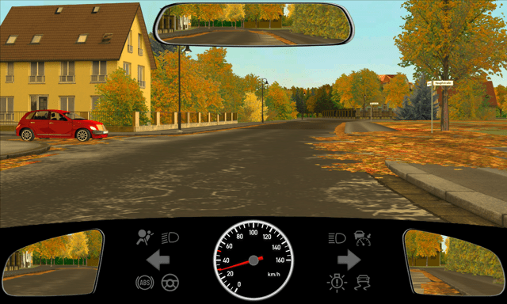
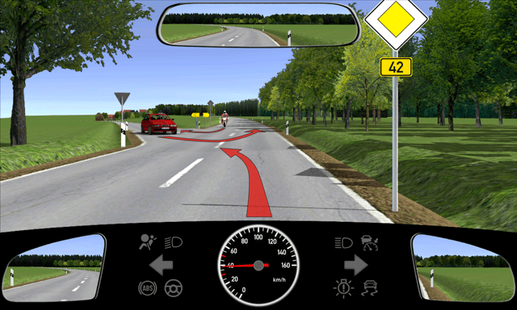
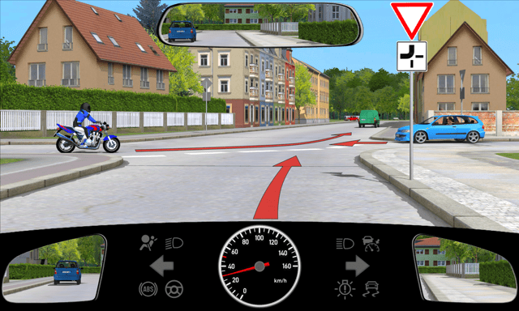
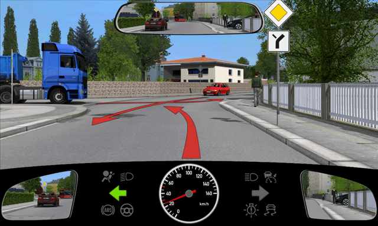
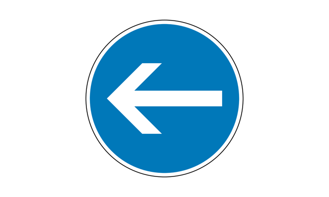
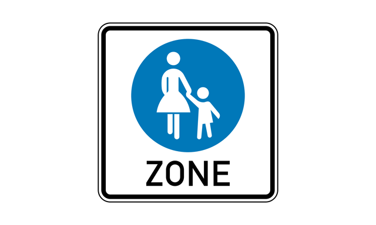
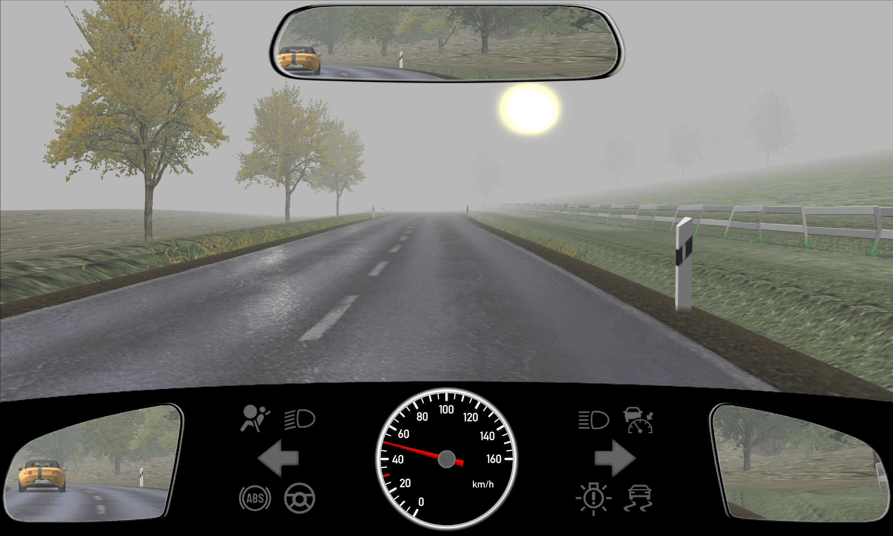
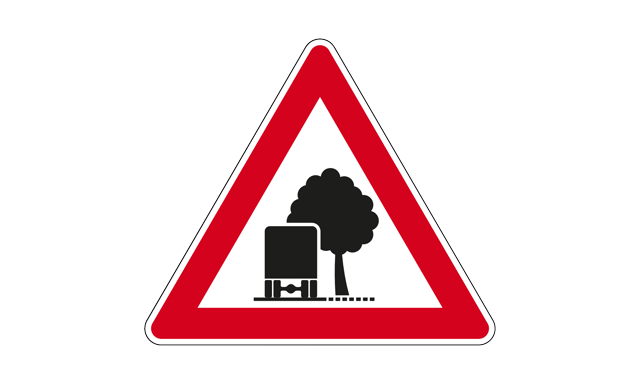
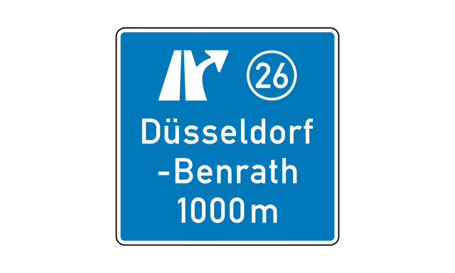
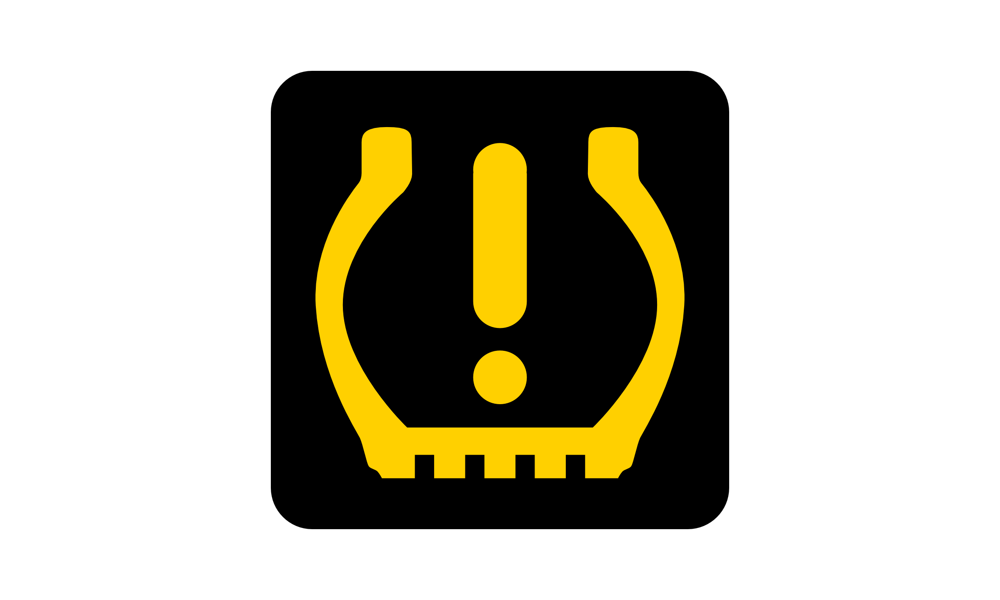

# Fahrschule Theoriefragen (Deutsch)

## Thema 1.1. Gefahrenlehre

### 1.1.01 Kapitel Grundformen Des Verkehrsverhaltens

#### Frage 1.1.01-001

**Punkte:** 4 Punkte

**Was versteht man unter defensivem Fahren?**

**Optionen:**
- A. Nicht auf dem eigenen Recht bestehen
- B. Mit Fehlern anderer rechnen
- C. Vorsorglich an jeder Kreuzung anhalten

**Richtige Antwort(en):**
- A. Nicht auf dem eigenen Recht bestehen
- B. Mit Fehlern anderer rechnen

**Erklärung:**
Defensives Fahren bedeutet, dass Sie im Straßenverkehr einerseits nicht auf Ihrem Vorrecht beharren und andererseits auch potenzielle Fehler der anderen Verkehrsteilnehmer in Betracht ziehen. Deshalb müssen Sie nicht übervorsichtig fahren – dies könnte wiederum eine eigene Gefahr darstellen und den Verkehrsfluss behindern. Defensiv zu fahren heißt, sich auf Gefahren, die von Ihnen selbst ausgehen oder von außen drohen, bestmöglich vorzubereiten und sie so rechtzeitig abzuwenden. Dies erreichen Sie zum Beispiel, indem Sie früh genug bremsen, um einen Auffahrunfall vor einer Ampel zu vermeiden. Generell langsamer zu fahren, schützt Sie gegenüber Fahrern, die im Eifer des Gefechts eine Ampelphase falsch beurteilen oder links und rechts verwechseln.

---

#### Frage 1.1.01-002

**Punkte:** 4 Punkte

**Was kann zu Auffahrunfällen führen?**

**Optionen:**
- A. Unerwartet starkes Bremsen
- B. Unaufmerksamkeit
- C. Zu dichtes Auffahren

**Richtige Antwort(en):**
- A. Unerwartet starkes Bremsen
- B. Unaufmerksamkeit
- C. Zu dichtes Auffahren

**Erklärung:**
Es gibt mehrere mögliche Szenarien, die zu Auffahrunfällen führen. Bremst jemand zu plötzlich und überraschend, kann es zu einem Zusammenstoß kommen. Zu dichtes Auffahren ist ebenfalls ein häufiger Grund für Auffahrunfälle, besonders wenn der hintere Fahrer abgelenkt und unkonzentriert ist. Ein genügend großer Sicherheitsabstand kann helfen, solche Risiken zu vermeiden.

---

#### Frage 1.1.01-003

**Punkte:** 2 Punkte

**Welches Verhalten ist beispielhaft für „Vorausschauendes Fahren“?**

**Optionen:**
- A. Ich reagiere möglichst frühzeitig auf wahrscheinliche Veränderungen der Verkehrssituation
- B. Ich versuche, die Absichten anderer Verkehrsteilnehmer möglichst frühzeitig zu erkennen
- C. Ich beschränke die Verkehrsbeobachtung möglichst auf das direkt vor mir fahrende Fahrzeug

**Richtige Antwort(en):**
- A. Ich reagiere möglichst frühzeitig auf wahrscheinliche Veränderungen der Verkehrssituation
- B. Ich versuche, die Absichten anderer Verkehrsteilnehmer möglichst frühzeitig zu erkennen

**Erklärung:**
Vorausschauend zu fahren ist wesentlich, wenn es um die Sicherheit im Straßenverkehr geht. Dabei sollten Sie direkt vor Ihnen fahrende Autos stets im Auge behalten, um gegebenenfalls sofort reagieren zu können. Dasselbe gilt auch für sämtliche Verkehrsteilnehmer in Ihrer Umgebung.

---

#### Frage 1.1.01-004

**Punkte:** 3 Punkte

**Sie sollen ein Ihnen unbekanntes Kraftfahrzeug fahren. Warum müssen Sie dabei zunächst besonders vorsichtig sein?**

**Optionen:**
- A. - in der Anordnung und der Funktion der Bedienelemente
- B. - im Bremsverhalten
- C. - im Lenkverhalten

**Richtige Antwort(en):**
- A. - in der Anordnung und der Funktion der Bedienelemente
- B. - im Bremsverhalten
- C. - im Lenkverhalten

**Erklärung:**
Jeder Fahrer ist an Fahrverhalten und Eigenschaften seines Kraftfahrzeugs gewöhnt. Jedes Fahrzeug hat ein unterschiedliches Fahrverhalten, bedingt durch seinen speziellen Schwerpunkt, seine Abmessungen und sein Gewicht. Selbst Kupplung, Kurvenverhalten und Bremsweg gleicher Modelle können sich unterscheiden. Mit diesen Eigenschaften hat sich der Fahrer vorsichtig vertraut zu machen, ebenso mit den Bedienelementen der Armaturen.

---

#### Frage 1.1.01-101

**Punkte:** 3 Punkte

**Sie fahren innerorts hinter einem Fahrzeug mit ortsfremdem Kennzeichen. Was könnte geschehen?**

**Optionen:**
- A. - bremst unerwartet
- B. - betätigt den Blinker vor dem Abbiegen zu spät
- C. - hält unerwartet an, um nach dem Weg zu fragen

**Richtige Antwort(en):**
- A. - bremst unerwartet
- B. - betätigt den Blinker vor dem Abbiegen zu spät
- C. - hält unerwartet an, um nach dem Weg zu fragen

**Erklärung:**
Sollten Sie anhand des Kennzeichens einen ortsfremden Verkehrsteilnehmer identifizieren, müssen Sie aufgrund dessen fehlender Ortskenntnis mit unerwarteten Manövern rechnen. Beispielsweise könnte der entsprechende Fahrer auf offener Fahrbahn anhalten, um sich bei einem Passanten nach dem Weg zu erkundigen. Ferner wäre es möglich, dass der Ortsfremde den richtigen Fahrweg verspätet erkennt und daher vor Kurven, Kreuzungen und Ausfahrten erst spät bremst oder blinkt.

---

#### Frage 1.1.01-102

**Punkte:** 3 Punkte

**Was sind vermeidbare Behinderungen im fließenden Verkehr?**

**Optionen:**
- A. Abwürgen des Motors
- B. Langsamfahren ohne triftigen Grund
- C. Liegenbleiben wegen Kraftstoffmangels

**Richtige Antwort(en):**
- A. Abwürgen des Motors
- B. Langsamfahren ohne triftigen Grund
- C. Liegenbleiben wegen Kraftstoffmangels

**Erklärung:**
Eine vermeidbare Behinderung des Straßenverkehrs ist zum einen das Abwürgen des Motors. Dies ist vor allem ein Anfängerfehler, der im schlimmsten Fall einen Auffahrunfall nach sich ziehen kann. Durch entsprechendes Üben auf abgelegenen Straßen lässt sich dies jedoch leicht beheben. Zudem muss laut Straßenverkehrsordnung jedes Fahrzeug rechtzeitig aufgetankt werden, um ein Liegenbleiben zu verhindern. Schließlich gehört es auch zu Ihrer Pflicht als Autofahrer, in angemessenem Tempo zu fahren, also auch niemals grundlos so langsam, dass Sie dadurch den Verkehr behindern und einen Unfall provozieren könnten.

---

#### Frage 1.1.01-103

**Punkte:** 3 Punkte

**Warum darf man nicht unnötig langsam fahren?**

**Optionen:**
- A. Weil der Verkehrsfluss behindert wird
- B. Weil die Gefahr von Auffahrunfällen erhöht wird
- C. Weil Nachfolgende zu gefährlichem Überholen verleitet werden

**Richtige Antwort(en):**
- A. Weil der Verkehrsfluss behindert wird
- B. Weil die Gefahr von Auffahrunfällen erhöht wird
- C. Weil Nachfolgende zu gefährlichem Überholen verleitet werden

**Erklärung:**
Die Straßenverkehrsordnung verbietet unnötiges Langsamfahren, da es den Verkehrsfluss behindert und das Unfallrisiko stark erhöht: Es verleitet nachfolgende Verkehrsteilnehmer zu riskanten Überholmanövern an unübersichtlichen Stellen. Zudem steigt die Gefahr von Auffahrunfällen durch die entstehenden Geschwindigkeitsunterschiede drastisch.

---

#### Frage 1.1.01-104

**Punkte:** 4 Punkte

**Wodurch kann eine Gefährdung entstehen?**

**Optionen:**
- A. Durch abgefahrene Reifen
- B. Durch zu hoch eingestellte Scheinwerfer
- C. Durch auffällige Lackierung des Fahrzeugs

**Richtige Antwort(en):**
- A. Durch abgefahrene Reifen
- B. Durch zu hoch eingestellte Scheinwerfer

**Erklärung:**
Zu Sicherheitsrisiken zählen falsch eingestellte Scheinwerfer. Sind sie zu tief eingestellt, schaffen sie schlechte Sichtverhältnisse für den Fahrer. Zu hoch eingestellte Scheinwerfer können zu extremen Blendungen des Gegenverkehrs führen und schwere Unfälle verursachen. Die Profiltiefe der Reifen ist ein wichtiger Sicherheitsfaktor. Abgefahrene Reifen haben bei regennasser Fahrbahn einen viel längeren Bremsweg. Die gesetzlich vorgeschriebene Profiltiefe von 1,6 Millimetern reicht sicherheitstechnisch nicht aus. Bei dieser Profiltiefe ist die Gefahr des Aquaplanings bereits sehr hoch. Bei Aquaplaning rutscht das Fahrzeug unkontrollierbar.

---

#### Frage 1.1.01-107

**Punkte:** 4 Punkte

**Welche Anzeichen warnen während der Fahrt vor aufkommender Müdigkeit?**

**Optionen:**
- A. Schwere Augenlider
- B. Häufiges Gähnen
- C. Verkürzte Reaktionszeit

**Richtige Antwort(en):**
- A. Schwere Augenlider
- B. Häufiges Gähnen

**Erklärung:**
Müdigkeit führt während der Autofahrt zu verlängerten Reaktionszeiten sowie zu verminderter Aufmerksamkeit. Zu ihren Anzeichen gehört unter anderem übermäßiges Gähnen. Ferner erkennen Sie Schlafmangel daran, dass es Ihnen zunehmend schwerer fällt, Ihre Augen offen zu halten.

---

#### Frage 1.1.01-108

**Punkte:** 4 Punkte

**Welche Folgen kann die Missachtung von Müdigkeitsanzeichen nach sich ziehen?**

**Optionen:**
- A. Sekundenschlaf
- B. Konzentrationsmangel
- C. Fahrfehler

**Richtige Antwort(en):**
- A. Sekundenschlaf
- B. Konzentrationsmangel
- C. Fahrfehler

**Erklärung:**
Erste Anzeichen von Müdigkeit wie zum Beispiel schwindende Konzentrationsfähigkeit sollten Sie keinesfalls ignorieren, denn es kann passieren, dass Sie in der Folge von Sekundenschlaf überwältigt werden. Dieser wiederum führt häufig zu gravierenden, mitunter sogar lebensgefährlichen Fahrfehlern.

---

#### Frage 1.1.01-109

**Punkte:** 4 Punkte

**Was ist zu tun, wenn Sie während der Fahrt Anzeichen von Müdigkeit spüren?**

**Optionen:**
- A. Unverzüglich eine Pause einlegen
- B. Sich an frischer Luft bewegen
- C. Anregende Musik hören

**Richtige Antwort(en):**
- A. Unverzüglich eine Pause einlegen
- B. Sich an frischer Luft bewegen

**Erklärung:**
Da Müdigkeit während der Autofahrt zu gefährlichen Situationen führen kann, sollten Sie bei längeren Strecken ausreichend Pausen einplanen. Während dieser Erholungsphase empfiehlt sich ein Spaziergang an der frischen Luft, um den Kreislauf wieder in Schwung zu bringen.

---

#### Frage 1.1.01-110

**Punkte:** 4 Punkte

**Wie wirkt sich Müdigkeit beim Fahren aus?**

**Optionen:**
- A. Nachlassende Aufmerksamkeit
- B. Eingeschränkte Wahrnehmung
- C. Verzögerte Reaktionen

**Richtige Antwort(en):**
- A. Nachlassende Aufmerksamkeit
- B. Eingeschränkte Wahrnehmung
- C. Verzögerte Reaktionen

**Erklärung:**
Durch Müdigkeit am Steuer steigt das Unfallrisiko aus folgenden Gründen: Mit der Konzentration lässt die Aufmerksamkeit spürbar nach; die Wahrnehmung ist eingeschränkt, die Reaktion deutlich verzögert.

---

#### Frage 1.1.01-111

**Punkte:** 4 Punkte

**Wodurch kann eine gefährliche Situation entstehen?**

**Optionen:**
- A. Durch liegen gebliebene Fahrzeuge
- B. Durch nicht angepasste Geschwindigkeit
- C. Durch eingeschaltete Beleuchtung am Tage

**Richtige Antwort(en):**
- A. Durch liegen gebliebene Fahrzeuge
- B. Durch nicht angepasste Geschwindigkeit

**Erklärung:**
Ein Hauptgrund für eine Gefährdung im Straßenverkehr ist zu schnelles Fahren. Dies gilt insbesondere für Anfänger, die dann leicht die Kontrolle über ihr Fahrzeug verlieren. Andere Verkehrsteilnehmer sind auf eine unerwartet hohe Geschwindigkeit oft nicht vorbereitet. Doch auch ein zu geringes Fahrtempo kann eine Gefährdung darstellen, da sich in diesem Fall riskante Überholmanöver und Auffahrunfälle häufen. Darüber hinaus können stehen gebliebene Fahrzeuge zu einem gefährlichen Hindernis werden. Um von anderen Fahrern besser gesehen zu werden, hilft es, die Beleuchtung Ihres Fahrzeugs auch tagsüber einzuschalten.

---

#### Frage 1.1.01-112

**Punkte:** 4 Punkte

**Was kann zum Abkommen von der Fahrbahn führen?**

**Optionen:**
- A. Ablenkung
- B. Unaufmerksamkeit
- C. Müdigkeit

**Richtige Antwort(en):**
- A. Ablenkung
- B. Unaufmerksamkeit
- C. Müdigkeit

**Erklärung:**
Häufig kommen Fahrer durch Unaufmerksamkeit oder Unkonzentriertheit von der Fahrbahn ab. Auch Ablenkungen, etwa das Telefonieren mit dem Handy, können zu solchen Fahrfehlern führen. Eine dritte Ursache für das Abkommen von der Straße ist Müdigkeit in Verbindung mit Sekundenschlaf.

---

#### Frage 1.1.01-113

**Punkte:** 4 Punkte

**Was führt häufig zu schweren Unfällen?**

**Optionen:**
- A. Eine mangelhafte Beobachtung des Verkehrs
- B. Ein Fahren mit zu geringem Abstand
- C. Eine unangepasste Geschwindigkeit

**Richtige Antwort(en):**
- A. Eine mangelhafte Beobachtung des Verkehrs
- B. Ein Fahren mit zu geringem Abstand
- C. Eine unangepasste Geschwindigkeit

**Erklärung:**
Schwere Unfälle resultieren häufig: durch riskante Überholmanöver und Auffahrunfälle durch unnötiges Langsamfahren, durch Müdigkeit und verzögerte Reaktionen sowie durch Kinder, die unvorhersehbar und unüberlegt handeln.

---

### 1.1.02 Kapitel Verhalten Gegenueber Fussgaengern

#### Frage 1.1.02-004

**Punkte:** 4 Punkte

**Womit ist zu rechnen, wenn man sich Kindern nähert?**

**Optionen:**
- A. Mit unüberlegtem Verhalten der Kinder
- B. Mit schnellem und richtigem Reagieren der Kinder
- C. Mit verkehrsgerechtem Verhalten der Kinder

**Richtige Antwort(en):**
- A. Mit unüberlegtem Verhalten der Kinder

**Erklärung:**
Kinder können sich jederzeit unüberlegt verhalten und sind aus diesem Grund vom Vertrauensgrundsatz gegenüber anderen Verkehrsteilnehmern ausgenommen. Wenn sich Kinder nähern, müssen Sie daher Ihre Geschwindigkeit reduzieren, um bremsbereit zu sein.

---

#### Frage 1.1.02-005

**Punkte:** 5 Punkte

**Mit welchem Verhalten von Kindern müssen Sie an Zebrastreifen rechnen?**

**Optionen:**
- A. Sie laufen auf den Zebrastreifen, ohne auf den Verkehr zu achten
- B. Sie kehren ohne erkennbaren Grund auf dem Zebrastreifen um und laufen zurück
- C. Sie schätzen Geschwindigkeit und Entfernung herannahender Fahrzeuge immer richtig ein und warten am Fahrbahnrand

**Richtige Antwort(en):**
- A. Sie laufen auf den Zebrastreifen, ohne auf den Verkehr zu achten
- B. Sie kehren ohne erkennbaren Grund auf dem Zebrastreifen um und laufen zurück

**Erklärung:**
Kinder haben grundsätzlich nicht die nötige Ausbildung, um sich im Straßenverkehr immer regelkonform zu verhalten. Daher ist es ohne Weiteres denkbar, dass sie die Bedeutung eines Zebrastreifens nicht kennen und trotz herannahender Fahrzeuge die Straße betreten oder nach deren Überquerung plötzlich zurücklaufen.

---

#### Frage 1.1.02-009-B

**Punkte:** 5 Punkte

**Wie müssen Sie sich verhalten?**

**Optionen:**
- A. Sofort stark bremsen und bremsbereit bleiben
- B. Mit gleicher Geschwindigkeit weiterfahren, weil die Kinder bestimmt stehen bleiben
- C. Mit gleicher Geschwindigkeit weiterfahren, um einen Nachfolgenden nicht zu behindern

**Richtige Antwort(en):**
- A. Sofort stark bremsen und bremsbereit bleiben

**Erklärung:**
Wenn plötzlich ein Kind über die Straße rennt, ohne auf den Verkehr zu achten, sollten Sie sofort Ihre Geschwindigkeit drosseln und bremsbereit weiterfahren. Achten Sie auch darauf, ob weitere Kinder folgen. Es ist unbedingt erforderlich, im Schritttempo zu bleiben, um, falls nötig, ganz anhalten zu können.

---

#### Frage 1.1.02-022

**Punkte:** 4 Punkte

**Womit ist zu rechnen, wenn Kinder an einer Ampel warten?**

**Optionen:**
- A. - schon losrennen, wenn die Ampel in meiner Fahrtrichtung von Grün auf Gelb umschaltet
- B. - auch bei Rot loslaufen, weil es ihnen zu lange dauert
- C. - sich gegenseitig auf die Fahrbahn schubsen

**Richtige Antwort(en):**
- A. - schon losrennen, wenn die Ampel in meiner Fahrtrichtung von Grün auf Gelb umschaltet
- B. - auch bei Rot loslaufen, weil es ihnen zu lange dauert
- C. - sich gegenseitig auf die Fahrbahn schubsen

**Erklärung:**
Aufgrund mangelnder Lebenserfahrung sowie unzureichender Ausbildung verhalten sich Kinder im Straßenverkehr nicht immer regelkonform und geraten beispielsweise während einer Rangelei auf die Fahrbahn. Ferner müssen Sie damit rechnen, dass Kinder plötzlich über die Straße laufen, selbst wenn ihre Ampel noch Rot zeigt oder die des Querverkehrs gerade umspringt.

---

#### Frage 1.1.02-023

**Punkte:** 4 Punkte

**Ein Radweg, auf dem eine Gruppe von Kindern fährt, endet. Womit muss gerechnet werden?**

**Optionen:**
- A. - bedenkenlos auf die Fahrbahn wechseln
- B. - zu weit in die Fahrbahn kommen
- C. - absteigen und warten, bis alles frei ist

**Richtige Antwort(en):**
- A. - bedenkenlos auf die Fahrbahn wechseln
- B. - zu weit in die Fahrbahn kommen

**Erklärung:**
Insbesondere Kinder, die mit den Verkehrsregeln grundsätzlich nicht übermäßig vertraut sind, neigen zu unvorhersehbaren Manövern. Daher sollten Sie vor allem am Ende eines Radweges darauf achten, dass die jungen Verkehrsteilnehmer ohne Vorwarnung auf die Straße fahren könnten. Ferner kommt es häufig vor, dass Kinder in Gruppen nebeneinander fahren und dadurch teilweise auf Ihre Fahrbahn ausscheren.

---

#### Frage 1.1.02-024-B

**Punkte:** 4 Punkte

**Was ist hier richtig?**

**Optionen:**
- A. Man darf mit Schrittgeschwindigkeit rechts vorbeifahren, wenn Fahrgäste nicht behindert werden und eine Gefährdung ausgeschlossen ist
- B. Wenn niemand behindert oder gefährdet wird, darf man rechts auch schneller als mit Schrittgeschwindigkeit vorbeifahren
- C. Die Fahrgäste müssen vor dem Einsteigen den fließenden Verkehr durchlassen

**Richtige Antwort(en):**
- A. Man darf mit Schrittgeschwindigkeit rechts vorbeifahren, wenn Fahrgäste nicht behindert werden und eine Gefährdung ausgeschlossen ist

**Erklärung:**
Wenn Sie die ein- oder aussteigenden Fahrgäste nicht behindern oder gefährden, dürfen Sie an der haltenden Straßenbahn langsam mit Schrittgeschwindigkeit vorbeifahren. Wichtig ist dabei: Die Fahrgäste haben in dieser Situation den absoluten Vorrang und müssen den fließenden Verkehr nicht durchlassen. Falls es notwendig ist, müssen Sie als Fahrzeugführer anhalten und warten.

---

#### Frage 1.1.02-026-B

**Punkte:** 4 Punkte

**Was müssen Sie in dieser Situation beachten?**

**Optionen:**
- A. - den Bus so lange nicht überholen, wie er noch fährt
- B. - an dem haltenden Bus mit Schrittgeschwindigkeit vorbeifahren, wenn eine Gefährdung von Fahrgästen ausgeschlossen ist
- C. - den Bus überholen, solange er noch fährt

**Richtige Antwort(en):**
- A. - den Bus so lange nicht überholen, wie er noch fährt
- B. - an dem haltenden Bus mit Schrittgeschwindigkeit vorbeifahren, wenn eine Gefährdung von Fahrgästen ausgeschlossen ist

**Erklärung:**
Wenn ein Linienbus oder Schulbus die Warnblinkanlage eingeschaltet hat und noch fährt, dürfen Sie ihn nicht überholen. Ist der Bus an der Haltestelle zum Stehen gekommen, können Sie im Schritttempo und in gebührendem Abstand vorbeifahren. Dies ist nötig, um die ein- und aussteigenden Fahrgäste nicht zu gefährden. Sind Sie auf der Gegenfahrbahn unterwegs, müssen Sie ebenfalls die Geschwindigkeit drosseln oder anhalten, um die Sicherheit der Fahrgäste zu gewährleisten.

---

#### Frage 1.1.02-027

**Punkte:** 4 Punkte

**Womit müssen Sie rechnen, wenn ältere Personen mit Gehhilfe die Fahrbahn überqueren?**

**Optionen:**
- A. Dass sie auf der Fahrbahn stehen bleiben
- B. Dass sie auf der Fahrbahn umkehren
- C. Dass sie die Fahrbahn langsam überqueren

**Richtige Antwort(en):**
- A. Dass sie auf der Fahrbahn stehen bleiben
- B. Dass sie auf der Fahrbahn umkehren
- C. Dass sie die Fahrbahn langsam überqueren

**Erklärung:**
Wenn ältere Personen mit Gehhilfe die Straße überqueren, gilt für Sie erhöhte Sorgfaltspflicht. Der Vertrauensgrundsatz ist aufgehoben. Sie müssen damit rechnen, dass diese Personen plötzlich stehen bleiben oder unerwartet wieder umdrehen. Auch brauchen ältere Menschen beim Überqueren der Fahrbahn vergleichsweise lange.

---

#### Frage 1.1.02-028

**Punkte:** 4 Punkte

**Trotz vorhandenen Gehweges auf der rechten Straßenseite fährt eine Person im Rollstuhl auf der Straße. Wie verhalten Sie sich?**

**Optionen:**
- A. Ich fahre so lange hinterher, bis ich überholen kann
- B. Ich überhole mit großem Seitenabstand, weil ich mit Ausweichbewegungen rechnen muss
- C. Ich mache die Person durch Hupen darauf aufmerksam, dass sie sich falsch verhält

**Richtige Antwort(en):**
- A. Ich fahre so lange hinterher, bis ich überholen kann
- B. Ich überhole mit großem Seitenabstand, weil ich mit Ausweichbewegungen rechnen muss

**Erklärung:**
Behinderte und ältere Personen verhalten sich aufgrund körperlicher Einschränkungen manchmal nicht verkehrsgerecht. Seien Sie deshalb bitte besonders vorsichtig und nehmen Sie unbedingt Rücksicht. Rechnen Sie damit, dass der Rollstuhlfahrer plötzlich und unerwartet ausweicht und noch weiter auf die Fahrbahn fährt. Es ist in solchen Situationen nicht erlaubt, die Hupe zu benutzen oder um die Person mit hoher Geschwindigkeit herumzufahren.

---

#### Frage 1.1.02-029

**Punkte:** 4 Punkte

**Eine Person im Rollstuhl schafft es nach dem Überqueren der Straße nicht, mit dem Rollstuhl den Bordstein zu überwinden, um den Gehweg zu erreichen. Wie verhalten Sie sich?**

**Optionen:**
- A. Ich halte und schalte die Warnblinkanlage ein
- B. Ich steige aus und helfe der Person im Rollstuhl
- C. Ich hupe und fahre um die Person herum

**Richtige Antwort(en):**
- A. Ich halte und schalte die Warnblinkanlage ein
- B. Ich steige aus und helfe der Person im Rollstuhl

**Erklärung:**
Sie sollten der Person helfen. Dafür dürfen Sie anhalten und die Warnblinkanlage einschalten, um andere Verkehrsteilnehmer vor möglichen Gefahren zu warnen. Es ist nicht erlaubt, in dieser Situation zu hupen und um die Person herumzufahren. Dadurch würden Sie den Rollstuhlfahrer erschrecken und verunsichern.

---

#### Frage 1.1.02-032

**Punkte:** 4 Punkte

**Bei welcher Person müssen Sie mit einer schweren Sehbehinderung rechnen?**

**Optionen:**
- A. Dem Mann
- B. Dem Kind
- C. Der Frau

**Richtige Antwort(en):**
- A. Dem Mann

**Erklärung:**
Bei Personen mit folgenden Kennzeichen müssen Sie mit einer schweren Sehbehinderung rechnen: Wenn eine Person eine gelbe Armbinde mit drei schwarzen Punkten und/oder einen weißen, schräg vorgestreckten Blindenstock trägt.

---

#### Frage 1.1.02-036

**Punkte:** 4 Punkte

**Wie verhalten Sie sich?**

**Optionen:**
- A. Anhalten
- B. Den Mann die Straße überqueren lassen
- C. Blickkontakt aufnehmen

**Richtige Antwort(en):**
- A. Anhalten
- B. Den Mann die Straße überqueren lassen

**Erklärung:**
Sehbehinderte Fußgänger tragen häufig eine Armbinde und haben einen Blindenhund mit weißem Fahrgeschirr bei sich. Es ist nicht möglich, mit einem sehbehinderten Verkehrsteilnehmer Blickkontakt aufzunehmen. Daher sind Sie hier zu besonderer Rücksichtnahme verpflichtet. Sie müssen anhalten, um dem Fußgänger ein gefahrloses Überqueren der Fahrbahn zu ermöglichen.

---

#### Frage 1.1.02-037

**Punkte:** 3 Punkte

**Womit müssen Sie rechnen?**

**Optionen:**
- A. Personen überqueren vor dem Bus die Straße
- B. Personen rennen von links über die Straße, um den Bus zu erreichen
- C. Der Bus fährt plötzlich rückwärts

**Richtige Antwort(en):**
- A. Personen überqueren vor dem Bus die Straße
- B. Personen rennen von links über die Straße, um den Bus zu erreichen

**Erklärung:**
Wo Busse oder Straßenbahnen an Haltestellen warten, müssen Sie stets davon ausgehen, dass hier plötzlich Personen auf die Fahrbahn treten. Manche Fahrgäste rennen schnell über die Straße, um den Bus noch zu erreichen. Beim Aussteigen betreten Personen häufig überraschend die Fahrbahn, ohne auf den Verkehr zu achten. Wegen des nicht leuchtenden Rückfahrscheinwerfers können Sie als nachfolgender Fahrzeugführer grundsätzlich darauf vertrauen, dass der Bus die Haltestelle vorwärtsfahrend verlassen wird.

---

#### Frage 1.1.02-038-M

**Punkte:** 4 Punkte

**Mit welchen Gefahren müssen Sie rechnen?**

**Optionen:**
- A. - auf die Fahrbahn fahren
- B. - auf dem Radweg weiterfahren
- C. - stehen bleiben

**Richtige Antwort(en):**
- A. - auf die Fahrbahn fahren

**Erklärung:**
Fahrradfahrer verhalten sich nicht immer verkehrsgerecht. Hier könnte das Kind, auch wenn es vorher zu Ihnen nach links gesehen hat, auf die Fahrbahn fahren. Um eine gefährliche Situation zu vermeiden, sollten Sie daher Ihr Tempo senken und in Bremsbereitschaft gehen.

---

#### Frage 1.1.02-039-M

**Punkte:** 4 Punkte

**Wie verhalten Sie sich?**

**Optionen:**
- A. Kinder beobachten
- B. Bremsbereit sein
- C. Mit unveränderter Geschwindigkeit weiterfahren

**Richtige Antwort(en):**
- A. Kinder beobachten
- B. Bremsbereit sein

**Erklärung:**
Reduzieren Sie die Geschwindigkeit und beobachten Sie die beiden Kinder sehr genau. Seien Sie vorsichtig und bremsbereit. Halten Sie an, wenn das Verhalten der Kinder dies erforderlich macht.

---

#### Frage 1.1.02-040-M

**Punkte:** 5 Punkte

**Womit müssen Sie rechnen?**

**Optionen:**
- A. - nach links abbiegen
- B. - auf die andere Straßenseite fahren
- C. - mich beim Weiterfahren nicht beeinträchtigen

**Richtige Antwort(en):**
- A. - nach links abbiegen
- B. - auf die andere Straßenseite fahren

**Erklärung:**
Es ist immer möglich, dass sich Radfahrer nicht verkehrsgerecht verhalten. Ein Radfahrer könnte nach links abbiegen oder die Straßenseite wechseln, ohne dies mit Handzeichen anzuzeigen. Bei zwei Radfahrern ist es möglich, dass der zweite ebenfalls ohne Handzeichen dem ersten folgt. Deshalb sollten Sie bremsbereit sein, auch wenn die Radfahrer weiter geradeaus fahren.

---

#### Frage 1.1.02-041-M

**Punkte:** 5 Punkte

**Mit welchen Gefahren müssen Sie rechnen?**

**Optionen:**
- A. Die Kinder verlassen die Fahrbahn nicht rechtzeitig
- B. Einzelne Kinder kehren wieder um
- C. Alle Kinder warten auf dem Gehweg

**Richtige Antwort(en):**
- A. Die Kinder verlassen die Fahrbahn nicht rechtzeitig
- B. Einzelne Kinder kehren wieder um

**Erklärung:**
Liegt ein Ball auf der Straße, ist davon auszugehen, dass ein Kind ihn holen kommen wird. Für Sie als Autofahrer heißt das: sofort anhalten, damit das Kind den Ball gefahrlos holen kann. Bei Kindern müssen Sie damit rechnen, dass sie sich verkehrswidrig verhalten und Gefahren nicht richtig einschätzen können.

---

#### Frage 1.1.02-042-M

**Punkte:** 5 Punkte

**Wie sollten Sie sich verhalten?**

**Optionen:**
- A. Auf Schrittgeschwindigkeit abbremsen
- B. Bremsbereit bleiben
- C. Unvermindert weiterfahren

**Richtige Antwort(en):**
- A. Auf Schrittgeschwindigkeit abbremsen
- B. Bremsbereit bleiben

**Erklärung:**
Hier gilt: Geschwindigkeit sofort reduzieren, bremsbereit sein und langsam an der Situation vorbeifahren. Bei spielenden Kindern ist davon auszugehen, dass sie nicht auf den Verkehr achten und sich nicht verkehrsgerecht verhalten.

---

#### Frage 1.1.02-043-M

**Punkte:** 5 Punkte

**Wie müssen Sie sich verhalten?**

**Optionen:**
- A. Sofort auf Schrittgeschwindigkeit abbremsen
- B. Bremsbereit bleiben
- C. Mit unverminderter Geschwindigkeit vorbeifahren

**Richtige Antwort(en):**
- A. Sofort auf Schrittgeschwindigkeit abbremsen
- B. Bremsbereit bleiben

**Erklärung:**
Höchstwahrscheinlich wird dem Ball hinterher ein Kind auf die Straße gerannt kommen, ohne dabei auf den Verkehr zu achten. Verlangsamen Sie Ihr Fahrzeug sofort auf Schrittgeschwindigkeit. Seien Sie besonders aufmerksam und bremsbereit!

---

#### Frage 1.1.02-046-M

**Punkte:** 4 Punkte

**Welche Fahrzeuge dürfen hier nur mit Schrittgeschwindigkeit und unter Ausschluss jeglicher Gefährdung der Fahrgäste vorbeifahren?**

**Optionen:**
- A. - in gleicher Richtung fahren
- B. - entgegenkommen

**Richtige Antwort(en):**
- A. - in gleicher Richtung fahren
- B. - entgegenkommen

**Erklärung:**
Wenn an einer Haltestelle die Warnblinkanlage eines Busses angeschaltet ist, müssen in beiden Fahrtrichtungen alle Fahrzeuge den Bus mit Schrittgeschwindigkeit passieren. Eine Gefährdung oder Behinderung der ein- und aussteigenden Fahrgäste ist auszuschließen.

---

#### Frage 1.1.02-048-M

**Punkte:** 5 Punkte

**Wie sollten Sie sich jetzt verhalten?**

**Optionen:**
- A. Ich bremse auf Schrittgeschwindigkeit ab
- B. Ich bleibe bremsbereit
- C. Ich überhole [den Radfahrer]

**Richtige Antwort(en):**
- A. Ich bremse auf Schrittgeschwindigkeit ab
- B. Ich bleibe bremsbereit

**Erklärung:**
Da sich Kinder sowohl links, als auch rechts auf der Straße befinden, solltest du auf Schrittgeschwindigkeit abbremsen und bremsbereit bleiben.

---

#### Frage 1.1.02-049

**Punkte:** 4 Punkte

**Wie verhalten Sie sich in dieser Situation?**

**Optionen:**
- A. Ich führe eine Gefahrenbremsung durch
- B. Ich hupe und fahre weiter
- C. Ich beschleunige

**Richtige Antwort(en):**
- A. Ich führe eine Gefahrenbremsung durch

**Erklärung:**
Führen Sie sofort eine Gefahrenbremsung durch, um einen Zusammenstoß mit dem von links kommenden Radfahrer zu verhindern. Weiterzufahren wäre in der Situation gefährlich, obwohl die Ampel in Ihrer Richtung Grün zeigt.

---

#### Frage 1.1.02-050-M

**Punkte:** 5 Punkte

**Warum müssen Sie hier langsam und bremsbereit fahren?**

**Optionen:**
- A. Weil die Verkehrssituation unübersichtlich ist
- B. Weil sich ein Kind auf der Fahrbahn befindet
- C. Weil [der weiße Transporter] anfährt

**Richtige Antwort(en):**
- A. Weil die Verkehrssituation unübersichtlich ist
- B. Weil sich ein Kind auf der Fahrbahn befindet

**Erklärung:**
Das Kind hinter dem links stehenden Transporter läuft in Richtung Fahrbahn. Sie können nicht erkennen, ob es stehen bleiben wird. Seien Sie daher in dieser unübersichtlichen Verkehrssituation besonders aufmerksam und vorsichtig. Fahren Sie langsam und seien Sie bremsbereit.

---

#### Frage 1.1.02-051-M

**Punkte:** 4 Punkte

**Wie verhalten Sie sich in dieser Situation richtig?**

**Optionen:**
- A. Ich halte an und lasse die Person die Straße überqueren
- B. Ich fahre mit ausreichendem Abstand links an der Person vorbei
- C. Ich signalisiere der Person durch Betätigung der Lichthupe, dass ich warte

**Richtige Antwort(en):**
- A. Ich halte an und lasse die Person die Straße überqueren

**Erklärung:**
Der Mann, trägt eine gelbe Armbinde und führt einen Blindenhund mit sich. Er ist blind oder sehbehindert und kann die Verkehrssituation nicht sehen. Blinden gegenüber gilt besondere Rücksicht. Daher musst du ihn vor dir die Straße überqueren lassen.

---

#### Frage 1.1.02-052

**Punkte:** 4 Punkte

**Warum müssen Sie damit rechnen, dass Kinder sich im Straßenverkehr unvorhersehbar verhalten?**

**Optionen:**
- A. - leicht ablenkbar sind
- B. - die Verkehrssituation häufig nur unvollständig überblicken können
- C. - oft nicht zuordnen können, aus welcher Richtung ein Geräusch kommt

**Richtige Antwort(en):**
- A. - leicht ablenkbar sind
- B. - die Verkehrssituation häufig nur unvollständig überblicken können
- C. - oft nicht zuordnen können, aus welcher Richtung ein Geräusch kommt

**Erklärung:**
Kinder verhalten sich oftmals unvorhersehbar, weshalb andere Verkehrsteilnehmer bei Kindern immer mit dem Unerwarteten rechnen müssen. Durch äußere Reize in der Umwelt werden kleine Kinder ständig von der Straße und dem Verkehr abgelenkt. Sie lassen ihren Blick kontinuierlich in der Umgebung wandern und bleiben bei interessanten Geschehen oder Gegenständen hängen. Auch die Geräuschwahrnehmung entwickelt sich erst im Laufe des Lebens und ist bei Kindern nur eingeschränkt vorhanden. Deswegen können Kinder die vielen Geräusche im Straßenverkehr meist keiner bestimmten Richtung zuordnen und es fällt ihnen schwerer, rein akustisch einzuschätzen, aus welcher Richtung sich ein Fahrzeug nähert.
Neben der Richtungswahrnehmung ist auch die Wahrnehmung von Entfernungen, Geschwindigkeiten und Bremswegen im Kindesalter noch nicht vollständig ausgeprägt. Daher können Kinder die Verkehrssituation häufig nur unvollständig überblicken.

---

#### Frage 1.1.02-107

**Punkte:** 4 Punkte

**Auf dem Gehweg läuft ein Kind mit einem Hund an der Leine. Kann hieraus eine Gefahr entstehen?**

**Optionen:**
- A. Ja, wenn der Hund plötzlich auf die Fahrbahn läuft und das Kind hinter sich herzieht
- B. Ja, wenn der Hund sich losreißt und das Kind hinterherrennt
- C. Nein, weil Hunde den Verkehr scheuen

**Richtige Antwort(en):**
- A. Ja, wenn der Hund plötzlich auf die Fahrbahn läuft und das Kind hinter sich herzieht
- B. Ja, wenn der Hund sich losreißt und das Kind hinterherrennt

**Erklärung:**
Hier können gefährliche Situationen entstehen. Der Hund könnte sich losreißen und das Kind ihm hinterherlaufen. Es wäre auch denkbar, dass der Hund auf die Fahrbahn rennt und das Kind einfach mitzieht. Sie sollten deshalb langsam fahren und bremsbereit sein.

---

#### Frage 1.1.02-108-B

**Punkte:** 4 Punkte

**Was müssen Sie in dieser Situation beachten?**

**Optionen:**
- A. - nur mit Schrittgeschwindigkeit vorbeifahren
- B. - nur vorbeifahren, wenn eine Gefährdung von Fahrgästen ausgeschlossen ist
- C. - in keinem Fall vorbeifahren

**Richtige Antwort(en):**
- A. - nur mit Schrittgeschwindigkeit vorbeifahren
- B. - nur vorbeifahren, wenn eine Gefährdung von Fahrgästen ausgeschlossen ist

**Erklärung:**
Wenn Linien- und Schulbussen an einer Haltestelle stehen und ihre Warnblinkanlage eingeschaltet ist, dann gilt: Fahrzeuge dürfen nur in Schrittgeschwindigkeit und mit einem ausreichenden Abstand an ihnen vorbeifahren. Dies gilt für den entgegenkommenden Verkehr genauso wie für Fahrzeuge, die in gleicher Richtung wie der Bus unterwegs sind. Jede Gefährdung der Fahrgäste muss durch Sie als Fahrzeugführer ausgeschlossen werden.

---

#### Frage 1.1.02-109-B

**Punkte:** 4 Punkte

**Was ist in dieser Situation richtig?**

**Optionen:**
- A. Die entgegenkommenden Pkw dürfen nur vorsichtig an dem Bus vorbeifahren
- B. Sie dürfen nur vorsichtig an dem Bus vorbeifahren
- C. Als Gegenverkehr brauchen Sie den Bus nicht besonders zu beachten

**Richtige Antwort(en):**
- A. Die entgegenkommenden Pkw dürfen nur vorsichtig an dem Bus vorbeifahren
- B. Sie dürfen nur vorsichtig an dem Bus vorbeifahren

**Erklärung:**
Aus beiden Richtungen kommende Fahrzeuge dürfen nur vorsichtig an Linienbussen, Schulbussen und Straßenbahnen vorbeifahren, die an Haltestellen stehen. Da der Bus die Warnblinkanlage nicht eingeschaltet hat, müssen Sie Ihr Fahrzeug nicht auf Schrittgeschwindigkeit abbremsen. Seien Sie in der Situation besonders aufmerksam!

---

#### Frage 1.1.02-110-B

**Punkte:** 4 Punkte

**Was ist in dieser Situation richtig?**

**Optionen:**
- A. Auf beiden Fahrstreifen darf höchstens mit Schrittgeschwindigkeit an dem Bus vorbeigefahren werden
- B. Auf beiden Fahrstreifen muss angehalten werden, wenn sonst Fahrgäste gefährdet würden
- C. Die Fahrzeuge auf dem linken Fahrstreifen dürfen ohne besondere Vorsicht an dem Bus vorbeifahren

**Richtige Antwort(en):**
- A. Auf beiden Fahrstreifen darf höchstens mit Schrittgeschwindigkeit an dem Bus vorbeigefahren werden
- B. Auf beiden Fahrstreifen muss angehalten werden, wenn sonst Fahrgäste gefährdet würden

**Erklärung:**
Wenn ein Bus in der Haltestelle steht und seine Warnblinkanlage eingeschaltet ist, dürfen Sie als Fahrer auf derselben Fahrbahn nur im Schritttempo am Bus vorbeifahren. Halten Sie genügend Abstand. Falls nötig müssen Sie anhalten und warten. Der Grund hierfür ist die Sicherheit der Busfahrgäste, für die immer gesorgt sein muss. Dies gilt auch für Verkehrsteilnehmer, die im Gegenverkehr auf derselben Fahrbahn unterwegs sind.

---

#### Frage 1.1.02-112

**Punkte:** 5 Punkte

**In einem Wohngebiet rollt ein Ball vor Ihr Fahrzeug. Wie müssen Sie reagieren?**

**Optionen:**
- A. Bremsen
- B. Weiterfahren
- C. Ausweichen

**Richtige Antwort(en):**
- A. Bremsen

**Erklärung:**
Wenn ein Ball in einem Wohngebiet vor Ihr Fahrzeug rollt, müssen Sie damit rechnen, dass ein Kind plötzlich auf die Straße läuft. Sie müssen daher bremsen und anhaltebereit sein, da der Vertrauensgrundsatz in diesem Fall nicht gilt.

---

#### Frage 1.1.02-113

**Punkte:** 5 Punkte

**Sie nähern sich Kindern, die auf dem Gehweg spielen. Wie müssen Sie sich verhalten?**

**Optionen:**
- A. Langsamer fahren und bremsbereit sein
- B. Unverändert weiterfahren, um den nachfolgenden Verkehr nicht zu behindern
- C. Hupen und weiterfahren

**Richtige Antwort(en):**
- A. Langsamer fahren und bremsbereit sein

**Erklärung:**
Kinder, die auf dem Gehweg spielen, könnten unerwartet auf die Fahrbahn laufen. Der Vertrauensgrundsatz ist daher aufgehoben. Sie müssen die Geschwindigkeit vermindern und bremsbereit sein.

---

#### Frage 1.1.02-114

**Punkte:** 4 Punkte

**Worauf sollten Sie sich in dieser Situation einstellen?**

**Optionen:**
- A. - läuft auf die Fahrbahn und zieht das Kind hinter sich her
- B. - reißt sich los und das Kind läuft hinterher
- C. - wird von dem Kind sicher unter Kontrolle gehalten

**Richtige Antwort(en):**
- A. - läuft auf die Fahrbahn und zieht das Kind hinter sich her
- B. - reißt sich los und das Kind läuft hinterher

**Erklärung:**
In dieser Situation solltest du dich auf die Gefahr einstellen, dass der Hund auf die Fahrbahn läuft und das Kind hinter sich herzieht und das der Hund sich los reist und das Kind hinterherläuft.

---

#### Frage 1.1.02-115

**Punkte:** 5 Punkte

**Müssen Sie hier langsam und bremsbereit fahren?**

**Optionen:**
- A. Ja, da Fahrgäste vor dem Bus die Fahrbahn überqueren könnten
- B. Ja, da Personen, die nicht aus dem Bus kommen, die Fahrbahn überqueren könnten
- C. Ja, da der Bus sofort anfahren wird

**Richtige Antwort(en):**
- A. Ja, da Fahrgäste vor dem Bus die Fahrbahn überqueren könnten
- B. Ja, da Personen, die nicht aus dem Bus kommen, die Fahrbahn überqueren könnten

**Erklärung:**
Da der Bus an der Haltestelle steht und rechts blinkt, sollten Sie nur sehr vorsichtig an ihm vorbeifahren. Darüber hinaus steht eine Person direkt vor dem Bus und damit in Ihrer unmittelbaren Nähe. Sie müssen außerdem damit rechnen, dass Fahrgäste aus dem Bus aussteigen. Weitere Personen könnten sich dem Bus von der anderen Straßenseite aus nähern und in ihn einsteigen wollen. Sie sollten daher auf jeden Fall Ihr Fahrtempo drosseln, um wenn nötig sofort bremsen zu können.

---

#### Frage 1.1.02-116

**Punkte:** 4 Punkte

**Die Straßenbahn ist an der Haltestelle gerade zum Stehen gekommen. Welches Verhalten ist richtig?**

**Optionen:**
- A. - dürfen nicht gefährdet werden
- B. - dürfen nicht behindert werden
- C. - dürfen mit der Hupe gewarnt werden

**Richtige Antwort(en):**
- A. - dürfen nicht gefährdet werden
- B. - dürfen nicht behindert werden

**Erklärung:**
An einer haltenden Straßenbahn dürfen Sie vorsichtig mit Schrittgeschwindigkeit vorbeifahren – aber nur dann, wenn dadurch keine Fahrgäste gefährdet oder behindert werden.

---

#### Frage 1.1.02-117

**Punkte:** 5 Punkte

**Warum müssen Sie hier verzögern?**

**Optionen:**
- A. - des Kindes
- B. - des Motorrades
- C. - des Geländewagens

**Richtige Antwort(en):**
- A. - des Kindes

**Erklärung:**
Es ist unklar, was das Kind machen wird. Möglich wäre, dass das Kind auf die Fahrbahn läuft, ohne auf den Verkehr zu achten. Deshalb müssen Sie die Stelle vorsichtig passieren: Fahren Sie sehr langsam und in Bremsbereitschaft.

---

#### Frage 1.1.02-119

**Punkte:** 5 Punkte

**Wie sollten Sie sich verhalten?**

**Optionen:**
- A. Auf Schrittgeschwindigkeit abbremsen
- B. Bremsbereit bleiben
- C. Unverändert weiterfahren

**Richtige Antwort(en):**
- A. Auf Schrittgeschwindigkeit abbremsen
- B. Bremsbereit bleiben

**Erklärung:**
Gegenüber Kindern ist im Straßenverkehr immer besondere Vorsicht geboten. Sie müssen in dieser Situation damit rechnen, dass das kleine Kind hinter dem Transporter weiter auf die Straße fährt. Bremsen Sie auf Schrittgeschwindigkeit ab und bleiben Sie aufmerksam und jederzeit bremsbereit. Halten Sie notfalls an, wenn Sie nicht sicher sind, wie sich das Kind verhalten wird. Es wäre grob fahrlässig, hier nur zu hupen und einfach weiterzufahren.

---

#### Frage 1.1.02-120-M

**Punkte:** 4 Punkte

**Wie sollten Sie sich verhalten?**

**Optionen:**
- A. Frühzeitig abbremsen, um den Fußgängern deutlich zu machen, dass ich ihnen das Überqueren ermögliche
- B. Weiterfahren, auch wenn die Fußgänger kurz stehen bleiben
- C. Mit einem Bogen um die Fußgänger weiterfahren, um den nachfolgenden Verkehr nicht zu behindern

**Richtige Antwort(en):**
- A. Frühzeitig abbremsen, um den Fußgängern deutlich zu machen, dass ich ihnen das Überqueren ermögliche

**Erklärung:**
An Fußgängerüberwegen haben Fußgänger stets absoluten Vorrang. Bremsen Sie Ihr Fahrzeug deshalb rechtzeitig und deutlich sichtbar ab. So können die Fußgänger gut erkennen, dass Sie Ihrer Warteverpflichtung nachkommen und sie die Fahrbahn betreten können. Auch wenn die Fußgänger noch am Straßenrand stehen, wäre es absolut verboten, einfach weiterzufahren.

---

#### Frage 1.1.02-121-M

**Punkte:** 4 Punkte

**Wie müssen Sie sich verhalten?**

**Optionen:**
- A. Anhalten, um den Personen das Überqueren der Fahrbahn zu ermöglichen
- B. Weiterfahren, weil ausreichend Zeit ist, bis die Personen meine Fahrbahnseite erreicht haben
- C. Weiterfahren, weil sich Personen nur am linken Fahrbahnrand befinden

**Richtige Antwort(en):**
- A. Anhalten, um den Personen das Überqueren der Fahrbahn zu ermöglichen

**Erklärung:**
Wenn Fußgänger an einem Zebrastreifen warten, um die Straße zu überqueren, haben sie Vorrang. Dies gilt auch, wenn sie am linken Fahrbahnrand stehen. Daher sollten Sie rechtzeitig bremsen. Die Fußgänger müssen erkennen können, dass Sie Ihrer Haltepflicht nachkommen. Selbst wenn die Fußgänger zunächst stehenbleiben und abwarten, müssen Sie Ihnen deutlich sichtbar den Vortritt lassen.

---

#### Frage 1.1.02-122

**Punkte:** 4 Punkte

**Mit welchem Verhalten müssen Sie an solchen Haltestellen rechnen?**

**Optionen:**
- A. Fußgänger verlassen die Haltestelleninsel unachtsam
- B. Fußgänger rennen über die Fahrbahn zur Haltestelleninsel
- C. Fußgänger warten, bis die Fahrbahn frei ist

**Richtige Antwort(en):**
- A. Fußgänger verlassen die Haltestelleninsel unachtsam
- B. Fußgänger rennen über die Fahrbahn zur Haltestelleninsel

**Erklärung:**
Fußgänger sind an solchen Verkehrsinseln wartepflichtig. Das Vorbeifahren an der Straßenbahn ist Ihnen also auch dann erlaubt, wenn die Bahntüren noch geöffnet sind. Doch weil sich Personen beim Ein- und Aussteigen oft unvorsichtig verhalten, entstehen immer wieder Gefahrensituationen. Ohne auf den Verkehr zu achten, rennen Fahrgäste beispielsweise einfach über die Fahrbahn, um die Straßenbahn noch zu erreichen.

---

#### Frage 1.1.02-123-M

**Punkte:** 4 Punkte

**Sie wollen rechts abbiegen. Worauf müssen Sie sich einstellen?**

**Optionen:**
- A. Der Lkw wird anhalten
- B. [Der Fußgänger] könnte den Lkw vorbeilassen und dann vor mir die Fahrbahn überqueren
- C. Nach dem Abbiegen des Lkws könnten Fußgänger von der gegenüberliegenden Straßenseite kommen

**Richtige Antwort(en):**
- A. Der Lkw wird anhalten
- B. [Der Fußgänger] könnte den Lkw vorbeilassen und dann vor mir die Fahrbahn überqueren
- C. Nach dem Abbiegen des Lkws könnten Fußgänger von der gegenüberliegenden Straßenseite kommen

**Erklärung:**
Wenn Sie rechts abbiegen möchten, haben Verkehrsteilnehmer, die hier in gerader Richtung unterwegs sind, Vorrang. Dies können Fußgänger oder Radfahrer sein, die die Straße überqueren wollen. Biegt vor Ihnen ein Lkw rechts ab, ist es auch möglich, dass ein Fußgänger ihn vorbeilässt. Dann würde der Lkw Ihnen die Sicht auf die andere Straßenseite versperren und damit auf die Verkehrsteilnehmer, die von dort unterwegs sind.

---

#### Frage 1.1.02-124-M

**Punkte:** 4 Punkte

**Worauf müssen Sie sich einstellen?**

**Optionen:**
- A. Auf querende Personen
- B. Auf Sichtbehinderungen
- C. Auf sich öffnende Fahrzeugtüren

**Richtige Antwort(en):**
- A. Auf querende Personen
- B. Auf Sichtbehinderungen
- C. Auf sich öffnende Fahrzeugtüren

**Erklärung:**
Wo viele Autos parken, sollten Sie stets vorsichtig und rücksichtsvoll fahren. Zum einen ist Ihre Sicht durch die parkenden Fahrzeuge behindert. Zum anderen müssen Sie stets damit rechnen, dass Autotüren achtlos geöffnet werden. Auch könnten zwischen den parkenden Autos andere Verkehrsteilnehmer die Fahrbahn überqueren wollen.

---

#### Frage 1.1.02-125-M

**Punkte:** 4 Punkte

**Womit sollten Sie rechnen?**

**Optionen:**
- A. Dass Erwachsene auf die Fahrbahn treten können
- B. Dass Kinder zwischen den Fahrzeugen auftauchen können
- C. Dass starkes Bremsen erforderlich werden kann

**Richtige Antwort(en):**
- A. Dass Erwachsene auf die Fahrbahn treten können
- B. Dass Kinder zwischen den Fahrzeugen auftauchen können
- C. Dass starkes Bremsen erforderlich werden kann

**Erklärung:**
Das auf der rechten Seite zu sehende Gefahrzeichen „Kinder“ macht deutlich, dass an dieser Stelle erhöhte Aufmerksamkeit und ein besonderes Maß an Vorsicht nötig sind. Neben Kindern können hier natürlich auch Erwachsene plötzlich zwischen den geparkten Fahrzeugen auf die Fahrbahn treten und so ein starkes Abbremsen erfordern.

---

#### Frage 1.1.02-126

**Punkte:** 4 Punkte

**Warum sind ältere Fußgänger im Verkehr mehr gefährdet als jüngere?**

**Optionen:**
- A. Sie sehen und hören oft schlechter
- B. Sie reagieren oft langsamer und sind weniger beweglich
- C. Sie schätzen die Geschwindigkeit von Fahrzeugen oft falsch ein

**Richtige Antwort(en):**
- A. Sie sehen und hören oft schlechter
- B. Sie reagieren oft langsamer und sind weniger beweglich
- C. Sie schätzen die Geschwindigkeit von Fahrzeugen oft falsch ein

**Erklärung:**
Ältere Verkehrsteilnehmer sehen schlechter, hören schlechter, reagieren langsamer und schätzen Geschwindigkeiten von Fahrzeugen falsch ein. Stellen Sie sich darauf ein, dass von diesen Personen Gefahren zu spät erkannt werden und sie zu spät oder gar nicht reagieren.

---

#### Frage 1.1.02-127

**Punkte:** 4 Punkte

**Womit müssen Sie in Wohnvierteln mit geringem Verkehr rechnen?**

**Optionen:**
- A. Dass spielende Kinder auf die Fahrbahn laufen
- B. Dass Radfahrer unaufmerksam sind
- C. Dass alle Erwachsenen sich verkehrsgerecht verhalten

**Richtige Antwort(en):**
- A. Dass spielende Kinder auf die Fahrbahn laufen
- B. Dass Radfahrer unaufmerksam sind

**Erklärung:**
In Wohnvierteln gibt ein geringer Verkehr Kindern und Erwachsenen oft ein Gefühl hoher Sicherheit. Manche Verkehrsteilnehmer sind hier gedankenlos unterwegs, was häufig zu einem nicht verkehrsgerechten Verhalten führt. Rechnen Sie in solchen Gebieten stets mit spielenden Kindern, unaufmerksamen Radfahrern und plötzlich die Straße betretenden Fußgängern. Fahren Sie besonders vorsichtig und aufmerksam, da gerade Kinder die Gefahren des Straßenverkehrs nicht richtig einschätzen können.

---

#### Frage 1.1.02-128

**Punkte:** 4 Punkte

**Mit welchem Verhalten muss bei Personen am Fußgängerüberweg gerechnet werden?**

**Optionen:**
- A. Sie blicken weder nach links noch nach rechts
- B. Sie betreten unerwartet die Fahrbahn
- C. Sie kehren manchmal auf halbem Wege um

**Richtige Antwort(en):**
- A. Sie blicken weder nach links noch nach rechts
- B. Sie betreten unerwartet die Fahrbahn
- C. Sie kehren manchmal auf halbem Wege um

**Erklärung:**
Zebrastreifen haben eine Schutzfunktion für Fußgänger. Sie räumen ihnen Vorrang vor anderen Verkehrsteilnehmern ein. Manche Fußgänger vertrauen diesem Schutz gedankenlos und überqueren die Fahrbahn, ohne auf den Verkehr zu achten. Beachten Sie an Überwegen, dass Fußgänger und gerade ältere oder hilfsbedürftige Menschen die Fahrbahn betreten könnten, ohne nach links und rechts zu schauen. Möglich ist auch, dass Fußgänger bei einer auf Rot springenden Ampel auf halbem Weg umkehren.

---

#### Frage 1.1.02-129

**Punkte:** 4 Punkte

**Ein Fußgänger mit einem weißen Stock möchte vor Ihnen die Fahrbahn überqueren. Wie müssen Sie sich verhalten?**

**Optionen:**
- A. - die Geschwindigkeit vermindern und nötigenfalls anhalten
- B. - Warnzeichen geben
- C. - mit gleichbleibender Geschwindigkeit weiterfahren

**Richtige Antwort(en):**
- A. - die Geschwindigkeit vermindern und nötigenfalls anhalten

**Erklärung:**
Der weiße Stock zeigt Ihnen, dass dieser Verkehrsteilnehmer blind oder zumindest stark sehbehindert ist. Der Stock ist auch das Kennzeichen dafür, dass die Person ohne Begleitung am Straßenverkehr teilnehmen darf. Blinden und Sehbehinderten müssen Sie stets mit erhöhter Rücksicht begegnen. Vermindern Sie die Geschwindigkeit und halten Sie falls nötig an. Hupen ist nicht angebracht: Sie würden die Person erschrecken und verunsichern.

---

#### Frage 1.1.02-130-M

**Punkte:** 4 Punkte

**Womit müssen Sie rechnen?**

**Optionen:**
- A. Dass vor mir Fußgänger auf die Fahrbahn treten
- B. Dass Kinder plötzlich zwischen den Fahrzeugen auftauchen
- C. Dass Fußgänger warten werden, bis ich vorbeigefahren bin

**Richtige Antwort(en):**
- A. Dass vor mir Fußgänger auf die Fahrbahn treten
- B. Dass Kinder plötzlich zwischen den Fahrzeugen auftauchen

**Erklärung:**
Das rechts stehende Gefahrzeichen „Kinder“ mahnt hier zu erhöhter Vorsicht. Bei vielen geparkten Fahrzeugen müssen Sie allerdings immer davon ausgehen, dass Personen unerwartet auf die Fahrbahn treten. Selbstverständlich können sich neben Kindern auch Erwachsene nicht verkehrsgerecht verhalten und plötzlich zwischen den Fahrzeugen erscheinen.

---

#### Frage 1.1.02-131

**Punkte:** 3 Punkte

**Womit müssen Sie rechnen?**

**Optionen:**
- A. Dass Fußgänger plötzlich auf die Fahrbahn treten
- B. Dass Fahrzeugtüren geöffnet werden
- C. Dass Fahrzeuge anfahren

**Richtige Antwort(en):**
- A. Dass Fußgänger plötzlich auf die Fahrbahn treten
- B. Dass Fahrzeugtüren geöffnet werden
- C. Dass Fahrzeuge anfahren

**Erklärung:**
In einer Verkehrssituation mit mehreren parkenden Fahrzeugen und unterschiedlichen Verkehrsteilnehmern beeinträchtigen die parkenden Fahrzeuge Ihre Sicht. Es ist damit zu rechnen, dass zwischen den Autos Fußgänger auftauchen, um die Straße zu überqueren. Auch ist es möglich, dass Personen aus Fahrzeugen aussteigen oder Fahrzeuge losfahren, ohne auf die aktuelle Verkehrssituation zu achten.

---

#### Frage 1.1.02-132

**Punkte:** 4 Punkte

**Wie schätzen Sie die Situation ein?**

**Optionen:**
- A. Die Fußgängerin kann unachtsam die Fahrbahn betreten
- B. Der Fußgänger mit dem Mofa kann plötzlich die Richtung ändern
- C. Ich kann unvermindert weiterfahren

**Richtige Antwort(en):**
- A. Die Fußgängerin kann unachtsam die Fahrbahn betreten
- B. Der Fußgänger mit dem Mofa kann plötzlich die Richtung ändern

**Erklärung:**
An der wartenden Fußgängerin am Straßenrand sollten Sie nur mit einem angemessenen Sicherheitsabstand und sehr vorsichtig vorbeifahren. Dasselbe gilt für einen Mofafahrer, der sein Mofa ordnungsgemäß am rechten Straßenrand schiebt. Bei Bedarf können Sie auch auf den linken Fahrstreifen wechseln.

---

#### Frage 1.1.02-133

**Punkte:** 4 Punkte

**Eine Person am Straßenrand trägt eine gelbe Armbinde mit drei schwarzen Punkten. Worauf weist diese Armbinde hin?**

**Optionen:**
- A. Auf eine behinderte Person
- B. Auf eine besondere Verhaltenspflicht gegenüber dieser Person
- C. Auf die Zugehörigkeit zu einer Berufsgruppe

**Richtige Antwort(en):**
- A. Auf eine behinderte Person
- B. Auf eine besondere Verhaltenspflicht gegenüber dieser Person

**Erklärung:**
Erblicken Sie am Straßenrand eine Person, die eine gelbe Armbinde mit drei schwarzen Punkten trägt, bedeutet das für Sie: Der Vertrauensgrundsatz ist außer Kraft gesetzt. Für Sie gilt nun eine erhöhte Sorgfaltspflicht. Denn die Armbinde weist auf eine körperliche Einschränkung in Form einer schweren Sehbehinderung hin. Tragen Sehbehinderte diese Armbinde und/oder einen weißen Stock, dürfen sie sich ohne Begleitung im Verkehr bewegen.

---

#### Frage 1.1.02-134-M

**Punkte:** 5 Punkte

**Warum müssen Sie hier die Geschwindigkeit verringern?**

**Optionen:**
- A. - Kindes
- B. - Motorrads
- C. - [Geländewagens]

**Richtige Antwort(en):**
- A. - Kindes

**Erklärung:**
Wenn ein Transporter vor einem Haus parkt und aus diesem Haus ein Kind herausläuft, wird es womöglich direkt vor dem Transporter auf die Straße rennen. Kinder achten selten auf den Verkehr. Deshalb sollten Sie im Ernstfall sofort bremsen können. Dafür sollten Sie Ihr Fahrtempo senken.

---

#### Frage 1.1.02-135

**Punkte:** 4 Punkte

**Womit müssen Sie rechnen, wenn Fußgänger die Fahrbahn überqueren?**

**Optionen:**
- A. - unachtsam sein
- B. - plötzlich stehen bleiben
- C. - auf halbem Wege umkehren

**Richtige Antwort(en):**
- A. - unachtsam sein
- B. - plötzlich stehen bleiben
- C. - auf halbem Wege umkehren

**Erklärung:**
Wenn ein Fußgänger die Fahrbahn überquert, ist es nicht sicher, ob er diese Handlung bis zur gegenüberliegenden Straßenseite fortsetzt. Es ist auch gut möglich, dass er stehenbleibt, umkehrt oder erst mit Verzögerung weitergeht.

---

#### Frage 1.1.02-136-M

**Punkte:** 5 Punkte

**Warum müssen Sie jetzt langsam und bremsbereit fahren?**

**Optionen:**
- A. Wegen des Fußgängers
- B. Weil der Bus anfährt
- C. Wegen [der Radfahrerin]

**Richtige Antwort(en):**
- A. Wegen des Fußgängers

**Erklärung:**
Du musst langsam und bremsbereit fahren, da Fahrgäste vor dem Bus die Fahrbahn überqueren könnten.

---

#### Frage 1.1.02-137-M

**Punkte:** 5 Punkte

**Warum müssen Sie hier bremsen?**

**Optionen:**
- A. - Kindes
- B. - Radfahrers
- C. - [grünen] Fahrzeugs

**Richtige Antwort(en):**
- A. - Kindes

**Erklärung:**
Ein Kind befindet sich hinter dem parkenden Fahrzeug und wird höchstwahrscheinlich im nächsten Moment die Straße überqueren.

---

#### Frage 1.1.02-138-M

**Punkte:** 4 Punkte

**Wie verhalten Sie sich jetzt richtig?**

**Optionen:**
- A. Ich reduziere meine Geschwindigkeit
- B. Ich stelle mich auf eine Gefahrbremsung ein
- C. Ich fahre gleichmäßig weiter

**Richtige Antwort(en):**
- A. Ich reduziere meine Geschwindigkeit
- B. Ich stelle mich auf eine Gefahrbremsung ein

**Erklärung:**
Da der Hund, höchstwahrscheinlich, von der linken Seite aus auf die Straße rennen wird, musst du deine Geschwindigkeit reduzieren und dich auf eine Gefahrenbremsung vorbereiten.

---

#### Frage 1.1.02-201-M

**Punkte:** 4 Punkte

**Warum müssen Sie hier anhalten?**

**Optionen:**
- A. Weil [eine Fußgängerin] die Fahrbahn von links überqueren möchte
- B. Weil ein Fußgänger die Fahrbahn von rechts überqueren möchte
- C. Weil [eine Radfahrerin] die Fahrbahn von links überqueren möchte

**Richtige Antwort(en):**
- A. Weil [eine Fußgängerin] die Fahrbahn von links überqueren möchte
- B. Weil ein Fußgänger die Fahrbahn von rechts überqueren möchte

**Erklärung:**
Du solltest hier anhalten, weil sich 2 Fußgänger vor dem Bus befinden und die Fahrbahn überqueren möchten. Einer von rechts und eine Fußgängerin von links.

---

#### Frage 1.1.02-202-M

**Punkte:** 5 Punkte

**Warum müssen Sie jetzt bremsen?**

**Optionen:**
- A. Wegen des Kindes
- B. Wegen des [grünen] Pkws
- C. Wegen [des Radfahrers]

**Richtige Antwort(en):**
- A. Wegen des Kindes

**Erklärung:**
Das Kind könnte jeden Moment auf die Fahrbahn laufen. Bremsen Sie um einen Unfall zu vermeiden.

---

### 1.1.03 Kapitel Fahrbahn Und Witterungsverhaeltnisse

#### Frage 1.1.03-001

**Punkte:** 3 Punkte

**Wo müssen Sie besonders mit starker Fahrbahnverschmutzung und Rutschgefahr rechnen?**

**Optionen:**
- A. An Baustellen
- B. An Einmündungen von Feldwegen
- C. An innerstädtischen Kreuzungen

**Richtige Antwort(en):**
- A. An Baustellen
- B. An Einmündungen von Feldwegen

**Erklärung:**
An Einmündungen von Feldwegen und an Baustellen ist mit einer starken Verschmutzung der Fahrbahn durch Erde, Lehm und Dreck zu rechnen. Fahrzeuge, die von dort kommen, bringen den Schmutz mit den Profilrillen ihrer Reifen auf die Straße. Bei Nässe bedeutet das eine erhöhte Rutschgefahr.

---

#### Frage 1.1.03-002

**Punkte:** 4 Punkte

**Warum müssen Sie bei Nässe einen erheblich größeren Sicherheitsabstand einhalten als bei trockener Fahrbahn?**

**Optionen:**
- A. Weil sich der Kontakt zwischen Reifen und Fahrbahn verschlechtert
- B. Weil durch Spritzwasser die Sicht beeinträchtigt werden kann
- C. Weil der Bremsweg länger wird

**Richtige Antwort(en):**
- A. Weil sich der Kontakt zwischen Reifen und Fahrbahn verschlechtert
- B. Weil durch Spritzwasser die Sicht beeinträchtigt werden kann
- C. Weil der Bremsweg länger wird

**Erklärung:**
Bei nasser Fahrbahn ist die Haftung zwischen Reifen und Fahrbahn durch den Wasserfilm schlechter. Dadurch ist der Bremsweg erheblich länger. Zudem verschlechtert das von dem vorausfahrenden Auto aufgewirbelte Spritzwasser die Sicht. Gleiches gilt für Regenwetter.

---

#### Frage 1.1.03-003

**Punkte:** 4 Punkte

**Wo müssen Sie besonders mit Fahrbahnvereisung rechnen?**

**Optionen:**
- A. Auf Brücken
- B. Auf Strecken, die durch Wald führen
- C. Auf stark befahrenen Strecken

**Richtige Antwort(en):**
- A. Auf Brücken
- B. Auf Strecken, die durch Wald führen

**Erklärung:**
Mit verstärkter Fahrbahnvereisung müssen Sie in folgenden Bereichen rechnen: in feuchten, schattigen und windreichen Lagen, die die Entstehung von Eis auf der Fahrbahn begünstigen. Dazu zählen vor allem Waldlagen und Brücken. In Wäldern hält sich die Kälte länger als auf freien Feldern. Aufgrund des Schattens benötigt die Feuchtigkeit hier länger, um zu verdunsten. Auf Brücken speichern Fahrbahnen weniger Wärme als auf Erdreich. Brücken-Fahrbahnen sind daher kälter und vereisen schneller. Die Feuchtigkeit des umgebenden Wassers und das erhöhte Windaufkommen durch die ungeschützte Lage fördern Vereisung ebenfalls.

---

#### Frage 1.1.03-004

**Punkte:** 4 Punkte

**Welche Besonderheiten ergeben sich in der kalten Jahreszeit beim Befahren von Alleen?**

**Optionen:**
- A. Nasses Laub sowie Reif-, Eis- und Schneeglätte sind vor allem auf gewölbten Fahrbahnen besonders gefährlich
- B. Auf gepflasterten Fahrbahnen entsteht häufiger und überraschender Reif- und Eisglätte als auf anderen Fahrbahnen
- C. Alleen sind im Winter besonders sicher, weil die Baumkronen die Straße vor Schnee schützen

**Richtige Antwort(en):**
- A. Nasses Laub sowie Reif-, Eis- und Schneeglätte sind vor allem auf gewölbten Fahrbahnen besonders gefährlich
- B. Auf gepflasterten Fahrbahnen entsteht häufiger und überraschender Reif- und Eisglätte als auf anderen Fahrbahnen

**Erklärung:**
Die Besonderheiten beim Befahren von Alleen in der kalten Jahreszeit ergeben sich durch die grundsätzlichen Kennzeichen einer Allee: Sie zeichnet sich durch gleichmäßige, rechts und links parallel zur Fahrbahn verlaufende Baumreihen aus. Das Laub der Bäume führt auf der Fahrbahn zu Schatten. Dadurch hält Feuchtigkeit länger an, die bei Kälte Vereisung begünstigt. Fällt das Laub auf die Fahrbahn, erhöht es die Rutschgefahr des Fahrzeugs ebenfalls erheblich.

---

#### Frage 1.1.03-005

**Punkte:** 4 Punkte

**Auf der Fahrbahn befindet sich Öl. Wie sollten Sie sich jetzt verhalten?**

**Optionen:**
- A. Ich informiere die Feuerwehr
- B. Ich vermeide starkes Bremsen und ruckartiges Lenken
- C. Ich weiche auf die linke Fahrbahnhälfte aus

**Richtige Antwort(en):**
- A. Ich informiere die Feuerwehr
- B. Ich vermeide starkes Bremsen und ruckartiges Lenken

**Erklärung:**
Bei Öl auf der Fahrbahn ist ruckartiges Lenken und starkes Bremsen zu vermeiden; es besteht Rutschgefahr. Sofern andere Verkehrsteilnehmer nicht gefährdet werden, können Sie auf die linke Fahrspur ausweichen. Benachrichtigen Sie die Feuerwehr, damit das Öl gebunden wird.

---

#### Frage 1.1.03-006-M

**Punkte:** 3 Punkte

**Worauf müssen Sie sich hier einstellen?**

**Optionen:**
- A. Auf ein von rechts kommendes Fahrzeug
- B. Auf einen verlängerten Bremsweg
- C. Auf eine verengte Fahrbahn

**Richtige Antwort(en):**
- A. Auf ein von rechts kommendes Fahrzeug
- B. Auf einen verlängerten Bremsweg
- C. Auf eine verengte Fahrbahn

**Erklärung:**
Du musst dich Aufgrund des Wetters und den entsprechenden Verhältnissen auf der Straße, auf einen verlängerten Bremsweg, auf ein von rechts kommendes Fahrzeug (rechts vor links) und auf eine verengte Fahrbahn einstellen.

---

#### Frage 1.1.03-007-M

**Punkte:** 4 Punkte

**Sie fahren nach Starkregen. Was sollten Sie in dieser Situation beachten?**

**Optionen:**
- A. Ich sollte einen großen Sicherheitsabstand zum vorausfahrenden Fahrzeug halten
- B. Ich kann Unebenheiten auf der Fahrbahn schlecht erkennen
- C. Spritzwasser kann meine Sicht beeinträchtigen

**Richtige Antwort(en):**
- A. Ich sollte einen großen Sicherheitsabstand zum vorausfahrenden Fahrzeug halten
- B. Ich kann Unebenheiten auf der Fahrbahn schlecht erkennen
- C. Spritzwasser kann meine Sicht beeinträchtigen

**Erklärung:**
Bei Regen verschlechtert sich deine Sicht. Daher solltest du deinen Sicherheitsabstand zum vorausfahrenden Fahrzeug vergrößern, da sich dein Bremsweg verlängert. Durch eine nasse Fahrbahn kann Spritzwasser von dem vorausfahrenden Fahrzeug aufgewirbelt werden. Dadurch können Unebenheiten schlecht erkannt werden.

---

#### Frage 1.1.03-102-B

**Punkte:** 4 Punkte

**Warum müssen Sie auf dieser Straße besonders aufmerksam fahren?**

**Optionen:**
- A. Weil die Fahrbahnoberfläche uneben und unterschiedlich griffig ist
- B. Weil eine Straßenbahn entgegenkommen könnte
- C. Weil das Fahren auf den Schienen gefährlich ist

**Richtige Antwort(en):**
- A. Weil die Fahrbahnoberfläche uneben und unterschiedlich griffig ist
- B. Weil eine Straßenbahn entgegenkommen könnte
- C. Weil das Fahren auf den Schienen gefährlich ist

**Erklärung:**
Auf den Schienen kann Ihnen eine Straßenbahn entgegenkommen, dann wird die Fahrbahn für Sie deutlich enger. Auch sind Straßenbahnschienen besonders bei Nässe gefährlich, da sie rutschig werden. Die Fahrbahn ist außerdem, da auch Kopfsteinpflaster vorhanden ist, uneben und unterschiedlich griffig. Dadurch kann sich der Bremsweg verlängern.

---

#### Frage 1.1.03-104

**Punkte:** 4 Punkte

**Die Straße ist auf einem kurzen Stück vereist. Was sollen Sie hier möglichst vermeiden?**

**Optionen:**
- A. Beschleunigen
- B. Bremsen
- C. Lenkbewegungen

**Richtige Antwort(en):**
- A. Beschleunigen
- B. Bremsen
- C. Lenkbewegungen

**Erklärung:**
Bei vereister Fahrbahn haften Ihre Reifen nicht so gut wie sonst. Daher sollten Sie Gefahrensituationen vermeiden, also weder unvermittelt bremsen noch beschleunigen. Auch auf plötzliche Lenkbewegungen sollten Sie verzichten. Die könnten dazu führen, dass Ihr Fahrzeug ins Schleudern gerät. Bremsen und lenken Sie lediglich abseits der vereisten Fläche.

---

#### Frage 1.1.03-105

**Punkte:** 4 Punkte

**Wie können Sie beim Fahren gefahrlos feststellen, ob die Fahrbahn vereist ist?**

**Optionen:**
- A. Bei ganz langsamer Fahrt bremsen
- B. Lenkung ruckartig hin- und herbewegen
- C. Kräftig Gas geben

**Richtige Antwort(en):**
- A. Bei ganz langsamer Fahrt bremsen

**Erklärung:**
Testen Sie durch vorsichtiges Bremsen bei geringer Geschwindigkeit den Zustand der Fahrbahn. Beachten Sie hierbei unbedingt den nachfolgenden Verkehr. Vermeiden Sie es, die Lenkung ruckartig zu bewegen oder stark zu beschleunigen. Ihr Fahrzeug könnte hierdurch ausbrechen und unkontrollierbar werden.

---

#### Frage 1.1.03-108-B

**Punkte:** 3 Punkte

**Warum müssen Sie hier besonders vorsichtig fahren?**

**Optionen:**
- A. Weil die Fahrbahn glatt ist
- B. Weil die Sicht durch die Kurve behindert ist
- C. Weil die Fahrbahn durch den falsch parkenden Pkw verengt ist

**Richtige Antwort(en):**
- A. Weil die Fahrbahn glatt ist
- B. Weil die Sicht durch die Kurve behindert ist
- C. Weil die Fahrbahn durch den falsch parkenden Pkw verengt ist

**Erklärung:**
Schnee macht die Straße glatt. Vor Ihnen liegt eine schwer einsehbare Kurve, in der ein Pkw parkt. Sie werden auf die Gegenfahrbahn ausscheren müssen, um ihn zu umfahren. Fahren Sie daher besonders vorsichtig, um jederzeit reagieren zu können. Außerdem braucht Ihr Fahrzeug geeignete Reifen für einen guten Halt.

---

#### Frage 1.1.03-109

**Punkte:** 3 Punkte

**Wo müssen Sie besonders mit plötzlich auftretendem Nebel rechnen?**

**Optionen:**
- A. An Flussläufen
- B. In Moorgebieten
- C. An Seen

**Richtige Antwort(en):**
- A. An Flussläufen
- B. In Moorgebieten
- C. An Seen

**Erklärung:**
Feuchte bei geringen Temperaturen begünstigt Nebelbildung. Daher tritt Nebel verstärkt auf im Umkreis von Seen, Wasserläufen und Flüssen sowie Moorgebieten.

---

#### Frage 1.1.03-110

**Punkte:** 4 Punkte

**Was müssen Sie tun, wenn vor Ihnen ein Nebelfeld die Sicht stark behindert?**

**Optionen:**
- A. Geschwindigkeit rechtzeitig den Sichtverhältnissen anpassen
- B. Abstand zum vorausfahrenden Fahrzeug vergrößern
- C. Dicht aufschließen, um sich an den Schlussleuchten des vorausfahrenden Fahrzeugs zu orientieren

**Richtige Antwort(en):**
- A. Geschwindigkeit rechtzeitig den Sichtverhältnissen anpassen
- B. Abstand zum vorausfahrenden Fahrzeug vergrößern

**Erklärung:**
Passen Sie Geschwindigkeit und Fahrweise den Sichtverhältnissen an. Stellen Sie sicher, dass Sie innerhalb der Sichtweite anhalten können. Vergrößern Sie gegebenenfalls den Sicherheitsabstand zum vorausfahrenden Fahrzeug. Nebel mit einer Sicht von 50 Metern bedeutet beispielsweise, dass Sie mit maximal 50 km/h fahren dürfen.

---

#### Frage 1.1.03-112-M

**Punkte:** 4 Punkte

**Wie verhalten Sie sich hier richtig?**

**Optionen:**
- A. Ich bremse vorsichtig
- B. Ich ermögliche [der Fußgängerin] auf der rechten Seite das Überqueren der Fahrbahn
- C. Ich fahre vorsichtig weiter, da keine Markierung auf der Fahrbahn zu erkennen ist

**Richtige Antwort(en):**
- A. Ich bremse vorsichtig
- B. Ich ermögliche [der Fußgängerin] auf der rechten Seite das Überqueren der Fahrbahn

**Erklärung:**
Auch wenn die Fahrbahnmarkierung nicht sichtbar ist, zeigen die Verkehrzeichen das Vorhandensein des Fußgängerüberweges. Bremsen Sie vorsichtig um das Schleudern Ihres Fahrzeuges zu verhindern.

---

#### Frage 1.1.03-114-M

**Punkte:** 4 Punkte

**Warum müssen Sie hier besonders aufmerksam sein?**

**Optionen:**
- A. Weil der Straßenverlauf unübersichtlich ist
- B. Weil die Fahrbahnoberfläche ungleichmäßig ist
- C. Weil der Gegenverkehr die Kurve schneiden könnte

**Richtige Antwort(en):**
- A. Weil der Straßenverlauf unübersichtlich ist
- B. Weil die Fahrbahnoberfläche ungleichmäßig ist
- C. Weil der Gegenverkehr die Kurve schneiden könnte

**Erklärung:**
Vor Ihnen liegt eine lang gestreckte Kurve, deren Ende Sie nicht einsehen können. Von dort könnte Ihnen ein schnell fahrendes Fahrzeug entgegenkommen, das Ihre Fahrspur schneidet. Die Fahrbahnoberfläche ist zudem uneben und weist keinen gleichmäßigen Belag auf. Rechnen Sie also mit nicht ausreichender Bodenhaftung und fahren Sie mit angepasster Geschwindigkeit.

---

#### Frage 1.1.03-115

**Punkte:** 4 Punkte

**Sie wollen die Autobahn verlassen, worauf müssen Sie besonders achten?**

**Optionen:**
- A. Auf das rote Motorrad
- B. Auf den gelben Lkw
- C. Auf den weißen Transporter

**Richtige Antwort(en):**
- A. Auf das rote Motorrad

**Erklärung:**
Im Video sehen Sie ein rotes Motorrad auf dem Ausfädelungsstreifen. Später ist es nicht mehr zu sehen, denn es befindet sich rechts von Ihnen im toten Winkel. Scheren Sie nun ebenfalls auf den Ausfädelungsstreifen aus, schneiden Sie den Motorradfahrer – für diesen eine hohe Gefahrensituation. Vergewissern Sie sich, dass der Motorradfahrer rechts an Ihnen vorbeigezogen ist, bevor Sie die Fahrspur wechseln.

---

#### Frage 1.1.03-116

**Punkte:** 4 Punkte

**Warum kann hier das Rechtsabbiegen gefährlich werden?**

**Optionen:**
- A. Weil ich möglicherweise nicht rechtzeitig anhalten kann, wenn Fußgänger die Seitenstraße überqueren
- B. Weil Fahrzeuge, die aus der Seitenstraße kommen, beim Abbremsen ins Schleudern geraten können
- C. Weil mein Fahrzeug bei zu schnellem Abbiegen ins Schleudern geraten kann

**Richtige Antwort(en):**
- A. Weil ich möglicherweise nicht rechtzeitig anhalten kann, wenn Fußgänger die Seitenstraße überqueren
- B. Weil Fahrzeuge, die aus der Seitenstraße kommen, beim Abbremsen ins Schleudern geraten können
- C. Weil mein Fahrzeug bei zu schnellem Abbiegen ins Schleudern geraten kann

**Erklärung:**
Die winterliche Witterung macht die Fahrbahn rutschig und verlängert den Bremsweg an der Kreuzung. Ihr Wagen oder entgegenkommende Fahrzeuge könnten schleudern oder unkontrolliert wegrutschen. Verringern Sie daher rechtzeitig die Geschwindigkeit und bremsen Sie nicht abrupt. Die Straße rechts ist noch voll Schnee und somit noch glatter. Achten Sie beim Abbiegen auf Fußgänger. Diese haben, wenn Sie abbiegen, immer Vorrang.

---

#### Frage 1.1.03-117

**Punkte:** 4 Punkte

**Sie fahren auf dieser Straße außerhalb geschlossener Ortschaften. Worauf stellen Sie sich ein?**

**Optionen:**
- A. Fußgänger nutzen die Fahrbahn
- B. Die Fahrbahn ist verengt
- C. Fußgänger laufen nur außerhalb der Fahrbahn

**Richtige Antwort(en):**
- A. Fußgänger nutzen die Fahrbahn
- B. Die Fahrbahn ist verengt

**Erklärung:**
Rechts sehen Sie das Hinweisschild auf einen Parkplatz. Rechnen Sie mit Fußgängern, die von ihren geparkten Autos weg- oder zu ihnen hinlaufen. Da die Gehwege durch die Schneemassen unpassierbar sind, könnten ausweichende Fußgänger die Fahrbahn nutzen. Die Witterung führt zu Glätte und verlängert Ihren Bremsweg. Fahren Sie langsam.

---

#### Frage 1.1.03-118

**Punkte:** 5 Punkte

**Was müssen Sie beachten?**

**Optionen:**
- A. - die Nebelschlussleuchte einschalten
- B. - höchstens 50 km/h fahren
- C. - höchstens 80 km/h fahren

**Richtige Antwort(en):**
- A. - die Nebelschlussleuchte einschalten
- B. - höchstens 50 km/h fahren

**Erklärung:**
Der Nebel ist hier so dicht, dass Sie nicht weiter als 50 Meter sehen können. Bei einer so eingeschränkten Sicht lassen sich Hindernisse und Gefahrensituationen bei hoher Fahrgeschwindigkeit nicht rechtzeitig genug erkennen. Daher müssen Sie Ihr Tempo auf höchstens 50 km/h drosseln und besonders achtsam fahren. Schalten Sie die Nebelschlussleuchte Ihres Fahrzeugs ein.

---

#### Frage 1.1.03-119-M

**Punkte:** 4 Punkte

**Warum ist hier ein größerer Sicherheitsabstand zum vorausfahrenden Fahrzeug erforderlich?**

**Optionen:**
- A. Weil sonst Spritzwasser die Sicht erschwert
- B. Weil der Bremsweg länger ist als auf trockener Straße
- C. Weil sonst Unebenheiten der Fahrbahn später erkennbar sind

**Richtige Antwort(en):**
- A. Weil sonst Spritzwasser die Sicht erschwert
- B. Weil der Bremsweg länger ist als auf trockener Straße
- C. Weil sonst Unebenheiten der Fahrbahn später erkennbar sind

**Erklärung:**
Auf nasser Straße besteht Aquaplaning-Gefahr. Der Bremsweg ist länger als bei trockenem Belag. Das vorausfahrende Fahrzeug erzeugt einen Sprühnebel aus Schmutzwasser, der Ihre Sicht verschlechtert. Auch können Sie größere Wasserlachen im Voraus nicht erkennen. Um auf Gefahrensituationen gut reagieren zu können, halten Sie einen größeren Abstand zum Vordermann ein und passen Sie die Geschwindigkeit an.

---

#### Frage 1.1.03-120

**Punkte:** 3 Punkte

**Wie verhalten Sie sich in dieser Situation richtig?**

**Optionen:**
- A. Ich verringere die Geschwindigkeit
- B. Ich vermeide ruckartige Lenkbewegungen
- C. Ich bremse in der Kurve stark ab

**Richtige Antwort(en):**
- A. Ich verringere die Geschwindigkeit
- B. Ich vermeide ruckartige Lenkbewegungen

**Erklärung:**
Fahren Sie vorsichtig, langsam und vermeiden abruptes Lenken oder Bremsen, weil jederzeit Schnee- oder Eisglätte auftreten kann.

---

#### Frage 1.1.03-121

**Punkte:** 4 Punkte

**Während der Fahrt regnet es plötzlich stark. Wie sollten Sie sich verhalten?**

**Optionen:**
- A. Ich verringere meine Geschwindigkeit
- B. Ich vermeide starkes Beschleunigen
- C. Ich verringere den Sicherheitsabstand zum Vorausfahrenden

**Richtige Antwort(en):**
- A. Ich verringere meine Geschwindigkeit
- B. Ich vermeide starkes Beschleunigen

**Erklärung:**
Beim Fahren mit starkem Regen ist besondere Vorsicht walten zu lassen. Dazu gehört die Anpassung der Geschwindigkeit, das Vergrößern des Sicherheitsabstands und das Vermeiden von starker Beschleunigung, hierbei entsteht Rutschgefahr.

---

### 1.1.04 Kapitel Dunkelheit Und Schlechte Sicht

#### Frage 1.1.04-001

**Punkte:** 4 Punkte

**Sie biegen von einer hell erleuchteten in eine dunkle Straße ein. Was müssen Sie dabei berücksichtigen?**

**Optionen:**
- A. Die Augen gewöhnen sich nur langsam an die Dunkelheit
- B. Hindernisse sind schlechter zu erkennen als vorher
- C. Schon beim Abbiegen haben sich Ihre Augen vollständig an die Dunkelheit gewöhnt

**Richtige Antwort(en):**
- A. Die Augen gewöhnen sich nur langsam an die Dunkelheit
- B. Hindernisse sind schlechter zu erkennen als vorher

**Erklärung:**
Pupillen sind bei Helligkeit zusammengezogen und bei Dunkelheit weit geöffnet. Direkt nach dem Einbiegen von der hellen in die dunkle Straße können Sie die bei Dunkelheit ohnehin schwer sichtbaren Hindernisse deshalb noch schlechter erkennen. Abhängig von Ihrem Alter benötigen Ihre Augen mehr oder weniger Zeit, um sich auf veränderte Lichtverhältnisse einzustellen.

---

#### Frage 1.1.04-103-B

**Punkte:** 4 Punkte

**Was müssen Sie hier tun, wenn Sie geblendet werden?**

**Optionen:**
- A. Zum rechten Fahrbahnrand schauen
- B. Geschwindigkeit notfalls vermindern
- C. Beschleunigen, um schneller aus dem Lichtkegel herauszukommen

**Richtige Antwort(en):**
- A. Zum rechten Fahrbahnrand schauen
- B. Geschwindigkeit notfalls vermindern

**Erklärung:**
Wenn Sie durch ein Fernlicht oder falsch eingestellte Scheinwerfer geblendet werden, schauen Sie nicht in den Lichtkegel, sondern zum rechten Fahrbahnrand. Vermindern Sie vorsichtshalber Ihre Geschwindigkeit, um für Fußgänger oder Radfahrer noch rechtzeitig bremsen zu können.

---

#### Frage 1.1.04-107

**Punkte:** 4 Punkte

**Womit müssen Sie hier rechnen?**

**Optionen:**
- A. Dass Ihr Fahrzeug von anderen nicht rechtzeitig gesehen wird
- B. Dass Sie entgegenkommende Fahrzeuge erst spät erkennen
- C. Dass sich Ampeln von den bunten Lichtreklamen kaum abheben

**Richtige Antwort(en):**
- A. Dass Ihr Fahrzeug von anderen nicht rechtzeitig gesehen wird
- B. Dass Sie entgegenkommende Fahrzeuge erst spät erkennen
- C. Dass sich Ampeln von den bunten Lichtreklamen kaum abheben

**Erklärung:**
Die zahlreichen Leuchtreklamen lenken vom Verkehrsgeschehen und insbesondere den Ampeln ab. Durch die Ablenkung nehmen Sie andere Verkehrsteilnehmer möglicherweise zu spät wahr und werden selbst zu spät gesehen. Es können Gefahrensituationen entstehen. Andere Verkehrsteilnehmer können sich falsch verhalten, weil sie die Verkehrszeichen nicht oder zu spät erkennen. Fahren Sie vorsichtig und mit angepasster Geschwindigkeit.

---

#### Frage 1.1.04-108

**Punkte:** 4 Punkte

**Warum kann das Befahren dieser Straße gefährlich werden?**

**Optionen:**
- A. Weil Personen auf der Fahrbahn leicht übersehen werden
- B. Weil schlecht beleuchtete Fahrzeuge schwer zu erkennen sind
- C. Weil entgegenkommende Kraftfahrzeuge erst spät erkannt werden

**Richtige Antwort(en):**
- A. Weil Personen auf der Fahrbahn leicht übersehen werden
- B. Weil schlecht beleuchtete Fahrzeuge schwer zu erkennen sind

**Erklärung:**
Wenn Sie sich auf einer beleuchteten Fahrbahn mit dunklen Teilabschnitten befinden, müssen Sie vor allem auf Fußgänger achten, die die Straße überqueren könnten. Auch parkende Fahrzeuge in den genannten dunklen Abschnitten werden häufig nicht rechtzeitig gesehen. Fahren Sie daher entsprechend langsam und vorsichtig. Entgegenkommende Fahrzeuge hingegen sind meist gut zu erkennen.

---

#### Frage 1.1.04-109

**Punkte:** 4 Punkte

**Weshalb ist es möglich, dass Fahrzeugführer das Zeichen "Vorfahrt gewähren." nicht wahrnehmen?**

**Optionen:**
- A. Die durchgehende Beleuchtung verleitet zu der Annahme, an der Kreuzung Vorfahrt zu haben
- B. Die Straßenführung erweckt den Eindruck einer Vorfahrtstraße
- C. Die parkenden Fahrzeuge verdecken teilweise den Kreuzungsbereich

**Richtige Antwort(en):**
- A. Die durchgehende Beleuchtung verleitet zu der Annahme, an der Kreuzung Vorfahrt zu haben
- B. Die Straßenführung erweckt den Eindruck einer Vorfahrtstraße
- C. Die parkenden Fahrzeuge verdecken teilweise den Kreuzungsbereich

**Erklärung:**
Auch wenn die bessere Beleuchtung Sie zur Annahme verleitet, gegenüber der schlechter ausgeleuchteten Querstraße vorfahrtsberechtigt zu sein, müssen Sie hier die Vorfahrt beachten. Darauf weist das entsprechende Schild an der Kreuzung hin. Daran ändern auch die im Kreuzungsbereich parkenden Fahrzeuge nichts. Alle drei Antworten sind daher korrekt.

---

#### Frage 1.1.04-110

**Punkte:** 4 Punkte

**Worauf müssen Sie achten, wenn Sie in eine Tiefgarage fahren?**

**Optionen:**
- A. Meine Augen müssen sich erst an die veränderten Lichtverhältnisse gewöhnen
- B. Fußgänger laufen oft auf Fahrwegen
- C. Meine Reifen können an engen Aus- und Einfahrten beschädigt werden

**Richtige Antwort(en):**
- A. Meine Augen müssen sich erst an die veränderten Lichtverhältnisse gewöhnen
- B. Fußgänger laufen oft auf Fahrwegen
- C. Meine Reifen können an engen Aus- und Einfahrten beschädigt werden

**Erklärung:**
Bei der Einfahrt in eine Tiefgarage macht Fahrern der Wechsel von Tageslicht zu mäßiger Beleuchtung im Innern zu schaffen. Die Pupillen reagieren nicht schnell genug auf die veränderten Lichtverhältnisse, und so können Sie Hindernisse oder Personen möglicherweise nicht rechtzeitig erkennen. Außerdem sind die Ein- und Ausfahrten schmal und unübersichtlich. Fahren Sie langsam, mit Abblendlicht und stets bremsbereit in eine Tiefgarage ein.

---

#### Frage 1.1.04-111

**Punkte:** 3 Punkte

**Wie sollten Sie sich bei diesen Sichtverhältnissen verhalten?**

**Optionen:**
- A. Ich reduziere meine Geschwindigkeit
- B. Ich orientiere mich am rechten Fahrbahnrand
- C. Ich schalte das Fernlicht ein

**Richtige Antwort(en):**
- A. Ich reduziere meine Geschwindigkeit
- B. Ich orientiere mich am rechten Fahrbahnrand

**Erklärung:**
Bei schlechten Sichtverhältnissen müssen Sie zunächst Ihr Tempo drosseln. Wenn Sie durch ein entgegenkommendes Fahrzeug geblendet werden, sollten Sie zum rechten Fahrbahnrand schauen, damit Sie nicht von der Straße abkommen. Sie dürfen hier nicht das Fernlicht einschalten.

---

### 1.1.05 Kapitel Geschwindigkeit

#### Frage 1.1.05-001

**Punkte:** 4 Punkte

**Wo führt schnelles Fahren häufig zu Unfällen?**

**Optionen:**
- A. An Straßenkreuzungen und -einmündungen
- B. An Fußgängerüberwegen
- C. In Kurven

**Richtige Antwort(en):**
- A. An Straßenkreuzungen und -einmündungen
- B. An Fußgängerüberwegen
- C. In Kurven

**Erklärung:**
Zu hohe Geschwindigkeit ist eine der Hauptursachen für Unfälle. Je schneller Sie fahren, desto länger ist Ihr Bremsweg und desto weniger Zeit bleibt Ihnen zum Reagieren auf andere Verkehrsteilnehmer. Bei zu hohem Tempo können Sie durch die Fliehkraft aus der Kurve getragen werden. Auf glatter und nasser Fahrbahn verlieren Sie bei hoher Geschwindigkeit die Bodenhaftung und Kontrolle über den Wagen.

---

#### Frage 1.1.05-002

**Punkte:** 4 Punkte

**Wo ist zu schnelles Fahren besonders gefährlich?**

**Optionen:**
- A. In unübersichtlichen Kurven
- B. An Fahrbahnverengungen
- C. An Bahnübergängen

**Richtige Antwort(en):**
- A. In unübersichtlichen Kurven
- B. An Fahrbahnverengungen
- C. An Bahnübergängen

**Erklärung:**
In unübersichtlichen Kurven ist schnelles Fahren besonders gefährlich, weil plötzlich auftretende Hindernisse zu spät gesehen werden. Auch an Fahrbahnverengungen kann hohe Geschwindigkeit gefährlich sein, da nicht immer genug Bremsweg zur Verfügung steht. Unterschätzen Sie außerdem nicht die Schleudergefahr durch unebene Fahrbahn an Bahnübergängen.

---

#### Frage 1.1.05-003

**Punkte:** 4 Punkte

**Wie durchfahren Sie enge Kurven?**

**Optionen:**
- A. Vor der Kurve Geschwindigkeit vermindern
- B. Erst beim Übergang in die Gerade wieder beschleunigen
- C. Erst im Scheitelpunkt der Kurve Geschwindigkeit vermindern

**Richtige Antwort(en):**
- A. Vor der Kurve Geschwindigkeit vermindern
- B. Erst beim Übergang in die Gerade wieder beschleunigen

**Erklärung:**
Bereits vor einer engen Kurve sollten Sie Ihre Geschwindigkeit verringern und erst beim Übergang in die Gerade wieder beschleunigen, wenn das die Sicht erlaubt. Beachten Sie, dass abruptes Bremsen in einer Kurve Ihr Fahrzeug ins Schleudern bringen kann.

---

#### Frage 1.1.05-103

**Punkte:** 5 Punkte

**Was müssen Sie beachten?**

**Optionen:**
- A. Personen könnten die Fahrbahn überqueren
- B. Ich darf am Bus mit Schrittgeschwindigkeit vorbeifahren
- C. Ich darf am Bus nicht vorbeifahren

**Richtige Antwort(en):**
- A. Personen könnten die Fahrbahn überqueren
- B. Ich darf am Bus mit Schrittgeschwindigkeit vorbeifahren

**Erklärung:**
An einem Bus, der mit eingeschaltetem Warnblinklicht an einer Haltestelle steht, dürfen Sie nur in Schrittgeschwindigkeit und mit erhöhter Aufmerksamkeit vorbeifahren. Fahrgäste könnten vor dem Bus auf die Straße treten oder herbeihasten, um ihn noch zu erwischen. Dabei achten sie oft nicht auf den Verkehr.

---

#### Frage 1.1.05-105

**Punkte:** 5 Punkte

**Was müssen Sie in dieser Situation beachten?**

**Optionen:**
- A. Ich schaue auf Personen, die auf die Fahrbahn treten könnten
- B. Ich darf am Bus nur mit Schrittgeschwindigkeit vorbeifahren
- C. Ich darf am Bus nicht vorbeifahren

**Richtige Antwort(en):**
- A. Ich schaue auf Personen, die auf die Fahrbahn treten könnten
- B. Ich darf am Bus nur mit Schrittgeschwindigkeit vorbeifahren

**Erklärung:**
Steht ein Bus an einer Haltestelle, müssen Sie sich immer vorsichtig nähern. Sie müssen hinter dem Bus stoppen und dürfen erst in Schrittgeschwindigkeit weiterfahren, wenn Sie sicher niemanden gefährden. Der gesetzte Warnblinker zeigt: Die Haltestelle ist gefährlich. Schulbusse warnen so vor aussteigenden Kindern. Diese könnten plötzlich vor dem Bus hervorkommen und die Fahrbahn überqueren oder zum Bus laufen, um ihn noch zu erwischen.

---

#### Frage 1.1.05-107-M

**Punkte:** 4 Punkte

**Womit müssen Sie hier rechnen?**

**Optionen:**
- A. Dass zu schnell gefahren wird
- B. Dass Einmündungen übersehen werden
- C. Dass Kinder auf die Straße laufen

**Richtige Antwort(en):**
- A. Dass zu schnell gefahren wird
- B. Dass Einmündungen übersehen werden
- C. Dass Kinder auf die Straße laufen

**Erklärung:**
Sie durchqueren ein Wohngebiet. Die Straße ist breit und verlockt zum schnellen Fahren. Doch Vorsicht: Spielende Kinder können plötzlich auf die Fahrbahn springen. Fahren Sie zu schnell, können Sie nicht rechtzeitig reagieren und bremsen. Außerdem übersehen Sie möglicherweise Querstraßen oder Einmündungen. In Wohngebieten gilt häufig „rechts vor links“: Sie müssen von rechts kommenden Fahrzeugen Vorfahrt gewähren.

---

### 1.1.06 Kapitel Ueberholen

#### Frage 1.1.06-002

**Punkte:** 5 Punkte

**Ist es leichtsinnig, noch kurz vor einer Kreuzung einen Lastzug zu überholen?**

**Optionen:**
- A. Ja, weil der Lastzug die Sicht auf wichtige Verkehrszeichen verdecken kann
- B. Ja, weil der Lastzug die Sicht auf den Querverkehr verdeckt
- C. Nein, weil Lastzüge meist langsam fahren

**Richtige Antwort(en):**
- A. Ja, weil der Lastzug die Sicht auf wichtige Verkehrszeichen verdecken kann
- B. Ja, weil der Lastzug die Sicht auf den Querverkehr verdeckt

**Erklärung:**
Kurz vor einer Kreuzung sollten Sie keinesfalls einen Überholvorgang beginnen. Es besteht erhöhte Unfallgefahr. Dies gilt besonders für das Überholen von Lkws. Durch diese können Sie eventuell den Querverkehr oder auch Verkehrszeichen nicht sehen.

---

#### Frage 1.1.06-005-M

**Punkte:** 5 Punkte

**Warum dürfen Sie jetzt nicht überholen?**

**Optionen:**
- A. Weil [die Radfahrerin] nach links abbiegen könnte
- B. Weil ich möglichen Gegenverkehr nicht rechtzeitig sehen kann
- C. Weil der Straßenbelag auf der linken Fahrbahnhälfte sehr schlecht ist

**Richtige Antwort(en):**
- A. Weil [die Radfahrerin] nach links abbiegen könnte
- B. Weil ich möglichen Gegenverkehr nicht rechtzeitig sehen kann

**Erklärung:**
Du darfst nicht überholen, da die Radfahrerin abbiegen könnte und der Gegenverkehr nicht rechtzeitig erkannt werden kann.

---

#### Frage 1.1.06-103

**Punkte:** 5 Punkte

**Welche Fehler machen das Überholen auch auf übersichtlichen und geraden Fahrbahnen gefährlich?**

**Optionen:**
- A. Die Entfernung eines entgegenkommenden Fahrzeugs wird zu groß eingeschätzt
- B. Der eigene Überholweg wird zu kurz eingeschätzt
- C. Der eigene Überholweg wird zu lang eingeschätzt

**Richtige Antwort(en):**
- A. Die Entfernung eines entgegenkommenden Fahrzeugs wird zu groß eingeschätzt
- B. Der eigene Überholweg wird zu kurz eingeschätzt

**Erklärung:**
Überholmanöver sind auch auf geraden und übersichtlichen Strecken Gefahrensituationen. Das gilt besonders, wenn Gegenverkehr auf Sie zukommt. Die Geschwindigkeit entgegenkommender Fahrzeuge lässt sich schwer einschätzen. Oft wird auch die Dauer des Überholmanövers unterschätzt. Benötigen Sie zu lange, können Gefahrensituationen für Sie und andere entstehen. Bevor Sie zum Überholen eines anderen Fahrzeugs ansetzen, vergewissern Sie sich, dass die Gegenfahrbahn frei ist und Sie das Überholmanöver zügig beenden können. Ansonsten warten Sie ab.

---

#### Frage 1.1.06-104

**Punkte:** 5 Punkte

**Wann wird ein Überholender gefährdet?**

**Optionen:**
- A. - plötzlich beschleunigt
- B. - zum Überholen ausschert
- C. - seine Geschwindigkeit stark verringert

**Richtige Antwort(en):**
- A. - plötzlich beschleunigt
- B. - zum Überholen ausschert

**Erklärung:**
Wenn Sie bemerken, dass das hinter Ihnen fahrende Fahrzeug Sie überholen möchte, erhöhen Sie keinesfalls Ihre eigene Geschwindigkeit. Dadurch verlängert sich das Überholmanöver und kann zu Gefahrensituationen führen. Bevor Sie selbst zum Überholen ansetzen, vergewissern Sie sich, dass Ihr Hintermann Sie nicht ebenfalls gerade überholen möchte. Dieser müsste sonst stark bremsen.

---

#### Frage 1.1.06-105

**Punkte:** 5 Punkte

**In welchen Fällen muss das Überholen abgebrochen werden?**

**Optionen:**
- A. Wenn der Eingeholte plötzlich beschleunigt
- B. Wenn durch unerwarteten Gegenverkehr Gefahr entsteht
- C. Wenn der Eingeholte seine Geschwindigkeit stark verringert

**Richtige Antwort(en):**
- A. Wenn der Eingeholte plötzlich beschleunigt
- B. Wenn durch unerwarteten Gegenverkehr Gefahr entsteht

**Erklärung:**
Plötzlicher Gegenverkehr erfordert es, dass ein Überholvorgang sofort abgebrochen wird. Das Gleiche gilt, wenn das zu überholende Fahrzeug beschleunigt. Dadurch können Sie den Überholweg nicht mehr abschätzen und gefährden bei Fortsetzung den Gegenverkehr. Sollte der zu Überholende seine Geschwindigkeit drosseln, besteht keine Gefahr.

---

#### Frage 1.1.06-106

**Punkte:** 4 Punkte

**Wann ist das Überholen verboten?**

**Optionen:**
- A. Wenn Sie nicht wesentlich schneller fahren können als der zu Überholende
- B. Wenn Sie nicht die gesamte Überholstrecke überblicken
- C. Wenn die Verkehrslage unklar ist

**Richtige Antwort(en):**
- A. Wenn Sie nicht wesentlich schneller fahren können als der zu Überholende
- B. Wenn Sie nicht die gesamte Überholstrecke überblicken
- C. Wenn die Verkehrslage unklar ist

**Erklärung:**
Wenn Sie auf eine unübersichtliche Verkehrssituation stoßen, ist das Überholen verboten. Das gilt insbesondere:
- In Kurven
- Auf unübersichtlichen Strecken
- Unmittelbar vor und an Kreuzungen mit unklarer Vorfahrtslage
- Wenn die Verkehrslage unübersichtlich ist
- Wenn Sie nicht genau einschätzen können, was Ihr Vordermann tut
- Wenn Sie für das Überholmanöver zu lange brauchen würden, weil Ihr Fahrzeug nicht schnell genug ist
Bevor Sie zum Überholen ansetzen, vergewissern Sie sich, dass Sie andere Verkehrsteilnehmer und den Gegenverkehr nicht gefährden.

---

#### Frage 1.1.06-111

**Punkte:** 5 Punkte

**Warum kann Überholen auch auf übersichtlichen und geraden Fahrbahnen gefährlich sein?**

**Optionen:**
- A. - Gegenverkehr schneller fährt als angenommen
- B. - Überholweg länger ist als angenommen
- C. - Gegenverkehr langsamer fährt als angenommen

**Richtige Antwort(en):**
- A. - Gegenverkehr schneller fährt als angenommen
- B. - Überholweg länger ist als angenommen

**Erklärung:**
Auf gerader Strecke können Sie zwar den entgegenkommenden Verkehr schon von Weitem sehen, oft wird dabei jedoch dessen Geschwindigkeit unterschätzt. Dauert ein Überholmanöver zu lange, können gefährliche Situationen entstehen. Bei Gegenverkehr besser abwarten, bis die Strecke frei ist, bevor Sie überholen.

---

#### Frage 1.1.06-113

**Punkte:** 5 Punkte

**Wie verhalten Sie sich in dieser Situation?**

**Optionen:**
- A. Ich bleibe hinter dem Radfahrer
- B. Ich überhole den Radfahrer
- C. Ich hupe, damit der Radfahrer Platz macht

**Richtige Antwort(en):**
- A. Ich bleibe hinter dem Radfahrer

**Erklärung:**
Sie dürfen den Fahrradfahrer nicht überholen: Die durchgehende Mittellinie darf von Ihnen in keinem Fall überschritten werden, auch nicht teilweise. Ebenso dürfen Sie hier keine Hupe einsetzen.

---

#### Frage 1.1.06-114

**Punkte:** 5 Punkte

**Wie verhalten Sie sich?**

**Optionen:**
- A. Ich breche den Überholvorgang ab
- B. Ich führe den Überholvorgang zügig durch
- C. Ich führe den Überholvorgang vorsichtig durch

**Richtige Antwort(en):**
- A. Ich breche den Überholvorgang ab

**Erklärung:**
Sie wollen gerade zum Überholen des Radfahrers ansetzen, da fährt der blaue Pkw aus der Parklücke. Offenbar hat er den Radfahrer noch nicht bemerkt. Dieser könnte nun nach links ausweichen, ohne nach hinten zu schauen. Brechen Sie das Überholmanöver unverzüglich ab, um eine Gefährdung des Radfahrers zu vermeiden.

---

#### Frage 1.1.06-121-M

**Punkte:** 4 Punkte

**Womit müssen Sie in dieser Situation rechnen?**

**Optionen:**
- A. Der Radfahrer wird links an dem parkenden Pkw vorbeifahren
- B. Mit Gegenverkehr
- C. Der Radfahrer wird absteigen, um mich vorbeizulassen

**Richtige Antwort(en):**
- A. Der Radfahrer wird links an dem parkenden Pkw vorbeifahren
- B. Mit Gegenverkehr

**Erklärung:**
Ihre Fahrbahn wird von einem haltenden Fahrzeug blockiert. Sie müssen auf die Gegenfahrbahn ausweichen, um es zu umfahren. Achten Sie dabei besonders auf den Gegenverkehr. Die Radfahrerin vor Ihnen wird das Hindernis ebenfalls umfahren und dies möglicherweise nicht durch Handzeichen anzeigen.

---

#### Frage 1.1.06-122

**Punkte:** 4 Punkte

**Womit müssen Sie rechnen, wenn Sie überholen wollen?**

**Optionen:**
- A. Mit unsicherer Fahrweise des Radfahrers
- B. Mit verlängertem Anhalteweg
- C. Mit Rutschgefahr

**Richtige Antwort(en):**
- A. Mit unsicherer Fahrweise des Radfahrers
- B. Mit verlängertem Anhalteweg
- C. Mit Rutschgefahr

**Erklärung:**
Auf schneebedeckter Fahrbahn verlängert sich der Brems- und Anhalteweg, auch besteht erhöhte Rutschgefahr. Besonders Fahrradfahrer haben Schwierigkeiten, sicher zu fahren. Ihre Sturzgefahr ist deutlich erhöht. Halten Sie größeren Abstand zum Radfahrer, auch weil sein Anhalteweg sehr lang ist.

---

#### Frage 1.1.06-123

**Punkte:** 4 Punkte

**Sie möchten überholen. Worauf stellen Sie sich ein?**

**Optionen:**
- A. Auf plötzliches Anhalten des Radfahrers direkt vor mir
- B. Auf links Ausscheren des entfernteren Radfahrers
- C. Auf plötzlich auftauchenden Gegenverkehr

**Richtige Antwort(en):**
- A. Auf plötzliches Anhalten des Radfahrers direkt vor mir
- B. Auf links Ausscheren des entfernteren Radfahrers

**Erklärung:**
Ein Radfahrer könnte ins Schwanken geraten, da das Fahren mit einer Hand und die große Last auf dem Gepäckträger sein Fahrrad instabil machen. Durch das Herumdrehen des vorderen Radfahrers wird dieser wahrscheinlich nach links pendeln und mehr Platz als üblich benötigen. Sie sollten an den Fahrradfahrern nur mit einem ausreichenden Sicherheitsabstand von mindestens zwei Metern vorbeifahren.

---

#### Frage 1.1.06-124

**Punkte:** 5 Punkte

**Sie möchten in einer schmalen Straße Radfahrer überholen. Wegen der Straßenbreite ist ein Seitenabstand zu ihnen von höchstens 50 cm möglich. Wie verhalten Sie sich?**

**Optionen:**
- A. Ich überhole nicht
- B. Ich gebe vor dem Überholen ein kurzes Warnzeichen
- C. Ich überhole mit mäßiger Geschwindigkeit

**Richtige Antwort(en):**
- A. Ich überhole nicht

**Erklärung:**
Zur Gefahrenvermeidung müssen Sie als Fahrzeugführer beim Überholen von Fahrradfahrern stets einen ausreichenden Sicherheitsabstand von mindestens 1,50 Metern einhalten. Ist es nicht möglich, in einem solchen Abstand an dem Radfahrer vorbeizufahren, dürfen Sie ihn auf keinen Fall überholen.

---

#### Frage 1.1.06-125

**Punkte:** 5 Punkte

**Sie möchten Radfahrer überholen. Was ist bei der Wahl des Seitenabstandes zu berücksichtigen?**

**Optionen:**
- A. Das Verhalten der Radfahrer
- B. Die Geschwindigkeit meines Fahrzeuges
- C. Ein Seitenabstand von 1,0 m ist immer ausreichend

**Richtige Antwort(en):**
- A. Das Verhalten der Radfahrer
- B. Die Geschwindigkeit meines Fahrzeuges

**Erklärung:**
Wenn Sie einen Radfahrer überholen möchten, müssen Sie hinsichtlich des Seitenabstands Folgendes berücksichtigen: Der Seitenabstand muss mindestens 1,5 m betragen, bei auffälligem Verhalten des Radfahrers mehr. Die Gründe dafür sind mögliche Pendelbewegungen des Radfahrers, aber auch die mögliche Sogwirkung Ihres Fahrzeuges bei höherer Geschwindigkeit. Hupen sowie Überholen bei geringerem Seitenabstand gelten als grobe Fahrlässigkeit.

---

#### Frage 1.1.06-127-M

**Punkte:** 4 Punkte

**Wie verhalten Sie sich richtig?**

**Optionen:**
- A. - nach der Kurve
- B. - vor Erreichen des [Lkws]
- C. - zwischen [Lkw] und Kurve

**Richtige Antwort(en):**
- A. - nach der Kurve

**Erklärung:**
Der Fahrradfahrer wird den Lkw überholen und dafür ausscheren. Es ist zu gefährlich, ihn vor der Kurve zu überholen, da Sie eventuell entgegenkommende Fahrzeuge noch nicht sehen können. Überholen Sie den Radfahrer erst nach der Kurve. Grundsätzlich gilt: Sie dürfen nur dann überholen, wenn für Sie erkennbar ist, dass während des gesamten Überholvorgangs jegliche Gefährdung und Behinderung des Gegenverkehrs ausgeschlossen ist.

---

#### Frage 1.1.06-128

**Punkte:** 4 Punkte

**In welcher Situation ist das Überholen unzulässig?**

**Optionen:**
- A. - Überholvorgang nicht vor dem Beginn eines Überholverbots beenden kann
- B. - Überholvorgang nicht vor einer Kuppe beenden kann
- C. - nötigen Seitenabstand nicht einhalten kann

**Richtige Antwort(en):**
- A. - Überholvorgang nicht vor dem Beginn eines Überholverbots beenden kann
- B. - Überholvorgang nicht vor einer Kuppe beenden kann
- C. - nötigen Seitenabstand nicht einhalten kann

**Erklärung:**
Hier gilt Überholverbot, weil Sie in diesen Situationen als Überholender das Unfallrisiko stark erhöhen.

---

#### Frage 1.1.06-129-M

**Punkte:** 4 Punkte

**Sie möchten überholen. Worauf sollten Sie sich jetzt einstellen?**

**Optionen:**
- A. [Der Radfahrer] direkt vor mir auf der Fahrbahn hält an
- B. [Der] entfernte [Radfahrer] auf der Fahrbahn schert nach links aus
- C. [Der blaue Pkw] überholt mich

**Richtige Antwort(en):**
- A. [Der Radfahrer] direkt vor mir auf der Fahrbahn hält an
- B. [Der] entfernte [Radfahrer] auf der Fahrbahn schert nach links aus

**Erklärung:**
Der Radfahrer direkt vor Ihnen möchte auf den Fußgängerweg, um den Bordstein zu überqueren wird der Radfahrer höchstwahrscheinlich ersteinmal anhalten. Der entfernte Radfahrer zeigt durch seine Handbewegung, dass er sich zum links Abbiegen einordnen möchte.

---

#### Frage 1.1.06-130

**Punkte:** 5 Punkte

**Weshalb kann Überholen auch auf übersichtlichen und geraden Fahrbahnen gefährlich sein?**

**Optionen:**
- A. - die Entfernung eines entgegenkommenden Fahrzeugs als zu groß einschätze
- B. - die Geschwindigkeit eines entgegenkommenden Fahrzeugs als zu gering einschätze
- C. - meinen Überholweg kürzer einschätze, als er ist

**Richtige Antwort(en):**
- A. - die Entfernung eines entgegenkommenden Fahrzeugs als zu groß einschätze
- B. - die Geschwindigkeit eines entgegenkommenden Fahrzeugs als zu gering einschätze
- C. - meinen Überholweg kürzer einschätze, als er ist

**Erklärung:**
Durch falsches Einschätzen der Geschwindigkeit und Entfernung eines entgegenkommenden Fahrzeugs ist dein Überholweg länger als angenommen. Dadurch können Unfälle entstehen.

---

#### Frage 1.1.06-131-M

**Punkte:** 5 Punkte

**Wie verhalten Sie sich jetzt richtig?**

**Optionen:**
- A. Ich verringere die Geschwindigkeit
- B. Ich fahre nach rechts auf den Parkstreifen
- C. Ich behalte die Geschwindigkeit bei

**Richtige Antwort(en):**
- A. Ich verringere die Geschwindigkeit

**Erklärung:**
Das dich überholende Fahrzeug hat seinen Überholweg zu kurz eingeschätzt. Du solltest deine Geschwindigkeit verringern, dass der Überholende früher wieder einscheren kann und dass die Gefahr eines Unfalls verringert wird.

---

#### Frage 1.1.06-201-M

**Punkte:** 4 Punkte

**Warum dürfen Sie in dieser Situation nicht überholen?**

**Optionen:**
- A. Weil der Überholweg nicht einsehbar ist
- B. Weil ich nur unwesentlich schneller als die Radfahrer fahren kann
- C. Weil ein Überholverbot ausgeschildert ist

**Richtige Antwort(en):**
- A. Weil der Überholweg nicht einsehbar ist
- B. Weil ich nur unwesentlich schneller als die Radfahrer fahren kann

**Erklärung:**
Durch die Radfahrer und den Streckenverlauf ist der Überholweg nicht einsehbar. Wenn du den Überholweg nicht einsehen kannst, darfst du nicht überholen. Da du nicht viel schneller als die Radfahrer fahren kannst, wird der Überholweg wesentlich länger und dadurch gefährlicher.

---

#### Frage 1.1.06-202-M

**Punkte:** 4 Punkte

**Warum dürfen Sie jetzt nicht überholen?**

**Optionen:**
- A. Weil [der Radfahrer] nach links abbiegen könnte
- B. Weil der Gegenverkehr behindert wird
- C. Weil ein Überholverbot ausgeschildert ist

**Richtige Antwort(en):**
- A. Weil [der Radfahrer] nach links abbiegen könnte

**Erklärung:**
Der Radfahrer schwenkt nach links und macht einen Schulterblick. Wahrscheinlich wird er nach links abbiegen. Reduziere dein Tempo, um dem Radfahrer genügend Raum zu geben und sicherzustellen, dass er sich nicht bedrängt fühlt. So vermeidest du auch eine Gefährdung bei einem abrupten Bremsmanöver des Radfahrers und mögliche Auffahrunfälle wegen fehlendem Abstand.

---

### 1.1.07 Kapitel Besondere Verkehrssituationen

#### Frage 1.1.07-001

**Punkte:** 3 Punkte

**Womit müssen Sie rechnen, wenn vor Ihnen ein Lastzug in eine enge Straße nach rechts abbiegen will?**

**Optionen:**
- A. - seine Geschwindigkeit stark vermindern
- B. - vor dem Abbiegen nach links ausscheren
- C. - sich besonders weit rechts einordnen

**Richtige Antwort(en):**
- A. - seine Geschwindigkeit stark vermindern
- B. - vor dem Abbiegen nach links ausscheren

**Erklärung:**
Halten Sie einen großen Abstand zu dem Lkw und überholen Sie keinesfalls auf der rechten Seite, auch wenn Sie als Zweiradfahrer die Möglichkeit dazu hätten. Der Lastzug muss seine Geschwindigkeit zum Abbiegen zunächst stark reduzieren. Aus Platzgründen muss der Lkw-Fahrer dann das Zugfahrzeug gegebenenfalls weit nach links lenken, damit der Anhänger oder der Sattelauflieger beim Abbiegen nicht über den Bordstein rollt.

---

#### Frage 1.1.07-002

**Punkte:** 3 Punkte

**Worauf müssen Sie innerorts an Kreuzungen und Einmündungen besonders achten?**

**Optionen:**
- A. Kreuzende oder einmündende Straßen können bevorrechtigt sein, obwohl sie schmal und weniger gut ausgebaut sind
- B. Die breitere Straße ist immer bevorrechtigt
- C. An allen Kreuzungen und Einmündungen gilt ausnahmslos die Regel „rechts vor links“

**Richtige Antwort(en):**
- A. Kreuzende oder einmündende Straßen können bevorrechtigt sein, obwohl sie schmal und weniger gut ausgebaut sind

**Erklärung:**
Durch das Befahren einer breiten und gut ausgebauten Straße sind Sie nicht automatisch vorfahrtsberechtigt. Auch die Regel „rechts vor links“ gilt nicht immer und überall, sondern Beschilderungen oder Verkehrsampeln regeln, wer Vorfahrt hat. Achten Sie deshalb an jeder einzelnen Kreuzung und Einmündung auf die ausgeschilderte Vorfahrtsregelung bzw. die Ampeln.

---

#### Frage 1.1.07-005-B

**Punkte:** 3 Punkte

**Worauf müssen Sie sich einstellen?**

**Optionen:**
- A. Dass von rechts ein Fahrzeug kommt
- B. Dass sich Ihr Bremsweg durch Feuchtigkeit und Laub verlängert
- C. Dass ein von rechts kommendes Fahrzeug auf seine Vorfahrt verzichtet

**Richtige Antwort(en):**
- A. Dass von rechts ein Fahrzeug kommt
- B. Dass sich Ihr Bremsweg durch Feuchtigkeit und Laub verlängert

**Erklärung:**
Durch das nasse Laub auf der Fahrbahn verlängert sich der Bremsweg Ihres Fahrzeugs erheblich. Passen Sie die Geschwindigkeit entsprechend an. Bedenken Sie auch, dass wegen der nicht vorhandenen vorfahrtsregelnden Verkehrszeichen die Regel „rechts vor links“ gilt. Einem von rechts kommenden Fahrzeug müssten Sie Vorfahrt gewähren, selbst wenn der Fahrzeugführer wegen der Witterungsverhältnisse nur langsam und zögerlich an die Kreuzung heranfährt.

---

#### Frage 1.1.07-006-B

**Punkte:** 3 Punkte

**Warum müssen Sie hier besonders vorsichtig sein?**

**Optionen:**
- A. Weil beim Bremsen erhöhte Rutschgefahr besteht
- B. Weil ein Fahrzeug von rechts kommen könnte
- C. Weil das von links kommende Auto Vorfahrt hat

**Richtige Antwort(en):**
- A. Weil beim Bremsen erhöhte Rutschgefahr besteht
- B. Weil ein Fahrzeug von rechts kommen könnte

**Erklärung:**
Das nasse Laub auf der Straße hat einen verlängerten Bremsweg und eine hohe Rutschgefahr zur Folge. Verringern Sie deshalb vor dem Erreichen der Kreuzung die Geschwindigkeit und fahren Sie vorsichtig. Von rechts könnte ein Fahrzeug kommen, dem Sie Vorfahrt zu gewähren hätten. Da an der Kreuzung keine vorfahrtsregelnden Schilder stehen, gilt hier „rechts vor links“.

---

#### Frage 1.1.07-008

**Punkte:** 3 Punkte

**Sie wollen aus einer Reihe parkender Fahrzeuge in den fließenden Verkehr einfahren. Hinter Ihnen parkt ein Lastzug. Wie beurteilen Sie diese Situation?**

**Optionen:**
- A. Wegen der verdeckten Sicht können Sie herannahende Fahrzeuge erst spät sehen
- B. Wegen der verdeckten Sicht können von hinten herannahende Fahrzeuge Ihr Fahrzeug erst spät sehen
- C. Das Einfahren ist hier ungefährlich, weil Sie sich im Schutz des hinter Ihnen stehenden Lastzugs befinden

**Richtige Antwort(en):**
- A. Wegen der verdeckten Sicht können Sie herannahende Fahrzeuge erst spät sehen
- B. Wegen der verdeckten Sicht können von hinten herannahende Fahrzeuge Ihr Fahrzeug erst spät sehen

**Erklärung:**
Wegen des Lkws können Sie den Verkehr hinter sich nur schwer einsehen. Er verdeckt ebenso die Sicht des fließenden Verkehrs auf Ihr Fahrzeug. Sie müssen daher besonders vorsichtig sein und sich langsam auf die Fahrbahn vortasten. Gegebenenfalls müssen Sie zurücksetzen, um Gefahren zu vermeiden.

---

#### Frage 1.1.07-009

**Punkte:** 5 Punkte

**Sie nähern sich einer Schule. Kinder verlassen das Schulgelände. Womit müssen Sie rechnen?**

**Optionen:**
- A. - ausgelassen auf die Fahrbahn stürmen
- B. - mit ihren Fahrrädern unvorsichtig auf die Fahrbahn fahren
- C. - sich immer verkehrsgerecht verhalten

**Richtige Antwort(en):**
- A. - ausgelassen auf die Fahrbahn stürmen
- B. - mit ihren Fahrrädern unvorsichtig auf die Fahrbahn fahren

**Erklärung:**
Im Bereich von Schulen müssen Sie immer mit Kindern rechnen, die unvermittelt die Straße überqueren. Kinder können sich und andere Verkehrsteilnehmer noch nicht so gut einschätzen und reagieren oft impulsiv und nicht verkehrsgerecht. Als Autofahrer haben Sie Ihre Fahrweise entsprechend anzupassen, um jede Gefährdung der Kinder auszuschließen. Neben einer niedrigen Fahrgeschwindigkeit müssen Sie vor allem besonders aufmerksam und jederzeit bremsbereit sein.

---

#### Frage 1.1.07-010

**Punkte:** 4 Punkte

**Worauf kann Warnblinklicht hinweisen?**

**Optionen:**
- A. Auf liegen gebliebene Fahrzeuge
- B. Auf Schulbusse, bei denen Kinder ein- oder aussteigen
- C. Auf einen Stau

**Richtige Antwort(en):**
- A. Auf liegen gebliebene Fahrzeuge
- B. Auf Schulbusse, bei denen Kinder ein- oder aussteigen
- C. Auf einen Stau

**Erklärung:**
Die Benutzung der Warnblinkanlage unterliegt strengen Regeln. Das Warnblinklicht dürfen Sie nur zur Absicherung Ihres liegengebliebenen Fahrzeugs einschalten oder um auf einen Stau oder einen Schulbus hinzuweisen. Ein Schulbus mit eingeschaltetem Warnblinklicht darf nur mit Schrittgeschwindigkeit überholt werden.

---

#### Frage 1.1.07-011

**Punkte:** 4 Punkte

**Vor Ihnen will ein großer Mähdrescher nach rechts abbiegen. Was ist richtig?**

**Optionen:**
- A. - wird beim Abbiegen weit nach links ausschwenken
- B. - wird vor dem Abbiegen sehr langsam werden
- C. - kann wegen der Hinterradlenkung nicht ausschwenken

**Richtige Antwort(en):**
- A. - wird beim Abbiegen weit nach links ausschwenken
- B. - wird vor dem Abbiegen sehr langsam werden

**Erklärung:**
Der Mähdrescher wird zum Abbiegen weit ausholen müssen und daher ausschwenken, denn die Kurve ist sehr eng. Dazu wird er seine Geschwindigkeit stark verringern. Halten Sie Abstand und fahren Sie ebenfalls langsam und bremsbereit. Besonders für Zweiradfahrer gilt: Niemals rechts überholen!

---

#### Frage 1.1.07-013

**Punkte:** 4 Punkte

**Sie fahren hinter einem landwirtschaftlichen Fahrzeug mit hoch beladenem Anhänger. Womit müssen Sie rechnen?**

**Optionen:**
- A. Vor allem beim Bremsen oder beim Abbiegen können Teile der Ladung herunterfallen
- B. Die Blinker können verdeckt sein, so dass schlecht zu erkennen ist, wenn der Zug abbiegen will
- C. Der Zug hat wegen der Beladung einen besonders kurzen Bremsweg

**Richtige Antwort(en):**
- A. Vor allem beim Bremsen oder beim Abbiegen können Teile der Ladung herunterfallen
- B. Die Blinker können verdeckt sein, so dass schlecht zu erkennen ist, wenn der Zug abbiegen will

**Erklärung:**
Wenn Sie hinter einem landwirtschaftlichen Fahrzeug mit hoch beladenem Anhänger fahren, müssen Sie mit Folgendem rechnen: Ein Teil des Ladeguts könnte beim Abbiegen oder Bremsen auf die Fahrbahn fallen. Der Blinker könnte verschmutzt oder durch Ladegut verdeckt sein. Der Bremsweg des Fahrzeugs verlängert sich durch das Gewicht des Ladeguts.

---

#### Frage 1.1.07-014-M

**Punkte:** 3 Punkte

**Womit müssen Sie rechnen?**

**Optionen:**
- A. Mit Personen, die die Fahrbahn überqueren
- B. Mit einem Fahrzeug, das am Bus vorbeifährt
- C. Dass ich vor der Kreuzung halten muss

**Richtige Antwort(en):**
- A. Mit Personen, die die Fahrbahn überqueren
- B. Mit einem Fahrzeug, das am Bus vorbeifährt
- C. Dass ich vor der Kreuzung halten muss

**Erklärung:**
Sie müssen damit rechnen, beim Abbiegen vor der Kreuzung anhalten zu müssen. Zum einen ist die Sicht auf den von rechts kommenden Bus behindert. Außerdem könnten weitere Fahrzeuge an ihm vorbeifahren. Darüber hinaus könnten auch Fußgänger die Straße überqueren wollen. Auf diese müssen Sie stets besondere Rücksicht nehmen.

---

#### Frage 1.1.07-015-M

**Punkte:** 4 Punkte

**Wie verhalten Sie sich in dieser Situation?**

**Optionen:**
- A. Geschwindigkeit vermindern
- B. Bremsbereit sein
- C. Unverändert weiterfahren

**Richtige Antwort(en):**
- A. Geschwindigkeit vermindern
- B. Bremsbereit sein

**Erklärung:**
Der Fahrer des aus der Ausfahrt kommenden Fahrzeugs kann den Querverkehr nicht einsehen. Er müsste sich in den Verkehr einweisen lassen. Er könnte weiter nach vorne fahren und Sie an Ihrer Weiterfahrt hindern. Sie sollten Ihre Geschwindigkeit drosseln, bremsbereit sein, notfalls auch stehen bleiben.

---

#### Frage 1.1.07-016

**Punkte:** 5 Punkte

**Warum müssen Sie vor dem Rechtsabbiegen warten?**

**Optionen:**
- A. - des Fußgängers
- B. - des Radfahrers
- C. - des Transporters

**Richtige Antwort(en):**
- A. - des Fußgängers
- B. - des Radfahrers

**Erklärung:**
Wenn Sie rechts abbiegen möchten, müssen Sie Fahrzeugen und Fußgängern die Ihnen von rechts entgegen kommen oder sich in selber Bewegungsrichtung fortbewegen vorrang gewähren.

---

#### Frage 1.1.07-017

**Punkte:** 5 Punkte

**Worauf stellen Sie sich in dieser Situation ein?**

**Optionen:**
- A. - ausscheren und die Straßenmitte überfahren
- B. - abbremsen und die Straßenmitte nicht überfahren
- C. - überholen, ohne die Straßenmitte zu überfahren

**Richtige Antwort(en):**
- A. - ausscheren und die Straßenmitte überfahren

**Erklärung:**
Da das Ihnen entgegenkommende Fahrzeug durch ein Fahrrad ausgebremst wird, sollten Sie damit rechnen, dass es dieses überholen wird. Wenn es dazu kommt, könnte das Fahrzeug auf Ihre Fahrbahn geraten. Für den Fall, dass der Fahrer nicht abbremst, sollten Sie sich möglichst weit rechts auf der Straße halten. Machen Sie sich zudem bremsbereit, um schnellstmöglich auf jede Situation reagieren zu können.

---

#### Frage 1.1.07-019-M

**Punkte:** 4 Punkte

**Sie möchten an der Kreuzung nach rechts abbiegen. Was ist richtig?**

**Optionen:**
- A. Ich wechsle den Fahrstreifen möglichst frühzeitig
- B. Ich darf Radfahrer auf dem Schutzstreifen nicht behindern
- C. Ich darf den Schutzstreifen für Radfahrer nur mit Schrittgeschwindigkeit überqueren

**Richtige Antwort(en):**
- A. Ich wechsle den Fahrstreifen möglichst frühzeitig
- B. Ich darf Radfahrer auf dem Schutzstreifen nicht behindern

**Erklärung:**
Zwischen deiner Fahrspur und der Abbiegespur befindet sich ein Schutzstreifen für Radfahrer. Er ist Teil der Fahrbahn und durch eine unterbrochene Linie abgetrennt.
Du darfst den Schutzstreifen nur zum Spurwechseln, zum Ausweichen  oder zum Abbiegen befahren. Wenn du ihn befährst, darfst du keine Radfahrer behindern und nicht auf dem Schutzstreifen zum Stehen kommen. Deshalb solltest du möglichst früh deinen Spurwechsel vollzogen haben.

---

#### Frage 1.1.07-020-M

**Punkte:** 4 Punkte

**Wann kann es hier zu einer gefährlichen Situation kommen?**

**Optionen:**
- A. Wenn ich unvermindert weiterfahre
- B. Wenn [der Radfahrer] auf meine Fahrbahn wechselt
- C. Wenn [der Radfahrer] am Ende des Radweges anhält

**Richtige Antwort(en):**
- A. Wenn ich unvermindert weiterfahre
- B. Wenn [der Radfahrer] auf meine Fahrbahn wechselt

**Erklärung:**
Sie können erkennen, dass der Radweg unmittelbar vor Ihnen endet. Die Radfahrerin müsste stehen bleiben und warten, bis sie sich gefahrlos in den fließenden Verkehr einordnen kann. Rechnen Sie jedoch eher damit, dass Sie nicht anhält, sondern vor Ihnen auf die Fahrbahn schwenkt.

---

#### Frage 1.1.07-021

**Punkte:** 5 Punkte

**Worauf müssen Sie hier beim Rechtsabbiegen achten?**

**Optionen:**
- A. Auf den Radfahrer
- B. Auf den Gegenverkehr
- C. Auf das Motorrad

**Richtige Antwort(en):**
- A. Auf den Radfahrer

**Erklärung:**
Bevor Sie hier rechts abbiegen können, müssen Sie den geradeaus fahrenden Radfahrer auf dem Radweg rechts von Ihnen passieren lassen. Fahrradfahrer haben Vorrang, wenn sie in Ihre Richtung fahren. Radler im Gegenverkehr haben keinen Vorrang. Achten Sie dennoch auf sie, um Gefahren zu vermeiden.

---

#### Frage 1.1.07-022

**Punkte:** 3 Punkte

**Wie sollten Sie sich verhalten?**

**Optionen:**
- A. Ich halte an
- B. Ich fahre vorsichtig rechts am Lkw vorbei
- C. Ich wechsle jetzt auf den mittleren Fahrstreifen

**Richtige Antwort(en):**
- A. Ich halte an

**Erklärung:**
Da sich links von Ihnen im toten Winkel ein Pkw befindet und auf der anderen Seite ein Lkw rechts in die Baustelle einbiegen möchte, sollten Sie anhalten. Fahren Sie nicht auf die mittlere Fahrspur. Warten Sie, bis der Lkw die Straße frei gemacht hat. Dann können Sie weiterfahren.

---

#### Frage 1.1.07-023

**Punkte:** 3 Punkte

**Was sollten Sie bei Elektrofahrrädern (E-Bikes) im Straßenverkehr beachten?**

**Optionen:**
- A. - in der Geschwindigkeit leicht unterschätzt werden
- B. - im Aussehen schwer von herkömmlichen Fahrrädern unterschieden werden
- C. - leicht am Motorgeräusch erkannt werden

**Richtige Antwort(en):**
- A. - in der Geschwindigkeit leicht unterschätzt werden
- B. - im Aussehen schwer von herkömmlichen Fahrrädern unterschieden werden

**Erklärung:**
E-Bikes sind ähnlich geräuscharm wie klassische Fahrräder und werden daher oft erst spät wahrgenommen. Allerdings erreichen sie häufig deutlich höhere Geschwindigkeiten als Räder ohne Motor. Dies unterschätzen viele Verkehrsteilnehmer, sodass es überraschend zu gefährlichen Situationen kommen kann. Rechnen Sie also bei Fahrradfahrern grundsätzlich damit, dass sie ruckartig an Geschwindigkeit gewinnen und zügige Manöver durchführen könnten.

---

#### Frage 1.1.07-025-M

**Punkte:** 4 Punkte

**Wie verhalten Sie sich jetzt richtig?**

**Optionen:**
- A. Ich bin bremsbereit
- B. Ich beobachte [den Radfahrer] aufmerksam
- C. Ich weiche auf die linke Fahrbahnhälfte aus

**Richtige Antwort(en):**
- A. Ich bin bremsbereit
- B. Ich beobachte [den Radfahrer] aufmerksam

**Erklärung:**
Du solltest bremsbereit sein und den Fahrradfahrer aufmerksam beobachten, da der Fahrradfahrer plötzlich auf die Fahrbahn fahren könnte.

---

#### Frage 1.1.07-101

**Punkte:** 4 Punkte

**Sie wollen eine landwirtschaftliche Zugmaschine mit nach hinten herausragendem Anbaugerät überholen. Was ist zu beachten?**

**Optionen:**
- A. Beim Abbiegen kann das Anbaugerät ausschwenken
- B. Die hintere Beleuchtung kann stark verschmutzt oder verdeckt sein, so dass eingeschaltete Blinkleuchten schlecht oder gar nicht zu sehen sind
- C. Zugmaschinen können wegen ihrer niedrigen Geschwindigkeit immer gefahrlos überholt werden

**Richtige Antwort(en):**
- A. Beim Abbiegen kann das Anbaugerät ausschwenken
- B. Die hintere Beleuchtung kann stark verschmutzt oder verdeckt sein, so dass eingeschaltete Blinkleuchten schlecht oder gar nicht zu sehen sind

**Erklärung:**
Von einem Überholmanöver sollten Sie grundsätzlich absehen, wenn die Zugmaschine abbiegen möchte. Der Grund hierfür ist, dass die Zugmaschine einen großen Wendekreis hat und voraussichtlich ausschert, sodass die Fahrbahn blockiert wird. Bedenken Sie außerdem, dass die Blinker eines solchen Fahrzeugs nicht immer sichtbar sind, da sie durch die landwirtschaftliche Nutzung von Schmutz verdeckt sein könnten.

---

#### Frage 1.1.07-103-M

**Punkte:** 3 Punkte

**Womit müssen Sie hinter dieser Straßenkuppe rechnen?**

**Optionen:**
- A. Dort kann ein Fahrzeug liegen geblieben sein
- B. Es kann ein Fahrzeug entgegenkommen, das meinen Fahrstreifen mitbenutzt
- C. Auf meinem Fahrstreifen kann sich ein langsam fahrendes Fahrzeug befinden

**Richtige Antwort(en):**
- A. Dort kann ein Fahrzeug liegen geblieben sein
- B. Es kann ein Fahrzeug entgegenkommen, das meinen Fahrstreifen mitbenutzt
- C. Auf meinem Fahrstreifen kann sich ein langsam fahrendes Fahrzeug befinden

**Erklärung:**
Aufgrund der Höhe der Kuppe ist nicht einsehbar, was sich hinter ihr befindet. Rechnen Sie damit, dass Sie dort auf Hindernisse treffen, etwa auf liegengebliebene oder langsam fahrende Kraftfahrzeuge. Stellen Sie sich außerdem auf entgegenkommende Lkws ein, die Ihre Fahrbahn mitbenutzen. Um rechtzeitig auf solche Gefahren reagieren zu können, sollten Sie Ihre Geschwindigkeit entsprechend reduzieren.

---

#### Frage 1.1.07-105-B

**Punkte:** 4 Punkte

**Wie verhalten Sie sich?**

**Optionen:**
- A. Bremsen und nach rechts ausweichen
- B. Unverändert weiterfahren, damit der Lkw gezwungen wird, wieder rechts einzuscheren

**Richtige Antwort(en):**
- A. Bremsen und nach rechts ausweichen

**Erklärung:**
Wenn ein Lkw einen Radfahrer überholt und dabei die durchgezogene Linie überquert, dürfen Sie keinesfalls versuchen, den Lkw auf seine Fahrspur zurückzudrängen. Bremsen Sie stattdessen ab und weichen Sie weit genug nach rechts aus.

---

#### Frage 1.1.07-107-B

**Punkte:** 3 Punkte

**Worauf müssen Sie sich einstellen?**

**Optionen:**
- A. Auf eine unebene und verschmutzte Fahrbahn
- B. Auf Arbeiter und Baugeräte auf der Fahrbahn
- C. Auf einen durch Polizei geregelten Verkehrsablauf

**Richtige Antwort(en):**
- A. Auf eine unebene und verschmutzte Fahrbahn
- B. Auf Arbeiter und Baugeräte auf der Fahrbahn

**Erklärung:**
Im Bereich einer Baustelle müssen Sie vorsichtig fahren und die Geschwindigkeit drosseln. Zum einen kann die Fahrbahn verschmutzt sein. Es können sich aber auch Arbeiter, Baugeräte oder Baufahrzeuge auf der Straße befinden und den Verkehr behindern.

---

#### Frage 1.1.07-109-B

**Punkte:** 3 Punkte

**Worauf stellen Sie sich ein?**

**Optionen:**
- A. - Bremsweg länger wird
- B. - Bus sofort anfährt
- C. - Busfahrer Sie vorbeifahren lässt

**Richtige Antwort(en):**
- A. - Bremsweg länger wird
- B. - Bus sofort anfährt

**Erklärung:**
Aufgrund der Witterung und des Schneematsches müssen Sie hier mit glatter Fahrbahn und einem längeren Bremsweg rechnen. Der Bus hat Vorrang vor Ihnen und zeigt durch Blinken an, dass er losfahren will. Verringern Sie vorsichtig die Geschwindigkeit, um ihn ausscheren zu lassen. Keinesfalls dürfen Sie ihn überholen.

---

#### Frage 1.1.07-111

**Punkte:** 4 Punkte

**Sie warten an einer Ampel und wollen nach rechts abbiegen. Worauf müssen Sie achten?**

**Optionen:**
- A. - sich vergewissern, dass kein Verkehrsteilnehmer rechts neben Ihnen ist, der geradeaus weiter will
- B. - nur im Spiegel beobachten, ob ein Radfahrer hinter Ihnen ist
- C. - sich ganz auf den Abbiegevorgang konzentrieren, weil Radfahrer ohnehin warten müssen

**Richtige Antwort(en):**
- A. - sich vergewissern, dass kein Verkehrsteilnehmer rechts neben Ihnen ist, der geradeaus weiter will

**Erklärung:**
Befinden sich neben Ihnen andere Verkehrsteilnehmer, müssen Sie diesen Vorrang gewähren, falls sie geradeaus fahren möchten. Achten Sie also auch auf Personen auf Rad- und Fußgängerwegen. Hierbei reicht es nicht aus, die Fahrbahn nur über den Rückspiegel im Blick zu behalten. Zusätzlich müssen Sie Ihr Umfeld durch einen Schulterblick kontrollieren, um auch diejenigen Verkehrsteilnehmer wahrnehmen zu können, die im toten Winkel des Spiegels verborgen bleiben.

---

#### Frage 1.1.07-113

**Punkte:** 3 Punkte

**Sie fahren auf einer neu angelegten Straße durch bewaldetes Gebiet. Womit müssen Sie rechnen?**

**Optionen:**
- A. Wild überquert unerwartet die Fahrbahn
- B. Mit einem Hindernis durch einen Wildunfall
- C. Auf neu angelegten Straßen sind Wildunfälle nicht zu erwarten

**Richtige Antwort(en):**
- A. Wild überquert unerwartet die Fahrbahn
- B. Mit einem Hindernis durch einen Wildunfall

**Erklärung:**
Werden Straßen in bewaldeten Gebieten neu angelegt, führen sie häufig durch den natürlichen Lebensraum verschiedener Wildtiere. Daher ist es möglich, dass sich deren gewohnte Pfade mit Ihrer Fahrbahn kreuzen. Aus diesem Grund müssen Sie bei entsprechenden Waldstraßen mit Wildwechsel sowie Hindernissen durch dort häufiger vorkommende Wildunfälle rechnen.

---

#### Frage 1.1.07-114

**Punkte:** 3 Punkte

**Vor Ihrem Fahrzeug flüchten mehrere Rehe über die Straße. Womit müssen Sie rechnen?**

**Optionen:**
- A. Dem Rudel können weitere Einzeltiere folgen
- B. Das Rudel kann zurückkommen und die Straße erneut überqueren
- C. Mit weiteren Tieren ist nicht zu rechnen

**Richtige Antwort(en):**
- A. Dem Rudel können weitere Einzeltiere folgen
- B. Das Rudel kann zurückkommen und die Straße erneut überqueren

**Erklärung:**
Wenn vor Ihrem Fahrzeug mehrere Rehe über die Straße flüchten, müssen Sie mit Folgendem rechnen: Es könnten mehrere Tiere folgen. Die gesamte Herde könnte auch die Gegenrichtung einschlagen und erneut auf die andere Seite der Fahrbahn wechseln.

---

#### Frage 1.1.07-117

**Punkte:** 3 Punkte

**Zu welcher Tageszeit ist mit verstärktem Wildwechsel zu rechnen?**

**Optionen:**
- A. Während der Abenddämmerung
- B. Im Morgengrauen
- C. In der Mittagszeit

**Richtige Antwort(en):**
- A. Während der Abenddämmerung
- B. Im Morgengrauen

**Erklärung:**
Mit verstärktem Wildwechsel müssen Sie während der morgendlichen und abendlichen Dämmerung rechnen. Diese Übergangszeit zwischen Tag und Nacht zeichnet sich durch diffuse Lichtverhältnisse aus.

---

#### Frage 1.1.07-118

**Punkte:** 4 Punkte

**Mit welchen Gefahren müssen Sie vor allem in ländlichen Gebieten rechnen?**

**Optionen:**
- A. Mit Fahrbahnverschmutzungen
- B. Mit langsamen landwirtschaftlichen Fahrzeugen
- C. Mit überbreiten landwirtschaftlichen Fahrzeugen

**Richtige Antwort(en):**
- A. Mit Fahrbahnverschmutzungen
- B. Mit langsamen landwirtschaftlichen Fahrzeugen
- C. Mit überbreiten landwirtschaftlichen Fahrzeugen

**Erklärung:**
Wo Landwirtschaft betrieben wird, verkehren Trecker und andere landwirtschaftliche Fahrzeuge mit langsamer Geschwindigkeit und/oder Überbreite. Oft ist auch die Fahrbahn mit Erde oder Dung verschmutzt.

---

#### Frage 1.1.07-119

**Punkte:** 4 Punkte

**In der Dämmerung kommt Ihnen eine landwirtschaftliche Zugmaschine mit eingeschalteter Beleuchtung entgegen. Womit müssen Sie rechnen?**

**Optionen:**
- A. Die Zugmaschine kann ein breiteres, schlecht erkennbares Arbeitsgerät mitführen
- B. Die Breite der Zugmaschine ist trotz der eingeschalteten Beleuchtung nicht immer erkennbar
- C. Die Zugmaschine kann 2 breitere Anhänger mitführen

**Richtige Antwort(en):**
- A. Die Zugmaschine kann ein breiteres, schlecht erkennbares Arbeitsgerät mitführen
- B. Die Breite der Zugmaschine ist trotz der eingeschalteten Beleuchtung nicht immer erkennbar
- C. Die Zugmaschine kann 2 breitere Anhänger mitführen

**Erklärung:**
Bei landwirtschaftlichen Fahrzeugen ist die Beleuchtung manchmal defekt. Auch Schmutz oder Planen können sie verdecken. Die Breite der Fahrzeuge lässt sich nicht gut einschätzen. Außerdem können diese Fahrzeuge bis zu zwei Anhänger haben.

---

#### Frage 1.1.07-120

**Punkte:** 4 Punkte

**Was müssen Sie beachten, bevor Sie in einen Tunnel einfahren?**

**Optionen:**
- A. Auch am Tage in gut beleuchteten Tunneln mit Abblendlicht fahren
- B. Sonnenbrille abnehmen
- C. Nebelscheinwerfer einschalten

**Richtige Antwort(en):**
- A. Auch am Tage in gut beleuchteten Tunneln mit Abblendlicht fahren
- B. Sonnenbrille abnehmen

**Erklärung:**
Bevor Sie in einen Tunnel einfahren, müssen Sie Folgendes beachten: In einem Tunnel herrscht Lichtpflicht. Schalten Sie daher das Abblendlicht ein, um besser zu sehen und gesehen zu werden. Falls Sie eine Sonnenbrille aufhaben, nehmen Sie diese ab. Den Nebelscheinwerfer dürfen Sie im Tunnel nicht einschalten.

---

#### Frage 1.1.07-121

**Punkte:** 4 Punkte

**Wie müssen Sie sich bei einem Stau im Tunnel verhalten?**

**Optionen:**
- A. Warnblinklicht einschalten
- B. Bei Stillstand mit ca. 5 m Sicherheitsabstand zum Vordermann anhalten
- C. Fahrzeug sichern und umgehend verlassen

**Richtige Antwort(en):**
- A. Warnblinklicht einschalten
- B. Bei Stillstand mit ca. 5 m Sicherheitsabstand zum Vordermann anhalten

**Erklärung:**
Halten Sie bei einem Stau in einem Tunnel an und stellen Sie den Motor aus. Durch einen Sicherheitsabstand von etwa fünf Metern senken Sie die Vergiftungsgefahr, erhalten sich eine Rangiermöglichkeit und ermöglichen Rettungsfahrzeugen die Durchfahrt. Schalten Sie das Warnblinklicht an, um nachfolgende Fahrzeugführer zu warnen. Verlassen Sie Ihr Fahrzeug nur nach einer entsprechenden Lautsprecherdurchsage.

---

#### Frage 1.1.07-122

**Punkte:** 4 Punkte

**Wodurch kann die Aufmerksamkeit bei einer Tunneldurchfahrt beeinträchtigt werden?**

**Optionen:**
- A. Beleuchtungsreflexionen durch den Gegenverkehr
- B. Tunnellänge
- C. Gute Fahrbahnmarkierung

**Richtige Antwort(en):**
- A. Beleuchtungsreflexionen durch den Gegenverkehr
- B. Tunnellänge

**Erklärung:**
Bei einer Tunneldurchfahrt können folgende Faktoren Ihre Aufmerksamkeit beeinträchtigen: Der fehlende optische Anreiz und die Monotonie der Geschwindigkeit sowie die Lichter des Gegenverkehrs. In diesem Fall ist eine Orientierung am rechten Fahrbahnrand hilfreich; vermeiden Sie, direkt in das Licht des Gegenverkehrs zu schauen.

---

#### Frage 1.1.07-123

**Punkte:** 4 Punkte

**Was ist bei einer Tunneldurchfahrt besonders zu beachten?**

**Optionen:**
- A. Ablenkung durch sehr starke Geräusche
- B. Hinweise auf Sicherheitseinrichtungen wie Notausgänge und Notruftelefone
- C. Ablenkung durch Lichteffekte

**Richtige Antwort(en):**
- A. Ablenkung durch sehr starke Geräusche
- B. Hinweise auf Sicherheitseinrichtungen wie Notausgänge und Notruftelefone
- C. Ablenkung durch Lichteffekte

**Erklärung:**
Durch den Widerhall der Tunnelwände sind Fahrgeräusche in einem Tunnel erheblich lauter. Dazu hören Sie die Geräusche der Belüftungsanlage. Das wirkt auf Sie als Fahrer irritierend. Ihre Augen müssen sich erst an die unterschiedlichen Sichtverhältnisse gewöhnen. Erschwerend kommen die vermehrten Lichtreflexe des Gegenverkehrs hinzu. Die Notfall-Beschilderung ist zudem ablenkend.

---

#### Frage 1.1.07-125

**Punkte:** 4 Punkte

**Welche grundlegenden Verhaltensregeln müssen Sie im Tunnel beachten?**

**Optionen:**
- A. Auch am Tage im gut beleuchteten Tunnel mit Abblendlicht fahren
- B. Nicht wenden
- C. Anweisungen und Informationen des Tunnelpersonals Folge leisten

**Richtige Antwort(en):**
- A. Auch am Tage im gut beleuchteten Tunnel mit Abblendlicht fahren
- B. Nicht wenden
- C. Anweisungen und Informationen des Tunnelpersonals Folge leisten

**Erklärung:**
Folgende Verhaltensregeln sind in allen Tunneln Pflicht: Es gilt auf der gesamten Strecke absolutes Wendeverbot. Unabhängig von der Beleuchtungssituation muss stets das Abblendlicht eingeschaltet sein. Die Anweisungen des Tunnel-Personals sind stets zu befolgen. Personenschutz gilt vor dem Schutz von Fahrzeugen und ihrer Sicherung.

---

#### Frage 1.1.07-132

**Punkte:** 5 Punkte

**Weshalb müssen Sie hier warten?**

**Optionen:**
- A. - des Transporters
- B. - des Fußgängers
- C. - des Radfahrers

**Richtige Antwort(en):**
- A. - des Transporters
- B. - des Fußgängers

**Erklärung:**
Sie wollen links abbiegen. Ein Transporter, der von der Gegenfahrbahn naht, will ebenfalls in diese Straße einbiegen. Das Fahrzeug hat Vorfahrt. Ebenso müssen Sie auf Fußgänger achten, die diese Straße überqueren wollen.

---

#### Frage 1.1.07-136

**Punkte:** 5 Punkte

**Wie verhalten Sie sich jetzt?**

**Optionen:**
- A. Verzögern und bremsbereit sein
- B. Gleichmäßig weiterfahren
- C. Nach links ausweichen

**Richtige Antwort(en):**
- A. Verzögern und bremsbereit sein

**Erklärung:**
Die weißen Rückfahrscheinwerfer des vor Ihnen abgebogenen Fahrzeugs zeigen an, dass es vermutlich in Rückwärtsfahrt wieder auf seine ursprüngliche Fahrbahn einbiegen möchte. Da Sie nicht wissen können, ob Sie von dem Fahrer wahrgenommen wurden, sollten Sie Ihre Fahrgeschwindigkeit reduzieren und sich bremsbereit halten. Von einem Ausweichmanöver sollten Sie aufgrund des Gegenverkehrs absehen.

---

#### Frage 1.1.07-137

**Punkte:** 4 Punkte

**Sie wollen nach rechts abbiegen. Wie sollten Sie sich verhalten?**

**Optionen:**
- A. Den Radfahrer durchfahren lassen
- B. „Schulterblick“ durchführen
- C. Vor dem Radfahrer abbiegen

**Richtige Antwort(en):**
- A. Den Radfahrer durchfahren lassen
- B. „Schulterblick“ durchführen

**Erklärung:**
Bevor Sie abbiegen können, müssen Sie im Rückspiegel überprüfen, ob die Fahrbahn frei ist. Es ist außerdem ratsam, einen Schulterblick durchzuführen: Nur so werden Sie auf Gefahrenquellen aufmerksam, die sich im toten Winkel des Spiegels befinden. Beachten Sie, dass andere Verkehrsteilnehmer – Fahrradfahrer oder Fußgänger –, deren Weg Sie kreuzen, stets Vorrang haben.

---

#### Frage 1.1.07-138

**Punkte:** 4 Punkte

**Womit müssen Sie rechnen?**

**Optionen:**
- A. Das Motorrad könnte nach links ausscheren
- B. Die Person neben dem Transporter könnte weiter auf die Fahrbahn treten
- C. Fußgänger könnten vor dem Transporter die Fahrbahn überqueren

**Richtige Antwort(en):**
- A. Das Motorrad könnte nach links ausscheren
- B. Die Person neben dem Transporter könnte weiter auf die Fahrbahn treten
- C. Fußgänger könnten vor dem Transporter die Fahrbahn überqueren

**Erklärung:**
Auf diese Situation können die anderen Verkehrsteilnehmer mit allen beschriebenen unterschiedlichen Szenarien reagieren. Alle sind gleichermaßen gefährlich. Daher ist höchste Vorsicht und langsames Fahren geboten.

---

#### Frage 1.1.07-139

**Punkte:** 3 Punkte

**Vor dem Motorrad möchte ein Pkw auf die Fahrbahn zurücksetzen. Womit müssen Sie rechnen?**

**Optionen:**
- A. Dass der Pkw weiter zurücksetzt
- B. Dass das Motorrad plötzlich abgebremst wird
- C. Dass mein Bremsweg länger als normal wird

**Richtige Antwort(en):**
- A. Dass der Pkw weiter zurücksetzt
- B. Dass das Motorrad plötzlich abgebremst wird
- C. Dass mein Bremsweg länger als normal wird

**Erklärung:**
Pkw-Fahrer unterschätzen häufig die Geschwindigkeit herannahender Motorradfahrer; so auch hier der Autofahrer im Auspark-Manöver. Die Handlungsalternativen des Motorradfahrers – bremsen oder ausweichen – sind für ihn auf schneeglatter Fahrbahn beide gefährlich. Er könnte stürzen. Bedenken Sie Ihren ebenfalls längeren Bremsweg bei dieser Witterung.

---

#### Frage 1.1.07-140

**Punkte:** 3 Punkte

**Sie fahren zügig auf einer Landstraße und sehen ein Reh in einiger Entfernung in der Nähe zur Fahrbahn. Wie müssen Sie sich verhalten?**

**Optionen:**
- A. - die Geschwindigkeit vermindern
- B. - bremsbereit sein
- C. - eine Gefahrbremsung durchführen

**Richtige Antwort(en):**
- A. - die Geschwindigkeit vermindern
- B. - bremsbereit sein

**Erklärung:**
Wenn sich das Reh noch nicht auf der Fahrbahn befindet, sollten Sie unter keinen Umständen eine Gefahrenbremsung durchführen. Denn dadurch würden Sie nachkommende Verkehrsteilnehmer unnötig gefährden und zu unvorhersehbaren Reaktionen zwingen. Dennoch sollten Sie die Geschwindigkeit Ihres Fahrzeugs reduzieren und sich bremsbereit halten: Das Tier könnte ohne Vorwarnung auf die Straße rennen.

---

#### Frage 1.1.07-141

**Punkte:** 4 Punkte

**Warum sind Sie besonders gefährdet, wenn Sie ein Zweirad fahren?**

**Optionen:**
- A. Weil ich leicht zu übersehen bin
- B. Weil meine Geschwindigkeit unterschätzt werden kann
- C. Weil ich bei Unfällen ein höheres Verletzungsrisiko habe

**Richtige Antwort(en):**
- A. Weil ich leicht zu übersehen bin
- B. Weil meine Geschwindigkeit unterschätzt werden kann
- C. Weil ich bei Unfällen ein höheres Verletzungsrisiko habe

**Erklärung:**
Insbesondere bei einschränkenden Sichtverhältnissen wie Nebel und Dunkelheit führt die kleine Silhouette des Zweiradfahrers dazu, dass er spät oder gar nicht erkannt wird. Zudem erschwert die kleine Bauweise das Abschätzen seiner Geschwindigkeit. Im Falle eines Zusammenpralls bieten Zweiräder grundsätzlich weniger Schutz als die meisten anderen Kraftfahrzeuge.

---

#### Frage 1.1.07-142

**Punkte:** 3 Punkte

**Auf einer stark befahrenen Straße mit mehreren Fahrstreifen haben Sie sich zum Linksabbiegen eingeordnet. Sie möchten nun stattdessen nach rechts abbiegen. Wie verhalten Sie sich?**

**Optionen:**
- A. Ich biege nach links ab
- B. Ich fahre mit eingeschaltetem Warnblinklicht rückwärts
- C. Ich biege im großen Bogen nach rechts ab

**Richtige Antwort(en):**
- A. Ich biege nach links ab

**Erklärung:**
Ein Spurwechsel oder das Rechtsabbiegen wären aufgrund des starken Verkehrs mit einer Gefährdung anderer Verkehrsteilnehmer verbunden. Sie müssen daher links abbiegen und einen kleinen Umweg nehmen. Achten Sie auf Fahrbahnmarkierungen, die Ihnen einen Spurwechsel untersagen.

---

#### Frage 1.1.07-143

**Punkte:** 4 Punkte

**Auf meiner Fahrtroute befindet sich ein Tunnel. Was sollte ich wissen?**

**Optionen:**
- A. Ich sollte wissen, wie ich mein Fahrzeug abstelle und verlasse, wenn ich nicht mehr weiterfahren kann
- B. Ich sollte wissen, wie Fluchtwege in Tunneln ausgewiesen sind
- C. Ich kann darauf vertrauen, dass im Notfall immer rechtzeitig Hilfskräfte zur Stelle sind

**Richtige Antwort(en):**
- A. Ich sollte wissen, wie ich mein Fahrzeug abstelle und verlasse, wenn ich nicht mehr weiterfahren kann
- B. Ich sollte wissen, wie Fluchtwege in Tunneln ausgewiesen sind

**Erklärung:**
Wenn sich auf Ihrer Fahrtstrecke ein Tunnel befindet, sollten Sie die entsprechenden Verkehrsschilder sowie Verhaltensmaßnahmen bei einer Panne oder einem Unfall kennen: Alarmieren Sie in diesem Fall die Tunnelüberwachungszentrale und folgen Sie dem nächsten Fluchtweg. Zuvor stellen Sie den Motor Ihres Fahrzeuges ab und lassen den Zündschlüssel für Bergungsarbeiten stecken.

---

#### Frage 1.1.07-144

**Punkte:** 4 Punkte

**Während der Fahrt in einem Tunnel bemerken Sie ein Feuer in Ihrem Fahrzeug. Das Verlassen des Tunnels ist nicht mehr möglich. Wie verhalten Sie sich?**

**Optionen:**
- A. - schalte die Warnblinkanlage ein
- B. - stelle den Motor ab
- C. - lasse den Zündschlüssel stecken

**Richtige Antwort(en):**
- A. - schalte die Warnblinkanlage ein
- B. - stelle den Motor ab
- C. - lasse den Zündschlüssel stecken

**Erklärung:**
Wenn Sie ein Feuer in Ihrem Fahrzeug am Verlassen eines Tunnels hindert: Stellen Sie das Fahrzeug unverschlossen mit abgestelltem Motor und steckendem Zündschlüssel ab. Alarmieren Sie die Tunnelüberwachungszentrale. Nehmen Sie zu Fuß den nächsten Fluchtweg.

---

#### Frage 1.1.07-145

**Punkte:** 4 Punkte

**Während der Fahrt in einem Tunnel haben Sie Ihr Fahrzeug wegen eines Feuers noch im Tunnel abstellen müssen. Wie verhalten Sie sich jetzt?**

**Optionen:**
- A. Ich löse Feueralarm an der Notrufstation aus
- B. Ich lösche das Feuer soweit möglich
- C. Ich schließe mein Fahrzeug ab

**Richtige Antwort(en):**
- A. Ich löse Feueralarm an der Notrufstation aus
- B. Ich lösche das Feuer soweit möglich

**Erklärung:**
Wenn Sie Ihr Fahrzeug aufgrund eines Feuers in einem Tunnel abstellen müssen, sollten Sie: den Motor abstellen, den Schlüssel im Zündschloss stecken lassen, um Einsatzkräften die Möglichkeit zu geben das Fahrzeug zu bewegen. Nach dem Aussteigen sollten Sie zügig den Feueralarm an der Notrufstation auslösen. Verlassen Sie den Tunnel schnellstmöglich über den nächsten Fluchtweg.

---

#### Frage 1.1.07-146

**Punkte:** 5 Punkte

**Womit müssen Sie rechnen?**

**Optionen:**
- A. - weiter ausschwenkt
- B. - plötzlich stehen bleibt
- C. - im rechten Fahrstreifen bleibt

**Richtige Antwort(en):**
- A. - weiter ausschwenkt
- B. - plötzlich stehen bleibt

**Erklärung:**
Sie sehen, dass der Lkw vor Ihnen abbiegen will. Das Fahrzeug verdeckt die Sicht auf das Verkehrsgeschehen, daher müssen Sie ihre Geschwindigkeit anpassen. Der Laster schwenkt vermutlich aus, um die Kurve nehmen zu können. Er könnte abrupt stehen bleiben, um Fußgänger oder andere Verkehrsteilnehmer passieren zu lassen.

---

#### Frage 1.1.07-147

**Punkte:** 4 Punkte

**Worauf müssen Sie jetzt achten?**

**Optionen:**
- A. Auf den vorausfahrenden Pkw
- B. Auf das Fahrrad
- C. Auf das Motorrad

**Richtige Antwort(en):**
- A. Auf den vorausfahrenden Pkw
- B. Auf das Fahrrad

**Erklärung:**
Sie wollen rechts abbiegen, der Ihnen vorausfahrende Pkw-Fahrer ebenso. Die Fußgängerampel der Querstraße, in die Sie einbiegen wollen, zeigt Grün, und der Fußgänger hat Vorrang. Möglicherweise fährt Ihr Vordermann an und stoppt bald darauf, um den Fußgänger passieren zu lassen. Rechts erkennen Sie außerdem einen Radfahrer. Dieser könnte rechts an Ihrem Fahrzeug vorbeifahren und Ihren abbiegenden Vordermann links umrunden. Vermeiden Sie seine Gefährdung.

---

#### Frage 1.1.07-148

**Punkte:** 5 Punkte

**Weshalb müssen Sie hier warten?**

**Optionen:**
- A. Wegen der Radfahrerin
- B. Wegen des grünen Pkws
- C. Wegen des Fußgängers

**Richtige Antwort(en):**
- A. Wegen der Radfahrerin

**Erklärung:**
Der Radfahrerin ist Vorfahrt zu gewähren, weil sie sich auf der Vorfahrtstraße befindet. Warten Sie, bis die Radfahrerin an den Fahrzeugen vorbei und durchgefahren ist.

---

#### Frage 1.1.07-149

**Punkte:** 5 Punkte

**Weshalb müssen Sie hier warten?**

**Optionen:**
- A. Wegen des roten Pkws
- B. Wegen der Radfahrerin
- C. Wegen des Fußgängers

**Richtige Antwort(en):**
- A. Wegen des roten Pkws

**Erklärung:**
Der Verkehr auf der Vorfahrtstraße staut sich. Der rote Pkw umfährt die stehenden Fahrzeuge, um links abzubiegen. Sie müssen warten und diesen Pkw passieren lassen, da er Vorfahrt hat.

---

#### Frage 1.1.07-150

**Punkte:** 3 Punkte

**Wie verhalten Sie sich jetzt richtig?**

**Optionen:**
- A. Ich halte das Lenkrad gerade und fest
- B. Ich weiche nach links aus
- C. Ich weiche nach rechts aus

**Richtige Antwort(en):**
- A. Ich halte das Lenkrad gerade und fest

**Erklärung:**
Wenn ein Tier von rechts kommend auf die Fahrbahn läuft, ist ein Ausweichmanöver ein natürlicher Reflex. Das kann jedoch weitaus fatalere Folgen haben, als wenn Sie die Spur halten. Ein Ausweichmanöver nach rechts kann in den Straßengraben, eines nach links zur Kollision mit dem Gegenverkehr führen. Das sicherste Verhalten ist es, weiter geradeaus zu fahren.

---

#### Frage 1.1.07-151

**Punkte:** 3 Punkte

**Wie sollten Sie sich jetzt verhalten?**

**Optionen:**
- A. Ich führe eine Gefahrenbremsung durch
- B. Ich hupe
- C. Ich weiche nach links aus

**Richtige Antwort(en):**
- A. Ich führe eine Gefahrenbremsung durch
- B. Ich hupe

**Erklärung:**
Sie sehen, dass das Tier im Begriff ist, auf die Fahrbahn zu laufen. Durch Hupen können Sie es möglicherweise davon abhalten. Zusätzlich sollten Sie eine Gefahrenbremsung einleiten, um einen möglichen Zusammenstoß abzumildern. Weichen Sie nicht aus! Das führt eher zu Unfällen mit Personenschaden als eine Wildkollision.

---

#### Frage 1.1.07-152-M

**Punkte:** 5 Punkte

**Worauf müssen Sie beim Umschalten der Ampel auf „Grün“ achten?**

**Optionen:**
- A. Auf [den Fußgänger]
- B. Auf das Motorrad
- C. Auf den Gegenverkehr

**Richtige Antwort(en):**
- A. Auf [den Fußgänger]
- B. Auf das Motorrad

**Erklärung:**
Während Sie an der roten Ampel warten, drängt sich ein Motorradfahrer an den stehenden Fahrzeugen vorbei. Beim Umschalten der Ampel auf Grün sollten Sie auf den Motorradfahrer achten und ihn vorbeilassen, bevor er ein riskantes Überholmanöver einleitet. Sie sollten aber auch den Fußgänger die Straße überqueren lassen, der sich trotz Grün noch auf der Fahrbahn befindet.

---

#### Frage 1.1.07-153-M

**Punkte:** 3 Punkte

**Worauf müssen Sie sich in dieser Situation einstellen?**

**Optionen:**
- A. Dass Gegenverkehr auftaucht
- B. Dass der Lkw-Fahrer auf die Fahrbahn springt
- C. Dass Verkehrszeichen durch den Lkw verdeckt sind

**Richtige Antwort(en):**
- A. Dass Gegenverkehr auftaucht
- B. Dass der Lkw-Fahrer auf die Fahrbahn springt
- C. Dass Verkehrszeichen durch den Lkw verdeckt sind

**Erklärung:**
Der Lkw blockiert Ihre Sicht. Sie können daher weder den Gegenverkehr noch Verkehrszeichen hinter dem Laster erkennen. Nähern Sie sich dem Fahrzeug mit geringer Geschwindigkeit. Schauen Sie nach Gegenverkehr (dieser hat Vorrang) und halten Sie beim Umfahren Abstand zur offenen Fahrertür. Der Fahrer des Lkws könnte unvermittelt aussteigen und auf die Fahrbahn springen.

---

#### Frage 1.1.07-154

**Punkte:** 4 Punkte

**Wie verhalten Sie sich bei einer Tunneldurchfahrt richtig?**

**Optionen:**
- A. In einem Tunnel mit Gegenverkehr orientiere ich mich am rechten Fahrbahnrand
- B. Ich präge mir Sicherheitseinrichtungen wie Notausgänge und Notruftelefone ein
- C. Ich fahre mit verringertem Abstand, damit ich mich an den Schlussleuchten des vorausfahrenden Fahrzeugs orientieren kann

**Richtige Antwort(en):**
- A. In einem Tunnel mit Gegenverkehr orientiere ich mich am rechten Fahrbahnrand
- B. Ich präge mir Sicherheitseinrichtungen wie Notausgänge und Notruftelefone ein

**Erklärung:**
Bei einer Tunneldurchfahrt verhalten Sie sich wie folgt: Achten Sie auf die Einhaltung des Sicherheitsabstandes und orientieren Sie sich am rechten Fahrbahnrand, um eine Blendung durch den Gegenverkehr zu vermeiden. Verschaffen Sie sich einen Überblick über Sicherheitseinrichtungen, damit Sie wissen, wo sich der nächste Notausgang und das Notruftelefon befinden.

---

#### Frage 1.1.07-155-M

**Punkte:** 4 Punkte

**Worauf müssen Sie jetzt achten?**

**Optionen:**
- A. Auf [den Radfahrer] links
- B. Auf [die Radfahrerin] rechts
- C. Auf [den grünen Pkw]

**Richtige Antwort(en):**
- A. Auf [den Radfahrer] links
- B. Auf [die Radfahrerin] rechts

**Erklärung:**
Sie beabsichtigen, links abzubiegen. In gleicher Richtung bewegen sich zwei Fahrradfahrer. Auf diese müssen Sie besonders achten, da sie ohne Ankündigung ebenfalls in die Straße einscheren könnten.

---

#### Frage 1.1.07-156-M

**Punkte:** 3 Punkte

**Wie sollten Sie sich jetzt verhalten?**

**Optionen:**
- A. Ich führe eine Gefahrbremsung durch
- B. Ich halte das Lenkrad gerade und fest
- C. Ich weiche nach links aus

**Richtige Antwort(en):**
- A. Ich führe eine Gefahrbremsung durch
- B. Ich halte das Lenkrad gerade und fest

**Erklärung:**
Da der Hund (von rechts) auf die Straße zu laufen scheint, führe bitte eine Gefahrenbremsung durch und halte das Lenkrad gerade und fest.

---

#### Frage 1.1.07-157-M

**Punkte:** 4 Punkte

**Worauf sollten Sie sich in dieser Situation einstellen?**

**Optionen:**
- A. Der Bus schwenkt beim Anfahren kurz auf meinen Fahrstreifen aus
- B. Personen betreten hinter dem Bus die Fahrbahn
- C. Das Quad fährt plötzlich an

**Richtige Antwort(en):**
- A. Der Bus schwenkt beim Anfahren kurz auf meinen Fahrstreifen aus
- B. Personen betreten hinter dem Bus die Fahrbahn

**Erklärung:**
Bitte stellte dich darauf ein, dass Personen hinter dem Bus die Fahrbahn betreten könnten und das der Bus schwenkt und kurz auf deinen Fahrstreifen kommt.

---

#### Frage 1.1.07-158

**Punkte:** 4 Punkte

**Mit welchem Verhalten von Radfahrern müssen Sie rechnen?**

**Optionen:**
- A. - Einbahnstraßen in beide Richtungen
- B. - Radwege auf der falschen Seite
- C. - keine Beleuchtung bei Dunkelheit

**Richtige Antwort(en):**
- A. - Einbahnstraßen in beide Richtungen
- B. - Radwege auf der falschen Seite
- C. - keine Beleuchtung bei Dunkelheit

**Erklärung:**
Alle 3 Antworten sind richtig. Radfahrer benutzen Einbahnstraßen in beide Richtungen, sie haben eventuell keine Beleuchtung bei Dunkelheit oder fahren auf Radwegen auf der falschen Seite.

---

#### Frage 1.1.07-159-M

**Punkte:** 4 Punkte

**Worauf müssen Sie sich hier einstellen?**

**Optionen:**
- A. Personen betreten die Fahrbahn
- B. Entgegenkommende Fahrzeuge biegen nach links ab
- C. Fahrzeuge biegen auf die Fahrbahn ein

**Richtige Antwort(en):**
- A. Personen betreten die Fahrbahn
- B. Entgegenkommende Fahrzeuge biegen nach links ab
- C. Fahrzeuge biegen auf die Fahrbahn ein

**Erklärung:**
Das Verkehrszeichen deutet auf einen Wandererparkplatz hin, das heißt es können Personen über die Fahrbahn laufen und jederzeit Fahrzeuge vom Parkplatz runter oder auf ihn fahren.

---

#### Frage 1.1.07-160-M

**Punkte:** 5 Punkte

**Warum müssen Sie jetzt anhalten?**

**Optionen:**
- A. Wegen [des Radfahrers]
- B. Weil die Verkehrssituation unübersichtlich ist
- C. Wegen des [gelben] Lkws

**Richtige Antwort(en):**
- A. Wegen [des Radfahrers]
- B. Weil die Verkehrssituation unübersichtlich ist

**Erklärung:**
Da Sie die Verkehrssituation nicht vollständig einsehen können und dem Radfahrer gegenüber Vorfahrt gewähren müssen, müssen Sie anhalten und sich vorsichtig hineintasten.

---

#### Frage 1.1.07-161-M

**Punkte:** 5 Punkte

**Sie möchten geradeaus weiterfahren. Wie verhalten Sie sich in dieser Situation richtig?**

**Optionen:**
- A. Ich lasse das [rote] Fahrzeug abbiegen
- B. Ich lasse den Elektroroller die Fahrbahn überqueren
- C. Ich überquere die Kreuzung als Erster

**Richtige Antwort(en):**
- A. Ich lasse das [rote] Fahrzeug abbiegen
- B. Ich lasse den Elektroroller die Fahrbahn überqueren

**Erklärung:**
Du kommst zuerst von einer Vorfahrtstraße. Da keine weiteren Verkehrszeichen zu sehen sind, gilt rechts vor links. Der rote PKW fährt rechts von dir und hat daher Vorfahrt. 
Der Elektroroller hat keine Vorfahrt, um einen Unfall zu vermeiden, solltest du ihn trotzdem überqueren lassen.

---

#### Frage 1.1.07-162-M

**Punkte:** 3 Punkte

**Sie möchten ausparken. Wie beurteilen Sie die Situation richtig?**

**Optionen:**
- A. - Fahrzeugführer sehen mich erst spät
- B. - Fahrzeuge sehe ich erst spät
- C. - Fahrzeugführer lassen mir beim Ausparken meinen Vorrang

**Richtige Antwort(en):**
- A. - Fahrzeugführer sehen mich erst spät
- B. - Fahrzeuge sehe ich erst spät

**Erklärung:**
Da das hinter dir parkende Fahrzeug sehr groß ist, wirst du von hinten komme Fahrzeuge erst spät sehen und du selbst wirst von anderen Fahrzeugführern erst spät erkannt.

---

#### Frage 1.1.07-163

**Punkte:** 3 Punkte

**Warum ist das Vorbeifahren an dieser Unfallsituation gefährlich?**

**Optionen:**
- A. Weil Folgeunfälle möglich sind
- B. Weil Fußgänger übersehen werden können
- C. Weil die Verkehrslage unklar ist

**Richtige Antwort(en):**
- A. Weil Folgeunfälle möglich sind
- B. Weil Fußgänger übersehen werden können
- C. Weil die Verkehrslage unklar ist

**Erklärung:**
Eine unübersichtliche Verkehrssituation liegt vor, mit plötzlichen Bremsmanövern durch Gaffer und mit die Straße überquerenden Fußgängern muss gerechnet werden.

---

#### Frage 1.1.07-164-M

**Punkte:** 5 Punkte

**Worauf müssen Sie hier beim Rechtsabbiegen achten?**

**Optionen:**
- A. Auf [den Radfahrer]
- B. Auf den Gegenverkehr
- C. Auf das Motorrad

**Richtige Antwort(en):**
- A. Auf [den Radfahrer]

**Erklärung:**
Beim Rechtsabbiegen musst du immer darauf achten, ob sich Fußgänger oder Radfahrer nähern. Sie dürfen vor dir die Straße überqueren. Nutze hierfür in den Spiegel und außerdem den Schulterblick, um auch den toten Winkel einsehen zu können.

---

#### Frage 1.1.07-165-M

**Punkte:** 5 Punkte

**Wie verhalten Sie sich jetzt richtig?**

**Optionen:**
- A. Ich führe eine Gefahrbremsung durch
- B. Ich überquere die Kreuzung zügig
- C. Ich bremse leicht ab

**Richtige Antwort(en):**
- A. Ich führe eine Gefahrbremsung durch

**Erklärung:**
Der Roller nimmt dir die Vorfahrt. Um einen Unfall zu vermeiden, musst du sofort eine Gefahrenbremsung durchführen.

---

#### Frage 1.1.07-166-M

**Punkte:** 4 Punkte

**Womit müssen Sie in dieser Situation rechnen?**

**Optionen:**
- A. [Der Radfahrer] schert nach links aus
- B. Mit Gegenverkehr
- C. [Der Radfahrer] steigt ab, um mich vorbeizulassen

**Richtige Antwort(en):**
- A. [Der Radfahrer] schert nach links aus
- B. Mit Gegenverkehr

**Erklärung:**
Da das Hindernis auf deiner Seite ist, musst du in diesem Fall warten. Zudem wird der Radfahrer das parkende Auto überholen und schert deshalb nach links aus.

---

#### Frage 1.1.07-167

**Punkte:** 4 Punkte

**Sie fahren durch einen Tunnel. Welche Besonderheit besteht dabei?**

**Optionen:**
- A. - kann ich durch starke Fahrgeräusche abgelenkt werden
- B. - sind Sicherheitseinrichtungen wie Notausgänge und Notruftelefone ausgeschildert
- C. - kann ich durch Lichteffekte abgelenkt werden

**Richtige Antwort(en):**
- A. - kann ich durch starke Fahrgeräusche abgelenkt werden
- B. - sind Sicherheitseinrichtungen wie Notausgänge und Notruftelefone ausgeschildert
- C. - kann ich durch Lichteffekte abgelenkt werden

**Erklärung:**
In einem Tunnel sind die Notausgänge und SOS-Notruftelefone gut sichtbar ausgeschildert und ausgeleuchtet. In einem Notfall solltest du die Einrichtungen nutzen.
Durch die unterschiedliche Beleuchtung, die Lichter der anderen Verkehrsteilnehmer und die deutlich lauteren Geräusche im Tunnel kannst du leicht abgelenkt werden.

---

#### Frage 1.1.07-168-M

**Punkte:** 4 Punkte

**Wie verhalten Sie sich jetzt richtig?**

**Optionen:**
- A. Ich bremse ab
- B. Ich weiche nach links aus
- C. Ich beschleunige aufgrund meines Vorrangs

**Richtige Antwort(en):**
- A. Ich bremse ab

**Erklärung:**
Das noch parkende Fahrzeug möchte auf die Straße einfahren und hat dich offensichtlich übersehen. Du solltest abbremsen, um einen Unfall zu vermeiden.

---

#### Frage 1.1.07-169-M

**Punkte:** 4 Punkte

**Womit müssen Sie jetzt rechnen?**

**Optionen:**
- A. Der Fahrer des [gelben] Fahrzeugs öffnet die Fahrertür
- B. Der [blaue] Lkw schert nach links aus
- C. [Der Radfahrer] schert nach links aus

**Richtige Antwort(en):**
- A. Der Fahrer des [gelben] Fahrzeugs öffnet die Fahrertür
- B. Der [blaue] Lkw schert nach links aus
- C. [Der Radfahrer] schert nach links aus

**Erklärung:**
Das [gelben] Fahrzeug wird Anhalten, du musst also damit rechnen das der Fahrer die Tür öffnet. Der Radfahrer wird vermutlich nach links ausscheren um an dem gelben Fahrzeug vorbei zu Fahren. Ebenso musst du damit rechnen das der LKW los fährt.

---

#### Frage 1.1.07-170

**Punkte:** 4 Punkte

**Sie befahren einen Straßenabschnitt, für den ein Stau gemeldet wurde. Wie verhalten Sie sich richtig?**

**Optionen:**
- A. Ich verfolge weiterhin die Verkehrsmeldungen
- B. Ich fahre in Kurven und vor Kuppen besonders aufmerksam
- C. Ich nutze den Notbremsassistenten zum sicheren Anhalten vor dem Stauende

**Richtige Antwort(en):**
- A. Ich verfolge weiterhin die Verkehrsmeldungen
- B. Ich fahre in Kurven und vor Kuppen besonders aufmerksam

**Erklärung:**
Du solltest besonders in Kurven und vor Kuppen besonders aufmerksam fahren, da die Verkehrssituation schlecht einsehbar ist. Außerdem solltest du weiterhin die Verkehrsmeldungen verfolgen.

---

#### Frage 1.1.07-171

**Punkte:** 4 Punkte

**Warum müssen Sie jetzt anhalten?**

**Optionen:**
- A. Wegen der Radfahrerin
- B. Wegen der Fußgänger
- C. Wegen des Lkws

**Richtige Antwort(en):**
- A. Wegen der Radfahrerin

**Erklärung:**
Das "Vorfahrt gewähren" Zeichen in Kombination mit dem Fahrrad Zusatzzeichen zeigt dir, dass du auf mögliche Radfahrer achten und ihnen Vorfahrt gewähren musst. Daher musst du jetzt anhalten und die Radfahrerin vorbeifahren lassen.

---

#### Frage 1.1.07-172-M

**Punkte:** 4 Punkte

**Wie verhalten Sie sich in dieser Situation richtig?**

**Optionen:**
- A. Ich führe eine Gefahrbremsung durch
- B. Ich fahre bremsbereit weiter
- C. Ich beschleunige

**Richtige Antwort(en):**
- A. Ich führe eine Gefahrbremsung durch

**Erklärung:**
Da plötzlich von links ein Radfahrer kommt, musst du eine Gefahrenbremsung durchführen.

---

#### Frage 1.1.07-173

**Punkte:** 3 Punkte

**Während der Fahrt überquert vor Ihrem Fahrzeug ein Reh die Fahrbahn. Was sollten Sie beachten?**

**Optionen:**
- A. Dem Reh können weitere Tiere folgen
- B. Das Reh kann mitten auf der Fahrbahn stehen bleiben
- C. Das Reh kann durch Einschalten des Fernlichts verscheucht werden

**Richtige Antwort(en):**
- A. Dem Reh können weitere Tiere folgen
- B. Das Reh kann mitten auf der Fahrbahn stehen bleiben

**Erklärung:**
Ein Reh ist sehr unberechenbar, vielleicht läuft es zurück in den Wald, vielleicht bleibt es auch mitten auf der Straße stehen. Du solltest deshalb deine Geschwindigkeit reduzieren und aufmerksam verfolgen, was geschieht, da auch weitere Tiere auf die Fahrbahn treten können.

---

#### Frage 1.1.07-174-M

**Punkte:** 3 Punkte

**Wie verhalten Sie sich richtig?**

**Optionen:**
- A. Ich bremse weiter ab
- B. Ich bleibe zunächst auf meinem Fahrstreifen
- C. Ich lenke jetzt nach links

**Richtige Antwort(en):**
- A. Ich bremse weiter ab
- B. Ich bleibe zunächst auf meinem Fahrstreifen

**Erklärung:**
Da der LKW vor dir rückwärts einparkt, musst du weiter abbremsen. Ein Fahrstreifenwechsel ist erst möglich, wenn der Fahrstreifen links von dir frei ist. Bleibe zunächst auf deinem Fahrstreifen und bremse weiter ab.

---

#### Frage 1.1.07-175-M

**Punkte:** 4 Punkte

**Worauf stellen Sie sich in dieser Situation ein?**

**Optionen:**
- A. [Der gelbe Pkw] biegt nach links ab
- B. Ich muss auf meine Vorfahrt verzichten
- C. [Die Fußgängerin] überquert die Straße

**Richtige Antwort(en):**
- A. [Der gelbe Pkw] biegt nach links ab
- B. Ich muss auf meine Vorfahrt verzichten

**Erklärung:**
Du fährst auf einer abbiegenden Vorfahrtsstraße. Wer eine Vorfahrtsstraße verlässt, muss Fahrzeugen, die der Vorfahrtsstraße folgen, die Vorfahrt gewähren.
Der gelbe Pkw blinkt und wird nach links abbiegen. Obwohl er keine Vorfahrt hat, wird er bei seiner hohen Geschwindigkeit nicht mehr anhalten können, ohne auf deine Spur zu kommen. Daher solltest du Bremsen und auf deine Vorfahrt verzichten, um eine Kollision zu vermeiden. Die Verpflichtung zur Unfallvermeidung steht über allen Vorfahrtsregeln.

---

#### Frage 1.1.07-176-M

**Punkte:** 4 Punkte

**Wie verhalten Sie sich jetzt richtig?**

**Optionen:**
- A. Ich bremse ab
- B. Ich weiche nach links aus
- C. Ich fahre gleichmäßig weiter

**Richtige Antwort(en):**
- A. Ich bremse ab

**Erklärung:**
Im linken Seitenspiegel ist zu erkennen, dass ein Pkw hinter dir zum Überholen ansetzt. Zeitgleich könnte die Person auf dem Fahrrad rechts vor dir auf die Straße wechseln. Weiterhin kommt auf der gegenüberliegenden Fahrbahn ein Lkw entgegen. Alle drei Faktoren führen zu einer beengten Fahrbahn und erhöhen so die Unfallgefahr.
Du musst in dieser Situation also abbremsen, um eine Kollision mit dem überholenden Pkw und dem Fahrradfahrer zu vermeiden.

---

#### Frage 1.1.07-201-M

**Punkte:** 4 Punkte

**Wie verhalten Sie sich in dieser Situation richtig?**

**Optionen:**
- A. Ich bremse sehr stark ab
- B. Ich hupe und fahre weiter
- C. Ich weiche nach rechts aus

**Richtige Antwort(en):**
- A. Ich bremse sehr stark ab

**Erklärung:**
Der Radfahrer von links scheint nicht zu bremsen, deswegen bremse stark ab.

---

#### Frage 1.1.07-202-M

**Punkte:** 4 Punkte

**Warum müssen Sie jetzt bremsen?**

**Optionen:**
- A. Wegen [des Radfahrers]
- B. Wegen [des roten Fahrzeugs]
- C. Wegen der Haltestelle

**Richtige Antwort(en):**
- A. Wegen [des Radfahrers]

**Erklärung:**
Weil der Radfahrer auf deinen Fahrstreifen möchte, bremse wegen des Radfahrers.

---

#### Frage 1.1.07-203-M

**Punkte:** 4 Punkte

**Worauf müssen Sie jetzt achten?**

**Optionen:**
- A. Auf [den Radfahrer] links
- B. Auf [die Radfahrerin] rechts
- C. Auf den [blauen] Pkw

**Richtige Antwort(en):**
- A. Auf [den Radfahrer] links
- B. Auf [die Radfahrerin] rechts

**Erklärung:**
Der rechte Radfahrer fährt auf die Fahrbahn. Links fährt ein Radfahrer den wir infolge unseres Abbiegevorgangs zuerst fahren lassen müssen.

---

#### Frage 1.1.07-204-M

**Punkte:** 4 Punkte

**Womit sollten Sie in dieser Situation rechnen?**

**Optionen:**
- A. Der Fahrer des [gelben] Pkws übersieht mich
- B. Auf der Fahrbahn befindet sich Rollsplitt
- C. Der Traktor vor mir biegt nach rechts ab

**Richtige Antwort(en):**
- A. Der Fahrer des [gelben] Pkws übersieht mich
- B. Auf der Fahrbahn befindet sich Rollsplitt

**Erklärung:**
Da Sie hinter einem großen Fahrzeug fahren, kann es schnell passieren, dass Sie vom Gegenverkehr übersehen werden. Das Gefahrzeichen warnt vor Rollsplitt auf der Fahrbahn.

---

#### Frage 1.1.07-205-M

**Punkte:** 5 Punkte

**Sie fahren außerorts. Wie verhalten Sie sich in dieser Situation richtig?**

**Optionen:**
- A. Ich fahre erst weiter, nachdem ich mich überzeugt habe, dass die Straße frei ist
- B. Ich muss mich nicht erst überzeugen, dass die Straße frei ist, da [die Radfahrerin] fährt
- C. Ich darf den Radweg nicht weiter benutzen

**Richtige Antwort(en):**
- A. Ich fahre erst weiter, nachdem ich mich überzeugt habe, dass die Straße frei ist

**Erklärung:**
Es handelt sich hierbei um keinen geschützten Radweg. Somit darfst du den Radweg weiter benutzen.
Beim Auffahren auf eine andere Straße, musst du dich überzeugen, dass diese frei ist. Hier ist ein "Vorfahrt gewähren"-Schild. Die Verkehrsteilnehmer auf der Querstraße haben also Vorfahrt und du musst warten. Du solltest dich selbst davon überzeugen, dass die Straße frei ist.
Das Überqueren der Straße muss dennoch durch dich abgesichert werden.

---

#### Frage 1.1.07-206-M

**Punkte:** 4 Punkte

**Warum sollten Sie jetzt bremsbereit sein?**

**Optionen:**
- A. Weil der Fahrer des braunen Fahrzeugs aussteigen könnte
- B. Weil [die Fußgängerin] auf die Straße laufen könnte
- C. Weil der Bus auf meinen Fahrstreifen fahren könnte

**Richtige Antwort(en):**
- A. Weil der Fahrer des braunen Fahrzeugs aussteigen könnte

**Erklärung:**
Das braune Fahrzeug hat gerade angehalten, die Gefahr ist hoch, dass im nächsten Moment eine Person eilig und unvorsichtig aussteigt. Deshalb musst du bremsbereit sein.

---

#### Frage 1.1.07-207-M

**Punkte:** 4 Punkte

**Wie verhalten Sie sich in dieser Situation richtig?**

**Optionen:**
- A. Ich führe eine Gefahrbremsung durch
- B. Ich fahre bremsbereit weiter
- C. Ich weiche nach rechts aus

**Richtige Antwort(en):**
- A. Ich führe eine Gefahrbremsung durch

**Erklärung:**
Der Radfahrer fährt offensichtlich ohne Beachten der Verkehrssituation und ohne zu bremsen über die Straße. Führe eine Gefahrenbremsung durch, um eine Kollision zu vermeiden.

---

### 1.1.09 Kapitel Alkohol Drogen Medikamente

#### Frage 1.1.09-001

**Punkte:** 4 Punkte

**Ein Kraftfahrer hat zu viel Alkohol getrunken und darf deshalb nicht mehr fahren. Wie kann er seine Fahrtüchtigkeit kurzfristig nicht wiederherstellen?**

**Optionen:**
- A. - eine halbe Stunde schläft
- B. - zwei Tassen starken Kaffee trinkt
- C. - eine halbe Stunde spazieren geht

**Richtige Antwort(en):**
- A. - eine halbe Stunde schläft
- B. - zwei Tassen starken Kaffee trinkt
- C. - eine halbe Stunde spazieren geht

**Erklärung:**
Kurzfristig können Sie Ihre Fahrtüchtigkeit nach starkem Konsum von Alkohol nicht wiederherstellen. Weder etwas Schlaf noch ein Spaziergang reichen dafür aus. Die Alkoholkonzentration im Blut ändert sich auch nicht durch das Trinken von starkem Kaffee. Pro Stunde baut der Körper nur etwa 0,1 Promille Alkohol ab.

---

#### Frage 1.1.09-003

**Punkte:** 4 Punkte

**Welche Mittel können die Fahrtüchtigkeit ähnlich beeinträchtigen wie Alkohol?**

**Optionen:**
- A. Bestimmte Medikamente und berauschende Mittel
- B. Eine Tasse Kaffee
- C. Eine Tasse Tee

**Richtige Antwort(en):**
- A. Bestimmte Medikamente und berauschende Mittel

**Erklärung:**
Vor allem Drogen verändern die Wahrnehmung und beeinträchtigen die Fähigkeit, schnell und angemessen zu reagieren. Deswegen verursacht Drogenkonsum jeder Art Fahruntüchtigkeit. Auch manche Medikamente können zum Führen von Kraftfahrzeugen ungeeignet machen. Wenn Sie Medikamente vom Arzt verordnet bekommen, achten Sie auf entsprechende Hinweise im Beipackzettel.

---

#### Frage 1.1.09-004

**Punkte:** 4 Punkte

**Wodurch kann die Fahrtüchtigkeit herabgesetzt werden?**

**Optionen:**
- A. Durch Übermüdung
- B. Durch Alkohol und andere berauschende Mittel
- C. Durch bestimmte Medikamente

**Richtige Antwort(en):**
- A. Durch Übermüdung
- B. Durch Alkohol und andere berauschende Mittel
- C. Durch bestimmte Medikamente

**Erklärung:**
Alles, was die Sinnesorgane negativ beeinflusst, kann die Fahrtüchtigkeit herabsetzen. Neben Drogen zählen hierzu auch Medikamente , weswegen Sie vor der Einnahme die Packungsbeilage lesen sollten. Bei einem Blutalkoholspiegel von 0,3 Promille kann bereits von Fahruntüchtigkeit gesprochen werden. Zu den häufigsten Unfallursachen gehört Übermüdung. Hierbei lassen Aufmerksamkeit und Konzentration nach, und es kann zum sogenannten Sekundenschlaf kommen.

---

#### Frage 1.1.09-006

**Punkte:** 4 Punkte

**Wie lange dauert es im Allgemeinen, bis 1,0 Promille Alkohol im Blut abgebaut ist?**

**Optionen:**
- A. 10 Stunden
- B. 5 Stunden
- C. 1 Stunde

**Richtige Antwort(en):**
- A. 10 Stunden

**Erklärung:**
Die Faustregel gilt: Pro Stunde baut der menschliche Körper etwa 0,1 Promille Alkohol ab. Nach zehn Stunden sind somit 1,0 Promille vollständig abgebaut.

---

#### Frage 1.1.09-007

**Punkte:** 4 Punkte

**Was kann die berauschende Wirkung von Alkohol verstärken?**

**Optionen:**
- A. Schlaf-, Schmerz- oder Beruhigungsmittel
- B. Trinken auf "nüchternen" Magen
- C. '"Sturztrunk"'

**Richtige Antwort(en):**
- A. Schlaf-, Schmerz- oder Beruhigungsmittel
- B. Trinken auf "nüchternen" Magen
- C. '"Sturztrunk"'

**Erklärung:**
Die Wirkung von Alkohol wird durch Medikamente verstärkt. Besonders große Mengen Alkohol in Kombination mit Schlaf-, Schmerz- oder Beruhigungsmitteln können lebensbedrohlich sein. Trinken Sie Alkohol auf nüchternen Magen oder konsumieren Sie eine große Menge Alkohol in einer kurzen Zeitspanne, gelangt der Alkohol sofort in Ihr Blut: Sie sind schlagartig sturzbetrunken.

---

#### Frage 1.1.09-008

**Punkte:** 4 Punkte

**Wozu können bereits geringe Mengen Alkohol führen?**

**Optionen:**
- A. Zu verzögerter Reaktion
- B. Zu riskanter Fahrweise
- C. Zu einem Nachlassen der Hör- und Sehleistung

**Richtige Antwort(en):**
- A. Zu verzögerter Reaktion
- B. Zu riskanter Fahrweise
- C. Zu einem Nachlassen der Hör- und Sehleistung

**Erklärung:**
Bereits geringe Alkoholmengen wirken auf Ihr zentrales Nervensystem und verschlechtern Ihre Wahrnehmung: Ihre Hör- und Sehfähigkeit, Ihre Reaktions- und Leistungsfähigkeit, Ihren Gleichgewichtssinn. Ihre Risikobereitschaft wächst, Gefahren werden von Ihnen nicht mehr erkannt. Sie glauben, fahrtüchtig zu sein, auch wenn das nicht zutrifft.

---

#### Frage 1.1.09-009

**Punkte:** 4 Punkte

**Was können Drogen bewirken?**

**Optionen:**
- A. Rauschzustände
- B. Abhängigkeit, Sucht
- C. Anhaltende Verbesserung der körperlichen und geistigen Leistungsfähigkeit

**Richtige Antwort(en):**
- A. Rauschzustände
- B. Abhängigkeit, Sucht

**Erklärung:**
Wirkstoffe von Drogen beeinträchtigen das zentrale Nervensystem und verfälschen die Sinneswahrnehmung. Obwohl Sie sich unter Drogeneinfluss leistungsfähiger fühlen, wird Ihre reale Leistungsfähigkeit gesenkt und macht Sie fahruntüchtig. Im Vergleich mit anderen Rauschmitteln machen Drogen schneller abhängig.

---

#### Frage 1.1.09-010

**Punkte:** 4 Punkte

**Bei welchen Drogen kann schon einmaliger Konsum zu vorübergehender Fahruntüchtigkeit führen?**

**Optionen:**
- A. Haschisch, Marihuana
- B. Heroin, Kokain, Amphetamine
- C. LSD

**Richtige Antwort(en):**
- A. Haschisch, Marihuana
- B. Heroin, Kokain, Amphetamine
- C. LSD

**Erklärung:**
Schon der Drogenkonsum in kleinen Mengen führt zur vorübergehenden Fahruntüchtigkeit. Anders als beim Alkohol gibt es bei Drogen keine Grenzwerte. Fahren unter Drogeneinfluss kann den Verlust Ihres Führerscheins bedeuten.

---

#### Frage 1.1.09-014

**Punkte:** 4 Punkte

**Wann ist ein Drogenabhängiger zum Führen von Kraftfahrzeugen wieder geeignet?**

**Optionen:**
- A. Erst wenn er mindestens 1 Jahr lang nachweisbar drogenfrei ist und zu erwarten ist, dass er nicht rückfällig wird
- B. Wenn er seit 1 Monat kein Rauschgift genommen hat
- C. Wenn er seit 6 Monaten kein Rauschgift genommen hat

**Richtige Antwort(en):**
- A. Erst wenn er mindestens 1 Jahr lang nachweisbar drogenfrei ist und zu erwarten ist, dass er nicht rückfällig wird

**Erklärung:**
Wer beim Autofahren unter Drogen erwischt wurde, muss seinen Führerschein abgeben. Liegt eine Drogenabhängigkeit vor, muss der Betroffene ein ganzes Jahr drogenfrei gelebt haben, bevor er seinen Führerschein zurückerhalten kann. Den Nachweis darüber erteilt die Begutachterstelle für Fahreignung (BfF) in einem Gutachten.

---

#### Frage 1.1.09-015

**Punkte:** 4 Punkte

**Wie wird der berauschende Wirkstoff von Haschisch im Körper abgebaut?**

**Optionen:**
- A. Ungleichmäßig, zeitlich nicht abschätzbar
- B. Gleichmäßig, 0,1 Promille je Stunde
- C. Gleichmäßig, 0,1 Gramm je Stunde

**Richtige Antwort(en):**
- A. Ungleichmäßig, zeitlich nicht abschätzbar

**Erklärung:**
Drogen wie Haschisch werden im Körper nicht gleichmäßig abgebaut - im Unterschied etwa zu Alkohol. Man kann daher keine verlässliche Voraussage diesbezüglich treffen.

---

#### Frage 1.1.09-017

**Punkte:** 4 Punkte

**Welche Folgen kann es haben, wenn man unter Einwirkung von Drogen (wie z. B. Haschisch, Heroin, Kokain) ein Kraftfahrzeug führt?**

**Optionen:**
- A. Entzug der Fahrerlaubnis oder Fahrverbot
- B. Geld- und/oder Freiheitsstrafe
- C. Anordnung einer medizinisch-psychologischen Untersuchung

**Richtige Antwort(en):**
- A. Entzug der Fahrerlaubnis oder Fahrverbot
- B. Geld- und/oder Freiheitsstrafe
- C. Anordnung einer medizinisch-psychologischen Untersuchung

**Erklärung:**
Das Führen eines Fahrzeuges unter Einwirkung von Drogen wie Haschisch, Kokain oder Heroin kann zur Folge haben: den Entzug der Fahrerlaubnis, eine Geldstrafe und/ oder eine Freiheitsstrafe. Der Freiheitsentzug kann bei Gefährdung anderer Personen bis zu fünf Jahre betragen. Die erneute Erteilung einer Fahrerlaubnis erfordert eine medizinisch-psychologische Untersuchung (MPU).

---

#### Frage 1.1.09-018

**Punkte:** 4 Punkte

**Was kann Haschischkonsum bewirken?**

**Optionen:**
- A. Rausch mit gefährlichen Sinnestäuschungen und Herabsetzung des Reaktionsvermögens
- B. Rausch mit Verwirrtheitszuständen und Depressionen
- C. Verbesserte Zeiteinschätzung

**Richtige Antwort(en):**
- A. Rausch mit gefährlichen Sinnestäuschungen und Herabsetzung des Reaktionsvermögens
- B. Rausch mit Verwirrtheitszuständen und Depressionen

**Erklärung:**
Der Konsum von Haschisch führt zu Rauschzuständen, in welchen das Gefühl für Zeit und Raum verloren geht. Die Aufmerksamkeit ist herabgesetzt, die Wahrnehmung der Umgebung deutlich verschleiert. Es kann zu Sinnestäuschungen und Verwirrtheitszuständen sowie Halluzinationen kommen.

---

#### Frage 1.1.09-019

**Punkte:** 4 Punkte

**Welche Auswirkungen kann Haschischkonsum haben?**

**Optionen:**
- A. Das Gefahrenbewusstsein kann abnehmen
- B. Fehler bei der Verarbeitung von Informationen können zunehmen
- C. Fehleinschätzungen von Geschwindigkeit und Entfernung können eintreten

**Richtige Antwort(en):**
- A. Das Gefahrenbewusstsein kann abnehmen
- B. Fehler bei der Verarbeitung von Informationen können zunehmen
- C. Fehleinschätzungen von Geschwindigkeit und Entfernung können eintreten

**Erklärung:**
Der Konsum von Haschisch versetzt den Anwender in einen Rauschzustand, in welchem die Fähigkeit, Risiken einzuschätzen abhanden kommt. Auch das Gefühl für Zeit und Ort geht verloren, Halluzinationen sowie Sinnestäuschungen können die Folge sein. Entfernungen und Geschwindigkeiten können nicht mehr richtig eingeschätzt werden. Die Risikobereitschaft sowie die Neigung zu Fehleinschätzungen steigen rapide.

---

#### Frage 1.1.09-021

**Punkte:** 4 Punkte

**Für wen besteht ein Alkoholverbot beim Führen von Kraftfahrzeugen?**

**Optionen:**
- A. Für alle Kraftfahrer unter 21 Jahren
- B. Für alle Kraftfahrer in der Probezeit
- C. Für alle Kraftfahrer

**Richtige Antwort(en):**
- A. Für alle Kraftfahrer unter 21 Jahren
- B. Für alle Kraftfahrer in der Probezeit

**Erklärung:**
In der Probezeit oder vor Vollendung des 21. Lebensjahres gilt für Sie vor jedem Fahrtantritt und während des Führens eines Kraftfahrzeugs eine Grenze von 0,0 Promille: ein absolutes Alkoholverbot.

---

#### Frage 1.1.09-022

**Punkte:** 4 Punkte

**Dürfen Kraftfahrer beim Führen von Kraftfahrzeugen während der Probezeit unter der Wirkung alkoholischer Getränke stehen?**

**Optionen:**
- A. Nein, in keinem Fall
- B. Ja, bis 0,5 Promille ohne alkoholbedingte Fahrauffälligkeit
- C. Ja, bis 0,3 Promille ohne alkoholbedingte Fahrauffälligkeit

**Richtige Antwort(en):**
- A. Nein, in keinem Fall

**Erklärung:**
Während der Probezeit dürfen Sie keinerlei Alkohol trinken, wenn Sie ein Kraftfahrzeug führen möchten. Generell sollten Sie sich bei der Teilnahme am Straßenverkehr an 0,0 Promille halten.

---

#### Frage 1.1.09-024

**Punkte:** 4 Punkte

**Warum kann die Fahrtüchtigkeit bereits durch geringe Mengen Alkohol beeinträchtigt werden?**

**Optionen:**
- A. Weil sich das Sichtfeld der Augen verkleinert
- B. Weil sich das räumliche Sehen verschlechtert
- C. Weil sich die Reaktionszeit verkürzt

**Richtige Antwort(en):**
- A. Weil sich das Sichtfeld der Augen verkleinert
- B. Weil sich das räumliche Sehen verschlechtert

**Erklärung:**
Bereits geringe Mengen Alkohol wirken sich negativ auf das Sehvermögen, die Reaktionsfähigkeit sowie das Wahrnehmungsvermögen aus. Die Bereitschaft zu unüberlegtem Handeln steigt und auch die Abschätzung von Entfernungen sowie die Aufmerksamkeit verschlechtern sich.

---

#### Frage 1.1.09-025

**Punkte:** 4 Punkte

**Welche Auswirkung kann der Konsum von Cannabisprodukten auf das Fahrverhalten haben?**

**Optionen:**
- A. Die Aufmerksamkeit für das Verkehrsgeschehen nimmt ab
- B. Die Konzentration auf das Fahren nimmt ab
- C. Die Blendempfindlichkeit nimmt ab

**Richtige Antwort(en):**
- A. Die Aufmerksamkeit für das Verkehrsgeschehen nimmt ab
- B. Die Konzentration auf das Fahren nimmt ab

**Erklärung:**
Der Konsum von Cannabisprodukten ist kontraproduktiv für die Fahrtüchtigkeit. Unabhängig von individuell unterschiedlichen Reaktions- und Verhaltensweisen nach dem Konsum nehmen generell die Fähigkeit zu fokussierter Aufmerksamkeit auf den Verkehr ab und die Blendempfindlichkeit zu.

---

#### Frage 1.1.09-026

**Punkte:** 4 Punkte

**Warum ist bereits der einmalige Konsum von Drogen für die Teilnahme am Straßenverkehr gefährlich?**

**Optionen:**
- A. - zur Fahruntüchtigkeit führen kann
- B. - einen mehrstündigen Rausch verursachen kann
- C. - Wahrnehmungsstörungen verursachen kann

**Richtige Antwort(en):**
- A. - zur Fahruntüchtigkeit führen kann
- B. - einen mehrstündigen Rausch verursachen kann
- C. - Wahrnehmungsstörungen verursachen kann

**Erklärung:**
Drogen haben in der Regel Wahrnehmungsstörungen zur Folge. Bereits der einmalige Konsum von Drogen kann zu einem Rausch führen, der mehrere Stunden anhält. Sie als Konsument wären fahruntüchtig.

---

#### Frage 1.1.09-027

**Punkte:** 4 Punkte

**Wie lange sind Cannabis und dessen Abbauprodukte im Urin nachweisbar?**

**Optionen:**
- A. Noch nach Wochen
- B. Höchstens mehrere Tage
- C. Nur mehrere Stunden

**Richtige Antwort(en):**
- A. Noch nach Wochen

**Erklärung:**
Cannabis und dessen Abbauprodukte sind im Urin bis zu einem Zeitraum zwischen zehn Tagen und drei Monaten nach dem Konsum nachweisbar. Die genaue Zeitspanne hängt von der Konsumfrequenz und von der Testgenauigkeit ab.

---

#### Frage 1.1.09-028

**Punkte:** 4 Punkte

**Warum ist man nach dem Konsum der Droge „Crystal Meth“ fahruntauglich?**

**Optionen:**
- A. Weil Wahnvorstellungen auftreten können
- B. Weil die eigene Leistungsfähigkeit überschätzt werden kann
- C. Weil plötzliche Erschöpfung eintreten kann

**Richtige Antwort(en):**
- A. Weil Wahnvorstellungen auftreten können
- B. Weil die eigene Leistungsfähigkeit überschätzt werden kann
- C. Weil plötzliche Erschöpfung eintreten kann

**Erklärung:**
„Crystal Meth“ wirkt sich aus folgenden Gründen negativ auf die Fahrtauglichkeit aus: Die Droge ruft Wahnvorstellungen hervor. Sie sorgt für die Überschätzung der eigenen Leistungsfähigkeit und für plötzlich auftretende Erschöpfungszustände. Bereits der Konsum geringer Mengen macht Sie fahruntauglich.

---

#### Frage 1.1.09-029

**Punkte:** 4 Punkte

**Wodurch lässt sich die Fahrtüchtigkeit nach übermäßigem Alkoholkonsum kurzfristig wiederherstellen?**

**Optionen:**
- A. Durch gar nichts
- B. Durch das Trinken von 2 Tassen Kaffee
- C. Durch 15 Minuten Sport

**Richtige Antwort(en):**
- A. Durch gar nichts

**Erklärung:**
Da sich Alkohol im Körper sehr langsam abbaut, kannst du die Fahrtüchtigkeit kurzfristig durch gar nichts wiederherstellen.

---

#### Frage 1.1.09-030

**Punkte:** 4 Punkte

**Was kann die Fahrtüchtigkeit ähnlich beeinträchtigen wie Alkohol?**

**Optionen:**
- A. Medikamente
- B. Drogen
- C. Erfrischungsgetränke

**Richtige Antwort(en):**
- A. Medikamente
- B. Drogen

**Erklärung:**
Alkohol, Drogen und Medikamente wirken sich negativ auf unsere Reaktionszeit, Hemmschwelle und unsere motorischen Fähigkeiten aus.

---

#### Frage 1.1.09-031

**Punkte:** 4 Punkte

**Welche Auswirkung kann der Konsum von Cannabisprodukten auf den Fahrer haben?**

**Optionen:**
- A. Die Aufmerksamkeit für das Verkehrsgeschehen nimmt ab
- B. Die Konzentration auf das Fahren nimmt ab
- C. Die Blendempfindlichkeit nimmt ab

**Richtige Antwort(en):**
- A. Die Aufmerksamkeit für das Verkehrsgeschehen nimmt ab
- B. Die Konzentration auf das Fahren nimmt ab

**Erklärung:**
Nach dem Cannabiskonsum ist Ihre Wahrnehmung getrübt und Ihre Konzentrationsfähigkeit nimmt ab.

---

#### Frage 1.1.09-032

**Punkte:** 4 Punkte

**Was kann der Konsum von Drogen bewirken?**

**Optionen:**
- A. Eine Beeinträchtigung der Konzentration
- B. Eine Erhöhung der Risikobereitschaft
- C. Eine Fehleinschätzung von Geschwindigkeiten

**Richtige Antwort(en):**
- A. Eine Beeinträchtigung der Konzentration
- B. Eine Erhöhung der Risikobereitschaft
- C. Eine Fehleinschätzung von Geschwindigkeiten

**Erklärung:**
Drogen führen zu Rauschzuständen. Dadurch verändert sich auch die Wahrnehmung eines Menschen. Diese Rauschzustände können verschiedene Beeinträchtigungen hervorrufen, wie z.B. die Beeinträchtigung der Konzentration und eine Fehleinschätzung der Geschwindigkeit.
Des Weiteren kann es zu einer Erhöhung der Risikobereitschaft kommen, da es sehr häufig dazu kommen, dass man kritische Situationen oder das eigene Fahrvermögen falsch einschätzt.

---

#### Frage 1.1.09-033

**Punkte:** 4 Punkte

**Bei welcher Substanz kann der Konsum vor oder während der Fahrt zu Fahruntüchtigkeit führen?**

**Optionen:**
- A. Kokain
- B. Alkohol
- C. Haschisch

**Richtige Antwort(en):**
- A. Kokain
- B. Alkohol
- C. Haschisch

**Erklärung:**
Bei allen hier aufgezählten Drogen und Substanzen wird der Konsum zur Fahruntüchtigkeit führen. 
Drogen und Alkohol am Steuer führen zu einer erheblichen Gefährdung des Straßenverkehrs, da sie die Aufmerksamkeit und Konzentration wesentlich einschränken. Darüber hinaus kann die Einnahme von Alkohol und Drogen zahlreiche körperliche und psychische Auswirkungen haben, wie auch die Fehleinschätzungen kritischer Situationen oder die Überschätzung des eigenen Fahrvermögens.

---

### 1.1.10 Kapitel Gesundheitsrisiken

#### Frage 1.1.10-001

**Punkte:** 3 Punkte

**Bei hohen Außentemperaturen lässt die Konzentration bei langen Fahrten nach und die Unfallzahlen steigen. Welche Maßnahme ist empfehlenswert, damit Sie auch im Hochsommer aufmerksam und sicher fahren?**

**Optionen:**
- A. Ich plane regelmäßige Pausen ein
- B. Ich nehme ausreichend Flüssigkeit zu mir
- C. Ich lege meine Fahrten bevorzugt in die Mittagszeit

**Richtige Antwort(en):**
- A. Ich plane regelmäßige Pausen ein
- B. Ich nehme ausreichend Flüssigkeit zu mir

**Erklärung:**
Bei hohen Temperaturen solltest du ausreichend Flüssigkeit zu dir nehmen und regelmäßige Pausen einplanen, damit du dich etwas bewegen kannst.

---

#### Frage 1.1.10-002

**Punkte:** 3 Punkte

**Bei welchem körperlichen Anzeichen sollten Sie kein Kraftfahrzeug führen?**

**Optionen:**
- A. Bei Übelkeit
- B. Bei Schwindel
- C. Bei Fieber

**Richtige Antwort(en):**
- A. Bei Übelkeit
- B. Bei Schwindel
- C. Bei Fieber

**Erklärung:**
Wenn du dich krank fühlst, solltest du eine Pause einlegen oder andere Personen fahren lassen, um die Sicherheit aller Verkehrsteilnehmer zu gewährleisten.
Schwindel, Übelkeit und Fieber beeinträchtigen unter anderem deine Konzentration und deine Fahrtüchtigkeit, warte daher bis es dir besser geht um dich und andere Verkehrsteilnehmer nicht zu gefährden.

---

## Thema 1.2. Verhalten Im Strassenverkehr

### 1.2.01 Kapitel Grundregeln Ueber Das Verhalten Im Strassenverkehr

#### Frage 1.2.01-001

**Punkte:** 4 Punkte

**Die Teilnahme am Straßenverkehr erfordert ständige Vorsicht und gegenseitige Rücksicht. Was bedeutet das für Sie?**

**Optionen:**
- A. - mit Fehlverhalten anderer rechnen
- B. - vorausschauend fahren
- C. - in jedem Fall auf Ihrem Vorfahrtrecht bestehen

**Richtige Antwort(en):**
- A. - mit Fehlverhalten anderer rechnen
- B. - vorausschauend fahren

**Erklärung:**
Rechnen Sie stets mit den Fehlern anderer wie auch mit Ihren eigenen. Fahren Sie jederzeit vorausschauend und bestehen Sie nicht in jedem Fall auf Ihrem Vorfahrtsrecht. Hierdurch würden Sie gegen die Grundsätze der Straßenverkehrsordnung verstoßen und andere Verkehrsteilnehmer gefährden.

---

#### Frage 1.2.01-003

**Punkte:** 4 Punkte

**Gegenüber welchen Verkehrsteilnehmern müssen Sie sich besonders vorsichtig verhalten?**

**Optionen:**
- A. Gegenüber Personen mit erkennbaren Behinderungen
- B. Gegenüber Kindern
- C. Gegenüber Taxifahrern

**Richtige Antwort(en):**
- A. Gegenüber Personen mit erkennbaren Behinderungen
- B. Gegenüber Kindern

**Erklärung:**
Sie müssen sich gegenüber folgenden Verkehrsteilnehmern besonders vorsichtig verhalten: gegenüber allen Personen, die zu diesem Zeitpunkt noch nicht oder nicht mehr den Anforderungen des Straßenverkehrs gewachsen sind. Das bedeutet: Der Vertrauensgrundsatz ist aufgehoben, die Sorgfaltspflicht gegenüber Kindern, älteren und/oder gebrechlichen Personen, Behinderten oder betrunkenen Radfahrern obliegt Ihnen.

---

### 1.2.02 Kapitel Strassenbenutzung

#### Frage 1.2.02-101-B

**Punkte:** 3 Punkte

**Wozu darf der rechte Seitenstreifen benutzt werden?**

**Optionen:**
- A. Zum Halten und Parken
- B. Zum Befahren mit langsamen Fahrzeugen
- C. Zum Überholen

**Richtige Antwort(en):**
- A. Zum Halten und Parken
- B. Zum Befahren mit langsamen Fahrzeugen

**Erklärung:**
Der rechte Seitenstreifen darf in folgenden Fällen benutzt werden: 1. zum Halten und Parken, 2. zum Befahren durch langsam fahrende Fahrzeuge wie Mofas oder landwirtschaftliche Zug- und Arbeitsmaschinen. Diese sollen den rechten Seitenstreifen verwenden, um Verkehrsbehinderungen und Staus zu vermeiden. Der Seitenstreifen muss befestigt sein und eine ausreichende Breite aufweisen. Es ist in jedem Fall verboten, den Seitenstreifen zum Überholen zu benutzen.

---

#### Frage 1.2.02-104-M

**Punkte:** 4 Punkte

**Sie haben sich irrtümlich links eingeordnet, möchten aber nach rechts abbiegen. Wie verhalten Sie sich richtig?**

**Optionen:**
- A. Ich fahre geradeaus weiter oder biege links ab
- B. Ich wechsle vorsichtig in den rechten Fahrstreifen
- C. Ich fahre geradeaus weiter und biege im Kreuzungsbereich rechts ab

**Richtige Antwort(en):**
- A. Ich fahre geradeaus weiter oder biege links ab

**Erklärung:**
Bei einer durchgezogenen Linie als Fahrstreifenbegrenzung dürfen Sie auf keinen Fall nach rechts abbiegen. Vielmehr müssen Sie auf Ihrer Spur bleiben und geradeaus weiterfahren oder nach links abbiegen.

---

#### Frage 1.2.02-106

**Punkte:** 3 Punkte

**Welche Kraftfahrzeuge müssen auf einer Landstraße möglichst den befestigten Seitenstreifen benutzen?**

**Optionen:**
- A. Langsam fahrende landwirtschaftliche Zug- und Arbeitsmaschinen
- B. Mofas
- C. Kleinkrafträder

**Richtige Antwort(en):**
- A. Langsam fahrende landwirtschaftliche Zug- und Arbeitsmaschinen
- B. Mofas

**Erklärung:**
Langsam fahrende Fahrzeuge wie Traktoren, Mopeds müssen den Seitenstreifen benutzen. Andere Fahrzeuge, die schneller als 45 km/h fahren, müssen auf der Straße bleiben.

---

#### Frage 1.2.02-107

**Punkte:** 3 Punkte

**Wie sollten Sie sich in dieser Situation verhalten?**

**Optionen:**
- A. - in die Lücke, um den Entgegenkommenden vorbeizulassen
- B. - weiter, weil der Entgegenkommende zurückfahren muss
- C. - zurück, denn der Entgegenkommende darf fahren

**Richtige Antwort(en):**
- A. - in die Lücke, um den Entgegenkommenden vorbeizulassen

**Erklärung:**
In einer Straße, in der an beiden Seiten Fahrzeuge parken, ist der Bewegungsradius eingeschränkt. Bei nur einer Fahrspur sind Fahrzeuge in beiden Richtungen gleichrangig. Dennoch sollten Sie hier in eine Lücke fahren, um ein entgegenkommendes Fahrzeug vorbeizulassen.

---

#### Frage 1.2.02-108

**Punkte:** 3 Punkte

**Ihnen kommt eine Pferdekutsche entgegen. Wie sollten Sie sich verhalten?**

**Optionen:**
- A. - Lärm vermeiden
- B. - möglichst weit rechts fahren
- C. - Standlicht einschalten

**Richtige Antwort(en):**
- A. - Lärm vermeiden
- B. - möglichst weit rechts fahren

**Erklärung:**
Fahren Sie möglichst weit rechts, wenn Sie einer Pferdekutsche begegnen. Hupen Sie nicht, fahren Sie nicht mit hoher Motordrehzahl. Auf Lärm könnten die Tiere empfindlich reagieren und sich erschrecken. Es besteht dann die Gefahr, dass sie ausbrechen und auf Ihre Fahrbahnseite laufen.

---

#### Frage 1.2.02-109

**Punkte:** 2 Punkte

**Was ist in dieser Situation richtig?**

**Optionen:**
- A. - gilt die Vorfahrtregel „rechts vor links“
- B. - habe ich Vorfahrt
- C. - endet ein verkehrsberuhigter Bereich

**Richtige Antwort(en):**
- A. - gilt die Vorfahrtregel „rechts vor links“

**Erklärung:**
Beim Verkehrszeichen „Kreuzung oder Einmündung mit Vorfahrt von rechts” müssen Sie die Vorfahrtsregel „rechts vor links” befolgen. Dies gilt für die nächstgelegene Kreuzung.

---

#### Frage 1.2.02-110

**Punkte:** 2 Punkte

**Was müssen Sie beim Überqueren einer Vorfahrtstraße beachten?**

**Optionen:**
- A. - die Breite der Vorfahrtstraße
- B. - die Geschwindigkeit und Entfernung des Querverkehrs
- C. - die Witterungsverhältnisse

**Richtige Antwort(en):**
- A. - die Breite der Vorfahrtstraße
- B. - die Geschwindigkeit und Entfernung des Querverkehrs
- C. - die Witterungsverhältnisse

**Erklärung:**
Beim Überqueren einer Vorfahrtstraße müssen Sie beachten: 1. die Breite der Vorfahrtstraße, 2. die Entfernung und die Geschwindigkeit des Gegenverkehrs, 3. die Witterungsverhältnisse. Damit erkennen Sie alle Einflüsse, die für das Überqueren der Vorfahrtstraße wichtig sind. Die Witterung beeinflusst den Zustand der Fahrbahn und die Sichtverhältnisse. Zusammen mit der Straßenbreite gibt sie den Ausschlag, wie lange Sie für das Überqueren der Vorfahrtstraße benötigen. Aus der Einschätzung der Entfernung und der Geschwindigkeit des Gegenverkehrs ersehen Sie, wie viel Zeit Sie zur Verfügung haben.

---

#### Frage 1.2.02-111

**Punkte:** 3 Punkte

**Sie möchten eine Autobahn benutzen. Welche bauartbedingte Höchstgeschwindigkeit muss hierfür in der Zulassungsbescheinigung Teil I oder in der Betriebserlaubnis eingetragen sein?**

**Optionen:**

**Richtige Antwort(en):**
- 60 

**Erklärung:**
In der Zulassungsbescheinigung Teil I oder der Betriebserlaubnis muss eine bauartbedingte Höchstgeschwindigkeit von mehr als 60 km/h eingetragen sein.

---

#### Frage 1.2.02-201

**Punkte:** 4 Punkte

**Sie fahren innerorts auf einem Radweg, der für Mofas freigegeben ist. Womit sollten Sie rechnen?**

**Optionen:**
- A. - Türen parkender Fahrzeuge plötzlich geöffnet werden
- B. - abbiegende Fahrzeuge mich übersehen
- C. - Fußgänger den Radweg benutzen

**Richtige Antwort(en):**
- A. - Türen parkender Fahrzeuge plötzlich geöffnet werden
- B. - abbiegende Fahrzeuge mich übersehen
- C. - Fußgänger den Radweg benutzen

**Erklärung:**
Wenn du innerorts auf einem Radweg fährst, solltest du mit allem rechnen. Türen parkender Autos können plötzlich geöffnet werden, abbiegende Fahrzeuge können dich übersehen und Fußgänger können den Radweg benutzen.

---

### 1.2.03 Kapitel Geschwindigkeit

#### Frage 1.2.03-001

**Punkte:** 4 Punkte

**Was verlängert den Bremsweg?**

**Optionen:**
- A. Mitführen eines ungebremsten Anhängers
- B. Nasse oder glatte Fahrbahnen
- C. Fahren auf Gefällstrecken

**Richtige Antwort(en):**
- A. Mitführen eines ungebremsten Anhängers
- B. Nasse oder glatte Fahrbahnen
- C. Fahren auf Gefällstrecken

**Erklärung:**
Der Bremsweg eines Fahrzeugs verlängert sich: 1. bei Gefälle, 2. bei nasser oder glatter Fahrbahn, 3. wenn eine zusätzliche Last auf das Fahrzeug wirkt. Die Gründe für die verlängerten Bremswege sind: Bei Gefälle entsteht durch die Erdanziehungs- eine Beschleunigungskraft. Bei nasser oder glatter Fahrbahn verringert sich die Haftreibung zwischen Reifen und Fahrbahn. Eine zusätzliche Last erhöht die abzubremsende Masse.

---

#### Frage 1.2.03-002

**Punkte:** 3 Punkte

**Wovon ist der Bremsweg abhängig?**

**Optionen:**
- A. - Bereifung
- B. - Bremsanlage
- C. - Fahrbahnoberfläche

**Richtige Antwort(en):**
- A. - Bereifung
- B. - Bremsanlage
- C. - Fahrbahnoberfläche

**Erklärung:**
Der Bremsweg Ihres Fahrzeugs ist von der Bereifung, der Bremsanlage sowie dem Fahrbahnzustand abhängig. Bremskräfte werden durch eine funktionstüchtige Bremsanlage kräftig und schnell erzeugt und nur bei ausreichendem Profil optimal auf die Fahrbahn übertragen. Die Haftreibung der Reifen hängt vom Fahrbahnzustand ab.

---

#### Frage 1.2.03-101

**Punkte:** 3 Punkte

**Welche zulässige Höchstgeschwindigkeit gilt allgemein innerhalb geschlossener Ortschaften?**

**Optionen:**

**Richtige Antwort(en):**
- 50 

**Erklärung:**
50 km/h ist die gesetzlich vorgeschriebene höchstzulässige Geschwindigkeit innerhalb geschlossener Ortschaften.
Wird diese Geschwindigkeit überschritten, ist es Ihnen nicht mehr möglich, die auf Sie einwirkenden Informationen rechtzeitig verarbeiten zu können.

---

#### Frage 1.2.03-102

**Punkte:** 4 Punkte

**Sie verdoppeln Ihre Geschwindigkeit. Wie verändert sich der Bremsweg?**

**Optionen:**

**Richtige Antwort(en):**
- 4 

**Erklärung:**
Von Ihrer Geschwindigkeit: Bei doppelter Geschwindigkeit wird der Bremsweg viermal so lang – aus 9 m bei 30 km/h werden 36 m bei 60 km/h.

---

#### Frage 1.2.03-103

**Punkte:** 4 Punkte

**Was müssen Sie bei der Wahl Ihrer Geschwindigkeit berücksichtigen?**

**Optionen:**
- A. Sicht- und Wetterverhältnisse
- B. Fahrbahnzustand und Verkehrsverhältnisse
- C. Persönliche Fähigkeiten

**Richtige Antwort(en):**
- A. Sicht- und Wetterverhältnisse
- B. Fahrbahnzustand und Verkehrsverhältnisse
- C. Persönliche Fähigkeiten

**Erklärung:**
Sie dürfen Ihr Fahrzeug maximal mit der rechtlich zulässigen Höchstgeschwindigkeit fahren. Die tatsächlich zulässige Geschwindigkeit ist in der Regel jedoch geringer. Sie hängt von den Sicht- und Witterungsbedingungen, dem Fahrbahnzustand, den aktuellen Verkehrsverhältnissen und Ihren persönlichen Fahrfähigkeiten ab.

---

#### Frage 1.2.03-104

**Punkte:** 2 Punkte

**Nach welcher Faustformel kann man aus der Geschwindigkeit den Weg in Metern ermitteln, den ein Fahrzeug in einer Sekunde zurücklegt?**

**Optionen:**
- A. {Geschwindigkeit in km/h}/{10} x 3
- B. {Geschwindigkeit in km/h}/{10} x 5
- C. {Geschwindigkeit in km/h}/{10} x {Geschwindigkeit in km/h}/{10}

**Richtige Antwort(en):**
- A. {Geschwindigkeit in km/h}/{10} x 3

**Erklärung:**
Anhand folgender Faustformel errechnen Sie aus der Geschwindigkeit den Weg in Metern, den ein Fahrzeug in einer Sekunde zurücklegt: Dividieren Sie die Geschwindigkeit durch zehn und multiplizieren Sie das Ergebnis mit drei. Fahren Sie Ihr Fahrzeug mit 100 km/h, legen Sie daher in einer Sekunde 30 Meter zurück.

---

#### Frage 1.2.03-105

**Punkte:** 2 Punkte

**Nach welcher Faustformel kann man aus der Geschwindigkeit den Bremsweg in Metern bei einer normalen Bremsung berechnen?**

**Optionen:**
- A. {Geschwindigkeit in km/h}/{10} x {Geschwindigkeit in km/h}/{10}
- B. {Geschwindigkeit in km/h}/{10} x 5
- C. {Geschwindigkeit in km/h}/{10} x 3

**Richtige Antwort(en):**
- A. {Geschwindigkeit in km/h}/{10} x {Geschwindigkeit in km/h}/{10}

**Erklärung:**
Der Bremsweg ist die Strecke, die Sie vom Beginn der Bremsung bis zum Stillstand Ihres Fahrzeugs zurücklegen. Er berechnet sich bei einer normalen Bremsung nach dieser leicht zu merkenden Faustformel: gefahrene Geschwindigkeit geteilt durch zehnmal gefahrene Geschwindigkeit geteilt durch Zehn.

---

#### Frage 1.2.03-106

**Punkte:** 4 Punkte

**Sie fahren mit 30 km/h. Dabei beträgt der Bremsweg bei einer normalen Bremsung 9 Meter nach der Faustformel. Wie lang ist der Bremsweg unter gleichen Bedingungen bei 60 km/h?**

**Optionen:**
- A. 36 m
- B. 27 m
- C. 18 m

**Richtige Antwort(en):**
- A. 36 m

**Erklärung:**
Verdoppeln Sie Ihre Geschwindigkeit auf 60 km/h, wird sich der Bremsweg vervierfachen. Gehen Sie dabei einfach vom Bremsweg für 30 km/h aus und rechnen demgemäß 9 m mal 4 = 36 m.

---

#### Frage 1.2.03-107

**Punkte:** 4 Punkte

**Sie fahren auf einer gut ausgebauten Straße, auf der Gegenverkehr ungehindert an Ihnen vorbeifahren kann. Innerhalb welcher Strecke müssen Sie in jedem Fall anhalten können?**

**Optionen:**
- A. - von mir übersehbaren Strecke
- B. - halben von mir übersehbaren Strecke
- C. - doppelten von mir übersehbaren Strecke

**Richtige Antwort(en):**
- A. - von mir übersehbaren Strecke

**Erklärung:**
Du musst innerhalb der von dir übersehbaren Strecke anhalten können, falls plötzlich Hindernisse wie Tiere oder Menschen auf die Fahrbahn treten.

---

### 1.2.04 Kapitel Abstand

#### Frage 1.2.04-101

**Punkte:** 5 Punkte

**Wovon hängt der einzuhaltende Abstand zum vorausfahrenden Fahrzeug ab?**

**Optionen:**
- A. Von den Sichtverhältnissen
- B. Von der Geschwindigkeit
- C. Von der Fahrbahnbeschaffenheit

**Richtige Antwort(en):**
- A. Von den Sichtverhältnissen
- B. Von der Geschwindigkeit
- C. Von der Fahrbahnbeschaffenheit

**Erklärung:**
Der Abstand zum Vorderfahrzeug ist von der Geschwindigkeit sowie den Sicht- und Fahrbahnverhältnissen abhängig. Als Daumenregel gilt, dass Sie mindestens die Hälfte Ihrer Geschwindigkeit in km/h als Abstand in Metern einhalten sollten. Bei schlechten Sicht- oder Straßenverhältnissen sollte der Abstand vergrößert werden.

---

#### Frage 1.2.04-102

**Punkte:** 5 Punkte

**Wie verhalten Sie sich richtig?**

**Optionen:**
- A. Ich bremse ab
- B. Ich vergrößere den Abstand zum Einscherenden
- C. Ich behalte meine Geschwindigkeit bei

**Richtige Antwort(en):**
- A. Ich bremse ab
- B. Ich vergrößere den Abstand zum Einscherenden

**Erklärung:**
Wenn ein Fahrer vor Ihnen plötzlich einschert und den Sicherheitsabstand zwischen ihm und Ihrem Fahrzeug verringert, müssen Sie abbremsen, bis der Abstand wieder gewährleistet ist.

---

#### Frage 1.2.04-103

**Punkte:** 5 Punkte

**Wie verhalten Sie sich richtig?**

**Optionen:**
- A. Ich verringere die Geschwindigkeit
- B. Ich behalte die Geschwindigkeit bei
- C. Ich beschleunige

**Richtige Antwort(en):**
- A. Ich verringere die Geschwindigkeit

**Erklärung:**
Wenn Sie von einem Pkw überholt werden, dürfen Sie Ihr Tempo nicht erhöhen. Sie sollten im Gegenteil Ihre Geschwindigkeit drosseln, um das überholende Auto so schnell wie möglich wieder einscheren zu lassen.

---

#### Frage 1.2.04-104

**Punkte:** 3 Punkte

**Wozu kann ein ausreichender Abstand zum vorausfahrenden Fahrzeug beitragen?**

**Optionen:**
- A. Zum vorausschauenden Fahren
- B. Zur Verringerung des Unfallrisikos
- C. Zur Einschränkung der Sicht

**Richtige Antwort(en):**
- A. Zum vorausschauenden Fahren
- B. Zur Verringerung des Unfallrisikos

**Erklärung:**
Sie sollten stets einen genügend großen Sicherheitsabstand zum vor Ihnen fahrenden Auto wahren. Durch vorausschauende Fahrweise behalten Sie eine optimale Sicht und senken das Unfallrisiko.

---

### 1.2.05 Kapitel Ueberholen

#### Frage 1.2.05-003

**Punkte:** 4 Punkte

**Sie möchten außerorts Radfahrer oder Fußgänger überholen. Welchen seitlichen Mindestabstand müssen Sie dabei einhalten?**

**Optionen:**

**Richtige Antwort(en):**
- 2 

**Erklärung:**
Außerorts beträgt der einzuhaltende Mindestabstand bei Fußgängern, Radfahrern und Elektrokleinstfahrzeugen 2 Meter.

---

#### Frage 1.2.05-004

**Punkte:** 4 Punkte

**Sie möchten innerorts einen Radfahrer überholen. Welchen seitlichen Mindestabstand müssen Sie dabei einhalten?**

**Optionen:**

**Richtige Antwort(en):**
- 1,5 

**Erklärung:**
Beim Überholen musst du genügend Seitenabstand einhalten, um die Verkehrsteilnehmer nicht zu gefährden. Innerorts beträgt der Mindestabstand bei Fußgängern, Radfahrern und Elektrokleinstfahrzeugen 1,5 Meter.

---

#### Frage 1.2.05-005

**Punkte:** 4 Punkte

**Sie möchten innerorts einen Elektroroller überholen. Welchen seitlichen Mindestabstand müssen Sie dabei einhalten?**

**Optionen:**

**Richtige Antwort(en):**
- 1,5 

**Erklärung:**
Beim Überholen musst du genügend Seitenabstand einhalten, um die Verkehrsteilnehmer nicht zu gefährden. Innerorts beträgt der Mindestabstand bei Fußgängern, Radfahrern und Elektrokleinstfahrzeugen 1,5 Meter.

---

#### Frage 1.2.05-101

**Punkte:** 4 Punkte

**Wo ist das Überholen verboten?**

**Optionen:**
- A. Wo die Verkehrslage unklar ist
- B. Wo der Gegenverkehr behindert werden könnte
- C. In allen Einbahnstraßen

**Richtige Antwort(en):**
- A. Wo die Verkehrslage unklar ist
- B. Wo der Gegenverkehr behindert werden könnte

**Erklärung:**
Überholen ist in folgenden Fällen verboten: 1. bei unklarer Verkehrslage, 2. bei Verletzung von Verkehrsregeln. In Einbahnstraßen hingegen besteht kein generelles Überholverbot. Bevor Sie den Überholvorgang einleiten, vergewissern Sie sich durch Rückschau in den Spiegel und über die Schulter sowie durch einen Blick auf die Fahrzeuge vor Ihnen, dass Sie andere Verkehrsteilnehmer weder behindern noch gefährden.

---

#### Frage 1.2.05-103

**Punkte:** 4 Punkte

**Was ist Voraussetzung für das Ausscheren zum Überholen?**

**Optionen:**
- A. Dass eine Gefährdung des nachfolgenden Verkehrs ausgeschlossen ist
- B. Dass der Gegenverkehr nicht gefährdet wird
- C. Dass der Vorausfahrende rechts blinkt

**Richtige Antwort(en):**
- A. Dass eine Gefährdung des nachfolgenden Verkehrs ausgeschlossen ist
- B. Dass der Gegenverkehr nicht gefährdet wird

**Erklärung:**
Für das Ausscheren zum Überholen gilt: Sie müssen sich durch einen Spiegel- und einen Schulterblick davon überzeugen, dass Sie durch Ihr Überholmanöver den nachfolgenden Verkehr weder gefährden noch behindern. Dann erst dürfen Sie blinken und ausscheren. Während des Überholvorganges müssen Sie Sorge tragen, den Gegenverkehr nicht zu behindern. Wenn Ihr Vorausfahrender rechts blinkt, sollte Sie das nicht zum Überholen verleiten.

---

#### Frage 1.2.05-104

**Punkte:** 3 Punkte

**Wie müssen Sie einen Überholvorgang beenden?**

**Optionen:**
- A. Ohne den Überholten zu behindern, so bald wie möglich wieder nach rechts einordnen
- B. Das Wiedereinordnen rechtzeitig und deutlich anzeigen
- C. Dicht vor dem Überholten wieder auf die rechte Fahrbahnseite wechseln

**Richtige Antwort(en):**
- A. Ohne den Überholten zu behindern, so bald wie möglich wieder nach rechts einordnen
- B. Das Wiedereinordnen rechtzeitig und deutlich anzeigen

**Erklärung:**
Als Überholender müssen Sie sich so bald wie möglich wieder rechts einordnen. Scheren Sie jedoch nicht zu dicht vor dem Überholten ein, weil Sie ihn damit eventuell behindern oder sogar gefährden würden. Benutzen Sie vor dem Ausscheren und dem Wiedereinordnen rechtzeitig den Blinker.

---

#### Frage 1.2.05-105

**Punkte:** 4 Punkte

**Was ist über die Geschwindigkeit beim Überholvorgang vorgeschrieben?**

**Optionen:**
- A. Die Geschwindigkeit des Überholenden muss wesentlich höher sein
- B. Die zulässige Höchstgeschwindigkeit darf nicht überschritten werden
- C. Wer überholt wird, darf seine Geschwindigkeit nicht erhöhen

**Richtige Antwort(en):**
- A. Die Geschwindigkeit des Überholenden muss wesentlich höher sein
- B. Die zulässige Höchstgeschwindigkeit darf nicht überschritten werden
- C. Wer überholt wird, darf seine Geschwindigkeit nicht erhöhen

**Erklärung:**
Sie dürfen nur dann ein vor Ihnen fahrendes Fahrzeug überholen, wenn Sie deutlich (mindestens 20 km/h) schneller sind als dieses. Auch beim Überholen gilt: Überschreiten Sie dabei nicht die zulässige Höchstgeschwindigkeit. Der Überholte darf seine Ausgangsgeschwindigkeit während des Manövers nicht erhöhen.

---

#### Frage 1.2.05-106

**Punkte:** 4 Punkte

**Wie müssen Sie sich verhalten, wenn Sie überholt werden?**

**Optionen:**
- A. Möglichst weit rechts fahren
- B. Geschwindigkeit nicht erhöhen
- C. Geschwindigkeit erhöhen

**Richtige Antwort(en):**
- A. Möglichst weit rechts fahren
- B. Geschwindigkeit nicht erhöhen

**Erklärung:**
Fahren Sie möglichst weit rechts, um den Gegenverkehr und das überholende Fahrzeug nicht zu gefährden. Während des gesamten Überholvorgangs dürfen Sie als Überholter die Geschwindigkeit nicht erhöhen, da sonst ein gefahrloses Überholen nicht möglich wäre.

---

#### Frage 1.2.05-107

**Punkte:** 3 Punkte

**Auf welcher Seite ist eine Straßenbahn zu überholen, die in der Mitte der Fahrbahn fährt (keine Einbahnstraße)?**

**Optionen:**
- A. Rechts
- B. Links
- C. Links nur dann, wenn rechts andere Fahrzeuge die Fahrbahn versperren

**Richtige Antwort(en):**
- A. Rechts

**Erklärung:**
Straßenbahnen müssen prinzipiell rechts überholt werden. Versperren hier parkende Fahrzeuge die Fahrbahn, müssen Sie hinter der Straßenbahn fahren. Wenn die Schienen sich zu weit rechts befinden, dürfen Straßenbahnen auch links überholt werden.

---

#### Frage 1.2.05-108

**Punkte:** 3 Punkte

**In welchen Fällen dürfen Sie eine Straßenbahn links überholen?**

**Optionen:**
- A. In Einbahnstraßen
- B. Wenn die Schienen zu weit rechts liegen
- C. Wenn die Fahrbahn (keine Einbahnstraße) rechts neben der Straßenbahn durch andere Fahrzeuge versperrt ist

**Richtige Antwort(en):**
- A. In Einbahnstraßen
- B. Wenn die Schienen zu weit rechts liegen

**Erklärung:**
Schienenfahrzeuge wie Straßenbahnen dürfen Sie grundsätzlich nur rechts überholen. Ausnahmsweise können Sie auch links überholen, wenn die Schienen zu weit rechts liegen oder wenn das Schienenfahrzeug in einer Einbahnstraße fährt. Die rechte Fahrbahn versperrende Fahrzeuge sind kein ausreichender Grund, Schienenfahrzeuge links zu überholen.

---

#### Frage 1.2.05-109

**Punkte:** 4 Punkte

**Welche Fahrzeuge dürfen nur mit besonders großem Seitenabstand überholt werden?**

**Optionen:**
- A. Fahrräder
- B. Motorräder
- C. Straßenbahnen

**Richtige Antwort(en):**
- A. Fahrräder
- B. Motorräder

**Erklärung:**
Beim Überholen müssen Sie stets ausreichenden Abstand zu den Verkehrsteilnehmern neben Ihnen halten. Besonders groß muss dieser bei Motorrad- und Fahrradfahrern sein. Einspurige Fahrzeuge haben eine instabilere Lage und können schwanken. Der seitliche Mindestabstand zu Zweiradfahrern beträgt 1,5 Meter.

---

#### Frage 1.2.05-110

**Punkte:** 3 Punkte

**In welchen Fällen müssen Sie blinken?**

**Optionen:**
- A. Vor dem Ausscheren zum Überholen oder zum Vorbeifahren
- B. Vor dem Wiedereinordnen nach dem Überholen
- C. Beim Verlassen einer abknickenden Vorfahrtstraße in gerader Richtung

**Richtige Antwort(en):**
- A. Vor dem Ausscheren zum Überholen oder zum Vorbeifahren
- B. Vor dem Wiedereinordnen nach dem Überholen

**Erklärung:**
Wann immer Sie einen Spurwechsel vornehmen oder abbiegen wollen, müssen Sie blinken. Das gilt auch beim Folgen einer abknickenden Vorfahrt, nicht jedoch, wenn Sie die Vorfahrtsstraße geradeaus verlassen. Auch mit gesetztem Richtungsanzeiger gilt: Vergewissern Sie sich stets, dass Sie beim Ein- oder Ausscheren niemanden gefährden.

---

#### Frage 1.2.05-115

**Punkte:** 4 Punkte

**Wo ist das Überholen verboten?**

**Optionen:**
- A. An Fußgängerüberwegen
- B. An unübersichtlichen Straßenstellen
- C. An Bussonderfahrstreifen

**Richtige Antwort(en):**
- A. An Fußgängerüberwegen
- B. An unübersichtlichen Straßenstellen

**Erklärung:**
Beim Überholen müssen Sie gefährliche Situationen für andere Verkehrsteilnehmer ausschließen. Grundsätzlich verboten ist das Überholen an Fußgängerüberwegen und auf schwer einsehbaren Straßenverläufen. Sie könnten entgegenkommende Fahrzeuge zu spät sehen. Den auf der Busspur fahrenden Bus dürfen Sie überholen.

---

#### Frage 1.2.05-116

**Punkte:** 4 Punkte

**Sie fahren ein langsameres Fahrzeug auf einer Landstraße. Wie können Sie schnelleren Fahrzeugen das Überholen ermöglichen?**

**Optionen:**
- A. - auf den Seitenstreifen
- B. - auf den Parkstreifen
- C. - in eine Haltebucht

**Richtige Antwort(en):**
- A. - auf den Seitenstreifen
- B. - auf den Parkstreifen
- C. - in eine Haltebucht

**Erklärung:**
Um schnelleren Fahrzeugen das Überholen auf einer Landstraße zu ermöglichen, können Sie auf einen geeigneten Seitenstreifen, einen Parkstreifen oder in eine Haltebucht ausweichen. Ebenso ist es möglich, an einer passenden Stelle langsamer zu fahren oder sogar anzuhalten.

---

#### Frage 1.2.05-117

**Punkte:** 4 Punkte

**Was müssen Sie beim Überholen hinsichtlich des Abstandes beachten?**

**Optionen:**
- A. Einen ausreichenden Seitenabstand vor allem zu Personen einhalten
- B. Einen ausreichenden Seitenabstand zu anderen Verkehrsteilnehmern einhalten
- C. Zu mehrspurigen Fahrzeugen größeren Seitenabstand einhalten als zu einspurigen

**Richtige Antwort(en):**
- A. Einen ausreichenden Seitenabstand vor allem zu Personen einhalten
- B. Einen ausreichenden Seitenabstand zu anderen Verkehrsteilnehmern einhalten

**Erklärung:**
Beim Überholen müssen Sie auf ausreichenden Seitenabstand zu anderen Verkehrsteilnehmern achten: mindestens 1 Meter zu Pkws, Lkws, Bussen, Trams. Zu Fußgängern und Zweiradfahrern beträgt der Mindestabstand 1,5 Meter. Beim Wiedereinscheren dürfen Sie den Überholten nicht schneiden. (Prüfen: Ist er im Innenspiegel zu sehen?)

---

#### Frage 1.2.05-119

**Punkte:** 3 Punkte

**Woran können Sie erkennen, dass eine Pferdekutsche die Fahrtrichtung ändern möchte?**

**Optionen:**
- A. Am Ausstrecken des Armes des Kutschers
- B. An der ausgestellten Winkerkelle
- C. Am eingeschalteten Blinker

**Richtige Antwort(en):**
- A. Am Ausstrecken des Armes des Kutschers
- B. An der ausgestellten Winkerkelle
- C. Am eingeschalteten Blinker

**Erklärung:**
Dass eine Pferdekutsche die Fahrtrichtung ändern möchte, erkennen Sie an einem der folgenden Zeichen: Die Pferdekutsche setzt einen Blinker; der Kutscher winkt mit seinem Arm oder mit einer Winkerkelle.

---

#### Frage 1.2.05-120

**Punkte:** 4 Punkte

**Sie möchten eine Pferdekutsche auf einer Landstraße überholen. Wie verhalten Sie sich?**

**Optionen:**
- A. - wenig Lärm
- B. - großem Seitenabstand
- C. - hoher Motordrehzahl

**Richtige Antwort(en):**
- A. - wenig Lärm
- B. - großem Seitenabstand

**Erklärung:**
Fahren Sie mit angepasster Geschwindigkeit und mit möglichst viel Abstand an den Pferden vorbei. Die Tiere erschrecken möglicherweise bei plötzlichen und lauten Geräuschen wie einer Autohupe oder hoher Motordrehzahl und könnten durchgehen. Vermeiden Sie daher Lärm und zu große Nähe.

---

#### Frage 1.2.05-121

**Punkte:** 4 Punkte

**Sie möchten eine Pferdekutsche auf einer Landstraße überholen. Wie verhalten Sie sich?**

**Optionen:**
- A. Ich halte einen möglichst großen Seitenabstand ein
- B. Ich achte auf Handzeichen des Kutschers
- C. Ich überhole mit hoher Motordrehzahl

**Richtige Antwort(en):**
- A. Ich halte einen möglichst großen Seitenabstand ein
- B. Ich achte auf Handzeichen des Kutschers

**Erklärung:**
Wenn Sie eine Pferdekutsche auf einer Landstraße überholen möchten, müssen Sie sich folgendermaßen verhalten: Vermeiden Sie unnötigen Lärm wie Hupen oder das Fahren mit hoher Motordrehzahl, um die Pferde nicht zu verschrecken. Achten Sie auf die Handzeichen des Kutschers, da dieser das Verhalten seiner Pferde einschätzen kann. Halten Sie einen ausreichenden Sicherheitsabstand ein.

---

#### Frage 1.2.05-122

**Punkte:** 4 Punkte

**Sie fahren mit einem langsamen Fahrzeug auf einer Landstraße. Hinter Ihnen hat sich eine Fahrzeugschlange gebildet. Wie verhalten Sie sich?**

**Optionen:**
- A. Ich ermögliche den nachfolgenden Fahrzeugen das Überholen
- B. Ich warte an geeigneter Stelle, wenn die Nachfolgenden nur dadurch überholen können
- C. Ich schalte das Warnblinklicht an und fahre möglichst weit rechts weiter

**Richtige Antwort(en):**
- A. Ich ermögliche den nachfolgenden Fahrzeugen das Überholen
- B. Ich warte an geeigneter Stelle, wenn die Nachfolgenden nur dadurch überholen können

**Erklärung:**
Eine lange Schlange hinter einem langsam fahrenden Fahrzeug verleitet zu gefährlichen Überholmanövern. Um den hinter Ihnen sich stauenden Fahrzeugen das Überholen zu ermöglichen, vermindern Sie Ihre Geschwindigkeit. Löst sich die Schlange dadurch immer noch nicht auf, müssen Sie notfalls auf einem Seitenstreifen anhalten. Dies gilt nicht auf Autobahnen! Die Warnblinkanlage dürfen Sie nicht benutzen.

---

#### Frage 1.2.05-123

**Punkte:** 4 Punkte

**Sie möchten eine Pferdekutsche auf einer Landstraße überholen. Wie verhalten Sie sich richtig?**

**Optionen:**
- A. Ich achte auf Handzeichen zum Abbiegen des Kutschers
- B. Ich halte einen ausreichenden Abstand beim Wiedereinscheren ein
- C. Ich halte einen möglichst geringen Seitenabstand ein

**Richtige Antwort(en):**
- A. Ich achte auf Handzeichen zum Abbiegen des Kutschers
- B. Ich halte einen ausreichenden Abstand beim Wiedereinscheren ein

**Erklärung:**
Beim Überholen einer Kutsche müssen Sie auf Handzeichen des Kutschers achten, dieser kann Ihnen gesonderte Anweisungen geben. Kutschen sollten immer mit großem Sicherheitsabstand überholt werden um das Pferd nicht zu erschrecken.

---

#### Frage 1.2.05-124

**Punkte:** 4 Punkte

**Welchen Seitenabstand müssen Sie beim Überholen von Fußgängern und Radfahrern einhalten?**

**Optionen:**
- A. - innerorts mindestens 1,5 m Seitenabstand einhalten
- B. - außerorts mindestens 2,0 m Seitenabstand einhalten
- C. - innerorts mindestens 1,0 m Seitenabstand einhalten

**Richtige Antwort(en):**
- A. - innerorts mindestens 1,5 m Seitenabstand einhalten
- B. - außerorts mindestens 2,0 m Seitenabstand einhalten

**Erklärung:**
Um Radfahrer und Fußgänger zu schützen müssen Sie innerorts einen Seitenabstand von mind. 1,5 Metern und außerorts von mind. 2 Metern einhalten.

---

#### Frage 1.2.05-125-M

**Punkte:** 4 Punkte

**Was müssen Sie in dieser Situation beim Überholen der Radfahrer beachten?**

**Optionen:**
- A. Aufgrund der Steigung pendeln die Radfahrer
- B. Ich muss mit mindestens 1,5 m Seitenabstand überholen
- C. Ich muss mit mindestens 1,0 m Seitenabstand überholen

**Richtige Antwort(en):**
- A. Aufgrund der Steigung pendeln die Radfahrer
- B. Ich muss mit mindestens 1,5 m Seitenabstand überholen

**Erklärung:**
Du musst beim Überholen innerorts mindestens 1,5 Meter Seitenabstand zum Radfahrer einhalten. 
Durch das Pendeln der Radfahrer ist ein größerer Mindestabstand empfehlenswert.

---

#### Frage 1.2.05-126-M

**Punkte:** 5 Punkte

**Wie verhalten Sie sich in dieser Situation richtig?**

**Optionen:**
- A. Ich bleibe hinter [dem Radfahrer]
- B. Ich überhole [den Radfahrer] mit ausreichendem Seitenabstand
- C. Ich muss [den Fußgänger] die Fahrbahn überqueren lassen

**Richtige Antwort(en):**
- A. Ich bleibe hinter [dem Radfahrer]

**Erklärung:**
Die Fahrbahnlinie ist durchgezogen. Daher ist hier das Überholen verboten.

---

### 1.2.06 Kapitel Vorbeifahren

#### Frage 1.2.06-001

**Punkte:** 3 Punkte

**Welches Fahrzeug muss warten, wenn eine Baustelle die halbe Fahrbahn blockiert?**

**Optionen:**
- A. Das Fahrzeug, auf dessen Seite die Baustelle ist
- B. Das Fahrzeug auf der freien Fahrbahnhälfte
- C. Immer das kleinere Fahrzeug

**Richtige Antwort(en):**
- A. Das Fahrzeug, auf dessen Seite die Baustelle ist

**Erklärung:**
Wenn Sie an einem parkenden Auto oder an einer Absperrung auf Ihrer Straßenseite vorbeifahren wollen, müssen Sie dem Gegenverkehr, egal wie groß das jeweilige Fahrzeug ist, Vorrang gewähren.

---

#### Frage 1.2.06-002-B

**Punkte:** 3 Punkte

**Wer muss warten?**

**Optionen:**
- A. Ich muss warten
- B. Der Entgegenkommende muss warten

**Richtige Antwort(en):**
- A. Ich muss warten

**Erklärung:**
Wenn Sie an einem parkenden Auto oder an einer Absperrung auf Ihrer Straßenseite links vorbeifahren wollen, müssen Sie Fahrzeugen, die Ihnen entgegenkommen, den Vorrang lassen.

---

#### Frage 1.2.06-004

**Punkte:** 5 Punkte

**Warum sollten Sie hier besonders langsam fahren?**

**Optionen:**
- A. - der Lkw die Fahrspur verengt
- B. - Personen die Fahrbahn betreten
- C. - ich mich einer Ampelkreuzung nähere

**Richtige Antwort(en):**
- A. - der Lkw die Fahrspur verengt
- B. - Personen die Fahrbahn betreten

**Erklärung:**
Vor Ihnen verengt ein haltender Lkw die Fahrbahn. Die Sicht aufs Verkehrsgeschehen ist eingeschränkt. Vor dem Lkw überqueren Fußgänger die Straße, die Sie möglicherweise zu spät wahrnehmen, da auch ihre Sicht blockiert ist. Umfahren Sie das Hindernis daher besonders langsam und vorsichtig.

---

#### Frage 1.2.06-005

**Punkte:** 5 Punkte

**Wie verhalten Sie sich richtig?**

**Optionen:**
- A. Warten, weil der Seitenabstand zum Radfahrer sonst zu gering ist
- B. Mit mäßiger Geschwindigkeit weiterfahren, weil der Seitenabstand zum Radfahrer sehr gering ist
- C. Gleichmäßig weiterfahren, weil der Seitenabstand zum Radfahrer ausreichend ist

**Richtige Antwort(en):**
- A. Warten, weil der Seitenabstand zum Radfahrer sonst zu gering ist

**Erklärung:**
Sie wollen die am rechten Fahrbahnrand abgestellten Fahrzeuge umfahren. Doch das ist erst möglich, wenn der entgegenkommende Fahrradfahrer an Ihnen vorbeigefahren ist. Sie könnten sonst nicht den nötigen Seitenabstand einhalten und müssen daher warten.

---

#### Frage 1.2.06-006

**Punkte:** 5 Punkte

**Wie sollten Sie sich jetzt verhalten?**

**Optionen:**
- A. - wenn zu erkennen ist, dass kein Gegenverkehr kommt
- B. - um möglichen Gegenverkehr nicht aufzuhalten
- C. - da möglicher Gegenverkehr bereits warten muss

**Richtige Antwort(en):**
- A. - wenn zu erkennen ist, dass kein Gegenverkehr kommt

**Erklärung:**
Ihre Sicht ist durch den Transporter eingeschränkt und Sie können nicht erkennen, ob Ihnen Fahrzeuge entgegenkommen. Vor dem Weiterfahren müssen Sie sich vergewissern, dass sich kein Gegenverkehr nähert. Sie sind wartepflichtig, da sich die Baustelle auf Ihrem Fahrstreifen befindet.

---

#### Frage 1.2.06-101-M

**Punkte:** 5 Punkte

**Wie verhalten Sie sich in dieser Situation richtig?**

**Optionen:**
- A. Ich warte, bis der Entgegenkommende vorbeigefahren ist
- B. Ich fahre vor dem Entgegenkommenden
- C. Ich verständige mich mit dem Entgegenkommenden, wer zuerst fährt

**Richtige Antwort(en):**
- A. Ich warte, bis der Entgegenkommende vorbeigefahren ist

**Erklärung:**
Sie warten bis der Entgegenkommende vorbei gefahren ist, da sich das Hindernis auf Ihrer Fahrbahnhälfste befindet.

---

### 1.2.07 Kapitel Benutzung Von Fahrstreifen Durch Kraftfahrzeuge

#### Frage 1.2.07-001

**Punkte:** 4 Punkte

**Was müssen Sie tun, wenn Sie den Fahrstreifen wechseln wollen?**

**Optionen:**
- A. Fahrstreifenwechsel rechtzeitig ankündigen
- B. Auf den nachfolgenden Verkehr achten
- C. Vor dem Fahrstreifenwechsel immer stark abbremsen

**Richtige Antwort(en):**
- A. Fahrstreifenwechsel rechtzeitig ankündigen
- B. Auf den nachfolgenden Verkehr achten

**Erklärung:**
Setzen Sie den Blinker und vergewissern Sie sich, dass Sie keine anderen Verkehrsteilnehmer gefährden, bevor Sie zum Spurwechsel ansetzen. Bremsen Sie dabei nicht abrupt ab. Befinden sich Fahrzeuge auf der Fahrbahn, auf die Sie wechseln wollen, müssen Sie auf eine ausreichend große Lücke im Verkehr warten.

---

#### Frage 1.2.07-103

**Punkte:** 3 Punkte

**Auf nebeneinanderliegenden Fahrstreifen für eine Fahrtrichtung endet ein Fahrstreifen. Sie befinden sich auf dem nicht durchgehend befahrbaren Fahrstreifen. Welches Verhalten ist richtig?**

**Optionen:**
- A. Erst unmittelbar vor Beginn der Verengung im Reißverschlussverfahren einordnen
- B. Unmittelbar nach dem ersten Hinweis auf die Fahrbahnverengung in den durchgehend zu befahrenden Fahrstreifen einordnen
- C. Beim Einordnen in den durchgehenden Fahrstreifen stets zuerst fahren

**Richtige Antwort(en):**
- A. Erst unmittelbar vor Beginn der Verengung im Reißverschlussverfahren einordnen

**Erklärung:**
Befindet sich auf einer Fahrbahn ein Hindernis oder verengt sich eine mehrspurige Straße, gilt für alle in gleicher Richtung fahrenden Fahrzeuge das Reißverschlussverfahren. Fahren Sie bis zum Ende Ihrer Fahrspur vor. Wechseln Sie nicht schon früher die Spur, um einen Rückstau zu verhindern. Warten Sie hier, bis ein Fahrzeug auf der benachbarten Spur Sie einfahren lässt.

---

#### Frage 1.2.07-104

**Punkte:** 4 Punkte

**Wie verhalten Sie sich in einem Tunnel mit Gegenverkehr?**

**Optionen:**
- A. Fahrstreifenbegrenzung nicht überfahren
- B. Nicht wenden
- C. Zum Überholen Fahrstreifenbegrenzung überfahren

**Richtige Antwort(en):**
- A. Fahrstreifenbegrenzung nicht überfahren
- B. Nicht wenden

**Erklärung:**
In einem Tunnel mit Gegenverkehr müssen Sie sich wie folgt verhalten: Orientieren Sie sich am rechten Fahrbahnrand und vermeiden Sie es, direkt in das Licht des Gegenverkehrs zu blicken. Sie dürfen weder die Fahrstreifenbegrenzung überfahren noch wenden. Erhöhen Sie gegebenenfalls den Sicherheitsabstand, fahren Sie vorausschauend und beachten Sie Überholverbote.

---

#### Frage 1.2.07-105-M

**Punkte:** 4 Punkte

**Wie verhalten Sie sich in dieser Situation richtig?**

**Optionen:**
- A. Ich wechsle in etwa 200 m auf den rechten Fahrstreifen
- B. Ich darf die auf dem rechten Fahrstreifen fahrenden Fahrzeuge überholen
- C. Ich wechsle jetzt auf den rechten Fahrstreifen

**Richtige Antwort(en):**
- A. Ich wechsle in etwa 200 m auf den rechten Fahrstreifen
- B. Ich darf die auf dem rechten Fahrstreifen fahrenden Fahrzeuge überholen

**Erklärung:**
Du fährst so nah ans Hindernis wie es nur geht und wechselst erst in ca. 200 m auf den rechten Fahrstreifen. Alle Fahrzeuge die sich auf der rechten Fahrbahn befinden darfst du dabei überholen.

---

#### Frage 1.2.07-112

**Punkte:** 3 Punkte

**Für welche Fälle ist das Reißverschlussverfahren vorgesehen?**

**Optionen:**
- A. Wenn Fahrstreifen enden
- B. Wenn Fahrstreifen wegen eines Hindernisses nicht durchgehend befahrbar sind
- C. Wenn Einfädelungsstreifen einmünden

**Richtige Antwort(en):**
- A. Wenn Fahrstreifen enden
- B. Wenn Fahrstreifen wegen eines Hindernisses nicht durchgehend befahrbar sind

**Erklärung:**
Verengt sich die Fahrbahn oder befindet sich ein Hindernis darauf, sodass eine Fahrspur endet, gilt das Reißverschlussverfahren. Es gilt nicht auf Einfädelungsstreifen von Autobahnauffahrten. Hier müssen Sie warten.

---

#### Frage 1.2.07-113

**Punkte:** 3 Punkte

**Auf einer Fahrbahn mit mehreren Fahrstreifen für eine Richtung endet ein Fahrstreifen. Wie haben Sie sich auf dem durchgehenden Fahrstreifen zu verhalten?**

**Optionen:**
- A. - den am Weiterfahren gehinderten Fahrzeugen den Übergang nach dem Reißverschlussverfahren ermöglichen
- B. - an den am Weiterfahren gehinderten Fahrzeugen vorbeifahren
- C. - Blickkontakt aufnehmen und dann je nach Situation entscheiden

**Richtige Antwort(en):**
- A. - den am Weiterfahren gehinderten Fahrzeugen den Übergang nach dem Reißverschlussverfahren ermöglichen

**Erklärung:**
Sie müssen dem an der Weiterfahrt gehinderten Fahrzeugführer auf dem endenden Fahrstreifen ermöglichen, gefahrlos auf den benachbarten Fahrstreifen zu wechseln. Es ist vorgeschrieben, dass sich die Fahrzeuge vom endenden Fahrstreifen und die Fahrzeuge auf dem durchgehenden Fahrstreifen unmittelbar vor dem Beginn der Fahrbahnverengung abwechselnd einordnen. Dies wird Reißverschlussverfahren genannt.

---

#### Frage 1.2.07-115

**Punkte:** 4 Punkte

**Sie möchten geradeaus weiterfahren. Wie sollten Sie sich verhalten?**

**Optionen:**
- A. Ich wechsle erst unmittelbar vor der Fahrbahnverengung den Fahrstreifen
- B. Ich ordne mich jetzt rechts ein

**Richtige Antwort(en):**
- A. Ich wechsle erst unmittelbar vor der Fahrbahnverengung den Fahrstreifen

**Erklärung:**
Endet eine Fahrspur, sollen sich Fahrzeuge erst unmittelbar vor Beginn der Verengung einordnen. Dies soll im Wechsel erfolgen: Ein Fahrzeug von der weiterführenden Spur lässt jeweils ein Fahrzeug von der endenden Spur einscheren. Man spricht vom Reißverschlussverfahren. Praktisch ordnen sich häufig Fahrzeuge aus Angst, nicht hereingelassen zu werden, zu früh ein und verengen damit die Fahrbahn früher als nötig.

---

#### Frage 1.2.07-116

**Punkte:** 4 Punkte

**Sie möchten an der Kreuzung nach rechts abbiegen. Wie verhalten Sie sich richtig?**

**Optionen:**
- A. Ich verzichte auf das Rechtsabbiegen und bleibe in meinem Fahrstreifen
- B. Ich lenke deutlich nach rechts und schaffe dadurch eine Lücke im rechten Fahrstreifen
- C. Ich warte, bis alle Fahrzeuge vorbeigefahren sind, und wechsle dann in den rechten Fahrstreifen

**Richtige Antwort(en):**
- A. Ich verzichte auf das Rechtsabbiegen und bleibe in meinem Fahrstreifen

**Erklärung:**
Sie müssten auf den rechten Fahrstreifen wechseln, den wartende Fahrzeuge blockieren. Sie würden beim Warten andere Verkehrsteilnehmer auf Ihrer Spur behindern. Daher verzichten Sie hier besser aufs Abbiegen.

---

### 1.2.09 Kapitel Abbiegen Wenden Und Rueckwaertsfahren

#### Frage 1.2.09-006

**Punkte:** 4 Punkte

**Sie wollen nach links abbiegen. Wann haben Sie auf den nachfolgenden Verkehr zu achten?**

**Optionen:**
- A. Vor dem Einordnen und noch einmal unmittelbar vor dem Abbiegen
- B. Lediglich einmal vor dem Abbiegen

**Richtige Antwort(en):**
- A. Vor dem Einordnen und noch einmal unmittelbar vor dem Abbiegen

**Erklärung:**
Wenn Sie links abbiegen möchten, müssen Sie dies in einem ersten Schritt durch Betätigen des Blinkhebels andeuten, um dies für den Nachfolgeverkehr klar ersichtlich zu machen. Sowohl vor dem Einordnen auf die linke Spur als auch unmittelbar vor dem Abbiegevorgang sollten Sie sich durch einen Blick in den Rückspiegel und einen Schulterblick vergewissern, dass der Folgeverkehr Ihre Absicht registriert hat.

---

#### Frage 1.2.09-009

**Punkte:** 3 Punkte

**Zwei Fahrzeuge kommen sich entgegen und wollen beide links abbiegen. Wie müssen sie sich im Regelfall verhalten?**

**Optionen:**
- A. Sie biegen voreinander ab
- B. Sie fahren einen weiten Bogen und biegen hintereinander ab

**Richtige Antwort(en):**
- A. Sie biegen voreinander ab

**Erklärung:**
Entgegenkommende Fahrzeuge, die jeweils aus ihrer Fahrtrichtung nach links abbiegen wollen, müssen voreinander abbiegen. Man nennt diese Verkehrssituation tangentiales Abbiegen. Das ist der vorgeschriebene Regelfall. Es gibt Ausnahmesituationen bei engen Kreuzungen oder Kreuzungen mit Verkehrsinseln, die ein Abbiegen im weiten Bogen gestatten.

---

#### Frage 1.2.09-010

**Punkte:** 3 Punkte

**Zwei Fahrzeuge kommen sich entgegen und wollen beide links abbiegen. In welchen Fällen müssen Sie darauf verzichten, voreinander links abzubiegen?**

**Optionen:**
- A. Wenn Sie erkennen, dass der entgegenkommende Linksabbieger hinter Ihnen abbiegen will
- B. Wenn Markierungen auf der Fahrbahn es verbieten
- C. Wenn der entgegenkommende Linksabbieger kurz vor der Kreuzungsmitte anhält

**Richtige Antwort(en):**
- A. Wenn Sie erkennen, dass der entgegenkommende Linksabbieger hinter Ihnen abbiegen will
- B. Wenn Markierungen auf der Fahrbahn es verbieten

**Erklärung:**
In der Regel müssen Sie beim Linksabbiegen vor dem entgegenkommenden Fahrzeug abbiegen (tangentiales Abbiegen). Fahren Sie jedoch im weiten Bogen hinter dem anderen Fahrzeug herum, wenn dies durch Fahrbahnmarkierung auf der Abbiegespur vorgeschrieben ist. Sollte die Fahrweise des anderen Fahrzeugführers erkennen lassen, dass er hinter Ihnen abbiegen möchte, müssen Sie ebenfalls auf ein Abbiegen voreinander verzichten.

---

#### Frage 1.2.09-012-M

**Punkte:** 5 Punkte

**Welches Verhalten ist richtig?**

**Optionen:**
- A. Ich muss [das gelbe Fahrzeug] durchfahren lassen
- B. Ich darf vor dem [gelben Fahrzeug] abbiegen

**Richtige Antwort(en):**
- A. Ich muss [das gelbe Fahrzeug] durchfahren lassen

**Erklärung:**
Wenn Sie links abbiegen möchten, haben Sie den entgegenkommenden Fahrzeugen Vorfahrt zu gewähren. Die entgegenkommenden Fahrzeuge haben Vorfahrt, auch Radfahrer.

---

#### Frage 1.2.09-013-M

**Punkte:** 4 Punkte

**Welche Fahrlinie müssen Sie zum Linksabbiegen einhalten?**

**Optionen:**
- A. Die rechte
- B. Die linke

**Richtige Antwort(en):**
- A. Die rechte

**Erklärung:**
Linksabbieger ordnen sich bis zur Mitte der Fahrbahn ein. Das Fahrzeug darf nicht in die Fahrbahn des Gegenverkehrs hineinragen und den Verkehrsfluss dadurch behindern. In Einbahnstraßen ist das Fahren auf der linken Fahrbahnseite erlaubt.

---

#### Frage 1.2.09-016

**Punkte:** 4 Punkte

**Sie möchten nach links abbiegen. Wann müssen Sie auf den nachfolgenden Verkehr achten?**

**Optionen:**
- A. Vor dem Einordnen
- B. Vor dem Abbiegen
- C. Nach dem Abbiegen

**Richtige Antwort(en):**
- A. Vor dem Einordnen
- B. Vor dem Abbiegen

**Erklärung:**
Beim links abbiegen, solltest du vor dem Abbiegen auf nachfolgenden Verkehr achten und vor dem Einordnen.

---

#### Frage 1.2.09-017

**Punkte:** 3 Punkte

**Zwei Fahrzeuge kommen sich auf einer Kreuzung entgegen. Beide Fahrzeuge möchten jeweils nach links abbiegen. In welchem Ausnahmefall müssen sie hintereinander abbiegen?**

**Optionen:**
- A. Wenn die Verkehrslage es erfordert
- B. Wenn die Gestaltung der Kreuzung es erfordert
- C. Wenn eine gleichrangige Kreuzung befahren wird

**Richtige Antwort(en):**
- A. Wenn die Verkehrslage es erfordert
- B. Wenn die Gestaltung der Kreuzung es erfordert

**Erklärung:**
Es wird grundsätzlich voreinander abgebogen. Erfordert es die Verkehrslage oder die Gestaltung der Kreuzung durch z.B. Fahrbahnmarkierungen muss hintereinander abgebogen werden.

---

#### Frage 1.2.09-018

**Punkte:** 3 Punkte

**Zwei Fahrzeuge kommen sich auf einer Kreuzung entgegen. Beide Fahrzeuge möchten jeweils nach links abbiegen. Wie müssen sich die beiden Fahrer im Regelfall verhalten?**

**Optionen:**
- A. - voreinander abbiegen
- B. - hintereinander abbiegen
- C. - sich über die Art des Abbiegens verständigen

**Richtige Antwort(en):**
- A. - voreinander abbiegen

**Erklärung:**
Es wird grundsätzlich voreinander abgebogen.

---

#### Frage 1.2.09-019-M

**Punkte:** 4 Punkte

**Sie möchten nach links abbiegen. Welche Fahrlinie müssen Sie einhalten?**

**Optionen:**
- A. Die rechte Fahrlinie
- B. Die linke Fahrlinie
- C. Beide Fahrlinien sind möglich

**Richtige Antwort(en):**
- A. Die rechte Fahrlinie

**Erklärung:**
Verwenden Sie die rechte Fahrlinie. Die linke Fahrlinie ist für den Gegenverkehr vorgesehen.

---

#### Frage 1.2.09-020-M

**Punkte:** 5 Punkte

**Welchem Verkehrsteilnehmer müssen Sie hier Vorrang gewähren?**

**Optionen:**
- A. [Der Fußgängerin]
- B. [Dem Radfahrer]
- C. Dem Bus

**Richtige Antwort(en):**
- A. [Der Fußgängerin]
- B. [Dem Radfahrer]

**Erklärung:**
Beim Abbiegen musst du dem Gegenverkehr und Querverkehr – hier dem Radfahrer und dem Fußgänger – Vorrang gewähren.
Obwohl deine Ampel Grün zeigt, musst du warten, bis die Fußgängerin die Straße überquert hat. Fußgänger haben Vorrang vor abbiegenden Fahrzeugen.

---

#### Frage 1.2.09-021-M

**Punkte:** 4 Punkte

**Sie möchten den Kreisverkehr an dieser Ausfahrt verlassen. Was ist richtig?**

**Optionen:**
- A. Ich muss [die Fußgängerin] die Fahrbahn überqueren lassen
- B. Ich muss [den Radfahrer] die Fahrbahn überqueren lassen
- C. Ich habe Vorrang vor den die Fahrbahn überquerenden Verkehrsteilnehmern

**Richtige Antwort(en):**
- A. Ich muss [die Fußgängerin] die Fahrbahn überqueren lassen
- B. Ich muss [den Radfahrer] die Fahrbahn überqueren lassen

**Erklärung:**
Bei der Ausfahrt aus dem Kreisverkehr haben überquerende Fußgänger und Radfahrer Vorrang.
Du musst also den Radfahrer und den Fußgänger die Fahrbahn überqueren lassen.

---

#### Frage 1.2.09-022-M

**Punkte:** 4 Punkte

**Sie möchten hier nach rechts abbiegen. Was ist richtig?**

**Optionen:**
- A. Ich muss beide [Fußgänger] die Fahrbahn überqueren lassen
- B. Ich muss nur [den entgegenkommenden Fußgänger] die Fahrbahn überqueren lassen
- C. Ich habe Vorrang vor beiden [Fußgängern]

**Richtige Antwort(en):**
- A. Ich muss beide [Fußgänger] die Fahrbahn überqueren lassen

**Erklärung:**
Du musst beide Fußgänger die Fahrbahn überqueren lassen. Sie ändern ihre Bewegungsrichtung nicht und haben deshalb Vorrang vor dir.

---

#### Frage 1.2.09-101

**Punkte:** 4 Punkte

**Was kann bei mehrspurigem Abbiegen zu besonders gefährlichen Situationen führen?**

**Optionen:**
- A. Zu schnelles Fahren
- B. Fahrstreifenwechsel während des Abbiegens
- C. Genaues Einhalten des Fahrstreifens

**Richtige Antwort(en):**
- A. Zu schnelles Fahren
- B. Fahrstreifenwechsel während des Abbiegens

**Erklärung:**
Fahren Sie mit gemäßigtem Tempo in mehrspurige Abbiegesituationen. Bei zu schnellem Tempo könnten Sie aus Ihrer Fahrspur geraten und in die Fahrspur der parallel fahrenden Fahrzeuge gelangen. Vermeiden Sie einen Spurwechsel innerhalb dieser Abbiegesituation. Es besteht die Gefahr, dass sich ein Fahrzeug direkt hinter Ihnen in Ihrem toten Winkel befindet.

---

#### Frage 1.2.09-103-B

**Punkte:** 3 Punkte

**Alle drei Fahrzeuge wollen links abbiegen. Wer hat sich richtig eingeordnet?**

**Optionen:**
- A. Der gelbe Pkw
- B. Der Lkw
- C. Der grüne Pkw

**Richtige Antwort(en):**
- A. Der gelbe Pkw

**Erklärung:**
Korrekt hat sich nur der gelbe Pkw eingeordnet. Er ist, wie es das Verkehrsschild „rechts vorbeifahren“ vorgibt, rechts an der Verkehrsinsel vorbeigefahren, um sich dann möglichst weit links einzuordnen und so seinen Abbiegevorgang nach links vorzubereiten. Der grüne Pkw steht auf den Schienen völlig falsch; der Lkw darf in dieser Situation nur geradeaus fahren oder rechts abbiegen.

---

#### Frage 1.2.09-104-B

**Punkte:** 3 Punkte

**Nach dem Linksabbiegen wollen Sie sofort rechts abbiegen. Wie ordnen Sie sich ein?**

**Optionen:**
- A. - rote Pkw
- B. - grüne Pkw
- C. - blaue Pkw

**Richtige Antwort(en):**
- A. - rote Pkw

**Erklärung:**
Wenn Sie nach dem Linksabbiegen gleich wieder rechts abbiegen möchten, ordnen Sie sich, sofern für das Linksabbiegen zwei Spuren vorhanden sind, in den rechten Fahrstreifen ein. Ansonsten halten Sie sich möglichst weit rechts. Nur so können Sie nach dem Linksabbiegen gleich rechts abbiegen, ohne andere Verkehrsteilnehmer zu behindern.

---

#### Frage 1.2.09-107-B

**Punkte:** 3 Punkte

**Wer muss die Fahrtrichtungsänderung anzeigen?**

**Optionen:**
- A. Das Motorrad
- B. Ich selbst
- C. Keiner

**Richtige Antwort(en):**
- A. Das Motorrad

**Erklärung:**
Die Änderung der Fahrtrichtung muss anzeigen, wer sie ändert. Das gilt unbesehen von der Bedeutung der Straße. So hat der Motorradfahrer, der dem Verlauf der abknickenden Vorfahrtstraße folgt, zu blinken. Sie fahren weiter geradeaus und blinken nicht.

---

#### Frage 1.2.09-109

**Punkte:** 3 Punkte

**Sie befinden sich im Kreisverkehr. Was ist zu beachten?**

**Optionen:**
- A. Eine Mittelinsel darf nur überfahren werden, wenn dies aufgrund der Fahrzeuggröße unvermeidbar ist
- B. Im Kreisverkehr ist das Halten auf der Fahrbahn verboten
- C. Das Verlassen des Kreises muss durch Blinken angezeigt werden

**Richtige Antwort(en):**
- A. Eine Mittelinsel darf nur überfahren werden, wenn dies aufgrund der Fahrzeuggröße unvermeidbar ist
- B. Im Kreisverkehr ist das Halten auf der Fahrbahn verboten
- C. Das Verlassen des Kreises muss durch Blinken angezeigt werden

**Erklärung:**
Im Kreisverkehr dürfen Sie nur anhalten, wenn dies aufgrund des Verkehrs unvermeidbar ist, beispielsweise durch einen Stau. Blinken Sie, wenn Sie den Kreisverkehr verlassen wollen. Über gepflasterte oder asphaltierte Mittelinseln dürfen Sie nur fahren, wenn es wegen der Fahrzeuggröße unumgänglich ist. Gewähren Sie rechts neben Ihnen fahrenden und im Kreisverkehr verbleibenden Radfahrer stets Vorrang.

---

#### Frage 1.2.09-111

**Punkte:** 4 Punkte

**In welcher Situation ist Wenden besonders gefährlich?**

**Optionen:**
- A. Vor Kuppen
- B. Vor Kurven
- C. Bei Nebel

**Richtige Antwort(en):**
- A. Vor Kuppen
- B. Vor Kurven
- C. Bei Nebel

**Erklärung:**
Beim Wenden kann es bei schlechter Sicht (Nebel) zu gefährlichen Situationen kommen. Gleiches gilt auch beim Wenden in Kurven und auch vor Kuppen.

---

#### Frage 1.2.09-112-M

**Punkte:** 3 Punkte

**Wer muss blinken?**

**Optionen:**
- A. Ich selbst
- B. [Der blaue Lkw]
- C. [Der rote Pkw]

**Richtige Antwort(en):**
- A. Ich selbst
- B. [Der blaue Lkw]

**Erklärung:**
Das Ändern der Fahrtrichtung ist stets durch Betätigung des Fahrtrichtungsanzeigers, des Blinkers, anzuzeigen. Der Verbleib auf einer abknickenden Vorfahrtstraße ist ebenfalls durch Blinken anzuzeigen. Daher muss der blaue Lkw blinken. Sie als Linksabbieger müssen ebenfalls blinken.

---

#### Frage 1.2.09-113-M

**Punkte:** 3 Punkte

**Wer muss hier die Fahrtrichtungsänderung anzeigen?**

**Optionen:**
- A. Ich selbst
- B. [Der rote Pkw]
- C. [Das Motorrad]

**Richtige Antwort(en):**
- A. Ich selbst
- B. [Der rote Pkw]
- C. [Das Motorrad]

**Erklärung:**
Die Änderung der Fahrtrichtung ist stets frühzeitig mit dem Fahrtrichtungsanzeiger anzuzeigen. Alle drei Fahrer beabsichtigen, abzubiegen. Daher müssen alle drei Fahrzeuge blinken.

---

#### Frage 1.2.09-116-M

**Punkte:** 3 Punkte

**Wer muss die Fahrtrichtungsänderung anzeigen?**

**Optionen:**
- A. Ich selbst
- B. Der entgegenkommende [Pkw]

**Richtige Antwort(en):**
- A. Ich selbst
- B. Der entgegenkommende [Pkw]

**Erklärung:**
Die Absicht, die Fahrtrichtung zu ändern, muss frühzeitig mit dem Fahrtrichtungsanzeiger, sprich Blinker, angekündigt werden. Sie folgen der abknickenden Vorfahrtstraße, auch diese Änderung der Fahrtrichtung ist mit dem Blinker anzuzeigen.

---

#### Frage 1.2.09-117

**Punkte:** 4 Punkte

**In welchen Fällen müssen Sie eine Änderung der Fahrtrichtung anzeigen?**

**Optionen:**
- A. Vor dem Abbiegen in eine Einmündung oder in ein Grundstück
- B. Wenn ich dem Verlauf einer abknickenden Vorfahrtstraße folgen will
- C. Wenn ich eine abknickende Vorfahrtstraße in gerader Richtung verlassen will

**Richtige Antwort(en):**
- A. Vor dem Abbiegen in eine Einmündung oder in ein Grundstück
- B. Wenn ich dem Verlauf einer abknickenden Vorfahrtstraße folgen will

**Erklärung:**
Der Blinker muss generell immer dann betätigt werden, sobald sich die Fahrtrichtung ändert. Das geschieht in der Regel beim Abbiegen auf eine andere Straße, wie beim Folgen einer abknickenden Vorfahrstraße oder auch beim Abbiegen in eine Einmündung oder in ein Grundstück.

---

#### Frage 1.2.09-119

**Punkte:** 4 Punkte

**Warum müssen Sie jetzt warten?**

**Optionen:**
- A. - Radfahrers
- B. - grünen Fahrzeugs
- C. - roten Fahrzeugs

**Richtige Antwort(en):**
- A. - Radfahrers
- B. - grünen Fahrzeugs

**Erklärung:**
Abbieger haben zuvor Fahrzeuge aus der Gegenrichtung vorbeizulassen, auch Fahrradfahrer. Der rote Pkw muss warten, bis der grüne Pkw und der Fahrradfahrer vorbei sind.

---

#### Frage 1.2.09-120

**Punkte:** 4 Punkte

**Sie möchten links abbiegen. In welcher Reihenfolge bereiten Sie das Abbiegen vor?**

**Optionen:**
- A. Nachfolgenden Verkehr beobachten, Fahrtrichtung anzeigen, einordnen
- B. Fahrtrichtung anzeigen, einordnen, nachfolgenden Verkehr beobachten
- C. Einordnen, Fahrtrichtung anzeigen, nachfolgenden Verkehr beobachten

**Richtige Antwort(en):**
- A. Nachfolgenden Verkehr beobachten, Fahrtrichtung anzeigen, einordnen

**Erklärung:**
Wenn Sie links abbiegen wollen, bereiten Sie das Abbiegen in folgender Reihenfolge vor: 1. schauen, 2. blinken, 3. einordnen. Schauen bedeutet, dass Sie den Nachfolgeverkehr im Spiegel und per Schulterblick beobachten. Anschließend betätigen Sie den Fahrtrichtungsanzeiger für die linke Seite. Erst wenn Sie eine Gefährdung anderer Verkehrsteilnehmer ausschließen können, dürfen Sie sich zum Abbiegen nach links einordnen.

---

#### Frage 1.2.09-121

**Punkte:** 5 Punkte

**Welches Verhalten ist richtig?**

**Optionen:**
- A. Ich muss an der Haltlinie anhalten
- B. Ich muss den Radfahrer durchfahren lassen
- C. Ich darf vor dem Radfahrer abbiegen

**Richtige Antwort(en):**
- A. Ich muss an der Haltlinie anhalten
- B. Ich muss den Radfahrer durchfahren lassen

**Erklärung:**
Vor dem Verkehrszeichen "Halt! Vorfahrt gewähren!", umgangssprachlich Stoppschild, muss stets angehalten werden. Meistens ist eine Haltelinie vorhanden. Die Räder müssen zumindest kurz stillstehen. Der Querverkehr hat Vorfahrt - als Nächstes der Radfahrer auf der gegenüberliegenden Seite. Als Linksabbieger haben Sie ihm Vorfahrt zu gewähren.

---

#### Frage 1.2.09-122

**Punkte:** 4 Punkte

**Wie haben Sie sich zu verhalten?**

**Optionen:**
- A. Beide Radfahrer durchfahren lassen
- B. Nur den Radfahrer in gleicher Richtung durchfahren lassen
- C. Hupen und vor beiden Radfahrern abbiegen

**Richtige Antwort(en):**
- A. Beide Radfahrer durchfahren lassen

**Erklärung:**
Abbieger müssen generell erst entgegenkommende Fahrzeuge vorbeilassen. Dazu zählen auch Fahrradfahrer. Fahrradfahrer, die in der eigenen Fahrtrichtung auf oder neben der Fahrbahn fahren, sind ebenfalls vor dem Abbiegen vorbeizulassen.

---

#### Frage 1.2.09-123

**Punkte:** 4 Punkte

**Sie möchten nach links abbiegen. Wem müssen Sie Vorrang gewähren?**

**Optionen:**
- A. Entgegenkommenden Radfahrern
- B. Entgegenkommenden Kraftfahrzeugen
- C. Fußgängern, welche die Straße überqueren wollen, in die ich einbiege

**Richtige Antwort(en):**
- A. Entgegenkommenden Radfahrern
- B. Entgegenkommenden Kraftfahrzeugen
- C. Fußgängern, welche die Straße überqueren wollen, in die ich einbiege

**Erklärung:**
Der einem Linksabbieger entgegenkommende Verkehr hat immer Vorfahrt. Das gilt auch für Radfahrer, ihnen ist ebenso Vorfahrt zu gewähren. Überqueren Fußgänger die Straße, in die Sie abbiegen möchten, so haben auch die Fußgänger Vorrang.

---

#### Frage 1.2.09-124

**Punkte:** 3 Punkte

**Sie wollen links abbiegen. Welche Schwierigkeiten können dabei auftreten?**

**Optionen:**
- A. Sichteinschränkungen durch Entgegenkommende
- B. Missverständnisse mit entgegenkommenden Linksabbiegern
- C. Linksabbieger können sich gefährlich nahekommen

**Richtige Antwort(en):**
- A. Sichteinschränkungen durch Entgegenkommende
- B. Missverständnisse mit entgegenkommenden Linksabbiegern
- C. Linksabbieger können sich gefährlich nahekommen

**Erklärung:**
Beim Linksabbiegen müssen einander entgegenkommende Fahrzeuge voreinander abbiegen (tangentiales Abbiegen). Hierbei kann es zu schlechter Sichtbarkeit des geradeaus fahrenden Verkehrs kommen. Gerade bei links abbiegenden Lastzügen kann es zu massiven Sichtbehinderungen kommen, die ein Abbiegen in weitem Bogen (hintereinander Abbiegen) sicherer machen. Zwischen Fahrzeugführern kann es zu Missverständnissen kommen, wenn einer hintereinander und der andere tangential abbiegen möchte.

---

#### Frage 1.2.09-125

**Punkte:** 4 Punkte

**Warum müssen Sie jetzt anhalten?**

**Optionen:**
- A. Wegen der Straßenbahn
- B. Wegen des Radfahrers
- C. Wegen des weißen Pkws

**Richtige Antwort(en):**
- A. Wegen der Straßenbahn

**Erklärung:**
Sie befinden sich auf einer Vorfahrtsstraße und haben deshalb Vorrang gegenüber dem von rechts kommenden weißen Pkw. Allerdings haben Sie als Abbieger Nachrang gegenüber dem geradeaus fahrenden Verkehr, in diesem Falle der Straßenbahn. Sie müssen anhalten.

---

#### Frage 1.2.09-126

**Punkte:** 4 Punkte

**Wie verhalten Sie sich hier richtig?**

**Optionen:**
- A. - nicht vor dem Bahnübergang überholen
- B. - jetzt mit ausreichendem Seitenabstand überholen
- C. - vor dem Bahnübergang überholen, sobald der Radfahrer weg ist

**Richtige Antwort(en):**
- A. - nicht vor dem Bahnübergang überholen

**Erklärung:**
Sie dürfen das Mofa nicht vor dem Bahnübergang überholen. Generell dürfen an Bahnübergängen vom Bahnübergangsschild mit Bake bis zu den Schienen keine Fahrzeuge überholt werden.

---

#### Frage 1.2.09-127

**Punkte:** 5 Punkte

**Warum müssen Sie jetzt bremsen?**

**Optionen:**
- A. Wegen des Motorrads
- B. Wegen des Transporters
- C. Wegen der Radfahrerin

**Richtige Antwort(en):**
- A. Wegen des Motorrads

**Erklärung:**
Der Motorradfahrer kommt mit hoher Geschwindigkeit von links. Wahrscheinlich hat er Sie wegen des entgegenkommenden Fahrzeugs nicht gesehen. Obwohl Sie Vorfahrt haben, müssen Sie abbremsen, da es sonst zu einem Unfall kommt.

---

#### Frage 1.2.09-128-M

**Punkte:** 5 Punkte

**Warum müssen Sie vor dem Rechtsabbiegen warten?**

**Optionen:**
- A. Wegen [der Fußgängerin]
- B. Wegen [der Radfahrerin]
- C. Wegen [des schwarzen Pkws]

**Richtige Antwort(en):**
- A. Wegen [der Fußgängerin]
- B. Wegen [der Radfahrerin]

**Erklärung:**
Wenn Sie abbiegen möchten, müssen Sie den Verkehrsteilnehmern, die geradeaus unterwegs sind, Vorrang gewähren. In diesem Fall haben Sie Nachrang gegenüber der Fußgängerin sowie der Radfahrerin und müssen diesen eine gefahrlose Überquerung ermöglichen.

---

#### Frage 1.2.09-129

**Punkte:** 3 Punkte

**Was müssen Sie hier beachten?**

**Optionen:**
- A. - weiter abbremsen
- B. - dem Pkw die Vorfahrt gewähren
- C. - bei Einfahrt in den Kreisverkehr blinken

**Richtige Antwort(en):**
- A. - weiter abbremsen
- B. - dem Pkw die Vorfahrt gewähren

**Erklärung:**
Da sich der blaue Pkw bereits im Kreisverkehr befindet, haben Sie ihm gegenüber Nachrang und müssen abbremsen. Lediglich bei Verlassen des Kreisverkehrs müssen Sie blinken.

---

#### Frage 1.2.09-130-M

**Punkte:** 3 Punkte

**Sie möchten nach links abbiegen. Welche Fahrlinie müssen Sie einhalten?**

**Optionen:**
- A. Die linke Fahrlinie
- B. Die mittlere Fahrlinie
- C. Die rechte Fahrlinie

**Richtige Antwort(en):**
- A. Die linke Fahrlinie

**Erklärung:**
Da Sie sich auf einer Einbahnstraße befinden, müssen Sie keinen Gegenverkehr befürchten. Setzen Sie rechtzeitig den Blinker links. Ordnen Sie sich dann links ein und halten Sie die linke Fahrlinie bis zum Abbiegen.

---

#### Frage 1.2.09-131-M

**Punkte:** 4 Punkte

**[Der Radfahrer] möchte geradeaus fahren. Wie verhalten Sie sich hier richtig?**

**Optionen:**
- A. Ich bleibe hinter [dem Radfahrer]
- B. Ich überhole [den Radfahrer]

**Richtige Antwort(en):**
- A. Ich bleibe hinter [dem Radfahrer]

**Erklärung:**
Fahrzeuge, die abbiegen möchten, haben Fahrräder, die in eigener Fahrtrichtung auf oder neben der Fahrbahn fahren, vor dem Abbiegen vorbeizulassen. Dabei ist es egal, ob die Räder motorisiert sind oder nicht.

---

#### Frage 1.2.09-132-M

**Punkte:** 5 Punkte

**Warum müssen Sie in dieser Situation mit dem Abbiegen warten?**

**Optionen:**
- A. Wegen des Motorrads
- B. Wegen des Lkws
- C. Wegen [der Fußgängerin]

**Richtige Antwort(en):**
- A. Wegen des Motorrads
- B. Wegen des Lkws

**Erklärung:**
Hier musst du auf die Abbiege Regeln achten. Warte wegen des Lkws und wegen des Motorrads bevor du abbiegst.

---

#### Frage 1.2.09-133-M

**Punkte:** 3 Punkte

**Wer muss in dieser Situation blinken?**

**Optionen:**
- A. Ich selbst
- B. [Der blaue Pkw]
- C. [Der rote Pkw]

**Richtige Antwort(en):**
- A. Ich selbst
- B. [Der blaue Pkw]

**Erklärung:**
Sie und der blaue Pkw ändern die Fahrrichtung aus diesem Grund müssen Sie die Fahrtrichtungsänderung anzeigen.

---

#### Frage 1.2.09-134-M

**Punkte:** 4 Punkte

**Wie verhalten Sie sich jetzt richtig?**

**Optionen:**
- A. Ich bremse ab
- B. Ich bleibe zunächst auf dem rechten Fahrstreifen
- C. Ich wechsle umgehend auf den linken Fahrstreifen

**Richtige Antwort(en):**
- A. Ich bremse ab
- B. Ich bleibe zunächst auf dem rechten Fahrstreifen

**Erklärung:**
Das Motorrad hinter dir hat bereits auf den linken Fahrstreifen gewechselt und wird dich links überholen. Um noch rechtzeitig auf die Linksabbiegerspur einfädeln zu können, musst du abbremsen.

---

#### Frage 1.2.09-135-M

**Punkte:** 5 Punkte

**Warum dürfen Sie jetzt nicht abbiegen?**

**Optionen:**
- A. - [gelben] Pkws
- B. - [roten] Fahrzeugs
- C. - [grünen Pkws]

**Richtige Antwort(en):**
- A. - [gelben] Pkws

**Erklärung:**
Auf einer Kreuzung haben Geradeausfahrer Vorfahrt. Du musst mit dem Abbiegen warten, bis der gelbe Pkw die Kreuzung überquert hat.

---

#### Frage 1.2.09-136-M

**Punkte:** 5 Punkte

**Womit müssen Sie in dieser Situation rechnen?**

**Optionen:**
- A. [Der blaue Pkw] fährt geradeaus
- B. Der [rote] Bus fährt sofort an
- C. [Der Fußgänger] wird warten

**Richtige Antwort(en):**
- A. [Der blaue Pkw] fährt geradeaus

**Erklärung:**
Der blaue Pkw fährt an dem haltenden Bus vorbei und will eventuell gerade aus weiterfahren, obwohl er auf der Abbiegespur ist. Da du links abbiegst, hat er Vorfahrt.

---

#### Frage 1.2.09-137-M

**Punkte:** 5 Punkte

**Warum müssen Sie jetzt anhalten?**

**Optionen:**
- A. Wegen des Elektrorollers
- B. Wegen der Fußgänger
- C. Wegen der Straßenbahn

**Richtige Antwort(en):**
- A. Wegen des Elektrorollers

**Erklärung:**
Im tote Winkel befindet sich ein Elektroroller, daher musst du anhalten, um ihn nicht zu gefährden.

---

#### Frage 1.2.09-138-M

**Punkte:** 4 Punkte

**Wie verhalten Sie sich jetzt richtig?**

**Optionen:**
- A. Ich lasse [den Radfahrer] durchfahren
- B. Ich führe den Schulterblick nach rechts durch
- C. Ich biege vor dem Elektroroller ab

**Richtige Antwort(en):**
- A. Ich lasse [den Radfahrer] durchfahren
- B. Ich führe den Schulterblick nach rechts durch

**Erklärung:**
Der Geradeausverkehr hat immer Vorrang, egal ob der Fahrradfahrer auf der Straße oder auf einem Radweg fährt. Um sicherzustellen das sich kein weiterer Radfahrer nährt, musst du einen Schulterblick nach rechts durchführen.

---

#### Frage 1.2.09-201-M

**Punkte:** 4 Punkte

**Warum müssen Sie jetzt warten?**

**Optionen:**
- A. Wegen der Straßenbahn
- B. Wegen [des Radfahrers]
- C. Wegen des [gelben] Pkws

**Richtige Antwort(en):**
- A. Wegen der Straßenbahn

**Erklärung:**
Weil du nach links abbiegen möchtest, solltest du wegen der Straßenbahn warten, bevor du abbiegst.

---

#### Frage 1.2.09-202-M

**Punkte:** 5 Punkte

**Warum müssen Sie in dieser Situation mit dem Rechtsabbiegen warten?**

**Optionen:**
- A. Wegen [der Fußgängerin]
- B. Wegen [der Radfahrerin]
- C. Wegen des [blauen Pkws]

**Richtige Antwort(en):**
- A. Wegen [der Fußgängerin]
- B. Wegen [der Radfahrerin]

**Erklärung:**
Beim Abbiegen müssen Sie dem Längsverkehr Vorrang gewähren, aus diesem Grund müssen Sie auf das Vorbeifahren/-gehen ds Fußgängers und Radfahrers warten.

---

#### Frage 1.2.09-203-M

**Punkte:** 4 Punkte

**Warum dürfen Sie jetzt nicht abbiegen?**

**Optionen:**
- A. - [roten] Pkws
- B. - [gelben] Lkws
- C. - [blauen] Traktors

**Richtige Antwort(en):**
- A. - [roten] Pkws

**Erklärung:**
Der rote Pkw befindet sich noch in seinem Überholvorgang und hat eine deutlich höhere Geschwindigkeit als Sie selbst. Warten Sie bis auf das Vorbeifahren des roten Pkws.

---

#### Frage 1.2.09-204-M

**Punkte:** 5 Punkte

**Warum müssen Sie in dieser Situation vor dem Linksabbiegen warten?**

**Optionen:**
- A. Wegen der Straßenbahn
- B. Wegen des [roten Pkws]
- C. Wegen des [gelben Fahrzeugs]

**Richtige Antwort(en):**
- A. Wegen der Straßenbahn

**Erklärung:**
Sie ändern die Fahrtrichtung, daher müssen Sie der Straßenbahn Vorrang gewähren.

---

#### Frage 1.2.09-205-M

**Punkte:** 4 Punkte

**Warum müssen Sie in dieser Situation vor dem Linksabbiegen warten?**

**Optionen:**
- A. Wegen des Motorrads
- B. Wegen des [roten] Pkws
- C. Wegen [der Radfahrerin]

**Richtige Antwort(en):**
- A. Wegen des Motorrads

**Erklärung:**
Ein Motorrad fährt hinter dem roten Pkw, aufgrund Ihrer Fahrtrichtungsänderung müssen Sie dem Motorradfahrer Vorrang gewähren.

---

#### Frage 1.2.09-206-M

**Punkte:** 5 Punkte

**Warum müssen Sie jetzt warten?**

**Optionen:**
- A. - Radfahrers
- B. - [blauen] Fahrzeugs
- C. - [gelben] Pkws

**Richtige Antwort(en):**
- A. - Radfahrers
- B. - [blauen] Fahrzeugs

**Erklärung:**
Der blaue Pkw und der Radfahrer fahren beide geradeaus, somit haben sie Vorfahrt, auch wenn der Radfahrer auf dem Gehweg fährt.

---

### 1.2.10 Kapitel Einfahren Und Anfahren

#### Frage 1.2.10-005

**Punkte:** 4 Punkte

**Sie kommen aus einer Straße mit abgesenktem Bordstein und wollen in eine andere Straße einbiegen. Von links kommt ein Pkw. Was gilt hier?**

**Optionen:**
- A. Wer über einen abgesenkten Bordstein in eine Straße einfährt, ist wartepflichtig
- B. Die Regel „rechts vor links“
- C. Der abgesenkte Bordstein ist für die Wartepflicht ohne Bedeutung

**Richtige Antwort(en):**
- A. Wer über einen abgesenkten Bordstein in eine Straße einfährt, ist wartepflichtig

**Erklärung:**
Bei einem abgesenkten Bordstein (wie in Wohngebieten häufig) gilt die Regel „rechts vor links“ nicht. Hier müssen Sie so lange warten, bis Sie ohne Gefährdung anderer Verkehrsteilnehmer auf die Fahrbahn fahren können. Diese haben Ihnen gegenüber Vorfahrt.

---

#### Frage 1.2.10-006-M

**Punkte:** 3 Punkte

**Sie möchten aus [der Tankstelle] ausfahren. Was ist richtig?**

**Optionen:**
- A. Ich muss querenden Fußgängern Vorrang gewähren
- B. Ich darf in beide Richtungen ausfahren
- C. Ich habe Vorfahrt vor von links kommenden Fahrzeugen

**Richtige Antwort(en):**
- A. Ich muss querenden Fußgängern Vorrang gewähren

**Erklärung:**
Das blaue Verkehrsschild mit dem weißen Pfeil bedeutet „vorgeschriebene Fahrtrichtung rechts“. Hier darfst du somit nur nach rechts abbiegen. Achte außerdem darauf das, wenn du von einem Privatgelände auf eine Straße einbiegen möchtest, du anderen Verkehrsteilnehmern wie Fußgängern und Fahrzeugen Vorfahrt gewähren musst.

---

#### Frage 1.2.10-101

**Punkte:** 4 Punkte

**Wie verhalten Sie sich beim Anfahren vom Fahrbahnrand?**

**Optionen:**
- A. Rückwärtigen Verkehr beobachten
- B. Blinken
- C. Blick in den Rückspiegel genügt

**Richtige Antwort(en):**
- A. Rückwärtigen Verkehr beobachten
- B. Blinken

**Erklärung:**
Wer sich vom Fahrbahnrand in den Fließverkehr einreihen möchte, muss dies mit Setzen des Blinkers ersichtlich machen. Mit je einem Blick in den Rückspiegel sowie über die Schulter kann sich - unter Beachtung des Nachrangs gegenüber dem Fließverkehr - eingeordnet werden.

---

#### Frage 1.2.10-104

**Punkte:** 4 Punkte

**Sie möchten aus einem verkehrsberuhigten Bereich in eine Straße einfahren. Wie müssen Sie sich verhalten?**

**Optionen:**
- A. - Fußgänger auf dem Gehweg vorbeigehen lassen
- B. - vor dem Abbiegen die Fahrtrichtung anzeigen
- C. - die Regel „rechts vor links“ beachten

**Richtige Antwort(en):**
- A. - Fußgänger auf dem Gehweg vorbeigehen lassen
- B. - vor dem Abbiegen die Fahrtrichtung anzeigen

**Erklärung:**
Wenn Sie aus einem verkehrsberuhigten Bereich in eine andere Straße einfahren, sind Sie wartepflichtig und müssen den anderen Verkehrsteilnehmern Vorrang gewähren. Die Regel „rechts vor links“ gilt hier nicht! Blinken Sie vor dem Abbiegen und achten Sie vor allem auch auf Radfahrer und Fußgänger.

---

#### Frage 1.2.10-105

**Punkte:** 4 Punkte

**Sie wollen aus einem verkehrsberuhigten Bereich in eine Straße einfahren. Von links kommen Radfahrer. Wer muss warten?**

**Optionen:**
- A. Ich muss warten
- B. Die Radfahrer müssen warten
- C. Alle müssen anhalten und sich dann verständigen

**Richtige Antwort(en):**
- A. Ich muss warten

**Erklärung:**
Wenn Sie aus einem verkehrsberuhigten Bereich in eine Straße einfahren, ist die Regel „rechts vor links“ aufgehoben. Sie haben Wartepflicht gegenüber Fußgängern, Radfahrern und Teilnehmern des Fließverkehrs.

---

#### Frage 1.2.10-106

**Punkte:** 4 Punkte

**Sie wollen aus einem Grundstück nach rechts in eine Straße einbiegen. Von links kommen Radfahrer. Wer muss warten?**

**Optionen:**
- A. Ich muss warten
- B. Die Radfahrer müssen warten
- C. Alle müssen anhalten und sich dann verständigen

**Richtige Antwort(en):**
- A. Ich muss warten

**Erklärung:**
An Grundstücksausfahrten müssen Sie grundsätzlich warten und allen anderen Verkehrsteilnehmern Vorfahrt gewähren. Das gilt auch für Fußgänger auf dem Gehweg und Radfahrer. Seien Sie hier besonders achtsam.

---

#### Frage 1.2.10-107

**Punkte:** 4 Punkte

**Sie wollen aus einem Grundstück über den Gehweg auf die Fahrbahn einbiegen. Worauf müssen Sie achten?**

**Optionen:**
- A. Verkehrsteilnehmer auf dem Gehweg dürfen nicht gefährdet werden
- B. Gegebenenfalls ist ein Einweisen erforderlich
- C. Immer zuerst auf den fließenden Verkehr auf der Fahrbahn achten

**Richtige Antwort(en):**
- A. Verkehrsteilnehmer auf dem Gehweg dürfen nicht gefährdet werden
- B. Gegebenenfalls ist ein Einweisen erforderlich

**Erklärung:**
Um von einem Grundstück über den Gehweg auf die Fahrbahn einzubiegen, müssen Sie beachten: Sie haben gegenüber Fußgängern auf dem Gehweg, Radfahrern auf Radwegen und Teilnehmern im Fließverkehr Wartepflicht. Sie dürfen keine anderen Verkehrsteilnehmer gefährden. Im Zweifelsfall müssen Sie sich in den Verkehr einweisen lassen.

---

#### Frage 1.2.10-108

**Punkte:** 4 Punkte

**Sie möchten aus dem Grundstück ausfahren. Was ist richtig?**

**Optionen:**
- A. Ich muss warten, bis die Fußgänger die Ausfahrt überquert haben
- B. Ich darf fahren, falls die Fußgänger auf ihren Vorrang verzichten
- C. Ich hupe kurz, damit mich die Fußgänger ausfahren lassen

**Richtige Antwort(en):**
- A. Ich muss warten, bis die Fußgänger die Ausfahrt überquert haben
- B. Ich darf fahren, falls die Fußgänger auf ihren Vorrang verzichten

**Erklärung:**
Möchten Sie aus einer Grundstücksausfahrt herausfahren, haben Sie gegenüber allen Verkehrsteilnehmern Nachrang. Dazu zählen sowohl Fußgänger als auch Radfahrer. Sollte ein Verkehrsteilnehmer auf seinen Vorrang verzichten, dürfen Sie - sofern Sie niemanden gefährden - fahren.

---

#### Frage 1.2.10-109

**Punkte:** 2 Punkte

**Sie möchten mit Ihrem Fahrzeug aus einer Parklücke in den fließenden Verkehr einfahren. Wie müssen Sie sich verhalten?**

**Optionen:**
- A. Ich darf den fließenden Verkehr nicht gefährden
- B. Ich muss vor dem Anfahren blinken
- C. Ich muss den rückwärtigen Verkehr beobachten

**Richtige Antwort(en):**
- A. Ich darf den fließenden Verkehr nicht gefährden
- B. Ich muss vor dem Anfahren blinken
- C. Ich muss den rückwärtigen Verkehr beobachten

**Erklärung:**
Beim Ausparken dürfen Sie andere Verkehrsteilnehmer keinesfalls gefährden. Setzen Sie den Blinker, um anzuzeigen, dass Sie auf die Fahrbahn scheren wollen. Schauen Sie in den Rück- und Seitenspiegel und vergewissern Sie sich per Schulterblick, dass sich kein Zweiradfahrer in Ihrem toten Winkel befindet.

---

### 1.2.11 Kapitel Besondere Verkehrslagen

#### Frage 1.2.11-003

**Punkte:** 4 Punkte

**Bei stockendem Verkehr müssen bestimmte Bereiche freigehalten werden. Welche sind dies?**

**Optionen:**
- A. Kreuzungen
- B. Bahnübergänge
- C. Grundstückseinfahrten

**Richtige Antwort(en):**
- A. Kreuzungen
- B. Bahnübergänge

**Erklärung:**
Bei stockendem Verkehr müssen – beispielsweise für Einsatzfahrzeuge – folgende Bereiche freigehalten werden: Kreuzungen, Bahnübergänge und Fußgängerübergänge. Für Grundstücksausfahrten gilt diese Regel nicht. Wenn Sie bemerken, dass jemand von seinem Grundstück auf die Fahrbahn fahren möchte, sollten sie den Fahrer in den Verkehr einfädeln lassen.

---

#### Frage 1.2.11-004

**Punkte:** 4 Punkte

**Bei stockendem Verkehr müssen bestimmte Bereiche freigehalten werden. Welche sind dies?**

**Optionen:**
- A. Einmündungen
- B. Fußgängerüberwege
- C. 'Bushaltestellen mit "Zick-Zack-Linien"'

**Richtige Antwort(en):**
- A. Einmündungen
- B. Fußgängerüberwege

**Erklärung:**
Bei stockendem Verkehr dürfen Sie erst in Kreuzungen einfahren, wenn Sie sie zügig wieder verlassen können. Ansonsten müssen Sie warten. Auch Einmündungen von Querstraßen sowie Fußgängerüberwege und Bahnübergänge sind frei zu halten. Für die Bushaltestelle gilt dies jedoch nicht.

---

#### Frage 1.2.11-005-B

**Punkte:** 4 Punkte

**Wie verhalten Sie sich?**

**Optionen:**
- A. Geschwindigkeit vermindern und nötigenfalls anhalten
- B. Weiterfahren und auf den Gehweg ausweichen
- C. Beschleunigt weiterfahren, weil der Gegenverkehr warten muss

**Richtige Antwort(en):**
- A. Geschwindigkeit vermindern und nötigenfalls anhalten

**Erklärung:**
Aufgrund des Verkehrsschildes müssen Sie hier warten. Der rote Pfeil in Ihrer Fahrtrichtung besagt, dass den entgegenkommenden Fahrzeugen Vorrang zu gewähren ist. In keinem Fall dürfen Sie auf den Gehweg ausweichen. Dieser ist einzig und allein den Fußgängern vorbehalten.

---

#### Frage 1.2.11-006

**Punkte:** 4 Punkte

**Welche Bereiche im Straßenverkehrsraum müssen bei stockendem Verkehr frei gehalten werden?**

**Optionen:**
- A. Einmündungen
- B. Fußgängerüberwege
- C. Bushaltestellen

**Richtige Antwort(en):**
- A. Einmündungen
- B. Fußgängerüberwege

**Erklärung:**
Der Fußgängerüberweg („Zebrastreifen“) soll Fußgängern das sichere und gefahrlose Überqueren der Fahrbahn ermöglichen. Aus diesem Grund musst du Fußgängerüberwege unter allen Umständen frei lassen. Wenn du bei stockendem Verkehr in eine Einmündung (oder Kreuzung) einfährst, besteht die Gefahr, dass du den kommenden Querverkehr blockierst oder entgegenkommende Linksabbieger unnötig lange warten müssen. Die Einmündung oder Kreuzung würde so also zusätzlich noch mehr verstopfen und der Verkehr wird mehr als nötig behindert.

---

#### Frage 1.2.11-007-M

**Punkte:** 4 Punkte

**Sie möchten geradeaus weiterfahren. Was ist in dieser Situation richtig?**

**Optionen:**
- A. Ich lasse den geschlossenen Verband durchfahren
- B. Ich warte an der Haltlinie
- C. Ich überquere die Kreuzung

**Richtige Antwort(en):**
- A. Ich lasse den geschlossenen Verband durchfahren
- B. Ich warte an der Haltlinie

**Erklärung:**
Als geschlossener Verband wird eine Gruppe von Fußgängern, Radfahrern oder Kraftfahrzeugen bezeichnet, die zusammengehörig im Straßenverkehr unterwegs ist. Geschlossene Verbände müssen eindeutig gekennzeichnet werden und dürfen nicht unterbrochen werden. 
Daher musst du warten bis alle Fahrzeuge an dir vorbeigefahren sind und solange musst du an der Haltelinie warten.

---

#### Frage 1.2.11-103-M

**Punkte:** 4 Punkte

**Sie möchten geradeaus weiterfahren. Wie verhalten Sie sich richtig?**

**Optionen:**
- A. Ich bleibe zunächst in meinem Fahrstreifen
- B. Ich wechsle bei einer ausreichenden Verkehrslücke nach rechts
- C. Ich überhole das neben mir fahrende Fahrzeug und wechsle den Fahrstreifen

**Richtige Antwort(en):**
- A. Ich bleibe zunächst in meinem Fahrstreifen
- B. Ich wechsle bei einer ausreichenden Verkehrslücke nach rechts

**Erklärung:**
Der vorausfahrende Pkw behindert Sie auf Ihrer Fahrspur. Trotzdem sollten Sie vor der Kreuzung nicht mehr rechts überholen, da dies zu gefährlich wäre. Halten Sie Abstand, verringern Sie die Geschwindigkeit und halten Sie gegebenenfalls an. Fahren Sie bei freier Fahrspur und grüner Ampel geradeaus weiter. Auf die rechte Fahrspur können Sie nur wechseln, wenn hier eine ausreichend große Verkehrslücke entsteht.

---

#### Frage 1.2.11-104

**Punkte:** 5 Punkte

**Wie verhalten Sie sich?**

**Optionen:**
- A. Vor dem Linksabbiegen warten und den Bereich der Mittelinsel frei halten
- B. Flüssig abbiegen, um die Nachfolgenden nicht zu behindern
- C. Zunächst im Bereich der Mittelinsel warten, wo der andere Pkw steht

**Richtige Antwort(en):**
- A. Vor dem Linksabbiegen warten und den Bereich der Mittelinsel frei halten

**Erklärung:**
Führen Straßenbahnschienen durch die Linksabbiegerspur und Sie wollen bei herannahender Straßenbahn links abbiegen, gilt es, mit genügend Abstand vor den Straßenbahnschienen zu warten. Ist die Straßenbahn vorbei, können Sie links abbiegen.

---

#### Frage 1.2.11-105

**Punkte:** 5 Punkte

**Welches Verhalten ist richtig?**

**Optionen:**
- A. Verzögern
- B. Beschleunigen
- C. Nach links ausscheren

**Richtige Antwort(en):**
- A. Verzögern

**Erklärung:**
Fährt vor Ihnen ein Fahrradfahrer, der nach links ausscheren wird, dürfen Sie ihn nicht überholen, wenn die Fahrbahn an dieser Stelle verengt ist und es Gegenverkehr gibt. Ein Sicherheitsabstand von 1,5 bis 2 Meter wäre hier nicht mehr einzuhalten.

---

#### Frage 1.2.11-107

**Punkte:** 2 Punkte

**Welches Verhalten ist richtig?**

**Optionen:**
- A. Verzögern
- B. Beschleunigen
- C. Nach links ausscheren

**Richtige Antwort(en):**
- A. Verzögern

**Erklärung:**
Auf Ihrer Seite gibt es eine Fahrbahnverengung. Der Fahrradfahrer wird daher nach links ausscheren. Wegen des Gegenverkehrs können Sie ihn nicht mit dem gebotenen Sicherheitsabstand von 1,5 bis 2 Meter überholen. Deshalb müssen Sie verzögern und hinter ihm bleiben.

---

#### Frage 1.2.11-108

**Punkte:** 4 Punkte

**In welchen Fällen dürfen Sie nicht in eine Kreuzung einfahren, obwohl die Ampel „Grün“ zeigt?**

**Optionen:**
- A. Wenn ich auf der Kreuzung warten muss, weil der Verkehr stockt
- B. Wenn ein Polizeibeamter „Halt“ gebietet
- C. Wenn an der Kreuzung das Verkehrszeichen „Halt. Vorfahrt gewähren.“ steht

**Richtige Antwort(en):**
- A. Wenn ich auf der Kreuzung warten muss, weil der Verkehr stockt
- B. Wenn ein Polizeibeamter „Halt“ gebietet

**Erklärung:**
In folgenden Fällen dürfen Sie nicht in eine Kreuzung einfahren, obwohl die Ampel „Grün“ zeigt: zum einen bei stockendem Verkehr, da Kreuzungen beispielsweise für Einsatzfahrzeuge frei bleiben müssen. Zum anderen, wenn Polizeibeamte den Verkehr regeln und Weisungen geben, die von den Bedeutungen der Farben der Ampeln abweichen. Generell gilt: Eine grüne Ampel steht für „freie Fahrt“ und setzt andere Verkehrszeichen, die die Vorfahrt regeln, außer Kraft. Weisungen von Polizeibeamten besitzen den höchsten Rang und setzen Ampeln außer Kraft.

---

#### Frage 1.2.11-109

**Punkte:** 4 Punkte

**In welchen Fällen dürfen Sie in eine Kreuzung nicht einfahren, obwohl Sie Vorfahrt haben?**

**Optionen:**
- A. - in der Kreuzung warten müsste, weil der Verkehr in meiner Fahrtrichtung stockt
- B. - ein Fahrzeug mit Blaulicht und Einsatzhorn behindern würde
- C. - links abbiegen möchte und wegen des Gegenverkehrs in der Kreuzung warten müsste

**Richtige Antwort(en):**
- A. - in der Kreuzung warten müsste, weil der Verkehr in meiner Fahrtrichtung stockt
- B. - ein Fahrzeug mit Blaulicht und Einsatzhorn behindern würde

**Erklärung:**
Bei stockendem Verkehr dürfen Sie auch bei grüner Ampel oder Vorfahrt nur dann in eine Kreuzung einfahren, wenn Sie sie zügig wieder verlassen können, ohne sie durch Anhalten weiter zu blockieren. Dies ist insbesondere wichtig, um die Kreuzung für Einsatzfahrzeuge von Polizei, Feuerwehr und Notarzt freizuhalten. Hören Sie das Martinshorn, müssen Sie vorsichtig an den Kreuzungsbereich heranfahren und dürfen erst einfahren, wenn Sie kein Einsatzfahrzeug behindern. Beim Linksabbiegen müssen Sie langsam in die Kreuzung einfahren und dort so lange warten, bis Sie freie Fahrt ohne Gegenverkehr haben.

---

#### Frage 1.2.11-110-M

**Punkte:** 5 Punkte

**Warum müssen Sie hier verzögern und bremsbereit sein?**

**Optionen:**
- A. - Radfahrers
- B. - [grünen] Fahrzeugs
- C. - Fußgängers

**Richtige Antwort(en):**
- A. - Radfahrers

**Erklärung:**
Wegen des Fußgängers müssen Sie nicht langsamer fahren, er ist weit genug von der Engstelle entfernt. Das rote Fahrzeug steht und ist ebenfalls kein Grund abzubremsen. Verringern Sie jedoch wegen des Fahrradfahrers die Geschwindigkeit. Er könnte unangekündigt auf die Fahrbahn wechseln und eine gefährliche Situation herbeiführen.

---

#### Frage 1.2.11-111

**Punkte:** 4 Punkte

**Warum müssen Sie weiterhin bremsen?**

**Optionen:**
- A. - Müllfahrzeugs
- B. - blauen Lkws
- C. - Radfahrers

**Richtige Antwort(en):**
- A. - Müllfahrzeugs
- B. - blauen Lkws

**Erklärung:**
Dem blauen Lkw kommt ein Müllauto entgegen und zwingt ihn zum Anhalten. Da das Müllfahrzeug beim Abbiegen ausschwenken und auf Ihre Spur geraten könnte, müssen Sie warten, bis das Fahrzeug richtig eingeordnet ist. Der Radler ist kein Bremsgrund.

---

#### Frage 1.2.11-112

**Punkte:** 4 Punkte

**Sie möchten geradeaus fahren. Wie sollten Sie sich verhalten?**

**Optionen:**
- A. - an der Haltlinie
- B. - zwischen dem gelben und dem blauen Fahrzeug
- C. - unmittelbar hinter dem gelben Fahrzeug

**Richtige Antwort(en):**
- A. - an der Haltlinie

**Erklärung:**
Bei stockendem Verkehr dürfen Sie trotz grüner Ampel oder Vortritt keine Kreuzung oder Einmündung blockieren. Gegebenenfalls müssen Sie an der Haltelinie warten und können erst aufschließen, wenn die vorderen Fahrzeuge weit genug entfernt sind.

---

#### Frage 1.2.11-113-M

**Punkte:** 3 Punkte

**Wann dürfen Sie losfahren?**

**Optionen:**
- A. Nachdem der Lkw-Fahrer mit Handzeichen eindeutig auf seine Vorfahrt verzichtet hat
- B. Wenn ich den Querverkehr nicht gefährde oder nicht wesentlich behindere
- C. Sofort, da der Lkw-Fahrer mich dazu auffordert

**Richtige Antwort(en):**
- A. Nachdem der Lkw-Fahrer mit Handzeichen eindeutig auf seine Vorfahrt verzichtet hat
- B. Wenn ich den Querverkehr nicht gefährde oder nicht wesentlich behindere

**Erklärung:**
Der Lkw hat per Lichthupe signalisiert, dass er auf seine Vorfahrt verzichtet. Deswegen ist, nachdem der Lkw-Fahrer mit Handzeichen eindeutig auf seine Vorfahrt verzichtet hat richtig und wenn du den Querverkehr nicht gefährdest oder nicht wesentlich behinderst.

---

#### Frage 1.2.11-114-M

**Punkte:** 3 Punkte

**Wann dürfen Sie abbiegen?**

**Optionen:**
- A. Erst, wenn der Lkw-Fahrer mit Handzeichen eindeutig auf seine Vorfahrt verzichtet hat
- B. Nur, wenn ich den Querverkehr nicht gefährde oder nicht wesentlich behindere
- C. Sofort, da der Lkw-Fahrer mich dazu auffordert

**Richtige Antwort(en):**
- A. Erst, wenn der Lkw-Fahrer mit Handzeichen eindeutig auf seine Vorfahrt verzichtet hat
- B. Nur, wenn ich den Querverkehr nicht gefährde oder nicht wesentlich behindere

**Erklärung:**
Da du nach links abbiegen möchtest hat der Gegenverkehr Vorrang. Erst wenn der Lkw-Fahrer mit eindeutigen Handzeichen auf seine Vorfahrt verzichtet, kannst du unter Beachtung des Querverkehrs passieren. Die Lichthupe reicht hier nicht aus.

---

#### Frage 1.2.11-201-M

**Punkte:** 4 Punkte

**Sie möchten geradeaus fahren. Wie sollten Sie sich verhalten, wenn der [rote] Lkw bei „Grün“ sofort losfährt?**

**Optionen:**
- A. Ich warte und lasse den Lkw losfahren
- B. Ich gebe gegebenenfalls Warnzeichen
- C. Ich fahre auch sofort los

**Richtige Antwort(en):**
- A. Ich warte und lasse den Lkw losfahren
- B. Ich gebe gegebenenfalls Warnzeichen

**Erklärung:**
Du solltest hier warten und den Lkw losfahren lassen und gegebenenfalls Warnzeichen geben da er nach rechts abzubiegen scheint. (Blinker rechts)

---

#### Frage 1.2.11-202-M

**Punkte:** 4 Punkte

**Sie möchten geradeaus fahren. Wo sollten Sie sich in dieser Situation positionieren?**

**Optionen:**
- A. Rechts hinter dem Lkw
- B. Links hinter dem Lkw
- C. Direkt hinter dem Motorrad

**Richtige Antwort(en):**
- A. Rechts hinter dem Lkw

**Erklärung:**
Der Lkw schert aus zum Rechtabbiegen, warten Sie bis der Abbiegevorgang abgeschlossen ist. Danach können Sie geradeausfahren.

---

### 1.2.12 Kapitel Halten Und Parken

#### Frage 1.2.12-001

**Punkte:** 3 Punkte

**Wo ist das Halten verboten?**

**Optionen:**
- A. Auf Bahnübergängen
- B. An engen und an unübersichtlichen Straßenstellen
- C. Unmittelbar hinter Fußgängerüberwegen

**Richtige Antwort(en):**
- A. Auf Bahnübergängen
- B. An engen und an unübersichtlichen Straßenstellen

**Erklärung:**
Vom Halten spricht man, wenn ein Fahrzeug aus nicht verkehrsbedingten Gründen für weniger als 3 Minuten angehalten wird, während der Fahrer das Fahrzeug nicht verlässt. Hält der Fahrer länger und/oder verlässt er sein Fahrzeug, spricht man vom Parken. Sie dürfen allerdings nicht überall halten, um andere Verkehrsteilnehmer nicht zu gefährden. Ausgeschlossen sind:
- Halteverbotszonen
- Bahnübergänge, da die Gefahr eines Zusammenstoßes mit einem Zug besteht
- Enge und unübersichtliche Stellen mit unter 3 m Durchfahrtsbreite
unübersichtliche Kurven
- Bergkuppen
- Fußgängerüberwege sowie der Bereich davor (min. 5 m Abstand), aber nicht der Bereich danach

---

#### Frage 1.2.12-002

**Punkte:** 3 Punkte

**Wo ist das Parken verboten?**

**Optionen:**
- A. Am Fahrbahnrand, wenn hierdurch die Benutzung gekennzeichneter Parkflächen verhindert wird
- B. Auf Vorfahrtstraßen außerhalb geschlossener Ortschaften
- C. Auf Vorfahrtstraßen innerhalb geschlossener Ortschaften

**Richtige Antwort(en):**
- A. Am Fahrbahnrand, wenn hierdurch die Benutzung gekennzeichneter Parkflächen verhindert wird
- B. Auf Vorfahrtstraßen außerhalb geschlossener Ortschaften

**Erklärung:**
Sobald Sie Ihr Fahrzeug länger als drei Minuten nicht verkehrsbedingt anhalten oder verlassen, spricht man vom Parken. Das ist nicht überall erlaubt. In als Halte- oder Parkverbotszonen gekennzeichneten Bereichen dürfen Sie nicht parken – ebenso wenig dort, wo Sie andere Verkehrsteilnehmer behindern oder blockieren. Parkverbote gelten auch auf Vorfahrtsstraßen außerhalb geschlossener Ortschaften. Nutzen Sie Seitenstreifen oder Parkbuchten.

---

#### Frage 1.2.12-103

**Punkte:** 3 Punkte

**Wo ist das Halten verboten?**

**Optionen:**
- A. Auf der Fahrbahn, wenn rechts ein geeigneter Seitenstreifen vorhanden ist
- B. Auf markierten Fahrstreifen mit Richtungspfeilen
- C. An Taxenständen

**Richtige Antwort(en):**
- A. Auf der Fahrbahn, wenn rechts ein geeigneter Seitenstreifen vorhanden ist
- B. Auf markierten Fahrstreifen mit Richtungspfeilen
- C. An Taxenständen

**Erklärung:**
Sie dürfen nur dort halten, wo Sie andere Verkehrsteilnehmer nicht gefährden. Das ist zum Beispiel bei einem Seitenstreifen der Fall, der durch eine durchgehende weiße Linie von der Fahrbahn getrennt ist. 
Nicht halten dürfen Sie:
- auf markierten Fahrspuren, die dem Einordnen dienen
- auf der Fahrbahn, wenn es einen Seitenstreifen gibt
- an Haltestellen für Busse oder andere öffentliche Verkehrsmittel
- an Taxiständen, um Taxis die Zufahrt nicht zu versperren
- auf Autobahnen oder Kraftfahrtstraßen, auch nicht auf dem Seitenstreifen
Achten Sie auf Zweiradfahrer!

---

#### Frage 1.2.12-104

**Punkte:** 3 Punkte

**Wo ist das Halten verboten?**

**Optionen:**
- A. Auf Fußgängerüberwegen sowie bis zu 5 m davor
- B. Unmittelbar hinter Fußgängerüberwegen
- C. Über Schachtdeckeln

**Richtige Antwort(en):**
- A. Auf Fußgängerüberwegen sowie bis zu 5 m davor

**Erklärung:**
Auf und bis fünf Meter vor einem Fußgängerüberweg dürfen Sie nicht halten, da Sie damit anderen Verkehrsteilnehmer die freie Sicht auf Fußgänger nehmen. Diese könnten dann zu spät erkannt werden. Nach einem Fußgängerüberweg dürfen Sie halten. Auf Schachtdeckeln ist das Halten erlaubt, jedoch nicht das Parken.

---

#### Frage 1.2.12-105

**Punkte:** 3 Punkte

**Wo ist das Parken verboten?**

**Optionen:**
- A. Am Fahrbahnrand, wenn hierdurch die Benutzung gekennzeichneter Parkflächen verhindert wird
- B. Vor Bordsteinabsenkungen
- C. Unmittelbar hinter Fußgängerüberwegen

**Richtige Antwort(en):**
- A. Am Fahrbahnrand, wenn hierdurch die Benutzung gekennzeichneter Parkflächen verhindert wird
- B. Vor Bordsteinabsenkungen

**Erklärung:**
Sie dürfen dort nicht am Fahrbahnrand parken, wo Sie gekennzeichnete Parkflächen blockieren und damit andere Verkehrsteilnehmer behindern. Verboten ist Parken ebenfalls vor abgesenkten Bordsteinen, die sich unter anderem vor Grundstückszufahrten befinden. Rollstuhlfahrern sollen abgesenkte Bordsteine das Überqueren der Straße ermöglichen. Ungefährlich und daher erlaubt ist das Parken nach einem Fußgängerüberweg.

---

#### Frage 1.2.12-106

**Punkte:** 3 Punkte

**Wo dürfen Sie in Fahrtrichtung links parken?**

**Optionen:**
- A. In Einbahnstraßen
- B. Wo Schienen auf der rechten Seite verlegt sind
- C. Wo rechts das Parken verboten ist

**Richtige Antwort(en):**
- A. In Einbahnstraßen
- B. Wo Schienen auf der rechten Seite verlegt sind

**Erklärung:**
Parken dürfen Sie nur in Fahrtrichtung auf der rechten Fahrbahnseite. Das gilt auch, wenn sich alle Parkplätze auf der linken Seite befinden. Gegebenenfalls müssen Sie wenden, wenn erlaubt. Die einzige Ausnahme bilden Einbahnstraßen, da diese nur in eine Fahrtrichtung befahren werden. Befinden sich rechts Schienen, müssen Sie ebenfalls links parken, dabei jedoch stets Parkverbote beachten.

---

#### Frage 1.2.12-107

**Punkte:** 3 Punkte

**Wer parkt?**

**Optionen:**
- A. Wer länger als drei Minuten hält
- B. Wer sein Fahrzeug verlässt
- C. Wer vor einer geschlossenen Bahnschranke länger als drei Minuten wartet

**Richtige Antwort(en):**
- A. Wer länger als drei Minuten hält
- B. Wer sein Fahrzeug verlässt

**Erklärung:**
Hält der/die Kfz-FahrerIn das Fahrzeug bewusst an und verweilt länger als drei Minuten dort oder verlässt das angehaltene Fahrzeug, dann gilt dies als Parken. Das Anhalten und Warten vor einer Schranke gilt zeitunabhängig nicht als Parken, weil die Fahrtunterbrechung verkehrsbedingt ist.

---

#### Frage 1.2.12-108

**Punkte:** 3 Punkte

**Welcher Mindestabstand muss vor einem Fußgängerüberweg beim Halten oder Parken eingehalten werden?**

**Optionen:**

**Richtige Antwort(en):**
- 5 

**Erklärung:**
Auf einem Fußgängerüberweg und bis 5 m vor ihm besteht ein absolutes Halte- und Parkverbot für Fahrzeuge aller Art. So können Sie als Kfz-FahrerIn den Fußgängerüberweg frei einsehen und die Passanten haben einen guten Überblick auf das Verkehrsgeschehen.

---

#### Frage 1.2.12-109

**Punkte:** 2 Punkte

**In welchem Bereich vor und hinter Kreuzungen und Einmündungen ist das Parken verboten?**

**Optionen:**

**Richtige Antwort(en):**
- 5 

**Erklärung:**
Parken ist verboten, wo andere Verkehrsteilnehmer gefährdet werden.
Bei einem Abstand von 5 Metern vor und hinter einer Kreuzung/ Einmündung kann eine ausreichende Sicht auf die Verkehrssituation gewährleistet werden.

---

#### Frage 1.2.12-110

**Punkte:** 2 Punkte

**Wie weit muss man beim Parken außerorts vom Andreaskreuz mindestens entfernt bleiben?**

**Optionen:**

**Richtige Antwort(en):**
- 50 

**Erklärung:**
Bei einem Bahnübergang mit Andreaskreuz hat das Schienenfahrzeug Vorrang.
Dementsprechend darf die Sicht auf den Bahnübergang nicht behindert werden und für den Fall, dass sich auf Grund des Schienenfahrzeugs ein Rückstau bildet muss genügend Platz für wartende Fahrzeuge sein.

---

#### Frage 1.2.12-111

**Punkte:** 2 Punkte

**Sie wollen innerorts vor einem Andreaskreuz parken. Welche Entfernung müssen Sie mindestens einhalten?**

**Optionen:**

**Richtige Antwort(en):**
- 5 

**Erklärung:**
"Bei einem Bahnübergang mit Andreaskreuz hat das Schienenfahrzeug Vorrang.
Um die Sicht auf die Bahnstrecke nicht zu verdecken, muss hier ein Sicherheitsabstand von 5 Metern eingehalten werden."

---

#### Frage 1.2.12-112

**Punkte:** 2 Punkte

**Wie weit vor und hinter einem Haltestellenschild dürfen Sie nicht parken?**

**Optionen:**

**Richtige Antwort(en):**
- 15 

**Erklärung:**
Das Parkverbot von 15 Metern vor und hinter dem Haltestellenschild soll es dem öffentlichen Verkehrsmittel ermöglichen ohne Probleme an die Haltestelle heranfahren zu können und ebenso wieder herausfahren zu können.

---

#### Frage 1.2.12-113

**Punkte:** 2 Punkte

**An Haltestellen darf nur gehalten werden, wenn Busse nicht behindert werden. Wie lange dürfen Sie dort höchstens halten?**

**Optionen:**

**Richtige Antwort(en):**
- 3 

**Erklärung:**
Die Haltedauer beschränkt sich auf höchstens 3 Minuten. Wird ein Fahrzeug länger als 3 Minuten nicht bewegt, so ist das Fahrzeug geparkt. Somit ist das Halten von höchstens 3 Minuten erlaubt.

---

#### Frage 1.2.12-118

**Punkte:** 2 Punkte

**Welche Fahrzeuge dürfen neben anderen Fahrzeugen in zweiter Reihe halten?**

**Optionen:**
- A. Taxen, um Fahrgäste ein- oder aussteigen zu lassen, wenn die Verkehrslage dies zulässt
- B. Alle Fahrzeuge, wenn das Warnblinklicht eingeschaltet ist

**Richtige Antwort(en):**
- A. Taxen, um Fahrgäste ein- oder aussteigen zu lassen, wenn die Verkehrslage dies zulässt

**Erklärung:**
Auch mit eingeschalteter Warnblinkanlage ist das Halten in zweiter Reihe nur Taxen gestattet. Sie zählen zum öffentlichen Verkehr. Ausnahmen werden geduldet, wenn Sie eine alte oder gehbehinderte Person aus- oder einsteigen lassen.

---

#### Frage 1.2.12-120-M

**Punkte:** 3 Punkte

**Wer hält falsch?**

**Optionen:**
- A. [Der dunkle Pkw]
- B. [Der helle Pkw]
- C. [Beide Pkw]

**Richtige Antwort(en):**
- A. [Der dunkle Pkw]

**Erklärung:**
Auf dem befestigten Seitenstreifen ist das Halten des rechten Fahrzeugs erlaubt. Links von der durchgezogenen Linie darf jedoch nicht gehalten werden. Das linke Fahrzeug hält verkehrswidrig.

---

#### Frage 1.2.12-121-M

**Punkte:** 2 Punkte

**Wer parkt falsch?**

**Optionen:**
- A. Der [weiße] Pkw
- B. Der [dunkle] Pkw
- C. Keiner der beiden Pkws

**Richtige Antwort(en):**
- A. Der [weiße] Pkw

**Erklärung:**
Die durch eine Zickzack-Linie dargestellte Grenzmarkierung verkürzt oder verlängert ein Halte- oder Parkverbot. Soweit es auf der Straße keine Grenzmarkierung gibt, gilt ein Parkverbot von bis zu 15 Metern vor und hinter dem Haltestellenschild. In dieser Situation parkt der weiße Pkw falsch, da er auf der Markierung steht. Der dunkle Pkw parkt hingegen richtig.

---

#### Frage 1.2.12-122

**Punkte:** 3 Punkte

**Wann dürfen Sie nicht auf dem rechten Fahrstreifen parken?**

**Optionen:**
- A. Wenn rechts von dem Fahrstreifen ein ausreichend befestigter Seitenstreifen vorhanden ist
- B. Wenn auf dem Fahrstreifen Schienen verlegt sind
- C. Wenn rechts von dem Fahrstreifen ein geeigneter Parkstreifen vorhanden ist

**Richtige Antwort(en):**
- A. Wenn rechts von dem Fahrstreifen ein ausreichend befestigter Seitenstreifen vorhanden ist
- B. Wenn auf dem Fahrstreifen Schienen verlegt sind
- C. Wenn rechts von dem Fahrstreifen ein geeigneter Parkstreifen vorhanden ist

**Erklärung:**
Generell ist Parken verboten, wenn dadurch andere Verkehrsteilnehmer behindert und/oder gefährdet werden könnten. Sichtbehinderungen gehören auch dazu. Parken ist auch verboten wenn es Parkmöglichkeiten abseits des Fahrstreifens gibt, wie z.B. auf dem Seitenstreifen oder auf gekennzeichneten Parkplätzen. Wird dennoch auf dem Fahrstreifen geparkt, kann mit einem Bußgeld wegen "Parken in zweiter Reihe" gerechnet werden. Daher ist das Parken in allen drei Situationen nicht erlaubt.

---

#### Frage 1.2.12-123-M

**Punkte:** 3 Punkte

**Was ist hier zu beachten?**

**Optionen:**
- A. Links von der Fahrbahnbegrenzung darf nicht gehalten werden
- B. Langsame Fahrzeuge müssen möglichst auf dem Seitenstreifen fahren
- C. Die Fahrbahnbegrenzung darf in keinem Fall überfahren werden

**Richtige Antwort(en):**
- A. Links von der Fahrbahnbegrenzung darf nicht gehalten werden
- B. Langsame Fahrzeuge müssen möglichst auf dem Seitenstreifen fahren

**Erklärung:**
Halten Sie niemals links von der Fahrbahnmarkierung. Sie würden nachfolgende Fahrzeuge behindern oder sogar stark gefährden. Der hier eingerichtete Seitenstreifen ist für parkende, haltende und langsame Fahrzeuge vorgesehen. Als langsam fahrender Fahrzeugführer müssen sie einen solchen ausreichend breiten und gut befestigten Streifen zum Befahren nutzen. In diesem Fall dürfen Sie die dicke durchgezogene Linie, die eine offizielle Fahrbahnbegrenzung darstellt, mit Ihrem Fahrzeug überfahren.

---

#### Frage 1.2.12-124

**Punkte:** 2 Punkte

**Welche Fahrzeuge dürfen auf Fahrbahnen in zweiter Reihe halten?**

**Optionen:**
- A. Alle Taxis, wenn Fahrgäste ein- oder aussteigen
- B. Alle Fahrzeuge, wenn sie be- oder entladen werden
- C. Alle Fahrzeuge, wenn das Warnblinklicht eingeschaltet ist

**Richtige Antwort(en):**
- A. Alle Taxis, wenn Fahrgäste ein- oder aussteigen

**Erklärung:**
In zweiter Reihe dürfen in Ausnahmefällen nur Taxis halten, wenn Fahrgäste ein- oder aussteigen.

---

#### Frage 1.2.12-125

**Punkte:** 3 Punkte

**Wo ist das Halten verboten?**

**Optionen:**
- A. Auf Einfädelungs- und Ausfädelungsstreifen
- B. Auf markierten Fahrstreifen mit Richtungspfeilen
- C. Vor Ein- und Ausfahrten von Grundstücken

**Richtige Antwort(en):**
- A. Auf Einfädelungs- und Ausfädelungsstreifen
- B. Auf markierten Fahrstreifen mit Richtungspfeilen

**Erklärung:**
Sie dürfen weder auf Einfädelungs- noch auf Ausfädelungsstreifen halten. Auch auf Fahrstreifen mit Richtungspfeilen dürfen Sie keinesfalls stehen bleiben. Dies gilt nicht für Einfahrten vor Grundstücken.

---

#### Frage 1.2.12-126-M

**Punkte:** 3 Punkte

**Wer hält falsch?**

**Optionen:**
- A. Der [rote Pkw]
- B. Der [gelbe Pkw]
- C. Beide Pkws

**Richtige Antwort(en):**
- A. Der [rote Pkw]

**Erklärung:**
Auf Fußgängerüberwegen sowie fünf Meter davor herrscht Halteverbot. Ziel dieser Regelung ist, in dieser Verkehrssituation eine freie Sicht für herannahende Fahrzeuge und überquerungswillige Fußgänger zu gewährleisten.

---

#### Frage 1.2.12-128-M

**Punkte:** 3 Punkte

**Wo dürfen Sie hier parken?**

**Optionen:**
- A. - auf dem linken und rechten Seitenstreifen
- B. - nur auf dem linken Seitenstreifen
- C. - nur auf dem rechten Seitenstreifen

**Richtige Antwort(en):**
- A. - auf dem linken und rechten Seitenstreifen

**Erklärung:**
In Einbahnstraßen darf nur in eine Richtung gefahren werden. Wenn sie links und rechts einen Seitenstreifen aufweisen, dürfen Sie sowohl links als auch rechts parken.

---

#### Frage 1.2.12-129

**Punkte:** 3 Punkte

**Rechts neben Ihrer Fahrbahn verläuft ein Radweg. Wie viel Meter vor und hinter einer Kreuzung dürfen Sie nicht parken?**

**Optionen:**

**Richtige Antwort(en):**
- 8 

**Erklärung:**
Hier ist das Parken bis zu 8 Meter vor einer Kreuzung und Einmündung verboten.

---

#### Frage 1.2.12-130

**Punkte:** 3 Punkte

**Rechts neben Ihrer Fahrbahn verläuft ein Radweg. Wie viel Meter vor und hinter einer Einmündung dürfen Sie nicht parken?**

**Optionen:**

**Richtige Antwort(en):**
- 8 

**Erklärung:**
Hier ist das Parken bis zu 8 Meter vor einer Kreuzung und Einmündung verboten.

---

#### Frage 1.2.12-131

**Punkte:** 3 Punkte

**Sie suchen nach einer Parkmöglichkeit am rechten Fahrbahnrand. Rechts neben Ihrer Fahrbahn befindet sich kein Radweg. Wie viel Meter vor und hinter einer Kreuzung dürfen Sie nicht parken?**

**Optionen:**

**Richtige Antwort(en):**
- 5 

**Erklärung:**
Um die Sicht nicht einzuschränken, darfst du 5 Meter vor und hinter einer Kreuzung nicht parken.

---

#### Frage 1.2.12-132

**Punkte:** 3 Punkte

**Wo ist das Halten verboten?**

**Optionen:**
- A. Vor Feuerwehrzufahrten
- B. In allen Einbahnstraßen
- C. In Parkverbotszonen

**Richtige Antwort(en):**
- A. Vor Feuerwehrzufahrten

**Erklärung:**
Vom Halten spricht man, wenn ein Fahrzeug aus nicht verkehrsbedingten Gründen für weniger als 3 Minuten angehalten wird, während der Fahrer das Fahrzeug nicht verlässt. Hält der Fahrer länger und/oder verlässt sein Fahrzeug spricht man vom Parken. Du darfst nicht überall halten, zum Beispiel um andere Verkehrsteilnehmer nicht zu gefährden. Ausgeschlossen sind unter anderem Feuerwehrzufahrten und Halteverbotszonen, hier wird zwischen Parken und Halten unterschieden. Dies gilt nicht für alle Einbahnstraßen.

---

#### Frage 1.2.12-133

**Punkte:** 3 Punkte

**Sie suchen nach einer Parkmöglichkeit am rechten Fahrbahnrand. Rechts neben der Fahrbahn befindet sich ein Radweg. Wie viel Meter vor einer Kreuzung oder vor einer Einmündung dürfen Sie nicht parken?**

**Optionen:**

**Richtige Antwort(en):**
- 8 

**Erklärung:**
Um die Sicht nicht einzuschränken, darfst du 8 Meter vor und hinter einer Kreuzung oder Einmündung nicht parken.

---

### 1.2.16 Kapitel Warnzeichen

#### Frage 1.2.16-001

**Punkte:** 4 Punkte

**Womit müssen Sie rechnen, wenn Sie Warnblinklicht sehen?**

**Optionen:**
- A. - Schulbus, aus dem Kinder aussteigen
- B. - Pkw, der abgeschleppt wird
- C. - Lkw, der liegen geblieben ist

**Richtige Antwort(en):**
- A. - Schulbus, aus dem Kinder aussteigen
- B. - Pkw, der abgeschleppt wird
- C. - Lkw, der liegen geblieben ist

**Erklärung:**
Der/die Kfz-FahrerIn muss bei Wahrnehmen eines Warnblinklichts unbedingt besondere Vorsicht walten lassen. FahrerInnen eines Pkw können dieses aus verschiedensten Gründen verwenden. Ein Beispiel sind Linienbusse, welche Kinder ein- und aussteigen lassen. Auch beim Abschleppen eines Fahrzeugs werden sowohl der abzuschleppende Pkw als auch das Zugfahrzeug die Warnblinkleuchte einschalten. Eine Panne wird ebenfalls mit dem Betätigen der Warnleuchte und dem Halten möglichst am Fahrbahnrand angedeutet.

---

#### Frage 1.2.16-002

**Punkte:** 4 Punkte

**Wie sollten Sie sich verhalten, wenn Sie ein Fahrzeug mit Warnblinklicht erkennen?**

**Optionen:**
- A. Ich reduziere meine Geschwindigkeit
- B. Ich stelle mich auf plötzlich auftretende Gefahren ein
- C. Ich fahre unvermindert weiter

**Richtige Antwort(en):**
- A. Ich reduziere meine Geschwindigkeit
- B. Ich stelle mich auf plötzlich auftretende Gefahren ein

**Erklärung:**
Eingeschaltetes Warnblinklicht kann viele Gründe und Ursachen haben. Um auf Nummer sicher zu gehen sollten Sie Ihre Geschwindigkeit reduzieren und besonders aufmerksam an dem Fahrzeug vorbei fahren.

---

#### Frage 1.2.16-101

**Punkte:** 2 Punkte

**Zu welchem Zweck darf die Hupe außerorts benutzt werden?**

**Optionen:**
- A. Als Warnsignal
- B. Als Überholsignal
- C. Als Rufzeichen

**Richtige Antwort(en):**
- A. Als Warnsignal
- B. Als Überholsignal

**Erklärung:**
Die Absicht zu überholen dürfen Sie außerorts durch Hupen oder durch die Lichthupe ankündigen. Hupe oder Lichthupe dürfen Sie außerdem dazu benutzen, um auf Gefahren hinzuweisen und andere Verkehrsteilnehmer zu warnen. Das Betätigen der Hupe ohne konkrete Gefahrensituation, etwa als Rufzeichen, ist nicht erlaubt.

---

#### Frage 1.2.16-102

**Punkte:** 2 Punkte

**Zu welchem Zweck darf die Hupe innerorts benutzt werden?**

**Optionen:**
- A. Als Warnsignal
- B. Als Überholsignal
- C. Als Rufzeichen

**Richtige Antwort(en):**
- A. Als Warnsignal

**Erklärung:**
Innerorts darf die Hupe durch den/die Kfz-FahrerIn nur als Warnsignal beim Vorliegen einer Gefahrenlage verwendet werden. Da es eine unnötige Lärmbelästigung wäre, ist innerorts die Nutzung der Hupe zum Grüßen oder als Überholsignal unzulässig. Ausschließlich außerorts dürfen Sie die Hupe oder die Lichthupe zur Ankündigung eines Überholvorgangs benutzen.

---

#### Frage 1.2.16-103

**Punkte:** 4 Punkte

**Wie verhalten Sie sich bei einer Panne in einem Tunnel?**

**Optionen:**
- A. Warnblinklicht einschalten
- B. Fahrzeug möglichst in einer Pannenbucht abstellen
- C. Motor vorsorglich laufen lassen

**Richtige Antwort(en):**
- A. Warnblinklicht einschalten
- B. Fahrzeug möglichst in einer Pannenbucht abstellen

**Erklärung:**
Im Tunnel sind die Ausweichmöglichkeiten für den nachfolgenden Verkehr gering. Halten Sie daher falls möglich bei einer Panne in einer der gekennzeichneten Pannenbuchten. Schalten Sie das Warnblinklicht an Ihrem Pkw ein und stellen Sie wegen der hohen Vergiftungsgefahr durch Abgase im Tunnel den Motor ab.

---

#### Frage 1.2.16-104

**Punkte:** 4 Punkte

**Beim Befahren eines Tunnels nähern Sie sich einem Stauende. Wie verhalten Sie sich?**

**Optionen:**
- A. Warnblinklicht einschalten
- B. Wenden und den Tunnel verlassen
- C. Am Stauende Motor abstellen und das Fahrzeug verlassen

**Richtige Antwort(en):**
- A. Warnblinklicht einschalten

**Erklärung:**
Wenn Sie vor sich einen Stau erkennen, ist es wichtig, sofort die Warnblinkleuchte zu betätigen, um den Nachfolgeverkehr vor der kommenden Situation zu warnen. Dieser kann so besser auf die Situation reagieren. Während des Staugeschehens sollte der/die Kfz-FahrerIn den Motor zwar abstellen, das Auto jedoch nicht verlassen. Wenden im Tunnel ist nicht erlaubt.

---

### 1.2.17 Kapitel Beleuchtung

#### Frage 1.2.17-001

**Punkte:** 3 Punkte

**Worauf müssen Sie bei den Beleuchtungseinrichtungen Ihres Fahrzeugs achten?**

**Optionen:**
- A. Sie müssen vorschriftsmäßig angebracht sein
- B. Sie müssen sauber sein
- C. Sie müssen funktionstüchtig sein

**Richtige Antwort(en):**
- A. Sie müssen vorschriftsmäßig angebracht sein
- B. Sie müssen sauber sein
- C. Sie müssen funktionstüchtig sein

**Erklärung:**
Der/die Kfz-FahrerIn muss die Beleuchtungseinrichtungen vorschriftsmäßig am Fahrzeug anbringen. Neben voller Funktionsfähigkeit muss die Beleuchtung auch sauber sein, sodass Sie auch bei schlechten Wetterverhältnissen oder in einem Tunnel von den anderen VerkehrsteilnehmerInnen gesehen werden.

---

#### Frage 1.2.17-101

**Punkte:** 3 Punkte

**Wodurch kann auch mit Abblendlicht der Gegenverkehr geblendet werden?**

**Optionen:**
- A. Durch zu hoch eingestellte Scheinwerfer
- B. Durch falsch eingesetzte Glühlampen
- C. Durch falsche Beladung

**Richtige Antwort(en):**
- A. Durch zu hoch eingestellte Scheinwerfer
- B. Durch falsch eingesetzte Glühlampen
- C. Durch falsche Beladung

**Erklärung:**
Zu hoch eingestellte Scheinwerfer, falsch eingesetzte Glühlampen oder eine falsche Beladung des Pkw können den Gegenverkehr und auch den/die vorausfahrende/n Kfz-FahrerIn blenden. Hecklastige Beladung des Fahrzeugs verändert den Radius des Lichtkegels vom Abblendlicht; er wandert nach oben und führt zu gefährlichen Blendungen. Sie sollten die Leuchtweitenregulierung an Ihrem Pkw kennen.

---

#### Frage 1.2.17-102

**Punkte:** 3 Punkte

**Wie kann verhindert werden, dass der Gegenverkehr mit dem Abblendlicht geblendet wird?**

**Optionen:**
- A. Die Leuchtweite ist in Abhängigkeit vom Beladungszustand des Fahrzeugs zu regulieren
- B. Es dürfen nur für den jeweiligen Scheinwerfer zulässige Leuchtmittel verwendet werden
- C. Nach jeder Reparatur am Scheinwerfer sollte eine Überprüfung der Einstellung erfolgen

**Richtige Antwort(en):**
- A. Die Leuchtweite ist in Abhängigkeit vom Beladungszustand des Fahrzeugs zu regulieren
- B. Es dürfen nur für den jeweiligen Scheinwerfer zulässige Leuchtmittel verwendet werden
- C. Nach jeder Reparatur am Scheinwerfer sollte eine Überprüfung der Einstellung erfolgen

**Erklärung:**
Um den Gegenverkehr nicht zu blenden sollten Sie darauf achten wie Ihr Abblendlicht eingstellt ist und dass nach Reparaturen an den Scheinwerfern oder nach Neueinbauten justiert werden. Müssen Sie die Leuchtmittel wechseln nutzen Sie nur zulässige Leuchtmittel.

---

### 1.2.19 Kapitel Bahnuebergaenge

#### Frage 1.2.19-001

**Punkte:** 3 Punkte

**An einem Bahnübergang schwenkt ein Bahnbediensteter eine weiß-rot-weiße Fahne. Was bedeutet dies?**

**Optionen:**
- A. Sie müssen vor dem Bahnübergang warten
- B. Sie dürfen die Gleise vorsichtig überqueren
- C. Die Fahne hat nur Bedeutung für den Lokführer

**Richtige Antwort(en):**
- A. Sie müssen vor dem Bahnübergang warten

**Erklärung:**
Wenn ein Bahnbediensteter eine weiß-rot-weiße Fahne vor einem Bahnübergang schwenkt, müssen Sie in sicherem Abstand vor dem Übergang warten. Das Schwenken der Fahne bedeutet die Sperrung des Bahnübergangs, bis der Zug durchgefahren ist und der Bahnbedienstete die Sperrung beendet.

---

#### Frage 1.2.19-002

**Punkte:** 3 Punkte

**Wann müssen Sie vor einem Bahnübergang warten?**

**Optionen:**
- A. Wenn rotes Blinklicht aufleuchtet
- B. Wenn sich die Schranken senken
- C. Wenn ein Bahnbediensteter eine weiß-rot-weiße Fahne schwenkt

**Richtige Antwort(en):**
- A. Wenn rotes Blinklicht aufleuchtet
- B. Wenn sich die Schranken senken
- C. Wenn ein Bahnbediensteter eine weiß-rot-weiße Fahne schwenkt

**Erklärung:**
Alle Verkehrsteilnehmer haben vor einem Bahnübergang bei folgenden Situationen unbedingt sofort zu halten und zu warten: beim Aufleuchten des roten Blinklichts der Signalanlage, wenn sich die Schranken zu senken beginnen, wenn die Schranken zu sind, wenn ein Bahnbediensteter eine weiß-rot-weiße Fahne schwenkt. Sie müssen warten, bis die Sperrung wieder aufgehoben wird.

---

#### Frage 1.2.19-003

**Punkte:** 3 Punkte

**Sie nähern sich einem Bahnübergang mit Blinklichtanlage und Halbschranke. Das rote Blinklicht leuchtet auf; die Halbschranke ist noch geöffnet. Wie verhalten Sie sich?**

**Optionen:**
- A. Vor dem Andreaskreuz warten
- B. Weiterfahren, solange die Halbschranke noch geöffnet ist
- C. Den Bahnübergang überqueren, wenn kein Schienenfahrzeug in Sicht ist

**Richtige Antwort(en):**
- A. Vor dem Andreaskreuz warten

**Erklärung:**
Beim Aufleuchten des roten Blinklichts einer Schrankenanlage vor Schienenverkehr müssen alle Verkehrsteilnehmer vor dem Andreaskreuz anhalten. Das Weiterfahren ist streng verboten, auch wenn die Halbschranke noch geöffnet ist. Die Schranken haben schnelle Schließzeiten und können Fahrzeuge einklemmen. Schienenfahrzeuge nähern sich mit hohen Geschwindigkeiten und haben einen sehr langen Bremsweg von mehreren Hundert Metern. Daher können sie nicht situativ auf Hindernisse reagieren.

---

#### Frage 1.2.19-004

**Punkte:** 3 Punkte

**Ein Bahnbediensteter schwenkt an einem Bahnübergang eine rote Leuchte. Was bedeutet dies?**

**Optionen:**
- A. Sie müssen vor dem Bahnübergang warten
- B. Sie dürfen die Gleise vorsichtig überqueren
- C. Die rote Leuchte hat für Sie keine Bedeutung

**Richtige Antwort(en):**
- A. Sie müssen vor dem Bahnübergang warten

**Erklärung:**
Alle Kfz-FahrerInnen und andere Verkehrsteilnehmer müssen in sicherer Entfernung vor dem Übergang warten, wenn ein/e Bahnbedienstete/r einen wenig befahrenen Bahnübergang mit einer roten Leuchte absichert. Das Schwenken der roten Leuchte bedeutet, dass die Gleise gesperrt sind und Züge Vorrang haben.

---

#### Frage 1.2.19-005

**Punkte:** 3 Punkte

**Sie nähern sich einem Bahnübergang, dessen Schranken geöffnet sind. Wie verhalten Sie sich?**

**Optionen:**
- A. Mit mäßiger Geschwindigkeit heranfahren, Bahnstrecke beobachten
- B. Vor dem Bahnübergang warten, wenn auf ihm wegen Stau angehalten werden müsste
- C. Mit unverminderter Geschwindigkeit weiterfahren, weil in solchen Fällen der Straßenverkehr immer Vorrang hat

**Richtige Antwort(en):**
- A. Mit mäßiger Geschwindigkeit heranfahren, Bahnstrecke beobachten
- B. Vor dem Bahnübergang warten, wenn auf ihm wegen Stau angehalten werden müsste

**Erklärung:**
Wenn Sie sich einem Bahnübergang mit geöffneten Schranken nähern, ist nichtsdestotrotz die Geschwindigkeit zu verringern und die Schienenstrecke aufmerksam einzusehen. Der/die Kfz-FahrerIn sollte sich vergewissern, dass der Übergang gefahrlos möglich ist und sich kein Schienenfahrzeug nähert. Bei drohendem Stau ist so weit Abstand zu halten, dass kein Pkw auf den Schienen zu stehen kommt. Vorrang hat stets der Schienenverkehr.

---

#### Frage 1.2.19-008

**Punkte:** 3 Punkte

**An der Einfahrt in ein Industriegebiet steht das Andreaskreuz mit dem Zusatzzeichen „Industriegebiet, Schienenfahrzeuge haben Vorrang“. Was haben Sie zu beachten?**

**Optionen:**
- A. An Bahnübergänge nur mit mäßiger Geschwindigkeit heranfahren
- B. Schienenfahrzeuge haben an allen Bahnübergängen Vorrang
- C. Kraftfahrzeuge haben an Bahnübergängen ohne Andreaskreuz Vorrang

**Richtige Antwort(en):**
- A. An Bahnübergänge nur mit mäßiger Geschwindigkeit heranfahren
- B. Schienenfahrzeuge haben an allen Bahnübergängen Vorrang

**Erklärung:**
Auch wenn sich an den Bahnübergängen im gesamten Industriegebiet keine Schranken und keine Andreaskreuze befinden, müssen Kfz-FahrerInnen allen Schienenfahrzeugen Vorrang einräumen. Rechnen Sie stets mit einem Zug, beobachten Sie die Bahnstrecken genau und fahren Sie nur mit mäßiger Geschwindigkeit an die Gleise heran.

---

#### Frage 1.2.19-009

**Punkte:** 4 Punkte

**Die Position der Bahnschranken ändert sich seit längerer Zeit nicht. Wie verhalten Sie sich richtig?**

**Optionen:**
- A. Ich überquere den Bahnübergang nicht
- B. Ich melde die Störung der Polizei
- C. Ich überquere den Bahnübergang mit besonderer Vorsicht

**Richtige Antwort(en):**
- A. Ich überquere den Bahnübergang nicht
- B. Ich melde die Störung der Polizei

**Erklärung:**
Offenbar gibt es eine Störung an der Bahnschranke. Daher ist es nicht sicher, den Bahnübergang zu nutzen. Überquere auf keinen Fall den Bahnübergang, falls sich ein Zug nähert, herrscht akute Lebensgefahr außerdem besteht auch die Gefahr, dass du nicht unter den Schranken durchkommst und stecken bleibst.
Informiere daher die Polizei über die Störung an der Bahnschranke, damit das Problem behoben werden kann.

---

#### Frage 1.2.19-101

**Punkte:** 3 Punkte

**Sie fahren auf einem Waldweg und nähern sich einem Bahnübergang ohne Andreaskreuz. Wie verhalten Sie sich?**

**Optionen:**
- A. Mit mäßiger Geschwindigkeit heranfahren und beobachten, ob sich ein Schienenfahrzeug nähert
- B. Horchen, ob sich durch Pfeifen oder Läuten ein Schienenfahrzeug ankündigt
- C. Ohne weiteres durchfahren, da Schienenfahrzeuge hier wartepflichtig sind

**Richtige Antwort(en):**
- A. Mit mäßiger Geschwindigkeit heranfahren und beobachten, ob sich ein Schienenfahrzeug nähert
- B. Horchen, ob sich durch Pfeifen oder Läuten ein Schienenfahrzeug ankündigt

**Erklärung:**
Auch ohne Andreaskreuz muss ein/eine Kfz-FahrerIn einem Schienenfahrzeug an Feld- und Waldwegen stets Vorfahrt gewähren. Fahren Sie mit mäßiger Geschwindigkeit an den Bahnübergang heran und horchen Sie, ob sich ein Zug nähert. Beobachten Sie die Bahnstrecke und halten Sie gegebenenfalls an, um das Schienenfahrzeug passieren zu lassen.

---

#### Frage 1.2.19-102

**Punkte:** 3 Punkte

**Wie verhalten Sie sich an einem Bahnübergang, dessen Schranken geschlossen sind?**

**Optionen:**
- A. Vor dem Andreaskreuz warten, Straßeneinmündungen freilassen
- B. Bei Dunkelheit möglichst auf Standlicht schalten
- C. Verkehrsraum ausnutzen, dicht vor der Schranke warten

**Richtige Antwort(en):**
- A. Vor dem Andreaskreuz warten, Straßeneinmündungen freilassen
- B. Bei Dunkelheit möglichst auf Standlicht schalten

**Erklärung:**
An einem Bahnübergang mit geschlossenen Schranken müssen alle Kfz-FahrerInnen vor dem Andreaskreuz warten. Ist kein Verkehrszeichen vorhanden, ist ein sicherer Abstand zu den Schienen einzuhalten. Achten Sie darauf, beim Warten keine Kreuzungen oder Einmündungen zu blockieren. Bei Dunkelheit muss die Beleuchtung eingeschaltet sein, Standlicht genügt.

---

#### Frage 1.2.19-104

**Punkte:** 3 Punkte

**Wann dürfen Sie einen unbeschrankten Bahnübergang mit Blinklichtanlage überqueren, nachdem ein Zug durchgefahren ist?**

**Optionen:**
- A. Wenn das rote Blinklicht erloschen ist
- B. Sofort nach Durchfahrt des Zuges, auch wenn das rote Blinklicht noch leuchtet
- C. Sobald der Gegenverkehr anfährt, auch wenn das rote Blinklicht noch leuchtet

**Richtige Antwort(en):**
- A. Wenn das rote Blinklicht erloschen ist

**Erklärung:**
Sie dürfen den Bahnübergang erst nach dem Erlöschen des roten Blinklichts überqueren, da ein weiterer Zug folgen könnte. Lassen Sie sich nicht vom Gegenverkehr zum Weiterfahren verleiten, wenn der/die dort wartende Kfz-FahrerIn bereits nach der Durchfahrt des Zuges und damit zu früh anfährt.

---

#### Frage 1.2.19-105

**Punkte:** 3 Punkte

**Sie nähern sich einem beschrankten Bahnübergang. Wo müssen Sie warten, wenn Sie bei stockendem Verkehr auf dem Bahnübergang zum Stehen kommen würden?**

**Optionen:**
- A. Vor dem Andreaskreuz
- B. Unmittelbar vor den Schienen
- C. In Höhe der Schranke

**Richtige Antwort(en):**
- A. Vor dem Andreaskreuz

**Erklärung:**
Ist Ihnen das zügige Überfahren des Bahnübergangs wegen stockendem Verkehr nicht möglich, dann halten Sie vor dem Andreaskreuz. Das Halten unmittelbar vor den Schienen oder in Höhe der Schranken ist verboten, denn auf diesen Positionen könnten Sie vom Staudruck des Zuges oder vom Zug selbst erfasst werden bzw. von den Schranken eingeklemmt werden.

---

#### Frage 1.2.19-106-B

**Punkte:** 3 Punkte

**Wie verhalten Sie sich hier?**

**Optionen:**
- A. Mit mäßiger Geschwindigkeit heranfahren und warten
- B. Weiterfahren, weil die Fahrbahn nur für den Gegenverkehr gesperrt ist

**Richtige Antwort(en):**
- A. Mit mäßiger Geschwindigkeit heranfahren und warten

**Erklärung:**
Alle Kfz-FahrerInnen und andere VerkehrsteilnehmerInnen müssen in sicherer Entfernung warten, wenn ein/e Bahnbedienstete/r einen wenig befahrenen Bahnübergang mit einer weiß-rot-weißen Fahne absichert. Sie dürfen hier auf keinen Fall die Gleise überqueren, da der Übergang durch das Schwenken der Fahne gesperrt ist und Züge Vorrang haben.

---

#### Frage 1.2.19-107

**Punkte:** 3 Punkte

**An einem Bahnübergang - innerorts - ist die Schranke geschlossen. Wo müssen Sie warten?**

**Optionen:**
- A. Vor dem Andreaskreuz
- B. Vor der letzten Bake
- C. Vor der ersten Bake

**Richtige Antwort(en):**
- A. Vor dem Andreaskreuz

**Erklärung:**
Lkw und Fahrzeuge mit Anhängern (Fahrzeuge mit über 7,5 t zul. Gesamtmasse) müssen nur außerhalb von geschlossenen Ortschaften nach der einstreifigen Bake warten. Innerhalb des Ortes müssen sie vor dem Andreaskreuz warten.

---

#### Frage 1.2.19-109

**Punkte:** 3 Punkte

**Was bedeutet dieses Verkehrszeichen?**

**Optionen:**
- A. Hinweis auf vorhandene elektrische Oberleitungen
- B. Der Schienenverkehr hat immer Vorrang
- C. Es ist immer zu warten, wenn sich ein Schienenfahrzeug nähert

**Richtige Antwort(en):**
- A. Hinweis auf vorhandene elektrische Oberleitungen
- B. Der Schienenverkehr hat immer Vorrang
- C. Es ist immer zu warten, wenn sich ein Schienenfahrzeug nähert

**Erklärung:**
Das Andreaskreuz zeigt an, dass Schienenverkehr hier Vorrang hat. Sie müssen als Kfz-FahrerIn vor dem Übergang warten, wenn sich ein Schienenfahrzeug nähert. Ein Blitzpfeil im Andreaskreuz ist der Hinweis auf eine elektrische Oberleitung, was für Sondertransporte mit Überhöhe von Bedeutung ist.

---

#### Frage 1.2.19-110

**Punkte:** 3 Punkte

**Vor einem Bahnübergang steht vor einer von rechts einmündenden Straße ein rot leuchtendes Lichtzeichen ohne Andreaskreuz. Wo müssen Sie warten?**

**Optionen:**
- A. An der Haltlinie
- B. Wenn keine Haltlinie vorhanden ist, vor dem Lichtzeichen
- C. Ich kann nach Beobachten des Verkehrs bis zum Bahnübergang vorfahren

**Richtige Antwort(en):**
- A. An der Haltlinie
- B. Wenn keine Haltlinie vorhanden ist, vor dem Lichtzeichen

**Erklärung:**
Bei einem rot leuchtenden Lichtzeichen muss der/die Kfz-FahrerIn auf jeden Fall anhalten. Damit der Verkehr aus der von rechts einmündenden Straße nicht blockiert wird, befindet sich das rot leuchtende Lichtzeichen mehrere Meter vom eigentlichen Bahnübergang entfernt. Warten Sie an der Haltelinie oder am Lichtzeichen, falls keine Linie vorhanden ist.

---

#### Frage 1.2.19-111

**Punkte:** 3 Punkte

**Wie müssen Sie sich in dieser Situation verhalten?**

**Optionen:**
- A. - vor dem Andreaskreuz halten
- B. - links am Sicherungsposten vorbeifahren
- C. - rechts am Sicherungsposten vorbeifahren

**Richtige Antwort(en):**
- A. - vor dem Andreaskreuz halten

**Erklärung:**
Der Mitarbeiter der Bahn sichert den Bahnübergang und deswegen solltest du vor dem Andreaskreuz anhalten.

---

#### Frage 1.2.19-112

**Punkte:** 3 Punkte

**Wer muss an einem Andreaskreuz mit rotem Blinklicht in Form eines Pfeiles nach rechts warten?**

**Optionen:**
- A. Rechtsabbieger
- B. Geradeausfahrer
- C. Linksabbieger

**Richtige Antwort(en):**
- A. Rechtsabbieger

**Erklärung:**
Ein Andreaskreuz mit rotem Blinklicht in Form eines rechten Pfeils finden Sie hinter einer Kreuzung oder einer Einmündung nach einem Bahnübergang. Der rechte Pfeil signalisiert, dass die Kfz-FahrerInnen, die rechts abbiegen, warten müssen.

---

#### Frage 1.2.19-113

**Punkte:** 4 Punkte

**Worauf weist diese Verkehrszeichenkombination hin?**

**Optionen:**
- A. - an den ich ab hier mit maximal 10 km/h heranfahren darf
- B. - den ich mit maximal 10 km/h überqueren darf
- C. - den Schienenfahrzeuge nur mit 10 km/h befahren dürfen

**Richtige Antwort(en):**
- A. - an den ich ab hier mit maximal 10 km/h heranfahren darf
- B. - den ich mit maximal 10 km/h überqueren darf

**Erklärung:**
Die Verkehrszeichenkombination zeigt Ihnen einen Bahnübergang an. Der/die Kfz-FahrerIn darf sich dem Bahnübergang nur mit 10 km/h nähern und ihn auch mit maximal dieser Geschwindigkeit überqueren.

---

#### Frage 1.2.19-114

**Punkte:** 4 Punkte

**Wie verhalten Sie sich jetzt richtig?**

**Optionen:**
- A. Ich warte vor dem Andreaskreuz
- B. Ich überquere vorsichtig die Schienen
- C. Ich warte an den Schienen

**Richtige Antwort(en):**
- A. Ich warte vor dem Andreaskreuz

**Erklärung:**
Wenn die Gefahr besteht, dass Sie aufgrund einer Stausituation oder stockendem Verkehr auf den Schienen zum Halten kommen könnten, bleiben Sie vor dem Andreaskreuz stehen und warten, bis Sie garantiert zügig den Bahnübergang überqueren können. Tödliche Unfälle entstehen, wenn ein auf den Schienen stehender Pkw vor dem herannahenden Zug nicht ausweichen kann.

---

#### Frage 1.2.19-115

**Punkte:** 3 Punkte

**Sie nähern sich einem Bahnübergang. Die Schranke beginnt sich zu senken. Wie müssen Sie sich verhalten?**

**Optionen:**
- A. Ich warte vor dem Andreaskreuz
- B. Ich fahre weiter, wenn kein Zug zu sehen ist
- C. Ich schalte das Warnblinklicht ein

**Richtige Antwort(en):**
- A. Ich warte vor dem Andreaskreuz

**Erklärung:**
Wenn sich ein/eine Kfz-FahrerIn einer Bahnschranke nähert, die sich senkt, muss er/sie vor dem Bahnübergang warten. Dies gilt auch dann, wenn noch kein Schienenfahrzeug zu sehen ist. Das Einschalten des Warnblinklichts ist nicht erforderlich.

---

#### Frage 1.2.19-116

**Punkte:** 3 Punkte

**Wo müssen Sie mit technisch ungesicherten Bahnübergängen rechnen?**

**Optionen:**
- A. Auf wenig befahrenen Straßen
- B. In Industrie- und Hafengebieten
- C. Auf Feld- und Waldwegen

**Richtige Antwort(en):**
- A. Auf wenig befahrenen Straßen
- B. In Industrie- und Hafengebieten
- C. Auf Feld- und Waldwegen

**Erklärung:**
Ohne eine Schranke oder eine Ampel am Bahnübergang (technisch ungesichert) musst du in Industrie- und Hafengebieten, auf Feld- und Waldwegen und auf wenig befahrenen Straßen rechnen.

---

#### Frage 1.2.19-117

**Punkte:** 3 Punkte

**Sie möchten einen Bahnübergang mit geöffneten Schranken überqueren. Was ist richtig?**

**Optionen:**
- A. Ich muss mit mäßiger Geschwindigkeit an den Bahnübergang heranfahren
- B. Ich rechne beim Überqueren des Bahnübergangs mit Bodenwellen
- C. Ich darf die Schienen nur mit Schrittgeschwindigkeit überqueren

**Richtige Antwort(en):**
- A. Ich muss mit mäßiger Geschwindigkeit an den Bahnübergang heranfahren
- B. Ich rechne beim Überqueren des Bahnübergangs mit Bodenwellen

**Erklärung:**
Auch bei geöffneten Schranken musst du dich Bahnübergängen immer mit Vorsicht und gemäßigter Geschwindigkeit nähren. So hast du genügend Zeit, um auf mögliche Bodenwellen und Gefahrensituationen zu reagieren. Gemäßigte Geschwindigkeit bedeutet in diesem Zusammenhang nicht Schrittgeschwindigkeit, denn du darfst auch schneller als Schrittgeschwindigkeit fahren. So verhinderst du mögliche Gefahrensituationen mit kommenden Zügen oder sich senkenden Schranken.

---

#### Frage 1.2.19-118-M

**Punkte:** 3 Punkte

**Wie müssen Sie sich jetzt verhalten?**

**Optionen:**
- A. - vor dem Andreaskreuz anhalten
- B. - den Bahnübergang zügig überqueren
- C. - bei geöffneter Schranke weiterfahren

**Richtige Antwort(en):**
- A. - vor dem Andreaskreuz anhalten

**Erklärung:**
Bahnübergänge dürfen nicht überquert werden, wenn die Blinklichter über dem Andreaskreuz leuchten oder sich die Schranken senken.

---

### 1.2.20 Kapitel Oeffentliche Verkehrsmittel Und Schulbusse

#### Frage 1.2.20-001

**Punkte:** 5 Punkte

**An einer Straßenbahnhaltestelle steigen Fahrgäste auf der Fahrbahn ein und aus. Wie verhalten Sie sich, wenn Sie rechts vorbeifahren wollen?**

**Optionen:**
- A. Warten, wenn Fahrgäste gefährdet oder behindert werden könnten
- B. Vorsichtig mit Schrittgeschwindigkeit vorbeifahren, wenn eine Gefährdung von Fahrgästen ausgeschlossen ist und sie auch nicht behindert werden
- C. Deutlich Warnzeichen geben und weiterfahren

**Richtige Antwort(en):**
- A. Warten, wenn Fahrgäste gefährdet oder behindert werden könnten
- B. Vorsichtig mit Schrittgeschwindigkeit vorbeifahren, wenn eine Gefährdung von Fahrgästen ausgeschlossen ist und sie auch nicht behindert werden

**Erklärung:**
Fahrgäste der Straßenbahn, die an einer Haltestelle von der Straßenbahn aussteigen und zum Bürgersteig gehen oder sich vom Gehweg zur Straßenbahn begeben, haben absoluten Vorrang vor dem Fahrzeugverkehr. Sie als Kfz-FahrerIn haben zu warten. Erst wenn eine Behinderung oder Gefährdung von Fahrgästen auszuschließen ist, dürfen Sie vorsichtig in Schrittgeschwindigkeit an der Straßenbahn vorbeigefahren.

---

#### Frage 1.2.20-003

**Punkte:** 5 Punkte

**Wie verhalten Sie sich, wenn ein Bus an einer Haltestelle hält und Warnblinklicht eingeschaltet ist?**

**Optionen:**
- A. Nur mit Schrittgeschwindigkeit weiterfahren, nötigenfalls anhalten
- B. Beim Vorbeifahren durch ausreichenden Abstand eine Gefährdung von Fahrgästen ausschließen
- C. Warten, wenn Fahrgäste behindert werden könnten

**Richtige Antwort(en):**
- A. Nur mit Schrittgeschwindigkeit weiterfahren, nötigenfalls anhalten
- B. Beim Vorbeifahren durch ausreichenden Abstand eine Gefährdung von Fahrgästen ausschließen
- C. Warten, wenn Fahrgäste behindert werden könnten

**Erklärung:**
Ein Bus, der mit eingeschaltetem Warnblinklicht an einer Haltestelle hält, darf nur in Schrittgeschwindigkeit passiert werden. Das Gebot der Schrittgeschwindigkeit gilt auch für den Gegenverkehr. Fahren Sie in einem Abstand an dem Bus vorbei, der eine Gefährdung oder Behinderung von Fahrgästen ausschließt. Warten Sie, falls erforderlich. Ein ausreichender Abstand verbessert die Sicht, um hervortretende Fußgänger zu sehen.

---

#### Frage 1.2.20-004

**Punkte:** 3 Punkte

**Welchen Fahrzeugen müssen Sie das Abfahren von gekennzeichneten Haltestellen ermöglichen?**

**Optionen:**
- A. Linienbussen
- B. Schulbussen
- C. Taxen

**Richtige Antwort(en):**
- A. Linienbussen
- B. Schulbussen

**Erklärung:**
Sie müssen Linien- und Schulbusse von gekennzeichneten Haltestellen abfahren lassen, sofern diese ihre Abfahrabsicht etwa durch das Setzen des Blinkers ankündigen. Ausnahmen sind Taxen, da diese nicht an festgelegte Haltestellen und Fahrpläne gebunden sind.

---

#### Frage 1.2.20-005

**Punkte:** 4 Punkte

**Im Gegenverkehr auf derselben Fahrbahn hält ein Linienbus mit eingeschalteter Warnblinkanlage an einer Haltestelle. Wie verhalten Sie sich?**

**Optionen:**
- A. Auf Schrittgeschwindigkeit abbremsen
- B. Nur dann mit Schrittgeschwindigkeit weiterfahren, wenn Fahrgäste die Fahrbahn überqueren wollen
- C. Geschwindigkeit beibehalten, da der Bus auf der anderen Fahrbahnseite hält

**Richtige Antwort(en):**
- A. Auf Schrittgeschwindigkeit abbremsen

**Erklärung:**
Auch wenn sich der Linienbus auf der Seite des Gegenverkehrs befindet, so sind Sie dazu verpflichtet, im Schritttempo an dem Bus vorbeizufahren, sobald dieser mit eingeschaltetem Warnblinklicht anhält. Dies ist auch der Fall, wenn keine Fußgänger die Straße queren wollen. Ebenso muss ein ausreichend großer Sicherheitsabstand eingehalten werden, um ein- oder aussteigende Personen nicht zu gefährden. Der/die Kfz-FahrerIn muss allen Fußgängern die gefahrlose Überquerung der Straße gewährleisten und, wenn nötig, diese abwarten.

---

#### Frage 1.2.20-101

**Punkte:** 4 Punkte

**Sie nähern sich einem Linienbus, der auf Ihrer Fahrbahn in Gegenrichtung an einer Haltestelle hält und Warnblinklicht eingeschaltet hat. Worauf stellen Sie sich ein?**

**Optionen:**
- A. Fahrgäste wechseln die Seite der Fahrbahn, um den Bus noch zu erreichen
- B. Aus dem Bus aussteigende Fahrgäste überqueren unvermittelt die Fahrbahn
- C. Die Fahrgäste überqueren die Fahrbahn erst, wenn der Bus das Blinklicht ausgeschaltet hat

**Richtige Antwort(en):**
- A. Fahrgäste wechseln die Seite der Fahrbahn, um den Bus noch zu erreichen
- B. Aus dem Bus aussteigende Fahrgäste überqueren unvermittelt die Fahrbahn

**Erklärung:**
Es ist damit zu rechnen, dass Passanten unachtsam und ohne auf den Verkehr zu achten über die Straße laufen, weil sie den Bus noch erreichen wollen. Ebenso ist mit aus dem Bus ausgestiegenen Personen zu rechnen, die vor oder hinter dem Bus über die Fahrbahn laufen.

---

#### Frage 1.2.20-102

**Punkte:** 5 Punkte

**Welches Verhalten ist jetzt richtig?**

**Optionen:**
- A. Ich bleibe zunächst hinter dem Bus
- B. Ich überhole den Bus mit mäßiger Geschwindigkeit
- C. Ich wechsle den Fahrstreifen ohne sofort zu überholen

**Richtige Antwort(en):**
- A. Ich bleibe zunächst hinter dem Bus

**Erklärung:**
Sie müssen Ihr Tempo drosseln und zunächst hinter dem Bus bleiben. Solange der Bus mit eingeschaltetem Warnblinklicht fährt, dürfen Sie den Bus nicht überholen. Sie können auch nicht den Fahrstreifen wechseln, weil links neben Ihnen ein Fahrzeug ist, das Sie gerade überholt.

---

#### Frage 1.2.20-103

**Punkte:** 4 Punkte

**Sie möchten an einem Linienbus vorbeifahren, der an einer Haltestelle angehalten hat. Was müssen Sie beachten?**

**Optionen:**
- A. - mit ausreichendem Seitenabstand vorbeifahren
- B. - vorsichtig vorbeifahren
- C. - den Gegenverkehr beachten

**Richtige Antwort(en):**
- A. - mit ausreichendem Seitenabstand vorbeifahren
- B. - vorsichtig vorbeifahren
- C. - den Gegenverkehr beachten

**Erklärung:**
Es ist zulässig, an einem Linienbus, der an einer Haltestelle hält, vorbeizufahren. Sie werden beim Vorbeifahren meistens in die Fahrspur des Gegenverkehrs gelangen. Achten Sie daher besonders auf den Gegenverkehr. Es ist dennoch falsch, möglichst dicht an dem Bus vorbeizufahren. Denn so gefährden Sie einen etwaigen hervortretenden Fußgänger. Es ist nicht erforderlich, Schrittgeschwindigkeit zu fahren, doch fahren Sie besonders vorsichtig.

---

#### Frage 1.2.20-104

**Punkte:** 4 Punkte

**Sie nähern sich einem Linienbus, der an einer Haltestelle angehalten hat. Worauf müssen Sie beim Vorbeifahren achten?**

**Optionen:**
- A. Auf ausreichenden Seitenabstand
- B. Auf meine Geschwindigkeit
- C. Auf Personen, die sich auf der Fahrbahn befinden

**Richtige Antwort(en):**
- A. Auf ausreichenden Seitenabstand
- B. Auf meine Geschwindigkeit
- C. Auf Personen, die sich auf der Fahrbahn befinden

**Erklärung:**
Sie dürfen an einem Linienbus, einer Straßenbahn oder einem gekennzeichneten Schulbus nur vorsichtig und mit ausreichendem Seitenabstand vorbeifahren, wenn das Fahrzeug an einer Haltestelle – auch im Gegenverkehr – steht. Auf der Fahrbahn können sich unachtsame Personen befinden, auf die Sie als Kfz-FahrerIn besonders achten müssen.

---

#### Frage 1.2.20-105

**Punkte:** 4 Punkte

**Worauf müssen Sie sich einstellen?**

**Optionen:**
- A. Entgegenkommende Fahrzeuge weichen auf meine Fahrbahnseite aus
- B. Der Bus schwenkt beim Anfahren auf meine Fahrbahnseite
- C. Fahrgäste laufen vor dem Bus auf die Fahrbahn

**Richtige Antwort(en):**
- A. Entgegenkommende Fahrzeuge weichen auf meine Fahrbahnseite aus
- B. Der Bus schwenkt beim Anfahren auf meine Fahrbahnseite

**Erklärung:**
Der Ihnen gegenüberstehende Omnibus fährt an. Dabei könnte er auf Ihre Fahrbahnseite schwenken. Auch hinter dem Omnibus befindliche Fahrzeuge könnten beim Überholversuch auf Ihre Straßenseite gelangen. Bremsen Sie als Kfz-FahrerIn ab, halten Sie sich rechts und halten Sie gegebenenfalls an.

---

#### Frage 1.2.20-106

**Punkte:** 2 Punkte

**Alle Fahrzeuge stehen schon einige Sekunden an der Kreuzung. Wie sollten Sie sich in dieser Situation verhalten?**

**Optionen:**
- A. Ich verzichte mit eindeutigem Handzeichen auf meine Vorfahrt
- B. Ich fahre als Erster bis zur Mitte der Kreuzung vor und halte an
- C. Ich überquere als Erster die Kreuzung

**Richtige Antwort(en):**
- A. Ich verzichte mit eindeutigem Handzeichen auf meine Vorfahrt

**Erklärung:**
Hier gilt die Verkehrsregel „rechts vor links“ und jeder/jede Kfz-FahrerIn muss dem jeweils rechts stehenden Fahrzeug Vorfahrt gewähren. Damit sich die Situation auflöst, muss ein/eine Kfz-FahrerIn auf seine/ihre Vorfahrt verzichten. Durch deutlich erkennbare Handzeichen sollten Sie auf Ihre Vorfahrt verzichten, damit alle Fahrzeuge weiterfahren können.

---

#### Frage 1.2.20-107-M

**Punkte:** 3 Punkte

**Wie verhalten Sie sich in dieser Situation richtig?**

**Optionen:**
- A. Ich bleibe hinter der Straßenbahn
- B. Ich fahre rechts an der Straßenbahn vorbei
- C. Ich überhole die Straßenbahn links

**Richtige Antwort(en):**
- A. Ich bleibe hinter der Straßenbahn

**Erklärung:**
Als Kfz-FahrerIn sind Sie zur Rücksichtnahme gegenüber öffentlichen Verkehrsmitteln und ihren Insassen verpflichtet. In dieser Situation, in der die Straßenbahn hält und Personen an der Haltestelle stehen, die zum Einsteigen die Straße überqueren müssen, heißt es für Sie: hinter der Straßenbahn anhalten und warten, bis alle Fahrgäste ein- oder ausgestiegen sind.

---

#### Frage 1.2.20-108-M

**Punkte:** 4 Punkte

**Wie verhalten Sie sich in dieser Situation richtig?**

**Optionen:**
- A. Ich behalte meine Geschwindigkeit bei
- B. Ich fahre mit erhöhter Aufmerksamkeit
- C. Ich bremse jetzt auf Schrittgeschwindigkeit ab

**Richtige Antwort(en):**
- A. Ich behalte meine Geschwindigkeit bei
- B. Ich fahre mit erhöhter Aufmerksamkeit

**Erklärung:**
Da Fahrgäste einfach auf die Straße treten könnten, solltest du deine Aufmerksamkeit erhöhen. Du kannst deine Geschwindigkeit aber beibehalten.

---

#### Frage 1.2.20-109-M

**Punkte:** 5 Punkte

**Was müssen Sie in dieser Situation beachten?**

**Optionen:**
- A. Personen könnten die Fahrbahn überqueren
- B. Ich darf mit Schrittgeschwindigkeit am Bus vorbeifahren
- C. Ich darf nicht am Bus vorbeifahren

**Richtige Antwort(en):**
- A. Personen könnten die Fahrbahn überqueren
- B. Ich darf mit Schrittgeschwindigkeit am Bus vorbeifahren

**Erklärung:**
Wenn der Bus an der Haltestelle steht und den Warnblinker an hat, darfst du nur in Schrittgeschwindigkeit daran vorbeifahren. Denn an der Bushaltestelle könnten aussteigende Personen die Fahrbahn überqueren. Außerdem könnte jemand über die Straße rennen, um den Bus noch zu erreichen.
Achte daher auf Personen, werde langsamer und halte gegebenenfalls an.

---

#### Frage 1.2.20-110-M

**Punkte:** 4 Punkte

**Was ist in dieser Situation richtig?**

**Optionen:**
- A. Ich darf höchstens mit Schrittgeschwindigkeit an dem Bus vorbeifahren
- B. Der [blaue] Pkw muss anhalten
- C. Ich darf mit unveränderter Geschwindigkeit weiterfahren

**Richtige Antwort(en):**
- A. Ich darf höchstens mit Schrittgeschwindigkeit an dem Bus vorbeifahren

**Erklärung:**
Wenn sich Busse mit eingeschaltetem Warnblinklicht im Straßenverkehr bewegen, müssen andere Fahrzeuge immer besondere Rücksicht nehmen. Fährt der Bus mit eingeschaltetem Warnblinklicht auf eine Haltestelle zu, darf er nicht überholt werden. Steht der Bus hingegen an einer Haltestelle, darf im Schritttempo vorbeigefahren werden.

---

#### Frage 1.2.20-111-M

**Punkte:** 5 Punkte

**Was müssen Sie in dieser Situation beachten?**

**Optionen:**
- A. Personen könnten die Fahrbahn überqueren
- B. Ich darf nur mit Schrittgeschwindigkeit am stehenden Bus vorbeifahren
- C. Ich darf nicht am stehenden Bus vorbeifahren

**Richtige Antwort(en):**
- A. Personen könnten die Fahrbahn überqueren
- B. Ich darf nur mit Schrittgeschwindigkeit am stehenden Bus vorbeifahren

**Erklärung:**
Busse an Haltestellen dürfen in Schrittgeschwindigkeit überholt werden, wenn diese stillstehen und ihr Warnblinklicht eingeschaltet haben. Beim Vorbeifahren an Bussen gilt es allerdings immer besondere Rücksicht zu nehmen, um auf Gefahrensituationen, wie Personen, die plötzlich auf die Fahrbahn treten, rechtzeitig reagieren zu können.

---

#### Frage 1.2.20-201-M

**Punkte:** 3 Punkte

**Wie verhalten Sie sich in dieser Situation richtig?**

**Optionen:**
- A. Ich bleibe hinter der Straßenbahn
- B. Ich fahre rechts an der Straßenbahn vorbei
- C. Ich überhole die Straßenbahn links

**Richtige Antwort(en):**
- A. Ich bleibe hinter der Straßenbahn

**Erklärung:**
Sie dürfen Passagiere weder behindern noch gefährden. Bleiben Sie deswegen hinter der Straßenbahn bis Sie weiterfahren können ohne die Passagiere zu gefährden.

---

### 1.2.22 Kapitel Ladung

#### Frage 1.2.22-101

**Punkte:** 2 Punkte

**Wie weit darf eine Ladung über die Rückstrahler nach hinten höchstens hinausragen, ohne dass eine Kennzeichnung erforderlich ist?**

**Optionen:**

**Richtige Antwort(en):**
- 1 

**Erklärung:**
Die Beleuchtung bzw. das Bremslicht signalisiert Ihnen das Ende des Fahrzeugs. Danach richten Sie sich beim Abschätzen des Sicherheitsabstandes. Ist ein herausragender Gegenstand des voranfahrenden Fahrzeugs optisch gekennzeichnet, ragt er mindestens einen Meter heraus. Sie sollten dies bei Ihrer Einschätzung des nötigen Sicherheitsabstands berücksichtigen und ihn entsprechend vergrößern.

---

#### Frage 1.2.22-102

**Punkte:** 3 Punkte

**Womit ist bei Dunkelheit eine Ladung zu kennzeichnen, die mehr als 1 m über die Rückstrahler des Fahrzeugs hinausragt?**

**Optionen:**
- A. Mit roter Leuchte und rotem Rückstrahler
- B. Mit orangefarbener Warntafel
- C. Durch Einschalten der Nebelschlussleuchte

**Richtige Antwort(en):**
- A. Mit roter Leuchte und rotem Rückstrahler

**Erklärung:**
Wenn Sie Ladung befördern, welche mehr als 1 m über das Fahrzeugende hinausragt, muss dieses entsprechend durch eine rote Leuchte sowie einen roten Rückstrahler gekennzeichnet werden. So wird für den Nachverkehr das Ende der Ladung optisch sichtbar gemacht und ein dementsprechend großer Sicherheitsabstand kann eingehalten werden. Eine orangene Warntafel macht den Transport kennzeichnungspflichtiger, gefährlicher Güter ersichtlich. Die Nebelschlussleuchte verbessert die Sichtbarkeit nicht und darf auch nicht verwendet werden.

---

#### Frage 1.2.22-104

**Punkte:** 4 Punkte

**Was kann schon durch eine 20 %ige Überladung eintreten?**

**Optionen:**
- A. Überbeanspruchung der Bremsen
- B. Verschlechterung des Lenkverhaltens
- C. Schäden an tragenden Fahrzeugteilen

**Richtige Antwort(en):**
- A. Überbeanspruchung der Bremsen
- B. Verschlechterung des Lenkverhaltens
- C. Schäden an tragenden Fahrzeugteilen

**Erklärung:**
Die gesamte Fahrzeugkonstruktion, das Fahrverhalten und der Schwerpunkt eines Pkw sind vom Hersteller auf eine bestimmte zulässige Höchstgrenze der Ladung abgestimmt und geprüft. Das Überschreiten der Höchstgrenze kann das Fahrverhalten des Fahrzeugs negativ beeinflussen. Des Weiteren riskieren Sie bleibende Schäden wie das Verziehen und Brechen tragender Teile an Ihrem Pkw.

---

#### Frage 1.2.22-106

**Punkte:** 3 Punkte

**Welche Bedeutung haben orangefarbene Warntafeln an einem Fahrzeug?**

**Optionen:**
- A. - Gefahrguttransport
- B. - Viehtransport
- C. - Transport leicht verderblicher Lebensmittel

**Richtige Antwort(en):**
- A. - Gefahrguttransport

**Erklärung:**
Eine orangefarbene Warntafel kennzeichnet Fahrzeuge, die mit gefährlichen Gütern beladen sind als sogenannte Gefahrguttransporte. Andere Kfz-FahrerInnen sollen so vor ihnen gewarnt werden. Bei einem Verkehrsunfall dient die orangefarbene Warntafel den Rettungskräften als Hinweis.

---

#### Frage 1.2.22-107

**Punkte:** 3 Punkte

**Was haben Sie zu beachten, wenn Sie Ladung transportieren möchten?**

**Optionen:**
- A. - mich nicht behindern
- B. - selbst bei einer Vollbremsung nicht verrutschen
- C. - nie nach vorn über das Fahrzeug hinausragen

**Richtige Antwort(en):**
- A. - mich nicht behindern
- B. - selbst bei einer Vollbremsung nicht verrutschen

**Erklärung:**
Die Beladung ist sorgfältig vor möglichem Herabfallen zu sichern. Der/die Kfz-FahrerIn darf durch die Ladung nicht behindert sein, auch nicht in der Sicht. Die zulässigen Maße und Gewichtsbegrenzungen sind einzuhalten. Vorn darf die Ladung nur oberhalb einer Höhe von 2,5 m um maximal 50 cm hinausragen. Diese Regelung reduziert das Verletzungsrisiko bei einem Auffahrunfall.

---

#### Frage 1.2.22-108

**Punkte:** 3 Punkte

**Ab welcher Höhe darf Ladung bis zu 50 cm nach vorn über Ihr Kraftfahrzeug hinausragen?**

**Optionen:**
- A. 2,50 m
- B. 2,00 m
- C. 3,00 m

**Richtige Antwort(en):**
- A. 2,50 m

**Erklärung:**
Hat Ihr Kraftfahrzeug eine Höhe bis zu 2,5 m, darf die Ladung nach vorne um 50 cm hinausragen. Dieser Ladungsüberstand bis zu 50 cm ist auch bei Zügen erlaubt und darf keinesfalls überschritten werden, um das Verletzungsrisiko bei Auffahrunfällen zu minimieren.

---

#### Frage 1.2.22-109

**Punkte:** 3 Punkte

**Was müssen Sie bei der Beladung Ihres Fahrzeugs beachten?**

**Optionen:**
- A. Mein Fahrzeug darf die zulässigen Achslasten nicht überschreiten
- B. Ich muss die Ladung mit geeigneten Mitteln gegen Verrutschen sichern
- C. Mein Fahrzeug darf die zulässige Gesamtmasse maximal um 5 % überschreiten

**Richtige Antwort(en):**
- A. Mein Fahrzeug darf die zulässigen Achslasten nicht überschreiten
- B. Ich muss die Ladung mit geeigneten Mitteln gegen Verrutschen sichern

**Erklärung:**
Beim Beladen Ihres Fahrzeugs dürfen Sie die zulässigen Achslasten nicht überschreiten. Sie müssen die Ladung gemäß den anerkannten Regeln der Technik sichern.

---

### 1.2.23 Kapitel Sonstige Pflichten Des Fahrzeugfuehrers

#### Frage 1.2.23-001

**Punkte:** 2 Punkte

**Wer ist für den verkehrssicheren Zustand eines zugelassenen Fahrzeugs verantwortlich?**

**Optionen:**
- A. Der Fahrer
- B. Der Halter
- C. Die Haftpflichtversicherung

**Richtige Antwort(en):**
- A. Der Fahrer
- B. Der Halter

**Erklärung:**
Verantwortlich für den verkehrssicheren Zustand eines Fahrzeugs sind sowohl der Halter des Fahrzeugs als auch der/die Kfz-FahrerIn. Der/die Kfz-FahrerIn hat vor der Fahrt die Betriebs- und Verkehrssicherheit des Kfz zu kontrollieren. Der Halter hat dafür zu sorgen, dass dies auch passiert. Das betrifft auch die TÜV-Untersuchung. Die Haftpflichtversicherung ist nicht verantwortlich.

---

#### Frage 1.2.23-002

**Punkte:** 3 Punkte

**Was müssen Sie tun, wenn Sie unterwegs feststellen, dass Ihr Fahrzeug nicht mehr verkehrssicher ist?**

**Optionen:**
- A. Das Fahrzeug auf kürzestem Weg aus dem Verkehr ziehen
- B. Erst nach Beseitigung des Schadens weiterfahren
- C. Bis zur nächsten Vertragswerkstatt weiterfahren

**Richtige Antwort(en):**
- A. Das Fahrzeug auf kürzestem Weg aus dem Verkehr ziehen
- B. Erst nach Beseitigung des Schadens weiterfahren

**Erklärung:**
Ist ein Fahrzeug nicht verkehrssicher, muss der/die Kfz-FahrerIn es so schnell wie möglich aus dem Verkehr ziehen. Beachten Sie, dass auch die Fahrt zur nächsten Werkstatt verboten ist. Erst nachdem der Schaden behoben wurde, dürfen Sie weiterfahren.

---

#### Frage 1.2.23-003

**Punkte:** 4 Punkte

**Welche Mängel an einem Fahrzeug können zu einer Gefährdung des Straßenverkehrs führen?**

**Optionen:**
- A. Abgefahrene Reifen
- B. Defekte Schlussleuchten
- C. Unzureichende Bremswirkung

**Richtige Antwort(en):**
- A. Abgefahrene Reifen
- B. Defekte Schlussleuchten
- C. Unzureichende Bremswirkung

**Erklärung:**
Abgefahrene Reifen wirken sich negativ auf die Bodenhaftung aus und könnten ein Schleudern des Autos begünstigen. Defekte Schlussleuchten machen das Auto für den umliegenden Verkehr weniger gut sichtbar. Eine unzureichende Bremswirkung kann zu einem verlängerten Bremsweg und damit einhergehender Unfallgefahr insbesondere für Auffahrunfälle führen. Alle drei Mängel führen zu einer Gefährdung der Verkehrssicherheit.

---

#### Frage 1.2.23-006

**Punkte:** 3 Punkte

**Sie wollen während des Führens eines Fahrzeugs telefonieren. Was ist zu beachten?**

**Optionen:**
- A. Das Gespräch kann mich ablenken
- B. Die Bedienung des Telefons kann mich ablenken
- C. Das Telefonieren mit einer Freisprecheinrichtung lenkt mich nicht ab

**Richtige Antwort(en):**
- A. Das Gespräch kann mich ablenken
- B. Die Bedienung des Telefons kann mich ablenken

**Erklärung:**
Durch das Telefonieren oder die sonstige Bedienung eines Telefons wird der/die Kfz-FahrerIn während der Fahrt vom Verkehrsgeschehen abgelenkt. Selbst bei Nutzung einer Freisprechanlage müssen Sie davon ausgehen, dass ein Teil Ihrer Sinne abgelenkt wird und Sie sich nicht vollständig auf den Straßenverkehr konzentrieren können.

---

#### Frage 1.2.23-007

**Punkte:** 3 Punkte

**Sie möchten während der Fahrt telefonieren. Was müssen Sie beachten?**

**Optionen:**
- A. Ich benötige eine Freisprecheinrichtung
- B. Ich darf ohne Freisprecheinrichtung telefonieren, wenn das Fahrzeug an geeigneter Stelle steht und der Motor vollständig abgestellt ist
- C. Ich darf ohne Freisprecheinrichtung telefonieren, wenn das Fahrzeug mit Schrittgeschwindigkeit fährt

**Richtige Antwort(en):**
- A. Ich benötige eine Freisprecheinrichtung
- B. Ich darf ohne Freisprecheinrichtung telefonieren, wenn das Fahrzeug an geeigneter Stelle steht und der Motor vollständig abgestellt ist

**Erklärung:**
Während der Fahrt dürfen Sie nur über eine Freisprecheinrichtung telefonieren. Haben Sie keine Freisprecheinrichtung, müssen Sie an geeigneter Stelle anhalten und den Motor vollständig abstellen. Erst dann dürfen Sie Ihr Mobiltelefon benutzen. Das Telefonieren während der Fahrt ohne Freisprecheinrichtung ist eine schwerwiegende Zuwiderhandlung, ein sogenannter A-Verstoß, mit hohen Strafauflagen.

---

#### Frage 1.2.23-008

**Punkte:** 3 Punkte

**Sie möchten ein Kraftfahrzeug auf öffentlichen Straßen in Betrieb nehmen. Was müssen Sie beachten?**

**Optionen:**
- A. Das Kraftfahrzeug muss verkehrssicher sein
- B. Für das Kraftfahrzeug muss eine Haftpflichtversicherung bestehen
- C. Ich muss der Fahrzeughalter sein

**Richtige Antwort(en):**
- A. Das Kraftfahrzeug muss verkehrssicher sein
- B. Für das Kraftfahrzeug muss eine Haftpflichtversicherung bestehen

**Erklärung:**
Sie dürfen ein Kraftfahrzeug nur dann auf öffentlichen Straßen in Betrieb nehmen, wenn es verkehrssicher ist und wenn für das Fahrzeug eine Haftpflichtversicherung besteht.

---

### 1.2.26 Kapitel Verhalten An Fussgaengerueberwegen Und Gegenueber Fussgaengern

#### Frage 1.2.26-005

**Punkte:** 4 Punkte

**Was gilt unmittelbar vor und auf Zebrastreifen?**

**Optionen:**
- A. - überholt werden
- B. - gehalten werden
- C. - geparkt werden

**Richtige Antwort(en):**
- A. - überholt werden
- B. - gehalten werden
- C. - geparkt werden

**Erklärung:**
Vor und auf Zebrastreifen herrscht striktes Überholverbot. Das gilt, damit Sie als Kfz-FahrerIn stets eine gute Sicht auf den Zebrastreifen und mögliche Passanten haben. Das Parken und Halten bis zu fünf Meter vor und auf dem Fußgängerüberweg ist verboten. Generell müssen Sie vorsichtig an Zebrastreifen heranfahren.

---

#### Frage 1.2.26-007

**Punkte:** 4 Punkte

**Wie verhalten Sie sich richtig?**

**Optionen:**
- A. Ich halte an, weil ein Mann den Fußgängerüberweg überqueren möchte
- B. Ich fahre langsam weiter, weil kein Fußgänger erkennbar den Fußgängerüberweg benutzen möchte
- C. Ich halte an, weil ein Kind hinter dem Transporter auf die Fahrbahn treten wird

**Richtige Antwort(en):**
- A. Ich halte an, weil ein Mann den Fußgängerüberweg überqueren möchte

**Erklärung:**
An einem Fußgängerüberweg müssen Sie den Fußgängern das Überqueren der Fahrbahn ermöglichen. Der Fußgänger von rechts kommt schnell angelaufen und könnte auf die Straße rennen. Fahren Sie mit mäßiger Geschwindigkeit heran und halten Sie notfalls an.

---

#### Frage 1.2.26-008-M

**Punkte:** 4 Punkte

**Was gilt in dieser Situation?**

**Optionen:**
- A. - nicht überholen
- B. - überholen, da kein Gegenverkehr erkennbar ist
- C. - nur mit mäßiger Geschwindigkeit überholen

**Richtige Antwort(en):**
- A. - nicht überholen

**Erklärung:**
Sie befinden sich an einem Fußgängerüberweg. In dieser Situation gilt: Vor und an einem Fußgängerüberweg dürfen Sie den/die RadfahrerIn nicht überholen.

---

#### Frage 1.2.26-009-M

**Punkte:** 4 Punkte

**Womit müssen Sie bei derartigen Querungshilfen rechnen?**

**Optionen:**
- A. Fußgänger nehmen an, dass sie Vorrang vor dem Verkehr haben
- B. Radfahrer überqueren die Straße, ohne den Verkehr zu beachten
- C. Fußgänger beachten stets den Vorrang von Fahrzeugen

**Richtige Antwort(en):**
- A. Fußgänger nehmen an, dass sie Vorrang vor dem Verkehr haben
- B. Radfahrer überqueren die Straße, ohne den Verkehr zu beachten

**Erklärung:**
Radfahrer und Fußgänger gehen oft davon aus, dass sie Vorrang haben. Seien Sie daher besonders aufmerksam.

---

#### Frage 1.2.26-010-M

**Punkte:** 4 Punkte

**Wie verhalten Sie sich in dieser Situation richtig?**

**Optionen:**
- A. Ich beobachte die [Fußgänger] aufmerksam
- B. Ich verringere meine Geschwindigkeit und bereite mich darauf vor, anzuhalten
- C. Ich fahre mit gleicher Geschwindigkeit weiter

**Richtige Antwort(en):**
- A. Ich beobachte die [Fußgänger] aufmerksam
- B. Ich verringere meine Geschwindigkeit und bereite mich darauf vor, anzuhalten

**Erklärung:**
Fußgänger haben am Fußgängerüberweg immer vorrang, daher musst du die Fußgänger beobachten und dich schon auf das abbremsen und Anhalten vorbereiten.

---

#### Frage 1.2.26-108

**Punkte:** 4 Punkte

**Die Ampel zeigt „Grün“. Sie wollen rechts abbiegen. Wie verhalten Sie sich gegenüber Personen, welche die Straße überqueren, in die Sie einbiegen möchten?**

**Optionen:**
- A. Den Personen das Überqueren der Straße ermöglichen
- B. Zügig vor den Personen abbiegen
- C. Die Personen durch Hupen warnen

**Richtige Antwort(en):**
- A. Den Personen das Überqueren der Straße ermöglichen

**Erklärung:**
Will der Fahrer rechts abbiegen und die Ampel signalisiert "Grün", muss er stoppen, wenn Fußgänger, unabhängig von ihrer Anzahl, die Straße überqueren. Hat der Querverkehr "Rot", zeigen Fußgängerampeln in der Seitenstraße meist "Grün" an. Auch ohne das Vorhandensein einer Ampel ist dem Fußgänger Vortritt zu lassen und der Autofahrer muss in diesem Falle anhalten und warten. Auch Radfahrer, die rechts neben dem Autofahrer geradeaus fahren oder dem Rechtsabbieger entgegenkommen, haben Vorrang und müssen durchgelassen werden.

---

#### Frage 1.2.26-109

**Punkte:** 4 Punkte

**Wie verhalten Sie sich gegenüber Personen, welche die Straße überqueren, in die Sie einbiegen möchten?**

**Optionen:**
- A. Den Personen das Überqueren der Straße ermöglichen
- B. Zügig vor den Personen abbiegen
- C. Nur dann warten, wenn die Personen einen gekennzeichneten Überweg benutzen

**Richtige Antwort(en):**
- A. Den Personen das Überqueren der Straße ermöglichen

**Erklärung:**
Möchte ein/e Kfz-FahrerIn in eine Straße einbiegen, die von Fußgängern überquert wird, bzw. Fußgänger möchten diese überqueren, so hat der/die Kfz-FahrerIn den Fußgängern Vorrang zu gewähren und muss anhalten. Zügiges Weiterfahren ist demnach falsch. Es ist unerheblich, ob der Überweg mit Zebrastreifen gekennzeichnet ist oder nicht.

---

#### Frage 1.2.26-110-M

**Punkte:** 4 Punkte

**Welches Verhalten ist richtig?**

**Optionen:**
- A. Warten, weil beide Personen Vorrang haben
- B. Weiterfahren, weil mich beide Personen vorlassen müssen
- C. Vor der entgegenkommenden Person durchfahren, weil diese wartepflichtig ist

**Richtige Antwort(en):**
- A. Warten, weil beide Personen Vorrang haben

**Erklärung:**
Der Pkw muss warten, bis die Fußgänger die Straße überquert haben. Möchten Sie in eine Straße einbiegen, die gerade von Fußgängern überquert wird, so haben die Fußgänger Vorrang vor dem Pkw. Sie als Kfz-FahrerIn haben Rücksicht zu nehmen und müssen anhalten.

---

#### Frage 1.2.26-111

**Punkte:** 5 Punkte

**In welchen Fällen müssen Sie an einen Fußgängerüberweg besonders vorsichtig heranfahren?**

**Optionen:**
- A. Wenn Fußgänger die Fahrbahn überqueren wollen
- B. Wenn die Sicht auf den Fußgängerüberweg eingeschränkt ist
- C. Wenn ein anderes Fahrzeug bereits vor dem Fußgängerüberweg wartet

**Richtige Antwort(en):**
- A. Wenn Fußgänger die Fahrbahn überqueren wollen
- B. Wenn die Sicht auf den Fußgängerüberweg eingeschränkt ist
- C. Wenn ein anderes Fahrzeug bereits vor dem Fußgängerüberweg wartet

**Erklärung:**
Generell müssen sich Kfz-FahrerInnen einem Fußgängerüberweg vorsichtig nähern. Besondere Vorsicht ist geboten, wenn Personen die Fahrbahn überqueren wollen oder die Sicht auf den Fußgängerüberweg eingeschränkt ist, bspw. durch ein bereits wartendes Fahrzeug vor dem Fußgängerüberweg. Sie dürfen in keinem Fall dieses Fahrzeug überholen.

---

#### Frage 1.2.26-112

**Punkte:** 4 Punkte

**Ein Fußgängerüberweg ist verschneit; sichtbar ist nur das Hinweiszeichen "Fußgängerüberweg". Ein Fußgänger möchte die Fahrbahn überqueren. Was ist richtig?**

**Optionen:**
- A. Vorsichtig bremsen
- B. Dem Fußgänger das Überqueren ermöglichen
- C. Vorsichtig weiterfahren, da keine Markierungen zu erkennen sind

**Richtige Antwort(en):**
- A. Vorsichtig bremsen
- B. Dem Fußgänger das Überqueren ermöglichen

**Erklärung:**
Das Hinweiszeichen macht deutlich, dass sich hier ein Fußgängerüberweg befindet. Als Kfz-FahrerIn müssen Sie sich auch bei schneebedeckter Fahrbahn so wie an einem sichtbaren Fußgängerüberweg verhalten. Fahren Sie besonders vorsichtig an den Überweg heran, bremsen Sie ab und halten Sie gegebenenfalls an.

---

#### Frage 1.2.26-113

**Punkte:** 5 Punkte

**Eine Person will die Fahrbahn auf dem Fußgängerüberweg überqueren. Wie verhalten Sie sich?**

**Optionen:**
- A. Ich bereite mich auf das Anhalten vor
- B. Ich überhole nicht
- C. Ich überhole wartende Fahrzeuge mit besonderer Vorsicht

**Richtige Antwort(en):**
- A. Ich bereite mich auf das Anhalten vor
- B. Ich überhole nicht

**Erklärung:**
Fahren Sie mit gemäßigter Geschwindigkeit an den Fußgängerüberweg heran und signalisieren Sie damit, dass Sie Ihrer Wartepflicht nachkommen. Sofern Blickkontakt zum Fußgänger besteht, unterstreichen Sie dies mit Gesten. Reicht die Drosselung der Geschwindigkeit nicht, um dem Fußgänger den Überweg zu ermöglichen, haben Sie Haltepflicht. Vor und auf Fußgängerüberwegen darf kein anderes Fahrzeug überholt werden.

---

#### Frage 1.2.26-114

**Punkte:** 5 Punkte

**Wie verhalten Sie sich in dieser Situation?**

**Optionen:**
- A. Ich lasse den Fußgänger die Fahrbahn überqueren
- B. Ich warte vor dem Fußgängerüberweg, bis das blaue Fahrzeug abgebogen ist
- C. Ich schließe unmittelbar zum blauen Fahrzeug auf

**Richtige Antwort(en):**
- A. Ich lasse den Fußgänger die Fahrbahn überqueren
- B. Ich warte vor dem Fußgängerüberweg, bis das blaue Fahrzeug abgebogen ist

**Erklärung:**
Wenn an einem Fußgängerüberweg eindeutig ein Fußgänger die Straße überqueren will, müssen Sie sich in mäßigem Tempo nähern und warten. Bei stockendem Verkehr dürfen Sie nicht auf einem Fußgängerüberweg anhalten. Sie müssen in einem solchen Fall auch Einmündungen und Kreuzungen freihalten.

---

#### Frage 1.2.26-115

**Punkte:** 4 Punkte

**Warum ist eine defensive Fahrweise beim Annähern an Fußgängerüberwege besonders wichtig?**

**Optionen:**
- A. Damit Fußgänger nicht verunsichert werden
- B. Damit Auffahrunfälle vermieden werden
- C. Damit nachfolgende Fahrzeuge leichter überholen können

**Richtige Antwort(en):**
- A. Damit Fußgänger nicht verunsichert werden
- B. Damit Auffahrunfälle vermieden werden

**Erklärung:**
Defensives Annähern und langsames Abbremsen zeigen Fußgängern, dass Sie Ihrer Wartepflicht nachkommen. So können Fußgänger die Fahrbahn sicher überqueren. Außerdem vermeiden Sie durch rechtzeitiges Anhalten Auffahrunfälle.

---

#### Frage 1.2.26-116

**Punkte:** 5 Punkte

**Sie fahren auf einer Straße mit zwei Fahrstreifen in einer Richtung auf dem linken Fahrstreifen. Vor einem ca. 30 m entfernten Fußgängerüberweg hält auf dem rechten Fahrstreifen ein Lkw an. Wie verhalten Sie sich?**

**Optionen:**
- A. Ich fahre mit mäßiger Geschwindigkeit heran
- B. Ich gebe Warnzeichen und fahre am Lkw vorbei
- C. Ich fahre zügig weiter

**Richtige Antwort(en):**
- A. Ich fahre mit mäßiger Geschwindigkeit heran

**Erklärung:**
Vor und auf Fußgängerüberwegen darf in keinem Fall ein Fahrzeug überholt werden. Der Lkw versperrt die Sicht auf den Fußgängerüberweg. Möglicherweise lässt er Fußgänger die Straße überqueren. Selbst wenn er in einer anderen Fahrspur steht, darf er nicht überholt werden. Fahren Sie mit gemäßigter Geschwindigkeit an den Fußgängerüberweg heran, bereit zum Halt.

---

#### Frage 1.2.26-117

**Punkte:** 4 Punkte

**Ein Radfahrer möchte - ohne abzusteigen - auf einem Fußgängerüberweg die Fahrbahn überqueren. Wie verhalten Sie sich?**

**Optionen:**
- A. Ich lasse den Radfahrer die Fahrbahn passieren
- B. Ich hupe und fahre vor dem Radfahrer weiter
- C. Ich bremse erst kurz vor dem Fußgängerüberweg ab

**Richtige Antwort(en):**
- A. Ich lasse den Radfahrer die Fahrbahn passieren

**Erklärung:**
Der Radfahrer handelt verkehrswidrig. Er muss vor dem Überqueren des Fußgängerüberwegs absteigen. Dennoch fahren Sie ihn als Kfz-FahrerIn, der/die sich dem Fußgängerüberweg vorschriftsmäßig vorsichtig und mit gemäßigtem Tempo nähert, nicht um. Auch das wäre verkehrswidrig. Sie halten für den Radfahrer auf dem Fußgängerüberweg, sofern erforderlich, auch an und lassen ihn/sie passieren.

---

#### Frage 1.2.26-118

**Punkte:** 4 Punkte

**Vor Ihnen befindet sich ein Fußgängerüberweg, hinter dem der Verkehr auf Ihrem Fahrstreifen stockt. Wie verhalten Sie sich?**

**Optionen:**
- A. Vor dem Fußgängerüberweg warten, um Personen das Überqueren zu ermöglichen
- B. Auf dem Fußgängerüberweg warten, wenn keine Personen zu sehen sind
- C. Auf dem Fußgängerüberweg warten, um den Fahrzeugrückstau zu verkürzen

**Richtige Antwort(en):**
- A. Vor dem Fußgängerüberweg warten, um Personen das Überqueren zu ermöglichen

**Erklärung:**
Bei stockendem Verkehr dürfen Sie nicht auf einem Fußgängerüberweg anhalten. Hier gilt dieselbe Regel wie bei Kreuzungen und Einmündungen, die ebenfalls freigehalten werden müssen.

---

#### Frage 1.2.26-119-M

**Punkte:** 4 Punkte

**Wie verhalten Sie sich richtig?**

**Optionen:**
- A. Ich warte, weil beide Fußgänger Vorrang haben
- B. Ich fahre weiter, weil beide Fußgänger warten müssen
- C. Ich biege vor [dem entgegenkommenden Fußgänger] ab, weil nur [dieser] warten muss

**Richtige Antwort(en):**
- A. Ich warte, weil beide Fußgänger Vorrang haben

**Erklärung:**
Kommen Ihnen beim Abbiegen Fußgänger, welche die Straße überqueren wollen, entgegen, ist darauf Rücksicht zu nehmen. Sie müssen anhalten und mit dem Abbiegen warten.

---

### 1.2.34 Kapitel Unfall

#### Frage 1.2.34-002

**Punkte:** 3 Punkte

**Sie haben ein geparktes Fahrzeug beschädigt. Trotz angemessener Wartezeit ist der Geschädigte nicht erschienen. Was müssen Sie tun?**

**Optionen:**
- A. Ihren Namen und Ihre Anschrift am beschädigten Fahrzeug hinterlassen und den Unfall unverzüglich der Polizei melden
- B. Sie dürfen den Unfallort ohne weiteres verlassen
- C. Es genügt, Ihren Namen und Ihre Anschrift einem unbeteiligten Zeugen zu geben

**Richtige Antwort(en):**
- A. Ihren Namen und Ihre Anschrift am beschädigten Fahrzeug hinterlassen und den Unfall unverzüglich der Polizei melden

**Erklärung:**
Nach Hinterlassen der persönlichen Daten am beschädigten Fahrzeug haben Sie eine nahe gelegene Polizeidienststelle über den Vorfall zu informieren. Das kann auch telefonisch erfolgen. Unterlassung gilt als Fahrerflucht und ist eine Straftat, die mehr als die Fahrerlaubnis kosten kann. Die oft zitierte angemessene Wartezeit am beschädigten Fahrzeug ist relativ und keine rechtliche Größe. Der direkte Kontakt kann lediglich die Abwicklung erleichtern.

---

#### Frage 1.2.34-004

**Punkte:** 4 Punkte

**Wie verhalten Sie sich jetzt richtig?**

**Optionen:**
- A. - lasse beim Verlassen den Zündschlüssel oder Transponder im Fahrzeug
- B. - verlasse den Tunnel über den Notausgang
- C. - warte im Fahrzeug auf die Räumung der Unfallstelle

**Richtige Antwort(en):**
- A. - lasse beim Verlassen den Zündschlüssel oder Transponder im Fahrzeug
- B. - verlasse den Tunnel über den Notausgang

**Erklärung:**
Hat es im Tunnel einen Unfall gegeben und brennt dadurch mindestens ein Auto mit Rauchentwicklung, müssen Sie anhalten und Ihr Auto stehen lassen. Sie können den Tunnel über den Notausgang verlassen und sich an Notlichtern orientieren. Sollten keine vorhanden sein, muss man sich entlang der Tunnelwand durchtasten. Da die Feuerwehr möglicherweise Ihr Auto wegbewegen muss, sollte der Zündschlüssel bzw. Transponder im Auto gelassen werden.

---

#### Frage 1.2.34-005

**Punkte:** 4 Punkte

**Unter welcher Notrufnummer erreichen Sie in Deutschland die Polizei und den Rettungsdienst?**

**Optionen:**
- A. 110
- B. 112
- C. 115

**Richtige Antwort(en):**
- A. 110
- B. 112

**Erklärung:**
In Deutschland sind Notrufnummern für die Polizei 110 sowie für den Rettungsdienst und die Feuerwehr 112. Die Nummern funktionieren auch, wenn Ihr Handy kein Guthaben mehr hat.

---

#### Frage 1.2.34-006

**Punkte:** 3 Punkte

**Sie sind an einem Unfall beteiligt. Welches Dokument müssen Sie anderen Unfallbeteiligten auf Verlangen vorweisen?**

**Optionen:**
- A. Den Führerschein
- B. Die Zulassungsbescheinigung Teil I oder die Betriebserlaubnis
- C. Den Vertrag zur Haftpflichtversicherung

**Richtige Antwort(en):**
- A. Den Führerschein
- B. Die Zulassungsbescheinigung Teil I oder die Betriebserlaubnis

**Erklärung:**
Bei einem Verkehrsunfall müssen alle Beteiligten auf Verlangen die folgenden Dokumente vorweisen: Führerschein und die Zulassungsbescheinigung Teil 1 (Fahrzeugschein) oder die Betriebserlaubnis. Sie müssen außerdem nach bestem Wissen Angaben über die Haftpflichtversicherung machen.

---

#### Frage 1.2.34-007

**Punkte:** 4 Punkte

**Sie kommen als Erster an eine Unfallstelle mit Verletzten. Sie sichern die Unfallstelle ab und haben sich einen Überblick verschafft. Was müssen Sie noch tun?**

**Optionen:**
- A. - Verletzten Erste Hilfe leisten
- B. - Rettungsdienst alarmieren
- C. - Unfall dokumentieren

**Richtige Antwort(en):**
- A. - Verletzten Erste Hilfe leisten
- B. - Rettungsdienst alarmieren

**Erklärung:**
Bevor du dich um die Verletzten kümmerst, musst du den Rettungsdienst alarmieren danach bist du dazu verpflichtet, den Verletzten Erste Hilfe zu leisten.

---

#### Frage 1.2.34-008

**Punkte:** 3 Punkte

**Sie sind an einem Unfall auf einem Parkplatz beteiligt. Es ist geringer Sachschaden entstanden. Alle Beteiligten sehen von einer Information der Polizei ab. Was ist für die Schadensregulierung jetzt hilfreich?**

**Optionen:**
- A. Das Fotografieren der Unfallstelle von mehreren Seiten
- B. Der Austausch erforderlicher Angaben von Beteiligten
- C. Die Beschreibung des Unfallhergangs im Unfallbericht

**Richtige Antwort(en):**
- A. Das Fotografieren der Unfallstelle von mehreren Seiten
- B. Der Austausch erforderlicher Angaben von Beteiligten
- C. Die Beschreibung des Unfallhergangs im Unfallbericht

**Erklärung:**
Du solltest die wichtigsten Angaben mit deinem Unfallgegner austauschen, um in Kontakt treten zu können. Ihr solltet ebenfalls einvernehmlich den Unfallhergang festhalten. Dokumentiert den Schaden mithilfe von Fotos. So kann die Versicherung den Schaden besser einschätzen und bewerten.

---

#### Frage 1.2.34-009

**Punkte:** 3 Punkte

**Sie haben mit Ihrem Fahrzeug ein fremdes geparktes Fahrzeug beschädigt. Trotz angemessener Wartezeit ist der Geschädigte nicht erschienen. Wie verhalten Sie sich jetzt richtig?**

**Optionen:**
- A. - meinen Namen und meine Anschrift am Unfallort hinterlassen
- B. - den Unfall der Polizei melden
- C. - meinen Namen und meine Anschrift einem unbeteiligten Zeugen mitteilen

**Richtige Antwort(en):**
- A. - meinen Namen und meine Anschrift am Unfallort hinterlassen
- B. - den Unfall der Polizei melden

**Erklärung:**
Nach StVO § 34 6. a) - 7. darfst du nach einer angemessenen Wartezeit den Unfallort verlassen, wenn du deinen Namen und deine Anschrift am Unfallort hinerlassen hast und der Polizei den Unfall gemeldet hast.

---

#### Frage 1.2.34-010

**Punkte:** 4 Punkte

**Sie sind an einem Unfall mit einem Fahrzeug beteiligt, an dem die dargestellte orangefarbene Tafel angebracht ist. Sie sehen, dass aus dem Fahrzeug eine Flüssigkeit austritt. Wie verhalten Sie sich richtig?**

**Optionen:**
- A. Ich gebe beim Notruf die Zahlen auf der orangefarbenen Tafel an
- B. Ich vermeide es, den Bereich mit der ausgelaufenen Flüssigkeit zu betreten
- C. Ich versuche, das Leck am Fahrzeug abzudichten

**Richtige Antwort(en):**
- A. Ich gebe beim Notruf die Zahlen auf der orangefarbenen Tafel an
- B. Ich vermeide es, den Bereich mit der ausgelaufenen Flüssigkeit zu betreten

**Erklärung:**
Bei Fahrzeugen mit orangefarbenen Warntafeln handelt es sich um einen Gefahrguttransport.

Bei einem Unfall mit einem Gefahrguttransport musst du beim Notruf die Zahlen auf dem orangefarbenen Schild angeben. So weiß die Notrufzentrale, welche Stoffe das Fahrzeug transportiert und kann entsprechende Spezialkräfte schicken. Du solltest den Kontakt mit den auslaufenden Flüssigkeiten vermeiden und nach Möglichkeit Abstand halten.

---

#### Frage 1.2.34-011

**Punkte:** 3 Punkte

**Unter welcher Notrufnummer erreichen Sie europaweit den Rettungsdienst?**

**Optionen:**

**Richtige Antwort(en):**
- 112 

**Erklärung:**
Unter der Rufnummer 112 erreichst du überall in Europa gebührenfrei die Notrufzentrale. So gelangst du unmittelbar zu Rettungsdienst, Polizei und Feuerwehr

---

#### Frage 1.2.34-102

**Punkte:** 4 Punkte

**Sie kommen als Erster an eine Unfallstelle mit Verletzten. In welcher Reihenfolge gehen Sie vor?**

**Optionen:**
- A. Unfallstelle absichern - Erste Hilfe leisten - Rettungsdienst alarmieren
- B. Erste Hilfe leisten - Rettungsdienst alarmieren - Unfallstelle absichern
- C. Rettungsdienst alarmieren - Unfallstelle absichern - Erste Hilfe leisten

**Richtige Antwort(en):**
- A. Unfallstelle absichern - Erste Hilfe leisten - Rettungsdienst alarmieren

**Erklärung:**
Die richtige Reihenfolge der notwendigen Handlungsschritte ist: 1. Unfallstelle absichern, damit keine folgenden Fahrzeuge in die Unfallstelle fahren. 2. Erste Hilfe bei den Verletzten leisten, 3. Rettungsdienste alarmieren. Wenn Sie nicht allein unterwegs sind und Mitfahrer haben, können diese drei Handlungsschritte oder einige davon parallel abgearbeitet werden, bspw. Sie leisten Erste Hilfe während ein/e MitfahrerIn den Rettungsdienst verständigt.

---

#### Frage 1.2.34-103

**Punkte:** 4 Punkte

**Sie kommen als Erster an eine Unfallstelle mit Verletzten. Was sollten Sie in der Regel zuerst tun?**

**Optionen:**
- A. Unfallstelle absichern
- B. Zur nächsten Telefonzelle fahren und Rettungsdienst alarmieren
- C. Prüfen, wie schwer die Verletzungen sind

**Richtige Antwort(en):**
- A. Unfallstelle absichern

**Erklärung:**
Erreichen Sie als Erste/r eine Unfallstelle mit Verletzten, so bewahren Sie einen kühlen Kopf und sichern als Ihre erste Handlung zuerst die Unfallstelle ab. So können Sie aktiv weitere Unfälle vermeiden und schützen die Verletzten. Sehen Sie dann nach den Verletzten und leisten Erste Hilfe. Informieren Sie den Rettungsdienst.

---

#### Frage 1.2.34-106

**Punkte:** 3 Punkte

**Wie können Sie auf der Autobahn Hilfe anfordern?**

**Optionen:**
- A. Über Autobahnraststätten
- B. Über Notrufsäulen
- C. Über die Telefonnummern 112 oder 110

**Richtige Antwort(en):**
- A. Über Autobahnraststätten
- B. Über Notrufsäulen
- C. Über die Telefonnummern 112 oder 110

**Erklärung:**
Im Fall einer Panne oder eines Unfalls auf der Autobahn können Sie an der Notrufsäule sowie mit den Telefonnummern 112 oder 110 Hilfe anfordern. Wenn sich Ihr Fahrzeug noch bis zur nächsten Raststätte bringen lässt, können Sie auch dort Ihren Hilferuf tätigen.

---

#### Frage 1.2.34-109

**Punkte:** 4 Punkte

**Sie bemerken im Tunnel einen Unfall. Was ist zu tun?**

**Optionen:**
- A. Warnblinklicht einschalten
- B. Notdienste über Notrufstation informieren
- C. Fahrzeug nicht verlassen

**Richtige Antwort(en):**
- A. Warnblinklicht einschalten
- B. Notdienste über Notrufstation informieren

**Erklärung:**
Bei einem Unfall im Tunnel ist der/die Kfz-FahrerIn dazu verpflichtet, sofort die Warnblinkleuchte zu betätigen, um den Nachfolgeverkehr zu warnen. Stellen Sie das Fahrzeug am rechten Fahrbahnrand oder, wenn möglich, in einer Haltebucht ab und steigen Sie vorsichtig aus, um den Unfallort zu inspizieren und den Notruf zu wählen. Sichern Sie die Unfallstelle und leisten Sie Erste Hilfe. Achten Sie auch auf Ihren eigenen Schutz, auf Notausgänge sowie Notruftelefone.

---

#### Frage 1.2.34-110

**Punkte:** 3 Punkte

**Sie sind an einem Verkehrsunfall beteiligt. Wozu sind Sie verpflichtet?**

**Optionen:**
- A. - bei geringfügigem Schaden unverzüglich zur Seite fahren
- B. - den anderen Beteiligten angeben, dass ich auch am Unfall beteiligt war
- C. - auf Verlangen den Berechtigten meinen Namen und meine Anschrift angeben

**Richtige Antwort(en):**
- A. - bei geringfügigem Schaden unverzüglich zur Seite fahren
- B. - den anderen Beteiligten angeben, dass ich auch am Unfall beteiligt war
- C. - auf Verlangen den Berechtigten meinen Namen und meine Anschrift angeben

**Erklärung:**
Ist der Schaden gering, muss der Verursacher des Unfalls sofort zur Seite fahren, um keinen Verkehrsstau und weitere Gefahren hervorzurufen. Außerdem hat er die Pflicht, anderen Beteiligten mitzuteilen, dass er in den Unfall involviert war. Eine Unterlassung wird als Fahrerflucht strafrechtlich verfolgt. Dies hat eine Vorstrafe sowie den Entzug des Führerscheins zur Folge. Unbedingt muss er Befugten seinen Namen und die Adresse mitteilen. Dies sind nur einige der Pflichten eines Unfallverursachers.

---

#### Frage 1.2.34-111

**Punkte:** 4 Punkte

**Sie haben auf einer Landstraße einen Unfall. Wie sichern Sie diese Unfallstelle ab?**

**Optionen:**
- A. Ich schalte sofort das Warnblinklicht ein
- B. Ich stelle das Warndreieck gut sichtbar in ca. 100 m Entfernung vor der Unfallstelle auf
- C. Ich warne, falls erforderlich, andere Fahrzeuge z. B. durch Handzeichen

**Richtige Antwort(en):**
- A. Ich schalte sofort das Warnblinklicht ein
- B. Ich stelle das Warndreieck gut sichtbar in ca. 100 m Entfernung vor der Unfallstelle auf
- C. Ich warne, falls erforderlich, andere Fahrzeuge z. B. durch Handzeichen

**Erklärung:**
Das Einschalten des Warnblinklichts ist die erste Maßnahme, aber unzureichend zur Absicherung der Unfallstelle. Das Warndreieck sollte außerhalb von Ortschaften ca. 100 Meter vor dem Unfall-/Schadensort aufgestellt werden. Falls nötig, sind nachfolgende Verkehrsteilnehmer durch Handzeichen zu warnen, sofern dadurch keine Personen, inklusive der eigenen, gefährdet werden.

---

#### Frage 1.2.34-112

**Punkte:** 3 Punkte

**Woran erkennen Sie den kürzesten Weg zur nächsten Notrufsäule auf Bundesautobahnen?**

**Optionen:**
- A. - schwarzen Pfeilen auf den Leitpfosten
- B. - Richtungsmarkierungen auf den Leitplanken
- C. - Bodenmarkierungen auf dem Standstreifen

**Richtige Antwort(en):**
- A. - schwarzen Pfeilen auf den Leitpfosten

**Erklärung:**
Sie erkennen den kürzesten Weg zur nächsten Notrufsäule anhand der schwarzen Pfeile (Richtungsdreiecke) auf den Leitpfosten. Sie weisen auf Bundesautobahnen den Weg.

---

#### Frage 1.2.34-113

**Punkte:** 4 Punkte

**Wozu sind Sie verpflichtet, wenn Sie an einem Verkehrsunfall beteiligt sind?**

**Optionen:**
- A. - anhalten und mich über die Unfallfolgen vergewissern
- B. - die Unfallstelle absichern
- C. - Hilfe leisten, sollte es Verletzte geben

**Richtige Antwort(en):**
- A. - anhalten und mich über die Unfallfolgen vergewissern
- B. - die Unfallstelle absichern
- C. - Hilfe leisten, sollte es Verletzte geben

**Erklärung:**
Nach einem Unfall müssen der/die Kfz-FahrerIn und alle anderen Beteiligten anhalten und sich über die Unfallfolgen informieren. Sorgen Sie unverzüglich dafür oder helfen Sie dabei, die Unfallstelle abzusichern, um weiteren Schaden zu vermeiden. Leisten Sie anschließend den Verletzten Erste Hilfe.

---

#### Frage 1.2.34-114

**Punkte:** 3 Punkte

**Ein Kraftfahrer hat ein anderes Fahrzeug leicht beschädigt und entfernt sich unerlaubt. Welche Folge kann dies haben?**

**Optionen:**
- A. Eine Geld- oder Haftstrafe
- B. Einen Entzug der Fahrerlaubnis oder ein Fahrverbot
- C. Eine Anordnung einer medizinisch-psychologischen Untersuchung

**Richtige Antwort(en):**
- A. Eine Geld- oder Haftstrafe
- B. Einen Entzug der Fahrerlaubnis oder ein Fahrverbot
- C. Eine Anordnung einer medizinisch-psychologischen Untersuchung

**Erklärung:**
Entfernst du dich nach einem Unfall im Straßenverkehr vom Unfallort, begehst du Fahrerflucht. Laut Strafgesetzbuch kann eine begangene Fahrerflucht mit einer Geldstrafe oder einer Freiheitsstrafe von bis zu drei Jahren bestraft werden.
Nach einer Fahrerflucht können Punkte in Flensburg, ein Fahrverbot von maximal drei Monaten sowie die Entziehung der Fahrerlaubnis folgen. Auch ist die Anordnung einer medizinisch-psychologischen Untersuchung bei einem erheblichen Verstoß immer möglich.

---

### 1.2.36 Kapitel Zeichen Und Weisungen Der Polizeibeamten

#### Frage 1.2.36-001

**Punkte:** 4 Punkte

**Ein Polizeibeamter regelt auf einer Kreuzung den Verkehr, obwohl die Ampeln in Betrieb sind. Was gilt?**

**Optionen:**
- A. Die Zeichen des Polizeibeamten
- B. Die Lichtzeichen der Ampeln
- C. Die vorfahrtregelnden Verkehrszeichen

**Richtige Antwort(en):**
- A. Die Zeichen des Polizeibeamten

**Erklärung:**
Bei der Verkehrsregelung im Straßenverkehr gibt es eine festgelegte Rangordnung, die Sie beachten müssen. Demnach ist ein Polizeibeamter allem anderen übergeordnet. Danach sind die Lichtzeichen der Ampeln zu befolgen, die wiederum über den Verkehrszeichen stehen. Gibt es weder Verkehrsschilder noch Ampeln oder Polizisten, gilt die Regel „rechts vor links“.

---

#### Frage 1.2.36-002

**Punkte:** 4 Punkte

**Ein Polizeibeamter regelt den Verkehr auf einer Kreuzung, an der vorfahrtregelnde Verkehrszeichen aufgestellt sind. Was gilt?**

**Optionen:**
- A. Die Zeichen des Polizeibeamten
- B. Die vorfahrtregelnden Verkehrszeichen
- C. 'Die Regel "rechts vor links"'

**Richtige Antwort(en):**
- A. Die Zeichen des Polizeibeamten

**Erklärung:**
Die Anordnungen und Weisungen des Polizisten haben oberste Priorität. Ihnen ist Folge zu leisten, es ist dann egal, was auf den Schildern steht. Es besteht folgende Rangfolge der Verkehrsregelung: Oberste Autorität hat der/die PolizistIn. Ampeln sind Verkehrszeichen übergeordnet. Verkehrszeichen sind der Grundregel „rechts vor links“ übergeordnet.

---

#### Frage 1.2.36-003

**Punkte:** 4 Punkte

**Welche Bedeutung haben Weisungen von Polizeibeamten?**

**Optionen:**
- A. Ihnen ist Folge zu leisten
- B. Ihnen ist nur Folge zu leisten, wenn sie mit den aufgestellten Verkehrszeichen übereinstimmen
- C. Sie entbinden von der eigenen Sorgfaltspflicht

**Richtige Antwort(en):**
- A. Ihnen ist Folge zu leisten

**Erklärung:**
Der/die Kfz-FahrerIn müssen die Zeichen und Weisungen von Polizeibeamten immer befolgen. Andere Anordnungen und Regeln wie Ampeln oder Verkehrszeichen werden hintenangestellt. Dabei darf der/die VerkehrsteilnehmerIn jedoch nicht die Sorgfaltspflicht vernachlässigen.

---

#### Frage 1.2.36-004-B

**Punkte:** 4 Punkte

**Welches Verhalten ist richtig?**

**Optionen:**
- A. Der gelbe Pkw muss die Kreuzung räumen
- B. Ich muss mich auf die Weiterfahrt vorbereiten
- C. Ich darf schon jetzt abbiegen

**Richtige Antwort(en):**
- A. Der gelbe Pkw muss die Kreuzung räumen
- B. Ich muss mich auf die Weiterfahrt vorbereiten

**Erklärung:**
Der Polizeibeamte gibt die Verkehrsanweisungen durch seine Körperposition und mit spezifischen Armbewegungen. Ein gehobener Arm bedeutet: Weiterfahren an der Kreuzung für die dort stehenden Fahrer nicht erlaubt, zuvor gesperrte Fahrer sollen sich auf die Weiterfahrt vorbereiten. Dafür spreizt der Polizist die Arme vom Körper ab oder legt sie am Körper an, je nach Weisung. Steht der Polizeibeamte mit der Brust zum Fahrer, muss Letzterer stoppen. Steht der Verkehrspolizist seitlich und der Fahrer sieht dessen Profil, darf der Fahrer in gemäßigter Geschwindigkeit weiterfahren.

---

#### Frage 1.2.36-005-B

**Punkte:** 4 Punkte

**Welches Verhalten ist richtig?**

**Optionen:**
- A. Vor der Kreuzung warten
- B. Ohne zu halten abbiegen

**Richtige Antwort(en):**
- A. Vor der Kreuzung warten

**Erklärung:**
Der Polizeibeamte regelt den Verkehr mittels Körpergesten. Ein quer zur Fahrtrichtung ausgestreckter Arm bedeutet: an der Kreuzung halten. Steht er mit der Brust zu Ihnen, ist Ihre Fahrtrichtung gesperrt. Mit zwei ausgestreckten oder am Körper liegenden Armen kann er die Fahrtrichtung freigeben. Steht der Polizist seitlich zu Ihnen und Sie sehen sein Profil, dürfen Sie langsam fahren. Streckt der den Arm nach oben, müssen Sie anhalten und bei gesperrtem Verkehr dürfen Sie bald weiterfahren. Fahrzeuge, die auf einer Kreuzung stehen, müssen diese verlassen.

---

#### Frage 1.2.36-006-B

**Punkte:** 4 Punkte

**Welches Verhalten ist richtig?**

**Optionen:**
- A. Kreuzung zügig überqueren
- B. Vor der Kreuzung auf weitere Weisungen des Polizeibeamten warten

**Richtige Antwort(en):**
- A. Kreuzung zügig überqueren

**Erklärung:**
Der/die Kfz-FahrerIn, der/die den Polizisten von der Seite sieht, kann die Kreuzung überqueren. Er/sie kann ohne Anhalten durch die Kreuzung fahren, da der Polizist die Fahrtrichtung für ihn/sie freigegeben hat. Es ist nicht erforderlich, dass der Polizist die Arme ausbreitet.

---

#### Frage 1.2.36-007

**Punkte:** 3 Punkte

**Im Rückspiegel sehen Sie auf dem Dach eines unmittelbar hinter Ihnen fahrenden Streifenwagens in roter Leuchtschrift „STOP POLIZEI“. Für wen gilt dies?**

**Optionen:**
- A. Nur für Sie
- B. Für alle nachfolgenden Fahrzeuge
- C. Für alle Fahrzeuge, die sich auf der Straße befinden

**Richtige Antwort(en):**
- A. Nur für Sie

**Erklärung:**
Da die Aufforderung nach vorn abgestrahlt wird und Sie sich als nächstes Fahrzeug vor dem Polizeiwagen befinden, richtet sich die Aufforderung an Sie. Sie sind gesetzlich verpflichtet, diesen Weisungen der Polizeibeamten zu folgen.

---

#### Frage 1.2.36-008

**Punkte:** 3 Punkte

**An einem direkt vor Ihnen fahrenden Polizeifahrzeug leuchtet „BITTE FOLGEN“ auf. Welche Bedeutung hat dies?**

**Optionen:**
- A. Nur Sie müssen dem Polizeifahrzeug folgen
- B. Alle Fahrzeuge, die in gleicher Richtung fahren, müssen dem Polizeifahrzeug folgen
- C. Nur Schwertransporte müssen dem Polizeifahrzeug folgen

**Richtige Antwort(en):**
- A. Nur Sie müssen dem Polizeifahrzeug folgen

**Erklärung:**
Polizisten ist es erlaubt, Kfz-FahrerInnen zur Durchführung von Verkehrskontrollen und der Überprüfung der Verkehrstüchtigkeit anzuhalten. Die Aufforderung zum Anhalten kann durch das Zeichen BITTE FOLGEN am direkt vor Ihnen fahrenden Polizeifahrzeug erfolgen. Gesetzlich müssen Sie dieser Weisung nachkommen.

---

#### Frage 1.2.36-011

**Punkte:** 3 Punkte

**Ein Polizeifahrzeug überholt Sie und schert unmittelbar vor Ihnen ein. Auf dem Dach erscheint in roter Leuchtschrift „BITTE FOLGEN“. Wie müssen Sie sich verhalten?**

**Optionen:**
- A. - dem Polizeifahrzeug folgen
- B. - anhalten, wenn das Polizeifahrzeug anhält
- C. - nach dem Anhalten den Motor laufen lassen

**Richtige Antwort(en):**
- A. - dem Polizeifahrzeug folgen
- B. - anhalten, wenn das Polizeifahrzeug anhält

**Erklärung:**
Das Signal „BITTE FOLGEN“ gilt immer für den/die Kfz-FahrerIn, der/die dem Polizeifahrzeug unmittelbar folgt. Sie müssen also der Anweisung der Polizei Folge leisten, den BeamtInnen hinterherfahren und hinter dem Polizeiauto anhalten, sobald dieses anhält.

---

#### Frage 1.2.36-012

**Punkte:** 3 Punkte

**Ein Polizeifahrzeug überholt Sie und schert unmittelbar vor Ihnen ein. Auf dem Dach erscheint in roter Leuchtschrift „BITTE FOLGEN“. Für wen gilt dies?**

**Optionen:**
- A. Für mich
- B. Für alle Fahrzeuge auf meinem Fahrstreifen
- C. Für nachfolgende Polizei- und Rettungsfahrzeuge

**Richtige Antwort(en):**
- A. Für mich

**Erklärung:**
Das Signal „BITTE FOLGEN“ an einem Polizeifahrzeug gilt für das Fahrzeug unmittelbar dahinter, hier also für Sie. Die Polizei darf Sie zur Verkehrskontrolle anhalten. Folgen Sie dem Polizeifahrzeug und halten Sie an, wenn es anhält.

---

#### Frage 1.2.36-013

**Punkte:** 3 Punkte

**Aus einem unmittelbar vor Ihnen fahrenden Fahrzeug wird Ihnen mit der „Polizeikelle“ Zeichen gegeben. Was bedeutet dies?**

**Optionen:**
- A. Ich muss dem Fahrzeug folgen, bis es anhält
- B. Ich darf das Fahrzeug nicht überholen
- C. Ich muss in die gezeigte Richtung abbiegen

**Richtige Antwort(en):**
- A. Ich muss dem Fahrzeug folgen, bis es anhält
- B. Ich darf das Fahrzeug nicht überholen

**Erklärung:**
Grundsätzlich hat derjenige/diejenige Kfz-FahrerIn das durch die Polizei gegebene Signal zu befolgen, der/die unmittelbar hinter dem Polizeifahrzeug fährt. Wenn dies erkennbar ist, kann die Polizeikelle auch für vorausfahrende FahrzeugführerInnen gelten. Sie dürfen das Polizeiauto nicht überholen und müssen ihm folgen.

---

#### Frage 1.2.36-014-M

**Punkte:** 4 Punkte

**Wie verhalten Sie sich jetzt richtig?**

**Optionen:**
- A. Ich überquere die Kreuzung vorsichtig
- B. Ich warte vor der Kreuzung auf weitere Weisungen des Polizeibeamten
- C. Ich lasse [das blaue Fahrzeug] zuerst fahren

**Richtige Antwort(en):**
- A. Ich überquere die Kreuzung vorsichtig

**Erklärung:**
Der Polizeibeamte steht hierarchisch an erster Stelle bei der Vorfahrtregelung. Grundregel "Rechts vor Links", Verkehrzeichen und Lichtzeichenanlagen haben keine Wirkung in diesem Moment. Seien Sie dennoch aufmerksam, weil sich andere Verkehrsteilnehmer dennoch falsch verhalten könnten.

---

#### Frage 1.2.36-015-M

**Punkte:** 4 Punkte

**Wer darf zuerst fahren?**

**Optionen:**
- A. Der [rote] Pkw
- B. Das Motorrad
- C. Ich

**Richtige Antwort(en):**
- A. Der [rote] Pkw

**Erklärung:**
Der Verkehr wird von der Polizei geregelt, daher darf der rote PKW als erstes fahren.

---

#### Frage 1.2.36-016-M

**Punkte:** 4 Punkte

**Was ist in dieser Situation richtig?**

**Optionen:**
- A. - vor der Kreuzung warten
- B. - ohne zu warten nach rechts abbiegen
- C. - umkehren

**Richtige Antwort(en):**
- A. - vor der Kreuzung warten

**Erklärung:**
Falls ein Verkehrspolizist den Verkehr regelt, müssen die Anweisungen befolgt werden. 
In dieser Situation steht der Verkehrspolizist, mit dem Gesicht zugewandt und mit ausgestreckten Armen vor dir. Das bedeutet, dass du an der Kreuzung warten musst und die Fahrzeuge von rechts und links Vorfahrt haben.

---

#### Frage 1.2.36-101-B

**Punkte:** 4 Punkte

**Was gilt hier?**

**Optionen:**
- A. Die Kreuzung darf überquert werden
- B. Vor dem Einfahren in die Kreuzung muss auf weitere Zeichen des Polizeibeamten gewartet werden
- C. Abbiegen ist nicht zulässig

**Richtige Antwort(en):**
- A. Die Kreuzung darf überquert werden

**Erklärung:**
Die Gestik des Verkehrspolizisten diktiert das Verhalten im Verkehr. Steht der Beamte längs zur eigenen Fahrtrichtung und sehen Sie sein Profil, dürfen Sie weiterfahren und nach rechts abbiegen. Rechtsabbieger sollen die Kreuzung zügig überqueren, soweit ihnen kein Fußgänger oder Radfahrer entgegenkommt. Wollen Sie links abbiegen, fahren Sie in die Kreuzung ein, um einen ungestörten Verkehrsfluss zu gewährleisten, und warten Sie auf die Weisungen des Polizisten.

---

### 1.2.37 Kapitel Wechsellichtzeichen Und Dauerlichtzeichen

#### Frage 1.2.37-002-B

**Punkte:** 4 Punkte

**Welches Verhalten ist richtig?**

**Optionen:**
- A. Der grüne Pkw muss warten
- B. Ich darf unter Beachtung der Verkehrszeichen abbiegen
- C. Ich darf erst abbiegen, wenn die Ampel „Grün“ zeigt

**Richtige Antwort(en):**
- A. Der grüne Pkw muss warten
- B. Ich darf unter Beachtung der Verkehrszeichen abbiegen

**Erklärung:**
Die Lichtzeichenanlage regelt die Vorfahrt für den geradeaus fahrenden Verkehr. Die Abbiegespur links hat keine eigene Ampel. Beim Linksabbiegen müssen Sie daher in den Kreuzungsbereich einfahren und warten, bis eine Lücke im entgegenkommenden Geradeausverkehr Ihre Durchfahrt ermöglicht. Auf der schon vorher abzweigenden Spur für Rechtsabbieger gilt das Verkehrszeichen statt der Ampel. Beachten Sie beim Abbiegen den Querverkehr.

---

#### Frage 1.2.37-004-B

**Punkte:** 4 Punkte

**Die Ampel zeigt gelbes Blinklicht. Welches Verhalten ist richtig?**

**Optionen:**
- A. Mit erhöhter Vorsicht heranfahren, gegebenenfalls Vorfahrt gewähren
- B. Warten bis zum Lichtzeichenwechsel

**Richtige Antwort(en):**
- A. Mit erhöhter Vorsicht heranfahren, gegebenenfalls Vorfahrt gewähren

**Erklärung:**
Das gelbe Blinklicht zeigt an, dass die Ampel außer Betrieb ist. Stattdessen gelten die vorfahrtregelnden Verkehrszeichen und Sie müssen hier Vorfahrt gewähren. Ohne Verkehrszeichen gilt die Regelung „rechts vor links“.

---

#### Frage 1.2.37-007

**Punkte:** 4 Punkte

**Was ist bei dieser Ampel mit Grünpfeilschild erlaubt?**

**Optionen:**
- A. Rechtsabbiegen aus dem rechten Fahrstreifen nach vorherigem Anhalten, sofern niemand behindert oder gefährdet wird
- B. Rechtsabbiegen ohne anzuhalten
- C. Rechtsabbiegen, nur wenn die Ampel „Grün“ zeigt

**Richtige Antwort(en):**
- A. Rechtsabbiegen aus dem rechten Fahrstreifen nach vorherigem Anhalten, sofern niemand behindert oder gefährdet wird

**Erklärung:**
Die Zusatztafel mit grünem Pfeil auf schwarzem Hintergrund erlaubt es Ihnen, nach vorherigem Anhalten an der roten Ampel auch dann rechts abzubiegen. Der/die Kfz-FahrerIn hat sich trotz Zusatztafel zu vergewissern, dass der Querverkehr nicht gefährdet ist. Dazu zählen auch Fußgänger sowie Radfahrer. Das Abbiegen ist ausschließlich auf dem rechten Fahrstreifen gestattet und darf nur nach vorherigem Anhalten und Vergewissern des gefahrlosen Abbiegevorgangs durchgeführt werden.

---

#### Frage 1.2.37-009

**Punkte:** 4 Punkte

**Wo ist bei dieser Ampel mit Grünpfeilschild vor dem Abbiegen nach rechts anzuhalten?**

**Optionen:**
- A. An der Haltlinie
- B. Wenn keine Haltlinie vorhanden ist, vor der Kreuzung oder Einmündung
- C. Es muss nicht angehalten werden

**Richtige Antwort(en):**
- A. An der Haltlinie
- B. Wenn keine Haltlinie vorhanden ist, vor der Kreuzung oder Einmündung

**Erklärung:**
Der/die Kfz-FahrerIn muss an der Haltlinie anhalten. Wenn keine vorhanden ist, dann in jedem Fall vor der Kreuzung oder Einmündung. Sofern es die Verkehrssituation erlaubt, ist das Abbiegen nach rechts auch bei einer Ampelstellung auf Rot möglich. Der Rechtsabbieger muss sich bei roter Ampel so verhalten wie an dem Verkehrszeichen „Halt Vorfahrt gewähren“, dem Stoppschild. Die Vorfahrt des Querverkehrs ist zu beachten und zu gewähren.

---

#### Frage 1.2.37-010-M

**Punkte:** 4 Punkte

**Wie verhalten Sie sich in dieser Situation?**

**Optionen:**
- A. Die Kreuzung ohne anzuhalten überqueren
- B. An der Sichtlinie anhalten
- C. An der Haltlinie anhalten

**Richtige Antwort(en):**
- A. Die Kreuzung ohne anzuhalten überqueren

**Erklärung:**
Die Ampel hat Vorrang gegenüber anderen Verkehrszeichen und Fahrbahnmarkierungen. Überqueren Sie die Kreuzung zügig, ohne anzuhalten, da die Ampel Grün zeigt.

---

#### Frage 1.2.37-011-M

**Punkte:** 4 Punkte

**Wo müssen Sie warten?**

**Optionen:**
- A. An der Haltlinie
- B. An der Sichtlinie
- C. In Höhe der Ampel

**Richtige Antwort(en):**
- A. An der Haltlinie

**Erklärung:**
Eine Ampel, die in Betrieb ist, steht in der Rangordnung über Verkehrszeichen, die die Vorfahrt regeln. Außerdem müssen Sie, falls eine Haltlinie vorhanden ist, dort anhalten und warten, bis Sie weiterfahren dürfen.

---

#### Frage 1.2.37-012-M

**Punkte:** 4 Punkte

**Was gilt hier?**

**Optionen:**
- A. Rechtsabbieger dürfen fahren
- B. Geradeausfahrer dürfen fahren
- C. Linksabbieger dürfen fahren

**Richtige Antwort(en):**
- A. Rechtsabbieger dürfen fahren

**Erklärung:**
Wenn eine Ampel Rot zeigt, müssen Kfz-FahrerInnen, die geradeaus oder nach links fahren wollen, anhalten und warten. Gibt es eine zusätzliche Ampel mit einem leuchtenden grünen Pfeil, der nach rechts weist, ist Rechtsabbiegern die Weiterfahrt erlaubt. Eine Ampel ohne Zusatz-Ampeln oder Pfeilen auf den Ampelleuchten ist hingegen für alle Fahrtrichtungen gültig.

---

#### Frage 1.2.37-013

**Punkte:** 5 Punkte

**Wie verhalten Sie sich?**

**Optionen:**
- A. Weiterfahren
- B. Abbremsen

**Richtige Antwort(en):**
- A. Weiterfahren

**Erklärung:**
Die Ampel springt unmittelbar vor Ihnen von Grün auf Gelb. Ihre Geschwindigkeit beträgt 45 km/h. Sie sind zu schnell, um noch vor der Ampel abbremsen zu können. Außerdem befindet sich hinter Ihnen ein Lkw, der beim abrupten Bremsmanöver auffahren könnte. Fahren Sie zügig weiter.

---

#### Frage 1.2.37-015

**Punkte:** 4 Punkte

**Was gilt hier?**

**Optionen:**
- A. Ich darf ungehindert abbiegen
- B. Ich muss den Gegenverkehr durchfahren lassen
- C. Ich muss in der Kreuzungsmitte anhalten

**Richtige Antwort(en):**
- A. Ich darf ungehindert abbiegen

**Erklärung:**
Grundsätzlich müssen Sie als Kfz-FahrerIn beim Linksabbiegen dem Gegenverkehr Vorfahrt gewähren. Da in dieser Situation auf der gegenüberliegenden Straßenecke der grüne Räumpfeil leuchtet, können Sie davon ausgehen, dass die Ampel für den Gegenverkehr Rot anzeigt. Sie können also abbiegen.

---

#### Frage 1.2.37-016

**Punkte:** 4 Punkte

**Sie wollen an dieser Ampel mit Grünpfeilschild nach rechts abbiegen. Welches Verhalten ist richtig?**

**Optionen:**
- A. Ich halte vor der Kreuzung an
- B. Ich muss eine Behinderung anderer Verkehrsteilnehmer ausschließen
- C. Ich darf auf jedem Fahrstreifen rechts abbiegen

**Richtige Antwort(en):**
- A. Ich halte vor der Kreuzung an
- B. Ich muss eine Behinderung anderer Verkehrsteilnehmer ausschließen

**Erklärung:**
Dank des Grünpfeilschildes dürfen Sie an dieser Ampel auch bei rotem Licht abbiegen. Ordnen Sie sich hierzu auf dem rechten Fahrstreifen ein und bleiben Sie vor der Ampel kurz stehen. Vergewissern Sie sich anschließend, dass Sie durch Ihre Weiterfahrt keine anderen Verkehrsteilnehmer behindern oder gefährden. Beachten Sie zudem, dass der Querverkehr weiterhin Vorrang hat.

---

#### Frage 1.2.37-017

**Punkte:** 5 Punkte

**Wie sollten Sie sich verhalten?**

**Optionen:**
- A. Abbremsen
- B. Weiterfahren

**Richtige Antwort(en):**
- A. Abbremsen

**Erklärung:**
Vor sich sehen Sie eine von Grün auf Gelb wechselnde Ampel. Sie fahren mit 40 km/h darauf zu. Da Sie noch weit genug von der Ampel entfernt sind, müssen Sie abbremsen.

---

#### Frage 1.2.37-018

**Punkte:** 4 Punkte

**Wie verhalten Sie sich jetzt richtig?**

**Optionen:**
- A. Ich gewähre möglichem Querverkehr die Vorfahrt
- B. Ich warte an der Haltlinie auf die nächste Grünphase
- C. Ich überquere die Kreuzung zügig, da „Gelb“ angezeigt wird

**Richtige Antwort(en):**
- A. Ich gewähre möglichem Querverkehr die Vorfahrt

**Erklärung:**
Wenn das gelbe Ampellicht blinkt, ist die Lichtzeichenanlage außer Betrieb. Dann gelten die allgemeinen Vorfahrtsregeln. Sie befinden sich nicht auf der Vorfahrtsstraße, deshalb hat möglicher Querverkehr die Vorfahrt.

---

#### Frage 1.2.37-019

**Punkte:** 2 Punkte

**Unter welchen Umständen dürfen Sie an einer Kreuzung eine rote Ampel überfahren?**

**Optionen:**
- A. Um einem Einsatzfahrzeug mit blauem Blinklicht und Einsatzhorn vorsichtig Platz zu schaffen
- B. Wenn ein Polizist den Verkehr auf der Kreuzung regelt
- C. Unter keinen Umständen

**Richtige Antwort(en):**
- A. Um einem Einsatzfahrzeug mit blauem Blinklicht und Einsatzhorn vorsichtig Platz zu schaffen
- B. Wenn ein Polizist den Verkehr auf der Kreuzung regelt

**Erklärung:**
Unter folgenden Umständen darfst du eine rote Ampel an einer Kreuzung überfahren: Wenn du einem Einsatzfahrzeug mit blauem Blinklicht und Einsatzhorn vorsichtig Platz machen möchtest oder wenn ein Polizist den Verkehr auf der Kreuzung regelt.

---

#### Frage 1.2.37-020-M

**Punkte:** 4 Punkte

**An dieser Ampel mit Grünpfeilschild möchten Sie jetzt nach rechts abbiegen. Wie verhalten Sie sich richtig?**

**Optionen:**
- A. Ich halte zunächst an der Haltlinie an
- B. Ich schließe eine Behinderung anderer Verkehrsteilnehmer aus
- C. Ich biege ohne anzuhalten mit Schrittgeschwindigkeit ab

**Richtige Antwort(en):**
- A. Ich halte zunächst an der Haltlinie an
- B. Ich schließe eine Behinderung anderer Verkehrsteilnehmer aus

**Erklärung:**
Bei einem Grünpfeilschild an einer Ampel, ist es erlaubt eine rote Ampel zu überqueren, sofern du zuerst an der Haltlinie angehalten hast. Du darf dann abbiegen, wenn eine Behinderung oder Gefährdung anderer Verkehrsteilnehmer ausgeschlossen ist.

---

#### Frage 1.2.37-021

**Punkte:** 3 Punkte

**Was gilt an dieser ampelgeregelten Kreuzung mit Zusatzzeichen?**

**Optionen:**
- A. - dürfen Radfahrer nach rechts abbiegen, auch wenn die Ampel „Rot“ zeigt
- B. - dürfen Kraftfahrzeuge nach rechts abbiegen, auch wenn die Ampel „Rot“ zeigt
- C. - ist für Radfahrer die Fahrtrichtung nach rechts vorgeschrieben

**Richtige Antwort(en):**
- A. - dürfen Radfahrer nach rechts abbiegen, auch wenn die Ampel „Rot“ zeigt

**Erklärung:**
An ampelgeregelten Kreuzungen mit diesem Zusatzzeichen dürfen nur Radfahrer, auch bei Rot, nach rechts abbiegen.

---

#### Frage 1.2.37-022-M

**Punkte:** 3 Punkte

**Die Ampel zeigt schon längere Zeit „Grün“ für Ihre Richtung. Wie verhalten Sie sich jetzt richtig?**

**Optionen:**
- A. Ich fahre bremsbereit weiter, da die Ampel auf „Gelb“ umschalten kann
- B. Ich beobachte die Ampel aufmerksam
- C. Ich beschleunige, um die Kreuzung noch sicher bei „Grün“ überqueren zu können

**Richtige Antwort(en):**
- A. Ich fahre bremsbereit weiter, da die Ampel auf „Gelb“ umschalten kann
- B. Ich beobachte die Ampel aufmerksam

**Erklärung:**
Da die Ampel schon längere Zeit grün ist, ist die Wahrscheinlichkeit hoch, dass sie jeden Moment auf Gelb schaltet. Fahre bremsbereit weiter, weil du anhalten musst, falls sie auf Gelb schaltet. Du darfst nicht beschleunigen, da maximal 30 km/h erlaubt sind.

---

#### Frage 1.2.37-101

**Punkte:** 4 Punkte

**Sie wollen bei „Grün“ nach links abbiegen; links neben Ihnen will eine Straßenbahn geradeaus weiterfahren. Was ist richtig?**

**Optionen:**
- A. Sie müssen warten
- B. Die Straßenbahn muss warten
- C. Gegenseitige Verständigung, weil keine Regel besteht

**Richtige Antwort(en):**
- A. Sie müssen warten

**Erklärung:**
Zwar ist durch das Grünlicht der Ampel die Fahrt für Sie freigegeben, jedoch haben Sie der Straßenbahn Vorfahrt zu gewähren, da diese geradeaus weiterfährt. Fahren Sie daher nur auf halbem Wege in die Kreuzung ein und lassen Sie entgegenkommende Fahrzeuge passieren, bevor Sie nach links abbiegen.

---

#### Frage 1.2.37-102-B

**Punkte:** 4 Punkte

**Sie haben sich versehentlich rechts eingeordnet, obwohl Sie nach links abbiegen möchten. Wie dürfen Sie weiterfahren?**

**Optionen:**
- A. Geradeaus
- B. Nach rechts
- C. Nach links, sobald die Ampel dafür „Grün“ zeigt

**Richtige Antwort(en):**
- A. Geradeaus
- B. Nach rechts

**Erklärung:**
Aufgrund der durchgezogenen Linie dürfen Sie die Fahrspur hier nicht mehr wechseln. Folgen Sie ausschließlich den Pfeilen auf Ihrer Fahrspur. Ein Linksabbiegen von dieser Spur aus wäre verboten und würde andere Kfz-FahrerInnen gefährden oder zumindest behindern.

---

#### Frage 1.2.37-104

**Punkte:** 4 Punkte

**Wie verhalten Sie sich jetzt richtig?**

**Optionen:**
- A. - jetzt los
- B. - erst los, wenn der Lkw weiterfährt
- C. - erst los, wenn meine Ampel „Grün“ zeigt

**Richtige Antwort(en):**
- A. - jetzt los

**Erklärung:**
Da es sich in dieser Situation um eine Zwei-Phasen-Ampel handelt, gibt es kein grünes Signal. Nachdem das rote Licht aus ist, darfst du zum Lkw aufschließen. Wäre hinter dem Lkw kein Platz mehr bis zur Ausfahrt auf der rechten Seite, müsstest du an der Ampel warten, bis genügend Platz zum Halten ist.

---

#### Frage 1.2.37-201-M

**Punkte:** 4 Punkte

**Wie verhalten Sie sich jetzt richtig?**

**Optionen:**
- A. Ich gewähre möglichem Querverkehr die Vorfahrt
- B. Ich warte an der Haltlinie auf die nächste Grünphase
- C. Ich überquere die Kreuzung zügig, da „Gelb“ angezeigt wird

**Richtige Antwort(en):**
- A. Ich gewähre möglichem Querverkehr die Vorfahrt

**Erklärung:**
Die Ampel ist außer Betrieb, daher gelten die Vorfahrtregelnden Verkehrszeichen. Sie müssen Vorfahrt gewähren.

---

### 1.2.38 Kapitel Blaues Blinklicht Und Gelbes Blinklicht

#### Frage 1.2.38-001

**Punkte:** 4 Punkte

**Es nähert sich ein Fahrzeug mit blauem Blinklicht und Einsatzhorn. Wie verhalten Sie sich?**

**Optionen:**
- A. Dem Fahrzeug Platz machen
- B. Wenn nötig, vorsichtig auf den Gehweg ausweichen
- C. Immer scharf bremsen und sofort stehen bleiben

**Richtige Antwort(en):**
- A. Dem Fahrzeug Platz machen
- B. Wenn nötig, vorsichtig auf den Gehweg ausweichen

**Erklärung:**
Blaues Blinklicht und Einsatzhorn kommen in Notsituationen wie Autounfällen oder Hausbränden zum Einsatz. Aus diesem Grund haben Sie den Einsatzfahrzeugen eine möglichst schnelle und ungehinderte Durchfahrt zu gewähren. Reduzieren Sie hierzu langsam Ihre Geschwindigkeit und fahren Sie an den rechten Rand der Fahrbahn. Falls notwendig weichen Sie auf den Gehweg aus und bleiben dort stehen.

---

#### Frage 1.2.38-002

**Punkte:** 4 Punkte

**Sie hören ein Einsatzhorn. Welche Fragen müssen Sie sich in diesem Moment stellen?**

**Optionen:**
- A. Woher kommt das Einsatzfahrzeug?
- B. Könnte das Einsatzfahrzeug durch mich behindert werden?
- C. Darf das Fahrzeug das Einsatzhorn überhaupt benutzen?

**Richtige Antwort(en):**
- A. Woher kommt das Einsatzfahrzeug?
- B. Könnte das Einsatzfahrzeug durch mich behindert werden?

**Erklärung:**
Wenn Sie ein Einsatzhorn hören, sollten Sie zuerst feststellen, aus welcher Richtung das Einsatzfahrzeug gefahren kommt. Dann müssen Sie sich überlegen, wohin Sie ausweichen können, ohne das Einsatzfahrzeug an der Weiterfahrt zu hindern und ohne selbst in Gefahr zu geraten.

---

#### Frage 1.2.38-003

**Punkte:** 3 Punkte

**Wovor kann gelbes Blinklicht auf einem Fahrzeug warnen?**

**Optionen:**
- A. Vor Gefahren an einer Arbeits- oder Unfallstelle
- B. Vor einem Fahrzeug mit ungewöhnlicher Breite
- C. Vor einem langsam fahrenden Großraumtransport

**Richtige Antwort(en):**
- A. Vor Gefahren an einer Arbeits- oder Unfallstelle
- B. Vor einem Fahrzeug mit ungewöhnlicher Breite
- C. Vor einem langsam fahrenden Großraumtransport

**Erklärung:**
Ein gelbes Blinklicht warnt vor Gefahren, die besonders vorsichtiges Fahrverhalten verlangen. Diese Gefahren sind Arbeits- oder Unfallstellen, ungewöhnlich langsame, breite oder lange Fahrzeuge.

---

#### Frage 1.2.38-101

**Punkte:** 3 Punkte

**Was kann es bedeuten, wenn an einem Fahrzeug blaues Blinklicht - jedoch kein Einsatzhorn - eingeschaltet ist?**

**Optionen:**
- A. An einer Unfallstelle wird vor Gefahren gewarnt
- B. Es wird vor einer Einsatzstelle der Feuerwehr gewarnt
- C. Ein Abschleppwagen fährt zu einem Einsatz

**Richtige Antwort(en):**
- A. An einer Unfallstelle wird vor Gefahren gewarnt
- B. Es wird vor einer Einsatzstelle der Feuerwehr gewarnt

**Erklärung:**
Ein blaues Blinklicht warnt Sie vor Unfällen oder Einsatzstellen wie beispielsweise bei einem Feuerwehreinsatz. Jeder/jede Kfz-FahrerIn sollte Fahrzeugen mit blauem Blinklicht die Durchfahrt gewähren, da dies auf eine Einsatzfahrt, die Begleitung von Fahrzeugen oder einen geschlossenen Fahrzeugverband hindeutet.

---

#### Frage 1.2.38-102

**Punkte:** 3 Punkte

**Welche Bedeutung kann das blaue Blinklicht allein (ohne Einsatzhorn) haben?**

**Optionen:**
- A. Das Fahrzeug befindet sich auf einer Einsatzfahrt. Sie sollten ihm Platz machen
- B. Ankündigung eines geschlossenen Verbandes
- C. Ohne Einsatzhorn hat das blaue Blinklicht keine Bedeutung

**Richtige Antwort(en):**
- A. Das Fahrzeug befindet sich auf einer Einsatzfahrt. Sie sollten ihm Platz machen
- B. Ankündigung eines geschlossenen Verbandes

**Erklärung:**
Ein blaues Blinklicht ohne Einsatzhorn weist auf Unfall- oder andere Einsatzstellen hin - deshalb sollten Sie hier freie Durchfahrt gewähren. Das Blaulicht wird auch bei Einsatzfahrten benutzt. Es kann außerdem zur Absicherung von Fahrzeugverbänden verwendet werden.

---

#### Frage 1.2.38-104

**Punkte:** 4 Punkte

**Hinter Ihnen fährt ein Rettungswagen mit blauem Blinklicht und Einsatzhorn. Wie verhalten Sie sich?**

**Optionen:**
- A. Ich schaffe, ohne andere zu gefährden, sofort freie Bahn
- B. Ich fordere den Fahrer im Fahrzeug neben mir auf, sofort freie Bahn zu schaffen
- C. Nach dem Umschalten der Ampel auf „Grün“ schaffe ich sofort freie Bahn

**Richtige Antwort(en):**
- A. Ich schaffe, ohne andere zu gefährden, sofort freie Bahn

**Erklärung:**
Sie sind verpflichtet, dem Rettungswagen so schnell wie möglich die Durchfahrt zu gewähren. Achten Sie dabei darauf, keine anderen Verkehrsteilnehmer zu gefährden. Fahren Sie nach Möglichkeit rechts heran, sofern Sie sich auf einem rechten Fahrstreifen befinden; auf der Autobahn und mehrspurigen Fahrbahnen muss eine Gasse gebildet werden.

---

## Thema 1.3. Vorfahrt Vorrang

### 1.3.01 Kapitel Vorfahrt Vorrang

#### Frage 1.3.01-001

**Punkte:** 5 Punkte

**An welchen Stellen ohne vorfahrtregelnde Verkehrszeichen gilt die Regel „rechts vor links“?**

**Optionen:**
- A. An Straßenkreuzungen und -einmündungen
- B. An Grundstücksausfahrten
- C. Am Ende eines verkehrsberuhigten Bereiches

**Richtige Antwort(en):**
- A. An Straßenkreuzungen und -einmündungen

**Erklärung:**
An Kreuzungen und Einmündungen ohne vorfahrtregelndes Verkehrszeichen gilt „rechts vor links“. Wenn ein Fahrzeug aus einem Grundstück oder einem verkehrsberuhigten Bereich hinausfährt, haben alle anderen Verkehrsteilnehmer Vorrang, auch Fußgänger und Kinder, die auf dem Gehweg fahren.

---

#### Frage 1.3.01-002

**Punkte:** 5 Punkte

**An welchen Stellen ohne vorfahrtregelnde Verkehrszeichen gilt die Regel „rechts vor links“?**

**Optionen:**
- A. An Straßenkreuzungen und -einmündungen
- B. An Einmündungen mit abgesenktem Bordstein
- C. Wo Feld- oder Waldwege in eine andere Straße münden

**Richtige Antwort(en):**
- A. An Straßenkreuzungen und -einmündungen

**Erklärung:**
An Kreuzungen und Einmündungen ohne Vorfahrtsschilder haben die von rechts kommenden Fahrzeuge Vorfahrt. Gleiches gilt für Straßen, die gemäß ihrer Beschilderung gleichrangig sind. Eine Ausnahme bilden Fahrbahnen mit abgesenktem Bordstein, Grundstücksausfahrten sowie Feld- und Waldwege. Befinden Sie sich auf einer dieser Straßen, haben Sie den anderen Verkehrsteilnehmern Vorrang zu gewähren.

---

#### Frage 1.3.01-003

**Punkte:** 5 Punkte

**Sie kommen an eine Kreuzung, an der Sie die Vorfahrtlage nicht gleich überblicken. Wie verhalten Sie sich?**

**Optionen:**
- A. Warten, beobachten und sich gegebenenfalls mit anderen verständigen
- B. Nach der Regel „rechts vor links“ fahren
- C. Als Geradeausfahrer immer durchfahren

**Richtige Antwort(en):**
- A. Warten, beobachten und sich gegebenenfalls mit anderen verständigen

**Erklärung:**
Es gibt Situationen, die bezüglich der Vorfahrtsregelung schwierig zu überblicken sind. Hier sollten Sie abwarten und die anderen Kfz-FahrerInnen beobachten. Falls sich die Lage nicht klärt, kann man durch deutliche Handzeichen miteinander kommunizieren. Einfach geradeaus weiterzufahren oder nach der Regel "rechts vor links" zu agieren, wäre zu riskant und unfallträchtig.

---

#### Frage 1.3.01-007-M

**Punkte:** 5 Punkte

**Welches Verhalten ist richtig?**

**Optionen:**
- A. Ich muss den Radfahrer durchfahren lassen
- B. Ich muss den [Motorradfahrer] durchfahren lassen
- C. Ich darf vor dem Radfahrer abbiegen

**Richtige Antwort(en):**
- A. Ich muss den Radfahrer durchfahren lassen
- B. Ich muss den [Motorradfahrer] durchfahren lassen

**Erklärung:**
Es gilt, die Rechts-vor-links-Vorfahrtsregelung einzuhalten. Gewähren Sie dem von rechts kommenden Motorradfahrer Vorfahrt, bevor Sie in die Kreuzung einfahren. Als Nächstes haben Sie als Linksabbieger dem entgegenkommenden Radfahrer Vorrang zu geben. Der Radfahrer kommt für den Motorradfahrer von rechts und hat somit Vorfahrt vor ihm.

---

#### Frage 1.3.01-013-M

**Punkte:** 5 Punkte

**Welches Verhalten ist richtig?**

**Optionen:**
- A. Ich darf als Erster die Kreuzung überqueren
- B. Ich muss [den roten Lkw] abbiegen lassen
- C. Ich muss den [Radfahrer] abbiegen lassen

**Richtige Antwort(en):**
- A. Ich darf als Erster die Kreuzung überqueren

**Erklärung:**
Die Vorfahrtsregelung „rechts vor links“ gilt an Kreuzungen und Einmündungen ohne vorfahrtregelndes Verkehrszeichen. Da von rechts kein Fahrzeug kommt, dürfen Sie zuerst die Kreuzung überqueren. Danach fährt der Lkw und zuletzt der Radfahrer.

---

#### Frage 1.3.01-016-M

**Punkte:** 5 Punkte

**Welches Verhalten ist richtig?**

**Optionen:**
- A. Ich muss [den blauen Lkw] durchfahren lassen
- B. Ich muss [den Traktor] abbiegen lassen
- C. [Der blaue Lkw] muss mich durchfahren lassen

**Richtige Antwort(en):**
- A. Ich muss [den blauen Lkw] durchfahren lassen
- B. Ich muss [den Traktor] abbiegen lassen

**Erklärung:**
Das Verkehrszeichen „Vorfahrt gewähren“ regelt hier die Vorfahrt. Das heißt, Sie müssen warten und sowohl das von rechts als auch das von links kommende Fahrzeug vorfahren lassen.

---

#### Frage 1.3.01-017-M

**Punkte:** 5 Punkte

**Welches Verhalten ist richtig?**

**Optionen:**
- A. Ich muss [das Motorrad] durchfahren lassen
- B. Ich fahre vor [dem Bus]
- C. Ich muss [den Bus] durchfahren lassen

**Richtige Antwort(en):**
- A. Ich muss [das Motorrad] durchfahren lassen
- B. Ich fahre vor [dem Bus]

**Erklärung:**
Hier gilt das Verkehrszeichen „Vorfahrt an der nächsten Kreuzung oder Einmündung“. Da Sie links abbiegen, müssen Sie das entgegenkommende Fahrzeug vorfahren lassen. Sie dürfen dann vor dem von rechts kommenden Fahrzeug abbiegen.

---

#### Frage 1.3.01-018-M

**Punkte:** 5 Punkte

**Welches Verhalten ist richtig?**

**Optionen:**
- A. Ich muss [das Motorrad] durchfahren lassen
- B. Ich fahre vor dem [Bus]
- C. Ich muss [den Bus] durchfahren lassen

**Richtige Antwort(en):**
- A. Ich muss [das Motorrad] durchfahren lassen
- B. Ich fahre vor dem [Bus]

**Erklärung:**
Das Verkehrszeichen "Vorfahrt gewähren" setzt die Rechts-vor-links-Regelung aus. Somit hat das von links kommende Motorrad Vorfahrt. Sie müssen warten. Danach muss der Linksabbieger vom Gegenverkehr Sie zuerst die Kreuzung überqueren lassen, bevor er abbiegen darf.

---

#### Frage 1.3.01-021-M

**Punkte:** 5 Punkte

**Welches Verhalten ist richtig?**

**Optionen:**
- A. - erst nach dem [Motorrad] abbiegen
- B. - vor dem [gelben Pkw] abbiegen
- C. - als Erster abbiegen

**Richtige Antwort(en):**
- A. - erst nach dem [Motorrad] abbiegen
- B. - vor dem [gelben Pkw] abbiegen

**Erklärung:**
Das Verkehrszeichen steht für eine „Vorfahrtsstraße“. Sie dürfen deshalb vor dem Fahrzeug abbiegen, das von links kommt. Zuerst müssen Sie jedoch das entgegenkommende Fahrzeug abbiegen lassen, denn Sie sind als Linksabbieger wartepflichtig.

---

#### Frage 1.3.01-034-M

**Punkte:** 5 Punkte

**Wie verhalten Sie sich hier richtig?**

**Optionen:**
- A. Ich lasse [das gelbe Fahrzeug] durchfahren
- B. Ich biege vor dem [gelben Fahrzeug] ab
- C. Ich biege vor dem [roten] Pkw ab

**Richtige Antwort(en):**
- A. Ich lasse [das gelbe Fahrzeug] durchfahren

**Erklärung:**
Die Vorfahrtsregel besagt, dass du das gelbe Fahrzeug durchfahren lassen musst.

---

#### Frage 1.3.01-035-M

**Punkte:** 5 Punkte

**Welches Verhalten ist richtig?**

**Optionen:**
- A. Ich lasse den [grünen Pkw] durchfahren
- B. Ich biege vor dem [grünen Pkw] links ab
- C. Ich muss den [roten Pkw] vorbeilassen

**Richtige Antwort(en):**
- A. Ich lasse den [grünen Pkw] durchfahren

**Erklärung:**
Da es an dieser Kreuzung keine Beschilderung gibt, die den Vorrang der FahrerInnen festlegt, gilt grundsätzlich die Vorfahrtsregelung "rechts vor links". Aus diesem Grund müssen Sie das Kfz rechts von Ihnen zuerst passieren lassen. Im Anschluss hat Ihnen der/die FahrerIn links von Ihnen Vorfahrt zu gewähren.

---

#### Frage 1.3.01-038-M

**Punkte:** 5 Punkte

**Welches Verhalten ist richtig?**

**Optionen:**
- A. Ich muss das Motorrad durchfahren lassen
- B. Ich muss den [blauen Pkw] durchfahren lassen
- C. Ich darf vor dem [blauen Pkw] fahren

**Richtige Antwort(en):**
- A. Ich muss das Motorrad durchfahren lassen
- B. Ich muss den [blauen Pkw] durchfahren lassen

**Erklärung:**
Gemäß der Beschilderung befindet sich der/die MotorradfahrerIn auf der Vorfahrtsstraße und darf daher zuerst fahren. Sowohl der/die FahrerIn des blauen Pkw als auch Sie selbst befinden sich auf einer Fahrbahn mit der Kennzeichnung "Vorfahrt gewähren". Da sich hieraus kein Vorrang ergibt, gilt grundsätzlich die Vorfahrtsregelung "rechts vor links". Aus diesem Grund müssen Sie das andere Fahrzeug durchfahren lassen.

---

#### Frage 1.3.01-039-M

**Punkte:** 5 Punkte

**Wer darf hier zuerst fahren?**

**Optionen:**
- A. Der Elektroroller
- B. [Der rote Lkw]
- C. Ich

**Richtige Antwort(en):**
- A. Der Elektroroller

**Erklärung:**
Der Elektroroller folgt der Vorfahrtstraße und hat somit Vorfahrt.

---

#### Frage 1.3.01-040-M

**Punkte:** 5 Punkte

**Welches Verhalten ist hier richtig?**

**Optionen:**
- A. Der [grüne] Pkw darf vor dem [roten] Pkw fahren
- B. Ich darf vor dem [roten] Pkw fahren
- C. Ich darf vor dem [grünen] Pkw fahren

**Richtige Antwort(en):**
- A. Der [grüne] Pkw darf vor dem [roten] Pkw fahren

**Erklärung:**
Der grüne und rote PKW befinden sich auf einer abknickenden Vorfahrtsstraße. Du befindet dich auf der untergeordneten Straße. Der grüne PKW bleibt auf der abknickenden Vorfahrtsstraße, das bedeutet, der grüne PKW darf als Erstes fahren, danach der rote PKW und du darfst als Letztes fahren.

---

#### Frage 1.3.01-041-M

**Punkte:** 5 Punkte

**Welches Verhalten ist hier richtig?**

**Optionen:**
- A. Ich darf vor dem [roten Pkw] fahren
- B. [Der gelbe Pkw] darf vor dem [roten Pkw] fahren
- C. Ich darf vor dem [gelben Pkw] fahren

**Richtige Antwort(en):**
- A. Ich darf vor dem [roten Pkw] fahren
- B. [Der gelbe Pkw] darf vor dem [roten Pkw] fahren

**Erklärung:**
Du und der gelbe PKW befindet sich auf einer abknickenden Vorfahrtsstraße. Der rote PKW befindet sich auf einer untergeordneten Straße. 
Dadurch das der gelbe PKW auf der abknickenden Vorfahrtsstraße bleibt, darf er als erstes fahren. Du darfst als zweites fahren und der rote PKW darf als letztes fahren.

---

#### Frage 1.3.01-042-M

**Punkte:** 5 Punkte

**Welches Verhalten ist richtig?**

**Optionen:**
- A. Ich muss die Straßenbahn durchfahren lassen
- B. Ich muss das [Motorrad] durchfahren lassen
- C. Die Straßenbahn muss mich vorher abbiegen lassen

**Richtige Antwort(en):**
- A. Ich muss die Straßenbahn durchfahren lassen
- B. Ich muss das [Motorrad] durchfahren lassen

**Erklärung:**
Das Schild an der Kreuzung zeigt Ihnen an, dass Sie Vorfahrt gewähren müssen. Da Sie links abbiegen wollen, müssen Sie hier die Straßenbahn wie auch das entgegenkommende Motorrad durchlassen und dürfen erst als Letzte/Letzter in die Kreuzung einfahren.

---

#### Frage 1.3.01-043-M

**Punkte:** 5 Punkte

**Welches Verhalten ist hier richtig?**

**Optionen:**
- A. [Das Motorrad] darf vor dem [gelben Pkw] fahren
- B. Ich darf vor dem [gelben Pkw] fahren
- C. Ich darf vor dem [Motorrad] fahren

**Richtige Antwort(en):**
- A. [Das Motorrad] darf vor dem [gelben Pkw] fahren
- B. Ich darf vor dem [gelben Pkw] fahren

**Erklärung:**
Das Motorrad befindet sich auf einer abknickenden Vorfahrtstraße und darf deswegen vor dem gelben Pkw und dir abbiegen.
Entsprechend der "rechts-vor-links"-Regelung an Kreuzungen darfst du vor dem gelben PKW fahren.

---

#### Frage 1.3.01-044-M

**Punkte:** 5 Punkte

**Welches Verhalten ist hier richtig?**

**Optionen:**
- A. Ich darf als Erster fahren
- B. Ich muss [den roten Pkw] abbiegen lassen
- C. Ich muss [den Radfahrer] durchfahren lassen

**Richtige Antwort(en):**
- A. Ich darf als Erster fahren

**Erklärung:**
An dieser Kreuzung gilt rechts vor links. Vor daher darfst du als erstes Fahren. 
„Rechts vor links” gilt an Kreuzungen, an denen die Vorfahrt nicht durch Schilder, Ampeln oder Verkehrspolizisten geregelt wird.

---

#### Frage 1.3.01-045-M

**Punkte:** 5 Punkte

**Welches Verhalten ist hier richtig?**

**Optionen:**
- A. Ich muss [den gelben Pkw] durchfahren lassen
- B. Ich muss den [blauen Lkw] durchfahren lassen
- C. Ich darf vor dem [gelben Pkw] fahren

**Richtige Antwort(en):**
- A. Ich muss [den gelben Pkw] durchfahren lassen
- B. Ich muss den [blauen Lkw] durchfahren lassen

**Erklärung:**
An dieser Kreuzung gilt die Regel recht vor links, das bedeutet, dass du das gelbe Fahrzeug durchfahren lassen musst.
Du musst auch den LKW durchfahren lassen, da du links abbiegen möchtest und der LKW geradeaus auf seiner Fahrbahn weiterfahren möchte.

---

#### Frage 1.3.01-046-M

**Punkte:** 5 Punkte

**Welches Verhalten ist richtig?**

**Optionen:**
- A. Ich darf durchfahren
- B. Ich muss [den blauen Pkw] durchfahren lassen

**Richtige Antwort(en):**
- A. Ich darf durchfahren

**Erklärung:**
Sie befinden sich auf der abknickenden Vorfahrtsstraße und folgen ihrem Verlauf. Deshalb dürfen Sie zuerst fahren und das andere Fahrzeug muss warten.

---

#### Frage 1.3.01-047-M

**Punkte:** 5 Punkte

**Welches Verhalten ist hier richtig?**

**Optionen:**
- A. - [den blauen Pkw] durchfahren lassen
- B. - an der Haltlinie anhalten
- C. - [den roten Pkw] durchfahren lassen

**Richtige Antwort(en):**
- A. - [den blauen Pkw] durchfahren lassen
- B. - an der Haltlinie anhalten

**Erklärung:**
Du fährst auf eine abbiegende Vorfahrtsstraße zu. Da du von einer Nebenstraße kommst, musst du den blauen Pkw, der die Vorfahrtsstraße verlässt, durchfahren lassen. Außerdem musst du bei einem Stoppschild  an der Haltlinie anhalten, bevor du die Kreuzung befahren darfst.

---

#### Frage 1.3.01-048-M

**Punkte:** 5 Punkte

**Welches Verhalten ist richtig?**

**Optionen:**
- A. Ich lasse [den blauen Pkw] abbiegen
- B. Ich fahre als Erster
- C. Ich lasse das Motorrad vor mir abbiegen

**Richtige Antwort(en):**
- A. Ich lasse [den blauen Pkw] abbiegen

**Erklärung:**
An einer Kreuzung, die keine Verkehrszeichen mit Vorfahrtsregeln aufweist, müssen Sie das Prinzip „rechts vor links” beachten. Fährt ein Pkw von rechts an und möchte nach rechts abbiegen, darf er als Erster fahren, und Sie müssen warten. Möchte ein Ihnen entgegenkommendes Fahrzeug hingegen nach links abbiegen, haben Sie Vorfahrt, denn wer abbiegt, muss dem entgegenkommenden Verkehr stets Vorrang gewähren.

---

#### Frage 1.3.01-049-M

**Punkte:** 5 Punkte

**Welches Verhalten ist richtig?**

**Optionen:**
- A. Ich darf als Erster fahren
- B. Ich muss [den roten Pkw] vorlassen
- C. Ich muss die Straßenbahn vorlassen

**Richtige Antwort(en):**
- A. Ich darf als Erster fahren

**Erklärung:**
Das Verkehrszeichen zeigt Ihnen an, dass Sie sich auf einer Vorfahrtsstraße befinden. Die Straßenbahn und der/die FahrerIn des roten Pkw müssen hingegen das Zeichen "Vorfahrt gewähren" befolgen und warten. Sie fahren als Erster.

---

#### Frage 1.3.01-050-M

**Punkte:** 5 Punkte

**Welches Verhalten ist richtig?**

**Optionen:**
- A. Ich darf durchfahren
- B. Ich muss [dem blauen Pkw] Vorfahrt gewähren
- C. Ich muss [dem grünen Pkw] Vorfahrt gewähren

**Richtige Antwort(en):**
- A. Ich darf durchfahren

**Erklärung:**
Wenn Sie auf einer Vorfahrtsstraße unterwegs sind, dürfen Sie grundsätzlich zuerst fahren. Ein Pkw, der Ihnen entgegenkommt und nach links abbiegen möchte, muss hingegen warten. Möchte von rechts ein/e Kfz-FahrerIn in Ihre Straße einbiegen, muss er/sie Ihnen ebenfalls die Vorfahrt gewähren, da Sie sich auf einer Vorfahrtsstraße befinden.

---

#### Frage 1.3.01-051-M

**Punkte:** 5 Punkte

**Welches Verhalten ist richtig?**

**Optionen:**
- A. Ich lasse die Straßenbahn durchfahren
- B. Ich lasse [den Traktor] abbiegen
- C. Ich fahre als Erster

**Richtige Antwort(en):**
- A. Ich lasse die Straßenbahn durchfahren

**Erklärung:**
Auf einer Vorfahrtsstraße gilt folgende Rangordnung: Grundsätzlich haben Fahrzeuge auf einer Vorfahrtsstraße immer Vorrang. Beim Verlassen einer Vorfahrtsstraße ist jedoch den entgegenkommenden Fahrzeugen Vorrang zu gewähren. Fahrzeuge, die hingegen auf eine Vorfahrtsstraße fahren möchten, müssen den anderen Verkehrsteilnehmern auf der Vorfahrtsstraße Vorrang gewähren.
Das bedeutet du musst der Straßenbahn Vorrang gewähren, da diese auf einer Vorfahrtsstraße fährt, ihre Richtung nicht ändert und du nach links abbiegen möchtest.

---

#### Frage 1.3.01-052

**Punkte:** 5 Punkte

**Welches Verhalten ist richtig?**

**Optionen:**
- A. Ich muss die Radfahrerin durchfahren lassen
- B. Ich verzichte auf meine Vorfahrt, um die Kreuzung nicht zu verstopfen
- C. Ich darf vor der Radfahrerin links abbiegen

**Richtige Antwort(en):**
- A. Ich muss die Radfahrerin durchfahren lassen
- B. Ich verzichte auf meine Vorfahrt, um die Kreuzung nicht zu verstopfen

**Erklärung:**
Aufgrund der Regel "rechts vor links" hätten Sie gegenüber dem grünen Pkw Vorrang. Allerdings müssen Sie dem entgegenkommenden Radfahrer, dessen Fahrbahn Sie kreuzen würden, Vorfahrt gewähren. Um den Verkehrsfluss zu gewährleisten, empfiehlt es sich daher, auch den/die FahrerIn des grünen Pkw zuerst in die Kreuzung einfahren zu lassen.

---

#### Frage 1.3.01-053

**Punkte:** 5 Punkte

**Sie möchten nach rechts in eine Vorfahrtstraße einbiegen. Worauf müssen Sie achten?**

**Optionen:**
- A. Auf von links und von rechts kommende Fahrzeuge
- B. Auf Radfahrer und Fußgänger, die rechts neben oder noch hinter Ihnen sind
- C. Nur auf die von links kommenden Fahrzeuge

**Richtige Antwort(en):**
- A. Auf von links und von rechts kommende Fahrzeuge
- B. Auf Radfahrer und Fußgänger, die rechts neben oder noch hinter Ihnen sind

**Erklärung:**
Wenn Sie rechts in eine Vorfahrtsstraße einbiegen, müssen Sie sämtlichen Verkehrsteilnehmern den Vorrang gewähren. Dies betrifft sowohl Fahrzeuge, die von rechts kommen, als auch solche, die von links vorbeifahren. Darüber hinaus sollten Sie unbedingt auf Radfahrer und Fußgänger aufpassen, die sich rechts von Ihnen befinden oder die hinter Ihnen unterwegs sind.

---

#### Frage 1.3.01-055-M

**Punkte:** 5 Punkte

**Wie verhalten Sie sich richtig?**

**Optionen:**
- A. - nach dem [blauen Lkw]
- B. - nach dem [gelben Pkw]
- C. - vor dem [gelben Pkw]

**Richtige Antwort(en):**
- A. - nach dem [blauen Lkw]
- B. - nach dem [gelben Pkw]

**Erklärung:**
Da die Vorfahrtsregelung an dieser Kreuzung nicht durch eine entsprechende Beschilderung festgelegt ist, gilt grundsätzlich "rechts vor links". Somit müssen Sie dem von rechts kommenden gelben Pkw Vorfahrt gewähren. Auch der blaue Lkw hat Ihnen gegenüber Vorrang, da Sie als Linksabbieger dessen Fahrbahn kreuzen würden.

---

#### Frage 1.3.01-056-M

**Punkte:** 5 Punkte

**Wie verhalten Sie sich richtig?**

**Optionen:**
- A. - vor [den beiden Pkws]
- B. - nach [den beiden Pkws]
- C. - nach [dem blauen Pkw]

**Richtige Antwort(en):**
- A. - vor [den beiden Pkws]

**Erklärung:**
An dieser Kreuzung haben Sie Vorfahrt. Darauf weist das Verkehrszeichen hin. Deswegen müssen die Fahrzeuge von rechts und links warten und Sie als Erstes fahren lassen.

---

#### Frage 1.3.01-057-M

**Punkte:** 5 Punkte

**Wie verhalten Sie sich richtig?**

**Optionen:**
- A. Ich muss [den roten Pkw] durchfahren lassen
- B. Ich darf vor [dem blauen Lkw] fahren
- C. Ich darf erst nach [dem blauen Lkw] fahren

**Richtige Antwort(en):**
- A. Ich muss [den roten Pkw] durchfahren lassen
- B. Ich darf vor [dem blauen Lkw] fahren

**Erklärung:**
Wenn Sie von einer Vorfahrtsstraße aus nach links abbiegen möchten und neben Ihnen ein anderer Pkw fährt, der auf der Vorfahrtsstraße bleibt, müssen sie diesem/dieser Kfz-FahrerIn den Vorrang gewähren. Für ein Fahrzeug, das sich nicht auf der Vorfahrtsstraße befindet, besteht dagegen die Pflicht, zu warten.

---

#### Frage 1.3.01-058-M

**Punkte:** 5 Punkte

**Was gilt in dieser Situation?**

**Optionen:**
- A. Ich muss [das Motorrad] zuerst fahren lassen
- B. [Das Motorrad] muss warten
- C. Ich muss links blinken

**Richtige Antwort(en):**
- A. Ich muss [das Motorrad] zuerst fahren lassen

**Erklärung:**
Sie befinden sich auf einer abknickenden Vorfahrtsstraße, wollen dieser aber nicht nach rechts folgen, sondern geradeaus weiterfahren. Von rechts kommt ein Motorrad, das dem Verlauf der Vorfahrtsstraße folgt. Sie müssen warten und diesem Fahrzeug Vorrang gewähren.

---

#### Frage 1.3.01-059-M

**Punkte:** 5 Punkte

**Wer darf zuerst fahren?**

**Optionen:**
- A. Ich
- B. [Der rote Pkw]
- C. [Der grüne Traktor]

**Richtige Antwort(en):**
- A. Ich

**Erklärung:**
Sie folgen einer abknickenden Vorfahrtsstraße. Daher haben Sie Vorrang vor der Fahrerin/dem Fahrer des geradeaus fahrenden Pkw. Auch die Fahrerin/der Fahrer des Traktors muss warten, da sie/er die Vorfahrtsstraße verlässt und Sie gemäß rechts vor links Vorrang haben.

---

#### Frage 1.3.01-060-M

**Punkte:** 5 Punkte

**Welches Verhalten ist richtig?**

**Optionen:**
- A. Ich muss blinken
- B. Der [gelbe] Pkw muss warten
- C. Ich muss warten

**Richtige Antwort(en):**
- A. Ich muss blinken
- B. Der [gelbe] Pkw muss warten

**Erklärung:**
Wenn keine vorfahrtregelnden Verkehrszeichen aufgestellt wurden, handelt es sich um sogenannten kreisförmigen Verkehr. Hier gilt die Grundregel rechts vor links. Da du in den kreisförmigen Verkehr abbiegst musst du blinken.

---

#### Frage 1.3.01-101-M

**Punkte:** 5 Punkte

**Wer muss warten?**

**Optionen:**
- A. [Der Pkw, der] aus dem Feldweg kommt
- B. Ich muss warten

**Richtige Antwort(en):**
- A. [Der Pkw, der] aus dem Feldweg kommt

**Erklärung:**
Wenn ein Fahrzeug aus einem Feld- oder Waldweg in eine Straße einbiegen möchte, muss der/die betreffende Kfz-FahrerIn warten. Die Regel "rechts vor links" gilt hier nicht.

---

#### Frage 1.3.01-103-M

**Punkte:** 5 Punkte

**Welches Verhalten ist richtig?**

**Optionen:**
- A. Ich muss warten
- B. [Das Motorrad] muss warten

**Richtige Antwort(en):**
- A. Ich muss warten

**Erklärung:**
Wer von rechts kommt, hat an Kreuzungen und Einmündungen Vorfahrt. Denn wenn dort kein vorfahrtregelndes Verkehrszeichen steht, gilt „rechts vor links“. Größe und Art des Fahrzeugs sind dabei egal.

---

#### Frage 1.3.01-112

**Punkte:** 5 Punkte

**Sie wollen nach links abbiegen. Wer muss warten?**

**Optionen:**
- A. Ich muss warten
- B. Das blaue Fahrzeug muss warten

**Richtige Antwort(en):**
- A. Ich muss warten

**Erklärung:**
Bei Kreuzungen und Einmündungen ohne vorfahrtregelndes Verkehrszeichen gilt die Regelung „rechts vor links“. Feld- und Waldwege sind jedoch untergeordnete Verkehrswege. Wenn Sie aus einem Feld- oder Waldweg auf eine Straße abbiegen möchten, müssen Sie warten.

---

#### Frage 1.3.01-113

**Punkte:** 5 Punkte

**Welches Verhalten ist richtig?**

**Optionen:**
- A. Ich muss warten
- B. Der Radfahrer muss warten

**Richtige Antwort(en):**
- A. Ich muss warten

**Erklärung:**
Wenn Sie in einen Kreisverkehr einbiegen möchten, werden Sie durch das Verkehrszeichen „Vorfahrt gewähren“ aufgefordert, zu warten. Die im Kreis fahrenden Verkehrsteilnehmer haben hier Vorfahrt.

---

#### Frage 1.3.01-114-M

**Punkte:** 5 Punkte

**Welches Verhalten ist richtig?**

**Optionen:**
- A. Ich muss den Radfahrer abbiegen lassen
- B. Ich muss [den blauen Pkw] durchfahren lassen
- C. [Der blaue Pkw] muss mich abbiegen lassen

**Richtige Antwort(en):**
- A. Ich muss den Radfahrer abbiegen lassen
- B. Ich muss [den blauen Pkw] durchfahren lassen

**Erklärung:**
Hier gilt die Vorfahrtsregel „rechts vor links“ und die Abbiegeregelung für Linksabbieger. Der von rechts kommende Pkw darf zuerst fahren. Da Sie links abbiegen wollen, hat der entgegenkommende Radfahrer ebenfalls Vorfahrt.

---

#### Frage 1.3.01-115

**Punkte:** 5 Punkte

**Welches Verhalten ist richtig?**

**Optionen:**
- A. Ich muss warten
- B. Der Radfahrer muss warten
- C. Ich muss an der Sichtlinie anhalten

**Richtige Antwort(en):**
- A. Ich muss warten

**Erklärung:**
Wenn ein Verkehrsteilnehmer von rechts kommt, müssen Sie die Vorfahrtsregel „rechts vor links“ beachten und warten. Dies gilt auch, wenn es sich um eine/n FahrradfahrerIn handelt.

---

#### Frage 1.3.01-116

**Punkte:** 5 Punkte

**Welches Verhalten ist richtig?**

**Optionen:**
- A. Ich muss den Radfahrer durchfahren lassen
- B. Ich darf vor dem Radfahrer abbiegen
- C. Der blaue Lkw darf zuerst fahren

**Richtige Antwort(en):**
- A. Ich muss den Radfahrer durchfahren lassen

**Erklärung:**
An dieser Stelle ist die Vorfahrt nicht durch Verkehrszeichen geregelt. Daher gilt an dieser Kreuzung rechts vor links. Hier hat der geradeaus fahrende Radfahrer/die Radfahrerin Vorrang vor Ihnen, da Sie abbiegen wollen. Der von links kommende Lkw darf zuletzt fahren.

---

#### Frage 1.3.01-117-M

**Punkte:** 5 Punkte

**Welches Verhalten ist richtig?**

**Optionen:**
- A. - [den Radfahrer] durchfahren lassen
- B. - den [Bus] durchfahren lassen
- C. - an der Haltlinie anhalten

**Richtige Antwort(en):**
- A. - [den Radfahrer] durchfahren lassen
- B. - den [Bus] durchfahren lassen
- C. - an der Haltlinie anhalten

**Erklärung:**
Ein Fahrzeug, das von links kommt, ist bereits auf der Vorfahrtsstraße. Daher darf es zuerst fahren. Wenn Sie links abbiegen, müssen Sie auch entgegenkommende Fahrzeuge zuerst durchfahren lassen. Aufgrund des Verkehrsschilds müssen Sie an der Haltelinie stehen bleiben („Vorfahrt achten“) oder komplett anhalten und dürfen nicht einmal mehr langsam rollen („Stoppschild“).

---

#### Frage 1.3.01-118-M

**Punkte:** 5 Punkte

**Welches Verhalten ist richtig?**

**Optionen:**
- A. Ich muss [die Radfahrerin] durchfahren lassen
- B. Ich darf vor dem [Motorrad] fahren
- C. [Die Radfahrerin] muss mich vorbeilassen

**Richtige Antwort(en):**
- A. Ich muss [die Radfahrerin] durchfahren lassen
- B. Ich darf vor dem [Motorrad] fahren

**Erklärung:**
Da die Vorfahrt hier nicht durch Verkehrszeichen geregelt ist, müssen Sie die Regel rechts vor links beachten. Das bedeutet: Sie müssen anhalten und dem von rechts kommenden Fahrzeug Vorfahrt gewähren. Das von links kommende Motorrad muss Sie vorlassen.

---

#### Frage 1.3.01-119

**Punkte:** 5 Punkte

**Sie möchten eine Vorfahrtstraße überqueren. Die Sicht nach beiden Seiten ist durch parkende Fahrzeuge stark eingeschränkt. Wie verhalten Sie sich?**

**Optionen:**
- A. Ich taste mich vorsichtig in die Kreuzung hinein
- B. Ich überquere die Kreuzung zügig
- C. Ich warne den kreuzenden Verkehr durch Hupen

**Richtige Antwort(en):**
- A. Ich taste mich vorsichtig in die Kreuzung hinein

**Erklärung:**
Bei eingeschränkter Sicht dürfen Sie nur vorsichtig weiterfahren. Tasten Sie sich langsam in die Kreuzung hinein, bis Sie die Vorfahrtstraße einsehen können. So handeln Sie verantwortlich.

---

#### Frage 1.3.01-120-M

**Punkte:** 5 Punkte

**Welches Verhalten ist richtig?**

**Optionen:**
- A. Ich muss [das blaue Fahrzeug] vorbeilassen
- B. Ich darf vor [dem grünen Fahrzeug] abbiegen
- C. Ich muss [das grüne Fahrzeug] durchfahren lassen

**Richtige Antwort(en):**
- A. Ich muss [das blaue Fahrzeug] vorbeilassen
- B. Ich darf vor [dem grünen Fahrzeug] abbiegen

**Erklärung:**
Im Falle einer abknickenden Vorfahrtstraße gibt es eine geregelte Reihenfolge. Zuerst fahren immer die Fahrzeuge, die auf der abknickenden Vorfahrtstraße bleiben. Als zweites fahren diejenigen, die sich auf der abknickenden Vorfahrtstraße befinden und diese verlassen möchten und zuletzt fahren die Fahrzeuge, die sich nicht auf der abknickenden Vorfahrtstraße befinden und in diese einfahren wollen.

---

#### Frage 1.3.01-121-M

**Punkte:** 5 Punkte

**Welches Verhalten ist richtig?**

**Optionen:**
- A. Ich muss die Straßenbahn durchfahren lassen
- B. Ich muss den Traktor durchfahren lassen
- C. Ich darf nicht auf den Gleisen warten

**Richtige Antwort(en):**
- A. Ich muss die Straßenbahn durchfahren lassen

**Erklärung:**
Sie befinden sich auf der Vorfahrtsstraße. Der Traktor muss daher warten und Sie zuerst links abbiegen lassen. Sie müssen allerdings zunächst die geradeaus auf der Vorfahrtsstraße weiterfahrende Straßenbahn durchlassen, da Geradeausverkehr stets vor Abbiegeverkehr Vorrang hat.

---

#### Frage 1.3.01-122-M

**Punkte:** 5 Punkte

**Welches Verhalten ist richtig?**

**Optionen:**
- A. Ich muss warten
- B. [Der grüne Pkw] muss warten

**Richtige Antwort(en):**
- A. Ich muss warten

**Erklärung:**
Wenn Sie sich an einer Kreuzung befinden und bei Ihnen das Verkehrszeichen „Vorfahrt gewähren” steht, müssen Sie warten und den/die Kfz-FahrerIn auf der Vorfahrtsstraße durchfahren lassen.

---

#### Frage 1.3.01-123-M

**Punkte:** 5 Punkte

**Welches Verhalten ist richtig?**

**Optionen:**
- A. Ich muss warten
- B. [Der gelbe Pkw] muss warten

**Richtige Antwort(en):**
- A. Ich muss warten

**Erklärung:**
Sie und ein anderer Verkehrsteilnehmer befinden sich auf einer abknickenden Vorfahrtsstraße. Das andere Fahrzeug folgt dem Verlauf der Vorfahrtsstraße, Sie möchten sie verlassen. Deshalb müssen Sie den anderen Verkehrsteilnehmer zuerst durchfahren lassen.

---

#### Frage 1.3.01-124-M

**Punkte:** 5 Punkte

**Welches Verhalten ist richtig?**

**Optionen:**
- A. Ich muss warten
- B. Ich darf die Kreuzung vor [dem Motorrad] überqueren

**Richtige Antwort(en):**
- A. Ich muss warten

**Erklärung:**
Sie wollen eine abknickende Vorfahrtsstraße überqueren. Hier müssen Sie allen Fahrzeugen auf der Vorfahrtsstraße Vorrang gewähren und warten, bis die Vorfahrtsstraße zum Überqueren für Sie frei ist.

---

#### Frage 1.3.01-125-M

**Punkte:** 5 Punkte

**Welches Verhalten ist richtig?**

**Optionen:**
- A. Ich muss dem [roten Pkw] Vorfahrt gewähren
- B. Ich habe Vorfahrt vor dem [blauen Pkw]
- C. Ich muss dem [blauen Pkw] Vorfahrt gewähren

**Richtige Antwort(en):**
- A. Ich muss dem [roten Pkw] Vorfahrt gewähren
- B. Ich habe Vorfahrt vor dem [blauen Pkw]

**Erklärung:**
Ohne zusätzliche vorfahrtregelnde Verkehrszeichen oder Ampeln gilt die generelle Vorfahrt-Regel „rechts vor links”. Dem Pkw, der von rechts kommt, müssen Sie Vorfahrt gewähren. Sie haben als Nächste/r Vorfahrt vor dem von links kommenden Pkw.

---

#### Frage 1.3.01-126-M

**Punkte:** 5 Punkte

**Welches Verhalten ist richtig?**

**Optionen:**
- A. Ich fahre zuerst
- B. Ich muss [den gelben Pkw] durchfahren lassen

**Richtige Antwort(en):**
- A. Ich fahre zuerst

**Erklärung:**
Bei dem Verkehrszeichen „Vorfahrt an der nächsten Kreuzung oder Einmündung” dürfen Sie an der nächsten Kreuzung zuerst fahren. Ein von links kommendes Fahrzeug muss warten.

---

#### Frage 1.3.01-127-M

**Punkte:** 5 Punkte

**In welcher Reihenfolge müssen die Fahrzeuge hier weiterfahren?**

**Optionen:**
- A. [Der Radfahrer], ich, [der gelbe Pkw]
- B. [Der Radfahrer], [der gelbe Pkw], ich
- C. Ich, [der Radfahrer], [der gelbe Pkw]

**Richtige Antwort(en):**
- A. [Der Radfahrer], ich, [der gelbe Pkw]

**Erklärung:**
Sie befinden sich auf einer abknickenden Vorfahrtsstraße und wollen sie geradeaus verlassen. Der/die RadfahrerIn folgt dem Verlauf der Vorfahrtsstraße und hat daher vor Ihnen Vorrang. Der Pkw von links muss Ihnen gemäß der Regel "rechts vor links" Vorfahrt gewähren.

---

#### Frage 1.3.01-128-M

**Punkte:** 5 Punkte

**Wer darf in dieser Situation zuerst fahren?**

**Optionen:**
- A. Ich selbst
- B. Der [rote] Pkw
- C. Der [blaue] Traktor

**Richtige Antwort(en):**
- A. Ich selbst

**Erklärung:**
Die Grundregel "Rechts vor Links" gilt nicht für Fahrzeuge, die aus einem Feld- oder Waldweg auf eine andere Straße fahren.

---

#### Frage 1.3.01-129-M

**Punkte:** 5 Punkte

**Wie verhalten Sie sich hier richtig?**

**Optionen:**
- A. Ich warte, bis [der Radfahrer] abgebogen ist
- B. Ich fahre vor [dem Radfahrer]
- C. Ich warne [den Radfahrer] durch Hupen

**Richtige Antwort(en):**
- A. Ich warte, bis [der Radfahrer] abgebogen ist

**Erklärung:**
An Kreuzungen und Einmündungen hat die Vorfahrt, wer von rechts kommt.

---

#### Frage 1.3.01-130-M

**Punkte:** 5 Punkte

**Was ist in dieser Situation richtig?**

**Optionen:**
- A. Ich muss warten
- B. [Der blaue Pkw] muss warten
- C. Ich muss mich mit dem Fahrer des [blauen Pkws] verständigen

**Richtige Antwort(en):**
- A. Ich muss warten

**Erklärung:**
Durch die Beschilderung erkennst du, dass es sich hier nicht um einen Kreisverkehr handelt. Deshalb gilt rechts vor links.

---

## Thema 1.4. Verkehrszeichen

### 1.4.40 Kapitel Gefahrzeichen

#### Frage 1.4.40-001

**Punkte:** 4 Punkte

**Wie verhalten Sie sich bei diesem Verkehrszeichen?**

**Optionen:**
- A. Geschwindigkeit vermindern
- B. Bremsbereit sein
- C. Nur den von rechts kommenden Verkehr beobachten

**Richtige Antwort(en):**
- A. Geschwindigkeit vermindern
- B. Bremsbereit sein

**Erklärung:**
Dieses Verkehrszeichen warnt Sie vor einer kommenden, schwer einsehbaren Kreuzung oder Einmündung. Sie sollten die Geschwindigkeit drosseln und bremsbereit sein, da hier der rechte Verkehrsteilnehmer Vorrang hat. Auch auf den Linksverkehr sollten Sie gut achten, da Sie damit rechnen müssen, dass dieser seiner Wartepflicht nicht nachkommt und Ihnen eventuell den Vorrang nimmt. Passen Sie Ihre Geschwindigkeit an, sodass Sie den von rechts kommenden Verkehr einsehen und, wenn notwendig, problemlos bremsen können.

---

#### Frage 1.4.40-002

**Punkte:** 3 Punkte

**Was müssen Sie bei diesem Verkehrszeichen berücksichtigen?**

**Optionen:**
- A. Der Bremsweg ist im Gefälle länger als in der Ebene
- B. Bei längerer Betätigung der Bremse kann die Bremswirkung nachlassen
- C. Die Bremswirkung wird besser, wenn kein Getriebegang eingelegt ist

**Richtige Antwort(en):**
- A. Der Bremsweg ist im Gefälle länger als in der Ebene
- B. Bei längerer Betätigung der Bremse kann die Bremswirkung nachlassen

**Erklärung:**
Dieses Verkehrszeichen warnt Sie vor einem stellenweisen Gefälle von bis zu 10%. Das bedeutet, dass Sie unbedingt den längeren Bremsweg beachten müssen, der bei dieser Steigung im Gegensatz zur Ebene anfällt. Da die Bremsen bei längeren Bremsvorgängen heiß werden und an Funktion einbüßen können, ist es wichtig, dass der/die Kfz-FahrerIn in einen niedrigeren Gang schaltet, um sich die Motorbremswirkung zunutze zu machen. Auf keinen Fall sollten Sie daher auskuppeln.

---

#### Frage 1.4.40-004

**Punkte:** 3 Punkte

**Wie verhalten Sie sich bei diesem Verkehrszeichen?**

**Optionen:**
- A. Dem Gegenverkehr Vorrang einräumen
- B. Bei zwei Fahrstreifen für eine Richtung das Reißverschlussverfahren anwenden
- C. Wenn Sie bei zwei Fahrstreifen für eine Richtung auf dem linken fahren, haben Sie absoluten Vorrang

**Richtige Antwort(en):**
- A. Dem Gegenverkehr Vorrang einräumen
- B. Bei zwei Fahrstreifen für eine Richtung das Reißverschlussverfahren anwenden

**Erklärung:**
Bei diesem Verkehrszeichen handelt es sich um ein Gefahrenzeichen: Es warnt Sie vor einer Verengung der Fahrbahn in Ihrer Fahrtrichtung. Verengen sich zwei Fahrstreifen zu einem, kommt das Reißverschluss-System zur Anwendung. Das bedeutet: Es gibt keinen absoluten Vorrang; der/die Kfz-Fahrer/-in von der sich verengenden Fahrspur muss sich nahtlos in den Verkehr einordnen können.

---

#### Frage 1.4.40-005

**Punkte:** 3 Punkte

**Sie sehen dieses Verkehrszeichen. Womit müssen Sie rechnen?**

**Optionen:**
- A. Mit Gegenverkehr
- B. Mit Blendung durch den Gegenverkehr bei Nacht
- C. Mit Vorrang des Gegenverkehrs

**Richtige Antwort(en):**
- A. Mit Gegenverkehr
- B. Mit Blendung durch den Gegenverkehr bei Nacht

**Erklärung:**
Wenn Sie dieses Verkehrszeichen sehen, müssen Sie als Kfz-FahrerIn mit Gegenverkehr und Blendungen durch Scheinwerfer rechnen. Es warnt Sie dort, wo Sie normalerweise nicht mit Gegenverkehr rechnen würden: beim Befahren von Einbahnstraßen, entlang von Baustellen oder bei Absperrungen einzelner Fahrbahnen auf Autobahnen. Bei schwarzen Pfeilen hat keine Fahrtrichtung Vorrang.

---

#### Frage 1.4.40-006

**Punkte:** 5 Punkte

**Welches Verhalten verlangt dieses Verkehrszeichen von Ihnen?**

**Optionen:**
- A. Höchste Aufmerksamkeit
- B. Bremsbereitschaft
- C. Geschwindigkeit vermindern

**Richtige Antwort(en):**
- A. Höchste Aufmerksamkeit
- B. Bremsbereitschaft
- C. Geschwindigkeit vermindern

**Erklärung:**
Das Zeichen weist Sie auf eine Schule, einen Kindergarten oder einen Spielplatz in der Nähe hin. Hier müssen Sie mit angepasster Geschwindigkeit und erhöhter Aufmerksamkeit fahren. Kinder könnten unvermittelt auf die Fahrbahn laufen, ohne auf das Verkehrsgeschehen zu achten. Seien Sie stets bremsbereit.

---

#### Frage 1.4.40-008

**Punkte:** 3 Punkte

**Worauf weist diese Kombination von Verkehrszeichen hin?**

**Optionen:**
- A. Auf eine Gefahrstelle im Zusammenhang mit Pferden
- B. Auf den Vorrang von Reitern vor Kraftfahrzeugen
- C. Auf ein Durchfahrtsverbot wegen eines Reitweges

**Richtige Antwort(en):**
- A. Auf eine Gefahrstelle im Zusammenhang mit Pferden

**Erklärung:**
Das Ausrufezeichen weist Sie auf eine Gefahrenstelle hin. Das Schild mit Reiterin/Reiter zeigt, dass Sie hier mit Pferden und ReiterInnen auf der Fahrbahn rechnen müssen.

---

#### Frage 1.4.40-009

**Punkte:** 3 Punkte

**Worauf weist diese Kombination von Verkehrszeichen hin?**

**Optionen:**
- A. Auf eine Gefahrstelle im Zusammenhang mit Gespannfuhrwerken
- B. Auf den Vorrang von Gespannfuhrwerken vor Kraftfahrzeugen
- C. Auf ein Durchfahrtsverbot für Gespannfuhrwerke

**Richtige Antwort(en):**
- A. Auf eine Gefahrstelle im Zusammenhang mit Gespannfuhrwerken

**Erklärung:**
Das Ausrufezeichen steht für eine allgemeine Gefahrenwarnung. Die genaue Art der Gefahr zeigt Ihnen das Zusatzzeichen: Hier müssen Sie mit Gespannfuhrwerken auf der Straße rechnen.

---

#### Frage 1.4.40-010

**Punkte:** 3 Punkte

**Womit müssen Sie bei diesem Verkehrszeichen rechnen?**

**Optionen:**
- A. Mit einem Fußgängerüberweg, der schwer zu erkennen ist
- B. Mit Fußgängern, die möglicherweise die Fahrbahn überqueren
- C. Mit Fußgängern, die die Fahrbahn nur von rechts überqueren dürfen

**Richtige Antwort(en):**
- A. Mit einem Fußgängerüberweg, der schwer zu erkennen ist
- B. Mit Fußgängern, die möglicherweise die Fahrbahn überqueren

**Erklärung:**
Es handelt sich um ein Gefahrzeichen, welches Sie vor einem Fußgängerüberweg warnt. Möglicherweise ist der Fußgängerüberweg schwer zu erkennen. Fußgänger werden zum überqueren der Fahrbahn den Fußgängerüberweg nutzen. Seien Sie besonders aufmerksam.

---

#### Frage 1.4.40-011

**Punkte:** 3 Punkte

**Wie müssen Sie sich bei diesem Verkehrszeichen verhalten?**

**Optionen:**
- A. - mit mäßiger Geschwindigkeit an den Fußgängerüberweg heranfahren
- B. - besonders aufmerksam sein
- C. - bremsbereit sein

**Richtige Antwort(en):**
- A. - mit mäßiger Geschwindigkeit an den Fußgängerüberweg heranfahren
- B. - besonders aufmerksam sein
- C. - bremsbereit sein

**Erklärung:**
Dieses Gefahrenschild weist darauf hin, dass hier ein Fußgängerüberweg in nächster Nähe ist. Du musst auf Fußgänger achten und diese über die Straße lassen. Man sollte mit mäßiger Geschwindigkeit heranfahren, unter Umständen anhalten und am Überweg nie überholen.

---

#### Frage 1.4.40-012

**Punkte:** 3 Punkte

**Vor welcher Gefahr warnt Sie dieses Verkehrszeichen?**

**Optionen:**
- A. Vor Seitenwind
- B. Vor einem seitlichen Versetzen meines Fahrzeugs
- C. Vor Flugbetrieb

**Richtige Antwort(en):**
- A. Vor Seitenwind
- B. Vor einem seitlichen Versetzen meines Fahrzeugs

**Erklärung:**
Dieses Verkehrszeichen warnt vor starken Seitenwind und davor das dein Fahrzeug seitlichen versetzt werden könnte.

---

#### Frage 1.4.40-013

**Punkte:** 3 Punkte

**Sie fahren auf einer Straße mit einem Fahrstreifen für jede Richtung. Bei welchem Verkehrszeichen müssen Sie dem Gegenverkehr grundsätzlich Vorrang gewähren?**

**Optionen:**
- A. 
- B. 
- C. 

**Richtige Antwort(en):**
- A. 
- B. 

**Erklärung:**
Das Verkehrsschild „einseitig verengte Fahrbahn von rechts“ bedeutet, dass sich deine Fahrspur deutlich verengen wird. Hier musst du dem Gegenverkehr Vorrang gewähren.

Das Verkehrsschild „dem Gegenverkehr Vorrang gewähren“ zeigt durch den roten Pfeil an, dass du dem Gegenverkehr Vorrang gewähren musst.

---

#### Frage 1.4.40-101

**Punkte:** 2 Punkte

**Sie fahren außerorts an diesem Verkehrszeichen vorbei. In welcher Entfernung ist die Gefahrstelle zu erwarten?**

**Optionen:**
- A. Zwischen 150 m und 250 m
- B. Zwischen 50 m und 150 m
- C. Zwischen 250 m und 350 m

**Richtige Antwort(en):**
- A. Zwischen 150 m und 250 m

**Erklärung:**
Das Schild warnt vor einer Gefahrenstelle. Rechnen Sie außerhalb geschlossener Ortschaften in einer Entfernung von 150-250 m mit dem gefährlichen Bereich. Verringern Sie Ihre Geschwindigkeit und fahren Sie mit erhöhter Aufmerksamkeit heran.

---

#### Frage 1.4.40-103

**Punkte:** 3 Punkte

**Worauf müssen Sie sich bei diesen Verkehrszeichen einstellen?**

**Optionen:**
- A. - auf der Fahrbahn Wintersport betrieben wird
- B. - auf der Fahrbahn Schnee- oder Eisglätte herrscht
- C. - Wintersport nur auf den Gehwegen stattfindet

**Richtige Antwort(en):**
- A. - auf der Fahrbahn Wintersport betrieben wird
- B. - auf der Fahrbahn Schnee- oder Eisglätte herrscht

**Erklärung:**
Sie müssen sich darauf einstellen, dass Ski- und Rodelschlittenfahrer die Fahrbahn kreuzen. Dieses Verkehrszeichen informiert Sie, dass auf dieser Straße Wintersport betrieben werden darf und kein Winterdienst den Schnee räumt. Es ist mit erhöhter Rutschgefahr durch festgefahrenen Schnee zu rechnen.

---

#### Frage 1.4.40-105

**Punkte:** 3 Punkte

**Wie verhalten Sie sich bei diesem Verkehrszeichen?**

**Optionen:**
- A. Geschwindigkeit vermindern
- B. Möglichst weit rechts fahren
- C. Gleich nach der Rechtskurve kräftig beschleunigen

**Richtige Antwort(en):**
- A. Geschwindigkeit vermindern
- B. Möglichst weit rechts fahren

**Erklärung:**
Das Schild warnt Sie vor einer doppelten Kurve. Rechnen Sie zunächst mit einer Rechtskurve, dann einer Linkskurve. Sie könnten auf die Gegenfahrbahn geraten. Passen Sie Ihre Geschwindigkeit an und fahren Sie weit rechts, um eine Kollision mit dem Gegenverkehr zu vermeiden.

---

#### Frage 1.4.40-106

**Punkte:** 2 Punkte

**Was kommt nach diesen Verkehrszeichen?**

**Optionen:**
- A. Ein Gefälle von 800 m Länge
- B. Eine Steigung in 800 m Entfernung
- C. Ein Gefälle in 800 m Entfernung

**Richtige Antwort(en):**
- A. Ein Gefälle von 800 m Länge

**Erklärung:**
Nach diesem Verkehrszeichen beginnt ein Gefälle von 10 %. Das Zusatzschild informiert über die Länge der Gefahrenstrecke von 800 Metern. Die Pfeile rechts und links neben der Meter-Angabe bedeuten, dass das Gefälle ab dem Schild beginnt. Ohne Pfeile hieße es, dass das Gefälle in einer Distanz von 800 Metern beginnt.

---

#### Frage 1.4.40-107

**Punkte:** 2 Punkte

**Wie verhalten Sie sich bei diesem Verkehrszeichen?**

**Optionen:**
- A. Nötigenfalls herunterschalten
- B. Heraufschalten, um die Geschwindigkeit beizubehalten
- C. Bremsen, damit in diesem Gefälle die Geschwindigkeit nicht zu hoch wird

**Richtige Antwort(en):**
- A. Nötigenfalls herunterschalten

**Erklärung:**
Das Verkehrszeichen informiert über eine starke Steigung von 12 %. Je nach Fahrzeugleistung ist das Herunterschalten in einen niedrigeren Gang erforderlich, damit Sie nicht durch zu langsames Fahren ein Verkehrshindernis und eine Auffahr-Gefahr für andere bilden. Geben Sie beim Bergauffahren Gas, ohne schneller zu werden, falls die Leistung nicht ausreicht und das Auto zu stottern anfängt, dann herunterschalten und gas geben ohne die Geschwindigkeitsbegrenzung zu überschreiten.

---

#### Frage 1.4.40-108

**Punkte:** 2 Punkte

**Was müssen Sie tun, wenn Sie sich diesem Verkehrszeichen nähern?**

**Optionen:**
- A. Geschwindigkeit verringern
- B. Geschwindigkeit erhöhen
- C. Durch schnelle Lenkbewegungen den Unebenheiten ausweichen

**Richtige Antwort(en):**
- A. Geschwindigkeit verringern

**Erklärung:**
Die Fahrbahn vor Ihnen ist uneben und kann Quer- oder Längsrillen aufweisen. Davor warnt Sie dieses Schild. Sie könnten nicht nur bei feuchter und kalter Witterung ins Schleudern geraten. Vermeiden Sie schnelle Lenkbewegungen.

---

#### Frage 1.4.40-109

**Punkte:** 2 Punkte

**Welche Gefahren können sich durch Nichtbeachten dieses Verkehrszeichens ergeben?**

**Optionen:**
- A. Das Fahrzeug könnte schleudern und den Gegenverkehr gefährden
- B. Das Fahrzeug könnte einen Achs- oder Federbruch erleiden
- C. Die Ladung könnte beschädigt werden

**Richtige Antwort(en):**
- A. Das Fahrzeug könnte schleudern und den Gegenverkehr gefährden
- B. Das Fahrzeug könnte einen Achs- oder Federbruch erleiden
- C. Die Ladung könnte beschädigt werden

**Erklärung:**
Durch unangemessene Fahrweise besteht auf diesem Streckenabschnitt Schleudergefahr mit Gefährdung des Gegenverkehrs. Die Fahrstrecke ist uneben mit etwaigen Quer- und Längsrillen. Das bedeutet eine geringere Haftung der Reifen. Die Geschwindigkeit ist zu drosseln, um das Fahrzeug sicher steuern zu können.

---

#### Frage 1.4.40-112

**Punkte:** 3 Punkte

**Wovor warnt dieses Verkehrszeichen?**

**Optionen:**
- A. Vor Schleudergefahr bei verschmutzter Fahrbahn
- B. Vor Schleudergefahr bei nasser Fahrbahn
- C. Vor alkoholisierten Autofahrern

**Richtige Antwort(en):**
- A. Vor Schleudergefahr bei verschmutzter Fahrbahn
- B. Vor Schleudergefahr bei nasser Fahrbahn

**Erklärung:**
Die Fahrbahn vor Ihnen weist eine erhöhte Schleudergefahr bei Nässe und/oder Schmutz auf. Sie sollten Ihre Geschwindigkeit verringern und nicht abrupt bremsen oder lenken.

---

#### Frage 1.4.40-114

**Punkte:** 3 Punkte

**Wie verhalten Sie sich bei diesem Verkehrszeichen?**

**Optionen:**
- A. Geschwindigkeit verringern
- B. Nicht mehr überholen
- C. Vor Erreichen der Verengung immer anhalten

**Richtige Antwort(en):**
- A. Geschwindigkeit verringern
- B. Nicht mehr überholen

**Erklärung:**
Dieses Verkehrszeichen warnt Kfz-FahrerInnen als Gefahrenzeichen vor einer bevorstehenden Verengung der Fahrbahn. Sie müssen mit Gegenverkehr rechnen und sich wie folgt verhalten: Verringern Sie die Geschwindigkeit und unterlassen Sie Überholmanöver. Das Anhalten vor der Engstelle ist nur dann erforderlich, wenn sich ein entgegenkommendes Fahrzeug bereits in der Engstelle befindet. Anstelle eines Vorrangs gilt das Reißverschluss-System, nach dem sich die Kfz-FahrerInnen einordnen.

---

#### Frage 1.4.40-115

**Punkte:** 2 Punkte

**Womit müssen Sie bei diesen Verkehrszeichen rechnen?**

**Optionen:**
- A. Mit einer verengten Fahrbahn in etwa 50 m Entfernung
- B. Mit einer verengten Fahrbahn von 50 m Länge
- C. Mit einer Ausweichstelle in 50 m Entfernung

**Richtige Antwort(en):**
- A. Mit einer verengten Fahrbahn in etwa 50 m Entfernung

**Erklärung:**
Rechnen Sie mit einer verengten Fahrbahn 50 m voraus. Fahren Sie bitte langsam und bremsbereit an den Gefahrenbereich heran, um auf Verkehrsstockungen reagieren zu können.

---

#### Frage 1.4.40-116

**Punkte:** 2 Punkte

**Womit müssen Sie bei diesem Verkehrszeichen rechnen?**

**Optionen:**
- A. Mit Verkehr von Baustellenfahrzeugen
- B. Mit Arbeitern auf der Fahrbahn
- C. Mit Baumaterial auf der Fahrbahn

**Richtige Antwort(en):**
- A. Mit Verkehr von Baustellenfahrzeugen
- B. Mit Arbeitern auf der Fahrbahn
- C. Mit Baumaterial auf der Fahrbahn

**Erklärung:**
Im Bereich von Baustellen ist damit zu rechnen, dass Baustellenfahrzeuge und Arbeiter dem fließenden Verkehr sehr nahe kommen können. Baumaterialien und Werkzeuge könnten auf der Fahrbahn liegen. Auch wenn die Baustelle ruht, ist mit einer verschmutzten Fahrbahn zu rechnen. Es besteht Rutsch-und-Schleudergefahr.

---

#### Frage 1.4.40-118

**Punkte:** 3 Punkte

**Womit müssen Sie bei diesem Verkehrszeichen rechnen?**

**Optionen:**
- A. Mit einem Stau
- B. Mit plötzlichem Bremsen der Vorausfahrenden
- C. Mit Erweiterung der Fahrbahn auf drei Fahrstreifen

**Richtige Antwort(en):**
- A. Mit einem Stau
- B. Mit plötzlichem Bremsen der Vorausfahrenden

**Erklärung:**
Dieses Verkehrszeichen warnt vor Staubildung auf diesem Streckenabschnitt. Passen Sie Ihre Geschwindigkeit und den Sicherheitsabstand zum vorausfahrenden Fahrzeug der Gefahrensituation an. Der Vorausfahrende könnte plötzlich bremsen. Behalten Sie auch den Verkehrsfluss vor dem vorausfahrenden Fahrzeug im Blick. Fahren Sie eventuell innerhalb der Fahrspur etwas versetzt.

---

#### Frage 1.4.40-121

**Punkte:** 2 Punkte

**Worauf weist dieses Verkehrszeichen hin?**

**Optionen:**
- A. Auf eine Ampel
- B. Auf eine Zollstelle
- C. Auf einen Bahnübergang mit rotem Blinklicht

**Richtige Antwort(en):**
- A. Auf eine Ampel

**Erklärung:**
Achten Sie hier bitte auf ein schlecht erkennbares Lichtkennzeichen wie eine Ampel. Möglicherweise folgt im weiteren Straßenverlauf eine Gefahrenstelle wie eine Kreuzung oder ein Baustellenbereich.

---

#### Frage 1.4.40-127

**Punkte:** 2 Punkte

**Worauf weisen diese Verkehrszeichen hin?**

**Optionen:**
- A. Auf einen Bahnübergang in der nach rechts führenden Straße
- B. Auf die Richtung, aus der ein Zug kommen kann
- C. Auf eine Umleitung, die den Bahnübergang umgeht

**Richtige Antwort(en):**
- A. Auf einen Bahnübergang in der nach rechts führenden Straße

**Erklärung:**
Achten Sie auf einen unbeschrankten Bahnübergang, wenn Sie an dieser Stelle nach rechts fahren beziehungsweise abbiegen. Wenn Sie geradeaus weiterfahren, hat dieses Zeichen für Sie keine Bedeutung.

---

#### Frage 1.4.40-130

**Punkte:** 2 Punkte

**Worauf weist dieses Verkehrszeichen hin?**

**Optionen:**
- A. Auf einen Bahnübergang in etwa 160 m Entfernung
- B. Auf einen Bahnübergang in etwa 80 m Entfernung
- C. Auf einen Bahnübergang in etwa 240 m Entfernung

**Richtige Antwort(en):**
- A. Auf einen Bahnübergang in etwa 160 m Entfernung

**Erklärung:**
Die zweistreifige Bake warnt Sie vor einem Bahnübergang in 160 m Entfernung. Nähern Sie sich dem Gefahrenbereich umsichtig und bremsbereit, für den Fall, dass ein Zug Ihren Weg kreuzt.

---

#### Frage 1.4.40-131

**Punkte:** 2 Punkte

**Worauf weist dieses Verkehrszeichen hin?**

**Optionen:**
- A. Auf einen Bahnübergang in etwa 80 m Entfernung
- B. Auf einen Bahnübergang in etwa 160 m Entfernung
- C. Auf einen Bahnübergang in etwa 240 m Entfernung

**Richtige Antwort(en):**
- A. Auf einen Bahnübergang in etwa 80 m Entfernung

**Erklärung:**
Das Verkehrszeichen ist eine Entfernungsbake. Dieses Verkehrszeichen wird immer auf beiden Seiten der Straße angebracht. Es gehört zu der Gruppe der Gefahrenzeichen.
Das abgebildete Verkehrszeichen ist eine einstreifige Entfernungsbake. Der einzelne Rote Streifen bedeutet, dass sich in 80 Meter Distanz ein Bahnübergang befindet.

---

#### Frage 1.4.40-132

**Punkte:** 2 Punkte

**Worauf weist diese Verkehrszeichenkombination hin?**

**Optionen:**
- A. - in etwa 240 m Entfernung
- B. - in etwa 80 m Entfernung
- C. - in etwa 160 m Entfernung

**Richtige Antwort(en):**
- A. - in etwa 240 m Entfernung

**Erklärung:**
Etwa 240 m vor Ihnen befindet sich ein Bahnübergang. Vor dieser Gefahrenstelle warnt die dreistreifige Bake. Jeder Streifen steht dabei für eine Entfernung von 80 m.

---

#### Frage 1.4.40-133

**Punkte:** 3 Punkte

**Worauf weist diese Verkehrszeichenkombination hin?**

**Optionen:**
- A. Eisglätte
- B. Schneeglätte
- C. Lawinen

**Richtige Antwort(en):**
- A. Eisglätte
- B. Schneeglätte

**Erklärung:**
Achten Sie in diesem Bereich auf plötzlich auftretende Schnee- oder Eisglätte. Einzelne Straßenabschnitte können unerwartet glatt sein. Passen Sie Ihre Geschwindigkeit den herrschenden Witterungsverhältnissen an.

---

#### Frage 1.4.40-134

**Punkte:** 3 Punkte

**Womit müssen Sie bei dieser Verkehrszeichenkombination rechnen?**

**Optionen:**
- A. Mit stark verschmutzter Fahrbahn
- B. Mit Weidetieren auf der Fahrbahn
- C. Mit Wildwechsel

**Richtige Antwort(en):**
- A. Mit stark verschmutzter Fahrbahn
- B. Mit Weidetieren auf der Fahrbahn

**Erklärung:**
Die Verkehrszeichenkombination weist auf Viehtrieb hin, da die Tiere beim Passieren der Straße die Fahrbahn sehr verschmutzen. Für den Wildwechsel ist ein anderes Verkehrszeichen zuständig.

---

#### Frage 1.4.40-135

**Punkte:** 2 Punkte

**Was müssen Sie bei dieser Verkehrszeichenkombination beachten?**

**Optionen:**
- A. Einen Bahnübergang in 240 m Entfernung
- B. Kraftfahrzeuge dürfen nicht überholt werden
- C. Einen Bahnübergang in 120 m Entfernung

**Richtige Antwort(en):**
- A. Einen Bahnübergang in 240 m Entfernung
- B. Kraftfahrzeuge dürfen nicht überholt werden

**Erklärung:**
Die Verkehrszeichen warnen Sie vor einem Bahnübergang in 240 m Entfernung. Von der dreistreifigen Bake bis zur Gefahrenstelle einschließlich Kreuzung ist das Überholen anderer Kraftfahrzeuge verboten. Ein Überholmanöver in diesem Bereich könnte Sie und andere VerkehrsteilnehmerInnen gefährden.

---

#### Frage 1.4.40-136

**Punkte:** 2 Punkte

**Was erwartet Sie bei dieser Verkehrszeichenkombination?**

**Optionen:**
- A. Eine Arbeitsstelle, die in etwa 100 m Entfernung beginnt
- B. Eine Arbeitsstelle, die nach etwa 100 m endet
- C. Eine Arbeitsstelle, die eine Länge von etwa 100 m hat

**Richtige Antwort(en):**
- A. Eine Arbeitsstelle, die in etwa 100 m Entfernung beginnt

**Erklärung:**
Das Verkehrszeichen warnt Sie vor einem Baustellenbereich 100 m voraus. Fahren Sie mit erhöhter Aufmerksamkeit auf die Gefahrenstelle zu und seien Sie für den Fall einer Verkehrsstockung bremsbereit.

---

#### Frage 1.4.40-137

**Punkte:** 3 Punkte

**Sie passieren diese Verkehrszeichenkombination bei einer Außentemperatur von +3 °C. Wie verhalten Sie sich?**

**Optionen:**
- A. Ich verringere die Geschwindigkeit
- B. Ich fahre unvermindert weiter, da keine Eisglätte zu erwarten ist
- C. Ich verringere sofort den Abstand zum Vorausfahrenden

**Richtige Antwort(en):**
- A. Ich verringere die Geschwindigkeit

**Erklärung:**
Die Kombination dieser Verkehrszeichen warnt vor plötzlicher Glatteisbildung auf diesem Streckenabschnitt. Dies ist häufig bei Brückenabschnitten der Fall. Schnee- und Eisglätte verlängern den Bremsweg. Drosseln Sie daher die Geschwindigkeit und vergrößern Sie den Abstand zum vorausfahrenden Fahrzeug.

---

#### Frage 1.4.40-138

**Punkte:** 3 Punkte

**Was sollten Sie bei einer so gekennzeichneten Gefahrenstelle vermeiden?**

**Optionen:**
- A. Starkes Beschleunigen
- B. Plötzliche Lenkbewegungen
- C. Geringen Abstand zum vorausfahrenden Fahrzeug

**Richtige Antwort(en):**
- A. Starkes Beschleunigen
- B. Plötzliche Lenkbewegungen
- C. Geringen Abstand zum vorausfahrenden Fahrzeug

**Erklärung:**
Die Kombination dieser Verkehrszeichen warnt vor losem Splitt oder Schotter auf diesem Streckenabschnitt. Steine und Splitt können aufgewirbelt werden. Vermeiden Sie daher starkes Beschleunigen und heftige Lenkbewegungen. Halten Sie einen angemessenen Sicherheitsabstand zum vorausfahrenden Fahrzeug ein.

---

#### Frage 1.4.40-139

**Punkte:** 2 Punkte

**Worauf weist diese Verkehrszeichenkombination hin?**

**Optionen:**
- A. Auf eine bewegliche Brücke
- B. Auf eine Fähre
- C. Auf Kanalarbeiten

**Richtige Antwort(en):**
- A. Auf eine bewegliche Brücke

**Erklärung:**
In dieser Kombination warnen die Verkehrszeichen Sie vor einer beweglichen Brücke. Achten Sie auf durchfahrende Schiffe, für welche die Brücke hochgeklappt oder verschoben werden kann.

---

#### Frage 1.4.40-140

**Punkte:** 2 Punkte

**Was haben Sie bei dieser Verkehrszeichenkombination zu beachten?**

**Optionen:**
- A. Die Straße führt auf ein Ufer zu
- B. Bei Dunkelheit oder schlechter Sicht kann Verwechslungsgefahr zwischen Wasseroberfläche und Fahrbahn bestehen
- C. Die Ein- und Ausfahrstelle für schwimmfähige Fahrzeuge ist frei zu halten

**Richtige Antwort(en):**
- A. Die Straße führt auf ein Ufer zu
- B. Bei Dunkelheit oder schlechter Sicht kann Verwechslungsgefahr zwischen Wasseroberfläche und Fahrbahn bestehen

**Erklärung:**
Die Kombination dieser Verkehrszeichen informiert den/die Kfz-FahrerIn, dass die Straße auf ein Ufer zuführt. Bei schlechten Sichtverhältnissen wie Nebel oder Dunkelheit kann die Wasseroberfläche mit einer Fahrbahn verwechselt werden.

---

#### Frage 1.4.40-141

**Punkte:** 3 Punkte

**Was haben Sie bei dieser Verkehrszeichenkombination zu beachten?**

**Optionen:**
- A. Halten und Parken vermeiden
- B. Steine könnten auf der Fahrbahn liegen
- C. Vorausfahrende Fahrzeuge könnten plötzlich abbremsen

**Richtige Antwort(en):**
- A. Halten und Parken vermeiden
- B. Steine könnten auf der Fahrbahn liegen
- C. Vorausfahrende Fahrzeuge könnten plötzlich abbremsen

**Erklärung:**
Die Kombination dieser Verkehrszeichen warnt vor Steinschlag, d.h. Steine können auf die Fahrbahn herabfallen oder liegen bereits auf der Fahrbahn. Es ist damit zu rechnen, dass vorausfahrende Fahrzeuge plötzlich abbremsen, um Steinschlag auszuweichen. Sie sollten im eigenen Interesse in diesen Bereichen nicht halten oder parken.

---

#### Frage 1.4.40-142

**Punkte:** 3 Punkte

**Worauf weist dieses Verkehrszeichen hin?**

**Optionen:**
- A. Auf einen Bahnübergang
- B. Auf eine Bahnunterführung
- C. Auf einen Bahnhof

**Richtige Antwort(en):**
- A. Auf einen Bahnübergang

**Erklärung:**
Dieses Verkehrszeichen weist Sie darauf hin, dass Sie in Kürze einen Bahnübergang kreuzen werden. Ein Bahnhof oder eine Unterführung muss dabei nicht zwingend vorhanden sein.

---

#### Frage 1.4.40-143

**Punkte:** 3 Punkte

**Womit müssen Sie bei diesem Verkehrszeichen rechnen?**

**Optionen:**
- A. Es folgt eine scharfe Rechtskurve
- B. Entgegenkommende Fahrzeuge könnten die Kurve schneiden
- C. Fahrzeuge vor mir könnten stark bremsen

**Richtige Antwort(en):**
- A. Es folgt eine scharfe Rechtskurve
- B. Entgegenkommende Fahrzeuge könnten die Kurve schneiden
- C. Fahrzeuge vor mir könnten stark bremsen

**Erklärung:**
Dieses Verkehrszeichen warnt vor einer scharfen Rechtskurve. Sie sollten darauf gefasst sein, dass entgegenkommende Fahrzeuge die Kurve schneiden und in Ihre Fahrspur hineinreichen. Ebenso ist damit zu rechnen, dass vorausfahrende Fahrzeuge stark abbremsen.

---

#### Frage 1.4.40-144

**Punkte:** 4 Punkte

**Womit müssen Sie bei diesem Verkehrszeichen rechnen?**

**Optionen:**
- A. Mit Radfahrern, welche die Fahrbahn kreuzen
- B. Mit einer Unterführung für Radfahrer
- C. Mit einem Verkehrsverbot für Radfahrer

**Richtige Antwort(en):**
- A. Mit Radfahrern, welche die Fahrbahn kreuzen

**Erklärung:**
Dieses Verkehrszeichen warnt davor, dass Radfahrer die Fahrbahn kreuzen und in Ihre Fahrspur geraten können, bspw. wenn ein Radweg endet und auf die Fahrbahn mündet.

---

#### Frage 1.4.40-145

**Punkte:** 2 Punkte

**Womit müssen Sie bei dieser Verkehrszeichenkombination rechnen?**

**Optionen:**
- A. Mit plötzlich auftretendem Fluglärm
- B. Mit der Ablenkung anderer Verkehrsteilnehmer
- C. Mit einer Ein- oder Ausfahrt zum Flugplatz

**Richtige Antwort(en):**
- A. Mit plötzlich auftretendem Fluglärm
- B. Mit der Ablenkung anderer Verkehrsteilnehmer

**Erklärung:**
Dieses Verkehrszeichen informiert über Flugbetrieb über der Straße. Plötzlich auftretender Fluglärm kann den/die Kfz-FahrerIn erschrecken. Verkehrsteilnehmer können durch die Flugzeuge abgelenkt und unaufmerksam sein.

---

#### Frage 1.4.40-146

**Punkte:** 3 Punkte

**Worauf weist diese Verkehrszeichenkombination hin?**

**Optionen:**
- A. Auf einen Fußgängerüberweg
- B. Auf eine Unterführung für Fußgänger
- C. Auf eine Überführung für Fußgänger

**Richtige Antwort(en):**
- A. Auf einen Fußgängerüberweg

**Erklärung:**
Diese Kombination von Verkehrszeichen weist auf einen Überweg für Fußgänger hin. An einem Fußgängerüberweg haben Fußgänger Vorrang. Der/die Kfz-FahrerIn hat ihnen den Überweg zu ermöglichen.

---

#### Frage 1.4.40-147

**Punkte:** 3 Punkte

**Worauf weist dieses Verkehrszeichen hin?**

**Optionen:**
- A. Auf eine Gefahrstelle im Zusammenhang mit Pferden
- B. Auf den Vorrang von Reitern vor Kraftfahrzeugen
- C. Auf ein Durchfahrtsverbot wegen eines Reitweges

**Richtige Antwort(en):**
- A. Auf eine Gefahrstelle im Zusammenhang mit Pferden

**Erklärung:**
Dieses Schild (dreieckig) weist auf eine Gefahrenstelle im Zusammenhang mit Pferden hin.

---

#### Frage 1.4.40-148

**Punkte:** 3 Punkte

**Worauf weist dieses Verkehrszeichen hin?**

**Optionen:**
- A. Auf Eisglätte
- B. Auf Schneeglätte
- C. Auf Lawinen

**Richtige Antwort(en):**
- A. Auf Eisglätte
- B. Auf Schneeglätte

**Erklärung:**
Dieses Verkehrszeichen weist auf Schneeglätte und auf Eisglätte hin.

---

#### Frage 1.4.40-149

**Punkte:** 3 Punkte

**Womit müssen Sie bei diesem Verkehrszeichen rechnen?**

**Optionen:**
- A. Mit stark verschmutzter Fahrbahn
- B. Mit Weidetieren auf der Fahrbahn
- C. Mit Wildwechsel

**Richtige Antwort(en):**
- A. Mit stark verschmutzter Fahrbahn
- B. Mit Weidetieren auf der Fahrbahn

**Erklärung:**
Dieses Verkehrszeichen, weist auf eine stark verschmutze Fahrbahn hin und du musst auf Weidetiere auf der Fahrbahn achten.

---

#### Frage 1.4.40-150

**Punkte:** 3 Punkte

**Wie sollten Sie sich bei einer so gekennzeichneten Gefahrstelle verhalten?**

**Optionen:**
- A. - starkes Beschleunigen vermeiden
- B. - plötzliche Lenkbewegungen vermeiden
- C. - einen möglichst großen Abstand zum vorausfahrenden Fahrzeug einhalten

**Richtige Antwort(en):**
- A. - starkes Beschleunigen vermeiden
- B. - plötzliche Lenkbewegungen vermeiden
- C. - einen möglichst großen Abstand zum vorausfahrenden Fahrzeug einhalten

**Erklärung:**
Du solltest hier einen möglichst großen Abstand zum vorausfahrenden Fahrzeug einhalten, plötzliche Lenkbewegungen vermeiden und starkes Beschleunigen vermeiden da auf dieser Straße Splitt und Schotter sind.

---

#### Frage 1.4.40-151

**Punkte:** 2 Punkte

**Worauf weist dieses Verkehrszeichen hin?**

**Optionen:**
- A. Auf eine bewegliche Brücke
- B. Auf eine Fähre
- C. Auf Kanalarbeiten

**Richtige Antwort(en):**
- A. Auf eine bewegliche Brücke

**Erklärung:**
Dieses Schild weist auf eine bewegliche Brücke hin.

---

#### Frage 1.4.40-152

**Punkte:** 2 Punkte

**Was haben Sie bei diesem Verkehrszeichen zu beachten?**

**Optionen:**
- A. Die Straße führt auf ein Ufer zu
- B. Wasserflächen sind bei Dunkelheit oder schlechter Sicht schwer von der Fahrbahn zu unterscheiden
- C. Die Ein- und Ausfahrstelle für schwimmfähige Fahrzeuge ist frei zu halten

**Richtige Antwort(en):**
- A. Die Straße führt auf ein Ufer zu
- B. Wasserflächen sind bei Dunkelheit oder schlechter Sicht schwer von der Fahrbahn zu unterscheiden

**Erklärung:**
Die Form des Schildes besagt Achtung und der das Bild auf dem Schild worauf zu achten ist. Diese Straße führt auf ein Ufer zu. Wasserflächen sind bei Dunkelheit oder schlechter Sicht schwer von der eigentlichen Fahrbahn zu unterscheiden.

---

#### Frage 1.4.40-153

**Punkte:** 3 Punkte

**Was haben Sie bei diesem Verkehrszeichen zu beachten?**

**Optionen:**
- A. Halten und Parken ist zu vermeiden
- B. Steine könnten auf der Fahrbahn liegen
- C. Vorausfahrende Fahrzeuge könnten plötzlich abbremsen

**Richtige Antwort(en):**
- A. Halten und Parken ist zu vermeiden
- B. Steine könnten auf der Fahrbahn liegen
- C. Vorausfahrende Fahrzeuge könnten plötzlich abbremsen

**Erklärung:**
Achte bitte auf Steine, die auf der Fahrbahn liegen könnten. Das Halten und parken ist zu vermeiden und vorausfahrende Fahrzeuge könnten plötzlich durch herabfallende Steine plötzlich abbremsen.

---

#### Frage 1.4.40-154

**Punkte:** 2 Punkte

**Womit müssen Sie bei diesem Verkehrszeichen rechnen?**

**Optionen:**
- A. Mit plötzlich auftretendem Fluglärm
- B. Mit der Ablenkung anderer Verkehrsteilnehmer
- C. Mit plötzlich bremsenden Fahrzeugen

**Richtige Antwort(en):**
- A. Mit plötzlich auftretendem Fluglärm
- B. Mit der Ablenkung anderer Verkehrsteilnehmer
- C. Mit plötzlich bremsenden Fahrzeugen

**Erklärung:**
Dieses Schild besagt, dass du mit Ablenkung anderer Verkehrsteilnehmer rechnen musst, mit plötzlich auftretendem Fluglärm und mit plötzlich bremsenden Fahrzeugen. Alle Antworten sind richtig.

---

#### Frage 1.4.40-155

**Punkte:** 3 Punkte

**Worauf weist dieses Verkehrszeichen hin?**

**Optionen:**
- A. Auf einen Fußgängerüberweg
- B. Auf eine Unterführung für Fußgänger
- C. Auf eine Überführung für Fußgänger

**Richtige Antwort(en):**
- A. Auf einen Fußgängerüberweg

**Erklärung:**
Dieses Schild (Achtung) weist auf einen Fußgängerüberweg hin.

---

#### Frage 1.4.40-156

**Punkte:** 3 Punkte

**Sie fahren ein Kraftfahrzeug mit manuellem Schaltgetriebe. Was müssen Sie bei diesem Verkehrszeichen berücksichtigen?**

**Optionen:**
- A. Der Bremsweg verlängert sich
- B. Bei längerer Betätigung der Bremse kann die Bremswirkung nachlassen
- C. Die Bremswirkung wird besser, wenn kein Gang eingelegt ist

**Richtige Antwort(en):**
- A. Der Bremsweg verlängert sich
- B. Bei längerer Betätigung der Bremse kann die Bremswirkung nachlassen

**Erklärung:**
Um die Geschwindigkeit bei dem Gefälle nicht zu überschreiten müssen Sie möglicherweise durchgehend leicht bremsen. Erhitzt sich die Bremse lässt die Bremswirkung mit der Zeit nach. Bedenken Sie, dass der Bremsweg sich dadurch auch verlängert. Um die Bremse nicht unnötig zu belasten können Sie niedrigere Gänge wählen um die Motorbremswirkung zu vergrößern.

---

#### Frage 1.4.40-157

**Punkte:** 2 Punkte

**Sie fahren ein Kraftfahrzeug mit manuellem Schaltgetriebe. Wie verhalten Sie sich bei diesem Verkehrszeichen richtig?**

**Optionen:**
- A. Ich schalte gegebenenfalls in einen niedrigeren Gang
- B. Ich schalte stets in einen höheren Gang
- C. Ich befahre vorsichtig dieses Gefälle

**Richtige Antwort(en):**
- A. Ich schalte gegebenenfalls in einen niedrigeren Gang

**Erklärung:**
Um die Geschwindigkeit bei der Steigung halten zu können müssen Sie ggf. einen Gang runterschalten, da ansonsten das Drehmoment bei der niedrigen Drehzahl nicht ausreichen könnte um das Fahrzeug weiter anzutreiben.

---

### 1.4.41 Kapitel Vorschriftzeichen

#### Frage 1.4.41-001

**Punkte:** 3 Punkte

**In welchem Fall müssen Sie vor diesem Verkehrszeichen warten?**

**Optionen:**
- A. Wenn ein Bahnbediensteter eine weiß-rot-weiße Fahne schwenkt
- B. Wenn Sie den Übergang nicht überqueren können, ohne auf ihm anhalten zu müssen
- C. Wenn sich ein Schienenfahrzeug nähert

**Richtige Antwort(en):**
- A. Wenn ein Bahnbediensteter eine weiß-rot-weiße Fahne schwenkt
- B. Wenn Sie den Übergang nicht überqueren können, ohne auf ihm anhalten zu müssen
- C. Wenn sich ein Schienenfahrzeug nähert

**Erklärung:**
Das Andreaskreuz vor einem Bahnübergang signalisiert Vorfahrt für den Schienenverkehr. Nähert sich ein Schienenfahrzeug, haben Sie vor dem Zeichen zu warten. Dasselbe gilt, wenn ein Bahnbediensteter eine weiß-rot-weiße Fahne schwenkt. Besteht die Gefahr, dass Sie aufgrund eines Staus auf dem Bahnübergang zum Stehen kommen, haben Sie ebenfalls vor dem Andreaskreuz zu warten, bis Sie den Bahnübergang zügig überqueren können.

---

#### Frage 1.4.41-004

**Punkte:** 2 Punkte

**Wie verhalten Sie sich bei diesem Verkehrszeichen?**

**Optionen:**
- A. Sie müssen die Fahrtrichtungsänderung nach rechts anzeigen
- B. Sie dürfen nur nach rechts weiterfahren
- C. Sie dürfen nicht nach rechts abbiegen

**Richtige Antwort(en):**
- A. Sie müssen die Fahrtrichtungsänderung nach rechts anzeigen
- B. Sie dürfen nur nach rechts weiterfahren

**Erklärung:**
Das Verkehrszeichen „Vorgeschriebene Fahrtrichtung rechts“ gestattet nur das Weiterfahren nach rechts. Auch wenn es nur diese eine Option gibt, ist die Änderung der Fahrtrichtung mit dem Fahrtrichtungsanzeiger, dem Blinker, zu signalisieren.

---

#### Frage 1.4.41-005

**Punkte:** 2 Punkte

**Wie verhalten Sie sich bei diesem Verkehrszeichen?**

**Optionen:**
- A. Sie müssen die Fahrtrichtungsänderung nach links anzeigen
- B. Sie dürfen nur nach links weiterfahren
- C. Sie dürfen nicht nach links weiterfahren

**Richtige Antwort(en):**
- A. Sie müssen die Fahrtrichtungsänderung nach links anzeigen
- B. Sie dürfen nur nach links weiterfahren

**Erklärung:**
Das Verkehrszeichen „Vorgeschriebene Fahrtrichtung hier links“ erlaubt nur, die Fahrt in Richtung links fortzusetzen. Obwohl es nur diese eine Option gibt, ist die Fahrtrichtungsänderung links mit dem Blinker anzuzeigen.

---

#### Frage 1.4.41-006

**Punkte:** 2 Punkte

**In welche Richtungen dürfen Sie weiterfahren?**

**Optionen:**
- A. Geradeaus
- B. Nach rechts
- C. Nach links

**Richtige Antwort(en):**
- A. Geradeaus
- B. Nach rechts

**Erklärung:**
Das Verkehrszeichen „Vorgeschriebene Fahrtrichtung geradeaus und rechts“ verbietet das Abbiegen nach links. Erlaubt sind nur die weiteren Fahrtrichtungen geradeaus und rechts. Biegen Sie nach rechts ab, müssen Sie dies mit dem Fahrtrichtungsanzeiger, dem Blinker, signalisieren.

---

#### Frage 1.4.41-007

**Punkte:** 2 Punkte

**Wie müssen Sie sich bei diesem Verkehrszeichen verhalten?**

**Optionen:**
- A. Sie müssen an Verkehrsinseln rechts vorbeifahren
- B. Sie sind verpflichtet, nach rechts abzubiegen
- C. Sie dürfen vor diesem Zeichen nicht nach links abbiegen

**Richtige Antwort(en):**
- A. Sie müssen an Verkehrsinseln rechts vorbeifahren

**Erklärung:**
Das Verkehrszeichen „Vorgeschriebene Vorbeifahrt“ zeigt an, dass Sie rechts an einem Hindernis vorbeifahren müssen. Dazu gehören Verkehrsinseln, Baustellen oder Haltestelleninseln. Wenn sich vor der gekennzeichneten Stelle eine Kreuzung oder Einmündung befindet, dürfen Sie sowohl rechts als auch links abbiegen. Wenn Sie zum Umfahren des Hindernisses ausscheren, müssen Sie blinken.

---

#### Frage 1.4.41-008

**Punkte:** 5 Punkte

**Sie nähern sich einer so gekennzeichneten Haltestelle. Wie verhalten Sie sich, wenn Sie dort Kinder sehen?**

**Optionen:**
- A. Geschwindigkeit vermindern und bremsbereit bleiben
- B. Eine Verminderung der Geschwindigkeit ist nur erforderlich, wenn dort ein Schulbus hält
- C. Die Geschwindigkeit muss nicht vermindert werden, wenn ein Bus in einer Haltebucht hält

**Richtige Antwort(en):**
- A. Geschwindigkeit vermindern und bremsbereit bleiben

**Erklärung:**
Bei dieser Haltestelle handelt es sich um eine Bus-Haltestelle, an der zu den angegebenen Zeiten Schulbusse verkehren. Wenn Sie sich dieser Haltestelle nähern, müssen Sie mit Kindern rechnen, die plötzlich auf die Fahrbahn laufen; der Vertrauens-Grundsatz gilt in diesem Fall nicht. Steht ein Schulbus in der Haltebucht oder an der Straße, müssen Sie als Kfz-FahrerIn bremsbereit sein; Sie dürfen nur in Schrittgeschwindigkeit vorbeifahren.

---

#### Frage 1.4.41-010

**Punkte:** 4 Punkte

**Was müssen Sie bei diesem Verkehrszeichen beachten?**

**Optionen:**
- A. Diese Fußgängerzone dürfen Sie mit einem Kraftfahrzeug nicht befahren
- B. In dieser Fußgängerzone dürfen Sie mit einem Kraftfahrzeug mit Schrittgeschwindigkeit fahren
- C. Als Anlieger dürfen Sie in dieser Fußgängerzone mit Kraftfahrzeugen fahren

**Richtige Antwort(en):**
- A. Diese Fußgängerzone dürfen Sie mit einem Kraftfahrzeug nicht befahren

**Erklärung:**
Das Verkehrszeichen „Fußgängerzone“ verbietet Kraftfahrzeugen die Einfahrt in diesen Bereich, auch Schrittgeschwindigkeit ist verboten. Dies gilt auch für Anlieger. In Einkaufszonen erlauben häufig Zusatzschilder die Einfahrt zu bestimmten Zeiten. Das ist aber hier nicht gegeben.

---

#### Frage 1.4.41-012

**Punkte:** 2 Punkte

**Womit darf man hier nicht fahren?**

**Optionen:**
- A. Mit Mofas
- B. Mit Kleinkrafträdern
- C. Mit Leichtkrafträdern

**Richtige Antwort(en):**
- A. Mit Mofas

**Erklärung:**
Das Verkehrszeichen „Verbot für Mofas“ gilt nur für Mofas. Es gilt nicht für Kleinkrafträder und Leichtkrafträder. Die geringe Geschwindigkeit von Mofas würde auf dieser Straße den Verkehrsfluss behindern.

---

#### Frage 1.4.41-013

**Punkte:** 3 Punkte

**Was müssen Sie bei diesem Verkehrszeichen beachten?**

**Optionen:**
- A. Aus dieser Straße können Fahrzeuge kommen
- B. Sie dürfen nicht in diese Straße einfahren
- C. Sie dürfen in diese Straße einfahren

**Richtige Antwort(en):**
- A. Aus dieser Straße können Fahrzeuge kommen
- B. Sie dürfen nicht in diese Straße einfahren

**Erklärung:**
Das Verkehrszeichen „Verbot der Einfahrt“ verbietet die Einfahrt in die Straße oder Fahrbahn ausnahmslos für alle Fahrzeuge inklusive Fahrräder. Fahrräder dürfen nur einfahren, wenn dies durch ein Zusatzschild erlaubt ist. Fahrzeuge kommen aus dieser Fahrbahn heraus. Es steht immer am Ausgang einer Einbahnstraße oder Ende einer Autobahnausfahrt.

---

#### Frage 1.4.41-014

**Punkte:** 3 Punkte

**Was haben Sie bei diesem Verkehrszeichen zu beachten?**

**Optionen:**
- A. Sie dürfen nicht halten
- B. Sie dürfen halten zum Be- oder Entladen
- C. Sie dürfen halten, um Mitfahrer aussteigen zu lassen

**Richtige Antwort(en):**
- A. Sie dürfen nicht halten

**Erklärung:**
Das Verkehrszeichen „Absolutes Haltverbot“ verbietet jegliches Halten des/der Kfz-FahrerIn, sofern es nicht durch die Verkehrslage, wie bspw. eine rote Ampel oder eine andere zwingende Verkehrssituation, bedingt ist. Halten, um Personen ein- und aussteigen zu lassen oder das Fahrzeug zu be- oder entladen, ist verboten.

---

#### Frage 1.4.41-015

**Punkte:** 2 Punkte

**Was ist bei diesem Verkehrszeichen erlaubt?**

**Optionen:**
- A. Das Halten zum Be- oder Entladen sowie zum Ein- oder Aussteigen
- B. Das Halten bis zu 3 Minuten
- C. Das Parken, wenn eine Parkscheibe benutzt wird

**Richtige Antwort(en):**
- A. Das Halten zum Be- oder Entladen sowie zum Ein- oder Aussteigen
- B. Das Halten bis zu 3 Minuten

**Erklärung:**
Das Verkehrszeichen „Eingeschränktes Haltverbot“ gestattet das Halten von bis zu drei Minuten. Situationen des Be- und Entladens oder des Ein- und Aussteigens dürfen auch länger dauern. Der/die Kfz-FahrerIn muss sich dabei in unmittelbarer Nähe des Fahrzeugs befinden.

---

#### Frage 1.4.41-016

**Punkte:** 2 Punkte

**Was ist bei diesen Verkehrszeichen erlaubt?**

**Optionen:**
- A. Schwerbehinderte mit entsprechend nummeriertem Parkausweis dürfen hier parken
- B. Das Halten zum Ein- oder Aussteigen für jeden
- C. Mit einem Parkschein aus einem Parkscheinautomaten darf hier jeder unbegrenzt parken

**Richtige Antwort(en):**
- A. Schwerbehinderte mit entsprechend nummeriertem Parkausweis dürfen hier parken
- B. Das Halten zum Ein- oder Aussteigen für jeden

**Erklärung:**
Das Verkehrszeichen „Eingeschränktes Halteverbot“ erlaubt das Halten, um Personen ein- und aussteigen zu lassen oder zum Be- und Entladen. Der Parkplatz ist für eine/n Kfz-FahrerIn mit Behindertenausweis und personalisiertem Parkausweis reserviert. Nur diese Person hat das Recht, auf diesem Platz zu parken und kann widerrechtlich parkende Fahrzeuge abschleppen lassen.

---

#### Frage 1.4.41-017

**Punkte:** 3 Punkte

**Was gilt bei dieser Verkehrszeichenkombination?**

**Optionen:**
- A. - den Radverkehr von links und rechts beachten
- B. - den Verkehr mit Elektrorollern von links und rechts beachten
- C. - nur den Kraftfahrzeugverkehr auf der Vorfahrtstraße von links und rechts beachten

**Richtige Antwort(en):**
- A. - den Radverkehr von links und rechts beachten
- B. - den Verkehr mit Elektrorollern von links und rechts beachten

**Erklärung:**
Das Zusatzzeichen zeigt, dass Radverkehr von links und recht kommen könnte. Achten Sie deshalb auch wenn Sie nur rechts abbiegen möchten auf beide Richtungen. Elektroroller werden immer häufiger genutzt, diese fahren auf dem Radweg, achten Sie zusätzlich auf Rollerfahrer.

---

#### Frage 1.4.41-018

**Punkte:** 2 Punkte

**Welche Fahrzeuge dürfen in eine so gekennzeichnete Fahrradstraße einfahren?**

**Optionen:**
- A. Alle Fahrzeuge, die von Anliegern gefahren werden
- B. Alle Mofas mit bauartbedingter Höchstgeschwindigkeit unter 25 km/h
- C. Alle Pkws, wenn sie Schrittgeschwindigkeit fahren

**Richtige Antwort(en):**
- A. Alle Fahrzeuge, die von Anliegern gefahren werden

**Erklärung:**
Anderer Fahrzeugverkehr als Radverkehr darf Fahrradstraßen nicht benutzen, es sei denn, dies ist durch Zusatzzeichen erlaubt. Das Zusatzzeichen erlaubt es Anliegern in die Fahrradstraße hineinzufahren.

---

#### Frage 1.4.41-019

**Punkte:** 3 Punkte

**Was gilt bezüglich gelber Fahrbahnmarkierungen?**

**Optionen:**
- A. - werden nur vorübergehend angebracht (zum Beispiel an Baustellen)
- B. - ersetzen die Gültigkeit weißer Fahrbahnmarkierungen
- C. - gelten nur für Baustellenfahrzeuge

**Richtige Antwort(en):**
- A. - werden nur vorübergehend angebracht (zum Beispiel an Baustellen)
- B. - ersetzen die Gültigkeit weißer Fahrbahnmarkierungen

**Erklärung:**
Gelbe Fahrbahnmarkierungen werden vorübergehend angebracht um z.B. den Fahrstreifenverlauf zu ändern aufgrund einer Baustelle. Die weißen Fahrbahnmarkierungen werden durch die gelben ersetzt.

---

#### Frage 1.4.41-020-M

**Punkte:** 3 Punkte

**Was gilt in dieser Situation?**

**Optionen:**
- A. - nicht befahren
- B. - zum Wenden befahren
- C. - bei einem Stau nutzen

**Richtige Antwort(en):**
- A. - nicht befahren

**Erklärung:**
Eine Sperrfläche darf grundsätzlich nicht befahren werden.

---

#### Frage 1.4.41-021

**Punkte:** 2 Punkte

**Welche Fahrzeuge dürfen in eine so gekennzeichnete Zone einfahren?**

**Optionen:**
- A. Fahrräder
- B. Elektrokleinstfahrzeuge
- C. Fahrzeuge, die von Anwohnern gefahren werden

**Richtige Antwort(en):**
- A. Fahrräder
- B. Elektrokleinstfahrzeuge
- C. Fahrzeuge, die von Anwohnern gefahren werden

**Erklärung:**
Das Verkehrsschild zeigt eine Fahrradzone mit dem Zusatzschild Anlieger frei. In Fahrradzonen gilt “rechts vor links”. Radfahrer, Elektrokleinstfahrzeuge und andere zugelassene Fahrzeuge dürfen in Fahrradzonen höchstens 30 km/h fahren. Radfahrer und Elektrokleinstfahrzeuge dürfen in Fahrradzonen nebeneinander fahren. Durch das Zusatzzeichen dürfen auch Anwohner in die Fahrradzone fahren.

---

#### Frage 1.4.41-022

**Punkte:** 2 Punkte

**Was müssen Sie innerorts beim Befahren einer Straße mit dieser Verkehrszeichenkombination beachten?**

**Optionen:**
- A. Radfahrer können mir entgegenkommen
- B. Beim Überholen von Radfahrern muss ich einen seitlichen Mindestabstand von 1,5 m einhalten
- C. Radfahrer müssen die Gehwege rechts und links der Fahrbahn nutzen

**Richtige Antwort(en):**
- A. Radfahrer können mir entgegenkommen
- B. Beim Überholen von Radfahrern muss ich einen seitlichen Mindestabstand von 1,5 m einhalten

**Erklärung:**
Das Einbahnstraßenschild gilt zwar grundsätzlich auch für Radfahrer, allerdings dürfen sie bei dieser Verkehrszeichenkombination in beide Richtungen fahren. Beachte aber das innerorts beim Überholen von Radfahrern immer einen seitlichen Mindestabstand von 1,5 m einhalten werden muss.

---

#### Frage 1.4.41-023

**Punkte:** 2 Punkte

**Dieses Verkehrszeichen ist am rechten Fahrbahnrand aufgestellt. Welche Bedeutung hat es?**

**Optionen:**
- A. - davor nicht halten
- B. - dahinter nicht halten
- C. - davor parken

**Richtige Antwort(en):**
- A. - davor nicht halten
- B. - dahinter nicht halten

**Erklärung:**
Das Verkehrszeichen signalisiert absolutes Haltverbot im Bereich vor und hinter dem Verkehrsschild. Der Pfeil nach links zeigt an, dass du nach dem Schild nicht halten darfst, der Pfeil nach rechts zeigt an, dass du vor dem Schild nicht halten darfst.

---

#### Frage 1.4.41-024

**Punkte:** 2 Punkte

**Dieses Verkehrszeichen ist am rechten Fahrbahnrand aufgestellt. Welche Bedeutung hat es?**

**Optionen:**
- A. - den Beginn eines absoluten Haltverbots
- B. - das Ende eines absoluten Haltverbots
- C. - den Beginn eines eingeschränkten Haltverbots

**Richtige Antwort(en):**
- A. - den Beginn eines absoluten Haltverbots

**Erklärung:**
Das Verkehrszeichen signalisiert den Beginn eines absoluten Haltverbots ab dem Verkehrsschild. Der Pfeil nach links zeigt, dass das Haltverbot ab dem Schild beginnt.

---

#### Frage 1.4.41-025

**Punkte:** 2 Punkte

**Was müssen Sie bei diesem Verkehrszeichen beachten?**

**Optionen:**
- A. - nicht halten
- B. - zum kurzzeitigen Beladen halten
- C. - halten, um Mitfahrer aussteigen zu lassen

**Richtige Antwort(en):**
- A. - nicht halten

**Erklärung:**
Das Verkehrszeichen signalisiert ein absolutes Haltverbot in diesem Bereich. Du darfst dort nicht halten.

---

#### Frage 1.4.41-026-M

**Punkte:** 3 Punkte

**Was ist in dieser Situation richtig?**

**Optionen:**
- A. - nach dem entgegenkommenden [Pkw] durchfahren
- B. - vor dem entgegenkommenden [Pkw] durchfahren
- C. - nur mit Schrittgeschwindigkeit durchfahren

**Richtige Antwort(en):**
- A. - nach dem entgegenkommenden [Pkw] durchfahren

**Erklärung:**
Das Schild zeigt an, dass du dem Gegenverkehr an der Engstelle Vorrang gewähren musst. Das dir entgegenkommende Fahrzeug ist schon nah an der Engstelle, daher musst du warten und darfst erst nach dem dir entgegenkommenden Pkw fahren.

---

#### Frage 1.4.41-027

**Punkte:** 2 Punkte

**Wann dürfen Sie hier halten?**

**Optionen:**
- A. An Sonntagen
- B. An Feiertagen
- C. An Samstagen

**Richtige Antwort(en):**
- A. An Sonntagen
- B. An Feiertagen

**Erklärung:**
Das absolute Halteverbot gilt nur an Werktagen. An Sonntagen und Feiertagen darfst du hier halten.

---

#### Frage 1.4.41-028-M

**Punkte:** 4 Punkte

**Was gilt an dieser Kreuzung?**

**Optionen:**
- A. - die Kreuzung überqueren
- B. - nach rechts abbiegen
- C. - nach links abbiegen

**Richtige Antwort(en):**
- A. - die Kreuzung überqueren

**Erklärung:**
Die blauen Verkehrszeichen, mit dem weißen Fahrrad in der Mitte, weisen auf eine Fahrradstraße hin. Diese Straße darf ausschließlich von Fahrrädern befahren werden, außer es ist durch andere Verkehrszeichen ausdrücklich darauf hingewiesen. Zudem zeigt das dreieckige  Verkehrsschild „Vorfahrt gewähren“ an, dass dem Querverkehr Vorrang zu gewähren ist.
Du musst nicht unbedingt am Verkehrsschild „Vorfahrt gewähren“ anhalten und darfst die Kreuzung vorsichtig überqueren, da kein Verkehr von rechts oder links zu sehen ist.

---

#### Frage 1.4.41-029

**Punkte:** 3 Punkte

**Worauf weist dieses Verkehrszeichen hin?**

**Optionen:**
- A. - nicht befahren
- B. - mit Schrittgeschwindigkeit befahren
- C. - als Anlieger befahren

**Richtige Antwort(en):**
- A. - nicht befahren

**Erklärung:**
Grundsätzlich bedeutet das Verkehrsschild „Verbot für Fahrzeuge aller Art“, dass die Straße von Fahrzeugen nicht befahren werden darf. Motorräder oder Fahrräder dürfen jedoch geschoben werden.

---

#### Frage 1.4.41-030

**Punkte:** 3 Punkte

**Sie befahren eine so beschilderte Einbahnstraße. Was ist richtig?**

**Optionen:**
- A. Ich muss mich zum Linksabbiegen möglichst weit links einordnen
- B. Ich darf auch am linken Fahrbahnrand parken
- C. Ich darf entgegen der Fahrtrichtung parken

**Richtige Antwort(en):**
- A. Ich muss mich zum Linksabbiegen möglichst weit links einordnen
- B. Ich darf auch am linken Fahrbahnrand parken

**Erklärung:**
Die Fahrtrichtung in einer Einbahnstraße wird immer durch den weißen Pfeil auf dem Verkehrsschild angezeigt. Wenn du dich in deiner Einbahnstraße befindest, darfst du am rechte wie auch am linken Fahrbahnrand in Fahrtrichtung parken. 
Um beim Linksabbiegen den nachfolgenden Verkehr hinter dir nicht zu behindern, musst du dich so weit wie möglich nach links einordnen. So lässt du genügend Platz für Fahrzeuge, die geradeaus fahren oder rechts abbiegen wollen.

---

#### Frage 1.4.41-031

**Punkte:** 3 Punkte

**Sie befahren eine Vorfahrtstraße. Welches Verkehrszeichen beendet Ihre Vorfahrt?**

**Optionen:**
- A. 
- B. 
- C. 

**Richtige Antwort(en):**
- A. 
- B. 

**Erklärung:**
Das Verkehrszeichen „Ende Vorfahrtsstraße“ signalisiert dir, dass die Vorfahrtsregelung aufgehoben ist und die Vorfahrtsstraße hier endet. 

Wenn du bisher auf einer Vorfahrtsstraße gefahren bist, weißt dich das Verkehrszeichen „Vorfahrt gewähren“ darauf hin, dass diese Vorfahrtsstraße nun endet. Du musst anderen Verkehrsteilnehmern nun Vorfahrt gewähren.

---

#### Frage 1.4.41-032

**Punkte:** 4 Punkte

**Bei welcher Verkehrsregelung müssen Sie vor dem Rechtsabbiegen grundsätzlich anhalten?**

**Optionen:**
- A. 
- B. 
- C. 

**Richtige Antwort(en):**
- A. 
- B. 

**Erklärung:**
Das „Stop-Schild“ zeigt dir an, dass du grundsätzlich an der Haltelinie oder Sichtlinie anhalten musst. 

Der „Grünpfeil“ neben dem roten Ampelsignal signalisiert dir, dass du trotz der roten Ampel nach rechts abbiegen darfst. Jedoch erst, nachdem du an der Halte- oder Sichtlinie angehalten und dich vergewissert hast, dass du niemanden gefährdest.

---

#### Frage 1.4.41-033

**Punkte:** 3 Punkte

**Welches Verkehrszeichen verbietet Ihnen das Einfahren in den beschilderten Bereich?**

**Optionen:**
- A. 
- B. 
- C. 

**Richtige Antwort(en):**
- A. 
- B. 

**Erklärung:**
In eine Straße mit diesem Verkehrsschild darfst du nicht einfahren, da es eine Fußgängerzone anzeigt. Diese darf nur von Fußgängern benutzt werden. 

Das Verkehrsschild bedeutet „Einfahren verboten“. Das Einfahren in den beschilderten Bereich ist demnach verboten.

---

#### Frage 1.4.41-102

**Punkte:** 3 Punkte

**Wie verhalten Sie sich bei diesem Verkehrszeichen?**

**Optionen:**
- A. Sie müssen dem Gegenverkehr Vorrang gewähren
- B. Sie dürfen nicht abbiegen
- C. Sie haben Vorrang vor dem Gegenverkehr

**Richtige Antwort(en):**
- A. Sie müssen dem Gegenverkehr Vorrang gewähren

**Erklärung:**
Die Fahrbahn ist zu eng für zwei Fahrspuren. Das Verkehrszeichen regelt die Vorfahrt. Dem Gegenverkehr ist Vorfahrt zu gewähren. Kommen Ihnen Fahrzeuge entgegen, müssen Sie frühzeitig anhalten und den Gegenverkehr passieren lassen.

---

#### Frage 1.4.41-106

**Punkte:** 2 Punkte

**In welche Richtungen dürfen Sie weiterfahren?**

**Optionen:**
- A. Nach links
- B. Nach rechts
- C. Geradeaus

**Richtige Antwort(en):**
- A. Nach links
- B. Nach rechts

**Erklärung:**
Das Verkehrszeichen „Vorgeschriebene Fahrtrichtung rechts und links“ erlaubt nur das Abbiegen nach rechts oder links. Die gewünschte Fahrtrichtung ist mit einem Fahrtrichtungsanzeiger, dem Blinker, anzuzeigen. Die Fahrtrichtung geradeaus ist nicht erlaubt.

---

#### Frage 1.4.41-109

**Punkte:** 5 Punkte

**Etwa 80 m vor Ihnen hält ein Schulbus auf der Fahrbahn. Können daraus Gefahren entstehen?**

**Optionen:**
- A. Ja, weil Kinder häufig über die Straße rennen, um den Bus noch zu erreichen
- B. Ja, weil Kinder nicht immer auf kürzestem Weg die Fahrbahn überqueren
- C. Nein, weil an jeder Schulbushaltestelle Schülerlotsen den Verkehr sichern

**Richtige Antwort(en):**
- A. Ja, weil Kinder häufig über die Straße rennen, um den Bus noch zu erreichen
- B. Ja, weil Kinder nicht immer auf kürzestem Weg die Fahrbahn überqueren

**Erklärung:**
Wenn in rund 80 m Entfernung vor Ihnen ein Schulbus auf der Fahrbahn hält, müssen Sie mit folgender Gefahr rechnen: Kinder könnten plötzlich auf/über die Fahrbahn laufen, um beispielsweise auf kürzestem Weg den Bus zu erreichen. Diese Gefahr besteht auch dann, wenn Schülerlotsen den Verkehr sichern. Sie müssen bremsbereit sein und dürfen nur in Schrittgeschwindigkeit am Schulbus vorbeifahren.

---

#### Frage 1.4.41-114

**Punkte:** 3 Punkte

**Wer darf auf dieser Straße mit einem Kraftfahrzeug fahren?**

**Optionen:**
- A. Wer Waren liefern muss
- B. Wer etwas einkaufen will
- C. Wer jemanden besuchen will

**Richtige Antwort(en):**
- A. Wer Waren liefern muss

**Erklärung:**
Die Straße ist ein ausgewiesener Gehweg, versehen mit dem Zusatzschild „Lieferverkehr frei“. Daher darf diese Straße nur von einem Lieferanten mit einem Kraftfahrzeug befahren werden. Der Lieferant muss nachweislich etwas in dieser Straße auszuliefern haben. Er muss Schrittgeschwindigkeit fahren, unabhängig davon, ob gerade Fußgänger die Straße passieren oder nicht. Auf Fußgänger hat er Rücksicht zu nehmen.

---

#### Frage 1.4.41-115

**Punkte:** 2 Punkte

**Welche Fahrzeuge dürfen den so gekennzeichneten Sonderfahrstreifen benutzen?**

**Optionen:**
- A. Linienbusse
- B. Lkws
- C. Pkws

**Richtige Antwort(en):**
- A. Linienbusse

**Erklärung:**
Der hier dargestellte Sonderfahrstreifen ist für Linienomnibusse bestimmt. Nur diese dürfen den Sonderfahrstreifen benutzen. Für alle anderen Kfz-FahrerInnen ist die Benutzung des Sonderfahrstreifens verboten.

---

#### Frage 1.4.41-116

**Punkte:** 2 Punkte

**Wer darf in eine so beschilderte Straße einfahren?**

**Optionen:**
- A. Bewohner
- B. Besucher der Bewohner
- C. Fahrzeuge im Durchgangsverkehr

**Richtige Antwort(en):**
- A. Bewohner
- B. Besucher der Bewohner

**Erklärung:**
Das Zusatzzeichen signalisiert, dass Kfz-FahrerInnen, die privat, geschäftlich oder dienstlich etwas in dieser Straße zu besorgen haben, einfahren dürfen. Als Anlieger werden die Kunden der Geschäfte, die Patienten der Arztpraxen sowie die Anwohner und deren Besucher bezeichnet. Durchgangsverkehr ist in dieser Straße verboten.

---

#### Frage 1.4.41-118

**Punkte:** 2 Punkte

**Welche Fahrzeuge dürfen eine so beschilderte Straße nicht befahren?**

**Optionen:**
- A. Lkws
- B. Pkws
- C. Motorräder

**Richtige Antwort(en):**
- A. Lkws
- B. Pkws

**Erklärung:**
Kraftwagen, aber auch andere mehrspurige Kraftfahrzeuge, dürfen eine so beschilderte Straße nicht befahren. Dazu gehören Pkws, Lkws und Busse. Das Verbot gilt nicht für Motorräder, auch mit Beiwagen, und nicht motorisierte Fahrzeuge.

---

#### Frage 1.4.41-119

**Punkte:** 2 Punkte

**Welche Fahrzeuge dürfen eine so beschilderte Straße nicht befahren?**

**Optionen:**
- A. Fahrräder
- B. Motorräder
- C. Pkws

**Richtige Antwort(en):**
- A. Fahrräder

**Erklärung:**
Dieses runde Verkehrsschild mit dem roten Rand verbietet die Durchfahrt für Radfahrer. Üblicherweise steht es an Straßen, wo schnell gefahren werden kann und ein Fahrrad wegen seiner geringen Geschwindigkeit in gefährliche Situationen geraten kann. Motorisierte Fahrzeuge wie Krafträder und Pkw dürfen hier weiterfahren.

---

#### Frage 1.4.41-120

**Punkte:** 2 Punkte

**Welche Fahrzeuge dürfen eine so beschilderte Straße nicht befahren?**

**Optionen:**
- A. Motorräder
- B. Pkws
- C. Lkws

**Richtige Antwort(en):**
- A. Motorräder

**Erklärung:**
Ein rundes Verkehrsschild mit rotem Rand signalisiert ein allgemeines Verkehrsverbot für Fahrzeuge. Enthält der Kreis ein Symbol, so werden die Fahrzeugarten, für die das Verkehrsverbot gilt, genauer benannt. Hier darf die Straße nicht von MotorradfahrerInnen befahren werden.

---

#### Frage 1.4.41-121

**Punkte:** 2 Punkte

**Worauf weisen diese Verkehrszeichen hin?**

**Optionen:**
- A. Auf das Verbot der Einfahrt in 100 m Entfernung
- B. Auf eine Einbahnstraße von 100 m Länge
- C. Auf eine Zollstelle in 100 m Entfernung

**Richtige Antwort(en):**
- A. Auf das Verbot der Einfahrt in 100 m Entfernung

**Erklärung:**
Durch das Verkehrszeichen „Verbot der Einfahrt“ ist Kfz-FahrerInnen untersagt, mit Fahrzeugen aller Art in diese Straße hereinzufahren. Das Zusatzschild macht deutlich, dass dieses Verbot erst in einer Entfernung von 100 Metern gilt. Es gibt explizit nicht an, wie lang die Sperrung ist. Gehen Sie stets davon aus, dass Fahrzeuge aus dieser Straße herauskommen können.

---

#### Frage 1.4.41-124

**Punkte:** 3 Punkte

**Worauf weist dieses Verkehrszeichen hin?**

**Optionen:**
- A. - zulässigen Höchstgeschwindigkeit von 30 km/h
- B. - vorgeschriebenen Mindestgeschwindigkeit von 30 km/h
- C. - Richtgeschwindigkeit von 30 km/h

**Richtige Antwort(en):**
- A. - zulässigen Höchstgeschwindigkeit von 30 km/h

**Erklärung:**
Das Verkehrszeichen zeigt den Beginn einer Tempo-30-Zone an. Es wird oft in Wohngebieten und nur einmal am Anfang aufgestellt. In dem gesamten Bereich darf nicht schneller als 30 km/h gefahren werden. Diese Geschwindigkeitsbegrenzung wird mit dem Zeichen „Ende Zone 30“ aufgehoben.

---

#### Frage 1.4.41-125

**Punkte:** 2 Punkte

**Hier beginnt ein verkehrsberuhigter Geschäftsbereich. Wie müssen Sie sich verhalten?**

**Optionen:**
- A. Auf regen Fußgängerverkehr besonders achten
- B. Höchstparkdauer beachten
- C. Mindestgeschwindigkeit von 20 km/h einhalten

**Richtige Antwort(en):**
- A. Auf regen Fußgängerverkehr besonders achten
- B. Höchstparkdauer beachten

**Erklärung:**
In einem verkehrsberuhigten Geschäftsbereich sind Verkehrsteilnehmer oft durch die Auslagen in den Schaufenstern abgelenkt. Sie müssen daher auf regen und unaufmerksamen Fußgängerverkehr achten. Ihre maximale Geschwindigkeit beträgt 20 km/h. Es besteht eine eingeschränkte Halteverbotszone mit Parkscheibenpflicht. Um vielen Kunden eine Parkmöglichkeit zu bieten, beträgt die maximale Parkzeit zwei Stunden.

---

#### Frage 1.4.41-126

**Punkte:** 2 Punkte

**Worauf weist dieses Verkehrszeichen hin?**

**Optionen:**
- A. - zulässigen Höchstgeschwindigkeit von 30 km/h
- B. - vorgeschriebenen Mindestgeschwindigkeit von 30 km/h
- C. - Richtgeschwindigkeit von 30 km/h

**Richtige Antwort(en):**
- A. - zulässigen Höchstgeschwindigkeit von 30 km/h

**Erklärung:**
Dieses Verkehrszeichen zeigt das Ende eines Gebietes an, in dem die zulässige Geschwindigkeit auf Tempo 30 angesetzt war und hebt diese Höchstgeschwindigkeit von 30 km/h somit wieder auf.

---

#### Frage 1.4.41-127

**Punkte:** 3 Punkte

**Darf hier schneller als 60 km/h gefahren werden?**

**Optionen:**
- A. Ja, wenn die Fahrbahn trocken ist
- B. Ja, wenn die Fahrbahn nass ist

**Richtige Antwort(en):**
- A. Ja, wenn die Fahrbahn trocken ist

**Erklärung:**
Aufgrund des Zusatzzeichens gilt die maximal zulässige Höchstgeschwindigkeit von 60 km/h nur bei Nässe. Verringern Sie die Geschwindigkeit Ihres Fahrzeugs entsprechend, wenn die gesamte Fahrbahn mit einem dünnen Wasserfilm überzogen ist und damit als nass gilt. Bei trockener oder nur feuchter Fahrbahn dürfen Sie als Kfz-FahrerIn auch schneller als 60 km/h fahren.

---

#### Frage 1.4.41-128

**Punkte:** 3 Punkte

**Wie verhalten Sie sich bei diesem Verkehrszeichen?**

**Optionen:**
- A. Sie müssen mindestens mit 60 km/h fahren, sofern Sie nicht aus Gründen der Verkehrssicherheit langsamer fahren müssen
- B. Sie dürfen diese Straße nicht benutzen, wenn Sie nicht mindestens 60 km/h fahren können oder dürfen
- C. Sie dürfen nicht schneller als 60 km/h fahren

**Richtige Antwort(en):**
- A. Sie müssen mindestens mit 60 km/h fahren, sofern Sie nicht aus Gründen der Verkehrssicherheit langsamer fahren müssen
- B. Sie dürfen diese Straße nicht benutzen, wenn Sie nicht mindestens 60 km/h fahren können oder dürfen

**Erklärung:**
Dieses Verkehrszeichen schreibt vor, dass Sie hier mindestens mit einer Geschwindigkeit von 60 km/h fahren müssen. Langsamer zu fahren ist nur dann erlaubt, wenn die Verkehrssicherheit dies erforderlich macht. Ein/eine Kfz-FahrerIn darf diese Straße nicht benutzen, wenn er/sie aufgrund des Fahrzeugs bzw. dessen Ladung oder aufgrund mangelnder persönlicher Fähigkeiten nicht so schnell fahren kann oder darf.

---

#### Frage 1.4.41-129

**Punkte:** 3 Punkte

**Welche Fahrzeuge dürfen Sie bei diesem Verkehrszeichen überholen?**

**Optionen:**
- A. Motorrad ohne Beiwagen
- B. Motorrad mit Beiwagen
- C. Pkw

**Richtige Antwort(en):**
- A. Motorrad ohne Beiwagen

**Erklärung:**
Durch das hier angezeigte Überholverbot ist es einer/einem Kfz-FahrerIn untersagt, mehrspurige Fahrzeuge wie Pkws, Lkws oder Traktoren sowie Motorräder mit Beiwagen zu überholen. Motorräder ohne Beiwagen sowie Fahrräder dürfen Sie überholen, da es sich hierbei um einspurige Fahrzeuge handelt.

---

#### Frage 1.4.41-130

**Punkte:** 3 Punkte

**Worauf weisen diese Verkehrszeichen hin?**

**Optionen:**
- A. Auf eine Überholverbotsstrecke von 3 km Länge
- B. Auf ein Überholverbot, das in 3 km Entfernung beginnt
- C. Auf eine Fahrbahn mit zwei Fahrstreifen für eine Richtung von 3 km Länge

**Richtige Antwort(en):**
- A. Auf eine Überholverbotsstrecke von 3 km Länge

**Erklärung:**
Dieses Verkehrszeichen signalisiert ein Überholverbot von mehrspurigen Kraftfahrzeugen oder Krafträdern mit Beiwagen. Die schwarzen Pfeile mit der km-Angabe geben an, dass das Überholverbot auf einer 3 km langen Strecke gilt. Das Überholverbot tritt ab dem Verkehrszeichen in Kraft.

---

#### Frage 1.4.41-131

**Punkte:** 3 Punkte

**Worauf weisen diese Verkehrszeichen hin?**

**Optionen:**
- A. Auf ein Überholverbot, das in 200 m Entfernung beginnt
- B. Auf eine Überholverbotsstrecke von 200 m Länge
- C. Auf ein Überholverbot, das nach 200 m endet

**Richtige Antwort(en):**
- A. Auf ein Überholverbot, das in 200 m Entfernung beginnt

**Erklärung:**
Dem/der Kfz-FahrerIn wird durch dieses Verkehrszeichen das Überholen von mehrspurigen Fahrzeugen sowie von Motorrädern mit Beiwagen verboten. Durch das Zusatzzeichen beginnt das Überholverbot in einer Entfernung von 200 Metern. Da es keine schwarzen Pfeile enthält, bezieht es sich nicht auf eine Strecke von 200 Metern.

---

#### Frage 1.4.41-132

**Punkte:** 2 Punkte

**Worauf weist dieses Verkehrszeichen hin?**

**Optionen:**
- A. Auf das Ende der Geschwindigkeitsbeschränkung
- B. Auf ein Verbot, schneller als 60 km/h zu fahren
- C. Auf den Anfang der Geschwindigkeitsbeschränkung

**Richtige Antwort(en):**
- A. Auf das Ende der Geschwindigkeitsbeschränkung

**Erklärung:**
Dieses Verkehrszeichen weist auf das Ende der Geschwindigkeitsbeschränkung von 60 km/h hin. Der/die Kfz-FahrerIn darf wieder mit der allgemein üblichen Geschwindigkeit fahren.

---

#### Frage 1.4.41-133

**Punkte:** 2 Punkte

**Welche Verbote werden mit diesem Verkehrszeichen aufgehoben?**

**Optionen:**
- A. Überholverbote
- B. Geschwindigkeitsbeschränkungen
- C. Parkverbote

**Richtige Antwort(en):**
- A. Überholverbote
- B. Geschwindigkeitsbeschränkungen

**Erklärung:**
Dieses Verkehrszeichen hebt sämtliche Streckenverbote auf. Zu den Streckenverboten zählen zum Beispiel Überholverbote und Geschwindigkeitsbeschränkungen. Halteverbote wie ein Parkverbot fallen jedoch nicht unter die Streckenverbote.

---

#### Frage 1.4.41-134

**Punkte:** 3 Punkte

**Worauf weisen diese Verkehrszeichen hin?**

**Optionen:**
- A. - das auf der Fahrbahn und auch auf dem Seitenstreifen gilt
- B. - das nur auf dem Seitenstreifen gilt
- C. - das nur für Lkws gilt

**Richtige Antwort(en):**
- A. - das auf der Fahrbahn und auch auf dem Seitenstreifen gilt

**Erklärung:**
Das Verkehrszeichen signalisiert dem/der Kfz-FahrerIn, dass es verboten ist, auf der Fahrbahn zu halten. Mit dem Zusatzzeichen wird das Halteverbot erweitert und verbietet auch das Anhalten auf dem Seitenstreifen für alle Fahrzeuge, nicht nur für Lkw.

---

#### Frage 1.4.41-135

**Punkte:** 2 Punkte

**Was ist in der hier beginnenden Zone erlaubt?**

**Optionen:**
- A. Das Halten bis zu 3 Minuten
- B. Das Halten zum Be- oder Entladen sowie zum Aus- oder Einsteigen
- C. Das Parken, wenn eine Parkscheibe benutzt wird

**Richtige Antwort(en):**
- A. Das Halten bis zu 3 Minuten
- B. Das Halten zum Be- oder Entladen sowie zum Aus- oder Einsteigen

**Erklärung:**
Mit dem Verkehrszeichen „Eingeschränktes Halteverbot für eine Zone“ gilt ein eingeschränktes Halteverbot in einem gesamten Bereich, ohne dass Halteverbotsschilder hier in bestimmten Straßen aufgestellt sind. In der gesamten Zone dürfen Sie als Kfz-FahrerIn bis zu drei Minuten halten. Für das ohne Verzögerungen durchgeführte Be- und Entladen oder das Ein- und Aussteigen dürfen Sie auch mehr als drei Minuten benötigen.

---

#### Frage 1.4.41-136

**Punkte:** 2 Punkte

**Was endet hier?**

**Optionen:**
- A. Eine Zone mit eingeschränktem Haltverbot
- B. Eine Zone mit absolutem Haltverbot
- C. Vorausgegangene Streckenverbote

**Richtige Antwort(en):**
- A. Eine Zone mit eingeschränktem Haltverbot

**Erklärung:**
Hier endet das eingeschränkte Zonenhalteverbot (Parkverbot). Beachten Sie, dass dieses Verkehrszeichen oft nur am linken Fahrbahnrand steht und nicht das absolute Halteverbot aufhebt.

---

#### Frage 1.4.41-140-B

**Punkte:** 3 Punkte

**Wann müssen Sie blinken?**

**Optionen:**
- A. Beim Verlassen des Kreisverkehrs
- B. Beim Einfahren in den Kreisverkehr

**Richtige Antwort(en):**
- A. Beim Verlassen des Kreisverkehrs

**Erklärung:**
Fahren Sie in den Kreisverkehr ein, müssen Sie nicht blinken, da die Einfahrt in den Kreis immer rechtsherum erfolgt. Verlassen Sie den Kreisverkehr hingegen, müssen Sie das durch Blinken anzeigen, um so anderen Kfz-FahrerInnen die Einfahrt in den Kreis zu erleichtern.

---

#### Frage 1.4.41-141

**Punkte:** 4 Punkte

**Sie nähern sich folgender Verkehrszeichen-Kombination. Was ist hier zu beachten?**

**Optionen:**
- A. Die im Kreis befindlichen Fahrzeuge haben Vorfahrt
- B. Das Verlassen des Kreises muss durch Blinken angezeigt werden
- C. Beim Einfahren in den Kreis muss geblinkt werden

**Richtige Antwort(en):**
- A. Die im Kreis befindlichen Fahrzeuge haben Vorfahrt
- B. Das Verlassen des Kreises muss durch Blinken angezeigt werden

**Erklärung:**
Die im Kreis fahrenden Fahrzeuge haben Vorfahrt. Das Blinken beim Einfahren in den Kreis ist überflüssig, da in den Kreisverkehr immer nur rechts eingefahren werden darf. Daher ist die Antwort 'Beim Einfahren in den Kreis muss geblinkt werden' falsch. Im Kreisverkehr wird nur beim Verlassen des Kreises geblinkt. Das macht Sinn, weil diese Regelung Fahrzeugen das Einfahren in den Kreisverkehr erleichtert.

---

#### Frage 1.4.41-142

**Punkte:** 3 Punkte

**Was ist bei diesen Verkehrszeichen zu beachten?**

**Optionen:**
- A. Das Halten auf der Kreisfahrbahn ist verboten
- B. Beim Einfahren in den Kreis ist zu blinken
- C. Es darf nur mit Schrittgeschwindigkeit gefahren werden

**Richtige Antwort(en):**
- A. Das Halten auf der Kreisfahrbahn ist verboten

**Erklärung:**
Den im Kreis fahrenden Fahrzeugen haben Sie Vorfahrt zu gewähren. Im Kreisverkehr besteht stets absolutes Halteverbot. Bei einem Kreisverkehr wird nur beim Verlassen des Kreises geblinkt. Diese Regelung erleichtert Fahrzeugen das Einfahren in den Kreisverkehr. Ein generelles Fahren mit Schrittgeschwindigkeit im Kreisverkehr ist nicht gefordert.

---

#### Frage 1.4.41-143

**Punkte:** 4 Punkte

**Was ist bei diesen Verkehrszeichen zu beachten?**

**Optionen:**
- A. Dem Verkehr auf der Kreisfahrbahn ist Vorfahrt zu gewähren
- B. Beim Verlassen der Kreisfahrbahn ist zu blinken
- C. Beim Einfahren in den Kreisverkehr ist zu blinken

**Richtige Antwort(en):**
- A. Dem Verkehr auf der Kreisfahrbahn ist Vorfahrt zu gewähren
- B. Beim Verlassen der Kreisfahrbahn ist zu blinken

**Erklärung:**
Die Verkehrszeichen signalisieren Ihnen, dass die Fahrzeuge im Kreisverkehr Vorfahrt haben. Sie zeigen außerdem an, dass Sie bei der Einfahrt in den Kreisverkehr nicht blinken müssen, da Kfz-FahrerInnen immer nur rechtsherum in den Kreis einfahren können. Sobald Sie den Kreisverkehr verlassen, müssen Sie dies durch Blinken anzeigen, um anderen VerkehrsteilnehmerInnen die Einfahrt in den Kreisverkehr zu erleichtern.

---

#### Frage 1.4.41-144

**Punkte:** 4 Punkte

**Wie haben Sie sich bei dieser Verkehrszeichen-Kombination zu verhalten?**

**Optionen:**
- A. Das Verlassen des Kreises muss durch Blinken nach rechts angezeigt werden
- B. Beim Einfahren in den Kreisverkehr ist Vorfahrt zu gewähren
- C. Das Einfahren nach links ist vorgeschrieben

**Richtige Antwort(en):**
- A. Das Verlassen des Kreises muss durch Blinken nach rechts angezeigt werden
- B. Beim Einfahren in den Kreisverkehr ist Vorfahrt zu gewähren

**Erklärung:**
Sie müssen beim Einfahren den im Kreis fahrenden Fahrzeugen Vorfahrt gewähren. In den Kreis darf immer nur nach rechts eingefahren werden. Geblinkt wird nur beim Verlassen des Kreisverkehrs. Diese Regelung erleichtert Kfz-FahrerInnen das Einfahren in den Kreisverkehr. Sie können beim Erkennen des Blinkers entscheiden, ob Sie unter Beachtung der Sorgfaltspflicht schon in den Kreis einfahren können.

---

#### Frage 1.4.41-145

**Punkte:** 2 Punkte

**Worauf weist dieses Verkehrszeichen hin?**

**Optionen:**
- A. Auf einen benutzungspflichtigen Radweg
- B. Auf ein Verbot für Radfahrer
- C. Auf Radfahrer, die die Fahrbahn kreuzen

**Richtige Antwort(en):**
- A. Auf einen benutzungspflichtigen Radweg

**Erklärung:**
Dieses Verkehrszeichen kennzeichnet einen Radweg, den Radfahrer benutzen müssen, der für andere Verkehrsteilnehmer aber verboten ist. Für die Fahrbahn kreuzende Radfahrer gilt ein eigenes Gefahrenzeichen.

---

#### Frage 1.4.41-146

**Punkte:** 3 Punkte

**Was wird durch diese Verkehrszeichenkombination angekündigt?**

**Optionen:**
- A. - „Halt. Vorfahrt gewähren.“
- B. - „Vorfahrt gewähren.“
- C. - „Vorrang des Gegenverkehrs“

**Richtige Antwort(en):**
- A. - „Halt. Vorfahrt gewähren.“

**Erklärung:**
Das Verkehrszeichen kündigt an, dass Sie nach hundert Metern auf eine bevorrechtigte Straße treffen und dort das Verkehrszeichen „Halt Vorfahrt gewähren“ steht. Sie müssen dort in jedem Fall an der Haltlinie oder Sichtlinie anhalten.

---

#### Frage 1.4.41-147

**Punkte:** 2 Punkte

**Worauf weist dieses Verkehrszeichen hin?**

**Optionen:**
- A. Auf einen Gehweg
- B. Auf ein Verbot für Fahrrad- und Mofa-Verkehr
- C. Auf den Beginn eines verkehrsberuhigten Bereichs

**Richtige Antwort(en):**
- A. Auf einen Gehweg
- B. Auf ein Verbot für Fahrrad- und Mofa-Verkehr

**Erklärung:**
Mit dem Verkehrszeichen „Gehweg“ sind Wege gekennzeichnet, die ausschließlich Fußgänger und Radfahrer im Alter von bis zu 10 Jahren nutzen dürfen. Kfz-FahrerInnen, FahrradfahrerInnen und sonstige VerkehrsteilnehmerInnen dürfen auf diesen Wegen nicht unterwegs sein. Allerdings können durch Zusatzschilder Ausnahmen geregelt sein.

---

#### Frage 1.4.41-148

**Punkte:** 3 Punkte

**Welche Fahrzeuge dürfen diese Straße benutzen?**

**Optionen:**
- A. Fahrräder und Krafträder, die geschoben werden
- B. Kraftfahrzeuge
- C. Elektrofahrzeuge

**Richtige Antwort(en):**
- A. Fahrräder und Krafträder, die geschoben werden

**Erklärung:**
Das Verkehrszeichen "Verbot für Fahrzeuge aller Art" schließt alle Fahrzeuge mit ein. Lediglich Krafträder wie Motorräder und Roller sowie Fahrräder dürfen hier geschoben werden.

---

#### Frage 1.4.41-149

**Punkte:** 3 Punkte

**Wie müssen Sie sich in dieser Straße verhalten, wenn Sie ein Kraftfahrzeug im Lieferverkehr fahren?**

**Optionen:**
- A. Ich darf nur mit Schrittgeschwindigkeit fahren
- B. Ich muss auf Fußgänger besondere Rücksicht nehmen
- C. Wenn keine Personen in der Nähe sind, darf ich schneller als Schrittgeschwindigkeit fahren

**Richtige Antwort(en):**
- A. Ich darf nur mit Schrittgeschwindigkeit fahren
- B. Ich muss auf Fußgänger besondere Rücksicht nehmen

**Erklärung:**
Da hier das Verkehrszeichen „Gehweg“ mit dem Zusatzschild „Lieferverkehr frei“ kombiniert ist, darf man als Lieferant den so gekennzeichneten Straßenteil befahren. Es ist mit Schrittgeschwindigkeit zu fahren, unabhängig davon, ob Fußgänger zu sehen sind oder nicht. Fußgänger haben Vorrang, auf sie ist besondere Rücksicht zu nehmen.

---

#### Frage 1.4.41-150

**Punkte:** 2 Punkte

**Wie müssen Sie sich bei diesem Verkehrszeichen verhalten?**

**Optionen:**
- A. Ich darf hier nicht wenden
- B. Ich befinde mich in einer Sackgasse und muss umkehren
- C. Ich darf hier nicht links abbiegen

**Richtige Antwort(en):**
- A. Ich darf hier nicht wenden

**Erklärung:**
Dieses Verkehrszeichen weist auf das Verbot hin, zu wenden, um in die Gegenrichtung zu fahren. Links abbiegen ist aber erlaubt. Das Verkehrszeichen gilt nicht für Sackgassen.

---

#### Frage 1.4.41-151

**Punkte:** 3 Punkte

**Worauf weist dieses Verkehrszeichen hin?**

**Optionen:**
- A. Ich darf nicht schneller als 60 km/h fahren
- B. Die Geschwindigkeit von 60 km/h ist in jedem Fall unbedenklich
- C. Die empfohlene Mindestgeschwindigkeit beträgt 60 km/h

**Richtige Antwort(en):**
- A. Ich darf nicht schneller als 60 km/h fahren

**Erklärung:**
Ab diesen Verkehrszeichen darf unabhängig von den Wetterbedingungen maximal 60 km/h gefahren werden. Bei schlechten Witterungsbedingungen ist die Geschwindigkeit weiter zu verringern. Allerdings besagt das Verkehrszeichen nicht, dass 60 km/h immer unbedenklich gefahren werden dürfen. Für eine empfohlene Mindestgeschwindigkeit gibt es kein Verkehrszeichen.

---

#### Frage 1.4.41-152

**Punkte:** 2 Punkte

**Worauf weist dieses Verkehrszeichen hin?**

**Optionen:**
- A. Ich darf nur geradeaus weiterfahren
- B. Ich habe Vorrang vor dem Gegenverkehr
- C. Ich befinde mich in einer Einbahnstraße

**Richtige Antwort(en):**
- A. Ich darf nur geradeaus weiterfahren

**Erklärung:**
Dieses Verkehrszeichen bedeutet „Vorgeschriebene Fahrtrichtung geradeaus“. Sie dürfen hier nur geradeaus fahren und nicht abbiegen. Das Zeichen für „Einbahnstraße“ hat dieselben Farben, ist aber rechteckig.

---

#### Frage 1.4.41-153

**Punkte:** 4 Punkte

**Wie verhalten Sie sich bei diesem Verkehrszeichen?**

**Optionen:**
- A. Ich fahre bremsbereit mit mäßiger Geschwindigkeit heran
- B. Ich gewähre dem Querverkehr die Vorfahrt
- C. Wenn ich rechts abbiege, bin ich nicht wartepflichtig

**Richtige Antwort(en):**
- A. Ich fahre bremsbereit mit mäßiger Geschwindigkeit heran
- B. Ich gewähre dem Querverkehr die Vorfahrt

**Erklärung:**
Das Verkehrszeichen „Vorfahrt gewähren“ signalisiert, dass Sie auf einer untergeordneten Straße fahren und der Querverkehr Vorfahrt hat. Fahren Sie langsam heran und bleiben Sie bremsbereit, sodass Sie kein vorfahrtsberechtigtes Fahrzeug übersehen.

---

#### Frage 1.4.41-154

**Punkte:** 2 Punkte

**Worauf weist dieses Verkehrszeichen hin?**

**Optionen:**
- A. Auf einen Reitweg, den Reiter benutzen müssen
- B. Auf einen Reitweg, dessen Benutzung für andere Verkehrsteilnehmer verboten ist
- C. Auf einen Weg, dessen Benutzung für Reiter verboten ist

**Richtige Antwort(en):**
- A. Auf einen Reitweg, den Reiter benutzen müssen
- B. Auf einen Reitweg, dessen Benutzung für andere Verkehrsteilnehmer verboten ist

**Erklärung:**
Dieses Verkehrszeichen zeigt Ihnen einen Reiterweg. Auf diesem müssen sich Reiter mit ihren Pferden bewegen. Andere Verkehrsteilnehmer dürfen diesen nicht nutzen.

---

#### Frage 1.4.41-155

**Punkte:** 4 Punkte

**Wie müssen Sie sich bei diesem Verkehrszeichen verhalten?**

**Optionen:**
- A. - anhalten und Vorfahrt gewähren
- B. - nur anhalten, wenn eine Haltlinie vorhanden ist
- C. - nur bei Querverkehr anhalten

**Richtige Antwort(en):**
- A. - anhalten und Vorfahrt gewähren

**Erklärung:**
Das Zeichen „Halt! Vorfahrt gewähren!“ schreibt vor, dass Sie unbedingt anhalten und dabei das Fahrzeug bis zum vollständigen Stillstand abbremsen müssen. Es ist unerheblich, ob eine Haltelinie vorhanden ist oder ob gerade Querverkehr kommt.

---

#### Frage 1.4.41-156

**Punkte:** 4 Punkte

**Wie müssen Sie sich in dieser Verkehrssituation verhalten?**

**Optionen:**
- A. - an der Sichtlinie anhalten und Vorfahrt gewähren
- B. - nicht anhalten, da keine Haltlinie vorhanden ist
- C. - nur bei Querverkehr anhalten

**Richtige Antwort(en):**
- A. - an der Sichtlinie anhalten und Vorfahrt gewähren

**Erklärung:**
Bei dem Verkehrszeichen „Halt! Vorfahrt gewähren” müssen Sie anhalten und Vorfahrt gewähren. Sie müssen immer anhalten, auch wenn kein Querverkehr kommt. Da keine Haltlinie vorhanden ist, halten Sie an der Sichtlinie. Von der Sichtlinie können Sie die Straße einsehen, in die Sie einfahren wollen.

---

#### Frage 1.4.41-157

**Punkte:** 4 Punkte

**Wie müssen Sie sich in dieser Verkehrssituation verhalten?**

**Optionen:**
- A. - an der Haltlinie anhalten und Vorfahrt gewähren
- B. - nur am Stoppschild anhalten
- C. - nur bei Querverkehr anhalten

**Richtige Antwort(en):**
- A. - an der Haltlinie anhalten und Vorfahrt gewähren

**Erklärung:**
Das Verkehrszeichen „Halt! Vorfahrt gewähren”, Stoppschild, fordert, dass Sie anhalten und Vorfahrt gewähren müssen. Da eine Haltlinie vorhanden ist, müssen Sie an der Haltlinie anhalten. Ist keine Haltlinie vorhanden, müssen Sie an der Sichtlinie anhalten, d.h. Räder müssen zum Stehen kommen. Sie müssen immer anhalten, auch wenn kein Querverkehr kommt.

---

#### Frage 1.4.41-158

**Punkte:** 2 Punkte

**Sie befahren eine Vorfahrtstraße. Welches Verkehrszeichen beendet Ihre Vorfahrt?**

**Optionen:**
- A. 1
- B. 2
- C. 3

**Richtige Antwort(en):**
- A. 1

**Erklärung:**
Beispiel 1 bedeutet "Vorfahrt beachten", Sie müssen anderen Verkehrsteilnehmern Vorfahrt gewähren. Zeichen 2 gewährt Ihnen Vorfahrt an der nächsten Kreuzung. Zeichen 3 warnt lediglich vor einer Gefahrenstelle.

---

#### Frage 1.4.41-159

**Punkte:** 2 Punkte

**Was müssen Sie bei diesem Verkehrszeichen beachten?**

**Optionen:**
- A. Ich muss links blinken
- B. Ich darf nur nach links weiterfahren
- C. Ich darf nicht blinken

**Richtige Antwort(en):**
- A. Ich muss links blinken
- B. Ich darf nur nach links weiterfahren

**Erklärung:**
Dieses Verkehrszeichen schreibt die Fahrtrichtung vor. Sie dürfen hier ausschließlich nach links abbiegen. Die Änderung der Fahrtrichtung muss durch Blinken angezeigt werden.

---

#### Frage 1.4.41-160

**Punkte:** 2 Punkte

**Was gilt bei diesem Verkehrszeichen?**

**Optionen:**
- A. Ich muss an Hindernissen links vorbeifahren
- B. Ich bin verpflichtet, nach links abzubiegen
- C. Ich darf vor dem Zeichen nicht nach rechts abbiegen

**Richtige Antwort(en):**
- A. Ich muss an Hindernissen links vorbeifahren

**Erklärung:**
Dieses Verkehrszeichen schreibt vor, von welcher Seite Sie das Hindernis zu umfahren haben. Sie können das Vorschriftszeichen an Mittel-, Haltestelleninseln oder Baustellen antreffen. Wenn Sie dem Zeichen an einer Kreuzung oder Einmündung begegnen, dürfen Sie in entsprechender Richtung abbiegen.

---

#### Frage 1.4.41-161

**Punkte:** 2 Punkte

**Was gilt in dem Bereich von 15 m vor und hinter diesem Verkehrszeichen?**

**Optionen:**
- A. - halten
- B. - ein- oder aussteigende Fahrgäste nicht behindern
- C. - parken

**Richtige Antwort(en):**
- A. - halten
- B. - ein- oder aussteigende Fahrgäste nicht behindern

**Erklärung:**
An dem Verkehrszeichen erkennen Sie, dass sich hier eine Haltestelle für Straßenbahnen oder Linienbusse befindet. 15 Meter vor und nach dem Verkehrszeichen dürfen Kfz-FahrerInnen ihre Fahrzeuge nicht parken. Soweit keine öffentlichen Verkehrsmittel behindert oder Fahrgäste gefährdet werden, ist das Halten bis zu drei Minuten erlaubt.

---

#### Frage 1.4.41-162

**Punkte:** 2 Punkte

**Was gilt bei diesem Verkehrszeichen?**

**Optionen:**
- A. Ich muss rechts blinken
- B. Ich darf nur nach rechts weiterfahren
- C. Ich darf auch nach links weiterfahren

**Richtige Antwort(en):**
- A. Ich muss rechts blinken
- B. Ich darf nur nach rechts weiterfahren

**Erklärung:**
Die vorgegebene Fahrtrichtung ist bindend. Der/die Kfz-FahrerIn muss vor dem Verkehrszeichen rechts abbiegen und diesen Vorgang durch das Betätigen des Blinkers anderen Verkehrsteilnehmern signalisieren.

---

#### Frage 1.4.41-163

**Punkte:** 2 Punkte

**Was gilt bei diesem Verkehrszeichen?**

**Optionen:**
- A. Ich muss mit an- und abfahrenden Taxis rechnen
- B. Ich darf halten
- C. Ich darf parken

**Richtige Antwort(en):**
- A. Ich muss mit an- und abfahrenden Taxis rechnen

**Erklärung:**
Das Verkehrszeichen zeigt einen Taxistand an. Es besteht grundsätzlich ein Halteverbot für sämtliche anderen Fahrzeuge. Der/die Kfz-FahrerIn muss in diesem Bereich stets mit abfahrenden und ankommenden Taxis sowie Fahrgästen rechnen.

---

#### Frage 1.4.41-164

**Punkte:** 2 Punkte

**Worauf weist diese Verkehrszeichenkombination hin?**

**Optionen:**
- A. - von Wintersportlern benutzt werden
- B. - im Winter nicht befahren werden
- C. - nur mit Schneeketten benutzt werden

**Richtige Antwort(en):**
- A. - von Wintersportlern benutzt werden

**Erklärung:**
Es handelt sich hier um das Gefahrzeichen "Gefahrstelle" sowie um das Zusatzzeichen "Wintersport erlaubt". Die Kombination weist darauf hin, dass auch Wintersportler die Straße benutzen dürfen und Verkehrsteilnehmer darauf besonders achten müssen.

---

#### Frage 1.4.41-165

**Punkte:** 4 Punkte

**Was müssen Sie in dieser Verkehrssituation beachten?**

**Optionen:**
- A. - nicht überfahren
- B. - zum Überholen überfahren
- C. - überfahren, wenn es der Gegenverkehr zulässt

**Richtige Antwort(en):**
- A. - nicht überfahren

**Erklärung:**
Sie dürfen die Fahrstreifenbegrenzung (durchgezogene Linie), die sich auf der Fahrbahnmitte befindet, nicht nach links überfahren. Das Fahren auf ihr ist ebenso nicht gestattet.

---

#### Frage 1.4.41-166

**Punkte:** 4 Punkte

**Was ist auf dieser Vorfahrtstraße zu beachten?**

**Optionen:**
- A. Parken ist verboten
- B. Die Fahrstreifenbegrenzung darf nicht überfahren werden
- C. Parken ist erlaubt, wenn zwischen einem parkenden Fahrzeug und der Fahrstreifenbegrenzung ein Fahrstreifen von mindestens 3 m bleibt

**Richtige Antwort(en):**
- A. Parken ist verboten
- B. Die Fahrstreifenbegrenzung darf nicht überfahren werden

**Erklärung:**
Die durchgezogene Leitlinie in der Mitte zwischen beiden Fahrbahnen verbietet das Überqueren oder Überfahren dieser Linie. Zudem verbietet sie außerhalb von geschlossenen Ortschaften das Parken auf Vorfahrtsstraßen.

---

#### Frage 1.4.41-167

**Punkte:** 3 Punkte

**Sie möchten überholen. Was ist richtig?**

**Optionen:**
- A. - überholen
- B. - nicht überholen
- C. - nur überholen, wenn ich dabei im rechten Fahrstreifen bleibe

**Richtige Antwort(en):**
- A. - überholen

**Erklärung:**
Sie dürfen überholen, sofern andere Verkehrsteilnehmer nicht gefährdet werden. Die einseitige Fahrbahnbegrenzung erlaubt Ihnen das Überqueren der beiden Linien von der Seite, auf der die unterbrochene Linie aufgemalt ist.

---

#### Frage 1.4.41-168

**Punkte:** 2 Punkte

**Sie möchten als Anlieger in eine so gekennzeichnete Fahrradstraße einfahren. Was müssen Sie dabei beachten?**

**Optionen:**
- A. Fahrzeuge dürfen nicht schneller als 30 km/h fahren
- B. Fahrräder dürfen nebeneinander fahren
- C. Radverkehr darf nicht behindert werden

**Richtige Antwort(en):**
- A. Fahrzeuge dürfen nicht schneller als 30 km/h fahren
- B. Fahrräder dürfen nebeneinander fahren
- C. Radverkehr darf nicht behindert werden

**Erklärung:**
Für den Verkehr gilt eine Höchstgeschwindigkeit von 30 km/h. Der Radverkehr darf weder gefährdet noch behindert werden. Wenn nötig, muss der Kraftfahrzeugverkehr die Geschwindigkeit weiter verringern. Das Nebeneinanderfahren mit Fahrrädern ist erlaubt.

---

#### Frage 1.4.41-169

**Punkte:** 2 Punkte

**Wer darf in eine so gekennzeichnete Straße einfahren?**

**Optionen:**
- A. Alle Radfahrer
- B. Alle Besucher von Anwohnern
- C. Alle Mofafahrer

**Richtige Antwort(en):**
- A. Alle Radfahrer
- B. Alle Besucher von Anwohnern

**Erklärung:**
Anderer Fahrzeugverkehr als Radverkehr darf Fahrradstraßen nicht benutzen, es sei denn, dies ist durch Zusatzzeichen erlaubt. Das Zusatzzeichen erlaubt es Anliegern in die Fahrradstraße hineinzufahren.

---

#### Frage 1.4.41-170

**Punkte:** 3 Punkte

**Ihr Fahrstreifen ist mit diesem Verkehrszeichen gekennzeichnet. Was müssen Sie beachten?**

**Optionen:**
- A. Ich muss mindestens 60 km/h fahren, wenn es die Straßen- und Verkehrsverhältnisse zulassen
- B. Ich benutze diesen Fahrstreifen nur, wenn mein Fahrzeug mindestens 60 km/h fahren kann und dies auch darf
- C. Ich darf nicht schneller als 60 km/h fahren

**Richtige Antwort(en):**
- A. Ich muss mindestens 60 km/h fahren, wenn es die Straßen- und Verkehrsverhältnisse zulassen
- B. Ich benutze diesen Fahrstreifen nur, wenn mein Fahrzeug mindestens 60 km/h fahren kann und dies auch darf

**Erklärung:**
Dieses Verkehrszeichen gibt die vorgeschriebene Mindestgeschwindigkeit an. Du musst also mindestens 60 km/h fahren, sofern es die Straßen- und Verkehrsbedingungen zulassen.

---

#### Frage 1.4.41-171

**Punkte:** 2 Punkte

**Mit welcher Geschwindigkeit dürfen Fahrzeuge in einer so gekennzeichneten Zone höchstens fahren?**

**Optionen:**

**Richtige Antwort(en):**
- 30 

**Erklärung:**
Radfahrer, Elektrokleinstfahrzeuge und andere zugelassene Fahrzeuge dürfen in Fahrradzonen höchstens 30 km/h fahren.

---

#### Frage 1.4.41-172

**Punkte:** 3 Punkte

**Was gilt bei diesem Verkehrszeichen?**

**Optionen:**
- A. - zwischen 22 und 6 Uhr gilt
- B. - zwischen 6 und 22 Uhr gilt
- C. - nicht für Elektrofahrzeuge gilt

**Richtige Antwort(en):**
- A. - zwischen 22 und 6 Uhr gilt

**Erklärung:**
Das Zusatzschild begrenzt die zulässige Höchstgeschwindigkeit in dem Zeitraum von 22 und 6 Uhr.

---

#### Frage 1.4.41-173

**Punkte:** 2 Punkte

**Wie müssen Sie sich bei diesem Verkehrszeichen verhalten?**

**Optionen:**
- A. - links blinken
- B. - vor dem Verkehrszeichen nach links abbiegen
- C. - hinter dem Verkehrszeichen nach links abbiegen

**Richtige Antwort(en):**
- A. - links blinken
- B. - vor dem Verkehrszeichen nach links abbiegen

**Erklärung:**
Der Pfeil auf diesem Verkehrsschild zeigt immer die Fahrtrichtung an. Ist es ein gerader Pfeil, muss vor dem Schild abgebogen werden. Ist es ein gekrümmter Pfeil, muss nach dem Schild abgebogen werden. 
Den Wechsel der Fahrrichtung musst du dich blinken anzeigen.

---

#### Frage 1.4.41-174

**Punkte:** 3 Punkte

**Bei welchem Verkehrszeichen ist das Wenden verboten?**

**Optionen:**
- A. 
- B. 
- C. 

**Richtige Antwort(en):**
- A. 
- B. 
- C. 

**Erklärung:**
Alle Verkehrszeichen zeigen dir an, dass das Wenden verboten ist.

Das Verkehrszeichen signalisiert dir, dass hier ein Tunnel beginnt. Im Tunnel ist das Wenden strengstens verboten.

Das Verkehrszeichen „Wenden Verboten“ zeigt dir an, dass das Wenden hier verboten ist.

Dieses Verkehrsschild zeigt dir an, dass du dich auf einer Autobahn befindest. Auf der Autobahn ist das Wenden strengstens verboten.

---

#### Frage 1.4.41-175

**Punkte:** 3 Punkte

**Ab welchem Verkehrszeichen dürfen Sie eine zulässige Höchstgeschwindigkeit von 60 km/h nicht überschreiten?**

**Optionen:**
- A. 
- B. 
- C. 

**Richtige Antwort(en):**
- A. 

**Erklärung:**
Verkehrsschilder mit einem roten Rand zeigen grundsätzlich ein Verbot an.
Auf einer Straße mit einem solchen Verkehrszeichen darfst du die zulässige Höchstgeschwindigkeit von 60 km/h nicht überschreiten.

---

### 1.4.42 Kapitel Richtzeichen

#### Frage 1.4.42-001

**Punkte:** 3 Punkte

**Worauf weist dieses Verkehrszeichen hin?**

**Optionen:**
- A. - nur an der nächsten Kreuzung oder Einmündung
- B. - an allen Kreuzungen und Einmündungen dieser Straße
- C. - bis zum Ortsende

**Richtige Antwort(en):**
- A. - nur an der nächsten Kreuzung oder Einmündung

**Erklärung:**
Dieses Verkehrszeichen erlaubt Ihnen die einmalige Vorfahrt an einer bestimmten Stelle. Damit ist die Vorfahrt für den/die Kfz-FahrerIn begrenzt und hat keine allgemeine Gültigkeit.

---

#### Frage 1.4.42-005

**Punkte:** 2 Punkte

**Worauf weist dieses Verkehrszeichen hin?**

**Optionen:**
- A. Auf den Anfang einer Autobahn
- B. Auf das Ende der Autobahn
- C. Auf den Anfang einer Kraftfahrstraße

**Richtige Antwort(en):**
- A. Auf den Anfang einer Autobahn

**Erklärung:**
Das Verkehrszeichen weist darauf hin, dass hier die Autobahn beginnt. Damit treten auch alle Regeln in Kraft, die für diese besondere Art von Straße gelten.

---

#### Frage 1.4.42-009-M

**Punkte:** 3 Punkte

**Welche Bedeutung hat die weiße Markierung auf der Fahrbahn in dieser Situation?**

**Optionen:**
- A. - hebt eine Wartepflicht infolge der Rechts-vor-links-Regelung hervor
- B. - kennzeichnet einen verkehrsberuhigten Bereich
- C. - warnt vor einem schlechten Fahrbahnzustand

**Richtige Antwort(en):**
- A. - hebt eine Wartepflicht infolge der Rechts-vor-links-Regelung hervor

**Erklärung:**
An Kreuzungen und Einmündungen mit “rechts vor links” Regelung wird hin und wieder, besonders an unübersichtlichen Stellen, ebenfalls von Wartelinien Gebrauch gemacht. Es werden häufig Wartelinien verwendet, die so ähnlich aussehen wie viele kleine Vorfahrt-Gewähren-Schilder.

---

#### Frage 1.4.42-010-M

**Punkte:** 4 Punkte

**Was gilt in dieser Situation aufgrund der Fahrbahnmarkierung?**

**Optionen:**
- A. - mich der Kreuzung vorsichtig nähern
- B. - dem [roten Fahrzeug] Vorfahrt gewähren
- C. - vor der Fahrbahnmarkierung stehen bleiben

**Richtige Antwort(en):**
- A. - mich der Kreuzung vorsichtig nähern

**Erklärung:**
Du musst dich dieser Kreuzung vorsichtig nähren, da hier recht vor links gilt.
An Kreuzungen und Einmündungen mit “rechts vor links” Regelung wird hin und wieder, besonders an unübersichtlichen Stellen, ebenfalls von Wartelinien Gebrauch gemacht. Es werden häufig Wartelinien verwendet, die so ähnlich aussehen wie viele kleine Vorfahrt-Gewähren-Schilder.

---

#### Frage 1.4.42-011

**Punkte:** 3 Punkte

**Ab welchem Verkehrszeichen dürfen Sie nur mit Schrittgeschwindigkeit weiterfahren?**

**Optionen:**
- A. 
- B. 
- C. 

**Richtige Antwort(en):**
- A. 

**Erklärung:**
In einem verkehrsberuhigten Bereich darfst du mit deinem Fahrzeug nur in Schrittgeschwindigkeit fahren, da du jederzeit mit Fußgängern oder spielenden Kindern rechnen musst.

---

#### Frage 1.4.42-012

**Punkte:** 3 Punkte

**Bei welchem Verkehrszeichen haben Sie an der nächsten Kreuzung grundsätzlich Vorfahrt?**

**Optionen:**
- A. 
- B. 
- C. 

**Richtige Antwort(en):**
- A. 

**Erklärung:**
Das Verkehrszeichen „Einmalige Vorfahrt“ signalisiert dir, dass du bei der nächsten Kreuzung oder Einmündung Vorfahrt hast. Dieses Schild hat jedoch keine Auswirkung auf die übernächste Kreuzung.

---

#### Frage 1.4.42-101

**Punkte:** 3 Punkte

**Welches Verkehrszeichen gibt an der nächsten Kreuzung Vorfahrt?**

**Optionen:**
- A. Verkehrszeichen 1
- B. Verkehrszeichen 2
- C. Verkehrszeichen 3

**Richtige Antwort(en):**
- A. Verkehrszeichen 1

**Erklärung:**
Ausschließlich das Verkehrszeichen Nr. 1 gibt Ihnen an der nächsten Kreuzung Vorfahrt. Das Verkehrszeichen Nr. 2 zeigt hingegen das Ende der Vorfahrtsstraße an und Verkehrszeichen Nr. 3 regelt die Vorfahrt an einer Engstelle.

---

#### Frage 1.4.42-102

**Punkte:** 3 Punkte

**Welches Verkehrszeichen gibt Vorfahrt?**

**Optionen:**
- A. Verkehrszeichen 2
- B. Verkehrszeichen 1
- C. Verkehrszeichen 3

**Richtige Antwort(en):**
- A. Verkehrszeichen 2

**Erklärung:**
Das richtige Verkehrszeichen zur Beachtung der Vorfahrt ist Nummer 2. Nummer 1 zeigt an, dass eine gefährliche Kurve vor dem/der FahrerIn liegt, während Nummer 3 die Nummer einer Bundesstraße angibt.

---

#### Frage 1.4.42-104

**Punkte:** 3 Punkte

**Was ist außerorts auf Vorfahrtstraßen erlaubt?**

**Optionen:**
- A. Halten am rechten Fahrbahnrand
- B. Parken auf dem Seitenstreifen
- C. Parken auf der Fahrbahn

**Richtige Antwort(en):**
- A. Halten am rechten Fahrbahnrand
- B. Parken auf dem Seitenstreifen

**Erklärung:**
Außerhalb geschlossener Ortschaften dürfen Sie auf Vorfahrtstraßen: 1. am rechten Fahrbahnrand halten; 2. auf einem ausreichend befestigen Seitenstreifen parken. Das Parken auf der Fahrbahn ist hingegen verboten. Parkende Fahrzeuge stellen eine Behinderung und/oder Gefährdung für den fließenden Verkehr dar, da Fahrzeuge hier deutlich schneller unterwegs sind als innerhalb des geschlossenen Ortsgebiets. Da ein ausreichend befestigter Seitenstreifen nicht als Fahrbahn gilt, dürfen Sie diesen für das Parken verwenden. Besteht die Möglichkeit, auf einen ausreichend befestigten Seitenstreifen ausweichen, sollten Sie diesen auch zum kurzen Halten nutzen.

---

#### Frage 1.4.42-106

**Punkte:** 3 Punkte

**Was endet hier?**

**Optionen:**
- A. Eine Vorfahrtstraße
- B. Ein Zonenhaltverbot
- C. Vorausgegangene Streckenverbote

**Richtige Antwort(en):**
- A. Eine Vorfahrtstraße

**Erklärung:**
Dieses Verkehrsschild kündigt den Wechsel einer Vorfahrtsregel an. Es kennzeichnet das Ende der bisherigen Vorfahrtsstrecke an. Eine ähnliche Bedeutung haben die Schilder "Vorfahrt gewähren!" und "Halt! Vorfahrt gewähren!", die Sie an Kreuzungen und Einmündungen finden können.

---

#### Frage 1.4.42-107

**Punkte:** 3 Punkte

**Wie verhalten Sie sich bei diesem Verkehrszeichen?**

**Optionen:**
- A. Ihren Vorrang dürfen Sie nur dann nutzen, wenn die Engstelle frei ist
- B. Trotz Vorrang müssen Sie sich auf ein Anhalten einstellen
- C. Sie müssen dem Gegenverkehr Vorrang gewähren

**Richtige Antwort(en):**
- A. Ihren Vorrang dürfen Sie nur dann nutzen, wenn die Engstelle frei ist
- B. Trotz Vorrang müssen Sie sich auf ein Anhalten einstellen

**Erklärung:**
Das Verkehrszeichen gibt Ihnen den Vorrang vor dem Gegenverkehr. Der Gegenverkehr ist zum Warten vor dem Hindernis verpflichtet. Dennoch müssen Sie sich auf ein Anhalten einstellen, wenn Gegenverkehr bereits in der Engstelle ist. Sie müssen ihn ausfahren lassen. Sie dürfen mit Vorfahrtsrecht weiterfahren, wenn die Engstelle frei ist.

---

#### Frage 1.4.42-109

**Punkte:** 2 Punkte

**Was ist bei diesen Verkehrszeichen erlaubt?**

**Optionen:**
- A. Bewohner mit entsprechend nummeriertem Parkausweis dürfen hier parken
- B. Alle Bewohner dürfen jeden dieser Parkplätze benutzen
- C. Solange noch andere Parkplätze frei sind, darf jeder diesen Parkplatz benutzen

**Richtige Antwort(en):**
- A. Bewohner mit entsprechend nummeriertem Parkausweis dürfen hier parken

**Erklärung:**
Dieses Verkehrszeichen weist auf einen Parkplatz hin, der nur von Anwohnern mit entsprechend nummeriertem Parkausweis genutzt werden darf. Andere Verkehrsteilnehmer dürfen dort nicht parken und müssen auf andere Parkmöglichkeiten ausweichen.

---

#### Frage 1.4.42-110

**Punkte:** 2 Punkte

**Dürfen Sie hier parken?**

**Optionen:**
- A. Ja, als Schwerbehinderter mit amtlichem Parkausweis
- B. Ja, als Begleitperson von Blinden mit amtlichem Parkausweis
- C. Ja, für kurzfristige Einkäufe

**Richtige Antwort(en):**
- A. Ja, als Schwerbehinderter mit amtlichem Parkausweis
- B. Ja, als Begleitperson von Blinden mit amtlichem Parkausweis

**Erklärung:**
Für Menschen mit einer außergewöhnlichen Gehbehinderung oder Blinde gibt es spezielle Parkplätze. Ein amtlicher Parkausweis kennzeichnet die Fahrzeuge dieser Personen oder ihrer Begleitpersonen. Selbst ein kurzes Parken auf diesen Flächen ist anderen FahrzeugführerInnen untersagt.

---

#### Frage 1.4.42-111

**Punkte:** 2 Punkte

**Was ist hier beim Parken zu beachten?**

**Optionen:**
- A. Die auf dem Parkschein angegebene Parkzeit darf nicht überschritten werden
- B. Der Parkschein muss für Kontrollen gut lesbar ausgelegt sein
- C. Parkschein und Parkscheibe sind gleichgestellt

**Richtige Antwort(en):**
- A. Die auf dem Parkschein angegebene Parkzeit darf nicht überschritten werden
- B. Der Parkschein muss für Kontrollen gut lesbar ausgelegt sein

**Erklärung:**
Auf diesem Parkplatz dürfen Sie nur mit einem gültigen Parkschein parken. Bringen Sie den Parkschein gut lesbar hinter der Front- oder Heckscheibe Ihres Pkw an. Achten Sie darauf, die auf dem Parkschein angegebene Parkzeit nicht zu überschreiten. Dabei ersetzt die Parkscheibe den Parkschein nicht: Die Parkscheibe ist nur dann gültig, wenn der Parkautomat außer Betrieb ist.

---

#### Frage 1.4.42-112

**Punkte:** 2 Punkte

**Welche Fahrzeuge dürfen hier parken?**

**Optionen:**
- A. Fahrzeuge bis 2,8 t zulässiger Gesamtmasse
- B. Motorräder
- C. Fahrzeuge über 3,5 t zulässiger Gesamtmasse

**Richtige Antwort(en):**
- A. Fahrzeuge bis 2,8 t zulässiger Gesamtmasse
- B. Motorräder

**Erklärung:**
Das Verkehrszeichen regelt die Parksituation für den/die VerkehrsteilnehmerIn. Das Zeichen erlaubt das Parken teilweise auf dem Gehweg, dem Seitenstreifen und dem Grünstreifen für Fahrzeuge bis zu einem Gesamtgewicht von 2,8 Tonnen.

---

#### Frage 1.4.42-116

**Punkte:** 3 Punkte

**Wie hoch muss die durch die Bauart bestimmte Höchstgeschwindigkeit eines Kraftfahrzeugs mindestens sein, wenn man diese Straße benutzen will?**

**Optionen:**
- A. 61 km/h
- B. 51 km/h
- C. 81 km/h

**Richtige Antwort(en):**
- A. 61 km/h

**Erklärung:**
Sie müssen auf einer Kraftfahrstraße mindestens eine Höchstgeschwindigkeit von 60 km/h mit Ihrem Fahrzeug erzielen können. Der Beginn einer Kraftfahrstraße wird immer durch ein Verkehrszeichen gekennzeichnet.

---

#### Frage 1.4.42-119

**Punkte:** 2 Punkte

**Worauf weist dieses Verkehrszeichen hin?**

**Optionen:**
- A. Auf eine Sackgasse
- B. Auf eine Unterführung
- C. Auf eine für den Fahrzeugverkehr gesperrte Straße

**Richtige Antwort(en):**
- A. Auf eine Sackgasse

**Erklärung:**
Hier handelt es sich um eine Sackgasse. Die Sackgasse kann normal befahren werden, allerdings endet die Straße und Sie müssen Ihr Fahrzeug möglicherweise mit viel Rangieren wenden, um wieder herausfahren zu können.

---

#### Frage 1.4.42-120

**Punkte:** 2 Punkte

**Worauf weist dieses Verkehrszeichen hin?**

**Optionen:**
- A. Auf eine Erste-Hilfe-Station
- B. Auf eine Kreuzung
- C. Auf eine Gefahrstelle

**Richtige Antwort(en):**
- A. Auf eine Erste-Hilfe-Station

**Erklärung:**
Dieses Verkehrszeichen zeigt, dass eine Erste-Hilfe-Station wie beispielsweise „Rotes Kreuz“ oder „Samariter“ an dieser Stelle vorhanden ist. Es weist jedoch auf keine Gefahrenstelle hin.

---

#### Frage 1.4.42-125

**Punkte:** 2 Punkte

**Was ist bei diesem Verkehrszeichen zu beachten?**

**Optionen:**
- A. Die Straßenbeleuchtung brennt nicht die ganze Nacht
- B. Fahrzeuge dürfen hier ohne Beleuchtung die ganze Nacht geparkt werden
- C. Fahrzeuge dürfen hier nicht geparkt werden

**Richtige Antwort(en):**
- A. Die Straßenbeleuchtung brennt nicht die ganze Nacht

**Erklärung:**
Sehen Sie an Laternen dieses Zeichen, dann müssen Sie Ihr Fahrzeug mit einer Parkleuchte sichern. Da diese Laternen nicht die ganze Nacht leuchten, steht ein unbeleuchteter Pkw hier in der Dunkelheit sehr unsicher.

---

#### Frage 1.4.42-126

**Punkte:** 2 Punkte

**Worauf weist dieses Verkehrszeichen hin?**

**Optionen:**
- A. Auf eine Bundesstraße
- B. Es darf nicht schneller als 35 km/h gefahren werden
- C. Es muss mindestens 35 km/h gefahren werden

**Richtige Antwort(en):**
- A. Auf eine Bundesstraße

**Erklärung:**
Dieses Verkehrszeichen weist Sie auf eine Bundesstraße hin. Die angegebene Zahl steht für die Nummer der jeweiligen Bundesstraße und nicht beispielsweise für eine Geschwindigkeitsbegrenzung.

---

#### Frage 1.4.42-128

**Punkte:** 2 Punkte

**Worauf weist dieses Verkehrszeichen hin?**

**Optionen:**
- A. Auf eine in der Regel weniger befahrene Autobahnstrecke
- B. Auf eine Stelle, an der man die Autobahn verlassen muss
- C. Auf eine vorgeschriebene Umleitung für Fahrzeuge mit gefährlichen Gütern

**Richtige Antwort(en):**
- A. Auf eine in der Regel weniger befahrene Autobahnstrecke

**Erklärung:**
Der Umlenkungspfeil weist Sie als Kfz-FahrerIn darauf hin, dass Sie sich auf einem staugefährdeten Autobahnabschnitt befinden und weist eine alternative Strecke aus. Sie sind aber nicht verpflichtet, dieser zu folgen.

---

#### Frage 1.4.42-129

**Punkte:** 4 Punkte

**Sie fahren mit Tagfahrlicht in einen so gekennzeichneten beleuchteten Tunnel. Wie verhalten Sie sich?**

**Optionen:**
- A. Ich schalte das Abblendlicht ein
- B. Ich brauche kein Licht einzuschalten
- C. Ich schalte das Standlicht ein

**Richtige Antwort(en):**
- A. Ich schalte das Abblendlicht ein

**Erklärung:**
Als der/die Kfz-FahrerIn müssen Sie das Abblendlicht einschalten. Das Tagfahrlicht reicht nicht aus, da die Lichtverhältnisse im Tunnel nicht an das Tageslicht heranreichen. Sie sind verpflichtet, Ihr Fahrzeug ausreichend kenntlich zu machen.

---

#### Frage 1.4.42-130

**Punkte:** 4 Punkte

**Worauf weist dieses Verkehrszeichen hin?**

**Optionen:**
- A. In der nächsten Pannenbucht kann ein Fahrzeug stehen
- B. Im Falle einer Panne soll in der angekündigten Pannenbucht gehalten werden
- C. Um eine Pause zu machen, darf hier gehalten werden

**Richtige Antwort(en):**
- A. In der nächsten Pannenbucht kann ein Fahrzeug stehen
- B. Im Falle einer Panne soll in der angekündigten Pannenbucht gehalten werden

**Erklärung:**
Dieses Verkehrszeichen zeigt Ihnen eine Pannenbucht. Dort können und sollen Sie bei einer Panne möglichst halten. Es besteht die Möglichkeit, dass dort bereits ein Fahrzeug steht. Für Pausen darf die Pannenbucht nicht genutzt werden.

---

#### Frage 1.4.42-131

**Punkte:** 4 Punkte

**Was ist bei diesem Verkehrszeichen zu tun?**

**Optionen:**
- A. Sonnenbrille abnehmen
- B. Abblendlicht einschalten
- C. Warnblinklicht einschalten

**Richtige Antwort(en):**
- A. Sonnenbrille abnehmen
- B. Abblendlicht einschalten

**Erklärung:**
Dieses Verkehrszeichen befindet sich vor der Einfahrt in einen Tunnel. Schalten Sie das Abblendlicht ein und nehmen Sie die Sonnenbrille ab, um eine uneingeschränkte Sicht zu gewährleisten.

---

#### Frage 1.4.42-132

**Punkte:** 4 Punkte

**Sie fahren in einen so gekennzeichneten, hell erleuchteten Tunnel. Wie verhalten Sie sich?**

**Optionen:**
- A. Ich fahre mit Abblendlicht
- B. Ich fahre ohne Licht
- C. Ich fahre mit Tagfahrlicht

**Richtige Antwort(en):**
- A. Ich fahre mit Abblendlicht

**Erklärung:**
Selbst ein hell beleuchteter Tunnel erreicht keine Tageslichtverhältnisse, von daher müssen Sie hier mit Abblendlicht einfahren, um Ihr Fahrzeug kenntlich zu machen. Das Tagfahrlicht reicht in diesem Fall einfach nicht aus.

---

#### Frage 1.4.42-133

**Punkte:** 3 Punkte

**Worauf weist dieses Verkehrszeichen hin?**

**Optionen:**
- A. - eines verkehrsberuhigten Bereichs
- B. - eines Fußgängerbereichs
- C. - eines Spielplatzes

**Richtige Antwort(en):**
- A. - eines verkehrsberuhigten Bereichs

**Erklärung:**
Das Verkehrszeichen weist auf das Ende des verkehrsberuhigten Bereiches hin. Jetzt gelten wieder höhere Geschwindigkeitsvorschriften. Sie haben als der/die Kfz-FahrerIn beim Verlassen keine Vorfahrt und müssen beim Einfahren vorsichtig sein.

---

#### Frage 1.4.42-134

**Punkte:** 3 Punkte

**Was bedeutet dieses Verkehrszeichen?**

**Optionen:**
- A. Vorfahrtstraße
- B. Parkverbot außerhalb geschlossener Ortschaften auf der Fahrbahn
- C. Kraftfahrstraße

**Richtige Antwort(en):**
- A. Vorfahrtstraße
- B. Parkverbot außerhalb geschlossener Ortschaften auf der Fahrbahn

**Erklärung:**
Sie fahren auf einer Vorfahrtsstraße. Das Verkehrszeichen wird an jeder Kreuzung oder Einmündung wiederholt, an der Sie Vorfahrt haben. Außerhalb geschlossener Ortschaften ist das Parken auf Vorfahrtstraßen verboten. Auf diesen Straßen wird relativ schnell gefahren und parkende Fahrzeuge würden eine Behinderung bzw. eine Gefährdung darstellen.

---

#### Frage 1.4.42-135

**Punkte:** 2 Punkte

**Worauf weist dieses Verkehrszeichen hin?**

**Optionen:**
- A. Auf eine nummerierte Umleitung
- B. Auf die U-Bahn Linie 3
- C. Auf eine nummerierte Tiefgarage

**Richtige Antwort(en):**
- A. Auf eine nummerierte Umleitung

**Erklärung:**
Dieses Verkehrszeichen zeigt eine nummerierte Umleitung an. Da es mehrere Umleitungen gibt, werden diese nummeriert. So wissen Sie genau, wo Sie entlangfahren müssen.

---

#### Frage 1.4.42-136

**Punkte:** 4 Punkte

**Was müssen Sie bei dieser Verkehrszeichenkombination beachten?**

**Optionen:**
- A. Wenn ich der Vorfahrtstraße folge, muss ich links blinken
- B. Wenn ich geradeaus weiterfahre, muss ich rechts blinken
- C. Die Fahrtrichtung nach links ist vorgeschrieben

**Richtige Antwort(en):**
- A. Wenn ich der Vorfahrtstraße folge, muss ich links blinken

**Erklärung:**
Die Vorfahrtsstraße wird durch das Zusatzschild um die Ecke geführt. Es ist eine abknickende Vorfahrtsstraße. Wenn Sie auf der Vorfahrtsstraße bleiben, müssen Sie blinken. Sie müssen auf Fußgänger, die die Straße überqueren, Rücksicht nehmen, wenn nötig, müssen Sie anhalten. Die Antwort: „Die Fahrtrichtung nach links ist vorgeschrieben“ ist falsch, da dieses Verkehrszeichen keine Fahrtrichtung vorschreibt.

---

#### Frage 1.4.42-137

**Punkte:** 3 Punkte

**Welches Verhalten ist auf Straßen mit solchen Schutzstreifen für Radfahrer richtig?**

**Optionen:**
- A. - den Schutzstreifen bei Bedarf befahren, wenn eine Gefährdung von Radfahrern ausgeschlossen ist
- B. - den Schutzstreifen in keinem Fall befahren
- C. - den Schutzstreifen zum Parken mitbenutzen

**Richtige Antwort(en):**
- A. - den Schutzstreifen bei Bedarf befahren, wenn eine Gefährdung von Radfahrern ausgeschlossen ist

**Erklärung:**
Das Richtzeichen kennzeichnet den Schutzbereich für RadfahrerInnen. Sie dürfen als der/die Kfz-FahrerIn den Schutzstreifen nur befahren, wenn eine Gefährdung für Radfahrer ausgeschlossen ist. Parken ist hier streng verboten.

---

#### Frage 1.4.42-138

**Punkte:** 4 Punkte

**Wie müssen Sie sich bei diesem Verkehrszeichen verhalten?**

**Optionen:**
- A. Ich muss mit mäßiger Geschwindigkeit heranfahren, wenn Fußgänger die Fahrbahn erkennbar überqueren möchten
- B. Ich muss den Fußgängern das Überqueren der Fahrbahn ermöglichen
- C. Ich darf nicht auf dem Fußgängerüberweg zum Stehen kommen, wenn der Verkehr stockt

**Richtige Antwort(en):**
- A. Ich muss mit mäßiger Geschwindigkeit heranfahren, wenn Fußgänger die Fahrbahn erkennbar überqueren möchten
- B. Ich muss den Fußgängern das Überqueren der Fahrbahn ermöglichen
- C. Ich darf nicht auf dem Fußgängerüberweg zum Stehen kommen, wenn der Verkehr stockt

**Erklärung:**
Auf Fußgängerüberwegen haben Fußgänger Vortritt, deswegen sollten Fahrzeuge immer mit mäßiger Geschwindigkeit heranfahren und jederzeit Bremsbereit sein. An Fußgängerüberwegen besteht ein striktes Überholverbot und bei stockendem Verkehr ist es verboten, am Übergang zum Stehen zu kommen.

---

#### Frage 1.4.42-139

**Punkte:** 3 Punkte

**Worauf müssen Sie sich hier einstellen?**

**Optionen:**
- A. Dass der fließende Verkehr anhält
- B. Dass Kinder häufiger als sonst über die Fahrbahn laufen
- C. Dass Kinder unter Anleitung auf der Fahrbahn spielen

**Richtige Antwort(en):**
- A. Dass der fließende Verkehr anhält
- B. Dass Kinder häufiger als sonst über die Fahrbahn laufen

**Erklärung:**
Das Verkehrszeichen ‘Verkehrshelfer‘, früher Schülerlotsen, bedeutet, dass Verkehrshelfer den Verkehr regeln. Sie dürfen den Verkehr anhalten, um Kindern das Überqueren der Straße zu ermöglichen. Sie müssen Sie sich darauf einstellen, dass der fließende Verkehr angehalten wird und Kinder häufiger als sonst über die Fahrbahn laufen.

---

#### Frage 1.4.42-140

**Punkte:** 4 Punkte

**Was gilt nach diesem Verkehrszeichen?**

**Optionen:**
- A. Ich muss mit Schrittgeschwindigkeit fahren
- B. Ich darf Fußgänger nicht behindern
- C. Ich darf nur auf gekennzeichneten Flächen parken

**Richtige Antwort(en):**
- A. Ich muss mit Schrittgeschwindigkeit fahren
- B. Ich darf Fußgänger nicht behindern
- C. Ich darf nur auf gekennzeichneten Flächen parken

**Erklärung:**
Sie dürfen innerhalb des verkehrsberuhigten Bereiches maximal Schrittgeschwindigkeit von 4 bis 7 km/h fahren, d.h. erster Gang, ohne Gas zu geben. Die Straße darf vollständig von Fußgängern benutzt werden. Kinder dürfen auf der Straße spielen. Seien Sie besonders aufmerksam und bremsbereit. Fußgänger dürfen nicht behindert oder gefährdet werden, ggf. müssen Sie warten. Da dort das Spielen auf der Straße erlaubt ist, müssen Sie verstärkt auf Kinder achten. Parken dürfen Sie nur auf gekennzeichneten Flächen.

---

#### Frage 1.4.42-141

**Punkte:** 4 Punkte

**Was bedeutet diese Verkehrszeichenkombination für Sie?**

**Optionen:**
- A. Ich befinde mich auf einer Vorfahrtstraße, die nach links abknickt
- B. Ich darf nicht nach rechts abbiegen oder geradeaus fahren
- C. Ich muss die Vorfahrt der von rechts kommenden Fahrzeuge beachten, wenn ich geradeaus weiterfahre

**Richtige Antwort(en):**
- A. Ich befinde mich auf einer Vorfahrtstraße, die nach links abknickt

**Erklärung:**
Das Verkehrszeichen gibt den Verlauf der Vorfahrtsstraße an. Das Zusatzschild zeigt die Abknickung nach links an; wenn Sie dieser Richtung folgen, befinden Sie sich weiterhin auf der vorfahrtsberechtigten Straße.

---

#### Frage 1.4.42-142

**Punkte:** 2 Punkte

**Was müssen Sie bei diesem Verkehrszeichen beachten?**

**Optionen:**
- A. Kinder dürfen auf der gesamten Straße spielen
- B. Kraftfahrzeuge müssen mit Schrittgeschwindigkeit fahren
- C. Fußgänger dürfen die ganze Straßenbreite nutzen

**Richtige Antwort(en):**
- A. Kinder dürfen auf der gesamten Straße spielen
- B. Kraftfahrzeuge müssen mit Schrittgeschwindigkeit fahren
- C. Fußgänger dürfen die ganze Straßenbreite nutzen

**Erklärung:**
Bei dieser Frage sind alle drei Antworten korrekt. In einem "verkehrsberuhigten Bereich" dürfen Fußgänger die gesamte Straßenbreite nutzen, Kinder auf der Straße spielen und Sie dürfen nur mit Schrittgeschwindigkeit fahren.

---

#### Frage 1.4.42-143

**Punkte:** 2 Punkte

**Worauf weist dieses Verkehrszeichen hin?**

**Optionen:**
- A. Auf eine Zollstelle
- B. Auf eine mautpflichtige Straße
- C. Auf ein Durchfahrtsverbot

**Richtige Antwort(en):**
- A. Auf eine Zollstelle

**Erklärung:**
Erblicken Sie dieses Verkehrszeichen, nähern Sie sich einer Zollstelle. Das bedeutet, dass Sie eventuell auf einen Stau auffahren und daher Ihre Geschwindigkeit reduzieren sollten. Vielleicht werden Sie auch kontrolliert, von daher haben Sie alle Papiere am besten parat. Folgen Sie den Anweisungen der ZollbeamtInnen.

---

#### Frage 1.4.42-144

**Punkte:** 2 Punkte

**Was gilt hier?**

**Optionen:**
- A. - endet eine geschlossene Ortschaft
- B. - beginnt eine geschlossene Ortschaft
- C. - endet eine Umleitung

**Richtige Antwort(en):**
- A. - endet eine geschlossene Ortschaft

**Erklärung:**
Die Ortstafel zeigt auf ihrer Rückseite im unteren Teil das Ende einer geschlossenen Ortschaft an. Auf dem oberen Teil wird auf die nächste Ortschaft hingewiesen. Sie steht am linken Fahrbahnrand.

---

#### Frage 1.4.42-145

**Punkte:** 3 Punkte

**Was müssen Sie in Verkehrssituationen wie dieser beachten?**

**Optionen:**
- A. - überfahren, um an Hindernissen vorbeizufahren
- B. - überfahren, um zu überholen
- C. - nicht überfahren, wenn dadurch der Verkehr gefährdet wird

**Richtige Antwort(en):**
- A. - überfahren, um an Hindernissen vorbeizufahren
- B. - überfahren, um zu überholen
- C. - nicht überfahren, wenn dadurch der Verkehr gefährdet wird

**Erklärung:**
Leitlinien haben die Aufgabe, die Fahrbahnen zu trennen. Deswegen dürfen sie nur überfahren werden, wenn Sie Hindernisse umfahren oder Fahrzeuge überholen. Solches ist nur erlaubt, wenn kein Verkehrsteilnehmer gefährdet wird.

---

#### Frage 1.4.42-146

**Punkte:** 4 Punkte

**Worauf weist dieses Verkehrszeichen hin?**

**Optionen:**
- A. Auf eine Nothalte- und Pannenbucht
- B. Auf einen vorübergehenden Zusatzfahrstreifen
- C. Auf eine Haltemöglichkeit für Pausen und Fahrerwechsel

**Richtige Antwort(en):**
- A. Auf eine Nothalte- und Pannenbucht

**Erklärung:**
Wer ein Fahrzeug führt, darf nur im Notfall oder bei einer Panne in einer Nothalte- und Pannenbucht halten.

---

#### Frage 1.4.42-147-M

**Punkte:** 3 Punkte

**Sie fahren auf dieser Straße mit einem Schutzstreifen für Radfahrer. Wie dürfen Sie den Schutzstreifen nutzen?**

**Optionen:**
- A. - den Schutzstreifen bei Bedarf befahren
- B. - auf dem Schutzstreifen parken
- C. - auf dem Schutzstreifen halten

**Richtige Antwort(en):**
- A. - den Schutzstreifen bei Bedarf befahren

**Erklärung:**
Sie dürfen den Radschutzstreifen bei Bedarf befahren wenn Sie Radfahrer weder gefährden noch behindern.

---

### 1.4.43 Kapitel Verkehrseinrichtungen

#### Frage 1.4.43-101

**Punkte:** 3 Punkte

**Worauf können rot-weiße Warntafeln an Fahrzeugen hinweisen?**

**Optionen:**
- A. Auf einen Anhänger, der innerhalb einer geschlossenen Ortschaft auf der Fahrbahn abgestellt ist
- B. Auf ein Fahrzeug mit Überbreite
- C. Auf ein Gefahrgutfahrzeug

**Richtige Antwort(en):**
- A. Auf einen Anhänger, der innerhalb einer geschlossenen Ortschaft auf der Fahrbahn abgestellt ist
- B. Auf ein Fahrzeug mit Überbreite

**Erklärung:**
Rot-weiße Warntafeln weisen auf Fahrzeuge mit Überbreite hin (z.B. überbreite landwirtschaftliche Fahrzeuge). Anhänger, die innerhalb einer geschlossenen Ortschaft abgestellt wurden, müssen entweder beleuchtet oder durch reflektierende Warntafeln gekennzeichnet werden. Warntafeln weisen also nicht auf ein Gefahrgutfahrzeug hin.

---

## Thema 1.5. Umweltschutz

### 1.5.01 Kapitel Umweltschutz

#### Frage 1.5.01-001

**Punkte:** 3 Punkte

**Worauf müssen Sie im Interesse der Umweltschonung achten?**

**Optionen:**
- A. Längeres Laufenlassen des Motors im Stand vermeiden
- B. Unnützes Hin- und Herfahren vermeiden
- C. Häufig mit hoher Drehzahl fahren

**Richtige Antwort(en):**
- A. Längeres Laufenlassen des Motors im Stand vermeiden
- B. Unnützes Hin- und Herfahren vermeiden

**Erklärung:**
Im Interesse der Umweltschonung müssen Sie als Kfz-FahrerIn auf Folgendes achten: 1. Vermeiden Sie unnütze Fahrten; 2. Betreiben Sie den Motor gleichmäßig mit mittlerer Drehzahl; 3. Stellen Sie den Motor bei längerem Leerlauf - ab etwa einer Minute - ab. Generell gilt: Den Motor im Leerlauf warm laufen zu lassen, führt zu rascherem Verschleiß des Motors und vergeudet Energie. Sie sollten den Motor daher im mittleren Drehzahlbereich warm fahren und möglichst auch in diesem Bereich bleiben. Hohe Motordrehzahlen führen zu erhöhtem Kraftstoffverbrauch und belasten daher die Umwelt.

---

#### Frage 1.5.01-003

**Punkte:** 3 Punkte

**Was muss regelmäßig gewartet werden, um zu hohen Kraftstoffverbrauch und übermäßigen Schadstoffausstoß zu vermeiden?**

**Optionen:**
- A. Motor-Luftfilter
- B. Vergaser oder Einspritzanlage
- C. Zündanlage

**Richtige Antwort(en):**
- A. Motor-Luftfilter
- B. Vergaser oder Einspritzanlage
- C. Zündanlage

**Erklärung:**
Der Kraftstoffverbrauch eines Fahrzeugs sollte so gering wie möglich sein. Als Kfz-FahrerIn sollten Sie deshalb alle Bauteile Ihres Kfz regelmäßig überprüfen und warten lassen, die für den Kraftstoffverbrauch von Bedeutung sind. Dies sind beispielsweise die Zünd- und Einspritzanlage sowie der Motor-Luftfilter und der Vergaser.

---

#### Frage 1.5.01-004

**Punkte:** 3 Punkte

**Wie wirkt sich eine wesentliche Unterschreitung des empfohlenen Reifendrucks aus?**

**Optionen:**
- A. Der Kraftstoffverbrauch nimmt zu
- B. Der Reifenabrieb nimmt zu
- C. Der Schadstoffausstoß nimmt ab

**Richtige Antwort(en):**
- A. Der Kraftstoffverbrauch nimmt zu
- B. Der Reifenabrieb nimmt zu

**Erklärung:**
Ein zu niedriger Luftdruck im Reifen führt zu stark steigendem Kraftstoffverbrauch. Der Kraftaufwand, der nötig ist, um den Reifen am Laufen zu halten, ist erheblich höher als bei korrekt eingestelltem Reifendruck. Dies führt zu höherem Verschleiß am Reifen sowie erhöhtem Kraftstoffverbrauch und schadet der Umwelt.

---

#### Frage 1.5.01-005

**Punkte:** 3 Punkte

**Wann sollten Sie den Motor abstellen, um Kraftstoff zu sparen und die Umweltbelastung zu vermindern?**

**Optionen:**
- A. Wenn Sie in einem Verkehrsstau länger warten müssen
- B. Wenn Sie vor Bahnübergängen oder Baustellen warten müssen
- C. Wenn Sie bei einem „STOP“-Schild anhalten

**Richtige Antwort(en):**
- A. Wenn Sie in einem Verkehrsstau länger warten müssen
- B. Wenn Sie vor Bahnübergängen oder Baustellen warten müssen

**Erklärung:**
Um einen unnötigen Benzinverbrauch zu vermeiden, ist der Motor in gewissen Situationen abzustellen. Dazu gehören beispielsweise die Momente in Staus oder vor Bahnübergängen. Zwar ist ein erhöhter Verbrauch beim Anlassen gegeben, welcher jedoch ab einer Stillstandzeit von einer Minute wieder ausgeglichen ist. Ein Abstellen des Motors bei einem Stoppschild sollten Sie hingegen nicht machen.

---

#### Frage 1.5.01-006

**Punkte:** 4 Punkte

**Ihr Kraftfahrzeug verliert etwas Öl. Wie viel Trinkwasser kann bereits durch einen Tropfen Öl ungenießbar werden?**

**Optionen:**
- A. 600 Liter
- B. 50 Liter
- C. 1 Liter

**Richtige Antwort(en):**
- A. 600 Liter

**Erklärung:**
Einen Ölverlust am Kraftfahrzeug sollten Sie dringend vermeiden. Denn bereits ein einziger Tropfen Öl kann bis zu 600 Liter Wasser verunreinigen und ungenießbar machen.

---

#### Frage 1.5.01-007

**Punkte:** 3 Punkte

**Was soll man beim Tanken beachten?**

**Optionen:**
- A. Keine Kraftstoffdämpfe einatmen
- B. Nicht nachtanken, wenn der Tank voll ist und die Zapfpistole abgeschaltet hat
- C. Möglichst randvoll tanken

**Richtige Antwort(en):**
- A. Keine Kraftstoffdämpfe einatmen
- B. Nicht nachtanken, wenn der Tank voll ist und die Zapfpistole abgeschaltet hat

**Erklärung:**
Das Einatmen von Kraftstoffdämpfen ist gesundheitsschädlich. Achten Sie daher beim Tanken auf einen korrekten Gebrauch der Zapfsäule und achten Sie auf etwaige Mängel. Wenn der Tank voll ist, sollte die Automatik abgeschaltet werden. Das verhindert das Überlaufen von Benzin oder Diesel. Außerdem muss etwas Luft im Tank verbleiben, damit der Kraftstoff sich ausdehnen kann.

---

#### Frage 1.5.01-008

**Punkte:** 3 Punkte

**An einem Fahrzeug sind Motor und Schalldämpfer "frisiert". Welche Folgen kann das haben?**

**Optionen:**
- A. Die Lärmbelästigung nimmt zu
- B. Der Schadstoffausstoß wird größer
- C. Der Kraftstoffverbrauch sinkt erheblich

**Richtige Antwort(en):**
- A. Die Lärmbelästigung nimmt zu
- B. Der Schadstoffausstoß wird größer

**Erklärung:**
Ein frisierter Motor und Schalldämpfer sorgen für eine erhöhte Lärmbelästigung. Außerdem verbraucht das Fahrzeug mehr Kraftstoff. Zudem wird der Schadstoffausstoß erhöht und belastet die Umwelt. Im schlimmsten Fall kann der/die Kfz-FahrerIn mit einem Entzug der Betriebserlaubnis rechnen.

---

#### Frage 1.5.01-009

**Punkte:** 3 Punkte

**Wie kann man den Lärm verringern, der durch ein Fahrzeug verursacht wird?**

**Optionen:**
- A. Durch Fahren im niedertourigen Drehzahlbereich
- B. Durch Verwenden von Reifen mit grobstolligem Profil
- C. Durch Entfernen des Luftfilters

**Richtige Antwort(en):**
- A. Durch Fahren im niedertourigen Drehzahlbereich

**Erklärung:**
Im niedertourigen Drehzahlbereich läuft der Motor leiser als in hochtourigen Bereichen. Grobstollige Bereifung und das Fahren ohne Luftfilter sind ebenfalls Lärmverursacher. Eine Fahrweise überwiegend im niedertourigen Bereich spart Kraftstoff, ist umweltschonend und am leisesten. Die Mindestrehzahlen müssen jedoch eingehalten werden, denn sonst läuft der Motor unruhig, ruckelt und stottert. Je niedriger die Drehzahl ist, bei der der Motor noch rund läuft, ohne zu Ruckeln, desto geringer ist die Lärmverursachung.

---

#### Frage 1.5.01-010

**Punkte:** 3 Punkte

**Wo können Altöle, Schmierstoffe und Fahrzeugbatterien einer fachgerechten Entsorgung zugeführt werden?**

**Optionen:**
- A. Auf Wertstoffhöfen
- B. In Kfz-Werkstätten
- C. Im Hausmüll

**Richtige Antwort(en):**
- A. Auf Wertstoffhöfen
- B. In Kfz-Werkstätten

**Erklärung:**
Altöle, Schmierstoffe und Fahrzeugbatterien können im Wertstoffhof oder über die Kfz-Werkstatt fachgerecht entsorgt werden. Niemals dürfen diese Stoffe über den Hausmüll entsorgt werden. Es handelt sich um Sondermüll.

---

#### Frage 1.5.01-011

**Punkte:** 3 Punkte

**Wie kann man bei gleichbleibender Geschwindigkeit kraftstoffsparend fahren?**

**Optionen:**
- A. Durch Benutzung einer Geschwindigkeitsregelanlage
- B. Durch Fahren im niedertourigen Drehzahlbereich
- C. Durch Fahren im hochtourigen Drehzahlbereich

**Richtige Antwort(en):**
- A. Durch Benutzung einer Geschwindigkeitsregelanlage
- B. Durch Fahren im niedertourigen Drehzahlbereich

**Erklärung:**
Bei gleichbleibender Geschwindigkeit fahren Sie durch folgende Maßnahmen kraftstoffsparend: 1. durch gleichmäßiges Fahren im niedertourigen Drehzahlbereich; 2. durch Verwendung des Tempomats. Der niedertourige Drehzahlbereich befindet sich knapp oberhalb der Mindestdrehzahl, die der Motor für seine optimale Leistung benötigt. Fahren Sie darunter, ruckelt der Motor; fahren Sie darüber, erhöht sich im hohen Drehzahlbereich mit der Motorleistung der Kraftstoffverbrauch. Bei gleichmäßigem Fahren im niedertourigen Drehzahlbereich läuft der Motor rund und mit niedrigem Kraftstoffverbrauch. Der Tempomat, eine Geschwindigkeitsregelanlage, ermöglicht eine gleichmäßige Fahrweise und entlastet den/die Kfz-FahrerIn.

---

#### Frage 1.5.01-012

**Punkte:** 3 Punkte

**In welchem Drehzahlbereich hat der Motor den geringeren Kraftstoffverbrauch?**

**Optionen:**
- A. Im niedertourigen Drehzahlbereich
- B. Im hochtourigen Drehzahlbereich

**Richtige Antwort(en):**
- A. Im niedertourigen Drehzahlbereich

**Erklärung:**
Ein Motor verbraucht am wenigsten Kraftstoff im Drehzahlbereich knapp oberhalb der Mindestdrehzahl. Das ist der sogenannte niedertourige Drehzahlbereich. Beim Fahren im niedertourigen Bereich sollte die Drehzahl immer über der Leerlaufdrehzahl liegen. Ein Motor unterhalb der Mindestdrehzahl läuft unruhig, ruckelt, stottert oder geht aus. Als Faustregel gilt: Je niedriger die Drehzahl ist, bei der der Motor noch ohne zu ruckeln läuft, desto mehr Kraftstoff kann gespart werden.

---

#### Frage 1.5.01-013

**Punkte:** 3 Punkte

**Sie müssen wegen geschlossener Bahnschranken warten. Wodurch können Sie nun die Umwelt schonen und Kraftstoff sparen?**

**Optionen:**
- A. Durch Abstellen des Motors
- B. Durch Ausschalten der Start-Stopp-Automatik
- C. Durch Schalten in den Leerlauf

**Richtige Antwort(en):**
- A. Durch Abstellen des Motors

**Erklärung:**
Beim Warten vor geschlossenen Bahnschranken wird empfohlen, den Motor abzuschalten. Einerseits sparen Sie so Kraftstoff und somit auch Geld, andererseits ist ein abgeschalteter Motor umweltschonend. Ein reines Schalten in den Leerlauf ist nicht zum empfehlen, da auch im Leerlauf der Motor nicht ausgeht und weiterhin Kraftstoff verbraucht wird.

---

#### Frage 1.5.01-014

**Punkte:** 3 Punkte

**Welche Maßnahmen tragen zur Umweltschonung bei?**

**Optionen:**
- A. - Leichtlaufreifen
- B. - Leichtlaufölen
- C. - Klimaanlagen

**Richtige Antwort(en):**
- A. - Leichtlaufreifen
- B. - Leichtlaufölen

**Erklärung:**
Die Klimaanlage ausgeschaltet lassen spart Kraftstoff. Leichtlaufreifen sind für einen geringeren Rollwiderstand konstruiert und können Kraftstoff sparen. Leichtlauföle sind Synthetik-Öle mit verbessertem Fließverhalten, der sogenannten Viskosität. Dadurch wird der Motor schneller und besser durchölt und die Reibungsminderung verbessert. Auch das führt zu einer spürbaren Einsparung von Kraftstoff. Es sollten nur die Öle verwendet werden, die vom Motoren-/Fahrzeughersteller für den jeweiligen Motor zugelassen sind, um Motorschäden zu vermeiden.

---

#### Frage 1.5.01-015

**Punkte:** 3 Punkte

**Was sollten Sie tun, um die Umwelt zu schonen?**

**Optionen:**
- A. - bei starkem Rauch aus der Auspuffanlage das Kraftfahrzeug überprüfen lassen
- B. - bei längerem Warten den Motor abstellen
- C. - beim Fahren möglichst den oberen Drehzahlbereich ausnutzen

**Richtige Antwort(en):**
- A. - bei starkem Rauch aus der Auspuffanlage das Kraftfahrzeug überprüfen lassen
- B. - bei längerem Warten den Motor abstellen

**Erklärung:**
Sie sollten das Fahren mit hohen Drehzahlen vermeiden. Wenn das Kraftfahrzeug Rauch entwickelt, sollten Sie das in einer Werkstatt überprüfen und beheben lassen.

---

#### Frage 1.5.01-016

**Punkte:** 3 Punkte

**Wozu kann eine regelmäßige Fahrzeugwartung beitragen?**

**Optionen:**
- A. Den Kraftstoffverbrauch gering zu halten
- B. Die Emissionswerte gering zu halten
- C. Die Verkehrssicherheit zu gewährleisten

**Richtige Antwort(en):**
- A. Den Kraftstoffverbrauch gering zu halten
- B. Die Emissionswerte gering zu halten
- C. Die Verkehrssicherheit zu gewährleisten

**Erklärung:**
Die regelmäßige Fahrzeugwartung trägt zur gewährleistung der Verkehrssicherheit, zu geringem Kraftstoffverbrauch und zu niedrigen Emissionswerten bei.

---

#### Frage 1.5.01-017

**Punkte:** 3 Punkte

**In welcher Situation sollten Sie den Motor abstellen, um Kraftstoff zu sparen und die Umweltbelastung zu verringern?**

**Optionen:**
- A. - im Stau absehbar länger warten muss
- B. - an einem beschrankten Bahnübergang warten muss
- C. - an einem „Stop“-Schild anhalten muss

**Richtige Antwort(en):**
- A. - im Stau absehbar länger warten muss
- B. - an einem beschrankten Bahnübergang warten muss

**Erklärung:**
Vor einem beschrankten Bahnübergang oder wenn du dich in einem Verkehrsstau befindet, solltest du den Motor abstellen, da du die Länge der Wartezeit nicht genau abschätzen kannst. So kannst du die Umweltbelastung reduzieren und gleichzeitig Kraftstoff sparen.

---

#### Frage 1.5.01-102

**Punkte:** 3 Punkte

**Wodurch kann beim Fahren eine vermeidbare Lärmbelästigung entstehen?**

**Optionen:**
- A. Durch unnötig starkes Beschleunigen
- B. Durch schadhafte Schalldämpfer
- C. Durch Fahren mit niedriger Drehzahl

**Richtige Antwort(en):**
- A. Durch unnötig starkes Beschleunigen
- B. Durch schadhafte Schalldämpfer

**Erklärung:**
Wenn Sie mit hoher Drehzahl fahren oder Ihr Schalldämpfer defekt ist, dann ist die Lärmbelästigung erhöht. Das Fahren mit niedriger Drehzahl reduziert zudem den Kraftstoffverbrauch. Der defekte Schalldämpfer sollte in einer Werkstatt repariert werden.

---

#### Frage 1.5.01-103

**Punkte:** 3 Punkte

**Wie soll man schalten, um besonders umweltbewusst und sparsam zu fahren?**

**Optionen:**
- A. So früh wie möglich hochschalten
- B. So spät wie möglich zurückschalten
- C. Gänge bis in den oberen Drehzahlbereich ausfahren und dann schalten

**Richtige Antwort(en):**
- A. So früh wie möglich hochschalten
- B. So spät wie möglich zurückschalten

**Erklärung:**
Umweltschonendes Schalten ist früh hoch- und spät zurückschalten. Fahren Sie die Gänge nicht in den oberen Drehzahlen aus, denn dabei ist der Kraftstoffverbrauch am höchsten. Anfahren sollten Sie im ersten Gang und dann möglichst direkt in den zweiten Gang schalten. In manchen Verkehrssituationen, wie auf dem Beschleunigungsstreifen der Autobahn oder beim Überholvorgang, ist es jedoch erforderlich, die Gänge auszufahren. Dann sollten Sie dies auch tun.

---

#### Frage 1.5.01-104

**Punkte:** 3 Punkte

**Was ist für umweltschonendes und energiesparendes Fahren wichtig?**

**Optionen:**
- A. Kraftstoffverbrauch regelmäßig kontrollieren
- B. Regelmäßig Motoreinstellung überprüfen lassen
- C. Regelmäßige Motorwäsche, mindestens viermal im Jahr

**Richtige Antwort(en):**
- A. Kraftstoffverbrauch regelmäßig kontrollieren
- B. Regelmäßig Motoreinstellung überprüfen lassen

**Erklärung:**
Ein geringer Kraftstoffverbrauch definiert umweltschonendes und energiesparendes Fahren. Dazu ist die regelmäßige Überprüfung der Verbrauchswerte erforderlich, um die Motoreinstellungen zu optimieren und Fehler rechtzeitig zu erkennen.

---

#### Frage 1.5.01-106

**Punkte:** 3 Punkte

**Wodurch wird Kraftstoff verschwendet und die Umwelt belastet?**

**Optionen:**
- A. Durch hektische Fahrweise
- B. Wenn beim Warten vor Ampeln "mit dem Gas gespielt" wird
- C. Wenn bergab im großen Gang gefahren wird

**Richtige Antwort(en):**
- A. Durch hektische Fahrweise
- B. Wenn beim Warten vor Ampeln "mit dem Gas gespielt" wird

**Erklärung:**
Wenn Sie hektisch fahren, also ständig zwischen Bremsen und Beschleunigen wechseln und „mit dem Gas spielen“, verbraucht Ihr Fahrzeug unnötig viel Kraftstoff. Besonders beim starken Beschleunigen wird viel Energie benötigt. Beim Fahren bergab im hohen Gang belasten Kfz-FahrerInnen die Bremsen unnötig stark. Zu einem erhöhten Kraftstoffverbrauch kommt es hierdurch jedoch nicht.

---

#### Frage 1.5.01-108

**Punkte:** 3 Punkte

**Was weist auf überhöhten Kraftstoffverbrauch wegen starkem Verschleiß oder falscher Einstellung des Motors hin?**

**Optionen:**
- A. Starker, dunkler Auspuffqualm
- B. Kondenswasser, das aus dem Auspuff kommt

**Richtige Antwort(en):**
- A. Starker, dunkler Auspuffqualm

**Erklärung:**
Auf erhöhtem Kraftstoffverbrauch weist das dunkle Qualmen eines Auspuffes hin. Es kann ursächlich mit einem Defekt der Motorsteuerung zusammenhängen. Sie sollten auf jeden Fall eine Werkstatt aufsuchen. Kondenswasser, welches aus dem Auspuff tropft, oder weißer Wasserdampf bei kalter Witterung sind hingegen normal.

---

#### Frage 1.5.01-109

**Punkte:** 3 Punkte

**Welche Fahrweise führt zu hohem Kraftstoffverbrauch?**

**Optionen:**
- A. Rasantes Anfahren und unnötiges Beschleunigen
- B. Volles Ausfahren aller Gänge
- C. Fahren mit hoher Geschwindigkeit

**Richtige Antwort(en):**
- A. Rasantes Anfahren und unnötiges Beschleunigen
- B. Volles Ausfahren aller Gänge
- C. Fahren mit hoher Geschwindigkeit

**Erklärung:**
Hohe Geschwindigkeiten erfordern durch den erhöhten Luftwiderstand mehr Leistung. In der Folge steigt der Kraftstoffverbrauch. Fährt der/die Kfz-FahrerIn rasant an oder beschleunigt häufig unnötig, führt auch diese Fahrweise zu einem gesteigerten Verbrauch. Gleiches gilt, wenn die Gänge voll ausgefahren werden.

---

#### Frage 1.5.01-110

**Punkte:** 3 Punkte

**Wie fahren Sie umweltbewusst?**

**Optionen:**
- A. Rechtzeitig Gas wegnehmen und Schwung ausnutzen, wenn die nächste Ampel „Rot“ zeigt
- B. Unnötiges Beschleunigen und unnötiges Abbremsen vermeiden
- C. Bei „Grün“ immer voll beschleunigen

**Richtige Antwort(en):**
- A. Rechtzeitig Gas wegnehmen und Schwung ausnutzen, wenn die nächste Ampel „Rot“ zeigt
- B. Unnötiges Beschleunigen und unnötiges Abbremsen vermeiden

**Erklärung:**
Vermeiden Sie ständiges Beschleunigen und Bremsen. Das Beschleunigen verbraucht unnötig viel Kraftstoff und kann beispielsweise vor roten Ampeln vermieden werden, indem man rechtzeitig Gas wegnimmt. Maximale Beschleunigung führt zu einem hohen Schadstoffausstoß und einer hohen Lärmbelästigung sowie Umweltbelastung.

---

#### Frage 1.5.01-112

**Punkte:** 3 Punkte

**Wie lassen sich mit weniger Kraftstoff mehr Kilometer fahren?**

**Optionen:**
- A. So beschleunigen, dass rasch der höchstmögliche Gang erreicht wird
- B. Vorausschauend fahren, um häufiges Beschleunigen und Bremsen zu vermeiden
- C. Alle Gänge voll ausfahren

**Richtige Antwort(en):**
- A. So beschleunigen, dass rasch der höchstmögliche Gang erreicht wird
- B. Vorausschauend fahren, um häufiges Beschleunigen und Bremsen zu vermeiden

**Erklärung:**
Am wenigsten Kraftstoff verbraucht man im niedertourigen Bereich. Durch rechtzeitiges Hochschalten lässt sich verbrauchsintensives Fahren mit hohen Drehzahlen vermeiden. Vorausschauendes Fahren spart Kraftstoff, da man frühzeitig vom Gas gehen und das Fahrzeug mit dem bestehenden Schwung ausrollen lassen kann.

---

#### Frage 1.5.01-114

**Punkte:** 3 Punkte

**Was kann dazu beitragen, Kraftstoff zu sparen und die Umweltbelastung zu verringern?**

**Optionen:**
- A. Schon beim Kauf eines Kraftfahrzeugs auf den Kraftstoffverbrauch achten
- B. Durch vorausschauende Fahrweise zu einem gleichmäßigen Verkehrsfluss beitragen
- C. Nach Möglichkeit öffentliche Verkehrsmittel benutzen, mit dem Fahrrad fahren oder zu Fuß gehen

**Richtige Antwort(en):**
- A. Schon beim Kauf eines Kraftfahrzeugs auf den Kraftstoffverbrauch achten
- B. Durch vorausschauende Fahrweise zu einem gleichmäßigen Verkehrsfluss beitragen
- C. Nach Möglichkeit öffentliche Verkehrsmittel benutzen, mit dem Fahrrad fahren oder zu Fuß gehen

**Erklärung:**
Der/die Kfz-FahrerIn kann schon vor dem Kauf eines Pkw überprüfen, welches Modell wenig Kraftstoff verbraucht. Zudem trägt eine sparsame Fahrweise ebenso zu Einsparungen bei.

---

#### Frage 1.5.01-115

**Punkte:** 3 Punkte

**Was können Sie tun, um die Umwelt zu schonen?**

**Optionen:**
- A. - Kurzstreckenfahrten
- B. - Fahrten mit Vollgas
- C. - Fahrten in überfüllte Innenstädte

**Richtige Antwort(en):**
- A. - Kurzstreckenfahrten
- B. - Fahrten mit Vollgas
- C. - Fahrten in überfüllte Innenstädte

**Erklärung:**
Die beste Methode, die Umwelt zu schonen, ist, weniger zu fahren. Alle Fahrten, die nicht notwendig sind, sollten Sie besser vermeiden. Bestimmte Fahrweisen verbrauchen besonders viel Kraftstoff: Kurzstreckenfahrten, vor allem, wenn der Motor noch kalt ist, Stop-and-go-Verkehr z. B. in überfüllten Innenstädten und die Parkplatzsuche. Hinzukommt, dass in Gegenden mit viel Verkehr die Smog-Gefahr durch jedes Schadstoffe ausstoßende Fahrzeug steigt. Wenn Sie mit Vollgas fahren, verursachen Sie nicht nur Lärm, sondern Ihr Kraftstoffverbrauch erhöht sich unverhältnismäßig stark. Sobald Sie aber nur 20% unter der Höchstgeschwindigkeit bleiben, vermindern Sie Ihren Kraftstoffverbrauch um etwa 40%. Auch mit Fahrgemeinschaften tun Sie Gutes für die Umwelt.

---

#### Frage 1.5.01-116

**Punkte:** 3 Punkte

**Wodurch erreichen Sie einen günstigen Kraftstoffverbrauch und geringen Schadstoffausstoß?**

**Optionen:**
- A. Durch richtigen Reifendruck
- B. Durch eine ausgeglichene Fahrweise in niedrigen Drehzahlbereichen
- C. Durch volles Ausfahren aller Gänge

**Richtige Antwort(en):**
- A. Durch richtigen Reifendruck
- B. Durch eine ausgeglichene Fahrweise in niedrigen Drehzahlbereichen

**Erklärung:**
Bevor Sie losfahren, sollten Sie darauf achten, dass der richtige Reifendruck eingestellt ist. Alle wichtigen Informationen hierzu finden Sie in der Betriebsanleitung Ihres Fahrzeugs. Ist der Reifeninnendruck zu hoch oder zu niedrig, kommt es zu einem erhöhten Schadstoffausstoß. Auch eine unausgeglichene Fahrweise kann zu einem hohen Kraftstoffverbrauch führen. Deshalb sollten Sie vermeiden, die Gänge "voll auszufahren": Statt bis an die obere Drehzahlgrenze zu beschleunigen und erst dann zu schalten, sollten Sie bereits im unteren oder mittleren Drehzahlbereich hochschalten. So verbrauchen Sie weniger Sprit und verringern gleichzeitig den Schadstoffausstoß Ihres Pkw.

---

#### Frage 1.5.01-117

**Punkte:** 3 Punkte

**Andere Verkehrsteilnehmer machen Sie auf anhaltend starkes Qualmen Ihres Auspuffs aufmerksam. Was müssen Sie tun?**

**Optionen:**
- A. Das Fahrzeug umgehend überprüfen lassen
- B. Frühzeitig zurückschalten
- C. Frühzeitig hochschalten

**Richtige Antwort(en):**
- A. Das Fahrzeug umgehend überprüfen lassen

**Erklärung:**
Sie sollten eine Werkstatt aufsuchen, welche den Schaden überprüft. Denn das starke Qualmen ist ein Zeichen dafür, dass der Motor beziehungsweise die Kraftstoffanlage einen Defekt hat. Zudem sind die austretenden Gase umweltschädlich und der Qualm kann die Sicht der anderen Verkehrsteilnehmer behindern.

---

#### Frage 1.5.01-118

**Punkte:** 3 Punkte

**Warum ist die Nutzung von Leichtlaufölen vorteilhaft?**

**Optionen:**
- A. - weniger Reibung im Motor erzeugen
- B. - den Kraftstoffverbrauch verringern
- C. - im Hausmüll entsorgt werden können

**Richtige Antwort(en):**
- A. - weniger Reibung im Motor erzeugen
- B. - den Kraftstoffverbrauch verringern

**Erklärung:**
Leichtlauföle zeichnen sich durch ein besseres Fließverhalten aus. Es handelt sich dabei um synthetische Öle, die durch ihre verbesserte Viskosität die Reibung im Motor mindern und die Ölung optimieren. Dadurch wird Kraftstoff gespart. Bei der Verwendung der Leichtlauföle ist auf die Freigabe durch den Hersteller des Motors bzw. Fahrzeugs zu achten.

---

#### Frage 1.5.01-119

**Punkte:** 3 Punkte

**Was sollten Sie nach dem Starten des Fahrzeuges tun?**

**Optionen:**
- A. - unverzüglich losfahren
- B. - im niedertourigen Drehzahlbereich fahren
- C. - den Motor im Stand warmlaufen lassen

**Richtige Antwort(en):**
- A. - unverzüglich losfahren
- B. - im niedertourigen Drehzahlbereich fahren

**Erklärung:**
Nach dem Starten des Pkw sollten Sie direkt im niedertourigen Drehzahlbereich losfahren. Den Motor im Stand warmlaufen zu lassen, ist verboten und verschwendet Kraftstoff. Im niedertourigen Drehzahlbereich kann der Motor schonend warm gefahren werden. Direkt hochtourig zu fahren, ist nicht gut für den Motor. Generell verbraucht der Motor hochtourig mehr Benzin. Bei zu niedrigen Drehzahlen ruckelt und stottert der Motor. Der Verbrauch eines Motors ist im Drehzahlbereich knapp oberhalb der Mindestdrehzahl am geringsten.

---

#### Frage 1.5.01-120

**Punkte:** 3 Punkte

**Wie können Sie Kraftstoff sparen?**

**Optionen:**
- A. - entbehrliche Dachaufbauten entferne
- B. - vorausschauend fahre
- C. - ganzjährig mit Winterreifen fahre

**Richtige Antwort(en):**
- A. - entbehrliche Dachaufbauten entferne
- B. - vorausschauend fahre

**Erklärung:**
Sie können Kraftstoff sparen, indem Sie: 1. gleichmäßig und vorausschauend fahren und dabei hohe Drehzahlen vermeiden; 2. nicht verwendete Dachaufbauten entfernen, da diese mit dem Luftwiderstand den Kraftstoffverbrauch erhöhen; 3. in der warmen Jahreszeit Winter- gegen Sommerreifen tauschen. Gleichmäßiges Fahren bedeutet, unnötiges Beschleunigen und Abbremsen zu vermeiden. Indem Sie beispielsweise langsam auf eine rote Ampel zurollen, nutzen Sie den Restschwung, falls diese bereits Grün anzeigt, wenn Sie sie erreichen. Lediglich Gas geben zu müssen, spart im Vergleich zum Anfahren aus dem Stand Kraftstoff.

---

#### Frage 1.5.01-121

**Punkte:** 3 Punkte

**Wie können Sie den Reifenverschleiß gering halten?**

**Optionen:**
- A. Ich verzichte möglichst auf starkes Beschleunigen
- B. Ich kontrolliere regelmäßig den Reifenfülldruck
- C. Ich verwende ganzjährig Winterreifen

**Richtige Antwort(en):**
- A. Ich verzichte möglichst auf starkes Beschleunigen
- B. Ich kontrolliere regelmäßig den Reifenfülldruck

**Erklärung:**
Das Fahren mit Winterreifen bei nicht winterlicher Witterung führt zu erhöhtem Reifenverschleiß. Starkes Beschleunigen ist mit erhöhtem Abrieb verbunden. Der vom Fahrzeughersteller empfohlene Reifenfülldruck ist einzuhalten. Ein zu geringer Reifendruck erhöht den Reifenverschleiß erheblich. Bei zu wenig Luftdruck wird bei jeder Umdrehung der Reifen stärker verformt als bei korrektem Reifendruck. Dabei reiben (walken) die Gewebeschichten der Reifen aneinander. Es kann Wärme entstehen, die den Reifen irreparabel schädigt.

---

#### Frage 1.5.01-122

**Punkte:** 3 Punkte

**Welche Kraftfahrzeuge sind vom Verkehrsverbot für „Umweltzonen“ grundsätzlich ausgenommen?**

**Optionen:**
- A. Land- und forstwirtschaftliche Zugmaschinen
- B. Krankenwagen im Einsatz
- C. Alle Kraftfahrzeuge der Umweltzonenbewohner

**Richtige Antwort(en):**
- A. Land- und forstwirtschaftliche Zugmaschinen
- B. Krankenwagen im Einsatz

**Erklärung:**
Ein Verkehrsverbot für "Umweltzonen" gilt grundsätzlich nicht für Krankenwagen, die sich im Einsatz befinden. Ebenso davon nicht betroffen sind Zugmaschinen aus der Land- und Forstwirtschaft.

---

#### Frage 1.5.01-123

**Punkte:** 3 Punkte

**Wann ist es sinnvoll, einen Verbrennungsmotor abzustellen?**

**Optionen:**
- A. Bei längerem Warten an Bahnübergängen
- B. Beim Be- und Entladen des Fahrzeugs
- C. Beim Halten an Kreuzungen mit Stoppschild

**Richtige Antwort(en):**
- A. Bei längerem Warten an Bahnübergängen
- B. Beim Be- und Entladen des Fahrzeugs

**Erklärung:**
Die längeren Wartezeiten vor einem geschlossenen Bahnübergang und beim Be- und Entladen des Fahrzeugs rechtfertigen das Abstellen eines Verbrennungsmotors. Dies spart Kraftstoff und verringert Lärmentwicklung. Die Wartezeit bei einem Stoppschild ist in der Regel kurz und ein Weiterfahren nach Vorbeilassen des Querverkehrs bald möglich. Deshalb wird in dieser Situation der Verbrennungsmotor nicht abgestellt.

---

#### Frage 1.5.01-124

**Punkte:** 3 Punkte

**Sie fahren zur Hauptverkehrszeit im Stadtverkehr. Welche Auswirkung hat das Fahren im Stop-and-go-Verkehr?**

**Optionen:**
- A. - verbraucht mehr Kraftstoff
- B. - verursacht mehr Abgase
- C. - verursacht mehr Belästigungen für andere

**Richtige Antwort(en):**
- A. - verbraucht mehr Kraftstoff
- B. - verursacht mehr Abgase
- C. - verursacht mehr Belästigungen für andere

**Erklärung:**
Der Kraftstoffverbrauch im Stop-and-go-Verkehr ist größer, da öfter gebremst und beschleunigt werden muss. Dies führt dazu, dass mehr Abgase verursacht und andere Verkehrsteilnehmer womöglich eher belästigt werden.

---

#### Frage 1.5.01-125

**Punkte:** 3 Punkte

**Was ist eine Voraussetzung für umweltschonendes und energiesparendes Fahren?**

**Optionen:**
- A. Regelmäßige Kontrolle des Reifenfülldrucks
- B. Regelmäßige Fahrzeugwartung
- C. Regelmäßige Motorwäsche

**Richtige Antwort(en):**
- A. Regelmäßige Kontrolle des Reifenfülldrucks
- B. Regelmäßige Fahrzeugwartung

**Erklärung:**
Der Reifendruck hat große Auswirkung auf den Kraftstoffverbrauch, da dieser den Rollwiderstand beeinflusst. Die regelmäßige Fahrzeugwartung trägt zur zu geringem Kraftstoffverbrauch und zu niedrigen Emissionswerten bei.

---

#### Frage 1.5.01-126

**Punkte:** 3 Punkte

**Sie fahren ein Kraftfahrzeug mit manuellem Schaltgetriebe. Welche Fahrweise führt innerorts zu einem hohen Kraftstoffverbrauch?**

**Optionen:**
- A. Starkes Beschleunigen
- B. Fahren mit hoher Motordrehzahl
- C. Fahren in hohem Gang

**Richtige Antwort(en):**
- A. Starkes Beschleunigen
- B. Fahren mit hoher Motordrehzahl

**Erklärung:**
Beim starken Beschleunigen verbrauchen Sie mehr Kraftstoff als beim normalen Beschleunigen. Je höher die Drehzahl desto mehr Kraftstoff wird verbraucht.

---

#### Frage 1.5.01-127

**Punkte:** 3 Punkte

**Sie fahren ein Kraftfahrzeug mit manuellem Schaltgetriebe. Wodurch können Sie den Kraftstoffverbrauch Ihres Fahrzeugs reduzieren?**

**Optionen:**
- A. Durch frühes Schalten in nächsthöhere Gänge
- B. Durch vorausschauendes Fahren, um häufige Geschwindigkeitswechsel zu vermeiden
- C. Durch Fahren mit hoher Motordrehzahl

**Richtige Antwort(en):**
- A. Durch frühes Schalten in nächsthöhere Gänge
- B. Durch vorausschauendes Fahren, um häufige Geschwindigkeitswechsel zu vermeiden

**Erklärung:**
Je höher die Drehzahl desto mehr Kraftstoff wird verbraucht. Bei vorausschauender Fahrweise können Sie unnötiges Beschleunigen und Bremsen vermeiden.

---

#### Frage 1.5.01-128

**Punkte:** 3 Punkte

**Wie können Sie den Lärm verringern, der durch Ihr Kraftfahrzeug verursacht wird?**

**Optionen:**
- A. Durch das Fahren mit niedriger Motordrehzahl
- B. Durch die Verwendung von Reifen mit geringem Rollgeräusch
- C. Durch das Entfernen des Luftfiltereinsatzes

**Richtige Antwort(en):**
- A. Durch das Fahren mit niedriger Motordrehzahl
- B. Durch die Verwendung von Reifen mit geringem Rollgeräusch

**Erklärung:**
Je höher die Drehzahl des Motors, desto lauter wird der Motor. Reifen haben Qualitätsunterschiede. Achten Sie beim Kauf von Reifen auf das Rollgeräusch.

---

#### Frage 1.5.01-129

**Punkte:** 3 Punkte

**Was sollten Sie tun, um die Umwelt zu schonen?**

**Optionen:**
- A. - bei übermäßiger Rauchentwicklung aus der Auspuffanlage das Kraftfahrzeug überprüfen lassen
- B. - bei längerem Warten den Motor abstellen
- C. - auf unnützes Hin- und Herfahren verzichten

**Richtige Antwort(en):**
- A. - bei übermäßiger Rauchentwicklung aus der Auspuffanlage das Kraftfahrzeug überprüfen lassen
- B. - bei längerem Warten den Motor abstellen
- C. - auf unnützes Hin- und Herfahren verzichten

**Erklärung:**
Auch beim stehen verbrennt der Motor Kraftstoff, bei längeren Stopps sollten Sie den Motor abstellen. Kommt es zu untypischen Anzeichen, wie z.B. Rauchentwicklung sollten Sie Ihr Fahrzeug überprüfen lassen.

---

#### Frage 1.5.01-130

**Punkte:** 3 Punkte

**Sie fahren ein Kraftfahrzeug mit manuellem Schaltgetriebe. Wodurch kann beim Fahren eine vermeidbare Lärmbelästigung entstehen?**

**Optionen:**
- A. Durch unnötig starkes Beschleunigen
- B. Durch schadhafte Schalldämpfer
- C. Durch schnelles Fahren in niedrigen Gängen

**Richtige Antwort(en):**
- A. Durch unnötig starkes Beschleunigen
- B. Durch schadhafte Schalldämpfer
- C. Durch schnelles Fahren in niedrigen Gängen

**Erklärung:**
Je höher die Drehzahl des Motors, desto lauter wird der Motor. Getunte Abgasanlagen sind meist lauter als die Serienauspuffanlage. Beim starken Beschleunigen verbrauchen Sie mehr Kraftstoff als beim normalen Beschleunigen.

---

#### Frage 1.5.01-131

**Punkte:** 3 Punkte

**Sie fahren ein Kraftfahrzeug mit manuellem Schaltgetriebe auf ebener Fahrbahn. Wie sollten Sie schalten, um besonders umweltbewusst und sparsam zu fahren?**

**Optionen:**
- A. So früh wie möglich hochschalten
- B. So spät wie möglich zurückschalten
- C. Gänge bis in den oberen Drehzahlbereich ausfahren und dann schalten

**Richtige Antwort(en):**
- A. So früh wie möglich hochschalten
- B. So spät wie möglich zurückschalten

**Erklärung:**
Versuchen Sie beim beschleunigen die Drehzahl immer so gering wie möglich zu halten. Beim ausrollen sollten Sie so spät wie möglich schalten um die Motorbremswirkung auszunutzen und die Bremsen so wenig wie möglich auszunutzen.

---

#### Frage 1.5.01-132

**Punkte:** 3 Punkte

**Sie fahren ein Kraftfahrzeug mit manuellem Schaltgetriebe. Welches Verhalten belastet die Umwelt?**

**Optionen:**
- A. Eine ungleichmäßige Fahrweise
- B. Ein häufiges Gasgeben beim Warten an der Ampel
- C. Ein Fahren bergab in hohem Gang

**Richtige Antwort(en):**
- A. Eine ungleichmäßige Fahrweise
- B. Ein häufiges Gasgeben beim Warten an der Ampel

**Erklärung:**
Bei konstanter Geschwindigkeit wird weniger verbraucht als beim ständigen verzögern und beschleunigen. Unnötiges Gas geben an der roten Ampel verbrennt unnötig Kraftstoff.

---

#### Frage 1.5.01-133

**Punkte:** 3 Punkte

**Sie fahren ein Kraftfahrzeug mit manuellem Schaltgetriebe. Wodurch erreichen Sie einen sparsamen Kraftstoffverbrauch?**

**Optionen:**
- A. Durch den richtigen Reifenfülldruck
- B. Durch eine gleichmäßige Fahrweise mit niedriger Motordrehzahl
- C. Durch ein spätes Hochschalten beim Beschleunigen

**Richtige Antwort(en):**
- A. Durch den richtigen Reifenfülldruck
- B. Durch eine gleichmäßige Fahrweise mit niedriger Motordrehzahl

**Erklärung:**
Bei konstanter Geschwindigkeit wird weniger verbraucht als beim ständigen verzögern und beschleunigen. Der Reifendruck hat große Auswirkungen auf den Kraftstoffverbrauch, da dieser den Rollwiderstand beeinflusst.

---

#### Frage 1.5.01-134

**Punkte:** 3 Punkte

**Worauf sollten Sie nach dem Starten Ihres Fahrzeugs achten?**

**Optionen:**
- A. - unverzüglich losfahren
- B. - mit niedriger Motordrehzahl fahren
- C. - den Motor im Stand warmlaufen lassen

**Richtige Antwort(en):**
- A. - unverzüglich losfahren
- B. - mit niedriger Motordrehzahl fahren

**Erklärung:**
Unnötiges stehen bei laufendem Motor belastet unnötig die Umwelt. Starten Sie den Motor nur wenn Sie auch losfahren möchten. Je niedriger die Motordrehzahl desto weniger Kraftstoff wird verbrannt.

---

## Thema 1.7. Technik

### 1.7.01 Kapitel Fahrbetrieb Fahrphysik Fahrtechnik

#### Frage 1.7.01-003

**Punkte:** 3 Punkte

**Wodurch wird die Größe der Fliehkraft in Kurven beeinflusst?**

**Optionen:**
- A. Durch den Kurvenradius
- B. Durch die Geschwindigkeit
- C. Durch den Fahrtwind

**Richtige Antwort(en):**
- A. Durch den Kurvenradius
- B. Durch die Geschwindigkeit

**Erklärung:**
Die Fliehkraft kann Ihr Fahrzeug aus der Kurve schleudern. Bei der Verdopplung der Geschwindigkeit vervierfacht sich die Fliehkraft. Zusätzlich beeinflusst der Kurvenradius diese. Je enger die Kurve ist, desto stärker erhöht sich die Fliehkraft. Daher müssen Sie bei engen Kurven frühzeitig abbremsen.

---

#### Frage 1.7.01-006

**Punkte:** 3 Punkte

**Nässe kann die Wirkung von Trommelbremsen beeinträchtigen. Was sollten Sie dann tun?**

**Optionen:**
- A. Ich fahre die Bremse vorsichtig trocken
- B. Ich betätige die Bremse mehrfach im Stand
- C. Ich fülle Bremsflüssigkeit nach

**Richtige Antwort(en):**
- A. Ich fahre die Bremse vorsichtig trocken

**Erklärung:**
Die Trommelbremse kann trocken gefahren werden. Dafür bremsen Sie als der/die Kfz-FahrerIn vorsichtig. Dabei erwärmt sich die Trommelbremse und das Wasser kann verdunsten. Natürlich bremsen Sie nur, wenn der Verkehrsfluss es zulässt. Ein Auffahrunfall muss unbedingt vermieden werden. Behalten Sie daher den rückwärtigen Verkehr im Blick.

---

## Thema 1.8. Eignung Und Befaehigung Von Kraftfahrern

### 1.8.01 Kapitel Eignung Und Befaehigung Von Kraftfahrern

#### Frage 1.8.01-003

**Punkte:** 3 Punkte

**Wann werden im Fahreignungsregister eingetragene Ordnungswidrigkeiten getilgt, die mit zwei Punkten bewertet wurden?**

**Optionen:**
- A. - 5 Jahren
- B. - 3 Jahren
- C. - 2 Jahren

**Richtige Antwort(en):**
- A. - 5 Jahren

**Erklärung:**
Eingetragene Ordnungswidrigkeiten, die im Fahreignungsregister mit zwei Punkten bewertet und eingetragen wurden, verjähren erst nach fünf Jahren. Schwere Verstöße werden immer mit zwei Punkten geahndet.

---

## Thema 2.1. Gefahrenlehre

### 2.1.01 Kapitel Grundformen Des Verkehrsverhaltens

#### Frage 2.1.01-001

**Punkte:** 3 Punkte

**Was kann in Kurven zum Schleudern führen?**

**Optionen:**
- A. Defekte Stoßdämpfer
- B. Zu niedriger oder stark unterschiedlicher Reifendruck
- C. Zu geringe Beladung

**Richtige Antwort(en):**
- A. Defekte Stoßdämpfer
- B. Zu niedriger oder stark unterschiedlicher Reifendruck

**Erklärung:**
Defekte Stoßdämpfer können die Ursache sein, dass ein Fahrzeug in Kurven ins Schleudern gerät oder aus der Kurve ausbricht. Wichtig für eine stabile Fahrzeuglage in Kurven ist der korrekte vom Hersteller angegebene Reifeninnendruck. Er ist auf die Gesamtkonstruktion des Fahrzeuges abgestimmt. Zu niedriger oder auch zu stark unterschiedlicher Reifendruck reduziert die Fahrstabilität und erhöht die Schleudergefahr in Kurven. Eine zu hohe Beladung hat Einfluss auf die Fahrstabilität. Eine zu geringe Beladung gibt es nicht.

---

#### Frage 2.1.01-003

**Punkte:** 3 Punkte

**Was kann in Kurven zum Schleudern führen?**

**Optionen:**
- A. Starkes Bremsen
- B. Schnelles Fahren auf nasser Fahrbahn
- C. Leichtes Beschleunigen am Kurvenausgang

**Richtige Antwort(en):**
- A. Starkes Bremsen
- B. Schnelles Fahren auf nasser Fahrbahn

**Erklärung:**
In Kurven können folgende Faktoren zu Schleudern führen: 1. überhöhte Geschwindigkeit; 2. nasse oder vereiste Fahrbahnen; 3. starkes Bremsen. In Kurven wird ein Großteil der Haftreibungskäfte für die Seitenführungskräfte benötigt, die das Fahrzeug in der Spur halten. Bei zu starkem Bremsen wird die Haftreibung stattdessen großteils für die Übertragung der Bremskraft verwendet. Als Folge sind die Seitenführungskräfte - wie auch bei überhöhter Geschwindigkeit - zu gering, um der Fliehkraft entgegenzuwirken. Auf nassen Fahrbahnen verringert ein Wasserfilm zwischen Fahrbahnoberfläche und Reifen die Haftung und begünstigt Schleudern.

---

#### Frage 2.1.01-004

**Punkte:** 4 Punkte

**Wodurch kann eine Gefährdung entstehen?**

**Optionen:**
- A. Durch Kurvenschneiden
- B. Durch zu spätes Abblenden
- C. Durch zu großen Abstand nach vorn

**Richtige Antwort(en):**
- A. Durch Kurvenschneiden
- B. Durch zu spätes Abblenden

**Erklärung:**
Beim Kurvenschneiden wird das Fahrzeug in einer Kurve nach innen gelenkt und die Gegenfahrbahn mitbenutzt, um schneller voranzukommen. Dies stellt eine grobe Gefährdung des Gegenverkehrs dar und kann zu schweren Unfällen führen. Wenn Sie zu spät abblenden, kann dies ebenfalls entgegenkommende FahrerInnen gefährden, da diese geblendet werden und somit nahezu blind fahren.

---

#### Frage 2.1.01-005-B

**Punkte:** 4 Punkte

**Wie verhalten Sie sich hier, wenn der weiße Pkw nicht stehen bleibt?**

**Optionen:**
- A. Geschwindigkeit verringern, auf die Vorfahrt verzichten
- B. Hupen und versuchen, noch vor dem Pkw vorbeizukommen

**Richtige Antwort(en):**
- A. Geschwindigkeit verringern, auf die Vorfahrt verzichten

**Erklärung:**
Auch wenn Sie sich im Vorfahrtsrecht befinden: Gehen Sie bei schlechtem Verkehrsverhalten anderer Teilnehmer kein Risiko ein. Machen Sie mit Hupsignal auf den Fehler aufmerksam, aber beharren Sie nicht auf Ihrem Recht und verzichten Sie auf Ihre Vorfahrt. Drosseln Sie hierbei auch Ihre Geschwindigkeit.

---

#### Frage 2.1.01-006

**Punkte:** 4 Punkte

**Wodurch ergeben sich besondere Gefahren für Kraftradfahrer?**

**Optionen:**
- A. Durch Fahrten mit offenem Visier
- B. Durch Fahrten bei Starkregen
- C. Durch Wechsel im Fahrbahnbelag

**Richtige Antwort(en):**
- A. Durch Fahrten mit offenem Visier
- B. Durch Fahrten bei Starkregen
- C. Durch Wechsel im Fahrbahnbelag

**Erklärung:**
Fahren Sie mit geöffnetem Visier kann Ihnen jederzeit ein Insekt hineinfliegen. Das kann sehr doll weh tun und ablenken. Wechselt der Fahrbahnbelag besteht das Risiko hinzufallen, weil das Gripniveau unterschiedlich ist. Bei Starkregen ist bei Motorrädern die Gefahr von Aquaplaning höher als bei Autos.

---

#### Frage 2.1.01-007-M

**Punkte:** 4 Punkte

**Wie sollten Sie sich jetzt verhalten?**

**Optionen:**
- A. Ich verringere meine Geschwindigkeit, damit der Überholende sich vor mir einordnen kann
- B. Ich beschleunige, damit der Überholende sich hinter mir einordnen kann
- C. Ich behalte meine Geschwindigkeit bei, da der Sicherheitsabstand ausreichend ist

**Richtige Antwort(en):**
- A. Ich verringere meine Geschwindigkeit, damit der Überholende sich vor mir einordnen kann

**Erklärung:**
Der Überholende kann wahrscheinlich seinen Überholvorgang nicht wie geplant abschließen. Um einen Unfall zu verhindern sollten Sie den Überholenden einordnen lassen.

---

#### Frage 2.1.01-008-M

**Punkte:** 4 Punkte

**Warum sollten Sie dem Lkw den Fahrstreifenwechsel ermöglichen?**

**Optionen:**
- A. Weil der Fahrer des Lkws mich übersehen kann
- B. Weil ich Rücksicht auf den Lkw nehmen soll
- C. Weil hier das Reißverschlussverfahren anzuwenden ist

**Richtige Antwort(en):**
- A. Weil der Fahrer des Lkws mich übersehen kann
- B. Weil ich Rücksicht auf den Lkw nehmen soll

**Erklärung:**
Falls du dich im toten Winkel des LKW befindest und der LKW plötzlich ausschert, kann es zu einer gefährlichen Situation kommen und müsstest du stark abbremsen. Da zwischen dir uns dem vorausfahrenden Fahrzeug genug Platz ist, solltest du auf den LKW Rücksicht nehmen und ihm den Fahrstreifenwechsel ermöglichen.

---

#### Frage 2.1.01-009

**Punkte:** 3 Punkte

**Warum ist eine vorausschauende Fahrweise für Sie als Kraftradfahrer auf kurvenreichen Strecken besonders wichtig?**

**Optionen:**
- A. Weil sich der Kurvenradius im Verlauf verkleinern kann
- B. Weil ich sonst Fahrbahnverschmutzungen zu spät erkennen kann
- C. Weil ich mich dadurch frühzeitig auf das Verhalten des Gegenverkehrs einstellen kann

**Richtige Antwort(en):**
- A. Weil sich der Kurvenradius im Verlauf verkleinern kann
- B. Weil ich sonst Fahrbahnverschmutzungen zu spät erkennen kann
- C. Weil ich mich dadurch frühzeitig auf das Verhalten des Gegenverkehrs einstellen kann

**Erklärung:**
Durch vorausschauendes Fahren kannst du das Verhalten des Gegenverkehrs und mögliche Gefahrensituationen wie zb Fahrbahnverschmutzungen oder einen veränderten Kurvenradius rechtzeitig erkennen und dein Fahrverhalten entsprechend anpassen.

---

#### Frage 2.1.01-010

**Punkte:** 4 Punkte

**Als Kraftradfahrer werden Sie leicht von anderen Kraftfahrern übersehen. Wie können Sie dieses Risiko verringern?**

**Optionen:**
- A. Ich vermeide es, längere Zeit im seitlichen toten Winkel eines anderen Kraftfahrzeugs zu fahren
- B. Ich versuche, mich in die Perspektive der beteiligten Kraftfahrer zu versetzen
- C. Ich versuche, vor dem Abbiegen Blickkontakt zu anderen beteiligten Kraftfahrern herzustellen

**Richtige Antwort(en):**
- A. Ich vermeide es, längere Zeit im seitlichen toten Winkel eines anderen Kraftfahrzeugs zu fahren
- B. Ich versuche, mich in die Perspektive der beteiligten Kraftfahrer zu versetzen
- C. Ich versuche, vor dem Abbiegen Blickkontakt zu anderen beteiligten Kraftfahrern herzustellen

**Erklärung:**
Versuche dich in die Perspektive der beteiligten Kraftfahrer zu versetzen, damit du besser einschätzen kannst, was sie als Nächstes tun könnten. So kannst du eine potenzielle Gefährdung eventuell erkennen und frühzeitig darauf reagieren.
Wenn du im seitlichen toten Winkel eines Kraftfahrzeugs fährst, kann dich der Fahrer nicht sehen. Fahre möglichst so, dass du dich nicht unnötig lange im toten Winkel aufhältst. Auch solltest du vor dem Abbiegen versuchen Blickkontakt zu beteiligten Fahrern aufzubauen, so kannst du sicherstellen, dass sie dich sehen.

---

#### Frage 2.1.01-101

**Punkte:** 4 Punkte

**Wodurch kann eine Gefährdung entstehen?**

**Optionen:**
- A. Durch eine stark einseitig wirkende Fußbremse
- B. Durch zu großes Spiel in der Lenkung
- C. Durch gestörten Empfang des Verkehrsfunks

**Richtige Antwort(en):**
- A. Durch eine stark einseitig wirkende Fußbremse
- B. Durch zu großes Spiel in der Lenkung

**Erklärung:**
Wirkt eine Fußbremse stark einseitig, kann das Fahrzeug beim Bremsen seitlich ausbrechen. Der Pkw kann ins Schleudern geraten und sich überschlagen. Ungleiche Bremskräfte sind deshalb äußerst gefährlich. Ein zu großes Spiel in der Lenkung kann bei hohen Geschwindigkeiten auch zum Schleudern führen, weil Sie die Fahrspur nicht mehr richtig halten können. Ein gestörter Verkehrsfunk ist kein technisch gefährlicher Mangel.

---

#### Frage 2.1.01-102

**Punkte:** 4 Punkte

**Wozu führt das Hören von lauter Musik, vor allem mit extremen Bässen, im Auto?**

**Optionen:**
- A. In der Nähe solcher Fahrzeuge verlieren Blinde die Orientierung
- B. Die Aufmerksamkeit des Fahrers wird erheblich beeinträchtigt
- C. Blinde erkennen dadurch leichter den Verlauf der Fahrbahn

**Richtige Antwort(en):**
- A. In der Nähe solcher Fahrzeuge verlieren Blinde die Orientierung
- B. Die Aufmerksamkeit des Fahrers wird erheblich beeinträchtigt

**Erklärung:**
Laute Musik im Fahrzeug führt zu zwei negativen Effekten: Der Fahrer wird durch die Musik abgelenkt und er kann sich nicht ausreichend auf den Straßenverkehr konzentrieren. Besonders tiefe Bässe führen bei blinden Verkehrsteilnehmern zu starker Verunsicherung. Diese können gerade bei Musik mit niedriger Frequenz die Orientierung verlieren.

---

#### Frage 2.1.01-103

**Punkte:** 4 Punkte

**Wodurch kann eine Gefährdung beim Fahren entstehen?**

**Optionen:**
- A. Durch eine stark einseitig wirkende Betriebsbremse
- B. Durch ein zu großes Spiel in der Lenkung
- C. Durch ein nicht funktionierendes Abblendlicht

**Richtige Antwort(en):**
- A. Durch eine stark einseitig wirkende Betriebsbremse
- B. Durch ein zu großes Spiel in der Lenkung
- C. Durch ein nicht funktionierendes Abblendlicht

**Erklärung:**
Bei nicht funktionierendem Abblendlicht sehen zum einen Sie schlechte und zum anderen werden Sie schlechter gesehen. Bei zu einseitig wirkender Betriebsbremse könnte das Fahrzeug ausbrechen oder einen längeren Bremsweg haben. Bei zu großem Spiel in der Lenkung wird der Lenkbefehl nicht ausgeführt.

---

### 2.1.02 Kapitel Verhalten Gegenueber Fussgaengern

#### Frage 2.1.02-002

**Punkte:** 4 Punkte

**Sie fahren auf einer schmalen Straße. Etwa 20 m vor Ihnen läuft plötzlich ein Kind auf die Fahrbahn. Wann ist ein Zusammenprall trotz Gefahrbremsung unvermeidbar?**

**Optionen:**
- A. 50 km/h
- B. 30 km/h
- C. 20 km/h

**Richtige Antwort(en):**
- A. 50 km/h

**Erklärung:**
Bei dieser Frage müssen Sie zuerst den Reaktionsweg und den Gefahrenbremsweg berechnen. Bei 50 km/h ist der Reaktionsweg 50 / 10 x 3 = 15. Es sind also 15 Meter Reaktionsweg. Der Gefahrenbremsweg wird durch folgende Rechnung bestimmt: [(50 / 10 x 50 / 10) /2] = 12,5. 50 km/h ist also die richtige Antwort.

---

#### Frage 2.1.02-003

**Punkte:** 4 Punkte

**Warum müssen Sie bremsen?**

**Optionen:**
- A. Weil eine Person auf die Straße läuft
- B. Weil Fahrgäste aus der Straßenbahn steigen
- C. Weil der Lkw auf meinen Fahrstreifen wechselt

**Richtige Antwort(en):**
- A. Weil eine Person auf die Straße läuft

**Erklärung:**
Im Video ist zu sehen wie eine Person (von rechts) auf die Straße läuft. Achte bitte darauf und bremse rechtzeitig.

---

#### Frage 2.1.02-004

**Punkte:** 5 Punkte

**Wie verhalten Sie sich jetzt richtig?**

**Optionen:**
- A. Ich halte an
- B. Ich fahre unverändert weiter
- C. Ich beschleunige

**Richtige Antwort(en):**
- A. Ich halte an

**Erklärung:**
Beim Rechtsabbiegen musst du immer darauf achten, ob sich Fußgänger oder Radfahrer nähern. Sie dürfen vor dir die Straße überqueren.

---

#### Frage 2.1.02-005-M

**Punkte:** 4 Punkte

**Womit müssen Sie in dieser Situation rechnen?**

**Optionen:**
- A. Kinder laufen auf die Fahrbahn
- B. Personen steigen zur Fahrbahnseite aus
- C. Es folgt ein Fußgängerüberweg

**Richtige Antwort(en):**
- A. Kinder laufen auf die Fahrbahn
- B. Personen steigen zur Fahrbahnseite aus

**Erklärung:**
Das Verkehrsschild signalisiert erhöhte Vorsicht vor Kindern, die zwischen den Fahrzeugen über die Fahrbahn laufen könnten.
Außerdem musst du damit rechnen, dass Personen zur Fahrbahnseite aussteigen.

---

#### Frage 2.1.02-006-M

**Punkte:** 5 Punkte

**Wie verhalten Sie sich jetzt richtig?**

**Optionen:**
- A. Ich halte an
- B. Ich fahre unverändert weiter
- C. Ich beschleunige

**Richtige Antwort(en):**
- A. Ich halte an

**Erklärung:**
Da eine Person die Kreuzung überqueren möchte, musst du anhalten und die Person die Ampel überqueren lassen.

---

### 2.1.03 Kapitel Fahrbahn Und Witterungsverhaeltnisse

#### Frage 2.1.03-001

**Punkte:** 4 Punkte

**Womit müssen Sie rechnen, wenn Sie mit hoher Geschwindigkeit auf dem linken Fahrstreifen einer Autobahn fahren?**

**Optionen:**
- A. Vor Ihnen Fahrende können plötzlich zum Überholen ausscheren
- B. Schon unerwartet auftretender leichter Seitenwind kann die Fahrstabilität beeinträchtigen
- C. Vor Ihnen Fahrende werden nicht zum Überholen ausscheren, wenn Sie mit Fernlicht fahren

**Richtige Antwort(en):**
- A. Vor Ihnen Fahrende können plötzlich zum Überholen ausscheren
- B. Schon unerwartet auftretender leichter Seitenwind kann die Fahrstabilität beeinträchtigen

**Erklärung:**
Bei hoher Geschwindigkeit sind Motorräder sehr empfindlich gegen Seitenwind. Kleine, schnelle Motorräder sind schwer zu sehen, andere Fahrzeuge können Sie daher möglicherweise nicht sehen.

---

#### Frage 2.1.03-002

**Punkte:** 3 Punkte

**Wann besteht die Gefahr, dass ein Motorrad bei hoher Geschwindigkeit seitlich versetzt wird?**

**Optionen:**
- A. Wenn Sie einen Lastzug überholen
- B. Wenn Sie bei starkem Seitenwind unter einer Brücke durchfahren
- C. Wenn die Bremswirkung an den beiden Scheiben der Vorderradbremse unterschiedlich ist

**Richtige Antwort(en):**
- A. Wenn Sie einen Lastzug überholen
- B. Wenn Sie bei starkem Seitenwind unter einer Brücke durchfahren

**Erklärung:**
Plötzlicher Seitenwind erhöht das Risiko, dass ein Motorrad seitwärts fährt. Plötzlicher Seitenwind kann auftreten, wenn Sie unter einer Brücke aus einem Tunnel rausfahren oder einen LKW überholen.

---

#### Frage 2.1.03-003

**Punkte:** 4 Punkte

**Worauf müssen Sie sich einstellen, wenn es nach längerer Trockenheit anfängt zu regnen?**

**Optionen:**
- A. Auf eine gefährliche Schmierschicht auf der Fahrbahn
- B. Auf schlechte Sicht durch Helmvisier oder Schutzbrille
- C. Auf einen kürzeren Bremsweg

**Richtige Antwort(en):**
- A. Auf eine gefährliche Schmierschicht auf der Fahrbahn
- B. Auf schlechte Sicht durch Helmvisier oder Schutzbrille

**Erklärung:**
Der Regen reinigt einen Teil des Schmutzes auf der Straße. Wenn das Wetter über einen längeren Zeitraum trocken war, sammelt sich auf der Straße viel Schmutz an. Durch die Zugabe von Wasser wird ein Film auf der Straße erzeugt, der die Oberfläche rutschiger macht und die Bremswege verlängert. Sie können auch mit schlechter Sicht auf Ihrem Helm oder Ihrer Schutzbrille rechnen.

---

#### Frage 2.1.03-004

**Punkte:** 4 Punkte

**Sie kommen unerwartet auf ein Straßenstück mit Rollsplitt. Wie verhalten Sie sich?**

**Optionen:**
- A. Möglichst nicht bremsen
- B. Möglichst Spur halten
- C. Mit der Handbremse stark bremsen

**Richtige Antwort(en):**
- A. Möglichst nicht bremsen
- B. Möglichst Spur halten

**Erklärung:**
Demnächst...

---

#### Frage 2.1.03-005

**Punkte:** 4 Punkte

**Was kann eintreten, wenn Sie eine Linkskurve nahe der markierten Mittellinie durchfahren?**

**Optionen:**
- A. Ihr Oberkörper kann infolge der Schräglage vom Gegenverkehr erfasst werden
- B. Das Motorrad kann auf die Markierung geraten und wegrutschen
- C. Wenn die Reifen neuwertig sind, entsteht kein Risiko

**Richtige Antwort(en):**
- A. Ihr Oberkörper kann infolge der Schräglage vom Gegenverkehr erfasst werden
- B. Das Motorrad kann auf die Markierung geraten und wegrutschen

**Erklärung:**
Beim Linksabbiegen ist es gefährlich, sich in der Nähe der Mittellinie aufzuhalten. Aufgrund der Neigung nach links könnten Sie von einem Fahrzeug getroffen werden, das in die entgegengesetzte Richtung fährt. Fahrbahnmarkierungen wie die Mittellinie ist rutschig, wenn Ihr Motorrad darauf fährt, könnte es ausrutschen und zu einem Sturz führen.

---

#### Frage 2.1.03-007

**Punkte:** 3 Punkte

**Welche Gefahren bestehen auf nassem Kopfsteinpflaster?**

**Optionen:**
- A. Erhöhte Blockierneigung beim Bremsen
- B. Erhöhte Sturzgefahr
- C. Durchdrehen und Wegrutschen des Hinterrades beim Beschleunigen

**Richtige Antwort(en):**
- A. Erhöhte Blockierneigung beim Bremsen
- B. Erhöhte Sturzgefahr
- C. Durchdrehen und Wegrutschen des Hinterrades beim Beschleunigen

**Erklärung:**
Kopfsteinpflaster ist rutschig und erhöht daher die Sturzgefahr oder das Risiko, dass Reifen beim Beschleunigen die Haftung auf der Straße verlieren und durchdrehen, sowie die Tendenz, dass Bremsen blockieren.

---

#### Frage 2.1.03-009

**Punkte:** 3 Punkte

**Worauf müssen Sie bei Regen besonders achten?**

**Optionen:**
- A. Die Sicht durch die Brille oder das Visier des Schutzhelms wird erheblich schlechter
- B. Straßenschäden sind bei regennasser Fahrbahn schlechter erkennbar
- C. Durch Spritzwasser anderer Fahrzeuge wird die Sicht zusätzlich beeinträchtigt

**Richtige Antwort(en):**
- A. Die Sicht durch die Brille oder das Visier des Schutzhelms wird erheblich schlechter
- B. Straßenschäden sind bei regennasser Fahrbahn schlechter erkennbar
- C. Durch Spritzwasser anderer Fahrzeuge wird die Sicht zusätzlich beeinträchtigt

**Erklärung:**
Regen vermindert die Sichtbarkeit. Bei Nässe ist die Straßenoberfläche weniger sichtbar. Die Sicht kann auch durch Wasserpartikel, die von anderen Fahrzeugen kommen, beeinträchtigt werden. Auch Ihr Visier sammelt Wassertropfen und verringert die Sicht weiter.

---

#### Frage 2.1.03-011

**Punkte:** 4 Punkte

**Was müssen Sie beachten, wenn in Ihrem Fahrstreifen Straßenbahnschienen liegen?**

**Optionen:**
- A. Straßenbahnschienen immer in möglichst großem Winkel überfahren
- B. Auf Straßenbahnschienen besteht immer erhöhte Sturzgefahr
- C. Straßenbahnschienen immer in möglichst spitzem Winkel überfahren

**Richtige Antwort(en):**
- A. Straßenbahnschienen immer in möglichst großem Winkel überfahren
- B. Auf Straßenbahnschienen besteht immer erhöhte Sturzgefahr

**Erklärung:**
Straßenbahnlinien bestehen aus Metall, das rutschig ist. Ein Motorrad hat daher ein höheres Risiko, zu rutschen und darauf zu fallen. Beim Überqueren sollten Sie versuchen, so senkrecht wie möglich zu ihnen zu sein, um ein Verrutschen zu vermeiden.

---

#### Frage 2.1.03-012

**Punkte:** 3 Punkte

**Wodurch kann in Kurven Sturzgefahr entstehen?**

**Optionen:**
- A. Durch Öl auf der Fahrbahn
- B. Durch Fahrbahnmarkierungen
- C. Durch Überhöhung der Kurve an der Außenseite

**Richtige Antwort(en):**
- A. Durch Öl auf der Fahrbahn
- B. Durch Fahrbahnmarkierungen

**Erklärung:**
Beim Abbiegen in Kurven können rutschige Oberflächen wie Fahrspurmarkierungen, Öl auf der Straße, Schmutz, Schächte, Sand oder Blätter zu einem Sturz führen.

---

#### Frage 2.1.03-013

**Punkte:** 3 Punkte

**Wodurch kann in Kurven Sturzgefahr entstehen?**

**Optionen:**
- A. Durch Schachtdeckel in der Fahrbahn
- B. Durch Laub auf der Fahrbahn
- C. Durch Sand auf der Fahrbahn

**Richtige Antwort(en):**
- A. Durch Schachtdeckel in der Fahrbahn
- B. Durch Laub auf der Fahrbahn
- C. Durch Sand auf der Fahrbahn

**Erklärung:**
Beim Abbiegen oder Bremsen erhöhen rutschige Oberflächen wie Fahrspurmarkierungen, Öl auf der Straße, Schmutz, Mannlöcher, Sand, Staub, Kies, nasse Oberflächen, Kopfsteinpflaster oder Blätter die Sturzgefahr.

---

#### Frage 2.1.03-014

**Punkte:** 3 Punkte

**Wann müssen Sie die Bremsen besonders vorsichtig betätigen?**

**Optionen:**
- A. Bei Kopfsteinpflaster
- B. Bei einsetzendem Regen
- C. Bei griffiger Betonfahrbahn

**Richtige Antwort(en):**
- A. Bei Kopfsteinpflaster
- B. Bei einsetzendem Regen

**Erklärung:**
Das Bremsen ist auf rutschiger Oberfläche (nasse Straße, Kopfsteinpflaster, unbefestigte Straße) weniger effektiv und muss mit Vorsicht angewendet werden.

---

#### Frage 2.1.03-015

**Punkte:** 5 Punkte

**Was kann auf nasser Fahrbahn zu Aquaplaning (Wasserglätte) führen?**

**Optionen:**
- A. Hohe Geschwindigkeit
- B. Abgefahrene Reifen
- C. Spurrillen in der Fahrbahn

**Richtige Antwort(en):**
- A. Hohe Geschwindigkeit
- B. Abgefahrene Reifen
- C. Spurrillen in der Fahrbahn

**Erklärung:**
Aquaplaning - auch als Wasserglätte bezeichnet - entsteht dann, wenn die Profiltiefe der Reifen zu gering ist, um die angestaute Wassermenge zu verdrängen oder dadurch, dass die abzuleitende Wassermenge aufgrund einer hohen Geschwindigkeit (ab 60 km/h) zu groß ist. Darüber hinaus können Spurrillen in der Fahrbahn, in denen sich Wasser ansammelt, diesen Effekt zusätzlich begünstigen.

---

#### Frage 2.1.03-017-B

**Punkte:** 4 Punkte

**Warum kann das Überholen hier gefährlich sein?**

**Optionen:**
- A. Weil auf dem Überholstreifen noch Schneematsch liegt
- B. Weil hochgeschleuderter Schneematsch die Sicht behindern kann
- C. Weil die Straße unter dem Schneematsch zusätzlich noch vereist sein kann

**Richtige Antwort(en):**
- A. Weil auf dem Überholstreifen noch Schneematsch liegt
- B. Weil hochgeschleuderter Schneematsch die Sicht behindern kann
- C. Weil die Straße unter dem Schneematsch zusätzlich noch vereist sein kann

**Erklärung:**
Überholen bei Schneematsch birgt viele Gefahren. Unter dem Schnee könnte sich eine Eisschicht befinden, die das Überholen gefährlich macht. Außerdem könnten Sie Schneemassen an andere Fahrzeuge schleudern oder selbst ins Schlingern geraten.

---

#### Frage 2.1.03-018

**Punkte:** 4 Punkte

**Wie müssen Sie sich verhalten, wenn Ihr Fahrzeug von starkem Seitenwind erfasst wird?**

**Optionen:**
- A. Gegenlenken
- B. Geschwindigkeit herabsetzen
- C. Stark beschleunigen

**Richtige Antwort(en):**
- A. Gegenlenken
- B. Geschwindigkeit herabsetzen

**Erklärung:**
Wird Ihr Fahrzeug von starkem Seitenwind erfasst, sollten Sie keinesfalls beschleunigen, sondern die Geschwindigkeit drosseln und gegenlenken. Je schneller Sie fahren, umso unsicherer können Sie Ihr Fahrzeug auf der Fahrbahn halten, da Seitenwind zum Schleudern des Fahrzeuges führen kann.

---

#### Frage 2.1.03-020

**Punkte:** 4 Punkte

**Wann kann starker Seitenwind besonders gefährlich werden?**

**Optionen:**
- A. Beim Überholen von Lastzügen
- B. Beim Befahren von Brücken
- C. Beim Vorbeifahren an Waldschneisen

**Richtige Antwort(en):**
- A. Beim Überholen von Lastzügen
- B. Beim Befahren von Brücken
- C. Beim Vorbeifahren an Waldschneisen

**Erklärung:**
Wechselnde Windrichtungen sind beim Autofahren gefährlich. Plötzliche Böen können Ihr Fahrzeug erfassen und zur Seite drücken. Sie müssen stark gegenlenken, um Ihr Fahrzeug in der Spur zu halten. Ändert der Wind seine Richtung, müssen Sie schnell reagieren und Ihr Lenkverhalten anpassen. Starker Seitenwind ist besonders auf Brücken und auf ebenem, unbebautem und unbewaldetem Gelände eine Gefahr. Wenn Sie einen oder mehrere Lkw überholen, müssen Sie bei kräftigem Seitenwind mit veränderten Druckverhältnissen beim Eintritt in den Windschatten des Lkw und beim Wiederaustritt rechnen. An Waldschneisen oder beim Verlassen bewaldeter Gebiete kann ein starker Seitenwind Sie ebenfalls unvermittelt treffen.

---

#### Frage 2.1.03-021-B

**Punkte:** 4 Punkte

**Womit müssen Sie hier rechnen?**

**Optionen:**
- A. Ihr Fahrzeug kann durch den starken Seitenwind nach links gedrückt werden
- B. Wenn Sie überholen, zieht Ihr Fahrzeug beim Einfahren in den Windschatten des Lkws nach rechts
- C. Das vor Ihnen fahrende Fahrzeug kann nach rechts gedrückt werden

**Richtige Antwort(en):**
- A. Ihr Fahrzeug kann durch den starken Seitenwind nach links gedrückt werden
- B. Wenn Sie überholen, zieht Ihr Fahrzeug beim Einfahren in den Windschatten des Lkws nach rechts

**Erklärung:**
Fahren Sie auf der Autobahn bei starkem Seitenwind von rechts, drückt der Seitenwind den Pkw ständig nach links. Sie müssen nach rechts gegenlenken, um in der Fahrspur zu bleiben. Überholen Sie einen Lastzug, rechnen Sie damit, dass der Druck vom Seitenwind sofort weg ist, da Sie in den Windschatten des Lastzuges einfahren. Wenn Sie weiter gegenlenken, besteht die Gefahr, dass Sie rechts gegen den Lkw fahren. Da der Seitenwind von rechts kommt, könnte das vordere Fahrzeug nach links gedrückt werden.

---

#### Frage 2.1.03-022-B

**Punkte:** 4 Punkte

**Es herrscht starker Seitenwind von rechts. Wann sind Sie beim Überholen besonders gefährdet?**

**Optionen:**
- A. Beim Einfahren in den Windschatten des Lkw
- B. Beim Herausfahren aus dem Windschatten des Lkw
- C. Beim Fahrstreifenwechsel nach dem Überholen

**Richtige Antwort(en):**
- A. Beim Einfahren in den Windschatten des Lkw
- B. Beim Herausfahren aus dem Windschatten des Lkw

**Erklärung:**
Wenn starker Seitenwind von rechts herrscht, sind Sie als Kfz-FahrerIn besonders gefährdet, wenn Sie von der Fahrt im freien Gelände im Zuge eines Überholmanövers in den Windschatten eines Lkw eintreten. Diese Gefährdung entsteht aus der Tatsache, dass starker Seitenwind von rechts Ihr Fahrzeug nach links drückt, woraufhin Sie automatisch gegenlenken. Während Sie einen Lkw überholen, geraten Sie in dessen Windschatten; der Seitenwind ist augenblicklich weg und Sie müssen die Lenkung anpassen. Sobald Sie aus dem Windschatten ausfahren, setzt mit dem Seitenwind der Druck wieder ein; Sie müssen erneut gegenlenken.

---

#### Frage 2.1.03-023

**Punkte:** 5 Punkte

**Warum müssen Sie bei starkem Regen die Geschwindigkeit verringern?**

**Optionen:**
- A. Weil der Bremsweg länger wird
- B. Weil die Sicht schlechter wird
- C. Weil Aquaplaning (Wasserglätte) auftreten kann

**Richtige Antwort(en):**
- A. Weil der Bremsweg länger wird
- B. Weil die Sicht schlechter wird
- C. Weil Aquaplaning (Wasserglätte) auftreten kann

**Erklärung:**
Wasser auf der Windschutzscheibe oder dem Visier bricht das Licht und verschlechtert die Sicht, aufgewirbeltes Wasser behindert ebenfalls die Sicht. Der Bremsweg ist auf nassen Straßen wegen geringerer Bodenhaftung länger. Das Profil der Reifen leitet das Wasser ab. Bei hoher Geschwindigkeit wird die abzuleitende Wassermenge zu groß, es besteht die Gefahr des Aquaplanings. Dabei besteht kein Kontakt zwischen Fahrbahn und Reifen. Das Fahrzeug lässt sich nicht mehr kontrollieren.

---

#### Frage 2.1.03-024-B

**Punkte:** 4 Punkte

**Was beeinträchtigt hier die Verkehrssicherheit?**

**Optionen:**
- A. Die schlechte Sicht
- B. Die verminderte Bodenhaftung der Reifen auf der nassen Fahrbahn
- C. Das Abblendlicht des Gegenverkehrs

**Richtige Antwort(en):**
- A. Die schlechte Sicht
- B. Die verminderte Bodenhaftung der Reifen auf der nassen Fahrbahn

**Erklärung:**
Durch den Regen und das aufgewirbelte Wasser entsteht ein Dunstschleier, der die Verkehrssicherheit deutlich beeinträchtigen kann. Gehen Sie davon aus, dass die Bodenhaftung der Reifen aufgrund der nassen Fahrbahnoberfläche wesentlich geringer als bei trockener Fahrbahn ist und das sich hierdurch Ihr Bremsweg verlängert. Das Abblendlicht des Gegenverkehrs führt nicht zu einer Beeinträchtigung der Verkehrssicherheit, da der/die Kfz-FahrerIn hierdurch nicht geblendet wird.

---

#### Frage 2.1.03-025

**Punkte:** 3 Punkte

**Wozu kann eine plötzliche Verschlechterung des Fahrbahnzustandes führen?**

**Optionen:**
- A. Zu Schleuder- und Rutschgefahr
- B. Zu veränderten Reifengeräuschen
- C. Zu längerem Reaktionsweg

**Richtige Antwort(en):**
- A. Zu Schleuder- und Rutschgefahr
- B. Zu veränderten Reifengeräuschen

**Erklärung:**
Wenn sich die Fahrbahnoberfläche verschlechtert, hat dies immer eine Veränderung und Verschlechterung der Bodenhaftung zur Folge. Da die Räder an Haftreibung verlieren, gerät das Fahrzeug schneller ins Rutschen und ins Schleudern. Auch die Reifengeräusche sind vom Zustand der Fahrbahnoberfläche abhängig und verändern sich, wenn die Fahrbahn beispielsweise von einer asphaltierten Straße in eine Strecke mit Kopfsteinpflaster übergeht.

---

#### Frage 2.1.03-027

**Punkte:** 4 Punkte

**Welche Besonderheiten ergeben sich beim Befahren von Alleen?**

**Optionen:**
- A. Kurven sind oft besonders eng und unübersichtlich
- B. Geringe Breite der Fahrbahn und ihre oft gewölbte Form zwingen bei Gegenverkehr zu besonderer Vorsicht
- C. Die Bäume verschaffen seitlichen Schutz

**Richtige Antwort(en):**
- A. Kurven sind oft besonders eng und unübersichtlich
- B. Geringe Breite der Fahrbahn und ihre oft gewölbte Form zwingen bei Gegenverkehr zu besonderer Vorsicht

**Erklärung:**
Die Fahrbahn ist meist sehr schmal. Zudem ist sie häufig auch stark gewölbt, um Regenwasser abfließen zu lassen. Daher ist bei Gegenverkehr besondere Vorsicht geboten. Kurven sind durch die Bäume nicht übersichtlich. Sie müssen wegen des möglichen Gegenverkehrs besonders vorsichtig in Kurven einfahren. Linkskurven sind besonders gefährlich. Die Bäume bieten dem/der Kfz-FahrerIn in keiner Weise Schutz, auch keinen Windschutz.

---

#### Frage 2.1.03-028

**Punkte:** 5 Punkte

**Wie verhalten Sie sich richtig?**

**Optionen:**
- A. Ich bremse
- B. Ich fahre möglichst weit rechts
- C. Ich bleibe in der Mitte meines Fahrstreifens

**Richtige Antwort(en):**
- A. Ich bremse
- B. Ich fahre möglichst weit rechts

**Erklärung:**
Während des Überholens eines Radfahrers gerät der entgegenkommende Lkw zum Teil auch auf Ihren Fahrstreifen. Bremsen Sie ab und fahren Sie möglichst weit rechts.

---

#### Frage 2.1.03-029

**Punkte:** 3 Punkte

**Warum sollten Sie jetzt bremsen?**

**Optionen:**
- A. - grünen Pkws
- B. - blauen Pkws
- C. - Traktors

**Richtige Antwort(en):**
- A. - grünen Pkws

**Erklärung:**
Von rechts ist, wenn auch nur sehr schwer ein grünes Auto zu sehen. Bremse bitte rechtzeitig denn bei diesen Straßenverhältnissen kann sich der Bremsweg um ein vielfaches verlängern.

---

#### Frage 2.1.03-030

**Punkte:** 3 Punkte

**Warum müssen Sie sich hier darauf einstellen, anhalten zu müssen?**

**Optionen:**
- A. Wegen des Lkws
- B. Wegen des Motorradfahrers

**Richtige Antwort(en):**
- A. Wegen des Lkws

**Erklärung:**
Da die Fahrbahn sehr verengt ist und die Sicht durch den Baum (vorne links) verdeckt, solltest du dich besser darauf einstellen wegen des Lkws anhalten zu müssen.

---

#### Frage 2.1.03-031-M

**Punkte:** 3 Punkte

**Worauf sollten Sie sich hier einstellen?**

**Optionen:**
- A. - sich der Bremsweg verlängern
- B. - die Fahrstabilität beeinträchtigt werden
- C. - sich der Bremsweg verkürzen

**Richtige Antwort(en):**
- A. - sich der Bremsweg verlängern
- B. - die Fahrstabilität beeinträchtigt werden

**Erklärung:**
Schmutz auf der Straße kann den Bremsweg verlängern (nicht verkürzen) und die Straße rutschiger machen, wodurch die Statik Ihres Fahrzeugs beeinträchtigt wird.

---

#### Frage 2.1.03-032

**Punkte:** 4 Punkte

**Sie befahren unerwartet einen geraden Straßenabschnitt mit Rollsplitt. Wie verhalten Sie sich richtig?**

**Optionen:**
- A. Ich verringere vorsichtig meine Geschwindigkeit
- B. Ich behalte möglichst die Fahrlinie bei
- C. Ich bremse stark mit der Handbremse

**Richtige Antwort(en):**
- A. Ich verringere vorsichtig meine Geschwindigkeit
- B. Ich behalte möglichst die Fahrlinie bei

**Erklärung:**
Auf dem geraden unerwarteten Abschnitt mit Rollsplitt solltest du deine Geschwindigkeit wegen der Sicherheit vorsichtig verringern und deine Fahrlinie möglichst beibehalten.

---

#### Frage 2.1.03-033

**Punkte:** 4 Punkte

**Wie verhalten Sie sich jetzt richtig?**

**Optionen:**
- A. Ich reduziere meine Geschwindigkeit
- B. Ich vermeide ruckartige Lenkbewegungen
- C. Ich lenke stark nach rechts

**Richtige Antwort(en):**
- A. Ich reduziere meine Geschwindigkeit
- B. Ich vermeide ruckartige Lenkbewegungen

**Erklärung:**
Aufgrund der schlechten Witterungsverhältnisse solltest du deine Geschwindigkeit reduzieren und ruckartige Lenkbewegungen (siehe Gefahrenschild) vermeiden da du ansonsten ins Schleudern geraten könntest.

---

#### Frage 2.1.03-034

**Punkte:** 4 Punkte

**Was kann Aquaplaning (Wasserglätte) zur Folge haben?**

**Optionen:**
- A. Eine eingeschränkte Lenkfähigkeit des Fahrzeugs
- B. Eine verringerte Bremsfähigkeit des Fahrzeugs
- C. Eine vergrößerte Haftreibung der Reifen

**Richtige Antwort(en):**
- A. Eine eingeschränkte Lenkfähigkeit des Fahrzeugs
- B. Eine verringerte Bremsfähigkeit des Fahrzeugs

**Erklärung:**
Bei Aquaplaning hat Ihr Fahrzeug keinen direkten Kontakt zur Fahrbahnoberfläche, somit kann der Lenkbefehl, wie auch der Bremsbefehl nicht umgesetzt werden.

---

#### Frage 2.1.03-035

**Punkte:** 3 Punkte

**Es herrscht starker Seitenwind. Wann besteht die Gefahr, dass Ihr Motorrad bei hoher Geschwindigkeit seitlich versetzt wird?**

**Optionen:**
- A. - einen Lkw überhole
- B. - eine Tunneldurchfahrt verlasse
- C. - eine Brücke überfahre

**Richtige Antwort(en):**
- A. - einen Lkw überhole
- B. - eine Tunneldurchfahrt verlasse
- C. - eine Brücke überfahre

**Erklärung:**
Die Windverhältnisse verändern sich beim Überholen eines Lkws, beim rauffahren auf eine Brücke und wenn Sie einen Tunnel verlassen. Stellen Sie sich auf Seitenwind ein.

---

#### Frage 2.1.03-036

**Punkte:** 3 Punkte

**Wie verhalten Sie sich in dieser Situation richtig?**

**Optionen:**
- A. Ich verringere die Geschwindigkeit
- B. Ich vermeide ruckartiges Lenken
- C. Ich bremse stark ab

**Richtige Antwort(en):**
- A. Ich verringere die Geschwindigkeit
- B. Ich vermeide ruckartiges Lenken

**Erklärung:**
Das Verkehrsschild zeigt Schleuder- und Rutschgefahr an. Um nicht ins Schleudern zu geraten, solltest du deine Geschwindigkeit reduzieren, vor allem dann, wenn es, wie hier, regnet und Laub auf die Straße fällt. Durch starkes Bremsen, starkes Beschleunigen oder ruckartiges Lenken können die Reifen ihre Haftung verlieren und du könntest ins Rutschen oder Schleudern geraten.

---

#### Frage 2.1.03-037

**Punkte:** 4 Punkte

**Worauf sollten Sie sich hier einstellen?**

**Optionen:**
- A. Auf einen verlängerten Bremsweg
- B. Auf eine schlechte Sichtbarkeit meines Fahrzeugs
- C. Auf eine erhöhte Bodenhaftung der Reifen

**Richtige Antwort(en):**
- A. Auf einen verlängerten Bremsweg
- B. Auf eine schlechte Sichtbarkeit meines Fahrzeugs

**Erklärung:**
Durch den Regen solltest du dich darauf einstellen das andere Verkehrsteilnehmer dein Fahrzeug schlechter sehen können und das dein Bremsweg sich durch die verringerte Bodenhaftung verlängert.

---

#### Frage 2.1.03-038

**Punkte:** 4 Punkte

**Wann sind Sie hier beim Überholvorgang besonders gefährdet?**

**Optionen:**
- A. Beim Einfahren in den Windschatten des Lkws
- B. Beim Herausfahren aus dem Windschatten des Lkws
- C. Beim Fahrstreifenwechsel nach dem Überholen

**Richtige Antwort(en):**
- A. Beim Einfahren in den Windschatten des Lkws
- B. Beim Herausfahren aus dem Windschatten des Lkws

**Erklärung:**
Wenn starker Seitenwind von rechts herrscht, sind Sie als Kfz-FahrerIn besonders gefährdet, wenn Sie von der Fahrt im freien Gelände im Zuge eines Überholmanövers in den Windschatten eines Lkw eintreten. Diese Gefährdung entsteht aus der Tatsache, dass starker Seitenwind von rechts Ihr Fahrzeug nach links drückt, woraufhin Sie automatisch gegenlenken. Während Sie einen Lkw überholen, geraten Sie in dessen Windschatten; der Seitenwind ist augenblicklich weg und Sie müssen die Lenkung anpassen. Sobald Sie aus dem Windschatten ausfahren, setzt mit dem Seitenwind der Druck wieder ein; Sie müssen erneut gegenlenken.

---

#### Frage 2.1.03-039-M

**Punkte:** 4 Punkte

**Was kann die Folge sein, wenn Sie die Kurve nahe der Fahrbahnmarkierung durchfahren?**

**Optionen:**
- A. - vom Gegenverkehr erfasst werden
- B. - beim Versuch, Gegenverkehr auszuweichen, die Kontrolle über das Motorrad verlieren
- C. - die Kurve sehr gut einsehen

**Richtige Antwort(en):**
- A. - vom Gegenverkehr erfasst werden
- B. - beim Versuch, Gegenverkehr auszuweichen, die Kontrolle über das Motorrad verlieren

**Erklärung:**
Achte stets darauf, dass du und dein Motorrad nicht die Mittellinie überragt. Wenn du uneinsichtige Kurven schneidest, gefährdest du dich und den Gegenverkehr unnötig. Denn du könntest von Gegenverkehr erfasst werden oder bei Ausweichmanövern die Kontrolle über dein Motorrad verlieren.

---

#### Frage 2.1.03-040

**Punkte:** 3 Punkte

**Was kann die Sturzgefahr in Kurven erhöhen?**

**Optionen:**
- A. Eine Ölspur auf der Fahrbahn
- B. Eine Bodenwelle in der Fahrbahn
- C. Eine zum Kurveninneren geneigte Fahrbahn

**Richtige Antwort(en):**
- A. Eine Ölspur auf der Fahrbahn
- B. Eine Bodenwelle in der Fahrbahn

**Erklärung:**
Öl auf der Fahrbahn erhöht in Kurven die Sturzgefahr, da die Bodenhaftung der Reifen aufgrund der rutschigen Oberfläche deutlich eingeschränkt ist.
Unebenheiten in der Fahrbahn, wie Bodenwellen, vermindern die Bodenhaftung der Reifen und erhöhen somit die Sturzgefahr.

---

#### Frage 2.1.03-041

**Punkte:** 3 Punkte

**Wie verringern Sie die Sturzgefahr bei nassen Fahrbahnmarkierungen?**

**Optionen:**
- A. Ich vermeide möglichst das Befahren der Fahrbahnmarkierungen
- B. Ich überfahre die Fahrbahnmarkierungen möglichst auf kurzem Weg
- C. Ich bremse vor den Fahrbahnmarkierungen möglichst stark ab

**Richtige Antwort(en):**
- A. Ich vermeide möglichst das Befahren der Fahrbahnmarkierungen
- B. Ich überfahre die Fahrbahnmarkierungen möglichst auf kurzem Weg

**Erklärung:**
Da die Fahrbahnmarkierungen vor allem bei Nässe glatt sind, solltest du das Befahren möglichst vermeiden. Ist das Umfahren nicht möglich, solltest du sie auf dem kürzesten Weg überqueren, um die Sturzgefahr zu vermindern.
Durch die Nässe, solltest du vermeiden, hier zu beschleunigen oder zu bremsen, um die Sturzgefahr zu verringern.

---

#### Frage 2.1.03-042

**Punkte:** 3 Punkte

**Womit müssen Sie beim Fahren auf nassem Kopfsteinpflaster rechnen?**

**Optionen:**
- A. Mit einer erhöhten Blockierneigung der Räder beim Bremsen
- B. Mit einem schnelleren Wegrutschen des Hinterrads beim Beschleunigen
- C. Mit einer erhöhten Bodenhaftung des Vorderrads beim Lenken

**Richtige Antwort(en):**
- A. Mit einer erhöhten Blockierneigung der Räder beim Bremsen
- B. Mit einem schnelleren Wegrutschen des Hinterrads beim Beschleunigen

**Erklärung:**
Eine unebene und nasse Fahrbahn und somit eine geringere Bodenhaftung erhöht das Risiko, dass beim Beschleunigen das Hinterrad durchdreht oder wegrutscht.
Beim Bremsen auf nassem Kopfsteinpflaster ist die Blockierneigung erhöht, wodurch das Hinterrad schneller seitlich wegrutschen kann.
Blockierneigung bedeutet, dass beim Bremsen das Vorderrad stärker be- und das Hinterrad entlastet wird.

---

#### Frage 2.1.03-043

**Punkte:** 3 Punkte

**Was sollten Sie berücksichtigen, wenn Sie bei niedrigen Außentemperaturen mit einem Zweirad fahren?**

**Optionen:**
- A. Das Helmvisier neigt zum Beschlagen
- B. Der Handbremshebel lässt sich mit kalten Fingern nicht sicher bedienen
- C. Die Konzentrationsfähigkeit verbessert sich durch Frieren

**Richtige Antwort(en):**
- A. Das Helmvisier neigt zum Beschlagen
- B. Der Handbremshebel lässt sich mit kalten Fingern nicht sicher bedienen

**Erklärung:**
Wenn die Temperatur der Außenluft von der Lufttemperatur im Helm abweicht, kommt es dazu das der Helm beschlägt. Dadurch wird die Sicht sehr stark beeinträchtigt. 
Außerdem lässt sich der Handbremshebel mit kalten Fingern schwerer bedienen.

---

#### Frage 2.1.03-044-M

**Punkte:** 4 Punkte

**Womit müssen Sie in dieser Situation rechnen?**

**Optionen:**
- A. Mein Kraftfahrzeug kann nach links versetzt werden
- B. Beim Einfahren in den Windschatten des Lkws kann mein Kraftfahrzeug nach rechts versetzt werden
- C. Der vorausfahrende Lkw kann nach rechts versetzt werden

**Richtige Antwort(en):**
- A. Mein Kraftfahrzeug kann nach links versetzt werden
- B. Beim Einfahren in den Windschatten des Lkws kann mein Kraftfahrzeug nach rechts versetzt werden

**Erklärung:**
An der Windhose kannst du sehen, dass von rechts starker Wind weht. Durch den starken Wind könnte dein Kraftfahrzeug nach links versetzt werden. Sei bereit, nach rechts gegenzulenken.
Außerdem musst du, beim Einfahren in den Windschatten des Lkws, damit rechnen das dein Kraftfahrzeug nach rechts versetzt werden könnte, weil seine große Fläche den Seitenwind abhält. Sei bereit, nach links gegenzulenken, um nicht mit dem Lkw zu kollidieren.

---

#### Frage 2.1.03-045-M

**Punkte:** 3 Punkte

**Durch Starkregen haben sich große Pfützen auf der Fahrbahn gebildet. Wie verhalten Sie sich jetzt richtig?**

**Optionen:**
- A. - langsam, um Spritzwasser zu vermeiden
- B. - zügig, um mein Kraftrad stabil zu halten
- C. - mit angehobenen Füßen, um nicht nass zu werden

**Richtige Antwort(en):**
- A. - langsam, um Spritzwasser zu vermeiden

**Erklärung:**
Beim Durchfahren großer Pfützen kannst du leicht die Kontrolle über dein Kraftrad verlieren. Fahre langsam und hebe deine Füße nicht an, um dein Kraftrad stabil zu halten und Spritzwasser zu vermeiden.

---

#### Frage 2.1.03-046

**Punkte:** 3 Punkte

**Worauf müssen Sie sich während der Fahrt einstellen, wenn es nach längerer Trockenheit anfängt zu regnen?**

**Optionen:**
- A. Auf eine besonders rutschige Fahrbahnoberfläche
- B. Auf eine schlechte Sicht durch das Helmvisier
- C. Auf einen kürzeren Bremsweg

**Richtige Antwort(en):**
- A. Auf eine besonders rutschige Fahrbahnoberfläche
- B. Auf eine schlechte Sicht durch das Helmvisier

**Erklärung:**
Grundsätzlich musst du bei Regen immer damit rechnen, dass die Sicht durch dein Helmvisier schlechter wird und bei längerer Trockenheit bleibt eine Schmutzschicht auf der Fahrbahn liegen, die bei Regen einen rutschigen Film auf der Fahrbahnoberfläche bilden kann, daher musst du mit einer besonders rutschigen Fahrbahn rechnen.

---

#### Frage 2.1.03-101

**Punkte:** 5 Punkte

**Wo tritt besonders häufig Aquaplaning (Wasserglätte) auf?**

**Optionen:**
- A. In Fahrbahnsenken
- B. Bei Spurrillen in der Fahrbahn
- C. An Bahnübergängen

**Richtige Antwort(en):**
- A. In Fahrbahnsenken
- B. Bei Spurrillen in der Fahrbahn

**Erklärung:**
Ist die Geschwindigkeit zu hoch und/oder mehr Wasser vorhanden, als von den Reifenprofilen abgeleitet werden kann, entsteht Aquaplaning. Ein Wasserfilm verhindert den Kontakt von Reifen und Fahrbahn. Das Fahrzeug ist nicht mehr kontrollierbar. Die Gefahr des Aquaplanings besteht insbesondere in Spurrillen und Fahrbahnsenken. An Bahnübergängen besteht in der Regel keine erhöhte Gefahr für Aquaplaning, Wasser kann dort meist gut ablaufen.

---

#### Frage 2.1.03-102

**Punkte:** 5 Punkte

**Wozu führt Aquaplaning (Wasserglätte)?**

**Optionen:**
- A. Das Fahrzeug lässt sich nicht mehr lenken und abbremsen
- B. Das Fahrzeug kann von der Fahrbahn abkommen
- C. Die Lenkung wird schwergängig

**Richtige Antwort(en):**
- A. Das Fahrzeug lässt sich nicht mehr lenken und abbremsen
- B. Das Fahrzeug kann von der Fahrbahn abkommen

**Erklärung:**
Aquaplaning oder Wasserglätte kann dazu führen, dass weder Brems- noch Lenkkräfte vom Fahrzeug auf die Fahrbahn übertragen werden. Dadurch ist ein bewusstes Steuern des Fahrzeugs nicht mehr möglich. Es kann ins Schleudern geraten. Verursacht wird dieser Effekt durch eine Art Wasserkeil, der sich zwischen Reifen und Fahrbahn schiebt.

---

#### Frage 2.1.03-103

**Punkte:** 4 Punkte

**Worauf müssen Sie sich einstellen, wenn es nach längerer Trockenheit anfängt zu regnen?**

**Optionen:**
- A. Auf eine gefährliche Schmierschicht auf der Fahrbahn
- B. Auf schlechtere Sicht gleich nach Einschalten der Scheibenwischer
- C. Auf einen kürzeren Bremsweg

**Richtige Antwort(en):**
- A. Auf eine gefährliche Schmierschicht auf der Fahrbahn
- B. Auf schlechtere Sicht gleich nach Einschalten der Scheibenwischer

**Erklärung:**
Setzt nach längerer Trockenheit Regen ein, bildet sich auf der Fahrbahn ein gefährlicher Schmierfilm, der erst nach längerem Regen weggespült wird. Dieser Film ist gefährlicher als Regen allein. Bremsen Sie sehr vorsichtig. Auch auf den Windschutzscheiben lagert dieser Schmierfilm. Er verschlechtert nach dem Einschalten der Scheibenwischer die Sicht erst einmal drastisch. Der Bremsweg verlängert sich durch die schlechtere Bodenhaftung.

---

#### Frage 2.1.03-104

**Punkte:** 4 Punkte

**Es fängt an zu regnen. Warum müssen Sie den Sicherheitsabstand sofort vergrößern?**

**Optionen:**
- A. Weil sich ein Schmierfilm bilden kann, der den Bremsweg verlängert
- B. Weil die Sicht schlechter werden kann und die Scheibenwischer nicht sofort ein klares Sichtfeld schaffen
- C. Weil die Bremsen schneller ansprechen

**Richtige Antwort(en):**
- A. Weil sich ein Schmierfilm bilden kann, der den Bremsweg verlängert
- B. Weil die Sicht schlechter werden kann und die Scheibenwischer nicht sofort ein klares Sichtfeld schaffen

**Erklärung:**
Wenn es zu regnen beginnt, müssen Sie den Sicherheitsabstand aus folgenden Gründen sofort vergrößern: Unter Einwirkung von Nässe verwandeln sich Verschmutzungen, Staub und feine Ablagerungen durch Reifenabrieb oder Blütenpollen auf der Fahrbahn in einen gefährlichen Schmierfilm. Der verringert die Bodenhaftung und verlängert dadurch den Bremsweg. Dieser Schmierfilm bildet sich auch auf der Windschutzscheibe und auf den Bremstrommeln. Betätigen Sie die Scheibenwischer, verschmieren zunächst die Scheiben und beeinträchtigen Ihre Sicht. Auf den Bremstrommeln führt dieser Schmierfilm bei Nässe zu einem verlangsamten Ansprechverhalten der Bremsen.

---

#### Frage 2.1.03-105

**Punkte:** 4 Punkte

**Sie fahren außerorts bei dichtem Nebel auf einer Bundesstraße. Dürfen Sie auf der Fahrbahnmitte ständig über der Leitlinie fahren?**

**Optionen:**
- A. Nein, weil der Gegenverkehr gefährdet werden kann
- B. Ja, wenn Nebelscheinwerfer und Nebelschlussleuchte eingeschaltet sind
- C. Ja, weil man weniger in Gefahr gerät, von der Fahrbahn abzukommen

**Richtige Antwort(en):**
- A. Nein, weil der Gegenverkehr gefährdet werden kann

**Erklärung:**
Das Fahren auf der Mittellinie ist auch bei dichtem Nebel nicht erlaubt, vor allem, da FahrerInnen aufgrund der verringerten Sicht nach vorne jederzeit mit dem Gegenverkehr kollidieren können. Verlangsamen Sie bei Nebel die Geschwindigkeit und orientieren Sie sich am rechten Fahrbahnrand für eine sichere Fahrt.

---

#### Frage 2.1.03-106

**Punkte:** 4 Punkte

**Was müssen Sie am Tage bei einer plötzlich auftretenden Nebelbank tun?**

**Optionen:**
- A. Geschwindigkeit sofort den Sichtverhältnissen anpassen
- B. Abblendlicht einschalten
- C. Nur Standlicht einschalten

**Richtige Antwort(en):**
- A. Geschwindigkeit sofort den Sichtverhältnissen anpassen
- B. Abblendlicht einschalten

**Erklärung:**
Als Kfz-FahrerIn müssen Sie auch am Tage bei Nebel, Schneefall und sonstiger schlechter Sicht das Abblendlicht einschalten. Wegen der nicht ausreichenden Leuchtkraft ist das Fahren mit Standlicht nicht gestattet. Passen Sie Ihre Geschwindigkeit den Sichtverhältnissen an und benutzen Sie bei Sichtweiten von unter 50 Metern die Nebelrückleuchte.

---

#### Frage 2.1.03-107

**Punkte:** 3 Punkte

**Wie können Sie ausreichende Sicht durch die Frontscheibe erhalten?**

**Optionen:**
- A. Bei Nebel den Scheibenwischer von Zeit zu Zeit einschalten
- B. Bei Schneematsch die Scheibenwischer schon einschalten, bevor Ihnen andere Fahrzeuge Matsch auf die Scheibe schleudern
- C. Bei innen beschlagener Scheibe Lüftung ausschalten und Fenster geschlossen halten

**Richtige Antwort(en):**
- A. Bei Nebel den Scheibenwischer von Zeit zu Zeit einschalten
- B. Bei Schneematsch die Scheibenwischer schon einschalten, bevor Ihnen andere Fahrzeuge Matsch auf die Scheibe schleudern

**Erklärung:**
Bei Nebel Scheibenwischer auf Intervallschaltung stellen, damit feine Wassertröpfchen des Nebels entfernt werden. Vor dem Überholen oder Überholtwerden Scheibenwischer einstellen, damit Sichtbehinderung durch Schneematsch oder Spritzwasser sofort beseitigt wird. Von innen beschlagene Scheiben vermeiden Sie durch die richtige Lüftungseinstellung: Lüftung auf Außenluftzufuhr und nicht auf Umluft einstellen. Öffnen Sie die Fenster einen Spalt, um die Feuchtigkeit entweichen zu lassen. Kurzzeitiges Einschalten der Klimaanlage entfeuchtet die Luft sehr schnell.

---

#### Frage 2.1.03-109

**Punkte:** 4 Punkte

**Sie möchten außerhalb geschlossener Ortschaften auf einer schmalen Allee überholen. Worauf müssen Sie besonders achten?**

**Optionen:**
- A. Wegen der geringen Fahrbahnbreite können selbst Radfahrer bei Gegenverkehr häufig nicht überholt werden
- B. Fehleinschätzungen von Abständen und Gegenverkehr führen häufig zu schweren Unfällen
- C. Fahrzeuge mit hohen Aufbauten weichen häufig Ästen aus

**Richtige Antwort(en):**
- A. Wegen der geringen Fahrbahnbreite können selbst Radfahrer bei Gegenverkehr häufig nicht überholt werden
- B. Fehleinschätzungen von Abständen und Gegenverkehr führen häufig zu schweren Unfällen
- C. Fahrzeuge mit hohen Aufbauten weichen häufig Ästen aus

**Erklärung:**
Durch die geringe Breite der Fahrbahnen können auch Radfahrer bei Gegenverkehr nicht überholt werden. Häufig ist die Fahrbahn stark gewölbt, um Regenwasser abfließen zu lassen, d.h. beim Überfahren der Mittellinie neigt sich das Fahrzeug zur anderen Seite. Dieser Lastwechsel reduziert die Fahrstabilität. Durch die Bäume sind Kurven unübersichtlich. Fahrzeuge mit hohen Aufbauten müssen häufig mittig fahren, um nicht mit Ästen zu kollidieren und könnten in Ihren Fahrstreifen hereinreichen.

---

#### Frage 2.1.03-110

**Punkte:** 4 Punkte

**Was müssen Sie in dieser Situation beachten?**

**Optionen:**
- A. Die Geschwindigkeit sollte wegen der Sichtverhältnisse angepasst werden
- B. Das Schätzen von Entfernungen wird durch den ständigen Wechsel von Licht und Schatten erschwert
- C. Der ständige Wechsel von Licht und Schatten erschwert es, andere Verkehrsteilnehmer rechtzeitig zu erkennen

**Richtige Antwort(en):**
- A. Die Geschwindigkeit sollte wegen der Sichtverhältnisse angepasst werden
- B. Das Schätzen von Entfernungen wird durch den ständigen Wechsel von Licht und Schatten erschwert
- C. Der ständige Wechsel von Licht und Schatten erschwert es, andere Verkehrsteilnehmer rechtzeitig zu erkennen

**Erklärung:**
Bei der plötzlichen und starken Änderung der Lichtverhältnisse müssen Sie Ihre Geschwindigkeit reduzieren, da das menschliche Auge auf den Lichtwechsel sonst nicht schnell genug reagieren kann. Andere Verkehrsteilnehmer oder Hindernisse können in den dunklen Bereichen nur sehr schwer wahrgenommen werden.

---

#### Frage 2.1.03-111

**Punkte:** 4 Punkte

**Sie sind beim Überholen mehrerer Lkws in diese Situation geraten. Wie verhalten Sie sich jetzt?**

**Optionen:**
- A. Ich breche den Überholvorgang ab
- B. Ich stelle nach dem Einscheren wieder ausreichenden Sicherheitsabstand her
- C. Ich überhole zügig weiter und schere vor dem roten Lkw ein

**Richtige Antwort(en):**
- A. Ich breche den Überholvorgang ab
- B. Ich stelle nach dem Einscheren wieder ausreichenden Sicherheitsabstand her

**Erklärung:**
Die Sichtverhältnisse sind witterungsbedingt sehr schlecht und die Straße ist nicht ausreichend einsehbar. Um niemanden zu gefährden, sollten Sie den Überholvorgang so schnell wie möglich abbrechen und beim Wiedereinscheren auf ausreichenden Sicherheitsabstand zum Vorausfahrenden achten.

---

#### Frage 2.1.03-112

**Punkte:** 3 Punkte

**Sie fahren in einer Gruppe mit mehreren Krafträdern. Welches Verhalten verringert Unfallgefahren?**

**Optionen:**
- A. - ihre Position beibehalten
- B. - geringere Sicherheitsabstände einnehmen
- C. - nebeneinander im selben Fahrstreifen fahren

**Richtige Antwort(en):**
- A. - ihre Position beibehalten

**Erklärung:**
Wenn Sie mit einer Gruppe von Motorrädern zusammen fahren, sollten alle ihren Abstand hintereinander halten und genügend Abstand zum Bremsen und Anhalten haben.

---

#### Frage 2.1.03-113

**Punkte:** 4 Punkte

**Wo besteht bei Lenk- oder Bremsvorgängen erhöhte Sturzgefahr?**

**Optionen:**
- A. Auf nassem Kopfsteinpflaster
- B. Auf nassem Asphalt
- C. Auf Fahrbahnen mit Rollsplitt

**Richtige Antwort(en):**
- A. Auf nassem Kopfsteinpflaster
- B. Auf nassem Asphalt
- C. Auf Fahrbahnen mit Rollsplitt

**Erklärung:**
Beim Abbiegen in Kurven oder beim Bremsen erhöhen rutschige Oberflächen wie Fahrbahnmarkierungen, Öl auf der Straße, Schmutz, Schächte, Sand, Staub, Kies, nasse Oberflächen, Kopfsteinpflaster oder Blätter die Sturzgefahr.

---

#### Frage 2.1.03-114

**Punkte:** 4 Punkte

**Von nassen Fahrbahnmarkierungen geht eine erhöhte Sturzgefahr aus. Wie kann man diese Sturzgefahr verringern?**

**Optionen:**
- A. Fahrbahnmarkierungen in den Zwischenräumen überqueren
- B. Auf Markierungen nicht beschleunigen und nicht bremsen
- C. Längsmarkierungen in spitzem Winkel überqueren

**Richtige Antwort(en):**
- A. Fahrbahnmarkierungen in den Zwischenräumen überqueren
- B. Auf Markierungen nicht beschleunigen und nicht bremsen

**Erklärung:**
Nasse Markierungen sind ähnlich wie Straßenbahnschienen rutschig. Man sollte sie so senkrecht wie möglich überqueren und versuchen, nicht zu beschleunigen oder zu bremsen.

---

#### Frage 2.1.03-115

**Punkte:** 4 Punkte

**Wie verhalten Sie sich richtig?**

**Optionen:**
- A. Ich verzögere weiter
- B. Ich warte vor dem Hindernis
- C. Ich wechsle jetzt nach links

**Richtige Antwort(en):**
- A. Ich verzögere weiter
- B. Ich warte vor dem Hindernis

**Erklärung:**
Da von hinten auf dem linken Streifen ein Fahrzeug kommt, warte bitte vor dem Hindernis (Schneeverwehung voraus) und verzögere weiter.

---

#### Frage 2.1.03-116-M

**Punkte:** 4 Punkte

**Wie sollten Sie sich hier verhalten?**

**Optionen:**
- A. - die Geschwindigkeit stark reduzieren
- B. - auf meinem Fahrstreifen weiterfahren
- C. - links an den Fahrbahnschäden vorbeifahren

**Richtige Antwort(en):**
- A. - die Geschwindigkeit stark reduzieren
- B. - auf meinem Fahrstreifen weiterfahren

**Erklärung:**
Hier solltest du aufgrund der mangelnden Sicht die Geschwindigkeit stark reduzieren und auf deinem Fahrstreifen weiterfahren. Links dran vorbeifahren ist keine gute Idee, denn es könnte jemand von vorne kommen.

---

#### Frage 2.1.03-117

**Punkte:** 5 Punkte

**Sie fahren auf der Autobahn. Was ist in dieser Situation richtig?**

**Optionen:**
- A. - die Nebelschlussleuchte einschalten
- B. - höchstens 50 km/h fahren
- C. - höchstens 80 km/h fahren

**Richtige Antwort(en):**
- A. - die Nebelschlussleuchte einschalten
- B. - höchstens 50 km/h fahren

**Erklärung:**
Durch die stark eingeschränkte Sicht auf der Autobahn darfst du deine Nebelschlussleuchte einschalten und höchstens 50 km/h fahren.

---

#### Frage 2.1.03-118

**Punkte:** 3 Punkte

**Die Anzeige für das Elektronische Stabilitätsprogramm (ESP) hat mehrfach geleuchtet. Wie verhalten Sie sich in dieser Situation richtig?**

**Optionen:**
- A. Ich verringere meine Geschwindigkeit, da sie zu hoch ist
- B. Ich behalte meine Geschwindigkeit bei, da das ESP eine sichere Weiterfahrt ermöglicht
- C. Ich suche eine Werkstatt auf, da die ESP-Anzeige auf einen Defekt hinweist

**Richtige Antwort(en):**
- A. Ich verringere meine Geschwindigkeit, da sie zu hoch ist

**Erklärung:**
Das  Elektronischen Stabilitätsprogramm (ESP) ist immer aktiv. Blinkt die ESP-Leuchte auf zeigt es dir an, dass es gerade aktiv in das Fahrverhalten des Fahrzeuges eingreift und es stabilisiert. Daher ist die
Geschwindigkeit zu verringern.
Leuchtet das ESP-Symbol dauerhaft ist es inaktiv oder defekt und bedarf einer Überprüfung

---

#### Frage 2.1.03-119

**Punkte:** 3 Punkte

**Sie benutzen auf Ihrer Fahrt die Adaptive Geschwindigkeitsregelanlage (AGR) Ihres Fahrzeugs. Womit müssen Sie bei dieser Witterung rechnen?**

**Optionen:**
- A. Die AGR kann in ihrer Funktion beeinträchtigt sein
- B. Ich muss die Geschwindigkeit und den Abstand selbst regulieren
- C. Die AGR hält das Fahrzeug an

**Richtige Antwort(en):**
- A. Die AGR kann in ihrer Funktion beeinträchtigt sein
- B. Ich muss die Geschwindigkeit und den Abstand selbst regulieren

**Erklärung:**
Die Adaptive Geschwindigkeitsregelanlage (AGR) schätzt selbstständig die Distanz und die Geschwindigkeit des vorausfahrenden Fahrzeugs ein.  Diese kann bei schlechter Witterung eingeschränkt sein, durch z.B. Schnee und Dreck. Daher musst du den Abstand und die Geschwindigkeit selbst regulieren.

---

#### Frage 2.1.03-120

**Punkte:** 4 Punkte

**Sie befahren eine schmale Allee. Was müssen Sie beachten?**

**Optionen:**
- A. - innerhalb der halben von mir übersehbaren Strecke anhalten können
- B. - bei Gegenverkehr gegebenenfalls anhalten
- C. - mit Unebenheiten am Fahrbahnrand durch Baumwurzeln rechnen

**Richtige Antwort(en):**
- A. - innerhalb der halben von mir übersehbaren Strecke anhalten können
- B. - bei Gegenverkehr gegebenenfalls anhalten
- C. - mit Unebenheiten am Fahrbahnrand durch Baumwurzeln rechnen

**Erklärung:**
Die geringe Breite der Fahrbahn und ihre oft gewölbte Form durch Baumwurzeln zwingen zu besonderer Vorsicht in Kurven und bei Gegenverkehr. Wähle deine Geschwindigkeit so, dass innerhalb der halben eingesehenen Strecke das Fahrzeug zum Stehen gebracht werden kann. Beispiel: Bei einer Sichtweite von ca. 40 Metern, solltest du deine Geschwindigkeit so wählen, dass du innerhalb von ca. 20 Metern zum Stehen kommst. Rein rechnerisch beträgt der Anhalteweg bei 30km/h 18 Meter.

---

#### Frage 2.1.03-121

**Punkte:** 3 Punkte

**Die Anzeige für die Fahrdynamikregelung (ESC) hat mehrfach geleuchtet. Wie verhalten Sie sich in dieser Situation richtig?**

**Optionen:**
- A. Ich verringere meine Geschwindigkeit, da sie zu hoch ist
- B. Ich behalte meine Geschwindigkeit bei, da das ESC-System eine sichere Weiterfahrt ermöglicht
- C. Ich suche eine Werkstatt auf, da die ESC-Anzeige auf einen Defekt hinweist

**Richtige Antwort(en):**
- A. Ich verringere meine Geschwindigkeit, da sie zu hoch ist

**Erklärung:**
Du musst deine Geschwindigkeit verringern. Durch die glatte Fahrbahn und die für die vorliegenden Straßenverhältnisse offensichtlich zu hohe Geschwindigkeit in den Kurven, verlieren die Räder an Bodenhaftung und das Auto könnte ins Schleudern geraten.

---

#### Frage 2.1.03-122

**Punkte:** 4 Punkte

**Womit müssen Sie hier rechnen?**

**Optionen:**
- A. Mit Fußgängern auf der Fahrbahn
- B. Mit einem verringerten Seitenabstand zum Gegenverkehr
- C. Mit Blendung durch die tief stehende Sonne

**Richtige Antwort(en):**
- A. Mit Fußgängern auf der Fahrbahn
- B. Mit einem verringerten Seitenabstand zum Gegenverkehr

**Erklärung:**
Durch den Schnee rechts und links an den Straßenrändern kann die Fahrbahn verengt sein. Daher musst du damit rechnen, dass der Seitenabstand zum Gegenverkehr verringert ist.
Außerdem kannst du anhand des Verkehrsschildes erkennen, dass auf der rechten Seite ein Parkplatz für Wanderer ist. Daher musst du damit rechnen, dass sich Fußgänger auf der Fahrbahn befinden.

---

#### Frage 2.1.03-123

**Punkte:** 4 Punkte

**Bei einer Geradeausfahrt verlieren Sie durch Aquaplaning die Kontrolle über Ihr Fahrzeug. Wie reagieren Sie jetzt richtig?**

**Optionen:**
- A. Ich nehme vorsichtig den Fuß vom Gaspedal
- B. Ich halte das Lenkrad möglichst gerade
- C. Ich bremse stark ab

**Richtige Antwort(en):**
- A. Ich nehme vorsichtig den Fuß vom Gaspedal
- B. Ich halte das Lenkrad möglichst gerade

**Erklärung:**
Während des Aquaplanings kannst du nicht lenken oder die Fahrtrichtung verändern. Du solltest außerdem weder beschleunigen noch bremsen. Nimm also nur vorsichtig den Fuß vom Gaspedal und versuch das Lenkrad so lange gerade zu halten, bis deine Reifen wieder die Fahrbahn berühren.

---

#### Frage 2.1.03-124

**Punkte:** 4 Punkte

**Warum ist das Überholen auf dieser verschneiten Fahrbahn gefährlich?**

**Optionen:**
- A. Weil mein Fahrzeug ins Schleudern geraten kann
- B. Weil die Fahrbahn stellenweise vereist sein kann
- C. Weil meine Sicht noch stärker beeinträchtigt werden kann

**Richtige Antwort(en):**
- A. Weil mein Fahrzeug ins Schleudern geraten kann
- B. Weil die Fahrbahn stellenweise vereist sein kann
- C. Weil meine Sicht noch stärker beeinträchtigt werden kann

**Erklärung:**
Bei verschneiter, eisiger Fahrbahn haben die Reifen weniger Haftung und können ins Rutschen geraten. Du solltest plötzliches Bremsen durch langsames, vorausschauendes Fahren vermeiden, um nicht ins Schleudern zu geraten. 
Außerdem kann durch das vorausfahrende Räum-/ Streufahrzeug zusätzlich Schnee auf die linke Fahrbahn geschleudert werden und deine Sicht zusätzlich verschlechtern.

---

### 2.1.04 Kapitel Dunkelheit Und Schlechte Sicht

#### Frage 2.1.04-001

**Punkte:** 4 Punkte

**Sie erkennen nachts auf einer Landstraße Fußgänger auf Ihrer Seite. Wie verhalten Sie sich, wenn Sie durch ein entgegenkommendes Fahrzeug geblendet werden?**

**Optionen:**
- A. Geschwindigkeit vermindern und notfalls anhalten
- B. Aufblenden und mit unverminderter Geschwindigkeit weiterfahren
- C. Beschleunigen, um möglichst schnell aus dem Bereich der Blendung herauszukommen

**Richtige Antwort(en):**
- A. Geschwindigkeit vermindern und notfalls anhalten

**Erklärung:**
Wenn ein entgegenkommendes Fahrzeug Sie blendet, verringern Sie auf jeden Fall so die Geschwindigkeit, dass Sie in einer möglichen Gefahrensituation jederzeit anhalten können. Befinden sich Fußgänger auf oder nahe der Fahrbahn, müssen Sie in solchen Fällen vielleicht sogar anhalten. Eine Erhöhung der Geschwindigkeit ist nicht erlaubt.

---

#### Frage 2.1.04-002

**Punkte:** 3 Punkte

**Wie müssen Sie sich verhalten, wenn im Fernlicht plötzlich Wild auftaucht?**

**Optionen:**
- A. Sofort abblenden
- B. Hupen und bremsen
- C. Mit Fernlicht unverändert weiterfahren

**Richtige Antwort(en):**
- A. Sofort abblenden
- B. Hupen und bremsen

**Erklärung:**
Halten Sie das Lenkrad fest und bremsen Sie. Blenden Sie das Fernlicht ab, es blendet das Wild und es bleibt so auf der Fahrbahn stehen. Hupen Sie, um das Wild zu verscheuchen. Unterlassen Sie bei hoher Geschwindigkeit Ausweichversuche. Sie enden oft am Baum oder im Gegenverkehr. Deshalb gilt bei Wild auf der Fahrbahn: abbremsen, abblenden und dann hupen, um das Wild zu verscheuchen.

---

#### Frage 2.1.04-005

**Punkte:** 4 Punkte

**Was müssen Sie in dieser Situation beachten?**

**Optionen:**
- A. - muss ich mit besonderer Aufmerksamkeit fahren
- B. - kann ich für andere Verkehrsteilnehmer schlecht erkennbar sein
- C. - kann ich Entfernungen leichter einschätzen

**Richtige Antwort(en):**
- A. - muss ich mit besonderer Aufmerksamkeit fahren
- B. - kann ich für andere Verkehrsteilnehmer schlecht erkennbar sein

**Erklärung:**
Aufgrund der hohen Anzahl an Bäumen und dem ständigen Wechsel zwischen Licht und Schatten musst du besonders Aufmerksam fahren, du kannst andere Verkehrsteilnehmer deutlich schwerer Erkennen.

---

#### Frage 2.1.04-101

**Punkte:** 3 Punkte

**Bei Dunkelheit blendet ein entgegenkommendes Fahrzeug nicht ab. Was können Sie tun, um noch einigermaßen sehen zu können?**

**Optionen:**
- A. Nicht in die aufgeblendeten Scheinwerfer, sondern zum rechten Fahrbahnrand schauen
- B. Auch Fernlicht einschalten
- C. Sonnenblende herunterklappen

**Richtige Antwort(en):**
- A. Nicht in die aufgeblendeten Scheinwerfer, sondern zum rechten Fahrbahnrand schauen

**Erklärung:**
Werden Sie durch das Licht von einem entgegenkommenden Fahrzeug geblendet, schauen Sie wenn möglich auf den rechten Fahrbahnrand. So wird die Blendwirkung geringer und Sie können dennoch die Spur halten. Das Gegenblenden durch Einschalten des Fernlichtes ist verboten. Das Herabklappen der Sonnenblende ist keine geeignete Maßnahme, da Ihre Sicht zu stark beeinträchtigt wird.

---

#### Frage 2.1.04-102

**Punkte:** 4 Punkte

**Bei Dunkelheit und Regen kommen Ihnen auf einer Landstraße Fahrzeuge mit Abblendlicht entgegen. Was müssen Sie berücksichtigen?**

**Optionen:**
- A. Durch Spiegelung auf der nassen Fahrbahn können Sie geblendet werden
- B. Durch Schlieren auf der Windschutzscheibe verschlechtert sich die Sicht
- C. Durch Einschalten von Fernlicht können Sie eine Blendung vermeiden

**Richtige Antwort(en):**
- A. Durch Spiegelung auf der nassen Fahrbahn können Sie geblendet werden
- B. Durch Schlieren auf der Windschutzscheibe verschlechtert sich die Sicht

**Erklärung:**
Sie dürfen in dieser Situation kein Fernlicht einschalten, da dies den Gegenverkehr stark blenden kann. Gerade bei nasser Fahrbahn ist die Reflexion des Lichts nochmals stark erhöht. Weitere Behinderungen sind Wassertropfen und Schlieren auf der Windschutzscheibe, die das Licht streuen und die Sicht damit eintrüben.

---

#### Frage 2.1.04-103

**Punkte:** 4 Punkte

**Welche Gefahren können entstehen, wenn Sie mit eingeschaltetem Fernlicht fahren?**

**Optionen:**
- A. Entgegenkommende werden geblendet
- B. Wild auf der Fahrbahn wird geblendet und bleibt im Lichtkegel stehen
- C. Liegen gebliebene Fahrzeuge auf meiner Fahrbahnseite werden zu spät erkannt

**Richtige Antwort(en):**
- A. Entgegenkommende werden geblendet
- B. Wild auf der Fahrbahn wird geblendet und bleibt im Lichtkegel stehen

**Erklärung:**
Mit Ihrem eingeschalteten Fernlicht können Sie vorausfahrende und entgegenkommende Kfz-FahrerInnen blenden, wodurch diese FußgängerInnen und RadfahrerInnen möglicherweise nicht oder zu spät erkennen. Die Fahrbahn querendes Wild kann ebenfalls geblendet werden, wodurch das Tier eventuell im Lichtkegel stehen bleibt. Sie selbst erkennen durch das Fernlicht liegen gebliebene Fahrzeuge eher.

---

#### Frage 2.1.04-104

**Punkte:** 4 Punkte

**Sie erkennen nachts auf einer Landstraße Personen auf Ihrer Fahrbahnseite. Wie verhalten Sie sich, wenn Sie durch ein entgegenkommendes Fahrzeug geblendet werden?**

**Optionen:**
- A. - schaue zum rechten Fahrbahnrand
- B. - halte nötigenfalls an
- C. - schalte Fernlicht ein

**Richtige Antwort(en):**
- A. - schaue zum rechten Fahrbahnrand
- B. - halte nötigenfalls an

**Erklärung:**
Wenn Sie als der/die Kfz-FahrerIn nachts Personen auf der Fahrbahnseite erkennen, drosseln Sie Ihre Geschwindigkeit. Regelmäßiger Blickkontakt zum Fahrbahnrand ist ideal, um einen Unfall zu vermeiden. Sollten Sie zusätzlich geblendet werden, können Sie rechts ranfahren und anhalten.

---

#### Frage 2.1.04-105

**Punkte:** 4 Punkte

**Sie befahren eine Allee mit schmaler Fahrbahn. Was müssen Sie beachten?**

**Optionen:**
- A. Ich darf nur so schnell fahren, dass ich innerhalb der halben Sichtweite anhalten kann
- B. Es kann zu Konflikten mit dem Gegenverkehr kommen
- C. Ich muss mit Unebenheiten am Fahrbahnrand durch Baumwurzeln rechnen

**Richtige Antwort(en):**
- A. Ich darf nur so schnell fahren, dass ich innerhalb der halben Sichtweite anhalten kann
- B. Es kann zu Konflikten mit dem Gegenverkehr kommen
- C. Ich muss mit Unebenheiten am Fahrbahnrand durch Baumwurzeln rechnen

**Erklärung:**
Sie dürfen auf Alleen mit schmaler Fahrbahn nur so schnell fahren, dass Sie innerhalb der halben Sichtweite anhalten können, falls Gegenverkehr kommt. Es kann zu Konflikten mit dem Gegenverkehr kommen. Gegebenenfalls müssen Sie verzögern und abbremsen und nach rechts ausweichen oder rückwärts fahren, bis die Straße breiter wird, um den Gegenverkehr passieren zu lassen. Insbesondere der Fahrbahnrand von Alleen kann uneben sein, weil Baumwurzeln den Fahrbahnrand anheben.

---

#### Frage 2.1.04-106

**Punkte:** 3 Punkte

**Was erhöht die Unfallgefahr?**

**Optionen:**
- A. - bei tief stehender Sonne von vorn
- B. - mit einer beschlagenen Frontscheibe
- C. - mit vereisten Seitenscheiben

**Richtige Antwort(en):**
- A. - bei tief stehender Sonne von vorn
- B. - mit einer beschlagenen Frontscheibe
- C. - mit vereisten Seitenscheiben

**Erklärung:**
Die Unfallgefahr wird deutlich erhöht, wenn deine Front- und Seitenscheiben beschlagen oder vereist sind, denn du kannst den Verkehr nur eingeschränkt beobachten. Befreie alle Scheiben bevor du losfährst.
Ebenso könntest du geblendet werden, wenn du auf die tief stehende Sonne zufährst. So könntest du andere Verkehrsteilnehmer später wahrnehmen und die Unfallgefahr erhöht sich. Sei besonders konzentriert, setze eine Sonnenbrille auf oder klappe deine Sonnenblende runter.

---

### 2.1.05 Kapitel Geschwindigkeit

#### Frage 2.1.05-001

**Punkte:** 4 Punkte

**Sie fahren schon lange mit höherer Geschwindigkeit. Welche Auswirkungen kann dies haben?**

**Optionen:**
- A. Das Gefühl für die Geschwindigkeit lässt nach
- B. Die Konzentrationsfähigkeit nimmt ab
- C. Das Gefühl für die richtige Kurvengeschwindigkeit wächst

**Richtige Antwort(en):**
- A. Das Gefühl für die Geschwindigkeit lässt nach
- B. Die Konzentrationsfähigkeit nimmt ab

**Erklärung:**
Schnell gewöhnen Sie sich an hohe Geschwindigkeiten und befinden sich in Ihrem Pkw in einem regelrechten Rausch. Gerade an Autobahnabfahrten kann sich dies fatal auswirken, da Ihre Konzentrationsfähigkeit und Ihre Reaktionsgeschwindigkeit schnell nachlässt. Also immer mal wieder auf den Tacho schauen!

---

#### Frage 2.1.05-002

**Punkte:** 4 Punkte

**Wozu kann langes Fahren mit höherer Geschwindigkeit führen?**

**Optionen:**
- A. Das Gefühl für die Geschwindigkeit lässt nach
- B. Es wird zu dicht aufgefahren
- C. Die Reaktionsbereitschaft nimmt zu

**Richtige Antwort(en):**
- A. Das Gefühl für die Geschwindigkeit lässt nach
- B. Es wird zu dicht aufgefahren

**Erklärung:**
Die Sinne haben sich das schnelle Tempo gewöhnt und es wird unterschätzt. Daher wird in scharfe Kurven an den Autobahnabfahrten oft mit zu hoher Geschwindigkeit eingefahren. Durch das schnelle und monotone Fahren nimmt die Konzentrationsfähigkeit und damit die Reaktionsbereitschaft ab. Häufig wird der Sicherheitsabstand missachtet und zu dicht aufgefahren.

---

#### Frage 2.1.05-004

**Punkte:** 4 Punkte

**Wann besteht die Gefahr, dass die eigene Geschwindigkeit unterschätzt wird?**

**Optionen:**
- A. Wenn die Straße breit und ohne Randbebauung ist
- B. Wenn man schon lange mit höherer Geschwindigkeit gefahren ist
- C. Wenn die Randbebauung der Straße ständig wechselt

**Richtige Antwort(en):**
- A. Wenn die Straße breit und ohne Randbebauung ist
- B. Wenn man schon lange mit höherer Geschwindigkeit gefahren ist

**Erklärung:**
Die Gefahr, die eigene Fahrgeschwindigkeit zu unterschätzen, besteht vor allem dann, wenn sie eine lange Fahrtzeit mit hoher Geschwindigkeit hinter sich haben, z. B. auf der Autobahn. Auch breite, übersichtliche Straßen verführen schnell zum Fahren im hohen Tempo. Eine wechselnde Straßen-Randbebauung hat hingegen einen gegensätzlichen Effekt.

---

#### Frage 2.1.05-005

**Punkte:** 4 Punkte

**Was kann zu einer gefährlichen Unterschätzung der eigenen Geschwindigkeit führen?**

**Optionen:**
- A. Langes Fahren mit höherer Geschwindigkeit
- B. Fahren auf einer breiten, gut ausgebauten Straße
- C. Starkes Motoren- und Reifengeräusch

**Richtige Antwort(en):**
- A. Langes Fahren mit höherer Geschwindigkeit
- B. Fahren auf einer breiten, gut ausgebauten Straße

**Erklärung:**
Zu einer gefährlichen Unterschätzung der eigenen Geschwindigkeit können breite und übersichtliche Straßen ohne wechselnde Randbebauung verleiten. Aber auch längere Fahrten mit höherer Geschwindigkeit, wie beispielsweise auf der Autobahn, können zu diesem Effekt führen. Starke Motoren- und Reifengeräusche lassen den/die Kfz-FahrerIn die Geschwindigkeit hingegen bewusster wahrnehmen.

---

#### Frage 2.1.05-006

**Punkte:** 4 Punkte

**Sie nähern sich mit hoher Geschwindigkeit einer engen Linkskurve. Warum müssen Sie bereits vor der Kurve die Geschwindigkeit vermindern?**

**Optionen:**
- A. - sonst nach rechts aus der Kurve fliegen
- B. - ins Schleudern geraten, wenn Sie erst in der Kurve bremsen
- C. - sonst nach links aus der Kurve fliegen

**Richtige Antwort(en):**
- A. - sonst nach rechts aus der Kurve fliegen
- B. - ins Schleudern geraten, wenn Sie erst in der Kurve bremsen

**Erklärung:**
Für Sie als der/die Kfz-FahrerIn besteht bei erhöhter Geschwindigkeit die Gefahr des Schleuderns. Im schlimmsten Fall könnten Sie aus der Kurve getragen werden und die Kontrolle über das Fahrzeug verlieren. Die Fliehkräfte sind bei erhöhter Geschwindigkeit zu groß. Die Reifen können dann die Bremskräfte nicht mehr übertragen. Daher sollten Sie frühzeitig anbremsen.

---

#### Frage 2.1.05-007-B

**Punkte:** 4 Punkte

**Wie müssen Sie sich verhalten?**

**Optionen:**
- A. Langsam fahren, weil jederzeit Kinder zwischen den geparkten Fahrzeugen hervorlaufen können
- B. Langsam fahren, weil an einem der Fahrzeuge eine Tür zur Fahrbahnseite geöffnet werden könnte
- C. Die allgemein höchstzulässige Geschwindigkeit ausnutzen, weil keine konkrete Gefahr erkennbar ist

**Richtige Antwort(en):**
- A. Langsam fahren, weil jederzeit Kinder zwischen den geparkten Fahrzeugen hervorlaufen können
- B. Langsam fahren, weil an einem der Fahrzeuge eine Tür zur Fahrbahnseite geöffnet werden könnte

**Erklärung:**
In dieser Situation sollten Sie unter der allgemein zulässigen Höchstgeschwindigkeit bleiben. Zwischen den parkenden Fahrzeugen am Straßenrand könnten Kinder oder andere Fußgänger auf die Fahrbahn laufen. Außerdem sollten Sie damit rechnen, dass die Türen der parkenden Fahrzeuge plötzlich zur Fahrbahnseite geöffnet werden.

---

#### Frage 2.1.05-008

**Punkte:** 4 Punkte

**Sie nähern sich mit hoher Geschwindigkeit einer engen Linkskurve. Warum müssen Sie die Geschwindigkeit bereits vor der Kurve vermindern?**

**Optionen:**
- A. - rechts aus der Kurve rutschen kann
- B. - ins Schleudern geraten kann
- C. - links aus der Kurve rutschen kann

**Richtige Antwort(en):**
- A. - rechts aus der Kurve rutschen kann
- B. - ins Schleudern geraten kann

**Erklärung:**
Aufgrund deiner hohen Geschwindigkeit kannst du wegen der Zentrifugalkraft mit deinem Fahrzeug rechts aus der Kurve rutschen und ins Schleudern geraten. Deswegen solltest du schon vor der Kurve die Geschwindigkeit verringern.

---

#### Frage 2.1.05-009

**Punkte:** 4 Punkte

**In welcher Situation wird die eigene Geschwindigkeit häufig unterschätzt?**

**Optionen:**
- A. Bei breiten und gut ausgebauten Straßen
- B. Nach längerer Fahrt mit höherer Geschwindigkeit
- C. Bei schmalen Straßen mit unebener Fahrbahnoberfläche

**Richtige Antwort(en):**
- A. Bei breiten und gut ausgebauten Straßen
- B. Nach längerer Fahrt mit höherer Geschwindigkeit

**Erklärung:**
Bei gleichbleibender Fahrt mit hoher Geschwindigkeit nimmt die Konzentrationsfähigkeit ab. Man gewöhnt sich an die Geschwindigkeit. Auch breite Straßen mit wenig Randbebauung führen dazu, dass man weniger wahr nimmt wie schnell man eigentlich fährt. Die Reaktionsgeschwindigkeit verlängert sich.

---

#### Frage 2.1.05-010

**Punkte:** 3 Punkte

**Womit sollten Sie rechnen, wenn Sie auf der Autobahn mit sehr hoher Geschwindigkeit fahren?**

**Optionen:**
- A. Andere Verkehrsteilnehmer unterschätzen meine Geschwindigkeit
- B. Seitenwind kann meine Fahrstabilität beeinträchtigen
- C. Ich kann möglicherweise nicht rechtzeitig auf Gefahren reagieren

**Richtige Antwort(en):**
- A. Andere Verkehrsteilnehmer unterschätzen meine Geschwindigkeit
- B. Seitenwind kann meine Fahrstabilität beeinträchtigen
- C. Ich kann möglicherweise nicht rechtzeitig auf Gefahren reagieren

**Erklärung:**
Andere Verkehrsteilnehmer könnten deine Geschwindigkeit unterschätzen und z.B. plötzlich zum Überholen ausscheren. Möglicherweise kannst du bei hoher Geschwindigkeit nicht rechtzeitig abbremsen, wenn eine Gefahrensituation auftritt. Falls du siehst, dass Gefahren drohen, reduziere deine Geschwindigkeit dementsprechend vorher. 
Zusätzlich kann dein Fahrzeug bei hohen Geschwindigkeiten schon bei leichtem Seitenwind nach rechts oder links versetzen.

---

#### Frage 2.1.05-101

**Punkte:** 4 Punkte

**Was ist für die Wahl der Geschwindigkeit beim Befahren von Alleen mit geringer Fahrbahnbreite von besonderer Bedeutung?**

**Optionen:**
- A. Das gleichzeitige Abschätzen des Seitenabstands zu den Bäumen und zum Gegenverkehr
- B. Dass bei einem entgegenkommenden breiten Fahrzeug unter Umständen in der halben übersehbaren Strecke angehalten werden muss
- C. Die schnell wechselnden Lichtverhältnisse erleichtern das Abschätzen der seitlichen Abstände

**Richtige Antwort(en):**
- A. Das gleichzeitige Abschätzen des Seitenabstands zu den Bäumen und zum Gegenverkehr
- B. Dass bei einem entgegenkommenden breiten Fahrzeug unter Umständen in der halben übersehbaren Strecke angehalten werden muss

**Erklärung:**
Beim Befahren von Alleen mit geringer Fahrbahnbreite müssen Sie bei der Wahl Ihrer Geschwindigkeit folgende Faktoren beachten: Aufgrund der seitlichen Baumreihen können die Lichtverhältnisse schnell wechseln. Das erschwert Ihnen das Einschätzen der Abstände an den Seiten und zum Gegenverkehr. Sie müssen Ihre Geschwindigkeit so wählen, dass Sie auf der Hälfte der Strecke anhalten können, die Sie übersehen können. Das ist besonders von Bedeutung, da breite oder hohe Fahrzeuge bei Alleen aufgrund des Platzbedarfs oft mittig fahren.

---

#### Frage 2.1.05-102

**Punkte:** 4 Punkte

**Warum sollten Sie jetzt verzögern?**

**Optionen:**
- A. Wegen des Tieres
- B. Wegen des Traktors
- C. Wegen des Straßenverlaufes

**Richtige Antwort(en):**
- A. Wegen des Tieres

**Erklärung:**
Von rechts rennt ein Tier auf die Fahrbahn. Da hinter Ihnen kein Fahrzeug fährt, sollten Sie verzögern, bremsen und möglichst rechts fahren. Das ist die sicherste Verhaltensweise für mögliche Szenarien: Der Traktor könnte das Tier anfahren und ins Schleudern kommen, der Traktor gerät bei einem Ausweichmanöver auf Ihren Fahrstreifen, Sie könnten das Tier anfahren und die Kontrolle über Ihr Fahrzeug verlieren.

---

#### Frage 2.1.05-103

**Punkte:** 4 Punkte

**Wo müssen Sie mit plötzlich auftretenden gefährlichen Situationen rechnen?**

**Optionen:**
- A. In Waldgebieten
- B. Hinter Bergkuppen
- C. Vor Schulen

**Richtige Antwort(en):**
- A. In Waldgebieten
- B. Hinter Bergkuppen
- C. Vor Schulen

**Erklärung:**
Sie müssen mit plötzlich auftretenden, gefährlichen Situationen rechnen, wenn: 1. die Sicht stark eingeschränkt ist; 2. Personen oder Tiere unerwartet auf der Fahrbahn auftauchen könnten. Bei eingeschränkter Sicht könnten Sie Hindernisse wie liegen gebliebene Fahrzeuge auf der Fahrbahn verspätet erkennen. Ihnen bleibt weniger Zeit, um entsprechend zu reagieren. In Waldgebieten müssen Sie während der Dämmerungszeiten mit plötzlichem Wildwechsel rechnen; in Wohngebieten mit spielenden Kindern, die auf die Fahrbahn laufen. Vorsicht ist auch vor Schulen und an Schulbus-Haltestellen geboten.

---

#### Frage 2.1.05-104-M

**Punkte:** 5 Punkte

**Warum müssen Sie hier Ihre Geschwindigkeit verringern?**

**Optionen:**
- A. Wegen des überholenden Kraftfahrzeugs
- B. Wegen der Geschwindigkeitsbeschränkung
- C. Wegen des geringen Verkehrsaufkommens

**Richtige Antwort(en):**
- A. Wegen des überholenden Kraftfahrzeugs

**Erklärung:**
Das vor Ihnen gefährlich überholende Fahrzeug birgt ein Unfallrisiko, da es zu einem Zusammenstoß kommen kann. Um eine Beteiligung zu verhindern und auch um den anderen Fahrzeugen Platz zum Ausweichen zu gewähren, muss die eigene Geschwindigkeit reduziert werden.

---

#### Frage 2.1.05-105-M

**Punkte:** 4 Punkte

**Worauf sollten Sie sich in dieser Situation einstellen?**

**Optionen:**
- A. Auf ein langsam fahrendes Fahrzeug auf meinem Fahrstreifen
- B. Auf Gegenverkehr, der die Kurve schneidet
- C. Auf Wildwechsel

**Richtige Antwort(en):**
- A. Auf ein langsam fahrendes Fahrzeug auf meinem Fahrstreifen
- B. Auf Gegenverkehr, der die Kurve schneidet
- C. Auf Wildwechsel

**Erklärung:**
Da die Sichtweite stark eingeschränkt ist, achte bitte auf den Gegenverkehr, der die Kurve schneidet, auf ein langsam fahrendes Fahrzeug auf deinem Fahrstreifen und auf Wildwechsel.

---

#### Frage 2.1.05-106-M

**Punkte:** 5 Punkte

**Warum müssen Sie hier Ihre Geschwindigkeit verringern und äußerst rechts fahren?**

**Optionen:**
- A. Wegen des [roten Pkws]
- B. Wegen der Geschwindigkeitsbeschränkung
- C. Wegen des [blauen Lkws]

**Richtige Antwort(en):**
- A. Wegen des [roten Pkws]

**Erklärung:**
In dieser Situation müssen Sie wegen des gelben Autos, das in die entgegengesetzte Richtung fährt, Ihre Geschwindigkeit reduzieren und sich so weit wie möglich rechts halten.

---

### 2.1.06 Kapitel Ueberholen

#### Frage 2.1.06-002

**Punkte:** 5 Punkte

**Warum kann es gefährlich sein, wenn Sie als Letzter einer Kolonne sofort überholen, nachdem der Gegenverkehr gerade abgerissen ist?**

**Optionen:**
- A. Weil Sie damit rechnen müssen, dass auch andere zum Überholen ausscheren
- B. Weil der Überholweg nicht ausreichen könnte
- C. Weil ein eventuell notwendiges Wiedereinscheren in die Kolonne zu einem Unfall führen kann

**Richtige Antwort(en):**
- A. Weil Sie damit rechnen müssen, dass auch andere zum Überholen ausscheren
- B. Weil der Überholweg nicht ausreichen könnte
- C. Weil ein eventuell notwendiges Wiedereinscheren in die Kolonne zu einem Unfall führen kann

**Erklärung:**
Hat sich eine Kolonne gebildet, sollte grundsätzlich der Reihe nach überholt werden. Der Letzte einer Kolonne hat den längsten Überholweg und muss zudem damit rechnen, dass Fahrzeuge vor ihm zum Überholen ausscheren.

---

#### Frage 2.1.06-003-B

**Punkte:** 4 Punkte

**Was müssen Sie beachten, wenn Sie überholen wollen?**

**Optionen:**
- A. Der Transporter könnte zum Überholen des vor ihm fahrenden Fahrzeugs ansetzen
- B. Es könnte Gegenverkehr auftauchen
- C. Da kein Gegenverkehr zu sehen ist, können Sie unbedenklich überholen

**Richtige Antwort(en):**
- A. Der Transporter könnte zum Überholen des vor ihm fahrenden Fahrzeugs ansetzen
- B. Es könnte Gegenverkehr auftauchen

**Erklärung:**
Bei einem Überholmanöver sollten Sie auf eine freie Gegenspur achten. Dazu seien Sie sich sicher, dass keine Kurven oder Bahnschranken kommen und Sie nur ein Auto überholen. Achten Sie gerade bei Lkw auf weitere Verkehrsteilnehmer.

---

#### Frage 2.1.06-004-B

**Punkte:** 4 Punkte

**Dürfen Sie auf dieser Autobahn den schwarzen Pkw rechts überholen?**

**Optionen:**
- A. Nein, weil auf dem linken Fahrstreifen keine Fahrzeugschlange ist
- B. Ja, wenn Sie dabei nicht schneller als 80 km/h fahren
- C. Ja, weil zum Überholen ausreichend Platz ist

**Richtige Antwort(en):**
- A. Nein, weil auf dem linken Fahrstreifen keine Fahrzeugschlange ist

**Erklärung:**
Der schwarze Pkw darf in diesem Beispiel nicht rechts überholt werden. Auf Autobahnen und Kraftfahrstraßen dürfen Sie nur ausnahmsweise rechts überholen. Dies ist zum Beispiel dann der Fall, wenn sich links eine Fahrzeugschlange gebildet hat.

---

#### Frage 2.1.06-005-B

**Punkte:** 4 Punkte

**Die Pkws fahren mit etwa 30 km/h. Dürfen Sie beide noch vor der Kurve überholen?**

**Optionen:**
- A. - Ihr Überholweg zu lang würde
- B. - der helle Pkw zum Überholen ausscheren könnte
- C. - die unterbrochene Linie nicht überfahren werden darf

**Richtige Antwort(en):**
- A. - Ihr Überholweg zu lang würde
- B. - der helle Pkw zum Überholen ausscheren könnte

**Erklärung:**
Sie dürften die unterbrochene Linie überfahren. Ein Überholvorgang wäre hier dennoch zu gefährlich, da die überschaubare Strecke vor der Kurve zum Überholen zu kurz ist. Sie müssen auch damit rechnen, dass der/die Kfz-FahrerIn des hellen Pkw zum Überholen ansetzt.

---

#### Frage 2.1.06-006-B

**Punkte:** 5 Punkte

**Der Überholende hat sich offensichtlich verschätzt. Was müssen Sie tun?**

**Optionen:**
- A. Sofort bremsen und nach rechts ausweichen
- B. Wie bisher weiterfahren

**Richtige Antwort(en):**
- A. Sofort bremsen und nach rechts ausweichen

**Erklärung:**
Der/die Kfz-FahrerIn sollte die Geschwindigkeit reduzieren. Ansonsten besteht die Gefahr des Unfalls. Reicht dies nicht, sollten Sie zusätzlich auf den rechts liegenden Grünstreifen ausweichen.

---

#### Frage 2.1.06-007-M

**Punkte:** 3 Punkte

**Sie möchten überholen. Wie verhalten Sie sich jetzt richtig?**

**Optionen:**
- A. Ich verzichte auf das Überholen
- B. Ich beschleunige
- C. Ich behalte die Geschwindigkeit bei

**Richtige Antwort(en):**
- A. Ich verzichte auf das Überholen

**Erklärung:**
Da das Fahrzeug hinter dir den Überholvorgang bereits gestartet hat, solltest du auf das Überholen verzichten.

---

#### Frage 2.1.06-008-M

**Punkte:** 4 Punkte

**Sie möchten überholen. Was sollten Sie beachten?**

**Optionen:**
- A. - nur, wenn ich die dafür erforderliche Strecke übersehen kann
- B. - erst dann, wenn kein Fahrzeug entgegenkommt
- C. - gleichzeitig mit dem [blauen Pkw]

**Richtige Antwort(en):**
- A. - nur, wenn ich die dafür erforderliche Strecke übersehen kann
- B. - erst dann, wenn kein Fahrzeug entgegenkommt

**Erklärung:**
Hier kannst du überholen, wenn du die dafür erforderliche Strecke übersehen kannst und wenn kein Fahrzeug (eingeschränkte Sicht) entgegenkommt.

---

#### Frage 2.1.06-009

**Punkte:** 4 Punkte

**Warum dürfen Sie hier nicht überholen?**

**Optionen:**
- A. Weil die übersehbare Strecke nicht ausreichend ist
- B. Weil ich bei Gegenverkehr keinen ausreichenden Seitenabstand hätte
- C. Weil ich die Mittellinie nicht überfahren darf

**Richtige Antwort(en):**
- A. Weil die übersehbare Strecke nicht ausreichend ist
- B. Weil ich bei Gegenverkehr keinen ausreichenden Seitenabstand hätte

**Erklärung:**
Generell dürfen Sie nicht überholen, wenn die gesamte Überholstrecke nicht einsehbar ist oder der Seitenabstand zu anderen Verkehrsteilnehmern nicht eingehalten werden kann. Beide Negativ-Faktoren sind in der vorliegenden Situation gegeben: Die übersehbare Strecke ist durch die Kurve für einen gefahrlosen Überholvorgang zu kurz. Der Mindestabstand zu den Radfahrern von 1,5 m kann bei auftauchendem Gegenverkehr nicht eingehalten werden.

---

#### Frage 2.1.06-010

**Punkte:** 5 Punkte

**Sie werden überholt und der Gegenverkehr kommt gefährlich nahe. Trotzdem setzt das andere Fahrzeug den Überholvorgang fort. Wie verhalten Sie sich?**

**Optionen:**
- A. - verringere die Geschwindigkeit
- B. - behalte die Geschwindigkeit bei
- C. - erhöhe die Geschwindigkeit

**Richtige Antwort(en):**
- A. - verringere die Geschwindigkeit

**Erklärung:**
Sie müssen abbremsen und äußerst rechts fahren, damit der/die überholende Kfz-FahrerIn noch rechtzeitig einscheren kann. Auf keinen Fall dürfen Sie die Geschwindigkeit erhöhen, wenn Sie überholt werden.

---

#### Frage 2.1.06-011

**Punkte:** 4 Punkte

**Warum müssen Sie jetzt stark bremsen?**

**Optionen:**
- A. Wegen des Pkws
- B. Wegen des Lkws
- C. Wegen des Traktors

**Richtige Antwort(en):**
- A. Wegen des Pkws

**Erklärung:**
Da der blaue Pkw allem Anschein nach auf Ihren Fahrstreifen kommen wird, müssen Sie augenblicklich stark bremsen und sich möglichst rechts halten.

---

#### Frage 2.1.06-012-M

**Punkte:** 5 Punkte

**Wie verhalten Sie sich richtig?**

**Optionen:**
- A. Ich überhole [den blauen Pkw] und wechsle dann in den mittleren Fahrstreifen
- B. Ich überhole [den roten Transporter] und wechsle dann in den mittleren Fahrstreifen
- C. Ich fordere den Nachfolgenden durch leichtes Bremsen auf, mehr Abstand herzustellen

**Richtige Antwort(en):**
- A. Ich überhole [den blauen Pkw] und wechsle dann in den mittleren Fahrstreifen

**Erklärung:**
Als der/die Kfz-FahrerIn müssen Sie nicht auf die mittlere Spur ausweichen, wenn ein anderes Auto sie von hinten bedrängt oder die Lichthupe einsetzt. Sie sollten den blauen Pkw und den roten Transporter wie gewohnt überholen. Um gefahrlos auf die mittlere Spur zu wechseln, muss der Überholvorgang abgeschlossen sein. Erst danach können Sie wechseln.

---

#### Frage 2.1.06-013

**Punkte:** 5 Punkte

**Sie möchten überholen. Wie verhalten Sie sich jetzt richtig?**

**Optionen:**
- A. Ich breche den Überholvorgang ab und bleibe hinter dem Lkw
- B. Ich beschleunige und setze den Überholvorgang zügig fort
- C. Ich behalte die Geschwindigkeit bei und setze den Überholvorgang fort

**Richtige Antwort(en):**
- A. Ich breche den Überholvorgang ab und bleibe hinter dem Lkw

**Erklärung:**
Sie haben den Blinker bereits gesetzt und möchten den Lkw überholen. Im Rückspiegel sehen Sie, wie sich ein roter Pkw mit hoher Geschwindigkeit auf dem linken Fahrstreifen nähert. Sie müssen den Überholvorgang sofort abbrechen und hinter dem Lkw bleiben. Setzen Sie ihn fort, zwingen Sie den roten Pkw zum starken Abbremsen. Er könnte auf Ihr Fahrzeug auffahren.

---

#### Frage 2.1.06-014

**Punkte:** 5 Punkte

**Wie verhalten Sie sich richtig?**

**Optionen:**
- A. Ich setze den Überholvorgang zügig fort
- B. Ich breche den Überholvorgang ab und schere wieder nach rechts ein
- C. Ich bremse, setze den Überholvorgang aber fort

**Richtige Antwort(en):**
- A. Ich setze den Überholvorgang zügig fort

**Erklärung:**
Bei sich schnell annährenden Fahrzeugen von hinten gilt es sich nicht aus der Ruhe bringen zu lassen, den Überholvorgang abzuschließen und bei der nächsten Möglichgkeit den Fahrstreifen frei zu machen.

---

#### Frage 2.1.06-015

**Punkte:** 5 Punkte

**Wie verhalten Sie sich richtig?**

**Optionen:**
- A. Ich überhole den Transporter und wechsle dann auf den mittleren Fahrstreifen
- B. Ich wechsle sofort auf den Fahrstreifen nach rechts
- C. Ich fordere den Nachfolgenden durch leichtes Bremsen auf, mehr Abstand herzustellen

**Richtige Antwort(en):**
- A. Ich überhole den Transporter und wechsle dann auf den mittleren Fahrstreifen

**Erklärung:**
Ein/eine Pkw-FahrerIn fährt auf dem linken Fahrstreifen gefährlich dicht zu Ihnen auf und signalisiert Ihnen durch Lichthupe seine/ihre Überholabsicht. Sie sollten den Transporter auf der mittleren Fahrbahn noch überholen und sich dann vor ihm einordnen, um die Situation zu entschärfen.

---

#### Frage 2.1.06-016-M

**Punkte:** 5 Punkte

**Wie sollten Sie sich jetzt verhalten?**

**Optionen:**
- A. Ich verzögere
- B. Ich fahre äußerst rechts
- C. Ich beschleunige

**Richtige Antwort(en):**
- A. Ich verzögere
- B. Ich fahre äußerst rechts

**Erklärung:**
Da sich ein Fahrzeug von vorne nähert und ein Wagen hinter dir (rot) überholen möchte, solltest du verzögern und äußerst weit rechts fahren.

---

#### Frage 2.1.06-017-M

**Punkte:** 3 Punkte

**Warum müssen Sie hier verzögern?**

**Optionen:**
- A. Wegen des überholenden Pkws
- B. Weil maximal 80 km/h erlaubt sind
- C. Wegen des Traktors

**Richtige Antwort(en):**
- A. Wegen des überholenden Pkws

**Erklärung:**
Der entgegenkommende Pkw überholt trotz Gegenverkehr ca. 250 m vor Ihnen. Sie müssen Ihre Geschwindigkeit reduzieren und ganz rechts fahren. So entschärfen Sie die Situation und geben dem überholenden Pkw mehr Zeit und Platz, den Überholvorgang abzuschließen und einzuscheren. Der Traktor entfernt sich von der Kreuzung und stellt keine Gefahr dar.

---

#### Frage 2.1.06-018-M

**Punkte:** 5 Punkte

**Wie sollten Sie sich jetzt verhalten?**

**Optionen:**
- A. Ich verzögere
- B. Ich fahre äußerst rechts
- C. Ich beschleunige

**Richtige Antwort(en):**
- A. Ich verzögere
- B. Ich fahre äußerst rechts

**Erklärung:**
Wenn Sie ein Fahrzeug trotz Gegenverkehr überholt, sollten Sie verzögern und versuchen, so weit als möglich rechts zu fahren. Damit bieten Sie dem anderen Fahrzeug genug Platz, um den Überholvorgang sicher abzuschließen.

---

#### Frage 2.1.06-019-M

**Punkte:** 4 Punkte

**Warum dürfen Sie in dieser Situation nicht überholen?**

**Optionen:**
- A. Weil das Motorrad mich überholen könnte
- B. Weil mein Überholweg zu lang ist
- C. Weil ein Überholverbot besteht

**Richtige Antwort(en):**
- A. Weil das Motorrad mich überholen könnte
- B. Weil mein Überholweg zu lang ist

**Erklärung:**
Sie dürfen nicht überholen, da das Motorrad mit einer hohen Geschwindigkeit hinter Ihnen kommt, die Sie überholen wird. Auch die zum Überholen erforderliche Distanz ist in dieser Situation zu groß.

---

#### Frage 2.1.06-020-M

**Punkte:** 5 Punkte

**Wie sollten Sie sich jetzt verhalten?**

**Optionen:**
- A. Ich verzögere
- B. Ich fahre äußerst rechts
- C. Ich halte an

**Richtige Antwort(en):**
- A. Ich verzögere
- B. Ich fahre äußerst rechts

**Erklärung:**
Da der Lastwagen, der Sie überholt, ankommenden Verkehr hat, sollten Sie langsamer werden und so weit wie möglich nach rechts fahren, damit er Sie überholen kann.

---

#### Frage 2.1.06-021-M

**Punkte:** 4 Punkte

**Sie möchten überholen. Wie verhalten Sie sich jetzt richtig?**

**Optionen:**
- A. Ich überhole den Lkw nicht, da ich die dafür erforderliche Strecke nicht einsehen kann
- B. Ich folge dem Motorrad, da der Lkw durch Blinken eine Überholmöglichkeit signalisiert
- C. Ich verringere den Abstand zum Lkw, damit ich schneller überholen kann

**Richtige Antwort(en):**
- A. Ich überhole den Lkw nicht, da ich die dafür erforderliche Strecke nicht einsehen kann

**Erklärung:**
Du solltest den Lkw nicht überholen, da du die dafür erforderliche Strecke nicht einsehen kannst.

---

#### Frage 2.1.06-022-M

**Punkte:** 4 Punkte

**Warum müssen Sie den Überholvorgang abbrechen?**

**Optionen:**
- A. Weil der Traktor nach links abbiegen möchte
- B. Weil der Gegenverkehr behindert werden kann
- C. Weil ein Überholverbot in Sicht ist

**Richtige Antwort(en):**
- A. Weil der Traktor nach links abbiegen möchte
- B. Weil der Gegenverkehr behindert werden kann

**Erklärung:**
Du solltest den Überholvorgang abbrechen, weil der Traktor nach links abbiegen möchte und weil der Gegenverkehr behindert werden kann.

---

#### Frage 2.1.06-023-M

**Punkte:** 4 Punkte

**Wie verhalten Sie sich jetzt richtig?**

**Optionen:**
- A. - nicht, da der Traktor nach links ausscheren wird
- B. - vorsichtig, da der Traktor mich dazu auffordert
- C. - sofort, da der Überholweg dafür ausreicht

**Richtige Antwort(en):**
- A. - nicht, da der Traktor nach links ausscheren wird

**Erklärung:**
Du solltest nicht überholen, weil der Traktor nach links (siehe Blinker) ausscheren wird.

---

#### Frage 2.1.06-024-M

**Punkte:** 4 Punkte

**Sie möchten überholen. Wie verhalten Sie sich hier richtig?**

**Optionen:**
- A. Ich überhole nicht, da das [gelbe] Fahrzeug überholen könnte
- B. Ich überhole nicht, da Gegenverkehr auftauchen könnte
- C. Ich überhole, da kein Gegenverkehr zu erkennen ist

**Richtige Antwort(en):**
- A. Ich überhole nicht, da das [gelbe] Fahrzeug überholen könnte
- B. Ich überhole nicht, da Gegenverkehr auftauchen könnte

**Erklärung:**
Das richtige Verhalten (vorausschauend) hier ist, nicht überholen, weil das gelbe Fahrzeug überholen könnte und Gegenverkehr auftauchen könnte. (eingeschränkte Sicht)

---

#### Frage 2.1.06-025-M

**Punkte:** 5 Punkte

**Wie verhalten Sie sich jetzt richtig?**

**Optionen:**
- A. Ich bremse sofort
- B. Ich fahre so weit wie möglich rechts
- C. Ich fahre unverändert weiter

**Richtige Antwort(en):**
- A. Ich bremse sofort
- B. Ich fahre so weit wie möglich rechts

**Erklärung:**
Da sich ein Fahrzeug auf deinem Fahrstreifen befindet, solltest du sofort bremsen und so weit wie möglich rechts fahren, um einen Aufprall zu vermeiden.

---

#### Frage 2.1.06-026-M

**Punkte:** 5 Punkte

**Warum dürfen Sie jetzt nicht überholen?**

**Optionen:**
- A. - Motorrads
- B. - Straßenverlaufs
- C. - [roten] Pkws

**Richtige Antwort(en):**
- A. - Motorrads
- B. - Straßenverlaufs

**Erklärung:**
Wegen des Motorrads (Gegenverkehr) und des Straßenverlaufs und der daraus resultierenden schlechten Sicht, darfst du den Radfahrer nicht überholen.

---

#### Frage 2.1.06-027-M

**Punkte:** 4 Punkte

**Warum dürfen Sie jetzt nicht überholen?**

**Optionen:**
- A. - Motorrads
- B. - [roten Pkws]
- C. - ausgeschilderten Überholverbots

**Richtige Antwort(en):**
- A. - Motorrads

**Erklärung:**
In diesem Moment fährt ein Motorradfahrer an dem Traktor vorbei. Warten Sie bis Sie den Überholvorgang gefahrlos beginnen können.

---

#### Frage 2.1.06-028-M

**Punkte:** 4 Punkte

**Warum dürfen Sie hier nicht überholen?**

**Optionen:**
- A. - den weiteren Straßenverlauf nicht ausreichend einsehen kann
- B. - bei Gegenverkehr keinen ausreichenden Seitenabstand zu den Radfahrern einhalten kann
- C. - die Leitlinie nicht überfahren darf

**Richtige Antwort(en):**
- A. - den weiteren Straßenverlauf nicht ausreichend einsehen kann
- B. - bei Gegenverkehr keinen ausreichenden Seitenabstand zu den Radfahrern einhalten kann

**Erklärung:**
Durch die Kurve und die Bäume kannst du den weiteren Straßenverlauf nicht ausreichend einsehen. Außerorts musst du bei Radfahrern einen seitlichen Mindestabstand von 2 Metern einhalten. Bei plötzlich auftretendem Gegenverkehr könntest du beim Überholen diesen Abstand nicht einhalten. Deshalb darfst du hier nicht überholen.

---

#### Frage 2.1.06-029-M

**Punkte:** 4 Punkte

**Warum dürfen Sie hier nicht überholen?**

**Optionen:**
- A. Weil der Seitenabstand zu den Radfahrern zu gering wird
- B. Weil eine Gefährdung des Gegenverkehrs möglich ist
- C. Weil die Leitlinie nicht überfahren werden darf

**Richtige Antwort(en):**
- A. Weil der Seitenabstand zu den Radfahrern zu gering wird
- B. Weil eine Gefährdung des Gegenverkehrs möglich ist

**Erklärung:**
Die Straße ist zu schmal, um gleichzeitig ausreichenden Seitenabstand zu den Radfahrern und zu dem Gegenverkehr einhalten zu können.

---

#### Frage 2.1.06-030

**Punkte:** 4 Punkte

**Sie möchten auf einer Allee überholen. Welche Besonderheit sollten Sie beachten?**

**Optionen:**
- A. Seitenabstände werden hier häufig falsch eingeschätzt
- B. Fahrzeuge mit hohen Aufbauten weichen hier häufig Ästen aus
- C. Die Häufigkeit von Baumunfällen ist hier besonders hoch

**Richtige Antwort(en):**
- A. Seitenabstände werden hier häufig falsch eingeschätzt
- B. Fahrzeuge mit hohen Aufbauten weichen hier häufig Ästen aus
- C. Die Häufigkeit von Baumunfällen ist hier besonders hoch

**Erklärung:**
Die Allee ist von Bäumen umrahmt. Daher kommt es durch den Licht und Schatten wechsle häufig dazu das Abstände falsche eingeschätzt werden. Ebenso kann es häufig zu Baumumfällen kommen und zu Fahrzeugen mit hohen Aufbauten die versuchen Ästen auszuweichen.

---

#### Frage 2.1.06-031-M

**Punkte:** 4 Punkte

**Warum müssen Sie den Überholvorgang jetzt abbrechen?**

**Optionen:**
- A. Weil der Traktor nach links abbiegen wird
- B. Weil das Motorrad mich überholen wird
- C. Weil ein Überholverbotsschild in Sicht ist

**Richtige Antwort(en):**
- A. Weil der Traktor nach links abbiegen wird

**Erklärung:**
Der Traktor setzt zum Linksabbiegen an. Dabei fährt der Traktor über die linke Spur der Fahrbahn. Wenn Du jetzt überholst, würdest Du mit dem Traktor kollidieren.

---

#### Frage 2.1.06-032

**Punkte:** 3 Punkte

**Sie fahren auf einer Straße mit einem Fahrstreifen für jede Richtung. Vor Ihnen fährt ein geschlossener Verband von Kraftfahrzeugen. Warum sollten Sie zur Vermeidung von gefährlichen Situationen auf ein Überholen verzichten?**

**Optionen:**
- A. Weil der Überholweg deutlich größer als bei Einzelfahrzeugen ist
- B. Weil ich den geschlossenen Verband nicht durch vorzeitiges Einscheren unterbrechen soll
- C. Weil ich die Verkehrssituation vor dem geschlossenen Verband nicht überblicken kann

**Richtige Antwort(en):**
- A. Weil der Überholweg deutlich größer als bei Einzelfahrzeugen ist
- B. Weil ich den geschlossenen Verband nicht durch vorzeitiges Einscheren unterbrechen soll
- C. Weil ich die Verkehrssituation vor dem geschlossenen Verband nicht überblicken kann

**Erklärung:**
Als geschlossener Verband wird eine Gruppe von Fußgängern, Radfahrern oder Kraftfahrzeugen bezeichnet, die zusammengehörig im Straßenverkehr unterwegs ist. Geschlossene Verbände müssen eindeutig gekennzeichnet werden und dürfen nicht unterbrochen werden.
Dadurch, dass ein geschlossener Verband aus mehreren Fahrzeugen besteht, kannst du die Verkehrssituation nicht richtig überblicken. Beim Überholen eines geschlossenen Verbandes solltest du ein vorzeitiges Einscheren vermeiden, dadurch wird der Überholweg deutlich länger.

---

#### Frage 2.1.06-033-M

**Punkte:** 5 Punkte

**Warum ist ein Überholen in dieser Situation zu gefährlich?**

**Optionen:**
- A. Weil vorausfahrende Fahrzeuge ausscheren könnten
- B. Weil ich die zum Überholen notwendige Strecke nicht weit genug einsehen kann
- C. Weil zwischen den vorausfahrenden Fahrzeugen nicht ausreichend Platz zum Wiedereinscheren ist

**Richtige Antwort(en):**
- A. Weil vorausfahrende Fahrzeuge ausscheren könnten
- B. Weil ich die zum Überholen notwendige Strecke nicht weit genug einsehen kann
- C. Weil zwischen den vorausfahrenden Fahrzeugen nicht ausreichend Platz zum Wiedereinscheren ist

**Erklärung:**
Du fährst in einer Kolonne mit mehreren Pkws hinter einem Lkw auf einer kurvigen Straße mit Gegenverkehr. Im Idealfall überholt der Pkw hinter dem Lkw zuerst, bevor die nachfolgenden Fahrzeuge nachrücken und zum Überholen ansetzen. 
In der Linkskurve kannst du die Überholstrecke nicht ausreichend einsehen. Wahrscheinlich musst du den Überholvorgang abbrechen und zwischen zwei Fahrzeugen einscheren. Es besteht dabei die Möglichkeit, dass zwischen den vorausfahrenden Fahrzeugen der Abstand zu gering ist und du durch das einscheren dich und die anderen Verkehrsteilnehmer gefährdest.

---

#### Frage 2.1.06-034-M

**Punkte:** 4 Punkte

**Warum dürfen Sie in dieser Situation nicht überholen?**

**Optionen:**
- A. Weil das Motorrad mich überholen könnte
- B. Weil meine Geschwindigkeit nicht ausreicht
- C. Weil ein Überholverbot besteht

**Richtige Antwort(en):**
- A. Weil das Motorrad mich überholen könnte
- B. Weil meine Geschwindigkeit nicht ausreicht

**Erklärung:**
Du darfst in dieser Situation nicht überholen, denn der Traktor fährt zu schnell, sodass du ihn mit deiner Maximalgeschwindigkeit von 50 km/h nicht überholen kannst.
Außerdem nährt sich das Motorrad mit hoher Geschwindigkeit. Es wird dich wahrscheinlich überholen, da eine lange Gerade kommt und kein Gegenverkehr in Sicht ist.

---

#### Frage 2.1.06-035-M

**Punkte:** 4 Punkte

**Die Fahrzeuge vor Ihnen fahren mit etwa 30 km/h. Warum dürfen Sie vor der Kurve nicht überholen?**

**Optionen:**
- A. Weil mein Überholweg zu lang ist
- B. Weil der [rote] Pkw zum Überholen ausscheren könnte
- C. Weil ich die Leitlinie nicht überfahren darf

**Richtige Antwort(en):**
- A. Weil mein Überholweg zu lang ist
- B. Weil der [rote] Pkw zum Überholen ausscheren könnte

**Erklärung:**
Du darfst vor der Kurve nicht überholen da dein Überholweg zu lang ist, um beide Fahrzeuge vor der Kurve zu überholen. Um zwischen den beiden Pkws einzuscheren, reicht der Abstand auch nicht aus. Außerdem hat der rote Pkw hat das Vorrecht, vor dir zu überholen, solltet ihr beide den Überholvorgang beginnen, besteht eine Gefahr für dich und den Gegenverkehr. Da die Kurve nicht einsehbar ist, kannst du nicht wissen, ob Gegenverkehr kommt.

---

#### Frage 2.1.06-103-M

**Punkte:** 4 Punkte

**Weshalb müssen Sie jetzt auf den rechten Fahrstreifen wechseln?**

**Optionen:**
- A. - [roten] Pkws
- B. - [blauen] Pkws
- C. - [gelben Traktors]

**Richtige Antwort(en):**
- A. - [roten] Pkws

**Erklärung:**
Das Verkehrsschild zeigt eine Einengung (Ende eines Fahrstreifens) in 200 Metern an. 
Der Fahrstreifen wird durch die Verengung in den Gegenverkehr geführt, daher musst du besonders wachsam sein, um nicht im Gegenverkehr zu landen.

---

#### Frage 2.1.06-104-M

**Punkte:** 4 Punkte

**Wie verhalten Sie sich hier richtig?**

**Optionen:**
- A. Ich überhole die [Radfahrerinnen] vorerst nicht
- B. Ich überhole die [Radfahrerinnen]
- C. Ich fordere die [Radfahrerinnen] durch Hupen auf, hintereinanderzufahren

**Richtige Antwort(en):**
- A. Ich überhole die [Radfahrerinnen] vorerst nicht

**Erklärung:**
Du solltest vorerst nicht überholen, da ihr nebeneinander fahrt und nicht genügend Seitenabstand eingehalten werden kann.

---

#### Frage 2.1.06-105

**Punkte:** 4 Punkte

**Wie verhalten Sie sich jetzt richtig?**

**Optionen:**
- A. Ich bremse auf Schrittgeschwindigkeit ab
- B. Ich fahre möglichst weit rechts
- C. Ich fahre an den Fußgängern vorbei

**Richtige Antwort(en):**
- A. Ich bremse auf Schrittgeschwindigkeit ab
- B. Ich fahre möglichst weit rechts

**Erklärung:**
In einer solchen Situation musst du auf Schrittgeschwindigkeit abbremsen und dich möglichst rechts halten. Du solltest nicht an den Fußgänger vorbei fahren da eine zu hohe Gefährdung besteht.

---

#### Frage 2.1.06-106-M

**Punkte:** 4 Punkte

**Wie verhalten Sie sich jetzt richtig?**

**Optionen:**
- A. Ich verringere meine Geschwindigkeit
- B. Ich behalte meine Geschwindigkeit bei
- C. Ich überhole [den Radfahrer]

**Richtige Antwort(en):**
- A. Ich verringere meine Geschwindigkeit

**Erklärung:**
Du musst deine Geschwindigkeit verringern da der Seitenabstand zum Radfahrer nicht eingehalten werden kann.

---

#### Frage 2.1.06-107-M

**Punkte:** 4 Punkte

**Warum sollten Sie den Mofafahrer in dieser Situation nicht überholen?**

**Optionen:**
- A. Weil der Mofafahrer dann stürzen könnte
- B. Weil ich nicht wesentlich schneller als der Mofafahrer fahren darf
- C. Weil ich den erforderlichen Seitenabstand nicht einhalten kann

**Richtige Antwort(en):**
- A. Weil der Mofafahrer dann stürzen könnte
- B. Weil ich nicht wesentlich schneller als der Mofafahrer fahren darf
- C. Weil ich den erforderlichen Seitenabstand nicht einhalten kann

**Erklärung:**
Im Baustellenbereich ist die Geschwindigkeit auf 30 km/h begrenzt und die Fahrbahn ist verengt. 
Du darfst also nicht so schnell fahren wie nötig wäre, um den Mofafahrer sicher überholen zu können. 
Wegen der Enge der Fahrbahn kannst du nicht den erforderlichen Seitenabstand einhalten und durch den schlechten Zustand der Fahrbahn könnte der Mofafahrer stürzen, falls du ihn überholst.

---

#### Frage 2.1.06-201-M

**Punkte:** 4 Punkte

**Wie verhalten Sie sich hier richtig?**

**Optionen:**
- A. Ich überhole [den Radfahrer] vorerst nicht
- B. Ich überhole [den Radfahrer]
- C. Ich fordere [den Radfahrer] durch Hupen auf, nach rechts zu fahren

**Richtige Antwort(en):**
- A. Ich überhole [den Radfahrer] vorerst nicht

**Erklärung:**
Du kannst den Radfahrer hier noch nicht überholen, da kein ausreichender Seitenabstand eingehalten werden kann.

---

### 2.1.07 Kapitel Besondere Verkehrssituationen

#### Frage 2.1.07-002-B

**Punkte:** 3 Punkte

**Womit müssen Sie auf diesem Autobahnparkplatz rechnen?**

**Optionen:**
- A. Mit plötzlich auf die Fahrbahn tretenden Personen
- B. Mit Rutschgefahr beim Bremsen
- C. Mit Gegenverkehr

**Richtige Antwort(en):**
- A. Mit plötzlich auf die Fahrbahn tretenden Personen
- B. Mit Rutschgefahr beim Bremsen

**Erklärung:**
Die Oberfläche dieses Autobahnparkplatzes besteht aus Kopfsteinpflaster, das nicht nur uneben, sondern auch nass ist. Richten Sie sich darauf ein, dass sich der Bremsweg ihres Fahrzeugs durch die geringere Bodenhaftung verlängert. Mit entgegenkommenden Fahrzeugen müssen Sie nicht rechnen. Unachtsame Fußgänger können allerdings jederzeit unerwartet auf die Fahrbahn treten.

---

#### Frage 2.1.07-004-B

**Punkte:** 3 Punkte

**Wie verhalten Sie sich, wenn Sie geradeaus weiterfahren wollen?**

**Optionen:**
- A. Abbremsen und dem Vorausfahrenden den Fahrstreifenwechsel ermöglichen
- B. Die anderen Fahrzeuge auf dem linken Fahrstreifen überholen, weil die Ampel "Grün" zeigt
- C. Den Vorausfahrenden durch Hupen darauf hinweisen, dass er so kurz vor der Kreuzung nicht den Fahrstreifen wechseln darf

**Richtige Antwort(en):**
- A. Abbremsen und dem Vorausfahrenden den Fahrstreifenwechsel ermöglichen

**Erklärung:**
Sie verhalten sich korrekt, wenn Sie die Geschwindigkeit Ihres Fahrzeugs reduzieren und dem vorausgehenden Fahrzeug den Fahrstreifenwechsel ermöglichen. Den linken Fahrstreifen dürfen Sie nur zum Zwecke des Linksabbiegens befahren. Da Sie im Beispiel geradeaus fahren möchten, dürfen Sie die linke Spur nicht nutzen.

---

#### Frage 2.1.07-006-B

**Punkte:** 3 Punkte

**Sie nähern sich den abgebildeten Fahrzeugen. Wie verhalten Sie sich?**

**Optionen:**
- A. Beobachten, ob der Zug weiterhin auf dem Seitenstreifen bleibt
- B. Dem Zug das Überwechseln auf die Fahrbahn ermöglichen, wenn er links blinkt
- C. Wenn der Zug links blinkt, Lichthupe betätigen und zügig vorbeifahren

**Richtige Antwort(en):**
- A. Beobachten, ob der Zug weiterhin auf dem Seitenstreifen bleibt
- B. Dem Zug das Überwechseln auf die Fahrbahn ermöglichen, wenn er links blinkt

**Erklärung:**
Außerhalb von geschlossenen Ortschaften fahren langsame Fahrzeuge wie Traktoren, Lkw und Mofas häufig auf dem befestigten Seitenstreifen und können auf diese Weise leichter überholt werden. Möchte ein solches Fahrzeug links abbiegen oder muss es aus anderen Gründen auf die Hauptfahrbahn zurück, ist ihm der Wechsel auf den Fahrstreifen zu ermöglichen.

---

#### Frage 2.1.07-007-M

**Punkte:** 3 Punkte

**Womit sollten Sie in dieser Situation rechnen?**

**Optionen:**
- A. Dass der Fahrer des [gelben Pkws] mich übersieht
- B. Dass sich Rollsplitt auf der Fahrbahn befindet
- C. Dass das vorausfahrende Fahrzeug nach rechts abbiegt

**Richtige Antwort(en):**
- A. Dass der Fahrer des [gelben Pkws] mich übersieht
- B. Dass sich Rollsplitt auf der Fahrbahn befindet

**Erklärung:**
Das Schild zum Anfang des Videos zeigt Achtung Rollsplitt an, deswegen musst du damit rechnen, dass sich Rollsplitt auf der Fahrbahn befindet und das gelbe Fahrzeug könnte dich übersehen, weil der Traktor vor dir für den gelben Pkw und für dich, die Sicht verdeckt.

---

#### Frage 2.1.07-008-M

**Punkte:** 4 Punkte

**[Der weiße Pkw] möchte nach links abbiegen. Wie verhalten Sie sich richtig, wenn [der Pkw] nicht anhält?**

**Optionen:**
- A. Ich verringere meine Geschwindigkeit
- B. Ich verzichte auf meine Vorfahrt
- C. Ich hupe und fahre unverändert weiter

**Richtige Antwort(en):**
- A. Ich verringere meine Geschwindigkeit
- B. Ich verzichte auf meine Vorfahrt

**Erklärung:**
Der weiße Pkw möchte nach links abbiegen und da du nicht weist, ob dieser anhalten wird (du hast Vorfahrt) verzichte lieber vorsichtshalber auf deine Vorfahrt und verringere die Geschwindigkeit.

---

#### Frage 2.1.07-009-M

**Punkte:** 4 Punkte

**Warum müssen Sie jetzt bremsen?**

**Optionen:**
- A. - [grünen Fahrzeugs]
- B. - Motorrads
- C. - [gelben Pkws]

**Richtige Antwort(en):**
- A. - [grünen Fahrzeugs]

**Erklärung:**
Du solltest wegen des grünen Fahrzeugs bremsen, da dieses hinter dem Traktor auf die Straße zu fahren scheint.

---

#### Frage 2.1.07-010-M

**Punkte:** 3 Punkte

**Womit müssen Sie auf diesem Parkplatz rechnen?**

**Optionen:**
- A. Mit falsch parkenden Lkws
- B. Mit ausparkenden Fahrzeugen
- C. Mit Personen auf der Fahrbahn

**Richtige Antwort(en):**
- A. Mit falsch parkenden Lkws
- B. Mit ausparkenden Fahrzeugen
- C. Mit Personen auf der Fahrbahn

**Erklärung:**
Fahrzeuge können den Parkplatz verlassen, achten Sie auf ausparkende Fahrzeuge. Personen können auf der Fahrbahn laufen, weil Sie gerade eine Pause machen. Lkw Fahrer parken oft auf Pkw Parkplätzen.

---

#### Frage 2.1.07-011-M

**Punkte:** 4 Punkte

**Wie verhalten Sie sich jetzt richtig?**

**Optionen:**
- A. Ich fahre so weit wie möglich rechts
- B. Ich bremse ab
- C. Ich weiche nach links aus

**Richtige Antwort(en):**
- A. Ich fahre so weit wie möglich rechts
- B. Ich bremse ab

**Erklärung:**
Der Pkw wird wahrscheinlich den Fahrradfahrer überholen. Bremsen Sie sicherheitshalber ab und fahren Sei so weit wie möglich rechts.

---

#### Frage 2.1.07-012-M

**Punkte:** 4 Punkte

**Warum sollten Sie in dieser Situation bremsbereit sein?**

**Optionen:**
- A. Wegen des Traktors
- B. Wegen des Motorrads
- C. Wegen der Geschwindigkeitsbegrenzung

**Richtige Antwort(en):**
- A. Wegen des Traktors

**Erklärung:**
Der Traktorfahrer könnte jeden Moment auf Ihre Fahrbahn fahren, seien Sie deshalb Bremsbereit um die Situation rechtzeitig entschärfen zu können.

---

#### Frage 2.1.07-013

**Punkte:** 3 Punkte

**Was ist bei einer Gruppenfahrt mit mehreren Motorrädern zu beachten?**

**Optionen:**
- A. Auf geraden Strecken sollte versetzt gefahren werden
- B. Die Fahrweise der Gruppe sollte sich am unerfahrensten Fahrer orientieren
- C. Die Gruppe hat in jeder Verkehrssituation zusammenzubleiben

**Richtige Antwort(en):**
- A. Auf geraden Strecken sollte versetzt gefahren werden
- B. Die Fahrweise der Gruppe sollte sich am unerfahrensten Fahrer orientieren

**Erklärung:**
Fahren Sie versetzt um Auffahrunfälle durch plötzliches Bremsen zu vermeiden. Gruppenfahrten sind nicht leicht, auf einen Fehler eines Fahrers müssen alle Anderen reagieren.

---

#### Frage 2.1.07-014-M

**Punkte:** 4 Punkte

**Womit sollten Sie in dieser Situation rechnen?**

**Optionen:**
- A. Der Fahrer des [roten] Fahrzeugs übersieht mich
- B. Der [grüne] Lkw wendet
- C. Der Traktor befährt die Straße

**Richtige Antwort(en):**
- A. Der Fahrer des [roten] Fahrzeugs übersieht mich

**Erklärung:**
Aufgrund des abbiegenden Lkws könnte der Transporter Sie übersehen. Seien Sie bremsbereit.

---

#### Frage 2.1.07-015-M

**Punkte:** 5 Punkte

**Warum sollten Sie hier die Geschwindigkeit weiter verringern?**

**Optionen:**
- A. Weil der [rote] Pkw auf meinen Fahrstreifen ausweichen könnte
- B. Weil weitere Personen die Fahrbahn betreten könnten
- C. Weil [der blaue Pkw] weiterfahren könnte

**Richtige Antwort(en):**
- A. Weil der [rote] Pkw auf meinen Fahrstreifen ausweichen könnte
- B. Weil weitere Personen die Fahrbahn betreten könnten

**Erklärung:**
Es unwahrscheinlich, dass der auf der linken Spur haltende Pkw weiterfährt, da er eine Panne zu haben scheint. Selbst wenn, würde es dich nicht beeinträchtigen. Da sich aber eine Person auf der Fahrbahn befindet ist hier besondere Vorsicht geboten. Es ist ebenfalls möglich, dass noch weitere Personen aus dem Fahrzeug aussteigen und auf die Fahrbahn laufen.

Eventuell wird der stehende Pkw durch den Busch verdeckt oder es wurde kein Warndreieck aufgestellt. Der nachfolgende Pkw könnte also zu spät erkennen, dass das Fahrzeug vor ihm stehen geblieben ist. Du solltest deshalb vorausschauend fahren und damit rechnen, dass der hintere Pkw auf deinen Fahrstreifen ausweicht.

---

#### Frage 2.1.07-016-M

**Punkte:** 4 Punkte

**Wie verhalten Sie sich jetzt richtig?**

**Optionen:**
- A. Ich verringere meine Geschwindigkeit
- B. Ich fahre auf meinem Fahrstreifen möglichst weit rechts
- C. Ich fahre auf meinem Fahrstreifen möglichst weit links

**Richtige Antwort(en):**
- A. Ich verringere meine Geschwindigkeit
- B. Ich fahre auf meinem Fahrstreifen möglichst weit rechts

**Erklärung:**
Der Liegenbleiber blockiert den Fahrstreifen des anderen Fahrzeugs und schränkt deine Sicht ein. Du solltest die Geschwindigkeit reduzieren und möglichst weit rechts in deinem Fahrstreiben fahren.

---

#### Frage 2.1.07-017

**Punkte:** 5 Punkte

**Warum sollten Sie hier weiter verzögern?**

**Optionen:**
- A. Weil das rote Fahrzeug auf meinen Fahrstreifen ausweichen könnte
- B. Weil weitere Personen die Fahrbahn betreten könnten
- C. Weil mein Fahrzeug sonst von der Fahrbahn abkommen könnte

**Richtige Antwort(en):**
- A. Weil das rote Fahrzeug auf meinen Fahrstreifen ausweichen könnte
- B. Weil weitere Personen die Fahrbahn betreten könnten

**Erklärung:**
Auf dem linken Fahrstreifen hat ein Pkw eine Panne und ist liegen geblieben. Vor dem Fahrzeug steht eine Person. Weitere Fahrzeuginsassen könnten den Pkw verlassen und die Fahrbahn betreten. Das herannahende Fahrzeug auf der Gegenspur könnte auf die eigene Fahrspur ausweichen, um das liegen gebliebene Fahrzeug zu überholen und an dem Hindernis vorbeizufahren. Eine Verzögerung würde die Gefährlichkeit der Situation verringern.

---

#### Frage 2.1.07-018

**Punkte:** 4 Punkte

**Wie verhalten Sie sich jetzt richtig?**

**Optionen:**
- A. Ich bremse weiter ab
- B. Ich wechsle auf den linken Fahrstreifen
- C. Ich fahre gleichmäßig weiter

**Richtige Antwort(en):**
- A. Ich bremse weiter ab

**Erklärung:**
Da sich ein Auto hinter dir befindet, welches auf der Spur der Straßenbahn fährt und der Fahrradfahrer von rechts auf die Straße zu fahren scheint, bremse bitte weiter ab.

---

#### Frage 2.1.07-019-M

**Punkte:** 5 Punkte

**Wie verhalten Sie sich jetzt richtig?**

**Optionen:**
- A. Ich verringere meine Geschwindigkeit
- B. Ich fahre äußerst rechts
- C. Ich blinke rechts

**Richtige Antwort(en):**
- A. Ich verringere meine Geschwindigkeit
- B. Ich fahre äußerst rechts

**Erklärung:**
Der Motorradfahrer nähert sich dir mit hoher Geschwindigkeit. Er könnte dich überholen, obwohl der blaue Lkw schon sehr nah ist. Fahre möglichst weit rechts, um den Abstand zur Gegenfahrbahn zu vergrößern und verringere deine Geschwindigkeit, damit der Motorradfahrer den Überholvorgang rechtzeitig und sicher abschließen kann.

---

#### Frage 2.1.07-020

**Punkte:** 4 Punkte

**Wie sollten Sie sich jetzt verhalten?**

**Optionen:**
- A. Ich fahre so weit wie möglich nach rechts
- B. Ich bremse
- C. Ich wechsle auf den linken Fahrstreifen

**Richtige Antwort(en):**
- A. Ich fahre so weit wie möglich nach rechts
- B. Ich bremse

**Erklärung:**
Der gelbe Pkw kommt Ihnen als Falschfahrer auf der Autobahn entgegen. Fahren Sie so weit wie möglich nach rechts und bremsen Sie. Um andere Verkehrsteilnehmer zu warnen, schalten Sie das Warnblinklicht an.

---

#### Frage 2.1.07-021-M

**Punkte:** 4 Punkte

**Wie verhalten Sie sich jetzt richtig?**

**Optionen:**
- A. Ich halte hinter dem Taxi
- B. Ich wechsle auf den linken Fahrstreifen
- C. Ich hupe mehrfach

**Richtige Antwort(en):**
- A. Ich halte hinter dem Taxi

**Erklärung:**
Da der Verkehr auf der linken Linie hinter Ihnen liegt, sollten Sie langsamer werden und hinter dem Taxi anhalten und warten, bis der Verkehr auf der linken Seite vorbei ist, bevor Sie das Taxi überholen.

---

#### Frage 2.1.07-022-M

**Punkte:** 3 Punkte

**Wie verhalten Sie sich in dieser Situation richtig?**

**Optionen:**
- A. - die Geschwindigkeit weiter verringern
- B. - bremsbereit sein
- C. - eine Gefahrbremsung durchführen

**Richtige Antwort(en):**
- A. - die Geschwindigkeit weiter verringern
- B. - bremsbereit sein

**Erklärung:**
Tiere auf der Fahrbahn sind unberechenbar. Du solltest deine Geschwindigkeit weiter verringern und die Situation aufmerksam verfolgen.Für den Fall, dass die Tiere über die Fahrbahn rennen, solltest du bremsbereit sein.
Eine Gefahrenbremsung könnte zu einem Auffahrunfall führen, wenn das Fahrzeug hinter dir nicht schnell genug reagieren kann.

---

#### Frage 2.1.07-023-M

**Punkte:** 4 Punkte

**Warum sollten Sie jetzt die Geschwindigkeit verringern?**

**Optionen:**
- A. Wegen des Tieres
- B. Wegen des [roten Pkws]
- C. Wegen der Geschwindigkeitsbeschränkung

**Richtige Antwort(en):**
- A. Wegen des Tieres

**Erklärung:**
Auch wenn du die hier zulässige Höchstgeschwindigkeit von 60 km/h einhältst, rennt ein Tier unmittelbar vor dir auf die Straße. Um einen Unfall zu vermeiden, musst du deine Geschwindigkeit reduzieren. Der entgegenkommende Pkw beeinträchtigt dich in deiner Fahrweise nicht.

---

#### Frage 2.1.07-024-M

**Punkte:** 3 Punkte

**Was müssen Sie in dieser Situation beachten?**

**Optionen:**
- A. Der Fahrer des [gelben Pkws] könnte mich übersehen
- B. Es besteht eine erhöhte Sturzgefahr durch Rollsplitt auf der Fahrbahn
- C. Ich muss dem [roten Pkw] Vorfahrt gewähren

**Richtige Antwort(en):**
- A. Der Fahrer des [gelben Pkws] könnte mich übersehen
- B. Es besteht eine erhöhte Sturzgefahr durch Rollsplitt auf der Fahrbahn

**Erklärung:**
Der Fahrer des gelben Pkws möchte links abbiegen. Möglicherweise übersieht er dich hinter dem Traktor. Rechne damit und sei bremsbereit.
Außerdem solltest du darauf achten möglichst nicht auf dem Rollsplitt zu fahren, denn Rollsplitt erhöht die Rutschgefahr auf der Fahrbahn.

---

#### Frage 2.1.07-025-M

**Punkte:** 4 Punkte

**Wie verhalten Sie sich jetzt richtig?**

**Optionen:**
- A. Ich bremse stark ab
- B. Ich verzichte auf meine Vorfahrt
- C. Ich fahre unverändert weiter

**Richtige Antwort(en):**
- A. Ich bremse stark ab
- B. Ich verzichte auf meine Vorfahrt

**Erklärung:**
Da der blaue PKW voraussichtlich ohne Beachtung der Vorfahrtsregeln die Straße befahren wir, musst du stark abbremsen und auf deine Vorfahrt verzichten.

---

#### Frage 2.1.07-026-M

**Punkte:** 3 Punkte

**Wie verhalten Sie sich jetzt richtig?**

**Optionen:**
- A. Ich verringere meine Geschwindigkeit weiter
- B. Ich ermögliche dem Traktor das Einscheren
- C. Ich wechsle auf den linken Fahrstreifen

**Richtige Antwort(en):**
- A. Ich verringere meine Geschwindigkeit weiter
- B. Ich ermögliche dem Traktor das Einscheren

**Erklärung:**
Der Traktor signalisiert durch Blinken, dass er wieder auf den Fahrstreifen wechseln möchte. Daher solltest du deine Geschwindigkeit verringern und dem Traktor das Einscheren ermöglichen kannst.

---

#### Frage 2.1.07-027-M

**Punkte:** 4 Punkte

**Was ist in dieser Situation richtig?**

**Optionen:**
- A. Ich muss nötigenfalls anhalten
- B. Ich muss vorsorglich nach rechts auf das Feld ausweichen
- C. Ich habe Vorrang gegenüber dem Traktor

**Richtige Antwort(en):**
- A. Ich muss nötigenfalls anhalten

**Erklärung:**
Auf der engen Landstraße ist es möglich, dass du und der Traktor nicht ohne weiteres aneinander vorbeikommt. Stelle dich darauf ein, anzuhalten und den Traktor vorbeizulassen.

---

#### Frage 2.1.07-028-M

**Punkte:** 4 Punkte

**Wie verhalten Sie sich jetzt richtig?**

**Optionen:**
- A. Ich vergrößere den Abstand zum vorausfahrenden [Pkw]
- B. Ich fahre mit erhöhter Aufmerksamkeit weiter
- C. Ich überhole [den vorausfahrenden Pkw] mit großem Seitenabstand

**Richtige Antwort(en):**
- A. Ich vergrößere den Abstand zum vorausfahrenden [Pkw]
- B. Ich fahre mit erhöhter Aufmerksamkeit weiter

**Erklärung:**
Der gelbe Pkw fällt durch eine ungewöhnliche Fahrweise auf. Möglicherweise ist er abgelenkt oder alkoholisiert.
Die abrupten Brems- und Lenkmanöver des vorausfahrenden Pkws sind gefährlich. Achte darauf, wie er weiterfährt, vergrößere den Abstand und sei bremsbereit.

---

#### Frage 2.1.07-029

**Punkte:** 4 Punkte

**Was müssen Sie beim Befahren von schmalen Alleen beachten?**

**Optionen:**
- A. - kann ich Kurven häufig schlecht einsehen
- B. - muss ich besonders defensiv fahren
- C. - bin ich vor Eisglätte geschützt

**Richtige Antwort(en):**
- A. - kann ich Kurven häufig schlecht einsehen
- B. - muss ich besonders defensiv fahren

**Erklärung:**
Die Sicht in Alleen ist eingeschränkter als auf offenem Feld und erfordert deshalb eine angepasste Fahrweise.
In Kurven könnte deine Sicht auf die Fahrbahn nach der Kurve eingeschränkt sein. Deshalb siehst du Hindernisse möglicherweise erst sehr spät.

---

#### Frage 2.1.07-030-M

**Punkte:** 4 Punkte

**Wie verhalten Sie sich jetzt richtig?**

**Optionen:**
- A. Ich halte hinter dem Taxi an
- B. Ich wechsle auf den linken Fahrstreifen
- C. Ich fahre vorsichtig rechts an dem Taxi vorbei

**Richtige Antwort(en):**
- A. Ich halte hinter dem Taxi an

**Erklärung:**
Es gibt in dieser Situation keine andere Option für dich, als hinter dem Taxi anzuhalten. Denn du darfst nicht rechts neben dem Taxi vorbeifahren, da es sich hier um einen Gehweg handelt. Auf einem Gehweg ist das Fahren generell verboten.
Auch auf die linke Spur wechseln kannst du nicht, denn neben dir befindet sich ein Motorrad, solltest du die Spur wechseln riskierst du eine Kollision.

---

#### Frage 2.1.07-031

**Punkte:** 3 Punkte

**Sie nehmen an einer Gruppenfahrt mit mehreren Motorrädern teil. Wie verhalten Sie sich richtig?**

**Optionen:**
- A. Ich behalte meine Position in der Gruppe bei
- B. Ich achte auf ausreichenden Sicherheitsabstand zum vorausfahrenden Motorrad
- C. Ich fahre immer so schnell wie das vorausfahrende Motorrad

**Richtige Antwort(en):**
- A. Ich behalte meine Position in der Gruppe bei
- B. Ich achte auf ausreichenden Sicherheitsabstand zum vorausfahrenden Motorrad

**Erklärung:**
Deine Position in der Gruppe sollte vor der Gruppenfahrt festgelegt werden und sollte sich während der Fahrt nicht ändern, um einen ständigen Positionswechsel zu vermeiden. Du solltest immer auf den nötigen Sicherheitsabstand zum Motorrad vor dir achten.
So werden mögliche Gefahrensituationen mit anderen Motorrädern oder dem Gegenverkehr verhindert außerdem kannst du rechtzeitig auf Gefahren oder plötzliche Geschwindigkeitsänderungen reagieren.

---

#### Frage 2.1.07-101

**Punkte:** 3 Punkte

**Wann kann ein schnell fahrender Pkw auf trockener, gerader Straße seitwärts ausbrechen?**

**Optionen:**
- A. Wenn er plötzlich von starkem Seitenwind erfasst wird
- B. Wenn ein Reifen platzt
- C. Wenn plötzlich Gegenwind auftritt

**Richtige Antwort(en):**
- A. Wenn er plötzlich von starkem Seitenwind erfasst wird
- B. Wenn ein Reifen platzt

**Erklärung:**
Ein Fahrzeug auf gerader, trockener Straße kann bei starkem Seitenwind oder einem geplatzten Reifen seitlich ausbrechen. Nehmen Sie in diesem Fall sofort das Gas weg, lenken Sie gegen und bremsen Sie vorsichtig ab.

---

#### Frage 2.1.07-102

**Punkte:** 3 Punkte

**Was erleichtert das Fahren im Kolonnenverkehr?**

**Optionen:**
- A. Das Beobachten der Kolonne durch die Scheiben der Vorausfahrenden
- B. Leicht versetztes Fahren im eigenen Fahrstreifen
- C. Fahren mit ständig eingeschaltetem Warnblinklicht

**Richtige Antwort(en):**
- A. Das Beobachten der Kolonne durch die Scheiben der Vorausfahrenden
- B. Leicht versetztes Fahren im eigenen Fahrstreifen

**Erklärung:**
Leicht versetztes Fahren ermöglicht ein Beobachten der vorausfahrenden Fahrzeuge. So können Sie an dem Vordermann vorbei oder durch dessen Scheiben die Verkehrssituation einsehen und können schneller auf plötzlich auftretende Ereignisse reagieren. Das Fahren mit Warnblinklicht in der Kolonne ist grundsätzlich verboten.

---

#### Frage 2.1.07-105

**Punkte:** 3 Punkte

**Was müssen Sie nach einem Wildunfall (z. B. mit einem Reh) tun?**

**Optionen:**
- A. Anhalten, Warnblinkanlage einschalten und Unfallstelle absichern
- B. Polizei oder das nächste Forstamt unterrichten
- C. Ohne anzuhalten weiterfahren

**Richtige Antwort(en):**
- A. Anhalten, Warnblinkanlage einschalten und Unfallstelle absichern
- B. Polizei oder das nächste Forstamt unterrichten

**Erklärung:**
Nach einem Wildunfall müssen Sie anhalten, Ihre Warnblinkanlage einschalten und die Unfallstelle absichern. Außerdem müssen Sie die Polizei oder das nächste Forstamt über den Unfall unterrichten. Fassen Sie wegen Tollwutgefahr unter keinen Umständen das Wild mit bloßen Händen an!

---

#### Frage 2.1.07-106

**Punkte:** 4 Punkte

**Bei schneller Autobahnfahrt platzt ein Reifen an Ihrem Pkw. Wie verhalten Sie sich?**

**Optionen:**
- A. Gas wegnehmen, wenn nötig gegenlenken und vorsichtig abbremsen
- B. Möglichst auf dem Seitenstreifen anhalten, Warnblinklicht einschalten und Warndreieck aufstellen
- C. Sofort Vollbremsung durchführen, anschließend auf den Seitenstreifen wechseln

**Richtige Antwort(en):**
- A. Gas wegnehmen, wenn nötig gegenlenken und vorsichtig abbremsen
- B. Möglichst auf dem Seitenstreifen anhalten, Warnblinklicht einschalten und Warndreieck aufstellen

**Erklärung:**
Vermeiden Sie eine Vollbremsung auf der Autobahn und lenken Sie stattdessen gegen und bremsen sanft ab, um Ihr Fahrzeug so zu stabilisieren. Bringen Sie wenn möglich Ihr Fahrzeug auf dem Standstreifen zum Stehen. Schalten Sie Ihre Warnblinkanlage an und stellen Sie Ihr Warndreieck auf, um nachfolgende Fahrzeuge zu warnen.

---

#### Frage 2.1.07-109

**Punkte:** 3 Punkte

**Sie erhöhen Ihre Geschwindigkeit von 50 km/h auf 100 km/h. Wie verändert sich der Bremsweg entsprechend der Faustformel?**

**Optionen:**
- A. Er vervierfacht sich von 25 m auf 100 m
- B. Er verdoppelt sich von 15 m auf 30 m
- C. Er halbiert sich von 50 m auf 25 m

**Richtige Antwort(en):**
- A. Er vervierfacht sich von 25 m auf 100 m

**Erklärung:**
Nach der Faustformel vervierfacht sich der Bremsweg, wenn sich die Geschwindigkeit verdoppelt. Bei 40 km/h sind es beispielsweise 16 Meter und bei 80 km/h 64 Meter.

---

#### Frage 2.1.07-110

**Punkte:** 3 Punkte

**Beim Verlassen einer Ortschaft erhöhen ein ca. 15 m vorausfahrendes Fahrzeug und Sie die Geschwindigkeit von 50 km/h auf 100 km/h. Wie sollten Sie Ihren Sicherheitsabstand gegenüber dem Vorausfahrenden ändern?**

**Optionen:**
- A. - auf mindestens 50 m erhöhen
- B. - unverändert beibehalten
- C. - auf mindestens 25 m erhöhen

**Richtige Antwort(en):**
- A. - auf mindestens 50 m erhöhen

**Erklärung:**
Halten Sie außerhalb geschlossener Ortschaften einen Sicherheitsabstand zum vorausfahrenden Kfz ein, der mindestens der Hälfte der gefahrenen Geschwindigkeit in Metern entspricht. Bei 100 km/h sollte der Sicherheitsabstand also mindestens 50 Meter betragen.

---

#### Frage 2.1.07-111

**Punkte:** 5 Punkte

**Warum müssen Sie in dieser Situation bremsbereit sein?**

**Optionen:**
- A. Weil das andere Fahrzeug weiterfahren könnte
- B. Weil der Straßenverlauf dies erfordert
- C. Weil eine Geschwindigkeitsbegrenzung erkennbar ist

**Richtige Antwort(en):**
- A. Weil das andere Fahrzeug weiterfahren könnte

**Erklärung:**
Sie sehen, dass ein Fahrzeug von rechts auf die Fahrbahn auffahren will. Da es aus einem Feld- oder Waldweg kommt, haben Sie Vorfahrt. Durch den Baumbewuchs ist eventuell die Sicht für den/die Kfz-FahrerIn eingeschränkt. Es ist möglich, dass er/sie trotz Wartepflicht weiterfährt. Aus diesem Grund müssen Sie bremsbereit sein, bis Sie eindeutig erkennen, dass er/sie anhält.

---

#### Frage 2.1.07-112

**Punkte:** 5 Punkte

**Warum sollten Sie jetzt Ihre Geschwindigkeit verringern?**

**Optionen:**
- A. Weil ich für andere Verkehrsteilnehmer schlecht zu sehen bin
- B. Weil der Straßenverlauf dies erfordert
- C. Weil ich Vorfahrt gewähren muss

**Richtige Antwort(en):**
- A. Weil ich für andere Verkehrsteilnehmer schlecht zu sehen bin

**Erklärung:**
Grundsätzlich haben Sie Vorfahrt, da Sie sich auf einer Vorfahrtsstraße befinden. Zur Abwendung einer gefährlichen Situation sollten Sie hier dennoch die Geschwindigkeit verringern und bremsbereit sein, da der/die Kfz-FahrerIn des von rechts kommenden Pkw Sie möglicherweise zu spät erkennen oder komplett übersehen könnte. Durch die Bäume am Fahrbahnrand ist seine/ihre Sicht deutlich eingeschränkt.

---

#### Frage 2.1.07-113-M

**Punkte:** 5 Punkte

**Wie verhalten Sie sich in dieser Situation richtig?**

**Optionen:**
- A. Ich verzögere
- B. Ich beschleunige
- C. Ich fahre gleichmäßig weiter

**Richtige Antwort(en):**
- A. Ich verzögere

**Erklärung:**
Da sich die linke Fahrspur verengt und das Fahrzeug links neben dir auf dieser befindet und nach rechts muss, solltest du hier verzögern.

---

#### Frage 2.1.07-114-M

**Punkte:** 5 Punkte

**Womit sollten Sie in dieser Situation rechnen?**

**Optionen:**
- A. - Motorradfahrer abbremst
- B. - Traktor weiterfährt
- C. - Traktor wartet

**Richtige Antwort(en):**
- A. - Motorradfahrer abbremst
- B. - Traktor weiterfährt

**Erklärung:**
Obgleich Sie sich auf der Vorfahrtsstraße befinden, müssen Sie jederzeit damit rechnen, dass gefährliche Situationen entstehen. So könnte der Traktorfahrer, der sich Ihrer Straße an einer Einmündung nähert, seiner Wartepflicht nicht nachkommen und das vor Ihnen fahrende Fahrzeug zum Bremsen zwingen. Durch eine vorausschauende Fahrweise können Sie potenziell gefährliche Situationen entschärfen.

---

#### Frage 2.1.07-115

**Punkte:** 5 Punkte

**Wie verhalten Sie sich in dieser Situation richtig?**

**Optionen:**
- A. Ich behalte die Geschwindigkeit bei und fahre unverändert weiter
- B. Ich beschleunige, um einen ausreichenden Sicherheitsabstand herzustellen
- C. Ich bremse kurz, damit der nachfolgende Fahrer seine Geschwindigkeit reduziert

**Richtige Antwort(en):**
- A. Ich behalte die Geschwindigkeit bei und fahre unverändert weiter

**Erklärung:**
In dieser Situation solltest du die Geschwindigkeit beibehalten und unverändert weiter fahren.

---

#### Frage 2.1.07-116

**Punkte:** 5 Punkte

**Wie müssen Sie sich verhalten?**

**Optionen:**
- A. Ich bremse sofort stark ab
- B. Ich weiche nicht aus
- C. Ich weiche nach links aus

**Richtige Antwort(en):**
- A. Ich bremse sofort stark ab
- B. Ich weiche nicht aus

**Erklärung:**
Da du nicht sehen kannst, was sich vor dir befindet, bremse sofort stark ab, aber weiche nicht aus.

---

#### Frage 2.1.07-117-M

**Punkte:** 3 Punkte

**Worauf müssen Sie beim Einbiegen nach rechts achten?**

**Optionen:**
- A. Auf das Motorrad
- B. Auf von links kommende Fahrzeuge
- C. Auf [den Traktor]

**Richtige Antwort(en):**
- A. Auf das Motorrad
- B. Auf von links kommende Fahrzeuge

**Erklärung:**
Allen Kfz-FahrerInnen, die auf der Vorfahrtsstraße fahren, müssen Sie Vorfahrt gewähren. Das Motorrad ist auf dem Fahrstreifen unterwegs, in den Sie nach rechts einbiegen wollen. Bevor Sie nach rechts in die Vorfahrtstraße einbiegen, müssen Sie warten und das Motorrad durchfahren lassen.

---

#### Frage 2.1.07-118-M

**Punkte:** 3 Punkte

**Sie möchten auf der Vorfahrtstraße bleiben. Womit müssen Sie jetzt rechnen?**

**Optionen:**
- A. Dass der [rote Pkw] mich übersieht
- B. Dass die Kinder die Fahrbahn überqueren
- C. Dass der Transporter der Vorfahrtstraße weiter folgt

**Richtige Antwort(en):**
- A. Dass der [rote Pkw] mich übersieht
- B. Dass die Kinder die Fahrbahn überqueren

**Erklärung:**
In dieser Situation ist es wahrscheinlich, dass das schwarze Auto Sie nicht auf Ihrem Motorrad gesehen hat. Die Kinder weiter hinten auf der Straße werden wahrscheinlich die Straße überqueren. Der rote Lieferwagen fährt nicht mehr auf der Vorfahrtstraße weiter und biegt, wie durch seine Blinker angezeigt, nach rechts ab.

---

#### Frage 2.1.07-119

**Punkte:** 3 Punkte

**Wie müssen Sie sich verhalten, wenn sich ein Zusammenstoß mit Wild nicht mehr vermeiden lässt?**

**Optionen:**
- A. Ich bremse so stark wie möglich
- B. Ich behalte die Fahrtrichtung bei
- C. Ich weiche immer aus

**Richtige Antwort(en):**
- A. Ich bremse so stark wie möglich
- B. Ich behalte die Fahrtrichtung bei

**Erklärung:**
Ist ein Zusammenstoß mit einem Tier nicht mehr vermeidbar, ist die Fahrtrichtung beizubehalten. Dabei bremsen Sie stark ab und halten das Lenkrad fest. Bei einem Ausweichmanöver können weitere Verkehrsteilnehmer verletzt werden bzw. ist das Risiko eines größeren Schadens erheblicher als bei einem kontrollierten Zusammenstoß mit dem Tier.

---

#### Frage 2.1.07-120-M

**Punkte:** 4 Punkte

**Die Geschwindigkeitsregelanlage (Tempomat) Ihres Kraftfahrzeugs ist auf 130 km/h eingestellt. Wie verhalten Sie sich jetzt richtig?**

**Optionen:**
- A. - den Sicherheitsabstand durch Bremsen wiederherstellen
- B. - das Motorrad überholen
- C. - auf den rechten Fahrstreifen wechseln

**Richtige Antwort(en):**
- A. - den Sicherheitsabstand durch Bremsen wiederherstellen

**Erklärung:**
Sie müssen die Geschwindigkeitsregelanlage (Tempomat) durch Abbremsen unterbrechen. Der/die MotorradfahrerIn wechselt in Ihren Sicherheitsabstand. Nur durch Bremsen können Sie diesen wiederherstellen. Ein Wechseln auf den rechten Fahrstreifen ist nicht möglich, da Sie sonst in den Sicherheitsabstand der hintereinander fahrenden Fahrzeuge geraten würden. Beschleunigen verbietet die Geschwindigkeitsbegrenzung von 130 km/h.

---

#### Frage 2.1.07-121-M

**Punkte:** 5 Punkte

**Wie müssen Sie sich in dieser Situation verhalten?**

**Optionen:**
- A. Ich bremse sofort stark ab
- B. Ich weiche nicht aus
- C. Ich weiche nach links aus

**Richtige Antwort(en):**
- A. Ich bremse sofort stark ab
- B. Ich weiche nicht aus

**Erklärung:**
In dieser Situation solltest du gleichzeitig sofort stark abbremsen aber auch nicht ausweichen.

---

#### Frage 2.1.07-122

**Punkte:** 4 Punkte

**Sie fahren auf einer bei Motorradfahrern beliebten kurvenreichen Strecke. Womit müssen Sie rechnen?**

**Optionen:**
- A. Motorradfahrer ragen, wegen ihrer starken Schräglage in Kurven, in meinen Fahrstreifen hinein
- B. Motorradfahrer schneiden Kurven
- C. Motorradfahrer überholen mich riskant

**Richtige Antwort(en):**
- A. Motorradfahrer ragen, wegen ihrer starken Schräglage in Kurven, in meinen Fahrstreifen hinein
- B. Motorradfahrer schneiden Kurven
- C. Motorradfahrer überholen mich riskant

**Erklärung:**
Auf kurvigen Straße können Motorradfahrer die Kurven schneiden oder wegen ihrer starken Schräglage in Kurven auf deine Fahrbahn ragen. Auch Motorradfahrer, die in die gleiche Fahrtrichtung wie du fahren, können die Kurven ausnutzen und könnten dazu neigen, riskante Überholmanöver durchführen.

---

#### Frage 2.1.07-123-M

**Punkte:** 4 Punkte

**Wie sollten Sie sich jetzt verhalten?**

**Optionen:**
- A. Ich verringere meine Geschwindigkeit
- B. Ich bleibe zunächst hinter dem [roten] Fahrzeug
- C. Ich fahre zügig an dem [roten] Fahrzeug vorbei

**Richtige Antwort(en):**
- A. Ich verringere meine Geschwindigkeit
- B. Ich bleibe zunächst hinter dem [roten] Fahrzeug

**Erklärung:**
Der Fahrer des roten Fahrzeugs schneidet die Kurve. Bremse ab und bleibe so lange hinter dem Fahrzeug bis du sicher bist, dass er nach der Kurve auf seiner Fahrspur bleibt.

---

#### Frage 2.1.07-124-M

**Punkte:** 3 Punkte

**Wie verhalten Sie sich jetzt richtig?**

**Optionen:**
- A. Ich verringere meine Geschwindigkeit
- B. Ich fahre möglichst weit rechts
- C. Ich signalisiere dem Motorradfahrer, dass er mich überholen kann

**Richtige Antwort(en):**
- A. Ich verringere meine Geschwindigkeit
- B. Ich fahre möglichst weit rechts

**Erklärung:**
An unübersichtlichen Fahrbahnverläufen oder bei entgegenkommendem Verkehr auf einer verengten Straße, gilt es immer aufmerksam auf andere Verkehrsteilnehmer zu achten und seine Geschwindigkeit anzupassen. So lassen sich Gefahrensituationen vorausschauend reduzieren. 
Du solltest außerdem so weit wie möglich rechts fahren, um eine Kollision mit dem entgegenkommenden Lkw zu vermeiden. Du kannst durch den Baum nicht sehen, wie weit mittig der entgegenkommende Lkw fährt. Zudem schaffst du mehr Platz auf der Fahrbahn, falls das Motorrad hinter dir noch zum Überholen ansetzt und den Lkw bisher nicht gesehen hat.

---

#### Frage 2.1.07-202

**Punkte:** 4 Punkte

**Wie verhalten Sie sich?**

**Optionen:**
- A. Geschwindigkeit verringern, bremsbereit sein
- B. Auf den linken Fahrstreifen wechseln
- C. Weiterfahren, Lichtzeichen geben

**Richtige Antwort(en):**
- A. Geschwindigkeit verringern, bremsbereit sein

**Erklärung:**
Ein vor Ihnen fahrender Pkw parkt ein. Sie müssen Ihre Geschwindigkeit verringern und können erst dann den Fahrstreifen wechseln, um dem einparkenden Pkw auszuweichen, wenn das Motorrad an Ihnen vorbeigefahren ist.

---

#### Frage 2.1.07-203

**Punkte:** 4 Punkte

**Was müssen Sie über die Benutzung der Rückspiegel wissen?**

**Optionen:**
- A. Fahrzeuge und Fußgänger im toten Winkel kann ich nicht sehen
- B. Rückspiegel müssen auf den Fahrer eingestellt sein
- C. Nach rechts hat der Innenspiegel keinen toten Winkel

**Richtige Antwort(en):**
- A. Fahrzeuge und Fußgänger im toten Winkel kann ich nicht sehen
- B. Rückspiegel müssen auf den Fahrer eingestellt sein

**Erklärung:**
Über die Benutzung der Rückspiegel müssen Sie Folgendes wissen: 1. Vor Fahrtantritt müssen Rückspiegel auf den Fahrer eingestellt werden. 2. Bei allen Arten von Rückspiegeln gibt es tote Winkel. Diese bezeichnen uneinsehbare Bereiche, in denen Fußgänger, kleine Fahrzeuge oder Hindernisse übersehen werden können. Durch optimales Einstellen der äußeren Rückspiegel und des Innenspiegels halten Sie den toten Winkel so gering wie möglich.

---

#### Frage 2.1.07-204

**Punkte:** 4 Punkte

**Sie fahren in eine Rechtskurve. Ein Motorradfahrer kommt Ihnen mit hoher Geschwindigkeit entgegen. Mit welchen Gefahren müssen Sie rechnen?**

**Optionen:**
- A. - ragt wegen starker Schräglage in meinen Fahrstreifen hinein
- B. - schneidet die Kurve und befährt meinen Fahrstreifen
- C. - wird rechtzeitig bremsen und meinen Fahrstreifen nicht befahren

**Richtige Antwort(en):**
- A. - ragt wegen starker Schräglage in meinen Fahrstreifen hinein
- B. - schneidet die Kurve und befährt meinen Fahrstreifen

**Erklärung:**
Während Sie in eine Rechtskurve einfahren, fährt der entgegenkommende Motorradfahrer eine Linkskurve. Sein Oberkörper ist in Schräglage zu Ihnen geneigt. Bedenken Sie, dass der Motorradfahrer dabei fast so breit ist wie ein Pkw. Falls der Motorradfahrer zu weit an der Mittellinie fährt, um den Kurvenradius zu vergrößern und Fliehkräfte zu senken, könnte sein Oberkörper von Ihrem Fahrzeug erfasst werden.

---

#### Frage 2.1.07-205

**Punkte:** 4 Punkte

**In einer schmalen Straße wollen Sie in einer Steigung Radfahrer überholen. Wie verhalten Sie sich?**

**Optionen:**
- A. - größeren Seitenabstand einhalten
- B. - den Gegenverkehr vor dem Überholen vorbeifahren lassen
- C. - vorsichtig dicht an den Radfahrern vorbeifahren

**Richtige Antwort(en):**
- A. - größeren Seitenabstand einhalten
- B. - den Gegenverkehr vor dem Überholen vorbeifahren lassen

**Erklärung:**
Radfahrer neigen in der Steigung zum verstärkten Pendeln. Der geforderte Mindestabstand zum Radfahrer von 1,5 m sollte daher noch vergrößert werden. Der Gegenverkehr muss vor dem Überholen vorbeigelassen werden. Fahren Sie auf keinen Fall dicht an den Radfahrern vorbei.

---

#### Frage 2.1.07-206

**Punkte:** 3 Punkte

**Sie fahren auf einer Landstraße. Vor Ihnen hat sich eine langsam fahrende Fahrzeugschlange von ca. 15 Fahrzeugen gebildet. Wie verhalten Sie sich?**

**Optionen:**
- A. Ich bleibe zunächst hinter der Fahrzeugschlange
- B. Ich fordere Vorausfahrende durch Lichthupe und Blinken zum Überholen auf
- C. Ich überhole die Fahrzeugschlange schnellstmöglich

**Richtige Antwort(en):**
- A. Ich bleibe zunächst hinter der Fahrzeugschlange

**Erklärung:**
In einer solchen Kolonne gilt es, die Ruhe zu bewahren und den notwendigen Sicherheitsabstand einzuhalten. Das sogenannte Kolonnenspringen, also das Überholen einzelner Fahrzeuge, bringt keinen Zeitgewinn und führt zu einem hohen Unfallrisiko.

---

#### Frage 2.1.07-207

**Punkte:** 3 Punkte

**Sie halten mit Ihrem Fahrzeug an, um Mitfahrende rechts aussteigen zu lassen. Dort verläuft ein Radweg. Was sollten Sie tun?**

**Optionen:**
- A. Ich sollte mich vergewissern, dass keine Radfahrer kommen
- B. Ich sollte die Aussteigenden auf den Radweg hinweisen
- C. Ich sollte nur den Verkehr im Innenspiegel beobachten

**Richtige Antwort(en):**
- A. Ich sollte mich vergewissern, dass keine Radfahrer kommen
- B. Ich sollte die Aussteigenden auf den Radweg hinweisen

**Erklärung:**
Sie haben als FahrzeugführerIn eine besondere Fürsorgepflicht. Wenn Sie also mit einer Begleitperson an einem Radweg anhalten, sollten sie diese vor RadfahrerInnen warnen, bevor sie aussteigt.

---

#### Frage 2.1.07-208

**Punkte:** 3 Punkte

**Sie erhöhen Ihre Geschwindigkeit von 50 km/h auf 100 km/h. Wie verändert sich der Reaktionsweg entsprechend der Faustformel?**

**Optionen:**
- A. Er verdoppelt sich von 15 m auf 30 m
- B. Er vervierfacht sich von 25 m auf 100 m
- C. Er halbiert sich von 50 m auf 25 m

**Richtige Antwort(en):**
- A. Er verdoppelt sich von 15 m auf 30 m

**Erklärung:**
Erhöht der/die Kfz-FahrerIn die Geschwindigkeit des Fahrzeugs auf das Doppelte, so verdoppelt sich der Reaktionsweg von bisher 15 auf 30 Meter.

---

#### Frage 2.1.07-209

**Punkte:** 3 Punkte

**Wodurch kann ein schnell fahrendes Fahrzeug auch auf trockener, gerader Straße plötzlich ausbrechen?**

**Optionen:**
- A. Durch Windböen
- B. Durch Platzen eines Reifens
- C. Durch stetigen Gegenwind

**Richtige Antwort(en):**
- A. Durch Windböen
- B. Durch Platzen eines Reifens

**Erklärung:**
Durch Windböen und Platzen des Reifens kann dein Fahrzeug ausbrechen und dich von deiner Fahrtrichtung abbringen.

---

#### Frage 2.1.07-210-M

**Punkte:** 3 Punkte

**Womit müssen Sie rechnen?**

**Optionen:**
- A. Mit einer gefährlichen Linkskurve
- B. Mit einem Hindernis hinter der Kurve
- C. Mit Querverkehr vor der Kuppe

**Richtige Antwort(en):**
- A. Mit einer gefährlichen Linkskurve
- B. Mit einem Hindernis hinter der Kurve

**Erklärung:**
Hier musst du mit einer gefährlichen Linkskurve und einem Hindernis hinter der Kurve rechnen.

---

#### Frage 2.1.07-211-M

**Punkte:** 3 Punkte

**Wie verhalten Sie sich jetzt richtig?**

**Optionen:**
- A. Ich bleibe auf dem mittleren Fahrstreifen
- B. Ich wechsle auf den linken Fahrstreifen
- C. Ich wechsle auf den rechten Fahrstreifen

**Richtige Antwort(en):**
- A. Ich bleibe auf dem mittleren Fahrstreifen

**Erklärung:**
Wie im Rückspiegel zu sehen ist, befindet sich ein Fahrzeug hinter dir auf der linken Spur. Deswegen bleibe auf dem mittleren Fahrstreifen und lass den Lkw die Spur wechseln zum Überholen.

---

### 2.1.08 Kapitel Autobahn

#### Frage 2.1.08-005-B

**Punkte:** 3 Punkte

**Womit müssen Sie hier rechnen?**

**Optionen:**
- A. Mit einem Fahrstreifenwechsel des Vorausfahrenden
- B. Mit einer Verdichtung des Verkehrs hinter der Unterführung
- C. Mit dem Ende des rechten Fahrstreifens

**Richtige Antwort(en):**
- A. Mit einem Fahrstreifenwechsel des Vorausfahrenden
- B. Mit einer Verdichtung des Verkehrs hinter der Unterführung

**Erklärung:**
Das Hinweisschild kündigt das Ende des linken Fahrstreifens an. Der Verkehrsfluss wird sich von zwei Fahrstreifen auf einen Fahrstreifen verdichten. Es kann zu stockendem Verkehr kommen. Das Fahrzeug in der linken Fahrspur wird den Fahrstreifen wechseln. Sie haben den Fahrzeugen auf dem endenden Fahrstreifen links das Überwechseln in Ihren Fahrstreifen nach dem Reißverschluss-Prinzip zu ermöglichen.

---

#### Frage 2.1.08-006-B

**Punkte:** 3 Punkte

**Wie müssen Sie sich hier verhalten?**

**Optionen:**
- A. Geschwindigkeit nochmals kontrollieren, gegebenenfalls abbremsen
- B. Erst in der Kurve abbremsen, um den nachfolgenden Verkehr nicht zu behindern

**Richtige Antwort(en):**
- A. Geschwindigkeit nochmals kontrollieren, gegebenenfalls abbremsen

**Erklärung:**
Fährt der/die Kfz-FahrerIn bereits längere Zeit mit hoher Geschwindigkeit auf der Autobahn, gewöhnen sich die Sinne an das schnelle Tempo. Es besteht die Gefahr, das Tempo zu unterschätzen. Kontrollieren Sie insbesondere wenn Sie ausfahren wollen, mit Blick auf den Tacho Ihr Tempo. Nutzen Sie den Verzögerungsstreifen der Autobahnabfahrt, um Ihre Geschwindigkeit zu verringern. Dort behindert Ihr Abbremsen keinen. Dann können Sie mit angemessener Geschwindigkeit in die scharfe Kurve der Abfahrt einfahren.

---

#### Frage 2.1.08-008-B

**Punkte:** 4 Punkte

**Hier bildet sich ein Stau. Wie verhalten Sie sich richtig?**

**Optionen:**
- A. Möglichst Warnblinklicht einschalten, um nachfolgende Fahrzeuge zu warnen
- B. So weit rechts wie möglich fahren, um links Platz für eine Gasse zu machen
- C. So weit links wie möglich fahren, um rechts Platz für eine Gasse zu machen

**Richtige Antwort(en):**
- A. Möglichst Warnblinklicht einschalten, um nachfolgende Fahrzeuge zu warnen
- B. So weit rechts wie möglich fahren, um links Platz für eine Gasse zu machen

**Erklärung:**
Fahren Sie auf einen Stau zu, schalten Sie Ihr Warnblinklicht ein, um andere Verkehrsteilnehmer darauf aufmerksam zu machen. Es ist wichtig, eine Rettungsgasse für eventuell sich annähernde Rettungsfahrzeuge zu bilden. Fahren Sie in diesem Fall also möglichst weit rechts.

---

#### Frage 2.1.08-010

**Punkte:** 4 Punkte

**Womit müssen Sie bei Steigungen auf Autobahnen rechnen?**

**Optionen:**
- A. Mit langsam fahrenden Lkws auf dem rechten Fahrstreifen
- B. Mit plötzlichen Überholmanövern anderer Verkehrsteilnehmer
- C. Mit großen Geschwindigkeitsunterschieden zwischen Fahrzeugen

**Richtige Antwort(en):**
- A. Mit langsam fahrenden Lkws auf dem rechten Fahrstreifen
- B. Mit plötzlichen Überholmanövern anderer Verkehrsteilnehmer
- C. Mit großen Geschwindigkeitsunterschieden zwischen Fahrzeugen

**Erklärung:**
Bei Steigungen auf Autobahnen, solltest du mit langsam fahrenden Lkws auf dem rechten Fahrstreifen, mit plötzlichen Überholmanövern anderer Verkehrsteilnehmer und mit großen Geschwindigkeitsunterschieden zwischen Fahrzeugen rechnen. Alle 3 Antworten sind richtig.

---

#### Frage 2.1.08-011

**Punkte:** 4 Punkte

**Wie müssen Sie sich verhalten?**

**Optionen:**
- A. Verzögern und Fahrstreifen beibehalten
- B. Auf den linken Fahrstreifen wechseln
- C. Geschwindigkeit und Fahrstreifen beibehalten

**Richtige Antwort(en):**
- A. Verzögern und Fahrstreifen beibehalten

**Erklärung:**
Da Sie gerade von einem Pkw auf der linken Seite überholt werden, müssen Sie den Fahrstreifen beibehalten und die Geschwindigkeit so lange reduzieren, bis der Lkw vor Ihnen seinen Überholvorgang beendet hat und auf die rechte Spur wechselt.

---

#### Frage 2.1.08-013

**Punkte:** 5 Punkte

**Was müssen Sie beim Einfahren auf die Autobahn beachten?**

**Optionen:**
- A. Auf dem Einfädelungsstreifen darf ich schneller fahren als auf der durchgehenden Fahrbahn
- B. Der Verkehr auf der durchgehenden Fahrbahn hat Vorfahrt
- C. Der Verkehr auf dem durchgehenden rechten Fahrstreifen muss das Einfahren ermöglichen

**Richtige Antwort(en):**
- A. Auf dem Einfädelungsstreifen darf ich schneller fahren als auf der durchgehenden Fahrbahn
- B. Der Verkehr auf der durchgehenden Fahrbahn hat Vorfahrt

**Erklärung:**
Auf Autobahnen hat immer der durchgehende Verkehr Vorfahrt und muss die Einfahrt nicht ermöglichen. Auf dem Einfädelungsstreifen darf der/die Kfz-FahrerIn schneller fahren als die restlichen Fahrzeuge.

---

#### Frage 2.1.08-014

**Punkte:** 4 Punkte

**Sie fahren mit Richtgeschwindigkeit auf der Autobahn und möchten diese an der nächsten Ausfahrt verlassen. Wie müssen Sie sich verhalten?**

**Optionen:**
- A. Ich beende Überholvorgänge rechtzeitig
- B. Ich setze die Geschwindigkeit auf dem Ausfädelungsstreifen deutlich herab
- C. Ich setze die Geschwindigkeit bereits auf dem rechten Fahrstreifen der Autobahn deutlich herab

**Richtige Antwort(en):**
- A. Ich beende Überholvorgänge rechtzeitig
- B. Ich setze die Geschwindigkeit auf dem Ausfädelungsstreifen deutlich herab

**Erklärung:**
Beenden Sie Überholvorgänge rechtzeitig und ordnen Sie sich auf dem rechten Fahrstreifen ein. Vor dem Wechseln auf den Ausfädelungsstreifen schauen Sie sich um und blinken. Überprüfen Sie auf dem Ausfädelungsstreifen Ihre Geschwindigkeit auf der Tachoanzeige, damit Sie die Geschwindigkeit richtig einschätzen. Erst auf den Ausfädelungsstreifen sollten Sie die Geschwindigkeit deutlich reduzieren, um nachfolgenden Verkehr auf der durchgehenden Fahrbahn nicht zu behindern.

---

#### Frage 2.1.08-015

**Punkte:** 4 Punkte

**Nach längerer Fahrt mit etwa 120 km/h wollen Sie die Autobahn verlassen. Was haben Sie dabei zu beachten?**

**Optionen:**
- A. Ich blinke rechtzeitig und bremse dann auf dem Ausfädelungsstreifen ab, um den nachfolgenden Verkehr nicht zu behindern
- B. Ich beachte die Tachoanzeige, um die Geschwindigkeit nicht zu unterschätzen
- C. Ich behalte die Geschwindigkeit auf dem Ausfädelungsstreifen bei, um den nachfolgenden Verkehr nicht zu behindern

**Richtige Antwort(en):**
- A. Ich blinke rechtzeitig und bremse dann auf dem Ausfädelungsstreifen ab, um den nachfolgenden Verkehr nicht zu behindern
- B. Ich beachte die Tachoanzeige, um die Geschwindigkeit nicht zu unterschätzen

**Erklärung:**
Wenn Sie als Kfz-FahrerIn nach längerer Fahrt mit etwa 120 km/h die Autobahn verlassen, müssen Sie Folgendes beachten: 1. alle Überholvorgänge rechtzeitig beenden; 2. rechts einordnen; 3. die Geschwindigkeit mit Blick auf die Tachoanzeige reduzieren; 4. blinken. Um den Verkehr auf der durchgehenden Fahrbahn nicht zu behindern, sollten Sie die Geschwindigkeit erst dann reduzieren, wenn Sie auf den Ausfädelungsstreifen wechseln.

---

#### Frage 2.1.08-016

**Punkte:** 4 Punkte

**Wie sollten Sie sich jetzt verhalten?**

**Optionen:**
- A. Ich bremse mein Fahrzeug ab
- B. Ich schalte das Warnblinklicht ein
- C. Ich fahre in die freie Gasse

**Richtige Antwort(en):**
- A. Ich bremse mein Fahrzeug ab
- B. Ich schalte das Warnblinklicht ein

**Erklärung:**
Bei der Annäherung an ein Stauende auf der Autobahn müssen Sie Ihre Geschwindigkeit reduzieren und die hinter Ihnen fahrenden Verkehrsteilnehmer durch das Einschalten der Warnblinkanlage warnen. Eine Rettungsgasse ist zu bilden.

---

#### Frage 2.1.08-017

**Punkte:** 4 Punkte

**Womit müssen Sie in dieser Ausfahrt rechnen?**

**Optionen:**
- A. Mit einem Hindernis im Bereich der Kurve
- B. Dass die Kurve in ihrem Verlauf enger wird
- C. Mit Gegenverkehr auf meinem Fahrstreifen

**Richtige Antwort(en):**
- A. Mit einem Hindernis im Bereich der Kurve
- B. Dass die Kurve in ihrem Verlauf enger wird

**Erklärung:**
Der Verlauf der Kurve ist nicht übersehbar. Es ist stets mit Hindernissen wie liegengebliebenen Fahrzeugen oder Stau zu rechnen. Seien Sie auf ein Anhalten in Sichtweite vorbereitet. Die Kurve kann sich in ihrem Verlauf verengen. Dabei merken Sie erst in der Kurve, dass Ihre Geschwindigkeit zu hoch ist. Es gilt, rechtzeitig die Geschwindigkeit zu reduzieren.

---

#### Frage 2.1.08-018

**Punkte:** 5 Punkte

**Was ist in dieser Situation richtig?**

**Optionen:**
- A. Ich muss meine Geschwindigkeit verringern
- B. Der Lkw hat Vorfahrt
- C. Der Lkw muss warten

**Richtige Antwort(en):**
- A. Ich muss meine Geschwindigkeit verringern
- B. Der Lkw hat Vorfahrt

**Erklärung:**
Die Kurve ist für den/die Kfz-FahrerIn schlecht einsehbar. Es könnten sich andere Verkehrsteilnehmer oder gar Hindernisse auf der Strecke befinden. Daher lohnt es sich, bereits vor der Kurve das Tempo zu drosseln und sich mental auf eine mögliche Gefahrensituation einzustellen. Denn auch für die entgegenkommenden AutofahrerInnen ist dies eine schwierige Stelle und Vorsicht ist geboten.

---

#### Frage 2.1.08-019

**Punkte:** 4 Punkte

**Warum müssen Sie jetzt verzögern?**

**Optionen:**
- A. Wegen des Lkws
- B. Wegen der Geschwindigkeitsbeschränkung
- C. Wegen des weißen Pkws

**Richtige Antwort(en):**
- A. Wegen des Lkws

**Erklärung:**
Die fahrbare Absperrtafel mit Blinkpfeil im rechten Fahrstreifen zwingt den/die Lkw-FahrerIn, links auf Ihre Fahrbahn zu wechseln. Das ist der Grund, warum Sie jetzt verzögern müssen. Der weiße Pkw hinter Ihnen stellt keine Gefahr dar.

---

#### Frage 2.1.08-020

**Punkte:** 4 Punkte

**Warum müssen Sie jetzt die Geschwindigkeit verringern?**

**Optionen:**
- A. Wegen des blauen Pkws
- B. Wegen der Geschwindigkeitsbeschränkung
- C. Wegen des roten Transporters

**Richtige Antwort(en):**
- A. Wegen des blauen Pkws

**Erklärung:**
Die Fahrbahn wird in wenigen Metern verengt. (Siehe blinkender Pfeil) Da sich der schlaue blaue noch rein drängeln möchte, verringere bitte die Geschwindigkeit wegen des blauen Pkws.

---

#### Frage 2.1.08-021

**Punkte:** 4 Punkte

**Sie fahren mindestens 20 km/h schneller als der grüne Lkw. Wie sollten Sie sich verhalten?**

**Optionen:**
- A. Ich fahre vor dem grünen Lkw auf die Autobahn
- B. Ich bremse ab und fahre hinter dem grünen Lkw auf die Autobahn
- C. Ich halte am Ende des Einfädelungsstreifens an und fahre nach dem blauen Lkw auf die Autobahn

**Richtige Antwort(en):**
- A. Ich fahre vor dem grünen Lkw auf die Autobahn

**Erklärung:**
Sie befinden sich auf einem Einfädelungsstreifen zur Autobahn, vormals Beschleunigungsstreifen genannt. Auf dem Einfädelungsstreifen ist es zulässig, schneller zu fahren als die Fahrzeuge auf dem durchgehenden Fahrstreifen. Deshalb dürfen Sie mit einem schnelleren Tempo vor dem grünen Lkw auf die Autobahn auffahren.

---

#### Frage 2.1.08-022

**Punkte:** 4 Punkte

**Sie nähern sich diesen Fahrzeugen. Wie sollten Sie sich in dieser Situation verhalten?**

**Optionen:**
- A. Ich bleibe auf dem mittleren Fahrstreifen, aber ohne den weißen Pkw zu überholen
- B. Ich bleibe auf dem mittleren Fahrstreifen und überhole vorsichtig den weißen Pkw
- C. Ich wechsle auf den linken Fahrstreifen und betätige die Lichthupe, bis der Vordermann den Fahrstreifen frei gibt

**Richtige Antwort(en):**
- A. Ich bleibe auf dem mittleren Fahrstreifen, aber ohne den weißen Pkw zu überholen

**Erklärung:**
Der weiße Pkw auf dem linken Fahrstreifen darf nicht rechts überholt werden. Hinter diesen auf den linken Fahrstreifen zu wechseln und ihn mit Lichthupe zum Wechseln zu treiben, ist ebenfalls verboten. Sie müssen Ihre Geschwindigkeit drosseln und auf dem mittleren Fahrstreifen genauso schnell wie der Pkw weiterfahren. Gewähren Sie so viel Abstand, dass dieser jederzeit auf den mittleren Fahrstreifen wechseln kann.

---

#### Frage 2.1.08-023

**Punkte:** 3 Punkte

**Sie fahren einen Lkw. Wie verhalten Sie sich jetzt richtig?**

**Optionen:**
- A. Ich vergrößere den Abstand zum Vorausfahrenden
- B. Ich behalte meine Geschwindigkeit bei
- C. Ich überhole den Lkw vor mir

**Richtige Antwort(en):**
- A. Ich vergrößere den Abstand zum Vorausfahrenden

**Erklärung:**
Bitte vergrößere den Abstand zum Vorausfahrenden und halte somit den erforderlichen Sicherheitsabstand ein.

---

#### Frage 2.1.08-024-M

**Punkte:** 3 Punkte

**Wie sollten Sie sich jetzt verhalten?**

**Optionen:**
- A. - den Fahrstreifen nicht, da [der rote Pkw] bereits wechselt
- B. - in den mittleren Fahrstreifen, da mein Überholvorgang abgeschlossen ist
- C. - den Fahrstreifen, damit ich [den gelben Pkw] nicht behindere

**Richtige Antwort(en):**
- A. - den Fahrstreifen nicht, da [der rote Pkw] bereits wechselt

**Erklärung:**
Neben Ihnen fährt ein roter Pkw, der in den mittleren Fahrstreifen wechselt. Daher können Sie die Fahrbahn nicht wechseln, da Sie ansonsten andere VerkehrsteilnehmerInnen gefährden würden.

---

#### Frage 2.1.08-025

**Punkte:** 4 Punkte

**Sie möchten auf die Autobahn auffahren. Welcher Fahrlinie müssen Sie folgen?**

**Optionen:**

**Richtige Antwort(en):**
- 3 

**Erklärung:**
Du solltest dich für Linie 3 entscheiden. 1&2 sind nicht richtig.

---

#### Frage 2.1.08-026-M

**Punkte:** 3 Punkte

**Worauf sollten Sie sich jetzt einstellen?**

**Optionen:**
- A. [Der gelbe Pkw] verlässt die Autobahn
- B. Das Motorrad verlässt die Autobahn
- C. Der [blaue Bus] vor mir bremst wegen eines Staus

**Richtige Antwort(en):**
- A. [Der gelbe Pkw] verlässt die Autobahn

**Erklärung:**
In dieser Situation lässt sich kein Stau ausmachen. Da das Motorrad links fährt, wird es nicht von der Autobahn abfahren. Der Pkw hingegen, der links von Ihnen fährt, blinkt nach rechts. Sie können sich darauf einstellen, dass der/die Kfz-FahrerIn die Autobahn verlässt.

---

#### Frage 2.1.08-027-M

**Punkte:** 4 Punkte

**Sie möchten die Autobahn verlassen. Wodurch ergibt sich hier eine gefährliche Situation?**

**Optionen:**
- A. Durch das Motorrad
- B. Durch [den gelben Lkw]
- C. Durch [das grüne Fahrzeug]

**Richtige Antwort(en):**
- A. Durch das Motorrad

**Erklärung:**
Durch das hinter dir fahrende Motorrad (siehe rechter Außenspiegel) ergibt sich für dich eine gefährliche Situation. Berücksichtige dies beim Verlassen der Autobahn.

---

#### Frage 2.1.08-028-M

**Punkte:** 4 Punkte

**Wie verhalten Sie sich jetzt richtig?**

**Optionen:**
- A. Ich verringere meine Geschwindigkeit
- B. Ich bleibe auf dem linken Fahrstreifen
- C. Ich fahre unverändert weiter

**Richtige Antwort(en):**
- A. Ich verringere meine Geschwindigkeit
- B. Ich bleibe auf dem linken Fahrstreifen

**Erklärung:**
Auf dem rechten Fahrstreifen vor dem Lkw befindet sich ein Gegenstand auf Fahrbahn. Er wird dem Gegenstand über den linken Fahrstreifen ausweichen. Du solltest deshalb auf dem linken Fahrstreifen bleiben.
Fährst du unverändert weiter, könnte es zu einem Zusammenstoß mit dem Lkw kommen. Deshalb solltest du deine Geschwindigkeit reduzieren.

---

#### Frage 2.1.08-029-M

**Punkte:** 4 Punkte

**Warum müssen Sie jetzt die Geschwindigkeit verringern?**

**Optionen:**
- A. Wegen des Lkws
- B. Wegen der Geschwindigkeitsbeschränkung
- C. Wegen des [blauen] Pkws

**Richtige Antwort(en):**
- A. Wegen des Lkws

**Erklärung:**
Vor dem Lkw ist der rechte Fahrstreifen gesperrt. Er muss auf den linken Fahrstreifen wechseln. Um ihm dies zu ermöglichen, solltest du deine Geschwindigkeit reduzieren. Der hinter dir fahrende Pkw stellt für dich keinen Grund dar deine Geschwindigkeit zu verringern. Die zulässige Höchstgeschwindigkeit beträgt hier 120 km/h. Diese hältst du ein.

---

#### Frage 2.1.08-030-M

**Punkte:** 3 Punkte

**Sie möchten die Autobahn verlassen. Wie verhalten Sie sich richtig?**

**Optionen:**
- A. Ich prüfe meine Geschwindigkeit in kurzen Abständen anhand des Tachos
- B. Ich verringere meine Geschwindigkeit ab jetzt
- C. Ich verringere meine Geschwindigkeit erst beim Erreichen der Kurve

**Richtige Antwort(en):**
- A. Ich prüfe meine Geschwindigkeit in kurzen Abständen anhand des Tachos
- B. Ich verringere meine Geschwindigkeit ab jetzt

**Erklärung:**
Sobald du den Ausfädelungsstreifen befahren hast, solltest du abbremsen. Bremst du bereits schon vor dem Einfädeln auf den Verzögerungsstreifen, würdest du den Verkehr auf der Autobahn unnötig beeinträchtigen.
Du solltest hier öfter den Tacho prüfen, um sicherzugehen, dass du nicht zu schnell in die Kurve fährst. Auf Autobahnen besteht die Gefahr, dass du dich zu sehr an die hohe Geschwindigkeit gewöhnst und deshalb zu schnell in eine Ausfahrt fährst.
Würdest du erst bei der Kurve abbremsen, könntest du deine Geschwindigkeit nicht mehr rechtzeitig reduzieren. Generell solltest du immer vor einer Kurve und nicht erst in der Kurve abbremsen.

---

#### Frage 2.1.08-031

**Punkte:** 3 Punkte

**Warum sollten Sie auf Autobahnen die Richtgeschwindigkeit von 130 km/h einhalten?**

**Optionen:**
- A. - Unfälle vermieden werden können
- B. - die Schwere möglicher Unfälle verringert werden kann
- C. - ein gleichmäßiger Verkehrsfluss erreicht werden kann

**Richtige Antwort(en):**
- A. - Unfälle vermieden werden können
- B. - die Schwere möglicher Unfälle verringert werden kann
- C. - ein gleichmäßiger Verkehrsfluss erreicht werden kann

**Erklärung:**
Je höher die Geschwindigkeit ist, desto länger werden auch Reaktionsweg, Bremsweg usw. Fahren alle Fahrzeuge mit einer ähnlichen Geschwindigkeit, wird der Verkehrsfluss gleichmäßiger.

---

#### Frage 2.1.08-032-M

**Punkte:** 4 Punkte

**Womit müssen Sie jetzt rechnen?**

**Optionen:**
- A. Der Fahrer des [gelben Lkws] sieht das Stauende zu spät
- B. Das Motorrad fährt zwischen den Fahrzeugreihen durch
- C. [Der blaue Pkw] schert vor mir ein

**Richtige Antwort(en):**
- A. Der Fahrer des [gelben Lkws] sieht das Stauende zu spät
- B. Das Motorrad fährt zwischen den Fahrzeugreihen durch

**Erklärung:**
Aufgrund des plötzlichen Staus sieht der Fahrer des Lkw das Stauende zu spät. Das Motorrad wird aufgrund des Staus versuchen, zwischen den Fahrzeugreihen durchzufahren.

---

#### Frage 2.1.08-033-M

**Punkte:** 3 Punkte

**Womit müssen Sie beim Befahren der Ausfahrt rechnen?**

**Optionen:**
- A. Mit einem defekten Fahrzeug
- B. Mit Personen auf der Fahrbahn
- C. Mit herabgefallener Ladung

**Richtige Antwort(en):**
- A. Mit einem defekten Fahrzeug
- B. Mit Personen auf der Fahrbahn
- C. Mit herabgefallener Ladung

**Erklärung:**
Ein Warndreieck weist auf ein nahes Hindernis, wie z.B. Menschen, ein defektes Fahrzeug oder herabgefallener Ladung, in der Ausfahrt hin. Fahre deshalb mit sehr reduzierter Geschwindigkeit in die Ausfahrt.

---

#### Frage 2.1.08-102

**Punkte:** 4 Punkte

**Warum sollten Sie es vermeiden, im Baustellenbereich zu überholen?**

**Optionen:**
- A. Die Zeitersparnis ist oft gering
- B. Fahrzeuge auf dem rechten Fahrstreifen können die gelbe Fahrbahnmarkierung überfahren
- C. Das Unfallrisiko erhöht sich deutlich

**Richtige Antwort(en):**
- A. Die Zeitersparnis ist oft gering
- B. Fahrzeuge auf dem rechten Fahrstreifen können die gelbe Fahrbahnmarkierung überfahren
- C. Das Unfallrisiko erhöht sich deutlich

**Erklärung:**
Beim Überholen im Baustellenbereich ist das Unfallrisiko deutlich erhöht, denn es besteht die Gefahr, dass die Fahrzeuge, die du überholen möchtest, die gelbe Fahrbahnmarkierung überfahren. Die Fahrbahnen sind meistens enger und die Ablenkungen am Fahrbahnrand können zu Unaufmerksamkeit führen.
Das Überholen im Baustellenbereich spart häufig so gut wie keine Zeit, da die meisten Fahrzeugführer im Baustellenbereich nur die Maximalgeschwindigkeit fahren.

---

#### Frage 2.1.08-103

**Punkte:** 3 Punkte

**Wie können Sie die Gefahr verringern, eine Autobahn entgegen der vorgeschriebenen Fahrtrichtung zu befahren?**

**Optionen:**
- A. Ich suche bei Autobahnauffahrten gezielt nach Verkehrszeichen für die richtige Fahrtrichtung
- B. Ich achte bei geänderter Verkehrsführung genau auf die Beschilderung
- C. Ich folge bei Baustellen ausschließlich den Angaben des Navigationssystems

**Richtige Antwort(en):**
- A. Ich suche bei Autobahnauffahrten gezielt nach Verkehrszeichen für die richtige Fahrtrichtung
- B. Ich achte bei geänderter Verkehrsführung genau auf die Beschilderung

**Erklärung:**
Um die Autobahn nicht entgegen der Fahrtrichtung zu befahren, solltest du immer auf die entsprechenden Verkehrszeichen achten. Gerade bei geänderter Verkehrsführung ist es sehr wichtige auf die genaue Beschilderung zu achten.

---

### 2.1.09 Kapitel Alkohol Drogen Medikamente

#### Frage 2.1.09-201

**Punkte:** 4 Punkte

**Was müssen Sie als Busfahrer im Fahrdienst beachten?**

**Optionen:**
- A. - während des Dienstes und der Dienstbereitschaft keine alkoholischen Getränke zu sich nehmen
- B. - eine Fahrt nicht antreten, wenn Sie unter der Wirkung von Alkohol stehen
- C. - während des Dienstes alkoholische Getränke zu sich nehmen, solange 0,3 Promille nicht überschritten werden

**Richtige Antwort(en):**
- A. - während des Dienstes und der Dienstbereitschaft keine alkoholischen Getränke zu sich nehmen
- B. - eine Fahrt nicht antreten, wenn Sie unter der Wirkung von Alkohol stehen

**Erklärung:**
Demnächst...

---

#### Frage 2.1.09-202

**Punkte:** 4 Punkte

**Was müssen Sie als Busfahrer im Fahrdienst beachten?**

**Optionen:**
- A. Sie dürfen während des Dienstes und der Dienstbereitschaft keine Drogen oder Medikamente zu sich nehmen, welche die Fahrtüchtigkeit beeinträchtigen
- B. Sie dürfen eine Fahrt nicht antreten, wenn Ihre Fahrtüchtigkeit durch Drogen oder Medikamente beeinträchtigt ist
- C. Sie dürfen jedes rezeptfreie Mittel einnehmen, ohne eine Beeinträchtigung Ihrer Fahrtüchtigkeit befürchten zu müssen

**Richtige Antwort(en):**
- A. Sie dürfen während des Dienstes und der Dienstbereitschaft keine Drogen oder Medikamente zu sich nehmen, welche die Fahrtüchtigkeit beeinträchtigen
- B. Sie dürfen eine Fahrt nicht antreten, wenn Ihre Fahrtüchtigkeit durch Drogen oder Medikamente beeinträchtigt ist

**Erklärung:**
Demnächst...

---

### 2.1.10 Kapitel Ermuedung Ablenkung

#### Frage 2.1.10-001

**Punkte:** 4 Punkte

**Was müssen Sie tun, wenn Sie bei einer nächtlichen Fahrt auf freier Strecke Ermüdungserscheinungen spüren (Lidschwere, Frösteln, plötzliches Erschrecken usw.)?**

**Optionen:**
- A. Fahrt für ausreichende Pause unterbrechen
- B. Radio einschalten und weiterfahren

**Richtige Antwort(en):**
- A. Fahrt für ausreichende Pause unterbrechen

**Erklärung:**
Sie können Ermüdungserscheinungen nur vermeiden, wenn Sie rechtzeitig ausreichend lange Pausen machen. Schalten Sie nicht das Radio ein, um wach zu bleiben, denn es besteht die Gefahr, dass es Sie zusätzlich ablenkt. Sollten Sie bereits erste Ermüdungserscheinungen spüren, suchen Sie schnellstmöglich einen Ort, an dem Sie eine längere Pause machen können.

---

#### Frage 2.1.10-002

**Punkte:** 4 Punkte

**Was wirkt auf langen Fahrten der Ermüdung entgegen?**

**Optionen:**
- A. Rechtzeitige und ausreichende Pausen
- B. Gymnastische Übungen während der Pausen
- C. Kaffeetrinken statt Pausen

**Richtige Antwort(en):**
- A. Rechtzeitige und ausreichende Pausen
- B. Gymnastische Übungen während der Pausen

**Erklärung:**
Rechtzeitige Pausen beugen einer Übermüdung vor. Gymnastische Übungen in der Pause bringen den Kreislauf in Schwung und sind gut für die Gelenke. Kaffee hat nur einen kurzzeitigen mobilisierenden Effekt, der danach schnell ins Gegenteil umschlagen kann, d.h. Sie könnten ohne Vorwarnung einschlafen.

---

#### Frage 2.1.10-003

**Punkte:** 3 Punkte

**Welche Gefahr kann bei der Nutzung von Fahrerassistenzsystemen bestehen?**

**Optionen:**
- A. - falsche Erwartungen an die Systeme haben
- B. - zu wenig auf das Verkehrsgeschehen achten
- C. - die Eigenverantwortung vernachlässigen

**Richtige Antwort(en):**
- A. - falsche Erwartungen an die Systeme haben
- B. - zu wenig auf das Verkehrsgeschehen achten
- C. - die Eigenverantwortung vernachlässigen

**Erklärung:**
Der Fahrzeugführer kann bei der Nutzung eines Fahrerassistenzsystems die Eigenverantwortung leicht vernachlässigen, bis hin zu wenig auf das Verkehrsgeschehen zu achten oder sogar falsche Erwartungen an das System haben. Somit sind alle 3 Antworten richtig.

---

#### Frage 2.1.10-004

**Punkte:** 3 Punkte

**Welche Gefahr besteht, wenn Sie durch die Nutzung elektronischer Geräte während der Fahrt abgelenkt werden?**

**Optionen:**
- A. Ich kann von meinem Fahrstreifen abkommen
- B. Ich kann Verkehrszeichen übersehen
- C. Mein Anhalteweg kann sich verkürzen

**Richtige Antwort(en):**
- A. Ich kann von meinem Fahrstreifen abkommen
- B. Ich kann Verkehrszeichen übersehen

**Erklärung:**
Die Nutzung elektronischer Geräte (Konzentration abgelenkt) während der Fahrt können dich Verkehrszeichen übersehen lassen und du kannst von deinem Fahrstreifen abkommen.

---

#### Frage 2.1.10-005

**Punkte:** 4 Punkte

**Welche Ursache führt bei jungen Fahrern häufig zu sogenannten Disco-Unfällen?**

**Optionen:**
- A. - übermüdet sind
- B. - körperlich erschöpft sind
- C. - fahruntauglich sind

**Richtige Antwort(en):**
- A. - übermüdet sind
- B. - körperlich erschöpft sind
- C. - fahruntauglich sind

**Erklärung:**
Alle 3 sind richtig. Die sogenannten Disco-Unfälle entstehen durch Übermüdung, durch körperliche Erschöpfung und durch Fahruntauglichkeit.

---

#### Frage 2.1.10-006

**Punkte:** 4 Punkte

**Wie verhalten Sie sich richtig, wenn Sie bei einer nächtlichen Fahrt Ermüdungserscheinungen spüren?**

**Optionen:**
- A. Ich unterbreche die Fahrt für eine ausreichende Pause
- B. Ich lasse nach Möglichkeit einen Mitfahrer fahren
- C. Ich verzichte auf eine Unterbrechung und kämpfe gegen die Müdigkeit an

**Richtige Antwort(en):**
- A. Ich unterbreche die Fahrt für eine ausreichende Pause
- B. Ich lasse nach Möglichkeit einen Mitfahrer fahren

**Erklärung:**
Sobald Sie Müdigkeit verspüren sollten Sie sofort eine Pause einlegen. Das Risiko einzuschlafen steigt mit jeder Sekunde. Falls möglich können Sie Ihren Beifahrer fahren lassen, falls er die Fahrerlaubnis besitzt.

---

#### Frage 2.1.10-101

**Punkte:** 4 Punkte

**Was kann die Aufmerksamkeit im Straßenverkehr beeinträchtigen?**

**Optionen:**
- A. Starke Emotionen (z. B. Freude, Ärger, Ungeduld)
- B. Lebhafte Unterhaltung
- C. Spannende Sendungen im Autoradio

**Richtige Antwort(en):**
- A. Starke Emotionen (z. B. Freude, Ärger, Ungeduld)
- B. Lebhafte Unterhaltung
- C. Spannende Sendungen im Autoradio

**Erklärung:**
Alle äußeren Reize wie Freude, Ärger, Interessantes im Radio und lebhafte Unterhaltungen können die Aufmerksamkeit beim Fahren negativ beeinflussen, da diese ablenkend wirken können.

---

#### Frage 2.1.10-102

**Punkte:** 4 Punkte

**Was lenkt Sie während der Fahrt stark ab?**

**Optionen:**
- A. Telefonieren
- B. Anzünden einer Zigarette
- C. Quengelnde Kinder auf den Rücksitzen

**Richtige Antwort(en):**
- A. Telefonieren
- B. Anzünden einer Zigarette
- C. Quengelnde Kinder auf den Rücksitzen

**Erklärung:**
Das Telefonieren während der Fahrt ist nur über eine Freisprechanlage erlaubt. Auch dann ist es noch eine Ablenkung. Das Anzünden einer Zigarette gilt als starke Ablenkung, da es den Blick von der Fahrbahn auf die Zigarette lenkt. Quengelnde Kinder und Mitfahrer können sehr stark ablenken, ggf. Pause einlegen.

---

#### Frage 2.1.10-103

**Punkte:** 3 Punkte

**Wann sollten Sie Ihre Fahrt unterbrechen?**

**Optionen:**
- A. - einen im Fahrzeug heruntergefallenen Gegenstand aufheben möchte
- B. - merke, dass meine Konzentration nachlässt
- C. - die Geschwindigkeitsregelanlage (Tempomat) aktivieren möchte

**Richtige Antwort(en):**
- A. - einen im Fahrzeug heruntergefallenen Gegenstand aufheben möchte
- B. - merke, dass meine Konzentration nachlässt

**Erklärung:**
Gerade bei längeren Fahrten kann es immer dazu kommen, dass irgendwann die Konzentration nachlässt. Solltest du merken, dass deine Konzentration merklich nachlässt, solltest du auf jeden Fall eine Pause einlegen.
Genauso solltest du anhalten, wenn du einen im Fahrzeug heruntergefallenen Gegenstand aufheben möchtest. Durch das Suchen und Aufheben eines Gegenstandes kannst du dich selber sehr stark ablenken. Daher kannst du dich und andere Verkehrsteilnehmer gefährden.

---

### 2.1.11 Kapitel Affektiv Emotionales Verhalten Im Strassenverkehr

#### Frage 2.1.11-003

**Punkte:** 4 Punkte

**Ein Langsamfahrer hindert Sie am schnelleren Vorwärtskommen. Was ist richtig?**

**Optionen:**
- A. Ich fahre hinter ihm her, bis eine Gelegenheit zum Überholen kommt
- B. Ich fordere ihn mit der Lichthupe auf, schneller zu fahren
- C. Ich fahre ganz dicht auf, um den Überholweg zu verkürzen

**Richtige Antwort(en):**
- A. Ich fahre hinter ihm her, bis eine Gelegenheit zum Überholen kommt

**Erklärung:**
Starten Sie niemals ein riskantes Überholmanöver oder zwingen Sie Ihren Vordermann mit der Lichthupe zum Schnellerfahren. Halten Sie den nötigen Sicherheitsabstand ein und warten Sie auf eine günstige Gelegenheit zum sicheren Überholen.

---

#### Frage 2.1.11-007

**Punkte:** 4 Punkte

**Woran erkennt man den guten Fahrer?**

**Optionen:**
- A. Er verhält sich partnerschaftlich, fährt ruhig und gelassen und verzichtet darauf, sich als überlegen zu zeigen
- B. Er nutzt jede Gelegenheit zum Überholen, andere abzuhängen und seine Überlegenheit zu zeigen, auch wenn seine Fahrweise mit Risiken verbunden ist
- C. Er fährt rasant, um sein Können zu beweisen

**Richtige Antwort(en):**
- A. Er verhält sich partnerschaftlich, fährt ruhig und gelassen und verzichtet darauf, sich als überlegen zu zeigen

**Erklärung:**
Ein/e gute/r Kfz-FahrerIn hält die Verkehrsvorschriften ein und zeichnet sich durch ein partnerschaftliches Verhalten im Umgang mit anderen Verkehrsteilnehmern aus. Er/sie verzichtet auf riskante Fahrweisen und unbedachte Überholmanöver. Der/die gute Fahrer/In muss sein/ihr Können nicht anderen beweisen.

---

#### Frage 2.1.11-008

**Punkte:** 4 Punkte

**Nachdem Sie längere Zeit auf einer Landstraße einem sehr langsam fahrenden Pkw folgen mussten, können Sie endlich überholen. Wie verhalten Sie sich?**

**Optionen:**
- A. - schere ich mit ausreichendem Abstand ein, um den anderen Fahrer nicht zu behindern
- B. - bremse ich kurz ab, um den anderen Fahrer auf sein langsames Fahren hinzuweisen
- C. - fahre ich betont langsam, um dem anderen Fahrer die Auswirkungen seines Verhaltens zu verdeutlichen

**Richtige Antwort(en):**
- A. - schere ich mit ausreichendem Abstand ein, um den anderen Fahrer nicht zu behindern

**Erklärung:**
Sie sollten in dieser Situation gelassen bleiben und mit ausreichend Sicherheitsabstand überholen, ohne einen Verkehrsteilnehmer zu gefährden. Eine Belästigung durch enges Einscheren („Schneiden“) sollten Sie unterlassen. Ansonsten besteht die Gefahr des Unfalls.

---

#### Frage 2.1.11-009-M

**Punkte:** 4 Punkte

**Der Vorausfahrende hindert Sie seit Längerem am Überholen. Wie verhalten Sie sich richtig?**

**Optionen:**
- A. Ich warte, bis ich überholen kann
- B. Ich fahre dichter auf
- C. Ich hupe und blende mehrmals lange auf (Lichthupe)

**Richtige Antwort(en):**
- A. Ich warte, bis ich überholen kann

**Erklärung:**
Der/die Kfz-FahrerIn muss warten, bis das Überholen gefahrlos möglich ist und immer den nötigen Sicherheitsabstand zum Vorausfahrenden einhalten. Bleiben Sie ruhig, denn dichtes Auffahren, langes Aufblenden (Lichthupe) oder Hupen ist Nötigung und wird mit Geldstrafen oder gar Führerscheinentzug geahndet.

---

#### Frage 2.1.11-010

**Punkte:** 4 Punkte

**Unmittelbar bevor Sie losfahren möchten, haben Sie sich geärgert und sind sehr wütend. Wie sollten Sie sich verhalten?**

**Optionen:**
- A. Ich fahre erst los, wenn ich mich wieder beruhigt habe
- B. Ich fahre los, um mich durch die Fahrt von meinem Ärger abzulenken
- C. Ich versuche, schnell ans Ziel zu kommen, um mich dort zu beruhigen

**Richtige Antwort(en):**
- A. Ich fahre erst los, wenn ich mich wieder beruhigt habe

**Erklärung:**
Wütend ins Auto zu steigen, kann Ihre Fahrweise negativ beeinflussen. Wenn Sie wütend sind, wirkt auch Ihre Fahrweise aggressiv und ist eingeschränkt. Steigen Sie daher erst in Ihr Fahrzeug, wenn Sie sich abreagiert haben.

---

#### Frage 2.1.11-011

**Punkte:** 3 Punkte

**Sie sind durch eine Gefahrbremsung nur knapp einem Verkehrsunfall entgangen. Ihre Hände und Knie zittern. Ihr Fahrziel ist noch weit entfernt. Was sollten Sie tun?**

**Optionen:**
- A. - zur nächsten Haltemöglichkeit weiter, um mich dort zu beruhigen
- B. - zu meinem Fahrziel weiter, um mich dort in Ruhe zu erholen

**Richtige Antwort(en):**
- A. - zur nächsten Haltemöglichkeit weiter, um mich dort zu beruhigen

**Erklärung:**
Sie sollten sich zunächst beruhigen. Denn die Unruhe kann sich negativ auf die Ihre Fahrweise auswirken. Suchen Sie die nächste Haltemöglichkeit, damit Sie sich dort entspannen können. Anschließend dürfen Sie die Weiterfahrt antreten.

---

#### Frage 2.1.11-012

**Punkte:** 3 Punkte

**Was müssen Sie beachten, wenn Sie nach einem langen Arbeitstag noch ein Fahrzeug führen?**

**Optionen:**
- A. Ich fahre weniger konzentriert
- B. Ich werde schneller müde
- C. Ich mache weniger Fahrfehler

**Richtige Antwort(en):**
- A. Ich fahre weniger konzentriert
- B. Ich werde schneller müde

**Erklärung:**
Nach einem langen Arbeitstag sind Sie meist nicht mehr voll leistungsfähig und werden schneller müde. Deswegen können auch Ihre Fahrfehler zunehmen und Ihre Konzentration nachlassen.

---

#### Frage 2.1.11-013

**Punkte:** 4 Punkte

**Woran erkennt man einen guten Fahrzeugführer?**

**Optionen:**
- A. - zeichnet sich durch eine ruhige und gelassene Fahrweise aus
- B. - geht nicht auf Provokationen im Straßenverkehr ein
- C. - weist andere Verkehrsteilnehmer stets auf ihre Fahrfehler hin

**Richtige Antwort(en):**
- A. - zeichnet sich durch eine ruhige und gelassene Fahrweise aus
- B. - geht nicht auf Provokationen im Straßenverkehr ein

**Erklärung:**
Ein guter Fahrzeugführer achtet immer darauf sich partnerschaftlich zu verhalten und er weiß auch, dass Menschen Fehler machen können.

---

#### Frage 2.1.11-014-M

**Punkte:** 4 Punkte

**Der [rote] Pkw vor Ihnen fährt schon längere Zeit langsam. Wie verhalten Sie sich in dieser Situation richtig?**

**Optionen:**
- A. Ich behalte meine Geschwindigkeit bei
- B. Ich überhole, da die Straße frei ist
- C. Ich verringere den Abstand und hupe

**Richtige Antwort(en):**
- A. Ich behalte meine Geschwindigkeit bei

**Erklärung:**
Du behältst deine Geschwindigkeit bei, um nicht zu nah aufzufahren und den benötigten Sicherheitsabstand einzuhalten. Drängeln, zu nahes Auffahren und hupen ist im Straßenverkehr verboten.
Die Straße ist zwar frei, allerdings siehst du nur bis zur nächsten Kurve. Die einsehbare Strecke ist für einen Überholvorgang zu kurz.

---

#### Frage 2.1.11-015

**Punkte:** 4 Punkte

**Welche Ursache führt bei jungen Fahrern häufig zu sogenannten Disco-Unfällen?**

**Optionen:**
- A. Eine mangelnde Verkehrswahrnehmung
- B. Eine hohe Risikobereitschaft
- C. Eine defensive Fahrweise

**Richtige Antwort(en):**
- A. Eine mangelnde Verkehrswahrnehmung
- B. Eine hohe Risikobereitschaft

**Erklärung:**
Gerade junge Fahrer haben weniger Fahrerfahrung und eine höhere Risikobereitschaft durch Imponiergehabe. Gefahrensituationen werden schlechter eingeschätzt und es kommt häufiger zu Unfällen.
Eine defensive Fahrweise kann Unfälle vermeiden.

---

#### Frage 2.1.11-016

**Punkte:** 4 Punkte

**Warum kann das Fahren unter Zeitdruck gefährlich sein?**

**Optionen:**
- A. - Gefahren unterschätzt werden
- B. - zu schnell gefahren wird
- C. - defensiv gefahren wird

**Richtige Antwort(en):**
- A. - Gefahren unterschätzt werden
- B. - zu schnell gefahren wird

**Erklärung:**
Wenn du unter Zeitdruck bist, kann es passieren, dass du Gefahren unterschätzt, weil deine Risikobereitschaft steigt und man häufig zu schnell fährt. Du solltest dennoch defensiv fahren und dich an die Geschwindigkeitsbegrenzungen halten, um dich und andere nicht zu gefährden.

---

#### Frage 2.1.11-017

**Punkte:** 4 Punkte

**Auf einer Straße außerorts fährt vor Ihnen ein Pkw deutlich langsamer, als es erlaubt ist und für ihn möglich wäre. Wie verhalten Sie sich richtig?**

**Optionen:**
- A. Ich passe meine Geschwindigkeit der des Pkws an
- B. Ich überhole an geeigneter Stelle
- C. Ich betätige die Lichthupe, bis der Pkw schneller fährt

**Richtige Antwort(en):**
- A. Ich passe meine Geschwindigkeit der des Pkws an
- B. Ich überhole an geeigneter Stelle

**Erklärung:**
Auch wenn es dir nicht gefällt, musst du deine Geschwindigkeit an die des Pkws anpassen und darfst ihm nicht zu nahe auffahren. Das Betätigen der Lichthupe gilt in diesem Fall als Drängeln und ist nicht erlaubt. Überhole erst an geeigneter Stelle und nicht davor. Gefährde weder dich noch andere.

---

#### Frage 2.1.11-018

**Punkte:** 3 Punkte

**Warum ist ein häufiger Wechsel des Fahrstreifens nicht sinnvoll?**

**Optionen:**
- A. Weil dadurch die Gefahr von Fahrfehlern zunehmen kann
- B. Weil der Zeitgewinn dadurch in der Regel sehr gering ist
- C. Weil dadurch andere Verkehrsteilnehmer gefährdet werden können

**Richtige Antwort(en):**
- A. Weil dadurch die Gefahr von Fahrfehlern zunehmen kann
- B. Weil der Zeitgewinn dadurch in der Regel sehr gering ist
- C. Weil dadurch andere Verkehrsteilnehmer gefährdet werden können

**Erklärung:**
Jeder Fahrstreifenwechsel erfordert gewisse Tätigkeiten: Verkehr beobachten, blinken, das Wechseln selbst. Hierbei können andere Verkehrsteilnehmer übersehen und gefährdet werden. Durch häufiges Wechseln des Fahrsteifens sparrt man kaum Zeit, je häufiger du aber den Fahrstreifen wechselst, umso wahrscheinlicher passieren dir Fehler.

---

#### Frage 2.1.11-019

**Punkte:** 3 Punkte

**Sie sind durch eine Gefahrbremsung nur knapp einem Verkehrsunfall entgangen. Ihre Hände und Knie zittern. Wie verhalten Sie sich richtig?**

**Optionen:**
- A. Ich lege schnellstmöglich eine Pause ein, um mich zu beruhigen
- B. Ich denke später darüber nach, ob ich die Situation hätte vermeiden können
- C. Ich fahre direkt weiter, um mich zu beruhigen

**Richtige Antwort(en):**
- A. Ich lege schnellstmöglich eine Pause ein, um mich zu beruhigen
- B. Ich denke später darüber nach, ob ich die Situation hätte vermeiden können

**Erklärung:**
Halte bei der nächsten Möglichkeit an und lege eine Pause ein, bis du dich beruhigt hast. Vielleicht kannst du aussteigen, ein paar Meter gehen und tief durchatmen. 
Außerdem solltest du die Situation später im Kopf noch einmal durchgehen, dabei wird dir möglicherweise klar, was dabei nicht optimal lief. So kannst du dein Fahrverhalten in Zukunft anpassen.

---

#### Frage 2.1.11-020

**Punkte:** 3 Punkte

**Während der Fahrt ärgern Sie sich sehr über das Verhalten eines anderen Verkehrsteilnehmers. Wie verhalten Sie sich jetzt richtig?**

**Optionen:**
- A. Ich konzentriere mich weiterhin auf den Verkehr
- B. Ich fahre so weiter, dass mein Ärger sich nicht negativ auf die Verkehrssicherheit auswirkt
- C. Ich lege falls nötig eine Pause ein, um mich zu beruhigen

**Richtige Antwort(en):**
- A. Ich konzentriere mich weiterhin auf den Verkehr
- B. Ich fahre so weiter, dass mein Ärger sich nicht negativ auf die Verkehrssicherheit auswirkt
- C. Ich lege falls nötig eine Pause ein, um mich zu beruhigen

**Erklärung:**
Es ist wichtig, dass du dich nicht vom Verkehr ablenken lässt, wenn dich das Verhalten anderer Fahrer ärgert, denn die Verkehrssicherheit steht an oberster Stelle. Konzentriere dich auf den Verkehr und fahre ruhig weiter, wenn du beim Fahren emotional erregt bist, könntest du Gefährdungen übersehen. Lege, falls nötig, eine Pause ein und fahre erst weiter, wenn du dich beruhigt hast.

---

#### Frage 2.1.11-111

**Punkte:** 4 Punkte

**Warum wirkt sich umweltschonendes Fahren im Allgemeinen auch auf die Verkehrssicherheit günstig aus?**

**Optionen:**
- A. Weil dabei vorausschauend gefahren wird, so dass etwaige Gefahren früh erkannt und deshalb besonders gut vermieden werden können
- B. Weil beim umweltschonenden Fahren hohe Geschwindigkeiten vermieden werden, so dass gefährliche Situationen seltener auftreten
- C. Weil beim Fahren mit alternativen Kraftstoffen nur langsam gefahren werden kann

**Richtige Antwort(en):**
- A. Weil dabei vorausschauend gefahren wird, so dass etwaige Gefahren früh erkannt und deshalb besonders gut vermieden werden können
- B. Weil beim umweltschonenden Fahren hohe Geschwindigkeiten vermieden werden, so dass gefährliche Situationen seltener auftreten

**Erklärung:**
Vermeiden Sie hohe Geschwindigkeiten und fahren Sie vorausschauend. Das wirkt sich nicht nur günstig auf die Umwelt aus. Sie tragen dadurch auch zu einer höheren Verkehrssicherheit bei.

---

#### Frage 2.1.11-112

**Punkte:** 4 Punkte

**Ein Pkw überholt leichtsinnig "Ihre Kolonne". Wegen Gegenverkehr will er vor Ihrem Vordermann einscheren. Dieser ärgert sich und "macht dicht". Was machen Sie?**

**Optionen:**
- A. Ich gebe nach und lasse den Vordrängler einscheren
- B. Auch ich "mache dicht", um dem Vordrängler einen Denkzettel zu verpassen
- C. Nichts, denn ich bin davon nicht betroffen

**Richtige Antwort(en):**
- A. Ich gebe nach und lasse den Vordrängler einscheren

**Erklärung:**
In einer solchen Situation sollten Sie durch bewusstes Nachgeben das Unfallrisiko des anderen Verkehrsteilnehmers verringern, indem Sie die Geschwindigkeit reduzieren und ihm Platz zum Einscheren geben. Bedenken Sie, dass sich jeder verschätzen kann.

---

#### Frage 2.1.11-113

**Punkte:** 4 Punkte

**Vor Ihnen fährt ein Lastzug, der rechts blinkt. Hinter Ihnen drängelt ein ungeduldiger Pkw-Fahrer. Was können Sie tun?**

**Optionen:**
- A. Ich überhole erst, wenn ich selbst ganz sicher bin, dass die Verkehrslage das gefahrlose Überholen zulässt
- B. Ich vergrößere den Abstand zum Lastzug, um dem Drängler das Überholen zu erleichtern
- C. Ich überhole, weil ich vermute, dass mir der Lastwagenfahrer ein Zeichen zum Überholen geben will

**Richtige Antwort(en):**
- A. Ich überhole erst, wenn ich selbst ganz sicher bin, dass die Verkehrslage das gefahrlose Überholen zulässt
- B. Ich vergrößere den Abstand zum Lastzug, um dem Drängler das Überholen zu erleichtern

**Erklärung:**
In dieser Situation ist es besser, zurückzustecken und einen sicheren Abstand zu halten. Womöglich möchte Ihnen der/die Lkw-FahrerIn signalisieren, dass die Straße frei ist. Es kann jedoch auch sein, dass er/sie vorhat, anzuhalten oder rechts abzubiegen. Überholen Sie nur dann, wenn keine Gefahr besteht. Erhöhen Sie den Abstand zum Lkw, damit der Drängler überholen kann.

---

#### Frage 2.1.11-114

**Punkte:** 4 Punkte

**Auf einer Straße außerhalb geschlossener Ortschaften fährt vor Ihnen ein Pkw etwas langsamer, als es erlaubt ist. Sie ärgern sich über den langsameren Pkw. Wie verhalten Sie sich?**

**Optionen:**
- A. Ich passe meine Geschwindigkeit dem Vorausfahrenden an
- B. Ich überhole an geeigneter Stelle
- C. Ich betätige die Lichthupe, bis der Pkw vor mir schneller fährt

**Richtige Antwort(en):**
- A. Ich passe meine Geschwindigkeit dem Vorausfahrenden an
- B. Ich überhole an geeigneter Stelle

**Erklärung:**
Sie sollten auf jeden Fall warten, bis sich eine sichere Situation zum Überholen ergibt. Das Bedrängen durch dichtes Auffahren oder Lichthupen stellt hingegen eine Gefährdung oder sogar Nötigung dar. Solches sollten Sie unterlassen.

---

#### Frage 2.1.11-115

**Punkte:** 4 Punkte

**Welche Ursachen führen häufig bei nächtlichen Freizeitfahrten am Wochenende zu Verkehrsunfällen?**

**Optionen:**
- A. - wenig Fahrerfahrung bei Dunkelheit
- B. - wenig Vertrautheit mit voll besetzten Fahrzeugen
- C. - wenig Wissen über Verkehrsregeln

**Richtige Antwort(en):**
- A. - wenig Fahrerfahrung bei Dunkelheit
- B. - wenig Vertrautheit mit voll besetzten Fahrzeugen

**Erklärung:**
Als häufige Ursachen für Unfälle bei nächtlichen Freizeitfahrten am Wochenende gelten zu wenig Fahrpraxis während der Dunkelheit sowie fehlendes Wissen über das Fahrverhalten bei voll besetzten Fahrzeugen.

---

#### Frage 2.1.11-116

**Punkte:** 4 Punkte

**Sie sind unter Zeitdruck. Worauf müssen Sie achten?**

**Optionen:**
- A. - die Geschwindigkeit zu überschreiten
- B. - die Ampeln auch bei Rot zu überfahren
- C. - die Sicherheitsabstände zu unterschreiten

**Richtige Antwort(en):**
- A. - die Geschwindigkeit zu überschreiten
- B. - die Ampeln auch bei Rot zu überfahren
- C. - die Sicherheitsabstände zu unterschreiten

**Erklärung:**
Auch wenn Sie unter Zeitdruck stehen, müssen Sie sich an die Verkehrsregeln halten. Dazu gehört auch, dass Sie die Geschwindigkeitsbegrenzungen einhalten. Schließlich ist überhöhte Geschwindigkeit die Hauptunfallursache. Bei nicht Einhaltung der Verkehrsregeln gefährden Sie sich selbst und unweigerlich auch andere Verkehrsteilnehmer.

---

#### Frage 2.1.11-117

**Punkte:** 4 Punkte

**Wenn Jugendliche bei nächtlichen Freizeitfahrten am Wochenende ein Fahrzeug führen, kommt es häufig zu schweren Verkehrsunfällen. Welche Ursachen können dabei eine besondere Rolle spielen?**

**Optionen:**
- A. Unangepasste Geschwindigkeit
- B. Hohe Risikobereitschaft
- C. Zögerliche Fahrweise

**Richtige Antwort(en):**
- A. Unangepasste Geschwindigkeit
- B. Hohe Risikobereitschaft

**Erklärung:**
Eine nicht den Bedingungen angemessene Geschwindigkeit sowie eine hohe Bereitschaft, Risiken einzugehen, führen häufig zu schweren Unfällen von Jugendlichen während nächtlicher Fahrten am Wochenende.

---

#### Frage 2.1.11-118

**Punkte:** 4 Punkte

**Ein Pkw schert nach dem Überholen ohne ausreichenden Abstand vor Ihnen ein. Wie verhalten Sie sich?**

**Optionen:**
- A. Ich bleibe gelassen, um Konflikte zu vermeiden
- B. Ich bremse ab, um den Sicherheitsabstand wiederherzustellen
- C. Ich betätige die Lichthupe, um auf die Behinderung aufmerksam zu machen

**Richtige Antwort(en):**
- A. Ich bleibe gelassen, um Konflikte zu vermeiden
- B. Ich bremse ab, um den Sicherheitsabstand wiederherzustellen

**Erklärung:**
Der/die Kfz-FahrerIn in dem überholenden Fahrzeug zeigt ein Fehlverhalten, das Sie nicht aus der Ruhe bringen sollte. Bleiben Sie gelassen, hupen Sie nicht und betätigen Sie auch nicht die Lichthupe. Verzögern Sie leicht und stellen Sie damit den erforderlichen Sicherheitsabstand zwischen den Fahrzeugen wieder her.

---

#### Frage 2.1.11-119

**Punkte:** 4 Punkte

**Das Risiko, beim Fahren eines Kraftfahrzeugs einen Unfall zu verursachen, ist zwischen dem 18. und 24. Lebensjahr deutlich erhöht. Welche Ursachen sind dafür häufig von Bedeutung?**

**Optionen:**
- A. Zu wenig Fahrerfahrung
- B. Überschätzung der eigenen Fähigkeiten
- C. Erhöhte Risikobereitschaft

**Richtige Antwort(en):**
- A. Zu wenig Fahrerfahrung
- B. Überschätzung der eigenen Fähigkeiten
- C. Erhöhte Risikobereitschaft

**Erklärung:**
Junge Kfz-FahrerInnen verfügen häufig über zu wenige Erfahrungen, um Risiken im Straßenverkehr richtig abschätzen zu können. Sie fahren oftmals sorglos und risikoreich, überschätzen ihre Fähigkeiten und vertrauen auf die Sicherheit der von ihnen gesteuerten Fahrzeuge. Durch das Erproben ihrer Kfz und der eigenen Fahrfähigkeiten geraten sie manchmal in nicht mehr beherrschbare Situationen.

---

#### Frage 2.1.11-120

**Punkte:** 4 Punkte

**Während Sie in einem Verkehrsstau stehen, sehen Sie im Rückspiegel, wie sich ein Motorradfahrer an der wartenden Fahrzeugschlange „vorbeischlängelt“. Wie verhalten Sie sich?**

**Optionen:**
- A. Ich lasse ihn vorbeifahren
- B. Ich hupe und notiere sein Kennzeichen
- C. Ich sorge dafür, dass auch er anhalten muss

**Richtige Antwort(en):**
- A. Ich lasse ihn vorbeifahren

**Erklärung:**
Sie dürfen auf keinen Fall ebenfalls vorschriftswidrig handeln, nur weil ein anderer Verkehrsteilnehmer gegen geltende Regeln verstößt. Es ist Ihnen als Kfz-FahrerIn in dieser Situation untersagt, zu hupen, den Motorradfahrer anzuhalten oder ihn nicht vorbeizulassen.

---

#### Frage 2.1.11-121

**Punkte:** 4 Punkte

**Sie fahren auf einer Landstraße und werden von einem hinter Ihnen fahrenden Pkw bedrängt. Wie sollten Sie reagieren?**

**Optionen:**
- A. Ich behalte meine Geschwindigkeit bei und halte mich rechts, um dem nachfolgenden Pkw das Überholen zu ermöglichen
- B. Ich erhöhe meine Geschwindigkeit, bis der nachfolgende Pkw aufhört, mich zu bedrängen
- C. Ich vermindere meine Geschwindigkeit, bis der nachfolgende Pkw aufhört, mich zu bedrängen

**Richtige Antwort(en):**
- A. Ich behalte meine Geschwindigkeit bei und halte mich rechts, um dem nachfolgenden Pkw das Überholen zu ermöglichen

**Erklärung:**
Wenn Sie auf einer Landstraße fahren und von dem Pkw hinter Ihnen bedrängt werden, sollten Sie Gelassenheit bewahren und Ihre Geschwindigkeit auf ein angemessenes Tempo hin kontrollieren. Grundloses Langsamfahren sollten Sie vermeiden, um den Verkehrsfluss nicht zu behindern. Zum Schnellfahren sollten Sie sich aber auch nicht drängen oder verleiten lassen. Am besten lassen Sie den Drängler bei der nächsten Gelegenheit vorbei.

---

#### Frage 2.1.11-122

**Punkte:** 4 Punkte

**Sie überholen auf einer Autobahn. Von hinten nähert sich ein Pkw mit hoher Geschwindigkeit, Lichthupe und eingeschaltetem Blinker. Wie verhalten Sie sich?**

**Optionen:**
- A. Ich überhole zügig weiter
- B. Ich wechsle frühestmöglich in den rechten Fahrstreifen
- C. Ich verzögere langsam

**Richtige Antwort(en):**
- A. Ich überhole zügig weiter
- B. Ich wechsle frühestmöglich in den rechten Fahrstreifen

**Erklärung:**
Hier gilt: Ruhe bewahren! Bleiben Sie gelassen und versuchen Sie nicht, dem Drängler eins auszuwischen. Am besten ist es, wenn Sie ihn vorbeilassen. Falls Sie eine ausreichende Überholgeschwindigkeit haben, können Sie dennoch den Überholvorgang zu Ende führen. Sobald sich die nächste Gelegenheit bietet, sollten Sie in die rechte Fahrspur wechseln und den Drängler vorbeilassen.

---

#### Frage 2.1.11-123

**Punkte:** 4 Punkte

**Fünf junge Freunde fahren im Auto zu einer Freizeitveranstaltung. Die Stimmung ist ausgelassen. Welche Gefahren können dadurch entstehen?**

**Optionen:**
- A. - vom Verkehrsgeschehen abgelenkt
- B. - zu riskantem Fahren verleitet
- C. - zu langsamerem Fahren verleitet

**Richtige Antwort(en):**
- A. - vom Verkehrsgeschehen abgelenkt
- B. - zu riskantem Fahren verleitet

**Erklärung:**
Für den/die Kfz-FahrerIn besteht die Gefahr, sich von der Stimmung mitreißen zu lassen. Er/sie kann durch die anderen abgelenkt werden und Gefahren im Verkehr übersehen und Fahrfehler begehen. Es empfiehlt sich, vor Antritt der Fahrt Verhaltensregeln für die Mitfahrer aufzustellen. So steht der/die Kfz-FahrerIn nicht wie ein Spielverderber da oder wird in Versuchung geführt.

---

#### Frage 2.1.11-124

**Punkte:** 4 Punkte

**Sie überholen auf der Autobahn mehrere Fahrzeuge. Hinter Ihnen naht ein Fahrzeug mit eingeschaltetem Blinker und Lichthupe. Wie verhalten Sie sich?**

**Optionen:**
- A. Ich fahre weiter, bis ich wieder in den rechten Fahrstreifen wechseln kann
- B. Ich fordere den Nachfolgenden durch kurzes Einschalten des Warnblinklichts auf, mehr Abstand einzuhalten
- C. Ich fordere den Nachfolgenden durch kurzes Bremsen auf, mehr Abstand einzuhalten

**Richtige Antwort(en):**
- A. Ich fahre weiter, bis ich wieder in den rechten Fahrstreifen wechseln kann

**Erklärung:**
Das dichte, aggressive Auffahren des nachfolgenden Fahrzeuges gefährdet alle Verkehrsteilnehmer. Aus diesem Grund sollten Sie versuchen, unter Einhaltung des Sicherheitsabstandes in den rechten Fahrstreifen zu wechseln. Jedes Bremsmanöver würde diese gefährliche Situation nur noch verschlimmern. Das Einschalten des Warnblinklichtes ist in diesem Fall verboten.

---

#### Frage 2.1.11-125

**Punkte:** 4 Punkte

**Sie wollen überholen. Was steht dem entgegen?**

**Optionen:**
- A. Der Gegenverkehr
- B. Der Straßenverlauf
- C. Der Fahrbahnzustand

**Richtige Antwort(en):**
- A. Der Gegenverkehr
- B. Der Straßenverlauf

**Erklärung:**
Ein/eine Kfz-FahrerIn darf nur dann überholen, wenn er/sie sehen kann, dass die Gegenfahrbahn frei ist. In dieser Situation kann der Gegenverkehr nicht eingesehen werden, weswegen Sie nicht überholen dürfen.

---

#### Frage 2.1.11-126

**Punkte:** 4 Punkte

**Vor Fahrtantritt haben Sie sich geärgert. Welche Folgen sollten Sie beim Fahren vermeiden?**

**Optionen:**
- A. Ablenkung
- B. Aggressivität
- C. Vorsicht

**Richtige Antwort(en):**
- A. Ablenkung
- B. Aggressivität

**Erklärung:**
Alles, was sich negativ auf das sichere Fahren Ihres Pkws auswirken könnte, sollten Sie beim Autofahren vermeiden. Neben Ablenkung zählt hierzu auch Aggressivität. Wenn Sie sich geärgert haben, sollten Sie sich nicht unmittelbar danach hinters Steuer setzen.

---

#### Frage 2.1.11-127

**Punkte:** 3 Punkte

**Was zeichnet einen verantwortungsvollen Fahrzeugführer aus?**

**Optionen:**
- A. Er rechnet mit Fehlern von anderen Verkehrsteilnehmern
- B. Er vermeidet es, bei Müdigkeit zu fahren
- C. Er kann sich im Straßenverkehr durchsetzen

**Richtige Antwort(en):**
- A. Er rechnet mit Fehlern von anderen Verkehrsteilnehmern
- B. Er vermeidet es, bei Müdigkeit zu fahren

**Erklärung:**
Der/die verantwortungsvolle Kfz-FahrerIn rechnet mit Fehlern von anderen Verkehrsteilnehmern und sitzt nicht bei starker Müdigkeit oder unkontrollierten Gefühlen am Steuer. Weiter besteht er nicht immer auf seinem Recht und lässt sich nicht ablenken.

---

#### Frage 2.1.11-128

**Punkte:** 4 Punkte

**Welche Gefühle können das Fahrverhalten beeinflussen?**

**Optionen:**
- A. Freude und Ausgelassenheit
- B. Angst und Trauer
- C. Ärger und Wut

**Richtige Antwort(en):**
- A. Freude und Ausgelassenheit
- B. Angst und Trauer
- C. Ärger und Wut

**Erklärung:**
Starke Emotionen wie Ärger und Wut, Angst und Trauer sowie Freude und Ausgelassenheit beeinflussen gewöhnlich das Fahrverhalten. Sie lenken den/die Kfz-FahrerIn vom Straßenverkehr ab und sorgen oftmals für ein riskantes, aggressives oder übervorsichtiges Fahrverhalten. Nur ruhig und ausgeglichen sollten Sie am Straßenverkehr teilnehmen.

---

#### Frage 2.1.11-129

**Punkte:** 4 Punkte

**Was sind Anzeichen dafür, dass Sie Ihre Fahrt unterbrechen sollten?**

**Optionen:**
- A. Vermehrtes Gähnen
- B. Drohendes Zufallen der Augen
- C. Schwierigkeiten beim Spurhalten

**Richtige Antwort(en):**
- A. Vermehrtes Gähnen
- B. Drohendes Zufallen der Augen
- C. Schwierigkeiten beim Spurhalten

**Erklärung:**
Durch einen kurzen Sekundenschlaf entstehen häufig verheerende Unfälle. Wenn Sie häufig gähnen müssen, Ihre Augen kaum offenhalten können oder Schwierigkeiten haben, die Spur zu halten, sollten Sie Ihre Fahrt unterbrechen und eine Ruhepause einlegen.

---

#### Frage 2.1.11-130

**Punkte:** 4 Punkte

**Ihr Beifahrer möchte mit Ihnen während der Fahrt diskutieren. Wie sollten Sie sich verhalten?**

**Optionen:**
- A. - meine Fahrtätigkeit
- B. - die Diskussion

**Richtige Antwort(en):**
- A. - meine Fahrtätigkeit

**Erklärung:**
Während der Fahrt dürfen Sie sich nicht ablenken lassen. Wenn Ihr/e BeifahrerIn mit Ihnen diskutieren möchte, sollten Sie die Fahrt unterbrechen.

---

#### Frage 2.1.11-131

**Punkte:** 4 Punkte

**Ihr Beifahrer weist Sie während der Fahrt darauf hin, dass Sie mehrfach zu dicht aufgefahren sind. Wie sollten Sie sich verhalten?**

**Optionen:**
- A. Ich nehme die Hinweise des Beifahrers ernst
- B. Ich halte einen größeren Abstand ein
- C. Ich ignoriere die Hinweise des Beifahrers

**Richtige Antwort(en):**
- A. Ich nehme die Hinweise des Beifahrers ernst
- B. Ich halte einen größeren Abstand ein

**Erklärung:**
Sie sollten die Hinweise von Beifahrern, die der Sicherheit dienen, ernst nehmen. Halten Sie einen größeren Abstand. Innerhalb geschlossener Ortschaften sollte der Abstand zum vorausfahrenden Fahrzeug mindestens drei Pkw-Längen oder ca. 15 m betragen. Außerhalb geschlossener Ortschaften sollten Sie die "Zwei-Sekunden-Faustregel" einhalten.

---

#### Frage 2.1.11-132

**Punkte:** 4 Punkte

**An einer roten Ampel innerorts möchte Sie ein anderer Fahrer offensichtlich zu einem Straßenrennen provozieren. Wie sollten Sie sich verhalten?**

**Optionen:**
- A. Ich schenke diesem Verhalten keine Beachtung
- B. Ich nehme die Herausforderung an, ohne jedoch 50 km/h zu überschreiten
- C. Ich steige aus und stelle den Fahrer zur Rede

**Richtige Antwort(en):**
- A. Ich schenke diesem Verhalten keine Beachtung

**Erklärung:**
Lassen Sie sich nicht provozieren und bleiben Sie cool. Da Straßenrennen grundsätzlich verboten sind, sollten Sie diesem Verhalten keine Beachtung schenken.

---

#### Frage 2.1.11-133

**Punkte:** 4 Punkte

**Welche Ursache führt bei jungen Fahrern häufig zu sogenannten Disco-Unfällen?**

**Optionen:**
- A. Eine geringe Fahrerfahrung bei Dunkelheit
- B. Wenig Erfahrung mit voll besetzten Fahrzeugen
- C. Eine Ablenkung durch Mitfahrer

**Richtige Antwort(en):**
- A. Eine geringe Fahrerfahrung bei Dunkelheit
- B. Wenig Erfahrung mit voll besetzten Fahrzeugen
- C. Eine Ablenkung durch Mitfahrer

**Erklärung:**
Gerade junge Fahrer haben weniger Erfahrung bei nächtlichen Fahrten mit voll besetzten Fahrzeugen. Zusätzlich steigt das Unfallrisiko durch ablenkende Mitfahrer.

---

#### Frage 2.1.11-201

**Punkte:** 4 Punkte

**An einer roten Ampel innerorts möchte Sie ein anderer Fahrer offensichtlich zu einem Straßenrennen provozieren. Wie sollten Sie sich verhalten?**

**Optionen:**
- A. Ich schenke diesem Verhalten keine Beachtung
- B. Ich nehme die Herausforderung an, ohne jedoch 50 km/h zu überschreiten
- C. Ich steige ab und stelle den Fahrer zur Rede

**Richtige Antwort(en):**
- A. Ich schenke diesem Verhalten keine Beachtung

**Erklärung:**
Das Rennen erhöht Ihr Unfallrisiko und gefährdet die Menschen. Solche Verhaltensweisen sollten Sie ignorieren.

---

## Thema 2.2. Verhalten Im Strassenverkehr

### 2.2.02 Kapitel Strassenbenutzung

#### Frage 2.2.02-001

**Punkte:** 3 Punkte

**Sie wollen auf einer Straße mit einem Fahrstreifen für jede Richtung nach links abbiegen. Wo müssen Sie sich einordnen?**

**Optionen:**
- A. - zur Fahrbahnmitte hin
- B. - am rechten Fahrbahnrand

**Richtige Antwort(en):**
- A. - zur Fahrbahnmitte hin

**Erklärung:**
Wenn Sie in dieser Situation nach links abbiegen, fahren Sie zur Mitte der Straße (das ist die linke Seite Ihrer Fahrbahn).

---

#### Frage 2.2.02-002

**Punkte:** 3 Punkte

**Dürfen Sie mit Ihrem Mofa einen Gehweg benutzen?**

**Optionen:**
- A. Ja, wenn das Mofa vorsichtig geschoben wird
- B. Ja, wenn das Mofa wie ein Fahrrad benutzt wird
- C. Ja, auch mit Motor, wenn auf der Fahrbahn zu dichter Verkehr herrscht

**Richtige Antwort(en):**
- A. Ja, wenn das Mofa vorsichtig geschoben wird

**Erklärung:**
Ja, aber nur, wenn man es schiebt, es kann nicht auf dem Bürgersteig gefahren werden.

---

#### Frage 2.2.02-003

**Punkte:** 3 Punkte

**Bei „Rot“ warten vor einer Ampel mehrere Pkws auf dem rechten Fahrstreifen. Dürfen Sie die Pkws vorsichtig rechts überholen?**

**Optionen:**
- A. Ja, wenn dafür auf der Fahrbahn ausreichend Platz ist
- B. Ja, wenn Sie dazu auf den Gehweg ausweichen
- C. Nein, Sie müssen immer hinter dem letzten Pkw warten

**Richtige Antwort(en):**
- A. Ja, wenn dafür auf der Fahrbahn ausreichend Platz ist

**Erklärung:**
In diesem Fall können Sie sich ähnlich wie ein Fahrrad verhalten und das Auto auf der rechten Seite überholen, wenn genügend Platz vorhanden ist.

---

#### Frage 2.2.02-006

**Punkte:** 3 Punkte

**Sie fahren außerorts auf einer Straße mit drei markierten Fahrstreifen in jeder Fahrtrichtung. Auf dem rechten Fahrstreifen fahren in größeren Abständen einzelne, langsamere Fahrzeuge. Welchen Fahrstreifen dürfen Sie durchgängig befahren?**

**Optionen:**
- A. Den mittleren
- B. Den linken

**Richtige Antwort(en):**
- A. Den mittleren

**Erklärung:**
Den linken Fahrstreifen darf ein/e Kfz-FahrerIn ausschließlich für das kurzzeitige Überholen anderer Fahrzeuge benutzen. Das durchgängige Befahren des mittleren Fahrstreifens ist hingegen zulässig, wenn die Straße außerhalb geschlossener Ortschaften liegt und mit einer Leitlinie versehen ist. Dies gilt auch dann, wenn auf dem rechten Fahrstreifen nur vereinzelt Fahrzeuge unterwegs sind.

---

#### Frage 2.2.02-007

**Punkte:** 4 Punkte

**Welche Gefahren können entstehen, wenn Sie rechts neben einem Lkw fahren?**

**Optionen:**
- A. - vom Fahrer des Lkws übersehen werden
- B. - von anderen Verkehrsteilnehmern übersehen werden
- C. - andere Verkehrsteilnehmer übersehen

**Richtige Antwort(en):**
- A. - vom Fahrer des Lkws übersehen werden
- B. - von anderen Verkehrsteilnehmern übersehen werden
- C. - andere Verkehrsteilnehmer übersehen

**Erklärung:**
Ein Lastwagen wird sowohl Ihre Sichtbarkeit als auch die anderer Personen auf der Straße, die Sie sehen (einschließlich des Fahrers des Lastwagens), vermindern.

---

#### Frage 2.2.02-008

**Punkte:** 3 Punkte

**Was gilt für Sie an der nächsten Kreuzung?**

**Optionen:**
- A. - nach links abbiegen
- B. - nach rechts abbiegen
- C. - geradeaus weiterfahren

**Richtige Antwort(en):**
- A. - nach links abbiegen
- B. - nach rechts abbiegen

**Erklärung:**
Demnächst...

---

#### Frage 2.2.02-009-M

**Punkte:** 3 Punkte

**Sie möchten nach rechts abbiegen. Wie verhalten Sie sich jetzt richtig?**

**Optionen:**
- A. Ich bleibe hinter dem [blauen Pkw]
- B. Ich fahre bis zur Haltlinie
- C. Ich fahre bis zur Sichtlinie

**Richtige Antwort(en):**
- A. Ich bleibe hinter dem [blauen Pkw]

**Erklärung:**
Ein Motorrad sollte sich ähnlich wie ein Auto verhalten und hinter dem blauen Auto warten.

---

#### Frage 2.2.02-010

**Punkte:** 3 Punkte

**Welche Radwege dürfen Sie mit Ihrem Mofa befahren?**

**Optionen:**
- A. Radwege außerorts
- B. Radwege innerorts, wenn ein Zusatzzeichen dies erlaubt
- C. Radwege innerorts, wenn auf der Straße zu viel Verkehr ist

**Richtige Antwort(en):**
- A. Radwege außerorts
- B. Radwege innerorts, wenn ein Zusatzzeichen dies erlaubt

**Erklärung:**
Mit deinem Mofa darfst du Radwege außerorts befahren und Radwege innerorts, wenn ein Zusatzzeichen dies erlaubt.

---

#### Frage 2.2.02-101-M

**Punkte:** 3 Punkte

**Wie verhalten Sie sich in dieser Einbahnstraße jetzt richtig?**

**Optionen:**
- A. Ich warte, bis die Arbeiten eine Weiterfahrt zulassen
- B. Ich wende und fahre zurück
- C. Ich fahre rückwärts

**Richtige Antwort(en):**
- A. Ich warte, bis die Arbeiten eine Weiterfahrt zulassen

**Erklärung:**
Du fährst erst dann weiter, wenn die Arbeiten es zulassen.
In einer Einbahnstraße darfst du nur in eine Fahrtrichtung fahren. Du darfst hier also nicht wenden und nicht rückwärts fahren. Für einen möglichen Unfall trägst du die Verantwortung.

---

#### Frage 2.2.02-201

**Punkte:** 2 Punkte

**Für welche Kraftfahrzeuge oder Fahrzeugkombinationen, die für den Güterkraftverkehr bestimmt sind oder eingesetzt werden, muss auf Bundesfernstraßen eine Benutzungsgebühr entrichtet werden?**

**Optionen:**
- A. Für Kraftfahrzeuge mit einer zulässigen Gesamtmasse von mindestens 7,5 t
- B. Für Fahrzeugkombinationen mit einer zulässigen Gesamtmasse von mindestens 7,5 t
- C. Für Fahrzeugkombinationen mit einer zulässigen Gesamtmasse unter 7,5 t

**Richtige Antwort(en):**
- A. Für Kraftfahrzeuge mit einer zulässigen Gesamtmasse von mindestens 7,5 t
- B. Für Fahrzeugkombinationen mit einer zulässigen Gesamtmasse von mindestens 7,5 t

**Erklärung:**
Für Kraftfahrzeuge mit einer zulässigen Gesamtmasse von mindestens 7,5 t und für Fahrzeugkombinationen mit einer zulässigen Gesamtmasse von mindestens 7,5 t muss eine Benutzungsgebühr (Maut) entrichtet werden.

---

#### Frage 2.2.02-202

**Punkte:** 2 Punkte

**Welche Kraftfahrzeuge und Fahrzeugkombinationen unterliegen auf Autobahnen und Bundesstraßen der Mautpflicht?**

**Optionen:**
- A. - im Güterkraftverkehr verwendet werden
- B. - eine zulässige Gesamtmasse von mindestens 7,5 t haben
- C. - mindestens 4 Sitzplätze haben

**Richtige Antwort(en):**
- A. - im Güterkraftverkehr verwendet werden
- B. - eine zulässige Gesamtmasse von mindestens 7,5 t haben

**Erklärung:**
Kraftfahrzeuge und Fahrzeugkombinationen die eine zulässige Gesamtmasse von mindestens 7,5 t haben, sind mautpflichtig. Gleiches gilt auch für Fahrzeuge, die im Güterverkehr verwendet werden.

---

#### Frage 2.2.02-203

**Punkte:** 3 Punkte

**Sie führen im Winter einen Gefahrguttransport durch. Wie müssen Sie sich verhalten, wenn sich durch Schneeglätte die Straßenverhältnisse verschlechtern?**

**Optionen:**
- A. - jede Gefährdung anderer ausschließen
- B. - wenn nötig den nächsten geeigneten Platz zum Parken aufsuchen
- C. - Gefahrgut immer ohne Zwischenhalt zum Zielort bringen

**Richtige Antwort(en):**
- A. - jede Gefährdung anderer ausschließen
- B. - wenn nötig den nächsten geeigneten Platz zum Parken aufsuchen

**Erklärung:**
Bei Schnee- und Eisglätte musst du besonders darauf achten das du jede Gefährdung anderer ausschließen kannst. Wenn du an einen Punkt kommst, an dem du die Gefährdung anderer nicht mehr ausschließen kannst, solltest du dir einen geeigneten Platz zum Parken suchen.

---

#### Frage 2.2.02-302

**Punkte:** 3 Punkte

**Sie fahren mit Ihrer landwirtschaftlichen Zugmaschine mit 30 km/h auf einer Landstraße mit befestigtem rechten Seitenstreifen. Was ist richtig?**

**Optionen:**
- A. Ich muss möglichst auf dem Seitenstreifen fahren
- B. Ich darf den Seitenstreifen nur zum Halten benutzen
- C. Ich darf den Seitenstreifen nur kurz befahren, um Fahrzeugen das Überholen zu erleichtern

**Richtige Antwort(en):**
- A. Ich muss möglichst auf dem Seitenstreifen fahren

**Erklärung:**
Um den fließenden Verkehr weiterhin gewährleisten zu können, fahre bitte möglichst auf dem Seitenstreifen mit deiner landwirtschaftlichen Zugmaschine.

---

#### Frage 2.2.02-303

**Punkte:** 4 Punkte

**Welche Gefahren können entstehen, wenn Sie rechts neben einem Lkw fahren?**

**Optionen:**
- A. - übersehen werden
- B. - andere Verkehrsteilnehmer übersehen
- C. - mich an den heißen Abgasen des Lkws verbrennen

**Richtige Antwort(en):**
- A. - übersehen werden
- B. - andere Verkehrsteilnehmer übersehen

**Erklärung:**
Ein Lastwagen wird sowohl Ihre Sichtbarkeit als auch die anderer Personen auf der Straße, die Sie sehen (einschließlich des Fahrers des Lastwagens), vermindern.

---

### 2.2.03 Kapitel Geschwindigkeit

#### Frage 2.2.03-001

**Punkte:** 3 Punkte

**Auf der Fahrbahn hat sich eine breite Wasserlache gebildet. Wie verhalten Sie sich?**

**Optionen:**
- A. Langsam fahren, Füße auf den Fußrasten lassen
- B. Vorher nicht bremsen, Beine hochnehmen und durchfahren
- C. Auf den Gehweg ausweichen

**Richtige Antwort(en):**
- A. Langsam fahren, Füße auf den Fußrasten lassen

**Erklärung:**
Auf großen Wasserflächen sollten Sie langsam fahren, da die Gefahr von Aquaplaning besteht.

---

#### Frage 2.2.03-002

**Punkte:** 3 Punkte

**Wie schnell darf ein Mofa (kein Leichtmofa) höchstens fahren?**

**Optionen:**

**Richtige Antwort(en):**
- 25 

**Erklärung:**
Die Höchstgeschwindigkeit eines motorisierten Fahrrads beträgt 25 km/h und 20 km/h für ein leichtes motorisiertes Fahrrad

---

#### Frage 2.2.03-005

**Punkte:** 4 Punkte

**Sie fahren bei Nebel auf der Autobahn und haben 50 m Sicht. Wie schnell dürfen Sie höchstens fahren?**

**Optionen:**
- A. 50 km/h
- B. 70 km/h
- C. 90 km/h

**Richtige Antwort(en):**
- A. 50 km/h

**Erklärung:**
Beträgt die Sichtweite bei Nebel weniger als 50 Meter, darf der/die Kfz-FahrerIn nicht schneller als 50 km/h fahren. Dies gilt auch bei Schneefall oder starkem Regen.

---

#### Frage 2.2.03-006

**Punkte:** 3 Punkte

**Sie fahren 100 km/h, haben 1 Sekunde Reaktionszeit und führen eine normale Bremsung durch. Wie lang ist der Anhalteweg nach der Faustformel?**

**Optionen:**

**Richtige Antwort(en):**
- 130 

**Erklärung:**
Der Anhalteweg bei normaler Bremsung setzt sich zusammen aus der Addition von Reaktionsweg ((Geschwindigkeit : 10) x 3) und Bremsweg (Geschwindigkeit : 10) x (Geschwindigkeit : 10).
Anhalteweg = Reaktionsweg + Bremsweg.
Das heißt bei einer Geschwindigkeit von 100 km/h beträgt der Anhalteweg 130 Meter.

---

#### Frage 2.2.03-007

**Punkte:** 2 Punkte

**Sie fahren 100 km/h und führen eine normale Bremsung durch. Wie lang ist der Bremsweg nach der Faustformel?**

**Optionen:**

**Richtige Antwort(en):**
- 100 

**Erklärung:**
Bremsweg = (Geschwindigkeit : 10) x (Geschwindigkeit : 10)
Das heißt bei einer Geschwindigkeit von 100 km/h beträgt der Bremsweg 100 Meter.

---

#### Frage 2.2.03-008

**Punkte:** 2 Punkte

**Sie fahren 100 km/h und haben 1 Sekunde Reaktionszeit. Wie lang ist der Reaktionsweg nach der Faustformel?**

**Optionen:**

**Richtige Antwort(en):**
- 30 

**Erklärung:**
Reaktionsweg = (Geschwindigkeit : 10) x 3
Das heißt bei einer Geschwindigkeit von 100 km/h beträgt der Reaktionsweg 30 Meter.

---

#### Frage 2.2.03-009

**Punkte:** 3 Punkte

**Sie fahren 50 km/h, haben 1 Sekunde Reaktionszeit und führen eine normale Bremsung durch. Wie lang ist der Anhalteweg nach der Faustformel?**

**Optionen:**

**Richtige Antwort(en):**
- 40 

**Erklärung:**
Der Anhalteweg bei normaler Bremsung setzt sich zusammen aus der Addition von Reaktionsweg ((Geschwindigkeit : 10) x 3) und Bremsweg (Geschwindigkeit : 10) x (Geschwindigkeit : 10).
Anhalteweg = Reaktionsweg + Bremsweg.
Das heißt bei einer Geschwindigkeit von 50 km/h beträgt der Anhalteweg 40 Meter.

---

#### Frage 2.2.03-010

**Punkte:** 2 Punkte

**Sie fahren 50 km/h und führen eine normale Bremsung durch. Wie lang ist der Bremsweg nach der Faustformel?**

**Optionen:**

**Richtige Antwort(en):**
- 25 

**Erklärung:**
Bremsweg = (Geschwindigkeit : 10) x (Geschwindigkeit : 10)
Das heißt bei einer Geschwindigkeit von 50 km/h beträgt der Bremsweg 25 Meter.

---

#### Frage 2.2.03-011

**Punkte:** 2 Punkte

**Sie fahren 50 km/h und haben 1 Sekunde Reaktionszeit. Wie lang ist der Reaktionsweg nach der Faustformel?**

**Optionen:**

**Richtige Antwort(en):**
- 15 

**Erklärung:**
Reaktionsweg = (Geschwindigkeit : 10) x 3
Das heißt bei einer Geschwindigkeit von 50 km/h beträgt der Bremsweg 15 Meter.

---

#### Frage 2.2.03-012

**Punkte:** 4 Punkte

**Sie fahren auf einer sehr schmalen Straße und haben 50 m Sichtweite. Wie lang darf Ihr Anhalteweg höchstens sein?**

**Optionen:**

**Richtige Antwort(en):**
- 25 

**Erklärung:**
Bei einer schmalen Straßenführung muss man innerhalb der halben Sichtweite anhalten, da auch der Gegenverkehr rechtzeitig anhalten muss.

---

#### Frage 2.2.03-015

**Punkte:** 4 Punkte

**Wie lautet die Faustformel, um den Bremsweg einer Gefahrbremsung auf ebener, trockener und asphaltierter Fahrbahn auszurechnen?**

**Optionen:**
- A. ({Geschwindigkeit in km/h}/{10} x {Geschwindigkeit in km/h}/{10}) : 2
- B. ({Geschwindigkeit in km/h}/{10} x 5) : 2
- C. ({Geschwindigkeit in km/h}/{10} x 3) : 2

**Richtige Antwort(en):**
- A. ({Geschwindigkeit in km/h}/{10} x {Geschwindigkeit in km/h}/{10}) : 2

**Erklärung:**
({Geschwindigkeit in km/h}/{10} x {Geschwindigkeit in km/h}/{10}) : 2

Das ist die korrekte Formel für die Berechnung des Bremswegs bei Gefahrenbremsung. Hierfür wird die Formel zur Berechnung des Bremswegs verwendet, nur das bei der Berechnung bei Gefahrenbremsung das Ergebnis durch 2 geteilt wird.

---

#### Frage 2.2.03-016

**Punkte:** 4 Punkte

**Sie fahren 40 km/h. Bei einer Gefahrbremsung beträgt der Bremsweg ca. 8 Meter. Wie lang ist der Bremsweg unter sonst gleichen Bedingungen bei 50 km/h?**

**Optionen:**
- A. 12,5 m
- B. 11,0 m
- C. 9,5 m

**Richtige Antwort(en):**
- A. 12,5 m

**Erklärung:**
Den normalen Bremsweg Ihres Kfz ermitteln Sie mit dieser Faustformel: Geschwindigkeit geteilt durch 10 mal Geschwindigkeit geteilt durch 10. Zur Berechnung des Bremswegs bei einer Gefahrenbremsung wird der so ermittelte Wert nochmals halbiert (durch 2 geteilt). Hier bedeutet dies: 50 / 10 * 50 / 10 = 25, geteilt durch 2 = 12,5 Meter.

---

#### Frage 2.2.03-017

**Punkte:** 3 Punkte

**Wie schnell dürfen Sie mit einem Lkw von 4,0 t zulässiger Gesamtmasse auf Straßen außerhalb geschlossener Ortschaften höchstens fahren?**

**Optionen:**

**Richtige Antwort(en):**
- 80 

**Erklärung:**
Bei deinem Lkw von 4,0 t zuläss. Gesamtmasse auf Straßen außerhalb geschlossener Ortschaften sind für dich 80 km/h richtig.

---

#### Frage 2.2.03-018

**Punkte:** 3 Punkte

**Wie schnell dürfen Sie mit einem Pkw und einem Anhänger außerhalb geschlossener Ortschaften höchstens fahren?**

**Optionen:**

**Richtige Antwort(en):**
- 80 

**Erklärung:**
Wird mit einem Pkw ein Anhänger mitgezogen, so darf außerhalb geschlossener Ortschaften mit höchstens 80 km/h gefahren werden.

---

#### Frage 2.2.03-019

**Punkte:** 3 Punkte

**Wie schnell dürfen Sie mit einem Lkw mit einer zulässigen Gesamtmasse von 3,0 t mit Anhänger auf Straßen außerhalb geschlossener Ortschaften höchstens fahren?**

**Optionen:**

**Richtige Antwort(en):**
- 80 

**Erklärung:**
Wird mit einem Lkw mit einer zulässigen Gesamtmasse von 3,0t mit einem Anhänger gefahren, so darf außerhalb geschlossener Ortschaften mit maximal 80 km/h gefahren werden.

---

#### Frage 2.2.03-020

**Punkte:** 3 Punkte

**Wie schnell dürfen Sie mit einem Bus mit Gepäckanhänger auf Landstraßen höchstens fahren?**

**Optionen:**

**Richtige Antwort(en):**
- 80 

**Erklärung:**
Demnächst...

---

#### Frage 2.2.03-021

**Punkte:** 3 Punkte

**Wie schnell dürfen Sie mit einem "Tempo-100-Bus" auf einer Landstraße höchstens fahren?**

**Optionen:**

**Richtige Antwort(en):**
- 80 

**Erklärung:**
Demnächst...

---

#### Frage 2.2.03-022

**Punkte:** 3 Punkte

**Wie schnell dürfen Sie mit einem Lkw über 7,5 t zulässiger Gesamtmasse auf einer Landstraße höchstens fahren?**

**Optionen:**

**Richtige Antwort(en):**
- 60 

**Erklärung:**
Dein Lkw, welcher über 7,5 t zuläss. Gesamtmasse auf einer Landstraße unterwegs ist, darf maximal 60 km/h fahren.

---

#### Frage 2.2.03-023

**Punkte:** 4 Punkte

**Sie fahren bei guter Sicht auf einer gut ausgebauten Straße. Innerhalb welcher Strecke müssen Sie anhalten können?**

**Optionen:**
- A. - von mir übersehbaren Strecke
- B. - halben von mir übersehbaren Strecke
- C. - doppelten von mir übersehbaren Strecke

**Richtige Antwort(en):**
- A. - von mir übersehbaren Strecke

**Erklärung:**
Bei guter Sicht auf einer ausgebauten Straße müssen Sie innerhalb der für Sie überschaubaren Strecke anhalten können. Nachts gilt die Reichweite des Abblendlichts als überschaubar.

---

#### Frage 2.2.03-024

**Punkte:** 4 Punkte

**Sie fahren bei Dunkelheit auf einer gut ausgebauten Landstraße und nutzen das Abblendlicht. Innerhalb welcher Strecke müssen Sie anhalten können?**

**Optionen:**
- A. - Abblendlichts
- B. - Fernlichts
- C. - Standlichts

**Richtige Antwort(en):**
- A. - Abblendlichts

**Erklärung:**
Du musst innerhalb der Reichweite des Abblendlichts anhalten können, da das Standlicht so schwach ist, dass es keine für dich sichtbare Ausleuchtung hat.
Falls du die Reichweite des Fernlichts zum Anhalten brauchst, riskierst du einen Zusammenstoß.

---

#### Frage 2.2.03-025

**Punkte:** 3 Punkte

**Sie fahren bei Nebel auf der Autobahn. Ihre Sichtweite beträgt weniger als 50 m. Wie schnell dürfen Sie höchstens fahren?**

**Optionen:**

**Richtige Antwort(en):**
- 50 

**Erklärung:**
Du darfst nur so schnell Fahren, dass du innerhalb deiner Sichtweite zum Stehen kommen kannst. Bei einer normalen Bremsung mit einer Geschwindigkeit von 50 km/h beträgt der Anhalteweg 40 m. Daher darfst du hier nicht schneller als 50 km/h fahren. 

Anhalteweg = Reaktionsweg + Bremsweg 
[(Geschwindigkeit in km/h : 10) x 3] + [(Geschwindigkeit in km/h : 10) x (Geschwindigkeit in km/h : 10)]

---

#### Frage 2.2.03-026-M

**Punkte:** 3 Punkte

**Wie schnell dürfen Sie nach dem Abbiegen höchstens fahren?**

**Optionen:**

**Richtige Antwort(en):**
- 50 

**Erklärung:**
Falls nicht anders angezeigt, gilt innerorts die maximale Höchstgeschwindigkeit von 50 km/h. Die 30 km/h der vorherigen Vorfahrtsstraße gelten hier nicht mehr.

---

#### Frage 2.2.03-101

**Punkte:** 3 Punkte

**Wie schnell darf ein Kraftfahrzeug mit Schneeketten höchstens fahren?**

**Optionen:**

**Richtige Antwort(en):**
- 50 

**Erklärung:**
Mit Schneeketten liegt die höchstzulässige Geschwindigkeit bei 50 km/h. Da sonst bei überschreitung der Geschwindigkeit die Fahrstabilität beeinträchtigt wird und die Fahrbahn beschädigt wird.

---

#### Frage 2.2.03-104

**Punkte:** 3 Punkte

**Wie schnell dürfen Sie mit einem Pkw außerhalb geschlossener Ortschaften auf Straßen mit einem Fahrstreifen für jede Richtung höchstens fahren?**

**Optionen:**

**Richtige Antwort(en):**
- 100 

**Erklärung:**
Für Fahrzeuge bis 3,5 Tonnen zul. Gesamtmasse und ohne Anhänger beträgt die maximale Höchstgeschwindigkeit 100 km/h.

---

#### Frage 2.2.03-105

**Punkte:** 3 Punkte

**Wie schnell dürfen Sie mit einem Lkw mit einer zulässigen Gesamtmasse von 3,0 t außerhalb geschlossener Ortschaften auf Straßen mit einem Fahrstreifen für jede Richtung höchstens fahren?**

**Optionen:**

**Richtige Antwort(en):**
- 100 

**Erklärung:**
Für Fahrzeuge bis 3,5 Tonnen zul. Gesamtmasse und ohne Anhänger beträgt die maximale Höchstgeschwindigkeit 100 km/h.

---

#### Frage 2.2.03-106

**Punkte:** 3 Punkte

**Wie schnell darf ein Lkw mit einer zulässigen Gesamtmasse von 3,0 t und einem Anhänger auf Autobahnen höchstens fahren?**

**Optionen:**

**Richtige Antwort(en):**
- 80 

**Erklärung:**
Für Fahrzeuge bis 3,5 Tonnen zul. Gesamtmasse mit Anhänger beträgt die maximale Höchstgeschwindigkeit 80 km/h.

---

#### Frage 2.2.03-107

**Punkte:** 3 Punkte

**Was muss man beim Fahren mit Winterreifen (M+S) besonders beachten?**

**Optionen:**
- A. Die für diese Reifen zulässige Höchstgeschwindigkeit darf nicht überschritten werden
- B. Man darf höchstens 80 km/h fahren
- C. Es gilt die für Pkw mit Schneeketten zulässige Höchstgeschwindigkeit

**Richtige Antwort(en):**
- A. Die für diese Reifen zulässige Höchstgeschwindigkeit darf nicht überschritten werden

**Erklärung:**
Der/die Kfz-FahrerIn muss beim Fahren mit Winterreifen die zulässige Höchstgeschwindigkeit einhalten. Die Geschwindigkeit richtet sich nach der Art der Winterreifen und kann unter Umständen 80 km/h überschreiten.

---

#### Frage 2.2.03-108

**Punkte:** 3 Punkte

**Wie schnell dürfen Sie mit einem Lkw von 5,5 t zulässiger Gesamtmasse und einem Anhänger von 2 t zulässiger Gesamtmasse auf Landstraßen höchstens fahren?**

**Optionen:**

**Richtige Antwort(en):**
- 60 

**Erklärung:**
Mit deinem Lkw von 5,5 t zulässiger Gesamtmasse und einem Anhänger von 2 t darfst du auf einer Landstraße höchsten 60 km/h fahren.

---

#### Frage 2.2.03-109

**Punkte:** 3 Punkte

**Sie fahren eine Fahrzeugkombination. Diese besteht aus einem Kraftfahrzeug bis 3,5 t zulässiger Gesamtmasse und einem Anhänger ohne 100-km/h-Zulassung. Wie schnell dürfen Sie auf Autobahnen höchstens fahren?**

**Optionen:**

**Richtige Antwort(en):**
- 80 

**Erklärung:**
Die Höchstgeschwindigkeit für Fahrzeugkombinationen bis 3,5 t zulässiger Gesamtmasse mit Anhänger beträgt außerhalb geschlossener Ortschaften 80 km/h.

---

#### Frage 2.2.03-110

**Punkte:** 3 Punkte

**Sie fahren eine Fahrzeugkombination. Diese besteht aus einem Kraftfahrzeug mit einer zulässigen Gesamtmasse bis 3,5 t und einem Anhänger mit einer 100-km/h-Zulassung. Wie schnell dürfen Sie auf einer Bundesstraße (keine Kraftfahrstraße) höchstens fahren?**

**Optionen:**

**Richtige Antwort(en):**
- 80 

**Erklärung:**
Auf Bundesstraßen gilt die zulässige Höchstgeschwindigkeit von 80 km/h. Nur auf Autobahnen und ausgewiesenen Kraftfahrstraßen darfst du, wenn dein Anhänger die notwendige Zulassung hat, 100 km/h fahren.

---

#### Frage 2.2.03-202

**Punkte:** 3 Punkte

**Wie schnell dürfen Sie mit einem Lkw von 4,0 t zulässiger Gesamtmasse auf Autobahnen höchstens fahren?**

**Optionen:**

**Richtige Antwort(en):**
- 80 

**Erklärung:**
Mit deinem Lkw von 4,0 t zulässiger Gesamtmasse darfst du auf der Autobahn höchstens 80 km/h fahren.

---

#### Frage 2.2.03-205

**Punkte:** 3 Punkte

**Wie schnell dürfen Sie mit Ihrem Bus im Gelegenheitsverkehr außerhalb geschlossener Ortschaften (keine Autobahn oder Kraftfahrstraße) höchstens fahren?**

**Optionen:**

**Richtige Antwort(en):**
- 80 

**Erklärung:**
Demnächst...

---

#### Frage 2.2.03-206

**Punkte:** 3 Punkte

**Wie schnell dürfen Sie mit einem "Tempo-100-Bus" mit Gepäckanhänger auf der Autobahn höchstens fahren?**

**Optionen:**

**Richtige Antwort(en):**
- 80 

**Erklärung:**
Demnächst...

---

#### Frage 2.2.03-208

**Punkte:** 3 Punkte

**Wie schnell dürfen Sie mit einem "Tempo-100-Bus" auf der Autobahn höchstens fahren?**

**Optionen:**

**Richtige Antwort(en):**
- 100 

**Erklärung:**
Demnächst...

---

#### Frage 2.2.03-209

**Punkte:** 3 Punkte

**Wie schnell dürfen Sie mit einem "Tempo-100-Bus" auf einer Kraftfahrstraße ohne getrennte Fahrbahnen höchstens fahren?**

**Optionen:**

**Richtige Antwort(en):**
- 80 

**Erklärung:**
Demnächst...

---

#### Frage 2.2.03-210

**Punkte:** 3 Punkte

**Wie schnell dürfen Sie mit einem Bus außerhalb geschlossener Ortschaften fahren, wenn nicht für alle Fahrgäste Sitzplätze zur Verfügung stehen?**

**Optionen:**

**Richtige Antwort(en):**
- 60 

**Erklärung:**
Demnächst...

---

#### Frage 2.2.03-301

**Punkte:** 3 Punkte

**Wie schnell dürfen Sie mit einem Lastzug von 40 t zulässiger Gesamtmasse auf der Autobahn höchstens fahren?**

**Optionen:**

**Richtige Antwort(en):**
- 80 

**Erklärung:**
Mit deinem Lastzug von 40 t darfst du auf der Autobahn 80 km/h fahren.

---

#### Frage 2.2.03-303

**Punkte:** 4 Punkte

**Sie haben auf einer Landstraße abgeblendet. Innerhalb welcher Strecke müssen Sie anhalten können?**

**Optionen:**
- A. - Abblendlichts
- B. - Fernlichts
- C. - Standlichts

**Richtige Antwort(en):**
- A. - Abblendlichts

**Erklärung:**
Sie dürfen nur so schnell fahren, dass Sie auch innerhalb der übersehbaren Strecke halten können. In dieser Situation entspricht das der Reichweite Ihres Abblendlichtes.

---

#### Frage 2.2.03-304

**Punkte:** 3 Punkte

**Für welche Kraftfahrzeuge gilt auf Autobahnen die Richtgeschwindigkeit?**

**Optionen:**
- A. - Pkws
- B. - Motorräder
- C. - Lkws mit einer zulässigen Gesamtmasse über 3,5 t

**Richtige Antwort(en):**
- A. - Pkws
- B. - Motorräder

**Erklärung:**
Auf Autobahnen müssen alle Pkw und Fahrzeuge bis 3,5 t zulässige Gesamtmasse die Autobahn-Richtgeschwindigkeit beachten. Ein Überschreiten wird auch bei günstigen Verkehrsverhältnissen nicht empfohlen.

---

#### Frage 2.2.03-305

**Punkte:** 3 Punkte

**Auf welchen Straßen gilt die Richtgeschwindigkeit von 130 km/h?**

**Optionen:**
- A. Auf Autobahnen
- B. Auf Kraftfahrstraßen außerhalb geschlossener Ortschaften mit baulich getrennten Fahrbahnen für jede Richtung
- C. Auf Kraftfahrstraßen außerhalb geschlossener Ortschaften mit mindestens zwei markierten Fahrstreifen für jede Richtung

**Richtige Antwort(en):**
- A. Auf Autobahnen
- B. Auf Kraftfahrstraßen außerhalb geschlossener Ortschaften mit baulich getrennten Fahrbahnen für jede Richtung
- C. Auf Kraftfahrstraßen außerhalb geschlossener Ortschaften mit mindestens zwei markierten Fahrstreifen für jede Richtung

**Erklärung:**
Auf Autobahnen und Straßen außerorts, deren Fahrbahnen baulich getrennt sind, gilt eine Richtgeschwindigkeit von 130 kmh. Sie müssen jedoch genug Abstand halten, um jederzeit rechtzeitig anhalten zu können.

---

### 2.2.04 Kapitel Abstand

#### Frage 2.2.04-001

**Punkte:** 4 Punkte

**Sie fahren mit 80 km/h hinter einem Auto her. Welchen Sicherheitsabstand müssen Sie mindestens einhalten?**

**Optionen:**
- A. Einen „Zwei-Sekunden-Abstand“
- B. Einen „Ein-Sekunden-Abstand“
- C. Einen Abstand von 15 Metern

**Richtige Antwort(en):**
- A. Einen „Zwei-Sekunden-Abstand“

**Erklärung:**
Wenn Sie hinter einem anderen Fahrzeug herfahren, müssen Sie den sogenannten "Zwei-Sekunden-Abstand" oder "Halber-Tacho-Abstand" wahren, um rechtzeitig anhalten zu können. Bei einer Geschwindigkeit von 80 km/h entspricht dies etwa 40 Metern.

---

#### Frage 2.2.04-002

**Punkte:** 4 Punkte

**Sie fahren im Stadtverkehr auf trockener Fahrbahn in einer Kolonne, die sich mit einer Geschwindigkeit von 50 km/h bewegt. Welchen Sicherheitsabstand zum vorausfahrenden Fahrzeug müssen Sie mindestens einhalten?**

**Optionen:**
- A. 15 m entsprechend etwa 3 Pkw-Längen
- B. 10 m entsprechend etwa 2 Pkw-Längen
- C. 5 m entsprechend etwa 1 Pkw-Länge

**Richtige Antwort(en):**
- A. 15 m entsprechend etwa 3 Pkw-Längen

**Erklärung:**
Innerorts wie im Stadtverkehr sind laut Rechtsprechung kürzere Abstände gerechtfertigt als außerorts. Der generelle "Zwei-Sekunden-Abstand" darf bei aufmerksamer Fahrweise und günstigen Fahrbahnverhältnissen auf eine Sekunde reduziert werden. Dies sind bei 50 km/h zirka 15 Meter. Das entspricht ungefähr drei Pkw-Längen.

---

#### Frage 2.2.04-003

**Punkte:** 4 Punkte

**Welcher Abstand zum vorausfahrenden Fahrzeug soll außerhalb geschlossener Ortschaften in der Regel mindestens eingehalten werden?**

**Optionen:**
- A. 1/2 der Tachoanzeige in Metern
- B. 1/5 der Tachoanzeige in Metern

**Richtige Antwort(en):**
- A. 1/2 der Tachoanzeige in Metern

**Erklärung:**
Außerhalb geschlossener Ortschaften muss der Abstand zum Vorausfahrenden mindestens einen halben Tachowert in Metern entsprechen, d.h. bei 100 km/h etwa 50 Meter. Auch der sogenannte 'Zwei-Sekunden-Abstand' wurde gerichtlich anerkannt.

---

#### Frage 2.2.04-004

**Punkte:** 3 Punkte

**Welchen Sicherheitsabstand sollten Sie bei einer Geschwindigkeit von 100 km/h zum vorausfahrenden Fahrzeug mindestens einhalten?**

**Optionen:**

**Richtige Antwort(en):**
- 50 

**Erklärung:**
Um rechtzeitig Bremsen zu können, solltest du die halbe Geschwindigkeit in Metern Abstand einhalten.

---

#### Frage 2.2.04-005

**Punkte:** 4 Punkte

**Welchen Sicherheitsabstand sollten Sie außerorts zum vorausfahrenden Fahrzeug mindestens einhalten?**

**Optionen:**
- A. Die Hälfte der Tachoanzeige in Metern
- B. Ein Drittel der Tachoanzeige in Metern
- C. Ein Fünftel der Tachoanzeige in Metern

**Richtige Antwort(en):**
- A. Die Hälfte der Tachoanzeige in Metern

**Erklärung:**
Außerhalb geschlossener Ortschaften schreibt die StVO einen Sicherheitsabstand von 2 Sekunden vor. Das entspricht dann wieder der Faustformel „halber Tacho“. 
Achtung: Diese Regeln gelten nur bei trockener Straße. Bei Regen, Schnee und Glatteis sollte der Sicherheitsabstand mindestens doppelt so groß sein.

---

#### Frage 2.2.04-101

**Punkte:** 4 Punkte

**Sie fahren mit Ihrem Pkw und Wohnanhänger (Zuglänge mehr als 7 m) außerorts auf einer Straße mit nur einem Fahrstreifen für jede Richtung. Worauf müssen Sie achten?**

**Optionen:**
- A. Der Abstand zum Vorausfahrenden muss in der Regel so groß sein, dass ein Überholender einscheren kann
- B. Der Abstand zum Vorausfahrenden darf nicht größer als Ihre Zuglänge sein, um den Verkehrsraum auszunutzen
- C. Die Geschwindigkeit von 60 km/h dürfen Sie nicht überschreiten

**Richtige Antwort(en):**
- A. Der Abstand zum Vorausfahrenden muss in der Regel so groß sein, dass ein Überholender einscheren kann

**Erklärung:**
Außerhalb geschlossener Ortschaften müssen Züge, die länger als 7 m sind, einen Abstand zum vorausfahrenden Fahrzeug einhalten, der mindestens dem halben Tachowert in Metern entspricht. Für Pkw mit Wohnanhänger gilt außerorts eine Höchstgeschwindigkeit von 80 km/h. Das entspräche einem Abstand von 40 m. So können überholende Fahrzeuge einscheren.

---

#### Frage 2.2.04-102

**Punkte:** 3 Punkte

**Wann muss ein Pkw mit Anhänger außerorts auf Straßen mit nur einem Fahrstreifen für jede Richtung vom Vorausfahrenden einen so großen Abstand halten, dass ein Überholer einscheren kann?**

**Optionen:**

**Richtige Antwort(en):**
- 7 

**Erklärung:**
StVO § 4 Abs. 2: "Kraftfahrzeuge, für die eine besondere Geschwindigkeitsbeschränkung gilt, sowie für Züge, die länger als 7 m sind, müssen außerhalb geschlossener Ortschaften ständig so großen Abstand zu vorausfahrenden Fahrzeugen halten, das ein überholendes Fahrzeug einscheren kann. (...)"

---

#### Frage 2.2.04-103

**Punkte:** 3 Punkte

**Sie fahren auf der Autobahn einen Lkw, dessen zulässige Gesamtmasse mehr als 3,5 t beträgt. Ihre Geschwindigkeit ist höher als 50 km/h. Warum müssen Sie einen Mindestabstand von 50 m zum Vorausfahrenden einhalten?**

**Optionen:**
- A. - dadurch die Gefahr eines Auffahrunfalls verringere
- B. - dann mehr Zeit zum Reagieren habe
- C. - dann früher am Ziel bin

**Richtige Antwort(en):**
- A. - dadurch die Gefahr eines Auffahrunfalls verringere
- B. - dann mehr Zeit zum Reagieren habe

**Erklärung:**
Wenn der Verkehrsteilnehmer vor dir stark abbremst, hast du mehr Zeit zum Reagieren und kannst 
dadurch die Gefahr eines Auffahrunfalls verringern. Der Mindestabstand hat nicht damit zu tun früher am Ziel zu sein.

---

#### Frage 2.2.04-104

**Punkte:** 3 Punkte

**Sie fahren einen Kraftomnibus mit einer Geschwindigkeit von mehr als 50 km/h auf der Autobahn. Warum müssen Sie einen Mindestabstand von 50 m zum Vorausfahrenden einhalten?**

**Optionen:**
- A. - dadurch die Gefahr eines Auffahrunfalls verringere
- B. - dann mehr Zeit zum Reagieren habe
- C. - dann früher am Ziel bin

**Richtige Antwort(en):**
- A. - dadurch die Gefahr eines Auffahrunfalls verringere
- B. - dann mehr Zeit zum Reagieren habe

**Erklärung:**
Demnächst...

---

#### Frage 2.2.04-105-M

**Punkte:** 4 Punkte

**Sie fahren einen Pkw mit Wohnanhänger. Was gilt hier für den Abstand zum vorausfahrenden Fahrzeug?**

**Optionen:**
- A. - ist angemessen, weil der überholende Pkw vor mir einscheren kann
- B. - zum überholenden Pkw muss nach dessen Einscheren wiederhergestellt werden
- C. - ist zu groß, weil er die Länge meiner Fahrzeugkombination um ein Vielfaches überschreitet

**Richtige Antwort(en):**
- A. - ist angemessen, weil der überholende Pkw vor mir einscheren kann
- B. - zum überholenden Pkw muss nach dessen Einscheren wiederhergestellt werden

**Erklärung:**
Der Abstand zum Vorausfahrenden Fahrzeug muss in der Regel so groß sein, dass der Überholen einscheren kann. Nach dem einscheren sollte der Abstand zum Vorausfahrenden Fahrzeug wieder angepasst werden, da der Abstand nicht größer als ihre Zuglänge sein sollte.

---

#### Frage 2.2.04-106

**Punkte:** 3 Punkte

**Sie fahren einen schwer beladenen Pkw. Warum sollten Sie einen größeren Sicherheitsabstand zu vorausfahrenden Fahrzeugen einhalten?**

**Optionen:**
- A. - der Bremsweg verlängern kann
- B. - das Fahrverhalten des Pkws verändern kann
- C. - meine Reaktionszeit verlängern kann

**Richtige Antwort(en):**
- A. - der Bremsweg verlängern kann
- B. - das Fahrverhalten des Pkws verändern kann

**Erklärung:**
Durch das zusätzliche Gewicht verändert sich das Fahrverhalten des PKW. Die Bremsen werden stärker belastet. Dadurch kann die Bremsleistung sinken, wodurch der Bremsweg sich verlängert.

---

#### Frage 2.2.04-107

**Punkte:** 3 Punkte

**Ab welcher Länge einer Fahrzeugkombination müssen Sie außerorts einen so großen Abstand zum vorausfahrenden Fahrzeug halten, dass ein überholendes Kraftfahrzeug einscheren kann?**

**Optionen:**

**Richtige Antwort(en):**
- 7 

**Erklärung:**
Wenn die Länge der Fahrzeugkombination mehr als 7 Meter beträgt, musst du Außerorts einen erhöhten Abstand zum vorausfahrenden Fahrzeug einhalten. So gibst du überholenden Fahrzeugen die Möglichkeit, vor dir einzuscheren.

---

#### Frage 2.2.04-204

**Punkte:** 4 Punkte

**Sie fahren mit einem Bus außerorts auf einer Straße mit nur einem Fahrstreifen für jede Richtung. Welchen Abstand müssen Sie in der Regel zu einem Vorausfahrenden einhalten?**

**Optionen:**
- A. Der Abstand muss so groß sein, dass ein Überholender einscheren kann
- B. Der Abstand darf nicht größer als 10 m sein, um den Verkehrsraum auszunutzen

**Richtige Antwort(en):**
- A. Der Abstand muss so groß sein, dass ein Überholender einscheren kann

**Erklärung:**
Demnächst...

---

#### Frage 2.2.04-205

**Punkte:** 3 Punkte

**Sie fahren auf der Autobahn mit ca. 80 km/h. Welchen Abstand müssen Sie zum Vorausfahrenden einhalten?**

**Optionen:**

**Richtige Antwort(en):**
- 50 

**Erklärung:**
Demnächst...

---

#### Frage 2.2.04-207-M

**Punkte:** 4 Punkte

**Was gilt hier für den Abstand zum vorausfahrenden Fahrzeug?**

**Optionen:**
- A. - Lkw ist angemessen, weil der [gelbe] Pkw vor mir einscheren kann
- B. - [gelben] Pkw muss nach dessen Einscheren wiederhergestellt werden
- C. - Lkw ist zu groß, weil er die Länge meines Busses um ein Vielfaches überschreitet

**Richtige Antwort(en):**
- A. - Lkw ist angemessen, weil der [gelbe] Pkw vor mir einscheren kann
- B. - [gelben] Pkw muss nach dessen Einscheren wiederhergestellt werden

**Erklärung:**
Der Abstand ist angemessen, da der überholende PKW vor dir einscheren kann. Sobald der überholende Pkw vor dir eingeschert ist, musst du einen ausreichenden Abstand zu diesem herstellen.

---

#### Frage 2.2.04-302

**Punkte:** 3 Punkte

**Sie fahren ein Fahrzeug mit einer zulässigen Gesamtmasse von 7 t außerorts mit 60 km/h. Wann müssen Sie einen so großen Abstand einhalten, dass ein überholendes Fahrzeug einscheren kann?**

**Optionen:**
- A. Wenn in meiner Fahrtrichtung nur ein Fahrstreifen vorhanden ist
- B. Wenn das Überholen verboten ist
- C. Wenn in meiner Fahrtrichtung mehr als ein Fahrstreifen vorhanden ist

**Richtige Antwort(en):**
- A. Wenn in meiner Fahrtrichtung nur ein Fahrstreifen vorhanden ist

**Erklärung:**
Wenn in deiner Fahrtrichtung nur ein Fahrstreifen vorhanden ist, solltest du einen so großen Abstand einhalten, dass ein überholendes Fahrzeug einscheren könnte.

---

#### Frage 2.2.04-303

**Punkte:** 4 Punkte

**Sie fahren einen Lkw (12 t zulässige Gesamtmasse) mit 80 km/h auf der Autobahn. Auf was müssen Sie achten?**

**Optionen:**
- A. - mein Abstand zum vorausfahrenden Fahrzeug mindestens 50 m beträgt
- B. - sich die Geschwindigkeit meines Fahrzeugs nicht erhöht
- C. - mein Abstand zum vorausfahrenden Fahrzeug der halben Tachoanzeige in Metern entspricht

**Richtige Antwort(en):**
- A. - mein Abstand zum vorausfahrenden Fahrzeug mindestens 50 m beträgt
- B. - sich die Geschwindigkeit meines Fahrzeugs nicht erhöht

**Erklärung:**
Mit deinem Lkw (12 t zulässige Gesamtmasse) sollte bei einer Geschwindigkeit auf der Autobahn mit 80 km/h der Mindestabstand 50 m betragen. Bitte achte auch darauf das sich die Geschwindigkeit deines Fahrzeugs nicht erhöht.

---

#### Frage 2.2.04-304

**Punkte:** 3 Punkte

**Auf einer Straße außerorts ist in Fahrtrichtung nur ein Fahrstreifen vorhanden. Welche Lkws müssen hier einen so großen Abstand zum vorausfahrenden Fahrzeug einhalten, dass ein überholendes Fahrzeug einscheren kann?**

**Optionen:**

**Richtige Antwort(en):**
- 3,5 

**Erklärung:**
Lkws über 3,5 t zulässige Gesamtmasse sollten einen so großen Abstand zum vorausfahrenden Fahrzeug haben, dass ein überholendes Fahrzeug einscheren kann.

---

#### Frage 2.2.04-305

**Punkte:** 3 Punkte

**Sie fahren auf der Autobahn einen Lkw von 4 t zulässiger Gesamtmasse mit 60 km/h. Welchen Abstand müssen Sie zum vorausfahrenden Fahrzeug einhalten?**

**Optionen:**

**Richtige Antwort(en):**
- 50 

**Erklärung:**
Mindestens 50 m solltest du einhalten, wenn du ein Fahrzeug führst, welches von 4 t zulässiger Gesamtmasse auf einer Autobahn mit 60 km/h gefahren wird.

---

#### Frage 2.2.04-306

**Punkte:** 3 Punkte

**Welche Kraftfahrzeuge müssen außerhalb geschlossener Ortschaften in der Regel einen so großen Abstand zum vorausfahrenden Fahrzeug einhalten, dass ein überholendes Kraftfahrzeug einscheren kann?**

**Optionen:**
- A. Lastkraftwagen über 3,5 t zulässiger Gesamtmasse
- B. Fahrzeugkombinationen, die länger als 7 m sind
- C. Kraftfahrzeuge bis 3,5 t zulässiger Gesamtmasse

**Richtige Antwort(en):**
- A. Lastkraftwagen über 3,5 t zulässiger Gesamtmasse
- B. Fahrzeugkombinationen, die länger als 7 m sind

**Erklärung:**
Hier sprechen wir vom sogenannten Einscherabstand. Dieser gilt für Lastkraftwagen über 3,5 t zulässiger Gesamtmasse und Fahrzeugkombinationen die länger als 7 m sind.  Bei einem Kfz bis 3,5 t ist dies außerhalb geschlossener Ortschaften in der Regel nicht nötig.

---

#### Frage 2.2.04-307

**Punkte:** 4 Punkte

**Sie fahren mit einer Fahrzeugkombination außerorts auf einer Straße mit nur einem Fahrstreifen für jede Richtung. Welchen Abstand müssen Sie in der Regel zu einem vorausfahrenden Fahrzeug einhalten?**

**Optionen:**
- A. - muss so groß sein, dass ein überholendes Fahrzeug einscheren kann
- B. - darf nicht größer als 10 m sein, damit der Verkehrsraum optimal ausgenutzt wird
- C. - muss so groß sein, dass mindestens zwei weitere Fahrzeuge einscheren können

**Richtige Antwort(en):**
- A. - muss so groß sein, dass ein überholendes Fahrzeug einscheren kann

**Erklärung:**
Der Abstand, den du einhalten solltest, muss so groß sein, dass ein überholendes Fahrzeug einscheren kann.

---

### 2.2.05 Kapitel Ueberholen

#### Frage 2.2.05-005

**Punkte:** 5 Punkte

**Sie fahren mit 100 km/h auf einer Straße außerhalb geschlossener Ortschaften. Vor Ihnen fährt ein Lkw mit 70 km/h. Wie weit müssen Sie bei Beginn eines Überholvorgangs von einer Straßenkuppe mindestens noch entfernt sein?**

**Optionen:**
- A. 800 m
- B. 200 m
- C. 400 m

**Richtige Antwort(en):**
- A. 800 m

**Erklärung:**
Die Fausformel für den Überholweg berechnet sich aus den Geschwindigkeiten, der Überholzeit und den Fahrzeuglängen. Die Werte sind (1) Geschwindigkeit PKW: 100 km/h (2) Geschwindigkeit LKW: 70 km/h (3) Sicherheitsabstand vor dem Überholen: Halber Tacho vom PKW - 50m (4) PKW Länge - 4,5m (5) Sicherheitsabstand nach dem Überholen: Halber Tacho vom LKW - 35m (6) LKW Länge - 16m. Die Werte (3),(4),(5),(6) werden addiert und ergeben L=105,5m. Die Formel lautet: s = (V1 / (V1-V2)) * L. V1 ist die Geschwindigkeit des PKW und V2 die Geschwindigkeit des LKW. Die Rechnung lautet dann: s = (100 km/h / (100 km/h - 70 km/h)) * 105,5m. s = 352m. Bei unübersichtlichen Straßen muss der Wert aus Sicherheitsgründen verdoppelt werden, weswegen der Wert s = 704m beträgt. Aufgrund von Schwankungen in den Längen und Abständen sollte ein Überholweg von 800 Metern berücksichtigt werden.

---

#### Frage 2.2.05-006

**Punkte:** 4 Punkte

**Nebel schränkt die Sicht auf knapp 50 m ein. Was gilt in dieser Situation für Kraftfahrzeuge über 7,5 t zulässiger Gesamtmasse?**

**Optionen:**
- A. Auf Straßen außerhalb geschlossener Ortschaften ist das Überholen verboten
- B. Die zulässige Höchstgeschwindigkeit beträgt auf allen Straßen 50 km/h
- C. Auf Autobahnen darf überholt werden

**Richtige Antwort(en):**
- A. Auf Straßen außerhalb geschlossener Ortschaften ist das Überholen verboten
- B. Die zulässige Höchstgeschwindigkeit beträgt auf allen Straßen 50 km/h

**Erklärung:**
Bei eingeschränkter Sichtweise darf deine Höchstgeschwindigkeit auf allen Straßen nicht höher als 50 km/h sein. Außerhalb geschlossener Ortschaften ist das Überholen verboten für dich. Passe deine Fahrweise den Verhältnissen (Nebel) an.

---

#### Frage 2.2.05-007

**Punkte:** 4 Punkte

**Sie fahren auf einer Straße außerhalb geschlossener Ortschaften und wollen einen Pkw überholen. Wo sollte das Überholen spätestens beendet sein?**

**Optionen:**
- A. Vor dem Beginn einer durchgezogenen Linie (Fahrstreifenbegrenzung)
- B. Vor einem Überholverbotszeichen für Kraftfahrzeuge aller Art
- C. Vor dem Beginn einer Leitlinie

**Richtige Antwort(en):**
- A. Vor dem Beginn einer durchgezogenen Linie (Fahrstreifenbegrenzung)
- B. Vor einem Überholverbotszeichen für Kraftfahrzeuge aller Art

**Erklärung:**
Sie müssen den Überholvorgang spätestens vor dem Überholverbot beenden. Das Überholverbot wird entweder durch ein Verkehrszeichen oder eine durchgezogene Linie angezeigt. Während Sie die durchgezogene Linie nicht überfahren dürfen, dürfen Sie eine unterbrochene Linie zum Überholen überfahren.

---

#### Frage 2.2.05-010

**Punkte:** 4 Punkte

**Weshalb müssen Sie jetzt auf den rechten Fahrstreifen wechseln?**

**Optionen:**
- A. Wegen des Rechtsfahrgebots
- B. Wegen des roten Pkws
- C. Wegen des Traktors

**Richtige Antwort(en):**
- A. Wegen des Rechtsfahrgebots
- B. Wegen des roten Pkws

**Erklärung:**
Nachdem Sie den grünen Transporter überholt haben, müssen Sie sich wegen des Rechtsfahrgebots wieder rechts einordnen. Doch auch der rote Pkw, der Ihnen auf Ihrem Fahrstreifen entgegenkommt, erfordert die erneute Einordnung auf den rechten Fahrstreifen.

---

#### Frage 2.2.05-011

**Punkte:** 5 Punkte

**Wie verhalten Sie sich in dieser Situation richtig?**

**Optionen:**
- A. Ich breche den Überholvorgang ab und ordne mich rechts ein
- B. Ich beschleunige und setze den Überholvorgang fort
- C. Ich setze den Überholvorgang mit gleichbleibender Geschwindigkeit fort

**Richtige Antwort(en):**
- A. Ich breche den Überholvorgang ab und ordne mich rechts ein

**Erklärung:**
Sie dürfen auf den Fahrstreifen der Gegenfahrbahn fahren, wenn Sie eine Überholabsicht haben. Zum Überholen müssen Sie Ihre Geschwindigkeit über die erlaubten 130 km/h erhöhen, was in dieser Situation nicht zulässig ist. Sie müssen den Überholvorgang abbrechen und sich rechts einordnen.

---

#### Frage 2.2.05-012

**Punkte:** 5 Punkte

**Worauf müssen Sie sich jetzt einstellen?**

**Optionen:**
- A. - blaue Pkw zum Überholen ansetzt
- B. - Überholvorgang des grünen Lkws länger dauert
- C. - weiße Lkw beschleunigt

**Richtige Antwort(en):**
- A. - blaue Pkw zum Überholen ansetzt
- B. - Überholvorgang des grünen Lkws länger dauert

**Erklärung:**
Sie müssen sich ggf. darauf einstellen, dass Sie jetzt nicht überholen können, weil die unmittelbaren anderen Verkehrsteilnehmer schon in Überholmanöver involviert sind. Handeln Sie nicht überstürzt, nur um den Überholvorgang in einer dafür zulässigen Strecke abzuschließen. Eine durchgezogene Linie bedeutet Überholverbot und ist gleichwertig mit dem Verkehrsschild "Überholen verboten".

---

#### Frage 2.2.05-013

**Punkte:** 5 Punkte

**Auf wen müssen Sie in dieser Situation besonders achten?**

**Optionen:**
- A. - Radfahrer
- B. - roten Pkw
- C. - weißen Lkw

**Richtige Antwort(en):**
- A. - Radfahrer

**Erklärung:**
In dieser Situation müssen Sie als Kfz-FahrerIn auf den Radfahrer achten, der sich Ihnen von rechts nähert. Der Radfahrer könnte vor dem Lkw auf die Straße fahren und dadurch eine gefährliche Situation herbeiführen.

---

#### Frage 2.2.05-014-M

**Punkte:** 4 Punkte

**Warum müssen Sie jetzt verzögern?**

**Optionen:**
- A. - Motorrads
- B. - Traktors
- C. - Geländewagens

**Richtige Antwort(en):**
- A. - Motorrads

**Erklärung:**
Der/die überholende MotorradfahrerIn stellt für Sie eine Gefahr dar. Er kommt Ihnen während seines Überholvorgangs in Ihrem Fahrstreifen entgegen. Sie sollten verzögern und so einen Zusammenstoß vermeiden. Das Verhalten der anderen Kfz-FahrerInnen ist verkehrskonform.

---

#### Frage 2.2.05-015

**Punkte:** 4 Punkte

**Sie fahren einen Lkw mit einer zulässigen Gesamtmasse von mehr als 3,5 t. Wie sollten Sie sich jetzt verhalten?**

**Optionen:**
- A. Ich überhole nicht
- B. Ich vermindere die Geschwindigkeit
- C. Ich beschleunige

**Richtige Antwort(en):**
- A. Ich überhole nicht
- B. Ich vermindere die Geschwindigkeit

**Erklärung:**
Du solltest den korrekten Abstand einhalten und nicht überholen und die Geschwindigkeit vermindern.

---

#### Frage 2.2.05-016-M

**Punkte:** 3 Punkte

**Sie möchten überholen. Wie sollten Sie sich jetzt verhalten?**

**Optionen:**
- A. Ich überhole noch nicht, da der [blaue Pkw] überholen könnte
- B. Ich folge dem [blauen Pkw] unmittelbar, falls dieser überholt
- C. Ich überhole alle Fahrzeuge in einem Überholvorgang

**Richtige Antwort(en):**
- A. Ich überhole noch nicht, da der [blaue Pkw] überholen könnte

**Erklärung:**
Sie müssen mit dem Überholvorgang warten, bis der/die vor Ihnen fahrende FahrzeugführerIn überholt hat. Eine durchgezogene Linie (Sperrlinie) und ein Überholverbotszeichen kennzeichnen ein Überholverbot. Eine unterbrochene Linie (Leitlinie) bedeutet hingegen, dass das Überholen nicht verboten ist.

---

#### Frage 2.2.05-017

**Punkte:** 3 Punkte

**Wie verhalten Sie sich jetzt richtig?**

**Optionen:**
- A. - nicht
- B. - rechts
- C. - links

**Richtige Antwort(en):**
- A. - nicht

**Erklärung:**
Planen Sie Ihren Überholvorgang so, dass er abgeschlossen ist, bevor die durchgezogene Linie, auch Sperrlinie genannt, beginnt. Eine durchgezogene Linie bedeutet ebenso wie das entsprechende Verkehrszeichen ein Verbot für das Überholen.

---

#### Frage 2.2.05-018

**Punkte:** 4 Punkte

**Sie möchten einen Lkw mit Anhänger überholen. Was müssen Sie dabei beachten?**

**Optionen:**
- A. Der erforderliche Überholweg verlängert sich wegen des Anhängers deutlich
- B. Der Fahrzeugumriss des Lastzugs kann vorausfahrende Fahrzeuge verdecken
- C. Das Ausscheren zum Überholen darf erst unmittelbar hinter dem Lastzug erfolgen

**Richtige Antwort(en):**
- A. Der erforderliche Überholweg verlängert sich wegen des Anhängers deutlich
- B. Der Fahrzeugumriss des Lastzugs kann vorausfahrende Fahrzeuge verdecken

**Erklärung:**
Wenn du einen Lkw mit Anhänger überholen möchtest, solltest du den erforderlichen Überholweg wegen des Anhängers einberechnen (er verlängert sich) und das der Fahrzeugumriss des Lastzugs vorausfahrende Fahrzeuge verdecken könnte.

---

#### Frage 2.2.05-019

**Punkte:** 5 Punkte

**Warum dürfen Sie den vor Ihnen fahrenden Bus jetzt nicht überholen?**

**Optionen:**
- A. Wegen des eingeschalteten Warnblinklichts am Bus
- B. Wegen des Motorrads
- C. Wegen der fehlenden Fahrbahnmarkierungen

**Richtige Antwort(en):**
- A. Wegen des eingeschalteten Warnblinklichts am Bus
- B. Wegen des Motorrads

**Erklärung:**
Der Bus hat das Warnblinklicht eingeschaltet und befindet sich noch in der Anfahrt auf die Haltestelle. In diesem Fall ist es nicht gestattet den Bus zu Überholen. Zudem hat das Motorrad hinter dir zum Überholen angesetzt.

---

#### Frage 2.2.05-020-M

**Punkte:** 3 Punkte

**Sie möchten das vor Ihnen fahrende Fahrzeug überholen. Was ist hierfür erforderlich?**

**Optionen:**
- A. - meine Geschwindigkeit wesentlich erhöhen
- B. - meine Überholabsicht durch Blinken anzeigen
- C. - den rückwärtigen und seitlichen Verkehr beobachten

**Richtige Antwort(en):**
- A. - meine Geschwindigkeit wesentlich erhöhen
- B. - meine Überholabsicht durch Blinken anzeigen
- C. - den rückwärtigen und seitlichen Verkehr beobachten

**Erklärung:**
Zeige anderen Verkehrsteilnehmern rechtzeitig an, dass du auf die linke oder mittlere Spur ziehen wirst. Jedes Überholen muss durch Blinken angezeigt werden. Nachdem du den rückwärtigen und seitlichen Verkehr beobachtet hast und sicherstellen konntest, dass die linke Spur frei ist, ist der Blinker zu betätigen. Anschließend kannst du die Spur wechseln und mit deutlich erhöhter Geschwindigkeit das langsamere Fahrzeug überholen.
Achte nur darauf, dass du die zulässige Höchstgeschwindigkeit nicht überschreitest.

---

#### Frage 2.2.05-021-M

**Punkte:** 4 Punkte

**Wie verhalten Sie sich jetzt richtig?**

**Optionen:**
- A. Ich bleibe hinter dem Traktor
- B. Ich rechne mit einem Abbiegen des Traktors
- C. Ich folge der durch Blinken gegebenen Überholaufforderung des Traktorfahrers

**Richtige Antwort(en):**
- A. Ich bleibe hinter dem Traktor
- B. Ich rechne mit einem Abbiegen des Traktors

**Erklärung:**
Der Traktor scheint auf den Feldweg auf der rechten Seite abbiegen zu wollen. Bleibe hinter dem Traktor und warte, bis er abgebogen ist. Ihn zu überholen ist gefährlich, weil das am Heck installierte Arbeitsgerät ausscheren könnte.

---

#### Frage 2.2.05-102-M

**Punkte:** 5 Punkte

**Sie möchten [den blauen Pkw] überholen. Wie verhalten Sie sich richtig?**

**Optionen:**
- A. - mit wesentlich höherer Geschwindigkeit
- B. - unter Beibehaltung der gefahrenen Geschwindigkeit
- C. - nicht, da ein Motorrad im "Toten Winkel" fährt

**Richtige Antwort(en):**
- A. - mit wesentlich höherer Geschwindigkeit

**Erklärung:**
Warten Sie, bis das Motorrad den toten Winkel verlässt. Beachten Sie, dass der/die überholende Kfz-FahrerIn mit höherer Geschwindigkeit fahren muss als der zu Überholende. Beschleunigen Sie gegebenenfalls und beenden Sie Ihren Überholvorgang vor einem Überholverbot wie einer durchgezogenen Linie.

---

#### Frage 2.2.05-103-M

**Punkte:** 4 Punkte

**Wodurch kann diese Situation gefährlich werden?**

**Optionen:**
- A. Durch Gegenverkehr
- B. Durch den [roten Pkw]
- C. Durch den Traktor

**Richtige Antwort(en):**
- A. Durch Gegenverkehr
- B. Durch den [roten Pkw]

**Erklärung:**
Der/die von hinten näher kommende Kfz-FahrerIn versucht, Sie vor der Kurve zu überholen, obwohl er/sie die Kurve nicht einsehen kann. Wenn sich in dieser Situation Gegenverkehr nähert, können dieser und der Pkw-Fahrer durch ihre Ausweichmanöver gefährlich werden. Der Traktor neben der Fahrbahn ist keine Gefahr.

---

#### Frage 2.2.05-104

**Punkte:** 4 Punkte

**Sie befahren die Autobahn mit einem Kraftfahrzeug, dessen zulässige Gesamtmasse 7,5 t übersteigt. Die Sichtweite beträgt aufgrund starken Schneefalls weniger als 50 m. Wie müssen Sie sich verhalten?**

**Optionen:**
- A. Ich darf den äußerst linken Fahrstreifen nicht benutzen
- B. Ich darf nicht schneller als 50 km/h fahren
- C. Ich muss die Autobahn an der nächsten Ausfahrt verlassen

**Richtige Antwort(en):**
- A. Ich darf den äußerst linken Fahrstreifen nicht benutzen
- B. Ich darf nicht schneller als 50 km/h fahren

**Erklärung:**
Mit deinem Fahrzeug, welches eine zulässige Gesamtmasse von 7,5 t übersteigt, darfst du nicht auf äußerst linken Fahrstreifen fahren, denn dieser ist zum Überholen für schnellere Kraftfahrzeuge da. Du darfst mit deinem Gefährt nicht schneller als 50 km/h fahren. Du kannst auch bei Schneefall weiterhin auf der Autobahn fahren.

---

#### Frage 2.2.05-202

**Punkte:** 4 Punkte

**Sie fahren außerorts. Starker Regen schränkt die Sicht auf knapp 50 m ein. Was gilt in dieser Situation?**

**Optionen:**
- A. Mit Kraftfahrzeugen über 7,5 t zulässiger Gesamtmasse ist das Überholen verboten
- B. Die zulässige Höchstgeschwindigkeit beträgt 50 km/h
- C. Die Nebelschlussleuchte muss eingeschaltet werden

**Richtige Antwort(en):**
- A. Mit Kraftfahrzeugen über 7,5 t zulässiger Gesamtmasse ist das Überholen verboten
- B. Die zulässige Höchstgeschwindigkeit beträgt 50 km/h

**Erklärung:**
Auch hier gilt bei eingeschränkter Sicht (50 m wegen Starkregen) ist die zulässige Höchstgeschwindigkeit 50 km/h. Mit Kraftfahrzeugen über 7,5 t zuläss. Gesamtmasse ist das Überholen verboten. Die Nebelschlussleuchte muss nicht eingeschaltet sein.

---

#### Frage 2.2.05-401

**Punkte:** 3 Punkte

**Sie fahren eine landwirtschaftliche Arbeitsmaschine. Hinter Ihnen hat sich eine Fahrzeugkolonne gebildet. Was ist richtig?**

**Optionen:**
- A. An geeigneter Stelle Geschwindigkeit verringern oder warten, um den nachfolgenden Fahrzeugen das Überholen zu ermöglichen
- B. Warnblinkanlage einschalten, um anzuzeigen, dass Überholen nicht möglich ist
- C. Landwirtschaftliche Arbeitsmaschinen sind nicht verpflichtet, schnellere Fahrzeuge überholen zu lassen

**Richtige Antwort(en):**
- A. An geeigneter Stelle Geschwindigkeit verringern oder warten, um den nachfolgenden Fahrzeugen das Überholen zu ermöglichen

**Erklärung:**
Demnächst...

---

#### Frage 2.2.05-402-M

**Punkte:** 3 Punkte

**Wie sollten Sie sich jetzt verhalten?**

**Optionen:**
- A. Ich fahre nach rechts in die Haltestelle und halte an
- B. Ich erhöhe meine Geschwindigkeit
- C. Ich behalte meine Geschwindigkeit bei und fahre weiter

**Richtige Antwort(en):**
- A. Ich fahre nach rechts in die Haltestelle und halte an

**Erklärung:**
In dieser Situation sollten Sie in die Bushaltestelle einfahren und sich vom nachfolgenden Auto überholen lassen.

---

### 2.2.06 Kapitel Benutzung Von Fahrstreifen Durch Kraftfahrzeuge

#### Frage 2.2.06-001

**Punkte:** 4 Punkte

**Wie verhalten Sie sich jetzt richtig?**

**Optionen:**
- A. Ich warte vor der Engstelle, bis der entgegenkommende Pkw durchgefahren ist
- B. Ich fahre vorsichtig zwischen dem entgegenkommenden Pkw und der Baustellenabsperrung durch die Engstelle
- C. Ich signalisiere dem Fahrer des entgegenkommenden Pkws, dass er näher am Fahrbahnrand fahren soll

**Richtige Antwort(en):**
- A. Ich warte vor der Engstelle, bis der entgegenkommende Pkw durchgefahren ist

**Erklärung:**
Die Engstelle befindet sich auf deiner Fahrspur. Daher musst du vor der Engstelle anhalten und warten, bis der entgegenkommende Pkw durchgefahren ist.

---

#### Frage 2.2.06-101-M

**Punkte:** 5 Punkte

**Wie verhalten Sie sich hier richtig?**

**Optionen:**
- A. Ich bremse ab und warte
- B. Ich reihe mich rechts hinter den bereits wartenden Fahrzeugen ein
- C. Ich fahre mit verringerter Geschwindigkeit weiter

**Richtige Antwort(en):**
- A. Ich bremse ab und warte

**Erklärung:**
Der Seitenabstand zum Radfahrer ist nicht ausreichend. Halte an und warte bis er die Engstelle passiert hat. Nur so kannst du gewährleisten, dass du den Radfahrer nicht gefährdest.

---

### 2.2.07 Kapitel Benutzung Von Fahrstreifen Durch Kraftfahrzeuge

#### Frage 2.2.07-001

**Punkte:** 3 Punkte

**Sie nähern sich einer Ampel, die „Rot“ zeigt. Auf allen Fahrstreifen warten mehrere Pkws. Wie verhalten Sie sich?**

**Optionen:**
- A. Auf Ihrem Fahrstreifen hinter dem letzten Pkw warten
- B. An den wartenden Pkws rechts vorbei bis zur Haltlinie fahren
- C. An den wartenden Pkws links vorbei bis zur Haltlinie fahren

**Richtige Antwort(en):**
- A. Auf Ihrem Fahrstreifen hinter dem letzten Pkw warten

**Erklärung:**
Sie sollten sich immer hinter dem letzten Auto in Ihrer Fahrspur anstellen und nicht versuchen, andere Autos auf beiden Seiten zu überholen.

---

#### Frage 2.2.07-002

**Punkte:** 3 Punkte

**Für welche Kraftfahrzeuge gilt innerorts die freie Fahrstreifenwahl?**

**Optionen:**

**Richtige Antwort(en):**
- 3,5 

**Erklärung:**
In Deutschland gilt das Rechtsfahrgebot.
Kraftfahrzeuge bis 3,5t zul. Gesamtmasse sind innerhalb geschlossener Ortschaften von dem Rechtsfahrgebot ausgenommen und können ihren Fahrstreifen frei wählen.

---

#### Frage 2.2.07-004

**Punkte:** 3 Punkte

**Wie verhalten Sie sich jetzt richtig?**

**Optionen:**
- A. Ich wechsle auf den rechten Fahrstreifen
- B. Ich bleibe auf dem mittleren Fahrstreifen
- C. Ich wechsle auf den linken Fahrstreifen

**Richtige Antwort(en):**
- A. Ich wechsle auf den rechten Fahrstreifen

**Erklärung:**
In Deutschland gilt das Rechtsfahrgebot. Da kein Fahrzeug vor dir ist, das langsamer fährt als du, musst du auf die rechte Spur wechseln. Sobald langsamere Fahrzeuge auftauchen, darfst du wieder auf die mittlere oder linke Spur wechseln, um sie zu überholen.

---

#### Frage 2.2.07-005

**Punkte:** 5 Punkte

**Wodurch könnte eine gefährliche Situation entstehen?**

**Optionen:**
- A. - gelben Lkws
- B. - grünen Lkws
- C. - vorausfahrenden Pkws

**Richtige Antwort(en):**
- A. - gelben Lkws

**Erklärung:**
Der schnelle Fahrstil des gelben Lkw lässt vermuten, dass er auch den vor ihm fahrenden blauen Lkw überholen wird. Ihr Fahrtempo ist schneller als das der Lkws. Nach links können Sie nicht ausweichen, da ein Pkw auf der linken Fahrspur sich direkt hinter Ihnen befindet. Wenn der gelbe Lkw ausschert, müssen Sie stark abbremsen.

---

#### Frage 2.2.07-006

**Punkte:** 4 Punkte

**Wie sollten Sie sich jetzt verhalten?**

**Optionen:**
- A. Ich lasse den blauen Pkw vor mir einfädeln
- B. Ich beschleunige
- C. Ich wechsle sofort den Fahrstreifen nach links auf den mittleren Fahrstreifen

**Richtige Antwort(en):**
- A. Ich lasse den blauen Pkw vor mir einfädeln

**Erklärung:**
Da der/die Kfz-FahrerIn des Pkw auf dem Einfädelungsstreifen rechts seine Geschwindigkeit erhöht, sollten Sie ihm/ihr das Einfädeln ermöglichen. Verzichten Sie dafür auf Ihre Vorfahrt und verringern Sie die eigene Geschwindigkeit. Auf den linken Fahrstreifen können Sie nicht wechseln, da sich dort ein Fahrzeug nähert.

---

#### Frage 2.2.07-007

**Punkte:** 2 Punkte

**Wie sollten Sie sich verhalten?**

**Optionen:**
- A. Ich bleibe auf dem mittleren Fahrstreifen und verzögere
- B. Ich wechsle auf den rechten Fahrstreifen und verzögere
- C. Ich wechsle auf den linken Fahrstreifen und überhole den roten Pkw vor mir

**Richtige Antwort(en):**
- A. Ich bleibe auf dem mittleren Fahrstreifen und verzögere

**Erklärung:**
Bleiben Sie weiterhin auf dem mittleren Fahrstreifen und verzögern Sie. Der voranfahrende Pkw wird auch bald verzögern, um den Pkw auf dem linken Fahrstreifen einscheren zu lassen, weil dieser Fahrstreifen endet. Sie können nicht nach links wechseln, ein Wechsel in die rechte Spur wäre ebenfalls zu gefährlich.

---

#### Frage 2.2.07-008

**Punkte:** 5 Punkte

**Wie verhalten Sie sich richtig?**

**Optionen:**
- A. Ich reduziere meine Geschwindigkeit
- B. Ich fahre mit unveränderter Geschwindigkeit weiter
- C. Ich ordne mich auf dem rechten Fahrstreifen ein

**Richtige Antwort(en):**
- A. Ich reduziere meine Geschwindigkeit

**Erklärung:**
Sie befahren den mittleren Fahrstreifen und müssen in dieser Situation auf dem Fahrstreifen bleiben und die Geschwindigkeit reduzieren. Der Fahrer auf dem linken Fahrstreifen fährt langsamer. Sie dürfen ihn nicht von rechts überholen. Auf den rechten Fahrstreifen können Sie nicht wechseln, dort befindet sich ein Fahrzeug.

---

#### Frage 2.2.07-009

**Punkte:** 5 Punkte

**Womit müssen Sie in dieser Situation rechnen?**

**Optionen:**
- A. - graue Pkw auf den mittleren Fahrstreifen wechseln wird
- B. - gelbe Lkw vor mir zum Überholen ausscheren wird
- C. - graue Pkw auf dem rechten Fahrstreifen bleiben wird

**Richtige Antwort(en):**
- A. - graue Pkw auf den mittleren Fahrstreifen wechseln wird

**Erklärung:**
Da das Fahrzeug sehr schnell von rechts auf die Autobahn auffährt, müssen Sie damit rechnen, dass es auf den mittleren Fahrstreifen wechseln wird. Dieser Eindruck wird dadurch verstärkt, dass die Lkw ihre Geschwindigkeit und ihren Abstand beibehalten.

---

#### Frage 2.2.07-010

**Punkte:** 5 Punkte

**Wie verhalten Sie sich richtig?**

**Optionen:**
- A. Ich reduziere die Geschwindigkeit und bleibe auf dem mittleren Fahrstreifen
- B. Ich behalte die Geschwindigkeit bei und bleibe auf dem mittleren Fahrstreifen
- C. Ich behalte die Geschwindigkeit bei und wechsle auf den rechten Fahrstreifen

**Richtige Antwort(en):**
- A. Ich reduziere die Geschwindigkeit und bleibe auf dem mittleren Fahrstreifen

**Erklärung:**
Vor Ihnen fährt ein Pkw und von rechts fährt ein Pkw auf die Hauptfahrbahn der Autobahn ein. Es ist zu erkennen, dass der auf dem linken Fahrstreifen fahrende Pkw ein langsameres Tempo hat als Sie. Da nur links überholt werden darf, müssen Sie verzögern und Ihre Geschwindigkeit reduzieren.

---

#### Frage 2.2.07-011

**Punkte:** 3 Punkte

**Sie fahren auf einer Straße mit mehreren markierten Fahrstreifen für eine Richtung. Wann ist das Reißverschlussverfahren anzuwenden?**

**Optionen:**
- A. Wenn ein Fahrstreifen endet
- B. Wenn ein Fahrstreifen wegen eines Hindernisses nicht durchgehend befahrbar ist
- C. Wenn ein Einfädelungsstreifen auf der Autobahn endet

**Richtige Antwort(en):**
- A. Wenn ein Fahrstreifen endet
- B. Wenn ein Fahrstreifen wegen eines Hindernisses nicht durchgehend befahrbar ist

**Erklärung:**
Das Reißverschlussverfahren ist anzuwenden wenn ein Fahrstreifen nicht weiter befahren werden kann. Die Ausnahme bildet die Autobahn.

---

#### Frage 2.2.07-012-M

**Punkte:** 4 Punkte

**Was gilt für die Nutzung des Seitenstreifens in dieser Situation?**

**Optionen:**
- A. - muss wie ein rechter Fahrstreifen genutzt werden
- B. - darf nur bei einer Panne genutzt werden
- C. - darf nur von Lkws genutzt werden

**Richtige Antwort(en):**
- A. - muss wie ein rechter Fahrstreifen genutzt werden

**Erklärung:**
Das Verkehrszeichen gibt an, dass der Seitenstreifen wie der Rechtefahrstreifen zu verwenden ist.

---

#### Frage 2.2.07-013-M

**Punkte:** 4 Punkte

**Was gilt in dieser Situation für die Nutzung des Seitenstreifens?**

**Optionen:**
- A. – darf nur bei einer Panne genutzt werden
- B. – darf nur von Lkws genutzt werden
- C. – muss wie ein rechter Fahrstreifen genutzt werden

**Richtige Antwort(en):**
- A. – darf nur bei einer Panne genutzt werden

**Erklärung:**
Der Seitenstreifen darf nicht regulär benutzt werden. Du darfst ihn nur im Falle einer Panne nutzen.

---

#### Frage 2.2.07-014-M

**Punkte:** 4 Punkte

**Wie verhalten Sie sich jetzt richtig?**

**Optionen:**
- A. Ich verringere meine Geschwindigkeit
- B. Ich lasse den [blauen] Pkw vor mir einscheren
- C. Ich beschleunige

**Richtige Antwort(en):**
- A. Ich verringere meine Geschwindigkeit
- B. Ich lasse den [blauen] Pkw vor mir einscheren

**Erklärung:**
Endet auf einer mehrspurigen Straße eine der Fahrspuren, muss den Fahrzeugen der Wechsel auf den benachbarten Fahrstreifen ermöglicht werden. Hier gilt es, vorausschauend zu fahren, um rechtzeitig auf die Fahrspurwechsel reagieren zu können und gegebenenfalls die eigene Geschwindigkeit anzupassen.

---

#### Frage 2.2.07-201-M

**Punkte:** 3 Punkte

**Was gilt außerorts auf dieser Straße?**

**Optionen:**
- A. - zum Linksabbiegen benutzen
- B. - zum Überholen benutzen
- C. - bei Stau benutzen

**Richtige Antwort(en):**
- A. - zum Linksabbiegen benutzen

**Erklärung:**
Dieses Verkehrsschild macht dich darauf aufmerksam, dass du in Kürze eine Richtung wählen musst. Gleichzeitig erhältst du eine Vorstellung von der Kreuzung, insbesondere auch der Abbiegespuren.
Daher darfst du außerorts den linken Fahrstreifen nur benutzen, wenn du Linksabbiegen möchtest.

---

### 2.2.09 Kapitel Abbiegen Wenden Und Rueckwaertsfahren

#### Frage 2.2.09-001

**Punkte:** 4 Punkte

**Wo ist das Wenden verboten?**

**Optionen:**
- A. Auf Autobahnen
- B. Auf Kraftfahrstraßen
- C. Auf Feld- oder Waldwegen

**Richtige Antwort(en):**
- A. Auf Autobahnen
- B. Auf Kraftfahrstraßen

**Erklärung:**
Sie dürfen weder auf Autobahnen noch auf Kraftfahrstraßen Ihr Fahrzeug wenden. Auch das Rückwärtsfahren ist bei beiden Straßenarten strengstens verboten.

---

#### Frage 2.2.09-002-M

**Punkte:** 5 Punkte

**Warum müssen Sie vor dem Linksabbiegen warten?**

**Optionen:**
- A. - Motorrads
- B. - Pkws
- C. - Fahrrads

**Richtige Antwort(en):**
- A. - Motorrads

**Erklärung:**
Als Linksabbieger haben Sie generell allen in Ihrer Fahrtrichtung oder Ihnen Entgegenkommenden Verkehrsteilnehmern, die links von Ihnen sind vorrang zu gewähren. Darunter zählen unter anderem Fahrradfahrer, Fußgänger, Motorradfahrer etc.

---

#### Frage 2.2.09-003-M

**Punkte:** 5 Punkte

**Wie verhalten Sie sich richtig?**

**Optionen:**
- A. - ab, nachdem mich das [rote] Fahrzeug überholt hat
- B. - jetzt ab, um die Fahrbahn frei zu machen
- C. - jetzt ab, um die Nachfolgenden durch mein Zögern nicht zu verunsichern

**Richtige Antwort(en):**
- A. - ab, nachdem mich das [rote] Fahrzeug überholt hat

**Erklärung:**
Wenn Sie nach links abbiegen möchten und ein Pkw Sie von links überholen will, müssen Sie diesen zuerst vorbeifahren lassen. Erst nachdem der Pkw seinen Überholvorgang beendet hat, dürfen Sie selbst abbiegen.

---

#### Frage 2.2.09-004-M

**Punkte:** 5 Punkte

**Sie möchten nach links abbiegen. Wie verhalten Sie sich richtig?**

**Optionen:**
- A. Ich halte auf Höhe des Feldweges und warte
- B. Ich beschleunige und biege zügig ab
- C. Ich fahre weiter, da ich hier nicht abbiegen darf

**Richtige Antwort(en):**
- A. Ich halte auf Höhe des Feldweges und warte

**Erklärung:**
Der Motorradfahrer hinter dir (linke Spur) ist bereits sehr dicht. Halte bitte auf der Höhe des Feldweges und warte bis du abbiegst.

---

#### Frage 2.2.09-005-M

**Punkte:** 5 Punkte

**Warum müssen Sie in dieser Situation vor dem Linksabbiegen warten?**

**Optionen:**
- A. - Motorrads
- B. - [roten Pkws]
- C. - [Fahrrads]

**Richtige Antwort(en):**
- A. - Motorrads

**Erklärung:**
In dieser Situation müssen Sie darauf warten, dass das Motorrad hinter dem Auto vorbeifährt, bevor Sie nach links abbiegen.

---

#### Frage 2.2.09-006-M

**Punkte:** 5 Punkte

**Wie verhalten Sie sich in dieser Situation richtig?**

**Optionen:**
- A. - ab, nachdem [der rote Pkw] mich überholt hat
- B. - jetzt ab, um den nachfolgenden Lkw nicht zu behindern
- C. - jetzt ab, um die Nachfolgenden durch mein Zögern nicht zu verunsichern

**Richtige Antwort(en):**
- A. - ab, nachdem [der rote Pkw] mich überholt hat

**Erklärung:**
In dieser Situation sollten Sie zunächst warten, bis das Motorrad Sie überholt hat, bevor Sie nach links abbiegen.

---

#### Frage 2.2.09-007-M

**Punkte:** 5 Punkte

**Warum dürfen Sie jetzt nicht abbiegen?**

**Optionen:**
- A. - [roten Pkws]
- B. - Busses
- C. - Gegenverkehrs

**Richtige Antwort(en):**
- A. - [roten Pkws]

**Erklärung:**
Der rote Pkw befindet sich gerade im Überholvorgang und fährt links von dir. Biege jetzt auf keinen Fall ab, um eine Kollision zu vermeiden. Kontrolliere, ob deine Blinker verschmutzt sind und deshalb nicht gesehen werden.

---

#### Frage 2.2.09-008-M

**Punkte:** 3 Punkte

**Sie möchten an der nächsten Einmündung nach links abbiegen. Wie verhalten Sie sich jetzt richtig?**

**Optionen:**
- A. Ich bleibe hinter den wartenden Fahrzeugen
- B. Ich blinke links
- C. Ich fahre vorsichtig links an den wartenden Fahrzeugen vorbei

**Richtige Antwort(en):**
- A. Ich bleibe hinter den wartenden Fahrzeugen
- B. Ich blinke links

**Erklärung:**
Wenn du an den wartenden Fahrzeugen vorbeifährst, könntest du entgegenkommende Fahrzeuge behindern und im schlimmsten Fall die ganze Straße blockieren.
Fange daher jetzt an links zu Blinken, um den anderen Verkehrsteilnehmern zu signalisieren, dass du in die Einmündung abbiegen möchtest. Bleibe außerdem hinter den wartenden Fahrzeugen und biege erst ab, wenn du die Einmündung erreichst.

---

#### Frage 2.2.09-009-M

**Punkte:** 3 Punkte

**Sie möchten nach links abbiegen. Welche Fahrlinie müssen Sie einhalten?**

**Optionen:**
- A. Die mittlere Fahrlinie
- B. Die linke Fahrlinie
- C. Die rechte Fahrlinie

**Richtige Antwort(en):**
- A. Die mittlere Fahrlinie

**Erklärung:**
Halte beim Linksabbiegen die mittlere Fahrlinie ein. So fährst du möglichst weit links, ohne auf der Gegenfahrbahn zu fahren und das Motorrad hinter dir kann rechts an dir vorbeifahren.

---

#### Frage 2.2.09-010-M

**Punkte:** 3 Punkte

**Sie möchten nach links abbiegen. Welcher Fahrlinie müssen Sie folgen?**

**Optionen:**
- A. Der mittleren Fahrlinie
- B. Der linken Fahrlinie
- C. Der rechten Fahrlinie

**Richtige Antwort(en):**
- A. Der mittleren Fahrlinie

**Erklärung:**
Du solltest dich beim Linksabbiegen möglichst weit links einordnen. Du fährst hier allerdings in einer Einbahnstraße, in der Radverkehr in beide Richtungen erlaubt ist. Daher darfst du nicht ganz links fahren, weil dir möglicherweise Radfahrer entgegenkommen können. Folge daher der mittleren Fahrlinie.

---

#### Frage 2.2.09-011-M

**Punkte:** 3 Punkte

**Sie möchten nach links abbiegen. Welcher Fahrlinie müssen Sie folgen?**

**Optionen:**
- A. Der linken Fahrlinie
- B. Der mittleren Fahrlinie
- C. Der rechten Fahrlinie

**Richtige Antwort(en):**
- A. Der linken Fahrlinie

**Erklärung:**
Wenn du in einer Einbahnstraße nach links abbiegen willst, solltest du dich möglichst weit links einordnen, folge daher der linken Fahrlinie.

---

#### Frage 2.2.09-101

**Punkte:** 3 Punkte

**Wie verhalten Sie sich beim Rückwärtsfahren richtig?**

**Optionen:**
- A. - sichere den Verkehrsraum zusätzlich durch einen Rundumblick
- B. - fahre aufmerksam und langsam
- C. - achte darauf, dass sich keine Personen im toten Winkel befinden

**Richtige Antwort(en):**
- A. - sichere den Verkehrsraum zusätzlich durch einen Rundumblick
- B. - fahre aufmerksam und langsam
- C. - achte darauf, dass sich keine Personen im toten Winkel befinden

**Erklärung:**
Beim Rückwärtsfahren schaue nach hinten und sichere den Verkehrsraum zusätzlich durch einen Rundumblick, fahre aufmerksam und langsam und achte aus Sicherheitsgründen darauf, dass sich keine Personen im toten Winkel befinden.

---

#### Frage 2.2.09-201

**Punkte:** 3 Punkte

**Sie fahren ein Kraftfahrzeug mit mehr als 3,5 t zulässiger Gesamtmasse. Mit welcher Geschwindigkeit müssen Sie innerorts nach rechts abbiegen?**

**Optionen:**
- A. - Schrittgeschwindigkeit
- B. - höchstens 20 km/h
- C. - höchstens 30 km/h

**Richtige Antwort(en):**
- A. - Schrittgeschwindigkeit

**Erklärung:**
Fahren Sie mit Schrittgeschwindigkeit um Gefahrne und Unfälle auszuschließen.

---

#### Frage 2.2.09-202

**Punkte:** 4 Punkte

**Ihr Fahrzeug ist mit einer Rückfahrkamera ausgerüstet. Sie möchten von einer stark befahrenen Straße rückwärts in eine Hofeinfahrt einfahren. Was ist hierbei zu beachten?**

**Optionen:**
- A. Ich sollte mich zusätzlich von einem Sicherungsposten einweisen lassen
- B. Ich muss den Verkehr auch direkt beobachten
- C. Ich kann mich allein auf die Rückfahrkamera verlassen

**Richtige Antwort(en):**
- A. Ich sollte mich zusätzlich von einem Sicherungsposten einweisen lassen
- B. Ich muss den Verkehr auch direkt beobachten

---

#### Frage 2.2.09-203

**Punkte:** 3 Punkte

**Wodurch kann das Risiko von schweren Unfällen innerorts beim Rechtsabbiegen gesenkt werden?**

**Optionen:**
- A. Durch Ausrüstung von Fahrzeugen mit Abbiegeassistenten
- B. Durch Fahren mit Schrittgeschwindigkeit beim Rechtsabbiegen
- C. Durch zügiges Rechtsabbiegen, um Behinderungen anderer Verkehrsteilnehmer auszuschließen

**Richtige Antwort(en):**
- A. Durch Ausrüstung von Fahrzeugen mit Abbiegeassistenten
- B. Durch Fahren mit Schrittgeschwindigkeit beim Rechtsabbiegen

---

#### Frage 2.2.09-204

**Punkte:** 4 Punkte

**Sie möchten mit Ihrem Kraftfahrzeug rückwärts von einem Grundstück auf eine Straße einfahren. Wie müssen Sie sich verhalten?**

**Optionen:**
- A. - mich, falls erforderlich, einweisen lassen
- B. - Fußgängern Vorrang gewähren
- C. - nur die Rückfahrkamera benutzen

**Richtige Antwort(en):**
- A. - mich, falls erforderlich, einweisen lassen
- B. - Fußgängern Vorrang gewähren

**Erklärung:**
Um rückwärts von einem Grundstück auf eine Straße zu fahren reicht es nicht nur die Rückfahrkamera zu benutzen. Su solltest dich auf die Straße  einweisen lassen, wenn nötig und bedenke, dass Fussgänger Vorrang haben.

---

#### Frage 2.2.09-205

**Punkte:** 4 Punkte

**Beim Rechtsabbiegen besteht die Gefahr, geradeaus fahrende Radfahrer im toten Winkel zu übersehen. Wie können Sie diese Gefahr reduzieren?**

**Optionen:**
- A. Ich beobachte den nachfolgenden und seitlichen Verkehr in kurzen Abständen
- B. Ich achte auf die korrekte Einstellung der Spiegel
- C. Ich achte darauf, dass Zubehör im Fahrerhaus die Sicht nicht beeinträchtigt

**Richtige Antwort(en):**
- A. Ich beobachte den nachfolgenden und seitlichen Verkehr in kurzen Abständen
- B. Ich achte auf die korrekte Einstellung der Spiegel
- C. Ich achte darauf, dass Zubehör im Fahrerhaus die Sicht nicht beeinträchtigt

**Erklärung:**
Beim Rechtsabbieger mit einem Bus oder Lkw besteht die Gefahr, geradeaus fahrende Radfahrer im toten Winkel zu übersehen. Um die Gefahr zu minimieren, solltest du den nachfolgenden und seitlichen Verkehr in kurzen Abständen beobachten, darauf achten das deine Spiegel korrekt eingestellt sind und sicherstellen, dass kein Zubehör deine Sicht beeinträchtigt.
So kannst du Radfahrer rechtzeitig erkennen und Unfälle vermeiden.

---

#### Frage 2.2.09-402

**Punkte:** 4 Punkte

**Sie haben an Ihre Zugmaschine einen weit nach hinten hinausragenden Pflug montiert. Worauf müssen Sie beim Abbiegen nach rechts achten?**

**Optionen:**
- A. Nur abbiegen, wenn der Gegenverkehr durch das Ausschwenken des Pfluges nicht gefährdet wird
- B. Wenn der Pflug mit Warntafeln kenntlich gemacht ist, kann beim Abbiegen niemand gefährdet werden

**Richtige Antwort(en):**
- A. Nur abbiegen, wenn der Gegenverkehr durch das Ausschwenken des Pfluges nicht gefährdet wird

**Erklärung:**
Demnächst...

---

#### Frage 2.2.09-403

**Punkte:** 4 Punkte

**Sie haben an Ihre Zugmaschine einen weit nach hinten hinausragenden Pflug angebaut. Wer kann dadurch beim Rechtsabbiegen gefährdet werden?**

**Optionen:**
- A. Nachfolgende Fahrzeuge, die überholen wollen
- B. Fahrzeuge, die sich links neben Ihnen eingeordnet haben
- C. Rechts parkende Fahrzeuge

**Richtige Antwort(en):**
- A. Nachfolgende Fahrzeuge, die überholen wollen
- B. Fahrzeuge, die sich links neben Ihnen eingeordnet haben

**Erklärung:**
Demnächst...

---

#### Frage 2.2.09-405

**Punkte:** 4 Punkte

**Sie haben an Ihrer Zugmaschine einen weit nach hinten hinausragenden Heuwender angebaut. Wer kann dadurch beim Linksabbiegen gefährdet werden?**

**Optionen:**
- A. Fahrzeuge, die sich rechts neben mir eingeordnet haben
- B. Personen am rechten Fahrbahnrand
- C. Fahrzeuge, die sich hinter mir eingeordnet haben

**Richtige Antwort(en):**
- A. Fahrzeuge, die sich rechts neben mir eingeordnet haben
- B. Personen am rechten Fahrbahnrand

**Erklärung:**
Demnächst...

---

#### Frage 2.2.09-406

**Punkte:** 4 Punkte

**Sie möchten mit einer landwirtschaftlichen Zugmaschine mit 2 Anhängern nach rechts abbiegen. Worauf müssen Sie achten?**

**Optionen:**
- A. Ob sich rechts neben mir Radfahrer befinden
- B. Dass die Anhänger beim Abbiegen Personen am Fahrbahnrand oder auf dem Gehweg nicht gefährden
- C. Dass ich Warnblinklicht einschalten muss, wenn ich beim Abbiegen besonders weit nach links ausholen muss

**Richtige Antwort(en):**
- A. Ob sich rechts neben mir Radfahrer befinden
- B. Dass die Anhänger beim Abbiegen Personen am Fahrbahnrand oder auf dem Gehweg nicht gefährden

**Erklärung:**
Da sich der Raum deiner landwirtschaftlichen Zugmaschine mit 2 Anhängern beim Abbiegen nach rechts erhöht, achte bitte darauf, dass die Anhänger beim Abbiegen Personen am Fahrbahnrand oder auf dem Gehweg nicht gefährden und ob sich rechts neben dir Radfahrer befinden, die durch den toten Winkel verdeckt sind.

---

#### Frage 2.2.09-407

**Punkte:** 4 Punkte

**Sie kommen mit einer Zugmaschine von der Feldarbeit und möchten in eine Straße einbiegen. Was sollen Sie zur Vermeidung gefährlicher Situationen beachten?**

**Optionen:**
- A. Scheiben sauber halten
- B. Stellen meiden, an denen Vorfahrtberechtigte nicht auf ausreichende Entfernung gesehen werden können
- C. Einweisen lassen, wenn meine Sicht eingeschränkt ist

**Richtige Antwort(en):**
- A. Scheiben sauber halten
- B. Stellen meiden, an denen Vorfahrtberechtigte nicht auf ausreichende Entfernung gesehen werden können
- C. Einweisen lassen, wenn meine Sicht eingeschränkt ist

**Erklärung:**
Demnächst...

---

### 2.2.12 Kapitel Halten Und Parken

#### Frage 2.2.12-001

**Punkte:** 3 Punkte

**Wo ist das Halten verboten?**

**Optionen:**
- A. Auf Autobahnen und Kraftfahrstraßen außerhalb der Parkplätze
- B. Im Bereich von scharfen Kurven
- C. An Bus-Haltestellen

**Richtige Antwort(en):**
- A. Auf Autobahnen und Kraftfahrstraßen außerhalb der Parkplätze
- B. Im Bereich von scharfen Kurven

**Erklärung:**
Grundsätzlich verbietet die Straßenverkehrsordnung ein Halten an den Stellen im Straßenverkehr, wenn das Halten hier für andere Verkehrsteilnehmer gefährlich ist oder die öffentliche Sicherheit und Ordnung gefährdet wird. Dies gilt insbesondere das Halten auf den Fahrbahnen der Autobahn oder auf einer Kraftfahrstraße. Betroffen sind auch scharfe und uneinsichtige Kurven.

---

#### Frage 2.2.12-003

**Punkte:** 3 Punkte

**Wo ist das Parken verboten?**

**Optionen:**
- A. Auf schmalen Fahrbahnen gegenüber Ein- und Ausfahrten von Grundstücken
- B. An Taxenständen
- C. Unmittelbar hinter Fußgängerüberwegen

**Richtige Antwort(en):**
- A. Auf schmalen Fahrbahnen gegenüber Ein- und Ausfahrten von Grundstücken
- B. An Taxenständen

**Erklärung:**
Ein Parkverbot gemäß der StVO gilt an allen Stellen, an denen andere VerkehrsteilnehmerInnen behindert werden können oder die öffentliche Ordnung und Sicherheit durch parkende Autos nicht mehr gewährleistet ist. So gilt Parkverbot z. B. an Taxiständen, schmalen Fahrbahnen oder Ein- und Ausfahrten gegenüber von Grundstücken sowie auf und bis 5 m vor Fußgängerüberwegen.

---

#### Frage 2.2.12-005

**Punkte:** 2 Punkte

**Wer hat an dieser Parklücke Vorrang?**

**Optionen:**
- A. Das weiße Fahrzeug, es hatte die Parklücke zuerst erreicht
- B. Keiner, beide Fahrer müssen sich einigen
- C. Ich, da ich vorwärts einparke

**Richtige Antwort(en):**
- A. Das weiße Fahrzeug, es hatte die Parklücke zuerst erreicht

**Erklärung:**
Vorrang an einer Parklücke hat immer das Fahrzeug, das sie zuerst erreicht. Der Vorrang bleibt auch für den Fall bestehen, dass das Fahrzeug an der Parklücke vorüberfährt, um anschließend rückwärts einzuparken bzw. andere Bewegungen ausführt, die dem Einparken in diese Lücke dienlich sind. Der Vorrang bleibt auch erhalten, wenn das Fahrzeug an der Parklücke wartet.

---

#### Frage 2.2.12-006

**Punkte:** 3 Punkte

**Worauf müssen Sie beim Parken Ihres Kraftrads achten?**

**Optionen:**
- A. - darf niemanden behindern
- B. - darf nicht umfallen
- C. - muss auf dem Gehweg stehen

**Richtige Antwort(en):**
- A. - darf niemanden behindern
- B. - darf nicht umfallen

**Erklärung:**
Das Kraftrad darf niemanden behindern oder gefährden. Achten Sie darauf das Kraftrad sicher und platzsparend abzustellen.

---

#### Frage 2.2.12-007

**Punkte:** 3 Punkte

**Wann dürfen Sie Ihr Zweirad auf dem Gehweg parken?**

**Optionen:**
- A. Wenn es durch ein Verkehrszeichen erlaubt ist
- B. Wenn der Gehweg mindestens 2,0 m breit ist
- C. Wenn es nicht anders möglich ist

**Richtige Antwort(en):**
- A. Wenn es durch ein Verkehrszeichen erlaubt ist

**Erklärung:**
Grundsätzlich ist für das Parken eines Fahrzeugs die Fahrbahn zu benutzen. Motorräder dürfen überall dort abgestellt werden, wo auch das Parken für Pkws erlaubt ist. Im Allgemeinen ist das Parken auf Gehwegen für Motorräder nicht gestattet, es sei denn ein Verkehrsschild erlaubt es.

---

#### Frage 2.2.12-008

**Punkte:** 3 Punkte

**Was sollten Sie beim Parken eines Zweirads beachten?**

**Optionen:**
- A. Ich sollte das Zweirad nicht auf weichem Untergrund abstellen
- B. Ich darf das Zweirad nur bei entsprechender Beschilderung auf Gehwegen abstellen
- C. Ich bin beim Parken des Zweirads von der Parkscheibenpflicht befreit

**Richtige Antwort(en):**
- A. Ich sollte das Zweirad nicht auf weichem Untergrund abstellen
- B. Ich darf das Zweirad nur bei entsprechender Beschilderung auf Gehwegen abstellen

**Erklärung:**
Wenn du dein Motorrad oder deinen Roller abstellst, gelten für dich die gleichen Gebote und Verbote wie für Pkw-Fahrer. Das bedeutet also, dass du dein Motorrad oder deinen Roller nicht einfach auf dem Gehweg abstellen darfst. Du musst deine Maschine, genau wie Autohalter auch, auf der Straße parken. Das Parken auf dem Gehweg geht auch für Motorräder oder Roller nur auf markierten Parklücken oder wenn entsprechende Verkehrszeichen dies erlaubt.
Du solltest auch immer darauf achten auf welchem Untergrund du dein Motorrad abstellst, ist der Untergrund zu weich oder zu uneben kann dein Motorrad schnell umfallen und andere Gefährdung.

---

#### Frage 2.2.12-101-B

**Punkte:** 2 Punkte

**Beide Pkw wollen hier parken. Wer hat Vorrang?**

**Optionen:**
- A. Der rote Pkw
- B. Der weiße Pkw

**Richtige Antwort(en):**
- A. Der rote Pkw

**Erklärung:**
In diesem Fall hat der rote Pkw den Vorrang. Er hat die Parklücke zuerst erreicht. Der Vorrang bleibt auch dann erhalten, wenn das Fahrzeug an der Lücke vorbeifährt, um dort rückwärts einzuparken oder andere Bewegungen ausführen möchte, um das Fahrzeug in die Lücke einzuparken.

---

#### Frage 2.2.12-102

**Punkte:** 2 Punkte

**Bis zu welcher zulässigen Gesamtmasse dürfen Fahrzeuge auf besonders gekennzeichneten Gehwegen geparkt werden?**

**Optionen:**

**Richtige Antwort(en):**
- 2,8 

**Erklärung:**
Fahrzeuge mit bis zu 2,8t zul. Gesamtmasse dürfen auf besonders gekennzeichneten Gehwegen parken.

---

#### Frage 2.2.12-104

**Punkte:** 3 Punkte

**Welchen Mindestabstand von einer Ampel muss ein Fahrzeug beim Halten einhalten, wenn diese durch das Fahrzeug verdeckt würde?**

**Optionen:**

**Richtige Antwort(en):**
- 10 

**Erklärung:**
Es muss ein Mindestabstand von 10 Metern eingehalten werden, damit die Sicht auf Lichtzeichen nicht verdeckt ist.

---

#### Frage 2.2.12-105

**Punkte:** 3 Punkte

**Wo dürfen Sie innerorts einen Anhänger mit einer zulässigen Gesamtmasse von mehr als 2 t an Sonn- und Feiertagen sowie zwischen 22.00 und 6.00 Uhr regelmäßig parken?**

**Optionen:**
- A. In Gewerbegebieten
- B. In reinen Wohngebieten auf entsprechend gekennzeichneten Parkplätzen
- C. In Sondergebieten, die der Erholung dienen, auf ausreichend breiten Straßen

**Richtige Antwort(en):**
- A. In Gewerbegebieten
- B. In reinen Wohngebieten auf entsprechend gekennzeichneten Parkplätzen

**Erklärung:**
Das Parken eines Anhängers mit einer zulässigen Gesamtmasse von mehr als 2 t ist in Gewerbe- und Wohngebieten mit entsprechend gekennzeichneten Parkplätzen erlaubt. Innerhalb geschlossener Ortschaften und in Sondergebieten, die der Erholung dienen, ist das regelmäßige Parken in der Zeit von 22.00 Uhr bis 6.00 Uhr sowie an Sonn- und Feiertagen verboten.

---

#### Frage 2.2.12-106

**Punkte:** 3 Punkte

**Worauf müssen Sie achten, wenn Sie einen Anhänger ohne Zugfahrzeug parken?**

**Optionen:**
- A. - öffentlichen Straßen nicht länger als 2 Wochen geparkt werden
- B. - entsprechend gekennzeichneten Parkplätzen länger als 2 Wochen geparkt werden
- C. - ausreichend befestigten Seitenstreifen zeitlich unbegrenzt geparkt werden

**Richtige Antwort(en):**
- A. - öffentlichen Straßen nicht länger als 2 Wochen geparkt werden
- B. - entsprechend gekennzeichneten Parkplätzen länger als 2 Wochen geparkt werden

**Erklärung:**
Beachten Sie, dass Sie Kraftfahrzeuganhänger, die über kein Zugfahrzeug verfügen, nicht länger als zwei Wochen auf regulären Parkplätzen abstellen dürfen. Das gleiche gilt übrigens auch für befestigte Seitenstreifen. Ausgenommen von dieser Regelung sind entsprechend gekennzeichnete Parkplätze.

---

#### Frage 2.2.12-107-M

**Punkte:** 2 Punkte

**Sie möchten am rechten Fahrbahnrand parken. Wie sollten Sie sich in dieser Situation verhalten?**

**Optionen:**
- A. Ich verzichte auf den Parkplatz, obwohl ich Vorrang habe
- B. Ich parke jetzt ein, weil ich Vorrang habe

**Richtige Antwort(en):**
- A. Ich verzichte auf den Parkplatz, obwohl ich Vorrang habe

**Erklärung:**
Du hast zuerst geblinkt und deshalb Vorrang auf den Parkplatz. Um einem Konflikt aus dem Weg zu gehen, solltest du trotzdem auf den Parkplatz verzichten.

---

#### Frage 2.2.12-108-M

**Punkte:** 3 Punkte

**Sie möchten am rechten Fahrbahnrand parken. Wer hat in dieser Situation Vorrang?**

**Optionen:**
- A. Der [blaue] Pkw hat Vorrang
- B. Ich habe Vorrang
- C. Keiner hat Vorrang, wir müssen uns verständigen

**Richtige Antwort(en):**
- A. Der [blaue] Pkw hat Vorrang

**Erklärung:**
Der vor dir zum Halt gekommende Pkw hat zuerst geblinkt und deshalb Vorrang auf dem Parkplatz. 
Würdest du jetzt einparken könnte es zu einem Zusammenstoß kommen.

---

#### Frage 2.2.12-109-M

**Punkte:** 3 Punkte

**Sie möchten auf der rechten Seite rückwärts einparken. Was ist in dieser Situation richtig?**

**Optionen:**
- A. Ich achte vor dem Einlenken auf den Gegenverkehr
- B. Ich rechne mit ausparkenden Fahrzeugen
- C. Ich schalte das Warnblinklicht ein

**Richtige Antwort(en):**
- A. Ich achte vor dem Einlenken auf den Gegenverkehr
- B. Ich rechne mit ausparkenden Fahrzeugen

**Erklärung:**
Beim Einparken musst du immer auf den entgegenkommenden und nachfolgenden Verkehr achten, da du beim Einlenken deinen Fahrstreifen verlassen und dadurch andere Verkehrsteilnehmer gefährden könntest.
Vergewissere dich auch darüber, dass kein anderes Fahrzeug seine Parklücke verlassen möchte, um Unfälle zu vermeiden.

---

#### Frage 2.2.12-201

**Punkte:** 3 Punkte

**Wo dürfen Sie innerorts Kraftfahrzeuge mit einer zulässigen Gesamtmasse von mehr als 7,5 t zwischen 22.00 und 6.00 Uhr sowie an Sonn- und Feiertagen regelmäßig parken?**

**Optionen:**
- A. In Kur- und Klinikgebieten auf entsprechend gekennzeichneten Parkplätzen
- B. In Industriegebieten
- C. In reinen Wohngebieten auf ausreichend breiten Straßen

**Richtige Antwort(en):**
- A. In Kur- und Klinikgebieten auf entsprechend gekennzeichneten Parkplätzen
- B. In Industriegebieten

**Erklärung:**
In einem Wohngebiet würdest du zu diesen Zeiten nicht viel Freunde dazugewinnen. (Lautstärke) Bitte parke in Industriegebieten oder auf gekennzeichneten Parkplätzen in Kur- und Klinikgebieten.

---

#### Frage 2.2.12-202

**Punkte:** 3 Punkte

**Wo dürfen Sie innerorts Linienbusse zwischen 22.00 und 6.00 Uhr und an Sonn- und Feiertagen regelmäßig parken?**

**Optionen:**
- A. In Industriegebieten
- B. An jeder Haltestelle
- C. In reinen Wohngebieten

**Richtige Antwort(en):**
- A. In Industriegebieten

**Erklärung:**
Demnächst...

---

#### Frage 2.2.12-203

**Punkte:** 3 Punkte

**Vor welchen Zeichen müssen Sie mindestens 10 m Abstand halten, wenn diese sonst durch Ihr Fahrzeug verdeckt würden?**

**Optionen:**
- A. Andreaskreuz
- B. Halt. Vorfahrt gewähren.
- C. Haltverbot

**Richtige Antwort(en):**
- A. Andreaskreuz
- B. Halt. Vorfahrt gewähren.

**Erklärung:**
Vor Zeichen wie dem Andreaskreuz, Lichtzeichen oder dem Schild „Halt! Vorfahrt gewähren“ müssen Sie mindestens 10 Meter Abstand halten. Dies ist insbesondere dann geboten, wenn diese durch Ihr Fahrzeug verdeckt würden. Vor einem Halteschild darf beispielsweise gehalten werden. Dahinter ist das Halten jedoch verboten.

---

#### Frage 2.2.12-204

**Punkte:** 2 Punkte

**Sie möchten am rechten Fahrbahnrand parken. Wie groß muss der Abstand zwischen Ihrem Fahrzeug und der durchgehenden Fahrstreifenbegrenzungslinie mindestens sein?**

**Optionen:**

**Richtige Antwort(en):**
- 3 

**Erklärung:**
Wird beim Parken ein Mindestabstand von 3 Metern zur Fahrstreifenbegrenzungslinie eingehalten, so stellt das geparkte Auto kein Hindernis da.

---

### 2.2.13 Kapitel Einrichtungen Zur Ueberwachung Der Parkzeit

#### Frage 2.2.13-001

**Punkte:** 2 Punkte

**Wo müssen Sie zum Parken eine Parkscheibe benutzen?**

**Optionen:**
- A. An einer defekten Parkuhr
- B. Wo es durch Verkehrszeichen angeordnet ist
- C. Im eingeschränkten Haltverbot

**Richtige Antwort(en):**
- A. An einer defekten Parkuhr
- B. Wo es durch Verkehrszeichen angeordnet ist

**Erklärung:**
Überall dort, wo Verkehrszeichen dies vorschreiben, muss der/die Kfz-FahrerIn eine Parkscheibe benutzen. Sie kommt ebenfalls zum Einsatz, wenn eine defekte Parkuhr das Ziehen eines gültigen Parkscheins unmöglich macht. Die Nutzung einer Parkscheibe im eingeschränkten Halteverbot berechtigt Sie nicht dazu, hier länger als drei Minuten zu parken.

---

#### Frage 2.2.13-002

**Punkte:** 2 Punkte

**Eine Parkuhr ist noch nicht abgelaufen. Wie verhalten Sie sich?**

**Optionen:**
- A. - ausnutzen, ohne die Parkuhr erneut zu betätigen
- B. - nicht ausnutzen
- C. - nur ausnutzen, wenn Sie eine Parkscheibe verwenden

**Richtige Antwort(en):**
- A. - ausnutzen, ohne die Parkuhr erneut zu betätigen

**Erklärung:**
Wenn eine Parkuhr noch nicht abgelaufen ist, dürfen Sie die restliche Parkzeit nutzen und Ihr Fahrzeug für die verbleibende Zeit kostenfrei auf dem dortigen Parkplatz abstellen. Dazu benötigen Sie keine Parkscheibe.

---

#### Frage 2.2.13-003

**Punkte:** 2 Punkte

**Sie kommen um 10.40 Uhr in einem Bereich an, in dem mit Parkscheibe 2 Stunden lang geparkt werden darf. Welche Uhrzeit müssen Sie auf der Parkscheibe einstellen?**

**Optionen:**
- A. 11.00 Uhr
- B. 12.40 Uhr
- C. 13.00 Uhr

**Richtige Antwort(en):**
- A. 11.00 Uhr

**Erklärung:**
Der Zeiger der Scheibe ist auf den Strich der halben Stunde einzustellen, die dem Zeitpunkt des Anhaltens folgt. Bei einer Ankunft um 10.40 Uhr ist der Zeiger auf 11.00 Uhr zu stellen. Die Parkdauer spielt dabei keine Rolle.

---

#### Frage 2.2.13-004

**Punkte:** 2 Punkte

**Sie wollen auf einem Platz mit Parkscheinautomat parken. Was haben Sie zu beachten?**

**Optionen:**
- A. Gültigen Parkschein am Fahrzeug so anbringen, dass er von außen gut lesbar ist
- B. Die auf dem Parkschein angegebene Parkzeit nicht überschreiten
- C. Ein Parkschein ist immer überflüssig, wenn Sie eine Parkscheibe benutzen

**Richtige Antwort(en):**
- A. Gültigen Parkschein am Fahrzeug so anbringen, dass er von außen gut lesbar ist
- B. Die auf dem Parkschein angegebene Parkzeit nicht überschreiten

**Erklärung:**
Der/die Kfz-FahrerIn muss den gültigen Parkschein von außen gut sichtbar im Fahrzeug ablegen. Vermeiden Sie es, die auf dem auch als Parkticket bezeichneten Beleg aufgedruckte Parkzeit zu überschreiten. Eine Parkscheibe als Ersatz für einen Parkschein ist nur dann gültig, wenn die Parkuhr oder der Parkautomat defekt sind.

---

#### Frage 2.2.13-101

**Punkte:** 2 Punkte

**Wozu darf an nicht laufenden Parkuhren gehalten werden?**

**Optionen:**
- A. Zum Ein- oder Aussteigen
- B. Zum Be- oder Entladen
- C. Zu einem kurzen Einkauf

**Richtige Antwort(en):**
- A. Zum Ein- oder Aussteigen
- B. Zum Be- oder Entladen

**Erklärung:**
Die Parkzeit braucht beim Ein- oder Aussteigen sowie zum Be- oder Entladen nicht überwacht werden.

---

### 2.2.14 Kapitel Sorgfaltspflichten

#### Frage 2.2.14-001

**Punkte:** 2 Punkte

**Wie müssen Sie Ihr Motorrad gegen unbefugte Benutzung sichern?**

**Optionen:**
- A. Zündschlüssel abziehen
- B. Lenkung verriegeln
- C. Größten Gang einlegen

**Richtige Antwort(en):**
- A. Zündschlüssel abziehen
- B. Lenkung verriegeln

**Erklärung:**
Um zu vermeiden, dass andere Personen Ihr Motorrad benutzen, ziehen Sie den Zündschlüssel ab und verriegeln Sie die Lenkung.

---

#### Frage 2.2.14-002

**Punkte:** 3 Punkte

**Sie wollen Ihr Motorrad auf dem Seitenständer abstellen. Worauf müssen Sie achten?**

**Optionen:**
- A. Die Fläche unter dem Seitenständer muss aus festem Untergrund bestehen
- B. Der Seitenständer muss bis zum Anschlag ausgeklappt werden
- C. Das Abstellen darf ausschließlich in Steigungen erfolgen

**Richtige Antwort(en):**
- A. Die Fläche unter dem Seitenständer muss aus festem Untergrund bestehen
- B. Der Seitenständer muss bis zum Anschlag ausgeklappt werden

**Erklärung:**
Um zu vermeiden, dass Ihr Motorrad umkippt, stellen Sie sicher, dass der Untergrund fest ist und das Gewicht des Motorrads tragen kann und dass Sie den Seitenständer bis zum Anschlag schwenken.

---

#### Frage 2.2.14-003

**Punkte:** 3 Punkte

**Sie wollen Ihr Motorrad auf dem Hauptständer abstellen. Worauf müssen Sie achten?**

**Optionen:**
- A. Die Fläche unter dem Hauptständer muss aus festem Untergrund bestehen
- B. Der Hauptständer darf nur zum kurzen Abstellen genutzt werden

**Richtige Antwort(en):**
- A. Die Fläche unter dem Hauptständer muss aus festem Untergrund bestehen

**Erklärung:**
Um ein Umkippen des Motorrads zu vermeiden, stellen Sie sicher, dass der Untergrund fest ist und das Gewicht des Motorrads tragen kann. Sie können Ihr Motorrad für kurze oder lange Zeit auf diese Weise abstellen.

---

#### Frage 2.2.14-004

**Punkte:** 3 Punkte

**Wo soll ein Motorrad nicht abgestellt (Haupt- oder Seitenständer) werden?**

**Optionen:**
- A. Auf weichem Untergrund
- B. Bei starker Neigung der Abstellfläche
- C. Auf festem Untergrund

**Richtige Antwort(en):**
- A. Auf weichem Untergrund
- B. Bei starker Neigung der Abstellfläche

**Erklärung:**
Um ein Umkippen des Motorrads zu vermeiden, stellen Sie sicher, dass der Untergrund fest ist und das Gewicht des Motorrads tragen kann. Achten Sie auch darauf, dass der Untergrund nicht zu steil ist, wodurch der Haupt- oder Seitenständer unsicher und kipp gefährdet wäre.

---

#### Frage 2.2.14-005

**Punkte:** 3 Punkte

**Welche Vorsichtsmaßnahmen sind beim Parken des Motorrads zu beachten?**

**Optionen:**
- A. Auf festem Untergrund abstellen
- B. Zündschlüssel abziehen
- C. Lenker verriegeln

**Richtige Antwort(en):**
- A. Auf festem Untergrund abstellen
- B. Zündschlüssel abziehen
- C. Lenker verriegeln

**Erklärung:**
Sie müssen dafür sorgen, dass keine anderen Personen mit Ihrem Motorrad fahren können, indem Sie den Zündschlüssel abziehen und den Lenker/Lenker verriegeln. Achten Sie auch darauf, dass der Bodenbelag fest ist, um ein Umkippen des Motorrads zu vermeiden.

---

#### Frage 2.2.14-006

**Punkte:** 3 Punkte

**Sie wollen Ihr Motorrad abstellen. Worauf müssen Sie achten?**

**Optionen:**
- A. Die Abstellfläche muss fest sein
- B. Das Motorrad kann an Laternenpfahl oder Hauswand angelehnt werden, wenn ein Gang eingelegt wird
- C. Das Abblendlicht muss eingeschaltet sein

**Richtige Antwort(en):**
- A. Die Abstellfläche muss fest sein

**Erklärung:**
Achten Sie beim Einparken darauf, dass der Untergrund fest ist und das Gewicht des Motorrads tragen kann, um ein Umkippen des Motorrads zu vermeiden.

---

#### Frage 2.2.14-008

**Punkte:** 3 Punkte

**Wie müssen Sie Ihr Kraftrad gegen unbefugte Benutzung sichern?**

**Optionen:**
- A. - den Zündschlüssel abziehen
- B. - das Lenkschloss verriegeln
- C. - die Batterie abklemmen

**Richtige Antwort(en):**
- A. - den Zündschlüssel abziehen
- B. - das Lenkschloss verriegeln

**Erklärung:**
Das Lenkschloss verhindert im Falle von Fremdzugriff das Lenken. Durch das abziehen des Zündschlüssels kann der Motor nicht gestartet werden.

---

#### Frage 2.2.14-009

**Punkte:** 3 Punkte

**Was sollten Sie bei der Nutzung eines Seitenständers beachten?**

**Optionen:**
- A. Die Neigung der Abstellfläche
- B. Die Beschaffenheit des Untergrunds
- C. Das vollständige Einklappen des Seitenständers vor dem Anfahren

**Richtige Antwort(en):**
- A. Die Neigung der Abstellfläche
- B. Die Beschaffenheit des Untergrunds
- C. Das vollständige Einklappen des Seitenständers vor dem Anfahren

**Erklärung:**
Ist der Seitenständer nicht vollständig eingeklappt kann das bei Kurvenfahrt zum Sturz führen. Ist die Neigung zu groß kann das Motorrad nach vorne rutschen, weil der Seitenständer von allein einklappt. Ist der Untergrund zu weich, kann das Motorrad so weit einsinken bis es fällt.

---

#### Frage 2.2.14-010

**Punkte:** 3 Punkte

**Was ist bei der Benutzung des Seitenständers zu beachten?**

**Optionen:**
- A. Das Motorrad sollte möglichst nicht im Gefälle abgestellt werden
- B. Der Seitenständer muss vollständig ausgeklappt werden
- C. Der Seitenständerschalter kann das Losfahren mit ausgeklapptem Seitenständer verhindern

**Richtige Antwort(en):**
- A. Das Motorrad sollte möglichst nicht im Gefälle abgestellt werden
- B. Der Seitenständer muss vollständig ausgeklappt werden
- C. Der Seitenständerschalter kann das Losfahren mit ausgeklapptem Seitenständer verhindern

**Erklärung:**
Wenn der Seitenständer noch ausgeklappt ist und du einen Gang einlegst, lässt der Seitenständerschalter den Motor automatisch ausgehen. Der Seitenständerschalter ist eine Sicherheitsmaßnahme, die verhindert, dass du mit ausgeklapptem Seitenständer losfährst.
Der Seitenständer ist dafür gemacht, ein Motorrad abzustellen. Versuche Gefälle zum Abstellen zu vermeiden. Versichere dich immer, dass dein Motorrad stabil steht und der Seitenständer komplett ausgeklappt ist, um Gefährdung und Beschädigung zu vermeiden.

---

#### Frage 2.2.14-101

**Punkte:** 3 Punkte

**Wie müssen Sie Ihren Pkw gegen Diebstahl sichern?**

**Optionen:**
- A. Zündschlüssel abziehen, Lenkradschloss einrasten lassen und Fenster schließen
- B. Türen und Kofferraum abschließen
- C. Differentialsperre einschalten (aktivieren)

**Richtige Antwort(en):**
- A. Zündschlüssel abziehen, Lenkradschloss einrasten lassen und Fenster schließen
- B. Türen und Kofferraum abschließen

**Erklärung:**
Um den Pkw gegen Diebstahl zu sichern, wenn man das Auto verlässt, müssen vorher alle Fenster und Türen geschlossen werden. Der Zündschlüssel ist auf jeden Fall abzuziehen. Lassen Sie das Lenkradschloss einrasten, um den Wagen zusätzlich abzusichern.

---

#### Frage 2.2.14-102

**Punkte:** 3 Punkte

**Was müssen Sie beim Verlassen Ihres Pkws tun?**

**Optionen:**
- A. Vor dem Öffnen der Tür den nachfolgenden Verkehr beachten
- B. Das Fahrzeug gegen Wegrollen sichern
- C. Das Fahrzeug gegen unbefugte Benutzung sichern

**Richtige Antwort(en):**
- A. Vor dem Öffnen der Tür den nachfolgenden Verkehr beachten
- B. Das Fahrzeug gegen Wegrollen sichern
- C. Das Fahrzeug gegen unbefugte Benutzung sichern

**Erklärung:**
Vor Verlassen des Fahrzeugs haben Sie es vor unkontrolliertem Wegrollen abzusichern, etwa am Gefälle. Vor dem Aussteigen ist eine Gefährdung anderer Verkehrsteilnehmer auszuschließen. Das gilt auch für Ihre Mitfahrer. Das unbedachte Öffnen der Türen beim Aussteigen ist eine häufige Unfallursache. Das Fahrzeug ist ferner vor unbefugter Benutzung zu schützen.

---

#### Frage 2.2.14-104

**Punkte:** 3 Punkte

**Ihr Pkw steht am Fahrbahnrand. Was ist beim Einsteigen richtig?**

**Optionen:**
- A. Mitfahrer möglichst vom Gehweg aus einsteigen lassen
- B. Türen auf der Fahrbahnseite erst öffnen, wenn es der Verkehr erlaubt
- C. Das Öffnen der Türen auf der rechten Seite ist immer gefahrlos möglich

**Richtige Antwort(en):**
- A. Mitfahrer möglichst vom Gehweg aus einsteigen lassen
- B. Türen auf der Fahrbahnseite erst öffnen, wenn es der Verkehr erlaubt

**Erklärung:**
Beim Ein- und Aussteigen müssen Sie darauf achten, die anderen Verkehrsteilnehmer nicht zu gefährden. Der Einstieg von rechts – von der Gehwegseite – ist zwar sicherer, aber nicht unbedingt gefahrlos. Bevor Sie die Türen öffnen, müssen Sie sich vergewissern, dass der Verkehr dies zulässt. Achten Sie darauf, dass sich zu diesem Zeitpunkt keine Fußgänger oder Radfahrer auf dem Gehweg befinden.

---

#### Frage 2.2.14-105

**Punkte:** 4 Punkte

**Was ist beim Ein- oder Aussteigen von Kindern richtig?**

**Optionen:**
- A. Kinder möglichst auf der Gehwegseite ein- oder aussteigen lassen
- B. Kinder auf der Fahrbahnseite nur unter Beaufsichtigung ein- oder aussteigen lassen
- C. Kinder dürfen auf öffentlichen Straßen nicht ein- oder aussteigen

**Richtige Antwort(en):**
- A. Kinder möglichst auf der Gehwegseite ein- oder aussteigen lassen
- B. Kinder auf der Fahrbahnseite nur unter Beaufsichtigung ein- oder aussteigen lassen

**Erklärung:**
Als Kfz-Fahrer/in sollten Sie darauf achten, dass Kinder direkt auf der Gehwegseite ein- und aussteigen. Sollte die Situation das nicht zulassen, sollten sie nur unter Beaufsichtigung eines Erwachsenen auf der Fahrbahnseite ein- oder aussteigen. Kinder werden schlechter gesehen und sind in ihrem Verhalten unberechenbar.

---

#### Frage 2.2.14-106

**Punkte:** 3 Punkte

**Worauf sollten Sie Mitfahrer vor dem Aussteigen hinweisen?**

**Optionen:**
- A. - nach links der fließende Verkehr zu beachten ist
- B. - nach rechts auf Fußgänger zu achten ist
- C. - an Radwegen Radfahrer wartepflichtig sind

**Richtige Antwort(en):**
- A. - nach links der fließende Verkehr zu beachten ist
- B. - nach rechts auf Fußgänger zu achten ist

**Erklärung:**
Als Kfz-Fahrer/In müssen Sie die nötigen Maßnahmen treffen, um Unfälle oder Verkehrsstörungen zu vermeiden, wenn Mitfahrer das Fahrzeug verlassen. Weisen Sie die Mitfahrer darauf hin, wenn sie auf einen Radweg aussteigen. Radfahrer sind an Radwegen nicht wartepflichtig. Wer ein- oder aussteigt, darf dadurch andere Verkehrsteilnehmer nicht gefährden.

---

#### Frage 2.2.14-107-M

**Punkte:** 4 Punkte

**Warum dürfen Sie jetzt nicht aussteigen?**

**Optionen:**
- A. Wegen [des Radfahrers]
- B. Wegen des Motorrads
- C. Wegen [der Fußgängerin]

**Richtige Antwort(en):**
- A. Wegen [des Radfahrers]

**Erklärung:**
Wer ein- oder aussteigt, muss sich so verhalten, dass eine Gefährdung anderer Verkehrsteilnehmer ausgeschlossen ist. In deinem linken Außenspiegel ist ein herankommender Radfahrer zu sehen, diesen musst du zuerst passieren lassen

---

#### Frage 2.2.14-108-M

**Punkte:** 3 Punkte

**Sie haben auf einem Parkstreifen angehalten und möchten aussteigen. Wie müssen Sie sich in dieser Situation verhalten?**

**Optionen:**
- A. - im linken Außenspiegel vor dem Öffnen der Tür
- B. - durch einen Schulterblick nach links vor dem Öffnen der Tür
- C. - ausschließlich durch die leicht geöffnete Tür

**Richtige Antwort(en):**
- A. - im linken Außenspiegel vor dem Öffnen der Tür
- B. - durch einen Schulterblick nach links vor dem Öffnen der Tür

**Erklärung:**
Bevor du die Tür öffnest und aussteigst, musst du dich im linken Außenspiegel vergewissern, dass niemand von hinten kommt. Außerdem musst du einen Schulterblick nach links machen, um auszuschließen das sich andere Verkehrsteilnehmer im toten Winkel befinden.

---

#### Frage 2.2.14-109

**Punkte:** 3 Punkte

**Wie sichern Sie Ihren Pkw beim Verlassen gegen unbefugte Benutzung?**

**Optionen:**
- A. Ich verschließe die Türen
- B. Ich schließe die Fenster
- C. Ich aktiviere die Kindersicherung

**Richtige Antwort(en):**
- A. Ich verschließe die Türen
- B. Ich schließe die Fenster

**Erklärung:**
Du musst sicherstellen, dass unbefugte dein Fahrzeug nicht benutzen. Zieh deshalb den Zündschlüssel ab und achte darauf, dass alle Fenster und Türen geschlossen sind.

---

#### Frage 2.2.14-110

**Punkte:** 4 Punkte

**Sie möchten ein Kind aus Ihrem Pkw aussteigen lassen. Was sollten Sie dabei beachten?**

**Optionen:**
- A. - auf der Gehwegseite aussteigen
- B. - die Fahrbahn nicht mehr überqueren müssen
- C. - vor möglichen Gefahren beim Aussteigen gewarnt werden

**Richtige Antwort(en):**
- A. - auf der Gehwegseite aussteigen
- B. - die Fahrbahn nicht mehr überqueren müssen
- C. - vor möglichen Gefahren beim Aussteigen gewarnt werden

**Erklärung:**
Als KFZ-Fahrer solltest du darauf achten, dass Kinder direkt auf der Gehwegseite ein- und aussteigen. Sollte die Situation das nicht zulassen, sollten sie nur unter Beaufsichtigung und unter vorherigen Warnung vor möglichen Gefahren auf der Fahrbahnseite ein- oder aussteigen. Kinder werden schlechter gesehen und sind in ihrem Verhalten unberechenbar, daher sollte man darauf achten, dass sie die Straße nicht mehr überqueren müssen.

---

### 2.2.15 Kapitel Liegenbleiben Und Abschleppen Von Fahrzeugen

#### Frage 2.2.15-001

**Punkte:** 3 Punkte

**Was ist erlaubt, wenn Ihr Motorrad mit Motorschaden liegen geblieben ist?**

**Optionen:**
- A. Motorrad verladen und abtransportieren
- B. Motorrad zur nächsten Werkstatt schieben
- C. Motorrad abschleppen lassen

**Richtige Antwort(en):**
- A. Motorrad verladen und abtransportieren
- B. Motorrad zur nächsten Werkstatt schieben

**Erklärung:**
Ein kaputtes Motorrad kann nicht abgeschleppt werden, es kippt um und fällt um. Stattdessen sollten Sie es entweder schieben oder transportieren.

---

#### Frage 2.2.15-002

**Punkte:** 3 Punkte

**Sie sind außerorts wegen eines Defekts mit Ihrem Kraftrad liegen geblieben. Wie sollte der Transport in die Werkstatt erfolgen?**

**Optionen:**
- A. Auf einem geeigneten Anhänger
- B. In einem geeigneten Kleintransporter
- C. Mit einem geeigneten Abschleppseil

**Richtige Antwort(en):**
- A. Auf einem geeigneten Anhänger
- B. In einem geeigneten Kleintransporter

**Erklärung:**
Der Betrieb eines Fahrzeugs, das nicht mehr verkehrssicher ist, stellt eine erhebliche und vor allem unkalkulierbare Gefahr für Sie und für andere Verkehrsteilnehmer dar. Daher musst du dein Fahrzeug auf kürzestem Weg aus dem Verkehr ziehen. Du kannst dein Kraftrad auf einem geeigneten Anhänger oder Kleintransporter abtransportieren lassen. 
Laut § 15a (4) StVO dürfen Krafträder nicht mit einem Abschleppseil abgeschleppt werden.

---

#### Frage 2.2.15-103

**Punkte:** 3 Punkte

**Sie wollen mit Ihrem Pkw einen anderen abschleppen. Was müssen Sie wissen?**

**Optionen:**
- A. Sie benötigen mindestens die Fahrerlaubnis der Klasse B
- B. Sie benötigen mindestens die Fahrerlaubnis der Klasse BE

**Richtige Antwort(en):**
- A. Sie benötigen mindestens die Fahrerlaubnis der Klasse B

**Erklärung:**
Sie müssen wissen, ob es sich um ein Fahrzeug mit Gangschaltung, Automatikgetriebe oder um ein Elektroauto handelt. Ein Elektroauto kann man nicht abschleppen, es muss verladen werden. Ein Fahrzeug mit Automatikgetriebe kann nur schadlos wenige Kilometer in Stufe „N“ abgeschleppt werden.

---

#### Frage 2.2.15-104

**Punkte:** 3 Punkte

**Ein Pkw mit Bremskraftverstärker ist mit Motorschaden liegen geblieben. Was ist beim Abschleppen richtig?**

**Optionen:**
- A. Auch mit erhöhtem Pedaldruck kann beim abgeschleppten Pkw nur eine geringe Bremswirkung erreicht werden
- B. Möglichst eine Abschleppstange benutzen
- C. Die Wirkung der Fußbremse wird durch den stillstehenden Motor nicht beeinträchtigt

**Richtige Antwort(en):**
- A. Auch mit erhöhtem Pedaldruck kann beim abgeschleppten Pkw nur eine geringe Bremswirkung erreicht werden
- B. Möglichst eine Abschleppstange benutzen

**Erklärung:**
Verwenden Sie beim Abschleppen eines Fahrzeugs mit Bremskraftverstärker möglichst eine Abschleppstange. Denn ein Bremskraftverstärker arbeitet nur mit laufendem Motor. Bei abgeschaltetem Motor kann bei diesem Fahrzeug auch mit starkem Pedaldruck auf die Fußbremse nur eine schwache Bremswirkung erreicht werden.

---

#### Frage 2.2.15-105

**Punkte:** 3 Punkte

**Ein Pkw mit Servolenkung ist mit Motorschaden liegen geblieben und soll abgeschleppt werden. Was ist richtig?**

**Optionen:**
- A. - geht wesentlich schwerer
- B. - ist blockiert
- C. - ist nicht beeinträchtigt

**Richtige Antwort(en):**
- A. - geht wesentlich schwerer

**Erklärung:**
Die Funktion der Servolenkung ist abhängig vom Motor und funktioniert nur bei laufendem Motor. Fallen der Motor und die unterstützende Funktion der Servolenkung aus, ist die Lenkung erheblich schwergängiger und Sie benötigen mehr Kraft. Die Lenkung ist in ihrer Funktion beeinträchtigt.

---

#### Frage 2.2.15-106

**Punkte:** 4 Punkte

**In welcher Entfernung ist das Warndreieck aufzustellen, wenn ein Fahrzeug auf einer Straße mit schnellem Verkehr liegen geblieben ist?**

**Optionen:**
- A. In etwa 100 m Entfernung
- B. In etwa 50 m Entfernung
- C. In etwa 10 m Entfernung

**Richtige Antwort(en):**
- A. In etwa 100 m Entfernung

**Erklärung:**
Bleiben Sie mit Ihrem Fahrzeug auf einer Straße mit schnellem Verkehr liegen, müssen Sie das Warndreieck in einer Entfernung von ca. 100 m aufstellen. Machen Sie die Pannensituation für andere Verkehrsteilnehmer durch Einschalten der Warnblinkanlage kenntlich.

---

#### Frage 2.2.15-107

**Punkte:** 4 Punkte

**Wie müssen Sie nachts ein Fahrzeug sichern, das an einer Stelle liegen geblieben ist, an der es eine Gefahr für den übrigen Verkehr bildet?**

**Optionen:**
- A. Sofort Warnblinklicht einschalten
- B. Warndreieck in ausreichender Entfernung aufstellen
- C. Rückfahrscheinwerfer einschalten

**Richtige Antwort(en):**
- A. Sofort Warnblinklicht einschalten
- B. Warndreieck in ausreichender Entfernung aufstellen

**Erklärung:**
Bleibt ein Fahrzeug auf einer mehrspurigen Fahrbahn an einer Stelle liegen, an der es nicht rechtzeitig als stehendes Hindernis erkannt werden kann, müssen Sie als Kfz-FahrerIn sofort das Warnblinklicht einschalten. Danach ist ein Warndreieck gut sichtbar in ausreichender Entfernung aufzustellen, bei schnellem Verkehr etwa 100 m vor dem Fahrzeug. Den Rückfahrscheinwerfer müssen Sie nicht einschalten.

---

#### Frage 2.2.15-108

**Punkte:** 4 Punkte

**Wann müssen Sie das Warnblinklicht einschalten?**

**Optionen:**
- A. Wenn Ihr Fahrzeug an einer Stelle liegen bleibt, an der es nicht rechtzeitig als stehendes Hindernis erkannt werden kann
- B. Wenn Sie in zweiter Reihe parken
- C. Bei jedem Be- oder Entladen

**Richtige Antwort(en):**
- A. Wenn Ihr Fahrzeug an einer Stelle liegen bleibt, an der es nicht rechtzeitig als stehendes Hindernis erkannt werden kann

**Erklärung:**
Bleibt ein Fahrzeug auf einer mehrspurigen Fahrbahn an einer Stelle liegen, an der es als Hindernis nicht rechtzeitig erkannt werden kann, ist sofort das Warnblinklicht einzuschalten. Parken in zweiter Reihe ist generell verboten. Daran ändert das Einschalten des Warnblinklichtes nichts. Es ist nicht gestattet. Beim Be- und Entladen darf das Warnblinklicht nicht eingeschalten werden.

---

#### Frage 2.2.15-109

**Punkte:** 3 Punkte

**Was ist beim Abschleppen zu beachten?**

**Optionen:**
- A. Der Abstand zwischen den Fahrzeugen darf nicht größer als 5 m sein
- B. Abschleppseil/Abschleppstange muss deutlich gekennzeichnet sein
- C. Motorräder dürfen nur mit fester Verbindung abgeschleppt werden

**Richtige Antwort(en):**
- A. Der Abstand zwischen den Fahrzeugen darf nicht größer als 5 m sein
- B. Abschleppseil/Abschleppstange muss deutlich gekennzeichnet sein

**Erklärung:**
Beim Abschleppen darf der Abstand zwischen dem Zugfahrzeug und dem geschleppten Fahrzeug nicht mehr als 5 Meter betragen. Die eingesetzten Hilfsmittel wie Stange oder Seil sind deutlich zu kennzeichnen. Motorräder dürfen nicht abgeschleppt werden, sondern müssen verladen werden.

---

#### Frage 2.2.15-110

**Punkte:** 4 Punkte

**Ihr Pkw hat auf der Autobahn eine Reifenpanne. Wie müssen Sie sich verhalten?**

**Optionen:**
- A. - das Warnblinklicht einschalten und möglichst weit rechts anhalten
- B. - das Warndreieck in etwa 100 m Entfernung aufstellen
- C. - bis zur nächsten Ausfahrt weiterfahren

**Richtige Antwort(en):**
- A. - das Warnblinklicht einschalten und möglichst weit rechts anhalten
- B. - das Warndreieck in etwa 100 m Entfernung aufstellen

**Erklärung:**
Bleibt Ihr Fahrzeug auf einer mehrspurigen Fahrbahn aufgrund einer Reifenpanne an einer Stelle liegen, an der es nicht rechtzeitig als stehendes Hindernis erkannt werden kann, schalten Sie sofort das Warnblinklicht ein. Danach ist ein Warndreieck gut sichtbar in ausreichender Entfernung aufzustellen. Bei schnellem Verkehr sollte die Entfernung zwischen Fahrzeug und Warndreieck ca. 100 m betragen.

---

#### Frage 2.2.15-111

**Punkte:** 3 Punkte

**Ihr Pkw hat einen Defekt und ist nicht mehr fahrbereit. Was ist beim Abschleppen zu beachten?**

**Optionen:**
- A. - bei Ausfall des Motors die aufzubringende Kraft am Bremspedal erheblich höher
- B. - nach Möglichkeit eine Abschleppstange zu benutzen
- C. - zusätzlich die Nebelschlussleuchte zur Signalisierung des Abschleppvorgangs anzuschalten

**Richtige Antwort(en):**
- A. - bei Ausfall des Motors die aufzubringende Kraft am Bremspedal erheblich höher
- B. - nach Möglichkeit eine Abschleppstange zu benutzen

**Erklärung:**
Bedenken Sie, dass ohne Funktion des Motors auch die Bremskraftunterstützung der Motorbremse ausfällt. Dies bedeutet, dass die aufzubringende Bremskraft wesentlich höher ist als bei laufendem Motor. Verwenden Sie beim Abschleppen nach Möglichkeit immer eine Abschleppstange. Die Abschleppstange verhindert das Auffahren, Bremskräfte können übertragen werden.

---

#### Frage 2.2.15-112

**Punkte:** 3 Punkte

**Ihr Pkw hat einen Defekt und ist nicht mehr fahrbereit. Was ist beim Abschleppen zu beachten?**

**Optionen:**
- A. - ist an beiden Fahrzeugen Warnblinklicht einzuschalten
- B. - ist das Abschleppseil möglichst straff zu halten
- C. - darf die Autobahn nur als Abkürzung zur nächsten Werkstatt benutzt werden

**Richtige Antwort(en):**
- A. - ist an beiden Fahrzeugen Warnblinklicht einzuschalten
- B. - ist das Abschleppseil möglichst straff zu halten

**Erklärung:**
Beim Abschleppen haben das Zugfahrzeug und das geschleppte Fahrzeug das Warnblinklicht einzuschalten. Das Abschleppseil ist möglichst straff zu halten. Hat sich die Panne nicht auf der Autobahn ereignet, darf auch während des Abschleppens nicht auf die Autobahn eingefahren werden.

---

#### Frage 2.2.15-113

**Punkte:** 4 Punkte

**Sie haben eine Panne außerhalb geschlossener Ortschaft. Ihr Kraftfahrzeug steht hinter einer Kurve auf der Fahrbahn. Was ist in dieser Situation richtig?**

**Optionen:**
- A. Ich muss das Warnblinklicht einschalten
- B. Ich muss hinter dem Fahrzeug mindestens ein auffällig warnendes Zeichen aufstellen
- C. Ich sollte eine Warnweste tragen

**Richtige Antwort(en):**
- A. Ich muss das Warnblinklicht einschalten
- B. Ich muss hinter dem Fahrzeug mindestens ein auffällig warnendes Zeichen aufstellen
- C. Ich sollte eine Warnweste tragen

**Erklärung:**
Aus Sicherheitsgründen, solltest du alle 3 angeklickt haben. Du musst hinter dem Fahrzeug ein auffälliges Zeichen aufstellen (Warndreieck) eine Warnweste tragen und das Warnblinklicht einschalten.

---

#### Frage 2.2.15-114

**Punkte:** 3 Punkte

**Ihr Pkw hat einen Motorschaden und soll mit einem Abschleppseil abgeschleppt werden. Was müssen Sie beachten?**

**Optionen:**
- A. Ein defekter Pkw mit Lenkunterstützung lässt sich schwerer lenken
- B. Beim Abschleppen eines Elektrofahrzeugs müssen die Vorgaben des Herstellers beachtet werden
- C. Zum Abschleppen eines Pkws wird mindestens die Fahrerlaubnisklasse BE benötigt

**Richtige Antwort(en):**
- A. Ein defekter Pkw mit Lenkunterstützung lässt sich schwerer lenken
- B. Beim Abschleppen eines Elektrofahrzeugs müssen die Vorgaben des Herstellers beachtet werden

**Erklärung:**
Achten Sie auf die Vorgaben des Herstellers beim abschleppen. Die elektronischen Helfer fallen aus, daher müssen Sie sich auf eine schwergängige Lenkung einstellen.

---

#### Frage 2.2.15-115

**Punkte:** 4 Punkte

**Sie haben außerorts eine Panne. Ihr Kraftfahrzeug steht hinter einer Kurve auf der Fahrbahn. Was ist in dieser Situation richtig?**

**Optionen:**
- A. Ich muss das Warnblinklicht einschalten
- B. Ich muss etwa 100 m hinter dem Fahrzeug mindestens ein auffällig warnendes Zeichen aufstellen
- C. Ich sollte eine Warnweste tragen

**Richtige Antwort(en):**
- A. Ich muss das Warnblinklicht einschalten
- B. Ich muss etwa 100 m hinter dem Fahrzeug mindestens ein auffällig warnendes Zeichen aufstellen
- C. Ich sollte eine Warnweste tragen

**Erklärung:**
Bevor du das Fahrzeug verlässt, musst du das Warnblinklicht einschalten und eine Warnweste anziehen. So können dich andere Verkehrsteilnehmer erkennen und auf dich reagieren.
Außerorts muss ein Warndreieck in einem Abstand von 100 m Entfernung zum Fahrzeug aufgestellt werden.

---

#### Frage 2.2.15-201

**Punkte:** 3 Punkte

**Sie müssen auf dem Seitenstreifen einer Autobahn ein Rad wechseln. Welche Sicherungsmaßnahme ist notwendig?**

**Optionen:**
- A. Ich muss das Warndreieck in etwa 100 m Entfernung gut sichtbar am rechten Fahrbahnrand aufstellen
- B. Ich muss die Warnleuchte in ausreichender Entfernung aufstellen
- C. Ich sollte bei allen Tätigkeiten eine Warnweste tragen

**Richtige Antwort(en):**
- A. Ich muss das Warndreieck in etwa 100 m Entfernung gut sichtbar am rechten Fahrbahnrand aufstellen
- B. Ich muss die Warnleuchte in ausreichender Entfernung aufstellen
- C. Ich sollte bei allen Tätigkeiten eine Warnweste tragen

**Erklärung:**
Da du dich auf der Autobahn befindet, auf der sehr hohe Geschwindigkeiten gefahren werden, solltest du beim Reifenwechsel,  das Warndreieck in etwa 100 m Entfernung gut sichtbar am rechten Fahrbahnrand aufstellen. Bei allen Tätigkeiten eine Warnweste tragen und eine Warnleuchte in ausreichender Entfernung aufstellen.

---

### 2.2.16 Kapitel Warnzeichen

#### Frage 2.2.16-001

**Punkte:** 2 Punkte

**Wo dürfen Sie die Lichthupe zum Anzeigen der Überholabsicht benutzen?**

**Optionen:**
- A. Außerorts am Tage
- B. Außerorts bei Dunkelheit
- C. Innerorts bei Dunkelheit

**Richtige Antwort(en):**
- A. Außerorts am Tage
- B. Außerorts bei Dunkelheit

**Erklärung:**
Außerhalb geschlossener Ortschaften dürfen Sie als Kfz-FahrerIn die Lichthupe benutzen, um Ihre Überholabsicht zu signalisieren. Dies ist Ihnen am Tag und bei Dunkelheit gestattet. Innerhalb geschlossener Ortschaften darf die Lichthupe nicht eingesetzt werden.

---

#### Frage 2.2.16-101

**Punkte:** 4 Punkte

**Wann müssen Sie an Ihrem Kraftfahrzeug das Warnblinklicht einschalten?**

**Optionen:**
- A. - an einer unübersichtlichen Stelle eine Panne hat
- B. - abgeschleppt wird
- C. - von mir kurz in zweiter Reihe geparkt wird

**Richtige Antwort(en):**
- A. - an einer unübersichtlichen Stelle eine Panne hat
- B. - abgeschleppt wird

**Erklärung:**
Hast du an einer unübersichtlichen Stelle eine Panne, solltest du andere Verkehrsteilnehmer mit deinem Warnblinklicht warnen. Während dein Auto abgeschleppt wird, musst du das Warnblinklicht anschalten.

---

### 2.2.17 Kapitel Beleuchtung

#### Frage 2.2.17-001

**Punkte:** 2 Punkte

**Woran können Sie erkennen, ob die Nebelschlussleuchte eingeschaltet ist?**

**Optionen:**
- A. An der gelben Kontrollleuchte
- B. An der blauen Kontrollleuchte
- C. An der roten Kontrollleuchte

**Richtige Antwort(en):**
- A. An der gelben Kontrollleuchte

**Erklärung:**
Ein Blick auf das Armaturenbrett genügt und der/die Kfz-FahrerIn erkennt sofort an der gelben Kontrollleuchte, dass die Nebelschlussleuchte in Betrieb ist. Laut Straßenverkehrs-Zulassung-Ordnung muss sich die Kontrollleuchte im direkten Sichtfeld befinden.

---

#### Frage 2.2.17-002

**Punkte:** 3 Punkte

**Ihr Motorrad ist mit einem Nebelscheinwerfer ausgerüstet. Was müssen Sie hinsichtlich der Beleuchtung bei Nebel beachten?**

**Optionen:**
- A. Anstatt des Abblendlichts kann der Nebelscheinwerfer benutzt werden
- B. Zum Abblendlicht darf zusätzlich der Nebelscheinwerfer eingeschaltet werden
- C. Es darf mit Standlicht allein gefahren werden

**Richtige Antwort(en):**
- A. Anstatt des Abblendlichts kann der Nebelscheinwerfer benutzt werden
- B. Zum Abblendlicht darf zusätzlich der Nebelscheinwerfer eingeschaltet werden

**Erklärung:**
Wenn es neblig ist, sind Sie für andere Menschen auf der Straße weniger sichtbar. Um Ihre Sicht zu verbessern, können Sie Ihren Scheinwerfer stattdessen oder mit Abblendlicht verwenden.

---

#### Frage 2.2.17-004

**Punkte:** 3 Punkte

**Bei Dunkelheit fällt plötzlich das Fernlicht aus, weil der Glühfaden durchgebrannt ist. Was müssen Sie tun?**

**Optionen:**
- A. Sofort auf Abblendlicht umschalten
- B. Glühlampe möglichst bald auswechseln
- C. Mit Standlicht langsam bis zur nächsten Werkstatt weiterfahren

**Richtige Antwort(en):**
- A. Sofort auf Abblendlicht umschalten
- B. Glühlampe möglichst bald auswechseln

**Erklärung:**
Sie müssen sicherstellen, dass Sie sowohl für andere Menschen auf der Straße sichtbar sind als auch selbst die Straße sehen können. Achten Sie darauf, die Glühbirne so schnell wie möglich zu wechseln und in der Zwischenzeit sofort das Abblendlicht einzuschalten.

---

#### Frage 2.2.17-005

**Punkte:** 3 Punkte

**Die Sicht ist erheblich behindert. Wann dürfen Sie Nebelscheinwerfer einschalten?**

**Optionen:**
- A. Bei Regen
- B. Bei Schneefall
- C. Bei Nebel

**Richtige Antwort(en):**
- A. Bei Regen
- B. Bei Schneefall
- C. Bei Nebel

**Erklärung:**
Wenn die Sicht tagsüber witterungsbedingt durch Nebel, Schneefall oder Regen stark beeinträchtigt ist, dann müssen Sie als Kfz-FahrerIn das Abblendlicht einschalten. Nur bei solcher Witterung mit starker Sichtbehinderung dürfen Sie zusätzlich auch die Nebelscheinwerfer einschalten.

---

#### Frage 2.2.17-008

**Punkte:** 4 Punkte

**Sie fahren nachts auf unbeleuchteter Straße. Ein Fahrzeug fährt in geringem Abstand voraus. Welches Licht müssen Sie dabei eingeschaltet haben?**

**Optionen:**
- A. Abblendlicht
- B. Fernlicht
- C. Standlicht allein

**Richtige Antwort(en):**
- A. Abblendlicht

**Erklärung:**
Der/die Kfz-FahrerIn muss an seinem eigenen Fahrzeug das Abblendlicht einschalten, um weder vorausfahrende Fahrzeuge noch den entgegenkommenden Verkehr zu blenden. Die Benutzung des Fernlichts kommt nicht infrage, da es den anderen Fahrer blenden würde.

---

#### Frage 2.2.17-010

**Punkte:** 2 Punkte

**Die hinteren Beleuchtungseinrichtungen Ihres Kraftfahrzeugs sind verdeckt. Was ist zu tun?**

**Optionen:**
- A. - in jedem Fall anzubringen
- B. - nur bei Fahrten bei Dämmerung oder Dunkelheit anzubringen
- C. - nur bei Strecken über 5 km anzubringen

**Richtige Antwort(en):**
- A. - in jedem Fall anzubringen

**Erklärung:**
Sie müssen in jedem Fall einen Leuchtenträger mit sämtlichen hinteren Beleuchtungseinrichtungen an Ihrem Fahrzeug anbringen. Bedenken Sie, dass Sie als Kfz-FahrerIn für die Wirksamkeit der Beleuchtungseinrichtung verantwortlich sind. Eine Kilometer-Begrenzung gibt es in dieser Situation nicht.

---

#### Frage 2.2.17-011

**Punkte:** 2 Punkte

**Woran können Sie je nach Kraftfahrzeug erkennen, ob das Fernlicht eingeschaltet ist?**

**Optionen:**
- A. - Schalterstellung
- B. - blauen Kontrollleuchte
- C. - grünen Kontrollleuchte

**Richtige Antwort(en):**
- A. - Schalterstellung
- B. - blauen Kontrollleuchte

**Erklärung:**
Die blaue Kontrollleuchte mit dem Scheinwerfersymbol zeigt Ihnen an, dass das Fernlicht eingeschaltet ist. Zudem können Sie an der Schalterstellung erkennen und so ohne Hinzusehen erfühlen, ob das Fernlicht eingeschalten ist. Die grüne Kontrollleuchte steht nicht für Fernlicht, sondern für das Abblendlicht.

---

#### Frage 2.2.17-012

**Punkte:** 3 Punkte

**Welche Beleuchtungseinrichtung müssen Sie bei einer Fahrt in Dunkelheit an Ihrem Kraftfahrzeug grundsätzlich einschalten?**

**Optionen:**
- A. Das Abblendlicht
- B. Nur das Standlicht
- C. Das Fernlicht

**Richtige Antwort(en):**
- A. Das Abblendlicht

**Erklärung:**
In Deutschland ist es vorgeschrieben das Abblendlicht bei Dunkelheit einzuschalten. Bei eingeschaltetem Abblendlicht sehen Sie mehr und Sie werden auch besser gesehen.

---

#### Frage 2.2.17-013

**Punkte:** 2 Punkte

**Woran können Sie erkennen, ob das Fernlicht eingeschaltet ist?**

**Optionen:**
- A. - blauen Kontrollleuchte
- B. - grünen Kontrollleuchte
- C. - roten Kontrollleuchte

**Richtige Antwort(en):**
- A. - blauen Kontrollleuchte

**Erklärung:**
Die blaue Kontrollleuchte weist auf das eingeschaltete Fernlicht hin.

---

#### Frage 2.2.17-101

**Punkte:** 3 Punkte

**Wann dürfen Sie auch am Tage Nebelscheinwerfer einschalten?**

**Optionen:**
- A. - Nebel oder Schneefall
- B. - Regen
- C. - Eis auf der Windschutzscheibe

**Richtige Antwort(en):**
- A. - Nebel oder Schneefall
- B. - Regen

**Erklärung:**
Bei starker witterungsbedingter Sichteinschränkung durch Nebel, Schneefall oder Regen dürfen Nebelscheinwerfer tagsüber eingeschaltet werden. Diese starken witterungsbedingten Einschränkungen der Sicht sind in der Regel nur in Herbst- und Wintermonaten gegeben. Mit Eis auf der Windschutzscheibe darf generell nicht gefahren werden. Es ist vor der Fahrt zu entfernen.

---

#### Frage 2.2.17-102

**Punkte:** 3 Punkte

**Wann dürfen Sie Nebelschlussleuchten einschalten?**

**Optionen:**
- A. Wenn durch Nebel die Sichtweite weniger als 50 m beträgt
- B. Wenn durch Nebel die Sichtweite 100 m beträgt
- C. Wenn durch starken Regen die Sicht behindert wird

**Richtige Antwort(en):**
- A. Wenn durch Nebel die Sichtweite weniger als 50 m beträgt

**Erklärung:**
Die Nebelschlussleuchten Ihres Fahrzeuges dürfen Sie nur verwenden, wenn bei starkem Nebel die Sichtweite unter 50 m liegt. Durch die hohe Blendgefahr können die Leuchten sonst zu einem Sicherheitsrisiko für den nachfolgenden Verkehr werden.

---

#### Frage 2.2.17-103

**Punkte:** 3 Punkte

**Wo genügen beim Parken eines Pkws auf unbeleuchteten Straßen Parkleuchten?**

**Optionen:**
- A. Innerhalb geschlossener Ortschaften
- B. Außerhalb geschlossener Ortschaften
- C. Auf Seitenstreifen von Autobahnen

**Richtige Antwort(en):**
- A. Innerhalb geschlossener Ortschaften

**Erklärung:**
Nur innerhalb geschlossener Ortschaften dürfen Pkw auf unbeleuchteten Straßen mit eingeschalteten Parkleuchten parken. Denn innerhalb geschlossener Ortschaften wird mit geringeren Geschwindigkeiten gefahren, sodass der parkende Wagen rechtzeitig erkannt werden kann. Außerhalb geschlossener Ortschaften ist dies nicht gestattet.

---

#### Frage 2.2.17-104

**Punkte:** 3 Punkte

**Wie können Sie während der Fahrt erkennen, ob Fernlicht eingeschaltet ist?**

**Optionen:**
- A. An einer blauen Kontrollleuchte
- B. An einer roten Kontrollleuchte
- C. An einer grünen Kontrollleuchte

**Richtige Antwort(en):**
- A. An einer blauen Kontrollleuchte

**Erklärung:**
In der Regel befindet sich im Bereich des Tachometers eine blaue Kontrolllampe, die die Funktion des Fernlichts anzeigt. Leuchtet diese blaue Lampe, so ist das Fernlicht Ihres Fahrzeugs eingeschaltet.

---

#### Frage 2.2.17-105

**Punkte:** 3 Punkte

**Welche Gefahren können durch falsche Betätigung einer manuellen Leuchtweitenregelung entstehen?**

**Optionen:**
- A. Blendung des Gegenverkehrs
- B. Zu geringe Sichtweite
- C. Ausfall der Scheinwerfer

**Richtige Antwort(en):**
- A. Blendung des Gegenverkehrs
- B. Zu geringe Sichtweite

**Erklärung:**
Die Leuchtweitenregulierung ist dazu da, die Ausrichtung der Scheinwerfer der Beladung des Fahrzeuges anzupassen. Bei falscher Einstellung sind sie entweder zu niedrig eingestellt – die Sichtweite ist zu gering – oder zu hoch. Eine zu hohe Einstellung blendet den Gegenverkehr. Die Scheinwerfer selbst fallen deswegen nicht aus.

---

#### Frage 2.2.17-107

**Punkte:** 3 Punkte

**Dürfen Sie bei Dunkelheit nur mit Begrenzungslicht (Standlicht) fahren?**

**Optionen:**
- A. Nein
- B. Ja, wenn Sie außerorts in einer Kolonne fahren
- C. Ja, wenn innerorts die Fahrbahn ausreichend beleuchtet ist

**Richtige Antwort(en):**
- A. Nein

**Erklärung:**
Mit Begrenzungsleuchten allein dürfen Sie als Kfz-FahrerIn unter keinen Umständen fahren. Eine synonyme Bezeichnung für Begrenzungsleuchten ist Standlicht. Der Name ist Programm: Standlicht ist ausschließlich für das stehende, ggf. parkende Auto vorgesehen.

---

#### Frage 2.2.17-109

**Punkte:** 4 Punkte

**Wann müssen Sie auch am Tage mit Abblendlicht fahren?**

**Optionen:**
- A. - Nebel oder Schneefall
- B. - Regen
- C. - beschlagene Windschutzscheibe

**Richtige Antwort(en):**
- A. - Nebel oder Schneefall
- B. - Regen

**Erklärung:**
Wenn Sichtverhältnisse witterungsbedingt – durch Regen, Nebel, Schneefall – stark eingeschränkt sind, müssen Sie die vorgeschriebenen Beleuchtungseinrichtungen, in der Regel das Abblendlicht, auch während der Fahrt am Tag benutzen. Dies ist notwendig, um von anderen Verkehrsteilnehmern besser gesehen zu werden, und damit Sie die anderen besser sehen.

---

#### Frage 2.2.17-111

**Punkte:** 3 Punkte

**In welchen Fällen müssen Sie bei Dämmerung oder Dunkelheit nur die Begrenzungsleuchten (Standlicht) einschalten?**

**Optionen:**
- A. Wenn das Fahrzeug außerhalb geschlossener Ortschaften auf dem Seitenstreifen geparkt wird
- B. Beim Fahren auf Straßen mit durchgehender, ausreichender Beleuchtung

**Richtige Antwort(en):**
- A. Wenn das Fahrzeug außerhalb geschlossener Ortschaften auf dem Seitenstreifen geparkt wird

**Erklärung:**
Fahren Sie bei Dämmerung und Dunkelheit stets mit eingeschaltetem Abblendlicht. So sehen Sie gut und werden gut gesehen. Nur mit Standlicht dürfen Kfz-FahrerInnen niemals fahren, da die Leuchtkraft dieser auch als Begrenzungslicht bezeichneten Leuchten dafür nicht ausreicht.

---

#### Frage 2.2.17-114

**Punkte:** 4 Punkte

**Wann müssen Sie Abblendlicht einschalten?**

**Optionen:**
- A. Während der Dämmerung
- B. Bei Dunkelheit
- C. Beim Durchfahren eines Tunnels

**Richtige Antwort(en):**
- A. Während der Dämmerung
- B. Bei Dunkelheit
- C. Beim Durchfahren eines Tunnels

**Erklärung:**
Damit auch du gesehen wirst, nutze das Abblendlicht während der Dämmerung, bei Dunkelheit und auch beim Durchfahren eines Tunnels.

---

#### Frage 2.2.17-115

**Punkte:** 3 Punkte

**Was kann eine falsche Einstellung der manuellen Leuchtweitenregelung zur Folge haben?**

**Optionen:**
- A. Der Gegenverkehr kann durch mein Abblendlicht geblendet werden
- B. Die Leuchtweite vor meinem Fahrzeug kann zu gering sein
- C. Die Lebensdauer des Leuchtmittels für das Abblendlicht kann sich verringern

**Richtige Antwort(en):**
- A. Der Gegenverkehr kann durch mein Abblendlicht geblendet werden
- B. Die Leuchtweite vor meinem Fahrzeug kann zu gering sein

**Erklärung:**
Wenn die Scheinwerfer zu hoch eingestellt sind, blendest du den Gegenverkehr. Sind die Frontscheinwerfer zu niedrig eingestellt, dann leuchten sie die Straße kaum aus und du hast keine ausreichende Sicht nach vorne.
Durch die falsche Einstellung der Scheinwerfer können die Leuchten nicht vollständig ausfallen.

---

#### Frage 2.2.17-116

**Punkte:** 3 Punkte

**Welche Funktion soll der Fernlichtassistent bei Dunkelheit erfüllen?**

**Optionen:**
- A. - blendet das Fernlicht bei Gegenverkehr rechtzeitig ab
- B. - aktiviert bei geeigneten Umgebungsbedingungen das Fernlicht
- C. - reinigt die Scheinwerfer für das Fernlicht

**Richtige Antwort(en):**
- A. - blendet das Fernlicht bei Gegenverkehr rechtzeitig ab
- B. - aktiviert bei geeigneten Umgebungsbedingungen das Fernlicht

**Erklärung:**
Der Assistent schaltet das Fernlicht selbsttätig ein und aus, so dass andere Verkehrsteilnehmer nicht geblendet werden.
Automatisch wird das Fernlicht nur eingeschaltet, wenn die Straße nicht ausreichend beleuchtet ist.

---

#### Frage 2.2.17-117

**Punkte:** 3 Punkte

**In welcher Situation kann der Fernlichtassistent Ihres Kraftfahrzeugs bei Gegenverkehr möglicherweise nicht rechtzeitig abblenden?**

**Optionen:**
- A. Beim Überqueren einer Kuppe
- B. Beim Durchfahren einer Kurve
- C. Bei Blendung durch ein entgegenkommendes Fahrzeug

**Richtige Antwort(en):**
- A. Beim Überqueren einer Kuppe
- B. Beim Durchfahren einer Kurve

**Erklärung:**
Beim Überqueren einer Kuppe und beim Durchfahren einer Kurve kann die Kamera des Fernlichtassistenten den Gegenverkehr möglicherweise nicht rechtzeitig erkennen. Schalte das Fernlicht manuell aus, wenn du es bemerkst, um den Gegenverkehr nicht zu blenden und euch zu gefährden.

---

#### Frage 2.2.17-118

**Punkte:** 3 Punkte

**An Ihrem Pkw ist das automatische Lichtsystem aktiviert. Womit müssen Sie bei den dargestellten Lichtverhältnissen rechnen?**

**Optionen:**
- A. Das Abblendlicht schaltet sich nicht automatisch ein
- B. Ich werde von nachfolgenden Verkehrsteilnehmern erst spät gesehen
- C. Das automatische Lichtsystem schaltet die Nebelscheinwerfer ein

**Richtige Antwort(en):**
- A. Das Abblendlicht schaltet sich nicht automatisch ein
- B. Ich werde von nachfolgenden Verkehrsteilnehmern erst spät gesehen

**Erklärung:**
Wegen der tief stehenden Sonne und der nebligen Luft sind die Licht- und Sichtverhältnisse schlecht. Das automatische Lichtsystem erkennt schlechte Lichtverhältnisse allerdings nicht. Schalte das Abblendlicht manuell ein, damit dich nachfolgende Verkehrsteilnehmer besser sehen können.

---

#### Frage 2.2.17-202

**Punkte:** 3 Punkte

**Welche Fahrzeuge müssen bei Dämmerung oder Dunkelheit immer mit eigener Lichtquelle oder durch Parkwarntafeln kenntlich gemacht werden, wenn sie innerorts auf der Fahrbahn abgestellt werden?**

**Optionen:**
- A. Lkws und Wohnmobile über 3,5 t zulässiger Gesamtmasse
- B. Anhänger
- C. Pkws

**Richtige Antwort(en):**
- A. Lkws und Wohnmobile über 3,5 t zulässiger Gesamtmasse
- B. Anhänger

**Erklärung:**
Lkw und Wohnmobile über 3,5 t zulässiger Gesamtmasse und Anhänger können innerorts auf der Fahrbahn abgestellt werden, wenn du mit einer Parkwarntafel oder eigener Lichtquelle erkenntlich bist. Pkw brauchen diese Lichtquelle nicht.

---

#### Frage 2.2.17-301

**Punkte:** 2 Punkte

**Welche Fahrzeuge benötigen an den Fahrzeuglängsseiten gelbe Rückstrahler?**

**Optionen:**
- A. Zugmaschinen, die mit Anbaugerät länger als 6 m sind
- B. Anhänger und angehängte Arbeitsgeräte
- C. Alle mehrspurigen Kraftfahrzeuge

**Richtige Antwort(en):**
- A. Zugmaschinen, die mit Anbaugerät länger als 6 m sind
- B. Anhänger und angehängte Arbeitsgeräte

**Erklärung:**
Um die Längsseite besser sichtbar zu machen, solltest du bei Zugmaschinen, die mit Anbaugerät fahren, die länger als 6 m sind, einen gelben Rückstrahler anbringen. Gleiches gilt auch bei Anhängern die angehängte Arbeitsgeräte befestigt haben.

---

#### Frage 2.2.17-401

**Punkte:** 3 Punkte

**Sie haben die Arbeit auf dem Feld beendet und wollen mit Ihrer Zugmaschine über öffentliche Straßen nach Hause fahren. Es ist bereits dämmrig. Was müssen Sie tun?**

**Optionen:**
- A. Auch wenn Sie noch gut sehen können, Beleuchtung einschalten
- B. Beleuchtung kontrollieren und ggf. säubern
- C. Um besser gesehen zu werden, auch Arbeitsscheinwerfer einschalten

**Richtige Antwort(en):**
- A. Auch wenn Sie noch gut sehen können, Beleuchtung einschalten
- B. Beleuchtung kontrollieren und ggf. säubern

**Erklärung:**
Demnächst...

---

#### Frage 2.2.17-402

**Punkte:** 4 Punkte

**Sie fahren bei Dunkelheit mit Fernlicht. Wann müssen Sie abblenden?**

**Optionen:**
- A. Wenn ein Fahrzeug entgegenkommt
- B. Wenn ein Fahrzeug mit geringem Abstand vorausfährt
- C. Wenn Personen in gleicher Richtung vorausgehen

**Richtige Antwort(en):**
- A. Wenn ein Fahrzeug entgegenkommt
- B. Wenn ein Fahrzeug mit geringem Abstand vorausfährt

**Erklärung:**
Sie dürfen den Gegenverkehr durch das Fernlicht nicht blenden. Schalten Sie es deshalb sofort aus, wenn Sie erkennen, dass Ihnen andere Fahrzeuge entgegenkommen. Fußgänger werden von Ihrem Fernlicht nicht geblendet, wenn sie in der gleichen Richtung wie Sie unterwegs sind.

---

#### Frage 2.2.17-403

**Punkte:** 3 Punkte

**Sie fahren bei Dunkelheit mit Fernlicht. Wann müssen Sie abblenden?**

**Optionen:**
- A. Wenn ich eine Straße mit durchgehender, ausreichender Beleuchtung befahre
- B. Wenn ich vor einem Bahnübergang warten muss und andere blende
- C. Wenn Fußgänger in gleicher Richtung vorausgehen

**Richtige Antwort(en):**
- A. Wenn ich eine Straße mit durchgehender, ausreichender Beleuchtung befahre
- B. Wenn ich vor einem Bahnübergang warten muss und andere blende

**Erklärung:**
Wenn Sie bei Dunkelheit mit Fernlicht fahren, müssen Sie abblenden, wenn sich Ihnen Gegenverkehr nähert. Straßen mit durchgehender ausreichender Beleuchtung dürfen nicht mit Fernlicht befahren werden. Die Scheinwerfer wartender Kraftfahrzeuge dürfen niemand blenden. Darum ist am Bahnübergang abzublenden. Wenn Fußgänger in gleicher Richtung vorausgehen, werden sie durch das Fernlicht nicht geblendet.

---

#### Frage 2.2.17-404

**Punkte:** 4 Punkte

**Warum müssen Sie auch am Tage mit Abblendlicht fahren, wenn die Sicht durch Nebel, Regen oder Schneefall erheblich behindert ist?**

**Optionen:**
- A. Um von anderen Verkehrsteilnehmern besser gesehen werden zu können
- B. Um mit erhöhter Geschwindigkeit fahren zu können
- C. Um Verkehrszeichen in größerer Entfernung besser sehen zu können

**Richtige Antwort(en):**
- A. Um von anderen Verkehrsteilnehmern besser gesehen werden zu können

**Erklärung:**
Bei schlechten Sichtverhältnissen am Tag, witterungsbedingt durch Regen, Nebel oder Schnee, müssen Sie als Kfz-FahrerIn das Abblendlicht einschalten. Dabei geht es in erster Linie darum, dass Ihr Fahrzeug von anderen Verkehrsteilnehmern besser gesehen wird. Die Verkehrszeichen werden aus größerer Entfernung dadurch nicht besser gesehen.

---

#### Frage 2.2.17-405

**Punkte:** 3 Punkte

**Wann müssen Sie tagsüber mit eingeschaltetem Abblendlicht oder Tagfahrleuchten fahren?**

**Optionen:**
- A. Bei jeder Fahrt
- B. Nur bei Fahrten innerhalb geschlossener Ortschaften
- C. Nur bei schlechter Sicht

**Richtige Antwort(en):**
- A. Bei jeder Fahrt

**Erklärung:**
Für Ihre Sicherheit und die Sicherheit anderer Menschen sollten Sie immer sichtbar sein, indem Sie entweder das Abblendlicht oder das Standlicht eingeschaltet haben.

---

#### Frage 2.2.17-406

**Punkte:** 2 Punkte

**Wann müssen Anbaugeräte zusätzliche Beleuchtungseinrichtungen haben?**

**Optionen:**
- A. - die Beleuchtungseinrichtungen des Fahrzeugs verdeckt
- B. - seitlich um mehr als 40 cm über die Begrenzungs- oder Schlussleuchten des Fahrzeugs hinausragt
- C. - nach hinten um mehr als 1 m über die Rückstrahler des Fahrzeugs hinausragt

**Richtige Antwort(en):**
- A. - die Beleuchtungseinrichtungen des Fahrzeugs verdeckt
- B. - seitlich um mehr als 40 cm über die Begrenzungs- oder Schlussleuchten des Fahrzeugs hinausragt
- C. - nach hinten um mehr als 1 m über die Rückstrahler des Fahrzeugs hinausragt

**Erklärung:**
Anbaugeräte, die die Beleuchtungseinrichtungen deines Fahrzeugs verdecken müssen zusätzlich mit beleuchtet werden. Gleiches gilt auch für das heraus ragen um mehr als einen Meter über die Rückstrahler hinaus. Und wenn sich das Anbaugerät seitlich um mehr als 40 cm über die Begenzungs- oder Schlussleuchten des Fahrzeuges hinaus ragt.

---

### 2.2.18 Kapitel Autobahnen Und Kraftfahrstrassen

#### Frage 2.2.18-001

**Punkte:** 3 Punkte

**Sie kommen auf der Autobahn in einen Stau. Wie verhalten Sie sich richtig?**

**Optionen:**
- A. Mit dem nötigen Sicherheitsabstand vorsichtig zur Kolonne aufschließen
- B. Zwischen den anderen Fahrzeugen durchfahren
- C. Auf dem Seitenstreifen weiterfahren

**Richtige Antwort(en):**
- A. Mit dem nötigen Sicherheitsabstand vorsichtig zur Kolonne aufschließen

**Erklärung:**
Während eines Staus muss sich ein Motorrad wie ein normales Auto verhalten. Es darf nicht zwischen andere Fahrzeuge fahren oder den Seitenstreifen benutzen.

---

#### Frage 2.2.18-002

**Punkte:** 4 Punkte

**Was ist auf Autobahnen erlaubt?**

**Optionen:**
- A. Anhalten auf dem Seitenstreifen bei einer Panne
- B. Nebeneinanderfahren in einem Fahrstreifen
- C. Ausfahren über einen Feldweg

**Richtige Antwort(en):**
- A. Anhalten auf dem Seitenstreifen bei einer Panne

**Erklärung:**
Auf der Autobahn/Autobahn muss sich ein Motorrad wie ein normales Auto verhalten. Es kann im Falle einer Panne auf dem Seitenstreifen anhalten. Es kann sich nicht eine Linie mit einem anderen Fahrzeug teilen und kann nicht auf einem Feldweg fahren.

---

#### Frage 2.2.18-003

**Punkte:** 2 Punkte

**Welche Richtgeschwindigkeit gilt für Pkws und Motorräder auf Autobahnen?**

**Optionen:**

**Richtige Antwort(en):**
- 130 

**Erklärung:**
Auf Autobahnen müssen sich Pkws und Motorräder an eine Richtgeschwindigkeit von 130 km/h halten. Das Befahren einer Autobahn ist außerdem nur Fahrzeugen gestattet, die 60 km/h überschreiten.

---

#### Frage 2.2.18-006

**Punkte:** 4 Punkte

**Sie nähern sich auf dem linken von zwei Fahrstreifen einem Fahrzeug, das gerade zum Überholen ausschert. Wie verhalten Sie sich?**

**Optionen:**
- A. Zum Vorausfahrenden ausreichenden Abstand einhalten
- B. Den Vorausfahrenden überholen lassen
- C. Dichter auffahren, hupen und blinken

**Richtige Antwort(en):**
- A. Zum Vorausfahrenden ausreichenden Abstand einhalten
- B. Den Vorausfahrenden überholen lassen

**Erklärung:**
Sie ermöglichen diesem Fahrzeug zu überholen, indem Sie den Sicherheitsabstand einhalten. Da das Fahrzeug von rechts wechselt, stellen Sie sich darauf ein, dass seine Geschwindigkeit trotz Beschleunigung geringer ist als Ihre. Verzögern Sie, falls erforderlich, Ihr Tempo. Auf keinen Fall dichter auffahren, hupen oder blinken.

---

#### Frage 2.2.18-007

**Punkte:** 3 Punkte

**Sie fahren bei geringer Verkehrsdichte auf einer Autobahn. Wie lange dürfen Sie den linken Fahrstreifen benutzen?**

**Optionen:**
- A. Solange es nötig ist, um andere Fahrzeuge zu überholen
- B. Solange Sie hinter einem Fahrzeug fahren, das auf dem linken Fahrstreifen überholt
- C. Ständig, solange kein anderes Fahrzeug Sie überholen will

**Richtige Antwort(en):**
- A. Solange es nötig ist, um andere Fahrzeuge zu überholen
- B. Solange Sie hinter einem Fahrzeug fahren, das auf dem linken Fahrstreifen überholt

**Erklärung:**
Der Linke Fahrstreifen darf nur zum Überholen verwendet werden, da in Deutschland das Rechtsfahrgebot gilt. Wenn das vorausfahrende Fahrzeug auf dem linken Fahrstreifen überholt, kann davon ausgeghangen werden, dass auch der/die nachfolgende Kfz-FahrerIn überholen wird. Daher ist es hier gestattet den linken Fahrstreifen zu verwenden.

---

#### Frage 2.2.18-009

**Punkte:** 4 Punkte

**Was gilt auf Kraftfahrstraßen?**

**Optionen:**
- A. Wenden verboten
- B. Einfahren nur an Kreuzungen und Einmündungen
- C. Bei Dunkelheit darf schneller gefahren werden, als es die Reichweite des Abblendlichts zulässt

**Richtige Antwort(en):**
- A. Wenden verboten
- B. Einfahren nur an Kreuzungen und Einmündungen

**Erklärung:**
Sie dürfen nur an Kreuzungen oder Einmündungen auf Kraftfahrstraßen einfahren. Das Wenden auf Kraftfahrstraßen ist verboten. Die Bestimmungen hinsichtlich Geschwindigkeit unterscheiden sich von denen, die auf der Autobahn gelten. Auf Kraftfahrstraßen dürfen Sie nicht schneller fahren, als es die Reichweite des Abblendlichtes zulässt.

---

#### Frage 2.2.18-010

**Punkte:** 3 Punkte

**Welche Höchstgeschwindigkeit muss in den Fahrzeugpapieren eingetragen sein, um Autobahnen benutzen zu dürfen?**

**Optionen:**

**Richtige Antwort(en):**
- 60 

**Erklärung:**
Eine Kraftfahrstraße oder auch Autobahn wurde für den Schnellverkehr gebaut. Deswegen dürfen auf Kraftfahrstraßen nur Fahrzeuge fahren, die eine Geschwindigkeit von mehr als 60 km/h erreichen können. Ob das eigene Fahrzeug diese Geschwindigkeit erbringt, kann der/die Kfz-FahrerIn im Zweifelsfall in den Fahrzeugpapieren nachlesen.

---

#### Frage 2.2.18-011

**Punkte:** 4 Punkte

**Auf einer Autobahn mit 3 Fahrstreifen hat sich ein Stau gebildet. Wo ist die Gasse für Rettungsfahrzeuge zu bilden?**

**Optionen:**
- A. Zwischen dem linken und dem mittleren Fahrstreifen
- B. Zwischen dem mittleren und dem rechten Fahrstreifen
- C. Auf dem Seitenstreifen

**Richtige Antwort(en):**
- A. Zwischen dem linken und dem mittleren Fahrstreifen

**Erklärung:**
Wenn der Verkehr auf Autobahnen oder auf Straßen außerhalb geschlossener Ortschaften mit mindestens zwei Fahrstreifen für eine Richtung stockt, müssen Fahrzeuge für die Durchfahrt von Polizei- und Hilfsfahrzeugen in der Mitte der Richtungsfahrbahn eine freie Gasse bilden. Die Mitte heißt bei Fahrbahnen mit drei Fahrstreifen für eine Richtung: zwischen dem linken und dem mittleren Fahrstreifen.

---

#### Frage 2.2.18-012

**Punkte:** 4 Punkte

**Sie fahren auf einem Einfädelungsstreifen. Wie verhalten Sie sich?**

**Optionen:**
- A. An langsameren Fahrzeugen, die auf der durchgehenden Fahrbahn fahren, rechts vorbeifahren und vor diesen einfädeln
- B. Angemessen beschleunigen, möglichst nicht anhalten, unter Beachtung der Vorfahrt einfädeln
- C. Immer bis zum Ende des Einfädelungsstreifens fahren, dort anhalten und dann einfahren

**Richtige Antwort(en):**
- A. An langsameren Fahrzeugen, die auf der durchgehenden Fahrbahn fahren, rechts vorbeifahren und vor diesen einfädeln
- B. Angemessen beschleunigen, möglichst nicht anhalten, unter Beachtung der Vorfahrt einfädeln

**Erklärung:**
Auf einem Einfädelungsstreifen, vormals Beschleunigungsstreifen genannt, ist es gestattet, rechts schneller zu fahren als auf der durchgehenden Fahrbahn. Um einzufädeln, haben Sie als Kfz-FahrerIn angemessen zu beschleunigen sowie die Vorfahrtsregeln und den einzuhaltenden Sicherheitsabstand zu beachten.

---

#### Frage 2.2.18-013

**Punkte:** 4 Punkte

**Wie müssen Sie sich jetzt verhalten?**

**Optionen:**
- A. - weit nach rechts
- B. - weit nach links
- C. - in der Mitte

**Richtige Antwort(en):**
- A. - weit nach rechts

**Erklärung:**
Sie nähern sich auf der Autobahn dem Ende eines Staus. Schalten Sie das Warnblinklicht ein. Bilden Sie eine Gasse in der Mitte der Richtungsfahrbahn zur Durchfahrt von Polizei- und Hilfsfahrzeugen: bei Fahrbahnen mit drei Fahrstreifen für eine Richtung zwischen dem linken und dem mittleren Fahrstreifen. Daher müssen Sie weit nach rechts fahren. Die Regel gilt außerhalb geschlossener Ortschaften und auf Autobahnen.

---

#### Frage 2.2.18-014

**Punkte:** 4 Punkte

**Wie sollten Sie sich verhalten?**

**Optionen:**
- A. Ich fahre weiter
- B. Ich ordne mich auf der Standspur (Seitenstreifen) ein
- C. Ich halte auf meinem Fahrstreifen und warte auf eine Lücke

**Richtige Antwort(en):**
- A. Ich fahre weiter

**Erklärung:**
Sie wollen die Autobahn verlassen. Sie sehen, dass in Ihrer beabsichtigten Ausfahrt der Verkehr stockt. Da Sie auf dem Standstreifen nicht fahren und auf dem Fahrstreifen nicht halten dürfen, verhalten Sie sich korrekt, wenn Sie weiterfahren und die nächste Ausfahrt zum Verlassen der Autobahn nutzen.

---

#### Frage 2.2.18-015-M

**Punkte:** 4 Punkte

**Wie müssen Sie sich verhalten, wenn sich auf dieser Straße ein Stau bildet?**

**Optionen:**
- A. - möglichst weit links
- B. - möglichst weit rechts
- C. - weiterhin in der Mitte

**Richtige Antwort(en):**
- A. - möglichst weit links

**Erklärung:**
Jeder/Jede Kfz-FahrerIn muss im Fall der Staubildung auf Autobahnen und auf außerorts gelegenen Straßen mit mehr als einem Fahrstreifen daran mitwirken, dass in der Mitte der Fahrbahn eine freie Gasse für die Durchfahrt von Polizei- und Hilfsfahrzeugen gebildet wird. Befahren Sie nicht den Seitenstreifen, dies ist verboten.

---

#### Frage 2.2.18-016-M

**Punkte:** 4 Punkte

**Wie verhalten Sie sich jetzt richtig?**

**Optionen:**
- A. Ich warne den Fahrer mit Schall- und Leuchtzeichen
- B. Ich fahre möglichst weit rechts
- C. Ich verständige die Polizei

**Richtige Antwort(en):**
- A. Ich warne den Fahrer mit Schall- und Leuchtzeichen
- B. Ich fahre möglichst weit rechts
- C. Ich verständige die Polizei

**Erklärung:**
Achtung Geisterfahrer! Du solltest den Autofahrer mit Schall (Hupe) und Leuchtzeichen warnen und die Polizei verständigen. Außerdem fahre bitte möglichst weit rechts.

---

#### Frage 2.2.18-017-M

**Punkte:** 3 Punkte

**Wie sollten Sie sich jetzt verhalten?**

**Optionen:**
- A. Ich beschleunige und fädele vor dem [Lkw] ein
- B. Ich verzögere und fädele zwischen dem [roten Pkw] und dem [Lkw] ein
- C. Ich verzögere und fädele nach dem [gelben Fahrzeug] ein

**Richtige Antwort(en):**
- A. Ich beschleunige und fädele vor dem [Lkw] ein

**Erklärung:**
Sie haben auf dem Einfädelungsstreifen bereits den Lkw, der auf der rechten Fahrspur der Autobahn fährt, überholt. Wenn Sie nun weiter beschleunigen, können Sie vor dem Ende des Fahrstreifens auf die Hauptfahrbahn auffahren. Das sollten Sie tun.

---

#### Frage 2.2.18-018-M

**Punkte:** 3 Punkte

**Sie möchten die Autobahn verlassen. Wie verhalten Sie sich in dieser Situation richtig?**

**Optionen:**
- A. Ich wechsle auf den linken Fahrstreifen
- B. Ich beachte entgegenkommende Fahrzeuge
- C. Ich fahre auf dem Seitenstreifen weiter

**Richtige Antwort(en):**
- A. Ich wechsle auf den linken Fahrstreifen

**Erklärung:**
Sowohl der beleuchtete Blinkpfeil als auch das Schild weißen auf einen Spurwechsel hin. Bitte wechsle auf den linken Fahrstreifen.

---

#### Frage 2.2.18-019

**Punkte:** 4 Punkte

**Wie müssen Sie sich in einem Stau auf Autobahnen und auf Kraftfahrstraßen mit zwei Fahrstreifen für eine Richtung verhalten?**

**Optionen:**
- A. - rechten Fahrstreifen möglichst weit rechts fahren
- B. - linken Fahrstreifen möglichst weit links fahren
- C. - rechten Fahrstreifen möglichst weit links fahren

**Richtige Antwort(en):**
- A. - rechten Fahrstreifen möglichst weit rechts fahren
- B. - linken Fahrstreifen möglichst weit links fahren

**Erklärung:**
Entweder auf dem linken Fahrstreifen möglichst weit links fahren oder auf dem rechten möglichst weit rechts um eine Rettungsgasse bilden zu können.

---

#### Frage 2.2.18-020

**Punkte:** 3 Punkte

**Sie nähern sich auf der Autobahn einem Stau. Wie verhalten Sie sich richtig?**

**Optionen:**
- A. Ich schließe vorsichtig zum Stauende auf
- B. Ich fahre vorsichtig durch die Rettungsgasse
- C. Ich fahre vorsichtig auf dem Seitenstreifen weiter

**Richtige Antwort(en):**
- A. Ich schließe vorsichtig zum Stauende auf

**Erklärung:**
Warnen Sie den nachfolgenden Verkehr durch das Einschalten des Warnblinklichts und schließen vorsichtig auf.

---

#### Frage 2.2.18-021-M

**Punkte:** 4 Punkte

**Wie verhalten Sie sich jetzt richtig?**

**Optionen:**
- A. Ich bleibe auf dem mittleren Fahrstreifen
- B. Ich wechsle auf den linken Fahrstreifen
- C. Ich wechsle auf den rechten Fahrstreifen

**Richtige Antwort(en):**
- A. Ich bleibe auf dem mittleren Fahrstreifen

**Erklärung:**
Du musst auf dem mittleren Fahrstreifen bleiben, da sich auf der linken und auf der rechten Spur Fahrzeuge befinden, welche du behindern würdest.
Auf dem rechten Fahrstreifen kommt ein Motorrad von der Autobahnauffahrt auf die Autobahn. Auf dem linken Fahrstreifen fährt der Pkw, der dich gerade überholt hat.

---

#### Frage 2.2.18-022

**Punkte:** 4 Punkte

**Sie möchten die Autobahn an der nächsten Ausfahrt verlassen. Wie verhalten Sie sich in dieser Situation richtig?**

**Optionen:**
- A. Ich beobachte den nachfolgenden Verkehr
- B. Ich beginne jetzt, rechts zu blinken
- C. Ich bremse ab jetzt gleichmäßig auf 60 km/h ab

**Richtige Antwort(en):**
- A. Ich beobachte den nachfolgenden Verkehr
- B. Ich beginne jetzt, rechts zu blinken

**Erklärung:**
Beim Verlassen der Autobahn solltest du spätestens 300 m vor der Ausfahrt den Blinker setzen.
Beobachte bei Autobahnfahrten immer aufmerksam den nachfolgenden Verkehr. Achte besonders beim Befahren der Ausfahrt darauf, dass  niemand versucht dich rechts zu überholen.

---

#### Frage 2.2.18-023-M

**Punkte:** 4 Punkte

**Wie sollten Sie sich jetzt verhalten?**

**Optionen:**
- A. Ich verringere meine Geschwindigkeit
- B. Ich beschleunige
- C. Ich wechsle auf den mittleren Fahrstreifen

**Richtige Antwort(en):**
- A. Ich verringere meine Geschwindigkeit

**Erklärung:**
Verringere deine Geschwindigkeit und ermögliche dem blauen Pkw, auf die Autobahn aufzufahren und dabei ausreichend Sicherheitsabstand einzuhalten.

---

#### Frage 2.2.18-024-M

**Punkte:** 4 Punkte

**Womit müssen Sie jetzt rechnen?**

**Optionen:**
- A. - abbremsen
- B. - auf dem mittleren Fahrstreifen bleiben
- C. - beschleunigen

**Richtige Antwort(en):**
- A. - abbremsen
- B. - auf dem mittleren Fahrstreifen bleiben

**Erklärung:**
Du musst mit einem Abbremsen des Lkw vor dir rechnen, da der andere Lkw auf der rechten Spur bereits langsamer wird und sein Warnblinklicht angeschaltet hat. Ebenso musst du damit rechnen, dass der Lkw auf dem mittleren Fahrstreifen bleibt, da er auf der rechten Spur zu wenig Platz zum Einordnen hat. 
Ist auf der Autobahn eine Gefahrensituation zu erkennen, darf das Warnblinklicht eingeschaltet werden, um alle nachkommenden Fahrzeuge rechtzeitig zu warnen. Zu den Gefahrensituationen zählen meist Unfälle, Stau oder stockender Verkehr.

---

#### Frage 2.2.18-101

**Punkte:** 3 Punkte

**Ihr Fahrzeug ist auf der Autobahn liegen geblieben. Was ist beim Abschleppen zu beachten?**

**Optionen:**
- A. Die Autobahn muss bei der nächsten Ausfahrt verlassen werden
- B. Während des Abschleppens haben beide Fahrzeuge Warnblinklicht einzuschalten
- C. Die Autobahn darf bis zu der Ausfahrt befahren werden, die einer geeigneten Werkstatt am nächsten liegt

**Richtige Antwort(en):**
- A. Die Autobahn muss bei der nächsten Ausfahrt verlassen werden
- B. Während des Abschleppens haben beide Fahrzeuge Warnblinklicht einzuschalten

**Erklärung:**
Beim Abschleppen auf der Autobahn müssen das Zugfahrzeug und das abgeschleppte Fahrzeug ihr Warnblinklicht eingeschaltet haben. Es darf auf der Autobahn nur bis zur nächsten Ausfahrt abgeschleppt werden. Die Autobahn muss dort verlassen werden.

---

#### Frage 2.2.18-102

**Punkte:** 4 Punkte

**Was gilt auf Autobahnen?**

**Optionen:**
- A. Halten auf der Fahrbahn und auf dem Seitenstreifen verboten
- B. Rückwärtsfahren verboten
- C. Bei Dunkelheit darf unter keinen Umständen schneller gefahren werden, als es die Reichweite des Abblendlichts zulässt

**Richtige Antwort(en):**
- A. Halten auf der Fahrbahn und auf dem Seitenstreifen verboten
- B. Rückwärtsfahren verboten

**Erklärung:**
Auf der Autobahn dürfen Sie ausschließlich vorwärts und auch nur in die eine vorgegebene Richtung fahren. Das Rückwärtsfahren, Wenden und Anhalten ist sowohl auf der Fahrbahn als auch auf dem Seitenstreifen streng verboten.

---

#### Frage 2.2.18-103

**Punkte:** 4 Punkte

**Sie fahren auf der Autobahn und haben die Ausfahrt verpasst. Wie verhalten Sie sich richtig?**

**Optionen:**
- A. Ich fahre weiter und verlasse die Autobahn an einer der nächsten Ausfahrten
- B. Ich fahre auf dem Seitenstreifen zurück, wenn die Ausfahrt weniger als 100 m entfernt ist
- C. Ich halte auf dem Seitenstreifen, um die weitere Fahrtstrecke zu planen

**Richtige Antwort(en):**
- A. Ich fahre weiter und verlasse die Autobahn an einer der nächsten Ausfahrten

**Erklärung:**
Fahren Sie bis zur nächsten Ausfahrt weiter und verlassen Sie die Autobahn dort. Nun können Sie auf der anderen Seite der Autobahn zu der verpassten Ausfahrt zurückfahren. Anhalten oder rückwärtsfahren dürfen Sie auf keinen Fall.

---

#### Frage 2.2.18-104-M

**Punkte:** 4 Punkte

**Wie kann ein Spurwechsel-Assistent ohne Lenkeingriff Sie in dieser Situation unterstützen?**

**Optionen:**
- A. - warnt vor einer Kollision mit einem Fahrzeug auf dem mittleren Fahrstreifen
- B. - führt selbstständig einen Spurwechsel durch
- C. - bremst mein Fahrzeug ab

**Richtige Antwort(en):**
- A. - warnt vor einer Kollision mit einem Fahrzeug auf dem mittleren Fahrstreifen

**Erklärung:**
Der Spurwechsel-Assistent erkennt das Fahrzeug auf dem mittleren Fahrstreifen als Gefahr und warnt dich davor, auf diese Spur zu wechseln. Um selbstständig einen Spurwechsel durchzuführen, würde es einen Lenkeingriff erfordern. Der Spurwechsel-Assistent greift nicht in deine Geschwindigkeit ein.

---

#### Frage 2.2.18-105

**Punkte:** 3 Punkte

**Was ist bei der Benutzung von Autobahnen verboten?**

**Optionen:**
- A. Das Halten auf dem Seitenstreifen
- B. Das Rückwärtsfahren
- C. Das Wenden

**Richtige Antwort(en):**
- A. Das Halten auf dem Seitenstreifen
- B. Das Rückwärtsfahren
- C. Das Wenden

**Erklärung:**
Laut StVO § 18 Autobahnen und Kraftfahrstraßen gilt: 
(7) Wenden und Rückwärtsfahren sind verboten.
(8) Halten, auch auf Seitenstreifen, ist verboten.

---

#### Frage 2.2.18-207

**Punkte:** 2 Punkte

**Welche Fahrzeuge unterliegen der Mautpflicht auf Autobahnen und bestimmten Bundesstraßen?**

**Optionen:**
- A. Kraftfahrzeuge mit mindestens 7,5 t zulässiger Gesamtmasse, die ausschließlich für den Güterkraftverkehr bestimmt sind
- B. Fahrzeugkombinationen mit mindestens 7,5 t zulässiger Gesamtmasse, die ausschließlich für den Güterkraftverkehr bestimmt sind
- C. Kraftomnibusse mit mindestens 7,5 t zulässiger Gesamtmasse

**Richtige Antwort(en):**
- A. Kraftfahrzeuge mit mindestens 7,5 t zulässiger Gesamtmasse, die ausschließlich für den Güterkraftverkehr bestimmt sind
- B. Fahrzeugkombinationen mit mindestens 7,5 t zulässiger Gesamtmasse, die ausschließlich für den Güterkraftverkehr bestimmt sind

**Erklärung:**
Richtig ist: Kraftfahrzeuge mit mindestens 7,5 t zulässiger Gesamtmasse, die ausschließlich für den Güterkraftverkehr bestimmt sind. Fahrzeugkombinationen mit mindestens 7,5 t zulässiger Gesamtmasse.

---

#### Frage 2.2.18-208

**Punkte:** 3 Punkte

**Wer kann zur Verantwortung gezogen werden, wenn die Mautgebühr nicht entrichtet wurde?**

**Optionen:**
- A. Der Fahrer
- B. Der Halter
- C. Der Verlader

**Richtige Antwort(en):**
- A. Der Fahrer
- B. Der Halter

**Erklärung:**
Nicht nur der Fahrer, sondern auch der Halter sind verantwortlich. Der Verlader ist nicht verantwortlich.

---

#### Frage 2.2.18-209

**Punkte:** 3 Punkte

**Die zulässige Gesamtmasse Ihres Zugfahrzeugs beträgt 6,5 t; die zulässige Gesamtmasse Ihres Anhängers beträgt 5,5 t. Ist das Benutzen einer Autobahn mit dieser Fahrzeugkombination mautpflichtig?**

**Optionen:**
- A. Ja, wenn die Fahrzeugkombination ausschließlich für den Güterkraftverkehr bestimmt ist
- B. Immer, weil die Fahrzeugkombination die zulässige Zug-Gesamtmasse von 7,5 t überschreitet
- C. Nein, weil das Zugfahrzeug die zulässige Gesamtmasse von 7,5 t nicht überschreitet

**Richtige Antwort(en):**
- A. Ja, wenn die Fahrzeugkombination ausschließlich für den Güterkraftverkehr bestimmt ist

**Erklärung:**
Wenn dein Zugfahrzeug eine zulässige Gesamtmasse von 6,5 t und dein Anhänger 5,5 t hat, darfst du die Autobahn nur befahren, wenn du die Maut entrichtest denn deine Fahrzeugkombination ist ausschließlich  für den Güterverkehr bestimmt. Diese sind Mautpflichtig.

---

#### Frage 2.2.18-210

**Punkte:** 3 Punkte

**Die zulässige Gesamtmasse Ihres Lkws beträgt 5,5 t; die zulässige Gesamtmasse Ihres Anhängers beträgt 2,0 t. Ist das Benutzen einer Autobahn mautpflichtig, wenn diese Fahrzeugkombination für den Güterkraftverkehr genutzt wird?**

**Optionen:**
- A. Ja
- B. Nein

**Richtige Antwort(en):**
- A. Ja

**Erklärung:**
Da deine Gesamtmasse deines Lkw (Güterverkehr) inklusive Anhänger (Fahrzeugkombination) insgesamt 7,5 t beträgt, ist auf der Autobahn eine Maut zu entrichten.

---

#### Frage 2.2.18-211

**Punkte:** 2 Punkte

**Für Kraftfahrzeuge oder Fahrzeugkombinationen, die ausschließlich für den Güterkraftverkehr bestimmt sind oder eingesetzt werden, muss auf Autobahnen eine Benutzungsgebühr entrichtet werden. Ab welcher zulässigen Gesamtmasse gilt dies?**

**Optionen:**

**Richtige Antwort(en):**
- 7,5 

**Erklärung:**
Die Benutzungsgebühr ist ab einer zulässigen Gesamtmasse von 7,5 t zu entrichten.

---

#### Frage 2.2.18-212

**Punkte:** 2 Punkte

**Sie möchten mit Ihrem Lkw, der eine zulässige Gesamtmasse von 6,5 t besitzt, im Güterkraftverkehr auf die Autobahn fahren. Was gilt bezüglich der Einbuchung am Mautterminal?**

**Optionen:**
- A. - keine Einbuchung vornehmen
- B. - die Anzahl der Achsen eingeben
- C. - die Schadstoffklasse (Emissionsklasse) eingeben

**Richtige Antwort(en):**
- A. - keine Einbuchung vornehmen

**Erklärung:**
Dein Lkw mit einer zulässigen Gesamtmasse von 6,5 t für den Güterverkehr muss keine Einbuchung vornehmen, da die Gesamtmasse unter 7,5 t liegt.

---

#### Frage 2.2.18-213

**Punkte:** 2 Punkte

**Ihr Lkw ist mit einem Gerät zur Mauterfassung (OBU) ausgerüstet. Welche Angaben müssen vor dem Befahren einer mautpflichtigen Strecke überprüft und ggf. angepasst werden?**

**Optionen:**
- A. Die Anzahl der Achsen
- B. Die Schadstoffklasse
- C. Die zulässige Gesamtmasse

**Richtige Antwort(en):**
- A. Die Anzahl der Achsen

**Erklärung:**
Bevor du eine Mautpflichtige Strecke deinem OBU (Mauterfassungsgerät) befährst, solltest du die Anzahl der Achsen eingeben und ggf. anpassen.

---

#### Frage 2.2.18-214

**Punkte:** 3 Punkte

**Sie möchten mit einem mautpflichtigen Kraftfahrzeug auf die Autobahn fahren. Wie kann die erforderliche Mautbuchung erfolgen?**

**Optionen:**
- A. - im Internet
- B. - an einem Mautstellen-Terminal
- C. - mittels On-Board Unit (OBU)

**Richtige Antwort(en):**
- A. - im Internet
- B. - an einem Mautstellen-Terminal
- C. - mittels On-Board Unit (OBU)

**Erklärung:**
3 Antworten sind hier richtig. Bei einem Mautstellen-Terminal im www und auch mittels On-Board Unit, kurz (OBU) also manuell und auch digital.

---

#### Frage 2.2.18-215

**Punkte:** 3 Punkte

**Warum sollte bei Autobahnfahrten der Verkehrsfunk eingeschaltet sein?**

**Optionen:**
- A. - vor Geisterfahrern warnt
- B. - über Staus informiert
- C. - bei Autobahnfahrten vorgeschrieben ist

**Richtige Antwort(en):**
- A. - vor Geisterfahrern warnt
- B. - über Staus informiert

**Erklärung:**
Weil der Verkehrsfunk vor Geisterfahrern warnt und über Staus informiert. Vorgeschrieben ist er nicht.

---

#### Frage 2.2.18-216

**Punkte:** 2 Punkte

**Durch wen erfolgt die Maut-Kontrolle?**

**Optionen:**
- A. Durch den Betreiber der automatischen Kontrollbrücken
- B. Durch das Bundesamt für Güterverkehr
- C. Durch das Bundeszentralamt für Steuern

**Richtige Antwort(en):**
- A. Durch den Betreiber der automatischen Kontrollbrücken
- B. Durch das Bundesamt für Güterverkehr

**Erklärung:**
Die Maut-Kontrolle erfolgt durch den Betreiber der automatischen Kontrollbrücken und durch das Bundesamt für Güterverkehr. Steuern haben nichts mit Maut zu tun.

---

#### Frage 2.2.18-217

**Punkte:** 2 Punkte

**Ihr Lkw ist mit einem Gerät zur Mauterfassung (OBU) ausgerüstet. Welche Angabe muss vor dem Befahren einer mautpflichtigen Strecke überprüft und gegebenenfalls angepasst werden?**

**Optionen:**
- A. - zulässigen Gesamtmasse
- B. - Schadstoffklasse
- C. - Anzahl der Achsen

**Richtige Antwort(en):**
- A. - zulässigen Gesamtmasse

**Erklärung:**
Die Mauttarife richten sich nach den Gewichtsklassen, deswegen müssen Sie die zul. Gesamtmasse kontorollieren und ggf. anpassen.

---

#### Frage 2.2.18-218

**Punkte:** 2 Punkte

**In welchem Fall unterliegen Kraftfahrzeuge oder Fahrzeugkombinationen, die im Güterkraftverkehr verwendet werden, der Mautpflicht?**

**Optionen:**

**Richtige Antwort(en):**
- 7,5 

---

#### Frage 2.2.18-219

**Punkte:** 2 Punkte

**Was gilt im gewerblichen Güterkraftverkehr hinsichtlich der Entrichtung der Mautgebühr?**

**Optionen:**
- A. Der Fahrer kann bei Nichtzahlung der Mautgebühr zur Verantwortung gezogen werden
- B. Der Halter kann bei Nichtzahlung der Mautgebühr zur Verantwortung gezogen werden
- C. Bei Leerfahrten muss keine Mautgebühr entrichtet werden

**Richtige Antwort(en):**
- A. Der Fahrer kann bei Nichtzahlung der Mautgebühr zur Verantwortung gezogen werden
- B. Der Halter kann bei Nichtzahlung der Mautgebühr zur Verantwortung gezogen werden

**Erklärung:**
Sowohl Fahrer als auch Halter eines Fahrzeugs sind verantwortlich für eine ordnungsgemäße Entrichtung der Maut. Sollten keine Mautgebühr entrichtet werden, gelten beide Personen als Mautschuldner und können somit entsprechend zur Rechenschaft gezogen werden.

---

#### Frage 2.2.18-220

**Punkte:** 2 Punkte

**Auf Autobahnen muss für Kraftfahrzeuge oder Fahrzeugkombinationen des gewerblichen Güterkraftverkehrs eine Mautgebühr entrichtet werden. Ab welcher technisch zulässigen Gesamtmasse gilt dies?**

**Optionen:**

**Richtige Antwort(en):**
- 3,5 

**Erklärung:**
Kraftfahrzeuge oder Fahrzeugkombinationen ab einer technisch zulässigen Gesamtmasse von mehr als 3,5 Tonnen müssen eine Mautgebühr bezahlen.

---

#### Frage 2.2.18-301

**Punkte:** 2 Punkte

**Ihr Lkw ist mit einem Gerät zur Mauterfassung (OBU) ausgerüstet. Welche Angabe muss vor dem Befahren einer mautpflichtigen Strecke überprüft und gegebenenfalls angepasst werden?**

**Optionen:**
- A. - Anzahl der Achsen
- B. - zulässigen Gesamtmasse
- C. - Schadstoffklasse

**Richtige Antwort(en):**
- A. - Anzahl der Achsen
- B. - zulässigen Gesamtmasse

**Erklärung:**
Die Mauttarife richten sich nach den Gewichtsklassen, deswegen müssen Sie die zul. Gesamtmasse kontorollieren und ggf. anpassen. Bei Fahrzeugen und Fahrzeugkombinationen mit einem zulässigen Gesamtgewicht über 18 Tonnen muss bei der Deklaration der Gewichtklasse ein weiterer Schritt erfolgen. Der Fahrer muss hier zusätzlich die Anzahl der Achsen angeben.

---

### 2.2.21 Kapitel Personenbefoerderung

#### Frage 2.2.21-001

**Punkte:** 3 Punkte

**Welche Auswirkungen hat der Soziusbetrieb auf das Fahrverhalten eines Motorrades?**

**Optionen:**
- A. Das Anfahren ist schwieriger, da sich das Motorrad erst bei höheren Geschwindigkeiten stabilisiert
- B. Die Seitenwindempfindlichkeit nimmt zu
- C. Das Bremsverhalten kann sich ändern

**Richtige Antwort(en):**
- A. Das Anfahren ist schwieriger, da sich das Motorrad erst bei höheren Geschwindigkeiten stabilisiert
- B. Die Seitenwindempfindlichkeit nimmt zu
- C. Das Bremsverhalten kann sich ändern

**Erklärung:**
Wenn ein Fahrgast hinter Ihnen sitzt, erhöht sich Ihr Gewicht, was das Anfahren und die Geschwindigkeitserhöhung erschwert, und auch der Bremsweg zum Anhalten verlängert sich. Da dadurch mehr Seitenfläche entsteht, erhöht sich Ihre Empfindlichkeit gegenüber Seitenwind.

---

#### Frage 2.2.21-002

**Punkte:** 3 Punkte

**Sie wollen auf Ihrem Motorrad eine Person mitnehmen. Worauf sollten Sie vor Beginn der Fahrt achten?**

**Optionen:**
- A. Auf die Benutzung des vorgeschriebenen Helms durch den Mitfahrer
- B. Auf Absprachen über das Verhalten während der Fahrt
- C. Unerfahrene Mitfahrer erst vorsichtig und behutsam an das Fahren auf dem Motorrad heranführen

**Richtige Antwort(en):**
- A. Auf die Benutzung des vorgeschriebenen Helms durch den Mitfahrer
- B. Auf Absprachen über das Verhalten während der Fahrt
- C. Unerfahrene Mitfahrer erst vorsichtig und behutsam an das Fahren auf dem Motorrad heranführen

**Erklärung:**
Wenn Sie einen unerfahrenen Passagier mitnehmen, achten Sie darauf, dass er einen Helm trägt, mit ihm über sein Verhalten während der Fahrt Einigkeit besteht und er sich allmählich an die neue Umgebung gewöhnt.

---

#### Frage 2.2.21-003

**Punkte:** 3 Punkte

**Worauf müssen Sie achten, wenn Sie einen Beifahrer mitnehmen wollen?**

**Optionen:**
- A. Das Motorrad muss für 2 Personen zugelassen sein
- B. Für den Beifahrer muss ein Schutzhelm vorhanden sein
- C. Für den Beifahrer muss bei Fahrten innerhalb geschlossener Ortschaften kein Schutzhelm vorhanden sein

**Richtige Antwort(en):**
- A. Das Motorrad muss für 2 Personen zugelassen sein
- B. Für den Beifahrer muss ein Schutzhelm vorhanden sein

**Erklärung:**
Wenn Sie einen anderen Passagier mitnehmen, vergewissern Sie sich, dass er einen Helm trägt und dass das Motorrad eine Lizenz hat, um ihn mitzunehmen.

---

#### Frage 2.2.21-004

**Punkte:** 3 Punkte

**Worauf müssen Sie Ihren Beifahrer vor der Fahrt hinweisen?**

**Optionen:**
- A. - die Füße auf die Fußstützen stellen muss
- B. - einen Schutzhelm tragen muss
- C. - sich in Kurven immer nach außen legen muss

**Richtige Antwort(en):**
- A. - die Füße auf die Fußstützen stellen muss
- B. - einen Schutzhelm tragen muss

**Erklärung:**
Achten Sie darauf, dass Ihr Mitfahrer einen Helm trägt, halten Sie seine Füße auf den Fußstützen (sonst erhöht sich das Unfall- und Verletzungsrisiko). Ihr Beifahrer muss sich beim Wenden nicht zur Außenseite der Kurve lehnen, um Gegenzuwirken.

---

#### Frage 2.2.21-006

**Punkte:** 4 Punkte

**Sie wollen auf einem Mofa ein fünfjähriges Kind mitnehmen. Welche Sitzgelegenheiten sind dafür zulässig?**

**Optionen:**
- A. Besonderer Kindersitz mit Fußstützen
- B. Gepäckträger mit Kissen
- C. Tank mit aufgeschnalltem Polster

**Richtige Antwort(en):**
- A. Besonderer Kindersitz mit Fußstützen

**Erklärung:**
Um ein Kind als Passagier zu befördern, benötigen Sie einen speziellen Kindersitz mit Fußstützen.

---

#### Frage 2.2.21-007

**Punkte:** 4 Punkte

**Warum ist es gefährlich, wenn Personen auf den hinteren Sitzen die Sicherheitsgurte nicht benutzen?**

**Optionen:**
- A. - kann es schon bei niedrigen Geschwindigkeiten zu Verletzungen kommen
- B. - kann es zur Gefährdung der Personen auf den vorderen Sitzen kommen
- C. - können diese Personen aus dem Fahrzeug geschleudert werden

**Richtige Antwort(en):**
- A. - kann es schon bei niedrigen Geschwindigkeiten zu Verletzungen kommen
- B. - kann es zur Gefährdung der Personen auf den vorderen Sitzen kommen
- C. - können diese Personen aus dem Fahrzeug geschleudert werden

**Erklärung:**
Bei einem Aufprall können Personen auf den hinteren Sitzen nach vorne oder zur Seite geschleudert werden. Wenn sie nach vorne geschleudert werden, bieten die vorderen Rückenlehnen keinen ausreichenden Schutz. In der Folge sind auch Fahrer/In und Beifahrer/In gefährdet. Auch bei niedrigen Geschwindigkeiten kann es zu Verletzungen kommen.

---

#### Frage 2.2.21-008

**Punkte:** 3 Punkte

**Worauf sollten Sie achten, wenn Sie eine weitere Person auf dem Motorrad mitnehmen?**

**Optionen:**
- A. Auch die weitere Person sollte Motorradschutzkleidung tragen
- B. Das Fahrwerk sollte entsprechend eingestellt sein
- C. Der Reifenfülldruck sollte angepasst sein

**Richtige Antwort(en):**
- A. Auch die weitere Person sollte Motorradschutzkleidung tragen
- B. Das Fahrwerk sollte entsprechend eingestellt sein
- C. Der Reifenfülldruck sollte angepasst sein

**Erklärung:**
Wenn Sie die Belastung Ihres Motorrads erhöhen, achten Sie darauf, den Reifendruck zu erhöhen und das Fahrgestell/Fahrwerk anzupassen. Ihr Beifahrer sollte außerdem einen Helm und eine Schutzausrüstung tragen.

---

#### Frage 2.2.21-009

**Punkte:** 3 Punkte

**Worauf müssen Sie achten, wenn Sie einen Sozius mitnehmen möchten?**

**Optionen:**
- A. Das Kraftrad muss für 2 Personen zugelassen sein
- B. Der Sozius muss zum Mitfahren geeignet sein
- C. Ein mitfahrendes Kind über 7 Jahre muss die vorhandenen Fußstützen und Festhaltemöglichkeiten nutzen können

**Richtige Antwort(en):**
- A. Das Kraftrad muss für 2 Personen zugelassen sein
- B. Der Sozius muss zum Mitfahren geeignet sein
- C. Ein mitfahrendes Kind über 7 Jahre muss die vorhandenen Fußstützen und Festhaltemöglichkeiten nutzen können

**Erklärung:**
Der/die Sozius/-a muss körperlich und geistig in der Lage sein mitfahren zu können, zusätzlich muss das Motorrad dafür ausreichend ausgestattet sein.

---

#### Frage 2.2.21-010

**Punkte:** 3 Punkte

**Welche Auswirkung hat die Mitnahme eines Sozius auf das Fahrverhalten eines Kraftrads?**

**Optionen:**
- A. Das Kraftrad ist schwerer zu stabilisieren
- B. Das Verhalten beim Bremsen ändert sich
- C. Die Empfindlichkeit gegenüber Seitenwind nimmt ab

**Richtige Antwort(en):**
- A. Das Kraftrad ist schwerer zu stabilisieren
- B. Das Verhalten beim Bremsen ändert sich

**Erklärung:**
Die Eigenbewegung des/r Sozius/-a destabilisiert das Motorrad. Das Fahren mit Sozius sollte geübt werden.

---

#### Frage 2.2.21-011

**Punkte:** 3 Punkte

**Sie möchten auf Ihrem Motorrad einen Sozius und Gepäck mitnehmen. Was müssen Sie beachten?**

**Optionen:**
- A. Die zulässige Gesamtmasse darf nicht überschritten werden
- B. Gepäckstücke müssen sicher befestigt sein
- C. Beleuchtungseinrichtungen dürfen nicht verdeckt sein

**Richtige Antwort(en):**
- A. Die zulässige Gesamtmasse darf nicht überschritten werden
- B. Gepäckstücke müssen sicher befestigt sein
- C. Beleuchtungseinrichtungen dürfen nicht verdeckt sein

**Erklärung:**
Du darfst das zulässige Gesamtgewicht für das Motorrad nicht überschreiten. Dieses setzt sich aus dem Leergewicht und der maximal erlaubten Zuladung zusammen. Um ein mögliches Herumfliegen von Gepäckstücken zu vermeiden, müssen diese sicher befestigt sein. Die Beleuchtungseinrichtungen müssen zu jeder Zeit sichtbar sein und dürfen nicht durch das aufgeladenen Gepäck verdeckt werden.

---

#### Frage 2.2.21-012

**Punkte:** 3 Punkte

**Sie möchten auf Ihrem Zweirad einen Sozius mitnehmen. Worauf sollten Sie vor Beginn der Fahrt achten?**

**Optionen:**
- A. - der Sozius einen geeigneten Schutzhelm trägt
- B. - der Sozius zu seinem Verhalten während der Fahrt eingewiesen ist
- C. - vorhandene technische Einstellmöglichkeiten am Zweirad für den Soziusbetrieb genutzt werden

**Richtige Antwort(en):**
- A. - der Sozius einen geeigneten Schutzhelm trägt
- B. - der Sozius zu seinem Verhalten während der Fahrt eingewiesen ist
- C. - vorhandene technische Einstellmöglichkeiten am Zweirad für den Soziusbetrieb genutzt werden

**Erklärung:**
Grundsätzlich müssen bei der Mitnahme eines Sozius Beifahrersitz, Fußrasten und eine Haltevorrichtung am Motorrad vorhanden sein. Sowohl Fahrer als auch Mitfahrer müssen während der Fahrt einen geeigneten Schutzhelm tragen. Um eine sichere Fahrt zu gewährleisten, musst du den Sozius vor der Fahrt über das richtige Verhalten aufklären.

---

#### Frage 2.2.21-013

**Punkte:** 3 Punkte

**Womit müssen Sie rechnen, wenn Sie einen Sozius mitnehmen?**

**Optionen:**
- A. Das Fahrverhalten in Kurven verändert sich
- B. Der Überholweg kann länger werden
- C. Der Bremsweg verkürzt sich

**Richtige Antwort(en):**
- A. Das Fahrverhalten in Kurven verändert sich
- B. Der Überholweg kann länger werden

**Erklärung:**
Sei dir bewusst, dass durch das zusätzliche Gewicht des Sozius dein Motorrad träger wird und sich der Schwerpunkt nach hinten verlagert. Du wirst deshalb nicht mehr ganz so dynamisch um Kurven fahren können, wie ohne Sozius.
Außerdem solltest du auch beachten das durch das zusätzliche Gewicht dein Überholweg merklich länger werden kann.

---

#### Frage 2.2.21-014

**Punkte:** 3 Punkte

**Welche Bedingung müssen Sie erfüllen, damit Sie ein fünfjähriges Kind auf Ihrem Mofa mitnehmen dürfen?**

**Optionen:**
- A. - mindestens 16 Jahre alt sein
- B. - das Mofa mit einem speziellen Kindersitz ausrüsten
- C. - sicherstellen, dass die Füße des Kindes nicht in die Räder geraten können

**Richtige Antwort(en):**
- A. - mindestens 16 Jahre alt sein
- B. - das Mofa mit einem speziellen Kindersitz ausrüsten
- C. - sicherstellen, dass die Füße des Kindes nicht in die Räder geraten können

**Erklärung:**
Es ist gesetzlich vorgeschrieben, dass du mindestens das 16. Lebensjahr vollendet haben musst, wenn du ein Kind unter 7 Jahren auf dem Mofa mitnehmen willst. 
Da das Kind unter 7 Jahre alt ist, musst du auf dem Mofa einen speziellen Kindersitz befestigen können. Die Körpergröße und Körperbeherrschung des Kindes reichen noch nicht aus, um sich sicher und eigenständig auf dem Mofa festzuhalten. Außerdem musst du sicherstellen, dass die Füße des Kindes nicht in die Räder geraten können. Hierfür gibt es spezielle Schutzvorrichtungen, wie z. B. Fußrasten.

---

#### Frage 2.2.21-102

**Punkte:** 2 Punkte

**Sie sind mit einem Lkw mit Anhänger unterwegs und wollen gefälligkeitshalber eine Person mitnehmen. Wo dürfen Sie diese unterbringen?**

**Optionen:**
- A. Im Führerhaus
- B. Auf der Ladefläche des Lkws
- C. Auf der Ladefläche des Anhängers

**Richtige Antwort(en):**
- A. Im Führerhaus

**Erklärung:**
Aus Sicherheitsgründen dürfen Sie Personen grundsätzlich nur im Inneren des Führerhauses eines Lkw befördern. Die Mitnahme auf der Ladefläche ist prinzipiell nicht gestattet. Nur bestimmte Personen dürfen ausnahmsweise auf der Ladefläche mitfahren, wenn sie beispielsweise für die Begleitung der Ladung zuständig sind.

---

#### Frage 2.2.21-103

**Punkte:** 4 Punkte

**Wofür müssen Sie vor Antritt einer Fahrt mit Ihrem Pkw sorgen?**

**Optionen:**
- A. Dass auch die Mitfahrer die vorhandenen Sicherheitsgurte anlegen können
- B. Dass Sie nach hinten ausreichende Sicht haben
- C. Dass keine Gegenstände (z. B. Verbandkasten, Autoatlas, Fotoapparat) lose auf der hinteren Ablage liegen

**Richtige Antwort(en):**
- A. Dass auch die Mitfahrer die vorhandenen Sicherheitsgurte anlegen können
- B. Dass Sie nach hinten ausreichende Sicht haben
- C. Dass keine Gegenstände (z. B. Verbandkasten, Autoatlas, Fotoapparat) lose auf der hinteren Ablage liegen

**Erklärung:**
Der/Die Kfz-Fahrer/In ist verantwortlich für die Sicherheit der Mitfahrer/Innen und der Ladung. Er/Sie muss alle notwendigen Maßnahmen treffen, um Schäden zu verhindern oder zu minimieren. Die Beladung ist vorschriftsmäßig vorzunehmen und sorgfältig abzusichern.

---

#### Frage 2.2.21-104

**Punkte:** 4 Punkte

**Wie dürfen Sie in Ihrem Pkw ein Kleinkind mitnehmen?**

**Optionen:**
- A. In einer für das Kind geeigneten Rückhalteeinrichtung mit Prüfzeichen
- B. Auf dem Schoß einer erwachsenen Person
- C. In einer Baby-Tragetasche auf den hinteren Sitzen

**Richtige Antwort(en):**
- A. In einer für das Kind geeigneten Rückhalteeinrichtung mit Prüfzeichen

**Erklärung:**
Kleinkinder müssen besonders gesichert werden. Dies ist nur mit einer altersgerechten Rückhalteeinrichtung möglich. Diese ist auf dem Rücksitz anzubringen. Kleinkinder sind im Fall eines Aufpralls durch den Airbag gefährdet (Erstickungsgefahr). Eine Babyschale reicht zur Sicherung nicht aus.

---

#### Frage 2.2.21-105

**Punkte:** 4 Punkte

**Wie dürfen Sie in Ihrem Pkw ein fünfjähriges Kind mitnehmen?**

**Optionen:**
- A. In einem für das Kind geeigneten Kindersitz mit Prüfzeichen
- B. Auf einem hinteren Sitz mit serienmäßigem Dreipunktgurt
- C. Auf der hinteren Sitzbank mit angelegtem Beckengurt

**Richtige Antwort(en):**
- A. In einem für das Kind geeigneten Kindersitz mit Prüfzeichen

**Erklärung:**
Wenn Sie in Ihrem Pkw ein fünfjähriges Kind mitnehmen möchten, müssen Sie einen geprüften und an die Größe des Kindes angepassten Kindersitz verwenden. Dieser ist für alle Kinder unter 12 Jahren grundsätzlich vorgeschrieben.

---

#### Frage 2.2.21-106

**Punkte:** 4 Punkte

**Wie dürfen Sie in Ihrem Pkw ein elfjähriges Kind von 140 cm Größe mitnehmen?**

**Optionen:**
- A. Auf einer Sitzerhöhung mit Prüfzeichen und mit angelegtem Dreipunktgurt
- B. Mit angelegtem Dreipunktgurt
- C. Auf der hinteren Sitzbank mit angelegtem Beckengurt

**Richtige Antwort(en):**
- A. Auf einer Sitzerhöhung mit Prüfzeichen und mit angelegtem Dreipunktgurt

**Erklärung:**
Ein elfjähriges Kind von 140 cm Größe benötigt einen Kindersitz oder eine Sitzerhöhung. Das Kind ist mit dem Gurt anzuschnallen. Kinder unter zwölf Jahren oder unter einer Größe von 150 cm müssen so befördert werden. Falls der Gurt am Hals anliegt, besteht Strangulationsgefahr,.

---

#### Frage 2.2.21-107

**Punkte:** 4 Punkte

**Was ist bei der Verwendung eines Kindersitzes mit Prüfzeichen zu beachten?**

**Optionen:**
- A. Der Kindersitz muss für die Größe und das Gewicht des Kindes geeignet sein
- B. Der Kindersitz muss für die Anbringung auf dem vorgesehenen Fahrzeugsitz geeignet sein
- C. Außer dem Prüfzeichen ist nichts weiter zu beachten

**Richtige Antwort(en):**
- A. Der Kindersitz muss für die Größe und das Gewicht des Kindes geeignet sein
- B. Der Kindersitz muss für die Anbringung auf dem vorgesehenen Fahrzeugsitz geeignet sein

**Erklärung:**
Kindersitze werden für unterschiedliche Altersklassen hergestellt. Für die jeweils angegebenen Gewichts- und Größengruppen sind sie sicherheitstechnisch geprüft. Das sollten Sie bei der Verwendung beachten. Der Kindersitz darf nur auf solchen Autositzen verwendet werden, für die er geeignet und zugelassen ist.

---

#### Frage 2.2.21-108

**Punkte:** 4 Punkte

**Warum ist es gefährlich, Sicherheitsgurte nicht anzulegen?**

**Optionen:**
- A. Weil man sich schon bei einer Aufprallgeschwindigkeit von ca. 20 km/h nicht mehr ausreichend abstützen kann
- B. Weil man bei einem Unfall aus dem Fahrzeug geschleudert werden kann
- C. Im Stadtverkehr ist es wegen der geringen Geschwindigkeit ungefährlich

**Richtige Antwort(en):**
- A. Weil man sich schon bei einer Aufprallgeschwindigkeit von ca. 20 km/h nicht mehr ausreichend abstützen kann
- B. Weil man bei einem Unfall aus dem Fahrzeug geschleudert werden kann

**Erklärung:**
Bei einem Unfall kann eine Person durch die Aufprallenergie leicht aus dem Fahrzeug geschleudert werden oder sich im Fahrzeug selbst durch einen Aufprall verletzen. Die Aufprallenergie ist bereits bei 20 km/h so hoch, dass es zu Verletzungen kommen kann.

---

#### Frage 2.2.21-111

**Punkte:** 4 Punkte

**Ab welcher Aufprallgeschwindigkeit müssen Sie mit schweren oder tödlichen Verletzungen rechnen, wenn Sie keinen Sicherheitsgurt angelegt haben?**

**Optionen:**
- A. Ab 30 km/h
- B. Ab 50 km/h
- C. Ab 80 km/h

**Richtige Antwort(en):**
- A. Ab 30 km/h

**Erklärung:**
Ohne Sicherheitsgurt kommt es bereits bei einem Zusammenstoß knapp über 20 km/h zu ernsthaften Verletzungen. Dies gilt auch für die fälschlicherweise als harmlos geltenden Auffahrunfälle. Legen Sie daher auch über kürzeste Distanzen stets den Gurt an.

---

#### Frage 2.2.21-112

**Punkte:** 4 Punkte

**Ein Pkw ist mit zwei Frontairbags ausgerüstet. Auf welchen Sitzplätzen müssen Sicherheitsgurte angelegt werden?**

**Optionen:**
- A. Auf allen Sitzen
- B. Nicht auf den Vordersitzen
- C. Nur auf den Vordersitzen

**Richtige Antwort(en):**
- A. Auf allen Sitzen

**Erklärung:**
Die Frontairbags schützen den/die Kfz-FahrerIn und den/die BeifahrerIn auf dem vorderen Sitz bei einem starken Aufprall, beispielsweise einem Auffahrunfall. Sie reichen jedoch für einen umfänglichen Schutz nicht aus. Alle Fahrzeuginsassen müssen bei jeder Fahrt die Sicherheitsgurte anlegen.

---

#### Frage 2.2.21-113

**Punkte:** 4 Punkte

**Was bedeutet dieser Warnhinweis?**

**Optionen:**
- A. - darf kein Kindersitz entgegen der Fahrtrichtung angebracht werden
- B. - darf ein Kindersitz nur in Fahrtrichtung angebracht werden
- C. - muss der Kindersitz in der dargestellten Weise angebracht werden

**Richtige Antwort(en):**
- A. - darf kein Kindersitz entgegen der Fahrtrichtung angebracht werden
- B. - darf ein Kindersitz nur in Fahrtrichtung angebracht werden

**Erklärung:**
Der Hinweis warnt vor der falschen Installation des Kindersitzes. Wenn der Kindersitz so montiert wird, dass das Kind entgegen der Fahrtrichtung sitzt, kann bei einem Aufprall und einem mit Wucht auslösenden Airbag das Kind schwer verletzt werden. Der Kindersitz muss in Fahrtrichtung angebracht werden.

---

#### Frage 2.2.21-114

**Punkte:** 4 Punkte

**Sie wollen nach einem Kindergeburtstag mehrere kleine Kinder nach Hause bringen. Was ist bei der Beförderung in Ihrem Pkw zu beachten?**

**Optionen:**
- A. Die Kinder sind mit den vorgeschriebenen Rückhalteeinrichtungen zu sichern
- B. Rückhalteeinrichtungen für Kinder brauchen innerhalb geschlossener Ortschaften nicht benutzt zu werden
- C. Das Anschnallen der Kinder mit den vorhandenen Sicherheitsgurten reicht aus

**Richtige Antwort(en):**
- A. Die Kinder sind mit den vorgeschriebenen Rückhalteeinrichtungen zu sichern

**Erklärung:**
Wenn Sie mit Ihrem Pkw mehrere kleine Kinder nach Hause bringen möchten, müssen Sie dafür sorgen, dass Ihre Fahrgäste auf allen Plätzen mit den gesetzlich vorgeschriebenen Rückhalteeinrichtungen gesichert sind.

---

#### Frage 2.2.21-115

**Punkte:** 4 Punkte

**Worauf müssen Sie achten, wenn Sie ein Fahrzeug mit Beifahrer-Airbag fahren wollen?**

**Optionen:**
- A. Eine nach hinten gerichtete Rückhalteeinrichtung für Kinder darf auf dem Beifahrersitz nicht angebracht werden
- B. Auf dem Beifahrersitz darf eine nach vorn gerichtete Rückhalteeinrichtung für Kinder angebracht werden
- C. Auf dem Beifahrersitz darf eine nach hinten gerichtete Rückhalteeinrichtung für Kinder angebracht werden

**Richtige Antwort(en):**
- A. Eine nach hinten gerichtete Rückhalteeinrichtung für Kinder darf auf dem Beifahrersitz nicht angebracht werden
- B. Auf dem Beifahrersitz darf eine nach vorn gerichtete Rückhalteeinrichtung für Kinder angebracht werden

**Erklärung:**
Die Rückhalteeinrichtung für den Kindersitz muss nach vorn gerichtet sein. Im umgekehrten Fall, darf der Kindersitz nicht verwendet werden, da der Airbag bei einem Unfall durch die Entzündung des Aufprallkissens eine Gefahr für das Kind darstellt.

---

#### Frage 2.2.21-117

**Punkte:** 3 Punkte

**Was ist bei Kopfstützen zu beachten?**

**Optionen:**
- A. Sie sind nach der Kopfhöhe entsprechend der Betriebsanleitung einzustellen
- B. Sie werden werksseitig optimal eingestellt
- C. Auf den Rücksitzen ersetzen sie den Sicherheitsgurt

**Richtige Antwort(en):**
- A. Sie sind nach der Kopfhöhe entsprechend der Betriebsanleitung einzustellen

**Erklärung:**
Kopfstützen müssen immer so eingestellt werden, dass sie an die Körpergröße der Insassen angepasst sind. Nur dann können sie im Fall eines Aufpralls die Aufprallenergie bestmöglich abfangen und den/die Kfz-FahrerIn und weitere Mitfahrer schützen. Als Ersatz für Sicherheitsgurte dienen die Kopfstützen allerdings nicht.

---

#### Frage 2.2.21-118

**Punkte:** 3 Punkte

**Während der Fahrt leuchtet die Airbag-Kontrollleuchte ständig. Was müssen Sie tun?**

**Optionen:**
- A. Eine Werkstatt aufsuchen
- B. Das Fahrzeug sofort aus dem Straßenverkehr entfernen
- C. Nichts, weil das ein Signal für die Werkstatt ist

**Richtige Antwort(en):**
- A. Eine Werkstatt aufsuchen

**Erklärung:**
Das Aufleuchten der Airbag Kontrolllampe signalisiert einen Defekt an dem Airbag-System. Den Fehler dieses sensorischen und elektronischen Systems kann in der Regel nur eine Werkstatt beheben. Dies sollte möglichst zeitnah geschehen. Sie als Kfz-Fahrer/In müssen aus diesem Grund das Fahrzeug nicht sofort aus dem Verkehr ziehen.

---

#### Frage 2.2.21-120

**Punkte:** 2 Punkte

**Dürfen Sie auf der Ladefläche Ihres Lkw Personen befördern?**

**Optionen:**
- A. Ja, wenn diese dort notwendige Arbeiten auszuführen haben
- B. Ja, wenn diese die Ladung begleiten müssen
- C. Ja, zum Sichern der Ladung

**Richtige Antwort(en):**
- A. Ja, wenn diese dort notwendige Arbeiten auszuführen haben

**Erklärung:**
Personen auf der Ladefläche oder in Laderäumen von Kraftfahrzeugen mitzunehmen, ist verboten. Es gilt eine Ausnahmeregelung, sofern die mitgenommenen Personen dort notwendige Arbeiten auszurichten haben. Das Verbot gilt auch nicht für die Beförderung von Baustellenpersonal innerhalb von Baustellen.

---

#### Frage 2.2.21-121

**Punkte:** 4 Punkte

**Wie können Sie verhindern, dass ein Kind während der Fahrt eine hintere Tür öffnet?**

**Optionen:**
- A. - die Kindersicherung der hinteren Türen
- B. - die Zentralverriegelung

**Richtige Antwort(en):**
- A. - die Kindersicherung der hinteren Türen

**Erklärung:**
Dank der Kindersicherung können Sie die hinteren Türen gesondert verriegeln. So verhindern Sie, dass ein Kind während der Fahrt die Tür öffnet und dadurch zu Schaden kommt.

---

#### Frage 2.2.21-122

**Punkte:** 4 Punkte

**Sie möchten in Ihrem Pkw ein Kind mitnehmen. Wann müssen Sie hierzu einen Kindersitz verwenden?**

**Optionen:**
- A. Wenn das Kind jünger als 12 Jahre und kleiner als 150 cm ist
- B. Wenn das Kind älter als 12 Jahre und größer als 150 cm ist
- C. Wenn das Kind älter als 12 Jahre und kleiner als 150 cm ist

**Richtige Antwort(en):**
- A. Wenn das Kind jünger als 12 Jahre und kleiner als 150 cm ist

**Erklärung:**
Ein Kindersitz benötigst du, wenn das Kind jünger als 12 Jahre und kleiner als 150 cm ist. Solltest du diesen nicht dabei haben, riskierst du ein Bußgeld.

---

#### Frage 2.2.21-123

**Punkte:** 4 Punkte

**Sie möchten auf dem Beifahrersitz ein Baby mitnehmen. Was müssen Sie bei der Verwendung einer Baby-Trageschale beachten?**

**Optionen:**
- A. Die Baby-Trageschale muss entgegen der Fahrtrichtung angebracht sein
- B. Ein vorhandener Beifahrer-Airbag muss deaktiviert sein
- C. Das Baby muss in der Baby-Trageschale angeschnallt sein

**Richtige Antwort(en):**
- A. Die Baby-Trageschale muss entgegen der Fahrtrichtung angebracht sein
- B. Ein vorhandener Beifahrer-Airbag muss deaktiviert sein
- C. Das Baby muss in der Baby-Trageschale angeschnallt sein

**Erklärung:**
Die Baby-Trageschale muss entgegen der Fahrtrichtung angebracht sein und der Beifahrer Airbag muss ausgeschaltet werden um das Baby zu schützen. Die Muskulatur ist noch nicht so stark ausgeprägt um solch einen Aufprall abfangen zu können.

---

#### Frage 2.2.21-124

**Punkte:** 3 Punkte

**Was ist bei der Benutzung eines Sicherheitsgurts zu beachten?**

**Optionen:**
- A. Der Sicherheitsgurt sollte nicht verdreht sein
- B. Der Sicherheitsgurt sollte nach dem Anlegen straff gezogen werden
- C. Ein beschädigter Sicherheitsgurt muss ausgetauscht werden

**Richtige Antwort(en):**
- A. Der Sicherheitsgurt sollte nicht verdreht sein
- B. Der Sicherheitsgurt sollte nach dem Anlegen straff gezogen werden
- C. Ein beschädigter Sicherheitsgurt muss ausgetauscht werden

**Erklärung:**
Der Sicherheitsgurt ist die wichtigste Schutzvorrichtung eines Fahrzeuginsassen im Falle eines Unfalls. Daher muss beim Anlegen des Sicherheitsgurtes darauf geachtet werden, dass dieser nicht verdreht oder beschädigt ist.
Nach dem Anlegen des Gurtes solltest du den Gurt noch einmal straff ziehen, um sicherzustellen, dass der Sicherheitsgurt richtig sitzt.
Solltest du eine Beschädigung des Sicherheitsgurtes feststellen, muss er umgehend instand gesetzt werden.

---

#### Frage 2.2.21-125

**Punkte:** 3 Punkte

**Was schränkt die Funktion eines Dreipunkt-Sicherheitsgurts ein?**

**Optionen:**
- A. Das Tragen einer dicken Winterjacke
- B. Das Durchführen des Gurts unter beide Arme
- C. Das unvollständige Einrasten des Gurts im Gurtschloss

**Richtige Antwort(en):**
- A. Das Tragen einer dicken Winterjacke
- B. Das Durchführen des Gurts unter beide Arme
- C. Das unvollständige Einrasten des Gurts im Gurtschloss

**Erklärung:**
Um die maximale Schutzwirkung des Sicherheitsgurtes sicherzustellen, muss dieser richtig ins Gurtschloss eingerastet sein und über die Schulter und Hüfte verlaufen. Das Durchführen des Gurts unter beide Arme kann zu Verletzungen führen. Des Weiteren kann die Funktion des Sicherheitsgurts durch Tragen einer dicken Winterjacke beeinträchtigt werden, da zwischen Körper und Sicherheitsgurt viel Luft ist.

---

#### Frage 2.2.21-126

**Punkte:** 3 Punkte

**Was sollten Sie vor Fahrtantritt prüfen?**

**Optionen:**
- A. - jede mitfahrende Person den Sicherheitsgurt angelegt hat
- B. - ich eine ausreichende Verkehrsbeobachtung sicherstellen kann
- C. - ich die Zulassungsbescheinigung Teil II mitführe

**Richtige Antwort(en):**
- A. - jede mitfahrende Person den Sicherheitsgurt angelegt hat
- B. - ich eine ausreichende Verkehrsbeobachtung sicherstellen kann

**Erklärung:**
Vor jedem Fahrantritt solltest du einige Punkte prüfen.
Du solltest darauf achten, dass alle Spiegel richtig eingestellt sind, damit du eine ausreichende Verkehrsbeobachtung sicherstellen kannst.
Außerdem solltest du darauf achten, dass alle mitfahrenden Personen den Sicherheitsgurt angelegt haben, da der Sicherheitsgurt die wichtigste Schutzvorrichtung im Falle eines Unfalls ist.
Die Zulassungsbescheinigung Teil II solltest du im besten Fall an einem sicheren Ort aufbewahren und diese nicht im Auto mitführen. Wohingegen du die Zulassungsbescheinigung Teil I (auch Fahrzeugschein genannt) immer im original im Auto mitführen musst. Der Fahrzeugschein dokumentiert die amtliche Genehmigung für die Teilnahme des Fahrzeugs am Straßenverkehr.

---

#### Frage 2.2.21-127

**Punkte:** 3 Punkte

**Was ist hinsichtlich der gewünschten Schutzwirkung von Airbags zu beachten?**

**Optionen:**
- A. Airbags können ihre volle Funktion nur bei richtiger Sitzposition der mitfahrenden Personen erzielen
- B. Der Entfaltungsraum von Airbags darf nicht beeinträchtigt sein
- C. Airbags können bei Fahrten in der Stadt den Sicherheitsgurt ersetzen

**Richtige Antwort(en):**
- A. Airbags können ihre volle Funktion nur bei richtiger Sitzposition der mitfahrenden Personen erzielen
- B. Der Entfaltungsraum von Airbags darf nicht beeinträchtigt sein

**Erklärung:**
Voraussetzung für die Schutzwirkung des Airbags ist, dass er sich ordnungsgemäß entfalten kann. Während sich der Airbag entfaltet ist es wichtig, dass keine Gegenstände oder Hindernisse die Entfaltung behindern. 
Die gewünschte Schutzwirkung von Airbags ist nur dann gewährleistet, wenn die mitfahrenden Personen aufrecht und mit dem Rücken an der Rückenlehne sitzen.

---

#### Frage 2.2.21-128

**Punkte:** 3 Punkte

**Sie möchten in einem Kraftfahrzeug eine Person befördern, die während der Fahrt im Rollstuhl sitzen bleiben muss. Was müssen Sie beachten?**

**Optionen:**
- A. Das Kraftfahrzeug muss mit einem Rollstuhlstellplatz ausgerüstet sein
- B. Der Rollstuhl muss mit einem Rollstuhl-Rückhaltesystem gesichert sein
- C. Die Person muss mit einem Rollstuhlnutzer-Rückhaltesystem gesichert sein

**Richtige Antwort(en):**
- A. Das Kraftfahrzeug muss mit einem Rollstuhlstellplatz ausgerüstet sein
- B. Der Rollstuhl muss mit einem Rollstuhl-Rückhaltesystem gesichert sein
- C. Die Person muss mit einem Rollstuhlnutzer-Rückhaltesystem gesichert sein

**Erklärung:**
Für die sichere Beförderung eines Rollstuhles sollten einige Punkte beachtet werden. Eingesetzt werden hierfür spezielle Personen- und Rollstuhlrückhaltesysteme. Des Weiteren sollte es einen speziellen Rollstuhlstellplatz geben, an dem z.B. fahrzeugseitige Verankerungspunkte angebracht sind, um den Rollstuhl zusichern. 

§ 21a StVO
(1) Vorgeschriebene Sicherheitsgurte müssen während der Fahrt angelegt sein; dies gilt ebenfalls für vorgeschriebene Rollstuhl-Rückhaltesysteme und vorgeschriebene Rollstuhlnutzer-Rückhaltesysteme.

---

#### Frage 2.2.21-201

**Punkte:** 2 Punkte

**Sie fahren einen Bus im Linienverkehr. Wo dürfen Sie Fahrgäste ein- und aussteigen lassen?**

**Optionen:**
- A. An festgelegten Haltestellen
- B. An roten Ampeln
- C. An Taxiständen

**Richtige Antwort(en):**
- A. An festgelegten Haltestellen

**Erklärung:**
Du darfst Fahrgäste nur an den festgelegten Haltestellen ein- und aussteigen lassen, um eine Gefährdung ausschließen zu können.

---

#### Frage 2.2.21-202

**Punkte:** 3 Punkte

**Wie verhalten Sie sich als Fahrer eines Linienbusses beim Annähern an eine Haltestelle richtig?**

**Optionen:**
- A. Ich verringere die Geschwindigkeit gleichmäßig
- B. Ich öffne die Türen erst nach dem Stillstand des Busses
- C. Ich schalte rechtzeitig den Blinker ein

**Richtige Antwort(en):**
- A. Ich verringere die Geschwindigkeit gleichmäßig
- B. Ich öffne die Türen erst nach dem Stillstand des Busses
- C. Ich schalte rechtzeitig den Blinker ein

**Erklärung:**
Beim Annähern an eine Haltestelle ist es wichtig rechtzeitig den Blinker einzuschalten und die Geschwindigkeit gleichmäßig zu verringern. Erst nach dem Stillstand dürfen die Türen geöffnet werden.

---

#### Frage 2.2.21-301

**Punkte:** 3 Punkte

**Sie fahren einen Bus im Gelegenheitsverkehr und sollen Personen und Reisegepäck befördern. Was müssen Sie beachten?**

**Optionen:**
- A. Es dürfen einschließlich Fahrer höchstens so viele Personen befördert werden, wie in der Zulassungsbescheinigung Teil I Sitzplätze ausgewiesen sind
- B. Durch die Zuladung von Gepäck dürfen die zulässigen Achslasten und die zulässige Gesamtmasse nicht überschritten werden
- C. Bei ordnungsgemäß verstautem Gepäck darf die zulässige Gesamtmasse um 10 % überschritten werden

**Richtige Antwort(en):**
- A. Es dürfen einschließlich Fahrer höchstens so viele Personen befördert werden, wie in der Zulassungsbescheinigung Teil I Sitzplätze ausgewiesen sind
- B. Durch die Zuladung von Gepäck dürfen die zulässigen Achslasten und die zulässige Gesamtmasse nicht überschritten werden

**Erklärung:**
Demnächst...

---

#### Frage 2.2.21-401

**Punkte:** 3 Punkte

**Wie dürfen auf landwirtschaftlich eingesetzten Anhängern Personen mitgenommen werden?**

**Optionen:**
- A. Sitzend auf geeigneten Sitzgelegenheiten
- B. Stehend, wenn es zur Begleitung der Ladung nötig ist
- C. Stehend auf leeren Anhängern

**Richtige Antwort(en):**
- A. Sitzend auf geeigneten Sitzgelegenheiten
- B. Stehend, wenn es zur Begleitung der Ladung nötig ist

**Erklärung:**
Demnächst...

---

### 2.2.22 Kapitel Ladung

#### Frage 2.2.22-001

**Punkte:** 3 Punkte

**Welche sicherheitstechnischen Anpassungen können bei Beladung eines Motorrades erforderlich sein?**

**Optionen:**
- A. Erhöhung des Reifenluftdrucks
- B. Anpassung der Dämpfung/Federung
- C. Erhöhung des Tankvolumens

**Richtige Antwort(en):**
- A. Erhöhung des Reifenluftdrucks
- B. Anpassung der Dämpfung/Federung

**Erklärung:**
Wenn Sie die Belastung Ihres Motorrads erhöhen, müssen Sie den Reifendruck erhöhen und das Fahrgestell/Federung anpassen.

---

#### Frage 2.2.22-002

**Punkte:** 3 Punkte

**Worauf sollten Sie beim Fahren mit Gepäck besonders achten?**

**Optionen:**
- A. Auf die in der Betriebsanleitung des Fahrzeugherstellers empfohlene Höchstgeschwindigkeit
- B. Auf das durch die geänderte Schwerpunktlage beeinflusste Fahrverhalten
- C. Auf die erhöhte Seitenwindempfindlichkeit

**Richtige Antwort(en):**
- A. Auf die in der Betriebsanleitung des Fahrzeugherstellers empfohlene Höchstgeschwindigkeit
- B. Auf das durch die geänderte Schwerpunktlage beeinflusste Fahrverhalten
- C. Auf die erhöhte Seitenwindempfindlichkeit

**Erklärung:**
Das Hinzufügen von Gepäck zu Ihrem Motorrad wird sein Verhalten auf der Straße beeinflussen. Das zusätzliche Gewicht wird den Schwerpunkt des Motorrads verändern. Es wird den Einfluss des Seitenwindes auf das Motorrad verstärken. Stellen Sie sicher, dass Sie die vom Hersteller empfohlene Höchstgeschwindigkeit für das Fahren mit Gepäck nicht überschreiten.

---

#### Frage 2.2.22-003

**Punkte:** 3 Punkte

**Wo sollte schweres Gepäck verstaut werden?**

**Optionen:**
- A. Im Tankrucksack
- B. Gleichmäßig rechts und links und möglichst tief in den Packtaschen
- C. In der Gepäcktasche am Lenker

**Richtige Antwort(en):**
- A. Im Tankrucksack
- B. Gleichmäßig rechts und links und möglichst tief in den Packtaschen

**Erklärung:**
Sie sollten schwere Gepäckstücke so nah wie möglich am Schwerpunkt Ihres Motorrads platzieren, um sein Verhalten möglichst wenig zu beeinträchtigen. Achten Sie darauf, dass Sie es entweder in den Tankrucksack oder gleichmäßig verteilt und tief in die Packtaschen legen.

---

#### Frage 2.2.22-004

**Punkte:** 3 Punkte

**Welche Folgen hat falsche Beladung auf die Fahrstabilität?**

**Optionen:**
- A. Stark hecklastige Beladung führt leichter zum Flattern und Pendeln
- B. Ungleichmäßig verteilte Ladung kann die Fahrstabilität beim Bremsen negativ beeinflussen
- C. Keine Folgen

**Richtige Antwort(en):**
- A. Stark hecklastige Beladung führt leichter zum Flattern und Pendeln
- B. Ungleichmäßig verteilte Ladung kann die Fahrstabilität beim Bremsen negativ beeinflussen

**Erklärung:**
Eine falsche Beladung Ihres Motorrads führt zu einer geringeren Stabilität Ihres Motorrads. Es wird beim Bremsen weniger stabil und könnte vibrieren oder schwingen.

---

#### Frage 2.2.22-005

**Punkte:** 3 Punkte

**Was ist bei der Beladung eines Lkws mit Anhänger (Zug) zu beachten?**

**Optionen:**
- A. Die Gesamtlänge des Zuges samt Ladung darf 20,75 m nicht überschreiten
- B. Die Ladung ist so zu verteilen, dass die Betriebssicherheit des Zuges nicht beeinträchtigt wird
- C. Schwere Güter sind möglichst weit oben zu lagern

**Richtige Antwort(en):**
- A. Die Gesamtlänge des Zuges samt Ladung darf 20,75 m nicht überschreiten
- B. Die Ladung ist so zu verteilen, dass die Betriebssicherheit des Zuges nicht beeinträchtigt wird

**Erklärung:**
Die Gesamtlänge des Zuges (Lkw mit Anhänger) samt Ladung darf 20,75 m nicht Überschreiten und die Ladung ist so zu verteilen, dass die Betriebssicherheit des Zuges nicht beeinträchtigt wird und du somit keine anderen Teilnehmer des Straßenverkehrs gefährdest.

---

#### Frage 2.2.22-006

**Punkte:** 3 Punkte

**Wie lang darf ein Lkw mit Anhänger samt Ladung höchstens sein?**

**Optionen:**
- A. 20,75 m
- B. 18,00 m
- C. 24,25 m

**Richtige Antwort(en):**
- A. 20,75 m

**Erklärung:**
Die Ladung des Lkw inklusive Anhänger darf höchstens 20.75 m lang sein.

---

#### Frage 2.2.22-007

**Punkte:** 3 Punkte

**Sie führen an Ihrem Motorrad zusätzlich angebrachtes Gepäck mit. Worauf sollten Sie achten?**

**Optionen:**
- A. Auf mögliche Empfehlungen des Fahrzeugherstellers zur Höchstgeschwindigkeit
- B. Auf eine geänderte Schwerpunktlage des Motorrads
- C. Auf eine geänderte Seitenwindempfindlichkeit des Motorrads

**Richtige Antwort(en):**
- A. Auf mögliche Empfehlungen des Fahrzeugherstellers zur Höchstgeschwindigkeit
- B. Auf eine geänderte Schwerpunktlage des Motorrads
- C. Auf eine geänderte Seitenwindempfindlichkeit des Motorrads

**Erklärung:**
Durch das Gepäck hat dein Motorrad eine größere Angriffsfläche, somit ist die Seitenwindempfindlichkeit stärker. Durch das Zusatzgewicht verlagert sich auch der Schwerpunkt deines Motorrads. Du solltest also auf eine gleichmäßige Verteilung des Gepäcks achten und dein Fahrverhalten entsprechend anpassen.
Möglicherweise gibt es Empfehlungen des Fahrzeugherstellers, wie du deine Geschwindigkeit an die Ladung anpassen sollst. Diese solltest du einhalten. Du findest sie in der Betriebsanleitung.

---

#### Frage 2.2.22-008

**Punkte:** 3 Punkte

**Welche Auswirkung hat eine falsche Beladung auf die Fahrstabilität eines Motorrads?**

**Optionen:**
- A. Eine schwere Beladung am Heck führt bei hoher Geschwindigkeit leichter zum Flattern und Pendeln
- B. Eine einseitige seitliche Beladung beeinflusst das Fahrverhalten negativ
- C. Leichtes Gepäck im Tankrucksack begünstigt das Schleudern

**Richtige Antwort(en):**
- A. Eine schwere Beladung am Heck führt bei hoher Geschwindigkeit leichter zum Flattern und Pendeln
- B. Eine einseitige seitliche Beladung beeinflusst das Fahrverhalten negativ

**Erklärung:**
Durch eine zu schwere Beladung am Heck des Motorrads, wirkt zu wenig Gewicht auf den vorderen Reifen und die Lenkung. Somit kann es leichter zu Flattern und Pendeln kommen. Unterschiedlich schwer beladene Seiten wirken sich negativ auf die Stabilität und das Fahrverhalten aus. Das Motorrad neigt sich beim Bremsen oder Kurven fahren stärker auf die schwerer beladene Seite.
Leichtes Gepäck im Tankrucksack wirkt sich nicht auf die Fahrstabilität des Motorrads aus.

---

#### Frage 2.2.22-009

**Punkte:** 3 Punkte

**Was kann bei voller Beladung eines Kraftrads erforderlich sein?**

**Optionen:**
- A. Ein Anpassen des Reifenfülldrucks
- B. Ein Einstellen des Fahrwerks
- C. Ein Einstellen der Rückspiegel

**Richtige Antwort(en):**
- A. Ein Anpassen des Reifenfülldrucks
- B. Ein Einstellen des Fahrwerks
- C. Ein Einstellen der Rückspiegel

**Erklärung:**
Ist das Kraftrad voll beladen, übt die Beladung mehr Druck auf die Reifen aus. Du solltest deshalb den Reifenfülldruck prüfen.
Durch das Gewicht der Beladung könnte das Fahrwerk weiter nach unten gedrückt werden und muss deshalb neu eingestellt werden.
Steht die Beladung über das Kraftrad hinaus, solltest du auch die Rückspiegel neu einstellen.

---

#### Frage 2.2.22-010

**Punkte:** 3 Punkte

**Das Tragen eines Rucksacks während der Fahrt kann sich auf das Fahrverhalten Ihres Zweirads auswirken. Was kann die Folge sein?**

**Optionen:**
- A. Eine höhere Anfälligkeit für Seitenwind
- B. Eine Verlagerung des Schwerpunkts
- C. Eine Verbesserung des Lenkverhaltens

**Richtige Antwort(en):**
- A. Eine höhere Anfälligkeit für Seitenwind
- B. Eine Verlagerung des Schwerpunkts

**Erklärung:**
Du bietest durch das Tragen eines Rucksacks eine größere Angriffsfläche für Seitenwind. Außerdem verlagert sich der Schwerpunkt durch das Tragen eines Rucksacks nach oben. Dadurch kannst du nicht so schnell lenken.

---

#### Frage 2.2.22-101

**Punkte:** 2 Punkte

**Welche Bedeutung haben weiße Tafeln mit einem schwarzen "A" an einem Lkw?**

**Optionen:**
- A. - transportiert Abfall
- B. - transportiert Gefahrgut
- C. - wird von einem Anfänger gefahren

**Richtige Antwort(en):**
- A. - transportiert Abfall

**Erklärung:**
Ein Lkw, der mit weißen Tafeln mit einem schwarzen „A“ versehen ist, transportiert Abfall. Die weißen Tafeln mit einem schwarzen „A“ müssen gut sichtbar sowohl vorne als auch hinten am Lkw angebracht sein.

---

#### Frage 2.2.22-102

**Punkte:** 3 Punkte

**Was müssen Sie berücksichtigen, wenn Sie auf dem Dach Ihres Pkw Gepäck befördern wollen?**

**Optionen:**
- A. Die Fahreigenschaften werden nachteilig beeinflusst
- B. Die zulässige Gesamtmasse darf nicht überschritten werden
- C. Die vom Fahrzeughersteller angegebene Dachlast (Betriebsanleitung) darf nicht überschritten werden

**Richtige Antwort(en):**
- A. Die Fahreigenschaften werden nachteilig beeinflusst
- B. Die zulässige Gesamtmasse darf nicht überschritten werden
- C. Die vom Fahrzeughersteller angegebene Dachlast (Betriebsanleitung) darf nicht überschritten werden

**Erklärung:**
Gepäck auf dem Dach verändert den Schwerpunkt Ihres Fahrzeugs nach oben. Dies hat erheblichen Einfluss auf die die Fahreigenschaften des Pkw. Die Fahreigenschaften sind schlechter, insbesondere in Kurven. Das Fahrzeug ist windanfälliger. Es ist darauf zu achten, dass die zulässige Dachlast und Gesamtmasse nicht überschritten werden.

---

#### Frage 2.2.22-103

**Punkte:** 3 Punkte

**Worauf müssen Sie sich einstellen, wenn Sie auf dem Dach Ihres Pkw Gepäck befördern?**

**Optionen:**
- A. Dass sich das Fahrzeug in Kurven stärker neigt
- B. Dass die Seitenwindempfindlichkeit zunimmt
- C. Dass das Fahrverhalten durch die erhöhte Schwerpunktlage verbessert wird

**Richtige Antwort(en):**
- A. Dass sich das Fahrzeug in Kurven stärker neigt
- B. Dass die Seitenwindempfindlichkeit zunimmt

**Erklärung:**
Das Gepäck auf dem Dach verändert den Schwerpunkt des Fahrzeuges – er wird angehoben. Dies erhöht die Kippgefahr und der Luftwiderstand wird größer. Dadurch ist Ihr Fahrzeug empfindlicher gegenüber Seitenwind und Luftdruck, der entsteht, wenn ein Raser oder Lkw Sie überholt. In Kurven verschlechtert sich durch den höheren Schwerpunkt auch die Fahrstabilität. Ihr Fahrzeug wird sich stärker neigen.

---

#### Frage 2.2.22-104

**Punkte:** 3 Punkte

**Was müssen Sie tun, wenn Sie auf dem Dach Ihres Pkws Fahrräder mitnehmen?**

**Optionen:**
- A. Haltevorrichtung und Fahrräder sicher befestigen
- B. Hohe Geschwindigkeiten vermeiden
- C. Befestigung regelmäßig kontrollieren

**Richtige Antwort(en):**
- A. Haltevorrichtung und Fahrräder sicher befestigen
- B. Hohe Geschwindigkeiten vermeiden
- C. Befestigung regelmäßig kontrollieren

**Erklärung:**
Fahrräder auf dem Dach erfordern von Ihnen als Kfz-FahrerIn besondere Aufmerksamkeit: an Sicherheitsbestimmungen und sorgfältige Befestigung denken. Kontrollieren Sie in eingelegten Fahrpausen regelmäßig die Befestigungen. Ladungen auf dem Dach verändern den Schwerpunkt des Fahrzeuges, sie heben ihn an. Die Fahreigenschaften verschlechtern sich insbesondere in Kurven. Vermeiden Sie hohe Geschwindigkeiten.

---

#### Frage 2.2.22-105

**Punkte:** 3 Punkte

**Was ist beim Transport von Fahrrädern auf einem Hecktragesystem zu prüfen?**

**Optionen:**
- A. Ob das System nach Herstellerangaben für das Fahrzeug geeignet ist
- B. Ob das System und die Fahrräder sicher befestigt sind
- C. Ob Beleuchtungseinrichtungen oder das Kennzeichen verdeckt werden

**Richtige Antwort(en):**
- A. Ob das System nach Herstellerangaben für das Fahrzeug geeignet ist
- B. Ob das System und die Fahrräder sicher befestigt sind
- C. Ob Beleuchtungseinrichtungen oder das Kennzeichen verdeckt werden

**Erklärung:**
Prüfen Sie, ob das Hecktragesystem sicher befestigt ist. Ebenso ist die Befestigung der Fahrräder zu prüfen. Wenn Beleuchtungseinrichtungen oder das Kennzeichen verdeckt sind, müssen am Ende des Tragesystems technische Einrichtungen für eine angemessene Beleuchtung und/oder das Kfz-Kennzeichen angebracht werden. Hecklastige Beladung verändert den Schwerpunkt des Fahrzeuges. Überprüfen Sie die Verteilung der Ladung.

---

#### Frage 2.2.22-108

**Punkte:** 3 Punkte

**Wie ist eine Ladung bei Dunkelheit oder schlechter Sicht kenntlich zu machen, wenn sie seitlich mehr als 40 cm über die Begrenzungsleuchten des Fahrzeugs hinausragt?**

**Optionen:**
- A. Nach vorn durch weißes Licht
- B. Nach hinten durch rotes Licht
- C. Durch Einschalten der Warnblinkanlage

**Richtige Antwort(en):**
- A. Nach vorn durch weißes Licht
- B. Nach hinten durch rotes Licht

**Erklärung:**
Bei Dunkelheit oder schlechten Sichtverhältnissen ist eine Ladung, die seitlich mehr als 40 cm über die Begrenzungsleuchten des Fahrzeugs hinaustritt, mit zusätzlichen Leuchten kenntlich zu machen. Diese sind seitlich höchstens 40 cm vom Rand und höchstens 1,5 m über der Fahrbahn anzubringen. Für vorne ist eine weiße Leuchte Pflicht, hinten ist ein rotes Licht anzubringen. Die Warnblinkanlage darf von Ihnen als Kfz-FahrerIn bei der Fahrt nicht eingeschaltet werden.

---

#### Frage 2.2.22-109

**Punkte:** 3 Punkte

**Wie hoch darf eine rote Leuchte, die eine nach hinten hinausragende Ladung kennzeichnet, höchstens über der Fahrbahn angebracht sein?**

**Optionen:**
- A. 1,50 m
- B. 2,00 m
- C. 2,50 m

**Richtige Antwort(en):**
- A. 1,50 m

**Erklärung:**
Die maximale Höhe zum Anbringen der Leuchte beträgt 1,5 Meter. Dadurch soll gewährleistet sein, dass sich die Kennzeichnung im Sichtfeld anderer Verkehrsteilnehmer befindet. Befindet sich die rote Leuchte höher über der Fahrbahn, könnte sie übersehen werden.

---

#### Frage 2.2.22-111

**Punkte:** 3 Punkte

**Bis zu welcher Höhe darf die Ladung nicht nach vorn über das Fahrzeug hinausragen?**

**Optionen:**

**Richtige Antwort(en):**
- 2,5 

**Erklärung:**
Steht die Ladung nach vorne über, darf sie das erst, wenn sie sich ab der Vorderkante des Fahrzeugs in einer Höhe von 2,5 Metern befindet. Dann darf die Ladung auch nur 0,5 Meter nach vorn über das Fahrzeug ragen. Diese Maßen müssen aus Sicherheitsgründen eingehalten werden.

---

#### Frage 2.2.22-112

**Punkte:** 3 Punkte

**Unter welchen Bedingungen darf die Ladung nach vorne über das Fahrzeug hinausragen?**

**Optionen:**
- A. Wenn die Ladung oberhalb einer Höhe von 2,50 m nicht mehr als 50 cm hinausragt
- B. Wenn die Ladung mit einer roten Leuchte kenntlich gemacht ist

**Richtige Antwort(en):**
- A. Wenn die Ladung oberhalb einer Höhe von 2,50 m nicht mehr als 50 cm hinausragt

**Erklärung:**
Sofern die Ladung oberhalb einer Höhe von 2,50 m befestigt ist, darf sie vorne bis zu 50 cm über das Fahrzeug hinausragen. Mit dieser Regelung soll die Gefährlichkeit und Verletzungsgefahr von Auffahrunfällen mit Ladung reduziert werden. Generell sind Ladungen immer sorgfältig zu sichern, damit sie weder verrutschen noch hinabfallen können.

---

#### Frage 2.2.22-113

**Punkte:** 4 Punkte

**Während einer Pause stellen Sie fest, dass ein Zurrgurt gerissen ist. Was tun Sie?**

**Optionen:**
- A. Fahrt fortsetzen, sobald der Zurrgurt ausgetauscht ist
- B. Fahrt fortsetzen, wenn durch andere ausreichende Sicherungsmittel die Ladung gesichert ist
- C. Fahrt fortsetzen, weil die Ladung beim Verrutschen durch die Bordwände aufgefangen wird

**Richtige Antwort(en):**
- A. Fahrt fortsetzen, sobald der Zurrgurt ausgetauscht ist
- B. Fahrt fortsetzen, wenn durch andere ausreichende Sicherungsmittel die Ladung gesichert ist

**Erklärung:**
Sie müssen als Kfz-FahrerIn dafür sorgen, dass ihre Ladung während der gesamten Fahrt ordnungsgemäß gesichert ist. Mit einem defekten Gurt dürfen Sie Ihre Fahrt deshalb nur fortsetzen, wenn eine ordnungsgemäße Sicherung der Ladung durch die übrigen Sicherungsmittel gewährleistet ist. Ist dies nicht der Fall, dürfen Sie nicht weiterfahren.

---

#### Frage 2.2.22-114

**Punkte:** 4 Punkte

**Gelten die Anforderungen an eine ordnungsgemäße Ladungssicherung für alle Kleintransporter?**

**Optionen:**
- A. Sie gelten für alle Kleintransporter
- B. Sie gelten nur für Kleintransporter mit offener Ladefläche
- C. Sie gelten nur für Kleintransporter ohne Trennwand zum Laderaum

**Richtige Antwort(en):**
- A. Sie gelten für alle Kleintransporter

**Erklärung:**
Ausnahmslos für alle Kleintransporter gelten die Anforderungen an eine ordnungsgemäße Sicherung der Ladung. Hecklastige Beladung verlagert den Schwerpunkt des Fahrzeugs nach hinten. Dadurch wird das Vorderrad nicht mehr ausreichend belastet, die Bodenhaftung verschlechtert sich. Dies begünstigt gefährliche Flatter- und Pendelbewegungen.

---

#### Frage 2.2.22-115

**Punkte:** 3 Punkte

**Sie möchten einen mit orangefarbenen Warntafeln gekennzeichneten Lkw von 5,0 t zulässiger Gesamtmasse führen. Welche Voraussetzungen müssen Sie erfüllen?**

**Optionen:**
- A. - eine gültige ADR-Bescheinigung
- B. - eine gültige Fahrerlaubnis zur Fahrgastbeförderung
- C. - einen gültigen Nachweis über bereits durchgeführte Gefahrguttransporte

**Richtige Antwort(en):**
- A. - eine gültige ADR-Bescheinigung

**Erklärung:**
Die Voraussetzung die du erfüllen solltest: Du benötigst zusätzliche zur erforderlichen Fahrerlaubnis eine gültige ADR-Bescheinigung. Diese erlaubt dir Gefahrengüter (orangefarbene Warntafel) zu transportieren.

---

#### Frage 2.2.22-116

**Punkte:** 3 Punkte

**Was müssen Sie beim verkehrssicheren Verstauen einer Ladung beachten?**

**Optionen:**
- A. Die Verteilung der Ladung
- B. Die Befestigung der Ladung
- C. Die Sicherung der Geräte zur Ladungssicherung

**Richtige Antwort(en):**
- A. Die Verteilung der Ladung
- B. Die Befestigung der Ladung
- C. Die Sicherung der Geräte zur Ladungssicherung

**Erklärung:**
Eine Verteilung der Ladung und die Befestigung der selbigen und eine Sicherung der Geräte zur Ladungssicherung solltest du beachten, damit die Sicherheit gewährleistet ist. Alle 3 Antworten sind richtig.

---

#### Frage 2.2.22-117

**Punkte:** 3 Punkte

**Was ist bei der Beladung von Fahrzeugen zu beachten?**

**Optionen:**
- A. Ladung, die mehr als 1 m über die Rückstrahler nach hinten hinausragt, muss gekennzeichnet werden
- B. Ladung darf oberhalb einer Höhe von 2,50 m maximal 50 cm nach vorn hinausragen
- C. Ladung mit hohem Gewicht muss nicht gesichert werden

**Richtige Antwort(en):**
- A. Ladung, die mehr als 1 m über die Rückstrahler nach hinten hinausragt, muss gekennzeichnet werden
- B. Ladung darf oberhalb einer Höhe von 2,50 m maximal 50 cm nach vorn hinausragen

**Erklärung:**
Wenn du dein Fahrzeug belädst, achte bitte darauf, dass die Ladung, die mehr als 1 m über die Rückstrahler nach hinten hinausragt, gekennzeichnet wurde und dass die Ladung oberhalb einer Höhe von 2,50 m maximal 50 cm nach vorn hinausragen darf.

---

#### Frage 2.2.22-118

**Punkte:** 3 Punkte

**Was ist beim Transport von langen Stahlrohren zu beachten?**

**Optionen:**
- A. - mit geeigneten Mitteln gesichert werden
- B. - bei Überhang nach hinten von mehr als 1 m gekennzeichnet werden
- C. - mit Fahrzeugen ohne Stirnwand transportiert werden

**Richtige Antwort(en):**
- A. - mit geeigneten Mitteln gesichert werden
- B. - bei Überhang nach hinten von mehr als 1 m gekennzeichnet werden

**Erklärung:**
Die Stahlrohre müssen mit geeigneten Mitteln gesichert werden und bei Überhang nach hinten von mehr als 1 m gekennzeichnet werden. Wenn du dies beachtest, bist du auf der sicheren Seite.

---

#### Frage 2.2.22-119

**Punkte:** 3 Punkte

**Welchen Einfluss hat eine ungleichmäßige Lastverteilung der Ladung auf das Fahrzeug und das Fahrverhalten?**

**Optionen:**
- A. Die zulässigen Achslasten können überschritten werden
- B. Das Lenkverhalten wird beeinflusst
- C. Der Kraftstoffverbrauch wird reduziert

**Richtige Antwort(en):**
- A. Die zulässigen Achslasten können überschritten werden
- B. Das Lenkverhalten wird beeinflusst

**Erklärung:**
Eine ungleichmäßige Lastverteilung der Ladung kann dazu führen, dass die zulässigen Achslasten überschritten werden können und das Lenkverhalten beeinflusst. Der Kraftstoffverbrauch ist nicht entscheidend.

---

#### Frage 2.2.22-120

**Punkte:** 3 Punkte

**Wann wirkt die Fliehkraft auf die Ladung eines Lkws?**

**Optionen:**
- A. Bei Kurvenfahrt
- B. Beim Bremsen
- C. Bei Geradeausfahrt

**Richtige Antwort(en):**
- A. Bei Kurvenfahrt

**Erklärung:**
Die Fliehkraft wirkt sich bei Kurvenfahrten deines Lkws aus. Bremsen oder Geradeaus fahren haben keine Kreisbewegung und sind deswegen nicht entscheidend.

---

#### Frage 2.2.22-121

**Punkte:** 3 Punkte

**Was kann eine ungesicherte Ladung bei Kurvenfahrt verursachen?**

**Optionen:**
- A. - zu einer Beschädigung des Fahrzeugaufbaus führen
- B. - ein Umkippen des Fahrzeugs begünstigen
- C. - eine Verschlechterung des Fahrverhaltens bewirken

**Richtige Antwort(en):**
- A. - zu einer Beschädigung des Fahrzeugaufbaus führen
- B. - ein Umkippen des Fahrzeugs begünstigen
- C. - eine Verschlechterung des Fahrverhaltens bewirken

**Erklärung:**
Ungesicherte Ladung bei Kurvenfahrten kann zu einer Beschädigung des Fahrzeugaufbaus führen, ein Umkippen des Fahrzeugs begünstigen und eine Verschlechterung des Fahrverhaltens bewirken.

---

#### Frage 2.2.22-122

**Punkte:** 3 Punkte

**Was haben Sie zu beachten, wenn Sie Ladung transportieren möchten?**

**Optionen:**
- A. - muss gesichert sein
- B. - darf keinen vermeidbaren Lärm verursachen
- C. - darf in Form einzelner Stangen seitlich hinausragen

**Richtige Antwort(en):**
- A. - muss gesichert sein
- B. - darf keinen vermeidbaren Lärm verursachen

**Erklärung:**
Beim Beladen Ihres Fahrzeugs müssen Sie als Kfz-FahrerIn darauf achten, dass die Ladung sicher befestigt ist. Schlecht erkennbare Gegenstände sowie Pfähle, Stangen oder Platten dürfen nicht seitlich aus dem Fahrzeuginneren herausragen. Die Ladung muss so verstaut sein, dass von ihr kein vermeidbarer Lärm verursacht wird.

---

#### Frage 2.2.22-123

**Punkte:** 3 Punkte

**Sie möchten Urlaubsgepäck auf dem Dach Ihres voll besetzten Pkws mitnehmen. Was müssen Sie beachten?**

**Optionen:**
- A. Die Angabe des Fahrzeugherstellers zur Dachlast in der Betriebsanleitung
- B. Die zulässige Gesamtmasse meines Pkws
- C. Die Angabe zur Dachlast in der Zulassungsbescheinigung Teil I

**Richtige Antwort(en):**
- A. Die Angabe des Fahrzeugherstellers zur Dachlast in der Betriebsanleitung
- B. Die zulässige Gesamtmasse meines Pkws

**Erklärung:**
Beachten Sie die vom Fahrzeughersteller vorgegebene zulässige Dachlast. Sie finden Sie in der Betriebsanleitung. In der Zulassungsbescheinigung Teil 1 ist die Dachlast nicht vermerkt. Die zulässige Gesamtmasse des Fahrzeuges darf nicht überschritten werden. Ungleichmäßig verteilte Beladung verschlechtert die Fahrstabilität beim Bremsen und in den Kurven.

---

#### Frage 2.2.22-124

**Punkte:** 3 Punkte

**Sie möchten Ladung transportieren. Was müssen Sie dabei beachten?**

**Optionen:**
- A. Ich darf beim Fahren nicht durch die Ladung behindert werden
- B. Die Verkehrssicherheit des Fahrzeugs darf nicht beeinträchtigt werden
- C. Die Ladung darf während der Fahrt nicht verrutschen oder umfallen

**Richtige Antwort(en):**
- A. Ich darf beim Fahren nicht durch die Ladung behindert werden
- B. Die Verkehrssicherheit des Fahrzeugs darf nicht beeinträchtigt werden
- C. Die Ladung darf während der Fahrt nicht verrutschen oder umfallen

**Erklärung:**
Beim Transport von Ladung musst du darauf achten, dass du beim Fahren nicht durch diese behindert wirst, die Verkehrssicherheit des Fahrzeugs nicht beeinträchtigt wird und das die Ladung während der Fahrt nicht verrutscht oder umfallen kann.

---

#### Frage 2.2.22-125

**Punkte:** 3 Punkte

**Was sind Ladungssicherungsmittel zur Verwendung im Pkw?**

**Optionen:**
- A. Zurrgurte
- B. Sicherungsnetze
- C. Unterlegkeile

**Richtige Antwort(en):**
- A. Zurrgurte
- B. Sicherungsnetze

**Erklärung:**
Ladungssicherungsmittel zur Verwendung im Pkw sind Zuggurte und Sicherungsnetze. Unterlegkeile gehören nicht dazu.

---

#### Frage 2.2.22-126

**Punkte:** 2 Punkte

**Sie möchten Ladung auf dem Dach Ihres Pkws transportieren. Welchen Einfluss hat dies auf das Fahrverhalten Ihres Pkws?**

**Optionen:**
- A. Der Bremsweg verlängert sich
- B. Das Beschleunigungsvermögen nimmt ab
- C. Die Seitenwindempfindlichkeit nimmt ab

**Richtige Antwort(en):**
- A. Der Bremsweg verlängert sich
- B. Das Beschleunigungsvermögen nimmt ab

**Erklärung:**
Dein Fahrverhalten mit Ladung auf dem Dach wird den Bremsweg beeinflussen (er verlängert sich) und das Beschleunigungsvermögen(z. B. beim Überholen) nimmt ab.

---

#### Frage 2.2.22-127

**Punkte:** 3 Punkte

**Welche Möglichkeit der Ladungssicherung gibt es in einem Pkw?**

**Optionen:**
- A. Das Gepäcknetz
- B. Den Spanngurt
- C. Die Anti-Rutschmatte

**Richtige Antwort(en):**
- A. Das Gepäcknetz
- B. Den Spanngurt
- C. Die Anti-Rutschmatte

**Erklärung:**
Die Anti-Rutschmatte verhindert das Rutschen der Ladung. Die Spanngurte sind für das Niederzurren der Ladung gedacht. Das Gepäcknetz verhindert das umherfliegen von Ladung.

---

#### Frage 2.2.22-128

**Punkte:** 3 Punkte

**Was sollten Sie bei der Beladung eines Kofferraums mit Gepäck beachten?**

**Optionen:**
- A. - das Warndreieck leicht zugänglich verstauen
- B. - schweres Gepäck weit unten verstauen
- C. - das Gepäck gegen Verrutschen sichern

**Richtige Antwort(en):**
- A. - das Warndreieck leicht zugänglich verstauen
- B. - schweres Gepäck weit unten verstauen
- C. - das Gepäck gegen Verrutschen sichern

**Erklärung:**
Im Falle eines Unfalles oder einer Panne sollte das Warndreieck immer griffbereit sein um das Dreieck so schnell wie möglich aufstellen zu können. Die Ladung sollte gegen verrutschen gesichert werden damit es beim starken Beschleunigen, Bremsen oder bei Kurvenfahrt nicht umherfliegt. Das schwere Gepäck sollte unten vertaut werden, damit es nicht runterfallen kann.

---

#### Frage 2.2.22-129

**Punkte:** 2 Punkte

**Wie weit darf eine gekennzeichnete Ladung nach hinten über Ihr Fahrzeug hinausragen, wenn Ihre Wegstrecke mehr als 100 km beträgt?**

**Optionen:**

**Richtige Antwort(en):**
- 1,5 

**Erklärung:**
Bei Wegstrecken bis zu 100 Kilometer darf die Ladung bis zu 3 Meter nach hinten hinausragen. Bei Wegstrecken über 100 Kilometer darf die Ladung bis zu 1,50 Meter nach hinten hinausragen.

---

#### Frage 2.2.22-130

**Punkte:** 3 Punkte

**Worauf sollten Sie sich einstellen, wenn Sie auf dem Dach Ihres Pkws Ladung befördern?**

**Optionen:**
- A. - sich in Kurven stärker zur Seite neigen
- B. - empfindlicher gegenüber Seitenwind reagieren
- C. - einen erhöhten Kraftstoffverbrauch haben

**Richtige Antwort(en):**
- A. - sich in Kurven stärker zur Seite neigen
- B. - empfindlicher gegenüber Seitenwind reagieren
- C. - einen erhöhten Kraftstoffverbrauch haben

**Erklärung:**
Durch die Beladung des Dachs verbraucht man wesentlich mehr Kraftstoff. Der Grund ist, dass nicht das Gewicht, sondern vor allem der Gegenwind den Verbrauch am stärksten beeinflusst. Durch die zusätzliche Beladung des Dachs, greift der Seitenwind an einer noch größeren Fläche an. Dadurch nimmt die Seitenwindempfindlichkeit zu. Außerdem verlagert sich der Fahrzeugschwerpunkt nach oben. Dadurch neigt sich das Fahrzeug in Kurven mehr zur Seite.

---

#### Frage 2.2.22-131

**Punkte:** 3 Punkte

**Sie transportieren mit einem Kleintransporter Möbel. Während einer Pause stellen Sie fest, dass ein Zurrgurt stark beschädigt ist. Unter welcher Bedingung dürfen Sie weiterfahren?**

**Optionen:**
- A. - den Zurrgurt ausgetauscht habe
- B. - andere geeignete Ladungssicherungsmittel nutze
- C. - mit maximal 50 km/h weiterfahre

**Richtige Antwort(en):**
- A. - den Zurrgurt ausgetauscht habe
- B. - andere geeignete Ladungssicherungsmittel nutze

**Erklärung:**
Als Fahrzeugführer bist du verpflichtet, für eine ordnungsgemäße Ladungssicherung zu sorgen. Du darfst den Transport der Möbel erst fortsetzen, wenn du den beschädigten Zurrgurt gegen einen unbeschädigten Zurrgurt oder ein anderes geeignetes Ladungssicherungsmittel ausgetauscht hast.

Laut StVO gilt: "§ 22 (1) Die Ladung einschließlich Geräte zur Ladungssicherung sowie Ladeeinrichtungen sind so zu verstauen und zu sichern, dass sie selbst bei Vollbremsung oder plötzlicher Ausweichbewegung nicht verrutschen, umfallen, hin- und herrollen, herabfallen oder vermeidbaren Lärm erzeugen können. (…)

---

#### Frage 2.2.22-132

**Punkte:** 3 Punkte

**Was ist beim Transport von Pedelecs auf einem Hecktragesystem für die Anhängekupplung zu beachten?**

**Optionen:**
- A. - das Hecktragesystem geeignet sein
- B. - die Stützlast der Anhängekupplung geeignet sein
- C. - der Reifenfülldruck des Pkws entsprechend angepasst werden

**Richtige Antwort(en):**
- A. - das Hecktragesystem geeignet sein
- B. - die Stützlast der Anhängekupplung geeignet sein
- C. - der Reifenfülldruck des Pkws entsprechend angepasst werden

**Erklärung:**
Bevor man einen Fahrradträger für sein Pedelec für die Anhängerkupplung kauft, sollten unbedingt noch einige Fragen geklärt werden. Z.B. Ist die Stützlast meiner Anhängerkupplung überhaupt ausreichend und ist das ausgesuchte Hecktragesystem überhaupt für so viel Gewicht ausgelegt?
Wenn beide Fragen mit Ja beantwortete werden können und du dir ein entsprechendes Hecktragesystem ausgesucht hast, musst du vor Fahrtantritt, wegen der zusätzlichen Beladung, daran denken den Reifendruck anzupassen.

---

#### Frage 2.2.22-201

**Punkte:** 2 Punkte

**Welche Warntafel ist richtig angebracht?**

**Optionen:**
- A. Die rechte
- B. Die linke

**Richtige Antwort(en):**
- A. Die rechte

**Erklärung:**
Da wir ein A für (Achtung) benötigen ist die rechte Warntafel richtig angebracht.

---

#### Frage 2.2.22-203

**Punkte:** 3 Punkte

**Wie kann die Überladung eines Lastkraftwagens festgestellt werden?**

**Optionen:**
- A. Durch Nachwiegen des beladenen Fahrzeugs
- B. Durch eingebaute Achslastmessgeräte
- C. Durch eine Bremsprobe mit dem beladenen Fahrzeug

**Richtige Antwort(en):**
- A. Durch Nachwiegen des beladenen Fahrzeugs
- B. Durch eingebaute Achslastmessgeräte

**Erklärung:**
Um eine Überladung festzustellen, kannst du dein beladenes Fahrzeug nachwiegen oder durch eingebaute Achslastmessgeräte.

---

#### Frage 2.2.22-204

**Punkte:** 3 Punkte

**Ein Lkw für austauschbare Ladungsträger (Wechselbehälter) hat eine Nutzlast von 6.000 kg. Der Wechselbehälter hat eine Leermasse von 1.500 kg. Mit welcher Masse darf dieser Wechselbehälter beladen werden?**

**Optionen:**
- A. 4.500 kg
- B. 6.000 kg
- C. 7.500 kg

**Richtige Antwort(en):**
- A. 4.500 kg

**Erklärung:**
Leermasse (1500 kg) plus Beladung (4.500 kg) = Nutzlast (6000 kg) 4.500 kg ist richtig. Oder anders gesagt Nutzlast (6000 kg) minus die Leermasse (1500 kg) des Wechselbehälters ergibt die Beladungsmenge (4.500 kg)

---

#### Frage 2.2.22-208

**Punkte:** 3 Punkte

**Was versteht man unter formschlüssiger Ladungssicherung?**

**Optionen:**
- A. Das direkte Abstützen der Ladung gegen Stirn- und Bordwände
- B. Das Anlegen der Ladung an Ladeflächenbegrenzungen und gesicherte Distanzstücke
- C. Eine Verpackung, die der Form des Ladegutes angepasst ist

**Richtige Antwort(en):**
- A. Das direkte Abstützen der Ladung gegen Stirn- und Bordwände
- B. Das Anlegen der Ladung an Ladeflächenbegrenzungen und gesicherte Distanzstücke

**Erklärung:**
Unter einer formschlüssigen Ladungssicherung (lückenlos) versteht man das Anlegen der Ladung an Ladeflächenbegrenzungen und gesicherte Distanzstücke und das direkte Abstützen der Ladung gegen Stirn- und Bordwände. Die Verpackung hat damit nichts zu tun.

---

#### Frage 2.2.22-210

**Punkte:** 3 Punkte

**Was ist unter formschlüssiger Sicherung der Ladung zu verstehen?**

**Optionen:**
- A. Das Ladegut liegt direkt an der Stirn- und Bordwand an
- B. Freiräume zwischen den Ladungsteilen sind durch geeignete Füllmittel geschlossen
- C. Die frei stehende Ladung ist durch Zurrmittel auf der Ladefläche niedergespannt

**Richtige Antwort(en):**
- A. Das Ladegut liegt direkt an der Stirn- und Bordwand an
- B. Freiräume zwischen den Ladungsteilen sind durch geeignete Füllmittel geschlossen

**Erklärung:**
Die formschlüssige Ladungssicherung besagt, dass Freiräume zwischen den Ladungsteilen durch geeignete Füllmittel geschlossen sind und das Ladegut liegt direkt an der Stirn- und Bordwand an.

---

#### Frage 2.2.22-211

**Punkte:** 3 Punkte

**Wer ist für die ausreichende Ladungssicherung verantwortlich?**

**Optionen:**
- A. Alle am Transportprozess Beteiligten
- B. Nur der Fahrer
- C. Nur der Verlader

**Richtige Antwort(en):**
- A. Alle am Transportprozess Beteiligten

**Erklärung:**
Alle am Transportprozess Beteiligten sind für eine ausreichende Ladungssicherung verantwortlich.

---

#### Frage 2.2.22-214

**Punkte:** 3 Punkte

**Wer ist hinsichtlich der Ladung verantwortlich für den Betrieb der Fahrzeuge?**

**Optionen:**
- A. Der Fahrer
- B. Der Halter
- C. Die Zulassungsbehörde

**Richtige Antwort(en):**
- A. Der Fahrer
- B. Der Halter

**Erklärung:**
Für den Betrieb der Fahrzeuge sind sowohl der Fahrer als auch der Halter verantwortlich.

---

#### Frage 2.2.22-216

**Punkte:** 3 Punkte

**Was müssen Sie beim Abkippen von Schüttgut beachten?**

**Optionen:**
- A. Das Fahrzeug muss auf ausreichend festem Untergrund stehen
- B. Die entsprechenden Sicherungen müssen entriegelt sein, damit die Kipperbrücke vollständig gekippt werden kann
- C. Die Bordwände sind erst dann zu öffnen, wenn die Kipperbrücke in der gekippten Endstellung steht

**Richtige Antwort(en):**
- A. Das Fahrzeug muss auf ausreichend festem Untergrund stehen
- B. Die entsprechenden Sicherungen müssen entriegelt sein, damit die Kipperbrücke vollständig gekippt werden kann

**Erklärung:**
Beim Abkippen von Schüttgut achte bitte darauf, dass das Fahrzeug auf ausreichend festem Untergrund steht und die entsprechenden Sicherungen müssen entriegelt sein, damit die Kipperbrücke vollständig gekippt werden kann.

---

#### Frage 2.2.22-217

**Punkte:** 3 Punkte

**Warum ist es erforderlich, den Lastverteilungsplan einzuhalten?**

**Optionen:**
- A. Um Achslastüberschreitungen zu vermeiden
- B. Um die Lenkfähigkeit zu gewährleisten
- C. Um die Be- und Entladung zu vereinfachen

**Richtige Antwort(en):**
- A. Um Achslastüberschreitungen zu vermeiden
- B. Um die Lenkfähigkeit zu gewährleisten

**Erklärung:**
Um eine Achslastüberschreitung zu vermeiden ist es erforderlich den Lastverteilungsplan einzuhalten. Somit kannst du auch die Lenkfähigkeit gewährleisten.

---

#### Frage 2.2.22-218

**Punkte:** 3 Punkte

**Wozu dient ein Lastverteilungsplan?**

**Optionen:**
- A. Zur Unterstützung der verkehrssicheren Beladung des Fahrzeugs
- B. Zur Vermeidung der Achslastunterschreitungen des Fahrzeugs
- C. Zur Festlegung der Reihenfolge der Entladung des Fahrzeugs

**Richtige Antwort(en):**
- A. Zur Unterstützung der verkehrssicheren Beladung des Fahrzeugs
- B. Zur Vermeidung der Achslastunterschreitungen des Fahrzeugs

**Erklärung:**
Der Lastverteilungsplan zeigt wie das Fahrzeug beladen werden muss. Bei ungleicher Verteilung verändert sich das Bremsverhalten stark.

---

#### Frage 2.2.22-219

**Punkte:** 3 Punkte

**Was kann die Folge sein, wenn die Beladung Ihres Fahrzeugs nicht dem Lastverteilungsplan entspricht?**

**Optionen:**
- A. Ein Schaden an den Reifen
- B. Eine Beeinflussung der Lenkfähigkeit
- C. Eine Beeinträchtigung des Bremsverhaltens

**Richtige Antwort(en):**
- A. Ein Schaden an den Reifen
- B. Eine Beeinflussung der Lenkfähigkeit
- C. Eine Beeinträchtigung des Bremsverhaltens

**Erklärung:**
Der Lastverteilungsplan zeigt wie das Fahrzeug beladen werden muss. Bei ungleicher Verteilung verändert sich das Bremsverhalten stark. Schäden an Reifen treten auf und die Lenkfähigkeit wird ebenso beeinträchtigt.

---

#### Frage 2.2.22-220

**Punkte:** 3 Punkte

**Welche konkreten Angaben können Sie einem Lastverteilungsplan entnehmen?**

**Optionen:**
- A. Angaben zum Ladungsschwerpunkt bei maximal zulässiger Last
- B. Angaben zur Ladungssicherung auf der Ladefläche
- C. Angaben zur maximalen Höhe der Ladung auf der Ladefläche

**Richtige Antwort(en):**
- A. Angaben zum Ladungsschwerpunkt bei maximal zulässiger Last

**Erklärung:**
Der Lastverteilungsplan gibt Angaben zum Ladungsschwerpunkt bei maximal zulässiger Last.

---

#### Frage 2.2.22-221

**Punkte:** 3 Punkte

**Wer ist für die Ladungssicherung am Fahrzeug verantwortlich?**

**Optionen:**
- A. Der Fahrer
- B. Der Verlader
- C. Der Empfänger

**Richtige Antwort(en):**
- A. Der Fahrer
- B. Der Verlader

---

#### Frage 2.2.22-222

**Punkte:** 3 Punkte

**Was kann die kraftschlüssige Ladungssicherung unterstützen?**

**Optionen:**
- A. Zurrgurte
- B. Anti-Rutsch-Matten
- C. Zurrketten

**Richtige Antwort(en):**
- A. Zurrgurte
- B. Anti-Rutsch-Matten
- C. Zurrketten

**Erklärung:**
Bei der kraftschlüssigen Ladungssicherung werden die transportierten Güter mittels Zurrens auf die Ladefläche gepresst. Diese Zurrart nennt sich auch Niederzurren.
Die Ladung steht dabei in der Regel frei auf der Ladefläche und wird nur durch die aufgewandte, erhöhte Kraft gesichert. In den meisten Fällen wird die Reibungskraft zwischen Ladefläche und Ladung erhöht.
Dabei wird die Ladung mithilfe von Ladungssicherungsmitteln wie Zurrgurten, Zurrketten, Anti-Rutsch-Matten oder Abdecknetzen und mithilfe von Anschlagpunkten auf der Ladefläche kraftschlüssig fixiert.
Dies verhindert ein Verrutschen der Ladung.

---

#### Frage 2.2.22-223

**Punkte:** 3 Punkte

**Was ist bei der Wahl von Zurrmitteln zur Ladungssicherung zu beachten?**

**Optionen:**
- A. Die Form des Ladeguts
- B. Das Gewicht des Ladeguts
- C. Die vorhandenen Anschlagpunkte

**Richtige Antwort(en):**
- A. Die Form des Ladeguts
- B. Das Gewicht des Ladeguts
- C. Die vorhandenen Anschlagpunkte

**Erklärung:**
Ausschlaggebend für die Auswahl der geeigneten und erforderlichen Zurrmittel sind unter anderem das Gesicht und die Form der Ladung. 
Ebenso wichtig ist die Anforderung an das Fahrzeug, wie z.B. die zulässige Zuladung und die Anschlagpunkte.

---

#### Frage 2.2.22-224

**Punkte:** 3 Punkte

**Sie möchten Ihre Ladung durch Niederzurren kraftschlüssig sichern. Was sollten Sie dabei beachten?**

**Optionen:**
- A. - die Vorspannung der Zurrmittel regelmäßig überprüfen
- B. - ausschließlich formstabile Ladung durch Niederzurren sichern
- C. - einen möglichst kleinen Zurrwinkel wählen

**Richtige Antwort(en):**
- A. - die Vorspannung der Zurrmittel regelmäßig überprüfen
- B. - ausschließlich formstabile Ladung durch Niederzurren sichern

**Erklärung:**
Beim Niederzurren wird die Ladung mit Zurrmitteln auf die Ladefläche gepresst, um die Reibungskraft zu erhöhen und ein Verrutschen zu verhindern. Dabei ist es wichtig, die Verspannung der Zurrmittel zu überprüfen, da nur mit ausreichender Spannung die notwendige Anpresskraft und somit die erforderliche Reibung erzielt wird. Zudem eignet sich diese Methode ausschließlich für formstabile Ladungen, flexible Güter können sich unter der Spannung verformen, wodurch die Vorspannkraft verloren geht und die Ladungssicherung nicht mehr gewährleistet ist.

---

#### Frage 2.2.22-301

**Punkte:** 3 Punkte

**Was ist aus Gründen der Fahrsicherheit besser?**

**Optionen:**
- A. Wenn der Lkw beladen und der Anhänger leer ist
- B. Wenn der Anhänger beladen und der Lkw leer ist

**Richtige Antwort(en):**
- A. Wenn der Lkw beladen und der Anhänger leer ist

**Erklärung:**
Da du das Gewicht bei einem Lkw mit Anhänger auf den vorderen Teil (Lkw) laden könntest, ist es aus Gründen der Fahrsicherheit besser, wenn der Anhänger leer bleibt.

---

#### Frage 2.2.22-302

**Punkte:** 3 Punkte

**Was müssen Sie beachten, wenn Sie Tiere auf einem Anhänger transportieren wollen?**

**Optionen:**
- A. Die besonderen Vorschriften für den Transport von Tieren
- B. Die zulässige Gesamtmasse des Anhängers darf nicht überschritten werden
- C. Tiere dürfen nur auf Anhängern mit Druckluftbremse transportiert werden

**Richtige Antwort(en):**
- A. Die besonderen Vorschriften für den Transport von Tieren
- B. Die zulässige Gesamtmasse des Anhängers darf nicht überschritten werden

**Erklärung:**
Du musst bei einem Tiertransport darauf achten, dass die zulässige Gesamtmasse des Anhängers nicht überschritten wird und besondere Vorschriften beim Transport von Tieren gelten.

---

#### Frage 2.2.22-303

**Punkte:** 3 Punkte

**Wann muss ein angebautes Arbeitsgerät mit rot-weißen Warntafeln kenntlich gemacht werden?**

**Optionen:**
- A. Wenn es verkehrsgefährdende Teile aufweist
- B. Wenn es seitlich um mehr als 40 cm über die Begrenzungs- bzw. Schlussleuchten der Zugmaschine hinausragt
- C. Wenn es nach hinten um mehr als 1 m über die Schlussleuchten der Zugmaschine hinausragt

**Richtige Antwort(en):**
- A. Wenn es verkehrsgefährdende Teile aufweist
- B. Wenn es seitlich um mehr als 40 cm über die Begrenzungs- bzw. Schlussleuchten der Zugmaschine hinausragt
- C. Wenn es nach hinten um mehr als 1 m über die Schlussleuchten der Zugmaschine hinausragt

**Erklärung:**
Eine rot-weiße Warntafel ist dann anzubringen, wenn es nach hinten um mehr als 1 m über die Schlussleuchten der Zugmaschine hinausragt, wenn es verkehrsgefährdende Teile aufweist und aber auch wenn es seitlich um mehr als 40 cm über die Begrenzungs- bzw. Schlussleuchten der Zugmaschine hinausragt. Alle 3 sind richtig.

---

#### Frage 2.2.22-305

**Punkte:** 3 Punkte

**Welche Pflichten haben Sie, wenn Sie ein beladenes Fahrzeug führen?**

**Optionen:**
- A. Ich bin dafür verantwortlich, dass durch die Ladung die Verkehrssicherheit des Fahrzeugs nicht beeinträchtigt wird
- B. Ich habe die Geschwindigkeit dem Beladungszustand anzupassen
- C. Bei kippgefährdeter Ladung habe ich eine Begleitperson auf der Ladefläche zur Sicherung mitfahren zu lassen

**Richtige Antwort(en):**
- A. Ich bin dafür verantwortlich, dass durch die Ladung die Verkehrssicherheit des Fahrzeugs nicht beeinträchtigt wird
- B. Ich habe die Geschwindigkeit dem Beladungszustand anzupassen

**Erklärung:**
Wenn du ein beladenes Fahrzeug führst, bist du dafür verantwortlich, dass durch die Ladung die Verkehrssicherheit des Fahrzeugs nicht beeinträchtigt wird und du musst deine Geschwindigkeit dem Beladungszustand anzupassen.

---

### 2.2.23 Kapitel Sonstige Pflichten Des Fahrzeugfuehrers

#### Frage 2.2.23-001

**Punkte:** 3 Punkte

**Was tritt ein, wenn Sie keine gut anliegende Kleidung tragen?**

**Optionen:**
- A. Bei hoher Geschwindigkeit beeinträchtigt flatternde Kleidung die Fahrsicherheit
- B. Aufgeblähte Kleidung verringert Ihr Sichtfeld im Rückspiegel
- C. Aufgeblähte Kleidung verringert den Luftwiderstand

**Richtige Antwort(en):**
- A. Bei hoher Geschwindigkeit beeinträchtigt flatternde Kleidung die Fahrsicherheit
- B. Aufgeblähte Kleidung verringert Ihr Sichtfeld im Rückspiegel

**Erklärung:**
Kleidung, die nicht locker ist und nicht eng anliegt, flattert mit hoher Geschwindigkeit, was Ihre Stabilität verringert. Sie könnten auch Ihre Sicht nach hinten beeinträchtigen. Sie haben jedoch keinen Einfluss auf den Luftwiderstand.

---

#### Frage 2.2.23-003

**Punkte:** 3 Punkte

**Was müssen Sie vor Antritt der Fahrt tun?**

**Optionen:**
- A. Verkehrs- und Betriebssicherheit des Motorrads überprüfen
- B. Helmvisier und flatterfreien Sitz der Kleidung überprüfen
- C. Befestigung von Packtaschen und Topcase überprüfen

**Richtige Antwort(en):**
- A. Verkehrs- und Betriebssicherheit des Motorrads überprüfen
- B. Helmvisier und flatterfreien Sitz der Kleidung überprüfen
- C. Befestigung von Packtaschen und Topcase überprüfen

**Erklärung:**
Alle drei sind richtig. Stellen Sie sicher, dass alles gut an Ihrem Motorrad befestigt ist. Stellen Sie sicher, dass Sie angemessene Kleidung tragen, überprüfen Sie Ihr Helmvisier. Und schließlich die Sicherheit von Straße und Motorrad gewährleisten.

---

#### Frage 2.2.23-006

**Punkte:** 3 Punkte

**Warum ist das Tragen eines geeigneten Schutzhelms vorgeschrieben?**

**Optionen:**
- A. Um Kopfverletzungen möglichst zu vermeiden
- B. Um besser Radio hören zu können
- C. Um bei schneller Fahrt den Luftwiderstand zu verringern

**Richtige Antwort(en):**
- A. Um Kopfverletzungen möglichst zu vermeiden

**Erklärung:**
Ein Helm ist erforderlich, um Ihren Kopf vor Verletzungen und möglichen Todesfällen zu schützen

---

#### Frage 2.2.23-009

**Punkte:** 2 Punkte

**Welche Gegenstände gehören zur Sicherheitsausrüstung für Motorradfahrer?**

**Optionen:**
- A. Geeignete Jacke
- B. Geeignete Hose
- C. Turnschuhe

**Richtige Antwort(en):**
- A. Geeignete Jacke
- B. Geeignete Hose

**Erklärung:**
Eine geeignete Jacke, Hose und Stiefel gehören zu den Sicherheitsausrüstungen, die Sie bei Unfällen und Verletzungen schützen können. Turnschuhe sind keine Schutzausrüstung.

---

#### Frage 2.2.23-010

**Punkte:** 3 Punkte

**Warum soll man beim Motorradfahren geeignete Stiefel tragen?**

**Optionen:**
- A. Weil bereits beim Umkippen im Stand erhebliche Fußverletzungen auftreten können
- B. Weil durch Witterungseinflüsse Unterkühlungen mit Gesundheitsschäden möglich sind
- C. Weil der Luftwiderstand verringert wird

**Richtige Antwort(en):**
- A. Weil bereits beim Umkippen im Stand erhebliche Fußverletzungen auftreten können
- B. Weil durch Witterungseinflüsse Unterkühlungen mit Gesundheitsschäden möglich sind

**Erklärung:**
Stiefel reduzieren den Luftwiderstand nicht. Geeignete Stiefel schützen Sie vor Verletzungen und Unterkühlung.

---

#### Frage 2.2.23-014

**Punkte:** 2 Punkte

**Welche Motorradbekleidung erhöht die optische Wahrnehmbarkeit?**

**Optionen:**
- A. Kleidung in grellen Farben
- B. Kleidung in hellen Farben
- C. Kleidung in dunklen Farben

**Richtige Antwort(en):**
- A. Kleidung in grellen Farben
- B. Kleidung in hellen Farben

**Erklärung:**
Um Ihre Sichtbarkeit zu erhöhen, tragen Sie helle und kräftige Farben. Dunkle Farben sind weniger sichtbar, besonders bei Nacht.

---

#### Frage 2.2.23-016

**Punkte:** 3 Punkte

**Warum sollen Sie die Bremsen im Stand regelmäßig kräftig betätigen?**

**Optionen:**
- A. - die mechanischen Übertragungs- und Verbindungsteile funktionsfähig sind
- B. - eine hydraulische Bremsanlage dicht ist
- C. - die Bremsverzögerung ausreicht

**Richtige Antwort(en):**
- A. - die mechanischen Übertragungs- und Verbindungsteile funktionsfähig sind
- B. - eine hydraulische Bremsanlage dicht ist

**Erklärung:**
Wenn Sie im Stillstand stehen, benutzen Sie Ihre Bremsen, um sicherzustellen, dass das System korrekt funktioniert (sowohl die Bremsübertragung, die Verbindung als auch die Bremsen selbst)

---

#### Frage 2.2.23-018

**Punkte:** 3 Punkte

**Welche Folgen hat ein stark zerkratztes Helmvisier?**

**Optionen:**
- A. Man wird stärker als sonst geblendet
- B. Die eigene Sicht wird beeinträchtigt
- C. Bei Tageslicht ergeben sich keine negativen Folgen

**Richtige Antwort(en):**
- A. Man wird stärker als sonst geblendet
- B. Die eigene Sicht wird beeinträchtigt

**Erklärung:**
Ein stark zerkratztes Helmvisier beeinträchtigt Ihre Sicht und lässt das Licht mit der Gefahr der Blendung intensiver sehen.

---

#### Frage 2.2.23-019

**Punkte:** 3 Punkte

**Was ist bei der Kontrolle des Bremslichts richtig?**

**Optionen:**
- A. Hand- und Fußbremse nacheinander betätigen
- B. Hand- und Fußbremse gleichzeitig betätigen
- C. Nur Handbremse betätigen

**Richtige Antwort(en):**
- A. Hand- und Fußbremse nacheinander betätigen

**Erklärung:**
Stellen Sie sicher, dass die Bremsleuchte für die Hand- und Fußbremse getrennt funktioniert.

---

#### Frage 2.2.23-020

**Punkte:** 3 Punkte

**Wo dürfen Sie Gepäck am Motorrad unterbringen?**

**Optionen:**
- A. In Packtaschen oder auf dem Gepäckträger
- B. Im Tankrucksack
- C. Gleichmäßig verteilt rechts und links am Lenker

**Richtige Antwort(en):**
- A. In Packtaschen oder auf dem Gepäckträger
- B. Im Tankrucksack

**Erklärung:**
Sie können Gepäck im Tankrucksack, in den Packtaschen (gleichmäßig rechts und links verteilt) und im Gepäckträger aufbewahren.

---

#### Frage 2.2.23-021

**Punkte:** 4 Punkte

**Wie müssen Sie sich gegen Kopfverletzungen schützen?**

**Optionen:**
- A. - eines amtlich genehmigten Schutzhelms
- B. - eines Stahlhelms
- C. - eines geprüften Arbeitsschutzhelms

**Richtige Antwort(en):**
- A. - eines amtlich genehmigten Schutzhelms

**Erklärung:**
Ein offiziell zugelassener Schutzhelm ist erforderlich, um Ihren Kopf vor Verletzungen zu schützen.

---

#### Frage 2.2.23-026

**Punkte:** 3 Punkte

**Was gilt für die Anbringung und Benutzung von Rückspiegeln an Motorrädern?**

**Optionen:**
- A. Sie müssen richtig befestigt und eingestellt sein
- B. Sie dürfen nicht gesprungen oder blind sein
- C. Ein Spiegel rechts ersetzt den Schulterblick

**Richtige Antwort(en):**
- A. Sie müssen richtig befestigt und eingestellt sein
- B. Sie dürfen nicht gesprungen oder blind sein

**Erklärung:**
Um Ihren Rückblickspiegel benutzen zu können, müssen Sie sicherstellen, dass er gut befestigt, eingestellt und funktionstüchtig ist (keine Risse oder Brüche).

---

#### Frage 2.2.23-027

**Punkte:** 3 Punkte

**Was ist vorgeschrieben, wenn die Haftpflichtversicherung Ihres Fahrzeugs erloschen ist?**

**Optionen:**
- A. - darf im Straßenverkehr nicht mehr benutzt werden
- B. - muss bei der Technischen Prüfstelle vorgeführt werden

**Richtige Antwort(en):**
- A. - darf im Straßenverkehr nicht mehr benutzt werden

**Erklärung:**
Es ist erforderlich, eine Versicherung für Ihr Fahrzeug zu haben, ohne die Sie es nicht fahren dürfen.

---

#### Frage 2.2.23-031

**Punkte:** 3 Punkte

**Was kann dazu führen, dass Sie Warnsignale überhören?**

**Optionen:**
- A. Zu lautes Radio
- B. Benutzung von Kopfhörern
- C. Zu lautes Auspuffgeräusch

**Richtige Antwort(en):**
- A. Zu lautes Radio
- B. Benutzung von Kopfhörern
- C. Zu lautes Auspuffgeräusch

**Erklärung:**
Durch andere Geräusche wie ein lautes Radio oder einen lauten Auspuff können Kfz-FahrerInnen daran gehindert werden, wichtige Warnsignale wahrzunehmen. Auch die Benutzung von Kopfhörern schränkt die Hörfähigkeit in der Regel stark ein. Dies hat oftmals zur Folge, dass Warnsignale von Fahrzeugführern überhört werden. Sorgen Sie dafür, dass Sie Warnsignale stets hören können.

---

#### Frage 2.2.23-033

**Punkte:** 2 Punkte

**Sie haben Ihr zugelassenes Fahrzeug verkauft. Der Käufer hat bezahlt. Was müssen Sie tun?**

**Optionen:**
- A. Namen und Anschrift des Käufers unverzüglich der Zulassungsstelle mitteilen
- B. Dem Käufer die Fahrzeugpapiere (Fahrzeugschein und Fahrzeugbrief oder Betriebserlaubnis) gegen Empfangsbestätigung aushändigen
- C. Die Prüfplakette vom amtlichen Kennzeichen entfernen

**Richtige Antwort(en):**
- A. Namen und Anschrift des Käufers unverzüglich der Zulassungsstelle mitteilen
- B. Dem Käufer die Fahrzeugpapiere (Fahrzeugschein und Fahrzeugbrief oder Betriebserlaubnis) gegen Empfangsbestätigung aushändigen

**Erklärung:**
Wenn Sie Ihr zugelassenes Fahrzeug verkauft und die Bezahlung erhalten haben, gehen Sie so vor: 1. Sie händigen dem neuen Fahrzeugeigentümer alle Fahrzeugpapiere gegen eine Empfangsbestätigung aus. 2. Sie melden der Zulassungsstelle den Namen und die Adresse des Fahrzeugkäufers. Auf diese Weise schützen Sie sich vor unberechtigten Ansprüchen, die durch Verkehrsverstöße seitens des neuen Besitzers entstehen könnten. 3. Die Prüfplakette verbleibt am Fahrzeug.

---

#### Frage 2.2.23-034

**Punkte:** 2 Punkte

**Was ist bei amtlichen Kennzeichen wichtig?**

**Optionen:**
- A. Sie müssen an den vorgesehenen Stellen fest angebracht sein
- B. Sie müssen immer gut lesbar sein
- C. Die hinteren Kennzeichen müssen bei Dunkelheit beleuchtet sein

**Richtige Antwort(en):**
- A. Sie müssen an den vorgesehenen Stellen fest angebracht sein
- B. Sie müssen immer gut lesbar sein
- C. Die hinteren Kennzeichen müssen bei Dunkelheit beleuchtet sein

**Erklärung:**
Bei amtlichen Kennzeichen ist wichtig, dass sie an der vorgeschriebenen Stelle angebracht werden. Außerdem müssen sie gut lesbar und bei Dunkelheit beleuchtet sein.

---

#### Frage 2.2.23-035

**Punkte:** 3 Punkte

**Was ist vorgeschrieben, wenn die Haftpflichtversicherung Ihres Fahrzeugs erloschen ist?**

**Optionen:**
- A. - darf im Straßenverkehr nicht mehr benutzt werden
- B. - muss bei der Zulassungsstelle abgemeldet werden
- C. - muss bei der Zulassungsstelle vorgeführt werden

**Richtige Antwort(en):**
- A. - darf im Straßenverkehr nicht mehr benutzt werden
- B. - muss bei der Zulassungsstelle abgemeldet werden

**Erklärung:**
Ohne eine gültige Haftpflichtversicherung ist ein Kfz nicht fahrbereit und darf somit nicht am öffentlichen Verkehr teilnehmen. Die Haftpflichtversicherung dient dazu, Schäden zu regulieren, die Sie möglicherweise anderen Fahrzeugen und Personen zufügen können. Unabhängig von den finanziellen Umständen des Schädigers wird somit eine Entschädigung des Geschädigten gewährleistet. Liegt keine Haftpflichtversicherung vor, muss der Halter das Kfz bei der Zulassungsstelle abmelden. Bei Nichteinhalten dieser Regel muss mit einer Strafe gerechnet werden.

---

#### Frage 2.2.23-036

**Punkte:** 2 Punkte

**Was dürfen Sie am amtlichen Kennzeichen verändern?**

**Optionen:**
- A. Es darf nichts verändert werden
- B. Zum Schutz der Beschriftung eine Folie aufkleben
- C. Bunte Aufkleber aufbringen

**Richtige Antwort(en):**
- A. Es darf nichts verändert werden

**Erklärung:**
Ein amtliches Kennzeichen ist eine amtliche Urkunde, die in keiner Weise verändert werden darf. Bringen Sie deshalb weder Folien noch Aufkleber auf Ihrem Kfz-Kennzeichen an.

---

#### Frage 2.2.23-038

**Punkte:** 3 Punkte

**Was müssen Sie als Zweiradfahrer vor Antritt der Fahrt überprüfen?**

**Optionen:**
- A. Reifenzustand
- B. Beleuchtung
- C. Erste Hilfe-Material

**Richtige Antwort(en):**
- A. Reifenzustand
- B. Beleuchtung

**Erklärung:**
Vergewissern Sie sich vor Reiseantritt, dass Ihre Lampen und Reifen in gutem Zustand sind und einwandfrei funktionieren.

---

#### Frage 2.2.23-039

**Punkte:** 4 Punkte

**Was versteht man unter dem Begriff „Toter Winkel“?**

**Optionen:**
- A. Bereiche um das Fahrzeug, die auch mit den Fahrzeugspiegeln nicht eingesehen werden können
- B. Bereiche in Innenstädten, die aufgrund von Sichteinschränkungen aus dem Fahrzeug nicht befahren werden dürfen
- C. Fahrbahnbereiche, die aufgrund des großen Wendekreises meines Fahrzeugs nicht überfahren werden können

**Richtige Antwort(en):**
- A. Bereiche um das Fahrzeug, die auch mit den Fahrzeugspiegeln nicht eingesehen werden können

**Erklärung:**
In toten Winkeln kannst du andere Verkehrsteilnehmer nicht sehen. Bereiche um das Fahrzeug, die auch mit den Fahrzeugspiegeln nicht eingesehen werden können, zählen als solche. Die anderen beiden Antworten sind falsch.

---

#### Frage 2.2.23-040

**Punkte:** 3 Punkte

**Sie fahren einen Pkw und während der Fahrt klingelt Ihr Mobiltelefon. Was ist hierbei zu beachten, wenn Sie keine Freisprechanlage haben?**

**Optionen:**
- A. Zum Telefonieren muss die Fahrt unterbrochen werden
- B. Zum Telefonieren muss der Motor ausgeschaltet sein
- C. Die Bedienung des Mobiltelefons darf während der Fahrt nicht mehr als 15 Sekunden in Anspruch nehmen

**Richtige Antwort(en):**
- A. Zum Telefonieren muss die Fahrt unterbrochen werden
- B. Zum Telefonieren muss der Motor ausgeschaltet sein

**Erklärung:**
Sie müssen es aushalten, das Mobiltelefon weiter klingeln zu lassen. Das Aufnehmen oder Halten des Telefons ist für Kfz-FahrerInnen unter Auflage hoher Verkehrsbußen generell verboten. Sofern es für Sie erforderlich ist, halten Sie an der nächsten verkehrsgerechten Stelle an. Schalten Sie zuerst den Motor aus. Erst jetzt ist Ihnen der Griff zum Telefon erlaubt.

---

#### Frage 2.2.23-042

**Punkte:** 4 Punkte

**Was kann die Folge sein, wenn Ihr Beifahrer (Sozius) auf dem Motorrad keine auffällige Kleidung trägt?**

**Optionen:**
- A. - für den nachfolgenden Verkehr schlechter zu erkennen
- B. - für Vorausfahrende schlechter zu erkennen
- C. - für Entgegenkommende schlechter zu erkennen

**Richtige Antwort(en):**
- A. - für den nachfolgenden Verkehr schlechter zu erkennen

**Erklärung:**
Wenn Ihr Passagier keine gut sichtbare Kleidung trägt (auffällige Kleidung), werden Sie für Personen, die hinter Ihnen fahren, weniger sichtbar.

---

#### Frage 2.2.23-043

**Punkte:** 4 Punkte

**Warum können Krafträder trotz eingeschalteten Abblendlichtes übersehen werden?**

**Optionen:**
- A. Weil sie schmaler als Pkws sind
- B. Weil sich Krafträder bei hoher Beschleunigung sehr schnell annähern
- C. Weil die Besatzung manchmal mit unauffälliger Kleidung fährt

**Richtige Antwort(en):**
- A. Weil sie schmaler als Pkws sind
- B. Weil sich Krafträder bei hoher Beschleunigung sehr schnell annähern
- C. Weil die Besatzung manchmal mit unauffälliger Kleidung fährt

**Erklärung:**
Motorräder sind leicht zu übersehen, weil sie klein sind, und noch mehr, wenn sie schnell sind und Kleidung tragen, die schwer zu sehen ist.

---

#### Frage 2.2.23-044

**Punkte:** 3 Punkte

**Was ist zu erwarten, wenn Sie beim Motorradfahren keine auffällige Motorrad-Sicherheitsbekleidung tragen?**

**Optionen:**
- A. Ich bin schlechter erkennbar
- B. Ich habe ein erhöhtes Unfallrisiko
- C. Ich habe keine Nachteile zu erwarten

**Richtige Antwort(en):**
- A. Ich bin schlechter erkennbar
- B. Ich habe ein erhöhtes Unfallrisiko

**Erklärung:**
Wenn Sie keine gut sichtbare Kleidung (auffällige Kleidung) tragen, sind Sie für andere Fahrer und Personen auf der Straße weniger sichtbar und haben daher ein höheres Unfallrisiko.

---

#### Frage 2.2.23-045

**Punkte:** 3 Punkte

**Weshalb ist das Tragen einer Motorrad-Sicherheitsbekleidung während der Fahrt dringend geboten?**

**Optionen:**
- A. Bei einem Sturz können Verletzungen vermindert werden
- B. Bei Regen kann Aquaplaning verhindert werden
- C. Beim Umfallen wird das Motorrad vor Beschädigungen geschützt

**Richtige Antwort(en):**
- A. Bei einem Sturz können Verletzungen vermindert werden

**Erklärung:**
Motorradschutzkleidung schützt Sie bei einem Unfall vor Verletzungen. Es reduziert weder das Aquaplaning noch schützt es das Motorrad.

---

#### Frage 2.2.23-046

**Punkte:** 4 Punkte

**Welche Aussagen treffen auf den Begriff „Toter Winkel“ zu?**

**Optionen:**
- A. - besonders für Radfahrer gefährlich ist
- B. - auch mittels Spiegel nicht einsehbar ist
- C. - aufgrund des Wendekreises nicht befahrbar ist

**Richtige Antwort(en):**
- A. - besonders für Radfahrer gefährlich ist
- B. - auch mittels Spiegel nicht einsehbar ist

**Erklärung:**
Im toten Winkel kannst du auch mittels Spiegel nichts sehen. Besonders für Radfahrer ist dies besonders gefährlich. Die Befahrbarkeit des Wendekreises hat nichts damit zu tun und ist falsch.

---

#### Frage 2.2.23-047

**Punkte:** 3 Punkte

**Welche Beleuchtungen sind zulässig, damit Sie am Tage im Straßenverkehr möglichst frühzeitig gesehen werden?**

**Optionen:**
- A. Abblendlicht
- B. Tagfahrlicht
- C. Standlicht

**Richtige Antwort(en):**
- A. Abblendlicht
- B. Tagfahrlicht

**Erklärung:**
Tagsüber dürfen Sie, um sichtbar zu sein, Abblendlicht und Tagfahrlicht benutzen.

---

#### Frage 2.2.23-048

**Punkte:** 4 Punkte

**Sie möchten aus einer Parklücke am Fahrbahnrand ausfahren. Worauf müssen Sie besonders achten?**

**Optionen:**
- A. Auf spielende Kinder am Fahrzeug
- B. Auf den fließenden Verkehr
- C. Auf das mögliche Ausschwenken meines Fahrzeugs

**Richtige Antwort(en):**
- A. Auf spielende Kinder am Fahrzeug
- B. Auf den fließenden Verkehr
- C. Auf das mögliche Ausschwenken meines Fahrzeugs

**Erklärung:**
Du solltest besonders auf spielende Kinder am Fahrzeug achten. Auf das mögliche Ausschwenken deines Fahrzeugs und auf den fließenden Verkehr. Alle 3 sind richtig.

---

#### Frage 2.2.23-049

**Punkte:** 3 Punkte

**Warum ist das Fahren ohne Motorradschutzkleidung riskant?**

**Optionen:**
- A. - eine erhöhte Verletzungsgefahr
- B. - ein geringerer Schutz vor Witterungseinflüssen
- C. - ein Versicherungsnachteil im Schadensfall

**Richtige Antwort(en):**
- A. - eine erhöhte Verletzungsgefahr
- B. - ein geringerer Schutz vor Witterungseinflüssen
- C. - ein Versicherungsnachteil im Schadensfall

**Erklärung:**
Das Tragen von Motorradschutzkleidung verringert das Verletzungsrisiko bei Unfällen und schützt Sie auch vor Witterungseinflüssen. Im Falle eines Unfalls wird der Versicherungsschutz reduziert, wenn Sie keine Schutzkleidung tragen.

---

#### Frage 2.2.23-050

**Punkte:** 3 Punkte

**Warum sollen Sie Motorradschutzkleidung tragen, die farblich auffällig ist?**

**Optionen:**
- A. Weil ich damit für andere besser zu erkennen bin
- B. Weil dadurch das Unfallrisiko verringert wird
- C. Weil diese bei Ausfall der Fahrzeugbeleuchtung die Heimfahrt ermöglicht

**Richtige Antwort(en):**
- A. Weil ich damit für andere besser zu erkennen bin
- B. Weil dadurch das Unfallrisiko verringert wird

**Erklärung:**
Wenn Sie gut sichtbare Farben tragen, sind Sie leichter zu sehen und verringern somit das Unfallrisiko.

---

#### Frage 2.2.23-051

**Punkte:** 3 Punkte

**Was sollten Sie tun, damit Sie als Motorradfahrer tagsüber besser gesehen werden?**

**Optionen:**
- A. Ich trage auffällige Motorradschutzkleidung
- B. Ich fahre mit Abblendlicht oder eingeschalteten Tagfahrleuchten
- C. Ich fahre mit Fernlicht

**Richtige Antwort(en):**
- A. Ich trage auffällige Motorradschutzkleidung
- B. Ich fahre mit Abblendlicht oder eingeschalteten Tagfahrleuchten

**Erklärung:**
Um tagsüber besser sichtbar zu sein und das Unfallrisiko zu verringern, sollten Sie gut sichtbare Schutzkleidung tragen und entweder das Abblendlicht oder das Tagfahrlicht verwenden.

---

#### Frage 2.2.23-052

**Punkte:** 4 Punkte

**Sie möchten innerhalb einer geschlossenen Ortschaft nach rechts abbiegen. Welche Gefahren können entstehen?**

**Optionen:**
- A. - geradeaus fahrende Radfahrer übersehe
- B. - Fußgänger übersehe
- C. - durch einen zu weiten Bogen den Gegenverkehr gefährde

**Richtige Antwort(en):**
- A. - geradeaus fahrende Radfahrer übersehe
- B. - Fußgänger übersehe
- C. - durch einen zu weiten Bogen den Gegenverkehr gefährde

**Erklärung:**
3 Antworten sind richtig. Es besteht sowohl die Gefahr geradeaus fahrende Radfahrer zu übersehen, als auch Fußgänger und durch einen zu weiten Bogen den Gegenverkehr zu gefährden.

---

#### Frage 2.2.23-053

**Punkte:** 2 Punkte

**Welche Änderung müssen Sie als Fahrzeughalter der zuständigen Zulassungsbehörde unverzüglich melden?**

**Optionen:**
- A. - meines Wohnsitzes
- B. - meines Namens
- C. - meiner Haftpflichtversicherung

**Richtige Antwort(en):**
- A. - meines Wohnsitzes
- B. - meines Namens

**Erklärung:**
Wenn Sie Ihren Namen oder Ihren Wohnort ändern, müssen Sie das der Zulassungsbehörde mitteilen. Die Änderung Ihrer Haftpflichtversicherung müssen Sie jedoch nicht melden.

---

#### Frage 2.2.23-054

**Punkte:** 2 Punkte

**Sie sind neuer Halter eines zugelassenen Fahrzeugs. Was müssen Sie tun?**

**Optionen:**
- A. - die Zulassungsbehörde über den Halterwechsel informieren
- B. - der Zulassungsbehörde einen Nachweis über das Bestehen einer Haftpflichtversicherung für das Fahrzeug vorlegen
- C. - generell eine Hauptuntersuchung bei Halterwechsel durchführen lassen

**Richtige Antwort(en):**
- A. - die Zulassungsbehörde über den Halterwechsel informieren
- B. - der Zulassungsbehörde einen Nachweis über das Bestehen einer Haftpflichtversicherung für das Fahrzeug vorlegen

**Erklärung:**
Bei einem Halterwechsel müssen Sie keine Hauptuntersuchung durchführen lassen, da diese dennoch aktuell bleibt. Sie müssen die Zulassungsbehörde informieren, dass es einen Halterwechsel gegeben hat und ihr einen Haftpflichtversicherungsnachweis vorlegen, damit die Zulassungsbehörde das Fahrzeug auf den neuen Halter zulassen kann.

---

#### Frage 2.2.23-055

**Punkte:** 3 Punkte

**Sie sollten Ihr Helmvisier regelmäßig kontrollieren. Warum sollten Sie es bei Kratzern austauschen?**

**Optionen:**
- A. Weil ich sonst bei Dunkelheit leichter geblendet werde
- B. Weil meine Sicht sonst eingeschränkt ist
- C. Weil mein Gesicht ständig zu erkennen sein sollte

**Richtige Antwort(en):**
- A. Weil ich sonst bei Dunkelheit leichter geblendet werde
- B. Weil meine Sicht sonst eingeschränkt ist

**Erklärung:**
Ein stark zerkratztes Helmvisier vermindert Ihre Sicht und lässt das Licht intensiver erscheinen, mit dem Risiko, geblendet zu werden.

---

#### Frage 2.2.23-056

**Punkte:** 2 Punkte

**Womit müssen Sie rechnen, wenn Sie beim Motorradfahren keine geeignete Motorradschutzkleidung tragen?**

**Optionen:**
- A. Bei einem Sturz besteht eine höhere Verletzungsgefahr für mich
- B. Mein Schutz vor Wettereinflüssen ist schlechter
- C. Bei einem Unfall muss ich bei Versicherungszahlungen mit Kürzungen rechnen

**Richtige Antwort(en):**
- A. Bei einem Sturz besteht eine höhere Verletzungsgefahr für mich
- B. Mein Schutz vor Wettereinflüssen ist schlechter
- C. Bei einem Unfall muss ich bei Versicherungszahlungen mit Kürzungen rechnen

**Erklärung:**
Das Tragen von Motorradschutzkleidung verringert das Verletzungsrisiko bei Unfällen und schützt Sie auch vor dem Wetter. Im Falle eines Unfalls wird der Versicherungsschutz verringert, falls Sie keine Schutzkleidung tragen.

---

#### Frage 2.2.23-057

**Punkte:** 3 Punkte

**Sie möchten Ihr am Kraftrad befestigtes Navigationsgerät nutzen. Was sollten Sie beachten?**

**Optionen:**
- A. - das Fahrtziel bei stehendem Kraftrad eingeben
- B. - das Gerät möglichst nicht während der Fahrt bedienen
- C. - die Sprachausgabe über Headset benutzen

**Richtige Antwort(en):**
- A. - das Fahrtziel bei stehendem Kraftrad eingeben
- B. - das Gerät möglichst nicht während der Fahrt bedienen
- C. - die Sprachausgabe über Headset benutzen

**Erklärung:**
Um dich voll auf die Fahrt konzentrieren zu können, solltest du dein am Kraftrad befestigtes Navi im stehenden Zustand benutzen (Fahrtziel eingeben), das Gerät möglichst nicht während der Fahrt bedienen und soweit vorhanden die Sprachausgabe über ein Headset benutzen.

---

#### Frage 2.2.23-058

**Punkte:** 2 Punkte

**Was gehört zur geeigneten Schutzkleidung für Kraftradfahrer?**

**Optionen:**
- A. Eng anliegende Motorradjacke
- B. Rückenprotektor
- C. Halbschuhe

**Richtige Antwort(en):**
- A. Eng anliegende Motorradjacke
- B. Rückenprotektor

**Erklärung:**
Die Motorradschutzkleidung besteht aus: Schuhen, Handschuhen, Jacke, Hose und Helm.

---

#### Frage 2.2.23-059

**Punkte:** 2 Punkte

**Warum sollten Sie beim Fahren mit einem Kraftrad geeignete Motorradstiefel tragen?**

**Optionen:**
- A. - bei einem Umkippen im Stand schwere Fußverletzungen auftreten können
- B. - bei einem Unfall der Versicherungsanspruch eingeschränkt werden kann
- C. - die Fahrzeugbedienung durch Witterungseinflüsse eingeschränkt sein kann

**Richtige Antwort(en):**
- A. - bei einem Umkippen im Stand schwere Fußverletzungen auftreten können
- B. - bei einem Unfall der Versicherungsanspruch eingeschränkt werden kann
- C. - die Fahrzeugbedienung durch Witterungseinflüsse eingeschränkt sein kann

**Erklärung:**
Beim umkippen kann der Fuß verletzt werden. Die Fahrzeugbedienung kann unter schlechten Witterungsverhältnissen eingeschränkt sein. Die Versicherung kann im Falle eines Unfalls die Zahlung verweigern.

---

#### Frage 2.2.23-060

**Punkte:** 3 Punkte

**Warum sollten Sie ein zerkratztes Helmvisier ersetzen?**

**Optionen:**
- A. - die Sicht einschränken
- B. - Blendungseffekte verstärken
- C. - das Visier stärker beschlagen lassen

**Richtige Antwort(en):**
- A. - die Sicht einschränken
- B. - Blendungseffekte verstärken

**Erklärung:**
Sie werden stark geblendet durch anderes Licht und die Sicht ist ebenfalls eingeschränkt.

---

#### Frage 2.2.23-061

**Punkte:** 4 Punkte

**Wie müssen Sie sich gegen Kopfverletzungen schützen?**

**Optionen:**
- A. - eines geeigneten und passenden Motorradhelms
- B. - einer gut erhaltenen Motorradkappe
- C. - eines amtlich geprüften Arbeitsschutzhelms

**Richtige Antwort(en):**
- A. - eines geeigneten und passenden Motorradhelms

**Erklärung:**
Der Motorradhelm schützt Sie vor Kopfverletzungen, nach einem Unfall müssen Sie den Helm ersetzen.

---

#### Frage 2.2.23-062

**Punkte:** 3 Punkte

**Wie wird die ordnungsgemäße Funktion des Rückspiegels am Zweirad sichergestellt?**

**Optionen:**
- A. - muss richtig eingestellt sein
- B. - darf nicht beschädigt sein
- C. - darf seitlich nicht über das Lenkerende hinausragen

**Richtige Antwort(en):**
- A. - muss richtig eingestellt sein
- B. - darf nicht beschädigt sein

**Erklärung:**
Der Rückspiegel am Zweirad muss richtig auf den Fahrer eingestellt sein - so, dass er alle wesentlichen Verkehrsvorgänge beobachten kann. Ein beschädigter Rückspiegel gilt nicht als ordnungsgemäß funktionsfähig. Der Rückspiegel eines Motorrads kann seitlich über das Lenkerende herausragen, um die nötigen Bereiche besser abdecken zu können.

---

#### Frage 2.2.23-063

**Punkte:** 3 Punkte

**Was kann während der Fahrt dazu führen, dass Sie Warnsignale überhören?**

**Optionen:**
- A. Das Hören von lauter Musik
- B. Eine Ablenkung durch Telefonieren
- C. Das Fahren mit geringer Motordrehzahl

**Richtige Antwort(en):**
- A. Das Hören von lauter Musik
- B. Eine Ablenkung durch Telefonieren

**Erklärung:**
Zu laute Geräusche wie z. B. zu lautes Musik hören können dazu führen das Warnsignal übertönt werden und dazu, dass man erst spät auf diese reagiert.
Auch Ablenkungen durch Telefonieren können dazu führen, dass du Warnsignale zu spät oder gar nicht mitbekommst.

---

#### Frage 2.2.23-064

**Punkte:** 3 Punkte

**Welchen Vorteil bietet ein Integralhelm beim Führen eines Kraftrads?**

**Optionen:**
- A. - Verletzungen
- B. - Insekten
- C. - Nässe

**Richtige Antwort(en):**
- A. - Verletzungen
- B. - Insekten
- C. - Nässe

**Erklärung:**
Ein Integralhelm bietet mehr Schutz als andere Helmmodelle, da Integralhelme, auch Vollvisierhelm genannt, vollständig geschlossen sind. Das Kinn bildet mit dem Helm ein Ganzes und lässt sich nicht hochschieben, wodurch du gut gegen Verletzungen geschützt bist. Der komplette Gesichtsschutz hält Wind, Regen und Insekten von deinen Augen fern. So sind deine Augen durch das Visier gegen Wind und Wetter geschützt und deine Sicht wird nicht durch Witterungseinflüsse beschränkt.

---

#### Frage 2.2.23-065

**Punkte:** 3 Punkte

**Was sollten Sie vor Fahrtantritt an Ihrem Zweirad kontrollieren?**

**Optionen:**
- A. Die Funktion der Beleuchtung
- B. Die Funktion der Bremsen
- C. Die Einstellung des Zündzeitpunkts

**Richtige Antwort(en):**
- A. Die Funktion der Beleuchtung
- B. Die Funktion der Bremsen

**Erklärung:**
Du solltest vor jedem Fahrtantritt kontrollieren, ob die Beleuchtung deines Zweirads einwandfrei funktioniert. Kontrolliere unbedingt auch die Funktion der Bremsen, bevor du losfährst.

---

#### Frage 2.2.23-066

**Punkte:** 3 Punkte

**Wodurch sind Sie auf dem Motorrad für andere Verkehrsteilnehmer besser sichtbar?**

**Optionen:**
- A. Ich trage auffällige Kleidung
- B. Ich trage bei Dunkelheit Kleidung mit retro-reflektierenden Bereichen
- C. Ich fahre mit Fernlicht

**Richtige Antwort(en):**
- A. Ich trage auffällige Kleidung
- B. Ich trage bei Dunkelheit Kleidung mit retro-reflektierenden Bereichen

**Erklärung:**
Wenn du auffällige Kleidung trägst, zum Beispiel eine Motorradjacke in knalligen Farben oder eine Jacke die Licht reflektiert, bist du für andere Verkehrsteilnehmer besser sichtbar.

---

#### Frage 2.2.23-067

**Punkte:** 2 Punkte

**Welche Anforderung sollten Motorradstiefel erfüllen?**

**Optionen:**
- A. - haben eine rutschhemmende Sohle
- B. - reichen über die Knöchel
- C. - haben eine lockere Passform

**Richtige Antwort(en):**
- A. - haben eine rutschhemmende Sohle
- B. - reichen über die Knöchel

**Erklärung:**
Achte auf die genaue Passform, die Stiefel sollten eng anliegen und über deine Knöchel reichen, ohne deine Bewegungsfreiheit einzuschränken.
Ebenso solltest du darauf achten, dass die Stiefel rutschfeste Sohlen haben, diese bieten eine gute Haftung an den Fußrasten.

---

#### Frage 2.2.23-068

**Punkte:** 2 Punkte

**Welche Anforderung sollten Motorradhandschuhe erfüllen?**

**Optionen:**
- A. - haben eine passgenaue Form
- B. - ermöglichen ein gutes Griffgefühl
- C. - bestehen aus abriebfestem Material

**Richtige Antwort(en):**
- A. - haben eine passgenaue Form
- B. - ermöglichen ein gutes Griffgefühl
- C. - bestehen aus abriebfestem Material

**Erklärung:**
Die Motorradhandschuhe sollten eng anliegen, aber nicht zu fest sein. Deine Finger sollten leicht gebeugt sein, ohne dass der Stoff spannt.
Die Handschuhe sollten dir ein gutes Griffgefühl bieten, um Brems- und Kupplungshebel problemlos betätigen zu können.
Wähle Motorradhandschuhe aus abriebfesten Materialien wie Leder oder speziellen Textilien, um bei einem Sturz oder einem Unfall besser vor Hautabschürfungen und Verbrennungen geschützt zu sein.

---

#### Frage 2.2.23-069

**Punkte:** 3 Punkte

**Sie fahren ein Mofa mit einer bauartbedingten Höchstgeschwindigkeit von 25 km/h. Wie müssen Sie sich vor Kopfverletzungen schützen?**

**Optionen:**
- A. - mit einem geeigneten und passenden Motorradhelm schützen
- B. - mit einem geeigneten und passenden Fahrradhelm schützen
- C. - nicht schützen, wenn ich nur mit Schrittgeschwindigkeit fahre

**Richtige Antwort(en):**
- A. - mit einem geeigneten und passenden Motorradhelm schützen

**Erklärung:**
Da das Mofa über 20 km/h fahren kann, musst du einen geeigneten Motorradhelm tragen, um deinen Kopf bei der Geschwindigkeit im Straßenverkehr ausreichend zu schützen.

---

#### Frage 2.2.23-070

**Punkte:** 2 Punkte

**Was sollten Sie beim Kauf von Motorradjacke und Motorradhose beachten?**

**Optionen:**
- A. Die Protektoren müssen an den richtigen Stellen sitzen
- B. Ich achte auf Kennzeichnungen für Sicherheitsstandards
- C. Die Schutzklasse A bietet das höchste Schutzniveau

**Richtige Antwort(en):**
- A. Die Protektoren müssen an den richtigen Stellen sitzen
- B. Ich achte auf Kennzeichnungen für Sicherheitsstandards

**Erklärung:**
Beim Kauf von Motorradjacken und Motorradhosen solltest du immer auf die Kennzeichnungen für die Sicherheitsstandards achten, sodass du angemessen geschützt bist.
Ebenso solltest du darauf achten, dass die Protektoren genau an den Stellen sitzen, für die sie vorgesehen sind, um dich im Falle eines Sturzes ideal zu schützen.

---

#### Frage 2.2.23-101

**Punkte:** 3 Punkte

**Was ist bei Fahrzeugen mit Planen zu beachten?**

**Optionen:**
- A. Die Planen dürfen die Sicht des Fahrers über die Außenspiegel nach hinten nicht behindern
- B. Unbeladene Anhänger mit hohen Planenaufbauten sind gegen Seitenwind besonders empfindlich
- C. Bei Fahrzeugen mit Planen kann auf eine besondere Sicherung der Ladung verzichtet werden

**Richtige Antwort(en):**
- A. Die Planen dürfen die Sicht des Fahrers über die Außenspiegel nach hinten nicht behindern
- B. Unbeladene Anhänger mit hohen Planenaufbauten sind gegen Seitenwind besonders empfindlich

**Erklärung:**
Bei Fahrzeugen mit Plane müssen Sie darauf achten, dass die Sicht nach hinten nicht beeinträchtigt wird. Besonders bei unbeladenen Anhängern mit hohen Planenaufbauten besteht Gefahr durch Seitenwinde.

---

#### Frage 2.2.23-103

**Punkte:** 3 Punkte

**Was müssen Sie einstellen, wenn Sie ein fremdes Fahrzeug fahren wollen?**

**Optionen:**
- A. Sitz, Kopfstütze, Sicherheitsgurt
- B. Innenspiegel, Außenspiegel
- C. Tageskilometerzähler

**Richtige Antwort(en):**
- A. Sitz, Kopfstütze, Sicherheitsgurt
- B. Innenspiegel, Außenspiegel

**Erklärung:**
Um sicher mit einem fremden Fahrzeug fahren zu können, müssen Sie die fahrerspezifischen Einrichtungen wie Sitz, Sicherheitsgurt, Kopfstütze und Spiegel Ihren Erfordernissen gemäß einstellen. Den Tageskilometerzähler können Sie zurücksetzen, müssen Sie aber nicht.

---

#### Frage 2.2.23-104

**Punkte:** 3 Punkte

**Wie sichert man einen Pkw mit Schaltgetriebe am Berg gegen Wegrollen?**

**Optionen:**
- A. Feststellbremse betätigen
- B. Ersten Gang oder Rückwärtsgang einlegen
- C. Schalthebel in Leerlaufstellung bringen

**Richtige Antwort(en):**
- A. Feststellbremse betätigen
- B. Ersten Gang oder Rückwärtsgang einlegen

**Erklärung:**
Einen Pkw mit Schaltgetriebe sichern Sie gegen Wegrollen, indem Sie einen kleinen Gang wie den ersten Gang oder den Rückwärtsgang einlegen. Betätigen Sie die Feststellbremse und stellen Sie den Schalthebel nicht in die Leerlaufstellung.

---

#### Frage 2.2.23-105

**Punkte:** 3 Punkte

**Wie sichert man einen Pkw mit automatischer Kraftübertragung gegen Wegrollen?**

**Optionen:**
- A. Feststellbremse betätigen
- B. Wählhebel in P-Stellung bringen
- C. Wählhebel in N-Stellung bringen

**Richtige Antwort(en):**
- A. Feststellbremse betätigen
- B. Wählhebel in P-Stellung bringen

**Erklärung:**
Ein Automatikfahrzeug sichern Sie gegen Wegrollen, indem Sie die Feststellbremse betätigen und zusätzlich den Wählhebel in die Parkstellung ‚P‘ bringen. Die Stellung ‚N‘ dürfen Sie nicht wählen, da diese dem Leerlauf bei einem schaltgetriebenen Fahrzeug entspricht.

---

#### Frage 2.2.23-106

**Punkte:** 3 Punkte

**Wie haben Sie sich beim Rückwärtsfahren zu verhalten?**

**Optionen:**
- A. Hauptsächlich nach hinten schauen; außerdem nach vorn und zur Seite absichern
- B. Besonders aufmerksam und langsam fahren
- C. Niemals ohne Warnblinklicht fahren

**Richtige Antwort(en):**
- A. Hauptsächlich nach hinten schauen; außerdem nach vorn und zur Seite absichern
- B. Besonders aufmerksam und langsam fahren

**Erklärung:**
Sie dürfen als Kfz-FahrerIn nur sehr langsam und unter größter Vorsicht rückwärtsfahren. Schauen Sie während des Fahrens hauptsächlich nach hinten und auch in alle anderen Richtungen. Das Warnblinklicht müssen Sie beim Rückwärtsfahren in der Regel nicht einschalten.

---

#### Frage 2.2.23-107

**Punkte:** 3 Punkte

**Wodurch kann Ihre Sicht beeinträchtigt werden?**

**Optionen:**
- A. Durch die Ladung
- B. Durch abgenutzte Wischerblätter (Schlierenbildung)
- C. Durch verschmierte Scheiben

**Richtige Antwort(en):**
- A. Durch die Ladung
- B. Durch abgenutzte Wischerblätter (Schlierenbildung)
- C. Durch verschmierte Scheiben

**Erklärung:**
Ihre Sicht kann beeinträchtigt werden, wenn die Fensterscheibe verschmutzt ist, wenn sich durch abgenutzte Scheibenwischer Schlieren bilden oder wenn die Ladung den Blick versperrt.

---

#### Frage 2.2.23-113

**Punkte:** 3 Punkte

**Ein auflaufgebremster Wohnanhänger mit einer Achse wird im Gefälle abgestellt. Wie ist er gegen Wegrollen zu sichern?**

**Optionen:**
- A. Feststellbremse anziehen
- B. Unterlegkeile vor die Räder legen
- C. Je einen Unterlegkeil vor und hinter ein Rad legen

**Richtige Antwort(en):**
- A. Feststellbremse anziehen
- B. Unterlegkeile vor die Räder legen

**Erklärung:**
Um Ihren Wohnanhänger vor dem Wegrollen zu schützen, müssen Sie die Unterlegkeile vor die Räder legen und den Anhänger zusätzlich mit der Feststellbremse sichern.

---

#### Frage 2.2.23-114

**Punkte:** 4 Punkte

**Sie möchten rückwärtsfahren. Worauf müssen Sie achten?**

**Optionen:**
- A. Ich muss mich erforderlichenfalls einweisen lassen
- B. Ich muss nach hinten überstehende Ladung berücksichtigen
- C. Es reicht aus, wenn ich eine Rückfahrkamera benutze

**Richtige Antwort(en):**
- A. Ich muss mich erforderlichenfalls einweisen lassen
- B. Ich muss nach hinten überstehende Ladung berücksichtigen

**Erklärung:**
Um andere nicht zu gefährden, solltest du nach hinten überstehende Ladung berücksichtigen und dich erforderlichenfalls einweisen lassen. Nur die Rückfahrkamera reicht nicht aus.

---

#### Frage 2.2.23-115

**Punkte:** 4 Punkte

**Sie haben an Ihrer Zugmaschine Arbeitsgeräte angebaut. Was müssen Sie tun, wenn Sie damit auf öffentlichen Straßen fahren möchten?**

**Optionen:**
- A. - mich über die jeweiligen Vorgaben zur Transportstellung informieren
- B. - gefährliche Teile wirksam verkleiden
- C. - mit eingeschaltetem Warnblinklicht fahren

**Richtige Antwort(en):**
- A. - mich über die jeweiligen Vorgaben zur Transportstellung informieren
- B. - gefährliche Teile wirksam verkleiden

**Erklärung:**
Du musst dich, nach dem Arbeitsgeräteanbau deiner Zugmaschine über die jeweiligen Vorgaben zur Transportstellung informieren und gefährliche Teile wirksam verkleiden damit Sie andere nicht gefährden. Warnblinklicht gehört nicht dazu.

---

#### Frage 2.2.23-116

**Punkte:** 4 Punkte

**Sie möchten mit Ihrem Lkw rückwärts von einem Grundstück in eine Straße einbiegen. Wie müssen Sie sich verhalten?**

**Optionen:**
- A. - mich erforderlichenfalls einweisen lassen
- B. - auf herankommende Verkehrsteilnehmer auf dem Gehweg achten
- C. - nicht blinken

**Richtige Antwort(en):**
- A. - mich erforderlichenfalls einweisen lassen
- B. - auf herankommende Verkehrsteilnehmer auf dem Gehweg achten

**Erklärung:**
Du musst dich beim rückwärtsfahren erfoderlichenfalls einweisen lassen um eine Gefährdung anderer Verkehrsteilnehmer ausschließen zu können. Herankommende Teilnehmer auf dem Gehweg gehören auch dazu.

---

#### Frage 2.2.23-117

**Punkte:** 3 Punkte

**Ihr Fahrzeug ist eingeschneit. Was müssen Sie tun, bevor Sie losfahren?**

**Optionen:**
- A. - von den Scheiben entfernen
- B. - von den Spiegeln entfernen
- C. - vom Fahrzeugdach entfernen

**Richtige Antwort(en):**
- A. - von den Scheiben entfernen
- B. - von den Spiegeln entfernen
- C. - vom Fahrzeugdach entfernen

**Erklärung:**
Eis und Schnee sollte von allen genannten Stellen entfernt werden. Schnee auf dem Dach kann nach vorne auf die Scheibe rutschen. Schnee oder Eis auf der Scheibe und auf den Spiegeln lassen dich nicht richtig sehen. Bitte entferne das Eis bzw. den Schnee.

---

#### Frage 2.2.23-118

**Punkte:** 3 Punkte

**Ihr Fahrzeug ist eingeschneit. Was müssen Sie tun, bevor Sie losfahren?**

**Optionen:**
- A. - Eis und Schnee von den Scheiben und Spiegeln entfernen
- B. - Eis und Schnee von den Beleuchtungseinrichtungen auch tagsüber entfernen
- C. - den Motor warm laufen lassen

**Richtige Antwort(en):**
- A. - Eis und Schnee von den Scheiben und Spiegeln entfernen
- B. - Eis und Schnee von den Beleuchtungseinrichtungen auch tagsüber entfernen

**Erklärung:**
Den Motor laufen zu lassen ist weder umweltfreundlich, noch gut für den Kraftstoffverbrauch. Du solltest aus Sicherheitsgründen auf jeden Fall Eis und Schnee von den Scheiben entfernen. Gleiches gilt auch für die Beleuchtungseinrichtungen die tagsüber entfernt werden sollte. Andere Verkehrsteilnehmer werden es dir danken.

---

#### Frage 2.2.23-119

**Punkte:** 4 Punkte

**Was ist bei der Einstellung von Kopfstützen im Fahrzeug zu beachten?**

**Optionen:**
- A. Die höchste Stelle des Kopfes sollte mit der Oberkante der Kopfstütze etwa gleichauf sein
- B. Der Abstand zwischen Hinterkopf und Kopfstütze sollte möglichst gering sein
- C. Die Oberkante der Kopfstütze sollte mit dem oberen Halswirbel abschließen

**Richtige Antwort(en):**
- A. Die höchste Stelle des Kopfes sollte mit der Oberkante der Kopfstütze etwa gleichauf sein
- B. Der Abstand zwischen Hinterkopf und Kopfstütze sollte möglichst gering sein

**Erklärung:**
Durch korrekt eingestellte Kopfstützen vermindert der/die Kfz-FahrerIn die Krafteinwirkung auf die Halswirbelsäule bei plötzlich auftretenden Fahrzeugbewegungen. Damit sind Kopfstützen ein direkter Schutz der Kfz-Insassen bei Unfällen. Die elektrisch oder manuell in Höhe und Neigung justierbaren Kopfstützen sollten Sie so einstellen, dass die Scheitelhöhe des Kopfes mit der Oberkante der Kopfstütze übereinstimmt. Damit ihre Schutzfunktion voll zur Wirkung kommt, sollten Sie die Kopfstütze so weit neigen, dass Ihr Hinterkopf höchstens wenige Zentimeter von ihr entfernt ist.

---

#### Frage 2.2.23-120

**Punkte:** 3 Punkte

**Wann sollten Sie trotz vorhandener Freisprecheinrichtung auf das Telefonieren verzichten?**

**Optionen:**
- A. Bei schwierigen Gesprächen
- B. In komplizierten Verkehrssituationen
- C. Wenn ich dadurch abgelenkt werde

**Richtige Antwort(en):**
- A. Bei schwierigen Gesprächen
- B. In komplizierten Verkehrssituationen
- C. Wenn ich dadurch abgelenkt werde

**Erklärung:**
Solltest du trotz vorhandener Freisprecheinrichtung ein schwieriges Gespräch haben kann dies während der Fahrt gefährlich werden. Dadurch kannst du abgelenkt werden. Verzichte auf das Telefonieren in komplizierten Verkehrssituationen.

---

#### Frage 2.2.23-121

**Punkte:** 3 Punkte

**Sie möchten Ihr im Kraftfahrzeug befestigtes Smartphone als Navigationsgerät nutzen. Was sollten Sie beachten?**

**Optionen:**
- A. - das Fahrtziel bei stehendem Fahrzeug eingeben
- B. - das Gerät möglichst nicht während der Fahrt bedienen
- C. - die Sprachausgabe des Geräts benutzen

**Richtige Antwort(en):**
- A. - das Fahrtziel bei stehendem Fahrzeug eingeben
- B. - das Gerät möglichst nicht während der Fahrt bedienen
- C. - die Sprachausgabe des Geräts benutzen

**Erklärung:**
Um dich abzusichern, solltest du dein Fahrtziel bei stehendem Fahrzeug eingeben und das Gerät möglichst nicht während der Fahrt bedienen & die Sprachausgabe des Gerätes benutzen. So bist du nicht abgelenkt und kannst dich auf den Verkehr konzentrieren.

---

#### Frage 2.2.23-122

**Punkte:** 3 Punkte

**Während der Fahrt bekommen Sie einen Anruf. Was müssen Sie beachten?**

**Optionen:**
- A. - das Telefon hierzu nicht gehalten wird
- B. - die Nutzung des Telefons höchstens eine kurze Blickzuwendung erfordert
- C. - das Telefon hierzu nicht länger als 7 Sekunden bedient wird

**Richtige Antwort(en):**
- A. - das Telefon hierzu nicht gehalten wird
- B. - die Nutzung des Telefons höchstens eine kurze Blickzuwendung erfordert

**Erklärung:**
Die Telefonnutzung ist untersagt wenn es Sie vom Verkehrsgeschehen zu stark ablenkt. Das passiert unvermeidlich beim Aufheben und auf das Display schauen.

---

#### Frage 2.2.23-123

**Punkte:** 4 Punkte

**Sie planen eine längere Fahrt mit Ihrem Kraftfahrzeug. Was sollten Sie vor Fahrtantritt am Kraftfahrzeug prüfen, um sich selbst und andere nicht zu gefährden?**

**Optionen:**
- A. Die Reifen
- B. Die Scheinwerfereinstellung
- C. Die Funktion der Scheibenwischer

**Richtige Antwort(en):**
- A. Die Reifen
- B. Die Scheinwerfereinstellung
- C. Die Funktion der Scheibenwischer

**Erklärung:**
In regelmäßigen Abständen solltest du die Reifen überprüfen, denn Verschleiß, Beschädigungen oder falsch eingestellter Luftdruck sowie eine zu geringe Profiltiefe stellen ein großes Sicherheitsrisiko dar.
Es gilt eine Mindestprofiltiefe von 1, 6 mm. 
Auch die Scheinwerfer sollten auf Defekte und ihre korrekte Einstellung hin geprüft werden. Beispielsweise kann ein zu hoch eingestellter Scheinwerfer den Gegenverkehr blenden. 
Eine freie Sicht sollte bei jeder Fahrt sichergestellt werden. Dies beinhaltet nicht nur, dass die Scheibe frei von Verschmutzungen ist, sondern auch noch ausreichend Scheibenwaschflüssigkeit vorhanden ist.

---

#### Frage 2.2.23-124

**Punkte:** 2 Punkte

**Was ist die Hauptfunktion der Kopfstütze im Pkw?**

**Optionen:**
- A. - erhöht die Sicherheit für die Insassen
- B. - verbessert die Sitzposition
- C. - ersetzt den Sicherheitsgurt auf der Rücksitzbank

**Richtige Antwort(en):**
- A. - erhöht die Sicherheit für die Insassen

**Erklärung:**
Die Kopfstütze vermindert bei starkem Bremsen oder Unfällen die Krafteinwirkung auf die Halswirbelsäule der Insassen.

---

#### Frage 2.2.23-125

**Punkte:** 3 Punkte

**Während der Fahrt beschlägt die Frontscheibe Ihres Fahrzeugs von innen. Wie können Sie dem entgegenwirken?**

**Optionen:**
- A. Ich schalte die Klimaanlage ein
- B. Ich richte die Lüftung mit maximaler Leistung auf die Frontscheibe
- C. Ich öffne bei hoher Außenluftfeuchtigkeit die Fenster

**Richtige Antwort(en):**
- A. Ich schalte die Klimaanlage ein
- B. Ich richte die Lüftung mit maximaler Leistung auf die Frontscheibe

**Erklärung:**
Indem du die Luftzirkulation an der Scheibe erhöhst, kannst du dem Beschlagen der Scheibe entgegenwirken. Ebenso kannst du die Klimaanlage einschalten, sie trocknet die Luft und hilft so, die Feuchtigkeit von der Scheibe zu entfernen.

---

#### Frage 2.2.23-126

**Punkte:** 3 Punkte

**Ihr Kraftfahrzeug ist eingeschneit. Wie müssen Sie sich vor Fahrtantritt verhalten?**

**Optionen:**
- A. - vom Nummernschild entfernen
- B. - vom Fahrzeugdach entfernen
- C. - von den Beleuchtungseinrichtungen entfernen

**Richtige Antwort(en):**
- A. - vom Nummernschild entfernen
- B. - vom Fahrzeugdach entfernen
- C. - von den Beleuchtungseinrichtungen entfernen

**Erklärung:**
Bevor du losfährst, musst du den Schnee vom gesamten Fahrzeug entfernen, da dieser während der Fahrt herunterfallen und dadurch andere Verkehrsteilnehmer gefährden könnte. Außerdem könnte dir der Schnee bei Bremsmanövern auf die Frontscheibe rutschen, dir die Sicht nehmen und dich so komplett handlungsunfähig machen. 
Entferne auch den Schnee von den Beleuchtungseinrichtungen, damit andere Verkehrsteilnehmer dich rechtzeitig erkennen können und du auch bei dunklen Lichtverhältnissen angemessene Sicht hast. 
Achte auch darauf, dass kein Schnee deine Nummernschilder verdeckt. Falls die Nummernschilder unleserlich sind, riskierst du eine Ordnungswidrigkeit mit Bußgeld.

---

#### Frage 2.2.23-127

**Punkte:** 3 Punkte

**Welche Teile Ihres Kraftfahrzeugs müssen Sie vor Fahrtantritt vollständig von Schnee und Eis befreien?**

**Optionen:**
- A. Die Frontscheibe
- B. Die Außenspiegel
- C. Die Seitenscheiben

**Richtige Antwort(en):**
- A. Die Frontscheibe
- B. Die Außenspiegel
- C. Die Seitenscheiben

**Erklärung:**
Bevor du losfährst, musst du den Schnee vom gesamten Fahrzeug entfernen, da dieser während der Fahrt herunterfallen und dadurch andere Verkehrsteilnehmer gefährden könnte. Außerdem könnte dir der Schnee bei Bremsmanövern auf die Frontscheibe rutschen, dir die Sicht nehmen und dich so komplett handlungsunfähig machen.

---

#### Frage 2.2.23-128

**Punkte:** 3 Punkte

**Sie möchten bei winterlichen Witterungsverhältnissen eine Fahrt antreten. Was müssen Sie beachten?**

**Optionen:**
- A. - Unfälle verursachen
- B. - andere Fahrzeuge beschädigen
- C. - nach vorn die eigene Sicht beeinträchtigen

**Richtige Antwort(en):**
- A. - Unfälle verursachen
- B. - andere Fahrzeuge beschädigen
- C. - nach vorn die eigene Sicht beeinträchtigen

**Erklärung:**
Bevor du losfährst, musst du den Schnee vom gesamten Fahrzeug entfernen, da dieser während der Fahrt herunterfallen und dadurch andere Verkehrsteilnehmer gefährden und im schlimmsten Fall einen Unfall verursachen könnte. Außerdem könnte dir der Schnee bei Bremsmanövern auf die Frontscheibe rutschen, dir die Sicht nehmen und dich so komplett handlungsunfähig machen.

---

#### Frage 2.2.23-201

**Punkte:** 3 Punkte

**Was ist zu tun, um einen zweiachsigen Lkw in starkem Gefälle gegen Wegrollen zu sichern?**

**Optionen:**
- A. Feststellbremse anziehen
- B. Unterlegkeil vor ein Hinterrad legen
- C. Dauerbremse betätigen

**Richtige Antwort(en):**
- A. Feststellbremse anziehen
- B. Unterlegkeil vor ein Hinterrad legen

**Erklärung:**
Gegen das Wegrollen in starkem Gefälle, solltest du die Feststellbremse anziehen und einen Unterlegkeil von ein Hinterrad legen. Die Dauerbremse eines zweiachsigen Lkw wirkt nicht bei starkem Gefälle.

---

#### Frage 2.2.23-202

**Punkte:** 3 Punkte

**Was müssen Sie tun, um einen zweiachsigen Bus im Gefälle gegen Wegrollen zu sichern?**

**Optionen:**
- A. Feststellbremse anziehen
- B. Unterlegkeil vor ein Hinterrad legen
- C. Haltestellenbremse einlegen

**Richtige Antwort(en):**
- A. Feststellbremse anziehen
- B. Unterlegkeil vor ein Hinterrad legen

**Erklärung:**
Demnächst...

---

#### Frage 2.2.23-212

**Punkte:** 4 Punkte

**Wie kann die Gefährdung, die vom toten Winkel ausgeht, reduziert werden?**

**Optionen:**
- A. Durch Beobachtung des rückwärtigen Verkehrs in kurzen Zeitabständen
- B. Erst abbiegen, wenn sichergestellt ist, dass sich neben dem Fahrzeug kein Verkehrsteilnehmer befindet
- C. Durch zügiges Abbiegen

**Richtige Antwort(en):**
- A. Durch Beobachtung des rückwärtigen Verkehrs in kurzen Zeitabständen
- B. Erst abbiegen, wenn sichergestellt ist, dass sich neben dem Fahrzeug kein Verkehrsteilnehmer befindet

**Erklärung:**
Eine Reduzierung des toten Winkels kann durch Beobachten des rückwärtigen Verkehrs erreicht werden. Wenn du erst abbiegst, wenn du dir sicher bist, dass sich kein anderer Verkehrsteilnehmer neben dir befindet, kann auch so eine Reduzierung erreicht werden. Zügiges Abbiegen ist nicht richtig.

---

#### Frage 2.2.23-213

**Punkte:** 4 Punkte

**Wie sichert man den Verkehrsraum hinter dem Fahrzeug beim Rückwärtsfahren von einem Grundstück in eine Straße ab?**

**Optionen:**
- A. Durch Sicherungsposten
- B. Durch Einschalten der Warnblinkanlage
- C. Durch mehrmaliges Hupen

**Richtige Antwort(en):**
- A. Durch Sicherungsposten

**Erklärung:**
Du kannst durch Sicherungsposten den Verkehrsraum absichern. Hupen oder das Einschalten der Warnblinkanlage gehören nicht dazu.

---

#### Frage 2.2.23-214

**Punkte:** 3 Punkte

**Was ist bei der Beladung Ihres Fahrzeugs mit losem Schüttgut zu beachten?**

**Optionen:**
- A. - abgedeckt werden, wenn es während der Fahrt herabgeweht werden könnte
- B. - so geladen werden, dass es während der Fahrt nicht über die Bordwand fallen kann
- C. - möglichst weit hinten auf der Ladefläche transportiert werden

**Richtige Antwort(en):**
- A. - abgedeckt werden, wenn es während der Fahrt herabgeweht werden könnte
- B. - so geladen werden, dass es während der Fahrt nicht über die Bordwand fallen kann

**Erklärung:**
Bei der Beladung mit losem Schüttgut muss dies abgedeckt werden, wenn es während der Fahrt herab geweht werden könnte und so geladen werden, dass es während der Fahrt nicht über die Bordwand fallen kann.

---

#### Frage 2.2.23-215

**Punkte:** 3 Punkte

**Sie möchten den Aufbau Ihres Fahrzeugs enteisen. Welches Hilfsmittel ist dazu geeignet?**

**Optionen:**
- A. Eine Enteisungsbühne
- B. Ein Enteisungsgerüst
- C. Eine Enteisungsleiter mit Sicherheitsgurt und Rückenschutzbügel

**Richtige Antwort(en):**
- A. Eine Enteisungsbühne
- B. Ein Enteisungsgerüst
- C. Eine Enteisungsleiter mit Sicherheitsgurt und Rückenschutzbügel

**Erklärung:**
Du kannst alle 3 nutzen. Enteisungsgerät, Enteisungsbühne oder auch eine Enteisungsleiter mit Sicherheitsgurt und Rückenschutzbügel.

---

#### Frage 2.2.23-216

**Punkte:** 4 Punkte

**Nach einem längeren Aufenthalt möchten Sie weiterfahren. Was ist zu tun?**

**Optionen:**
- A. Ich sollte prüfen, ob sich Kinder unter dem Fahrzeug befinden
- B. Ich muss eine Sichtprüfung des Fahrzeugzustands durchführen
- C. Ich muss die Sicherung der Ladung prüfen

**Richtige Antwort(en):**
- A. Ich sollte prüfen, ob sich Kinder unter dem Fahrzeug befinden
- B. Ich muss eine Sichtprüfung des Fahrzeugzustands durchführen
- C. Ich muss die Sicherung der Ladung prüfen

**Erklärung:**
3 Antworten sind richtig. Das oberste Gebot heißt Verkehrssicherheit. Deswegen prüfe bitte, ob sich Kinder unter dem Fahrzeug befinden. Führe eine Sichtprüfung des Fahrzeugzustands durch und überprüfe die  Sicherung der Ladung.

---

#### Frage 2.2.23-217

**Punkte:** 4 Punkte

**Sie haben ein weit nach vorn reichendes Frontanbaugerät an Ihrem Kraftfahrzeug montiert. Was müssen Sie beachten?**

**Optionen:**
- A. - mich an unübersichtlichen Stellen durch eine geeignete Person einweisen lassen
- B. - während der Fahrt die geänderten Fahrzeugabmessungen berücksichtigen
- C. - gefährliche Teile des Frontanbaugeräts wirksam verkleiden

**Richtige Antwort(en):**
- A. - mich an unübersichtlichen Stellen durch eine geeignete Person einweisen lassen
- B. - während der Fahrt die geänderten Fahrzeugabmessungen berücksichtigen
- C. - gefährliche Teile des Frontanbaugeräts wirksam verkleiden

**Erklärung:**
Wegen deines weit nach vorn reichenden Frontanbaugerätes musst du während der Fahrt die geänderten Fahrzeugabmessungen berücksichtigen. An unübersichtlichen Stellen durch eine geeignete Person einweisen lassen und gefährliche Teile des Frontanbaugerätes wirksam verkleiden. Alle 3 sind richtig.

---

#### Frage 2.2.23-218

**Punkte:** 3 Punkte

**Sie möchten nach einer Pause auf einer Rastanlage die Fahrt fortsetzen. Was sollten Sie vor der Weiterfahrt prüfen?**

**Optionen:**
- A. - sich in meinem Fußraum keine losen Gegenstände befinden
- B. - alle Türen korrekt geschlossen sind
- C. - alle mitfahrenden Personen sitzen

**Richtige Antwort(en):**
- A. - sich in meinem Fußraum keine losen Gegenstände befinden
- B. - alle Türen korrekt geschlossen sind
- C. - alle mitfahrenden Personen sitzen

**Erklärung:**
Nach Beenden einer Pause solltest du sicherstellen, dass sich keine losen Gegenstände im Fußraum befinden. Außerdem solltest du darauf hinweisen und prüfen, dass alle Fahrgäste sich auf ihren Sitzplatz gesetzt haben. Kontrolliere auch, dass alle Türen korrekt verschlossen sind.

---

#### Frage 2.2.23-219

**Punkte:** 3 Punkte

**Wie können Sie den Aufbau Ihres Fahrzeugs von Schnee und Eis befreien?**

**Optionen:**
- A. Durch Verwendung einer Enteisungsbühne
- B. Durch Nutzung einer Enteisungsleiter mit ausreichender Sicherung gegen Absturz
- C. Durch Drücken von innen gegen den Planenaufbau mit einem geeigneten Hilfsmittel (zum Beispiel Besen)

**Richtige Antwort(en):**
- A. Durch Verwendung einer Enteisungsbühne
- B. Durch Nutzung einer Enteisungsleiter mit ausreichender Sicherung gegen Absturz
- C. Durch Drücken von innen gegen den Planenaufbau mit einem geeigneten Hilfsmittel (zum Beispiel Besen)

**Erklärung:**
Beim Enteisen des Fahrzeugs ist es essenziell, geeignete Hilfsmittel wie Enteisungsbrücken oder Enteisungsleitern mit ausreichender Absturzsicherung zu verwenden, um das Risiko von Stürzen zu minimieren. 
Das Drücken von innen gegen den Planenaufbau mit einem geeigneten Werkzeug ermöglicht es, Eis und Schnee zu lösen, ohne auf das Dach klettern zu müssen, was ebenfalls die Unfallgefahr reduziert.

---

#### Frage 2.2.23-301

**Punkte:** 3 Punkte

**Was müssen Sie hinsichtlich der Beleuchtung beachten, wenn Sie einen Anhänger mitführen wollen?**

**Optionen:**
- A. Ragt der Anhänger seitlich mehr als 40 cm über die Begrenzungsleuchten des Zugfahrzeugs hinaus, muss er eigene Begrenzungsleuchten haben
- B. Die elektrische Spannung von Zugfahrzeug und Anhänger muss gleich sein. Stecker und Steckdose müssen ordnungsgemäß miteinander verbunden werden
- C. Die elektrische Spannung von Zugfahrzeug und Anhänger darf unterschiedlich sein, wenn der Anhänger die niedrigere Spannung hat

**Richtige Antwort(en):**
- A. Ragt der Anhänger seitlich mehr als 40 cm über die Begrenzungsleuchten des Zugfahrzeugs hinaus, muss er eigene Begrenzungsleuchten haben
- B. Die elektrische Spannung von Zugfahrzeug und Anhänger muss gleich sein. Stecker und Steckdose müssen ordnungsgemäß miteinander verbunden werden

**Erklärung:**
Hinsichtlich der Beleuchtung, solltest du einen Anhänger mitführen, solltest du darauf achten, dass die elektrische Spannung von Zugfahrzeug und Anhänger gleich ist und Stecker und Steckdose müssen ordnungsgemäß miteinander verbunden werden. Und ragt der Anhänger seitlich mehr als 40 cm über die Begrenzungsleuchten des Zugfahrzeugs hinaus, muss er eigene Begrenzungsleuchten haben.

---

#### Frage 2.2.23-302

**Punkte:** 3 Punkte

**Die Plane Ihres Anhängers ist vereist. Was kann passieren, wenn Sie mit dem Anhänger eine Fahrt beginnen?**

**Optionen:**
- A. - beim Bremsen Luft- und Elektroleitungen am Fahrzeug stark beschädigt werden
- B. - Personen lebensgefährlich verletzt werden
- C. - andere Fahrzeuge erheblich beschädigt werden

**Richtige Antwort(en):**
- A. - beim Bremsen Luft- und Elektroleitungen am Fahrzeug stark beschädigt werden
- B. - Personen lebensgefährlich verletzt werden
- C. - andere Fahrzeuge erheblich beschädigt werden

**Erklärung:**
Wenn die Plane deines Anhängers vereist ist, kann es passieren, dass durch herabfallende Eisplatten beim Bremsen Luft- und Elektroleitungen am Fahrzeug stark beschädigt werden können, Personen lebensgefährlich verletzt werden und andere Fahrzeuge erheblich beschädigt werden. Bitte entferne das Eis von der Plane.

---

#### Frage 2.2.23-401

**Punkte:** 3 Punkte

**Ein auflaufgebremster Anhänger mit zwei Achsen und Drehschemellenkung wird im Gefälle abgestellt. Wie ist er gegen Wegrollen zu sichern?**

**Optionen:**
- A. Feststellbremse anziehen
- B. Unterlegkeil vor ein Hinterrad legen
- C. Zuggabel in Kupplungshöhe abstützen

**Richtige Antwort(en):**
- A. Feststellbremse anziehen
- B. Unterlegkeil vor ein Hinterrad legen

**Erklärung:**
Demnächst...

---

#### Frage 2.2.23-402

**Punkte:** 2 Punkte

**Sie haben an Ihre Zugmaschine Zwillingsreifen montiert. Was müssen Sie beachten?**

**Optionen:**
- A. Wenn die Reifen seitlich mehr als 40 cm über die Beleuchtung hinausragen, müssen bei Dunkelheit außen zusätzliche Leuchten angebracht werden
- B. Wird die Zugmaschine durch die Zwillingsreifen breiter als 2,75 m, muss die Überbreite durch Warntafeln kenntlich gemacht werden
- C. Auch mit Zwillingsreifen darf die Zugmaschine nicht breiter als 2,55 m sein

**Richtige Antwort(en):**
- A. Wenn die Reifen seitlich mehr als 40 cm über die Beleuchtung hinausragen, müssen bei Dunkelheit außen zusätzliche Leuchten angebracht werden
- B. Wird die Zugmaschine durch die Zwillingsreifen breiter als 2,75 m, muss die Überbreite durch Warntafeln kenntlich gemacht werden

**Erklärung:**
Demnächst...

---

#### Frage 2.2.23-403

**Punkte:** 4 Punkte

**In welchen Fällen dürfen Sie einen Radfahrer mitziehen?**

**Optionen:**
- A. - in keinem Fall
- B. - wenn ich höchstens mit Schrittgeschwindigkeit fahre
- C. - wenn ich mich auf wenig befahrenen Straßen befinde

**Richtige Antwort(en):**
- A. - in keinem Fall

**Erklärung:**
Das Mitziehen von Radfahrern ist sowohl für Sie als auch für den Radfahrer gefährlich und ist nicht erlaubt.

---

#### Frage 2.2.23-404

**Punkte:** 4 Punkte

**Wie müssen Sie sich als Mofafahrer (kein Leichtmofa) gegen Kopfverletzungen schützen?**

**Optionen:**
- A. - eines geeigneten Schutzhelms
- B. - eines geprüften Helms für Radfahrer
- C. - eines geprüften Baustellenhelms

**Richtige Antwort(en):**
- A. - eines geeigneten Schutzhelms

**Erklärung:**
Um Ihren Kopf vor Verletzungen zu schützen, ist ein entsprechender Helm erforderlich. Ein Radfahrer- oder Bauhelm ist weder legal noch ausreichend.

---

#### Frage 2.2.23-406

**Punkte:** 3 Punkte

**Wer darf ein Mobiltelefon ohne Freisprecheinrichtung während der Fahrt nicht benutzen?**

**Optionen:**
- A. - Pkws
- B. - Lkws
- C. - Krafträdern

**Richtige Antwort(en):**
- A. - Pkws
- B. - Lkws
- C. - Krafträdern

**Erklärung:**
Kfz-FahrerInnen dürfen Mobil- und Autotelefone beim Fahren nur mit Freisprechanlage nutzen. Sobald sie das Telefon zum Führen des Telefonats aufnehmen oder halten müssten, ist das Telefonieren während der Fahrt verboten.

---

#### Frage 2.2.23-407

**Punkte:** 4 Punkte

**Sie möchten an Ihrer Zugmaschine Anbaugeräte mitführen. In welchen Fällen müssen Sie besonders umsichtig sein?**

**Optionen:**
- A. - seitlich hinausragen
- B. - weit nach hinten überstehen
- C. - weit nach vorn überstehen

**Richtige Antwort(en):**
- A. - seitlich hinausragen
- B. - weit nach hinten überstehen
- C. - weit nach vorn überstehen

**Erklärung:**
Besonders umsichtig solltest du sein, wenn die Anbaugeräte deines Fahrzeugs weit nach hinten überstehen. Oder auch weit nach vorne überstehen und auch seitlich hinausragen. Wieder alle 3 richtig.

---

#### Frage 2.2.23-408

**Punkte:** 3 Punkte

**Wodurch werden Sie auf dem Motorrad für andere Verkehrsteilnehmer früher und besser sichtbar?**

**Optionen:**
- A. Ich trage auffällige Kleidung
- B. Ich trage bei Dunkelheit Kleidung aus retroreflektierendem Material
- C. Ich fahre mit Fernlicht

**Richtige Antwort(en):**
- A. Ich trage auffällige Kleidung
- B. Ich trage bei Dunkelheit Kleidung aus retroreflektierendem Material

**Erklärung:**
Das Tragen von gut sichtbarer Kleidung (auffällige Kleidung) und retroreflektierender Kleidung bei Nacht erhöht Ihre Sichtbarkeit für andere Personen auf der Straße. Wenn Sie dunkle Kleidung ohne retroreflektierende Kleidung tragen, sind Sie auf der Straße schwer zu sehen.

---

#### Frage 2.2.23-409

**Punkte:** 2 Punkte

**Welche Gegenstände gehören zu Ihrer Schutzbekleidung beim Motorradfahren?**

**Optionen:**
- A. Geeigneter Schutzhelm
- B. Geeignete Handschuhe
- C. Geeigneter Tankrucksack

**Richtige Antwort(en):**
- A. Geeigneter Schutzhelm
- B. Geeignete Handschuhe

**Erklärung:**
Das Tragen von gut sichtbarer Kleidung (auffällige Kleidung) und retroreflektierender Kleidung bei Nacht erhöht Ihre Sichtbarkeit für andere Personen auf der Straße. Wenn Sie dunkle Kleidung ohne retroreflektierende Kleidung tragen, sind Sie auf der Straße schwer zu sehen.

---

#### Frage 2.2.23-410

**Punkte:** 2 Punkte

**Welche Gegenstände dienen der Sicherheit beim Motorradfahren?**

**Optionen:**
- A. Rückenprotektoren
- B. Spezielle Motorradbekleidung
- C. Top-Case

**Richtige Antwort(en):**
- A. Rückenprotektoren
- B. Spezielle Motorradbekleidung

**Erklärung:**
Spezielle Motorradbekleidung (z.B. gut sichtbare, reflektierende Ausrüstung bei Nacht) und ein Rückenprotektor erhöhen Ihre Sicherheit und verringert das Verletzungsrisiko.

---

#### Frage 2.2.23-411

**Punkte:** 3 Punkte

**Sie haben Ihr Motorrad mit Tankrucksack und Seitenkoffern ausgerüstet. Worauf müssen Sie achten?**

**Optionen:**
- A. Die zulässige Gesamtmasse darf nicht überschritten werden
- B. Der Reifenfülldruck ist der höheren Beladungsmasse anzupassen
- C. Die Hinterradfederung ist ggf. auf die veränderte Belastung einzustellen

**Richtige Antwort(en):**
- A. Die zulässige Gesamtmasse darf nicht überschritten werden
- B. Der Reifenfülldruck ist der höheren Beladungsmasse anzupassen
- C. Die Hinterradfederung ist ggf. auf die veränderte Belastung einzustellen

**Erklärung:**
Achten Sie bei der Beladung Ihres Motorrads mit Taschen und Packtaschen darauf, dass Sie das zulässige Gesamtgewicht des Motorrads nicht überschreiten, dass Sie die hintere Radaufhängung sowie den Reifendruck aufgrund des zusätzlichen Gewichts anpassen.

---

#### Frage 2.2.23-412

**Punkte:** 4 Punkte

**Sie möchten mit Ihrer landwirtschaftlichen Zugmaschine mit angehängten Anbaugeräten fahren. Was müssen Sie vor der Fahrt beachten?**

**Optionen:**
- A. Die Anbaugeräte sind in Transportstellung zu bringen und zu sichern
- B. Die maximal zulässigen Achslasten sind zu beachten
- C. Die Pedale der Einzelradbremsen sind zu entriegeln

**Richtige Antwort(en):**
- A. Die Anbaugeräte sind in Transportstellung zu bringen und zu sichern
- B. Die maximal zulässigen Achslasten sind zu beachten

**Erklärung:**
Bringen Sie die Anbaugeräte in Transportstellung und sichern Sie diese um keine Gefahr darzustellen. Beachten Sie die maximal zulässigen Achslasten.

---

#### Frage 2.2.23-413

**Punkte:** 3 Punkte

**Sie fahren eine landwirtschaftliche Zugmaschine mit Anbaugerät. Nach der Feldarbeit möchten Sie auf eine öffentliche Straße einfahren. Was müssen Sie vorher überprüfen?**

**Optionen:**
- A. Die Verbindungseinrichtung zwischen Zugmaschine und Anbaugerät
- B. Die Transportstellung des Anbaugeräts für die Straßenfahrt
- C. Den Zustand und die Funktion der Beleuchtungseinrichtungen

**Richtige Antwort(en):**
- A. Die Verbindungseinrichtung zwischen Zugmaschine und Anbaugerät
- B. Die Transportstellung des Anbaugeräts für die Straßenfahrt
- C. Den Zustand und die Funktion der Beleuchtungseinrichtungen

**Erklärung:**
Du musst die Transportstellung des Anbaugeräts für die Straßenfahrt, sowie die Verbindungseinrichtung zwischen Zugmaschine und Anbaugerät überprüfen. Weiterhin ist der Zustand und die Funktion der Beleuchtungseinrichtungen zu prüfen.

---

#### Frage 2.2.23-414

**Punkte:** 3 Punkte

**Sie fahren einen Traktor mit angehängtem Anbaugerät. Nach der Feldarbeit möchten Sie eine öffentliche Straße befahren. Was sollten Sie zuvor beachten?**

**Optionen:**
- A. Die Pedale für die Einzelradbremsen sind verriegelt
- B. Das Anbaugerät befindet sich in Transportstellung
- C. Die notwendigen Warntafeln zur Kenntlichmachung der Fahrzeugbreite sind angebracht

**Richtige Antwort(en):**
- A. Die Pedale für die Einzelradbremsen sind verriegelt
- B. Das Anbaugerät befindet sich in Transportstellung
- C. Die notwendigen Warntafeln zur Kenntlichmachung der Fahrzeugbreite sind angebracht

**Erklärung:**
Bevor du mit einem Traktor mit angehängtem Anbaugerät auf eine Straße fährst muss geprüft werden, ob sich das Anbaugerät in Transportstellung befindet. Zusätzlich muss die Pedale für die Einzelradbremsen verriegelt sein und die notwendigen Warntafeln zur Kenntlichmachung der Fahrzeugbreite angebracht werden.

---

### 2.2.26 Kapitel Verhalten An Fussgaengerueberwegen Und Gegenueber Fussgaengern

#### Frage 2.2.26-102

**Punkte:** 4 Punkte

**Sie kommen unerwartet auf einem Fußgängerüberweg zum Stehen. Wie verhalten Sie sich?**

**Optionen:**
- A. Etwas vorwärts- oder rückwärtsfahren, um den Überweg so weit wie möglich frei zu machen
- B. Halbseitig auf den Gehweg fahren, um damit den Überweg frei zu machen
- C. Keinesfalls rückwärtsfahren, auch wenn hinten frei ist

**Richtige Antwort(en):**
- A. Etwas vorwärts- oder rückwärtsfahren, um den Überweg so weit wie möglich frei zu machen

**Erklärung:**
Um Gefahrenlagen für Fußgänger zu vermeiden, müssen Fußgängerüberwege freigehalten werden. Daher müssen Sie den Überweg so schnell wie möglich wieder freimachen. Fahren Sie vorsichtig vorwärts oder rückwärts, soweit es die Verkehrslage erlaubt. Achten Sie dabei auf andere Verkehrsteilnehmer. Fahren Sie jedoch nicht auf den Gehweg. Dieser ist ausschließlich für Fußgänger gedacht.

---

### 2.2.29 Kapitel Uebermaessige Strassenbenutzung

#### Frage 2.2.29-001

**Punkte:** 4 Punkte

**Was kann die Teilnahme an illegalen Straßenrennen zur Folge haben?**

**Optionen:**
- A. Das Entstehen schwerer Verkehrsunfälle
- B. Die Anordnung einer Freiheitsstrafe für den Fahrzeugführer
- C. Den Entzug der Fahrerlaubnis für den Fahrzeugführer

**Richtige Antwort(en):**
- A. Das Entstehen schwerer Verkehrsunfälle
- B. Die Anordnung einer Freiheitsstrafe für den Fahrzeugführer
- C. Den Entzug der Fahrerlaubnis für den Fahrzeugführer

**Erklärung:**
Die Teilnahme an illegalen Straßenrennen kann das Entstehen schwerer Verkehrsunfälle zur Folge haben und die Anordnung einer Freiheitsstrafe für den Fahrzeugführer und des weiteren den Entzug der Fahrerlaubnis bedeuten.

---

#### Frage 2.2.29-203

**Punkte:** 3 Punkte

**Ein 2,50 m breites Kraftfahrzeug wird mit sperrigen Gütern so beladen, dass die Ladung seitlich um 50 cm über die Begrenzungs- und Schlussleuchten hinausragt. Was ist für den Transport zu beachten?**

**Optionen:**
- A. Die überbreite Ladung ist nach vorn und hinten kenntlich zu machen
- B. Eine besondere Genehmigung der Straßenverkehrsbehörde ist mitzuführen
- C. Mit gelbem Rundumlicht kann der Transport ohne weiteres durchgeführt werden

**Richtige Antwort(en):**
- A. Die überbreite Ladung ist nach vorn und hinten kenntlich zu machen
- B. Eine besondere Genehmigung der Straßenverkehrsbehörde ist mitzuführen

**Erklärung:**
Wenn deine Ladung 50 cm seitlich über die Begrenzungs- und Schlussleuchten hinausragt, achte bitte darauf, die Ladung nach vorne und nach hinten kenntlich zu machen und die besondere Genehmigung der Straßenverkehrsbehörde mitzuführen.

---

#### Frage 2.2.29-204

**Punkte:** 3 Punkte

**Eine 3 m breite Baumaschine soll im öffentlichen Straßenverkehr transportiert werden. Unter welcher Voraussetzung dürfen Sie diesen Transport durchführen?**

**Optionen:**
- A. Die Ladung muss gekennzeichnet sein
- B. Die zuständige Behörde hat eine Erlaubnis für den Transport erteilt
- C. Die Ladung muss nicht gekennzeichnet sein

**Richtige Antwort(en):**
- A. Die Ladung muss gekennzeichnet sein
- B. Die zuständige Behörde hat eine Erlaubnis für den Transport erteilt

**Erklärung:**
Mit deiner 3 m breiten Baumaschine im öffentlichen Straßenverkehr musst du deine Ladung kennzeichnen und die zuständige Behörde muss dir eine Erlaubnis für den Transport erteilt haben.

---

#### Frage 2.2.29-205

**Punkte:** 3 Punkte

**Ein Fahrzeug überschreitet die gesetzlichen Grenzwerte für Gesamtmassen und Abmessungen. Was gilt für den Betrieb dieses Fahrzeugs auf öffentlichen Straßen?**

**Optionen:**
- A. Es bedarf einer zusätzlichen Erlaubnis
- B. Ein Begleitfahrzeug kann vorgeschrieben werden
- C. Die Route des Fahrzeugs kann frei gewählt werden

**Richtige Antwort(en):**
- A. Es bedarf einer zusätzlichen Erlaubnis
- B. Ein Begleitfahrzeug kann vorgeschrieben werden

**Erklärung:**
Mit einer speziellen Genehmigung kannst du mit einem Begleitfahrzeug welches vorgeschrieben wurde fahren. Es bedarf einer zusätzlichen Erlaubnis. Die Route kann nicht freigewählt werden.

---

### 2.2.30 Kapitel Sonntagsfahrverbot

#### Frage 2.2.30-101

**Punkte:** 3 Punkte

**Auf welche Zeit erstreckt sich das Fahrverbot an Sonn- und Feiertagen?**

**Optionen:**

**Richtige Antwort(en):**
- 0 

**Erklärung:**
Das Fahrverbot, für Lkw über 7,5t zul. Gesamtmasse sowie für alle Lkw ungeachtet ihrer zul. Gesamtmasse, die einen Anhänger mit sich führen, gilt an Sonn- und Feiertagen in der Zeit von 0 bis 22 Uhr.

---

#### Frage 2.2.30-102

**Punkte:** 3 Punkte

**Für welche Fahrzeuge gilt das Fahrverbot an Sonn- und Feiertagen?**

**Optionen:**
- A. Für Lkw mit einer zulässigen Gesamtmasse über 7,5 t
- B. Für alle Lkw mit Anhänger
- C. Für Zugmaschinen mit Anhängern

**Richtige Antwort(en):**
- A. Für Lkw mit einer zulässigen Gesamtmasse über 7,5 t
- B. Für alle Lkw mit Anhänger

**Erklärung:**
Lkw über 7,5 Tonnen und Lkw mit Anhängern dürfen an Sonn- und Feiertagen nicht auf öffentlichen Straßen bewegt werden. Allerdings dürfen Anhänger hinter Zugmaschinen befördert werden.

---

#### Frage 2.2.30-103

**Punkte:** 3 Punkte

**Für welche Kraftfahrzeuge gilt bei einer geschäftsmäßigen oder entgeltlichen Beförderung von Gütern das Fahrverbot an Sonn- und Feiertagen?**

**Optionen:**
- A. Für Lkws mit einer zulässigen Gesamtmasse über 7,5 t
- B. Für Lkws mit einem Anhänger
- C. Für Pkws mit einem Anhänger

**Richtige Antwort(en):**
- A. Für Lkws mit einer zulässigen Gesamtmasse über 7,5 t
- B. Für Lkws mit einem Anhänger

**Erklärung:**
Das Fahrverbot an Sonn- und Feiertagen gilt für die Klasse C, also Lkws mit Anhänger oder Lkws mit einer zulässigen Gesamtmasse über 7,5 t. Pkws können weiterhin fahren.

---

#### Frage 2.2.30-201

**Punkte:** 2 Punkte

**Für welche Fahrzeuge zur geschäftsmäßigen oder entgeltlichen Beförderung von Gütern gilt die Ferienreiseverordnung?**

**Optionen:**
- A. Für Lkws mit einer zulässigen Gesamtmasse über 7,5 t
- B. Für Lkws mit Anhänger
- C. Für Zugmaschinen

**Richtige Antwort(en):**
- A. Für Lkws mit einer zulässigen Gesamtmasse über 7,5 t
- B. Für Lkws mit Anhänger

**Erklärung:**
Die Ferienreiseverordnung gilt für Lkws zur geschäftlichen oder entgeltlichen Beförderung von Gütern mit einer zulässigen Gesamtmasse über 7,5 t und für Lkws mit Anhängern.

---

#### Frage 2.2.30-202

**Punkte:** 2 Punkte

**Wann gilt das Fahrverbot der Ferienreiseverordnung?**

**Optionen:**

**Richtige Antwort(en):**
- 7 

**Erklärung:**
An allen Samstagen im Juli und August in der Zeit von 7 bis 20 Uhr gilt für dich das Fahrverbot aus der Ferienreiseverordnung. Diese kommt zum Sonntagsfahrverbot dazu.

---

#### Frage 2.2.30-203

**Punkte:** 3 Punkte

**Sie fahren einen Lkw mit 18 t zulässiger Gesamtmasse. Auf welche Zeit erstreckt sich das Fahrverbot an Sonn- und Feiertagen zur geschäftsmäßigen oder entgeltlichen Beförderung von Gütern?**

**Optionen:**

**Richtige Antwort(en):**
- 0 

**Erklärung:**
Zur entgeltlichen Beförderung von Gütern oder geschäftsmäßigen Fahrten, gilt für dich mit deinem Lkw mit einer zulässigen Gesamtmasse von 18 t, das Fahrverbot in der Zeit von 0 bis 22 Uhr.

---

#### Frage 2.2.30-204

**Punkte:** 2 Punkte

**Sie möchten geschäftsmäßig oder entgeltlich Güter befördern. Für welches Kraftfahrzeug oder welche Fahrzeugkombination gilt die Ferienreiseverordnung?**

**Optionen:**
- A. - einer zulässigen Gesamtmasse über 7,5 t
- B. - einem Anhänger
- C. - einer zulässigen Gesamtmasse bis 7,5 t

**Richtige Antwort(en):**
- A. - einer zulässigen Gesamtmasse über 7,5 t
- B. - einem Anhänger

**Erklärung:**
Die Ferienverordnung gilt für alle Lkw mit einer zulässigen Gesamtmasse über 7,5 Tonnen sowie für Lkw mit Anhängern.

---

### 2.2.32 Kapitel Verkehrshindernisse

#### Frage 2.2.32-101

**Punkte:** 3 Punkte

**Sie fahren aus unbefestigtem Gelände (z. B. Acker, Baustelle) auf eine öffentliche Straße und verschmutzen diese erheblich. Wer ist für die Beseitigung dieses Verkehrshindernisses verantwortlich?**

**Optionen:**
- A. Sie als Verursacher
- B. Das zuständige Straßenbauamt
- C. Die Anlieger dieses Straßenabschnitts

**Richtige Antwort(en):**
- A. Sie als Verursacher

**Erklärung:**
Wenn Sie eine Straße aufgrund der Ausfahrt aus einem unbefestigten Gelände erheblich verschmutzen, dann müssen Sie als VerursacherIn diese säubern.

---

#### Frage 2.2.32-102

**Punkte:** 3 Punkte

**Was müssen Sie tun, um eine Gefährdung anderer durch von Ihrem Fahrzeug gefallene Ausrüstungs- oder Ladungsteile zu verhindern?**

**Optionen:**
- A. - die Teile selbst beseitigen
- B. - die Gefahrstelle absichern und umgehend Straßendienst oder Polizei verständigen
- C. - weiterfahren und das nächste Ordnungsamt informieren

**Richtige Antwort(en):**
- A. - die Teile selbst beseitigen
- B. - die Gefahrstelle absichern und umgehend Straßendienst oder Polizei verständigen

**Erklärung:**
Sie müssen alle Gegenstände unverzüglich von der Fahrbahn entfernen, die heruntergefallen sind und nun andere Verkehrsteilnehmer gefährden. Sichern Sie die Gefahrenstelle ab. Verständigen Sie – soweit erforderlich – die Polizei oder den Straßendienst.

---

#### Frage 2.2.32-203

**Punkte:** 3 Punkte

**Sie haben mit Ihrem Fahrzeug die Fahrbahn erheblich verschmutzt, sodass der Verkehr gefährdet ist. Was müssen Sie tun?**

**Optionen:**
- A. - die Verschmutzung unverzüglich beseitigen
- B. - die Gefahrstelle bis zur Beseitigung ausreichend kenntlich machen
- C. - bei leichter Erkennbarkeit der Gefahrstelle nichts tun

**Richtige Antwort(en):**
- A. - die Verschmutzung unverzüglich beseitigen
- B. - die Gefahrstelle bis zur Beseitigung ausreichend kenntlich machen

**Erklärung:**
Die nachfolgenden Verkehrsteilnehmer werden es dir danken, wenn du unverzüglich die Verschmutzung beseitigst und die Gefahrenstelle bis zur Beseitigung ausreichend kenntlich machst. Bei einer leichten Erkennbarkeit der Gefahrenstelle nichts zu tun ist falsch.

---

#### Frage 2.2.32-204

**Punkte:** 3 Punkte

**Was müssen Sie tun, wenn Sie mit Ihrem Fahrzeug eine Baustelle verlassen?**

**Optionen:**
- A. - die Reifen und Beleuchtungseinrichtungen säubern
- B. - eingeklemmte Steine zwischen den Zwillingsreifen entfernen
- C. - sicherstellen, dass keine Ladung herunterfallen kann

**Richtige Antwort(en):**
- A. - die Reifen und Beleuchtungseinrichtungen säubern
- B. - eingeklemmte Steine zwischen den Zwillingsreifen entfernen
- C. - sicherstellen, dass keine Ladung herunterfallen kann

**Erklärung:**
Beim Verlassen einer Baustelle solltest du sicherstellen, dass keine Ladung herunterfallen kann und die Reifen und Beleuchtungseinrichtungen säubern. Außerdem eingeklemmte Steine zwischen den Zwillingsreifen entfernen. Alle 3 Antworten sind richtig.

---

#### Frage 2.2.32-205

**Punkte:** 3 Punkte

**Wie müssen Sie sich verhalten, wenn Sie mit Ihrem Fahrzeug eine Baustelle verlassen?**

**Optionen:**
- A. - die Beleuchtungseinrichtungen säubern
- B. - eingeklemmte Steine zwischen den Zwillingsreifen entfernen
- C. - sicherstellen, dass geladenes Schüttgut ausreichend abgedeckt ist

**Richtige Antwort(en):**
- A. - die Beleuchtungseinrichtungen säubern
- B. - eingeklemmte Steine zwischen den Zwillingsreifen entfernen
- C. - sicherstellen, dass geladenes Schüttgut ausreichend abgedeckt ist

**Erklärung:**
Beim Verlassen einer Baustelle ist es wichtig, die Beleuchtungseinrichtungen zu säubern, um sicherzustellen, dass du für andere Verkehrsteilnehmer gut sichtbar bist und die Verkehrssicherheit nicht beeinträchtigt wird. Das Entfernen von eingeklemmten Steinen zwischen den Zwillingsreifen verhindert, dass diese während der Fahrt herausgeschleudert werden und dadurch andere Fahrzeuge beschädigen oder Unfälle verursachen. Zudem muss geladenes Schüttgut ausreichend abgedeckt sein, um zu verhindern, dass während der Fahrt Material auf die Straße fällt und somit eine Gefahr für den nachfolgenden Verkehr darstellt. Diese Maßnahmen dienen dem Schutz aller Verkehrsteilnehmer und tragen dazu bei, Verschmutzungen und Gefährdungen im Straßenverkehr zu vermeiden.

---

#### Frage 2.2.32-401

**Punkte:** 3 Punkte

**Was müssen Sie tun, um Fahrbahnverschmutzungen zu vermeiden?**

**Optionen:**
- A. Vor dem Verlassen des Ackers lose Erde von den Reifen entfernen
- B. Vor dem Verlassen des Feldes Arbeitsgeräte säubern
- C. Bei Regen nur Zugmaschinen mit Zwillingsreifen benutzen

**Richtige Antwort(en):**
- A. Vor dem Verlassen des Ackers lose Erde von den Reifen entfernen
- B. Vor dem Verlassen des Feldes Arbeitsgeräte säubern

**Erklärung:**
Demnächst...

---

#### Frage 2.2.32-402

**Punkte:** 3 Punkte

**Bei Fahrten mit Ihrem landwirtschaftlichen Fahrzeug war eine Verschmutzung der Fahrbahn nicht zu vermeiden. Was müssen Sie tun?**

**Optionen:**
- A. Unverzüglich für die Beseitigung der Verschmutzung sorgen
- B. Die Gefahrstelle ausreichend kenntlich machen, bis die Verschmutzung beseitigt ist
- C. Die Gefahrstelle durch Warndreieck absichern, bis Regen den Schmutz weggespült hat

**Richtige Antwort(en):**
- A. Unverzüglich für die Beseitigung der Verschmutzung sorgen
- B. Die Gefahrstelle ausreichend kenntlich machen, bis die Verschmutzung beseitigt ist

**Erklärung:**
Demnächst...

---

#### Frage 2.2.32-403

**Punkte:** 3 Punkte

**Sie haben mit Ihrem landwirtschaftlichen Fahrzeug öffentlichen Verkehrsraum verschmutzt. Der Verkehr wird dadurch gefährdet oder erschwert. Was müssen Sie tun?**

**Optionen:**
- A. - eine solche Verschmutzung unverzüglich beseitigen
- B. - den Bereich einer solchen Verschmutzung bis zur Beseitigung ausreichend kenntlich machen
- C. - eine solche Verschmutzung immer dem Ordnungsamt melden

**Richtige Antwort(en):**
- A. - eine solche Verschmutzung unverzüglich beseitigen
- B. - den Bereich einer solchen Verschmutzung bis zur Beseitigung ausreichend kenntlich machen

**Erklärung:**
Bereinigen Sie den Bereich und markieren Sie ihn sichtbar um eine Gefährdung auszuschließen.

---

### 2.2.34 Kapitel Unfall

#### Frage 2.2.34-001-M

**Punkte:** 4 Punkte

**Wie verhalten Sie sich in dieser Situation richtig?**

**Optionen:**
- A. Ich fahre unverändert weiter
- B. Ich bremse sofort stark ab
- C. Ich fotografiere die Unfallstelle

**Richtige Antwort(en):**
- A. Ich fahre unverändert weiter

**Erklärung:**
Die Unfallstelle ist bereits gesichert und die Polizei und Krankenwagen sind vor Ort. Du kannst unverändert weiterfahren.

---

#### Frage 2.2.34-002-M

**Punkte:** 4 Punkte

**Wie verhalten Sie sich jetzt richtig?**

**Optionen:**
- A. Ich verringere meine Geschwindigkeit
- B. Ich fahre so weit wie möglich links
- C. Ich fahre unverändert weiter

**Richtige Antwort(en):**
- A. Ich verringere meine Geschwindigkeit
- B. Ich fahre so weit wie möglich links

**Erklärung:**
Auf dem rechten Fahrstreifen gab es einen Unfall und Sie fahren auf die noch ungesicherte Unfallstelle zu. Da die Situation für Sie nicht komplett überschaubar ist, müssen Sie Ihre Geschwindigkeit verringern. Fahren Sie möglichst weit links, um genügend Abstand zu den rechts stehenden Fahrzeugen einzuhalten.

---

#### Frage 2.2.34-003-M

**Punkte:** 4 Punkte

**Wie verhalten Sie sich jetzt richtig?**

**Optionen:**
- A. Ich verringere meine Geschwindigkeit weiter
- B. Ich fahre so weit wie möglich links
- C. Ich fahre unverändert weiter

**Richtige Antwort(en):**
- A. Ich verringere meine Geschwindigkeit weiter
- B. Ich fahre so weit wie möglich links

**Erklärung:**
Im Falle eines Unfalls sollten Sie immer auf Nummer sicher gehen und den Sicherheitsabstand vergrößern wie auch Ihre Geschwindigkeit herabsetzen für den Fall dass jemand auf die Fahrbahn läuft.

---

#### Frage 2.2.34-101

**Punkte:** 3 Punkte

**Sie hatten einen Wildunfall. Wie verhalten Sie sich jetzt richtig?**

**Optionen:**
- A. Ich sichere die Unfallstelle ab
- B. Ich verständige die Polizei
- C. Ich nehme das Wild mit

**Richtige Antwort(en):**
- A. Ich sichere die Unfallstelle ab
- B. Ich verständige die Polizei

**Erklärung:**
Nach einem Wildunfall solltest du das Warnblinklicht einschalten, eine Warnweste anziehen und ein Warndreieck aufstellen, um die Unfallstelle abzusichern.
Du sollest die Polizei verständigen, deinen Unfall schildern und deinen genauen Standort durchgeben.

---

#### Frage 2.2.34-102

**Punkte:** 3 Punkte

**Warum sollten Sie während der Fahrt stets den Europäischen Unfallbericht mitführen?**

**Optionen:**
- A. - die Unfallaufnahme mit fremdsprachigen Unfallbeteiligten erleichtert
- B. - eine selbstständige Unfallaufnahme durch die Beteiligten ermöglicht
- C. - die Haftungsfrage am Unfallort eindeutig beantwortet

**Richtige Antwort(en):**
- A. - die Unfallaufnahme mit fremdsprachigen Unfallbeteiligten erleichtert
- B. - eine selbstständige Unfallaufnahme durch die Beteiligten ermöglicht

**Erklärung:**
Der Europäische Unfallbericht sollte stets mitgeführt werden, da er die Unfallaufnahme mit fremdsprachigen Unfallbeteiligten erleichtern und die selbständige Unfallaufnahme ermöglicht.

---

#### Frage 2.2.34-103

**Punkte:** 2 Punkte

**Welche Funktion erfüllt das eCall-System im Falle eines schweren Unfalls?**

**Optionen:**
- A. - die Position des Kraftfahrzeugs
- B. - den Zeitpunkt des Unfalls
- C. - die Verletzungsschwere der Personen im Kraftfahrzeug

**Richtige Antwort(en):**
- A. - die Position des Kraftfahrzeugs
- B. - den Zeitpunkt des Unfalls

**Erklärung:**
Bei schweren Autounfällen, bei denen z.B. Airbags auslösen, setzt das eCall-System automatisch einen 112-Notruf ab. Dabei übermittelt er die Unfalluhrzeit und den genauen Standort. 
Alternativ können aber auch Fahrzeuginsassen ein SOS-Signal händisch auslösen – etwa bei einer Herzattacke des Mitfahrers.

---

#### Frage 2.2.34-104

**Punkte:** 2 Punkte

**In welcher Situation ist eine manuelle Auslösung des eCall-Systems vorgesehen?**

**Optionen:**
- A. Wenn ich Zeuge eines schweren Unfalls werde
- B. Wenn eine mitfahrende Person einen medizinischen Notfall erleidet
- C. Wenn mein Fahrzeug eine Reifenpanne hat

**Richtige Antwort(en):**
- A. Wenn ich Zeuge eines schweren Unfalls werde
- B. Wenn eine mitfahrende Person einen medizinischen Notfall erleidet

**Erklärung:**
Das Notrufsystem kann auch bei einem dringenden medizinischen Problem manuell ausgelöst werden, z.B. bei einer Herzattacke des Fahrenden, Mitfahrenden oder auch als Helfender, bei einem schweren Unfall.

---

#### Frage 2.2.34-201

**Punkte:** 4 Punkte

**Sie haben auf der Autobahn mit Ihrem Lkw einen Unfall. In welcher Reihenfolge gehen Sie vor?**

**Optionen:**
- A. Unverzüglich anhalten, Verkehr sichern, sich über die Unfallfolgen vergewissern und möglichen Verletzten helfen
- B. Unverzüglich anhalten, Zeugen suchen, Verkehr sichern und Verletzten helfen
- C. Anhalten, Polizei anrufen, Warnblinklicht einschalten und warten

**Richtige Antwort(en):**
- A. Unverzüglich anhalten, Verkehr sichern, sich über die Unfallfolgen vergewissern und möglichen Verletzten helfen

**Erklärung:**
Bei einem Unfall mit deinem Lkw auf einer Autobahn, solltest du unverzüglich anhalten, den Verkehr sichern, und dich über die Unfallfolgen vergewissern und möglichen Verletzten helfen.

---

#### Frage 2.2.34-203

**Punkte:** 4 Punkte

**Ihre Fahrgäste informieren Sie bei einer Autobahnfahrt über Rauchentwicklung im Bus. Was müssen Sie tun?**

**Optionen:**
- A. Sofort auf dem Seitenstreifen anhalten und Fahrzeug in ausreichendem Abstand absichern
- B. Die Fahrgäste zu einem Ort in sicherem Abstand vom Bus und der Autobahn leiten
- C. Weiterfahren bis zur nächsten Tankstelle, um Hilfe herbeizuholen

**Richtige Antwort(en):**
- A. Sofort auf dem Seitenstreifen anhalten und Fahrzeug in ausreichendem Abstand absichern
- B. Die Fahrgäste zu einem Ort in sicherem Abstand vom Bus und der Autobahn leiten

**Erklärung:**
Demnächst...

---

#### Frage 2.2.34-204

**Punkte:** 4 Punkte

**Bei einem Unfall stürzt Ihr Bus um und die Türen lassen sich nicht mehr öffnen. Was müssen Sie tun?**

**Optionen:**
- A. Die Fahrgäste auffordern, sofort durch Notausstiegsfenster und Notluken den Bus zu verlassen und dabei Ruhe zu bewahren
- B. Die unverletzten Fahrgäste bitten, mitzuhelfen, dass Verletzte, Gebrechliche und Kinder sicher den Bus verlassen können
- C. Zunächst auf Hilfe warten

**Richtige Antwort(en):**
- A. Die Fahrgäste auffordern, sofort durch Notausstiegsfenster und Notluken den Bus zu verlassen und dabei Ruhe zu bewahren
- B. Die unverletzten Fahrgäste bitten, mitzuhelfen, dass Verletzte, Gebrechliche und Kinder sicher den Bus verlassen können

**Erklärung:**
Demnächst...

---

#### Frage 2.2.34-205

**Punkte:** 4 Punkte

**Sie werden bei Nebel auf der Autobahn in einen Massenunfall verwickelt. Der Bus wird dabei von anderen Fahrzeugen eingekeilt. Was müssen Sie tun?**

**Optionen:**
- A. Verletzte und Fahrgäste zu einem Ort in sicherem Abstand vom Bus und der Autobahn bringen und Erste Hilfe leisten
- B. Nachdem die Fahrgäste sicher evakuiert sind, zum Unfallort zurückkehren
- C. Sich zuerst um Zeugen an der Unfallstelle kümmern

**Richtige Antwort(en):**
- A. Verletzte und Fahrgäste zu einem Ort in sicherem Abstand vom Bus und der Autobahn bringen und Erste Hilfe leisten
- B. Nachdem die Fahrgäste sicher evakuiert sind, zum Unfallort zurückkehren

**Erklärung:**
Demnächst...

---

#### Frage 2.2.34-206

**Punkte:** 4 Punkte

**Sie müssen wegen einer Panne auf dem rechten Seitenstreifen einer Autobahn anhalten. Was müssen Sie tun?**

**Optionen:**
- A. Warnblinklicht einschalten und hinter dem Fahrzeug in ausreichendem Abstand Warnzeichen (Sicherungsmittel) aufstellen
- B. Dafür Sorge tragen, dass die Fahrgäste in sicherem Abstand vom Bus und von der Autobahn bleiben
- C. Hilfe herbeirufen, sofern Sie die Panne nicht selbst beheben können

**Richtige Antwort(en):**
- A. Warnblinklicht einschalten und hinter dem Fahrzeug in ausreichendem Abstand Warnzeichen (Sicherungsmittel) aufstellen
- B. Dafür Sorge tragen, dass die Fahrgäste in sicherem Abstand vom Bus und von der Autobahn bleiben
- C. Hilfe herbeirufen, sofern Sie die Panne nicht selbst beheben können

**Erklärung:**
Demnächst...

---

#### Frage 2.2.34-207

**Punkte:** 4 Punkte

**Wer ist Beteiligter an einem Verkehrsunfall?**

**Optionen:**
- A. Eine Person, deren Verhalten zum Unfall beigetragen haben kann
- B. Eine Person, die den Unfall verursacht hat
- C. Ein Zeuge, der Aussagen zum Ablauf machen kann

**Richtige Antwort(en):**
- A. Eine Person, deren Verhalten zum Unfall beigetragen haben kann
- B. Eine Person, die den Unfall verursacht hat

**Erklärung:**
Ein Beteiligter bei einem Verkehrsunfall kann eine Person sein, deren Verhalten zum selbigen beigetragen hat und eine Person, die den Unfall verursacht hat.

---

#### Frage 2.2.34-208

**Punkte:** 4 Punkte

**Muss der an einem Unfall Beteiligte sein Fahrzeug beiseite fahren?**

**Optionen:**
- A. Ja, bei geringfügigem Schaden
- B. Ja, in jedem Fall
- C. Nein, in keinem Fall

**Richtige Antwort(en):**
- A. Ja, bei geringfügigem Schaden

**Erklärung:**
Ein am Unfall Beteiligter sollte bei geringfügigem Schaden, sein Fahrzeug beiseite fahren. Damit kann der Verkehr weiter fließen.

---

#### Frage 2.2.34-210

**Punkte:** 4 Punkte

**Sie sind an einem Verkehrsunfall beteiligt. Damit die Fahrgäste nicht gefährdet werden, müssen diese den Bus verlassen. Die Türen Ihres Busses lassen sich jedoch nicht mehr öffnen. Wie müssen Sie sich jetzt verhalten?**

**Optionen:**
- A. - beruhigen
- B. - im Notfall auffordern, die Notausstiege zu benutzen
- C. - auffordern, sich gegenseitig zu helfen

**Richtige Antwort(en):**
- A. - beruhigen
- B. - im Notfall auffordern, die Notausstiege zu benutzen
- C. - auffordern, sich gegenseitig zu helfen

**Erklärung:**
Wenn du in einen Verkehrsunfall verwickelt bist und die Türen öffnen sich nicht, solltest du als Erstes die Fahrgäste beruhigen.
Fordere die Fahrgäste auf, das Fahrzeug über die ausgewiesenen Notausgänge zu verlassen und bitte die Fahrgäste darum, einander zu helfen.

---

#### Frage 2.2.34-211

**Punkte:** 4 Punkte

**Sie sind mit Ihrem Bus auf der Autobahn an einem Verkehrsunfall beteiligt. Die Fahrgäste müssen den Bus verlassen. Wie verhalten Sie sich richtig?**

**Optionen:**
- A. Ich informiere die Fahrgäste über die Situation
- B. Ich muss klare Anweisungen zum sicheren Verlassen des Busses geben
- C. Ich muss die Fahrerkarte aus dem Fahrtenschreiber entnehmen

**Richtige Antwort(en):**
- A. Ich informiere die Fahrgäste über die Situation
- B. Ich muss klare Anweisungen zum sicheren Verlassen des Busses geben

**Erklärung:**
Du solltest als Erstes die Fahrgäste beruhigen und über die Situation informieren. Gib den Fahrgästen danach klare Anweisungen, fordere sie auf, das Fahrzeug über die ausgewiesenen Notausgänge zu verlassen und bitte die Fahrgäste darum, einander zu helfen.

---

### 2.2.37 Kapitel Wechsellichtzeichen Und Dauerlichtzeichen

#### Frage 2.2.37-001-B

**Punkte:** 4 Punkte

**Welche Bedeutung haben diese Zeichen für Sie?**

**Optionen:**
- A. Der Verkehr auf den beiden rechten Fahrstreifen ist freigegeben
- B. Die beiden linken Fahrstreifen darf ich nicht benutzen
- C. Die beiden linken Fahrstreifen darf ich nur zum Überholen benutzen

**Richtige Antwort(en):**
- A. Der Verkehr auf den beiden rechten Fahrstreifen ist freigegeben
- B. Die beiden linken Fahrstreifen darf ich nicht benutzen

**Erklärung:**
Diese Dauerlichtzeichen können die Fahrstreifen entweder freigeben oder sperren, je nach Verkehrsaufkommen. Sie beziehen sich immer unmittelbar auf den Fahrstreifen, über dem sie angebracht sind. Ein grünes Zeichen gibt das Befahren des Fahrstreifens frei, ein rotes Kreuz sperrt ihn, ein gelbes Zeichen mit Pfeil bedeutet für Sie: Fahrbahnwechsel.

---

#### Frage 2.2.37-002

**Punkte:** 4 Punkte

**Sie fahren mit ungefähr 40 km/h. Etwa 10 m vor Ihnen wechselt die Ampel von „Grün“ auf „Gelb“. Wie verhalten Sie sich?**

**Optionen:**
- A. Weiterfahren
- B. Anhalten

**Richtige Antwort(en):**
- A. Weiterfahren

**Erklärung:**
Bei gefahrenen 40 km/h beträgt der Bremsweg nach der Faustformel 28 Meter. Selbst mit einer Gefahrenbremsung kann ein/eine Kfz-FahrerIn 10 Meter vor einer Ampel kaum noch rechtzeitig zum Stehen kommen. Um einen möglichen Auffahrunfall zu verhindern, sollten Sie deshalb weiterfahren.

---

#### Frage 2.2.37-003

**Punkte:** 4 Punkte

**Sie fahren mit ungefähr 40 km/h. Etwa 40 m vor Ihnen wechselt die Ampel von „Grün“ auf „Gelb“. Wie verhalten Sie sich?**

**Optionen:**
- A. Anhalten
- B. Weiterfahren

**Richtige Antwort(en):**
- A. Anhalten

**Erklärung:**
Gemäß der Faustformel kommt Ihr Pkw bei einer Geschwindigkeit von 40 km/h nach 28 Metern zum Stehen. Die einzig richtige Reaktion ist also anzuhalten.

---

#### Frage 2.2.37-004

**Punkte:** 4 Punkte

**Sie nähern sich einer Ampel, die schon länger „Grün“ zeigt. Wie verhalten Sie sich?**

**Optionen:**
- A. Die Ampel aufmerksam beobachten
- B. Mit erhöhter Bereitschaft zum Anhalten weiterfahren
- C. Beschleunigen, auch wenn dabei ein Tempolimit überschritten wird

**Richtige Antwort(en):**
- A. Die Ampel aufmerksam beobachten
- B. Mit erhöhter Bereitschaft zum Anhalten weiterfahren

**Erklärung:**
Da die Ampel schon länger auf Grün steht, kann sie jeden Moment umschalten. Fahren Sie mit gleicher Geschwindigkeit weiter, beobachten Sie dabei aufmerksam die Ampel und seien Sie bereit zum Anhalten. Haben Sie Ihren Entscheidungspunkt erreicht – Abstand zur Ampel, ab dem ein normales Anhalten nicht mehr möglich ist – fahren Sie weiter, auch wenn die Ampel umschaltet.

---

#### Frage 2.2.37-006

**Punkte:** 4 Punkte

**Die Ampel hat gerade auf "Gelb" gewechselt. Wie verhalten Sie sich als Linksabbieger?**

**Optionen:**
- A. - anhalten
- B. - abbiegen

**Richtige Antwort(en):**
- A. - anhalten

**Erklärung:**
Das gelbe Licht an einer Ampel zeigt an, dass vor der Kreuzung gewartet werden soll. Da Ihr Abstand zur Haltelinie in dieser Situation weit genug ist, können Sie gefahrlos anhalten.

---

#### Frage 2.2.37-007

**Punkte:** 2 Punkte

**Was gilt bei Dauerlichtzeichen?**

**Optionen:**
- A. Dauerlichtzeichen sperren den Fahrstreifen oder geben ihn zum Befahren frei
- B. Auf Fahrstreifen mit Dauerlichtzeichen besteht Haltverbot
- C. Dauerlichtzeichen gelten nur für mehrspurige Kraftfahrzeuge

**Richtige Antwort(en):**
- A. Dauerlichtzeichen sperren den Fahrstreifen oder geben ihn zum Befahren frei
- B. Auf Fahrstreifen mit Dauerlichtzeichen besteht Haltverbot

**Erklärung:**
Die Dauerlichtzeichen (über dem Fahrstreifen oben angebracht) sperren den Fahrstreifen oder geben ihn zum Befahren frei und auf Fahrstreifen mit Dauerlichtzeichen besteht Halteverbot.

---

#### Frage 2.2.37-008

**Punkte:** 4 Punkte

**Was bedeuten diese Dauerlichtzeichen?**

**Optionen:**
- A. - 1 dürfen diesen weiter befahren
- B. - 2 müssen auf den Fahrstreifen nach rechts wechseln
- C. - 3 und 4 müssen anhalten

**Richtige Antwort(en):**
- A. - 1 dürfen diesen weiter befahren
- B. - 2 müssen auf den Fahrstreifen nach rechts wechseln

**Erklärung:**
Das Dauerlichtzeichen auf dem 1. (grün) Fahrstreifen beudeutet du darfst weiterfahren. Nummer 2 (gelb) muss auch den Fahrstreifen nach rechts ausweichen um auf der 1 weiterfahren zu dürfen. 3 und 4 sind nicht richtig (rot)

---

### 2.2.38 Kapitel Fahrzeuge Mit Vorfahrt

#### Frage 2.2.38-101

**Punkte:** 4 Punkte

**Von hinten nähert sich ein Fahrzeug mit eingeschaltetem blauen Blinklicht und Einsatzhorn. Wie verhalten Sie sich jetzt richtig?**

**Optionen:**
- A. Ich fahre möglichst weit rechts
- B. Ich verringere meine Geschwindigkeit
- C. Ich halte sofort an

**Richtige Antwort(en):**
- A. Ich fahre möglichst weit rechts
- B. Ich verringere meine Geschwindigkeit

**Erklärung:**
Dem Fahrzeug muss freie Durchfahrt ermöglicht werden. Daher musst du deine Geschwindigkeit verringern und so weit wie möglich an den Fahrbahnrand heranfahren, damit das Fahrzeug mit blauem Blinklicht seinen Weg ungehindert fortsetzen kann.

---

## Thema 2.4. Verkehrszeichen

### 2.4.40 Kapitel Gefahrzeichen

#### Frage 2.4.40-002

**Punkte:** 4 Punkte

**Wie verhalten Sie sich auf einer Autobahn bei diesem Verkehrszeichen?**

**Optionen:**
- A. Aufmerksamkeit erhöhen, vorsorglich Abstand vergrößern
- B. Bei Stau abbremsen und Warnblinklicht einschalten
- C. Bei Stau auf den Seitenstreifen wechseln und dort weiterfahren

**Richtige Antwort(en):**
- A. Aufmerksamkeit erhöhen, vorsorglich Abstand vergrößern
- B. Bei Stau abbremsen und Warnblinklicht einschalten

**Erklärung:**
Achtung Stau: Bei diesem Verkehrszeichen sollten Sie die Geschwindigkeit Ihres Pkws vermindern und den Abstand zum vorausfahrenden Fahrzeug erhöhen. Verschaffen Sie sich einen besseren Überblick über die Situation, indem Sie den Verkehr vor dem vorausfahrenden Fahrzeug beobachten und, falls nötig, innerhalb der Fahrspur etwas versetzt fahren. Schalten Sie Ihr Warnblinklicht ein, wenn Sie auf das Ende eines Staus zufahren.

---

#### Frage 2.4.40-003

**Punkte:** 3 Punkte

**Wie müssen Sie sich bei diesem Verkehrszeichen verhalten?**

**Optionen:**
- A. Geschwindigkeit vor der Kurve vermindern
- B. Möglichst weit rechts fahren
- C. Vor der Kurve links blinken

**Richtige Antwort(en):**
- A. Geschwindigkeit vor der Kurve vermindern
- B. Möglichst weit rechts fahren

**Erklärung:**
Das Verkehrszeichen kündigt eine gefährliche Linkskurve an. Verringern Sie Ihre Geschwindigkeit, um die Fliehkraft klein zu halten. Der Gegenverkehr könnte durch seine Fliehkraft auf Ihre Fahrspur gelangen. Auch könnte ein Fahrzeug hinter der Kurve liegen geblieben sein. Fahren Sie deshalb möglichst weit rechts. Sie folgen dem Straßenverlauf, ein Abbiegen findet nicht statt. Daher müssen Sie nicht blinken.

---

#### Frage 2.4.40-004

**Punkte:** 3 Punkte

**Wie verhalten Sie sich im Bereich dieser Gefahrstrecke?**

**Optionen:**
- A. Langsamer fahren, auf Wild achten
- B. Abblenden und bremsen, wenn Wild in Sicht kommt
- C. Nicht vor Wild ausweichen, wenn der Gegenverkehr gefährdet würde

**Richtige Antwort(en):**
- A. Langsamer fahren, auf Wild achten
- B. Abblenden und bremsen, wenn Wild in Sicht kommt
- C. Nicht vor Wild ausweichen, wenn der Gegenverkehr gefährdet würde

**Erklärung:**
Achtung Wildwechsel: Dieses Schild wird auf solchen Strecken aufgestellt, auf denen es bereits vermehrt zu Wildunfällen gekommen ist. Sobald Sie dieses Schild erblicken, sollten Sie die Geschwindigkeit vermindern und bremsbereit sein. Achten Sie zudem besonders auf den Fahrbahnrand. Wenn Sie Wild erblicken, sollten Sie bremsen und abblenden. Springt Ihnen Wild plötzlich vor die Haube, sollten Sie eine Gefahrenbremsung durchführen. Vermeiden Sie es, auszuweichen, denn dann könnten Sie auf die Gegenfahrbahn geraten.

---

#### Frage 2.4.40-005

**Punkte:** 3 Punkte

**Worauf müssen Sie sich bei diesem Verkehrszeichen einstellen?**

**Optionen:**
- A. Auf Seitenwind
- B. Auf Gegenlenken
- C. Auf Flugbetrieb

**Richtige Antwort(en):**
- A. Auf Seitenwind
- B. Auf Gegenlenken

**Erklärung:**
Dieses Verkehrszeichen weist auf einen Streckenabschnitt mit Seitenwind hin. Dies ist insbesondere auf Brücken und Überführungen gegeben. Bei starkem Wind von der Seite müssen Sie die Geschwindigkeit vermindern. Sie müssen sich darauf einstellen, das Lenkrad festzuhalten und gegenzulenken, um in der Spur zu bleiben. Mit Flugbetrieb hat das Verkehrszeichen nichts zu tun.

---

#### Frage 2.4.40-006

**Punkte:** 3 Punkte

**Worauf müssen Sie sich bei diesem Verkehrszeichen einstellen?**

**Optionen:**
- A. Auf verändertes Fahrverhalten des Fahrzeugs
- B. Auf notwendiges Gegenlenken
- C. Auf notwendige Geschwindigkeitsanpassung

**Richtige Antwort(en):**
- A. Auf verändertes Fahrverhalten des Fahrzeugs
- B. Auf notwendiges Gegenlenken
- C. Auf notwendige Geschwindigkeitsanpassung

**Erklärung:**
Wenn Ihnen dieses Verkehrszeichen begegnet, müssen Sie sich auf starken Seitenwind einstellen. Am häufigsten kommt dieses Verkehrszeichen auf Straßenabschnitten vor, die dem Wind besonders stark ausgesetzt sind – beispielsweise auf Brücken oder Überführungen. Bei starkem Seitenwind muss der/die Kfz-FahrerIn gegenlenken, um in der Spur zu bleiben. Außerdem müssen Sie die Geschwindigkeit Ihres Pkws den Windverhältnissen anpassen.

---

#### Frage 2.4.40-007

**Punkte:** 3 Punkte

**Womit sollten Sie bei diesem Verkehrszeichen rechnen?**

**Optionen:**
- A. Mit vorausfahrenden Fahrzeugen, die plötzlich nach links ausweichen
- B. Mit vorausfahrenden Fahrzeugen, die plötzlich bremsen
- C. Mit Ästen, die auf der Fahrbahn liegen

**Richtige Antwort(en):**
- A. Mit vorausfahrenden Fahrzeugen, die plötzlich nach links ausweichen
- B. Mit vorausfahrenden Fahrzeugen, die plötzlich bremsen
- C. Mit Ästen, die auf der Fahrbahn liegen

**Erklärung:**
Aufgrund von Bäumen können hohe Fahrzeuge plötzlich bremsen und ausweichen. Hohe Fahrzeuge können beim vorbeifahren Äste abreißen, diese liegen anschließend auf der Fahrbahn. Seien Sie besonders aufmerksam.

---

#### Frage 2.4.40-201

**Punkte:** 3 Punkte

**Womit müssen Sie bei diesem Verkehrszeichen rechnen?**

**Optionen:**
- A. Bäume können in meinen Verkehrsraum ragen
- B. Äste können auf der Fahrbahn liegen
- C. Fahrzeuge können plötzlich ausweichen

**Richtige Antwort(en):**
- A. Bäume können in meinen Verkehrsraum ragen
- B. Äste können auf der Fahrbahn liegen
- C. Fahrzeuge können plötzlich ausweichen

**Erklärung:**
Alle 3 Antworten sind richtig. Bäume können in deinem Verkehrsraum liegen, Äste können auf der Fahrbahn liegen und Fahrzeuge können deswegen plötzlich ausweichen.

---

### 2.4.41 Kapitel Vorschriftzeichen

#### Frage 2.4.41-001

**Punkte:** 3 Punkte

**Was ist ab diesem Verkehrszeichen richtig?**

**Optionen:**
- A. Ich darf mein Mofa schieben
- B. Ich darf mit dem Mofa langsam weiterfahren
- C. Ich darf mit dem Mofa bei abgestelltem Motor weiterfahren

**Richtige Antwort(en):**
- A. Ich darf mein Mofa schieben

**Erklärung:**
Dieses Zeichen zeigt an, dass keine Fahrzeuge fahren können, Sie können also nicht mit Ihrem motorisierten Fahrrad fahren, können es aber trotzdem schieben.

---

#### Frage 2.4.41-002

**Punkte:** 2 Punkte

**Worauf bezieht sich bei diesem Verkehrszeichen die Angabe „12 t“?**

**Optionen:**
- A. - des Fahrzeugs mit Ladung
- B. - des Fahrzeugs ohne Ladung
- C. - der Ladung ohne das Fahrzeug

**Richtige Antwort(en):**
- A. - des Fahrzeugs mit Ladung

**Erklärung:**
Die Gesamtmasse (12 t) bezieht sich auf das Fahrzeug inklusiv Ladung.

---

#### Frage 2.4.41-003

**Punkte:** 3 Punkte

**Bei Ihrem Kraftfahrzeug von 10 m Länge ragt die Ladung 60 cm über die hintere Fahrzeugbegrenzung hinaus. Was gilt für Sie bei diesem Verkehrszeichen?**

**Optionen:**
- A. - nicht einfahren, weil Kraftfahrzeug und Ladung länger als 10 m sind
- B. - einfahren, wenn die Ladung besonders gekennzeichnet ist
- C. - einfahren, weil die Ladung nicht berücksichtigt werden muss

**Richtige Antwort(en):**
- A. - nicht einfahren, weil Kraftfahrzeug und Ladung länger als 10 m sind

**Erklärung:**
Die Länge deines Lkw beträgt wie beschrieben 10,6 m. (10 m Lkw + 60 cm der Ladung) die überragt. Deswegen darfst du in diese Straße nicht einfahren denn insgesamt beträgt die Länge deines Lkw 10,6 m.

---

#### Frage 2.4.41-004-M

**Punkte:** 3 Punkte

**Sie fahren auf dieser Autobahn. Wie verhalten Sie sich richtig?**

**Optionen:**
- A. Ich wechsle auf den rechten Fahrstreifen
- B. Ich befahre den linken Fahrstreifen nur im Falle einer Panne
- C. Ich bleibe auf meinem jetzigen Fahrstreifen

**Richtige Antwort(en):**
- A. Ich wechsle auf den rechten Fahrstreifen

**Erklärung:**
Grundsätzlich gilt auf Autobahnen das Rechtsfahrgebot. Du bist also dazu verpflichtet auf dem rechten Fahrstreifen zu fahren, sofern du nicht überholen möchtest. Vor dir ist niemand zum Überholen.
Der linke Fahrstreifen ist gesperrt. Ihn darfst du in keinem Fall befahren. Auch nicht wenn du eine Panne hast.

---

#### Frage 2.4.41-005-M

**Punkte:** 3 Punkte

**Wie verhalten Sie sich jetzt richtig?**

**Optionen:**
- A. Ich beschleunige
- B. Ich behalte meine Geschwindigkeit bei
- C. Ich beschleunige erst, wenn die Geschwindigkeitsbegrenzung durch ein Verkehrszeichen aufgehoben wird

**Richtige Antwort(en):**
- A. Ich beschleunige

**Erklärung:**
Du darfst beschleunigen, da du die Baustelle mit der Geschwindigkeitsbeschränkung passiert hast, zurück auf die richtige Fahrspur gewechselt bist und die Straße vor dir frei ist.

---

#### Frage 2.4.41-101

**Punkte:** 2 Punkte

**Was müssen Sie bei diesem Verkehrszeichen beachten?**

**Optionen:**
- A. Schneeketten benutzen
- B. Zulässige Höchstgeschwindigkeit 50 km/h
- C. Kettenfahrzeuge haben Vorfahrt

**Richtige Antwort(en):**
- A. Schneeketten benutzen
- B. Zulässige Höchstgeschwindigkeit 50 km/h

**Erklärung:**
Dieses Verkehrszeichen weist darauf hin, dass die nachfolgende Strecke nur mit Schneeketten befahrbar ist. Das Einfahren ohne Schneeketten ist verboten. Die zulässige Höchstgeschwindigkeit mit Schneeketten beträgt 50 km/h. Achten Sie auf Geräusche. Bei Geräuschentwicklung oder unruhigem Lauf sollten Sie anhalten und die Ketten überprüfen. Mit Kettenfahrzeugen hat dieses Zeichen nicht zu tun.

---

#### Frage 2.4.41-102

**Punkte:** 2 Punkte

**Welches Verkehrszeichen bezieht sich auf die zulässige Gesamtmasse?**

**Optionen:**

**Richtige Antwort(en):**
- 2 

**Erklärung:**
Handelt es sich um das Gewicht in Tonnen "t" im Hauptschild, so ist die tatsächliche Masse des Fahrzeugs gemeint. Handelt es sich jedoch um eine Abbildung von einem Fahrzeug ggf. mit einem Zusatzschild handelt es sich um das zulässige Gesamtgewicht, einschließlich Anhänger und Zugmaschinen.

---

#### Frage 2.4.41-103

**Punkte:** 2 Punkte

**Welches Verkehrszeichen bezieht sich auf die tatsächliche Masse?**

**Optionen:**

**Richtige Antwort(en):**
- 1 

**Erklärung:**
Handelt es sich um das Gewicht in Tonnen "t" im Hauptschild, so ist die tatsächliche Masse des Fahrzeugs gemeint. Handelt es sich jedoch um eine Abbildung von einem Fahrzeug ggf. mit einem Zusatzschild handelt es sich um das zulässige Gesamtgewicht, einschließlich Anhänger und Zugmaschinen.

---

#### Frage 2.4.41-104

**Punkte:** 2 Punkte

**Für welche Fahrzeuge ist das Befahren einer so beschilderten Straße verboten?**

**Optionen:**
- A. - tatsächliche Achslast 2 t überschreitet
- B. - zulässige Achslast 2 t überschreitet
- C. - zulässige Gesamtmasse 2 t nicht überschreitet

**Richtige Antwort(en):**
- A. - tatsächliche Achslast 2 t überschreitet

**Erklärung:**
Das Verkehrszeichen verbietet das Befahren der Strecke für Fahrzeuge, die das im Verkehrsschild angegebene Gewicht überschreiten. Die Gewichtsangabe bezieht sich dabei auf die tatsächliche Achslast. Sie darf nicht überschritten werden. Der rote runde Kreis im Verkehrszeichen weist immer auf ein Verbot hin.

---

#### Frage 2.4.41-105

**Punkte:** 2 Punkte

**Worauf weist dieses Verkehrszeichen hin?**

**Optionen:**
- A. Auf ein Verbot für Fahrzeuge, deren Breite einschließlich Ladung 2 m überschreitet
- B. Auf eine Fahrbahn von 2 m Breite
- C. Auf einen vorgeschriebenen Seitenabstand von mindestens 2 m zu anderen Fahrzeugen

**Richtige Antwort(en):**
- A. Auf ein Verbot für Fahrzeuge, deren Breite einschließlich Ladung 2 m überschreitet

**Erklärung:**
Das Verkehrszeichen „Verbot für Fahrzeuge über die angegebene Breite einschließlich Ladung“ weist auf Fahrbahnverengungen und Engpässe auf dem nachfolgenden Abschnitt der Straße hin. Die Strecke ist nicht passierbar für Fahrzeuge, die inklusive Ladung breiter sind als auf dem Schild angegeben. In diesem Fall beträgt die zulässige Breite 2 m.

---

#### Frage 2.4.41-106

**Punkte:** 3 Punkte

**Durch welche Fahrzeuge können bei Missachtung dieses Verkehrszeichens schwere Unfälle entstehen?**

**Optionen:**
- A. Länge 8 m, Breite 2,5 m, Höhe 4 m
- B. Länge 10 m, Breite 3,9 m, Höhe 3 m
- C. Länge 4 m, Breite 2,5 m, Höhe 2,5 m

**Richtige Antwort(en):**
- A. Länge 8 m, Breite 2,5 m, Höhe 4 m

**Erklärung:**
Dieses Verkehrszeichen richtet sich an Lkws und warnt vor höhenbegrenzten Durchfahrten – vor Tunneln, Brückenkonstruktionen oder Starkstrom-Oberleitungen von Straßenbahnen. Die Höhenbegrenzung wird durch die schwarzen Dreiecke angezeigt, sie beträgt hier 3,8 m. Ignoriert ein Fahrzeug mit einer Höhe über 3,8 m dieses Schild, kann es zu schweren Unfällen kommen. Der Lkw kann in den Oberleitungen oder der Unterführung hängen oder stecken bleiben. Länge und Breite sind nicht relevant.

---

#### Frage 2.4.41-107

**Punkte:** 2 Punkte

**Mit welchen Fahrzeugen dürfen Sie eine so gekennzeichnete Straße nicht befahren?**

**Optionen:**
- A. Pkw mit Wohnanhänger, Gesamtlänge des Zuges 11 m
- B. Traktor mit Anhänger, Gesamtlänge des Zuges 12 m
- C. Lkw mit einer Länge von 9 m einschließlich Ladung

**Richtige Antwort(en):**
- A. Pkw mit Wohnanhänger, Gesamtlänge des Zuges 11 m
- B. Traktor mit Anhänger, Gesamtlänge des Zuges 12 m

**Erklärung:**
Der rote runde Kreis im Verkehrszeichen deutet immer auf ein Verbot hin. Fahrzeuge, deren tatsächliche Länge 10 m übersteigt, dürfen diese Straße nicht befahren. Auch Fahrzeuge mit Anhänger, deren Gesamtlänge 10 m überschreitet, dürfen auf dieser Straße nicht weiterfahren. Dies deutet auf Straßenverhältnisse hin, die mit längeren Fahrzeugen nicht befahrbar sind.

---

#### Frage 2.4.41-108

**Punkte:** 3 Punkte

**Welche Fahrzeuge dürfen Sie bei diesem Verkehrszeichen überholen?**

**Optionen:**
- A. Keine Fahrzeuge
- B. Einspurige Fahrzeuge
- C. Mehrspurige Fahrzeuge

**Richtige Antwort(en):**
- A. Keine Fahrzeuge

**Erklärung:**
Du darfst nicht überholen, weder ein- noch mehrspurige Fahrzeuge.

---

#### Frage 2.4.41-109

**Punkte:** 2 Punkte

**Für welche Kraftfahrzeuge gilt das so gekennzeichnete Überholverbot?**

**Optionen:**
- A. Für Kraftomnibusse
- B. Für einspurige Kraftfahrzeuge
- C. Für Pkws ohne Anhänger

**Richtige Antwort(en):**
- A. Für Kraftomnibusse

**Erklärung:**
Dieses Verkehrsschild schreibt ein Überholverbot für Kraftfahrzeuge mit einem zulässigen Gesamtgewicht von über 3,5 t vor. Das Zusatzzeichen schreibt auch Omnibussen und Pkws MIT Anhängern das Überholen vor.

---

#### Frage 2.4.41-201

**Punkte:** 2 Punkte

**Welche Fahrzeuge dürfen eine so gekennzeichnete Straße nicht befahren?**

**Optionen:**
- A. Lkws mit einer zulässigen Gesamtmasse über 3,5 t
- B. Zugmaschinen
- C. Pkws mit Anhänger

**Richtige Antwort(en):**
- A. Lkws mit einer zulässigen Gesamtmasse über 3,5 t
- B. Zugmaschinen

**Erklärung:**
Die auf dem Schild gekennzeichnete Straße darst du nicht befahren, wenn du Zugmaschinen oder Lkws mit einer zulässigen Gesamtmasse von über 3,5 t fährst. Pkw mit Anhänger dürfen hier fahren.

---

#### Frage 2.4.41-202

**Punkte:** 2 Punkte

**Welche Fahrzeuge müssen hier den Mindestabstand von 70 m einhalten?**

**Optionen:**
- A. Lkws mit einer zulässigen Gesamtmasse über 3,5 t
- B. Zugmaschinen
- C. Pkws

**Richtige Antwort(en):**
- A. Lkws mit einer zulässigen Gesamtmasse über 3,5 t
- B. Zugmaschinen

**Erklärung:**
Sowohl Zugmaschinen als auch Lkw mit einer zulässigen Gesamtmasse von über 3,5 t. Den für diese gelten besondere Regelungen. Pkw gehören nicht dazu.

---

#### Frage 2.4.41-203

**Punkte:** 3 Punkte

**Welche Fahrzeuge dürfen hier nicht überholen?**

**Optionen:**
- A. Lkws und Lastzüge mit einer zulässigen Gesamtmasse über 3,5 t
- B. Zugmaschinen
- C. Pkws

**Richtige Antwort(en):**
- A. Lkws und Lastzüge mit einer zulässigen Gesamtmasse über 3,5 t
- B. Zugmaschinen

**Erklärung:**
Lkw und Lastzüge mit einer zulässigen Gesamtmasse über 3,5 t und Zugmaschinen dürfen bei diesem Schild nicht überholen.

---

#### Frage 2.4.41-204

**Punkte:** 3 Punkte

**Worauf weist dieses Verkehrszeichen hin?**

**Optionen:**
- A. Verbot für kennzeichnungspflichtige Kraftfahrzeuge mit gefährlichen Gütern
- B. Verbot für Fahrzeuge, deren tatsächliche Achslast 3,5 t überschreitet
- C. Verbot für alle Lkws und Züge

**Richtige Antwort(en):**
- A. Verbot für kennzeichnungspflichtige Kraftfahrzeuge mit gefährlichen Gütern

**Erklärung:**
Dieses Verkehrszeichen weist auf ein Verbot für kennzeichnungspflichtige Kraftfahrzeuge mit gefährlichen Gütern hin. Alle anderen dürfen hier fahren.

---

#### Frage 2.4.41-205

**Punkte:** 2 Punkte

**Sie möchten in die so beschilderte Straße einfahren. Worauf bezieht sich die Angabe „12 t“?**

**Optionen:**
- A. - tatsächliche Masse des Fahrzeugs
- B. - zulässige Gesamtmasse des Fahrzeugs
- C. - Leermasse des Fahrzeugs

**Richtige Antwort(en):**
- A. - tatsächliche Masse des Fahrzeugs

**Erklärung:**
Dieses Schild bezieht sich auf die tatsächliche Masse des Fahrzeugs inklusive Ladung. Bitte achte darauf.

---

#### Frage 2.4.41-206

**Punkte:** 2 Punkte

**Worauf bezieht sich die Angabe „12 t“ bei diesem Verkehrszeichen?**

**Optionen:**
- A. - tatsächliche Masse des Fahrzeugs
- B. - zulässige Gesamtmasse des Fahrzeugs
- C. - tatsächliche Masse der Beladung

**Richtige Antwort(en):**
- A. - tatsächliche Masse des Fahrzeugs

---

#### Frage 2.4.41-207

**Punkte:** 2 Punkte

**Sie fahren eine Fahrzeugkombination mit einer zulässigen Gesamtmasse von 30 t im Güterkraftverkehr. Unter welcher Voraussetzung dürfen Sie bei diesem Verkehrszeichen weiterfahren?**

**Optionen:**
- A. - die Ladung einem Anlieger zustellen muss
- B. - auf einer ausgewiesenen Umleitungsstrecke fahre
- C. - dadurch die Lenk- und Ruhezeiten einhalten kann

**Richtige Antwort(en):**
- A. - die Ladung einem Anlieger zustellen muss
- B. - auf einer ausgewiesenen Umleitungsstrecke fahre

**Erklärung:**
Du darfst diese Straße nur befahren, wenn du eine Ladung an einen Anlieger (Bewohner) zustellen musst oder wenn dies eine ausgewiesene Umleitungsstrecke ist.

---

#### Frage 2.4.41-208

**Punkte:** 2 Punkte

**Sie fahren eine Fahrzeugkombination bestehend aus Kraftfahrzeug und Anhänger und möchten in die so beschilderte Straße einfahren. Worauf bezieht sich die Angabe „5,5 t“?**

**Optionen:**
- A. - tatsächliche Masse jedes einzelnen Fahrzeugs der Fahrzeugkombination
- B. - tatsächliche Gesamtmasse der Fahrzeugkombination
- C. - zulässige Gesamtmasse des Zugfahrzeugs

**Richtige Antwort(en):**
- A. - tatsächliche Masse jedes einzelnen Fahrzeugs der Fahrzeugkombination

**Erklärung:**
Das Verkehrszeichen bezieht sich auf die tatsächliche Masse jedes einzelnen Fahrzeugs, der Fahrzeugkombination, einschließlich Ladung.

---

#### Frage 2.4.41-209

**Punkte:** 2 Punkte

**In welcher Situation müssen Sie bei diesem Verkehrszeichen einen Mindestabstand von 70 m zum Vorausfahrenden einhalten?**

**Optionen:**
- A. - einem Lkw über 3,5 t zulässiger Gesamtmasse hinter einem Lkw über 3,5 t zulässiger Gesamtmasse fahre
- B. - einer Zugmaschine hinter einem Lkw über 3,5 t zulässiger Gesamtmasse fahre
- C. - einem Lkw über 3,5 t zulässiger Gesamtmasse hinter einem Pkw mit Anhänger fahre

**Richtige Antwort(en):**
- A. - einem Lkw über 3,5 t zulässiger Gesamtmasse hinter einem Lkw über 3,5 t zulässiger Gesamtmasse fahre
- B. - einer Zugmaschine hinter einem Lkw über 3,5 t zulässiger Gesamtmasse fahre

**Erklärung:**
Als Fahrer eines Lkw mit einer zulässigen Gesamtmasse über 3,5 Tonnen oder als Fahrer einer Zugmaschine, muss ich mindestens 70 Metern Abstand halten, wenn vor mir ein Lkw mit einer zulässigen Gesamtmasse über 3,5 Tonnen fährt.

---

#### Frage 2.4.41-401

**Punkte:** 2 Punkte

**Für welche Kraftfahrzeuge ist das Befahren einer so gekennzeichneten Straße verboten?**

**Optionen:**
- A. Für Traktoren mit einer bauartbedingten Höchstgeschwindigkeit bis 25 km/h
- B. Für Kraftfahrzeuge mit Anhänger mit einer zulässigen Höchstgeschwindigkeit bis 25 km/h
- C. Für Traktoren mit einer bauartbedingten Höchstgeschwindigkeit von mehr als 40 km/h

**Richtige Antwort(en):**
- A. Für Traktoren mit einer bauartbedingten Höchstgeschwindigkeit bis 25 km/h
- B. Für Kraftfahrzeuge mit Anhänger mit einer zulässigen Höchstgeschwindigkeit bis 25 km/h

**Erklärung:**
Dieses Verkehrsschild beschreibt ein Fahrverbot für Traktoren mit einer bauartbedingten Höchstgeschwindigkeit bis 25 km/h, sowie für Kraftfahrzeuge mit Anhänger mit einer zulässigen Höchstgeschwindigkeit bis 25 km/h. 
Dies gilt nicht für Traktoren mit einer bauartbedingten Höchstgeschwindigkeit von mehr als 40 km/h.

---

### 2.4.42 Kapitel Richtzeichen

#### Frage 2.4.42-001

**Punkte:** 2 Punkte

**Worauf weist dieses Verkehrszeichen hin?**

**Optionen:**
- A. Auf das Ende der Autobahn
- B. Auf das Ende der Kraftfahrstraße
- C. Auf eine vorübergehende Sperrung der Autobahn

**Richtige Antwort(en):**
- A. Auf das Ende der Autobahn

**Erklärung:**
Dieses Verkehrsschild befindet sich am Ende der Autobahn.

---

#### Frage 2.4.42-002

**Punkte:** 2 Punkte

**Worauf weist dieses Verkehrszeichen hin?**

**Optionen:**
- A. Auf das Ende der Kraftfahrstraße
- B. Auf das Ende der Autobahn
- C. Auf ein Verbot für Kraftwagen

**Richtige Antwort(en):**
- A. Auf das Ende der Kraftfahrstraße

**Erklärung:**
Das Verkehrszeichen steht am Ende einer Kraftfahrtstraße. Das heißt: Ab hier gilt nicht mehr die Richtgeschwindigkeit. Es weist nicht auf ein Verbot für Kraftwagen hin.

---

#### Frage 2.4.42-004

**Punkte:** 2 Punkte

**Worauf weisen solche Verkehrszeichen hin?**

**Optionen:**
- A. Auf die Nummer einer Autobahn
- B. Auf die Entfernung bis zur nächsten Tankstelle
- C. Auf die Nummer einer Europastraße

**Richtige Antwort(en):**
- A. Auf die Nummer einer Autobahn

**Erklärung:**
Eine weiße Zahl auf blauem Grund mit einer weißen Umrandung bezeichnet die Nummer der Autobahn, auf der Sie sich gerade befinden.

---

#### Frage 2.4.42-005

**Punkte:** 2 Punkte

**Worauf weist die Zahl „26“ in diesem Verkehrszeichen hin?**

**Optionen:**
- A. Auf die Autobahnausfahrt Nummer 26
- B. Auf die A 26
- C. Auf die Entfernung von der Ausfahrt bis Düsseldorf-Benrath

**Richtige Antwort(en):**
- A. Auf die Autobahnausfahrt Nummer 26

**Erklärung:**
Alle Autobahnausfahrten sind zur besseren Orientierung durchnummeriert. Als Kfz-FahrerIn können Sie an der Zahl 26 die Nummer der Autobahnausfahrt erkennen. Auf Straßenkarten, in Autoatlanten und in den gängigen Navigationsgeräten finden sich diese Zahlen ebenfalls wieder.

---

#### Frage 2.4.42-006

**Punkte:** 2 Punkte

**Worauf weist dieses Verkehrszeichen hin?**

**Optionen:**
- A. Auf eine Bedarfsumleitung für den Autobahnverkehr
- B. Auf eine U-Bahnstation
- C. Auf die Bundesstraße 22

**Richtige Antwort(en):**
- A. Auf eine Bedarfsumleitung für den Autobahnverkehr

**Erklärung:**
Dieses Verkehrszeichen verweist auf eine Bedarfsumleitung für den Autobahnverkehr. Es wird zum Beispiel im Falle eines Staus aufgestellt. Folgt der/die Kfz-FahrerIn der Umleitung, kommt er/sie wieder auf die Autobahn zurück.

---

#### Frage 2.4.42-007

**Punkte:** 3 Punkte

**Was gilt nach diesem Verkehrszeichen?**

**Optionen:**
- A. Zulässige Höchstgeschwindigkeit 50 km/h
- B. Freie Wahl markierter Fahrstreifen für Kraftfahrzeuge bis 3,5 t zulässiger Gesamtmasse
- C. Freie Wahl markierter Fahrstreifen für alle Kraftfahrzeuge

**Richtige Antwort(en):**
- A. Zulässige Höchstgeschwindigkeit 50 km/h
- B. Freie Wahl markierter Fahrstreifen für Kraftfahrzeuge bis 3,5 t zulässiger Gesamtmasse

**Erklärung:**
Nach diesem Verkehrszeichen gelten Vorschriften, die für den Verkehr innerhalb geschlossener Ortschaften gelten. Dazu gehört die Begrenzung der zulässigen Höchstgeschwindigkeit auf 50 km/h. Freie Wahl der Fahrstreifen gilt nur für Kraftfahrzeuge bis 3,5 t zulässiger Gesamtmasse. Fahrzeuge mit mehr als 3,5 t fahren rechts.

---

#### Frage 2.4.42-008-M

**Punkte:** 3 Punkte

**Was gilt nach diesem Verkehrszeichen?**

**Optionen:**
- A. - den Fahrstreifen für meine Richtung frei wählen
- B. - auf dem rechten Fahrstreifen schneller fahren als Fahrzeuge auf dem linken Fahrstreifen
- C. - aufgrund der mehrstreifigen Fahrbahn schneller als 50 km/h fahren

**Richtige Antwort(en):**
- A. - den Fahrstreifen für meine Richtung frei wählen
- B. - auf dem rechten Fahrstreifen schneller fahren als Fahrzeuge auf dem linken Fahrstreifen

**Erklärung:**
Innerorts darf vom Rechtsfahrgebot abgewichen werden, das heißt du darfst bei mehrspurigen Straßen die Fahrbahn frei wählen. Auf zweispurigen Straßen Innerorts dürfen Fahrzeuge auf dem rechten Fahrstreifen auch schneller fahren als Fahrzeuge auf dem linken Fahrstreifen, trotzdem darfst du innerorts nicht schneller als 50 km/h fahren.

---

#### Frage 2.4.42-101

**Punkte:** 3 Punkte

**Was gilt nach diesem Verkehrszeichen?**

**Optionen:**
- A. Überholen darf nicht durch Hupen angekündigt werden
- B. Parkende Pkws dürfen mit der Parkleuchte gesichert werden
- C. Bei Dunkelheit darf mit Standlicht gefahren werden

**Richtige Antwort(en):**
- A. Überholen darf nicht durch Hupen angekündigt werden
- B. Parkende Pkws dürfen mit der Parkleuchte gesichert werden

**Erklärung:**
Kfz-FahrerInnen erkennen an diesem Verkehrszeichen, dass die für den Verkehr innerhalb geschlossener Ortschaften bestehenden Vorschriften gelten. Sie dürfen hier Überholvorgänge nicht durch Hupen ankündigen, da dies nur außerhalb geschlossener Ortschaften erlaubt ist. Es ist prinzipiell verboten, mit Standlicht zu fahren. Parkende Pkw dürfen mit der Parkleuchte gesichert werden.

---

#### Frage 2.4.42-102

**Punkte:** 2 Punkte

**Wie darf hier mit Fahrzeugen bis 2,8 t zulässiger Gesamtmasse geparkt werden?**

**Optionen:**
- A. Pkws entsprechend der Abbildung
- B. Wohnwagen entsprechend der Abbildung
- C. Kleine Pkws auch quer zur Fahrtrichtung

**Richtige Antwort(en):**
- A. Pkws entsprechend der Abbildung
- B. Wohnwagen entsprechend der Abbildung

**Erklärung:**
Dieses Verkehrszeichen signalisiert dem/der Kfz-FahrerIn, dass Fahrzeuge bis 2,8 t zulässiger Gesamtmasse nur entsprechend der Abbildung geparkt werden dürfen. An diese Parkordnung müssen sich jedoch auch kleinere Pkw halten.

---

#### Frage 2.4.42-103

**Punkte:** 2 Punkte

**Worauf weist dieses Verkehrszeichen hin?**

**Optionen:**
- A. - Wasserstofftankstelle
- B. - Erdgastankstelle
- C. - Autogastankstelle

**Richtige Antwort(en):**
- A. - Wasserstofftankstelle

**Erklärung:**
Das quadratische Verkehrsschild mit blauem Rand zeigt an, dass sich in nächster Nähe eine Tankmöglichkeit für wasserstoffbetriebene Fahrzeuge befindet. Diese Pkws sind immer noch vergleichsweise teuer, gelten aber als die Fahrzeuge der Zukunft.

---

#### Frage 2.4.42-104

**Punkte:** 2 Punkte

**Worauf weist dieses Verkehrszeichen hin?**

**Optionen:**
- A. - Erdgastankstelle
- B. - Wasserstofftankstelle
- C. - Autogastankstelle

**Richtige Antwort(en):**
- A. - Erdgastankstelle

**Erklärung:**
Dieses Verkehrszeichen weist Kfz-FahrerInnen auf eine Erdgastankstelle hin, an der er/sie das mit Erdgas betriebene Fahrzeug betanken kann. Die Abkürzung CNG steht für den englischsprachigen Begriff Compressed Natural Gas, was im Deutschen „Erdgas“ bedeutet.

---

#### Frage 2.4.42-105

**Punkte:** 2 Punkte

**Worauf weist dieses Verkehrszeichen hin?**

**Optionen:**
- A. - Autogastankstelle
- B. - Erdgastankstelle
- C. - Wasserstofftankstelle

**Richtige Antwort(en):**
- A. - Autogastankstelle

**Erklärung:**
Die Aufschrift LPG auf dem viereckigen Verkehrszeichen ist eine Abkürzung für Liquefied Petroleum Gas, auf Deutsch „Autogas“. Dieses Verkehrszeichen signalisiert dem/der Kfz-FahrerIn, dass sich hier eine Autogastankstelle befindet.

---

#### Frage 2.4.42-106

**Punkte:** 2 Punkte

**Worauf weist dieses Verkehrszeichen hin?**

**Optionen:**
- A. Auf eine Ladestation für Elektrofahrzeuge
- B. Auf Explosionsgefahr an einer Tankstelle durch Elektrogeräte
- C. Auf die Möglichkeit zum Aufladen von Mobiltelefonen

**Richtige Antwort(en):**
- A. Auf eine Ladestation für Elektrofahrzeuge

**Erklärung:**
Sie sehen auf dem Schild einen Stecker mit Kabel. Es zeigt Ihnen eine nahegelegene Ladestation für Elektro-Fahrzeuge wie Elektro-Autos, E-Bikes oder Elektro-Roller an. Dort können Sie Ihr mit Strom betriebenes Fahrzeug aufladen.

---

#### Frage 2.4.42-107

**Punkte:** 3 Punkte

**Worauf weist dieses Verkehrszeichen hin?**

**Optionen:**
- A. Auf einen Parkplatz mit Anschluss an öffentliche Verkehrsmittel („Parken + Reisen“)
- B. Auf eine Tankstelle mit Waschanlage („Pflegen + Reinigen“)
- C. Auf einen Fahrzeugverleih mit Reparaturwerkstatt („Pannenservice + Reparatur“)

**Richtige Antwort(en):**
- A. Auf einen Parkplatz mit Anschluss an öffentliche Verkehrsmittel („Parken + Reisen“)

**Erklärung:**
Das Verkehrszeichen P + R auf blauem Hintergrund steht für „Parken und Reisen“ („Park and Ride“). Es kennzeichnet einen Parkplatz mit Anschluss an öffentliche Verkehrsmittel. Der Parkplatz besteht kontinuierlich oder aber temporär.

---

#### Frage 2.4.42-108

**Punkte:** 3 Punkte

**Sie führen einen mautpflichtigen Lkw und nähern sich dem dargestellten Verkehrszeichen. Wie verhalten Sie sich?**

**Optionen:**
- A. Ich überprüfe an der On-Board-Unit (OBU), ob die Anzahl der Achsen korrekt eingestellt ist
- B. Ich darf ohne On-Board-Unit (OBU) nur weiterfahren, wenn für das Benutzen der Strecke Maut entrichtet wurde
- C. Ich zahle die Maut am Mautterminal, wenn ich die mautpflichtige Strecke verlasse

**Richtige Antwort(en):**
- A. Ich überprüfe an der On-Board-Unit (OBU), ob die Anzahl der Achsen korrekt eingestellt ist
- B. Ich darf ohne On-Board-Unit (OBU) nur weiterfahren, wenn für das Benutzen der Strecke Maut entrichtet wurde

**Erklärung:**
Du darfst hier ohne On-Board-Unit (OBU) nur weiterfahren, wenn für das Benutzen der Strecke Maut entrichtet wurde und du solltest die korrekte Anzahl der Achsen prüfen, ob diese richtig eingestellt ist. Wenn nicht, stelle Sie bitte richtig ein.

---

#### Frage 2.4.42-109-M

**Punkte:** 4 Punkte

**Was ist in dieser Situation richtig?**

**Optionen:**
- A. - befahren, nachdem ich durch sorgfältige Verkehrsbeobachtung eine Gefährdung von Radfahrern ausgeschlossen habe
- B. - nur so lange befahren, bis ich an dem Lkw vorbeigefahren bin
- C. - nicht befahren

**Richtige Antwort(en):**
- A. - befahren, nachdem ich durch sorgfältige Verkehrsbeobachtung eine Gefährdung von Radfahrern ausgeschlossen habe
- B. - nur so lange befahren, bis ich an dem Lkw vorbeigefahren bin

**Erklärung:**
Einen Schutzstreifen durchgängig zu befahren, ist nicht zulässig. Schutzstreifen haben eine gestrichelte Markierung und dürfen bei Bedarf mit dem Auto befahren werden, vor allem, um Gegenverkehr auszuweichen. Das darf man aber nur, wenn der Radverkehr nicht gefährdet wird.

---

#### Frage 2.4.42-110

**Punkte:** 2 Punkte

**Welches Dokument erlaubt es Ihnen, hier zu parken?**

**Optionen:**
- A. Mein EU-Parkausweis für Schwerbehinderte
- B. Der EU-Parkausweis eines von mir beförderten Schwerbehinderten
- C. Mein Anwohnerparkausweis

**Richtige Antwort(en):**
- A. Mein EU-Parkausweis für Schwerbehinderte
- B. Der EU-Parkausweis eines von mir beförderten Schwerbehinderten

**Erklärung:**
Du darfst auf dem Parkplatz mit diesem Schild parken, wenn du selbst einen EU-Parkausweis für Schwerbehinderte besitzt oder wenn du eine Person mit einem EU-Parkausweis für Schwerbehinderten beförderst.

---

### 2.4.43 Kapitel Verkehrseinrichtungen

#### Frage 2.4.43-002

**Punkte:** 2 Punkte

**Sie brauchen Hilfe auf der Autobahn. Welche Information gibt Ihnen dafür der Pfeil am Leitpfosten?**

**Optionen:**
- A. Nächste Notrufsäule in Pfeilrichtung
- B. Nächster Parkplatz in Pfeilrichtung
- C. Nächste Ausfahrt in Pfeilrichtung

**Richtige Antwort(en):**
- A. Nächste Notrufsäule in Pfeilrichtung

**Erklärung:**
Pfeile auf den Leitpfosten am Rand einer Autobahn zeigen in Richtung der nächstgelegenen Notrufsäule. Wenn Sie Hilfe benötigen, folgen Sie den Pfeilen, um möglichst schnell eine Notrufsäule zu erreichen.

---

## Thema 2.5. Umweltschutz

### 2.5.01 Kapitel Umweltschutz

#### Frage 2.5.01-001

**Punkte:** 3 Punkte

**Was können Sie tun, damit kein unnötiger Lärm entsteht?**

**Optionen:**
- A. Hohe Motordrehzahlen vermeiden
- B. Ansaug- und Abgasanlage nicht verändern
- C. Verkleidung anbauen

**Richtige Antwort(en):**
- A. Hohe Motordrehzahlen vermeiden
- B. Ansaug- und Abgasanlage nicht verändern

**Erklärung:**
Um unnötige Geräusche zu vermeiden, vermeiden Sie es, hohe Drehzahlen mit Ihrem Motor zu machen und verändern Sie auch nicht das Einlas-/Auslasssystem. Das Entfernen von Verkleidungen hat keine Auswirkungen auf den Lärm.

---

#### Frage 2.5.01-002

**Punkte:** 3 Punkte

**Was können Sie zur Vermeidung von Lärmbelästigungen tun?**

**Optionen:**
- A. Kein Anfahren mit durchdrehenden Reifen
- B. Kein "Power-Sound" über Lautsprecher
- C. Fahrzeug auf Wohngrundstücken möglichst schieben

**Richtige Antwort(en):**
- A. Kein Anfahren mit durchdrehenden Reifen
- B. Kein "Power-Sound" über Lautsprecher
- C. Fahrzeug auf Wohngrundstücken möglichst schieben

**Erklärung:**
Um einen über dem normalen Pegel liegenden Lärm, der als Lärmbelästigung bezeichnet wird, zu vermeiden, sollten Sie alle oben genannten Maßnahmen ergreifen.

---

#### Frage 2.5.01-004

**Punkte:** 3 Punkte

**Wodurch lässt sich Kraftstoff einsparen?**

**Optionen:**
- A. Durch frühes Hochschalten
- B. Durch spätes Zurückschalten
- C. Durch häufiges Fahren im oberen Drehzahlbereich

**Richtige Antwort(en):**
- A. Durch frühes Hochschalten
- B. Durch spätes Zurückschalten

**Erklärung:**
Kraftstoff können Sie als Kfz-FahrerIn sparen, wenn Sie mit Ihrem Fahrzeug mit niedrigen Drehzahlen unterwegs sind. Sie sollten möglichst frühzeitig in einen höheren Gang schalten und möglichst spät zurückschalten, um die Drehzahlen gering zu halten.

---

#### Frage 2.5.01-005

**Punkte:** 3 Punkte

**Wodurch kann Lärm vermieden werden?**

**Optionen:**
- A. Starkes Beschleunigen möglichst vermeiden
- B. Durch Abschalten des Motors bei längerem Warten oder Halten
- C. Durch Fahren mit hoher Drehzahl

**Richtige Antwort(en):**
- A. Starkes Beschleunigen möglichst vermeiden
- B. Durch Abschalten des Motors bei längerem Warten oder Halten

**Erklärung:**
Lärm entsteht ganz allgemein durch den laufenden Motor eines Kfz. Das Fahren mit hohen Drehzahlen und starkes Beschleunigen trägt zu erhöhtem Lärm bei. Stellen Sie den Motor aus, wenn Sie mit Ihrem Fahrzeug irgendwo länger warten oder halten.

---

#### Frage 2.5.01-006

**Punkte:** 3 Punkte

**Wodurch wird vermeidbarer Lärm verursacht?**

**Optionen:**
- A. Durch Fahren mit defekter Auspuffanlage
- B. Durch „Spielen“ mit dem Gas im Stand
- C. Durch Hupen bei Gefahr

**Richtige Antwort(en):**
- A. Durch Fahren mit defekter Auspuffanlage
- B. Durch „Spielen“ mit dem Gas im Stand

**Erklärung:**
Vermeidbarer Lärm kann durch das Fahren mit defekter Auspuffanlage oder beim „Spielen“ mit dem Gas im Stand verursacht werden. Hupt ein/eine Kfz-FahrerIn bei Gefahr, zählt dies nicht zum vermeidbaren Lärm, sondern dient der Gefahrenabwehr.

---

#### Frage 2.5.01-007

**Punkte:** 3 Punkte

**Warum ist scharfes Anfahren zu vermeiden?**

**Optionen:**
- A. Weil der entstehende Lärm andere belästigt
- B. Weil stärkerer Reifenverschleiß entsteht
- C. Weil dadurch die Hinterradbremse stark belastet wird

**Richtige Antwort(en):**
- A. Weil der entstehende Lärm andere belästigt
- B. Weil stärkerer Reifenverschleiß entsteht

**Erklärung:**
Scharfes Anfahren ist eine zusätzliche Lärmbelästigung für andere Verkehrsteilnehmer. Sie als Kfz-FahrerIn schädigen Ihr Fahrzeug mit dem hochtourigen Anfahren, ebenso die Reifen durch hohen Verschleiß und Abrieb. Die Umwelt wird zusätzlich belastet. Die Hinterradbremse wird beim Anfahren hingegen nicht mehr und auch nicht weniger belastet.

---

#### Frage 2.5.01-009

**Punkte:** 3 Punkte

**Wie können Sie nach einem Kaltstart die Umwelt und den Motor schonen?**

**Optionen:**
- A. Ohne Warmlaufenlassen des Motors mit niedriger Drehzahl losfahren
- B. Kein Gas geben, Motor im Stand warmlaufen lassen
- C. Mehrmals im Stand Gas geben, um rasch die günstige Betriebstemperatur zu erreichen

**Richtige Antwort(en):**
- A. Ohne Warmlaufenlassen des Motors mit niedriger Drehzahl losfahren

**Erklärung:**
Lassen Sie Ihr Kfz möglichst nicht im Stand warmlaufen, da Sie so Motor und Umwelt schädigen. Wenn das Warmfahren bei niedrigen Drehzahlen erfolgt, tragen Sie zur Schonung von beidem bei. Voll belastbar ist der Motor erst nach Erreichen der Betriebstemperatur (grüner Bereich).

---

#### Frage 2.5.01-010

**Punkte:** 4 Punkte

**Welche Kraftfahrzeuge dürfen in die abgebildete Umweltzone?**

**Optionen:**
- A. Ein Pkw mit einer roten Feinstaub-Plakette
- B. Ein Motorrad
- C. Ein Pkw, der die Anforderungen an eine grüne Plakette erfüllt, auch wenn keine Feinstaub-Plakette angebracht ist

**Richtige Antwort(en):**
- A. Ein Pkw mit einer roten Feinstaub-Plakette
- B. Ein Motorrad

**Erklärung:**
Mit ihren Fahrzeugen dürfen Kfz-FahrerInnen nur dann in eine Umweltzone einfahren, wenn an dem Kfz eine gültige Plakette sichtbar angebracht ist, die dem Zusatzzeichen (Rot, Gelb, Grün) mindestens entspricht. Motorräder und Fahrzeuge mit Sonderrechten sind von dieser Regelung ausgenommen.

---

#### Frage 2.5.01-011

**Punkte:** 3 Punkte

**Was hat das Fahren mit Winterreifen in den Sommermonaten zur Folge?**

**Optionen:**
- A. - der Kraftstoffverbrauch
- B. - der Reifenverschleiß
- C. - die Fahrstabilität

**Richtige Antwort(en):**
- A. - der Kraftstoffverbrauch
- B. - der Reifenverschleiß

**Erklärung:**
Jede/Jeder Kfz-FahrerIn sollte wissen, dass Winterreifen für die Benutzung bei Kälte und auf verschneiten Straßen ausgelegt sind. Durch die Verwendung in Sommermonaten nimmt die Fahrstabilität ab. Ein stärkerer Gummiabrieb und ein höherer Reifenverschleiß führen zu erhöhtem Kraftstoffverbrauch.

---

#### Frage 2.5.01-012

**Punkte:** 3 Punkte

**Welche Kraftfahrzeuge dürfen in die so gekennzeichnete Umweltzone einfahren?**

**Optionen:**
- A. Kraftfahrzeuge mit einer grünen Feinstaub-Plakette
- B. Krafträder
- C. Kraftfahrzeuge, die die Anforderungen an eine grüne Feinstaub-Plakette erfüllen, auch wenn keine solche Plakette angebracht ist

**Richtige Antwort(en):**
- A. Kraftfahrzeuge mit einer grünen Feinstaub-Plakette
- B. Krafträder

**Erklärung:**
Das Zusatzschild zeigt welche Kraftfahrzeuge mit welcher Plakette hineinfahren dürfen. Krafträder dürfen in jedem Fall einfahren.

---

#### Frage 2.5.01-013

**Punkte:** 3 Punkte

**Sie möchten Ihr Fahrzeug waschen. Wo sollten Sie dies im Interesse des Umweltschutzes tun?**

**Optionen:**
- A. In einer Autowaschanlage
- B. Auf einem Parkplatz
- C. Auf einer öffentlichen Straße

**Richtige Antwort(en):**
- A. In einer Autowaschanlage

**Erklärung:**
Sie sollten Ihr Fahrzeug immer in einer Waschanlage waschen. Dort wird das Schmutzwasser von den Betreibern umweltgerecht entsorgt. Wenn Sie Ihr Fahrzeug dagegen auf der Straße oder auf einem Parkplatz waschen, gelangt das Wasser unbehandelt in den Boden.

---

#### Frage 2.5.01-014

**Punkte:** 3 Punkte

**Was erhöht den Kraftstoffverbrauch Ihres Fahrzeugs deutlich?**

**Optionen:**
- A. - der Sitzheizung
- B. - der Klimaanlage
- C. - des Navigationsgerätes

**Richtige Antwort(en):**
- A. - der Sitzheizung
- B. - der Klimaanlage

**Erklärung:**
Wenn Sie die Sitzheizung oder die Klimaanlage Ihres Fahrzeugs einschalten, wird viel Energie verbraucht und der Kraftstoffverbrauch Ihres Kfz erhöht sich deutlich. Im Vergleich zu diesen Geräten benötigen Navigationsgeräte relativ wenig Strom.

---

#### Frage 2.5.01-015

**Punkte:** 3 Punkte

**Was kann den Kraftstoffverbrauch eines Nutzfahrzeugs verringern?**

**Optionen:**
- A. Die Verwendung von Luftleiteinrichtungen am Fahrzeug
- B. Die vorausschauende Fahrweise des Fahrers
- C. Die Verwendung spezieller Reifen

**Richtige Antwort(en):**
- A. Die Verwendung von Luftleiteinrichtungen am Fahrzeug
- B. Die vorausschauende Fahrweise des Fahrers
- C. Die Verwendung spezieller Reifen

**Erklärung:**
Eine Verringerung können alle 3 Antworten bewirken. Die Verwendung von Luftleiteinrichtungen am Fahrzeug, die vorausschauende Fahrweise des Fahrers & auch die Verwendung spezieller Reifen.

---

#### Frage 2.5.01-016

**Punkte:** 3 Punkte

**Welche Auswirkungen hat das Fahren mit hoher Geschwindigkeit bei Kraftfahrzeugen mit Verbrennungsmotor?**

**Optionen:**
- A. Der Kraftstoffverbrauch erhöht sich
- B. Der Schadstoffausstoß erhöht sich
- C. Der Lärmpegel verringert sich

**Richtige Antwort(en):**
- A. Der Kraftstoffverbrauch erhöht sich
- B. Der Schadstoffausstoß erhöht sich

**Erklärung:**
Seien Sie sich bewusst, dass das schnelle Fahren mit hoher Geschwindigkeit einen hohen Kraftstoffverbrauch und damit auch einen hohen Schadstoffausstoß zur Folge hat. Es kommt hierdurch ebenfalls zu mehr Lärm und nicht zu einem geringeren Lärmpegel.

---

#### Frage 2.5.01-017

**Punkte:** 3 Punkte

**Wie können Sie beim Betrieb eines Kraftrads unnötigen Lärm vermeiden?**

**Optionen:**
- A. Durch die ausschließliche Verwendung von zulässigen Auspuffanlagen
- B. Durch hochtouriges Anfahren
- C. Durch ungleichmäßige Fahrweise

**Richtige Antwort(en):**
- A. Durch die ausschließliche Verwendung von zulässigen Auspuffanlagen

**Erklärung:**
Unzulässige Auspuffanlagen führen zu einer höheren Lärmbelästigung. 
Eine ungleichmäßige Fahrweise, wie häufiges Abbremsen und anschließend wieder starkes Beschleunigen, führt zu unnötigem Lärm.
Hochtouriges Anfahren führt zu unnötigem Lärm.

---

#### Frage 2.5.01-018

**Punkte:** 3 Punkte

**Warum wirkt sich eine umweltbewusste Fahrweise auch günstig auf die Verkehrssicherheit aus?**

**Optionen:**
- A. - vorausschauend gefahren wird
- B. - hohe Geschwindigkeiten vermieden werden
- C. - mit alternativen Kraftstoffen nur langsam gefahren werden kann

**Richtige Antwort(en):**
- A. - vorausschauend gefahren wird
- B. - hohe Geschwindigkeiten vermieden werden

**Erklärung:**
Auch mit alternativen Kraftstoffen kann schnell gefahren werden. Umweltschonend fährst du aber, wenn hohe Geschwindigkeiten verminden werden, wenn du vorausschauend fährst und damit z. B. starkes Abbremsen und erneutes Anfahren vermeidest.

---

#### Frage 2.5.01-102

**Punkte:** 3 Punkte

**Was müssen Sie über Katalysatoren wissen?**

**Optionen:**
- A. Beim Anschleppen des Fahrzeugs kann es zur Zerstörung oder Beschädigung des Katalysators kommen
- B. Beim Anspringen des Motors nach vielen vergeblichen Startversuchen kann der Katalysator beschädigt werden
- C. Unverbrannter Kraftstoff im Katalysator kann beim Anspringen des Motors keine Schäden verursachen

**Richtige Antwort(en):**
- A. Beim Anschleppen des Fahrzeugs kann es zur Zerstörung oder Beschädigung des Katalysators kommen
- B. Beim Anspringen des Motors nach vielen vergeblichen Startversuchen kann der Katalysator beschädigt werden

**Erklärung:**
Fahrzeuge mit Katalysator sollten Sie nicht abschleppen lassen. Hierdurch kann unverbrannter Kraftstoff in den Katalysator fließen und zu Beschädigungen oder Zerstörung des Katalysators führen. Wenn der Motor des Kfz auch nach mehreren Startversuchen nicht anspringt, können die gleichen Folgen eintreten.

---

#### Frage 2.5.01-103

**Punkte:** 3 Punkte

**Reifenverschleiß belastet die Umwelt. Wodurch kann die Lebensdauer von Reifen verlängert werden?**

**Optionen:**
- A. Durch Vermeiden hoher Geschwindigkeiten
- B. Durch Einhalten des Reifendrucks, der in der Betriebsanleitung angegeben ist
- C. Durch Fahren mit Winterreifen (M+S) im Sommer

**Richtige Antwort(en):**
- A. Durch Vermeiden hoher Geschwindigkeiten
- B. Durch Einhalten des Reifendrucks, der in der Betriebsanleitung angegeben ist

**Erklärung:**
Der Verschleiß von Reifen ist am geringsten, wenn die Reifen bestimmungsgemäß verwendet werden. Winterreifen, die im Sommer genutzt werden, verschleißen schneller aufgrund ihrer Materialeigenschaften (Gummimischung). Auch bei zu wenig Luftdruck verschleißen Reifen schneller. Hochtouriges Anfahren mit quietschenden Reifen verschleißt Reifen durch erhöhten Abrieb.

---

#### Frage 2.5.01-104

**Punkte:** 3 Punkte

**Wodurch können Sie Kraftstoff sparen, wenn Sie ein Kraftfahrzeug mit automatischem Getriebe fahren?**

**Optionen:**
- A. Nach Möglichkeit auf den "Kick down" verzichten
- B. Beim Fahren im Stadtverkehr den Wählhebel immer auf die kleinste Fahrstufe stellen
- C. Möglichst oft in der Stufe "P" fahren

**Richtige Antwort(en):**
- A. Nach Möglichkeit auf den "Kick down" verzichten

**Erklärung:**
Vermeiden Sie den Kick-down. Der hochtourige Beschleunigungsgang verursacht erhöhten Kraftstoffverbrauch. Für einen Überholvorgang oder das Einfädeln auf der Autobahn kann er sinnvoll sein. Mit der Stufe P, Parken, kann ein Fahrzeug mit automatischem Getriebe nicht gefahren werden. Das frühe Schalten in eine höhere Fahrstufe spart ebenfalls Kraftstoff.

---

#### Frage 2.5.01-105

**Punkte:** 3 Punkte

**Wodurch können Sie die Umweltbelastung verringern?**

**Optionen:**
- A. Durch Bilden von Fahrgemeinschaften
- B. Durch Meiden von Verkehrsspitzen
- C. Durch Meiden von Straßen mit häufigem Stau

**Richtige Antwort(en):**
- A. Durch Bilden von Fahrgemeinschaften
- B. Durch Meiden von Verkehrsspitzen
- C. Durch Meiden von Straßen mit häufigem Stau

**Erklärung:**
Um die Umwelt zu entlasten, sollten Sie als Kfz-FahrerIn mit anderen zusammen Fahrgemeinschaften bilden. Die Umwelt wird besonders durch die Anzahl der fahrenden Fahrzeuge belastet. Darüber hinaus sollten Sie eine konzentrierte Ansammlung von mehreren Fahrzeugen wie Staus vermeiden.

---

#### Frage 2.5.01-106

**Punkte:** 3 Punkte

**Wodurch erhöht sich der Kraftstoffverbrauch Ihres Pkws?**

**Optionen:**
- A. Durch Dachgepäckträger oder Skihalter
- B. Durch Mitführen unnötiger Gegenstände
- C. Durch zu hohen Reifendruck

**Richtige Antwort(en):**
- A. Durch Dachgepäckträger oder Skihalter
- B. Durch Mitführen unnötiger Gegenstände

**Erklärung:**
Mit einem erhöhten Kraftstoffverbrauch ist zu rechnen, wenn Sie zum Beispiel Dachgepäckträger oder Skihalter anbringen oder Ihr Fahrzeug mit unnötigen Gegenständen beladen. Ein erhöhter Reifendruck spielt für den Kraftstoffverbrauch dagegen keine Rolle, auch wenn er grundsätzlich vermieden werden sollte.

---

#### Frage 2.5.01-107

**Punkte:** 3 Punkte

**Wie können Sie Kraftstoff sparen?**

**Optionen:**
- A. Mindestens Reifendruck nach Betriebsanleitung einhalten
- B. Dachgepäckträger oder Skihalter abnehmen
- C. Nicht im höchsten Gang fahren

**Richtige Antwort(en):**
- A. Mindestens Reifendruck nach Betriebsanleitung einhalten
- B. Dachgepäckträger oder Skihalter abnehmen

**Erklärung:**
Zusätzliche Beladung und zusätzliche Anbauteile wie etwa Dachgepäckträger oder Skihalter erhöhen den Kraftstoffverbrauch: bei Nichtgebrauch daher abmontieren. Sie sparen Kraftstoff mit einer niedertourigen Fahrweise: den Gang früh hochschalten. Die Klimaanlage auszuschalten, spart Kraftstoff, ebenso die Einhaltung des Reifendrucks gemäß der Herstellervorgaben. Denn zu wenig Reifendruck erhöht den Rollwiderstand.

---

#### Frage 2.5.01-108

**Punkte:** 3 Punkte

**Was ist aus Gründen des Umweltschutzes zu unterlassen?**

**Optionen:**
- A. Den Motor im Stand warmlaufen lassen
- B. Unnötiges Umherfahren
- C. Laute Musik bei geöffneten Fenstern

**Richtige Antwort(en):**
- A. Den Motor im Stand warmlaufen lassen
- B. Unnötiges Umherfahren
- C. Laute Musik bei geöffneten Fenstern

**Erklärung:**
Sie sollten den Motor nicht im Stand warmlaufen lassen, nicht mit hoher Drehzahl fahren und nicht unnötig umherfahren. Wird dem nicht folge geleistet, verschwenden Sie Kraftstoff und belasten die Umwelt unnötigerweise. Fahren Sie direkt niedertourig los und versuchen Sie immer eine umweltschonende Fahrweise zu verfolgen.

---

#### Frage 2.5.01-109

**Punkte:** 3 Punkte

**Welches Verhalten ist umweltbewusst?**

**Optionen:**
- A. An Sammelparkplätzen auf öffentliche Verkehrsmittel umsteigen („P + R“)
- B. Fahrgemeinschaften bilden
- C. Bei Stau den Motor abstellen

**Richtige Antwort(en):**
- A. An Sammelparkplätzen auf öffentliche Verkehrsmittel umsteigen („P + R“)
- B. Fahrgemeinschaften bilden
- C. Bei Stau den Motor abstellen

**Erklärung:**
Vermeiden Sie unnötiges zielloses Herumfahren. Individualverkehr belastet die Umwelt. Bilden Sie, sooft Sie können, Fahrgemeinschaften. Nutzen Sie nach Möglichkeit auch öffentliche Verkehrsmittel. Wenn Sie im Stau stehen, lassen Sie den Motor nicht unnötig laufen, stellen Sie ihn ab.

---

#### Frage 2.5.01-111

**Punkte:** 3 Punkte

**Wie kann Lärm vermindert werden?**

**Optionen:**
- A. Durch Fahren im 4. oder 5. Gang in Ortschaften
- B. Durch Fahren mit hoher Motordrehzahl
- C. Durch Fahren mit hoher Geschwindigkeit

**Richtige Antwort(en):**
- A. Durch Fahren im 4. oder 5. Gang in Ortschaften

**Erklärung:**
Das Fahren im hohen Drehzahlbereich verursacht mehr Lärm als eine niedertourige Fahrweise. In geschlossenen Ortschaften sollte Sie in einem möglichst hohen Gang fahren, der Motor verursacht dabei den geringsten Lärm. Vermeiden Sie hochtouriges Anfahren mit quietschenden Reifen.

---

#### Frage 2.5.01-112

**Punkte:** 3 Punkte

**Wozu führt "Power-Sound" im Auto?**

**Optionen:**
- A. Signale des übrigen Verkehrs - insbesondere Martinshorn - werden nicht gehört
- B. Auch bei geschlossenen Scheiben werden andere durch Lärm belästigt
- C. Zu Fahrfehlern durch Ablenkung

**Richtige Antwort(en):**
- A. Signale des übrigen Verkehrs - insbesondere Martinshorn - werden nicht gehört
- B. Auch bei geschlossenen Scheiben werden andere durch Lärm belästigt
- C. Zu Fahrfehlern durch Ablenkung

**Erklärung:**
„Power-Sound“ im Auto verursacht bei dem/der Kfz-FahrerIn eine Reizüberflutung. Diese Reizüberflutung kann die/den Kfz-FahrerIn ablenken, sodass er/sie wichtige andere Signale eventuell übersieht. Bedenken Sie, dass auch andere Verkehrsteilnehmer durch den Lärm belästigt werden.

---

#### Frage 2.5.01-113

**Punkte:** 3 Punkte

**Um wie viel Prozent erhöht sich bei Tempo 160 km/h im Allgemeinen der Kraftstoffverbrauch (l/100 km) eines Mittelklasse-Pkw gegenüber der Fahrt mit Richtgeschwindigkeit 130 km/h?**

**Optionen:**
- A. Um bis zu 35 %
- B. Um bis zu 5 %
- C. Um bis zu 10 %

**Richtige Antwort(en):**
- A. Um bis zu 35 %

**Erklärung:**
Gegenüber einer Fahrt mit Richtgeschwindigkeit bei 130 km/h erhöht sich der Kraftstoffverbrauch bei einem Tempo von 160 km/h in der Regel sehr stark. So kann der Verbrauch eines Mittelklasse-Pkw um bis zu 35 % ansteigen.

---

#### Frage 2.5.01-116

**Punkte:** 4 Punkte

**Wann dürfen Sie in eine Umweltzone einfahren?**

**Optionen:**
- A. Wenn Ihr Pkw mit einer entsprechenden Feinstaub-Plakette gekennzeichnet ist
- B. Wenn Ihr Pkw Sonderrechte in Anspruch nehmen kann
- C. Wenn Ihr Pkw schadstoffarm ist

**Richtige Antwort(en):**
- A. Wenn Ihr Pkw mit einer entsprechenden Feinstaub-Plakette gekennzeichnet ist
- B. Wenn Ihr Pkw Sonderrechte in Anspruch nehmen kann

**Erklärung:**
In eine Umweltzone dürfen Sie als Kfz-FahrerIn nur einfahren, wenn an Ihrem Fahrzeug eine gültige Plakette sichtbar angebracht ist, die dem Zusatzzeichen (Rot, Gelb, Grün) mindestens entspricht. Von dieser Regelung ausgenommen sind ausschließlich Fahrzeuge mit Sonderrechten, beispielsweise historische Kfz.

---

#### Frage 2.5.01-117

**Punkte:** 4 Punkte

**Wo ist die Feinstaub-Plakette zur Kennzeichnung schadstoffarmer Fahrzeuge anzubringen?**

**Optionen:**
- A. Deutlich sichtbar auf der Innenseite der Windschutzscheibe
- B. Deutlich sichtbar auf der Außenseite der Windschutzscheibe
- C. Deutlich sichtbar auf der Innenseite der Heckscheibe

**Richtige Antwort(en):**
- A. Deutlich sichtbar auf der Innenseite der Windschutzscheibe

**Erklärung:**
Sie als Kfz-FahrerIn müssen dafür sorgen, dass die Feinstaub-Plakette zur Kennzeichnung Ihres schadstoffarmen Fahrzeugs gut sichtbar an der Innenseite der Windschutzscheibe Ihres Fahrzeugs angebracht ist.

---

#### Frage 2.5.01-118

**Punkte:** 4 Punkte

**Dürfen Sie mit Ihrem Pkw mit Ottomotor ohne Feinstaub-Plakette in eine so gekennzeichnete Umweltzone einfahren?**

**Optionen:**
- A. Nein, weil mein Pkw nicht mit einer Feinstaub-Plakette gekennzeichnet ist
- B. Ja, weil ich einen Pkw mit geregeltem Katalysator fahre
- C. Ja, weil nur Dieselfahrzeuge von diesem Verbot betroffen sind

**Richtige Antwort(en):**
- A. Nein, weil mein Pkw nicht mit einer Feinstaub-Plakette gekennzeichnet ist

**Erklärung:**
Ohne sichtbar angebrachte Feinstaub-Plakette dürfen Kfz-FahrerInnen mit einem Pkw mit Ottomotor nicht in eine Umweltzone einfahren. Die Plakette an dem Fahrzeug muss gültig sein und mindestens dem Zusatzzeichen (Rot, Gelb, Grün) entsprechen.

---

#### Frage 2.5.01-119

**Punkte:** 3 Punkte

**Wo können Sie Ihr Gepäck unterbringen, um den Kraftstoffverbrauch nicht unnötig zu erhöhen?**

**Optionen:**
- A. Im Kofferraum
- B. Hinter den Vordersitzen
- C. Auf dem Dachgepäckträger

**Richtige Antwort(en):**
- A. Im Kofferraum
- B. Hinter den Vordersitzen

**Erklärung:**
Das Gepäck sollten Sie nach Möglichkeit ausschließlich im Kofferraum Ihres Kfz verstauen. Die Benutzung eines Dachgepäckträgers zur Beförderung von Gepäck hat einen stark erhöhten Luftwiderstand zur Folge, was oft zu deutlichem Anstieg des Kraftstoffverbrauchs führt.

---

#### Frage 2.5.01-120

**Punkte:** 3 Punkte

**Reifenabrieb belastet die Umwelt. Wie können Sie diese Belastung verringern?**

**Optionen:**
- A. Durch vorausschauendes Fahren
- B. Durch die regelmäßige Überprüfung des Reifenfülldrucks entsprechend den Herstellervorgaben
- C. Durch Fahren mit Winterreifen im Sommer

**Richtige Antwort(en):**
- A. Durch vorausschauendes Fahren
- B. Durch die regelmäßige Überprüfung des Reifenfülldrucks entsprechend den Herstellervorgaben

**Erklärung:**
Um den Reifenabrieb zu verringern (also die Abnutzung der Reifen) kannst du vorausschauend Fahren und durch regelmäßige Überprüfung des Reifendrucks entsprechend den Herstellervorgaben die Beladung deutlich minimieren. Kleinerer Abrieb = geringere Belastung.

---

#### Frage 2.5.01-121

**Punkte:** 3 Punkte

**Welche Maßnahme kann zum umweltschonenden Fahren beitragen?**

**Optionen:**
- A. Die Teilnahme an einem fahrpraktischen Training zur kraftstoffsparenden Fahrweise
- B. Die Nutzung von Fahrzeugen mit Elektroantrieb
- C. Die Bildung von Fahrgemeinschaften

**Richtige Antwort(en):**
- A. Die Teilnahme an einem fahrpraktischen Training zur kraftstoffsparenden Fahrweise
- B. Die Nutzung von Fahrzeugen mit Elektroantrieb
- C. Die Bildung von Fahrgemeinschaften

**Erklärung:**
Bilden Sie falls möglich Fahrgemeinschaften um die Fahrzeugmenge im Straßenverkehr zu senken. Ein Training kann helfen sich eine kraftstoffsparende Fahrweise anzueignen. Fahrzeuge mit Elektroantrieb stoßen keine Schadstoffe aus, daher sind Sie besonders umweltfreundlich bei der Fahrt.

---

#### Frage 2.5.01-122

**Punkte:** 3 Punkte

**Wodurch können Sie Kraftstoff sparen, wenn Sie einen Pkw mit Automatikgetriebe fahren?**

**Optionen:**
- A. Beim Anfahren auf den "Kick-down" verzichten
- B. Beim Fahren den Eco-Modus nutzen
- C. Beim Befahren eines Gefälles den Motor ausschalten

**Richtige Antwort(en):**
- A. Beim Anfahren auf den "Kick-down" verzichten
- B. Beim Fahren den Eco-Modus nutzen

**Erklärung:**
Unnötig starkes beschleunigen führt zu hohem Kraftstoffverbrauch. Fahren Sie falls vorhanden im Eco-Modus. Das Auto passt das Beschleunigungsverhalten an um den Kraftstoffverbrauch zu senken.

---

#### Frage 2.5.01-123

**Punkte:** 3 Punkte

**Welche Pkws, die eine ausgewiesene Umweltzone befahren, unterliegen der Kennzeichnungspflicht mit einer Feinstaub-Plakette?**

**Optionen:**
- A. - Ottomotor
- B. - Dieselmotor
- C. - Elektromotor

**Richtige Antwort(en):**
- A. - Ottomotor
- B. - Dieselmotor
- C. - Elektromotor

**Erklärung:**
Grundsätzlich unterliegen alle Pkws in einer ausgewiesenen Umweltzone der Kennzeichnungspflicht mit einer Feinstaub-Plakette. Ausgenommen sind z. B. Arbeitsmaschinen, Krankenwagen, etc.

---

#### Frage 2.5.01-124

**Punkte:** 3 Punkte

**Welche Auswirkung kann das Hören sehr lauter Musik beim Autofahren haben?**

**Optionen:**
- A. Signale des übrigen Verkehrs werden nicht wahrgenommen
- B. Andere Verkehrsteilnehmer werden belästigt
- C. Die Reaktionsfähigkeit des Fahrers verbessert sich

**Richtige Antwort(en):**
- A. Signale des übrigen Verkehrs werden nicht wahrgenommen
- B. Andere Verkehrsteilnehmer werden belästigt

**Erklärung:**
Durch zu laute Musik können Warnsignale und Ähnliches anderer Verkehrsteilnehmer überhört werden. Zu laute Musik kann auch die anderen Verkehrsteilnehmer belästigen, stören und dadurch gefährden.
Die Reaktionsfähigkeit des Fahrers verschlechtert sich durch die laute Musik und die dadurch entstehende geringere Konzentrationsfähigkeit.

---

#### Frage 2.5.01-125

**Punkte:** 3 Punkte

**Der Luftwiderstand wirkt sich auf den Kraftstoffverbrauch eines Fahrzeugs aus. Was beeinflusst den Luftwiderstand am stärksten?**

**Optionen:**
- A. Die gefahrene Geschwindigkeit
- B. Die Anzahl der Mitfahrer
- C. Die Profiltiefe der Reifen

**Richtige Antwort(en):**
- A. Die gefahrene Geschwindigkeit

**Erklärung:**
Umso schneller du fährst, umso stärker wird der Luftwiderstand, der auf dein Fahrzeug einwirkt. Eine Verdopplung der Geschwindigkeit führt zu 4-fachem Luftwiderstand. 
Die Profiltiefe der Reifen wirkt sich zum größten Teil auf den Rollwiderstand der Reifen aus.
Die Anzahl der Mitfahrer wirkt sich nicht direkt auf den Luftwiderstand aus.

---

#### Frage 2.5.01-126

**Punkte:** 3 Punkte

**Sie müssen wegen geschlossener Bahnschranken warten. Wie können Sie dabei die Umwelt schonen?**

**Optionen:**
- A. Durch Nutzung der Start-Stopp-Automatik
- B. Durch Einlegen des ersten Gangs
- C. Durch Betätigen der Handbremse

**Richtige Antwort(en):**
- A. Durch Nutzung der Start-Stopp-Automatik

**Erklärung:**
Durch die Nutzung der Start-Stopp-Automatik kann das Fahrzeug während des Wartens ausgestellt und mit wenig Aufwand sofort wieder angestellt werden. Somit kann der Schadstoffausstoß minimiert werden. Das Betätigen der Handbremse hat keinen Einfluss auf den Schadstoffausstoß des Fahrzeugs.

---

#### Frage 2.5.01-127

**Punkte:** 3 Punkte

**Was erhöht die Reichweite eines Elektrofahrzeugs?**

**Optionen:**
- A. Nutzung einer hohen Stufe der Energierückgewinnung (Rekuperation)
- B. Reduzierung der Heiztemperatur
- C. Kurzes starkes Beschleunigen

**Richtige Antwort(en):**
- A. Nutzung einer hohen Stufe der Energierückgewinnung (Rekuperation)
- B. Reduzierung der Heiztemperatur

**Erklärung:**
Bremst du nur leicht, wird per Elektromotor gebremst und die Bewegungsenergie zurückgewonnen. Bremst du stärker, wird mechanisch gebremst und die Bewegungsenergie wird nicht zurückgewonnen. Durch eine hohe Rekuperationsstufe verhält sich ein E-Auto wie ein Verbrenner, dadurch musst du eventuell weniger stark, also mechanisch, bremsen. Die Heizung beim E-Auto wird direkt von der Batterie gespeist und verbraucht somit Energie, die man auch zum Fahren verwenden könnte.

---

#### Frage 2.5.01-128

**Punkte:** 3 Punkte

**Welchen Vorteil bietet die Rekuperation an einem Elektrofahrzeug?**

**Optionen:**
- A. - erhöht die Reichweite
- B. - schont die Betriebsbremsanlage
- C. - ermöglicht eine Energierückgewinnung aus dem Bremsvorgang

**Richtige Antwort(en):**
- A. - erhöht die Reichweite
- B. - schont die Betriebsbremsanlage
- C. - ermöglicht eine Energierückgewinnung aus dem Bremsvorgang

**Erklärung:**
Rekuperation steht für „Rückgewinnung“
. So wie elektrische Energie in Bewegungsenergie umgewandelt wurde, wird beim Bremsen die Bewegungsenergie wieder in elektrische Energie verwandelt, die dann zurück in den Akku eingespeist wird. Dadurch erhöht sich die Reichweite des Elektrofahrzeugs.

---

#### Frage 2.5.01-129

**Punkte:** 3 Punkte

**Ihr Pkw ist mit einer Start-Stopp-Automatik ausgerüstet. Welchen Vorteil bietet die Nutzung dieses Fahrzeugsystems für den Umweltschutz?**

**Optionen:**
- A. - den Kraftstoffverbrauch
- B. - die Lärmbelastung
- C. - den Reifenabrieb

**Richtige Antwort(en):**
- A. - den Kraftstoffverbrauch
- B. - die Lärmbelastung

**Erklärung:**
Die Start-Stopp-Automatik schaltet selbstständig den Motor ab, wenn du zum Stehen kommst und startet ihn wieder, sobald du eines der Pedale betätigst. 
Durch das Abschalten des Motors, etwa an Ampeln, kann durch die Start-Stopp-Automatik die Lärmbelastung reduziert werden und außerdem kann bis zu 15% Kraftstoff eingespart werden.

---

#### Frage 2.5.01-130

**Punkte:** 3 Punkte

**Sie fahren einen Pkw mit der Antriebsart Plug-in-Hybrid. Wie können Sie den Kraftstoffverbrauch optimieren?**

**Optionen:**
- A. Ich lade die Batterie regelmäßig am Stromnetz auf
- B. Ich nutze durch meine Fahrweise den elektrischen Antrieb
- C. Ich nutze ausschließlich die Rekuperation zum Aufladen der Batterie

**Richtige Antwort(en):**
- A. Ich lade die Batterie regelmäßig am Stromnetz auf
- B. Ich nutze durch meine Fahrweise den elektrischen Antrieb

**Erklärung:**
Durch eine vorausschauende Fahrweise – mit sanftem Beschleunigen und rechtzeitigem Abbremsen – kannst du den Kraftstoffverbrauch deines Fahrzeugs reduzieren. Bei dieser Fahrweise kommt häufig der Elektromotor zum Einsatz. 
Ebenso reduzierst du durch das regelmäßige Aufladen der Batterie deines Plug-in-Hybrids am Stromnetz, den Kraftstoffverbrauch oder minimierst ihn durch rein elektrisches Fahren.

---

#### Frage 2.5.01-202

**Punkte:** 3 Punkte

**Wodurch können Sie unnötigen Lärm vermeiden?**

**Optionen:**
- A. Durch Erneuern ausgeschlagener Bordwandscharniere oder -verschlüsse
- B. Durch sachgemäßes Verstauen oder Benutzen der Spannketten
- C. Durch starkes Erhöhen des Reifendrucks bei leerem Fahrzeug

**Richtige Antwort(en):**
- A. Durch Erneuern ausgeschlagener Bordwandscharniere oder -verschlüsse
- B. Durch sachgemäßes Verstauen oder Benutzen der Spannketten

**Erklärung:**
Unnötigen Lärm vermeidest du, durch sachgemäßes Verstauen oder Benutzen der Spannketten und durch das Erneuern ausgeschlagener Bordwandscharniere oder -verschlüsse da diese laut klappern können.

---

#### Frage 2.5.01-203

**Punkte:** 3 Punkte

**Was kann Lärmbelästigungen verursachen?**

**Optionen:**
- A. Lockere Spannketten
- B. Lockere oder ausgeschlagene Bordwandscharniere
- C. Nicht befestigte Ladung

**Richtige Antwort(en):**
- A. Lockere Spannketten
- B. Lockere oder ausgeschlagene Bordwandscharniere
- C. Nicht befestigte Ladung

**Erklärung:**
3 Antworten sind richtig. Lockere oder ausgeschlagene Bordwandscharniere & nicht befestigte Ladung, aber auch lockere Spannketten.

---

#### Frage 2.5.01-204

**Punkte:** 3 Punkte

**Wodurch können Sie innerorts besonders bei leeren Fahrzeugen Lärm vermindern?**

**Optionen:**
- A. Durch angepasste Geschwindigkeit besonders auf schlechter Fahrbahn
- B. Durch Fahren mit hoher Drehzahl in einem niedrigen Gang
- C. Durch Schalten mit viel Zwischengas

**Richtige Antwort(en):**
- A. Durch angepasste Geschwindigkeit besonders auf schlechter Fahrbahn

**Erklärung:**
Innerorts kannst du mit deinem leeren Fahrzeug Lärm durch angepasste Geschwindigkeit besonders auf schlechter Fahrbahn vermeiden.

---

#### Frage 2.5.01-205

**Punkte:** 4 Punkte

**Welche Kraftfahrzeuge dürfen eine so beschilderte Straße befahren?**

**Optionen:**
- A. Alle Lkws mit einer entsprechenden Feinstaub-Plakette
- B. Alle Busse mit einer entsprechenden Feinstaub-Plakette
- C. Alle Pkws

**Richtige Antwort(en):**
- A. Alle Lkws mit einer entsprechenden Feinstaub-Plakette
- B. Alle Busse mit einer entsprechenden Feinstaub-Plakette

**Erklärung:**
Diese Straße führt in eine Umweltzone. Alle Busse mit einer entsprechenden Feinstaub-Plakette und alle Lkw mit einer entsprechenden Plakette dürfen hier fahren. Nicht alle Pkw haben diese Plakette, deswegen sind "Alle Pkw" falsch.

---

#### Frage 2.5.01-206

**Punkte:** 3 Punkte

**Wie können Sie Lärm vermindern?**

**Optionen:**
- A. - leere Druckluftbehälter möglichst aus einer stationären Anlage befülle
- B. - ausgeschlagene Bordwandverschlüsse austausche
- C. - den Motor während längerer Wartezeiten laufen lasse

**Richtige Antwort(en):**
- A. - leere Druckluftbehälter möglichst aus einer stationären Anlage befülle
- B. - ausgeschlagene Bordwandverschlüsse austausche

**Erklärung:**
Lärm kannst du verhindern, indem du leere Druckluftbehälter möglichst aus einer stationären Anlage befüllst und wenn du ausgeschlagene Bordwandverschlüsse austauschst.

---

#### Frage 2.5.01-207

**Punkte:** 3 Punkte

**Wie können Sie bereits bei der Planung Ihrer Fahrten zum Umweltschutz beitragen?**

**Optionen:**
- A. - mehrere Fahrziele in einer Fahrt zusammenlege
- B. - Fahrgemeinschaften mit anderen Fahrzeugnutzern bilde
- C. - plane, öffentliche Verkehrsmittel statt des eigenen Fahrzeugs zu nutzen

**Richtige Antwort(en):**
- A. - mehrere Fahrziele in einer Fahrt zusammenlege
- B. - Fahrgemeinschaften mit anderen Fahrzeugnutzern bilde
- C. - plane, öffentliche Verkehrsmittel statt des eigenen Fahrzeugs zu nutzen

**Erklärung:**
Der Umwelt zuliebe sollten Kfz-FahrerInnen auf alle Fahrten verzichten, die nicht unbedingt notwendig sind. Planen Sie Ihre Fahrten deshalb gut und bilden Sie so oft wie möglich Fahrgemeinschaften, da hierdurch unnötige Fahrten vermieden werden. Ein positiver Beitrag zum aktiven Umweltschutz ist ferner die Nutzung von öffentlichen Verkehrsmitteln.

---

#### Frage 2.5.01-208

**Punkte:** 3 Punkte

**Wie durchfahren Sie sicher eine Gefällestrecke?**

**Optionen:**
- A. - in einen Gang, in dem ich wenig bremsen muss
- B. - in den Leerlauf
- C. - die Zündung aus

**Richtige Antwort(en):**
- A. - in einen Gang, in dem ich wenig bremsen muss

**Erklärung:**
Nutzen Sie auf einer Gefällestrecke die Motorbremse durch das Zurückschalten auf einen niedrigeren Gang. Das entlastet die Betriebsbremsen. Schalten Sie unter keinen Umständen in den Leerlauf! Denn Leerlauf setzt die Motorbremse außer Kraft, die Betriebsbremsen könnten überhitzen. Zudem kann der Bremskraftverstärker bei ausgeschalteter Zündung nicht arbeiten. Dies verlängert den Bremsweg erheblich.

---

#### Frage 2.5.01-209

**Punkte:** 3 Punkte

**Welche Kraftfahrzeuge dürfen ohne Feinstaub-Plakette in eine Umweltzone einfahren?**

**Optionen:**
- A. Alle zwei- und dreirädrigen Kraftfahrzeuge
- B. Alle land- und forstwirtschaftlichen Zugmaschinen
- C. Alle Kraftfahrzeuge mit Katalysator

**Richtige Antwort(en):**
- A. Alle zwei- und dreirädrigen Kraftfahrzeuge
- B. Alle land- und forstwirtschaftlichen Zugmaschinen

**Erklärung:**
In eine Umweltzone dürfen ohne Feinstaub-Plakette alle zwei- und dreirädrigen Kraftfahrzeuge und land- und forstwirtschaftliche Zugmaschinen einfahren. Sie sind von den Beschränkungen der Umweltzone befreit. Der Einbau eines Katalysators befreit Sie als Kfz-HalterIn nicht von der Umweltplaketten-Pflicht.

---

#### Frage 2.5.01-210

**Punkte:** 3 Punkte

**An welchen Herstellerangaben können Sie erkennen, ob Ihr Kraftfahrzeug umweltfreundlich ist?**

**Optionen:**
- A. - zum Kraftstoffverbrauch
- B. - zur Effizienzklasse
- C. - zur Emissionsklasse

**Richtige Antwort(en):**
- A. - zum Kraftstoffverbrauch
- B. - zur Effizienzklasse
- C. - zur Emissionsklasse

**Erklärung:**
Die Emissionsklasse gibt Auskunft über den Ausstoß von Schadstoffen. Die per Norm und/oder Gesetz festgelegten Emissionsklassen unterteilen Produkte, die Schadstoffe oder Störsignale emittieren. Im Kfz-Bereich gilt zudem: Je niedriger der Kraftstoffverbrauch ist, desto höher ist die Effizienzklasse und somit die Umweltfreundlichkeit des Fahrzeuges.

---

#### Frage 2.5.01-211

**Punkte:** 3 Punkte

**Warum sind Kurzstreckenfahrten mit kaltem Motor besonders umweltschädlich?**

**Optionen:**
- A. - mehr Kraftstoff verbraucht wird
- B. - der Materialverschleiß größer ist
- C. - die Fahrzeugbatterie überladen wird

**Richtige Antwort(en):**
- A. - mehr Kraftstoff verbraucht wird
- B. - der Materialverschleiß größer ist

**Erklärung:**
Kurzstreckenfahrten mit kaltem Motor verbrauchen in der Regel mehr Kraftstoff als Fahrten mit einem Motor auf Betriebstemperatur. Deswegen sind sie besonders umweltschädlich. Zudem ist die Reibung bei Kurzstreckenfahrten mit kaltem Motor größer. Dies führt zu einem höheren Materialverschleiß.

---

#### Frage 2.5.01-212

**Punkte:** 3 Punkte

**Wodurch entsteht vermeidbarer Lärm?**

**Optionen:**
- A. Durch Hupen zur Begrüßung
- B. Durch heftiges Zuschlagen von Türen
- C. Durch Fahren mit einem Dachgepäckträger

**Richtige Antwort(en):**
- A. Durch Hupen zur Begrüßung
- B. Durch heftiges Zuschlagen von Türen

**Erklärung:**
Alle bei normalem Betrieb eines Fahrzeugs entstehenden Lärmbelästigungen gelten als unvermeidbar. Als Kfz-FahrerIn sollten Sie darüber hinausgehenden Lärm, der beispielsweise durch das Hupen zur Begrüßung oder durch das heftige Zuschlagen der Türen erzeugt wird, unbedingt vermeiden. Durch einen Dachgepäckträger verursachen Sie keinen vermeidbaren Lärm.

---

#### Frage 2.5.01-213

**Punkte:** 3 Punkte

**Warum trägt der Eco-Roll-Modus bei Nutzfahrzeugen zur Reduzierung des Kraftstoffverbrauchs bei?**

**Optionen:**
- A. - Bewegungsenergie des Fahrzeugs maximal ausgenutzt wird
- B. - Motorbremswirkung erhöht wird
- C. - Rollphase des Fahrzeugs verkürzt wird

**Richtige Antwort(en):**
- A. - Bewegungsenergie des Fahrzeugs maximal ausgenutzt wird

**Erklärung:**
Weil im Eco-Roll-Modus die Bewegungsenergie des Fahrzeuges maximal ausgenutzt wird, ist die richtige Antwort. Dies hat mit der automatischen Neutralstellung des Getriebes zu tun. Die Rollphase wird nicht verkürzt und die Motorbremswirkung wird auch nicht erhöht.

---

## Thema 2.6. Vorschriften Ueber Den Betrieb Der Fahrzeuge

### 2.6.01 Kapitel Untersuchung Der Fahrzeuge

#### Frage 2.6.01-001

**Punkte:** 2 Punkte

**Wann müssen Motorräder zur Hauptuntersuchung?**

**Optionen:**
- A. Alle zwei Jahre
- B. Alle drei Jahre
- C. Vor jeder Wiederzulassung

**Richtige Antwort(en):**
- A. Alle zwei Jahre

**Erklärung:**
Ähnlich wie Autos sollten Motorräder alle zwei Jahre inspiziert werden.

---

#### Frage 2.6.01-003

**Punkte:** 2 Punkte

**Woran können Sie erkennen, wann Sie Ihr Fahrzeug zur nächsten Hauptuntersuchung vorführen müssen?**

**Optionen:**
- A. An der Prüfplakette auf dem hinteren amtlichen Kennzeichen
- B. An der Eintragung in der Zulassungsbescheinigung Teil I
- C. An der Eintragung in der Bedienungsanleitung meines Fahrzeugs

**Richtige Antwort(en):**
- A. An der Prüfplakette auf dem hinteren amtlichen Kennzeichen
- B. An der Eintragung in der Zulassungsbescheinigung Teil I

**Erklärung:**
Zum einen kannst du es an der Eintragung in der Zulassungsbescheinigung Teil I erkennen und an der Prüfplakette auf dem hinteren amtlichen Kennzeichen. Die Bedienungsanleitung ist keine Hilfe dafür.

---

#### Frage 2.6.01-105

**Punkte:** 2 Punkte

**Sie haben einen gebrauchten Pkw gekauft. Die Hauptuntersuchung ist neu. Wann ist die nächste Hauptuntersuchung fällig?**

**Optionen:**
- A. Nach zwei Jahren
- B. Nach einem Jahr
- C. Nach drei Jahren

**Richtige Antwort(en):**
- A. Nach zwei Jahren

**Erklärung:**
Liegt die Hauptuntersuchung bei einem gebraucht gekauften Pkw gerade erst zurück, müssen Sie die nächste Hauptuntersuchung nach zwei Jahren durchführen lassen. Lediglich bei neu gekauften Pkws beträgt die Frist bis zur nächsten Hauptuntersuchung drei Jahre.

---

#### Frage 2.6.01-106

**Punkte:** 2 Punkte

**Sie haben Ihren zugelassenen Wohnanhänger während des Winterhalbjahres auf einem Campingplatz abgestellt. Was gilt hinsichtlich der Hauptuntersuchung?**

**Optionen:**
- A. Der auf der Prüfplakette angegebene Termin ist einzuhalten
- B. Der auf der Prüfplakette angegebene Termin verschiebt sich um die Standzeit

**Richtige Antwort(en):**
- A. Der auf der Prüfplakette angegebene Termin ist einzuhalten

**Erklärung:**
Auch wenn Sie Ihren Wohnanhänger auf einem Campingplatz abgestellt haben, müssen Sie den Termin für die Hauptuntersuchung einhalten. Technische Mängel wie zum Beispiel Rost können jederzeit auftreten und sich zu einem Sicherheitsrisiko entwickeln, wenn sie nicht behoben werden.

---

#### Frage 2.6.01-108

**Punkte:** 2 Punkte

**Sie haben einen 3 Jahre alten Pkw gekauft und möchten diesen privat nutzen. Die Hauptuntersuchung ist neu. Welche Frist gilt für die nächste Hauptuntersuchung?**

**Optionen:**

**Richtige Antwort(en):**
- 24 

**Erklärung:**
Die erste Hauptuntersuchung eines PKWs erfolgt nach drei Jahren, jede weitere Hauptuntersuchung erfolgt alle 2 Jahre.

---

#### Frage 2.6.01-201

**Punkte:** 2 Punkte

**Im Abstand von wie vielen Monaten müssen Lkws mit einer zulässigen Gesamtmasse über 3,5 t zur Hauptuntersuchung vorgeführt werden?**

**Optionen:**

**Richtige Antwort(en):**
- 12 

**Erklärung:**
Du musst deinen Lkw mit einer zulässigen Gesamtmasse über 3,5 t alle 12 Monate zur Hauptuntersuchung bringen.

---

#### Frage 2.6.01-203

**Punkte:** 2 Punkte

**Im Abstand von wie vielen Monaten sind Busse zur Hauptuntersuchung vorzuführen?**

**Optionen:**

**Richtige Antwort(en):**
- 12 

**Erklärung:**
Demnächst...

---

#### Frage 2.6.01-205

**Punkte:** 2 Punkte

**Sie sollen einen Lkw mit einer zulässigen Gesamtmasse von 18 t zur Hauptuntersuchung vorführen. Welche Fahrzeugdokumente benötigen Sie?**

**Optionen:**
- A. Zulassungsbescheinigung Teil I (Fahrzeugschein)
- B. Prüfbuch
- C. Zulassungsbescheinigung Teil II (Fahrzeugbrief)

**Richtige Antwort(en):**
- A. Zulassungsbescheinigung Teil I (Fahrzeugschein)
- B. Prüfbuch

**Erklärung:**
Mit deinem Lkw mit einer zulässigen Gesamtmasse von 18 t solltest du das Prüfbuch und die Zulassungsbescheinigung Teil I (auch Fahrzeugschein genannt) bei dir haben.

---

#### Frage 2.6.01-206

**Punkte:** 2 Punkte

**Sie sollen einen Kraftomnibus zur Sicherheitsprüfung vorführen. Welche Fahrzeugdokumente benötigen Sie?**

**Optionen:**
- A. Zulassungsbescheinigung Teil I (Fahrzeugschein)
- B. Prüfbuch
- C. Zulassungsbescheinigung Teil II (Fahrzeugbrief)

**Richtige Antwort(en):**
- A. Zulassungsbescheinigung Teil I (Fahrzeugschein)
- B. Prüfbuch

**Erklärung:**
Demnächst...

---

#### Frage 2.6.01-207

**Punkte:** 2 Punkte

**Sie sollen einen Anhänger mit einer zulässigen Gesamtmasse von 18 t zur Hauptuntersuchung vorführen. Welche Fahrzeugdokumente benötigen Sie?**

**Optionen:**
- A. Zulassungsbescheinigung Teil I (Fahrzeugschein)
- B. Prüfbuch
- C. Zulassungsbescheinigung Teil II (Fahrzeugbrief)

**Richtige Antwort(en):**
- A. Zulassungsbescheinigung Teil I (Fahrzeugschein)
- B. Prüfbuch

**Erklärung:**
Beim Anhänger mit einer zulässigen Gesamtmasse von 18 t, welcher zur Hauptuntersuchung vorgeführt werden muss, benötigt die Zulassungsbescheinigung Teil I (Fahrzeugschein) und das Prüfbuch.

---

#### Frage 2.6.01-208

**Punkte:** 2 Punkte

**Was wird im Prüfbuch eingetragen?**

**Optionen:**
- A. - Hauptuntersuchung
- B. - Sicherheitsprüfung
- C. - Fahrtenschreiberüberprüfung

**Richtige Antwort(en):**
- A. - Hauptuntersuchung
- B. - Sicherheitsprüfung

**Erklärung:**
Im Prüfbuch wird das Datum der Hauptuntersuchung und der Sicherheitsprüfung eingetragen. 
Das Datum der Fahrteinschreibeüberprüfung gehört nicht dazu.

---

#### Frage 2.6.01-209

**Punkte:** 2 Punkte

**Woran können Sie erkennen, wann Ihr Fahrzeug zur nächsten Sicherheitsprüfung vorgeführt werden muss?**

**Optionen:**
- A. Am SP-Schild mit der Prüfmarke
- B. An der Eintragung in der Zulassungsbescheinigung Teil I
- C. An der Prüfplakette auf dem amtlichen Kennzeichen

**Richtige Antwort(en):**
- A. Am SP-Schild mit der Prüfmarke

**Erklärung:**
Wann du das nächste Mal zu einer Sicherheitsprüfung vorgeführt werden musst, erkennst du am SP-Schild mit der Prüfmarke. Die anderen beiden Antworten sind falsch.

---

#### Frage 2.6.01-210

**Punkte:** 2 Punkte

**In welchem Zeitabstand müssen Kraftomnibusse zur Hauptuntersuchung vorgestellt werden?**

**Optionen:**

**Richtige Antwort(en):**
- 12 

**Erklärung:**
Kraftomnibusse fahren sehr viel und transportieren Menschen, daher müssen Kraftomnibusse bereits alle 12 Monate zur Hauptuntersuchung.

---

### 2.6.02 Kapitel Zulassung Zum Strassenverkehr Fahrzeugpapiere Fahrerlaubnis

#### Frage 2.6.02-002

**Punkte:** 2 Punkte

**Welche Veränderungen können zum Erlöschen der Betriebserlaubnis führen?**

**Optionen:**
- A. Anbau eines Beiwagens
- B. Verwendung von Reifen einer anderen Größe
- C. Anbau einer Nebelschlussleuchte

**Richtige Antwort(en):**
- A. Anbau eines Beiwagens
- B. Verwendung von Reifen einer anderen Größe

**Erklärung:**
Das Hinzufügen eines Beiwagens oder das Aufziehen von Reifen anderer Größe wirkt sich auf das Verhalten Ihres Fahrzeugs aus und führt somit zum Entzug Ihrer Betriebserlaubnis. Das Anbringen einer Nebelschlussleuchte ändert nicht die Art und Weise, wie sich Ihr Fahrzeug verhält, und ist daher zulässig.

---

#### Frage 2.6.02-003

**Punkte:** 2 Punkte

**Welche Veränderungen können zum Erlöschen der Betriebserlaubnis führen?**

**Optionen:**
- A. Einbau eines Motors anderer Leistung
- B. Anbau einer Verkleidung
- C. Einbau eines Radios

**Richtige Antwort(en):**
- A. Einbau eines Motors anderer Leistung
- B. Anbau einer Verkleidung

**Erklärung:**
Durch den Einbau eines Motors mit anderer Leistung verliert die Betriebserlaubnis Ihre Gültigkeit. Gleiches gilt auch für den Anbau einer Verkleidung. Der Einbau eines Radio ist davon unabhängig.

---

#### Frage 2.6.02-005

**Punkte:** 2 Punkte

**Welche Veränderungen können zum Erlöschen der Betriebserlaubnis führen?**

**Optionen:**
- A. Änderungen des Übersetzungsverhältnisses
- B. Änderungen am Motor zur Leistungssteigerung
- C. Einbau eines elektrischen Anlassers

**Richtige Antwort(en):**
- A. Änderungen des Übersetzungsverhältnisses
- B. Änderungen am Motor zur Leistungssteigerung

**Erklärung:**
Eine Änderung des Übersetzungsverhältnisses oder der Motorleistung wirkt sich auf das Verhalten Ihres Fahrzeugs aus und führt somit zum Entzug Ihrer Betriebserlaubnis.

---

#### Frage 2.6.02-007

**Punkte:** 3 Punkte

**Sie besitzen die Fahrerlaubnis der Klasse A1. Welches der beschriebenen Krafträder dürfen Sie fahren?**

**Optionen:**
- A. Hubraum: 120 cm³; Leistung: 11 kW; bauartbedingte Höchstgeschwindigkeit: 80 km/h
- B. Hubraum: 100 cm³; Leistung: 12 kW; bauartbedingte Höchstgeschwindigkeit: 90 km/h
- C. Hubraum: 150 cm³; Leistung: 10 kW; bauartbedingte Höchstgeschwindigkeit: 80 km/h

**Richtige Antwort(en):**
- A. Hubraum: 120 cm³; Leistung: 11 kW; bauartbedingte Höchstgeschwindigkeit: 80 km/h

**Erklärung:**
Mit einem A1-Führerschein können Sie ein Fahrzeug mit einer Höchstgeschwindigkeit von 80 km/h, 120cm3 Kapazität und 11kW Leistung fahren.

---

#### Frage 2.6.02-010

**Punkte:** 3 Punkte

**Was ist vorgeschrieben, wenn die Haftpflichtversicherung Ihres Fahrzeugs erloschen ist?**

**Optionen:**
- A. - darf im Straßenverkehr nicht mehr benutzt werden
- B. - muss bei der Zulassungsstelle abgemeldet werden
- C. - muss bei der Technischen Prüfstelle vorgeführt werden

**Richtige Antwort(en):**
- A. - darf im Straßenverkehr nicht mehr benutzt werden

**Erklärung:**
Es ist erforderlich, eine Versicherung für Ihr Fahrzeug zu haben, ohne die Sie es nicht fahren dürfen.

---

#### Frage 2.6.02-011

**Punkte:** 3 Punkte

**Wann dürfen Sie mit einem Mofa auf öffentlichen Straßen nicht fahren?**

**Optionen:**
- A. Wenn keine Haftpflichtversicherung besteht
- B. Wenn das Mofa nicht verkehrssicher ist
- C. Wenn keine Kraftfahrzeugsteuer bezahlt wurde

**Richtige Antwort(en):**
- A. Wenn keine Haftpflichtversicherung besteht
- B. Wenn das Mofa nicht verkehrssicher ist

**Erklärung:**
Ein motorisiertes Fahrrad muss gegen Schäden Dritter bei Unfällen versichert sein und das Fahrzeug muss verkehrssicher sein.

---

#### Frage 2.6.02-012

**Punkte:** 2 Punkte

**Wie alt müssen Sie mindestens sein, um ein Mofa fahren zu dürfen?**

**Optionen:**

**Richtige Antwort(en):**
- 15 

**Erklärung:**
Sie müssen mindestens 15 Jahre alt sein, um ein motorisiertes Fahrrad zu fahren.

---

#### Frage 2.6.02-013

**Punkte:** 3 Punkte

**Welche Folgen hat es, wenn Sie mit einem Mofa fahren, das durch "Frisieren" schneller als 25 km/h läuft?**

**Optionen:**
- A. Bestrafung wegen Fahrens ohne Fahrerlaubnis
- B. Bußgeld und Bestrafung, weil Betriebserlaubnis und Versicherungsschutz erloschen sind
- C. Es hat keine nachteiligen Folgen, solange man mit diesem Mofa nicht schneller als 25 km/h fährt

**Richtige Antwort(en):**
- A. Bestrafung wegen Fahrens ohne Fahrerlaubnis
- B. Bußgeld und Bestrafung, weil Betriebserlaubnis und Versicherungsschutz erloschen sind

**Erklärung:**
Wenn Sie Ihr motorisiertes Fahrrad so einstellen, dass es schneller als 25 km/h fährt, erlischt Ihre Benutzungserlaubnis, Ihre Versicherung und Sie können mit einer Geldstrafe belegt werden, wenn Sie ohne die richtige Erlaubnis fahren.

---

#### Frage 2.6.02-014

**Punkte:** 3 Punkte

**Wodurch erlischt die Betriebserlaubnis eines Mofas?**

**Optionen:**
- A. Durch „Ausräumen“ des Schalldämpfers
- B. Durch Änderung des Übersetzungsverhältnisses
- C. Durch Anbringung eines zweiten Rückspiegels

**Richtige Antwort(en):**
- A. Durch „Ausräumen“ des Schalldämpfers
- B. Durch Änderung des Übersetzungsverhältnisses

**Erklärung:**
Änderungen, die sich auf das Verhalten Ihres Motorrads auswirken, wie z. B. Getriebeübersetzung, Schalldämpfer, können zum Erlöschen der Betriebserlaubnis führen.

---

#### Frage 2.6.02-015

**Punkte:** 2 Punkte

**Welche Papiere müssen Sie mitführen?**

**Optionen:**
- A. Betriebserlaubnis
- B. Prüfbescheinigung
- C. Versicherungsnachweis

**Richtige Antwort(en):**
- A. Betriebserlaubnis
- B. Prüfbescheinigung
- C. Versicherungsnachweis

**Erklärung:**
Beim Fahren müssen Sie immer einen Versicherungsnachweis, eine Benutzungserlaubnis und eine Prüfbescheinigung mit sich führen, falls es von der Polizei kontrolliert wird.

---

#### Frage 2.6.02-016

**Punkte:** 2 Punkte

**Sie wollen auf öffentlichen Straßen fahren. Welche Versicherung muss für Ihr Fahrzeug abgeschlossen werden?**

**Optionen:**
- A. Kraftfahrzeug-Haftpflichtversicherung
- B. Vollkaskoversicherung
- C. Rechtsschutzversicherung

**Richtige Antwort(en):**
- A. Kraftfahrzeug-Haftpflichtversicherung

**Erklärung:**
Sie sind gesetzlich verpflichtet, eine Kfz-Haftpflichtversicherung für das Führen Ihres Fahrzeugs abzuschließen, die Schäden an Dritten bei Unfällen abdeckt.

---

#### Frage 2.6.02-017

**Punkte:** 2 Punkte

**Wodurch weisen Sie nach, dass Sie eine Haftpflichtversicherung für Ihr Fahrzeug abgeschlossen haben?**

**Optionen:**
- A. Durch ein gültiges Versicherungskennzeichen
- B. Durch die Versicherungsbescheinigung
- C. Durch die Betriebserlaubnis

**Richtige Antwort(en):**
- A. Durch ein gültiges Versicherungskennzeichen
- B. Durch die Versicherungsbescheinigung

**Erklärung:**
Sie können eine Versicherungsbescheinigung vorlegen oder ein gültiges Versicherungskennzeichen haben.

---

#### Frage 2.6.02-018

**Punkte:** 2 Punkte

**Wie lange ist das Versicherungskennzeichen höchstens gültig?**

**Optionen:**
- A. 1 Jahr
- B. 2 Jahre
- C. Für die gesamte Lebensdauer des Fahrzeugs

**Richtige Antwort(en):**
- A. 1 Jahr

**Erklärung:**
Das Versicherungsnummernschild ist maximal 1 Jahr gültig.

---

#### Frage 2.6.02-023

**Punkte:** 3 Punkte

**Das Versicherungskennzeichen Ihres Zweirades ist nicht mehr gültig. Welche Folgen hat es, wenn Sie damit weiterhin fahren?**

**Optionen:**
- A. Ich muss mit einer Geldstrafe oder Freiheitsstrafe rechnen
- B. Ich muss ggf. für entstehende Unfallschäden selbst aufkommen
- C. Ich darf nur noch Schrittgeschwindigkeit fahren

**Richtige Antwort(en):**
- A. Ich muss mit einer Geldstrafe oder Freiheitsstrafe rechnen
- B. Ich muss ggf. für entstehende Unfallschäden selbst aufkommen

**Erklärung:**
Es ist gesetzlich vorgeschrieben, eine Versicherung für das Fahren zu haben. Ohne eine solche Versicherung riskieren Sie eine Geldstrafe oder eine Gefängnisstrafe. Wenn Sie ohne Versicherung einen Unfall haben, müssen Sie für eventuelle Schäden Dritter selbst aufkommen.

---

#### Frage 2.6.02-024

**Punkte:** 2 Punkte

**Welche Dokumente müssen Sie mitführen, wenn Sie ein Motorrad mit einem Hubraum von 200 cm³ fahren möchten?**

**Optionen:**
- A. Den Führerschein
- B. Die Zulassungsbescheinigung Teil I (Fahrzeugschein)
- C. Die Zulassungsbescheinigung Teil II (Fahrzeugbrief)

**Richtige Antwort(en):**
- A. Den Führerschein
- B. Die Zulassungsbescheinigung Teil I (Fahrzeugschein)

**Erklärung:**
Um fahren zu können, benötigen Sie Ihren Führerschein und den Teil 1 Ihrer Zulassungsbescheinigung, um nachzuweisen, dass Sie und das Motorrad zum Fahren berechtigt sind.

---

#### Frage 2.6.02-025

**Punkte:** 2 Punkte

**Welche Dokumente müssen Sie mitführen, wenn Sie ein Leichtkraftrad fahren?**

**Optionen:**
- A. Den Führerschein
- B. Die Betriebserlaubnis oder die Zulassungsbescheinigung Teil I (Fahrzeugschein)
- C. Die Zulassungsbescheinigung Teil II (Fahrzeugbrief)

**Richtige Antwort(en):**
- A. Den Führerschein
- B. Die Betriebserlaubnis oder die Zulassungsbescheinigung Teil I (Fahrzeugschein)

**Erklärung:**
Um fahren zu können, benötigen Sie Ihren Führerschein und den Teil 1 Ihrer Zulassungsbescheinigung, um nachzuweisen, dass Sie und das Motorrad zum Fahren berechtigt sind.

---

#### Frage 2.6.02-026

**Punkte:** 2 Punkte

**Welche Dokumente müssen Sie mitführen, wenn Sie ein Kleinkraftrad fahren?**

**Optionen:**
- A. Den Führerschein
- B. Die Betriebserlaubnis oder die Übereinstimmungserklärung (COC-Papier)
- C. Die Versicherungsbescheinigung

**Richtige Antwort(en):**
- A. Den Führerschein
- B. Die Betriebserlaubnis oder die Übereinstimmungserklärung (COC-Papier)
- C. Die Versicherungsbescheinigung

**Erklärung:**
Sie benötigen alle drei Dokumente, Ihren Führerschein, eine Versicherungsbescheinigung und eine Betriebserlaubnis oder Übereinstimmungsbescheinigung.

---

#### Frage 2.6.02-027

**Punkte:** 2 Punkte

**Welche Dokumente müssen Sie mitführen, wenn Sie ein zulassungspflichtiges Kraftfahrzeug führen möchten?**

**Optionen:**
- A. Den Führerschein
- B. Die Zulassungsbescheinigung Teil I (Fahrzeugschein)
- C. Die Zulassungsbescheinigung Teil II (Fahrzeugbrief)

**Richtige Antwort(en):**
- A. Den Führerschein
- B. Die Zulassungsbescheinigung Teil I (Fahrzeugschein)

**Erklärung:**
Als Kfz-FahrerIn müssen Sie immer Ihren Führerschein und Ihren Fahrzeugschein (Zulassungsbescheinigung Teil 1) bei sich haben. Den Fahrzeugbrief (Zulassungsbescheinigung Teil 2) sollten Sie sicher zu Hause aufbewahren. Er dient als Eigentumsnachweis und wird unterwegs nicht benötigt.

---

#### Frage 2.6.02-028

**Punkte:** 2 Punkte

**Welche der aufgeführten Dokumente müssen Sie mitführen, wenn Sie einen Bus im Gelegenheitsverkehr im Inland führen?**

**Optionen:**
- A. Die Genehmigungsurkunde
- B. Den Führerschein
- C. Die Versicherungsbescheinigung

**Richtige Antwort(en):**
- A. Die Genehmigungsurkunde
- B. Den Führerschein

**Erklärung:**
Demnächst...

---

#### Frage 2.6.02-030

**Punkte:** 3 Punkte

**Durch eine technische Änderung an Ihrem Fahrzeug ist die Betriebserlaubnis erloschen. Mit welchen Folgen müssen Sie rechnen, wenn Sie das Fahrzeug dennoch auf öffentlichen Straßen benutzen?**

**Optionen:**
- A. Mit einem Bußgeld
- B. Mit einem Eintrag im Fahreignungsregister
- C. Mit dem Verlust meines Versicherungsschutzes

**Richtige Antwort(en):**
- A. Mit einem Bußgeld
- B. Mit einem Eintrag im Fahreignungsregister
- C. Mit dem Verlust meines Versicherungsschutzes

**Erklärung:**
Wenn Sie Ihr Fahrzeug trotz erloschener Betriebserlaubnis auf öffentlichen Straßen nutzen, verlieren Sie Ihren Versicherungsschutz, da das Fahrzeug nicht mehr das ist welches ursprünglich versichert wurde. Da in Deutschland Versicherungspflicht besteht resultiert daraus eine Ordnungswidrigkeit durch das fahren ohne Versicherungsschutz. Bei einer Kontrolle durch die Polizei wird ein Bußgeld verhängt und Sie müssen mit einem Eintrag ins Fahreignungsregister rechnen.

---

#### Frage 2.6.02-031

**Punkte:** 2 Punkte

**Welche land- oder forstwirtschaftlich genutzten Anhänger müssen kein eigenes Kennzeichen führen?**

**Optionen:**
- A. - die hinten ein Geschwindigkeitsschild „25“ führen
- B. - mit denen landwirtschaftliche Güter befördert werden
- C. - die schneller als 25 km/h fahren dürfen

**Richtige Antwort(en):**
- A. - die hinten ein Geschwindigkeitsschild „25“ führen

**Erklärung:**
Demnächst...

---

#### Frage 2.6.02-032

**Punkte:** 4 Punkte

**Sie wollen Gefahrgut transportieren und überschreiten dabei die zulässige Freimenge. Welche Voraussetzungen müssen Sie für den Transport erfüllen?**

**Optionen:**
- A. - eine Fahrerlaubnis für die entsprechende Fahrzeugklasse besitzen
- B. - eine ADR-Bescheinigung mitführen
- C. - mindestens 25 Jahre alt sein

**Richtige Antwort(en):**
- A. - eine Fahrerlaubnis für die entsprechende Fahrzeugklasse besitzen
- B. - eine ADR-Bescheinigung mitführen

**Erklärung:**
Weil du die Freimenge überschritten hast, musst du für deine Fahrerlaubnis die erforderliche Klasse besitzen und eine ADR-Bescheinigung (Gefahrgut) mitführen.

---

#### Frage 2.6.02-034

**Punkte:** 3 Punkte

**Was bedeuten die Zahlen auf einer solchen Tafel?**

**Optionen:**
- A. - geben Auskunft über das transportierte Gefahrgut
- B. - sind Angaben des Fahrzeugherstellers
- C. - stehen für die maximale Zuladung

**Richtige Antwort(en):**
- A. - geben Auskunft über das transportierte Gefahrgut

**Erklärung:**
Diese Zahlen geben Auskunft über das transportierte Gefahrgut. 33 ist die Gefahrennummer (leicht entzündbarer flüssiger Stoff) (Flammpunkt unter 23 °C) uns 1203 die UN-Nummer (auch Stoffnummer genannt) (Benzin oder Ottokraftstoff)

---

#### Frage 2.6.02-035

**Punkte:** 3 Punkte

**Sie möchten einen Lkw mit 8,0 t zulässiger Gesamtmasse führen, der mit orangefarbenen Warntafeln gekennzeichnet ist. Welche der folgenden Bedingungen müssen Sie erfüllen?**

**Optionen:**
- A. - eine ADR-Bescheinigung mitführen
- B. - eine Fahrerlaubnis der Klasse C besitzen
- C. - mindestens 3 Jahre unfallfrei gefahren sein

**Richtige Antwort(en):**
- A. - eine ADR-Bescheinigung mitführen
- B. - eine Fahrerlaubnis der Klasse C besitzen

**Erklärung:**
Mit deinem Lkw mit 8,0 t zulässiger Gesamtmasse, musst du folgende Bedingungen erfüllen: Du musst eine ADR-Bescheinigung (Gefahrengut-Bescheinigung) mitführen und eine Fahrerlaubnis der Klasse C besitzen. Unfallfreiheit hat damit nichts zu tun.

---

#### Frage 2.6.02-036

**Punkte:** 3 Punkte

**Wegen einer technischen Änderung an Ihrem Fahrzeug ist eine Begutachtung erfolgt. Wozu sind Sie verpflichtet?**

**Optionen:**
- A. - mitführen und gegebenenfalls die Zulassungsbescheinigung Teil I berichtigen lassen
- B. - dem Fahrzeughersteller übersenden
- C. - an der dafür vorgesehenen Stelle in der Zulassungsbescheinigung Teil II einkleben

**Richtige Antwort(en):**
- A. - mitführen und gegebenenfalls die Zulassungsbescheinigung Teil I berichtigen lassen

**Erklärung:**
Nach der technischen Veränderung eines Fahrzeugs wird bei der Begutachtung in der Regel ein Abnahmeprotokoll erstellt. Es kann jedoch auch eine Eintragung im Teil 1 der Zulassungsbescheinigung erfolgen. Das Protokoll ist durch den/die Kfz-FahrerIn während jeder Fahrt mitzuführen. Auf Verlangen muss das Protokoll beispielsweise bei einer Polizeikontrolle vorgezeigt werden.

---

#### Frage 2.6.02-037

**Punkte:** 3 Punkte

**Die bauartbedingte Höchstgeschwindigkeit eines Mofas beträgt durch eine unzulässige technische Änderung mehr als 25 km/h. Welche Folge hat die Nutzung eines solchen Mofas im öffentlichen Straßenverkehr für Sie?**

**Optionen:**
- A. Ich begehe eine Straftat wegen Fahrens ohne Fahrerlaubnis
- B. Ich begehe eine Ordnungswidrigkeit wegen Erlöschens der Betriebserlaubnis
- C. Keine, solange ich mit diesem Mofa nicht schneller als 25 km/h fahre

**Richtige Antwort(en):**
- A. Ich begehe eine Straftat wegen Fahrens ohne Fahrerlaubnis
- B. Ich begehe eine Ordnungswidrigkeit wegen Erlöschens der Betriebserlaubnis

**Erklärung:**
Sobald Sie etwas ohne allgemeine Betriebserlaubnis oder Abnahme an Ihrem Fahrzeug verändern erlischt die Betriebserlaubnis. Da das Fahren mit einem Mofa über 25 km/h schon der Klasse AM oder höher angehört fahren Sie ohne gültiger Fahrerlaubnis.

---

#### Frage 2.6.02-038

**Punkte:** 3 Punkte

**Nach Umbauten an Ihrem Fahrzeug ist eine Begutachtung erforderlich. Wann muss diese erfolgen?**

**Optionen:**
- A. Unverzüglich nach dem Umbau
- B. Bei der nächsten Inspektion
- C. Nach Aufforderung durch die Zulassungsstelle

**Richtige Antwort(en):**
- A. Unverzüglich nach dem Umbau

**Erklärung:**
Die Begutachtung muss umgehend nach dem Umbau erfolgen.

---

#### Frage 2.6.02-039

**Punkte:** 2 Punkte

**Welche technische Änderung führt bei einem Zweirad im Regelfall zum Erlöschen einer erteilten Betriebserlaubnis?**

**Optionen:**
- A. Eine Änderung des Übersetzungsverhältnisses von Ritzel und Kettenrad
- B. Eine Änderung der Motorleistung
- C. Ein Anbau eines Tankrucksacks

**Richtige Antwort(en):**
- A. Eine Änderung des Übersetzungsverhältnisses von Ritzel und Kettenrad
- B. Eine Änderung der Motorleistung

**Erklärung:**
Das ursprüngliche Übersetzungsverhältnis von Ritzel und Kettenrad ist Bestandteil der erteilten Betriebserlaubnis. Alle Änderungen, die den Antrieb deines Fahrzeuges betreffen, sind eintragungspflichtig. Somit erlischt die Betriebserlaubnis, wenn du das Übersetzungsverhältnis änderst.

---

#### Frage 2.6.02-040

**Punkte:** 2 Punkte

**Welche technische Änderung am Zweirad kann zum Erlöschen der Betriebserlaubnis führen?**

**Optionen:**
- A. Der Anbau eines Sonderlenkers
- B. Die Änderung der Rad-Reifen-Kombination
- C. Der Einbau eines baugleichen Motors

**Richtige Antwort(en):**
- A. Der Anbau eines Sonderlenkers
- B. Die Änderung der Rad-Reifen-Kombination

**Erklärung:**
Die Betriebserlaubnis erlischt, wenn Änderungen am Fahrzeug vorgenommen wurden, durch welche sich die Fahrzeugart ändert, die eine Gefährdung hervorrufen könnten oder durch die sich die Abgas- oder Geräuschwerte verschlechtern.
Die Betriebserlaubnis deines Zweirads kann ihre Gültigkeit verlieren, wenn du zb einen Sonderlenker anbaust oder du eine Rad-Reifen-Kombination verwendest, die nicht expliziert für dein. Zweirad genehmigt ist.

---

#### Frage 2.6.02-041

**Punkte:** 2 Punkte

**Wann müssen Sie spätestens ein neues Versicherungskennzeichen an Ihrem Zweirad anbringen, um übergangslos weiterfahren zu dürfen?**

**Optionen:**
- A. - 1. März
- B. - 1. Januar
- C. - 1. Juni

**Richtige Antwort(en):**
- A. - 1. März

**Erklärung:**
Ab dem 1. März 2023 werden die neuen Versicherungskennzeichen ungültig. Um übergangslos weiterfahren zu dürfen, kümmere dich rechtzeitig um ein neues Kennzeichen.

---

#### Frage 2.6.02-042

**Punkte:** 3 Punkte

**Die Gültigkeit des Versicherungskennzeichens Ihres Zweirads ist abgelaufen. Welche Folge hat dies für dessen Benutzung im öffentlichen Straßenverkehr?**

**Optionen:**
- A. - nicht mehr fahren
- B. - auf einem Gehweg schieben
- C. - auf einem Parkplatz parken

**Richtige Antwort(en):**
- A. - nicht mehr fahren
- B. - auf einem Gehweg schieben

**Erklärung:**
Es ist verboten, ein Zweirad ohne gültiges Versicherungskennzeichen im öffentlichen Straßenverkehr zu nutzen. Der Gesetzgeber setzt eine Pflichtversicherung voraus, damit mögliche Unfallkosten gedeckt sind. 
Du darfst dein Zweirad ohne gültiges Versicherungskennzeichen auf einem Gehweg schieben, da dies nicht als „fahren“ zählt.

---

#### Frage 2.6.02-101

**Punkte:** 3 Punkte

**Wegen "Tieferlegung" Ihres Pkw ist eine Begutachtung erforderlich. Wann muss diese erfolgen?**

**Optionen:**
- A. Unverzüglich nach dem Umbau
- B. Zusammen mit der nächsten Hauptuntersuchung, spätestens 1 Jahr nach Umbau
- C. Nach Aufforderung durch die Zulassungsstelle

**Richtige Antwort(en):**
- A. Unverzüglich nach dem Umbau

**Erklärung:**
Das Tieferlegen eines Pkws ist eine abnahmepflichtige Änderung, weil Veränderungen am Fahrwerk vorgenommen wurden. Daher muss die Begutachtung unverzüglich erfolgen. Sie müssen das Gutachten oder die Bestätigung immer mitführen und gegebenenfalls diese technische Änderung in die Zulassungsbescheinigung Teil I, den Fahrzeugschein, eintragen lassen.

---

#### Frage 2.6.02-104

**Punkte:** 3 Punkte

**Sie besitzen die Fahrerlaubnis der Klasse B. Ihr Pkw hat folgende Daten: - Leermasse 1.900 kg - zulässige Gesamtmasse 2.400 kg - zulässige Anhängelast 1.500 kg Welchen Anhänger dürfen Sie mitführen?**

**Optionen:**
- A. 1.000 kg
- B. 1.200 kg
- C. 1.500 kg

**Richtige Antwort(en):**
- A. 1.000 kg

**Erklärung:**
Unabhängig von den Angaben darf ein Fahrzeug plus Anhänger bei Fahrerlaubnis Klasse B nur ein beschränktes Gesamtgewicht von 3.500 kg aufweisen. Bei voller Beladung des Pkws darf der beladene Anhänger also nicht mehr als 1.100 kg wiegen. Ausnahme: Der Pkw hat eine zulässige Gesamtmasse von 3.500 kg und der Anhänger wiegt unter 750 kg.

---

#### Frage 2.6.02-201

**Punkte:** 3 Punkte

**Sie besitzen die Fahrerlaubnis der Klasse C. Ihr Lkw hat folgende Daten: - Leermasse 9.000 kg - zulässige Gesamtmasse 18.000 kg - zulässige Anhängelast 22.000 kg Welchen Anhänger dürfen Sie mitführen?**

**Optionen:**
- A. 750 kg
- B. 18.000 kg
- C. 22.000 kg

**Richtige Antwort(en):**
- A. 750 kg

**Erklärung:**
Der Anhänger mit einer zulässigen Gesamtmasse von 750 kg darf bei Klasse C nicht überschritten werden.

---

#### Frage 2.6.02-202

**Punkte:** 3 Punkte

**Sie besitzen die Fahrerlaubnis der Klasse C1. Ihr Lkw hat folgende Daten: - Leermasse 3.500 kg - zulässige Gesamtmasse 6.200 kg - zulässige Anhängelast 9.300 kg Welchen Anhänger dürfen Sie mitführen?**

**Optionen:**
- A. 750 kg
- B. 3.500 kg
- C. 6.200 kg

**Richtige Antwort(en):**
- A. 750 kg

**Erklärung:**
Mit den genannten Daten darf dein Anhänger nicht mehr als 750 kg wiegen.

---

#### Frage 2.6.02-203

**Punkte:** 3 Punkte

**Sie besitzen die Fahrerlaubnis der Klasse D. Ihr Bus hat folgende Daten: - Leermasse 13.000 kg - zulässige Gesamtmasse 18.000 kg - zulässige Anhängelast 2.000 kg Welchen Anhänger dürfen Sie mitführen?**

**Optionen:**
- A. 750 kg
- B. 1.000 kg
- C. 2.000 kg

**Richtige Antwort(en):**
- A. 750 kg

**Erklärung:**
Demnächst...

---

#### Frage 2.6.02-204

**Punkte:** 2 Punkte

**Für welche Dauer wird eine Fahrerlaubnis der Klasse D oder D1 höchstens erteilt?**

**Optionen:**

**Richtige Antwort(en):**
- 5 

**Erklärung:**
Demnächst...

---

#### Frage 2.6.02-206

**Punkte:** 3 Punkte

**Was kann dazu führen, dass Ihre Eignung als Busfahrer überprüft werden muss?**

**Optionen:**
- A. - Ihren Kenntnissen und Fähigkeiten als Busfahrer
- B. - Ihrer körperlichen oder geistigen Eignung
- C. - der Zuverlässigkeit Ihres Arbeitgebers

**Richtige Antwort(en):**
- A. - Ihren Kenntnissen und Fähigkeiten als Busfahrer
- B. - Ihrer körperlichen oder geistigen Eignung

**Erklärung:**
Demnächst...

---

#### Frage 2.6.02-207

**Punkte:** 3 Punkte

**Wann erlischt eine Fahrerlaubnis der Klasse D oder D1?**

**Optionen:**
- A. Wenn die Geltungsdauer nicht rechtzeitig verlängert wurde
- B. Wenn man länger als 1 Jahr keinen Bus gefahren hat
- C. Wenn das Beschäftigungsverhältnis als Busfahrer endet

**Richtige Antwort(en):**
- A. Wenn die Geltungsdauer nicht rechtzeitig verlängert wurde

**Erklärung:**
Demnächst...

---

#### Frage 2.6.02-209

**Punkte:** 3 Punkte

**Wann darf ein Busfahrer den Fahrdienst nicht ausüben?**

**Optionen:**
- A. Wenn er an einer meldepflichtigen, übertragbaren Krankheit leidet
- B. Wenn ein Mitglied seiner häuslichen Gemeinschaft an einer meldepflichtigen, übertragbaren Krankheit leidet
- C. Wenn er unter starkem Unwohlsein leidet

**Richtige Antwort(en):**
- A. Wenn er an einer meldepflichtigen, übertragbaren Krankheit leidet
- B. Wenn ein Mitglied seiner häuslichen Gemeinschaft an einer meldepflichtigen, übertragbaren Krankheit leidet
- C. Wenn er unter starkem Unwohlsein leidet

**Erklärung:**
Demnächst...

---

#### Frage 2.6.02-210

**Punkte:** 3 Punkte

**Ihr Bus ist an allen Sitzplätzen mit vorgeschriebenen Sicherheitsgurten ausgerüstet. Sie fahren im Gelegenheitsverkehr. Was ist richtig?**

**Optionen:**
- A. Sie sind verpflichtet, Ihren Sicherheitsgurt anzulegen
- B. Die Fahrgäste müssen auf die Anlegepflicht hingewiesen werden
- C. Sicherheitsgurte brauchen innerorts nicht angelegt zu werden

**Richtige Antwort(en):**
- A. Sie sind verpflichtet, Ihren Sicherheitsgurt anzulegen
- B. Die Fahrgäste müssen auf die Anlegepflicht hingewiesen werden

**Erklärung:**
Demnächst...

---

#### Frage 2.6.02-215

**Punkte:** 3 Punkte

**Welches Dokument ist im grenzüberschreitenden Verkehr mit einem Bus innerhalb der EU-Staaten mitzuführen?**

**Optionen:**
- A. Eine beglaubigte Kopie der gültigen Lizenz für den gewerblichen grenzüberschreitenden Personenverkehr mit Kraftomnibussen
- B. Ein genehmigter Fahrplan
- C. Eine gültige Standortbescheinigung

**Richtige Antwort(en):**
- A. Eine beglaubigte Kopie der gültigen Lizenz für den gewerblichen grenzüberschreitenden Personenverkehr mit Kraftomnibussen

**Erklärung:**
Demnächst...

---

#### Frage 2.6.02-225

**Punkte:** 3 Punkte

**Was regelt das Güterkraftverkehrsgesetz?**

**Optionen:**
- A. Die geschäftsmäßige Güterbeförderung
- B. Die entgeltliche Güterbeförderung
- C. Die private Güterbeförderung

**Richtige Antwort(en):**
- A. Die geschäftsmäßige Güterbeförderung
- B. Die entgeltliche Güterbeförderung

**Erklärung:**
Das Güterkraftverkehrsgesetz regelt die entgeltliche Güterbeförderung & die geschäftsmäßige Güterbeförderung. Private Güterbeförderung gehört nicht dazu.

---

#### Frage 2.6.02-227

**Punkte:** 2 Punkte

**Sie führen einen internationalen Möbeltransport durch. Welches Beförderungsdokument müssen Sie mitführen?**

**Optionen:**
- A. Den CMR-Frachtbrief
- B. Die Zulassungsbescheinigung Teil II
- C. Den Versicherungsnachweis

**Richtige Antwort(en):**
- A. Den CMR-Frachtbrief

**Erklärung:**
Du musst bei einem internationalen Möbeltransport den CMR-Frachtbrief mitführen. CRM ist eine internationale Vereinbarung über Beförderungsverträge auf Straßen.

---

#### Frage 2.6.02-228

**Punkte:** 2 Punkte

**Sie besitzen eine Genehmigungsurkunde gemäß Personenbeförderungsgesetz. Wann ist diese im Gelegenheitsverkehr mitzuführen?**

**Optionen:**
- A. - innerhalb Deutschlands
- B. - außerhalb Deutschlands in der EU
- C. - außerhalb der EU

**Richtige Antwort(en):**
- A. - innerhalb Deutschlands
- B. - außerhalb Deutschlands in der EU

**Erklärung:**
Demnächst...

---

#### Frage 2.6.02-229

**Punkte:** 2 Punkte

**Sie nehmen gegen Entgelt eine Wohnungsauflösung vor. Für den Möbeltransport nutzen Sie ein Kraftfahrzeug mit einer zulässigen Gesamtmasse von 4,5 t. Benötigen Sie für den Transport eine Erlaubnis nach dem Güterkraftverkehrsgesetz?**

**Optionen:**
- A. Ja, weil das Kraftfahrzeug eine zulässige Gesamtmasse von mehr als 3,5 t hat
- B. Nein, weil der eigentliche Zweck der Arbeit die Wohnungsauflösung ist
- C. Nein, weil Kleinunternehmer keine Erlaubnis benötigen

**Richtige Antwort(en):**
- A. Ja, weil das Kraftfahrzeug eine zulässige Gesamtmasse von mehr als 3,5 t hat

**Erklärung:**
Da dein Lkw eine zulässige Gesamtmasse von 3,5 t hat, benötigst du bei einem Möbeltransport mit einer Gesamtmasse von 4,5 t eine Erlaubnis nach dem Güterkraftverkehrsgesetz.

---

#### Frage 2.6.02-230

**Punkte:** 2 Punkte

**Was müssen Sie bezüglich der Fahrerlaubnis der Klassen C, C1, D und D1 beachten?**

**Optionen:**
- A. Die Fahrerlaubnis wird längstens für 5 Jahre befristet erteilt
- B. Die Verlängerung der Fahrerlaubnis kann frühestens 6 Monate vor Ablauf der Geltungsdauer beantragt werden
- C. Das Ende der Geltungsdauer der Fahrerlaubnis ist auf dem Führerschein vermerkt

**Richtige Antwort(en):**
- A. Die Fahrerlaubnis wird längstens für 5 Jahre befristet erteilt
- B. Die Verlängerung der Fahrerlaubnis kann frühestens 6 Monate vor Ablauf der Geltungsdauer beantragt werden
- C. Das Ende der Geltungsdauer der Fahrerlaubnis ist auf dem Führerschein vermerkt

**Erklärung:**
Alle 3 Antworten sind richtig. Die genannten Klassen sind alle auf 5 Jahre längstens befristet. Die Verlängerung der Fahrerlaubnis kann frühstens 6 Monate vor Ablauf der Geltungsdauer (5 Jahre) beantragt werden und das Ende der Geltungsdauer ist auf dem Führerschein vermerkt.

---

#### Frage 2.6.02-231

**Punkte:** 4 Punkte

**Sie sollen Gefahrgut transportieren und überschreiten dabei die freigestellte Menge. Welchen Nachweis müssen Sie für den Transport mitführen?**

**Optionen:**
- A. Eine gültige ADR-Schulungsbescheinigung
- B. Eine gültige Fahrerlaubnis für die Fahrzeugklasse
- C. Einen gültigen Nachweis über den letzten Gefahrguttransport

**Richtige Antwort(en):**
- A. Eine gültige ADR-Schulungsbescheinigung
- B. Eine gültige Fahrerlaubnis für die Fahrzeugklasse

---

#### Frage 2.6.02-232

**Punkte:** 2 Punkte

**Wo finden Sie die Angaben zur Geltungsdauer Ihrer Fahrerlaubnis?**

**Optionen:**
- A. Auf dem Führerschein
- B. Auf der Fahrerkarte
- C. Auf dem Fahrerqualifizierungsnachweis

**Richtige Antwort(en):**
- A. Auf dem Führerschein

---

#### Frage 2.6.02-233

**Punkte:** 3 Punkte

**Welchen Nachweis benötigen Sie zur Verlängerung der Geltungsdauer Ihrer Fahrerlaubnis?**

**Optionen:**
- A. - meine Eignung
- B. - mein Sehvermögen
- C. - meine Schulung in Erster Hilfe

**Richtige Antwort(en):**
- A. - meine Eignung
- B. - mein Sehvermögen

**Erklärung:**
Zur Verlängerung der Geltungsdauer deiner Fahrerlaubnis benötigst du einen erneuten Nachweis über die Eignung und das Sehvermögen. Eine Schulung in Erster Hilfe muss nicht wiederholt werden.

---

#### Frage 2.6.02-234

**Punkte:** 2 Punkte

**Sie führen einen Lkw im gewerblichen Güterkraftverkehr. Was müssen Sie auf Verlangen nachweisen können?**

**Optionen:**
- A. Die Dokumentation zur Beförderung
- B. Eine gültige Berufskraftfahrerqualifikation
- C. Eine gültige Güterschaden-Haftpflichtversicherung

**Richtige Antwort(en):**
- A. Die Dokumentation zur Beförderung
- B. Eine gültige Berufskraftfahrerqualifikation
- C. Eine gültige Güterschaden-Haftpflichtversicherung

**Erklärung:**
Als Fahrer eines Lkw im gewerblichen Güterverkehr müssen Sie folgende Dokumente mitführen:
        1.        Dokumentation zur Beförderung: Nach § 7 Abs. 1 Nr. 3 des Güterkraftverkehrsgesetzes (GüKG) ist ein Beförderungspapier mitzuführen, das Angaben über das beförderte Gut, den Absender und den Empfänger enthält.
        2.        Gültige Berufskraftfahrerqualifikation: Gemäß Berufskraftfahrer-Qualifikations-Gesetz (BKrFQG) müssen Sie eine entsprechende Qualifikation nachweisen, etwa durch den Eintrag der Schlüsselzahl “95” im Führerschein.
        3.        Gültige Güterschaden-Haftpflichtversicherung: Nach § 7a GüKG ist der Nachweis einer Güterschaden-Haftpflichtversicherung erforderlich, um die Haftung für transportierte Güter abzudecken.

Das Mitführen dieser Dokumente ist gesetzlich vorgeschrieben und dient der Sicherstellung eines ordnungsgemäßen und sicheren Güterkraftverkehrs.

---

#### Frage 2.6.02-235

**Punkte:** 2 Punkte

**Wann benötigen Sie für die Beförderung von Gütern eine Berechtigung nach dem Güterkraftverkehrsgesetz?**

**Optionen:**
- A. - die Beförderung geschäftsmäßig durchgeführt wird
- B. - die Beförderungsstrecke mehr als 100 km beträgt
- C. - für die Beförderung eine Fahrzeugkombination benutzt wird

**Richtige Antwort(en):**
- A. - die Beförderung geschäftsmäßig durchgeführt wird

**Erklärung:**
Du benötigst diese Berechtigung ausschließlich für die Beförderung von Gütern im gewerblichen Güterverkehr.

---

#### Frage 2.6.02-301

**Punkte:** 2 Punkte

**Welches Dokument müssen Sie im Gelegenheitsverkehr auf Verlangen zuständigen Personen zur Prüfung aushändigen?**

**Optionen:**
- A. Die Zulassungsbescheinigung Teil I
- B. Die Genehmigung für den Gelegenheitsverkehr
- C. Den Versicherungsschein der Insassen-Unfallversicherung

**Richtige Antwort(en):**
- A. Die Zulassungsbescheinigung Teil I
- B. Die Genehmigung für den Gelegenheitsverkehr

**Erklärung:**
Demnächst...

---

#### Frage 2.6.02-302

**Punkte:** 2 Punkte

**Als Busfahrer befördern Sie Fahrgäste im grenzüberschreitenden Linienverkehr. Welche Dokumente müssen Sie mitführen?**

**Optionen:**
- A. Die Zulassungsbescheinigung Teil I
- B. Die für das Einreiseland erforderlichen Genehmigungen
- C. Die Zulassungsbescheinigung Teil II

**Richtige Antwort(en):**
- A. Die Zulassungsbescheinigung Teil I
- B. Die für das Einreiseland erforderlichen Genehmigungen

**Erklärung:**
Demnächst...

---

#### Frage 2.6.02-403

**Punkte:** 2 Punkte

**Welche Bedingungen müssen erfüllt sein, damit ein landwirtschaftlicher Anhänger zulassungsfrei bleibt?**

**Optionen:**
- A. Der Anhänger darf nur hinter Zugmaschinen oder selbstfahrenden Arbeitsmaschinen mitgeführt und nicht schneller als 25 km/h gefahren werden
- B. Der Anhänger darf nur für land- oder forstwirtschaftliche Zwecke verwendet werden
- C. Der Anhänger muss im Abstand von 12 Monaten zur Hauptuntersuchung

**Richtige Antwort(en):**
- A. Der Anhänger darf nur hinter Zugmaschinen oder selbstfahrenden Arbeitsmaschinen mitgeführt und nicht schneller als 25 km/h gefahren werden
- B. Der Anhänger darf nur für land- oder forstwirtschaftliche Zwecke verwendet werden

**Erklärung:**
Demnächst...

---

#### Frage 2.6.02-406

**Punkte:** 3 Punkte

**Welche Folgen hat ein ungültiges Versicherungskennzeichen für die Benutzung eines Fahrzeugs auf öffentlichen Straßen?**

**Optionen:**
- A. - nicht mehr benutzt werden
- B. - weiter benutzt werden, wenn man bereit ist, Schäden selbst zu zahlen
- C. - weiter benutzt werden, wenn man nicht schneller als Radfahrer fährt

**Richtige Antwort(en):**
- A. - nicht mehr benutzt werden

**Erklärung:**
Es ist gesetzlich vorgeschrieben, eine Versicherung für das Fahren zu haben. Ohne eine solche Versicherung darf man nicht fahren und riskiert eine Geldstrafe oder eine Gefängnisstrafe. Wenn Sie ohne Versicherung einen Unfall haben, müssen Sie für eventuelle Schäden Dritter selbst aufkommen.

---

#### Frage 2.6.02-407

**Punkte:** 2 Punkte

**Welche der aufgeführten Dokumente müssen Sie mitführen, wenn Sie einen Bus im grenzüberschreitenden Gelegenheitsverkehr innerhalb der EU-Staaten fahren möchten?**

**Optionen:**
- A. Das EU-Fahrtenblatt
- B. Das persönliche Kontrollbuch
- C. Keine besonderen Dokumente

**Richtige Antwort(en):**
- A. Das EU-Fahrtenblatt

**Erklärung:**
Demnächst...

---

#### Frage 2.6.02-408

**Punkte:** 2 Punkte

**Wie lange ist eine ADR-Bescheinigung über die Schulung der Fahrzeugführer zur Beförderung gefährlicher Güter gültig?**

**Optionen:**
- A. 5 Jahre
- B. 3 Jahre
- C. Unbegrenzt

**Richtige Antwort(en):**
- A. 5 Jahre

**Erklärung:**
Die ADR-Bescheinigung (Schulung der Fahrzeugführer zur Beförderung gefährlicher Güter) ist 5 Jahre gültig und muss dann erneuert werden.

---

#### Frage 2.6.02-409

**Punkte:** 4 Punkte

**Welche Pflichten haben Sie, wenn Sie ein Kraftfahrzeug im gewerblichen Güterverkehr führen möchten?**

**Optionen:**
- A. - alle für die Sicherung der Ladung notwendigen Maßnahmen treffen
- B. - ein Begleitpapier mitführen, in dem das beförderte Gut, der Be- und Entladeort und der Auftraggeber angegeben sind
- C. - ein Begleitpapier für die Ladung erstellen

**Richtige Antwort(en):**
- A. - alle für die Sicherung der Ladung notwendigen Maßnahmen treffen
- B. - ein Begleitpapier mitführen, in dem das beförderte Gut, der Be- und Entladeort und der Auftraggeber angegeben sind

**Erklärung:**
Deine Pflichten bei einem gewerblichen Güterverkehr sind alle für die Sicherung der Ladung notwendigen Maßnahmen zu treffen und ein Begleitpapier mitführen, in dem das beförderte Gut, der Be- und Entladeort und der Auftraggeber angegeben sind.

---

#### Frage 2.6.02-410

**Punkte:** 3 Punkte

**Welche Kraftfahrzeuge - auch mit Anhänger - dürfen mit einer Fahrerlaubnis der Klasse T bereits vor Vollendung des 18. Lebensjahres gefahren werden?**

**Optionen:**
- A. 40 km/h
- B. 50 km/h
- C. 60 km/h

**Richtige Antwort(en):**
- A. 40 km/h

**Erklärung:**
Demnächst...

---

#### Frage 2.6.02-411

**Punkte:** 3 Punkte

**Welche Kraftfahrzeuge - auch mit Anhänger - dürfen mit einer Fahrerlaubnis der Klasse T nach Vollendung des 18. Lebensjahres gefahren werden?**

**Optionen:**
- A. 60 km/h
- B. 70 km/h
- C. 80 km/h

**Richtige Antwort(en):**
- A. 60 km/h

**Erklärung:**
Demnächst...

---

#### Frage 2.6.02-412

**Punkte:** 2 Punkte

**Welche Veränderungen am Fahrzeug können zum Erlöschen der Betriebserlaubnis führen?**

**Optionen:**
- A. Anbau eines Lenkers anderer Bauart
- B. Veränderung der Auspuffanlage
- C. Einbau eines Austauschmotors

**Richtige Antwort(en):**
- A. Anbau eines Lenkers anderer Bauart
- B. Veränderung der Auspuffanlage

**Erklärung:**
Eine Änderung des Lenkradtyps oder der Auspuffanlage wirkt sich auf das Verhalten Ihres Fahrzeugs aus und führt somit zum Entzug Ihrer Betriebserlaubnis. Das Ersetzen eines Motors durch einen ähnlichen ändert nicht die Art und Weise, wie sich Ihr Fahrzeug verhält, und ist daher erlaubt.

---

#### Frage 2.6.02-413

**Punkte:** 4 Punkte

**Welche der genannten Vorschriften regeln die Beförderung gefährlicher Güter auf der Straße?**

**Optionen:**
- A. GGVSEB
- B. ADR
- C. BGB

**Richtige Antwort(en):**
- A. GGVSEB
- B. ADR

**Erklärung:**
Diese Vorschriften regeln  die Beförderung und sind enthalten in der  Gefahrgutverordnung (GGVSEB) und ADR (Europäisches Übereinkommen über die internationale Beförderung gefährlicher Güter auf der Straße)

---

#### Frage 2.6.02-414

**Punkte:** 2 Punkte

**Welche Gültigkeitsdauer besitzt die Genehmigung für Gelegenheitsverkehr (national) mit Kraftomnibussen?**

**Optionen:**
- A. Höchstens 10 Jahre
- B. Höchstens 5 Jahre
- C. Höchstens 2 Jahre

**Richtige Antwort(en):**
- A. Höchstens 10 Jahre

**Erklärung:**
Demnächst...

---

#### Frage 2.6.02-416

**Punkte:** 2 Punkte

**Welche Nachweise können für den grenzüberschreitenden Güterverkehr erforderlich sein?**

**Optionen:**
- A. - CEMT-Genehmigung
- B. - bilaterale Genehmigung
- C. - Gemeinschaftslizenz

**Richtige Antwort(en):**
- A. - CEMT-Genehmigung
- B. - bilaterale Genehmigung
- C. - Gemeinschaftslizenz

**Erklärung:**
3 Antworten sind richtig. Als Nachweise für den grenzüberschreitenden Güterverkehr gelten CEMT-Genehmigung, die bilaterale Genehmigung und die Gemeinschaftslizenz.

---

### 2.6.03 Kapitel Anhaengerbetrieb

#### Frage 2.6.03-001

**Punkte:** 4 Punkte

**Was ist beim Rückwärtsfahren mit einer Fahrzeugkombination richtig, wenn die Sicht nach hinten beeinträchtigt ist?**

**Optionen:**
- A. Wenn die Sichtverbindung zur einweisenden Person abreißt, muss angehalten werden
- B. Nur beim Einfahren in eine Vorfahrtstraße ist Einweisung erforderlich
- C. Auf einem Betriebsgelände kann auf Einweisung verzichtet werden

**Richtige Antwort(en):**
- A. Wenn die Sichtverbindung zur einweisenden Person abreißt, muss angehalten werden

**Erklärung:**
Fahren Sie mit einer Fahrzeugkombination rückwärts und ist Ihre Sicht nach hinten eingeschränkt, müssen Sie darauf achten, dass Sie andere Verkehrsteilnehmer nicht gefährden. Sie sollten sich daher in den Straßenverkehr einweisen lassen. Das gilt auch für das Betriebsgelände.

---

#### Frage 2.6.03-002

**Punkte:** 2 Punkte

**Welche Gültigkeitsdauer besitzt die Genehmigung für sonstigen Gelegenheitsverkehr (national) mit Kraftfahrzeugen?**

**Optionen:**
- A. Höchstens 5 Jahre
- B. Höchstens 10 Jahre
- C. Höchstens 2 Jahre

**Richtige Antwort(en):**
- A. Höchstens 5 Jahre

**Erklärung:**
Demnächst...

---

#### Frage 2.6.03-101

**Punkte:** 2 Punkte

**Wie viele Anhänger dürfen hinter einem Lkw der Klasse B mitgeführt werden?**

**Optionen:**

**Richtige Antwort(en):**
- 1 

**Erklärung:**
Es darf hinter Kraftfahrzeugen (Klasse B) nur ein Anhänger mitgeführt werden. Allerdings nicht zur Personenbeförderung (Omnibusanhänger).

---

#### Frage 2.6.03-102

**Punkte:** 3 Punkte

**Auf einer Straße mit Schlaglöchern kommt Ihr Anhänger ins "Springen". Wie müssen Sie sich verhalten?**

**Optionen:**
- A. Geschwindigkeit vermindern, um Schleudern zu verhindern
- B. Beschleunigen, um den Zug gestreckt zu halten
- C. Mit gleich bleibender Geschwindigkeit den Schlaglöchern ausweichen

**Richtige Antwort(en):**
- A. Geschwindigkeit vermindern, um Schleudern zu verhindern

**Erklärung:**
Sie sollten nicht weiter beschleunigen, da dadurch der Anhänger aufschaukeln würde. Bremsen Sie stattdessen leicht ab. Eine verringerte Geschwindigkeit bringt den Anhänger wieder unter Kontrolle.

---

#### Frage 2.6.03-105

**Punkte:** 3 Punkte

**Worauf müssen Sie achten, wenn Sie hinter Ihrem Pkw einen Anhänger mit Auflaufbremse mitführen wollen?**

**Optionen:**
- A. Dass die tatsächliche Gesamtmasse des Anhängers nicht größer ist als die für den Pkw zugelassene Anhängelast
- B. Dass das Abreißseil mit dem Zugfahrzeug verbunden ist
- C. Dass die zulässige Höchstgeschwindigkeit dieses Zuges auch auf Autobahnen 60 km/h beträgt

**Richtige Antwort(en):**
- A. Dass die tatsächliche Gesamtmasse des Anhängers nicht größer ist als die für den Pkw zugelassene Anhängelast
- B. Dass das Abreißseil mit dem Zugfahrzeug verbunden ist

**Erklärung:**
Achten Sie darauf, dass das Abreißseil ordnungsgemäß befestigt ist. Es bewirkt, dass im Falle des Ablösens die Bremse des Anhängers automatisch anzieht und den Anhänger zum Stehen bringt. Die Auflaufbremse hat mit der zulässigen Höchstgeschwindigkeit nichts zu tun.

---

#### Frage 2.6.03-106

**Punkte:** 3 Punkte

**Was bezeichnet man als Anhängelast?**

**Optionen:**
- A. Die tatsächlich gezogene Last
- B. Die zulässige Gesamtmasse des Anhängers
- C. Die Nutzlast des Anhängers

**Richtige Antwort(en):**
- A. Die tatsächlich gezogene Last

**Erklärung:**
Als Anhängelast wird nur die tatsächlich gezogene Last bezeichnet, also das Gewicht des Anhängers. Der Hersteller legt diesen Wert fest für das Mitführen eines Anhängers.

---

#### Frage 2.6.03-111

**Punkte:** 3 Punkte

**Sie möchten einen Anhänger mitführen. Wann müssen zusätzliche Rückspiegel an Ihrem Kraftfahrzeug angebracht werden?**

**Optionen:**
- A. Wenn nicht alle wesentlichen Verkehrsvorgänge ohne zusätzliche Rückspiegel beobachtet werden können
- B. Wenn die Ladefläche des Anhängers eine Breite von 1,5 m und eine Höhe von 1 m überschreitet
- C. Wenn es sich um einen Wohnanhänger oder um einen land- und forstwirtschaftlich genutzten Anhänger handelt

**Richtige Antwort(en):**
- A. Wenn nicht alle wesentlichen Verkehrsvorgänge ohne zusätzliche Rückspiegel beobachtet werden können

**Erklärung:**
Sie als Kfz-FahrerIn sind für ausreichende Sicht am Fahrzeug verantwortlich. Wird die Sicht durch einen Anhänger beeinträchtigt und reichen die vorgeschriebenen Spiegel nicht mehr aus, müssen Sie zusätzliche Spiegel anbringen.

---

#### Frage 2.6.03-112

**Punkte:** 2 Punkte

**Sie möchten einen gebremsten Anhänger mitführen. Wo finden Sie Angaben bzw. Hinweise zur zulässigen Anhängelast Ihres Pkws?**

**Optionen:**
- A. In der Zulassungsbescheinigung Teil I meines Pkws
- B. In der Zulassungsbescheinigung Teil I meines Anhängers
- C. Im Versicherungsschein

**Richtige Antwort(en):**
- A. In der Zulassungsbescheinigung Teil I meines Pkws

**Erklärung:**
Die Information, wie viel Anhängelast ein Zugfahrzeug ziehen kann, befindet sich in der Zulassungsbescheinigung (1. Teil) und in der Betriebsanleitung des Fahrzeugs.

---

#### Frage 2.6.03-113

**Punkte:** 2 Punkte

**Sie möchten an Ihren Pkw einen Anhänger ankuppeln. Wo können Sie die Angabe über die zulässige Stützlast Ihres Pkws finden?**

**Optionen:**
- A. - Betriebsanleitung
- B. - Zulassungsbescheinigung Teil I
- C. - Zulassungsbescheinigung Teil II

**Richtige Antwort(en):**
- A. - Betriebsanleitung
- B. - Zulassungsbescheinigung Teil I

**Erklärung:**
Informationen über die zulässige Anhängelast finden Sie in Teil 1 der Zulassungsbescheinigung des Pkws als Zufahrzeug und in dessen Betriebsanleitung.

---

#### Frage 2.6.03-114

**Punkte:** 3 Punkte

**Sie möchten einen Anhänger mitführen. Was müssen Sie beachten?**

**Optionen:**
- A. - Anhängelast des Zugfahrzeugs
- B. - Stützlast an der Anhängekupplung
- C. - Zuladung des Anhängers

**Richtige Antwort(en):**
- A. - Anhängelast des Zugfahrzeugs
- B. - Stützlast an der Anhängekupplung
- C. - Zuladung des Anhängers

**Erklärung:**
Der Hersteller gibt vor wir hoch die maximale Stützlast, die Zuladung und die Anhängelast sein darf. Werden die Werte nicht eingehalten kann es Auswirkungen auf das Fahrverhalten haben und somit zu einem Unfall führen.

---

#### Frage 2.6.03-115

**Punkte:** 3 Punkte

**Sie fahren mit einem Anhänger auf einer Straße mit Schlaglöchern. Ihre Fahrzeugkombination schaukelt sich auf. Wie müssen Sie sich jetzt verhalten?**

**Optionen:**
- A. - die Geschwindigkeit verringern, um ein Schleudern zu verhindern
- B. - beschleunigen, um die Fahrzeugkombination gestreckt zu halten
- C. - schnell gegenlenken, um ein Schleudern zu verhindern

**Richtige Antwort(en):**
- A. - die Geschwindigkeit verringern, um ein Schleudern zu verhindern

**Erklärung:**
Durch das Verringern der Geschwindigkeit kannst du das Schleudern verhindern.

---

#### Frage 2.6.03-116

**Punkte:** 2 Punkte

**Wie viele Anhänger dürfen hinter einem Pkw mitgeführt werden?**

**Optionen:**

**Richtige Antwort(en):**
- 1 

**Erklärung:**
Laut  StVZO § 32 a Mitführen von Anhängern: Hinter Kraftfahrzeugen darf nur ein Anhänger, jedoch nicht zur Personenbeförderung (Omnibusanhänger), mitgeführt werden.

---

#### Frage 2.6.03-117

**Punkte:** 2 Punkte

**Sie möchten einen Anhänger mit einer zulässigen Gesamtmasse über 750 kg mit Ihrem Pkw verbinden. Was müssen Sie dabei beachten?**

**Optionen:**
- A. Der Handgriff der Zugkugelkupplung muss mechanisch und optisch überprüft werden
- B. Das Abreißseil muss sachgerecht angebracht sein
- C. Die Beleuchtungseinrichtung des Anhängers muss nach dem Ankuppeln auf ihre Funktion hin überprüft werden

**Richtige Antwort(en):**
- A. Der Handgriff der Zugkugelkupplung muss mechanisch und optisch überprüft werden
- B. Das Abreißseil muss sachgerecht angebracht sein
- C. Die Beleuchtungseinrichtung des Anhängers muss nach dem Ankuppeln auf ihre Funktion hin überprüft werden

**Erklärung:**
Damit der Anhänger richtig angeschlossen ist, muss die Kupplungsklaue den Kugelkopf vollständig umschließen. Wenn die Sicherung einrastet, ist gewährleistet, dass sich die Kupplungsklaue nicht selbstständig lösen kann. Prüfe dies mit Hand und Auge. Zusätzlich müssen Anhänger mit einer zulässigen Gesamtmasse von über 750 kg zusätzlich mit einem Abreißseil gesichert werden. Prüfe vor Fahrtantritt, ob es sachgerecht angebracht ist. 
Nachdem du alle Verbindungen geprüft hast, musst du vor Fahrtantritt auch noch die Beleuchtung kontrollieren.

---

#### Frage 2.6.03-118

**Punkte:** 3 Punkte

**Sie fahren einen Pkw mit einem voll beladenen auflaufgebremsten Anhänger. Welche Besonderheit ist zu beachten?**

**Optionen:**
- A. Bei längeren Bergabfahrten kann es zur Überhitzung der Anhängerbremse kommen
- B. Die Auflaufbremse ist bei einer bergauf stehenden Fahrzeugkombination unwirksam
- C. Vor dem Trennen der Fahrzeugkombination muss die Feststellbremse des Anhängers angezogen werden

**Richtige Antwort(en):**
- A. Bei längeren Bergabfahrten kann es zur Überhitzung der Anhängerbremse kommen
- B. Die Auflaufbremse ist bei einer bergauf stehenden Fahrzeugkombination unwirksam
- C. Vor dem Trennen der Fahrzeugkombination muss die Feststellbremse des Anhängers angezogen werden

**Erklärung:**
Damit der Anhänger nicht wegrollt, wenn du ihn vom Zugfahrzeug trennst, solltest du die Feststellbremse des Anhängers anziehen. Die Anhängerbremse kann bei längeren Bergabfahrten überhitzen. Möglicherweise musst du in dem Fall Pausen bei der Abfahrt einlegen.
Die Auflaufbremse wird nur aktiviert, wenn der Anhänger auf das Zugfahrzeug aufläuft. Wenn du bergauf fährst, ist das beim Bremsen möglicherweise nicht der Fall, je nachdem wie stark du bremst.

---

#### Frage 2.6.03-119

**Punkte:** 3 Punkte

**Was ist beim Führen eines Pkws zu beachten, nachdem Sie einen Wohnanhänger angekuppelt haben?**

**Optionen:**
- A. - verlängert sich der Überholweg
- B. - verschlechtert sich das Beschleunigungsvermögen
- C. - verkleinert sich der benötigte Kurvenradius beim Abbiegen

**Richtige Antwort(en):**
- A. - verlängert sich der Überholweg
- B. - verschlechtert sich das Beschleunigungsvermögen

**Erklärung:**
Beim Überholen verlängert sich dein Überholweg um die Länge des Wohnanhängers. Da dein Fahrzeug durch das Gewicht des Wohnanhängers schlechter beschleunigt, verlängert sich der Überholweg zusätzlich.

---

#### Frage 2.6.03-120

**Punkte:** 3 Punkte

**Sie besitzen eine Fahrerlaubnis der Klasse B. Welchen Anhänger dürfen Sie mitführen?**

**Optionen:**
- A. - bis 750 kg
- B. - über 750 kg, wenn die zulässige Gesamtmasse der Fahrzeugkombination 3.500 kg nicht überschreitet
- C. - von 3.500 kg

**Richtige Antwort(en):**
- A. - bis 750 kg
- B. - über 750 kg, wenn die zulässige Gesamtmasse der Fahrzeugkombination 3.500 kg nicht überschreitet

**Erklärung:**
Fahrer mit der Führerscheinklasse B dürfen einen Anhänger mit einer zulässigen Gesamtmasse von 750 kg mitführen. Solange die zulässige Gesamtmasse der Fahrzeugkombination 3.500 kg nicht überschreitet, darf die zulässige Gesamtmasse deines Anhängers auch größer als 750 kg sein.

---

#### Frage 2.6.03-121

**Punkte:** 3 Punkte

**Was kann die Fahrstabilität eines mitgeführten Anhängers beeinträchtigen?**

**Optionen:**
- A. Ein weit hinten im Anhänger liegender Ladungsschwerpunkt
- B. Ein zu niedriger Reifenfülldruck der Anhängerreifen
- C. Ein undichter Stoßdämpfer

**Richtige Antwort(en):**
- A. Ein weit hinten im Anhänger liegender Ladungsschwerpunkt
- B. Ein zu niedriger Reifenfülldruck der Anhängerreifen
- C. Ein undichter Stoßdämpfer

**Erklärung:**
Die Ladung eines Anhängers sollte so verteilt sein, dass der Ladungsschwerpunkt möglichst nah an der Achse des Anhängers liegt. Das sorgt für eine optimale Fahrstabilität und Kontrollierbarkeit des Anhängers.
Ein weit hinten liegender Ladungsschwerpunkt kann die Fahrstabilität deines Anhängers stark beeinträchtigen. Dadurch kann der Anhänger bei plötzlichen Lenkbewegungen oder höheren Geschwindigkeiten leichter ins Schlingern geraten und die Unfallgefahr erhöhen.
Ein zu niedriger Reifendruck beim Anhänger kann die Fahrstabilität deines Anhängers beeinträchtigen. Zum einen führt der niedrige Reifendruck zu einer schlechteren Straßenhaftung, was deinen Anhänger in Kurven unkontrollierbarer macht. Zum anderen führt der niedrige Reifendruck zu einem erhöhtem Reifenverschleiß, welcher Reifenschäden während der Fahrt begünstigt.
Auch ein bereits undichter Stoßdämpfer kann die Fahrstabilität deines Anhängers negativ beeinflussen. Der undichte Stoßdämpfer an deinem Anhänger verliert seine Dämpfungseigenschaft, was zu einem unruhigen Fahrverhalten und zu schwer kontrollierbaren Gefahrensituationen führen kann.

---

#### Frage 2.6.03-301

**Punkte:** 3 Punkte

**Wie schwer darf ein Anhänger hinter einem Lkw mit 10 t zulässiger Gesamtmasse bei durchgehender Bremsanlage höchstens sein?**

**Optionen:**
- A. 15 t
- B. 10 t
- C. 20 t

**Richtige Antwort(en):**
- A. 15 t

**Erklärung:**
Ein Anhänger hinter einem Lkw mit 10 t zulässiger Gesamtmasse mit einer durchgehender Bremsanlage darf höchstens 15 t wiegen.

---

#### Frage 2.6.03-302

**Punkte:** 3 Punkte

**Welche Massen (Gewichte) sind für die Berechnung der höchstzulässigen Anhängelast hinter einem Lkw (durchgehende Bremsanlage) ins Verhältnis zu setzen?**

**Optionen:**
- A. Zulässige Gesamtmasse des Lkws zur tatsächlichen Masse des Anhängers
- B. Tatsächliche Masse des Lkws zur zulässigen Gesamtmasse des Anhängers
- C. Zulässige Gesamtmasse des Lkws zur zulässigen Gesamtmasse des Anhängers

**Richtige Antwort(en):**
- A. Zulässige Gesamtmasse des Lkws zur tatsächlichen Masse des Anhängers

**Erklärung:**
Hier musst du die zulässige Gesamtmasse des Lkw zur tatsächlichen Masse des Anhängers berechnen.

---

#### Frage 2.6.03-303

**Punkte:** 3 Punkte

**Wie groß darf die Anhängelast hinter einem Lkw (durchgehende Bremsanlage) höchstens sein?**

**Optionen:**
- A. Nicht größer als das 1,5-Fache der zulässigen Gesamtmasse des Lkws
- B. Nicht größer als die zulässige Gesamtmasse des Lkws
- C. Nicht größer als die Leermasse des Lkws

**Richtige Antwort(en):**
- A. Nicht größer als das 1,5-Fache der zulässigen Gesamtmasse des Lkws

**Erklärung:**
Die Anhängelast hinter einem Lkw darf nicht größer als das 1,5 fache der zulässigen Gesamtmasse des Lkw sein.

---

#### Frage 2.6.03-304

**Punkte:** 3 Punkte

**Wie groß darf die Anhängelast hinter einem Lkw mit einer zulässigen Gesamtmasse von 15 t (durchgehende Bremsanlage) höchstens sein?**

**Optionen:**

**Richtige Antwort(en):**
- 22,5 

**Erklärung:**
Die Anhängerlast darf höchstens 22,5 t wiegen, wenn du einen Lkw mit einer zulässigen Gesamtmasse von 15 t fährst.

---

#### Frage 2.6.03-306

**Punkte:** 3 Punkte

**Welche Besonderheiten weisen Lastzüge mit Kurzkuppelsystemen auf?**

**Optionen:**
- A. Die Kurvenlaufeigenschaften dieser Züge unterscheiden sich von denen herkömmlicher Gliederzüge
- B. Die Verbindungseinrichtung unterliegt einem höheren Verschleiß
- C. Die nutzbare Ladefläche ist größer als bei einem vergleichbaren Gliederzug mit herkömmlicher Verbindungseinrichtung

**Richtige Antwort(en):**
- A. Die Kurvenlaufeigenschaften dieser Züge unterscheiden sich von denen herkömmlicher Gliederzüge
- B. Die Verbindungseinrichtung unterliegt einem höheren Verschleiß
- C. Die nutzbare Ladefläche ist größer als bei einem vergleichbaren Gliederzug mit herkömmlicher Verbindungseinrichtung

**Erklärung:**
Hier musst du alle Besonderheiten beachten. Die Kurvenlaufeigenschaften dieser Züge unterscheiden sich von denen herkömmlicher Gliederzüge. Die Verbindungseinrichtung unterliegt einem höheren Verschleiß und die nutzbare Ladefläche ist größer als bei einem vergleichbaren Gliederzug mit herkömmlicher Verbindungseinrichtung.

---

#### Frage 2.6.03-307

**Punkte:** 3 Punkte

**Sie möchten einen mehrachsigen Anhänger ankuppeln. Worauf müssen Sie achten?**

**Optionen:**
- A. Der Anhänger muss gegen Wegrollen gesichert werden
- B. Es dürfen sich keine Personen zwischen Kraftfahrzeug und Anhänger befinden
- C. Die Bremsanschlüsse müssen bereits kurz vor dem Ankuppeln verbunden werden

**Richtige Antwort(en):**
- A. Der Anhänger muss gegen Wegrollen gesichert werden
- B. Es dürfen sich keine Personen zwischen Kraftfahrzeug und Anhänger befinden

**Erklärung:**
Wenn du einen mehrachsigen Anhänger ankuppeln möchtest, musst du den Anhänger gegen Wegrollen sichern und es dürfen sich keine Personen zwischen Kraftfahrzeug und Anhänger befinden.

---

#### Frage 2.6.03-308

**Punkte:** 3 Punkte

**Sie möchten einen Anhänger mitführen. Was müssen Sie hinsichtlich der elektrischen Verbindung zwischen Zugfahrzeug und Anhänger beachten?**

**Optionen:**
- A. Die elektrischen Verbindungseinrichtungen dürfen nicht beschädigt sein
- B. Die Bordspannung von Zugfahrzeug und Anhänger muss aufeinander abgestimmt sein
- C. Die Funktion der Beleuchtungseinrichtungen der Fahrzeugkombination muss vor Fahrtantritt überprüft werden

**Richtige Antwort(en):**
- A. Die elektrischen Verbindungseinrichtungen dürfen nicht beschädigt sein
- B. Die Bordspannung von Zugfahrzeug und Anhänger muss aufeinander abgestimmt sein
- C. Die Funktion der Beleuchtungseinrichtungen der Fahrzeugkombination muss vor Fahrtantritt überprüft werden

---

#### Frage 2.6.03-401

**Punkte:** 3 Punkte

**Wie viele Anhänger mit Auflaufbremse und mit Geschwindigkeitsschildern für 25 km/h dürfen Sie höchstens hinter einer Zugmaschine mitführen, deren bauartbestimmte Höchstgeschwindigkeit nicht mehr als 32 km/h beträgt?**

**Optionen:**

**Richtige Antwort(en):**
- 2 

**Erklärung:**
Demnächst...

---

#### Frage 2.6.03-402

**Punkte:** 3 Punkte

**Wie schnell dürfen Sie mit einem Zug höchstens fahren, der aus einer Zugmaschine und 2 Anhängern mit Auflaufbremse besteht?**

**Optionen:**

**Richtige Antwort(en):**
- 25 

**Erklärung:**
Demnächst...

---

#### Frage 2.6.03-403

**Punkte:** 3 Punkte

**Sie wollen hinter Ihrer landwirtschaftlichen Zugmaschine mit einer bauartbestimmten Höchstgeschwindigkeit von 32 km/h zwei zulassungsfreie Anhänger mit Auflaufbremse mitführen. Was müssen Sie dabei beachten?**

**Optionen:**
- A. Jeder Anhänger muss mit einem Geschwindigkeitsschild "25" gekennzeichnet sein
- B. Jeder Anhänger muss ein amtliches Kennzeichen haben
- C. Die zulässige Höchstgeschwindigkeit für diesen Zug ist 32 km/h

**Richtige Antwort(en):**
- A. Jeder Anhänger muss mit einem Geschwindigkeitsschild "25" gekennzeichnet sein

**Erklärung:**
Demnächst...

---

#### Frage 2.6.03-404

**Punkte:** 3 Punkte

**Wie viele zulassungsfreie Anhänger mit Auflaufbremse dürfen hinter einer Zugmaschine mit einer bauartbestimmten Höchstgeschwindigkeit von 32 km/h höchstens mitgeführt werden?**

**Optionen:**
- A. Zwei Anhänger, wenn diese mit Geschwindigkeitsschildern "25" gekennzeichnet sind
- B. Ein Anhänger, wenn nicht schneller als 32 km/h gefahren wird
- C. Zwei Anhänger, wenn nicht schneller als 32 km/h gefahren wird

**Richtige Antwort(en):**
- A. Zwei Anhänger, wenn diese mit Geschwindigkeitsschildern "25" gekennzeichnet sind

**Erklärung:**
Demnächst...

---

#### Frage 2.6.03-405

**Punkte:** 3 Punkte

**Wie viele Anhänger mit Auflaufbremse dürfen hinter einer Zugmaschine höchstens mitgeführt werden, wenn die Zugkombination mit mehr als 25 km/h gefahren werden soll?**

**Optionen:**

**Richtige Antwort(en):**
- 1 

**Erklärung:**
Demnächst...

---

#### Frage 2.6.03-406

**Punkte:** 3 Punkte

**Ein einachsiger Anhänger hat eine tatsächliche Gesamtmasse von 600 kg. Wie groß muss die Stützlast mindestens sein?**

**Optionen:**
- A. 24 kg (= 4 %)
- B. 60 kg (= 10 %)
- C. 90 kg (= 15 %)

**Richtige Antwort(en):**
- A. 24 kg (= 4 %)

**Erklärung:**
Stützlast ist diejenige Masse, die auf der Anhängerkupplung des ziehenden Fahrzeugs aufliegt. Um sie zu ermitteln, kann der/die Kfz-FahrerIn unter den Kupplungspunkt des waagerecht stehenden Anhängers ein Holzstück oder ein Rohr stellen und darunter eine Personenwaage platzieren. Angezeigt wird dann die Stützlast. Die vom Zugfahrzeug aufzunehmende Mindeststützlast darf bei Anhängern mit einem zulässigen Gesamtgewicht von nicht mehr als 3,5 Tonnen nicht weniger als 4 % des Gesamtgewichts des Anhängers betragen. Eine Mindeststützlast von 25 kg ist jedoch ausreichend. In diesem Beispiel beträgt die Mindeststützlast 24 kg. Wenn Sie den Anhänger beladen, müssen Sie als Kfz-FahrerIn darauf achten, die minimal und maximal zulässige Stützlast nicht zu unter- bzw. zu überschreiten. Durch das Verschieben der Ladung können Sie die Stützlast beeinflussen.

---

#### Frage 2.6.03-408

**Punkte:** 3 Punkte

**Sie fahren eine landwirtschaftliche Zugmaschine mit einer bauartbestimmten Höchstgeschwindigkeit von 40 km/h. Hinter dieser Zugmaschine möchten Sie einen zulassungsfreien Anhänger mitführen. Was müssen Sie dabei beachten?**

**Optionen:**
- A. Die zulässige Höchstgeschwindigkeit für diese Fahrzeugkombination beträgt 25 km/h
- B. Der Anhänger muss mit einem Geschwindigkeitsschild „25“ gekennzeichnet sein
- C. Der Anhänger muss ein eigenes amtliches Kennzeichen haben

**Richtige Antwort(en):**
- A. Die zulässige Höchstgeschwindigkeit für diese Fahrzeugkombination beträgt 25 km/h
- B. Der Anhänger muss mit einem Geschwindigkeitsschild „25“ gekennzeichnet sein

**Erklärung:**
Zur Erhöhung der Transportkapazitäten können zwei Anhänger hinter einer Zugmaschine gefahren werden. Die zulässige Höchstgeschwindigkeit darf 25 km/h nicht überschreiben und die Anhänger müssen mit einem Geschwindigkeitsschild „25“ gekennzeichnet sein.

---

#### Frage 2.6.03-409

**Punkte:** 3 Punkte

**Sie fahren eine landwirtschaftliche Zugmaschine mit einer bauartbedingten Höchstgeschwindigkeit von 40 km/h. Wie viele Anhänger mit einer zulässigen Höchstgeschwindigkeit von 25 km/h dürfen Sie höchstens mitführen?**

**Optionen:**

**Richtige Antwort(en):**
- 2 

**Erklärung:**
Zur Erhöhung der Transportkapazitäten können zwei Anhänger hinter einer Zugmaschine gefahren werden. Die zulässige Höchstgeschwindigkeit darf 25 km/h nicht überschreiben und die Anhänger müssen mit einem Geschwindigkeitsschild „25“ gekennzeichnet sein.

---

### 2.6.04 Kapitel Lenk Und Ruhezeiten

#### Frage 2.6.04-202

**Punkte:** 3 Punkte

**Wie viele Stunden dürfen Sie einen Lkw mit einer zulässigen Gesamtmasse von 16 t innerhalb von 2 Wochen höchstens lenken?**

**Optionen:**
- A. 90 Stunden
- B. 92 Stunden
- C. 96 Stunden

**Richtige Antwort(en):**
- A. 90 Stunden

**Erklärung:**
Einen LKW mit einer zulässigen Gesamtmasse von 16 t darf man innerhalb von 2 Wochen nur 90 Stunden lenken. Die anderen beiden Antworten sind falsch.

---

#### Frage 2.6.04-203

**Punkte:** 4 Punkte

**Sie fahren einen Lkw mit einer zulässigen Gesamtmasse von 16 t. Wie lange muss die Lenkzeit nach 4 1/2 Stunden mindestens unterbrochen werden, bevor Sie weiterfahren?**

**Optionen:**
- A. 45 Minuten
- B. 30 Minuten
- C. 15 Minuten

**Richtige Antwort(en):**
- A. 45 Minuten

**Erklärung:**
Lkw mit einer Gesamtmasse von 16 t müssen nach 4 1/2 Stunden mindestens 45 Minuten Pause machen. Dies dient sowohl zu deinem, als auch zum Schutz anderer Verkehrsteilnehmer. Bitte achte auf ausgiebige Pausen.

---

#### Frage 2.6.04-205

**Punkte:** 4 Punkte

**Wie viele Stunden beträgt die zulässige Tageslenkzeit, wenn Sie einen Lkw mit einer zulässigen Gesamtmasse von 16 t fahren?**

**Optionen:**
- A. 9 Stunden, zweimal pro Woche auch 10 Stunden
- B. 9 Stunden, dreimal pro Woche auch 10 Stunden
- C. Jeden Tag 10 Stunden

**Richtige Antwort(en):**
- A. 9 Stunden, zweimal pro Woche auch 10 Stunden

**Erklärung:**
Mehr als 56 Stunden in der Woche darfst du nicht fahren. Deswegen ist 9 Stunden, zweimal pro Woche auch 10 Stunden hier richtig.

---

#### Frage 2.6.04-208

**Punkte:** 4 Punkte

**Wie lang muss die tägliche Ruhezeit (ohne Verkürzung) mindestens sein, wenn Sie allein fahren?**

**Optionen:**
- A. 11 Stunden
- B. 10 Stunden
- C. 9 Stunden

**Richtige Antwort(en):**
- A. 11 Stunden

**Erklärung:**
Wenn du alleine fährst, musst du dich 11 Stunden ohne Verkürzung ausruhen. Beginnst du zu früh mit der Weiterfahrt, bist du nicht richtig fit und kannst dich und andere gefährden. Bitte denke an die Vorschriftsmäßigen Pausen (Ruhezeiten).

---

#### Frage 2.6.04-211

**Punkte:** 3 Punkte

**Wie viel Stunden dürfen Sie einen Lkw mit einer zulässigen Gesamtmasse von 6 t innerhalb von zwei Wochen höchstens lenken?**

**Optionen:**
- A. 90 Stunden
- B. 92 Stunden
- C. 96 Stunden

**Richtige Antwort(en):**
- A. 90 Stunden

**Erklärung:**
Mit deinem Lkw mit einer zulässigen Gesamtmasse von 6 t darfst du innerhalb von zwei Wochen höchsten 90 Stunden lenken.

---

#### Frage 2.6.04-212

**Punkte:** 4 Punkte

**Sie fahren einen Lkw mit einer zulässigen Gesamtmasse von 6 t. Wie lange müssen Sie nach 4 1/2 Stunden ununterbrochener Fahrt mindestens Pause machen?**

**Optionen:**
- A. 45 Minuten
- B. 30 Minuten
- C. 15 Minuten

**Richtige Antwort(en):**
- A. 45 Minuten

**Erklärung:**
Mit deinem Lkw mit einer zulässigen Gesamtmasse von 6 t musst du nach 4 1/2 Stunden ununterbrochener Fahrt eine Pause von 45 Minuten machen.

---

#### Frage 2.6.04-216

**Punkte:** 4 Punkte

**Wie lange dürfen Sie im EU-Bereich ohne Pause einen Bus höchstens fahren?**

**Optionen:**
- A. 4 1/2 Stunden
- B. 5 Stunden
- C. 5 1/2 Stunden

**Richtige Antwort(en):**
- A. 4 1/2 Stunden

**Erklärung:**
Demnächst...

---

#### Frage 2.6.04-217

**Punkte:** 4 Punkte

**Wie viele Stunden beträgt die zulässige Tageslenkzeit?**

**Optionen:**
- A. 9 Stunden, zweimal pro Woche auch 10 Stunden
- B. Jeden Tag 9 Stunden, dreimal pro Woche auch 10 Stunden
- C. Jeden Tag 10 Stunden

**Richtige Antwort(en):**
- A. 9 Stunden, zweimal pro Woche auch 10 Stunden

**Erklärung:**
Demnächst...

---

#### Frage 2.6.04-218

**Punkte:** 4 Punkte

**Wie viele Stunden dürfen Sie im EU-Bereich einen Bus innerhalb von zwei Wochen höchstens lenken?**

**Optionen:**

**Richtige Antwort(en):**
- 90 

**Erklärung:**
Demnächst...

---

#### Frage 2.6.04-219

**Punkte:** 4 Punkte

**Sie fahren im EU-Bereich einen Bus im Gelegenheitsverkehr. Wie lange muss die Lenkzeit nach 4 1/2 Stunden mindestens unterbrochen werden, bevor Sie weiterfahren?**

**Optionen:**
- A. 45 Minuten
- B. 30 Minuten
- C. 15 Minuten

**Richtige Antwort(en):**
- A. 45 Minuten

**Erklärung:**
Demnächst...

---

#### Frage 2.6.04-220

**Punkte:** 4 Punkte

**Wie lang muss beim Einsatz im Gelegenheitsverkehr die tägliche Ruhezeit (ohne Verkürzung) mindestens sein, wenn Sie allein fahren?**

**Optionen:**
- A. 11 Stunden
- B. 10 Stunden
- C. 9 Stunden

**Richtige Antwort(en):**
- A. 11 Stunden

**Erklärung:**
Demnächst...

---

#### Frage 2.6.04-223

**Punkte:** 4 Punkte

**Sie fahren einen Lkw mit einer zulässigen Gesamtmasse von 6 t. Wie muss die Lenkzeit nach 4 1/2 Stunden mindestens unterbrochen werden?**

**Optionen:**
- A. Durch eine Pause von 45 Minuten
- B. Durch eine Pause von 30 Minuten, wenn Sie vorher schon eine Pause von 15 Minuten gemacht haben
- C. Durch eine Pause von 15 Minuten, wenn Sie vorher schon 3 Pausen von je 10 Minuten gemacht haben

**Richtige Antwort(en):**
- A. Durch eine Pause von 45 Minuten
- B. Durch eine Pause von 30 Minuten, wenn Sie vorher schon eine Pause von 15 Minuten gemacht haben

**Erklärung:**
Mit deinem Lkw mit einer zulässigen Gesamtmasse von 6 t musst du nach 4 1/2 Stunden ununterbrochener Fahrt eine Pause von 45 Minuten machen. Oder eine Pause von 30 Minuten, wenn du vorher schon eine Pause von 15 Minuten gemacht hast.

---

#### Frage 2.6.04-224

**Punkte:** 4 Punkte

**Was gilt für den Fahrzeugführer eines Lkws mit einer zulässigen Gesamtmasse von 6 t im gewerblichen Güterverkehr als Fahrtunterbrechung?**

**Optionen:**
- A. Pausen und Ruhezeiten
- B. Ein Radwechsel, den er selbst ausführt
- C. Mithilfe beim Be- oder Entladen

**Richtige Antwort(en):**
- A. Pausen und Ruhezeiten

**Erklärung:**
Für dich als Fahrzeugführer deines Lkw mit einer zulässigen Gesamtmasse von 6 t im gewerblichen Güterverkehr, gelten Pausen und Ruhezeiten.

---

#### Frage 2.6.04-225

**Punkte:** 4 Punkte

**Sie fahren einen Bus im Gelegenheitsverkehr. Wie lange muss die Lenkzeit nach 4 1/2 Stunden durchgängiger Lenkzeit unterbrochen werden, bevor Sie weiterfahren dürfen?**

**Optionen:**

**Richtige Antwort(en):**
- 45 

---

#### Frage 2.6.04-226

**Punkte:** 4 Punkte

**Sie fahren einen Lkw mit einer zulässigen Gesamtmasse von 6 t im gewerblichen Güterverkehr. Wann müssen Sie die Lenkzeit für eine Pause spätestens unterbrechen?**

**Optionen:**

**Richtige Antwort(en):**
- 4,5 

---

#### Frage 2.6.04-227

**Punkte:** 4 Punkte

**Sie fahren einen Lkw mit einer zulässigen Gesamtmasse von mehr als 3,5 t im gewerblichen Güterkraftverkehr. Welcher Zeitraum gilt für Sie als Fahrtunterbrechung?**

**Optionen:**
- A. - der vorgeschriebenen Ruhepause
- B. - als Beifahrer
- C. - des Be- und Entladens

**Richtige Antwort(en):**
- A. - der vorgeschriebenen Ruhepause
- B. - als Beifahrer

**Erklärung:**
Bei einer Fahrtunterbrechung handelt es sich um Zeit, die dem Fahrer zur Erholung dient. In dieser Zeit sitzt er nicht hinter dem Steuer des Fahrzeugs und übt keine Fahrertätigkeiten aus. Untersagt sind in dieser Zeit auch Arbeiten wie das Be- und Entladen des Fahrzeugs. 
Zeiten, die der Fahrer auf dem Beifahrersitz verbringt, sind ebenfalls Fahrtunterbrechungen.

---

#### Frage 2.6.04-228

**Punkte:** 3 Punkte

**Sie fahren ein Fahrzeug im gewerblichen Güter- oder Personenverkehr. Bis wann müssen Sie eine verkürzte wöchentliche Ruhezeit spätestens ausgeglichen haben?**

**Optionen:**
- A. - dritten folgenden Woche
- B. - vierten folgenden Woche
- C. - zweiten folgenden Woche

**Richtige Antwort(en):**
- A. - dritten folgenden Woche

**Erklärung:**
Als Fahrer im gewerblichen Güter- oder Personenverkehr müssen Sie eine verkürzte wöchentliche Ruhezeit bis spätestens zum Ende der dritten auf die Verkürzung folgenden Woche durch eine gleichwertige Ruhezeit ausgleichen. Dieser Ausgleich dient dazu, die durch die Verkürzung entstandene Erholungsdefizite zu kompensieren und die Verkehrssicherheit zu gewährleisten.

---

#### Frage 2.6.04-229

**Punkte:** 3 Punkte

**Sie fahren ein Fahrzeug im gewerblichen Güter- oder Personenverkehr. Wie lang muss die regelmäßige wöchentliche Ruhezeit ohne Verkürzung mindestens sein?**

**Optionen:**

**Richtige Antwort(en):**
- 45 

**Erklärung:**
Die Vorschrift schreibt vor, dass Fahrer eine regelmäßige Ruhezeit von mindestens 45 Stunden benötigen. Sie dient dazu, die Verkehrssicherheit zu erhöhen, die Gesundheit der Fahrer zu schützen und gleiche Wettbewerbsbedingungen zu gewährleisten.

---

#### Frage 2.6.04-230

**Punkte:** 3 Punkte

**Für wen sind bei gewerblicher Güterbeförderung Lenk- und Ruhezeiten vorgeschrieben?**

**Optionen:**

**Richtige Antwort(en):**
- 2,8 

**Erklärung:**
Die Lenk- und Ruhezeiten gelten für Fahrer von Fahrzeugen über 2,8 Tonnen, diese Reglungen dienen dem Schutz der Fahrer und der allgemein Verkehrssicherheit.

---

#### Frage 2.6.04-302

**Punkte:** 3 Punkte

**Wie viele Stunden dürfen Sie einen Lastzug mit einer zulässigen Gesamtmasse von 24 t innerhalb von 2 Wochen höchstens lenken?**

**Optionen:**
- A. 90 Stunden
- B. 92 Stunden
- C. 96 Stunden

**Richtige Antwort(en):**
- A. 90 Stunden

**Erklärung:**
Innerhalb von 2 Wochen darfst du maximal 90 Stunden fahren, wenn du einen Lastzug mit einer zulässigen Gesamtmasse von 24 t lenkst.

---

#### Frage 2.6.04-305

**Punkte:** 4 Punkte

**Wie viele Stunden beträgt die zulässige Tageslenkzeit, wenn Sie einen Lastzug mit einer zulässigen Gesamtmasse von 24 t fahren?**

**Optionen:**
- A. 9 Stunden, zweimal pro Woche auch 10 Stunden
- B. 9 Stunden, dreimal pro Woche auch 10 Stunden
- C. Jeden Tag 10 Stunden

**Richtige Antwort(en):**
- A. 9 Stunden, zweimal pro Woche auch 10 Stunden

**Erklärung:**
Die zulässige Tageslenkzeit (24 t zulässige Gesamtmasse) beträgt 9 Stunden, zweimal pro Woche auch 10 Stunden.

---

#### Frage 2.6.04-307

**Punkte:** 4 Punkte

**Sie fahren einen Lastzug mit einer zulässigen Gesamtmasse von 24 t. Wie muss die Lenkzeit nach 4 1/2 Stunden mindestens unterbrochen werden?**

**Optionen:**
- A. Durch eine Pause von 45 Minuten
- B. Durch eine Pause von 30 Minuten, wenn Sie vorher schon eine Pause von 15 Minuten gemacht haben
- C. Durch eine Pause von 15 Minuten, wenn Sie vorher schon 3 Pausen von je 10 Minuten gemacht haben

**Richtige Antwort(en):**
- A. Durch eine Pause von 45 Minuten
- B. Durch eine Pause von 30 Minuten, wenn Sie vorher schon eine Pause von 15 Minuten gemacht haben

**Erklärung:**
Nach 4 1/2 Stunden musst du eine Pause von 45 Minuten machen oder eine Pause von 30 Minuten, wenn du vorher schon eine Pause von 15 Minuten gemacht hast. Bitte vermeide zu viele kurze Pausen.

---

#### Frage 2.6.04-310

**Punkte:** 4 Punkte

**Nach wie vielen Stunden Lenkzeit müssen Sie die Fahrt unterbrechen, wenn Sie einen Lkw mit einer zulässigen Gesamtmasse von 16 t fahren?**

**Optionen:**
- A. Nach 4,5 Stunden
- B. Nach 5,0 Stunden
- C. Nach 5,5 Stunden

**Richtige Antwort(en):**
- A. Nach 4,5 Stunden

**Erklärung:**
Faustregel: Immer die Hälfte der Tageslenkzeit. Da diese 9 Stunden beträgt, ist die Antwort 4,5 Stunden hier richtig.

---

#### Frage 2.6.04-311

**Punkte:** 3 Punkte

**Für wen sind bei gewerblicher Güterbeförderung Lenk- und Ruhezeiten vorgeschrieben?**

**Optionen:**
- A. - von Lkws oder Lastzügen mit einer zulässigen Gesamtmasse über 2,8 t grundsätzlich
- B. - von Kraftfahrzeugen mit einer zulässigen Gesamtmasse bis zu 2,8 t
- C. - von Kraftfahrzeugen - einschließlich Anhänger - mit einer zulässigen Zuggesamtmasse bis zu 2,8 t

**Richtige Antwort(en):**
- A. - von Lkws oder Lastzügen mit einer zulässigen Gesamtmasse über 2,8 t grundsätzlich

**Erklärung:**
Für Fahrzeugführer die gewerbliche Güter befördern gelten grundsätzlich Lenk- und Ruhezeiten sowohl für LKW als auch Lastzüge mit einer zulässigen Gesamtmasse über 2,8t.

---

#### Frage 2.6.04-312

**Punkte:** 4 Punkte

**Nach wie vielen Stunden Lenkzeit müssen Sie die Fahrt unterbrechen, wenn Sie einen Lkw mit einer zulässigen Gesamtmasse von 6 t fahren?**

**Optionen:**
- A. Nach 4,5 Stunden
- B. Nach 5,0 Stunden
- C. Nach 5,5 Stunden

**Richtige Antwort(en):**
- A. Nach 4,5 Stunden

**Erklärung:**
Für dich in deinem Lkw mit einer zulässigen Gesamtmasse von 6 t, musst du die Fahrt nach 4,5 Stunden für eine Pause unterbrechen.

---

#### Frage 2.6.04-313

**Punkte:** 4 Punkte

**Nach wie vielen Stunden Lenkzeit müssen Sie die Fahrt unterbrechen, wenn Sie ein Sattelkraftfahrzeug mit einer zulässigen Gesamtmasse von 20 t fahren?**

**Optionen:**
- A. Nach 4,5 Stunden
- B. Nach 5,0 Stunden
- C. Nach 5,5 Stunden

**Richtige Antwort(en):**
- A. Nach 4,5 Stunden

**Erklärung:**
Mit einer Gesamtmasse von 20 t deines Sattelkraftfahrzeuges musst du nach 4,5 Stunden eine Pause machen.

---

#### Frage 2.6.04-314

**Punkte:** 4 Punkte

**Wie viele Stunden beträgt die zulässige Tageslenkzeit, wenn Sie einen Lkw mit einer zulässigen Gesamtmasse von 6 t als gewerblichen Gütertransport fahren?**

**Optionen:**
- A. 9 Stunden, zweimal pro Woche auch 10 Stunden
- B. 9 Stunden, dreimal pro Woche auch 10 Stunden
- C. Jeden Tag 10 Stunden

**Richtige Antwort(en):**
- A. 9 Stunden, zweimal pro Woche auch 10 Stunden

**Erklärung:**
Die zulässige Tageslenkzeit mit deinem Lkw mit einer zulässigen Gesamtmasse von 6 t als gewerblichen Gütertransport, darfst du 9 Stunden, zweimal pro Woche auch 10 Stunden fahren.

---

#### Frage 2.6.04-315

**Punkte:** 4 Punkte

**Was gilt für den Fahrzeugführer eines Lkws mit einer zulässigen Gesamtmasse von 16 t im gewerblichen Güterverkehr als Fahrtunterbrechung?**

**Optionen:**
- A. Pausen und Ruhezeiten
- B. Ein Radwechsel, den er selbst ausführt
- C. Mithilfe beim Be- oder Entladen

**Richtige Antwort(en):**
- A. Pausen und Ruhezeiten

**Erklärung:**
Pausen und Ruhezeiten gelten als Fahrtunterbrechung. Radwechsel oder Hilfe beim Be- und Entladen sind zwar Unterbrechungen, gelten aber nicht als Pausen oder Ruhezeiten.

---

#### Frage 2.6.04-316

**Punkte:** 4 Punkte

**Was gilt für den Fahrzeugführer eines Lkws mit einer zulässigen Gesamtmasse von 24 t im gewerblichen Güterverkehr als Fahrtunterbrechung?**

**Optionen:**
- A. Pausen und Ruhezeiten
- B. Ein Radwechsel, den er selbst ausführt
- C. Mithilfe beim Be- oder Entladen

**Richtige Antwort(en):**
- A. Pausen und Ruhezeiten

**Erklärung:**
Mit einer Gesamtmasse von 24 t im gewerblichen Güterverkehr musst du dich an Pausen und Ruhezeiten halten. In diesen kannst du dich erholen.

---

#### Frage 2.6.04-317

**Punkte:** 4 Punkte

**Sie fahren im gewerblichen Güterverkehr einen Lkw, dessen zulässige Gesamtmasse 3,5 t übersteigt. Wie lange müssen Sie nach einer Lenkzeit von 4 1/2 Stunden mindestens Pause machen, bevor Sie weiterfahren?**

**Optionen:**
- A. 45 Minuten, wenn ich vorher noch keine Pause gemacht habe
- B. 30 Minuten, wenn ich vorher schon eine Pause von 15 Minuten gemacht habe
- C. 15 Minuten, wenn ich vorher schon drei Pausen von je 10 Minuten gemacht habe

**Richtige Antwort(en):**
- A. 45 Minuten, wenn ich vorher noch keine Pause gemacht habe
- B. 30 Minuten, wenn ich vorher schon eine Pause von 15 Minuten gemacht habe

**Erklärung:**
Die Lenkzeitunterbrechung dient deiner Erholung. 45 Minuten, wenn du vorher oder 30 Minuten (bei vorheriger Unterbrechung von 15 Minuten) sind hier richtig.

---

#### Frage 2.6.04-318

**Punkte:** 4 Punkte

**Sie fahren einen Lastzug mit einer zulässigen Gesamtmasse von 24 t im gewerblichen Güterverkehr. Wie lange müssen Sie mindestens Pause machen, wenn Sie bereits 4 1/2 Stunden ununterbrochen gefahren sind?**

**Optionen:**

**Richtige Antwort(en):**
- 45 

**Erklärung:**
Nach 4 1/2 Stunden ununterbrochener Fahrt, musst du eine Pause von 45 Minuten machen.

---

#### Frage 2.6.04-319

**Punkte:** 4 Punkte

**Sie fahren eine Fahrzeugkombination mit einer zulässigen Zuggesamtmasse von 24 t. Wann müssen Sie die Lenkzeit für eine Pause spätestens unterbrechen?**

**Optionen:**

**Richtige Antwort(en):**
- 4,5 

---

### 2.6.05 Kapitel Eg Kontrollgeraet

#### Frage 2.6.05-216

**Punkte:** 3 Punkte

**Welchen Zweck erfüllt die Fahrerkarte?**

**Optionen:**
- A. Nachweis für die Lenk- und Ruhezeiten
- B. Mautnachweis
- C. Ersatz für den Kartenführerschein

**Richtige Antwort(en):**
- A. Nachweis für die Lenk- und Ruhezeiten

**Erklärung:**
Mit der Fahrerkarte werden alle Aktivitäten der Fahrt gespeichert. Sie dient als Nachweis für Lenk- und Ruhezeiten.

---

#### Frage 2.6.05-217

**Punkte:** 3 Punkte

**Zu welchen Daten hat die Polizei mit Kontrollkarte Zugang?**

**Optionen:**
- A. Zu allen gespeicherten Daten
- B. Zu allen Daten der Ladung
- C. Zu allen gespeicherten Fahrerdaten beim Kraftfahrt-Bundesamt

**Richtige Antwort(en):**
- A. Zu allen gespeicherten Daten

**Erklärung:**
Die Polizei hat mit der Kontrollkarte Zugang zu allen gespeicherten Daten. Innerhalb deiner Fahrerkarte kannst du deine Lenk- und Ruhezeiten einsehen.

---

#### Frage 2.6.05-219

**Punkte:** 3 Punkte

**Wann ist der Verlust der Fahrerkarte anzuzeigen?**

**Optionen:**
- A. Unverzüglich
- B. Spätestens nach 8 Tagen
- C. Spätestens nach 14 Tagen

**Richtige Antwort(en):**
- A. Unverzüglich

**Erklärung:**
Der Verlust der Fahrerkarte ist unverzüglich anzuzeigen. Nicht morgen oder nicht übermorgen.

---

#### Frage 2.6.05-220

**Punkte:** 3 Punkte

**Wann dürfen Kontrollbeamte eine Fahrerkarte einbehalten?**

**Optionen:**
- A. Wenn eine Fahrerkarte vorgelegt wurde, die einer anderen Person gehört
- B. Wenn deutlich zu schnell gefahren wurde
- C. Wenn die Lenkzeit unzulässig ausgedehnt wurde

**Richtige Antwort(en):**
- A. Wenn eine Fahrerkarte vorgelegt wurde, die einer anderen Person gehört

**Erklärung:**
Sollten Kontrollbeamte eine Fahrerkarte eines anderen Fahrers vorgelegt bekommen, werden Sie diese einbehalten. Die beiden anderen Antworten sind falsch.

---

#### Frage 2.6.05-221

**Punkte:** 2 Punkte

**Was muss bei einem Antrag auf eine Fahrerkarte vorgelegt werden?**

**Optionen:**
- A. Kartenführerschein
- B. Lichtbild
- C. Bestätigung des Arbeitgebers

**Richtige Antwort(en):**
- A. Kartenführerschein
- B. Lichtbild

**Erklärung:**
Sowohl der Kartenführerschein als auch ein Lichtbild müssen vorgelegt werden damit deine Erlaubnis und deine Identität einwandfrei festgestellt werden können. Die Bestätigung des Arbeitgebers ist nicht erforderlich.

---

#### Frage 2.6.05-226

**Punkte:** 3 Punkte

**Was wird mit diesem Fahrtenschreiber (Kontrollgerät) aufgezeichnet?**

**Optionen:**
- A. Die Lenkzeit
- B. Die gefahrene Geschwindigkeit
- C. Der Kraftstoffverbrauch

**Richtige Antwort(en):**
- A. Die Lenkzeit
- B. Die gefahrene Geschwindigkeit

**Erklärung:**
Mit dem Kontrollgerät (Fahrtenschreiber) wird die Lenkzeit und auch die gefahrene Geschwindigkeit aufgezeichnet. Dies hat straßenverkehrsrechtliche Gründe.

---

#### Frage 2.6.05-227

**Punkte:** 2 Punkte

**Wie sind Ladezeiten bei diesem Fahrtenschreiber (Kontrollgerät) vor der Abfahrt nachzuweisen?**

**Optionen:**
- A. Durch Eingabe in den Fahrtenschreiber
- B. Durch Vermerk auf einem separaten Blatt
- C. Durch umgehende Mitteilung an den Arbeitgeber

**Richtige Antwort(en):**
- A. Durch Eingabe in den Fahrtenschreiber

**Erklärung:**
Durch die Eingabe in den Fahrtenschreiber (Kontrollgerät) kannst du alle Tätigkeiten einwandfrei nachweisen. So kannst du auch die Ladezeiten nachweisen.

---

#### Frage 2.6.05-228

**Punkte:** 3 Punkte

**Wozu dient der Schacht 2 bei diesem Fahrtenschreiber (Kontrollgerät)?**

**Optionen:**
- A. Zum Stecken der „Fahrerkarte“ für den „zweiten Fahrer“
- B. Zum Auslesen der Kontrolldaten für die Polizei
- C. Zum Aufbewahren einer Ersatzkarte

**Richtige Antwort(en):**
- A. Zum Stecken der „Fahrerkarte“ für den „zweiten Fahrer“

**Erklärung:**
Wenn ein zweiter Fahrer mitfährt, ist der 2. Schacht für den Fahrtenschreiber zu benutzen. Man spricht hier auch vom sogenannten Mehrfahrerbetrieb.

---

### 2.6.06 Kapitel Abmessungen Gewichte Und Geschwindigkeitsbegrenzer

#### Frage 2.6.06-101

**Punkte:** 3 Punkte

**Was müssen Sie beim Betrieb von Fahrzeugen hinsichtlich der Fahrzeughöhe beachten?**

**Optionen:**
- A. - mich über die tatsächliche Höhe des Fahrzeugs informieren
- B. - mich über die tatsächliche Höhe der Ladung informieren, die über den Fahrzeugumriss hinausragt
- C. - die Verbote zur tatsächlichen Höhe beachten

**Richtige Antwort(en):**
- A. - mich über die tatsächliche Höhe des Fahrzeugs informieren
- B. - mich über die tatsächliche Höhe der Ladung informieren, die über den Fahrzeugumriss hinausragt
- C. - die Verbote zur tatsächlichen Höhe beachten

**Erklärung:**
Vor Fahrtantritt solltest du dich über die tatsächliche Höhe des Fahrzeugs informieren, dich über die tatsächliche Höhe der Ladung informieren, die über den Fahrzeugumriss hinausragt und die Verbote zur tatsächlichen Höhe beachten (Sichtwort Unterführungen/Brücken)

---

#### Frage 2.6.06-102

**Punkte:** 3 Punkte

**Was bezeichnet man als zulässige Nutzlast?**

**Optionen:**
- A. Die maximal zulässige Zuladung
- B. Die Differenz aus zulässiger Gesamtmasse und Leermasse
- C. Die zulässige Gesamtmasse

**Richtige Antwort(en):**
- A. Die maximal zulässige Zuladung
- B. Die Differenz aus zulässiger Gesamtmasse und Leermasse

**Erklärung:**
Die zulässige Nutzlast - also das Gewicht, das du beladen darfst - ist leider nicht im Fahrzeugschein zu finden. Sie lässt sich aber durch zwei andere Angaben herausfinden: Das Leergewicht und die zulässige Gesamtmasse.

---

#### Frage 2.6.06-103

**Punkte:** 2 Punkte

**Wie lang darf eine Fahrzeugkombination bestehend aus Pkw und Anhänger ohne überstehende Ladung höchstens sein?**

**Optionen:**

**Richtige Antwort(en):**
- 18 

**Erklärung:**
Ohne Ladung darf dein Pkw mit Anhänger bis zu 18,00 m lang sein.

---

#### Frage 2.6.06-104

**Punkte:** 3 Punkte

**Was gilt beim Betrieb von Fahrzeugen hinsichtlich der Fahrzeughöhe einschließlich der Höhe der Ladung?**

**Optionen:**
- A. - mich in der Zulassungsbescheinigung Teil I über die Fahrzeughöhe informieren
- B. - bei nach oben über den Fahrzeugumriss hinausragender Ladung die tatsächliche Höhe ermitteln
- C. - die gesetzlich zulässige Höhe von maximal 4,5 m einhalten

**Richtige Antwort(en):**
- A. - mich in der Zulassungsbescheinigung Teil I über die Fahrzeughöhe informieren
- B. - bei nach oben über den Fahrzeugumriss hinausragender Ladung die tatsächliche Höhe ermitteln

**Erklärung:**
Du musst dich in der Zulassungsbeschränkung Teil 1, dem sogenannten Fahrzeugschein, über deine genaue Fahrzeughöhe informieren. So verhinderst du zum einen Gefahrensituationen auf Straßenabschnitten mit begrenzter Höhe und zum anderen Verstöße gegen die zulässige Gesamthöhe. 
Falls die Ladung über den Fahrzeugumriss hinausragt, musst du die tatsächliche Höhe deines Fahrzeugs mit jeweiliger Ladung ermitteln. So stellst du sicher, dass die zulässige Gesamthöhe nicht überschritten wird.

---

#### Frage 2.6.06-201

**Punkte:** 3 Punkte

**Wie lang darf ein Zug, bestehend aus einem Kraftfahrzeug und einem Anhänger, einschließlich der Ladung höchstens sein?**

**Optionen:**
- A. 20,75 m
- B. 18 m
- C. 20 m

**Richtige Antwort(en):**
- A. 20,75 m

**Erklärung:**
Ein Zug bestehend aus einem Kraftfahrzeug und einem Anhänger, darf einschließlich der Ladung höchstens 20,75 m sein.

---

#### Frage 2.6.06-202

**Punkte:** 2 Punkte

**Wann ist die Prüfung des Geschwindigkeitsbegrenzers vorgeschrieben?**

**Optionen:**
- A. Nach jeder Änderung des wirksamen Reifenumfangs
- B. Nach jeder Änderung der Kraftstoff-Zuführungseinrichtung
- C. Nach jeder Änderung der Auspuffanlage

**Richtige Antwort(en):**
- A. Nach jeder Änderung des wirksamen Reifenumfangs
- B. Nach jeder Änderung der Kraftstoff-Zuführungseinrichtung

**Erklärung:**
Die Prüfung des Geschwindigkeitsbegrenzers ist nach jeder Änderung der Kraftstoff-Zuführungseinrichtung vorgeschrieben & auch nach jeder Änderung des wirksamen Reifenumfangs.

---

#### Frage 2.6.06-203

**Punkte:** 2 Punkte

**Wer darf eine Bescheinigung über die Prüfung eines Geschwindigkeitsbegrenzers ausstellen?**

**Optionen:**
- A. Der hierzu amtlich anerkannte Fahrzeughersteller
- B. Die von einer Behörde hierzu ermächtigte Werkstatt
- C. Alle Nutzfahrzeugwerkstätten

**Richtige Antwort(en):**
- A. Der hierzu amtlich anerkannte Fahrzeughersteller
- B. Die von einer Behörde hierzu ermächtigte Werkstatt

**Erklärung:**
Eine Bescheinigung über die Prüfung eines Geschwindigkeitsbegrenzers darf die von einer Behörde hierzu ermächtigte Werkstatt ausstellen und der hierzu amtlich anerkannte Fahrzeughersteller.

---

#### Frage 2.6.06-204

**Punkte:** 3 Punkte

**Sie besitzen nur die Fahrerlaubnis der Klassen B und D und wollen hinter Ihrem Bus einen Anhänger mitführen. Welche zulässige Gesamtmasse des Anhängers darf nicht überschritten werden?**

**Optionen:**
- A. 750 kg
- B. 850 kg
- C. 1.000 kg

**Richtige Antwort(en):**
- A. 750 kg

**Erklärung:**
Demnächst...

---

#### Frage 2.6.06-205

**Punkte:** 3 Punkte

**Womit müssen Sie rechnen, wenn in einem vollbesetzten Reisebus alle Fahrgäste Gepäck mitführen?**

**Optionen:**
- A. Es besteht die Gefahr, dass die zulässige Gesamtmasse überschritten ist
- B. Es besteht die Gefahr, dass die zulässigen Achslasten überschritten sind
- C. Es ist immer gewährleistet, dass die zulässige Gesamtmasse nicht überschritten werden kann

**Richtige Antwort(en):**
- A. Es besteht die Gefahr, dass die zulässige Gesamtmasse überschritten ist
- B. Es besteht die Gefahr, dass die zulässigen Achslasten überschritten sind

**Erklärung:**
Demnächst...

---

#### Frage 2.6.06-207

**Punkte:** 3 Punkte

**Was müssen Sie mit Ihrem Bus beim Durchfahren von engen Durchfahrten beachten?**

**Optionen:**
- A. Dass die Außenspiegel über die in den Fahrzeugpapieren angegebene Fahrzeugbreite herausragen
- B. Mögliche Aufbauschwankungen bei unebener Fahrbahn
- C. Dass die Außenspiegel bereits in der angegebenen Fahrzeugbreite berücksichtigt sind

**Richtige Antwort(en):**
- A. Dass die Außenspiegel über die in den Fahrzeugpapieren angegebene Fahrzeugbreite herausragen
- B. Mögliche Aufbauschwankungen bei unebener Fahrbahn

**Erklärung:**
Demnächst...

---

#### Frage 2.6.06-208

**Punkte:** 3 Punkte

**Sie besitzen nur die Fahrerlaubnis der Klassen B und D1. Ihr Bus hat folgende Daten: - Leermasse 5.000 kg - zulässige Gesamtmasse 7.500 kg - zulässige Anhängelast 2.000 kg Welche zulässige Gesamtmasse darf ein mitgeführter Anhänger höchstens haben?**

**Optionen:**
- A. 750 kg
- B. 1.500 kg
- C. 2.000 kg

**Richtige Antwort(en):**
- A. 750 kg

**Erklärung:**
Demnächst...

---

#### Frage 2.6.06-211

**Punkte:** 3 Punkte

**Was müssen Sie mit Ihrem Lkw beim Durchfahren von engen Durchfahrten beachten?**

**Optionen:**
- A. Dass die Außenspiegel über die in den Fahrzeugpapieren angegebene Fahrzeugbreite herausragen
- B. Dass Fahrzeugaufbauten bei unebener Fahrbahn schwanken
- C. Dass die Außenspiegel in der angegebenen Fahrzeugbreite berücksichtigt sind

**Richtige Antwort(en):**
- A. Dass die Außenspiegel über die in den Fahrzeugpapieren angegebene Fahrzeugbreite herausragen
- B. Dass Fahrzeugaufbauten bei unebener Fahrbahn schwanken

**Erklärung:**
Du solltest bei engen Durchfahrten darauf achten, dass die Außenspiegel über die in den Fahrzeugpapieren angegebene Fahrzeugbreite herausragen (kann von den Angaben in den Papieren abweichen) und das Fahrzeugaufbauten bei unebener Fahrbahn schwanken.

---

#### Frage 2.6.06-213

**Punkte:** 3 Punkte

**Wann dürfen Sie in dieser Situation weiter auf dem linken Fahrstreifen verbleiben?**

**Optionen:**
- A. - einschließlich Ladung tatsächlich maximal 2 m breit ist
- B. - gemäß Zulassungsbescheinigung Teil I (Fahrzeugschein) 2 m breit ist

**Richtige Antwort(en):**
- A. - einschließlich Ladung tatsächlich maximal 2 m breit ist

**Erklärung:**
Das Verkehrszeichen gibt an, wie breit Ihr Fahrzeug einschließlich Außenspiegel und Ladung maximal sein darf. Achten Sie darauf, ob die Außenspiegel bei den Maßen in Ihren Fahrzeugpapieren mit eingerechnet wurden.

---

#### Frage 2.6.06-215

**Punkte:** 2 Punkte

**In welchen Fahrzeugdokumenten finden Sie Angaben über die Abmessungen Ihres Busses?**

**Optionen:**
- A. In der Zulassungsbescheinigung Teil I (Fahrzeugschein)
- B. Im Prüfbuch
- C. In der Zulassungsbescheinigung Teil II (Fahrzeugbrief)

**Richtige Antwort(en):**
- A. In der Zulassungsbescheinigung Teil I (Fahrzeugschein)

**Erklärung:**
Demnächst...

---

#### Frage 2.6.06-216

**Punkte:** 3 Punkte

**Was müssen Sie in dieser Situation beachten?**

**Optionen:**
- A. Nach 200 m verringert sich die Breite des linken Fahrstreifens
- B. Mein Fahrzeug ist mit Außenspiegeln breiter als in den Fahrzeugpapieren angegeben
- C. Auf einer Länge von 200 m verringert sich die Breite des linken Fahrstreifens

**Richtige Antwort(en):**
- A. Nach 200 m verringert sich die Breite des linken Fahrstreifens
- B. Mein Fahrzeug ist mit Außenspiegeln breiter als in den Fahrzeugpapieren angegeben

**Erklärung:**
Das obere Verkehrszeichen zeigt an, dass sich die Fahrbahn auf die im Verkehrszeichen angegebene Breite verringert. Das Zusatzzeichen informiert darüber, dass die Fahrbahnverengung erst in ca. 200 Meter beginnt. Außenspiegel sind zu dem in den Fahrzeugpapieren angegebenen Maß in der Breite hinzuzurechnen. Neigungen bei unebener Fahrbahn können zudem mehr Breite erfordern. Berücksichtigen Sie diese Faktoren bei der weiteren Durchfahrt.

---

#### Frage 2.6.06-301

**Punkte:** 2 Punkte

**Wie lang darf ein Zug, bestehend aus einem Lkw und einem Anhänger, ohne dass Ladung hinausragt, höchstens sein?**

**Optionen:**
- A. 18,75 m
- B. 18,00 m
- C. 20,00 m

**Richtige Antwort(en):**
- A. 18,75 m

**Erklärung:**
Ein Zug bestehend aus einem Lkw und einem Anhänger, ohne dass die Ladung hinausragt, darf höchstens 18,75 m lang sein.

---

#### Frage 2.6.06-302

**Punkte:** 3 Punkte

**Welche zulässige Gesamtmasse darf ein Sattelkraftfahrzeug (zweiachsige Zugmaschine, dreiachsiger Sattelanhänger, kein kombinierter Verkehr) höchstens haben?**

**Optionen:**
- A. 40 t
- B. 38 t
- C. 44 t

**Richtige Antwort(en):**
- A. 40 t

**Erklärung:**
Die zulässige Gesamtmasse bei einem Sattelkraftfahrzeug darf höchstens 40 t schwer sein.

---

#### Frage 2.6.06-303

**Punkte:** 3 Punkte

**Welche zulässige Gesamtmasse darf ein Sattelkraftfahrzeug (dreiachsige Zugmaschine, dreiachsiger Sattelanhänger) im kombinierten Verkehr mit 40-Fuß-ISO-Containern höchstens haben?**

**Optionen:**
- A. 44 t
- B. 40 t
- C. 38 t

**Richtige Antwort(en):**
- A. 44 t

**Erklärung:**
Die zulässige Gesamtmasse bei einem Sattelkraftfahrzeug welcher 3 Achsen in der Zugmaschine und auch 3 Achsen im Anhänger hat, darf höchstens 44 t wiegen.

---

#### Frage 2.6.06-304

**Punkte:** 3 Punkte

**Welche Gesamtmasse darf ein Zug (zweiachsiger Lkw, dreiachsiger Anhänger, kein kombinierter Verkehr) nicht überschreiten?**

**Optionen:**
- A. 40 t
- B. 38 t
- C. 44 t

**Richtige Antwort(en):**
- A. 40 t

**Erklärung:**
Die Gesamtmasse bei einem Zug (zweiachsiger Lkw, dreiachsiger Anhänger, kein kombinierter Verkehr) darf höchstens 40 t wiegen.

---

#### Frage 2.6.06-305

**Punkte:** 3 Punkte

**Wie können Sie rechnerisch überprüfen, ob durch die Zusammenstellung eines Sattelkraftfahrzeugs (Sattellast = Aufliegelast) die höchstzulässige Gesamtmasse des Zuges überschritten wird?**

**Optionen:**
- A. Zulässige Gesamtmasse der Zugmaschine plus zulässige Gesamtmasse des Sattelanhängers minus Aufliegelast
- B. Zulässige Gesamtmasse der Zugmaschine plus zulässige Gesamtmasse des Sattelanhängers
- C. Zulässige Gesamtmasse der Zugmaschine plus Nutzlast des Sattelanhängers

**Richtige Antwort(en):**
- A. Zulässige Gesamtmasse der Zugmaschine plus zulässige Gesamtmasse des Sattelanhängers minus Aufliegelast

**Erklärung:**
Du kannst rechnerisch die zulässige Gesamtmasse der Zugmaschine plus die zulässige Gesamtmasse des Sattelanhängers ermitteln und das Ergebnis minus die Aufliegelast rechnen. So kannst du prüfen, ob die höchstzulässige Gesamtmasse des Zuges überschritten wird.

---

#### Frage 2.6.06-306

**Punkte:** 3 Punkte

**Sie stellen ein Sattelkraftfahrzeug mit 5 Achsen zusammen (kein kombinierter Verkehr). Folgende Fahrzeugdaten sind Ihnen bekannt:
zulässige Gesamtmasse (Zugmaschine) = 25 t
zulässige Gesamtmasse (Sattelanhänger) = 34 t
Sattel-/Aufliegelast (Zugmaschine) = 16 t
Sattel-/Aufliegelast (Sattelanhänger) = 16 t**

**Optionen:**
- A. - zulässig, wenn Sie auf mindestens 3 t Nutzlast verzichten
- B. - zulässig, auch wenn der Sattelanhänger mit 34 t voll ausgelastet ist
- C. - in keinem Fall zulässig

**Richtige Antwort(en):**
- A. - zulässig, wenn Sie auf mindestens 3 t Nutzlast verzichten

**Erklärung:**
Der Betrieb dieser Kombi ist zulässig, wenn du auf mindestens 3 t Nutzlast verzichtest, denn die Gesamtlast beträgt 43 t. (34 t + 25 t - 16 t = 43 t.)

---

#### Frage 2.6.06-307

**Punkte:** 2 Punkte

**Wie lang darf ein Zug, bestehend aus einem Lkw und Zweiachsanhänger, samt Ladung höchstens sein?**

**Optionen:**

**Richtige Antwort(en):**
- 20,75 

**Erklärung:**
Dein Zug, bestehend aus einem Lkw und Zweiachsanhänger, samt Ladung darf höchstens 20,75 m lang sein.

---

#### Frage 2.6.06-308

**Punkte:** 2 Punkte

**Wie ermitteln Sie die zulässige Zuggesamtmasse einer Fahrzeugkombination bestehend aus einem Zugfahrzeug mit Starrdeichselanhänger?**

**Optionen:**
- A. - zulässige Gesamtmasse des Anhängers minus Stützlast des Anhängers, wenn diese größer ist als die zulässige Stützlast des Zugfahrzeugs
- B. - zulässige Gesamtmasse des Anhängers minus Stützlast des Anhängers, wenn diese kleiner ist als die zulässige Stützlast des Zugfahrzeugs
- C. - Nutzlast des Anhängers minus Stützlast des Anhängers, wenn diese größer ist als die zulässige Stützlast des Zugfahrzeugs

**Richtige Antwort(en):**
- A. - zulässige Gesamtmasse des Anhängers minus Stützlast des Anhängers, wenn diese größer ist als die zulässige Stützlast des Zugfahrzeugs

**Erklärung:**
Du berechnest die zulässige Zuggesamtmasse anhand folgender Daten:
Zulässige Gesamtmasse des Zugfahrzeugs plus zulässige Gesamtmasse des Anhängers minus Stützlast des Anhängers, wenn diese größer ist als die zulässige Stützlast des Zugfahrzeugs.

---

#### Frage 2.6.06-401

**Punkte:** 3 Punkte

**Wie breit darf diese Zugmaschine einschließlich Anbaugerät höchstens sein?**

**Optionen:**

**Richtige Antwort(en):**
- 3,0 

**Erklärung:**
Demnächst...

---

#### Frage 2.6.06-402

**Punkte:** 3 Punkte

**Wie groß darf das Maß X bei landwirtschaftlichen Zugmaschinen höchstens sein?**

**Optionen:**
- A. 3,5 m
- B. 2,5 m
- C. 4,5 m

**Richtige Antwort(en):**
- A. 3,5 m

**Erklärung:**
Demnächst...

---

#### Frage 2.6.06-403

**Punkte:** 3 Punkte

**Wie groß darf das Maß X bei landwirtschaftlichen Zugmaschinen höchstens sein?**

**Optionen:**
- A. 12 m
- B. 8 m
- C. 10 m

**Richtige Antwort(en):**
- A. 12 m

**Erklärung:**
Demnächst...

---

#### Frage 2.6.06-404

**Punkte:** 3 Punkte

**Wie lang darf der Zug mit Ladung höchstens sein?**

**Optionen:**

**Richtige Antwort(en):**
- 20,75 

**Erklärung:**
Demnächst...

---

#### Frage 2.6.06-405

**Punkte:** 3 Punkte

**Bei welcher Breite müssen Zugmaschinen mit solchen Warntafeln ausgerüstet sein?**

**Optionen:**

**Richtige Antwort(en):**
- 2,75 

**Erklärung:**
Demnächst...

---

#### Frage 2.6.06-406

**Punkte:** 3 Punkte

**Wie groß darf das Maß X höchstens sein?**

**Optionen:**

**Richtige Antwort(en):**
- 3 

**Erklärung:**
Demnächst...

---

#### Frage 2.6.06-407

**Punkte:** 3 Punkte

**Ab welcher zulässigen Gesamtmasse ist für Kraftfahrzeuge oder Fahrzeugkombinationen bei geschäftsmäßiger Beförderung von Gütern das Güterkraftverkehrsgesetz zu beachten?**

**Optionen:**
- A. Über 3,5 t
- B. Ab 2,8 t
- C. Ab 3,0 t

**Richtige Antwort(en):**
- A. Über 3,5 t

**Erklärung:**
Ab einer zulässigen Gesamtmasse von 3,5 t für Kraftfahrzeuge oder Fahrzeugkombinationen bei geschäftsmäßiger Beförderung von Gütern ist das Güterkraftverkehrsgesetz zu beachten.

---

#### Frage 2.6.06-408

**Punkte:** 2 Punkte

**Die Geltungsdauer einer Ihrer Fahrerlaubnisklassen ist abgelaufen. Welche Folgen hat dies?**

**Optionen:**
- A. Die Fahrerlaubnis dieser Klasse ist erloschen
- B. Das Führen von Kraftfahrzeugen dieser Klasse ist untersagt
- C. Die Fahrerlaubnis dieser Klasse darf nur noch für Privatfahrten genutzt werden

**Richtige Antwort(en):**
- A. Die Fahrerlaubnis dieser Klasse ist erloschen
- B. Das Führen von Kraftfahrzeugen dieser Klasse ist untersagt

**Erklärung:**
Die Folgen sind das Führen von Kraftfahrzeugen dieser Klasse ist untersagt und die Fahrerlaubnis dieser Klasse ist erloschen. Sie darf nicht für Privatfahrten genutzt werden.

---

### 2.6.07 Kapitel Lesen Einer Strassenkarte Und Streckenplanung

#### Frage 2.6.07-001

**Punkte:** 2 Punkte

**Was müssen Sie bei der Benutzung von Navigationssystemen und Straßenkarten beachten?**

**Optionen:**
- A. Die Inhalte können schon kurz nach dem Kauf veraltet sein
- B. Auch aktuelle Inhalte können von der Realität abweichen
- C. Alle Navigationssysteme können sich automatisch aktualisieren

**Richtige Antwort(en):**
- A. Die Inhalte können schon kurz nach dem Kauf veraltet sein
- B. Auch aktuelle Inhalte können von der Realität abweichen

**Erklärung:**
Bei der Benutzung eines Navis, solltest du darauf achten, dass auch aktuelle Inhalte von der Realität abweichen können und die Inhalte können schon kurz nach dem Kauf veraltet sein. Eine Garantie auf Aktualität trotz automatischer Aktualisierung gibt es nicht.

---

#### Frage 2.6.07-101

**Punkte:** 2 Punkte

**Was sollten Sie bei der Streckenplanung ins Ausland beachten?**

**Optionen:**
- A. - Bedingungen für die innerstädtische Straßennutzung gelten (zum Beispiel City-Maut)
- B. - Kennzeichnungspflichten für das Befahren von Umweltzonen bestehen
- C. - Geschwindigkeitsbeschränkungen gelten

**Richtige Antwort(en):**
- A. - Bedingungen für die innerstädtische Straßennutzung gelten (zum Beispiel City-Maut)
- B. - Kennzeichnungspflichten für das Befahren von Umweltzonen bestehen
- C. - Geschwindigkeitsbeschränkungen gelten

**Erklärung:**
Erkundigen Sie sich vor der Fahrt welche Bestimmungen im Ausland gelten.

---

#### Frage 2.6.07-204

**Punkte:** 2 Punkte

**Worauf ist bei der Streckenplanung zu achten?**

**Optionen:**
- A. Auf mögliche Verkehrsbehinderungen durch Ferienverkehr in verschiedenen Bundesländern
- B. Auf mögliche Verkehrsbehinderungen durch Baustellen
- C. Auf möglichst abwechslungsreiche Streckenführung

**Richtige Antwort(en):**
- A. Auf mögliche Verkehrsbehinderungen durch Ferienverkehr in verschiedenen Bundesländern
- B. Auf mögliche Verkehrsbehinderungen durch Baustellen

**Erklärung:**
Bei deiner Streckenplanung achte bitte auf mögliche Verkehrsbehinderungen durch Baustellen und auf mögliche Verkehrsbehinderungen durch Ferienverkehr in verschiedenen Bundesländern.

---

#### Frage 2.6.07-206

**Punkte:** 2 Punkte

**Können die Angaben in den Straßenkarten von den tatsächlichen Gegebenheiten abweichen?**

**Optionen:**
- A. Straßenkarten können schon kurz nach der Veröffentlichung überholt sein
- B. Straßenkarten haben eine Gültigkeit von 4 Jahren, danach müssen sie ausgetauscht werden
- C. Straßenkarten der Automobilklubs und Tankgesellschaften weichen nie von den tatsächlichen Gegebenheiten ab

**Richtige Antwort(en):**
- A. Straßenkarten können schon kurz nach der Veröffentlichung überholt sein

**Erklärung:**
Straßenkarten können schon kurz nach der Veröffentlichung überholt und veraltet sein. Achte bitte möglichst auf die Aktualität.

---

#### Frage 2.6.07-207

**Punkte:** 2 Punkte

**Was sagt der Maßstab 1:300 000 auf einer Straßenkarte aus?**

**Optionen:**
- A. 1 Zentimeter auf der Karte entspricht 3 Kilometern
- B. 1 Zentimeter auf der Karte entspricht 300 Kilometern
- C. 1 Zentimeter auf der Karte entspricht 30 Kilometern

**Richtige Antwort(en):**
- A. 1 Zentimeter auf der Karte entspricht 3 Kilometern

**Erklärung:**
Dieser Maßstab sagt, dass 1 Zentimeter auf der Straßenkarte 3 Kilometern entspricht.

---

#### Frage 2.6.07-209

**Punkte:** 2 Punkte

**Sie fahren auf der Autobahn und wollen auf direktem Weg nach Unterbach. An welcher Stelle verlassen Sie die Autobahn?**

**Optionen:**
- A. An der Autobahnausfahrt Düsseldorf/Erkrath
- B. Am Autobahnkreuz Düsseldorf-Süd
- C. Am Autobahnkreuz Hilden

**Richtige Antwort(en):**
- A. An der Autobahnausfahrt Düsseldorf/Erkrath

**Erklärung:**
Wenn du nach Unterbach möchtest, solltest du auf der Autobahnausfahrt Düsseldorf/Erkrath abfahren.

---

#### Frage 2.6.07-210

**Punkte:** 2 Punkte

**Sie wollen mit Ihrem Fahrzeug von Hamburg nach Rom fahren. Welchen Kartenmaßstab sollten Sie wählen, um eine erste Gesamtstreckenplanung durchzuführen?**

**Optionen:**
- A. 1:500.000
- B. 1:50.000
- C. 1:10.000

**Richtige Antwort(en):**
- A. 1:500.000

**Erklärung:**
Bei deiner Fahrt von Hamburg nach Rom kannst du mit dem Maßstab  1:500.000 eine erste Gesamtstreckenplanung durchzuführen.

---

#### Frage 2.6.07-212

**Punkte:** 2 Punkte

**Welche Informationen bietet die Legende zu einer Straßenkarte?**

**Optionen:**
- A. Erklärung der verwendeten Symbole und Zeichen in der Karte
- B. Ein Entfernungslineal zur schnellen Entfernungsbestimmung
- C. Einen historischen Überblick über die Entstehung der Karte

**Richtige Antwort(en):**
- A. Erklärung der verwendeten Symbole und Zeichen in der Karte
- B. Ein Entfernungslineal zur schnellen Entfernungsbestimmung

**Erklärung:**
Die Legende zu einer Straßenkarte bietet dir eine Erklärung der verwendeten Symbole und Zeichen in der Karte und ein Entfernungslineal zur schnellen Entfernungsbestimmung.

---

#### Frage 2.6.07-213

**Punkte:** 3 Punkte

**Die Nummerierungen der Autobahnen haben folgende Bedeutungen:**

**Optionen:**
- A. Nord-Süd-Autobahnen führen ungerade Zahlen
- B. Regionale Autobahnen führen dreistellige Zahlen
- C. Ost-West-Autobahnen führen ungerade Zahlen

**Richtige Antwort(en):**
- A. Nord-Süd-Autobahnen führen ungerade Zahlen
- B. Regionale Autobahnen führen dreistellige Zahlen

**Erklärung:**
Die Nummerierungen auf Autobahnen bedeuten: Regionale Autobahnen führen dreistellige Zahlen und Nord-Süd-Autobahnen führen ungerade Zahlen.

---

#### Frage 2.6.07-214

**Punkte:** 3 Punkte

**Sie wollen mit Ihrem Lkw über 7,5 t zulässige Gesamtmasse auf der Autobahn von Hannover nach München fahren. Mit welcher Durchschnittsgeschwindigkeit können Sie rechnen?**

**Optionen:**
- A. 70 km/h
- B. 80 km/h
- C. 40 km/h

**Richtige Antwort(en):**
- A. 70 km/h

**Erklärung:**
Mit deinem Lkw über 7,5 t zulässige Gesamtmasse auf der Autobahn von Hannover nach München solltest du mit einer Durchschnittsgeschwindigkeit von 70 km/h rechnen.

---

#### Frage 2.6.07-216

**Punkte:** 4 Punkte

**Sie wollen lebende Tiere über eine große Entfernung transportieren. Was ist bei der Streckenplanung zu berücksichtigen?**

**Optionen:**
- A. Ladungskontrolle und Ladungspflege
- B. Tank- und Raststopps
- C. Tierschutztransportverordnung

**Richtige Antwort(en):**
- A. Ladungskontrolle und Ladungspflege
- B. Tank- und Raststopps
- C. Tierschutztransportverordnung

**Erklärung:**
Wenn du lebende Tiere über eine große Entfernung transportieren möchtest, solltest du bei der Streckenplanung die Tierschutztransportverordnung, die Ladungskontrollen und Ladungspflege und die Tank- und Raststopps berücksichtigen.

---

#### Frage 2.6.07-217

**Punkte:** 3 Punkte

**Sie wollen einen Routenplan erstellen, um von Frankfurt (Oder) nach Kiel zu fahren. An unterschiedlichen Zwischenstationen müssen Sie Ladung austauschen. Welche Angaben sind zur Routenplanung hinsichtlich Weg und Zeit nötig?**

**Optionen:**
- A. Startort, Zielort, Reihenfolge der Zwischenstationen, geplante Ladezeiten und Fahrtunterbrechungen
- B. Standort, Zielort, Zwischenstationen, Höchstgeschwindigkeit
- C. Standort, Zielort, Fahrgeschwindigkeit

**Richtige Antwort(en):**
- A. Startort, Zielort, Reihenfolge der Zwischenstationen, geplante Ladezeiten und Fahrtunterbrechungen

**Erklärung:**
In deinem Routenplan von Frankfurt (Oder) nach Kiel, mit unterschiedlichen Zwischenstationen, wegen Ladungstausch, sollten folgende Infos vorhanden sein: Startort, Zielort, Reihenfolge der Zwischenstationen, geplante Ladezeiten und Fahrtunterbrechungen.

---

#### Frage 2.6.07-218

**Punkte:** 2 Punkte

**Sie planen Ihre Fahrt mit einer Straßenkarte mit dem Maßstab 1:200.000. 1 cm auf der Karte entspricht wie vielen Kilometern in der Realität?**

**Optionen:**
- A. 2 km
- B. 10 km
- C. 20 km

**Richtige Antwort(en):**
- A. 2 km

**Erklärung:**
Bei deiner Planung mit einer Straßenkarte mit einem Maßstab von 1:200.000 entspricht 1 cm auf der Karte 2 Kilometern.

---

#### Frage 2.6.07-219

**Punkte:** 2 Punkte

**Was müssen Sie bei der Nutzung eines Navigationssystems im Fahrzeug beachten?**

**Optionen:**
- A. Die ausgegebenen Informationen sind Empfehlungen
- B. Das Navigationsgerät sollte die Sicht des Fahrers nicht beeinträchtigen
- C. Das Navigationsgerät sollte nicht unbefestigt im Auto herumliegen

**Richtige Antwort(en):**
- A. Die ausgegebenen Informationen sind Empfehlungen
- B. Das Navigationsgerät sollte die Sicht des Fahrers nicht beeinträchtigen
- C. Das Navigationsgerät sollte nicht unbefestigt im Auto herumliegen

**Erklärung:**
Bei der Nutzung eines Navigationssystems, beachte bitte, dass die ausgegebenen Informationen sind Empfehlungen, das Navigationsgerät sollte deine Sicht nicht beeinträchtigen und das Navi sollte nicht unbefestigt im Auto herumliegen.

---

#### Frage 2.6.07-220

**Punkte:** 3 Punkte

**Welche Tätigkeiten können beim Fahren zu risikoreichen Ablenkungen führen?**

**Optionen:**
- A. Die Eingabe einer Adresse in ein Navigationsgerät
- B. Das Schreiben einer Textnachricht
- C. Das Telefonieren auch mit Freisprecheinrichtung

**Richtige Antwort(en):**
- A. Die Eingabe einer Adresse in ein Navigationsgerät
- B. Das Schreiben einer Textnachricht
- C. Das Telefonieren auch mit Freisprecheinrichtung

**Erklärung:**
Alle Anworten können zu risikoreichen Ablenkungen führen. Die Eingabe einer Adresse in ein Navigationsgerät / das Schreiben einer Textnachricht und das Telefonieren auch mit einer Freisprecheinrichtung.

---

#### Frage 2.6.07-221

**Punkte:** 2 Punkte

**Warum sind bei der Streckenplanung die Lenk- und Ruhezeiten zu berücksichtigen?**

**Optionen:**
- A. - sichergestellt wird, dass der Fahrer die vorgeschriebenen Pausen einhalten kann
- B. - Beeinträchtigungen der Fahrweise vermieden werden sollen
- C. - die Fahrtstrecke kürzer wird

**Richtige Antwort(en):**
- A. - sichergestellt wird, dass der Fahrer die vorgeschriebenen Pausen einhalten kann
- B. - Beeinträchtigungen der Fahrweise vermieden werden sollen

**Erklärung:**
Bei der Streckenplanung die Lenk- und Ruhezeiten zu berücksichtigen ist deswegen wichtig, weil es sicherstellt, dass du die vorgeschriebenen Pausen einhalten kannst und die Beeinträchtigungen der Fahrweise vermieden werden soll.

---

#### Frage 2.6.07-222

**Punkte:** 2 Punkte

**Was sollte bei der Streckenplanung berücksichtigt werden?**

**Optionen:**
- A. Die Lenk- und Ruhezeiten
- B. Die Feiertage der einzelnen Bundesländer
- C. Bei grenzüberschreitendem Verkehr die Bestimmungen des anderen Staates

**Richtige Antwort(en):**
- A. Die Lenk- und Ruhezeiten
- B. Die Feiertage der einzelnen Bundesländer
- C. Bei grenzüberschreitendem Verkehr die Bestimmungen des anderen Staates

**Erklärung:**
Du solltest die  Lenk- und Ruhezeiten bei deiner Streckenplanung berücksichtigen, die Feiertage der einzelnen Bundesländer und auch bei grenzüberschreitendem Verkehr die Bestimmungen des anderen Staates.

---

#### Frage 2.6.07-223

**Punkte:** 2 Punkte

**Was ist bei der Benutzung eines elektronischen Navigationsgeräts zu beachten?**

**Optionen:**
- A. Ein Karten-Update sollte in regelmäßigen Abständen durchgeführt werden
- B. Das Ziel sollte eingegeben werden, wenn das Fahrzeug steht
- C. Die Anweisungen des Navigationsgeräts sollten stets befolgt werden

**Richtige Antwort(en):**
- A. Ein Karten-Update sollte in regelmäßigen Abständen durchgeführt werden
- B. Das Ziel sollte eingegeben werden, wenn das Fahrzeug steht

**Erklärung:**
Prüfe bitte, ob ein Karten-Update in regelmäßigen Abständen durchgeführt wurde und das Ziel sollte eingegeben werden, wenn das Fahrzeug steht.

---

#### Frage 2.6.07-224

**Punkte:** 2 Punkte

**Was müssen Sie bei der Streckenplanung berücksichtigen?**

**Optionen:**
- A. Die Lenk- und Ruhezeiten
- B. Die Feiertage der einzelnen Bundesländer
- C. Die Bestimmungen des anderen Staates bei grenzüberschreitendem Verkehr

**Richtige Antwort(en):**
- A. Die Lenk- und Ruhezeiten
- B. Die Feiertage der einzelnen Bundesländer
- C. Die Bestimmungen des anderen Staates bei grenzüberschreitendem Verkehr

**Erklärung:**
Bei der Streckenplanung solltest du alle 3 Antworten beachten. Die Lenk- und Ruhezeiten, die Feiertage der einzelnen Bundesländer und die Bestimmungen des anderen Staates bei grenzüberschreitendem Verkehr.

---

#### Frage 2.6.07-225

**Punkte:** 2 Punkte

**Was müssen Sie bei der Streckenplanung berücksichtigen?**

**Optionen:**
- A. Die Lenk- und Ruhezeiten
- B. Die Bestimmungen des anderen Staates bei grenzüberschreitendem Verkehr
- C. Die Fahrverbote aufgrund von Feiertagen der einzelnen Bundesländer

**Richtige Antwort(en):**
- A. Die Lenk- und Ruhezeiten
- B. Die Bestimmungen des anderen Staates bei grenzüberschreitendem Verkehr

**Erklärung:**
Bei der Streckenplanung solltest du die Lenk- und Ruhezeiten berücksichtigen und die Bestimmungen des anderen Staates bei grenzüberschreitendem Verkehr.

---

#### Frage 2.6.07-226

**Punkte:** 2 Punkte

**Was ist bei der Streckenplanung zu beachten?**

**Optionen:**
- A. Die Regelungen der Ferienreiseverordnung
- B. Die Regelungen der Lenk- und Ruhezeiten
- C. Mögliche Verkehrsbehinderungen durch Baustellen

**Richtige Antwort(en):**
- A. Die Regelungen der Ferienreiseverordnung
- B. Die Regelungen der Lenk- und Ruhezeiten
- C. Mögliche Verkehrsbehinderungen durch Baustellen

**Erklärung:**
Du solltest bei einer Streckenplanung darauf achten, dass es mögliche Verkehrsbehinderungen durch Baustellen geben kann, die Regelungen der Ferienreiseverordnung und die Lenk- und Ruhezeiten. Alle Antworten sind richtig.

---

#### Frage 2.6.07-227

**Punkte:** 2 Punkte

**Sie transportieren Stückgut. Was ist bei der Streckenplanung zu berücksichtigen?**

**Optionen:**
- A. Die Reihenfolge der Be- und Entladestellen
- B. Der zeitliche Aufwand für das Be- und Entladen
- C. Die Anwendung der Lenk- und Ruhezeiten in Verbindung mit dem Arbeitszeitgesetz

**Richtige Antwort(en):**
- A. Die Reihenfolge der Be- und Entladestellen
- B. Der zeitliche Aufwand für das Be- und Entladen
- C. Die Anwendung der Lenk- und Ruhezeiten in Verbindung mit dem Arbeitszeitgesetz

**Erklärung:**
Beim Transport von Stückgut, solltest du alle 3 Antworten berücksichtigen. Die Reihenfolge der Be- und Entladestellen & der zeitliche Aufwand für das Be- und Entladen (Zeit sparen) und die Anwendung der Lenk- und Ruhezeiten in Verbindung mit dem Arbeitszeitgesetz. (Ausruhen und Kraft tanken)

---

#### Frage 2.6.07-228

**Punkte:** 2 Punkte

**Was ist bei der Nutzung von Navigationssystemen zu beachten?**

**Optionen:**
- A. Auf der vorgeschlagenen Streckenführung müssen die Fahrzeugabmessungen berücksichtigt werden
- B. Angebrachte mobile Navigationssysteme dürfen die Sicht nach vorn nicht behindern
- C. Die zum Fahrtbeginn berechnete Ankunftszeit berücksichtigt bereits vorgeschriebene Lenk- und Ruhezeiten

**Richtige Antwort(en):**
- A. Auf der vorgeschlagenen Streckenführung müssen die Fahrzeugabmessungen berücksichtigt werden
- B. Angebrachte mobile Navigationssysteme dürfen die Sicht nach vorn nicht behindern

---

#### Frage 2.6.07-229

**Punkte:** 2 Punkte

**Was müssen Sie im Winter bei Fahrten ins europäische Ausland beachten?**

**Optionen:**
- A. - Mindestprofiltiefe der Bereifung unterscheiden
- B. - Ausrüstungspflicht mit Winterreifen unterscheiden
- C. - Mitführpflicht von Schneeketten unterscheiden

**Richtige Antwort(en):**
- A. - Mindestprofiltiefe der Bereifung unterscheiden
- B. - Ausrüstungspflicht mit Winterreifen unterscheiden
- C. - Mitführpflicht von Schneeketten unterscheiden

---

## Thema 2.7. Technik

### 2.7.01 Kapitel Fahrbetrieb Fahrphysik Fahrtechnik

#### Frage 2.7.01-008

**Punkte:** 4 Punkte

**Ihr Motorrad ist voll beladen. Wie fahren Sie auf einer langen Passstraße bergab?**

**Optionen:**
- A. Die Bremswirkung des Motors durch Zurückschalten ausnutzen
- B. Zwischen den Kehren nicht zu schnell fahren, damit die Bremsen nicht überhitzt werden
- C. Nur mit der Vorderradbremse bremsen

**Richtige Antwort(en):**
- A. Die Bremswirkung des Motors durch Zurückschalten ausnutzen
- B. Zwischen den Kehren nicht zu schnell fahren, damit die Bremsen nicht überhitzt werden

**Erklärung:**
Wenn Sie über längere Zeiträume hinunterfahren, besteht die Gefahr, dass die Bremsen sich überhitzen. Um dies zu vermeiden, versuchen Sie, die Bremswirkung des Motors im niedrigen Gang zu nutzen und die Beschleunigung/Verzögerung zwischen den Kurven zu begrenzen.

---

#### Frage 2.7.01-009

**Punkte:** 3 Punkte

**Wann besteht die Gefahr, dass das Vorderrad des Motorrads von der Fahrbahn abhebt?**

**Optionen:**
- A. Bei starkem Beschleunigen im kleinen Gang
- B. Bei plötzlichem Loslassen der Kupplung während des Anfahrens
- C. Bei scharfem Bremsen mit der Handbremse

**Richtige Antwort(en):**
- A. Bei starkem Beschleunigen im kleinen Gang
- B. Bei plötzlichem Loslassen der Kupplung während des Anfahrens

**Erklärung:**
Schnelle und plötzliche Beschleunigungen könnten dazu führen, dass das Vorderrad von der Straße abhebt. Dies könnte beim Beschleunigen im niedrigen Gang oder beim ruckartigen Auskuppeln beim Anfahren passieren.

---

#### Frage 2.7.01-014

**Punkte:** 3 Punkte

**Sie wechselten das Motorrad. Zum ersten Mal fahren Sie ein Motorrad mit Verkleidung. Was ist anders?**

**Optionen:**
- A. Der Winddruck ist geringer, man neigt zum schnelleren Fahren
- B. Die Seitenwindempfindlichkeit ist größer
- C. Die Sturzgefahr ist geringer

**Richtige Antwort(en):**
- A. Der Winddruck ist geringer, man neigt zum schnelleren Fahren
- B. Die Seitenwindempfindlichkeit ist größer

**Erklärung:**
Verkleidungen verringern nicht die Sturzgefahr. Es erhöht jedoch die Empfindlichkeit gegenüber dem Seitenwind, verringert jedoch den Frontwind, was zu einer Tendenz führt, schneller zu fahren.

---

#### Frage 2.7.01-018

**Punkte:** 3 Punkte

**Worauf ist beim Mitführen von seitlich angebrachten Koffern oder Packtaschen besonders zu achten?**

**Optionen:**
- A. Ungleiche Gewichtsverteilung vermeiden
- B. Die vom Hersteller des Motorrades empfohlene Höchstgeschwindigkeit nicht überschreiten
- C. Bei voller Beladung nur hinten bremsen

**Richtige Antwort(en):**
- A. Ungleiche Gewichtsverteilung vermeiden
- B. Die vom Hersteller des Motorrades empfohlene Höchstgeschwindigkeit nicht überschreiten

**Erklärung:**
Das Hinzufügen von Gepäck zu Ihrem Motorrad wird sein Verhalten auf der Straße beeinflussen. Stellen Sie sicher, dass Sie die vom Hersteller empfohlene Höchstgeschwindigkeit für das Fahren mit Gepäck nicht überschreiten und dass Sie das Gewicht gleichmäßig (rechts und links) verteilen, um Ihr Motorrad stabil zu halten.

---

#### Frage 2.7.01-019

**Punkte:** 4 Punkte

**Was geschieht, wenn man bei hoher Geschwindigkeit in einen zu niedrigen Gang kommt und schnell einkuppelt?**

**Optionen:**
- A. Das Hinterrad blockiert und kann ausbrechen
- B. Ein Sturz ist oft unvermeidbar
- C. Das Vorderrad hebt ab

**Richtige Antwort(en):**
- A. Das Hinterrad blockiert und kann ausbrechen
- B. Ein Sturz ist oft unvermeidbar

**Erklärung:**
Wenn Sie einen zu niedrigen Gang einlegen und die Kupplung loslassen, bremst Ihr Motorrad brutal ab und könnte Sie zum Sturz oder zum seitlichen Abrutschen bringen.

---

#### Frage 2.7.01-020

**Punkte:** 3 Punkte

**Was müssen Sie vor Fahrtantritt an Ihrem Motorrad kontrollieren?**

**Optionen:**
- A. Einstellung der Rückspiegel
- B. Stand der Bremsflüssigkeit, Hebelweg
- C. Einstellung der Nockenwelle

**Richtige Antwort(en):**
- A. Einstellung der Rückspiegel
- B. Stand der Bremsflüssigkeit, Hebelweg

**Erklärung:**
Vergewissern Sie sich vor Fahrtantritt, dass der Rückspiegel korrekt installiert und eingestellt ist und einwandfrei funktioniert (nicht zerbrochen, nicht erblindet) und dass die Bremsen richtig funktionieren.

---

#### Frage 2.7.01-022

**Punkte:** 3 Punkte

**Wann ist höherer Reifendruck nötig?**

**Optionen:**
- A. Beim Fahren zu zweit
- B. Bei längeren Autobahnfahrten mit hoher Geschwindigkeit
- C. Beim Fahren mit schwerem Gepäck

**Richtige Antwort(en):**
- A. Beim Fahren zu zweit
- B. Bei längeren Autobahnfahrten mit hoher Geschwindigkeit
- C. Beim Fahren mit schwerem Gepäck

**Erklärung:**
Der Reifendruck muss erhöht werden, wenn mit mehr Gewicht gefahren wird (zusätzlicher Fahrgast, schweres Gepäck) oder wenn lange Strecken, insbesondere bei hoher Geschwindigkeit, zurückgelegt werden müssen.

---

#### Frage 2.7.01-023

**Punkte:** 3 Punkte

**Was müssen Sie bedenken, wenn Sie einen Beifahrer mitnehmen?**

**Optionen:**
- A. Beim Kurvenfahren ändert sich das Fahrverhalten, insbesondere beim Hinein- und Herausfahren
- B. Der Überholweg wird unter sonst gleichen Bedingungen länger
- C. Der Bremsweg wird unter sonst gleichen Bedingungen kürzer

**Richtige Antwort(en):**
- A. Beim Kurvenfahren ändert sich das Fahrverhalten, insbesondere beim Hinein- und Herausfahren
- B. Der Überholweg wird unter sonst gleichen Bedingungen länger

**Erklärung:**
Ein Beifahrer erhöht das Gewicht auf Ihrem Motorrad. Dadurch wird das Beschleunigen und damit das Überholen länger. Er erhöht die Zentrifugalkraft beim Abbiegen und verlängert den Bremsweg.

---

#### Frage 2.7.01-024

**Punkte:** 3 Punkte

**Was muss man tun, um bremsbereit zu sein?**

**Optionen:**
- A. Hand an den Handbremshebel legen
- B. Fuß über das Bremspedal setzen
- C. In einen höheren Gang schalten

**Richtige Antwort(en):**
- A. Hand an den Handbremshebel legen
- B. Fuß über das Bremspedal setzen

**Erklärung:**
Wenn Sie Ihre Hand auf die Handbremsen legen und den Fuß über das Bremspedal stellen, verbessern Sie Ihre Reaktionszeit beim Bremsen.

---

#### Frage 2.7.01-025

**Punkte:** 3 Punkte

**Warum neigt das Hinterrad eines Motorrads beim Bremsen eher zum Blockieren als das Vorderrad?**

**Optionen:**
- A. - entlastet wird
- B. - noch angetrieben wird
- C. - stärker belastet wird

**Richtige Antwort(en):**
- A. - entlastet wird

**Erklärung:**
Beim Bremsen wird mehr Gewicht auf das Vorderrad und weniger auf das Hinterrad gelegt, das das Hinterrad blockieren kann.

---

#### Frage 2.7.01-026

**Punkte:** 4 Punkte

**Was ist beim Befahren von Kurven in Gefällstrecken richtig?**

**Optionen:**
- A. Vorher so stark abbremsen, dass in der Kurve nicht mehr gebremst werden muss
- B. Kurven so einleiten und fahren, dass Sie auch bei starker Schräglage den Bereich des Gegenverkehrs nicht berühren
- C. Wenn Sie keinen Gegenverkehr sehen, Ideallinie fahren und ganze Fahrbahnbreite nutzen

**Richtige Antwort(en):**
- A. Vorher so stark abbremsen, dass in der Kurve nicht mehr gebremst werden muss
- B. Kurven so einleiten und fahren, dass Sie auch bei starker Schräglage den Bereich des Gegenverkehrs nicht berühren

**Erklärung:**
Beim Bergab fahren muss man mehr bremsen als in Kurven auf flachem Gelände. Sie sollten daher vor der Kurve genügend bremsen, auch sollten Sie sich von der mittleren Fahrbahngrenze vom Gegenverkehr entfernen, falls Sie Ihr Motorrad mehr neigen müssen.

---

#### Frage 2.7.01-027

**Punkte:** 4 Punkte

**Sie fahren zügig in eine Kurve, die in ihrem Verlauf enger wird, als es zunächst aussah. Was tun Sie?**

**Optionen:**
- A. Gas wegnehmen, Schräglage vergrößern
- B. Nicht scharf bremsen
- C. Lenker sofort stark einschlagen

**Richtige Antwort(en):**
- A. Gas wegnehmen, Schräglage vergrößern
- B. Nicht scharf bremsen

**Erklärung:**
In dieser Situation ist eine scharfe Lenkbewegung gefährlich und könnte zu einem Sturz führen. Sie sollten allmählich abbremsen und sich weiter aufbeugen, um mehr der Fliehkraft entgegenzuwirken.

---

#### Frage 2.7.01-028

**Punkte:** 3 Punkte

**Was ist beim Aufbocken (Mittelständer) von Motorrädern besonders zu beachten?**

**Optionen:**
- A. - muss hart und eben sein
- B. - sollte nicht in einem starken Gefälle liegen
- C. - darf nicht in einer Steigung liegen

**Richtige Antwort(en):**
- A. - muss hart und eben sein
- B. - sollte nicht in einem starken Gefälle liegen

**Erklärung:**
Um zu vermeiden, dass das Motorrad umkippt oder stürzt, müssen Sie darauf achten, dass der Boden fest, eben und nicht zu steil nach unten geneigt ist.

---

#### Frage 2.7.01-029

**Punkte:** 4 Punkte

**Warum ist das Gebot, auf Sicht zu fahren, in Kurven besonders wichtig?**

**Optionen:**
- A. Weil Kurven schärfer sein können als erwartet
- B. Weil sonst gefährliche Fahrbahnverschmutzungen zu spät erkannt werden
- C. Weil man sonst zu viel Schwung verliert

**Richtige Antwort(en):**
- A. Weil Kurven schärfer sein können als erwartet
- B. Weil sonst gefährliche Fahrbahnverschmutzungen zu spät erkannt werden

**Erklärung:**
In einer Kurve ist die Sicht aufgrund der Krümmung der Straße eingeschränkt. Sie sollten Ihre Geschwindigkeit reduzieren, da unvorhergesehene Risikofaktoren wie Schmutz auf der Straße, Hindernisse oder engere Kurven auftreten können.

---

#### Frage 2.7.01-030

**Punkte:** 3 Punkte

**Wie können Sie der Fliehkraft entgegenwirken?**

**Optionen:**
- A. Durch Schräglage
- B. Durch Verringern der Geschwindigkeit
- C. Durch starkes Beschleunigen

**Richtige Antwort(en):**
- A. Durch Schräglage
- B. Durch Verringern der Geschwindigkeit

**Erklärung:**
Die Fliehkraft kann entweder durch Fahren mit geringerer Geschwindigkeit reduziert oder durch mehr Schräglage ausgeglichen werden. Das Beschleunigen bewirkt das Gegenteil und erhöht die Fliehkraft.

---

#### Frage 2.7.01-031

**Punkte:** 4 Punkte

**Was kann geschehen, wenn ein Motorrad stark beschleunigt wird?**

**Optionen:**
- A. Beim Linksabbiegen kann das Motorrad von der Fahrbahn abkommen und Fußgänger auf dem Gehweg gefährden
- B. Beim Rechtsabbiegen kann das Motorrad auf die Fahrbahn des Gegenverkehrs geraten
- C. Beim Geradeausfahren wird die Fahrstabilität in jedem Fall erhöht

**Richtige Antwort(en):**
- A. Beim Linksabbiegen kann das Motorrad von der Fahrbahn abkommen und Fußgänger auf dem Gehweg gefährden
- B. Beim Rechtsabbiegen kann das Motorrad auf die Fahrbahn des Gegenverkehrs geraten

**Erklärung:**
Durch die Beschleunigung beim Abbiegen erhöht sich die Fliehkraft, wodurch sich der Radius Ihrer Kurve vergrößert. Dies kann dazu führen, dass Sie im ankommenden Verkehr oder auf dem Bürgersteig gelenkt werden. Bei einer geraden Linie nimmt die Stabilität beim Beschleunigen schnell ab.

---

#### Frage 2.7.01-032

**Punkte:** 3 Punkte

**Was muss vor dem Fahren mit hoher Zuladung verändert werden?**

**Optionen:**
- A. Vorspannung der Federn
- B. Reifendruck
- C. Kettenspannung

**Richtige Antwort(en):**
- A. Vorspannung der Federn
- B. Reifendruck

**Erklärung:**
Achten Sie beim Fahren mit schweren Lasten darauf, den Reifendruck zu erhöhen und die Vorspannung in den Aufhängungsfedern einzustellen.

---

#### Frage 2.7.01-033

**Punkte:** 4 Punkte

**Welche Kontrollen sind vor Fahrtbeginn besonders wichtig?**

**Optionen:**
- A. Profiltiefe des Hinterradreifens
- B. Gleichmäßige Beladung (vorn/hinten, rechts/links)
- C. Zustand des Helmvisiers

**Richtige Antwort(en):**
- A. Profiltiefe des Hinterradreifens
- B. Gleichmäßige Beladung (vorn/hinten, rechts/links)
- C. Zustand des Helmvisiers

**Erklärung:**
Alle drei sind wichtig zu überprüfen, bevor Sie mit der Fahrt beginnen. Stellen Sie sicher, dass Ihr Visier in gutem Zustand ist und nicht beschädigt oder zerkratzt ist. Wenn Sie Gewicht mitführen, achten Sie darauf, dass es gleichmäßig verteilt ist, um Ihren Schwerpunkt nicht zu beeinträchtigen und Ihre Stabilität nicht zu gefährden. Achten Sie auch darauf, dass der Hinterreifen in gutem Zustand ist.

---

#### Frage 2.7.01-034

**Punkte:** 3 Punkte

**In welchen Fällen darf man nur sehr gefühlvoll bremsen?**

**Optionen:**
- A. Auf Fahrbahnen mit Rollsplitt oder Streusand
- B. Auf Straßenbahnschienen, Kanaldeckeln und Fahrbahnmarkierungen
- C. Bei der ersten Fahrt mit neuen Reifen

**Richtige Antwort(en):**
- A. Auf Fahrbahnen mit Rollsplitt oder Streusand
- B. Auf Straßenbahnschienen, Kanaldeckeln und Fahrbahnmarkierungen
- C. Bei der ersten Fahrt mit neuen Reifen

**Erklärung:**
Sie sollten auf rutschigem Untergrund wie nassen Straßen, Straßenbahnschienen, Ausweichplanen, Fahrbahnmarkierungen, aber auch auf unbefestigten Straßen, Straßen mit Sand, Steinen sowie beim Fahren mit neuen Reifen vorsichtig bremsen.

---

#### Frage 2.7.01-035

**Punkte:** 3 Punkte

**Wie ist ein Motorrad im Regelfall abzubremsen?**

**Optionen:**
- A. Mit beiden Bremsen
- B. Mit der Hinterradbremse allein
- C. Mit der Vorderradbremse allein

**Richtige Antwort(en):**
- A. Mit beiden Bremsen

**Erklärung:**
Sie sollten beide Bremsen betätigen, was zu einem kürzeren Bremsweg führt, als wenn Sie nur eine der beiden Bremsen betätigen.

---

#### Frage 2.7.01-036

**Punkte:** 3 Punkte

**Warum müssen beim Motorrad beide Bremsen immer voll wirksam sein?**

**Optionen:**
- A. Um einen möglichst kurzen Bremsweg zu erzielen
- B. Um beim Versagen einer Bremse noch bremsen zu können
- C. Um das Motorrad im Gefälle sicher parken zu können

**Richtige Antwort(en):**
- A. Um einen möglichst kurzen Bremsweg zu erzielen
- B. Um beim Versagen einer Bremse noch bremsen zu können

**Erklärung:**
Beide Bremsen müssen funktionieren, falls eine von ihnen schlagartig versagt, kann die andere die Funktion übernehmen. Die Verwendung beider Bremsen verkürzt zusätzlich den Bremsweg im Vergleich zum Bremsen mit nur einer Bremse.

---

#### Frage 2.7.01-037

**Punkte:** 3 Punkte

**Bestehen Unterschiede bei der Blockierneigung der Räder?**

**Optionen:**
- A. Ja, in der Regel blockiert zuerst das Hinterrad
- B. Ja, in der Regel blockiert zuerst das Vorderrad
- C. Nein, in der Regel blockieren beide Räder gleichzeitig

**Richtige Antwort(en):**
- A. Ja, in der Regel blockiert zuerst das Hinterrad

**Erklärung:**
Beim Bremsen wird mehr Gewicht auf das Vorderrad und weniger auf das Hinterrad gelegt. Aus diesem Grund neigt das Hinterrad dazu, zuerst zu blockieren.

---

#### Frage 2.7.01-038

**Punkte:** 3 Punkte

**Bestehen Unterschiede in der Wirkung der Bremsen?**

**Optionen:**
- A. Ja, in der Regel ist die Wirkung der Vorderradbremse größer
- B. Ja, in der Regel ist die Wirkung der Hinterradbremse größer
- C. Nein, in der Regel ist die Wirkung beider Bremsen gleich groß

**Richtige Antwort(en):**
- A. Ja, in der Regel ist die Wirkung der Vorderradbremse größer

**Erklärung:**
Beim Bremsen wird mehr Gewicht auf das Vorderrad und weniger auf das Hinterrad gelegt, so dass die Vorderradbremse mehr Bremskraft liefert.

---

#### Frage 2.7.01-039

**Punkte:** 4 Punkte

**Sie geraten unerwartet auf Rollsplitt. Welches Verhalten ist richtig?**

**Optionen:**
- A. Geschwindigkeit vorsichtig verringern
- B. Scharfes Bremsen und Schräglage vermeiden
- C. Nur vorne bremsen

**Richtige Antwort(en):**
- A. Geschwindigkeit vorsichtig verringern
- B. Scharfes Bremsen und Schräglage vermeiden

**Erklärung:**
Demnächst...

---

#### Frage 2.7.01-040

**Punkte:** 3 Punkte

**Ihr Fahrzeug war längere Zeit bei feuchtem Wetter im Freien abgestellt. Womit müssen Sie bei den ersten Bremsungen rechnen?**

**Optionen:**
- A. Mit gefährlicher Blockierneigung der Räder
- B. Mit verminderter Wirkung der Bremsen
- C. Mit verminderter Bremswirkung des Motors

**Richtige Antwort(en):**
- A. Mit gefährlicher Blockierneigung der Räder
- B. Mit verminderter Wirkung der Bremsen

**Erklärung:**
Bei Nässe sind die Bremsen weniger effektiv und die Räder neigen dazu, stärker zu blockieren. Es hat jedoch keinen Einfluss auf das Abbremsen des Motors in einem niedrigeren Gang.

---

#### Frage 2.7.01-041

**Punkte:** 4 Punkte

**Was kann die Ursache für das Wegrutschen eines Mofas beim Kurvenfahren sein?**

**Optionen:**
- A. Starkes Bremsen
- B. Nasse oder vereiste Fahrbahn
- C. Sand oder Rollsplitt

**Richtige Antwort(en):**
- A. Starkes Bremsen
- B. Nasse oder vereiste Fahrbahn
- C. Sand oder Rollsplitt

**Erklärung:**
Die Schleudergefahr wird durch rutschige Oberflächen wie nasse Straße, Eis, Sand, Schmutz, Blätter, Kopfsteinpflaster und Schächte erhöht. Sie kann auch durch starkes Bremsen entstehen.

---

#### Frage 2.7.01-042

**Punkte:** 4 Punkte

**Wann verlängert sich der Bremsweg?**

**Optionen:**
- A. Beim Fahren im Gefälle
- B. Beim Mitnehmen von schwerem Gepäck
- C. Bei Gegenwind

**Richtige Antwort(en):**
- A. Beim Fahren im Gefälle
- B. Beim Mitnehmen von schwerem Gepäck

**Erklärung:**
Je schwerer das Fahrzeug, desto länger ist der Bremsweg. Auch Gefälle sowie rutschige Oberflächen erhöhen den Bremsweg.

---

#### Frage 2.7.01-043

**Punkte:** 3 Punkte

**Welche besondere Eigenschaft von Scheibenbremsen müssen Sie bei nasser Fahrbahn berücksichtigen?**

**Optionen:**
- A. Die Wirkung von Scheibenbremsen setzt in der Regel später ein als auf trockener Fahrbahn
- B. Die Wirkung von Scheibenbremsen setzt in der Regel früher ein als auf trockener Fahrbahn

**Richtige Antwort(en):**
- A. Die Wirkung von Scheibenbremsen setzt in der Regel später ein als auf trockener Fahrbahn

**Erklärung:**
Sie als Kfz-FahrerIn müssen berücksichtigen, dass bei Nässe die Wirkung von Scheibenbremsen meist erst später einsetzt als auf einer trockenen Fahrbahn.

---

#### Frage 2.7.01-044

**Punkte:** 3 Punkte

**Was erhöht die Gefahr, bei schneller Fahrt aus der Kurve zu "fliegen"?**

**Optionen:**
- A. Bremsen
- B. Beschleunigen
- C. Auskuppeln

**Richtige Antwort(en):**
- A. Bremsen
- B. Beschleunigen

**Erklärung:**
Wenn Sie Ihr Kfz abbremsen oder beschleunigen, werden weniger Lenkkräfte übertragen. Hierdurch besteht eine erhöhte Gefahr, bei schneller Geschwindigkeit aus der Kurve zu „fliegen“. Kuppeln Sie aus, damit Ihnen mehr Lenkkräfte zur Verfügung stehen.

---

#### Frage 2.7.01-045

**Punkte:** 3 Punkte

**Was ist beim Kontrollieren des Reifenluftdrucks zu berücksichtigen?**

**Optionen:**
- A. Beladung/Besetzung des Fahrzeugs
- B. Temperatur der Reifen
- C. Werkstoff der Felgen (Stahl/Leichtmetall)

**Richtige Antwort(en):**
- A. Beladung/Besetzung des Fahrzeugs
- B. Temperatur der Reifen

**Erklärung:**
Wenn Sie den Reifenluftdruck überprüfen, müssen Sie auch die Temperatur und die Beladung des Fahrzeuges berücksichtigen. Diese können den Reifenluftdruck beeinflussen. Keine Rolle spielt dagegen der Werkstoff der Felge.

---

#### Frage 2.7.01-046

**Punkte:** 3 Punkte

**Sie befahren eine Kurve ein Mal mit 30 km/h und ein anderes Mal mit 60 km/h. Wie ändert sich dabei die Fliehkraft?**

**Optionen:**
- A. - viermal so groß
- B. - doppelt so groß
- C. - gleich groß

**Richtige Antwort(en):**
- A. - viermal so groß

**Erklärung:**
Die Fliehkraft vervierfacht sich mit der Verdoppelung der Geschwindigkeit, hier also, wenn Sie die Kurve beim zweiten Mal mit 60 km/h nehmen.

---

#### Frage 2.7.01-047

**Punkte:** 3 Punkte

**Wodurch wird die auf ein Fahrzeug wirkende Fliehkraft bei Kurvenfahrt vergrößert?**

**Optionen:**
- A. Durch höhere Geschwindigkeit
- B. Durch kleineren Kurvenradius
- C. Durch höheren Reifenluftdruck

**Richtige Antwort(en):**
- A. Durch höhere Geschwindigkeit
- B. Durch kleineren Kurvenradius

**Erklärung:**
Die Geschwindigkeit wirkt sich unmittelbar auf die Höhe der Fliehkraft aus. Ihr Bremsweg vervierfacht sich, wenn Sie mit doppelter Geschwindigkeit fahren. Die Fliehkraft wird größer, je kleiner der Kurvenradius ist. Keinerlei Auswirkung auf die Fliehkraft hat der Reifendruck.

---

#### Frage 2.7.01-048

**Punkte:** 3 Punkte

**Sie fahren ein Motorrad mit Beiwagen rechts. Welche Fahrtechnik ist in Kurven anzuwenden?**

**Optionen:**
- A. In Rechtskurven mäßig Gas geben
- B. In Linkskurven Gas wegnehmen und leicht bremsen
- C. In allen Kurven grundsätzlich auskuppeln

**Richtige Antwort(en):**
- A. In Rechtskurven mäßig Gas geben
- B. In Linkskurven Gas wegnehmen und leicht bremsen

**Erklärung:**
Wenn Sie mit einem Seitenwagen fahren, erhöhen Sie Ihr Gewicht, deshalb müssen Sie beim Abbiegen langsamer fahren.

---

#### Frage 2.7.01-049

**Punkte:** 3 Punkte

**Wo sollte zur Verminderung der Kippgefahr in Kurven ein Mitfahrer auf einem Motorrad mit Beiwagen sitzen?**

**Optionen:**
- A. Im Beiwagen
- B. Auf dem Motorrad
- C. Die Art der Besetzung ist ohne Bedeutung

**Richtige Antwort(en):**
- A. Im Beiwagen

**Erklärung:**
Um ein Motorrad mit Seitenwagen stabil zu halten, sollte das Gewicht auf beide Seiten des Schwerpunkts gleichmäßig verteilt sein. Der zweite Beifahrer sollte daher im Seitenwagen sitzen.

---

#### Frage 2.7.01-050

**Punkte:** 3 Punkte

**Was können Sie tun, wenn bei Ihrem Gespann (Beiwagen rechts) in einer Rechtskurve der Beiwagen abhebt?**

**Optionen:**
- A. Gas wegnehmen, abbremsen, Körpergewicht nach rechts verlagern
- B. Lenkeinschlag verringern, innerhalb des Fahrstreifens einen größeren Bogen fahren
- C. Lenker stärker einschlagen, Gas geben

**Richtige Antwort(en):**
- A. Gas wegnehmen, abbremsen, Körpergewicht nach rechts verlagern
- B. Lenkeinschlag verringern, innerhalb des Fahrstreifens einen größeren Bogen fahren

**Erklärung:**
Beim Abbiegen nach rechts drückt eine Drehmoment kraft den Beiwagen nach oben. Um dieses Drehmoment zu reduzieren, können Sie langsamer fahren, Ihr Körpergewicht nach rechts verlagern und eine breitere Kurve machen.

---

#### Frage 2.7.01-051

**Punkte:** 3 Punkte

**Was kann bei einem Motorrad mit Beiwagen rechts bei zu schnellem Fahren in einer Rechtskurve passieren?**

**Optionen:**
- A. Der Beiwagen hebt ab, und das Gespann überschlägt sich
- B. Das Motorrad hebt ab, und das Gespann überschlägt sich nach rechts

**Richtige Antwort(en):**
- A. Der Beiwagen hebt ab, und das Gespann überschlägt sich

**Erklärung:**
Beim Abbiegen nach rechts drückt eine Drehmoment kraft den Beiwagen nach oben. Bei hoher Geschwindigkeit konnte der Beiwagen angehoben werden, den Bodenkontakt verlieren und umkippen.

---

#### Frage 2.7.01-052

**Punkte:** 3 Punkte

**Sie haben bisher nur Solo-Motorräder gefahren. Jetzt steigen Sie auf ein Gespann um (Beiwagen rechts, ungebremst). Was ist fahrtechnisch anders?**

**Optionen:**
- A. Beim Beschleunigen zieht das Gespann nach rechts
- B. Beim Kurvenfahren müssen Sie lenken statt Schräglage einzunehmen
- C. Beim Bremsen zieht das Gespann nach rechts

**Richtige Antwort(en):**
- A. Beim Beschleunigen zieht das Gespann nach rechts
- B. Beim Kurvenfahren müssen Sie lenken statt Schräglage einzunehmen

**Erklärung:**
Da der Beiwagen rechts von Ihnen angebracht ist, können Sie sich nicht nach rechts lehnen und müssen stattdessen lenken. Beim Beschleunigen wird der Seitenwagen tendenziell nach rechts gezogen. Beim Bremsen wird der Seitenwagen nach links gezogen.

---

#### Frage 2.7.01-053

**Punkte:** 3 Punkte

**Sie haben bisher nur Solo-Motorräder gefahren. Jetzt steigen Sie auf ein Gespann um (Beiwagen rechts, ungebremst). Was ist anders?**

**Optionen:**
- A. Beim Bremsen zieht das Gespann nach links
- B. In Rechtskurven kann der Beiwagen abheben
- C. Bei Tage muss nicht mit Abblendlicht gefahren werden

**Richtige Antwort(en):**
- A. Beim Bremsen zieht das Gespann nach links
- B. In Rechtskurven kann der Beiwagen abheben

**Erklärung:**
Da der Beiwagen rechts von Ihnen angebracht ist, können Sie sich nicht nach rechts lehnen und müssen stattdessen lenken. Wenn Sie nach rechts abbiegen, wird eine Drehmoment kraft Ihren Seitenwagen nach oben drücken. Bei hoher Geschwindigkeit könnte der Seitenwagen angehoben werden, den Bodenkontakt verlieren und umkippen. Beim Beschleunigen neigt der Seitenwagen dazu, nach rechts gezogen zu werden. Beim Bremsen wird der Seitenwagen nach links gezogen.

---

#### Frage 2.7.01-054

**Punkte:** 3 Punkte

**Was müssen Sie über die Notbetätigung von Bustüren wissen?**

**Optionen:**
- A. - soll eine vom Fahrpersonal unabhängige Türöffnung nach Unfällen und Störungen ermöglichen
- B. - kann bei missbräuchlicher Benutzung auch zum Öffnen der Türen während der Fahrt führen
- C. - kann nur durch den Fahrzeugführer freigegeben werden

**Richtige Antwort(en):**
- A. - soll eine vom Fahrpersonal unabhängige Türöffnung nach Unfällen und Störungen ermöglichen
- B. - kann bei missbräuchlicher Benutzung auch zum Öffnen der Türen während der Fahrt führen

**Erklärung:**
Demnächst...

---

#### Frage 2.7.01-055

**Punkte:** 3 Punkte

**Was kann geschehen, wenn Sie Ihr Motorrad beim Anfahren sehr stark beschleunigen?**

**Optionen:**
- A. Die mitfahrende Person kann runterfallen
- B. Das Vorderrad kann den Fahrbahnkontakt verlieren
- C. Ich kann die Kontrolle über das Motorrad verlieren

**Richtige Antwort(en):**
- A. Die mitfahrende Person kann runterfallen
- B. Das Vorderrad kann den Fahrbahnkontakt verlieren
- C. Ich kann die Kontrolle über das Motorrad verlieren

**Erklärung:**
Schnelle und plötzliche Beschleunigungen könnten dazu führen, dass das Vorderrad von der Straße abhebt, der Beifahrer stürzt und die Kontrolle über das Motorrad verliert, da das Motorrad aufgrund des geringeren oder fehlenden Kontakts zwischen Vorderrad und Straße weniger oder gar nicht lenkbar ist.

---

#### Frage 2.7.01-056

**Punkte:** 4 Punkte

**Sie führen einen Linienbus und wollen von einer Haltestelle abfahren. Worauf müssen Sie achten?**

**Optionen:**
- A. - alle Türen ordnungsgemäß geschlossen sind
- B. - sich keine Person unmittelbar vor dem Bus befindet
- C. - der fließende Verkehr nicht gefährdet wird

**Richtige Antwort(en):**
- A. - alle Türen ordnungsgemäß geschlossen sind
- B. - sich keine Person unmittelbar vor dem Bus befindet
- C. - der fließende Verkehr nicht gefährdet wird

**Erklärung:**
Demnächst...

---

#### Frage 2.7.01-058

**Punkte:** 4 Punkte

**Sie fahren bei Nässe mit einem Pkw und Anhänger auf einer schmalen Landstraße und nähern sich einer übersichtlichen, aber engen Linkskurve. Wie verhalten Sie sich?**

**Optionen:**
- A. Ich verringere die Geschwindigkeit vor der Kurve
- B. Ich bleibe in der Mitte des Fahrstreifens und beschleunige erst wieder beim Übergang in die Gerade
- C. Ich bremse erst im Scheitelpunkt der Kurve

**Richtige Antwort(en):**
- A. Ich verringere die Geschwindigkeit vor der Kurve
- B. Ich bleibe in der Mitte des Fahrstreifens und beschleunige erst wieder beim Übergang in die Gerade

**Erklärung:**
Verringern Sie vor der Kurve Ihre Geschwindigkeit. Berücksichtigen Sie dabei die Witterungsverhältnisse. Bedenken Sie, dass die Fliehkraft doppelt so schnell wächst wie die Geschwindigkeit. Erst im Kurven-Scheitelpunkt sollten Sie wieder beschleunigen.

---

#### Frage 2.7.01-060

**Punkte:** 3 Punkte

**Was müssen Sie beim Aufbocken eines Motorrads auf den Mittelständer beachten?**

**Optionen:**
- A. - kann schon bei geringer Seitenneigung umkippen
- B. - kann bei starkem Gefälle nur schwer aufgebockt werden
- C. - sollte am besten im Sitzen aufgebockt werden

**Richtige Antwort(en):**
- A. - kann schon bei geringer Seitenneigung umkippen
- B. - kann bei starkem Gefälle nur schwer aufgebockt werden

**Erklärung:**
Das Aufstellen eines Motorrads auf dem Mittelständer erfordert mehr Kraftaufwand und kann an einem steilen Hang schwierig sein. Es ist auch anfällig für das Umkippen beim seitlichen Abstellen.

---

#### Frage 2.7.01-061

**Punkte:** 4 Punkte

**Wie verhalten Sie sich, wenn Ihr Motorrad zu pendeln beginnt?**

**Optionen:**
- A. - Gas wegnehmen, auskuppeln und behutsam bremsen
- B. - zurückschalten und möglichst stark beschleunigen
- C. - Pendelbewegungen durch rasches Gegenlenken ausgleichen

**Richtige Antwort(en):**
- A. - Gas wegnehmen, auskuppeln und behutsam bremsen

**Erklärung:**
Wenn Ihr Motorrad ins Wanken gerät, bremsen Sie ab, kuppeln Sie aus und bremsen Sie. Beschleunigen Sie nicht, da dies das Wackeln verstärken und zu einem Unfall führen könnte. Versuchen Sie auch nicht, es zu kompensieren, da es gefährlich ist und ebenfalls zu einem Unfall führen könnte.

---

#### Frage 2.7.01-062

**Punkte:** 3 Punkte

**Sie fahren ein Motorrad mit Antiblockiersystem (ABS). Wie führen Sie eine Gefahrbremsung durch?**

**Optionen:**
- A. Mit Hand- und Fußbremse höchstmögliche Verzögerung herbeiführen
- B. Fußbremshebel nicht betätigen, weil das ABS nur vorne wirkt
- C. Hand- und Fußbremshebel stoßweise betätigen („Stotterbremse“)

**Richtige Antwort(en):**
- A. Mit Hand- und Fußbremse höchstmögliche Verzögerung herbeiführen

**Erklärung:**
Wenn sowohl die Fuß- als auch die Handbremse abgebremst werden, wird der kürzeste Bremsweg erreicht. ABS verbessert den Bremsweg, indem es die Räder bei starken Bremsen entblockiert.

---

#### Frage 2.7.01-063

**Punkte:** 3 Punkte

**Wozu können Fahrerassistenzsysteme beitragen?**

**Optionen:**
- A. Zur Erhöhung der Verkehrssicherheit
- B. Zur Unterstützung des Fahrers
- C. Zum Ausgleich von Fahruntüchtigkeit

**Richtige Antwort(en):**
- A. Zur Erhöhung der Verkehrssicherheit
- B. Zur Unterstützung des Fahrers

**Erklärung:**
Fahrassistenzsysteme sind technische Systeme und tragen natürlich nur zur Unterstützung bei und können die Verkehrssicherheit erhöhen. Einen Ausgleich der Fahruntüchtigkeit kann es allerdings nicht ersetzen.

---

#### Frage 2.7.01-064

**Punkte:** 3 Punkte

**Was müssen Sie beachten, wenn Sie in einer Kurve stark bremsen müssen?**

**Optionen:**
- A. Mein Kraftrad richtet sich auf
- B. Ich muss stärker einlenken, um die Kurvenlinie beizubehalten
- C. Meine Kurvenlinie verkleinert sich

**Richtige Antwort(en):**
- A. Mein Kraftrad richtet sich auf
- B. Ich muss stärker einlenken, um die Kurvenlinie beizubehalten

**Erklärung:**
Wenn du in einer Kurve stark abbremsen musst, achte darauf, dass dein Kraftrad sich aufrichtet (Trägheitskraft) und das du stärker einlenken musst, um die Kurvenlinie beizubehalten.

---

#### Frage 2.7.01-065

**Punkte:** 4 Punkte

**Was müssen Sie beim Fahren mit einem Quad beachten?**

**Optionen:**
- A. Das Tragen eines geeigneten Schutzhelms ist Pflicht
- B. Beim Durchfahren von engen Kurven neigen Quads zum Kippen
- C. Die Fahreigenschaften entsprechen denen von Pkws

**Richtige Antwort(en):**
- A. Das Tragen eines geeigneten Schutzhelms ist Pflicht
- B. Beim Durchfahren von engen Kurven neigen Quads zum Kippen

**Erklärung:**
Verringern Sie die Geschwindigkeit bei Abbiegevorgängen, weil Quads durch Ihren hohen Schwerpunkt zum kippen neigen.

---

#### Frage 2.7.01-066

**Punkte:** 4 Punkte

**Was ist beim Fahren mit einem Quad zu beachten?**

**Optionen:**
- A. Es sollte Motorradschutzkleidung getragen werden
- B. Es muss ein Warndreieck mitgeführt werden
- C. Die notwendigen Lenkkräfte können deutlich höher sein als bei einem Pkw

**Richtige Antwort(en):**
- A. Es sollte Motorradschutzkleidung getragen werden
- B. Es muss ein Warndreieck mitgeführt werden
- C. Die notwendigen Lenkkräfte können deutlich höher sein als bei einem Pkw

**Erklärung:**
Das Quad hat keine Lenkunterstützung, deshalb könnte das Lenken schwerer sein als beim Autofahren.

---

#### Frage 2.7.01-067

**Punkte:** 3 Punkte

**Sie fahren ein Kraftrad mit manuellem Schaltgetriebe. Was müssen Sie tun, um bremsbereit zu sein?**

**Optionen:**
- A. Ich lege die Hand an den Handbremshebel an
- B. Ich setze den Fuß über das Bremspedal
- C. Ich schalte in einen höheren Gang

**Richtige Antwort(en):**
- A. Ich lege die Hand an den Handbremshebel an
- B. Ich setze den Fuß über das Bremspedal

**Erklärung:**
Setzen Sie Fuß und Hand bereits über die Bremshebel um schneller den Bremsvorgang einzuleiten.

---

#### Frage 2.7.01-068

**Punkte:** 3 Punkte

**Sie möchten am Kraftrad seitlich angebrachte Koffer oder Packtaschen nutzen. Worauf ist dabei besonders zu achten?**

**Optionen:**
- A. Eine ungleiche Gewichtsverteilung ist zu vermeiden
- B. Schwerere Gepäckstücke sind möglichst weit unten zu verstauen
- C. Die zulässige Gesamtmasse des Kraftrads darf nicht überschritten werden

**Richtige Antwort(en):**
- A. Eine ungleiche Gewichtsverteilung ist zu vermeiden
- B. Schwerere Gepäckstücke sind möglichst weit unten zu verstauen
- C. Die zulässige Gesamtmasse des Kraftrads darf nicht überschritten werden

**Erklärung:**
Achten Sie auf eine gleichmäßige Gewichtsverteilung um das Fahrverhalten zu stabilisieren. Verstauen Sie schwere Gepäckstücke so weit unten wie möglich um den Schwerpunkt so weit unten wie möglich zu halten.

---

#### Frage 2.7.01-069

**Punkte:** 3 Punkte

**Ihr Motorrad ist mit einer Antriebs-Schlupf-Regelung (ASR) ausgerüstet. Welche Aufgabe hat dieses System?**

**Optionen:**
- A. - verhindert beim Anfahren das Durchdrehen des Hinterrads
- B. - stabilisiert bei einer Gefahrbremsung das Motorrad
- C. - verhindert beim Bremsen das Blockieren des Vorderrads

**Richtige Antwort(en):**
- A. - verhindert beim Anfahren das Durchdrehen des Hinterrads

**Erklärung:**
Unter "Schlupf" versteht man die plötzliche Erhöhung der Drehzahl bei einem Antriebsrad, wenn dieses die Haftung verliert, weil man zu viel Gas gegeben hat. Dies löst die Antischlupfregelung aus, die durch Bremsen das Durchdrehen des Rads verhindert.

---

#### Frage 2.7.01-070

**Punkte:** 4 Punkte

**Sie fahren in einer Kurve, deren Kurvenradius sich im Verlauf verkleinert. Sie haben den Kurvenradius größer eingeschätzt. Wie müssen Sie darauf reagieren?**

**Optionen:**
- A. Ich vergrößere meine Schräglage
- B. Ich verringere meine Geschwindigkeit
- C. Ich betätige den Notausschalter

**Richtige Antwort(en):**
- A. Ich vergrößere meine Schräglage
- B. Ich verringere meine Geschwindigkeit

**Erklärung:**
Wenn du den Kurvenradius größer eingeschätzt hast, solltest du deine  Geschwindigkeit verringern, durch eine verringerte Geschwindigkeit kannst du einen kleineren Kurvenradius fahren. 
Du kannst auch die Schräglage in der Kurve erhöhen, damit du engere Kurven fahren kannst.

---

#### Frage 2.7.01-071

**Punkte:** 3 Punkte

**Was ist zu beachten, wenn Sie in einer Kurve unerwartet stark bremsen müssen?**

**Optionen:**
- A. Mein Kraftrad neigt zum Geradeausfahren
- B. Ich sollte gefühlvoll gegenlenken
- C. Die Fahrlinie meines Kraftrads bleibt unverändert

**Richtige Antwort(en):**
- A. Mein Kraftrad neigt zum Geradeausfahren
- B. Ich sollte gefühlvoll gegenlenken

**Erklärung:**
Wenn du in der Kurve bremst, wird dein Kraftrad durch die Trägheitskraft aufgerichtet. Dem musst du entgegenwirken, indem du mit Gefühl gegenlenkst. Ansonsten wirst du geradeaus weiterfahren und die Kurve nicht schaffen.

---

#### Frage 2.7.01-072

**Punkte:** 3 Punkte

**Wodurch erhöht sich in Kurven mit schlechtem Straßenzustand das Risiko, ins Schleudern zu geraten?**

**Optionen:**
- A. Durch ein beschädigtes Fahrwerk
- B. Durch einen falschen Reifenfülldruck
- C. Durch eine falsche Beladung

**Richtige Antwort(en):**
- A. Durch ein beschädigtes Fahrwerk
- B. Durch einen falschen Reifenfülldruck
- C. Durch eine falsche Beladung

**Erklärung:**
Idealerweise drücken alle Räder mit gleicher Kraft auf die Straße, um eine optimale Haftung und optimales Fahrverhalten zu haben. Ist das nicht der Fall, kann es bei schlechten Fahrbahnbedingungen das Risiko erhöhen, ins Schleudern zu kommen.
Das Fahrwerk hat z.B. die Aufgabe, alle Reifen mit gleicher Kraft auf der Straße zu halten. Ist das Fahrwerk beschädigt, kann es dies nicht mehr tun. Ebenso erhöht sich das Risiko ins Schleudern zu geraten bei falschem Reifendruck oder bei falscher bzw. ungleichmäßiger Fahrzeugbeladung.
Denn dadurch können die Reifen nicht die gleiche Kraft auf die Straße bringen und man verliert schneller an Haftung.

---

#### Frage 2.7.01-073

**Punkte:** 4 Punkte

**Sie befahren eine kurvenreiche Straße mit starkem Gefälle. Ihr Motorrad ist voll beladen. Wie verhalten Sie sich richtig?**

**Optionen:**
- A. Ich nutze die Bremswirkung des Motors durch Fahren in einem niedrigen Gang
- B. Ich vermeide das Beschleunigen auf eine hohe Geschwindigkeit zwischen den Kurven
- C. Ich bremse nur mit der Vorderradbremse

**Richtige Antwort(en):**
- A. Ich nutze die Bremswirkung des Motors durch Fahren in einem niedrigen Gang
- B. Ich vermeide das Beschleunigen auf eine hohe Geschwindigkeit zwischen den Kurven

**Erklärung:**
Vermeide das Beschleunigen zwischen den Kurven, durch das Beschleunigen würdest du die Bremsen noch mehr belasten. Fahre deshalb in das Gefälle, ohne zu beschleunigen. 
Verwende die Vorderrad- und Hinterradbremse gleichmäßig und versuche die Bremswirkung des Motors zu nutzen, dadurch kannst du die Bremsen entlasten. Die Bremswirkung ist umso höher, je höher die Motordrehzahl ist.

---

#### Frage 2.7.01-074

**Punkte:** 3 Punkte

**Wann besteht die Gefahr, dass das Vorderrad des Motorrads von der Fahrbahn abhebt?**

**Optionen:**
- A. - Beschleunigen in einem niedrigen Gang
- B. - Beschleunigen mit Sozius
- C. - Bremsen mit der Vorderradbremse

**Richtige Antwort(en):**
- A. - Beschleunigen in einem niedrigen Gang
- B. - Beschleunigen mit Sozius

**Erklärung:**
Beim Beschleunigen verlagert sich das Gewicht nach hinten. Durch extremes Beschleunigen in einem niedrigen Gang wandert der Schwerpunkt hinter die Hinterachse und das Vorderrad hebt ab.
Ebenso verlagert ein Sozius das Gewicht beim Beschleunigen zusätzlich nach hinten. Diese Gewichtsverlagerung entlastet das Vorderrad und kann dazu führen, dass es abhebt.

---

#### Frage 2.7.01-075

**Punkte:** 3 Punkte

**Was kann die Folge sein, wenn Sie bei hoher Geschwindigkeit in einen zu niedrigen Gang wechseln?**

**Optionen:**
- A. Das Hinterrad blockiert
- B. Das Sturzrisiko ist hoch
- C. Das Vorderrad hebt ab

**Richtige Antwort(en):**
- A. Das Hinterrad blockiert
- B. Das Sturzrisiko ist hoch

**Erklärung:**
Der plötzliche, schnelle Anstieg der Motordrehzahl beim Einkuppeln erzeugt eine Bremswirkung. Die Motorbremskraft kann dazu führen, dass dein Hinterrad blockiert oder rutscht und die Haftung auf der Fahrbahn verliert. Du könntest die Kontrolle über dein Motorrad verlieren und stürzen.

---

#### Frage 2.7.01-076

**Punkte:** 4 Punkte

**Wie sollten Sie sich verhalten, wenn Ihr Motorrad zu pendeln beginnt?**

**Optionen:**
- A. - sofort Gas wegnehmen
- B. - bei der Weiterfahrt hohe Geschwindigkeiten vermeiden
- C. - jetzt gegenlenken

**Richtige Antwort(en):**
- A. - sofort Gas wegnehmen
- B. - bei der Weiterfahrt hohe Geschwindigkeiten vermeiden

**Erklärung:**
Indem du sofort das Gas wegnimmst, kannst du das Pendeln reduzieren und die Fahrstabilität erhöhen. Pendeln zeigt sich nämlich bei hohen Geschwindigkeiten. Vermeide es also bei der Weiterfahrt, sehr schnell zu fahren.

---

#### Frage 2.7.01-077

**Punkte:** 2 Punkte

**Welche Aufgabe hat ein Not-Aus-Schalter an einem Motorrad?**

**Optionen:**
- A. - schaltet den Motor aus
- B. - schaltet die Beleuchtung aus
- C. - löst das eCall-System aus

**Richtige Antwort(en):**
- A. - schaltet den Motor aus

**Erklärung:**
Der Not-Aus-Schalter schaltet den Motor aus. Du kannst ihn verwenden, um in Gefahrensituationen schnell den Motor auszuschalten, ohne den Zündschlüssel drehen zu müssen.

---

#### Frage 2.7.01-078

**Punkte:** 2 Punkte

**Was gilt für die Wirkung der Vorderrad- und Hinterradbremse insbesondere bei höherer Geschwindigkeit?**

**Optionen:**
- A. - der Vorderradbremse ist größer
- B. - der Hinterradbremse ist größer
- C. - von Vorderradbremse und Hinterradbremse ist gleich groß

**Richtige Antwort(en):**
- A. - der Vorderradbremse ist größer

**Erklärung:**
Beim Bremsvorgang verlagert sich das Gewicht nach vorn, was zu einer stärkeren Belastung des Vorderrades führt. Deshalb ist in der Regel die Vorderradbremse für höhere Bremswirkungen ausgelegt, um die stärkere Belastung besser kontrollierbar zu machen.

---

#### Frage 2.7.01-079

**Punkte:** 3 Punkte

**Was kann bei hoher Geschwindigkeit zum Pendeln eines Motorrads führen?**

**Optionen:**
- A. - mit nicht ausgewuchteten Rädern
- B. - auf unebener Fahrbahn
- C. - mit schwerem Gepäck am Heck

**Richtige Antwort(en):**
- A. - mit nicht ausgewuchteten Rädern
- B. - auf unebener Fahrbahn
- C. - mit schwerem Gepäck am Heck

**Erklärung:**
Bei hohen Geschwindigkeiten auf unebener Fahrbahn oder bei nicht ausgewuchteten Rädern neigt dein Motorrad schneller zum „Pendeln“, da sich durch die Unebenheiten die Straßenlage verändert.
Wenn du das Heck deines Motorrads schwer beladen hast, wirkt weniger Gewicht auf das Vorderrad. Bei hohen Geschwindigkeiten kann es deshalb zum Pendeln deines Motorrads kommen, wodurch du dein Motorrad schwerer kontrollieren kannst.

---

#### Frage 2.7.01-102

**Punkte:** 4 Punkte

**Was ändert sich durch das Mitführen eines Wohnanhängers?**

**Optionen:**
- A. Der Überholweg wird wesentlich länger
- B. Hastige Lenkbewegungen erhöhen die Schleudergefahr
- C. Der Bremsweg wird wesentlich kürzer

**Richtige Antwort(en):**
- A. Der Überholweg wird wesentlich länger
- B. Hastige Lenkbewegungen erhöhen die Schleudergefahr

**Erklärung:**
Führen Sie als Kfz-FahrerIn einen Wohnanhänger mit, so erhöht sich nicht nur die Schleudergefahr, auch Überhol- und Bremsweg werden länger. Das liegt an der zusätzlich zu ziehenden Last und der Zugbewegung des Anhängers.

---

#### Frage 2.7.01-103

**Punkte:** 4 Punkte

**Was ändert sich durch das Mitführen eines zweiachsigen Anhängers hinter einem Pkw?**

**Optionen:**
- A. Beim Abbiegen und in Kurven wird mehr Platz benötigt
- B. Das Beschleunigungsvermögen nimmt ab
- C. Die Fahrstabilität nimmt zu

**Richtige Antwort(en):**
- A. Beim Abbiegen und in Kurven wird mehr Platz benötigt
- B. Das Beschleunigungsvermögen nimmt ab

**Erklärung:**
Das Gespann aus Pkw und Anhänger benötigt mehr Platz beim Befahren von Kurven sowie beim Abbiegen. Ebenso verändert sich durch die Masse das Beschleunigungsvermögen. Es nimmt deutlich ab.

---

#### Frage 2.7.01-104

**Punkte:** 4 Punkte

**Sie fahren mit Ihrem Pkw und Anhänger auf einer Straße mit Gegenverkehr und wollen nach links abbiegen. Was ist beim Wiederanfahren besonders wichtig?**

**Optionen:**
- A. An die eigene Zuglänge denken
- B. Das geringere Beschleunigungsvermögen berücksichtigen
- C. Den Gegenverkehr mit der Lichthupe warnen

**Richtige Antwort(en):**
- A. An die eigene Zuglänge denken
- B. Das geringere Beschleunigungsvermögen berücksichtigen

**Erklärung:**
Mit einem Anhänger haben Sie ein geringeres Beschleunigungsvermögen, eine veränderte Masse und eine größere Gesamtlänge. Dies müssen Sie beim Wiederanfahren berücksichtigen. Der Gegenverkehr darf in diesem Fall nicht durch Einsatz der Lichthupe gewarnt werden.

---

#### Frage 2.7.01-105

**Punkte:** 4 Punkte

**Sie fahren einen Pkw mit einem ungebremsten Anhänger. Es kommt ein längeres, starkes Gefälle. Was ist richtig?**

**Optionen:**
- A. Wenn nötig Geschwindigkeit verringern, rechtzeitig niedrigen Gang einlegen, bremsbereit sein
- B. Schieben des Anhängers berücksichtigen
- C. Bremse des Pkws durch häufiges Auskuppeln entlasten

**Richtige Antwort(en):**
- A. Wenn nötig Geschwindigkeit verringern, rechtzeitig niedrigen Gang einlegen, bremsbereit sein
- B. Schieben des Anhängers berücksichtigen

**Erklärung:**
Verringern Sie die Geschwindigkeit rechtzeitig. Legen Sie einen möglichst niedrigen Gang ein. Die dadurch aktivierte Motorbremse unterstützt die Bremswirkung der Pedalbremsung. Kuppeln Sie auf keinen Fall aus in den Leerlauf. Dadurch würde das Fahrzeug schneller werden.

---

#### Frage 2.7.01-107

**Punkte:** 3 Punkte

**Was müssen Sie bei einem Pkw mit Wohnanhänger vor Fahrtbeginn prüfen?**

**Optionen:**
- A. Ob die Beleuchtungseinrichtung des Anhängers funktioniert
- B. Ob die Sicht nach hinten durch die Rückspiegel ausreicht
- C. Ob die Mitfahrer im Wohnanhänger die Sicherheitsgurte angelegt haben

**Richtige Antwort(en):**
- A. Ob die Beleuchtungseinrichtung des Anhängers funktioniert
- B. Ob die Sicht nach hinten durch die Rückspiegel ausreicht

**Erklärung:**
Wohnanhänger schränken die Sicht nach hinten ein. Deswegen müssen Sie vor Fahrtbeginn prüfen, ob die Spiegel eine ausreichende Sicht nach hinten bieten. Außerdem müssen Sie sicherstellen, dass auch die Beleuchtungseinrichtung funktioniert.

---

#### Frage 2.7.01-108

**Punkte:** 3 Punkte

**Sie fahren einen Pkw mit voll beladenem Anhänger ohne eigene Bremse. Was ist richtig?**

**Optionen:**
- A. Der Bremsweg wird länger
- B. Der Reaktionsweg wird länger
- C. Der Anhalteweg wird kürzer

**Richtige Antwort(en):**
- A. Der Bremsweg wird länger

**Erklärung:**
Beachten Sie, dass der voll beladene Anhänger ohne eigene Bremse den Bremsweg und damit auch den Anhalteweg um die jeweilige Anhängelast verlängert. Der Reaktionsweg verändert sich in diesem Fall nicht.

---

#### Frage 2.7.01-109

**Punkte:** 3 Punkte

**Sie wollen an Ihren Pkw einen einachsigen Wohnwagen anhängen. Was müssen Sie prüfen?**

**Optionen:**
- A. Ob die zulässige Anhängelast oder die zulässige Stützlast des Pkws überschritten wird
- B. Ob wegen der Breite des Wohnwagens zusätzliche Rückspiegel angebracht werden müssen
- C. Ob der Wohnwagen für die Beförderung von Personen zugelassen ist

**Richtige Antwort(en):**
- A. Ob die zulässige Anhängelast oder die zulässige Stützlast des Pkws überschritten wird
- B. Ob wegen der Breite des Wohnwagens zusätzliche Rückspiegel angebracht werden müssen

**Erklärung:**
Der Wohnwagen mindert die Sicht nach hinten. Sie als Kfz-FahrerIn müssen prüfen, ob die Sicht nach hinten durch die vorhandenen Spiegel ausreicht. Gegebenenfalls müssen Sie zusätzliche Spiegel an Ihrem Pkw anbringen. Zugfahrzeug und Anhänger müssen immer aufeinander abgestimmt sein.

---

#### Frage 2.7.01-110

**Punkte:** 3 Punkte

**Sie wollen mit einem Automatik-Pkw (hydraulischer Wandler) losfahren. Was müssen Sie wissen?**

**Optionen:**
- A. Beim Einlegen einer Fahrstufe muss der Pkw in der Regel mit der Betriebsbremse festgehalten werden
- B. Der Wählhebel darf nur bei stehendem Motor betätigt werden
- C. Die Drehzahl muss wesentlich erhöht werden, damit der Motor nicht abgewürgt wird

**Richtige Antwort(en):**
- A. Beim Einlegen einer Fahrstufe muss der Pkw in der Regel mit der Betriebsbremse festgehalten werden

**Erklärung:**
Geben Sie als Kfz-FührerIn einem Fahrzeug mit Automatikgetriebe ein „Go“ mit eingelegter Fahrstufe, versucht es, loszufahren. Dies kann nur mit Betätigen der Betriebsbremse verhindert werden. Der Wählhebel kann und darf bei stehenden und laufenden Motor betätigt werden.

---

#### Frage 2.7.01-111

**Punkte:** 3 Punkte

**Worauf ist beim Luftdruck der Reifen zu achten?**

**Optionen:**
- A. Luftdruck regelmäßig kontrollieren, einschließlich Reserverad
- B. Luftdruck bei starker Beladung nach Betriebsanleitung erhöhen
- C. Luftdruck vor längeren Fahrten verringern

**Richtige Antwort(en):**
- A. Luftdruck regelmäßig kontrollieren, einschließlich Reserverad
- B. Luftdruck bei starker Beladung nach Betriebsanleitung erhöhen

**Erklärung:**
Durch die regelmäßige Überprüfung des Luftdrucks der Reifen lassen sich Reifenschäden vermeiden, es lässt sich aber auch Kraftstoff sparen. Sollten Sie Ihr Fahrzeug einer stärkeren Belastung aussetzen, müssen Sie den Reifendruck anpassen.

---

#### Frage 2.7.01-112

**Punkte:** 3 Punkte

**Sie mussten nach einer Reifenpanne das Notrad montieren. Was ist bei der Weiterfahrt verboten?**

**Optionen:**
- A. Schneller als 80 km/h zu fahren
- B. Mit dem Notrad länger als unbedingt erforderlich zu fahren
- C. Personen mitzunehmen

**Richtige Antwort(en):**
- A. Schneller als 80 km/h zu fahren
- B. Mit dem Notrad länger als unbedingt erforderlich zu fahren

**Erklärung:**
Noträder haben eine andere Bauform als herkömmliche Räder und sind nur bis zu einer Geschwindigkeit von 80 km/h zugelassen. Sie besitzen schlechtere Laufeigenschaften. Mit ihnen sollte nur so weit wie nötig gefahren werden. Mitnahme von Personen ist nicht eingeschränkt.

---

#### Frage 2.7.01-113

**Punkte:** 3 Punkte

**Beim Fahren merken Sie, dass Ihr Pkw stets nach links zieht. Welche Ursachen sind möglich?**

**Optionen:**
- A. Zu wenig Luft im linken Vorderreifen
- B. Falsche Radeinstellung an der Vorderachse (Spur, Sturz)
- C. Linker Hinterreifen stark abgefahren

**Richtige Antwort(en):**
- A. Zu wenig Luft im linken Vorderreifen
- B. Falsche Radeinstellung an der Vorderachse (Spur, Sturz)

**Erklärung:**
Zieht Ihr Fahrzeug nach links, sodass Gegenlenken erforderlich ist, könnte zu wenig Luftdruck im linken Reifen die Ursache sein oder eine veränderte Radeinstellung. Ein stark abgefahrener Reifen hat in der Regel nicht diesen Effekt.

---

#### Frage 2.7.01-114

**Punkte:** 3 Punkte

**Wozu neigt ein Pkw mit Vorderradantrieb, wenn man in der Kurve zu viel Gas gibt?**

**Optionen:**
- A. Er neigt dazu, vorne auszubrechen
- B. Er neigt zum Übersteuern
- C. Er neigt dazu, hinten auszubrechen

**Richtige Antwort(en):**
- A. Er neigt dazu, vorne auszubrechen

**Erklärung:**
Als Kfz-FahrerIn müssen Sie stets damit rechnen, dass Ihr Fahrzeug mit Vorderradantrieb nach vorne ausbricht, wenn Sie in einer Kurve zu viel Gas geben. Ihr Fahrzeug wird eher unter- als übersteuern.

---

#### Frage 2.7.01-115

**Punkte:** 3 Punkte

**Wozu neigt ein Pkw mit Hinterradantrieb, wenn man in der Kurve zu viel Gas gibt?**

**Optionen:**
- A. Er neigt dazu, hinten auszubrechen
- B. Er neigt dazu, vorne auszubrechen
- C. Er neigt zum Untersteuern

**Richtige Antwort(en):**
- A. Er neigt dazu, hinten auszubrechen

**Erklärung:**
Sie sollten stets damit rechnen, dass Ihr Fahrzeug mit Hinterradantrieb nach hinten ausbricht, wenn Sie in einer Kurve zu viel Gas geben. Es tritt eher ein Übersteuern ein als ein Untersteuern.

---

#### Frage 2.7.01-118

**Punkte:** 3 Punkte

**Welche Vorteile bietet eine Antriebs-Schlupf-Regelung (ASR)?**

**Optionen:**
- A. Beim Anfahren wird das Durchdrehen der Räder verhindert
- B. Beim Anfahren auf glatter Fahrbahn wird die Gefahr des seitlichen Wegrutschens geringer
- C. Beim Bremsen wird das Blockieren der Räder verhindert

**Richtige Antwort(en):**
- A. Beim Anfahren wird das Durchdrehen der Räder verhindert
- B. Beim Anfahren auf glatter Fahrbahn wird die Gefahr des seitlichen Wegrutschens geringer

**Erklärung:**
Die Antriebs-Schlupf-Regelung (ASR) eines Kfz verhindert, dass die Räder des Fahrzeugs vor allem beim stärkeren Beschleunigen durchdrehen. Ein seitliches Wegrutschen beim Anfahren auf glatter Fahrbahn wird hierdurch weitestgehend verhindert.

---

#### Frage 2.7.01-120

**Punkte:** 4 Punkte

**Sie wollen einen Anhänger mit Kugelkupplung ankuppeln. Was ist richtig?**

**Optionen:**
- A. Die Kupplungsklaue muss den Kugelkopf sicher umschließen. Die Sicherung muss einrasten
- B. Die elektrische Verbindung muss hergestellt werden
- C. Stützrad so einstellen, dass es während der Fahrt mitlaufen kann

**Richtige Antwort(en):**
- A. Die Kupplungsklaue muss den Kugelkopf sicher umschließen. Die Sicherung muss einrasten
- B. Die elektrische Verbindung muss hergestellt werden

**Erklärung:**
Bei einem Anhänger mit Kugelkupplung muss die Kupplungsklaue den Kugelkopf fest umschließen. Die Sicherung muss einrasten. Stellen Sie sicher, dass die elektrische Verbindung funktioniert. Das Stützrad darf während der Fahrt nicht mitlaufen. Es muss in Hochstellung arretiert werden.

---

#### Frage 2.7.01-121

**Punkte:** 4 Punkte

**Was müssen Sie nach dem Ankuppeln eines einachsigen Anhängers mit Auflaufbremse tun?**

**Optionen:**
- A. Funktion der Bremse prüfen
- B. Vorhandenes Stützrad in die oberste Stellung bringen
- C. Abreißseil an der Anhängekupplung des Motorwagens einhängen

**Richtige Antwort(en):**
- A. Funktion der Bremse prüfen
- B. Vorhandenes Stützrad in die oberste Stellung bringen
- C. Abreißseil an der Anhängekupplung des Motorwagens einhängen

**Erklärung:**
Das Abrissseil muss an der Anhängerkupplung des Zugfahrzeuges eingehängt werden. Bei einer Auflaufbremse bremst der Anhänger beim Abriss der Verbindung zum Zugfahrzeug so automatisch. Die Funktion der Bremse ist zu prüfen. Das Stützrad darf während der Fahrt nicht mitlaufen, deshalb ist es in die obere Stellung zu bringen.

---

#### Frage 2.7.01-122

**Punkte:** 3 Punkte

**Was müssen Sie beim Beladen eines einachsigen Anhängers beachten?**

**Optionen:**
- A. - Achslast
- B. - Stützlast
- C. - Gesamtmasse

**Richtige Antwort(en):**
- A. - Achslast
- B. - Stützlast
- C. - Gesamtmasse

**Erklärung:**
Beim Beladen eines einachsigen Anhängers müssen Sie darauf achten, dass die Gesamtmasse eingehalten wird und dass Sie mit Ihrer Ladung die zulässige Achs- und Stützlast nicht überschreiten.

---

#### Frage 2.7.01-123

**Punkte:** 3 Punkte

**Sie wollen Ihren einachsigen Anhänger (Auflaufbremse, 1.000 kg zulässige Gesamtmasse) im Gefälle abstellen. Was müssen Sie tun?**

**Optionen:**
- A. Feststellbremse anziehen
- B. Unterlegkeile vor die Räder legen
- C. Rückfahrsperre verriegeln

**Richtige Antwort(en):**
- A. Feststellbremse anziehen
- B. Unterlegkeile vor die Räder legen

**Erklärung:**
Sie müssen Ihren Anhänger immer gegen ein mögliches Wegrollen sichern. Dazu müssen Sie die Feststellbremse anziehen und die Unterlegkeile vor die Räder legen. Normalerweise verfügen solche Anhänger über keine Rückfahrsperre.

---

#### Frage 2.7.01-124

**Punkte:** 4 Punkte

**Welche gefährlichen Mängel können an einem auflaufgebremsten Anhänger nach längerer Standzeit vorhanden sein?**

**Optionen:**
- A. Die Bremse kann wegen Rost wirkungslos sein
- B. Kabelverbindungen können beschädigt sein
- C. Der Reifendruck kann sich durch Sonneneinstrahlung stark erhöht haben

**Richtige Antwort(en):**
- A. Die Bremse kann wegen Rost wirkungslos sein
- B. Kabelverbindungen können beschädigt sein

**Erklärung:**
Wenn Sie einen Anhänger längere Zeit stehen lassen, können durch die Witterung Schäden entstehen: Elektrische Verbindungen können beschädigt werden, an den Bremsen kann sich Rost bilden. Durch Sonneneinstrahlung wird der Reifendruck nicht zu stark erhöht, sodass hierdurch keine gefährlichen Mängel auftreten.

---

#### Frage 2.7.01-125

**Punkte:** 3 Punkte

**Was müssen Sie beim Beladen eines Anhängers beachten?**

**Optionen:**
- A. - muss sicher verstaut werden
- B. - darf nach hinten ohne zusätzliche Kennzeichnung höchstens 1 m über die Rückstrahler hinausragen
- C. - darf nach vorn höchstens 1 m über das Zugfahrzeug hinausragen

**Richtige Antwort(en):**
- A. - muss sicher verstaut werden
- B. - darf nach hinten ohne zusätzliche Kennzeichnung höchstens 1 m über die Rückstrahler hinausragen

**Erklärung:**
Achten Sie immer auf die sachgerechte Sicherung Ihrer Ladung. Um sich und andere Verkehrsteilnehmer nicht zu gefährden, müssen Sie stets freie Sicht sowie die volle Kontrolle über Ihr Fahrzeug haben. Die Ladung muss hinten gekennzeichnet werden und darf vorne höchstens 50 cm hinausragen.

---

#### Frage 2.7.01-126

**Punkte:** 3 Punkte

**Warum soll beim Befahren eines längeren Gefälles nicht die Kupplung getreten und der Motor gleichzeitig ausgeschaltet werden?**

**Optionen:**
- A. Bei Fahrzeugen mit Lenkhilfe wird die Lenkung sofort ungewohnt schwergängig
- B. Bei Fahrzeugen mit Bremskraftverstärker kann trotz erhöhter Pedalkraft die volle Bremswirkung nicht erreicht werden
- C. Die Batterie wird überladen

**Richtige Antwort(en):**
- A. Bei Fahrzeugen mit Lenkhilfe wird die Lenkung sofort ungewohnt schwergängig
- B. Bei Fahrzeugen mit Bremskraftverstärker kann trotz erhöhter Pedalkraft die volle Bremswirkung nicht erreicht werden

**Erklärung:**
Bei ausgeschaltetem Motor kann die Motorbremse (Bremskraftverstärker) nicht wirken. Auch die Lenkhilfe ist dann nicht angeschaltet. Um auf Gefahrenlagen schnell und wirksam reagieren zu können, benötigen Sie möglicherweise beides.

---

#### Frage 2.7.01-127

**Punkte:** 3 Punkte

**Warum soll ein längeres, starkes Gefälle nicht mit getretener Kupplung durchfahren werden?**

**Optionen:**
- A. Weil die Motorbremswirkung nicht zum Tragen kommen kann
- B. Weil dadurch unnötiger Verschleiß an den Bremsen eintritt
- C. Weil dann der Bremskraftverstärker nicht mehr wirken kann

**Richtige Antwort(en):**
- A. Weil die Motorbremswirkung nicht zum Tragen kommen kann
- B. Weil dadurch unnötiger Verschleiß an den Bremsen eintritt

**Erklärung:**
Treten Sie im Gefälle die Kupplung, wirkt die Motorbremse nicht und Sie müssen die Betriebsbremse mehr nutzen. Als Folge davon kann es zu Überhitzung und erhöhtem Verschleiß der Bremse kommen.

---

#### Frage 2.7.01-128

**Punkte:** 4 Punkte

**Was ist beim Ankuppeln eines Mehrachsanhängers richtig?**

**Optionen:**
- A. - sollte im Sichtbereich des Fahrers stehen und einweisen
- B. - warnt vor Hindernissen und Verkehrsteilnehmern, die der Fahrer nicht sehen kann
- C. - hält die Zuggabel, bis diese in der Anhängerkupplung eingerastet ist

**Richtige Antwort(en):**
- A. - sollte im Sichtbereich des Fahrers stehen und einweisen
- B. - warnt vor Hindernissen und Verkehrsteilnehmern, die der Fahrer nicht sehen kann

**Erklärung:**
Du solltest beim Ankuppeln eines Mehrachsanhängers darauf achten, dass sich eine geeignete Person im Sichtbereich von dir befindet und dich einweist und das diese Person dich vor Hindernissen und Verkehrsteilnehmern, die du nicht sehen kannst, warnt.

---

#### Frage 2.7.01-129

**Punkte:** 3 Punkte

**Sie fahren zu zweit mit Gepäck. Was ist bei einer Vollbremsung zu beachten?**

**Optionen:**
- A. - mehr Bremskraft aufbringen muss
- B. - die Hinterradbremse stärker betätigen kann
- C. - weniger Bremskraft aufbringen muss

**Richtige Antwort(en):**
- A. - mehr Bremskraft aufbringen muss
- B. - die Hinterradbremse stärker betätigen kann

**Erklärung:**
Wenn Sie mit mehr Gewicht fahren, sollten Sie mehr Bremskraft einsetzen. Durch das zusätzliche Gewicht bremsen auch die Hinterradbremsen stärker.

---

#### Frage 2.7.01-130

**Punkte:** 4 Punkte

**Sie müssen in einer Kurve auf nasser Fahrbahn plötzlich bremsen. Welche Besonderheiten bestehen bei einem Fahrzeug mit Antiblockiersystem (ABS)?**

**Optionen:**
- A. Die Lenkfähigkeit bleibt länger erhalten
- B. Das Fahrzeug bleibt immer fahrstabil
- C. Das Fahrzeug kann nicht aus der Kurve rutschen

**Richtige Antwort(en):**
- A. Die Lenkfähigkeit bleibt länger erhalten

**Erklärung:**
Auf nasser Fahrbahn verhindert ABS das Blockieren der Räder und verkürzt den Bremsweg. Außerdem bleibt das Fahrzeug beim Bremsen länger lenkfähig. Auf Schotter oder Schnee kann der Bremsweg allerdings deutlich länger sein.

---

#### Frage 2.7.01-131

**Punkte:** 3 Punkte

**Wie wirken sich die Kurvenlaufeigenschaften einer Fahrzeugkombination (Pkw mit Wohnanhänger) beim Abbiegen aus?**

**Optionen:**
- A. - kann ausschwenken
- B. - kann die Kurve schneiden
- C. - läuft in der Regel in der Spur des Pkws

**Richtige Antwort(en):**
- A. - kann ausschwenken
- B. - kann die Kurve schneiden

**Erklärung:**
Trotz sorgfältiger Fahrweise ist es möglich, dass der Anhänger die Kurve schneidet oder sogar ausschwenkt. Der/Die Kfz-FahrerIn muss daher umsichtig vorgehen, um Gefährdungen anderer auszuschließen.

---

#### Frage 2.7.01-132

**Punkte:** 3 Punkte

**An Ihrem Motorrad treten Pendelbewegungen auf. Wodurch können diese ausgelöst worden sein?**

**Optionen:**
- A. Durch die Beladung
- B. Durch eine Unwucht der Räder
- C. Durch untertouriges Fahren

**Richtige Antwort(en):**
- A. Durch die Beladung
- B. Durch eine Unwucht der Räder

**Erklärung:**
Wenn Ihr gesamtes Motorrad nach vorne und hinten schwingt, kann dies durch eine schwere Last oder eine Unwucht im Rad verursacht werden.

---

#### Frage 2.7.01-133

**Punkte:** 2 Punkte

**Was kann die Funktion eines Spurhalteassistenten einschränken?**

**Optionen:**
- A. Eine verschmutzte Fahrbahn
- B. Fehlende Fahrbahnmarkierungen
- C. Fehlende Leitplanken

**Richtige Antwort(en):**
- A. Eine verschmutzte Fahrbahn
- B. Fehlende Fahrbahnmarkierungen

**Erklärung:**
Der Spurhalteassistent ist ein elektronisches Hilfsmittel, welches den Fahrer warnt, wenn sein Kraftfahrzeug die Spur verlässt. Fehlende Fahrbahnmarkierungen und eine verschmutzte Fahrbahn, schränken diese Funktion ein. Fehlende Leitplanken sind nicht entscheidend.

---

#### Frage 2.7.01-134

**Punkte:** 3 Punkte

**Worüber sollten Sie sich vor einer Fahrt mit einem reinen Elektrofahrzeug informieren?**

**Optionen:**
- A. An welchen Orten ich das Fahrzeug aufladen kann
- B. Wie ich mich nach einem Unfall verhalten muss
- C. Über Einflussfaktoren auf die Reichweite

**Richtige Antwort(en):**
- A. An welchen Orten ich das Fahrzeug aufladen kann
- B. Wie ich mich nach einem Unfall verhalten muss
- C. Über Einflussfaktoren auf die Reichweite

**Erklärung:**
Der/die Kfz-FahrerIn sollte sich vor dem Fahrtantritt unbedingt über die Reichweite des Elektrofahrzeugs informieren. Diese weicht deutlich von der Reichweite herkömmlicher Fahrzeuge ab, wodurch häufiger Stopps zum Wiederaufladen der Akkus notwendig sind. Ebenfalls sollten Sie berücksichtigen, dass sich in einem Elektrofahrzeug mehr Technik befindet. Zwar gilt grundsätzlich, dass E-Fahrzeuge genauso sicher sind wie herkömmliche Autos. Doch verlaufen in ihren Karosserien gewöhnlich Kabel, die für enorm hohe Stromspannungen ausgelegt sind.

---

#### Frage 2.7.01-135

**Punkte:** 2 Punkte

**Sie planen eine längere Reise mit einem reinen Elektrofahrzeug. Was sollten Sie beachten?**

**Optionen:**
- A. Die Verfügbarkeit von Elektrotankstellen
- B. Die Ladezeit der Batterien
- C. Den Einfluss extremer Außentemperaturen auf die Reichweite

**Richtige Antwort(en):**
- A. Die Verfügbarkeit von Elektrotankstellen
- B. Die Ladezeit der Batterien
- C. Den Einfluss extremer Außentemperaturen auf die Reichweite

**Erklärung:**
Wenn Sie eine längere Reise mit einem reinen Elektrofahrzeug planen, sollten Sie berücksichtigen, dass Ihr Wagen im Vergleich zu herkömmlichen Fahrzeugen eine deutlich geringere Reichweite hat. Zusätzlich wird die Kapazität der Batterien von der Außentemperatur beeinflusst.

---

#### Frage 2.7.01-136

**Punkte:** 3 Punkte

**Was sollten Sie beim Laden von reinen Elektrofahrzeugen beachten?**

**Optionen:**
- A. Die Ladedauer hängt vom Stromanschluss ab
- B. Das Laden sollte nur mit Ladekabeln erfolgen, die vom Hersteller freigegeben sind
- C. Das Laden kann an jeder Tankstelle erfolgen

**Richtige Antwort(en):**
- A. Die Ladedauer hängt vom Stromanschluss ab
- B. Das Laden sollte nur mit Ladekabeln erfolgen, die vom Hersteller freigegeben sind

**Erklärung:**
Beim Laden von reinen Elektrofahrzeugen müssen Sie beachten, dass sie nicht an jeder Tankstelle aufladbar sind. Benutzen Sie nur die vom Hersteller zugelassenen Ladekabel. Abhängig vom Stromanschluss variiert die Ladedauer.

---

#### Frage 2.7.01-137

**Punkte:** 3 Punkte

**Was unterscheidet reine Elektrofahrzeuge von Fahrzeugen mit Verbrennungsmotor?**

**Optionen:**
- A. - ein geringeres Motorgeräusch
- B. - keinen direkten Schadstoffausstoß
- C. - einen geringeren Luftwiderstand

**Richtige Antwort(en):**
- A. - ein geringeres Motorgeräusch
- B. - keinen direkten Schadstoffausstoß

**Erklärung:**
Reine Elektrofahrzeuge sind nahezu geräuschlos. Reine Elektrofahrzeuge haben keinen direkten Schadstoffausstoß. Der Luftwiderstand richtet sich nach dem Volumen des Körpers und nicht nach der Antriebsart.

---

#### Frage 2.7.01-138

**Punkte:** 3 Punkte

**Sie fahren ein reines Elektrofahrzeug in einem Wohngebiet. Worauf sollten Sie sich aufgrund Ihrer geringen Fahrgeräusche einstellen?**

**Optionen:**
- A. Fußgänger nehmen mich nicht oder verspätet wahr
- B. Vorausfahrende Radfahrer biegen nach links ab, ohne nach hinten zu schauen
- C. Nachfolgende Fahrzeuge fahren zu dicht auf

**Richtige Antwort(en):**
- A. Fußgänger nehmen mich nicht oder verspätet wahr
- B. Vorausfahrende Radfahrer biegen nach links ab, ohne nach hinten zu schauen

**Erklärung:**
Mit einem reinen Elektrofahrzeug sind Sie nahezu geräuschlos unterwegs und können von anderen Verkehrsteilnehmern akustisch kaum wahrgenommen werden. Besonders Radfahrer sind gefährdet, wenn sie keine Motorengeräusche hören. Ohne nach hinten zu schauen, biegen sie dann häufig ab.

---

#### Frage 2.7.01-139

**Punkte:** 4 Punkte

**Sie fahren ein Kraftfahrzeug mit einem Automatischen Blockierverhinderer (ABV). Wie erreichen Sie einen möglichst kurzen Bremsweg?**

**Optionen:**
- A. - schlagartig und mit maximaler Pedalkraft
- B. - vorsichtig und dann zunehmend kräftiger
- C. - mehrfach in kurzen Abständen mit maximaler Pedalkraft

**Richtige Antwort(en):**
- A. - schlagartig und mit maximaler Pedalkraft

**Erklärung:**
Bei einer Gefahrenbremsung ist der Bremsweg der kürzeste und deswegen ist schlagartig und mit maximaler Pedal kraft richtig. Mehrfach kurze oder vorsichtige Bremsbetätigungen hätten nicht den Effekt der zu erreichen gewünscht ist.

---

#### Frage 2.7.01-140

**Punkte:** 3 Punkte

**Ein Spurhalte-Assistent mit Lenkeingriff kann Sie beim Fahren unterstützen. Was sollten Sie beachten?**

**Optionen:**
- A. - das Fahrzeug bei guter Fahrstreifenmarkierung auf dem Fahrstreifen halten
- B. - bei schlechter Fahrstreifenmarkierung nicht funktionieren
- C. - mangelnde Fahrtüchtigkeit (z. B. Müdigkeit) kompensieren

**Richtige Antwort(en):**
- A. - das Fahrzeug bei guter Fahrstreifenmarkierung auf dem Fahrstreifen halten
- B. - bei schlechter Fahrstreifenmarkierung nicht funktionieren

**Erklärung:**
Spurhalte-Assistenten mit Lenkeingriff kann das Kraftfahrzeug bei guter Fahrstreifenmarkierung auf dem Streifen halten. Bei schlechter Markierung kann es sein das dieser nicht funktioniert. Mangelnde Fahrtüchtigkeit kann es nicht kompensieren.

---

#### Frage 2.7.01-141

**Punkte:** 4 Punkte

**Sie fahren sehr schnell in eine enge Kurve. Was kann passieren, wenn Sie plötzlich stark bremsen müssen?**

**Optionen:**
- A. - verliert die Straßenhaftung
- B. - rutscht aus der Kurve
- C. - bleibt mit Stabilitätskontrolle jederzeit fahrstabil

**Richtige Antwort(en):**
- A. - verliert die Straßenhaftung
- B. - rutscht aus der Kurve

**Erklärung:**
Wenn du schnell in eine enge Kurve fährst, verlierst du bei einer starken Bremsung die Straßenhaftung und rutscht aus der Kurve. (Fliehkraft)

---

#### Frage 2.7.01-142

**Punkte:** 3 Punkte

**Was kann in Kurven zum Schleudern Ihres Kraftfahrzeugs führen?**

**Optionen:**
- A. Starke Lenkeinschläge
- B. Zu schnelles Fahren
- C. Leichtes Beschleunigen am Kurvenausgang

**Richtige Antwort(en):**
- A. Starke Lenkeinschläge
- B. Zu schnelles Fahren

**Erklärung:**
Durch starke Lenkeinschläge kann es in Kurven dazu kommen, dass dein Fahrzeug ins Schleudern gerät. Auch durch zu schnelles Fahren passieren kann das passieren. Passe deine Geschwindigkeit in Kurven an.

---

#### Frage 2.7.01-143

**Punkte:** 3 Punkte

**Der Spurhalte-Assistent warnt Sie durch akustische, haptische oder optische Signale. Was kann die Ursache dafür sein?**

**Optionen:**
- A. Mein Fahrzeug nähert sich der seitlichen Fahrbahnmarkierung an
- B. Mein Fahrzeug unterschreitet den Sicherheitsabstand zum vorausfahrenden Fahrzeug
- C. Ein anderes Fahrzeug überholt mich mit zu geringem Seitenabstand

**Richtige Antwort(en):**
- A. Mein Fahrzeug nähert sich der seitlichen Fahrbahnmarkierung an

**Erklärung:**
Geraten Sie aus Ihrem Fahrstreifen erkennt das der Spurhalte-Assistent, indem es das Heranfahren an die Fahrbahnmarkierung erkennt. Die zulässige Gesamtmasse darf nicht überschritten werden.

---

#### Frage 2.7.01-144

**Punkte:** 3 Punkte

**In welcher Situation kann Sie der Spurhalte-Assistent mit Lenkeingriff unterstützen?**

**Optionen:**
- A. - auf Autobahnen
- B. - auf Landstraßen
- C. - in engen Baustellen mit schlechter Markierung

**Richtige Antwort(en):**
- A. - auf Autobahnen
- B. - auf Landstraßen

**Erklärung:**
Auf Autobahnen und Landstraßen kann ein Lenkeingriff durch den Spurhalte-Assistent hilfreich sein, da die Markierungen dort eindeutig zu erkennen sind.
Durch schlechte Markierungen und enger Fahrbahnen in Baustellen ist der Lenkeingriff des Spurhalte-Assistenten nicht möglich, da sie mit hoher Wahrscheinlichkeit nicht richtig erkannt werden wird.

---

#### Frage 2.7.01-145

**Punkte:** 3 Punkte

**Bei welcher Fahraufgabe kann der Spurhalte-Assistent mit Lenkeingriff den Fahrzeugführer unterstützen?**

**Optionen:**
- A. Beim Geradeausfahren
- B. Beim Abbiegen
- C. Beim Überholen

**Richtige Antwort(en):**
- A. Beim Geradeausfahren

**Erklärung:**
Bei guten Fahrbahnmarkierungen kann dir der Spurhalte-Assistent mit Lenkeingriff helfen beim Geradeausfahren das Fahrzeug auf der Fahrbahn zu halten.
Beim Abbiegen kreuzt du Fahrstreifen und Markierungen, der Spurhalte-Assistent kann hierbei nicht unterstützend eingreifen. Auch beim Überholen signalisierst du dem Spurhalte-Assistenten durch Blinken, dass du die Fahrbahnmarkierung absichtlich überquerst. Somit greift er während des Überholvorgangs nicht ein.

---

#### Frage 2.7.01-146

**Punkte:** 3 Punkte

**Was kann die Funktion des Spurhalte-Assistenten mit Lenkeingriff beeinträchtigen?**

**Optionen:**
- A. Die Witterungsverhältnisse
- B. Der Zustand der Fahrbahnmarkierungen
- C. Zusätzliche Fahrbahnmarkierungen im Baustellenbereich

**Richtige Antwort(en):**
- A. Die Witterungsverhältnisse
- B. Der Zustand der Fahrbahnmarkierungen
- C. Zusätzliche Fahrbahnmarkierungen im Baustellenbereich

**Erklärung:**
Ist die Fahrbahnmarkierung in einem schlechten Zustand, kann der Spurhalte-Assistent nicht erkennen, wo die einzuhaltende Fahrspur verläuft. Durch zusätzliche Fahrbahnmarkierungen in Baustellenbereichen ist es nicht ersichtlich, welche die einzuhaltende Fahrbahn ist.
Die Witterungsverhältnisse können die Sensoren des Spurhalte-Assistenten beeinträchtigen. Außerdem können Wasser oder Schnee die Markierungen verfälschen.

---

#### Frage 2.7.01-147

**Punkte:** 3 Punkte

**Unter welcher Voraussetzung funktioniert der Spurhalte-Assistent mit Lenkeingriff bestmöglich?**

**Optionen:**
- A. Bei eindeutigen Fahrbahnmarkierungen
- B. Bei Schneeresten auf der Fahrbahn
- C. Bei zusätzlichen Baustellenmarkierungen

**Richtige Antwort(en):**
- A. Bei eindeutigen Fahrbahnmarkierungen

**Erklärung:**
Der Spurhalte-Assistent funktioniert bei eindeutigen Fahrbahnmarkierungen am Besten. 
Durch schlechte oder zusätzliche Markierungen in Baustellen ist der Lenkeingriff des Spurhalte-Assistenten nicht möglich, da sie mit hoher Wahrscheinlichkeit nicht richtig erkannt werden wird.
Die Witterungsverhältnisse können die Sensoren des Spurhalte-Assistenten beeinträchtigen. Außerdem kann Schnee die Markierungen verfälschen.

---

#### Frage 2.7.01-148

**Punkte:** 3 Punkte

**Welches Fahrerassistenzsystem bietet ein hohes Verkehrssicherheitspotenzial?**

**Optionen:**
- A. Der Bremsassistent
- B. Der Autonome Notbremsassistent
- C. Die Geschwindigkeitsregelanlage (Tempomat)

**Richtige Antwort(en):**
- A. Der Bremsassistent
- B. Der Autonome Notbremsassistent

**Erklärung:**
Der Autonome Notbremsassistent erkennt ständig den Verkehr vor dem Fahrzeug. Droht eine Gefahr, kann der Notbremsassistent eine Notbremsung durchführen. 
Zu spätes oder zu zaghaftes Bremsen sind oftmals Ursachen für Verkehrsunfälle. Bremsassistenten reagieren in der Regel schneller als der Mensch und bieten somit mehr Sicherheit.

---

#### Frage 2.7.01-149

**Punkte:** 3 Punkte

**Wie können Fahrerassistenzsysteme Sie unterstützen?**

**Optionen:**
- A. - mich vor Gefahren warnen
- B. - mir bei der Bewältigung von Fahraufgaben helfen
- C. - in kritischen Verkehrssituationen automatisch eingreifen

**Richtige Antwort(en):**
- A. - mich vor Gefahren warnen
- B. - mir bei der Bewältigung von Fahraufgaben helfen
- C. - in kritischen Verkehrssituationen automatisch eingreifen

**Erklärung:**
In kritischen Verkehrssituationen können Fahrerassistenzsysteme schnell reagieren und durch Lenken oder Bremsen etc. automatisch eingreifen.
Droht eine Gefahr, können sie dich durch Licht-, Ton- und Haptiksignale warnen. Fahrerassistenzsysteme können dich auch bei Fahraufgaben, wie z. B. das Halten der Fahrspur, unterstützen.

---

#### Frage 2.7.01-150

**Punkte:** 3 Punkte

**Was kann die Folge sein, wenn Sie bei einem Pkw mit Frontantrieb in der Kurve zu stark beschleunigen?**

**Optionen:**
- A. - über die Vorderachse ausbrechen
- B. - in der Lenkfähigkeit eingeschränkt sein
- C. - über die Hinterachse ausbrechen

**Richtige Antwort(en):**
- A. - über die Vorderachse ausbrechen
- B. - in der Lenkfähigkeit eingeschränkt sein

**Erklärung:**
Gibst du bei einem Pkw mit Frontantrieb in der Kurve zu viel Gas, kann er über die Vorderachse ausbrechen. Die Frontreifen verlieren dabei die Haftung zur Straße und dadurch lässt sich dein Fahrzeug nicht mehr lenken, sondern fährt es geradeaus weiter und bricht somit ausbrechen.

---

#### Frage 2.7.01-151

**Punkte:** 3 Punkte

**Unter welcher Voraussetzung kann ein Aktiver Spurwechsel-Assistent einen Fahrstreifenwechsel durchführen?**

**Optionen:**
- A. - eine ausreichend markierte Fahrbahn mit mehreren Fahrstreifen erkannt hat
- B. - keine Fahrzeuge im relevanten Sicherheitsbereich erkannt hat
- C. - eine ausreichende Lücke im Gegenverkehr erkannt hat

**Richtige Antwort(en):**
- A. - eine ausreichend markierte Fahrbahn mit mehreren Fahrstreifen erkannt hat
- B. - keine Fahrzeuge im relevanten Sicherheitsbereich erkannt hat

**Erklärung:**
Für einen aktiven Spurwechsel muss der Assistent zuerst eine markierte Fahrbahn mit mehreren Fahrstreifen erkennen.
Der Spurwechsel-Assistent führt erst einen Spurwechsel durch, wenn er kein Fahrzeug im relevanten Sicherheitsbereich erkennen kann.

---

#### Frage 2.7.01-152

**Punkte:** 3 Punkte

**Ihr Kraftfahrzeug ist mit einem Aktiven Spurhalte-Assistenten ausgerüstet. Welche Information kann über die Statusanzeige dieses Systems angezeigt werden?**

**Optionen:**
- A. - ist eingeschaltet
- B. - ist ausgeschaltet
- C. - hat eine Störung

**Richtige Antwort(en):**
- A. - ist eingeschaltet
- B. - ist ausgeschaltet
- C. - hat eine Störung

**Erklärung:**
Das System muss anzeigen können, wenn es eingeschaltet, ausgeschaltet ist oder eine Störung hat. Da dies für den Fahrer wichtig ist.

---

#### Frage 2.7.01-153

**Punkte:** 3 Punkte

**Ihr Kraftfahrzeug ist mit einem Spurhalte-Assistenten ausgerüstet. In welcher Situation kann Sie dieses System unterstützen?**

**Optionen:**
- A. - unbeabsichtigten Verlassen der Fahrspur
- B. - Überschreiten der zulässigen Höchstgeschwindigkeit
- C. - zu schnellen Durchfahren von Spurrillen

**Richtige Antwort(en):**
- A. - unbeabsichtigten Verlassen der Fahrspur

**Erklärung:**
Der Spurhalte-Assistent unterstützt dich dabei, die Fahrspur zu halten. Er warnt dich bei unabsichtlichem Verlassen der Fahrspur.

---

#### Frage 2.7.01-154

**Punkte:** 3 Punkte

**Sie nutzen in Ihrem Kraftfahrzeug den Spurhalte-Assistenten. Er warnt Sie während der Fahrt mit einem Signal. Was kann die Ursache dafür sein?**

**Optionen:**
- A. Ich habe beim Fahrstreifenwechsel vergessen, den Blinker zu betätigen
- B. Ich verlasse unbeabsichtigt meinen Fahrstreifen
- C. Ich unterschreite den Mindestabstand zum vorausfahrenden Fahrzeug

**Richtige Antwort(en):**
- A. Ich habe beim Fahrstreifenwechsel vergessen, den Blinker zu betätigen
- B. Ich verlasse unbeabsichtigt meinen Fahrstreifen

**Erklärung:**
Bei unbeabsichtigtem Verlassen deines Fahrstreifens warnt der Spurhalte-Assistent. Vergisst du beim Fahrstreifenwechsel das Blinken, erkennt der Spurhalte-Assistent dies als unbeabsichtigtes Verlassen deines Fahrstreifens und warnt dich.

---

#### Frage 2.7.01-155

**Punkte:** 3 Punkte

**Sie nutzen in Ihrem Kraftfahrzeug während der Fahrt den Spurhalte-Assistenten. Das System reagiert beim Verlassen des Fahrstreifens nicht. Was kann die Ursache dafür sein?**

**Optionen:**
- A. Eine unzureichende Fahrbahnausleuchtung
- B. Starker Niederschlag
- C. Fehlende Fahrstreifenmarkierungen

**Richtige Antwort(en):**
- A. Eine unzureichende Fahrbahnausleuchtung
- B. Starker Niederschlag
- C. Fehlende Fahrstreifenmarkierungen

**Erklärung:**
Durch fehlende Fahrstreifenmarkierungen, unzureichende Fahrbahnausleuchtung und starkem Niederschlag sind die Sensoren des Spurhalte-Assistenten beeinträchtigt, wodurch die Spur nicht zuverlässig erkannt wird.

---

#### Frage 2.7.01-156

**Punkte:** 3 Punkte

**Ihr Kraftfahrzeug ist mit einem Spurwechsel-Assistenten ohne Lenkeingriff ausgerüstet. Im Bereich des linken Außenspiegels leuchtet während der Fahrt die Warnleuchte auf. Worauf weist Sie diese Warnleuchte hin?**

**Optionen:**
- A. Im Überwachungsbereich befindet sich ein anderes Fahrzeug
- B. Ein Fahrstreifenwechsel nach links darf jetzt nicht vorgenommen werden
- C. Ein Fahrstreifenwechsel nach links ist jetzt gefahrlos möglich

**Richtige Antwort(en):**
- A. Im Überwachungsbereich befindet sich ein anderes Fahrzeug
- B. Ein Fahrstreifenwechsel nach links darf jetzt nicht vorgenommen werden

**Erklärung:**
Befindet sich ein Fahrzeug im Überwachungsbereich, wird dies durch das Aufleuchten der Warnleuchte am Außenspiegel signalisiert.

---

#### Frage 2.7.01-157

**Punkte:** 3 Punkte

**Sie nutzen während der Fahrt den Aktiven Spurhalte-Assistenten. Wie können Sie dieses Fahrerassistenzsystem im Falle des Systemeingriffs manuell übersteuern?**

**Optionen:**
- A. Durch Gegenlenken
- B. Durch Betätigung des Blinkers
- C. Durch Beschleunigen

**Richtige Antwort(en):**
- A. Durch Gegenlenken
- B. Durch Betätigung des Blinkers

**Erklärung:**
Durch Gegenlenken und Betätigen des Blinkers wird der Eingriff des Spurhalte-Assistenten übersteuert.

---

#### Frage 2.7.01-158

**Punkte:** 3 Punkte

**In welcher Situation kann ein Aktiver Spurwechsel-Assistent sinnvoll eingesetzt werden?**

**Optionen:**
- A. - Autobahnen
- B. - autobahnähnlichen Straßen
- C. - Straßen ohne Markierung

**Richtige Antwort(en):**
- A. - Autobahnen
- B. - autobahnähnlichen Straßen

**Erklärung:**
Auf Autobahnen oder autobahnähnlichen Straßen sind die Fahrstreifenmarkierungen gut zu sehen und die Fahrbahnen verlaufen meist gerade. Hier bietet sich ein Aktiver Spurwechsel-Assistent an.

---

#### Frage 2.7.01-159

**Punkte:** 3 Punkte

**Sie möchten überholen und haben über den Aktiven Spurwechsel-Assistenten einen Spurwechsel eingeleitet. Was ist richtig?**

**Optionen:**
- A. Das System führt den Spurwechsel selbstständig durch
- B. Ich muss den Spurwechsel überwachen
- C. Das System hält immer alle Sicherheitsabstände selbstständig ein

**Richtige Antwort(en):**
- A. Das System führt den Spurwechsel selbstständig durch
- B. Ich muss den Spurwechsel überwachen

**Erklärung:**
Der Aktive Spurwechsel-Assistent kann den Spurwechsel nach Einleitung selbstständig durchführen. Allerdings musst du diesen immer überwachen, da z. B. Sicherheitsabstände nicht immer selbstständig eingehalten werden.

---

#### Frage 2.7.01-160

**Punkte:** 3 Punkte

**Welches Fahrerassistenzsystem müssen Sie manuell aktivieren, wenn Sie in bestimmten Situationen unterstützt werden möchten?**

**Optionen:**
- A. Den Aktiven Park-Assistenten
- B. Die Adaptive Geschwindigkeitsregelanlage (AGR)
- C. Den Notbremsassistenten

**Richtige Antwort(en):**
- A. Den Aktiven Park-Assistenten
- B. Die Adaptive Geschwindigkeitsregelanlage (AGR)

**Erklärung:**
Der aktive Parkassistent und die Adaptive Geschwindigkeitsregelanlage (AGR) zählen nicht zu den Sicherheitsrelevanten Assistenten. Daher kannst du diese manuell aktivieren.

---

#### Frage 2.7.01-161

**Punkte:** 3 Punkte

**Sie möchten mit dem dargestellten Kleintransporter (bis 3,5 t) Möbel transportieren. Was müssen Sie im Vergleich zum Führen eines Pkws beachten?**

**Optionen:**
- A. - kann in Kurven leichter umkippen
- B. - erfordert eine besondere Beachtung der Durchfahrtshöhe
- C. - ist anfälliger für Seitenwind

**Richtige Antwort(en):**
- A. - kann in Kurven leichter umkippen
- B. - erfordert eine besondere Beachtung der Durchfahrtshöhe
- C. - ist anfälliger für Seitenwind

**Erklärung:**
Ein Transporter ist sehr viel höher, länger und breiter als ein normaler PKW. Daher solltest du immer auf die Beschilderung der Durchfahrtshöhe achten. Du solltest auch darauf achten, dass du gerade in Kurven deine Geschwindigkeit anpasst, da Transporter leichter umkippen könnten. Außerdem greift der Seitenwind an einer noch größeren Fläche an, was das Risiko aus der Fahrspur gedrückt zu werden deutlich erhöht.

---

#### Frage 2.7.01-162

**Punkte:** 3 Punkte

**Wie kann Sie der Aktive Park-Assistent beim Einparken unterstützen?**

**Optionen:**
- A. - erkennt ausreichend große Parklücken
- B. - erkennt alle Hindernisse während des Parkens
- C. - prüft, ob das Parken an einer bestimmten Stelle erlaubt ist

**Richtige Antwort(en):**
- A. - erkennt ausreichend große Parklücken

**Erklärung:**
Der aktive Park-Assistent muss manuell von dir aktiviert werden. Nachdem du den Assistenten aktiviert hast, unterstützt dich das System dabei, eine geeignete Parklücke zu finden.

---

#### Frage 2.7.01-163

**Punkte:** 3 Punkte

**Was kann der Grund dafür sein, dass ein Abbiegeassistent einen Radfahrer nicht zuverlässig erkennt?**

**Optionen:**
- A. Eine Verschmutzung des Sensors
- B. Eine Verdeckung des Radfahrers durch parkende Fahrzeuge
- C. Eine Beschädigung des Sensors

**Richtige Antwort(en):**
- A. Eine Verschmutzung des Sensors
- B. Eine Verdeckung des Radfahrers durch parkende Fahrzeuge
- C. Eine Beschädigung des Sensors

**Erklärung:**
Ein Abbiegeassistent kann durch verschiedene Umstände fehlerhaft arbeiten. So ist es möglich, dass ein Radfahrer oder ein Fußgänger nicht vom System erkannt wird, wenn zwischen dir und dem Radfahrer Hindernisse sind. Solche können beispielsweise parkende Fahrzeuge oder Bäume am Fahrbahnrand sein. Ebenso kann ganz einfach die Verschmutzung oder Beschädigung des Sensors Grund für eine fehlerhafte Funktion sein.

---

#### Frage 2.7.01-164

**Punkte:** 2 Punkte

**Was müssen Sie bei der Nutzung des Aktiven Park-Assistenten beachten?**

**Optionen:**
- A. - muss bei entstehenden Gefahren manuell übersteuert werden
- B. - entbindet mich von der Verkehrsbeobachtung
- C. - erkennt während des Parkens zuverlässig alle Hindernisse

**Richtige Antwort(en):**
- A. - muss bei entstehenden Gefahren manuell übersteuert werden

**Erklärung:**
Nachdem du den aktiven Park-Assistenten aktiviert hast, unterstützt dich das System dabei, eine geeignete Parklücke zu finden und zu parken. Du musst dennoch weiterhin den Verkehr beobachten und bei entstehenden Gefahren manuell eingreifen.

---

#### Frage 2.7.01-165

**Punkte:** 3 Punkte

**Sie fahren ein Elektrofahrzeug. In welchem Fall kann die Bremswirkung durch Rekuperation eingeschränkt sein?**

**Optionen:**
- A. - mit vollgeladener Batterie
- B. - unterhalb der Betriebstemperatur der Batterie
- C. - im Eco-Modus

**Richtige Antwort(en):**
- A. - mit vollgeladener Batterie
- B. - unterhalb der Betriebstemperatur der Batterie

**Erklärung:**
Durch die Rekuperation funktioniert der Motor des Elektrofahrzeugs beim Bremsen wie ein Generator. Das Bremsen erzeugt also Strom und lädt automatisch den Akku des Autos auf.
Wenn also die Batterie des Elektrofahrzeugs bereits vollständig aufgeladen ist, kann das Fahrzeug die Energie nicht zurückgewinnen und die Bremswirkung durch Rekuperation ist möglicherweise nicht verfügbar. Stattdessen muss das Fahrzeug auf herkömmliche Bremsen zurückgreifen. Ebenso kann die Rekuperation reduziert oder deaktiviert werden, wenn die Batterie zu kalt ist. Dadurch kann sich die Bremswirkung durch Rekuperation verringern.

---

#### Frage 2.7.01-166

**Punkte:** 3 Punkte

**Ihr Fahrzeug ist mit einer Berganfahrhilfe ausgerüstet. Welchen Vorteil bietet Ihnen dieses Assistenzsystem?**

**Optionen:**
- A. - ein ungewolltes Zurückrollen meines Fahrzeugs verhindern
- B. - das Lösen der Bremse übernehmen
- C. - alle Räder gleichzeitig antreiben

**Richtige Antwort(en):**
- A. - ein ungewolltes Zurückrollen meines Fahrzeugs verhindern
- B. - das Lösen der Bremse übernehmen

**Erklärung:**
Die Berganfahrhilfe kann dir das Anfahren an einem Berg erleichtern, indem sie das Lösen der Bremsen übernimmt, dadurch wird ungewolltes Zurückrollen verhindert.

---

#### Frage 2.7.01-167

**Punkte:** 3 Punkte

**Was gilt bei der Nutzung von Fahrerassistenzsystemen für die Längs- und Querführung Ihres Kraftfahrzeugs?**

**Optionen:**
- A. Ich muss die Systemgrenzen des Fahrerassistenzsystems kennen
- B. Ich muss bei einer Fehlfunktion das Fahrerassistenzsystem unverzüglich übersteuern
- C. Ich kann bei Müdigkeit die Längs- und Querführung dem Fahrerassistenzsystem überlassen

**Richtige Antwort(en):**
- A. Ich muss die Systemgrenzen des Fahrerassistenzsystems kennen
- B. Ich muss bei einer Fehlfunktion das Fahrerassistenzsystem unverzüglich übersteuern

**Erklärung:**
Du solltest dich vor dem Benutzen des Fahrerassistenzsystems mit den Grenzen des Systems auseinandersetzen. So weißt du genau, auf welche Gefahrensituationen und Fehlfunktion du vermehrt achten musst. 
Wenn du eine Fehlfunktion des Fahrerassistenzsystems bemerkst, solltest du so schnell wie möglich übersteuern. Durch gezieltes Übersteuern kann auf eventuelle Fehler des Fahrerassistenzsystems bei der Längs- und Querführung manuell reagiert werden. Das Übersteuern lässt sich in der Regel durch das behutsame Betätigen von Gaspedal und Bremse oder durch vorsichtiges Gegenlenken auslösen.

---

#### Frage 2.7.01-202

**Punkte:** 4 Punkte

**Worauf müssen Sie sich einstellen, wenn Sie ein Tankfahrzeug mit teilbeladenen Kammern fahren?**

**Optionen:**
- A. Auf erhöhte Kippgefahr in Kurven
- B. Auf erhöhte Schleudergefahr
- C. Auf schwergängige Lenkung im Gefälle

**Richtige Antwort(en):**
- A. Auf erhöhte Kippgefahr in Kurven
- B. Auf erhöhte Schleudergefahr

**Erklärung:**
Bei einem Tankfahrzeug, welches du mit teil beladenen Kammern fährst, musst du dich auf erhöhte Schleudergefahr und auf erhöhte Kippgefahr in Kurven einstellen.

---

#### Frage 2.7.01-204

**Punkte:** 3 Punkte

**Wie können Sie in einem längeren Gefälle die Betriebsbremse schonen?**

**Optionen:**
- A. Rechtzeitig zurückschalten
- B. Dauerbremse benutzen
- C. Feststellbremse benutzen

**Richtige Antwort(en):**
- A. Rechtzeitig zurückschalten
- B. Dauerbremse benutzen

**Erklärung:**
Durch rechtzeitiges zurückschalten kannst du die Betriebsbremse schonen um eine Erhitzung vermeiden. Die Benutzung der Dauerbremse ist auch hilfreich. Die Feststellbremse hingegen ist nicht richtig.

---

#### Frage 2.7.01-205

**Punkte:** 4 Punkte

**Sie befahren mit einem voll besetzten Bus ein Gefälle und haben dieses unterschätzt. Die Geschwindigkeit nimmt trotz eingeschalteter Dauerbremse merklich zu. Was müssen Sie tun?**

**Optionen:**
- A. Mit der Betriebsbremse abbremsen, um zurückschalten zu können
- B. Dauerbremse ausschalten und Geschwindigkeit nur mit der Betriebsbremse halten

**Richtige Antwort(en):**
- A. Mit der Betriebsbremse abbremsen, um zurückschalten zu können

**Erklärung:**
Demnächst...

---

#### Frage 2.7.01-206

**Punkte:** 3 Punkte

**Was müssen Sie beim Ein- und Aussteigen von Fahrgästen beachten?**

**Optionen:**
- A. Die Freigabeeinrichtung von automatischen Türen dürfen Sie erst beim Halt des Busses betätigen
- B. Sie müssen alle direkt betätigten Türen beobachten
- C. Bei automatischen Türen dürfen Sie schon anfahren, wenn die Anzeige für eine geöffnete Tür noch leuchtet

**Richtige Antwort(en):**
- A. Die Freigabeeinrichtung von automatischen Türen dürfen Sie erst beim Halt des Busses betätigen
- B. Sie müssen alle direkt betätigten Türen beobachten

**Erklärung:**
Demnächst...

---

#### Frage 2.7.01-207

**Punkte:** 3 Punkte

**Was müssen Sie bei fremdkraftbetätigten Fahrgasttüren in Ihrem Bus beachten?**

**Optionen:**
- A. Sie müssen sich regelmäßig davon überzeugen, dass der Einklemmschutz funktioniert
- B. Bei Türen ohne Einklemmschutz müssen Sie darauf achten, dass kein Fahrgast eingeklemmt wird
- C. Bei Türen mit Einklemmschutz dürfen Sie schon anfahren, wenn die Anzeige für eine geöffnete Tür noch leuchtet

**Richtige Antwort(en):**
- A. Sie müssen sich regelmäßig davon überzeugen, dass der Einklemmschutz funktioniert
- B. Bei Türen ohne Einklemmschutz müssen Sie darauf achten, dass kein Fahrgast eingeklemmt wird

**Erklärung:**
Demnächst...

---

#### Frage 2.7.01-208

**Punkte:** 2 Punkte

**Worauf müssen Sie im Linienverkehr achten?**

**Optionen:**
- A. Zielschild und Streckenschild müssen die jeweils richtigen Angaben enthalten
- B. An der Rückseite des Busses muss die Liniennummer sichtbar sein
- C. Zielschild und Streckenschild dürfen bei Dunkelheit nur während des Haltens beleuchtet sein

**Richtige Antwort(en):**
- A. Zielschild und Streckenschild müssen die jeweils richtigen Angaben enthalten
- B. An der Rückseite des Busses muss die Liniennummer sichtbar sein

**Erklärung:**
Demnächst...

---

#### Frage 2.7.01-209

**Punkte:** 2 Punkte

**Bei welchen Fahrten dürfen keine Personen auf Stehplätzen befördert werden?**

**Optionen:**
- A. - Gelegenheitsverkehr
- B. - Ferienziel-Reiseverkehr
- C. - Linienverkehr

**Richtige Antwort(en):**
- A. - Gelegenheitsverkehr
- B. - Ferienziel-Reiseverkehr

**Erklärung:**
Demnächst...

---

#### Frage 2.7.01-211

**Punkte:** 3 Punkte

**Wofür müssen Sie im Winter sorgen?**

**Optionen:**
- A. Dass die Trittstufen schnee- und eisfrei sind
- B. Dass der Fußboden rutschsicher bleibt
- C. Dass die Seitenscheiben im Fahrgastbereich beschlagfrei bleiben

**Richtige Antwort(en):**
- A. Dass die Trittstufen schnee- und eisfrei sind
- B. Dass der Fußboden rutschsicher bleibt

**Erklärung:**
Demnächst...

---

#### Frage 2.7.01-212

**Punkte:** 3 Punkte

**Worauf müssen Sie bei Bustüren achten?**

**Optionen:**
- A. Die Türbereiche müssen während der Fahrt frei gehalten werden
- B. Erst abfahren, wenn alle Türen vollständig geschlossen sind
- C. Auf Wunsch der Fahrgäste darf man im Sommer die Türen während der Fahrt öffnen

**Richtige Antwort(en):**
- A. Die Türbereiche müssen während der Fahrt frei gehalten werden
- B. Erst abfahren, wenn alle Türen vollständig geschlossen sind

**Erklärung:**
Demnächst...

---

#### Frage 2.7.01-216

**Punkte:** 2 Punkte

**Wozu dürfen Sie im Linienverkehr eine Lautsprecheranlage benutzen?**

**Optionen:**
- A. Zur Übertragung von Verkehrsfunkhinweisen
- B. Zu betrieblichen Hinweisen
- C. Zur Unterhaltung der Fahrgäste

**Richtige Antwort(en):**
- A. Zur Übertragung von Verkehrsfunkhinweisen
- B. Zu betrieblichen Hinweisen

**Erklärung:**
Demnächst...

---

#### Frage 2.7.01-217

**Punkte:** 2 Punkte

**Was muss im Linienverkehr den Fahrgästen auf Verlangen vorgelegt werden?**

**Optionen:**
- A. Beförderungstarife und Beförderungsbedingungen
- B. Fahrplan
- C. Stadtplan mit Straßenverzeichnis

**Richtige Antwort(en):**
- A. Beförderungstarife und Beförderungsbedingungen
- B. Fahrplan

**Erklärung:**
Demnächst...

---

#### Frage 2.7.01-218

**Punkte:** 3 Punkte

**Wogegen müssen Sie als Busfahrer einschreiten?**

**Optionen:**
- A. - Sicherungseinrichtungen (z. B. Nothahn für Türen) missbräuchlich benutzen
- B. - Gegenstände aus dem Bus werfen
- C. - im Linienbus rauchen

**Richtige Antwort(en):**
- A. - Sicherungseinrichtungen (z. B. Nothahn für Türen) missbräuchlich benutzen
- B. - Gegenstände aus dem Bus werfen
- C. - im Linienbus rauchen

**Erklärung:**
Demnächst...

---

#### Frage 2.7.01-219

**Punkte:** 3 Punkte

**Wogegen müssen Sie als Busfahrer einschreiten?**

**Optionen:**
- A. - andere durch Lärm belästigen
- B. - eigenmächtig Türen öffnen
- C. - Erfrischungsgetränke zu sich nehmen

**Richtige Antwort(en):**
- A. - andere durch Lärm belästigen
- B. - eigenmächtig Türen öffnen

**Erklärung:**
Demnächst...

---

#### Frage 2.7.01-220

**Punkte:** 3 Punkte

**Welchen Personen können Sie die Beförderung verweigern?**

**Optionen:**
- A. Personen, die die Sicherheit und Ordnung des Betriebes gefährden würden
- B. Personen, die die Sicherheit anderer Fahrgäste gefährden würden
- C. Personen mit einem Hund

**Richtige Antwort(en):**
- A. Personen, die die Sicherheit und Ordnung des Betriebes gefährden würden
- B. Personen, die die Sicherheit anderer Fahrgäste gefährden würden

**Erklärung:**
Demnächst...

---

#### Frage 2.7.01-221

**Punkte:** 3 Punkte

**Was darf in einem Bus nicht mitgenommen werden?**

**Optionen:**
- A. Gefährliche und übel riechende Stoffe
- B. Gegenstände, durch die Fahrgäste verletzt werden können
- C. Kleintiere in Käfigen

**Richtige Antwort(en):**
- A. Gefährliche und übel riechende Stoffe
- B. Gegenstände, durch die Fahrgäste verletzt werden können

**Erklärung:**
Demnächst...

---

#### Frage 2.7.01-222

**Punkte:** 3 Punkte

**Was ist bei der Beförderung von Gepäck in Bussen zu beachten?**

**Optionen:**
- A. Das Gepäck muss sicher verstaut sein
- B. Durchgänge sowie Ein- und Ausstiege müssen frei bleiben
- C. Gepäckstücke dürfen nur in gekennzeichneten Gepäckräumen mitgenommen werden

**Richtige Antwort(en):**
- A. Das Gepäck muss sicher verstaut sein
- B. Durchgänge sowie Ein- und Ausstiege müssen frei bleiben

**Erklärung:**
Demnächst...

---

#### Frage 2.7.01-223

**Punkte:** 2 Punkte

**Was ist bei der Mitnahme von Tieren in Bussen zu beachten?**

**Optionen:**
- A. Sie dürfen nicht auf Sitzplätzen befördert werden
- B. Fahrgäste dürfen durch Tiere nicht belästigt werden
- C. Hunde dürfen nur mit Maulkorb befördert werden

**Richtige Antwort(en):**
- A. Sie dürfen nicht auf Sitzplätzen befördert werden
- B. Fahrgäste dürfen durch Tiere nicht belästigt werden

**Erklärung:**
Demnächst...

---

#### Frage 2.7.01-225

**Punkte:** 4 Punkte

**Womit müssen Sie als Schulbusfahrer an einer Haltestelle rechnen?**

**Optionen:**
- A. - noch während des Türschließens versuchen, in den Bus hineinzukommen
- B. - sich noch in den besetzten Bus hineindrängen

**Richtige Antwort(en):**
- A. - noch während des Türschließens versuchen, in den Bus hineinzukommen
- B. - sich noch in den besetzten Bus hineindrängen

**Erklärung:**
Demnächst...

---

#### Frage 2.7.01-226

**Punkte:** 3 Punkte

**Wann muss ein Schulbus mit den orangefarbenen Schulbusschildern gekennzeichnet sein?**

**Optionen:**
- A. Während der Beförderung von Schulkindern
- B. Vor und nach der Beförderung von Schulkindern

**Richtige Antwort(en):**
- A. Während der Beförderung von Schulkindern

**Erklärung:**
Demnächst...

---

#### Frage 2.7.01-227

**Punkte:** 4 Punkte

**Was müssen Sie als Schulbusfahrer tun, bevor Sie von der Haltestelle abfahren?**

**Optionen:**
- A. Sich vergewissern, dass alle Türen ordnungsgemäß geschlossen sind
- B. Sich vergewissern, dass sich kein Kind vor dem Bus aufhält
- C. Warnblinkanlage ausschalten

**Richtige Antwort(en):**
- A. Sich vergewissern, dass alle Türen ordnungsgemäß geschlossen sind
- B. Sich vergewissern, dass sich kein Kind vor dem Bus aufhält
- C. Warnblinkanlage ausschalten

**Erklärung:**
Demnächst...

---

#### Frage 2.7.01-228

**Punkte:** 3 Punkte

**Wann müssen Sie als Schulbusfahrer während der Fahrt einschreiten?**

**Optionen:**
- A. - den abgesperrten Bereich betreten
- B. - auf den Sitzen stehen
- C. - die Plätze wechseln

**Richtige Antwort(en):**
- A. - den abgesperrten Bereich betreten
- B. - auf den Sitzen stehen

**Erklärung:**
Demnächst...

---

#### Frage 2.7.01-229

**Punkte:** 4 Punkte

**Was müssen Sie als Fahrer eines Linien- oder Schulbusses beim Heranfahren an Haltestellen beachten?**

**Optionen:**
- A. - beim Heranfahren vor bestimmten Haltestellen Warnblinklicht einschalten
- B. - beim Heranfahren frühzeitig die Geschwindigkeit verringern und scharfes Bremsen vermeiden
- C. - beim Abfahren an allen Haltestellen Warnblinklicht einschalten

**Richtige Antwort(en):**
- A. - beim Heranfahren vor bestimmten Haltestellen Warnblinklicht einschalten
- B. - beim Heranfahren frühzeitig die Geschwindigkeit verringern und scharfes Bremsen vermeiden

**Erklärung:**
Demnächst...

---

#### Frage 2.7.01-231

**Punkte:** 4 Punkte

**Sie wollen mit einem Linienbus von einer Haltestelle abfahren. Was ist richtig?**

**Optionen:**
- A. Blinker erst unmittelbar vor dem Abfahren einschalten
- B. Das Einfädeln in den fließenden Verkehr nicht erzwingen
- C. Beim Einfädeln in den fließenden Verkehr Warnblinklicht einschalten

**Richtige Antwort(en):**
- A. Blinker erst unmittelbar vor dem Abfahren einschalten
- B. Das Einfädeln in den fließenden Verkehr nicht erzwingen

**Erklärung:**
Demnächst...

---

#### Frage 2.7.01-232

**Punkte:** 3 Punkte

**Was müssen Sie beachten, wenn Sie bei einem Bus die Rampe oder die Hubeinrichtung (Lift) benutzen wollen?**

**Optionen:**
- A. Das Aus- oder Einfahren der Rampe darf nur bei stehendem Bus erfolgen
- B. Die Hubeinrichtung (Lift) darf nur bei stehendem Bus in Betrieb genommen werden
- C. Rampen und Hubeinrichtungen (Lifte) dürfen noch während des Anfahrens zurückgestellt werden

**Richtige Antwort(en):**
- A. Das Aus- oder Einfahren der Rampe darf nur bei stehendem Bus erfolgen
- B. Die Hubeinrichtung (Lift) darf nur bei stehendem Bus in Betrieb genommen werden

**Erklärung:**
Demnächst...

---

#### Frage 2.7.01-236

**Punkte:** 3 Punkte

**Sie fahren einen Bus im Gelegenheitsverkehr. Fahrgäste bitten Sie, eine Pause einzulegen. Was ist zu beachten?**

**Optionen:**
- A. Der Halteplatz ist so zu wählen, dass Fahrgäste beim Aussteigen nicht gefährdet sind
- B. Pausen dürfen nur dort eingelegt werden, wo öffentliche Toiletten vorhanden sind

**Richtige Antwort(en):**
- A. Der Halteplatz ist so zu wählen, dass Fahrgäste beim Aussteigen nicht gefährdet sind

**Erklärung:**
Demnächst...

---

#### Frage 2.7.01-238

**Punkte:** 4 Punkte

**Ein Kraftfahrzeug mit Druckluftbremsanlage war mehrere Tage nicht in Betrieb. Wann dürfen Sie frühestens losfahren (Fahrzeug voll ausgelastet)?**

**Optionen:**
- A. Wenn die Signale der Druckwarneinrichtung aufgehört haben
- B. Sobald sich die Federspeicherbremse automatisch löst
- C. Wenn ein Vorratsdruck von 3 bar angezeigt wird

**Richtige Antwort(en):**
- A. Wenn die Signale der Druckwarneinrichtung aufgehört haben

**Erklärung:**
Wenn dein Fahrzeug mehrere Tage stand, solltest du darauf achten, dass die Druckwarneinrichtung keine Signale mehr gibt. Die Druckluftanlage hat während des Stehens sehr wahrscheinlich Druckluft verloren.

---

#### Frage 2.7.01-242

**Punkte:** 3 Punkte

**Was haben Sie nach einem Radwechsel zu beachten?**

**Optionen:**
- A. Radmuttern nach Herstelleranweisung anziehen
- B. Radmuttern nach kurzer Fahrtstrecke nachziehen
- C. Werkstatt über Radwechsel informieren

**Richtige Antwort(en):**
- A. Radmuttern nach Herstelleranweisung anziehen
- B. Radmuttern nach kurzer Fahrtstrecke nachziehen

**Erklärung:**
Radmuttern bitte immer nach Herstelleranweisungen anziehen. Nicht zu fest. Radmuttern nach kurzer Fahrstrecke nachziehen ist auch richtig. Die Werkstatt muss nicht informiert werden.

---

#### Frage 2.7.01-247

**Punkte:** 3 Punkte

**Ein voll beladenes Fahrzeug hat einen Reifenschaden an der Liftachse. Was können Sie tun?**

**Optionen:**
- A. Den Radwechsel gemäß der Bedienungsanleitung für dieses Fahrzeug durchführen
- B. Den Lkw-Pannendienst rufen
- C. Die Liftachse anheben und die Fahrt fortsetzen

**Richtige Antwort(en):**
- A. Den Radwechsel gemäß der Bedienungsanleitung für dieses Fahrzeug durchführen
- B. Den Lkw-Pannendienst rufen

**Erklärung:**
Bei einem Reifenschaden an der Liftachse musst du den Radwechsel gemäß der Bedienungsanleitung dieses Fahrzeuges durchführen und den Lkw-Pannendienst rufen. Die Achse anzuheben und die Fahrt fortzusetzen ist nicht richtig.

---

#### Frage 2.7.01-250

**Punkte:** 2 Punkte

**Welcher Gütertransport ist vom Güterkraftverkehrsgesetz ausgenommen?**

**Optionen:**
- A. Gewerblicher Gütertransport mit Kraftfahrzeugen, die einschließlich ihrer Anhänger eine zulässige Gesamtmasse von 3,5 t nicht überschreiten
- B. Gewerblicher Gütertransport mit Lastkraftwagen bis zu einer zulässigen Gesamtmasse von 7,5 t
- C. Gewerblicher Transport von Schüttgut

**Richtige Antwort(en):**
- A. Gewerblicher Gütertransport mit Kraftfahrzeugen, die einschließlich ihrer Anhänger eine zulässige Gesamtmasse von 3,5 t nicht überschreiten

**Erklärung:**
In dem Güterkraftverkehrsgesetz ist geregelt, dass gewerblicher Gütertransport mit Kraftfahrzeugen, die einschließlich ihrer Anhänger eine zulässige Gesamtmasse von 3,5 t nicht überschreiten.

---

#### Frage 2.7.01-251

**Punkte:** 2 Punkte

**Für welche Fahrzeuge im gewerblichen Güterverkehr muss eine Erlaubnisurkunde vorliegen?**

**Optionen:**
- A. Für Fahrzeuge mit 8 t zulässiger Gesamtmasse einschließlich Anhänger
- B. Für Fahrzeuge mit 4 t zulässiger Gesamtmasse ohne Anhänger
- C. Für Fahrzeuge mit 3 t zulässiger Gesamtmasse einschließlich Anhänger

**Richtige Antwort(en):**
- A. Für Fahrzeuge mit 8 t zulässiger Gesamtmasse einschließlich Anhänger
- B. Für Fahrzeuge mit 4 t zulässiger Gesamtmasse ohne Anhänger

**Erklärung:**
Erlaubnis-urkunden im gewerblichen Güterverkehr müssen dann vorliegen, wenn für Fahrzeuge mit 8 t zulässiger Gesamtmasse einschließlich Anhänger fahren wollen und aber auch für Fahrzeuge mit 4 t zulässiger Gesamtmasse ohne Anhänger.

---

#### Frage 2.7.01-253

**Punkte:** 3 Punkte

**Ihr Bus ist mit einer fremdkraftbetätigten Rampe oder einer fremdkraftbetätigten Hubeinrichtung (Lift) ausgerüstet. Was müssen Sie regelmäßig überprüfen?**

**Optionen:**
- A. Die Sicherheitseinrichtungen (z. B. Reversiereinrichtung)
- B. Die Blinkleuchten und das Schallzeichen für die Rampe
- C. Die Funktionstüchtigkeit der Rampe oder der Hubeinrichtung auch während der Fahrt

**Richtige Antwort(en):**
- A. Die Sicherheitseinrichtungen (z. B. Reversiereinrichtung)
- B. Die Blinkleuchten und das Schallzeichen für die Rampe

**Erklärung:**
Demnächst...

---

#### Frage 2.7.01-254

**Punkte:** 3 Punkte

**Wo dürfen an 100 km/h-Bussen keine nachgeschnittenen Reifen verwandt werden?**

**Optionen:**
- A. An der Vorderachse
- B. An allen Achsen
- C. An der Hinterachse

**Richtige Antwort(en):**
- A. An der Vorderachse

**Erklärung:**
Demnächst...

---

#### Frage 2.7.01-255

**Punkte:** 2 Punkte

**Worauf müssen Sie bei der Befestigung eines Rades achten?**

**Optionen:**
- A. Auf das Anziehen der Radmuttern mit dem vorgeschriebenen Drehmoment
- B. Auf das wechselseitige Anziehen der Radmuttern
- C. Auf die Kontrolle der Radmuttern frühestens nach 500 km Fahrt

**Richtige Antwort(en):**
- A. Auf das Anziehen der Radmuttern mit dem vorgeschriebenen Drehmoment
- B. Auf das wechselseitige Anziehen der Radmuttern

**Erklärung:**
Bitte achte auf das Anziehen der Radmuttern mit dem vorgeschriebenen Drehmoment und das wechselseitige Anziehen der Radmuttern. Die Länge der Fahrt ist dabei nicht entscheidend.

---

#### Frage 2.7.01-256

**Punkte:** 3 Punkte

**Worauf müssen Sie beim Betrieb Ihres Kraftfahrzeugs unter winterlichen Verhältnissen achten?**

**Optionen:**
- A. Mein Kraftfahrzeug muss mit Winterreifen ausgerüstet sein
- B. Alle Trittstufen müssen vor der Benutzung schnee- und eisfrei sein
- C. Es muss ausreichend Scheibenfrostschutzmittel eingefüllt sein

**Richtige Antwort(en):**
- A. Mein Kraftfahrzeug muss mit Winterreifen ausgerüstet sein
- B. Alle Trittstufen müssen vor der Benutzung schnee- und eisfrei sein
- C. Es muss ausreichend Scheibenfrostschutzmittel eingefüllt sein

**Erklärung:**
Um die Sicherheit zu gewährleisten müssen Sie mit Winterreifen fahren, ausreichend Frostschutzmittel haben und die Trittstufen von Eis und Schnee befreien.

---

#### Frage 2.7.01-257

**Punkte:** 3 Punkte

**Sie fahren ein Kraftfahrzeug mit manuellem Schaltgetriebe. Wie können Sie beim Befahren eines längeren Gefälles die Betriebsbremse schonen?**

**Optionen:**
- A. Ich schalte rechtzeitig zurück
- B. Ich benutze die Dauerbremse
- C. Ich benutze die Feststellbremse

**Richtige Antwort(en):**
- A. Ich schalte rechtzeitig zurück
- B. Ich benutze die Dauerbremse

**Erklärung:**
Schalten Sie runter um die Motorbremswirkung zu erhöhen.

---

#### Frage 2.7.01-258

**Punkte:** 4 Punkte

**Was kann der Grund dafür sein, wenn der Abbiegeassistent Sie warnt?**

**Optionen:**
- A. Ein Radfahrer befindet sich rechts neben meinem Fahrzeug
- B. Ich überfahre eine Fahrbahnbegrenzung
- C. Ich biege zu schnell ab

**Richtige Antwort(en):**
- A. Ein Radfahrer befindet sich rechts neben meinem Fahrzeug

**Erklärung:**
Ein Abbiegeassistent überwacht beim Rechtsabbiegen den Bereich rechts neben dem LKW auf Radfahrer und Fußgänger und warnt den Fahrer.

---

#### Frage 2.7.01-259

**Punkte:** 3 Punkte

**Ihr Kraftfahrzeug ist mit einem Abbiegeassistenten ausgerüstet. Welche Funktion erfüllt dieser beim Abbiegevorgang?**

**Optionen:**
- A. - warnt vor schwächeren Verkehrsteilnehmern auf der Beifahrerseite
- B. - warnt vor allen Hindernissen auf der Beifahrerseite
- C. - kann einen Abbiegevorgang vollständig durchführen

**Richtige Antwort(en):**
- A. - warnt vor schwächeren Verkehrsteilnehmern auf der Beifahrerseite

**Erklärung:**
Ein Abbiegeassistent überwacht beim Rechtsabbiegen den Bereich rechts neben dem LKW auf Radfahrer und Fußgänger und warnt den Fahrer.

---

#### Frage 2.7.01-260

**Punkte:** 3 Punkte

**Was ist zu erwarten, wenn Sie mit einem schwer beladenen Lkw eine enge Kurve befahren?**

**Optionen:**
- A. Der Lkw kann bei zu hoher Geschwindigkeit umkippen
- B. Unzureichend gesicherte Ladung kann verrutschen
- C. Der Lkw fährt stabiler durch die Kurve

**Richtige Antwort(en):**
- A. Der Lkw kann bei zu hoher Geschwindigkeit umkippen
- B. Unzureichend gesicherte Ladung kann verrutschen

**Erklärung:**
Ein schwer beladener Lkw kann beim Befahren einer engen Kurve umkippen oder unzureichend gesicherte Ladung kann verrutschen, da in Kurven Fliehkräfte wirken, die proportional zur Masse des Fahrzeugs und der Ladung sind. Diese Kräfte können das Fahrzeug destabilisieren und zum Umkippen führen, insbesondere wenn der Schwerpunkt hoch liegt. Unzureichend gesicherte Ladung kann durch diese Kräfte verrutschen, was die Fahrzeugbalance weiter beeinträchtigt und die Gefahr von Unfällen erhöht. Eine korrekte Ladungssicherung ist daher essenziell, um die Stabilität des Fahrzeugs zu gewährleisten und die Sicherheit im Straßenverkehr zu erhöhen.

---

#### Frage 2.7.01-301

**Punkte:** 4 Punkte

**Welche Einrichtungen am Anhänger sind nicht betriebsfähig, wenn die elektrischen Verbindungen zum Zugfahrzeug unterbrochen oder die Kabel nicht angeschlossen sind?**

**Optionen:**
- A. Das Antiblockiersystem (ABS)
- B. Alle Beleuchtungseinrichtungen
- C. Die Antriebs-Schlupfregelung (ASR)

**Richtige Antwort(en):**
- A. Das Antiblockiersystem (ABS)
- B. Alle Beleuchtungseinrichtungen

**Erklärung:**
Wenn die Kabel vom Anhänger nicht betriebsfähig sind, weil die elektronische Verbindung zum Zugfahrzeug unterbrochen wurde, funktioniert das ABS nicht und alle Beleuchtungseinrichtungen werden nicht funktionieren.

---

#### Frage 2.7.01-305

**Punkte:** 2 Punkte

**Was sollten Sie bei einem mitgeführten Ersatzrad regelmäßig prüfen?**

**Optionen:**
- A. Die sichere Befestigung
- B. Den Luftdruck
- C. Die Profilbezeichnung

**Richtige Antwort(en):**
- A. Die sichere Befestigung
- B. Den Luftdruck

**Erklärung:**
Beim mitgeführten Ersatzrad solltest du auf die sichere Befestigung achten und den Luftdruck checken. Profilbezeichnung ist falsch.

---

#### Frage 2.7.01-306

**Punkte:** 4 Punkte

**Sie befahren mit einem beladenen Lkw eine Straße mit Gefälle. Die Geschwindigkeit nimmt trotz eingeschalteter Dauerbremse merklich zu. Wie verhalten Sie sich richtig?**

**Optionen:**
- A. Mit der Betriebsbremse weiter abbremsen, um zurückschalten zu können
- B. Dauerbremse ausschalten und Geschwindigkeit nur mit der Betriebsbremse halten
- C. Mit der Betriebsbremse weiter abbremsen, um hochschalten zu können

**Richtige Antwort(en):**
- A. Mit der Betriebsbremse weiter abbremsen, um zurückschalten zu können

**Erklärung:**
Du solltest die Motorbremswirkung deines Lkws bei einem Gefälle versuchen zu erhöhen, indem du weiter mit der Betriebsbremse abbremst, um zurückschalten zu können.

---

#### Frage 2.7.01-307

**Punkte:** 3 Punkte

**Was ist bei Motorrädern mit herkömmlichem Antiblockiersystem (ABS) beim Bremsen in Kurven zu beachten?**

**Optionen:**
- A. In Schräglage sollte dennoch dosiert gebremst werden
- B. Das Aufstellmoment ist abhängig von der Bremskraft
- C. Die übertragbaren Bremskräfte nehmen in der Schräglage zu

**Richtige Antwort(en):**
- A. In Schräglage sollte dennoch dosiert gebremst werden
- B. Das Aufstellmoment ist abhängig von der Bremskraft

**Erklärung:**
Selbst wenn Ihr Motorrad mit ABS ausgestattet ist, sollten Sie dennoch kontrolliert bremsen, da ABS meist für starkes Bremsen auf gerader Strecke ausgelegt ist. Je stärker Sie in einer Kurve bremsen, desto mehr Drehmoment werden Sie spüren, das Ihr Motorrad aus einer Schräglage in eine Gerade bringt.

---

#### Frage 2.7.01-308

**Punkte:** 3 Punkte

**Was kann das Pendeln eines Motorrads begünstigen?**

**Optionen:**
- A. Fahren mit hoher Geschwindigkeit
- B. Einseitige Beladung
- C. Fahren mit niedriger Geschwindigkeit

**Richtige Antwort(en):**
- A. Fahren mit hoher Geschwindigkeit
- B. Einseitige Beladung

**Erklärung:**
Das Wackeln nimmt bei höherer Geschwindigkeit zu und wenn das Gewicht nicht gut verteilt ist, wie z. B. mehr Gewicht auf der rechten oder linken Seite.

---

#### Frage 2.7.01-309

**Punkte:** 3 Punkte

**Wodurch kann das Pendeln beim Motorradfahren ausgelöst werden?**

**Optionen:**
- A. Durch falsch angebrachte Verkleidungen
- B. Durch ungleiche Beladung von Seitenkoffern
- C. Durch schlechte Kraftstoffqualität

**Richtige Antwort(en):**
- A. Durch falsch angebrachte Verkleidungen
- B. Durch ungleiche Beladung von Seitenkoffern

**Erklärung:**
Das Wackeln kann auf unausgeglichene Gewichte (mehr Gewicht auf der rechten oder linken Seite) oder falsch montierte Verkleidungen zurückzuführen sein, die mehr Widerstand auf der einen oder anderen Seite verursachen.

---

#### Frage 2.7.01-310

**Punkte:** 3 Punkte

**Wie wirken sich die Kurvenlaufeigenschaften einer Fahrzeugkombination (Kraftfahrzeug mit Anhänger) beim Abbiegen aus?**

**Optionen:**
- A. - kann ausschwenken
- B. - kann die Kurve schneiden
- C. - läuft in der Regel in der Spur des Zugfahrzeugs

**Richtige Antwort(en):**
- A. - kann ausschwenken
- B. - kann die Kurve schneiden

**Erklärung:**
Die Kurvenlaufeigenschaften einer Fahrzeugkombination kann beim Abbiegen ausschwenken und du kannst die Kurve schneiden.

---

### 2.7.02 Kapitel Maengelerkennung Lokalisierung Von Stoerungen

#### Frage 2.7.02-001

**Punkte:** 4 Punkte

**Sie stellen am Lenkkopflager Spiel fest. Was ist zu tun?**

**Optionen:**
- A. Spiel beseitigen lassen
- B. Spiel kann bleiben, da sich der Lenker leichter bewegen lässt

**Richtige Antwort(en):**
- A. Spiel beseitigen lassen

**Erklärung:**
Ein loser Lenker mit etwas Spiel ist gefährlich und erschwert die Kontrolle über das Motorrad. Stellen Sie sicher, dass kein Spiel vorhanden ist, um Ihre Sicherheit zu gewährleisten.

---

#### Frage 2.7.02-002

**Punkte:** 4 Punkte

**Beim Bewegen des Lenkers stellen Sie einen Rastpunkt im Lenkkopflager fest. Was ist zu tun?**

**Optionen:**
- A. Rastpunkt beseitigen lassen
- B. Spiel im Lenkkopflager vergrößern, damit die Spursicherheit verbessert wird

**Richtige Antwort(en):**
- A. Rastpunkt beseitigen lassen

**Erklärung:**
Wenn Sie Spiel im Lenkkopflager feststellen, ist Ihr Motorrad schwieriger zu kontrollieren, stellen Sie sicher, dass Sie keins haben, um Ihre Sicherheit zu garantieren.

---

#### Frage 2.7.02-003

**Punkte:** 3 Punkte

**Wozu kann Spiel im Lenkkopflager führen?**

**Optionen:**
- A. Das Fahrverhalten kann negativ beeinflusst werden
- B. Das Fahrverhalten wird verbessert
- C. Die Spursicherheit wird verbessert

**Richtige Antwort(en):**
- A. Das Fahrverhalten kann negativ beeinflusst werden

**Erklärung:**
Ein loser Lenker mit etwas Spiel ist gefährlich und erschwert die Kontrolle über das Motorrad. Stellen Sie sicher, dass kein Spiel vorhanden ist, um Ihre Sicherheit zu gewährleisten.

---

#### Frage 2.7.02-004

**Punkte:** 3 Punkte

**Wie kann sich ein defekter Lenkungsdämpfer auf das Fahrverhalten auswirken?**

**Optionen:**
- A. Ein defekter Lenkungsdämpfer kann zum Flattern des Lenkers führen
- B. Die Fahrsicherheit kann sich verschlechtern
- C. Die Fahrsicherheit wird nur bei geringer Fahrgeschwindigkeit verschlechtert

**Richtige Antwort(en):**
- A. Ein defekter Lenkungsdämpfer kann zum Flattern des Lenkers führen
- B. Die Fahrsicherheit kann sich verschlechtern

**Erklärung:**
Ein defekter Lenkungsstoßdämpfer kann das Lenkrad zum Vibrieren/Schütteln bringen und die Stabilität und Fahrtüchtigkeit Ihres Motorrads beeinträchtigen.

---

#### Frage 2.7.02-005

**Punkte:** 3 Punkte

**Was kann das Fahrverhalten entscheidend verschlechtern?**

**Optionen:**
- A. Ausgeschlagenes Lenkkopflager
- B. Defekter Lenkungsdämpfer
- C. Spiel im Lenkkopflager

**Richtige Antwort(en):**
- A. Ausgeschlagenes Lenkkopflager
- B. Defekter Lenkungsdämpfer
- C. Spiel im Lenkkopflager

**Erklärung:**
Alle drei verschlechtern die Lenkung Ihres Motorrads und erschweren die Kontrolle und das sichere Fahren.

---

#### Frage 2.7.02-006

**Punkte:** 4 Punkte

**Sie stellen an Ihrem Motorrad ein schlechtes Spurverhalten fest. Woran kann das liegen?**

**Optionen:**
- A. Radlagerspiel zu groß
- B. Hinterradschwinge ausgeschlagen

**Richtige Antwort(en):**
- A. Radlagerspiel zu groß
- B. Hinterradschwinge ausgeschlagen

**Erklärung:**
Sowohl das Spiel in den Radlagern als auch die ausgelenkte Hinterradgabel können dazu führen, dass Ihr Motorrad den Kurs nicht hält und die Handhabung schwieriger und weniger sicher wird.

---

#### Frage 2.7.02-007

**Punkte:** 4 Punkte

**Ihr Motorrad fährt nicht mehr spurtreu. Was kann defekt sein?**

**Optionen:**
- A. Gabel verbogen
- B. Rahmen verbogen
- C. Hinterradbremse defekt

**Richtige Antwort(en):**
- A. Gabel verbogen
- B. Rahmen verbogen

**Erklärung:**
Eine verbogene Gabel oder ein verbogener Rahmen kann dazu führen, dass Ihr Motorrad nicht gerade ausgerichtet ist, was dazu führt, dass Sie Ihren Kurs nicht halten können.

---

#### Frage 2.7.02-008

**Punkte:** 4 Punkte

**Beim plötzlichen Gaswegnehmen ohne auszukuppeln fährt Ihr Motorrad nicht mehr spurtreu. Was kann die Ursache hierfür sein?**

**Optionen:**
- A. Spiel der Schwingenlagerung zu groß
- B. Spiel der Hinterradlagerung zu groß
- C. Leerlaufdrehzahl zu hoch

**Richtige Antwort(en):**
- A. Spiel der Schwingenlagerung zu groß
- B. Spiel der Hinterradlagerung zu groß

**Erklärung:**
Sowohl das Spiel im Hinterradlager als auch im Gabellager kann dazu führen, dass Ihr Motorrad seinen Kurs nicht hält und die Handhabung schwieriger und weniger sicher wird.

---

#### Frage 2.7.02-010

**Punkte:** 4 Punkte

**Sie stellen fest, dass der Hebelweg der hydraulischen Vorderradbremse Ihres Motorrads wesentlich länger geworden ist. Was müssen Sie tun?**

**Optionen:**
- A. Vorderradbremse instand setzen lassen
- B. Bis zur nächsten Inspektion nur Hinterradbremse benutzen
- C. Umgehend Bremsflüssigkeit nachfüllen

**Richtige Antwort(en):**
- A. Vorderradbremse instand setzen lassen

**Erklärung:**
Es ist ein Zeichen für eine defekte Vorderradbremse, die repariert oder ersetzt werden muss.

---

#### Frage 2.7.02-012

**Punkte:** 2 Punkte

**Die Spiegelhalterung an Ihrem Motorrad ist lose. Was tun Sie?**

**Optionen:**
- A. Spiegelhalterung befestigen
- B. Spiegel abbauen

**Richtige Antwort(en):**
- A. Spiegelhalterung befestigen

**Erklärung:**
Sie sollten niemals Ihren Spiegel entfernen und müssen ihn reparieren, da er jederzeit benötigt wird, um den Verkehr hinter Ihnen zu sehen.

---

#### Frage 2.7.02-015

**Punkte:** 3 Punkte

**Was können Sie am Reifen kontrollieren?**

**Optionen:**
- A. Die gleichmäßige Abnutzung des Profils
- B. Die Profiltiefe
- C. Das Alter des Reifens

**Richtige Antwort(en):**
- A. Die gleichmäßige Abnutzung des Profils
- B. Die Profiltiefe
- C. Das Alter des Reifens

**Erklärung:**
Der/Die Kfz-FahrerIn kann am Reifen kontrollieren, ob die vorgeschriebene Profiltiefe vorhanden ist und ob das Profil eine gleichmäßige Abnutzung aufweist. Außerdem lässt sich das Alter des Reifens anhand der sogenannten DOT-Nummer ablesen.

---

#### Frage 2.7.02-016

**Punkte:** 3 Punkte

**Wann müssen Bremsbeläge erneuert werden?**

**Optionen:**
- A. Wenn sie verölt sind
- B. Wenn sie an der Verschleißgrenze sind
- C. Wenn sie nass geworden sind

**Richtige Antwort(en):**
- A. Wenn sie verölt sind
- B. Wenn sie an der Verschleißgrenze sind

**Erklärung:**
Der/Die Kfz-FahrerIn muss die Bremsbeläge am Fahrzeug erneuern, wenn diese starke Verunreinigungen durch Öl aufweisen. Ein Austausch ist ebenso beim Erreichen der Verschleißgrenze notwendig und vorgeschrieben.

---

#### Frage 2.7.02-017

**Punkte:** 3 Punkte

**Gleich nach dem Losfahren machen Sie eine Bremsprobe. Warum?**

**Optionen:**
- A. Um die Wirkung der Betriebsbremse zu prüfen
- B. Um die Bremsanlage schnell zu entlüften

**Richtige Antwort(en):**
- A. Um die Wirkung der Betriebsbremse zu prüfen

**Erklärung:**
Unmittelbar nach Fahrtbeginn sollten Sie die Wirksamkeit der Betriebsbremse durch eine Bremsprobe zu Ihrer eigenen Sicherheit überprüfen. Diese können Sie anders als das Entlüften der Bremsanlage durch das Betätigen der Bremse bequem selber durchführen.

---

#### Frage 2.7.02-019

**Punkte:** 3 Punkte

**Warum muss die Bremsflüssigkeit nach Anweisung des Fahrzeugherstellers ausgetauscht werden?**

**Optionen:**
- A. Damit die Bremsanlage auch bei hoher Belastung funktionstüchtig bleibt
- B. Damit der Wasseranteil in der Bremsflüssigkeit nicht unzulässig hoch wird
- C. Damit die Bremsanlage nicht undicht wird

**Richtige Antwort(en):**
- A. Damit die Bremsanlage auch bei hoher Belastung funktionstüchtig bleibt
- B. Damit der Wasseranteil in der Bremsflüssigkeit nicht unzulässig hoch wird

**Erklärung:**
Die Bremsflüssigkeit zieht Wasser auch aus der Luft, mit der Zeit steigt also der Wasseranteil in der Bremsflüssigkeit. Ein zu hoher Wasseranteil schlägt Blasen in der Bremsflüssigkeit. Gelangen Luftblasen in die Bremsleitung, kann die Bremswirkung komplett ausfallen.

---

#### Frage 2.7.02-020

**Punkte:** 3 Punkte

**In welchen Fällen ist eine Bremsprobe unerlässlich?**

**Optionen:**
- A. Bei Übernahme eines anderen Fahrzeugs
- B. Nach längerer Standzeit eines Fahrzeugs
- C. Nach jedem Motorölwechsel

**Richtige Antwort(en):**
- A. Bei Übernahme eines anderen Fahrzeugs
- B. Nach längerer Standzeit eines Fahrzeugs

**Erklärung:**
Eine Bremsprobe ist immer dann unerlässlich, wenn ein Fahrzeug über einen längeren Zeitraum nicht bewegt wurde oder Sie ein fremdes Fahrzeug übernehmen. Wurde bei einem Fahrzeug ein Ölwechsel durchgeführt, hat das keine Auswirkung auf die Bremsanlage.

---

#### Frage 2.7.02-021

**Punkte:** 3 Punkte

**Worauf müssen Sie in regelmäßigen Abständen die Reifen Ihres Fahrzeugs überprüfen?**

**Optionen:**
- A. Auf richtigen Luftdruck
- B. Auf ausreichende Profiltiefe
- C. Auf äußere Beschädigungen

**Richtige Antwort(en):**
- A. Auf richtigen Luftdruck
- B. Auf ausreichende Profiltiefe
- C. Auf äußere Beschädigungen

**Erklärung:**
In regelmäßigen Abständen sollten Sie bei den Reifen Ihres Fahrzeugs den Luftdruck und die Profiltiefe überprüfen. Zudem sollten Sie regelmäßig die Reifen an Ihrem Fahrzeug hinsichtlich äußerer Beschädigungen kontrollieren.

---

#### Frage 2.7.02-022

**Punkte:** 3 Punkte

**Welche Folgen kann zu hoher oder zu niedriger Luftdruck in den Reifen haben?**

**Optionen:**
- A. Das Fahrverhalten kann sich verschlechtern
- B. Der Reifenverschleiß kann sich erhöhen
- C. Der Reaktionsweg kann sich verlängern

**Richtige Antwort(en):**
- A. Das Fahrverhalten kann sich verschlechtern
- B. Der Reifenverschleiß kann sich erhöhen

**Erklärung:**
Ist der Reifeninnendruck zu hoch oder zu gering, verschlechtert sich das Fahrverhalten. Außerdem erhöht sich der Reifenverschleiß. Bei zu geringem Reifendruck erwärmt sich der Reifen durch Walken, der „weiche“ Reifen wird an der Aufstandsfläche übermäßig stark zusammengepresst und wieder entlastet. Die Folgen sind ein erhöhter Kraftstoffverbrauch und ein hoher Rollwiderstand, außerdem nimmt die Fahrstabilität ab. Ist der Reifendruck zu hoch, kann der Reifen platzen. Es ist wichtig, den Reifendruck regelmäßig zu kontrollieren und die vom Hersteller empfohlenen Angaben zu berücksichtigen. Der Reifendruck hat keinen Einfluss auf den Reaktionsweg.

---

#### Frage 2.7.02-023

**Punkte:** 2 Punkte

**Sie sind mit einem Reifen heftig gegen ein hartes Hindernis gefahren. Was müssen Sie tun?**

**Optionen:**
- A. Reifen und Felge umgehend überprüfen lassen
- B. Die Radschrauben nachziehen

**Richtige Antwort(en):**
- A. Reifen und Felge umgehend überprüfen lassen

**Erklärung:**
Reifen und Felge müssen vor der Weiterfahrt gründlich überprüft werden. Schäden an den Reifenflanken sind besonders kritisch. Eine verformte Felge kann zum Abrutschen des Reifens von der Felge führen. Eine gerissene Alufelge kann ebenfalls schlimme Folgen haben. Die Radschrauben werden nicht außergewöhnlich belastet, daher brauchen sie auch nicht nachgezogen werden.

---

#### Frage 2.7.02-024

**Punkte:** 3 Punkte

**Was geschieht, wenn Sie mit wesentlich zu niedrigem Reifenluftdruck fahren?**

**Optionen:**
- A. Die Reifen erhitzen sich übermäßig
- B. Die Fahrstabilität nimmt ab
- C. Der Reifenverschleiß nimmt ab

**Richtige Antwort(en):**
- A. Die Reifen erhitzen sich übermäßig
- B. Die Fahrstabilität nimmt ab

**Erklärung:**
Wenn Sie mit wesentlich zu niedrigem Reifeninnendruck fahren, kann sich der Reifen übermäßig erhitzen. Durch den geringen Luftdruck nimmt die Fahrstabilität ab, das Fahrzeug „schwimmt“ auf der Fahrbahn. Eine Verringerung der Reifenaufstandsfläche durch Einwölbung in der Laufflächenmitte erhöht den Reifenverschleiß. Ein zu geringer Reifendruck erhöht zudem den Kraftstoffverbrauch.

---

#### Frage 2.7.02-025

**Punkte:** 2 Punkte

**Was kann die Ursache für den Ausfall eines Schlusslichtes sein?**

**Optionen:**
- A. Glühlampe defekt
- B. Sicherung durchgebrannt
- C. Anlasser defekt

**Richtige Antwort(en):**
- A. Glühlampe defekt
- B. Sicherung durchgebrannt

**Erklärung:**
Wenn das Schlusslicht ausfällt, sollten Sie zuerst die Glühlampe überprüfen. Auch eine defekte Sicherung kann einen Ausfall verursachen. Der Anlasser spielt dagegen keine Rolle, da er nicht mit dem Beleuchtungssystem zusammenhängt.

---

#### Frage 2.7.02-026

**Punkte:** 2 Punkte

**Die Kontrollleuchte des Blinkers blinkt erheblich schneller als üblich. Welche Ursache kann vorliegen?**

**Optionen:**
- A. Eine Glühlampe ist defekt
- B. Der Blinkerschalter ist defekt

**Richtige Antwort(en):**
- A. Eine Glühlampe ist defekt

**Erklärung:**
Das Blinkintervall der Kontrolllampe verkürzt sich deutlich, wenn eine Glühlampe des Blinkers defekt ist. Ein Defekt am Blinklichtschalter kann nicht die Ursache für das schnellere Blinken sein.

---

#### Frage 2.7.02-027

**Punkte:** 2 Punkte

**Warum muss eine durchgerostete Auspuffanlage unverzüglich repariert werden?**

**Optionen:**
- A. Wegen der Lärmbelästigung
- B. Weil Teile der Auspuffanlage auf die Fahrbahn fallen können
- C. Weil der Motor sonst zu heiß wird

**Richtige Antwort(en):**
- A. Wegen der Lärmbelästigung
- B. Weil Teile der Auspuffanlage auf die Fahrbahn fallen können

**Erklärung:**
Sie müssen eine durchgerostete Auspuffanlage unverzüglich reparieren, weil sonst Teile des Auspuffs auf die Fahrbahn fallen können. Das führt zu einer Gefährdung der übrigen Verkehrsteilnehmer. Außerdem erzeugen verrostete Auspuffteile unnötigen Lärm. Auf die Temperatur des Motors hat eine durchgerostete Auspuffanlage keine Auswirkungen.

---

#### Frage 2.7.02-028

**Punkte:** 3 Punkte

**Das Auspuffgeräusch ist plötzlich lauter als normal. Was tun Sie?**

**Optionen:**
- A. Auspuffanlage überprüfen
- B. Nichts, weil niemand gefährdet wird
- C. Motor-Luftfilter erneuern

**Richtige Antwort(en):**
- A. Auspuffanlage überprüfen

**Erklärung:**
Es ist zu vermuten, dass die Auspuffanlage defekt oder durchgerostet ist. Eine durchgerostete Auspuffanlage kann durch abfallende Teile andere Verkehrsteilnehmer gefährden. Der Auspuff muss überprüft und repariert werden. Der Luftfilter kann nicht die Ursache für das laute Auspuffgeräusch sein.

---

#### Frage 2.7.02-029

**Punkte:** 2 Punkte

**Woran kann es liegen, wenn die Hupe nicht funktioniert?**

**Optionen:**
- A. Sicherung durchgebrannt
- B. Betätigungseinrichtung der Hupe defekt
- C. Anlasser defekt

**Richtige Antwort(en):**
- A. Sicherung durchgebrannt
- B. Betätigungseinrichtung der Hupe defekt

**Erklärung:**
Sollte die Hupe Ihres Fahrzeuges nicht funktionieren, kann das an einer defekten Sicherung oder einem defekten Schalter liegen. Eine Störung am Anlasser hat dagegen keine Auswirkungen auf die Funktion der Hupe.

---

#### Frage 2.7.02-030

**Punkte:** 3 Punkte

**Beim Bremsen bemerken Sie, dass Ihr Fahrzeug nach rechts zieht. Wie verhalten Sie sich?**

**Optionen:**
- A. Ich suche eine Fachwerkstatt auf
- B. Ich brauche das Problem nicht beheben, solange ich es durch Gegenlenken ausgleichen kann
- C. Ich öle die Bremsbeläge

**Richtige Antwort(en):**
- A. Ich suche eine Fachwerkstatt auf

**Erklärung:**
Von einer defekten Bremsanlage geht eine erhebliche Gefahr aus, die zu Unfällen führen kann. Der/Die Kfz-FahrerIn muss das Problem in einer Fachwerkstatt beheben lassen.

---

#### Frage 2.7.02-031

**Punkte:** 4 Punkte

**Was können Ursachen für einen zu großen Bremszylinderhub sein?**

**Optionen:**
- A. Ein Defekt des automatischen Gestängestellers
- B. Ausgeschlagene Lagerungen der Übertragungseinrichtungen
- C. Zu hoher Vorratsdruck

**Richtige Antwort(en):**
- A. Ein Defekt des automatischen Gestängestellers
- B. Ausgeschlagene Lagerungen der Übertragungseinrichtungen

**Erklärung:**
Eine Ursache für einen zu großen Bremszylinderhub ist eine ausgeschlagene Lagerung der Übertragungseinrichtungen und ein Defekt des automatischen Gestänge Stellers. Ein zu hoher Vorratsdruck hat keinen Einfluss auf einen zu großen Bremszylinderhub.

---

#### Frage 2.7.02-032

**Punkte:** 3 Punkte

**Welche Profiltiefe müssen alle Reifen Ihres Fahrzeugs am Hauptprofil mindestens aufweisen?**

**Optionen:**

**Richtige Antwort(en):**
- 1,6 

**Erklärung:**
Reifen von Krafträder und PKW müssen eine Profiltiefe von mindesten 1,6 mm aufweisen.

---

#### Frage 2.7.02-033

**Punkte:** 2 Punkte

**Das Bremslicht Ihres Fahrzeugs funktioniert nicht. Was kann die Ursache sein?**

**Optionen:**
- A. Die entsprechende Sicherung ist defekt
- B. Das Leuchtmittel ist defekt
- C. Der Füllstand der Bremsflüssigkeit ist zu gering

**Richtige Antwort(en):**
- A. Die entsprechende Sicherung ist defekt
- B. Das Leuchtmittel ist defekt

**Erklärung:**
Ein funktionierendes Bremslicht ist erheblich für die Teilnahme am Straßenverkehr. Bemerkt der/die Kfz-FahrerIn eine Störung am Fahrzeug, muss ein direkter Austausch der entsprechenden Teile erfolgen. Als Ursachen kommen defekte Leuchtmittel sowie kaputte Sicherungen infrage.

---

#### Frage 2.7.02-034

**Punkte:** 2 Punkte

**Wie müssen Sie sich verhalten, wenn nach dem Motorstart die Öldruckkontrollleuchte nicht erlischt?**

**Optionen:**
- A. Ich stelle den Motor umgehend ab
- B. Ich kontrolliere den Motorölstand
- C. Ich fahre bis zum nächsten Ölwechsel weiter

**Richtige Antwort(en):**
- A. Ich stelle den Motor umgehend ab
- B. Ich kontrolliere den Motorölstand

**Erklärung:**
Um Schäden am Motor zu vermeiden, sollten Sie den Motor umgehend abstellen und den Motorölstand kontrollieren.

---

#### Frage 2.7.02-035

**Punkte:** 3 Punkte

**Wann muss die Bremsanlage an Ihrem Kraftrad umgehend überprüft werden?**

**Optionen:**
- A. Wenn der Bremsflüssigkeitsstand im Vorratsbehälter deutlich abgesunken ist
- B. Wenn bei der Betätigung des Bremshebels kein Druckpunkt vorhanden ist
- C. Wenn während der Fahrt die Bremskontrollleuchte leuchtet

**Richtige Antwort(en):**
- A. Wenn der Bremsflüssigkeitsstand im Vorratsbehälter deutlich abgesunken ist
- B. Wenn bei der Betätigung des Bremshebels kein Druckpunkt vorhanden ist
- C. Wenn während der Fahrt die Bremskontrollleuchte leuchtet

**Erklärung:**
Die Bremskontrolleuchte warnt vor defekter Bremsanlage, leuchtet diese während der Fahrt, sollten Sie das Fahrzeug umgehend überprüfen lassen. Bei einseitiger Bremsung kann das Fahrzeug nicht die Spur halten. Lassen Sie die Bremsanlage überprüfen.

---

#### Frage 2.7.02-036

**Punkte:** 3 Punkte

**Wie überprüfen Sie mit einer Sichtprüfung die Funktion der Bremsleuchte richtig?**

**Optionen:**
- A. - die Hand- und Fußbremse nacheinander
- B. - die Hand- und Fußbremse gleichzeitig
- C. - entweder die Handbremse oder die Fußbremse

**Richtige Antwort(en):**
- A. - die Hand- und Fußbremse nacheinander

**Erklärung:**
Um sicherzugehen, dass sowohl bei der Hand- als auch bei der Fußbremse die Bremsleuchten funktioniert, müssen sie nacheinander betätigt und geprüft werden. Betätigst du die beiden Bremsen gleichzeitig, kannst du nicht sicher sein, dass beide Bremsen die Bremsleuchte aktivieren

---

#### Frage 2.7.02-037

**Punkte:** 2 Punkte

**Sie sind mit einem Rad heftig gegen eine Bordsteinkante gefahren. Was sollten Sie beachten?**

**Optionen:**
- A. Das Fahrzeug sollte in der Werkstatt überprüft werden
- B. Das Fahrverhalten des Fahrzeugs kann sich verschlechtern
- C. Der Reifen kann schleichend Luft verlieren

**Richtige Antwort(en):**
- A. Das Fahrzeug sollte in der Werkstatt überprüft werden
- B. Das Fahrverhalten des Fahrzeugs kann sich verschlechtern
- C. Der Reifen kann schleichend Luft verlieren

**Erklärung:**
Wenn du gegen ein hartes Hindernis gefahren bist, solltest du Reifen und Felge umgehend auf mögliche Schäden prüfen lassen, um eine sichere Weiterfahrt zu garantieren.
Wenn das Rad bei dem Zusammenstoß Schaden genommen hat, könnte sich dieser negativ auf das Fahrverhalten des Fahrzeugs auswirken. Ist der Reifen nur gering oder nicht offensichtlich beschädigt, könnte er trotzdem schleichend Luft verlieren.

---

#### Frage 2.7.02-038

**Punkte:** 2 Punkte

**Die Schlussleuchte Ihres Fahrzeugs funktioniert nicht. Was kann die Ursache dafür sein?**

**Optionen:**
- A. Die entsprechende Sicherung ist defekt
- B. Das Leuchtmittel ist defekt
- C. Der Fernlichtschalter ist defekt

**Richtige Antwort(en):**
- A. Die entsprechende Sicherung ist defekt
- B. Das Leuchtmittel ist defekt

**Erklärung:**
Eine durchgebrannte Sicherung oder eine defekte Glühlampe können die Ursache für den Ausfall eines Schlusslichtes sein.

---

#### Frage 2.7.02-039

**Punkte:** 3 Punkte

**Woran können Sie den Verschleiß des Bremsbelags an einer Scheibenbremsanlage erkennen?**

**Optionen:**
- A. Anhand der Verschleißmarkierungen am Bremsbelag
- B. Anhand eines sehr geringen Füllstands im Bremsflüssigkeitsbehälter
- C. Anhand eines ungewöhnlich großen Leerwegs am Handbremshebel

**Richtige Antwort(en):**
- A. Anhand der Verschleißmarkierungen am Bremsbelag
- B. Anhand eines sehr geringen Füllstands im Bremsflüssigkeitsbehälter

**Erklärung:**
Die Verschleißmarkierungen am Bremsbelag dienen dazu, den Verschleißzustand der Bremsbeläge zu überprüfen und dich darauf aufmerksam zu machen, dass ein Austausch der Bremsbeläge erforderlich ist. Ebenso kann ein geringer Füllstand im Bremsflüssigkeitsbehälter auf hohen Verschleiß des Bremsbelags hindeuten. Da bei verschlissenen Bremsbelägen viel Bremsflüssigkeit in die Bremszylinder geleitet wird.

---

#### Frage 2.7.02-040

**Punkte:** 2 Punkte

**Das Bremslicht an Ihrem Fahrzeug ist ohne Funktion. Wie verhalten Sie sich richtig?**

**Optionen:**
- A. Ich lasse das Fahrzeug in einer Werkstatt reparieren
- B. Ich versuche, die Ursache zu erkennen, und behebe den Fehler selbst
- C. Ich lasse die Bremsflüssigkeit austauschen

**Richtige Antwort(en):**
- A. Ich lasse das Fahrzeug in einer Werkstatt reparieren
- B. Ich versuche, die Ursache zu erkennen, und behebe den Fehler selbst

**Erklärung:**
Wenn das Leuchtmittel defekt ist, funktioniert das Bremslicht des Fahrzeugs nicht, solltest du diesen Schaden umgehend beheben. Wenn nur das Leuchtmittel defekt ist, kannst du dieses selbst austauschen oder durch eine Werkstatt austauschen lassen.

---

#### Frage 2.7.02-041

**Punkte:** 3 Punkte

**Das Auspuffgeräusch ist plötzlich ungewöhnlich laut. Was ist richtig?**

**Optionen:**
- A. Ich überprüfe die Auspuffanlage sofort auf unzureichende Befestigung
- B. Ich sorge für eine unverzügliche Beseitigung möglicher Schäden
- C. Ich darf die Grenzwerte für Auspuffgeräusche bis zur nächsten Inspektion überschreiten

**Richtige Antwort(en):**
- A. Ich überprüfe die Auspuffanlage sofort auf unzureichende Befestigung
- B. Ich sorge für eine unverzügliche Beseitigung möglicher Schäden

**Erklärung:**
Überprüfe umgehend den Auspuff, ist dieser z.B. nicht mehr ausreichend befestigt, kann dies Schäden am Auspuff verursachen, wodurch die Geräusche lauter werden können. Sorge also dafür, dass mögliche Defekte behoben werden, bevor du weiterfährst.

---

#### Frage 2.7.02-042

**Punkte:** 4 Punkte

**Sie stellen deutliches Spiel am Lenkkopflager Ihres Motorrads fest. Wie verhalten Sie sich richtig?**

**Optionen:**
- A. - das Lenkkopflager reparieren lassen
- B. - die Steckachse des Vorderrads festziehen lassen
- C. - den Lenker an den Klemmschellen festziehen lassen

**Richtige Antwort(en):**
- A. - das Lenkkopflager reparieren lassen

**Erklärung:**
Ein deutliches Spiel am Lenkkopflager deutet darauf hin, dass das Lager kaputt ist. Lasse es fachgerecht reparieren, bevor du weiterfährst.

---

#### Frage 2.7.02-043

**Punkte:** 4 Punkte

**Woran können Sie Mängel am Lenkkopflager Ihres Motorrads erkennen?**

**Optionen:**
- A. - Rastpunkte fest
- B. - Schwergängigkeit fest
- C. - Spiel fest

**Richtige Antwort(en):**
- A. - Rastpunkte fest
- B. - Schwergängigkeit fest
- C. - Spiel fest

**Erklärung:**
Das Lenkkopflager sollte leichtgängig und ohne Rastpunkte und Spiel bewegbar sein.
Wenn der Lenker z.B. schwer zu drehen ist, kann das am Lenkkopflager liegen. Ein schwergängiger Lenker macht das Motorrad weniger steuerbar und ist deshalb sofort fachgerecht zu beheben.

---

#### Frage 2.7.02-044

**Punkte:** 2 Punkte

**Wie können Sie einen defekten Blinker erkennen?**

**Optionen:**
- A. Die Kontrollleuchte für den Blinker blinkt schneller als üblich
- B. Durch eine Funktionsprüfung vor Fahrtantritt
- C. Die Kontrollleuchte für den Blinker leuchtet dauerhaft rot

**Richtige Antwort(en):**
- A. Die Kontrollleuchte für den Blinker blinkt schneller als üblich
- B. Durch eine Funktionsprüfung vor Fahrtantritt

**Erklärung:**
Prüfe vor Fahrtantritt die Funktion des Blinkers, indem du den Blinkhebel betätigst und das Blinken kontrollierst.
Wenn die Blinker-Kontrollleuchte während der Fahrt schneller als üblich blinkt, ist möglicherweise ein Blinker defekt. Behebe den Defekt unverzüglich.

---

#### Frage 2.7.02-045

**Punkte:** 3 Punkte

**Sie stellen fest, dass der Leerweg am Bremshebel der hydraulischen Vorderradbremse erheblich größer geworden ist. Was müssen Sie tun?**

**Optionen:**
- A. Die Bauteile der Vorderradbremse unverzüglich überprüfen lassen
- B. Bis zur nächsten Inspektion nur die Hinterradbremse benutzen
- C. Den Hebelweg am Bremshebel nachstellen

**Richtige Antwort(en):**
- A. Die Bauteile der Vorderradbremse unverzüglich überprüfen lassen

**Erklärung:**
Wenn der Leerweg am Bremshebel der hydraulischen Vorderradbremse größer geworden ist, ist wahrscheinlich die Bremse defekt. Lasse die Bauteile der Vorderradbremse umgehend überprüfen und instand setzen.

---

#### Frage 2.7.02-046

**Punkte:** 2 Punkte

**Das Spurverhalten Ihres Motorrads hat sich verschlechtert. Was kann die Ursache dafür sein?**

**Optionen:**
- A. Die Kettenspanner wurden ungleichmäßig nachgestellt
- B. Die Lagerung der Hinterradschwinge ist verschlissen
- C. Die Leerlaufdrehzahl ist zu hoch eingestellt

**Richtige Antwort(en):**
- A. Die Kettenspanner wurden ungleichmäßig nachgestellt
- B. Die Lagerung der Hinterradschwinge ist verschlissen

**Erklärung:**
Die Hinterradschwinge ist die beweglich gelagerte Aufhängung für das Hinterrad. Wenn die Lagerung der Hinterradschwinge verschlissen ist, verschlechtert sich das Spurverhalten. Lasse ein neues Lager einbauen.
Wenn die Kettenspanner deines Motorrads ungleichmäßig nachgestellt wurden, könnte das Hinterrad nicht mehr genau in einer Linie mit dem Vorderrad stehen und das Spurverhalten könnte sich verschlechtern.

---

#### Frage 2.7.02-047

**Punkte:** 3 Punkte

**In welcher Verkehrssituation kann eine verschlissene und damit rutschende Kupplung die Verkehrssicherheit beeinträchtigen?**

**Optionen:**
- A. Beim Überholen auf der Landstraße
- B. Beim Einfädeln auf die Autobahn
- C. Bei einer Gefahrbremsung

**Richtige Antwort(en):**
- A. Beim Überholen auf der Landstraße
- B. Beim Einfädeln auf die Autobahn

**Erklärung:**
Eine verschlissene und rutschende Kupplung erkennst du daran, dass sie nicht mehr greift und du nicht mehr richtig schalten kannst. Das ist besonders dann problematisch, wenn du schnell beschleunigen musst, wie z.B. beim Überholen auf der Landstraße oder beim Einfädeln auf der Autobahn. Lasse die Kupplung von einer Werkstatt instand setzen.

---

#### Frage 2.7.02-048

**Punkte:** 2 Punkte

**Sie befinden sich auf einer längeren Reise und machen einen Tankstopp. Welche Kontrolle sollten Sie an Ihrem Motorrad dabei durchführen?**

**Optionen:**
- A. - Bereifung
- B. - Beleuchtung
- C. - Gepäckbefestigung

**Richtige Antwort(en):**
- A. - Bereifung
- B. - Beleuchtung
- C. - Gepäckbefestigung

**Erklärung:**
Vor dem Antritt längerer Fahrten solltest du deine Beleuchtung und deine Bereifung kontrollieren. Ebenso solltest du vor dem Losfahren und bei jedem Stopp kontrollieren das dein Gepäck richtig befestigt ist.

---

#### Frage 2.7.02-049

**Punkte:** 2 Punkte

**Eine Anzeige Ihres flüssigkeitsgekühlten Kraftfahrzeugs informiert Sie über eine zu hohe Motortemperatur. Wie sollten Sie sich jetzt verhalten?**

**Optionen:**
- A. Ich halte schnellstmöglich an geeigneter Stelle an
- B. Ich fahre für eine bessere Motorkühlung mit erhöhter Motordrehzahl langsam weiter
- C. Ich fahre in niedrigem Gang bis zur nächsten geplanten Fahrtunterbrechung weiter

**Richtige Antwort(en):**
- A. Ich halte schnellstmöglich an geeigneter Stelle an

**Erklärung:**
Halte so schnell wie möglich an einer geeigneten Stelle an und schalte den Motor aus, um Motorschäden durch Überhitzung zu vermeiden.

---

#### Frage 2.7.02-050

**Punkte:** 2 Punkte

**Eine Anzeige Ihres flüssigkeitsgekühlten Fahrzeugs informiert Sie über eine zu hohe Kühlmitteltemperatur. Was kann die Ursache dafür sein?**

**Optionen:**
- A. Der Kühler ist verschmutzt
- B. Der Kühlerlüfter ist ausgefallen
- C. Das Kühlsystem ist undicht

**Richtige Antwort(en):**
- A. Der Kühler ist verschmutzt
- B. Der Kühlerlüfter ist ausgefallen
- C. Das Kühlsystem ist undicht

**Erklärung:**
Grund für eine zu hohe Kühlmitteltemperatur können Ablagerung und Schmutz sein, denn sie verringern die Wärmeableitung. 
Durch Lecks oder defekte Dichtungen kann Kühlmittel austreten. Wenn du weniger Kühlmittel hast, erwärmt es sich schneller. Kontrolliere dein Fahrzeug auf sichtbare Lecks und lasse sie gegebenenfalls reparieren.
Wenn der Kühlerlüfter defekt ist, steigt die Temperatur schnell an. Prüfe den Kühlerlüfter auf Verstopfungen und lasse ihn, wenn nötig, in einer Werkstatt instand setzen.

---

#### Frage 2.7.02-051

**Punkte:** 3 Punkte

**Wodurch verschlechtert sich die Fahrstabilität eines Motorrads?**

**Optionen:**
- A. Durch ein ausgeschlagenes Lenkkopflager
- B. Durch einen verschlissenen Stoßdämpfer
- C. Durch eine undichte Auspuffanlage

**Richtige Antwort(en):**
- A. Durch ein ausgeschlagenes Lenkkopflager
- B. Durch einen verschlissenen Stoßdämpfer

**Erklärung:**
Ein ausgeschlagenes Lenkkopflager führt zu Spiel in der Lenkung. Besonders in Kurven könnte die Fahrstabilität deines Motorrads schlechter sein.
Wenn deine Stoßdämpfer verschlissen sind, können sie die Unebenheiten der Straße nicht mehr ausgleichen. Die Haftung der Reifen auf der Fahrbahn kann sich verringern und die Fahrstabilität deines Motorrads verschlechtert sich.

---

#### Frage 2.7.02-052

**Punkte:** 2 Punkte

**Der Motor Ihres Motorrads ist flüssigkeitsgekühlt. Was sollten Sie beachten?**

**Optionen:**
- A. Ich kontrolliere regelmäßig den Kühlmittelstand
- B. Ich reinige regelmäßig die Außenflächen des Kühlers
- C. Ich fülle bei jedem Tankstopp Kühlflüssigkeit nach

**Richtige Antwort(en):**
- A. Ich kontrolliere regelmäßig den Kühlmittelstand
- B. Ich reinige regelmäßig die Außenflächen des Kühlers

**Erklärung:**
Du solltest regelmäßig den Kühlmittelstand kontrollieren und bei Bedarf nachfüllen, um ein Überhitzen des Motors zu vermeiden.
Ablagerungen und Schmutz können die Funktion des Kühlers beeinträchtigen. Vermeide das, indem du die Außenflächen sauber hältst.

---

#### Frage 2.7.02-103

**Punkte:** 4 Punkte

**Das Lenkrad lässt sich schwerer als normal drehen. Was kann die Ursache dafür sein?**

**Optionen:**
- A. Lenkgetriebe defekt
- B. Lenkhilfe ausgefallen
- C. Reifenluftdruck zu hoch

**Richtige Antwort(en):**
- A. Lenkgetriebe defekt
- B. Lenkhilfe ausgefallen

**Erklärung:**
Ist die Lenkung schwergängig, kann ein Defekt am Lenkgetriebe die Ursache dafür sein. Auch der Ausfall der Lenkhilfe, der Servolenkung, kann dazu führen, dass das Lenkrad sich schwerer als normal bewegen lässt. Einen ähnlichen Effekt hat man bei zu niedrigem Reifendruck, nicht aber bei zu hohem.

---

#### Frage 2.7.02-107

**Punkte:** 3 Punkte

**Die Bremse an Ihrem Pkw wirkt stark einseitig. Welche Folgen können beim Bremsen eintreten?**

**Optionen:**
- A. Seitliches Ausbrechen des Fahrzeugs
- B. Längerer Bremsweg
- C. Ausfall des Antiblockiersystems (ABS)

**Richtige Antwort(en):**
- A. Seitliches Ausbrechen des Fahrzeugs
- B. Längerer Bremsweg

**Erklärung:**
Wirkt die Bremse am Pkw stark einseitig, hat dies erhebliche negative Auswirken auf das Fahrverhalten des Fahrzeuges. Das Fahrzeug kann seitlich in benachbarte Fahrspuren ausbrechen oder ins Schleudern geraten. Der Bremsweg wird länger. Das ABS bleibt dabei funktionstüchtig.

---

#### Frage 2.7.02-109

**Punkte:** 5 Punkte

**Das Bremspedal lässt sich bis zum Fahrzeugboden durchtreten. Erst bei mehrmaliger Betätigung wird der Pedalweg kürzer. Was müssen Sie tun?**

**Optionen:**
- A. Fahrzeug sofort abstellen
- B. Bremse reparieren lassen
- C. Bremsflüssigkeit nachfüllen genügt

**Richtige Antwort(en):**
- A. Fahrzeug sofort abstellen
- B. Bremse reparieren lassen

**Erklärung:**
Lässt sich das Bremspedal bis zum Fahrzeugboden durchtreten und wird der Pedalweg nach mehrmaligem Pumpen/ Durchtreten kürzer, ist Luft in der Bremsanlage. Das bedeutet, dass die Bremse sofort gewartet und repariert werden muss. Eine Weiterfahrt ist nicht möglich. Auch das Nachfüllen der Bremsflüssigkeit schafft keine Abhilfe des Problems.

---

#### Frage 2.7.02-112

**Punkte:** 4 Punkte

**Die Bremsleuchten sind ohne Funktion. Was tun Sie?**

**Optionen:**
- A. Unverzüglich reparieren
- B. Bremsflüssigkeit erneuern

**Richtige Antwort(en):**
- A. Unverzüglich reparieren

**Erklärung:**
Ein Defekt an den Bremsleuchten muss sofort behoben werden, um im Straßenverkehr niemanden zu gefährden und Unfälle zu vermeiden. Als Ursachen für nicht funktionierende Bremsleuchten kommen defekte Leuchtmittel oder kaputte Sicherungen infrage.

---

#### Frage 2.7.02-113

**Punkte:** 2 Punkte

**Woran können Sie während der Fahrt eine defekte Blinkleuchte erkennen?**

**Optionen:**
- A. Die Kontrollleuchte für den Blinker blinkt schneller als üblich
- B. Eine defekte Blinkleuchte ist während der Fahrt nicht erkennbar

**Richtige Antwort(en):**
- A. Die Kontrollleuchte für den Blinker blinkt schneller als üblich

**Erklärung:**
Eine defekte Blinkleuchte macht sich dadurch bemerkbar, dass die Kontrolllampe in der Instrumentenanzeige erheblich schneller blinkt, als es sonst üblich ist. Sie als FahrerIn sind also in der Lage, während der Fahrt den Defekt schnell zu erkennen.

---

#### Frage 2.7.02-114

**Punkte:** 3 Punkte

**Sie fahren bei Dunkelheit mit Abblendlicht. Entgegenkommende blenden auf und ab. Was kann das bedeuten?**

**Optionen:**
- A. Die Scheinwerfer Ihres Fahrzeuges können falsch eingestellt sein und blenden
- B. Die Leuchtweitenregelung an Ihrem Fahrzeug ist nicht dem Beladungszustand angepasst
- C. Die anderen fordern Sie auf, Fernlicht einzuschalten

**Richtige Antwort(en):**
- A. Die Scheinwerfer Ihres Fahrzeuges können falsch eingestellt sein und blenden
- B. Die Leuchtweitenregelung an Ihrem Fahrzeug ist nicht dem Beladungszustand angepasst

**Erklärung:**
Das Auf- und Abblenden der entgegenkommenden Kfz-FahrerInnen ist ein typisches Zeichen dafür, dass Sie den Gegenverkehr mit ihren Vorderleuchten blenden. Als Ursache hierfür kommen falsch eingestellte Scheinwerfer oder eine dem Beladungszustand nicht entsprechende Einstellung der Leuchtweitenregulierung infrage. Verstehen Sie das Auf- und Abblenden nicht als Aufforderung, das Fernlicht Ihres Kfz einzuschalten.

---

#### Frage 2.7.02-115

**Punkte:** 2 Punkte

**Das Spiegelglas des linken Außenspiegels ist gesprungen. Was tun Sie?**

**Optionen:**
- A. Spiegelglas erneuern
- B. Spiegelglas nicht erneuern, da Beobachtung nach hinten noch teilweise möglich ist

**Richtige Antwort(en):**
- A. Spiegelglas erneuern

**Erklärung:**
An jedem Fahrzeug ist ein linker Außenspiegel zwingend vorgeschrieben. Wenn das Glas gesprungen ist, müssen Sie den Spiegel unverzüglich austauschen, auch wenn alle anderen Spiegel einwandfrei funktionieren. Nur so können Sie Ihre Fahrt ordnungsgemäß fortsetzen.

---

#### Frage 2.7.02-117

**Punkte:** 2 Punkte

**Die Scheibenwaschanlage funktioniert nicht. Woran kann das liegen?**

**Optionen:**
- A. Kein Wasser im Vorratsbehälter
- B. Sicherung defekt
- C. Düsen verstopft

**Richtige Antwort(en):**
- A. Kein Wasser im Vorratsbehälter
- B. Sicherung defekt
- C. Düsen verstopft

**Erklärung:**
Wenn die Scheibenwaschanlage nicht funktioniert, kann das entweder an verstopften Düsen liegen oder an einer defekten Sicherung. Es ist jedoch auch möglich, dass sich kein Wasser mehr in dem Vorratsbehälter befindet und die Scheibenwaschanlage deswegen nicht funktioniert.

---

#### Frage 2.7.02-118

**Punkte:** 2 Punkte

**Aus den Düsen der Scheibenwaschanlage kommt zu wenig Wasser. Was kann die Ursache dafür sein?**

**Optionen:**
- A. Düsen sind teilweise verstopft
- B. Wasserförderpumpe defekt
- C. Zu viel Wasser im Vorratsbehälter

**Richtige Antwort(en):**
- A. Düsen sind teilweise verstopft
- B. Wasserförderpumpe defekt

**Erklärung:**
Die Düsen der Scheibenwaschanlage Ihres Fahrzeugs könnten teilweise verstopft sein, wenn zu wenig Wasser aus ihnen herauskommt. Eventuell ist auch ein Defekt der Wasserförderpumpe die Ursache für die Fehlfunktion der Scheibenwaschanlage. Zu viel Wasser kommt als Ursache für den Fehler nicht in Betracht.

---

#### Frage 2.7.02-119

**Punkte:** 2 Punkte

**Woran kann es liegen, wenn die Scheibenwischer nicht mehr sauber wischen?**

**Optionen:**
- A. Scheibenwischerblätter sind abgenutzt
- B. Ölfilm auf der Scheibe
- C. Scheibenheizung ist defekt

**Richtige Antwort(en):**
- A. Scheibenwischerblätter sind abgenutzt
- B. Ölfilm auf der Scheibe

**Erklärung:**
Wenn die Scheibenwischer nicht mehr sauber wischen, kann das an einem Ölfilm auf der Scheibe liegen. Auch abgenutzte Scheibenwischerblätter können die Funktion des Scheibenwischers beeinträchtigen. Ein Defekt an der Scheibenheizung hat dagegen keine Auswirkungen.

---

#### Frage 2.7.02-120

**Punkte:** 2 Punkte

**Die Scheibenwischer an Ihrem Pkw funktionieren nicht. Was kann die Ursache dafür sein?**

**Optionen:**
- A. Sicherung durchgebrannt
- B. Scheibenwischermotor defekt
- C. Zu viel Wasser in der Scheibenwaschanlage

**Richtige Antwort(en):**
- A. Sicherung durchgebrannt
- B. Scheibenwischermotor defekt

**Erklärung:**
Wenn die Scheibenwischer an Ihrem Pkw nicht funktionieren, kann das an einem defekten Motor in der Scheibenwaschanlage liegen. Auch eine durchgebrannte Sicherung kann die Ursache sein. Eine zu große Menge an Wasser ist dagegen nicht für einen Ausfall verantwortlich.

---

#### Frage 2.7.02-121

**Punkte:** 2 Punkte

**Das Schloss eines Sicherheitsgurtes schließt nicht. Was tun Sie?**

**Optionen:**
- A. Schloss instand setzen lassen
- B. Nichts, weil der Sitz mit Airbag ausgerüstet ist
- C. Mit geringer Geschwindigkeit fahren

**Richtige Antwort(en):**
- A. Schloss instand setzen lassen

**Erklärung:**
Wenn das Schloss eines Sicherheitsgurtes nicht richtig schließt, müssen Sie sich zuerst um die Reparatur oder einen Ersatz kümmern. Ohne ordnungsgemäße Funktion der Gurte ist eine Fahrt auch bei geringer Geschwindigkeit nicht erlaubt, da intakte Sicherheitsgurte zwingend vorgeschrieben sind.

---

#### Frage 2.7.02-122

**Punkte:** 2 Punkte

**Der Sicherheitsgurt rollt sich nicht mehr automatisch auf. Woran kann das liegen?**

**Optionen:**
- A. Sicherheitsgurt ist verdreht
- B. Automatische Aufrollvorrichtung ist defekt
- C. Sitzverstellung ist defekt

**Richtige Antwort(en):**
- A. Sicherheitsgurt ist verdreht
- B. Automatische Aufrollvorrichtung ist defekt

**Erklärung:**
Manchmal passiert es beim Abschnallen, dass sich der Gurt verdreht und in der vorgesehenen Führung klemmt. Ein Aufrollen ist dann nicht mehr möglich. Außerdem kann die Vorrichtung als Bauteil einen Defekt aufweisen. Sie muss dann repariert oder ausgetauscht werden.

---

#### Frage 2.7.02-123

**Punkte:** 3 Punkte

**In Ihrem Pkw flattert das Lenkrad während der Fahrt. Woran kann das liegen?**

**Optionen:**
- A. Räder haben Unwucht
- B. Stoßdämpfer sind defekt
- C. Federung ist schadhaft

**Richtige Antwort(en):**
- A. Räder haben Unwucht
- B. Stoßdämpfer sind defekt
- C. Federung ist schadhaft

**Erklärung:**
Wenn das Lenkrad während der Fahrt flattert, können defekte Stoßdämpfer der Grund dafür sein. Sie unterbinden Vertikalbewegungen der Reifen. Auch Schäden an der Federung können eine mögliche Ursache sein. Den gleichen Flatter-Effekt verursachen auch Räder mit einer Unwucht.

---

#### Frage 2.7.02-124

**Punkte:** 3 Punkte

**Woran kann es liegen, wenn sich an der Vorderachse ein Reifen einseitig stärker abnutzt?**

**Optionen:**
- A. Spureinstellung nicht in Ordnung
- B. Achslenker verbogen

**Richtige Antwort(en):**
- A. Spureinstellung nicht in Ordnung
- B. Achslenker verbogen

**Erklärung:**
Grundsätzlich sind zwei Ursachen für die unterschiedlich starke Abnutzung der Vorderreifen denkbar: Entweder ist die Spureinstellung nicht in Ordnung oder ein Achslenker ist verbogen. Sie sollten umgehend die Spureinstellung korrigieren bzw. eine Reparatur des Achslenkers durchführen lassen.

---

#### Frage 2.7.02-125

**Punkte:** 3 Punkte

**Was kann die Ursache für eine übermäßige Abnutzung der Reifen sein?**

**Optionen:**
- A. Schaden an der Federung
- B. Falscher Reifenluftdruck
- C. Anbau eines Frontspoilers

**Richtige Antwort(en):**
- A. Schaden an der Federung
- B. Falscher Reifenluftdruck

**Erklärung:**
Falscher Reifeninnendruck und Schäden an der Federung sind die häufigsten Ursachen von übermäßiger Abnutzung der Reifen. Beim Reifendruck geht es dabei um zu wenig Luftdruck. Dies erhöht den Abrieb. Der Anbau eines Frontspoilers führt nicht zu Reifenschäden.

---

#### Frage 2.7.02-126

**Punkte:** 3 Punkte

**Während der Fahrt zieht Ihr Fahrzeug nach rechts. Woran kann das liegen?**

**Optionen:**
- A. Achslenker verbogen
- B. Radeinstellung nicht in Ordnung
- C. Lenkungsdämpfer lose

**Richtige Antwort(en):**
- A. Achslenker verbogen
- B. Radeinstellung nicht in Ordnung

**Erklärung:**
Wenn während der Fahrt Ihr Fahrzeug nach rechts zieht, kann dafür die Radstellung verantwortlich sein. Doch auch ein verbogener Achslenker kann die Ursache dafür sein. Der Lenkungsdämpfer hat hingegen meistens keinen Einfluss auf den Geradeauslauf Ihres Fahrzeugs.

---

#### Frage 2.7.02-127

**Punkte:** 2 Punkte

**Welche Auswirkung hat das Lenken im Stand für Ihr Fahrzeug?**

**Optionen:**
- A. An der Lauffläche des Reifens können Beschädigungen entstehen
- B. Die Mechanik der Vorderachse wird stark belastet
- C. Die Lenkung wird leichtgängiger

**Richtige Antwort(en):**
- A. An der Lauffläche des Reifens können Beschädigungen entstehen
- B. Die Mechanik der Vorderachse wird stark belastet

**Erklärung:**
Während des Lenkens im Stand können auf der Lauffläche des Reifens Beschädigungen entstehen. Die Mechanik der Vorderachse wird stark belastet und sollte deswegen verwiesen werden. Die Lenkung wird nicht leichtgängiger.

---

#### Frage 2.7.02-128

**Punkte:** 3 Punkte

**Wann sollten Sie bei Ihrem Pkw die Bremsanlage überprüfen lassen?**

**Optionen:**
- A. Wenn die Bremskontrollleuchte während der Fahrt aufleuchtet
- B. Wenn mein Pkw bei einer Bremsung nicht in der Spur bleibt
- C. Wenn mit meinem Pkw eine Gefahrbremsung durchgeführt wurde

**Richtige Antwort(en):**
- A. Wenn die Bremskontrollleuchte während der Fahrt aufleuchtet
- B. Wenn mein Pkw bei einer Bremsung nicht in der Spur bleibt

**Erklärung:**
Die Bremskontrolleuchte warnt vor defekter Bremsanlage, leuchtet diese während der Fahrt, sollten Sie das Fahrzeug umgehend überprüfen lassen. Bei einseitiger Bremsung kann das Fahrzeug nicht die Spur halten. Lassen Sie die Bremsanlage überprüfen.

---

#### Frage 2.7.02-129

**Punkte:** 3 Punkte

**Während der Fahrt merken Sie, dass Ihr Pkw beim Bremsen stark nach links zieht. Wie verhalten Sie sich richtig?**

**Optionen:**
- A. - meinen Pkw umgehend in einer Werkstatt überprüfen lassen
- B. - nur mit geringer Geschwindigkeit weiterfahren
- C. - nur noch mit der Handbremse bremsen

**Richtige Antwort(en):**
- A. - meinen Pkw umgehend in einer Werkstatt überprüfen lassen
- B. - nur mit geringer Geschwindigkeit weiterfahren

**Erklärung:**
Wenn sich dein Fahrzeug ungewöhnlich verhält, solltest du immer umgehend eine Werkstatt aufsuchen. Somit kannst du mögliche Unfälle verhindern. Da mit deiner Bremse offensichtlich etwas nicht in Ordnung ist, solltest du Situationen vermeiden, in denen du stark bzw. vollbremsen musst.
Das Bremsen mit der Handbremse kann dazu führen, dass dein Pkw aus der Spur ausbricht. Dies solltest du während der Fahrt keines Falls machen

---

#### Frage 2.7.02-130

**Punkte:** 2 Punkte

**Ihr Fahrzeug lässt sich deutlich schwerer lenken als üblich. Wie verhalten Sie sich richtig?**

**Optionen:**
- A. Ich lasse das Fahrzeug umgehend in einer Werkstatt überprüfen
- B. Ich achte zunächst bei weiteren Fahrten auf dieses Lenkverhalten
- C. Ich verringere den Reifenfülldruck an der Vorderachse

**Richtige Antwort(en):**
- A. Ich lasse das Fahrzeug umgehend in einer Werkstatt überprüfen

**Erklärung:**
Wenn sich dein Fahrzeug ungewöhnlich verhält, solltest du immer sofort eine Werkstatt aufsuchen.
Weitere Fahrten würden zu viel Risiko mit sich bringen. Dadurch würdest du dich und andere Verkehrsteilnehmer in Gefahr bringen.

---

#### Frage 2.7.02-131

**Punkte:** 2 Punkte

**Sie stellen fest, dass die Reifen an der Vorderachse Ihres Fahrzeugs ungleichmäßig abgenutzt sind. Was sollte überprüft werden?**

**Optionen:**
- A. Die Fahrwerkseinstellungen
- B. Der Reifenfülldruck
- C. Die Stoßdämpfer

**Richtige Antwort(en):**
- A. Die Fahrwerkseinstellungen
- B. Der Reifenfülldruck
- C. Die Stoßdämpfer

**Erklärung:**
Für ungleichmäßig abgenutzte Reifen gibt es mehrere Ursachen. Du solltest den Reifendruck prüfen. 
Ein defekter Stoßdämpfer oder auch eine falsche Fahrwerkseinstellung kann zu ungleichmäßiger Abnutzung führen. Beides sollte in einer Fachwerkstatt geprüft werden.

---

#### Frage 2.7.02-132

**Punkte:** 2 Punkte

**Während der Fahrt zieht Ihr Fahrzeug nach rechts. Wie verhalten Sie sich richtig?**

**Optionen:**
- A. Ich überprüfe den Reifenfülldruck und fahre bei Bedarf in eine Werkstatt
- B. Ich beobachte nur das Lenkverhalten bei weiteren Fahrten
- C. Ich versuche, das Fahrverhalten durch kräftiges Bremsen zu verbessern

**Richtige Antwort(en):**
- A. Ich überprüfe den Reifenfülldruck und fahre bei Bedarf in eine Werkstatt

**Erklärung:**
Zieht dein Fahrzeug während der Fahrt nach rechts, könnte dies auf einen falschen Reifendruck hinweisen. Überprüfe ihn und fahre gegebenenfalls in eine Werkstatt.
Durch kräftiges Bremsen lässt sich das Fahrverhalten nicht verbessern. Es führt nur zu einer riskanteren Fahrweise und könnte dich und andere Verkehrsteilnehmer gefährden.
Wenn sich dein Fahrzeug ungewöhnlich verhält, solltest du immer sofort eine Werkstatt aufsuchen.
Weitere Fahrten würden zu viel Risiko mit sich bringen.

---

#### Frage 2.7.02-133

**Punkte:** 2 Punkte

**Wann müssen Sie Ihren Pkw in einer Werkstatt überprüfen lassen?**

**Optionen:**
- A. - am Fahrwerk
- B. - an der Lenkanlage
- C. - an der Lackierung

**Richtige Antwort(en):**
- A. - am Fahrwerk
- B. - an der Lenkanlage

**Erklärung:**
Stellst du Mängel an deinem Fahrwerk oder an der Lenkanlage fest, solltest du umgehend eine Werkstatt aufsuchen. Diese könnten sehr gefährlich für dich und Andere  sein und sich negativ auf das Fahrverhalten und insbesondere die Sicherheit deines Pkws auswirken.

---

#### Frage 2.7.02-134

**Punkte:** 2 Punkte

**Die Kontrollleuchte des Blinkers blinkt erheblich schneller als üblich. Was kann die Ursache dafür sein?**

**Optionen:**
- A. Ein Leuchtmittel ist defekt
- B. Die Sicherung ist defekt
- C. Das Warnblinklicht ist eingeschaltet

**Richtige Antwort(en):**
- A. Ein Leuchtmittel ist defekt

**Erklärung:**
Als Hinweis auf eine defekte Glühlampe blinkt die Kontrollleuchte des Blinkers doppelt so schnell. Das schnellere Blinken kannst du auch im Fahrzeug-Cockpit erkennen. Somit sieht man sogar während der Fahrt, dass ein Blinker ausgefallen ist.

---

#### Frage 2.7.02-135

**Punkte:** 3 Punkte

**Wann sollten Sie Ihren Pkw in einer Werkstatt überprüfen lassen?**

**Optionen:**
- A. Wenn beim Bremsen dauerhaft Geräusche auftreten
- B. Wenn die Airbag-Kontrollleuchte nach dem Motorstart nicht erlischt
- C. Wenn beim Geradeausfahren ein ständiges Gegenlenken erforderlich ist

**Richtige Antwort(en):**
- A. Wenn beim Bremsen dauerhaft Geräusche auftreten
- B. Wenn die Airbag-Kontrollleuchte nach dem Motorstart nicht erlischt
- C. Wenn beim Geradeausfahren ein ständiges Gegenlenken erforderlich ist

**Erklärung:**
Du solltest dein Auto in einer Werkstatt prüfen lassen, wenn nach dem Motorstart die Airbag-Kontrollleuchte nicht nach kurzer Zeit erlischt. Dies könnte darauf hinweisen das etwas mit dem Airbag oder z. B. der Gurtanlage nicht stimmen. 
Ein dauerhaftes Geräusch beim Bremsen könnte auf Schäden an der Bremsanlage hinweisen. 
Im Normalfall fährt dein Auto, auch ohne das Lenkrad festzuhalten, geradeaus. Musst du beim Geradeausfahren ständig gegenlenken, um die Spur zu halten, solltest du das in einer Werkstatt prüfen lassen.

---

#### Frage 2.7.02-136

**Punkte:** 2 Punkte

**Beim Beschleunigen stellen Sie fest, dass das Lenkrad „flattert“. Wie sollten Sie sich verhalten?**

**Optionen:**
- A. - Vorderräder auf Beschädigungen
- B. - Radbefestigung der Vorderräder
- C. - Lenkradbefestigung

**Richtige Antwort(en):**
- A. - Vorderräder auf Beschädigungen
- B. - Radbefestigung der Vorderräder

**Erklärung:**
Wenn das Lenkrad bei Beschleunigung "flattert" solltest du dir die Vorderräder genauer ansehen. Dabei solltest du die Vorderräder zuerst nach Beschädigungen untersuchen und dann prüfen, ob die Vorderräder noch richtig befestigt sind.

---

#### Frage 2.7.02-137

**Punkte:** 2 Punkte

**Der Sicherheitsgurt für den Beifahrer ist defekt. Wie müssen Sie sich verhalten?**

**Optionen:**
- A. Ich muss den Sicherheitsgurt austauschen lassen
- B. Ich darf den Sitzplatz nicht mehr nutzen
- C. Ich muss die Gurthöhenverstellung anpassen

**Richtige Antwort(en):**
- A. Ich muss den Sicherheitsgurt austauschen lassen
- B. Ich darf den Sitzplatz nicht mehr nutzen

**Erklärung:**
Ein defekter Sicherheitsgurt muss fachmännisch ausgetauscht werden. Solange der Sicherheitsgurt defekt ist, darf der Sitzplatz nicht mehr genutzt werden, da die Person auf diesem Platz sehr gefährdet ist.

---

#### Frage 2.7.02-138

**Punkte:** 3 Punkte

**Sie fahren bei Dunkelheit innerorts. Entgegenkommende Fahrzeugführer warnen Sie mit der Lichthupe. Was kann das in dieser Situation bedeuten?**

**Optionen:**
- A. Mein Fahrzeug blendet entgegenkommende Fahrzeuge
- B. Ich habe vergessen, das Abblendlicht einzuschalten
- C. Ich sollte das Fernlicht einschalten

**Richtige Antwort(en):**
- A. Mein Fahrzeug blendet entgegenkommende Fahrzeuge
- B. Ich habe vergessen, das Abblendlicht einzuschalten

**Erklärung:**
Geben dir entgegenkommende Fahrzeuge eine Lichthupe, dann kann dies daran liegen, dass du dein Fernlicht eingeschaltet hast und sie damit blendest. Dies kann jedoch ebenso eine Erinnerung für dich sein, da du z.B. vergessen hast das Abblendlicht einzuschalten.

---

#### Frage 2.7.02-139

**Punkte:** 2 Punkte

**Die Kontrollleuchte der Fahrdynamikregelung (ESC) Ihres Pkws leuchtet dauerhaft. Worauf kann das hinweisen?**

**Optionen:**
- A. - wurde deaktiviert
- B. - ist defekt
- C. - ist aktiv

**Richtige Antwort(en):**
- A. - wurde deaktiviert
- B. - ist defekt

**Erklärung:**
Eine dauerhaft leuchtende ESP Warnleuchte im Auto weist auf ein Problem mit der Fahrdynamikregelung des Fahrzeugs hin – auch eine Deaktivierung des Fahrassistenzsystems hat in vielen Autos eine dauerhaft leuchtende ESP-Kontrollleuchte zur Folge.
Solltest du bei einer dauerhaft leuchtenden ESP Warnlampe das System nicht selbst deaktiviert oder ausgeschaltet haben, solltest du zeitnah in eine Werkstatt fahren, um die Funktionsweise der Fahrdynamikregelung prüfen zu lassen.

---

#### Frage 2.7.02-140

**Punkte:** 2 Punkte

**In Ihrem Pkw ist der Sicherheitsgurt für den Beifahrer defekt. Wie verhalten Sie sich richtig?**

**Optionen:**
- A. Ich lasse den Sicherheitsgurt reparieren
- B. Ich lasse keinen Beifahrer mitfahren
- C. Ich passe die Gurthöhenverstellung an

**Richtige Antwort(en):**
- A. Ich lasse den Sicherheitsgurt reparieren
- B. Ich lasse keinen Beifahrer mitfahren

**Erklärung:**
Ein Sitzplatz mit defektem Sicherheitsgurt darf nicht mehr benutzt werden. Dazu muss ein defekter Sicherheitsgurt fachkundig ausgewechselt oder repariert werden, um die Sicherheit der jeweiligen Person zu gewährleisten.

---

#### Frage 2.7.02-202

**Punkte:** 3 Punkte

**Woran kann es liegen, wenn die Fülldauer der Druckluftbremsanlage länger als normal ist?**

**Optionen:**
- A. Luftbehälter oder Anschlüsse sind undicht
- B. Die Förderleistung des Luftpressers ist zu gering
- C. In den Luftbehältern befindet sich zu viel Wasser

**Richtige Antwort(en):**
- A. Luftbehälter oder Anschlüsse sind undicht
- B. Die Förderleistung des Luftpressers ist zu gering

**Erklärung:**
Sollte die Fülldauer der Druckluftbremsanlage länger als normal sein, prüfe bitte die Luftbehälter oder Anschlüsse auf ihre Dichtheit, oder erhöhe die Förderleistung des Luftpressers, denn diese ist zu gering.

---

#### Frage 2.7.02-203

**Punkte:** 4 Punkte

**Die Druckwarneinrichtung der Bremsanlage spricht während der Fahrt an. Was bedeutet dies?**

**Optionen:**
- A. Der Vorratsdruck ist nicht mehr ausreichend
- B. Die Bremsanlage ist wahrscheinlich defekt
- C. Ein Bremszylinder ist undicht

**Richtige Antwort(en):**
- A. Der Vorratsdruck ist nicht mehr ausreichend
- B. Die Bremsanlage ist wahrscheinlich defekt

**Erklärung:**
Wenn die Druckwarneinrichtung die während der Fahrt anspricht, bedeutet dies, dass die Bremsanlage wahrscheinlich defekt ist und repariert werden sollte. Der Vorratsdruck ist nicht mehr ausreichend und sollte auf Druckverlust überprüft werden.

---

#### Frage 2.7.02-204

**Punkte:** 3 Punkte

**Was kann bei einer Bremsanlage mit Mehrkreisschutzventil Ursache dafür sein, dass der Luftpresser ununterbrochen Druckluft fördert?**

**Optionen:**
- A. Im Luftpresser ist der Kolbenverschleiß so weit fortgeschritten, dass der Abschaltdruck nicht mehr erreicht wird
- B. Ein am Mehrkreisschutzventil angeschlossener Druckluftkreis ist undicht geworden
- C. Das Mehrkreisschutzventil schaltet nicht ab

**Richtige Antwort(en):**
- A. Im Luftpresser ist der Kolbenverschleiß so weit fortgeschritten, dass der Abschaltdruck nicht mehr erreicht wird
- B. Ein am Mehrkreisschutzventil angeschlossener Druckluftkreis ist undicht geworden

**Erklärung:**
Wenn der Luftpresser ununterbrochen Druckluft fördert, ist die Ursache, dass ein am Mehrkreisschutzventil angeschlossener Druckluftkreis undicht geworden ist und im Luftpresser ist der Kolbenverschleiß so weit fortgeschritten, dass der Abschaltdruck nicht mehr erreicht wird.

---

#### Frage 2.7.02-205

**Punkte:** 3 Punkte

**Welche Mängel können als Ursache für eine zu geringe Förderleistung des Luftpressers in Frage kommen?**

**Optionen:**
- A. Rutschen des Keilriemens oder Verschmutzung des Luftfilters
- B. Schadhafter Luftpresser
- C. Wasser in den Vorratsbehältern

**Richtige Antwort(en):**
- A. Rutschen des Keilriemens oder Verschmutzung des Luftfilters
- B. Schadhafter Luftpresser

**Erklärung:**
Für eine zu geringe Förderleistung des Luftpressers kommen schadhafte Luftpresser infrage und auch Rutschen des Keilriemens oder die Verschmutzung des Luftfilters.  Wasser in den Vorratsbehältern ist nicht entscheidend.

---

#### Frage 2.7.02-208

**Punkte:** 4 Punkte

**Bei einem Fahrzeug mit druckluftunterstützter hydraulischer Bremsanlage ist die Druckluftunterstützung ausgefallen. Kann mit der Betriebsbremse noch gebremst werden?**

**Optionen:**
- A. Auch bei unbeladenem Fahrzeug ist trotz großer Fußkraft nur eine geringe Bremswirkung zu erreichen
- B. Die Betriebsbremse fällt ganz aus
- C. Ja, denn die Vakuumpumpe des Dieselmotors ersetzt die Druckluftunterstützung

**Richtige Antwort(en):**
- A. Auch bei unbeladenem Fahrzeug ist trotz großer Fußkraft nur eine geringe Bremswirkung zu erreichen

**Erklärung:**
Wenn bei deinem Fahrzeug mit druckluftunterstützter hydraulischer Bremsanlage die Druckluftunterstützung ausgefallen ist, kannst du auch bei unbeladenem Fahrzeug trotz großer Fußkraft nur eine geringe Bremswirkung erreichen.

---

#### Frage 2.7.02-209

**Punkte:** 4 Punkte

**Bei einem Kraftfahrzeug mit Druckluftbremsanlage bricht während der Fahrt die Leitung zu einem Radbremszylinder der Vorderachse. Wie können Sie diesen Schaden erkennen?**

**Optionen:**
- A. Beim Fahren ohne zu bremsen können Sie den Schaden nicht erkennen
- B. Beim Bremsen am Doppeldruckmesser des vorderen Bremskreises oder an der Warneinrichtung
- C. An der geringeren Bremswirkung

**Richtige Antwort(en):**
- A. Beim Fahren ohne zu bremsen können Sie den Schaden nicht erkennen
- B. Beim Bremsen am Doppeldruckmesser des vorderen Bremskreises oder an der Warneinrichtung
- C. An der geringeren Bremswirkung

**Erklärung:**
Den Schaden kannst du an der geringeren Bremswirkung bemerken. Beim Bremsen am Doppeldruckmesser des vorderen Bremskreises oder an der Warneinrichtung. Den Schaden kannst du nur feststellen, wenn du während der Fahrt bremst. Alle 3 Antworten sind richtig.

---

#### Frage 2.7.02-210

**Punkte:** 4 Punkte

**Bei einem Kraftfahrzeug mit Druckluftbremse bricht während der Fahrt eine Leitung am Vorratsbehälter des Bremskreises der Vorderachse. Wie können Sie den Schaden erkennen?**

**Optionen:**
- A. Am Doppeldruckmesser des Bremskreises der Vorderachse oder an der Warneinrichtung
- B. An der geringeren Bremswirkung
- C. Am Ansprechen der Federspeicherbremse

**Richtige Antwort(en):**
- A. Am Doppeldruckmesser des Bremskreises der Vorderachse oder an der Warneinrichtung
- B. An der geringeren Bremswirkung

**Erklärung:**
Den Schaden kannst du an der geringeren Bremswirkung erkennen und am Doppeldruckmesser des Bremskreises der Vorderachse oder an der Warneinrichtung. Die geringe Bremswirkung ist nicht richtig.

---

#### Frage 2.7.02-211

**Punkte:** 3 Punkte

**Welche Auswirkungen kann ein stark undichter Luftfederbalg für die Verkehrssicherheit haben?**

**Optionen:**
- A. Das Fahrzeug neigt sich einseitig
- B. Die Bremswirkung wird durch einen falschen Steuerdruck der automatisch-lastabhängigen Bremskraftregelung (ALB) beeinträchtigt
- C. Die Vorratsleitung des vorderen Bremskreises verliert Druckluft

**Richtige Antwort(en):**
- A. Das Fahrzeug neigt sich einseitig
- B. Die Bremswirkung wird durch einen falschen Steuerdruck der automatisch-lastabhängigen Bremskraftregelung (ALB) beeinträchtigt

**Erklärung:**
Ein stark undichter Luftfederbalg kann die Bremswirkung durch falschen Steuerdruck der ALB (automatisch-lastabhängigen Bremskraftreglung) beeinträchtigen. Dein Fahrzeug wird sich einseitig neigen. Bitte behebe es umgehend.

---

#### Frage 2.7.02-212

**Punkte:** 3 Punkte

**Welche Auswirkungen kann der Bruch mehrerer Federblätter eines Federpaketes für die Verkehrssicherheit haben?**

**Optionen:**
- A. Der Geradeauslauf des Fahrzeuges wird beeinträchtigt
- B. Das Fahrzeug bricht beim Bremsen aus
- C. Die Einstellung der automatisch-lastabhängigen Bremskraftregelung (ALB) wird verfälscht

**Richtige Antwort(en):**
- A. Der Geradeauslauf des Fahrzeuges wird beeinträchtigt
- B. Das Fahrzeug bricht beim Bremsen aus
- C. Die Einstellung der automatisch-lastabhängigen Bremskraftregelung (ALB) wird verfälscht

**Erklärung:**
Alle 3 sind richtig. Der Geradeauslauf des Fahrzeuges wird beim Bruch der Federblätter beeinträchtigt. Das Fahrzeug bricht beim Bremsen aus und die Einstellung der ALB (automatisch-lastabhängigen Bremskraftregelung) wird verfälscht.

---

#### Frage 2.7.02-213

**Punkte:** 4 Punkte

**Bei Ihrem Kraftfahrzeug ist die Bremsleitung an einem Radbremszylinder stark undicht. Woran können Sie diesen Schaden erkennen?**

**Optionen:**
- A. An der Geräuschentwicklung aufgrund entweichender Druckluft
- B. An der Anzeige der Druckwarneinrichtung
- C. An einer geringeren Bremswirkung während der Fahrt

**Richtige Antwort(en):**
- A. An der Geräuschentwicklung aufgrund entweichender Druckluft
- B. An der Anzeige der Druckwarneinrichtung
- C. An einer geringeren Bremswirkung während der Fahrt

**Erklärung:**
Wenn deine Bremsleitung an einem Radbremszylinder undicht ist, kannst du das sowohl an der Geräuschentwicklung aufgrund entweichender Druckluft erkennen und an der Anzeige der Druckwarneinrichtung. Die geringe Bremswirkung während der Fahrt ist auch ein deutlicher Hinweis und sollte deswegen repariert werden.

---

#### Frage 2.7.02-214

**Punkte:** 3 Punkte

**Welche Auswirkung kann die Beschädigung wesentlicher Bauteile der Achsfederung auf die Verkehrssicherheit haben?**

**Optionen:**
- A. Das Fahrverhalten kann beeinträchtigt werden
- B. Es kann zu weiteren Beschädigungen am Fahrzeug kommen
- C. Es kann zu Auswaschungen an den Reifen kommen

**Richtige Antwort(en):**
- A. Das Fahrverhalten kann beeinträchtigt werden
- B. Es kann zu weiteren Beschädigungen am Fahrzeug kommen
- C. Es kann zu Auswaschungen an den Reifen kommen

**Erklärung:**
Gibt es eine Beschädigung wesentlicher Bauteile der Achsfederung, kann dies das Fahrverhalten beeinträchtigen, es kann zu weiteren Beschädigungen kommen, sofern man es nicht umgehend repariert. Es kann zu Auswaschungen an den Reifen kommen.

---

#### Frage 2.7.02-215

**Punkte:** 2 Punkte

**Welche Ursache kann für eine zu geringe Förderleistung des Luftpressers infrage kommen?**

**Optionen:**
- A. Verschmutzung des Ansaugluftfilters
- B. Schadhafter Luftpresser
- C. Wasser in den Vorratsbehältern

**Richtige Antwort(en):**
- A. Verschmutzung des Ansaugluftfilters
- B. Schadhafter Luftpresser

**Erklärung:**
Eine der Ursachen für eine zu geringe Förderleistung des Luftpressers kann eine Verschmutzung des Ansaugluftfilters sein und ein weiterer ein schadhafter Luftpresser.

---

#### Frage 2.7.02-216

**Punkte:** 2 Punkte

**Wie sollten Sie sich verhalten, wenn während der Fahrt die rote Warnanzeige für die Motortemperatur aufleuchtet?**

**Optionen:**
- A. Schnellstmöglich an geeigneter Stelle anhalten und gemäß Herstellervorgaben verfahren
- B. Mit erhöhter Motordrehzahl für eine bessere Kühlung langsam weiterfahren
- C. In niedrigem Gang bis zur nächsten geplanten Fahrtunterbrechung weiterfahren

**Richtige Antwort(en):**
- A. Schnellstmöglich an geeigneter Stelle anhalten und gemäß Herstellervorgaben verfahren

**Erklärung:**
Schauen Sie in der Betriebsanleitung was jetzt zu tun ist.

---

#### Frage 2.7.02-302

**Punkte:** 3 Punkte

**Welche Auswirkung hat ein Bruch der Vorratsleitung zum Anhänger bei einer Zweileitungs-Bremsanlage?**

**Optionen:**
- A. - leitet eine Bremsung des Anhängers ein
- B. - schließt den Anhängerluftvorrat gegen die unterbrochene Vorratsleitung ab
- C. - löst beim Zugfahrzeug automatisch eine Bremsung aus

**Richtige Antwort(en):**
- A. - leitet eine Bremsung des Anhängers ein
- B. - schließt den Anhängerluftvorrat gegen die unterbrochene Vorratsleitung ab

**Erklärung:**
Das Anhängerbremsventil einer Zweileitungs-Bremsanlage, schließt den Anhängerluftvorrat gegen die unterbrochene Vorratsleitung bei einem Bruch (Druckabfall) ab und leitet eine Bremsung des Anhängers ein. Es löst beim Zugfahrzeug keine automatische Bremsung aus.

---

#### Frage 2.7.02-303

**Punkte:** 3 Punkte

**Woran können Sie nach dem Lösen der Feststellbremse erkennen, ob das Anhängerbremsventil arbeitet (Luftbehälter gefüllt)?**

**Optionen:**
- A. Beim Abkuppeln der Vorratsleitung (roter Kupplungskopf) gehen die Kolben der Bremszylinder des Anhängers in Bremsstellung
- B. Sind Vorrats- und Bremsleitung angekuppelt, gehen die Kolben der Bremszylinder des Anhängers beim Betätigen des Bremspedals in Bremsstellung
- C. Beim Abkuppeln der Bremsleitung (gelber Kupplungskopf) gehen die Kolben der Bremszylinder des Anhängers ohne Betätigung des Bremspedals in Bremsstellung

**Richtige Antwort(en):**
- A. Beim Abkuppeln der Vorratsleitung (roter Kupplungskopf) gehen die Kolben der Bremszylinder des Anhängers in Bremsstellung
- B. Sind Vorrats- und Bremsleitung angekuppelt, gehen die Kolben der Bremszylinder des Anhängers beim Betätigen des Bremspedals in Bremsstellung

**Erklärung:**
Ob das Anhängerbremsventil arbeitet, kannst du feststellen, indem beim Abkuppeln der Vorratsleitung (roter Kupplungskopf) die Kolben der Bremszylinder des Anhängers in die Bremsstellung gehen und sind Vorrats- und Bremsleitung angekuppelt, gehen die Kolben der Bremszylinder des Anhängers beim Betätigen des Bremspedals in die Bremsstellung.

---

#### Frage 2.7.02-304

**Punkte:** 3 Punkte

**Was geschieht, wenn während der Fahrt bei einer Zweikreis-Druckluftbremsanlage ein Kreis der Betriebsbremse undicht wird?**

**Optionen:**
- A. Der Luftvorrat des undichten Kreises entweicht und die Bremswirkung kann erheblich nachlassen
- B. Das Vierkreisschutzventil sichert die intakten Kreise gegen einen Druckabfall unterhalb des Sicherungsdrucks ab
- C. Das Vierkreisschutzventil versorgt den undichten Kreis mit zusätzlicher Luft zum Ausgleich des Druckverlustes

**Richtige Antwort(en):**
- A. Der Luftvorrat des undichten Kreises entweicht und die Bremswirkung kann erheblich nachlassen
- B. Das Vierkreisschutzventil sichert die intakten Kreise gegen einen Druckabfall unterhalb des Sicherungsdrucks ab

**Erklärung:**
Wenn einer von 2 Kreisen der Betriebsbremse einer Zweikreis-Druckluftbremse undicht wird, ist der Luftdruckvorrat des undichten Kreises entwichen und die Bremswirkung kann erheblich nachlassen. Das Vierkreisschutzventil sichert die intakten Kreise gegen einen Druckabfall unterhalb des Sicherungsdrucks ab.

---

#### Frage 2.7.02-305

**Punkte:** 3 Punkte

**Die elektrischen Verbindungen zu Ihrem Zugfahrzeug sind unterbrochen. Welche Einrichtung am Anhänger ist somit nicht betriebsfähig?**

**Optionen:**
- A. Der Automatische Blockierverhinderer (ABV)
- B. Das Elektronische Bremssystem (EBS)
- C. Die Antriebs-Schlupfregelung (ASR)

**Richtige Antwort(en):**
- A. Der Automatische Blockierverhinderer (ABV)
- B. Das Elektronische Bremssystem (EBS)

**Erklärung:**
Wenn die elektronischen Verbindungen unterbrochen sind, funktionieren weder ABV noch EBS.

---

#### Frage 2.7.02-306

**Punkte:** 4 Punkte

**Welche Einrichtung am Anhänger ist ohne Funktion, wenn die elektrische Verbindung zum Zugfahrzeug fehlt oder unterbrochen ist?**

**Optionen:**
- A. Das Elektronische Bremssystem (EBS)
- B. Die Beleuchtung
- C. Die Antriebs-Schlupfregelung (ASR)

**Richtige Antwort(en):**
- A. Das Elektronische Bremssystem (EBS)
- B. Die Beleuchtung

**Erklärung:**
Eine der Funktionen am Anhänger bei einer Trennung der elektronischen Verbindung zum Zugfahrzeug, ist das Elektronische Bremssystem (EBS) und auch die Beleuchtung. Überprüfe die Verbindung vor der Fahrt.

---

### 2.7.03 Kapitel Verbrennungsmaschine Fluessigkeiten Kraftstoffsystem Elektrische Anlage Zuendung Kraftuebertragung

#### Frage 2.7.03-001

**Punkte:** 2 Punkte

**Ihr Zweirad ist mit einem Kettenantrieb zum Hinterrad ausgerüstet. Was sollten Sie regelmäßig an der Kette überprüfen?**

**Optionen:**
- A. Den Durchhang
- B. Die Schmierung
- C. Den Verschleiß

**Richtige Antwort(en):**
- A. Den Durchhang
- B. Die Schmierung
- C. Den Verschleiß

**Erklärung:**
Du kannst einige Dinge an deine Kette selber überprüfen, um den Verschleiß zu minimieren und die Lebensdauer deiner Kette zu verlängern.
Überprüfe den Durchhang, so kannst du sicherstellen, dass die Kette weder zu locker noch zu straff ist und kontrolliere die Kette auf verlängerte oder verbogene Glieder.
Ebenso solltest du die Schmierung der Kette regelmäßig überprüfen und sie bei Bedarf nach schmieren, so kannst du Verschleiß minimieren und die Lebensdauer der Kette verlängern.

---

#### Frage 2.7.03-002

**Punkte:** 2 Punkte

**Ihr Zweirad ist mit einem Kettenantrieb zum Hinterrad ausgerüstet. Was müssen Sie beim Spannen der Kette beachten?**

**Optionen:**
- A. Der Durchhang muss den Herstellervorgaben entsprechen
- B. Der Geradeauslauf des Hinterrads muss sichergestellt werden
- C. Die Kette muss während des Spannens fettfrei sein

**Richtige Antwort(en):**
- A. Der Durchhang muss den Herstellervorgaben entsprechen
- B. Der Geradeauslauf des Hinterrads muss sichergestellt werden

**Erklärung:**
Halte dich bei allen Arbeiten an deinem Motorrad an die Herstellervorgaben oder lasse sie von Fachleuten in einer Werkstatt erledigen. 
Stelle beim Spannen der Kette sicher, dass das Hinterrad korrekt ausgerichtet bleibt. Das sorgt für mehr Spurstabilität und vermeidet unnötigen Verschleiß der Reifen.
Der Durchhang der Kette ist wichtig und muss den Vorgaben des Herstellers entsprechen.

---

#### Frage 2.7.03-003

**Punkte:** 2 Punkte

**Ihr Motorrad ist mit einem Riemenantrieb zum Hinterrad ausgerüstet. Was sollten Sie regelmäßig überprüfen?**

**Optionen:**
- A. - die Spannung des Riemens
- B. - den Riemen auf Beschädigungen
- C. - die Schmierung des Riemens

**Richtige Antwort(en):**
- A. - die Spannung des Riemens
- B. - den Riemen auf Beschädigungen

**Erklärung:**
Bei einem Motorrad mit Riemenantrieb muss der Riemen regelmäßig auf Beschädigungen untersucht werden, ebenso musst du die Spannung des Riemens kontrollieren.
Risse, Ausfransungen und beschädigte Zähne können zu schweren Folgeschäden an deinem Motorrad führen.
Eben so kann zu wenig Spannung am Riemen bei deinem Motorrad zu Leistungsverlust und erhöhtem Materialverschleiß führen.

---

#### Frage 2.7.03-101

**Punkte:** 2 Punkte

**Welche Folge kann eine zu geringe Menge Kühlflüssigkeit im Motor haben?**

**Optionen:**
- A. - zum Motorschaden führen
- B. - zur Überhitzung des Motors führen
- C. - zur Erhöhung des Kraftstoffverbrauchs führen

**Richtige Antwort(en):**
- A. - zum Motorschaden führen
- B. - zur Überhitzung des Motors führen

**Erklärung:**
Eine zu geringe Menge Kühlflüssigkeit kann zu einem Motorschaden führen und sollte stets von dir kontrolliert werden. Eine weitere Folge ist das Überhitzen des Motors. Achte auf ausreichend Kühlflüssigkeit.

---

#### Frage 2.7.03-102

**Punkte:** 2 Punkte

**Sie fahren mit Schrittgeschwindigkeit in einem Stau. Wann ist der Kupplungsverschleiß an Ihrem Kraftfahrzeug mit manuellem Schaltgetriebe am geringsten?**

**Optionen:**
- A. - in einem niedrigen Gang möglichst ohne Betätigung der Kupplung fahre
- B. - wiederholt anfahre und anhalte
- C. - langsam mit schleifender Kupplung fahre

**Richtige Antwort(en):**
- A. - in einem niedrigen Gang möglichst ohne Betätigung der Kupplung fahre

**Erklärung:**
Kuppeln Sie vollständig ein um die Kupplung nicht unnötig abzunutzen. Wählen Sie sich einen Gang in dem Sie ohne Kupplung und Gas rollen können.

---

#### Frage 2.7.03-201

**Punkte:** 2 Punkte

**Warum nennt man den Dieselmotor auch Selbstzündungsmotor?**

**Optionen:**
- A. Weil der Arbeitstakt durch die Entzündung des eingespritzten Kraftstoffes an der verdichteten Luft gestartet wird
- B. Weil der Arbeitstakt durch den druckempfindlichen Kraftstoff gestartet wird
- C. Weil der Arbeitstakt durch einen Zündfunken gestartet wird

**Richtige Antwort(en):**
- A. Weil der Arbeitstakt durch die Entzündung des eingespritzten Kraftstoffes an der verdichteten Luft gestartet wird

**Erklärung:**
Weil Dieselmotoren ohne Zündkerzen auskommen wird der Arbeitstakt durch die Entzündung des eingespritzten Kraftstoffes an der verdichteten Luft gestartet.

---

#### Frage 2.7.03-203

**Punkte:** 2 Punkte

**Welche Aufgabe hat die Nockenwelle bei einem Dieselmotor?**

**Optionen:**
- A. Die Ventile im Motor zu steuern
- B. Die Motordrehzahl zu begrenzen
- C. Die Motortemperatur zu steuern

**Richtige Antwort(en):**
- A. Die Ventile im Motor zu steuern

**Erklärung:**
Die Aufgabe der Nockenwelle in einem Dieselmotor ist die Ventile im Motor zu steuern. Je nach Form oder Höhe der Nocken bleiben sie geöffnet oder schließen.

---

#### Frage 2.7.03-205

**Punkte:** 2 Punkte

**Welche Aufgabe hat ein Kühlmittelthermostat im Kühlkreislauf des Motors?**

**Optionen:**
- A. Die Betriebstemperatur des Motors zu regeln
- B. Die Betriebstemperatur des Motors anzuzeigen
- C. Den Kühlmittelstand im Kühler anzuzeigen

**Richtige Antwort(en):**
- A. Die Betriebstemperatur des Motors zu regeln

**Erklärung:**
Wie der Name schon sagt, regelt das Kühlmittelthermostat die Betriebstemperatur des Motors. Die anderen beiden Antworten sich nicht richtig.

---

#### Frage 2.7.03-206

**Punkte:** 2 Punkte

**Wodurch kann im Winter an einer Kühlanlage des Motors Schaden entstehen?**

**Optionen:**
- A. Durch nicht ausreichenden Frostschutz
- B. Wenn nicht mindestens zweimal im Jahr die Kühlflüssigkeit gewechselt wird
- C. Es kann kein Schaden entstehen, da geschlossene Systeme keine Wartung benötigen

**Richtige Antwort(en):**
- A. Durch nicht ausreichenden Frostschutz

**Erklärung:**
Durch nicht ausreichenden Frostschutz kann ein Motorschaden entstehen. Bitte achte darauf das dieser immer aufgefüllt ist.

---

#### Frage 2.7.03-207

**Punkte:** 2 Punkte

**Welches Motoröl deckt den größten Temperaturbereich ab?**

**Optionen:**
- A. SAE 10 W 40
- B. SAE 30
- C. SAE 10 W 30

**Richtige Antwort(en):**
- A. SAE 10 W 40

**Erklärung:**
Die kleinere Zahl (10) (Dünnflüssiges Öl) bei SAE 10 W 40 gibt den geringsten Temperaturbereich des Öls an und die Zahl neben dem W (40) die größere Dickflüssigkeit für hohe Temperaturen.

---

#### Frage 2.7.03-208

**Punkte:** 2 Punkte

**Ihr Dieselmotor springt im Winter nicht an. Woran kann dies liegen?**

**Optionen:**
- A. Es befindet sich noch Sommerdieselkraftstoff im Tank
- B. Die Zündkerzen erzeugen keinen Zündfunken
- C. Die Zündkabel sind nass geworden

**Richtige Antwort(en):**
- A. Es befindet sich noch Sommerdieselkraftstoff im Tank

**Erklärung:**
Wenn du noch Sommerdiesel im Tank hast, kann es sein, dass der Motor im Winter nicht anspringt, da sich Flocken bei geringen Temperaturen bilden und diese den Kraftstoffilter verstopfen.

---

#### Frage 2.7.03-209

**Punkte:** 2 Punkte

**Sie fahren mit Ihrem Fahrzeug mit Schrittgeschwindigkeit in einem Stau. In welchen Fällen ist der Kupplungsverschleiß am geringsten?**

**Optionen:**
- A. Fahren in einem kleinen Gang möglichst ohne den Einsatz der Kupplung
- B. Ständiges Anfahren und Anhalten
- C. Langsames Fahren mit schleifender Kupplung

**Richtige Antwort(en):**
- A. Fahren in einem kleinen Gang möglichst ohne den Einsatz der Kupplung

**Erklärung:**
Wenn du beim Fahren in einem kleinen Gang möglichst ohne den Einsatz der Kupplung fährst, ist der Verschleiß in einem Stau, in dem du mit Schrittgeschwindigkeit fährst, am geringsten.

---

#### Frage 2.7.03-211

**Punkte:** 2 Punkte

**Welche Aufgabe hat eine Differenzialsperre?**

**Optionen:**
- A. - verbessert die Traktion bei langsamer Geländefahrt und rutschiger Fahrbahn
- B. - verteilt das Antriebsmoment gleichmäßig auf die Antriebsräder
- C. - verbessert das Fahrverhalten bei Kurvenfahrt

**Richtige Antwort(en):**
- A. - verbessert die Traktion bei langsamer Geländefahrt und rutschiger Fahrbahn
- B. - verteilt das Antriebsmoment gleichmäßig auf die Antriebsräder

**Erklärung:**
Die Differenzialsperre verteilt das Antriebsmoment gleichmäßig auf die Antriebsdauer und verhindert somit den Ausgleich der Drehzahlunterschiede zwischen dem äußeren- und innerem Kurvenrad. Es verbessert die Traktion auch deutlich bei langsamer Geländefahrt und rutschiger Fahrbahn.

---

#### Frage 2.7.03-212

**Punkte:** 2 Punkte

**Wann ist das Einschalten der Differenzialsperre hilfreich?**

**Optionen:**
- A. - mich festgefahren habe und einzelne Antriebsräder durchdrehen
- B. - auf glatter Fahrbahn langsam geradeaus fahre
- C. - auf trockener Fahrbahn rangiere

**Richtige Antwort(en):**
- A. - mich festgefahren habe und einzelne Antriebsräder durchdrehen
- B. - auf glatter Fahrbahn langsam geradeaus fahre

**Erklärung:**
Die Differenzialsperre solltest du auf glatter Fahrbahn beim langsamen geradeaus fahren und wenn du dich festgefahren hast und einzelne Antriebsräder durchdrehen. Dies sollte hilfreich sein.

---

#### Frage 2.7.03-213

**Punkte:** 2 Punkte

**Wann können Sie die Differenzialsperre einschalten, ohne dass dadurch Schäden am Kraftfahrzeug zu erwarten sind?**

**Optionen:**
- A. - steht
- B. - mit Schrittgeschwindigkeit fährt
- C. - in einer Kurve untersteuert

**Richtige Antwort(en):**
- A. - steht
- B. - mit Schrittgeschwindigkeit fährt

**Erklärung:**
Wenn dein Kfz steht und du mit Schrittgeschwindigkeit fährst, solltest du keine Schäden zu erwarten haben.

---

#### Frage 2.7.03-214

**Punkte:** 2 Punkte

**Was erhöht den Kupplungsverschleiß bei Kraftfahrzeugen mit manuellem Schaltgetriebe?**

**Optionen:**
- A. Anfahren in hohem Gang
- B. Rangieren mit erhöhter Motordrehzahl
- C. Anfahren in niedrigem Gang

**Richtige Antwort(en):**
- A. Anfahren in hohem Gang
- B. Rangieren mit erhöhter Motordrehzahl

**Erklärung:**
Bei manuellem Schaltgetriebe erhöht sich der Kupplungsverschleiß bei Kraftfahrzeugen die in einem hohen Gang (z. B. der 2. Gang) anfahren und das Rangieren mit erhöhter Motordrehzahl.

---

#### Frage 2.7.03-215

**Punkte:** 2 Punkte

**Wie können Sie die Kupplungsbauteile bei Kraftfahrzeugen mit manuellem Schaltgetriebe schonen?**

**Optionen:**
- A. Ich lege beim Warten den Leerlauf ein und nehme den Fuß vom Kupplungspedal
- B. Ich rangiere mit geringer Motordrehzahl
- C. Ich fahre in einem hohen Gang an

**Richtige Antwort(en):**
- A. Ich lege beim Warten den Leerlauf ein und nehme den Fuß vom Kupplungspedal
- B. Ich rangiere mit geringer Motordrehzahl

**Erklärung:**
Um die Kupplungsbauteile bei Kraftfahrzeugen mit manuellem Schaltgetriebe zu schonen, lege beim Warten den Leerlauf ein und nehme den Fuß vom Kupplungspedal und rangiere mit geringer Motordrehzahl.

---

#### Frage 2.7.03-216

**Punkte:** 2 Punkte

**Welche Aufgabe hat eine Differenzialsperre (mechanisch gesperrtes Differenzialgetriebe)?**

**Optionen:**
- A. - verbessert die Traktion bei langsamer Geländefahrt und rutschiger Fahrbahn
- B. - verteilt das Antriebsmoment gleichmäßig auf die Antriebsräder
- C. - verbessert das Fahrverhalten bei Kurvenfahrt

**Richtige Antwort(en):**
- A. - verbessert die Traktion bei langsamer Geländefahrt und rutschiger Fahrbahn
- B. - verteilt das Antriebsmoment gleichmäßig auf die Antriebsräder

**Erklärung:**
Die Differentialsperre verbessert die Traktion bei langsamer Geländefahrt und rutschiger Fahrbahn, weil der Antriebsmoment gleichmäßig auf die Antriebsräder verteilt wird.

---

### 2.7.04 Kapitel Schmier Und Frostschutzmittel

#### Frage 2.7.04-001

**Punkte:** 2 Punkte

**Was sollten Sie beim Nachfüllen von Motoröl beachten?**

**Optionen:**
- A. Ich verwende Motoröl nach der Spezifikation des Fahrzeugherstellers
- B. Ich überschreite den maximalen Füllstand nicht
- C. Ich fülle das Motoröl bei laufendem Motor nach

**Richtige Antwort(en):**
- A. Ich verwende Motoröl nach der Spezifikation des Fahrzeugherstellers
- B. Ich überschreite den maximalen Füllstand nicht

**Erklärung:**
Da es sehr unterschiedliche Öle gibt, solltest du darauf achten, das das verwendetet Motoröl den Spezifikationen des Herstellers entspricht. Auch solltest auf eine Überschreitung des maximalen Füllstandes vermeiden. Bei laufendem Motor ist falsch.

---

#### Frage 2.7.04-002

**Punkte:** 2 Punkte

**Welche Aufgabe hat Motoröl in einem Verbrennungsmotor?**

**Optionen:**
- A. - dem Verschleißschutz
- B. - der Kühlung
- C. - der Reinigung

**Richtige Antwort(en):**
- A. - dem Verschleißschutz
- B. - der Kühlung
- C. - der Reinigung

**Erklärung:**
Motoröl wirkt sich verschieden auf einen Verbrennungsmotor aus. Es dient dem Verschleißschutz, der Kühlung und auch der Reinigung. Achte auf einen ausreichenden Motorölstand.

---

#### Frage 2.7.04-003

**Punkte:** 2 Punkte

**Wie können Sie den Motorölstand kontrollieren?**

**Optionen:**
- A. - Schauglas
- B. - Ölmessstab
- C. - Momentanverbrauchsanzeige

**Richtige Antwort(en):**
- A. - Schauglas
- B. - Ölmessstab

**Erklärung:**
Es gibt ein Schauglas an dem der Ölstand abgelesen werden kann. Sonst können Sie es über einen Ölmessstab ablesen.

---

#### Frage 2.7.04-101

**Punkte:** 2 Punkte

**Wie können Sie den Motorölstand kontrollieren?**

**Optionen:**
- A. - Fahrerinformationssystem
- B. - Ölmessstab
- C. - Momentanverbrauchsanzeige

**Richtige Antwort(en):**
- A. - Fahrerinformationssystem
- B. - Ölmessstab

**Erklärung:**
Je nach Fahrzeug lässt sich der Motorölstand auf unterschieldiche Weise kontrollieren. Moderne Fahrzeuge können den Ölstand im Infotainmentsystem anzeigen.

---

#### Frage 2.7.04-201

**Punkte:** 2 Punkte

**Warum muss vor Beginn der Winterzeit die Kühlflüssigkeit auf ausreichenden Frostschutz überprüft werden?**

**Optionen:**
- A. Damit die Kühlflüssigkeit nicht gefriert
- B. Damit die Kühlanlage bei Frost nicht beschädigt wird
- C. Damit die Betriebserlaubnis des Kraftfahrzeugs nicht erlischt

**Richtige Antwort(en):**
- A. Damit die Kühlflüssigkeit nicht gefriert
- B. Damit die Kühlanlage bei Frost nicht beschädigt wird

**Erklärung:**
Um eine Gefrierung der Kühlflüssigkeit (dehnt sich aus) zu vermeiden solltest du den Frostschutz ausreichend überprüfen. Damit vermeidest du auch einen Schaden an der Kühlanlage bei Frost. Die Betriebserlaubnis des Kfz erlischt dadurch nicht.

---

#### Frage 2.7.04-203

**Punkte:** 2 Punkte

**Welche Aufgaben erfüllen Frostschutzmittel im Kühlflüssigkeitskreislauf?**

**Optionen:**
- A. Frostschutzmittel schützen vor Korrosion
- B. Frostschutzmittel schützen das Kühlsystem vor dem Einfrieren
- C. Frostschutzmittel verursachen in den Sommermonaten Korrosion

**Richtige Antwort(en):**
- A. Frostschutzmittel schützen vor Korrosion
- B. Frostschutzmittel schützen das Kühlsystem vor dem Einfrieren

**Erklärung:**
Frostschutzmittel schützen vor Korrosion (Rost) und sie schützen das Kühlsystem vor dem Einfrieren. In den Sommermonaten ist dies nicht der Fall.

---

#### Frage 2.7.04-205

**Punkte:** 2 Punkte

**Warum ist Motoröl in Diesel- und Ottomotoren notwendig?**

**Optionen:**
- A. Damit Kolben und Lager nicht festlaufen
- B. Zur Verringerung der inneren Reibung
- C. Zur Schmierung der Wasserpumpe

**Richtige Antwort(en):**
- A. Damit Kolben und Lager nicht festlaufen
- B. Zur Verringerung der inneren Reibung

**Erklärung:**
Motoröl ist in Diesel- und Ottomotoren deswegen notwendig, weil es zur Verringerung der inneren Reibung dient und damit der Kolben und die Lager nicht festlaufen. Die Schmierung Wasserpumpe ist irrelevant.

---

#### Frage 2.7.04-206

**Punkte:** 2 Punkte

**Welche Anforderungen werden an Schmieröle von Dieselmotoren gestellt?**

**Optionen:**
- A. Verschleißminderung
- B. Hitzebeständigkeit
- C. Fließfähigkeit bei Kälte

**Richtige Antwort(en):**
- A. Verschleißminderung
- B. Hitzebeständigkeit
- C. Fließfähigkeit bei Kälte

**Erklärung:**
Schmieröle von Dieselmotoren dienen der Hitzebeständigkeit, der Fließfähigkeit bei Kälte und der Verschleißminderung.

---

### 2.7.05 Kapitel Verwendung Und Wartung Von Reifen

#### Frage 2.7.05-001

**Punkte:** 2 Punkte

**Welche Bedeutung hat das auf dem Reifen angegebene Herstellungsdatum „1217“?**

**Optionen:**
- A. - in der 12. Kalenderwoche des Jahres 2017 hergestellt
- B. - im 12. Monat (Dezember) des Jahres 2017 hergestellt
- C. - am 1.2.2017 hergestellt

**Richtige Antwort(en):**
- A. - in der 12. Kalenderwoche des Jahres 2017 hergestellt

**Erklärung:**
Das Herstellerdatum 1217 bedeutet, dass der Reifen in der 12. Kalenderwoche des Jahres 2017 hergestellt wurde.

---

#### Frage 2.7.05-002

**Punkte:** 2 Punkte

**Wann sollten Sie den Reifendruck überprüfen?**

**Optionen:**
- A. Regelmäßig bei kalten Reifen
- B. Unmittelbar nach jedem Reifenwechsel
- C. Unmittelbar nach jeder Fahrt

**Richtige Antwort(en):**
- A. Regelmäßig bei kalten Reifen
- B. Unmittelbar nach jedem Reifenwechsel

**Erklärung:**
Den Reifendruck solltest du regelmäßig bei kalten Reifen und unmittelbar nach jedem Reifenwechsel überprüfen. Die Prüfung muss nicht nach jeder Fahrt erfolgen.

---

#### Frage 2.7.05-003

**Punkte:** 3 Punkte

**Welche Profiltiefe müssen die Reifen Ihres Mofas mindestens aufweisen?**

**Optionen:**

**Richtige Antwort(en):**
- 1,0 

**Erklärung:**
Die Profiltiefe deines Mofas muss 1 mm sein.

---

#### Frage 2.7.05-004

**Punkte:** 3 Punkte

**Welche Folge kann zu hoher oder zu niedriger Luftdruck in den Reifen des Kraftrads haben?**

**Optionen:**
- A. Das Fahrverhalten des Kraftrads verschlechtert sich
- B. Der Reifenverschleiß erhöht sich
- C. Der Reaktionsweg verlängert sich

**Richtige Antwort(en):**
- A. Das Fahrverhalten des Kraftrads verschlechtert sich
- B. Der Reifenverschleiß erhöht sich

**Erklärung:**
Der Reifenverschließ erhöht sich durch größere Reibung. Der Reifen verformt sich und verschlechtert dadurch das Fahrverhalten.

---

#### Frage 2.7.05-005

**Punkte:** 3 Punkte

**Sie fahren mit deutlich zu niedrigem Reifenfülldruck im Straßenverkehr. Was ist die Folge?**

**Optionen:**
- A. Das Lenkverhalten des Fahrzeugs verschlechtert sich erheblich
- B. Die Fahrstabilität in Kurven nimmt gefährlich ab
- C. Der Reifenverschleiß nimmt stark ab

**Richtige Antwort(en):**
- A. Das Lenkverhalten des Fahrzeugs verschlechtert sich erheblich
- B. Die Fahrstabilität in Kurven nimmt gefährlich ab

**Erklärung:**
Ein niedriger Reifendruck hat zur Folge, dass eine größere Fläche vom Reifen während der Fahrt auf dem Asphalt liegt. Zudem hat der Reifen keine runde Form mehr und kann nicht mehr sauber abrollen. Bei deutlich zu niedrigem Reifendruck nimmt also die Fahrstabilität in Kurven gefährlich ab und das Lenkverhalten verschlechtert sich.

---

#### Frage 2.7.05-006

**Punkte:** 3 Punkte

**Worauf müssen Sie bei der regelmäßigen Überprüfung der Reifen Ihres Fahrzeugs achten?**

**Optionen:**
- A. Auf den Luftdruck
- B. Auf die Profiltiefe
- C. Auf äußere Beschädigungen

**Richtige Antwort(en):**
- A. Auf den Luftdruck
- B. Auf die Profiltiefe
- C. Auf äußere Beschädigungen

**Erklärung:**
Du solltest in regelmäßigen Abständen deine Reifen überprüfen. Wichtig dabei ist das du den äußeren Zustand der Reifen kontrollierst, achte darauf das die Reifen keine äußeren Beschädigungen aufweist und das die gesetzlich vorgeschriebene Mindestprofiltiefe von 1,6 mm nicht unterschritten wird. 
Gerade vor längeren Fahrten oder bei einer höheren Beladung solltest du darauf achten, den Reifendruck vorher zu kontrollieren.

---

#### Frage 2.7.05-007

**Punkte:** 2 Punkte

**Wovon ist die Haftung eines Reifens auf der Fahrbahn abhängig?**

**Optionen:**
- A. Von der Reifentemperatur
- B. Von den Fahrbahnverhältnissen
- C. Von den Witterungsverhältnissen

**Richtige Antwort(en):**
- A. Von der Reifentemperatur
- B. Von den Fahrbahnverhältnissen
- C. Von den Witterungsverhältnissen

**Erklärung:**
Die Haftung eines Reifens auf der Fahrbahn ist stark von den Fahrbahnverhältnissen und den Witterungsverhältnissen abhängig. Am besten ist die Haftung eines Reifens auf trockener Fahrbahn. Nässe, Schnee, Eis, Unebenheiten oder Schmutz können die Reifenhaftung jedoch stark beeinträchtigen. Auch die Reifentemperatur spielt bei der Haftung eine wichtige Rolle, da sie die Eigenschaften der Gummimischung beeinflusst. Sommerreifen könnten bei niedrigen Temperaturen härter werden und ihre Haftung verringern, während Winterreifen bei hohen Temperaturen schneller verschleißen könnten.

---

#### Frage 2.7.05-008

**Punkte:** 3 Punkte

**Was kann einen schleichenden Verlust des Reifenfülldrucks verursachen?**

**Optionen:**
- A. Eine Autobahnfahrt mit hoher Geschwindigkeit bei fehlender Ventilkappe
- B. Ein Fremdkörper im Reifen
- C. Ein häufiges starkes Beschleunigen

**Richtige Antwort(en):**
- A. Eine Autobahnfahrt mit hoher Geschwindigkeit bei fehlender Ventilkappe
- B. Ein Fremdkörper im Reifen

**Erklärung:**
Beschädigungen am Reifen durch z.B. einen Nagel oder ähnliche Fremdkörper können zum Verlust des Reifenfülldrucks führen. Durch das Fahren mit hohen Geschwindigkeiten auf Autobahnen erwärmt sich der Reifen und der Reifendruck wird höher. Dadurch kann schleichend Luft entweichen, wenn die Ventilkappe fehlt.

---

#### Frage 2.7.05-009

**Punkte:** 3 Punkte

**Sie fahren ein Motorrad mit einem Hubraum von über 125 cm³. Welche gesetzlich vorgeschriebene Mindestprofiltiefe müssen alle Reifen Ihres Motorrads aufweisen?**

**Optionen:**

**Richtige Antwort(en):**
- 1,6 

**Erklärung:**
Die gesetzlich vorgeschriebene Mindestprofiltiefe der Reifen beträgt 1,6 mm.

---

#### Frage 2.7.05-101

**Punkte:** 2 Punkte

**Was ist beim Radwechsel mit einem Wagenheber zu beachten?**

**Optionen:**
- A. Der Wagenheber darf nur an den vom Fahrzeughersteller festgelegten Aufnahmepunkten angesetzt werden
- B. Der Untergrund sollte immer stabil und rutschfest sein
- C. Der Wagenheber ist immer mittig an der Längsseite des Fahrzeugs anzubringen

**Richtige Antwort(en):**
- A. Der Wagenheber darf nur an den vom Fahrzeughersteller festgelegten Aufnahmepunkten angesetzt werden
- B. Der Untergrund sollte immer stabil und rutschfest sein

**Erklärung:**
Der Wagenheber darf nur an den vom Fahrzeughersteller festgelegten Aufnahmepunkten angesetzt werden. Machst du das nicht, kann es zu einem Schaden führen. Der Untergrund sollte immer stabil und rutschfest sein.

---

#### Frage 2.7.05-102

**Punkte:** 3 Punkte

**Sie müssen ein defektes Rad demontieren. In welcher Reihenfolge sollten Sie vorgehen?**

**Optionen:**
- A. Fahrzeug gegen Wegrollen sichern, Wagenheber ansetzen, Radmuttern lösen, Fahrzeug anheben, Radmuttern herausdrehen
- B. Fahrzeug gegen Wegrollen sichern, Wagenheber ansetzen, Fahrzeug anheben, Radmuttern lösen, Radmuttern herausdrehen
- C. Wagenheber ansetzen, Fahrzeug gegen Wegrollen sichern, Radmuttern lösen, Fahrzeug anheben, Radmuttern herausdrehen

**Richtige Antwort(en):**
- A. Fahrzeug gegen Wegrollen sichern, Wagenheber ansetzen, Radmuttern lösen, Fahrzeug anheben, Radmuttern herausdrehen

**Erklärung:**
Die richtige Reihenfolge ist: Fahrzeug gegen Wegrollen sichern, Wagenheber ansetzten, Radmuttern lösen, Fahrzeug anheben, Radmuttern herausdrehen.

---

#### Frage 2.7.05-103

**Punkte:** 3 Punkte

**Was bedeutet das rot gekennzeichnete Symbol auf dem Reifen?**

**Optionen:**
- A. - ist für winterliche Wetterverhältnisse geeignet
- B. - unterstützt die Fahreigenschaften auch bei Schnee
- C. - darf nur in Verbindung mit Schneeketten benutzt werden

**Richtige Antwort(en):**
- A. - ist für winterliche Wetterverhältnisse geeignet
- B. - unterstützt die Fahreigenschaften auch bei Schnee

**Erklärung:**
Das Zeichen bedeutet, dieser Reifen ist für winterliche Wetterverhältnisse geeignet und unterstützt die Fahreigenschaft auch bei Schnee. Schneeketten werden nicht benötigt.

---

#### Frage 2.7.05-104

**Punkte:** 3 Punkte

**Was müssen Sie beim Fahren mit Winterreifen besonders beachten?**

**Optionen:**
- A. - die zulässige Höchstgeschwindigkeit für diese Reifen nicht überschreiten
- B. - nicht schneller als 80 km/h fahren
- C. - höchstens so schnell fahren wie bei der Nutzung von Schneeketten

**Richtige Antwort(en):**
- A. - die zulässige Höchstgeschwindigkeit für diese Reifen nicht überschreiten

**Erklärung:**
Mit Winterreifen musst du darauf achten, dass du die zulässige Höchstgeschwindigkeit für die Reifen nicht überschreitest. Diese kannst du im Geschwindigkeitsindex nachsehen.

---

#### Frage 2.7.05-105

**Punkte:** 3 Punkte

**Ihr Pkw ist mit Winterreifen ausgerüstet. Welche Bedeutung hat der Geschwindigkeits-Aufkleber „max. 190 km/h“ am Armaturenbrett?**

**Optionen:**
- A. - darf nicht überschritten werden
- B. - gilt nur bei winterlichen Straßenverhältnissen
- C. - gilt nicht bei trockenen Straßenverhältnissen

**Richtige Antwort(en):**
- A. - darf nicht überschritten werden

**Erklärung:**
Du darfst die Geschwindigkeit von maximal 190 km/h deiner Winterreifen nicht überschreiten.

---

#### Frage 2.7.05-106

**Punkte:** 3 Punkte

**Was ist nach dem Anbau von Winterreifen an Ihrem Pkw zu beachten?**

**Optionen:**
- A. Der Reifenfülldruck ist entsprechend den Herstellervorgaben zu überprüfen
- B. Die zulässige Höchstgeschwindigkeit der Reifen ist zu berücksichtigen
- C. Der Luftdruck sollte 0,5 bar niedriger sein als die Herstellervorgabe für Sommerreifen

**Richtige Antwort(en):**
- A. Der Reifenfülldruck ist entsprechend den Herstellervorgaben zu überprüfen
- B. Die zulässige Höchstgeschwindigkeit der Reifen ist zu berücksichtigen

**Erklärung:**
Nach dem Anbau von Winterreifen solltest du den Reifendruck der entsprechenden Herstellervorgaben überprüfen und die zulässige Höchstgeschwindigkeit der Reifen berücksichtigen. Diese darf nicht überschritten werden.

---

#### Frage 2.7.05-107

**Punkte:** 3 Punkte

**Diese Kontrollleuchte leuchtet auf. Was kann die Ursache dafür sein?**

**Optionen:**
- A. Ein zu niedriger Reifenfülldruck in einem Reifen
- B. Ein kürzlich erfolgter Radwechsel
- C. Eine lose Radmutter

**Richtige Antwort(en):**
- A. Ein zu niedriger Reifenfülldruck in einem Reifen
- B. Ein kürzlich erfolgter Radwechsel

**Erklärung:**
Die Reifendruckkontrollleuchte zeigt üblicherweise einen zu geringen Reifendruck an, kontrolliere also deinen Reifendruck.
Aber auch durch einen kürzlich erfolgten Reifenwechsel kann mit den Reifendrucksensoren viel schiefgehen. Kontrolliere zunächst, ob dir äußerlich etwas am Reifen auffällt. Falls der Reifen optisch in Ordnung ist und die Kontrollleuchte noch immer leuchtet, frage in der Werkstatt nach.

---

#### Frage 2.7.05-108

**Punkte:** 3 Punkte

**Welche gesetzlich vorgeschriebene Mindestprofiltiefe müssen alle Reifen Ihres Pkws am Hauptprofil aufweisen?**

**Optionen:**

**Richtige Antwort(en):**
- 1,6 

**Erklärung:**
Die gesetzlich vorgeschriebene Mindestprofiltiefe der Reifen beträgt 1,6 mm. Das Hauptprofil sind die Rillen in den mittleren Laufflächenbereichen.

---

#### Frage 2.7.05-203

**Punkte:** 4 Punkte

**Wie wirkt sich falscher Reifendruck aus?**

**Optionen:**
- A. Die Fahrstabilität ist beeinträchtigt
- B. Der Verschleiß der Reifen erhöht sich
- C. Die Reaktionszeit verlängert sich

**Richtige Antwort(en):**
- A. Die Fahrstabilität ist beeinträchtigt
- B. Der Verschleiß der Reifen erhöht sich

**Erklärung:**
Falscher Reifendruck erhöht die Möglichkeit des Verschleißes der Reifen. Bitte achte auf den richtigen Druck. Die Fahrstabilität ist beeinträchtigt und gefährdet deine Sicherheit und die der anderen Verkehrsteilnehmer.

---

#### Frage 2.7.05-205

**Punkte:** 4 Punkte

**Wozu kann zu niedriger Reifendruck führen?**

**Optionen:**
- A. Überhitzung des Reifens
- B. Verminderung der Fahrstabilität
- C. Erhöhung des Kraftstoffverbrauchs

**Richtige Antwort(en):**
- A. Überhitzung des Reifens
- B. Verminderung der Fahrstabilität
- C. Erhöhung des Kraftstoffverbrauchs

**Erklärung:**
Da die Luft den Reifen sozusagen trägt, ist mit einer Überhitzung bei zu niedrigem Reifendruck zu rechnen. Des Weiteren erhöht sich der Kraftstoffverbrauch deutlich und es vermindert die Stabilität der Fahrt.

---

#### Frage 2.7.05-210

**Punkte:** 2 Punkte

**Wann sollten Sie den Reifendruck messen lassen?**

**Optionen:**
- A. Mindestens wöchentlich am kalten Reifen
- B. Unmittelbar nach jedem Reifenwechsel
- C. Unmittelbar nach jeder Fahrt

**Richtige Antwort(en):**
- A. Mindestens wöchentlich am kalten Reifen
- B. Unmittelbar nach jedem Reifenwechsel

**Erklärung:**
Du solltest den Reifendruck unmittelbar nach jedem Wechsel messen lassen und mindestens wöchentlich am kalten Reifen. Nach jeder Fahrt ist nicht richtig.

---

#### Frage 2.7.05-211

**Punkte:** 2 Punkte

**Was ist unter der Kennzeichnung „TWI“ (Tread Wear Indicator) zu verstehen?**

**Optionen:**
- A. Anzeiger für den Reifenverschleiß
- B. Anzeiger für den nachgeschnittenen Reifen
- C. Anzeiger für schlauchlose Reifen

**Richtige Antwort(en):**
- A. Anzeiger für den Reifenverschleiß

**Erklärung:**
An der Reifenverschleiß Anzeige (Abnutzungs-Indikator oder auch Tread Wear Indicator, TWI) erkennt man, ob ein Reifen abgefahren ist, deswegen ist die Antwort: Anzeige für den Verschleiß der Reifen hier richtig.

---

#### Frage 2.7.05-212

**Punkte:** 2 Punkte

**Woran erkennen Sie, ob Reifen runderneuert sind?**

**Optionen:**
- A. An der Kennzeichnung „RETREAD“ auf der Reifenflanke
- B. Es gibt keine Erkennungsmöglichkeit
- C. Am Reifenprofil

**Richtige Antwort(en):**
- A. An der Kennzeichnung „RETREAD“ auf der Reifenflanke

**Erklärung:**
Eine Runderneuerung der Reifen erkennst du an der Kennzeichnung RETREAD auf der Reifenflanke. Sie wird auch Recap oder Remold genannt.

---

#### Frage 2.7.05-213

**Punkte:** 4 Punkte

**Was müssen Sie bei der Kontrolle der Ersatzradbefestigung beachten?**

**Optionen:**
- A. Kontrolle der sicheren Befestigung des Ersatzrades
- B. Kontrolle der doppelten Sicherung des Ersatzrades
- C. Kontrolle der Funktion der Hebeeinrichtung

**Richtige Antwort(en):**
- A. Kontrolle der sicheren Befestigung des Ersatzrades
- B. Kontrolle der doppelten Sicherung des Ersatzrades
- C. Kontrolle der Funktion der Hebeeinrichtung

**Erklärung:**
Bei der Kontrolle der Ersatzradbefestigung musst du alle 3 beachten. Die Kontrolle der sicheren Befestigung des Ersatzrades. Die Kontrolle der Funktion der Hebe Einrichtung und die Kontrolle der doppelten Sicherung des Ersatzrades.

---

#### Frage 2.7.05-214

**Punkte:** 2 Punkte

**Wann sollten Sie die Bezeichnung auf dem Reifen auf Zulässigkeit überprüfen?**

**Optionen:**
- A. Bei jeder Übernahme des Fahrzeuges
- B. Bei jedem Radwechsel
- C. Bei jeder Abgabe in der Werkstatt

**Richtige Antwort(en):**
- A. Bei jeder Übernahme des Fahrzeuges
- B. Bei jedem Radwechsel

**Erklärung:**
Die Bezeichnung auf dem Reifen auf Zulässigkeit zu überprüfen ist bei jedem Radwechsel und bei jeder Übernahme des Fahrzeuges nötig. Bei der Abgabe in der Werkstatt jedoch nicht.

---

#### Frage 2.7.05-215

**Punkte:** 4 Punkte

**Was müssen Sie vor Fahrtantritt an der Bereifung überprüfen?**

**Optionen:**
- A. - sichtbare Beschädigungen
- B. - Druckverlust
- C. - eine Mindestprofiltiefe von 1 mm

**Richtige Antwort(en):**
- A. - sichtbare Beschädigungen
- B. - Druckverlust

**Erklärung:**
Vor Fahrtantritt an der Bereifung ist das Überprüfen sichtbarer Beschädigungen und Druckverlust notwendig.

---

#### Frage 2.7.05-216

**Punkte:** 2 Punkte

**Wo finden Sie Angaben zum Reifendruck für Ihr Fahrzeug?**

**Optionen:**
- A. In der Betriebsanleitung
- B. In der Zulassungsbescheinigung Teil I (Fahrzeugschein)
- C. In den Ladungsdokumenten

**Richtige Antwort(en):**
- A. In der Betriebsanleitung

**Erklärung:**
Die Angaben zum Reifendruck deines Fahrzeuges findest du in der Betriebsanleitung des Herstellers. Dieser kann je nach Beladung unterschiedlich sein.

---

#### Frage 2.7.05-217

**Punkte:** 3 Punkte

**Welche Folgen kann es haben, wenn die Radbefestigungen nach einem Radwechsel nicht nachgezogen werden?**

**Optionen:**
- A. Das Rad kann beschädigt werden
- B. Das Rad kann sich vom Fahrzeug lösen
- C. Der Reifen kann sich von der Felge lösen

**Richtige Antwort(en):**
- A. Das Rad kann beschädigt werden
- B. Das Rad kann sich vom Fahrzeug lösen

**Erklärung:**
Wenn die Radbefestigungen nach einem Radwechsel nicht nachgezogen werden bzw. dies aus Fahrlässigkeit versäumt wurde, kann sich während der Fahrt durch Vibrationsbewegungen das Rad vom Fahrzeug lösen. Dies kann einen schweren Unfall verursachen. Das Rad kann sich nicht von der Felge lösen.

---

#### Frage 2.7.05-218

**Punkte:** 3 Punkte

**Sie müssen das rechte Vorderrad Ihres zweiachsigen Kraftfahrzeugs wechseln. Gegen unbeabsichtigtes Wegrollen sichern Sie das Kraftfahrzeug mit einem Unterlegkeil. Was müssen Sie dabei beachten?**

**Optionen:**
- A. - das Kraftfahrzeug auf möglichst festem Untergrund
- B. - ein Rad der Hinterachse
- C. - das unbeschädigte Rad der Vorderachse

**Richtige Antwort(en):**
- A. - das Kraftfahrzeug auf möglichst festem Untergrund
- B. - ein Rad der Hinterachse

**Erklärung:**
Du solltest ein Rad der Hinterachse sichern und das Kraftfahrzeug sollte auf einem möglichst festem Untergrund stehen.

---

#### Frage 2.7.05-219

**Punkte:** 3 Punkte

**Sie müssen das rechte Vorderrad Ihres dreiachsigen Kraftfahrzeugs auf ebener Fläche wechseln. Was sollten Sie dabei beachten?**

**Optionen:**
- A. - zwei Unterlegkeilen an einem Rad der Hinterachse
- B. - zwei Unterlegkeilen an dem unbeschädigten Rad der Vorderachse
- C. - je einem Unterlegkeil an beiden Rädern der Hinterachse

**Richtige Antwort(en):**
- A. - zwei Unterlegkeilen an einem Rad der Hinterachse

**Erklärung:**
Du solltest zwei Unterlegkeile an einem Rad der Hinterasche auf einem möglichst festem Untergrund gesichert haben.

---

#### Frage 2.7.05-220

**Punkte:** 3 Punkte

**Was bedeutet die Kennzeichnung „L“ in der folgenden Reifenbezeichnung: 315/80 R 22.5 156/150 L?**

**Optionen:**
- A. - zulässige Höchstgeschwindigkeit des Reifens
- B. - Tragfähigkeit des Reifens
- C. - Toleranz des Luftdrucks im Reifen

**Richtige Antwort(en):**
- A. - zulässige Höchstgeschwindigkeit des Reifens

**Erklärung:**
Das L steht in diesem Fall für die zulässige Höchstgeschwindigkeit des Reifens. Die anderen beiden Antworten sind falsch.

---

#### Frage 2.7.05-221

**Punkte:** 3 Punkte

**Was bedeutet die Kennzeichnung „156/150“ in der folgenden Reifenbezeichnung: 315/80 R 22.5 156/150 L?**

**Optionen:**
- A. - die Tragfähigkeitskennzahl für Einzel- und Zwillingsbereifung
- B. - das Verhältnis der Höhe zur Breite
- C. - den Abrollumfang in Abhängigkeit vom Luftdruck

**Richtige Antwort(en):**
- A. - die Tragfähigkeitskennzahl für Einzel- und Zwillingsbereifung

**Erklärung:**
Die Kennzeichnung 156/150 steht für die Tragfähigkeitskennzahl der Einzel- und Zwillingsbereifung. Es hat weder mit dem Luftdruck noch mit dem Verhältnis der Höhe zur Breite zu tun.

---

#### Frage 2.7.05-222

**Punkte:** 3 Punkte

**Das Reifendruckkontrollsystem (RDKS) zeigt Ihnen einen Druckverlust an einem der Zwillingsreifen an. Wie sollten Sie sich verhalten?**

**Optionen:**
- A. Ich halte an der nächsten geeigneten Stelle an und führe eine Sichtprüfung durch
- B. Ich lasse den Schaden bei der nächsten Inspektion beheben
- C. Ich brauche die Anzeige nicht zu beachten, da der andere Zwillingsreifen das Gewicht trägt

**Richtige Antwort(en):**
- A. Ich halte an der nächsten geeigneten Stelle an und führe eine Sichtprüfung durch

**Erklärung:**
Beim Druckverlust an einem Zwillingsreifen solltest du an der nächsten geeigneten Stelle anhalten und eine Sichprüfung durchführen und gegebenenfalls den Reifen wechseln.

---

#### Frage 2.7.05-223

**Punkte:** 3 Punkte

**Was bedeutet das rot gekennzeichnete Symbol auf dem Reifen?**

**Optionen:**
- A. - ist für winterliche Wetterverhältnisse geeignet
- B. - unterstützt die Fahreigenschaften auch bei Schnee
- C. - darf nur in Verbindung mit Schneeketten benutzt werden

**Richtige Antwort(en):**
- A. - ist für winterliche Wetterverhältnisse geeignet
- B. - unterstützt die Fahreigenschaften auch bei Schnee

**Erklärung:**
Das Symbol auf diesem Reifen bedeutet, er ist für winterliche Wetterverhältnisse geeignet und unterstützt die Fahreigenschaft auch bei Schnee. Schneeketten sind nicht notwendig.

---

#### Frage 2.7.05-224

**Punkte:** 4 Punkte

**Was sollten Sie bei einem mitgeführten Ersatzrad kontrollieren?**

**Optionen:**
- A. Die sichere Befestigung des Ersatzrads
- B. Die doppelte Sicherung des Ersatzrads
- C. Den Luftdruck des Ersatzrads

**Richtige Antwort(en):**
- A. Die sichere Befestigung des Ersatzrads
- B. Die doppelte Sicherung des Ersatzrads
- C. Den Luftdruck des Ersatzrads

**Erklärung:**
Alle Antworten sind richtig. Die sichere Befestigung des Ersatzrads, die doppelte Sicherung des selbigen und der Luftdruck des Ersatzrads sind von dir zu kontrollieren.

---

#### Frage 2.7.05-225

**Punkte:** 2 Punkte

**Wann sollten Sie die Zulässigkeit Ihrer Reifen anhand der Reifenbezeichnung überprüfen?**

**Optionen:**
- A. Bei jeder Übernahme eines fremden Fahrzeugs
- B. Bei jedem Radwechsel
- C. Bei jeder Abgabe in der Werkstatt

**Richtige Antwort(en):**
- A. Bei jeder Übernahme eines fremden Fahrzeugs
- B. Bei jedem Radwechsel

**Erklärung:**
Die Zulässigkeit anhand der Reifenbezeichnung überprüfst du bei jedem Radwechsel und bei jeder Übernahme eines fremden Fahrzeugs.

---

#### Frage 2.7.05-226

**Punkte:** 4 Punkte

**Was müssen Sie vor Fahrtantritt an der Bereifung überprüfen?**

**Optionen:**
- A. - Beschädigungen vorhanden sind
- B. - ein Druckverlust vorliegt
- C. - das Hauptprofil eine Mindestprofiltiefe von 1 mm hat

**Richtige Antwort(en):**
- A. - Beschädigungen vorhanden sind
- B. - ein Druckverlust vorliegt

**Erklärung:**
Mit einer Sichtprüfung kannst du die Bereifung überprüfen und feststellen ob Beschädigungen vorhanden sind und diese beheben und ob ein Druckverlust (Platten) vorliegt und dann den Reifen wechseln/reparieren.

---

#### Frage 2.7.05-227

**Punkte:** 3 Punkte

**Sie fahren einen Kraftomnibus. Worauf müssen Sie bei winterlichen Verhältnissen achten?**

**Optionen:**
- A. - den Antriebsachsen ausgerüstet sein
- B. - den vorderen Lenkachsen ausgerüstet sein
- C. - allen Rädern ausgerüstet sein

**Richtige Antwort(en):**
- A. - den Antriebsachsen ausgerüstet sein
- B. - den vorderen Lenkachsen ausgerüstet sein

---

#### Frage 2.7.05-228

**Punkte:** 3 Punkte

**Sie fahren ein Kraftfahrzeug zur Güterbeförderung mit mehr als 3,5 t zulässiger Gesamtmasse. Worauf müssen Sie bei winterlichen Verhältnissen achten?**

**Optionen:**
- A. - den Antriebsachsen ausgerüstet sein
- B. - den vorderen Lenkachsen ausgerüstet sein
- C. - allen Rädern ausgerüstet sein

**Richtige Antwort(en):**
- A. - den Antriebsachsen ausgerüstet sein
- B. - den vorderen Lenkachsen ausgerüstet sein

---

#### Frage 2.7.05-229

**Punkte:** 2 Punkte

**Was sollten Sie bei einem außerhalb der Karosserie mitgeführten Ersatzrad regelmäßig überprüfen?**

**Optionen:**
- A. Die doppelte Sicherung
- B. Den Reifenfülldruck
- C. Den Rollwiderstand

**Richtige Antwort(en):**
- A. Die doppelte Sicherung
- B. Den Reifenfülldruck

**Erklärung:**
Bei einem außerhalb der Karosserie mitgeführten Ersatzrad ist es wichtig, regelmäßig die Doppelsicherung und den Reifendruck zu überprüfen. Die Doppelsicherung gewährleistet, dass das Ersatzrad während der Fahrt sicher befestigt ist und sich nicht löst, was zu gefährlichen Situationen im Straßenverkehr führen könnte. Der Reifendruck sollte kontrolliert werden, da ein Ersatzrad mit unzureichendem Luftdruck im Pannenfall nicht einsatzbereit ist und somit seine Funktion als Reserve nicht erfüllen kann. Da das Ersatzrad oft ungenutzt bleibt, kann es im Laufe der Zeit an Luftdruck verlieren; regelmäßige Kontrollen stellen sicher, dass es im Bedarfsfall sofort verwendet werden kann.

---

### 2.7.06 Kapitel Bremsanlagen Und Geschwindigkeitsregler

#### Frage 2.7.06-001

**Punkte:** 3 Punkte

**Welchen Vorteil hat ein Motorrad mit Automatischem Blockierverhinderer (ABV)?**

**Optionen:**
- A. Bei Gefahrbremsungen ist die Sturzgefahr geringer
- B. Beim schnelleren Fahren entsteht kein höheres Unfallrisiko
- C. Beim Bremsen ist weniger Kraftaufwand erforderlich

**Richtige Antwort(en):**
- A. Bei Gefahrbremsungen ist die Sturzgefahr geringer

**Erklärung:**
Bei Gefahrenbremsungen neigen die Räder zum Blockieren und du könntest stürzen. Ein ABV wirkt durch die Regelung des Bremsdrucks einem Blockieren der Räder entgegen und vermindert so die Sturzgefahr.

---

#### Frage 2.7.06-002

**Punkte:** 3 Punkte

**Sie fahren ein Motorrad mit Automatischem Blockierverhinderer (ABV). Was ist zu beachten, wenn Sie in einer Kurve bremsen müssen?**

**Optionen:**
- A. Trotz Schräglage sollte ich dosiert bremsen
- B. Mit regelndem ABV bleibt die Lenkfähigkeit länger erhalten
- C. In Schräglage nimmt die Bremskraft automatisch zu

**Richtige Antwort(en):**
- A. Trotz Schräglage sollte ich dosiert bremsen
- B. Mit regelndem ABV bleibt die Lenkfähigkeit länger erhalten

**Erklärung:**
Der Automatische Blockierverhinderer (ABV) hilft dabei, den Bremsvorgang zu stabilisieren und das Blockieren der Räder zu verhindern.
Weil der ABV das Blockieren der Räder verhindert, kannst du auch während des Bremsvorgangs lenken.
Trotzdem solltest du in Schräglage dosiert bremsen, weil das Motorrad durch starkes Bremsen seitlich wegrutschen könnte.

---

#### Frage 2.7.06-003

**Punkte:** 3 Punkte

**Ihr Motorrad ist mit einem schräglagenoptimierten Automatischen Blockierverhinderer (ABV) ausgerüstet. Welche Funktion hat dieses Assistenzsystem?**

**Optionen:**
- A. - erhöht die Lenkfähigkeit bei kritischen Bremsmanövern in Kurven
- B. - verringert das Aufstellmoment des Motorrads beim Bremsen in Kurven
- C. - erhöht das Aufstellmoment des Motorrads beim Bremsen in Kurven

**Richtige Antwort(en):**
- A. - erhöht die Lenkfähigkeit bei kritischen Bremsmanövern in Kurven
- B. - verringert das Aufstellmoment des Motorrads beim Bremsen in Kurven

**Erklärung:**
Der ABV verhindert das Blockieren der Räder beim Bremsen. So kannst du in Kurven bremsen und gleichzeitig lenken. Im Gegensatz zum gewöhnlichen ABV erhöht der schräglagenoptimierte ABV die Lenkfähigkeit, durch Verringern des Aufstellmoments, besonders bei kritischen Bremsvorgängen in Kurven.

---

#### Frage 2.7.06-101

**Punkte:** 4 Punkte

**Was bewirkt ein Antiblockiersystem (ABS)?**

**Optionen:**
- A. Auch bei glatter Fahrbahn wird das Fahrzeug bestmöglich gebremst
- B. Beim Bremsen bleibt die Lenkfähigkeit weitgehend erhalten
- C. Aquaplaning wird verhindert

**Richtige Antwort(en):**
- A. Auch bei glatter Fahrbahn wird das Fahrzeug bestmöglich gebremst
- B. Beim Bremsen bleibt die Lenkfähigkeit weitgehend erhalten

**Erklärung:**
Ein Antiblockiersystem (ABS) bewirkt, dass die Räder eines Fahrzeugs auch dann nicht blockieren, wenn der/die Kfz-FahrerIn eine Vollbremsung durchführt. Das Kfz bleibt zumindest begrenzt lenkfähig und der Bremsweg ändert sich auch auf glatter Fahrbahn nicht. Beim Aquaplaning entsteht im Wesentlichen durch hohe Geschwindigkeiten ein Wasserkeil zwischen der Fahrbahnoberfläche und den Reifen. Das dadurch verursachte Aufschwimmen des Fahrzeugs wird auch durch ABS nicht verhindert.

---

#### Frage 2.7.06-103

**Punkte:** 4 Punkte

**Welche Vorteile bietet ein Antiblockiersystem (ABS)?**

**Optionen:**
- A. Beim Bremsen wird das Blockieren der Räder verhindert
- B. Selbst bei starkem Bremsen bleibt die Lenkfähigkeit erhalten
- C. Kurven können wesentlich schneller durchfahren werden

**Richtige Antwort(en):**
- A. Beim Bremsen wird das Blockieren der Räder verhindert
- B. Selbst bei starkem Bremsen bleibt die Lenkfähigkeit erhalten

**Erklärung:**
Das Antiblockiersystem (ABS) bietet den Vorteil, dass es beim Bremsen auf nassen oder verschmutzten Strecken ein Blockieren der Räder verhindert. Dazu wird der Bremsdruck in kurzen Intervallen geregelt. Normale Fahreigenschaften werden durch das ABS nicht beeinflusst.

---

#### Frage 2.7.06-104

**Punkte:** 4 Punkte

**Welche Vorteile bietet ein Antiblockiersystem (ABS)?**

**Optionen:**
- A. Starkes Bremsen und gleichzeitiges Ausweichen ist möglich
- B. Das Durchdrehen der Räder beim Anfahren wird verhindert
- C. Beim Bremsen in Kurven wird die Kippgefahr vermindert

**Richtige Antwort(en):**
- A. Starkes Bremsen und gleichzeitiges Ausweichen ist möglich

**Erklärung:**
Ein Antiblockiersystem ist besonders hilfreich bei starken Bremsungen auf nasser oder verschmutzter Fahrbahn. Es wirkt einem möglichen Blockieren der Räder durch Regelung des Bremsdrucks in kurzen Intervallen entgegen. So verhindert es das Ausbrechen des Fahrzeugs aus der Spur. Auf Fahreigenschaften in Kurven hat ABS keine Auswirkungen. Das Durchdrehen der Räder beim Anfahren kann die Antriebsschlupfregelung (ASR) verhindern, nicht ABS.

---

#### Frage 2.7.06-105

**Punkte:** 3 Punkte

**Wann tritt bei einem Anhänger mit Auflaufbremse die Bremswirkung ein?**

**Optionen:**
- A. Beim Auflaufen des Anhängers auf das Zugfahrzeug
- B. Zeitgleich mit der Betätigung des Bremspedals im Zugfahrzeug
- C. Vor Eintreten der Bremswirkung beim Zugfahrzeug, damit der Zug gestreckt bleibt

**Richtige Antwort(en):**
- A. Beim Auflaufen des Anhängers auf das Zugfahrzeug

**Erklärung:**
Beim Auflaufen des Anhängers auf das Zugfahrzeug tritt bei einem Anhänger mit Auflaufbremse die Bremswirkung ein. Wie der Name nahelegt, wird die Bremse des Anhängers erst ausgelöst, wenn der Anhänger auf das Zugfahrzeug auffährt.

---

#### Frage 2.7.06-107

**Punkte:** 3 Punkte

**Wann ist für eine Fahrzeugkombination die Gefahr besonders groß, auf glatter Fahrbahn einzuknicken oder zu schleudern?**

**Optionen:**
- A. Wenn ruckartig gelenkt wird
- B. Wenn bei Kurvenfahrten mit der Betriebsbremse mit maximaler Verzögerung gebremst wird
- C. Wenn dosiert beschleunigt wird

**Richtige Antwort(en):**
- A. Wenn ruckartig gelenkt wird
- B. Wenn bei Kurvenfahrten mit der Betriebsbremse mit maximaler Verzögerung gebremst wird

**Erklärung:**
Bei einer Fahrzeugkombination ist die Gefahr dann besonders groß,  wenn ruckartig gelenkt wird und wenn bei Kurvenfahrten mit der Betriebsbremse mit maximaler Verzögerung gebremst wird.

---

#### Frage 2.7.06-108

**Punkte:** 4 Punkte

**Wann ist für einen druckluftgebremsten Lastzug die Gefahr besonders groß, auf glatter Fahrbahn einzuknicken oder zu schleudern?**

**Optionen:**
- A. Wenn der Retarder bei Kurvenfahrt voll betätigt wird
- B. Wenn der Lkw bei Kurvenfahrt stärker bremst als der Anhänger
- C. Wenn die Ladung überwiegend die Antriebsachse belastet

**Richtige Antwort(en):**
- A. Wenn der Retarder bei Kurvenfahrt voll betätigt wird
- B. Wenn der Lkw bei Kurvenfahrt stärker bremst als der Anhänger

**Erklärung:**
Wenn der Lkw bei Kurvenfahrt stärker bremst als der Anhänger, ist die Gefahr auf glatter Fahrbahn besonders groß einzuknicken oder zu schleudern. Wenn der Retarder (Dauerbremsanlage) bei Kurvenfahrt voll betätigt wird kann es zu unterschiedlichen Bremswirkungen/kräften kommen.

---

#### Frage 2.7.06-109

**Punkte:** 3 Punkte

**Sie nutzen einen Anhänger mit Auflaufbremse. Was müssen Sie beachten?**

**Optionen:**
- A. - rückwärtsfahren kann
- B. - vorwärtsfahren kann
- C. - ankuppeln kann

**Richtige Antwort(en):**
- A. - rückwärtsfahren kann

**Erklärung:**
Demnächst...

---

#### Frage 2.7.06-110

**Punkte:** 2 Punkte

**Was kann aus einem zu späten Ausschalten der Geschwindigkeitsregelanlage (Tempomat) folgen?**

**Optionen:**
- A. Ein zu dichtes Auffahren
- B. Eine zu hohe Kurvengeschwindigkeit
- C. Eine Überschreitung der zulässigen Höchstgeschwindigkeit

**Richtige Antwort(en):**
- A. Ein zu dichtes Auffahren
- B. Eine zu hohe Kurvengeschwindigkeit
- C. Eine Überschreitung der zulässigen Höchstgeschwindigkeit

**Erklärung:**
Aus einem zu späten Ausschalten der Geschwindigkeitsregelanlage (Tempomat) kann ein zu dichtes Auffahren folgen. Eine zu hohe Kurvengeschwindigkeit und aber auch eine Überschreitung der zulässigen Höchstgeschwindigkeit.

---

#### Frage 2.7.06-111

**Punkte:** 3 Punkte

**Wobei kann Sie eine Geschwindigkeitsregelanlage (Tempomat) unterstützen?**

**Optionen:**
- A. Beim Einhalten einer gleichbleibenden Geschwindigkeit
- B. Bei einer energiesparenden Fahrweise
- C. Beim Einhalten des Mindestabstands zum vorausfahrenden Fahrzeug

**Richtige Antwort(en):**
- A. Beim Einhalten einer gleichbleibenden Geschwindigkeit
- B. Bei einer energiesparenden Fahrweise

**Erklärung:**
Eine Geschwindigkeitsregelanlage (Tempomat) kann dich beim Einhalten einer gleichbleibenden Geschwindigkeit unterstützen. Außerdem bei einer energiesparenden Fahrweise.

---

#### Frage 2.7.06-112

**Punkte:** 3 Punkte

**Was sollten Sie bei der Benutzung einer adaptiven Geschwindigkeitsregelanlage beachten?**

**Optionen:**
- A. Auch bei längerer Nutzung des Systems muss ich stets aufmerksam bleiben
- B. Durch starken Regen oder Schneefall kann das System beeinträchtigt werden
- C. Durch die Benutzung von Gas- oder Bremspedal kann das System jederzeit übersteuert werden

**Richtige Antwort(en):**
- A. Auch bei längerer Nutzung des Systems muss ich stets aufmerksam bleiben
- B. Durch starken Regen oder Schneefall kann das System beeinträchtigt werden
- C. Durch die Benutzung von Gas- oder Bremspedal kann das System jederzeit übersteuert werden

**Erklärung:**
Bei der Benutzung einer adaptiven Geschwindigkeitsregelanlage solltest du beachten, dass du auch bei längerer Nutzung des Systems stets aufmerksam bleibst. Durch starken Regen oder Schneefall kann das System beeinträchtigt werden und durch die Benutzung von Gas- oder Bremspedal kann das System jederzeit übersteuert werden.

---

#### Frage 2.7.06-113

**Punkte:** 3 Punkte

**Welche Funktion übernimmt eine adaptive Geschwindigkeitsregelanlage bei Kraftfahrzeugen?**

**Optionen:**
- A. - beschleunigt selbständig bis zu einer vorher eingestellten Geschwindigkeit
- B. - bremst selbständig, wenn das vorausfahrende Fahrzeug langsamer fährt
- C. - stellt den Abstand automatisch auf den vorgeschriebenen Sicherheitsabstand ein

**Richtige Antwort(en):**
- A. - beschleunigt selbständig bis zu einer vorher eingestellten Geschwindigkeit
- B. - bremst selbständig, wenn das vorausfahrende Fahrzeug langsamer fährt

**Erklärung:**
Die adaptive Geschwindigkeitsregelanlage übernimmt folgende Funktionen: Das System beschleunigt selbständig bis zu einer vorher eingestellten Geschwindigkeit und es bremst selbständig, wenn das vorausfahrende Fahrzeug langsamer fährt.

---

#### Frage 2.7.06-114

**Punkte:** 3 Punkte

**Welchen Vorteil bringt die Nutzung einer Geschwindigkeitsregelanlage (Tempomat) für den Fahrer eines Kraftfahrzeugs?**

**Optionen:**
- A. - hält eine eingestellte Fahrgeschwindigkeit auf ebener Fahrbahn konstant
- B. - entlastet den Fahrer bei der Fahrzeugbedienung
- C. - passt die Geschwindigkeit an die Verkehrsdichte an

**Richtige Antwort(en):**
- A. - hält eine eingestellte Fahrgeschwindigkeit auf ebener Fahrbahn konstant
- B. - entlastet den Fahrer bei der Fahrzeugbedienung

**Erklärung:**
Der Tempomat hält eine konstant eingestellte Fahrgeschwindigkeit auf ebener Fahrbahn und entlastet dich bei der Fahrzeugbedienung. Die Verkehrsdichte kann nicht an die Geschwindigkeit angepasst werden.

---

#### Frage 2.7.06-115

**Punkte:** 3 Punkte

**In welcher Situation ist die Nutzung einer Adaptiven Geschwindigkeitsregelanlage (AGR) zweckmäßig?**

**Optionen:**
- A. - Autobahnen
- B. - Kraftfahrstraßen
- C. - kurvenreichen Straßen

**Richtige Antwort(en):**
- A. - Autobahnen
- B. - Kraftfahrstraßen

**Erklärung:**
Die Adaptive Geschwindigkeitsregelanlage kontrolliert den Abstand zum vorausfahrenden Fahrzeug und passt deine Geschwindigkeit dementsprechend an. Beim Fahren auf Autobahnen und auf Kraftfahrstraßen bietet sich die Nutzung einer Adaptiven Geschwindigkeitsregelanlage an.

---

#### Frage 2.7.06-116

**Punkte:** 3 Punkte

**Wie können Sie eine aktivierte Geschwindigkeitsregelanlage (einen Tempomaten) manuell übersteuern?**

**Optionen:**
- A. Durch Bremsen
- B. Durch Beschleunigen
- C. Durch Lenken

**Richtige Antwort(en):**
- A. Durch Bremsen
- B. Durch Beschleunigen

**Erklärung:**
Eine aktive Geschwindigkeitregelanlage wird durch Betätigen der Bremse oder bei Beschleunigung übersteuert. Dass heißt das Fahrzeug wird langsamer oder schneller als die im Tempomat eingestellte Geschwindigkeit

---

#### Frage 2.7.06-117

**Punkte:** 3 Punkte

**Welche Funktion übernimmt eine Adaptive Geschwindigkeitsregelanlage (AGR) bei Kraftfahrzeugen?**

**Optionen:**
- A. - beschleunigt selbstständig bis zu einer vorher eingestellten Geschwindigkeit
- B. - bremst selbstständig, wenn es ein vorausfahrendes Fahrzeug mit geringerer Geschwindigkeit erkannt hat
- C. - hält immer den vorgeschriebenen Sicherheitsabstand zum vorausfahrenden Fahrzeug ein

**Richtige Antwort(en):**
- A. - beschleunigt selbstständig bis zu einer vorher eingestellten Geschwindigkeit
- B. - bremst selbstständig, wenn es ein vorausfahrendes Fahrzeug mit geringerer Geschwindigkeit erkannt hat

**Erklärung:**
Die AGR regelt das Fahrzeug auf die von dir eingestellte Geschwindigkeit ein, wie ein gewöhnlicher Tempomat.
Außerdem bremst es ab, wenn es vorausfahrende Fahrzeuge erkennt. Es bremst nicht ab, wenn es diese nicht erkennen kann, wie z. B. nachts, bei starkem Regen, Nebel usw.

---

#### Frage 2.7.06-118-M

**Punkte:** 3 Punkte

**Sie nutzen während der Fahrt die Adaptive Geschwindigkeitsregelanlage (AGR). Die Geschwindigkeit ist auf 100 km/h eingestellt. Worauf müssen Sie sich vor der Kurve einstellen?**

**Optionen:**
- A. Durch die AGR kann mein Fahrzeug nun beschleunigt werden
- B. Ich muss die Geschwindigkeit an die Situation anpassen
- C. Die AGR fordert mich zur Verringerung der Geschwindigkeit auf

**Richtige Antwort(en):**
- A. Durch die AGR kann mein Fahrzeug nun beschleunigt werden
- B. Ich muss die Geschwindigkeit an die Situation anpassen

**Erklärung:**
Die Adaptive Geschwindigkeitsregelanlage hält automatisch die von dir eingestellte Geschwindigkeit und hält gleichzeitig den korrekten Abstand zu vorausfahrenden Fahrzeugen. 
Du hast die Geschwindigkeit der AGR auf 100 km/h eingestellt. Weil das vorausfahrende Fahrzeug jetzt außer Sicht ist, wird die AGR beschleunigen. Stelle eine niedrigere Geschwindigkeit ein, um die Kurve sicher zu befahren.

---

#### Frage 2.7.06-119

**Punkte:** 3 Punkte

**Welche Funktion erfüllt der Notbremsassistent?**

**Optionen:**
- A. - warnt vor der unmittelbaren Gefahr eines Auffahrunfalls
- B. - kann bei einer unvermeidbaren Kollision das Verletzungsrisiko reduzieren
- C. - bremst mein Fahrzeug beim versehentlichen Überfahren der Fahrbahnbegrenzung ab

**Richtige Antwort(en):**
- A. - warnt vor der unmittelbaren Gefahr eines Auffahrunfalls
- B. - kann bei einer unvermeidbaren Kollision das Verletzungsrisiko reduzieren

**Erklärung:**
Ein Notbremsassistent ist ein Sicherheitssystem für Kraftfahrzeuge, das dich in kritischen Situationen vor einer Kollision warnt. Außerdem unterstützt er die Notbremsung, wenn eine Kollision erkennt, indem er den Bremsdruck verstärkt und somit die Kollisionsgeschwindigkeit herabsetzt.

---

#### Frage 2.7.06-202

**Punkte:** 3 Punkte

**Was geschieht, wenn bei eingeschalteter Dauerbremse die Betriebsbremse betätigt wird?**

**Optionen:**
- A. Die Räder der Antriebsachse(n) werden stärker abgebremst
- B. Die Dauerbremse wird automatisch abgeschaltet
- C. Die Vorderräder werden nicht abgebremst

**Richtige Antwort(en):**
- A. Die Räder der Antriebsachse(n) werden stärker abgebremst

**Erklärung:**
Wenn bei eingeschalteter Dauerbremse die Betriebsbremse betätigt wird, passiert folgendes: Die Räder der Antriebsachse(n) werden stärker abgebremst.

---

#### Frage 2.7.06-203

**Punkte:** 2 Punkte

**Welche Vorteile bietet der Geschwindigkeitsregler (Tempomat) beim Fahren eines Kraftfahrzeuges?**

**Optionen:**
- A. Kraftstoffeinsparung durch gleichmäßigere Fahrweise
- B. Entlastung beim Gasgeben
- C. Genaue Einhaltung von Geschwindigkeitsbeschränkungen

**Richtige Antwort(en):**
- A. Kraftstoffeinsparung durch gleichmäßigere Fahrweise
- B. Entlastung beim Gasgeben
- C. Genaue Einhaltung von Geschwindigkeitsbeschränkungen

**Erklärung:**
Vorteile bei einem Tempomat sind Entlastung beim Gasgeben, Kraftstoffeinsparung durch gleichmäßigere Fahrweise und auch genaue Einhaltung von Geschwindigkeitsbeschränkungen.

---

#### Frage 2.7.06-206

**Punkte:** 2 Punkte

**Wann sollte der Geschwindigkeitsregler (Tempomat) benutzt werden?**

**Optionen:**
- A. Wenn die Verkehrsverhältnisse eine gleichbleibende Geschwindigkeit zulassen
- B. Nur in Steigungen oder Gefällen
- C. Nur bei hohen Fahrgeschwindigkeiten

**Richtige Antwort(en):**
- A. Wenn die Verkehrsverhältnisse eine gleichbleibende Geschwindigkeit zulassen

**Erklärung:**
Ein Tempomat sollte dann benutzt werden, wenn die Verkehrsverhältnisse eine gleich bleibende Geschwindigkeit zulassen.

---

#### Frage 2.7.06-208

**Punkte:** 3 Punkte

**Was ist unter automatisch-lastabhängiger Bremskraftregelung (ALB) zu verstehen?**

**Optionen:**
- A. Die Bremskraft wird entsprechend der Belastung der Achsen automatisch geregelt
- B. Das Blockieren der Räder wird bei einer Vollbremsung auf glatter Fahrbahn automatisch verhindert
- C. Das Durchdrehen der Antriebsräder wird beim Anfahren verhindert

**Richtige Antwort(en):**
- A. Die Bremskraft wird entsprechend der Belastung der Achsen automatisch geregelt

**Erklärung:**
Unter ALB (automatisch-lasten Abhängige Bremskraftregelung) versteht man, dass die Bremskraft entsprechend der Belastung der Achsen automatisch geregelt wird. Das ist bei unterschiedlichen Lasten sehr nützlich.

---

#### Frage 2.7.06-209

**Punkte:** 3 Punkte

**Die Hinterräder eines mit einer automatisch-lastabhängigen Bremskraftregelung (ALB) ausgerüsteten Fahrzeugs, das unbeladen ist, blockieren bei jeder stärkeren Bremsung. Welche Ursache kann das haben?**

**Optionen:**
- A. Defekte oder falsch eingestellte ALB
- B. Bruch mehrerer Federblätter an der Hinterachse
- C. Starkes Bremsfading

**Richtige Antwort(en):**
- A. Defekte oder falsch eingestellte ALB
- B. Bruch mehrerer Federblätter an der Hinterachse

**Erklärung:**
Die Ursachen können defekte oder ein falsch eingestelltes ALB sein,  oder auch der Bruch mehrerer Federblätter der Hinterachse.

---

#### Frage 2.7.06-210

**Punkte:** 4 Punkte

**Wie unterscheiden sich automatisch-lastabhängige Bremskraftregelung (ALB) und Antiblockiersystem (ABS) in ihrer Wirkung?**

**Optionen:**
- A. ABS verhindert beim Bremsen unabhängig von Gewicht und Fahrbahnzustand automatisch das Blockieren der Räder
- B. ALB passt die Bremskraft automatisch der Achslast an
- C. ALB passt die Bremskraft automatisch dem Fahrbahnzustand an

**Richtige Antwort(en):**
- A. ABS verhindert beim Bremsen unabhängig von Gewicht und Fahrbahnzustand automatisch das Blockieren der Räder
- B. ALB passt die Bremskraft automatisch der Achslast an

**Erklärung:**
Beim ABS verhindern die Bremsen automatisch die Blockierung der Räder. Bei ALB passt sich die Bremskraft der Achslast automatisch an. Die automatische Anpassung der Bremskraft beim Fahrbahnzustand ist irrelevant.

---

#### Frage 2.7.06-211

**Punkte:** 2 Punkte

**Welche Bremsen arbeiten ohne nennenswerten Verschleiß?**

**Optionen:**
- A. Motorbremse
- B. Retarder (Wirbelstrombremse, Strömungsbremse)
- C. Druckluftbremsanlage

**Richtige Antwort(en):**
- A. Motorbremse
- B. Retarder (Wirbelstrombremse, Strömungsbremse)

**Erklärung:**
Ohne nennenswerten Verschleiß arbeiten die Retarder (Wirbelstrombremse, Strömungsbremse) & die Motorbremse.

---

#### Frage 2.7.06-213

**Punkte:** 3 Punkte

**Wodurch wird bei einer Federspeicher-Bremse die Bremsung bewirkt?**

**Optionen:**
- A. Durch Federkraft
- B. Durch einströmende Druckluft
- C. Durch die Betätigungskraft des Fahrers

**Richtige Antwort(en):**
- A. Durch Federkraft

**Erklärung:**
Die Federspeicher-Bremse wird durch die Federkraft bewirkt. Dabei wird der Federspeicher entlüftet.

---

#### Frage 2.7.06-214

**Punkte:** 3 Punkte

**Wie funktioniert die Federspeicher-Bremse?**

**Optionen:**
- A. Beim Betätigen des Handbremsventils wird der Federspeicher-Bremszylinder entlüftet. Dabei bewirkt die Federkraft die Bremsung
- B. Beim Betätigen des Handbremsventils strömt Druckluft in den Federspeicher-Bremszylinder. Dabei bewirkt die Druckluft die Bremsung
- C. Beim Betätigen des Bremspedals im Stand strömt Druckluft in den Federspeicher-Bremszylinder. Dabei bewirkt die Druckluft die Bremsung

**Richtige Antwort(en):**
- A. Beim Betätigen des Handbremsventils wird der Federspeicher-Bremszylinder entlüftet. Dabei bewirkt die Federkraft die Bremsung

**Erklärung:**
Beim Betätigen des Handbremsventils wird der Federspeicher-brems Zylinder entlüftet und bewirkt dabei durch die Federkraft die Bremsung. Wegen der Sicherheit wirk die Federspeicher-Bremse ohne Druck.

---

#### Frage 2.7.06-215

**Punkte:** 3 Punkte

**Bei einem wegen Motorschaden liegen gebliebenen Kraftfahrzeug ist die Federspeicher-Bremse eingelegt. Der Luftvorrat ist erschöpft. Wie wirkt sich das aus?**

**Optionen:**
- A. Die Federspeicher-Bremse reagiert nicht auf das Betätigen des Handbremsventils
- B. Um das Fahrzeug abschleppen zu können, muss die Federspeicher-Bremse mit der Hilfslöseeinrichtung gelöst werden
- C. Um das Fahrzeug abschleppen zu können, müssen die Federspeicher ausgebaut werden

**Richtige Antwort(en):**
- A. Die Federspeicher-Bremse reagiert nicht auf das Betätigen des Handbremsventils
- B. Um das Fahrzeug abschleppen zu können, muss die Federspeicher-Bremse mit der Hilfslöseeinrichtung gelöst werden

**Erklärung:**
Wenn du dein Fahrzeug abschleppen lassen möchtest, muss die Federspeicher-Bremse mit der Hilfseinrichtung gelöst werden. Eine weitere Wirkung des erschöpften Luftdruckes ist, die Federspeicher-Bremse reagiert nicht auf das betätigen des Handbremsventils. Die Federspeicher-Bremse muss nicht ausgetauscht werden, um abgeschleppt zu werden.

---

#### Frage 2.7.06-216

**Punkte:** 2 Punkte

**Welche Hilfslöseeinrichtungen für Federspeicher-Bremszylinder gibt es?**

**Optionen:**
- A. Pneumatische
- B. Mechanische
- C. Automatische

**Richtige Antwort(en):**
- A. Pneumatische
- B. Mechanische

**Erklärung:**
Es gibt sowohl mechanische als auch pneumatische Hilfseinrichtungen für Federspeicher-Bremszylinder.

---

#### Frage 2.7.06-217

**Punkte:** 3 Punkte

**Sie fahren einen Bus, der mit einer Haltestellenbremse ausgerüstet ist. Wann dürfen Sie die Haltestellenbremse benutzen?**

**Optionen:**
- A. Während des Haltens an Haltestellen
- B. Beim Abstellen des Busses anstatt der Feststellbremse
- C. Beim Abbremsen in starkem Gefälle

**Richtige Antwort(en):**
- A. Während des Haltens an Haltestellen

**Erklärung:**
Demnächst...

---

#### Frage 2.7.06-220

**Punkte:** 3 Punkte

**Worauf ist bei einer Druckluftbremsanlage mit Lufttrockner zu achten?**

**Optionen:**
- A. An den Entwässerungsventilen der Luftbehälter regelmäßig kontrollieren, ob der Lufttrockner richtig arbeitet
- B. Lufttrockner regelmäßig warten
- C. Stand des Frostschutzmittels im Lufttrockner regelmäßig kontrollieren

**Richtige Antwort(en):**
- A. An den Entwässerungsventilen der Luftbehälter regelmäßig kontrollieren, ob der Lufttrockner richtig arbeitet
- B. Lufttrockner regelmäßig warten

**Erklärung:**
Bei einer Druckluftbremsanlage mit Lufttrockner solltest du darauf  achten, dass dieser regelmäßig gewartet wird. An den Entwässerungsventilen der Luftbehälter solltest du regelmäßig prüfen, ob der Lufttrockner richtig arbeitet. Wenn nicht, tausche diesen bitte aus. Sie halten nicht ewig.

---

#### Frage 2.7.06-222

**Punkte:** 3 Punkte

**Welcher Druckabfall im Luftbehälter eines Kraftfahrzeugs ist unbedenklich, wenn Sie das Bremspedal voll durchtreten (Abschaltdruck ca. 7 bis 8 bar Überdruck)?**

**Optionen:**
- A. 0,7 bar
- B. 1,2 bar
- C. 1,5 bar

**Richtige Antwort(en):**
- A. 0,7 bar

**Erklärung:**
Wenn du das Bremspedal voll durchtrittst (Abschaltdruck ca. 7 bis 8 bar Überdruck) ist ein Druckabfall von 0,7 Bar unbedenklich.

---

#### Frage 2.7.06-223

**Punkte:** 3 Punkte

**Welche Aufgabe hat ein Vierkreisschutzventil in einer Druckluftbremsanlage?**

**Optionen:**
- A. Einen undicht gewordenen Kreis gegen die anderen Kreise abzuschließen
- B. Die Druckluftversorgung der intakten Kreise sicherzustellen
- C. Alle Kreise der Druckluftanlage vor zu hohem Druck zu schützen

**Richtige Antwort(en):**
- A. Einen undicht gewordenen Kreis gegen die anderen Kreise abzuschließen
- B. Die Druckluftversorgung der intakten Kreise sicherzustellen

**Erklärung:**
Ein Vierkreisschutzventil in einer Druckluftbremsanlage stellt die Druckluftversorgung der intakten Keise sicher und hat auch die Aufgabe einen undichten gewordenen Kreis gegen die anderen Kreise abzuschließen.

---

#### Frage 2.7.06-224

**Punkte:** 3 Punkte

**Welche regelmäßigen Kontroll- und Wartungsarbeiten sind an einem Luftpresser erforderlich?**

**Optionen:**
- A. Prüfung des Anschlusses der Druckleitung
- B. Reinigung des Ansaugfilters und Kontrolle des Keilriemens
- C. Kontrolle des Drehzahlreglers

**Richtige Antwort(en):**
- A. Prüfung des Anschlusses der Druckleitung
- B. Reinigung des Ansaugfilters und Kontrolle des Keilriemens

**Erklärung:**
Zu den Regelmäßigen Kontroll- und Wartungsarbeiten eines Luftpresser gehört: Reinigung des Ansaugfilters und Kontrolle des Keilriemens und die Prüfung des Anschlusses der Druckleitung. Die Kontrolle des Drehzahlreglers ist nicht hilfreich.

---

#### Frage 2.7.06-226

**Punkte:** 4 Punkte

**Warum ist ein Druckabfall über 0,7 bar im Luftbehälter eines Kraftfahrzeuges problematisch, wenn Sie das Bremspedal voll durchtreten (Abschaltdruck ca. 7 - 8 bar)?**

**Optionen:**
- A. Weil der Luftvorrat in der Anlage bei weiteren Bremsvorgängen zu schnell abfällt
- B. Weil die Räder bei einer Vollbremsung blockieren
- C. Weil in der Bremsanlage ein Vakuum entsteht

**Richtige Antwort(en):**
- A. Weil der Luftvorrat in der Anlage bei weiteren Bremsvorgängen zu schnell abfällt

**Erklärung:**
Sollte der Druckabfall im Luftbehälter höher als 0,7 bar sein, während du das Bremspedal voll durchtrittst (Abschaltdruck ca. 7 - 8 bar) ist dies problematisch, weil der Luftvorrat in der Anlage bei weiteren Bremsvorgängen zu schnell abfällt.

---

#### Frage 2.7.06-227

**Punkte:** 4 Punkte

**Bei einem Kraftfahrzeug mit einer automatisch-lastabhängigen Bremskraftregelung (ALB) fällt die Bremskraft an den Hinterrädern aus. Woran kann das liegen?**

**Optionen:**
- A. Fehlerhafte ALB-Einstellung
- B. Zu hohe Betätigungskraft des Fahrers
- C. Vorratsdruck in der Bremsanlage zu hoch

**Richtige Antwort(en):**
- A. Fehlerhafte ALB-Einstellung

**Erklärung:**
Die Ursache liegt in der fehlerhaften ALB-Einstellung. Bitte überprüfe Sie damit du sicher weiterfahren kannst und die Bremskraft an den Hinterrädern wieder funktioniert.

---

#### Frage 2.7.06-228

**Punkte:** 2 Punkte

**Ihr Kraftfahrzeug verfügt über ein Elektronisches Bremssystem (EBS). Was passiert beim Ausfall des EBS?**

**Optionen:**
- A. Der Fehler im System wird mittels Kontrollleuchte angezeigt
- B. Das Kraftfahrzeug wird mithilfe des pneumatischen Redundanzdrucks gebremst
- C. Das Kraftfahrzeug lässt sich nur noch mit der Feststellbremse abbremsen

**Richtige Antwort(en):**
- A. Der Fehler im System wird mittels Kontrollleuchte angezeigt
- B. Das Kraftfahrzeug wird mithilfe des pneumatischen Redundanzdrucks gebremst

**Erklärung:**
Beim Ausfall des EBS (Elektronisches Bremssystem) wird das Kraftfahrzeug mithilfe des pneumatischen Redundanzdrucks gebremst. Einen Hinweis darauf erhältst du, wenn der Fehler im System mittels einer Kontrollleuchte angezeigt wird.

---

#### Frage 2.7.06-229

**Punkte:** 2 Punkte

**Ihr Kraftfahrzeug verfügt über ein Elektronisches Bremssystem (EBS). Was bewirkt das EBS?**

**Optionen:**
- A. Eine optimale Abstimmung der Bremskräfte zwischen den einzelnen Radbremsen
- B. Eine automatische Überwachung der Bremsanlage
- C. Eine automatische Bremsung bei Hindernissen auf der Fahrbahn

**Richtige Antwort(en):**
- A. Eine optimale Abstimmung der Bremskräfte zwischen den einzelnen Radbremsen
- B. Eine automatische Überwachung der Bremsanlage

**Erklärung:**
Ein EBS bewirkt, dass eine optimale Abstimmung der Bremskräfte zwischen den einzelnen Radbremsen stattfindet. Eine automatische Überwachung der Bremsanlage erfolgt durch EBS.

---

#### Frage 2.7.06-230

**Punkte:** 3 Punkte

**Was geschieht, wenn bei eingeschalteter Dauerbremse die Betriebsbremse betätigt wird?**

**Optionen:**
- A. Die Räder der Antriebsachse(n) werden stärker abgebremst
- B. Die Dauerbremse wird automatisch abgeschaltet
- C. Die Räder der Antriebsachse(n) werden blockieren

**Richtige Antwort(en):**
- A. Die Räder der Antriebsachse(n) werden stärker abgebremst

**Erklärung:**
Bei eingeschalteter Dauerbremse die Betriebsbremse zu betätigen wirkt sich wie folgt aus: Die Räder der Antriebsachsen werden stärker abgebremst und bringen dich somit schneller zum stehen.

---

#### Frage 2.7.06-231

**Punkte:** 3 Punkte

**Sie treten das Bremspedal Ihres Kraftfahrzeugs voll durch. Welcher maximale Druckabfall in der Bremsanlage ist bei vollständig gefülltem Luftbehälter unbedenklich?**

**Optionen:**
- A. 0,7 bar
- B. 1,2 bar
- C. 1,5 bar

**Richtige Antwort(en):**
- A. 0,7 bar

**Erklärung:**
Ein maximaler Druckabfall von 0,7 Bar ist bei vollständig gefülltem Luftbehälter unbedenklich.

---

#### Frage 2.7.06-232

**Punkte:** 4 Punkte

**Warum ist ein Druckabfall über 0,7 bar in der Druckluftanlage eines Kraftfahrzeugs problematisch, wenn Sie das Bremspedal einmal voll durchtreten (Abschaltdruck etwa 10 bis 13 bar)?**

**Optionen:**
- A. Weil der Luftvorrat für weitere Bremsvorgänge zu schnell abfällt
- B. Weil die Bremswirkung des Kraftfahrzeugs schlechter wird
- C. Weil in der Bremsanlage ein Vakuum entsteht

**Richtige Antwort(en):**
- A. Weil der Luftvorrat für weitere Bremsvorgänge zu schnell abfällt
- B. Weil die Bremswirkung des Kraftfahrzeugs schlechter wird

**Erklärung:**
Bei einem Druckabfall über 0,7 Bar in der Druckluftanlage deines Kraftfahrzeugs, fällt der Luftvorrat für weitere Bremsvorgänge zu schnell ab und die Bremswirkung deines Kfz wird schlechter.

---

#### Frage 2.7.06-233

**Punkte:** 3 Punkte

**Welche Funktion hat eine automatisch-lastabhängige Bremskraftregelung (ALB)?**

**Optionen:**
- A. - der tatsächlichen Fahrzeugmasse angepasst
- B. - dem Fahrbahnzustand angepasst
- C. - der Fahrzeuggeschwindigkeit angepasst

**Richtige Antwort(en):**
- A. - der tatsächlichen Fahrzeugmasse angepasst

**Erklärung:**
Die Funktion der Bremskraft mit ALB wird der tatsächlichen Fahrzeugmasse angepasst.

---

#### Frage 2.7.06-234

**Punkte:** 2 Punkte

**Welches Bremssystem an Kraftfahrzeugen arbeitet ohne nennenswerten Verschleiß?**

**Optionen:**
- A. Die Motorbremse
- B. Der Retarder
- C. Die Druckluftbremsanlage

**Richtige Antwort(en):**
- A. Die Motorbremse
- B. Der Retarder

**Erklärung:**
Ohne nennenswerten Verschleiß arbeiten die Motorbremse und der Retarder (elektrodynamische Dauerbremse)

---

#### Frage 2.7.06-235

**Punkte:** 2 Punkte

**Ihr Kraftfahrzeug verfügt über ein Elektronisches Bremssystem (EBS). Was bewirkt das EBS?**

**Optionen:**
- A. Der Bremsweg verkürzt sich
- B. Die Bremsstabilität verbessert sich
- C. Das Verschleißverhalten der Bremsbeläge wird optimiert

**Richtige Antwort(en):**
- A. Der Bremsweg verkürzt sich
- B. Die Bremsstabilität verbessert sich
- C. Das Verschleißverhalten der Bremsbeläge wird optimiert

**Erklärung:**
Alle Antworten sind richtig. Der Bremsweg mit EBS verkürzt sich, die Bremsstabilität verbessert sich und das Verschleiß Verhalten der Bremsbeläge wird optimiert.

---

#### Frage 2.7.06-236

**Punkte:** 4 Punkte

**Sie fahren ein beladenes Kraftfahrzeug mit manuellem Schaltgetriebe. Auf einem starken Gefälle nimmt die Geschwindigkeit trotz eingeschalteter Dauerbremse kontinuierlich zu. Was sollten Sie tun?**

**Optionen:**
- A. Ich bremse mit der Betriebsbremse ab und schalte in einen niedrigeren Gang
- B. Ich bremse mit der Betriebsbremse ab und schalte in einen höheren Gang
- C. Ich schalte die Dauerbremse aus und nutze nur die Betriebsbremse

**Richtige Antwort(en):**
- A. Ich bremse mit der Betriebsbremse ab und schalte in einen niedrigeren Gang

**Erklärung:**
Wenn deine Geschwindigkeit auf einem starken Gefälle zunimmt bremse mit der Betriebsbremse ab und schalte in einen niedriegeren Gang, um mit zusätzlicher Hilfe der Motorbremse zu bremsen.

---

#### Frage 2.7.06-237

**Punkte:** 3 Punkte

**Ihr Kraftfahrzeug ist mit einem Notbremsassistenten ausgerüstet. Was ist richtig?**

**Optionen:**
- A. - immer aktiviert sein
- B. - nur bei dichtem Verkehr aktiviert sein
- C. - nie auf Autobahnen aktiviert sein

**Richtige Antwort(en):**
- A. - immer aktiviert sein

**Erklärung:**
Ist er vorhanden, sollte er aktiviert sein. Er stellt eine große Hilfe bei der Gefahrenbremsung dar.

---

#### Frage 2.7.06-238

**Punkte:** 3 Punkte

**Ihr Kraftfahrzeug ist mit einem Notbremsassistenten ausgerüstet. Was ist richtig?**

**Optionen:**
- A. - immer aktiviert sein
- B. - nur in Gefahrensituationen aktiviert sein
- C. - nur bei aufkommender Müdigkeit aktiviert sein

**Richtige Antwort(en):**
- A. - immer aktiviert sein

**Erklärung:**
Ist er vorhanden, sollte er aktiviert sein. Er stellt eine große Hilfe bei der Gefahrenbremsung dar.

---

#### Frage 2.7.06-239

**Punkte:** 2 Punkte

**Warum sollten Sie die Dauerbremse (Retarder) in Ihrem Kraftfahrzeug nutzen?**

**Optionen:**
- A. - verschleißfrei arbeitet
- B. - die Betriebsbremsanlage entlasten kann
- C. - das Fahrzeug bis zum Stillstand abbremsen kann

**Richtige Antwort(en):**
- A. - verschleißfrei arbeitet
- B. - die Betriebsbremsanlage entlasten kann

**Erklärung:**
Eine Dauerbremse ist eine Einrichtung, die länger andauerndes und auch verschleißfreies Bremsen ermöglicht, ohne in ihrer Bremsleistung nachzulassen.

---

#### Frage 2.7.06-240

**Punkte:** 2 Punkte

**Welchen Vorteil hat die Nutzung einer Adaptiven Geschwindigkeitsregelanlage (AGR) auf Autobahnen?**

**Optionen:**
- A. Die Wahrscheinlichkeit von Auffahrunfällen reduziert sich
- B. Der Fahrer wird bei der Einhaltung des gewählten Abstands unterstützt
- C. Die Unterschreitung des Sicherheitsabstands ist ausgeschlossen

**Richtige Antwort(en):**
- A. Die Wahrscheinlichkeit von Auffahrunfällen reduziert sich
- B. Der Fahrer wird bei der Einhaltung des gewählten Abstands unterstützt

**Erklärung:**
Das Fahrerassistenzsystem sorgt für den richtigen Sicherheitsabstand zum vorausfahrenden Fahrzeug.

---

#### Frage 2.7.06-241

**Punkte:** 2 Punkte

**Sie fahren ein Kraftfahrzeug mit manuellem Schaltgetriebe. Welches Verhalten ist sinnvoll, damit eine Geschwindigkeitsregelanlage (Tempomat) zu einer kraftstoffsparenden Fahrweise beitragen kann?**

**Optionen:**
- A. Das Auswählen des richtigen Ganges
- B. Die Nutzung des Tempomaten bei Stop-and-go-Verkehr
- C. Das rechtzeitige Beschleunigen an langen Steigungen

**Richtige Antwort(en):**
- A. Das Auswählen des richtigen Ganges

**Erklärung:**
Die Drehzahl muss so niedrig wie möglich sein.

---

#### Frage 2.7.06-242

**Punkte:** 3 Punkte

**Aus welchem Grund kann sich der Notbremsassistent in einem Kraftfahrzeug automatisch deaktivieren?**

**Optionen:**
- A. Weil die Funktion des Radarsensors durch Schnee beeinträchtigt ist
- B. Weil sich die Position der Sensoren durch einen Unfallschaden verändert hat
- C. Weil die Adaptive Geschwindigkeitsregelanlage (AGR) eingeschaltet ist

**Richtige Antwort(en):**
- A. Weil die Funktion des Radarsensors durch Schnee beeinträchtigt ist
- B. Weil sich die Position der Sensoren durch einen Unfallschaden verändert hat

---

#### Frage 2.7.06-243

**Punkte:** 3 Punkte

**Ihr Kraftfahrzeug ist mit einem Notbremsassistenten ausgestattet. Was ist richtig?**

**Optionen:**
- A. - muss bei einer Geschwindigkeit von mehr als 30 km/h eingeschaltet sein
- B. - darf auf der Autobahn bei hoher Geschwindigkeit ausgeschaltet sein
- C. - sollte nur in Gefahrensituationen eingeschaltet sein

**Richtige Antwort(en):**
- A. - muss bei einer Geschwindigkeit von mehr als 30 km/h eingeschaltet sein

**Erklärung:**
Als Fahrer eines Lkw bist du verpflichtet, den Notbremsassistenten bei Geschwindigkeiten über 30 km/h aktiviert zu lassen, da dieses System dazu beiträgt , Auffahrunfälle zu verhindern und somit die Verkehrssicherheit zu erhöhen.

---

#### Frage 2.7.06-303

**Punkte:** 3 Punkte

**Wie wirkt es sich bei einem Lastzug aus, wenn die Federspeicher-Bremse des Zugfahrzeugs eingelegt wird?**

**Optionen:**
- A. Das Zugfahrzeug wird mechanisch gebremst
- B. Der Anhänger wird normalerweise mit Druckluft durch seine Betriebsbremsanlage gebremst
- C. Der Anhänger wird mechanisch gebremst

**Richtige Antwort(en):**
- A. Das Zugfahrzeug wird mechanisch gebremst
- B. Der Anhänger wird normalerweise mit Druckluft durch seine Betriebsbremsanlage gebremst

**Erklärung:**
Wenn du bei deinem Lastzug die Federspeicher-Bremse deines Zugafahrzeuges einlegst, (entlüften) wird der Anhänger normalerweise mit Druckluft durch seine Betriebsanlage (gelb) gebremst und das Zugfahrzeug wird mechanisch gebremst.

---

#### Frage 2.7.06-306

**Punkte:** 3 Punkte

**In welchen Fällen müssen Sie das Löseventil betätigen?**

**Optionen:**
- A. Wenn der Anhänger bei gefüllten Luftbehältern und nicht angeschlossenen Bremsleitungen rangiert werden soll
- B. Vor Antritt der Fahrt, damit die Luftbehälter des Anhängers aufgefüllt werden können
- C. Vor Antritt der Fahrt, damit die Feststellbremse des Anhängers gelöst wird

**Richtige Antwort(en):**
- A. Wenn der Anhänger bei gefüllten Luftbehältern und nicht angeschlossenen Bremsleitungen rangiert werden soll

**Erklärung:**
Das Löseventil musst du betätigen wenn der Anhänger bei gefüllten Luftbehältern und nicht angeschlossenen Bremsleitungen rangiert werden soll. So öffnet es die Betriebsbremse.

---

#### Frage 2.7.06-307

**Punkte:** 3 Punkte

**Welche Auswirkung hat der Bruch der Bremsleitung (Schlauch) zwischen Zugfahrzeug (Zweikreis-Bremsanlage) und Anhänger beim Bremsen?**

**Optionen:**
- A. Das Vierkreisschutzventil hält den Sicherungsdruck für die Betriebsbremsanlage des Zugfahrzeugs aufrecht
- B. Die Vorratsleitung wird automatisch entlüftet, der Anhänger wird gebremst
- C. Die Bremsanlage des Anhängers fällt aus

**Richtige Antwort(en):**
- A. Das Vierkreisschutzventil hält den Sicherungsdruck für die Betriebsbremsanlage des Zugfahrzeugs aufrecht
- B. Die Vorratsleitung wird automatisch entlüftet, der Anhänger wird gebremst

**Erklärung:**
Bei einem Bruch der Bremsleitung (Schlauch) zwischen Zugfahrzeug (Zweikreis-Bremsanlage) und Anhänger während des Bremsens passiert folgendes: Die Vorratsleitung wird automatisch entlüftet der Anhänger wird gebremst und das Vierkreisschutzventil hält den Sicherungsdruck für die Betriebsanlage des Zugfahrzeugs aufrecht.

---

#### Frage 2.7.06-308

**Punkte:** 4 Punkte

**Bei einem Zugfahrzeug mit druckluft-hydraulischer Zweikreisbremsanlage mit Vorspannzylinder und luftgesteuertem Anhängersteuerventil bricht die Bremsleitung am rechten Vorderrad. Wie wirkt sich das auf den Zug aus?**

**Optionen:**
- A. Beim Anhänger bleibt die Betriebsbremse voll funktionsfähig
- B. Beim Zugfahrzeug können nur noch die Hinterräder mit der Betriebsbremse gebremst werden
- C. Der Anhänger wird sofort selbsttätig gebremst

**Richtige Antwort(en):**
- A. Beim Anhänger bleibt die Betriebsbremse voll funktionsfähig
- B. Beim Zugfahrzeug können nur noch die Hinterräder mit der Betriebsbremse gebremst werden

**Erklärung:**
Die Wirkungen sind folgende: Beim Anhänger bleibt die Betriebsbremse voll funktionsfähig und beim Zugfahzeug können nur noch die Hinterräder mit der Betriebsbremse gebremst werden.

---

#### Frage 2.7.06-309

**Punkte:** 4 Punkte

**Welche Gefahr besteht, wenn die Kolben der Bremszylinder eines druckluftgebremsten Anhängers beim Bremsen bis zum Anschlag ausstoßen?**

**Optionen:**
- A. Die Bremswirkung kann vollständig ausfallen
- B. Es tritt eine Überbremsung ein
- C. Der Bremskraftregler spricht nicht mehr an

**Richtige Antwort(en):**
- A. Die Bremswirkung kann vollständig ausfallen

**Erklärung:**
Die Gefahr die besteht, wenn die Kolben der Bremszylinder eines druckluftgebremsten Anhängers bis um Anschlag ausstoßen ist, dass die Bremswirkung vollständig ausfallen kann.

---

#### Frage 2.7.06-310

**Punkte:** 4 Punkte

**Was kann eintreten, wenn ein Lastzug in einem langen Gefälle ständig nur mit der Betriebsbremse abgebremst wird?**

**Optionen:**
- A. Die Radbremsen werden so stark erhitzt, dass die Bremswirkung gefährlich nachlässt
- B. Der Luftvorrat der Bremsanlage wird nicht ergänzt
- C. Die Wirkung des Retarders lässt nach

**Richtige Antwort(en):**
- A. Die Radbremsen werden so stark erhitzt, dass die Bremswirkung gefährlich nachlässt

**Erklärung:**
Bei einem langen Gefälle werden die Radbremsen so stark erhitzt, dass die Bremswirkung gefährlich nachlässt.

---

#### Frage 2.7.06-311

**Punkte:** 4 Punkte

**Sie befahren mit einem beladenen Lastzug ein Gefälle und haben dieses unterschätzt. Die Geschwindigkeit nimmt trotz eingeschalteter Dauerbremse merklich zu. Was müssen Sie tun?**

**Optionen:**
- A. Mit der Betriebsbremse abbremsen, um zurückschalten zu können
- B. Dauerbremse ausschalten und Geschwindigkeit nur mit der Betriebsbremse halten

**Richtige Antwort(en):**
- A. Mit der Betriebsbremse abbremsen, um zurückschalten zu können

**Erklärung:**
Du solltest mit der Betriebsbremse abbremsen um zurückschalten zu können, wenn du mit einem beladenen Lastzug ein langes Gefälle unterschätzt hast.

---

#### Frage 2.7.06-313

**Punkte:** 3 Punkte

**Sie stellen einen Anhänger mit Druckluft-Bremsanlage kurzzeitig ab. Wie können Sie die Betriebsbremse des Anhängers lösen?**

**Optionen:**
- A. Durch Betätigen des Löseventils
- B. Durch Belüften der Bremsleitung
- C. Durch Lösen der Feststellbremse

**Richtige Antwort(en):**
- A. Durch Betätigen des Löseventils

**Erklärung:**
Durch das Betätigen des Löseventils kannst du die Betriebsbremse des Anhängers lösen. Jetzt kannst du deinen Anhänger mit Druckluft-Bremsanlage kurzeitig abstellen.

---

#### Frage 2.7.06-314

**Punkte:** 4 Punkte

**Bei einem Lastzug ist nur das Zugfahrzeug mit einem Automatischen Blockierverhinderer (ABV) ausgerüstet. Wie kann sich das bei einer Vollbremsung auf nasser Fahrbahn auswirken?**

**Optionen:**
- A. - sich der Bremsweg verlängern
- B. - der Anhänger ausbrechen
- C. - der Zug sicher gestreckt werden

**Richtige Antwort(en):**
- A. - sich der Bremsweg verlängern
- B. - der Anhänger ausbrechen

**Erklärung:**
Bei einer Vollbremsung kann beim Blockieren der Räder der Anhänger ausbrechen und sich der Bremsweg verlängern da der ABV (Automatischer Blockierverhinderer) nur bei deinem Zugfahrzeug geregelt wird.

---

#### Frage 2.7.06-315

**Punkte:** 2 Punkte

**Die Verbindung des Elektronischen Bremssystems (EBS) zum Anhänger ist unterbrochen. Welche Auswirkung kann dies beim Bremsen für den Anhänger haben?**

**Optionen:**
- A. Der Automatische Blockierverhinderer (ABV) kann abgeschaltet sein
- B. Der Anhänger wird mithilfe des pneumatischen Redundanzdrucks gebremst
- C. Die Bremsleuchten funktionieren nicht mehr

**Richtige Antwort(en):**
- A. Der Automatische Blockierverhinderer (ABV) kann abgeschaltet sein
- B. Der Anhänger wird mithilfe des pneumatischen Redundanzdrucks gebremst

**Erklärung:**
Bei einer Unterbrechung der Verbindung des EBS Elektronisches Bremssystem) kann der ABV (Automatischer Blockierverhinderer) abgeschaltet und der Anhänger wird mithile des pneumatischen Redundandzdruckes gebremst.

---

#### Frage 2.7.06-316

**Punkte:** 3 Punkte

**Zugfahrzeug und Anhänger verfügen über ein Elektronisches Bremssystem (EBS). Wie können Sie bei gefüllten Vorratsbehältern die elektronische Verbindung zum Anhänger prüfen?**

**Optionen:**
- A. Den gelben und roten Kupplungskopf trennen, Zündung einschalten, Feststellbremse lösen, Betriebsbremse betätigen
- B. Den gelben und roten Kupplungskopf verbinden, EBS-Verbindung trennen, Betriebsbremse betätigen, Feststellbremse lösen
- C. Den gelben und roten Kupplungskopf trennen, EBS-Verbindung herstellen, Betriebsbremse lösen, Feststellbremse betätigen

**Richtige Antwort(en):**
- A. Den gelben und roten Kupplungskopf trennen, Zündung einschalten, Feststellbremse lösen, Betriebsbremse betätigen

**Erklärung:**
Die bei gefüllten Vorratsbehältern elektronische Verbindung zum Anhänger prüfst du, indem du den gelben und roten Kupplungskopf trennst, die Zündung einschaltest, die Feststellbremse löst und die Betriebsbremse betätigst.

---

#### Frage 2.7.06-317

**Punkte:** 3 Punkte

**Welche Auswirkung hat der Abriss des Bremsschlauchs mit gelbem Kupplungskopf zwischen Zugfahrzeug und Anhänger beim Bremsen?**

**Optionen:**
- A. Das Vierkreisschutzventil sichert den Sicherungsdruck für die Betriebsbremsanlage des Zugfahrzeugs
- B. Die Vorratsleitung wird automatisch entlüftet und der Anhänger wird gebremst
- C. Die Betriebsbremsanlage des Anhängers fällt aus

**Richtige Antwort(en):**
- A. Das Vierkreisschutzventil sichert den Sicherungsdruck für die Betriebsbremsanlage des Zugfahrzeugs
- B. Die Vorratsleitung wird automatisch entlüftet und der Anhänger wird gebremst

**Erklärung:**
Wenn der Bremsschlauch (mit gelbem Kupplungskopf) zwichen Zugfahrzeug und Anhänger abreist, sichert das Vierkreisschutzventil den Sicherungsdruck für die Betriebsbremsanlage des Zugfahrzeugs und die Vorratsverteilung wird automatisch entlüftet und der Anhänger wird abgebremst.

---

#### Frage 2.7.06-318

**Punkte:** 4 Punkte

**Ein Kolben der druckluftbetätigten Bremszylinder Ihres Anhängers fährt beim Bremsen bis zum Anschlag aus. Welche Gefahr kann hieraus entstehen?**

**Optionen:**
- A. Die Bremswirkung des Anhängers vermindert sich
- B. Es kommt zur Überbremsung des Anhängers
- C. Der Bremskraftregler ist in seiner Funktion beeinträchtigt

**Richtige Antwort(en):**
- A. Die Bremswirkung des Anhängers vermindert sich

**Erklärung:**
Die Gefahr die für dich entstehen kann ist, dass die Bremswirkung des Anhängers vermindert wird. Es kommt nicht zu einer Überbremsung und die Funktionalität wird auch nicht beeinträchtigt.

---

#### Frage 2.7.06-319

**Punkte:** 4 Punkte

**Sie fahren ein Zugfahrzeug mit Druckluftbremsanlage. Die Bremsleitung am rechten Vorderrad bricht. Wie wirkt sich das im Anhängerbetrieb aus?**

**Optionen:**
- A. Beim Anhänger bleibt die Betriebsbremse voll funktionsfähig
- B. Die Bremsleistung des Zugfahrzeugs ist eingeschränkt
- C. Der Anhänger wird sofort selbsttätig gebremst

**Richtige Antwort(en):**
- A. Beim Anhänger bleibt die Betriebsbremse voll funktionsfähig
- B. Die Bremsleistung des Zugfahrzeugs ist eingeschränkt

**Erklärung:**
Sollte die am rechten Vorderrad befindliche Bremsleitung brechen, kannst du mit deinem Anhänger immer noch mit der Betriebsbremse voll funktionstüchtig bremsen und die Bremsleistung des Zugfahrzeugs ist eingeschränkt, was sich auf die Sicherheit insgesamt auswirkt.

---

#### Frage 2.7.06-320

**Punkte:** 3 Punkte

**Sie fahren einen Lkw mit Anhänger und durchgehender Druckluftbremsanlage. Welche Funktion übernimmt dabei die Kontrollstellung des Handbremsventils?**

**Optionen:**
- A. Das Zugfahrzeug wird über die Federspeicherbremse gebremst
- B. Die Betriebsbremse des Anhängers wird gelöst
- C. Die Betriebsbremse des Anhängers wird betätigt

**Richtige Antwort(en):**
- A. Das Zugfahrzeug wird über die Federspeicherbremse gebremst
- B. Die Betriebsbremse des Anhängers wird gelöst

**Erklärung:**
Die Funktion der Kontrollstellung des Handbremsventils (bei deinem Lkw mit durchgehender Druckluftbremsanlage) hat zur Folge, dass das Zugfahrzeug über die Federspeicherbremse gebremst wird und die Betriebsbremse des Anhängers gelöst wird.

---

#### Frage 2.7.06-321

**Punkte:** 3 Punkte

**Wie wirkt es sich bei einem Lastzug aus, wenn der Feststellbremshebel im Zugfahrzeug betätigt wird (nicht in Kontrollstellung)?**

**Optionen:**
- A. Das Zugfahrzeug wird mechanisch gebremst
- B. Der Anhänger wird dabei üblicherweise nur mit Druckluft durch die Betriebsbremsanlage gebremst
- C. Der Anhänger wird mechanisch gebremst

**Richtige Antwort(en):**
- A. Das Zugfahrzeug wird mechanisch gebremst
- B. Der Anhänger wird dabei üblicherweise nur mit Druckluft durch die Betriebsbremsanlage gebremst

---

#### Frage 2.7.06-402

**Punkte:** 3 Punkte

**Sie möchten eine landwirtschaftliche Zugmaschine mit zwei druckluftgebremsten Anhängern fahren. Was müssen Sie hinsichtlich des handbetätigten Bremskraftreglers am jeweiligen Anhänger beachten?**

**Optionen:**
- A. Die Reglerstellung der Beladung des Anhängers anpassen
- B. Die Reglerstellung der tatsächlichen Gesamtmasse der Zugmaschine anpassen
- C. Die Reglerstellung der zulässigen Zuggesamtmasse anpassen

**Richtige Antwort(en):**
- A. Die Reglerstellung der Beladung des Anhängers anpassen

**Erklärung:**
Demnächst...

---

#### Frage 2.7.06-403

**Punkte:** 2 Punkte

**Was ist erforderlich, damit ein Geschwindigkeitsregler (Tempomat) zu einer kraftstoffsparenden Fahrweise beitragen kann?**

**Optionen:**
- A. Die Auswahl des richtigen Ganges
- B. Das rechtzeitige Beschleunigen an langen Steigungen
- C. Die Ausnutzung der maximal zulässigen Gesamtmasse

**Richtige Antwort(en):**
- A. Die Auswahl des richtigen Ganges

**Erklärung:**
Die Auswahl des richtigen Ganges kann zu einer Kraftstoffsparenden Fahrweise mit einem Tempomat beitragen.

---

#### Frage 2.7.06-404

**Punkte:** 3 Punkte

**Welche Funktion übernimmt eine automatisch-lastabhängige Bremskraftregelung?**

**Optionen:**
- A. - der tatsächlichen Gesamtmasse des Fahrzeugs angepasst
- B. - dem Fahrbahnzustand angepasst
- C. - der Fahrzeuggeschwindigkeit angepasst

**Richtige Antwort(en):**
- A. - der tatsächlichen Gesamtmasse des Fahrzeugs angepasst

**Erklärung:**
Die Funktion des ALB-Reglers bewirkt, dass die Bremskraft der tatsächlichen Gesamtmasse des Fahrzeugs angepasst wird.

---

#### Frage 2.7.06-405

**Punkte:** 3 Punkte

**Sie möchten mit einem Fahrzeug mit auflaufgebremstem Anhänger fahren. Was müssen Sie vor Fahrtantritt überprüfen?**

**Optionen:**
- A. - Verriegelung der Verbindungseinrichtung
- B. - Funktion der Beleuchtungsanlage
- C. - Anbringung des Abreiß-Bremsseils

**Richtige Antwort(en):**
- A. - Verriegelung der Verbindungseinrichtung
- B. - Funktion der Beleuchtungsanlage
- C. - Anbringung des Abreiß-Bremsseils

**Erklärung:**
Beachten Sie, dass eine Auflaufbremse eine mechanische Einrichtung ist, deren Verriegelung vor dem Fahrtantritt geprüft werden muss. Kontrollieren Sie auch die Funktion der gesamten Beleuchtungsanlage sowie die richtige Anbringung des Abreiß-Bremsseils.

---

#### Frage 2.7.06-406

**Punkte:** 3 Punkte

**Was müssen Sie regelmäßig am Luftpresser kontrollieren?**

**Optionen:**
- A. Den Anschluss der Druckleitung
- B. Den Keilriemen
- C. Den Drehzahlregler

**Richtige Antwort(en):**
- A. Den Anschluss der Druckleitung
- B. Den Keilriemen

**Erklärung:**
Am Luftpresser solltest du regelmäßig den Anschluss der Druckleitung und die Keilriemen überprüfen.

---

### 2.7.07 Kapitel Anhaengekupplungssysteme

#### Frage 2.7.07-201

**Punkte:** 3 Punkte

**Welche Kontroll- und Wartungsarbeiten müssen an einer Sattelkupplung regelmäßig vorgenommen werden?**

**Optionen:**
- A. Sattelkupplung abschmieren
- B. Befestigung am Rahmen kontrollieren
- C. Sattelkupplungen sind immer wartungsfrei

**Richtige Antwort(en):**
- A. Sattelkupplung abschmieren
- B. Befestigung am Rahmen kontrollieren

**Erklärung:**
Bei Kontroll- und Wartungsarbeiten muss die Sattelkupplung abgeschmiert werden und die Befestigung des Rahmens sollte kontrolliert werden. Sattelkupplungen sollten immer gewartet werden.

---

#### Frage 2.7.07-202

**Punkte:** 3 Punkte

**Wie weit darf ein Kupplungsbolzen einer selbsttätigen Anhängekupplung mit einem Durchmesser im Neuzustand von 38,0 mm höchstens abgenutzt sein?**

**Optionen:**
- A. Bis zu einem Durchmesser von 36,5 mm
- B. Bis zu einem Durchmesser von 35,0 mm

**Richtige Antwort(en):**
- A. Bis zu einem Durchmesser von 36,5 mm

**Erklärung:**
Der Kupplungsbolzen darf maximal bis zu einem Durchmesser von 36,5 mm abgenutzt sein, wenn er im Neuzustand einen Durchmesser von 38 mm hatte.

---

#### Frage 2.7.07-204

**Punkte:** 3 Punkte

**Was kann Längsspiel der Zugstange einer Anhängekupplung für Folgen haben?**

**Optionen:**
- A. Es können Schäden an der Traverse auftreten
- B. Der Anhänger kann abreißen
- C. Die Reifen an der Hinterachse können überlastet werden

**Richtige Antwort(en):**
- A. Es können Schäden an der Traverse auftreten
- B. Der Anhänger kann abreißen

**Erklärung:**
Beim Längenspiel der Zugstange kann es zu Schäden an der Traverse kommen und der Anhänger kann abreißen. Die Überlastung der Reifen spielt keine Rolle.

---

#### Frage 2.7.07-206

**Punkte:** 3 Punkte

**Darf die Zugstange einer Anhängekupplung Längsspiel haben?**

**Optionen:**
- A. Nein, Längsspiel ist nicht zulässig
- B. Ja, bis 1,5 mm
- C. Längsspiel ist abhängig vom Durchmesser der Zugstange

**Richtige Antwort(en):**
- A. Nein, Längsspiel ist nicht zulässig

**Erklärung:**
Die Antwort lautet Nein. Eine Anhängerkupplung darf kein Längsspiel haben.

---

#### Frage 2.7.07-208

**Punkte:** 3 Punkte

**Was ist beim Ankuppeln eines Anhängers mit Kugelkupplung zu beachten?**

**Optionen:**
- A. Die Kupplungsklaue muss sicher schließen
- B. Ein vorhandenes Stützrad muss vor Abfahrt angehoben und gesichert werden
- C. Das Stützrad darf den Boden während des Ankuppelns nicht berühren

**Richtige Antwort(en):**
- A. Die Kupplungsklaue muss sicher schließen
- B. Ein vorhandenes Stützrad muss vor Abfahrt angehoben und gesichert werden

**Erklärung:**
Beim Ankuppeln eines Anhängers muss man darauf achten, dass das vorhandene Stützrad vor Abfahrt angehoben und gesichert ist. 
Die Kupplungsklaue muss dabei sicher schließen. Der Boden wird während des Ankuppelns berührt.

---

#### Frage 2.7.07-209

**Punkte:** 3 Punkte

**Was ist nach dem Ankuppeln eines mehrachsigen Anhängers an eine selbsttätig wirkende Anhängekupplung zu überprüfen?**

**Optionen:**
- A. Das vollständige Einrasten des Kupplungsbolzens
- B. Die Stellung des Kontrollstiftes
- C. Der Neigungswinkel der Anhängerzuggabel

**Richtige Antwort(en):**
- A. Das vollständige Einrasten des Kupplungsbolzens
- B. Die Stellung des Kontrollstiftes

**Erklärung:**
Bei dem Ankuppeln eines mehrachsigen Anhängers an eine selbsttätig wirkende Anhängerkupplung sollte das vollständige Einrasten des Kupplungsbolzens und die Stellung des Kontrollstiftes überprüft werden. Der Neigungswinkel der Anhängerzuggabel muss nicht überprüft werden.

---

#### Frage 2.7.07-302

**Punkte:** 4 Punkte

**Was müssen Sie nach dem Aufsatteln eines Sattelanhängers tun?**

**Optionen:**
- A. Verschluss und Sicherungssystem der Sattelkupplung überprüfen
- B. Alle Schlauch- und Kabelverbindungen herstellen und überprüfen
- C. Rückfahrsperre am Sattelanhänger lösen

**Richtige Antwort(en):**
- A. Verschluss und Sicherungssystem der Sattelkupplung überprüfen
- B. Alle Schlauch- und Kabelverbindungen herstellen und überprüfen

**Erklärung:**
Nach dem Aufsatteln eines Sattelanhängers solltest du alle Schlauch- und Kabelverbindungen herstellen und überprüfen und den Verschluss und Sicherungssystem der Sattelkupplung überprüfen, ob diese selbstständig schließt.

---

#### Frage 2.7.07-303

**Punkte:** 3 Punkte

**Wie viel Höhenspiel darf der Kupplungsbolzen höchstens haben?**

**Optionen:**
- A. 4 mm
- B. 2 mm
- C. 6 mm

**Richtige Antwort(en):**
- A. 4 mm

**Erklärung:**
Der Kupplungsbolzen darf höchstens 4 mm Höhenspiel haben. Ist er zu hoch, ruckelt es. Ist er zu niedrig, kann der Bolzen beim Schließen in der Kupplung nicht mehr einrasten.

---

#### Frage 2.7.07-304

**Punkte:** 4 Punkte

**Sie übernehmen einen von Ihnen bisher nicht benutzten Sattelanhänger. Worauf müssen Sie vor dem Aufsatteln achten?**

**Optionen:**
- A. Auf Abnutzung oder Beschädigung des Kupplungszapfens
- B. Auf ausreichenden Freiraum zwischen Führerhaus und Sattelanhänger
- C. Auf gleiche Reifengröße von Sattelanhänger und Sattelzugmaschine

**Richtige Antwort(en):**
- A. Auf Abnutzung oder Beschädigung des Kupplungszapfens
- B. Auf ausreichenden Freiraum zwischen Führerhaus und Sattelanhänger

**Erklärung:**
Übernimmst du einen neuen Sattelanhänger (nicht alle sind gleich) achte bitte auf ausreichend Freiraum zwischen Führerhaus und Sattelanhänger und auf Abnutzung oder Beschädigungen des Kupplungszapfens.

---

#### Frage 2.7.07-305

**Punkte:** 3 Punkte

**Was müssen Sie vor dem Absatteln eines Sattelanhängers tun?**

**Optionen:**
- A. Die Räder des Sattelanhängers feststellen und die Stützeinrichtung ausfahren
- B. Alle Schlauch- und Kabelverbindungen zwischen Sattelzugmaschine und Sattelanhänger trennen
- C. Die Kupplungsverriegelung entsichern und den Verschluss der Sattelkupplung öffnen

**Richtige Antwort(en):**
- A. Die Räder des Sattelanhängers feststellen und die Stützeinrichtung ausfahren
- B. Alle Schlauch- und Kabelverbindungen zwischen Sattelzugmaschine und Sattelanhänger trennen
- C. Die Kupplungsverriegelung entsichern und den Verschluss der Sattelkupplung öffnen

**Erklärung:**
Alle 3 Antworten sind richtig. Alle Schlauch- und Kabelverbindungen zwichen Sattelzugmaschine und Sattelanhänger trennen die Kupplungsverriegelung entsichern und den Verschluss der Sattelkupplung öffnen und zu guter Letzt, die Räder des Sattelanhängers feststellen und die Stützeinrichtung ausfahren.

---

#### Frage 2.7.07-306

**Punkte:** 4 Punkte

**Was ist beim Ankuppeln eines Mehrachsanhängers richtig?**

**Optionen:**
- A. Das Zugfahrzeug wird zum Anhänger rangiert
- B. Der Anhänger wird zum Zugfahrzeug geschoben
- C. Beide Fahrzeuge werden gleichzeitig aufeinander zubewegt

**Richtige Antwort(en):**
- A. Das Zugfahrzeug wird zum Anhänger rangiert

**Erklärung:**
Während des Ankuppeln eines Mehrachsanhängers wird das Zugfahrzeug zum Anhänger rangiert. Achte bitte auch Personen die sich evtl. dazwischen befinden.

---

#### Frage 2.7.07-308

**Punkte:** 3 Punkte

**Wodurch soll die Zuggabel eines mehrachsigen Anhängers in Kupplungshöhe des heranfahrenden Zugfahrzeugs gehalten werden?**

**Optionen:**
- A. Durch die Höheneinstellvorrichtung
- B. Durch den Beifahrer
- C. Durch eine passende Stütze

**Richtige Antwort(en):**
- A. Durch die Höheneinstellvorrichtung

**Erklärung:**
Der Mehrachsige Anhänger wird  in Kupplungshöhe des heranfahrenden Zugfahrzeuges durch die Höhenstellvorrichtung gehalten.

---

#### Frage 2.7.07-309

**Punkte:** 4 Punkte

**Wovon müssen Sie sich vor dem Ankuppeln eines mehrachsigen Anhängers überzeugen?**

**Optionen:**
- A. Ob der Anhänger gegen Wegrollen gesichert ist (Feststellbremse, Unterlegkeile)
- B. Ob die Zuggabel richtig eingestellt ist
- C. Ob die Vorratsbehälter der Anhänger-Druckluftbremse gefüllt sind

**Richtige Antwort(en):**
- A. Ob der Anhänger gegen Wegrollen gesichert ist (Feststellbremse, Unterlegkeile)
- B. Ob die Zuggabel richtig eingestellt ist

**Erklärung:**
Während des Ankuppeln eines mehrachsigen Anhängers, musst du dich davon überzeugen, ob die Zuggabel richtig eingestellt und ob der Anhänger gegen Wegrollen gesichert sind (Feststellbremse, Unterlegkeile)

---

#### Frage 2.7.07-310

**Punkte:** 3 Punkte

**Sie haben einen von Ihnen bisher nicht benutzten mehrachsigen Anhänger angekuppelt. Wie können Sie einen gefährlichen Verschleißzustand an Zuggabel und Drehkranz feststellen?**

**Optionen:**
- A. Bei gebremstem Anhänger mit dem Zugfahrzeug mehrfach kurz anrucken
- B. Bei abgeschalteter Voreilung während der Fahrt mehrfach scharf bremsen
- C. Bei geringer Geschwindigkeit Schlangenlinien fahren

**Richtige Antwort(en):**
- A. Bei gebremstem Anhänger mit dem Zugfahrzeug mehrfach kurz anrucken

**Erklärung:**
Mit dem Zugfahrzeug mehrfach kurz anrucken, sollte beim gebremsten Anhänger einer Feststellung eines gefährlichen Verschleiß Zustandes an Zuggabel und Drehkranz dienen.

---

#### Frage 2.7.07-312

**Punkte:** 4 Punkte

**Wie können Sie erkennen, ob bei einer selbsttätigen Anhängekupplung der Kupplungsbolzen richtig eingerastet ist?**

**Optionen:**
- A. Am Kontrollstift der Kupplung oder an der Kontrollleuchte im Führerhaus
- B. An der Stellung des Lösehebels der Kupplung
- C. Durch kurzes Anrucken

**Richtige Antwort(en):**
- A. Am Kontrollstift der Kupplung oder an der Kontrollleuchte im Führerhaus

**Erklärung:**
Damit du kontrollieren kannst, ob der Kupplungsbolzen richtig eingerastet ist, kannst du am Kontrollstift der Kupplung nachsehen oder an der Kontrollleuchte im Führerhaus schauen.

---

#### Frage 2.7.07-314

**Punkte:** 3 Punkte

**Wie groß darf der Verschleiß an der Zugöse höchstens sein?**

**Optionen:**
- A. 1,5 mm
- B. 1,0 mm
- C. 2,0 mm

**Richtige Antwort(en):**
- A. 1,5 mm

**Erklärung:**
Der Verschleiß der Zugöse darf höchsten 1,5 mm sein.

---

#### Frage 2.7.07-315

**Punkte:** 3 Punkte

**Wie viel Spiel in Zugrichtung darf die Zuggabel in den Lagerbuchsen höchstens haben?**

**Optionen:**
- A. Kein merkliches Spiel
- B. Bis 1,5 mm
- C. Bis 3 mm

**Richtige Antwort(en):**
- A. Kein merkliches Spiel

**Erklärung:**
Die Zuggabel darf in den Lagerbuchsen (Zugrichtung) kein merkliches Spiel haben. Dies könnte Schläge auf die Buchsen verursachen.

---

#### Frage 2.7.07-317

**Punkte:** 4 Punkte

**Welche Folgen kann Längsspiel der Zugstange einer Anhängekupplung haben?**

**Optionen:**
- A. Rissbildung in der Traverse, an der die Anhängekupplung befestigt ist
- B. Ausreißen der Anhängekupplung
- C. Überbeanspruchung der Stoßdämpfer an der Hinterachse

**Richtige Antwort(en):**
- A. Rissbildung in der Traverse, an der die Anhängekupplung befestigt ist
- B. Ausreißen der Anhängekupplung

**Erklärung:**
Die Folgen des Längsspiels der Zugstange sind folgende: Rissbildung an der Traverse, an der die Anhängerkupplung befestigt ist und Ausreißen an der Anhängerkupplung.

---

#### Frage 2.7.07-319

**Punkte:** 3 Punkte

**Wie sind die Druckluftleitungen beim Abkuppeln eines Anhängers zu trennen?**

**Optionen:**
- A. Zuerst die Vorratsleitung (roter Kupplungskopf)
- B. Beide Leitungen gleichzeitig bei kombinierten Kupplungsköpfen
- C. Zuerst die Bremsleitung (gelber Kupplungskopf)

**Richtige Antwort(en):**
- A. Zuerst die Vorratsleitung (roter Kupplungskopf)
- B. Beide Leitungen gleichzeitig bei kombinierten Kupplungsköpfen

**Erklärung:**
Die Druckluftleitungen trennst du beim Abkuppeln eines Anhängers, indem du zuerst die Vorratsleitung (roter Kupplungskopf) und beide Leitungen gleichzeitig bei kombinierten Kupplungsköpfen betätigst.

---

#### Frage 2.7.07-320

**Punkte:** 3 Punkte

**Was müssen Sie beim Ankuppeln eines Anhängers beachten?**

**Optionen:**
- A. Zuerst die Bremsleitung anschließen (gelber Kupplungskopf)
- B. Bei kombinierten Kupplungsköpfen beide Leitungen gleichzeitig anschließen
- C. Zuerst die Vorratsleitung anschließen (roter Kupplungskopf)

**Richtige Antwort(en):**
- A. Zuerst die Bremsleitung anschließen (gelber Kupplungskopf)
- B. Bei kombinierten Kupplungsköpfen beide Leitungen gleichzeitig anschließen

**Erklärung:**
Beim Ankuppeln eines Anhängers mit kombinierten Kupplungsköpfen schließe beide Leitungen gleichzeitig an und ohne kombinierte Köpfe zuerst die Bremsleitung anschließen (gelber Kupplungskopf)

---

#### Frage 2.7.07-321

**Punkte:** 3 Punkte

**Was müssen Sie beim Ankuppeln eines Anhängers beachten?**

**Optionen:**
- A. Verschiedenfarbige Kupplungsteile dürfen nicht miteinander verbunden werden
- B. Nach dem Ankuppeln Feststellbremse lösen und Unterlegkeile entfernen
- C. Zuerst die Vorratsleitung anschließen

**Richtige Antwort(en):**
- A. Verschiedenfarbige Kupplungsteile dürfen nicht miteinander verbunden werden
- B. Nach dem Ankuppeln Feststellbremse lösen und Unterlegkeile entfernen

**Erklärung:**
Beim Ankuppeln eines Anhängers, bitte nach dem Ankuppeln die Feststellbremse lösen und Unterkeile entfernen und verschiedenfarbige Kupplungsteile dürfen nicht miteinander verbunden werden.

---

#### Frage 2.7.07-322

**Punkte:** 4 Punkte

**Worauf müssen Sie nach dem Ankuppeln eines Anhängers an eine selbsttätig wirkende Anhängekupplung achten?**

**Optionen:**
- A. Der Kupplungsbolzen muss vollständig eingerastet sein
- B. Auf die Stellung des Kontrollstiftes
- C. Das Fangmaul darf nach dem Einrasten des Kupplungsbolzens nicht mehr seitlich schwenkbar sein

**Richtige Antwort(en):**
- A. Der Kupplungsbolzen muss vollständig eingerastet sein
- B. Auf die Stellung des Kontrollstiftes

**Erklärung:**
An einer selbsttätig wirkenden Anhängerkupplung (automatisch) solltest du auf die Stellung des Kontrollstiftes achten und der Kupplungsbolzen muss vollständig eingerastet sein.

---

#### Frage 2.7.07-323

**Punkte:** 4 Punkte

**Welche Voraussetzung muss vor dem Aufsatteln eines Sattelanhängers erfüllt sein?**

**Optionen:**
- A. Die Sattelkupplung muss entsichert und geöffnet sein
- B. Sattelkupplung und Sattelzapfen müssen etwa auf gleicher Höhe stehen
- C. Alle Schlauch- und Kabelverbindungen müssen hergestellt sein

**Richtige Antwort(en):**
- A. Die Sattelkupplung muss entsichert und geöffnet sein
- B. Sattelkupplung und Sattelzapfen müssen etwa auf gleicher Höhe stehen

**Erklärung:**
Beim Aufsatteln eines Sattelanhängers muss die Sattelkupplung (Zugfahrzeug) entsichert und geöffnet sein uns die Sattelkupplung und Sattelzapfen (Sattelanhänger) müssen etwas auf gleicher Höhe stehen.

---

#### Frage 2.7.07-324

**Punkte:** 3 Punkte

**Der Kupplungsbolzen Ihrer Anhängekupplung hat im Neuzustand 38 mm Durchmesser. Was müssen Sie bei Verschleiß beachten?**

**Optionen:**
- A. Der Durchmesser darf 36,5 mm am gesamten Umfang der Kupplungsfläche nicht unterschreiten
- B. Es darf kein übermäßiges Spiel in der unteren Bolzenführung vorhanden sein
- C. Der Kupplungsbolzen darf einseitig den Durchmesser von 36,5 mm an der Kupplungsfläche unterschreiten

**Richtige Antwort(en):**
- A. Der Durchmesser darf 36,5 mm am gesamten Umfang der Kupplungsfläche nicht unterschreiten
- B. Es darf kein übermäßiges Spiel in der unteren Bolzenführung vorhanden sein

**Erklärung:**
Stellst du Verschleiß beim Kupplungsbolzen fest (z. B. 2 mm) musst du den Bolzen austauschen lassen, denn der Durchmesser darf 36,5 mm am gesamten Umfang der Kupplungsfläche nicht unterschreiten. Es darf auch kein übermäßiges Spiel in der unteren Bolzenführung vorhanden sein.

---

#### Frage 2.7.07-325

**Punkte:** 3 Punkte

**In der Zugeinrichtung des Anhängers tritt erhebliches Längsspiel auf. Welche Auswirkung kann das haben?**

**Optionen:**
- A. An der Schlusstraverse des Zugfahrzeugs können Schäden auftreten
- B. Der Anhänger kann abreißen
- C. Die Reifen an der Hinterachse können überlastet werden

**Richtige Antwort(en):**
- A. An der Schlusstraverse des Zugfahrzeugs können Schäden auftreten
- B. Der Anhänger kann abreißen

**Erklärung:**
Wenn du erhebliches Längsspiel in der Zugeinrichtung des Anhängers feststellst, wirkt sich das auf die Schlusstraverse des Zugfahrzeugs aus (Schäden) und der Anhänger kann abreißen.

---

#### Frage 2.7.07-326

**Punkte:** 3 Punkte

**Wie viel Längsspiel darf die Zugstange der Anhängekupplung haben?**

**Optionen:**
- A. Ein Längsspiel ist nicht zulässig
- B. Ein maximales Längsspiel von 1,5 mm
- C. Das zulässige Längsspiel ist abhängig vom Durchmesser der Zugeinrichtung

**Richtige Antwort(en):**
- A. Ein Längsspiel ist nicht zulässig

**Erklärung:**
Ein Längsspiel in der Zugstange deines Anhängers ist nicht zulässig und muss sofort behoben werden.

---

#### Frage 2.7.07-327

**Punkte:** 3 Punkte

**Die Zuggabel eines Deichselanhängers soll in Kupplungshöhe des heranfahrenden Zugfahrzeugs gehalten werden. Wodurch sollte dies geschehen?**

**Optionen:**
- A. - Höheneinstellvorrichtung des Anhängers
- B. - einweisende Person
- C. - Höheneinstellvorrichtung des Zugfahrzeugs

**Richtige Antwort(en):**
- A. - Höheneinstellvorrichtung des Anhängers

**Erklärung:**
Um die Zuggabel eines Deichselanhängers in Kupplungshöhe zu bringen, benutze die Höhenverstellung des Anhängers.

---

#### Frage 2.7.07-328

**Punkte:** 3 Punkte

**Wie sollten Sie den Verschleißzustand an der Zuggabel oder dem Drehkranz an einem Deichselanhänger überprüfen?**

**Optionen:**
- A. Mit dem Zugfahrzeug kurz anfahren, wenn der Anhänger mit der Feststellbremse gesichert ist
- B. Bei abgeschalteter Voreilung während der Fahrt mehrfach scharf bremsen
- C. Mit dem Zugfahrzeug kurz anfahren, wenn der Anhänger mit der Betriebsbremse gesichert ist

**Richtige Antwort(en):**
- A. Mit dem Zugfahrzeug kurz anfahren, wenn der Anhänger mit der Feststellbremse gesichert ist

**Erklärung:**
Ob Verschleiß an der Zuggabel oder dem Drehkranz des Anhängers vorhanden ist, prüfst du mit deinem Zugfahrzeug, indem du kurz anfährst, wenn der Anhänger mit Feststellbremse gesichert ist.

---

#### Frage 2.7.07-329

**Punkte:** 3 Punkte

**Wie groß darf der Verschleiß an der Zugöse der Anhängekupplung im Durchmesser höchstens sein?**

**Optionen:**
- A. 1,5 mm
- B. 1,0 mm
- C. 2,0 mm

**Richtige Antwort(en):**
- A. 1,5 mm

**Erklärung:**
Der Verschleiß an der Zugöse darf höchstens im Durchmesser 1,5 mm groß sein.

---

#### Frage 2.7.07-330

**Punkte:** 3 Punkte

**Wie groß darf der Verschleiß an der Zugöse einer Zuggabel im Durchmesser höchstens sein?**

**Optionen:**
- A. 1,5 mm
- B. 1,0 mm
- C. 2,0 mm

**Richtige Antwort(en):**
- A. 1,5 mm

**Erklärung:**
Der Durchmesser darf maximal 1,5 mm betragen.

---

#### Frage 2.7.07-401

**Punkte:** 3 Punkte

**Ihre Zugmaschine ist mit einem Kupplungssystem K 80 mit manueller Verriegelung ausgerüstet. Was müssen Sie beim Ankuppeln eines Anhängers beachten?**

**Optionen:**
- A. - den Niederhalter am Kupplungssystem nach dem Ankuppeln verriegeln
- B. - die Höhe der Anhängekupplung auf den jeweiligen Anhänger anpassen
- C. - das Kupplungssystem vor jeder Nutzung abschmieren

**Richtige Antwort(en):**
- A. - den Niederhalter am Kupplungssystem nach dem Ankuppeln verriegeln
- B. - die Höhe der Anhängekupplung auf den jeweiligen Anhänger anpassen

**Erklärung:**
Du musst den Niederhalter am Kupplungssystem nach dem Ankuppeln verriegeln und die Höhe der Anhängerkupplung auf den jeweiligen Anhänger anpassen. Das System (K 80) muss nicht vor jeder Nutzung abgeschmiert werden.

---

### 2.7.08 Kapitel Wartung Von Kraftfahrzeugen Und Rechtzeitige Veranlassung Von Reparaturen

#### Frage 2.7.08-001

**Punkte:** 3 Punkte

**Warum müssen Sie die Bremsflüssigkeit regelmäßig nach Vorgaben des Fahrzeugherstellers austauschen lassen?**

**Optionen:**
- A. Damit die Bremsanlage auch bei hoher Belastung funktionstüchtig bleibt
- B. Damit der Wasseranteil in der Bremsflüssigkeit nicht unzulässig hoch wird
- C. Damit die Bauteile der Bremsanlage nicht beschädigt werden

**Richtige Antwort(en):**
- A. Damit die Bremsanlage auch bei hoher Belastung funktionstüchtig bleibt
- B. Damit der Wasseranteil in der Bremsflüssigkeit nicht unzulässig hoch wird
- C. Damit die Bauteile der Bremsanlage nicht beschädigt werden

**Erklärung:**
Die Bremsflüssigkeit nach Vorgaben des Herstellers solltest du regelmäßig austauschen lassen, weil damit die Bremsanlage auch bei hoher Belastung funktionstüchtig bleibt, damit der Wasseranteil in der Bremsflüssigkeit nicht unzulässig hoch wird und damit die Bauteile der Bremsanlage nicht beschädigt werden.

---

#### Frage 2.7.08-201

**Punkte:** 3 Punkte

**Welche Folgen hat ein Verzicht auf den regelmäßigen Luftfilterwechsel für den Motor?**

**Optionen:**
- A. Der Schadstoffanteil in den Abgasen kann sich erhöhen
- B. Der Kraftstoffverbrauch kann sich erhöhen
- C. Die Leistung des Motors kann abnehmen

**Richtige Antwort(en):**
- A. Der Schadstoffanteil in den Abgasen kann sich erhöhen
- B. Der Kraftstoffverbrauch kann sich erhöhen
- C. Die Leistung des Motors kann abnehmen

**Erklärung:**
Ein Verzicht auf den regelmäßigen Luftfilterwechsel kann den Schadstoffanteil in den Abgasen erhöhen. Die Leistung des Motors kann abnehmen und der Verbrauch kann sich erhöhen.

---

#### Frage 2.7.08-202

**Punkte:** 3 Punkte

**Warum sollte die Lauffläche der Reifen regelmäßig überprüft werden?**

**Optionen:**
- A. Weil einseitig abgefahrene Reifen auf falsche Spur- oder Sturzeinstellung hinweisen können
- B. Weil ungleichmäßig abgefahrene Reifen auf schadhafte Stoßdämpfer oder Federungseinrichtungen hinweisen können
- C. Weil ungleichmäßig abgefahrene Reifen das Fahrverhalten negativ beeinflussen können

**Richtige Antwort(en):**
- A. Weil einseitig abgefahrene Reifen auf falsche Spur- oder Sturzeinstellung hinweisen können
- B. Weil ungleichmäßig abgefahrene Reifen auf schadhafte Stoßdämpfer oder Federungseinrichtungen hinweisen können
- C. Weil ungleichmäßig abgefahrene Reifen das Fahrverhalten negativ beeinflussen können

**Erklärung:**
3 Antworten sind richtig. Eine regelmäßige Überprüfung ist nötig, weil ungleichmäßige abgefahrene Reifen dein Fahrverhalten negativ beeinflussen. Weil ungleichmäßige abgefahrene Reifen auf schadhafte Stoßdämpfer oder Federungseinrichtungen hinweisen können und weil einseitig abgefahrene Reifen auf falsche Spur- oder Sturzeinstellungen hinweisen können.

---

#### Frage 2.7.08-203

**Punkte:** 2 Punkte

**Warum sollten Sie vor Beginn der kalten Jahreszeit Ihr Fahrzeug überprüfen?**

**Optionen:**
- A. Weil die Kühlwasseranlage des Motors einfrieren kann
- B. Weil die Batterie ausfallen kann
- C. Weil die Scheibenwaschanlage einfrieren kann

**Richtige Antwort(en):**
- A. Weil die Kühlwasseranlage des Motors einfrieren kann
- B. Weil die Batterie ausfallen kann
- C. Weil die Scheibenwaschanlage einfrieren kann

**Erklärung:**
Weil die Scheibenwaschanlage einfrieren kann und weil die Batterie ausfallen kann. Außerdem kann die Kühlwasseranlage des Motors bei kalter Jahreszeit einfrieren. Alle 3 Antworten sind korrekt.

---

#### Frage 2.7.08-204

**Punkte:** 2 Punkte

**Welche Wartungsarbeiten können Sie vorbeugend an der Batterie durchführen?**

**Optionen:**
- A. Kabelanschlüsse und Batteriehalterung auf festen Sitz prüfen
- B. Säubern und Fetten der Pole
- C. Austausch der Batteriesäure

**Richtige Antwort(en):**
- A. Kabelanschlüsse und Batteriehalterung auf festen Sitz prüfen
- B. Säubern und Fetten der Pole

**Erklärung:**
Kabelanschlüsse und Batteriehalterung auf festen Sitz prüfen und säubern und fetten der Pole sind hier richtig. Da Säure nicht altert, muss diese nicht ausgetauscht werden.

---

#### Frage 2.7.08-206

**Punkte:** 2 Punkte

**Warum ist eine regelmäßige Überprüfung der Kühlflüssigkeit des Motors wichtig?**

**Optionen:**
- A. Fehlende Kühlflüssigkeit kann zu Motorschäden führen
- B. Fehlende Kühlflüssigkeit kann zur Überhitzung des Motors führen
- C. Fehlende Kühlflüssigkeit hat keine Folgen, da sie immer durch den Ausgleichsbehälter automatisch aufgefüllt wird

**Richtige Antwort(en):**
- A. Fehlende Kühlflüssigkeit kann zu Motorschäden führen
- B. Fehlende Kühlflüssigkeit kann zur Überhitzung des Motors führen

**Erklärung:**
Eine regelmäßige Überprüfung der Kühlflüssigkeit ist deshalb wichtig, weil Sie beim Fehlen zu einem Motorschaden führen kann und der Motor überhitzen könnte. Bitte prüfe es immer mal wieder.

---

#### Frage 2.7.08-207

**Punkte:** 3 Punkte

**Warum sollten die vorgesehenen Inspektionen an Ihrem Fahrzeug durchgeführt werden?**

**Optionen:**
- A. Damit das Erreichen der Verschleißgrenzen sicherheitsrelevanter Fahrzeugteile rechtzeitig erkannt wird
- B. Damit sicherheitsrelevante Fahrzeugteile auf Funktionalität überprüft werden
- C. Damit umweltrelevante Fahrzeugteile auf Funktionalität überprüft werden

**Richtige Antwort(en):**
- A. Damit das Erreichen der Verschleißgrenzen sicherheitsrelevanter Fahrzeugteile rechtzeitig erkannt wird
- B. Damit sicherheitsrelevante Fahrzeugteile auf Funktionalität überprüft werden
- C. Damit umweltrelevante Fahrzeugteile auf Funktionalität überprüft werden

**Erklärung:**
Die vorgesehenen Inspektionen solltest du deswegen durchführen, weil damit umweltrelevante Fahrzeugteile auf Funktionalität überprüft werden, damit sicherheitsrelevante Fahrzeugteile auf Funktionalität überprüft werden und das Erreichen der Verschleißgrenzen sicherheitsrelevanter Fahrzeugteile rechtzeitig erkannt wird.

---

#### Frage 2.7.08-208

**Punkte:** 3 Punkte

**Warum sollten Sie immer eine Abfahrtkontrolle an Ihrem Fahrzeug durchführen?**

**Optionen:**
- A. Weil damit das Risiko einer Panne während der Fahrt verringert wird
- B. Weil dadurch der Verschleiß von Fahrzeugteilen frühzeitig erkannt wird
- C. Weil dies der Verkehrssicherheit des Fahrzeugs dient

**Richtige Antwort(en):**
- A. Weil damit das Risiko einer Panne während der Fahrt verringert wird
- B. Weil dadurch der Verschleiß von Fahrzeugteilen frühzeitig erkannt wird
- C. Weil dies der Verkehrssicherheit des Fahrzeugs dient

**Erklärung:**
Eine Abfahrtkontrolle an deinem Fahrzeug solltest du aus allen genannten Gründen durchführen. Weil dies der Verkehrssicherheit des Fahrzeugs dient. Weil damit das Risiko einer Panne während der Fahrt verringert wird aber auch, weil dadurch der Verschleiß von Fahrzeugteilen frühzeitig erkannt wird.

---

#### Frage 2.7.08-209

**Punkte:** 2 Punkte

**Wie werden Schmierstellen an Kraftfahrzeugen und Anhängern abgeschmiert?**

**Optionen:**
- A. Bei Zentralschmieranlagen aus einem Vorratsbehälter
- B. Bei manueller Schmierung mit einer Fettpresse an den dafür vorgesehenen Schmierstellen
- C. Durch regelmäßiges Überprüfen des Motorölstandes

**Richtige Antwort(en):**
- A. Bei Zentralschmieranlagen aus einem Vorratsbehälter
- B. Bei manueller Schmierung mit einer Fettpresse an den dafür vorgesehenen Schmierstellen

**Erklärung:**
Die Schmierstellen werden bei manueller Schmierung mit einer Festpresse an den dafür vorgesehenen Schmierstellen abgeschmiert. Bei Zentralschmieranlagen aus eines Vorratsbehälters ist ebenfalls möglich und richtig.

---

#### Frage 2.7.08-212

**Punkte:** 2 Punkte

**Was ist beim Abschmieren eines Fahrzeugs zu beachten?**

**Optionen:**
- A. Die Schmiernippel müssen vor dem Abschmieren gereinigt werden
- B. Es muss ein merklicher Fetteintrag zu erkennen sein
- C. Altes und neues Fett dürfen nicht kombiniert werden

**Richtige Antwort(en):**
- A. Die Schmiernippel müssen vor dem Abschmieren gereinigt werden
- B. Es muss ein merklicher Fetteintrag zu erkennen sein

**Erklärung:**
Du solltest darauf achten, dass ein merklicher Fetteintrag zu erkennen ist und das die Schmiernippel vor dem Abschmieren sauber und gereinigt sind.

---

#### Frage 2.7.08-301

**Punkte:** 3 Punkte

**Welche Wartungsarbeiten sind am Anhänger erforderlich?**

**Optionen:**
- A. Drehkranz schmieren
- B. Zuggabel schmieren
- C. Bremsbeläge schmieren

**Richtige Antwort(en):**
- A. Drehkranz schmieren
- B. Zuggabel schmieren

**Erklärung:**
Du musst alle beweglichen Teile (Zuggabel & Drehkranz) am Anhänger warten.

---

### 2.7.09 Kapitel Entgegennahme Transport Und Ablieferung Der Gueter

#### Frage 2.7.09-202

**Punkte:** 2 Punkte

**Wie breit darf ein Fahrzeug einschließlich Ladung höchstens sein (ausgenommen Fahrzeuge mit land- oder forstwirtschaftlichen Erzeugnissen und Kühlfahrzeuge)?**

**Optionen:**

**Richtige Antwort(en):**
- 2,55 

**Erklärung:**
Die Breite deines Fahrzeuges (ausgenommen Fahrzeuge mit land- oder forstwirtschaftlichen Erzeugnissen und Kühlfahrzeuge) einschließlich Ladung, darf höchstens 2,55 m sein.

---

#### Frage 2.7.09-203

**Punkte:** 2 Punkte

**Wie hoch darf ein Fahrzeug einschließlich Ladung höchstens sein (ausgenommen Fahrzeuge mit land- oder forstwirtschaftlichen Erzeugnissen)?**

**Optionen:**

**Richtige Antwort(en):**
- 4 

**Erklärung:**
Die Höhe deines Fahrzeuges einschließlich Ladung (ausgenommen Fahrzeuge mit land- oder forstwirtschaftlichen Erzeugnissen) darf höchstens 4 m sein.

---

#### Frage 2.7.09-204

**Punkte:** 2 Punkte

**Eine nach hinten hinausragende Ladung muss kenntlich gemacht werden. Welche Mittel sind bei Tage zulässig?**

**Optionen:**
- A. Eine hellrote, mindestens 30 x 30 cm große Fahne, die durch eine Querstange auseinandergehalten wird
- B. Ein mindestens 30 x 30 cm großes, hellrotes, quer zur Fahrtrichtung pendelnd aufgehängtes Schild
- C. Eine orangefarbene Warntafel

**Richtige Antwort(en):**
- A. Eine hellrote, mindestens 30 x 30 cm große Fahne, die durch eine Querstange auseinandergehalten wird
- B. Ein mindestens 30 x 30 cm großes, hellrotes, quer zur Fahrtrichtung pendelnd aufgehängtes Schild

**Erklärung:**
Bei Tage sind folgende Mittel bei einer nach hinten hinausragende Ladung zulässig: Ein mindestens 30 x 30 cm großes, hellrotes, quer zur Fahrtrichtung pendelnd aufgehängtes Schild und eine hellrote, mindestens 30 x 30 cm große Fahne, die durch eine Querstange auseinander gehalten wird. Nur die orangefarbene Warntafel reicht nicht aus.

---

#### Frage 2.7.09-208

**Punkte:** 3 Punkte

**Welche Vorsichtsmaßnahmen sind vor Inbetriebnahme eines Ladekranes zu treffen?**

**Optionen:**
- A. Mit Hilfe der seitlichen Stützen das Fahrzeug gegen Kippen sichern
- B. Im Schwenkbereich dürfen sich keine elektrischen Leitungen befinden
- C. Prüfen, ob seitliches Abstützen unbedingt erforderlich ist

**Richtige Antwort(en):**
- A. Mit Hilfe der seitlichen Stützen das Fahrzeug gegen Kippen sichern
- B. Im Schwenkbereich dürfen sich keine elektrischen Leitungen befinden

**Erklärung:**
Vor der Inbetriebnahme eines Ladekranes musst du sicher sein, dass sich im Schwenkbereich keine elektrischen Leitungen befinden und du musst mithilfe der seitlichen Stützen das Fahrzeug gegen Kippen sichern.

---

#### Frage 2.7.09-209

**Punkte:** 3 Punkte

**Unter welchen Voraussetzungen dürfen Sie eine Ladetätigkeit am Fahrbahnrand durchführen?**

**Optionen:**
- A. Die Sicherheit des Verkehrs darf nicht beeinträchtigt werden
- B. Haltverbote dürfen nicht missachtet werden
- C. Während der Ladetätigkeit ist eine geringe Gefährdung des Verkehrs zulässig

**Richtige Antwort(en):**
- A. Die Sicherheit des Verkehrs darf nicht beeinträchtigt werden
- B. Haltverbote dürfen nicht missachtet werden

**Erklärung:**
Wenn du eine Ladetätigkeit am Fahrbahnrand durchführen möchtest, achte bitte auf Halteverbote und darauf, dass die Sicherheit des Verkehrs nicht beeinträchtigt wird.

---

#### Frage 2.7.09-210

**Punkte:** 3 Punkte

**Welche Höhe des Fahrzeugs ist einschließlich der Ladung zulässig (ausgenommen Fahrzeuge mit land- oder forstwirtschaftlichen Erzeugnissen)?**

**Optionen:**
- A. 4,0 m
- B. 4,5 m
- C. 4,2 m

**Richtige Antwort(en):**
- A. 4,0 m

**Erklärung:**
Bei der Ladung zulässig (ausgenommen Fahrzeuge mit land- oder forstwirtschaftlichen Erzeugnissen) ist eine Höhe von 4 m.

---

#### Frage 2.7.09-211

**Punkte:** 3 Punkte

**Welche Maßnahmen haben Sie zu treffen, wenn Sie mit einer heiß zu transportierenden Ladung (z. B.: Bitumentransport) mit einer Panne liegen bleiben?**

**Optionen:**
- A. Fahrzeug absichern
- B. Hilfe organisieren
- C. Die für die Ladung notwendige Temperatur sicherstellen

**Richtige Antwort(en):**
- A. Fahrzeug absichern
- B. Hilfe organisieren
- C. Die für die Ladung notwendige Temperatur sicherstellen

**Erklärung:**
Bei einer Panne mit einer heiß zu transportierenden Ladung, solltest du Hilfe organisieren, die für die Ladung notwendige Temperatur sicherstellen und Fahrzeug absichern.

---

#### Frage 2.7.09-216

**Punkte:** 2 Punkte

**Welche Verhaltensmaßregeln haben Sie zu beachten, wenn Sie Kühlgut transportieren?**

**Optionen:**
- A. Ständig die Einhaltung der vorgegebenen Temperatur überwachen
- B. Bei Ausfall der Kühlung geeignete Maßnahmen zum Erhalt der Ladung treffen
- C. Keine besonderen

**Richtige Antwort(en):**
- A. Ständig die Einhaltung der vorgegebenen Temperatur überwachen
- B. Bei Ausfall der Kühlung geeignete Maßnahmen zum Erhalt der Ladung treffen

**Erklärung:**
Bei einem Kühlguttransport achte bitte darauf, ständig auf die Einhaltung der vorgegebenen Temperatur und beim Ausfall der Kühlung geeignete Maßnahmen zum Erhalt der Ladung zu treffen.

---

#### Frage 2.7.09-220

**Punkte:** 3 Punkte

**Beim Transport bestimmter Güter sind besondere Vorschriften zu beachten. Für welche Güter gilt dies?**

**Optionen:**
- A. Für gefährliche Güter
- B. Für Abfallgüter
- C. Für lebende Tiere

**Richtige Antwort(en):**
- A. Für gefährliche Güter
- B. Für Abfallgüter
- C. Für lebende Tiere

**Erklärung:**
Sowohl für Abfallgüter, als auch lebende Tiere und gefährliche Güter sind besondere Vorschriften zu beachten. Alle Antworten sind richtig.

---

#### Frage 2.7.09-221

**Punkte:** 4 Punkte

**Wie ist die Ladung zu kennzeichnen, wenn sie seitlich mehr als 0,4 m über die Fahrzeugbegrenzungsleuchten hinausragt?**

**Optionen:**
- A. Seitlich nach vorn mit weißen und seitlich nach hinten mit roten Leuchten
- B. Seitlich nach vorn und seitlich nach hinten mit roten Reflektoren
- C. Seitlich ist bis zu 1 m eine Kennzeichnung nicht erforderlich

**Richtige Antwort(en):**
- A. Seitlich nach vorn mit weißen und seitlich nach hinten mit roten Leuchten

**Erklärung:**
Die Kennzeichnung bei seitlich mehr als 0,4 m über die Fahrzeugbegrenzungsleuchten hinausragender Ladung, solltest du seitlich nach vorn und mit weißen und seitlich nach hinten mit roten Leuchten durchführen.

---

#### Frage 2.7.09-222

**Punkte:** 4 Punkte

**Was müssen Sie bei der Beladung Ihres Fahrzeugs beachten?**

**Optionen:**
- A. - die Einhaltung der zulässigen Gesamtmasse
- B. - die Einhaltung der zulässigen Achslasten
- C. - die Höhe, Breite, Lage und Sicherung der Ladung

**Richtige Antwort(en):**
- A. - die Einhaltung der zulässigen Gesamtmasse
- B. - die Einhaltung der zulässigen Achslasten
- C. - die Höhe, Breite, Lage und Sicherung der Ladung

**Erklärung:**
Bei deiner Beladung deines Fahrzeuges, achte bitte auf die Einhaltung der zulässigen Gesamtmasse, die Einhaltung der zulässigen Achslasten und die Höhe, Breite, Lage und Sicherung der Ladung.

---

#### Frage 2.7.09-224

**Punkte:** 2 Punkte

**Was bedeutet diese Tafel?**

**Optionen:**
- A. - Abfalltransporte
- B. - Ambulanzfahrten
- C. - Armeefahrzeuge

**Richtige Antwort(en):**
- A. - Abfalltransporte

**Erklärung:**
Diese Tafel bedeutet Abfalltransporte.

---

#### Frage 2.7.09-225

**Punkte:** 2 Punkte

**Wo können Sie Vorgaben zur Beförderung und Befestigung von Ladung auf Fahrzeugen finden?**

**Optionen:**
- A. In der Straßenverkehrsordnung (StVO)
- B. In anerkannten Regeln der Technik zur Ladungssicherung
- C. In der Zulassungsbescheinigung Teil II

**Richtige Antwort(en):**
- A. In der Straßenverkehrsordnung (StVO)
- B. In anerkannten Regeln der Technik zur Ladungssicherung

**Erklärung:**
Die Vorgaben findest du in der StVO (Straßenverkehrsordnung) und in anerkannten Regeln der Technik zur Ladungssicherung. Die Zulassungsbescheinigung Teil II ist nicht richtig.

---

#### Frage 2.7.09-226

**Punkte:** 3 Punkte

**Sie fahren einen Stückguttransport mit unterschiedlich großen und schweren Transporteinheiten. Wie sollten Sie diese Ladung sichern?**

**Optionen:**
- A. Durch Unterteilen der Ladefläche in kleine Segmente mit Trennelementen
- B. Durch formschlüssiges Anordnen der Transporteinheiten
- C. Durch Gewährleistung von Mindestabständen zwischen den Transporteinheiten

**Richtige Antwort(en):**
- A. Durch Unterteilen der Ladefläche in kleine Segmente mit Trennelementen
- B. Durch formschlüssiges Anordnen der Transporteinheiten

**Erklärung:**
Fährst du einen Stückguttransport mit unterschiedlich großen und schweren Transporteinheiten, achte bitte auf das Unterteilen der Ladefläche in kleine Segmente mit Trennelementen und dass du durch formschlüssiges Anordnen der Transporteinheiten die Ladung sicherst.

---

#### Frage 2.7.09-227

**Punkte:** 4 Punkte

**Sie transportieren Baumstämme. Die Fahrstrecke führt Sie auch über schlechte Straßen. Was müssen Sie tun?**

**Optionen:**
- A. - die Ladungssicherung regelmäßig überprüfen
- B. - meine Fahrgeschwindigkeit der Fahrbahn und der Ladung anpassen
- C. - möglichst geringe Reibkräfte zwischen den Baumstämmen sicherstellen

**Richtige Antwort(en):**
- A. - die Ladungssicherung regelmäßig überprüfen
- B. - meine Fahrgeschwindigkeit der Fahrbahn und der Ladung anpassen

**Erklärung:**
Beim Baumstämmetransport über schlechte Straßen, solltest du die Ladungssicherung regelmäßig überprüfen und deine Fahrgeschwindigkeit der Fahrbahn an der Ladung anpassen.

---

#### Frage 2.7.09-228

**Punkte:** 3 Punkte

**Was müssen Sie bei der Entgegennahme beschädigter Ladung beachten, wenn von der Ladung eine Gefahr beim Transport zu erwarten ist?**

**Optionen:**
- A. - die Ladung zurückweisen, wenn ich die Gefahr nicht abwenden kann
- B. - meine Fahrgeschwindigkeit an den Ladungszustand anpassen
- C. - die Ladung unter Vorbehalt entgegennehmen

**Richtige Antwort(en):**
- A. - die Ladung zurückweisen, wenn ich die Gefahr nicht abwenden kann

**Erklärung:**
Bei der Entgegennahme beschädigter Ladung, solltest du beachten, dass die Ladung zurückweisen musst, wenn du die Gefahr nicht abwenden kannst.

---

#### Frage 2.7.09-229

**Punkte:** 3 Punkte

**Wann müssen Sie Schüttgut auf Ihrem Fahrzeug abdecken?**

**Optionen:**
- A. - herabfallen kann
- B. - vom Wind herabgeweht werden kann
- C. - mehr als 40 cm über die Bordwände herausragt

**Richtige Antwort(en):**
- A. - herabfallen kann
- B. - vom Wind herabgeweht werden kann

**Erklärung:**
Du musst Schüttgut auf deinem Fahrzeug vor dem herabfallen abdecken und vom darauf achten, dass es nicht vom Wind herab geweht werden kann.

---

#### Frage 2.7.09-230

**Punkte:** 3 Punkte

**Was gehört zur Ladungssicherung?**

**Optionen:**
- A. Das sichere Verstauen und Befestigen der Ladung
- B. Die Abdeckung von Schüttgut
- C. Der Abschluss einer Versicherung für die Ladung

**Richtige Antwort(en):**
- A. Das sichere Verstauen und Befestigen der Ladung
- B. Die Abdeckung von Schüttgut

**Erklärung:**
Zur deiner Ladungssicherung gehört, dass sichere Verstauen und Befestigen und die Abdeckung von Schüttgut. Eine Versicherung für die Ladung ist nicht notwendig.

---

#### Frage 2.7.09-231

**Punkte:** 2 Punkte

**Auf welche Art von Transporten weist diese am Fahrzeug angebrachte Tafel hin?**

**Optionen:**
- A. Auf Abfalltransporte
- B. Auf Gefahrguttransporte
- C. Auf Armeetransporte

**Richtige Antwort(en):**
- A. Auf Abfalltransporte

---

### 2.7.10 Kapitel Ausruestung Von Fahrzeugen

#### Frage 2.7.10-001

**Punkte:** 3 Punkte

**Was muss an einem Mofa ständig betriebsbereit sein?**

**Optionen:**
- A. Scheinwerfer für Dauerabblendlicht
- B. Schlussleuchte
- C. Rückstrahler

**Richtige Antwort(en):**
- A. Scheinwerfer für Dauerabblendlicht
- B. Schlussleuchte
- C. Rückstrahler

**Erklärung:**
Alle drei müssen auf der Straße sichtbar sein und Ihre Sicherheit garantieren.

---

#### Frage 2.7.10-003

**Punkte:** 2 Punkte

**Ein Bus hat 32 Fahrgastplätze. Wie viele Verbandkästen müssen mindestens vorhanden sein?**

**Optionen:**
- A. 2 Verbandkästen
- B. 1 Verbandkasten
- C. 3 Verbandkästen

**Richtige Antwort(en):**
- A. 2 Verbandkästen

**Erklärung:**
Demnächst...

---

#### Frage 2.7.10-101

**Punkte:** 3 Punkte

**Ein Pkw ist mit Winterreifen (M+S) ausgerüstet. Am Armaturenbrett ist ein Aufkleber "Mit M+S 160" angebracht. Was bedeutet das?**

**Optionen:**
- A. Man darf höchstens 160 km/h fahren
- B. Der Aufkleber gilt nicht bei trockener Fahrbahn
- C. Der Aufkleber gilt nicht bei regennasser Fahrbahn

**Richtige Antwort(en):**
- A. Man darf höchstens 160 km/h fahren

**Erklärung:**
Sie dürfen bei Fahrten mit diesen Reifen die auf dem Aufkleber angegebene Geschwindigkeit nicht überschreiten, die Reifen sind für höhere Geschwindigkeiten nicht zugelassen. Wenn Sie schneller fahren, könnten die Reifen überhitzen und dadurch beschädigt werden.

---

#### Frage 2.7.10-102

**Punkte:** 3 Punkte

**Was ist nach der Umrüstung auf Winterreifen (M+S) zu beachten?**

**Optionen:**
- A. Der Luftdruck soll etwas höher als bei Sommerreifen sein (ca. 0,2 bar)
- B. Auf trockener Fahrbahn können die Fahreigenschaften anders sein
- C. Der Luftdruck soll niedriger als bei Sommerreifen sein

**Richtige Antwort(en):**
- A. Der Luftdruck soll etwas höher als bei Sommerreifen sein (ca. 0,2 bar)
- B. Auf trockener Fahrbahn können die Fahreigenschaften anders sein

**Erklärung:**
Der optimale Luftdruck für Winterreifen kann ein anderer sein, wenn kein Schnee liegt und die Fahrbahn trocken ist. Es gilt die Empfehlung, den Luftdruck dann um ca. 0,2 bar im Vergleich zu den Sommerreifen zu erhöhen.

---

#### Frage 2.7.10-103

**Punkte:** 2 Punkte

**Sie fahren einen Bus im Linienverkehr. Wo ist die Zahl der zugelassenen Sitz- und Stehplätze angegeben?**

**Optionen:**
- A. In der Zulassungsbescheinigung Teil I (Fahrzeugschein)
- B. An einer gut sichtbaren Stelle im Bus
- C. Auf dem Typenschild

**Richtige Antwort(en):**
- A. In der Zulassungsbescheinigung Teil I (Fahrzeugschein)
- B. An einer gut sichtbaren Stelle im Bus

**Erklärung:**
Demnächst...

---

#### Frage 2.7.10-203

**Punkte:** 2 Punkte

**Welche Ausrüstungsgegenstände sind in einem Bus bei ungünstigen Straßen- und Witterungsverhältnissen mitzuführen?**

**Optionen:**
- A. Schneeketten, Spaten und Hacke
- B. Abschleppseil oder -stange
- C. Tragbare Seilwinde

**Richtige Antwort(en):**
- A. Schneeketten, Spaten und Hacke
- B. Abschleppseil oder -stange

**Erklärung:**
Demnächst...

---

#### Frage 2.7.10-204

**Punkte:** 3 Punkte

**Ihr Bus hat eine zulässige Gesamtmasse von 4 t. Was müssen Sie mitführen?**

**Optionen:**
- A. Eine leistungsfähige Taschenlampe
- B. Ein Warndreieck und eine Warnleuchte
- C. 50 Liter Reservekraftstoff in Kanistern

**Richtige Antwort(en):**
- A. Eine leistungsfähige Taschenlampe
- B. Ein Warndreieck und eine Warnleuchte

**Erklärung:**
Demnächst...

---

#### Frage 2.7.10-206

**Punkte:** 3 Punkte

**Welche Anforderungen müssen Feuerlöscher erfüllen, die in Bussen mitzuführen sind?**

**Optionen:**
- A. Zulassung für Brandklassen A, B, C
- B. Mindestens 6 kg Füllmasse (Löschmittel)
- C. 4 kg Füllmasse (Löschmittel)

**Richtige Antwort(en):**
- A. Zulassung für Brandklassen A, B, C
- B. Mindestens 6 kg Füllmasse (Löschmittel)

**Erklärung:**
Demnächst...

---

#### Frage 2.7.10-207

**Punkte:** 2 Punkte

**In welchen Zeitabständen müssen Feuerlöscher auf Gebrauchsfähigkeit geprüft werden?**

**Optionen:**
- A. Alle 12 Monate
- B. Alle 18 Monate
- C. Alle 24 Monate

**Richtige Antwort(en):**
- A. Alle 12 Monate

**Erklärung:**
Demnächst...

---

#### Frage 2.7.10-210

**Punkte:** 2 Punkte

**Was muss in Bussen deutlich gekennzeichnet sein?**

**Optionen:**
- A. Die Unterbringung der Verbandkästen
- B. Die Sitzplätze für Schwerbehinderte im Linienverkehr
- C. Die Unterbringung des Bordwerkzeugs

**Richtige Antwort(en):**
- A. Die Unterbringung der Verbandkästen
- B. Die Sitzplätze für Schwerbehinderte im Linienverkehr

**Erklärung:**
Demnächst...

---

#### Frage 2.7.10-211

**Punkte:** 3 Punkte

**Was müssen Sie vor Fahrtbeginn an den Notausstiegen überprüfen?**

**Optionen:**
- A. Ob die zum Öffnen erforderlichen Einrichtungen vorhanden sind
- B. Ob sie nicht durch Gepäck oder andere Gegenstände zugestellt sind
- C. Ob sie vorschriftsmäßig beleuchtet sind

**Richtige Antwort(en):**
- A. Ob die zum Öffnen erforderlichen Einrichtungen vorhanden sind
- B. Ob sie nicht durch Gepäck oder andere Gegenstände zugestellt sind

**Erklärung:**
Demnächst...

---

#### Frage 2.7.10-212

**Punkte:** 2 Punkte

**Ein Bus hat 15 Fahrgastplätze. Wie viel normgerechte Verbandkästen müssen mindestens vorhanden sein?**

**Optionen:**
- A. 1 Verbandkasten
- B. Bis 16 Fahrgastplätze ist kein Verbandkasten erforderlich

**Richtige Antwort(en):**
- A. 1 Verbandkasten

**Erklärung:**
Demnächst...

---

#### Frage 2.7.10-213

**Punkte:** 3 Punkte

**Wie viele betriebsfertige Feuerlöscher müssen in einem Bus (Eindecker) mindestens mitgeführt werden?**

**Optionen:**
- A. Insgesamt 1 Feuerlöscher
- B. Ab 12 Fahrgastplätzen 2 Feuerlöscher

**Richtige Antwort(en):**
- A. Insgesamt 1 Feuerlöscher

**Erklärung:**
Demnächst...

---

#### Frage 2.7.10-214

**Punkte:** 2 Punkte

**Wo müssen sich vorgeschriebene Feuerlöscher in einem Doppeldeckbus befinden?**

**Optionen:**
- A. In der Nähe des Fahrersitzes
- B. Ein weiterer auf der oberen Fahrgastebene
- C. Ein weiterer unten vor dem hinteren Treppenaufgang

**Richtige Antwort(en):**
- A. In der Nähe des Fahrersitzes
- B. Ein weiterer auf der oberen Fahrgastebene

**Erklärung:**
Demnächst...

---

#### Frage 2.7.10-215

**Punkte:** 2 Punkte

**Wo können Sie die Angabe zur Prüffrist eines im Fahrzeug mitgeführten Feuerlöschers finden?**

**Optionen:**
- A. Auf der Prüfplakette am Feuerlöscher
- B. Auf dem Instandhaltungsnachweis des Feuerlöschers
- C. Auf dem Klebesiegel in der Zulassungsbescheinigung Teil I

**Richtige Antwort(en):**
- A. Auf der Prüfplakette am Feuerlöscher
- B. Auf dem Instandhaltungsnachweis des Feuerlöschers

**Erklärung:**
Demnächst...

---

#### Frage 2.7.10-216

**Punkte:** 2 Punkte

**Sie fahren einen Doppeldeckerbus. Wo muss sich ein Feuerlöscher befinden?**

**Optionen:**
- A. In unmittelbarer Nähe des Fahrersitzes
- B. Auf der oberen Fahrgastebene
- C. Im Gepäckraum

**Richtige Antwort(en):**
- A. In unmittelbarer Nähe des Fahrersitzes
- B. Auf der oberen Fahrgastebene

**Erklärung:**
Gemäß § 35g der Straßenverkehrs-Zulassungs-Ordnung (StVZO) müssen in Doppeldeckerbussen mindestens zwei betriebsbereite Feuerlöscher mit einer Füllmasse von jeweils 6 kg mitgeführt werden. Ein Feuerlöscher ist in unmittelbarer Nähe des Fahrersitzes zu platzieren, um dem Fahrer im Notfall schnellen Zugriff zu ermöglichen. Der zweite Feuerlöscher muss auf der oberen Fahrgastebene untergebracht sein, damit auch dort im Brandfall rasch eingegriffen werden kann. Diese Anordnung gewährleistet, dass sowohl der Fahrer als auch die Fahrgäste in beiden Ebenen des Busses bei einem Brand schnell handeln können, um die Sicherheit aller Insassen zu erhöhen.

---

## Thema 2.8. Eignung Und Befaehigung Von Kraftfahrern

### 2.8.01 Kapitel Eignung Und Befaehigung Von Kraftfahrern

#### Frage 2.8.01-001

**Punkte:** 2 Punkte

**Wie lange dauert normalerweise die Probezeit?**

**Optionen:**
- A. 2 Jahre
- B. 1 Jahr
- C. 3 Jahre

**Richtige Antwort(en):**
- A. 2 Jahre

**Erklärung:**
Im Normalfall dauert die Probezeit 2 Jahre. Es gibt aber auch Situationen, in denen sie auf bis zu 4 Jahre verlängert werden kann.

---

#### Frage 2.8.01-009

**Punkte:** 2 Punkte

**Sie befinden sich in der Probezeit und sind bisher nicht auffällig geworden. Welche Folgen können eintreten, wenn Sie an dem Verkehrszeichen „Halt. Vorfahrt gewähren.“ nicht anhalten und dadurch andere Verkehrsteilnehmer gefährden?**

**Optionen:**
- A. Anordnung zur Teilnahme an einem Aufbauseminar für Fahranfänger
- B. Eintrag in das Fahreignungsregister
- C. Anordnung zum erneuten Ablegen einer theoretischen Fahrerlaubnisprüfung

**Richtige Antwort(en):**
- A. Anordnung zur Teilnahme an einem Aufbauseminar für Fahranfänger
- B. Eintrag in das Fahreignungsregister

**Erklärung:**
Das Nichtbeachten des Verkehrszeichens „Halt. Vorfahrt gewähren“ ist ein schwerwiegender Verstoß, ein A-Verstoß, der in das Fahreignungsregister eingetragen wird. Bei einem A-Verstoß oder zwei weniger schwerwiegenden Verstößen (B-Verstößen) innerhalb der Probezeit müssen Sie als FahranfängerIn an einem Aufbauseminar teilnehmen. Die Prüfung müssen Sie deswegen nicht erneut ablegen.

---

#### Frage 2.8.01-010

**Punkte:** 2 Punkte

**Was soll mit der Teilnahme an einem Aufbauseminar innerhalb der Probezeit erreicht werden?**

**Optionen:**
- A. Eine rücksichtsvollere und risikobewusstere Einstellung zum Straßenverkehr
- B. Eine Verbesserung der Gefahrenerkennung
- C. Ein Abbau der Punkte im Fahreignungsregister

**Richtige Antwort(en):**
- A. Eine rücksichtsvollere und risikobewusstere Einstellung zum Straßenverkehr
- B. Eine Verbesserung der Gefahrenerkennung

**Erklärung:**
Mit einer Teilnahme am Aufbauseminar für Fahranfänger in der Probezeit (ASF) sollen Sie als Kfz-FahrerIn Ihr tägliches Fahrverhalten analysieren lernen und Ihr Bewusstsein für Gefahrensituationen schärfen. Punkte können mit dem Seminar nicht abgebaut werden. Diese Aufgabe übernehmen die Fahreignungsseminare (FES).

---

#### Frage 2.8.01-011

**Punkte:** 2 Punkte

**Aufgrund mehrerer Verstöße innerhalb der Probezeit hat die Behörde die Teilnahme an einem Aufbauseminar angeordnet. Der Fahranfänger kommt dieser Anordnung nicht nach. Womit muss er jetzt rechnen?**

**Optionen:**
- A. Mit dem Entzug der Fahrerlaubnis
- B. Mit einem Bußgeldbescheid
- C. Mit zusätzlichen Punkten im Fahreignungsregister

**Richtige Antwort(en):**
- A. Mit dem Entzug der Fahrerlaubnis

**Erklärung:**
Wenn der Fahranfänger einer Teilnahme am Aufbauseminar nicht wie gefordert nachkommt, droht ihm der sofortige Verlust seiner Fahrerlaubnis. Ein zusätzliches Bußgeld wird nicht verhängt. Auch eine Punkteeintragung im Fahreignungsregister findet nicht satt.

---

#### Frage 2.8.01-012

**Punkte:** 3 Punkte

**Womit muss ein Fahrerlaubnisbewerber rechnen, wenn er beim Fahren ohne Fahrerlaubnis erwischt wird?**

**Optionen:**
- A. Die Fahrerlaubnisbehörde kann den Prüfauftrag zurückziehen
- B. Eine Überprüfung der Eignung zum Führen von Kraftfahrzeugen kann angeordnet werden
- C. Mit keinen Auswirkungen, solange man in einer Fahrschule angemeldet ist

**Richtige Antwort(en):**
- A. Die Fahrerlaubnisbehörde kann den Prüfauftrag zurückziehen
- B. Eine Überprüfung der Eignung zum Führen von Kraftfahrzeugen kann angeordnet werden

**Erklärung:**
Ein Fahrerlaubnisbewerber muss nicht nur die dafür erforderlichen körperlichen und geistigen Anforderungen mitbringen. Zudem darf er nicht wiederholt gegen verkehrsrechtliche Vorschriften oder Strafgesetze verstoßen haben. Hierdurch würde der Bewerber zeigen, dass er sich nicht zum Führen eines Kraftfahrzeugs eignet. Ähnliches gilt für das Schwarzfahren. Sollte ein Fahrerlaubnisbewerber schwarzfahren, kann der Prüfauftrag von der Fahrerlaubnisbehörde zurückgezogen werden.

---

#### Frage 2.8.01-013

**Punkte:** 2 Punkte

**Ein Fahranfänger hat innerhalb der Probezeit mehrere Verstöße begangen. Die Behörde hat die Teilnahme an einem Aufbauseminar angeordnet. Der Fahranfänger kommt dieser Anordnung nicht nach. Womit muss er jetzt rechnen?**

**Optionen:**
- A. Mit einem Entzug der Fahrerlaubnis
- B. Mit einer Verlängerung der Probezeit um weitere 3 Jahre
- C. Mit einer Anordnung für ein Fahreignungsseminar

**Richtige Antwort(en):**
- A. Mit einem Entzug der Fahrerlaubnis

**Erklärung:**
Die Probezeit für Fahranfänger beträgt 2 Jahre. Während dieser Zeit gelten sehr strenge Strafen aus dem Bußgeldkatalog. Wenn du innerhalb der Probezeit einen A-Verstoß oder zwei B-Verstöße begehst wird ein Aufbauseminar (ASF) angeordnet. Solltest du dieser behördlichen Aufforderung nicht nachkommen, wird dir die Fahrerlaubnis entzogen.

---

#### Frage 2.8.01-014

**Punkte:** 3 Punkte

**Ein Fahrerlaubnisbewerber übt das praktische Fahren ohne Fahrlehrer im öffentlichen Verkehrsraum. Womit muss er rechnen, wenn er von der Polizei kontrolliert wird?**

**Optionen:**
- A. Mit einem Strafverfahren
- B. Mit einer Überprüfung der Eignung zum Führen von Kraftfahrzeugen
- C. Mit keinen Auswirkungen, wenn ein Inhaber einer Fahrerlaubnis im Fahrzeug mitfährt

**Richtige Antwort(en):**
- A. Mit einem Strafverfahren
- B. Mit einer Überprüfung der Eignung zum Führen von Kraftfahrzeugen

**Erklärung:**
Als Fahrerlaubnisbewerber darfst du auf keinen Fall ohne Fahrlehrer im öffentliche Verkehr üben. Das Fahren ohne Fahrerlaubnis ist strafbar und kann mit einer Geld- oder Freiheitsstrafe bestraft werden.
Die Polizei kann eine Überprüfung der Fahreignung anordnen. So riskiert du als Fahrerlaubnisbewerber, jemals einen Führerschein zu bekommen.

---

#### Frage 2.8.01-201

**Punkte:** 2 Punkte

**Sie transportieren mit einem Lkw gewerblich Güter. Was ist das Ziel der 35-stündigen Weiterbildung, an der Sie innerhalb von 5 Jahren teilnehmen müssen?**

**Optionen:**
- A. Die Erhöhung des Gesundheitsbewusstseins
- B. Die Auffrischung der Kenntnisse über die Vorschriften für den Güterkraftverkehr
- C. Der Erwerb einer zusätzlichen Fahrerlaubnisklasse

**Richtige Antwort(en):**
- A. Die Erhöhung des Gesundheitsbewusstseins
- B. Die Auffrischung der Kenntnisse über die Vorschriften für den Güterkraftverkehr

**Erklärung:**
Bei einem Transport mit gewerblichen Gütern ist das Ziel der 35-stündigen Weiterbildung die Erhöhung des Gesundheitsbewusstseins und die Auffrischung der Kenntnisse über die Vorschriften für den Güterverkehr.

---

#### Frage 2.8.01-202

**Punkte:** 2 Punkte

**Die Tätigkeit als Berufskraftfahrer erfordert das Absolvieren einer Grundqualifikation und die regelmäßige Teilnahme an Weiterbildungen. Wo finden Sie die Angaben zur Befristung Ihrer Grundqualifikation zum Berufskraftfahrer?**

**Optionen:**
- A. Auf dem Führerschein
- B. Auf der Fahrerkarte
- C. Auf der Internetseite des Kraftfahrt-Bundesamtes (KBA)

**Richtige Antwort(en):**
- A. Auf dem Führerschein

**Erklärung:**
Die Angaben zur Befristung findest du auf dem Führerschein auf der Rückseite.

---

#### Frage 2.8.01-203

**Punkte:** 2 Punkte

**Sie befördern mit einem Bus gewerblich Personen. Was ist das Ziel der 35-stündigen Weiterbildung, an der Sie innerhalb von 5 Jahren teilnehmen müssen?**

**Optionen:**
- A. Die Erhöhung des Gesundheitsbewusstseins
- B. Die Auffrischung der Kenntnisse über die Vorschriften für den Personenverkehr
- C. Der Erwerb einer zusätzlichen Fahrerlaubnisklasse

**Richtige Antwort(en):**
- A. Die Erhöhung des Gesundheitsbewusstseins
- B. Die Auffrischung der Kenntnisse über die Vorschriften für den Personenverkehr

**Erklärung:**
Wenn du gewerblich mit dem Bus Personen beförderst, lernst du innerhalb der 35-stündigen Weiterbildung die Erhöhung des Gesundheitsbewusstseins und die Auffrischung der Kenntnisse über die Vorschriften für den Personenverkehr. Die Teilnahme ist Pflicht.

---

#### Frage 2.8.01-204

**Punkte:** 3 Punkte

**Was kann dazu führen, dass Ihre Eignung als Busfahrer überprüft werden muss?**

**Optionen:**
- A. - meiner körperlichen Leistungsfähigkeit
- B. - meiner geistigen Leistungsfähigkeit
- C. - der Zuverlässigkeit meines Arbeitgebers

**Richtige Antwort(en):**
- A. - meiner körperlichen Leistungsfähigkeit
- B. - meiner geistigen Leistungsfähigkeit

---

#### Frage 2.8.01-205

**Punkte:** 3 Punkte

**Aus welchem Grund kann eine Eignungsuntersuchung gegenüber einem Busfahrer durch die Behörde angeordnet werden?**

**Optionen:**
- A. Wenn ein erheblicher Verstoß gegen verkehrsrechtliche Vorschriften vorliegt
- B. Wenn eine erhebliche Straftat, die im Zusammenhang mit dem Straßenverkehr steht, vorliegt
- C. Wenn Anhaltspunkte für ein hohes Aggressionspotenzial des Busfahrers vorliegen

**Richtige Antwort(en):**
- A. Wenn ein erheblicher Verstoß gegen verkehrsrechtliche Vorschriften vorliegt
- B. Wenn eine erhebliche Straftat, die im Zusammenhang mit dem Straßenverkehr steht, vorliegt
- C. Wenn Anhaltspunkte für ein hohes Aggressionspotenzial des Busfahrers vorliegen

---

#### Frage 2.8.01-206

**Punkte:** 2 Punkte

**Nach dem erstmaligen Erwerb der Fahrerlaubnis der Klasse C möchten Sie gewerblich Güter transportieren. Auf welche Weise können Sie die Voraussetzung erfüllen?**

**Optionen:**
- A. - der beschleunigten Grundqualifikation
- B. - einer Ausbildung zum Berufskraftfahrer
- C. - einer 35-stündigen Weiterbildung

**Richtige Antwort(en):**
- A. - der beschleunigten Grundqualifikation
- B. - einer Ausbildung zum Berufskraftfahrer

---

#### Frage 2.8.01-207

**Punkte:** 2 Punkte

**Nach dem erstmaligen Erwerb der Fahrerlaubnis der Klasse D möchten Sie gewerblich Personen befördern. Auf welche Weise können Sie die Voraussetzung erfüllen?**

**Optionen:**
- A. - der beschleunigten Grundqualifikation
- B. - einer Ausbildung zum Berufskraftfahrer
- C. - einer 35-stündigen Weiterbildung

**Richtige Antwort(en):**
- A. - der beschleunigten Grundqualifikation
- B. - einer Ausbildung zum Berufskraftfahrer

---

#### Frage 2.8.01-208

**Punkte:** 2 Punkte

**Ihre Tätigkeit als Berufskraftfahrer erfordert eine Grundqualifikation sowie regelmäßige Weiterbildungen. Wo werden die Nachweise dokumentiert?**

**Optionen:**
- A. Auf dem Fahrerqualifizierungsnachweis
- B. In dem Register des Kraftfahrt-Bundesamts (KBA) zur Berufskraftfahrerqualifikation
- C. Auf der Internetseite der für mich zuständigen Führerscheinstelle

**Richtige Antwort(en):**
- A. Auf dem Fahrerqualifizierungsnachweis
- B. In dem Register des Kraftfahrt-Bundesamts (KBA) zur Berufskraftfahrerqualifikation

**Erklärung:**
Berufskraftfahrer, die im Güter- oder Personenverkehrs auf öffentlichen Straßen tätig sind, benötigen eine Grundqualifikation sowie anschließend eine regelmäßige Weiterbildung. Die Gültigkeit dieser Schulungen werden auf dem Fahrerqualifizierungsnachweis dokumentiert.

---

#### Frage 2.8.01-209

**Punkte:** 2 Punkte

**Was wird auf dem Fahrerqualifizierungsnachweis dokumentiert?**

**Optionen:**
- A. - Grundqualifikation
- B. - Weiterbildung
- C. - erteilten Fahrerlaubnis

**Richtige Antwort(en):**
- A. - Grundqualifikation
- B. - Weiterbildung

**Erklärung:**
Kraftfahrer, die im Güter- oder Personenverkehrs auf öffentlichen Straßen tätig sind, benötigen eine Grundqualifikation sowie anschließend eine regelmäßige Weiterbildung. Die Gültigkeit dieser Schulungen werden auf dem Fahrerqualifizierungsnachweis dokumentiert.

---
